## 15 扩展堆


本章中，我们将探索一些允许对堆进行额外操作的新数据结构。例如，我们将能够通过增大或减小键值来改变或调整键的值，或通过合并或融合两个或更多堆来产生一个新的堆。这些新结构基于我们在前几章中讨论的几个概念，如常见堆、链表（双向链表）、森林等。

首先，我们将考虑*偏斜堆*，这是一种作为二叉树实现的堆，以及*二项堆*，它是一种基于森林的新堆实现，可以让你快速合并堆。我们还将研究堆的增强版本——*懒二项堆*，它提供更好的摊销性能，最后我们会介绍*斐波那契堆*，它允许你在（摊销的）常数时间内改变（增加或减少）一个键值，和*配对堆*，它提供了一种更简单的替代方案，且性能出奇地相似。

### 可合并和可寻址的优先队列

首先回顾一下你用二项堆实现的优先队列抽象数据类型（ADT）。该 ADT 需要三个操作：add()将新值添加到队列，remove()从队列中取出最高优先级的元素，top()显示当前队列顶部元素的优先级。使用将堆表示为数组的二项堆实现时，前两个操作的时间复杂度是*O*(log *n*)，第三个操作的时间复杂度是*O*(1)。额外的 change()操作会改变队列中某个元素的优先级，它的时间复杂度也是*O*(log *n*)。

如果这些三（或四）个操作就是你所需要的，那么你将拥有一个足够好的实现。使用数组且没有指针通常非常快速，提供的性能很难被超越。然而，如果你需要特定的增强时间（例如，常数时间内添加新值）或额外的操作（比如能够将两个队列合并为一个），你将需要其他的解决方案。本章讨论的每种结构都允许我们将两个独立的优先队列合并为一个。这称为*可合并优先队列（MPQ）*。

有多个算法需要能够合并优先队列，因此允许这一操作可以增强它们的性能。想象一下，你正在为系统中的打印机实现一个优先队列。如果某台打印机出现故障，你希望能够将所有打印任务重新分配给另一台。一个可合并堆将为这种重新分配提供最快的性能。

你可能还想包括第二个操作：更改一个键值。这个更改是一个特定的操作，其中旧的键值被替换为一个新的键值，这个新值应该位于堆的更高位置——例如，在多个图算法中，最小堆中较小的值。事实上，当处理最小堆时，这个操作通常叫做 decreaseKey()。由于你同时处理最大堆和最小堆，因此你将使用 changeKey()这个名字，但会检查确保新值应该靠近堆的顶部。

为此，你需要一个插入值的引用，您将使用 add()操作来完成这一任务。提供此类操作的堆称为*可寻址堆*。本章的主要内容是可合并堆，但所有这些结构都将是可寻址的，因此我们将一起考虑这两个新操作。

> 注意

*我们在第十四章中考虑了最大堆，其最高值位于顶部。由于扩展堆通常使用最小值位于顶部，我们将使用函数*goesHigher(a,b)*来确定一个值*a*是否应该比一个值*b*更高。对于最大堆，您有*a > b*（因此更大的值位于顶部），而对于最小堆，您有*a < b*。只需在此新函数的定义中更改一行代码，即可根据需要提供最大堆或最小堆。本章中的所有示例都使用最大堆。*

表 15-1 显示了按可合并优先队列 ADT 的操作，首先是创建优先队列，修改添加操作，然后包括合并和更改。

表 15-1：可合并优先队列上的操作

| 操作 | 签名 | 描述 |
| --- | --- | --- |
| 创建 | → MPQ | 创建一个新的 MPQ。 |
| 空吗？ | MPQ → 布尔值 | 确定 MPQ 是否为空。 |
| 添加 | MPQ × 键 → MPQ × 节点 | 给定一个新键，将其添加到 MPQ 并提供对新节点的引用。 |
| 顶部 | MPQ → 键 | 给定一个 MPQ，获取其顶部值。 |
| 删除 | MPQ → MPQ × 键 | 给定一个 MPQ，提取其顶部值并相应更新 MPQ。 |
| 更改 | MPQ × 节点 × 键 → MPQ | 给定一个 MPQ、它的一个节点和一个新的键值，将节点的键值更改为新值并更新 MPQ。 |
| 合并 | MPQ1 × MPQ2 → MPQ | 给定两个不同的 MPQ，将它们合并为一个 MPQ。 |

现在我们转向另一种堆的变体。

### 倾斜堆

在第十四章中，我们用数组表示了二叉堆，这样做的优点是最大程度的简化。然而，采用这种表示方式时，当合并两个大小为 *m* 和 *n* 的堆时，使用 Floyd 算法能达到的最佳性能是 O(*m* + *n*)。（作为替代方案，可以考虑选择一个堆并将其他堆的所有值添加到其中，这样做并不是最优的；请参见问题 15.1。）*偏斜堆* 基于将堆表示为自调整二叉树，提供了更好的（尽管是平摊的）性能。在后续章节中，我们将介绍更加快速的数据结构，但这些结构会增加一定的复杂度。

> 注意

*偏斜堆与一种数据结构（在本书中未讨论）叫做左倾堆相关。偏斜堆的优势在于，它们占用更少的空间、运行时间具有竞争力，而且更容易实现。*

偏斜堆与之前讨论的二叉堆有一个共同特性：必须满足堆的性质，即根节点必须大于其子节点——换句话说，偏斜堆是一个*堆排序的二叉树*。（记住，我们在这里处理的是最大堆；对于最小堆，根节点将小于其子节点。）然而，一个重要的区别是，偏斜堆没有结构约束，因此树可以有任何形状，且其高度可能不是对数级的。图 15-1 说明了这一点。它展示了一个有效的堆，但其形状不同于我们在第十四章中看到的。

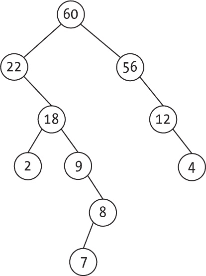

图 15-1：偏斜堆不像常见堆那样是完整的。

除了堆的性质和没有结构约束外，还有一个特别的细节是，所有的添加和删除操作都需要使用*偏斜合并*操作，以确保良好的平摊性能。

#### 表示偏斜堆

由于偏斜堆本质上是一个二叉树，因此可以使用与二叉搜索树和其他树结构相同的代码来表示它：

```
const goesHigher = (a, b) => a > b;

const newSkewHeap = () => null;

const newNode = (key, left = null, right = null) => ({key, left, right});

const isEmpty = (heap) => heap === null;

const top = (heap) => (isEmpty(heap) ? undefined : heap.key);
```

goesHigher() 函数决定是否使用最大堆（如这里所示）或最小堆（通过将比较改为 a < b）。以下三个函数是二叉搜索树代码的副本，而最终的 top() 非常简单，因为堆的顶部将是树的根节点。

#### 合并两个偏斜堆

合并两个偏斜堆的逻辑如下：

1. 如果你合并两个空堆，结果是一个空堆。

2. 如果一个堆为空，而另一个堆非空，结果是非空堆。

3. 如果两个堆都非空，根节点较大的堆将成为合并后的堆，但它会交换其子节点，然后将其左子树与根节点较小的堆合并。

前两个情况比较清晰，接下来我们来考虑第三种，更有趣的情况。如果从图 15-2 中显示的两个偏斜堆开始，合并后的结果是什么？

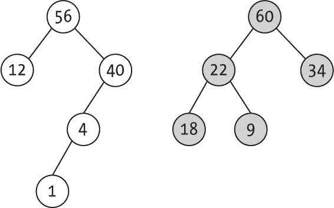

图 15-2：两个待合并的偏斜堆

合并后的堆的根应该是 60，因为它是更大的根。（再次提醒，你在使用的是最大堆。）相应树的左子树将与右子树交换位置，（现在的）左子树将与根为 56 的堆合并。递归地，你会比较 56 和 34，所以新的根是 56，依此类推。你能跟上这些步骤，最终得到图 15-3 中显示的结果吗？例如，很容易看出，60 键的原左子节点现在是它的右子节点；56 键也交换了它的子树。

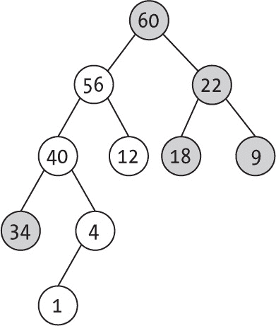

图 15-3：合并两个倾斜堆的结果

交换子树是提供良好摊销性能的原因；如果不交换进行合并，性能会更差。（参见问题 15.2，其中有两种特定操作序列会导致堆结构不佳。）其逻辑如下：

```
const merge = (heap1, heap2) => {
❶ if (isEmpty(heap2)) {
   return heap1;
❷} else if (isEmpty(heap1)) {
   return heap2;
 } else if (goesHigher(heap1.key, heap2.key)) {
 ❸ [heap1.left, heap1.right] = [merge(heap2, heap1.right), heap1.left];
 return heap1;
 } else {
 ❹ return merge(heap2, heap1);
 }
};
```

如果第二个堆为空，返回第一个堆❶。（这也涵盖了两个堆都为空的情况。你能看出为什么吗？）否则，如果第一个堆为空❷，返回第二个堆。如果两个堆都不为空且第一个堆的键值最大，按照之前描述的方法生成一个新的堆❸。如果第二个堆的键值最大，只需交换它们进行合并❹。（参见问题 15.3 的替代方法。）

#### 向倾斜堆添加一个键

如果你只知道如何合并堆，那么如何将一个新键添加到堆中？简单地创建一个包含单一值的新堆并将其与现有堆合并。你已经了解了如何合并堆，因此我们直接跳到实际代码：

```
const add = (heap, keyToAdd) => {
❶ const newHeap = newNode(keyToAdd);
❷ return [merge(heap, newHeap), newHeap];
};
```

这仅仅是创建一个单节点堆❶并将其合并❷。

#### 从倾斜堆中移除顶部键

从堆中移除顶部键是直接的。当你移除根节点时，剩下的是两个子树，因此你只需要将它们合并成新的堆：

```
const remove = (heap) => {
❶ if (isEmpty(heap)) {
    throw new Error("Empty heap; cannot remove");
  } else {
  ❷ const topKey = top(heap);
  ❸ return [merge(heap.left, heap.right), topKey];
  }
};
```

如果堆为空❶，抛出错误。否则，获取顶部键❷并合并左右子树❸。

#### 考虑倾斜堆的性能

在最初考虑倾斜堆并意识到它们的结构可能变得相当糟糕（就像二叉树可能退化为线性形状一样）时，很难相信它们的性能会很好。然而，添加、移除和合并的摊销时间可以证明是*O*(log *n*)。 表 15-2 展示了结果，星号表示摊销值。

表 15-2：倾斜堆操作的性能

| 操作 | 性能 |
| --- | --- |
| 创建 | O(1) |
| 为空？ | O(1) |
| 添加 | O(log n)* |
| 顶部 | O(1) |
| 移除 | O(log n)* |
| 变更 | O(log n)* |
| 合并 | O(log n)* |

添加了 changeKey()方法，你可以先删除旧的键，再插入新的键；这两个操作都是*O*(log *n*)方法。（参见问题 15.4。）

### 二项堆

偏斜堆具有整体对数时间的摊销性能，但如果你不止使用单棵树，效果可以更好。*二项堆*基于一片堆的森林，它们不仅性能优秀，而且是一些增强变种的基础，提供了更好的性能。

#### 二项树

从定义开始：*k*阶的二项树，或*BT(k)*，是一个*k*叉树，它要么是空的，要么由一个根节点组成，根节点的子节点是阶次从 0、1、2……到 (*k* – 1)的二项树。图 15-4 展示了前五个二项树，从 BT(0) 到 BT(4)，每个树由一个根节点和每个前一个二项树的一个副本组成。

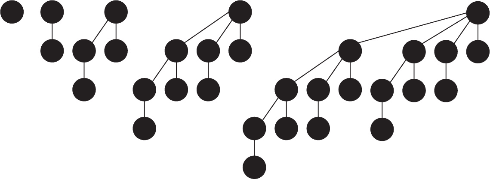

图 15-4：前五个二项树

当观察这些树时，你可能会注意到一些可以被适当地证明的数学性质，但最重要的两个性质是：BT(*k*)恰好有 2*^k* 个节点，并且它的高度是 *k*。它们与满二叉树具有相同的这两个属性。（实际上，高度为 *k* 的满二叉树有 2*^(k+1)* – 1 个节点，但差别不大，可以忽略！）

> 注意

*二项树的阶等于其根的度数，因此在此代码中，我们将使用度数而不是阶，因为这有助于我们考虑斐波那契堆，后者不使用阶的概念，而是使用根的度数。*

如果你统计每一层有多少个节点，你会注意到另一个解释这个堆名称的属性：对于图 15-4 中的树，结果是 1；1 和 1；1，2，以及 1；1，3，3 和 1；1，4，6，4 和 1；依此类推。这些是*二项系数*，就像帕斯卡三角形中，每个值是其上方两个值之和，如图 15-5 所示。这个三角形的另一个属性是，每一行数字的和是 2 的幂，这也与 BT(*k*)的大小属性相匹配。

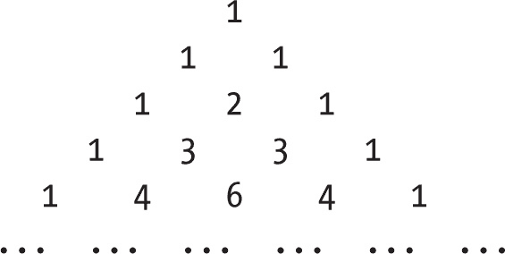

图 15-5：帕斯卡三角形提供了二项堆每一层的值的数量。

你可以用另一种方式来看这些树。注意到每棵树实际上是由前一个阶次的两棵树构建而成；稍微修改一下图 15-4，可以让这一点更清楚，如图 15-6 所示。

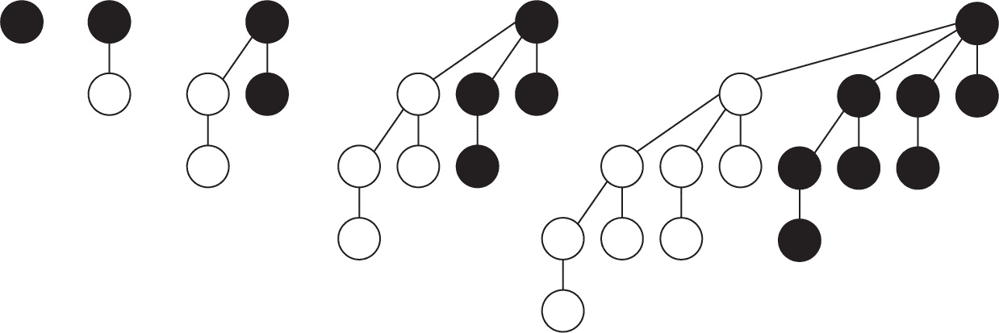

图 15-6：每个二项树实际上由两个更小的前一个二项树组成。

图 15-6 展示了前四个二项树。每一棵树（除了第一棵）都是由前一棵树的两份副本构建而成，并连接到一个新的根节点。如果这些树还满足堆的顺序属性（所有节点都大于或等于其子节点），则它们被称为*堆排序的二项树*。使用这样的树，你可以轻松表示大小为 2 的幂的堆，但如果需要表示其他大小的堆该怎么办呢？

#### 定义二项堆

*二项堆* 是一个堆有序的二项树森林。（一些教科书规定这些树必须按升序排列，但我们不应用这个额外的规则。）这将如何让我们表示任何大小的堆呢？二进制数提供了一个简单的答案。

数字 22 的二进制是 10110，这意味着 22 = 16 + 4 + 2；因此，你可以将任何整数表示为 2 的幂的和。以同样的方式，你用一组二项树来表示任何大小的堆，这些树的大小加起来就是你需要的大小。（你不会有两个相同阶的二项树。你能看出为什么吗？）记住另一个特性：二进制系统中表示一个数字 *n* 需要 log *n* 位，向上取整（我们稍后会用到这个）。

为了简化，我们用一组树来表示森林（你也可以使用一组链式树，但那种复杂度在这里不需要）。由于二项树是多叉树，你还需要一种方法来表示它们，因此我们将使用二叉树表示法。节点有一个指向第一个子节点的下指针（而不是左指针）和指向下一个兄弟节点的右指针。节点还包括一个指向父节点的上链，以防你想实现 changeKey() 操作。最后，每个节点还包含它的度。

这种表示法是必要的，因为这些算法需要两个操作：将一棵树拆分成几棵较小的树，以及将两棵树合并成一棵，而这些操作通过链表实现非常快捷且简单。例如，将两棵 BT(2) 合并为一棵 BT(3) 只需要改变两个指针（我们将在下一节中讨论这个）。

从几个基本函数开始，然后添加其余部分：

```
❶ const newBinomialHeap = () => [];

❷ const newNode = (key) => ({
  key,
  right: null,
  down: null,
  up: null,
  degree: 0
});

❸ const isEmpty = (heap) => heap.length === 0;
```

因此，二项堆是一个数组 ❶，它的每个元素都是一棵二项树。节点具有前面描述的五个属性 ❷。检查堆是否为空只需要测试树数组的长度 ❸。

> 注：

*你可能会对使用函数来处理二项树产生疑问。然而，由于你实际上并不打算用这些树来进行搜索，因此你会在代码中使用简单的记录，包含* key *和* degree *属性，以及* up*、* down* 和* right *指针。记住，二项树的阶数等于其根节点的度；这就是为什么你使用* degree *而不是* order *的原因。为所有根节点提供度数将有助于 Fibonacci 堆。*

首先，编写 top() 过程，使用辅助的 _findTop() 函数遍历所有根节点：

```
❶ const _findTop = (trees) => {
  let top;
  trees.forEach((v, i) => {
    if (top === undefined || goesHigher(v.key, trees[top].key)) {
      top = i;
    }
  });
  return top;
};

❷ const top = (heap) => (isEmpty(heap) ? undefined : heap[_findTop(heap)].key);
```

_findTop() 函数 ❶ 用于找到根值最大的树；它会遍历树数组，寻找最大键值。使用这种方法，top() 仅仅是检查堆是否为空。如果为空，则返回 undefined；否则，使用 _findTop() 获取堆的顶部值 ❷。

#### 向二项堆添加一个值

当向堆中添加一个值时，从创建一个阶数为 0 的二项树开始，仅包含键值并将其添加到堆中；然而，如果堆中已经存在另一棵相同阶数的二项树，这可能会导致问题。（记住，重复阶数的树是不允许的。）你可以通过合并来解决这个问题。

假设你有两个相同阶数的二项树，如图 15-7 所示，并且想将它们合并成一个。通常情况下，其中一棵树应成为另一棵树的子树。

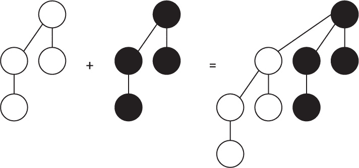

图 15-7：合并两棵二项堆，其中一棵成为另一棵的子树

然而，这个例子需要进一步考虑，因为你处理的不仅仅是任意的树，而是满足堆条件的树。那么，在这种情况下，你该怎么做呢？假设这两棵树如图 15-8 所示。

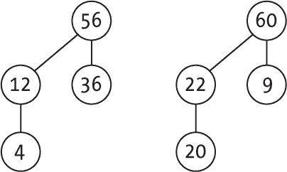

图 15-8：待合并的两棵二项堆

这个思路很简单。较大的根成为新的根，较小的根成为它的子节点，如图 15-9 所示。

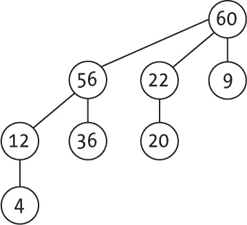

图 15-9：从图 15-8 合并两棵树的方式

但是图 15-9 并没有展示如何实际操作。通过之前讨论的二进制表示，两个原始的树将会像图 15-10 所示那样。

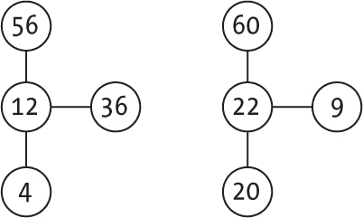

图 15-10：两棵二项堆的实际二叉树表示

相应地，结果也遵循“下为子，右为兄”的模式，如图 15-11 所示。

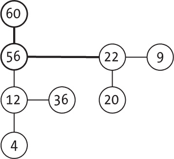

图 15-11：二项树合并后的二叉树表示

通过这种方式，你可以始终将两棵 BT(*k*) 树合并成一棵 BT(*k* + 1) 树，并且由于二进制表示，这个过程只需要更改两个链接。以下是该操作的代码，其中 low 是较小根的树，high 是较大根的树：

```
const _mergeA2B = (low, high) => {
❶ low.right = high.down;
❷ low.up = high;
❸ high.down = low;
❹ high.degree++;
  return high;
};
```

这非常简单。较低的树会将较高树的子节点作为兄弟节点❶，而那个节点则成为父节点❷ ❸，使得新根的度数增加 1 ❹。（你将在本章中多次使用此操作。）

现在你已经掌握了合并两棵树的方法，但可能会遇到一个额外的复杂问题。在这个例子中，如果原始堆中已经有另一棵 BT(3) 树会发生什么？在这种情况下，你需要将原始的 BT(3) 树与新树不断合并，直到得到 BT(4)。当然，这可能会导致出现重复的 BT(4)，依此类推。（你将在下一节查看完整的算法。）

假设你已经有一种通过合并将新树添加到堆中的方法，那么 add() 方法将会很简洁：

```
const add = (heap, keyToAdd) => {
❶ const newHeap = newNode(keyToAdd);
❷ return [merge(heap, [newHeap]), newHeap];
};
```

你只需要创建一个新的基本 BT(0)，其包含要添加的键值❶，这是一个只有一个对象的数组，然后将其与堆❷合并。基本上，这与斜堆使用的技术相同。区别在于合并堆的方式。

#### 合并两个二项堆

从二进制数求和的角度考虑合并两个堆的问题。如果你熟悉 2048 游戏，其中的目标是将方块合并以达到 2048，那么你会很快理解这些例子。

从一个简单的例子开始。假设你有一个包含 22 个元素的二项堆（22 = 2 + 4 + 16），并且想将它与另一个只有一个元素的二项堆合并，就像添加一个新值一样，如图 15-12 所示。

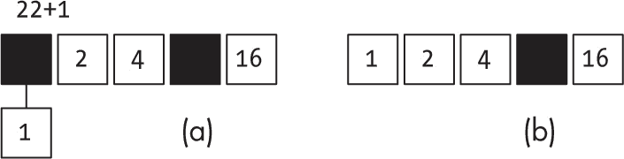

图 15-12：合并两个堆与二进制数关系密切。

从(a)开始——堆由三个大小分别为 2、4 和 16 的二项树组成（对应于 22 的二进制表示）——并将其用数组表示，使用树的顺序作为索引。包含 2 个元素的树位于位置 1；包含 4 个元素的树位于位置 2；包含 16 个元素的树位于位置 4，其他位置保持空白（黑色）。将要添加的树与当前堆中对应的位置匹配，并且该位置为空，所以直接将其移动到合适的位置（这相当于进行 1 + 0 = 1），得到(b)。不再有树需要合并，所以你完成了。

现在考虑一个更复杂的情况，将两个独立的堆合并，得到一个大小为 23 的堆（23 = 1 + 2 + 4 + 16）和一个大小为 5 的堆（5 = 1 + 4），如图 15-13 所示。

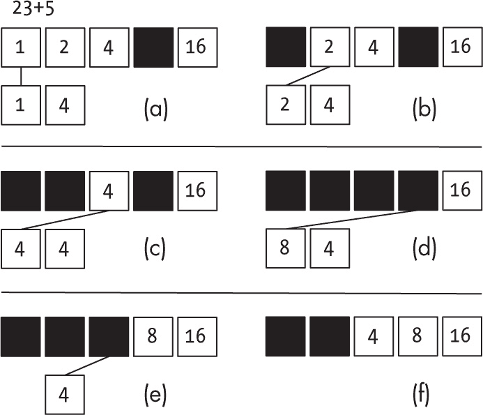

图 15-13：逐步完成合并操作

从(a)开始，匹配 1 和 1：从顶部堆中移除 1，并将其与底部堆中的 1 合并，得到 2。然后到达(b)，匹配 2 和 2：再次从顶部堆中移除 2，并将其与底部的 2 合并，得到 4。在(c)中，情况重复：你再次从顶部移除并与底部合并。（底部的值不再是升序排列——你先有 8，再有 4——但这不会影响最终结果。）在(d)中，你有一个简单的情况，因为顶部没有 8，所以直接将 8 放置在顶部并从底部移除它。在(e)中，你现在有一个 4，它没有匹配项，所以把它放在顶部并从底部移除，最终到达(f)，此时完成，因为没有更多的值需要合并。

现在你已经解决了问题：合并一直进行，直到没有重复顺序的树存在。实现这个方法并不复杂：

```
const merge = (heap1, heap2) => {
  const merged = [];
❶ heap1.forEach((v) => {
    merged[v.degree] = v;
  });

  let j = 0;
❷ while (j < heap2.length) {
    const i = heap2[j].degree;

  ❸ if (!(i in merged) || merged[i] === null) {
      merged[i] = heap2[j];
      j++;
    } else {
      if (goesHigher(heap2[j].key, merged[i].key)) {
      ❹ heap2[j] = _mergeA2B(merged[i], heap2[j]);
      } else {
      ❺ heap2[j] = _mergeA2B(heap2[j], merged[i]);
      }
    ❻ merged[i] = null;
    }
  }

 ❼ return merged.filter(Boolean);
};
```

首先，将堆的所有二项树放入合并数组❶中，根据树的阶数将每棵树放在相应的位置。然后，开始处理第二个列表❷中的所有树，按照描述进行“添加”。如果合并数组中没有匹配的树，就将新树放进去❸，并继续合并下一个树。否则，当有匹配时，合并两棵树。如果第二棵树的根较大，处理方式是❹，如果合并树的根较大，处理方式是❺。在这两种情况下，将合并后的树放入第二个数组中，清空合并数组中的位置❻。最后，在处理完第二个数组中的所有树❼后，过滤合并数组，移除空的树。

#### 从二项堆中移除值

从堆中移除顶部值的方法是通过移除二项树的根节点来将树分开，然后将分离出的树与原堆进行合并。假设堆由两棵二项树（大小为 2 和 8）组成，并移除顶部值（60），如图 15-14 所示。

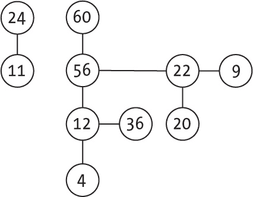

图 15-14：包含两棵二项树的堆

在移除顶部值之后，分离出其子树（大小分别为 4、2 和 1），剩下四棵二项树，如图 15-15 所示。

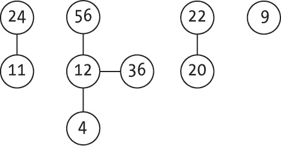

图 15-15：在移除 60 值后，树变成了多个堆。

接下来，使用之前相同的方法，将这四棵树与一个初始为空的树集合合并。第一步是将两棵 2 大小的树合并在一起，如图 15-16 所示。

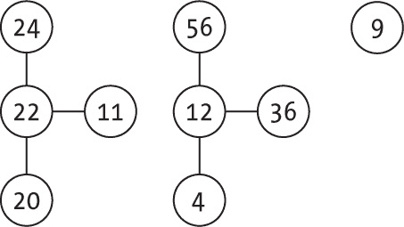

图 15-16：合并的第一步

然后，既然你有两个 4 大小（阶数为 2）的树，进行另一次合并，如图 15-17 所示。

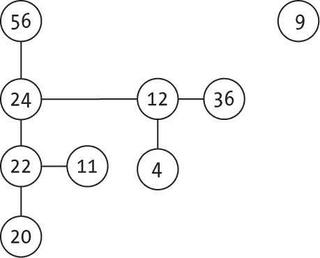

图 15-17：第二次合并完成了工作。

完成了！新的二项堆少了一个元素，你通过将树分割成子树并使用之前编写的合并代码轻松地完成了这一操作。remove()方法如下：

```
const remove = (heap) => {
❶ if (isEmpty(heap)) {
    throw new Error("Empty heap");
  }

❷ const top = _findTop(heap);
❸ const heapTop = heap[top].key;

❹ const newTrees = [];
❺ let bt = heap[top].down;
  while (bt) {
  ❻ newTrees.push(bt);
  ❼ const nextBt = bt.right;
    bt.right = null;
    bt.up = null;
    bt = nextBt;
  }

❽ heap.splice(top, 1);
❾ return [merge(heap, newTrees), heapTop];
};
```

首先，检查堆是否为空❶。然后找出哪棵树的根最大❷，并获取其值❸，最后将其返回。创建一个新树数组 newTrees❹并设置一个循环❺来将树❻及其兄弟树❼放入其中。拆分原始树后，从堆中移除它❽，并使用 merge()函数❾将新树与原堆中的其他树合并。

#### 在二项堆中更改值

一些面向图的算法经常需要更改堆中已经存在的值。在这种情况下，堆通常包含完整的记录，而不仅仅是优先级，并保持对包含该记录的堆节点的外部引用。（我们将在第十七章中讨论这些图算法。）我们在这里不会深入讨论所有细节，但逻辑保持不变。

> 注意

*最常见的情况是使用最小堆并通过* decreaseKey() *方法降低优先级。如果你想使用最小堆，所需要做的就是改变本章前面描述的* goesHigher() *函数中的比较方向。*

我们已经讨论过如何在二叉堆中更改一个值：进行更改后，接下来就是根据与其他值的关系进行冒泡向上或沉降的操作。在本章中，我们只考虑将键值向上冒泡的逻辑，即向堆顶移动，因为这是实际中需要的操作。在图 15-18 中，假设你要将键值 4 更改为 50。

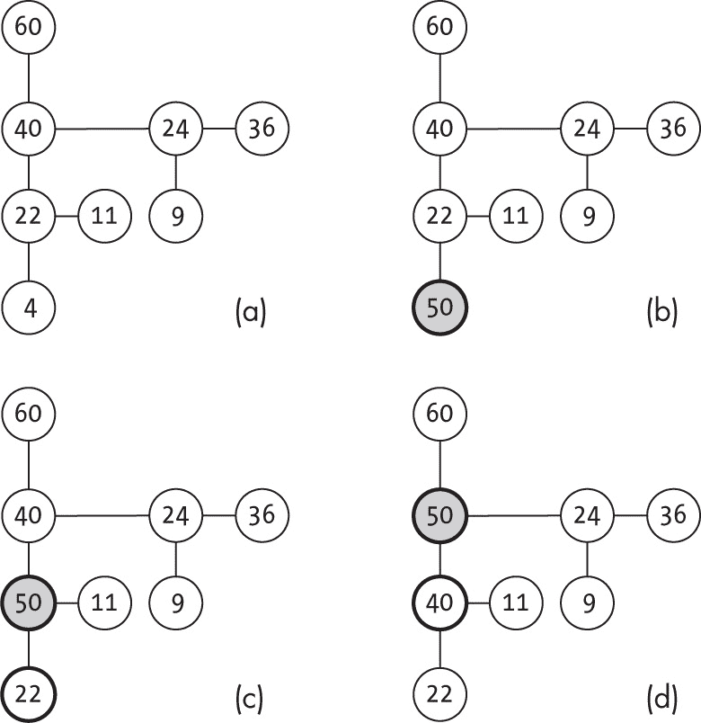

图 15-18：逐步变更键值的示例

更改键值并与父节点比较，除非你已经在根节点，这意味着操作已完成。如果不是根节点，如果更改后的键值较小，则完成；否则，你必须交换节点并继续向上冒泡。从（a）开始，将键值 4 更改为 50，在（b）中比较 50 与 22 并交换节点（实际上是交换指针），进入（c）。新的比较，50 与 40，再次交换，如（d）所示，但现在 50 比它的父节点（60）小，因此操作完成。

> 注意

*值需要冒泡向上的原因是我们在树的节点中包含一个* up *指针。如果你不打算提供* changeKey() *方法，可以删除代码中所有的* up *实例。*

这是此方法的实现：

```
const changeKey = (heap, node, newKey) => {
❶ if (isEmpty(heap)) {
    throw new Error("Heap is empty!");
❷} else if (!goesHigher(newKey, node.key)) {
    throw new Error("New value should go higher than old value");
  } else {
  ❸ node.key = newKey;  
    _bubbleUp(heap, node);
    return heap;
  }
};
```

首先检查操作是否可能：堆不应为空 ❶，新键值应位于堆的较高位置 ❷。如果一切正常，将节点的键值更改为新值，并调用 _bubbleUp()方法，如果需要，则将其向上爬升。

冒泡向上的代码如下，它是本书中最长的一行代码：

```
const _bubbleUp = (heap, node) => {
❶ if (node.up && goesHigher(node.key, node.up.key)) {
  ❷ const parent = node.up;
  ❸ [
      node.up,
      node.down,
      node.right,
      node.degree,
      parent.up,
      parent.down,
      parent.right,
      parent.degree
    ] = [
      parent.up,
      parent,
      parent.right,
      parent.degree,
      node,
      node.down,
      node.right,
      node.degree
    ];

  ❹ if (node.up) {
      _bubbleUp(heap, node);
  ❺} else {
      const i = heap.findIndex((v) => v === parent);
      heap[i] = node;
    }
  }
};
```

首先查看是否需要向上冒泡。如果节点没有父节点，或者有父节点但父节点的键值高于该节点的键值，则不需要任何操作 ❶。如果需要将节点向上交换，获取指向父节点的指针 ❷，并进行我们之前看到的所有指针（和度数）更改（虽然这一行很长 ❸，但概念上是直观的）。最后，如果节点仍然有父节点，则使用递归检查是否还需要继续冒泡 ❹。如果节点没有父节点 ❺（意味着它已到达堆的顶部），你需要修复堆数组中的引用，因此它现在指向新顶部，而不是旧节点的父节点。（我们能否像二叉堆一样交换节点和父节点的键值？这个问题很重要；请参考问题 15.7 了解更多信息。）

#### 考虑二项堆的性能

表 15-3 总结了二项堆的性能；带星号的结果是摊销后的。

表 15-3：二项堆操作性能

| 操作 | 性能 |
| --- | --- |
| 创建 | O(1) |
| 空？ | O(1) |
| 添加 | O(log n)* |
| 顶部 | O(log n) 如上所示；修复后为 O(1) |
| 删除 | O(log n) |
| 更改 | O(log n) |
| 合并 | O(log n) |

由于二项堆可能包含最多 log *n* 个堆，因此获取 top 的时间复杂度是 *O*(log *n*)。如果你只做添加而不做删除，那么添加新值的摊销时间复杂度是 *O*(1)—更多信息请参见问题 15.5—but 我们可以证明，操作序列会使这个结果恶化为 *O*(log *n*)。获取 top 值时，按照之前的实现方法，意味着需要查看 log *n* 个堆，但这个过程可以优化为 *O*(1)；参见问题 15.6。至于其他结果，删除 top 值意味着将堆分离成最多 log *n* 个子树，执行一个 *O*(log *n*) 的操作，然后进行合并，这是另一个 *O*(log *n*) 的操作，因此操作的总时间复杂度是 *O*(log *n*)。

### 懒二项堆

二项堆在添加值时可能会遇到性能问题，从 *O*(1) 变为 *O*(log *n*)，这意味着你可以通过摊销计算找到一种解决方案，以增强此过程，尽管有可能（不过不常见）需要进行更昂贵的修复。*懒二项堆* 正是通过这种方式解决了这个问题。

在懒二项堆中，当你进行添加操作时，你不需要关心合并。你只是让堆中树的数量不断增加，因此 add() 是一个简单的操作，运行时间为 *O*(1)。但是要小心，记得跟踪最大值，因此 top() 也是 *O*(1)。当你尝试执行 remove() 操作时，可以修复堆结构，但这时你需要处理堆，将其恢复为二项堆的形状。

#### 定义懒二项堆

懒二项堆毕竟还是二项堆，只不过你添加了一个额外的 top 属性来跟踪堆中的最大值。因此，类定义非常简短，因为大多数方法都与二项堆共享：

```
const goesHigher = (a, b) => a > b;

❶ const newLazyBinomialHeap = () => ({
 **top: undefined,**
 **trees: []**
});

const newNode = (key) => ({
  key,
  right: null,
  down: null,
  up: null,
  degree: 0
});

❷ const isEmpty = (heap) => **heap.trees.length** === 0;

❸ const top = (heap) => (isEmpty(heap) ? undefined : heap.top);
```

到目前为止，只有两个差异。堆现在是一个包含两个字段的记录：top ❶，它保存堆的最大值，以及树数组，它是各个子堆。一个空堆没有树 ❷，因此可以用来检测堆是否为空。你需要在向堆中添加或删除元素时更新 top。top() 方法 ❸ 非常简短：如果堆为空，返回 undefined；否则，返回堆的 top 值。通过这种实现方式，你不需要遍历整个树数组来查找 top，从而提高了性能，尽管后续维护堆的 top 值可能需要一些额外的工作。

#### 向懒二项堆中添加一个值

懒散二项堆的第一个重要区别是，添加新键时不会进行任何合并。这怎么可能呢？首先，如果你想知道堆的顶部，你可以不依赖任何结构来实现。之前描述的 heap.top 属性可以轻松更新。只要你不断添加，堆每次只增长一棵树，你总是能知道堆的顶部。例如，假设某一时刻，二项堆的结构如图 Figure 15-19 所示；三角形指向当时堆的最大值。

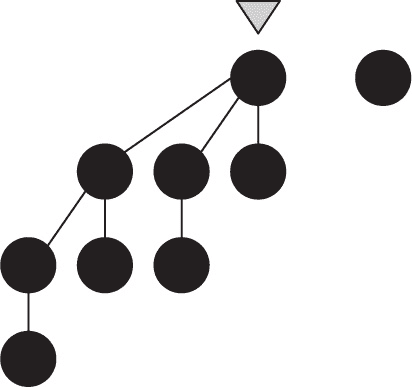

图 15-19：追踪最大值只需要一个简单的属性。

如果你添加三个新值，过程非常快速，因为你唯一需要做的就是添加新树。图 Figure 15-20 显示了几个相同阶的二项树，这在二项堆中是不允许的。再次强调，每次添加后都要更新最大值。在这个例子中，新增的一个键大于之前的最大值，因此堆的顶部发生了变化。

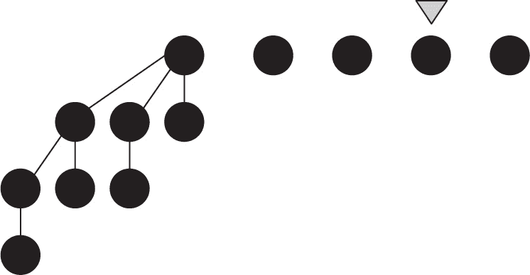

图 15-20：添加值后，属性需要调整。

但是，移除堆顶则是不同的情况，因为此时找到新的 _heapTop 太慢：*O*(*n*)。你可以在移除键时，通过合并树来重新构建堆。一些数学推导（我们会跳过）表明，摊销性能仍然很好。

添加值的代码与之前看到的类似，但不同的是，你不需要合并新树，只需直接添加它，不进行其他操作：

```
const add = (heap, keyToAdd) => {
❶ const newHeap = newNode(keyToAdd);
❷ heap.trees.push(newHeap);

❸ if (heap.top === undefined || goesHigher(keyToAdd, heap.top)) {
    heap.top = keyToAdd;
  }

  return [heap, newHeap];
};
```

首先，创建一个新二项树，并将新的键 ❶ 推入当前树数组的末尾 ❷。唯一的额外步骤是可能需要更新堆的顶部。如果树数组为空，或者当前的顶部不大于新添加的值 ❸，则重置 heap.top。

#### 从懒散二项堆中移除一个值

如前所述，懒散二项堆的思想是尽可能延迟合并树（因此称为*懒散*）。当你移除一个键时，首先将所有当前的二项树合并成一个二项堆，然后再进行移除操作。

这样做是因为，尽管在添加值时堆中的树的数量增长较慢，最终可能会很大，但合并后会急剧下降，在许多快速操作和最终慢操作之间的平衡以一个良好的摊销成本结束。

代码如下；注意，与原始二项堆相比，它有一些变化和新增内容：

```
const remove = (heap) => {
❶ if (isEmpty(heap)) {
    throw new Error("Empty heap");
  }

❷ const heapTop = heap.top;

❸ const top = _findTop(heap.trees);
  let bt = heap.trees[top].down;
❹ while (bt) {
    heap.trees.push(bt);
    const nextBt = bt.right;
    bt.right = null;
    bt.up = null;
    bt = nextBt;
  }

❺ heap.trees.splice(top, 1);
❻ const newHeap = merge(newLazyBinomialHeap(), {
    top: undefined,
    trees: heap.trees
  });

❼ newHeap.top =
    newHeap.trees.length === 0
      ? undefined
      : newHeap.trees[_findTop(newHeap.trees)].key;

❽ return [newHeap, heapTop];
};
```

首先检查堆是否为空 ❶ 并保存当前堆顶 ❷，以便稍后返回其值 ❽。然后找到哪棵树有堆顶 ❸，并进行循环来分割其子树 ❹，然后将其添加到树的列表中。接下来删除分割的树 ❺，将所有树合并在一起 ❻，并更新 `heap.top` ❼ 以找到新的堆顶。它与二项堆并没有太大不同。合并所有树的方式非常巧妙：通过将空堆与树的列表合并，你触发了所有必要的合并，减少了树的数量。你能理解它是如何工作的吗？

#### 更改懒二项堆中的值

还有一个最终的方法：如何更改任何键值。代码如下：

```
const changeKey = (heap, node, newKey) => {
  if (isEmpty(heap)) {
    throw new Error("Heap is empty!");
  } else if (!goesHigher(newKey, node.key)) {
    throw new Error("New value should go higher than old value");
 } else {
    node.key = newKey;
    _bubbleUp(heap, node);

    **heap.top =**
 **heap.trees.length === 0**
 **? undefined**
 **: heap.trees[_findTop(heap.trees)].key;**

    return heap;
  }
};
```

这段代码与二项堆相同，只是增加了一行来更新 `heap.top`；你在 `remove()` 中做过类似的计算。`_bubbleUp()` 的代码没有变化，因此这里不再重复。

#### 考虑懒二项堆的性能

懒二项堆的性能与二项堆相似，但推迟合并在摊销成本上有积极影响。特别是，添加值在逻辑上更快，因为你实际上什么都不做，正如表 15-4 所示。记住，星号表示摊销结果。

表 15-4：懒二项堆操作的性能

| 操作 | 性能 |
| --- | --- |
| 创建 | O(1) |
| 空？ | O(1) |
| 添加 | O(1) |
| 堆顶 | O(1) |
| 删除 | O(log n)* |
| 更改 | O(log n)* |
| 合并 | O(log n)* |

现在你已经获得了非常好的性能（特别是添加新值更快），但当更改值时，你希望得到更好的结果。我们来看看另一种二项堆的变体，它可以实现这种优化。

### 斐波那契堆

一些图算法使用最小堆，并且经常调用 `decreaseKey()` 操作，我们将其重命名为 `changeKey()`，以适应最大堆和最小堆。在这种情况下，能够以比懒二项堆的 *O*(log *n*) 性能更快的方式减少键值变得很重要。于是，*斐波那契堆*应运而生，它与懒二项堆非常相似，但提供了一种更快的算法来更改键值。

> 注意

*迈克尔·弗雷德曼和罗伯特·塔尔扬在他们的论文《斐波那契堆及其在改进的网络优化算法中的应用》中描述了斐波那契堆（此标题中的网络指的是图），但塔尔扬后来提出了一种更简单的替代结构，称为配对堆，我们稍后会学习。*

斐波那契堆背后的理念是什么？`add()` 和 `remove()` 方法与懒二项堆相同，但在更改键值时才会出现差异。如果键值发生变化并且需要上浮（在最大堆中，如果新值比之前的值大；在最小堆中，如果新值较小），显然你可能需要将其上浮到树的根节点——这就是 *O*(log *n*) 的时间复杂度。

不需要进行任何冒泡操作，只需将该节点及其子树分离，并将其作为一个新树添加到堆中——这就是*O*(1)的复杂度。然而，由于这个过程改变了二项树的预期形状，且过于频繁地执行可能导致堆结构不良，因此需要做出折衷。你不会允许非根节点以这种方式失去超过一个子节点。如果一个节点失去第二个子节点（你可以通过每次节点失去子节点时该节点被标记来知道这一点），你也会将其分离，这可能会导致进一步的分离。与懒惰二项堆一样，当执行删除操作时，你将修复这些问题；这些内容稍后你会看到，但首先考虑如何表示新的堆。

#### 表示斐波那契堆

之前使用的结构——一个树的数组，其中每棵树通过向上、向右和向下的链接以及一个表示子节点数量的度数字段来表示——是可行的，但对于这里所需的操作来说效率不够。当改变一个键并且它冒泡向上时，目标是移除对应的节点及其子树，但你能迅速将它从兄弟节点中解绑吗？如果你将兄弟节点保存在一个单向链表中，那么这个过程就需要遍历一个最大长度为 *O*(log *n*) 的链表，这会破坏 *O*(1) 的目标。因此，就像在第十章中所展示的那样，这里也使用双向链表。但还有更多！当合并树时，你想合并两组兄弟节点，因此将这些链表设为循环链表，这将完成解决方案。

图 15-21 展示了一个小的二项树 BT(3) 以及它在斐波那契堆中添加了所有链接后的样子。


图 15-21：以斐波那契堆风格表示的二项树

显示所有的上下左右链接会使图表变得杂乱，因此从现在开始，我们将移除任何不必要的链接。例如，指向父节点的向上链接将被移除，因为你可以通过图示推断出这些链接。为了清晰起见，我们还将省略箭头和单节点链表的圆形链接，但我们会在做这些更改时指出。

总结一下这些变化，我们在节点中添加了一个左链接（以便我们可以构建循环双向链表）和一个标记布尔字段，用来标记一个失去子节点的节点：

```
const goesHigher = (a, b) => a > b;

const newFibonacciHeap = () => ({
  top: undefined,
  trees: []
});

const newNode = (key) => ({
  key,
  degree: 0,
 **marked: false,**
  **left: null**,
  right: null,
  down: null,
  up: null
});

const isEmpty = (heap) => heap.trees.length === 0;

const top = (heap) => (isEmpty(heap) ? undefined : heap.top);
```

唯一的变化是添加了**标记**和**左**字段；其余部分与懒惰二项堆相同。  #### 合并两棵斐波那契树

当我们第一次查看如何合并二项树时，过程相对简单。然而，现在兄弟节点被放置在一个循环双向链表中，你需要做一些修改。假设你想要合并在图 15-22 中显示的树（记住，子树的细节不会受到影响的部分，以及箭头和向上链接，都被隐藏了）。

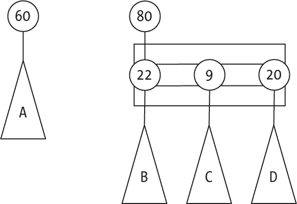

图 15-22：待合并的两棵斐波那契树

合并树之后，你将得到图 15-23 所示的结果。特别注意那些发生变化的链接；箭头仅用于表示这些链接。

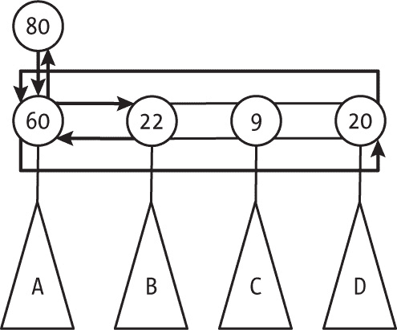

图 15-23：合并树的结果；只需要更改几个指针。

这是新的合并代码：

```
mergeA2B(low, high) {
❶ if (high.down) {
  ❷ low.right = high.down;
    low.left = high.down.left;
    high.down.left.right = low;
    high.down.left = low;
  }

❸ high.down = low;
❹ low.up = high;
❺ high.degree++;

❻ return high;
}
```

如果具有较高键值的树没有子节点，逻辑就很简单，因为你只需将较低的树设置为它的子树 ❸ ❹。然而，如果它确实有子节点 ❶，你就需要将较低树的根节点作为新兄弟添加到较高树根节点的子节点中 ❷。（注意四个链接变化。）之后，让较高根指向较低根 ❸，并且反之亦然 ❹。然后，将较高根的度数加 1 ❺，因为它获得了一个新子节点，并返回合并后的树 ❻。

#### 向斐波那契堆添加一个值

向斐波那契堆中添加新值与懒二项堆没有太大区别。唯一的变化是，你需要为将来的合并操作建立兄弟节点的循环链表（最初只有节点本身）。以下代码高亮显示了所需的变化：

```
const add = (heap, keyToAdd) => {
  const newHeap = newNode(keyToAdd);

 **newHeap.left = newHeap;**
 **newHeap.right = newHeap;**

  heap.trees.push(newHeap);

  if (heap.top === undefined || goesHigher(keyToAdd, heap.top)) {
    heap.top = keyToAdd;
  }

  return [heap, newHeap];
};
```

正确初始化新节点的左右指针，使它们形成一个单节点的循环链表。（是的，你可以将这两行合并为一个赋值语句；见问题 15.9。）新树的标记会被设置为 false，因为节点还没有失去任何子节点。要验证这一点，请查看 newNode()代码，参见第 368 页的“表示斐波那契堆”一节。

#### 从斐波那契堆中移除一个值

移除值的逻辑与其他二项堆基本相同，只是有一些小的变化。移除堆顶的操作也和懒二项树一样，唯一需要注意的是，当遍历兄弟节点的循环链表时，必须防止出现无限循环。新添加的代码行如下所示：

```
const remove = (heap) => {
  if (isEmpty(heap)) {
    throw new Error("Empty heap");
  }

  const heapTop = heap.top;

  const top = _findTop(heap.trees);

 let bt = heap.trees[top].down;

 **if (bt && bt.left) {**
❶ **bt.left.right = null;**
 **}**

  while (bt) {
    heap.trees.push(bt);
    const nextBt = bt.right;
❷ **bt.right = bt;**
 **bt.left = bt;**
    bt.up = null;
    bt = nextBt;
  }

  heap.trees.splice(top, 1);
  const newHeap = merge(newFibonacciHeap(), {
    top: undefined,
    trees: heap.trees
  });

  newHeap.top =
    newHeap.trees.length === 0
      ? undefined
      : newHeap.trees[_findTop(newHeap.trees)].key;

  return [newHeap, heapTop];
};
```

为了避免无限循环，将链表的最右链接设为 null ❶，以确保以下循环能够停止。（在这里，bt 指向循环链表中的一个元素。向右遍历该链表，因此 bt.left 指向应当是最后一个访问的元素。如果清除 bt.left 的右链接，就能确保循环停止。）另一个区别是，当你提取一个兄弟节点时，根节点必须是一个自我循环链接 ❷，因此你需要修正它的左右链接。

#### 在斐波那契堆中改变一个值

处理键值变化的方式是斐波那契堆区别于其他类型堆的地方。与其通过冒泡向上，不如直接将该键从堆中分离。代码与之前看到的类似，但有一个重要的变化（加粗部分）：

```
const changeKey = (heap, node, newKey) => {
  if (isEmpty(heap)) {
    throw new Error("Heap is empty!");
  } else if (!goesHigher(newKey, node.key)) {
    throw new Error("New value should go higher than old value");
  } else {
    node.key = newKey;
 **_separate(heap, node);**
  }
};
```

当你实际上改变节点的键时，你会*分离*它而不是向上冒泡。为了说明这一点，请参考本章前面提到的图 15-24 中的堆。

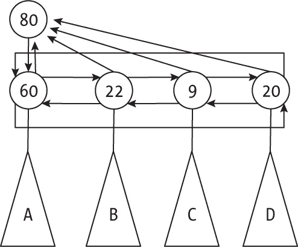

图 15-24：前一个斐波那契堆

假设 9 这个键值变成了 99，如图 15-25 所示。由于它会被上浮，因此只需将其从堆中移除，并标记其父节点（80）。

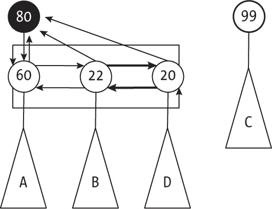

图 15-25：斐波那契堆在键值从 9 变为 99 后的状态

你唯一需要做的就是将 9（现在是 99）从它的兄弟节点中解除链接。如果现在你想将 60 改为 66，你还需要修改 80 的下指针。你可以让它指向 60 的右兄弟节点，如图 15-26 所示。

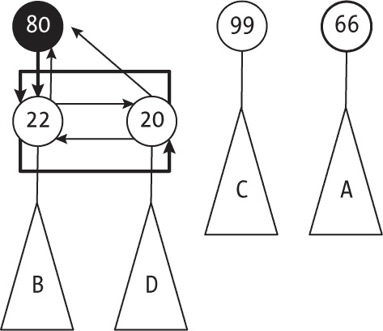

图 15-26：树中的另一个变化，60 变成了 66。

现在你需要执行一个额外的步骤。经过这次分离后，如果 80 不是根节点，由于它已经被标记（意味着它已经失去了一个子节点），你还需要对它进行分离，应用和之前完全相同的逻辑。代码如下：

```
const _separate = (heap, node) => {
❶ node._marked = false;

❷ const parent = node.up;
❸ if (parent) {
  ❹ if (node.right === node) {
      parent.down = null;
    } else {
    ❺ if (parent.down === node) {
        parent.down = node.right;
      }
    ❻ node.left.right = node.right;
      node.right.left = node.left;
    }
  ❼ parent.degree--;

  ❽ node.up = null;
    node.left = node;
    node.right = node;
    heap.trees.push(node);

  ❾ if (parent._marked) {
      _separate(heap, parent);
  ❿} else {  
      parent._marked = true;
    }
  }

  if (goesHigher(node.key, heap.top)) {
    heap.top = node.key;
  }
};
```

从取消标记要分离的节点开始 ❶。这是节点能够重新变为未标记的*唯一*方式。然后获取节点的父节点 ❷，如果它没有父节点（意味着节点是根节点），则不做任何操作。否则，如果节点有父节点 ❸，则开始解除链接。如果改变的节点没有兄弟节点 ❹，只需将父节点的下链接设置为 null，就完成了。但如果父节点直接指向正在变化的节点 ❺，你必须将链接改为指向兄弟节点，以便在移除变化节点时不破坏结构。现在你可以确认父节点指向了另一个兄弟节点，就可以轻松地将节点从双向链表中解除 ❻。然后需要将父节点的度数减一 ❼，因为它将失去一个子节点，并在修复链接后推送分离的子树 ❽。最后检查，如果你正在移除的子节点是已标记的（意味着它已经失去了另一个子节点），则递归地将其分离 ❾；否则，只需标记它 ❿，就完成了。

#### 考虑斐波那契堆的性能

二项堆由二项树组成，每棵树的节点数是 2 的幂。改变之前（这时开始修剪树），斐波那契堆中的树是相同大小的，但它们能变得有多小呢？图 15-27 展示了一个已经尽可能移除节点的斐波那契堆；白色节点已被移除，黑色节点被保留。

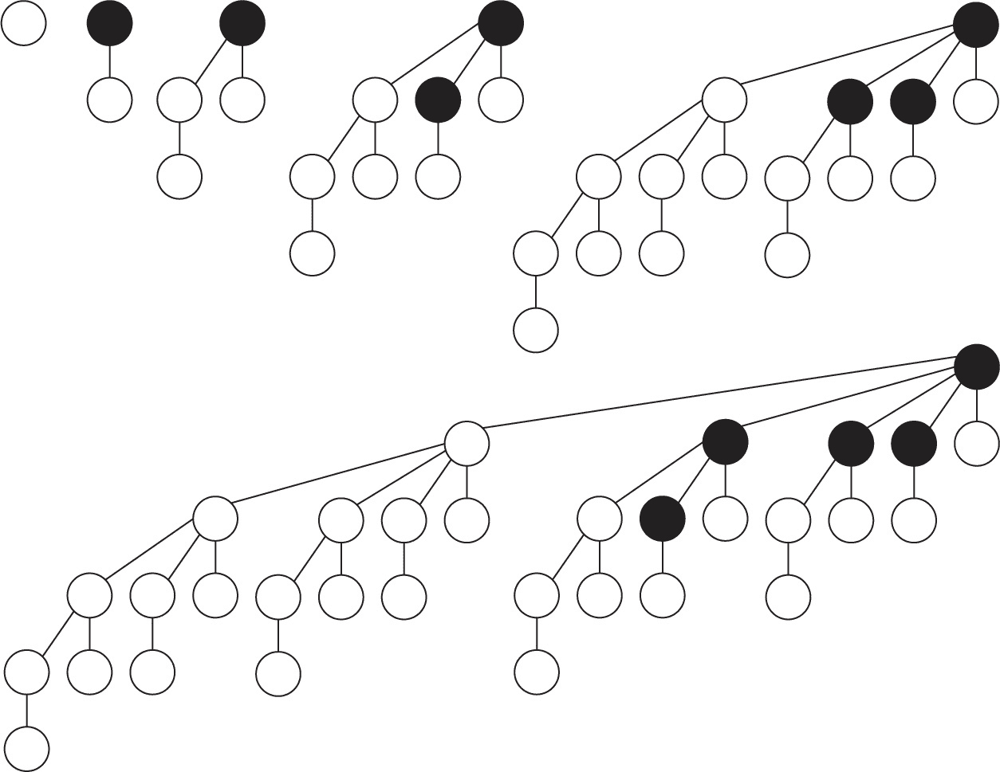

图 15-27：具有最小节点数的斐波那契树

如何在不引发级联效果的情况下尽可能多地删除树中的节点？或者，如何从先前的树中构建下一棵树，并尽可能多地修剪它们？最差的情况是提升每个节点的最大子树。在这种情况下，单个树至少会有 1、1、2、3、5、8、……个节点。认出这个序列了吗？这个方案中的树至少有与斐波那契数一样多的节点（而不是 2 的幂）。这也有帮助，因为斐波那契数是指数增长的，这意味着算法的性能仍然是对数级的。

表 15-5 总结了斐波那契堆的性能；带星号的值是摊销后的。

表 15-5：斐波那契堆操作的性能

| 操作 | 性能 |
| --- | --- |
| 创建 | O(1) |
| 空吗？ | O(1) |
| 添加 | O(1) |
| 顶部 | O(1) |
| 删除 | O(log n)* |
| 改变 | O(1)* |
| 合并 | O(1) |

对于插入操作，你无法做到比 *O*(1) 更好，但删除操作的时间复杂度可能会比 *O*(log *n*) 更优。然而，在这种情况下，你可以通过将所有 *n* 个值插入堆中，然后按顺序删除它们，来在 *O*(*n*) 时间内对一组 *n* 个值进行排序，但你已经知道，任何依赖于键值对比的排序算法无法以比 *O*(*n* log *n*) 更快的时间运行，因此你无法以更高的速度完成删除操作。

你可以使用一种更简单的结构，配合更简单的算法。我们将在本章考虑的最后一种扩展堆是配对堆，正是做到了这一点。

### 配对堆

*配对堆*是一种多元数据结构，满足堆属性。它基本上由一个根节点组成，该根节点包含堆中的最大值，并且有一组有序的子堆，因此你可以根据第十三章中的定义称其为一个果园。从更正式的角度来看，可以说配对堆要么是一个空结构，要么是一个根元素加上一个（可能为空的）配对堆列表。每个单独的堆以“左孩子，右兄弟”风格表示；图 15-28 展示了一个配对堆的示例。


图 15-28：一个配对堆示例

根节点是 60，并且有三个子堆，分别为 22、56 和 12。子堆包含 3、5 和 2 个元素。

#### 定义配对堆

我们不会考虑 changeKey() 操作（但请参见问题 15.4），因此表示方式稍微简单一些。以下是配对堆的基本起始代码：

```
const goesHigher = (a, b) => a > b;

const newPairingHeap = () => null;

const newNode = (key, down = null, right = null) => ({key, down, right});

const isEmpty = (heap) => heap === null || heap.key === undefined;

const top = (heap) => (isEmpty(heap) ? undefined : heap.key);
```

它与偏斜堆的代码相同，只是左指针被命名为“down”，并且在 isEmpty()函数中做了一些小改动。

#### 合并两个配对堆

我们如何合并两个堆？如果两个堆中的一个为空，则直接返回另一个堆。否则，如果两个堆都不为空，则具有最大键值的堆将把另一个堆添加（合并）到它的子堆列表中。例如，看看如果你想合并图 15-29 中的前两个子堆会发生什么（这是一个重要的示例，稍后你会再遇到它）。

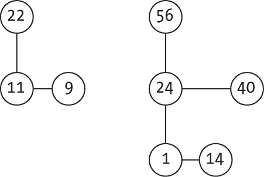

图 15-29：两个配对堆待合并

新的根应该是 56，因此第一个堆（根为 22 的堆）将成为第二个堆的子堆，生成如图 15-30 所示的配置。

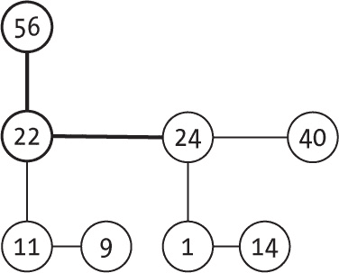

图 15-30：合并结果

你可以很容易地实现这一点：

```
const merge = (heap1, heap2) => {
❶ if (isEmpty(heap2)) {
   return heap1;
❷} else if (isEmpty(heap1)) {
   return heap2;
❸} else if (goesHigher(heap1.key, heap2.key)) {
   [heap2.right, heap1.down] = [heap1.down, heap2];
   return heap1;
❹} else {
   [heap1.right, heap2.down] = [heap2.down, heap1];
   return heap2;
  }
};
```

如果一个堆为空 ❶ ❷，合并的结果就是另一个堆。否则，如果第一个堆的键值最大 ❸，则将第二个堆作为其子堆。最后一种情况是相同的 ❹，但是反过来，将第一个堆作为第二个堆的子堆。

#### 向配对堆中添加值

向堆中添加一个新值的方法与斜堆相同。创建一个仅包含新值的新堆，并将其与当前堆合并。你已经看过合并是如何工作的。代码几乎是一行代码：

```
const add = (heap, keyToAdd) => {
❶ const newHeap = newNode(keyToAdd);
❷ return [merge(heap, newHeap), newHeap];
};
```

它创建一个新的堆 ❶，其中只有一个值，并将其与当前堆 ❷ 合并。

#### 从配对堆中删除顶部值

从堆中删除顶部值比添加新值要困难，需要更多的合并。基本上，你需要删除堆的根并生成一个子堆列表，然后你会从左到右成对地合并这些子堆，再将合并后的堆列表从右到左合并。

> 注意

*“配对堆”这个名字来源于前面描述的过程，在这个过程中，许多堆总是成对地合并，每次合并两个。*

首先，看看如何将多个堆合并在一起。图 15-31 展示了一个包含七个堆（A 到 G）的示例。

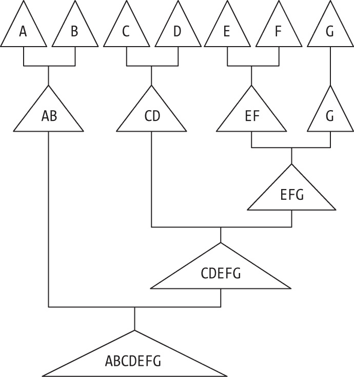

图 15-31：合并七个堆，总是每次合并两个

首先合并 A 和 B，再将其与合并 C 到 G 的结果结合起来。第二次合并从合并 C 和 D 开始，然后再合并 E 到 G。第三次合并先合并 E 和 F，然后等待仅合并 G（这显然就是 G），所以你可以完成 E 到 G 的合并，再合并 C 到 G，最后合并 A 到 G。

实现这种从左到右再到从右到左的“跷跷板”其实很简单。它基于递归思想：给定一个堆列表，将列表中的前两个堆合并生成第一个堆，递归地将其余堆合并成第二个堆，最后将两个结果合并在一起：

```
const _mergeByPairs = (heaps) => {
❶ if (heaps.length === 0) {
   return newPairingHeap();
❷} else if (heaps.length === 1) {
   return heaps[0];
❸} else {
   return merge(merge(heaps[0], heaps[1]), _mergeByPairs(heaps.slice(2)));
 }
};
```

这段代码展示了两种简单的单行情况。如果没有堆需要合并 ❶，则返回一个空堆；如果只有一个堆需要合并 ❷，则结果就是该堆本身。如果有多个堆 ❸，则先合并前两个堆，然后递归地合并所有其他堆，最后将两个堆合并在一起。

这实际上是之前描述的从左到右再到从右到左的过程的实现，现在重新处理一下之前你看到的七个堆 A 到 G 的案例。用 mbp()表示 mergeByPairs()，用 m()表示 merge()，代码如下：

```
mbp([A,B,C,D,E,F,G]) =
m(AB, mbp([C,D,E,F,G]) =
m(AB, m(CD, mbp([E,F,G]))) =
m(AB, m(CD, m(EF, mbp([G])))) =
m(AB, m(CD, m(EF, G))) =
m(AB, m(CD, EFG)) =
m(AB, CDEFG) =
**ABCDEFG**
```

使用这个辅助方法，你现在可以编写 remove()代码：

```
const remove = (heap) => {
❶ if (isEmpty(heap)) {
    throw new Error("Empty heap; cannot remove");
  } else {
  ❷ const top = heap.key;

  ❸ const children = [];
  ❹ let child = heap.down;
  ❺ while (!isEmpty(child)) {
      const next = child.right;
      child.right = null;
    ❻ children.push(child);
      child = next;
    }

  ❼ return [_mergeByPairs(children), top];
  }
};
```

如果堆是空的 ❶，抛出一个错误，因为无法继续进行删除操作。否则，获取顶部值 ❷，以便稍后返回 ❼，并继续分离子堆。为子节点初始化一个数组 ❸，并设置一个子节点变量 ❹，以便遍历所有根节点的子节点 ❺。然后，推入每个子堆 ❻，记得将它们从兄弟节点中解绑。将所有子节点推入数组后，按之前描述的方式成对合并它们，并返回删除的顶部值 ❼。

例如，假设你从原始的配对堆开始（参见图 15-32），并且想要删除其根节点。

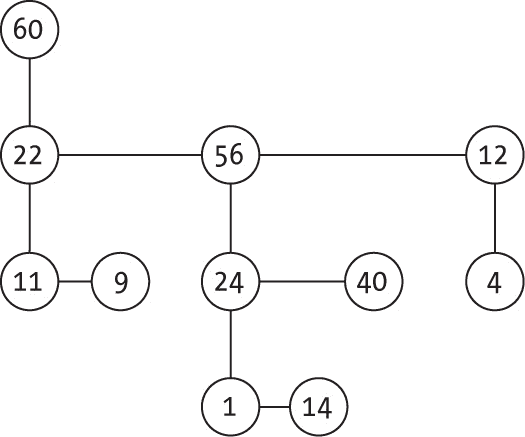

图 15-32：重新查看原始的配对堆

删除根节点后，剩下三个堆。首先合并前两个堆，即根节点分别为 22 和 56 的堆（你在前一部分中看过），得到图 15-33。

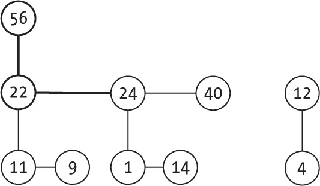

图 15-33：删除根节点后的配对堆

最后一步是将这些堆合并，得到如图 15-34 所示的情况。

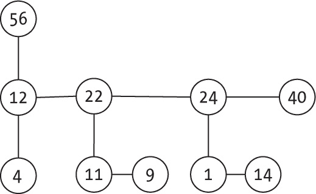

图 15-34：将分开的堆再次合并成一个堆

现在让我们考虑另一种操作：更改键值。  #### 在配对堆中更改键值

更改键值的过程基于你已经看到的内容。首先，在原地更改键值，但如果它需要上浮（像二项堆那样），则将其从堆中分离出来（像斐波那契堆那样）。然后将分离出的堆重新合并到原始堆中。你正在复用概念和算法。

例如，从图 15-35 中所示的堆开始。

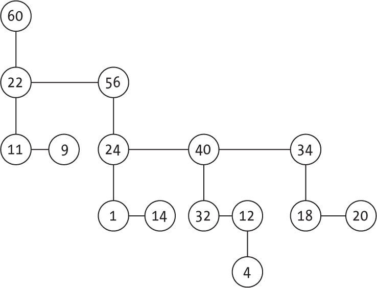

图 15-35：更改键值前的配对堆

比如说，如果你想更改键值 40，并将其更改为 40 和 56 之间的任何值，你只需更改键值，操作完成即可。但是，如果你将它更改为大于父节点键（56）的任何值，则必须拆分堆并重新合并。这意味着，如果你想将其更改为 78，在更改键值并拆分堆后，你将得到如图 15-36 所示的两个堆。

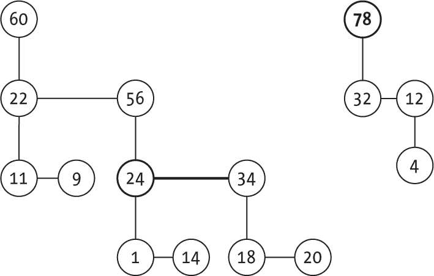

图 15-36：将 40 更改为 78 会将堆分成两个。

应用我们之前看过的合并函数，图 15-37 展示了最终结果。

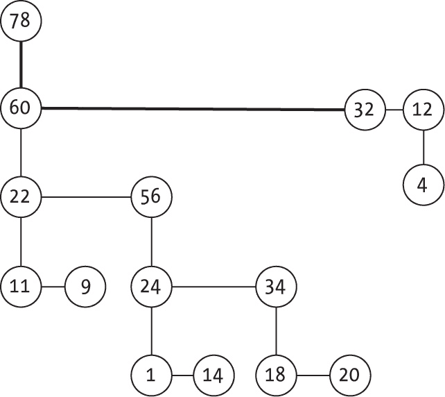

图 15-37：合并结果再次形成单一堆

如果你将 40 改为 58 而不是 78，结果会不同（见图 15-38）。你能看出为什么吗？

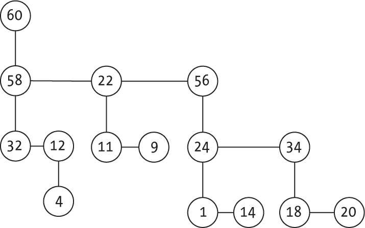

图 15-38：如果你将 40 改为 58 的替代结果

以下是如何编码这个过程：

```
const changeKey = (heap, node, newKey) => {
  if (isEmpty(heap)) {
    throw new Error("Heap is empty!");
  } else if (!goesHigher(newKey, node.key)) {
    throw new Error("New value should go higher than old value");
  } else {
  ❶ node.key = newKey;
  ❷ const parent = node.up;
  ❸ if (parent && goesHigher(newKey, parent.key)) {
    ❹ if (parent.down === node) {
        parent.down = node.right;
      } else {
      ❺ let child = parent.down;
      ❻ while (child.right !== node) {
        ❼ child = child.right;
        }
 ❽ child.right = node.right;
      }
    ❾ node.right = null;
    ❿ heap = merge(heap, node);
    }

    return heap;
  }
};
```

前两个 if() 语句是你之前见过的，用来检查是否可以进行更改。然后，实际更改节点的键值 ❶ 并获取指向其父节点的指针 ❷。如果有父节点且新节点的键应该更大 ❸，那么你需要采取行动；否则，什么都不需要做。如果该节点是其父节点的第一个子节点 ❹，通过更改从父节点指向该节点的链接，分离该节点；否则，如果该节点不是第一个子节点，遍历兄弟列表 ❺ ❻ ❼，直到找到该节点的前一个兄弟节点。然后将该节点从列表中断开 ❽ ❾，最后将分离出的堆合并回原堆 ❿。（类似的过程在第七章中讨论过。）

#### 考虑配对堆的性能

配对堆的性能类似于斐波那契堆，如表 15-6 所示；带星号的值是摊销时间复杂度。

表 15-6：配对堆操作的性能

| 操作 | 性能 |
| --- | --- |
| 创建 | O(1) |
| 顶部 | O(1) |
| 添加 | O(1) |
| 顶部 | O(1) |
| 移除 | O(log n)* |
| 改变 | O(log n)? |
| 合并 | O(1) |

为什么表格中改变值的操作带有问号？目前对于此操作的精确摊销时间复杂度尚无共识。最初的估计认为它是*O*(1)，但后来证明至少是Ω(log log *n*)。进一步的工作得出*O*(log *n*)的估计，但尚未有明确的证明。不管怎样，这看起来比斐波那契堆差，但实际上，尽管存在理论上的缺陷，配对堆的性能被报告为非常优秀，这很可能是由于实现更简单所导致的。

### 摘要

在上一章中，我们研究了通过数组表示的二叉堆，在本章中，我们完成了堆的概述，探讨了几种通过二叉树、多路树或森林实现的扩展版本，它们可以更高效地进行合并两个堆和修改关键字等操作。这些改进不仅保持了之前堆的功能，还提升了性能和增加了新特性，让我们可以将这些结构用于一些常规堆无法处理的其他问题。本章展示了修改（或者说是混合）结构的最佳示例，这些结构提高了速度和功能，但显然是以更复杂的算法为代价的！

### 问题

**15.1  直观但更差**

假设你有两个常见堆，大小分别为*m*和*n*，你通过以下直观方法实现合并：依次选择一个堆中的所有元素，并将其插入到另一个堆中。那么，这种方法的时间复杂度是什么？

**15.2  顺序情况**

如果你按升序插入键值，斜堆的形状会是什么样？如果按降序插入又会如何？

**15.3  无需递归**

在合并两个斜堆时，如果第二个堆的关键字较大，实际上并不需要递归；你能直接进行合并吗？

**15.4  需要改变**

你将如何为斜堆实现 changeKey()函数？你需要做一些结构上的修改吗？如果需要，应该做哪些修改？

**15.5  仅仅是添加**

假设你有一个二项堆，里面只有一个 BT(3)，即包含八个值。将一个新值加入该节点八次，并计算需要多少次合并。你能得出什么结论关于该操作的摊销成本？

**15.6  更快的二项堆顶**

你可以用其他堆的技术加速到达二项堆的顶部；你能想出该怎么做吗？

**15.7  更容易的上浮？**

为什么你不能像写二叉堆时那样实现二项树的 _bubbleUp()方法？（这个原因很容易忽略。）

```
const _bubbleUp = (heap, node, newKey) => {
  node.key = newKey;
  const parent = node.up;
  if (parent && goesHigher(newKey, parent.key)) {
    node.key = parent.key;
    _bubbleUp(parent, newKey);
  }
};
```

**15.8  堆的查找**

即使这看起来没有太大意义，你能为堆实现一个 find()函数吗？注意斐波那契堆，以免由于循环链表而导致无限循环。

**15.9  一石二鸟**

在斐波那契堆中，通过将相同右值的赋值语句合并，你可以让 add()、remove()和 mergeA2B()方法稍微短一些；你能看出怎么做吗？
