## 第十六章：16 数字搜索树


在前四章中，我们探索了不同类型的树，包括二叉树、普通树、堆等。所有这些树都是基于存储和比较键的。而在本章我们将要考虑的数字搜索树中，我们不会将键与节点关联。相反，节点在树中的位置将决定它所关联的键。换句话说，你不会将键存储在树的某个单一位置；它们会分布在整个结构中，从树的根部开始。叶子节点将标记键的结束位置。

这看起来可能只是改变了我们的工作方式，就像基数排序改变了我们排序的方式一样（见第六章）。在基数排序中，我们不是通过比较键来排序，而是逐字符（或者逐位，对于数字）处理键。在数字搜索树中，我们不是存储和比较键，而是处理树中的路径。

我们将重点关注三种不同的数据结构：*trie*，它能在与键长度成正比的时间内进行搜索；*基数树*，它是 trie 的优化版本；以及*三元搜索 trie*，它是二叉搜索树的扩展。这些结构在我们搜索字符串时特别有效，就像我们在字典中查找单词一样。

### Tries 的经典版本

Tries 通常只是用来存储单词，允许用户快速且轻松地进行搜索，用户只需输入几个字母，以这些字母开头的单词就会显示出来。Tries 也用作通用搜索树，存储键和值，然后对键进行搜索以提供相关数据。

> 注意

*Trie 最初的发音与单词 tree 相似，但它也可以发音为 try，以区别于 tree。你可以选择任意一种发音。*

将尝试视为有点像旧电话目录那样，目录上有一组按钮，每个字母对应一个按钮。如果你想查找以*F*开头的名字，你只需按下该按钮，目录就会打开 F 页。类比并不仅限于此。假设目录上有另一组按钮用于名字的第二个字母，按下这个按钮会带你到另一个页面，页面上有一组新的按钮。如果你按照顺序点击所有按钮，你将找到你想要的名字，或者看到一个空白页，意味着名字不在目录中。这个类比可能很难理解（我想知道有多少读者曾经见过这样的电话目录！也许可以考虑自动完成的工作方式？），所以让我们考虑一下 trie 的实际定义。

字典树有一个链接对应每个可能的字符（就像前面电话索引的例子一样，每个名字字母都有一个按钮），但为了简化，我们仅使用 A 到 E 字母，再加上一个表示单词结束的结束符（EOW）字符。我们用 ■ 来表示这个符号。（其他语言，如 C，使用 NULL \0 字符作为 EOW，但方块符号更为显眼。）假设单词是 ACE、AD、BADE、BE、BED 和 BEE。在字典树中，你会看到 ACE■、AD■ 等。这个字典树看起来像 图 16-1 中的示意图，为了清晰起见，我将根节点放在左边，而不是在顶部，这样你可以水平阅读单词。

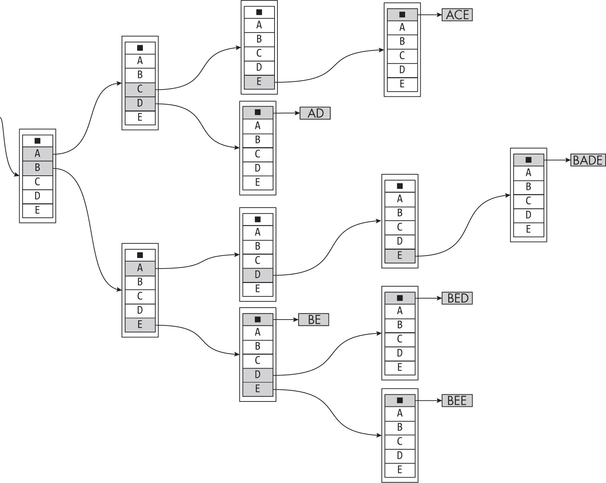

图 16-1：使用字母 A 到 E 的单词的字典树示例

字典树中的每个节点由一个链接数组组成，每个可能的字母（A–E）加上结束符（EOW）字符都有一个链接。 （你可以说这是一个六叉树；参见 第十三章）图中的空链接有白色背景，实际链接则有灰色背景。每个小框中的单词表示与相应键相关的额外数据或值（我们将在下一节中讨论）。

你可以定义基本函数来创建一个字典树，如下所示：

```
const EOW = "■";
const ALPHABET = `${EOW}ABCDE`;
const newTrie = () => null;
const newNode = () => ({links: new Array(ALPHABET.length).fill(null)});
const isEmpty = (trie) => !trie; // null or undefined
```

首先，定义结束符（EOW）字符；你将在本章中使用相同的定义。ALPHABET 常量包括我们接受的所有字符；在这个例子中，你只使用了五个字母，但在实际应用中，你很可能会包括整个字母表，从 A 到 Z。一个新的字典树只是一个空值，而一个新的节点是一个具有链接属性的对象，这个属性是一个数组，每个字符在 ALPHABET 中都有一个空链接。最后，为了识别空字典树，只需检查最后一行是否为“假值”。

你还可以将某些值与每个键关联，如下所示。

### 在字典树中存储额外的数据

当我们在前面的章节中研究树时，我们只关心存储键和查找键，因为添加额外的数据很简单。我们可以将记录替换成一个有键字段和额外数据字段的记录。如果我们想修改算法以包括额外的字段，变动也很小：搜索会返回额外的数据，而不仅仅是布尔值，添加键时也会在同一个对象中添加额外的字段。

但是在字典树中，键不会存储在单一的位置，而是分布在字典树的各个分支中。对此有一个解决方案，但由于算法中所需的更改不那么简单，我们将处理键加数据的情况。

字典抽象数据类型（ADT）会略微变化，特别是添加和查找操作，如 表 16-1 所示。

表 16-1：字典树操作

| 操作 | 签名 | 描述 |
| --- | --- | --- |
| 创建 | → D | 创建一个新的字典。 |
| 空？ | D → 布尔值 | 判断字典是否为空。 |
| 添加 | D × key × data → D | 给定一个新的键和数据，将它们添加到字典中。 |
| 移除 | D × key → D | 给定一个键，从字典中移除它。 |
| 查找 | D × key → data &#124; null | 给定一个键，返回其数据，如果找不到则返回 null。 |

如同其他章节一样，我们将研究这种抽象数据类型（ADT）结构的性能。现在我们已经定义了字典树的完整结构并学习了如何创建它，让我们来考虑其余所需的功能。

#### 搜索字典树

你怎么查找一个单词？例如，如果你想知道 BED 是否是一个有效的单词，图 16-2 展示了你将要走的路径。

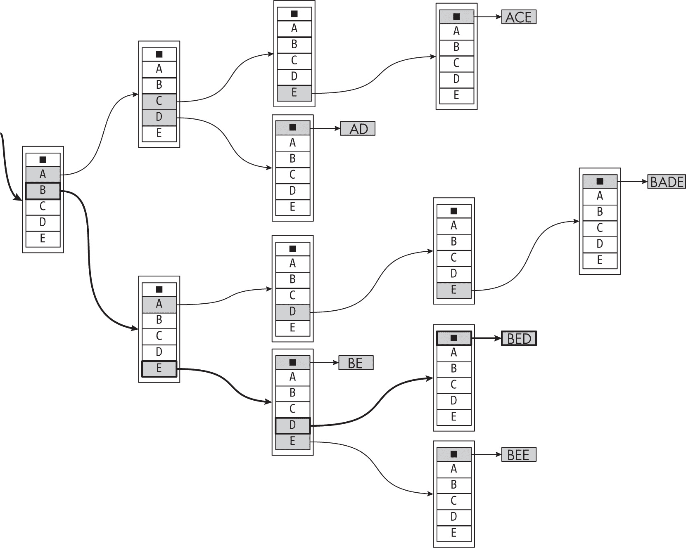

图 16-2：在字典树中成功搜索 BED

对 BED 的搜索从根节点开始。你查看 B 链接，发现它不是 null，所以跟随它到下一层。在那里，你查看 E 链接并再次跟随它。下一步类似：查看 D 链接并跟随它。最后，你到达 EOW，并在对应的链接中找到一个指向某个数据的链接，认为这是一次成功的搜索并返回找到的数据。

失败的搜索看起来不同。例如，如果你想查找单词 DAB，搜索在一开始就会失败，因为没有单词以 D 开头。那么 ACED 呢？这次，你将从 A 链接开始搜索，然后是 C 链接，最后是 E 链接，但你会到达一个没有 D 链接的节点，意味着 ACED 不在字典树中。图 16-3 展示了这个失败的搜索。

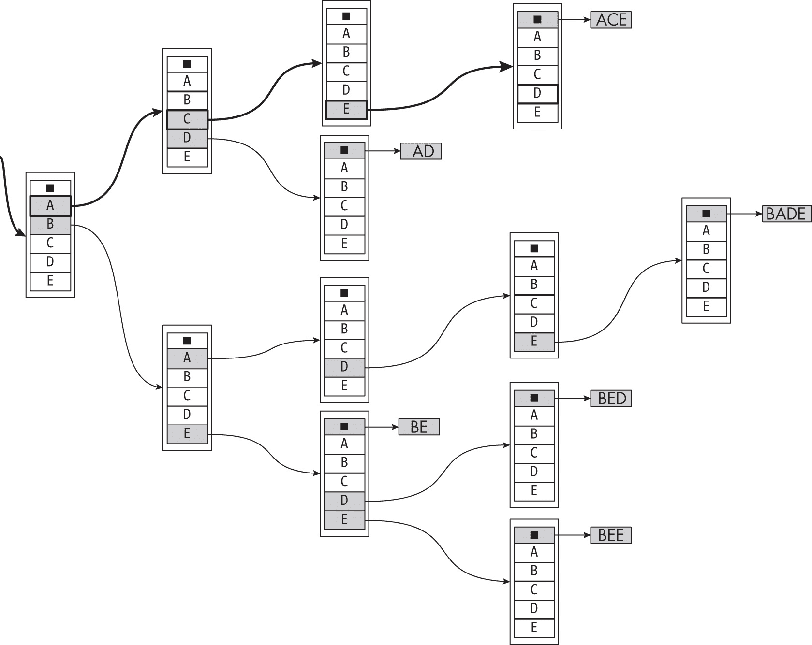

图 16-3：在字典树中搜索（失败）ACED

考虑最后一种情况，搜索 BAD。记住，你要添加一个 EOW 字符，因此实际上，你是在尝试查找 BAD■。图 16-4 展示了会发生什么。

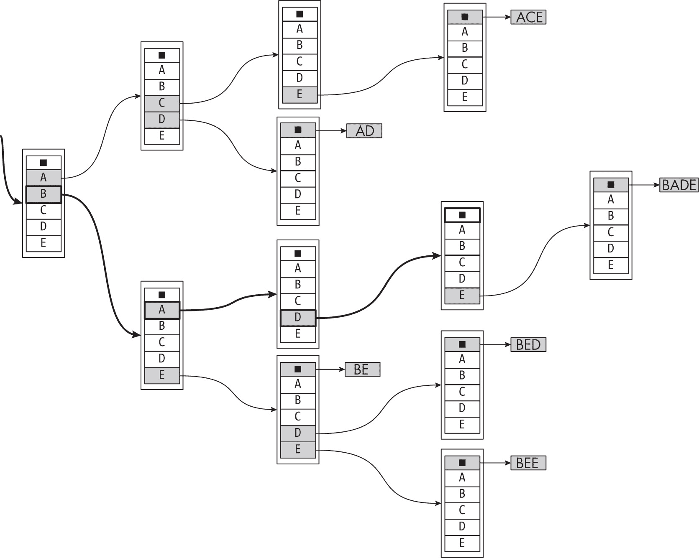

图 16-4：搜索 BAD 失败：BADE 在字典树中，但 BAD 不在。

这个搜索从根节点开始，首先跟随 B 链接，然后是 A 链接，最后是 D 链接。BAD 是至少一个单词的前缀，但缺少 EOW 链接，因此 BAD 不会被认为存在于字典树中。

为了实现这个逻辑，首先创建一个辅助的 _find() 函数，实际上执行搜索操作：

```
const _find = (trie, [first, . . .rest]) => {
❶ const i = ALPHABET.indexOf(first);
❷ if (isEmpty(trie)) {
   return null;
❸} else if (first === EOW) {
   return isEmpty(trie.links[i]) ? null : trie.links[i].data;
❹} else {
   return _find(trie.links[i], rest);
 }
};
```

i 变量 ❶ 从链接属性中选择正确的值，现在你准备开始搜索。如果字典树为空（可能一开始就为空，或者可能你沿着一个 null 链接向下遍历），显然搜索失败 ❷。如果你到达单词的末尾（由 EOW 字符标记），进行一个简单的测试：如果相应的链接是 null，搜索失败，如之前所述；如果不是，链接指向一个具有数据属性的对象，你返回它 ❸。否则，如果你还没有到达一个 null 链接或 EOW 字符 ❹，沿着正确的链接继续递归搜索。

find() 函数只是调用之前的 _find()，但它在你要查找的字符串末尾添加了需要的 EOW 字符：

```
const find = (trie, wordToFind) =>
❶ !!wordToFind ? _find(trie, wordToFind + EOW) : null;
```

检查空单词以查找 ❶，如果为空，则直接返回 null，不做其他操作。

搜索 trie 并不复杂，类似于我们在前几章讨论过的其他树的搜索方式。

#### 向 Trie 中添加一个键

向现有的 trie 中添加新键（及数据）遵循与搜索相同的策略。逐字查找链接，如果链接存在，就跟随它；如果不存在，就添加一个新的空节点。例如，在 Figure 16-5 中的 trie 图示，如果你想添加一个 BAD 键，只需在最后一个节点添加一个指向数据的链接。

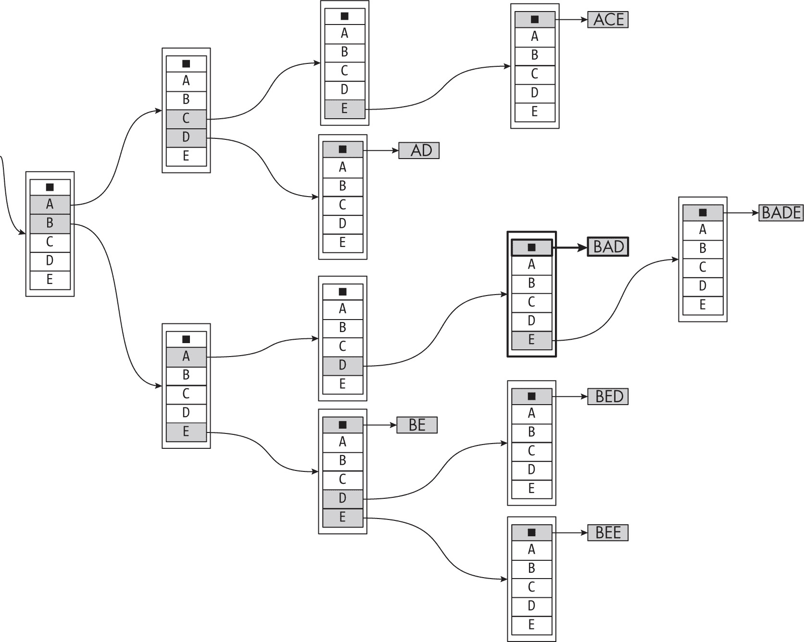

Figure 16-5: 向 trie 添加 BAD

trie 中唯一的变化是（到目前为止）空的 EOW 链接现在指向与 BAD 键关联的数据。

另一个例子是，想要添加 ABE，你需要从根节点开始，跟随 A 的链接，但随后需要添加两个新节点，如 Figure 16-6 所示。

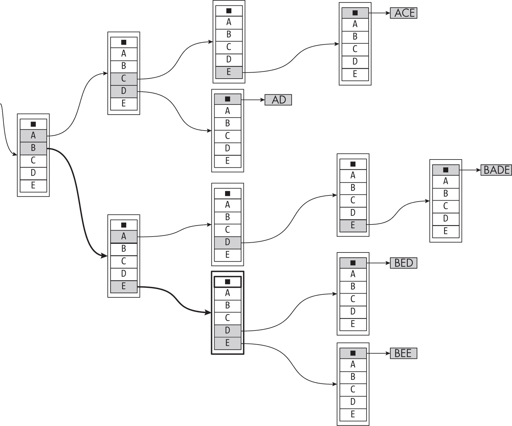

Figure 16-6: 向 trie 添加 ABE 需要新节点。

这个添加操作的代码与我们在前几章讨论的其他插入函数类似：

```
❶ const _add = (trie, [first, . . .rest], data) => {
❷ if (first) {
  ❸ if (isEmpty(trie)) {
      trie = newNode();
    }
 ❹ const i = ALPHABET.indexOf(first);
    if (first === EOW) {
    ❺ trie.links[i] = {data};
    } else {
    ❻ trie.links[i] = _add(trie.links[i], rest, data);
    }
  }
  return trie;
};
```

一个 _add() 辅助函数 ❶ 实际上执行插入操作。当你还没有到达字符串的结尾（包括已添加的 EOW）❷时，继续前进，按照连续字母的链接进行跟踪。如果找到一个空链接 ❸，则创建一个新节点并继续前进，直到到达 EOW 字符。在每一步，决定跟随哪个链接 ❹，当到达 EOW 时，添加指向额外数据的链接 ❺；否则，递归地继续添加剩余的字符串 ❻。

最后，add() 函数只调用 _add()：

```
const add = (trie, wordToAdd, dataToAdd = wordToAdd) =>
  _add(trie, wordToAdd + EOW, dataToAdd);
```

这个函数还确保添加了 EOW 字符。

#### 从 Trie 中删除一个键

现在我们来看删除一个键，这比向 Trie 中添加键要复杂一些。首先，尝试查找该键；如果找不到，就结束了，因为没有其他事情可做。如果找到了该键（并且到达了 EOW 字符），只需删除关联的数据，将指针设为 null。如果这样做后当前节点没有指针了，就删除该节点并修正父节点的指针，这可能又会导致父节点成为空节点，因此继续向上遍历，直到根节点，途中可能会删除更多节点。

让我们考虑几个情况。返回到示例 trie，如果你想删除 BE，你只需清除其 EOW 链接，如 Figure 16-7 所示，完成删除。

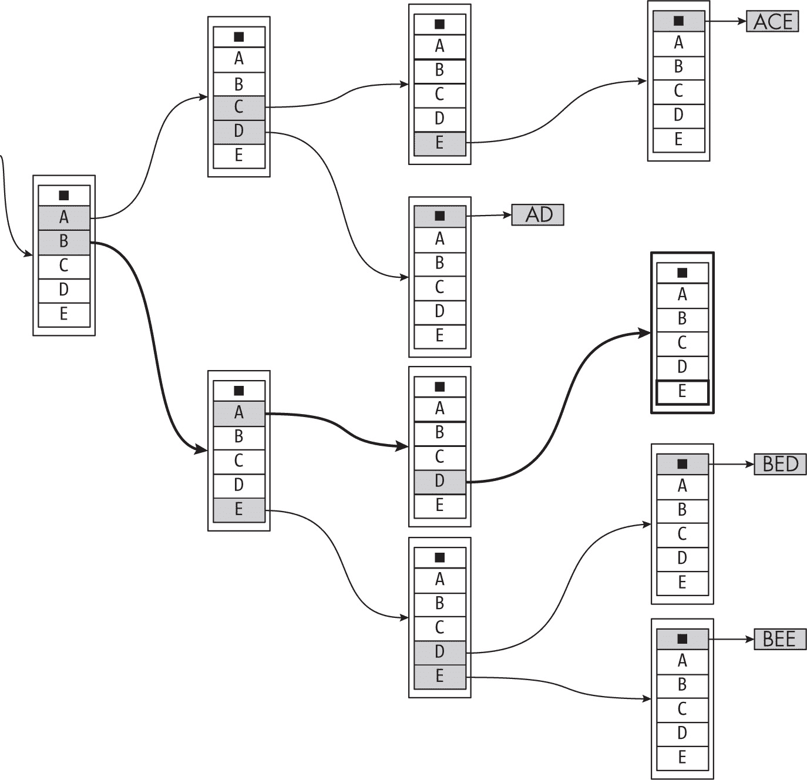

Figure 16-7: 从 trie 中删除 BE

为了增加难度，在删除 BE 后，如果你想删除 BADE，首先清除 EOW 链接，但此时整个节点仅包含 null 链接，如 Figure 16-8 所示。

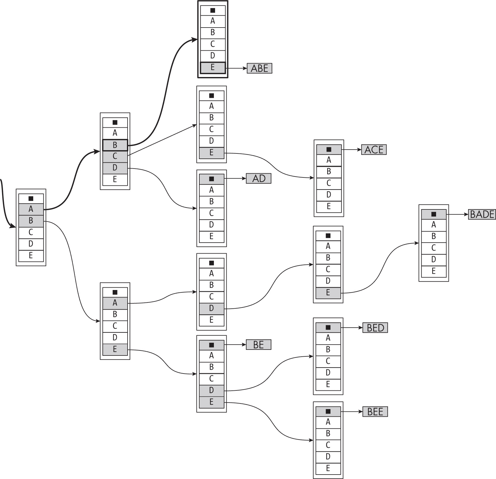

Figure 16-8: 删除 BADE 意味着从 trie 中移除几个（现在为空的）节点。

然而，删除该节点（并清除其父节点的 E 链接）会重复相同的情况，因此你还需要删除父节点，然后删除父节点的父节点，直到遇到一个非空节点。最终的情况如图 16-9 所示。

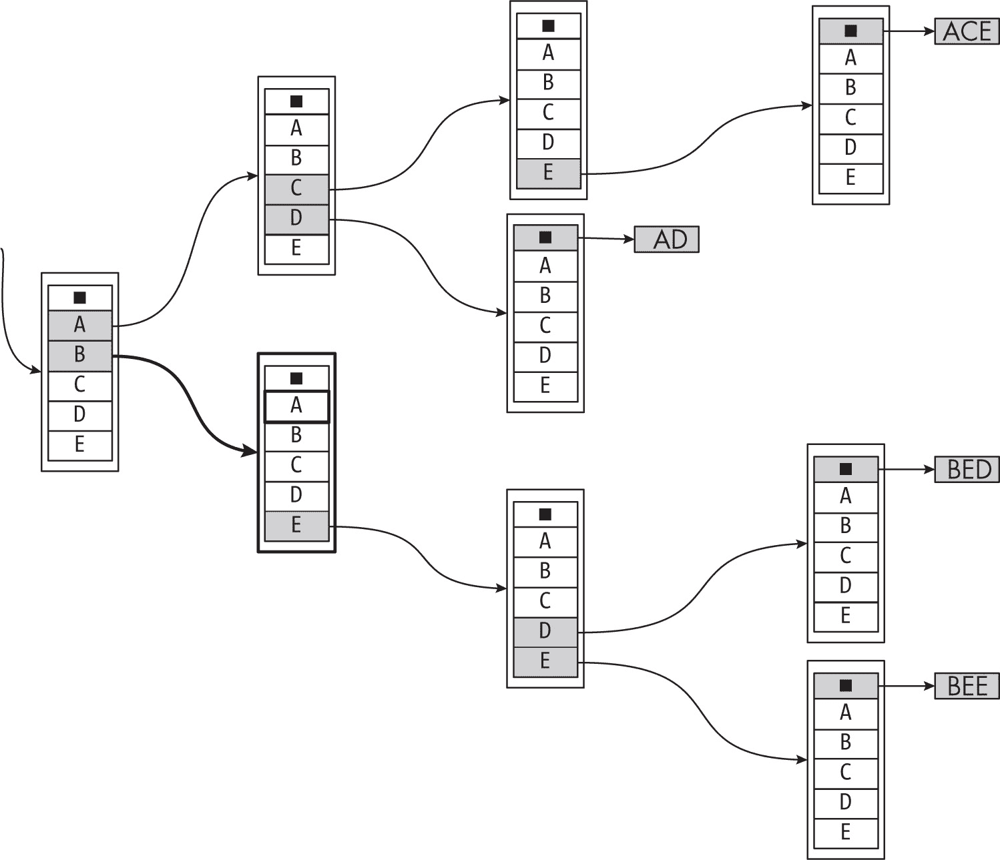

图 16-9：删除 BADE 后的最终字典树

与搜索和添加类似，你需要一个辅助函数来实现这一点：

```
❶ const _remove = (trie, [first, . . .rest]) => {
❷ if (isEmpty(trie)) {
    // nothing to do
  } else if (!first) {
  ❸ trie = null;
  } else {
  ❹ const i = ALPHABET.indexOf(first);
  ❺ trie.links[i] = _remove(trie.links[i], rest);
  ❻ if (trie.links.every((t) => isEmpty(t))) {
      trie = null;
    }
  }
❼ return trie;
};
```

_remove() 函数执行实际的删除操作 ❶。你逐一搜索，每当你遇到一个空链接时，就知道操作完成 ❷。如果到达单词的末尾（越过 EOW 字符），将当前链接设为 null ❸。如果你仍在单词中间，决定接下来应该跟随哪个链接 ❹。然后递归地删除剩余的单词 ❺，并做最后检查，看该节点是否完全为空（全部为 null），如果是的话，你也将该节点设为 null ❻。最后，只需返回修改后的字典树 ❼。

你需要的最终代码如下：

```
const remove = (trie, wordToRemove) => _remove(trie, wordToRemove + EOW);
```

remove() 函数仅调用 _remove()，并将需要的 EOW 字符添加到你想要删除的字符串中。

#### 考虑字典树的性能

不同操作的性能如何？表 16-2 几乎是本书中最简单的表格，你能看出为什么吗？

表 16-2：字典树操作的性能

| 操作 | 性能 |
| --- | --- |
| 创建 | O(1) |
| 为空？ | O(1) |
| 添加 | O(k) |
| 删除 | O(k) |
| 查找 | O(k) |

创建字典树并检查它是否为空是 *O*(1) 的常数操作。并且，根据该结构，如果键长为 *k* 个字符，所有其他操作最多需要 *k* 步，这就是具有该键的字典树的最大高度——非常优秀的常数结果！请注意，*O*(*k*) 性能在 *k* 为常数时应该写作 *O*(1)。我在这里将其写为 *O*(*k*)，只是为了提醒你需要执行 *k* 步，但在性能上，任何常数都意味着 *O*(1)。

然而，尽管这种结构有着非常好的性能，但需要注意的是，这种结构相当浪费空间。所有节点都有许多链接（每个键中尽可能多的字符），导致大量未使用的空间。如果你需要区分大写和小写字符，或处理整个字母表，或存储外语单词，由于每个节点需要的许多链接，节点的空间需求将急剧增加。

这种情况并不理想，因此让我们考虑另一种字典树的方法，旨在实现一个更现代（且更节省空间）的实现，幸运的是，JavaScript 可以轻松实现这一点。

### 字典树的增强版

再次考虑如何表示字典树。在每个节点中，你需要为字符串中的每个字符创建一个链接，但如果只有少数字符实际上是必需的，就不需要为其余部分浪费空间。实际上，这听起来你需要某种集合，而这正是解决方案。

如果你有大量不同的可能链接，你应该使用第十三章中讨论的一些结构。然而，由于字母表是有限的，你可以使用一个以字符为键、以链接为值的对象。（有关另一种解决方案，请参见问题 16.1。）

使用与前面字典树相同的六个字符串（ACE、AD、BADE、BE、BED 和 BEE），结构如图 16-10 所示。

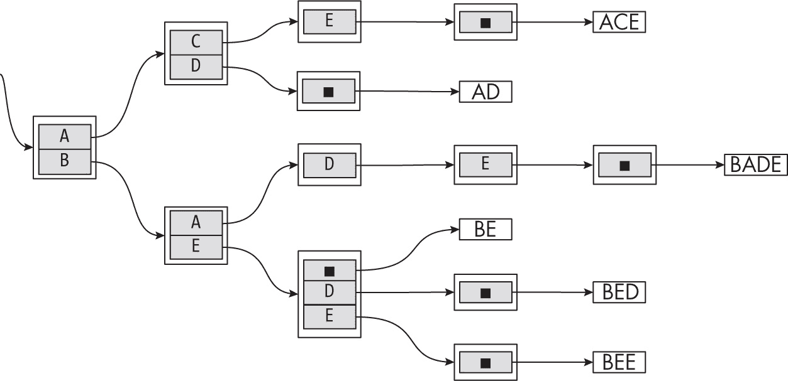

图 16-10：具有更少链接的增强型基于对象的字典树

主要区别在于现在的节点可以小得多，只包含严格必要的链接，没有其他内容。

#### 定义基于对象的字典树

与其使用一个链接数组，你可以使用对象来定义这种节省空间的新型字典树：

```
const EOW = "■";
const newTrie = () => null;
**const newNode = () => ({links: {}});**
const isEmpty = (trie) => !trie; // null or undefined
```

你只需要对之前的字典树做一个简单的修改（以粗体显示）：现在一个新节点有一个名为 links 的对象，而不是一个同名的数组。

#### 搜索基于对象的字典树

搜索基于对象的字典树的过程类似于搜索经典的字典树：从根节点开始，逐个跟随与字符串中每个字符对应的链接。不同的是，你不是使用一个包含所有可能字符链接的数组，而是使用一个仅包含实际需要链接的对象。例如，重新访问图 16-11 中的 BED 搜索。

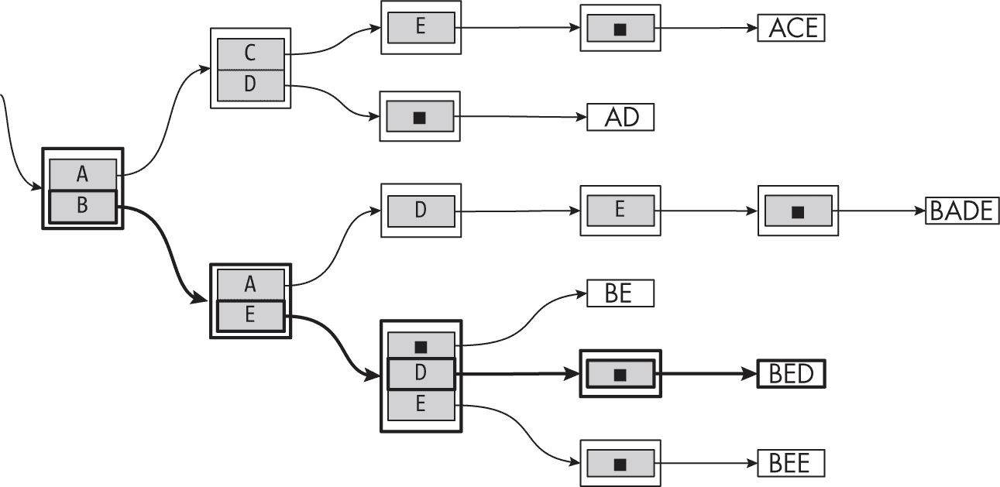

图 16-11：在基于对象的字典树中成功搜索 BED

从 links 对象中的根节点开始，跟随 B 链接。到达下一个节点后，跟随 E 链接，依此类推，直到到达 EOW 链接。然后，你知道键已找到，可以返回相关数据，无论它是什么。

试着重新执行一个失败的搜索，如图 16-12 所示。

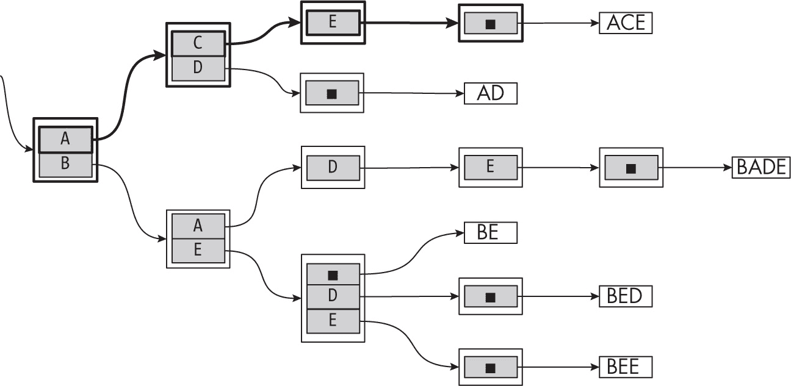

图 16-12：在基于对象的字典树中搜索 ACED 失败

如果你搜索 ACED，过程会在跟随到最后一个 E 链接后停止。你到达的节点没有 D 链接，因此无法继续，因为你想要的键不在字典树中。

搜索基于对象的字典树并不真的与搜索原始字典树有所不同；唯一的变化是如何选择要跟随的链接。以下逻辑展示了所需的变化：

```
const _find = (trie, [first, . . .rest]) => {
  if (isEmpty(trie)) {
    return null;
  } else if (first === EOW) {
 **return isEmpty(trie.links[first]) ? null : trie.links[first].data;**
 **} else {**
 **return _find(trie.links[first], rest);**
  }
};

const find = (trie, wordToFind) =>
  !!wordToFind && _find(trie, wordToFind + EOW);
```

与原始字典树的搜索代码相比，你只有两个变化（以粗体显示）：你可以直接访问所需的链接，而无需首先检查字母表—例如，字母 A 的链接是 links.A，（或者，等价地，links["A"]），无需多做其他操作。find()函数本身与原始字典树中的完全相同。

#### 向基于对象的字典树添加一个键

添加一个键的过程也与原始字典树的算法类似。你需要做的修改与搜索时的修改类似。例如，考虑添加 ABE，如图 16-13 所示。

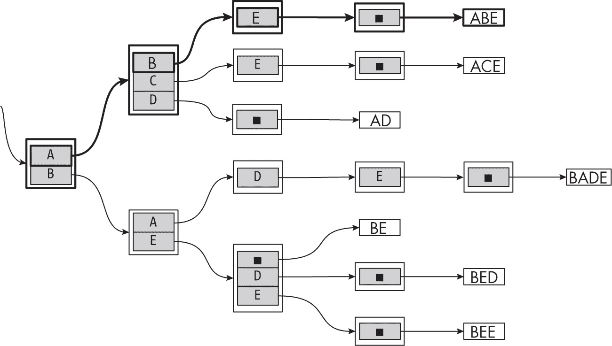

图 16-13：向基于对象的字典树添加 ABE

像查找时一样开始跟踪链接，当链接不存在时，添加它们。在这个情况下，根节点已经有一个 A 链接，所以你跟踪它。下一个节点没有 B 链接，因此将其添加到现有的（C 和 D）链接中。从那时起，开始向 trie 中添加新节点。

这个过程与原始 trie 相同；以下是新的逻辑：

```
const _add = (trie, [first, . . .rest], data) => {
  if (first) {
    if (isEmpty(trie)) {
      trie = newNode();
    }
    if (first === EOW) {
 **trie.links[first] = {data};**
    } else {
 **trie.links[first] = _add(trie.links[first], rest, data);**
    }
  }
  return trie;
};

const add = (trie, wordToAdd, dataToAdd = wordToAdd) =>
  _add(trie, wordToAdd + EOW, dataToAdd);
```

与原始尝试的逻辑唯一区别是，你总是知道针对给定字符应该使用哪个链接，因此你不需要搜索 ALPHABET 数组（以**粗体**显示）。

#### 从基于对象的 trie 中移除一个键

最后，移除一个键的过程与原始 trie 中的代码相似，但决定节点是否为空需要不同的方法。例如，如果你想从原始 trie 中删除 BADE，你将得到 图 16-14 中显示的结果。

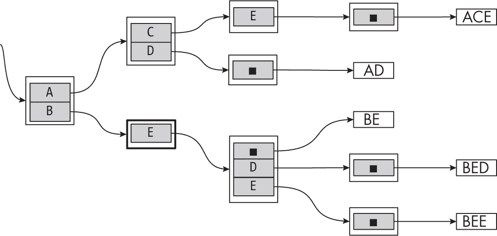

图 16-14：从基于对象的 trie 中移除 BADE

与之前的基于数组的 trie 实现一样，当节点变为空时，你会将其删除。更新后的逻辑如下：

```
const _remove = (trie, [first, . . .rest]) => {
  if (isEmpty(trie)) {
    // nothing to do
  } else if (!first) {
    trie = null;
  } else {
  ❶ trie.links[first] = _remove(trie.links[first], rest);
    if (isEmpty(trie.links[first])) {
    ❷ delete trie.links[first];
    ❸ if (Object.keys(trie.links).length === 0) {
        trie = null;
      }
 }
  }
  return trie;
};

const remove = (trie, wordToRemove) => _remove(trie, wordToRemove + EOW);
```

与原始尝试 ❶ ❷ 的逻辑相比，大部分差异直接与知道使用哪个链接相关，但为了决定一个节点是否为空，你需要查看链接对象中有多少个键 ❸。

#### 考虑基于对象的 trie 性能

这个新版本的 trie 有什么变化？性能与基于数组的 trie 完全相同；唯一的区别是所需的内存量。可以这样理解：如果你使用一个 trie 来表示包含所有重音符号、变音符号和特殊字符的欧洲语言字典（如丹麦语的 å，捷克语的 eˇ，或德语的 ß），你将需要一个每个节点包含超过 200 个链接的数组，尽管大部分链接是空的。使用对象节省了大量空间，这在某些情况下可能很重要。

然而，使用对象代替数组并不像想象中那样高效。毕竟，如果键很长，你仍然需要一个非常高的 trie。作为一个边界情况，假设有一个只包含一个 20 个字符长的键的 trie。你将拥有一个 20 层高的树，只有一个键。基数树提供了一种改进的解决方案。

### 基数树

到目前为止的两个 trie 都表现良好，但它们有很多层。例如，在示例 trie 中查找 BADE 时，你需要逐层向下搜索每个字母，而没有其他以 A 开头的单词；请参见 图 16-15。

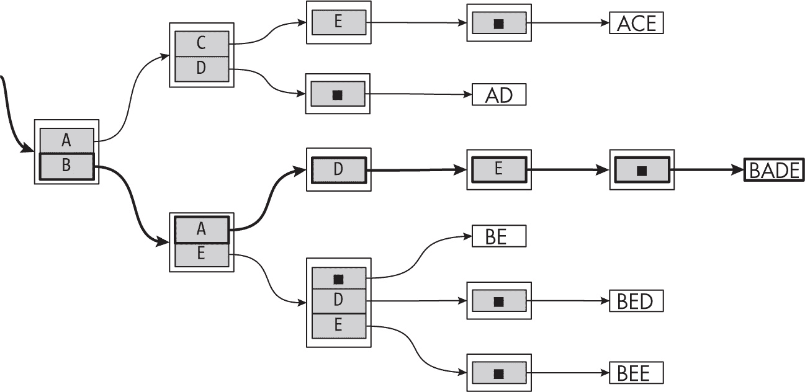

图 16-15：在 trie 中成功查找 BADE 需要许多步骤。

基数树的想法是，如果某一层只有一个链接，我们就“将其推上去”并与父链接合并，以缩短未来的搜索时间。图 16-16 显示了 ACE、AD、BADE、BE、BED 和 BEE 这些单词集合的基数树样式。

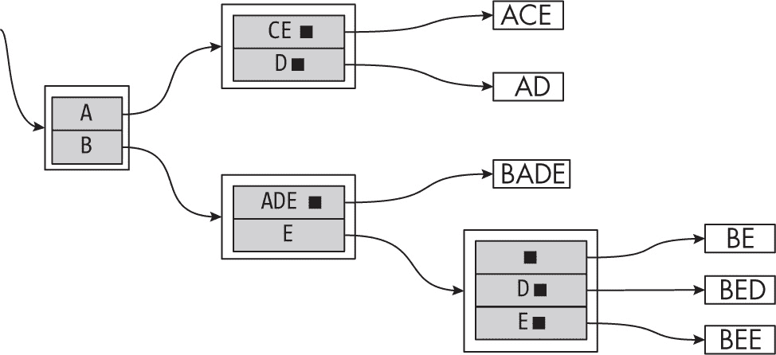

图 16-16：基数树通过连接链接来缩短搜索时间。

现在，你只需要两步就能找到 BADE。这个树比之前的所有字典树都要短。一些路径（例如，从 B 到 E 到 BE）仍然是相同的长度，但大多数路径更短，因为某些层次有多字符的链接。让我们来探讨这些树是如何定义和使用的，因为它们代表了一种更高效的数字树。

#### 定义基数树

如果你使用对象来存储链接，就像在基于对象的字典树中那样，你会发现基数树的逻辑与之前完全相同。区别在于*如何*使用链接（它们不总是单字符链接），但结构是一样的：

```
const EOW = "■";
const newRadixTree = () => null;
const newNode = () => ({links: {}});
const isEmpty = (rt) => !rt;
```

由于与之前的基于对象的字典树代码没有变化，我们继续处理这些新的树。

#### 搜索基数树

执行搜索与之前在基于对象的字典树中的操作类似，但由于链接可能对应多个字符，你需要稍作不同的处理。首先考虑一个简单的情况：搜索 BED——或者更准确地说，搜索 BED■。图 16-17 显示了要遵循的路径。

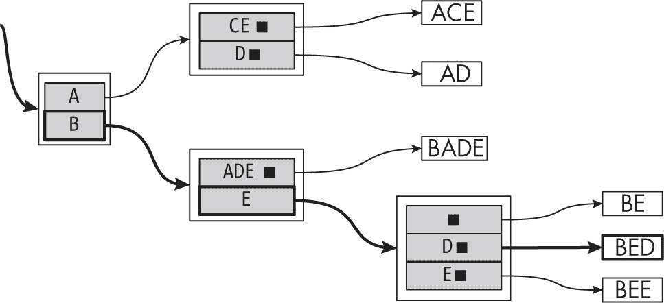

图 16-17：在基数树中成功搜索 BED

在根节点，你需要找到一个 BED■的前缀链接。在这种情况下，跟随 B 链接进入下一层。（如果你没有找到这样的链接，就立即声明搜索失败。）由于你跟随了 B 链接，接下来要搜索 ED■。同样，你会找到一个与搜索匹配的链接，并跟随那个 E 链接进入第三层，在那里你查找 D■。此时，你找到了完整的匹配，因此找到了键并可以返回它的数据。完成！

另一个例子，搜索 ACED■，这将是一个失败的搜索（见图 16-18）。

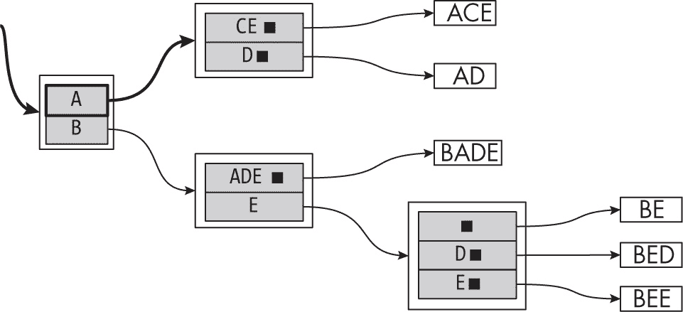

图 16-18：在基数树中未能成功搜索 ACED

这里发生了什么？在第一层，你找到了一个 A 链接可以跟随，于是你在第二层寻找 CED■。然而，你没有找到任何具有搜索字符串前缀的链接，搜索失败。如果你在搜索 CAB■，你也会遇到同样的问题，但这是在根节点，因为没有任何链接的前缀包含该字符串。

其基本思路是，逐层向下遍历树，匹配前缀与链接。给定两个字符串，你首先需要一个辅助函数来找出它们从开头起有多少个字符是相同的。例如，如果你有 BEE 和 BADE，它们只有一个字符是相同的（B）。如果你有 ACED 和 ACAD，它们有两个字符是相同的（最初的 AC 字符）。

辅助函数如下所示：

```
const _commonLength = (str1, str2) => {
  let i = 0;
❶ while (str1[i] && str1[i] === str2[i]) {
 ❷ i++;
  }
  return i;
};
```

从开始处比较字符❶并计数❷，直到字符串结束或不再匹配。

使用这个函数，你就可以开始搜索：

```
const _find = (trie, wordToFind) => {
❶ if (isEmpty(trie)) {
    return false;
  } else {
  ❷ const linkWord = Object.keys(trie.links).find(
      (v) => v[0] === wordToFind[0]
    );

  ❸ if (linkWord) {
    ❹ if (wordToFind === linkWord) {
        return trie.links[linkWord].data;
      } else {
      ❺ const common = _commonLength(linkWord, wordToFind);
      ❻ return _find(
          trie.links[linkWord.substring(0, common)],
          wordToFind.substring(common)
        );
      }
  ❼} else {
      return false;
    }
  }
};
```

如果树为空，显然键不可能在那里 ❶。为了查看一个链接是否是搜索键的前缀，首先找到与第一个字符匹配的（唯一）对象键 ❷，因为在一个节点中不能有两个或多个键具有相同的初始字符（这会破坏结构）。如果找到这样的链接 ❸，检查它是否确实包含你需要的完整字符串 ❹；如果是，那么操作完成。如果链接与整个字符串不匹配，找到公共前缀 ❺ 并递归搜索其余的字符串 ❻。另一方面，如果没有找到与字符串的初始字符匹配的链接，搜索失败 ❼。

主要的 find()函数与基于对象的尝试相同：

```
const find = (trie, wordToFind) =>
  !!wordToFind && _find(trie, wordToFind + EOW);
```

基数树的搜索逻辑与尝试树的搜索逻辑类似，只是匹配链接要复杂一些。#### 向基数树中添加一个键

向基数树中添加新键的问题是，如果之前已经添加的键与你想要添加的键的部分匹配。我们从一个简单的情况开始：像原始基数树一样添加 ABE■（见图 16-19）。

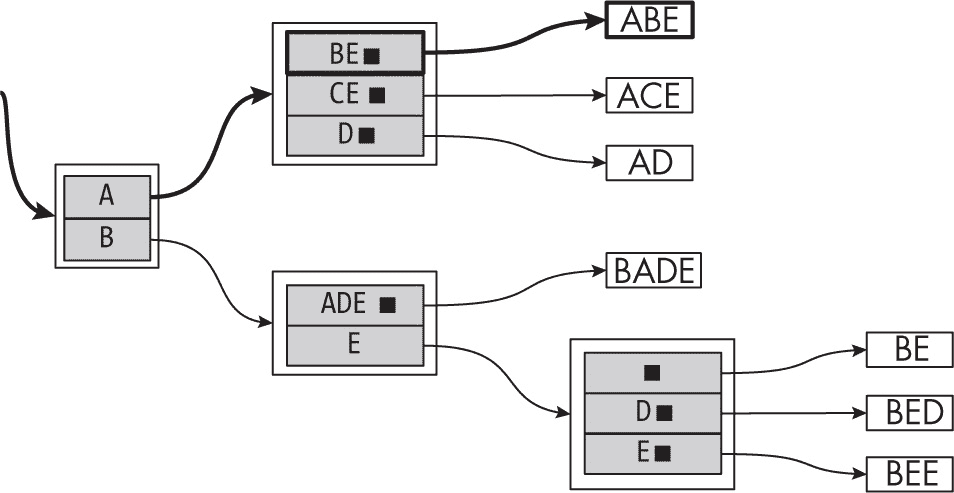

图 16-19：将 ABE 添加到基数树：初始结构

首先，按前一节所示搜索字符串，在跟随 A 链接之后，你到达一个没有匹配 BE■前缀的节点。这意味着你可以在这里停止搜索，并在该位置添加新的链接。

图 16-20 展示了将 BAD 添加到在图 16-19 中更新的树的更复杂情况。

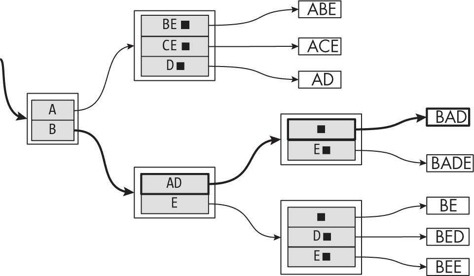

图 16-20：将 BAD 添加到基数树需要拆分一些链接。

这里的不同之处在于，在跟随 B 链接之后，你会发现已经有一个部分匹配（ADE■），因此现在需要进行拆分：公共前缀（AD）保留在节点中，并创建一个新节点，包含其余的键。

因此，逻辑需要处理两种情况：未找到前缀（如 ABE）或找到部分匹配（如 BADE）。以下是代码：

```
const _add = (trie, wordToAdd, data) => {
❶ if (wordToAdd) {
  ❷ if (isEmpty(trie)) {
      trie = newNode();
      trie.links[wordToAdd] = {data};
    } else {
    ❸ const linkWord = Object.keys(trie.links).find(
        (v) => v[0] === wordToAdd[0]
      );
    ❹ if (linkWord) {
        const common = _commonLength(linkWord, wordToAdd);
        const prefix = linkWord.substring(0, common);
        const oldSuffix = linkWord.substring(common);
        const newSuffix = wordToAdd.substring(common);

      ❺ if (linkWord === prefix) {
          trie.links[linkWord] = _add(trie.links[linkWord], newSuffix, data);
        } else {
        ❻ trie.links[prefix] = {
            links: {
              [oldSuffix]: trie.links[linkWord],
              [newSuffix]: {data}
            }
          };
        ❼ delete trie.links[linkWord];
        }
      } else {
      ❽ trie.links[wordToAdd] = {data};
      }
    }
  }
❾ return trie;
};
```

首先检查是否添加一个非空字符串 ❶；如果不是，返回未更改的 trie ❾。如果你有一个字符串需要插入，检查树是否为空 ❷，因为如果为空，创建一个包含单个键的新节点，操作完成。如果树不为空，搜索是否有一个现有的键至少匹配第一个字符 ❸（如前所示）。如果没有找到，创建一个新节点 ❽；否则，检查找到的键是否完全或部分匹配你正在插入的内容 ❹，根据你找到的公共长度拆分键。如果完全匹配 ❺，跟随链接插入剩余的字符串；否则 ❻，进行拆分，将公共前缀留在节点中，通过添加一个新节点并删除旧键 ❼。

其余的逻辑与其他尝试相同：

```
const add = (trie, wordToAdd, dataToAdd = wordToAdd) =>
  _add(trie, wordToAdd + EOW, dataToAdd);
```

你已经看到如何添加一个新键，这有两个不同的情况；现在看看使用反向算法从基数树中删除一个键会发生什么。  #### 从基数树中删除一个键

继续使用在图 16-20 中更新的相同基数树，考虑两种删除键的情况：从节点中删除一个链接，剩下两个或更多链接，和从节点中删除一个链接，剩下一个链接。首先看看前一种较简单的情况（图 16-21）。

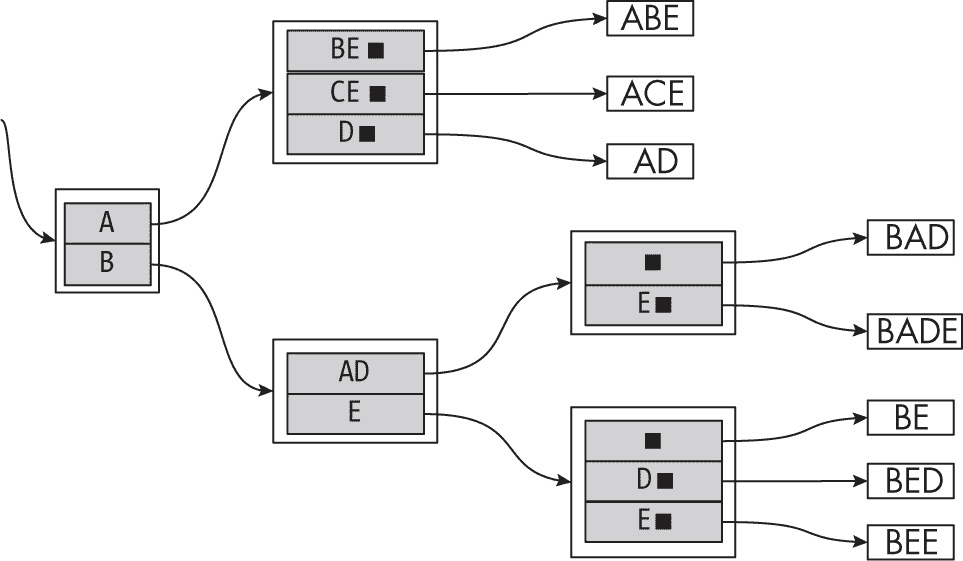

图 16-21：你将从中删除 ACE 的基数树

要从基数树中删除 ACE，搜索该键，当到达最终链接时，只需删除它。树的结构将如图 16-22 所示。

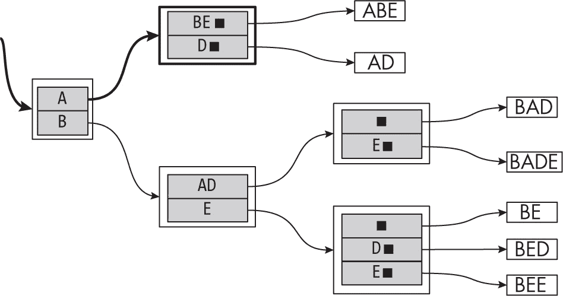

图 16-22：删除 ACE 只需要删除一个链接。

然而，如果你想删除 BADE 怎么办？记住，如果只有一个链接，你需要将其与父链接连接，如图 16-23 所示。

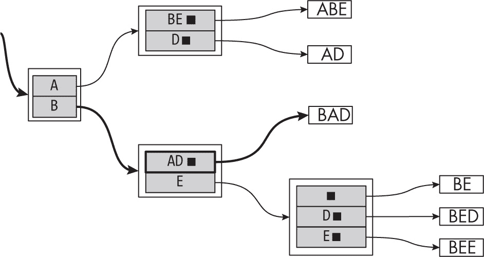

图 16-23：删除 BADE 需要更多工作。

在搜索 BADE 并删除最后一个链接（E■）后，最终节点只剩下一个 EOW 链接。然后，你将其向上传递，使其与父节点（即 AD 链接）连接。这种操作逆转了你在添加新键时所做的分裂。

考虑实际逻辑。你需要一个辅助的 _remove() 函数，像其他情况一样，用来删除目标键：

```
const _remove = (trie, wordToRemove) => {
❶ if (!isEmpty(trie) && wordToRemove > "") {
  ❷ const linkWord = Object.keys(trie.links).find(
      (v) => v[0] === wordToRemove[0]
    );
  ❸ if (linkWord && wordToRemove.startsWith(linkWord)) {
      const common = _commonLength(linkWord, wordToRemove);
      const prefix = linkWord.substring(0, common);

    ❹ if (wordToRemove === prefix) {
        delete trie.links[prefix];
    ❺} else {
        trie.links[prefix] = _remove(
          trie.links[prefix],
          wordToRemove.substring(common)
        );
      ❻ if (Object.keys(trie.links[prefix].links).length === 1) {
          const single = Object.keys(trie.links[prefix].links)[0];
          trie.links[prefix + single] = trie.links[prefix].links[single];
          delete trie.links[prefix];
        }
      }
    }
  }
❼ return trie;
};
```

首先检查是否完成，这意味着到达一个空链接或你要删除的单词的结尾❶。如果没有完成，搜索一个与要删除的单词有公共前缀的链接❷，如前所述。如果没有找到，说明删除的单词不在字典树中，过程也结束。如果找到合适的前缀❸，有两种可能：你找到了整个单词或单词的一部分。在前一种情况❹，删除链接；不需要进一步操作。在后一种情况❺，搜索并删除单词的其余部分，忽略已找到的前缀（你将递归地执行此操作）。之后，检查字典树是否只剩下一个键❻，如果是，将其唯一的键与找到的前缀连接起来。最后，返回更新后的字典树❼。

处理完这个函数后，你可以编写 remove()函数：

```
const remove = (trie, wordToRemove) => {
❶ if (!isEmpty(trie)) {
  ❷ _remove(trie, wordToRemove + EOW);
  ❸ if (Object.keys(trie.links).length === 0) {
      trie = null;
    }
  }
  return trie;
};
```

如果字典树不为空❶，使用辅助函数从树中删除键❷，然后进行最后检查：如果根节点变为空❸，字典树为 null。

#### 考虑基数树的性能

基数树就像是“压缩版”的字典树。当节点包含较长字符串时，它们更快；在最坏的情况下，如果所有链接都是“单字符”链接，它们的行为与字典树相同。这意味着你无需做太多分析。表 16-3 展示了性能。

表 16-3：基数树操作的性能

| 操作 | 性能 |
| --- | --- |
| 创建 | O(1) |
| 空吗？ | O(1) |
| 添加 | O(1) |
| 删除 | O(1) |
| 查找 | O(1) |

对于基数树，结果与字典树相同：所有操作都是 *O*(1)。

### 三叉搜索字典树

字典树和基数树基于“沿链接存储键”的思想。你还可以将这个思想应用到 *三叉树*，一种节省空间并提供良好性能的新结构。我们在第十三章中提到过三叉树，它是二叉树的推广，每个节点有三个链接而不是两个，但我们并没有实际使用它们。其核心思想是，使用三叉搜索树时，每个节点都有一个键（一个字符）和三个链接：

+   左链接用于当前字符小于节点键的字符串。

+   中间链接用于当前字符等于节点键的字符串。

+   右链接用于当前字符大于节点键的字符串。

图 16-24 显示了一个三叉搜索树。

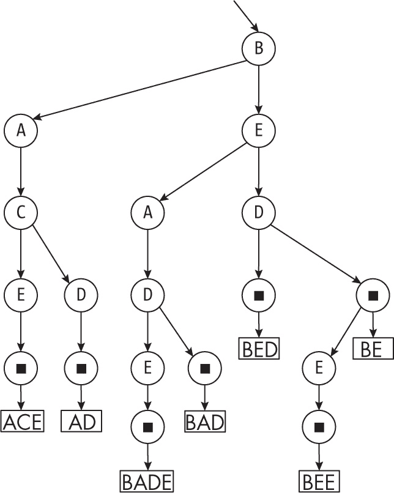

图 16-24：一个包含七个单词的三叉搜索树

尝试沿着每条路径走到每个单词；这样你将理解中间链接与左右链接之间的区别。以下部分将详细解释这一点。

#### 定义三叉字典树

我们已经考虑过二叉搜索树，定义三叉树类似。你需要做的就是添加一个中间链接：

```
const EOW = "■";

const newTernary = () => null;

const newNode = (key) => ({
  key,
  left: null,
  right: null,
  middle: null
});

const isEmpty = (tree) => tree === null;
```

创建三叉树非常简单，但存储额外数据和进行搜索需要一些改动。

#### 在三叉字典树中存储额外数据

对于三叉字典树，你会面临与其他常见树相同的问题。你可以将额外的数据存储在键旁边，但问题是，键并没有像在搜索树中那样存储在单一位置；键被分散在整个字典树中。

为了简化这个复杂性，重新应用用于字典树的解决方案。当你到达 EOW 字符时，使用它的中间指针来存储额外的数据：

```
tree.middle = {data};
```

当然，如果你使用三叉字典树只是为了存储键，并且不关心额外的数据（例如，如果你使用三叉字典树查找单词，看看它们是否存在于拼字游戏应用中，以检查对手输入的奇怪单词），你可以省略这一行，并修改搜索功能（接下来会讲到），只返回 true 或 false。

#### 搜索三叉字典树

鉴于我们设计三叉字典树的方式，搜索三叉字典树中的键与二叉搜索树的逻辑相似（参见第十二章）。例如，图 16-25 显示了如何查找单词 AD（你实际上会搜索 AD■，即附加了 EOW 字符）。

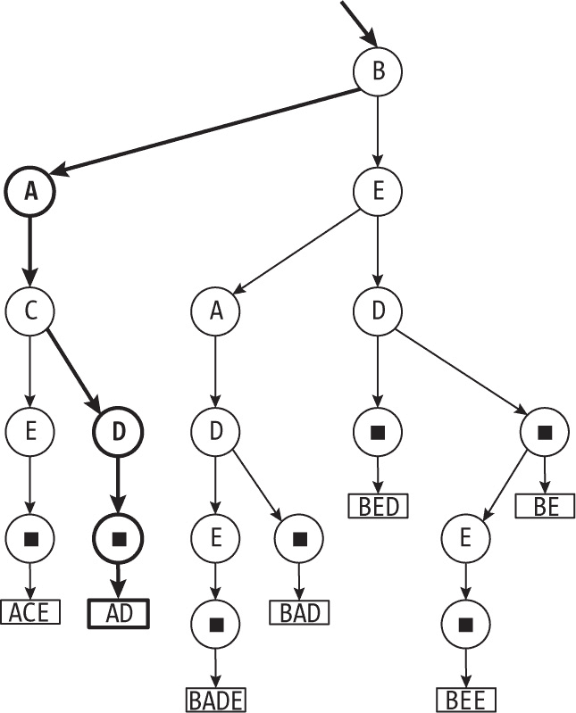

图 16-25：在三叉字典树中成功查找 AD

搜索从根节点开始，根节点是 B。由于 A（AD■中的第一个字母）小于 B，沿左链接走。然后你找到 A，所以沿中间链接走，继续查找剩下的字符串 D■。你找到 C，所以沿右链接走。然后你找到 D，现在沿中间链接继续，查找 EOW 字符。找到它后，成功返回关联的数据。

如果你原本是在查找 ADD，那么你会在第一个 D 后找到一个空链接，因此搜索会失败。

如前所述，三元查找树的搜索过程与二叉搜索树类似。逻辑如下，与其他情况一样，辅助函数会派上用场：

```
const _find = (tree, wordToFind) => {
❶ if (isEmpty(tree)) {
   return false;
❷} else if (wordToFind.length === 0) {
   return tree.data;
❸} else if (tree.key === wordToFind[0]) {
   return _find(tree.middle, wordToFind.substring(1));
❹} else {
   return _find(wordToFind < tree.key ? tree.left : tree.right, wordToFind);
 }
};
```

如果树为空或在搜索时到达空子树，搜索失败 ❶。否则，按字符递归搜索。通过 EOW 字符后，你找到了键并可以返回其数据 ❷；如果没有存储任何数据，仅返回 true。如果当前树的键与你正在搜索的单词的第一个字符匹配 ❸，则沿中间链接继续匹配其余的单词。如果不匹配 ❹，则像在二叉搜索树中一样，沿左或右链接继续搜索。

要进行搜索，你需要像其他查找树那样使用相同的 find()函数：

```
const find = (trie, wordToFind) =>
  !!wordToFind && _find(trie, wordToFind + EOW);
```

如你所见，使用三元查找树与使用常规查找树没有太大区别，但在添加或删除键时，结构会发生一些变化。

#### 向三元查找树添加键

向三元查找树添加键的逻辑与向二叉搜索树添加键类似。从根节点开始，将要添加的字符串的第一个字符与根节点的字符进行比较，决定是向左走（如果没有匹配）还是向右走（如果没有匹配），或者向中间走（如果字符匹配）。这个过程会一直继续，直到你要么找到该键（不需要做任何操作），要么决定需要添加它。

尝试向上一节中的三元查找树添加 ABE；图 16-26 展示了这些步骤。

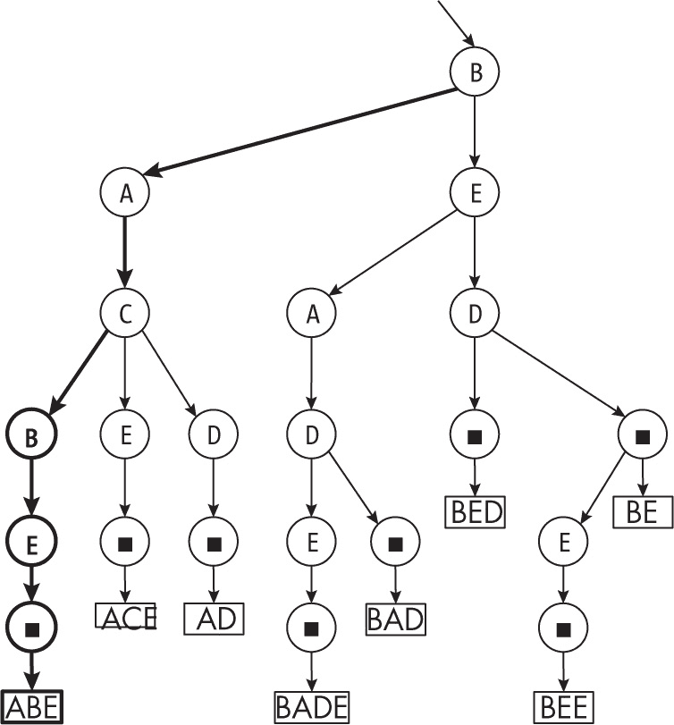

图 16-26：向三元查找树添加 ABE

你要添加 ABE■（记得是 EOW），与根节点的 B 进行比较后，你会向左链接走。你在那里找到了 A，所以沿中间链接走。然后，你找到 C，因为你要添加 BE■，再次沿左链接走，但由于链接为空，你就在该位置添加一个新的子树，根节点为 B，沿中间链接添加 E，最后有一个指向额外数据的 EOW。

这是实际的逻辑：

```
const _add = (tree, wordToAdd, data) => {
❶ if (wordToAdd.length > 0) {
  ❷ if (isEmpty(tree)) {
      tree = newNode(wordToAdd[0]);
    }
  ❸ if (tree.key === wordToAdd[0]) {
    ❹ tree.middle =  
        wordToAdd[0] === EOW
          ? {data}
          : _add(tree.middle, wordToAdd.substring(1), data);
  ❺} else {
    ❻ const side = wordToAdd < tree.key ? "left" : "right";
    ❼ tree[side] = _add(tree[side], wordToAdd, data);
    }
  }
❽ return tree;
};
```

首先，逐个字符处理你想添加的字符串直到结束 ❶。如果你到达一个空链接，创建一个新树 ❷，并将其余待处理的字符添加到新键中。如果当前节点的键与你正在添加的字符串的第一个字符匹配 ❸，则要么添加数据（如果你已经到达了 EOW 字符），要么递归地将其余的字符串添加到中间链接子树 ❹，从而使你向下移动树结构。如果没有匹配 ❺，则决定是沿左链接还是右链接继续 ❻，并使用递归在那儿添加字符串 ❼。最后，返回更新后的字典树 ❽。

如前所述，实际的 add() 函数使用了辅助的 _add() 函数：

```
const add = (tree, wordToAdd, data = wordToAdd) =>
  _add(tree, wordToAdd + EOW, data);
```

添加操作与二叉字典树其实没什么不同，如果忽略掉处理中间链接的逻辑。删除操作会类似，但会有一些复杂性。

#### 从三叉字典树中删除一个键

删除一个键比其他操作更困难，但借助第十二章关于如何在删除任何给定节点后保持适当的数据结构的课程，你将能够完成这项任务。（剧透：与二叉搜索树一样，删除一个节点时需要根据节点的子节点数量采取不同的处理方式。）从一个更复杂的三叉字典树开始，它将提供一些独特的案例，如图 16-27 所示（为了清晰起见，我用三角形替换了一些子树）。

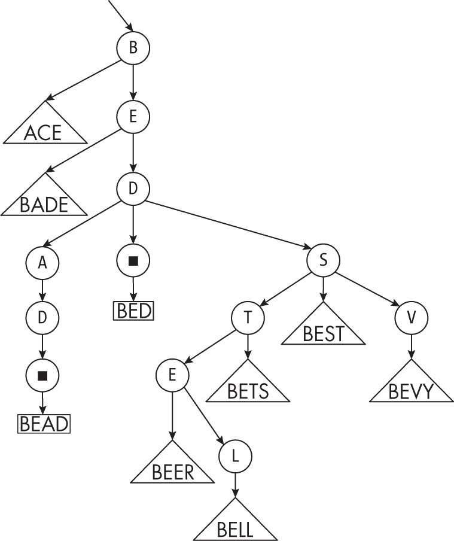

图 16-27：一个你将要删除一些单词的三叉字典树

请注意，在删除一个单词时，你需要沿着从根节点到最终 EOW 的路径删除几个节点，因为现在这些键不再存储在单个节点中。然而，你不能删除*整个*路径；你需要在路径与另一路径交汇处停止。

让我们从一个简单的例子开始：如果你想删除 BEAD、BEVY 或 BELL，会发生什么？在每一种情况下，只需从 EOW 向后删除所有节点，直到你到达一个属于不同路径的节点，就完成了。删除这三个单词后，字典树会变成图 16-28 所示的样子。

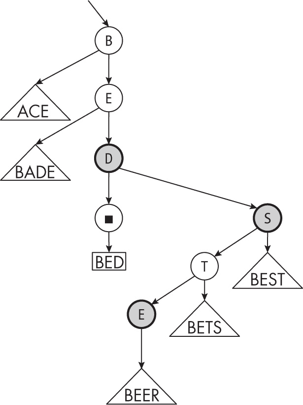

图 16-28：删除单词可能需要向上移除节点。

“切割”发生在标记的节点上，这些节点仍然保留它们的中间链接，并且（在 BEST 的情况下）还有另一个侧链接。现在考虑如果你想删除 BETS 会发生什么。你不应该保留 T 节点，因为那样会浪费空间。由于该节点只有一个子节点，你可以像处理二叉搜索树一样操作，只需将节点的父节点连接到非空子节点即可（参见图 16-29）。


图 16-29：从三叉字典树中删除 BETS 需要修改父节点的链接。

关键问题出现在你需要删除一个既有左链接又有右链接的节点时。回到原始字典树并考虑删除 BED。回顾一下，图 16-30 展示了原始字典树。

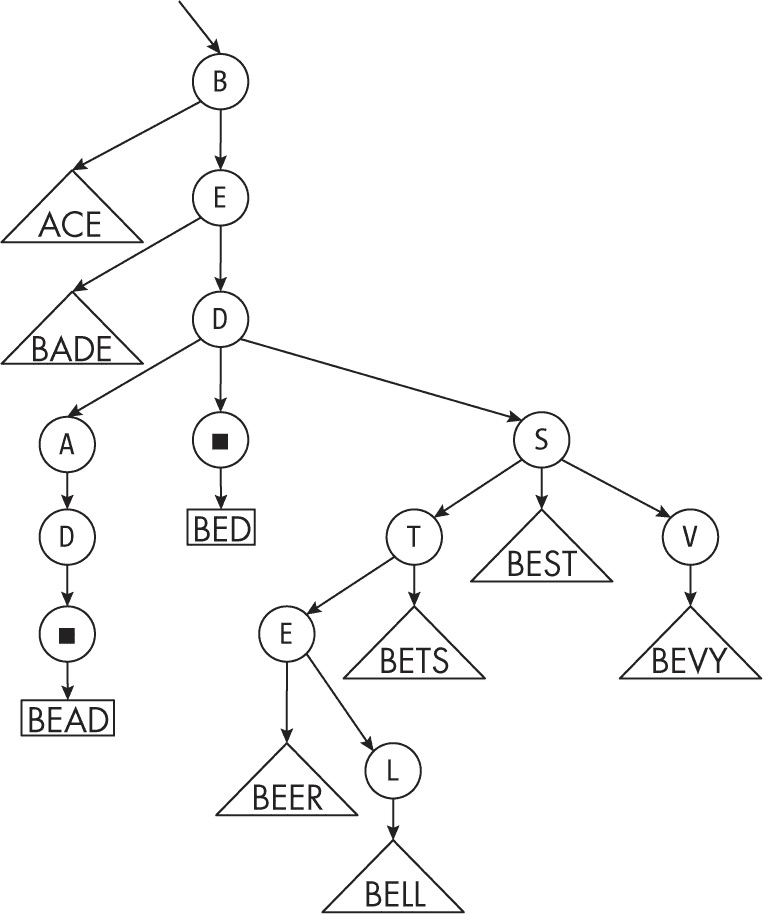

图 16-30：一个三叉 trie，你将在其中移除 BED

在移除 BED 时，你不能只是删除 D 节点，因为那样会破坏 trie，导致丢失许多其他单词；然而，你也不想保留它，因为它不属于任何单词。解决方案与二叉搜索树中的方法类似：你可以在其右子树中找到下一个单词，并用它替换你正在删除的单词。在这种情况下，下一个单词是 BEER，如图 16-31 所示。

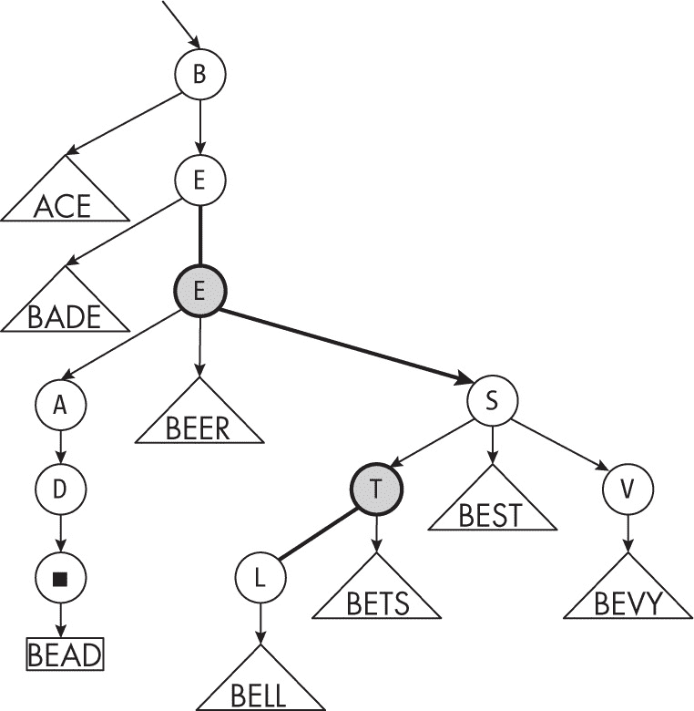

图 16-31：将 BEER 放在 BED 的位置，以保持三叉 trie 的结构。

找到要替换删除词（BEER 替代 BED）之后，你需要调整多个链接以维持正确的 trie 结构。如果右子树没有左子树，变更会更简单。看看你是否能弄明白如何移除 BEST 并用 BEVY 替代它。

逻辑如下：

```
const _remove = (tree, wordToRemove) => {
❶ if (isEmpty(tree)) {
    // nothing to do
❷} else if (wordToRemove.length === 0) {
    tree = null;
  } else {
  ❸ if (wordToRemove[0] === tree.key) {
      tree.middle =
        tree.key === EOW
          ? null
          : _remove(tree.middle, wordToRemove.substring(1));

    ❹ if (isEmpty(tree.middle)) {
      ❺ if (isEmpty(tree.left)) {
          tree = tree.right;
        } else if (isEmpty(tree.right)) {
          tree = tree.left;
      ❻} else {
          let treeR = tree.right;
          let prev = null;
        ❼ while (!isEmpty(treeR.left)) {
            prev = treeR;
            treeR = treeR.left;
          }
        ❽ if (prev) {
 prev.left = treeR.right;
            treeR.right = tree.right;
          }

       ❾ treeR.left = tree.left;
          tree = treeR;
        }
      }
  ❿} else {
      const side = wordToRemove < tree.key ? "left" : "right";
      tree[side] = _remove(tree[side], wordToRemove);
    }
  }

  return tree;
};
```

如果树为空，则什么也不做 ❶。如果到达词的末尾（经过 EOW 字符，和查找时一样），将树设置为 null，操作完成 ❷。当你查找的字符与当前节点的键匹配时，递归地跟踪它的中间链接 ❸，但如果到达 EOW，则将该链接设为 null。删除后，检查是否到了一个中间链接为空的节点 ❹，这是你不希望出现的情况。如果左或右链接中的一个 ❺ 为空，则选择另一个链接；但如果两者都不为空 ❻，你需要找到右侧最左边的节点 ❼ 并修复链接，像之前描述的那样 ❽ ❾。（如果 prev === null，表示右边只有一个单独的节点；否则，你需要沿着左链接向下。）如果没有提前找到正确的字符，你需要向左或向右 ❿。

完成这个功能后，移除一个键与其他 trie 的操作相同：

```
const remove = (tree, wordToRemove) => _remove(tree, wordToRemove + EOW);
```

现在你已经看过了所有与三叉 trie 配合使用的函数，接下来让我们考虑它们的性能。

#### 考虑三叉 trie 的性能

三叉 trie 与本章中看到的其他 trie 有一个不同之处：树的形状取决于添加和删除的顺序，这意味着在最坏情况下，行为会与正常的平均情况不同。你可能还记得这在普通的二叉搜索树中也曾发生过。最坏情况的性能与平均性能不同，而这取决于树的构建方式。

如果你按照升序插入所有键，那么如果你存储的是长度为 *k* 的字符的键，且字母表包含 *s* 个符号，那么添加、查找和删除操作的时间复杂度都是 *O*(*sk*)，这比 *O*(*n*) 要好得多！严格来说，*O*(*sk*) 实际上是 *O*(1)，因为 *sk* 是常数，因此三叉 trie 的性能与其他 trie 相当。

### 总结

在本章中，我们研究了几种搜索树的变体，这些变体被称为字典树，它们应用了不同的概念：字典树并不直接存储和比较键，而是逐字符操作，从而在与我们之前研究的搜索树相比时，提供了更高的性能，且不需要复杂的操作，如旋转或平衡节点。

我们在这里研究的结构通常用于字典（快速查找单词）或简单的查找操作：给定一个键，找到与其相关的数据。字典树的保证性能使其成为一种有用的数据结构，尤其是在需要尽可能快地处理工作并且不想面对可能需要过长时间处理的意外最坏情况时。

### 问题

**16.1  字典树的映射**

你能使用映射（map）而不是数组或对象来实现字典树吗？

**16.2  是否为空？**

在第 410 页的“向基数树添加键”一节中，_add()函数中，wordToAdd 是否可能为空，如果可能，什么时候为空？

**16.3  旋转你的字典树**

你能对三叉树应用旋转操作吗？

**16.4  中间为空？**

对错题：在三叉字典树中，中间链接永远不会为空。

**16.5  四字母三叉字典树？**

假设你从一个空的三叉字典树开始，按顺序添加键 AAAA、AAAB、...AAAZ、BAAA、...BAAZ ...一直到 ZZZZ——包含四个字母的所有可能组合。这个字典树的高度会是多少？

**16.6  它们看起来怎样？**

总结一下，如果你只向这些结构中添加一个单词“ALGORITHM”，本章中提到的所有结构（基于数组的字典树、基于对象的字典树、基数树和三叉字典树）会是什么样子？
