## 第十七章：17 图


在前几章中，我们讨论了几种数据结构，而在本章中，我们将探讨一个新话题：如何表示图*。*我们还将研究与图相关的几种算法，如寻找最短路径、计算距离、检查软件依赖关系等。

### 什么是图？

一个抽象的定义是，图是一个由对象组成的集合，这些对象之间以某种方式相互关联。这些对象叫做*顶点*（*vertex*的复数），也叫做*点*或*节点*。顶点对之间的关系通过连接顶点对的线条来图形化表示，这些线条叫做*边*、*弧*、*箭头*，或仅仅称作*链接*。与一个点连接的弧的数量叫做它的*度*。以这种方式相连的点有时称为*邻居*，或者认为它们是*相邻*的。同样的词在类似的意义下使用：如果两个边共享一个公共的顶点，则认为它们是相邻的。

这些定义可能听起来模糊或相当“数学化”（事实上，专门研究图及其性质的数学分支叫做*图论*），因此本章将通过一些实际示例进行探讨。（实际上，我们已经学习过图。树就是图；实际上，定义也适用于它们。）图的某些使用场景包括以下内容：

+   人与人之间的关系，其中你可以将人（节点）和友谊（弧）联系起来，这样如果两个人是朋友，他们就会相互连接

+   代码中的依赖关系，包括导入其他模块（节点）中导出的组件（弧）的模块

+   任务之间有依赖关系的项目（节点），这些任务在其他任务完成之前无法开始（弧）

+   地图，类似于基于 GPS 的应用程序，包含城市（节点）和道路（弧）

图 17-1 展示了后一种情况，使用图表示城市或国家的一部分。

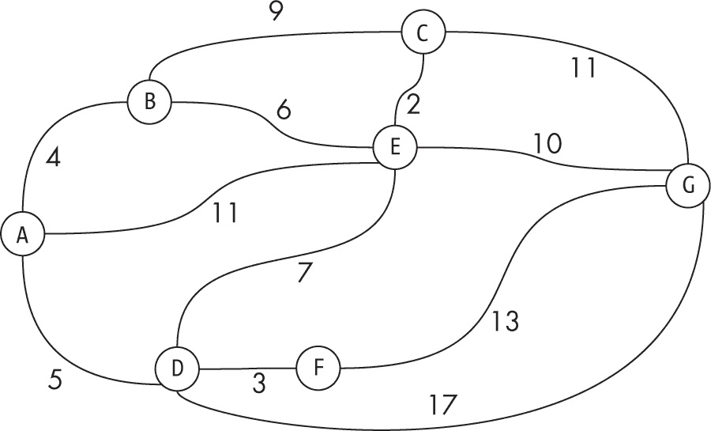

图 17-1：一个表示某些城市和连接它们的道路的图

在这个图形地图中，顶点代表城市（或街角，或国家），边代表道路（或街区，或航班）。在图 17-1 中，边是*无向*的，意味着可以任意方向行驶——例如，从 A 到 E 或从 E 到 A。

在一个城市地图中，街道可能是单行道，那么我们需要一个*有向*图，如图 17-2 所示。在这些图中，我们可以讨论节点的*出度*（从该节点出发的弧的数量）或*入度*（指向该节点的弧的数量）。

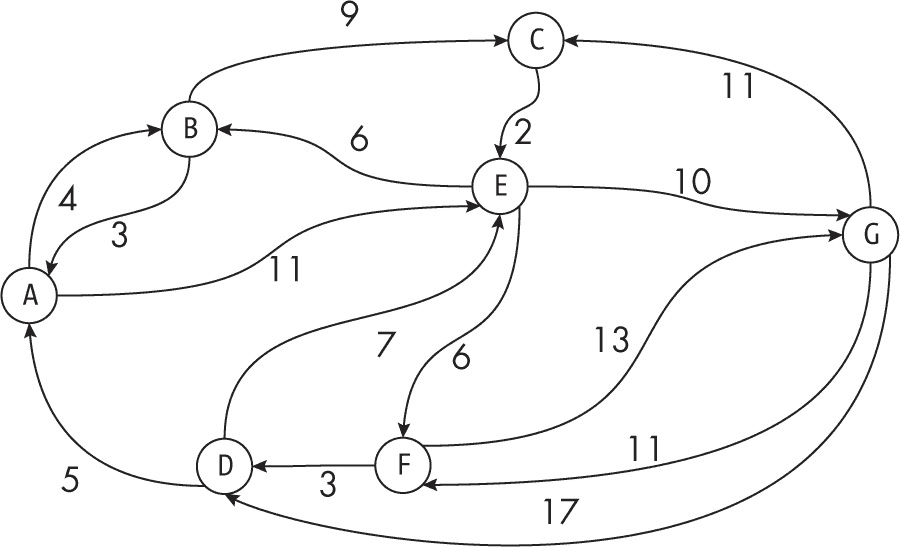

图 17-2：一个有向图，表示只能单向行驶的道路

边通常有与之相关的值，如时间或成本，这使得它们成为*加权*图。也可以有*无权*图，边没有与之相关的值；重要的是关联本身。不要假设对有向图适用对称性或其他规则。例如，在图 17-2 中，你可以直接从 B 到 C，但不能一步到位地从 C 返回 B。此外，从 A 到 B 的成本与从 B 到 A 的成本不同。最后，从 G 经 F 到 D 的成本可能比直接从 G 到 F 更低。在某些情况下，权重可能为负值，但我们在这里始终处理非负值。

> 注

*图也可以在任意一对顶点之间有多条边，但我们不考虑这些。在本章的所有算法中，仅使用最短的边，忽略其他边就足够了。我们这里还忽略的一种情况是从顶点到它自身的边，称为环。*

我们将考虑以下几种类型的过程：

+   给定两个顶点，你可能想知道是否存在一条从第一个顶点到第二个顶点的路径。作为扩展，你可能想找到从一个顶点到另一个顶点或所有其他顶点的最小成本路径（*最短路径*）。

+   一个有向图可以表示一个项目，其中包含任务和任务之间的依赖关系：你可能希望找到一个排序，使得在所有前置任务完成之前，任何任务都不能开始；这就是所谓的*拓扑排序*。

+   基于任务和依赖关系的这个示例，你可能会担心某种类型的循环（如 A 在 B 之前，B 在 C 之前，C 又在 A 之前）会使得排序变得不可能。与拓扑排序相关的问题是*循环检测*。

+   一个无向图可以表示地理点，边表示将它们连接起来的成本，比如电力线路或通信电缆的成本。*最小生成树*显示了如何选择边，使得所有点都以最低的总成本互相连接。

+   同样地，给定前面的图，你可能会问它是否是连通的（意味着可以从任何一个点到达其他所有点）或不连通。在这种情况下，你需要实现*连通性检测*。

这份程序列表并不完整，但涵盖了最重要的算法。让我们先考虑如何表示图，然后再讨论必要的算法。

最后一个说明：在讨论算法性能时，我们将使用*v*表示顶点的数量，*e*表示边的数量。请注意不要将其与数学常数*e*混淆，后者是自然对数的底数，约为 2.718281728 ...！

### 图的表示

表示图的方式有几种，我们将考虑三种最常用的方法：邻接矩阵、邻接表和邻接集。

#### 图的邻接矩阵表示法

*邻接矩阵*表示法是最简单的，基本上展示了哪些节点是相邻的。这种图通过一个方阵表示，每个顶点都有一行一列。如果存在从顶点*i*到顶点*j*的连接，矩阵中位置[i][j]就有一个值：对于无权图，这是一个布尔值，表示是否有连接；对于带权图，这是连接边的权重。如果两个顶点之间没有连接，则矩阵在相应的位置上为假值或特殊值（零或+无穷大）。对于无向图，请注意位置[i][j]将始终等于位置[j][i]；矩阵相对于主对角线是对称的。

再次考虑前一节中的有向图（图 17-2）。该图的矩阵表示可以如图 17-3 所示。

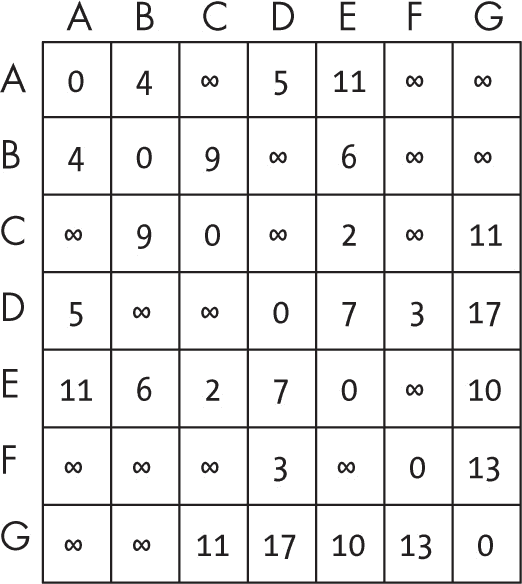

图 17-3：图 17-2 中的图的邻接矩阵表示

我们已经选择用零表示缺失的边；另一个同样有效的解决方案是用+无穷大表示缺失的边。不管你用哪种方式表示缺失的边，在这两种情况下，矩阵的对角线都会是零。从某个点到达自身不需要成本，因为你已经在那个点上。

这种表示方法相当容易操作，但对于大型图来说，它需要大量空间。在性能方面，检查两个顶点是否相邻，或添加、删除边的操作时间复杂度为*O*(1)，这是最快的。然而，处理一个顶点的边列表的时间复杂度是*O*(*v*)，无论该节点实际上有多少个邻居。

如果节点只有少数邻居，大部分矩阵会被标记为空（形成*稀疏*矩阵），这意味着你浪费了空间。在这种情况下，你可以选择邻接表表示法。

#### 图的邻接表表示

图 17-3 中显示的矩阵浪费了太多空间，并且导致所有需要获取从某个点出发的弧列表的过程时间复杂度为*O*(*v*)。你可以使用邻接表表示，这样每个顶点就能包含所有与之连接的点以及所有连接到它的点。

对于图 17-2 中显示的同一个有向图，*邻接表*表示如图 17-4 所示（与图 17-3 中的矩阵表示进行对比）。

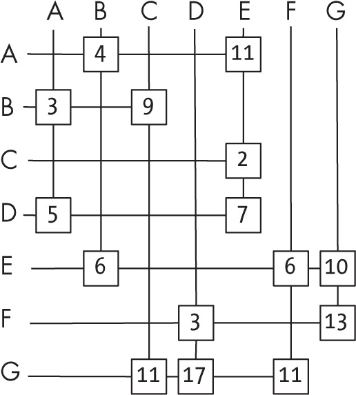

图 17-4：邻接表表示是邻接矩阵的另一种选择。

对于每个顶点，你有两个列表：一个是输出边列表（水平显示，作为行），另一个是输入边列表（垂直显示，作为列）。例如，在第一行，你可以看到从 A 出发，可以到达 B（代价为 4）或 E（代价为 11）。查看第一列，你会看到从 B 出发可以到达 A（代价为 3）或 D（代价为 5）。结构中的每个元素都将有一个指向同一行下一个元素的指针，以及一个指向同一列下一个元素的指针。你还可以使用双向链表以便更容易进行更新。节点还需要包含两个端点的身份信息。

使用这种结构，可以快速处理从给定顶点出发或到达的所有边，这将加速多个算法。然而，如果你只是想知道两个给定点是否直接相连，情况就会变得更慢；在这种结构下，它将是一个*O*(*e*)操作。你也可以选择使用集合而非列表，稍后会展示这种方法。

#### 图的邻接集合表示

我们可以提出更复杂的解决方案，涉及使用集合（如在第十一章中所述）或树（如在第十二章中所述），而不是使用列表。例如，在处理平衡搜索树时，检查两个点是否相连是一个*O*(log *e*)操作。（你可以考虑每个节点的平均度为*e*/*v*条边，那么操作将是*O*(log *e/v*)）。在这种结构下，每个顶点都与两个映射相关联：一个用于输出边，一个用于输入边。两个映射的关键都是边上的“另一个”点。添加和移除边都是*O*(log *e*)操作，因此性能更好。处理从节点出发的所有弧的速度与列表相同。

### 找到最短路径

一个常见的问题如下：给定图中的两个点，找到从第一个点到第二个点的路径。路径是一个相邻边的序列（每条边开始的地方是上一条边的结束处），它从第一个点开始，到第二个点结束。

我们在第五章中已经考虑过这种类型的问题，当时你在迷宫中找到了一条路径，因此现在解决一个更复杂的问题：从一个节点到另一个节点的*最短*路径，或者更一般地，找到从一个节点到所有其他节点的最短路径。这些算法不仅会找到路径是否存在，还会找到所有可能路径中最优的（最便宜、最短）。如果你只想找到一条路径，任何路径，只需一旦到达目的地就停止搜索。

#### Floyd-Warshall 的“所有路径”算法

这个第一个算法很有趣，因为它应用了动态规划，这是你在第五章中探讨过的内容。*Floyd-Warshall 算法*虽然不是性能最优的（你会看到其他更好的选择），但它绝对是最简单的。还有另一个区别：在这里，你将找到所有节点对之间的最短距离，而在其他情况下，你可能只想找到特定节点对之间的距离。这一要求会对性能产生影响，但在某些情况下，拥有整个距离表可能正是所需的。

假设存在一个函数*distance*(*i,j,k*)，该函数返回从点*i*到点*j*的最短路径长度，最多使用图中前*k*个节点作为路径。（换句话说，你不会考虑经过其他节点的任何路径。）你想计算所有*i*和*j*值的*distance*(*i,j,n*)。

*distance*(*i,j,k*)的值必须是一个路径，要么不包含第*k*个节点的路径，要么是从*i*到*k*的路径，再从*k*到*j*的路径，取这两者中较短的路径。换句话说，*distance*(*i,j,k*)是*distance*(*i,j,k* – 1)和*distance*(*i,k,k* – 1) + *distance*(*k,j,k* – 1)的最小值。这个公式非常重要；请确保完全理解它。这个定义是递归的，但基本情况很简单：对于所有点，*distance*(*i,i,*0)是 0；而对于*i ≠ j*，*distance*(*i,j,*0)是从*i*到*j*的边，如果存在的话，否则是+无穷大。（如果不仅仅是求距离，而是要找到实际的路径呢？见问题 17.1。）

作为示例，使用图 17-5 中的图形。为了简化起见，它是无向图，但该算法也适用于有向图。


图 17-5：你想在其中找到任意两点之间最短距离的图

图 17-6 展示了图 17-5 中的初始距离数组。

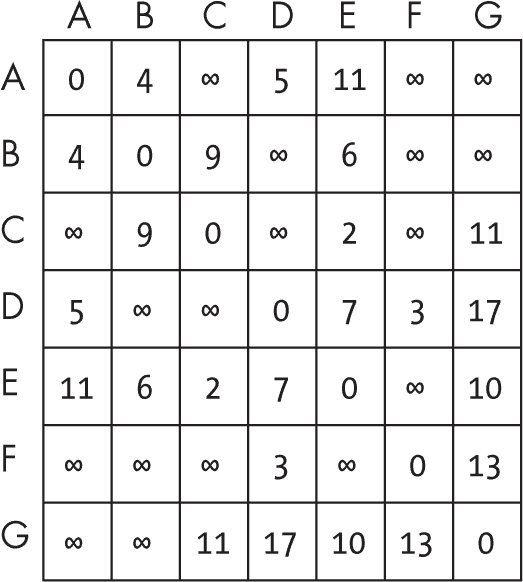

图 17-6：使用无穷大值表示缺失边的图 17-5 图的邻接矩阵

图 17-6 中的对角线全是零，除了现有的边，其他都为+无穷大。（这只是使用+无穷大代替零来表示缺失的边，正如本章之前提到的邻接矩阵。）在第一次迭代中，检查将第一个点（A）作为中介是否能缩短某些距离。实际上，你会发现，现在你可以以 9 的代价从 B 到 D，如图 17-7 所示。

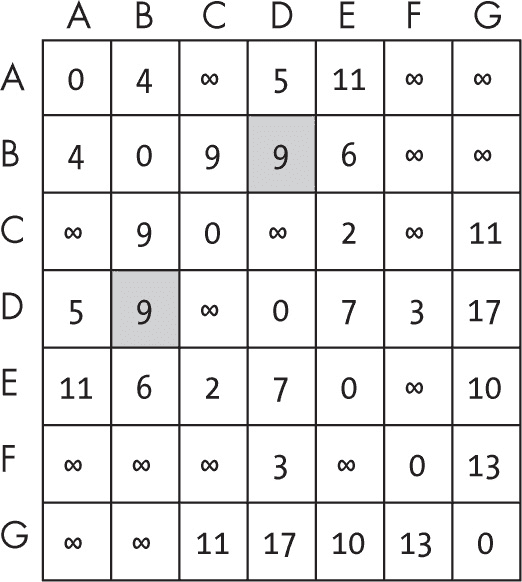

图 17-7：当你尝试将 A 作为中介点时，会发现 B 和 D 之间的距离变短。

第二次迭代检查是否将 B 作为中介可以得到更短的路径。你会发现现在从 A 到 C 的成本为 13，从 C 到 D（C 到 B，再从 B 到 D 经过 A）的成本为 18，如图 17-8 所示。

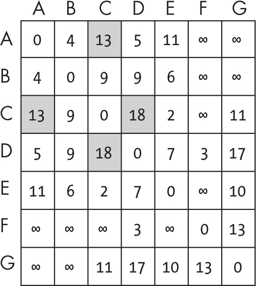

图 17-8：当你尝试将 B 作为中介时，你会发现另外两条更短的路径。

在下一次迭代中，你将检查是否将 C 作为中介有帮助；接着，你会尝试 D、E 等等。你会继续迭代，直到所有节点都被考虑过，最终结果（查看它）提供了所有节点之间的距离（见图 17-9）。

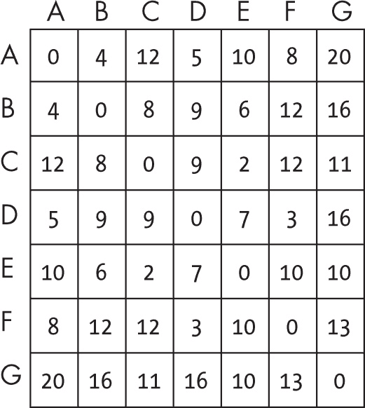

图 17-9：在尝试了所有可能的中介点之后，你计算出最终的距离矩阵。

代码很简短：

```
const distances = (graph) => {
❶ const n = graph.length;

❷ const distance = [];
❸ for (let i = 0; i < n; i++) {
    distance[i] = Array(n).fill(+Infinity);
  }

❹ graph.forEach((r, i) => {
  ❺ distance[i][i] = 0;
  ❻ r.forEach((c, j) => {
      if (c > 0) {
        distance[i][j] = graph[i][j];
      }
    });
  });

❼ for (let k = 0; k < n; k++) {
    for (let i = 0; i < n; i++) {
      for (let j = 0; j < n; j++) {
      ❽ if (distance[i][j] > distance[i][k] + distance[k][j]) {
          distance[i][j] = distance[i][k] + distance[k][j];
        }
      }
    }
  }

 ❾ return distance;
};
```

n 变量 ❶ 有助于缩短代码；它仅仅是图中节点的数量。距离的数组数组 ❷ 包括从每个节点到其他节点的距离。最初，所有的距离都设为 +无穷大 ❸，然后进行修正 ❹。一个点到自身的距离是零 ❺，而一个点到另一个点的距离，如果连接的话，就是边的长度 ❻。现在，距离数组包含了所有没有中介点的距离，正如前面所描述的那样。三个嵌套的循环系统地应用了前面描述的动态规划计算 ❼，如果你发现了一个更好的（更小的）距离 ❽，则更新表格。在这种情况下，你只保留最后的表格；第 *k* 次迭代的值会替代前一次的值，因为你再也不需要它们了。最终结果 ❾ 是描述的所有点对之间的距离表格。

这个算法的运行时间复杂度是多少？三个嵌套的循环，每个 *O*(*v*)，给出了答案：*O*(*v*³)。正如前面提到的，这是非常陡峭的，但它能计算出所有节点对之间的距离。如果只需要从一个节点到所有其他节点的距离，或者更具体地说，从一个给定节点到另一个节点的距离，你会看到更好的算法。

#### 贝尔曼-福特算法

现在考虑一个不同的问题：找到一个给定节点到所有其他节点的距离。*贝尔曼-福特算法*的思想是通过遵循一条给定的边，看看是否能找到两个节点之间的更好路径，并重复这个过程，直到没有更多的替代路径。首先考虑一条边长为一的路径，然后检查使用两条边是否有更短的路径，再检查三条边、四条边，依此类推。如果图中有 *n* 个节点，最长路径可以有 *n* - 1 条边，因此这是迭代的限制。

我们使用相同的图来计算从 F 到所有其他节点的最短距离。（该算法在有向图中同样有效，但为了简化，使用的是无向图。）初始情况如 图 17-10 所示。没有处理任何边（没有走任何路线），只有 F 可以（显而易见地！）从 F 到达，你无法到达其他节点。

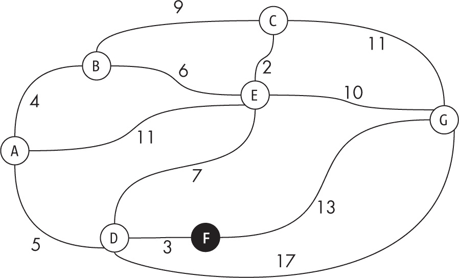

图 17-10：应用贝尔曼-福特算法，找到从 F 到所有其他点的最短距离。

假设节点按照字母顺序处理。当你处理来自 A、B 或 C 的边时，你无法计算距离，因为你还不知道如何到达这些节点。当你处理 (F,D) 边时，你现在能够到达节点 D，并且你有了路径的第一步，如 图 17-11 所示。

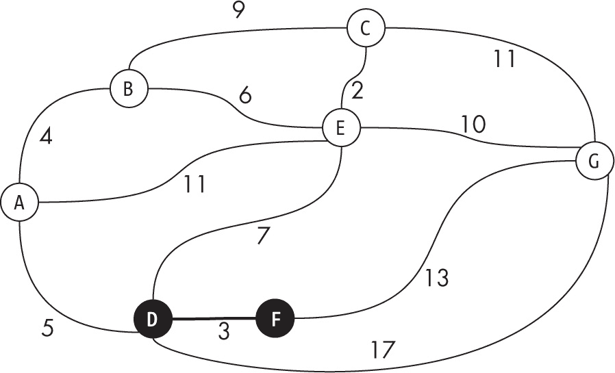

图 17-11：按顺序处理节点时，从 F 可以到达的第一个其他节点是 D。

现在你知道可以以 3 的代价到达 D。接下来处理边 (F,G)，你可以到达另一个节点，如 图 17-12 所示。

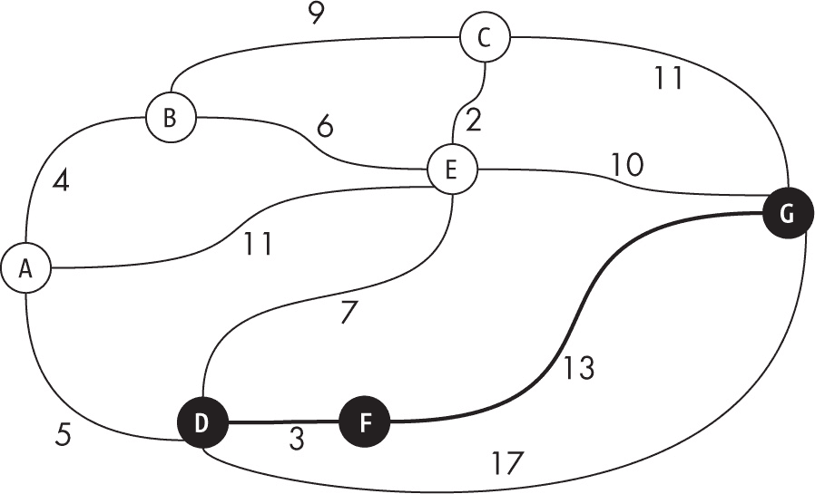

图 17-12：你可以从 F 到达的另一个节点是 G；你将在后续的迭代中重新处理 D。

然后，你可以处理从 G 出发的边，因为现在你知道可以到达 G。处理边 (G,C) 和 (G,E) 将另外两个节点标记为可达。（别忘了：你找到的任何路径或距离，如果有更好的替代方案出现，可能会改变。）图 17-13 显示了新的情况。

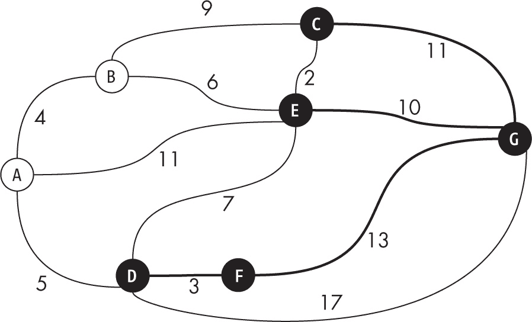

图 17-13：处理 G 时，它是从 F 到达的，你也可以到达 C 和 E。

第一遍处理完成。到目前为止，你知道可以到达七个节点中的五个，并且你为每个节点找到了可能的（但可能不是最优的）路径。

现在开始新的一轮处理。你仍然无法处理 A 或 B 出发的边，因为你还没有到达这些节点，但你可以处理边 (C,B)，并添加一条新路径，如 图 17-14 所示。

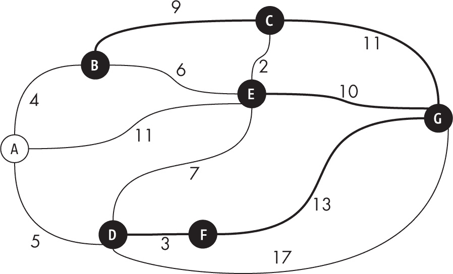

图 17-14：第二次迭代现在发现 B 可以从之前到达的 C 处到达。

(C,E) 和 (C,G) 边并不代表更短的距离，所以你什么也不做。（例如，你可以从 F 到 E，花费 23；而经过 C 的话将花费 26，所以这条路径不行。）考虑 (D,A) 和 (D,E) 边时，情况变得有趣。你现在可以到达 A，并且通过 D 找到了通往 E 的更好路径（参见 图 17-15）。

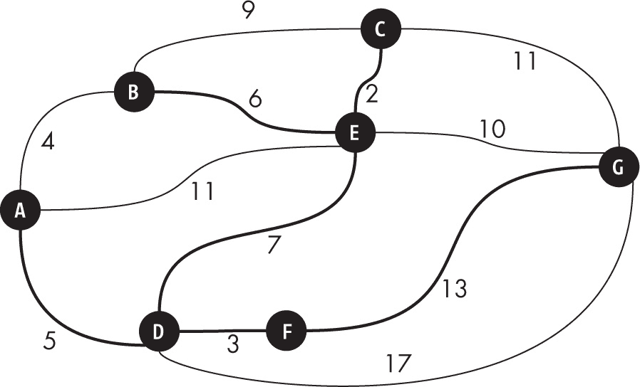

图 17-15：第二次查看 D，发现到 E 的路径更短。之前的路径是从 F 到 G，再到 E，长度比从 F 到 D 再到 E 要长。

从 F 到 E 的先前最佳路径是通过 G，花费为 23，但现在你发现可以通过 D，花费为 10。没有更多的变化可以进行，因此开始第三次遍历。一个进一步的改进是，通过 A 到 B 的路线比通过 E 更短（见图 17-16）。

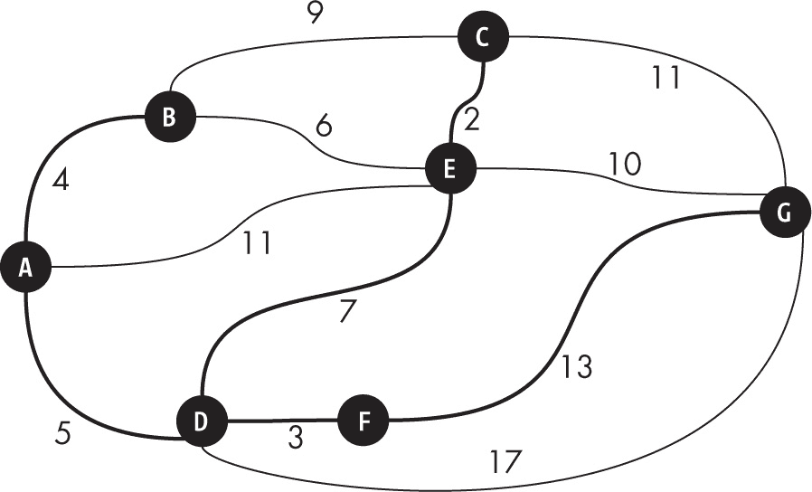

图 17-16：第三次遍历找到了一条更好的从 A 到 B 的路径，但没有更多的变化。

第三次遍历没有带来更多的变化，进一步的遍历也不会有，因此你完成了。你已经知道从起点 F 到所有其他点的最短路径，并且知道要遵循哪些边来达到这个成本。

你可以按如下方式编写这个算法：

```
const distances = (graph, from) => {
  const n = graph.length;

❶ const previous = Array(n).fill(null);
❷ const distance = Array(n).fill(+Infinity);
❸ distance[from] = 0;

❹ const edges = [];
  for (let i = 0; i < n; i++) {
 for (let j = 0; j < n; j++) {
      if (graph[i][j]) {
        edges.push({from: i, to: j, dist: graph[i][j]});
      }
    }
  }

❺ for (let i = 0; i < n - 1; i++) {
  ❻ edges.forEach((v) => {
      const w = v.dist;
    ❼ if (distance[v.from] + w < distance[v.to]) {
      ❽ distance[v.to] = distance[v.from] + w;
      ❾ previous[v.to] = v.from;
      }
    });
  }

  ❿ return [distance, previous];
};
```

使用一个前驱数组❶来记录你是从哪个节点到达当前节点的；如果 previous[j]是 i，则从起点到 j 的最短路径是先通过 i 再到 j。距离数组❷记录了从起点到每个节点的距离；将所有的距离初始化为+infinity，除了从起点到自身❸的距离，显然为零。为了处理所有的边而不必遍历整个矩阵，创建一个边数组❹；用这个数组进行迭代会更快。现在进行 n - 1 次迭代❺：对于每条边❻，查看使用它是否提供了从两个端点之间的更短路径❼；如果是，更新第二个节点的距离❽，并记录你是从哪个节点到达的❾。（你能通过减少遍历次数做得更好吗？见问题 17.2。）该算法的结果是一个包含距离的数组和一个显示如何从任何节点间接到达起点❿的数组。

这个算法的时间复杂度是多少？鉴于循环运行了*O*(*v*)次，并且每次都会遍历所有边，结果是*O*(*ve*)。这个比 Floyd-Warshall 算法更好，但它仅找到从单个起点到所有其他点的最短距离。你可以做得更好，正如你将在解决这个问题的最终算法中看到的那样。

#### Dijkstra 算法

如果你想找到从一个点到所有其他点（或特别是某个特定点）的最短路径，Dijkstra 算法非常高效。它通过从第一个点开始（该点被认为是*已访问*的，距离自身为零），成为初始的*当前*点。所有其他点都被认为是*未访问*的，距离为+infinity。从那时起，它会执行以下操作：

1. 遍历所有当前节点的未访问邻居，如果到该邻居有更短的路径，就选择那条路径并更新到未访问节点的距离。

2. 在处理完当前节点的所有未访问邻居之后，将该节点标记为已访问，并且你就完成了它。

3. 如果还有未访问的点，选择距离最短的那个，将其作为当前节点，并重复此过程。

4. 当没有未访问的点剩下时，算法结束（如果你想要从起点到所有其他点的距离），或者当目标点被标记为已访问时（如果你只关心该特定距离）。

考虑一个例子，然后进行实现。为了简便，你将使用之前相同的无向图，但 Dijkstra 算法同样适用于有向图。 图 17-17 显示了初始配置，起点被标记为已访问。

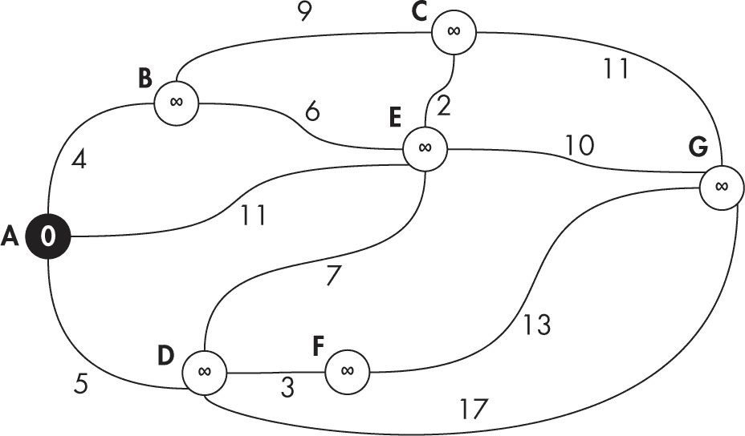

图 17-17：Dijkstra 算法的初始设置：从 A 到自身的距离是零，而从 A 到其他节点的距离设置为 +无穷大。

考虑从当前点（A）到邻居的边，你知道你可以到达 B、D 和 E（见 图 17-18）。

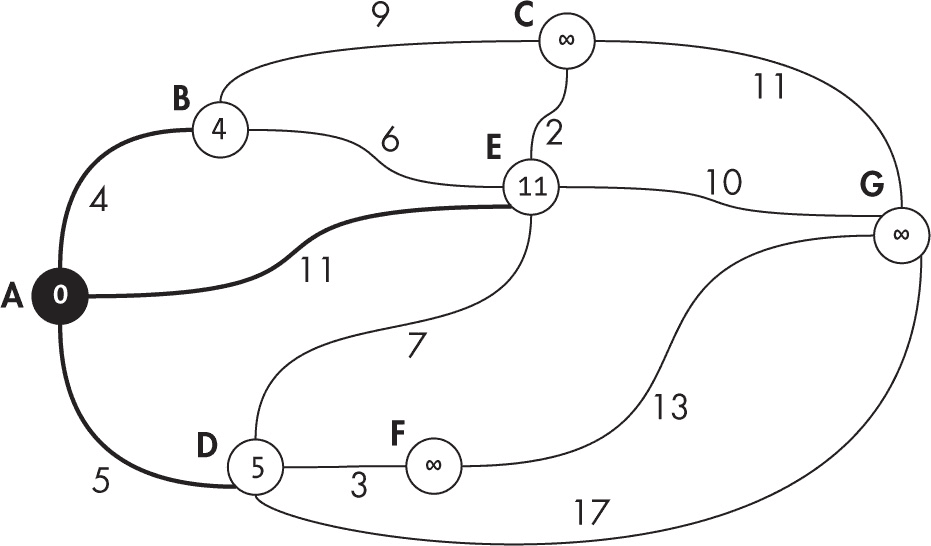

图 17-18：考虑从 A 到其邻居的边，你可以暂时更新到 B、D 和 E 的距离。

你已经更新了到这三个节点的距离，但这些更新目前只是暂时性的，因为你可能会在后续找到更好的路径——比如，从 A 到 E 就有一条更短的路径。

下一步标记 B 为当前节点，因为它是最近的未访问节点（见 图 17-19）。

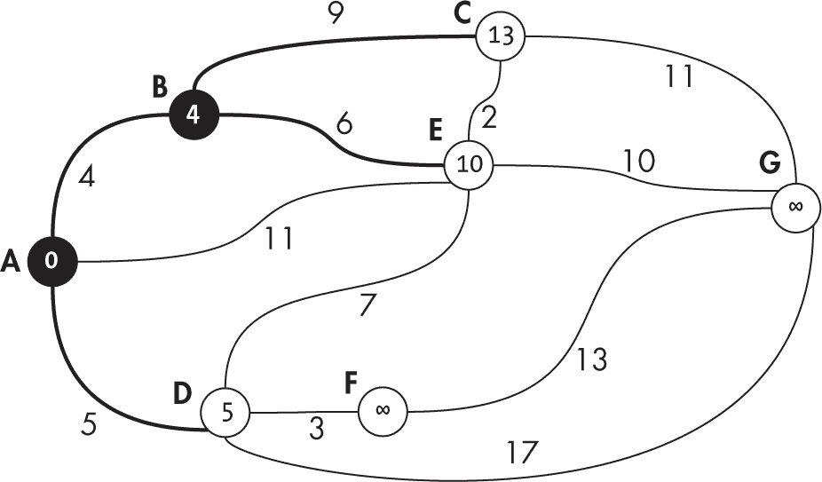

图 17-19：从 B 开始重复这一过程，B 是最近的未访问节点，并找到到 C 和 E 的更短路径。

你找到了一条到 C 的路径，距离为 13，因为 B 距离为 4，而（B,C）边的权重为 9。你还找到了一条更短的到 E 的路径，因此需要更新这些距离。现在，B 被标记为已访问，并且你转向 D 作为新的当前节点（见 图 17-20）。

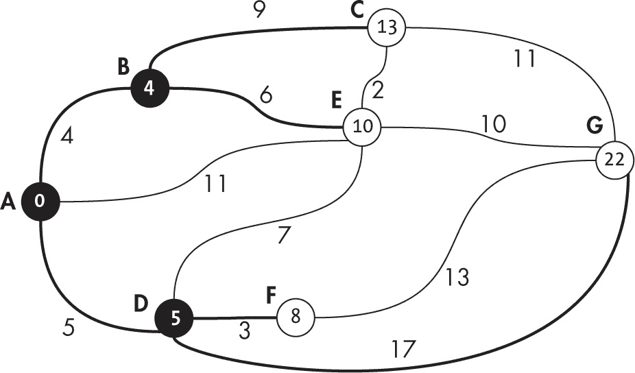

图 17-20：你现在从 D 开始，D 是下一个最近但尚未访问的节点，找到到 F 和 G 的更短路径。

从 D 开始，你可以更新到 F 和 G 的距离和路径。到 E 的距离没有被修改，因为通过 D 会需要距离 12，而你已经找到了更短的路径。现在，F 成为当前节点，接下来的过程会很快，因为它只允许一条出路，如 图 17-21 所示。

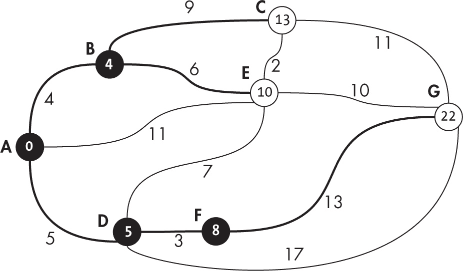

图 17-21：处理 F 后，找到一条更好的到 G 的路径。

你已经更新了到 G 的最佳路径（截至目前），现在是 21，从 A 到 D，再到 F。你接近完成，E 是下一个需要处理的节点（见 图 17-22）。

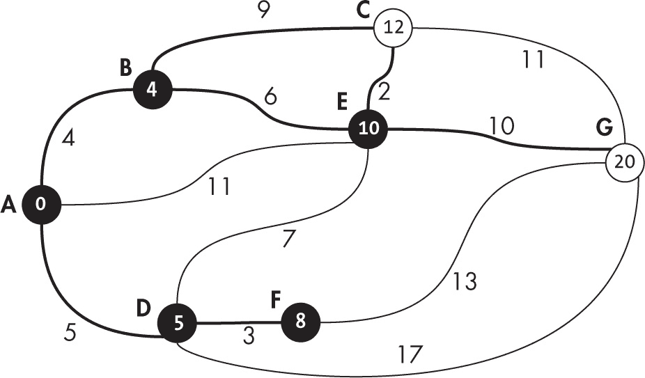

图 17-22：接下来处理 E，允许你更新到 C 和 G 的距离。

通过 E 可以使到 C 和 G 的距离更短，所以需要更新这些距离。接下来的步骤选择 C 和 G，然后就不需要再做任何更改。 图 17-23 显示了从 A 出发的最终结果，选定路径和计算的距离。

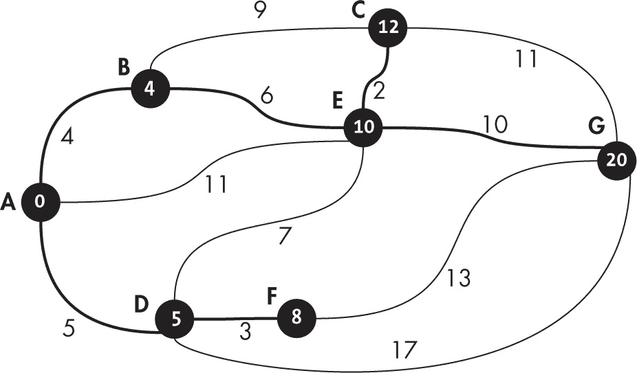

图 17-23：当你完成所有节点的处理后，你会得到从 A 到所有其他节点的最优距离。

为了实现良好的性能，快速确定下一个要处理的节点（即距离最短的节点）非常重要。一个直接的循环会是一个*O*(*v*)算法，但你已经看到了一种合适的结构：堆。使用这种结构可以让你在*O*(1)时间内找到下一个要处理的节点，而更新堆则是*O*(log *v*)，这要更好。

主要算法如下，但稍后你会看到与堆相关的一部分：

```
const distance = (graph, from) => {
  const n = graph.length;

❶ const points = [];
  for (let i = 0; i < n; i++) {
  ❷ points[i] = {
      i,
      done: false,
      dist: i === from ? 0 : +Infinity,
      prev: null,
      index: -1
    };
  }

❸ const heap = [from];
  for (let i = 0; i < n; i++) {
    if (i !== from) {
      heap.push(i);
    }
  }
❹ heap.forEach((v, i) => (points[v].index = i));

  // heap functions, omitted for now

❺ while (heap.length) {
    const closest = heap[0];
    points[closest].done = true;
    const dist = points[closest].dist;

 ❻ swap(0, heap.length – 1);
    heap.pop();
    sinkDown(0);

  ❼ graph[closest].forEach((v, next) => {
      if (v > 0 && !points[next].done) {
        const newDist = dist + graph[closest][next];
      ❽ if (newDist < points[next].dist) {
          points[next].dist = newDist;
          points[next].prev = closest;
          bubbleUp(points[next].index);
        }
      }
    });
  }

❾ return points;
};
```

points 数组❶包含从起点（from）到其他所有节点的距离。i 属性标识点；done 标记你是否已经处理完该点；dist 是距离，除了初始点外，所有点的初始值为正无穷；prev 显示从哪个点到达当前点❷。index 属性需要解释。正如前面提到的，你将把距离保存在堆中并进行更新，这可能导致它们向上浮动。然而，你需要知道每个点在堆中的位置，这就是 index 的作用。这样，当你更新点 p 的距离时，你知道 points[p].index 就是堆中对应的位置。

将每个点推入堆中，从起点 from ❸ 开始，并更新所有的 index 值 ❹。（由于在 points 数组中只有一个零距离，其他所有的距离都是正无穷，所以你可以创建一个无需任何比较的堆。）当堆不为空 ❺ 时，你移除堆顶点 ❻，标记其为已处理，并继续更新所有它能到达的节点的距离 ❼。如果某个距离更新为更小的值 ❽，则检查它是否应该在堆中上浮。最终结果 ❾ 是更新后的 points 数组，包含从初始节点到其他所有节点的距离。

现在考虑堆的代码，直接基于我们在第十四章中看到的内容：

```
❶ const swap = (i, j) => {
    [heap[i], heap[j]] = [heap[j], heap[i]];
    points[heap[i]].index = i;
    points[heap[j]].index = j;
  };

❷ const sinkDown = (i) => {
    const l = 2 * i + 1;
    const r = l + 1;
    let g = i;
  ❸ if (l < heap.length && points[heap[l]].dist < points[heap[g]].dist) {
      g = l;
 }
    if (r < heap.length && points[heap[r]].dist < points[heap[g]].dist) {
      g = r;
    }
    if (g !== i) {
      swap(g, i);
      sinkDown(g);
    }
  };

❹ const bubbleUp = (i) => {
    if (i > 0) {
      const p = Math.floor((i - 1) / 2);
    ❺ if (points[heap[i]].dist < points[heap[p]].dist) {
        swap(p, i);
        bubbleUp(p);
      }
    }
  };
```

swap(...) 函数只是交换堆中两个值 ❶，并同时更新 points 数组中相应的 index 属性，这样你就可以追踪每个节点在堆中的位置。sinkDown(...) 函数 ❷ 的工作原理与第十四章中看到的一样。注意，你不比较堆的值 ❸，而是使用堆值作为索引，比较 points 数组中的距离。（在第十四章中的排序代码中，我们直接比较了堆的值。）同样的改动也适用于 bubbleUp(...) 函数 ❹ ❺。

这个算法的性能如何？目前，每个点只处理一次，并且对于每个点，你都检查是否需要更新到其他所有点的距离，所以它的时间复杂度是*O*(*v*²)。你可以通过使用邻接点列表来优化它，类似于图的邻接表表示法，这样性能就变成了*O*(*v* log *v*)，因为堆的使用。

### 对图进行排序

在本章开始时，我们提到了一些图的实际应用，例如跟踪代码中的依赖关系（模块间的导入关系）或项目管理（显示依赖于其他任务完成的任务）。在这种情况下，我们可能希望找出某种节点排序是否能使一切顺利进行。相反，我们可能希望检查代码是否存在循环依赖，或是否某个任务无法完成。我们希望能够使用图来检测这些问题。

这种任务被称为*拓扑排序*，它意味着给定一个图，我们按照顺序对其节点进行排序，使得所有的链接“向前”连接，并且不会有从一个顶点指向先前节点的链接。我们将考虑两种排序算法：Kahn 算法，它基于一个简单的计数程序，以及 Tarjan 算法，它应用深度优先搜索，以倒序的方式生成我们所需的排序，其中最后的顶点首先输出。

#### Kahn 算法

考虑一个基本的论点：如果一个图有拓扑顺序，那么必须至少有一个节点没有入边，而*Kahn 算法*正是基于这一点。（这类似于说在任何一组数字中，必定有一个数字小于其余的数字。）你可以毫无问题地选择这些没有入边的节点。如果你接着丢弃所有从这些节点开始的边，你应该剩下没有入边的节点，然后你可以重复这个过程。如果在某个时刻你还有节点需要处理，但所有节点都有至少一条入边，那么就无法进行拓扑排序。

图 17-24 展示了该过程，使用的是我们在本章所有示例中使用的相同有向图。首先计算入边的数量，节点中的数字即为计算出的数量。

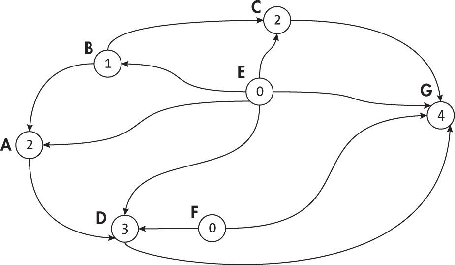

图 17-24：为拓扑排序设置的图，其中的数字显示每个点的入边数量。

由于你找到了至少一个入边为零的节点，你可以继续。E 点和 F 点可以按任意顺序输出，然后你减少从这两个点可以到达的节点的计数（见图 17-25）。

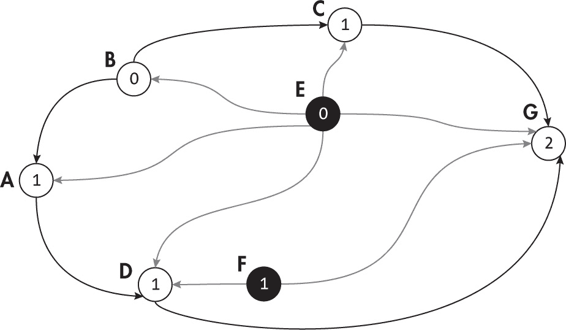

图 17-25：E 点和 F 点可以输出，因为它们没有入边，并且你“忘记”了这两个点的出边。

E 点和 F 点被输出，它们位于输出数组的第 0 和第 1 位置。（黑色的节点显示的是索引值。）再次，你找到至少一个没有入边的节点，因此 B 点位于输出数组的第 2 位置，并且你减少了 A 和 C 节点的计数（见图 17-26）。


图 17-26：B 点现在没有前驱节点，因此其输出和边被移除。

现在重复该过程：A 点和 C 点被输出，减少计数，最终得到了图 17-27 所示的状态。

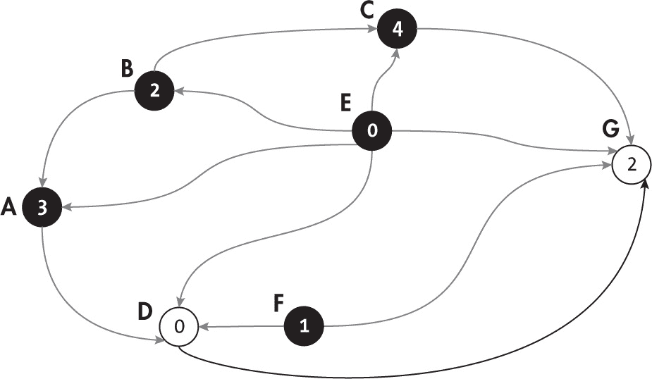

图 17-27：接下来是 A 点，然后是 D 点，最后是 G 点。

最后的两步首先输出 D 点，然后是 G 点。图 17-28 展示了最终状态，你希望得到的拓扑顺序是 E、F、B、A、C、D 和 G。

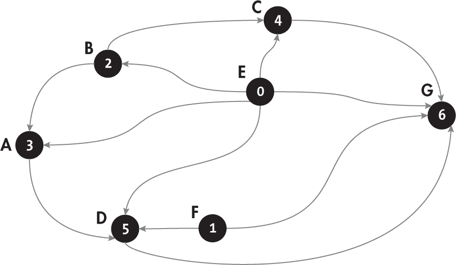

图 17-28：最终结果，数字表示节点输出的顺序。

你可以按如下方式编写算法：

```
const topologicalSort = (graph) => {
  const n = graph.length;
❶ const queue = [];
❷ const sorted = [];

❸ const incoming = Array(n).fill(0);
  for (let i = 0; i < n; i++) {
    for (let j = 0; j < n; j++) {
      if (graph[i][j]) {
        incoming[j]++;
      }
    }
  }

❹ incoming.forEach((v, i) => {
    if (v === 0) {
      queue.push(i);
    }
  });

❺ while (queue.length > 0) {
  ❻ const i = queue.shift();
  ❼ sorted.push(i);

  ❽ graph[i].forEach((v, j) => {
      if (v) {
        incoming[j]--;
      ❾ if (incoming[j] === 0) {
          queue.push(j);
        }
      }
    });
  }

 ❿ return sorted.length === n ? sorted : null;
};
```

将待处理的节点放入队列 ❶，然后将它们放入输出排序数组 ❷。传入数组会为每个节点计算进入边的数量 ❸，每当有一条边进入，计数加 1。没有进入边的节点会被推入队列进行处理 ❹，然后你可以开始排序过程。只要还有节点需要处理 ❺，就从队列中取出它们 ❻，并将它们推入输出列表 ❼。每输出一个节点 ❽，就丢弃它与其他节点的连接，减少进入计数 ❾。当没有更多节点需要处理时，如果所有节点都已排序，则表示成功 ❿；否则，表示失败。剩余的节点至少有一条进入边，这意味着无法进行拓扑排序。

#### Tarjan 算法

我们将应用深度优先搜索算法，提供另一种生成拓扑排序的方法。其思路是从一个节点开始*遍历*，标记每个经过的节点（像汉赛尔和格雷特尔那样），并看看在到达死胡同或回到已标记的节点之前能走多远，这意味着你找到了一个循环，因此无法进行拓扑排序。你可以将没有更多可行路径的节点标记为*已完成*并输出它们，然后从此忽略它们。通过这种方式，你将反向生成拓扑排序：你会首先输出排序中的最后节点，而最前面的节点则最后输出。

图 17-29 展示了我们在本章中使用的相同图形。首先从 A 点开始，标记它为*进行中*（灰色），并考虑从它出发的所有边。只有一条边。如果在后续步骤中你回到 A 点，并且它是灰色的，那么就意味着你发现了一个循环。

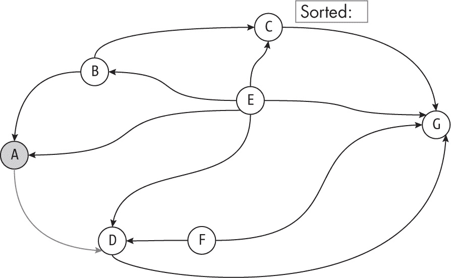

图 17-29：与上一部分相同的图，用于设置 Tarjan 算法。你从 A 点开始，达到了 D 点；A 点被标记为灰色。

现在你处在 D 点，这个点还没有被访问。也将它标记为灰色，并检查你能从它到达哪些节点。在这种情况下，你只能到达 G（见图 17-30）。

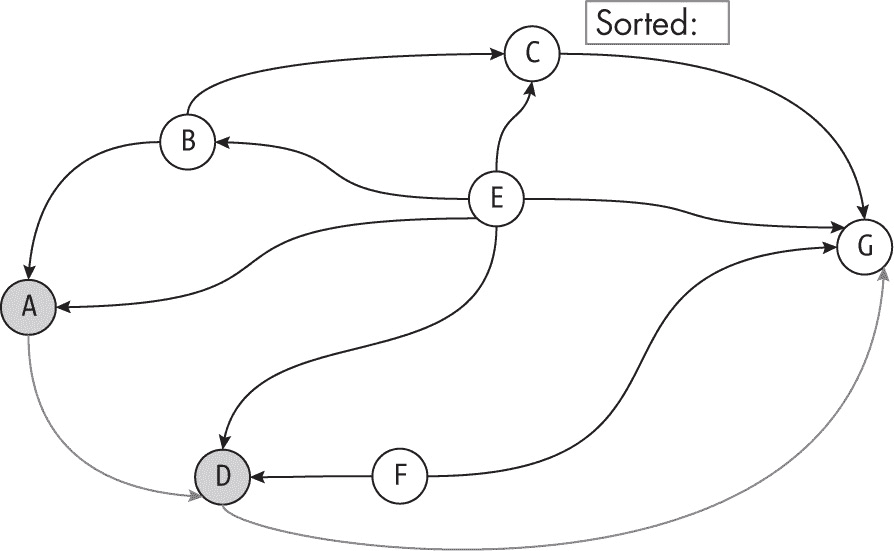

图 17-30：在 D 点之后，你到达了 G 点；D 点被标记为灰色。

在 G 点重复该过程，没有边从 G 点出去，因此将其标记为*已完成*并输出。排序后的列表如下所示，见图 17-31。

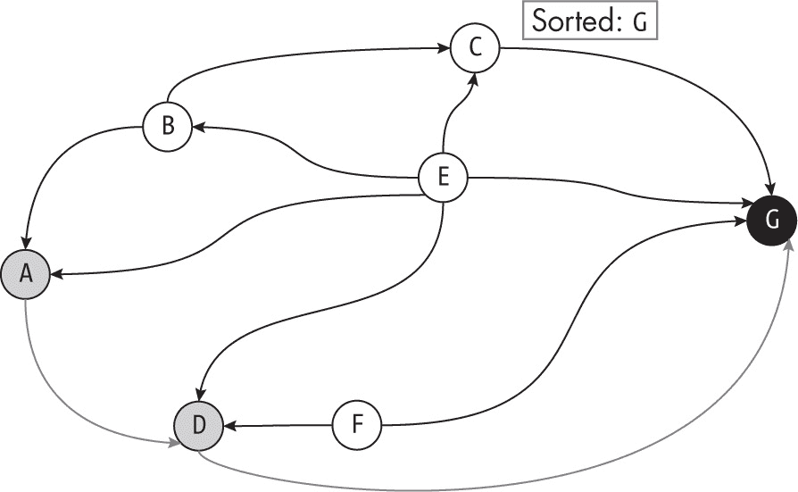

图 17-31：从 G 出发，无法到达任何其他点，因此将 G 输出到排序列表中。

处理完 G 后，你可以将 D 标记为*完成*（并输出它），然后对 A 进行同样的操作（参见图 17-32）。


图 17-32：D 没有与其他节点的连接，因此可以输出 D，然后 A 也可以输出。

当你完成 A 后，开始处理 B。B 到 A 的链接指向一个已标记为*完成*的节点，因此你忽略它。然而，B 到 C 的链接需要处理：B 被标记为*进行中*，你去到 C（参见图 17-33）。

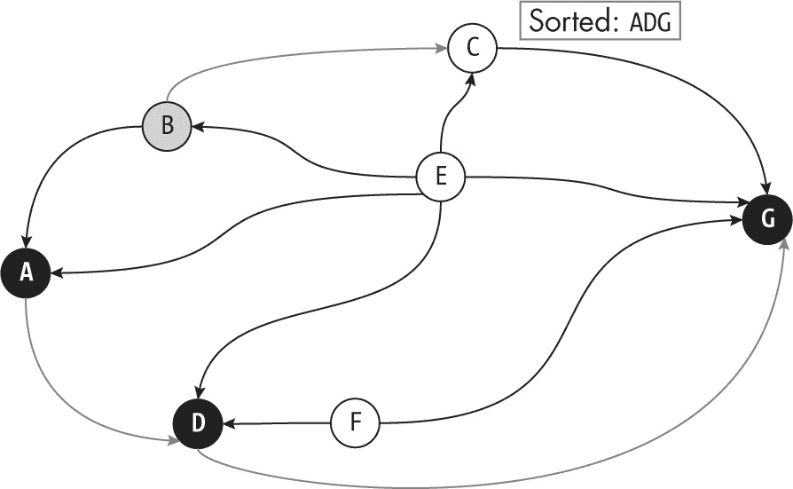

图 17-33：从 B 开始，你只能到达一个尚未输出的点：C。

将 C 标记为*进行中*，但它的唯一边指向一个已标记为*完成*的节点（G），因此将 C 标记为*完成*并将其添加到输出中。之后，你也完成了 B 的处理，它也被输出（参见图 17-34）。

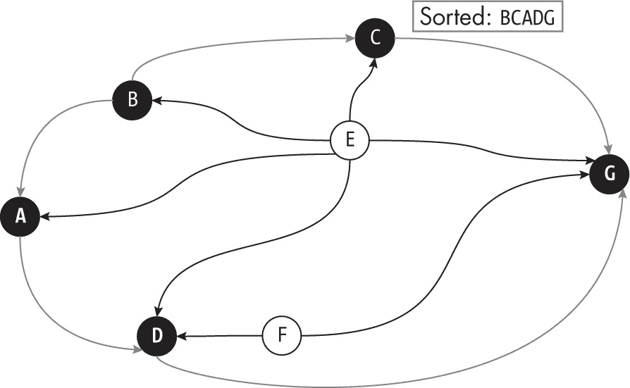

图 17-34：C 仅链接到一个已输出的点，因此可以输出 C，之后再输出 B。

最后的步骤类似。从 E 开始，所有链接都指向已标记为*完成*的节点，因此 E 被标记为*完成*并输出；F 也是如此，所有节点都已访问并且完成了拓扑排序，如图 17-35 所示。


图 17-35：当所有点都已输出时，算法结束。

下面是该算法的代码。*进行中* 的节点标记为 1（临时标记），*完成* 的节点标记为 2（最终标记）：

```
const topologicalSort = (graph) => {
   const n = graph.length;
❶ const marks = Array(n).fill(0); // 1:temp, 2:final
❷ const sorted = [];

❸ const visit = (p) => {
  ❹ if (marks[p] === 1) {
      throw new Error("Not a DAG");
  ❺} else if (marks[p] === 0) {
      marks[p] = 1;
    ❻ graph[p].forEach((v, q) => {
 ❼ if (v && marks[q] !== 2) {
          visit(q);
        }
      });

    ❽ marks[p] = 2;
    ❾ sorted.unshift(p);
    }
  };

  try {
  ❿ marks.forEach((v, i) => {
      visit(i);
    });
    return sorted;
  } catch (e) {
    return null;
  }
};
```

标记数组 ❶ 跟踪已访问和未访问的节点。0 表示该节点尚未访问，1 表示已访问并且正在遍历所有其可达的节点，2 表示该节点已处理并已输出。排序数组 ❷ 获取算法的输出。你定义一个递归函数 ❸ 来访问从某个起始节点 p 可以到达的所有节点。如果节点被标记为 1 ❹，则意味着从该节点开始，最终会返回到它本身。换句话说，存在一个环，因此无法进行拓扑排序。如果节点被标记为 0 ❺，则暂时将其标记为 1，并访问所有从该节点可达的未访问节点 ❻；跳过访问任何已标记为 2 ❼ 的节点，因为它们已经被分析过了。所有访问完成后，将 1 改为 2 ❽ 并输出当前节点 p ❾；使用 unshift() 来确保正确的输出顺序。要生成拓扑排序 ❿，你只需要从每个可能的节点开始并应用访问逻辑。

这个算法的性能如何？每个节点只被访问一次，且处理它的所有连接，但对于每个节点，它会检查整行是否有可能的连接可以遍历，这使得该实现的时间复杂度为 *O*(*v*²)。该算法如果采用邻接表表示会更加高效，因为那样你就可以直接处理一个节点的边，时间复杂度为 *O*(*ve*)。

### 检测循环

另一个需要考虑的问题是图中是否包含任何循环。（换句话说，图是否是树或森林？）例如，在编程时，如果模块之间的依赖列表中存在循环，那就严重出问题了！一个循环检测算法只需要检查它是否能在给定的图中找到至少一个循环。

幸运的是，我们已经看到了一种可以做这种检测的算法：Tarjan 的拓扑排序包含了检测循环的逻辑，所以我们已经有了所需的内容。以下代码直接提取自该算法：

```
const hasCycle = (graph) => {
  const n = graph.length;
❶ const marks = Array(n).fill(0); // 1:temp, 2:final

  const visit = (p) => {
    if (marks[p] === 1) {
      throw new Error("cycle found");
    } else if (marks[p] === 0) {
      marks[p] = 1;
      graph[p].forEach((v, q) => {
        if (v && marks[q] !== 2) {
          visit(q);
        }
      });

    ❷ marks[p] = 2;
    }
  };

  try {
    marks.forEach((v, i) => {
      visit(i);
    });
  ❸ return false; // no cycles found
  } catch (e) {
    return true;
  }
};
```

所有的代码都是一样的；这里唯一的区别在于，你没有为输出定义一个排序数组❶。显然，在标记一个节点为完全访问时，你不会添加任何内容❷，并且你返回的是布尔值，而不是数组或 null❸。

### 检测连通性

现在考虑另一个问题：如何判断一个图是否是完全连通的？一个无向图是连通的，如果图中每一对点之间都有路径；从任何一点都可以到达其他所有点。（一个极限情况是，只有一个顶点的图也被认为是连通的。）如果图不满足这个条件，我们可以将它拆分为两个或更多的连通子图。

有几种算法可以检测给定图是否是连通的；我们这里考虑两种。一种算法引入了另一种数据结构，允许合并集合，另一种使用递归遍历图。

#### 使用集合检测连通性

有一种相当简单的方法可以找出一个图有多少个连通部分。首先，形成不同的集合，每个集合中只有一个顶点。然后，遍历图中的所有边，如果一条边连接了不同集合中的顶点，就将它们合并，形成一个新的、更大的集合。遍历完所有的边后，如果剩下一个集合，说明图是连通的；如果剩下多个集合，说明图是不连通的。

问题是如何实现这些集合。你需要能够判断任意两点是否在同一个集合中，并能够将两个集合合并。通过操作一组树的森林，有一种高效的方法可以做到这一点，正如我们在第十三章中探索的那样。

考虑一下这个概念是如何工作的。每个集合由一棵*向上*的树表示，指针从叶子指向根（与前几章中做的正好相反）。树的叶子是其元素，必要时会添加中间节点。要查看两个值是否在同一集合中，沿着从每个叶子到根的路径往上走。如果到达相同的根，则这两个值在同一集合中。最后，连接两个集合时，只需添加一个新根，并让两个集合的根指向它。图 17-36 显示了一个初始设置，其中六个值各自属于一个单独的集合。请注意，所有指针隐含的是指向上方的，这与前几章的做法有很大不同。

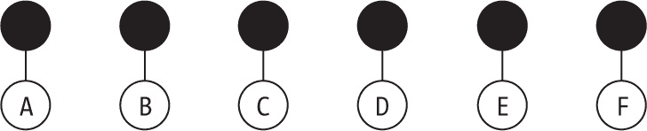

图 17-36：每个节点从其单独的树开始。

如果你想检查 D 和 E 是否在同一个集合中，沿着指针向上走，看到不同的根时，你可以得出它们不在同一集合中的结论。

要将它们合并为一个集合，只需添加一个新根，你就得到了图 17-37 中显示的情况。

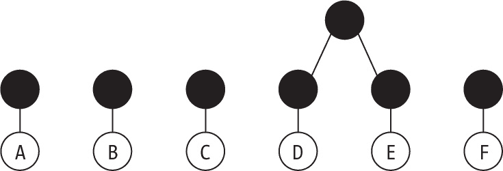

图 17-37：将 D 和 E 放在同一个集合中需要添加一个新根；现在 D 和 E 在同一棵树中。

如果你现在检查 D 和 E 是否在同一个集合中，答案是肯定的，因为沿着指针向上走，你会到达相同的根。如果你问 F 和 D（或者 F 和 E）是否在同一个集合中，答案是否定的，连接这两个集合就得到了图 17-38 中所示的情况。

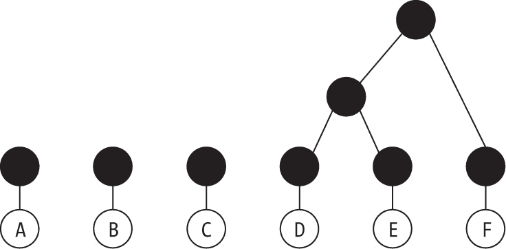

图 17-38：将 F 添加到之前的（D,E）集合中，又添加了一个新根，现在原来的三棵树已经连接在一起。

你可以通过简单的指针操作来处理这一切，并最终得到一个颠倒过来的森林。将 A 与 C 连接，再将 A 与 E 连接，得到一个新的配置（参见图 17-39）。


图 17-39：在这个最终方案中，你会发现（A,C,D,E,F）是一个集合，而（B）是一个独立的集合。

在图 17-39 中，你只有两个集合：一个单一集合（仅包含 B）和另一个包含所有其他值的集合。

算法很简短：

```
const isConnected = (graph) => {
  const n = graph.length;

❶ const groups = Array(n)
    .fill(0)
    .map(() => ({ptr: null}));
❷ let count = n;

❸ const findParent = (x) => (x.ptr !== null ? findParent(x.ptr) : x);

  for (let i = 0; i < n; i++) {
    for (let j = i + 1; j < n; j++) {
    ❹ if (graph[i][j]) {
      ❺ const pf = findParent(groups[i]);
        const pt = findParent(groups[j]);
      ❻ if (pf !== pt) {
          pf.ptr = pt.ptr = {ptr: null};
 ❼ count--;
        }
      }
    }
  }

❽ return count === 1;
};
```

从仅定义一个元素的单一集合开始❶，计数变量用于跟踪当前有多少个集合❷。辅助函数 findParent(...)从每个节点向上查找，找到其所在集合的根❸。其余的很简单：遍历所有的边❹，检查边的两个端点❺是否在同一个集合中；如果不在同一个集合❻，通过为两个树创建一个新的公共根并减少集合数量❼来合并这两个集合。处理完所有边后，如果剩下的只有一个集合❽，则图是连通的。如果你想知道它有多少个子图，可以检查计数变量。

#### 使用搜索检测连通性

我们将要考虑的第二个算法基于从任何点开始并应用系统的递归搜索。检查你可以到达哪些点，然后检查你从那些点可以到达哪些点，以此类推，直到你检查完所有的边。每次从某个点开始访问时，将其标记为*已访问*，以避免再次访问它。

给定你一直在使用的相同图，见图 17-40，并且从 A 开始，哪个节点会是第一个访问的节点？

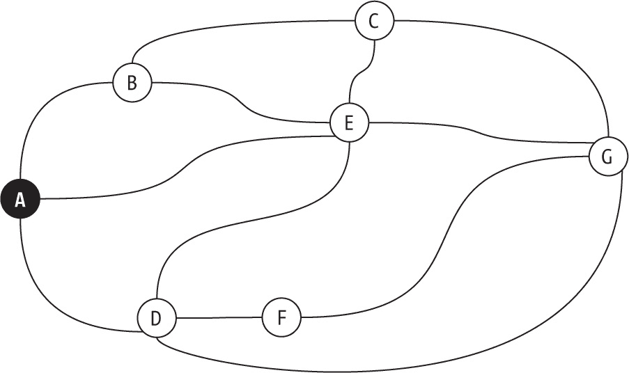

图 17-40：为了检查连通性，从任何一个点开始，本例中从 A 开始并标记它。

从 A 出发，你可以到达 B、D 和 E，并且这些点都没有被访问过。将它们标记并从 B 开始搜索，如图 17-41 所示。

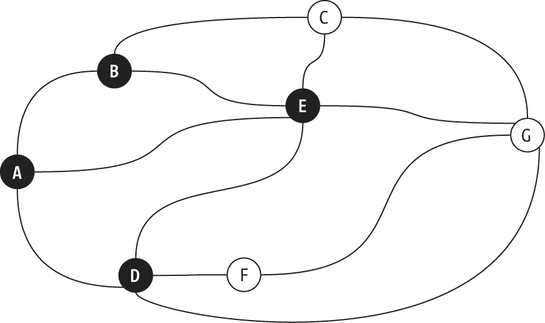

图 17-41：从 A 你可以到达未标记的点 B、D 和 E，并将其标记。

从 B 你可以到达 A 或 E，但这两个节点已经被标记为已访问，因此只需将 C 添加到搜索中（参见图 17-42）。

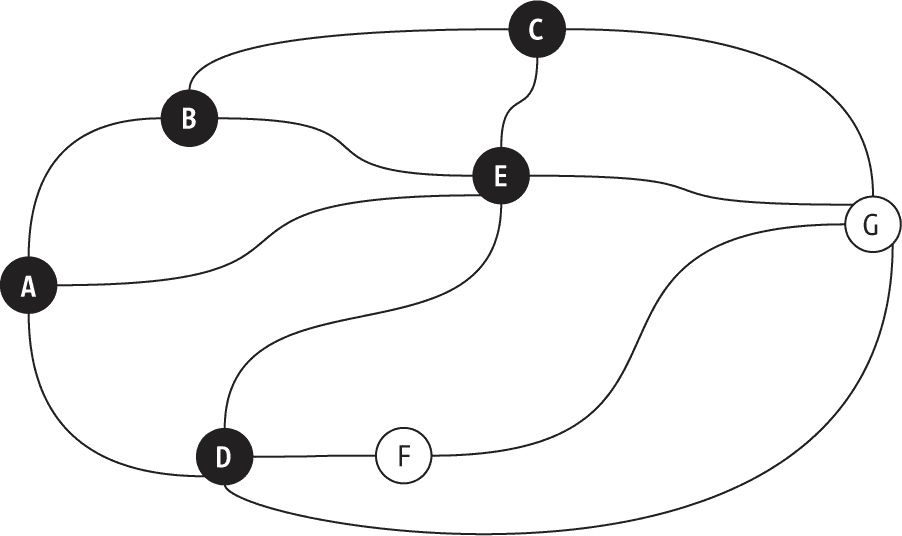

图 17-42：从 B 你可以添加尚未标记的 C，从 D 你可以添加尚未标记的 F 和 G。

从 D 出发，你可以到达 A、E、F 和 G，但 A 和 E 已经被标记，因此只需将 F 和 G 添加到流程中（参见图 17-43）。

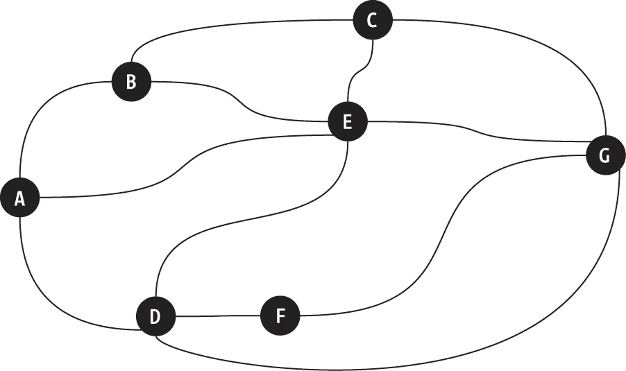

图 17-43：所有点都已标记，因此图是连通的。

算法的其余部分很快，因为从 E、C、F 或 G（按照你检查它们的顺序）没有剩余的未标记节点可以到达，因此你已经完成了，并且因为所有顶点都已标记，所以图是连通的。如果存在一个独立的子图，你将无法到达它，因此它的节点将保持未标记，算法将返回 false。

你也可以采用深度优先搜索方式进行搜索，这实际上更容易编码：

```
const isConnected = (graph) => {
  const n = graph.length;
❶ const visited = Array(n).fill(false);

❷ const visit = (x) => {

  ❸ graph[x].forEach((v, i) => {
    ❹ if (v > 0 && !visited[i]) {
      ❺ visited[i] = true;
      ❻ visit(i);
      }
    });
  };

❼ visited[0] = true;
❽ visit(0);

❾ return visited.every((x) => x);
};
```

首先将所有点标记为未访问❶。辅助访问(...)递归函数❷进行搜索。给定一个点，它会遍历所有出去的边❸。如果它找到一个未访问的点❹，则标记该点❺并访问它❻。要运行算法，首先将任何一个点（本例中为第一个点）标记为已访问❼，然后调用访问函数❽进行搜索。如果你完成算法并且每个点都被标记为已访问❾，则表示成功。

### 寻找最小生成树

这个问题适用于加权无向图。假设我们想将人们连接到电网或其他类似服务，并且我们知道连接给定一对点的成本。我们不需要构建*所有*可能的点连接；而是要选择一个集合，以最小成本使所有的顶点连接到一起。几种算法可以解决这个问题，我们将在这里讨论两个最著名的算法：*Prim 算法*和 *Kruskal 算法*。如果这些算法应用于连接图，则输出将是一个连接所有节点的树。如果图不是连通的，我们会为每个独立的节点组找到一片树的森林。

#### *Prim 算法*

*Prim 算法*的描述很简单：构建树时，从任意节点开始，持续添加尚未连接到树中的最近节点（即，最小连接成本的节点），直到没有节点可选。可以证明，这样会产生所需的最小生成树，但我们不会在这里进行证明。

从我们一直在使用的相同无向图开始（见图 17-44），并任意选择 A 作为起始节点。

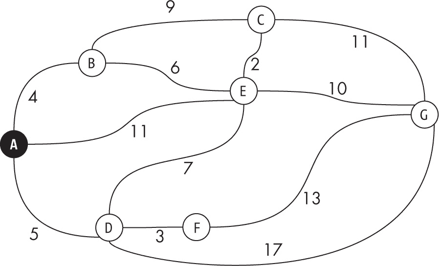

图 17-44：*Prim 算法*从选择任意一个节点开始。在这个例子中，从 A 开始。

现在，所有的点仍然没有被选择，所以选择离当前节点最近的点，在此例中是 B（见图 17-45）。

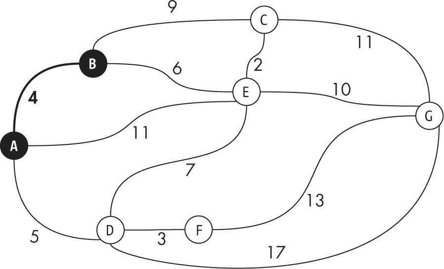

图 17-45：在所有与 A 相邻的点中，选择最近的，即 B。

你已经在生成树中选中了两个节点。重复选择：离 A 或 B 最近且尚未选择的点是 D，因此将其添加进去（见图 17-46）。

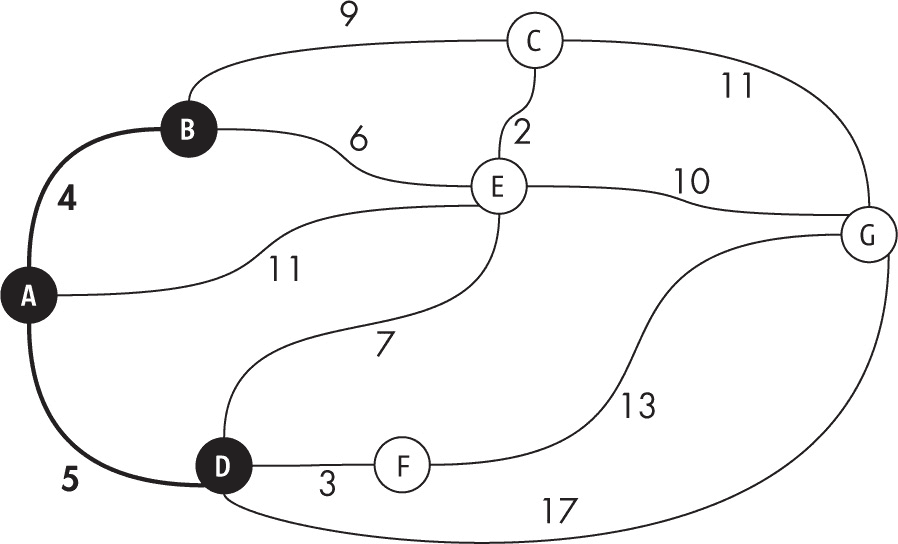

图 17-46：在 A 或 B 相邻的节点中，你再次选择离它们最近的节点，即 D。

接下来的步骤很容易预测：首先，添加 F（它距离已选节点仅三单位），然后是 E、C，最后是 G，总成本为 30 单位，如图 17-47 所示。

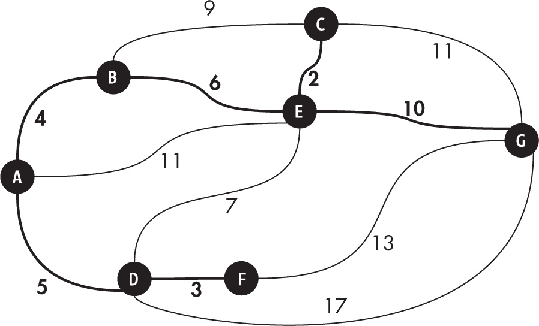

图 17-47：完成所有节点后，得到一个生成树。

编写代码很简单。为了找出距离当前节点最近的未选择的点，你再次使用堆。实现方式略有不同：这次，你将在堆中使用包含属性的对象，这些属性来自（一个点）、到（离当前选择点最近的点）和 dist（到最近点的距离，即这两个点之间边的长度）。首先探索堆算法，这些算法是迭代实现的，而不是递归实现，仅仅是为了多样性：

```
 const bubbleUp = (i) => {
  ❶ while (i > 0) {
      const p = Math.floor((i - 1) / 2);
    ❷ if (heap[i].dist > heap[p].dist) {
        return;
      }
    ❸ [heap[p], heap[i]] = [heap[i], heap[p]];
    ❹ i = p;
 }
  };

  const sinkDown = (i) => {
  ❺ for (;;) {
      const l = 2 * i + 1;
      const r = l + 1;
      let m = i;
      if (l < heap.length && heap[l].dist < heap[m].dist) {
        m = l;
      }
      if (r < heap.length && heap[r].dist < heap[m].dist) {
        m = r;
      }
      if (m === i) {
      ❻ return;
      }
    ❼ [heap[m], heap[i]] = [heap[i], heap[m]];
    ❽ i = m;
    }
  };
```

在上浮一个值时，检查你是否已经在顶部❶。如果不是，计算它父节点的位置并比较距离；如果父节点的位置更低❷，则完成。如果不是，交换堆中的位置❸，并在父节点的位置重复此过程❹。要使一个值下沉，设置一个无限循环❺，当该值无法下沉更低❻时退出，因为它小于其子节点。如果该值需要下沉，则进行交换❼，并在子节点的位置再次循环❽。

Prim 算法的代码如下：

```
const spanning = (graph) => {
  const n = graph.length;

❶ const newGraph = Array(n)
    .fill(0)
    .map(() => Array(n).fill(0));

❷ const heap = Array(n)
    .fill(0)
    .map((v, i) => ({from: i, to: i, dist: +Infinity}));

  //  bubbleUp and sinkDown, excluded

❸ while (heap.length) {
  ❹ const from = heap[0].from;
  ❺ const to = heap[0].to;

  ❻ newGraph[from][to] = graph[from][to];
    newGraph[to][from] = graph[to][from];

  ❼ heap[0] = heap[heap.length – 1];
    heap.pop(); // or the more unconventional heap.length--;
    sinkDown(0);

 ❽ for (let i = 0; i < heap.length; i++) {
    ❾ const v = heap[i];
      const dist = graph[v.from][from];
    ❿ if (dist > 0 && dist < v.dist) {
        v.to = from;
        v.dist = dist;
        bubbleUp(i);
      }
    }
  }

  return newGraph;
};
```

首先，设置输出图的 newGraph 矩阵❶和包含所有点的堆：from 属性是该点本身，to 属性是最接近的已选择点，dist 属性是该点到生成树中已选择点的最短距离❷。当堆不为空时（意味着你还没有考虑完所有的顶点），考虑堆顶元素❸，它是距离已选择点最近但尚未被选择的点。连接❹到❺的路径对应着最短的待处理距离，所以将其加入 newGraph❻。然后从堆中弹出节点❼，并调整 from 点与所有剩余堆点之间的距离❽。接着，考虑每个堆元素❾，计算它到 from 点的距离；如果有一条更短（更便宜）的边❿，记录下这条边及其对应的距离，并根据需要让该节点上浮。 （因此，堆中的点始终与已选择的点之间具有最短距离。）当堆为空时，你将在 newGraph 矩阵中得到生成树。

#### 克鲁斯卡尔算法

*克鲁斯卡尔算法*同样可以找到无向图的最小生成树。与 Prim 算法逐个添加点不同，该算法通过将边加入一个初始为空的图来工作。其思想是将所有边按升序排序，并尝试添加每条边，除非它会形成一个环。（我们也不会给出该算法正确性的证明，但请放心，它是可以证明的。）如何检测环的存在？最开始时，所有点都在不同的、不相交的集合中，每当你添加一条连接两个节点的边时，就将相应的集合合并（这类似于“使用集合检测连通性”一节中的过程，参见第 454 页）。绝不添加两个端点都属于同一集合的边。

现在，使用相同的示例图来探讨算法的工作原理（见图 17-48）。

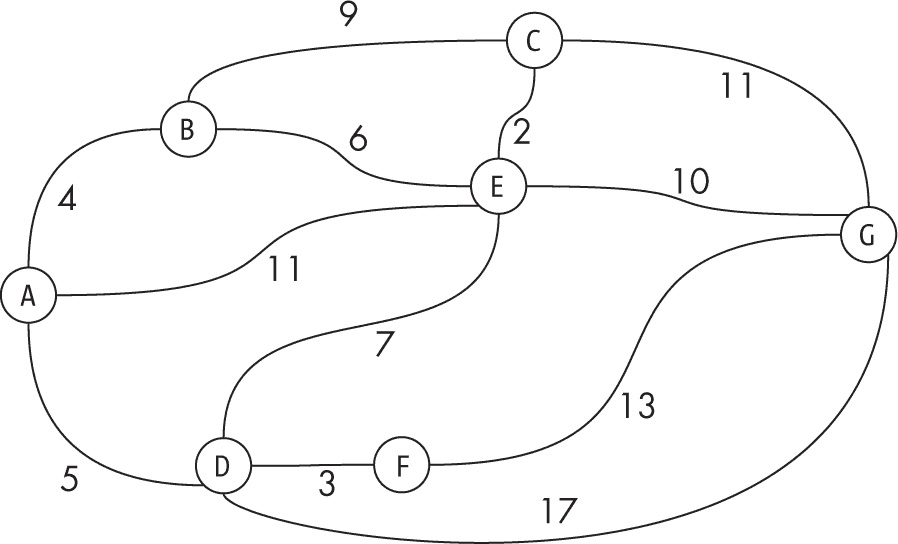

图 17-48：用于 Prim 算法的相同图

每次添加一条边，从最小的开始，第一步添加（C,E）边；现在 C 点和 E 点在同一集合中，如图 17-49 所示。

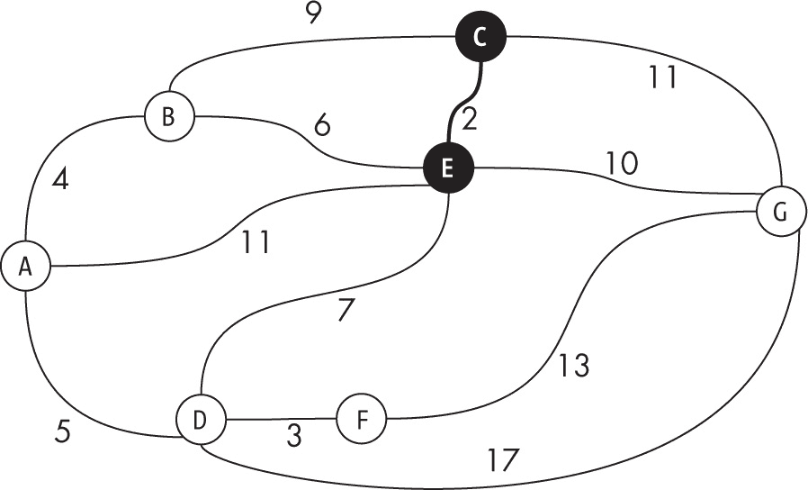

图 17-49：添加最小的边（C,E）开始。

接下来的两步分别添加边(D,F)和(A,B)；没有形成环，如图 17-50 所示。

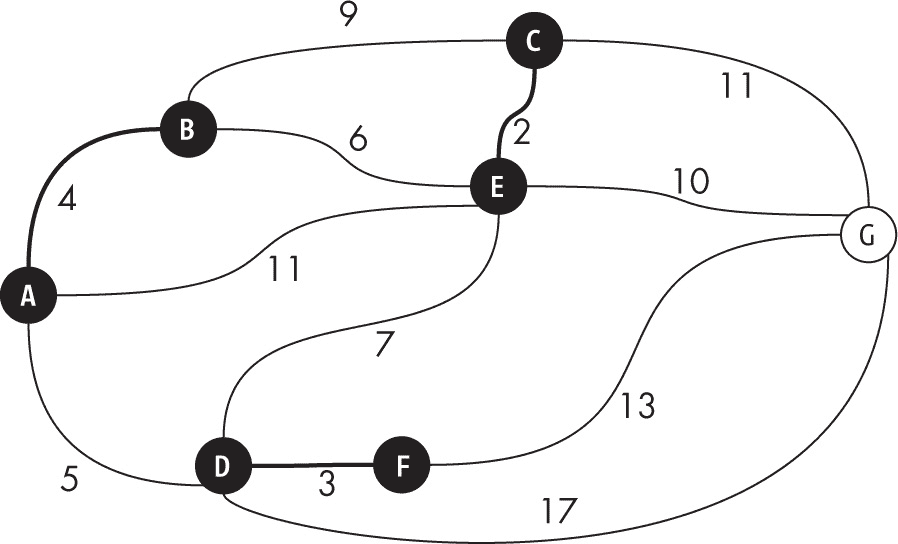

图 17-50：继续按边的升序添加，如果它们不会形成环。首先添加(D,F)，然后是(A,B)。

接下来的步骤添加(A,D)，因此 A、B、D 和 F 都属于同一个集合，然后添加(B,E)，这会形成一个包含 A 到 F 所有点的大集合（见图 17-51）。

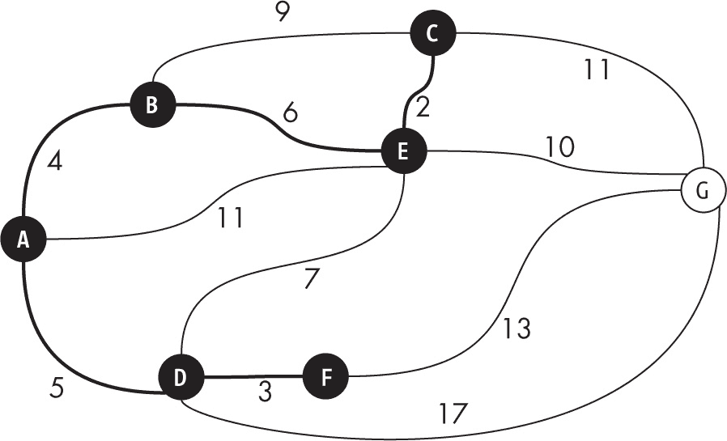

图 17-51：重复此过程现在添加了(A,D)。

现在事情变得有趣了！下一个顺序的边是(D,E)，但是 D 和 E 已经在同一个集合中，因此不要添加这条边。接下来的步骤添加(E,G)，你得到最终的树，如图 17-52 所示。


图 17-52：你应该添加(D,E)，但这会创建一个环，因此跳过它并改为添加(E,G)。

后续步骤不会添加任何内容，因为边将始终连接已经在同一集合中的点，因此你已经得到了生成树。

克鲁斯卡尔算法如下：

```
const spanning = (graph) => {
  const n = graph.length;

❶ const newGraph = Array(n)
    .fill(0)
    .map(() => Array(n).fill(0));

❷ const edges = [];
  for (let i = 0; i < n; i++) {
    for (let j = i + 1; j < n; j++) {
      if (graph[i][j]) {
        edges.push({from: i, to: j, dist: graph[i][j]});
      }
    }
  }
❸ edges.sort((a, b) => a.dist – b.dist);

❹ const groups = Array(n)
    .fill(0)
    .map(() => ({ptr: null}));

❺ const findParent = (x) => {
    while (x.ptr) {
      x = x.ptr;
    }
    return x;
  };

❻ edges.forEach((v) => {
  ❼ const pf = findParent(groups[v.from]);
    const pt = findParent(groups[v.to]);
  ❽ if (pf !== pt) {
    ❾ pf.ptr = pt.ptr = {ptr: null};
      newGraph[v.from][v.to] = newGraph[v.to][v.from] = graph[v.to][v.from];
    }
  });

 ❿ return newGraph;
};
```

从创建一个空矩阵开始，用于新的树❶。然后生成图中所有边的列表❷并使用最简单的方法进行排序❸，即 JavaScript 自带的方法。（对于更好的方法，请查看问题 17.8。）现在你需要初始化所有不相交的集合❹，就像之前在检测连通性时做的那样。groups 数组将有一个指向每个集合根节点的指针，所有集合都会从一个元素开始。你将使用之前递归的 findParent(...)函数的迭代版本❺来找到节点属于哪个集合。算法的其余部分如下：遍历已排序的边列表❻，对于每一条边，查找其两个端点的父节点❼。如果它们不匹配❽，通过创建一个新的根节点来合并两个集合❾，并将这条边添加到输出图中，最后返回❿。

算法的性能可以表示为*O*(*e* log *e*)，基本原因是你必须对所有边进行排序，然后遍历列表，可能会连接集合，这也会产生相同的结果。该实现的唯一缺点是获取节点列表的时间复杂度是*O*(*v*²)，因为需要遍历整个矩阵，但如果采用邻接表的图表示方法，如我们所见，可以进行优化。### 总结

本章介绍了图的概念。我们考虑了图的表示方法，并研究了许多常见需求的算法，如查找路径或距离、排序节点、检测环路和最小化成本。这些算法也受益于之前的算法（如排序和搜索）和数据结构（堆、位图、树、森林和列表），为你提供了多种方式来应用先前获得的知识。

在本书的下一章也是最后一章，我们将讨论面向完全函数式编程风格的数据结构的具体考虑，这种风格带来了一些优势，但也有一些具有挑战性的劣势。

### 问题

**17.1  路径在哪？**

Floyd-Warshall 算法用于找到每对点之间的最短距离，但如果你还想知道该走哪条路径，该怎么办呢？修改算法，使得找到路径变得简单。提示：每当你发现从*i*到*j*经过*k*更好时，做个标记，这样以后在尝试找到实际路径时，你就知道该走到*k*。

**17.2  尽早停止搜索**

在考虑 Bellman-Ford 算法时，我们提到过一定次数的遍历确保能够找到最短路径，但你能做得更好吗？提示：在我们展示的例子中，实际上只需要较少的遍历。

**17.3  只需要一个就好**

如果你只关心找到到达一个单点的最短路径，你会如何修改 Dijkstra 算法？

**17.4  错误的方式**

假设你拿到一个有向图，反转它的所有边，然后对其应用 Kahn 的拓扑排序算法。这个算法的输出是什么？

**17.5  更快地合并集合**

在“使用集合检测连通性”这一节（第 454 页）中，当你合并两个不同的集合时，你总是添加一个新的根节点，但这样做并不是必要的，因为你可以让一个根指向另一个根。考虑在每个根节点中添加一个大小属性（表示对应子树中的节点数），然后将较小的树作为子树合并到较大的树中。你能实现这些修改吗？

**17.6  走捷径**

在合并集合时，提前做一些工作可以节省后面的时间。再看一下图 17-39，这是“使用集合检测连通性”这一节中的图，位于第 454 页。假设你想知道 C 和 D 是否在同一组。你需要从这两个节点走到根节点才能找到答案。然而，如果你之后再次被问到关于 C 或 D 的问题，你就得重新走一遍路径，除非你修改了一些链接，如图 17-53 所示。

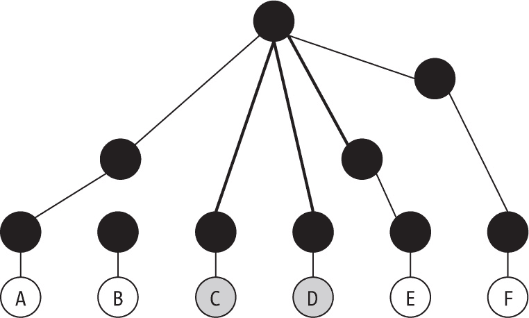

图 17-53：一种优化的集合合并算法

三个链接被修改为直接指向根节点，这样你可以更快速地到达那里。（从 C 或 D 到根节点只需一步，从 E 到根节点比之前少一步。）在 findParent(...)函数中做出修改，使其创建“捷径”路径，从而加速以后的处理。

**17.7  树的生成树？**

如果你对一个树应用生成树算法，会发生什么？

**17.8  一堆边**

你能用堆排序、快速排序或书中讨论的其他方法替换 JavaScript 的排序吗？
