<hgroup>

## 18 不变性与函数式数据结构

</hgroup>


我们已经考虑了几个抽象数据类型（ADT）、数据结构和算法。让我们通过考虑一个不仅与函数式编程相关，而且与像 Redux 这样的库在 React 页面开发者中的日常使用相关的方面来结束这本书。我们如何处理数据结构，而不是对它们进行更改，而是以真正的函数式风格生成新的数据结构？为了做到这一点，我们需要考虑一个新概念：*持久性*（或*函数式*）*数据结构*，通过这种方式，我们可以在不需要克隆所有内容以获得高性能的情况下更新它们，并且它们还允许我们查看以前状态的“历史”，如果需要的话，还能回滚更改。

### 函数式数据结构

让我们从几个定义开始。*持久性数据结构*有一个有趣的属性，你可以在保持先前版本不变的情况下更新它们。这一属性自动意味着这些结构非常适合纯函数式编程语言，这些语言不允许副作用，正如在第二章中提到的。它意味着它们也是*函数式数据结构*：如果你不修改数据结构，而是生成一个新的数据结构，那么你将同时拥有旧版本和新版本。

让我们分析几种数据结构，其中大多数我们已经在书中讨论过，看看我们是否可以使它们变得函数式。

#### 数组（和哈希表）

我们先从坏消息开始。数组本质上是可变的数据结构，并且没有简单的方法可以实现一个具有相同性能水平的函数式等效物，即*O*(1)用于访问和更新数组元素。数组支持破坏性更新，而这种更新是无法撤销的。一旦你修改了数组中的某个位置，就无法找回先前的值。事实上，数组与持久性数据结构是完全相反的。

为了绕过这个限制，一种常见的技术是使用平衡二叉搜索树，以索引作为键，但这样做需要*O*(log *n*)的时间。其他一些更复杂的技术已经被探索过，但其性能仍然与直接使用数组不同。如果你想了解更多内容，可以在线搜索梅丽莎·奥尼尔（Melissa O’Neill）和 F. 华伦·伯顿（F. Warren Burton）的方法（这不会是一本容易阅读的书）。

对数组得出的一个相关结论是，你不会有哈希表或其多种变体的良好等效物，这使得它们成为另一个需要用潜在较慢的结构来替换的结构。

我们研究函数式数据结构的开始可能会让人感到沮丧，但请放心，我们将能够找到许多之前在本书中考虑过的结构的等效物。

#### 函数式列表

现在考虑最简单的结构，链表，来自第十章。一些类型的列表非常适合函数式工作风格。其他类型（如队列）需要“转换”才能使其函数化，还有一些列表没有函数式的等效物。

##### 普通列表

当我们定义列表时（参见第 178 页的“基本列表”部分），给定一个位置，你希望能够在该位置添加一个新值或删除已有的值。考虑第一个操作。你可以通过复制列表的初始部分来实现这一点。图 18-1 展示了你在第十章中查看的一个列表，然后是你在位置 3 添加 80 值后的列表。（记住，位置 0 是第一个位置，就像数组一样。）该操作涉及到添加一个节点并修改已经存在的节点中的指针。

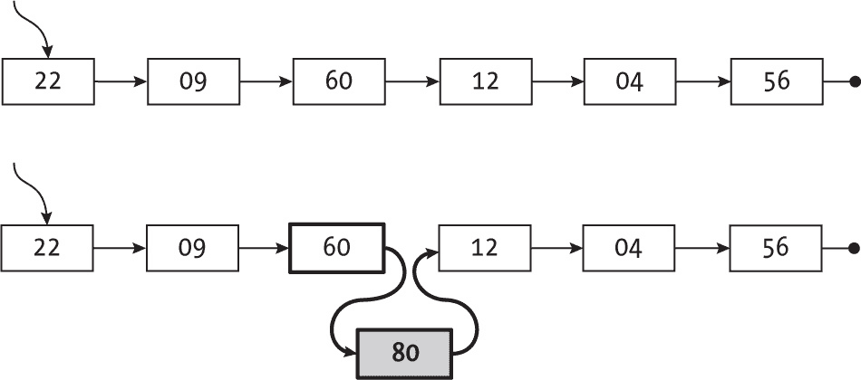

图 18-1：在列表中插入一个节点需要更改原始节点，即指向新节点的那个节点。

考虑到函数式结构，图 18-2 展示了实现方式。

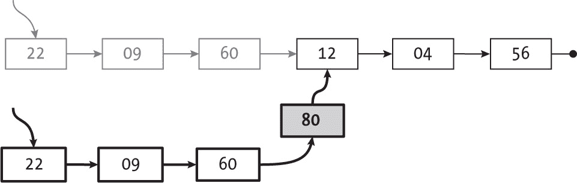

图 18-2：以函数式方式进行插入会复制一些节点，但保持原始节点不变。

除了具有 80 值的新节点外，还有一些节点重复了先前列表中的值，但你保持了列表的一部分不变。你不需要重新做整个列表。新节点和链接有较粗的线条，而被丢弃的节点则以淡灰色显示。

以这种方式工作的代码使用递归：

```
const isEmpty = (list) => list === null;

const add = (list, position, value) => {
❶ if (isEmpty(list) || position === 0) {
   return {value, next: list};
❷} else {
   return {value: list.value, next: add(list.next, position - 1, value)};
  }
};
```

如果在第一个位置❶添加元素，返回一个包含新值并指向原始列表的节点。如果列表最初为空，这也适用。否则，当列表不为空且你想在零位置之外的其他位置添加值时，创建一个新节点❷，该节点具有相同的值，位于列表头部，并链接到在原始列表尾部添加新值的结果。

现在，考虑从列表中删除元素。回到最初的列表，假设你想删除位置 2 的 60。 图 18-3 展示了删除前后的列表。


图 18-3：从列表中删除一个节点也意味着修改某个原始节点。

为了以函数式方式工作，复制列表的初始部分，如图 18-4 所示。

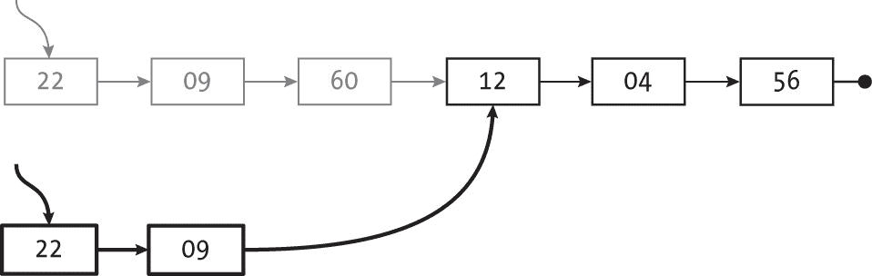

图 18-4：用于插入的相同解决方案也有助于以函数式的方式处理删除操作。

与列表添加一样，一些节点（以淡灰色显示）不再包含在内。列表的一部分由新节点（粗线条）组成，另一部分保持不变，没有重新创建整个结构。考虑以下实现：

```
const remove = (list, position) => {
❶ if (isEmpty(list)) {
   return list;
❷} else if (position === 0) {
   return list.next;
❸} else {
   return {value: list.value, next: remove(list.next, position - 1)};
  }
};
```

使用递归使得逻辑更加清晰。如果你想从空列表中移除一个元素❶，你什么也做不了；直接返回空列表。如果列表不为空，且你想移除第一个元素❷，新列表将是以原来第一个元素后面的元素为开头的列表。最后，如果列表不为空，且你想移除第一个以外的元素，构造一个新列表❸，它的头部元素与原列表的头部相同，并指向从剩余列表中移除该元素后的结果。

至于性能，我们再次发现所有操作都是*O*(*n*)，尽管创建节点的额外操作可能意味着实现会变慢。此外，由于我们仍然使用的是普通链表，之前看到的其他方法（如查找指定位置的值或计算列表大小）仍然像以前一样有效。为了实现常见链表的函数式版本，你只需更改实际修改列表的两个方法。

让我们继续讨论用于其他 ADT（抽象数据类型）的更专业版本的列表。

##### 栈

我们考虑的第一个列表变体是栈，它的限制是所有的添加（“推送”）和移除（“弹出”）操作都发生在列表的一端，即它的“顶部”。回顾一下，我们之前的实现已经是一个功能性的数据结构，看到这一点会是一个惊喜。复习一下第十章中的图示。当你推送一个值时，你会遇到图 18-5 所示的情况。

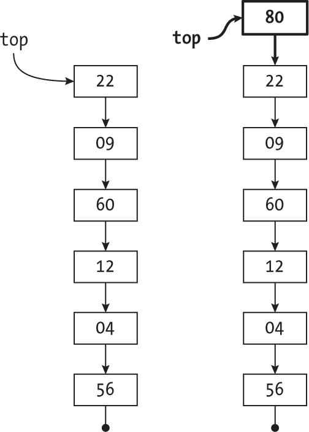

图 18-5：栈已经以函数式的方式执行推送操作...

更新后的栈共享大部分结构；唯一的区别是新的顶部元素。弹出顶部值的行为类似，如图 18-6 所示。

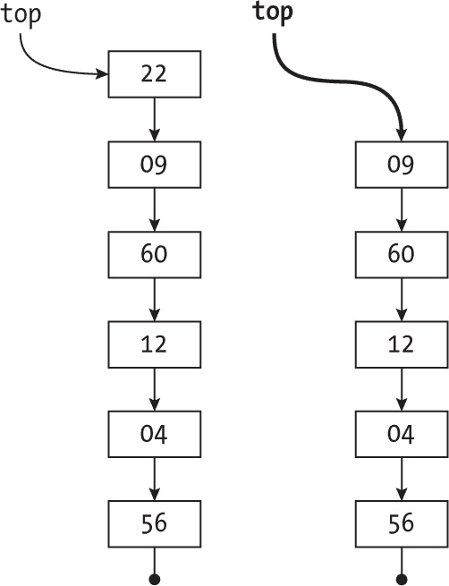

图 18-6：...弹出操作也适用于此。

与推送操作一样，你更新了栈而没有修改其中的任何值或指针。原始实现已经完全可以使用。这两个操作的性能仍然是*O*(1)，因此不能进一步增强。然而，我们并不总是如此幸运。

##### 队列

队列存在挑战。它们也将操作限制在列表的两端：你在一端（队列的“尾部”）*入队*（插入）值，并从另一端（队列的“前端”）*出队*（删除）它们。你还使用了链表作为队列的基础，如图 18-7 所示。

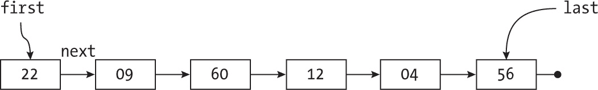

图 18-7：你可以以函数式的方式出队一个节点，就像弹出栈一样。

从队列中移除前端元素（22）与从栈中弹出一个值完全相同，因此这是可行的。更新后的队列将仅移除其前端元素，原本的第二个元素（09）将成为新的第一个元素。

然而，在此示例中，排入新值会导致问题。您必须修改包含 56 的节点，而这需要修改包含 04 的节点，以此类推，最终您将不得不创建队列的整个副本。（这等同于在之前“常见列表”一节中描述的第 470 页中，在简单列表的末尾添加一个值。）我们能做得更好吗？答案是肯定的，但我们需要一个巧妙的技巧：使用一对栈来表示队列。

想一想在某一时刻，包含五个值 A（第一个）到 E（最后一个）的队列会是什么样子，如图 18-8 所示。（参见问题 18.1。）

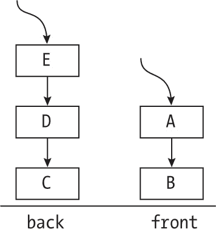

图 18-8：您可以做功能性队列，但需要两个栈：“后端”和“前端”。

队列被分成两个栈。考虑一下您是如何到达这一状态的。您通过将元素推入栈的“后端”来进入队列，通过从“前端”栈弹出元素来退出队列。例如，如果 F 要进入队列，您会得到图 18-9 中显示的情况。

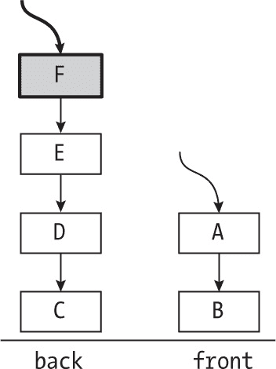

图 18-9：新节点通过推入“后端”栈来排队。

如前所示，您可以在栈中按功能方式推入元素，所以一切正常。如果某个值要离开队列，您可以弹出它并查看图 18-10 中显示的状态。

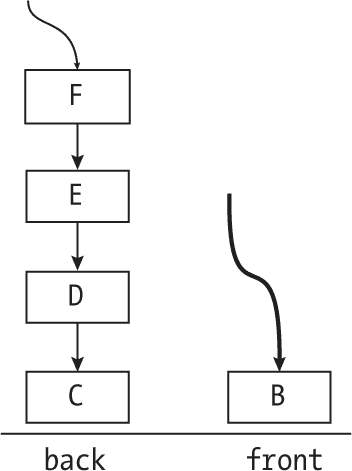

图 18-10：出队一个节点意味着从“前端”栈弹出，所以这也是按功能方式完成的。

弹出栈也是按功能方式完成的，所以一切依然正常。在进行另一次退出后，您会得到图 18-11 中显示的情况，而问题就出现了——前栈为空。

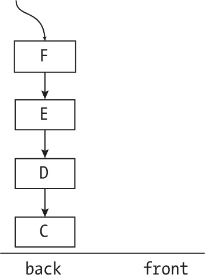

图 18-11：如果“前端”栈为空，您如何出队一个节点？

既然前栈为空，我们如何处理下一个退出操作呢？这种队列表示法的关键如下：如果您需要退出队列，而前队列为空，请将所有值从后队列弹出并推入前队列（参见图 18-12）。

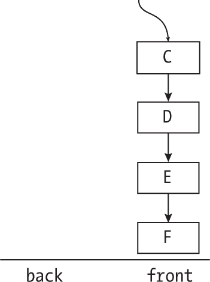

图 18-12：将所有元素从“后端”栈弹出到“前端”栈。

在此过程之后（反转了后端栈），您将能够继续退出队列，并且所有操作都会按正确的顺序完成。这看起来像是一个小把戏，但它有效，并且由于所有涉及的操作都是按功能方式完成的，最终结果是一个用于表示队列的功能性数据结构。

我们用两个栈来表示队列，因此构建队列和检查队列是否为空的基本方法如下：

```
❶ const newQueue = () => ({backPart: null, frontPart: null});

❷ const isEmpty = (queue) =>
  queue.backPart === null && queue.frontPart === null;
```

一个新的队列❶由两个空栈组成，测试队列是否为空❷只需要验证两个栈的顶部是否为 null。

您可以通过将新值推入列表的后端来进入队列，您已经知道如何做到这一点：

```
const enter = (queue, value) => ({
❶ backPart: {value, next: queue.backPart},
❷ frontPart: queue.frontPart
});
```

你返回一个新的队列，将新值推入栈的后端❶，前端❷保持不变。

当退出队列时，情况变得有些复杂。如前所述，如果前端不为空，只需弹出第一个元素；但是如果列表为空，就将整个后端逐个元素推入前端：

```
const exit = (queue) => {
❶ if (isEmpty(queue)) {
    return queue;
❷} else {
    let newfrontPart = queue.frontPart;
    let oldbackPart = queue.backPart;
  ❸ if (newfrontPart === null) {
    ❹ while (oldbackPart !== null) {
        newfrontPart = {value: oldbackPart.value, next: newfrontPart};
        oldbackPart = oldbackPart.next;
      }
    }
  ❺ return {backPart: oldbackPart, frontPart: newfrontPart.next};
  }
};
```

首先检查队列是否为空❶，因为如果为空，就没有操作需要进行；你会返回相同的未改变的队列。如果不为空❷，检查前端栈是否为空。如果为空❸，你需要执行一个循环❹，从后端栈弹出值并将其推入前端栈。最后，确认前端不为空❺，你只需返回一个新的队列，其中包含（可能已清空的）后端和弹出前端部分顶部元素的结果。

这种基于栈的队列性能如何？进入队列始终是*O*(1)，但退出队列可能是*O*(1)或*O*(*n*)。然而，从摊销角度来看，你可以看到每个项目将被推入一次（在后端），弹出一次（从后端），再次推入一次（在前端），并最终再次弹出一次（从前端），这些都是四个常数时间操作。在许多操作的历史中，摊销性能是*O*(1)，因为每个值将通过四个*O*(1)的操作。弹出后端并推入前端的*O*(*n*)成本被“稀释”了，因为在第一次将*n*个值推入空前端后，接下来的*n*次退出将是*O*(1)。最终的平均时间是*O*(1)。

有一个额外的操作，front(...)，用于访问队列前端的值；见第 18.2 题。

##### 其他列表

我们已经考虑了几种类型的列表，那么其他类型呢？我们无法为双端队列（或更一般的双向链表）或循环列表提供函数式等价物，因为修改一个节点意味着至少另一个节点必须被修改，而这又意味着其他节点必须变化，依此类推。尝试以函数式方式更新这些结构最终会创建一个完整的副本，这样效率不高。

#### 函数式树

在第十二章到第十六章中，我们探索了各种树结构：二叉搜索树、普通树、几种风格的堆等等。其中一些（但并非全部，遗憾的是）允许以函数式方式工作。

##### 二叉搜索树

我们如何才能使二叉搜索树以函数式方式运作呢？通常，我们会应用与列表相同的解决方法，在需要的地方创建新的节点。首先考虑如何将新值添加到来自第十二章的树中（参见图 18-13）。

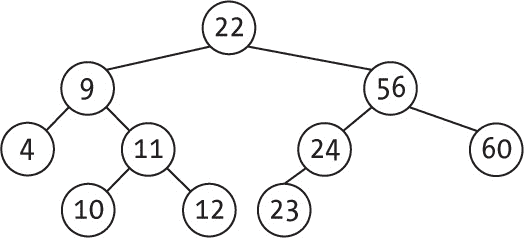

图 18-13：一个你希望以函数式方式维护的二叉搜索树

在第十二章中，你添加了一个新的 34 值，它成为了 24 节点的右子节点。你可以在这里做同样的操作，而不需要修改现有的树。解决方案在于添加一些新的节点，如图 18-14 所示。

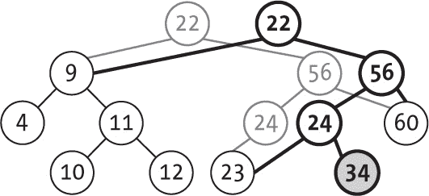

图 18-14：添加一个新值意味着创建一些新的节点。

有了新的根节点，并且你也有新的节点，一直到新增的节点本身，但树的其余部分保持不变。还有一些节点（以灰色显示）不再是树的一部分，因为它们被新的节点替代了。通过新根访问树时，你会找到新添加的 34 值，而通过旧根访问树时，得到的结构与之前完全相同。你成功创建了一个新的树，增加了新的值，但没有修改原有结构。

以这种功能性方式添加新值所需的代码很少：

```
const add = (tree, keyToAdd) => {
❶ if (isEmpty(tree)) {
   return newNode(keyToAdd);
❷} else if (keyToAdd <= tree.key) {
   return newNode(tree.key, add(tree.left, keyToAdd), tree.right);
❸} else {
   return newNode(tree.key, tree.left, add(tree.right, keyToAdd));
  }
};
```

如果你想向一棵空树添加一个值❶，你只需要一个带有该值的新节点。（提醒一下，参见下面的 newNode(...)函数。）如果你想添加一个键值到左子树❷，你需要返回一棵新树，它的值与当前根节点相同，左子树是递归更新后的，右子树保持不变。如果新值需要进入右子树❸，结果类似：你会返回一棵新树，值与当前节点相同，左子树与当前节点相同，右子树是更新后的：

```
const newNode = (key, left = null, right = null) => ({key, left, right});
```

现在，你将开始考虑删除节点，并讨论最复杂的情况：删除一个有两个子节点的节点（你可以处理更简单的情况）。图 18-15 展示了原始树（与添加节点时使用的是同一棵树）。

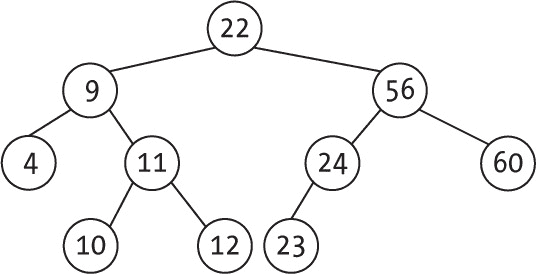

图 18-15：如果一个节点（如 9）有两个子节点，删除它会稍微复杂一些。

要删除节点 9，你必须找到下一个更大的键值（在此案例中是 10），并交换它的位置。它需要从当前位置删除，并取代 9 的位置。以功能化的方式工作时，你再次创建一些新的节点，如图 18-16 所示。

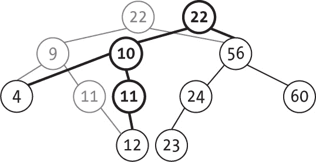

图 18-16：删除一个有两个子节点的节点需要从根节点重新创建节点。

你有一个新的根节点，并且你也重新创建了到达你要删除的节点路径上的节点。为了从树中删除 10，你也应用了功能化方法，因此在该子树（根节点是 11 的子树）中，你也需要创建一些新的节点。删除节点的代码有几种情况：

```
const remove = (tree, keyToRemove) => {
❶ if (isEmpty(tree)) {
   return tree;
❷} else if (keyToRemove < tree.key) {
   return newNode(tree.key, remove(tree.left, keyToRemove), tree.right);
❸} else if (keyToRemove > tree.key) {
   return newNode(tree.key, tree.left, remove(tree.right, keyToRemove));
❹} else if (isEmpty(tree.left) && isEmpty(tree.right)) {
   return null;
❺} else if (isEmpty(tree.left)) {
   return tree.right;
❻} else if (isEmpty(tree.right)) {
   return tree.left;
❼} else {
  ❽ const rightMin = minKey(tree.right);
  ❾ return newNode(rightMin, tree.left, remove(tree.right, rightMin));
  }
};
```

这段代码与你在第十二章看到的非常相似，但每次你都会返回新的树，而不是修改节点。如果树为空 ❶，直接返回原树。如果要删除的值小于当前节点的值 ❷，返回一个新树，包含当前节点的值和右子节点，但其左子节点指向一个新树，这个新树是删除左子树中的值后的结果。类似地，如果要删除的值大于当前节点的值 ❸，按对称方式进行：返回一个新树，包含当前节点的值和左子节点，但其右子节点指向删除右子树中值后的结果。当你找到要删除的节点并且它是叶节点 ❹时，直接返回一个空树。如果它不是叶节点但只有一个子节点（如果是右子节点 ❺，左子节点 ❻），返回一个只有非空子节点的树，去掉被删除的节点。最后，在最复杂的情况下，如果你需要删除一个有两个非空子树的节点 ❼，找到其右子树中的最小值 ❽，并返回一个以该值为根的新树，原节点的左子树在左侧，删除右子树中最小值后的结果在右侧 ❾。

你已经看到过 minKey(...)函数的实现，它可以找到二叉搜索树中的最小值，但考虑一种新版本的实现，仅为增加一些变化（再加上简短的一行代码实在让人无法抗拒）：

```
const minKey = (tree) => (isEmpty(tree.left) ? tree.key : minKey(tree.left));
```

对于我们看到的所有树的变种（如 AVL 树、红黑树、伸展树等），你可以应用一些变体的方法，类似于前面删除代码中展示的方法。在添加或删除一个键后，新的树将以新的根节点和几个新节点结束，但其中许多部分保持不变，没有变化。处理过程的执行顺序也将与之前相同，因此，虽然增加了一些复杂性，但我们可以得到所有这些树的功能版本。

##### 其他树

我们还考虑了其他种类的树；特别地，第十四章和第十五章专门讲解了堆，它们基本上是二叉树或其变种。一个简单的版本是基于数组构建的，因此我们在这里陷入了困境，没有简单的解决方案。对于其他基于动态内存和指针的堆（如 treap、skew heap、Fibonacci heap 等），我们可以像处理对象和二叉树一样，应用相同类型的解决方案。

那么，数字树（包括 trie 树、基于对象的 trie 树、基数树和三叉树）怎么办呢？Trie 树在每个节点中都有一个数组，指向该节点的所有子节点，但本质上，它与二叉树具有两个指针是一样的。我们为二叉树看到的相同类型的解决方案同样适用，更新 trie 树时，你将得到一个新的结构，包含一些新节点，但大多数节点是共享的。图 18-17 展示了这个解决方案，其中的 trie 树是你在第十七章看到的。

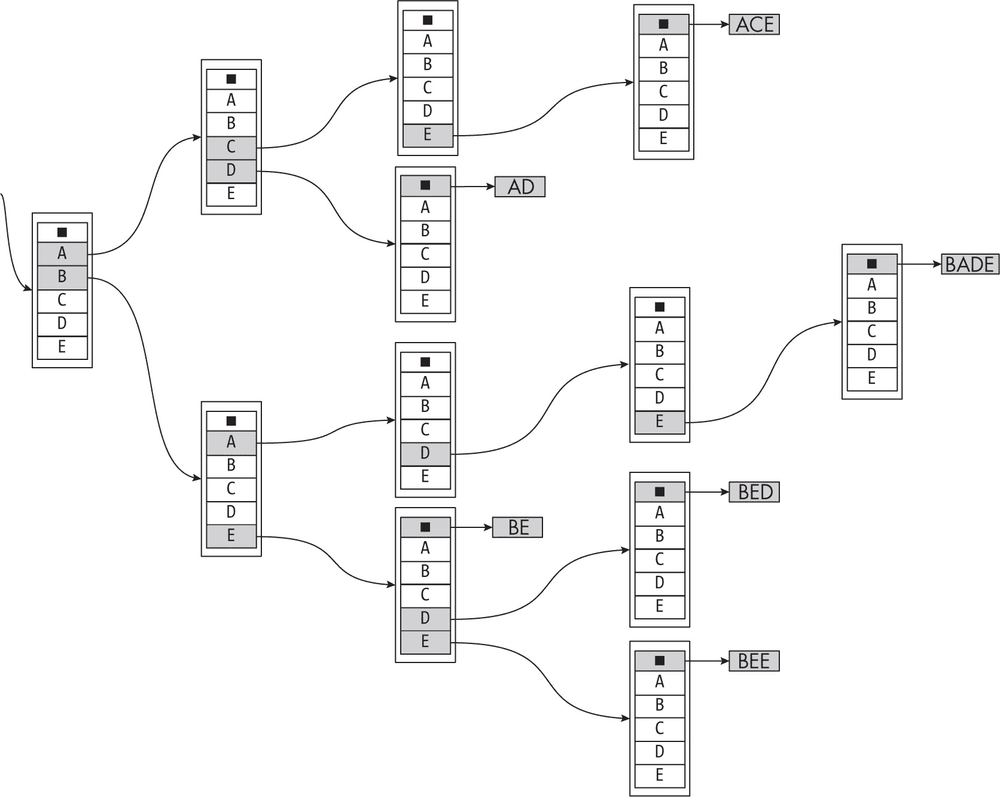

图 18-17：你也可以以函数式方式维护字典树。

在第十七章，我们展示了如果添加单词 ABE，字典树会如何被修改。以函数式方式操作时，你会有一个新的根节点，并且其他地方也有一些新的节点。图 18-18 展示了结果。

你有一个新的根节点，一些新的节点（带有较深的边框）以及一些新的链接，但大部分结构仍然和之前一样。两个旧的节点（灰色的）不再是字典树的一部分，就像二叉树一样，但仅此而已。基本过程是相同的，它同样适用于基数树和三叉树，但在这里不会显示。它始终是相同类型的解决方案。

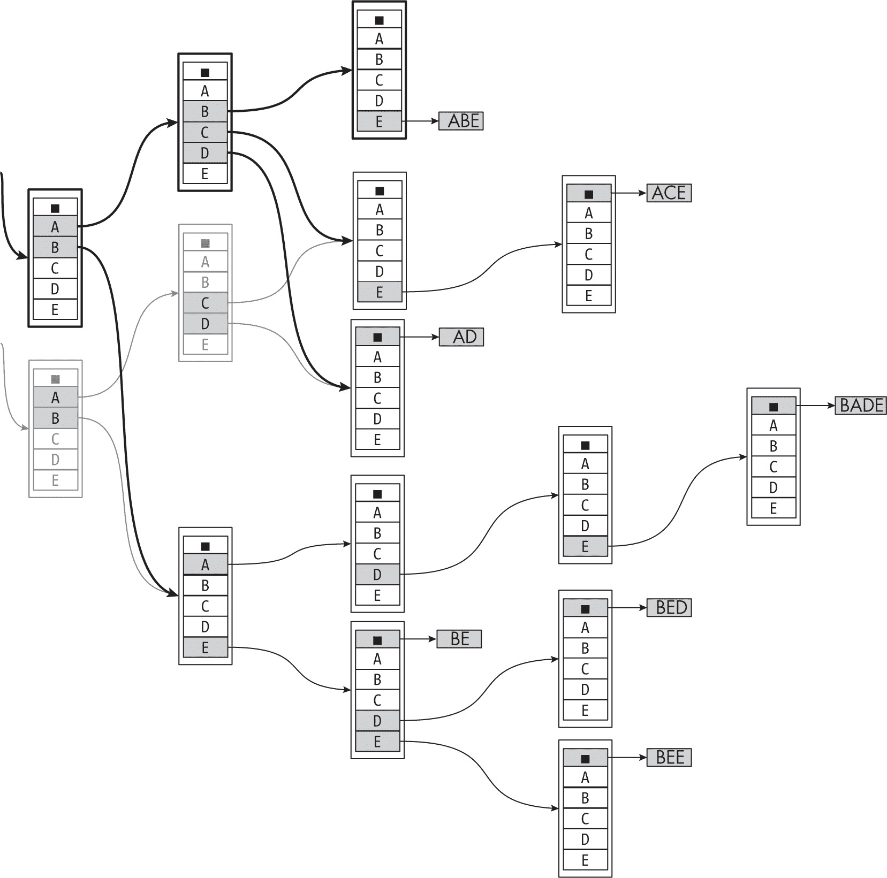

图 18-18：添加一个新词需要创建一些新的节点，但大部分字典树结构保持不变。

最后，对于基于 JavaScript 对象的字典树，你可以简单地应用本章前面描述的关于列表和树的相同思路。在第十六章中，你考虑了一个基于对象的字典树示例；图 18-19 再次展示了它。

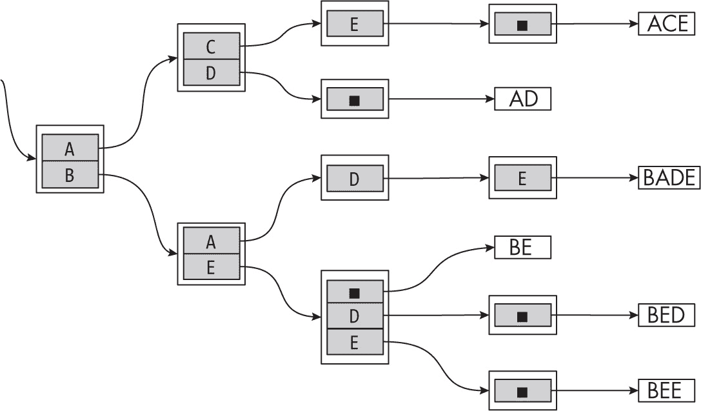

图 18-19：你也可以以函数式方式更新基于对象的字典树。

在第十六章中，我们看到了如何将单词 ABE 添加到字典树中。你是通过修改多个对象来实现的；现在你将通过添加一些新对象，并保持大部分旧结构不变的方式，以函数式方法完成此操作，正如图 18-20 所示。

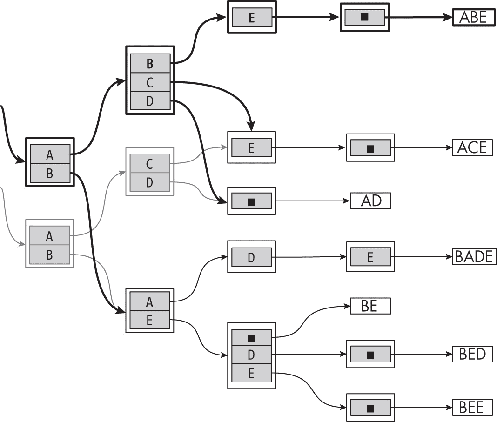

图 18-20：添加一个新词并重新创建一些对象

和之前的字典树示例一样，新的节点有较深的边框，而被删除的节点的边框则是较浅的灰色。大部分的字典树结构并不需要改变。因此，你可以通过稍微调整更新算法来实现各种类型（虽然不是所有）的堆和各种数字树，但始终沿用我们已经应用过的相同思路。  ### 总结

在本章中，我们已经通过考虑函数式数据结构来完成了数据结构和算法的概述，这些结构可以在没有副作用的情况下进行更新，并以高效的方式生成新版本。

使用函数式数据结构可能需要保持一定的平衡。一方面，在清晰度和可维护性上具有优势，因为数据结构何时何地被修改是明确的。然而，另一方面，我们可能会发现一些原本具有良好性能的操作被较慢的操作所替代。

有没有办法避免这些问题？不幸的是，这并不容易。如前所述，目标是以务实的方式应用函数式编程，因此我们将在可能的情况下使用函数式数据结构，但在需要时接受“常见的”可修改结构。例如，处理数组通常是必需的，性能较低的解决方案可能会对性能产生很大影响。你必须灵活应对，知道何时选择什么。

### 问题

**18.1  到达这里**

进入和退出队列的最小操作序列是什么，这个序列能生成图 18-7 中所示的图形？

**18.2  向阿博特和科斯特罗道歉，谁在前面？**

你能实现一个`front(q)`方法，用于返回函数式风格队列 q 的前端值吗？

**18.3  无需更改**

在从二叉搜索树中移除一个键时，即使该键不存在，算法也会生成一个新的树。你能修改它，使得在这种情况下返回原始未改变的树吗？

**18.4  新的最小值**

你能解释一下第 478 页“二叉搜索树”章节中 minKey(...)新版本是如何工作的？
