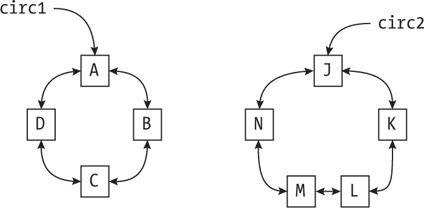
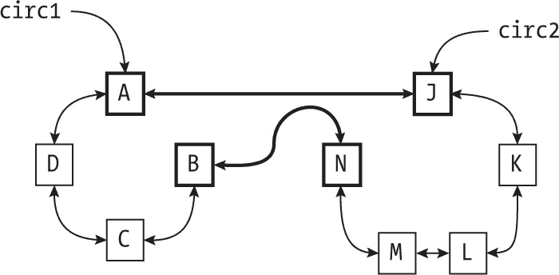
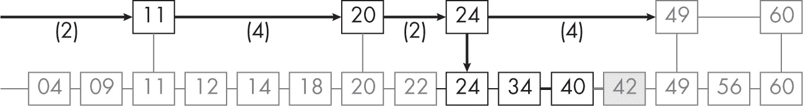
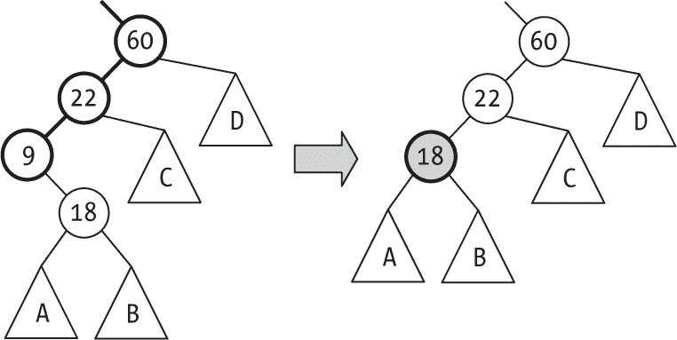
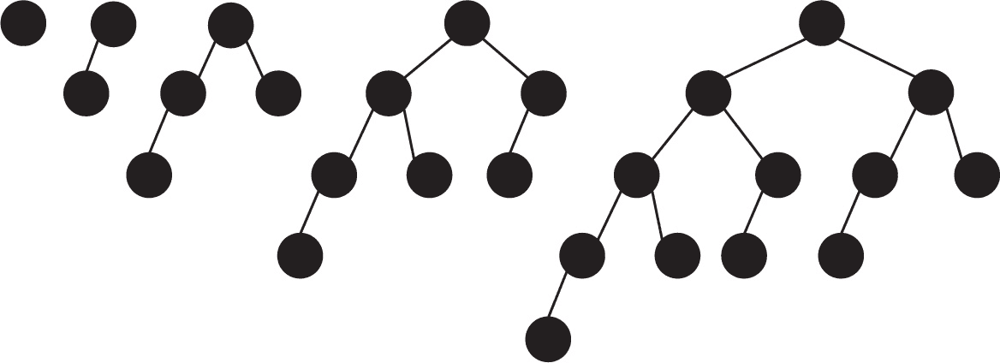
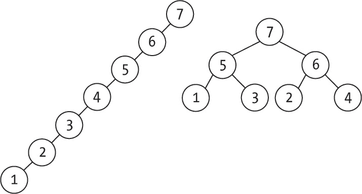

# 答案解析


## 第二章

**2.1  纯粹或不纯？**

从纯粹的形式角度来看，这个函数是不纯的，因为它使用了未作为参数提供的内容。考虑到 PI 是一个常量，你或许可以稍微放宽要求并接受它；毕竟，由于 const 定义，没有人能修改 PI。最好的解决方案是使用 Math.PI，而不依赖任何外部变量，无论它是否是常量。

**2.2  为失败做准备**

你必须使用 try 和 catch；以下是一个可能的解决方案：

```
❶ const addLogging = (fn) => (...args) => {
❷ console.log(`Entering ${fn.name}: ${args}`);
  try {
  ❸ const valueToReturn = fn(...args);
  ❹ console.log(`Exiting ${fn.name} returning ${valueToReturn}`);
  ❺ return valueToReturn;
  } catch (thrownError) {
  ❻ console.log(`Exiting ${fn.name} throwing ${thrownError}`);
  ❼ throw thrownError;
  }
};
```

addLogging() 高阶函数接受一个函数作为参数❶并返回一个新函数。如果原函数抛出异常，则捕获它并输出适当的消息。在进入时❷，记录函数的名称和它被调用时的参数。然后尝试调用原函数❸，如果没有问题，则记录返回值❹并将其返回给调用者❺。如果抛出异常，则记录它❻并再次抛出，以便调用者处理❼。

**2.3  有时间吗？**

以下函数可以满足你的需求；你应该注意它与前一个问题中的日志记录函数有几个相似之处。

```
❶ const {performance} = require("perf_hooks");

❷ const addTiming = (fn) => (...args) => {
❸ const output = (text, name, tStart, tEnd) =>
    console.log(`${name} - ${text} - Time: ${tEnd - tStart} ms`);

❹ const tStart = performance.now();
  try {
  ❺ const valueToReturn = fn(...args);
  ❻ output("normal exit", fn.name, tStart, performance.now());
  ❼ return valueToReturn;
  } catch (thrownError) {
  ❽ output("exception thrown", fn.name, tStart, performance.now());
  ❾ throw thrownError;
  }
};
```

在 Node.js 中❶，你需要导入 performance 对象；在浏览器中，它直接可用。（有关更多信息，请参见 *[`nodejs.org/api/perf_hooks.html`](https://nodejs.org/api/perf_hooks.html)* 和 *[`developer.mozilla.org/en-US/docs/Web/API/Performance`](https://developer.mozilla.org/en-US/docs/Web/API/Performance)*。）addTiming() 函数❷将接受一个函数作为参数并返回一个新函数。你将使用一个辅助函数❸来输出计时数据。在调用原函数之前❹，存储开始时间；如果调用成功❺且没有问题，则输出原始时间和当前时间❻，并返回原始返回值❼。如果发生任何错误，则输出不同的消息❽并再次抛出相同的异常❾，这样计时函数将完全与原函数的行为一致。

**2.4  解析问题**

问题在于 .map() 将三个参数传递给你的映射函数：数组的当前元素、其索引和整个数组。（有关更多内容，请参见 *[`developer.mozilla.org/en-US/docs/Web/JavaScript/Reference/Global_Objects/Array/map`](https://developer.mozilla.org/en-US/docs/Web/JavaScript/Reference/Global_Objects/Array/map)*。）另一方面，parseInt() 接收两个参数：要解析的值和一个可选的基数（如果未传递，默认值为 10）。在此案例中，parseInt() 收到三个参数：它忽略第三个多余的参数，但使用数组索引作为基数。例如，“8”会被解析为基数 3 的数字，导致错误，因为基数 3 只使用数字 0、1 和 2，而“32”会被解析为基数 5 的数字，相当于 17。

**2.5  否定一切**

一行代码就足够了：

```
const negate = (fn) => (...args) => !fn(...args);
```

**2.6  每个，某些...没有？**

仅作为一个起始提示的示例：如果你想检查一个小组中没有人是成年人，你可以等效地检查每个人都不是成年人，因此 people.none(isAdult) 可以被测试为 people.every(negate(isAdult))，如前述回答所示。

**2.7  没有 Some，没有 Every**

一些() 方法的提示：使用 findIndex() 查看是否有任何元素满足谓词条件；如果返回的不是 -1，则表示至少有一个元素符合条件。对于每个()，你想要查看 findIndex() 是否找不到任何满足 negate(你的谓词) 条件的元素，和前一个问题类似；如果没有找到，则意味着每个元素都符合条件。

**2.8  它做了什么？**

写作 Boolean(someValue) 会检查给定的参数是否为“真值”或“假值”，并根据结果返回 true 或 false。在此案例中，“詹姆斯·邦德”和 7 是真值，而 0 是假值，所以结果是 [true, false, false, true]。有关转换规则，请参见 *[`developer.mozilla.org/en-US/docs/Glossary/`](https://developer.mozilla.org/en-US/docs/Glossary/)*。

## 第三章

**3.1  链式调用**

add() 和 remove() 方法应该以 return this 结束，以支持链式调用，仅此而已。

**3.2  数组，而非对象**

以下是一个可能的实现：

```
❶ const newBag = () => [];

❷ const isEmpty = (bag) => bag.length === 0;

❸ const find = (bag, value) => bag.includes(value);

❹ const greatest = (bag) => isEmpty(bag) ? undefined : bag[bag.length - 1];

❺ const add = (bag, value) => {
  bag.push(value);
 bag.sort();
  return bag;
};

❻ const remove = (bag, value) => {
  const pos = bag.indexOf(value);
  if (pos !== -1) {
    bag.splice(pos);
  }
  return bag;
};
```

创建一个袋子 ❶ 只需要创建一个空数组，而检查该数组的长度是否为零 ❷ 是测试它是否为空的方式。要在袋子中查找一个值 ❸，使用 JavaScript 自带的 .includes() 方法。你将保持数组的顺序，因此实现最大值 ❹ 只需要检查袋子是否为空（如果是空的，则返回 undefined，否则返回数组的最后一个元素）。要向袋子中添加一个值 ❺，将值推入数组中，然后对更新后的数组进行排序。最后，要检查是否可以移除一个值 ❻，使用 JavaScript 的 .find() 方法，如果该值存在于数组中，则使用 .splice() 移除它。

**3.3  额外操作**

有许多可能性，但请记住，只有在你确实需要它们解决特定问题时，才会请求这些操作。下表提供了一些操作，尽管这个列表可以扩展。

| 操作 | 签名 | 描述 |
| --- | --- | --- |
| 计数所有 | bag → 整数 | 给定一个袋子，返回它包含的所有值的数量。 |
| 计数值 | bag × value → 整数 | 给定一个袋子和一个值，返回该值在袋子中出现的次数。 |
| 添加多个 | bag × value × 整数 → bag | 给定一个新值和一个计数，将该值的多个副本添加到袋子中。 |
| 移除所有 | bag × value → bag | 给定一个袋子和一个值，移除袋子中所有该值的实例。 |
| 查找下一个 | bag × value → value &#124; undefined | 给定一个袋子和一个值，查找袋子中大于该值的最小值。 |

**3.4  错误的操作**

如果你想返回特殊的值，可以像 greatest() 操作那样返回，在空集合时返回未定义。如果抛出异常，也可以将其作为一个新的返回值（异常），尽管它是以不同的方式接收的（try/catch），但这同样有效。

**3.5  准备，开始...**

我们将在第十三章讨论这个内容，请跳到后面！

## 第四章

**4.1  你说的速度是多少？**

这是不可能的；对于足够大的 *n*，*f*(*n*) 会变成负数。

**4.2  奇怪的界限？**

是的，*n* = *O*(*n*²) 且（更准确地说，因为我们更倾向于使用更紧的界限）也 *o*(*n*²)，因为 *n*² 增长得更快。下界阶数，大和小欧米伽，不适用。

**4.3  大** ***O*****和欧米伽**

在这种情况下（仅在这种情况下），*f*(*n*) = Θ(*g*(*n*)).

**4.4  传递性？**

如果 *f*(*n*) = *O*(*g*(*n*)) 且 *g*(*n*) = *O*(*h*(*n*)), 那么 *f*(*n*) = *O*(*h*(*n*))。我们可以通过数学证明这一点，但直观上，第一个等式意味着 *f* 和 *g* 成比例增长，第二个等式意味着 *g* 和 *h* 也成比例增长，这就意味着 *f* 和 *h* 也成比例增长。如果考虑其他任何阶数，传递性仍然适用；例如，*f*(*n*) = Ω(*g*(*n*)) 且 *g*(*n*) = Ω(*h*(*n*)) 表示 *f*(*n*) = Ω(*h*(*n*)).

**4.5  一点反思**

我们也可以说 *f*(*n*) = *O*(*f*(*n*)) 和 *f(n)* = Ω(*f*(*n*))，但对于小 omega 或小 *o* 不适用。

**4.6  倒着做**

如果 *f(n)* = *O*(*g*(*n*)), 那么 *g*(*n*) = Ω(*f*(*n*)), 并且如果 *f*(*n*) = *o*(*g*(*n*)), 那么 *g*(*n*) = ω(*f*(*n*))。注意对称性：大 *O* 表示大欧米伽，小 *o* 表示小欧米伽。

**4.7  接踵而至**

当 *n* 增大时，*O*(*n*²) 部分的增长将大于 *O*(*n* log *n*) 部分的增长，因此整个过程的阶数就是这个。一般来说，一个序列的阶数将是最大阶数的阶数。

**4.8  循环中的循环**

在这种情况下，结果是 *O*(*n*³)。整个“循环内循环”的阶数是由两个阶数的乘积得出的。

**4.9  几乎是一个幂...**

一个正式的证明需要应用数学归纳法，但请考虑你如何构建它。你希望最后得到一个单独的元素，所以 1 是一个有效的大小。在前一步，数组有两个大小为 1 的部分，之间由一个元素分隔：前一个大小是 3。再往前，数组有两个大小为 3 的部分，之间由一个元素分隔：它的大小是 7。以这种方式倒推，如果你有一个 *s* 大小的数组，在前一步，数组的大小必须是 (2*s + 1)。从 *s* = 1 开始，可以正式证明大小始终比 2 的幂少一个元素，因为 2(2*^k* – 1) + 1 等于 2*^k* ^(+1) – 1。

**4.10  这是最好的时代；也是最坏的时代**

在这种情况下（仅在这种情况下），我们可以推导出运行时间是 Θ(*f*(*n*))。

## 第五章

**5.1  一阶阶乘**

你可以使用这一行代码：

```
const factorial = (n) => (n === 0 ? 1 : n * factorial(n – 1));
```

**5.2  手工汉诺塔**

在奇数步时，总是循环移动最小的盘子（从 A 到 B，从 B 到 C，再从 C 到 A）；在偶数步时，进行唯一不涉及最小盘子的移动。这种方法适用于偶数个盘子的情况；对于奇数个盘子，最小盘子需要反方向循环：从 A 到 C，从 C 到 A，再从 A 到 B。

**5.3  箭术回溯**

这个问题的关键是不要在选择一个选项后立即放弃，而是应该先尝试再次使用它。以下代码基本与第 70 页“解决海滩上的方块游戏”部分中的 solve()函数相同，只是增加了一些内容：

```
❶ const solve = (goal, rings, score = 0, hit = []) => {
  if (score === goal) {
    return hit;
  } else if (score > goal || rings.length === 0) {
    return null;
  } else {
  ❷ const again = solve(goal, rings, score + rings[0], [      ...hit,       rings[0],     ]);
  ❸ if (again) {
     return again;
  ❹} else {
     const chosen = rings[0];
     const others = rings.slice(1);
     return (
        solve(goal, others, score + chosen, [...hit, chosen]) ||
        solve(goal, others, score, hit)
      );
    }
  }
};

console.log(solve(100, [40, 39, 24, 23, 17, 16]));
```

参数已重新命名，以更好地与当前的难题❶匹配，因此使用 rings 而不是 dolls，使用 hit 而不是 dropped。额外的代码尝试重新使用第一个 ring ❷，如果成功❸，就完成了。如果再次尝试相同的 ring 失败❹，则丢弃它并继续按照之前的方式进行搜索。

对于第二个问题，你确实可以重用原始的 solve()算法，但需要做一些修改，因为你可能会多次击中一个 ring，所以 ring 必须出现多次。例如，40 和 39 应该都被视为两次选择；击中其中任意一个三次或更多次都会超过 100。同样，23 和 24 最多出现四次，17 出现五次，16 出现六次。这个代码找到了答案：

```
console.log(
  solve(100, [
    40, 40,
    39, 39,
    24, 24, 24, 24,
    23, 23, 23, 23,
    17, 17, 17, 17, 17,
    16, 16, 16, 16, 16, 16
  ])
);
```

顺便说一下，如果你不运行代码，答案是 16, 16, 17, 17, 17 和 17！

**5.4  统计调用次数**

要计算第*n*个斐波那契数，你需要一次调用该数，再加上*C*(*n* – 1)次调用第(*n* – 1)个数，再加上*C*(*n* – 2)次调用第(*n* – 2)个数，因此*C*(*n*) = *C*(*n* – 1) + *C*(*n* – 2) + 1。这个问题的解是*C*(*n*) = 2Fibo(*n* + 1) – 1。

**5.5  避免更多工作**

只需在 costOfFragment(...)函数的循环开始时添加一个测试，如下所示：

```
const costOfFragment = memoize((p, q) => {
  ...
  let optimum = Infinity;
  let split = [];
  for (let r = p; r < q; r++) {
    **if (totalWidth(p, r) > MW) {**
 **break;**
 **}**
    ...
  }
  return [optimum, split];
});
```

一旦从 p 到 r 的块宽度超过 MW，你可以停止循环；所有接下来的总宽度将更大。

**5.6  为了清晰起见减少**

以下是一种单行计算部分值的方法：

```
const partial = blocks.reduce((a, c, i) => ((a[i + 1] = a[i] + c), a), [0]);
```

请注意，在这种情况下，累加器是一个初始化为单个 0 的数组，它将变为 partial[0]。

**5.7  得了痛风吗？**

如下使用第 83 页“解决加密算术谜题”部分中的 solve()函数。代码的风格与 SEND + MORE = MONEY 谜题中的完全相同：

```
const {solve} = require("../send_more_money_puzzle");

const toGoOut = (g, o, u, t) => {
  if (t === 0 || g === 0 || o === 0) {
    return false;
  } else {
    const TO = Number(`${t}${o}`);
    const GO = Number(`${g}${o}`);
    const OUT = Number(`${o}${u}${t}`);
    return TO + GO === OUT;
  }
};

solve(toGoOut);
```

两个两位数的最大和是 99 + 99 = 198，因此 O = 1，并且从中间列到最左边列有进位。在最右边的列，O + O = T，因此 T = 2，并且没有进位到中间列。最后，查看中间列，T + G = 10 + U，但由于 T = 1，T + G 至少为 10 的唯一方式是 G = 9，然后 U = 0；此时 GOUT 的值为 9102，正如 solve()发现的那样！

## 第六章

**6.1  强制反转**

先改变所有数字的符号。接着，将它们按升序排序，然后再将符号改回来。例如，要排序[22, 60, 9]，首先将它们变为[–22, –60, –9]，然后排序，得到[–60, –22, –9]。最后，再将符号改回[60, 22, 9]，它们就会按期望的降序排列。

**6.2  仅下限**

给定 lower(a,b)，你可以如下实现 higher(a,b)和 equal(a,b)：

```
❶ const higher = (a, b) => lower(b, a);
❷ const equal = (a, b) => !lower(a, b) && !higher(a, b);
```

基本上这就像应用数学：a > b 如果 b < a ❶，并且 a 等于 b，仅当 a < b 和 a > b 都不成立时 ❷。

**6.3  测试排序算法**

使用其他方法对数据的副本进行排序，并使用 JSON.stringify(...)将结果转换为字符串版本。然后，用你的新方法对数据进行排序，使用 JSON.stringify(...)对其输出进行转换，并比较两个 JSON 字符串；它们应该匹配。

**6.4  缺失的 ID**

这个问题有两种解决方案。你可以先对数字序列进行排序，然后按顺序遍历已排序的序列，当连续数字之间的差大于 1 时，就能检测到缺失的数字。更具体的解决方案是初始化一个大小为 1,000,000 的数组，并将所有值设置为 false，然后对序列中的每个数字，将相应的数组项设置为 true。接着，你可以遍历数组，仍为 false 的项表示缺失的 ID。

**6.5  未匹配项**

像前一个问题一样，这个问题也有两个解决方案。你可以先对整个系列进行排序，然后快速浏览已排序的数字，找到只出现一次的数字。第二个、更复杂的解决方案是对所有数字应用按位异或（^）。如果你将一个数字与自己异或，结果是零，如果将一个数字与零异或，结果是该数字。如果你对整个系列进行异或，结果将是未匹配的数字。然而，这个解决方案仅适用于有且只有一个未匹配的数字；如果有两个或更多，则会失败。

**6.6  下沉排序**

这个逻辑类似于冒泡排序，你只需改变索引的行为：

```
const sinkingSort = (arr, from = 0, to = arr.length - 1) => {
  for (let j = from; j < to; j++) {
    for (let i = to - 1; i >= j; i--) {
      if (arr[i] > arr[i + 1]) {
        [arr[i], arr[i + 1]] = [arr[i + 1], arr[i]];
      }
    }
  }
  return arr;
};
```

**6.7  冒泡交换检查**

以下逻辑实现了这个思路：

```
const bubbleSort = (arr, from = 0, to = arr.length - 1) => {
  for (let j = to; j > from; j--) {
 **let swaps = false;**
    for (let i = from; i < j; i++) {
      if (arr[i] > arr[i + 1]) {
        [arr[i], arr[i + 1]] = [arr[i + 1], arr[i]];
 **swaps = true;**
      }
    }
 **if (!swaps) {**
 **break;**
 **}**
  }
  return arr;
};
```

**6.8  递归插入**

这个描述足够写出代码：要排序*n*个数字，首先排序初始的(*n* – 1)个数字，然后将第*n*个数字插入已排序的列表中：

```
const insertionSort = (arr, from = 0, to = arr.length - 1) => {
  if (to > from) {
    insertionSort(arr, from, to - 1);
    const temp = arr[to];
    let j;
    for (j = to; j > from && arr[j - 1] > temp; j--) {
      arr[j] = arr[j - 1];
    }
    arr[j] = temp;
  }
  return arr;
};
```

**6.9  稳定的 Shell 排序？**

不，Shell 排序不是稳定的，因为在初期阶段（对于大于 1 的间隔）可能会打乱相等键的相对顺序。

**6.10  荷兰增强法**

以下实现有效：

```
const quickSort = (arr, left = 0, right = arr.length - 1) => {
  if (left < right) {
    const pivot = arr[right];

    let p = left;
    for (let j = left; j < right; j++) {
      if (pivot > arr[j]) {
        [arr[p], arr[j]] = [arr[j], arr[p]];
 p++;
      }
    }
  ❶ [arr[p], arr[right]] = [arr[right], arr[p]];

  ❷ let pl = p;
    for (let i = p - 1; i >= left; i--) {
      if (arr[i] === pivot) {
        pl--;
        [arr[i], arr[pl]] = [arr[pl], arr[i]];
      }
    }

  ❸ let pr = p;
    for (let j = p + 1; j <= right; j++) {
      if (arr[j] === pivot) {
        pr++;
        [arr[j], arr[pr]] = [arr[pr], arr[j]];
      }
    }

  ❹ quickSort(arr, left, pl – 1);
    quickSort(arr, pr + 1, right);
  }

  return arr;
};
```

所有的代码都与枢轴在 arr[p] ❶时相同。然后，你对枢轴位置左侧进行循环 ❷，如果找到与枢轴相等的元素，则交换；最左侧与枢轴相等的位置总是 pl。完成这一轮后，使用类似的逻辑 ❸从枢轴位置向右重复该过程。最右侧与枢轴相等的位置是 pr。经过这些附加的循环后，从 pl 到 pr 的所有值都等于枢轴，因此你可以对其余部分进行排序 ❹。

**6.11  更简单的合并？**

如果你做了这个修改，归并排序将不再稳定。当第一和第二个列表中有相等的值时，你希望从第一个列表中选择。

**6.12  尽量避免消极**

对于负数，当数字变为负数时，算法会崩溃。对于非整数，算法会忽略小数部分，因此具有相同整数部分的数字可能无法正确排序。作为额外问题，考虑如何解决这些问题。

**6.13  填充它！**

第一个选项会用一个对同一数组的引用填充所有桶中的元素；你将得到一个单一的数组，而不是 10 个不同的数组，这个数组对所有桶都通用。第二个选项不会有任何效果，因为 .map(...) 会跳过未定义的位置。

**6.14  那字母呢？**

在这种情况下，你需要更多的桶，每个桶代表一个可能的符号。如果你想将带有重音符号的字母（例如 á 或 ü）与没有重音符号的字母一起排序，可能需要做一些额外的工作。

## 第七章

**7.1  网球加时赛**

比赛的数量很容易计算：每场比赛都会淘汰一名选手，要找出冠军，你必须淘汰 110 名其他选手，因此答案是 110，对于 *n* 名选手，答案是 *n* – 1。第二名选手可能是第一个击败的任何选手——甚至可能是第一轮就击败的。这场比赛有七轮，因此你可能需要最多七场额外的比赛。一般来说，轮数是 *n* 的以 2 为底的对数，向上取整，因此学习一个数组的两个最小值的总比较次数是 *n* – 1 + log[2] *n*。

**7.2  休息五分钟**

你可以通过六次比较来完成，方法如下：

```
const medianOf5 = (a, b, c, d, e) => {
❶ if (a > b) {
    [a, b] = [b, a];
  }

❷ if (c > d) {
    [c, d] = [d, c];
  }

❸ if (a > c) {
    [a, c] = [c, a];
    [b, d] = [d, b];
  }

❹ if (b > e) {
    [b, e] = [e, b];
  }

❺ if (c > b) {
   // b < c < d and b < e: b isn't the median, and d isn't either
   return e > c ? c : e;
❻} else {
   return d > b ? b : d;
  }
};
```

要理解代码，跟踪变量的变化。经过第一次测试后，你可以确定 a < b ❶，在下一个测试中你知道 c < d ❷。你可以说 a < b && a < c < d ❸，因此 a 不能是中位数。经过 ❹，b < e && c < d，因此 b 和 c 中最小的一个也不可能是中位数。在 ❺，b < c < d && b < e，因此 b 和 d 都不可能是中位数，中位数是 c 和 e 中最小的一个。同样地，在 ❻，c < b < e && c < d，因此 c 和 e 不是中位数；中位数是 b 和 d 中最小的一个。

完整起见，这里提供了一个等效版本的 median5(...)，它适用于包含五个独立值的数组，并返回找到的中位数的位置。代码与之前的代码平行：

```
const swapper = (arr, i, j) => ([arr[i], arr[j]] = [arr[j], arr[i]]);

const medianOf5 = (arr5) => {
  if (arr5[0] > arr5[1]) {
    swapper(arr5, 0, 1);
  }

  if (arr5[2] > arr5[3]) {
    swapper(arr5, 2, 3);
  }

  if (arr5[0] > arr5[2]) {
    swapper(arr5, 0, 2);
    swapper(arr5, 1, 3);
  }

  if (arr5[1] > arr5[4]) {
    swapper(arr5, 1, 4);
  }

  if (arr5[2] > arr5[1]) {
    return arr5[4] > arr5[2] ? 2 : 4;
  } else {
    return arr5[3] > arr5[1] ? 1 : 3;
  }
};
```

**7.3  从上到下**

有两种解决方案。你可以修改算法，改为选择最大值并从 *n* – 1 向 0 遍历，而不是选择最小值并从 0 遍历到 *n* – 1。为了获得高效的算法，应该从将 *k* 与 *n*/2 进行比较并向上（如文本中最初展示）或向下（如这里所描述）移动开始，选择需要最少工作量的方向。

在数值为数字的特殊情况下，你可以使用一个技巧：将所有数字的符号改为相反的，使用该算法找到 *n* – *k* 位置的值，并将其符号改回；你能看出为什么这样行得通吗？

**7.4  仅迭代**

你可以使用一个循环，循环将在代码成功将数组的 *k* 位置值放置到正确位置时退出，而不是递归：

```
const quickSelect = (arr, k, left = 0, right = arr.length - 1) => {
❶ **while (left < right) {**
    const pick = left + Math.floor((right - left) * Math.random());
    if (pick !== right) {
      [arr[pick], arr[right]] = [arr[right], arr[pick]];
    }
    const pivot = arr[right];

    let p = left;
    for (let j = left; j < right; j++) {
      if (pivot > arr[j]) {
        [arr[p], arr[j]] = [arr[j], arr[p]];
        p++;
      }
    }
    [arr[p], arr[right]] = [arr[right], arr[p]];

❷ **if (p === k) {**
 **left = right = k;**
 **} else if (p > k) {**
 **right = p - 1;**
 **} else {**
 **left = p + 1;**
 **}**
 **}**
};
```

设置一个循环 ❶，只要左边和右边没有到达相同的位置（k），就继续循环。最后，避免递归或提前返回，只需适当地操作左边和右边 ❷。

**7.5  选择而不改变**

只需创建输入数组的副本，如下所示：

```
const qSelect = (arr, k, left = 0, right = arr.length - 1) => {
❶ const copy = [...arr];
❷ quickSelect(copy, k, left, right);
❸ return copy[k];
};
```

复制数组 ❶，然后对其进行划分 ❷，最后从复制并重新划分后的数组中返回 *k* 的值 ❸。

**7.6  西西里方式**

以下算法完成了这个任务。你可以在“S. Battiato 等人所著的《近似中位数选择问题的高效算法》中找到不同的实现（通过改变元素交换方式）”，该文献可以在 *[`web.cs.wpi.edu/~hofri/medsel.pdf`](https://web.cs.wpi.edu/~hofri/medsel.pdf)* 上找到。我们将突出与之前代码的唯一差异，但我们也用新的方式实现了一些方法，只是为了多样性，并且为了同样的原因，我们用迭代代替了递归（如在问题 7.4 中所示）。

```
❶ const swapIfNeeded = (arr, i, j) => {
  if (i !== j) {
    [arr[i], arr[j]] = [arr[j], arr[i]];
  }
};

❷ const medianOf3 = (arr, left, right) => {
  if (right - left === 2) {
    const c01 = arr[left] > arr[left + 1];
    const c12 = arr[left + 1] > arr[left + 2];
    if (c01 === c12) {
      return left + 1;
    } else {
      const c20 = arr[left + 2] > arr[left];
      return c20 === c01 ? left : left + 2;
    }
  } else {
    return left;
  }
};

const quickSelect = (arr, k, left = 0, right = arr.length - 1) => {
  while (left < right) {
❸ **let rr = right;**
❹ **while (rr - left >= 3) {**
 **let ll = left - 1;**
❺ **for (let i = left; i <= rr; i += 3) {**
 **const m3 = medianOf3(arr, i, Math.min(i + 2, rr));**
 **swapIfNeeded(arr, ++ll, m3);**
 **}**
❻ **rr = ll;**
 **}**
 **const m3 = medianOf3(arr, left, rr);**
 **swapIfNeeded(arr, right, m3);**

    const pivot = arr[right];

    let p = left;
    for (let j = left; j < right; j++) {
      if (pivot > arr[j]) {
        swapIfNeeded(arr, p, j);
        p++;
      }
    }
    swapIfNeeded(arr, p, right);

    if (p === k) {
      left = right = p;
    } else if (p > k) {
      right = p - 1;
 } else {
      left = p + 1;
    }
  }
};

const sicilianSelect = (arr, k, left = 0, right = arr.length - 1) => {
  quickSelect(arr, k, left, right);
  return arr[k];
};
```

你将需要进行大量交换，但 swapIfNeeded(...)函数 ❶ 通过检查是否真的需要交换，避免了一些不必要的调用。因为你总是会找到最多三个值的中位数，所以使用特定的函数比使用通用排序更合适 ❷；medianOf3(...)通过最多三次比较返回中位数的位置，而不需要交换。在快速选择中，唯一变化的是加粗的几行。你将在不断缩短的数组部分中找到中位数；rr 变量标记你正在处理的数组的右边界 ❸，而 left 变量始终指向其左边界。只要数组中的元素超过三个 ❹，你就会进行选择 3 个中位数的操作 ❺，并将它们打包到数组的左边，如重复步骤算法所示；不同之处在于，每次操作后 ❻ 你都会缩短数组，并重新循环以找到 3 个中位数。当中位数的集合（中位数的中位数的中位数……，依此类推）足够短时，你将选择它的最后一个元素作为下一个枢轴。

## 第八章

**8.1  足够好的洗牌**

这是我在为书籍测试函数时使用的代码：

```
❶ const logResults = (fn, from = 0, to = 10, n = to, times = 4000) => {
❷ const bar = (len, val, max) =>
    "#".repeat(Math.round((len * val) / max));
❸ const result = {};
  const compare = (a, b) => (a < b ? -1 : 1);
❹ let max = 0;
❺ for (let i = 1; i <= times; i++) {
  ❻ const arr = Array(n)
      .fill(0)
      .map((v, i) =>
        i < from || i > to ? i : String.fromCharCode(65 + i),
      );
  ❼ const x = fn(arr, from, to).join(“-”);
  ❽ result[x] = x in result ? result[x] + 1 : 1;
  ❾ max = Math.max(max, result[x]);
  }
❿ let count = 0;
  for (const [key, val] of Object.entries(result).sort(compare)) {
    count++;
    console.log(
      `${key}: ${String(val).padStart(5)} ${bar(50, val, max)}`,
    );
  }
  console.log("COUNT=", count);
};
```

记录这些信息的参数包括洗牌函数 fn，要洗牌的数组部分（from, to），使用的输入数组的大小（n），以及测试运行的次数❶。辅助函数 bar(...)❷绘制一个由井号字符组成的条形图：最大长度为 len，表示 val 值等于最大 max 值时的长度；较小的值会得到比例较短的条形。使用对象 result 来统计每个排列出现的次数❸（你也可以使用 JavaScript 的 map）。max 变量❹跟踪任何排列出现的最大次数。你会循环 n 次❺，每次初始化一个数组进行洗牌❻。使用 fn 来洗牌数组，基于结果创建字符串键❼，并更新出现的次数❽和最大观察频率❾。最后一步❿以表格形式返回结果，排列按字母顺序排序以便清晰查看。

**8.2  随机三或六**

掷两次硬币会产生四种组合。你可以为这些组合分配数字，如果得到 1 到 3 的组合，就接受它；如果得到 4，则重新掷一次：

```
❶ const random01 = () => (randomBit() ? 0 : 1);

const random3 = () => {
  let num = 0;
  do {
  ❷ num = 2 * random01() + random01();
❸} while (num > 2);

❹ return ["3-hi", "2-md", "1-lo"][num];
};
```

这个方法使用二进制系统为硬币的组合分配数字，将正面记作 0，反面记作 1。使用 randomBit()函数生成比特❶。你“掷”骰子两次，并为结果组合分配一个数字❷。循环直到得到一个 0 到 2 之间的数字❸，然后将其映射到结果❹。

为了模拟投骰子，你需要掷三次硬币，但逻辑非常相似：

```
const randomDie = () => {
  let num = 0;
 do {
    num = 4 * random01() + 2 * random01() + random01();
  } while (num > 5);
  return num + 1;
};
```

最后，模拟一个 1 到 20 的投掷更为复杂。你可以使用 5 个比特，得到一个 0 到 31 的结果，丢弃最后 12 个值，但这可能需要多次尝试；毕竟，32 次中有 12 次失败率太高。一个更好的方法是使用 6 个比特，得到一个 0 到 63 的结果，丢弃最后 4 个（即 0–59），然后将结果除以 3，得到一个 0 到 19 的结果，这样只需要小几率（64 次中 4 次）就能重新尝试。

**8.3  非随机洗牌**

如果这个算法产生均匀的洗牌，你会期望原数组中的每个值在洗牌后的数组中每个位置出现相同的次数。为了让初始值出现在最后一个位置，你需要所有的 randomBit()调用都返回 true，因此初始值更可能不会离起始位置太远，而很少出现在最后的位置。

**8.4  糟糕的交换洗牌**

问题在于，这段代码并没有以相同的频率生成所有可能的排列。你可以通过注意到这段代码循环 *n* 次，每次选择一个有 *n* 种可能值的随机数，从而看到这一点，因此它有 *n*¹ 种运行方式。然而，排列生成算法应该仅以 *n*! 种方式运行。如果你想手动验证这一点，尝试只对三个元素执行该算法，并模拟所有 27 种可能的随机数字序列：从 (0,0,0)，它将 ABC 洗牌为 CBA；(0,0,1)，它将 ABC 洗牌为 BCA；依此类推，一直到 (2,2,2)，它产生 CBA。计算每个可能的排列出现的次数，你会发现某些排列比其他排列更常见。该算法并没有生成均匀分布的洗牌。

**8.5  Robson 的顶端？**

这个问题等同于找出在不丢失精度的情况下能够计算的最大阶乘。使用正常精度时，这个值是 18；19! 太大了：

```
❶ for (let num = 1, fact = 1; fact < fact + 1; num++) {
  fact *= num;
  console.log(`${num}=${fact}`);
}
```

你可以通过加 1 并检查结果是否变化来测试是否丢失了精度；如果结果没有变化，意味着 JavaScript 没有足够的位数来容纳你的大数字 ❶。

然而，你可以使用 BigInt 值，那么你就能处理更高的值——只要阶乘的大小不超过允许的内存。以下程序将愉快地计算到 19 以上，直到某些地方崩溃：

```
for (let num = 1n, fact = 1n; fact < fact + 1n; num++) {
  fact *= num;
  console.log(`${num}=${fact}`);
}
```

唯一的区别是它使用了 BigInt 数字：1n 就是这样的一个数字。

**8.6  抽样测试**

这个解决方案与我们用于洗牌的方法非常相似，但有一个特别的细节，涉及到你是在进行有放回抽样还是无放回抽样：

```
❶ const logResults = (fn, k, n = 10, times = 60000, noReps = true) => {
  const bar = (len, val, max) =>
    "#".repeat(Math.round((len * val) / max));

  const result = {};

  const compare = (a, b) => (a < b ? -1 : 1);

  let max = 0;
  for (let i = 1; i < times; i++) {
    const arr = Array(n)
      .fill(0)
      .map((v, i) => String.fromCharCode(65 + i));

❷  const x = noReps

      ? fn(arr, k).sort().join(“-”)
      : fn(arr, k).join(“-”);
    result[x] = x in result ? result[x] + 1 : 1;
    max = Math.max(max, result[x]);
  }
  let count = 0;
  for (const [key, val] of Object.entries(result).sort(compare)) {
    count++;
    console.log(
      `${key}: ${String(val).padStart(5)} ${bar(50, val, max)}`,
    );
  }
  console.log("COUNT=", count);
};
```

当进行无放回抽样时，样本 B-C-A 和样本 C-A-B 是相同的，因此你需要对元素进行排序，以获得一个唯一的键 A-B-C。然而，当进行有放回抽样时，这两种结果是不同的。添加的参数 noReps ❶ 解决了这个问题；在计数样本时，你会根据它来排序值（或不排序） ❷。

**8.7  单行重复器**

以下是一个单一的语句，但为了清晰起见，这里将其分成几行展示。你生成一个合适大小的数组，并使用 .map(...) 填充随机选择的值：

```
const repeatedPick = (arr, k) =>
  Array(k)
    .fill(0)
    .map(() => arr[randomInt(0, arr.length)]);
```

棘手的部分是，你需要使用 .fill(0) 来填充数组中的值。如果不这样做，.map(...) 什么也不会做，因为它会跳过未初始化的数组位置。

**8.8  排序以进行抽样**

以下逻辑完成了这个工作：

```
const sortingSample = (arr, k) => {
❶ const rand = arr.map((v) => ({val: v, key: Math.random()}));

❷ for (let i = 0; i < k; i++) {
    let m = i;
    for (let j = i + 1; j < arr.length; j++) {
      if (rand[m].key > rand[j].key) {
        m = j;
      }
    }
    if (m !== i) {
      [rand[i], rand[m]] = [rand[m], rand[i]];
    }
  }

❸ return rand.slice(0, k).map((obj) => obj.val);
};
```

这种分配随机键的方法直接来自第 139 页的“通过排序进行洗牌”部分 ❶。后续的逻辑是对第 124 页“通过比较进行选择”逻辑的轻微修改 ❷，最后的代码为了只留下原始值，再次来自“通过排序进行洗牌” ❸。

**8.9  迭代，不要递归**

为了理解为什么这样有效，考虑其他(...) 的调用是什么，以及使用哪些参数。将转换应用到阶乘函数上，产生了著名的等效形式：

```
const factorial = (p) => {
  let result = 1;
  for (let i=1; i <= p; i++) {
    result = result * i
 }
  return result;
}
```

将转换应用于 Floyd 算法稍微复杂一些，因为该函数有两个参数（k 和 n），但由于它们的差值是恒定的，因为它们是并行递减的，所以你可以实现转换。你需要重命名一些变量以避免混淆；例如，在 Floyd 的代码中我们已经使用了 i 来表示其他含义。

**8.10  没有限制？**

不需要检查；最初 toSelect 并不大于 toConsider。如果它们变得相等，从此以后，所有元素都会被选中，因为测试 Math.random() < toSelect / toConsider 对于所有小于 1 的随机值总是成功的，且 toSelect 最终会变为 0。

## 第九章

**9.1  正确的搜索**

这是我使用的代码。checkSearch(...)高阶函数接受一个搜索函数进行测试，并用一个布尔标志表示是使用已排序的数据还是未排序的数据。实际包含数据的文件叫做 data32 和 data_sorted_32：

```
const checkSearch = (fn, sorted = false) => {
❶ const data32 = sorted ? require("../data_sorted_32") : require("../data32");

❷ const verify = (v, i, f) => {
  ❸ if (i !== f) {
      throw new Error(`Failure searching v=${v} i=${i} fn=${f}`);
    }
  ❹ if (i !== -1) {
      console.log("Searching v=", v, " i=", i);
    }
  };

❺ data32.forEach((v, i) => {
    const f = fn([...data32], v);
    verify(v, i, f);
  });

❻ const m1 = Math.min(...data32);
  const m2 = Math.max(...data32);
❼ for (let i = m1 - 3; i <= m2 + 3; i++) {
  ❽ if (!data32.includes(i)) {
    ❾ verify(i, -1, fn([...data32], i));
    }
  }
};
```

你根据算法的种类使用已排序或未排序的数据集 ❶。一个辅助的 verify(...)函数 ❷可以让代码更简短：该函数测试结果是否与预期相符 ❸，如果不符，则抛出错误。对于成功的搜索 ❹，它会显示输入和输出。你尝试搜索输入数组中的每个值 ❺。然后你找到数组的最小值（m1）和最大值（m2） ❻，接着尝试所有可能的（无效的）搜索 ❼，从 m1 - 3 到 m2 + 3；每当一个值不在数组中时 ❽，你特别尝试去找它，期望得到-1 作为结果 ❾。

**9.2  JavaScript 的自有方法**

最简单的解决方案是 array.findIndex(x => x === key)。

**9.3  无限搜索层级？**

如果层数趋于无限，b 将始终变为 2，这意味着每一步都会将搜索区域一分为二。你重新发现了二分查找！大致来说，i 取代了迭代二分查找代码中的 l，m 是 l 和 r 之间的差值。

**9.4  到底多少？**

你可以通过求和 1 × 1 + 2 × 2 + 4 × 3 + 8 × 4 等，直到 2*^(n–)*¹，来计算测试的平均次数，这个测试出现在*n*个问题中，再将其除以总的搜索次数 2*^n* – 1。我们在“实践中的算法分析”一节（第 55 页）中计算了这一点，结果和为(*n* + 1)2*^n* – (2*^n*^(+1) – 1))。除以后，你会得到你想要的平均值，对于大的*n*值，结果接近*n* – 1，因此，对于任何数组长度*k*，答案大约是 log[2]*k* – 1。

**9.5  三顶两个？**

当试图决定在数组的哪个三分之一继续搜索时，如果关键字位于第一个三分之一，你只需问一个问题即可决定；如果它位于其他两个三分之一，则需要问第二个问题：平均而言，你需要进行 1 × 1/3 + 2 × 2/3 = 5/3 个问题。将数组分为三份，你将进行 log[3] *n* 次搜索步骤，而二分查找则需要 log[2] *n* 步骤。由于 log[3] *n* 约等于 0.631 log[2] *n*，因此三分查找的性能大约是 5/3 × 0.631，即二分查找的 1.052 倍，实际上差别不大。

**9.6  二分查找第一个**

这个思路是，如果你找到了关键字，应该记下位置而不是立即返回，继续向左搜索：

```
const binaryFindFirst = (arr, key, l = 0, r = arr.length - 1) => {
❶ let result = -1;
  while (l <= r) {
    const m = (l + r) >> 1;
    if (arr[m] === key) {
    ❷ result = m;
 ❸ r = m – 1;
    } else if (arr[m] > key) {
      r = m - 1;
    } else {
      l = m + 1;
    }
  }
❹ return result;
};
```

代码与二分查找相同，只有四个不同之处。初始化一个结果变量 ❶，它将在最后返回 ❹。当你找到关键字时，更新此变量 ❷，但不是返回，而是继续向左搜索 ❸，以防关键字再次出现。

要查找 arr 中关键字的最后位置 ❸，将 l = m + 1，继续在右侧进行搜索。

**9.7  计数更快**

使用前面问题的解法来查找数组中关键字的第一个和最后一个位置。当然，如果第一次搜索返回 -1，则计数为 0，你就不需要进行第二次搜索。

**9.8  旋转查找**

你可以使用二分查找的变体来解决这个问题，但它不完全相同；这里有一个需要注意的细节：

```
const rotationFind = (arr) => {
❶ let l = 0;
  let r = arr.length - 1;
❷ while (arr[l] > arr[r]) {
  ❸ const m = (l + r) >> 1;
  ❹ if (arr[m] > arr[r]) {
      l = m + 1;
  ❺} else {
      r = m;
    }
  }
❻ return l;
};
```

你像二分查找一样设置了 l 和 r ❶。每当发现 l 处的值不大于 r 处的值时，你就会停止搜索 ❷，而在此条件不成立时，你会继续在数组的一半内搜索。和二分查找一样 ❸，m 是数组的中间位置。如果 m 处的值大于 r 处的值 ❹，则旋转发生在数组的右侧，最小值必定至少出现在 m + 1 处。否则，l 处的值必定大于 m 处的值 ❺，在这里你需要非常小心，因为旋转的位置可能就是 m 本身！因此，当旋转发生在左侧时，你不应像二分查找那样将 r 设置为 m - 1，而应将 r 设置为 m。当你发现 l 处的值不大于 r 处的值时 ❻，l 就是你要找的位置。

**9.9  特殊的第一个**

不，你不需要这样做。假设 arr[0] === key：

```
const exponentialSearch = (arr, key) => {
  const n = arr.length;
❶ let i = 1;
❷ while (i < n && key > arr[i]) {
    i = i << 1;
  }
❸ return binarySearch(arr, key, i >> 1, Math.min(i, n – 1));
};
```

在逻辑中，i 从 1 开始 ❶；循环立即退出 ❷，因为关键字 (arr[0]) 不可能大于 arr[1]。最终的二分查找 ❸ 是在 0 和 1 之间进行的，并成功找到结果。

## 第十章

**10.1  遍历列表**

要查找列表的大小，初始化一个指针指向第一个元素，然后跟随下一个指针直到到达末尾，同时计数每个访问过的节点：

```
const size = (list) => {
❶ let count = 0;
❷ for (let ptr = list; ptr !== null; ptr = ptr.next) {
  ❸ count++;
  }
  return count;
};
```

count 变量 ❶ 用来记录元素的数量。你将进行一个循环，从头开始，直到遍历到末尾 ❷，并为每个节点更新 count ❸。

使用类似的代码来查找列表中是否存在给定的值：

```
const find = (list, value) => {
❶ for (let ptr = list; ptr !== null; ptr = ptr.next) {
    if (ptr.value === value) {
    ❷ return true;
    }
  }
❸ return false;
};
```

遍历列表的逻辑与`count(...)` ❶相同，对于每个元素，你会测试它是否匹配所需的值。如果匹配，则返回 true ❷，如果遍历到列表末尾都没有匹配，则返回 false ❸。

添加一个元素也是通过不断向列表下移，直到到达末尾或所需的位置：

```
const add = (list, position, value) => {
  if (position === 0) {
    list = {value, next: list};
  } else {
    let ptr;
    for (
      ptr = list;
      ptr.next !== null && position !== 1;
      ptr = ptr.next
    ) {
      position--;
    }
    ptr = {value, next: ptr.next};
  }
};
```

最后，移除指定元素的过程也遵循类似的逻辑：遍历列表直到遇到列表的末尾或你想移除的位置：

```
const remove = (list, position) => {
  if (!isEmpty(list)) {
    if (position === 0) {
      list.first = list.next;
    } else {
      let ptr;
      for (
        ptr = list;
        ptr.next !== null && position !== 1;
        ptr = ptr.next
      ) {
        position--;
      }
      if (ptr.next !== null) {
        ptr.next = ptr.next.next;
      }
    }
  }
  return list;
};
```

**10.2  反向操作**

这个思路是，你遍历列表，将每个值推入栈中，最终列表会被反转：

```
const reverse = (list) => {
❶ let newList = null;
❷ while (list !== null) {
 ❸ [list.next, newList, list] = [newList, list, list.next];
  }
❹ return newList;
};
```

创建一个以 newList 为指针的反转列表作为栈 ❶，使用 list 逐个元素地推入 newList 栈中 ❷；你可能需要画一个指针操作的示意图 ❸。最后，返回反转后的列表 ❹。给你一个问题：这个算法也适用于空列表吗？

**10.3  联手合作**

思路是寻找第一个列表的最后一个元素，并将其连接到第二个列表的头部：

```
const append = (list1, list2) => {
  if (list1 === null) {
  ❶ list1 = list2;
  } else {
  ❷ let ptr = list1;
    while (ptr.next !== null) {
    ❸ ptr = ptr.next;
    }
  ❹ ptr.next = list2;
  }
  return list1;
};
```

一个有趣的情况是，如果第一个列表为空 ❶，操作的结果就是第二个列表。否则，使用 ptr 遍历第一个列表 ❷，在未到达末尾时一直向前 ❸。当到达末尾 ❹时，只需修改它的 next 指针，使其指向第二个列表。

**10.4  解除环路**

你不需要存储任何东西，只需要使用两个指针。这个思路是，使用两个指针来遍历列表，一个每次移动一个节点，另一个以两倍的速度移动。如果列表没有环路，第二个指针将到达末尾，操作完成。如果列表有环路，两个指针最终会相遇（因为第二个指针的速度比第一个快），这就意味着存在环路：

```
const hasALoop = (list) => {
  if (list === null) {
  ❶ return false;
  } else {
  ❷ let ptr1 = list;
    let ptr2 = list.next;

  ❸ while (ptr2 !== null && ptr2 !== ptr1) {
    ❹ ptr1 = ptr1.next;
    ❺ ptr2 = ptr2.next ? ptr2.next.next : null;
    }

 ❻ return ptr2 === ptr1;
  }
};
```

如果列表为空 ❶，那么肯定没有环路。否则，ptr1 一次移动一个节点，ptr2 则一次移动两个节点 ❷。你会继续操作，直到 ptr2 到达末尾或 ptr2 与 ptr1 相遇 ❸。在迭代过程中，ptr1 前进一个节点 ❹，ptr2 则前进两个节点 ❺，除非它已经到达末尾。最终，如果 ptr2 与 ptr1 相遇，那么就说明有环；否则，没有环。

**10.5  栈的数组实现**

由于有.pop(...)和.push(...)方法，实现一个栈是直接的：

```
❶ const newStack = () => [];

❷ const isEmpty = (stack) => stack.length === 0;

const push = (stack, value) => {
❸ stack.push(value);
  return stack;
};

const pop = (stack) => {
❹ if (!isEmpty(stack)) {
    stack.pop();
  }
  return stack;
};
❺ const top = (stack) =>   isEmpty(stack) ? undefined : stack[stack.length – 1];
```

一个新的栈就是一个空数组 ❶，要检查栈是否为空，你只需查看数组的长度是否为零 ❷。要推入一个新值 ❸，使用.push(...)，使用.pop() ❹来弹出值，并检查栈是否为空。最后，查看栈顶元素，只需要查看数组的最后一个元素 ❺。

**10.6  栈的打印**

由于在本章第一个问题中已经实现了 size(...)和 find(...)方法，你应该不需要进一步的解释：

```
const print = (list) => {
  for (let ptr = list; ptr !== null; ptr = ptr.next) {
    console.log(ptr.value);
  }
};
```

**10.7  栈的高度**

你可以通过使用类似于上一题代码的代码在*O*(*n*)时间内实现这一点，但更简单的解决方案是向栈定义中添加一个高度字段，初始值为零，并在推入或弹出值时适当更新该字段。现在的栈更像是一个队列，因为它不仅仅是一个指针，而是使用了一个对象：

```
const newStack = () => ({first: null, height: 0});
```

**10.8  最大栈**

该思路是推入包含两项数据的条目：不仅是正在推入的值，还有当前的最大值，这个最大值取决于正在推入的值和推入前栈顶的最大值。为了找到最小值，你需要推入三项数据：要推入的值、当时的最大值，以及当时的最小值。这使得你能够在任何时刻以*O*(1)的时间获取最大值或最小值。

**10.9  队列数组**

这个操作本质上需要与栈相同的实现，只不过对于进入队列的操作，使用.unshift(...)而不是 push(...)，这样新值会被添加到数组的开头，而不是末尾。

**10.10  队列长度**

哗啦！只需像处理第 10.9 题一样应用相同的逻辑即可。

**10.11  排序队列**

以下代码完成了这项工作；它只是重写了“基数排序”部分中第 115 页的 _radixSort(arr)函数，该函数对输入数组进行排序：

```
const _radixSort = (arr) => {
  const ML = Math.max(...arr.map((x) => String(x).length));

  for (let i = 0, div = 1; i < ML; i++, div *= 10) {
    const buckets = Array(10)
      .fill(0)
    ❶ .map(() => ({first: null, last: null}));

    arr.forEach((v) => {
    ❷ const digit = Math.floor(v / div) % 10;
    ❸ const newNode = {v, next: null};
      if (buckets[digit].first === null) {
        buckets[digit].first = newNode;
      } else {
        buckets[digit].last.next = newNode;
      }
 buckets[digit].last = newNode;
    });

    arr = [];
  ❹ buckets.forEach((b) => {
      for (let ptr = b.first; ptr; ptr = ptr.next) {
        arr.push(ptr.v);
      }
    });
  }

  return arr;
};
```

与第六章中的代码不同之处已被突出显示。不是为每个桶创建数组，而是设置队列❶。对于每个值，在决定它将进入哪个桶之后❷，将其放入相应的队列中❸。将值分配到队列中后，依次遍历每个队列❹以生成数组。

**10.12  堆叠队列**

如建议的那样，思路是使用两个栈：一个是 IN 栈，一个是 OUT 栈。将新值推入 IN 栈以进入队列。从 OUT 栈弹出以退出队列，但如果 OUT 栈为空，首先从 IN 栈弹出所有值，一次一个，并将它们推入 OUT 栈，最后再进行弹出。每个进入队列的值将经过两次推入（先推入 IN，稍后推入 OUT）和两次弹出（稍后从 IN 弹出，最终从 OUT 弹出），因此操作的摊销成本是*O*(1)。显然，某些退出操作（例如发现 OUT 栈为空的操作）将需要更多的时间。

**10.13  回文检测**

思路是将字符串拆分为单独的字符，并将所有字母进入一个双端队列。完成后，反复检查前面元素是否与最后一个元素相同，若相同则将它们都退出。如果剩下零个元素（第一个为空）或一个元素（第一个与最后一个相同），则该字符串是回文。

**10.14  循环链表**

以下逻辑完成这项工作：

```
const print = (circ) => {
❶ if (!isEmpty(circ)) {
  ❷ let ptr = circ;
    do {
    ❸ console.log(ptr.value);
    ❹ ptr = ptr.next;
  ❺} while (ptr !== circ);
  }
};
```

首先检查循环链表是否为空；如果为空，你无需做任何事情❶。使用指针(ptr)遍历链表❷，打印每个访问的节点❸，向下一个节点移动❹，并在再次到达初始节点时退出循环❺。

**10.15  连接圆环**

操作链接并不困难，但你必须小心。最初，你会遇到这种情况：



你希望能达到这种情况：



假设 circ1 和 circ2 都不是 null，你需要四行代码：

```
❶ circ2.prev.next = circ1.next;
❷ circ1.next.prev = circ2.prev;
❸ circ1.next = circ2;
❹ circ2.prev = circ1;
```

首先，B 跟随 N ❶。设置 B，使得 N 在它之前 ❷。类似地，J 跟随 A ❸，而 A 在 J 之前 ❹。

## 第十一章

**11.1  查找的哨兵**

如果有序列表包含一个最终的 +Infinity 值，你可以简化查找，因为你知道永远不会超出末尾：

```
const find = (list, valueToFind) => {
  if **(valueToFind < list.value)** {
    return false;
  } else if (valueToFind === list.value) {
 return true;
  } else {
    // valueToRemove > list.value
    return find(list.next, valueToFind);
  }
};
```

将这段代码与第 183 页“查找一个值”部分的代码进行对比；第一个 if 语句现在更简单了。（我同意速度提升可能微乎其微，但这种技术是常用的，值得了解。）

**11.2  更多哨兵？**

初始的 -Infinity 值意味着你永远不会在列表的开头添加新值，因此本质上使得指向头部的指针成为常量。这个额外的哨兵使得迭代代码更简洁；你可以自己验证这一点。

**11.3  更简单的查找？**

你可以修改函数，使其返回 null（如果没有找到值）或指向该值的指针——这将是列表中的第一个元素。

**11.4  重新跳过列表**

从删除除最底层外所有其他层的指针开始。然后，通过遍历第 0 层并选择所有偶数位置的元素来创建第 1 层；第 1 层将包含大约第 0 层的一半元素。重复此过程，根据第 1 层中偶数位置的元素创建第 2 层；然后，根据第 2 层中的偶数位置元素创建第 3 层，以此类推。当最顶层的列表只包含一个元素时停止。

**11.5  跳转到一个索引**

你希望能够得到一个列表中的第 229 个值，而不必逐一遍历前面 228 个值。为了解决这个问题，你将定义一个链接的“宽度”，即下一级中由该链接包含的值的数量。（换句话说，通过跟随链接你会跳过多少个节点？）你可以在添加或删除值时创建和更新宽度。底层所有的宽度都是 1。在任何一层，如果一个链接从节点 A 到节点 B，链接的宽度就是从 A（包含）到 B（不包含）之间所有宽度的总和。

知道这些宽度可以轻松找到任何给定的位置。你从最顶层开始，沿水平方向遍历，只要宽度的总和不超过你想要的索引。当这个总和超过你想要的索引时，你就下降到下一层，继续沿水平方向遍历。



例如，在提供的图表中，假设你要查找列表中的第 11 个元素（每个链接的宽度在其下方括号内标出）。在第一层，前面的三个链接覆盖了 2 + 4 + 2 = 8 个元素，所以通过这三步操作，你已经到达了列表中的第 8 个元素。接下来的链接宽度是 4，所以会超过第 11 个元素，你需要向下移动。那里的链接宽度都是 1，所以你再移动几次，就找到了第 11 个值，即 40。

**11.6  更简化的填充**

它会用对*相同*列表的引用来填充数组，而不是对 100 个不同列表的引用。

**11.7  哈希集合**

对于查找和删除操作，完全没有变化。对于添加操作，关键是继续搜索，直到你找到值（在这种情况下，你就不会再添加它）或找到一个空位。为了提高效率，如果在搜索过程中找到一个空位，记下它，而不是将新值放入空位中，而是将其放入可用的空位。

**11.8  错误的座位安排**

关键是从不同的角度看待这个问题。不要认为当一个人发现自己的座位被占了时，他会去另一个随机座位，想象一下是*他们*坐下，而原先坐在座位上的人离开了（换句话说，最初坐错位置的人）。当第 100 个人进入时，98 个人已经坐到了自己指定的座位，而最先进入剧院的人要么坐在自己的座位上，要么坐在第 100 个人的座位上——这取决于前一个人如何移动，只会选择两个座位之一：自己的座位或第 100 个人的座位。（如果他们选择了其他座位，当座位的 rightful occupant 出现时，他们就必须再移动。）答案是 50%。

**11.9  渐进调整大小**

这个方法的思路是同时操作两个表，逐渐从旧表中移除值，并将它们插入新表。当你决定需要调整大小时，创建一个新的、更大的表，从此以后，所有的插入操作都会去新表中。每当你需要查找一个值时，要同时查看两个表；在旧表中的值可能已经被移动到新表中。（删除操作同样适用。）每当进行一次操作（添加、删除或查找），就从旧表中移除一些值，并将它们插入新表。当旧表中的所有值都被移除后，就只使用新表。

## 第十二章

**12.1  层次问题**

树的高度就是其节点的最高层级。

**12.2  打破规则**

符号链接（symlinks）可以指向任何文件或目录，因此它们允许你打破树结构。

**12.3  名字有什么含义？**

一个*完美的树*是完整且充满的。一个*完整的树*不一定是完美的（底部不一定完整），并且它可能也不充满，因为一个节点可能只有一个孩子——例如，一个只有两个节点的树。最后，一个*充满的树*可能既不是完整的也不是完美的；具体示例见第十三章。

**12.4  一个** **find()** **单行代码**

使用三元运算符，你可以按如下方式进行：

```
const find = (tree, keyToFind) =>
  !isEmpty(tree) &&
  (keyToFind === tree.key ||
    find(
      tree[keyToFind < tree.key ? "left" : "right"],
      keyToFind,
    ));
```

由于空间限制，这里显示为多行文本，但无论如何，它都是一个单一的语句。

**12.5  树的大小**

根据定义，如果树为空则大小为 0，否则，树的大小是 1（根节点）加上左右子树的大小，你可以写出一个单行的解决方案：

```
const {
  isEmpty,
} = require("../binary_search_tree.js");

const calcSize = (tree) =>
 **isEmpty(tree)**
 **? 0**
 **: 1 + getSize(tree.left) + getSize(tree.right);**
```

**12.6  像树一样高**

树的高度是从根节点到叶子节点的最长路径长度。所以，如果你知道根节点的左右子树的高度，那么完整树的高度将是最高子树高度加 1。你可以使用递归非常简单地编写这个程序：

```
const {isEmpty} = require("../binary_search_tree.js");

const calcHeight = (tree) =>
  isEmpty(tree)
    ? 0
    : **1 + Math.max(getHeight(tree.left), getHeight(tree.right))**;
```

**12.7  复制一棵树**

递归是最好的解决方案：空树的副本就是空树，而非空树的副本是由树的根节点以及它的左右子树的副本构成的：

```
const {newNode, isEmpty} = require("../binary_search_tree.js");

const makeCopy = (tree) =>
  isEmpty(tree)
    ? tree
    : **newNode(tree.key, makeCopy(tree.left), makeCopy(tree.right))**;
```

你也可以用另一种方式构建一个副本，这应该会让你想起后序遍历：

```
const makeCopy2 = (tree) => {
❶ if (isEmpty(tree)) {
    return tree;
  } else {
  ❷ const newLeft = makeCopy2(tree.left);
  ❸ const newRight = makeCopy2(tree.right);
  ❹ return newNode(tree.key, newLeft, newRight);
  }
};
```

如果要复制的树为空 ❶，则无需任何操作。否则，首先复制左子树 ❷，然后复制右子树 ❸，最后，根据树的键以及两个新建的树来构建新的树 ❹。

**12.8  做数学运算**

你需要一个后序遍历来完成这个任务，因为在应用任何运算符之前，你需要知道左右子表达式的值。你可以通过一个函数来实现这个操作，因为整个类可能会显得过于繁重：

```
const evaluate = (tree) => {
❶ if (!tree) {
   return 0;
❷} else if (typeof tree.key === "number") {
   return tree.key;
❸} else if (tree.key === "+") {
   return evaluate(tree.left) + evaluate(tree.right);
❹} else if (tree.key === "-") {
   return evaluate(tree.left) - evaluate(tree.right);
❺} else if (tree.key === "*") {
   return evaluate(tree.left) * evaluate(tree.right);
❻} else if (tree.key === "/") {
   return evaluate(tree.left) / evaluate(tree.right);
❼} else {
   throw new Error("Don't know what to do with ", tree.key);
  }
};
```

如果树为空 ❶，返回 0，这是一个合理的值。否则，如果根节点是一个数字 ❷，直接返回该数字。如果根节点是一个运算符 ❸ ❹ ❺ ❻，使用递归来计算表达式两侧的值并返回计算结果。你还需要为任何意外输入添加一个“通配符” ❼。

一个简单的例子展示了这个方法：

```
const exampleInBook = {
  key: "*",
  left: {
    key: "+",
    left: {key: 2},
    right: {key: 3}
  },
  right: {
    key: 6
  }
};
```

这段代码返回 30，正如预期的那样。你能猜出为什么我没有包含空指针吗？

**12.9  使其变坏**

你永远不想有一个有两个孩子的节点，因此根节点必须是键集中的最小值或最大值。之后，接下来的键也必须只有一个孩子，因此它必须是剩余键集中的最小值或最大值。如果按照这个逻辑一直推导下去，你会得到第一个键有两个选择，第二个键也有两个选择，第三个键同样如此，直到第(*n* – 1)个键，之后只剩一个选择。你可以从 *n* 个键中生成的线性树的数量是 2*^n* ^(–1)。

**12.10  重建树**

给定前序和中序列表，很明显，树的根节点必须是前序列表中的第一个值。如果你在中序列表中查找这个值，那么它前面的所有键将来自根节点的左子树，而它后面的所有键将来自右子树。将前序列表分成两部分，你就得到了两个子树的前序和中序遍历顺序；应用递归，你就能构建出这棵树。

**12.11  更多的重建？**

使用中序和后序遍历是可能的；唯一的区别是，你会在后序列表的末尾找到根节点，而不是在前序列表的开头。然而，使用前序和后序遍历则不可能——一个例子就足以说明为什么。如果我告诉你前序遍历的顺序是“1, 2”，而后序遍历的顺序是“2, 1”，那么有两棵可能的二叉搜索树会产生这些遍历顺序。你能找到它们吗？

**12.12  相等的遍历**

如果没有左子树，则前序和中序遍历将是相同的，因此第一个答案是“只有右子树的树”；对于中序和后序遍历，答案类似地是“只有左子树的树”。最后，对于前序和后序遍历，答案是“最多只有一个键的树”。

**12.13  通过遍历进行排序**

首先，将所有的键值插入到二叉搜索树中，创建一个空数组，然后进行中序遍历，提供一个访问函数，将键值推入数组中。（你将在第 12.26 题中使用这个技术。）

**12.14  通用顺序**

以下代码可以实现。注意，代码中有两个递归调用和三个可能的 visit()调用：

```
const {isEmpty} = require("../binary_search_tree.js");

const anyOrder = (tree, order, visit = (x) => console.log(x)) => {
  if (!isEmpty(tree)) {
    order === "PRE" && visit(tree.key);
    anyOrder(tree.left, order, visit);
    order === "IN" && visit(tree.key);
    anyOrder(tree.right, order, visit);
    order === "POST" && visit(tree.key);
  }
};
```

**12.15  无递归遍历**

使用第十一章的栈。你可以为每种遍历方式做具体的解决方案，但我们选择一种通用的解决方案（实际上是实现之前的 anyOrder()函数），来展示栈如何让避免递归变得简单。

其思路是将待处理的操作推入栈中，这些操作有两种类型：访问一个键（类型“K”）或遍历一棵树（类型“T”）。你将这些操作推入栈中，主代码将是一个循环，弹出一个操作并执行它，这可能意味着访问或遍历，而遍历则会导致更多的操作被推入栈中：

```
const anyOrder = (tree, order, visit = (x) => console.log(x)) => {
  let pending = newStack();
  let type = "";
❶ pending = push(pending, {tree, type: "T"});

❷ while (!isEmptyStack(pending)) {
  ❸ [pending, {tree, type}] = pop(pending);

  ❹ if (!isEmptyTree(tree)) {
    ❺ if (type === "K") {
 visit(tree.key);
    ❻} else {
       if (order === "POST") {
       pending = push(pending, {tree, type: "K"});
       }
       pending = push(pending, {tree: tree.right, type: "T"});
       if (order === "IN") {
         pending = push(pending, {tree, type: "K"});
       }
       pending = push(pending, {tree: tree.left, type: "T"});
       if (order === "PRE") {
         pending = push(pending, {tree, type: "K"});
        }
      }
    }
  }
};
```

首先创建一个栈并压入你想遍历的树 ❶。当还有待处理的操作 ❷ 时，你将弹出栈顶操作 ❸，如果它不指向空树 ❹，你将执行所需操作。如果操作是 "K"，则只访问该节点 ❺；如果操作是 "T" ❻，你需要压入两个操作（遍历左子树和右子树）和一个访问操作（对于根节点）。关键是确保按照反向顺序压入操作，这样操作将按正确的顺序弹出；仔细研究这一点。例如，如果你正在进行后序遍历，你将首先压入根节点访问操作，然后是右子树遍历，最后是左子树遍历——当你按反向顺序执行这些操作时，一切都会正确无误。

**12.16  不允许重复**

基本上，你只需要检查是否到达了你想要添加的值：

```
const add = (tree, keyToAdd) => {
  if (isEmpty(tree)) {
    return newNode(keyToAdd);
 ❶**} else if (keyToAdd === tree.key) {**
 **throw new Error("No duplicate keys allowed");**
  } else {
  ❷ const side = keyToAdd < tree.key ? "left" : "right";
    tree[side] = add(tree[side], keyToAdd);
    return tree;
  }
};
```

在继续搜索之前，添加一个相等性测试 ❶，另一个小变化是你不再测试“小于或等于” ❷，因为键值永远不能相等。

**12.17  获取并删除**

你可以同时获取最小值并将其删除，如果在（非空）树中找到最小值后，将其右子树复制到该节点；参考以下示例图：



下面是实现这个算法的方法：

```
const _removeMinFromTree = (tree) => {// not empty tree assumed
  if (isEmpty(tree.left)) {
  ❶ return [tree.right, tree.key];
  } else {
    let min;
  ❷ [tree.left, min] = _removeMin(tree.left);
  ❸ return [tree, min];
  }
};
```

假设树不为空，如果不能向左走，则返回右子树和节点的键，操作完成 ❶。否则，递归获取并删除左子树中的最小键 ❷，并返回更新后的树节点和找到的键 ❸。

如何使用它？`remove()` 方法中的变化很小，只影响一行代码：不再先找到最小键再删除，而是直接调用 _removeMin()：

```
const remove = (tree, keyToRemove) => {
  if (isEmpty(tree)) {
    // nothing to do
  } else if (keyToRemove < tree.key) {
    tree.left = remove(tree.left, keyToRemove);
  } else if (keyToRemove > tree.key) {
    tree.right = remove(tree.right, keyToRemove);
  } else if (isEmpty(tree.left) && isEmpty(tree.right)) {
    tree = null;
  } else if (isEmpty(tree.left)) {
    tree = tree.right;
  } else if (isEmpty(tree.right)) {
    tree = tree.left;
  } else {
    **[tree.right, tree.key] = _removeMin(tree.right);**
  }
  return tree;
};
```

**12.18  AVL 最差情况**

假设 H*n* 是最差情况下，具有高度 *n* 的 AVL 树中节点的数量。前几个这样的树如下所示：



从前两个树（加上根节点）构建下一个最差树，因此 H[*n*] 等于 H[*n–*][1] + H[*n–*][2] + 1：序列为 0, 1, 2, 4, 7, 12, 20, . . . ，比斐波那契序列 1, 2, 3, 5, 8, 13, 21, . . . 少 1。

**12.19  仅限单一**

鉴于 AVL 树的结构限制，只有叶子节点可以是单个子节点。由于每个单个子节点都有一个父节点，而树中可能有更多（非单个）节点，因此单个子节点不能超过所有节点的 50%。

**12.20  为什么是一个？**

如果子树的大小分别为 *p* 和 *q*，则树的大小为 *p* + *q* + 1，分数分别是 (*p* + 1) / (*p* + *q* + 2) 和 (*q* + 1) / (*p* + *q* + 2)，将分子相加得到正好是 (*p* + *q* + 2)，即分母。

**12.21  更容易随机化？**

开发人员正确地指出，顺序排列的键会变得无序，但也会存在一种无序的键序列，在哈希之后会变得有序，因此，虽然这个技术解决了有序添加的问题，但它并不能完全解决最坏情况的问题。

**12.22  为什么不减少？**

如果你想删除的键不在树中，你仍然（错误地）会减少节点的大小。

**12.23  错误的伸展树？**

如果仅添加键，你将得到与常见的二叉搜索树相同的线性结构。然而，经过几次删除操作后，树的高度会显著降低（树变得更加“丛生”），而对于常见的二叉搜索树，形状仍然是线性的。

**12.24  什么左子树？**

它应该是空的。树中的最小键没有左子树；否则，它就不可能是最小的。

**12.25  代码转换**

当你根据一个键来伸展树时，最终的树将以最接近给定键的值为根，因此，如果键是 -Infinity（假设键是数字；对于字母键，空字符串也可以），你可以推断出 _splay(tree, -Infinity) 产生的结果与 _splayMinimum(tree) 相同。

但你可以进一步处理。假设将 _splay() 代码中的 keyToUp 设置为 -Infinity，这个值不可能出现在树中，并且比当前所有的键都要小。以下代码中高亮部分可以省略，因为结果已经可以得知，或者是无法访问的代码：

```
❶ const _splay = (tree**, keyToUp**) => {
❷ if (isEmpty(tree) **|| keyToUp === tree.key**) {
    return tree;
  } else {
  ❸ const side = **keyToUp < tree.key ?** "left" **: "right"**;
    if (isEmpty(tree[side])) {
     return tree;
  ❹**} else if (keyToUp === tree[side].key) {**
 **return _rotate(tree, side);**
   } else {
❺ **if (keyToUp <= tree[side].key === keyToUp <= tree.key) {**
     ❻ tree[side][side] = _splay(tree[side][side]**, keyToUp**);
       tree = _rotate(tree, side);
❼**} else {**
 **const other = side === "left" ? "right" : "left";**
 **tree[side][other] = _splay(tree[side][other], keyToUp);**
 **if (!isEmpty(tree[side][other])) {**
 **tree[side] = _rotate(tree[side], other);**
 **}**
 **}**
    return isEmpty(tree[side]) ? tree : _rotate(tree, side);
   }
 }
};
```

keyToUp 参数不需要 ❶ ❻，因为你已经假设了它的值。平等测试将始终失败 ❷ ❹。由于 keyToUp 小于任何键，side 变量将始终以“left”结尾 ❸，并且 ❺ 处的测试将始终成功，使得某些代码 ❼ 无法访问。

在这些简化后，将 _splay 重命名为 _splayMin，并将 tree[side] 改为 tree.left，留下如下代码：

```
const _splayMin = (tree) => {
  if (isEmpty(tree)) {
    return tree;
  } else {
    if (isEmpty(tree.left)) {
      return tree;
 } else {
      tree.left.left = _splayMin(tree.left.left);
      tree = _rotate(tree, "left");
      return isEmpty(tree.left) ? tree : _rotate(tree, "left");
    }
  }
};
```

现在将这段代码转换为 _splayMinimum() 很容易：将两个 if 语句合并成一个，并完成测试。

**12.26  完全重平衡**

这个思路是使用第 12.13 题中建议的技术来获取所有的键，并生成一个平衡的树，方法是将数组从中间拆分。这里的键将成为平衡树的根，根左边的键用于生成左子树，右边的键则用于生成右子树：

```
const {
  newBinaryTree,
  newNode,
  inOrder
} = require("../binary_search_tree.js");

❶ const _buildPerfect = (keys) => {
❷ if (keys.length === 0) {
    return newBinaryTree();
❸} else {
  ❹ const m = Math.floor(keys.length / 2);
  ❺ return newNode(
      keys[m],
      _buildPerfect(keys.slice(0, m)),
      _buildPerfect(keys.slice(m + 1))
    );
  }
};

❻ const restructure = (tree) => {
❼ const keys = [];
  inOrder(tree, (x) => keys.push(x));
❽ return _buildPerfect(keys);
};
```

从重平衡代码开始，_buildPerfect() ❶。给定一个键的数组，如果数组为空 ❷，则返回空树。否则 ❸，找到数组的中间点 ❹，并返回一个如前所述的节点 ❺；使用递归构建其平衡的子树。接下来，restructure() 函数 ❻ 就非常简短：使用 inOrder() ❼ 生成一个有序的键列表，并将其传递给 _buildPerfect() 函数，以产生最终的输出 ❽。

## 第十三章

**13.1  缺少测试？**

不需要；addChild() 已经处理了这部分。

**13.2  遍历一般树**

实现并不复杂。如果树是通过子节点数组来表示的，非空树的先序遍历需要先访问根节点，然后顺序遍历每个子节点。对于采用左孩子右兄弟表示法的树，逻辑是先访问根节点，然后从第一个子节点开始，遍历该子节点并移动到下一个兄弟节点，直到没有更多的兄弟节点。在这两种情况下，后序遍历首先访问子节点，最后访问根节点。

**13.3 非递归访问**

该解决方案与广度优先队列版本非常相似：

```
depthFirstNonRecursive(visit = (x) => console.log(x)) {
❶ if (!isEmptyTree(tree)) {
  ❷ const s = new Stack();
    s = push(s, tree);
  ❸ while (isEmptyStack(s)) {**DZ missing ! operator**
      let t;
    ❹ [s, t] = s.pop();
      visit(t.key);
    ❺ [...t.childNodes].reverse().forEach((v) => {s = push(s, v);});
    }
  }
}
```

与其他遍历一样，如果树为空，你不需要做任何操作 ❶。否则，你创建一个栈，并将树的根节点压入栈中 ❷。然后，你执行一个循环。当栈不为空时 ❸，弹出栈顶元素 ❹ 并访问它，然后完成这个棘手的细节：你必须按 *反向* 顺序推送所有子节点（最右侧的节点先推，最左侧的节点最后推），这样第一个子节点会先被访问 ❺。使用 reverse() 时要小心，因为它会修改原数组，所以需要使用解构赋值创建一个副本。

**13.4 树的相等性**

你可以通过递归的逻辑来比较树，但有一个更简单的解决方案：使用 JSON.stringify() 生成两个树的字符串版本并进行比较。

**13.5 测量树**

该代码与第十二章中用于二叉树的代码类似：

```
const {Tree} = require("../tree.class.js");

class TreeWithMeasuring extends Tree {
  calcSize() {
    return this.isEmpty()
 ❶ ? 0
    ❷ : 1 + this._children.reduce((a, v) => a + v.calcSize(), 0);
  }

  calcHeight() {
    if (this.isEmpty()) {
    ❸ return 0;
    } else if (this._children.length === 0) {
    ❹ return 1;
    } else {
    ❺ return 1 + Math.max(...this._children.map((v) => v.calcHeight()));
    }
  }
}
```

空树的大小为 0 ❶；否则，它的大小为 1（根节点本身）加上所有子树大小的总和 ❷，你可以通过 .reduce() 来计算。然后，对于高度，空树的高度为 0 ❸，叶子节点的高度为 1 ❹，其他树的高度为 1（根节点）加上任意子树的最大高度 ❺。

**13.6 更多的共享**

在实现中，由于我们只从兄弟节点借用了一个键，所以代码比较简单。如果要均分，你应该设置一个数组，包含来自左兄弟的所有键、父节点的键和右兄弟的所有键，然后将其分配。中间位置的键将进入父节点，左侧的所有键进入左兄弟，右侧的所有键进入右兄弟——对于节点中的指针，也会应用类似的过程。

**13.7 更快的节点搜索**

第九章中的二分查找算法，在搜索失败时，会让左索引指向应该跟随的链接；查看此代码：

```
const _findIndex = (tree, key) => {
  let l = 0;
  let r = tree.keys.length - 1;

  while (l <= r) {
    const m = Math.floor((l + r) / 2);
    if (tree.keys[m] === key) {
      return m;
    } else if (tree.keys[m] > key) {
      r = m - 1;
    } else {
      l = m + 1;
    }
  }
 **return l;**
};
```

这个算法是你之前看到的标准算法；不同之处在于，如果搜索失败，它会返回左指针。至于对 B 树性能的影响，节点内的搜索通过一个常数因子加速（如果 B 树的阶为 *p*，那么我们执行 log *p* 次测试，而不是 *p* 次），但算法的总体时间复杂度仍然是 *O*(log *n*)。

**13.8 最低阶**

在一个 2 阶 B 树中，根节点以外的节点应该有一个键值，因此有两个子节点，这意味着它是一个完全二叉树，因为所有叶子节点必须位于同一层级。所以，是的，你已经了解了 2 阶 B 树！

**13.9  多种树的顺序**

默认情况下，模块是单例模式，这意味着代码只会被导入一次，因此你创建的所有树都会共享相同的 ORDER 变量。如果你想要不同的变量，而不是导出一个包含多个属性的对象（在 module.exports 中），你需要导出一个函数，该函数在调用时返回所需的对象。你可以在 Iain Collins 的《如何（不）在 Node.js 中创建单例》一文中看到一些此类转换的例子，链接为*[`medium.com/@iaincollins/how-not-to-create-a-singleton-in-node-js-bd7fde5361f5`](https://medium.com/@iaincollins/how-not-to-create-a-singleton-in-node-js-bd7fde5361f5)*。

**13.10  可以删除吗？**

当删除一个没有右子节点的节点时，根节点为红色，意味着它将没有左子节点。如果根节点是黑色的（考虑到不变性，这是另一种可能性），那么它的左子节点会是红色的，你会将*它*右旋，这样它就不会有空的右子节点了。

## 第十四章

**14.1  它是一个堆吗？**

简单地遍历所有根节点之外的元素，并检查每个元素是否不大于其父节点。一个初步实现可能是：

```
function isHeap1(v) {
  for (let i = 1; i < v.length; i++) {
    if (v[i] > v[Math.floor((i - 1) / 2)]) {
      return false;
    }
  }
  return true;
}
```

你还可以使用 .every() 来简化代码，使其更加声明式：

```
function isHeap2(heap) {
  return heap.every(    (v, i) => i === 0 || v <= heap[Math.floor((i - 1) / 2)],
  );
```

**14.2  队列的应用**

如果你为进入优先队列的元素分配单调递增的值，优先队列将表现得像栈一样，遵循后进先出（LIFO）方式。类似地，如果为元素分配单调递减的值，优先队列将模拟一个常规队列。

**14.3  最大到最小**

这是一个 trick 问题！使用 Floyd 改进的堆构建代码，你可以在线性时间内将*任何*数组转换为最小堆，因此显然你可以在这个时间内将一个最大堆转换为最小堆。

**14.4  最大或最小**

只需要三处代码更改：在 _bubbleUp()函数中进行一次更改，在 _sinkDown()函数中进行两次更改。将当前比较从 heap[a] > heap[b]反转为 heap[a] < heap[b]，这样就完成了。

**14.5  合并吧！**

所需的算法如下：创建一个最小堆，其节点将来自各个列表。通过取每个列表的第一个元素来初始化堆。初始化一个空的输出列表。在堆不为空时，反复执行以下步骤：选择堆根节点对应的节点，并将其从堆中移除。将选中的节点添加到输出列表。如果选中的节点有下一个节点，将其添加到堆中。

假设节点具有键值和下一个字段，代码（基于本章开发的堆，但通过反转一些比较以产生一个最小堆，如问题 14.4 所示）可能如下所示：

```
function merge_away(lists) {
  const heap = [];

  const add = (node) => {
    const _bubbleUp = (i) => {
      // Bubble up heap[i] comparing by heap[i].key
      // (you'll have to modify the bubbling code we
      // saw a bit for this).
    };

  ❶ if (node) {
      heap.push(node);
      _bubbleUp(heap.length - 1);
    }

    const remove = () => {
      const _sinkDown = (i, h) => {
        // sink down heap[i] comparing by heap[i].key
 };
    };

    const node = heap[0];
    heap[0] = heap[heap.length - 1];
    heap.pop();
    _sinkDown(0, heap.length);
    return node;
  };

❷ lists.forEach((list) => add(list));
❸ const first = {next: null};
  let last = first;
❹ while (heap.length > 0) {
    const node = remove();
  ❺ add(node.next);
  ❻ last.next = node;
    last = node;
    node.next = null;
  }
❼ return first.next;
}
```

`add()` 方法将一个节点压入堆栈（除非它为 null），并将其向上冒泡 ❶。完整的逻辑需要通过将每个列表的第一个元素设置到堆中 ❷，然后进行合并。为输出列表添加一个空的初始值 ❸ 可以简化代码；记得在返回合并后的列表时跳过这个额外的节点 ❼。当堆中仍然有节点 ❹（意味着仍然需要进行合并）时，移除堆顶元素，将相应列表的下一个节点添加到堆中 ❺，并将移除的元素添加到列表的末尾 ❻；虚拟节点避免了需要检查空列表的情况。最后一步仅返回列表，不包含额外的初始节点 ❼。

你可以轻松地测试这段代码。下面的代码输出一些从 1 开始的斐波那契数：

```
const list1 = {
  key: 2,
  next: {key: 3, next: {key: 8, next: null}},
};

const list2 = {
  key: 1,
  next: {key: 13, next: {key: 55, next: null}},
};

const list3 = null;

const list4 = {key: 21, next: null};

const list5 = {key: 5, next: {key: 34, next: null}};

const merged = merge_away([list1, list2, list3, list4, list5]);

let p = merged;
while (p) {
  console.log(p.key);
  p = p.next;
}
```

**14.6  堆的搜索**

你可以编写递归函数，但由于数组基本上是无序的，对于堆中的任何节点，你必须在其左子树和右子树中都进行搜索，因此你最终将不得不遍历整个树，这样的时间复杂度是 *O*(*n*)。最好还是直接使用 heap.find()。

**14.7  从堆的中间删除元素**

更改堆中的键有点类似于删除键：

```
const removeMiddle = (heap, k) => {
❶ if (isEmpty(heap)) {
    throw new Error("Empty heap; cannot remove");
❷} else if (k < 0 || k >= heap.length) {
    throw new Error("Not valid argument for removeMiddle");
  } else {
  ❸ [heap[k], heap[heap.length - 1]] = [heap[heap.length - 1], heap[k]];
    heap.pop();
  ❹ _bubbleUp(heap, k);
  ❺ _sinkDown(heap, k, heap.length);
  }
  return heap;
};
```

在进行几次检查以确保可以执行删除操作 ❶ ❷ 后，将堆中的最后一个值移到被删除值的位置 ❸ 可以恢复堆的结构属性。问题是，当前位于索引 k 的值可能不再正确放置，从而违反堆的性质。确保这一点的最简单方法是首先应用 _bubbleUp() ❹，然后应用 _sinkDown() ❺。最多只有其中一个函数会做任何事情，最终你将得到一个完全符合堆性质的堆。

**14.8  更快的构建**

newHeap() 函数的更改如下：

```
const newHeap = (values = []) => {
  const newH = [];
❶ values.forEach((v) => newH.push(v));
  for (let i = Math.floor((newH.length - 1) / 2); i >= 0; i--) {
  ❷ _sinkDown(newH, i, newH.length);
  }
  return newH;
};
```

这段代码从一个空数组开始，并将值（如果有的话）复制到数组中 ❶；然后使用 _sinkDown() 构建堆 ❷，并返回这个堆。

**14.9  另一种循环方式**

你可以以如下方式使用 forEach()（这里只关注 i 参数）：

```
v.forEach((_, i) => _bubbleUp(v, i));
```

**14.10  额外的循环？**

它的工作方式与之前相同（只会稍微慢一点），因为 _sinkDown() 程序对没有子节点的元素不会做任何事情。

**14.11  最大均衡**

它的时间复杂度是 *O*(*n*)。由于 _sinkDown() 和 _bubbleUp() 不会做任何工作，它们的时间复杂度是 *O*(1)，而且这两个函数总共会被调用 *n* 次。

**14.12  不稳定的堆？**

一个简单的数组适用于堆排序代码的两个版本：[1, 1]。第一个 1 将排到已排序数组的最后位置。

**14.13  修剪选择**

如果你在堆的第 *i* 层找到一个值，你可以确定有至少 (*i* – 1) 个比它大的值，这是由于堆的性质。因此，如果你正在寻找堆中的 *k* 个最大值，它们不可能出现在 (*k* + 1) 层或更深的层次。如果堆的层数超过 *k* 层，你可以丢弃所有超出 *k* 层的部分，选择过程会稍微快一点。具有 *k* 完整层的堆有 2*^k* – 1 个节点，因此如果堆的节点数超过这个值，你可以将其缩短：

```
function selection(k, values) {
  const heap = [];

  const _sinkDown = // ...omitted here...

  // Build heap out of values.
  values.forEach((v) => heap.push(v));
  for (let i = Math.floor((heap.length - 1) / 2); i >= 0; i--) {
    _sinkDown(i, heap.length);
  }

  // Trim the heap, if possible.
 **const maxPlace = 2 ** k - 1;**
 **if (heap.length > maxPlace) {**
❶ **heap.length = maxPlace;**
 **}**

  // Do the selection.
  for (let i = heap.length - 1; i >= heap.length - k; i--) {
    [heap[i], heap[0]] = [heap[0], heap[i]];
 _sinkDown(0, i);
  }

  return heap.slice(heap.length - k);
}
```

你可以使用 .slice() 来缩短堆数组，但 JavaScript 允许你直接修改它的 .length 属性 ❶。

**14.14  它是一个 Treap 吗？**

你可以通过具有函数式特征的递归解法来得到一个有趣的解决方案。什么是有效的 treap？如果它为空，显然是有效的；否则，它的子节点也应该是 treap：

```
function isTreap(tr, valid = () => true) {
  return (
    tr === null ||
  ❶ (valid(tr) &&
    ❷ isTreap(
        tr.left,
        (t) => t.key <= tr.key && t.priority <= tr.priority,
      ) &&
    ❸ isTreap(
        tr.right,
        (t) => t.key >= tr.key && t.priority <= tr.priority,
      ))
  );
}
```

这检查了一个基本条件，涉及将当前节点的键值和优先级与父节点的键值和优先级进行比较 ❶，但请注意，第一次对于根节点来说，提供了一个简单的验证，因为显然根节点没有父节点可以比较！然后，递归地检查两个子节点是否也都是 treap，每个子节点都要满足一个新的不同条件：左子树的键值和优先级应该小于父节点 ❷，右子树的键值应大于父节点，但优先级较低 ❸。

**14.15  Treap 分裂**

将限制值添加到具有无限优先级的 treap 中：由于优先级高，这个限制值将成为 treap 的新根节点，且由于二叉搜索树结构，所有小于限制值的键会在根节点的左子树中，而较大的键则会在右子树中，从而实现所需的分区。

**14.16  重新连接两个 Treap**

要将两个独立的 treap 合并为一个，可以创建一个带有随机键值和优先级的虚拟节点，然后将第一个 treap 作为其左子树，第二个 treap 作为其右子树，最后删除根虚拟节点。

**14.17  从 Treap 中删除**

这个方法也可以按相同的方式工作，但会稍微慢一点，因为它会在进入树的其他部分之前执行一系列的 if 语句。

**14.18  作为堆的树**

使用平衡的二叉搜索树可以确保所有三种操作都具有对数性能，正如你之前所见。然而，你可以通过引入一个独立的属性来表示到目前为止的最大值来做得更好。每次添加新节点时，你只需通过比较当前最大值和新键值，就可以在 *O*(1) 时间内更新该属性，当移除顶部元素时，你可以在对数时间内找到新的最大值，因此 top() 本身将变为 *O*(1)。

## 第十五章

**15.1  直观但较差**

这将是 *O*(*m* log *n*)，因为有 *m* 次插入操作，每次是 *O*(log *n*)。

**15.2  顺序案例**

当按降序插入键（最高值先插入）时，您会得到一个形状不佳的堆，但每次调用 add()的时间是常数时间。你能看出原因吗？如果按升序插入，则可以实现一个完整的二叉树；请查看下方展示的从 1 到 7 的两种情况：



**15.3  不需要递归**

你可以按如下方式编写合并操作；粗体行显示了更改：

```
const merge = (heap1, heap2) => {
  if (isEmpty(heap2)) {
    return heap1;
  } else if (isEmpty(heap1)) {
    return heap2;
  } else if (goesHigher(heap1.key, heap2.key)) {
    [heap1.left, heap1.right] = [merge(heap2, heap1.right), heap1.left];
    return heap1;
  } else {
 **[heap2.left, heap2.right] = [merge(heap1, heap2.right), heap2.left];**
 **return heap2;**
 }
};
```

新的行与之前的情况相同（当第一个堆拥有最大键时），只是它们交换了堆 1 和堆 2 的位置。

**15.4  需要更改**

对于偏斜堆，change()方法需要能够移除一个键，并在修改后重新插入它。给定一个指向该键所在节点的引用，移除它需要一个指向父节点的链接（需要从父节点断开连接），因此应该添加一个指向节点父节点的向上指针。你也可以选择使用 bubbleUp()，但它也需要一个指向父节点的链接。

**15.5  仅仅添加**

你最初只有一棵包含八个节点的树。下表展示了每个阶段的堆情况，以及添加一个值后需要多少次合并；粗体显示的单元项代表合并。例如，添加第 9 个值不需要合并，但添加第 10 个值会产生两个大小为 1 的堆，因此需要一次合并将它们替换为一个大小为 2 的堆。同样，添加第 11 个值不需要合并，但第 12 个值需要两次合并：第一次合并两个大小为 1 的堆，第二次合并两个大小为 2 的堆。

| 值 | 1 | 2 | 4 | 8 | 16 |
| --- | --- | --- | --- | --- | --- |
| 8 | 0 | 0 | 0 | 1 | 0 |
| 9 | 1 | 0 | 0 | 1 | 0 |
| 10 | 0 | 1 | 0 | 1 | 0 |
| 11 | 1 | 1 | 0 | 1 | 0 |
| 12 | 0 | 0 | 1 | 1 | 0 |
| 13 | 1 | 0 | 1 | 1 | 0 |
| 14 | 0 | 1 | 1 | 1 | 0 |
| 15 | 1 | 1 | 1 | 1 | 0 |
| 16 | 0 | 0 | 0 | 0 | 1 |

你有一个初始堆，*n* = 8；在添加其他八个值后，总共进行了八次合并（用粗体显示），所以平均而言，每次添加都需要一次合并。当然，这不是一个正式的证明，但可以数学上证明这一结果对于所有二项堆都成立。

**15.6  更快的二项堆顶**

你可以在懒惰二项堆中添加一个变量，如 _heapTop，以获取堆的顶值。

**15.7  更容易向上冒泡？**

问题在于你正在处理一个可寻址的堆，如果你改变了键的顺序，旧的节点引用将不再有效，并且会指向不同的值。

**15.8  搜索堆**

这个算法显然是*O*(*n*)的，当然*不是*你在处理堆时会做的事情，但我们还是来试试。唯一的问题是要注意何时停止遍历兄弟节点的循环链表：

```
❶ _findInTree(tree, keyToFind, stopT = null) {
❷ let node = null;
❸ if (tree && tree !== stopT) {
  ❹ if (tree.key === keyToFind) {
      node = tree;
    } else {
      node =
      ❺ this._findInTree(tree.down, keyToFind) ||
      ❻ this._findInTree(tree.right, keyToFind, stopT || tree);
    }
  }
❼ return node;
}
```

这是深度优先遍历。stopT 参数记住了你在兄弟节点列表中的起始位置，以避免循环 ❶。使用 node 来存储 null 值（如果找不到键）或者找到的节点 ❷。如果你正在查看的树既不是 null，也不是列表的停止点 ❸，检查根节点是否是你要找的键 ❹；如果是，保存并稍后返回 ❼。如果根节点不匹配，则向下搜索 ❺，如果返回 null，则向右搜索，并将起始点作为停止值 ❻。使用 xxx || yyy 是 JavaScript 中的典型用法；如果 xxx 表达式的值不是“假值”，则返回其值；否则，返回 yyy 表达式的值。

**15.9  一物两用**

在 _mergeA2B()中，你可以写：

```
if (high._down) {
  low.right = high.down;
  low.left = high.down.left;
  **high.down.left.right = high.down.left** = low;
}
```

在 add()中，你可以将两个赋值语句合并：

```
**newTree.left = newTree.right** = newTree;
```

在 remove()中，你可以做类似的事情：

```
**bt.right = bt.left** = bt;
```

这也适用于 _separate()：

```
**node.left = node.right** = node;
```

这样做值得吗？节省了四行代码，但可能会导致误读或误解代码；你自己决定！

## 第十六章

**16.1  字典树的映射**

关于基于对象的字典树所需的更改如下；我将注释留给你，但修改的行已经加粗。创建字典树需要以下步骤：

```
const newNode = () => **({links: new Map()})**;
```

查找键只是改变了你访问链接的方式：

```
const _find = (trie, [first, . . .rest]) => {
  if (isEmpty(trie)) {
    return null;
  } else if (first === EOW) {
    return isEmpty(trie.links.get(first))
      ? null
      : trie.links.get(first).data;
  } else {
    return _find(**trie.links.get(first)**, rest);
  }
};
```

添加新键时，进行相同的更改：

```
const _add = (trie, [first, . . .rest], data) => {
  if (first) {
    if (isEmpty(trie)) {
      trie = newNode();
    }
    if (first === EOW) {
      **trie.links.set(first, {data})**;
    } else {
      **trie.links.set(first, _add(trie.links.get(first)**, rest, data));
    }
  }
  return trie;
};
```

当删除键时，也会发生类似的事情：

```
const _remove = (trie, [first, . . .rest]) => {
  if (isEmpty(trie)) {
    // nothing to do
  } else if (!first) {
    trie = null;
  } else {
    **trie.links.set(first**, _remove(**trie.links.get(first)**, rest));
    if (isEmpty(**trie.links.get(first))**) {
      **trie.links.delete(first)**;
      if (**trie.links.size** === 0) {
        trie = null;
      }
    }
  }
  return trie;
};
```

**16.2  永远为空？**

如果你尝试添加一个已经存在于字典树中的键，那么答案是肯定的。

**16.3  旋转你的字典树**

是的，你可以对字典树进行旋转。你只需要操作左右链接，永远不影响中间链接。

**16.4  中间为空？**

当然，除非你不想存储任何数据，在这种情况下，EOW 字符的中间链接将为空。

**16.5  四字母字典树？**

最长路径（字典树的高度）是从根节点到 ZZZZ 的 EOW：104 步。键的字符数是 4，字母表有 26 个字母，这意味着高度如下：4 × 26 = 104。

**16.6  它们看起来怎样？**

无论是基于数组的字典树还是基于对象的字典树，都会是一个节点列表，每个字母对应一个节点。基数树会有一个单独的节点，里面包含“ALGORITHM”这个单词。最后，三叉树则会是一列垂直排列的节点，每一层都有一个字母。

## 第十七章

**17.1  路径在哪里？**

添加一个 next[i][j]矩阵，告诉你如果你在 i 位置，想要到达 j 位置应该走哪里。每当你更新 dist[i][j]时，也会更新 next。以下是更新后的算法：

```
const distances = (graph) => {
  const n = graph.length;

  const distance = [];
❶ const next = [];
  for (let i = 0; i < n; i++) {
    distance[i] = Array(n).fill(+Infinity);
  ❷ next[i] = Array(n).fill(null);
  }

  graph.forEach((r, i) => {
    distance[i][i] = 0;
  ❸ next[i][i] = i;
    r.forEach((c, j) => {
      if (c > 0) {
        distance[i][j] = graph[i][j];
      ❹ next[i][j] = j;
      }
    });
  });

  for (let k = 0; k < n; k++) {
    for (let i = 0; i < n; i++) {
      for (let j = 0; j < n; j++) {
        ❺ if (distance[i][j] > distance[i][k] + distance[k][j]) {
          distance[i][j] = distance[i][k] + distance[k][j];
          next[i][j] = next[i][k];
        }
      }
    }
  }

❻ return [distance, next];
};
```

定义下一个矩阵 ❶，并将其填充为 null 值作为默认值 ❷。标记从一个点到自身的路径显然会经过该点 ❸，并且每当两个点之间有一条边时，也标记出来 ❹。每当你找到两个点之间更好的路径时 ❺，不仅更新 dist，还要更新 next。最后，你必须返回 next 矩阵 ❻，你将在以下路径寻找算法中使用它：

```
const path = (next, u, v) => {
❶ const sequence = [];
❷ if (next[u][v] !== null) {
  ❸ sequence.push(u);
  ❹ while (u !== v) {
     ❺ u = next[u][v];
     ❻ sequence.push(u);
    }
  }
❼ return sequence;
};
```

创建一个序列数组 ❶，它将包含所有中间步骤。如果有从第一点到最后一点的路径 ❷，则压入起始点 ❸，如果尚未到达目标 ❹，则前进到下一个点 ❺ 并将其压入 ❻。最后，只需返回包含所有步骤的序列 ❼。

**17.2  提前停止搜索**

确保检查每次遍历是否有任何更改。算法的主循环变化如下：

```
for (let i = 0; i < n - 1; i++) {
❶ let changes = false;
  edges.forEach((v) => {
    const w = v.dist;
    if (distance[v.from] + w < distance[v.to]) {
      distance[v.to] = distance[v.from] + w;
      previous[v.to] = v.from;
    ❷ changes = true;
    }
  });
❸ if (!changes) {
    break;
  }
}
```

在每次遍历开始时，将更改变量设置为 false ❶，但如果更改了任何距离，则将其设置为 true ❷。遍历完所有边 ❸ 后，如果没有任何更改，则无需重复循环，可以退出。

**17.3  一个就够了**

你必须修改函数签名，接收三个参数（图、起点和目标点），并更改主循环，检查堆顶是否是目标点；如果是，则停止：

```
while (heap.length **&& heap[0] !== to**) {
```

**17.4  走错路**

输出是原始图的拓扑排序，但顺序相反：首先出现的节点是前一个图中最后出现的节点。

**17.5  更快地合并集合**

将会有两个变化。首先，森林中的所有节点将包括一个大小属性，初始值为 1：

```
const groups = Array(n)
  .fill(0)
  .map(() => ({ptr: null, **size: 1**}));
```

另一个变化出现在将两个集合合并为一个集合时。isConnected(...)代码的主循环变化如下：

```
for (let i = 0; i < n; i++) {
  for (let j = i + 1; j < n; j++) {
    if (graph[i][j]) {
      const pf = findParent(groups[i]);
      const pt = findParent(groups[j]);

      if (pf !== pt) {
        count--;
 **if (pf.size < pt.size) {**
 **pt.size += pf.size;**
 **pf.ptr = pt;**
 **} else {**
 **pf.size += pt.size;**
 **pt.ptr = pf;**
 **}**
      }
    }
  }
}
```

粗体标记的代码表示变化。如果发现两个不同的根，检查哪个根的大小最小，并将其连接到另一个根。不要忘记更新其大小以考虑添加的子集。

**17.6  走捷径**

以下修改过的 findParent(...)例程按照描述创建了捷径；你能看出它是如何工作的？

```
const findParent = (x) => {
  if (x.ptr !== null) {
    x.ptr = findParent(x.ptr);
    return x.ptr;
  } else {
    return x;
  }
};
```

**17.7  树的生成树？**

产生的图完全相同：在树中，从任何一点到另一点只有一条路径，因此没有替代方案来构造不同的生成树。

**17.8  一堆边**

这个由你来决定，但我选择了堆排序，因为它的性能有保障。

## 第十八章

**18.1  如何到达这里**

前端列表不为空，这意味着有人退出了队列。一个可能的序列如下：X 进入，然后 A 进入，然后 B 进入，然后 X 退出（此时后端列表为空，前端列表包含 A 和 B），然后依次进入 C、D 和 E。

**18.2  向阿博特与科斯特洛道歉，谁在前面？**

以下逻辑解决了问题：

```
const front = (queue) => {
❶ if (isEmpty(queue)) {
    return undefined;
❷} else if (queue.frontPart !== null) {
    return queue.frontPart.value;
❸} else {
    let ptr = queue.backPart;
    while (ptr.next !== null) {
      ptr = ptr.next;
    }
    return ptr.value;
  }
};
```

如果队列为空 ❶，则没有前端元素；返回未定义、抛出异常或执行其他类似操作。如果前端不为空 ❷，其顶部元素就是队列的前端。但如果前端为空 ❸，则遍历后端直到其末尾，因为那就是队列的前端。

**18.3  不需要更改**

有很多种可能性，但最简单的方法是在没有找到键时抛出异常，并将树搜索算法包装在 try...catch 结构中，这样如果抛出异常，就只需返回原始树。

**18.4  一个新的最小值**

记住，你需要应用这个函数来查找非空二叉搜索树的最小值：

```
const minKey = (tree) =>   isEmpty(tree.left) ? tree.key : minKey(tree.left);
```

如果根节点没有左子节点，则根节点的值就是最小值。否则，树的最小值将是根节点左子节点的最小值，因为该子树中的所有值都比根节点的值小。
