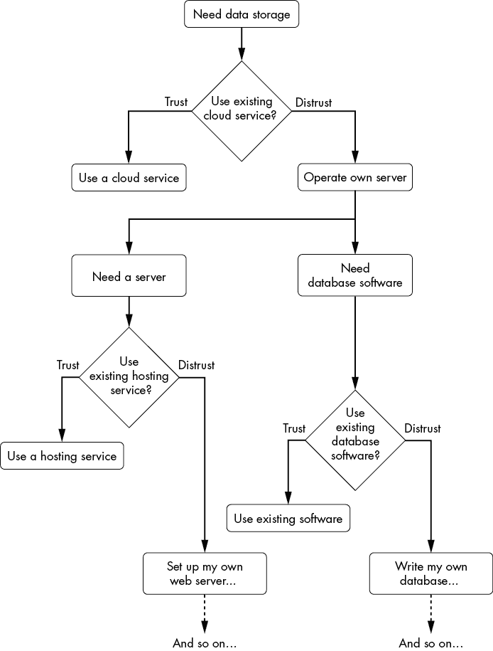
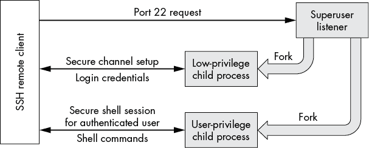
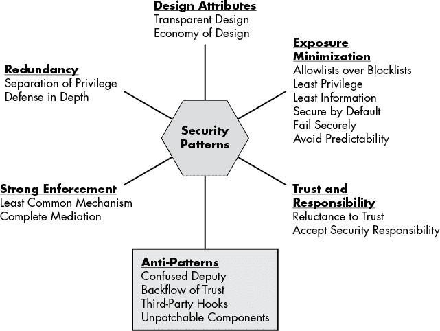
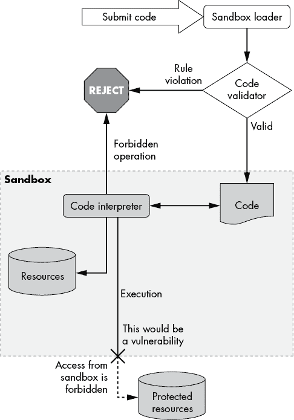
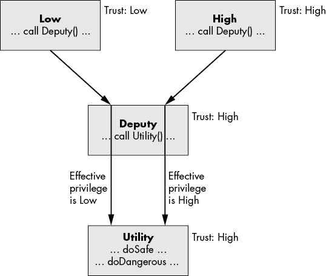
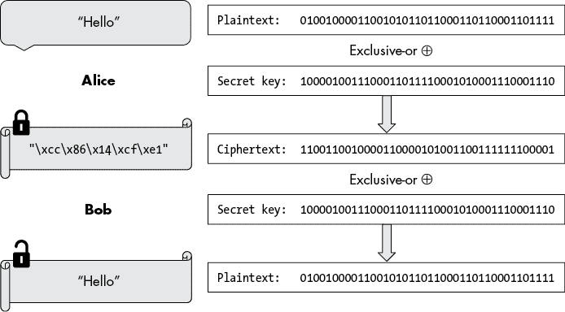
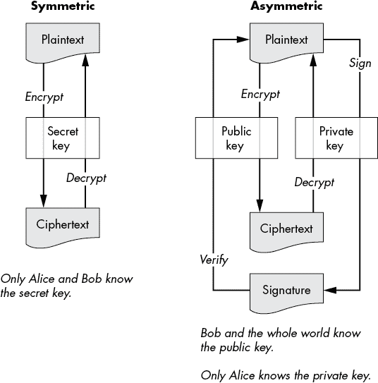
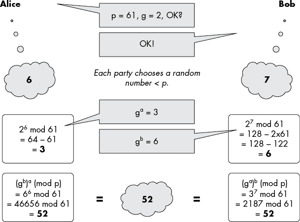
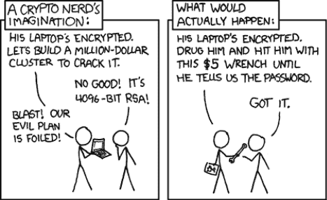

# 第一部分

概念

# 基础

> 诚实是一种基础，通常是一个坚实的基础。即使因我所说的话惹上麻烦，那也是我能够站得住脚的东西。
> 
> —查尔马涅·撒·神


软件安全既是一种逻辑实践，也是一种艺术，基于直觉决策。它需要理解现代数字系统，但也需要对与这些系统互动并受其影响的人们保持敏感。如果这听起来令人生畏，那么你对本书所要解释的基本挑战有了很好的认识。这个视角也能解释为什么软件安全长久以来一直挑战这一领域，以及即使取得了一些进展，所付出的努力依然巨大，尽管它只解决了部分问题。然而，在这种情况下有一个好消息，因为这意味着我们所有人都可以通过提高对更好安全性的意识和参与，真正地在过程的每个阶段产生影响。

我们从考虑安全到底是什么开始。鉴于安全的主观性质，清楚地思考其基础至关重要。本书代表了我基于自己经验的最佳思考理解。信任是所有安全的基础，因为没有人能在真空中工作，现代数字系统复杂得无法单独从硅开始构建；你必须信任他人提供你没有自己创造的一切（从硬件、固件、操作系统到编译器）。在此基础上，我接下来介绍六个经典的安全原则：经典信息安全的三个组成部分和用于实施它的三部分“黄金标准”。最后，关于信息隐私的部分增加了重要的人类和社会因素，这些因素在数字产品和服务越来越多地融入现代生活的最敏感领域时必须考虑。

尽管读者无疑对*安全*、*信任*或*保密性*等词汇有良好的直觉理解，但在本书中，这些词汇有特定的技术含义，值得仔细探讨，因此建议认真阅读本章。作为对更高级读者的挑战，我邀请你们尝试自己写出更好的描述——无疑这将是一个对大家都有教育意义的练习。

## 理解安全

所有生物都有本能，能够避开危险，防御攻击，并朝向任何可以找到的避难所前进。

我们必须意识到，当我们的天生物理安全感正常工作时，它是多么出色。相比之下，在虚拟世界中，我们很少有真正的信号可以依赖——而假信号很容易被伪造。在从技术角度考虑安全之前，让我们通过一个真实的故事来说明人类能做些什么。（正如我们稍后将看到的，在数字领域，我们需要一整套全新的技能。）

以下是一个来自汽车销售员的真实故事。在进行了一次客户试驾后，销售员和客户返回了停车场。销售员下车并继续与客户交谈，同时绕到车前。“当我与他对视时，”销售员回忆道，“那一刻我意识到，‘哦不，这家伙要偷这辆车。’” 事件加速发展：那位变成小偷的客户将车挂档并飞驰而去，而销售员则紧紧抓住车头，经历了人生中最惊险的“车顶之旅”。犯罪分子驾车猛烈加速，企图把他甩下车外。（幸运的是，销售员没有受到严重伤害，犯罪嫌疑人很快被逮捕、定罪并被要求赔偿。）

当那两个人对视时，一种微妙的风险计算已经发生。在短短几分之一秒的时间里，那位销售员处理了复杂的视觉信号，这些信号来自客户的面部表情和肢体语言，最终提炼出了一个明确的敌对行为意图。现在，假设这位销售员成了*鱼叉式网络钓鱼*攻击的目标（这种欺诈性电子邮件旨在愚弄特定目标，而不是大众）。在数字世界里，没有了面对面与攻击者互动时所能感知到的信号，他会更容易上当受骗。

当谈到信息安全、计算机、网络和软件时，我们需要进行分析性思考，评估我们所面临的风险，如果我们想要确保数字系统的安全，必须如此。即使我们无法直接看到、闻到或听到比特或代码，我们也必须这样做。每当你在网上检查数据时，你是在使用软件将信息以人类可读的字体显示出来，通常，你和实际的比特之间有大量的代码；事实上，它可能是一面镜子迷宫。所以，你必须信任你的工具，并相信你真的在检查你认为自己在检查的数据。

软件安全的核心在于保护数字资产免受各种威胁，这一努力在很大程度上是由一组基本的安全原则驱动的，本章的其余部分将讨论这些原则。通过从这些基本原理出发分析系统，我们可以了解漏洞是如何进入软件的，并且如何主动避免和减轻问题。这些基础原则，以及后续章节中涉及的其他设计技术，适用于不仅仅是软件，还适用于自行车锁、银行金库或监狱的设计和运营。

*信息安全*一词专指数据保护及其访问权限的授予。*软件安全*是一个更广泛的术语，侧重于可信的软件系统的设计、实现和操作，包括对信息安全的可靠执行。

## 信任

在数字领域，信任同样至关重要，但往往被视为理所当然。软件安全最终依赖于信任，因为你无法控制系统的每个部分，无法编写所有自己的软件，也无法审查所有依赖的供应商。现代数字系统复杂到即便是大型科技巨头也无法从零开始构建完整的技术栈。从硅芯片到操作系统、网络、外设，以及使这一切运作的众多软件层，构成我们日常依赖的系统是巨大的技术成就，规模庞大且复杂。由于没有人能够独自构建这些系统，组织依赖于硬件和软件产品，这些产品通常是根据特性或价格来选择的——但重要的是要记住，每一个依赖也都涉及一个*信任决策*。

安全性要求我们仔细审视这些信任关系，尽管没有人有足够的时间或资源去调查和验证每一件事。不足够信任意味着在没有真实威胁的情况下，为保护系统做大量无谓的工作。另一方面，过度信任可能意味着之后被突然击中。直白地说，当你完全信任一个实体时，他们可以在没有后果的情况下失败。信任可以通过两种根本不同的方式被破坏：恶意（欺骗、撒谎、诡计）和无能（错误、误解、疏忽）。

在面对不完全信息时做出关键决策正是信任最适用的领域。但我们天生的信任感依赖于微妙的感官输入，这些输入完全不适用于数字领域。以下讨论从信任本身的概念开始，剖析我们体验中的信任是什么，然后转向信任与软件的关系。当你阅读时，试着找到其中的共通点，并将你对软件的理解与对信任的直觉联系起来。利用你现有的信任技能是一种强大的技巧，随着时间的推移，它将为你提供对软件安全的直觉感知，这比任何技术分析都更加有效。

### 体验信任

理解信任的最佳方式是留意在依赖信任时真实的感受。这里有一个思维实验——或者一个真实的练习，可以和你*真正信任*的人一起尝试——它能真正帮助你理解信任的意义。想象一下，你和朋友一起走在繁忙的马路上，车流从几英尺远的地方呼啸而过。你们前方看到一个人行横道，你告诉朋友你希望他们带你安全过马路，你会闭上眼睛，完全依赖他们。你和朋友牵手走到人行横道，朋友轻轻地转你面向马路，用触碰的方式示意你等一等。你能听到快速行驶的车辆声，你清楚知道你的朋友（现在是你的保护者）会等到安全时才会带你过马路，但你的心跳可能也明显加速了，你可能会专心聆听任何即将来临的危险声。

现在，你的朋友毫不犹豫地引导你前进，带你从路缘下去。如果你决定闭着眼睛走进马路，你所感受到的是纯粹的信任——或者说，某种程度的缺乏信任。你的大脑敏锐地感知到明显的风险，你的感官竭力确认安全，内心深处有某种东西在警告你不要这么做。你自己的内部安全监控系统没有足够的证据，并希望你在行动前睁开眼睛；如果你的朋友误判了情况，或者更糟的是，正在对你施展一个致命的恶作剧，你该怎么办？最终，正是你对朋友的信任，让你能够超越这些本能，穿过马路。

提高你对数字信任决策的意识，并帮助他人意识到它们对安全的重要影响。理想情况下，当你选择一个组件或为关键服务选择供应商时，你将能够依赖于像刚才描述的练习中所使用的那些直觉来指导信任决策。

### 你看不见比特

所有这些讨论旨在强调这样一个事实：当你认为自己是在“直接查看数据”时，实际上你是在查看一个远程的表示。事实上，你看到的是屏幕上的像素，你相信它们代表了某些字节的内容，而这些字节的物理位置你并不知道，可能在映射数据到你显示器上可读形式的过程中执行了数百万条指令。数字技术使得信任特别棘手，因为它如此抽象、快速，并且对直接观察来说是隐藏的。每当你检查数据时，记住，实际的数据在内存中与形成字符的像素之间，有大量的软件和硬件。如果其中有什么恶意地错误地表现出实际数据，你怎么可能知道呢？关于数字信息的实际真相是极其难以直接观察到的。

想一想网页浏览器地址栏中的锁形图标，它表示与网站的安全连接。这个标志的出现或缺失向用户传达了一个简单的信息：安全或不安全。在幕后，存在大量的数据和相当复杂的计算，正如第十一章将详细说明的那样，所有这些都汇总成一个二进制的“是/否”安全指示。即使是专家开发者也会面临一项艰巨的任务，试图手动确认仅仅一个实例的有效性。所以我们能做的只是信任软件——而且我们完全有理由信任它。这里的关键是要认识到这种信任有多么深远和普遍，而不是理所当然地接受它。

### 能力与不完美

大多数攻击开始时会利用软件缺陷或配置错误，而这些缺陷或错误通常是出于程序员和 IT 员工的诚意和善意努力所导致的，而他们也是人类，因此不完美。由于许可证通常明确声明几乎所有的责任，因此所有软件都是基于*买者自负其责*的原则使用的。如果，正如人们常说的，“所有软件都有漏洞”，那么其中一部分漏洞就会被利用，最终攻击者会找到一些漏洞并有机会恶意使用它们。软件专业人员因对恶意软件的错误信任而成为攻击受害者并进行直接攻击的情况相对较少。

幸运的是，关于操作系统和编程语言做出重大信任决策通常是容易的。许多大公司在提供和支持优质硬件和软件产品方面有着丰富的业绩记录，信任它们是非常合理的。信任那些缺乏业绩记录的公司可能会更有风险。虽然他们可能有很多熟练且积极的人员在努力工作，但行业缺乏透明度使得评估其产品安全性变得困难。开源提供了透明度，但依赖于项目所有者提供的监督程度，以防止贡献者插入有缺陷甚至是恶意的代码。值得注意的是，没有任何软件公司尝试通过承诺更高的安全性或在攻击事件中提供赔偿来与众不同，因此作为客户，我们没有这样的选择。法律、监管和商业协议为我们提供了额外的方式来减轻信任决策中的不确定性。

认真对待信任决策，但要认识到没有人能够 100% 准确地做出判断。坏消息是，这些决策永远不完美，因为正如美国证券交易委员会警告我们的那样，“过去的表现不能保证未来的结果”。好消息是，人类在判断信任方面高度进化——尽管这种判断在面对面交流时效果最佳，而绝非通过数字媒介——在绝大多数情况下，只要我们拥有准确信息并有意识地采取行动，我们通常能够做出正确的信任决策。

### 信任是一个光谱

信任总是以不同程度授予的，且信任评估总是存在一定的不确定性。在信任的最远端，比如在进行重大手术时，我们可能会将我们的生命字面意思地交给医疗专业人员，甘愿放弃对我们身体的控制，不仅仅是身体控制，还有对手术过程的意识和监控能力。在最坏的情况下，如果他们未能帮助我们，且我们没有幸存下来，我们实际上没有任何救济途径（法律上的遗产权除外）。日常信任则要有限得多：信用卡有额度限制，以防止银行因未付款而承担过大损失，而汽车则有代客钥匙，以便我们限制对后备箱的访问。

由于信任是一个连续体，“信任但验证”的政策是一个有用的工具，它弥合了完全信任和完全不信任之间的鸿沟。在软件中，你可以通过授权和严格审计的结合来实现这一点。通常，这涉及到*自动化审计*（准确检查大量大部分重复的活动日志）和*手动审计*（抽查、处理例外情况，并有人工参与做出最终决策）。我们将在本章稍后部分详细讨论审计。

### 信任决策

在软件中，你面临一个二选一的决定：信任，还是不信任？虽然一些系统确实会对应用程序施加多种权限限制，但你仍然需要决定是否允许或拒绝每个特定权限。在犹豫时，你可以安全地选择不信任，只要至少有一个候选方案能够合理地赢得你的信任。如果你对评估要求过高，没有任何产品能够获得你的信任，那么你只能面对自己构建组件的前景。

将信任决策视为从决策树上剪掉分支，否则决策树会变得几乎无穷大。当你可以信任一个服务或计算机是安全的时，你就节省了进行更深入分析的精力。另一方面，如果你不愿意信任，那么你需要构建并保护更多的系统部分，包括所有子组件。图 1-1 展示了一个做出信任决策的示例。如果没有一个你完全信任的云存储服务来存储你的数据，那么你必须自己运营这个服务，这涉及到更多的信任决策：选择一个你信任的托管服务，还是自己做，以及选择一个你信任的现有数据库软件，还是自己编写。请注意，当你不信任一个提供商时，更多的信任决策一定会随之而来，因为你无法做到所有事情。

对于明确不信任的输入——这应包括几乎所有输入，特别是来自公共互联网或任何客户端的内容——应当以怀疑态度和最高的谨慎度来处理这些数据（关于这一点，详见第四章第 68 页的“对信任的犹豫”）。即使是可信的输入，也不能假设它们是完全可靠的。考虑在容易实现的情况下，适时添加安全检查，即使只是为了减少整体系统的脆弱性，并在遇到无意的错误时防止错误的传播。



图 1-1：一个关于信任决策的决策树示例

### 隐式信任的组件

每个软件项目都依赖于一个庞大的技术栈，这些技术栈是*隐式信任*的，包括硬件、操作系统、开发工具、库和其他难以验证的依赖项，因此我们基于供应商的声誉来信任它们。然而，你应当保持对什么是隐式信任的基本理解，并在大规模扩大隐式信任的范围之前，认真考虑这些决策。

没有简单的方法可以管理隐式信任，但这里有一个有帮助的想法：最小化你信任的各方数量。例如，如果你已经决定使用微软（或苹果等）操作系统，倾向于使用它们的编译器、库、应用程序和其他产品与服务，以最小化暴露的风险。其大致原理是，信任更多公司会增加这些公司让你失望的机会。此外，实际上，一家公司的一系列产品往往在一起使用时更加兼容且经过更好的测试。

### 值得信赖

最后，不要忘记做出信任决策的另一面，即在提供产品和服务时，*促进*信任。每个软件产品必须说服最终用户它是值得信任的。通常，仅仅展示一个扎实的专业形象就足够了，但如果该产品履行的是关键功能，那么为客户提供一个扎实的信任基础至关重要。

以下是一些增强工作中信任的基本建议：

+   透明度能够培养信任。公开工作使客户能够评估产品。

+   引入第三方通过其独立性来建立信任（例如，使用雇佣的审计员）。

+   有时你的产品是与其他产品集成的第三方。信任逐渐建立，因为两个具有独立关系的各方之间很难串通。

+   当问题出现时，要虚心接受反馈，果断行动，并公开披露任何调查结果以及为防止问题再次发生所采取的措施。

+   特定的功能或设计元素可以使信任变得可见——例如，实时显示已保存并验证的备份数量的归档解决方案，展示分布式位置的备份情况。

行动产生信任，而空洞的声明则会削弱精明客户的信任。提供可以验证的可信证据，理想情况下以客户自己可以验证的方式。尽管很少有人会真正审核开源代码的质量，但知道他们可以审核（并且假设其他人也在这么做）几乎同样有说服力。

## 经典原则

信息安全的指导原则起源于计算机发展的初期，当时计算机刚从特殊的锁闭、空调、架空地板的房间中出来，开始连接到网络。这些传统模型是现代信息安全的“牛顿物理学”：适用于许多应用的良好且简明的指南，但并不是万能的。例如，信息隐私是现代数据保护和管理中一个更为细致的考虑，而传统的信息安全原则并未涵盖这一点。

基本原则可以很好地分为两组，每组三条。前三条原则，我称之为*C-I-A*，定义了数据访问的要求；另外三条则涉及如何控制和监控访问。我们将这三条原则称为*黄金标准*。这两组原则是相互依赖的，只有整体考虑，才能保护数据资产。

除了防止未经授权的数据访问外，还存在一个问题，即应该信任谁或哪些组件和系统可以访问数据。这是一个更复杂的信任问题，最终超出了信息安全的范围，尽管面对这个问题是确保任何数字系统安全不可避免的部分。

### 信息安全的 C-I-A

我们传统上建立软件安全是基于信息安全的三个基本原则：*保密性*、*完整性*和*可用性*。这三大支柱围绕数据保护的基本原则制定，它们的含义直观易懂：

**保密性**

1.  仅允许授权的数据访问——不泄露信息。

**完整性**

1.  准确维护数据——不允许未经授权的修改或删除。

**可用性**

1.  维护数据的可用性——不允许显著的延迟或未经授权的关停。

每个简短的定义都描述了目标和防御措施，以防止其被破坏。在审查设计时，常常有助于考虑可能破坏安全的方式，并从中找到防御措施。

C-I-A 的三个组成部分代表了理想，避免坚持完美至关重要。例如，甚至对加密的网络流量进行分析，决心的窃听者也可能推断出关于两个端点之间通信的某些信息，比如交换的数据量。从技术上讲，这种数据交换削弱了端点之间交互的机密性；但出于实际考虑，我们无法在不采取极端措施的情况下修复这个问题，而且通常这种风险足够小，可以安全地忽略。（一种隐藏通信事实的方法是让端点始终交换恒定量的数据，根据需要在实际流量较低时添加虚拟数据包。）流量对应的活动是什么？对手可能如何利用这些知识？下一章将详细解释类似的威胁评估。

请注意，授权是 C-I-A（机密性、完整性、可用性）每个组件的内在部分，它要求只有正确的披露、数据修改或可用性控制。什么构成“正确”是一个重要的细节，授权策略需要明确这一点，但它不是这些基本数据保护原语概念的一部分。有关这一部分的内容将在第 14 页的《黄金标准》中讨论。

#### 机密性

保持机密性意味着以授权的方式披露私人信息。这听起来简单，但在实际操作中涉及许多复杂因素。

首先，重要的是仔细识别哪些信息应被视为私密。设计文档应明确这一区别。尽管什么算作敏感信息有时看起来似乎很明显，但实际上人们的看法差异很大，若没有明确的说明，我们可能会产生误解。最安全的假设是将所有外部收集的信息默认为私密，直到通过明确的政策声明并解释如何以及为什么放宽这一规定。

这里列出了一些常常被忽视的将数据视为私密的原因：

+   终端用户可能自然期望他们的数据是私密的，除非另行通知，即使披露这些数据并不会造成危害。

+   人们可能会在为不同用途设计的文本框中输入敏感信息。

+   信息的收集、处理和存储可能受到许多不为人知的法律和规定的约束。（例如，如果欧洲人浏览您的网站，可能需要遵循欧盟的法律，例如《通用数据保护条例》。）

在处理私人信息时，需确定什么构成适当的访问权限。决定何时以及如何披露信息，最终是一个信任决策，这不仅需要明确规定规则，还需要解释这些规则背后的主观选择。

保密性妥协是一个连续的过程。在完全披露的情况下，攻击者会获取整个数据集，包括元数据。在该连续性较低的一端，可能是信息的轻微泄露，例如一个内部错误信息或类似的泄漏，实际上并不造成重大影响。作为部分泄露的例子，考虑将连续编号分配给新客户的做法：一个狡猾的竞争对手可以注册为新客户，并不时获得新的客户编号，然后计算相邻的差异，从而了解每个时间段内获得的客户数量。任何有关受保护数据的详细信息泄露，都会在某种程度上构成保密性的妥协。

很容易低估轻微泄露的潜在价值。攻击者可能会以与开发者最初意图完全不同的方式使用数据，且将小部分信息结合起来，往往能提供比任何单独部分更有力的洞察。知道某人的邮政编码可能并不能告诉你太多，但如果你还知道他们的近似年龄，并且他们是医学博士（MD），你也许可以将这些信息结合起来，识别出这个居住在稀疏地区的个人——这一过程被称为*去匿名化*或*重新识别*。通过分析 Netflix 发布的一个假定已匿名的数据集，研究人员能够将许多用户账户与 IMDb 账户匹配：事实证明，你最喜欢的电影是一个有效的独特个人身份标识手段。

#### 完整性

在信息安全的语境中，完整性只是指数据的真实性和准确性，防止未经授权的篡改或删除。除了防止未经授权的修改外，数据的*来源*记录——即原始来源和任何经过授权的修改——也是完整性的一个重要且更强的保证。

对许多篡改攻击的经典防御方法是保留关键数据的多个版本并记录它们的来源。简而言之，保持良好的备份。增量备份是非常有效的缓解措施，因为它们简单高效，能够提供一系列快照，详细记录数据发生变化的时间和内容。然而，完整性的需求远不止于数据的保护，通常还包括确保组件、服务器日志、软件源代码和版本的完整性，以及其他法医信息，以便在出现问题时确定篡改的原始来源。除了有限的管理员访问控制外，安全摘要（类似于校验和）和数字签名也是强有力的完整性检查方法，如第五章所述。

请记住，篡改可以通过许多不同的方式发生，不一定只是修改存储中的数据。例如，在 Web 应用程序中，篡改可能发生在客户端、客户端和服务器之间的传输过程中、通过欺骗授权方进行更改、修改页面中的脚本，或以其他多种方式发生。

#### 可用性

对可用性的攻击是互联网连接世界中的一种悲哀现实，而且可能是最难防御的攻击之一。在最简单的情况下，攻击者可能仅仅是向服务器发送异常重的流量负载，用看似有效的服务请求淹没服务器。这一原则意味着信息是*暂时*不可用的；虽然永久丢失的数据也不可用，但通常被视为对完整性的根本妥协。

匿名的拒绝服务（DoS）攻击，通常是为了勒索，威胁任何互联网服务，构成了一个巨大的挑战。为了最佳地防御这些攻击，应选择在大型服务平台上托管，拥有可以承受重负载的基础设施，并保持灵活性，在出现问题时迅速迁移基础设施。没有人知道 DoS 攻击的实际发生频率或代价，因为许多受害者会私下解决这些事件。但毫无疑问，你应该提前制定详细的应急计划来应对这种情况。

还有许多其他类型的可用性威胁也是可能的。例如，对于一个网络服务器，一个格式错误的请求可能触发一个漏洞，导致崩溃或无限循环，从而使其服务无法正常运行。其他攻击还可能使应用程序的存储、计算或通信能力超负荷，或者利用破坏缓存有效性的模式，这些都会带来严重的问题。未经授权的软件、配置或数据破坏（即便有备份，也可能造成延迟）同样可能对可用性产生不利影响。

### 金标准

如果 C-I-A 是安全系统的目标，那么金标准描述了实现这一目标的方法。*Aurum*是拉丁语中的“黄金”之意，因此其化学符号为“Au”，恰好安全执行的三个重要原则也都以这两个字母开头：

**认证**

1.  高保障地确定主体的身份

**授权**

1.  可靠地仅允许经过认证的主体执行操作

**审计**

1.  保持对主体行为的可靠记录以供检查

*主体*是指任何经过可靠认证的实体：一个人、企业或组织、政府实体、应用程序、服务、设备，或任何其他具有执行能力的代理。

*身份验证*是可靠地确认主体凭证有效性的过程。系统通常允许注册用户通过证明他们知道与其账户相关联的密码来进行身份验证，但身份验证的范围可以更广泛。凭证可能是主体知道的某些信息（如密码）、拥有的某些物品（如智能卡），或者是主体的某些特征（如生物特征数据）；我们将在下一节中进一步讨论凭证。

经过身份验证的主体的数据访问受到*授权*决策的约束，依据规定的规则，允许或拒绝其行为。例如，具有访问控制设置的文件系统可能会将某些文件设置为特定用户的只读文件。在银行系统中，职员可以记录一定金额以内的交易，但对于更大金额的交易，可能需要经理审批。

如果一个服务保存了一个准确记录主体行为的安全日志，包括任何执行某些操作时的失败尝试，管理员可以进行随后的*审计*，检查系统的表现，确保所有操作都是正当的。准确的审计日志是强大安全性的重要组成部分，因为它们提供了实际事件的可靠报告。详细的日志提供了发生了什么的记录，能清晰地揭示在出现异常或可疑事件时发生的具体情况。例如，如果你发现一个重要的文件丢失，日志应该理想地提供删除该文件的人员及其时间的详细信息，为进一步调查提供起点。

黄金标准充当保护 C-I-A 的执行机制。我们定义了保密性和完整性为防止*未经授权*的泄露或篡改，而可用性也受到授权管理员的控制。真正执行授权决策的唯一方式是确保使用该系统的主体已被正确验证。审计通过提供可靠的谁做了什么、何时做的日志来完善整个过程，定期审查异常情况，并追究相关方的责任。

安全设计应始终明确区分身份验证和授权，因为将二者结合会导致混乱，而当这些阶段清晰分开时，审计轨迹会更加明确。这两个现实生活中的例子说明了为什么这种区分很重要：

+   “你为什么让那个人进了金库？” “我不知道，但他看起来很合法！”

+   “你为什么让那个人进了金库？” “他的身份证明是‘Sam Smith’，并且他有分行经理的书面证明。”

第二个回应比第一个更为完整，后者完全没有帮助，除了证明保安是个傻瓜。如果保险库被入侵，第二个回应会提供明确的调查细节：分行经理是否有权限授予进入保险库的权限并写下便条？如果保安保留了身份证复印件，那么这些信息有助于确认并找到 Sam Smith。相比之下，如果分行经理的便条上只写了“让持票人进入保险库”——没有认证的授权——调查人员在安全被突破后几乎无法了解发生了什么或入侵者是谁。

#### 身份验证

身份验证过程基于凭证来验证主体的身份声明，凭证表明他们确实是他们所声称的身份。或者服务可能使用更强的凭证形式，如数字签名或挑战，证明主体拥有与该身份关联的私钥，这也是浏览器通过 HTTPS 验证 Web 服务器身份的方式。数字签名是一种更好的身份验证形式，因为主体可以证明他们知道秘密而不泄露它。

适用于身份验证的证据可分为以下几类：

+   *你知道的东西*，比如密码

+   *你拥有的东西*，比如一个安全令牌，或者在模拟世界中某种无法伪造的证书、护照或签署的文件

+   *你是的东西*——即生物特征（指纹、虹膜图案等）

+   *你所在的地方*——你的验证位置，比如连接到一个安全设施中的私人网络

这些方法中的许多是相当不可靠的。你所知道的东西可能会被揭示，你拥有的东西可能会被盗取或复制，你的位置可以通过各种方式被操控，甚至你所“是”的东西也可能会被伪造（如果被泄露，你以后就无法改变你“是”的东西）。除此之外，在当今的网络化世界中，身份验证几乎总是发生在网络上，这使得任务比面对面的身份验证更为困难。例如，在互联网上，浏览器充当信任中介，首先进行本地身份验证，只有验证成功后，才将加密凭证传递给服务器。系统通常使用多重身份验证因素来减轻这些问题，定期审计这些因素也是另一个重要的防线。两个较弱的身份验证因素比一个要好（但没有好很多）。

然而，在组织可以为某人分配凭证之前，它必须解决一个棘手的问题：如何确定一个人在加入公司、注册账户或因忘记密码而联系帮助台恢复访问权限时的真实身份。

例如，当我加入谷歌时，所有新员工在一个周一早晨与几位 IT 管理员汇合，管理员们核对我们的护照或其他身份证明与新员工名单，然后才发放我们的员工卡和公司发放的笔记本电脑，并让我们设置登录密码。

通过检查我们提供的凭证（我们的身份证明）是否正确地确认了我们作为所声明之人的身份，IT 团队验证了我们的身份。身份验证的安全性取决于我们提供的政府颁发的身份证明和支持文件（例如出生证明）的完整性。这些身份证明的发行有多准确？它们被伪造或欺诈获得的难度有多大？理想情况下，从出生注册开始的身份链应在我们一生中始终保持完整，以便独特而真实地识别每个人。安全识别个人是一个挑战，主要是因为最有效的技术往往带有专制色彩，且在社会上不可接受，因此为了保持一定的隐私和自由，我们在日常生活中选择较弱的方法。本书的重点是金标准，而不是这一更难的*身份管理*问题，因此不在本书讨论范围之内。

在可行的情况下，依赖现有的可信认证服务，不要不必要地重复发明轮子。即使是简单的密码认证也很难做到安全，处理遗忘密码的安全性更是困难。通常来说，认证过程应检查凭证并提供通过或失败的响应。避免显示部分成功，因为这可能帮助攻击者通过试错逐步锁定凭证。为了缓解暴力破解的威胁，一种常见策略是使认证过程本身计算量大，或在过程中引入逐步延迟（另见第四章第 61 页中的“避免可预测性”）。

在验证用户身份后，系统必须找到一种安全地将身份绑定到主体的方法。通常，认证模块会向主体发放一个令牌，主体可以使用这个令牌代替完整的身份验证，用于后续的请求。其目的是，主体通过代理（如网页浏览器）呈现认证令牌，作为其身份的简要证明，从而为未来的请求创建一个*安全上下文*。这个上下文将存储的令牌与后续请求进行绑定，以代表已认证的主体。网站通常通过与浏览会话相关联的安全 cookie 来实现这一点，但对于其他类型的主体和接口，还有许多不同的技术。

已认证身份的安全绑定可能会以两种根本不同的方式受到破坏。一个明显的方式是攻击者篡夺受害者的身份。另一种方式是已认证的主体可能会串通并试图泄露他们的身份，甚至将其转嫁给他人。后者的例子包括共享付费流媒体订阅。由于绑定较为松散且依赖主体的合作，网络防御此类行为的手段并不十分有效。

#### 授权

允许或拒绝关键操作的决策应基于通过认证确认的主体身份。系统通过业务逻辑、访问控制列表或其他正式的访问策略来实施授权。

匿名授权（即无认证的授权）在某些罕见的情况下是有用的；一个现实世界的例子可能是拥有繁忙车站公共储物柜的钥匙。基于时间的访问限制（例如，将数据库访问限制在营业时间内）是另一个常见的例子。

一个单独的保安应该对特定资源执行授权。分散在代码库中的授权代码会让维护和审计变得非常困难。相反，授权应依赖于一个统一的框架来授予访问权限。良好的结构化设计能够帮助开发人员做到这一点。在可能的情况下，尽量使用标准的授权模型，而不是混乱的临时逻辑。

*基于角色的访问控制（RBAC）*桥接了认证和授权之间的联系。RBAC 基于分配给已认证主体的角色授予访问权限，通过统一的框架简化了访问控制。例如，银行中的角色可能包括职员、经理、贷款专员、安全员、财务审计员和 IT 管理员。RBAC 并不是为每个人单独选择访问权限，而是根据每个人的职责指定一个或多个角色，并自动且统一地分配相关权限。在更高级的模型中，一个人可能拥有多个角色，并明确选择在特定访问场景下应用哪个角色。

授权机制可以比操作系统传统提供的简单读/写访问控制更加细化。通过设计更强大的授权机制，你可以在不丧失有用功能的情况下，通过限制访问来增强安全性。这些更先进的授权模型包括*基于属性的访问控制（ABAC）*、*基于策略的访问控制（PBAC）*等。

以一个简单的银行出纳员示例来观察如何通过细粒度授权来收紧政策：

**限速**

1.  出纳员每小时最多可以进行 20 笔交易，但超过这个数量将被视为可疑。

**时间限制**

1.  出纳员交易必须在营业时间内进行，且需打卡上班。

**禁止自助服务**

1.  出纳员禁止与其个人账户进行交易。

**多个主体**

1.  超过$10,000 的出纳交易需要单独的经理批准（避免了单一恶意行为者一次性转移大量资金的风险）。

最后，即使是只读访问，对于某些数据（如密码）来说，也可能是过高的权限。系统通常通过比较摘要值来检查登录密码，这样就避免了泄露明文密码的任何可能性。用户名和密码会传送到前端服务器，前端服务器计算密码的摘要并将其传递给身份验证服务，迅速销毁任何明文密码的痕迹。身份验证服务无法从凭据数据库中读取明文密码，但可以读取摘要，并将其与前端服务器提供的摘要进行比较。通过这种方式，系统检查凭据，但身份验证服务永远无法访问任何密码，因此即使被攻破，该服务也无法泄露密码。除非接口设计提供了这些替代方案，否则它们将错失这些减少数据泄漏可能性的机会。我们将在第四章第 57 页讨论“最小信息”模式时进一步探讨这一点。

#### 审计

为了让组织能够审计系统活动，系统必须生成所有对维护安全至关重要的事件的可靠日志。这些事件包括身份验证和授权事件、系统启动和关闭、软件更新、管理访问等。审计日志还必须具备防篡改能力，理想情况下，即便是管理员也难以干预，才能被视为完全可靠的记录。审计是黄金标准的一个关键组成部分，因为事件是会发生的，身份验证和授权政策可能存在缺陷。审计还可以提供必要的监督，减少内部人员背叛信任的风险。

如果操作得当，审计日志对日常监控、衡量系统活动水平、检测错误和可疑活动至关重要，并且在发生事件后，能帮助确定攻击发生的时间和方式，以及评估损害程度。请记住，完全保护数字系统不仅仅是正确执行政策的问题；它更关乎如何负责地管理信息资产。审计确保了信任的主体在其广泛权限范围内正确行事。

2018 年 5 月，Twitter 披露了一个尴尬的漏洞：他们发现一次代码变更不小心导致原始登录密码出现在内部日志中。虽然这不太可能导致任何滥用，但无疑损害了客户信任，且本不该发生。日志应该记录操作细节，但不应存储任何实际的私人信息，以尽量减少泄露的风险，因为许多技术人员可能会定期查看日志。关于这一要求的详细处理，请参见附录 A 中的示例设计文档，详细描述了一种解决这一问题的日志工具。

系统还必须防止任何人篡改日志以掩盖不当行为。如果攻击者能够修改日志，他们就能清除所有活动痕迹。对于特别敏感且风险较高的日志，应由一个独立的系统在不同的管理和操作控制下来管理审计日志，以防止内部人员掩盖自己的行径。完全做到这一点非常困难，但独立监督的存在往往能有效地起到威慑作用，就像一个简易的围栏和显眼的视频监控摄像头能有效阻止非法入侵一样。

此外，任何试图规避系统的行为都将显得非常可疑，任何错误的举动都将导致对违法者的严重后果。一旦被抓住，他们将很难否认自己的罪行。

*不可否认性*是审计日志的重要属性；如果日志显示某个管理员在特定时间运行了某个命令，并且系统立即崩溃，很难将责任推给其他人。相反，如果一个组织允许多个管理员共享同一个账户（一个糟糕的主意），那么就无法确切知道到底是谁做了什么，从而为每个人提供了合理的否认。

最终，审计日志只有在你监控它们、仔细分析异常事件并跟进，必要时采取适当的行动时才有用。为此，按照*金发姑娘原则*记录适量的细节非常重要。过多的日志会膨胀数据量，增加监督的难度；而过于嘈杂或杂乱的日志则让人难以提取有用信息。另一方面，日志过于简略，缺乏足够的细节，可能会遗漏关键信息，因此找到合适的平衡是一个持续的挑战。

### 隐私

除了信息安全的基础——C-I-A 和黄金标准——另一个我想介绍的基本主题是信息隐私的相关领域。安全与隐私之间的界限难以明确定义，它们既密切相关又有所不同。在本书中，我想专注于它们的交集点，而不是试图统一它们，而是将安全与隐私结合到软件构建的过程中。

为了尊重人们的数字信息隐私，我们必须通过考虑额外的人为因素来扩展保密原则，包括：

+   客户对信息收集和使用的期望

+   关于适当的信息使用和披露的明确政策

+   与收集和使用各种类别信息相关的法律和监管问题

+   处理个人信息时的政治、文化和心理层面

随着软件在现代生活中变得越来越普及，人们在生活中使用软件的方式变得更加亲密，涉及到生活中许多敏感领域，导致了许多复杂的问题。过去的事故和滥用事件提高了对这些风险的关注，随着社会通过政治和法律手段应对新挑战，妥善处理私人信息变得越来越具有挑战性。

在软件安全的背景下，这意味着：

+   考虑所有数据收集和共享可能对客户和利益相关者产生的后果

+   标明所有潜在问题，并在必要时寻求专家建议

+   建立并遵循有关私人信息使用的明确政策和指南

+   将政策和指导转化为软件执行的检查和制衡

+   保持准确的数据获取、使用、共享和删除记录

+   审计数据访问授权和特别访问以确保合规

隐私工作往往比维护系统适当控制和提供适当访问权限的相对明确的安全工作更难界定。而且，随着社会在更多数据收集的未来中不断前进，我们仍在逐步明确隐私的期望和规范。鉴于这些挑战，您明智的做法是考虑最大限度的透明度，关于数据使用的政策应简明易懂，并且尽量收集最少的数据，特别是个人身份信息。

仅为特定目的收集信息，并仅在有用时保留。除非设计中设想了授权使用，否则应避免首次收集。为了“某天”使用而轻率收集数据是有风险的，几乎从来不是一个好主意。当某些数据的最后一次授权使用变得不再必要时，最好的保护方法是安全删除。对于特别敏感的数据，或者为了最大化隐私保护，可以采取更强的措施：当披露的潜在风险超过保留数据的潜在价值时，就删除数据。保留多年的电子邮件有时可能对某些事情有用，但通常没有明确的商业需求。然而，内部邮件如果泄露或披露（例如通过传票的方式）可能会带来法律责任。因此，与其为了“以防万一”无限期保存所有数据，通常最好的做法是删除它。

对信息隐私的完整讨论超出了本书的范围，但隐私与安全性是任何收集个人数据的系统设计中紧密相连的两个方面——而且几乎所有数字系统都以某种方式与人互动。只有在安全性得到保障的情况下，才能实现强有力的隐私保护，因此这些话是呼吁大家在软件设计中通过设计来考虑并融入隐私保护。

尽管其复杂性，隐私的最佳实践之一是众所周知的：必须清楚地传达隐私期望。与安全性不同，隐私政策在信息服务是否以及如何使用客户数据上，通常留有很大的余地。“我们将重用并出售您的数据”是隐私光谱的一端，但“有些时候我们可能不会保护您的数据”则不是安全性上的可行立场。隐私失败通常发生在用户的期望与实际隐私政策不一致，或当隐私政策明确却被违反时。前者问题的根源在于未能主动向用户解释数据处理方式。后者则发生在政策不明确，或负责人忽视了政策，或在安全漏洞中被破坏。

# 威胁

> 威胁通常比本身更可怕。
> 
> ——索尔·阿林斯基


威胁无处不在，但如果管理得当，你是可以与它们共存的。软件也不例外，唯一不同的是你没有数百万年的进化来准备自己。这就是为什么你需要培养一种软件安全的思维方式，它要求你从开发者的视角转变为攻击者的视角。理解系统可能面临的威胁是将坚固的防御措施和缓解方案融入软件设计的基本起点。但是，要首先察觉这些威胁，你必须停止考虑典型的使用案例和按预期使用软件。相反，你必须把它看作它真正的面貌：一堆代码和组件，数据在其中流动并在各处存储。

例如，考虑一下回形针：它巧妙地设计用来将纸张固定在一起，但如果你适当弯曲回形针，它很容易被重新塑造成一根硬线。安全思维能够辨认出，你可以将这根线插入锁的钥匙孔，通过操控锁芯来打开锁，而无需钥匙。

值得强调的是，威胁包括所有可能造成伤害的方式。恶意攻击是讨论中的重要焦点，但这并不意味着你应当排除由于软件缺陷、人为错误、事故、硬件故障等带来的其他威胁。

威胁建模提供了一种视角，可以指导在整个软件开发过程中影响安全性的任何决策。以下内容侧重于概念和原则，而不是执行威胁建模的许多具体方法论。微软在 2000 年代初期首次实践的早期威胁建模被证明是有效的，但它需要大量的培训，并且投入了相当大的精力。幸运的是，你可以通过多种方式进行威胁建模，一旦理解了概念，便容易根据可用的时间和精力调整流程，同时仍能产生有意义的结果。

列举所有威胁并识别大型软件系统中所有的漏洞点是一项艰巨的任务。然而，聪明的安全工作目标是逐步提高标准，而不是追求完美。你的第一次努力可能只发现所有潜在问题的一部分，并且只能缓解其中一些：即便如此，这也是一次实质性的改进。这种努力或许能避免一次重大安全事件——这本身就是一项真正的成就。不幸的是，你几乎永远不知道被挫败的攻击，缺乏反馈可能会让人感到失望。你越是锻炼你的安全思维肌肉，就越能更好地识别威胁。

最后，重要的是要理解，威胁建模可以提供超出安全范围的对目标系统的新层次的理解。通过以新的方式审视软件，你可能会获得一些见解，这些见解建议了各种改进、效率、简化以及与安全无关的新功能。

## 对抗性视角

> 漏洞利用是我们在现实世界中体验到的最接近“魔法咒语”的东西：构建正确的咒语，便能远程控制设备。
> 
> —Halvar Flake

人类行为者是终极威胁；安全事件不会自动发生。对软件安全的任何深入分析都包括考虑假设的对手可能会尝试的行为，以预测和防御潜在的攻击。攻击者是一个杂乱无章的群体，从*脚本小子*（没有技术技能的罪犯使用自动化恶意软件）到复杂的国家级行为者，及其中的一切。只要你能从对手的角度思考，那是很好的，但不要自欺欺人地相信你能准确预测他们的每一步，也不要花太多时间试图进入他们的思维，就像一个高手侦探智胜一个狡猾的敌人一样。理解攻击者的思维方式很有帮助，但就我们构建安全软件的目的而言，实际技术细节——他们可能用来探测、渗透和窃取数据的手段——并不重要。

考虑系统内可能的明显目标（有时，对对手有价值的东西对你来说价值较低，反之亦然），确保这些资产得到充分保护，但不要浪费时间去揣测假设攻击者的想法。与其浪费不必要的精力，他们通常会集中精力在最薄弱的环节上，以实现他们的目标（或者他们可能是在无目的地瞎摸，这很难防范，因为他们的行为看起来是无方向和任意的）。错误无疑会引起注意，因为它们暗示了系统的弱点，攻击者一旦发现明显的漏洞，就会尝试创造性变体，看他们能否真正突破某些东西。泄露系统内部细节的错误或副作用（例如，详细的堆栈转储）是攻击者最乐于利用的跳板。

一旦攻击者发现了一个弱点，他们很可能会集中更多精力在其上，因为一些小瑕疵往往会在集中的攻击下扩展并产生更大的后果（如我们将在第八章详细讨论）。通常，将两个单独无关的小瑕疵结合起来就能产生重大攻击，因此认真对待所有漏洞是明智的。熟练的攻击者无疑了解威胁建模，尽管他们通常是没有内部信息的（至少在他们成功渗透之前）。

尽管我们永远无法真正预见对手将花时间在什么上，但考虑假想攻击者的动机，作为攻击勤奋程度的衡量标准，是有意义的。从某种角度来说，这就像是某个著名罪犯解释为什么抢银行：“因为那儿有钱。”关键是，攻击一个系统的潜在收益越大，你就能期望潜在的攻击者投入更高水平的技能和资源。尽管这一点具有一定的推测性，但这一分析作为相对指南非常有用：强大的企业、政府、军事和金融机构是大目标。你的猫咪照片不是。

最终，和所有形式的暴力一样，攻击和造成伤害总是比防御要容易得多。攻击者可以选择他们的切入点，凭借决心，他们可以尝试尽可能多的漏洞利用，因为他们只需要成功一次。这一切都意味着为何优先考虑安全工作至关重要：防御者需要所有可用的优势。

## 四个问题

曾在微软多年负责威胁建模的亚当·肖斯塔克（Adam Shostack）将该方法论简化为四个问题：

+   我们在做什么工作？

+   会发生什么问题？

+   我们将如何应对？

+   我们做得好吗？

第一个问题旨在确定项目的背景和范围。回答这个问题包括描述项目的需求和设计，组件及其相互作用，并考虑操作问题和使用案例。接下来，在该方法的核心部分，第二个问题试图预测潜在的问题，而第三个问题则探讨我们识别出的这些问题的缓解措施。（我们将在第三章更详细地研究缓解措施，但首先我们将探讨它们与威胁的关系。）最后，最后一个问题要求我们反思整个过程——软件做了什么，它可能出错的地方，以及我们如何有效地缓解这些威胁——以评估风险减少情况并确认系统足够安全。如果仍有未解决的问题，我们将重新审视这些问题，填补剩余的空白。

威胁建模远不止这些，但令人惊讶的是，仅仅从四个问题开始就能取得如此大的进展。掌握这些概念，并结合本书中的其他思想和技术，你可以显著提高你所构建和操作的系统的安全性。

## 威胁建模

“可能会出什么问题？”

我们经常问这个问题来开个讽刺的玩笑。但当问题没有讽刺意味时，它简洁地表达了威胁建模的出发点。回答这个问题要求我们识别和评估威胁；然后我们可以对这些威胁进行优先排序，并着手实施那些减少重要威胁风险的缓解措施。

让我们分解一下前面的句子。以下步骤概述了基本的威胁建模过程：

1.  从系统模型出发，确保我们考虑到所有的范围。

1.  识别系统中需要保护的*资产*（有价值的数据和资源）。

1.  针对每个组件仔细检查系统模型，识别*攻击面*（攻击可能发生的地方）、*信任边界*（将系统中更受信任部分与较少受信任部分连接的接口）以及不同类型的威胁。

1.  分析这些潜在的威胁，从最具体的到假设性的威胁。

1.  对威胁进行排名，从最关键到最不关键进行排序。

1.  提出减轻措施，以减少最关键威胁的风险。

1.  添加缓解措施，从最有影响力且最容易实现的措施开始，逐步提高，直到边际效益递减的点。

1.  测试缓解措施的有效性，从最关键的威胁的缓解措施开始。

对于复杂系统，列出所有潜在威胁的完整清单将是庞大的，全面分析几乎肯定是不可行的（就像列举出任何事情可能的每一种做法一样，如果你足够有创意，这个过程是没有尽头的，而攻击者常常就是如此）。实际上，第一次威胁建模时应当仅关注对高价值资产的最大且最可能的威胁。一旦你理解了这些威胁并采取了第一道防护措施，你就可以通过反复考虑已经识别出的其他较小威胁，来评估剩余风险。从那时起，你可以根据需要进行一次或多次额外的威胁建模，每次扩大范围，包括更多的资产、更深入的分析以及更多较不可能或较小的威胁。当你已经充分理解最重要的威胁，规划了必要的缓解措施，并认为剩余已知风险可以接受时，过程就可以结束了。

人们在日常生活中本能地会做类似于威胁建模的事情，我们称之为常识性预防措施。例如，在公共场所发送私人信息时，大多数人选择打字而不是大声朗读给手机听。用威胁建模的语言来说，我们可以认为信息内容是信息资产，而信息泄露是威胁。讲话声音在其他人可听范围内是攻击面，而使用静音的替代输入方法是一个良好的缓解措施。如果有一个好奇的陌生人在旁边看着，你还可以增加一个额外的缓解措施，比如用另一只手遮住手机屏幕以防泄露。然而，尽管我们在现实世界中常常自然而然地做这些事情，但将这些相同的技巧应用于复杂的软件系统时，由于我们的直觉不再适用，就需要更多的自律。

### 从模型开始

你需要采取严谨的方法来彻底识别威胁。传统上，威胁建模使用数据流图（DFD）或统一建模语言（UML）来描述系统，但你可以使用任何你喜欢的模型。无论你选择哪种高层次的系统描述，不管是 DFD、UML、设计文档，还是非正式的“白板讨论”，其核心思想是查看系统的抽象，只要它具有足够的粒度来捕捉你需要进行分析的细节。

更正式的方法通常更严谨，能够产生更准确的结果，但代价是需要更多的时间和精力。多年来，安全社区发明了许多替代方法，提供了不同的权衡，其中很大一部分原因是因为完整的威胁建模方法（包括使用像 DFD 这样的正式模型）既昂贵又费力。如今，你可以使用专门的软件来帮助这一过程。最好的软件能够自动化工作中的重要部分，尽管解释结果和做出风险评估始终需要人的判断。本书会告诉你所有你需要知道的内容，以便独立进行威胁建模，无需特殊的图表或工具，只要你足够了解系统，能够彻底回答四个问题。从这里开始，你可以根据需要进行更高级的建模。

无论你使用什么模型，都要在适当的分辨率下彻底覆盖目标系统。通过金发姑娘原则选择适当的细节层次：不要尝试过多细节，否则工作将变得无休无止；也不要过于高层次，否则你将遗漏重要细节。完成过程很快且几乎没有成果，通常是粒度不足的明显标志，就像在工作数小时后进展甚微则表明你的模型可能过于细化。

让我们考虑一下什么是通用 Web 服务器的适当粒度。你得到一个模型，这个模型包含一个块状图，图的左边是“互联网”，中间连接着一个“前端服务器”，右边是第三个组件“数据库”。这个模型并没有帮助，因为几乎每个开发的 Web 应用都适应这个模型。所有的资产可能都在数据库里，但它们到底是什么？系统和互联网之间肯定有一个信任边界，但这就是唯一的边界吗？显然，这个模型操作的层次过高。另一个极端是显示每个库的详细分解、框架的所有依赖项以及组件关系的模型，远低于你想分析的应用层级。

金发姑娘版本将落在这两个极端之间。数据库中存储的数据（资产）将被划分为类别，每个类别都可以视为一个整体：比如客户数据、库存数据和系统日志。服务器组件将被拆分为足够细化的部分，以揭示多个进程，包括每个进程运行的权限级别，可能还有主机上的内部缓存，以及用于与互联网和数据库通信的网络和通信渠道的描述。

### 确定资产

按照有条理的方式逐步完成模型，识别资产及其潜在威胁。资产是系统中必须保护的实体。大多数资产是数据，但它们也可能包括硬件、通信带宽、计算能力和物理资源，如电力。

对于威胁建模的初学者来说，自然希望保护一切，这在一个完美的世界中是理想的。然而在实际操作中，你需要优先考虑你的资产。例如，考虑任何一个网络应用程序：互联网上的任何人都可以通过浏览器或其他你无法控制的软件访问它，因此不可能完全保护客户端。此外，你应该始终保持内部系统日志的私密性，但如果日志包含对外部人员无价值的无害细节，那么投入大量精力去保护它们就没有意义。这并不意味着你完全忽视这些风险；只要确保不太重要的缓解措施不会耗费掉你在其他地方所需的精力。例如，通过设置权限使只有管理员可以读取日志内容，实际上只需要一分钟，这就是值得花费的努力。

另一方面，你可以有效地将表示财务交易的数据视为真实的货币，并相应地优先考虑它。个人信息是另一个日益敏感的资产类别，因为知道一个人的位置或其他身份细节可能会侵犯他们的隐私，甚至使他们面临风险。

此外，我通常建议不要试图进行复杂的风险评估计算。例如，避免试图为风险排名分配美元价值。为了做到这一点，你需要设法为许多无法预知的因素计算概率。会有多少攻击者针对你，攻击的强度如何，以及他们要做什么？他们成功的频率有多高，成功的程度如何？客户数据库的价值有多少？（请注意，它对公司的价值和攻击者能够出售的价格通常是不同的，用户对自己数据的价值评估也可能不同。）假设的安全事件将造成多少工作小时和其他费用？

相反，一种简便且出乎意料有效的资产优先排序方法是根据“T 恤尺寸”进行排名——这种简化方法我觉得很有用，尽管它并不是行业标准做法。将“Large”分配给必须保护的重要资产，将“Medium”分配给那些价值较高但不那么关键的资产，将“Small”分配给那些影响较小的次要资产（通常甚至不列出）。高价值系统可能会有“Extra-Large”资产，需要特殊保护级别，例如金融机构的银行账户余额，或支撑通讯安全的私人加密密钥。在这种简单的分类方法中，保护和缓解工作首先集中在 Large 资产上，然后*机会性地*集中在 Medium 资产上。机会性保护指的是低成本的工作，几乎没有下行风险。但即便你能非常机会性地保护 Small 资产，也应该先保护所有 Large 资产，再花时间处理这些。第十三章详细讨论了漏洞排序，这其中的大部分内容同样适用于威胁评估。

你选择优先保护的资产应该包括如客户资源、个人信息、业务文件、操作日志和软件内部结构等数据，仅举几例。优先保护数据资产需要考虑许多因素，包括信息安全（第一章讨论的 C-I-A 三原则），因为数据泄露、修改和销毁的危害可能差异很大。信息泄露，包括部分信息披露（例如信用卡号的最后四位数字），是难以评估的，因为你必须考虑攻击者能够利用这些信息做什么。当攻击者能够将多份信息碎片组合成近似完整的数据集时，分析变得更加复杂。

如果你将资产进行合并，可以显著简化分析，但要小心过程中可能失去的细节。例如，如果你管理多个数据库，并且以相似的方式授予访问权限、用于来自类似来源的数据、并存储在同一位置，将它们视为一个整体是合乎逻辑的。然而，如果这些因素中任何一项有显著差异，你就有充分的理由将它们分开处理。确保在风险分析和缓解过程中考虑这些差异。

最后，始终从各方的角度考虑资产的价值。例如，社交媒体服务管理着各种数据：公司内部计划、广告数据和客户数据。这些资产的价值会根据你是公司 CEO、广告商、客户，还是可能是寻求经济利益或政治议程的攻击者而有所不同。事实上，即使是在客户之间，你也可能会发现他们在如何看待通信隐私的重要性或他们对数据价值的看法上有很大差异。良好的数据管理原则表明，你对客户和合作伙伴数据的保护，应该超过对公司自己专有数据的保护（我曾听到过公司高管实际将这一点作为政策）。

并不是所有公司都采取这种方法。Facebook 的 Beacon 功能会自动将用户的购买详情发布到他们的动态中，随后在客户强烈反感并发生一些诉讼后迅速关闭。虽然 Beacon 并未危及 Facebook（除非损害品牌声誉），但它确实对客户构成了真正的危险。对客户信息泄露后果进行威胁建模，迅速揭示出圣诞礼物、生日礼物，甚至更糟的求婚戒指的购买信息的意外泄露，可能会带来麻烦。

### 确定攻击面

特别注意攻击面，因为这些是攻击者的第一道入口。你应该把任何减少攻击面机会的行动视为一次重大胜利，因为这样可以彻底切断潜在的麻烦源。许多攻击可能会在系统中扩散，因此尽早阻止它们可以成为一种有效的防御。这就是为什么安全的政府建筑会在唯一的公共入口处设置金属探测器检查点的原因。

软件设计通常比物理建筑设计复杂得多，因此确定整个攻击面并非易事。除非你能够将系统嵌入受信任的安全环境中，否则一些攻击面是不可避免的。互联网始终提供了一个巨大的暴露点，因为几乎任何人在任何地方都可以匿名连接。虽然将*内网*（私有网络）视为受信任的环境可能很诱人，但除非它具有非常高的物理和 IT 安全标准，否则你可能不应该这么做。至少，将其视为一个具有较低风险的攻击面。对于设备或自助服务终端应用，考虑将外部部分的盒子，包括屏幕和用户界面按钮，视为攻击面。

注意，攻击面不仅存在于数字领域之外。以自助终端为例：公共区域的显示屏可能通过“肩膀窥视”泄露信息。攻击者还可以进行更微妙的*侧信道攻击*，通过监测系统的电磁辐射、热量、功耗、键盘声音等，推测系统的内部状态。

### 识别信任边界

接下来，识别系统的信任边界。由于信任和权限几乎总是成对出现，如果你觉得“权限边界”这个概念更容易理解，可以将其视为权限边界。信任边界的类比在人类社会中可能是经理（能够了解更多内部信息的人）与员工之间的关系，或者是你家门口的门，你选择让谁进入。

考虑一个经典的信任边界示例：操作系统的内核与用户空间接口。这种架构在大型计算机成为常规，并且机器经常由多个用户共享的时代变得流行。系统启动时加载内核，它将应用程序隔离在不同的用户空间进程实例中（对应不同的用户账户），避免它们相互干扰或导致整个系统崩溃。每当用户空间代码调用内核时，执行就跨越了一个信任边界。信任边界很重要，因为进入更高权限的执行是带来更大麻烦的机会。

SSH 安全 Shell 守护进程（`sshd(8)`）是信任边界安全设计的一个很好的例子。SSH 协议允许授权用户远程登录主机，然后通过互联网的安全网络通道运行 shell。但 SSH 守护进程需要非常谨慎的设计，因为它跨越了信任边界。该监听进程通常需要超级用户权限，因为当授权用户提供有效凭证时，它必须能够为任何用户创建进程。然而，它还必须监听公共互联网，暴露给外界进行攻击。

要接受 SSH 登录请求，守护进程必须生成一个安全的通信通道，该通道不能被窃听或篡改，然后处理和验证敏感的凭证。只有这样，它才能以正确的权限在主机计算机上启动一个 shell 进程。整个过程涉及大量的代码，这些代码以最高权限级别运行（因此它可以为任何用户账户创建进程），必须完美运行，否则将深刻危及系统安全。来自互联网上的请求可以来自任何地方，且最初无法与攻击区分开来，因此很难想象有比这更具吸引力的目标和更高的风险。

鉴于攻击面之广以及任何漏洞的严重性，守护进程的风险缓解需要付出大量的努力是有充分理由的。图 2-1 展示了它是如何设计来保护这一关键的信任边界的简化视图。



图 2-1：SSH 守护进程设计如何保护关键的信任边界

从顶部开始，每个传入连接都会分叉一个低权限的子进程，该进程监听套接字并与父进程（超级用户）进行通信。这个子进程还设置了协议的复杂安全通道加密，并接受登录凭据，然后将其传递给特权父进程，由父进程决定是否信任传入请求并授予其访问权限。为每个请求分叉一个新的子进程为信任边界提供了战略性的保护；它尽可能地将工作隔离开来，同时最小化了主守护进程中可能产生的意外副作用。当用户成功登录时，守护进程会创建一个新的 shell 进程，赋予已认证用户账户的权限。当登录尝试未能通过认证时，处理该请求的子进程会终止，从而避免将来对系统产生不良影响。

与资产类似，你需要决定何时将信任级别合并或拆分。在操作系统中，超级用户显然是最高信任级别，一些其他的管理员用户可能接近于你应视为与其同等特权的程度。授权用户通常排在信任等级的下一个位置。有些用户可能会形成一个更受信任的群体，享有特殊的权限，但通常，你不需要在这些用户之间决定谁更值得信任。访客账户通常排在信任级别的最低处，你可能应该更加关注保护系统免受它们的影响，而不是保护它们的资源。

网络服务需要抵御恶意客户端用户，因此，Web 前端系统可能会验证传入流量，仅转发格式正确的请求以提供服务，实际上是跨越了信任边界，连接到了互联网。Web 服务器通常会连接到防火墙后面更受信任的数据库和微服务。如果涉及到金钱（比如信用卡支付服务），应该由一个专用的高信任系统来处理支付，最好将其隔离在数据中心的一个封闭区域内。经过身份验证的用户应该被信任来访问他们自己的账户数据，但在此之外，你应该把他们视为完全不可信，因为通常任何人都可以创建一个登录账号。匿名公共网页访问代表了更低的信任级别，静态公共内容可以由不连接任何私有数据服务的机器提供。

始终通过明确定义的接口和协议来进行信任边界之间的过渡。你可以把这些想象成类似于国际边界和入境口岸的检查点，配有武装警卫。就像边境控制人员要求查看你的护照（身份验证的一种形式）并检查你的物品（输入验证的一种形式）一样，你应该把信任边界视为一个丰富的机会来减轻潜在的攻击。

最大的风险通常隐藏在低信任到高信任的过渡中，比如 SSH 监听器的例子，原因显而易见。然而，这并不意味着你应该忽视高信任到低信任的过渡。每当你的系统将数据传递给一个低信任的组件时，都值得考虑你是否在泄露信息，以及这样做是否可能成为问题。例如，即使是低权限的进程也能读取它们运行所在计算机的主机名，因此不要使用可能泄露敏感信息的机器名称，这样如果攻击者成功入侵并在系统上运行代码，可能会给他们提供线索。此外，每当高信任服务代表低信任请求工作时，如果用户端请求者设法使内核超负荷运行，就有可能遭受 DoS 攻击。

### 识别威胁

现在我们开始威胁建模的核心工作：识别潜在的威胁。从你的模型出发，仔细审视系统的各个部分。威胁往往集中在资产和信任边界周围，但也可能潜伏在任何地方。

我建议从粗略的审视开始（比如从系统的 10,000 英尺高度开始），然后再回过头来进行更为深入的检查（以 1,000 英尺的高度）——尤其是那些更有价值或更有趣的部分。保持开放的思维，并确保即使你暂时还无法看到如何利用它们，也不要排除任何可能性。

识别直接威胁你的资产的威胁应该是容易的，以及信任边界上的威胁，攻击者可能轻易地欺骗受信任的组件来为他们做事。本书中有许多具体情境下的威胁示例。然而，你也可能会发现一些间接的威胁，可能是因为没有立即可用的资产可以受到伤害，或者没有信任边界可以跨越。在没有考虑如何将这些威胁作为一系列事件的组成部分之前，不要立即忽视它们——把它们当作台球中的反弹球，或是构成路径的跳板。为了造成伤害，攻击者必须将多个间接威胁结合起来；或者，可能是与漏洞或设计不良的功能结合，这些间接威胁提供了攻击者进入的突破口。即便是较小的威胁，也可能值得缓解，这取决于它们看起来有多大潜力，以及风险资产的关键程度。

#### 一个银行金库的例子

到目前为止，这些概念可能仍然显得相当抽象，因此让我们通过威胁建模一个虚构的银行金库来看看它们在实际中的应用。在阅读这篇教程时，专注于这些概念，如果你仔细观察，你应该能够扩展我提到的观点（这些观点故意并不详尽）。

想象一下你家乡的银行办公室。假设它是一座较老的建筑，前面有雄伟的罗马柱框住沉重的橡木双门。建造时劳动力和材料成本较低，厚重的钢筋混凝土墙看起来几乎不可穿透。为了这个例子，我们将仅关注存储在银行大楼中心的安全金库里的大量黄金：这是我们想要保护的主要资产。我们将使用建筑图纸作为模型，基于一张 10 英尺对 1 英寸比例的楼层平面图来概览整个建筑的布局。

主要的信任边界显然在金库门，但在柜台后面的员工专用区域有另一个信任边界，而第三个则是银行的正门，它将顾客大厅与外部隔开。为了简便起见，我们将模型中省略后门，因为它始终被非常牢固地锁住，只有在守卫在场时才会偶尔打开。这使得正门和易于进入的顾客大厅区域成为唯一的重大攻击面。

所有这些为寻找潜在威胁的实际工作奠定了基础。显然，黄金被盗是最大的威胁，但这一点太笼统，无法提供很多关于如何预防的洞见，因此我们继续寻找具体的细节。攻击者需要获得未经授权的金库访问权限，才能盗取黄金。为了做到这一点，他们需要进入金库所在的员工专用区域的未经授权的访问权限。到目前为止，我们还不知道*如何*发生这种抽象的威胁，但我们可以将其分解并变得更具体。以下是一些潜在的威胁：

+   偷偷观察金库密码。

+   猜测金库密码。

+   用化妆和假发冒充银行行长。

诚然，这些虚构的威胁相当愚蠢，但请注意我们是如何从一个模型出发，并从抽象的威胁转向具体的威胁的。

在更详细的第二轮检查中，我们现在使用一个包含完整建筑图纸、电气和管道布局以及金库设计规格的模型。通过更详细的信息，我们可以更容易地想象出具体的攻击方式。以我们刚刚列出的第一个威胁为例：攻击者观察金库密码。这可能通过几种方式发生。让我们看看其中的三种方式：

+   一名眼光敏锐的抢劫犯在大厅徘徊，观察金库的开启过程。

+   金库密码写在一张便签纸上，柜台的顾客可以看到。

+   街对面的同伙通过瞄准镜观察金库密码盘。

自然，单纯知道金库密码并不能让入侵者得到任何金子。一个外部人员学到密码是一个重大威胁，但它只是一个完整攻击的部分，这个攻击必须包括进入员工专用区域、进入金库，然后带着金子逃跑。

现在我们可以优先考虑列举的威胁，并提出缓解措施。以下是针对我们识别的每种潜在攻击的一些直接缓解措施：

+   大厅徘徊者：在金库前放置不透明屏风。

+   便签泄漏：实施一项政策，禁止未加密的书面副本。

+   监视间谍：安装不透明、半透明的玻璃窗户。

这些只是众多可能的防御性缓解措施中的一部分。如果在建筑设计时考虑了这些类型的攻击，也许布局本身就能消除一些威胁（例如，通过确保没有任何外部窗户能直接看到金库区域，从而避免需要改装不透明玻璃）。

真实的银行安全和财务风险管理当然复杂得多，但这个简化的例子展示了威胁建模过程是如何工作的，包括它如何推动分析向前发展。金库里的黄金是最简单的资产之一，但现在你应该在想，如何准确地检查一个复杂软件系统的模型，才能看到它所面临的威胁呢？

#### 使用 STRIDE 对威胁进行分类

在 1990 年代后期，微软 Windows 主导了个人计算机的市场。随着个人计算机成为企业和家庭的必备工具，许多人认为该公司的销售将无止境地增长。但微软那时才刚刚开始弄清楚网络该如何工作。互联网（当时通常用大写字母 I 拼写）和这个被称为万维网的新事物正迅速流行起来，而微软的 Internet Explorer 浏览器也在积极地从开创性的 Netscape Navigator 那里抢夺市场份额。现在，公司面临了一个新的安全问题：谁知道将全世界的计算机连接起来可能会打开什么样的“潘多拉魔盒”？

当微软的测试团队创造性地工作，寻找安全漏洞时，其他人似乎找到了这些漏洞的速度要快得多。经过几年的被动应对，为暴露给网络的客户发布漏洞补丁后，公司成立了一个特别小组，试图走在前面。作为这项工作的组成部分，我与 Praerit Garg 共同撰写了一篇论文，描述了一种简单的方法，帮助开发者发现自己产品中的安全漏洞。基于*STRIDE* *威胁分类法*的威胁建模推动了公司所有产品组的广泛教育工作。20 多年后，业界的研究人员仍在使用 STRIDE 及其众多独立衍生方法来列举威胁。

STRIDE 通过给出一个需要考虑的具体威胁类型清单，聚焦于威胁识别过程：什么可以被*伪造（S）*、*篡改（T）*或*否认（R）*？什么*信息（I）*可能被泄露？如何可能发生*拒绝服务（D）*或*特权提升（E）*？这些类别足够具体，能够聚焦你的分析，同时又足够宽泛，你可以根据特定设计进行细节补充并深入分析。

尽管安全社区的成员通常将 STRIDE 称为一种威胁建模方法论，但这其实是对该术语的误用（至少在我看来，作为创造这个首字母缩略词的人）。STRIDE 仅仅是软件威胁的一个分类法。这个首字母缩略词提供了一个简便且易记的助记符，确保你没有忽略任何威胁类别。它并不是一个完整的威胁建模方法论，后者必须包含我们在本章中已探讨的许多其他组成部分。

要了解 STRIDE 如何工作，我们从欺骗攻击开始。逐个查看模型的各个组件，考虑安全操作如何依赖于用户（或机器、或代码上的数字签名等）的身份。如果攻击者能够在这里伪造身份，他们可能会获得哪些优势？这种思维方式应该会给你提供很多可以深入挖掘的线索。通过从威胁的角度看待模型中的每个组件，你可以更容易地摒弃“应该如何工作”的想法，转而开始感知它可能如何被滥用。

这是我成功使用过许多次的一个极好的技巧：通过在白板上写下六种威胁名称来开始你的威胁建模会议。为了启动思路，在深入细节之前，先头脑风暴一下这些抽象的威胁。术语“头脑风暴”可以有不同的含义，但这里的重点是快速推进，覆盖广泛的领域，而不是过度思考或过早评判想法（你可以在后续过程中跳过那些无用的点子）。这种热身程序能够帮助你调整思维，明确要关注的内容，并帮助你切换到必要的心态。即使你已经熟悉这些威胁类别，逐一过一遍也是值得的，其中有些更为陌生且技术性较强的内容，值得仔细解释。

表 2-1 列出了六个安全目标，它们对应的威胁类别，以及每个类别中的一些威胁示例。安全目标和威胁类别是同一个问题的两面，有时从其中一个角度出发会更容易——从防守（目标）角度或进攻（威胁）角度。

表 2-1：STRIDE 威胁类别总结

| **目标** | **STRIDE 威胁** | **示例** |
| --- | --- | --- |
| 身份认证 | 欺骗攻击 | 网络钓鱼、盗用密码、冒充、重放攻击、[BGP 劫持](https://www.cloudflare.com/learning/security/glossary/bgp-hijacking/) |
| 完整性 | 篡改 | 未授权的数据修改和删除、[Superfish 广告注入](https://us-cert.cisa.gov/ncas/alerts/TA15-051A) |
| 不可否认性 | 否认 | 可信否认、日志不足、日志销毁 |
| 保密性 | 信息披露 | 数据泄露、侧信道攻击、弱加密、残留缓存数据、[Spectre/Meltdown](https://meltdownattack.com/) |
| 可用性 | 服务拒绝 | 同时请求淹没 Web 服务器、勒索软件、[memcrashed](https://blog.cloudflare.com/memcrashed-major-amplification-attacks-from-port-11211/) |
| 授权 | 权限提升 | SQL 注入、xkcd 的“[母亲的黑客行为](https://xkcd.com/327/)” |

STRIDE 模型中的一半威胁直接涉及你在第一章中学习的信息安全基础：信息披露是机密性的敌人，篡改是完整性的敌人，服务拒绝攻击危害可用性。STRIDE 模型的另一半则针对黄金标准。欺骗通过假冒身份来颠覆真实性。权限提升通过越权行为来颠覆正确的授权。而否认则是对审计的威胁，这一点可能不是很明显，因此值得深入探讨。

根据黄金标准，我们应该对系统中采取的关键操作保持准确记录，并对这些操作进行审计。否认发生在某人可信地否认自己执行过某个操作时。在我从事软件安全工作多年中，我从未见过有人直接否认做过什么（没有人曾在我面前大喊“做了！”和“没做！”）。但确实会发生这样的情况：比如，某个数据库突然消失，而没人知道为什么，因为没有任何日志记录，丢失的数据也没有留下任何痕迹。组织可能会怀疑发生了入侵事件，或者是某个内部人员的恶意行为，或者可能是管理员的一个不幸失误。但没有任何证据，谁也不清楚发生了什么。这是一个大问题，因为如果在事件发生后无法解释发生了什么，就很难防止类似事件再次发生。在物理世界中，类似的完美犯罪很少见，因为像抢银行这样的活动通常需要实际的物理存在，必然会留下各种各样的痕迹。而软件世界则不同；除非你提供可靠的方式来收集证据和记录事件，否则不会留下任何指纹或泥泞的脚印作为证据。

通常，我们通过运行系统来缓解否认威胁，在这些系统中，管理员和用户都明白自己对自己的行为负责，因为他们知道存在准确的审计跟踪。这也是避免将管理员密码写在每个人都共享的便签上的另一个好理由。如果你这么做了，当麻烦发生时，每个人都可以合理地声称是其他人做的。即使你完全信任每个人，这一点也适用，因为意外总是会发生，且当麻烦出现时，你拥有的证据越多，恢复和修复就越容易。

#### 电影中的 STRIDE

仅为好玩（并加深对这些概念的理解），请考虑将 STRIDE 威胁应用到电影《十一罗汉》的情节中。这部经典的抢劫故事很好地展示了威胁建模概念，包括从攻击者和防御者的角度看，涵盖了 STRIDE 的所有类别。对于情节的简化，抱歉，这是为了简洁和集中，另外还包含了一些剧透。

丹尼·欧申（Danny Ocean）违反了假释规定（*特权提升*），飞往与他的老搭档会面，然后前往拉斯维加斯。他向一位富有的赌场内部人士提出了一个大胆的抢劫计划，该内部人士向他透露了赌场的运营细节（*信息披露*），然后召集了他的前罪犯团队。他们利用一座为练习而建的全尺寸复制金库来规划他们的行动。在那个决定性的夜晚，丹尼出现在赌场，按预期被安保人员逮捕，为自己创造了完美的不在场证明（*否认*罪行）。很快，他通过通风管道悄然逃脱，经过一系列的阴谋，他和同伙们从金库中提取了大约一半的钱（*篡改*金库的完整性），并通过一辆遥控面包车将赃款带走。

该团队威胁要炸掉金库中剩余的数百万美元（一个非常昂贵的*拒绝服务*攻击），他们谈判要求将钱保存在面包车里。赌场老板拒绝了并叫来了特警队，在随后的混乱中，团队摧毁了金库的内容并成功逃脱。烟雾散去后，赌场老板检查了金库，哀叹自己的全盘亏损，然后注意到一个似乎不对劲的小细节。老板 confronts 丹尼——他已经回到拘留所，就像从未离开过一样——然后我们得知，特警队实际上就是那群人（*伪装*成警察），他们在假战斗后从战术装备包中拿走了藏匿的赃款。练习用的金库模型提供了视频，使得人们只认为（*伪装*位置）真正的金库已经被破坏，实际上直到赌场完全允许假特警队进入时才发生了这一切（对团队而言是一次*特权提升*）。丹尼和他的同伙带着赃款毫发无损地逃脱了——这是一个对犯罪者来说的圆满结局，要是赌场请了一个威胁建模顾问，结果可能会完全不同！

### 缓解威胁

在这一阶段，你应该已经收集了潜在的威胁。现在你需要评估和优先排序这些威胁，以便有效地指导防御。由于威胁充其量只是对未来事件的有根据的猜测，你的所有评估都会包含一定程度的主观性。

完全理解威胁到底意味着什么？这个问题没有简单的答案，但它涉及到对我们所知道的内容进行提炼，并保持健康的怀疑态度，以避免陷入认为自己已经掌握所有信息的陷阱。实际上，这意味着迅速扫描以收集大量主要是抽象的威胁，然后深入研究每个威胁以了解更多。也许我们会看到一两个比较明确的攻击，或者构成攻击的一部分。我们不断展开分析，直到遇到回报递减的瓶颈。

在此时，我们可以通过以下四种方式之一来应对已识别的威胁：

+   *缓解*风险，通常通过重新设计或增加防御措施来减少其发生频率或将伤害程度降低到可接受的水平。

+   如果不必要，可以*移除*受威胁的资产，或者如果移除不可行，可以尝试减少其暴露或限制增加威胁的可选功能。

+   *转移*风险，将责任转交给第三方，通常以补偿交换。（例如，保险就是一种常见的风险转移形式，或者将敏感数据的处理外包给有保护保密责任的服务商。）

+   *接受*经过充分了解后，认为合理承受的风险。

始终尝试缓解任何重大威胁，但要认识到结果通常是混合的。在实践中，最佳解决方案并非总是可行的，原因有很多：一个重大变更可能过于昂贵，或者你可能被迫使用超出你控制范围的外部依赖。其他代码可能也依赖于易受攻击的功能，因此修复可能会导致问题。在这些情况下，缓解意味着采取任何可以减少威胁的措施。任何防御上的优势都有帮助，哪怕是微小的。

下面是一些部分缓解方法的示例：

**减少伤害发生的可能性**

1.  确保攻击仅在部分时间内有效。

**减少伤害的严重性**

1.  确保只有一小部分数据可能被销毁。

**使其能够撤销伤害**

1.  确保可以轻松地从备份中恢复任何丢失的数据。

**明确表明伤害已经发生**

1.  使用防篡改包装，方便检测被篡改的产品，从而保护消费者。（在软件中，良好的日志记录在这里有帮助。）

本书的剩余部分大多涉及缓解：如何设计软件以最小化威胁，以及哪些策略和安全软件模式有助于制定各种类型的缓解措施。

## 隐私考虑

隐私威胁和安全威胁一样真实，它们在对系统进行全面威胁评估时需要单独考虑，因为它们为信息泄露的风险增添了人类因素。除了可能的监管和法律考虑外，个人信息处理可能涉及伦理问题，并且尊重利益相关者的期望也非常重要。

如果你收集任何形式的个人数据，应该将隐私视为基本立场来认真对待。把自己看作是人们私人信息的管理者。努力时刻关注用户的视角，仔细考虑他们可能存在的各种隐私担忧，并倾向于小心谨慎。在系统构建的逻辑中，软件开发者往往容易忽视个人数据的敏感性。代码中看似数据库模式中的又一个字段，可能是如果泄露，对某个人有实际后果的信息。随着现代生活日益数字化，移动计算的普及，隐私将越来越依赖于代码，可能以难以想象的新方式依赖于代码。所有这一切意味着，现在保持极高的警惕，远远走在技术前沿，会是明智之举。

一些常见的减少隐私威胁的考虑因素包括：

+   通过建模实际使用案例的场景来评估隐私，而不是从抽象的角度思考。

+   了解适用的隐私政策或法律要求，并严格遵守条款。

+   限制数据收集，仅限于必要的信息。

+   对可能显得令人不安的情况保持敏感。

+   在没有明确使用意图的情况下，绝不收集或存储私人信息。

+   当已经收集的信息不再使用或没有用处时，主动删除它。

+   尽量减少与第三方的信息共享（如果发生，应该有详细文档记录）。

+   尽量减少敏感信息的披露——理想情况下，这应该仅限于必要知情者。

+   保持透明，帮助最终用户理解你的数据保护措施。

## 随处进行威胁建模

这里描述的威胁建模过程是我们如何在世界中导航的一个形式化过程；我们通过将风险与机会进行平衡来管理风险。在危险的环境中，所有生物体都根据这些基本原则做出决策。一旦你开始寻找，就可以发现威胁建模无处不在。

当期待朋友带着小孩来访时，我们总是花几分钟做特别的准备。亚历克斯，一个活跃的三岁小孩，思维好奇，所以我们会检查房子进行“儿童安全防护”。这就是纯粹的威胁建模，我们按类别想象潜在的威胁——什么可能伤害到亚历克斯，什么可能被打破，哪些东西最好避免让孩子看到——然后寻找符合这些模式的资产。典型的威胁包括一把金属信件刀，他可能会插进墙壁插座；一个易碎的古董花瓶，他可能会打破；或者一本包含不适合儿童的摄影图像的咖啡桌书。攻击面是任何活跃的幼儿能够接触到的地方。缓解措施通常包括移除、减少或消除暴露或脆弱点：我们可以把易碎的花瓶换成一个仅装有干花的塑料花瓶，或者把它移到壁炉架上。有孩子的人都知道预见到他们可能做的事情有多么困难。例如，我们是否预见到亚历克斯可能堆足够多的书，爬上去够到我们认为够不着的书架？这就是软件之外的威胁建模，也说明了为什么预防性缓解措施值得付出努力。

以下是你在日常生活中可能注意到的其他威胁建模示例：

+   商店专门设计退货政策以缓解诸如盗窃后退货换取商店积分，或者穿过一次新衣物后再退货退款等滥用行为。

+   网站使用条款协议试图防止用户以恶意方式滥用网站。

+   交通安全法律、限速、驾驶执照以及强制汽车保险要求，都是为了使驾驶更安全的缓解机制。

+   图书馆设计借阅政策以缓解盗窃、囤积和对馆藏的损害。

你可能也能想到很多你应用这些技巧的方式。对大多数人来说，当我们能依赖自己对世界的物理直觉时，威胁建模是相当容易的。一旦你意识到软件威胁建模与其他情境中你已经熟练掌握的技能方式相同，你就可以开始将你的自然能力应用于软件安全分析，并迅速提升你的技能水平。

# 缓解

> 一切都可以通过艺术和勤奋来缓解。
> 
> —盖乌斯·普林纽斯·凯西利乌斯·塞孔都斯（小普林尼）


本章重点讨论了第二章中的四个问题中的第三个：“我们要怎么做？”预测威胁，然后防范潜在的漏洞，是安全思维转化为有效行动的过程。这种积极的应对方式被称为*缓解*——减少问题的严重性、范围或影响——正如你在上一章看到的，它是我们所有人一直在做的事情。为婴儿喂食时使用的防溅围兜、安全带、限速、火灾报警器、食品安全措施、公共卫生措施和工业安全法规仅仅是缓解措施的几个例子。它们的共同点在于采取主动措施，以避免或减少在面对风险时预期的危害。这也是我们为使软件更加安全所做的大部分工作。

重要的是要牢记，缓解措施可以降低风险，但不能完全消除风险。明确地说，如果你能通过某种方式消除风险——比如，通过移除已知不安全的遗留特性——那当然是可以的，但我不认为这算是缓解措施。相反，缓解措施的重点是使攻击变得不太可能、更困难，或者在发生时对系统造成的损害更小。即使是使漏洞更容易被检测到的措施，也可以视为缓解措施，就像防篡改包装一样，如果它们能够促使更快的响应和修复。每一项小小的努力都能提升系统整体的安全性，即使是微小的胜利，累积起来也能带来显著更好的保护。

本章首先从缓解的概念性讨论开始，然后介绍了一些通用技术。这里的重点是基于威胁建模视角的结构性缓解措施，这些措施对几乎任何系统设计的安全性都有用。接下来的章节将在这些思想的基础上，提供更详细的方法，深入探讨具体的技术和威胁。

本章的其余部分提供了在软件设计中遇到的常见安全挑战的指导：制定访问政策和访问控制、设计接口，以及保护通信和存储。这些讨论共同构成了应对常见安全需求的行动手册，在本书的其余部分将进一步展开。

## 应对威胁

威胁建模揭示了可能出错的地方，并通过此过程，将我们的安全注意力集中在最关键的地方。但如果认为我们可以始终消除所有漏洞，那将是天真的。风险点——关键事件或决策临界点——是缓解的绝佳机会。

正如你在上一章中学到的，你应该总是首先解决最大的威胁，尽可能地将其限制。以处理敏感个人信息的系统为例，未经授权的泄露威胁无疑是一个重大隐患。对于这一重大风险，可以考虑以下任何或所有措施：最小化对数据的访问，减少收集的信息量，在数据不再需要时主动删除旧数据，进行审计以便在系统被破坏时进行早期检测，并采取措施减少攻击者外泄数据的能力。在确保最高优先级风险的安全后，便捷地缓解较小的风险，前提是不会为设计带来过多开销或复杂性。

一个聪明的缓解措施的好例子是将每次登录尝试提交的密码与加盐哈希值进行检查，而不是直接与明文密码进行对比。保护密码至关重要，因为泄露密码会威胁到基本的认证机制。比较哈希值只需要比直接比较稍微多一些工作，但这是一大胜利，因为它消除了存储明文密码的需要。这意味着即使攻击者以某种方式突破系统，他们也不容易获取实际密码。

这个例子说明了减少危害的概念，但它仅仅适用于密码检查。现在让我们考虑更广泛适用的缓解策略。

## 结构性缓解策略

缓解措施通常归结为常识：在有机会时减少风险。威胁建模帮助我们从攻击面、信任边界和资产（需要保护的目标）的角度识别潜在漏洞。*结构性缓解措施*通常适用于模型的这些特征，但它们的实现依赖于设计的具体细节。接下来的子章节讨论了一些应该广泛适用的技术，因为它们在模型抽象层面操作。

### 最小化攻击面

一旦你识别出系统的攻击面，你就知道了最可能来自哪些漏洞，因此你所做的任何强化系统“外壳”的工作都会带来显著的收益。思考攻击面缩减的一个好方法是，从每个入口点下游涉及的代码和数据的数量来考虑。提供多种接口执行相同功能的系统可能会从统一这些接口中受益，因为这意味着会有更少的代码可能包含漏洞。以下是一些常用的技术示例：

+   在客户端/服务器系统中，你可以通过将功能推送到客户端来减少服务器的攻击面。任何需要服务器请求的操作都会增加一个额外的攻击面，恶意请求或伪造凭证可能会利用这一点。相比之下，如果必要的信息和计算能力存在于客户端，那么就可以减少服务器的负载和攻击面。

+   将功能从任何人都可以匿名调用的公开 API 转移到需要身份验证的 API，可以有效地减少你的攻击面。创建账户的额外步骤减缓了攻击，同时有助于追踪攻击者并执行速率限制。

+   使用内核服务的库和驱动程序可以通过最小化与内核的接口和代码来减少攻击面。这样不仅减少了攻击内核切换的机会，即使攻击成功，用户空间代码也无法造成太大损害。

+   部署和运维提供了许多攻击面减少的机会。对于企业网络，将任何可以放在防火墙后面的东西移动过去，通常是一个轻松的胜利。

+   一个允许通过网络进行远程管理的配置设置是另一个很好的例子：这个功能可能很方便，但如果它很少使用，可以考虑禁用它，必要时改用有线访问。

这些只是攻击面减少起作用的一些最常见场景。对于特定系统，你可能会发现更多富有创意的定制化机会。不断思考减少外部访问、最小化功能和接口的方法，并保护那些不必要暴露的服务。你对功能实际使用情况的理解越深入，就越能发现这些缓解措施。

### 窄化漏洞窗口

这种缓解技术类似于攻击面减少，但它不是通过比喻的表面积来减少，而是通过减少漏洞发生的有效时间间隔。基于常识，这也是为什么猎人在开枪前才会解除安全装置，开枪后会迅速重新开启安全装置的原因。

我们通常将这种缓解应用于信任边界，低信任数据或请求与高信任代码交互的地方。为了最好地隔离高信任代码，尽量减少它需要执行的处理。例如，在调用高信任代码之前进行错误检查，这样它就可以快速完成工作并退出。

*[代码访问安全](https://docs.microsoft.com/en-us/dotnet/framework/misc/code-access-security)**(CAS)*，一种如今很少使用的安全模型，完美地展示了这种缓解方法，因为它提供了对代码有效权限的细粒度控制。（完全披露：我曾是.NET Framework 1.0 版本的安全项目经理，该版本将 CAS 作为一个重要的安全特性进行推广。）

CAS 运行时根据信任授予不同代码单元不同的权限。以下伪代码示例演示了一个常见的通用`权限`用法，它可以授予对某些文件、剪贴板等的访问权限。实际上，CAS 确保高信任代码继承调用它的代码的较低权限，但在必要时，它可以临时声明其更高的权限。以下是权限声明的工作原理：

```
Worker(parameters) {
  // When invoked from a low-trust caller, privileges are reduced.
  DoSetup();
  `permission`.Assert();
  // Following assertion, the designated permission can now be used.
  DoWorkRequiringPrivilege();
  CodeAccessPermission.RevertAssert();
  // Reverting the assertion undoes its effect.
  DoCleanup();
}
```

这个示例中的代码拥有强大的权限，但它可能会被低信任的代码调用。当被低信任代码调用时，该代码最初以调用者的较低权限运行。从技术上讲，实际权限是授予代码、其调用者及其调用者的调用者等所有权限的交集（即最小权限），直到堆栈最上层。`Worker` 方法执行的某些操作需要比其调用者更高的权限，因此，在进行设置后，它会声明必要的权限，然后调用`DoWorkRequiringPrivilege`，该方法也必须拥有该权限。完成这部分工作后，它会立即通过调用`RevertAssert`来撤销特殊权限，然后继续执行剩余的、不需要特殊权限的操作并返回。在 CAS 模型中，时间窗口最小化为此类权限声明的使用提供了保障，当不再需要时可以迅速撤销。

以不同的方式考虑缩小漏洞窗口的应用。网上银行提供了便捷和快速的服务，移动设备使我们能够随时随地进行银行业务。但将银行凭证存储在手机中是有风险的——如果丢失手机，你不希望有人将你的银行账户清空，而移动设备丢失的可能性更大。一个很好的缓解措施，我希望在整个银行业中得到实施，就是能够为每个设备配置你感到舒适的权限级别。一位谨慎的客户可能会限制移动应用仅用于查看余额和设置适度的每日交易限额。然后，客户就可以自信地通过手机进行银行业务。进一步的有效限制可能包括时间窗口、地理位置、仅限本国货币等。这些所有的缓解措施都有帮助，因为它们限制了在任何妥协情况下的最坏情境。

### 最小化数据暴露

另一种减少数据泄露风险的结构性缓解措施是限制敏感数据在内存中的生命周期。这与前述的技术类似，但这里你要减少敏感数据可访问且可能暴露的时间，而不是减少高权限代码运行的时间。回想一下，进程内访问是很难控制的，所以数据一旦存在内存中，就处于风险之中。当风险很高时，比如处理极其敏感的数据，你可以把它理解为“计时器在运行”。对于最关键的信息——如私密的加密密钥或身份验证凭据（如密码）——一旦不再需要，立刻覆盖任何内存中的副本可能是值得的。这样可以减少通过任何手段泄露数据的时间。如我们将在第九章看到的，Heartbleed 漏洞威胁了整个网络的安全，暴露了许多敏感数据，这些数据就存储在内存中。限制这些数据在内存中的保留时间，可能会是一个有效的缓解措施（如果你愿意的话，可以说是“止血”），即便没有预先知道这个漏洞的存在。

你也可以将这一技术应用到数据存储设计中。当用户在系统中删除其账户时，通常会导致他们的数据被销毁，但系统往往提供一种手动恢复账户的方式，以防账户被意外或恶意关闭。实现这一点的简单方法是将已关闭的账户标记为待删除，并在数据保留 30 天（即手动恢复期已过）后最终删除所有数据。为了实现这一点，需要大量代码来检查账户是否被安排删除，以免意外访问用户指示销毁的账户数据。如果批量邮件任务忘记进行检查，可能会错误地发送通知，而这对于用户来说，可能看起来像是违反了他们在关闭账户后所做的决定。这一缓解措施建议了一个更好的选择：在用户删除账户后，系统应将其内容推送到离线备份并及时删除数据。即使需要手动恢复，仍可以通过备份数据来完成操作，并且现在没有任何方式可能由于程序错误导致这种情况的发生。

一般来说，主动擦除数据副本是一种极端措施，只有在处理最敏感数据或重要操作（如账户关闭）时才适用。一些编程语言和库可以自动执行此操作，除了性能问题外，简单的封装函数可以在内存回收之前清除其内容。

## 访问策略与访问控制

标准操作系统权限提供非常基本的文件访问控制。这些控制*读取*（机密性）或*写入*（完整性）访问，基于进程的用户和组所有权，以全有或全无的方式对单个文件进行控制。鉴于这一功能，设计资产和资源保护时很容易以相同的有限视角思考——但正确的访问策略可能会更加细化，并依赖于许多其他因素。

首先，考虑传统访问控制在许多现代系统中如何不合适。Web 服务和微服务设计上是代表那些通常与进程所有者不对应的主体进行工作的。在这种情况下，一个进程处理所有已认证的请求，需要随时访问所有客户端数据的权限。这意味着在存在漏洞的情况下，所有客户端数据都可能面临风险。

定义有效的访问策略是一个重要的缓解措施，因为它缩小了应该允许哪些访问与系统实际提供哪些访问控制之间的差距。与其从现有的操作系统访问控制开始，不如考虑通过系统操作的各个主体的需求，定义一个理想的访问策略，该策略准确描述什么构成了适当的访问。一个细化的访问策略可能提供丰富的选择：你可以限制每分钟、每小时或每天的访问次数，或强制最大数据量、与工作时间对应的基于时间的限制，或根据同行活动或历史速率设定可变的访问限制（仅举几个显而易见的机制）。

确定安全的访问限制是艰难的工作，但非常值得，因为它有助于你理解应用程序的安全需求。即使策略没有完全在代码中实现，它至少也会为有效的审计提供指导。在拥有正确控制集的情况下，你可以从宽松的限制开始，观察真实使用情况，然后随着对系统实际使用的了解，逐渐收紧策略。

例如，考虑一个假设的系统，它为一组客户服务代理提供服务。代理需要访问可能联系他们的任何客户的记录，但他们每天只与有限数量的客户互动。一个合理的访问策略可能会限制每个代理在一个班次中最多只能访问 100 个不同的客户记录。如果可以随时访问所有记录，那么不诚实的代理可能会泄露所有客户数据的副本，而有限的策略则大大限制了最坏情况下的每日损害。

一旦你有了一个精细化的访问政策，你就面临着设定正确限制的挑战。当你必须避免在极端边缘情况下妨碍合理使用时，这可能会很困难。例如，在客户服务的例子中，你可能会限制代理每个班次访问最多 100 个客户的记录，以便应对季节性高峰需求，尽管在大多数情况下，甚至需要 50 个记录也很不寻常。为什么？因为在全年调整政策配置是不实际的，并且你希望留有余地，确保限制永远不会妨碍工作。此外，基于固定日期定义更具体和详细的政策可能效果不佳，因为任何时候都可能出现意外的活动激增。

那么，是否有办法缩小正常情况与系统应允许的极少数高需求情况之间的差距呢？应对这种棘手情况的一个好方法是通过政策条款为自我声明的例外情况提供解决方案，以便在特殊情况下使用。这样的选项允许个别代理通过提供合理的解释，在短时间内提升自己的访问限制。有了这种“减压阀”机制，基本的访问政策可以被严格约束。当需要时，一旦代理达到访问限制，他们可以快速提交通知——例如，声明“今天电话量很大，我加班完成工作”——并获得额外的访问授权。这些通知可以进行审计，如果它们变得常见，管理层可以根据需求确实增加并了解背后的原因，从而调整政策。通过这种灵活的技术，你可以创建带有软性限制的访问政策，而不是那种通常显得随意的硬性限制。

## 接口

软件设计由与系统功能部分相对应的组件组成。你可以将这些设计可视化为框图，其中的线条表示组件之间的连接。这些连接表示*接口*，它们是安全分析的主要关注点——不仅因为它们揭示了数据和控制流，还因为它们作为定义良好的瓶颈，可以在其中加入缓解措施。特别是在存在信任边界的地方，主要的安全关注点是数据和控制从低信任组件流向高信任组件的过程，这也是通常需要采取防御措施的地方。

在大型系统中，通常存在网络之间、进程之间以及进程内部的接口。网络接口提供了最强的隔离性，因为几乎可以肯定，端点之间的任何交互都将在网络上传输，但其他类型的接口则更为复杂。操作系统在进程边界提供强大的隔离性，因此进程间通信接口几乎和网络接口一样值得信赖。在这两种情况下，通常无法绕过这些通道以进行其他方式的交互。攻击面被清晰地限制，因此这里也是大多数重要信任边界所在。因此，进程间通信和网络接口是威胁建模的主要关注点。

接口也存在于进程内部，在这些情况下，交互相对不受限制。编写良好的软件仍然可以在进程内创建有意义的安全边界，但这些边界只有在所有代码都能够良好协作并保持规范时才能有效。从攻击者的角度来看，进程内的边界要容易渗透得多。然而，由于攻击者可能仅通过某个特定漏洞获得有限的控制权限，因此任何你能提供的保护总比没有好。类比而言，可以把它想象成一个只有几秒钟时间行事的小偷：即使是一个薄弱的防范措施，也足以防止损失。

任何大型软件设计都面临着一个微妙的任务，即如何构建组件以最小化高权限访问区域，同时限制敏感信息的流动，从而降低安全风险。设计越是限制信息访问，只有极少数的、良好隔离的组件可以访问，攻击者获取敏感数据的难度就越大。相比之下，在设计较弱的系统中，数据流动四散，任何组件中的漏洞都可能导致更大的暴露。接口架构是决定系统能否成功保护资产的一个重要因素。

## 通信

现代网络化系统如此普遍，以至于不连接任何网络的独立计算机已成为罕见的例外。云计算模型结合移动网络连接，使得网络访问变得无处不在。因此，通信几乎是当今所有使用中的软件系统的基础，无论是通过互联网连接、私有网络，还是通过蓝牙、USB 等外围连接。

为了保护这些通信通道，必须物理上确保其免受窃听和监视，或者数据必须进行加密，以确保其完整性和保密性。依赖物理安全通常是脆弱的，因为如果攻击者绕过它，他们通常能够访问完整的数据流，而这种入侵很难被发现。现代处理器足够快，加密的计算开销通常是可以接受的，因此通常没有充分的理由不对通信进行加密。我在第五章讲解了基本的加密内容，第十一章则专门介绍了 Web 的 HTTPS。

然而，即使是最好的加密也不是万灵药。一个剩余的威胁是加密无法掩盖*通信的事实*。换句话说，如果攻击者能够读取通道中的原始数据，即使他们无法解读其中的内容，他们仍然可以看到数据正在被发送和接收，并大致估计数据流的量。此外，如果攻击者能够篡改通信通道，他们可能能够延迟或完全阻止传输。

## 存储

数据存储的安全性与通信的安全性非常相似，因为存储数据类似于将其发送到未来，届时你会为了某个目的而检索它。从这个角度来看，就像正在传输的数据在传输线上是脆弱的，存储的数据在存储介质上静态时也是脆弱的。保护静态数据免受潜在篡改或泄露，需要物理安全性或加密。类似地，数据的可用性依赖于备份副本的存在或成功的物理保护。

存储在系统设计中如此普遍，以至于很容易将数据安全的细节推迟到操作中去处理，但这样做会错失在设计阶段主动减少数据丢失的良机。例如，数据备份要求是软件设计中的重要组成部分，因为这些需求绝非显而易见，而且存在许多权衡。你可以规划冗余存储系统，旨在防止故障时的数据丢失，但这些系统可能成本高昂，并且会带来性能损耗。你的备份可以是整个数据集的副本，也可以是增量备份，记录交易，这些交易的累计可以用来重建一个准确的副本。无论哪种方式，它们都应该被可靠地独立存储，并具有特定的频率，在可接受的延迟范围内。云架构可以提供近实时的冗余数据复制，或许是最好的持续备份解决方案，但代价不小。

所有静态数据，包括备份副本，都面临被未经授权访问的风险，因此你必须物理保护或加密这些数据以确保安全。你制作的备份副本越多，由于副本数量过多，泄露的风险就越大。考虑到潜在的极端情况，这一点就很清楚。照片是珍贵的记忆，是每个家庭历史中不可替代的一部分，因此保存多个备份副本是明智的——如果没有任何副本，而原始文件丢失、损坏或被破坏，损失可能是毁灭性的。为了防止这种情况，你可以将家人的照片复制给尽可能多的亲戚以便保管。但这也有弊端，因为这提高了其中某个人数据被盗的可能性（通过恶意软件，或许是被盗的笔记本电脑）。这也可能是灾难性的，因为这些是私人记忆，如果这些照片被公开传播到互联网上，将侵犯隐私（如果这样会让陌生人以某种方式识别孩子，可能会导致被利用，威胁更大）。这是一个基本的权衡问题，需要你在数据丢失的风险和泄露的风险之间做出权衡——你无法同时最小化两者的风险，但你可以通过几种方式在一定程度上平衡这些担忧。

作为这些威胁之间的折衷，你可以将加密的照片发送给亲戚。（当然，这意味着他们无法查看这些照片。）然而，现在你要负责保管你决定不托付给他们的密钥，如果你丢失了密钥，加密的副本将变得毫无价值。

保存照片也提出了备份数据的一个重要方面，那就是介质的使用寿命和过时问题。物理介质（如硬盘或光盘）随着时间的推移不可避免地会退化，随着新硬件的出现，老旧介质的支持也会逐渐消失（本文作者记得曾经亲自将数据从几十张只能在过时计算机上使用的软盘转移到一只 USB 存储棒，现在这些数据已被复制到云端）。即使介质和设备仍然可用，新软件往往会停止对旧数据格式的支持。因此，数据格式的选择非常重要，广泛使用的开放标准是首选，因为专有格式一旦正式退役，就必须逆向工程。随着时间的推移，可能需要转换文件格式，因为软件标准不断演变，应用程序对旧格式的支持逐渐被弃用。

本章中提到的示例为了说明目的已被简化，尽管我们讨论了许多可以用来缓解已识别威胁的技术，但这些仅仅是冰山一角。具体的缓解措施应根据每个应用程序的需求进行调整，理想情况下将它们融入设计中。虽然听起来很简单，但在实践中，实施有效的缓解措施是具有挑战性的，因为必须考虑到每个系统中的多种威胁，而你能做的只是有限的工作。下一章介绍了具有有用安全属性的主要模式，以及需要警惕的反模式，它们在制定这些缓解措施时作为安全设计的一部分非常有用。

# 模式

> 艺术是由感性启发的模式。
> 
> —赫伯特·里德


建筑师们长期以来一直使用设计模式来构思新建筑，这种方法对于指导软件设计同样有用。本章介绍了许多促进安全设计的最有用模式。其中一些模式源自古老的智慧；诀窍在于知道如何将它们应用于软件，并了解它们如何增强安全性。

这些模式要么缓解，要么避免各种安全漏洞，构成了应对潜在威胁的重要工具箱。许多模式很简单，但其他模式则更难理解，最好的解释方式是通过示例。不要低估简单的模式，因为它们可以广泛应用，并且是最有效的模式之一。然而，其他一些概念可能更容易理解，作为反模式，它们描述了*不该做*的事情。我将这些模式按共享特征分组，你可以将它们视为工具箱的各个部分（图 4-1）。



图 4-1：本章涉及的安全软件模式的分组

何时以及在哪里应用这些模式需要判断。让必要性和简洁性引导你的设计决策。尽管这些模式非常强大，但不要过度使用；就像你不需要在门上安装七个防盗锁和链条一样，你也不需要为了解决一个问题而应用每一个可能的设计模式。当多个模式适用时，选择最佳的一两个，或者对于关键的安全需求，选择更多。过度使用可能适得其反，因为增加的复杂性和开销带来的回报递减，迅速超过额外的安全收益。

## 设计属性

第一组模式高层次地描述了安全设计的样貌：简单和透明。这些来源于格言“保持简单”和“你应该没有什么可以隐藏的”。尽管这些模式基本且可能显而易见，但它们可以广泛应用并且非常强大。

### 设计经济学

设计应该尽可能简洁。

*设计经济性*提高了安全性，因为更简单的设计通常有更少的漏洞，因此也有更少的未被发现的安全漏洞。尽管开发人员声称“所有软件都有漏洞”，但我们知道简单的程序确实可以做到无漏洞。为了安全机制，优先选择最简单的竞争设计，并且警惕那些执行关键安全功能的复杂设计。

乐高积木就是这一模式的一个很好的例子。一旦标准建筑元素的设计和制造得到了完善，就能够构建出无数种创意设计。由许多不那么通用的部件组成的类似系统将更难以构建；任何特定设计都会需要更多的部件库存，并且涉及其他技术挑战。

在大型网络服务的系统架构中，你可以找到许多**设计经济性**的例子，这些服务被构建为在大规模数据中心中运行。为了在大规模下保证可靠性，这些设计将功能分解成更小的、自包含的组件，这些组件共同完成复杂的操作。通常，一个基础的前端终止 HTTPS 请求，将传入的数据解析并验证为内部数据结构。该数据结构会被传送给多个子服务进行处理，这些子服务则通过微服务执行各种功能。

对于像网页搜索这样的应用，不同的机器可能独立地并行构建响应的不同部分，然后又有另一台机器将它们合并成完整的响应。构建许多小服务来完成整个任务的不同部分——查询解析、拼写修正、文本搜索、图片搜索、结果排序和页面布局——要比将所有功能都放入一个庞大的程序中要容易得多。

**设计经济性**并不是一个绝对的要求，要求所有事物必须始终简单。相反，它强调了简洁的巨大优势，并表示只有在复杂性能够带来显著价值时，才应当接受复杂性。考虑一下*nix 和 Windows 中访问控制列表（ACL）的设计差异。*前者很简单，指定按用户或用户组、或针对所有人的读/写/执行权限。后者则更加复杂，包含任意数量的允许和拒绝访问控制条目以及继承功能；特别地，评估依赖于条目在列表中的顺序。（这些简化的描述旨在强调设计点，并非完整描述。）这一模式正确地表明，*nix 的简单权限更容易正确地执行，此外，系统用户更容易正确理解 ACL 的工作原理，从而能够正确使用它们。然而，如果 Windows ACL 为特定应用提供了恰当的保护并且能够被准确配置，那么它可能是一个不错的解决方案。

设计经济性模式并不是说简化的选项无可非议地更好，或者更复杂的选项必然存在问题。在这个例子中，*nix ACLs 并不天然优于 Windows ACLs，Windows ACLs 也不一定有问题。然而，Windows ACLs 确实对开发者和用户而言有更多的学习曲线，使用它们更复杂的功能容易让人困惑，并可能引发意想不到的后果。这里的关键设计选择，我不打算做过多评判，是 ACL 设计在多大程度上最符合用户的需求。也许 *nix ACLs 太简单，未能满足实际需求；另一方面，也许 Windows ACLs 在典型的使用模式下功能过于繁琐、笨重。这些是我们每个人都必须根据自身目的来回答的难题，而这个设计模式提供了一些见解。

### 透明设计

强大的保护绝不应依赖于保密性。

或许最著名的一个未遵循*透明设计*模式的设计案例就是《星球大战》中的死星，它的热排气口为直接攻击战斗站核心提供了机会。如果达斯·维达像对待莫提海军上将一样严厉地要求他的建筑师遵循这一原则，故事的发展将会截然不同。揭示一个精心设计的系统的设计应该起到通过展示其不可战胜性来劝阻攻击者的作用，而不是让攻击者的任务变得更容易。对应的反模式可能更为人所知：我们称之为*通过模糊性来保障安全*。

该模式特别警告不要*依赖*设计的保密性。它并不意味着公开披露设计是强制性的，或者保密信息本身有什么问题。如果对设计的完全透明性削弱了设计的安全性，你应该修复设计，而不是依赖保密。这个原则并不适用于合法的秘密信息，例如加密密钥或用户身份信息，如果泄露将真正危及安全。这就是为什么该模式的名字是“透明*设计*”，而不是“绝对透明”。公开加密方法的设计——如密钥大小、消息格式、加密算法等等——应该完全不会削弱安全性。反模式则是一个明显的警告：例如，不要信任任何自封的“专家”，他们声称发明了如此伟大的加密算法，以至于无法公开其细节。毫无例外地，这些都是假的。

安全通过模糊化的问题在于，虽然它可能暂时帮助防止对手的攻击，但它极为脆弱。例如，假设某个设计使用了过时的加密算法：如果攻击者发现软件仍然在使用，比如 DES（1970 年代的传统对称加密算法），他们可能在一天内就能轻松破解它。相反，应该进行必要的工作，确保达到坚实的安全基础，这样就不需要隐藏任何东西，无论设计细节是否公开。

## 暴露最小化

最大的一组模式要求谨慎：要“尽量保持安全”。这些是基本风险/回报策略的表现，除非有重要理由，否则你应该保持安全。

### 最小权限

最安全的方法是仅为任务提供足够的权限。

永远不要清理上膛的枪支。更换锯片时要拔掉电锯的电源。这些常见的安全做法就是*最小权限*模式的例子，旨在减少在执行任务时出错的风险。这个模式也是为什么重要系统的管理员不应在工作时随意浏览互联网的原因；如果他们访问了恶意网站并被攻破，攻击可能会造成严重损害。

*nix `sudo(1)` 命令正是执行这个目的。*sudoers*（具有高权限的用户账户）需要小心，避免无意中滥用他们的超凡权限，或者如果账户被攻破时。为了提供这种保护，用户必须在超级用户命令前加上 `sudo`，这可能会提示用户输入密码，以便执行命令。在这种系统下，大多数命令（那些不需要 `sudo` 的命令）只会影响用户自己的账户，而不会对整个系统产生影响。这类似于火警开关上的“紧急情况下打破玻璃”保护，防止意外启动，因为这需要明确的步骤（对应 `sudo` 前缀）才能启动开关。有了玻璃罩，任何人都不能声称是无意中拉响了火警铃，就像一名合格的管理员永远不会无意中输入 `sudo` 和一个会破坏系统的命令一样。

这个模式之所以重要，是因为在漏洞被利用时，攻击者最好只有最少的权限可以作为 leverage。只有在严格必要时，才使用像超级用户权限这样的全能授权，而且使用的时间要尽可能短。即使是超人，也遵循了最小权限的原则——他只在有任务时穿上他的制服，拯救世界后立即换回克拉克·肯特的身份。

实际上，选择性地谨慎使用提升的权限确实需要更多的努力。就像需要断开电动工具的电源来进行维修一样，使用权限时的谨慎需要自律，但做到正确总是更安全。在利用攻击时，这意味着轻微入侵与完全系统妥协之间的差别。实践最小权限还可以减轻由于漏洞和人为错误造成的损害。

像所有经验法则一样，使用这种模式时要保持平衡感，避免过度复杂化。最小权限并不意味着系统应始终授予字面上最小的授权级别（例如，创建代码时，为了写入文件 X，只给予该文件的写入权限）。你可能会想，为什么不总是最大限度地应用这一优秀模式呢？除了保持一般的平衡感，并认识到任何缓解措施的收益递减外，这里一个重要因素是控制授权的机制的粒度，以及在上下调整权限时所付出的成本。例如，在 *nix 进程中，权限是基于用户和组 ID 访问控制列表授予的。除了在有效 ID 和真实 ID 之间切换的灵活性（这正是 `sudo` 的作用）外，没有简单的方法可以在不分叉进程的情况下临时放弃不需要的权限。代码应该在可以的地方使用较低的环境权限，在必要的部分使用较高的权限，并在自然的决策点进行转换。

### 最小信息

收集和访问完成任务所需的最少私人信息始终是最安全的做法。

*最小信息*模式，最小权限的类比数据隐私模式，有助于最小化无意泄露的风险。在调用子程序、请求服务或响应请求时，避免提供超过必要的私人信息，并在每个机会削减不必要的信息流。实施这一模式在实践中可能具有挑战性，因为软件往往将数据传递到标准容器中，而这些容器并没有针对特定目的进行优化，因此常常包括一些实际上不需要的额外数据。

很多时候，软件未能遵循这一模式，因为接口的设计随着时间的推移演变，服务于多个目的，并且为了保持一致性，方便地重用相同的参数或数据结构。因此，不严格必要的数据作为额外的负担被发送，看似无害。问题出在，当这些不必要的数据在系统中流动时，会为攻击提供额外的机会。

例如，假设一个大型的客户关系管理（CRM）系统被企业中的不同员工使用。不同的员工使用该系统执行各种任务，包括销售、生产、运输、支持、维护、研发和会计。根据他们的角色，每个人对这些信息的访问权限不同。为了实践最少信息原则，企业中的应用程序应仅请求执行特定任务所需的最少数据。考虑一下客户支持代表接听电话的情况：如果系统使用来电显示来查找客户记录，支持人员不需要知道客户的电话号码，只需要了解他们的购买历史。与此相比，一个更基础的设计要么允许，要么不允许查找包含所有数据字段的客户记录。理想情况下，即使代表拥有更多的访问权限，他们也应该能够仅请求执行特定任务所需的最少数据并进行处理，从而最小化泄露的风险。

在实现层面，最少信息设计包括在不再需要时清除本地缓存的信息，或者在屏幕上显示可用数据的子集，直到用户明确请求查看某些详细信息。将密码显示为 `********` 的常见做法就是使用这种模式来降低肩窥的风险。

在设计时应用此模式尤其重要，因为稍后实现时可能非常困难，因为接口的两端需要一起修改。如果您设计的组件是独立的，适用于特定任务并且需要不同的数据集，那么您更可能做对。处理敏感数据的 API 应提供灵活性，允许调用者指定所需数据的子集，以最小化信息暴露（表 4-1）。

表 4-1：最少信息如何改变 API 设计

| **不符合最少信息原则的 API** | **符合最少信息原则的 API** |
| --- | --- |
| `RequestCustomerData(id='12345')` | `RequestCustomerData(id='12345', items=['name', 'zip'])` |
| `{'id': '12345', 'name': 'Jane Doe', 'phone': '888-555-1212', 'zip': '01010', ...}` | `{'name': 'Jane Doe', 'zip': '01010'}` |

左列中的 `RequestCustomerData` API 忽视了最少信息原则，因为调用者只能请求通过 ID 获取完整的数据记录。他们并不需要电话号码，因此没有必要请求它，即使忽略它，仍然会增加攻击者尝试获取它的攻击面。右列中则有一个版本的相同 API，允许调用者指定所需的字段并仅返回这些字段，从而最小化私人信息的流动。

考虑到“默认安全”模式，`items` 参数的默认值应为最小的数据字段集，前提是调用者可以根据需要精确请求，从而最小化信息流动。

### 默认安全

软件应该始终是“开箱即用”的安全的。

设计你的软件时，要确保它是*默认安全*的，包括在初始状态下，以确保操作员的无动作不会代表一个风险。这适用于整个系统配置，以及组件的配置选项和 API 参数。带有默认密码的数据库或路由器无疑违反了这一模式，直到今天，这一设计缺陷仍然惊人地普遍存在。

如果你对安全非常重视，绝不应当配置一个不安全的状态，计划以后再将其设为安全，因为这会创建一个漏洞期，而且这种情况往往被遗忘。如果你必须使用带有默认密码的设备，例如，首先应在防火墙后的私有网络中安全配置它，然后再在网络中部署。加利福尼亚州在这一领域是先驱，已通过法律强制执行这一模式；其[2018 年第 327 号参议院法案](https://leginfo.legislature.ca.gov/faces/billTextClient.xhtml?bill_id=201720180SB327)禁止在联网设备上使用默认密码。

**默认安全**适用于任何可能对安全产生不利影响的设置或配置，不仅仅是默认密码。权限应该默认设置为更严格的设置；用户如果需要修改，应该明确更改为不太严格的设置，而且只有在这样做是安全的情况下才能修改。默认情况下禁用所有潜在的危险选项。相反，默认启用提供安全保护的功能，使其从一开始就处于有效状态。当然，保持软件始终更新是很重要的；不要从一个旧版本开始（可能存在已知漏洞），并指望在某个时刻它会得到更新。

理想情况下，你不应该需要不安全的选项。仔细考虑提议的可配置选项，因为提供一个不安全的选项可能很简单，但它以后可能会成为他人的陷阱。还要记住，每增加一个选项，就增加了可能的组合数，确保所有这些组合的设置都实际上是有用且安全的任务也会变得越来越困难。每当你必须提供不安全的配置时，要主动向管理员解释风险。

**默认安全**的应用范围远不止配置选项。对于未指定的 API 参数，默认值应当是安全的选择。一个浏览器如果接受用户在地址栏中输入的 URL，但没有指定协议，应该假定该网站使用 HTTPS，只有在前者无法连接时，才回退到 HTTP。两个对等方在协商新的 HTTPS 连接时，应该默认优先接受更安全的密码套件选择。

### 白名单优于黑名单

在设计安全机制时，优先选择允许列表而不是禁止列表。*允许列表*是对安全活动的枚举，因此它们本质上是有限的。相比之下，*禁止列表*试图枚举所有不安全的事物，间接地允许一个无限的你*希望*是安全的活动集合。显而易见，哪种方法风险更大。

首先，这里有一个非软件的例子，帮助你理解“允许列表”和“禁止列表”的区别，以及为什么总是选择使用允许列表。在 COVID-19 居家紧急命令的初期，我所在州的州长下令关闭海滩，并附加了以下条件，简化后的内容如下：

> 除非“在海滩上跑步、慢跑或走路时，保持社交距离要求”得到遵守（过海滩去冲浪也是允许的），否则任何人不得在海滩上坐着、站着、躺着、闲逛、日光浴或徘徊。

第一条款是一个禁止列表，因为它列出了不允许的活动，而第二个例外条款是一个允许列表，因为它授权列出的活动。从法律问题的角度来看，使用这种语言可能有其合理性，但从严格的逻辑角度来看，我认为它还有很大改进空间。

首先让我们考虑禁止列表：我确信，在海滩上，人们可能做一些第一条款未禁止的高风险活动。如果该命令的目的是让人们保持活动，那么它遗漏了很多活动——例如，跪下、瑜伽和活人雕像表演。禁止列表的问题在于，任何遗漏都会成为缺陷，因此除非你能完全列举出每一个可能的坏情况，否则它是一个不安全的系统。

现在考虑允许列表中的允许海滩活动。虽然它也不完整——谁会反对跳跃也是可以的呢？——但这不会引发大的安全问题。或许只有极小一部分跳跃者会受到不公平的惩罚，但其伤害很小，更重要的是，不完整的枚举并不会打开一个漏洞，允许出现风险活动。最初遗漏的其他安全项目可以根据需要轻松添加到允许列表中。

更一般地说，可以将其视为一个连续体，左侧是禁止的，右侧是允许的，中间某个地方有一条分界线。目标是在分界线右侧允许好的内容，在左侧禁止不好的内容。允许列表从右侧划定分界线，然后逐渐将其移至左侧，随着允许的内容增多，涵盖了更多的连续体部分。如果你在允许列表中遗漏了某个好的内容，你仍然处在那个难以捉摸的、真正的分界线的安全一侧。你可能永远无法精确地达到那个允许所有安全操作的点，在那个时刻，任何向列表中添加的内容都会变得过多，但使用这种技术可以轻松保持在安全的一侧。与此相对的是黑名单方法：除非你列举出真正分界线左侧的所有内容，否则你就可能允许不应该允许的东西。最安全的黑名单将会包括几乎所有内容，而这可能会过于严格，因此无论哪种方式都不太有效。

许多时候，使用允许列表的方式显得非常明显，以至于我们没有注意到它是一个模式。例如，银行通常会授权一小部分信任的管理员批准高价值交易。没有人会想着维护一个不被授权的员工的黑名单，默许其他员工享有这种权限。然而，马虎的程序员可能会尝试通过检查值中是否包含无效字符来进行输入验证，而在这个过程中很容易忽略像 NUL（ASCII 0）或 DEL（ASCII 127）这样的字符。

具有讽刺意味的是，可能是销量最大的消费级安全产品——杀毒软件，试图阻止所有已知的恶意软件。现代的杀毒软件比老式版本更为复杂，后者依赖于与已知恶意软件数据库对比摘要，但它们仍然在某种程度上基于黑名单工作。（这就是一个典型的“安全通过模糊”例子，大多数商业杀毒软件都是专有的，所以我们只能推测。）它们依赖于黑名单技术是有道理的，因为它们知道如何收集恶意软件的样本，而且在软件发布之前以某种方式列出所有安全软件的可能性看似不切实际。我的观点并不是针对某个具体产品或其价值评估，而是关于使用黑名单进行保护的设计选择，以及为什么这不可避免地是有风险的。

### 避免可预测性

任何可预测的数据（或行为）都无法保持私密性，因为攻击者可以通过猜测来获取这些信息。

软件设计中的数据可预测性可能导致严重的缺陷，因为它可能导致信息泄露。例如，考虑一下为新客户分配账户 ID 的简单例子。当一个新客户在网站上注册时，系统需要一个唯一的 ID 来指定账户。一个显而易见且简单的方法是将第一个账户命名为 1，第二个账户命名为 2，以此类推。这种方法有效，但从攻击者的角度来看，它会泄露什么信息？

新账户 ID 现在为攻击者提供了一个轻松了解到当前创建的用户账户数量的途径。例如，如果攻击者定期创建一个新的临时账户，他们可以准确地知道网站上当前有多少个客户账户——这是大多数企业不愿意透露给竞争对手的信息。根据系统的具体情况，可能会有许多其他的陷阱。这个设计不良的另一个后果是，攻击者可以轻松猜测分配给下一个新账户的 ID，并凭借这个信息，他们可能能够通过冒充新账户来干扰新账户的设置，进而扰乱注册系统。

可预测性问题有多种表现形式，不同的设计可能会导致不同类型的信息泄露。例如，一个包含账户持有人姓名或邮政编码几个字母的账户 ID，会不必要地泄露关于账户所有者身份的线索。当然，这个问题同样适用于网页、事件等的 ID。最简单的缓解措施是，如果 ID 的目的是作为一个唯一标识符，你应该确保它确实是唯一的——永远不要使用用户的数量、用户的电子邮件或基于其他身份信息的内容。

避免这些问题的简单方法是使用*安全随机* ID。真正的随机值是无法猜测的，因此不会泄露信息。（严格来说，ID 的长度泄露了最大可能的 ID 数量，但这通常不是敏感信息。）一种标准的系统工具，随机数生成器有两种类型：伪随机数生成器和安全随机数生成器。除非你确信可预测性无害，否则应使用较慢的安全选项。有关安全随机数生成器的更多信息，请参见第五章。

### 安全失败

如果发生问题，请确保最终进入安全状态。

在物理世界中，这种模式是常识性的。一个传统的电器保险丝就是一个很好的例子：如果电流过大，热量会融化金属，打开电路。物理法则使得无法以维持过大电流流动的方式失败。这个模式也许看起来最为显而易见，但软件由于其特殊性（我们并没有物理法则作为支撑），很容易被忽视。

许多看似简单的软件编程任务，往往因为错误处理而变得复杂。正常的程序流程可能很简单，但当连接断开、内存分配失败、输入无效或出现其他各种潜在问题时，代码需要在可能的情况下继续执行，否则优雅地回退。当编写代码时，你可能会觉得自己花更多时间处理这些分心问题而不是专注于任务本身，并且很容易迅速忽略错误处理代码的重要性，这也是常见的漏洞源。攻击者如果能触发这些错误情况，就会故意利用这些漏洞，希望能够找到可利用的弱点。

错误情况通常难以彻底测试，尤其是在多个错误组合可能导致新的代码路径时，这为攻击提供了可乘之机。确保每个错误要么被安全处理，要么导致请求被完全拒绝。例如，当用户向一个照片分享服务上传图片时，应该立即检查其格式是否正确（因为格式错误的图片常被恶意利用），如果格式错误，应迅速将数据从存储中移除，以防止其进一步使用。

## 强制执行

这些模式关注如何通过严格执行规则来确保代码的行为。漏洞是所有法律和规章的死敌，这些模式展示了如何避免创造出可以规避系统的漏洞。与其编写代码并推测它不会执行某些操作，不如从结构上设计它，使得禁止的操作不可能发生。

### 完全仲裁

保护所有访问路径，强制执行相同的访问规则，毫不例外。

一个看似模糊的术语，*完全仲裁（Complete Mediation）*指的是始终安全地检查对受保护资产的所有访问。如果资源有多种访问方式，则必须对所有访问方式进行相同的授权检查，不允许有任何绕过授权或更宽松政策的捷径。

举个例子，假设一个金融投资公司信息系统的政策规定，普通员工在没有经理批准的情况下不能查询客户的税号，因此系统会提供一个去除该字段的客户记录简化视图。经理可以访问完整记录，并且在少数情况下，非经理若有正当需求，可以请求经理来查询。员工通过多种方式帮助客户，其中之一是如果客户由于某种原因没有收到税务文件，员工可以提供替代的税务文档。确认客户身份后，员工请求重复的表格（PDF），然后将其打印并邮寄给客户。这个系统的问题在于，客户的税号出现在税务表格上，而员工不应该接触到这一信息：这是对完整中介的失败。不诚实的员工可以要求任何客户的税务表格，假装是为了替换，只是为了得知他们的税号，从而破坏了防止员工披露这一信息的政策。

尊重这一模式的最佳方式是，在可能的情况下，确保某个特定的安全决策有一个单一的执行点。这通常被称为*守卫*，或者非正式地称作*瓶颈*。其理念是，所有对某一资产的访问必须经过一个入口点。或者，如果这是不可行的，并且需要多个路径有守卫，那么对于相同访问的所有检查应当是功能等价的，理想情况下实现为相同的代码。

实际上，始终如一地实现这一模式可能会面临挑战。根据已设置的守卫，合规性程度会有所不同：

**高合规性**

1.  资源访问只能通过一个共同的程序（瓶颈守卫）

**中等合规性**

1.  资源访问在多个地方进行，每个地方都有相同的授权检查（常见的多个守卫）

**低合规性**

1.  资源访问在多个地方进行，分别由不一致的授权检查保护（不完全中介）

一个反例展示了为什么设计简单授权策略、将授权检查集中在针对特定资源的单一瓶颈代码路径中，是确保此模式正确实现的最佳方式。最近，一位 Reddit 用户报告了一个如何容易出错的案例：

> 我看到我 8 岁的妹妹在她的 iPhone 6（iOS 12.4.6）上使用 YouTube，超过了她的屏幕时间限制。结果，她发现了一个屏幕时间的漏洞，允许用户使用 iMessage 应用商店中可用的应用。

苹果设计了 iMessage，允许它包括自己的应用程序，可以通过多种方式调用 YouTube 应用，但它没有在这一替代路径上实施屏幕时间检查——这是完整中介的经典失败。

避免为访问相同资源提供多个路径，每条路径都有自定义代码，这些代码可能会有细微的差别，因为任何不一致都可能意味着某些路径上的防护措施比其他路径要弱。多个防护措施将需要多次实现相同的基本检查，并且由于你需要在多个地方进行相应的更改，维护起来会更加困难。使用多个防护措施会增加出错的机会，并且需要更多的工作来进行全面的测试。

### 最小公共机制

通过最小化共享机制来保持独立进程之间的隔离。

为了更好地理解这一点以及它如何发挥作用，让我们考虑一个例子。多用户操作系统的内核管理着为不同用户上下文中运行的进程提供系统资源。内核的设计从根本上确保了进程的隔离，除非它们明确共享某些资源或通信渠道。在后台，内核维护着各种数据结构，以便为所有用户进程提供服务。这一模式指出，这些结构的公共机制可能无意间将进程连接起来，因此最好将这种机会最小化。例如，如果某些功能可以在用户空间代码中实现，由于进程边界本身就隔离了它，那么这些功能就不太可能会无意中连接不同的用户进程。在这里，*连接*一词特别指的是泄露信息，或者允许一个进程在未经授权的情况下影响另一个进程。

如果这仍然显得抽象，可以考虑一个非软件类比。你在报税截止日期前一天去见你的会计师，准备检查税表。会计师的桌子上堆满了纸张和文件夹，像迷你摩天大楼一样。在翻阅这堆混乱的文件后，他们终于拿出了你的文件并开始会议。你等待时，可以看到桌面上有其他人姓名和税号的税表和银行对账单。也许你的会计师不小心把你的税务笔记写到了别人文件里。这正是通过使用桌面作为公共工作空间所造成的独立方之间的桥接现象，而最小公共机制的目标正是避免这种情况发生。

明年，你雇佣了一个新的会计，当你和他们见面时，他们从一个文件柜中拿出你的档案，放在整洁的办公桌上，桌面上没有其他客户的文件。这样做就是正确实现最小公共机制的方法，能够最大限度地减少混淆或好奇客户看到其他文件的风险。

在软件领域，应用这种模式可以通过设计与独立进程或不同用户交互的服务来实现。与其将所有人的数据都存储在一个单一的数据库中，不如为每个用户提供一个独立的数据库，或者根据上下文来限定访问权限？虽然将所有数据放在一个地方可能有其合理的原因，但如果你选择不遵循这种模式，就要注意增加的风险，并明确执行必要的隔离措施。Web cookies 是使用这一模式的一个很好的例子，因为每个客户端独立存储自己的 cookie 数据。

## 冗余

*冗余* 是工程安全的核心策略，反映在许多常识性做法中，比如汽车的备用轮胎。这些模式展示了如何应用这一策略来使软件更安全。

### 深度防御

结合独立的保护层，可以形成更强大的整体防御，这种防御通常比任何单一层的保护更具协同效应，效果也更好。

这一强大的技术是我们为使难免会有漏洞的软件系统比其组成部分更加安全所使用的最重要模式之一。想象一下你想要将一个房间转变为暗室，你用胶合板把窗户遮住。你有足够的胶合板，但每块板上有人随意钻了几个小孔。钉上一块板，许多针孔就会破坏黑暗的效果。再钉上一块板，除非两个孔恰好对齐，否则你现在就有一个完全黑暗的房间。一个同时使用金属探测器和搜身的安全检查点是这一模式的另一个例子。

在软件设计领域，通过叠加两个或更多独立的保护机制来执行一个特别关键的安全决策，从而部署*深度防御*。就像那块有孔的胶合板一样，每种实现可能都有缺陷，但任何给定攻击穿透这两层防御的可能性微乎其微，就像两个胶合板的孔恰好对齐让光透过一样。由于两个独立的检查需要双倍的努力并且需要更长时间，因此应该谨慎使用这一技术。

这种技术的一个很好的例子，平衡了工作量和开销与收益的关系，就是实现一个*沙箱*，一个可以安全运行不受信任任意代码的容器。（现代网页浏览器运行[WebAssembly 在安全沙箱中](https://webassembly.org/)。）如果在系统中运行不受信任的代码，可能会带来灾难性的后果，这就证明了多层保护的开销是值得的（图 4-2）。



图 4-2：沙箱作为深度防御模式的一个例子

沙盒执行的代码首先会被分析器扫描（防御层之一），分析器会根据一组规则进行检查。如果发生任何违规，系统将完全拒绝该代码。例如，一条规则可能禁止调用内核；另一条规则可能禁止使用特定的特权机器指令。只有当代码通过扫描器时，才会加载到解释器中执行，同时执行过程中会强制执行一系列限制，旨在防止同样的过度特权操作。为了突破这个系统，攻击者必须首先通过扫描器的规则检查，并且还要欺骗解释器执行被禁止的操作。这个例子尤其有效，因为代码扫描和解释是从根本上不同的，因此两层中出现相同漏洞的可能性较低，特别是在它们是独立开发的情况下。即便扫描器有千分之一的概率会遗漏某个攻击技巧，解释器也是如此，但一旦它们结合起来，整个系统实际失败的几率大约是万亿分之一。这就是这种模式的强大之处。

### 特权分离

两个当事方比一个更可信。

也被称为*职务分离*，*特权分离*模式指的是一个无可争议的事实——当两个不同的人分别持有不同钥匙时，两个锁比一个锁更强大。虽然这两个人可能合谋，但这种情况很少发生；而且，有很多方法可以最大限度地降低这种风险，无论如何，这总比完全依赖一个人要好得多。

例如，保险箱的设计使得银行保持着所有保险箱所在金库的安全，而每个箱主都有一把单独的钥匙来打开他们的箱子。银行职员无法进入任何一个箱子，除非强行破坏它们，例如钻锁，但没有客户知道打开金库的组合。只有当客户从银行获得访问权限并使用自己的钥匙时，才能打开他们的箱子。

当保护资源有明显重叠的职责时，应用此模式。保护数据中心就是一个经典的例子：数据中心有一个系统管理员（或者一个团队，针对大型操作）负责操作机器并具有超级用户访问权限。此外，保安负责控制进入设施的物理访问。这些独立的职责，以及相应的凭证和访问密钥控制，应该归属于向组织中不同高层汇报的员工，从而降低共谋的可能性，并防止某个老板下令采取违反协议的非常规行动。具体来说，远程工作的管理员不应拥有数据中心机器的物理访问权限，而在数据中心的人员则不应知道任何用于登录机器的访问代码，或解密存储单元所需的密钥。为了完全破坏安全，必须有两个人在两个控制领域中共谋，一个从每个领域，以便同时获得物理和管理员访问权限。在大型组织中，不同小组可能负责管理数据中心内的不同数据集，从而增加额外的分离度。

这种模式的另一种用途，通常用于最关键的功能，是将一个责任分解为多个职责，以避免因单一行动者的错误或恶意意图导致严重后果。为了额外防止数据备份可能泄漏，你可以使用两把不同的密钥分别加密数据，这样只有在双方的帮助下才能使用它。一个极端的例子是，触发核导弹发射时，需要同时在相距 10 英尺的两个锁中插入两把钥匙，以确保任何单独行动的人都无法启动它。

通过权限分离来保护你的审计日志，一个团队负责记录和审查事件，另一个团队负责启动事件。这意味着管理员可以审计用户活动，但需要另一个独立的团队审计管理员。否则，恶意行为者可能会阻止记录他们自己腐败行为的日志，或者篡改审计日志以掩盖他们的踪迹。

你无法在单台计算机内实现权限分离，因为具有超级用户权限的管理员可以完全控制计算机，但仍有很多方法可以接近这一目标，并取得良好的效果。即使管理员最终能够突破，也可以通过实施多组件的独立设计作为一种缓解措施，因为它使得颠覆变得更加复杂；任何攻击都会花费更长的时间，而且攻击者更有可能在过程中犯错，从而增加被抓住的可能性。强有力的管理员权限分离可以通过迫使管理员通过一个特殊的`ssh`网关来工作，该网关由另行控制，完整记录他们的会话，并可能施加其他限制。

内部威胁很难，甚至在某些情况下无法消除，但这并不意味着采取缓解措施就是浪费时间。仅仅知道有人在监视，便足以构成巨大的威慑力。这些预防措施不仅仅是基于不信任：诚实的员工应当欢迎任何能够增加责任性并减少自身错误所带来风险的特权分离。迫使一名恶意内部人员费力地清理痕迹，会减缓他们的行动，并增加他们被当场抓获的几率。幸运的是，人类在与同事面对面交流时已经进化出了非常成熟的信任系统，因此，在实践中，内部的虚伪行为极为罕见。

## 信任与责任

信任与责任是促成合作的纽带。随着软件系统越来越相互连接和相互依赖，这些模式成为了重要的指路明灯。

### 不轻信

信任应当始终是一个明确的选择，并应基于确凿的证据。

这一模式认识到信任是珍贵的，因此倡导怀疑。在软件出现之前，犯罪分子利用人们天生的信任倾向，通过伪装成工人以获得访问权限、兜售假药，或进行各种各样的骗局。*不轻信*告诫我们不要认为穿制服的人一定合法，也要考虑那个声称自己是 FBI 的来电者可能是个骗子。在软件中，这一模式适用于在安装代码之前验证其真实性，并要求在授权前进行强认证。

HTTP Cookies 的使用是这一模式的一个极好例子，正如第十一章详细解释的那样。Web 服务器在响应客户端时会设置 Cookies，期望客户端在未来的请求中将这些 Cookies 发送回来。但由于客户端并没有实际的义务遵守这一行为，服务器应始终对 Cookies 保持谨慎态度，完全信任客户端始终如一地执行这一任务是一个巨大的风险。

即使在没有恶意的情况下，*不轻信*也非常重要。例如，在关键系统中，确保所有组件都达到同样高的质量和安全标准，以避免整体系统的安全性受到威胁，这一点至关重要。做出错误的信任决策，比如使用来自匿名开发者的代码（可能包含恶意软件，或者仅仅存在漏洞）来处理关键功能，容易迅速破坏安全性。这一模式简单而理性，但在实践中却可能具有挑战性，因为人们天生倾向于信任他人，拒绝信任有时可能显得偏执。

### 接受安全责任

所有软件专业人员都有明确的责任来对安全负责；他们应该在所生产的软件中反映出这种态度。

例如，设计师在审查要集成到系统中的外部组件时，应该考虑安全需求。在两个系统之间的接口处，双方应该明确承担各自的责任，并确认他们依赖于调用者遵守的任何保证。

你不希望遇到的反模式是，当出现问题时，两个开发者彼此说：“我以为是你负责安全，所以我就不用管了。”在一个大型系统中，双方很容易相互指责。想象一下这样的情况：组件 A 接收不可信的输入（例如，一个前端 web 服务器接收来自匿名互联网请求），并将其传递到组件 B 的业务逻辑中，可能会进行一些处理或重新格式化。组件 A 可能根本不承担任何安全责任，盲目地传递所有输入，假设 B 会安全地处理这些不可信的输入，进行适当的验证和错误检查。从组件 B 的角度来看，很容易假设前端已经验证了所有请求，只将安全请求传递给 B，所以 B 不需要担心这个问题。正确的处理方式是通过明确的协议；决定由谁来验证请求，以及是否有任何保证要提供给下游。为了最大限度的安全，采用深度防御，其中两个组件独立验证输入。

再考虑一种非常常见的情况，即设计师和用户之间的责任空隙。回顾我们在讨论“默认安全”模式时提到的配置选项的例子，特别是当提供了一个不安全的选项时。如果设计师知道某个可配置选项不安全，他们应该仔细考虑是否真的有必要提供这个选项。也就是说，不要仅仅因为“某人，总有一天，可能会想要这个选项”或者“这样做很简单”就提供该选项。这等于在设置一个陷阱，最终会有人不知不觉地掉进去。当存在潜在风险配置的有效理由时，首先应考虑改变设计，允许用安全的方式解决问题。倘若无法做到这一点，如果该需求本身就不安全，设计师应当告知用户，并在用户不知情的情况下保护他们不去配置该选项。文档中不仅要明确记录风险，并建议可能的缓解措施来弥补漏洞，还应该给用户提供清晰的反馈——理想情况下，应该比“你确定吗？（了解更多：*<link>*）”这样的责任推卸对话框要好。

## 反模式

> 学会从他人的灾难中看到你应该避免的灾祸。
> 
> — 普布利柳斯·西鲁斯

有些技能最好通过观察大师的工作来学习，但另一种重要的学习方式来自于避免别人过去的错误。初学化学的学生学会了总是通过将酸加入水中来稀释酸，而绝不逆向操作，因为在大量酸的存在下，第一滴水会突然反应，产生大量热量，可能立即使水沸腾，迅速喷出水和酸，形成爆炸。没有人愿意通过模仿来学习这个教训，基于此，我在这里呈现出几个在安全方面最好避免的反模式。

以下简短部分列出了一些软件安全反模式。这些模式通常带有安全风险，因此最好避免，但它们不是实际的漏洞。与前面章节中提到的那些通常具有公认名称的模式不同，其中一些没有广泛接受的名称，因此我在这里为方便起见使用了描述性别名。

### 混淆代理

*混淆代理*问题是许多软件漏洞的根本安全挑战，可以说它是所有反模式的母亲。为了说明这个名字的含义，讲一个简短的故事是一个不错的起点。假设一位法官发布了逮捕令，指示他们的代理逮捕诺曼·贝茨。代理查找诺曼的地址，并逮捕了住在那里的人。那人坚持说这是一个错误，但代理之前听过这种借口。我们故事的情节转折（与*惊魂记*无关）是，诺曼早就预料到自己会被抓，数年来一直使用虚假的地址。代理被这种诡计弄得困惑，错误地使用了他们的逮捕权；你可以说，诺曼通过巧妙的手段利用了代理的合法权限，达到了自己的恶意目的。（恶性行为“引导警察到无辜的受害者处进行袭击”——错误报告紧急情况，指挥警方针对无辜的受害者进行袭击，正是混淆代理问题的一个完美例子，但我不想详细讲述这类悲惨的故事。）

常见的混淆代理实例包括内核在被用户空间代码调用时，或者当从互联网调用网页服务器时。被调用者是一个*代理*，因为高权限的代码被调用来代表低权限的调用者执行任务。这种风险直接源于信任边界的跨越，这也是为什么这些情况在威胁建模中如此引人关注。在后续章节中，将介绍多种混淆代理的方式，包括缓冲区溢出、输入验证不当和跨站请求伪造（CSRF）攻击，仅举几例。与依赖本能、过往经验和其他线索（包括常识）的人类代理不同，软件很容易被欺骗做出其本不打算做的事情，除非它在设计和实现时充分预见到并采取了所有必要的预防措施。

#### 意图与恶意

回顾第一章，软件要值得信赖，需要满足两个要求：它必须由你信任的人构建，这些人既诚实又有能力交付高质量的产品。两者之间的区别在于意图。逮捕诺曼·贝茨的问题不在于代理不正直，而在于未能正确识别被捕者。当然，代码不会违背或懒惰，但写得不好的代码很容易以与原意不同的方式运行。虽然许多轻信的计算机用户，甚至偶尔一些技术熟练的软件专业人士，确实会被恶意软件欺骗，但许多攻击通过利用软件中的混淆代理来工作，这些软件本应是可信的，但恰巧存在缺陷。

通常，混淆代理漏洞是在代码的早期阶段丢失了原始请求的上下文时出现的——例如，如果请求者的身份不再可用。这种混淆在高权限和低权限调用者共享的公共代码中尤其容易发生。图 4-3 展示了这种调用的情况。



图 4-3：混淆代理反模式的示例

中央的`Deputy`代码为低权限和高权限的代码执行工作。当从右侧的高权限处调用时，它可能会执行一些潜在的危险操作，以服务其值得信赖的调用者。从低权限调用表示信任边界的跨越，因此`Deputy`应该只执行适合低权限调用者的安全操作。在实现过程中，`Deputy`使用一个子组件`Utility`来完成工作。`Utility`中的代码并不关心高权限和低权限调用者，因此可能会错误地代表`Deputy`执行一些低权限调用者本不应执行的潜在危险操作。

#### 值得信赖的代理

让我们从考虑危险所在开始，分析如何成为一个值得信赖的代理。回想一下，信任边界是潜在混淆开始的地方，因为攻击混淆代理的目标是利用其更高的权限。只要代理理解请求内容及请求者，并且进行适当的授权检查，一切应该都没问题。

回想一下之前涉及`Deputy`代码的示例，问题发生在基础的`Utility`代码中，它在从低权限调用时未处理信任边界。从某种意义上讲，`Deputy`无意中让`Utility`成为了一个混淆代理。如果`Utility`本来就不打算防范低权限调用者，那么`Deputy`要么需要彻底保护它，避免被欺骗，要么`Utility`可能需要修改，以便识别低权限调用。

另一种常见的混淆代理失误发生在代理代表请求采取的行动中。*数据隐藏*是一种基本的设计模式，其中实现将其使用的机制隐藏在抽象背后，代理直接作用于机制，而请求方无法访问。例如，代理可能会将信息作为请求的副作用记录，但请求方无法访问日志。通过让代理写入日志，请求方实际上是在利用代理的权限，因此需要警惕未预料的副作用。如果请求方能够向代理提供一个格式错误的字符串，导致其流入日志并破坏数据使其无法读取，这就是一个混淆代理攻击，实际上清除了日志。在这种情况下，防御从注意到请求方的字符串可能会流入日志开始，考虑到可能产生的影响，必须进行输入验证。

在第三章提到的代码访问安全模型，专门设计用于防止混淆代理漏洞的产生。当低权限代码调用高权限代理代码时，实际权限会相应减少。当代理需要更高权限时，必须显式地声明，承认它是在低权限代码的指使下工作。

总结来说，在信任边界处，要小心处理低信任数据和低权限调用，以避免成为混淆的代理。整个任务执行过程中要保持与请求相关的上下文，以便在需要时能够完全检查授权。要注意，副作用不允许请求方超出其权限。

### 信任回流

*信任回流*出现在低信任组件控制高信任组件的情况下。一个例子是系统管理员使用个人计算机远程管理企业系统。尽管此人已经得到适当授权并且值得信任，但他们的个人计算机不在企业管理范围内，且不应使用管理员权限进行会话。实际上，你可以将其视为一种结构性特权提升，随时可能发生。

虽然在现实生活中没有人会明智地陷入这种反模式，但在信息系统中却意外容易忽视。记住，这里重要的是你*给予*组件的信任，而不是组件*值得*获得多少信任。通过明确地审视信任边界，威胁建模可以暴露出这种类型的潜在问题。

### 第三方钩子

信任反向流动反模式的另一种形式是，当系统内的组件钩子给予第三方不当访问权限时。考虑一个关键的业务系统，其中包括一个专有组件，在系统中执行某些专业的过程。也许它使用先进的 AI 来预测未来的商业趋势，消费机密的销售数据并每天更新预测。这个 AI 组件是前沿的，因此制造它的公司必须每天进行维护。为了让它像一个交钥匙系统一样工作，它需要一个直接的通道穿越防火墙，以访问管理接口。

这也是一种扭曲的信任关系，因为第三方可以直接访问企业系统的核心，完全不受管理员的监管。如果 AI 提供商不诚实或被攻破，他们可以轻易地窃取内部公司数据，甚至更糟，且根本无法得知。请注意，某种类型的钩子可能不会有这个问题，并且是可以接受的。例如，如果钩子实现了自动更新机制，并且只能下载和安装新版本的软件，在具备适当信任的情况下，可能是可以的。

### 无法修补的组件

几乎可以肯定，问题不是“是否”有人会发现任何流行组件中的漏洞，而是“什么时候”会发现。一旦这样的漏洞成为公众知识，除非它完全与任何攻击面隔离，否则必须及时修补。任何你无法修补的系统组件，最终将成为永久的负担。

具有预装软件的硬件组件通常是无法修补的，但从所有实际用途来看，任何发布者停止支持或公司倒闭的软件也可以视为无法修补。实际上，还有许多其他类别的实际无法修补的软件：仅提供二进制形式的未支持软件；使用过时的编译器或其他依赖项构建的代码；由于管理决策而停用的代码；涉及诉讼的代码；被勒索软件攻陷的代码；以及令人惊讶的，用 COBOL 等老旧语言编写的代码，这些语言如今的经验程序员已经很稀缺。主要操作系统提供商通常会在一段时间内提供支持和升级，之后软件就变得实际无法修补。即使是可更新的软件，如果制造商未能及时发布更新，也可能变得不再有效。当需要时，使用任何你不确定能够快速更新的软件，简直是在挑战命运。

# 加密学

> 加密通常是被绕过的，而不是被渗透的。
> 
> ——阿迪·沙米尔


在高中时，我差点没通过驾照教育。这是很久以前的事了，那时候公立学校还有经费教授驾驶，而汽油中还含有铅（当时没有人预测到这个绝妙的主意会带来什么后果）。我第一次尝试驾驶并不顺利。我特别记得第一次坐进大众甲壳虫（手动变速车）的驾驶座时，体育教练坐在副驾驶座上的那种严肃神情。我很快就明白了，在下坡时踩下离合器，汽车会加速，而不是像我想的那样减速。但从那次错误之后，我突然就掌握了驾驶的技巧。教练对这个出乎意料的转折表现出了明显的惊讶和松了一口气的神情。回头看，我认为我的突破正是由于手动挡车的实际操作体验，它让我与车辆建立了更直接的联系，让我第一次能够凭直觉驾驶。

就像驾照教育教学生如何安全驾驶汽车，但不教授如何设计或进行重大维修，本章通过讨论如何正确使用加密技术来介绍加密学的基本工具集，而不深入探讨其内部原理。为了让不擅长数学的人也能理解加密，本章避免使用数学，除了一个例外，我忍不住包括了它，因为它非常巧妙。

这是一个非常规的讨论方式，但也是一个重要的方式。加密工具被低效利用，正因为加密学已被视为专家的领域，进入门槛较高。现代库提供了加密功能，但开发者需要知道如何使用这些库（以及如何正确使用它们），才能使其发挥作用。我希望本章能作为一个跳板，为你提供关于加密潜在用途的有用直觉。你应该根据具体的用途补充进一步的研究。

## 加密工具

从本质上讲，现代加密学很多内容源自纯粹的数学，因此当正确使用时，它确实有效。这并不意味着这些算法是无法攻破的，而是需要数学上的重大突破才能破解它们。

加密学提供了丰富的安全工具，但要使它们有效，你必须仔细思考如何使用它们。正如本书多次建议的那样，依赖于高质量的代码库，这些库提供了完整的解决方案。选择一个提供适当抽象层级接口的库是至关重要的，这样你才能完全理解它在做什么。

加密学的历史及其背后的数学非常迷人，但为了创建安全的软件，现代工具箱由一组基本工具组成。以下列表列出了基本的加密安全功能，并描述了每个功能的作用以及它们所依赖的安全性：

+   *随机数*在作为填充和一次性密钥时非常有用，但前提是它们是不可预测的。

+   *消息摘要*（或*哈希函数*）作为数据的指纹，但前提是它们对碰撞具有抗性。

+   *对称加密*通过双方共享的秘密密钥来隐藏数据。

+   *非对称加密*通过收件人知道的秘密来隐藏数据。

+   *数字签名*通过一个只有签名者知道的秘密来验证数据的真实性。

+   *数字证书*通过信任根证书来验证签名者的身份。

+   *密钥交换*允许双方在开放的通道上建立共享的秘密，尽管存在窃听。

本章的其余部分将更详细地介绍这些工具及其用途。

## 随机数

人类大脑很难理解随机性的概念。出于安全目的，我们可以将*不可预测性*视为随机数最重要的特性。正如我们将看到的，这在防止攻击者猜测正确时至关重要，就像一个可预测的密码会很弱一样。随机数的应用包括身份验证、哈希、加密和密钥生成，这些都依赖于不可预测性。以下小节描述了可供软件使用的两类随机数，它们在可预测性方面的差异，以及何时使用哪种类型。

### 伪随机数

*伪随机数生成器（PRNGs）*使用确定性计算生成看起来像是无限的随机数字序列。它们生成的输出可以轻松超过我们人类对模式的检测能力，但分析和对抗性软件可以轻易学会模仿 PRNG，因其可预测性而不适用于安全领域。

然而，由于计算伪随机数非常迅速，它们在广泛的非安全用途上非常理想。例如，如果你想运行蒙特卡洛模拟或随机分配 A/B 测试的网页设计，PRNG 就是最佳选择，因为即使某人预测了算法，实际也没有真正的威胁。

查看一个伪随机数的例子可能有助于加深你对它为什么不是真正随机的理解。考虑以下数字序列：

```
`94657640789512694683983525957098258226205224894077267194782684826`
```

这个序列是随机的吗？恰好有相对较少的 1 和 3，以及不成比例的许多 2，但在真正的随机数中，发现这些偏差并不令人不可思议。然而，尽管这个序列看起来很随机，如果你知道其中的规律，预测接下来的数字是很容易的。正如透明设计模式提醒我们的那样，假设我们能够保守我们的方式是有风险的。事实上，如果你将这个数字串输入到简单的网页搜索中，你会发现它们是圆周率从小数点后 200 位开始的数字，接下来的几个数字将是`0147`。

就像无理数的小数一样，π的数字具有统计学上正常的分布，且在通俗意义上完全随机。另一方面，作为一个容易计算且广为人知的数字，这个序列是完全可以预测的，因此不适合用于安全目的。

### 密码学安全的伪随机数

现代操作系统提供*密码学安全*的*伪随机数生成器（CSPRNG）*函数，以应对 PRNG 在需要安全随机位时的不足。你也可能看到它被写作 CSRNG 或 CRNG；重要的是“C”，表示它对于加密是安全的。“伪”一词的加入承认这些生成的随机数也可能无法达到完美的随机性，但专家认为它们足够不可预测，因此在实际应用中是安全的。

当安全性至关重要时，请使用这种类型的随机数生成器。换句话说，如果假设能够预测一个本应随机的数字的能力会削弱你的安全性，那么就使用 CSPRNG。这适用于本书中提到的所有安全随机数用途。

真正的随机数据，按定义，并不是由算法生成的，而是来自不可预测的物理过程。一个盖革计数器可以是一个*硬件随机数生成器（HRNG）*，也称为*熵源*，因为放射性衰变事件的时机是随机的。HRNG 被集成到许多现代处理器中，或者你可以购买硬件附加设备。软件也可以提供熵，通常通过从事件的时序中获取熵，比如磁盘访问、键盘和鼠标输入事件以及依赖于与外部实体复杂交互的网络传输。

一家主要的互联网科技公司使用一组熔岩灯来色彩斑斓地生成随机输入。但考虑到这种技术的威胁模型：因为公司选择在其公司办公室展示这些熔岩灯，而且还是在接待区，潜在攻击者可能能够观察到该输入的状态，并对熔岩灯的熵源做出有根据的猜测。然而，在实际操作中，熔岩灯只是为一个（可能是）更传统的熵源提供额外的熵，从而降低了这种展示导致公司系统容易受到攻击的风险。

熵源需要时间来产生随机性，如果你要求太多比特太快，CSPRNG 会变得极其缓慢。这就是安全随机性的代价，也是为什么 PRNG 有作为一个可靠快速替代方案的重要作用。在没有快速 HRNG 的情况下，要节约使用 CSPRNG，并在吞吐量成为问题时，测试它是否会成为瓶颈。

## 消息认证码

消息*摘要*（也叫*哈希*）是通过单向函数从消息中计算出来的固定长度值。这意味着每个独特的消息都会有一个特定的摘要，任何篡改都会导致不同的摘要值。单向性很重要，因为这意味着摘要计算是不可逆的，因此攻击者无法找到一个不同的消息，其哈希结果恰好相同。如果你知道摘要匹配，那么就可以确定消息内容没有被篡改。

如果两个不同的消息产生相同的摘要，我们称之为*碰撞*。由于摘要将大块数据映射为固定长度的值，碰撞是不可避免的，因为可能的消息数量超过了摘要值的数量。一个好的摘要函数的决定性特征是，碰撞非常难以找到。*碰撞攻击*如果攻击者找到两个不同的输入，产生相同的摘要值，就会成功。对摘要函数的最具破坏性的攻击类型是*预影像攻击*，即在给定一个特定摘要值的情况下，攻击者可以找到一个输入来产生它。

密码学安全的摘要算法是强单向函数，它们使得碰撞变得极不可能，因此可以假设它们永远不会发生。这个假设对于利用摘要的力量至关重要，因为它意味着通过比较两个摘要的相等性，你实际上是在比较整个消息。可以把这看作是比较两个指纹（这也是摘要的一个非正式术语），以确定它们是否来自同一个手指。

如果每个人都对所有内容使用相同的摘要函数，那么攻击者就可以集中的研究和分析它，最终可能会找到一些碰撞或其他弱点。防范这种情况的一种方法是使用*带密钥的哈希函数*，它需要一个额外的秘密密钥参数来改变摘要计算。实际上，带密钥的哈希函数采用一个 256 位的密钥，是 2²⁵⁶种不同函数的一个类别。这些函数也被称为*消息认证码（MAC）*，因为只要哈希函数的密钥是保密的，攻击者就无法伪造它们。也就是说，通过使用一个唯一的密钥，你可以得到一个专属于你的定制摘要函数。

### 使用 MAC 来防止篡改

MAC 通常用于防止攻击者篡改数据。假设爱丽丝想通过公共通道向鲍勃发送一条消息。两人已经私下共享了一个秘密密钥；他们不在乎窃听，因此不需要加密数据，但如果伪造消息未被检测到，则会造成问题。假设恶意的马洛里能够篡改通信内容，但她不知道密钥。爱丽丝使用密钥计算并发送一个 MAC 与每条消息一起发送。当鲍勃收到通信时，他计算收到消息的 MAC，并将其与爱丽丝发送的附带 MAC 进行比较；如果它们不匹配，他会将其忽略为伪造消息。

这种方案在防范聪明的 Mallory 时有多安全？首先，我们来看一下显而易见的攻击方式：

+   如果 Mallory 篡改了消息，它的 MAC 将与消息摘要不匹配（Bob 会忽略它）。

+   如果 Mallory 篡改了 MAC，它将与消息摘要不匹配（Bob 会忽略它）。

+   如果 Mallory 捏造一条全新的消息，她将无法计算 MAC（Bob 会忽略它）。

然而，我们还需要防范另一种情况。你能发现 Mallory 可能的另一种攻击方式，并且如何防御吗？

### 重放攻击

之前描述的 MAC 通信方案存在一个问题，它应该能让你明白，在面对决心攻击者时，使用加密工具是多么棘手。假设 Alice 每天向 Bob 发送订单，指明第二天她需要多少个小部件。Mallory 观察到这些流量，并收集 Alice 发送的消息和 MAC 对：第一天她订购了三个小部件，第二天订购了五个。第三天，Alice 订购了 10 个小部件。此时，Mallory 想到了一种篡改 Alice 消息的方法。Mallory 拦截了 Alice 的消息，并将其替换为第一天消息的副本（指定三个小部件），并附上了 Alice 已经计算好的相应 MAC，而 Mallory 之前已记录下这个 MAC。自然，这会骗过 Bob。

这就是 *重放攻击*，安全的通信协议需要解决这个问题。问题不在于加密技术本身的弱点，而在于它的使用不当。在这种情况下，根本问题在于，订购三个小部件的消息是完全相同的，这本质上是一个可预测性问题。

### 安全的 MAC 通信

有多种方法可以修复 Alice 和 Bob 的协议，击败重放攻击，所有这些方法都依赖于确保消息始终是唯一且不可预测的。一种简单的解决方法是，Alice 在消息中包含时间戳，并约定 Bob 忽略旧时间戳的消息。现在，如果 Mallory 在周三重放周一订购的三个小部件的消息，Bob 通过对比时间戳会发现并检测到欺诈行为。然而，如果消息发送频繁或网络延迟较大，时间戳可能就不太有效。

解决重放攻击威胁的更安全方案是，Bob 在 Alice 发送每条消息之前，先给 Alice 发送一个 *nonce*——一个一次性使用的随机数。然后，Alice 可以发送一条带有 Bob 的 nonce 和消息与 nonce 组合后的 MAC 的消息。这样可以阻止重放攻击，因为 nonce 每次交换时都会变化。Mallory 可以拦截并更改 Bob 发送的 nonce，但如果返回的 nonce 与预期不符，Bob 会发现问题。

这个简单示例的另一个问题是，消息很短，只包含几个小部件的数量。暂且不谈重放攻击的危险，短消息容易受到暴力破解攻击。计算带有密钥的哈希函数所需的时间通常与消息数据长度成正比，对于只有几位的数据，计算速度非常快。马洛里尝试不同哈希函数密钥的速度越快，猜测正确密钥以匹配真实消息的 MAC 值就越容易。知道密钥后，马洛里就可以冒充爱丽丝发送消息。

你可以通过用随机比特填充消息，直到它们达到合适的最小长度，来缓解短消息的脆弱性。计算这些较长消息的 MAC 值需要时间，但这很好，因为它减缓了马洛里的暴力破解攻击，几乎变得不可行。事实上，哈希函数计算的高昂代价正是为了这个目的。在这种情况下，填充必须是随机的（而不是可预测的伪随机的），以使马洛里尽可能费力。

## 对称加密

所有加密方法都通过将*明文*（或原始消息）转换为无法识别的形式，即*密文*，来隐藏消息。对称加密算法使用一个密钥来定制消息的转换，以供通信双方私下使用，他们必须事先就密钥达成一致。解密算法使用相同的密钥将密文转换回明文。我们称这种可逆转换为*对称密码学*，因为掌握了密钥就可以进行加密和解密。

本节介绍了几种对称加密算法，以说明它们的安全性特性，并解释了使用这些算法时必须采取的一些安全预防措施。

### 一次性密码本

密码学家很早就发现了理想的加密算法，尽管正如我们将看到的那样，它几乎从未真正被使用过，但它因其极其简单而成为讨论加密的一个很好的起点。这个算法被称为*一次性密码本*，要求通信双方事先就一个秘密的、随机的比特串达成一致，作为加密密钥。为了加密消息，发送方将消息与密钥进行异或操作，生成密文。接收方然后使用相同的密钥比特对密文进行异或操作，恢复明文消息。回想一下，在异或（⊕）操作中，如果密钥比特是零，则对应的消息比特不变；如果密钥比特是 1，则消息比特被反转。图 5-1 直观地展示了一个简单的一次性密码本加密和解密示例。



图 5-1：爱丽丝和鲍勃使用一次性密码本加密

后续的消息使用密钥位字符串中更远的位进行加密。当密钥用尽时，通信双方需要以某种方式达成一致，使用新的秘密密钥。之所以使用*一次性*密钥，有充分的理由，正如我稍后会解释的那样。假设密钥是随机的，消息位要么随机翻转，要么保持不变，因此攻击者无法在不知道密钥的情况下辨别原始消息。随机翻转一半的位是隐藏消息的完美方式，因为无论是展示还是翻转大多数位，都会部分揭示明文。尽管这种方法可能不易通过分析攻击，但很容易看出为什么这种方法很少被使用：密钥的长度限制了消息的长度。

让我们考虑一下禁止重复使用一次性密钥的规定。假设爱丽丝和鲍勃使用相同的秘密密钥`K`来加密两条不同的明文消息，`M1`和`M2`。马洛里拦截了这两条密文：`M1 ⊕ K` 和 `M2 ⊕ K`。如果马洛里将这两条加密的密文进行异或操作，密钥会被消除，因为对任何数进行异或操作时，结果会是零（1 变成 0，0 保持不变）。结果是这两条消息的弱加密版本：

```
`(M1 ⊕ K) ⊕ (M2 ⊕ K) = (M1 ⊕ M2) ⊕ (K ⊕ K) = M1 ⊕ M2`
```

虽然这不会直接泄露明文，但它开始泄露信息。去除密钥位后，分析可能会揭示消息中的模式线索。例如，如果任何消息包含一串零位，那么另一条消息的相应位将会泄漏出来。

一次性密钥使用限制是大多数应用的障碍：爱丽丝和鲍勃可能无法提前知道他们想要加密的数据量，这使得决定密钥需要多长时间变得不可行。

### 高级加密标准

*高级加密标准*（*AES*）是一种常用的现代对称加密块密码算法。在*块密码*中，长消息被分解成固定大小的块，较短的消息则通过随机位填充以填满剩余的块。AES 使用一个通常为 256 位长的秘密密钥来加密 128 位的消息块。爱丽丝使用与鲍勃相同的约定密钥来加密数据，而鲍勃使用该密钥解密。

让我们考虑一些可能的弱点。如果爱丽丝在一段时间内发送相同的消息块给鲍勃，这些消息块会生成相同的密文，而聪明的马洛里会注意到这些重复。即使马洛里无法解密这些消息的含义，这仍然代表了一个需要缓解的显著信息泄露问题。这个通信还容易受到重放攻击的威胁，因为如果爱丽丝能够重新发送相同的密文来传递相同的明文消息，那么马洛里也能这么做。

以相同的方式加密相同的消息称为*电子密码本（ECB）模式*。由于易受重放攻击的影响，这通常不是一个好的选择。为避免此问题，可以使用其他模式，在随后的数据块中引入反馈或其他差异，使得生成的密文依赖于前面数据块的内容或顺序中的位置。这样，即使明文数据块相同，密文结果也会完全不同。然而，虽然数据流块链式加密具有优势，但它要求通信方维护加密和解密的顺序上下文，以确保正确处理。因此，加密模式的选择通常取决于应用的具体需求。

### 使用对称加密

对称加密是现代加密的主力军，因为它在正确应用时既快速又安全。加密保护通过不安全通道传输的数据，以及存储中的静态数据。在使用对称加密时，重要的是要考虑一些基本的限制：

**密钥建立**

1.  加密算法依赖于预先安排的密钥，但并未指定如何建立这些密钥。

**密钥保密性**

1.  加密的有效性完全依赖于密钥的保密性，同时又能在需要时获得密钥。

**密钥大小**

1.  较大的密钥更强（理论上，一次性密钥是理想的选择），但管理大密钥会变得成本高昂且难以处理。

对称加密本质上依赖于共享的密钥，除非爱丽丝和鲍勃可以直接会面进行信任交换，否则建立这样的密钥是很有挑战性的。为了解决这一限制，*非对称加密*提供了一些令人惊讶的新功能，适应了互联网连接世界的需求。

## 非对称加密

非对称加密是一种深刻反直觉的加密方式，这正是它的强大之处。使用对称加密时，爱丽丝和鲍勃可以使用相同的密钥加密和解密消息，但使用非对称加密时，鲍勃可以向爱丽丝发送他无法解密的秘密消息。因此，对于鲍勃来说，加密是一个单向函数，而只有爱丽丝知道能使她反转该函数的秘密（即解密消息）。

非对称加密使用一对密钥：用于加密的*公钥*和用于解密的*私钥*。我将描述 Bob 或者世界上的任何人如何向 Alice 发送加密消息；对于双向对话，Alice 将使用 Bob 完全独立的密钥对以同样的过程回复。使用这两个密钥进行的转换是反函数，然而仅知道其中一个密钥不会帮助找出另一个密钥；因此，如果保持一个密钥秘密，那么只有你能执行该计算。由于这种不对称性，Alice 可以创建一对密钥，然后发布一个供全世界查看的密钥（她的公钥），使任何人都能加密只有她能使用对应私钥解密的消息。这是一场革命，因为它基于了解一个秘密赋予了 Alice 独特的能力。我们将在接下来的页面中看到所有这些可能性。

有许多非对称加密算法，但这些的数学细节对于理解使用它们作为加密工具并不重要——重要的是你理解安全性的影响。我们将专注于 RSA，因为它在数学上是最不复杂的前辈。

### RSA 加密系统

在麻省理工学院（MIT），我有幸与 RSA 加密系统的两位发明者合作，本科论文探讨了非对称加密如何提升安全性。以下简化讨论遵循[原始 RSA 论文](https://people.csail.mit.edu/rivest/Rsapaper.pdf)，尽管（出于各种技术原因，在这里我们不需要深入讨论）现代实现更为复杂。

RSA 的核心思想是两个大素数相乘容易，但是给定乘积后，将其分解为这些素数则是不可行的。为了开始，选择一对随机的大素数，你将保持它们秘密。接下来，将这对素数相乘。从结果中，我们称之为 N，你可以计算出一个唯一的密钥对。每个这些密钥，连同 N，允许你计算出两个反函数 D 和 E。也就是说，对于任何正整数*x* < N，D(E(*x*))是*x*，而 E(D(*x*))也是*x*。最后，选择密钥对的其中一个作为你的私钥，并向世界公布另一个作为相应的公钥，连同 N。只要你保持私钥和最初的两个素数秘密，只有你可以有效地计算出函数 D。

这里是 Bob 如何为 Alice 加密消息以及她如何解密它。这里的函数 E[A]和 D[A]基于 Alice 的公钥和私钥以及 N：

+   Bob 使用 Alice 的公钥为消息 M 加密得到密文 C：C = EA。

+   Alice 使用她的私钥解密 Bob 的密文 C 得到消息 M：M = DA。

由于公钥不是秘密，我们假设攻击者马洛里知道它，这也引发了一个特别针对公钥加密的新问题。如果窃听者能够猜测一个可预测的消息，他们可以使用公钥自己加密各种可能的消息，并将结果与传输中的密文进行比较。如果他们看到匹配的密文，他们就知道产生它的明文是什么。这样的*选择明文攻击*可以通过为消息添加适当数量的随机位来防止，使得猜测变得不切实际。

RSA 并不是第一个发布的非对称加密系统，但它引起了广泛关注，因为破解它（也就是从公钥推导出私钥）需要解决一个著名的难题——因式分解大质数的乘积。由于在 RSA 公开发布时，我与其发明者进行了适度的合作，因此我可以提供一段历史性的注释，或许对当时与现在的意义有所帮助。由于当时的计算机处理能力有限，这一算法对计算能力的要求非常高，因此它的使用需要昂贵的定制硬件。因此，我们曾设想它仅会被大型金融机构或军事情报机构使用。我们知道摩尔定律，它提出计算能力随着时间的推移呈指数增长——但当时没有人会想到，40 年后，普通人就会使用处理器强大到足以进行必要计算的联网智能手机！

今天，RSA 正被*椭圆曲线算法*等更新的方法所取代。这些算法依赖于不同的数学方法来实现类似的功能，提供了更多的“性价比”，在较少的计算量下产生强加密。由于非对称加密通常比对称加密计算开销更大，因此加密通常通过选择一个随机的秘密密钥，先对其进行非对称加密，然后再对消息本身进行对称加密来处理。

## 数字签名

公钥密码学还可以用于创建数字签名，为接收方提供真实性保证。与消息加密无关，爱丽丝的签名可以确保鲍勃这条消息确实来自她。它还可以作为通信的证据，以防爱丽丝否认自己发送了这条消息。正如你从第二章回忆的那样，真实性和不可否认性是通信中仅次于机密性的重要安全属性。

让我们通过一个例子来演示这个过程是如何工作的。爱丽丝使用与公钥加密相同的密钥对来创建数字签名。因为只有爱丽丝知道私钥，所以只有她才能计算签名函数 S[A]。鲍勃或任何拥有公钥（以及 N）的人，都可以通过使用函数 V[A]来验证爱丽丝的签名。换句话说：

+   爱丽丝签署消息 M 以生成签名 S = SA。

+   Bob 通过检查 M = VA 来验证消息 M 是否来自 Alice。

还有一些细节需要解释，以便你完全理解数字签名是如何工作的。由于验证仅依赖于公钥，Bob 可以证明 Alice 签署了一条消息，而无需泄露 Alice 的私钥。此外，签名和加密消息是独立的：你可以根据应用的需要执行其中之一、另一个或两者。我们在本书中不会深入探讨 RSA 的数学原理，但你应该知道，签名和解密功能（都需要私钥）实际上是相同的计算，验证和加密功能（使用公钥）也是如此。为了避免混淆，最好根据它们的目的使用不同的名称来称呼它们。

图 5-2 总结了左侧的对称加密和右侧的非对称加密之间的基本区别。对于对称加密，由于两方通信者都知道秘密密钥，因此无法进行签名。非对称加密的安全性依赖于只有一个通信者知道的私钥，因此只有他可以用它进行签名。由于验证只需要公钥，因此在此过程中没有泄露任何秘密。



图 5-2：对称加密和非对称加密的比较

数字签名广泛用于签署数字证书（下一节的主题）、电子邮件、应用程序代码、法律文档，以及保障如比特币等加密货币的安全。根据惯例，消息的摘要会被签名，以方便地使一个签名操作覆盖整个文档。现在你可以理解为什么对摘要函数成功的预图攻击是非常危险的。如果 Mallory 能够伪造一个与消息摘要相同的付款协议，那么 Bob 的本票也可以作为其有效签名。

## 数字证书

当我第一次向发明者学习 RSA 算法时，我们在 MIT 一起头脑风暴，讨论可能的未来应用。公钥加密的决定性优势是它提供的便利性。它让你可以使用一个密钥进行所有通信，而不必为每个通信者管理不同的密钥，只要你能将自己的公钥公开给全世界，让任何人都能使用。但那要怎么做呢？

我在论文研究中提出了一个答案，这个想法后来被广泛实施。为了推动数字公钥加密这一新现象的应用，我们需要一种新的组织形式，称为*证书授权机构*（*CA*）。为了开始，新的 CA 会广泛发布其公钥。随着时间的推移，操作系统和浏览器将预安装一组值得信任的 CA *根证书*，这些证书通过各自的公钥进行自签名。

CA 收集申请者的公钥，通常需要付费，然后为每个申请者发布数字证书，列出他们的名字（如“ Alice”）以及其他相关信息，并附上他们的公钥。CA 会签名数字证书的摘要，以确保其真实性。从理论上讲，CA 服务的一个重要部分是审查申请，以确保它确实来自 Alice，只有在 CA 可靠地执行这一审查时，人们才会选择信任该 CA。在实际操作中，验证身份非常困难，特别是在互联网上，这已经证明是一个问题。

一旦 Alice 获得了数字证书，她可以在任何时候将其副本发送给人们，作为她与他们通信的凭证。如果他们信任颁发该证书的 CA，那么他们就拥有其公钥，并且可以验证数字证书的签名，从而确认“Alice”的公钥是什么。数字证书基本上是 CA 签名的消息，声明“ Alice 的公钥是 X”。此时，接收者可以立即开始加密发送给 Alice 的消息，通常是先发送自己的数字证书，以签名消息的形式向 Alice 保证她的消息已到达正确的人。

这个简化版的数字证书解释集中于受信 CA 如何验证一个名称与公钥之间的关联。实际上，情况要复杂得多；人们并不总是拥有唯一的名称，名称可能会发生变化，处于不同州的公司可能有相同的名称，等等。（第十一章深入探讨了在 Web 安全背景下的这些复杂问题。）今天，数字证书用于将密钥绑定到各种身份，包括 Web 服务器域名和电子邮件地址，并用于许多特定的用途，如代码签名。

## 密钥交换

Whitfield Diffie 和 Martin Hellman 在 RSA 发明之前不久开发了一种实用的密钥交换算法。为了理解密钥交换的奇迹，假设 Alice 和 Bob 以某种方式建立了通信渠道，但他们没有事先约定任何秘密密钥，甚至没有可以信任的 CA 作为公钥的来源。令人难以置信的是，密钥交换使得他们能够在一个开放的渠道上建立一个秘密，而 Mallory 能够观察到一切。事实上，能够做到这一点是如此反直觉，以至于在这种情况下，我想展示数学原理，让你亲自看到它是如何运作的。

幸运的是，数学足够简单，对于小数字来说，计算也很容易。唯一可能对某些读者不熟悉的符号是后缀 *(mod p)*，意思是除以整数 *p*，然后得出除法的余数。例如，2⁷ (mod 103) 等于 25，因为 128 – 103 = 25。

这是 Diffie–Hellman 密钥交换算法的基础：

1.  Alice 和 Bob 公开地同意一个素数 *p* 和一个随机数 *g (1 < g < p)*。

1.  Alice 选择一个随机自然数 *a (1 < a < p)*，并将 *g*^(*a*) *(mod p)* 发送给 Bob。

1.  Bob 随机选择一个自然数 *b (1 < b < p)*，并将 *g*^(*b*) *(mod p)* 发送给 Alice。

1.  Alice 计算 *S = (g*^(*b*)*)*^(*a*) *(mod p)*，作为她们共享的秘密 *S*。

1.  Bob 计算 *S = (g*^(*a*)*)*^(*b*) *(mod p)*，得到与 Alice 相同的共享秘密 *S*。

图 5-3 展示了一个使用小数字的玩具示例，说明这一过程是如何工作的。这个示例并不安全，因为进行大约 60 次可能性的穷举搜索是很容易的。然而，相同的数学原理适用于大数字，在几百位数的规模下，进行如此穷举搜索几乎是不可行的。



图 5-3：Alice 和 Bob 通过密钥交换安全地选择共享秘密

在这个示例中，由于数字较小，巧合的是，Alice 选择了 6，这恰好等于 Bob 的结果 (*g*^(*b*)）。在实际情况中不会发生这种情况，但当然算法仍然有效，只有 Alice 会注意到这个巧合。

重要的是，双方必须从一个 CSPRNG（加密安全伪随机数生成器）中选择安全的随机数，以防止 Mallory 猜测他们的选择。例如，如果 Bob 使用某个公式从 *p* 和 *g* 计算他的选择，Mallory 可能通过观察许多密钥交换来推断出这一点，最终模仿这种方法，从而破坏密钥交换的保密性。

密钥交换基本上是一种魔术表演，不需要任何欺骗。Alice 和 Bob 从舞台的两侧走进来，Mallory 则站在正中间。Alice 大声喊出数字，Bob 作出回应，经过两轮交换后，Mallory 仍然一无所知。Alice 和 Bob 将他们共享的秘密数字写在大卡片上，信号一发，两人举起卡片，展示出相同的数字，代表他们商定的秘密。

今天，密钥交换对于在互联网上建立安全的通信通道至关重要，适用于任何两个端点。大多数应用使用椭圆曲线密钥交换，因为这些算法性能更优，但其概念基本相同。密钥交换特别适用于在互联网上设置安全通信通道（如通过 TLS 协议）。两个端点首先使用 TCP 通道进行通信——这一流量可能会被 Mallory 监视——然后进行密钥交换，与尚未确认的对端协商一个秘密。一旦他们拥有共享的秘密，加密通信就可以建立一个安全的私人通道。这就是任何一对通信者如何在没有预定秘密的情况下启动一个安全通道。

## 使用加密技术

本章以“驾驶员教育”级别讲解了加密工具箱中的工具。加密安全的随机数通过增加不可预测性来防止基于猜测的攻击。摘要是将数据的独特性提炼成相应的令牌进行完整性检查的安全方式。加密，既有对称形式也有非对称形式，保护了数据的机密性。数字签名是一种对消息进行身份验证的方法。数字证书通过利用对 CA 的信任，简化了共享真实公钥的过程。而密钥交换则补充了加密工具箱，使得远程方能够通过公共网络连接安全地就一个秘密密钥达成一致。

图 5-4 中的漫画说明了本章开头题词所要表达的观点：构建良好的加密技术如此强大，最大的威胁是它可能被绕过。或许本章最重要的收获是：正确使用加密技术至关重要，避免无意中为攻击者提供绕过的机会。

加密可以帮助解决在设计软件时遇到的许多安全挑战，或者通过威胁建模识别出的挑战。如果你的系统必须通过互联网将数据发送到合作伙伴的数据中心，那么对数据进行加密（确保机密性）并进行数字签名（确保完整性）是必须的——或者你也可以通过 TLS 安全通道轻松实现，它可以验证端点的身份。安全摘要提供了一种巧妙的方法来测试数据的相等性，包括作为 MAC（消息认证码），而无需存储数据的完整副本。通常，你会使用现有的加密服务，而不是自己构建，本章会让你了解在何时何种情况下使用它们，以及使用该技术时需要应对的一些挑战。



图 5-4：安全性与 5 美元扳手的对比（图源：Randall Munroe，[xkcd.com/538](http://xkcd.com/538)）

财务账户余额和信用卡信息是必须保护的数据典型例子。这类敏感数据流经一个更大的分布式系统，即便在设施中只有有限的访问权限，你也不希望有人能够物理连接网络监控器并窃取敏感数据。一种有效的缓解措施是，在敏感数据第一次进入前端 web 服务器时立即进行加密。使用公钥立即加密信用卡号，使得你可以在处理交易时将加密后的数据作为不透明数据块传递。最终，这些数据会到达高度保护的财务处理机器，它知道私钥并能够解密数据，从而与银行系统核对交易。此方法允许大多数应用代码安全地传递敏感数据进行后续处理，而不会泄露数据本身。

另一种常见的技术是将对称加密的数据和密钥存储在不同的位置。例如，考虑一家企业希望将长期数据备份外包给第三方存储。他们会将加密的数据交给第三方保管，同时将密钥保存在自己的保险库中，以便在需要从备份恢复时使用。在威胁方面，数据存储服务被委托保护数据的完整性（因为他们可能会丢失数据），但只要密钥安全且加密方法正确，机密性就没有风险。

这些只是一些常见的用法，你会发现还有许多其他方法可以使用这些工具。（加密货币就是一个特别巧妙的应用。）现代操作系统和库提供了成熟的实现，支持当前可行的多种算法，因此你不必亲自去实现这些复杂的计算。

然而，加密并不是万能的，如果攻击者能够观察加密数据的频率和传输量或其他元数据，你可能会向他们泄露一些信息。例如，考虑一个基于云的安防摄像头系统，当它检测到房屋中的运动时，就会拍摄图像。当家人不在家时，没有运动，因此摄像头没有数据传输。即使图像被加密，一个能够监控家庭网络的攻击者仍然可以通过摄像头流量的减少，轻易推断出家庭的日常模式，并确认何时房子无人居住。

加密的安全性依赖于数学的已知极限和数字硬件技术的最新进展，而这两者都在不断发展。任何一天，若有数学家发现更高效的计算方法，可能会颠覆现代算法，届时他将获得巨大的声誉。此外，另一种可能的威胁是不同类型的计算技术，比如量子物理学。甚至有可能某个强大的国家已经取得了这样的突破，并正在秘密使用，以避免泄露其底牌。像所有的应对措施一样，加密本身也包含了权衡和未知的风险，但它仍然是一个值得使用的强大工具集。
