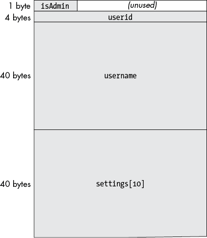
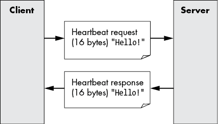
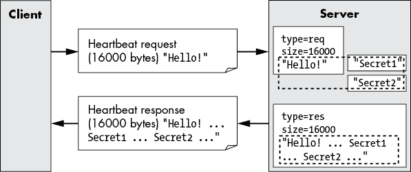
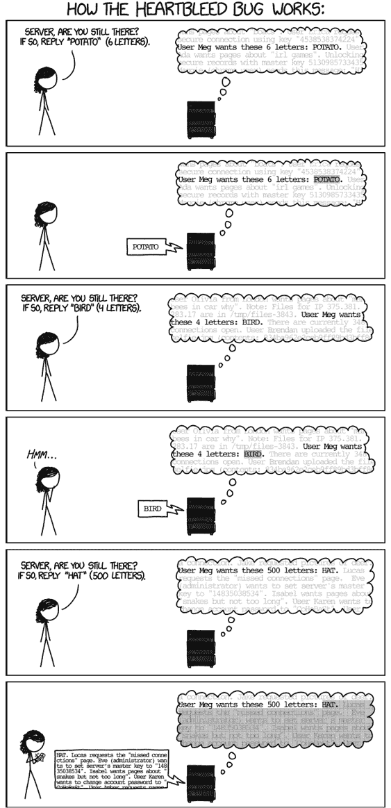
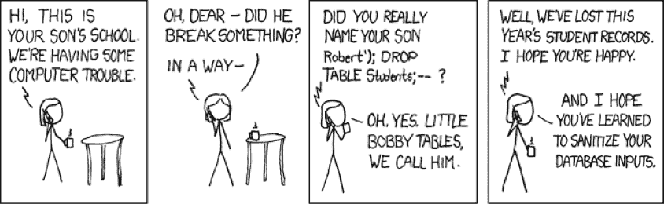
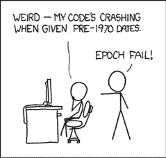

# 第三部分

实现

# 安全编程

> 第一个原则是你绝不能欺骗自己，而你是最容易被欺骗的人。
> 
> —理查德·P·费曼


一个完整的软件设计，经过考虑安全性后创建和审查，只是产品旅程的开始：接下来是实施、测试、部署、运营、监控、维护，最终在生命周期结束时退役的工作。尽管所有这些的具体细节在不同的操作系统和语言中会有很大的差异，但广泛的安全主题是如此常见，以至于几乎是普遍的。

开发人员不仅必须忠实地实现良好设计中的显式安全条款，而且在实现过程中还必须小心避免通过有缺陷的代码无意中引入额外的漏洞。一个基于建筑师设计图纸建造房屋的木匠是一个很好的比喻：用劣质材料和粗糙的施工会导致最终产品出现各种问题。如果木匠打钉子时不小心弯了钉子，问题是显而易见并且容易修复的。相比之下，有缺陷的代码容易被忽视，但它仍然可能会创建一个可以被利用并带来严重后果的漏洞。本章的目的不是教你如何编码——我假设你已经了解这方面的知识——而是教你代码如何变得脆弱，以及如何让代码更加安全。接下来的章节将涵盖许多普遍存在的实施漏洞，这些漏洞继续困扰着软件项目。

设计和实现之间的界限并不总是明确的，而且也不应该明确。深思熟虑的设计师可以预见编程问题，提供关于安全至关重要的领域的建议，等等。进行实现的程序员必须完善设计，并解决任何模糊之处，以便编写具有精确定义接口的功能性代码。他们不仅必须安全地呈现设计——这本身就是一项艰巨的任务——还必须避免在提供必要的详细代码过程中引入额外的漏洞。

在理想的世界中，设计应当指定主动的安全措施：为保护系统、资产和用户而构建的软件特性。相反，开发中的安全性是关于避免软件可能遇到的陷阱——如果你愿意，可以把它看作是组件和工具的粗糙边缘。当在实施过程中出现新风险时，应该针对这些风险采取相应的缓解措施，因为没有理由期望设计师能够预见到这些问题。

本章重点讨论一些漏洞是如何从错误中产生的，它们是如何发生的，以及如何避免各种陷阱。它以一般性的问题展开，为接下来的章节做铺垫，这些章节将深入探讨历史上被证明充满安全问题的主要领域。我们将从探讨安全编码挑战的本质开始，包括攻击者如何利用漏洞并将其影响扩展到代码中更深层次。我们还将讨论错误：漏洞是如何从错误中产生的，轻微的错误如何形成可能导致更大问题的漏洞链，以及从熵的角度看待代码。

避免代码中的漏洞需要保持警惕，但这需要了解代码如何破坏安全性。为了将编码漏洞的概念具体化，我们将通过一个简化版本的代码，展示一个致命的真实漏洞，说明如何通过一次简单的编辑失误导致全网的安全崩溃。接下来，我们将以几个常见漏洞的类别为例，展示一些可能被利用且后果严重的错误。

在第三部分中，大多数代码示例将使用 Python 和 C 语言，这两种语言广泛应用，涵盖了从高级到低级的各种抽象层次。这些是真正的代码，使用了特定语言的细节，但书中的概念是通用的。即使你不熟悉 Python 或 C 语言，代码片段也应该足够简单，让任何熟悉现代编程语言的读者都能跟得上。

## 挑战

“安全编程”这个术语是本章标题的显而易见选择，尽管它可能具有误导性。更准确地表达目标（虽然不适合作为章节标题）应该是“避免不安全的编码”。我的意思是，安全编码的挑战主要在于不引入会成为可被利用的漏洞的缺陷。程序员当然会构建主动提高安全性的保护机制，但这些机制通常在设计或 API 的功能中是明确的。我想主要关注那些无意中陷入的陷阱，因为它们不明显，并构成大多数安全失败的根本原因。可以把安全编码看作是学习如何发现道路上的坑洞，仔细驾驶，并始终如一地避开它们。

我相信许多程序员，或许有充分的理由，对软件安全持有不太友好的态度（在某些情况下，更直观地表现为对“安全警察”——或者更糟的称呼——的反感，因为他们认为这些人总是给他们添麻烦），因为他们通常听到的消息是“不要出错”。“不要出错！”对即将切割稀有钻石的珠宝商来说，这也是不太有帮助的建议：他们本打算尽全力做到最好，而额外的压力只会让他们更难集中注意力，做好工作。这些好意的“警察”确实在提供必要的建议，但他们往往没有以最友好、最建设性的方式表达出来。我自己也犯过这个错误很多次，所以在这里我尽力走好这条细线，也希望读者能够理解。

确实需要小心，因为程序员的一次失误（正如我们稍后在本章讨论的 GotoFail 漏洞所示）很容易导致灾难性的后果。问题的根源在于大型现代软件系统的脆弱性和复杂性，而这种问题在未来只会加剧。专业开发人员知道如何测试和调试代码，但安全性则是另一回事，因为易受攻击的代码在没有严密攻击的情况下通常能够正常工作。

软件设计师创造出理想化的概念，这些概念因为尚未实现，因此理论上可以是完全安全的。但要让软件真正运行起来，就会引入新的复杂性，并且需要填补设计之外的细节，这些都会不可避免地带来安全问题的风险。好消息是，完美并不是目标，导致大多数常见漏洞的编码失败模式已经被很好地理解，并且并不难做到正确。诀窍在于保持持续的警惕，学会识别代码中的危险缺陷。本章将介绍一些概念，帮助你更好地理解什么是安全代码与易受攻击的代码，并举一些例子。

### 恶意影响

在考虑安全编码时，一个关键的考虑因素是理解攻击者如何可能*影响*正在运行的代码。想象一个大型复杂的机器平稳运转，然后一个恶作剧者拿起一根棍子开始戳机械部件。有些部分，比如汽油发动机的气缸，会完全被机体保护起来，而另一些部分，比如风扇皮带，则是暴露在外的，容易被插入东西，导致故障。这就像攻击者试图渗透系统时的行为：他们从攻击面开始，利用巧妙设计的、出乎意料的输入来破坏机制，然后试图欺骗系统内部的代码，迫使它们按自己的意图行事。

不受信输入可能通过两种方式影响代码：直接和间接。从任何可以注入不受信输入的地方开始——例如字符串“BOO!”——他们进行尝试，希望数据能够避免被拒绝并进一步传播到系统中。通过 I/O 层和各种接口逐层向下，字符串“BOO!”通常会找到多条代码路径，并且它的影响会渗透到系统中。偶尔，不受信数据和代码的交互会触发一个错误，或者产生一个可能带来不良副作用的功能。一次“BOO!”的网页搜索可能涉及数据中心中的数百台计算机，每台都为搜索结果贡献一部分。因此，这个字符串必须在成千上万的地方写入内存。这是一个广泛的影响，如果存在即使微小的危害机会，也可能是危险的。

这种数据对代码影响的技术术语是*污染*，一些语言实现了跟踪污染的功能。Perl 解释器可以跟踪污染，旨在缓解注入攻击（在第十章中讨论）。早期版本的 JavaScript 曾出于类似原因进行污染检查，但由于缺乏使用，这一功能早已被移除。不过，理解数据来自不受信源对代码的影响是很重要的，以便防止漏洞。

输入数据还可以以间接的方式影响代码，而不需要存储数据。假设，给定输入字符串“BOO!”，代码避免存储其任何进一步的副本：这是否意味着它使系统免受其影响？显然并非如此。例如，考虑以下`input = "BOO!"`：

```
if "!" in input:
    PlanB()
else:
    PlanA()
```

输入中感叹号的存在使得代码现在选择执行`PlanB`而非`PlanA`，即使输入字符串本身既未被存储也未传递到后续处理。

这个简单的例子说明了不受信输入如何深入传播到代码中，即便数据（此处为“BOO!”）本身并未广泛传播。在大型系统中，当你考虑从攻击面开始的传递闭包（所有路径的汇总扩展）时，可以更好地理解渗透到大量代码中的潜力。这种通过多层延伸的能力至关重要，因为它意味着攻击者可以进入比你预期更多的代码，从而控制代码的执行。我们将在第十章进一步讨论如何管理不受信输入。

### 漏洞即错误

> 如果调试是去除错误的过程，那么编程一定是将错误加入的过程。
> 
> —埃兹杰·戴克斯特拉

所有软件都有漏洞已经是如此广泛接受的事实，以至于现在几乎不需要再证明这一点。当然，这一普遍化也有例外：一些微不足道的代码、经过证明正确的代码以及用于航空、医疗或其他关键设备的高度工程化的软件。但对于其他所有软件，意识到漏洞的普遍性是接触安全编码的一个良好起点，因为其中一部分漏洞对攻击者有用。因此，错误是我们在这里关注的重点。

*漏洞*是软件错误的一个子集，攻击者可以利用这些漏洞造成危害。准确区分漏洞和其他错误几乎是不可能的，因此，最简单的方式可能是先识别出那些显然不是漏洞的错误——也就是说，完全无害的错误。我们来看一下在线购物网站中的一些错误实例。一个无害错误的典型例子可能是网页布局没有按照设计工作：页面有些凌乱，但所有重要内容都完全可见且功能正常。虽然从品牌形象或可用性的角度来看，这个问题可能需要修复，但显然这个错误并不会带来任何安全风险。然而，为了强调漏洞发现的困难性，类似的错误可能既破坏了布局，又可能带来危害，比如它遮掩了用户必须看到的关键信息，而这些信息对做出准确的安全决策至关重要。

在这个范围的危害端，这里有一个令人不寒而栗的漏洞值得深思：管理界面意外暴露并未加以保护，出现在互联网中。现在，任何访问该网站的人都可以点击按钮进入由管理员用来更改价格、查看机密业务和财务数据等的控制台。谁都能看出，这完全是授权失败，并且是一个明显的安全威胁。

当然，这些极端情况之间有一个连续体，中间有一个很大的模糊区域，需要根据错误可能造成的危害进行主观判断。正如我们将在下一节中看到的那样，多个错误的常常是不可预见的累积效应，使得判断它们的危害潜力变得特别具有挑战性。出于安全的考虑，自然地，我会建议你采取保守的态度，倾向于修复更多的错误，如果它们有可能是漏洞的话。

我参与过的每个项目都有一个追踪数据库，里面充满了大量的错误，但没有针对减少已知错误数量（这与实际错误数量不同）做出系统的努力。因此，可以说，通常我们都在一堆已知错误中编程，更不用提那些未知的错误。如果尚未主动执行，考虑处理已知错误并标记可能的漏洞以便修复。还需要提到的是，通常修复一个错误比调查并证明它无害要容易得多。第十三章提供了关于评估和排名安全漏洞的指导，帮助你优先处理漏洞。

### 漏洞链

*漏洞链*的背后理念是，看似无害的错误可能会结合在一起，产生一个严重的安全漏洞。这对攻击者而言就是错误的协同效应。想象一下你在散步时碰到一条想要穿越的溪流，溪流宽得无法跳过去，但你注意到有几块石头露出水面：通过从石头跳到石头，你可以轻松地穿越而不弄湿鞋子。这些石头代表的是轻微的错误，而不是漏洞本身，但它们一起形成了一条新的通道，穿过溪流，允许攻击者深入系统内部。这些“垫脚石”错误通过组合形成了一个可利用的漏洞。

这是一个简单的示例，说明在线购物 Web 应用中如何产生这样的漏洞链。在最近的一次代码更改后，应用的订单表单新增了一个字段，预填充了一个代码，表示哪个仓库将负责发货。以前，后台的业务逻辑是在客户下单后分配仓库。现在，由客户编辑的一个字段决定了处理订单的仓库。我们称之为 Bug #1。负责此更改的开发人员认为没有人会注意到这个新增字段，而且即便有人修改了系统默认提供的仓库分配，另一个仓库可能没有所需商品库存，所以系统会标记并修正： “没有害处，无所谓”。基于这一分析，但没有进行任何测试，团队决定将 Bug #1 安排在下一个发布周期进行处理。他们很高兴能够避免紧急处理和延期，将这个有问题的代码更改推入生产环境。

与此同时，Bug #2 正在错误数据库中以 Priority-3 的排名（意味着“某天修复”，也就是可能永远不会修复）萎靡不振，早已被遗忘。多年前，一位测试人员在发现如果使用错误的仓库指定下订单，系统会立即发放退款，因为该仓库无法履行订单；但随后另一个处理阶段将订单重新分配给正确的仓库，由该仓库履行并发货后，提交了 Bug #2。测试人员认为这是一个严重的问题——公司将免费赠送商品——并将其列为 Priority-1。在评审会议中，程序员坚持认为测试人员是在“作弊”，因为后台处理了仓库分配（在 Bug #1 引入之前）并确认了库存。换句话说，在发现时，Bug #2 纯粹是假设性的，在生产环境中根本不会发生。由于不同业务逻辑阶段的相互作用难以解开，团队决定不管它，并将 Bug 的优先级设为 Priority-3，很快就被遗忘了。

如果你跟随了这个“放任 Bug 不管”的故事，你可能已经能看出它以一个不太愉快的结局收场。随着 Bug #1 的引入，加上 Bug #2，现在已经存在了一个完全成熟的漏洞链，几乎可以肯定没人察觉到。现在，由于仓库指定字段可以被客户写入，触发 Bug #2 的错误仓库情况变得容易产生。只要有一个狡猾的，甚至是好奇的客户尝试编辑仓库字段；他们会高兴地发现能够免费获得商品并全额退款，下次可能会回来购买更多，或者与他人分享这个秘密。

让我们看看错误的 bug 评审过程在哪里出错了。Bug #2（较早发现的）是一个严重的脆弱性，他们本应该一开始就修复它。支持放任不管的推理依赖于仓库信任其他后台逻辑能够完美指引它，假设（当时是正确的）订单中的仓库指定字段与任何攻击面完全隔离。尽管如此，它显然是一个令人担忧的脆弱性，显然会带来不好的后果，而业务逻辑难以修复的事实暗示着重写可能是个好主意。

Bug #1，后来的引入，打开了一个新的攻击面，暴露了仓库指定字段的篡改风险。未修复这个问题的不幸决定源于错误的假设，认为篡改是无害的。事后看来，如果有人稍微进行一些测试（当然是在测试环境中进行，绝不能在生产环境中），他们本可以轻松发现他们推理中的漏洞，并在发布 Bug #1 之前做出正确的决定。理想情况下，如果发现 Bug #2 的测试人员，或任何熟悉该问题的人在场，他们可能会将两者联系起来，并将这两个 bug 列为 Priority-1 进行修复。

相比这个人为的例子，识别漏洞何时形成漏洞链通常是非常具有挑战性的。一旦你理解了这一概念，你就会明白，尽可能主动修复漏洞的智慧。更重要的是，即使你怀疑可能存在漏洞链，我还是要提醒你，在实际操作中，通常很难说服别人花时间修复看起来像是模糊假设的问题，特别是当修复这个漏洞需要大量工作时。很可能大多数大型系统中都充满了未被发现的漏洞链，而我们的系统因此变得更脆弱。

这个例子说明了两个漏洞如何形成因果链，就像一杆巧妙的台球击球，母球击中另一颗球，进而将目标球打入球袋。信不信由你，漏洞链可能比这更复杂：在 Pwn2Own 黑客竞赛中，有一支团队成功地将*六个漏洞*串联起来，达成了一个困难的攻击。

当你理解漏洞链时，你能更好地理解代码质量与安全性之间的关系。引入脆弱性的漏洞，尤其是在关键资产周围，应该积极修复。因为“它永远不会发生”（就像我们说的 Bug #2）而推迟修复是很危险的，你需要记住，一个人认为它没问题的观点，只是观点而已，并不是证据。这种思维类似于“安全即隐藏”的反模式，充其量只是一个临时措施，而不是一个好的最终筛选决策。

### 漏洞和熵

在了解漏洞和漏洞链之后，接下来考虑一下，软件也容易受到不那么精确的事件序列的影响，这些事件可能造成损害。一些漏洞倾向于以不可预测的方式破坏事物，这使得分析它们的可利用性（就像漏洞链一样）变得困难。作为这种现象的证据，我们常常重启手机和计算机，以清除随着时间积累的熵（这里我使用“熵”这个词有点宽泛，旨在唤起混乱和隐喻腐蚀的形象）。攻击者有时可以利用这些漏洞及其后效，因此采取对策可以帮助提升安全性。

由于执行线程之间意外的交互而引发的错误是一类容易出现这种问题的错误，因为它们通常以各种方式呈现，似乎是随机的。内存损坏错误是另一类此类错误，因为栈和堆的内容在不断变化。这些以不可预测的方式扰乱系统的错误，几乎是攻击的更有价值的目标，因为它们提供了潜在的无限可能性。攻击者可以非常熟练地利用这些混乱的错误，自动化使得他们可以轻松地反复尝试低效的攻击，直到运气好。另一方面，大多数程序员不喜欢处理这些难以捉摸的错误，因为它们难以定位，而且常常被认为是太不稳定以至于不值得关注，因此这些错误往往未能得到解决。

即使你无法确定一个明确的因果链，引发熵的错误仍然是危险的，值得修复。所有的错误都会向系统引入一定量的熵，因为它们是从正确行为中略微偏离的表现，而这些小的干扰迅速累积——特别是如果被狡猾的攻击者利用的话。类比热力学第二定律，熵不可避免地在封闭系统内积累，随着时间的推移，这类错误可能在某个时刻变得可以被利用，从而增加了伤害的风险。

### 警觉性

我喜欢徒步旅行，我所在地区的步道常常泥泞湿滑，露出的树根和岩石使得滑倒和摔跤成为一个常见的威胁。随着实践和经验的积累，滑倒的情况变得少见，但奇怪的是，在特别危险的地方，当我集中注意力时，我从未滑倒。尽管偶尔我还是会摔倒，但这通常不是因为有什么障碍，而是因为在步道的较容易部分，*我没有注意到*。这里的重点是，凭借警觉性，困难的挑战可以被克服；相反，漫不经心很容易让你失败，即使在轻松的时候也是如此。

软件开发人员面临的正是这样的挑战：如果没有意识到潜在的安全陷阱并保持持续的专注，很容易不知不觉地掉入其中。开发人员本能地编写代码以适应正常的使用情况，但攻击者往往会尝试出乎意料的情况，希望能找到一个可能导致漏洞的缺陷。正如前面提到的脆弱链和熵一样，保持警觉，预测所有可能的输入和事件组合，是编写安全代码的关键。

以下章节提供了一个广泛的代表性调查，展示了现代软件中常见的漏洞，并通过“玩具”代码示例来展示实现漏洞是什么样的。正如麻省理工学院人工智能传奇人物马文·明斯基（Marvin Minsky）指出的那样，“在科学中，人们通过研究最少的东西学到最多的东西。”在这个背景下，这意味着简化的代码示例通过让人们专注于关键缺陷，帮助解释问题。在实际应用中，漏洞往往是被融入大量代码的结构中，代码中还有很多其他对于任务来说很重要，但与安全隐患无关的内容，且这些漏洞并不容易被识别。如果你想查看真实的代码示例，可以浏览任何开源软件项目的错误数据库——这些项目肯定有安全漏洞。

警觉性最初需要一定的纪律，但随着实践的积累，知道该注意什么后，它会变成第二天性。记住，如果你的警觉性得到了回报，并且成功阻止了一个潜在的攻击者，你可能永远都不会知道——所以庆祝每一次小小的胜利，因为每次修复都在避免未来可能发生的攻击。

## 案例研究：GotoFail

一些漏洞是顽固的错误，它们不遵循任何模式，某种方式悄悄地绕过测试并被发布出去。漏洞的一个特点是它们通常在典型的使用情况下没有问题，只有在遭遇故意攻击时才会表现出有害行为，这使得漏洞比你想象的更容易发生。2014 年，苹果悄悄发布了一组关键的安全补丁，涵盖了大部分产品，但却没有解释问题的原因，称是“为了保护客户”。不久，世界就知道这个漏洞是由于一个明显的编辑失误，实际上破坏了一个关键的安全保护。通过检查实际代码的一个简短摘录，很容易理解发生了什么。我们来看看。

### 单行漏洞

为了设定场景，相关代码在安全连接建立过程中运行。它检查一切是否正常，以确保后续通信的安全。安全套接字层（SSL）协议的安全性依赖于检查服务器是否签署了经过认证的协商密钥，并且这个认证是根据服务器的数字证书进行的。更准确地说，服务器签署的是一个哈希值，这个哈希值是由临时密钥衍生出来的多个数据块组合而成。第十一章涵盖了 SSL 的基础知识，但即使你不了解这些细节，也可以理解这个漏洞背后的代码。这里是 C++代码：

**漏洞代码**

```
/*
 * Copyright (c) 1999-2001,2005-2012 Apple Inc. All Rights Reserved.
 *
 * @APPLE_LICENSE_HEADER_START@
 *
 * This file contains Original Code and/or Modifications of Original Code
 * as defined in and that are subject to the Apple Public Source License
 * Version 2.0 (the ‘License’). You may not use this file except in
 * compliance with the License. Please obtain a copy of the License at
 * http://www.opensource.apple.com/apsl/ and read it before using this
 * file.
 *
 * The Original Code and all software distributed under the License are
 * distributed on an ‘AS IS’ basis, WITHOUT WARRANTY OF ANY KIND, EITHER
 * EXPRESS OR IMPLIED, AND APPLE HEREBY DISCLAIMS ALL SUCH WARRANTIES,
 * INCLUDING WITHOUT LIMITATION, ANY WARRANTIES OF MERCHANTABILITY,
 * FITNESS FOR A PARTICULAR PURPOSE, QUIET ENJOYMENT OR NON-INFRINGEMENT.
 * Please see the License for the specific language governing rights and
 * limitations under the License.
 *
 * @APPLE_LICENSE_HEADER_END@
 */
`--snip--`
    if ((err = SSLHashSHA1.update(&hashCtx, &clientRandom)) != 0)
      goto fail;
    if ((err = SSLHashSHA1.update(&hashCtx, &serverRandom)) != 0)
      goto fail;
      goto fail;
    if ((err = SSLHashSHA1.update(&hashCtx, &signedParams)) != 0)
      goto fail;
`--snip--`

fail:
    SSLFreeBuffer(&signedHashes);
    SSLFreeBuffer(&hashCtx);
    return err;
```

三次调用`SSLHashSHA1.update`将各自的数据块输入到哈希函数中，并检查非零返回值的错误情况。哈希计算的细节对于我们而言无关紧要，且没有展示；只需知道，这个计算对安全至关重要，因为其输出必须与预期值匹配，才能验证通信。

在函数的底部，代码释放了一些缓冲区，然后返回`err`的值：成功时为零，或者为非零的错误代码。

代码中的预期模式很清楚：不断检查返回值是否为非零，表示错误；如果一切正常，则通过零值继续执行，然后返回该值。你可能已经看到了错误——重复的`goto fail`行。尽管有提示性的缩进，这条语句无条件地将执行跳转到`fail`标签，跳过了剩余的哈希计算，并完全跳过了哈希检查。由于在额外跳转前最后一次对`err`的赋值是零值，因此该函数突然无条件地批准了所有内容。可以推测，这个 bug 没有被发现，因为有效的安全连接仍然能正常工作：代码没有检查哈希，但即使检查了，它们也会通过。

### 小心脚本陷阱

GotoFail 是构造代码时遵循缩进结构智慧的一个有力论据，就像 Python 等语言所做的那样。C 语言通过语法决定程序结构，提供了一种*脚本陷阱*（容易自伤的功能），这使得编写代码时按标准代码风格惯例缩进，可能会产生误导性的效果，因为它暗示了不同的语义，尽管编译器完全忽略了这些缩进。当你看到这段代码时：

```
if ((err = SSLHashSHA1.update(&hashCtx, &serverRandom)) != 0)
  goto fail;
  goto fail;
```

程序员可能很容易看到以下情况（除非他们很小心，并且在脑海中编译代码）：

```
if ((err = SSLHashSHA1.update(&hashCtx, &serverRandom)) != 0) `{`
 `goto fail;`
 `goto fail;`
`}`
```

与此同时，编译器清楚地看到：

```
if ((err = SSLHashSHA1.update(&hashCtx, &serverRandom)) != 0) `{`
 `goto fail;`
`}`
goto fail;
```

一个简单的编辑错误恰好容易被忽视，并且在关键的安全检查的核心部分极大地改变了代码。这就是一个严重漏洞的典型体现。

小心其他类似的脚本陷阱，出现在编程语言、API 以及其他编程工具和数据格式中。你将在接下来的章节中看到许多例子，但这里我想提到的另一个来自 C 语法的例子是写`if (x = 8)`而不是`if (x == 8)`。前者将`8`赋值给`x`，无条件执行 then-clause，因为该值非零；后者将`x`与`8`进行比较，仅当其为真时才执行 then-clause——这两者确实有很大的不同。虽然有些人可能从风格上反对，但我喜欢把这种 C 语句写成`if (8 == x)`，因为如果我忘记写两个等号，它将会是一个语法错误，编译器会捕捉到。

编译器警告有助于标记这种疏忽。GCC 编译器的`-Wmisleading-indentation`警告选项专门用于解决像 GotoFail 漏洞所导致的此类问题。有些警告以更微妙的方式指示潜在问题。未使用的变量警告似乎无害，但假设有两个变量名字相似，你不小心在重要的访问测试中输入了错误的变量，结果触发了警告，并且使用了错误的数据进行关键测试。虽然警告并不是所有漏洞的可靠指示器，但它们容易检查，可能会在关键时刻救场。

### 从 GotoFail 中的教训

我们可以从 GotoFail 中学到几个重要的教训：

+   关键代码中的小失误可能对安全性造成毁灭性影响。

+   脆弱的代码在预期情况下仍然能正常工作。

+   从安全的角度看，测试此类代码是否能够拒绝无效情况，可能比测试它通过正常合法使用更为重要。

+   代码审查是防止由于疏忽引入的漏洞的重要检查环节。很难想象一个认真审查代码差异的审查员会错过这个问题。

这个漏洞提出了一些本可以防止其发生的对策。这些对策中有些特定于此特定漏洞，但即便如此，这些对策也应该能够提示你在其他地方应用相似的预防措施，以避免编写出有缺陷的代码。有效的对策包括：

+   当然，更好的测试。至少，应该为每个`if`编写测试用例，以确保所有必要的检查都能正常工作。

+   注意不可达代码（许多编译器有选项来标记此类代码）。在 GotoFail 的情况下，这可能已经让程序员意识到漏洞的引入。

+   使代码尽可能明确，例如，使用圆括号和大括号，即使在可以省略的地方也要广泛使用。

+   使用源代码分析工具，如“代码检查工具”（linters），可以提高代码质量，在这个过程中，可能会标记出一些潜在漏洞，提前进行修复。

+   考虑使用临时的源代码过滤器来检测可疑的模式，例如在这种情况下，检测重复的源代码行，或任何其他重复的错误。

+   测量并要求对安全关键代码进行全面的测试覆盖。

这些只是你可以用来发现可能危害安全的漏洞的一些基本技巧。当你遇到新的漏洞类型时，考虑如何利用工具系统性地避免未来的重复发生——这样做应该能在长期减少漏洞。

## 编码漏洞

> 所有幸福的家庭都是相似的；每个不幸的家庭都有自己不幸的方式。
> 
> ——列夫·托尔斯泰

遗憾的是，列夫·托尔斯泰的小说*《安娜·卡列尼娜》*中的著名开头句子在软件领域也同样适用：新的漏洞种类是无穷无尽的，试图列出所有潜在的软件漏洞将是愚蠢的。分类是有用的，我们将讨论许多分类，但不要把它们与涵盖所有可能性的完整分类体系混淆。

本书并未呈现所有潜在缺陷的详尽列表，但它确实覆盖了许多最常见类别的代表性内容。这一基本调查应该能为你提供一个良好的起点，随着经验的积累，你将开始直觉性地识别其他问题，并学会如何安全地避免它们。

### 原子性

我听到的许多最糟糕的编码“战斗故事”都涉及多线程或分布式进程由于意外事件的序列而在奇怪的方式中偶尔互动。漏洞往往源于这些相同的条件，而唯一的救命稻草是，所需的敏感时序可能使得攻击手段对实施者来说过于不可靠——尽管你不应该指望这轻易能劝阻他们继续尝试。

即使你的代码是单线程且表现良好，它几乎总是在有许多其他活动进程的机器上运行，因此，当你与文件系统或任何公共资源交互时，你可能正在处理涉及你一无所知的代码的竞态条件。软件中的*原子性*描述的是保证能够有效地作为单个步骤完成的操作。这在这种情况下是一个重要的防御武器，用于防止可能导致漏洞的意外情况。

为了说明可能发生的情况，考虑一个简单的例子：将敏感数据复制到临时文件。已弃用的 Python `tempfile.mktemp` 函数返回一个保证不存在的临时文件名，旨在供应用程序使用，作为它们创建并随后使用的文件名。不要使用它：改用新的 `tempfile.NamedTemporaryFile`。原因如下。在 `tempfile.mktemp` 返回临时文件路径与代码实际打开文件之间的时间间隙中，另一个进程可能有机会干扰。如果另一个进程能猜到下一个生成的文件名，它就能先创建文件，并且（在多种可能性中）将恶意数据注入临时文件。新函数提供的解决方案是使用原子操作来创建并打开临时文件，避免任何干预过程。

### 时间攻击

*时序攻击*是一种侧信道攻击，它通过操作所需的时间推测信息，间接地了解系统中本应保密的某些状态。时序的差异有时可以提供线索——即，它们泄露了一些受保护的信息——对攻击者有利。举一个简单的例子，假设任务是猜测一个介于 1 到 100 之间的秘密数字；如果已知回答“否”的时间与猜测的距离成正比，这种特性可以帮助猜测者更快速地锁定正确答案。

Meltdown 和 Spectre 是对现代处理器的时序攻击，发生在软件层面以下，但其原理是直接适用的。这些攻击利用了*猜测执行*的特点，在这种执行方式下，处理器会提前计算结果，同时暂时放松各种检查以提高速度。当这一过程涉及到通常不允许的操作时，处理器最终会检测到并取消这些结果，防止其最终生效。这种复杂的猜测执行完全依赖于处理器的设计，且对于实现我们享受的惊人速度至关重要。然而，在猜测执行期间，当计算访问内存时，副作用是导致内存被缓存。当猜测执行被取消时，缓存并不受影响，这种副作用就成为了一个潜在的线索，攻击者利用它来推断在猜测执行期间发生了什么。具体而言，攻击代码可以通过检查缓存的状态来推测在被取消的猜测执行期间发生了什么。内存缓存加速了执行，但不直接暴露给软件；然而，代码可以通过测量内存访问时间来判断内存位置内容是否在缓存中，因为缓存的内存速度远快于常规内存。这是对复杂处理器架构的复杂攻击，但就我们的目的而言，关键点是当时序与受保护信息状态相关联时，它可以被用作泄露的漏洞。

举一个更简单的、纯粹基于软件的时间攻击示例，假设你想确定你的朋友（或者“死对头”？）是否在某个特定的在线服务上有账户，但你不知道他们的账户名。“忘记密码”选项会要求用户提供账户名和电话号码，以便发送“提醒”。然而，假设实现首先在数据库中查找电话号码，如果找到了，就会继续查找关联的账户名，看看是否与输入的匹配。假设每次查找需要几秒钟，因此时间延迟对用户是可察觉的。首先，你尝试几个随机的账户名（比如随便按键盘）和电话号码，这些很可能不会与实际用户匹配，并且你会发现，通常需要三秒钟才能得到“没有此账户”的回应。接下来，你用自己的电话号码注册账户，并尝试使用自己的号码与一个随机未使用的账户名进行“忘记密码”操作。现在你观察到，在这种情况下，响应时间为五秒钟，几乎是原来的两倍。

有了这些事实，你可以尝试使用一个未使用的账户名来测试你朋友的电话号码：如果回复需要五秒钟，那么你就知道他们的电话号码在数据库中；如果只需要三秒钟，那么就说明电话号码不在数据库中。仅通过观察时间，你就可以推断给定的电话号码是否在数据库中。如果会员信息可能会泄露敏感的私人信息，例如在某些患者论坛中，这种时间攻击可能会导致有害的信息泄露。

由于软件的原因，时间差异是自然发生的，尤其是当有一系列缓慢的操作（想想`if...if...if...if...`）时，知道执行进度到达序列的哪个位置可以推断出有价值的信息。确切的时间差异大小取决于许多因素。在在线账户检查的示例中，由于网络访问的正常延迟，几秒钟的时间差足以表示一个清晰的信号。相比之下，当利用 Meltdown 或 Spectre 漏洞通过同一台机器上的代码执行时，亚毫秒级的时间差异可能是可测量的，并且同样具有重要意义。

最好的缓解选项是将时间差异缩小到一个可以接受的——即，无法察觉的——水平。为了防止电话号码出现在数据库中而泄露信息，只需将代码更改为使用单一数据库查找来处理两种情况即可。当存在固有的时间差异，并且这种时间侧信道可能导致严重的泄露时，最好的缓解措施就是引入人工延迟来模糊时间信号。

### 序列化

*序列化*是指将数据对象转换为字节流的常见技术，类似于 *星际迷航* 中的传送器，然后通过时间和空间“传送”它们。存储或传输生成的字节流可以让你通过 *反序列化* 重新构造相应的数据对象。这种“脱水”对象再“复水”的能力对面向对象编程非常有用，但如果在此过程中有任何篡改的可能性，这项技术本质上就是一个安全隐患。攻击者不仅可以使关键数据值发生变化，而且通过构造无效的字节序列，他们甚至可以使反序列化代码执行有害操作。由于反序列化只有在使用受信任的序列化数据时才是安全的，这就是不受信任输入问题的一个例子。

问题不在于这些库构建得不好，而在于它们需要信任才能执行构建任意对象所需的操作，从而完成它们的工作。反序列化实际上是一种解释器，它会执行其输入的序列化字节所指示的任何操作，因此，使用不受信任的数据来进行反序列化永远不是一个好主意。例如，Python 的反序列化操作（称为“反 pickle”）很容易通过在要反序列化的数据中嵌入恶意字节序列来诱使它执行任意代码。除非序列化的字节数据能够安全存储和传输，并且没有被篡改的可能性，比如使用 MAC 或数字签名（如第五章所讨论的），否则最好完全避免使用。

## 常见嫌疑人

> 魔鬼曾经用过的最伟大的伎俩就是让全世界相信他不存在。
> 
> — 查尔斯·波德莱尔

接下来的几章将讨论许多在代码中经常出现的“常见嫌疑人”漏洞。在本章中，我们考虑了 GotoFail 和原子性问题、时序攻击以及序列化问题。以下是我们接下来要探讨的主题预览：

+   固定宽度整数漏洞

+   浮点精度漏洞

+   缓冲区溢出和其他内存管理问题

+   输入验证

+   字符串处理不当

+   注入攻击

+   Web 安全

许多这些问题看起来显而易见，但它们依然是软件漏洞的根本原因，且大多数问题没有得到有效遏制，仍在不断出现。我们需要从过去的失败中吸取教训，因为这些漏洞类别已经存在了几十年。然而，将目光只放在过去，认为所有可能的安全漏洞都已经被详尽列举，是一种错误的思维方式。没有一本书可以预警所有可能的陷阱，但你可以通过研究这些例子，了解它们背后更深层的模式和教训。

# 底层编码缺陷

> 底层编程有益于程序员的心灵。
> 
> — 约翰·卡马克


接下来的几章将概述程序员需要了解的多种编码陷阱，尤其是出于安全原因的注意事项，从经典问题开始。本章涵盖了与接近机器层的代码相关的基本缺陷。这些问题出现在数据超出固定大小数字或分配内存缓冲区的容量时。现代语言往往提供更高层次的抽象，使代码免受这些危险，但在这些更安全的语言中工作的程序员仍然可以通过理解这些缺陷获益，即便只是为了充分理解为他们所做的一切，以及这些问题为何重要。

诸如 C 和 C++这类暴露底层功能的语言，在许多软件领域中仍然占据主导地位，因此它们所带来的潜在威胁绝非理论上的问题。现代语言如 Python 通常会将硬件抽象得足够高，以至于本章中描述的问题不会出现，但追求最大效率、接近硬件层的诱惑依然强大。几种流行语言为程序员提供了两者兼得的选择。除了类型安全的对象库外，Java 和 C#的基础类型包括固定宽度的整数，并且它们有“非安全”模式，可以去除通常提供的许多保护措施。Python 的`float`类型，如在第 149 页的《浮点精度漏洞》一节中所解释的，依赖于硬件支持，并带来其局限性，必须加以应对。

从不使用暴露底层功能的语言的读者，可能会倾向于跳过本章，而且这样做不会影响全书的整体叙述。然而，我仍然建议阅读本章，因为最好了解你所使用的语言和库提供了哪些保护措施，或者没有提供哪些保护措施，并充分理解为你所做的一切。

如果做得好，靠近硬件层编程是非常强大的，但也付出了增加的工作量和脆弱性的代价。在本章中，我们将重点讨论与低级抽象编程相关的最常见的漏洞类型。

由于本章讨论的是与代码接近或处于硬件层时出现的漏洞，你必须理解，许多操作的确切结果在不同的平台和语言之间会有所不同。我已将示例设计得尽可能具体，但实现上的差异可能会导致结果不同——正是因为计算结果可能不可预测地变化，这些问题才容易被忽视，并可能对安全性产生影响。具体细节会因硬件、编译器和其他因素而异，但本章介绍的概念是普遍适用的。

## 算术漏洞

不同的编程语言以不同的方式定义它们的算术运算符，或者是按数学方式，或者是按照处理器对应的指令，正如我们稍后将看到的那样，这两者并不完全相同。所谓的*低级*，指的是依赖于机器指令的编程语言特性，这需要处理硬件的怪癖和限制。

代码中充满了整数运算。它不仅用于计算数值，还用于字符串比较、数据结构的索引访问等。由于硬件指令比处理更大范围数值的软件抽象要快速且易于使用，因此很难抗拒它们，但这种便利和速度也带来了*溢出*的风险。当计算结果超出固定宽度整数的容量时，就会发生溢出，导致意外结果，从而可能产生漏洞。

浮点运算的范围比整数运算更广，但其有限的精度也可能导致意外的结果。即使是浮点数也有其限制（对于单精度，大约为 10³⁸），但是当超出这个限制时，它们具有一个很好的特性，即会得到一个特定的值，表示无限大。

对于那些有兴趣深入了解算术指令在硬件级别实现的读者，可以通过 Jonathan E. Steinhart 的《程序的秘密生活》（No Starch Press，2019）进一步学习。

### 固定宽度整数漏洞

在我第一份全职工作中，我在小型计算机上用汇编语言编写设备驱动程序。虽然按照现代标准看，它们的性能可笑地低，但小型计算机提供了一个学习硬件如何工作的好机会，因为你可以查看电路板，看到每个连接和每个芯片（每个芯片内部有有限数量的逻辑门）。我可以*看到*连接到算术逻辑单元（只能执行加法、减法和布尔运算）和内存的寄存器，因此我完全明白计算机是如何工作的。相反，现代处理器极为复杂，包含数十亿个逻辑门，远远超出了人类通过随意观察能够理解的范围。

如今，大多数程序员学习并使用高级语言，这些语言将他们与机器语言和 CPU 架构的复杂性隔离开。固定宽度整数是许多语言中最基本的构建块，包括 Java 和 C/C++，如果任何计算超过了它们的有限范围，你将得到错误的结果，*默默地*。

现代处理器通常具有 32 位或 64 位架构，但我们可以通过讨论更小的尺寸来理解它们是如何工作的。让我们通过一个基于无符号 16 位整数的溢出示例来看看。一个 16 位整数可以表示从 0 到 65,535（2¹⁶ – 1）之间的任何值。例如，300 乘以 300 应该得到 90,000，但这个数字超出了我们使用的定宽整数的范围。因此，由于溢出，我们实际上得到的结果是 24,464（比预期结果少 65,536）。

有些人将溢出从数学上看作是*模运算*，即除法的余数（例如，之前的计算给出了将 90,000 除以 65,536 的余数）。其他人则从二进制或十六进制截断的角度，或者从硬件实现的角度来考虑它——但如果这些都不适合你，只需记住，超大值的结果将不是你预期的。由于溢出的缓解措施通常会试图在第一次发生之前避免它，精确的结果值通常并不重要。

这里重要的是预见到二进制算术的怪癖，而不是准确知道计算结果是什么——这取决于语言和编译器，可能并不明确定义（也就是说，语言规范不保证任何特定的值）。在语言中，技术上被指定为“未定义”的操作可能看起来可预测，但如果语言规范没有提供保证，你就处于危险之中。安全的底线是，了解语言规范并避免潜在未定义的计算非常重要。不要心血来潮，试图找到一种巧妙的方法来检测未定义的结果，因为在不同的硬件或新的编译器版本下，你的代码可能会停止工作。

如果你计算错误，代码可能会以多种方式崩溃，效果往往会像滚雪球一样累积成一系列功能失常，最终导致崩溃或蓝屏。由于整数溢出导致的常见漏洞包括缓冲区溢出（在第 157 页的“缓冲区溢出”中讨论）、值的错误比较、在销售时给出信用而不是收费等情况。

最好在进行任何可能超出范围的计算之前就缓解这些问题，确保所有数字仍然在范围内。正确的简单方法是使用比最大允许值更大的整数大小，并在前面进行检查，确保无效值永远不会潜入。例如，要计算 300 × 300，如前所述，使用 32 位算术，它能够处理任何 16 位值的乘积。如果你必须将结果转换回 16 位，请用 32 位比较来保护它，以确保它在范围内。

这是将两个 16 位无符号整数相乘得到一个 32 位结果的 C 语言代码。为了清晰起见，我喜欢在类型转换周围加上一对额外的括号，尽管操作符优先级会先绑定类型转换，再进行乘法运算（稍后在本章中，我会提供一个更全面的例子，来更实际地展示这些漏洞是如何潜入的）：

```
uint32_t simple16(uint16_t a, uint16_t b) {
  return ((uint32_t)a) * ((uint32_t)b);
}
```

定宽整数容易发生静默溢出这一事实并不难理解，但在实际中，这些缺陷仍然困扰着即使是经验丰富的程序员。问题的一部分在于整数运算在编程中的普遍性——包括其隐式用法，如指针运算和数组索引，这些地方也必须应用相同的缓解措施。另一个挑战是必须始终严谨地记住，不仅要了解每个变量的合理值范围，还要了解代码可能遇到的值范围，考虑到狡猾攻击者的操作。

编程时，很多时候我们感觉自己只是在操作数字，但我们必须时刻牢记这些计算的脆弱性。

### 浮动点精度漏洞

浮动点数在很多方面比定宽整数更稳定、更少异常。对于我们的目的，你可以把浮动点数看作是一个符号位（用于表示正负数）、一个固定精度的分数，以及一个二的指数，分数会乘以这个指数。流行的 IEEE 754 双精度标准提供了 15 位十进制数字（53 位二进制数字）的精度，如果超出其极大范围，几个操作后会得到一个带符号的无穷大——或 *NaN（非数字）*——而不是像定宽整数那样被截断为不合理的值。

由于 15 位的精度足以用分币计算美国联邦预算（目前数万亿美元），因此精度丧失的风险很少成为问题。然而，它确实会在低位数字中悄无声息地发生，这可能令人惊讶，因为浮动点数的表示是二进制而非十进制。例如，由于十进制分数在二进制中不一定有准确的表示，0.1 + 0.2 会得到 0.30000000000000004——一个 *不* 等于 0.3 的值。这种混乱的结果可能发生，因为就像 1/7 在十进制中是一个无限循环小数一样，1/10 在二进制中也是无限循环（它是 0.00011001100...，1100 永远重复），因此最低位会有误差。由于这些误差是在低位数字中引入的，因此这种现象被称为 *下溢*。

即使下溢差异在比例上非常小，它们在值的大小不同的情况下仍然会产生不直观的结果。考虑以下用 JavaScript 编写的代码，在这个语言中，所有的数字都是浮动点数：

**脆弱的代码**

```
var a = 10000000000000000
var b = 2
var c = 1
console.log(((a+b)-c)-a)
```

数学上，最后一行表达式的结果应等于`b-c`，因为值`a`首先被加上，然后被减去。（`console.log`函数是输出表达式值的便捷方法。）但实际上，`a`的值足够大，以至于加减更小的值对结果没有影响，考虑到有限的精度，当值`a`最终被减去时，结果是零。

当像这个例子中的计算是近似值时，误差是无害的，但当你需要完全精确，或者当计算中涉及不同数量级的值时，好的程序员需要谨慎。如果这种误差可能影响代码中安全关键决策，漏洞就会出现。对于像校验和或复式记账这样的计算，溢出错误可能是一个问题，因为精确结果至关重要。

对于许多浮点计算，即使没有像我们刚才展示的那种显著下溢，当值没有精确表示时，小的误差也会在低位逐渐积累。通常不建议直接比较浮点值是否相等（或不相等），因为这个操作不能容忍即使是微小的计算差异。因此，应该改为在一个小范围内比较值`(x > y - delta && x < y + delta)`，其中`delta`是适合该应用程序的值。Python 提供了`math.isclose`辅助函数，执行一个稍微更复杂的测试版本。

当你需要高精度时，可以考虑使用超高精度浮点数表示（IEEE 754 定义了 128 位和 256 位格式）。根据计算的要求，任意精度的小数或有理数表示可能是最佳选择。许多库为不包含原生支持的语言提供了此功能。

### 示例：浮点下溢

浮点下溢很容易被低估，但精度丧失有可能带来灾难性后果。下面是一个简单的 Python 例子，展示了一个在线订购系统的业务逻辑，其中使用了浮点数值。以下代码的任务是检查采购订单是否已完全支付，如果是，则批准发货：

**脆弱代码**

```
from collections import namedtuple
PurchaseOrder = namedtuple('PurchaseOrder', 'id, date, items')
LineItem = namedtuple('LineItem', 'kind, detail, amount, quantity',
                      defaults=(1,))
def validorder(po):
    """Returns an error text if the purchase order (po) is invalid,
    or list of products to ship if valid [(quantity, SKU), ...].
    """
    products = []
    net = 0
    for item in po.items:
        if item.kind == 'payment':
            net += item.amount
        elif item.kind == 'product':
            products.append(item)
            net -= item.amount * item.quantity
        else:
            return "Invalid LineItem type: %s" % item.kind
    if net != 0:
        return "Payment imbalance: $%0.2f." % net
    return products
```

采购订单由产品或付款明细组成。付款总额减去订购的产品总成本应为零。付款已经提前验证，我需要明确说明一个细节：如果客户立即取消全部费用，则信用和借记将作为明细项出现，而无需查询信用卡处理器，这会产生费用。我们还假设所列项目的价格是正确的。

聚焦于浮动小数点运算，看看在付款项中，金额是如何加到 `net` 上的，而在产品项中，金额乘以数量是如何被减去的（这些调用被写作 Python `doctest`，其中 `>>>` 行是要运行的代码，后跟预期的返回值）：

```
>>> tv = LineItem(kind='product', detail='BigTV', amount=10000.00)
>>> paid = LineItem(kind='payment', detail='CC#12345', amount=10000.00)
>>> goodPO = PurchaseOrder(id='777', date='6/16/2022', items=[tv, paid])
>>> validorder(goodPO)
[LineItem(kind='product', detail='BigTV', amount=10000.0, quantity=1)]
>>> unpaidPO = PurchaseOrder(id='888', date='6/16/2022', items=[tv])
>>> validorder(unpaidPO)
'Payment imbalance: $-10000.00.'
```

代码按预期工作，批准了第一个完全支付电视的交易，并拒绝了未注明付款的订单。

现在是时候破坏这段代码并“偷”一些电视了。如果你已经看到了漏洞，这是一个很好的练习，尝试自己欺骗这个函数。以下是我如何免费获得 1,000 台电视的代码，代码后会有解释：

```
>>> fake1 = LineItem(kind='payment', detail='FAKE', amount=1e30)
>>> fake2 = LineItem(kind='payment', detail='FAKE', amount=-1e30)
>>> tv = LineItem(kind='product', detail='BigTV', amount=10000.00, \
                  quantity = 1000)
>>> nonpayment = [fake1, tv, fake2]
>>> fraudPO = PurchaseOrder(id='999', date='6/16/2022', items=nonpayment)
>>> validorder(fraudPO)
[LineItem(kind='product', detail='BigTV', amount=10000.0, quantity=1000)]
```

这里的技巧在于伪造一个巨额金额 `1e30`，即 10³⁰，然后立即撤销该费用。这些虚假的数字通过了会计检查，因为它们的和为零（10³⁰ – 10³⁰）。注意，在取消借方和贷方之间，有一项订单是 1,000 台电视。由于第一个数字如此庞大，当从中减去电视的成本时，它完全下溢；然后，当添加负数的信用时，结果为零。如果信用立即跟随支付，并紧接着是电视的订单项，那么结果会不同，并且错误会被正确地标记出来。

为了让你更准确地理解下溢——更重要的是，展示如何衡量安全值范围来确保代码安全——我们可以深入探讨一下。选择 10³⁰ 进行这次攻击是任意的，这个技巧也适用于大约 10²⁴ 这样的数字，但不适用于 10²³。1,000 台电视的成本是每台 $10,000，总共是 $10,000,000，或 10⁷。所以当伪造费用为 10²³ 时，数值 10⁷ 开始稍微改变计算结果，约对应 16 位精度（23 – 7）。之前提到的 15 位精度是一个安全的经验法则（由于二进制精度与 15.95 十进制位对应），这很有用，因为我们大多数人天生以 10 为基数思考，但由于浮动小数点表示实际上是二进制的，它可能会有几位不同。

根据这个推理，我们来修复这个漏洞。如果我们想使用浮动小数点，那么我们需要限制数字的范围。假设最小产品成本为 $0.01 (10^(–2)) 且有 15 位精度，我们可以设定最大支付金额为 $10¹³ (15 – 2)，即 $10 万亿。这个上限可以避免下溢，尽管实际上，设定一个与实际最大订单金额相对应的较小限制会更好。

使用任意精度数字类型可以避免下溢：在 Python 中，这可以是原生整数类型，或者是 `fractions.Fraction`。高精度的浮点计算可以防止这种特定的攻击，但在遇到更极端的值时，仍然可能会出现下溢问题。由于 Python 是动态类型语言，当代码使用这些类型的值时，攻击会失败。但即使我们使用了这些任意精度类型并认为是安全的，如果攻击者设法通过某种方式偷偷注入了一个浮点数，漏洞依然会重新出现。这就是为什么进行范围检查，或者在调用方不能信任提供预期类型的情况下，在计算前将输入值转换为安全类型是很重要的原因。

### 示例：整数溢出

固定宽度整数溢出漏洞在事后往往是显而易见的，这类错误已被广泛认识多年。然而，有经验的程序员反复陷入这个陷阱，无论是因为他们不相信溢出会发生，还是因为他们误判其无害，或根本没有考虑到它。以下示例展示了一个较大计算中的漏洞，帮助你理解这些错误是如何轻易潜入的。实际上，易受攻击的计算往往更为复杂，变量的值也更难预测，但为了说明问题，简单的代码让我们更容易理解发生了什么。

考虑这个简单的工资计算公式：工作小时数乘以工资率得到总工资。这一简单计算将在分数小时和分数美元中进行，从而提供完整的精度。另一方面，使用四舍五入时，细节会变得有些复杂，正如将要看到的，整数溢出很容易发生。

使用 32 位整数进行精确计算，我们以分（$0.01 单位）计算美元值，以千分之一小时（0.001 小时单位）计算工作时间，因此数字会变得很大。但由于最高的 32 位整数值 `UINT32_MAX` 超过 40 亿（2³² – 1），我们假设以下逻辑可以保证安全：公司政策将每周工作时间限制为 100 小时（100,000 千分之一小时），假设每小时工资上限为 400 美元（40,000 分），那么最大薪水为 4,000,000,000（40,000 美元是一周的不错工资）。

下面是用 C 语言计算工资的代码，所有变量和常量都定义为 `uint32_t` 类型：

```
if (millihours > max_millihours       // 100 hours max
    || hourlycents > max_hourlycents) // $400/hour rate max
  return 0;
return (millihours * hourlycents + 500) / 1000; // Round to $.01
```

`if` 语句，返回超出范围参数的错误指示，是防止后续计算中溢出的必要保护。

`return` 语句中的计算值得解释。由于我们将小时表示为千分之一，我们必须将结果除以 1,000 才能得到实际的工资，因此我们首先加上 500（除数的一半）以便进行四舍五入。一个简单的例子可以验证这一点：10 小时（10,000）乘以$10.00/小时（1,000）等于 10,000,000；加上 500 进行四舍五入，得到 10,000,500；然后除以 1,000，得到 10,000 或$100.00，这是正确的值。即便在此时，你也应该认为这段代码是脆弱的，因为它可能会由于固定宽度整数限制而面临截断的风险。

到目前为止，这段代码在所有输入下都能正常工作，但假设管理层宣布了一项新的加班政策。我们需要修改代码，将所有加班小时的工资（超过 40 小时后的工作时间）增加 50%。此外，百分比应为一个参数，以便管理层以后可以轻松更改它。

为了增加加班小时的额外工资，我们引入了`overtime_percentage`。这段代码没有显示，但它的值是 150，意味着加班小时按正常工资的 150%支付。由于工资会增加，$400/小时的限制将不再适用，因为它不够低，无法防止整数溢出。但这个工资限制本来就不太现实，所以我们将它减半，以确保安全，并设定$200/小时为最高工资率：

**脆弱的代码**

```
if (millihours > max_millihours       // 100 hours max
    || hourlycents > max_hourlycents) // $200/hour rate max
  return 0;
if (millihours > overtime_millihours) {
  overage_millihours = millihours - overtime_millihours;
  overtimepay = (overage_millihours * hourlycents * overtime_percentage
                 + 50000) / 100000;
  basepay = (overtime_millihours * hourlycents + 500) / 1000;
  return basepay + overtimepay;
}
else
  return (millihours * hourlycents + 500) / 1000;
```

现在，我们检查工作小时数是否超过了加班支付的临界点（40 小时），如果没有，应用相同的计算。对于加班情况，我们首先计算`overtime_millihours`，即超过 40.000 小时的工作时间（以千分之一小时为单位）。对于这些小时，我们将计算出的工资乘以`overtime_percentage`（150）。由于我们有一个百分比（两位小数）和千分之一小时（小数点后三位），因此在加上它的一半用于四舍五入后，我们必须除以 100,000（五个零）。在计算了前 40 小时的基本工资后，没有加班调整，代码将两者相加，得出总工资。为了提高效率，我们可以将这些相似的计算合并，但这里的目的是使代码在结构上与计算匹配，以便清晰明了。

这段代码大部分时间都能正常工作，但并非每次都如此。一个奇怪的结果是，60.000 小时工作，时薪$50.00，计算出的工资为$2,211.51（应该是$3,500.00）。问题出在与`overtime_percentage`（150）的乘法上，随着加班小时数的增加和较高的时薪，它很容易溢出。在整数运算中，我们不能将 150/100 作为一个分数预先计算——作为整数它的值是 1——所以我们必须先进行乘法运算。

为了解决这段代码的问题，我们可以将 `(X*150)/100` 替换为 `(X*3)/2`，但是这样会破坏加班百分比的参数化，并且如果费率变为一个不太容易处理的值，这种方法就无法使用。一个能够保持参数化的解决方案是将计算过程拆分，使得乘法和除法使用 64 位算术运算，并将结果转换为 32 位：

**固定代码**

```
if (millihours > max_millihours      // 100 hours max
   || hourlycents > max_hourlycents) // $200/hour rate max
  return 0;
if (millihours > overtime_millihours) {
  overage_millihours = millihours - overtime_millihours;
  product64 = overage_millihours * hourlycents;
  adjusted64 = (product64 * overtime_percentage + 50000) / 100000;
  overtimepay = ((uint32_t)adjusted64 + 500) / 1000;
  return basepay + overtimepay;
}
else
  return (millihours * hourlycents + 500) / 1000;
```

为了说明问题，64 位变量的名称中包含了这一标识。我们也可以通过大量显式转换来编写这些表达式，但这样会显得冗长且不易阅读。

三个值的乘法被拆分成先将其中两个值乘到一个 64 位变量中，防止溢出发生；一旦进行了上溢，和百分比的乘法就是 64 位的，并且会正确工作。虽然结果代码的确更为复杂，并且需要注释来解释推理过程，但最干净的解决方案是将所有变量升级为 64 位，牺牲一点效率。这就是使用固定宽度整数进行计算时所涉及的权衡。

### 安全算术

整数溢出比浮点下溢更常见问题，因为它可能会导致结果的剧烈变化，但我们同样不能安全地忽视浮点下溢问题。由于编译器在设计时进行的算术运算可能与数学正确性有所偏差，开发者必须负责处理其后果。一旦意识到这些问题，你可以采取几种缓解策略来帮助避免漏洞。

避免使用复杂的代码来处理潜在的溢出问题，因为任何错误都难以通过测试找到，并且可能代表潜在的可利用漏洞。此外，一种技巧可能在你的机器上有效，但无法移植到其他 CPU 架构或不同的编译器。以下是如何安全地进行这些计算的总结：

+   在使用可能截断或扭曲结果的类型转换时要小心，就像计算本身可能会出现的问题一样。

+   尽可能限制输入值，以确保所有可能的值都能被表示。

+   使用更大的固定大小整数来避免可能的溢出；在将结果转换回更小的整数之前，检查其是否在范围内。

+   记住，尽管最终结果始终在范围内，但中间计算的值可能会发生溢出，从而导致问题。

+   在检查与安全相关的代码中的算术正确性时要格外小心。

如果固定宽度整数和浮点计算的细节仍然显得晦涩难懂，请密切关注它们，并且准备好遇到看似简单的计算中可能出现的惊讶。一旦你知道它们可能很棘手，使用你选择的编程语言进行一些临时测试代码是一个很好的方式，可以帮助你了解计算机数学基本构件的极限。

一旦你确定了存在这些漏洞风险的代码，就可以创建测试用例，通过所有输入的极限值进行计算，并检查结果。精心设计的测试用例可以检测溢出问题，但有限的测试集并不能证明代码完全不受溢出问题的影响。

幸运的是，更现代的编程语言，如 Python，越来越多地使用任意精度整数，通常不会受到这些问题的困扰。正确进行算术计算的前提是精确理解你所使用的编程语言的工作原理。你可以通过记住网址[floating-point-gui.de](http://floating-point-gui.de)找到一个很好的参考资料，里面提供了几种流行语言的详细信息，包括深入的解释和最佳实践编码示例。

## 内存访问漏洞

另一类我们将讨论的漏洞是与不当内存访问有关的漏洞。直接管理内存既强大又潜在地高效，但如果代码出错，可能会带来任意的严重后果。

大多数编程语言提供完全托管的内存分配，并限制对适当边界的访问，但出于效率、灵活性，或有时是由于传统的惯性，其他语言（主要是 C 和 C++）将内存管理的工作交给程序员来负责。当程序员承担这项工作时——即使是经验丰富的程序员——也很容易出错，尤其是在代码变得复杂时，这可能会导致严重的漏洞。与之前提到的算术错误类似，最大的危险是当内存管理协议被违反且未被发现时，这种问题会悄无声息地持续发生。

本节重点讨论直接管理和访问内存且没有内置保护机制的代码的安全性问题。代码示例将使用原始 C 标准库中的经典动态内存函数，但这些教训通常适用于提供类似功能的许多变体。

### 内存管理

指针允许通过地址直接访问内存，它们可能是 C 语言中最强大的特性。但就像使用任何强力工具一样，管理附带风险时，采取负责任的安全预防措施非常重要。软件在需要时分配内存，在可用范围内工作，当不再需要时释放内存。任何超出这种空间和时间约定的访问都会导致意外后果，这就是漏洞产生的地方。

C 标准库提供了动态内存分配，用于处理大型数据结构或当数据结构的大小在编译时无法确定时。这块内存从*堆*中分配——堆是进程中用于提供工作内存的一大块地址空间。C 程序使用`malloc(3)`来分配内存，当不再需要时，通过调用`free(3)`释放每一块内存以供重用。虽然这些内存分配和释放函数有很多变种，但为了简化起见，我们将重点讨论这两个函数，但这些思路适用于任何直接管理内存的代码。

内存释放后仍然访问内存很容易发生，尤其是当许多代码共享一个最终会被释放的数据结构时，但指针的副本仍然存在并被错误使用。内存回收后，任何对这些旧指针的使用都会违反内存访问的完整性。另一方面，如果忘记释放内存，可能会导致堆内存耗尽，最终用尽内存。以下代码片段展示了堆内存的基本正确使用方法：

```
uint8_t *p;
// Don't use the pointer before allocating memory for it.
p = malloc(100);  // Allocate 100 bytes before first use.
p[0] = 1;
p[99] = 123 + p[0];
free(p);          // Release the memory after last use.
// Don't use the pointer anymore.
```

这段代码在分配和释放内存的调用之间访问内存，且在分配的内存范围内。

在实际使用中，内存分配、访问和释放可能分散在代码的不同位置，这使得始终正确地执行这些操作变得复杂。

### 缓冲区溢出

*缓冲区溢出*（或称*缓冲区溢出错误*）发生在代码访问了目标缓冲区外的内存位置时。理解其含义非常重要，因为相关术语可能会引起混淆。*缓冲区*是内存中任何区域的通用术语：数据结构、字符字符串、数组、对象或任何类型的变量。*访问*是一个涵盖所有读取或写入内存的术语。这意味着缓冲区溢出涉及在意图之外的内存区域进行读取或写入，尽管“溢出”更自然地描述的是写入操作。尽管读取和写入的效果在本质上不同，但将它们放在一起理解问题会更有帮助。

缓冲区溢出不仅仅限于堆内存，任何类型的变量都有可能发生缓冲区溢出，包括静态分配和栈上的局部变量。这些都可能以任意方式修改内存中的其他数据。意外的越界写入可能会改变内存中的任何内容，聪明的攻击者会不断改进这种攻击方式，力图造成最大损害。此外，缓冲区溢出错误可能会意外地读取内存，可能会泄露信息给攻击者，或导致代码行为异常。

不要低估正确获取显式内存分配、确保访问在边界内，并准确释放未使用存储的重要性和难度。最佳做法是采用简单的分配、使用和释放模式，包括异常处理，以确保释放操作从不被跳过。当一个组件进行分配并将引用交给其他代码时，必须明确指定责任，确保最终释放内存的操作由接口的某一方负责。

最后，请注意，即使在完全进行了范围检查、并且使用垃圾回收机制的语言中，你仍然可能会遇到问题。任何直接操作内存中数据结构的代码，都可能产生类似缓冲区溢出问题的错误。例如，考虑操作一个字节字符串，如 Python 数组中的 TCP/IP 数据包。读取内容并进行修改涉及计算数据的偏移量，即使没有发生数组外的访问，也可能会出错。

### 示例：内存分配漏洞

让我们看一个示例，展示动态内存分配出现问题的危险。我将这个示例简化，但在实际应用中，关键代码往往是分开的，这使得这些漏洞更加难以察觉。

#### 一个简单的数据结构

这个示例使用一个简单的 C 数据结构来表示用户账户。该结构包括一个标志，如果用户是管理员则设置该标志、用户 ID、用户名和一组设置。除非`isAdmin`字段非零，因为这个字段赋予无限授权（使其成为攻击的一个诱人目标），否则这些字段的语义对我们并不重要：

```
#define MAX_USERNAME_LEN 39
#define SETTINGS_COUNT 10
typedef struct {
  bool isAdmin;
  long userid;
  char username[MAX_USERNAME_LEN + 1];
  long setting[SETTINGS_COUNT];
} user_account;
```

下面是一个创建这些用户账户记录的函数：

```
user_account* create_user_account(bool isAdmin, const char* username) {
  user_account* ua;
  if (strlen(username) > MAX_USERNAME_LEN)
    return NULL;
  ua = malloc(sizeof (user_account));
  if (NULL == ua) {
    fprintf(stderr, "malloc failed to allocate memory.");
    return NULL;
  }
  ua->isAdmin = isAdmin;
  ua->userid = userid_next++;
  strcpy(ua->username, username);
  memset(&ua->setting, 0, sizeof ua->setting);
  return ua;
}
```

第一个参数指定用户是否为管理员。第二个参数提供一个用户名，用户名长度不得超过指定的最大长度。一个全局计数器（`userid_next`，声明未显示）提供连续的唯一 ID。所有设置的初始值都为零，除非发生错误导致返回`NULL`，否则代码会返回指向新记录的指针。请注意，代码在分配内存之前会检查`username`字符串的长度，以确保仅在内存将被使用时才进行分配。

#### 写入索引字段

创建记录后，所有设置的值可以通过以下函数进行设置：

**脆弱的代码**

```
bool update_setting(user_account* ua,
                    const char *index, const char *value) {
  char *endptr;
  long i, v;
  i = strtol(index, &endptr, 10);
  if (*endptr)
    return false;  // Terminated other than at end of string.
  if (i >= SETTINGS_COUNT)
    return false;
  v = strtol(value, &endptr, 10);
  if (*endptr)
    return false;  // Terminated other than at end of string.
  ua->setting[i] = v;
  return true;
}
```

这个函数接受一个设置的索引和一个作为十进制数字字符串的值。将这些值转换为整数后，它将值作为索引设置存储在记录中。例如，要将设置 1 的值设置为 14，我们会调用函数`update_setting(ua, "1", "14")`。

函数`strtol`将字符串转换为整数值。`strtol`设置的指针（`endptr`）告诉调用者它解析了多远；如果不是空字符终止符，则说明字符串不是有效的整数，代码会返回错误。在确保索引（`i`）不超过设置数量后，它会以相同的方式解析值（`v`），并将设置的值存储在记录中。

#### 缓冲区溢出漏洞

所有这些设置本身很简单，尽管 C 语言通常显得冗长。现在让我们直接切入正题。存在一个 bug：没有检查负索引值。如果攻击者能够将此函数调用为`update_setting(ua, "-12", "1")`，他们就能成为管理员。这是因为对设置的赋值会访问记录中的 48 个字节，向后偏移，因为每个项目的类型是`long`，占用 4 个字节。因此，赋值将`1`写入`isAdmin`字段，从而授予过多的权限。

在这种情况下，我们允许在数据结构中使用负索引，导致未授权的内存写入，违反了安全保护机制。你需要警惕此类问题的多种变体，包括由于缺少边界检查或算术错误（如溢出）而导致的索引错误。有时，一个错误的访问可能会修改其他数据，而这些数据恰好处于错误的位置。

修复方法是防止接受负索引值，从而将写入访问限制在有效的设置范围内。以下对`if`语句的补充会拒绝负值`i`，从而堵住漏洞：

```
 if (`i < 0 ||`i >= SETTINGS_COUNT)
```

额外的`i < 0`条件现在会拒绝任何负索引值，从而阻止该函数进行任何非预期的修改。

#### 内存泄漏

即使我们已经修复了负索引覆盖的问题，仍然存在漏洞。`malloc(3)`的文档警告并加下划线：“内存未初始化。” 这意味着内存可能包含任何内容，经过一些实验，我们发现其中确实有残留数据，因此回收未初始化的内存会导致私密数据泄露的潜在风险。

我们的`create_user_account`函数确实写入了结构体的所有字段，但它仍然泄露了作为回收内存的数据结构中的字节。编译器通常会对字段偏移量进行对齐，以便高效写入：在我的 32 位计算机上，字段偏移量是 4 的倍数（4 个字节等于 32 位），而其他架构也执行类似的对齐。之所以需要对齐，是因为写入跨越 4 的倍数地址的字段（例如，将 4 个字节写入地址 0x1000002）需要两次内存访问。因此，在这个示例中，偏移量为 0 的单字节布尔值`isAdmin`字段之后，`userid`字段位于偏移量 4 处，留下了中间的 3 个字节（偏移量 1–3）未使用。图 9-3 展示了数据结构的内存布局。



图 9-3：`user_account` 记录的内存布局

此外，`strcpy`在复制用户名时会留下另一块未初始化的内存。这一字符串复制函数会在遇到空字符终止符时停止复制，所以例如一个 5 个字符的字符串只会修改前 6 个字节，剩下的 34 个字节则会保留`malloc`为我们分配的任何内容。所有这一切的要点是，新的分配结构包含残留数据，这些数据可能会泄漏，除非每个字节都被覆盖。

减轻这些无意间发生的内存泄漏风险并不困难，但你必须勤奋地覆盖所有可能被暴露的数据结构的字节。你不应该试图精确预测编译器如何分配字段偏移量，因为这可能会随时间和平台的不同而变化。相反，避免这些问题的最简单方法是，在分配缓冲区后将其清零，除非你能确保它们已经完全写入，或者知道它们不会跨信任边界泄露。记住，即使你的代码本身不使用敏感数据，这条内存泄漏路径也可能暴露进程中的其他数据。

一般来说，你应该避免使用`strcpy`来复制字符串，因为有太多的方式可能出错。`strncpy`函数不仅将目标中未使用的字节填充为零，还能防止缓冲区溢出。但`strncpy`并不保证结果字符串会有一个空字符终止符。因此，分配缓冲区时必须确保其大小为`MAX_USERNAME_LEN` `+ 1`，以保证总有空间留给空字符终止符。另一种选择是使用`strlcpy`函数，它可以确保空字符终止符的存在；然而，为了提高效率，它不会填充未使用的字节。正如这个例子所示，当你直接处理内存时，有许多因素需要小心应对。

现在我们已经介绍了内存分配的机制，并通过构造的示例看到了漏洞的表现，让我们考虑一个更现实的案例。以下示例基于几年前发生的一场引人注目的安全事件，该事件影响了世界上许多主要的网络服务。

### 案例研究：Heartbleed

2014 年 4 月初，头条新闻警告全球灾难险些发生。主要操作系统平台和网站推出了协调的修复措施，这些修复措辞匆忙且秘密安排，试图在新识别出的安全漏洞细节公之于众时，尽量减少其暴露。Heartbleed 不仅因为“第一个带有酷炫标志的安全漏洞”而成为新闻，而且它揭示了部署流行 OpenSSL TLS 库的任何服务器都有一个轻易被利用的漏洞。

接下来是对本十年最可怕的安全漏洞之一的深入分析，它应该能帮助你理解严重错误是如何产生的。这段详细讨论的目的，是为了说明管理动态分配内存的 bug 如何变成灾难性的漏洞。因此，我简化了代码和一些复杂的 TLS 通信协议细节，以展示漏洞的关键所在。从概念上讲，这与实际发生的情况直接对应，但代码部分更少，结构也更加简化。

Heartbleed 是 OpenSSL 实现 TLS 心跳扩展中的一个漏洞，该扩展在 2012 年通过了 RFC 6520 提议。这个扩展提供了一种低开销的方法来保持 TLS 连接活跃，从而避免客户端在一段时间不活动后重新建立连接。所谓的心跳本身是一种往返消息交换，包括一个 *心跳请求*，其有效负载大小在 16 到 16,384（2¹⁴）字节之间的任意数据，回传为一个 *心跳响应*，其中包含相同的有效负载。图 9-4 展示了该协议的基本请求和响应消息。



图 9-4：心跳协议（简化版）

客户端下载了 HTTPS 网页后，可能会在连接上发送心跳请求，以告知服务器它希望保持连接。在正常使用的示例中，客户端可能会发送一个 16 字节的消息“Hello!”（用零填充），作为请求，服务器会通过发送相同的 16 字节回应。（至少按理说应该是这样。）现在让我们来看看 Heartbleed 漏洞。

关键的漏洞出现在格式错误的心跳请求中，这些请求提供了一个较小的有效负载，但却声称有一个更大的有效负载字节数。为了准确了解这如何工作，我们首先来看一下简化版心跳消息的内部结构，这些消息是通信双方交换的。这个例子中的所有代码都用 C 语言编写：

```
typedef struct {
  HeartbeatMessageType type;
  uint16_t payload_length;
  char bytes[0];  // Variable-length payload & padding
} hbmessage;
```

数据结构声明 `hbmessage` 显示了这些心跳消息的三个部分。第一个字段是消息 `type`，表示它是请求还是响应。接下来是消息有效负载的字节长度，称为 `payload_length`。第三个字段叫做 `bytes`，声明为零长度，但其目的是与动态分配一起使用，增加所需的适当大小。

一个恶意的客户端可能通过先建立一个 TLS 连接，然后发送一个包含 16,000 字节数的 16 字节心跳请求来攻击目标服务器。以下是该请求在 C 语言中的声明方式：

```
typedef struct {
  HeartbeatMessageType type = **heartbeat_request**;
  uint16_t payload_length = **16000**;
  char bytes[16] = {**"Hello!"**};
} hbmessage;
```

发送此请求的客户端在撒谎：该消息声明其有效负载为 16,000 字节长，但实际的有效负载只有 16 字节。为了理解这条消息如何欺骗服务器，我们来看一下处理传入心跳请求消息的 C 代码：

```
hbmessage *hb(hbmessage *request, int *message_length) {
  int response_length = request->payload_length+sizeof(hbmessage);
  hbmessage* response = malloc(response_length);
  response->type = heartbeat_response;
  response->payload_length = request->payload_length;
  memcpy(&response->bytes, &request->bytes, response->payload_length);
  *message_length = response_length;
  return response;
}
```

`hb` 函数调用时有两个参数：传入的心跳 `request` 消息和一个名为 `message_length` 的指针，它存储着函数返回的响应消息的长度。前两行计算响应的字节长度为 `response_length`，然后分配一个该大小的内存块作为 `response`。接下来的两行填充响应消息的前两个值：消息 `type` 和其 `payload_length`。

接下来是决定性错误。服务器需要返回请求中接收到的消息字节，因此它将请求中的数据复制到响应中。由于它信任请求消息已经准确地报告了其长度，函数复制了 16,000 字节，但由于请求消息中只有 16 字节，响应中包含了成千上万字节的内部内存内容。最后两行存储响应消息的长度，然后返回指向它的指针。

图 9-5 展示了这一消息交换过程，详细说明了前述代码如何泄露进程内存的内容。为了具体化这个漏洞的危害，我画了几个额外的缓冲区，这些缓冲区中包含着机密数据，已经位于请求缓冲区附近的内存中。从仅包含 16 字节有效负载的缓冲区复制 16,000 字节——这里通过过大的虚线区域进行了示意——导致机密数据最终出现在响应消息中，而该响应被服务器发送给客户端。



图 9-5：利用 Heartbleed 漏洞攻击（简化版）

这个漏洞相当于配置服务器，提供一个匿名 API，该 API 会将数千字节的工作内存快照并发送给所有调用者——这完全违背了内存隔离原则，暴露给互联网。毫不奇怪，使用 HTTPS 安全的 web 服务器的工作内存中会包含大量的机密信息。根据 Heartbleed 漏洞的发现者所说，他们轻易地从自己那儿偷取了“用于 X.509 证书的密钥、用户名和密码、即时消息、电子邮件以及关键的商业文档和通信”。由于泄漏的数据具体内容取决于内存分配的巧合，攻击者利用这个漏洞反复访问服务器内存，最终获取了各种敏感数据。有关 Heartbleed 更简明的视图，请参见 图 9-6。



图 9-6：Heartbleed 漏洞解释（由 Randall Munroe 提供，[xkcd.com/1354](http://xkcd.com/1354)）

回过头来看，修复其实很简单：预判那些“伪造”的心跳请求，它们要求的有效负载超过了它们实际提供的内容，按照 RFC 明确规定，应该忽略它们。多亏了 Heartbleed，世界认识到很多服务器对 OpenSSL 的依赖程度，以及许多志愿者为这些关键软件所做的工作，这些软件是如此多互联网基础设施的支柱。这个漏洞的特点是，许多安全漏洞之所以难以被发现，是因为在结构良好的请求情况下，系统一切正常，只有结构不良的请求会引发问题，而这些不良请求是善意的代码几乎不可能生成的。此外，心跳响应中泄露的服务器内存并不会直接对服务器造成伤害：只有通过对过量数据泄露的仔细分析，潜在的损害程度才变得明显。

作为近年来最严重的安全漏洞之一，Heartbleed 应该作为一个宝贵的例子，展示安全漏洞的性质，以及如何通过小小的缺陷导致系统安全的巨大破坏。从功能角度来看，很多人可能会认为这是一个小错误：它不太可能发生，而且比请求提供的更多的有效负载数据，看起来一开始是无害的。

Heartbleed 是一个很好的教训，展示了低级语言的脆弱性。小错误可能会带来巨大的影响。如果缓冲区溢出发生，并且内存中恰好存放着重要的秘密数据，它可能会暴露这些高价值的秘密。设计（协议规范）预见到了这个错误，并指示应该忽略具有不正确字节长度的心跳请求，但在没有明确测试的情况下，没人注意到这个漏洞，直到两年多以后。

这只是一个库中的一个漏洞。现在还有多少类似的漏洞存在？

# 不受信任的输入

> 我喜欢工程学，但我更热爱创意输入。
> 
> —约翰·戴克斯特拉


*不受信任的输入* 可能是开发人员编写安全代码时最需要担心的来源。这个术语本身可能令人困惑，最好理解为包含所有不是 *受信任输入* 的系统输入，即你可以信任的代码提供的格式良好的数据输入。不受信任的输入是指那些超出你控制范围并可能被篡改的数据，包括任何你不完全信任的数据进入系统。也就是说，它们是你 *不应信任* 的输入，而不是你 *错误信任* 的输入。

任何来自外部并进入系统的数据都应视为不可信。系统的用户可能是友好、值得信赖的人，但在安全方面，最好将他们视为不可信，因为他们可能做出任何事情——包括成为他人陷阱的受害者。不可信输入令人担忧，因为它们代表着一个 *攻击向量*，即进入系统并制造麻烦的途径。恶意构造的跨越信任边界的输入尤其值得关注，因为它们可能深入系统，导致特权代码中的漏洞，因此必须拥有强有力的第一道防线。世界上最大的来源不可信输入的地方无疑是互联网，而且由于软件很少能完全断开连接，这对几乎所有系统而言构成了严重威胁。

*输入验证*（或 *输入清理*）是一种防御性编程技术，它对输入施加限制，强制其符合预定规则。通过验证输入是否满足特定约束，并确保代码对所有有效输入都能正确工作，你可以成功防御这些攻击。本章重点讨论如何通过输入验证管理不可信输入，以及这样做对安全性的重要性。这个话题看似平凡，技术上也不难，但需求非常普遍，做得更好的输入验证可能是开发人员减少漏洞的最具影响力的低成本措施。因此，本章对这一内容进行了深入探讨。字符字符串输入存在特定的挑战，Unicode 的安全性隐患知之甚少，因此我们还将概述它们所带来的基本问题。接下来，我们将通过一些使用不可信数据进行的注入攻击示例，介绍各种技术：SQL、路径遍历、正则表达式和 XML 外部实体（XXE）。最后，我将总结针对这一广泛漏洞集合的可用缓解技术。

## 输入验证

> 在寻求他人验证之前，先试着在自己身上找到验证。
> 
> —Greg Behrendt

既然你已经了解了什么是不可信输入，接下来考虑它们在系统中的潜在影响以及如何防止危害。不可信输入经常流经系统，通常会深入许多层次的受信组件——因此，虽然你的代码是由受信代码直接调用的，但并不能保证这些输入是可信的。问题在于，组件可能正在传递来自任何地方的数据。攻击者操控数据的方式越多，这些输入就越不可信。接下来的例子将清楚地说明这一点。

输入验证是一种有效的防御手段，它将不可信的输入限制在应用程序可以安全处理的值范围内。输入验证的核心任务是确保不可信的输入符合设计规范，以便验证后的代码只处理格式正确的数据。假设你正在编写一个用户登录认证服务，该服务接收用户名和密码，如果凭证正确则发放认证令牌。通过将用户名限制在 8 到 40 个字符之间，并要求它们由 Unicode 代码点的某个明确定义的子集组成，你可以大大简化该输入的处理，因为它是一个已知的数量。后续代码可以使用固定大小的缓冲区来存储用户名的副本，并且无需担心难以处理的字符。基于这一保障，你可能还能以其他方式简化处理。

在上一章中，我们已经看到输入验证用于修复低级别的漏洞。工资单整数计算代码包含了一个`if`语句的输入验证，用来防止过大的输入值：

```
if (millihours > max_millihours       // 100 hours max
    || hourlycents > max_hourlycents) // $200/hour rate 
  **return 0;**
```

对于这一点无需重复解释，但它作为基本输入验证的一个很好的示例。几乎任何你编写的代码在某些限制条件下才能正常工作：它不适用于极端值，例如巨大的内存大小，或者不同语言的文本。无论这些限制是什么，我们都不希望将代码暴露于它未设计处理的输入，因为这可能会导致意外后果，从而产生漏洞。缓解这一危险的一个简单方法是对输入施加人为的限制，筛除所有有问题的输入。

然而，有一些细节需要注意。当然，限制不应拒绝应该被合理处理的输入；例如，在工资单示例中，我们不能将 40 小时的工作周视为无效。如果代码不能处理所有有效输入，那么我们需要修复它，使其能够处理更广泛的输入范围。此外，输入验证策略可能需要考虑多个输入之间的相互作用。在工资单示例中，工资率和工作小时数的乘积可能超过固定宽度的整数大小，正如我们在第九章中看到的那样，因此验证可以限制这两个输入的乘积，或者分别为每个输入设置限制。前一种方法更宽松，但可能对调用方的适应性要求更高，因此正确的选择取决于应用程序的需求。

一般来说，你应该尽早验证不可信的输入，以尽量减少不受约束的输入流入下游代码的风险，这些下游代码可能无法妥善处理这些输入。一旦验证通过，后续代码就可以只处理规范的输入数据，这有助于开发人员编写安全代码，因为他们明确知道输入的范围。保持一致性至关重要，所以一个好的模式是，在处理输入数据的代码的第一层就进行输入验证，然后将有效的输入交给更深层次的业务逻辑，这样可以让后续代码更有信心地假设所有输入都是有效的。

我们主要将输入验证视为防御不可信输入的手段——特别是攻击面上的内容——但这并不意味着其他所有输入都可以被轻视。无论你多么信任某些数据的提供者，仍然有可能由于错误导致意外的输入，或者攻击可能通过某种方式破坏系统的部分内容，从而有效地扩展攻击面。出于这些原因，防御性输入验证是你的好伙伴。与其冒着创建细微漏洞的风险，不如在输入验证上多加冗余，尤其是在你不能确定输入数据是否经过可靠验证的情况下，你可能需要自行验证以确保安全。

### 确定有效性

输入验证的开始是决定什么是有效的。这并不像听起来那么简单，因为它实际上意味着要预测所有未来可能的有效输入值，并合理地找出如何拒绝其他值。这个决定通常由开发者做出，开发者必须权衡用户可能需要的输入与允许更广泛输入范围所需的额外编码工作。理想情况下，软件需求应该明确规定什么是有效输入，而良好的设计也会提供指导。

对于整数输入，32 位整数的完整范围似乎是一个显而易见的选择，因为它是标准数据类型。但考虑到未来，如果代码会在某个时刻将这些值相加，那么这将需要一个更大的整数，因此 32 位限制变得任意。或者，如果你能合理地为有效性设定一个下限，那么你可以确保这些值的总和能够适应 32 位。确定有效输入的正确答案将需要检查特定应用场景——这是领域知识对安全性至关重要的一个典型例子。一旦指定了有效值的范围，就很容易确定使用哪种适当的数据类型。

通常行之有效的做法是对输入建立一个明确的限制，并在实现中留出足够的冗余空间，以确保能够正确处理所有有效输入。所谓冗余空间，我的意思是如果你正在将一个文本字符串复制到一个 4,096 字节的缓冲区中，应该使用 4,000 字节作为最大有效长度，这样你就有一些额外的空间。（在 C 语言中，额外的空终止符溢出一个字节是一个经典的错误，容易犯。）一些程序员喜欢挑战，但如果你太宽松（允许尽可能广泛的输入范围），那么你就是在迫使实现承担一个比必要的更大更难的任务，从而导致代码复杂性和测试负担的增加。即使你的在线购物应用能够管理一个包含十亿个商品的购物车，处理这样一个不现实的交易也是适得其反的。最好的做法是拒绝输入（这可能是因为某人的猫坐在了键盘上）。

### 验证标准

大多数输入验证检查包括几个标准，确保输入不超过最大大小，数据以正确的格式到达，并且在可接受的值范围内。

检查值的大小是一个快速测试，主要用于避免 DoS 攻击，这种攻击会使你的应用在面对数兆的非信任输入时变得笨重甚至崩溃。数据格式可能是数字的数字序列，包含某些允许字符的字符串，或者是更复杂的格式，比如 XML 或 JSON。通常，明智的做法是按以下顺序进行检查：首先限制大小，以避免浪费时间处理过于庞大的输入，然后确保输入格式正确，再检查结果值是否在可接受范围内。

决定一个有效的值范围可能是最主观的选择，但设定具体的限制是非常重要的。这个范围的定义将取决于数据类型。对于整数，范围将不小于最小值且不大于最大值。对于浮点数，可能还有精度（小数位数）的限制。对于字符串，则是最大长度、编码，通常还包括通过正则表达式或类似方式确定的允许格式或语法。我建议以字符为单位指定最大字符串长度，而不是字节，这样非程序员至少能理解这个约束的含义。

将输入视为有目的的有效，而不是抽象的有效是非常有帮助的。例如，一个语言翻译系统可能会接受输入，首先验证它是否符合支持的字符集和所有支持语言的最大长度。如果下一阶段的处理分析文本以确定语言，那么一旦选择了语言，你就可以进一步限制文本到相应的字符集。

或者考虑验证一个整数输入，它表示在采购发票上订购的商品数量。任何客户可能订购的最大数量并不容易确定，但这是一个值得事先考虑的问题。如果你可以访问过去的数据，快速的 SQL 查询可能会返回一个有趣的例子，值得参考。虽然有人可能认为最大 32 位整数值是最不具限制性、因此是最好的选择，但实际上这通常没有太大意义。谁会认为订购 4,294,967,295 个产品不是什么错误呢？由于非程序员永远不会记住这种由二进制衍生出来的奇怪数字，选择一个更符合用户习惯的限制，比如 1,000,000，显然更有意义。如果某人真的碰到这样的限制，应该容易调整，并且这个情况也值得了解。更重要的是，开发者在这个过程中会了解到一个此前没有预想到的真实使用案例。

输入验证的主要目的是确保无效输入无法通过验证。实现这一点的最简单方法就是直接拒绝无效输入，就像我们至今讨论中所隐含的那样。一个更宽容的替代方法是检测任何无效输入并将其修改为有效的格式。我们来看一下这些不同的方法，并探讨何时使用哪种方法。

### 拒绝无效输入

拒绝不符合规定规则的输入是最简单且可以说是最安全的方法。完全接受或拒绝是最干净、最清晰的，通常也最容易做对。这就像常识性的建议，决定是否安全游泳时：“如果有疑虑，就不要下水。”这可以简单到如果任何表单字段填写错误就拒绝处理网页表单，或极端一些，因某条记录的单个违规而拒绝整个数据批次。

每当用户直接提供输入时，比如在网页表单的情况下，最为友善的做法是提供有用的错误信息，方便他们更正错误并重新提交。用户提交无效输入通常是由于疏忽或不了解验证规则，这两种情况都不理想。停止处理并要求数据源提供有效输入是输入验证的保守方法，并且为常规提供者提供了一个学习和适应的机会。

当输入验证拒绝用户输入的不良内容时，最佳实践包括：

+   在用户界面中解释什么构成有效条目，至少可以避免那些阅读它的人猜测并重试。（我怎么知道区号应该用连字符而不是括号表示？）

+   一次标记多个错误，以便可以在一步中进行更正并重新提交。

+   当用户直接提供输入时，保持规则简单明了。

+   将复杂的表单拆分成多个部分，每个部分对应一个单独的表单，这样用户可以看到他们在不断取得进展。

当输入来自其他计算机，而不是直接来自用户时，可能需要更加严格的输入验证。实现这些要求的最佳方式是编写文档，精确描述预期的输入格式和其他约束条件。在来自专业系统的输入情况下，完全拒绝整个输入批次，而不是尝试部分处理有效数据，可能更为合理，因为这表明某些数据不符合规范。这样可以在无需处理哪些数据被处理过、哪些没有的情况下，纠正错误并重新提交完整数据集。

### 修正无效输入

虽然坚持只接收完全有效的输入并拒绝所有其他输入是安全且简单的，但这并不总是最好的方法。对于在线商家来说，为了吸引客户，拒绝结账过程中的输入可能导致更多的“购物车遗弃”现象，从而失去销售机会。对于互动式用户输入来说，严格的规则可能会让用户感到沮丧，因此，如果软件能够帮助用户提供有效输入，那么它应该这么做。

如果你不想因为一个小错误而中断流程，那么你的输入验证代码可以尝试修正无效的输入，将其转换为有效值，而不是直接拒绝它们。简单的例子包括将过长的字符串截断到最大长度，或者去除多余的前后空格。其他修正无效输入的例子则更复杂。考虑常见的邮寄地址输入问题，要求精确符合邮政服务规定的格式。这是一个相当大的挑战，因为街道名称的拼写、间隔和缩写形式都非常严格。几乎唯一的解决方法是提供类似地址的最佳匹配项，供用户从中选择。

处理棘手的验证要求的最佳方法是将输入设计得尽可能简单。例如，许多人在输入电话号码时，会遇到需要括号的区号或某些位置的连字符的麻烦。与其要求这种格式，不如让电话号码仅由数字组成，避免使用语法规则。

虽然调整可能节省时间，但任何修正都引入了这样一个可能性：修正会以用户未预期的方式改变输入。以电话号表单字段为例，输入应该是 10 位数字。去除常见符号（如连字符）并接受结果为 10 位有效数字的输入似乎是安全的，但如果输入的数字过多，用户可能本来想提供一个国际号码，或者可能是输入错误。无论哪种情况，可能都不应该直接截断它。

正确的输入验证需要谨慎判断，但它能使软件系统更加可靠，从而更安全。它减少了问题空间，消除了不必要的棘手边缘案例，提高了可测试性，并使整个系统更加明确定义和稳定。

## 字符串漏洞

> 如果你是 2006 年工作的程序员，且不了解字符、字符集、编码和 Unicode 的基础知识，一旦我抓到你，我将惩罚你，让你在潜水艇里剥洋葱六个月。
> 
> —Joel Spolsky

几乎所有的软件组件都需要处理字符字符串，至少作为命令行参数或者在以可读形式显示输出时。某些应用程序广泛处理字符字符串；其中包括文字处理软件、编译器、网页服务器和浏览器等。字符串处理无处不在，因此，了解其中常见的安全陷阱至关重要。接下来将介绍一些问题，帮助你避免无意中创建安全漏洞。

### 长度问题

长度是第一个挑战，因为字符字符串的长度可能是无限的。极长的字符串在被复制到固定长度的存储区域时可能导致缓冲区溢出。即使处理得当，大量字符串仍可能导致性能问题，因为它们可能消耗过多的周期或内存，潜在地威胁到可用性。因此，第一道防线是将传入的不可信字符串的长度限制在合理范围内。冒昧地提醒一下，在分配缓冲区时，不要将字符数与字节长度混淆。

### Unicode 问题

现代软件通常依赖 Unicode，这是一个涵盖世界上所有书面语言的丰富字符集，但这种丰富性带来了大量的隐藏复杂性，可能成为攻击的温床。世界上有许多字符编码方式来将文本表示为字节，但大多数软件将 Unicode 作为一种*通用语言*。Unicode 标准（13.0 版本）长达 1000 多页，指定了超过 14 万个字符、规范化算法、与旧版字符编码标准的兼容性以及双向语言支持；它覆盖了几乎所有世界上的书面语言，编码了超过一百万个代码点。

Unicode 文本有几种不同的编码方式，您需要了解它们。UTF-8 是最常见的编码方式，但还有 UTF-7、UTF-16 和 UTF-32 编码。准确地在字节和字符之间进行转换对安全至关重要，以免在过程中不小心改变文本内容。*排序*（排序顺序）取决于编码和语言，如果您没有意识到这一点，可能会产生意外的结果。某些操作在不同的语言环境下可能表现不同，比如在为其他国家或语言配置的计算机上运行时，因此在所有这些情况下测试正确性非常重要。当不需要支持不同语言环境时，考虑明确指定语言环境，而不是从系统配置中继承任意语言环境。

由于 Unicode 具有许多令人惊讶的特性，因此安全的底线是使用可信的库来处理字符字符串，而不是直接操作字节。可以说，在这方面，Unicode 类似于加密，因为最好将繁重的工作交给专家。如果你不知道自己在做什么，某些你从未听说过的字符或语言的怪异特性可能会引入安全漏洞。本节详细介绍了一些重要问题，值得了解，但要全面深入地研究 Unicode 的复杂性，可能需要一本完整的书。有关开发人员需要了解更细微之处的安全考虑，Unicode 联盟提供了详细的指南。*UTR#36：Unicode 安全考虑* 是一个很好的起点。

#### 编码与字符形状

Unicode 编码的是字符，而不是 *字符形状*（字符的渲染视觉形式）。这一简单的原则有许多影响，但或许最容易解释的是，大写字母 I (U+0049) 和罗马数字一 (U+2160) 是不同的字符，虽然它们可能显示为相同的字符形状（称为 *同形字*）。网页 URL 支持多种语言，使用相似字符是攻击者用来欺骗用户的常见伎俩。著名的案例是，有人利用一个看起来和 PayPal 中字母 P 一模一样的西里尔字母（U+0420）成功获得了合法的服务器证书，从而创建了一个完美的钓鱼攻击场景。

Unicode 包括了组合字符，允许同一个字符有不同的表示方式。拉丁字母 Ç (U+00C7) 也有两字符表示形式，即大写字母 C (U+0043) 后跟“组合塞迪拉”（U+0327）字符。无论是一字符形式还是两字符形式，它们显示的字符形状相同，没有语义差异，因此代码通常应将它们视为等效形式。典型的编码策略是首先将输入字符串标准化为规范形式，但不幸的是，Unicode 有多种规范化方式，因此正确处理这些细节需要进一步研究。

#### 大小写转换

将字符串转换为大写或小写是规范化文本的常见方法，这样代码就能将`test`、`TEST`、`tEsT`等视为相同。然而，事实证明，除了英文字母之外，还有一些字符在大小写转换中表现出令人惊讶的特性。

例如，以下字符串虽然不同，但对一般观察者几乎是相同的：`'This ıs a test.'` 和 `'This is a test.'`（注意第一句话中第二个小写`i`缺少点）。将其转换为大写后，它们都会变成相同的`'THIS IS A TEST.'`，因为没有点的小写`ı`（U+0131）和常见的小写`i`（U+0069）都变成了大写的`I`（U+0049）。为了说明这如何导致漏洞，假设检查输入字符串是否包含`<script>`：代码可能会将其转换为小写，扫描该子字符串，然后再转换为大写进行输出。字符串`<scrıpt>`就会悄悄通过，但在输出中会显示为`<SCRIPT>`，这可能会允许在网页上进行脚本注入——这正是代码原本试图防止的事情。

## 注入漏洞

> 如果你把真理注入政治，你就没有政治了。
> 
> —威尔·罗杰斯

不请自来的信用卡广告占据了堆积如山的垃圾邮件的大部分，这些邮件堵塞了邮政系统，但有一个聪明的收件人设法让银行吃了亏。Dmitry Agarkov 没有丢弃他不喜欢的条款的促销信用卡申请，而是扫描了附带的合同，并仔细修改了文本，指定了对他极为有利的条款，包括 0%的利率、无限制的信用额度，以及如果银行取消信用卡他将收到一笔丰厚的款项。他签署了修改后的合同并将其返回给银行，很快收到了新的信用卡。Dmitry 享受了一段时间独特有利合同中的优厚条款，但当银行最终察觉到这一点时，事情变得棘手。经过一场漫长的法律斗争，其中包括一项支持修改合同有效性的有利判决，他最终在庭外达成了和解。

这是一个现实世界的*注入攻击*示例：合同不同于代码，但它们确实要求签署人执行规定的动作，就像程序的行为一样。通过修改合同条款，Dmitry 能够迫使银行违背其意愿行事，几乎就像他修改了管理信用卡账户的软件来使其有利于自己一样。软件也容易受到这种攻击：不受信任的输入可以诱使它执行意外的操作，而这实际上是一个相当常见的漏洞。

有一种常见的软件技术，通过构造一个字符串或数据结构，编码一个要执行的操作，然后执行它来完成指定的任务。（这类似于银行写合同定义其信用卡服务的操作方式，期望这些条款不被修改。）当涉及到来自不可信来源的数据时，它可能会影响执行时发生的情况。如果攻击者能改变操作的预期效果，这种影响可能会跨越信任边界，并由更高权限的软件执行。这就是抽象意义上的注入攻击概念。

在解释一些常见注入攻击的具体细节之前，让我们先考虑一个简单的例子，说明不可信数据的影响如何具有欺骗性。根据一个未经证实的故事，正是这种混淆被一支巧妙的校内垒球队成功利用，他们选择了名字“无比赛安排”（No Game Scheduled）。几次对方队伍在赛程上看到这个名字，误以为那天没有比赛，因此因未按时到场而被判弃权。这是一个注入攻击的例子，因为队伍名称是赛程系统的输入，但“无比赛安排”被误解为赛程系统的消息。

相同的注入攻击原理适用于许多不同的技术（即，表示操作的构造字符串形式），包括但不限于：

+   SQL 语句

+   文件路径名

+   正则表达式（作为 DoS 威胁）

+   XML 数据（特别是 XXE 声明）

+   Shell 命令

+   将字符串解释为代码（例如，JavaScript 的 `eval` 函数）

+   HTML 和 HTTP 头（第十一章介绍）

以下部分将详细解释前四种注入攻击。Shell 命令和代码注入的工作原理与 SQL 注入相似，都是由于不小心构造的字符串可以被不可信输入所利用。我们将在下一章介绍 Web 注入攻击。

### SQL 注入

经典的 xkcd 漫画 #327 （图 10-1）描绘了一次大胆的 SQL 注入攻击，其中父母给他们的孩子起了一个不太可能且无法发音的名字，名字中包含特殊字符。当该名字被输入到当地学区的数据库时，这个名字破坏了学校的记录。



图 10-1：妈妈的利用（由 Randall Munroe 提供， [xkcd.com/327](http://xkcd.com/327)）

为了理解这一如何运作，假设学校注册系统使用 SQL 数据库，并通过如下 SQL 语句添加学生记录：

```
INSERT INTO Students (name) VALUES ('**Robert**');
```

在这个简化的例子中，该语句将名字“Robert”添加到数据库中。（实际上，除了 `name` 之外，括号中的列表还会出现更多的列；为了简便起见，这里省略了这些列。）

现在，想象一个学生拥有一个荒谬的名字 `Robert'); DROP TABLE students;--`。考虑一下结果 SQL 命令，其中与学生姓名相关的部分已被高亮：

```
INSERT INTO Students (name) VALUES ('`Robert'); DROP TABLE Students;--`');
```

根据 SQL 命令语法规则，这个字符串实际上包含了两个语句：

```
INSERT INTO Students (name) VALUES ('Robert');
DROP TABLE Students; --');
```

这两个 SQL 命令中的第一个按预期插入一个“Robert”记录。然而，由于学生的姓名包含 SQL 语法，它还注入了一个第二个、不希望出现的命令 `DROP TABLE`，这个命令会删除整个表格。双破折号表示注释，因此 SQL 引擎会忽略后面的文本。这个技巧通过消耗结尾的语法（单引号和闭括号）来避免语法错误，从而使得执行能够正常进行。

现在，让我们仔细看看代码，了解 SQL 注入漏洞的样子以及如何防止它。假设的学校注册系统代码通过将 SQL 命令作为文本字符串形成，如我们之前讲解的第一个基本示例，然后执行它们。输入数据提供了学生的姓名和其他信息，用于填写学生记录。从理论上讲，我们甚至可以假设工作人员已将这些输入与官方记录进行核对，以确保其准确性（假设，在大多数情况下，法律名字中可以包含 ASCII 特殊字符）。

程序员的致命错误是在写出类似下面的字符串连接语句时，没有考虑到一个不寻常的名字可能会“跳出”单引号：

**漏洞代码**

```
sql_stmt = "INSERT INTO Students (name) VALUES ('" + student_name + "');";
```

缓解注入攻击并不难，但需要保持警惕，以免变得马虎，写出像这样的代码。混合不受信任的输入和命令字符串是漏洞的根本原因，因为这些输入可能会“跳出”引号，带来意外的有害后果。

确定哪些字符串构成有效的姓名是一个重要的需求问题，但让我们先集中关注 SQL 语句中作为单引号使用的撇号字符。由于一些名字（如 O’Brien）包含撇号，而撇号是打开 SQL 命令语法的关键，应用程序不能在输入验证时禁止这个字符。这个名字可以正确地写作引用字符串 `'O''Brien'`，但可能还有许多其他特殊字符需要特殊处理，以有效消除完整解决方案中的漏洞。

作为进一步的防御措施，您应该配置 SQL 数据库，使得注册学生的软件没有删除任何表格的管理权限，因为它不需要做这项工作。（这是第四章中的“最小权限”模式的一个示例。）

与其“重新发明轮子”编写自定义 SQL 清理代码，最佳做法是使用专门构造 SQL 命令的库来处理这些问题。如果没有可靠的库可用，应该创建测试用例以确保尝试的注入攻击要么被拒绝，要么被安全处理，并确保像 O’Brien 这样的学生名字能够正常工作。

下面是几个简单的 Python 代码片段，展示错误和正确的处理方式。首先是错误的方式，使用 Bobby Tables 攻击的模拟：

**脆弱的代码**

```
import sqlite3
con = sqlite3.connect('school.db')
student_name = "Robert'); DROP TABLE Students;--"
# The WRONG way to query the database follows:
sql_stmt = "INSERT INTO Students (name) VALUES ('" + student_name + "');"
con.executescript(sql_stmt)
```

在创建与 SQL 数据库的连接（`con`）后，代码将学生的名字赋值给变量`student_name`。接下来，代码通过将字符串`student_name`插入`VALUES`列表中来构建 SQL `INSERT`语句，并将其赋值给`sql_stmt`。最后，执行该字符串作为 SQL 脚本。

处理这个问题的正确方式是让库插入涉及不可信数据的参数，如以下代码片段所示：

**修复后的代码**

```
import sqlite3
con = sqlite3.connect('school.db')
student_name = "Robert'); DROP TABLE Students;--"
# The RIGHT way to query the database follows:
con.execute("INSERT INTO Students (name) VALUES (?)", (student_name,))
```

在这个实现中，`?`占位符从以下包含`student_name`字符串的元组参数中填充。请注意，在`INSERT`语句字符串中不需要引号——这一切都为您处理了。这种语法避免了注入攻击，并安全地将 Bobby 的奇怪名字输入到数据库中。

这个例子中有一个细节需要澄清。要使原始漏洞生效，需要使用`executescript`库函数，因为`execute`只接受单个语句，这对抗了这种特定攻击。然而，认为所有注入攻击都涉及额外的命令，并且这种限制提供了很大的保护，是一个错误的看法。例如，假设学校里有另一个名字难以发音的学生，`Robert', 'A+');--`。他和普通的罗伯特都不及格——但是当他的成绩被记录到另一个 SQL 表中时，他的成绩被提升到了 A+。这是怎么回事？

当使用脆弱的代码提交普通的罗伯特的成绩时，命令会如以下所示输入预定的 F 成绩：

```
INSERT INTO Grades (name, grade) VALUES ('`Robert`', 'F');
```

但是当名字为`Robert', 'A+');--`时，该命令变成了：

```
INSERT INTO Grades (name, grade) VALUES ('`Robert', 'A+');--`', 'F');
```

对于 xkcd 的“Little Bobby Tables”例子，有一个最后的备注，细心的读者可能已经注意到。撇开前提的荒谬性不谈，令人惊讶的是，Bobby 的父母居然能够预见到数据库表格的特定名称（`Students`）是随意选择的。这最好的解释是艺术许可。

### 路径遍历

文件路径遍历是与注入攻击密切相关的常见漏洞。与我们在前一节例子中看到的从引号中逃逸的攻击不同，这种攻击是通过逃逸到父级目录，从而获得对文件系统其他部分的意外访问。例如，若要提供一组图像，一个实现可能会将图像文件存储在名为`/server/data/image_store`的目录中，然后通过获取由（不受信任的）输入名称`X`形成的路径`/server/data/image_store/X`来处理对名为*`X`的图像的请求。*

*显而易见的攻击方式是请求名称`../../secret/key`，这将返回本应是私有的文件`/server/secret/key`。回想一下，*.*（点）是当前目录的特殊名称，而*..*（点点）是父级目录，它允许穿越至文件系统根目录，正如这个等效路径序列所示：

+   `/server/data/image_store/../../secret/key`

+   `/server/data/../secret/key`

+   `/server/secret/key`

防止这种攻击的最佳方式是限制输入（例如我们例子中的`X`）中允许的字符集。通常，通过输入验证确保输入是一个字母数字字符串，足以完全关闭此漏洞。这个方法有效，因为它排除了需要突破目标文件系统部分的有问题的文件分隔符和父目录形式。

然而，有时这种方法过于限制。当需要处理任意文件名时，这种简单方法过于严格，因此你需要做更多工作（而且可能会变得复杂，因为文件系统本身就是复杂的）。此外，如果你的代码需要跨平台运行，你还需要注意可能存在的文件系统差异（例如，*nix 系统的路径分隔符是斜杠，而在微软 Windows 上是反斜杠）。

这是一个简单的例子，展示了一个函数在将输入字符串用作访问文件目录的子路径之前进行检查的过程，该目录是此 Python 代码所在的目录（由`__file__`表示）。其目的是仅提供对某个目录或其子目录中的文件的访问权限——但绝对*不能*访问其他地方的任意文件。在这里显示的版本中，守卫函数`safe_path`会检查输入是否包含前导斜杠（指向文件系统根目录）或父级目录的点点（`..`），并拒绝包含这些内容的输入。为了正确处理路径，你应该使用标准库中的路径处理功能，例如 Python 的`os.path`，而不是临时的字符串操作。但仅凭这一点并不足以确保不会突破目标目录：

**易受攻击的代码**

```
def safe_path(path):
    """Checks that argument path is a safe file path. If not, returns None.
    If safe, returns the normalized absolute file path.
    """
    if path.startswith('/') or path.startswith('..'):
        return None
    base_dir = os.path.dirname(os.path.abspath(__file__))
    filepath = os.path.normpath(os.path.join(base_dir, path))
    return filepath
```

这个保护机制的漏洞在于路径可以指定一个有效的目录，然后向上跳转到父目录，一直到可以突破路径。例如，由于该示例代码运行的当前目录距离根目录有五级，路径`./../../../../../etc/passwd`（带有五个点点）会解析为`/etc/passwd`文件。

我们可以通过拒绝包含“点点”路径的路径来改进基于字符串的无效路径测试，但这种方法可能存在风险，因为很难确保我们已经预见到所有可能的技巧并完全阻止它们。相反，有一个简单的解决方案，依赖于`os.path`库，而不是用自己的代码构建路径字符串：

**修复后的代码**

```
def safe_path(path):
    """Checks that argument path is a safe file path. If not, returns None.
    If safe, returns the normalized absolute file path.
    """
    base_dir = os.path.dirname(os.path.abspath(__file__))
    filepath = os.path.normpath(os.path.join(base_dir, path))
    if base_dir != os.path.commonpath([base_dir, filepath]):
        return None
    return filepath
```

这个保护机制是可以依赖的，原因如下。基础目录是一个可靠的路径，因为它没有涉及不受信任的输入：它完全由程序员控制的值构成。在与输入路径字符串连接后，该路径会被规范化，从而解决任何点点父目录引用，生成一个绝对路径（`filepath`）。现在我们可以检查这些路径的最长公共子路径是否为我们希望限制访问的目标目录。

### 正则表达式

高效、灵活且易于使用，*正则表达式*（regex）提供了广泛的功能，可能是我们解析文本字符串时最通用的工具。它们通常比特定代码更快（既能编写又能执行），且更可靠。正则表达式库编译了状态表，解释器（有限状态机或类似自动机）执行这些表来匹配字符串。

即使你的正则表达式构造正确，它也可能引发安全问题，因为某些正则表达式容易导致执行时间过长，如果攻击者能够触发这些正则表达式，就可能引发严重的 DoS 攻击。具体来说，如果正则表达式发生*回溯*——即它向前扫描很远，然后需要反向重新扫描多次以找到匹配项——执行时间可能会膨胀。安全隐患通常源于允许不受信任的输入来指定正则表达式；或者，如果代码中已经包含了一个回溯的正则表达式，来自不受信任的输入的长字符串可能会最大化计算工作量，从而导致问题。

一个回溯的正则表达式看起来可能无害，正如一个示例所展示的那样。以下的 Python 代码在我的普通 Raspberry Pi Model 4B 上运行超过三秒钟。你的处理器可能更快，但由于在示例中每增加一个`D`到 24 中就会使运行时间加倍，因此很容易用稍长的字符串使任何处理器陷入死锁：

```
import re
print(re.match(r'(D+)+$', 'DDDDDDDDDDDDDDDDDDDDDDDD!')) 
```

无论是哪种解析不受信任输入的方式，只要涉及回溯或其他非线性计算，都会存在过度运行时间的风险。在下一节中，你将看到一个与此相关的 XML 实体示例，还有更多类似的例子。

缓解这些问题的最佳方式取决于具体的计算，但有几种常见的方法可以抵御这些攻击。避免让不受信任的输入影响可能导致爆炸的计算。在正则表达式的情况下，不要让不受信任的输入定义正则表达式，尽量避免回溯，并限制正则表达式匹配的字符串长度。找出最坏的计算情况，然后进行测试，确保它不会过于缓慢。

### XML 的危险

XML 是表示结构化数据的最流行方式之一，因为它既强大又易于人类阅读。然而，你应该意识到 XML 的强大功能也可能被武器化。通过 XML 实体，有两种主要方式可以使不受信任的 XML 造成危害。

*XML 实体声明* 是一个相对晦涩的特性，不幸的是，攻击者在利用这些特性方面非常有创意。在下面的示例中，一个命名实体 `big1` 被定义为一个四字符字符串。另一个命名实体 `big2` 被定义为 `big1` 的八个实例（共计 32 个字符），`big3` 是另外八个，以此类推。等你到 `big7` 时，你正在处理一兆字节的数据，而且从那以后很容易继续增加。这个例子构造了一个 8 兆字节的 XML。正如你所看到的，只需再添加几行，你就能进入到吉字节级别：

```
<!DOCTYPE dtd[
  <!ENTITY big1 "big!">
  <!ENTITY big2 "&big1;&big1;&big1;&big1;&big1;&big1;&big1;&big1;">
  <!ENTITY big3 "&big2;&big2;&big2;&big2;&big2;&big2;&big2;&big2;">
  <!ENTITY big4 "&big3;&big3;&big3;&big3;&big3;&big3;&big3;&big3;">
  <!ENTITY big5 "&big4;&big4;&big4;&big4;&big4;&big4;&big4;&big4;">
  <!ENTITY big6 "&big5;&big5;&big5;&big5;&big5;&big5;&big5;&big5;">
  <!ENTITY big7 "&big6;&big6;&big6;&big6;&big6;&big6;&big6;&big6;">
]>
<mega>&big7;&big7;&big7;&big7;&big7;&big7;&big7;&big7;</mega>
```

外部实体声明还可以使用更多技巧。考虑以下情况：

```
 <!ENTITY snoop SYSTEM "file:///etc/passwd>" >
```

这正如你想象的那样：读取密码文件并使其内容在 XML 中出现 `&snoop;` 的位置随处可见。如果攻击者能够将其作为 XML 提供，并看到实体扩展的结果，他们就能公开任何他们可以命名的文件的内容。

针对这些问题的第一道防线是防止不受信任的输入进入你的代码处理的任何 XML。一些现代库会检查这种类型的攻击，但你应该检查是否需要依赖它。如果你不需要 XML 外部实体，那么通过将它们从输入中排除或禁用此类声明的处理来防范这种攻击。

## 缓解注入攻击

就像各种类型的注入攻击依赖于使用不受信任的输入来影响在应用程序上下文中执行的语句或命令一样，这些问题的缓解措施也有共同点，尽管具体细节有所不同。输入验证始终是一个很好的第一道防线，但根据可允许的输入内容，这单独并不一定足够。

避免将不可信的数据插入到构造的字符串中执行，例如作为命令。现代的 SQL 和其他可能遭受注入攻击的功能库应该提供助手函数，允许你将数据与命令分开传递。这些函数会处理引用、转义，或执行其他必要操作，以安全地执行所有输入的预定操作。我建议在库的文档中查找关于安全性的具体说明，因为确实存在一些草率的实现方式，它们只是将字符串拼接在一起，在 API 的外表下容易受到注入攻击。如果有疑虑，安全测试用例（见第十二章）是检查这一点的好方法。

如果你不能，或者不愿意，使用安全库——尽管我再次提醒不要陷入“有什么可能出错呢？”的滑坡思维——首先考虑找到一种替代方法，以避免注入的风险。例如，不要构造*nix `ls`命令来列出目录内容，而是使用系统调用。这样做的理由很明确：`readdir(3)`唯一可能做的就是返回目录条目信息；相反，调用 Shell 命令则可能执行任何操作。

在某些情况下，将文件系统用作自制数据存储可能是最快的解决方案，但我几乎不能推荐它作为一个安全的方法。如果你坚持走风险路线，请不要低估预测并阻止所有潜在攻击所需的工作，以确保完全安全。输入验证是你的朋友；如果你能将字符串限制为安全字符集（例如，只包含 ASCII 字母数字的名称），那么可能就没问题。作为额外的防御层，研究你正在构建的命令或语句的语法，并确保应用所有必要的引用或转义，以确保不会出错。仔细阅读适用的规范是值得的，因为可能会有你未曾注意到的隐晦形式。

好消息是，危险操作中，注入成为风险的地方通常在源代码中很容易扫描到。检查 SQL 命令是否使用参数安全地构造，而不是作为临时字符串构造。对于 Shell 命令注入，留意`exec(3)`及其变体的使用，并确保正确引用命令参数（Python 提供了`shlex.quote`来专门处理这个问题）。在 JavaScript 中，检查`eval`的使用，或者安全地限制它，或者考虑在不受信任的输入可能影响构造的表达式时，根本不使用它。

本章介绍了多种注入攻击及相关的常见漏洞，但注入是一种非常灵活的方法，可以以多种方式出现。在接下来的章节中，我们将再次看到它（两次），在网络漏洞的背景下。*  *# 网络安全

> 当这些文字出现时，大家都说它们是一个奇迹。但没有人指出，整个网络本身才是一个奇迹。
> 
> —E. B. White（摘自*夏洛的网*）


万维网的巨大成功，很大程度上归功于一个显著的事实（如今，这已被视为理所当然）：无数人每天都在使用它，却对其工作原理一无所知。这个对于如此复杂的技术集合的单一成就，既是祝福也是诅咒。毫无疑问，网络的易用性促进了其广泛的增长。另一方面，保障一个由无数独立数字服务组成的全球网络，且这些服务被无数对其毫无了解的用户使用，确实是一个极其困难的任务。安全性或许是这个复杂问题中最难的一部分。

使安全性尤其具有挑战性的一个复杂因素是，早期的网络设计相当天真，几乎没有考虑到安全性。因此，现代网络是标准长期演变的产物，受竞争性的“浏览器大战”和向后兼容性的制约。简而言之，网络是历史上最极端的“事后补充安全性”案例——尽管如今，距其发明已有超过四分之一世纪，我们所拥有的网络安全性已经变得相当可敬。

然而，尽管现代网络可以变得安全，但由于其错综复杂的历史，它仍然非常脆弱，并充满了许多“安全和隐私的不完美之处”，正如 RFC 6265 的作者——该规范为网页 Cookies——所形容的那样。软件专业人员需要理解这一切，以免在为网络构建时遇到这些问题。哪怕是微小的失误也能轻易造成漏洞。鉴于互联网的“荒野西部”性质，恶意行为者可以自由地探查网站的工作方式，并匿名寻找攻击的切入点。

本章重点介绍了网络安全模型如何演变的基础知识，以及正确和错误的使用方式。漏洞源于细节，安全网站必须精确处理许多方面。我们将涵盖网络安全的所有基础知识，从呼吁在安全框架上构建开始，框架为你处理复杂细节。接下来，我们将看到如何通过安全通信（HTTPS）、正确使用 HTTP 协议（包括 Cookies）以及同源策略（Same Origin Policy）来保护网站安全。最后，我们将讨论两种特定于网页的主要漏洞（XSS 和 CSRF），并讨论其他一些缓解措施，结合起来将大大提高现代网站服务器的安全性。尽管如此，本章绝不是网络安全的完整汇编，网络安全的具体内容非常庞大，且快速发展。

这里的目标是传达对常见陷阱的整体理解，以便你能识别并知道如何应对它们。Web 应用程序也会受到本书其他地方提到的众多漏洞的影响：本章的重点不应被解读为这些是唯一的安全隐患。

## 基于框架构建

> 使用设计作为框架，将混乱中带出秩序。
> 
> —Nita Leland

得益于现代 web 开发工具，构建一个网站已经几乎和使用网站一样容易了。我对构建安全网站的主要建议是：依赖一个高质量的框架，永远不要覆盖它提供的安全措施，让有能力的专家处理所有复杂的细节。

依赖一个稳固的框架应该能使你免受接下来部分所提到的漏洞影响，但理解框架到底能做什么和不能做什么，依然非常重要，这样你才能有效使用它。选择一个安全的框架从一开始就至关重要，因为你的代码将会严重依赖它，如果它失败了，后期切换会非常痛苦。你如何知道一个 web 框架是否真的安全？这归结为信任——对其开发者的良好意图和专业知识的信任。

Web 框架的流行程度和热度变化几乎和巴黎时尚一样迅速，你的选择将取决于许多因素，因此我不会尝试做推荐。然而，我可以建议一些你在评估时可以考虑的通用指南：

+   选择一个由值得信赖的组织或团队开发并维护的框架，以便跟上不断变化的 web 技术和实践。

+   在文档中查找明确的安全声明。如果没有找到，我会排除该框架。

+   研究过去的表现：框架不需要完美的记录，但响应缓慢或持续出现的问题模式是红旗。

+   构建一个小型原型，并检查生成的 HTML 是否进行了适当的转义和引用（使用本章示例中的输入）。

+   构建一个简单的测试环境，进行基本的 XSS 和 CSRF 攻击实验，如本章后续所述。

## Web 安全模型

> 我有点高兴网络在某种程度上是完全无政府状态的。这对我来说没问题。
> 
> —Roger Ebert

网络是一个客户端/服务器技术，理解它的安全模型需要同时考虑这两种视角。这样做会很快变得有趣，因为双方的安全利益常常相互冲突，尤其是考虑到潜在攻击者通过互联网入侵的威胁。

以典型的在线购物网站为例，这里涉及的安全原则在某种程度上适用于所有种类的网络活动。为了开展业务，商家和客户必须在一定程度上相互信任，而在绝大多数情况下，确实会发生这种信任。然而，不可避免地有一些坏行为者，因此网站不能完全信任每个客户端，反之亦然。以下几点突出了商家和客户之间暂时互信的一些细微差别。

这是商家的基本要求：

+   其他网站不应该干扰我的客户互动。

+   我希望最大程度减少竞争对手抓取我的产品和库存细节的能力，同时能够为合法客户提供有用的信息。

+   客户不应该能够操控价格或订购没有库存的产品。

这是一些客户的要求：

+   我需要确保我访问的网站是可信的。

+   我要求确认在线支付是安全的。

+   我希望商家能够保持我的购物活动私密。

显然，双方必须保持警惕，才能让网络正常运作。话虽如此，客户对商家有许多期望。解决困惑或轻信客户的难题超出了本章节的范围，如果这件事甚至可能解决的话。相反，在 web 安全领域，我们侧重于从商家的角度保障网站安全。网络只有在服务器能够提供良好的安全性时才能正常工作，这使得诚实的终端用户有机会获得安全的网络体验。商家不仅要决定他们可以信任客户的程度，还要直觉地判断客户可能会信任他们的程度。

网络安全模型的另一个奇怪方面是客户端浏览器的角色。设计 web 服务是一项挑战，因为它们需要与完全无法控制的浏览器互动。一个恶意的客户端可以轻松使用经过修改的浏览器进行任何操作。或者，一个粗心的客户端可能正在运行一个充满安全漏洞的古老浏览器。即使 web 服务器试图限制客户端使用的浏览器类型为某些版本，请记住，浏览器可以轻松伪装自己以绕过这些限制。值得庆幸的是，诚实的客户端希望使用安全的浏览器并定期更新它们，因为这能保护他们自己的利益。最重要的是，只要服务器保持安全，一个恶意的客户端就无法干扰其他客户端所收到的服务。

web 服务器对潜在不可信的客户端浏览器的过度信任是许多 web 安全漏洞的根源。我强调这一点，冒着重复的风险，因为这个问题是如此容易且常常被忽视（正如我将在本章中解释的那样）。

### HTTP 协议

> 任何认为协议不重要的人，显然从未与猫打过交道。
> 
> ——罗伯特·A·海因莱因

HTTP 协议本身是 web 的核心，所以在我们深入讨论 web 安全之前，简要回顾一下它是如何工作的非常值得。这个高度简化的解释作为余下安全讨论的概念框架，我们将专注于安全如何介入的部分。对于许多人来说，网页浏览已经成为日常生活中如此普遍的活动，因此值得退后一步，仔细思考整个过程的所有步骤——许多步骤我们几乎没有注意到，因为现代处理器和网络通常能提供快速的响应。

网页浏览总是从统一资源定位符（URL）开始。以下示例展示了它的组成部分：

```
http://www.example.com/page.html?query=value#fragment
```

*方案*在冒号之前，指定浏览器必须使用的协议（在这里是`http`）来请求所需的资源。基于 IP 的协议以`//`开始，后面跟着*主机名*，对于网页来说，就是 web 服务器的域名（在这个例子中是`www.example.com`）。其余部分都是可选的：`/`后跟*路径*，`?`后跟*查询*，以及`#`后跟*片段*。路径指定了浏览器请求的网页。查询允许网页内容参数化。例如，当在网页上搜索某个内容时，搜索结果的 URL 路径可能是`/search?q=something`。片段标识页面内的二级资源，通常是作为链接目标的锚点。总之，URL 指定了如何以及在何处请求内容，网站上的具体页面，定制页面的查询参数，以及命名页面中特定部分的方法。

当你给浏览器提供一个 URL 时，浏览器需要做很多工作来显示网页。首先，它查询域名系统（DNS）以获取主机名的 IP 地址，从而知道该向何处发送请求。请求包含 URL 路径和其他作为*请求头*编码的参数（包括任何 cookie、用户的首选语言等），这些都被发送到 web 服务器主机。服务器返回的响应包含一个状态码和*响应头*（这些可能设置 cookie，以及其他许多内容），接着是包含网页 HTML 的内容体。对于所有嵌入的资源，如脚本、图片等，这个请求/响应过程会重复，直到内容完全加载并显示出来。

现在让我们看看网络服务器必须正确执行的操作，以保持安全。有一个重要的细节尚未提及，那就是请求指定了*HTTP 动词*。在这里，我们将专注于两个最常见的动词。*GET*请求从服务器获取内容。相比之下，客户端使用*POST*动词来发送表单提交或文件上传。GET 请求显式地不会改变状态，而 POST 请求则打算改变服务器的状态。尊重这种语义上的区分非常重要，正如我们在讨论 CSRF 攻击时将看到的那样。现在，记住尽管客户端指定了要使用的请求动词，但服务器才是决定如何处理该请求的主体。此外，通过在页面上提供超链接和表单，服务器实际上引导客户端进行后续的 GET 或 POST 请求。

一些挑剔的人会指出，确实可以运行一个响应 GET 动词请求而改变状态的服务器，并且反常地拒绝通过表单 POST 提交来改变状态。但如果严格遵守标准规则，确保服务器安全将变得容易得多。可以这样想：是的，的确可以翻越标有“禁止通行！”的围栏，在悬崖边缘走路而不掉下来，但这样做无谓地把你的安全置于危险之中。

一个相关的安全禁忌是将敏感数据嵌入 URL 中；相反，应该使用表单 POST 请求将数据发送到服务器。否则，`REFERER`头可能会泄露导致请求的网页 URL，从而暴露数据。例如，点击一个网页上的链接，URL 为`https://example.com?param=SECRET`，它会使用 GET 请求导航到目标链接，而`REFERER`头包含包含`SECRET`的 URL，从而泄露了秘密数据。此外，日志或诊断信息也可能会泄露 URL 中包含的数据。虽然服务器可以使用`Referrer-Policy`头来阻止这种情况，但它们必须依赖客户端遵守这一点——这并不是一个完美的解决方案。（`REFERER`头在规范中确实拼写错误，所以我们只能这样接受，但政策名称拼写是正确的。）

一个容易犯的错误是将用户名包含在 URL 中。即使是像用户名哈希这样的模糊标识符，也会泄露信息，因为它可能允许窃听者匹配两个分别观察到的 URL，并推断它们指向同一个用户。

### 数字证书与 HTTPS

> 如果传达的内容是错误的，那就很难称之为沟通。
> 
> —本杰明·梅斯

安全浏览网页的第一个挑战是可靠地与正确的服务器进行通信。为此，你必须知道正确的 URL 并查询提供正确 IP 地址的 DNS 服务。如果网络能够正确路由并传输请求，它应该能够到达目标服务器。要做到这一点，涉及到很多因素，而这些因素都可能成为攻击的切入点：恶意行为者可能会干扰 DNS 查找、路由过程或任何沿途的数据。假如请求被引导到一个恶意服务器，用户可能根本不会察觉；因为建立一个看似相同的网站并不难，几乎可以轻易欺骗任何人。

HTTPS 协议（也称为*HTTP over TLS/SSL*）是专门为减轻这些威胁而量身定制的。HTTPS 使用了第五章中介绍的许多技术来保障网络安全。它提供了一个安全的端到端防篡改加密通道，同时也向客户端保证，所请求的服务器确实存在于该通道的另一端。可以将这个安全通道看作是一个防篡改的管道，用于确认服务器的身份。窃听者可能看到加密的数据，但没有密钥，这些数据无法与随机比特区分开。攻击者也许能够在未保护的网络上篡改数据，但如果使用了 HTTPS，任何篡改都会被检测到。攻击者可能会通过物理切断电缆来阻止通信，但你可以放心，虚假的数据永远无法传递通过。

没有人质疑为了确保网页上的金融交易安全，HTTPS 是必需的，但许多大型网站推迟了全面启用 HTTPS 的时间。（例如，Facebook 直到 2013 年才实施。）在最初的实现阶段，协议存在一些微妙的缺陷，而当时硬件的计算能力也不足以支持其广泛应用。好消息是，随着时间的推移，开发者修复了这些漏洞并优化了协议。得益于协议优化、更高效的加密算法和更快的处理器，今天的 HTTPS 既快速又稳健，正在迅速走向普及。它广泛用于保护私人数据通信，但即使是仅提供公共信息的网站，使用 HTTPS 也非常重要，以确保真实性和强大的完整性。换句话说，它可以确保客户端正在与请求 URL 中指定的真实服务器进行通信，并且在它们之间传输的数据没有被窃听或篡改。今天，很难想出任何合理的理由*不*配置网站只使用 HTTPS。不过，仍然有许多不安全的 HTTP 网站。如果你使用这些网站，请记住，HTTPS 的优良安全特性并不适用，并且要采取适当的预防措施。

准确理解 HTTPS 在保护客户端/服务器交互中所做的（以及未做的）工作，对于理解它的价值、它如何帮助以及它能做和不能做的事情至关重要。除了确保服务器的真实性和 web 请求及响应内容的机密性与完整性外，安全通道还保护了 URL 路径（请求头的第一行——例如，`GET /path/page.html?query=secret#fragment`），防止任何窃听者看到客户端请求了网站的哪个页面。（HTTPS 也可以选择验证客户端身份。）然而，HTTPS 流量本身仍然可以在网络上被观察到，并且由于端点的 IP 地址未被保护，窃听者通常可以推断出服务器的身份。

表格 11-1 比较了 HTTP 和 HTTPS 的安全属性，重点在于攻击者在客户端/服务器通信的两个端点之间潜伏时的能力。

表格 11-1：HTTP 与 HTTPS 安全属性

| **攻击者能否…** | **HTTP** | **HTTPS** |
| --- | --- | --- |
| 查看客户端/服务器端点之间的 web 流量？ | 是 | 是 |
| 确定客户端和服务器的 IP 地址？ | 是 | 是 |
| 推断 web 服务器的身份？ | 是 | 有时（见下文注释） |
| 查看请求了网站中的哪一页面？ | 是 | 否（加密头信息中） |
| 查看网页内容和 POST 请求的主体？ | 是 | 否（加密） |
| 查看头信息（包括 cookies）和 URL（包括查询部分）？ | 是 | 否 |
| 修改 URL、头信息或内容？ | 是 | 否 |

随着 HTTPS 和技术环境的成熟，广泛采用的最后障碍是获取服务器证书的开销。大型公司能够承担受信任证书颁发机构收取的费用，并有员工管理续期过程，而小型网站的所有者则对额外的成本和行政开销感到犹豫不决。到 2015 年，HTTPS 已经成熟，大多数互联网连接硬件的处理速度足以应对 HTTPS，且随着人们对网络隐私重要性认识的迅速增长，互联网社区逐渐达成共识，认为需要保护大部分的 web 流量。免费且简便的服务器证书的缺乏被证明是剩余的最大障碍。

多亏了电子前沿基金会的强力推广和各行业公司广泛的赞助，Let’s Encrypt——一个非营利性互联网安全研究小组的产品，提供了一个免费的、自动化的、开放的证书颁发机构。它为任何网站所有者提供免费的域名验证（DV）证书。以下是 Let’s Encrypt 工作原理的简化说明。请记住，以下过程在实践中是自动化的：

1.  通过生成密钥对并发送公钥向 Let’s Encrypt 进行身份验证。

1.  查询 Let’s Encrypt，询问你需要做什么来证明你控制该域名。

1.  Let’s Encrypt 提供了一个挑战，例如为域名提供指定的 DNS 记录。

1.  通过创建请求的 DNS 记录并请求 Let’s Encrypt 验证你所做的操作，你可以完成挑战。

1.  一旦验证通过，生成的密钥对所属的私钥将被 Let’s Encrypt 授权用于该域名。

1.  现在，你可以通过向 Let’s Encrypt 发送一个由授权私钥签名的请求来申请新的证书。

Let’s Encrypt 发放 90 天的 DV 证书，并提供一个“certbot”来处理自动续期。通过提供可自动续期的证书作为免费服务，今天的安全 Web 服务已广泛成为一个即插即用的解决方案，无需额外费用。2020 年，HTTPS 占 Web 流量的比例超过 85%，是 2016 年 Let’s Encrypt 启动时的 40%水平的两倍还多。

DV 证书通常就足以证明你网站的身份。DV 证书仅验证经过认证的 Web 服务器的域名，仅此而已。也就是说，`example.com` 证书仅会发放给 `example.com` Web 服务器的所有者。相比之下，提供更高信任级别的证书，如组织验证（OV）和扩展验证（EV）证书，不仅验证网站的身份，还在某种程度上验证所有者的身份和声誉。然而，随着免费的 DV 证书的普及，其他类型证书是否仍然具有可行性变得越来越不明确。很少有用户关心这些信任区分，而 OV 和 EV 证书的技术和法律细节很微妙。除非你是律师，否则它们的具体好处很难理解。

一旦你设置了你的 web 服务器使用 HTTPS 协议并配置了证书，你必须确保它*始终*使用 HTTPS。为了确保这一点，你必须拒绝*降级攻击*，这种攻击试图迫使通信使用弱加密或不加密。这些攻击有两种方式。在最简单的情况下，攻击者试图将 HTTPS 请求更改为 HTTP（这种方式可以被监听和篡改），而配置不当的 web 服务器可能会被欺骗而配合。另一种方法则利用 HTTPS 协议的选项，允许双方为加密通道协商*密码套件*。例如，服务器可能能够“讲”一套加密“方言”，而客户端则可能“讲”另一套，因此，双方需要事先就其中一种都能支持的选项达成一致。这个过程为攻击者提供了机会，攻击者可能会欺骗双方选择一个不安全的选项，从而破坏安全性。

最好的防御方法是确保你的 HTTPS 配置只使用安全的现代加密算法。判断哪些密码套件是安全的非常技术性，最好交给加密专家来做。你还必须在避免排除或降低旧版和性能较弱客户端的体验之间找到平衡。如果你没有可靠的专家建议，可以查看主要信任网站的做法并跟随它们。简单地认为默认配置永远是安全的，是失败的保障。

通过始终将 HTTP 重定向到 HTTPS，并将 Web cookies 限制为仅通过 HTTPS 访问，可以减少此类攻击的发生。同时，在响应的 HTTP 头部中包括`Strict-Transport-Security`指令，让浏览器知道该网站始终使用 HTTPS。为了确保 HTTPS 网页的安全性，它必须完全使用 HTTPS。这意味着服务器上的所有内容都应该使用 HTTPS，包括所有的脚本、图片、字体、CSS 以及其他引用的资源。如果不采取所有必要的预防措施，安全保护会大打折扣。

### 同源策略

> 疑问是智慧的源泉。
> 
> —勒内·笛卡尔

浏览器通过将不同网站的资源（通常是窗口或标签页）进行隔离，防止它们相互干扰。这一规则称为*同源策略（SOP）*，只有当资源的主机域名和端口号匹配时，才允许它们之间进行交互。*同源策略*起源于网络的早期，并且随着 JavaScript 的出现而变得必要。网页脚本通过*文档对象模型*（**DOM**）与网页进行交互，DOM 是一个结构化的对象树，代表浏览器窗口及其内容。如果任何网页都可以通过脚本来`window.open`其他网站，并且能够任意操作内容，显然会带来无数问题。因此，最初实施的限制——包括对人们多年发现的规避方法的修复——最终演变成了今天的同源策略。

同源策略适用于脚本和 cookies（还有一些额外的变化），它们可能会在独立的网站之间泄露数据。然而，网页可以包含来自其他网站的图片和其他内容，比如网页广告。这是安全允许的，因为这些内容无法访问它们所在窗口的内容。

尽管同源策略防止来自其他网站页面的脚本*访问*，但网页总是可以选择*访问*其他网站，如果它们愿意，可以将其内容加载到窗口中。网页包含来自其他网站的内容是很常见的，像是展示图片、加载脚本或 CSS 等。引入来自其他网站的任何内容都是一个重要的信任决策；然而，这样做使得网页容易受到可能来自这些网站的恶意内容攻击。

### Web Cookies

> 当事情变得艰难时，艰难的人会做出 cookies。
> 
> —厄尔玛·博姆贝克

*Cookies* 是服务器要求客户端代表其存储的小数据字符串，并在随后的请求中将其返回给服务器。这一巧妙的创新使得开发人员能够轻松地为特定客户端定制网页。服务器响应可能会将命名的 cookies 设置为某个值。然后，在 cookies 过期之前，客户端浏览器会在随后的请求中发送适用于给定页面的 cookies。由于客户端保留自己的 cookies，服务器不必识别客户端即可将 cookie 值与其绑定，因此该机制有可能保护隐私。

这里有一个简单的类比：如果我经营一家商店，并想计算每个顾客访问的次数，一种简单的方法是给每个顾客一张写着“1”的纸条，要求他们下次来时带回这张纸条。然后，每次顾客回来时，我拿到他们的纸条，数字加一，再还给他们。只要顾客遵守规则，我就不需要做任何账务处理，甚至不需要记住他们的名字，就能准确地统计。

我们在网页上使用 cookies 来做各种事情，其中最具争议的是跟踪用户。Cookies 通常用于建立安全会话，这样服务器就能可靠地区分所有客户端。为每个新客户端生成一个独特的*会话 cookie*，允许服务器通过请求中出现的 cookie 来识别客户端。

尽管任何客户端都可以篡改自己的 cookies 并伪装成一个不同的会话，但如果会话 cookie 设计得当，客户端不应该能够伪造一个有效的会话 cookie。此外，客户端可能会将其 cookie 的副本发送给其他方，但这样做只会损害自己的隐私。这种行为不会威胁到无辜的用户，相当于分享自己的密码。

假设有一个在线购物网站，将顾客购物车的当前内容以商品列表和总金额的形式存储在 cookies 中。没有任何东西可以阻止一个聪明而不道德的购物者修改本地的 cookie 存储。例如，他们可能会将一件贵重商品的价格更改为极低的金额。这并不意味着 cookies 是无用的；cookies 可以用来记住顾客的偏好、喜爱的商品或其他细节，篡改这些信息不会对商家造成损害。这只是意味着，你应该始终以“信任但验证”的原则使用客户端存储。如果这有用，可以将商品价格和购物车总额存储为 cookies，但在接受交易之前，务必在服务器端验证每个商品的价格，拒绝任何被篡改的数据。这个例子使问题一目了然。然而，其他形式的同样信任错误更加微妙，攻击者经常利用这种漏洞。

现在让我们从客户端的角度看这个相同的例子。当两个人使用一个在线购物网站并浏览到相同的`/mycart`网址时，他们会看到不同的购物车，因为他们有不同的会话。通常，唯一的 cookies 会建立独立的匿名会话，或者对于已登录用户，识别特定账户。

服务器设置带有过期时间的会话 cookies，但由于它们不能总是依赖客户端来尊重这个愿望，它们还必须强制执行会话 cookies 的有效期限制，这些 cookies 需要更新。（从用户的角度来看，这种过期表现为在一段时间不活动后被要求重新登录。）

Cookies 受限于同源策略（SOP），并明确规定了在子域名之间共享的条款。这意味着由`example.com`设置的 cookies 对`cat.example.com`和`dog.example.com`的子域名可见，但在这些子域名上设置的 cookies 彼此隔离。此外，尽管子域名可以看到父域名设置的 cookies，但不能修改它们。类比而言，州政府依赖国家级凭证（如护照），但无法签发这些凭证。在同一个域名内，cookies 还可以通过路径进一步限定（但这不是一种强安全机制）。表 11-2 详细说明了这些规则。此外，cookies 还可以指定`Domain`属性以便进行明确的控制。

表 11-2：同源策略（SOP）与子域名下的 cookie 共享

| **下面的主机所提供的网页是否. . .** | **. . .能看到为这些主机设置的 cookies 吗？** |
| --- | --- |
| ***example.com*** | ***dog.example.com*** | ***cat.example.com*** | ***example.org*** |
| --- | --- | --- | --- |
| ***example.com*** | 是（相同域名） | 否（子域名） | 否（子域名） | 否（SOP） |
| ***dog.example.com*** | 是（父域名） | 是（相同域名） | 否（兄弟域名） | 否（SOP） |
| ***cat.example.com*** | 是（父域名） | 否（兄弟域名） | 是（相同域名） | 否（SOP） |
| ***example.org*** | 否（SOP） | 否（SOP） | 否（SOP） | 是（相同域名） |

脚本名义上可以通过 DOM 访问 cookies，但这个便利性会给恶意脚本提供一个可趁之机，若它能在网页中运行，则可能窃取 cookies，因此最好通过指定`httponly`cookie 属性来阻止脚本访问。HTTPS 网站还应应用`secure`属性，指示客户端仅通过安全通道发送 cookies。不幸的是，由于涉及的遗留限制过多，无法在此详细讨论，即使使用这两个属性，也仍然会出现完整性和可用性问题（有关详细信息，请参见 RFC 6265）。我提到这个不仅仅是作为警告，还作为一个网络安全中反复出现的模式的经典示例；向后兼容性与现代安全使用之间的紧张关系导致了妥协解决方案，这说明了如果从一开始就没有内建安全性，它往往会变得难以实现。

HTML5 为安全模型添加了许多扩展。一个典型的例子是跨源资源共享（CORS），它允许有选择地放宽同源策略的限制，以便其他受信任的网站可以访问数据。浏览器还提供了 Web Storage API，这是一种更现代的客户端存储能力，供 Web 应用使用，同样也受到同源策略的限制。这些新特性在安全方面设计得更好，但仍不能完全替代 Cookies。

## 常见的网页漏洞

> 网站应该在内外看起来都很好。
> 
> —保罗·库克森

现在我们已经了解了网站建设和使用中的主要安全亮点，是时候谈论一些常见的特定漏洞了。Web 服务器容易受到各种安全漏洞的威胁，包括本书其他部分讨论的许多漏洞，但在本章中，我们将重点关注与 Web 相关的安全问题。前面的章节解释了 Web 安全模型，包括许多潜在的避免削弱安全性的方法以及有助于更好保护你的网站的实用功能。即使假设你做对了所有这些事情，本节将继续介绍 Web 服务器可能出现的其他错误以及它们的漏洞。

第一个类别的网页漏洞，也可能是最常见的，就是跨站脚本攻击（XSS）。我们将在这里讨论的另一个漏洞，可能是我最喜欢的，因为它的隐蔽性：跨站请求伪造（CSRF）。

### 跨站脚本攻击

> 我不允许自己在网上“冲浪”，否则我可能会淹死。
> 
> —奥布里·普拉扎

同源策略提供的隔离对于构建安全网站至关重要，但如果我们没有采取必要的预防措施，这种保护很容易被突破。*跨站脚本攻击（**XSS**）*是一种特定于网页的注入攻击，恶意输入会改变网站的行为，通常导致未经授权的脚本被执行。

让我们考虑一个简单的例子，看看它是如何工作的，以及为什么必须保护自己免受攻击。攻击通常始于无辜的用户已经登录到一个可信网站。然后用户打开另一个窗口或标签页开始浏览，或者可能不小心点击了一封电子邮件中的链接，浏览到了一个攻击网站。攻击者通常旨在劫持用户在目标网站上的认证状态。他们甚至可以在没有打开受害网站标签页的情况下做到这一点，只要 Cookies 仍然存在（这就是为什么完成网上银行操作后最好登出）。让我们看看受害网站中的 XSS 漏洞是什么样子的，如何利用它，最后如何修复它。

假设出于某种原因，受害网站的某一页面（`www.example.com`）希望以几种不同的颜色渲染一行文本。开发者选择在 URL 查询参数中指定所需的颜色，而不是构建多个仅在该行颜色上有所不同的相同页面。例如，具有绿色文本一行的网页版本的 URL 可能是：

```
https://www.example.com/page?color=`green`
```

然后服务器将高亮的查询参数插入到以下 HTML 片段中：

```
<h1 style="color:`green`">This is colorful text.</h1>
```

如果正确使用，这段代码是完全没问题的，这也是这些漏洞容易被忽视的原因。要看到问题的根本，必须查看负责处理此任务的服务器端 Python 代码（以及一些巧妙的思维）：

**脆弱的代码**

```
query_params = urllib.parse.parse_qs(self.parts.query)
color = query_params.get('color', ['black'])[0]
h = '<h1 style="color:%s">This is colorful text.</h1>' % color
```

第一行解析 URL 查询字符串（问号后的部分）。下一行提取`color`参数，若未指定，则默认为黑色。最后一行构建 HTML 片段，显示带有相应字体颜色的文本，使用内联样式来处理一级标题标签（`<h1>`）。然后，变量`h`构成了 HTML 响应的一部分，包含在网页中。

你可以在最后一行找到 XSS 漏洞。这里，程序员创建了一个路径，从 URL 的内容（在互联网上，任何人都可以发送到服务器）直接进入客户端的 HTML 内容。这是第十章中熟悉的注入攻击模式，构成了未受保护的信任边界跨越，因为参数输入字符串现在已被嵌入到网页 HTML 内容中。单单这一点就足以引起警觉，但要看清楚这个 XSS 漏洞的全部维度，我们需要尝试利用它。

攻击需要一点想象力。回顾一下`<h1>` HTML 标签，并考虑其他可能的替代高亮的颜色名称。跳出框框思考，或者在这个例子中，跳出双引号字符串`style="color:green"`。或者你能完全突破`<h1>`标签吗？这里有一个网址可以说明我所说的“突破”：

```
https://www.example.com/page?color=`orange"><SCRIPT>alert("Gotcha!")</SCRIPT><span%20id="dummy`
```

所有这些高亮的内容都会像之前一样，按要求插入到`<h1>` HTML 标签中，产生完全不同的结果。

在实际的 HTML 中，这段代码会呈现为一行，但为了可读性，我在这里进行了缩进，显示它是如何解析的：

```
<h1 style="color:`orange">`
 `<SCRIPT>alert("Gotcha!")</SCRIPT>`
 `<span id="dummy`">This is colorful text.
</h1>
```

新的 `<h1>` 标签是语法上的，指定了橙色。然而，请注意，攻击者提供的 URL 参数值供应了闭合的尖括号。这并非仅仅是为了好看：攻击者需要关闭 `<h1>` 标签，以便创建一个格式正确的 `<SCRIPT>` 标签并将其注入到 HTML 中，从而确保脚本能够执行。在这种情况下，脚本会弹出一个警告对话框——这是一个无害但明显的漏洞证明。在闭合的 `</SCRIPT>` 标签之后，剩余的注入内容仅仅是填充物，用来掩盖篡改行为。新的 `<span>` 标签具有 `id` 属性，仅仅是为了让后续的双引号和闭合尖括号作为 `<span>` 标签的一部分。浏览器通常会在缺失时自动提供闭合的 `</span>` 标签，因此被利用的页面依然是格式正确的 HTML，这使得修改对用户来说是不可见的（除非他们检查 HTML 源代码）。

为了远程攻击受害者，攻击者还需要做更多工作，以便让受害者访问恶意 URL。像这样的攻击通常只有在用户已经登录目标网站时才有效——也就是说，只有在存在有效的登录会话 cookie 时。否则，攻击者可以直接将 URL 输入自己的浏览器。攻击者真正想要的是你的网站会话，这可能显示你的银行余额或私人文件。一旦攻击者定义了一个恶意脚本，它将立即加载额外的脚本，并继续窃取数据或在用户的上下文中进行未授权的交易。

XSS 漏洞对于攻击者来说并不难发现，因为他们可以轻松查看网页的内容，了解 HTML 的内部工作原理。（准确来说，他们无法看到服务器上的代码，但通过尝试不同的 URL 并观察结果网页，他们很容易推断出网页的工作方式。）一旦他们注意到 URL 注入到网页中，他们就可以进行快速测试，比如这里展示的例子，检查服务器是否容易受到 XSS 攻击。此外，一旦他们确认 HTML 元字符，如尖括号和引号，从 URL 查询参数（或可能是其他攻击面）流入结果网页，他们可以查看页面的源代码并调整他们的尝试，直到成功注入恶意代码。

XSS 攻击有几种类型。本章的例子是一种 *反射型 XSS* 攻击，因为它是通过 HTTP 请求发起，并在服务器的即时响应中体现。相关的形式是 *存储型 XSS* 攻击，涉及两个请求。首先，攻击者以某种方式将恶意数据存储在服务器或客户端存储中。一旦设置完成，随后的请求会欺骗 Web 服务器将存储的数据注入到随后的请求中，从而完成攻击。存储型 XSS 攻击可以跨不同客户端生效。例如，在博客上，如果攻击者能发布导致评论渲染时触发 XSS 的评论，那么随后的用户查看网页时将会获取到恶意脚本。

第三种攻击形式，称为 *基于 DOM 的 XSS*，使用 HTML DOM 作为恶意注入的源，但其工作原理与前两种攻击相似。不论分类如何，关键在于，这些漏洞都来源于将不受信任的数据注入 Web 服务器，允许它流入网页，进而引入恶意脚本或其他有害内容。

一个安全的 Web 框架应该内置 XSS 保护，在这种情况下，只要你待在框架内，就应该是安全的。和任何注入漏洞一样，防御措施要么是避免任何不受信任的输入流入网页并可能突破，或者是进行输入验证，确保输入会被安全处理。在有色文本的例子中，前者的技巧可以通过简单地提供命名网页（例如 `/green-page` 和 `/blue-page`）而不使用复杂的查询参数来实现。或者，若 URL 中包含颜色参数，可以将查询参数的值限制在允许的白名单内。

### 跨站请求伪造

> 我们无法将蜘蛛网的形式与它的起源方式分开。
> 
> —Neri Oxman

*跨站请求伪造*（*CSRF*，有时也叫 *XSRF*）是一种针对相同来源策略基本限制的攻击。这些攻击所利用的漏洞概念上很简单，但极其微妙，因此问题的具体所在以及如何修复它，刚开始时可能很难发现。Web 框架应该提供 CSRF 保护，但对底层问题的深入理解仍然很有价值，这样你才能确认它是否有效，并确保不会干扰该机制。

网站当然可以并且通常会包含内容，比如通过 HTTP GET 从不同网站获取的图片。相同来源策略允许这些请求，同时隔离内容，确保图像数据不会在不同域名的不同网站之间泄露。例如，站点 X 可以在其页面中嵌入来自站点 Y 的图片；用户会看到嵌入的图片作为页面的一部分，但站点 X 自身无法“看到”该图片，因为浏览器通过 DOM 阻止了脚本对图像数据的访问。

但是，Same Origin Policy 对 POST 和 GET 请求的工作方式是相同的，而 POST 请求可以修改网站的状态。具体发生的事情是：浏览器允许网站 X 向网站 Y 提交表单，并且也会包含 Y 的 cookies。浏览器确保来自 Y 网站的响应与 X 网站完全隔离。威胁在于，POST 请求可以修改 Y 服务器上的数据，而 X 不应该能够做到这一点，*设计上*，任何网站都可以向任何其他网站发起 POST 请求。由于浏览器会促进这些未经授权的请求，网页开发者必须显式地防范这些修改服务器数据的尝试。

一个简单的攻击场景将展示 CSRF 漏洞是什么样的、如何利用这些漏洞，进而如何防御攻击。假设有一个社交网站 Y，许多用户每个人都有账户。网站 Y 正在进行投票，每个用户只能投一票。该网站会在投票页面为每个认证用户设置一个独特的 cookie，然后只接受每个用户的一次投票。

投票页面上发布的评论写道：“投票前请先查看这个！”并链接到另一个网站 X 的页面，提供关于如何投票的建议。许多用户点击了链接并阅读了页面。由于 Same Origin Policy 的保护，可能会出什么问题呢？

如果你还没看到问题，给你一个大提示：想一想 X 网站窗口里可能发生了什么。假设网站 X 是由一些邪恶且狡猾的作弊者运营，他们试图窃取投票。当用户浏览 X 网站时，该页面上的脚本会在用户的浏览器上下文中（使用他们来自 Y 的 cookies）提交网站所有者希望的投票给社交网站。

由于网站 X 被允许使用每个用户的 Y cookies 提交表单，这足以窃取投票。攻击者只需要在服务器上执行状态更改，他们不需要看到确认用户投票的响应页面，而这正是 Same Origin Policy 阻止的内容。

为了防止 CSRF，确保有效的状态更改请求是不可猜测的。换句话说，将每个有效的 POST 请求视为一个特殊的“雪花”，它仅在其预定用途的上下文中有效。一种简单的方法是在所有表单中包含一个秘密令牌作为隐藏字段，然后检查每个请求是否包含与给定网页会话相对应的秘密。创建和检查 CSRF 防护的秘密令牌时，涉及很多细节，因此值得深入探讨。一个好的 Web 框架应该会为你处理这些问题，但让我们来看一下这些细节。

以下是带有防 CSRF 秘密令牌的投票表单示例：

```
<form action="/ballot" method="post">
  <label for="name">Voting for</label>
  <input type="text" id="name" name="name" value=""/>
  `<input type="hidden" name="csrf_token"`
 `value="mGEyoi1wE6NBWCyhBN9IZdEmaJLQtrYxi0J23XuXR4o="/>`
  <input type="submit" value="Vote"/>
</form>
```

隐藏的 `csrf_token` 字段不会出现在页面上，但会包含在 POST 请求中。该字段的值是 session cookie 内容的 SHA-256 哈希值的 base-64 编码，但任何每个客户端的秘密值都可以使用。以下是生成会话防 CSRF token 的 Python 代码：

```
def csrf_token(self):
    digest = hashlib.sha256(self.session_id.encode('utf-8')).digest()
    return base64.b64encode(digest).decode('utf-8')
```

该代码从会话 cookie（字符串值 `self.session_id`）中派生令牌，因此它对每个客户端都是唯一的。由于同源策略阻止站点 X 知道受害者站点 Y 的 cookie，因此 Y 的创建者无法构造一个满足这些条件的真实表单来执行 POST 操作并窃取投票。

Y 服务器上的验证代码简单地计算预期的令牌值，并检查传入表单中的相应字段是否与其匹配。以下代码通过在实际处理表单之前，如果令牌不匹配，则返回错误信息，从而防止 CSRF 攻击：

```
 token = fields.get('csrf_token')
    if token != self.csrf_token():
        return 'Invalid request: Cross-site request forgery detected.'
```

有多种方法可以缓解 CSRF 攻击，但从会话 cookie 中派生令牌是一个不错的解决方案，因为所有进行检查所需的信息都会通过 POST 请求到达。另一个可能的缓解方法是使用 *nonce*——一种不可猜测的、一次性的令牌——但是为了防止 CSRF 攻击，你仍然需要将其与目标客户端会话绑定。这种解决方案包括为表单的 CSRF 令牌生成随机的 nonce，将令牌存储在按会话索引的表格中，然后通过查找该会话的 nonce 并检查是否匹配来验证表单。

现代浏览器支持 cookie 的 `SameSite` 属性来缓解 CSRF 攻击。`SameSite=Strict` 会阻止向页面上的任何第三方请求（到其他域）发送 cookie，这可以阻止 CSRF 攻击，但当导航到另一个期待其 cookie 的站点时，可能会破坏一些有用的行为。还有其他可用的设置，但不同浏览器品牌和旧版本的支持可能不一致。由于这是客户端的 CSRF 防御，完全依赖它对服务器来说可能有风险，因此应该将其作为额外的缓解措施，而非唯一防御。

## 更多漏洞与缓解措施

> 你只能通过越过界限才能知道界限在哪里。
> 
> —Dave Chappelle

总结：为了安全，你应该使用纯 HTTPS 构建网站，并使用高质量的框架。在你真正知道自己在做什么之前，不要覆盖框架提供的保护功能，这意味着要理解像 XSS 和 CSRF 这样的漏洞是如何产生的。现代网站通常会整合外部脚本、图像、样式等，你应该仅依赖你信任的资源，因为你让它们将内容注入到你的网页中。

自然，这并不是故事的结束，因为在将服务器暴露于 Web 时仍有很多方式会陷入麻烦。网站为公共互联网提供了一个巨大的攻击面，这些不可信的输入很容易触发服务器代码中的各种漏洞，例如 SQL 注入（Web 服务器通常使用数据库进行存储）以及其他所有漏洞。

还有一些其他值得注意的特定于 Web 的陷阱。以下是一些常见的附加问题（尽管这个列表并不详尽）：

+   不要让攻击者将不受信任的输入注入到 HTTP 头部（类似 XSS 攻击）。

+   指定准确的 MIME 内容类型，以确保浏览器正确处理响应。

+   打开重定向可能是一个问题：不要允许重定向到任意 URL。

+   只嵌入你信任的网站使用 `<IFRAME>`。 （许多浏览器支持 `X-Frame-Options` 响应头的缓解措施。）

+   在处理不受信任的 XML 数据时，要小心 XML 外部实体（XXE）攻击。

+   CSS `:visited` 选择器可能会泄露某个 URL 是否在浏览器历史记录中。

此外，网站应使用一个全新的功能——HTTP `Content-Security-Policy` 响应头，以减少暴露于 XSS 攻击的风险。它通过指定脚本或图像的授权来源（以及许多其他类似功能）来工作，从而允许浏览器阻止尝试注入内联脚本或其他来自其他域的恶意内容。现有许多浏览器，而浏览器对这一功能的兼容性仍然不一致，因此仅使用该响应头并不足以认为漏洞已完全修复。可以将其视为一道额外的防线，但由于它是客户端功能并且超出你的控制范围，因此不要将其视为对 XSS 完美免疫的“通行证”。

链接到不受信任的第三方网站可能会存在风险，因为浏览器可能会发送一个 `REFERER` 响应头，正如本章前面提到的，并将 `window.opener` 对象提供给目标页面。除非目标页面有用且可以信任，否则应该分别使用 `rel="noreferrer"` 和 `rel="noopener"` 属性来阻止这些行为。

对于大型现有网站，事后添加新的安全功能可能会让人望而却步，但有一种相对简单的方式可以朝着正确的方向前进。在测试环境中，在所有网页中添加限制性安全策略，然后测试网站并逐一跟踪被阻止的问题。如果你禁止从一个你知道是安全并且打算使用的站点加载脚本，通过逐步放宽脚本策略，你将很快找到正确的政策例外。通过自动化浏览器内测试，确保整个网站都经过测试，你应该能够以适度的努力取得显著的安全进展。

有许多 HTTP 响应头可以帮助你指定浏览器应该或不应该允许的内容，包括 `Content-Security-Policy`、`Referrer-Policy`、`Strict-Transport-Security`、`X-Content-Type-Options` 和 `X-Frame-Options` 响应头。相关规范仍在不断发展，且各浏览器的支持情况可能不同，因此这是一个复杂且不断变化的领域。理想情况下，首先在服务器端确保网站的安全，然后使用这些安全功能作为第二层防御，并且要记住，*仅*依赖客户端机制是有风险的。

考虑到网页可能出错的各种方式、它的发展历程以及它承载的关键数据量，实际上网络的安全性令人惊叹。或许，回顾过去，随着网页在全球范围内的广泛采用，安全技术随着时间的推移逐渐成熟是最合适的。如果早期的创新者曾试图设计一个完全安全的系统，那将是一项极其艰巨的任务，如果他们失败了，整个努力可能永远无法取得成果。

# 安全测试

> 测试会导致失败，而失败会带来理解。
> 
> —伯特·鲁坦


本章介绍了安全测试作为开发可靠、安全代码的重要组成部分。主动测试以发现安全漏洞是容易理解且不难实施的，但在实践中却极为不足，因此这代表了提高安全保障的一个重要机会。

本章以安全测试应用的简要概述开始，接着介绍了安全测试如何挽救世界免于一个重大漏洞。接下来，我们将学习如何编写安全测试用例，以检测和捕捉漏洞或其前兆。模糊测试是一种强有力的补充技术，有助于发现更深层次的问题。我们还将涵盖安全回归测试，针对现有漏洞创建，以确保同样的错误不会再次发生。本章最后讨论了如何通过测试预防拒绝服务（DoS）和相关攻击，并总结了安全测试的最佳实践（涵盖了广泛的安全测试思路，但并非全面）。

## 什么是安全测试？

首先，重要的是要定义*安全测试*的含义。大多数测试通过运行代码来检查功能是否按预期工作。安全测试则完全相反，确保那些*不应该*允许的操作确实没有发生（稍后的代码示例将清晰地说明这一点）。

安全测试不可或缺，因为它确保缓解措施有效。考虑到开发人员通常专注于确保功能在正常使用下按预期工作，针对不期而至的攻击，完全预测是十分困难的。前几章所涉及的内容应该立刻提示出众多安全测试的可能性。以下是一些与之前提到的主要漏洞类别相对应的基础安全测试用例：

**整数溢出**

1.  确定允许的值范围，并确保能够检测并拒绝超出范围的值。

**内存管理问题**

1.  测试代码是否能正确处理极大的数据值，并在数据过大时将其拒绝。

**不可信输入**

1.  测试各种无效输入，确保它们要么被拒绝，要么被转换为有效的形式并安全地处理。

**Web 安全**

1.  确保 HTTP 降级攻击、无效身份验证和 CSRF 令牌、以及 XSS 攻击失败（有关这些的详细信息，请参阅前一章）。

**异常处理缺陷**

1.  强制代码通过其各种异常处理路径（使用依赖注入处理少见的路径），检查它是否能够合理地恢复。

这些测试的共同点是它们偏离了正常使用的常规路径，这也是它们容易被遗忘的原因。由于这些领域都是攻击的高风险区域，彻底的测试能起到很大的作用。安全测试通过预测这些情况并确认必要的保护机制始终有效，从而使代码更加安全。此外，对于安全关键的代码，我建议进行彻底的代码覆盖率测试，以确保尽可能高的质量，因为这些区域的漏洞往往会带来灾难性的后果。

安全测试可能是你开始提升应用程序安全性的最佳方式，而且并不难做到。关于软件行业中安全测试的公开统计数据并不存在，但反复出现的漏洞强烈表明，这是一个巨大的错失机会。

## 安全测试 GotoFail 漏洞

> 什么是字符逆境的测试？
> 
> ——哈里·爱默生·福斯迪克

回顾我们在第八章中讨论的 GotoFail 漏洞，它导致了安全连接检查被绕过。扩展我们在那里的简化示例，让我们看看安全测试是如何轻松发现类似问题的。

GotoFail 漏洞是由一行代码意外重复导致的，如以下代码片段中高亮的行所示。由于那一行是 `goto` 语句，它跳过了一系列重要的检查，导致验证函数无条件地返回通过的代码。我们之前只看了关键的代码行（在我的简化版本中），但为了进行安全测试，我们需要检查整个函数：

**易受攻击的代码**

```
/*
 * Copyright (c) 1999-2001,2005-2012 Apple Inc. All Rights Reserved.
 *
 * @APPLE_LICENSE_HEADER_START@
 *
 * This file contains Original Code and/or Modifications of Original Code
 * as defined in and that are subject to the Apple Public Source License
 * Version 2.0 (the 'License'). You may not use this file except in
 * compliance with the License. Please obtain a copy of the License at
 * http://www.opensource.apple.com/apsl/ and read it before using this
 * file.
 *
 * The Original Code and all software distributed under the License are
 * distributed on an 'AS IS' basis, WITHOUT WARRANTY OF ANY KIND, EITHER
 * EXPRESS OR IMPLIED, AND APPLE HEREBY DISCLAIMS ALL SUCH WARRANTIES,
 * INCLUDING WITHOUT LIMITATION, ANY WARRANTIES OF MERCHANTABILITY,
 * FITNESS FOR A PARTICULAR PURPOSE, QUIET ENJOYMENT OR NON-INFRINGEMENT.
 * Please see the License for the specific language governing rights and
 * limitations under the License.
 *
 * @APPLE_LICENSE_HEADER_END@
 */
int VerifyServerKeyExchange(ExchangeParams params,
                            uint8_t *expected_hash, size_t expected_hash_len) {
  int err;
  HashCtx ctx = 0;
  uint8_t *hash = 0;
  size_t hash_len;
  if ((err = ReadyHash(&ctx)) != 0)
    goto fail;
1 if ((err = SSLHashSHA1.update(ctx, params.clientRandom, PARAM_LEN)) != 0)
    goto fail;
2 if ((err = SSLHashSHA1.update(ctx, params.serverRandom, PARAM_LEN)) != 0)
    goto fail;
    `goto fail;`
3 if ((err = SSLHashSHA1.update(ctx, params.signedParams, PARAM_LEN)) != 0) 
    goto fail;
  if ((err = SSLHashSHA1.final(ctx, &hash, &hash_len)) != 0)
    goto fail;
  if (hash_len != expected_hash_len) {
    err = -106;
    goto fail;
  }
4 if ((err = memcmp(hash, expected_hash, hash_len)) != 0) {    
    err = -100;  // Error code for mismatch
  }
  SSLFreeBuffer(hash);

fail:
  if (ctx)
    SSLFreeBuffer(ctx);
  }
  return err;
}
```

`VerifyServerKeyExchange` 函数接受一个由三个字段组成的 `params` 参数，计算其内容的消息摘要哈希，并将结果与验证数据的 `expected_hash` 值进行比较。返回值为零表示哈希匹配，这是有效请求的必要条件。非零返回值表示存在问题：哈希 *值* 不匹配（`-100`），哈希 *长度* 不匹配（`-106`），或者由于未指定的错误，从哈希计算库返回了某个非零错误代码。安全性依赖于此：任何篡改哈希值或数据的行为都会导致哈希不匹配，从而标志着出现了问题。

让我们首先走一遍正确版本的代码，在引入重复的`goto`语句之前。设置一个`HashCtx ctx`上下文变量后，它依次对`params`的三个数据字段进行哈希（分别在 1、2 和 3 处）。如果发生任何错误，它会跳转到`fail`标签并返回变量`err`中的错误代码。否则，代码继续执行，将哈希结果复制到缓冲区并在第 4 步与预期的哈希值进行比较。比较函数`memcmp`返回`0`表示相等，如果哈希不同，代码会将错误代码`-100`赋值给`err`并继续返回该结果。

### 功能测试

在考虑安全测试之前，让我们先从`VerifyServerKeyExchange`函数的功能测试开始。功能测试检查代码是否按预期执行，这个简单的示例并不完整。这个示例使用了 C 语言的 MinUnit 测试框架。为了跟随示例，你只需要知道`mu_assert(``condition``,` `message``)`用来检查表达式`condition`是否为真；如果不为真，断言失败，并打印提供的`message`：

```
mu_assert(0 == VerifyServerKeyExchange(test0, expected_hash, SIG_LEN),
    "Expected correct hash check to succeed.");
```

这个调用使用已知良好的参数，因此我们期望返回值为`0`，测试通过。在函数内部，这三个字段会被哈希（分别在 1、2 和 3 处）。哈希在 4 处比较相等。未显示的是三字段数据（`ExchangeParams`结构体中的`test0`）的测试值，以及服务器会签署的预计算正确哈希（`expected_hash`）。

### 含漏洞的功能测试

现在让我们引入 GotoFail 漏洞（即突出显示的那行代码），并看看它带来了什么影响。当我们在额外的`goto`语句后重新运行功能测试时，测试仍然通过。代码在重复的`goto`之前工作正常，但跳过了第三个数据字段的哈希（在 3 处）和哈希比较（在 4 处）。函数仍然会继续验证正确的输入，但现在它也会验证一些应该被拒绝的错误输入。然而，我们现在还不知道这一点。这正是安全测试如此重要的原因——也是为何它如此容易被忽视的原因。

更全面的功能测试可能包括额外的测试用例，例如检查验证失败（非零返回值）。然而，功能测试通常并不会彻底涵盖所有我们需要验证的用例，而这些用例需要验证函数拒绝输入的安全性。正是在这一点上，安全测试变得尤为重要，接下来我们将看到这一点。

### 安全测试用例

现在让我们编写一些安全性测试用例。由于需要对三块数据进行哈希处理，这意味着我们需要编写三个相应的测试用例；每个测试用例都会以某种方式改变数据值，导致哈希值与预期值不匹配。目标验证函数应该拒绝这些输入，因为改变的数据值可能代表数据篡改，而哈希比较正是用来防止这种情况的。这些实际的值（`test1`，`test2`，`test3`）是正确的`test0`的副本，只有其中一个数据字段稍作变化；这些值本身并不重要，且未显示。以下是三个测试用例：

```` ``` mu_assert(-100 == VerifyServerKeyExchange(test1, expected_hash, SIG_LEN),     "Expected to fail hash check: wrong client random."); mu_assert(-100 == VerifyServerKeyExchange(test2, expected_hash, SIG_LEN),     "Expected to fail hash check: wrong server random."); mu_assert(-100 == VerifyServerKeyExchange(test3, expected_hash, SIG_LEN),     "Expected to fail hash check: wrong signed parameters.");  ```    All three of these will fail due to the bug. The verify function works fine up to the troublesome `goto`, but then unconditionally jumps to the label `fail`, leaving its hashing job incomplete and never comparing hash values 4. Since we wrote these tests to expect verification failure as correct, a return value of `0` causes the tests to fail. Now we have a testing safety net that would have caught this vulnerability before release, avoiding the resulting fiasco.    In the spirit of completeness, another security test case suggests itself. What if all three values are correct, as in the `test0` case, but with a different signed hash (`wrong_hash`)? Here’s the test case for this:    ``` mu_assert(-100 == VerifyServerKeyExchange(test0, wrong_hash, SIG_LEN),     "Expected check against the wrong hash value to fail."); ```    This test fails as well with the errant `goto`, as we would expect. While for this particular vulnerability just one of these tests would have caught it, the purpose of security testing is to cover as broad a range of potential vulnerabilities as possible.    ### The Limits of Security Tests    Security testing aims to detect the potential major points of failure in code, but it will never cover all of the countless ways for code to go wrong. It’s possible to introduce a vulnerability that the tests we just wrote won’t detect, but it’s unlikely to happen inadvertently. Unless test coverage is extremely thorough, the possibility of crafting a bug that slips through the tests remains; however, the major threat here is inadvertent bugs, so a modest set of security test cases can be quite effective.    Determining how thorough the security test cases need to be requires judgment, but the rules of thumb are clear:    *   Security testing is more important for code that is crucial to security. *   The most important security tests often check for actions such as denying access, rejecting input, or failing (rather than success). *   Security test cases should ensure that each of the key steps (in our example, the three hashes and the comparison of hashes) works correctly.    Having closely examined a real security vulnerability with a simple (if unexpected) cause, and how to security test for such eventualities, let’s consider the general case and see how we could have anticipated this sort of problem and proactively averted it.    ## Writing Security Test Cases    > A good test case is one that has a high probability of detecting an as yet undiscovered error. >  > —Glenford Myers    A security test case confirms that a specific security failure does not occur. These tests are motivated by the second of the Four Questions: What can go wrong? This differs from *penetration testing*, where honest people ethically pound on software to find vulnerabilities so they can be fixed before bad actors find them, in that it does not attempt to scope out all possible exploits. Security testing also differs from penetration testing by providing protection against future vulnerabilities being introduced.    A security test case checks that protective mechanisms work correctly, which often involves the rejection or neutralization of invalid inputs and disallowed operations. While nobody would have anticipated the GotoFail bug specifically, it’s easy to see that all of the `if` statements in the `VerifyServerKeyExchange` function are critical to security. In the general case, code like this calls for test coverage on each condition that enforces a security check. With that level of testing in place, when the extraneous `goto` creates a vulnerability, one of those test cases will fail and call the problem to your attention.    You should create security test cases when you write other unit tests, not as a reaction to finding vulnerabilities. Secure systems protect valuable resources by blocking improper actions, rejecting malicious inputs, denying access, and so forth. Create security test cases wherever such security mechanisms exist to ensure that unauthorized operations indeed fail.    General examples of commonplace security test cases include testing that login attempts with the wrong password fail, that unauthorized attempts to access kernel resources from user space fail, and that digital certificates that are invalid or malformed in various ways are always rejected. Reading the code is a great way to get ideas for good security test cases.    ### Testing Input Validation    Let’s consider security test cases for input validation. As a simple example, we’ll test input validation code that requires a string that is at least 10 characters and at most 20 characters long, consisting only of alphanumeric ASCII characters.    You could create helper functions to perform this sort of standardized input validation, ensuring that it happens uniformly and without fail, then combine input validation with matching test cases to confirm that the validation checks work and that the code performs properly, right up to the allowable limits. In fact, since off-by-one errors are legion in programming, it’s good practice to check both right at and just beyond the limits. The following unit tests cover the input validation test cases for this example:    *   Check that a valid input of length 10 works, but an input of length 9 or less fails. *   Check that a valid input of length 20 works, but an input of length 21 or more fails. *   Check that inputs with one or more invalid characters always fail.    Of course, the functional tests should have already checked that sample inputs that satisfy all constraints work properly.    For another similar example, suppose the code under test stores a byte array parameter in a fixed-length buffer of *N* bytes. Security test cases should ensure that the code works as expected with inputs of sizes up to and including *N*, but that an input of size *N*+1 gets safely rejected.    ### Testing for XSS Vulnerabilities    Now let’s look at a more challenging security test case and some of the different test strategies that are available. Recall the XSS vulnerability from Chapter 11, where an untrusted input injects itself into HTML generated on the web server and breaks out into the page, such as by introducing script that runs to launch an attack. The root cause of this vulnerability is improper escaping, so that is where our security tests will focus.    Say the code under test is the following Python function, which composes a fragment of HTML based on strings that describe its contents:    **vulnerable code**    ``` def html_tag(name, attrs):     """Build and return an HTML fragment with attribute values.     >>> html_tag('meta', {'name': 'test', 'content': 'example'})     '<meta name="test" content="example">'     """     result = '<%s' % name     for attr in attrs:         result += ' %s="%s"' % (attr, html.escape(attrs[attr]))     return result + ">" ```    The `doctest` (marked with the `>>>` prefix) example in the comments (delimited by `"""`) illustrates how to use this function to generate HTML text for a `<meta>` tag. The first line builds the first section of the text string result: the angle bracket (`<`) that opens every HTML tag, followed by the tag name. Then the loop iterates through the attributes (`attrs`), appending a space and its declaration (of the form `X="Y"`) for each attribute.    The code applies the `html.escape` function to each attribute string value correctly, but we still should test it. (For our purposes, we’ll assume that attribute values are the only potential source of untrusted input that needs escaping. While in practice this is usually sufficient, anything is possible, so more escaping or input validation might be necessary in some applications.)    Let’s write the test cases with Python’s `unittest` library:    ``` class ExampleTestCases(unittest.TestCase):     def test_basic(self):         self.assertEqual(html_tag('meta', {'name': 'test', 'content': '123'}),                          '<meta name="test" content="123">')      def test_special_char(self):         self.assertEqual(html_tag('meta', {'name': 'test', 'content': 'x"'}),                          '<meta name="test" content="x&quot;">')  if __name__ == '__main__':     unittest.main() ```    The first test case is a basic functional test that shows how these unit tests work. When run from the command line, the module invokes the unit test framework `main` in the last line. This automatically calls each method of all subclasses of `unittest.TestCase`, which contain the unit tests. The `assertEqual` method compares its arguments, which should be equal, or else the test fails.    Now let’s look at the security test case, named `test_special_char`. Since we know XSS can exploit the code by breaking out of the double quotes that the untrusted input goes into, we test the escaping with a string containing a double quote. Correct HTML escaping should convert this to the HTML entity `&quot;`, as shown in the expected string of the `assertEqual` statement. If we remove the `html.escape` function in the target method, this test will indeed fail, as we want it to.    So far, so good. But note that in order to write the test we had to know in advance what kinds of inputs might be problematic (double quote characters). Since the HTML specification is fairly involved, how do we know there aren’t more important test cases needed? We could try a bunch of other special characters, a number of which the `escape` function would convert to various HTML entity values (for example, converting the greater-than sign to `&gt;`). However, adjusting our test cases to cover all the possibilities like this would involve a lot of effort.    Since we are working with HTML, we can use libraries that know all about the specification in detail to do the heavy lifting for us. The following test case checks the result of forming HTML tags as we did earlier for the same two test values, the normal case and the one with a string containing a double quote character, assigned to the variable `content` in turn:    ```  def test_parsed_html(self):         for content in ['x', 'x"']:             result = html_tag('meta', {'name': 'test', 'content': content})             soup = BeautifulSoup(result, 'html.parser')             node = soup.find('meta')             self.assertEqual(node.get('name'), 'test')             self.assertEqual(node.get('content'), content) ```    Inside the loop is the common code that tests both cases, beginning with a call to the target function to construct a string HTML `<meta>` tag.    Instead of checking for an explicit expected value, we invoke the BeautifulSoup parser, which produces a tree of objects that logically represent the parsed HTML structure (colorfully referred to as a *soup* of objects). The variable `soup` is the root of the HTML node structure, and we can use it to navigate and examine its contents through an object model.    The `find` method finds the first `<meta>` tag in the soup, which we assign to the variable `node`. The `node` object sports a `get` method that looks up the values of attributes by name. The code tests that both the `name` and `content` attributes of the `<meta>` tag have the expected values. The big advantage of using the parser is that it takes care of spaces or line breaks in the HTML text, handles escaping and unescaping, converts entity expressions, and does everything else that HTML parsing entails.    Because we used the parser library, this security test case works on the parsed objects, shielded from the idiosyncrasies of HTML. If the XSS injects a malicious input that manages to break out of the double quotes, the parsed HTML won’t have the same value in the `node` object for the `<meta>` tag. So, even if you had no clue that double quote characters were problematic for some XSS attacks, you could easily try a range of special characters and rely on the parser to figure out which were working properly (or not). The next topic takes this idea of trying a number of test case variations and automates it at scale.    ## Fuzz Testing    *Fuzz testing* is a technique that automatically generates test cases in an effort to bombard the target code with test inputs. This helps you determine if particular inputs might cause the code to fail or crash the process. Here’s an analogy that might help: a dishwasher cleans by spraying water at many different angles from a rotating arm. Without knowledge of how dishware happens to be loaded or at what angle shooting water will be effective, it sprays at random and still manages to get everything clean. In contrast to how security test cases written with specific intentions, the scattershot method of fuzz testing can be quite effective at finding a wider range of bugs, some of which will be vulnerabilities.    For security test cases, the typical approach is to “fuzz” untrusted inputs (that is, try lots of different values) and look for anomalous results or crashes. To actually identify a security vulnerability, you will need to investigate the leads that the results of fuzz testing produce.    You could convert `test_parsed_html` from the previous section into a fuzz test by checking many more characters.    ```  def test_fuzzy_html(self):         for fuzz in string.punctuation:             content = 'q' + fuzz             result = html_tag('meta', {'name': 'test', 'content': content})             soup = BeautifulSoup(result, 'html.parser')             node = soup.find('meta')             self.assertEqual(node.get('name'), 'test')             self.assertEqual(node.get('content'), content) ```    Rather than trying a chosen list of test cases, this code loops over all ASCII punctuation characters, which are defined by a constant in the standard string library. On each iteration, the variable `fuzz` takes the value of a punctuation character and prepends this with the letter `q` to construct the two-character `content` value. The rest of the code is identical to the original example, only here it runs many more test cases.    This example is simplistic to the point of stretching the definition of fuzz testing a bit, but it illustrates the power of brute-force testing 32 cases programmatically instead of carefully choosing and writing a collection of test cases by hand. A more elaborate version of this code might construct many more cases using longer strings composed of the troublesome HTML quoting and escaping characters.    There are many libraries that offer various fuzzing capabilities, from random fuzzing to the generation of variations based on the knowledge of specific formats such as HTML, XML, and JSON. If you have a particular testing strategy in mind, you can certainly write your own test cases and try them. The idea is that test cases are cheap, and generating lots of them is an easy way of getting good test coverage.    ## Security Regression Tests    > What regresses, never progresses. >  > —Umar ibn al-Khattâb    Once identified and fixed, security vulnerabilities are the last bugs we want to come back and bite us again. Yet this does happen, more often than it should, and when it does it’s a clear indication of insufficient security testing. When responding to a newly discovered security vulnerability, an important best practice is to create a *security regression test* that detects the underlying bug or bugs. This serves as a handy *repro* (a test case that reproduces the bug or bugs) as well as confirms that the fix actually eliminates the vulnerability.    That’s the idea, anyway, but this practice seems to be less than diligently followed, even by the largest and most sophisticated software makers. For example, when Apple released iOS 12.4 in 2019, it reintroduced a bug identical to one already found and fixed in iOS 12.3, immediately re-enabling a vulnerability after that door should have been firmly closed. Had the original fix included a security regression test case, this should never have happened.    It’s notable that in some cases security regressions can be far worse than new vulnerabilities. That iOS regression was particularly painful because the bug was already familiar to the security research community, so they quickly adapted the existing jailbreak tool built for iOS 12.3 to work on iOS 12.4 (a *jailbreak* is an escalation of privilege circumventing restrictions imposed by the maker limiting what the user can do on their device).    I recommend writing the test case first, before tackling the actual fix. In an emergency, you might prioritize the fix if it’s clear-cut, but unless you’re working solo, having someone develop the regression test in parallel is a good practice. In the process of developing an effective regression test, you may learn more about the issue and even get clues about related potential vulnerabilities.    A good security regression test should try more than a single specific test case that’s identical to a known attack; it should be more general. For example, for the SQL injection attack described in Chapter 10, it wouldn’t be sufficient to just test that the one known “Bobby Tables” attack now fails. Also try an excessively long name, which might suggest that input validation needs to length-check name input strings, too. Try variants on the attack, such as using a double quote instead of single quote, or a backslash (the SQL string escape character) at the end of the name. Also try similar attacks in other columns of the same table, or other tables. Just as you wouldn’t fix the SQL injection bug by narrowly rejecting only names beginning with `Robert');`, even though it would stop that specific attack, you shouldn’t write regression tests that way either.    In addition to addressing the newly discovered vulnerability, it’s common that the investigation will suggest similar vulnerabilities elsewhere in the system that might also be exploitable. Use your superior knowledge of system internals and familiarity with the source code to stay ahead of potential adversaries. If possible, probe for the presence of similar bugs immediately, so you can fix them as part of the update that closes the original vulnerability. This can be important, since you can bet that attackers will also be thinking along these lines, and releasing a fix will be a big clue about new ways they might target your system. If there is no time to explore all the leads, file away the details for investigation later, when time permits.    As an example, let’s consider how to write a security regression test for the Heartbleed vulnerability from Chapter 9\. Recall that the exploit worked by sending a packet containing a payload of arbitrary bytes with a much larger byte count; the server response honored the byte count and sent back additional memory contents, often causing a serious internal data leak.    The correct behavior is to ignore such invalid requests. Some good security regression test cases include:    *   Test that known exploit requests no longer receive a response. *   Test with request byte counts greater than 16,384 (the maximum). *   Test requests with payloads of 0 bytes and the maximum byte size. *   Investigate whether other types of packets in the TLS protocol could have similar issues, and if so test those as well.    ## Availability Testing    > Worry about being unavailable; worry about being absent or fraudulent. >  > —Anne Lamott    DoS attacks represent a unique potential threat because the load limits that systems should be able to sustain are difficult to characterize. In particular, the term *load* packs a lot of meaning in that statement, including: processing power, memory consumption, operating system resources, network bandwidth, disk space, and other potential bottlenecks (recall the entropy pool of a CSPRNG from Chapter 5). Operations staff typically monitor these factors in response to production use, but there are a few cases where security testing can avert attacks that intentionally exploit performance vulnerabilities.    Security testing should include test cases for identifying code that may be subject to nonlinear performance degradation. We saw some examples of this kind of vulnerability in Chapter 10, when we considered backtracking regex and XML entity expansion blow-ups. Since these can adversely impact performance exponentially, they are particularly potent vulnerabilities. Of course, these are just two instances of a larger phenomenon, and the same issue can occur in all kinds of code.    The next sections explain two basic strategies to test for this kind of problem: measuring the performance of specific functionality and monitoring overall performance against various loads.    ### Resource Consumption    For functionality that you know may be susceptible to an availability attack, add security test cases that measure and determine a sensible limit on the input to protect blow-ups from occurring. Then test further to ensure that input validation prevents larger inputs from overloading the system.    For example, in the case of a backtracking regex, you could test with strings of length *N* and *N*+1 to estimate the geometric rate at which the computation time grows. Use that factor to extrapolate the time required for the longest valid input, and then check that it’s under the maximum threshold to pass the test.    For the sake of argument, let’s say that *N* = 20 takes 1 second and *N* = 21 takes 2 seconds, so the additional character doubles the runtime. If the maximum input length is 30 characters, you can estimate this will take 1,024 (2¹⁰) seconds to process and decide if this is feasible or not. By extrapolating the processing time mathematically instead of actually executing the *N* = 30 case, you can avoid an extremely slow-running test case. However, bear in mind that actual performance times may depend on other factors, so more than two measurements may be necessary to validate a suitable model.    In addition to this kind of targeted testing, measure performance metrics for the overall system and set generous upper limits so that if an iteration causes a significant degradation, the test will flag it for inspection. Often, these measurements can be easily added to existing larger tests, including smoke tests, load tests, and compatibility tests.    One easy technique to guard against a code change causing dramatic increases in memory consumption is to run tests under artificially resource-constrained conditions. *Memory* here refers to stack and heap space, swap space, disk file and database, and so forth. Unit tests should run with little available memory; if the test suite ever hits the limit, that’s worth investigating. Larger integration tests will need resources comparable to those available in production, and when run with minimal headroom they can serve as a “canary in the coal mine.” For example, if you can test the system successfully with 80 percent of the memory available in production, that provides some assurance of 20 percent headroom (excess capacity).    ### Threshold Testing    One important but easily overlooked protection of system availability is to establish warning signs before fundamental limits are reached. A classic example of exceeding such a limit happened to a well-known software company not long ago, when the 32-bit counter that assigned unique IDs to the objects that the system managed wrapped from 2,147,483,647 to 0, resulting in the IDs of low-numbered objects being duplicated. It took hours to remedy the problem—a disaster that could easily have been averted by monitoring for the counter approaching its limit and issuing a warning when it reached, say, `0.99*INT_MAX`. Surely, in the early days of the product, it was difficult to imagine the counter ever reaching its maximum, but as the company grew and the prospect became a potential issue, nobody considered the possibility.    Warnings for such thresholds are often considered the responsibility of operational monitoring rather than security tests, but these are so often missed, and so easy to fix, that covering these eventualities under both categories is often worthwhile. Be sure to also watch out for other limits where the system will hit a brick wall, not just counters.    Storage capacity is another area where you’ll want significant advance warning, allowing you to respond smoothly. Rather than setting arbitrary thresholds, such as 99 percent of the limit, a more useful calculation looks at a *time series* (a set of measurements over time) and extrapolates the time it will take to reach the limit.    Don’t forget to stay ahead of time limits, too. The expiration dates of digital certificates are easily ignored until suddenly they fail to validate. Systems that rely on the certificates of partners that supply data feeds should monitor those and provide a heads-up in order to avoid an outage that, to your customers, will look like your problem.    The “Y2K bug” is now a distant memory of a non-event (possibly due to the extraordinary efforts made at the time to avoid the chaos that might have ensued in computer systems that stored years as two-digit values when the year changed from 1999 to 2000). However, we now have the “Y2k38 bug” to look forward to on January 19, 2038, when 2,147,483,647 seconds will have passed since 00:00:00 UTC on January 1, 1970 (the Unix epoch, as referenced in Figure 12-1). In less than two decades we will reach a point where the number of seconds elapsed since the epoch overflows the range of a 32-bit number, and this is almost certain to manifest all manner of nasty bugs. If it’s too soon to instrument your codebase for this, when is the right time?      Figure 12-1: Bug (courtesy of Randall Munroe, [xkcd.com/376](http://xkcd.com/376))      ### Distributed Denial-of-Service Attacks    Denial-of-service (DoS) attacks are single actions that adversely impact availability; distributed denial-of-service (DDoS) attacks accomplish this through the cumulative effect of a number of concerted actions. For internet-connected systems, the open architecture of the internet creates an additional risk of DDoS attacks, such as from a coordinated botnet. Brute-force overloading from distributed anonymous sources generally ends up as a contest of scale of computing power. Mitigating these attacks typically requires reliance on DDoS protection vendors that have networking expertise backed by massive datacenter capacity.    I point this out as separate from the other categories of availability threats because this isn’t something you can easily mitigate on your own should your server be unfortunate enough to become a target of a serious DDoS attack.    ## Best Practices for Security Testing    Writing solid security test cases is an important way to improve the security of any codebase. While security test cases can’t guarantee perfect security, they confirm that your protections and mitigations are working, and are thus a significant step in the right direction. A robust suite of security test cases, combined with security regression tests, dramatically lowers the chances of a major security lapse.    ### Test-Driven Development    Security test cases are especially important when you’re writing critical code and thinking through its security implications. I strongly endorse *test-driven development* *(**TDD)*, where you write test cases concurrently with new code—rigorous practitioners of this method actually make the tests first, only authoring new code in order to fix the initially failing tests. TDD with security test cases included from the start ensures that security is built into the code, rather than as an afterthought, but whatever methodology you use for testing, security test cases need to be part of your test suite.    If others write the tests, developers should provide guidance that describes the security test cases needed, because they can be harder to intuit without a solid understanding of the security demands on the code.    ### Leveraging Integration Testing    *Integration testing* puts systems through their paces to ensure that all the components, already unit-tested individually, work together as they should. These are important tests for quality assurance purposes—but once you’ve invested the effort, it’s easy to extend them for a little security testing, too.    In 2018, a major social media platform advised its customers to change their passwords due to a self-inflicted breach of security: a bug had caused account passwords to spew into an internal log in plaintext. By leveraging integration tests, they could easily have detected and fixed the code that introduced this vulnerability before it was released to production. Integration tests for this service should have included logging in with a fake user account, say, `USER1`, with some password, such as `/123!abc$XYZ` (even fake accounts should have secure passwords). After the test completed, a security test would scan the outputs for that distinctive password string and raise an error if it found any matches. This testing approach applies not just to log files, but to anywhere a potential leak could occur: in other residual files, publicly accessible web pages, client caches, and so forth. Tests like this can be as simple as a `grep(1)` command.    Passwords are a convenient example for explanatory purposes, but this technique applies to any private data. Test systems require a bunch of synthetic data to stand in for actual user data in production, and all of that private content could potentially leak in just the same way. A more comprehensive leak test would scan all system outputs not explicitly protected as confidential for any traces of test input data that are private.    ### Security Testing Catch-Up    If you are working on a codebase bereft of security test cases, assuming that security is a priority, there is some important work that needs doing. If there is a design that considers security that has been threat modeled and reviewed, use it as a map of what code deserves attention first. It’s usually wise to divide the job into pieces with incremental milestones, do an achievable first iteration or two, and then assess the remaining need as you work through the tasks.    Target the protection mechanisms and functional areas in order of importance, letting the code guide you in determining what needs testing. Review existing test cases, as some may already do some security testing or be close enough to easily adapt for security. If someone is new to the project and needs to learn the code, have them write some of the security test cases; this is a great way to educate them and will produce lasting value. ````  ``# 13 安全开发最佳实践    > 他们说没有人是完美的。然后他们告诉你练习使人完美。我希望他们能明确自己的想法。 >  > —温斯顿·丘吉尔    到目前为止，在第三部分，我们已经调查了在开发阶段出现的一系列安全漏洞。在本章中，我们将重点讨论开发过程本身与安全相关的方面以及可能出现的问题。我们将首先讨论代码质量：良好的代码卫生、彻底的错误和异常处理、记录安全属性以及代码审查在促进安全方面的作用。其次，我们将看看处理依赖关系：特别是它们如何将漏洞引入系统。我们将涵盖的第三个领域是错误分类——这是一项平衡安全与其他急需之间的关键技能。最后，安全开发取决于维护一个安全的工作环境，因此我提供了一些基本提示，告诉你需要做些什么来避免被入侵。    由于实际原因，接下来的指导是通用的。读者应该能够将其应用于自己的开发实践中。许多其他有效的技术是特定于编程语言、操作系统和给定系统的其他细节的。因此，重要的是你认识到以下讨论中的大模式，但也要警惕在自己的工作中出现的其他与安全相关的问题和机会。    ## 代码质量    > 质量永远是时尚。 >  > —罗伯特·根    第三部分的前几章解释了漏洞如何潜入代码，但在这里我想重点讨论一般错误与安全之间的关系。如果你能提高代码质量，无论你是否意识到这一点，你都会使其更加安全。所有的漏洞都是错误，因此更少的错误意味着更少的漏洞和漏洞链。但当然，在消除所有错误之前，收益递减会在很早之前出现，因此最好采取一种平衡的方法。    以下讨论涵盖了一些关注安全的关键领域。    ### 代码卫生    程序员通常对他们正在处理的代码的质量有很好的感觉，但出于各种原因，他们经常选择接受已知缺陷而不是进行必要的改进。代码异味、意大利面代码和推迟的“TODO”注释标记的进一步工作都往往是漏洞的肥沃土壤。至少在安全特别关注的领域，识别和消除这些粗糙的边缘可能是避免漏洞的最佳方法之一，而无需进行任何安全分析即可看到漏洞可能如何被利用。    除了你对代码状况的本能感知之外，使用工具来标记这些问题也很重要。使用完整警告编译代码，然后修复代码以解决重要问题。一些自动警告，例如误导的缩进或没有执行路径的未使用代码，将识别我们在第八章和第十二章中讨论的 GotoFail 漏洞，并进行了安全测试。Lint 和其他静态代码分析工具提供了更丰富的代码审查，提供有时会揭示错误和漏洞的提示。    代码分析并不总是将安全漏洞识别为这样，因此你必须扩大范围。在开发过程中经常使用这些工具，以降低潜在漏洞的总数。这样，如果工具的输出发生显著变化，你就有更好的机会注意到它，因为新内容不会在大量旧消息中丢失。    如果容易做到的话，修复所有警告，或者当你发现问题可能严重时。例如，无法访问的代码表明尽管有人出于某种原因编写了代码，但现在已经不在画面中了，这是不对的。另一方面，关于变量命名约定的警告，虽然是好建议，但可能与任何安全漏洞无关。    找时间进行这种清理总是具有挑战性的。采取逐步的方法；即使每周只有一两个小时，随着时间的推移会产生很大的差异，这个过程是熟悉大型代码库的好方法。如果所有警告太多而无法处理，请从最有希望的警告开始（例如，GCC 的`-Wmisleading-indentation`），然后修复被标记的问题。    ### 异常和错误处理    1996 年阿丽亚娜 5 号 501 航班失败报告痛苦地详细描述了异常处理不当的后果。虽然灾难性的错误纯粹是自我造成的，没有涉及恶意行为，但它作为一个例子展示了攻击者如何利用结果行为来危害系统。    阿丽亚娜 5 号飞船发射后不久，一个计算中的浮点到整数转换引发了异常。异常处理机制触发了，但由于转换错误是意外的，异常处理程序代码没有为这种情况做好准备。代码关闭了发动机，导致飞行 36.7 秒后发生灾难性故障。    防范这类问题的方法始于认识到草率的异常处理的风险，然后仔细考虑即使是最不可能的异常的正确响应。一般来说，最好在可能的情况下尽早处理异常，因为在源头处理异常时有最多的上下文和最短的时间窗口来避免进一步的复杂情况。    也就是说，大型系统可能需要一个顶层处理程序来处理任何未处理的异常。一个很好的方法是识别一个行动单元并完全失败。例如，Web 服务器可能会在 HTTP 请求期间捕获异常并返回一个通用的 500（服务器错误）响应。通常，Web 应用程序应该将改变状态的请求作为事务处理，以便任何错误总是导致没有状态更改。这避免了可能导致系统处于脆弱状态的部分更改。    将与潜在漏洞相关的许多推理也适用于一般的错误处理。与异常一样，错误情况可能很少发生，因此开发人员很容易忘记它们，使它们不完整或未经测试。攻击者发现漏洞的常见技巧是尝试引发某种错误，然后观察代码在希望发现弱点的情况下的行为。因此，最好的防御措施是从一开始就实施可靠的错误处理。这是安全漏洞与其他错误不同的一个经典例子：在正常使用中，某些错误可能极为罕见，但在有组织的攻击的背景下，调用错误可能是一个明确的目标。    要正确处理错误和异常处理，测试非常重要。确保所有代码路径都有测试覆盖，特别是不常见的路径。监视生产中的异常日志并追踪其原因，以确保异常恢复正常。积极调查和修复间歇性异常，因为如果一个聪明的攻击者学会如何触发一个异常，他们可能能够从那里将其微调为恶意利用。    ### 记录安全    当你编写具有重要安全后果的代码时，你需要在注释中解释你的决定有多少，以便其他人（或者你自己忘记了几个月或几年后）不会意外破坏它。    对于关键代码，或者安全影响值得解释的地方，注释是重要的，因为它允许任何考虑更改代码的人了解风险。当你写有关安全的注释时，解释安全影响并具体说明：简单地写`// 小心：安全后果`并不是一个解释。要清晰并且切中要点：包含太多废话，人们要么会忽略它，要么放弃。回想我们在第九章和第十二章讨论的 Heartbleed 漏洞，一个好的注释会解释拒绝使用超出实际提供数据的字节计数的无效请求是至关重要的，因为这可能导致泄露超出缓冲区范围的私人数据。如果安全分析变得太复杂而无法在注释中解释，请将详细信息写在单独的文档中，然后提供对该文档的引用。    这并不意味着你应该尝试标记所有安全依赖的代码。相反，目标是警告读者关于未来可能被轻视的不明显问题。最终，注释不能完全替代对安全影响不断保持警惕的有经验的编码人员，这就是为什么这些工作并不容易。    编写一个好的安全测试用例（如第十二章所述）是支持文档的理想方式，以防止其他人在未来更改中无意中破坏安全。作为攻击看起来像的工作原型，这样的测试不仅可以防止意外的不利变化，还可以准确显示代码可能出错的地方。    ### 安全代码审查    专业软件开发过程包括同行代码审查作为标准实践，我想要为明确包括安全在这些审查中做出论据。通常最好在代码审查工作流程中的一个步骤中进行，与审查人员应该注意的潜在问题清单一起，包括代码正确性、可读性、风格等。    我建议同一个代码审查员在第一次阅读代码后添加一个明确的步骤来考虑安全性，然后再次审查代码时戴上他们的“安全帽”。如果审查人员觉得无法涵盖安全性，他们应该将这部分委托给有能力的人。当然，对于明显没有安全影响的代码更改，你可以跳过这一步。    为了安全审查代码更改，与 SDR（第七章的主题）不同，你正在查看一个系统的一个狭窄子集，而不是审查整个设计时获得的整体视图。确保考虑代码如何处理一系列不受信任的输入，检查任何输入验证是否健壮，并避免潜在的混淆副手问题。当然，对于安全至关重要的代码应该得到额外关注，并且通常值得更高的质量门槛。将额外的一双眼睛聚焦在代码的安全性上有很大潜力来改善整个系统。    代码审查也是确保已创建的安全测试用例（如第十二章所述）足够的绝佳机会。作为审查人员，如果你假设某些输入可能有问题，编写一个安全测试用例并查看结果，而不是猜测。如果你的探索性测试用例揭示了一个漏洞，提出问题并贡献测试用例以确保它得到修复。    ## 依赖关系    > 依赖导致服从。 >  > —托马斯·杰斐逊    现代系统往往建立在大量外部组件的基础上。这些依赖关系在多方面都存在问题。许多平台，如`npm`，自动拉取许多难以跟踪的依赖关系。使用已知漏洞的旧版本外部代码是业界尚未系统消除的最大持续威胁之一。此外，存在在软件供应链中拾取恶意组件的风险。这可以通过几种方式发生；例如，使用与知名组件类似名称的软件包可能会被错误选择，你可以通过其他组件间接地通过它们的依赖关系获得恶意软件。    向系统添加组件可能会损害安全，即使这些组件旨在加强安全性。你必须信任不仅组件的来源，还要信任源代码信任的一切。除了额外代码带来的增加错误和整体复杂性的不可避免的风险外，组件还可能以意想不到的新方式扩展攻击面。二进制分发几乎是不透明的，但即使有源代码和文档，仔细审查和理解包中的所有内容通常是不可行的，因此通常归结为盲目信任。防病毒软件可以检测和阻止恶意软件，但它也使用深入系统的普遍钩子，需要超级用户访问权限，并且可能增加攻击面，例如当它打电话回家获取最新的恶意软件数据库并报告发现时。选择一个易受攻击的组件可能最终降低安全性，即使你的意图是增加额外的防御层。    ### 选择安全组件    为了整个系统安全，每个组件都必须是安全的。此外，它们之间的接口必须是安全的。在选择安全组件时，考虑以下一些基本因素：    *   组件本身和其制造商的安全记录如何？ *   组件的接口是专有的，还是有兼容的替代品？（更多选择可能提供更安全的替代品。） *   当（而不是如果）在组件中发现安全漏洞时，你有信心其开发人员会迅速做出反应并发布修复吗？ *   保持组件最新的操作成本（换句话说，努力、停机
