## 第一章 图表数据

许多人认为数据可视化是复杂的、交互性强的图形，充满了令人眼花缭乱的复杂性。然而，创建有效的可视化并不需要毕加索的艺术技能或图灵的编程专长。事实上，当你考虑数据可视化的最终目的——帮助用户*理解*数据时，简洁性是有效可视化最重要的特性之一。简单、直观的图表往往是最容易理解的。

毕竟，用户已经看过成百上千个条形图、折线图、X/Y 图等。他们了解这些图表背后的惯例，因此可以毫不费力地解读设计良好的图表示例。如果一个简单、静态的图表最好地呈现数据，就使用它。你将花费更少的精力来创建可视化，而你的用户也将花费更少的精力去理解它。

有许多高质量的工具和库可以帮助你开始制作简单的可视化。通过这些工具，你可以避免重复发明轮子，并且通过使用库的默认设置，确保呈现出相对吸引人的效果。我们将在本书中介绍这些工具中的一些，但在这一章我们将使用 Flotr2 库（*[`www.humblesoftware.com/flotr2/`](http://www.humblesoftware.com/flotr2/)*）。Flotr2 使得将标准的条形图、折线图和饼图添加到任何网页变得简单，它还支持一些不太常见的图表类型。我们将在接下来的例子中详细介绍这些技术。你将学到以下内容：

+   如何创建一个基本的条形图

+   如何用折线图绘制连续数据

+   如何用饼图突出显示比例

+   如何用散点图绘制 X/Y 数据

+   如何用气泡图显示 X/Y 数据的大小

+   如何用雷达图显示多维数据

## 创建基本的条形图

如果你对哪种类型的图表最能解释你的数据感到疑惑，首先考虑的可能应该是基本的条形图。我们常常看到条形图，以至于容易忽视它们的有效性。条形图可以显示一个值随时间的变化，或者提供多个值的直接比较。让我们逐步了解如何构建一个条形图。

### 步骤 1：包含所需的 JavaScript

因为我们使用 Flotr2 库来创建图表，所以需要在我们的网页中包含该库。Flotr2 包目前还不够流行，无法通过公共内容分发网络使用，因此你需要下载一个副本并将其托管在自己的 web 服务器上。我们将使用最小化版本（flotr2.min.js），因为它提供最佳性能。

Flotr2 不需要任何其他 JavaScript 库（如 jQuery），但它依赖于 HTML canvas 特性。现代主流浏览器（如 Safari、Chrome、Firefox）都支持 canvas，但直到 IE9 版本，Internet Explorer（IE）都不支持该特性。不幸的是，仍然有大量用户使用 IE8（甚至更早版本）。为了支持这些用户，我们可以在页面中包含一个额外的库（`excanvas.min.js`）。该库可以通过 Google 获取 (*[`code.google.com/p/explorercanvas/`](https://code.google.com/p/explorercanvas/)*)。从以下 HTML 骨架开始创建你的文档：

```
   <!DOCTYPE html>
   **<html** lang="en"**>**
     **<head>**
       **<meta** charset="utf-8"**>**
       **<title></title>**
     **</head>**
     **<body>**
       *<!-- Page Content Here -->*
➊     *<!--[if lt IE 9]><script src="js/excanvas.min.js"></script><![endif]-->*
       **<script** src="js/flotr2.min.js"**></script>**
     **</body>**
   **</html>**
```

由于其他浏览器不需要 `excanvas.min.js`，我们在 ➊ 使用了一些特殊的标记，确保只有 IE8 及更早版本会加载它。同时，请注意，我们将 JavaScript 库放在文档的末尾进行加载。这种做法可以让浏览器在等待服务器提供 JavaScript 库的同时，先加载完整的 HTML 标记并开始布局页面。

### 第 2 步：预留一个 `<div>` 元素来承载图表

在文档中，我们需要创建一个 `<div>` 元素来包含图表。这个元素必须有明确的高度和宽度，否则 Flotr2 将无法构建图表。我们可以通过 CSS 样式表来指定元素的大小，或者直接在元素本身上设置。下面是使用后一种方法时，文档的可能样式。

```
<!DOCTYPE html>
**<html** lang="en"**>**
  **<head>**
    **<meta** charset="utf-8"**>**
    **<title></title>**
  **</head>**
  **<body>**
    **<div** id="chart" style="width:600px;height:300px;"**></div>**
    *<!--[if lt IE 9]><script src="js/excanvas.min.js"></script><![endif]-->*
    **<script** src="js/flotr2.min.js"**></script>**
  **</body>**
**</html>**
```

请注意，我们已经给 `<div>` 元素指定了明确的 `id`（`"chart"`），以便稍后引用。你需要使用一个基本的模板（导入 Flotr2 库并设置 `<div>`）来为本章中的所有图表进行设置。

### 第 3 步：定义数据

现在我们可以处理要显示的数据了。在这个示例中，我将使用过去七年中曼城队在英格兰英超联赛中的胜场数。当然，你需要用实际的数据值替换它们，可以通过内联 JavaScript（如下示例）或其他方式（如通过 AJAX 调用服务器）来实现。

```
**<script>**
**var** wins = [[[2006,13],[2007,11],[2008,15],[2009,15],[2010,18],[2011,21],
             [2012,28]]];
</script>
```

如你所见，我们有三层数组结构。让我们从内层开始，一层一层地分析。对于 Flotr2 图表，每个数据点都以一个包含 x 值和 y 值的二元数组表示。在我们的例子中，我们使用年份作为 x 值，胜场数作为 y 值。我们将所有这些值收集到另一个名为 *series* 的数组中。然后我们将这个 *series* 放入一个更外层的数组中。我们可以在这个外层数组中输入多个 *series*，但现在我们只展示一个 *series*。下面是对每一层的简要总结：

+   每个数据点由一个 x 值和一个 y 值组成，并以数组的形式包装。

+   每个 *series* 由一组数据点组成，并以数组的形式包装。

+   用于绘制图表的数据由一个或多个以数组形式包装的 *series* 组成。

### 第 4 步：绘制图表

这就是我们所需要的全部设置。只需简单调用 Flotr2 库，如下所示，就能创建我们第一次尝试的图表。

```
window.onload = **function** () {
    Flotr.draw(
        document.getElementById("chart"),
        wins,
        {
           bars: {
               show: **true**
           }
        }
    );
};
```

首先，我们确保浏览器已经加载了文档；否则，`chart <div>` 可能不存在。这就是 `window.onload` 的作用。一旦事件发生，我们使用三个参数调用 `Flotr.draw`：包含图表的 HTML 元素、图表的数据和任何图表选项（在这种情况下，我们只指定选项，以告诉 Flotr2 从数据中创建一个条形图）。

由于 Flotr2 不需要 jQuery，我们在这个例子中没有利用 jQuery 的任何快捷方式。如果你的页面已经包含了 jQuery，你可以在本章中使用标准的 jQuery 约定，确保在窗口加载后执行脚本，并找到图表的 `<div>` 容器。

图 1-1 展示了你在网页上看到的内容。

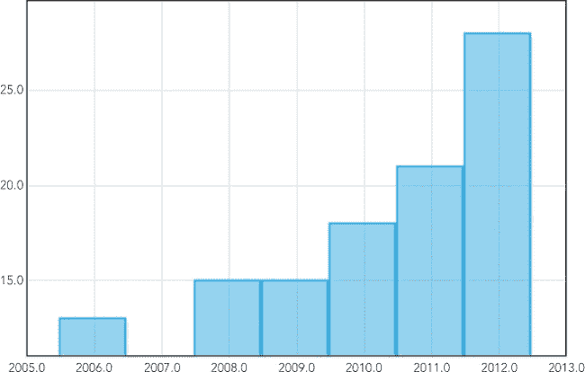图 1-1. Flotr2 库将数据转化为一个基本的（虽然未修饰的）条形图。

现在你有了一个条形图，但它显示信息的效果并不好。让我们逐步添加一些选项，直到得到我们想要的效果。

### 步骤 5：修正垂直轴

垂直轴最明显的问题是其刻度。默认情况下，Flotr2 会根据数据中的最小值和最大值自动计算轴的范围。在我们的例子中，最小值是 2007 年的 11 场胜利，所以 Flotr2 会忠实地将其作为 y 轴的最小值。然而，在条形图中，通常最好将 0 设置为 y 轴的最小值。如果不使用 0，你就可能过度强调数值之间的差异，给用户造成困惑。举个例子，任何快速浏览图 1-1 的人，可能会认为曼城在 2007 年没有赢得任何比赛。那显然不会对球队产生正面影响。

另一个与垂直轴相关的问题是格式化。Flotr2 默认精确到小数点后一位，所以它会给所有标签添加多余的“.0”。我们可以通过指定一些 y 轴选项来解决这两个问题。

```
Flotr.draw(document.getElementById("chart"), [wins], {
    bars: {
        show: **true**
    },
    yaxis: {
        min: 0,
        tickDecimals: 0
    }
});
```

`min` 属性设置 y 轴的最小值，`tickDecimals` 属性告诉 Flotr2 在标签中显示多少位小数。在我们的例子中，我们不希望显示小数位。

正如你在图 1-2 中看到的，添加这些选项确实改善了垂直轴，因为现在数值从零开始，并且格式适用于整数。

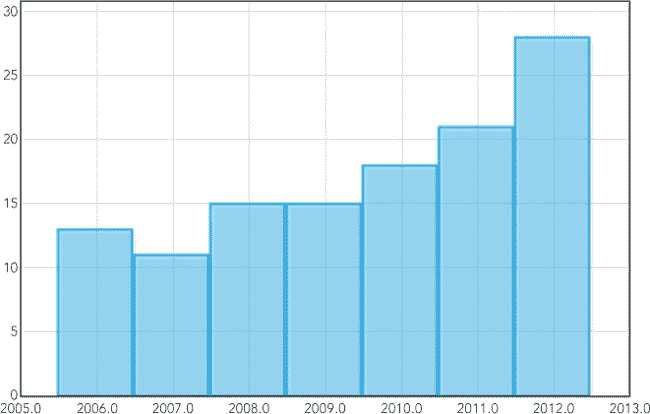图 1-2. 简单的选项帮助 Flotr2 构建更好的垂直轴。

### 步骤 6：修正横轴

水平轴也需要一些调整。与 y 轴一样，Flotr2 假定 x 轴值是实数，并在标签中显示一位小数。由于我们绘制的是年份，完全可以像处理 y 轴一样将精度设置为 0。但是，这并不是一个通用的解决方案，因为当 x 值是非数字类别（例如团队名称）时，这个方法就不起作用。为了处理更一般的情况，我们首先将数据更改为使用简单的数字而不是年份作为 x 值。然后，我们将创建一个数组，将这些简单的数字映射到任意字符串，作为标签使用。

```
**var** wins = [[[0,13],[1,11],[2,15],[3,15],[4,18],[5,21],[6,28]]];
**var** years = [
    [0, "2006"],
    [1, "2007"],
    [2, "2008"],
    [3, "2009"],
    [4, "2010"],
    [5, "2011"],
    [6, "2012"]
];
```

如你所见，x 值不再使用实际的年份，而是简单地使用 0、1、2，依此类推。然后我们定义了一个第二个数组，将这些整数值映射到字符串。虽然这里我们的字符串是年份（因此是数字），但它们可以是任何东西。

另一个问题是条形之间缺乏间距。默认情况下，每个条形占据它的全部水平空间，但这使得图表看起来非常拥挤。我们可以通过`barWidth`属性来调整这一点。我们将其设置为`0.5`，使每个条形仅占用一半的可用空间。

下面是我们如何将这些选项传递给 Flotr2。

```
   Flotr.draw(document.getElementById("chart"), wins, {
       bars: {
           show: **true**,
           barWidth: 0.5
       },
       yaxis: {
           min: 0,
           tickDecimals: 0
       },
       xaxis: {
➊         ticks: years
       }
   });
```

请注意➊，我们使用 x 轴的`ticks`属性来告诉 Flotr2 哪些标签对应哪些 x 值。现在我们的图表开始有了进展，如图 1-3 所示。x 轴标签适用于年份，并且条形之间有间隔，以提高图表的可读性。

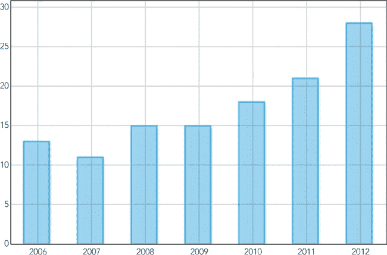图 1-3. 我们可以为水平轴定义自己的标签。

### 步骤 7：调整样式

现在图表功能齐全且可读，我们可以开始关注美学方面的调整。让我们添加标题，去除不必要的网格线，并调整条形的颜色。

```
Flotr.draw(document.getElementById("chart"), wins, {
    title: "Manchester City Wins",
    colors: ["#89AFD2"],
    bars: {
        show: **true**,
        barWidth: 0.5,
        shadowSize: 0,
        fillOpacity: 1,
        lineWidth: 0
    },
    yaxis: {
        min: 0,
        tickDecimals: 0
    },
    xaxis: {
        ticks: years
    },
    grid: {
        horizontalLines: **false**,
        verticalLines: **false**
    }
});
```

如图 1-4 所示，现在我们有了一张曼城球迷可以骄傲的条形图。

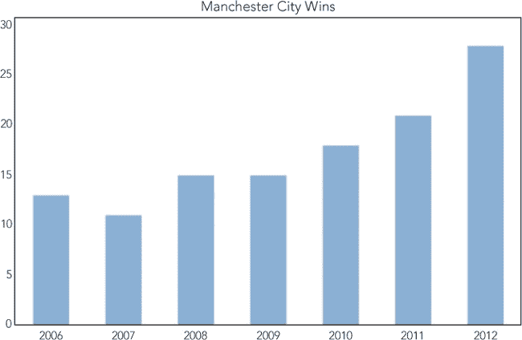图 1-4. 其他选项让我们调整图表的视觉样式。

对于任何中等大小的数据集，标准条形图通常是最有效的可视化方式。用户已经熟悉其惯例，因此不需要额外的精力去理解格式。条形本身与背景形成了清晰的视觉对比，并使用一个线性维度（高度）来显示数值之间的差异，因此用户能够轻松理解突出的数据。

### 步骤 8：变化条形颜色

到目前为止，我们的图表是单色的。这是合理的，因为我们在展示的是同一个值（曼城的胜利）随时间的变化。但条形图同样适合用来比较不同的值。假设我们想要展示多个团队在同一年中的总胜场数，那么为每个团队的条形图使用不同的颜色就显得很有意义。接下来，让我们看看如何做到这一点。

首先，我们需要稍微调整数据结构。之前我们只显示了一个系列。现在，我们希望每个团队都有一个不同的系列。创建多个系列使 Flotr2 能够独立为每个系列上色。以下示例展示了新旧数据系列的对比。我们保留了代码中的`wins`数组作为对比，但现在要展示的是`wins2`数组。注意数组的嵌套方式发生了变化。此外，我们将用团队缩写标签替代年份来标注每个条形。

```
**var** wins = [[[0,13],[1,11],[2,15],[3,15],[4,18],[5,21],[6,28]]];
**var** wins2 = [[[0,28]],[[1,28]],[[2,21]],[[3,20]],[[4,19]]];
**var** teams = [
    [0, "MCI"],
    [1, "MUN"],
    [2, "ARS"],
    [3, "TOT"],
    [4, "NEW"]
];
```

通过这些更改，我们的数据结构得到了适当的调整，现在可以请求 Flotr2 绘制图表。做这些时，我们将为每个团队使用不同的颜色。其他一切与之前相同。

```
Flotr.draw(document.getElementById("chart"), wins2, {
    title: "Premier League Wins (2011-2012)",
    colors: ["#89AFD2", "#1D1D1D", "#DF021D", "#0E204B", "#E67840"],
    bars: {
        show: **true**,
        barWidth: 0.5,
        shadowSize: 0,
        fillOpacity: 1,
        lineWidth: 0
    },
    yaxis: {
        min: 0,
        tickDecimals: 0
    },
    xaxis: {
        ticks: teams
    },
    grid: {
        horizontalLines: **false**,
        verticalLines: **false**
    }
});
```

如你在图 1-5 中所见，通过一些小的调整，我们已经完全改变了条形图的焦点。现在，我们不再显示一个团队在不同时间点的数据，而是在同一时间点比较不同的团队。这就是简单条形图的多功能性。

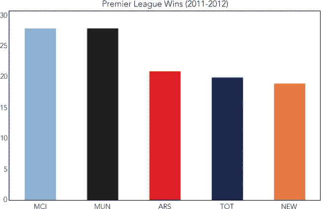图 1-5. 条形图可以在同一时间点比较不同数量，也可以比较在不同时间点的相同数量。

我们使用了许多不同的代码片段来拼接这些示例。如果你想在一个文件中看到完整的示例，可以查看本书的源代码，地址是*[`jsDataV.is/source/`](http://jsDataV.is/source/)*。

### 第 9 步：解决 Flotr2“bug”

如果你在构建内容丰富的大型网页时，可能会遇到一个令人烦恼的 Flotr2“bug”。我把“bug”放在引号里，因为 Flotr2 的这种行为是故意的，但我认为它是不正确的。在构建图表的过程中，Flotr2 会创建一些虚拟的 HTML 元素，以便计算它们的大小。Flotr2 并不打算让这些虚拟元素在页面上显示，因此它通过将它们定位到屏幕外来“隐藏”它们。不幸的是，Flotr2 认为的屏幕外位置并不总是正确的。具体来说，flotr2.js 的第 2,281 行是：

```
D.setStyles(div, { "position" : "absolute", "top" : "-10000px" });
```

Flotr2 打算将这些虚拟元素放置在浏览器窗口顶部 10,000 像素的位置。然而，CSS 的绝对定位是相对于包含元素的，这个包含元素不一定是浏览器窗口。因此，如果你的文档高度超过 10,000 像素，你可能会发现 Flotr2 在页面的随机位置散布文本。解决这个 bug 有几种方法，至少在 Flotr2 代码被修订之前可以使用。

一种选择是自己修改代码。Flotr2 是开源的，因此你可以自由下载完整的源代码并进行适当修改。一种简单的修改方法是将虚拟元素定位到页面的右侧或左侧，而不是上方。你可以将代码中的 `"top"` 改为 `"right"`。如果你不希望修改库的源代码，另一种选择是自己找到并隐藏这些虚拟元素。你应该在最后一次调用 `Flotr.draw()` 后进行此操作。最新版本的 jQuery 可以通过以下语句去除这些多余的元素：

```
$(".flotr-dummy-div").parent().hide();
```

## 绘制连续数据的折线图

条形图非常适合可视化少量数据，但对于更多数据，折线图能更有效地呈现信息。折线图特别擅长揭示数据的整体趋势，而不会让用户被个别数据点困扰。

对于我们的示例，我们将关注两个可能相关的指标：大气中的二氧化碳（CO[2]）浓度和全球气温。我们想展示这两个指标随时间变化的情况，并且希望了解它们之间的相关性。折线图是查看这些趋势的完美可视化工具。

就像条形图一样，你需要在网页中包含 Flotr2 库，并创建一个 `<div>` 元素来容纳图表。让我们开始准备数据。

### 步骤 1：定义数据

我们将从 CO[2] 浓度的测量开始。美国国家海洋和大气管理局（NOAA）发布了自 1959 年至今在夏威夷毛纳罗亚（Mauna Loa）进行的测量数据 (*[`www.esrl.noaa.gov/gmd/ccgg/trends/co2_data_mlo.html`](http://www.esrl.noaa.gov/gmd/ccgg/trends/co2_data_mlo.html)*)。以下是第一部分数据的摘录。

```
**var** co2 = [
    [ 1959, 315.97 ],
    [ 1960, 316.91 ],
    [ 1961, 317.64 ],
    [ 1962, 318.45 ],
    *// Data set continues...*
```

NOAA 还发布了全球平均地表温度的测量数据 (*[`www.ncdc.noaa.gov/cmb-faq/anomalies.php`](http://www.ncdc.noaa.gov/cmb-faq/anomalies.php)*)。这些值衡量的是相对于基准线的差异，基准线目前是整个 20 世纪的平均温度。由于 CO[2] 的测量从 1959 年开始，我们也将使用这一时间点作为温度数据的起点。

```
**var** temp = [
    [ 1959, 0.0776 ],
    [ 1960, 0.0280 ],
    [ 1961, 0.1028 ],
    [ 1962, 0.1289 ],
    *// Data set continues...*
```

### 步骤 2：绘制 CO[2] 数据

使用 Flotr2 绘制一个数据集非常简单。我们只需要调用`Flotr`对象的`draw()`方法。该方法所需的唯一参数是指向用于显示图表的 HTML 元素的引用，以及数据本身。数据对象的`lines`属性表明我们想要绘制一个折线图。

```
Flotr.draw(
    document.getElementById("chart"),
    [{ data: co2, lines: {show:**true**} }]
);
```

由于 Flotr2 不需要 jQuery，因此在我们的示例中没有使用任何 jQuery 的便捷函数。如果页面中有 jQuery，可以稍微简化前面的代码。无论如何，图 1-6 展示了结果。

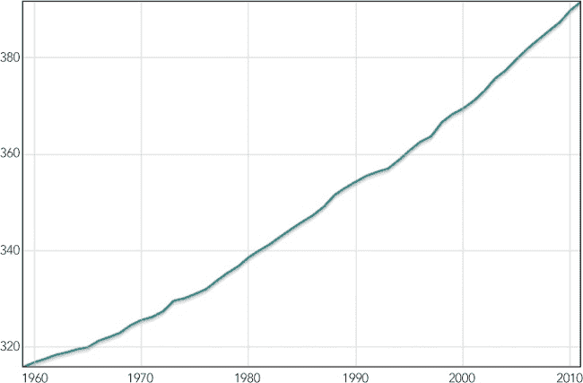图 1-6. 第一个图表显示了一个数据集。

该图表清晰地展示了过去 50 多年 CO[2]浓度的变化趋势。

### 步骤 3：添加温度数据

通过在代码中简单地添加内容，我们可以在图表中包含温度测量数据。

```
Flotr.draw(
    document.getElementById("chart"),
    [
        { data: co2, lines: {show:**true**} },
        { data: temp, lines: {show:**true**}, yaxis: 2 }
    ]
);
```

请注意，我们为温度数据包含了`yaxis`选项，并将其值设为`2`。这告诉 Flotr2 为温度数据使用不同的 y 轴比例。

图 1-7 中的图表现在显示了相关年份的两个测量数据，但变得有些拥挤和混乱。数值紧贴图表的边缘，而且当有多个垂直坐标轴时，网格线对用户的理解也变得困难。

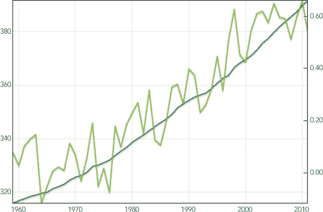图 1-7. 一个图表可以显示多个数据集。

### 步骤 4：提高图表的可读性

通过使用更多 Flotr2 选项，我们可以提高折线图的可读性。首先，我们可以去掉网格线，因为它们对温度测量数据没有帮助。

我们还可以扩展两个垂直坐标轴的范围，为图表提供一些“呼吸空间”。这两个更改是`draw()`方法的附加选项。

```
   Flotr.draw(
       document.getElementById("chart"),
       [
           { data: co2, lines: {show:**true**} },
           { data: temp, lines: {show:**true**}, yaxis: 2 }
       ],{
➊         grid: {horizontalLines: **false**, verticalLines: **false**},
➋         yaxis: {min: 300, max: 400},
➌         y2axis: {min: -0.15, max: 0.69}
       }
   );
```

位于➊的`grid`选项通过将`horizontalLines`和`verticalLines`属性设置为`false`来关闭网格线。位于➋的`yaxis`选项指定了第一个垂直坐标轴（CO[2]浓度）的最小值和最大值，而位于➌的`y2axis`选项则指定了第二个垂直坐标轴（温度差异）的这些值。

图 1-8 中的图形更简洁，且更易于阅读。

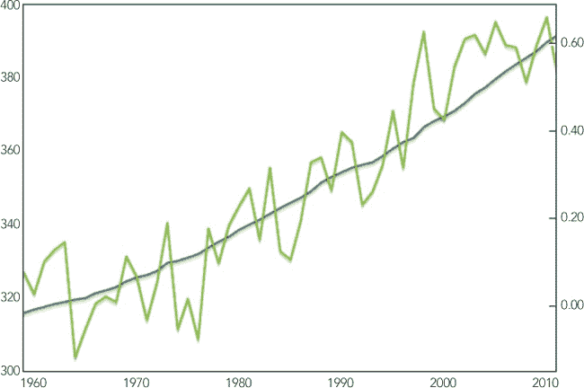图 1-8. 去除网格线并扩展坐标轴使图表更易读。

### 步骤 5：明确温度测量

温度测量可能仍然会让用户感到困惑，因为这些数据并不是真正的温度；它们实际上是与 20 世纪平均温度的偏差。我们可以通过添加一条 20 世纪平均温度的线并明确标注它来表达这一区别。最简单的方法是创建一个“虚拟”数据集并将其添加到图表中。这个额外的数据集只有零值。

```
**var** zero = [];
**for** (**var** yr=1959; yr<2012; yr++) { zero.push([yr, 0]); };
```

当我们将该数据集添加到图表中时，需要指出它对应的是第二个 y 轴。而且因为我们希望这条线作为图表框架的一部分出现，而不是作为另一个数据集，所以我们通过将其宽度设置为一个像素，颜色设为深灰色，并禁用阴影，来使其稍微不那么显眼。

```
Flotr.draw(
    document.getElementById("chart"),
    [
        { data: zero, lines: {show:**true**, lineWidth: 1}, yaxis: 2,
          shadowSize: 0, color: "#545454" },
        { data: co2, lines: {show:**true**} },
        { data: temp, lines: {show:**true**}, yaxis: 2 }
    ],{
        grid: {horizontalLines: **false**, verticalLines: **false**},
        yaxis: {min: 300, max: 400},
        y2axis: {min: -0.15, max: 0.69}
    }
);
```

如你所见，我们将零线放在了数据集的最前面。按照这个顺序，Flotr2 会在零线之上绘制实际数据，正如图 1-9 所示，强调其作为图表框架而非数据的作用。

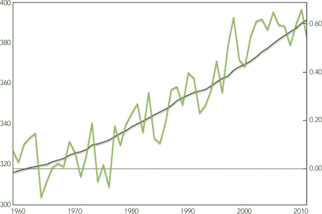图 1-9。一个虚拟数据集可以突出显示图表坐标轴上的某个位置。

### 第 6 步：标注图表

在本例的最后一步，我们将为图表添加适当的标签。这包括一个整体标题，以及各个数据集的标签。为了清楚地标明哪个坐标轴表示温度，我们将为温度刻度添加“°C”后缀。我们通过在每个数据系列的`label`选项中指定标签来实现这一点。整体图表标题有一个专门的选项，而“°C”后缀则通过`tickFormatter()`函数来添加。

```
   Flotr.draw(
       document.getElementById("chart"),
       [ {
           data: zero,
           label: "20<sup>th</sup>-Century Baseline Temperature",
           lines: {show:**true**, lineWidth: 1},
           shadowSize: 0,
           color: "#545454"
         },
         {
           data: temp,
           label: "Yearly Temperature Difference (°C)",
           lines: {show:**true**}
         },
         {
           data: co2,
           yaxis: 2,
           label: "CO<sub>2</sub> Concentration (ppm)",
           lines: {show:**true**}
         }
       ],
       {
           title: "Global Temperature and CO<sub>2</sub> Concentration (NOAA Data)",
           grid: {horizontalLines: **false**, verticalLines: **false**},
           y2axis: {min: -0.15, max: 0.69,
➊                  tickFormatter: **function**(val) {**return** val+" °C";}}
           yaxis: {min: 300, max: 400},
       }
   );
```

对于坐标轴上的每个值，格式化函数会被调用，并传入该值，Flotr2 期望它返回一个字符串来作为标签。正如你在➊所看到的，我们只是简单地将`" °C"`字符串附加到该值后面。

注意，我们还交换了 CO[2]和温度图表的位置。现在我们将温度数据系列放在 CO[2]系列之前。我们这么做是为了让两个温度量（基线和偏差）在图例中并排显示，使它们之间的联系对用户来说更清晰。由于温度现在在图例中位于首位，我们也交换了坐标轴的位置，因此温度坐标轴现在在左边。最后，我们为了同样的原因调整了图表标题。图 1-10 显示了结果。

图 1-10。标注坐标轴并添加图例完成图表的制作。

像图 1-10 这样的折线图非常适合可视化这种数据。每个数据集包含超过 50 个点，使得展示每个单独的点变得不切实际。事实上，单独的数据点并不是可视化的重点。我们想展示的是*趋势*——每个数据集的趋势，以及该数据集与其他数据集之间的关联。用线将这些点连接起来，可以帮助用户快速理解这些趋势和我们可视化的核心内容。

### 第 7 步：解决 Flotr2 “Bug”

请务必参考创建基本柱状图中的第 9 步，并查看第 9 步：解决 Flotr2 “Bug”，以了解如何绕过 Flotr2 库中的一些“Bug”。

## 使用饼图强调部分值

饼图在可视化社区中并不受欢迎，这有充分的理由：它们很少是传达数据的最有效方式。我们将在本节中讲解如何创建饼图，但首先让我们花些时间了解它们带来的问题。图 1-11 就是一个例子，它展示了一个简单的饼图。你能从这个图中看出哪个颜色是最大的？哪个是最小的吗？

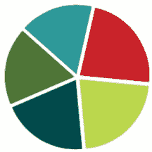图 1-11. 饼图可能让比较数值变得困难。

这非常难以判断。原因在于人类并不擅长判断面积的相对大小，尤其是当这些面积不是矩形时。如果我们真的想比较这五个数值，柱状图效果要好得多。图 1-12 显示了相同数值的柱状图。

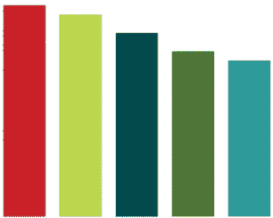图 1-12. 柱状图通常使比较变得更容易。

现在，当然很容易对每种颜色进行排名。在柱状图中，我们只需比较一个维度——高度。这给出一个简单的经验法则：如果你在比较不同的数值，首先考虑使用柱状图。它几乎总是能提供最佳的可视化效果。

然而，饼图有一个非常有效的应用场景，那就是我们想要比较一个部分值与整体的关系。例如，假设我们想要可视化世界人口中生活在贫困中的比例。在这种情况下，饼图可能会很好地表现这一点。下面是我们如何使用 Flotr2 构建这样一个图表。

就像在创建基本条形图的第一步中一样，我们需要在网页中包含 Flotr2 库，并为将要构建的图表预留一个`<div>`元素。

### 步骤 1：定义数据

这里的数据非常简单。根据世界银行的资料（*[`www.newgeography.com/content/003325-alleviating-world-poverty-a-progress-report`](http://www.newgeography.com/content/003325-alleviating-world-poverty-a-progress-report)*），到 2008 年底，世界上有 22.4%的人口每天的收入低于 1.25 美元。这就是我们希望通过图表强调的比例。

```
**var** data = [[[0,22.4]],[[1,77.6]]];
```

这里我们有一个包含两个数据系列的数组：一个是贫困人口的百分比（22.4），另一个是其他人群（77.6）。每个系列本身由一个点数组成。在这个例子中，对于饼图而言，每个系列中只有一个点，该点包含一个 x 值和一个 y 值（这两个值一起存储在另一个内部数组中）。对于饼图，x 值是无关紧要的，所以我们简单地使用占位符值`0`和`1`。

### 步骤 2：绘制图表

为了绘制图表，我们调用`Flotr`对象的`draw()`方法。该方法接受三个参数：要放置图表的 HTML 文档元素、图表的数据以及任何选项。我们将从饼图所需的最小选项集开始。

```
   window.onload = **function** () {
       Flotr.draw(document.getElementById("chart"), data, {
           pie: {
               show: **true**
           },
           yaxis: {
➊             showLabels: **false**
           },
           xaxis: {
➋             showLabels: **false**
           },
           grid: {
➌             horizontalLines: **false**,
➍             verticalLines: **false**
           }
       });
   }
```

如你所见，Flotr2 为最小饼图所需的选项比其他常见图表类型要多一些。对于 x 轴和 y 轴，我们需要禁用标签，这可以通过在➊和➋处将`showLabels`属性设置为`false`来实现。我们还必须关闭网格线，因为网格对于饼图没有太大意义。我们通过在➌和➍处将`grid`选项中的`verticalLines`和`horizontalLines`属性设置为`false`来完成这一操作。

由于 Flotr2 不需要 jQuery，我们在这个例子中没有使用任何 jQuery 的便利函数。如果你的页面中有 jQuery，可以稍微简化一下这段代码。

图 1-13 是一个起点，但很难确切看出图表想要展示什么。

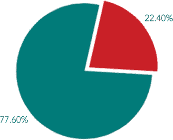图 1-13. 没有效果的标签，饼图可能很难解读。

### 步骤 3：标记值

下一步是添加一些文本标签和图例，以指示图表展示的内容。为了单独标记每个量，我们需要更改数据结构。我们不再使用系列数组，而是创建一个对象来存储每个系列。每个对象的`data`属性将包含相应的系列，并且我们将添加一个`label`属性用于文本标签。

```
**var** data = [
    {data: [[0,22.4]], label: "Extreme Poverty"},
    {data: [[1,77.6]]}
];
```

通过这种方式结构化数据，Flotr2 会自动识别与每个系列关联的标签。现在，当我们调用 `draw()` 方法时，只需添加一个 `title` 选项。Flotr2 会在图表上方添加标题，并创建一个简单的图例，使用我们的标签标识饼图的各个部分。为了让图表更具吸引力，我们将在标题中提出一个问题。这就是为什么我们只给图表中的一个区域加标签：被标记的区域回答了标题中的问题。

```
Flotr.draw(document.getElementById("chart"),data, {
    title: "How Much of the World Lives on $1.25/Day?",
    pie: {
        show: **true**
    },
    yaxis: {
        showLabels: **false**
    },
    xaxis: {
        showLabels: **false**
    },
    grid: {
        horizontalLines: **false**,
        verticalLines: **false**
    }
});
```

图 1-14 中的图表清晰地展示了数据。

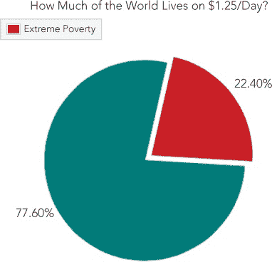 图 1-14. 标签和标题可以帮助让图表更具吸引力。

尽管饼图在数据可视化界中名声不佳，但在某些应用场景下，它们还是非常有效的。它们不太适合让用户比较多个值，但正如本示例所示，它们确实提供了一个清晰、易于理解的图像，展示了单一值在整体中的比例。

### 第 4 步：解决 Flotr2 “Bug”

请务必参考 创建基本条形图 第 9 步，在 第 9 步：解决 Flotr2 “Bug” 中查看如何解决 Flotr2 库中的一些“bug”。

## 使用散点图绘制 X/Y 数据

条形图通常最适合可视化主要由单一数量构成的数据（比如我们之前创建的条形图中的获胜次数）。但是，如果我们想要探索两个不同数量之间的关系，散点图可能更为有效。例如，假设我们想要可视化一个国家的医疗保健支出（第一个数量）与其预期寿命（第二个数量）之间的关系。让我们通过一个示例，看看如何为这些数据创建一个散点图。

就像在 创建基本条形图 第 1 步中一样，我们需要在网页中包含 Flotr2 库，并为构建的图表预留一个 `<div>` 元素。

### 第 1 步：定义数据

在此示例中，我们将使用经济合作与发展组织（OECD）2012 年的报告（* [`www.oecd-ilibrary.org/social-issues-migration-health/data/oecd-health-statistics_health-data-en`](http://www.oecd-ilibrary.org/social-issues-migration-health/data/oecd-health-statistics_health-data-en) *）。该报告包括医疗保健支出占国内生产总值的百分比和出生时的平均预期寿命。（尽管报告在 2012 年底发布，但它包含了 2010 年的数据。）以下是存储在 JavaScript 数组中的该数据的简短摘录：

```
**var** health_data = [
    { country: "Australia",      spending:  9.1, life: 81.8 },
    { country: "Austria",        spending: 11.0, life: 80.7 },
    { country: "Belgium",        spending: 10.5, life: 80.3 },
    *// Data set continues...*
```

### 第 2 步：格式化数据

像往常一样，我们需要稍微重组原始数据，使其符合 Flotr2 的要求格式。接下来展示的 JavaScript 代码就是为此目的。我们从一个空的`data`数组开始，然后逐步处理源数据。对于每个源`health_data`中的元素，我们提取图表所需的数据点，并将这些数据点推送到`data`数组中。

```
**var** data = [];
**for** (**var** i = 0; i < health_data.length; i++) {
    data.push([
        health_data[i].spending,
        health_data[i].life
    ]);
};
```

由于 Flotr2 不需要 jQuery，因此在这个例子中我们没有使用任何 jQuery 的便捷函数。但如果你在页面中因其他原因使用了 jQuery，例如，你可以使用`.map()`函数简化数据重组的代码。（在选择图表内容的步骤 7：根据交互状态确定图表数据中有一个关于 jQuery `.map()`函数的详细示例。）

### 步骤 3：绘制数据

现在我们需要做的就是调用`draw()`方法，来创建我们的图表。初次尝试时，我们将使用默认选项。

```
Flotr.draw(
    document.getElementById("chart"),
    [{ data: data, points: {show:**true**} }]
);
```

如你所见，Flotr2 至少需要两个参数。第一个是我们希望图表显示的 HTML 文档元素，第二个是图表的数据。数据的形式是一个数组。一般来说，Flotr2 可以在同一图表上绘制多个系列，因此这个数组可能包含多个对象。然而，在我们的例子中，我们只绘制一个系列，因此数组只有一个对象。该对象标识数据本身，并告诉 Flotr2 不要显示点，而是显示线条。

图 1-15 展示了我们的结果。注意图中的点是如何紧贴着图表边缘的。

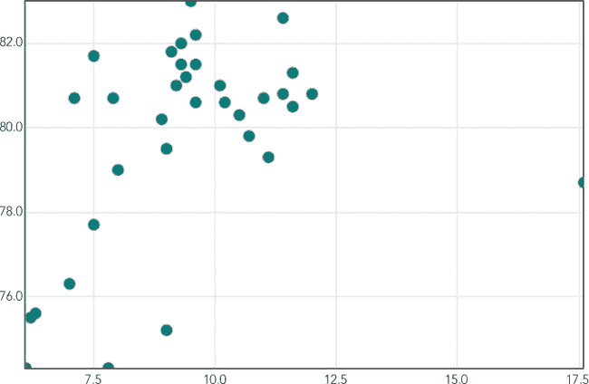图 1-15. 默认散点图选项没有提供任何边距。

### 步骤 4：调整图表的坐标轴

第一次尝试还不错，但 Flotr2 会自动计算每个轴的范围，且其默认算法通常会导致图表过于拥挤。Flotr2 确实有一个`autoscale`选项；如果启用它，库会尝试自动为关联的轴找到合理的范围。不幸的是，根据我的经验，Flotr2 建议的范围很少能显著改善默认选项，因此在大多数情况下，明确设置范围会更好。以下是我们如何为图表设置这些范围的方法：

```
Flotr.draw(
    document.getElementById("chart"),
    [{
        data: data,
        points: {show:**true**}
    }],
    {
        xaxis: {min: 5, max: 20},
        yaxis: {min: 70, max: 85}
    }
);
```

我们在 `draw()` 方法中添加了一个包含我们选项的第三个参数，这些选项是 x 轴和 y 轴的属性。在每个案例中，我们都显式地设置了最小值和最大值。通过指定给数据一点呼吸空间的范围，我们使得图表 图 1-16 更易于阅读。

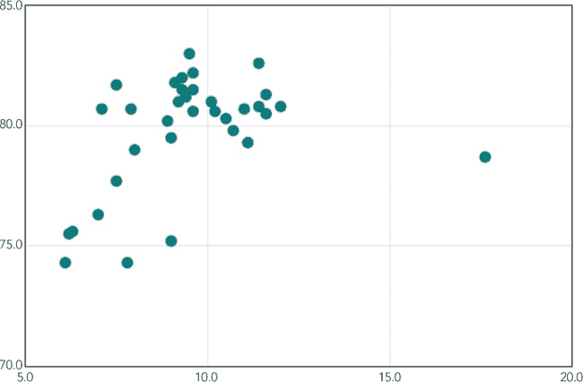图 1-16. 指定我们自己的坐标轴使图表更易于阅读。

### 步骤 5: 标注数据

到目前为止，我们的图表看起来相当不错，但它并没有告诉用户他们正在查看什么。我们需要添加一些标签来标识数据。再添加几个选项可以让图表更清晰：

```
Flotr.draw(
    document.getElementById("chart"),
    [{
        data: data, points: {show:**true**}
    }],
    {
        title: "Life Expectancy vs. Health-Care Spending",
        subtitle: "(by country, 2010 OECD data)",
        xaxis: {min: 5, max: 20, ➊tickDecimals: 0,
                title: "Spending as Percentage of GDP"},
        yaxis: {min: 70, max: 85, ➋tickDecimals: 0, title: "Years"}
    }
);
```

`title` 和 `subtitle` 选项为图表提供了整体的标题和副标题，而 `xaxis` 和 `yaxis` 选项中的 `title` 属性则命名了这些坐标轴的标签。除了添加标签，我们还通过在 ➊ 和 ➋ 处更改 `tickDecimals` 属性，指示 Flotr2 去除 x 轴和 y 轴值中不必要的小数点。图表 图 1-17 看起来好多了。

图 1-17. 标签和标题明确图表的内容。

### 步骤 6: 明确 X 轴

尽管我们的图表自第一次尝试以来已经有所改进，但数据呈现仍然存在一个令人困扰的问题。x 轴表示百分比，但该轴的标签显示的是整数。这种不一致可能会让用户产生初步困惑，因此我们需要解决它。Flotr2 允许我们按需格式化坐标轴标签。在这个例子中，我们只希望在数值后添加一个百分号。这个操作非常简单：

```
   Flotr.draw(
       document.getElementById("chart"),
       [{
           data: data, points: {show:**true**}
       }],
       {
           title: "Life Expectancy vs. Health-Care Spending",
           subtitle: "(by country, 2010 OECD data)",
           xaxis: {min: 5, max: 20, tickDecimals: 0,
                  title: "Spending as Percentage of GDP",
➊                tickFormatter: **function**(val) {**return** val+"%"}},
           yaxis: {min: 70, max: 85, tickDecimals: 0, title: "Years"}
       }
   );
```

关键是前面代码中 `xaxis` 选项里的 `tickFormatter` 属性，位于 ➊。该属性指定了一个函数。当存在 `tickFormatter` 时，Flotr2 不会自动绘制标签。而是在每个本该绘制标签的点上，它会调用我们的函数。传递给函数的参数是标签的数值。Flotr2 期望函数返回一个字符串，作为要使用的标签。在我们的例子中，我们只是简单地在数值后面添加一个百分号。

在 图 1-18 中，随着横坐标轴上添加了百分比值标签，我们得到了一张清晰呈现数据的图表。

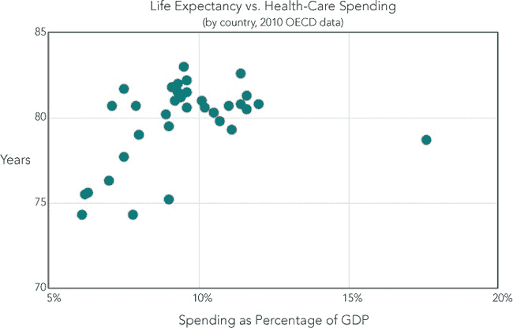图 1-18. 格式化坐标轴标签可以明确内容。

散点图在揭示两个不同变量之间的关系方面表现出色。在这个例子中，我们可以看到寿命预期与医疗支出的关系。总的来说，更多的支出会带来更长的寿命。

### 第 7 步：回答用户的问题

现在我们的图表成功地展示了数据，我们可以开始从用户的角度更仔细地审视可视化内容。我们特别想预见用户可能会提出的问题，并尽量直接在图表上解答。目前图表上至少有三个问题：

1.  显示的是哪些国家？

1.  是否存在地区差异？

1.  那个位于最右边的数据点是什么？

解答这些问题的一种方法是为每个数据点添加鼠标悬停（或工具提示）。但我们在这个例子中不会使用这种方法，原因有几个。首先（最明显的是），互动式可视化是第二章的内容；本章只考虑静态图表和图形。其次，鼠标悬停和工具提示对使用触摸设备（如智能手机或平板电脑）的用户来说效果不佳。如果我们要求用户必须使用鼠标才能完全理解我们的可视化，那么我们可能会忽视一个重要的（且快速增长的）用户群体。

我们解决这个问题的方法是将数据拆分成多个系列，以便我们可以为每个系列单独上色和标注。下面是将数据拆分成区域的第一步：

```
**var** pacific_data = [
    {  country: "Australia",      spending:  9.1, life: 81.8 },
    {  country: "New Zealand",    spending: 10.1, life: 81.0 },
];
**var** europe_data = [
    {  country: "Austria",        spending: 11.0, life: 80.7 },
    {  country: "Belgium",        spending: 10.5, life: 80.3 },
    {  country: "Czech Republic", spending:  7.5, life: 77.7 },

*// Data set continues...*

**var** us_data = [
    {  country: "United States",  spending: 17.6, life: 78.7 }
];
```

在这里，我们为美国单独设立了一个系列，而不是与美洲系列合并。因为美国是图表右侧的离群值数据点。用户可能想要知道该数据点对应的具体国家，而不仅仅是它所属的区域。对于其他国家，仅仅显示区域就足够了。如同之前一样，我们需要将这些数组重新构造为 Flotr2 的格式。代码与第 4 步相同；我们只是对每个数据集重复这个过程。

```
**var** pacific=[], europe=[], americas=[], mideast=[], asia=[], us=[];
**for** (i = 0; i < pacific_data.length; i++) {
    pacific.push([ pacific_data[i].spending, pacific_data[i].life ]);
}
**for** (i = 0; i < europe_data.length; i++) {
    europe.push([ europe_data[i].spending, europe_data[i].life ]);
}
*// Code continues...*
```

一旦我们将国家分离开来，就可以将它们的数据作为不同的系列传递给 Flotr2。这里我们可以看到为什么 Flotr2 期望将数组作为其数据参数。每个系列在数组中都是一个独立的对象。

```
Flotr.draw(
    document.getElementById("chart"),
    [
        { data: pacific,  points: {show:**true**} },
        { data: europe,   points: {show:**true**} },
        { data: americas, points: {show:**true**} },
        { data: mideast,  points: {show:**true**} },
        { data: asia,     points: {show:**true**} },
        { data: us,       points: {show:**true**} }
    ],{
        title: "Life Expectancy vs. Health-Care Spending",
        subtitle: "(by country, 2010 OECD data)",
        xaxis: {min: 5, max: 20, tickDecimals: 0,
                title: "Spending as Percentage of GDP",
                tickFormatter: **function**(val) {**return** val+"%"}},
        yaxis: {min: 70, max: 85, tickDecimals: 0, title: "Years"}
    }
);
```

基于地区对不同数据系列中的国家进行分类后，Flotr2 现在为各个区域着上了不同的颜色，如图 1-19 所示。

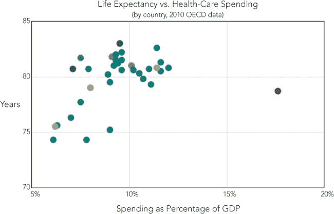图 1-19. 将数据拆分成多个数据集让我们可以为每个数据集分配不同的颜色。

最后的增强功能是向图表中添加一个图例，用来标识各个区域。

```
   Flotr.draw(
       document.getElementById("chart"),
       [
           { data: pacific,  label: "Pacific", points: {show:**true**} },
           { data: europe,   label: "Europe", points: {show:**true**} },
           { data: americas, label: "Americas", points: {show:**true**} },
           { data: mideast,  label: "Middle East", points: {show:**true**} },
           { data: asia,     label: "Asia", points: {show:**true**} },
           { data: us,       label: "United States", points: {show:**true**} }
       ],{
           title: "Life Expectancy vs. Health-Care Spending (2010 OECD data)",
➊         xaxis: {min: 5, max: 25, tickDecimals: 0,
                  title: "Spending as Percentage of GDP",
                  tickFormatter: **function**(val) {**return** val+"%"}},
           yaxis: {min: 70, max: 85, tickDecimals: 0, title: "Years"},
➋         legend: {position: "ne"}
       }
   );
```

为了腾出空间给图例，我们在➊处增加了 x 轴的范围，并将图例放置在➋的东北象限。

这个附加步骤给我们带来了最终图表，如图 1-20 所示。

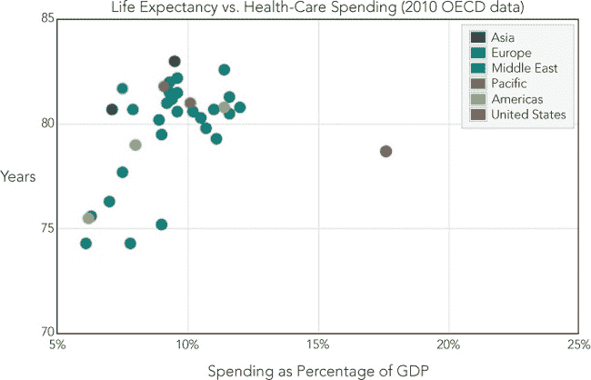图 1-20. 添加图例完成图表。

### 第 8 步：解决 Flotr2“Bug”

请务必参考创建基本条形图中的第 9 步，在第 9 步：解决 Flotr2“Bug”中查看如何解决 Flotr2 库中的一些“Bug”。

## 使用气泡图为 X/Y 数据添加量级

传统的散点图，如前面的示例所示，展示了两个值之间的关系：x 轴和 y 轴。然而，有时候，两个值不足以展示我们想要可视化的数据。如果我们需要可视化三个变量，可以使用散点图框架展示两个变量，然后根据第三个变量的不同调整点的大小。最终得到的图表就是气泡图。

然而，有效使用气泡图需要一些谨慎。如我们之前在饼图中看到的那样，人类在准确判断非矩形形状的相对面积方面并不擅长，因此气泡图不适合精确比较气泡的大小。但如果你的第三个变量只传达某种量的总体印象，而不是准确的测量，气泡图可能是合适的。

在这个示例中，我们将使用气泡图来可视化 2005 年卡特里娜飓风的路径。我们的 x 和 y 值将代表位置（纬度和经度），并且我们会确保用户能够准确解读这些值。对于第三个值——气泡的面积——我们将使用风暴的持续风速。由于风速本身只是一个大致的值（因为风速会时强时弱），因此提供一个大致的印象就足够了。

就像在创建基本条形图的第 1 步中一样，我们需要在网页中包含 Flotr2 库，并为将要构建的图表预留一个`<div>`元素。

### 第 1 步：定义数据

我们将以美国国家海洋和大气管理局（NOAA）收集的卡特里娜飓风观测数据为例。数据包括观测的纬度和经度，以及以每小时英里为单位的持续风速。

```
**var** katrina = [
    { north: 23.2, west: 75.5, wind: 35 },
    { north: 24.0, west: 76.4, wind: 35 },
    { north: 25.2, west: 77.0, wind: 45 },
    *// Data set continues...*
```

对于气泡图，Flotr2 要求每个数据点是一个数组，而不是一个对象，因此我们需要构建一个简单的函数，将源数据转换为这种格式。为了让函数更具通用性，我们可以使用一个可选参数来指定一个过滤函数。并且，在提取数据点时，我们可以反转经度的符号，这样从西到东的方向就会从左到右显示。

```
   **function** get_points(source_array, filter_function) {
➊     **var** result = [];
       **for** (**var** i=0; i<source_array.length; i++) {
           **if** ( (**typeof** filter_function === "undefined")
             || (**typeof** filter_function !== "function")
             || filter_function(source_array[i]) ) {
               result.push([
                   source_array[i].west * -1,
                   source_array[i].north,
                   source_array[i].wind
               ]);
           }
       }
       **return** result;
   }
```

我们的函数代码首先在➊处将返回值（`result`）设置为空数组。然后它逐一遍历输入的`source_array`。如果`filter_function`参数存在，并且它是一个有效的函数，我们的代码会调用这个函数，并将源数组元素作为参数。如果函数返回`true`，或者没有传入任何函数参数，那么我们的代码就会从源元素中提取数据点并将其推送到结果数组中。

如你所见，`filter_function`参数是可选的。如果调用者省略了它（或者它不是一个有效的函数），那么源中的每个点都会进入结果。我们暂时不会立即使用过滤函数，但它将在本示例的后续步骤中派上用场。

### 第 2 步：为图表创建背景

因为我们图表的 x 值和 y 值将表示位置，所以地图是完美的图表背景。为了避免任何版权问题，我们将使用 Stamen Design 提供的地图图片 (*[`stamen.com/`](http://stamen.com/)*), 这些地图使用的是 OpenStreetMap 提供的数据 (*[`openstreetmap.org/`](http://openstreetmap.org/)*)。这两个资源都可以在 Creative Commons 许可下使用，分别是 CC BY 3.0 (*[`creativecommons.org/licenses/by/3.0`](http://creativecommons.org/licenses/by/3.0)*) 和 CC BY SA (*[`creativecommons.org/licenses/by-sa/3.0`](http://creativecommons.org/licenses/by-sa/3.0)*)。

当你在处理地图时，投影可能是一个棘手的问题，但映射区域越小，投影的影响就越小，而且在映射区域的中心投影影响较小。在这个例子中，考虑到其相对较小的区域以及聚焦于中心的行动，我们假设地图图像使用的是墨卡托投影。这个假设让我们在将纬度和经度转换为 x 值和 y 值时避免了任何复杂的数学变换。

图 1-21 展示了我们将叠加飓风路径的地图图像。

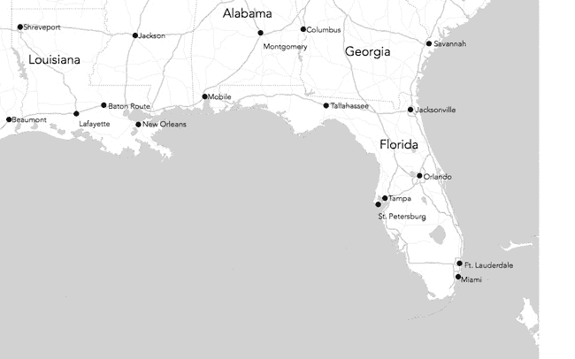图 1-21. 地图图像可以作为图表的背景。

### 第 3 步：绘制数据

我们需要经过几次迭代才能使图表达到我们想要的效果，但让我们从最少的选项开始。我们需要指定的一个参数是气泡的半径。对于像这样的静态图表，最简单的方法是通过尝试几个值来找到最佳大小。`0.3`的值似乎对我们的图表有效。除了选项，`draw()`方法还需要一个 HTML 元素来包含图表，以及数据本身。

```
Flotr.draw(
    document.getElementById("chart"),
    [{
      data: get_points(katrina),
      bubbles: {show:**true**, baseRadius: 0.3}
    }]
);
```

如你所见，我们正在使用我们的转换函数从源中提取数据。该函数的返回值直接作为`draw()`的第二个参数。

目前，我们还没有处理背景图像。我们会在稍微调整数据后将其添加到图表中。图 1-22 中的结果（Figure 1-22）仍然需要改进，但它是一个可行的起点。

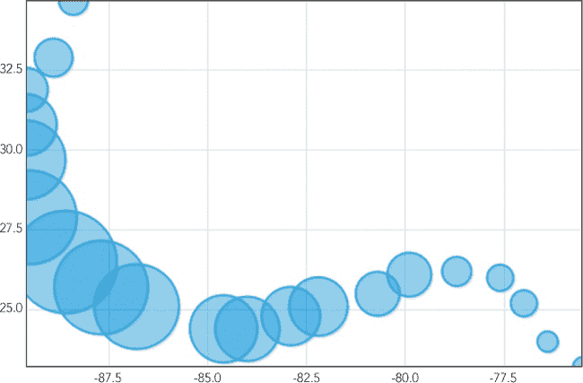 图 1-22。基本的气泡图会根据数据点的大小变化。

### 步骤 4：添加背景

现在我们已经了解了 Flotr2 如何绘制数据，接下来可以添加背景图像。我们还需要同时做一些其他修改。首先，既然要添加背景，就可以去掉网格线。其次，禁用轴标签；纬度和经度的数值对于普通用户意义不大，且在地图上并不需要。最后，也是最重要的，我们需要调整图表的比例，以适应地图图像。

```
   Flotr.draw(
       document.getElementById("chart"),
       [{
         data: get_points(katrina),
         bubbles: {show:**true**, baseRadius: 0.3}
       }],
       {
➊         grid: {
               backgroundImage: "img/gulf.png",
               horizontalLines: **false**,
               verticalLines: **false**
           },
➋         yaxis: {showLabels: **false**, min: 23.607, max: 33.657},
➌         xaxis: {showLabels: **false**, min: -94.298, max: -77.586}
       }
   );
```

我们从 ➊ 开始添加了 `grid` 选项，告诉 Flotr2 省略水平和垂直的网格线，并指定背景图像。我们的图像显示了从 23.607°N 到 33.657°N 的纬度值，以及从 77.586°W 到 94.298°W 的经度值。在 ➋ 和 ➌，我们为 `xaxis` 和 `yaxis` 选项提供了这些值作为范围，并禁用了两个轴的标签。注意，由于我们处理的是零度经线以西的经度，因此我们使用负值。

到目前为止，图 1-23 中的图表（Figure 1-23）看起来相当不错。我们可以清楚地看到飓风的路径，并感受到风暴是如何增强和减弱的。

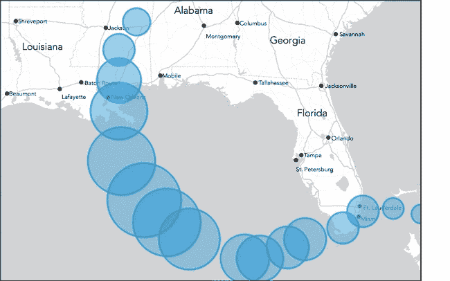 图 1-23。以地图为背景图像，图表有了更有意义的上下文。

### 步骤 5：为气泡上色

这个例子给了我们一个机会，向用户提供更多的信息，而不会过度分散他们的注意力：我们可以修改气泡颜色。让我们利用这个自由，表示每个测量点的 Saffir-Simpson 风暴强度分类。

在这里，我们可以利用我们在数据格式化函数中包含的筛选选项。Saffir-Simpson 分类是基于风速的，因此我们将基于 `wind` 属性进行筛选。例如，下面是如何提取仅代表 1 级飓风（风速在每小时 74 到 95 英里之间）的数据。我们传递给 `get_points` 的函数仅对适当的风速返回 `true`。

```
cat1 = get_points(katrina, **function**(obs) {
    **return** (obs.wind >= 74) && (obs.wind < 95);
});
```

要让 Flotr2 为不同的强度分配不同的颜色，我们使用以下代码将数据分成多个系列，每个系列都有自己的颜色。除了五个飓风等级，我们还提取了热带风暴和热带低气压的强度数据点。

```
Flotr.draw(
    document.getElementById("chart"),
    [
      {
          data: get_points(katrina, **function**(obs) {
                    **return** (obs.wind < 39);
                }),
          color: "#74add1",
          bubbles: {show:**true**, baseRadius: 0.3, lineWidth: 1}
      },{
      *// Options continue...*
      },{
          data: get_points(katrina, **function**(obs) {
                    **return** (obs.wind >= 157);
                }),
          color: "#d73027",
          label: "Category 5",
          bubbles: {show:**true**, baseRadius: 0.3, lineWidth: 1}
      }
    ],{
        grid: {
            backgroundImage: "img/gulf.png",
            horizontalLines: **false**,
            verticalLines: **false**
        },
        yaxis: {showLabels: **false**, min: 23.607, max: 33.657},
        xaxis: {showLabels: **false**, min: -94.298, max: -77.586},
        legend: {position: "sw"}
    }
);
```

我们还为飓风类别添加了标签，并将图例放置在图表的左下角，正如你在图 1-24 中看到的那样。

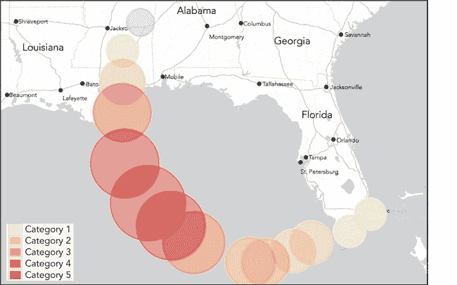图 1-24。不同的颜色可以表示风力强度。

### 第 6 步：调整图例样式

默认情况下，Flotr2 似乎偏好将所有元素显示得尽可能大。图 1-24 中的图例就是一个很好的例子：它看起来拥挤且不美观。幸运的是，解决方法非常简单：我们只需添加一些 CSS 样式来为图例添加内边距。我们还可以显式设置图例的背景色，而不是依赖 Flotr2 对透明度的处理。

```
.flotr-legend **{**
    **padding:** 5px**;**
    **background-color:** #ececec**;**
**}**
```

为了防止 Flotr2 为图例创建自己的背景，将透明度设置为 `0`。

```
Flotr.draw(
    document.getElementById("chart")
        *// Additional options...*
        legend: {position: "sw", backgroundOpacity: 0,},
        *// Additional options...*
```

经过最后的调整，我们得到了图 1-25 的最终产品。我们不想使用 Flotr2 选项来指定标题，因为 Flotr2 会以无法预测的量缩小图表区域（因为我们无法预测用户浏览器中的字体大小）。这会扭曲我们的纬度转换。当然，使用 HTML 来提供标题是足够简单的。

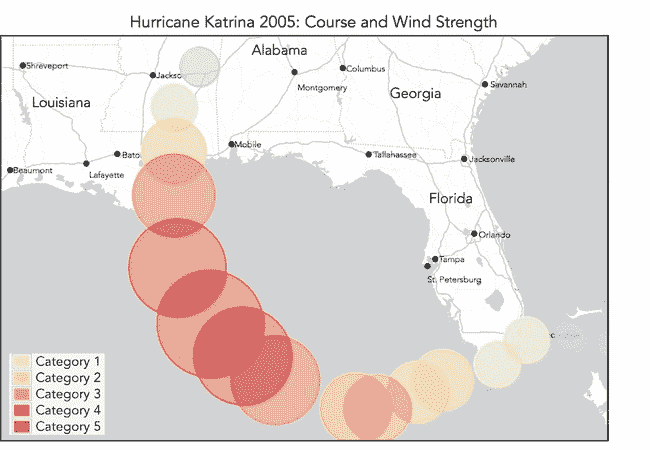图 1-25。气泡图展示了第三个维度（风速）以及位置。

气泡图为二维散点图增加了另一个维度。事实上，正如我们例子中所示，它甚至可以增加两个维度。该例子使用气泡大小来表示风速，使用颜色来指示飓风的分类。然而，这两个附加的值需要小心处理。人类在比较二维面积方面并不擅长，也无法轻松比较相对的色调或颜色。我们绝不应该使用额外的气泡图维度来传达关键信息或精确数据。相反，它们在像这样的一些例子中最有效——风速的确切数值或飓风的具体分类不需要像位置那样精准。很少有人能够区分 100 英里每小时和 110 英里每小时的风速，但他们一定能分清新奥尔良和达拉斯之间的差异。

### 第 7 步：解决 Flotr2 的“bug”

确保参考创建基本条形图中的第 9 步以及第 9 步：解决 Flotr2 的“bug”，了解如何解决 Flotr2 库中的一些“bug”。

## 使用雷达图展示多维数据

如果你的数据有很多维度，雷达图可能是最有效的可视化方式。不过，雷达图不像其他图表那样常见，它的不熟悉性使得用户解读起来稍显困难。如果你设计雷达图，要小心不要增加这种负担。

雷达图在数据具有多个特征时最为有效：

+   你展示的数据点不应太多。雷达图能够容纳的最大数据点大约是半打。

+   数据点具有多个维度。如果数据只有两个甚至三个维度，使用更传统的图表类型可能会更好。雷达图适用于四个或更多维度的数据。

+   每个数据维度都是一个至少可以排序的尺度（比如从好到坏），如果不能直接分配数值的话。雷达图不适合处理仅仅是任意类别的数据维度（比如政党或国籍）。

雷达图的经典用途是分析运动队球员的表现。例如，考虑一下 2012 年迈阿密热火队的首发阵容，这支队伍来自美国职业篮球联赛（NBA）。这里只有五个数据点（五名球员）。有多个维度——得分、助攻、篮板、盖帽、抢断等等——每个维度都有一个自然的数值。

表 1-1 展示了球员们 2011–2012 赛季的每场比赛平均数据，以及球队的总计（包括替补球员的贡献）。

表 1-1. 迈阿密热火队 2011–2012 赛季

| 球员 | 得分 | 篮板 | 助攻 | 抢断 | 盖帽 |
| --- | --- | --- | --- | --- | --- |
| 克里斯·波什 | 17.2 | 7.9 | 1.6 | 0.8 | 0.8 |
| 谢恩·巴蒂尔 | 5.4 | 2.6 | 1.2 | 1.0 | 0.5 |
| 勒布朗·詹姆斯 | 28.0 | 8.4 | 6.1 | 1.9 | 0.8 |
| 德维恩·韦德 | 22.3 | 5.0 | 4.5 | 1.7 | 1.3 |
| 马里奥·查尔默斯 | 10.2 | 2.9 | 3.6 | 1.4 | 0.2 |
| 团队总计 | 98.2 | 41.3 | 19.3 | 8.5 | 5.3 |

就像在创建基本条形图的步骤 1 中一样，我们需要在网页中引入 Flotr2 库，并为构建的图表预留一个`<div>`元素。

### 步骤 1：定义数据

我们将从一个典型的 JavaScript 表达式开始，表示球队的统计数据。在这个例子中，我们将从一个对象数组开始，每个对象对应一个首发球员，并为整个团队单独创建一个对象。

```
**var** players = [
    { player: "Chris Bosh",     points: 17.2, rebounds: 7.9, assists: 1.6,
      steals: 0.8, blocks: 0.8 },
    { player: "Shane Battier",  points:  5.4, rebounds: 2.6, assists: 1.2,
      steals: 1.0, blocks: 0.5 },
    { player: "LeBron James",   points: 28.0, rebounds: 8.4, assists: 6.1,
      steals: 1.9, blocks: 0.8 },
    { player: "Dwyane Wade",    points: 22.3, rebounds: 5.0, assists: 4.5,
      steals: 1.7, blocks: 1.3 },
    { player: "Mario Chalmers", points: 10.2, rebounds: 2.9, assists: 3.6,
      steals: 1.4, blocks: 0.2 }
];
**var** team = {
    points:   98.2,
    rebounds: 41.3,
    assists:  19.3,
    steals:    8.5,
    blocks:    5.3
};
```

对于有效的雷达图，我们需要将所有值标准化到一个共同的尺度。在这个例子中，我们将原始统计数据转换为团队百分比。例如，不是将勒布朗·詹姆斯的得分显示为 28.0，而是显示为 29 百分比（28.0/98.2）。

我们可以使用几个函数将原始统计数据转换为可以绘制的对象。第一个函数返回单个球员的 `statistics` 对象，它通过在 `players` 数组中搜索该球员的名字来完成。第二个函数遍历 `team` 对象中的每个统计数据，获取该球员的相应统计数据，并将值归一化。返回的对象将具有一个等于球员姓名的 `label` 属性，并且包含该球员的归一化统计数据数组。

```
**var** get_player = **function**(name) {
   **for** (**var** i=0; i<players.length; i++) {
       **if** (players[i].player === name) **return** players[i];
   }
}
**var** player_data = **function**(name) {
    **var** obj = {}, i = 0;
    obj.label = name;
    obj.data = [];
    **for** (**var** key **in** team) {
        obj.data.push([i, 100*get_player(name)[key]/team[key]]);
        i++;
    };
    **return** obj;
};
```

例如，函数调用 `player_data(``"``LeBron James``"``)` 返回以下对象：

```
{
    label: "LeBron James",
    data: [
               [0,28.513238289205702],
               [1,20.33898305084746],
               [2,31.60621761658031],
               [3,22.352941176470587],
               [4,15.09433962264151]
          ]
}
```

对于具体的统计数据，我们使用一个从 0 到 4 的计数器。稍后我们会看到如何将这些数字映射到有意义的值。

由于 Flotr2 不需要 jQuery，我们在前面的代码中并没有利用任何 jQuery 的便利函数。我们也没有充分利用 JavaScript 标准（包括 `.each()` 这样的函数），因为版本 9 之前的 Internet Explorer 不支持这些方法。如果你已经在页面中使用了 jQuery，或者不需要支持旧版的 IE，可以大大简化这段代码。

我们将使用的最后一段代码是一个简单的标签数组，用于图表中的统计数据。顺序必须与 `player_data()` 返回的顺序相匹配。

```
**var** labels = [
    [0, "Points"],
    [1, "Rebounds"],
    [2, "Assists"],
    [3, "Steals"],
    [4, "Blocks"]
];
```

### 步骤 2：创建图表

只需一次调用 Flotr2 的 `draw()` 方法，就能创建我们的图表。我们需要指定放置图表的 HTML 元素以及图表数据。对于数据，我们将使用前面展示的 `get_player()` 函数。

```
   Flotr.draw(document.getElementById("chart"),
       [
           player_data("Chris Bosh"),
           player_data("Shane Battier"),
           player_data("LeBron James"),
           player_data("Dwyane Wade"),
           player_data("Mario Chalmers")
       ],{
➊         title:
               "2011/12 Miami Heat Starting Lineup — Contribution to Team Total",
➋         radar: { show: **true** },
➌         grid:  { circular: **true**, },
           xaxis: { ticks: labels, },
           yaxis: { showLabels: **false**, min:0, max: 33, }
       }
   );
```

这段代码还包括了一些选项。在 ➊ 处的 `title` 选项为图表提供了一个总标题，而在 ➋ 处的 `radar` 选项告诉 Flotr2 我们想要的图表类型。对于雷达图，我们还必须明确指定一个圆形（而非矩形）网格，因此我们在 ➌ 处使用 `grid` 选项来做到这一点。最后两个选项详细说明了 x 轴和 y 轴。对于 x 轴，我们使用 `labels` 数组为每个统计数据命名，而对于 y 轴，我们完全省略了标签，明确指定了最小值和最大值。

唯一的技巧是使 HTML 容器足够宽，以容纳图表本身和图例，因为 Flotr2 在计算合适的大小时表现不太好。对于像这样的静态图表，试错法是最简单的方法，它给我们展示了图表 图 1-26。

图 1-26. 雷达图让用户一次性比较多个数据变量。

虽然这对 NBA 球迷来说并不意外，但图表清晰地展示了 LeBron James 对球队的价值。他在五大主要统计类别中有四个领衔。

雷达图适用于少数几个特殊应用场景，但当变量数量适中且每个变量都能轻松量化时，雷达图非常有效。在图 1-26 中，每个玩家在图表中的区域大致对应其在所有变量中的总贡献。红色区域的相对大小清晰地显示了詹姆斯的总贡献。

### 第三步：解决 Flotr2 “bug”

请务必参考创建基本柱状图中的第 9 步，查看如何解决 Flotr2 库中的一些“bug”。

## 总结

本章中的示例提供了快速浏览多种标准数据图表的方式，这些图表是可视化数据的最简单、最直接的工具。每种图表在某些特定类型的可视化中尤为有效。

+   ****柱状图****。图表中的主力工具。适用于展示某一数量随少数规则时间间隔变化，或用于比较几个不同的数量。

+   ****折线图****。当数据值较多或用于展示变化不规则的数量时，比柱状图更有效。

+   ****饼图****。虽然常常被过度使用，但在突出显示单一值在整体中所占比例时，饼图仍然非常有效。

+   ****散点图****。有效地展示两个数值之间的可能关系。

+   ****气泡图****。在散点图的基础上增加了第三个数值，但使用时要小心，因为很难准确评估圆形区域的相对面积。

+   ****雷达图****。设计用来在一张图表上展示多个方面的内容。虽然许多用户不太熟悉，但在某些特殊情况下，雷达图非常有效。
