## 第二章：使图表具有交互性

在第一章中，我们学习了如何创建各种简单的静态图表。在许多情况下，这些图表是理想的可视化方式，但它们没有利用互联网的一个重要特性——交互性。有时候，你希望做的不仅仅是展示数据，而是希望给用户一个机会，让他们能够探索数据、聚焦他们感兴趣的元素，或是考虑不同的情境。在这种情况下，我们可以通过为可视化内容添加交互性，来充分利用互联网这一媒介。

因为它们是为互联网设计的，几乎所有我们在本书中讨论的库和工具包都支持交互性。Flotr2 库就是在第一章中使用的一个例子，它肯定符合这一特点。但让我们抓住机会探索一个替代方案。在本章中，我们将使用*Flot 库*（*[`www.flotcharts.org/`](http://www.flotcharts.org/)*），它基于 jQuery，并且在交互式和实时图表方面提供了异常强大的支持。

在本章中，我们仍然会使用一个数据源：全球各国的国内生产总值（GDP）。这些数据可以从*世界银行*（*[`data.worldbank.org/`](http://data.worldbank.org/)*）公开获取。虽然这看起来并不是最激动人心的数据，但有效的可视化可以让即便是最平凡的数据也焕发活力。你将在本章学到以下内容：

+   如何让用户选择图表的内容

+   如何让用户放大图表以查看更多细节

+   如何使图表响应用户的鼠标移动

+   如何通过 AJAX 服务动态获取图表数据

## 选择图表内容

如果你在网上向大量观众展示数据，你可能会发现不同的用户特别关注数据的不同方面。例如，针对全球 GDP 数据，我们可能会预期个别用户最感兴趣的是自己所在地区的数据。如果我们能够预见到用户会有类似的需求，我们就可以根据这些需求来构建我们的可视化。

在这个例子中，我们面向的是全球观众，并且希望展示所有地区的数据。然而，为了适应个别用户的需求，我们可以使各个地区的数据可选择；也就是说，用户可以选择显示或隐藏各个地区的数据。如果某些用户对某些地区的数据不感兴趣，他们可以简单地选择不显示这些数据。

交互式可视化通常比简单的静态图表需要更多的思考。数据的初始展示不仅必须有效，用户控制展示的方式*以及*展示响应的方式也必须有效。通常，明确地考虑这些要求会有助于提高效果。

1.  确保最初的静态展示有效地显示数据。

1.  向页面添加任何用户控件，并确保它们对于可视化是合理的。

1.  添加使控件工作的代码。

我们将在以下示例中逐一解决这些阶段。

### 第 1 步：包含所需的 JavaScript 库

由于我们使用 Flot 库来创建图表，因此需要在网页中包含该库。由于 Flot 需要 jQuery，我们也会将 jQuery 包含在页面中。幸运的是，jQuery 和 Flot 都是流行的库，并且它们可以在公共的 *内容分发网络 (CDN)* 上找到。这使得你可以选择从 CDN 加载它们，而不是在自己的网站上托管它们。依赖 CDN 有几个优点：

+   ****更好的性能****。如果用户之前访问过其他从相同 CDN 获取库的网站，那么这些库可能已经存在于浏览器的本地缓存中。在这种情况下，浏览器只需从缓存中获取这些库，避免了额外网络请求的延迟。（参见下一个列表中的第二个缺点，对于性能有不同的看法。）

+   ****成本更低****。无论如何，你的网站成本通常是基于你使用的带宽量。如果用户能够从 CDN 获取库，那么处理他们请求所需的带宽就不算作你网站的带宽使用。

    当然，CDN 也有一些缺点。

+   ****失去控制****。如果 CDN 崩溃，那么你页面所需的库将无法使用。这将使你网站的功能受制于 CDN。虽然有一些方法可以缓解这种故障，你可以尝试从 CDN 获取库，如果请求失败，则回退到自己托管的副本。然而，实施这种回退机制比较复杂，可能会在你的代码中引入错误。

+   ****缺乏灵活性****。使用 CDN 托管的库时，你通常会受到有限选项的限制。例如，在这种情况下，我们需要同时使用 jQuery 和 Flot 库。CDN 只提供这些库作为独立的文件，因此为了获取这两个库，我们需要进行两次网络请求。另一方面，如果我们自己托管这些库，我们可以将它们合并成一个文件，从而减少请求的次数。对于高延迟的网络（例如移动网络），请求次数可能是决定网页性能的最大因素。

对于所有情况，并没有明确的答案，因此你需要根据自己的需求权衡选择。对于这个示例（以及本章中的其他示例），我们将使用 CloudFlare CDN。

除了 jQuery 库，Flot 还依赖于 HTML canvas 特性。为了支持 IE8 及更早版本，我们将在页面中包含 excanvas.min.js 库，并确保只有 IE8 及更早版本会加载它，就像我们在第一章中的条形图所做的那样。此外，由于 excanvas 在公共 CDN 上不可用，我们必须将其托管在自己的服务器上。下面是开始时的框架：

```
<!DOCTYPE html>
**<html** lang="en"**>**
  **<head>**
    **<meta** charset="utf-8"**>**
    **<title></title>**
  **</head>**
  **<body>**
    *<!-- Content goes here -->*
    *<!--[if lt IE 9]><script src="js/excanvas.min.js"></script><![endif]-->*
    **<script** src="//cdnjs.cloudflare.com/ajax/libs/jquery/1.8.3/jquery.min.js"**>**
    **</script>**
    **<script** src="//cdnjs.cloudflare.com/ajax/libs/flot/0.7/jquery.flot.min.js"**>**
    **</script>**
  **</body>**
**</html>**
```

如你所见，我们在文档的末尾包含了 JavaScript 库。这种做法让浏览器在等待服务器提供 JavaScript 库时，能够先加载整个 HTML 标记并开始布局页面。

### 步骤 2：为图表预留一个 <div> 元素

在我们的文档中，我们需要创建一个 `<div>` 元素来容纳我们将构建的图表。这个元素必须具有明确的高度和宽度，否则 Flot 将无法构建图表。我们可以在 CSS 样式表中指定元素的大小，或者直接在元素本身上设置。以下是使用后者方法时文档的样子。

```
   <!DOCTYPE html>
   **<html** lang="en"**>**
     **<head>**
       **<meta** charset="utf-8"**>**
       **<title></title>**
     **</head>**
     **<body>**
➊     **<div** id="chart" style="width:600px;height:400px;"**></div>**
       *<!--[if lt IE 9]><script src="js/excanvas.min.js"></script><![endif]-->*
       **<script** src="//cdnjs.cloudflare.com/ajax/libs/jquery/1.8.3/jquery.min.js"**>**
       **</script>**
       **<script** src="//cdnjs.cloudflare.com/ajax/libs/flot/0.7/jquery.flot.min.js"**>**
       **</script>**
     **</body>**
   **</html>**
```

请注意 ➊，我们为 <`div>` 元素指定了一个明确的 `id`，以便后续引用。

### 步骤 3：准备数据

在后续的例子中，我们将看到如何直接从世界银行的网络服务获取数据，但在这个例子中，为了简化，我们假设数据已经下载并且格式化为 JavaScript 使用。（为了简洁，这里仅展示了部分内容。书本的源代码包括完整的数据集。）

```
**var** eas = [[1960,0.1558],[1961,0.1547],[1962,0.1574], *// Data continues...*
**var** ecs = [[1960,0.4421],[1961,0.4706],[1962,0.5145], *// Data continues...*
**var** lcn = [[1960,0.0811],[1961,0.0860],[1962,0.0990], *// Data continues...*
**var** mea = [[1968,0.0383],[1969,0.0426],[1970,0.0471], *// Data continues...*
**var** sas = [[1960,0.0478],[1961,0.0383],[1962,0.0389], *// Data continues...*
**var** ssf = [[1960,0.0297],[1961,0.0308],[1962,0.0334], *// Data continues...*
```

这些数据包括了 1960 到 2011 年期间，世界主要地区的历史 GDP（按当前美元计算）。变量名称为世界银行的区域代码。

### 注意

**在本文写作时，世界银行关于北美的数据暂时无法获取。**

### 步骤 4：绘制图表

在我们添加任何交互功能之前，先来看一下图表本身。Flot 库提供了一个简单的函数调用来创建静态图表。我们调用 jQuery 扩展 `plot` 并传递两个参数。第一个参数标识了应该包含图表的 HTML 元素，第二个参数提供了作为数据集数组的数据。在这个例子中，我们传入了一个数组，其中包含了我们之前为每个区域定义的系列数据。

```
$(**function** () {
    $.plot($("#chart"), [ eas, ecs, lcn, mea, sas, ssf ]);
});
```

图 2-1 显示了生成的图表。

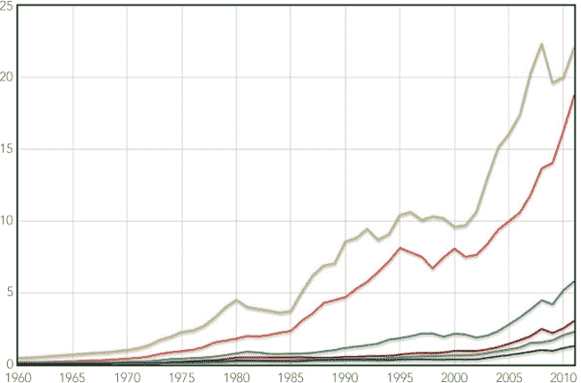 图 2-1. Flot 仅使用默认选项即可很好地显示静态折线图。

看起来我们已经很好地捕获并展示了数据的静态版本，因此我们可以进入下一阶段。

### 步骤 5：添加控件

现在我们已经有了一个满意的图表，我们可以添加 HTML 控件与其进行交互。在这个例子中，我们的目标相对简单：用户应该能够选择在图表中显示哪些区域。我们将通过一组复选框为每个区域提供这个选项。以下是包含复选框的标记代码。

```
**<label><input** type="checkbox"**>** East Asia & Pacific**</label>**
**<label><input** type="checkbox"**>** Europe & Central Asia**</label>**
**<label><input** type="checkbox"**>** Latin America & Caribbean**</label>**
**<label><input** type="checkbox"**>** Middle East & North Africa**</label>**
**<label><input** type="checkbox"**>** South Asia**</label>**
**<label><input** type="checkbox"**>** Sub-Saharan Africa**</label>**
```

你可能会惊讶于我们将 `<input>` 控件放在 `<label>` 元素内。虽然这看起来有点不寻常，但几乎总是最好的做法。这样做时，浏览器会将对标签的点击解释为对控件的点击，而如果我们将标签和控件分开，它就会强迫用户点击微小的复选框本身才能产生效果。

在我们的网页中，我们希望将控件放在图表的右侧。我们可以通过创建一个包含 `<div>` 来实现，并让图表和控件在其中浮动（向左）。在我们调整布局时，最简单的方法是直接在 HTML 标记中添加样式。在生产环境中，你可能希望在外部样式表中定义样式。

```
**<div** id="visualization"**>**
    **<div** id="chart" style="width:500px;height:333px;float:left"**></div>**
    **<div** id="controls" style="float:left;"**>**
        **<label><input** type="checkbox"**>** East Asia & Pacific**</label>**
        **<label><input** type="checkbox"**>** Europe & Central Asia**</label>**
        **<label><input** type="checkbox"**>** Latin America & Caribbean**</label>**
        **<label><input** type="checkbox"**>** Middle East & North Africa**</label>**
        **<label><input** type="checkbox"**>** South Asia**</label>**
        **<label><input** type="checkbox"**>** Sub-Saharan Africa**</label>**
    **</div>**
**</div>**
```

我们还应该添加标题和说明，并将所有的 `<input>` 复选框默认设置为 `checked`。现在让我们看看图表，确保格式看起来没问题（图 2-2）。

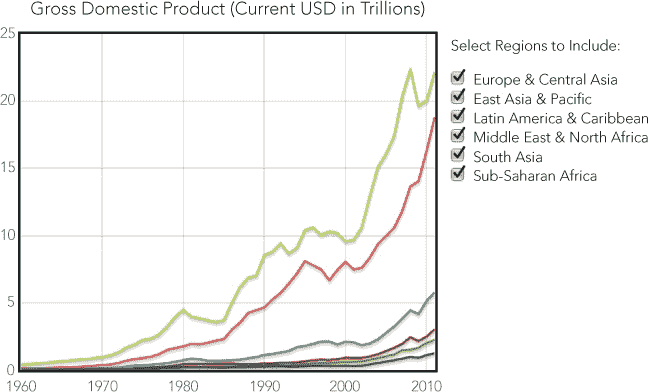图 2-2. 标准 HTML 可以创建图表交互控件。

现在我们看到控制项相对于图表在图 2-2 中的样子，我们可以验证它们是否对数据和交互模型都有意义。然而，我们的可视化缺少一个关键信息：它没有标明哪条线对应哪个区域。对于静态可视化，我们可以简单地使用 Flot 库向图表添加图例，但这种方法在这里并不理想。你可以在图 2-3 中看到这个问题，因为图例看起来与交互控件相似，容易造成混淆。

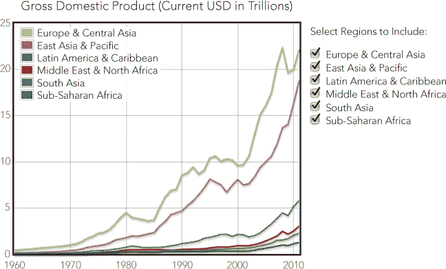图 2-3. Flot 库的标准图例与图表样式不匹配。

我们可以通过将图例和交互控件结合起来，消除视觉上的混乱。如果我们添加颜色框来标识图表线条，复选框控件将作为图例。

我们可以使用 HTML `<span>` 标签和一些样式来添加这些彩色框。这是一个带有内联样式的复选框标记代码。（对于完整的网页实现，可能更好地通过在外部样式表中定义大部分样式来组织。）

```
**<label** class="checkbox"**>**
    **<input** type="checkbox" checked**>**
    **<span** style="background-color:rgb(237,194,64);height:0.9em;
                 width:0.9em;margin-right:0.25em;display:inline-block;"**/>**
    East Asia & Pacific
**</label>**
```

除了背景色之外，`<span>` 还需要一个明确的大小，我们使用 `inline-block` 值作为 `display` 属性，以强制浏览器显示该 span，即使它没有内容。如您所见，我们使用 `em` 而不是像素来定义块的大小。由于 `em` 会随着文本大小自动缩放，因此即使用户在页面上缩放，颜色块也会与文本标签大小匹配。

在浏览器中快速检查可以验证各种元素是否有效地结合在一起（图 2-4）。

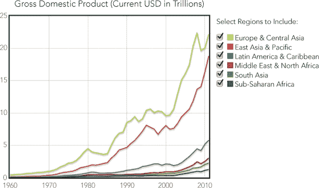图 2-4. 交互控制也可以作为图表元素，如图例。

看起来相当不错，现在我们可以继续进行交互部分的开发了。

### 步骤 6：定义交互数据结构

现在一般布局看起来不错，我们可以回到 JavaScript。首先，我们需要扩展数据以跟踪交互状态。我们不再将数据存储为简单的数值数组，而是使用一个对象数组。每个对象将包含相应的数据值以及其他属性。

```
**var** source = [
    { data: eas, show: **true**, color: "#FE4C4C", name: "East Asia & Pacific" },
    { data: ecs, show: **true**, color: "#B6ED47", name: "Europe & Central Asia" },
    { data: lcn, show: **true**, color: "#2D9999",
      name: "Latin America & Caribbean" },
    { data: mea, show: **true**, color: "#A50000",
      name: "Middle East & North Africa" },
    { data: sas, show: **true**, color: "#679A00", name: "South Asia" },
    { data: ssf, show: **true**, color: "#006363", name: "Sub-Saharan Africa" }
];
```

每个对象都包含一个区域的数据点，同时也为我们提供了一个地方来定义附加属性，包括系列标签和其他状态信息。我们想要跟踪的一个属性是系列是否应该包含在图表中（使用键 `show`）。我们还需要为每条线指定颜色；否则，Flot 库会根据同时可见的区域数量动态选择颜色，这样我们就无法将颜色与控制图例匹配。

### 步骤 7：根据交互状态确定图表数据

当我们调用 `plot()` 来绘制图表时，需要传入一个包含数据系列和每个区域颜色的对象。`source` 数组包含我们需要的信息，但它还包含其他信息，可能会导致 Flot 行为异常。我们希望向 `plot` 函数传递一个更简单的对象。例如，东亚与太平洋系列将这样定义：

```
{
    data:  eas,
    color: "#E41A1C"
}
```

我们还希望确保只显示用户选择的区域数据。这可能只是完整数据集的一个子集。这两项操作——将数组元素转换（在这种情况下，转换为更简单的对象）和过滤数组以获取子集——是可视化中非常常见的需求。幸运的是，jQuery 提供了两个实用函数，使得这两个操作变得非常简单：`$.map()` 和 `$.grep()`。

`.grep()` 和 `.map()` 都接受两个参数。第一个参数是一个数组，或者更准确地说，是一个“类似数组”的对象。它可以是一个 JavaScript 数组，也可以是另一个看起来并且像数组一样工作的 JavaScript 对象。（这里有技术上的区别，但我们无需担心。）第二个参数是一个对数组元素逐一操作的函数。对于 `.grep()`，该函数返回 `true` 或 `false`，以相应地过滤掉元素。对于 `.map()`，该函数返回一个转换后的对象，替换数组中的原始元素。图 2-5 显示了这些函数如何将初始数据转换为最终的数据数组。

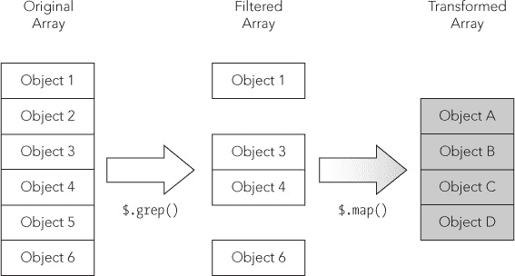图 2-5. jQuery 库提供了帮助转换和过滤数据的实用函数。

一步一步来看，以下是如何从响应中过滤掉无关数据的过程。我们使用 `.grep()` 来检查源数据中的 `show` 属性，以便返回一个只包含 `show` 设置为 `true` 的对象的数组。

```
$.grep(
    source,
    **function** (obj) { **return** obj.show; }
)
```

以下是如何转换元素以保留相关属性：

```
$.map(
    source,
    **function** (obj) { **return** { data: obj.data, color: obj.color }; }
)
```

不需要将这些步骤分开。我们可以将它们组合成一个简洁的表达式，如下所示：

```
$.map(
    $.grep(
        source,
        **function** (obj) { **return** obj.show; }
    ),
    **function** (obj) { **return** { data: obj.data, color: obj.color }; }
)
```

该表达式进而将输入数据提供给 Flot 的 `plot()` 函数。

### 第 8 步：使用 JavaScript 添加控件

现在我们的新数据结构可以提供图表输入，让我们用它来将复选框控件也添加到页面中。jQuery 的 `.each()` 函数是一种方便的方式，可以遍历区域数组。它的参数包括一个对象数组和一个在数组中的每个对象上执行的函数。该函数有两个参数，分别是数组索引和数组对象。

```
$.each(source, **function**(idx, region) {
    **var** input = $("<input>").attr("type","checkbox").attr("id","chk-"+idx);
    **if** (region.show) {
        $(input).prop("checked",**true**);
    }
    **var** span = $("<span>").css({
        "background-color": region.color,
        "display":          "inline-block",
        "height":           "0.9em",
        "width":            "0.9em",
        "margin-right":     "0.25em",
    });
    **var** label = $("<label>").append(input).append(span).append(region.name);
    $("#controls").append(label);
});
```

在迭代函数中，我们做了四件事。首先，我们创建了复选框 `<input>` 控件。如你所见，我们给每个控件分配了一个唯一的 `id` 属性，组合了 `chk-` 前缀和源数组索引。如果图表显示该区域，则控件的 `checked` 属性设置为 `true`。接着，我们为颜色块创建了一个 `<span>` 元素。我们使用 `css()` 函数设置了所有样式，包括该区域的颜色。第三个元素是我们在函数中创建的 `<label>` 元素。我们将复选框 `<input>` 控件、颜色块 `<span>` 和区域名称添加到该元素中。最后，我们将 `<label>` 元素添加到文档中。

请注意，我们没有直接将中间元素（如 `<input>` 或 `<span>`）添加到文档中。相反，我们使用局部变量构建这些元素。然后，我们将局部变量组装成最终的完整 `<label>` 并将其添加到文档中。这种方法显著提高了网页的性能。每次 JavaScript 代码向文档中添加元素时，网页浏览器都需要重新计算页面的外观。对于复杂的页面来说，这可能需要一些时间。通过在将元素添加到文档之前先进行组装，我们只需要强制浏览器为每个区域执行一次该计算。（你还可以通过将所有区域合并为一个局部变量，并只将该单个局部变量添加到文档中来进一步优化性能。）

如果我们将用来绘制图表的 JavaScript 与用来创建控件的 JavaScript 结合起来，我们只需要一个骨架的 HTML 结构。

```
**<div** id="visualization"**>**
    **<div** id="chart" style="width:500px;height:333px;float:left"**></div>**
    **<div** id="controls" style="float:left;"**>**
        **<p>**Select Regions to Include:**</p>**
    **</div>**
**</div>**
```

我们的奖励是图 2-6 中的可视化——与图 2-4 中显示的相同——但这一次我们使用 JavaScript 动态创建了它。

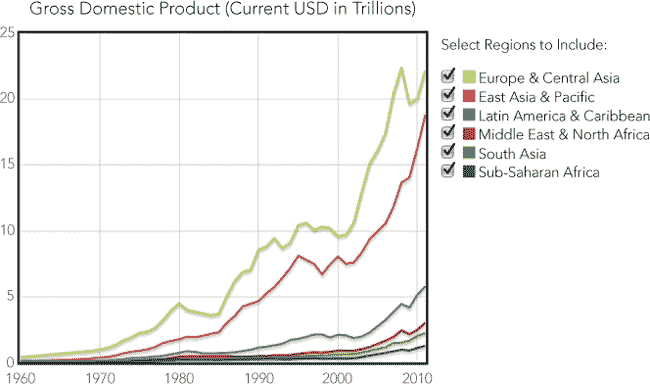图 2-6. 设置图表选项确保数据与图例匹配。

### 第 9 步：响应交互控件

当然，我们还没有添加任何交互功能，但我们快完成了。我们的代码只需要监听控件的点击事件，并适当地重新绘制图表。由于我们方便地为每个复选框设置了以 `chk-` 开头的 `id` 属性，所以很容易监听到正确的事件。

```
$("input[id^='chk-']").click(**function**(ev) {
    *// Handle the click*
})
```

当代码检测到点击时，它应该判断点击了哪个复选框，切换数据源的 `show` 属性，并重新绘制图表。我们可以通过跳过事件目标 `id` 属性中的四个字符的 `chk-` 前缀来找到具体的区域。

```
idx = ev.target.id.substr(4);
source[idx].show = !source[idx].show
```

重新绘制图表需要对 `plot()` 返回的图表对象进行几次调用。我们重置数据，然后告诉库重新绘制图表。

```
plotObj.setData(
    $.map(
        $.grep(source, **function** (obj) { **return** obj.show; }),
        **function** (obj) { **return** { data: obj.data, color: obj.color }; }
    )
);
plotObj.draw();
```

就这样。我们最终得到了一个完全交互式的地区国内生产总值可视化，如图 2-7 所示。

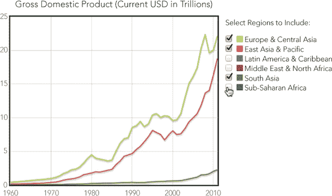图 2-7. 交互式图表让用户控制可视化效果。

我们创建的可视化比静态图表更有效地吸引用户。用户仍然可以看到整体情况，但交互控件让他们能够关注对他们来说特别重要或有趣的数据方面。

这种实现仍然存在潜在的问题。两个数据集（欧洲和东亚与太平洋）主导了图表。当用户取消选择这些区域时，剩余的数据被限制在图表的底部，图表的大部分区域被浪费。你可以通过每次绘制图表时重新调整图表的比例来解决这个问题。为此，你需要在调用 `plotObj.draw()` 之前调用 `plotObj.setupGrid()`。另一方面，用户可能会觉得这种持续的重新缩放令人不安，因为它改变了整个图表，而不仅仅是他们选择的区域。在下一个示例中，我们将通过让用户完全控制两个轴的缩放来解决这类问题。

## 在图表上缩放

到目前为止，我们已经通过让用户选择显示哪些数据集，为用户提供了一些交互。但在许多情况下，你可能希望给他们更多控制，特别是当你展示大量数据而细节难以辨别时。如果用户看不到他们需要的细节，那么我们的可视化就失败了。幸运的是，我们可以通过让用户检查数据中的细节来避免这个问题。一种方法是允许用户在图表上进行缩放。

尽管 Flot 库在最基本的形式下不支持缩放，但至少有两个库扩展可以添加此功能：*选择* 插件和 *导航* 插件。导航插件有点像 Google 地图。它在图表的一个角落添加了一个类似指南针的控制，提供给用户用于平移或缩放显示的箭头和按钮。然而，这种界面对图表并不是特别有效。用户无法精确控制图表的平移或缩放量，这使得他们难以预见操作的效果。

选择插件提供了一个更好的界面。用户只需拖动鼠标选择他们想要缩放的图表区域。这种操作的效果更加直观，用户可以根据需要精确控制这些操作。然而，该插件确实有一个显著的缺点：它不支持触摸界面。

在本示例中，我们将介绍如何通过选择插件支持缩放的步骤。当然，适用于你自己网站和可视化的最佳方法会因情况而异。

### 步骤 1：准备页面

由于我们使用的是相同的数据，准备工作大部分与上一个示例相同。

```
   <!DOCTYPE html>
   **<html** lang="en"**>**
     **<head>**
       **<meta** charset="utf-8"**>**
       **<title></title>**
     **</head>**
     **<body>**
       *<!-- Content goes here -->*
       *<!--[if lt IE 9]><script src="js/excanvas.min.js"></script><![endif]-->*
       **<script** src="//cdnjs.cloudflare.com/ajax/libs/jquery/1.8.3/jquery.min.js"**>**
       **</script>**
       **<script** src="//cdnjs.cloudflare.com/ajax/libs/flot/0.7/jquery.flot.min.js"**>**
       **</script>**
➊     **<script** src="js/jquery.flot.selection.js"**></script>**
     **</body>**
   **</html>**
```

如你所见，我们确实需要将选择插件添加到页面中。它在常见的 CDN 上不可用，因此我们将其托管在自己的服务器上，如 ➊ 所示。

### 步骤 2：绘制图表

在添加任何交互性之前，让我们回到一个基本的图表。这一次，我们将在图表内部添加一个图例，因为我们不会在图表旁边包含复选框。

```
$(**function** () {
    $.plot($("#chart") [
        { data: eas, label: "East Asia & Pacific" },
        { data: ecs, label: "Europe & Central Asia" },
        { data: lcn, label: "Latin America & Caribbean" },
        { data: mea, label: "Middle East & North Africa" },
        { data: sas, label: "South Asia" },
        { data: ssf, label: "Sub-Saharan Africa" }
    ], {legend: {position: "nw"}});
});
```

在这里，我们调用了 jQuery 扩展`plot`（来自 Flot 库），并传递了三个参数。第一个参数指定了应该包含图表的 HTML 元素，第二个参数提供了数据，数据是一个数据系列数组。这些系列包含了我们之前定义的区域，以及一个标识每个系列的标签。最后一个参数指定了图表的选项。为了简化示例，我们只包括一个选项，它告诉 Flot 将图例放置在图表的左上（西北）角。

图 2-8 显示了生成的图表。

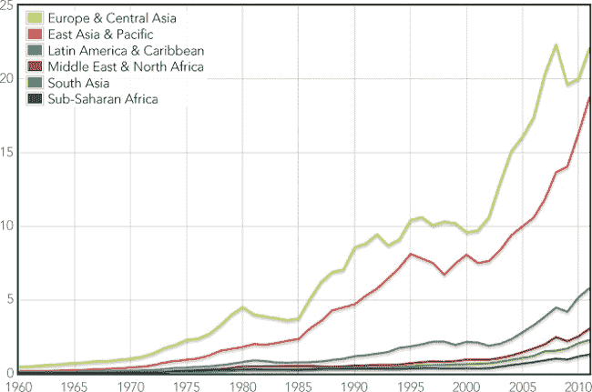 图 2-8. 大多数交互式图表的起点是一个好的静态图表。

看起来我们已经成功地静态展示了数据，因此可以进入下一个阶段。

### 第 3 步：准备数据以支持交互

现在我们有了一个可工作的静态图表，我们可以规划如何支持交互。作为该支持的一部分，并且为了方便起见，我们将所有传递给`plot()`的参数存储在本地变量中。

```
➊ **var** $el = $("#chart"),
➋     data = [
           { data: eas, label: "East Asia & Pacific" },
           { data: ecs, label: "Europe & Central Asia" },
           { data: lcn, label: "Latin America & Caribbean" },
           { data: mea, label: "Middle East & North Africa" },
           { data: sas, label: "South Asia" },
           { data: ssf, label: "Sub-Saharan Africa" }
       ],
➌     options = {legend: {position: "nw"}};

➍ **var** plotObj = $.plot($el, data, options);
```

在我们调用`plot()`之前，我们创建了变量`$el` ➊、`data` ➋和`options` ➌。我们还需要在 ➍ 保存从`plot()`返回的对象。

### 第 4 步：准备接受交互事件

我们的代码还需要准备处理交互事件。选择插件通过触发自定义的`plotselected`事件来传达用户的操作，这些事件作用于包含图表的元素。为了接收这些事件，我们需要一个函数，它期望两个参数——标准的 JavaScript 事件对象和一个包含选择详细信息的自定义对象。我们稍后会讨论如何处理该事件。现在我们先关注如何为它做准备。

```
$el.on("plotselected", **function**(ev, ranges) {
    *// Handle selection events*
});
```

jQuery 的`.on()`函数将一个函数分配给一个任意事件。事件可以是标准的 JavaScript 事件，如`click`，也可以是我们正在使用的自定义事件。感兴趣的事件是`.on()`的第一个参数。第二个参数是处理该事件的函数。如前所述，它也接受两个参数。

现在，我们可以考虑当函数接收到事件时，我们希望执行的操作。`ranges`参数包含`xaxis`和`yaxis`对象，它们包含关于`plotselected`事件的信息。在这两个对象中，`from`和`to`属性指定了用户选择的区域。为了缩放到该选择区域，我们只需使用这些范围来重新绘制图表的坐标轴。

为了重新绘制图表并指定轴，我们需要将新的选项传递给`plot()`函数，但我们希望保留已经定义的选项。jQuery 的`.extend()`函数为我们提供了完美的工具来完成这个任务。该函数合并 JavaScript 对象，使得结果包含每个对象中的所有属性。如果对象中可能包含其他对象，我们需要告诉 jQuery 在执行合并时使用“深度”模式。以下是完整的`plot()`调用，我们将其放入`plotselected`事件处理程序中。

```
plotObj = $.plot($el, data,
    $.extend(**true**, {}, options, {
        xaxis: { min: ranges.xaxis.from, max: ranges.xaxis.to },
        yaxis: { min: ranges.yaxis.from, max: ranges.yaxis.to }
    })
);
```

当我们使用`.extend()`时，第一个参数（`true`）请求深度模式，第二个参数指定起始对象，后续的参数指定要合并的其他对象。我们从一个空对象（`{}`）开始，合并常规选项，然后进一步合并缩放图表的轴选项。

### 第 5 步：启用交互

由于我们在页面上包含了选择插件库，激活交互变得非常简单。我们只需在调用`plot()`时添加一个额外的`selection`选项。其`mode`属性指示图表将支持的选择方向。可能的值包括`"x"`（仅限 x 轴）、`"y"`（仅限 y 轴）或`"xy"`（同时支持两个轴）。以下是我们希望使用的完整`options`变量。

```
**var** options = {
    legend: {position: "nw"},
    selection: {mode: "xy"}
};
```

有了这个添加功能，我们的图表现在是交互式的。用户可以缩放以查看任何他们想要的细节。不过有一个小问题：我们的可视化并没有提供一种方式让用户缩小视图。显然，我们不能使用选择插件来缩小视图，因为那需要用户选择当前图表区域之外的内容。相反，我们可以在页面上添加一个按钮来重置缩放级别。

```
   <!DOCTYPE html>
   **<html** lang="en"**>**
     **<head>**
       **<meta** charset="utf-8"**>**
       **<title></title>**
     **</head>**
     **<body>**
       **<div** id="chart" style="width:600px;height:400px;"**></div>**
➊     **<button** id="unzoom"**>**Reset Zoom**</button>**
       *<!--[if lt IE 9]><script src="js/excanvas.min.js"></script><![endif]-->*
       **<script** src="//cdnjs.cloudflare.com/ajax/libs/jquery/1.8.3/jquery.min.js"**>**
       **</script>**
       **<script** src="//cdnjs.cloudflare.com/ajax/libs/flot/0.7/jquery.flot.min.js"**>**
       **</script>**
       **<script** src="js/jquery.flot.selection.js"**></script>**
     **</body>**
   **</html>**
```

你可以在标记中看到按钮的位置在 ➊；它就在包含图表的`<div>`之后。

现在我们只需要添加代码来响应用户点击按钮的操作。幸运的是，这段代码非常简单。

```
$("#unzoom").click(**function**() {
    plotObj = $.plot($el, data, options);
});
```

在这里，我们使用 jQuery 设置了一个点击处理程序，并使用原始选项重新绘制图表。我们不需要任何事件数据，因此我们的事件处理函数甚至不需要参数。

这样我们就得到了一个完整的交互式可视化。用户可以缩放到任何细节级别，并通过点击一次恢复原始缩放。你可以在图 2-9 中看到交互效果。

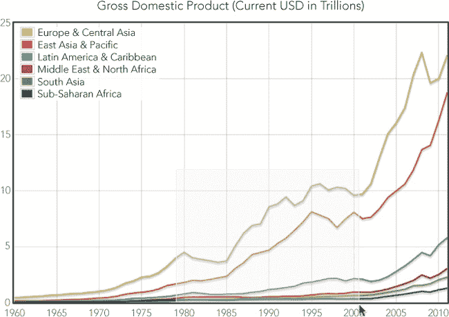图 2-9. 交互式图表让用户专注于与他们需求相关的数据。

图 2-10 展示了用户缩放后看到的内容。

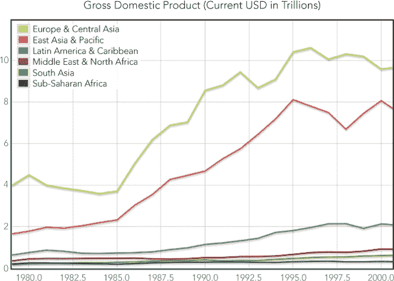图 2-10. 用户可以缩放到特别感兴趣的部分。

如果你尝试这个示例，你会很快发现用户不能选择包括图例在内的图表区域。这对于你的可视化来说可能没问题，但如果不行，最简单的解决方法是创建你自己的图例，并将其放置在图表画布外面，就像我们在本章第一个示例中所做的那样。

## 跟踪数据值

我们使可视化交互式的一个主要原因是为了让用户控制他们查看数据的方式。我们可以展示数据的“整体视图”，但我们并不想阻止用户深入挖掘细节。然而，通常情况下，这会迫使用户做出“二选一”的选择：他们可以看到整体视图，或者可以看到详细的图像，但不能同时看到两者。这个示例展示了一种替代方法，使用户能够同时看到整体趋势和具体细节。为此，我们利用鼠标作为输入设备。当用户的鼠标悬停在图表的某一部分时，我们的代码会叠加显示与该部分相关的细节。

这种方法确实有一个显著的限制：它仅在用户有鼠标时有效。如果你考虑使用这种技术，请注意，触摸屏设备上的用户将无法利用互动功能；他们只能看到静态图表。

由于简单的 GDP 数据并不适合本示例中的方法，我们将可视化世界银行的另一组稍微不同的数据。这次我们将查看出口占 GDP 的百分比。让我们从考虑一个简单的折线图开始，见图 2-11，该图展示了每个世界地区的数据。

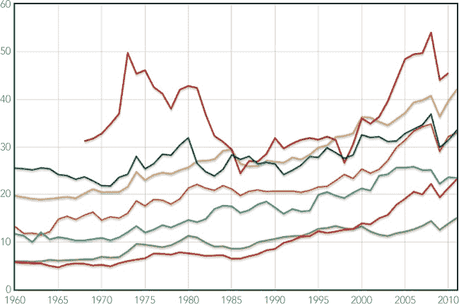图 2-11. 在单个图表上绘制多个数据集可能会让用户感到困惑。

这个图表有几个不足之处。首先，许多系列的值相似，导致一些图表的线条互相交叉。这种交叉使得用户难以紧跟单一系列的变化，去查看详细的趋势。其次，用户很难在同一时间点上比较所有地区的具体数值。大多数图表库，包括 Flot，都提供了当用户将鼠标悬停在图表上时显示数值的选项，但这种方式一次只显示一个数值。我们希望给用户提供一个机会，能够比较多个地区的数值。

在本示例中，我们将采用两阶段方法来解决这两个问题。首先，我们将把可视化从一个包含多个系列的单一图表更改为多个图表，每个图表只包含一个系列。这样可以将每个地区的数据隔离开来，更容易看到某一特定地区的趋势。然后，我们将添加一个跨所有图表的高级鼠标追踪功能。该功能允许用户同时查看所有图表中的单个数值。

### 步骤 1：预留一个`<div>`元素来承载图表

在我们的文档中，我们需要创建一个`<div>`元素，用来包含我们将要构建的图表。这个元素不会直接包含图表；相反，我们将在其中放置其他`<div>`元素，每个`<div>`将包含一个图表。

```
   <!DOCTYPE html>
   **<html** lang="en"**>**
     **<head>**
       **<meta** charset="utf-8"**>**
       **<title></title>**
     **</head>**
     **<body>**
➊     **<div** id="charts"**></div>**
       *<!--[if lt IE 9]><script src="js/excanvas.min.js"></script><![endif]-->*
       **<script** src="//cdnjs.cloudflare.com/ajax/libs/jquery/1.8.3/jquery.min.js"**>**
       **</script>**
       **<script** src="//cdnjs.cloudflare.com/ajax/libs/flot/0.7/jquery.flot.min.js"**>**
       **</script>**
     **</body>**
   **</html>**
```

`"charts" <div>`元素在➊处添加。我们在这里还包括了所需的 JavaScript 库，和之前的示例一样。

我们将使用 JavaScript 创建图表的`<div>`元素。这些元素必须有明确的高度和宽度，否则 Flot 将无法构建图表。你可以在 CSS 样式表中指定元素的大小，或者在创建`<div>`时直接定义（如下例所示）。这将创建一个新的`<div>`，设置其宽度和高度，保存其引用，然后将其附加到文档中已经存在的包含`<div>`中。

```
$.each(exports, **function**(idx,region) {
    **var** div = $("<div>").css({
        width: "600px",
        height: "60px"
    });
    region.div = div;
    $("#charts").append(div);
});
```

为了遍历地区数组，我们使用了 jQuery 的`.each()`函数。该函数接受两个参数：一个对象数组（`exports`）和一个函数。它一次迭代数组中的一个对象，调用该函数，并将单个对象（`region`）及其索引（`idx`）作为参数传递。

### 步骤 2：准备数据

我们将在下一节看到如何直接从世界银行的 Web 服务获取数据，但目前我们保持简单，假设我们已经下载并将数据格式化为 JavaScript 格式。（再次强调，这里只展示了部分代码，书中的源代码包含了完整的数据集。）

```
**var** exports = [
    { label: "East Asia & Pacific",
      data: [[1960,13.2277],[1961,11.7964], *// Data continues...*
    { label: "Europe & Central Asia",
      data: [[1960,19.6961],[1961,19.4264], *// Data continues...*
    { label: "Latin America & Caribbean",
      data: [[1960,11.6802],[1961,11.3069], *// Data continues...*
    { label: "Middle East & North Africa",
      data: [[1968,31.1954],[1969,31.7533], *// Data continues...*
    { label: "North America",
      data: [[1960,5.9475],[1961,5.9275], *// Data continues...*
    { label: "South Asia",
      data: [[1960,5.7086],[1961,5.5807], *// Data continues...*
    { label: "Sub-Saharan Africa",
      data: [[1960,25.5083],[1961,25.3968], *// Data continues...*
];
```

`exports`数组包含每个地区的一个对象，每个对象包含一个标签和一个数据系列。

### 步骤 3：绘制图表

由于每个图表的`<div>`元素已经在我们的页面上就位，我们可以使用 Flot 的`plot()`函数来绘制图表。该函数接受三个参数：包含元素（我们刚才创建的元素）、数据和图表选项。首先，让我们看一下没有任何装饰——例如标签、网格或勾选标记——的图表，确保数据以我们期望的方式展示。

```
$.each(exports, **function**(idx,region) {
    region.plot = $.plot(region.div, [region.data], {
        series: {lines: {fill: **true**, lineWidth: 1}, shadowSize: 0},
        xaxis: {show: **false**, min:1960, max: 2011},
        yaxis: {show: **false**, min: 0, max: 60},
        grid:  {show: **false**},
    });
});
```

上述代码使用了几个`plot()`选项，去除了图表的多余部分，并按照我们希望的方式设置了坐标轴。我们逐一来看每个选项。

+   ****`series`****。告诉 Flot 我们希望如何绘制数据系列。在我们的例子中，我们想要一个线形图（这是默认类型），但是我们希望填充从线到 x 轴的区域，所以我们将`fill`设置为`true`。这个选项会创建一个区域图，而不是线形图。因为我们的图表非常短，区域图可以使数据更加可见。出于同样的原因，我们希望线条本身尽可能小，以便匹配，因此我们将`lineWidth`设置为`1`（像素），同时通过将`shadowSize`设置为`0`来去除阴影。

+   ****`xaxis`****。定义 x 轴的属性。我们不想在这些图表中包含 x 轴，所以我们将`show`设置为`false`。然而，我们确实需要明确设置轴的范围。如果不这样做，Flot 会自动创建一个，使用每个系列的范围。由于我们的数据在所有年份中的值并不一致（例如，中东和北非数据集在 1968 年之前没有数据），我们需要确保 Flot 在所有图表中使用完全相同的 x 轴范围，因此我们指定了从`1960`到`2011`的范围。

+   ****`yaxis`****。与`xaxis`选项类似。我们不想显示 y 轴，但我们确实需要指定一个明确的范围，以确保所有图表的一致性。

+   ****`grid`****。告诉 Flot 如何在图表中添加网格线和勾选标记。目前，我们不希望图表中有任何额外的内容，所以我们通过将`show`设置为`false`来完全关闭网格。

我们可以在图 2-12 中检查结果，确保图表如我们所愿地显示出来。

图 2-12。将单独的数据集分成多个图表可以更容易地看到每个数据集的细节。

接下来，我们转向图表的装饰。显然，我们缺少每个区域的标签，但添加它们需要一些小心。你可能首先想到的是将图例与每个图表一起包含在同一个`<div>`中。然而，如果我们能将所有图表——并且仅仅是图表——放在各自的`<div>`中，Flot 的事件处理将会更好。因此，这将需要对我们的标记进行一些重构。我们将创建一个包装`<div>`，然后将图表和图例的单独`<div>`放置在其中。我们可以使用 CSS 的`float`属性来将它们并排放置。

```
**<div** id="charts-wrapper"**>**
    **<div** id="charts" style="float:left;"**></div>**
    **<div** id="legends" style="float:left;"**></div>**
    **<div** style="clear:both;"**></div>**
**</div>**
```

当我们创建每个图例时，我们必须确保它的高度与图表完全一致。由于我们明确设置了这两个值，因此这并不难做到。

```
$.each(exports, **function**(idx,region) {
    **var** legend = $("<p>").text(region.label).css({
        "height":        "17px",
        "margin-bottom": "0",
        "margin-left":   "10px",
        "padding-top":   "33px"
    });
    $("#legends").append(legend);
});
```

我们再次使用`.each`，这次是将每个区域的图例添加到`legends`元素中。

现在我们想要添加一个贯穿所有图表的连续垂直网格线。因为这些图表是堆叠的，只要我们能够去除图表之间的任何边框或外边距，单个图表中的网格线就可以显示为一条连续的线。实现这一点需要几个`plot()`选项，如下所示。

```
$.plot(region.div, [region.data], {
    series: {lines: {fill: **true**, lineWidth: 1}, shadowSize: 0},
    xaxis:  {show: **true**, labelHeight: 0, min:1960, max: 2011,
             tickFormatter: **function**() {**return** "";}},
    yaxis:  {show: **false**, min: 0, max: 60},
    grid:   {show: **true**, margin: 0, borderWidth: 0, margin: 0,
             labelMargin: 0, axisMargin: 0, minBorderMargin: 0},
});
```

我们通过将`grid`选项的`show`属性设置为`true`来启用网格。然后，通过将各种宽度和边距设置为`0`来去除所有边框和内边距。为了显示垂直线，我们还需要启用 x 轴，因此我们也将其`show`属性设置为`true`。但是，我们不希望在单个图表上显示任何标签，所以我们将`labelHeight`指定为`0`。为了确保没有标签出现，我们还定义了一个`tickFormatter()`函数，它返回一个空字符串。

我们想要添加的最后一些装饰是位于底部图表下方的 x 轴标签。为了做到这一点，我们可以创建一个没有可见数据的虚拟图表，将该虚拟图表放在底部图表下方，并启用其 x 轴的标签。以下三个部分将创建一个虚拟数据数组，创建一个`<div>`来容纳虚拟图表，并绘制该虚拟图表。

```
**var** dummyData = [];
**for** (**var** yr=1960; yr<2012; yr++) dummyData.push([yr,0]);

**var** dummyDiv = $("<div>").css({ width: "600px", height: "15px" });
$("#charts").append(dummyDiv);

**var** dummyPlot = $.plot(dummyDiv, [dummyData], {
    xaxis: {show: **true**, labelHeight: 12, min:1960, max: 2011},
    yaxis: {show: **false**, min: 100, max: 200},
    grid:  {show: **true**, margin: 0, borderWidth: 0, margin: 0,
            labelMargin: 0, axisMargin: 0, minBorderMargin: 0},
});
```

通过这些额外的装饰，我们在图 2-13 中的图表看起来很棒。

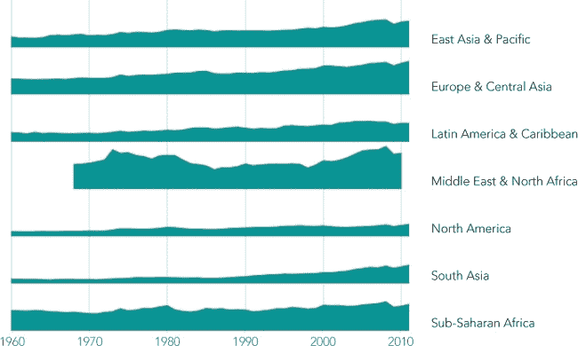图 2-13。小心地堆叠多个图表可以创建统一图表的外观。

### 第 4 步：实现交互

对于我们的可视化，我们想要跟踪鼠标在任何图表上的悬停情况。Flot 库使得这变得相对容易。`plot()`函数的`grid`选项包括`hoverable`属性，默认值为`false`。如果将此属性设置为`true`，Flot 会在鼠标移动到图表区域时触发`plothover`事件，并将这些事件发送到包含图表的`<div>`中。如果有代码在监听这些事件，代码就可以对其作出响应。如果使用此功能，Flot 还会高亮显示距离鼠标最近的数据点。我们不希望这种行为，因此我们将通过将`autoHighlight`设置为`false`来禁用它。

```
$.plot(region.div, [region.data], {
    series: {lines: {fill: **true**, lineWidth: 1}, shadowSize: 0},
    xaxis:  {show: **true**, labelHeight: 0, min: 1960, max: 2011,
             tickFormatter: **function**() {**return** "";}},
    yaxis:  {show: **false**, min: 0, max: 60},
    grid:   {show: **true**, margin: 0, borderWidth: 0, margin: 0,
             labelMargin: 0, axisMargin: 0, minBorderMargin: 0,
             hoverable: **true**, autoHighlight: **false**},
});
```

现在我们已经告诉 Flot 在所有图表上触发事件，你可能会认为我们需要为所有图表设置代码来监听事件。不过，还有一种更好的方法。我们将标记结构化，使得所有的图表——并且只有图表——都位于包含它们的`charts <div>`中。在 JavaScript 中，如果没有代码在特定的文档元素上监听事件，那么这些事件会自动“冒泡”到包含它们的元素。所以，如果我们只在`charts <div>`上设置一个事件监听器，就可以捕捉到所有单个图表的`plothover`事件。我们还需要知道何时鼠标离开图表区域。我们可以使用标准的`mouseout`事件来捕获这些事件，如下所示：

```
$("charts").on("plothover", **function**() {
    *// The mouse is hovering over a chart*
}).on("mouseout", **function**() {
    *// The mouse is no longer hovering over a chart*
});
```

为了响应`plothover`事件，我们希望在所有图表上显示一条垂直线。我们可以使用一个带边框的`<div>`元素来构建这条线。为了让它能够移动，我们使用绝对定位。它还需要一个正的`z-index`值，以确保浏览器将其绘制在图表的上方。标记一开始是隐藏的，`display`属性为`none`。由于我们希望将标记放置在包含的`<div>`内，因此我们将包含的`<div>`的`position`属性设置为`relative`。

```
**<div** id="charts-wrapper" style="position:relative;"**>**
    **<div** id="marker" style="position:absolute;z-index:1;display:none;
                            width:1px;border-left: 1px solid black;"**></div>**
    **<div** id="charts" style="float:left;"**></div>**
    **<div** id="legends" style="float:left;"**></div>**
    **<div** style="clear:both;"**></div>**
**</div>**
```

当 Flot 调用监听`plothover`事件的函数时，它会传递三个参数：JavaScript 事件对象、鼠标位置（以 x 和 y 坐标表示），以及如果鼠标靠近某个数据点，关于该数据点的信息。在我们的示例中，我们只需要 x 坐标。我们可以将其四舍五入为最接近的整数，从而得到年份。我们还需要知道鼠标相对于页面的位置。如果我们调用任意一个图表对象的`pointOffset()`，Flot 会为我们计算这一点。注意，第三个参数只有在鼠标靠近实际数据点时才会提供，因此我们可以忽略它。

```
$("charts").on("plothover", **function**(ev, pos) {
    **var** year = Math.round(pos.x);
    **var** left = dummyPlot.pointOffset(pos).left;
});
```

一旦我们计算出位置，就可以简单地将标记移动到该位置，确保它覆盖整个包含`<div>`的高度，并将其显示出来。

```
   $("#charts").on("plothover", **function**(ev, pos) {
       **var** year = Math.round(pos.x);
       **var** left = dummyPlot.pointOffset(pos).left;
➊     **var** height = $("#charts").height();
       $("#marker").css({
           "top":    0,
➋         "left":   left,
           "width":  "1px",
➌         "height": height
       }).show();
   });
```

在这段代码中，我们在➊计算标记的高度，在➋设置标记的位置，并在➌设置高度。

我们还需要在`mouseout`事件上小心处理。如果用户将鼠标移到标记上方，这将触发`charts <div>`的`mouseout`事件。在这种特殊情况下，我们希望保留标记的显示。为了判断鼠标移动的位置，我们检查事件的`relatedTarget`属性。只有当`relatedTarget`不是标记本身时，我们才会隐藏标记。

```
$("#charts").on("mouseout", **function**(ev) {
    **if** (ev.relatedTarget.id !== "marker") {
        $("#marker").hide();
    }
});
```

在我们的事件处理过程中，仍然存在一个漏洞。如果用户将鼠标直接移到标记上方，然后完全离开图表区域（而不是离开标记），我们无法捕捉到鼠标不再悬停在图表上的事实。为了捕捉这一事件，我们可以监听标记本身的`mouseout`事件。无需担心鼠标是否离开标记并重新返回图表区域，因为现有的`plothover`事件会处理这种情况。

```
$("#marker").on("mouseout", **function**(ev) {
      $("#marker").hide();
});
```

我们交互的最后一部分显示了所有图表中与鼠标水平位置相对应的数值。我们可以在创建每个图表时，创建`<div>`来保存这些数值。因为这些`<div>`可能会延伸到图表区域之外，所以我们将它们放置在外部的`charts-wrapper <div>`中。

```
   $.each(exports, **function**(idx,region) {
       **var** value = $("<div>").css({
           "position":  "absolute",
           "top":       (div.position().top - 3) + "px",
➊         "display":   "none",
           "z-index":   1,
           "font-size": "11px",
           "color":     "black"
       });
       region.value = value;
       $("#charts-wrapper").append(value);
   });
```

注意，在创建这些`<div>`时，我们设置了除了左侧位置之外的所有属性，因为左侧位置会随鼠标的变化而变化。我们还将元素的`display`属性设置为`none`以隐藏它们，见➊。

在文档中等着我们的`<div>`中，我们的`plothover`事件处理程序会设置每个的文本，水平定位它们，并将它们显示在页面上。为了设置文本值，我们可以使用 jQuery 的`.grep()`函数在数据中搜索匹配的年份。如果没有找到，值`<div>`的文本将被清空。

```
$("#charts").on("plothover", **function**(ev, pos) {
    $.each(exports, **function**(idx, region) {
        matched = $.grep(region.data, **function**(pt) { **return** pt[0] === year; });
        **if** (matched.length > 0) {
            region.value.text(year + ": " + Math.round(matched[0][1]) + "%");
        } **else** {
            region.value.text("");
        }
        region.value.css("left", (left+4)+"px").show();
    });
});
```

最后，我们需要在鼠标离开图表区域时隐藏这些`<div>`。我们还应该处理鼠标直接移到标记上的情况，就像之前所做的那样。

```
$("#charts").on("plothover", **function**(ev, pos) {

    *// Handle plothover event*

}).on("mouseout", **function**(ev) {
    **if** (ev.relatedTarget.id !== "marker") {
        $("#marker").hide();
        $.each(exports, **function**(idx, region) {
            region.value.hide();
        });
    }
});

$("#marker").on("mouseout", **function**(ev) {
    $("#marker").hide();
    $.each(exports, **function**(idx, region) {
        region.value.hide();
    });
});
```

现在我们可以享受我们编码的成果，在图 2-14 中展示。我们的可视化明确了各个地区出口的趋势，并允许用户与图表互动，比较各地区并查看详细数值。

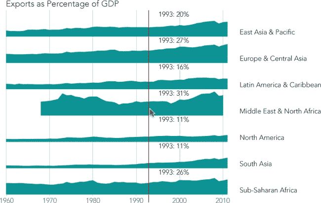图 2-14. 最终的可视化结合了多个图表和鼠标跟踪，更清晰地呈现数据。

当用户将鼠标移过图表时，垂直条也会随着移动。对应鼠标位置的数值也会出现在每个图表的标记右侧。这种交互使得比较各地区的数值变得简单且直观。

我们在这个例子中创建的图表类似于*小型多图*方法，允许用户比较多个数值。在我们的例子中，图表占据了整个页面，但它也可以设计为更大展示中的一个元素，比如一个表格。第三章提供了将图表集成到更大网页元素中的例子。

## 使用 AJAX 获取数据

本书中的大多数例子强调数据可视化的最终产品：用户看到的图形、图表或图像。但有效的可视化通常需要在幕后做大量的工作。毕竟，像数据可视化这样的有效展示既需要*数据*，也需要可视化。在这个例子中，我们关注了一种常见的数据访问方法——*异步 JavaScript 和 XML*，更常见的名称是*AJAX*。这里的例子详细描述了与世界银行的 AJAX 交互，但这里展示的通用方法和具体技术同样适用于网络上的许多其他数据源。

### 第一步：理解源数据

通常，处理远程数据时的第一个挑战是理解其格式和结构。幸运的是，我们的数据来自世界银行，并且其网站详细记录了其*应用程序编程接口（API）*。在这个例子中，我们不会花太多时间讨论细节，因为你可能会使用不同的数据源。不过，快速了解一下是很有帮助的。

第一个需要注意的是，世界银行将世界划分为多个区域。像所有优秀的 API 一样，世界银行 API 允许我们发出查询来获取这些区域的列表。

```
**http**://api.worldbank.org/regions/?format=json
```

我们的查询返回完整的列表，格式为 JSON 数组，起始部分如下所示：

```
 { "page": "1",
    "pages": "1",
    "per_page": "50",
    "total": "22"
  },
  [ { "id": "",
      "code": "ARB",
      "name": "Arab World"
    },
    { "id": "",
      "code": "CSS",
      "name": "Caribbean small states"
    },
    { "id": "",
      "code": "EAP",
      "name": "East Asia & Pacific (developing only)"
    },
    { "id": "1",
      "code": "EAS",
      "name": "East Asia & Pacific (all income levels)"
    },
    { "id": "",
      "code": "ECA",
      "name": "Europe & Central Asia (developing only)"
    },
    { "id": "2",
      "code": "ECS",
      "name": "Europe & Central Asia (all income levels)"
    },
```

数组中的第一个对象支持通过大量数据集进行分页，这对我们来说目前并不重要。第二个元素是一个包含我们所需信息的数组：区域列表。总共有 22 个区域，但许多区域是重叠的。我们希望从所有区域中选择，这样我们既能包含所有国家，又不会有一个国家出现在多个区域。符合这些标准的区域都方便地标记了一个`id`属性，因此我们只会选择那些`id`属性不为`null`的区域。

### 第 2 步：通过 AJAX 获取第一层数据

既然你已经了解了数据格式（到目前为止），接下来我们来写一些代码来获取数据。由于我们已经加载了 jQuery，我们将利用它的许多工具。让我们从最简单的实现开始，逐步构建完整的实现。

正如你可能预料到的，`$.getJSON()`函数将为我们完成大部分工作。使用该函数的最简单方式可能是如下所示：

```
   $.getJSON(
       "http://api.worldbank.org/regions/",
➊     {format: "json"},
       **function**(response) {
           *// Do something with response*
       }
   );
```

请注意，我们在查询中添加了`format: "json"`，以告诉世界银行我们希望的数据格式。如果没有这个参数，服务器会返回 XML，而`getJSON()`并不期望这种格式。

不幸的是，这段代码在当前提供世界银行数据的 Web 服务器上无法正常工作。实际上，这个问题在今天非常常见。正如 Web 上常见的情况，安全问题是导致这种复杂性的原因。请考虑我们正在建立的信息流，见[图 2-15。

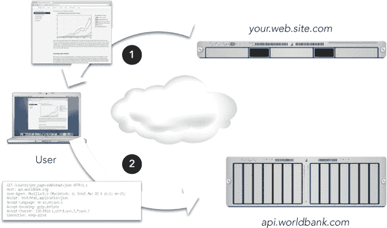图 2-15. 我们的服务器*(your.web.site.com)*向用户发送网页，包括脚本，而这些脚本在用户的浏览器中执行，查询世界银行网站(*api.worldbank.com*)。

使用 AJAX 获取数据通常需要三个不同系统的配合。

脚本与世界银行的通信对用户来说是不可见的，因此他们没有机会批准或拒绝交换。在世界银行的情况下，很难想象用户拒绝查询的任何理由，但如果我们的脚本正在访问用户的社交网络资料，或者更严重的是他们的在线银行账户呢？在这种情况下，用户的担忧是有正当理由的。由于通信对用户是不可见的，而且因为浏览器无法猜测哪些通信可能是敏感的，所以浏览器会简单地禁止所有此类通信。这个技术术语叫做*同源策略*。该策略意味着我们的服务器提供的网页无法直接访问世界银行的 JSON 接口。

一些网站通过在其响应中添加 HTTP 头来解决这个问题。该头部告诉浏览器，任何网页都可以安全地访问这些数据：

```
**Access-Control-Allow-Origin**: *
```

不幸的是，截至本文写作时，世界银行尚未实现该头部。这个选项相对较新，因此许多 Web 服务器都没有实现它。因此，为了在同源策略的约束下工作，我们依赖 jQuery 的帮助和一些小小的伎俩。这个技巧依赖于所有浏览器都承认的同源策略的一个例外：第三方 JavaScript 文件。浏览器确实允许网页从第三方服务器请求 JavaScript 文件（毕竟，像 Google Analytics 这样的服务就是通过这种方式工作的）。我们只需要让世界银行的响应数据看起来像是常规的 JavaScript，而不是 JSON。幸运的是，世界银行与我们在这一小小的欺骗上配合得很好。我们只需向请求中添加两个查询参数：

```
**?format**=jsonP**&**prefix=Getdata
```

`format` 参数的值为 `jsonP`，它告诉世界银行我们希望将响应格式化为*带填充的 JSON*，这是一种 JSON 的变体，同时也是常规 JavaScript。第二个参数 `prefix` 告诉世界银行接收数据的函数名称。（没有这个信息，世界银行生成的 JavaScript 将不知道如何与我们的代码进行通信。）这有点复杂，但 jQuery 为我们处理了大部分细节。唯一的难点是，我们必须在传递给 `.getJSON()` 的 URL 中添加 `?`*`something`*`=?`，其中 *`something`* 是 Web 服务要求的 JSONP 响应。世界银行期望 `prefix`，但更常见的值是 `callback`。

现在我们可以编写一些代码，这些代码可以与世界银行及许多其他 Web 服务器一起使用，尽管 `prefix` 参数是特定于世界银行的。

```
   $.getJSON(
➊     "http://api.worldbank.org/regions/?prefix=?",
➋     {format: "jsonp"},
       **function**(response) {
           *// Do something with response*
       }
   );
```

我们在 ➊ 处直接在 URL 中添加了 `prefix`，并在 ➋ 处将格式更改为 `jsonp`。

JSONP 确实有一个主要的缺点：服务器无法指示错误。这意味着我们应该花更多时间测试和调试任何 JSONP 请求，并且应该时刻警惕服务器的任何更改，这些更改可能导致之前正常工作的代码失败。最终，世界银行将更新其响应中的 HTTP 头（或许在本书出版时就会更新），到时我们可以切换到更健壮的 JSON 格式。

### 注意

**在撰写本文时，世界银行的 API 存在一个严重的 bug。服务器没有保留回调函数的大小写（大写与小写）。本示例的完整源代码包括了针对该 bug 的解决方法，但对于其他服务器，你不太可能需要这个。万一需要，你可以查看源代码中的注释，那里有完整的修复文档。**

现在让我们回到代码本身。在前面的代码片段中，我们直接在对 `.getJSON()` 的调用中定义了一个回调函数。你会在许多实现中看到这种代码结构。这当然是可行的，但如果我们继续沿着这条路走下去，事情很快就会变得非常混乱。在我们开始处理响应之前，已经添加了几层缩进。正如你可以猜到的，一旦我们收到这个初始响应，我们将需要发起更多请求来获取额外的数据。如果我们尝试将代码构建成一个单一的整体块，我们最终会有太多层缩进，以至于根本没有空间放实际的代码。更重要的是，结果将是一个庞大的互联代码块，理解起来非常困难，更不用说调试或扩展了。

幸运的是，jQuery 为我们提供了一个更好的方法工具：`$.Deferred` 对象。`Deferred` 对象充当事件的中央调度器和调度器。一旦创建了 `Deferred` 对象，我们代码的不同部分可以表明它们希望知道事件何时完成，而其他部分则通知事件的状态。`Deferred` 协调了这些不同的活动，使我们能够将触发和管理事件的方式与处理其后果的方式分开。

让我们来看一下如何使用 `Deferred` 对象改进我们的 AJAX 请求。我们的主要目标是将事件的启动（AJAX 请求）与处理其后果（处理响应）分开。通过这种分离，我们不需要将成功函数作为请求本身的回调参数。相反，我们将依赖于 `.getJSON()` 调用返回一个 `Deferred` 对象这一事实。（从技术上讲，函数返回的是一种限制形式的 `Deferred` 对象，称为 `promise`；不过现在这些区别对我们来说并不重要。）我们希望将返回的对象保存在一个变量中。

```
*// Fire off the query and retain the deferred object tracking it*
deferredRegionsRequest = $.getJSON(
    "http://api.worldbank.org/regions/?prefix=?",
    {format: "jsonp"}
);
```

这很简单直接。现在，在我们代码的其他部分，我们可以表示我们有兴趣知道 AJAX 请求何时完成。

```
deferredRegionsRequest.done(**function**(response) {
    *// Do something with response*
});
```

`Deferred` 对象的 `done()` 方法是关键。它指定了一个新函数，每当事件（在这里是 AJAX 请求）成功完成时，我们希望执行该函数。`Deferred` 对象处理了所有繁琐的细节。特别是，如果在我们通过 `done()` 注册回调时事件已经完成，`Deferred` 对象会立即执行该回调。否则，它会等待直到请求完成。我们还可以表示希望知道 AJAX 请求是否失败；对于这个需求，我们使用 `fail()` 方法而不是 `done()`。（即使 JSONP 不提供给服务器报告错误的方式，请求本身仍然可能失败。）

```
deferredRegionsRequest.fail(**function**() {
    *// Oops, our request for region information failed*
});
```

我们显然已将缩进减少到一个更易管理的级别，但我们也为代码创建了一个更好的结构。发起请求的函数与处理响应的代码是分开的。这种结构更清晰，修改和调试起来也更加容易。

### 步骤 3：处理第一层数据

现在让我们处理响应。分页信息与我们无关，因此我们可以跳过返回响应中的第一个元素，直接处理第二个元素。我们希望将这个数组分两步进行处理。

1.  过滤掉数组中与我们无关的元素。在本例中，我们只关心那些 `id` 属性不为 `null` 的地区。

1.  转换数组中的元素，使其仅包含我们关心的属性。在这个例子中，我们只需要 `code` 和 `name` 属性。

这听起来可能有些熟悉。事实上，这正是我们在本章第一个例子中需要做的事情。正如我们在那里看到的，jQuery 的 *`$`*`.map()` 和 *`$`*`.grep()` 函数是非常有用的工具。

一步一步来，这里是如何从响应中过滤掉无关数据的方法。

```
filtered = $.grep(response[1], **function**(regionObj) {
    **return** (regionObj.id !== **null**);
});
```

这里是如何转换元素，只保留相关属性的方式。既然我们已经在做这个了，不妨去掉世界银行在某些地区名称后附加的括号内容“（所有收入水平）”。我们所有的地区（那些有 `id` 的地区）都包含所有收入水平，因此这些信息是多余的。

```
regions = $.map(filtered, **function**(regionObj) {
        **return** {
            code: regionObj.code,
            name: regionObj.name.replace(" (all income levels)","")
        };
    }
);
```

不必将这些步骤分开。我们可以将它们结合成一个简洁的表达式。

```
deferredRegionsRequest.done(**function**(response) {
    regions = $.map(
        $.grep(response[1], **function**(regionObj) {
            **return** (regionObj.id !== **null**);
        }),
        **function**(regionObj) {
            **return** {
                code: regionObj.code,
                name: regionObj.name.replace(" (all income levels)","")
            };
        }
    );
});
```

### 步骤 4：获取真实数据

到目前为止，当然，我们所能获取的只是地区列表。这并不是我们想要可视化的数据。通常，通过基于 Web 的接口获取实际数据需要（至少）两个请求阶段。第一个请求仅提供后续请求所需的基本信息。在这种情况下，我们想要的实际数据是 GDP，因此我们需要遍历地区列表，并为每个地区检索该数据。

当然，我们不能盲目地发出第二组请求，即请求详细的地区数据。首先，我们必须等到获得地区列表。在第 2 步中，我们通过使用`.getJSON()`和`Deferred`对象来处理了一个类似的情况，将事件管理与处理分离。我们可以在这里使用相同的技术；唯一的区别是，我们必须创建自己的`Deferred`对象。

```
**var** deferredRegionsAvailable = $.Deferred();
```

稍后，当地区列表可用时，我们通过调用对象的`resolve()`方法来表示该状态。

```
deferredRegionsAvailable.resolve();
```

实际的处理由`done()`方法处理。

```
deferredRegionsAvailable.done(**function**() {
    *// Get the region data*
});
```

获取实际地区数据的代码当然需要地区列表。我们可以将该列表作为全局变量传递，但这会污染全局命名空间。（即使你已经正确命名了你的应用，为什么还要污染你自己的命名空间呢？）这个问题很容易解决。我们提供给`resolve()`方法的任何参数都会直接传递给`done()`函数。

让我们先看看整体情况，这样我们就能看到各个部分是如何配合的。

```
   *// Request the regions list and save status of the request in a Deferred object*
➊ **var** deferredRegionsRequest = $.getJSON(
       "http://api.worldbank.org/regions/?prefix=?",
       {format: "jsonp"}
   );

   *// Create a second Deferred object to track when list processing is complete*
➋ **var** deferredRegionsAvailable = $.Deferred();

   *// When the request finishes, start processing*
➌ deferredRegionsRequest.done(**function**(response) {
       *// When we finish processing, resolve the second Deferred with the results*
➍     deferredRegionsAvailable.resolve(
           $.map(
               $.grep(response[1], **function**(regionObj) {
                   **return** (regionObj.id != "");
               }),
               **function**(regionObj) {
                   **return** {
                       code: regionObj.code,
                       name: regionObj.name.replace(" (all income levels)","")
                   };
               }
           )
       );
   });
   deferredRegionsAvailable.done(**function**(regions) {
➎     *// Now we have the regions, go get the data*
   });
```

首先，从➊开始，我们请求地区列表。然后，在➋处，我们创建第二个`Deferred`对象来跟踪响应处理。在从➌开始的代码块中，我们处理初始请求的响应。最重要的是，在➍处，我们解析第二个`Deferred`对象，表示处理完成。最后，从➎开始，我们可以开始处理响应。

获取每个地区的实际 GDP 数据需要一个新的 AJAX 请求。正如你所料，我们将保存这些请求的`Deferred`对象，以便在响应可用时处理它们。jQuery 的`.each()`函数是一个方便的方式，可以遍历地区列表并启动这些请求。

```
   deferredRegionsAvailable.done(**function**(regions) {
       $.each(regions, **function**(idx, regionObj) {
           regionObj.deferredDataRequest = $.getJSON(
               "http://api.worldbank.org/countries/"
                  + regionObj.code
➊                + "/indicators/NY.GDP.MKTP.CD"
                  + "?prefix=?",
               { format: "jsonp", per_page: 9999 }
           );
       });
   });
```

每个请求 URL 中➊处的“`NY.GDP.MKTP.CD`”部分是世界银行的 GDP 数据代码。

只要我们在遍历各个地区，就可以加入处理 GDP 数据的代码。到现在为止，你应该不会对我们创建一个`Deferred`对象来跟踪处理完成的时机感到惊讶。处理本身将简单地将返回的响应（跳过分页信息后）存储在地区对象中。

```
   deferredRegionsAvailable.done(**function**(regions) {
       $.each(regions, **function**(idx, regionObj) {
           regionObj.deferredDataRequest = $.getJSON(
               "http://api.worldbank.org/countries/"
                  + regionObj.code
                  + "/indicators/NY.GDP.MKTP.CD"
                  + "?prefix=?",
               { format: "jsonp", per_page: 9999 }
           );
           regionObj.deferredDataAvailable = $.Deferred();
           regionObj.deferredDataRequest.done(**function**(response) {
➊             regionObj.rawData = response[1] || [];
               regionObj.deferredDataAvailable.resolve();
           });
       });
   });
```

注意，我们还在➊处添加了一个检查，以确保世界银行在响应中实际返回了数据。由于内部错误，它可能返回一个`null`对象，而不是数据数组。发生这种情况时，我们会将`rawData`设置为空数组，而不是`null`。

### 第 5 步：处理数据

现在我们已经请求了真实的数据，几乎可以开始处理它了。还有一个最后的难关要克服，而这个难关是我们熟悉的。我们不能在数据不可用之前开始处理，这就需要定义一个新的`Deferred`对象，并在数据完成时解析该对象。（现在你应该已经意识到`Deferred`对象有多么方便了。）

然而，有一个小小的变化。现在我们有多个请求在进行，每个区域一个请求。我们怎么知道所有这些请求何时完成呢？幸运的是，jQuery 提供了一个方便的解决方案，那就是 `.when()` 函数。该函数接受一组 `Deferred` 对象，并仅在所有对象都成功时才表示成功。我们只需要将这些 `Deferred` 对象的列表传递给 `.when()` 函数。

我们可以使用 `.map()` 函数组合一个 `Deferred` 对象数组，但 `.when()` 期望的是一个参数列表，而不是数组。JavaScript 标准中深藏着一种将数组转换为函数参数列表的技巧。我们不直接调用函数，而是执行 `.when()` 函数的 `apply()` 方法。该方法将上下文（`this`）和数组作为参数传递。

这是创建数组的 `.map()` 函数。

```
$.map(regions, **function**(regionObj) {
    **return** regionObj.deferredDataAvailable
**})**
```

下面是我们如何将其作为参数列表传递给 `when()`。

```
$.when.apply(**this**,$.map(regions, **function**(regionObj) {
    **return** regionObj.deferredDataAvailable
}));
```

`when()` 函数返回它自己的 `Deferred` 对象，因此我们可以使用我们已经知道的方法来处理它的完成。现在我们终于有了一个完整的解决方案来获取世界银行数据。

在数据安全到手之后，我们现在可以将其强制转换为 Flot 可接受的格式。我们从原始数据中提取 `date` 和 `value` 属性。我们还必须考虑数据中的缺口。世界银行并不是每个区域每年都有 GDP 数据。当某一年的数据缺失时，它会返回 `null` 作为 `value`。我们之前使用过的 `.grep()` 和 `.map()` 的组合将在这里再次派上用场。

```
   deferredAllDataAvailable.done(**function**(regions) {
➊     $.each(regions, **function**(idx, regionObj) {
➋         regionObj.flotData = $.map(
➌             $.grep(regionObj.rawData, **function**(dataObj) {
                   **return** (dataObj.value !== **null**);
               }),
➍             **function**(dataObj) {
                   **return** [[
➎                     parseInt(dataObj.date),
➏                     parseFloat(dataObj.value)/1e12
                   ]];
               }
           )
       })
   });
```

正如你所看到的，我们使用 `.each()` 函数在 ➊ 遍历区域列表。对于每个区域，我们创建一个供 Flot 库使用的数据对象。（给这个对象命名为 `flotData` 在 ➋ 并没有什么创意可言。）然后，我们从 ➌ 开始过滤数据，删除任何值为 `null` 的数据点。创建我们 Flot 数据数组的函数从 ➍ 开始。它的输入是来自世界银行的单个数据对象，并将数据作为二维数据点返回。第一个值是日期，我们在 ➎ 提取为整数，第二个值是 GDP 数据，我们在 ➏ 提取为浮动点数。通过除以 `1e12`，将 GDP 数据转换为万亿单位。

### 步骤 6：创建图表

由于我们已经在处理事件的代码和处理结果的代码之间进行了清晰的分离，实际上在创建图表时继续采用这种方法也是合理的。又一个 `Deferred` 对象在这里创建了这种分离。

```
   **var** deferredChartDataReady = $.Deferred();

   deferredAllDataAvailable.done(**function**(regions) {
       $.each(regions, **function**(idx, regionObj) {
           regionObj.flotData = $.map(
               $.grep(regionObj.rawData, **function**(dataObj) {
                   **return** (dataObj.value !== **null**);
               }),
               **function**(dataObj) {
                   **return** [[
                       parseInt(dataObj.date),
                       parseFloat(dataObj.value)/1e12
                   ]];
               }
           )
       })
➊     deferredChartDataReady.resolve(regions);
   });
   deferredChartDataReady.done(**function**(regions) {
       *// Draw the chart*
   });
```

在这里，我们已经将前面的代码片段封装在 `Deferred` 对象的处理过程中。一旦所有数据处理完毕，我们就在 ➊ 处解析该 `Deferred` 对象。

整个过程让人想起青蛙在池塘中的荷叶之间跳跃。荷叶是处理步骤，而`Deferred`对象则是它们之间的桥梁（图 2-16）。

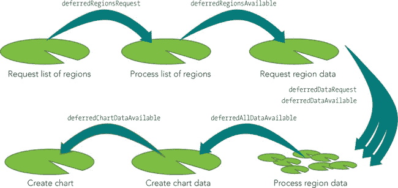图 2-16. `Deferred`对象有助于将每个代码片段隔离在自己的荷叶上。

这种方法的真正好处在于它的关注点分离。每个处理步骤都独立于其他步骤。如果任何步骤需要更改，则无需查看其他步骤。每个荷叶实际上都保持自己独立的岛屿，而不必担心池塘的其他部分。

一旦我们完成最后一步，就可以使用本章其他示例中的任何一种或多种技术来绘制图表。再次强调，`.map()` 函数可以轻松地从区域数据中提取相关信息。以下是一个基本示例：

```
deferredChartDataReady.done(**function**(regions) {
    $.plot($("#chart"),
        $.map(regions, **function**(regionObj) {
            **return** {
                label: regionObj.name,
                data: regionObj.flotData
            };
        })
        ,{ legend: { position: "nw"} }
    );
});
```

我们的基本图表现在直接从世界银行获取数据。我们不再需要手动处理数据，而且每当世界银行更新数据时，我们的图表也会自动更新（图 2-17）。

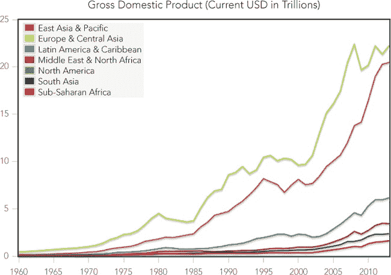图 2-17. 通过 AJAX，我们可以在用户的浏览器中从另一个网站绘制实时数据图表。

在这个示例中，您已经看到如何访问世界银行的应用程序接口。相同的方法也适用于许多其他提供互联网上数据的组织。事实上，今天有如此多的数据源可供使用，以至于可能很难跟踪它们所有。

这里有两个有用的网站，它们作为一个集中库，提供可以访问的公共和私人 API：

+   APIhub (*[`www.apihub.com/`](http://www.apihub.com/)*)

+   ProgrammableWeb (*[`www.programmableweb.com/`](http://www.programmableweb.com/)*)

许多政府也提供了可用数据和 API 的目录。例如，美国将其资源集中在 Data.gov 网站上 (*[`www.data.gov/`](http://www.data.gov/)*）。

这个示例重点讲解了 AJAX 交互，因此生成的图表是一个简单的静态折线图。可以将本章其他示例中描述的任何交互添加到图表中，以增强可视化的互动性。

## 总结

正如本章中的示例所示，我们不必满足于在网页上展示静态图表。通过一些 JavaScript 代码，可以让图表生动起来，允许用户与其互动。这些互动使用户能够看到数据的“全貌”，并且在同一页面上，深入查看对他们最有趣和相关的具体内容。我们已经考虑了让用户选择在图表上显示哪些数据系列、放大图表特定区域，并通过鼠标探索数据的细节，同时不失去对整体视图的掌控。我们还探讨了如何通过 AJAX 和异步编程直接从数据源获取互动数据。
