## 第三章：在页面上整合图表

你可能会期望网页上的数据可视化占据非常显著的位置，甚至可能占据整个网页。但这种方法并不总是合适的。最好的可视化之所以有效，是因为它们帮助用户理解数据，而不是因为它们在页面上“看起来漂亮”。

有些数据可能足够直观，可以不加背景直接呈现，但有意义的数据通常不会如此简单。如果我们的展示需要上下文，那么它的可视化很可能会与其他内容一起出现在页面上。在设计网页时，我们应该注意平衡任何单一组件与整个页面的关系。如果一个可视化并不能讲述全部故事，那么它就不应该占据页面上所有（甚至大部分）的空间。然而，减少传统图表所需空间可能是一个挑战，毕竟，图表中有坐标轴、标签、标题、图例等要素需要放置。

爱德华·塔夫特在他开创性的著作*《定量信息的视觉展示》*（Graphics Press，1983 年）中讨论了这个问题，并提出了一个他称之为 sparklines（火花图）的新颖解决方案。*火花图*是被简化到最基本要素的图表，展示时没有我们通常在图表中看到的那些附加元素。火花图能够在极小的空间内展示大量信息，甚至可以在句子中间插入一个图表。无需“见下图”或“点击查看更大视图”。塔夫特早期的一个例子展示了一个医疗病人的血糖水平；图 3-1 展示了这一示例的复原图。

图 3-1. 塔夫特的经典火花图例展示了一个小空间内的丰富信息。

在仅 154×20 像素的空间中，我们展示了患者当前的血糖水平、超过两个月的趋势、高低值以及正常值范围。这种高信息密度使得火花图在空间有限的情况下尤为有效——可以嵌入文本段落中、作为表格单元格或信息仪表板的一部分。当然，火花图也有一些缺点。它们无法提供像带有坐标轴和标签的完整图表那样的细节。它们也不支持显著的交互性，因此无法为用户提供选择数据或缩放查看细节的灵活性。但对于许多可视化来说，这些并不是主要问题。此外，正如我们在本章示例中所看到的，Web 让我们有机会以打印中无法实现的方式增强火花图。虽然有一些 JavaScript 库和工具包可以用来创建火花图，但我们将重点介绍其中最流行的一个：jQuery sparklines (*[`omnipotent.net/jquery.sparkline/`](http://omnipotent.net/jquery.sparkline/)*)。顾名思义，这个开源库是 jQuery 的扩展。本章的示例将深入探讨如何使用这些工具将密集型可视化集成到你的网页中。以下是你将学到的内容：

+   如何为直接嵌入文本的火花图创建经典火花图

+   如何结合多个火花图展示比较

+   如何为火花图添加附加细节

+   如何创建复合图表

+   如何响应页面上的点击事件

+   如何实时更新图表

## 创建经典火花图

正如后面的示例将展示的那样，sparklines 库既灵活又强大，我们可以在许多不同的上下文中使用它。作为开始，我们将使用该库来创建一个与 Edward Tufte 最早定义的火花图完全相同的图表。这个过程非常简单，只需四个步骤。

### 步骤 1：包含所需的 JavaScript 库

由于我们使用 jQuery sparklines 库来创建图表，我们需要在网页中引入该库以及 jQuery。jQuery 和 sparklines 都可以通过公共 CDN 获取。在本示例（以及本章中的其他示例）中，我们将使用 CloudFlare CDN。关于使用 CDN 的优缺点，请参见 步骤 1：包含所需的 JavaScript 库。

这是我们开始时的骨架：

```
   <!DOCTYPE html>
   **<html** lang="en"**>**
     **<head>**
       **<meta** charset="utf-8"**>**
       **<title></title>**
     **</head>**
     **<body>**
       *<!-- Content goes here -->*
➊     *<!--[if lt IE 9]><script src="js/excanvas.min.js"></script><![endif]-->*
       **<script** src="//cdnjs.cloudflare.com/ajax/libs/jquery/1.8.3/jquery.min.js"**>**
       **</script>**
       **<script** src="//cdnjs.cloudflare.com/ajax/libs/jquery-sparklines/2.0.0/
   jquery.sparkline.min.js"**></script>**
     **</body>**
   **</html>**
```

如你所见，我们将 JavaScript 库包含在文档的最后。这种方法允许浏览器在等待服务器提供 JavaScript 库的同时，加载文档的所有 HTML 标记并开始布局页面。

除了 jQuery 库外，sparklines 还依赖于 HTML 的 *canvas* 特性。由于 Internet Explorer 在版本 9 之前不支持 canvas，因此我们在 ➊ 处使用了一些特殊的标记，以确保 IE 8 及以下版本能加载额外的库（excanvas.min.js），就像我们在第二章中所做的那样。

### 步骤 2：为 Sparkline 创建 HTML 标记

因为我们将 sparkline 图表与其他元素紧密集成，所以我们简单地使用 `<span>` 标签来承载我们的可视化 HTML 标记，而不是使用 `<div>`。除了图表本身，我们还将最终值和标签作为标准 HTML 包含进来。以下是葡萄糖 sparklines 的 HTML 代码：

```
**<p>**
  **<span** class="sparkline"**>**
    170,134,115,128,168,166,122,81,56,39,97,114,114,130,151,
    184,148,145,134,145,145,145,143,148,224,181,112,111,129,
    151,131,131,131,114,112,112,112,124,187,202,200,203,237,
    263,221,197,184,185,203,290,330,330,226,113,148,169,148,
    78,96,96,96,77,59,22,22,70,110,128
  **</span>**
  128 Glucose
**</p>**
```

与其他可视化相比，我们的 sparkline 图表有两个不同寻常的特点。

+   我们将数据直接包含在 HTML 中，而不是在创建图表的 JavaScript 中。

+   图表的 `<span>` 没有唯一的 `id` 属性。

这两个差异是可选的；我们可以像其他可视化一样，通过将数据传递给 JavaScript 函数并通过唯一的 `id` 标识其容器来构建图表。然而，对于 sparklines（小型图表），我们在这里使用的方法通常更为合适。通过直接在 HTML 中包含图表数据，我们可以轻松查看数据与页面上其他内容的关系。例如，很明显，我们图表的最终值（`128`）与我们用于标签的值相同。如果我们犯了错误，使用了不同的标签值，错误就更容易被发现和修正。使用通用的 `class` 来表示所有 sparklines，而不是唯一的 `id`，简化了我们使用库在一页上创建多个图表的方式。如果使用唯一的 `id`，我们每个图表都必须调用一次库函数。而使用通用的 `class`，我们只需调用一次库函数即可创建多个图表。这在网页中包含许多 sparklines 时尤其有用。

### 步骤 3：绘制 Sparkline

现在我们已经包含了必要的库并设置了 HTML，绘制图表变得异常简单。事实上，一行 JavaScript 代码就足够了。我们只需使用 jQuery 选择包含元素（`$(".sparkline")`），然后调用 sparklines 插件。

```
$(**function**() {
    $(".sparkline").sparkline();
}
```

如你在图 3-2 中看到的，sparklines 库根据我们的数据创建了一个标准的 sparklines 图表。

图 3-2：默认的 sparklines 选项与经典示例略有不同。

该库的默认选项在颜色、图表类型和密度上与 Tufte 的经典 sparkline 略有不同。接下来我们将进行调整。

### 步骤 4：调整图表样式

为了让我们的火花图完全符合 Tufte 的定义，我们可以为一些默认选项指定新的值。为了将这些选项传递给火花图，我们构造一个 JavaScript 对象，并将其作为第二个参数包含在 `sparkline` 函数调用中。该函数的第一个参数是数据本身，这里我们使用 `"html"` 来指定，因为我们的数据已经包含在 HTML 标记中。

```
   $(".sparkline").sparkline("html",{
➊     lineColor: "dimgray",
➋     fillColor: **false**,
➌     defaultPixelsPerValue: 1,
➍     spotColor: "red",
       minSpotColor: "red",
       maxSpotColor: "red",
➎     normalRangeMin: 82,
       normalRangeMax: 180,
   });
```

为了完成对 Tufte 原始设计的转变，我们还可以对 HTML 内容进行样式调整。将最终值与关键数据点设置为相同的颜色，可以清晰地表明它们之间的关系，而将图表标签设为粗体可以突出它作为标题。

```
**<p>**
  **<span** class="sparkline"**>**
    170,134,115,128,168,166,122,81,56,39,97,114,114,130,151,
    184,148,145,134,145,145,145,143,148,224,181,112,111,129,
    151,131,131,131,114,112,112,112,124,187,202,200,203,237,
    263,221,197,184,185,203,290,330,330,226,113,148,169,148,
    78,96,96,96,77,59,22,22,70,110,128
  **</span>**
  **<span** style="color:red"**>** 128 **</span>**
  **<strong>** Glucose **</strong>**
**</p>**
```

让我们来回顾一下我们刚刚做的更改：

+   Tufte 的经典火花图是黑白色的，只有关键数据点（最小值、最大值和最终值）有颜色。他的配色方案为这些点增加了额外的强调。为了改变库中的默认颜色（蓝色），我们可以设置 `lineColor`。对于屏幕显示，我们可能选择深灰色而不是纯黑色。这正是我们在 ➊ 处使用的颜色。

+   Tufte 没有填充线下方的区域，而是使用阴影来表示正常范围。为了去除库中的浅蓝色阴影，我们将 `fillColor` 设置为 `false` ➋。

+   默认情况下，库为每个数据点使用 3 像素的宽度。为了最大化信息密度，Tufte 可能会建议使用单个像素。将 `defaultPixelsPerValue` 选项设置为 ➌ 就可以实现这一变化。

+   Tufte 使用红色来表示关键数据点。为了改变库中的默认颜色（橙色），我们将 `spotColor`、`minSpotColor` 和 `maxSpotColor` 设置为 ➍。

+   最后，Tufte 的火花图可以包括阴影来标记值的正常范围。例如，要显示 82–180 mg/dL 的范围，我们将 `normalRangeMin` 和 `normalRangeMax` 选项设置为 ➎。

通过这些更改，我们已经在网页上展示了经典的 Tufte 火花图。我们甚至可以将其嵌入到文本段落中，就像这样，，这样可视化就能增强文本内容。

## 绘制多个变量

根据设计，火花图在页面上占用的空间非常少，这使得它们成为另一个可视化挑战的理想选择：一次性展示多个变量。当然，常规的折线图和柱状图可以同时绘制多个数据集；然而，当数据集的数量超过四五个时，这些多系列图表会迅速变得笨重。一些可视化项目展示了几十个不同的变量，远远超出了多系列图表能够容纳的范围。*小多重*方法完全颠覆了标准图表的方法。我们可以展示多个图表，每个图表只有一个数据集，而不是展示一个包含多个数据集的图表。在页面上放置大量图表意味着每个单独的图表不能占用太多空间，这正是火花图解决的问题。

我们不会在这里做得过于复杂，以保持代码示例的简洁，但这个方法很容易扩展到更多的变量。在我们的例子中，我们将构建一个用于分析股票市场表现的可视化。我们的分析公司包括 2012 年美国最大的 10 家公司（*[`money.cnn.com/magazines/fortune/fortune500/2012/full_list/`](http://money.cnn.com/magazines/fortune/fortune500/2012/full_list/)*），也就是《财富》500 强前 10 名；2012 年 Barclay 最佳科技股票（*[`www.marketwatch.com/story/barclays-best-tech-stocks-for-2012-2011-12-20/`](http://www.marketwatch.com/story/barclays-best-tech-stocks-for-2012-2011-12-20/)*），该名单于 2011 年 12 月发布；以及 Bristol-Myers Squibb，这家公司被*CR Magazine*评为美国最佳企业责任公司（*[`www.thecro.com/files/100Best2012_List_3.8.pdf/`](http://www.thecro.com/files/100Best2012_List_3.8.pdf/)*）。这些选择完全是任意的，但示例的设计旨在包含三种不同的情况，我们将对它们在可视化中进行不同的样式处理。我们将其中一个作为一般案例（《财富》500 强前 10 名名单），一个作为特殊类别（Barclay 名单），一个作为独特变量（Bristol-Myers Squibb）。就像本章第一个例子一样，我们需要在网页中包含 sparklines 和 jQuery 库。

### 第 1 步：准备 HTML 标记

sparklines 库使得直接在 HTML 标记中嵌入数据变得非常容易。对于这个例子，HTML 表格是最合适的数据结构。以下是该表格可能的起始部分。（为了简洁起见，以下摘录没有包含完整的 HTML 代码，但完整的示例可以在书籍的源代码中找到，地址是*[`jsDataV.is/source/`](http://jsDataV.is/source/)*。）

```
**<table>**
    **<thead>**
        **<tr>**
            **<th>**Symbol**</th>**
            **<th>**Company**</th>**
            **<th>**2012 Performance**</th>**
            **<th>**Gain**</th>**
        **</tr>**
    **</thead>**
    **<tbody>**
        **<tr** class="barclays"**>**
            **<td>**AAPL**</td>**
            **<td>**Apple Inc.**</td>**
            **<td** class="sparkline"**>**
                418.68,416.11,416.6,443.34,455.63,489.08,497.7,517.81,...
            **</td>**
            **<td>**27%**</td>**
        **</tr>**
        **<tr** class="barclays"**>**
            **<td>**ALTR**</td>**
            **<td>**Altera Corporation**</td>**
            **<td** class="sparkline"**>**
                37.1,36.92,39.93,39.81,40.43,39.76,39.73,38.55,36.89,...
            **</td>**
            **<td>**-7%**</td>**
        **</tr>**
        *// Markup continues...*
    **</tbody>**
**</table>**
```

该表格有三个与我们的可视化相关的重要特征。

+   每只股票都是一个单独的表格行（`<tr>`）。

+   来自 Barclay 技术名单的股票在相应的`<tr>`元素中增加了类属性`"barclays"`。

+   顶级企业责任股票没有特殊的属性或特征（暂时没有）。

### 第 2 步：绘制图表

就像本章第一个例子一样，使用默认选项创建 sparklines 非常简单：只需要一行 JavaScript 代码。我们使用 jQuery 来选择所有包含 sparkline 数据的元素，然后调用`sparkline()`函数来生成图表。

```
$(**function**() {
    $(".sparkline").sparkline();
}
```

请注意，尽管每个图表都有独特的数据，我们只需要调用一次`sparkline()`。这就是将数据放置在 HTML 内部的一个主要好处。

结果图表，如图 3-3 所示，都具有相同的样式，但我们将在接下来的几个步骤中进行修改。

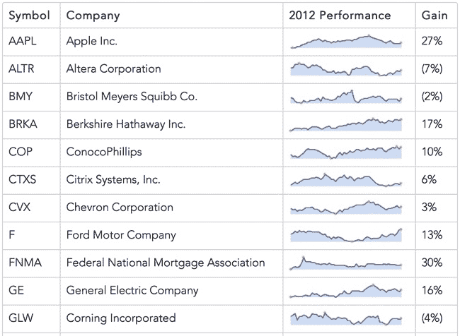图 3-3. 火花图可以作为一个不错的可视化效果，嵌入在页面元素中，例如表格。

### 步骤 3：为图表建立默认样式

如果我们不喜欢火花图库的默认样式，可以通过使用选项对象轻松进行更改，如下所示。

```
$(".sparkline").sparkline("html",{
    lineColor: "#006363",
    fillColor: "#2D9999",
    spotColor: **false**,
    minSpotColor: **false**,
    maxSpotColor: **false**
});
```

对象是 `sparkline()` 函数的第二个参数，它在这里用于更改图表的颜色，并禁用最小值、最大值和最终值的高亮显示。第一个参数，即字符串 `"html"`，告诉库数据已经存在于我们的 HTML 中。

图 3-4 显示了单行的结果。我们将使用这个样式作为所有图表的默认样式。

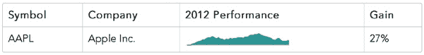图 3-4. 火花图选项让我们调整图表样式。

### 步骤 4：修改特殊类的默认样式

在设置了默认样式之后，我们可以把注意力转向 Barclay 技术列表中的股票图表特殊类。以我们的示例为例，让我们仅更改图表的颜色，而不修改默认样式的其他内容。这个最后的声明非常重要。我们本可以直接复制粘贴选项，但那样会为未来带来问题。你可以从以下示例代码中看到为什么。

```
$("tr:not(.barclays) .sparkline").sparkline("html",{
    lineColor: "#006363",
    fillColor: "#2D9999",
    spotColor: **false**,
    minSpotColor: **false**,
    maxSpotColor: **false**
});
$("tr.barclays .sparkline").sparkline("html",{
    lineColor: "#A50000",
    fillColor: "#FE4C4C",
    spotColor: **false**,
    minSpotColor: **false**,
    maxSpotColor: **false**
});
```

请注意，第二次调用 `sparklines()` 会复制第一次调用中未更改的选项，特别是关于点颜色的设置。如果将来我们决定为所有图表重新启用点颜色，这会使代码更加难以维护，因为我们必须在两个地方修改代码。其实有一种更好的方法。

为了避免重复，我们首先定义一个变量来保存我们的默认选项。

```
**var** sparkline_default = {
    lineColor: "#006363",
    fillColor: "#2D9999",
    spotColor: **false**,
    minSpotColor: **false**,
    maxSpotColor: **false**
};
```

接下来，我们为 Barclay 的样式创建一个新变量。为了创建这个新变量，我们可以使用 jQuery 的 `.extend()` 函数来避免重复。

```
**var** sparkline_barclays = $.extend( {}, sparkline_default, {
    lineColor: "#A50000",
    fillColor: "#FE4C4C"
});
```

在这段代码中，我们传递了三个参数给 `.extend()`。第一个参数是目标对象。它是一个将被函数修改的对象，我们从一个空对象（`{}`）开始。接下来的参数是将被 `.extend()` 合并到目标对象中的对象。合并过程会将新属性添加到目标对象，并更新目标对象中已有属性的值。由于我们传递了两个附加参数，实际上是要求进行两次合并。

你可以将调用 `.extend()` 看作是一个两阶段的过程。

1.  由于我们的目标对象最初是空的，因此第一次合并会将 `sparkline_default` 中的所有属性添加到目标对象。

1.  我们的目标对象现在具有与 `sparkline_default` 相同的属性，第二次合并将通过更新最后一个参数中的两个属性 `lineColor` 和 `fillColor` 来修改它。

生成的对象将包含我们为巴克莱（Barclay）技术股票图表所需的选项。以下是完整的代码清单，使用这些对象来创建图表。

```
   **var** sparkline_default = {
       lineColor: "#006363",
       fillColor: "#2D9999",
       spotColor: **false**,
       minSpotColor: **false**,
       maxSpotColor: **false**
   };
   **var** sparkline_barclays = $.extend( {}, sparkline_default, {
       lineColor: "#A50000",
       fillColor: "#FE4C4C"
   });
➊ $("tr:not(.barclays) .sparkline").sparkline("html",sparkline_default);
➋ $("tr.barclays .sparkline").sparkline("html",sparkline_barclays);
```

请注意在 ➊ 处，我们通过选择没有 `"barclays"` 类的表格行（`<tr>`）来创建非技术类的 sparklines。在 ➋ 处，我们创建技术类的 sparklines。由于我们根据默认值定义了技术选项，因此我们可以轻松维护默认样式和特定类的样式。图 3-5 中的图表颜色清晰地区分了表格中的股票类型。

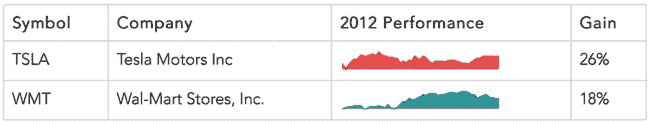图 3-5. 不同的视觉样式区分不同类型的数据。

### 第 5 步：为特定图表创建独特样式

对于本例中的最后一步，让我们考虑 *CR Magazine* 列表顶部的单个股票。假设我们想为其图表添加独特的样式，而且只有在生成 HTML 时我们才能知道这些样式，而不是在编写 JavaScript 时。我们该如何调整图表样式，如果我们无法修改任何 JavaScript？

Sparklines 允许你直接向包含图表的 HTML 元素添加特殊属性。例如，要设置线条颜色，你需要指定 `sparkLineColor` 属性。问题是，如果我们直接在 HTML 中输入此属性，结果将不是有效的 HTML，因为 HTML 规范不识别 `sparkLineColor` 属性。为了符合 HTML 标准，自定义属性必须以 `data-` 前缀开头。

```
   **<tr>**
       **<td>**BMY**</td>**
       **<td>**Bristol Meyers Squibb Co.**</td>**
➊     **<td** class="sparkline" data-LineColor="#679A00"
           data-FillColor="#B6ED47"**>**32.86,32.46,31.36,...**</td>**
       **<td>**(2%)**</td>**
   **</tr>**
```

要使用符合 HTML 标准的名称来引用 sparklines 的自定义属性，我们只需要告诉 sparklines 库如何找到这些名称。对于我们的 HTML，我们在 ➊ 处使用标准的 `data-` 前缀，而不是 `spark`。

现在，我们需要在调用 `sparkline()` 时添加更多选项。首先，我们将 `enableTagOptions` 设置为 `true`，告诉库我们将在 HTML 中直接包含选项。然后，我们将 `tagOptionsPrefix` 设置为 `"data-"`，指定我们用于这些属性的前缀。

### 注释

**截至本文写作时，jQuery sparklines 关于 `tagOptionsPrefix` 的文档是不正确的。文档将此选项列为 `tagOptionPrefix`，其中 *option* 是单数形式，而库的代码实际上期望的是复数形式。**

如果我们正确使用这些选项，其中一个图表将在 图 3-6 中显示出不同的颜色。

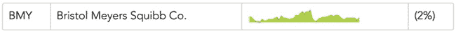图 3-6. sparklines 库支持单个图表的独特样式选项。

为了将适当的选项传递给`sparkline()`，我们可以利用在步骤 5 中所做的工作。由于我们为默认选项创建了一个特殊对象，这就是我们唯一需要更改的对象。

```
**var** sparkline_default = {
    lineColor: "#006363",
    fillColor: "#2D9999",
    spotColor: **false**,
    minSpotColor: **false**,
    maxSpotColor: **false**,
    enableTagOptions: **true**,
    tagOptionsPrefix: "data-"
};
```

我们只需在一个地方进行更改，所有调用`sparkline()`的地方都会使用新的选项。以下是该示例的最终完整 JavaScript 代码。

```
$(**function**() {
    **var** sparkline_default = {
        lineColor: "#006363",
        fillColor: "#2D9999",
        spotColor: **false**,
        minSpotColor: **false**,
        maxSpotColor: **false**,
        enableTagOptions: **true**,
        tagOptionsPrefix: "data-"
    };
    **var** sparkline_barclays = $.extend( {}, sparkline_default, {
        lineColor: "#A50000",
        fillColor: "#FE4C4C"
    });
    $("tr:not(.barclays) .sparkline").sparkline("html",sparkline_default);
    $("tr.barclays .sparkline").sparkline("html",sparkline_barclays);
}
```

图 3-7 展示了最终结果。我们有一个集成文本和图表的表格，并且我们可以为默认情况、特定类以及唯一值适当地和高效地样式化这些图表。

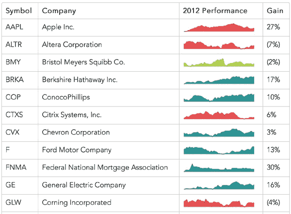图 3-7. 完整示例区分了大型集合中的不同数据集。

追踪数据值使用了一个功能完整的图表包来实现类似的结果。如果你不需要 sparklines 的空间效率，可以考虑这种方法作为替代方案。

## 注释 Sparklines

由于 sparklines 旨在最大化信息密度，因此省略了许多传统图表组件，例如坐标轴和标签。这种方法确实将重点放在数据本身，但有时会让用户缺乏足够的上下文来理解数据。打印版通常依赖传统文本来提供这些上下文，但在网页上我们有更多的灵活性。我们可以单独通过 sparkline 展示数据，并且可以通过交互让用户有机会探索数据的上下文。*工具提示*（当用户将鼠标悬停在网页的某个部分时显示额外信息）可以是注释 sparkline 的有效方法，前提是用户是通过桌面电脑访问页面。（如智能手机和平板电脑等触摸设备通常不支持悬停概念。）我们将在这个示例中演示包含工具提示的可视化；本章中的其他示例则考虑了触摸设备可能更有效的替代方法。让我们看看如何通过增强前一个示例中的图表来使用定制的工具提示形式。就像本章第一个示例中一样，我们需要在网页中包含 sparklines 和 jQuery 库。

### 步骤 1：准备数据

在之前的示例中，我们将数据直接嵌入 HTML 标记中。这种做法很方便，因为它让我们可以将数据与代码分离。然而，在这个示例中，JavaScript 代码需要更详细的数据知识，以便能够展示正确的工具提示信息。这次我们将使用 JavaScript 数组来存储数据，以便将所有相关信息集中在一个地方。对于这个示例，我们可以专注于单一的股票。即使我们只绘制了调整后的收盘价，数组仍然会跟踪其他数据，以便我们可以在工具提示中包含这些额外信息。以下是某只股票数据的一个摘录。

```
**var** stock = 
  { date: "2012-01-03", open: 409.40, high: 422.75, low: 409.00, close: 422.40,
    volume: 10283900, adj_close: 416.26 },
  { date: "2012-01-09", open: 425.50, high: 427.75, low: 418.66, close: 419.81,
    volume: 9327900, adj_close: 413.70 },
  { date: "2012-01-17", open: 424.20, high: 431.37, low: 419.75, close: 420.30,
    volume: 10673200, adj_close: 414.19 },
  *// Data set continues...*
```

### 第 2 步：准备 HTML 标记

我们的可视化将包括三个不同的区域，每个区域都放在一个`<div>`元素中。

```
   **<div** id="stock"**>**
       **<div** style="float:left"**>**
➊         **<div** class="chart"**></div>**
➋         **<div** class="info"**></div>**
       **</div>**
       **<div** style="float:left"**>**
➌         **<div** class="details"**></div>**
       **</div>**
   **</div>**
```

在➊处创建的主要`<div>`元素将容纳图表。图表下方我们将添加包含主要工具提示信息的`<div>`元素➋，并在右侧添加补充详细信息➌。这个示例使用内联样式以便清晰展示；生产环境中可能更倾向于使用 CSS 样式表。

### 第 3 步：添加图表

使用 sparklines 库将图表添加到我们的标记中非常简单。我们可以使用 jQuery 的`.map()`函数从我们的`stock`数组中提取调整后的收盘值。`minSpotColor`和`maxSpotColor`选项告诉库如何突出显示年度中的最低值和最高值。

```
$("#stock .chart").sparkline(
    $.map(stock, **function**(wk) { **return** wk.adj_close; }),
    {
        lineColor: "#006363",
        fillColor: "#2D9999",
        spotColor: **false**,
        minSpotColor: "#CA0000",
        maxSpotColor: "#CA0000"
    }
);
```

[图 3-8 中的静态图表清晰地展示了股票的表现。

图 3-8. 静态 sparkline 展示了数据集随时间变化的变化。

### 第 4 步：添加主要注释

sparklines 库默认会为其所有图表添加一个简单的工具提示。虽然这个工具提示会显示用户鼠标悬停的值，但其展示方式并不特别优雅，而且更重要的是，它没有提供我们所需的足够信息。我们来增强默认行为以满足我们的需求。

查看库的默认设置，我们可以保留垂直标记，但不希望使用默认的工具提示。通过将选项`disableTooltips`设置为`true`，可以关闭不需要的工具提示。

对于我们自己的自定义工具提示，我们可以依赖 sparklines 库的一个便捷功能。该库会在用户的鼠标移动到图表区域时生成一个自定义事件。这个事件就是`spaklineRegionChange`事件。库会将一个自定义属性`sparklines`附加到这些事件中。通过分析这个属性，我们可以确定鼠标相对于数据的位置。

```
   $(".chart")
       .on("sparklineRegionChange", **function**(ev) {
           **var** idx = ev.sparklines[0].getCurrentRegionFields().offset;
➊         */* If it's defined, idx has the index into the*
              *data array corresponding to the mouse pointer */*
       });
```

正如➊处的注释所示，库有时会在鼠标离开图表区域时生成事件。在这些情况下，偏移量的定义值将不存在。

一旦我们获取到鼠标位置，就可以将工具提示信息放入我们为此预留的`<div>`元素中。

```
   **if** (idx) {
       $(".info").html(
➊         "Week of " + stock[idx].date
         + "&nbsp;&nbsp;&nbsp; "
➋       + "Close: $" + stock[idx].adj_close);
   }
```

我们通过`stock`数组中的索引值获取➊和➋的信息，这些索引值来自于`sparklineRegionChange`事件。

由于火花图库在生成鼠标离开图表区域的事件时并不完全可靠，因此我们可以使用标准的 JavaScript `mouseout`事件，而不是自定义事件。当用户将鼠标移出图表时，我们会通过将内容设置为空格来关闭自定义工具提示。我们使用 HTML 的非断行空格(`&nbsp;`)，这样浏览器不会认为`<div>`完全为空。如果我们使用标准的空格字符，浏览器会将`<div>`视为空并重新计算页面高度，导致页面内容出现烦人的跳动。（出于同样的原因，我们应初始化`<div>`时使用`&nbsp;`，而不是留空。）

```
.on("mouseout", **function**() {
    $(".info").html("&nbsp;");
});
```

为了实现最简洁的方式，我们使用方法链将所有这些步骤结合起来。（为了简洁起见，下面的代码省略了图表样式设置选项。）

```
$("#stock .chart")
    .sparkline(
        $.map(stock, **function**(wk) { **return** wk.adj_close; }),
        { disableTooltips: **true** }
    ).on("sparklineRegionChange", **function**(ev) {
        **var** idx = ev.sparklines[0].getCurrentRegionFields().offset;
        **if** (idx) {
            $(".info").html(
                "Week of " + stock[idx].date
              + "&nbsp;&nbsp;&nbsp; "
              + "Close: $" + stock[idx].adj_close);
        }
    }).on("mouseout", **function**() {
        $(".info").html("&nbsp;");
    });
```

现在通过图 3-9，我们拥有了一个很好的交互式工具提示，它会随着用户的鼠标在图表上移动并提供相关的信息。

图 3-9. 交互式火花图跟踪用户的鼠标并提供与鼠标位置相关的信息。

### 第 5 步：提供附加信息

到目前为止，我们添加的工具提示信息展示了与用户最相关的信息：本周和调整后的股票收盘价。然而，我们的数据还包含可能对用户有用的附加信息。我们可以通过在原始工具提示的基础上展示这些内容来进行扩展。

同时在更新主工具提示区域时，我们也添加额外的数据。

```
$(".details").html(
    "Open: $" + stock[idx].open + "<br/>"
  + "High: $" + stock[idx].high + "<br/>"
  + "Low: $" + stock[idx].low + "<br/>"
  + "Volume: " + stock[idx].volume
);
```

当我们清除主工具提示区域时，也会清除这个区域。

```
$(".details").html("");
```

因为这不会影响页面的垂直大小，所以我们不需要用虚拟的`&nbsp;`填充这个`<div>`。

通过图 3-10，我们得到了想要的可视化效果。图表清晰地显示了股票在一年的总体趋势，但它只占用了网页上很小的空间。乍一看，图表也没有干扰的元素，比如标签和坐标轴。对于那些只想了解股票大致表现的用户，这些元素是多余的。想要获取完整细节的用户只需将鼠标悬停在图表上，完整的市场信息就会显现出来。

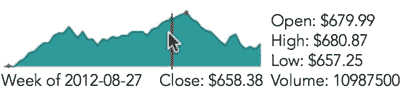图 3-10. 交互式火花图可以以多种方式显示附加信息。

由于我们成功地在保留 sparklines 简洁特性的同时展示了信息，本示例中的技术与本章第二个示例的小型多重方法结合使用时效果很好。下一个示例包括显示额外细节的替代方法。

## 绘制复合图表

到目前为止，在本章中，我们已经看到 sparklines 如何在非常小的空间内提供大量视觉信息。正是这一特性使得 sparklines 非常适合在包含文本、表格和其他元素的完整网页中集成图表。然而，我们还没有完全发挥 sparklines 的功能。通过创建复合图表，我们可以进一步增加可视化的数据信息密度——实际上，就是在同一空间中绘制多个图表。

为了看到这一技术的示例，我们可以在之前的示例上进行扩展。在那个示例中，我们使用了 sparkline 来显示股票的全年收盘价格。价格确实是股票最相关的数据，但还有另一个许多投资者喜欢查看的量：股票的交易量。就像价格一样，了解交易量的趋势一眼就能看出，也非常重要。这使得它成为图表的优秀候选值。

就像在本章的第一个示例中一样，我们需要在网页中包含 sparklines 和 jQuery 库。因为我们在可视化与前一个示例相同的数据，所以我们也需要设置与该示例完全相同的数据数组和 HTML 标记。

### 步骤 1：绘制交易量图表

尽管我们包含了交易量的图表，但最重要的量是股票价格。为了突出股票价格，我们希望将其图表*叠加在*交易量图表之上。这意味着我们需要先绘制交易量图表。

交易量的代码与前一个示例中的股票价格非常相似。然而，我们将使用柱状图，而不是面积图。

```
   $("#stock .chart").sparkline(
       $.map(stock, **function**(wk) { **return** wk.volume; }),
➊     { type: "bar" }
   );
```

我们使用 jQuery 的`.map()`函数从数据数组中提取`volume`属性。在➊位置将`type`选项设置为`"bar"`，即可告诉 sparklines 库创建柱状图。

图 3-11 展示了结果。

图 3-11。sparklines 库可以创建柱状图和折线图。

### 步骤 2：添加收盘价格图表

为了将价格图表叠加在交易量图表之上，我们可以再次调用 sparklines 库。

```
   $("#stock .chart")
       .sparkline(
           $.map(stock, **function**(wk) { **return** wk.volume; }),
       {
           type: "bar"
       }
   ).sparkline(
       $.map(stock, **function**(wk) { **return** wk.adj_close; }),
       {
➊         composite: **true**,
           lineColor: "#006363",
           fillColor: "rgba(45, 153, 153, 0.3)",
           disableTooltips: **true**
       }
   );
```

我们为其指定相同的容器元素，最重要的是，在➊位置将`composite`选项设置为`true`。此参数告诉库不要删除元素中任何现有的图表，而是直接在其上绘制。

请注意我们为第二个图表指定填充颜色的方式。我们设置了一个透明度（或*alpha*）值为`0.3`。这个值使得图表区域几乎透明，因此交易量图表会透过显示。然而需要注意的是，一些较老的网页浏览器，特别是 IE8 及更早版本，无法支持透明度标准。如果你的站点有大量使用这些浏览器的用户，您可以考虑将`fillColor`选项设置为`false`，这样就会完全禁用区域填充。

如图 3-12 所示，结果将两个图表合并在同一空间内。

图 3-12. 多个图表可以合并在同一空间内。

### 步骤 3：添加注释

我们可以使用与前面示例相同的方法为图表添加注释。因为我们的图表现在包含了交易量，所以将该值从细节区域移动到主要注释`<div>`中是合适的。实现这一点的代码只是对前一个示例的简单调整。

```
   .on("sparklineRegionChange", **function**(ev) {
➊     **var** idx = ev.sparklines[1].getCurrentRegionFields().offset;
       **if** (idx) {
           $(".info").html(
             "Week of " + stock[idx].date
           + "&nbsp;&nbsp;&nbsp; Close: $" + stock[idx].adj_close
➋         + "&nbsp;&nbsp;&nbsp; Volume: "
           + Math.round(stock[idx].volume/10000)/100 + "M"
           );
           $(".details").html(
               "Open: $" + stock[idx].open + "<br/>"
             + "High: $" + stock[idx].high + "<br/>"
             + "Low: $" + stock[idx].low
           );
       }
```

除了将文本从一个区域移动到另一个区域，我们还做了两个重要的更改。

+   我们从事件的`sparklines`数组中的第二个元素（`sparklines[1]`）获取`idx`值，见 ➊。这是因为该数组的第一个元素是第一个图表。在`spaklineRegionChange`事件中，sparklines 库并没有返回关于柱状图的任何有用信息。幸运的是，我们可以从线图中获得所需的所有信息。

+   我们将交易量以百万为单位显示，并四舍五入到小数点后两位。计算过程在 ➋ 处。用户更容易理解“24.4M”而不是“24402100”。

如同前面的例子，我们图表中的注释（见图 3-13）提供了额外的细节。

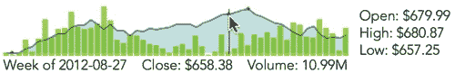图 3-13. 鼠标位置跟踪使得可以互动地注释图表。

### 步骤 4：将细节显示为图表

到目前为止，我们已经将股票的额外细节（开盘、收盘、最高和最低价）作为文本值显示。只要我们绘制多个图表，也可以将这些值以图形的形式展示。统计框图是一个有用的模型。传统上，这种图表类型显示分布的范围，包括偏差、四分位数和中位数。然而，从视觉上看，它提供了一个完美的模型来展示股票的交易表现。我们可以用它来展示开盘和收盘价格，以及期间的最高和最低值。

sparklines 库可以为我们绘制箱形图，但通常它根据分布数据计算要显示的值。在我们的案例中，我们不想使用标准的统计计算方法。相反，我们可以使用一个选项，告诉库使用预计算的值。该库至少需要五个值：

+   最低样本值

+   第一个四分位数

+   中位数

+   第三个四分位数

+   最高样本值

对于我们的示例，我们将提供以下值：

+   最低价格

+   开盘价和收盘价中较小的一个

+   调整后的收盘价

+   开盘价和收盘价中较大的一个

+   最高价格

我们还将根据股票在此期间是上涨还是下跌，将中位线条颜色标记为红色或绿色。

这段代码在响应 `sparklineRegionChange` 事件时生成该图表：

```
   $("#composite-chart4 .details")
       .sparkline([
➊         stock[idx].low,
           Math.min(stock[idx].open,stock[idx].close),
           stock[idx].adj_close,
           Math.max(stock[idx].open,stock[idx].close),
           stock[idx].high
       ], {
           type: "box",
           showOutliers: **false**,
➋         medianColor: (stock[idx].open < stock[idx].close)
➌          ? "green" : "red"
       });
```

图表中的数据（如➊所示）只是从股票数据中提取出的适当一周的五个值。正如➋和➌所示，我们可以根据股票当天是上涨还是下跌来改变中位线条的颜色。

当鼠标离开图表区域时，我们可以通过清空其容器来移除箱形图。

```
$(".details").empty();
```

当用户将鼠标悬停在图表区域时，他们可以看到每个时间段内股票价格区间的可视化表示（图 3-14）。

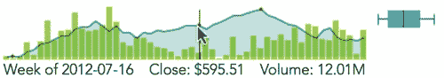图 3-14. 交互式注释不仅可以是文本，还可以是图表。

## 响应点击事件

在本章中，我们探讨了如何在有限的空间内包含大量的视觉信息，使得将可视化集成到网页中变得更加容易。基本的 sparklines 本身非常高效，前面的示例中已经通过添加注释和复合图形进一步提高了信息密度。然而，有时候就是没有办法在足够小的空间内放下所有可能的数据。不过，即使在这些情况下，网页的互动特性仍然能够帮助我们。我们的网页可以从一个紧凑的可视化开始，但通过简单的点击或触摸，切换到一个不同的视图——一个包含更多细节的视图。

事实上，sparklines 的紧凑性似乎非常适合交互。在我进行的每一个包含 sparklines 的网页可用性测试中，参与者总是点击了图表。即使页面没有提供任何其他细节，参与者也不知道点击后会有什么反应，他们还是点击了，只是想看看会发生什么。

这个示例继续我们的股票市场示例。我们将从之前看到的基本股票价格图表开始，但对其进行增强，以便用户点击图表区域时能够显示更多细节。

就像本章的第一个示例一样，我们需要在网页中包含 sparklines 和 jQuery 库。由于我们正在可视化与前一个示例相同的数据，因此我们还需要按照该示例的方式设置数据数组。然而，HTML 标记可以简单得多。我们只需要一个`<div>`来容纳图表。

```
**<div** id="stock"**></div>**
```

### 第 1 步：添加图表

使用 sparklines 库将图表添加到我们的标记中非常简单。我们可以使用 jQuery 的`.map()`函数从我们的`stock`数组中提取调整后的收盘值。

```
$("#stock").sparkline($.map(stock, **function**(wk) { **return** wk.adj_close; }));
```

图 3-15 展示的静态图表，显示了股票表现，现在可能已经看起来很熟悉了。

图 3-15。从静态图表开始确保可视化的准确性。

### 第 2 步：处理点击事件

sparklines 库使我们可以轻松处理点击事件。当用户点击图表区域时，库会生成一个自定义的`sparklineClick`事件。事件数据包括所有正常的点击属性，以及用户点击图表的位置的相关信息。为了接收点击通知，我们需要为该自定义事件定义一个处理程序。

```
$("#stock")
    .sparkline($.map(stock, **function**(wk) { **return** wk.adj_close; }))
    .on("sparklineClick", **function**(ev) {
        **var** sparkline = ev.sparklines[0],
        region = sparkline.getCurrentRegionFields();
        */* region.x and region.y are the coordinates of the click */*
    });
```

现在我们已经设置好接收`sparklineClick`事件，可以编写代码来响应这些事件。对于我们的示例，我们将显示一个详细的财务分析小部件。许多网页服务，包括 Yahoo 和 Google，都有类似的小部件，但我们将使用来自 WolframAlpha 的小部件。像往常一样，WolframAlpha 提供该小部件的 HTML`<iframe>`代码。我们可以将该`<iframe>`包裹在我们自己的`<div>`中，并将其放置在图表后面。我们将`display`属性设置为`none`，使其内容最初处于隐藏状态。（以下代码片段为了清晰起见省略了`<iframe>`元素的详细内容。）

```
**<div** id="stock"**></div>**
**<div** id="widget" style="display:none"**><iframe></iframe></div>**
```

现在我们的事件处理代码可以使用 jQuery 的`show()`函数来显示小部件。

```
.on("sparklineClick", **function**(ev) {
  $("#widget").show();
});
```

这样可以显示更多细节，但正如图 3-16 所示，结果的呈现方式并不如预期那样优雅，因为细节显示得过于突兀。

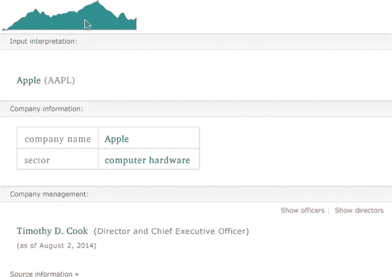图 3-16。鼠标点击可以显示图表的更多细节。

### 第 3 步：改善过渡效果

与其简单地显示图表下方的小部件，不如让小部件替代图表。如果我们这样做，我们还希望给用户一个机会来恢复图表并隐藏小部件。

```
   **<div** id="stock"**></div>**
➊ **<div** id="widget-control" style="width:600px;display:none"**>**
       **<a** href="#" style="float:right"**>**&times;**</a>**
   **</div>**
   **<div** id="widget" style="width:600px;display:none"**>**
       **<iframe></iframe>**
   **</div>**
```

在这里，我们包括了一个 `"widget-control" <div>` ➊，用于控制小部件的可见性。这个控制器唯一需要的内容是一个浮动到右边的关闭符号。和小部件本身一样，控制器最初也是隐藏的。

现在，当用户点击图表时，我们会显示小部件，展示控制器，并隐藏图表。

```
.on("sparklineClick", **function**(ev) {
    $("#widget").show();
    $("#widget-control").show();
    $("#stock").hide();
});
```

接下来，我们拦截小部件控制器中关闭符号的点击事件。首先，我们阻止默认的事件处理；否则，浏览器会令人不安地跳到页面顶部。然后，我们隐藏小部件及其控制器，同时再次显示图表。

```
$("#widget-control a").click(**function**(ev) {
    ev.preventDefault();
    $("#widget").hide();
    $("#widget-control").hide();
    $("#stock").show();
})
```

最后，我们需要给用户一些提示，告诉他们这个交互是可能的。

```
   $("#stock")
       .sparkline(
           $.map(stock, **function**(wk) { **return** wk.adj_close; }),
➊         { tooltipFormatter: **function**() {**return** "Click for details"; } }
       );
```

在图表上，我们重写了 sparklines 库的默认工具提示➊，让用户知道有更多的细节可供查看。

现在来看看小部件控制器：

```
   **<div** id="stock"**></div>**
   **<div** id="widget-control" style="width:600px;display:none"**>**
➊     **<a** href="#" title="Click to hide" style="float:right;"**>**&times;**</a>**
   **</div>**
   **<div** id="widget" style="width:600px;display:none"**>**
       **<iframe></iframe>**
   **</div>**
```

在这里，我们仅在➊添加了一个`title`属性，告诉用户如何隐藏小部件。

这些新增功能为我们提供了简单的 sparkline 图表，见图 3-17，它通过单击即可展开，提供丰富的细节。右上角的关闭符号让用户可以返回到更简洁的 sparkline。

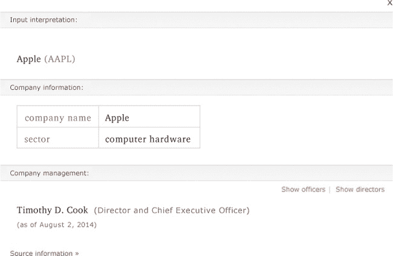图 3-17. 鼠标点击可以揭示图表的更多细节。

### 第 4 步：动画

为了给我们的可视化效果做最后的修饰，我们来处理一下可视化组件的突然隐藏和显示。更平滑的动画效果将帮助用户更好地跟随过渡，jQuery 使得实现这一点变得非常容易。jQuery UI 库中有许多动画效果，但 jQuery 核心的基本功能就足够用于本例。我们只需将`show()`和`hide()`函数分别替换为`slideDown()`和`slideUp()`。

```
.on("sparklineClick", **function**(ev) {
    $("#widget").slideDown();
    $("#widget-control").slideDown();
    $("#stock").slideUp();
});
$("#widget-control a").click(**function**(ev) {
    ev.preventDefault();
    $("#widget").slideUp();
    $("#widget-control").slideUp();
    $("#stock").slideDown();
})
```

到此为止，我们可以宣布我们的可视化完成；最终产品如图 3-18 所示。当用户点击时，紧凑的 sparkline 平滑过渡为详细信息，当用户关闭它们时，这些细节又过渡回 sparkline。

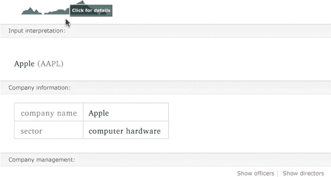图 3-18. 动画过渡可以使可视化效果对用户更为友好。

## 实时更新图表

正如我们在本章的其他示例中所看到的，sparklines 非常适合将可视化嵌入到完整的网页中。它们可以嵌入到文本内容中，或作为表格元素使用。另一个适合使用 sparklines 的应用是信息仪表盘。有效的仪表盘能*一目了然*地总结底层系统的健康状况。当用户没有时间阅读长篇文字或详细图形时，sparklines 的高信息密度使它们成为理想的工具。

除了高信息密度外，大多数仪表板还有另一个要求：它们必须是最新的。对于基于 Web 的仪表板，这意味着内容应持续更新，即使用户正在查看页面。没有理由要求用户刷新浏览器。幸运的是，sparklines 库使得满足这个要求变得容易。

就像本章第一个示例中一样，我们需要在网页中包含 sparklines 和 jQuery 库。对于这个可视化，我们将同时显示图表和数据的最新值。我们为每个定义了`<div>`元素，并将两者放在一个包含的`<div>`中。以下代码包含了一些内联样式，但你也可以将它们放在外部样式表中。这里的样式只是为了将数值直接放在图表的右侧，而不是单独一行。

```
**<div** id="dashboard"**>**
    **<div** id="chart" style="float:left"**></div>**
    **<div** id="value" style="float:left"**></div>**
**</div>**
```

### 第一步：获取数据

在一个真实的仪表板示例中，服务器将提供要显示的数据以及对该数据的更新。只要更新的频率适中（大约每五秒一次），我们可以定期轮询服务器获取更新。然而，使用 JavaScript 的`setInterval()`函数来控制轮询间隔可能不是个好主意。虽然`setInterval()`函数会定期执行某个函数，看起来能够完全满足需求，但情况并没有那么简单。如果服务器或网络遇到问题，则`setInterval()`触发的请求将持续不断地堆积在队列中。当与服务器的通信恢复时，所有待处理的请求将立即完成，导致大量数据同时处理。

为了避免这个问题，我们可以改用`setTimeout()`函数。该函数只会执行一次，因此我们必须显式地多次调用它。不过，通过这种方式，我们可以确保只有在当前请求完成后才会向服务器发送请求。这种方法避免了请求堆积在队列中。

```
   (**function** getData(){
       setTimeout(**function**(){
           *// Request the data from the server*
           $.ajax({ url: "/api/data", success: **function**(data) {

               *// Data has the response from the server*

               *// Now prepare to ask for updated data*
➊             getData();
           }, dataType: "json"});
       }, 30000); *// 30000: wait 30 seconds to make the request*
➋ })();
```

请注意，代码的结构定义了`getData()`函数，并立即执行它。➋处的闭括号触发了即时执行。

在`success`回调中，我们在➊处设置了`getData()`的递归调用，以便每当服务器响应数据时，函数都会再次执行。

### 第二步：更新可视化

每当我们从服务器收到更新的信息时，只需更新图表和数值即可。

```
   (**function** getData(){
       setTimeout(**function**(){
           *// Request the data from the server*
           $.ajax({ url: "/api/data", success: **function**(data) {

➊             $("#chart").sparkline(data);
➋             $("#value").text(data.slice(-1));
               getData();
           }, dataType: "json"});
       }, 30000); *// 30000: wait 30 seconds to make the request*
   })();
```

该代码只需要简单调用 sparklines 库和一个 jQuery 函数来更新值。我们在➊和➋处已将其添加到代码中。

图 3-19 展示了默认图表的样子。当然，你可以根据自己仪表板的需要指定图表和文本的样式。

图 3-19. 实时更新的图表可以显示实时数据。

## 总结

在本章中，我们考虑了将可视化集成到网页中的各种技术。我们看到火花图是一种非常优秀的工具。由于它们能够在小空间内提供大量的视觉信息，因此它们为页面的其他元素（包括文本块、表格和仪表板）留下了空间。我们还考虑了通过注释、复合图表和点击事件等方式进一步增加信息密度。最后，我们了解了如何创建实时更新的图表，准确地可视化底层系统的最新状态。
