## 第四章：创建专门的图表

前三章介绍了使用 JavaScript 创建许多常见图表类型的不同方法。但如果你的数据具有独特的属性，或者你希望以一种不寻常的方式展示它，可能比典型的条形图、折线图或散点图更适合使用更专门的图表。

幸运的是，有许多 JavaScript 技术和插件可以扩展我们的可视化词汇，超越标准图表。在本章中，我们将探讨几种专门图表类型的方法，包括以下内容：

+   如何将层次结构和维度结合在一起，使用树形图

+   如何使用热力图突出显示区域

+   如何使用网络图显示元素之间的连接

+   如何通过词云揭示语言模式

## 使用树形图可视化层次结构

我们想要可视化的数据通常可以组织成层次结构，在许多情况下，这种层次结构本身就是可视化的重要组成部分。本章讨论了几种用于可视化层次数据的工具，我们将从最简单的方法之一——树形图开始示例。树形图通过二维区域表示数值数据，并通过将从属区域嵌套在父区域内来表示层次结构。

有几种算法可以从层次数据构建树形图；其中最常见的一种是由 Mark Bruls、Kees Huizing 和 Jarke J. van Wijk 开发的**方形算法**（*[`www.win.tue.nl/~vanwijk/stm.pdf`](http://www.win.tue.nl/~vanwijk/stm.pdf)*）。由于它通常能为树形图区域生成视觉上令人愉悦的比例，因此这种算法在许多可视化中广受欢迎。为了创建我们示例中的图形，我们可以使用 Imran Ghory 的 treemap-squared 库（*[`github.com/imranghory/treemap-squared`](https://github.com/imranghory/treemap-squared)*）。该库包含了用于计算和绘制树形图的代码。

### 步骤 1：包含所需的库

treemap-squared 库本身依赖于 Raphaël 库（*[`raphaeljs.com/`](http://raphaeljs.com/)）提供低级绘图功能。因此，我们的标记必须同时包含这两个库。Raphaël 库足够流行，公共 CDN 已提供支持。

```
   <!DOCTYPE html>
   **<html** lang="en"**>**
     **<head>**
       **<meta** charset="utf-8"**>**
       **<title></title>**
     **</head>**
     **<body>**
       **<div** id="treemap"**></div>**
➊     **<script** src="//cdnjs.cloudflare.com/ajax/libs/raphael/2.1.0/raphael-min.js"**>**
       **</script>**
➋     **<script** src="js/treemap-squared-0.5.min.js"**></script>**
   **</body>**
    **</html>**
```

如你所见，我们已经为树形图预留了一个`<div>`元素。我们还将 JavaScript 库作为`<body>`元素的最后部分包含在内，因为这样能够提供最佳的浏览器性能。在这个示例中，我们依赖 CloudFlare 的 CDN ➊。然而，我们必须使用自己的资源来托管 treemap-squared 库 ➋。

### 注意

**请参见步骤 1：包含所需的 JavaScript 库，以便更详细地讨论 CDN 及其使用中的权衡。**

### 步骤 2：准备数据

在我们的示例中，我们将显示按区域划分的美国人口，然后在每个区域内按州进行细分。数据来自美国人口普查局（*[`www.census.gov/popest/data/state/totals/2012/index.html`](http://www.census.gov/popest/data/state/totals/2012/index.html)*）。我们将按照其惯例，将该国划分为四个区域。生成的 JavaScript 数组可能如下所示。

```
census = [
  { region: "South", state: "AL", pop2010: 4784762, pop2012: 4822023 },
  { region: "West",  state: "AK", pop2010:  714046, pop2012:  731449 },
  { region: "West",  state: "AZ", pop2010: 6410810, pop2012: 6553255 },
  *// Data set continues...*
```

我们保留了 2010 年和 2012 年的数据。

为了将数据结构化为 treemap-squared 库使用，我们需要为每个区域创建单独的数据数组。同时，我们还可以创建数组，用两位州缩写作为标签来标注数据值。

```
**var** south = {};
south.data = [];
south.labels = [];
**for** (**var** i=0; i<census.length; i++) {
    **if** (census[i].region === "South") {
        south.data.push(census[i].pop2012);
        south.labels.push(census[i].state);
    }
}
```

这段代码逐步遍历`census`数组，构建“南部”区域的数据和标签数组。相同的方法也适用于其他三个区域。

### 步骤 3：绘制树状图

现在我们已经准备好使用该库来构建树状图。我们需要组装各个数据和标签数组，然后调用库的主函数。

```
   **var** data = [ west.data, midwest.data, northeast.data, south.data ];
   **var** labels = [ west.labels, midwest.labels, northeast.labels, south.labels ];
➊ Treemap.draw("treemap", 600, 450, data, labels);
```

➊处的前两个参数是地图的宽度和高度。

结果图表，如图 4-1 所示，提供了美国人口的简单可视化。在四个区域中，最明显的就是人口集中在哪个地方。右下方的区域（南部）拥有最多的人口份额。在各个区域内，每个州的人口相对大小也非常清晰。例如，注意到加利福尼亚在西部占据主导地位。

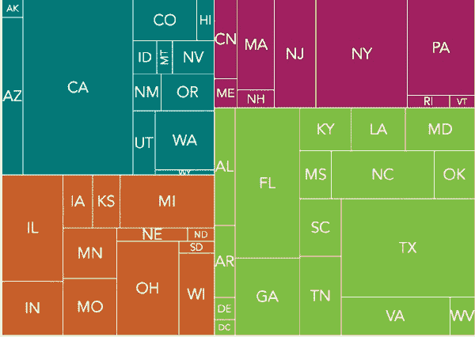图 4-1. 树状图显示数据值的相对大小，使用矩形区域。

### 步骤 4：变换阴影以显示额外数据

图 4-1 中的树状图很好地展示了 2012 年美国人口的分布。然而，人口并非静态的，我们可以通过利用仍然存在于数据集中的 2010 年人口数据来增强我们的可视化效果，显示趋势。当我们遍历`census`数组提取各个区域时，还可以计算一些额外的数值。

这是我们之前代码片段的扩展版本，包含了这些额外的计算。

```
   **var** total2010 = 0;
   **var** total2012 = 0;
   **var** south = {
       data: [],
       labels: [],
       growth: [],
       minGrowth: 100,
       maxGrowth: -100
   };
   **for** (**var** i=0; i<census.length; i++) {
➊     total2010 += census[i].pop2010;
➋     total2012 += census[i].pop2012;
➌     **var** growth = (census[i].pop2012 - census[i].pop2010)/census[i].pop2010;
       **if** (census[i].region === "South") {
           south.data.push(census[i].pop2012);
           south.labels.push(census[i].state);
           south.growth.push(growth);
➍         **if** (growth > south.maxGrowth) { south.maxGrowth = growth; }
➎         **if** (growth < south.minGrowth) { south.minGrowth = growth; }
       }
       *// Code continues...*
   }
```

让我们来逐步讲解这些额外的计算：

+   我们分别在➊和➋处累积了 2010 年和 2012 年的各州总人口数据。这些值使我们能够计算整个国家的平均增长率。

+   对于每个州，我们可以在➌处计算其增长率。

+   对于每个区域，我们分别在➍和➎处保存最小和最大增长率。

就像我们为数据和标签创建了一个主对象一样，我们为增长率创建了另一个主对象。我们还将计算全国的总增长率。

```
**var** growth = [ west.growth, midwest.growth, northeast.growth, south.growth ];
**var** totalGrowth = (total2012 - total2010)/total2010;
```

现在我们需要一个函数来计算树形图矩形的颜色。我们首先定义两个颜色范围，一个用于高于全国平均水平的增长率，另一个用于低于全国平均水平的增长率。然后，我们可以根据每个州的增长率，为其选择一个合适的颜色。例如，以下是一组可能的颜色。

```
**var** colorRanges = {
  positive: [ "#FFFFBF","#D9EF8B","#A6D96A","#66BD63","#1A9850","#006837" ],
  negative: [ "#FFFFBF","#FEE08B","#FDAE61","#F46D43","#D73027","#A50026" ]
};
```

接下来是`pickColor()`函数，它使用这些颜色范围为每个框选择合适的颜色。treemap-squared 库会用两个参数调用它——一个是它即将绘制的矩形的坐标，另一个是数据集中的索引。在我们的示例中，我们不需要坐标，但我们会使用索引来找到需要建模的值。一旦我们找到州的增长率，我们可以减去全国平均增长率。这个计算决定了使用哪个颜色范围。增长速度快于全国平均水平的州将使用正向颜色范围；增长速度慢于平均水平的州将使用负向颜色范围。

代码的最后部分计算了在适当的颜色范围内选择颜色的位置。

```
**function** pickColor(coordinates, index) {
    **var** regionIdx = index[0];
    **var** stateIdx = index[1];
    **var** growthRate = growth[regionIdx][stateIdx];
    **var** deltaGrowth = growthRate - totalGrowth;
    **if** (deltaGrowth > 0) {
        colorRange = colorRanges.positive;
    } **else** {
        colorRange = colorRanges.negative;
        deltaGrowth = -1 * deltaGrowth;
    }
    **var** colorIndex = Math.floor(colorRange.length*(deltaGrowth-minDelta)/
(maxDelta-minDelta));
    **if** (colorIndex >= colorRange.length) { colorIndex = colorRange.length - 1;
}
    color = colorRange[colorIndex];
    **return**{ "fill" : color };
}
```

该代码使用一个基于所有州中极值的线性刻度。因此，例如，如果某个州的增长率介于整体平均值和最大增长率之间，我们将为其指定一个位于正向颜色范围数组中间的颜色。

现在，当我们调用`TreeMap.draw()`时，可以将此函数添加到其参数中，具体通过将其设置为选项对象中`box`键的值。treemap-squared 库将会调用我们的函数来选择区域的颜色。

```
Treemap.draw("treemap", 600, 450, data, labels, {"box" : pickColor});
```

结果树形图图 4-2 仍然显示了所有州的相对人口数。现在，通过使用颜色阴影，它还显示了与全国平均水平相比的人口增长率。该可视化清楚地展示了从东北部和中西部到南部和西部的迁移。

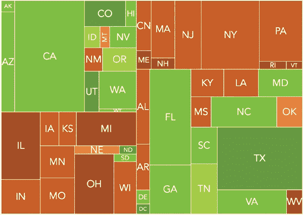图 4-2.树形图可以使用颜色和面积显示数据值。

## 使用热图突出显示区域

如果你从事网页行业，热图可能已经是你工作的一部分。可用性研究人员通常使用热图来评估网站设计，特别是在他们想要分析网页的哪些部分获得用户最多关注时。热图通过将半透明的颜色值叠加在二维区域上来工作。如图 4-3 所示，不同的颜色代表不同的关注程度。用户最关注的是红色区域，其次是黄色、绿色和蓝色区域。

在这个示例中，我们将使用热图来可视化篮球比赛中的一个重要方面：球队得分最多的区域。我们将使用的软件是 Patrick Wied 的 heatmap.js 库（*[`www.patrick-wied.at/static/heatmapjs/`](http://www.patrick-wied.at/static/heatmapjs/)*）。如果你需要创建传统的网页热图，该库已经内置了捕捉鼠标移动和点击的功能，适用于网页。如果你不需要这些功能，可以忽略它们，通用的方法是类似的。

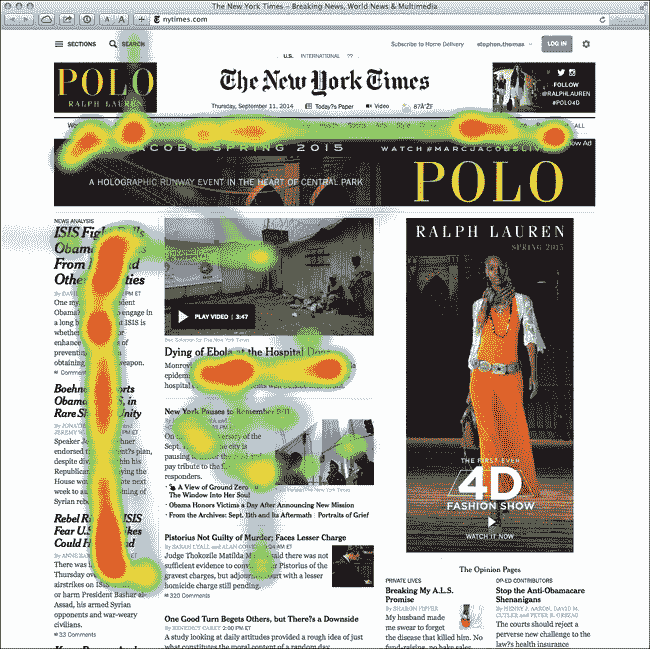图 4-3. 热图传统上展示了网页用户集中注意的地方。

### 第一步：包含所需的 JavaScript

对于现代浏览器，heatmap.js 库没有额外的要求。该库包含了用于实时热图和地理集成的可选插件，但在我们的示例中不需要这些功能。较旧的浏览器（主要是 IE8 及更早版本）可以通过*explorer canvas*库使用 heatmap.js。由于我们不希望所有用户都加载这个库，我们将通过条件注释仅在需要时加载它。遵循当前最佳实践，我们将所有脚本文件放在`<body>`标签的末尾。

```
<!DOCTYPE html>
**<html** lang="en"**>**
  **<head>**
    **<meta** charset="utf-8"**>**
    **<title></title>**
  **</head>**
  **<body>**
    *<!--[if lt IE 9]><script src="js/excanvas.min.js"></script><![endif]-->*
    **<script** src="js/heatmap.js"**></script>**
  **</body>**
**</html>**
```

### 第二步：定义可视化数据

在我们的示例中，我们将可视化 2013 年 2 月 13 日 NCAA 男子篮球比赛中，杜克大学与北卡罗来纳大学之间的比赛。我们的数据集（*[`www.cbssports.com/collegebasketball/gametracker/live/NCAAB_20130213_UNC@DUKE`](http://www.cbssports.com/collegebasketball/gametracker/live/NCAAB_20130213_UNC@DUKE)*)包含了比赛中每个得分的详细信息。为了清洗数据，我们将每个得分的时间转换为从比赛开始后的分钟数，并定义得分者的坐标位置。我们已经根据几个重要的约定定义了这些坐标：

+   我们将把北卡罗来纳大学的得分显示在球场的左侧，杜克大学的得分显示在右侧。

+   球场的左下角对应位置(0,0)，右上角对应位置(10,10)。

+   为了避免将罚球与投篮得分混淆，我们为所有罚球指定了位置(–1, –1)。

这是数据的开始部分；完整的数据可以在书籍的源代码中找到（*[`jsDataV.is/source/`](http://jsDataV.is/source/)*）。

```
**var** game = 
  { team: "UNC",  points: 2, time: 0.85, unc: 2, duke: 0, x: 0.506, y: 5.039 },
  { team: "UNC",  points: 3, time: 1.22, unc: 5, duke: 0, x: 1.377, y: 1.184 },
  { team: "DUKE", points: 2, time: 1.65  unc: 5, duke: 2, x: 8.804, y: 7.231 },
  *// Data set continues...*
```

### 第 3 步：创建背景图像

一个简单的篮球场图示，类似于[图 4-4，非常适合我们的可视化。背景图像的尺寸是 600×360 像素。

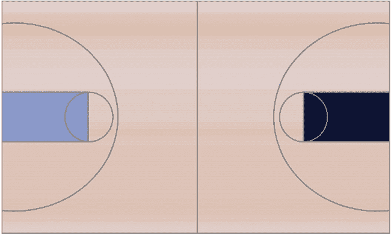图 4-4. 背景图像为可视化提供了背景。

### 第 4 步：预留一个 HTML 元素来容纳可视化

在我们的网页中，我们需要定义一个元素（通常是 `<div>`），用于容纳热力图。当我们创建这个元素时，我们指定它的尺寸，并定义背景。下面的代码片段通过内联样式实现了这两个功能，以保持示例简洁。在实际实现中，你可能想使用 CSS 样式表。

```
**<div** id="heatmap"
    style="position:relative;width:600px;height:360px;
               background-image:url('img/basketball.png');"**>**
**</div>**
```

注意，我们已经为元素指定了一个唯一的 `id`。heatmap.js 库需要这个 `id` 来将热力图放置在页面上。最重要的是，我们还将 `position` 属性设置为 `relative`。heatmap.js 库使用绝对定位来放置图形，而我们希望将这些图形包含在父元素内。

### 第 5 步：格式化数据

对于我们的下一步，我们必须将比赛数据转换为库所需的正确格式。heatmap.js 库要求每个数据点包含三个属性：

+   x 坐标，从包含元素的左侧以像素为单位测量

+   y 坐标，从包含元素的顶部以像素为单位测量

+   数据点的幅度（由 `count` 属性指定）

该库还需要整个地图的最大幅度，在这里事情有点复杂。对于标准热力图，任何特定位置的数据点幅度会相加。在我们的例子中，这意味着所有由上篮和灌篮得分的篮筐——这些实际上是来自球场同一位置的——会被热力图算法加在一起。这个位置，正好在篮筐下方，占据了球场的主导地位。为了抵消这个效果，我们指定一个远小于热力图预期的最大值。在我们的案例中，我们将最大值设置为 `3`，这意味着任何得分超过三分的地方都会被标记为红色，我们将轻松看到所有的篮筐。

我们可以使用 JavaScript 将 `game` 数组转换为适当的格式。

```
➊ **var** docNode = document.getElementById("heatmap");
➋ **var** height = docNode.clientHeight;
➌ **var** width  = docNode.clientWidth;
➍ **var** dataset = {};
➎ dataset.max = 3;
➏ dataset.data = [];
   **for** (**var** i=0; i<game.length; i++) {
       **var** currentShot = game[1];
➐      **if** ((currentShot.x !== -1) && (currentShot.y !== -1)) {
           **var** x = Math.round(width * currentShot.x/10);
           **var** y = height - Math.round(height * currentShot.y/10);
           dataset.data.push({"x": x, "y": y, "count": currentShot.points});
       }
   }
```

我们首先获取包含元素的高度和宽度，分别在 ➊、➋ 和 ➌ 处。如果这些尺寸发生变化，我们的代码仍然能够正常工作。接着，我们初始化 `dataset` 对象 ➍，并设置一个 `max` 属性 ➎ 和一个空的 `data` 数组 ➏。最后，我们遍历比赛数据并将相关数据点添加到这个数组中。注意，我们在 ➐ 处排除了罚球。

### 步骤 6：绘制地图

通过一个包含元素和格式化的数据集，绘制热力图非常简单。我们通过指定包含元素、每个点的半径和透明度来创建热力图对象（该库为了显得聪明，使用了`h337`这个名称）。然后，我们将数据集添加到这个对象中。

```
**var** heatmap = h337.create({
    element: "heatmap",
    radius: 30,
    opacity: 50
});
heatmap.store.setDataSet(dataset);
```

图 4-5 中的可视化结果展示了每个团队得分的位置。

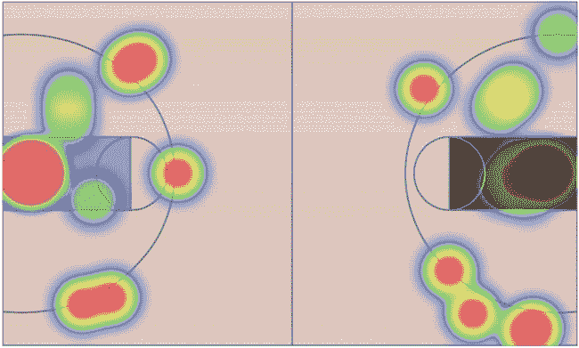图 4-5：热力图显示了比赛中的成功投篮。

### 步骤 7：调整热力图的 z-index

heatmap.js 库在操作 `z-index` 属性时尤其激进。为了确保热力图出现在页面的所有其他元素之上，库将此属性显式设置为 `10000000000`。如果你的网页上有一些不希望被热力图遮挡的元素（例如固定位置的导航菜单），那么这个值可能太过激进。你可以通过直接修改源代码来修复它。或者，作为替代方案，你可以在库绘制完地图后简单地重置这个值。

如果你正在使用 jQuery，以下代码将把 `z-index` 调整为一个更合理的值。

```
$("#heatmap canvas").css("z-index", "1");
```

## 使用网络图显示关系

可视化不总是专注于实际的数据值；有时候，数据集中最有趣的方面是其成员之间的关系。例如，社交网络中成员之间的关系可能是该网络最重要的特征。为了可视化这些类型的关系，我们可以使用*网络图*。网络图将对象（通常称为*节点*）表示为点或圆圈。线条或弧线（技术上称为*边*）连接这些节点以表示关系。

构建网络图可能有点棘手，因为其中的数学原理并不总是简单的。幸运的是，Sigma 库（*[`sigmajs.org/`](http://sigmajs.org/)*）处理了大部分复杂的计算。通过使用该库，我们只需一点点 JavaScript 就能创建功能齐全的网络图。对于我们的示例，我们将考虑一位评论家的“有史以来最伟大的 25 张爵士专辑”列表（*[`www.thejazzresource.com/top_25_jazz_albums.html`](http://www.thejazzresource.com/top_25_jazz_albums.html)*）。几位音乐家在多张专辑上有演出，而网络图可以帮助我们探索这些连接。

### 步骤 1：包含所需的库

Sigma 库不依赖于其他 JavaScript 库，因此我们不需要包含任何其他脚本。然而，它并不在常见的内容分发网络上提供。因此，我们必须从自己的 Web 主机上提供该库。

```
   <!DOCTYPE html>
   **<html** lang="en"**>**
     **<head>**
       **<meta** charset="utf-8"**>**
       **<title></title>**
     **</head>**
     **<body>**
➊     **<div** id="graph"**></div>**
➋     **<script** src="js/sigma.min.js"**></script>**
     **</body>**
   **</html>**
```

正如你所看到的，我们在➊处为我们的图形预留了一个`<div>`。我们还在➋处将 JavaScript 库作为`<body>`元素的最后一部分包含进去，因为这样能提供最佳的浏览器性能。

### 注意

**在本书的大多数示例中，我包含了使你的可视化与旧版网页浏览器（如 IE8）兼容的步骤。然而，在这种情况下，这些方法会严重降低性能，因此几乎无法使用。为了查看网络图可视化，用户需要使用现代浏览器。**

### 第 2 步：准备数据

我们关于排名前 25 的爵士专辑的数据如下所示。我这里只展示了前几张专辑，你可以在书的源代码中查看完整的列表（*[`jsDataV.is/source/`](http://jsDataV.is/source/)*）。

```
**var** albums = [
  {
    album: "Miles Davis - Kind of Blue",
    musicians: [
      "Cannonball Adderley",
      "Paul Chambers",
      "Jimmy Cobb",
      "John Coltrane",
      "Miles Davis",
      "Bill Evans"
    ]
  },{
    album: "John Coltrane - A Love Supreme",
    musicians: [
      "John Coltrane",
      "Jimmy Garrison",
      "Elvin Jones",
      "McCoy Tyner"
    ]
  *// Data set continues...*
```

那并不是 Sigma 所要求的结构。我们可以将其批量转换为 Sigma JSON 数据结构，但实际上没有必要。相反，正如我们在下一步中将看到的，我们可以一次性将数据传递给库中的每个元素。

### 第 3 步：定义图的节点

现在我们准备好使用库来构建我们的图形了。我们首先初始化库，并指明它应该在哪里构建图形。该参数是用于承载可视化的`<div>`元素的`id`。

```
**var** s = **new** sigma("graph");
```

现在我们可以继续，将节点添加到图中。在我们的例子中，每个专辑都是一个节点。当我们向图中添加一个节点时，我们为它赋予一个唯一标识符（必须是字符串）、一个标签和一个位置。确定初始位置对于任意数据来说可能有些棘手。在接下来的步骤中，我们会查看一种方法，使初始位置变得不那么关键。不过现在，我们将通过基本的三角函数把专辑均匀分布在一个圆圈上。

```
**for** (**var** idx=0; idx<albums.length; idx++) {
    **var** theta = idx*2*Math.PI / albums.length;
    s.graph.addNode({
        id: ""+idx,    *// Note: 'id' must be a string*
        label: albums[idx].album,
        x: radius*Math.sin(theta),
        y: radius*Math.cos(theta),
        size: 1
    });
}
```

这里，`radius`的值大致是容器宽度的一半。我们也可以给每个节点设置不同的大小，但在我们的应用场景中，将每张专辑的大小设置为`1`就足够了。

最后，在定义了图形后，我们告诉库绘制它。

```
s.refresh();
```

通过图 4-6，我们现在拥有了一个精美绘制的圈，表示所有时间里排名前 25 的爵士专辑。在这个初步尝试中，某些标签可能会相互重叠，但我们稍后会解决这个问题。

如果你在浏览器中尝试此可视化，你会注意到 Sigma 库自动支持平移图形，用户可以将鼠标指针移到单个节点上以高亮显示节点标签。

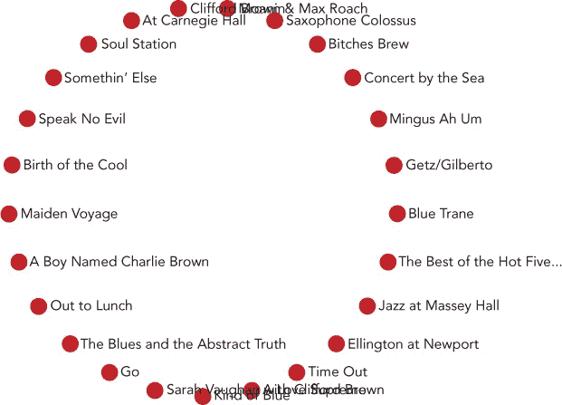图 4-6. Sigma 将图的节点绘制为小圆圈。

### 第 4 步：用边连接节点

现在我们已经在一个圆圈中绘制了节点，接下来是时候用边连接它们了。在我们的例子中，一条边——即两个专辑之间的连接——代表了在这两张专辑上都有演奏的音乐家。以下是找到这些边的代码。

```
➊ **for** (**var** srcIdx=0; srcIdx<albums.length; srcIdx++) {
       **var** src = albums[srcIdx];
➋     **for** (**var** mscIdx=0; mscIdx<src.musicians.length; mscIdx++) {
           **var** msc = src.musicians[mscIdx];
➌         **for** (**var** tgtIdx=srcIdx+1; tgtIdx<albums.length; tgtIdx++) {
               **var** tgt = albums[tgtIdx];
➍             **if** (tgt.musicians.some(**function**(tgtMsc) {**return** tgtMsc === msc;}))
   {
                   s.graph.addEdge({
                       id: srcIdx + "." + mscIdx + "-" + tgtIdx,
                       source: ""+srcIdx,
                       target: ""+tgtIdx
                   })
               }
           }
       }
   }
```

为了找到边，我们将通过四个阶段迭代这些专辑。

1.  循环遍历每个专辑，作为潜在的连接源，在➊处。

1.  对于源专辑，循环遍历➋处的所有音乐人。

1.  对于每个音乐人，循环遍历剩余的所有专辑，作为潜在的连接目标，在➌处。

1.  对于每个目标专辑，循环遍历➌处的所有音乐人，寻找匹配项。

在最后一步，我们使用 JavaScript 数组的 `.some()` 方法。该方法接受一个函数作为参数，如果该函数对数组中的任何元素返回 `true`，则返回 `true`。

我们希望在刷新图表之前插入这段代码。完成后，我们将得到一个连接的专辑圆形布局，如图 4-7 所示。

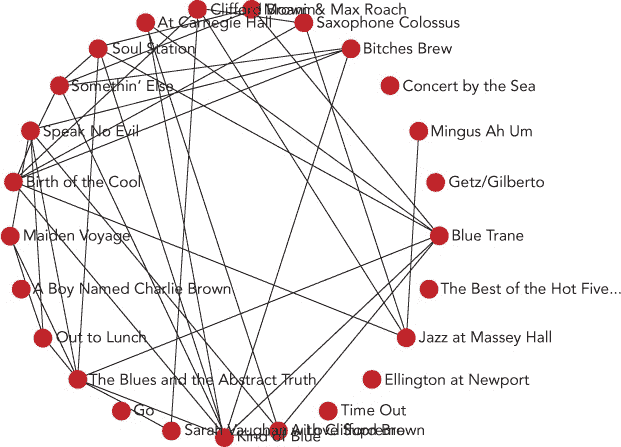图 4-7。Sigma 可以通过线条连接图中的节点，表示边。

同样，你可以平移和缩放图表，聚焦于不同的部分。

### 第五步：自动化布局

到目前为止，我们已经手动将节点放置在图表的圆形布局中。这并不是一个糟糕的方法，但它可能会让我们难以分辨某些连接。如果我们能让库计算一个比简单圆形更优化的布局，那就更好了。现在我们将正是这样做。

这种方法背后的数学原理被称为 *力导向图形*。简而言之，算法通过将图的节点和边视为受真实物理力（如重力和电磁力）作用的物体来进行处理。它模拟这些力的效果，将节点推入图中新的位置。

底层算法可能比较复杂，但 Sigma 使其变得容易使用。首先，我们需要将可选的 `forceAtlas2` 插件添加到 Sigma 库中。

```
<!DOCTYPE html>
**<html** lang="en"**>**
    **<head>**
        **<meta** charset="utf-8"**>**
        **<title></title>**
    **</head>**
    **<body>**
        **<div** id="graph"**></div>**
        **<script** src="js/sigma.min.js"**></script>**
        **<script** src="js/sigma.layout.forceAtlas2.min.js"**></script>**
    **</body>**
**</html>**
```

Mathieu Jacomy 和 Tommaso Venturini 开发了这个插件使用的具体力方向算法；他们在 2011 年的论文《ForceAtlas2，一个用于方便网络可视化的图形布局算法》中记录了这个算法，论文可以在 *[`webatlas.fr/tempshare/ForceAtlas2_Paper.pdf`](http://webatlas.fr/tempshare/ForceAtlas2_Paper.pdf)* 中找到。尽管我们不需要理解算法的数学细节，但了解如何使用它的参数是非常有用的。对于大多数使用此插件的可视化，有三个参数是非常重要的：

+   ****`gravity`****。该参数决定了算法在多大程度上尝试防止孤立节点漂移到屏幕边缘。如果没有任何重力作用，孤立节点上唯一起作用的力就是排斥它们远离其他节点的力；这种力将不受阻碍地把节点推到屏幕之外。由于我们的数据中包含几个孤立节点，我们希望将此值设置得较高，以确保这些节点停留在屏幕上。

+   ****`scalingRatio`****。这个参数决定了节点之间相互排斥的强度。较小的值会使连接的节点更靠近，而较大的值则会强制所有节点之间距离更远。

+   ****`slowDown`****。这个参数减少节点对来自邻居的排斥力的敏感度。通过增加这个值来减少敏感度，有助于减少当节点面临来自多个邻居的相互作用力时可能导致的不稳定性。在我们的数据中，存在许多连接会将节点拉近，并与将节点拉开的力产生竞争。为了减缓可能出现的剧烈振荡，我们将这个值设得相对较高。

确定这些参数值的最佳方法是对实际数据进行实验。我们为这个数据集选定的参数值如下代码所示。

```
s.startForceAtlas2({gravity:100,scalingRatio:70,slowDown:100});
setTimeout(**function**() { s.stopForceAtlas2(); }, 10000);
```

现在，当我们准备显示图形时，不仅仅是简单地刷新图形，我们开始了力导向算法，它在执行模拟的同时定期刷新显示。我们还需要在算法运行一段时间后停止它。对于我们的情况来说，10 秒（`10000`毫秒）就足够了。

结果，我们的专辑最初处于它们的原始圆形位置，但很快就迁移到一个更易于识别连接的位置。一些排名靠前的专辑紧密连接，表明它们有很多共同的音乐人。然而，少数专辑依然是孤立的，它们的音乐人只出现在列表中一次。

如图 4-8 所示，节点的标签仍然相互干扰；我们将在下一步修复这个问题。不过这里重要的是，识别出那些具有大量连接的专辑要容易得多。代表这些专辑的节点已经迁移到图形的中心，并且它们与其他节点有许多连接。

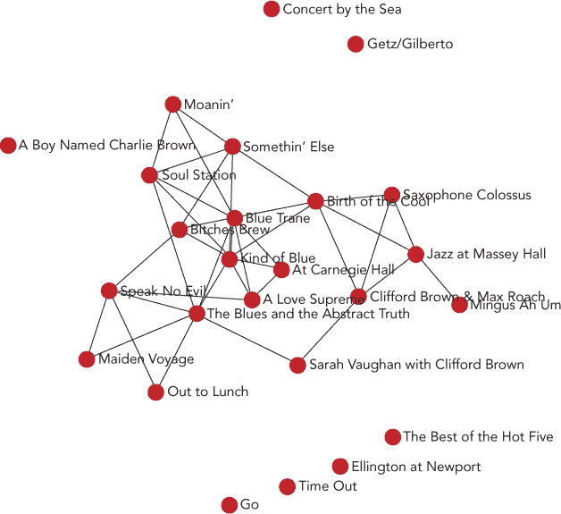图 4-8。力导向自动定位图形节点。

### 第 6 步：添加交互性

为了避免标签相互干扰，我们可以为图形添加一些交互功能。默认情况下，我们将完全隐藏标签，让用户能够在没有干扰的情况下欣赏图形的结构。然后，我们允许他们点击单独的节点以显示专辑标题及其连接。

```
   **for** (**var** idx=0; idx<albums.length; idx++) {
       **var** theta = idx*2*Math.PI / albums.length;
       s.graph.addNode({
           id: ""+idx, *// Note: 'id' must be a string*
➊         label: "",
➋         album: albums[idx].album,
           x: radius*Math.sin(theta),
           y: radius*Math.cos(theta),
           size: 1
       });
   }
```

为了抑制初始标签显示，我们修改了在➊处的初始化代码，使得节点具有空白标签。不过，在➋处，我们保存了专辑标题的引用。

现在，我们需要一个响应点击节点元素的函数。Sigma 库正好支持这种类型的函数及其接口。我们只需绑定到`clickNode`事件。

```
s.bind("clickNode", **function**(ev) {
    **var** nodeIdx = ev.data.node.id;
    *// Code continues...*
});
```

在那个函数中，`ev.data.node.id` 属性给我们提供了用户点击的节点的索引。完整的节点集合可以从 `s.graph.nodes()` 返回的数组中获得。由于我们只想显示被点击节点的标签（而不是任何其他节点的标签），我们可以遍历整个数组。在每次遍历中，我们要么将 `label` 属性设置为空字符串（以隐藏它），要么将其设置为 `album` 属性（以显示它）。

```
   s.bind("clickNode", **function**(ev) {
       **var** nodeIdx = ev.data.node.id;
       **var** nodes = s.graph.nodes();
       nodes.forEach(**function**(node) {
➊         **if** (nodes[nodeIdx] === node) {
               node.label = node.album;
           } **else** {
               node.label = "";
           }
       });
   });
```

现在用户已经有了展示专辑标题的方法，让我们再提供一个隐藏标题的方法。在 ➊ 处做一个小的修改，就能让用户通过后续点击切换专辑显示。

```
**if** (nodes[nodeIdx] === node && node.label !== node.album) {
```

既然我们已经让图表响应点击事件，那么我们也可以利用这个机会来突出显示被点击节点的连接。我们通过改变它们的颜色来实现这一点。就像 `s.graph.nodes()` 返回图表节点的数组一样，`s.graph.edges()` 返回的是边的数组。每个边对象都包括 `target` 和 `source` 属性，分别存储相关节点的索引。

```
   s.graph.edges().forEach(**function**(edge) {
       **if** ((nodes[nodeIdx].label === nodes[nodeIdx].album) &&
➊         ((edge.target === nodeIdx) || (edge.source === nodeIdx))) {
➋         edge.color = "blue";
       } **else** {
➌         edge.color = "black";
       }
   });
```

在这里，我们扫描图表的所有边，查看它们是否与点击的节点相连。如果边确实连接到该节点，我们会在 ➋ 处将其颜色更改为不同于默认的颜色。否则，我们会在 ➌ 处将颜色恢复为默认值。可以看到，我们使用了与之前切换节点标签相同的方法来切换边的颜色，都是通过连续点击来实现的，位于 ➊。

现在我们已经修改了图表的属性，我们需要告诉 Sigma 重新绘制它。这只是调用 `s.refresh()` 的简单问题。

```
s.refresh();
```

现在，我们已经有了一个完全交互式的网络图，见 图 4-9。  

## 通过词云揭示语言模式

数据可视化并不总是关注数字。有时，数据可视化的焦点是单词，*词云*往往是展示这类数据的有效方式。词云可以将任意数量与单词列表关联起来；最常见的是，那个数量表示的是相对频率。这种类型的词云，我们将在下一个例子中创建，用来揭示哪些单词常见，哪些单词稀有。

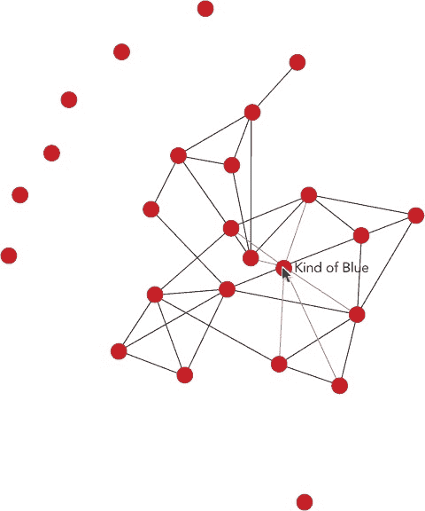图 4-9. 交互式图表为用户提供了突出特定节点的机会。

要创建这个可视化效果，我们将依赖 wordcloud2 库 (*[`timdream.org/wordcloud2.js`](http://timdream.org/wordcloud2.js)*)，这是作者 Tim Dream 的 HTML5 词云项目 (*[`timc.idv.tw/wordcloud/`](http://timc.idv.tw/wordcloud/)*）的衍生项目。

### 注意

**像我们之前检查过的几个更高级的库一样，wordcloud2 在旧版浏览器（如 IE8 及更早版本）中表现不佳。由于 wordcloud2 本身需要现代浏览器，因此在这个例子中我们不需要担心与旧版浏览器的兼容性。这也让我们可以使用其他一些现代 JavaScript 特性。**

### 第一步：包含所需的库

wordcloud2 库不依赖任何其他 JavaScript 库，因此我们不需要其他包含的脚本。然而，它并未在常见的内容分发网络上提供，因此我们必须从我们自己的网络主机提供它。

```
<!DOCTYPE html>
**<html** lang="en"**>**
  **<head>**
    **<meta** charset="utf-8"**>**
    **<title></title>**
  **</head>**
  **<body>**
    **<script** src="js/wordcloud2.js"**></script>**
  **</body>**
**</html>**
```

为了让我们的示例专注于可视化部分，我们将使用一个不需要特别准备的单词列表。然而，如果你正在处理口语或书面自然语言，你可能希望处理文本，以识别同一单词的不同形式。例如，你可能想将*hold*、*holds*和*held*视为同一个单词*hold*的三种形式，而不是三个不同的词。这种处理显然在很大程度上取决于具体的语言。不过，如果你在使用英语和中文，那么创建 wordcloud2 的开发者也发布了 WordFreq JavaScript 库（*[`timdream.org/wordfreq/`](http://timdream.org/wordfreq/)*），它正是执行这种类型分析的工具。

### 第二步：准备数据

在这个示例中，我们将查看用户在流行的 Stack Overflow 网站上与他们问题相关的不同标签（*[`stackoverflow.com/`](http://stackoverflow.com/)*）。该网站允许用户提出编程问题，社区则尝试回答这些问题。标签为问题提供了一种方便的分类方式，使得用户能够浏览与相同主题相关的其他帖子。通过构建词云（也许更好地称之为*标签云*），我们可以快速展示不同编程主题的相对受欢迎程度。

如果你想将这个示例发展成一个真实的应用程序，你可以通过该网站的 API 实时访问 Stack Overflow 的数据。然而，对于我们的示例，我们将使用一个静态快照。下面是如何开始的：

```
**var** tags = [
    ["c#", 601251],
    ["java", 585413],
    ["javascript", 557407],
    ["php", 534590],
    ["android", 466436],
    ["jquery", 438303],
    ["python", 274216],
    ["c++", 269570],
    ["html", 259946],
    *// Data set continues...*
```

在这个数据集中，标签列表是一个数组，列表中的每个标签也是一个数组。这些内部数组的第一个项目是单词本身，第二个项目是该单词的计数。你可以在书籍的源代码中查看完整的列表（*[`jsDataV.is/source/`](http://jsDataV.is/source/)*）。

wordcloud2 所期望的格式与我们当前数据的布局非常相似，唯一不同的是，在每个单词数组中，第二个值需要指定该单词的绘制大小。例如，数组元素`["javascript", 56]`会告诉 wordcloud2 将*javascript*绘制为 56 像素的高度。当然，我们的数据没有以像素大小设置。*javascript*的计数值是`557407`，一个高度为 557,407 像素的单词甚至无法放进广告牌上。因此，我们必须将计数转换为绘制大小。具体的转换算法将取决于可视化的大小以及原始数据值。一个在此案例中有效的简单方法是将计数值除以 10,000 并四舍五入到最接近的整数。

```
**var** list = tags.map(**function**(word) {
    **return** [word[0], Math.round(word[1]/10000)];
});
```

在第二章中，我们看到 jQuery 的 `.map()` 函数如何让处理数组中的所有元素变得非常容易。事实证明，现代浏览器内建了相同的功能，所以在这里我们即使没有 jQuery，也使用了 `.map()` 的原生版本。（这个原生版本在较旧的浏览器上无法像 jQuery 那样工作，但我们在这个示例中不需要担心这个问题。）

在这段代码执行后，我们的 `list` 变量将包含以下内容：

```
[
    ["c#", 60],
    ["java", 59],
    ["javascript", 56],
    ["php", 53],
    ["android", 47],
    ["jquery", 44],
    ["python", 27],
    ["c++", 27],
    ["html", 26],
    *// Data set continues...*
```

### 第 3 步：添加必要的标记

wordcloud2 库可以使用 HTML `<canvas>` 接口或纯 HTML 来构建图形。如同我们在许多图形库中看到的，`<canvas>` 是一个非常方便的接口，用于创建图形元素。然而，对于词云来说，使用 `<canvas>` 并没有太多好处。另一方面，原生 HTML 允许我们使用所有标准的 HTML 工具（如 CSS 样式表或 JavaScript 事件处理）。在这个示例中，我们将采用这种方法。

```
   <!DOCTYPE html>
   **<html** lang="en"**>**
     **<head>**
       **<meta** charset="utf-8"**>**
       **<title></title>**
     **</head>**
     **<body>**
➊     **<div** id="cloud" style="position:relative;"**></div>**
       **<script** src="js/wordcloud2.js"**></script>**
     **</body>**
   **</html>**
```

在使用原生 HTML 时，我们确实需要确保包含元素具有 `position: relative` 样式，因为 wordcloud2 在将单词放置到云中合适位置时依赖于这个样式。你可以看到，在这里我们已经在 ➊ 处设置了这个样式。

### 第 4 步：创建一个简单的云

准备好这些之后，创建一个简单的词云就变得非常容易了。我们调用 wordcloud2 库并告诉它绘制云的 HTML 元素，以及云的数据单词列表。

```
WordCloud(document.getElementById("cloud"), {list: list});
```

即使只有默认值，wordcloud2 也会创建出如图 4-10 所示的吸引人的可视化效果。

wordcloud2 接口还提供了许多自定义可视化效果的选项。正如预期的那样，你可以设置颜色和字体，但你还可以改变云的形状（甚至提供自定义的极坐标方程）、旋转限制、内部网格大小以及许多其他功能。

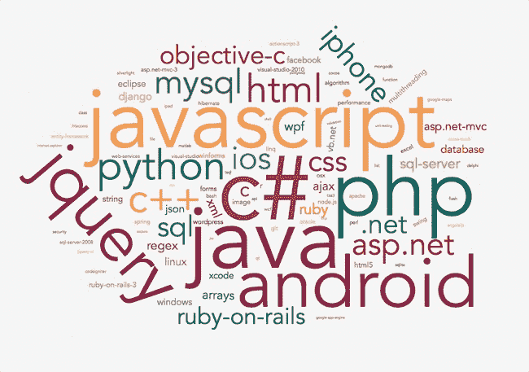图 4-10. 词云可以显示单词及其相对频率。

### 第 5 步：添加交互性

如果你要求 wordcloud2 使用 `<canvas>` 接口，它会提供一些回调钩子，供你的代码响应用户的交互。然而，在原生 HTML 中，我们不仅仅局限于 wordcloud2 提供的回调。为了演示这一点，我们可以添加一个简单的交互，来响应鼠标点击云中单词的操作。

首先，我们会让用户知道支持交互，当他们将鼠标悬停在云中的单词上时，我们会将鼠标指针更改为指针形态。

```
#cloud span **{**
    **cursor:** pointer**;**
**}**
```

接下来，让我们在标记中添加一个额外的元素，用于显示关于任何被点击单词的信息。

```
   <!DOCTYPE html>
   **<html** lang="en"**>**
     **<head>**
       **<meta** charset="utf-8"**>**
       **<title></title>**
     **</head>**
     **<body>**
       **<div** id="cloud" style="position:relative;"**></div>**
➊     **<div** id="details"**><div>**
       **<script** src="js/wordcloud2.js"**></script>**
     **</body>**
   **</html>**
```

这里我们在 ➊ 处添加了带有 `id details` 的 `<div>` 元素。

然后我们定义一个函数，当用户点击云中的某个位置时可以调用该函数。

```
   **var** clicked = **function**(ev) {
➊     **if** (ev.target.nodeName === "SPAN") {
           *// A <span> element was the target of the click*
       }
   }
```

由于我们的函数会在云容器中的任何点击事件（包括点击空白区域）触发时被调用，因此它首先检查点击的目标是否真的为一个单词。单词被包含在 `<span>` 元素中，因此我们可以通过查看点击目标的 `nodeName` 属性来验证这一点。如你在 ➊ 处所见，JavaScript 的节点名称总是大写。

如果用户确实点击了一个单词，我们可以通过查看事件目标的 `textContent` 属性来找出是哪个单词。

```
   **var** clicked = **function**(ev) {
       **if** (ev.target.nodeName === "SPAN") {
➊         **var** tag = ev.target.textContent;
       }
   }
```

在 ➊ 之后，变量 `tag` 将保存用户点击的单词。因此，例如，如果用户点击了单词 *javascript*，那么 `tag` 变量将会有值 `"javascript"`。

由于我们希望在用户点击单词时显示总数，我们需要在原始数据集中查找该单词。我们已经有了单词的值，因此只需通过数据集进行搜索，找到匹配的项。如果我们使用的是 jQuery，`.grep()` 函数就能做到这一点。在这个示例中，我们坚持使用原生 JavaScript，因此我们需要寻找一个原生 JavaScript 中的等效方法。不幸的是，尽管已经定义了这样的原生方法——`.find()`——但目前很少有浏览器（即使是现代浏览器）支持它。我们可以采用标准的 `for` 或 `forEach` 循环，但也有一种替代方案，许多人认为这种方法优于前者。它依赖于现代浏览器支持的 `.some()` 方法。`.some()` 方法会将数组中的每个元素传递给一个任意函数，当该函数返回 `true` 时停止。下面是我们如何使用它来查找点击的标签在 `tags` 数组中的位置。

```
   **var** clicked = **function**(ev) {
       **if** (ev.target.nodeName === "SPAN") {
           **var** tag = ev.target.textContent;
           **var** clickedTag;
➊        tags.some(**function**(el) {
➋            **if** (el[0] === tag) {
                   clickedTag = el;
                   **return** **true**;  *// This ends the .some() loop*
              }
➌            **return** **false**;
➍        });
       }
   }
```

作为 `.some()` 参数的函数定义从 ➊ 开始，到 ➍ 结束。该函数以 `el` 为参数，`el` 是 `tags` 数组中的一个 *元素* 的缩写。➋ 处的条件语句检查该元素的单词是否与点击节点的文本内容匹配。如果匹配，该函数会设置 `clickedTag` 变量并返回 `true`，以终止 `.some()` 循环。

如果点击的单词与我们在 `tags` 数组中检查的元素不匹配，那么传给 `.some()` 的函数会在 ➌ 返回 `false`。当 `.some()` 遇到 `false` 的返回值时，它会继续遍历数组。

我们可以使用 `.some()` 方法的返回值来确保点击的元素确实在数组中找到了。当发生这种情况时，`.some()` 本身会返回 `true`。

```
   **var** clicked = **function**(ev) {
     **var** details = "";

     **if** (ev.target.nodeName === "SPAN") {
         **var** tag = ev.target.textContent,
             clickedTag;
         **if** (tags.some(**function**(el) {
             **if** (el[0] === tag) {
                   clickedTag = el;
                   **return** **true**;
             }
             **return** **false**;
         })) {
➊           details = "There were " + clickedTag[1] +
➋                     " Stack Overflow questions tagged \"" + tag + "\"";
         }
     }
➌   document.getElementById("details").innerText = details;
   }
```

在 ➊ 和 ➋ 处，我们用额外的信息更新了 `details` 变量。在 ➌ 处，我们用这些信息更新了网页。

最后，我们告诉浏览器，当用户点击云容器中的任何内容时，调用我们的处理程序。

```
document.getElementById("cloud").addEventListener("click", clicked)
```

通过这几行代码，我们的词云现在变得互动了，如 图 4-11 所示。

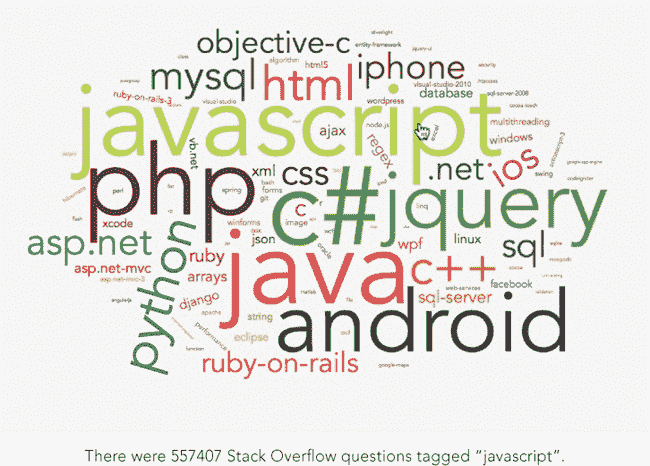图 4-11。由于我们的词云由标准 HTML 元素组成，因此我们可以通过简单的 JavaScript 事件处理器使其具有交互性。

## 总结

在本章中，我们探讨了几种不同的专用可视化图表和一些可以帮助我们创建它们的 JavaScript 库。树状图非常适合在单一可视化中展示层级关系和维度信息。热力图可以突出显示区域内的不同强度。网络图揭示了对象之间的连接关系。而词云则通过一种吸引人且简洁的可视化方式展示语言属性之间的相对关系。
