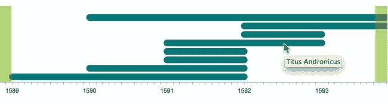
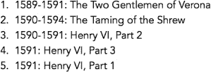
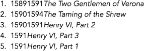
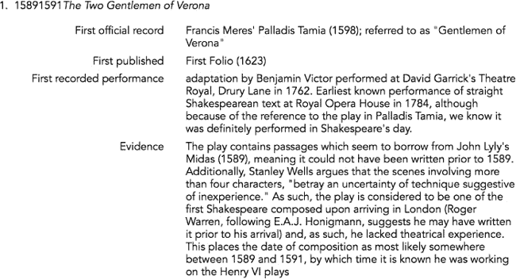
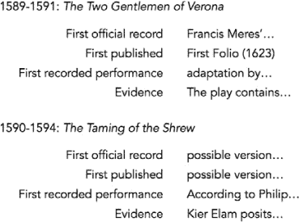
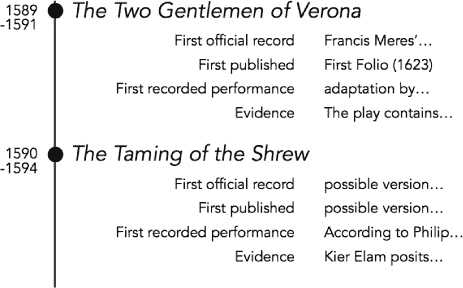
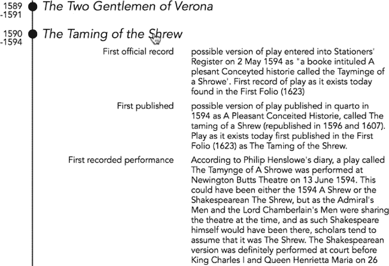
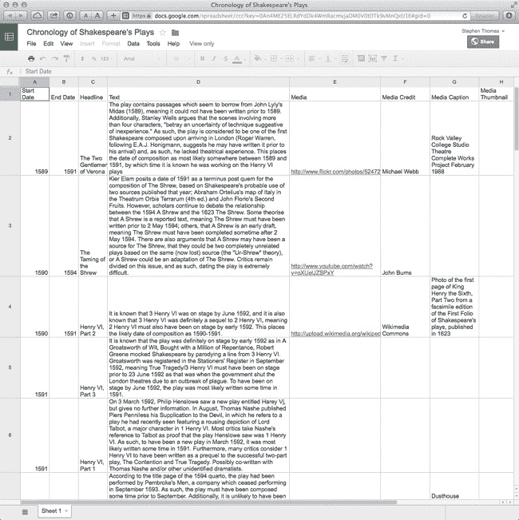
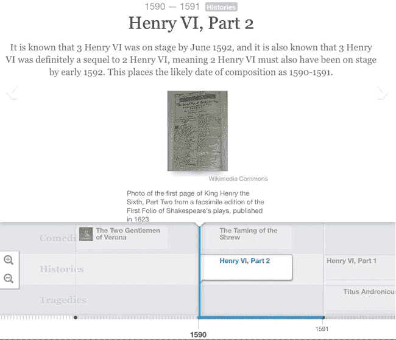
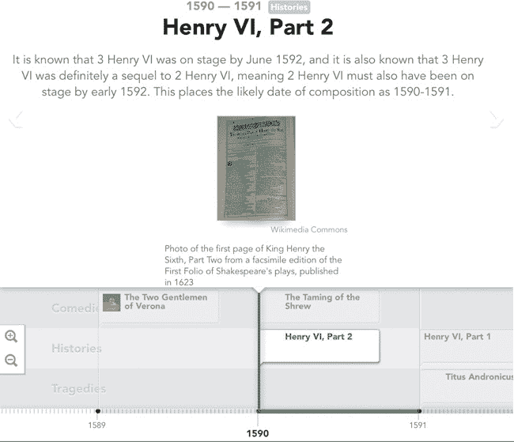

## 第五章：显示时间线

最具吸引力的可视化通常之所以成功，是因为它们讲述了一个故事；它们从数据中提取出一个叙事，并向用户展示这个故事。与任何叙事一样，时间是一个关键组成部分。如果数据仅由数字组成，标准的条形图或折线图可以轻松地展示其随时间的演变。然而，如果数据不是数值型的，标准图表可能就无法奏效。本章将考虑几种基于时间的可视化替代方案。

所有这些都是基于某种形式的时间线；其中一个线性维度表示时间，事件根据发生的时间在该维度上标出。在所有示例中，我们将考虑相同的基础数据：威廉·莎士比亚戏剧的可能年表 (*[`en.wikipedia.org/wiki/Chronology_of_Shakespeare%27s_plays`](http://en.wikipedia.org/wiki/Chronology_of_Shakespeare%27s_plays)*).

我们将展示三种非常不同的方法来向网页添加时间线。一种方法依赖于一个 JavaScript 库，并且它的过程与本书中的许多其他可视化方法相似。然而，另外两种技术则提供了不同的视角。其中一种方法，我们完全不使用可视化库。相反，我们将使用基础的 JavaScript、HTML 和 CSS 来构建时间线，我们还将展示如何在有和没有 jQuery 的情况下实现。最后一个示例展示了另一种极端方法，它依赖于来自外部网站的一个功能完整的 Web 组件。简而言之，我们将研究以下内容：

+   如何使用库创建时间线

+   如何仅使用 JavaScript、HTML 和 CSS 创建时间线而不依赖库

+   如何在网页中集成时间线组件

## 使用库构建时间线

首先，我们将使用 Chronoline.js 库来构建时间线 (*[`stoicloofah.github.io/chronoline.js/`](http://stoicloofah.github.io/chronoline.js/)*)，它的工作方式与本书中我们使用的其他大多数 JavaScript 库类似。你需要在页面中包含该库，定义数据，然后让库来创建可视化。

### 步骤 1：包含所需的库

Chronoline.js 库本身依赖于一些其他库，我们需要在页面中包含它们。

+   jQuery (*[`jquery.com/`](http://jquery.com/)*)

+   qTip2，包括其样式表 (*[`qtip2.com/`](http://qtip2.com/)*)

+   Raphaël (*[`raphaeljs.com/`](http://raphaeljs.com/)*)

所有这些库都足够流行，以至于公共内容分发网络能够支持，因此我们将在以下标记中使用 CloudFlare 的 CDN。然而，我们需要使用我们自己的资源来托管 Chronoline.js 库。该库还定义了自己的样式表。

```
   <!DOCTYPE html>
   **<html** lang="en"**>**
     **<head>**
       **<meta** charset="utf-8"**>**
       **<title></title>**
       **<link** rel="stylesheet" type="text/css"
             href="//cdnjs.cloudflare.com/ajax/libs/qtip2/2.2.0/jquery.qtip.css"**>**
       **<link** rel="stylesheet" type="text/css"
             href="css/chronoline.css"**>**
     **</head>**
     **<body>**
➊   **<div** id="timeline"**></div>**
        **<script** src="//cdnjs.cloudflare.com/ajax/libs/jquery/2.0.3/jquery.min.js"**>**
        **</script>**
        **<script** src="//cdnjs.cloudflare.com/ajax/libs/qtip2/2.2.0/jquery.qtip.min.js"**>**
        **</script>**
        **<script** src="//cdnjs.cloudflare.com/ajax/libs/raphael/2.1.2/raphael-min.js"**>**
        **</script>**
       **<script** src="js/chronoline.js"**></script>**
     **</body>**
   **</html>**
```

如你在 ➊ 所见，我们已预留了一个 `<div>` 元素来容纳我们的时间线。我们还将 JavaScript 库放在 `<body>` 元素的最后部分，因为这样能提供最佳的浏览器性能。

### 步骤 2：准备数据

我们的时间线数据来自 Wikipedia（*[`en.wikipedia.org/wiki/Chronology_of_Shakespeare%27s_plays`](http://en.wikipedia.org/wiki/Chronology_of_Shakespeare%27s_plays)*）。作为一个 JavaScript 对象，这些数据可能像以下摘录那样结构化：

```
[
  {
    "play": "The Two Gentlemen of Verona",
    "date": "1589-1591",
    "record": "Francis Meres'...",
    "published": "First Folio (1623)",
    "performance": "adaptation by Benjamin Victor...",
    "evidence": "The play contains..."
}, {
    "play": "The Taming of the Shrew",
    "date": "1590-1594",
    "record": "possible version...",
    "published": "possible version...",
    "performance": "According to Philip Henslowe...",
    "evidence": "Kier Elam posits..."
}, {
    "play": "Henry VI, Part 2",
    "date": "1590-1591",
    "record": "version of the...",
    "published": "version of the...",
    "performance": "although it is known...",
    "evidence": "It is known..."
},
*// Data set continues...*
```

你可以在书籍的源代码中看到完整的数据集（*[`jsDataV.is/source/`](http://jsDataV.is/source/)*）。

在使用 Chronoline.js 之前，我们必须将原始数据转换为库所期望的格式。由于我们可以使用 jQuery，我们可以利用其 `.map()` 函数进行转换。（有关 `.map()` 的详细信息，请参见 选择图表内容 中的第七步：根据交互状态确定图表数据。）

```
   **var** events = $.map(plays, **function**(play) {
       **var** event = {};
       event.title = play.play;
➊     **if** (play.date.indexOf("-") !== -1) {
           **var** daterange = play.date.split("-");
➋         event.dates = [**new** Date(daterange[0], 0, 1),
                          **new** Date(daterange[1], 11, 31)]
       } **else** {
➌          event.dates = [**new** Date(play.date, 0, 1), **new** Date(play.date, 11, 31)]
       }
       **return** event;
   });
```

如你从我们的数据集中看到的，一些戏剧的日期只有一个年份，而另一些则有一段年份范围（由破折号分隔的两个日期）。为了设置 Chronoline.js 的日期范围，我们在➊检查是否有破折号。如果有，我们将在破折号处拆分日期字符串，并在➋设置多年的范围。否则，我们将在➌设置单一年份范围。

### 注意

**请记住，JavaScript 中的 `Date` 对象是从 `0` 开始计算月份，而不是从 `1`。**

### 第三步：绘制时间线

要绘制时间线，我们创建一个新的 `Chronoline` 对象，传入 HTML 容器元素、事件数据以及任何选项。HTML 容器元素应该是原生元素，而不是 jQuery 选择器。为了将选择器转换为原生元素，我们使用 `get()` 方法。在这种情况下，我们需要第一个元素，因此使用参数 `0`。

```
$(**function**() {
    **var** timeline = **new** Chronoline($("#timeline").get(0), events, {});
}
```

然而，如果我们尝试使用 Chronoline.js 的默认选项来处理我们的数据，结果会相当令人失望。（实际上，它是难以阅读的，现阶段不值得再呈现。）我们可以在下一步通过一些额外的选项来修复这个问题。

### 第四步：为数据设置 Chronoline.js 选项

Chronoline.js 库有适合其原始应用的默认选项，但对于莎士比亚的戏剧来说并不太合适。幸运的是，我们可以更改这些选项的默认值。截止本文编写时，Chronoline.js 并没有太多关于其选项的文档；要查看完整的选项集，通常需要检查源代码。不过，我们将在这里介绍最重要的几个选项。

Chronoline.js 默认设置中最明显的问题之一是初始视图中显示的日期。Chronoline.js 默认从当前日期开始显示。由于我们的时间线结束于 1613 年，用户必须向后滚动很长时间才能看到有意义的内容。我们可以通过为 Chronoline.js 提供一个不同的起始日期来改变这个视图：

```
defaultStartDate: **new** Date(1589, 0, 1),
```

只要我们设置时间线的起点接近莎士比亚的生平，就不需要 Chronoline.js 为当前日期添加特殊标记，因此我们使用这个简单的选项告诉它不要打扰：

```
markToday: **false**,
```

接下来需要解决的主要问题是标签。默认情况下，Chronoline.js 尝试为时间线上的每一天添加标签。由于我们的事件跨越了 24 年，我们不需要那么精细的粒度。相反，我们可以告诉 Chronoline.js 只标记年份。出于同样的原因，我们还需要更改勾选标记。我们不需要每天都标记，而是只在每个月标记一次。

要更改这两个选项，我们为 Chronoline.js 提供了一对需要调用的函数。

```
hashInterval: **function**(date) {
    **return** date.getDate() === 1;
},
labelInterval: **function**(date) {
    **return** date.getMonth() === 0 && date.getDate() === 1;
},
```

Chronoline.js 将每个这些函数传递一个日期对象，函数根据日期是否值得标记或标签返回 `true` 或 `false`。对于勾选标记，我们只在每个月的第一天返回 `true`。对于标签，我们只在每年的 1 月 1 日返回 `true`。

默认情况下，Chronoline.js 会尝试为每个标签显示完整的日期。由于我们只想标记每个年份，我们将标签格式更改为只显示年份。格式规范的详细信息基于标准 C++ 库（* [`www.cplusplus.com/reference/ctime/strftime/`](http://www.cplusplus.com/reference/ctime/strftime/)*）。

```
labelFormat: "%Y",
```

对于标签的最后一些调整，我们移除了 Chronoline.js 默认添加的“子标签”和“子子标签”。这些标签在我们的情况下没有任何价值。

```
subLabel: **null**,
subSubLabel: **null**,
```

我们还希望改变 Chronoline.js 在时间线中显示的时间跨度。对于我们的数据，一次显示五年的跨度似乎很合适。

```
visibleSpan: DAY_IN_MILLISECONDS * 366 * 5,
```

请注意，变量 `DAY_IN_MILLISECONDS` 是由 Chronoline.js 本身定义的。我们可以在此或任何其他选项设置中自由使用它。

现在我们可以处理时间线滚动的问题。Chronoline.js 通常每次点击时推进时间线一天。这样会导致我们的用户滚动时感到非常繁琐。我们将不使用默认行为，而是让 Chronoline.js 每次推进一年。与标签一样，我们通过为 Chronoline.js 提供一个函数来改变这个行为。这个函数接收一个日期对象，并应返回一个新的日期对象，Chronoline.js 应该滚动到该日期。在我们的案例中，我们仅仅是将年份值加或减去 1。

```
scrollLeft: **function**(date) {
    **return** **new** Date(date.getFullYear() - 1, date.getMonth(), date.getDate());
},
scrollRight: **function**(date) {
    **return** **new** Date(date.getFullYear() + 1, date.getMonth(), date.getDate());
},
```

最后的几个调整清理了 Chronoline.js 的外观和行为。在时间线的开始和结束之前添加一些额外的空间（在我们的案例中是三个月）给数据留出一点空间。

```
timelinePadding: DAY_IN_MILLISECONDS * 366 / 4,
```

我们还可以让滚动平滑地动画化，而不是跳跃，让用户能够左右拖动时间线，并改善默认的浏览器工具提示。

```
animated: **true**,
draggable: **true**,
tooltips: **true**,
```

对于最后的调整，我们可以改变时间线的外观。要改变事件的颜色和大小，我们使用以下选项：

```
eventAttrs: { *// attrs for the bars and circles of the events*
    fill: "#ffa44f",
    stroke: "#ffa44f",
    "stroke-width": 1
},
eventHeight: 10,
```

要改变滚动按钮的颜色，我们必须修改 *chronoline.css* 样式表。需要更改的属性是 `background-color`。

```
.chronoline-left:hover,
.chronoline-right:hover **{**
    **opacity:** 1**;**
    **filter:** alpha(opacity=100)**;**
    **background-color:** #97aceb**;**
**}**
```

通过这些更改，我们最终得到了莎士比亚剧作的时间线，如 图 5-1 所示。

图 5-1. Chronoline.js 库创建了一个简单的互动时间线。

结果时间线看起来相当不错，但库的局限性使得进一步自定义和增强时间线变得困难。接下来，我们将从零开始构建一个新的时间线，而不使用库，以便完全控制。

## 使用 JavaScript 构建时间线

如果你跟随上一节中的示例，你可能对结果不完全满意。我们确实得到了一个准确的莎士比亚剧作时间线，但生成的可视化效果可能没有传达出你想要的内容。例如，时间线不会显示剧作的名称，除非用户将鼠标悬停在图表的该部分。或许我们更希望剧作的标题始终可见。这类问题是第三方库的局限性。Chronoline.js 的作者没有看到显示标题的必要，因此没有提供这个选项。除非我们愿意承担修改库源代码的艰巨任务，否则我们无法让库完全按照我们的需求工作。

幸运的是，尤其在时间线的情况下，我们可以采用完全不同的方法。我们可以在完全不使用任何第三方库的情况下创建可视化效果，这将让我们对结果拥有完全的控制权。时间线尤其适合这种方法，因为它们只需要文本和样式就能创建。只需基本了解 HTML 和 CSS，加上一些 JavaScript 来设置和可能提供简单的交互。

这正是我们在这个示例中要做的事情。我们将从之前相同的数据集开始。但与将数据输入到第三方库中不同，我们将使用纯 JavaScript（加上可选的 jQuery）来构建数据的纯 HTML 表示。然后，我们将使用 CSS 来设置时间线的外观。

### 步骤 1：准备 HTML 骨架

在没有任何必需库的情况下，我们的时间线 HTML 页面非常简单。我们只需要一个包含唯一 `id` 属性的 `<div>` 元素。

```
<!DOCTYPE html>
**<html** lang="en"**>**
  **<head>**
    **<meta** charset="utf-8"**>**
    **<title></title>**
  **</head>**
  **<body>**
    **<div** id="timeline"**></div>**
  **</body>**
**</html>**
```

### 步骤 2：开始 JavaScript 执行

一旦浏览器完成加载我们的页面，我们就可以开始处理数据。和之前一样，我们将从格式化为 JavaScript 数组的数据开始。你可以在书本的源代码中看到完整的数据集 (*[`jsDataV.is/source/`](http://jsDataV.is/source/)*).

```
window.onload = **function** () {
  **var** plays = 
    {
      "play": "The Two Gentlemen of Verona",
      "date": "1589-1591",
      "record": "Francis Meres'...",
      "published": "First Folio (1623)",
      "performance": "adaptation by Benjamin Victor...",
      "evidence": "The play contains..."
    }, {
      "play": "The Taming of the Shrew",
      "date": "1590-1594",
      "record": "possible version...",
      "published": "possible version...",
      "performance": "According to Philip Henslowe...",
      "evidence": "Kier Elam posits..."
    }, {
      "play": "Henry VI, Part 2",
      "date": "1590-1591",
      "record": "version of the...",
      "published": "version of the...",
      "performance": "although it is known...",
      "evidence": "It is known..."
    },
    *// Data set continues...*
}
```

### 步骤 3：使用语义化 HTML 创建时间线

要在 HTML 中创建时间轴，我们首先需要决定如何表示它。如果你习惯使用任意的 `<div>` 和 `<span>` 元素，你可能认为这也是最好的方法。然而，实际上我们应该考虑其他 HTML 结构，它们能够更准确地传达内容。更贴近内容含义的 HTML 被称为 *语义化标记*，通常优于通用的 `<div>` 和 `<span>` 标签。语义化标记能够将内容的含义传递给计算机，比如搜索引擎和为视力障碍用户提供服务的屏幕阅读器，并且能够提高网站的搜索排名和可访问性。如果我们从语义化标记的角度考虑时间轴，很容易发现时间轴其实就是一个列表。事实上，它是一个有特定顺序的列表。因此，我们应该将 HTML 时间轴构建为有序列表（`<ol>`）元素。在创建 `<ol>` 时，我们还可以为它添加一个类名，以便稍后为其添加 CSS 样式规则。

```
**var** container = document.getElementById("timeline");
**var** list = document.createElement("ol");
list.className="timeline";
container.appendChild(list);
```

接下来我们可以遍历这些剧本，为每个剧本创建一个单独的列表项 `<li>`。目前，我们只需将日期和标题作为文本插入。

```
plays.forEach(**function**(play) {
    **var** listItem = document.createElement("li");
    listItem.textContent = play.date + ": " + play.play;
    list.appendChild(listItem);
})
```

[图 5-2 显示了结果列表的简化版本。它看起来可能不算什么（目前），但它包含了必要的数据和结构。

 图 5-2. 纯 HTML 时间轴可以从一个简单的有序列表开始。

如果你查看支撑该列表的 HTML 代码，你会发现它相当简单：

```
**<ol** class="timeline"**>**
    **<li>**1589-1591: The Two Gentlemen of Verona**</li>**
    **<li>**1590-1594: The Taming of the Shrew**</li>**
    **<li>**1590-1591: Henry VI, Part 2**</li>**
    **<li>**1591: Henry VI, Part 3**</li>**
    **<li>**1591: Henry VI, Part 1**</li>**
**</ol>**
```

本着语义化 HTML 的精神，我们应该停下来考虑一下是否可以改进这些标记。由于它首先出现在我们的列表项中，我们考虑一下剧本的日期或日期范围。尽管这个决策引起了一些争议，但 HTML5 已定义了支持 `<time>` 元素来包含日期和时间。使用这个元素作为包装器将使我们的日期更具语义性。每个列表项的第二部分是剧本的标题。恰好，HTML5 的 `<cite>` 元素非常适合这个内容。引用当前标准（*[`html.spec.whatwg.org`](http://html.spec.whatwg.org)*）：

> `<cite>` 元素表示作品的标题（例如，一本书，… **一部剧本**，[已强调] …等）。这可以是被引用或详细参考的作品（即引用），也可以是仅仅在旁提及的作品。

为了将这些元素添加到我们的代码中，我们需要区分单一年份的日期和范围日期。通过在数据中查找破折号（`-`），我们可以知道是哪一种。

```
   plays.forEach(**function**(play) {
       **var** listItem = document.createElement("li");
       **if** (play.date.indexOf("-") !== -1) {
➊         **var** dates = play.date.split("-");
           **var** time = document.createElement("time");
           time.textContent = dates[0];
           listItem.appendChild(time);
           time = document.createElement("time");
           time.textContent = dates[1];
➋         listItem.appendChild(time);
       } **else** {
           **var** time = document.createElement("time");
           time.textContent = play.date;
           listItem.appendChild(time);
       }
       **var** cite = document.createElement("cite");
       cite.textContent = play.play;
       listItem.appendChild(cite);
       list.appendChild(listItem);
   })
```

注意我们如何处理日期范围（➊到➋）。由于范围有开始和结束时间，我们创建了两个不同的 `<time>` 元素。此时，我们不需要在日期之间添加任何标点符号。

因为我们不再包含标点符号，生成的输出（如图 5-3 所示）可能看起来比以前差一些。不过，不用担心，我们很快就会修复它。

图 5-3. 语义化标记简化了所需的 HTML，但可能需要特殊样式。

*改进*的部分是底层的 HTML。该标记清楚地标识了它包含的内容类型：一个按日期和引用排序的有序列表。

```
**<ol** class="timeline"**>**
    **<li><time>**1589**</time><time>**1591**</time><cite>**The Two Gentlemen of Verona
    **</cite></li>**
    **<li><time>**1590**</time><time>**1594**</time><cite>**The Taming of the Shrew
    **</cite></li>**
    **<li><time>**1590**</time><time>**1591**</time><cite>**Henry VI, Part 2**</cite></li>**
    **<li><time>**1591**</time><cite>**Henry VI, Part 3**</cite></li>**
    **<li><time>**1591**</time><cite>**Henry VI, Part 1**</cite></li>**
**</ol>**
```

### 第 4 步：包含辅助内容

当我们使用 Chronoline.js 库创建时间轴时，我们无法包含来自 Wikipedia 的辅助内容，因为该库没有提供这个选项。然而，在这个例子中，我们可以完全控制内容，因此让我们将这些信息包含在时间轴中。对于大多数剧本，我们的数据包括其首次官方记录、首次出版、首次演出以及证据的讨论。这类内容与 HTML 的*描述列表*（`<dl>`）完美匹配，因此我们将以这种方式将其添加到页面中。它可以紧跟在剧本标题的`<cite>`标签后。

```
plays.forEach(**function**(play) {
    *// Additional code...*
    listItem.appendChild(cite);
    **var** descList = document.createElement("dl");
    *// Add terms to the list here*
    listItem.appendChild(descList);
    list.appendChild(listItem);
})
```

我们可以定义一个映射数组来帮助将每个术语添加到每个播放中。该数组将我们数据集中的属性名称映射到我们希望在内容中使用的标签。

```
**var** descTerms = [
    { key: "record",      label: "First official record"},
    { key: "published",   label: "First published"},
    { key: "performance", label: "First recorded performance"},
    { key: "evidence",    label: "Evidence"},
];
```

有了这个数组，我们可以快速地将描述添加到我们的内容中。我们使用`.forEach()`方法遍历数组。

```
   plays.forEach(**function**(play) {
       *// Additional code...*
       listItem.appendChild(cite);
       **var** descList = document.createElement("dl");
       descTerms.forEach(**function**(term) {
➊         **if** (play[term.key]) {
               **var** descTerm = document.createElement("dt");
               descTerm.textContent = term.label;
               descList.appendChild(descTerm);
               **var** descElem = document.createElement("dd");
               descElem.textContent = play[term.key];
               descList.appendChild(descElem);
           }
       });
       listItem.appendChild(descList);
       list.appendChild(listItem);
   })
```

在每次迭代时，我们确保数据中有内容（➊），然后再创建描述项。描述项包含一个或多个术语，在一个`<dt>`标签中描述，并在`<dd>`标签中给出描述。

我们的时间轴仍然缺乏一些视觉吸引力，但如图 5-4 所示，它已经拥有了更丰富的内容。事实上，即使没有任何样式，它仍然能很好地传达基本数据。

以下是生成的标记（为了简洁起见已略去部分内容）：

```
**<ol** class="timeline"**>**
    **<li>**
        **<time>**1589**</time><time>**1591**</time>**
        **<cite>**The Two Gentlemen of Verona**</cite>**
        **<dl>**
            **<dt>**First official record**</dt><dd>**Francis Meres'...**</dd>**
            **<dt>**First published**</dt><dd>**First Folio (1623)**</dd>**
            **<dt>**First recorded performance**</dt><dd>**adaptation by...**</dd>**
            **<dt>**Evidence**</dt><dd>**The play contains...**</dd>**
        **</dl>**
    **</li>**
    **<li>**
        **<time>**1590**</time><time>**1594**</time><cite>**The Taming of the Shrew**</cite>**
        **<dl>**
            **<dt>**First official record**</dt><dd>**possible version...**</dd>**
            **<dt>**First published**</dt><dd>**possible version...**</dd>**
            **<dt>**First recorded performance**</dt><dd>**According to Philip...**</dd>**
            **<dt>**Evidence**</dt><dd>**Kier Elam posits...**</dd>**
        **</dl>**
    **</li>**
**</ol>**
```

图 5-4. HTML 使得将额外内容添加到列表变得容易。

### 第 5 步：可选地利用 jQuery

到目前为止，我们的代码只使用了纯 JavaScript。如果你在网页中使用了 jQuery，你可以通过利用一些 jQuery 特性稍微缩短代码。如果你的网页尚未使用 jQuery，这一步的微小增强不足以证明添加它的必要性，但如果你想看到更简洁的版本，可以查看本书的源代码以获取替代方案。

### 第 6 步：使用 CSS 修复时间轴问题

既然我们已经在 HTML 中构建了时间轴的内容，现在是时候定义决定其外观的样式了。在这个例子中，我们将重点关注样式的功能性方面，而不是纯粹的视觉元素（如字体和颜色），因为你可能希望这些视觉样式专门针对你自己的网站。

第一步是简单的。我们要去除浏览器通常添加到有序列表项中的编号（1、2、3……）。一个规则就能将它们从我们的时间轴中清除：通过将`list-style-type`设置为`none`，我们告诉浏览器不要向列表项添加任何特殊字符。

```
.timeline li **{**
    **list-style-type:** none**;**
**}**
```

我们还可以使用 CSS 规则为我们的语义化 HTML 添加一些标点符号。首先我们寻找两个`<time>`元素紧接在一起出现的地方，同时跳过孤立的`<time>`标签。

```
.timeline li > time + time:before **{**
    **content:** "-"**;**
**}**
```

找到`<time>`配对的诀窍是使用 CSS 相邻选择器`+`。带有`time + time`的规则指定了一个紧接着另一个`<time>`元素的`<time>`元素。为了添加标点，我们使用`:before`伪选择器指定我们希望发生的操作*在*这个第二个`<time>`标签之前，并将`content`属性设置为指示我们想要插入的内容。

如果你之前没有见过 CSS 规则中的 `>`，那它是 *直接子代选择器*。在这个例子中，它意味着`<time>`元素必须是`<li>`元素的直接子元素。我们使用这个选择器是为了确保我们的规则不会不小心应用到嵌套在列表项内容中更深位置的其他`<time>`元素。

为了完成标点符号，我们将在每个列表项中的最后一个`<time>`元素后添加一个冒号和空格。

```
.timeline li > time:last-of-type:after **{**
    **content:** ": "**;**
**}**
```

我们为此规则使用了两个伪选择器。`:last-of-type` 选择器针对列表项中的最后一个`<time>`元素。如果只有一个`<time>`元素，它就是第一个；如果两个都存在，它就是第二个。然后我们添加 `:after` 伪选择器，在该 `<time>` 元素之后插入内容。

通过这些更改，我们清除了时间轴中所有明显的问题（见图 5-5）。

图 5-5. CSS 样式让时间轴更易读，而无需更改标记。

现在我们可以为可视化增添一些亮点了。

### 第 7 步：为时间轴添加样式以进行视觉结构化

接下来的 CSS 样式将改善时间轴的视觉结构。首先的改进将使时间轴看起来更像一条*线*。为此，我们可以在`<li>`元素的左侧添加边框。同时，我们还需要确保这些`<li>`元素没有任何外边距，因为外边距会在边框中引入空隙，破坏线条的连续性。

```
.timeline li **{**
    **border-left:** 2px solid black**;**
**}**
.timeline dl,
.timeline li **{**
    **margin:** 0**;**
**}**
```

这些样式在我们的整个时间线左侧添加了一条漂亮的竖线。现在我们有了这条竖线，可以将日期移到它的左侧。这个偏移需要为父 `<li>` 元素以及 `<time>` 元素分别设置规则。对于父 `<li>` 元素，我们希望它们的 `position` 设置为 `relative`。

```
.timeline li **{**
    **position:** relative**;**
**}**
```

单独使用这个规则实际上并不会改变我们的时间线。然而，它为任何 `<li>` 元素的子元素建立了一个*定位上下文*。这些子元素包括我们想要移动的 `<time>` 元素。通过将 `<li>` 设置为 `position: relative`，我们可以将 `<time>` 子元素设置为 `position: absolute`。这个规则允许我们精确指定浏览器应该将时间元素放置在哪里，*相对于*父元素 `<li>`。我们希望将所有 `<time>` 元素移到左侧，并且希望将第二个 `<time>` 元素向下移动。

```
.timeline li > time **{**
    **position:** absolute**;**
    **left:** -3.5em**;**
**}**
.timeline li > time + time **{**
    **top:** 1em**;**
    **left:** -3.85em**;**
**}**
```

在前面的代码中，第一个选择器选择了我们两个 `<time>` 标签，而第二个选择器使用之前提到的 `time + time` 技巧，仅选择了两个 `<time>` 标签中的第二个。

通过使用 `em` 单位而不是 `px`（像素）单位来进行位置偏移，我们使得偏移相对于当前的字体大小，而不管它具体是多少。这使我们能够在不需要重新调整任何像素位置的情况下自由更改字体大小。

位置偏移的具体值可能需要根据特定的字体样式进行调整，但一般来说，我们使用负的 `left` 位置将内容向左移动，超出正常位置，使用正的 `top` 位置将内容向页面下方移动。

在将日期移到竖线的左侧后，我们还需要将主要内容稍微向右移动，以免它与竖线挤在一起。`padding-left` 属性可以解决这个问题。同时，在调整左侧内边距时，我们还可以在底部添加一点内边距，以便将每个播放项分开。

```
.timeline li **{**
    **padding-left:** 1em**;**
    **padding-bottom:** 1em**;**
**}**
```

由于日期和主要内容已经位于竖线的两侧，我们不再需要在日期后面添加标点符号，因此我们将移除为最后一个 `<time>` 元素添加冒号的样式。

```
.timeline li > time:last-of-type:after **{**
    **content:** ": "**;**
**}**
```

我们能够进行这一更改突出了使用 CSS 添加冒号的其中一个原因。如果我们在标记中显式包含了标点符号（例如，通过 JavaScript 代码生成它），那么我们的标记就会与样式紧密耦合。如果样式修改导致冒号不再合适，我们还需要返回修改 JavaScript。然而，使用我们当前方法的好处在于，样式和标记之间更加独立。任何样式的更改都局限于我们的 CSS 规则，不需要修改 JavaScript。

为了进一步改善视觉样式，我们可以对时间轴进行一些其他更改。我们可以增加每部戏剧标题的字体大小，以使这些信息更加突出。同时，我们还可以在标题下方增加一些额外的空白，并稍微缩进描述列表。

```
.timeline li > cite **{**
    **font-size:** 1.5em**;**
    **line-height:** 1em**;**
    **padding-bottom:** 0.5em**;**
**}**
.timeline dl **{**
    **padding-left:** 1.5em**;**
**}**
```

最后，为了更加完善，让我们在垂直线上添加一个项目符号，用来标记每个戏剧，并将标题与日期更紧密地联系起来。我们使用一个大号项目符号（比正常大小大好几倍），并将其定位在直线上方。

```
.timeline li > time:first-of-type:after **{**
    **content:** "\2022"**;**
    **font-size:** 3em**;**
    **line-height:** 0.4em**;**
    **position:** absolute**;**
    **right:** -0.65em**;**
    **top:** 0.1em**;**
**}**
```

如你所见，Unicode 字符表示项目符号可以表示为 `"\2022"`。确切的位置值将取决于特定的字体，但通过一点试验和调整，能够完善这些调整。

现在，我们的时间轴开始看起来像一个实际的时间轴（如图 5-6 所示）。在你的页面中，你可以包含额外的样式来定义字体、颜色等，但即使没有这些装饰，可视化效果依然有效。

图 5-6. 额外的样式澄清了时间轴元素的结构。

### 第 8 步：添加交互性

莎士比亚的 40 部戏剧的完整细节对于首次查看我们的时间轴来说可能会显得有些压倒性。如果最初只显示戏剧标题，用户通过交互揭示更多细节，效果会更好。因为我们是在自己构建这个可视化，所以我们拥有所有必要的控制权来实现这一目标。

首先，我们将设置一些额外的样式。使用 CSS 隐藏播放详情有多种方法，其中最明显的是使用 `display:none` 属性。不过，正如我们稍后将看到的，对于我们的时间轴，设置 `max-height` 为 `0` 会是一个更好的选择。如果元素的最大高度为 0，那么理论上它应该是不可见的。在实践中，我们还必须将 `overflow` 属性设置为 `hidden`。否则，即使 `<dl>` 元素本身没有高度，浏览器仍然会显示溢出的内容。由于我们希望我们的描述列表初始时是隐藏的，因此可以将该属性设置为默认值。

```
.timeline li dl **{**
    **max-height:** 0**;**
    **overflow:** hidden**;**
**}**
```

要显示戏剧的详情，用户点击 `<cite>` 元素中的戏剧标题。为了提示用户可以点击标题，我们将鼠标光标从默认的箭头改为“可点击”的手形光标。我们还可以将 `display` 属性从默认的 `inline` 改为 `block`。这个变化使得用户点击的区域更大且更一致。

```
.timeline li > cite **{**
    **cursor:** pointer**;**
    **display:** block**;**
**}**
```

最后，我们需要一种方式来显示戏剧的详情。我们通过向该戏剧的 `<li>` 元素添加一个 `"expanded"` 类来实现。当这个类存在时，我们的样式应该覆盖 `max-height` 为 0 的设置。

```
.timeline li.expanded dl **{**
    **max-height:** 40em**;**
**}**
```

展开后的 `max-height` 的具体值将取决于内容。不过，通常来说，它应该足够大，以显示该项目的完整细节。当然，可以适当加大一点以防万一。但请注意，不要过度加大，使其不合理地变得非常大。（我们将在这一步的最后解释为什么。）

有了这些样式后，我们可以添加一点 JavaScript 来控制它们。这并不会花费太多时间。第一步是编写一个事件处理程序，当用户点击时会被调用。

```
**var** clicked = **function**(ev) {
    **if** (ev.target.nodeName === "CITE") {
        *// Code continues...*
    }
};
```

这个函数接受一个单一的参数，具体来说是一个 `Event` 对象，包含关于点击的详细信息。其中一个细节是 `.target` 属性，它将包含对页面上用户点击的特定元素的引用。我们只关心点击 `<cite>` 元素。

一旦我们知道某个 `<cite>` 被点击，我们就找到它的父元素 `<li>`。然后我们可以检查 `<li>` 是否有 `"expanded"` 类。如果没有，我们添加它。如果该类已经存在，我们移除它。

```
**var** clicked = **function**(ev) {
    **if** (ev.target.nodeName === "CITE") {
        **var** li = ev.target.parentNode;
        **if** (li.className === "expanded") {
            li.className = "";
        } **else** {
            li.className = "expanded";
        }
    }
};
```

我们的方法有点原始，因为它只允许为 `<li>` 定义一个类。但对于本例来说，这已经足够了，因此我们将继续使用这个方法。

### 注意

**现代浏览器拥有更为复杂的接口来控制元素的类属性。这个接口就是`classList`，它轻松支持每个元素多个类，并且能够通过一个函数轻松地切换类的开关。然而，旧版浏览器（即 Ie9 及更早版本）不支持这个接口。由于我们不需要额外的功能，旧版的`className`对于本例来说已经足够了。**

在定义了我们的事件处理函数后，我们可以将它与时间线上的任何点击关联起来。标准的 `addEventListener` 方法会为任何元素创建这个关联。

```
document.getElementById("timeline").addEventListener("click", clicked);
```

你可能会好奇，为什么我们将事件监听器关联到整个时间线的可视化，而不是单独为每个 `<cite>` 添加事件监听器。那种替代方法会消除在处理程序中检查事件目标的需要；然而，事实证明，这比我们现在的做法效率要低得多。事件监听器会消耗相当多的 JavaScript 资源，若我们将它们保持在最低限度，我们的页面性能会更好。

如果你使用的是 jQuery，所需的代码甚至更简单：

```
$("#timeline").on("click", "cite", **function**() {
    $(**this**).parent("li").toggleClass("expanded");
})
```

我们几乎准备好向全世界展示我们新改进的时间线了，但还有一个最终的细节可以完善。我们当前的版本会一下子显示或隐藏一个播放项的详情。这种过渡对用户来说可能会很突兀，因为内容会瞬间出现或消失。我们可以通过平滑过渡两种状态来提供更好的用户体验，而对于这个时间线来说，自然的过渡方式是动画效果调整内容的高度。当详情被隐藏时，它们的高度是 0。而当我们想要显示它们时，我们会逐渐将高度动画到其自然值。

使用 JavaScript 也可以添加这些动画。事实上，jQuery 库提供了相当广泛的动画功能。然而，在现代浏览器中，使用 CSS 过渡来动画化内容要好得多。Web 浏览器已经针对 CSS 进行了优化，通常将计算任务卸载到专用的高性能图形协处理器上。在这些情况下，基于 CSS 的动画性能通常比 JavaScript 高出几个数量级。使用 CSS 进行动画的唯一缺点是老旧浏览器不支持。但动画通常对大多数网页来说并不是*关键*。当然，动画效果很好，但如果使用较旧浏览器的用户错过了流畅的过渡效果，那也不是世界末日。网页仍然会*正常运行*。

CSS 的`transition`属性是定义 CSS 动画最简单的方式。它指定了要动画化的实际属性、动画的持续时间以及要遵循的*缓动函数*。这是我们在示例中可以使用的规则：

```
.timeline li dl **{**
    **transition:** max-height 500ms ease-in-out**;**
**}**
```

该规则定义了时间轴的`<dl>`元素的过渡效果。它指定要动画化的属性是`max-height`，因此每当元素的`max-height`属性发生变化时（而这正是我们在添加或移除`"expanded"`类时所修改的属性），过渡效果将生效。过渡规则还指定动画应持续 500 毫秒，并且应“缓慢开始”并“缓慢结束”。这个属性表示动画应当从慢速开始，逐渐加速，然后在结束前再慢下来。通常这种行为比以恒定速度动画化更自然。

CSS 过渡可以动画化许多 CSS 属性，但有一个重要的限制。起始值和结束值必须是明确的。这个限制解释了为什么我们要动画化`max-height`而不是`height`，即使实际上我们只是想改变`height`。不幸的是，我们不能动画化`height`，因为在描述列表展开时它没有明确的值。每个`<dl>`的高度都会根据其内容有所不同，且我们无法在 CSS 中预测这些值。另一方面，`max-height`属性为两种状态提供了明确的值——在这个例子中是`0`和`40em`——因此 CSS 可以动画化其过渡效果。我们只需确保没有任何`<dl>`的内容超过`40em`的高度。否则，超出的内容将被截断。然而，这并不意味着我们应该将展开的`<dl>`元素的`max-height`设置为一个天文数字。为了理解为什么，请考虑如果我们将`max-height`过渡到`1000em`，而某个`<dl>`只需要`10em`的高度会发生什么情况。忽略（为了简化）缓动的复杂性，它将只需要完整过渡时间的 1/100 就能显示该元素的全部内容。原本我们计划持续 500 毫秒的动画将在 5 毫秒内结束。

还有一个与 CSS 过渡相关的最后一个复杂问题。大多数浏览器在官方标准最终确定之前就实现了该功能。为了确保它们的实现不会与未来可能的官方标准变更冲突，浏览器供应商最初使用专有语法实现了过渡效果。该语法会在属性名称前添加一个前缀（`-webkit-` 用于 Safari 和 Chrome，`-moz-` 用于 Firefox，`-o-` 用于 Opera）。为了覆盖所有主要浏览器，我们必须为每个前缀包含一个规则。

```
.timeline li dl **{**
    **-webkit-transition:** max-height 500ms ease-in-out**;**
       **-moz-transition:** max-height 500ms ease-in-out**;**
         **-o-transition:** max-height 500ms ease-in-out**;**
            **transition:** max-height 500ms ease-in-out**;**
**}**
```

### 注意

**Internet Explorer 不需要前缀，因为微软直到标准稳定后才实现了过渡效果。而且，指定多个前缀没有坏处，因为浏览器会忽略它们不理解的属性。**

现在，我们手工制作的时间线能够完美响应用户互动。图 5-7 展示了完整的可视化效果。

图 5-7. 一个完全交互式的时间线只需要 HTML、CSS 和一些 JavaScript。

## 使用 Web 组件

在这个例子中，我们将查看另一种替代方法；我们将不再使用低级 JavaScript 从头构建时间线，而是集成一个功能齐全的时间线组件：TimelineJS (*[`timeline.knightlab.com/`](http://timeline.knightlab.com/)*）。在很多方面，这种方法与低级 JavaScript 完全相反。最基本的形式下，它根本不需要编程；它可以像在博客文章中嵌入 YouTube 视频一样简单。然而，这种方法牺牲了对最终可视化效果的许多控制，因此我们也将查看如何重新获得一些控制权。

### 步骤 1：预览标准组件

在我们花费太多时间定制可视化效果之前，值得先看看组件的最基本形式。幸运的是，TimelineJS 使这个过程变得非常简单。网站 (*[`timeline.knightlab.com/`](http://timeline.knightlab.com/)*）会详细带你完成步骤，但简单来说，步骤如下：

1.  创建一个 Google Docs 表格 (*[`docs.google.com/`](http://docs.google.com/)*）以提供时间线的数据。

1.  发布该表格以供网络访问，这将创建一个网址。

1.  在 TimelineJS 网站的表单中输入该网址，这将生成一个 HTML 代码片段。

1.  将代码片段复制并粘贴到您的网页中。

图 5-8 展示了莎士比亚剧本的表格是怎样的 (*[`docs.google.com/spreadsheet/ccc?key=0An4ME25ELRdYdDk4WmRacmxjaDM0V0tDTk9vMnQxU1E#gid=0`](https://docs.google.com/spreadsheet/ccc?key=0An4ME25ELRdYdDk4WmRacmxjaDM0V0tDTk9vMnQxU1E#gid=0)*)。

图 5-8. TimelineJS 组件可以从 Google Docs 表格获取数据。

TimelineJS 为这个时间轴创建的 HTML 代码片段如下：

```
**<iframe** src="http://cdn.knightlab.com/libs/timeline/latest/embed/index.html?
    source=0An4ME25ELRdYdDk4WmRacmxjaDM0V0tDTk9vMnQxU1E&font=Bevan-PotanoSans&
    maptype=toner&lang=en&height=650" width="100%" height="650"
frameborder="0"**>**
**</iframe>**
```

当被包含在页面中时，该代码片段会呈现一个完全互动的时间轴，如 图 5-9 所示。

图 5-9. TimelineJS 在 `<iframe>` 中构建一个完整的时间轴组件。

如果结果满足你的可视化需求，你可能无需进一步操作。许多使用 TimelineJS 的网页就是以这种方式进行的。然而，最简单的做法也存在一些潜在的问题：

+   可视化所需的数据必须公开在一个 Google Docs 表格中，因此这种方法可能不适用于机密数据。

+   数据源是一个电子表格，因此频繁更新或显示更多实时事件可能会变得困难。这个问题实际上并不会影响我们的莎士比亚时间轴，但如果你创建的时间轴显示的是像社交网络上的热门话题这样的实时数据，静态的电子表格就不太实用了。

+   嵌入的组件样式选项很少。虽然 TimelineJS 提供的默认样式和选项非常吸引人，但它们非常有限，可能不适合你的网页。

+   时间轴作为 `<iframe>` 嵌入，这使得 TimelineJS 完全控制页面中该部分显示的内容。虽然*绝对没有迹象表明*支持 TimelineJS 的组织会这么做，*理论上*它们可能会以你的网站不希望的方式更改内容（例如，插入广告）。

幸运的是，这些潜在的担忧不会妨碍我们将漂亮的 TimelineJS 可视化效果添加到我们的网页中。TimelineJS 的开发者将所有软件作为开源提供，使我们能够灵活解决上述问题。在本示例的其余部分中，我们将看到如何解决这些问题。

### 第 2 步：包含所需的组件

要使用 TimelineJS，我们的网页必须包含 CSS 样式表和 JavaScript 代码。目前我们将坚持使用默认样式，因此只需要一个额外的样式表。主要的 JavaScript 代码包含在 timeline.js 中。

虽然不明显，但 TimelineJS 还需要 jQuery。当你嵌入 TimelineJS 的 `<iframe>` 时，你的主网页不需要包含 jQuery，因为 `<iframe>` 会包含它。然而，要将时间轴直接集成到页面中，我们必须显式地包含 jQuery。不过，我们可以使用内容分发网络（CDN），而不是自己托管它。（有关内容分发网络的优缺点，请参见 第二章。

```
<!DOCTYPE html>
**<html** lang="en"**>**
  **<head>**
    **<meta** charset="utf-8"**>**
    **<title></title>**
    **<link** rel="stylesheet" type="text/css" href="css/timeline.css"**>**
  **</head>**
  **<body>**
    **<script** src="//cdnjs.cloudflare.com/ajax/libs/jquery/2.0.3/jquery.min.js"**>**
    **</script>**
    **<script** src="js/timeline-min.js"**></script>**
  **</body>**
**</html>**
```

此时的 HTML 并不包括我们放置时间轴的元素。该元素有一些特殊的约束，我们将在将其添加到页面时考虑这些约束。

### 第 3 步：准备数据

因为 TimelineJS 支持我们在前面的示例中没有使用的一些功能，我们将向数据集添加一些额外的属性。不过，整体格式看起来与之前相同：

```
**var** plays = [
  {
    "play": "The Two Gentlemen of Verona",
    "genre": "Comedies",
    "date": "1589-1591",
    "record": "Francis Meres'...",
    "published": "First Folio (1623)",
    "performance": "adaptation by Benjamin Victor...",
    "evidence": "The play contains..."
  }, {
    "play": "The Taming of the Shrew",
    "genre": "Comedies",
    "date": "1590-1594",
    "record": "possible version...",
    "published": "possible version...",
    "performance": "According to Philip Henslowe...",
    "evidence": "Kier Elam posits..."
  }, {
    "play": "Henry VI, Part 2",
    "genre": "Histories",
    "date": "1590-1591",
    "record": "version of the...",
    "published": "version of the...",
    "performance": "although it is known...",
    "evidence": "It is known..."
    "media": "http://upload.wikimedia.org/wikipedia/commons/9/96/
FirstFolioHenryVI2.jpg",
    "credit": "Wikimedia Commons",
    "caption": "Photo of the first page..."
  *// Data set continues...*
},
```

如你所见，我们已向戏剧中添加了类别信息、可选的多媒体链接以及用于字幕和说明的文本。以此为起点，我们可以重新排列数据，以匹配 TimelineJS 的预期格式。接下来显示的对象的基本结构包括一些总体属性（如标题），以及一个事件数组。我们可以将其初始化为空数组。

```
**var** timelineData = {
    headline: "Chronology of Shakespeare's Plays",
    type: "default",
    date: []
};
```

请注意，`type` 属性是必需的，应该设置为 `"default"`。

现在，我们遍历数据集，将事件添加到 `timelineData` 中。对于以下代码，我们将使用 `forEach` 进行此遍历，但这里有很多替代方法可以使用（包括 `for` 循环、数组的 `.map()` 方法，或 jQuery 的 `$.each()` 和 `$.map()` 函数）。

```
plays.forEach(**function**(play) {
    **var** start = play.date;
    **var** end = "";
    **if** (play.date.indexOf("-") !== -1) {
        **var** dates = play.date.split("-");
        start = dates[0];
        end = dates[1];
    }
});
```

每次迭代的第一步是解析日期信息。它可以有两种形式：单一年份（`"1591"`）或年份范围（`"1589-1591"`）。我们的代码假设为单一日期，并在找到两个日期时进行调整。

现在我们可以通过将新对象推送到 `timelineData.date` 数组中，提供事件的完整条目，格式为 TimelineJS 格式。

```
timelineData.date.push({
   startDate: start,
   endDate: end,
   headline: play.play,
   text: play.evidence,
   tag: play.genre,
   asset: {
       media: play.media,
       credit: play.credit,
       caption: play.caption
   }
});
```

### 第 4 步：创建默认时间轴

在设置好 HTML 和准备好数据集后，我们现在可以调用 TimelineJS 来创建其默认的可视化效果。然而，弄清楚如何做到这一点并不像查看文档那么简单。这是因为 TimelineJS 假设它主要作为嵌入式和独立组件使用，而不是作为页面的一部分。因此，文档描述了如何使用 *storyjs_embed.js* 封装器来嵌入内容。该封装器加载所有 TimelineJS 资源（样式表、JavaScript、字体等），如果我们按照预期使用它，我们将遇到大部分与简单嵌入 `<iframe>` 相同的问题。

幸运的是，跳过所有嵌入内容，直接访问 JavaScript 代码并不困难。这仅需要三步：

1.  设置配置对象。

1.  创建一个 TimelineJS 对象。

1.  使用配置对象初始化该对象。

这些步骤在我们的 JavaScript 中将会是这样的，暂时省略了细节：

```
**var** timelineConfig = {*/* Needs properties */*};
**var** timelinejs = **new** VMM.Timeline(*/* Needs parameters */*);
timelinejs.init(timelineConfig);
```

我们仍然需要填写完整的配置对象以及`VMM.Timeline`构造函数的参数。配置对象在 TimelineJS 源码中有文档说明（* [`github.com/NUKnightLab/TimelineJS#config-options`](https://github.com/NUKnightLab/TimelineJS#config-options) *）。我们必须提供一个`type`（等于`"timeline"`）、尺寸、数据源以及将要放置时间轴的 HTML 元素的`id`。例如，我们可以使用如下内容：

```
**var** timelineConfig = {
       type:       "timeline",
       width:      "100%",
       height:     "600",
       source:     {timeline: timelineData},
       embed_id:   "timeline"
};
```

我们需要将这些相同的参数传递给构造函数。特别地，我们提供容器的`id`和尺寸。

```
**var** timelinejs = **new** VMM.Timeline("timeline","100%","600px");
```

最后，我们必须小心地构建我们的 HTML 标记。TimelineJS 会为嵌入的`<iframe>`适当设置其 HTML 样式，但这些样式与直接嵌入页面中的时间轴并不完全兼容。特别是，它会绝对定位时间轴并设置其`z-index`。如果我们不进行补偿，时间轴将会脱离页面内容的流，几乎肯定这是不希望出现的情况。解决这个问题的方法有很多种，我们将在这个例子中使用一种简单的方法。我们不使用单一的`<div>`，而是使用两个嵌套的`<div>`元素。内层的`<div>`将包含时间轴，外层的`<div>`则为时间轴建立了定位上下文和尺寸。

```
**<div** style="position:relative;height:600px;"**>**
    **<div** id="timeline"**></div>**
**</div>**
```

现在，当我们的 JavaScript 执行时，它会生成集成的时间轴，如图 5-10 所示，并使用默认的 TimelineJS 样式。

在我们完成这一步之前，值得考虑一下我们是如何到达这一点的。我们使用了一个完整的 Web 组件，并有明确的使用说明，但我们忽略了这些说明。相反，我们只包含了该组件的一部分（虽然是一个重要部分）。弄清楚如何使用一个孤立的 Web 组件部分（以一种它并不一定意图的方式）可能涉及一些猜测和反复试验，显然这种方法存在一定风险。即使你现在设法让它工作，将来的更新可能会使你的实现失效。如果你在你的网站上采用这种方法，最好彻底测试实现并在更新时格外小心。

图 5-10. 只需稍加工作，我们可以在页面中直接嵌入 TimelineJS 时间轴，而无需使用`<iframe>`。

### 第 5 步：调整时间轴样式

现在我们已经解决了`<iframe>`可能引起的问题，我们可以将注意力转向时间轴的外观。*timeline.css*样式表决定了这个外观，并且有几种方法可以调整它。

+   ****直接修改 *timeline.css*****。尽管这种方法看起来是最直接的，但它可能不是我们应该采用的方式。如果你查看文件，会发现它是压缩后的 CSS，难以阅读和理解。进行适当的修改将是一个挑战。此外，如果我们以后更新到 TimelineJS 的新版本，新版本可能会包含一个新的 *timeline.css* 文件，而我们将不得不从头开始。

+   ****使用源代码****。TimelineJS 使用 LESS (*[`lesscss.org/`](http://lesscss.org/)* ) CSS 预处理器编写样式。如果你习惯使用 CSS 预处理器，你可以修改源代码并构建自己定制版本的 *timeline.css*。LESS 支持变量和混合宏，使得未来更新更容易适应。许多应用程序都可以将 LESS 编译为 CSS；TimelineJS 使用的是 CodeKit (*[`incident57.com/codekit/`](https://incident57.com/codekit/)* )，它仅适用于苹果的 Mac OS X 系统，并且源代码包括所有适当的应用程序设置。

+   ****替代 *timeline.css* 样式****。 与其更改 TimelineJS 样式表，不如保持 *原样*，并添加具有更高优先级的自定义样式。这个方法利用了层叠样式表中的*级联*特性。

对于这个例子，我们将使用最后一种方法。我们将识别出需要更改的*timeline.css*样式，并在我们的样式表中添加新的规则，以使这些规则优先于原有样式。当 CSS 发现多个冲突的规则应用于某个元素时，它会通过考虑规则的特定性以及它们在文档中的顺序来解决冲突。我们可以通过使规则比*timeline.css*中的规则更具体，或者通过使它们同样具体但放在*timeline.css*之后来优先应用我们的规则。

首先，我们将处理 TimelineJS 使用的字体。默认字体或可选字体没有问题，但它们可能与我们网页的风格不符。此外，下载额外的字体会减慢页面的性能。找到影响字体的样式的最快方法是查看 TimelineJS 在其网站上提供的可选字体之一。例如，如果你选择“Merriweather & News Cycle”选项，你会看到 TimelineJS 为可视化添加了一个额外的样式表，*NewsCycle-Merriweather.css*，该样式表定义了这个选项的所有字体规则：

```
.vco-storyjs **{**
    **font-family:** "News Cycle", sans-serif**;**
**}**

*/* Additional styles... */*

.timeline-tooltip **{**
    **font-family:** "News Cycle", sans-serif
**}**
```

要使用我们自己的字体，我们只需要复制该文件，并将 `"News Cycle"` 和 `"Merriweather"` 替换为我们自己的选择——在这种情况下是 Avenir。

```
.vco-storyjs **{**
    **font-family:** "Avenir","Helvetica Neue",Helvetica,Arial,sans-serif**;**
    **font-weight:** 700**;**
**}**

*/* Additional styles... */*

.timeline-tooltip **{**
    **font-family:** "Avenir", sans-serif**;**
**}**
```

定制 TimelineJS 可视化的其他方面更具挑战性，但并非不可能。然而，这些定制比较脆弱，因为 TimelineJS 实现的任何细微变化都可能使它们失效。如果你的页面需要这类定制，它是可以实现的。

对于我们的示例，我们将更改 TimelineJS 在可视化底部部分使用的蓝色。它使用这种颜色来突出显示活动项、显示时间轴标记以及事件线。要找到需要覆盖的具体规则，需要通过浏览器的开发者工具进行一些侦查，但这里是如何将颜色从蓝色更改为绿色的方法：

```
.vco-timeline .vco-navigation .timenav .content .marker.active .flag
.flag-content h3,
.vco-timeline .vco-navigation .timenav .content .marker.active .flag-small
.flag-content h3 **{**
    **color:** green**;**
**}**
.vco-timeline .vco-navigation .timenav-background .timenav-line **{**
    **background-color:** green**;**
**}**
.vco-timeline .vco-navigation .timenav .content .marker .line .event-line,
.vco-timeline .vco-navigation .timenav .content .marker.active .line
.event-line,
.vco-timeline .vco-navigation .timenav .content .marker.active .dot,
.vco-timeline .vco-navigation .timenav .content .marker.active .line **{**
    **background:** green**;**
**}**
```

将字体变化与替代的配色方案结合，可以帮助可视化效果更好地融入整个网页，如图 5-11 所示。

图 5-11。调整 TimelineJS 的 CSS 可以帮助将其样式与网页的其余部分相匹配。

## 总结

在本章中，我们探讨了多种创建时间轴可视化的方法。最常见的方法依赖于一个开源库，但我们还考虑了另外两种选择。在其中一种方法中，我们从头开始开发了时间轴的代码，这使我们对其外观和行为有完全的控制。对于另一种极端方法，我们研究了一个流行的开源网页组件。通常，页面通过嵌入`<iframe>`元素来使用该组件，但我们也看到，完全可以将开源代码提取并更加无缝地集成到我们的页面中，甚至在必要时改变视觉样式。
