## 第六章：地理数据可视化

人类在评估数据时渴望获得上下文，因此在上下文可用时提供它是非常重要的。在上一章中，我们看到时间轴可以提供一个参考框架；现在我们将研究另一个同样重要的上下文：地点。如果数据集包含地理坐标或具有与不同地理区域相对应的值，您可以使用基于地图的可视化提供地理上下文。本章中的示例考虑了两种类型的基于地图的可视化。

在前两个示例中，我们希望展示数据如何按区域变化。结果的可视化称为分级图（choropleth maps），通过颜色来突出显示不同区域的不同特征。对于接下来的两个示例，虽然可视化数据本身并不会直接按区域变化，但数据确实有地理成分。通过将数据展示在地图上，我们可以帮助用户理解它。

更具体地，我们将看到以下内容：

+   如何使用特殊的地图字体通过最少的 JavaScript 创建地图

+   如何使用 JavaScript 操作可缩放矢量图（SVG）地图

+   如何使用简单的映射库将地图添加到网页中

+   如何将功能全面的地图库集成到可视化中

## 使用地图字体

将地图添加到网页中的一种技巧出乎意料地简单，但常常被忽视——地图字体。这些字体的两个示例是 Stately（*[`intridea.github.io/stately/`](http://intridea.github.io/stately/)）*用于美国和 Continental（*[`contfont.net/`](http://contfont.net/)*）用于欧洲。地图字体是特殊用途的网页字体，它们的字符集包含地图符号，而不是字母和数字。通过几个简单的步骤，我们将使用 Continental 中的符号创建欧洲的可视化。

### 步骤 1：在页面中包含字体

Stately 和 Continental 的官方网站提供了更详细的字体安装说明，但实际上，只需要包含一个 CSS 样式表。对于 Continental，这个样式表自然叫做*continental.css*。不需要任何 JavaScript 库。

```
<!DOCTYPE html>
**<html** lang="en"**>**
  **<head>**
    **<meta** charset="utf-8"**>**
    **<title></title>**
    **<link** rel="stylesheet" type="text/css" href="css/continental.css"**>**
  **</head>**
  **<body>**
    **<div** id="map"**></div>**
  **</body>**
**</html>**
```

### 注意

**对于生产环境的网站，你可能希望将** *continental.css* **与网站的其他样式表结合使用，以减少浏览器需要发出的网络请求数量。**

### 步骤 2：显示一个国家

要显示一个单一的国家，我们只需在 HTML 中包含一个`<span>`元素，并设置相应的属性即可。我们可以直接在标记中完成这项操作，添加一个类属性，值为`map-`，后跟两个字母的国家缩写。（*fr* 是法国的国际两字母缩写。）

```
**<div** id="map"**>**
    **<span** class="map-fr"**></span>**
**</div>**
```

对于这个示例，我们将使用 JavaScript 生成标记。

```
**var** fr = document.createElement("span");
fr.className = "map-fr";
document.getElementById("map").appendChild(fr);
```

在这里，我们创建了一个新的`<span>`元素，给它赋予了类名`"map-fr"`，并将其添加到地图`<div>`中。

最后一个整理步骤是设置字体大小。默认情况下，任何地图字体字符的大小与普通文本字符相同。对于地图，我们希望字体更大一些，因此可以使用标准 CSS 规则来增大字体大小。

```
#map **{**
    **font-size:** 200px**;**
**}**
```

就是这样，添加法国到网页上所需要的全部操作，正如在图 6-1 中所示。

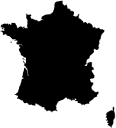图 6-1. 地图字体使得将地图添加到网页变得非常容易。

### 第 3 步：将多个国家合并到一个地图中

对于这个例子，我们希望展示不仅仅是一个国家。我们想要基于联合国人口数据（* [`www.un.org/en/development/desa/population/`](http://www.un.org/en/development/desa/population/) *）2010 年的数据，展示所有欧洲国家的中位年龄。为此，我们将创建一个包含所有欧洲国家的地图，并根据数据对每个国家进行样式设置。

这个可视化的第一步是将所有国家放入一个单一的地图中。由于每个国家都是大陆字体中的一个独立字符，我们希望将这些字符叠加在一起，而不是将它们分布到整个页面。这需要设置一些 CSS 规则。

```
  #map **{**
➊    **position:** relative**;**
  **}**
  #map > [class*="map-"] **{**
➋    **position:** absolute**;**
➌    **top:** 0**;**
      **left:** 0**;**
  **}**
```

首先，我们将外部容器的定位设置为`relative` ➊。此规则不会改变外部容器的样式，但它确立了一个*定位上下文*，供容器内的任何元素使用。这些元素将是我们的单个国家符号，我们将它们的定位设置为`absolute` ➋。接着，我们分别将每个国家符号定位到地图的顶部和左侧 ➌，使它们重叠在一起。由于我们已将容器定位为`relative`，因此这些国家符号将相对于该容器进行定位，而不是相对于整个页面。

请注意，我们使用了一些 CSS 技巧，将这些定位应用到该元素中的所有单个符号上。我们首先通过选择`id`为`map`的元素来开始。这里没有什么特别的。直接子代选择器（`>`）则表示后面的内容应该匹配该元素的直接子元素，而不是任意后代元素。最后，属性选择器`[class*="map-"]`仅指定具有包含`map-`字符的类的子元素。由于所有的国家符号将是具有类`map-`*`xx`*（其中*`xx`*是两位字母的国家缩写）的`<span>`元素，这将匹配我们所有的国家。

在我们的 JavaScript 中，我们可以从一个列出所有国家的数组开始，并遍历它。对于每个国家，我们创建一个带有相应类的`<span>`元素，并将其插入到地图的`<div>`中。

```
**var** countries = [
  "ad", "al", "at", "ba", "be", "bg", "by", "ch", "cy", "cz",
  "de", "dk", "ee", "es", "fi", "fo", "fr", "ge", "gg", "gr",
  "hr", "hu", "ie", "im", "is", "it", "je", "li", "lt", "lu",
  "lv", "mc", "md", "me", "mk", "mt", "nl", "no", "pl", "pt",
  "ro", "rs", "ru", "se", "si", "sk", "sm", "tr", "ua", "uk",
  "va"
];
**var** map = document.getElementById("map");
countries.forEach(**function**(cc) {
    **var** span = document.createElement("span");
    span.className = "map-" + cc;
    map.appendChild(span);
});
```

通过定义这些样式规则，我们可以在地图的`<div>`中插入多个`<span>`元素，创建出图 6-2 所示的欧洲地图，虽然它有些平淡，但已经是一个完整的地图。

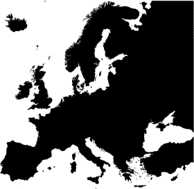图 6-2. 将地图字符叠加在一起可以创建一个完整的地图。

### 第 4 步：根据数据变化国家符号

现在我们已经准备好创建实际的数据可视化了。自然，我们将从数据开始，在这种情况下是来自联合国的数据。以下是我们如何将这些数据格式化为一个 JavaScript 数组。（完整的数据集可以在本书的源代码中找到，地址是 *[`jsDataV.is/source/`](http://jsDataV.is/source/)*。）

```
**var** ages = [
    { "country": "al", "age": 29.968 },
    { "country": "at", "age": 41.768 },
    { "country": "ba", "age": 39.291 },
    { "country": "be", "age": 41.301 },
    { "country": "bg", "age": 41.731 },
    *// Data set continues...*
```

我们可以通过几种方式使用这些数据来修改地图。例如，我们可以通过 JavaScript 代码直接设置可视化属性，例如更改每个国家符号的`color`样式。这样是可行的，但它忽略了地图字体的一大优势。使用地图字体时，我们的可视化是标准的 HTML，因此我们可以使用标准的 CSS 来进行样式设置。如果将来我们想要更改页面上的样式，它们将全部包含在样式表中，而我们无需在 JavaScript 代码中查找并调整颜色。

为了指示哪些样式适用于某个国家的符号，我们可以为每个符号附加一个`data-`属性。

```
➊ **var** findCountryIndex = **function**(cc) {
       **for** (**var** idx=0; idx<ages.length; idx++) {
           **if** (ages[idx].country === cc) {
               **return** idx;
           }
       }
       **return** -1;
   }
   **var** map = document.getElementById("map");
   countries.forEach(**function**(cc) {
       **var** idx = findCountryIndex(cc);
       **if** (idx !== -1) {
           **var** span = document.createElement("span");
           span.className = "map-" + cc;
➋         span.setAttribute("data-age", Math.round(ages[idx].age));
           map.appendChild(span);
       }
   });
```

在这段代码中，我们将`data-age`属性设置为平均年龄，四舍五入到最接近的整数➋。为了找出某个国家的年龄，我们需要该国在`ages`数组中的索引。`findCountryIndex()`函数➊可以以直接的方式完成这一操作。

现在我们可以根据`data-age`属性来分配 CSS 样式规则。这是为不同年龄段创建简单蓝色渐变的开始，其中较大中位数年龄的颜色为较深的蓝绿色。

```
#map > [data-age="44"] **{** **color:** #2d9999**;** **}**
#map > [data-age="43"] **{** **color:** #2a9493**;** **}**
#map > [data-age="42"] **{** **color:** #278f8e**;** **}**
*/* CSS rules continue... */*
```

### 注意

**尽管这些内容超出了本书的范围，但 CSS 预处理器如 LESS（***[`lesscss.org/`](http://lesscss.org/)***）和 SASS（***[`sass-lang.com/`](http://sass-lang.com/)***）使得创建这些规则变得更加简单。**

现在我们可以看到图 6-3 中展示的年龄趋势的良好可视化效果。

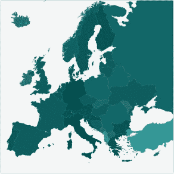图 6-3. 通过 CSS 规则，我们可以更改单个地图符号的样式。

### 第 5 步：添加图例

为了完成可视化，我们可以在地图上添加图例。因为地图本身只是标准的 HTML 元素，并且使用了 CSS 样式，所以创建匹配的图例非常简单。这个示例涵盖了一个相对广泛的范围（28 到 44 岁），因此线性渐变作为关键图例效果很好。你自己的实现将取决于你希望支持的具体浏览器版本，但通用的样式规则如下：

```
#map-legend .key **{**
    **background:** linear-gradient(to bottom, #004a4a 0%,#2d9999 100%)**;**
**}**
```

在图 6-4 中，结果的可视化清晰简洁地总结了欧洲国家的中位年龄。

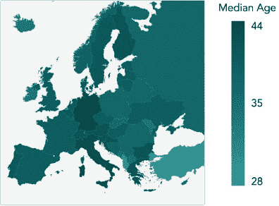图 6-4. 标准 HTML 也可以为可视化提供图例。

## 使用可缩放矢量图形

像前一个示例中的地图字体易于使用且视觉效果显著，但只有少数几种地图字体可用，且它们显然无法涵盖所有可想象的地理区域。对于其他区域的可视化，我们需要找到不同的技术。地图，当然，最终是图像，网页浏览器可以显示多种不同的图像格式。特别是，有一种格式叫做*可缩放矢量图形（SVG）*，特别适合交互式可视化。正如我们将在这个示例中看到的，JavaScript 代码（以及 CSS 样式）可以轻松自然地与 SVG 图像进行交互。

尽管本节的示例处理的是地图，但这里的技巧并不限于地图。每当你有一个 SVG 格式的图表或插图时，你都可以直接在网页上操作它。

### 注意

**使用 SVG 时有一个重要的考虑因素：只有现代的网页浏览器支持它。更具体来说，IE8（及更早版本）无法显示 SVG 图像。如果你的网站用户中有大量使用旧版浏览器的用户，你可能需要考虑其他替代方案。**

对于网页开发者来说，SVG 特别方便，因为它的语法使用与 HTML 相同的结构。你可以使用许多与 HTML 相同的工具和技巧来处理 SVG。例如，考虑一个基本的 HTML 文档。

```
<!DOCTYPE html>
**<html** lang="en"**>**
  **<head>***<!-- -->***</head>**
  **<body>**
    **<nav>***<!-- -->***</nav>**
    **<main>**
      **<section>***<!-- -->***</section>**
    **</main>**
    **<nav>***<!-- -->***</nav>**
  **</body>**
**</html>**
```

与下一个示例进行对比：在 SVG 文档中表示的急救通用符号。

### 注意

**如果你曾经使用过 HTML5 之前的 HTML，可能会特别注意到它们的相似性，因为 SVG 的头部文本与 HTML4 遵循相同的格式。**

```
**<?xml** version="1.0" encoding="UTF-8"**?>**
<!DOCTYPE svg PUBLIC "-//W3C//DTD SVG 1.1//EN"
    "http://www.w3.org/Graphics/SVG/1.1/DTD/svg11.dtd">
**<svg** id="firstaid" version="1.1" xmlns="http://www.w3.org/2000/svg"
     width="100" height="100"**>**
    **<rect** id="background" x="0" y="0" width="100" height="100" rx="20" **/>**
    **<rect** id="vertical"   x="39" y="19" width="22" height="62" **/>**
    **<rect** id="horizontal" x="19" y="39" width="62" height="22" **/>**
**</svg>**
```

你甚至可以使用 CSS 对 SVG 元素进行样式设置。下面是我们如何给前面的图像上色：

```
svg#firstaid **{**
    **stroke:** none**;**
**}**
svg#firstaid #background **{**
    **fill:** #000**;**
**}**
svg#firstaid #vertical,
svg#firstaid #horizontal **{**
    **fill:** #FFF**;**
**}**
```

图 6-5 展示了 SVG 如何渲染。

图 6-5. SVG 图像可以直接嵌入到网页中。

HTML 与 SVG 之间的关联实际上远比类似的语法要强。在现代浏览器中，你可以在同一网页中混合使用 SVG 和 HTML。为了演示如何实现这一点，让我们为美国乔治亚州的 159 个县可视化健康数据。数据来自县健康排名（*[`www.countyhealthrankings.org/`](http://www.countyhealthrankings.org/)*）。

### 步骤 1：创建 SVG 地图

我们的可视化从地图开始，因此我们需要一张乔治亚州县的 SVG 格式插图。尽管这看起来可能是一个挑战，但实际上有许多免费的 SVG 地图来源，以及可以为几乎任何区域生成 SVG 地图的专用应用程序。例如，维基共享资源（*[`commons.wikimedia.org/wiki/Main_Page`](http://commons.wikimedia.org/wiki/Main_Page)）包含了大量的开源地图，其中包括许多乔治亚州的地图。我们将使用一张显示历史遗址名录数据的地图（*[`commons.wikimedia.org/wiki/File:NRHP_Georgia_Map.svg#file`](http://commons.wikimedia.org/wiki/File:NRHP_Georgia_Map.svg#file)）。

下载地图文件后，我们可以根据需要进行调整，移除图例、颜色和其他不需要的元素。虽然你可以在文本编辑器中完成这项工作（就像编辑 HTML 一样），但你可能会发现使用像 Adobe Illustrator 这样的图形程序，或者像 Sketch（*[`www.bohemiancoding.com/sketch/`](http://www.bohemiancoding.com/sketch/)*）这样的更专注于网页的应用程序会更方便。你还可能想利用 SVG 优化网站（*[`petercollingridge.appspot.com/svg-optimiser/`](http://petercollingridge.appspot.com/svg-optimiser/)*）或应用程序（*[`github.com/svg/`](https://github.com/svg/)*），这些工具可以通过移除多余的标签并减少图形程序有时过度的精度来压缩 SVG 文件。

我们的结果将是一系列的`<path>`元素，每个县一个。我们还需要为每个路径分配一个`class`或`id`，以表示县名。最终生成的 SVG 文件可能如下所示。

```
**<svg** version="1.1" xmlns="http://www.w3.org/2000/svg"
    width="497" height="558"**>**
    **<path** id="ck" d="M 216.65,131.53 L 216.41,131.53 216.17,131.53..." **/>**
    **<path** id="me" d="M 74.32,234.01 L 74.32,232.09 74.32,231.61..." **/>**
    **<path** id="ms" d="M 64.96,319.22 L 64.72,319.22 64.48,318.98..." **/>**
    *<!-- Markup continues... -->*
```

总结一下，创建 SVG 地图的步骤如下。

1.  找到一个合适许可的 SVG 格式地图文件，或使用专用地图应用程序创建一个。

1.  在图形应用程序中编辑 SVG 文件，以移除多余的组件并简化插图。

1.  使用优化网站或应用程序优化 SVG 文件。

1.  在你的常规 HTML 编辑器中进行最后调整（例如添加`id`属性）。

### 步骤 2：将地图嵌入页面

将 SVG 地图嵌入网页的最简单方法是直接将 SVG 标记嵌入 HTML 标记中。例如，要包含急救符号，只需在页面本身内包含 SVG 标签，如➊至➋所示。你不需要包含通常存在于独立 SVG 文件中的头标签。

```
   <!DOCTYPE html>
   **<html** lang="en"**>**
     **<head>**
       **<meta** charset="utf-8"**>**
       **<title></title>**
     **</head>**
     **<body>**
       **<div>**
➊       **<svg** id="firstaid" version="1.1"
             xmlns="http://www.w3.org/2000/svg"
           width="100" height="100"**>**
           **<rect** id="background" x="0" y="0"
                 width="100" height="100" rx="20" **/>**
           **<rect** id="vertical" x="39" y="19"
                 width="22" height="62" **/>**
           **<rect** id="horizontal" x="19" y="39"
                 width="62" height="22" **/>**
➋       **</svg>**
      **</div>**
     **</body>**
   **</html>**
```

如果你的地图相对简单，直接嵌入是将其包含在页面中最简单的方法。然而，我们的乔治亚州地图即使经过优化后也有大约 1 MB 的大小。对于分辨率合理的地图，这并不罕见，因为描述复杂的边界，如海岸线或河流，可能会导致大型的`<path>`元素。特别是当地图不是页面的唯一重点时，你可以通过先加载页面的其余部分来提供更好的用户体验。这样，当地图在后台加载时，用户可以阅读其他内容。如果适合你的站点，你甚至可以添加一个简单的动画进度加载器。

如果你使用的是 jQuery，加载地图只需要一条指令。但你需要确保，在加载完成之前，代码不会开始操作地图。以下是源代码中的示例：

```
$("#map").load("img/ga.svg", **function**() {
    *// Only manipulate the map inside this block*
})
```

### 第 3 步：收集数据

我们的可视化数据可以直接从 County Health Rankings（*[`www.countyhealthrankings.org/`](http://www.countyhealthrankings.org/)*）以 Excel 电子表格的形式获得。我们将在前期将其转换为 JavaScript 对象，并为每个县添加一个对应的两字母代码。以下是该数组的起始部分。

```
**var** counties = [
    {
      "name":"Appling",
      "code":"ap",
      "outcomes_z":0.93,
      "outcomes_rank":148,
      *// Data continues...*
    },
    {
      "name":"Atkinson",
      "code":"at",
      "outcomes_z":0.40,
      "outcomes_rank":118,
    *// Data set continues...*
];
```

对于这次可视化，我们希望展示各县之间健康结果的差异。数据集提供了两种变量来表示该值，一个是排名，另一个是 z-score（标准分数，衡量样本与均值之间的偏差程度）。County Health Rankings 网站提供了稍微修改过的 z-score，偏离传统统计定义。正常的 z-score 总是正值；然而，在这个数据集中，主观上优于平均水平的测量值会乘以-1，使其变为负值。例如，某个县的健康结果比均值好两个标准差时，其 z-score 为-2，而不是 2。这种调整使得在我们的可视化中使用这些 z-score 变得更加容易。

我们在使用这些 z-score 的第一步是找到最大值和最小值。我们可以通过提取结果作为一个单独的数组，然后使用 JavaScript 的内置`Math.max()`和`Math.min()`函数来完成这项工作。请注意，以下代码使用了`map()`方法来提取数组，而该方法仅在现代浏览器中可用。然而，既然我们已经选择使用 SVG 图像，我们的用户已经被限制为使用现代浏览器，因此当有可能时，我们也可以利用这一点。

```
**var** outcomes = counties.map(**function**(county) {**return** county.outcomes_z;});
**var** maxZ = Math.max.apply(**null**, outcomes);
**var** minZ = Math.min.apply(**null**, outcomes);
```

请注意，我们在这里使用了`.apply()`方法。通常，`Math.max()`和`Math.min()`函数接受以逗号分隔的参数列表。而我们当然有一个数组。`apply()`方法可以与任何 JavaScript 函数一起使用，将数组转化为逗号分隔的列表。第一个参数是要使用的上下文，在我们的例子中并不重要，因此我们将其设置为`null`。

为了完成数据准备，让我们确保最小值和最大值范围对称于均值。

```
**if** (Math.abs(minZ) > Math.abs(maxZ)) {
    maxZ = -minZ;
} **else** {
    minZ = -maxZ;
}
```

例如，如果 z 分数的范围从`-2`到`1.5`，那么这段代码将把范围扩展到`[-2, 2]`。这个调整还会使颜色比例变得对称，从而使我们的可视化更容易被用户解读。

### 第 4 步：定义颜色方案

为地图定义一个有效的颜色方案可能相当棘手，但幸运的是，有一些非常好的资源可以参考。对于这次可视化，我们将依赖 Chroma.js 库（*[`driven-by-data.net/about/chromajs/`](http://driven-by-data.net/about/chromajs/)*）。这个库包含了许多处理和操作颜色以及颜色比例的工具，可以满足最为高阶的色彩理论学者。对于我们的例子来说，我们可以利用预定义的色阶，特别是由 Cynthia Brewer 最初定义的那些色阶（*[`colorbrewer2.org/`](http://colorbrewer2.org/)*）。

Chroma.js 库在流行的内容分发网络上有提供，因此我们可以依赖像 CloudFlare 的 cdnjs 这样的网络来托管它（*[`cdnjs.com/`](http://cdnjs.com/)*）。

```
<!DOCTYPE html>
**<html** lang="en"**>**
  **<head>**
    **<meta** charset="utf-8"**>**
    **<title></title>**
  **</head>**
  **<body>**
    **<div** id="map"**></div>**
    **<script**
     src="///cdnjs.cloudflare.com/ajax/libs/chroma-js/0.5.2/chroma.min.js"**>**
    **</script>**
  **</body>**
**</html>**
```

若要使用预定义的色阶，我们将色阶的名称（`"BrBG"`表示 Brewer 的棕色到蓝绿色色阶）传递给`chroma.scale()`函数。

```
**var** scale = chroma.scale("BrBG").domain([maxZ, minZ]).out("hex");
```

同时，我们还会指明我们色阶的范围（`minZ`到`maxZ`，虽然因为数据集的 z 分数调整，我们需要反转顺序）以及我们期望的输出格式。`"hex"`输出是常见的`"#012345"`格式，兼容 CSS 和 HTML 标记。

### 第 5 步：为地图上色

颜色方案确定后，我们可以将适当的颜色应用到地图上的每个县。那大概是整个可视化过程中最简单的步骤。我们遍历所有县，通过它们的`id`值找到相应的`<path>`元素，并通过设置`fill`属性来应用颜色。

```
counties.forEach(**function**(county) {
    document.getElementById(county.code)
      .setAttribute("fill", scale(county.outcomes_z));
})
```

结果地图，展示在图 6-6 中，显示了哪些县在 2014 年健康结果上高于平均水平，哪些则低于平均水平。

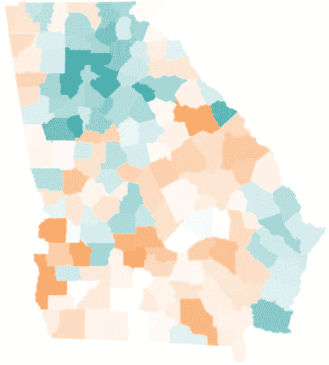图 6-6. CSS 规则可以为 SVG 插图中的每个 SVG 元素设置样式。

### 第 6 步：添加图例

为了帮助用户解读地图，我们可以向可视化中添加图例。我们可以利用 Chroma.js 的色阶轻松创建一个表格，来解释变化。对于这个表格，我们将使用四个增量来表示均值两侧的颜色。这样我们总共有九种颜色用于图例。

```
**<table** id="legend"**>**
    **<tr** class="scale"**>**
        **<td></td><td></td><td></td><td></td><td></td>**
        **<td></td><td></td><td></td><td></td>**
    **</tr>**
    **<tr** class="text"**>**
        **<td** colspan="4"**>**Worse than Average**</td>**
        **<td>**Average**</td>**
        **<td** colspan="4"**>**Better than Average**</td>**
    **</tr>**
**</table>**
```

一些简单的 CSS 样式将使表格呈现得恰当。由于我们有九种颜色，我们将每个表格单元格的宽度设置为`11.1111%`（1/9 约等于 0.111111）。

```
table#legend tr.scale td **{**
    **height:** 1em**;**
    **width:** 11.1111%**;**
**}**
table#legend tr.text td:first-child **{**
    **text-align:** left**;**
**}**
table#legend tr.text td:nth-child(2) **{**
    **text-align:** center**;**
**}**
table#legend tr.text td:last-child **{**
    **text-align:** right**;**
**}**
```

最后，我们使用之前创建的 Chroma 色标来设置图例表格单元格的背景颜色。因为图例是一个`<table>`元素，所以我们可以直接访问行和行中的单元格。尽管在以下代码中，这些元素看起来像数组，但它们并不是真正的 JavaScript 数组，因此不支持像`forEach()`这样的数组方法。目前，我们将使用`for`循环来迭代它们，但如果你更喜欢使用数组方法，敬请期待一个简单的技巧。请注意，由于数据集的 z-score 调整，我们再次是在逆向操作。

```
   **var** legend = document.getElementById("legend");
   **var** cells = legend.rows[0].cells;
   **for** (**var** idx=0; idx<cells.length; idx++) {
       **var** td = cells[idx];
➊     td.style.backgroundColor = scale(maxZ -
           ((idx + 0.5) / cells.length) * (maxZ - minZ));
   };
```

在 ➊ 处，我们计算当前索引占图例颜色总数的比例`((idx + 0.5) / cells.length)`，将其乘以色标的总范围`(maxZ - minZ)`，并从最大值中减去结果。

结果是地图的图例，如图 6-7 所示。

图 6-7. 一个 HTML `<table>` 可以作为图例。

### 第 7 步：添加交互

为了完成可视化，我们让用户可以在地图上将鼠标悬停在一个县上，以查看更多详细信息。当然，平板或智能手机用户无法进行鼠标交互。为了支持这些用户，你可以为触摸或点击事件添加类似的交互。那段代码几乎与下一个示例相同。

我们将从定义一个表格开始，以显示县的详细信息。

```
**<table** id="details"**>**
    **<tr><td>**County:**</td><td></td></tr>**
    **<tr><td>**Rank:**</td><td></td></tr>**
    **<tr><td>**Health Behaviors:**</td><td></td></tr>**
    **<tr><td>**Clinical Care:**</td><td></td></tr>**
    **<tr><td>**Social & Economic Factors:**</td><td></td></tr>**
    **<tr><td>**Physical Environment:**</td><td></td></tr>**
**</table>**
```

最初，我们不希望这个表格可见。

```
table#details **{**
    **display:** none**;**
**}**
```

为了显示表格，我们使用事件处理函数来跟踪鼠标何时进入或离开县的 SVG 路径。为了找到这些`<path>`元素，我们可以使用现代浏览器支持的`querySelectorAll()`函数。不幸的是，这个函数并不会返回一个真正的元素数组，因此我们不能使用`forEach()`等数组方法来迭代这些元素。然而，有一个技巧可以将返回的列表转换为一个真正的数组。

```
[].slice.call(document.querySelectorAll("#map path"))
    .forEach(**function**(path) {
        path.addEventListener("mouseenter", **function**(){
            document.getElementById("details").style.display = "table";
        });
        path.addEventListener("mouseleave", **function**(){
            document.getElementById("details").style.display = "none";
        });
    }
);
```

这段代码调用了`[].slice.call()`函数，并将“几乎是数组”的对象作为参数传递。结果是一个真正的数组，包含了所有有用的方法。

除了让详细信息表格可见之外，我们还希望用适当的信息更新它。为了帮助显示这些信息，我们可以编写一个函数，将 z-score 转换为更易于理解的解释。以下示例中的具体值是任意的，因为我们在这次可视化中并不追求统计精度。

```
**var** zToText = **function**(z) {
    z = +z;
    **if** (z > 0.25)  { **return** "Far Below Average"; }
    **if** (z >  0.1)  { **return** "Below Average"; }
    **if** (z > -0.1)  { **return** "Average"; }
    **if** (z > -0.25) { **return** "Above Average"; }
    **return** "Far Above Average";
}
```

这个函数中有几个值得注意的地方。首先，语句`z = +z`将 z-score 从字符串转换为数值，以便进行后续的测试。其次，记住由于 z-score 调整，负的 z-score 实际上好于平均值，而正的值则低于平均值。

我们可以使用这个函数为我们的详细信息表格提供数据。第一步是找到与 `<path>` 元素相关联的完整数据集。为此，我们会在 `counties` 数组中查找 `code` 属性与路径的 `id` 属性匹配的项。

```
**var** county = **null**;
counties.some(**function**(c) {
    **if** (c.code === **this**.id) {
        county = c;
        **return** **true**;
    }
    **return** **false**;
});
```

由于 `indexOf()` 不能让我们按键查找对象，因此我们使用了 `some()` 方法。该方法在找到匹配项后会立即终止，因此我们避免了遍历整个数组。

一旦我们找到了县的数据，更新表格就是一个简单的过程。以下代码直接更新相关表格单元格的文本内容。为了实现更健壮的功能，你可以为单元格提供类名，并基于这些类名进行更新。

```
**var** table = document.getElementById("details");
table.rows[0].cells[1].textContent =
    county.name;
table.rows[1].cells[1].textContent =
    county.outcomes_rank + " out of " + counties.length;
table.rows[2].cells[1].textContent =
    zToText(county.health_behaviors_z);
table.rows[3].cells[1].textContent =
    zToText(county.clinical_care_z);
table.rows[4].cells[1].textContent =
    zToText(county.social_and_economic_factors_z);
table.rows[5].cells[1].textContent =
    zToText(county.physical_environment_z);
```

现在我们只需要进行一些进一步的完善：

```
   path.addEventListener("mouseleave", **function**(){
       *// Previous code*
➊     **this**.setAttribute("stroke", "#444444");
   });
   path.addEventListener("mouseleave", **function**(){
       *// Previous code*
➋     **this**.setAttribute("stroke", "none");
   });
```

在这里，我们为高亮显示的县添加了一个边框颜色，位于➊。当鼠标离开路径时，我们移除了位于➋的边框。

到这里为止，我们的可视化示例已经完成。图 6-8 展示了结果。

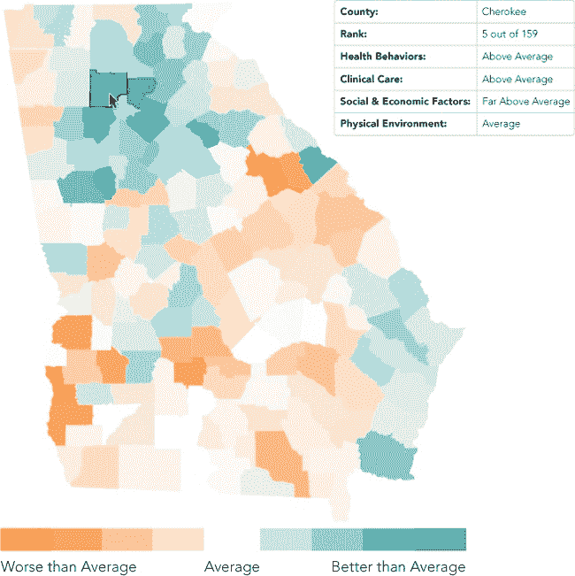图 6-8. 浏览器（以及一些代码）可以将 SVG 插图转化为互动式可视化。

## 包括地图作为背景

到目前为止，我们在本章中看过的地图可视化主要关注地理区域——比如欧洲的国家或乔治亚州的县。在这些情况下，分级色块地图在展示区域间差异时非常有效。然而，并非所有地图可视化都具有相同的焦点。在某些情况下，我们希望将地图更多地作为可视化数据的上下文或背景。

当我们想要将地图作为可视化背景时，我们可能会发现传统的地图绘制库比自定义的分级色块地图更适合我们的需求。最著名的地图库可能是 Google Maps (*[`maps.google.com/`](http://maps.google.com/)*)，你几乎肯定在网页上见过许多嵌入的 Google 地图。然而，Google Maps 也有几个免费的开源替代品。对于这个示例，我们将使用 Stamen Design 提供的 Modest Maps 库 (*[`github.com/modestmaps/modestmaps-js/`](https://github.com/modestmaps/modestmaps-js/)*)。为了展示这个库，我们将可视化美国的主要 UFO 目击事件 (*[`en.wikipedia.org/wiki/UFO_sightings_in_the_United_States`](http://en.wikipedia.org/wiki/UFO_sightings_in_the_United_States)*)，至少是那些足够重要以至于值得在维基百科上出现的事件。

### 第一步：设置网页

对于我们的可视化，我们将依赖于 Modest Maps 库中的几个组件：核心库本身和可以在库的示例文件夹中找到的 spotlight 扩展。在生产环境中，您可能会将这些组件合并并压缩结果以优化性能，但在我们的示例中，我们将它们单独包含。

```
   <!DOCTYPE html>
   **<html** lang="en"**>**
     **<head>**
       **<meta** charset="utf-8"**>**
       **<title></title>**
     **</head>**
     **<body>**
➊     **<div** id="map"**></div>**
       **<script** src="js/modestmaps.js"**></script>**
       **<script** src="js/spotlight.js"**></script>**
     **</body>**
   **</html>**
```

我们还在 ➊ 处设置了一个 `<div>` 来容纳地图。不出所料，它的 `id` 为 `"map"`。

### 第 2 步：准备数据

维基百科数据可以格式化为 JavaScript 对象数组。我们可以在对象中包含任何信息，但我们肯定需要观察数据的纬度和经度，以便将其定位到地图上。这是您可能如何构建数据的示例。

```
**var** ufos = [
{
    "date": "April, 1941",
    "city": "Cape Girardeau",
    "state": "Missouri",
    "location": [37.309167, -89.546389],
    "url": "http://en.wikipedia.org/wiki/Cape_Girardeau_UFO_crash"
},{
    "date": "February 24, 1942",
    "city": "Los Angeles",
    "state": "California",
    "location": [34.05, -118.25],
    "url": "http://en.wikipedia.org/wiki/Battle_of_Los_Angeles"
},{
*// Data set continues...*
```

`location` 属性保存纬度和经度（负值表示西方）作为一个包含两个元素的数组。

### 第 3 步：选择地图样式

和大多数地图库一样，Modest Maps 使用图层构建地图。图层的构建过程与在 Photoshop 或 Sketch 等图形应用程序中的工作方式非常相似。后续的图层会向地图添加更多的视觉信息。在大多数情况下，地图的基础图层由图像瓷砖组成。像标记或路线等附加图层可以叠加在图像瓷砖之上。

当我们告诉 Modest Maps 创建地图时，它会计算所需的瓷砖（包括大小和位置），然后异步地从互联网上请求这些瓷砖。瓷砖定义了地图的视觉样式。Stamen Design 本身发布了几套瓷砖，您可以在*[`maps.stamen.com/`](http://maps.stamen.com/)*上查看。

要使用 Stamen 瓷砖，我们将向页面中添加一个小的 JavaScript 库。该库可以直接从 Stamen Design 获取 (*[`maps.stamen.com/js/tile.stamen.js`](http://maps.stamen.com/js/tile.stamen.js)*)。它应在 Modest Maps 库之后被包含。

```
<!DOCTYPE html>
**<html** lang="en"**>**
  **<head>**
    **<meta** charset="utf-8"**>**
    **<title></title>**
  **</head>**
  **<body>**
    **<div** id="map"**></div>**
    **<script** src="js/modestmaps.js"**></script>**
    **<script** src="js/spotlight.js"**></script>**
    **<script** src="http://maps.stamen.com/js/tile.stamen.js"**></script>**
  **</body>**
**</html>**
```

对于我们的示例，"toner" 样式非常合适，因此我们将使用这些瓷砖。要使用这些瓷砖，我们为地图创建一个 *瓷砖图层*。

```
**var** tiles = **new** MM.StamenTileLayer("toner");
```

在考虑图像瓷砖来源时，请注意任何版权限制。一些图像瓷砖必须获得授权，甚至那些自由提供的瓷砖，通常也要求用户标明提供者为来源。

### 第 4 步：绘制地图

现在我们准备好绘制地图了。这需要两条 JavaScript 语句：

```
**var** map = **new** MM.Map("map", tiles);
map.setCenterZoom(**new** MM.Location(38.840278, -96.611389), 4);
```

首先我们创建一个新的 `MM.Map` 对象，给它传入包含地图的元素的 `id` 和我们刚刚初始化的瓷砖。然后，我们提供地图中心的纬度和经度以及初始缩放级别。对于您自己的地图，您可能需要做些实验来找到合适的值，但对于本示例，我们将地图居中并缩放，以便舒适地显示美国本土。

结果地图，如图 6-9 所示，为显示观察数据提供了基础。

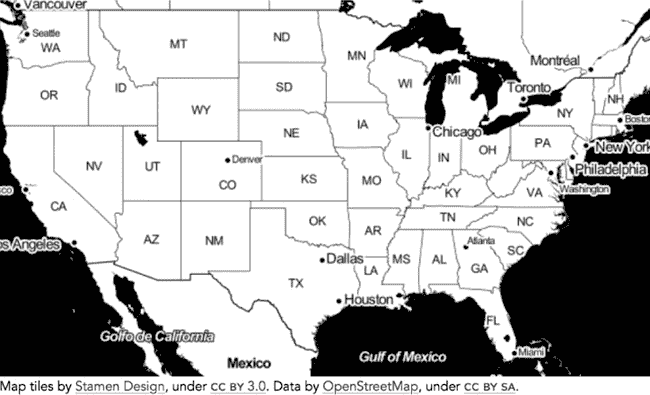图 6-9。地图库可以根据地理坐标显示地图。

请注意，Stamen Design 和 OpenStreetMap 都有注明出处。这是 Stamen Design 许可协议要求的归属。

### 第 5 步：添加目击事件

当我们的地图搭建完成后，是时候添加单独的 UFO 目击事件了。我们使用聚光灯扩展来突出显示这些地点，因此我们首先为地图创建一个聚光灯图层。我们还需要设置聚光灯效果的半径。与中心和缩放参数一样，这里也需要通过一定的反复试验来调整。

```
**var** layer = **new** SpotlightLayer();
layer.spotlight.radius = 15;
map.addLayer(layer);
```

现在，我们可以遍历构成我们数据的所有目击事件。对于每一个目击事件，我们提取该地点的纬度和经度，并将该地点添加到聚光灯图层中。

```
ufos.forEach(**function**(ufo) {
    layer.addLocation(**new** MM.Location(ufo.location[0], ufo.location[1]));
});
```

到此为止，我们的可视化已经完成。图 6-10 展示了在美国上空据称出现 UFO 的地点，并在合适的神秘背景下呈现。

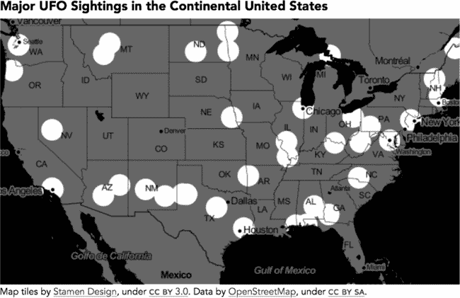图 6-10。在地图库中添加图层可以突出显示地图区域。

## 集成一个功能齐全的地图库

前一个例子中的 Modest Maps 库是一个很好的简单地图可视化库，但它没有 Google Maps 这样全面功能的支持。不过，有一个开源库提供了这些功能：Leaflet (*[`leafletjs.com/`](http://leafletjs.com/)*)。在这个例子中，我们将构建一个更复杂的可视化，使用基于 Leaflet 的地图。

在 20 世纪 40 年代，两个私人铁路公司在美国东南部的客运市场展开竞争。两个竞争最直接的路线是“银彗星号”（由海滨航空公司运营）和“南方号”（由南方铁路公司运营）。这两条线路都服务于从纽约到阿拉巴马州伯明翰的乘客。有人认为“南方号”最终成功的原因之一是其路线较短，旅程较快，使得南方铁路公司在竞争中占据了优势。让我们通过可视化来展示这一优势。

### 第 1 步：准备数据

我们可视化的数据作为两条路线的时刻表随时可用。更精确的比较可能会考虑同一年份的时刻表，但在这个示例中，我们将使用 1941 年《南方人号》的时刻表（* [`www.streamlinerschedules.com/concourse/track1/southerner194112.html`](http://www.streamlinerschedules.com/concourse/track1/southerner194112.html) *）和 1947 年《银彗星号》的时刻表（* [`www.streamlinerschedules.com/concourse/track1/silvercomet194706.html`](http://www.streamlinerschedules.com/concourse/track1/silvercomet194706.html) *），因为它们可以在互联网上轻松获取。时刻表只包含车站名称，因此我们需要查找所有车站的纬度和经度值（例如使用 Google 地图），以便将它们标记在地图上。我们还可以计算站点之间的时间差（以分钟为单位）。这些计算会得到两个数组，每个数组对应一列车。

```
**var** seaboard = [
    { "stop": "Washington",
      "latitude": 38.895111, "longitude": -77.036667,
      "duration": 77 },
    { "stop": "Fredericksburg",
      "latitude": 38.301806, "longitude": -77.470833,
      "duration": 89 },
    { "stop": "Richmond",
      "latitude": 37.533333, "longitude": -77.466667,
      "duration": 29 },
    *// Data set continues...*
];
**var** southern = [
    { "stop": "Washington",
      "latitude": 38.895111, "longitude": -77.036667,
      "duration": 14 },
    { "stop": "Alexandria",
      "latitude": 38.804722, "longitude": -77.047222,
      "duration": 116 },
    { "stop": "Charlottesville",
      "latitude": 38.0299, "longitude": -78.479,
      "duration": 77 },
    *// Data set continues...*
];
```

### 第 2 步：设置网页和库

要将 Leaflet 地图添加到我们的网页中，我们需要包含该库及其附带的样式表。两者都可以通过内容分发网络获取，因此无需将其托管在我们自己的服务器上。

```
   <!DOCTYPE html>
   **<html** lang="en"**>**
     **<head>**
       **<meta** charset="utf-8"**>**
       **<title></title>**
       **<link** rel="stylesheet"
        href="http://cdn.leafletjs.com/leaflet-0.7.2/leaflet.css" **/>**
       **</head>**
       **<body>**
➊       **<div** id="map"**></div>**
       **<script**
         src="http://cdn.leafletjs.com/leaflet-0.7.2/leaflet.js"**>**
       **</script>**
     **</body>**
   **</html>**
```

当我们创建页面时，我们还会在➊处定义一个用于地图的`<div>`容器。

### 第 3 步：绘制基础地图

《银彗星号》和《南方人号》列车在纽约和伯明翰之间往返（对于《南方人号》，甚至一路行驶到新奥尔良）。但是对于我们的可视化，相关的区域位于华盛顿特区和乔治亚州亚特兰大之间，因为只有在这个区域，列车路线有所不同；在其余行程中，路线基本相同。因此，我们的地图将从西南部的亚特兰大延伸到东北部的华盛顿特区。通过一些试验和错误，我们可以确定地图的最佳中心点和缩放级别。中心点定义了地图中心的纬度和经度，而缩放级别决定了地图初次显示时所覆盖的区域。当我们创建地图对象时，我们会将包含元素的`id`以及这些参数传递给它。

```
**var** map = L.map("map",{
    center: [36.3, -80.2],
    zoom: 6
});
```

对于这个特定的可视化，缩放或平移地图没有太大意义，因此我们可以加入额外的选项来禁用这些交互功能。

```
   **var** map = L.map("map",{
       center: [36.3, -80.2],
➊     maxBounds: [ [33.32134852669881, -85.20996093749999],
➋                [39.16414104768742, -75.9814453125] ],
       zoom: 6,
➌     minZoom: 6,
➍     maxZoom: 6,
➎     dragging: **false**,
➏     zoomControl: **false**,
➐     touchZoom: **false**,
       scrollWheelZoom: **false**,
       doubleClickZoom: **false**,
➑     boxZoom: **false**,
➒     keyboard: **false**
   });
```

设置最小缩放级别➌和最大缩放级别➍为与初始缩放级别相同将禁用缩放功能。我们还在➏禁用了屏幕上的地图缩放控件。其他缩放控件也同样被禁用（➐到➑）。对于平移，我们在➎禁用了拖动地图，在➒禁用了键盘方向键。我们还指定了地图的纬度/经度范围（➊和➋）。

由于我们已经禁用了用户平移和缩放地图的功能，我们还应该确保鼠标指针在地图上悬停时不会误导用户。*leaflet.css* 样式表期望启用缩放和拖动，因此它将鼠标指针设置为“抓取”手形图标。我们可以用我们自己的样式规则覆盖这个设置。我们必须在引入 *leaflet.css* 文件后定义这个规则。

```
.leaflet-container **{**
    **cursor:** default**;**
**}**
```

与 Modest Maps 示例一样，我们将地图基于一组瓦片。支持 Leaflet 的瓦片提供商有很多；其中一些是开源的，而其他则是商业的。Leaflet 提供了一个演示页面 (*[`leaflet-extras.github.io/leaflet-providers/preview/`](http://leaflet-extras.github.io/leaflet-providers/preview/)*)，你可以用它来比较一些开源的瓦片提供商。在我们的示例中，我们希望避免包含道路的瓦片，因为在 1940 年代，高速公路网络与现在有很大不同。Esri 提供了一个中性化的 WorldGrayCanvas 瓦片集，这对于我们的可视化非常合适。它包含了当前的县界，而一些县的边界可能自 1940 年代以来发生了变化。不过，在我们的示例中，我们不需要担心这个细节，但在任何生产环境的可视化中，你可能需要考虑这一点。Leaflet 的 API 允许我们在一个语句中创建瓦片图层并将其添加到地图上。Leaflet 内置了一个选项来处理版权归属，这样我们可以确保正确地标注瓦片来源。

```
   L.tileLayer("http://server.arcgisonline.com/ArcGIS/rest/services/"+
               "Canvas/World_Light_Gray_Base/MapServer/tile/{z}/{y}/{x}", {
        attribution: "Tiles &copy; Esri &mdash; Esri, DeLorme, NAVTEQ",
➊      maxZoom: 16
   }).addTo(map);
```

请注意，➊ 处的 `maxZoom` 选项表示该特定瓦片集可用的最大缩放层级。这个值独立于我们允许地图缩放的层级。

有了地图和基础瓦片图层，我们就有了一个很好的可视化起点（见 图 6-11）。

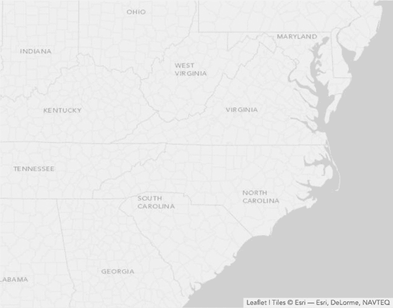图 6-11。基础图层地图为可视化提供了画布。

### 第 4 步：将路线添加到地图

在可视化的下一步中，我们想要在地图上显示两条路线。首先，我们将简单地在地图上绘制每条路线。然后，我们会添加一个动画，实时显示两条路线，同时展示哪一条更快。

Leaflet 库中有一个函数，正是我们需要的来绘制每条路线：`polyline()` 连接一系列由其端点的纬度和经度定义的线条，并为地图做准备。我们的数据集包括每条路线停靠站的地理坐标，因此我们可以使用 JavaScript 的 `map()` 方法来格式化这些值以供 Leaflet 使用。对于 Silver Comet 示例，以下语句提取了它的停靠站。

```
seaboard.map(**function**(stop) {
    **return** [stop.latitude, stop.longitude]
})
```

这条语句返回一组纬度/经度对：

```
[
  [38.895111,-77.036667],
  [38.301806,-77.470833],
  [37.533333,-77.466667],
  [37.21295,-77.400417],
  */* Data set continues... */*
]
```

该结果是`polyline()`函数的完美输入。我们将为每条路线使用它。选项允许我们为线路指定颜色，我们将其与该时代相关铁路的官方颜色相匹配。我们还通过将`clickable`选项设置为`false`来表明，点击时这些线路没有任何功能。

```
L.polyline(
    seaboard.map(**function**(stop) {**return** [stop.latitude, stop.longitude]}),
    {color: "#88020B", weight: 1, clickable: **false**}
).addTo(map);

L.polyline(
    southern.map(**function**(stop) {**return** [stop.latitude, stop.longitude]}),
    {color: "#106634", weight: 1, clickable: **false**}
).addTo(map);
```

添加这个功能后，图 6-12 中显示的可视化开始传达两条路线的相对距离。

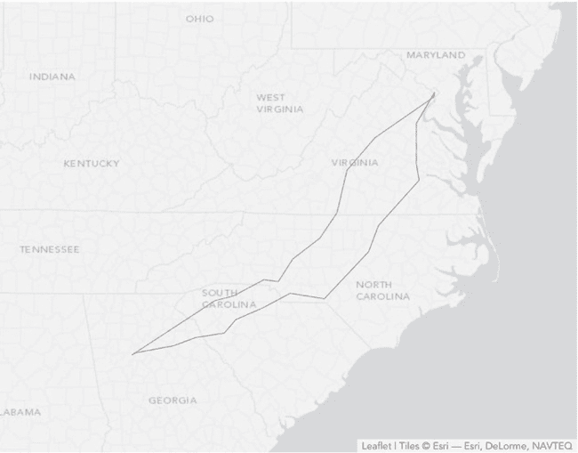 图 6-12. 附加地图图层将数据添加到画布中。

### 第 5 步：添加动画控制

接下来，我们将对两条路线进行动画处理。这不仅会强调较短路线的竞争优势，还会让可视化更加有趣和吸引人。我们肯定希望让用户能够启动和停止动画，因此我们的地图将需要一个控制按钮。Leaflet 库本身没有动画控制器，但它提供了大量的自定义支持。这部分支持就是一个通用的`Control`对象。我们可以通过从该对象开始并扩展它来创建一个动画控制器。

```
L.Control.Animate = L.Control.extend({
    *// Custom code goes here*
});
```

接下来，我们定义自定义控制器的选项。这些选项包括它在地图上的位置、其状态的文本和工具提示（标题），以及在动画开始或停止时调用的函数。我们将这些定义在一个`options`对象中，如下所示，这样 Leaflet 就可以将其集成到其正常功能中。

```
L.Control.Animate = L.Control.extend({
    options: {
        position: "topleft",
        animateStartText: "",
        animateStartTitle: "Start Animation",
        animatePauseText: "",
        animatePauseTitle: "Pause Animation",
        animateResumeText: "",
        animateResumeTitle: "Resume Animation",
        animateStartFn: **null**,
        animateStopFn: **null**
    },
```

对于我们的示例，我们使用 UTF-8 字符作为播放和暂停控制。在生产环境的可视化中，你可能会考虑使用图标字体或图像，以便最大程度地控制外观。

我们的动画控制还需要一个`onAdd()`方法，供 Leaflet 在将控制添加到地图时调用。该方法构建控制的 HTML 标记，并将其返回给调用者。

```
   onAdd: **function** () {
       **var** animateName = "leaflet-control-animate",
➊         container = L.DomUtil.create(
               "div", animateName + " leaflet-bar"),
           options = **this**.options;

➋         **this**._button = **this**._createButton(
               **this**.options.animateStartText,
               **this**.options.animateStartTitle,
               animateName,
               container,
           **this**._clicked);

       **return** container;
   },
```

我们对`onAdd()`的实现分两步构建标记。首先，从➊开始，创建一个`<div>`元素，并为该元素赋予两个类：`leaflet-control-animate`和`leaflet-bar`。第一个类是我们动画控制器特有的，我们可以使用它为我们的控制器应用唯一的 CSS 规则。第二个类是 Leaflet 为所有工具栏定义的通用类。通过将它添加到动画控制器中，我们使该控制器与其他 Leaflet 控制器保持一致。请注意，Leaflet 在➊处包含了`L.DomUtil.create()`方法，用来处理创建元素的细节。

`onAdd()`的第二部分在这个`<div>`容器内创建一个按钮元素。大部分工作是在➋处的`_createButton()`函数中进行的，我们稍后会详细查看。传递给该函数的参数包括：

+   按钮的文本

+   当鼠标悬停在按钮上时显示的工具提示（标题）

+   应用到按钮的 CSS 类

+   插入按钮的容器

+   按钮点击时调用的函数

如果你在想为什么这个函数的名字以下划线（_）开头，那是因为 Leaflet 使用这种命名约定来表示私有方法（和属性）。虽然没有强制要求遵循，但这样做会使熟悉 Leaflet 的人更容易理解我们的代码。

`_createButton()` 方法本身依赖于 Leaflet 的工具函数。

```
   _createButton: **function** (html, title, className, container, callback) {
➊     **var** link = L.DomUtil.create("a", className, container);
       link.innerHTML = html;
       link.href = "#";
➋     link.title = title;

       L.DomEvent
➌         .on(link, "mousedown dblclick", L.DomEvent.stopPropagation)
➍         .on(link, "click", L.DomEvent.stop)
➎         .on(link, "click", callback, **this**);

       **return** link;
   },
```

首先，它将按钮创建为一个 `<a>` 元素，设置指定的文本、标题和类，并将该元素放入合适的容器中（➊ 到 ➋）。然后，它将几个事件绑定到这个 `<a>` 元素上。首先，它忽略初始的 `mousedown` 和双击事件（➌）。它还会防止单击事件在文档树中传播并实现默认行为（➍）。最后，它在 `click` 事件时执行回调函数（➎）。

回调函数本身是我们接下来的任务。

```
➊  _running: **false**,

   _clicked: **function**() {
➋     **if** (**this**._running) {
           **if** (**this**.options.animateStopFn) {
               **this**.options.animateStopFn();
           }
           **this**._button.innerHTML = **this**.options.animateResumeText;
           **this**._button.title = **this**.options.animateResumeTitle;
       } **else** {
           **if** (**this**.options.animateStartFn) {
               **this**.options.animateStartFn();
           }
           **this**._button.innerHTML = **this**.options.animatePauseText;
           **this**._button.title = **this**.options.animatePauseTitle;
       }
       **this**._running = !**this**._running;
   },
```

在我们进入函数之前，我们添加了一个状态变量（`_running`）来跟踪动画当前是否正在运行。它初始时停止，状态为 ➊。然后我们的回调函数会在 ➋ 处检查这个变量。如果 `_running` 为 `true`，意味着动画正在运行并刚被当前点击暂停，因此它会改变控件，指示点击将恢复动画。如果动画没有运行，回调函数会做相反的操作：改变控件，指示后续的点击将暂停它。在这两种情况下，如果有可用的控件函数，回调函数会执行相应的控制函数。最后，它会将 `_running` 的状态设置为其补集。

我们自定义控件的最后部分添加了一个 `reset()` 方法，用来清除动画。这个函数将控件恢复到初始状态。

```
    reset: **function**() {
        **this**._running = **false**;
        **this**._button.innerHTML = **this**.options.animateStartText;
        **this**._button.title = **this**.options.animateStartTitle;
    }
});
```

为了将我们的自定义控件完全集成到 Leaflet 架构中，我们在 `L.control` 对象中添加了一个函数。按照 Leaflet 的约定，这个函数的名字以小写字母开头，但除此之外，它的名字与我们的控件名称完全相同。

```
L.control.animate = **function** (options) {
    **return** **new** L.Control.Animate(options);
};
```

定义这个最后的函数让我们能够使用通用的 Leaflet 语法创建控件。

```
L.control.animate().addTo(map);
```

这是我们之前在图层和折线中看到的相同语法。

### 第六步：准备动画

在设置好方便的用户控件后，我们现在可以开始处理动画本身。尽管这个特定的动画并不特别复杂，但我们仍然可以遵循最佳实践，尽可能提前计算。由于我们要为两条路线制作动画，我们将定义一个函数，用来为任何输入的路线构建动画。第二个参数将指定折线的选项。这个函数会返回一个按分钟索引的折线路径数组。你可以看到这个函数的基本结构如下。

```
**var** buildAnimation = **function**(route, options) {
    **var** animation = [];

    *// Code to build the polylines*

    **return** animation;
}
```

数组中的第一个元素将是路线的第一分钟的折线。我们将在 `animation` 变量中构建整个数组。

为了构建路径，我们遍历路线上的所有站点。

```
➊ **for** (**var** stopIdx=0, prevStops=[];
            stopIdx < route.length-1; stopIdx++) {
       *// Code to calculate steps between current stop and next stop*
   }
```

我们希望跟踪我们已经经过的所有站点，因此我们在➊处定义了 `prevStops` 数组并将其初始化为空。每次迭代都会计算当前站点到下一个站点的动画步骤。由于不需要超出路线的最后一个站点，所以我们在倒数第二个站点处终止循环（`stopIdx < route.length-1;`）。

当我们开始计算从当前站点开始的路径时，我们会将该站点及下一个站点存储在局部变量中，并将当前站点添加到跟踪前一个站点的 `prevStops` 数组中。

```
**var** stop = route[stopIdx];
**var** nextStop = route[stopIdx+1]
prevStops.push([stop.latitude, stop.longitude]);
```

对于数据集中的每一个站点，`duration` 属性存储到下一个站点的分钟数。我们将使用下面的内部循环，从 `1` 计数到该值。

```
**for** (**var** minutes = 1; minutes <= stop.duration; minutes++) {
    **var** position = [
        stop.latitude +
          (nextStop.latitude - stop.latitude) *
          (minutes/stop.duration),
        stop.longitude +
          (nextStop.longitude - stop.longitude) *
          (minutes/stop.duration)
    ];
    animation.push(
        L.polyline(prevStops.concat([position]), options)
    );
}
```

在循环内，我们使用简单的线性插值来计算相应时间的当前位置。这个位置在添加到 `prevStops` 数组时，形成了该时间的折线路径。这段代码基于路径创建折线，并将其添加到动画数组中。

当我们使用数组 `concat()` 方法时，我们将位置数组嵌套在另一个数组对象中。这样可以避免 `concat()` 在附加之前将位置数组展平。你可以在以下示例中看到这种区别。我们想要的是后者的结果。

```
[[1,2], [3,4]].concat([5,6]);   *// => [[1,2], [3,4], 5, 6]*
[[1,2], [3,4]].concat([[5,6]]); *// => [[1,2], [3,4], [5,6]]*
```

### 第 7 步：动画路线

现在终于到了执行动画的时刻。为了初始化它，我们创建一个数组来保存两个路线。

```
**var** routeAnimations = [
    buildAnimation(seaboard,
      {clickable: **false**, color: "#88020B", weight: 8, opacity: 1.0}
    ),
    buildAnimation(southern,
      {clickable: **false**, color: "#106634", weight: 8, opacity: 1.0}
    )
];
```

接下来我们计算最大的动画步骤数。这是两个动画数组长度的最小值。

```
**var** maxSteps = Math.min.apply(**null**,
    routeAnimations.map(**function**(animation) {
        **return** animation.length
    })
);
```

这条语句看起来可能有些复杂，用来找到最小长度，但它适用于任意数量的路线。如果未来我们决定在地图上增加第三条路线，我们就不需要修改代码。理解这条语句的最好方法是从中间开始，向外推理。以下代码片段将路线动画数组转换为长度数组，具体为 `[870,775]`：

```
routeAnimations.map(**function**(animation) {**return** animation.length})
```

要在数组中找到最小值，我们可以使用 `Math.min()` 函数，除了这个函数期望的参数是一个逗号分隔的参数列表，而不是数组。`apply()` 方法（任何 JavaScript 函数都可以使用）将数组转换为逗号分隔的参数列表。它的第一个参数是函数的上下文，在我们这里无关紧要，所以我们传递 `null` 作为该参数。

动画使用 `step` 变量来跟踪当前状态，我们将其初始化为 `0`。

```
**var** step = 0;
```

`animateStep()` 函数处理动画中的每一个步骤。这个函数有四个部分。

```
**var** animateStep = **function**() {
    *// Draw the next step in the animation*
}
```

首先我们检查这是否是动画中的第一步。

```
   **if** (step > 0) {
       routeAnimations.forEach(**function**(animation) {
➊         map.removeLayer(animation[step-1]);
       });
   }
```

如果不是，`step` 将大于零，我们可以在➊处从地图上移除上一个步骤的折线。

接下来我们检查是否已经到达动画的末尾。如果是，则我们从步骤 0 重新启动动画。

```
**if** (step === maxSteps) {
    step = 0;
}
```

对于第三部分，我们将当前步骤的折线添加到地图上。

```
routeAnimations.forEach(**function**(animation) {
    map.addLayer(animation[step]);
});
```

最后，如果我们已经到达动画的末尾，则返回`true`。

```
**return** ++step === maxSteps;
```

我们将在 JavaScript 间隔中反复执行这个步骤函数，如下所示。

```
   **var** interval = **null**;
   **var** animate = **function**() {
       interval = window.setInterval(**function**() {
➊         **if** (animateStep()) {
               window.clearInterval(interval);
               control.reset();
           }
       }, 30);
   }
➋ **var** pause = **function**() {
       window.clearInterval(interval);
   }
```

我们使用一个变量来保持对该间隔的引用，并添加函数以开始和停止它。在`animate()`函数中，我们在➊处检查`animateStep()`的返回值。当它返回`true`时，动画完成，因此我们清除该间隔并重置控制。（我们稍后会看到该控制的定义位置。）在➋处的`pause()`函数停止该间隔。

现在，我们只需要使用第 5 步中创建的对象来定义动画控制。

```
**var** control = L.control.animate({
    animateStartFn: animate,
    animateStopFn:  pause
});
control.addTo(map);
```

一旦我们将其添加到地图中，用户将能够激活动画。

### 第 8 步：为车站创建标签

在完成动画之前，我们将为每个火车站添加一些标签。为了强调时间的流逝，我们将在动画到达相应站点时显示每个标签。为此，我们将使用一个特殊的对象来创建标签；然后我们会创建一个方法来将标签添加到地图上；最后，为了完成标签对象，我们将添加方法来获取或设置标签的状态。

由于 Leaflet 没有预定义的标签对象，我们可以再次创建我们自己的自定义对象。我们从基本的 Leaflet `Class`开始。

```
L.Label = L.Class.extend({
    *// Implement the Label object*
});
```

我们的`Label`对象接受其在地图上的位置、标签文本和任何选项作为参数。接下来，我们扩展 Leaflet `Class`的`initialize()`方法以处理这些参数。

```
   initialize: **function**(latLng, label, options) {
       **this**._latlng = latLng;
       **this**._label = label;
➊     L.Util.setOptions(**this**, options);
➋     **this**._status = "hidden";
   },
```

对于位置和文本，我们只是保存它们的值以供稍后使用。对于选项，我们使用 Leaflet 工具在➊处轻松支持默认值。该对象包括一个变量，用于跟踪其状态。最初所有标签都是隐藏的，因此`this._status`在➋处被适当初始化。

接下来，我们使用`options`属性定义默认的选项值。

```
    options: {
        offset: **new** L.Point(0, 0)
    },
});
```

我们为标签所需的唯一选项是标准位置的偏移量。默认情况下，该偏移量在 x 和 y 坐标中都为`0`。

该`options`属性与`initialize`方法中对`L.Util.setOptions`的调用结合，建立了一个默认值（`0,0`）作为偏移量，当创建`Label`对象时，可以轻松覆盖该默认值。

接下来，我们编写将标签添加到地图上的方法。

```
   onAdd: **function**(map) {
➊     **this**._container = L.DomUtil.create("div", "leaflet-label");
➋     **this**._container.style.lineHeight = "0";
➌     **this**._container.style.opacity = "0";
➍     map.getPanes().markerPane.appendChild(**this**._container);
➎     **this**._container.innerHTML = **this**._label;
➏     **var** position = map.latLngToLayerPoint(**this**._latlng);
➐     position = **new** L.Point(
           position.x + **this**.options.offset.x,
           position.y + **this**.options.offset.y
➑     );
➒     L.DomUtil.setPosition(**this**._container, position);
   },
```

该方法执行以下操作：

1.  在➊处创建一个新的`<div>`元素，并应用 CSS 类`leaflet-label`

1.  将该元素的`line-height`设置为`0`，以解决 Leaflet 计算位置时的一个奇异现象，在➋处

1.  将元素的`opacity`设置为`0`，以匹配其初始`hidden`状态，在➌处

1.  将新元素添加到地图的`markerPane`图层中，在➍处

1.  将该元素的内容设置为标签文本，在➎处

1.  使用其定义的纬度/经度在➏处计算标签的位置，然后调整任何偏移量（➐至➑）

1.  将元素定位到地图上，在➒处

### 注

**步骤 2——将 `line-height` 设置为 `0`——解决了 Leaflet 在地图上定位元素时所使用方法中的一个问题。特别是，Leaflet 并未考虑到同一父容器中的其他元素。通过将所有元素的行高设置为 0，我们可以消除这种影响，从而使计算出的定位是正确的。**

最后，我们添加方法来获取和设置标签的状态。如以下代码所示，我们的标签可以具有三种不同的状态值，这些值决定了标签的透明度。

```
getStatus: **function**() {
    **return** **this**._status;
},
setStatus: **function**(status) {
    **switch** (status) {
        **case** "hidden":
            **this**._status = "hidden";
            **this**._container.style.opacity = "0";
            **break**;
        **case** "shown":
            **this**._status = "shown";
            **this**._container.style.opacity = "1";
            **break**;
        **case** "dimmed":
            **this**._status = "dimmed";
            **this**._container.style.opacity = "0.5";
            **break**;
    }
}
```

我们添加了调整标签位置的选项，因为并非所有标签都能恰好位于车站的经纬度位置。大多数标签需要稍微移动，以避免与路线折线、底图上的文字或其他标签相互干扰。对于像这个示例这样的自定义可视化，没有什么能替代反复试验的调整。我们通过在数据集中添加另一个 `offset` 字段来捕捉每个标签的这些调整。增强后的数据集可能如下所示：

```
**var** seaboard = [
{ "stop": "Washington",     "offset": [-30,-10], */* Data continues... */* },
{ "stop": "Fredericksburg", "offset": [  6,  4], */* Data continues... */* },
{ "stop": "Richmond",       "offset": [  6,  4], */* Data continues... */* },
*// Data set continues...*
```

### 步骤 9：构建标签动画

为了创建标签动画，我们可以再次遍历火车的路线。由于我们有不止一条路线，通用的函数可以帮助我们避免代码重复。如以下代码所示，我们没有使用固定数量的参数传递给函数。相反，我们让调用者传入任意数量的单独路线。这些输入参数将存储在 `arguments` 对象中。

`arguments` 对象看起来很像 JavaScript 数组。它有一个 `length` 属性，我们可以使用例如 `arguments[0]` 来访问单个元素。不幸的是，该对象并不是真正的数组，因此我们无法在其上使用便利的数组方法（如 `forEach`）。作为解决方法，我们在 `buildLabelAnimation()` 函数中的第一行代码，使用一个简单的技巧将 `arguments` 对象转换为真正的 `args` 数组。

```
   **var** buildLabelAnimation = **function**() {
➊     **var** args = Array.prototype.slice.call(arguments),
           labels = [];

       *// Calculate label animation values*

       **return** labels;
   }
```

这段代码稍显冗长，但位于 ➊ 的语句有效地在 `arguments` 上执行了 `slice()` 方法。该操作将 `arguments` 克隆成一个真正的数组。

### 注意

**这个相同的技巧几乎适用于所有 JavaScript 的“类数组”对象。你通常可以使用它将这些对象转换为真正的数组。**

由于路线已转换为数组，我们可以使用 `forEach` 遍历它们，无论它们有多少条。

```
args.forEach(**function**(route) {
    **var** minutes = 0;
    route.forEach(**function**(stop,idx) {
        *// Process each stop on the route*
    });
});
```

当我们开始处理每条路线时，我们将 `minutes` 的值设置为 `0`。然后，我们可以再次使用 `forEach` 遍历该路线上的所有站点。

```
   route.forEach(**function**(stop,idx) {
       **if** (idx !== 0 && idx < route.length-1) {
➊         **var** label = **new** L.Label(
               [stop.latitude, stop.longitude],
               stop.stop,
               {offset: **new** L.Point(stop.offset[0], stop.offset[1])}
           );
           map.addLayer(label);
➋         labels.push(
               {minutes: minutes, label: label, status: "shown"}
           );
➌         labels.push(
               {minutes: minutes+50, label: label, status: "dimmed"}
           );
       }
       minutes += stop.duration;
   });
```

对于路线中的每个站点，我们首先检查该站点是否是第一个或最后一个。如果是，我们就不想为该站点制作标签动画。否则，我们在➊位置创建一个新的`Label`对象，并将其添加到地图上。然后，我们将这个`Label`对象添加到正在积累标签动画数据的`labels`数组中。注意，我们将每个标签添加到这个数组两次。第一次添加（➋）是在动画到达该站点时；在这种情况下，我们添加它时状态为`shown`。我们还将在 50 分钟后再次将标签添加到数组（➌），这时它的状态为`dimmed`。当我们执行动画时，标签会在路线第一次到达车站时显示，然后在稍后变得稍微暗淡。

一旦我们遍历完所有路线，我们的`labels`数组将指示每个标签何时应该改变状态。然而，此时标签的顺序并不是按照它们动画状态变化的顺序排列的。为了解决这个问题，我们按时间递增的顺序对数组进行排序。

```
labels.sort(**function**(a,b) {**return** a.minutes - b.minutes;})
```

要使用我们的新函数，我们调用并传入所有需要动画化的路线。

```
**var** labels = buildLabelAnimation(seaboard, southern);
```

因为我们没有对任何路线的起点（华盛顿，DC）或终点（亚特兰大）进行动画处理，所以可以从一开始就在地图上显示它们。我们可以从任何路线中获取坐标；以下示例使用了`seaboard`数据集。

```
**var** start = seaboard[0];
**var** label = **new** L.Label(
    [start.latitude, start.longitude],
    start.stop,
    {offset: **new** L.Point(start.offset[0], start.offset[1])}
);
map.addLayer(label);
label.setStatus("shown");

**var** finish = seaboard[seaboard.length-1];
label = **new** L.Label(
    [finish.latitude, finish.longitude],
    finish.stop,
    {offset: **new** L.Point(finish.offset[0], finish.offset[1])}
);
map.addLayer(label);
label.setStatus("shown");
```

### 第 10 步：在动画步骤中加入标签动画

现在标签动画数据已经可用，我们可以对我们的动画函数进行一些调整，以便同时包括标签和折线路径。第一个变化是决定何时结束动画。因为我们是在路线经过站点后才逐渐淡化标签，所以不能在所有路径绘制完成后就简单地停止动画。这可能会导致某些标签没有被淡化。我们需要单独的变量来存储每个动画的步骤数，动画的总步骤数将是其中较大的那个。

```
**var** maxPathSteps = Math.min.apply(**null**,
    routeAnimations.map(**function**(animation) {
        **return** animation.length
    })
);
**var** maxLabelSteps = labels[labels.length-1].minutes;
**var** maxSteps = Math.max(maxPathSteps, maxLabelSteps);
```

我们还需要一个标签动画数据的副本，以便在动画过程中销毁它，同时保持原始数据不变。我们不希望破坏原始数据，这样用户如果愿意的话，还可以重新播放动画。复制 JavaScript 数组的最简单方法是调用它的`slice(0)`方法。

### 注意

**我们不能仅仅通过赋值语句（`var labelAnimation = labels`）来复制数组。在 JavaScript 中，这个语句会将`labelAnimation`设置为引用与`labels`相同的实际数组。对第一个数组的任何更改都会影响到后者。**

```
**var** labelAnimation = labels.slice(0);
```

动画步骤函数本身需要一些额外的代码来处理标签。它现在有五个主要部分；接下来我们将逐一讲解每个部分。我们的第一个调整是确保代码只在我们仍在往地图上添加路径时才移除先前的折线路径。这只有在`step`小于`maxPathSteps`时才成立。

```
**if** (step > 0 && step < maxPathSteps) {
    routeAnimations.forEach(**function**(animation) {
        map.removeLayer(animation[step-1]);
    });
}
```

下一块代码处理用户重新播放动画的情况。

```
   **if** (step === maxSteps) {
➊     routeAnimations.forEach(**function**(animation) {
           map.removeLayer(animation[maxPathSteps-1]);
➋     });
➌     labelAnimation = labels.slice(0);
➍     labelAnimation.forEach(**function**(label) {
           label.label.setStatus("hidden");
➎     });
➏     step = 0;
   }
```

当动画重新播放时，`step`值仍然会保持为上次动画中的`maxSteps`。为了重置动画，我们移除每条路线的最后一条折线路径（➊到➋），复制一份标签动画数据（➌），并隐藏所有标签（➍到➎）。我们还将`step`变量重置为`0`（➏）。

第三个代码块是一个全新的块，它负责动画化标签。

```
**while** (labelAnimation.length && step === labelAnimation[0].minutes) {
    **var** label = labelAnimation[0].label;
    **if** (step < maxPathSteps || label.getStatus() === "shown") {
        label.setStatus(labelAnimation[0].status);
    }
    labelAnimation.shift();
}
```

这个代码块查看`labelAnimation`数组中的第一个元素（如果存在）。如果该元素的时间值（它的`minutes`属性）与当前动画步伐相同，我们检查是否需要处理它。我们总是在添加路径时处理标签动画。如果路径已经完成，我们只处理那些已经显示的标签的动画。一旦我们完成了`labelAnimation`数组中的第一个元素，就会将其从数组中移除（使用`shift()`方法）并再次检查。我们必须继续检查，以防多个标签动画操作同时安排。

上述代码解释了我们在标签动画准备过程中做的几件事。首先，由于我们已经对标签动画进行了排序，因此只需要查看该数组中的第一个元素。这比在整个数组中查找更高效。其次，由于我们处理的是标签动画数组的副本，而非原始数组，因此一旦完成处理，可以安全地移除元素。

现在我们已经处理了所有标签动画，可以回到折线路径。如果仍然有路径需要动画，我们会像之前一样将其添加到地图上。

```
**if** (step < maxPathSteps) {
    routeAnimations.forEach(**function**(animation) {
        map.addLayer(animation[step]);
    });
}
```

在动画步骤函数中的最后一个代码块与之前相同。我们返回一个指示动画是否完成的标志。

```
**return** ++step === maxSteps;
```

我们可以对动画进行另一个改进，这次是通过巧妙地使用 CSS。因为我们使用`opacity`属性来改变标签的状态，我们可以为该属性定义一个 CSS 过渡效果，使任何变化都不那么突兀。

```
.leaflet-label **{**
   **-webkit-transition:** opacity .5s ease-in-out**;**
      **-moz-transition:** opacity .5s ease-in-out**;**
       **-ms-transition:** opacity .5s ease-in-out**;**
        **-o-transition:** opacity .5s ease-in-out**;**
           **transition:** opacity .5s ease-in-out**;**
**}**
```

为了兼容所有主流浏览器，我们使用了适当的厂商前缀，但规则的效果是一致的。每当浏览器改变`leaflet-label`类中元素的透明度时，它都会在 500 毫秒的时间内逐渐过渡。这种过渡效果可以防止标签动画过于分散用户的注意力，从而影响作为可视化主要效果的路径动画。

### 第 11 步：添加标题

为了完成可视化，我们只需要一个标题和一点解释。我们可以像构建动画控制一样，构建一个标题作为 Leaflet 控制项。实现这个的代码非常简单。

```
L.Control.Title = L.Control.extend({
     options: {
➊       position: "topleft"
     },

➋    initialize: **function** (title, options) {
           L.setOptions(**this**, options);
           **this**._title = title;
     },

     onAdd: **function** (map) {
         **var** container = L.DomUtil.create("div", "leaflet-control-title");
➌       container.innerHTML = **this**._title;
         **return** container;
     }
 });

 L.control.title = **function**(title, options) {
     **return** **new** L.Control.Title(title, options);
 };
```

我们在地图的左上角提供了一个默认位置（➊），并接受一个标题字符串作为初始化参数（➋）。在➌时，我们将标题字符串设置为控制项的`innerHTML`，当我们将其添加到地图时。

现在，我们可以使用以下代码来创建一个带有所需内容的标题对象，并立即将其添加到地图中。这里是一个简单的实现；图 6-13 包含了一些额外的信息。

```
L.control.title("Geography as a Competitive Advantage").addTo(map);
```

要设置标题的外观，我们可以为 `leaflet-control-title` 类的子元素定义 CSS 规则。

此时，我们已经在图 6-13 中实现了两条火车路线的交互式可视化。用户可以清楚地看到，南方路线从华盛顿到亚特兰大的时间更短。

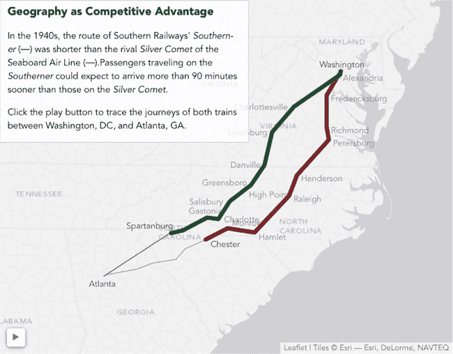图 6-13. 通过地图库在浏览器中构建的地图可以利用交互性来增加兴趣。

## 小结

在本章中，我们看了几种基于地图的可视化方法。在前两个例子中，地理区域是可视化的主要对象，我们构建了等值线地图来对比和对照这些区域。地图字体非常快捷和方便，但仅限于可视化所需的区域存在的情况下。虽然通常需要更多的努力，但如果使用 SVG 来创建自定义地图，我们对地图区域有更大的控制权。与其他图像格式不同，SVG 可以通过简单的 CSS 和 JavaScript 在网页中轻松操作。本章还展示了基于传统地图绘制库的例子。当数据集包含经纬度值时，地图绘制库特别方便，因为它们处理了将这些点定位到二维投影所需的复杂数学计算。正如我们所看到的，一些库相对简单，但仍完全能够绘制数据集。像 Leaflet 这样的功能全面的库提供了更多的功能和自定义选项，我们依赖这些扩展性来创建一个自定义的动态地图。
