## 第七章：使用 D3.js 创建自定义可视化

在本书中，我们讨论了许多为特定类型可视化设计的 JavaScript 库。如果你需要某种特定类型的可视化，而恰好有一个库可以创建它，使用该库通常是创建可视化的最快且最简便的方法。然而，这些库也有缺点。它们都对可视化的外观和行为做出假设，尽管它们提供了一些配置选项，你对结果并没有完全的控制权。有时候，这种权衡是不可接受的。

在这一章中，我们将探索一种完全不同的 JavaScript 可视化方法，这种方法允许我们发挥创意并保持对结果的完全控制。如你所料，这种方法并不像例如添加一个图表库并将数据输入其中那样简单。幸运的是，有一个非常强大的 JavaScript 库可以帮助我们：D3.js（* [`d3js.org/`](http://d3js.org/) *）。D3.js 不提供预定义的可视化，如图表、图形或地图。相反，它是一个数据可视化工具箱，提供创建 *你自己的* 图表、图形、地图等的工具。

为了展示 D3.js 的一些强大功能，我们将进行一个快速的概览。本章的示例包括以下内容：

+   为特定数据调整传统图表类型

+   构建一个响应用户交互的力导向图

+   使用高质量的 SVG 显示基于地图的数据

+   创建完全自定义的可视化

## 调整传统图表类型

D3.js 与其他 JavaScript 库的最大区别在于它的哲学理念。D3.js 不是用来创建预定义的图表和可视化工具的工具，而是一个帮助你创建任何可视化（包括自定义和独特展示）的库。使用 D3.js 创建标准图表需要更多的工作，但通过它，我们不受限于标准图表。为了了解 D3.js 是如何工作的，我们可以创建一个使用典型图表库无法实现的自定义图表。

在这个示例中，我们将可视化现代物理学中最重要的发现之一——哈勃定律。根据该定律，宇宙正在膨胀，因此我们感知到远处星系的运动速度会根据它们与我们的距离而变化。更准确地说，哈勃定律提出，这种速度变化（称为 *红移速度*）是距离的线性函数。为了可视化这个定律，我们可以将多个星系的速度变化（即 *红移速度*）与距离进行对比。如果哈勃定律正确，那么图表应该呈现出一条直线。对于我们的数据，我们将使用哈勃 1929 年原始论文中的星系和星系团数据（* [`www.pnas.org/content/15/3/168.full`](http://www.pnas.org/content/15/3/168.full) *），但更新为当前的距离和红移速度值。

到目前为止，这个任务看起来很适合用散点图展示。距离可以作为 x 轴，速度作为 y 轴。不过，有一点不同：物理学家其实并不知道我们要绘制的距离或速度，至少不是准确的数值。他们最多能做的是估算这些值，并且这两个值都可能存在误差。但这并不是放弃这个努力的理由。事实上，这些潜在的误差可能是我们在可视化中需要强调的一个重要方面。为此，我们不会将每个值作为一个点来绘制，而是将它们显示为一个框，框的尺寸将对应该值的潜在误差。虽然这种方法在散点图中不常见，但 D3.js 可以轻松实现。

### 第 1 步：准备数据

这是根据最新估算得出的图表数据。

表 7-1. 星云和星系团的距离与红移速度

| 星云/星系团 | 距离（Mpc） | 红移速度（km/s） |
| --- | --- | --- |
| NGC 6822 | 0.500±0.010 | 57±2 |
| NGC 221 | 0.763±0.024 | 200±6 |
| NGC 598 | 0.835±0.105 | 179±3 |
| NGC 4736 | 4.900±0.400 | 308±1 |
| NGC 5457 | 6.400±0.500 | 241±2 |
| NGC 4258 | 7.000±0.500 | 448±3 |
| NGC 5194 | 7.100±1.200 | 463±3 |
| NGC 4826 | 7.400±0.610 | 408±4 |
| NGC 3627 | 11.000±1.500 | 727±3 |
| NGC 7331 | 12.200±1.000 | 816±1 |
| NGC 4486 | 16.400±0.500 | 1307±7 |
| NGC 4649 | 16.800±1.200 | 1117±6 |
| NGC 4472 | 17.100±1.200 | 729±2 |

我们可以使用以下数组在 JavaScript 中表示这些数据。

```
hubble_data = 
    { nebulae: "NGC 6822", distance:  0.500, distance_error: 0.010,
      velocity:   57, velocity_error: 2, },
    { nebulae: "NGC  221", distance:  0.763, distance_error: 0.024,
      velocity:  200, velocity_error: 6, },
    { nebulae: "NGC  598", distance:  0.835, distance_error: 0.105,
      velocity:  179, velocity_error: 3, },
    *// Data set continues...*
```

### 第 2 步：设置网页

D3.js 不依赖其他任何库，而且它在大多数 CDN 上都可以获取。我们所需要做的就是将其引入页面。

```
   <!DOCTYPE html>
   **<html** lang="en"**>**
     **<head>**
       **<meta** charset="utf-8"**>**
       **<title></title>**
     **</head>**
     **<body>**
➊     **<div** id="container"**></div>**
➋     **<script**
         src="//cdnjs.cloudflare.com/ajax/libs/d3/3.4.6/d3.min.js"**>**
       **</script>**
     **</body>**
   **</html>**
```

我们在➋位置引入 D3.js，并在➊位置设置一个`id "container"`的 `<div>`，用来容纳我们的可视化内容。

### 第 3 步：为可视化创建一个舞台

与更高层次的库不同，D3.js 并不会自动在页面上绘制可视化图表。我们需要自己动手做这件事。作为回报，我们获得了自由选择绘图技术的权利。我们可以像本书中大多数库那样使用 HTML5 的 `<canvas>` 元素，或者直接使用原生 HTML。不过，既然我们已经在[第六章看到过它的应用，使用 SVG 似乎是最适合我们图表的方法。因此，我们图表的根元素将是一个 `<svg>` 元素，我们需要将它添加到页面中。我们可以同时通过属性定义它的尺寸。

如果我们使用 jQuery，可能会做如下操作：

```
**var** svg = $("<svg>").attr("height", height).attr("width", width);
$("#container").append(svg);
```

使用 D3.js 时，我们的代码非常相似：

```
**var** svg = d3.select("#container").append("svg")
    .attr("height", height)
    .attr("width", width);
```

在这条语句中，我们选择了容器，向其中添加了一个`<svg>`元素，并设置了该`<svg>`元素的属性。这条语句突出了 D3.js 与 jQuery 之间一个重要的区别，这个区别常常让刚开始学习 D3.js 的开发者感到困惑。在 jQuery 中，`append()`方法返回原始选择，这样你就可以继续对该选择进行操作。更具体地说，`$("#container").append(svg)`返回的是`$("#container")`。

另一方面，在 D3.js 中，`append()`返回的是一个不同的选择，即新添加的元素。因此，`d3.select("#container").append("svg")`并不返回容器选择，而是返回新`<svg>`元素的选择。随后调用的`attr()`方法因此应用于`<svg>`元素，而不是`"#container"`。

### 第 4 步：控制图表的维度

到目前为止，我们还没有指定图表的实际高度和宽度；我们只使用了`height`和`width`变量。将这些维度存储在变量中会非常有用，并且它使得在可视化中加入边距变得更加容易。下面的代码设置了这些维度；它的形式是 D3.js 可视化中常见的惯例。

```
**var** margin = {top: 20, right: 20, bottom: 30, left: 40},
    width = 640 - margin.left - margin.right,
    height = 400 - margin.top - margin.bottom;
```

我们需要调整创建主`<svg>`容器的代码，以考虑这些边距。

```
**var** svg = d3.select("#chart1").append("svg")
    .attr("height", height + margin.left + margin.right)
    .attr("width", width + margin.top + margin.bottom);
```

为了确保我们的图表符合定义的边距，我们将在一个子 SVG 组（`<g>`）元素内完全构建图表。`<g>`元素只是 SVG 中的一个任意容器元素，就像 HTML 中的`<div>`元素一样。我们可以使用 D3.js 来创建这个元素，并将其适当地定位在主`<svg>`元素中。

```
**var** chart = svg.append("g")
    .attr("transform",
        "translate(" + margin.left + "," + margin.top + ")"
    );
```

可视化通常需要对源数据进行重新缩放。在我们的案例中，我们需要将数据重新缩放以适应图表的维度。例如，星系距离不再从 0.5 到 17 Mpc，而是需要缩放到 0 到 920 像素之间。由于这种需求在可视化中很常见，D3.js 提供了相关工具来帮助实现。毫不奇怪，这些工具就是`scale`对象。我们将为 x 轴和 y 轴的维度创建比例尺。

正如下面的代码所示，我们的两个比例尺都是线性的。线性变换相对简单（而且我们实际上不需要 D3.js 来管理它们）；然而，D3.js 还支持其他类型的比例尺，这些比例尺可能相当复杂。在 D3.js 中，使用更复杂的比例尺和使用线性比例尺一样简单。

```
**var** xScale = d3.scale.linear()
    .range([0,width]);
**var** yScale = d3.scale.linear()
    .range([height,0]);
```

我们将两个范围定义为每个比例尺的期望极限。x 比例尺的范围是从`0`到图表的宽度，y 比例尺的范围是从`0`到图表的高度。不过需要注意的是，我们已经反转了 y 比例尺的常规顺序。这是因为 SVG 的维度（就像 HTML 的维度一样）将 0 放在区域的顶部。这个惯例与常规图表惯例相反，后者将 0 放在底部。为了应对这种反转，我们在定义范围时交换了值。

此时，我们已经为每个刻度设置了范围，这些范围定义了所需的输出。我们还需要为每个刻度指定可能的输入，这些输入在 D3.js 中被称为 *domain*（领域）。这些输入是距离和速度的最小值和最大值。我们可以使用 D3.js 直接从数据中提取这些值。以下是获取最小距离的方法：

```
**var** minDist = d3.min(hubble_data, **function**(nebulae) {
    **return** nebulae.distance - nebulae.distance_error;
});
```

我们不能简单地在数据中找到最小值，因为我们必须考虑到距离误差。正如在前面的代码片段中所看到的，D3.js 接受一个函数作为 `d3.min()` 的参数，而这个函数可以进行必要的调整。我们也可以对最大值使用相同的方法。以下是定义两个刻度的领域的完整代码：

```
xScale.domain([
        d3.min(hubble_data, **function**(nebulae) {
            **return** nebulae.distance - nebulae.distance_error;
        }),
        d3.max(hubble_data, **function**(nebulae) {
            **return** nebulae.distance + nebulae.distance_error;
        })
    ])
    .nice();
yScale.domain([
        d3.min(hubble_data, **function**(nebulae) {
            **return** nebulae.velocity - nebulae.velocity_error;
        }),
        d3.max(hubble_data, **function**(nebulae) {
            **return** nebulae.velocity + nebulae.velocity_error;
        })
    ])
    .nice();
```

### 第 5 步：绘制图表框架

坐标轴是可视化中的另一个常见特性，D3.js 也为此提供了工具。为了为我们的图表创建坐标轴，我们指定适当的刻度和方向。正如你从以下代码中看到的，D3.js 将坐标轴作为其 SVG 工具的一部分来支持。

```
**var** xAxis = d3.svg.axis()
    .scale(xScale)
    .orient("bottom");
**var** yAxis = d3.svg.axis()
    .scale(yScale)
    .orient("left");
```

在定义了坐标轴之后，我们可以使用 D3.js 将适当的 SVG 元素添加到页面中。我们会将每个坐标轴放置在各自的 `<g>` 组中。对于 x 轴，我们需要将该组移到图表的底部。

```
**var** xAxisGroup = chart.append("g")
    .attr("transform", "translate(0," + height + ")");
```

为了创建构成坐标轴的 SVG 元素，我们可以调用 `xAxis` 对象，并将包含组作为参数传递给它。

```
xAxis(xAxisGroup);
```

然而，在 D3.js 中，有一种更简洁的表达方式，它避免了创建不必要的局部变量，并保持方法链的使用。

```
chart.append("g")
    .attr("transform", "translate(0," + height + ")")
    .call(xAxis);
```

只要我们保持方法链的使用，就可以利用它再向图表中添加一个元素：这次是轴的标签。

```
chart.append("g")
    .attr("transform", "translate(0," + height + ")")
    .call(xAxis)
  .append("text")
    .attr("x", width)
    .attr("y", -6)
    .style("text-anchor", "end")
    .text("Distance (Mpc)");
```

如果你深入查看，你会发现 D3.js 为我们做了很多工作，创建了坐标轴、刻度线和标签。这是它生成的部分 SVG 代码：

```
**<g** class="x axis" transform="translate(0,450)"**>**
    **<g** class="tick" transform="translate(0,0)" style="opacity: 1;"**>**
        **<line** y2="6" x2="0"**></line>**
        **<text** y="9" x="0" dy=".71em" style="text-anchor: middle;"**>**0**</text>**
    **</g>**
    **<g** class="tick" transform="translate(77.77,0)" style="opacity: 1;"**>**
        **<line** y2="6" x2="0"**></line>**
        **<text** y="9" x="0" dy=".71em" style="text-anchor: middle;"**>**2**</text>**
    **</g>**
    *<!-- Additional tick marks... -->*
    **<path** class="domain" d="M0,6V0H700V6"**></path>**
    **<text** x="700" y="-6" style="text-anchor: end;"**>**Distance (Mpc)**</text>**
**</g>**
```

当我们为 y 轴添加代码时，我们就完成了图表的框架。

```
chart.append("g")
    .attr("transform", "translate(0," + height + ")")
    .call(xAxis)
  .append("text")
    .attr("x", width)
    .attr("y", -6)
    .style("text-anchor", "end")
    .text("Distance (Mpc)");

chart.append("g")
    .call(yAxis)
  .append("text")
    .attr("transform", "rotate(-90)")
    .attr("y", 6)
    .attr("dy", ".71em")
    .style("text-anchor", "end")
    .text("Red Shift Velocity (km/s)")
```

图 7-1 的结果没有数据时看起来并不特别吸引人，但它确实为我们提供了图表的框架。

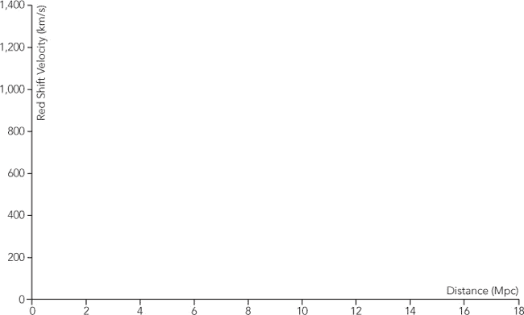图 7-1. D3.js 提供了用于创建图表框架的工具。

如你所见，为了在页面上添加几个坐标轴，我们已经写了不少代码。这就是 D3.js 的特性。它不是一个你可以简单地传入数据集并获得图表输出的库。相反，应该将其视为一组非常有用的工具，帮助你创建自己的图表。

### 第 6 步：将数据添加到图表中

现在我们的图表框架已经准备好，我们可以添加实际的数据。由于我们希望显示数据中的距离和速度误差，我们可以将每个点绘制为一个矩形。对于一个简单的静态图表，我们可以像创建其他图表元素一样添加 SVG `<rect>` 元素。我们可以利用我们的 x 和 y 比例尺来计算矩形的尺寸。

```
hubble_data.forEach(**function**(nebulae) {
    chart2.append("rect")
      .attr("x", xScale(nebulae.distance - nebulae.distance_error))
      .attr("width", xScale(2 * nebulae.distance_error))
      .attr("y", yScale(nebulae.velocity - nebulae.velocity_error))
      .attr("height", height - yScale(2 * nebulae.velocity_error));
});
```

上述方法对于这个示例来说效果很好，生成了图表如图 7-2 所示。然而，通常情况下，D3.js 可视化会直接将数据集与标记元素结合，并依赖 D3 的 `enter`、`update` 和 `exit` 选择来将数据添加到页面上。我们将推迟在下一个示例中讨论这种替代方法。

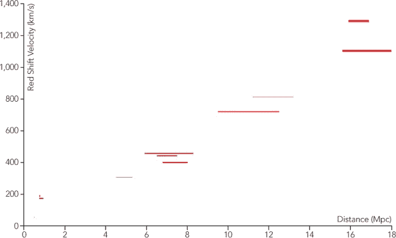图 7-2。D3.js 可以使用任何有效的标记语言渲染数据元素，包括具有定义尺寸的 SVG `<rect>` 元素。

### 步骤 7：回答用户的问题

每当你创建一个可视化时，提前考虑用户在查看它时可能提出的问题是一个好主意。在我们目前的示例中，我们展示了一个导致哈勃定律的数据集。但我们还没有（尚未）展示这些数据与该定律的拟合程度。由于这是一个显而易见的问题，我们可以直接在图表上回答它。

当前对哈勃常数（H[0]）的估计值约为 70 km/s/Mpc。为了展示这个值如何与我们图表中的数据相匹配，我们可以创建一个从（0,0）点开始的直线图。只需要一个简单的 SVG `<line>` 元素即可。我们再次依赖 D3.js 的比例尺来定义线条的坐标。

```
chart.append("line")
    .attr("x1",xScale(0))
    .attr("y1",yScale(0))
    .attr("x2",xScale(20))
    .attr("y2",yScale(1400));
```

在图 7-3 中，我们可以看到哈勃定律仍然是一个很好的近似值。

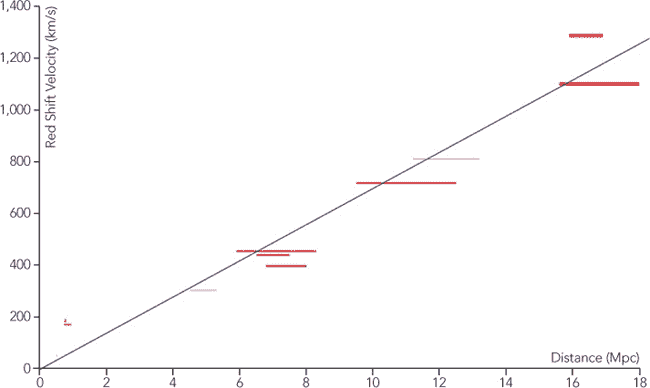图 7-3。完整的自定义图表精确地展示了我们所需的数据集。

## 创建一个力导向网络图

与我们在前几章中考虑的 JavaScript 绘图库不同，D3.js 不仅限于标准图表。事实上，它在专业和自定义图形类型方面表现优异。为了展示其强大功能，我们将创建一个来自第四章的网络图的另一个版本。在之前的实现中，我们使用了 Sigma 库，并且大部分工作是将数据结构化为该库所需的格式。我们不需要决定如何绘制节点和边，如何连接它们，或者在启用布局后，如何将它们定位在页面上。正如我们接下来所看到的，D3.js 并不会为我们做这些决策。对于这个例子，我们将需要自己绘制节点和边，适当地连接它们，并将它们定位在页面上。这听起来可能像是很多工作，但正如我们接下来也会看到的，D3.js 提供了许多工具来帮助我们。

### 第 1 步：准备数据

由于我们正在复制来自第四章的网络图，因此我们从相同的数据集开始。

```
**var** albums = [
  {
    album: "Miles Davis - Kind of Blue",
    musicians: [
      "Cannonball Adderley",
      "Paul Chambers",
      "Jimmy Cobb",
      "John Coltrane",
      "Miles Davis",
      "Bill Evans"
  ]
},{
  album: "John Coltrane - A Love Supreme",
  musicians: [
    "John Coltrane",
    "Jimmy Garrison",
    "Elvin Jones",
    "McCoy Tyner"
  ]
*// Data set continues...*
```

对于可视化，拥有两个独立的数组将会很有帮助，一个用于图的节点，一个用于图的边。从原始数据中提取这些数组非常简单，因此我们在本章中不会讨论。你可以在书籍的源代码中看到完整的实现。结果如下所示：

```
**var** nodes = [
  {
    "name": "Miles Davis - Kind of Blue",
    "links": [
      "Cannonball Adderley",
      "Paul Chambers",
      "Jimmy Cobb",
      "John Coltrane",
      "Miles Davis",
      "Bill Evans"
    ],
    "x": 270,
    "y": 200
  },
  {
    "name": "John Coltrane - A Love Supreme",
    "links": [
      "John Coltrane",
      "Jimmy Garrison",
      "Elvin Jones",
      "McCoy Tyner"
    ],
    "x": 307.303483,
    "y": 195.287474
  },
  *// Data set continues...*
];
```

对于节点，我们已添加 `x` 和 `y` 属性来定义图上的位置。最初，代码任意设置这些值，使得节点呈圆形分布。

```
**var** edges = [
  {
    "source": 0,
    "target": 16,
    "links": [
      "Cannonball Adderley",
      "Miles Davis"
    ]
  },
  {
    "source": 0,
    "target": 6,
    "links": [
      "Paul Chambers",
      "John Coltrane"
    ]
  },
  *// Data set continues...*
];
```

边表示它们连接的两个节点，作为 `nodes` 数组中的索引，并且它们包含在专辑之间共有的独立音乐家的数组。

### 第 2 步：设置页面

如前一个例子所述，D3.js 不依赖任何其他库，并且它可以在大多数内容分发网络上使用。我们所需要做的就是将其包含在页面中。

```
<!DOCTYPE html>
**<html** lang="en"**>**
  **<head>**
    **<meta** charset="utf-8"**>**
    **<title></title>**
  **</head>**
  **<body>**
    **<div** id="container"**></div>**
    **<script**
      src="//cdnjs.cloudflare.com/ajax/libs/d3/3.4.6/d3.min.js"**>**
    **</script>**
  **</body>**
**</html>**
```

就像在前一个例子中一样，我们通过包含一个 `id` 为 "container" 的 `<div>` 来为可视化设置容器。

### 第 3 步：为可视化创建舞台

这一阶段与之前的例子相同。

```
**var** svg = d3.select("#container").append("svg")
    .attr("height", 500)
    .attr("width", 960);
```

我们要求 D3.js 选择容器元素，然后在其中插入一个 `<svg>` 元素。我们还通过设置 `height` 和 `width` 属性来定义 `<svg>` 元素的大小。

### 第 4 步：绘制图表的节点

我们将通过在 `<svg>` 阶段内附加 `<circle>` 元素来绘制每个节点。基于前一步，你可能会认为这就像对 `nodes` 数组中的每个元素执行 `svg.append("circle")` 一样简单。

```
nodes.forEach(**function**(node) {
    svg.append("circle");
});
```

这段代码确实会向可视化中添加 25 个圆形。然而，它*不会*做的是在数据（数组中的节点）和文档（页面上的圆形元素）之间建立任何链接。D3.js 有另一种方法可以向页面添加圆形，并创建这种链接。事实上，D3.js 不仅会创建链接，它甚至会为我们管理这些链接。随着可视化变得越来越复杂，这种支持变得尤为重要。

### 注意

**这个特性实际上是 D3.js 的核心，事实上，它也是该名称的来源** *D3*，即** *数据驱动文档* 的缩写。

以下是我们如何更有效地使用 D3.js 向图表中添加`<circle>`元素的方法：

```
**var** selection = svg.selectAll("circle")
.data(nodes);

selection.enter().append("circle");
```

如果你以前没见过 D3.js 代码，这段代码肯定看起来很奇怪。我们在没有创建任何 `<circle>` 元素之前选择它们到底是想做什么呢？结果不就是空的吗？如果是这样，那紧随其后的 `data()` 函数又有什么意义呢？为了回答这些问题，我们必须理解 D3.js 如何与传统的 JavaScript 库（如 jQuery）不同。在那些库中，选择代表的是 HTML 标记元素。而在 jQuery 中，`$("circle")` 仅仅是页面上的 `<circle>` 元素。然而，在 D3.js 中，选择不仅仅是标记元素。D3.js 选择可以同时包含标记*和*数据。

D3.js 使用 `data()` 函数将标记元素和数据对象结合在一起。它操作的对象（在前面的代码中是 `svg.selectAll("circle")`）提供了元素，而它的参数（在本例中是 `nodes`）提供了数据。因此，这段代码的第一条语句告诉 D3.js 我们希望将 `<circle>` 元素与图中的节点匹配。实际上，我们是在说，希望每个 `<circle>` 都代表 `nodes` 数组中的一个值。

当元素的数量与数据值的数量恰好相等时，结果最容易理解。图 7-4 显示了四个 `<circle>` 元素和四个专辑。D3.js 认真地将这两组数据结合在一起，给我们选择了四个对象。每个对象既包含一个 `<circle>` 元素，也包含一个专辑。

图 7-4. D3.js 选择可以将页面内容（如 `<circle>` 元素）与数据项（如专辑）关联。

通常情况下，我们无法保证元素的数量与数据值完全相等。例如，假设只有两个`<circle>`元素对应我们的四个专辑。如图 7-5 所示，D3.js 仍然会创建四个对象的选择，尽管并没有足够的圆形元素与所有对象匹配。两个对象会有数据值，但没有对应的元素。

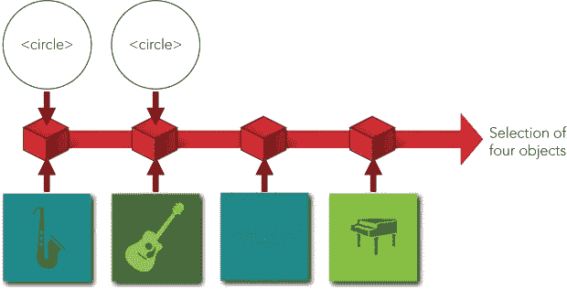图 7-5. D3.js 选择保持页面内容的跟踪，尽管该内容（尚未）存在。

我们的代码片段是一个更极端的例子。当它执行时，页面上根本没有圆形元素。然而，`nodes`数组中有一些值，我们告诉 D3.js 将其作为数据使用。因此，D3.js 会为每个数据值创建一个对象。只是，它不会为这些数据值创建一个`<circle>`元素。

（深呼吸，因为魔法即将发生。）

现在我们可以看看代码片段中的第二个语句。它以`selection.enter()`开头。`enter()`函数是一个特殊的 D3.js 函数。它告诉 D3.js 在选择中查找所有有数据值*但没有标记元素*的对象。然后我们通过调用`append("circle")`来完成语句。通过这个函数调用，D3.js 会为选择中没有标记元素的任何对象创建一个圆形。这就是我们如何将`<circle>`元素添加到图形中的方式。

为了简洁一点，我们可以将这两条语句合并成一句。

```
**var** nodeSelection = svg.selectAll("circle")
    .data(nodes)
    .enter().append("circle");
```

我们的可视化效果是：为图形中的每个节点在 `<svg>` 容器内创建一个 `<circle>` 元素。

### 步骤 5：绘制图形的边

你应该不会感到惊讶，添加边缘到图形的工作方式与添加节点类似。我们只需要追加`<line>`元素，而不是圆形。

```
**var** edgeSelection = svg.selectAll("line")
    .data(edges)
    .enter().append("line");
```

即使在这个例子中我们不需要使用它们，D3.js 还有一些与 `enter()` 函数互补的其他函数。要查找那些有标记元素但没有数据值的对象，可以使用 `exit()` 函数。而要查找那些有标记元素并且数据值已改变的对象，可以使用 `update()` 函数。`enter` 和 `exit` 的命名源自 D3.js 所关联的视觉化戏剧隐喻。`enter()` 子集代表那些进入舞台的元素，而 `exit()` 子集代表退出舞台的元素。

因为我们使用 SVG 元素来表示节点和边，所以可以使用 CSS 规则来样式化它们。这对边特别重要，因为默认情况下，SVG 线条的描边宽度是`0`。

```
circle **{**
    **fill:** #ccc**;**
    **stroke:** #fff**;**
    **stroke-width:** 1px**;**
**}**

line **{**
    **stroke:** #777**;**
    **stroke-width:** 1px**;**
**}**
```

### 步骤 6：定位元素

到此为止，我们已经为可视化添加了必要的标记元素，但尚未为它们指定任何尺寸或位置。正如之前所述，D3.js 不进行任何绘制工作，因此我们需要编写代码来完成这一任务。正如步骤 2 中所提到的，我们确实通过将节点排列成圆形为它们分配了某些任意位置。现在，我们可以使用这个圆形来定位它们。

要定位 SVG 圆形，我们将其 `cx` 和 `cy` 属性设置为圆心的位置。我们还通过 `r` 属性指定圆的半径。让我们从半径开始；我们将其设置为所有节点的固定值。我们已经为所有这些节点创建了 D3.js 的选择。设置它们的 `r` 属性是一个简单的语句：

```
nodeSelection.attr("r", 10);
```

`cx` 和 `cy` 值稍微复杂一些，因为它们对所有节点并不相同。这些值取决于与节点相关的数据属性。更具体地说，`nodes` 数组中的每个元素都有 `x` 和 `y` 属性。不过，D3.js 使得访问这些属性变得非常容易。

```
nodeSelection
    .attr("r", 10)
    .attr("cx", **function**(dataValue) { **return** dataValue.x; })
    .attr("cy", **function**(dataValue) { **return** dataValue.y; });
```

我们没有为属性提供常量值，而是提供了函数。D3.js 会调用这些函数并将数据值作为参数传递给它们。我们的函数将返回适当的属性值。

边的定位采用了类似的策略。我们希望将线条的端点设置为相应节点的中心。这些端点是 `<line>` 元素的 `x1,y1` 和 `x2,y2` 属性。以下是设置这些属性的代码：

```
edgeSelection
    .attr("x1", **function**(d) { **return** nodes[d.source].x; })
    .attr("y1", **function**(d) { **return** nodes[d.source].y; })
    .attr("x2", **function**(d) { **return** nodes[d.target].x; })
    .attr("y2", **function**(d) { **return** nodes[d.target].y; });
```

按照 D3.js 的惯例，参数 `d` 是数据值。

随着元素终于被绘制并定位，我们得到了可视化的第一版，见图 7-6。

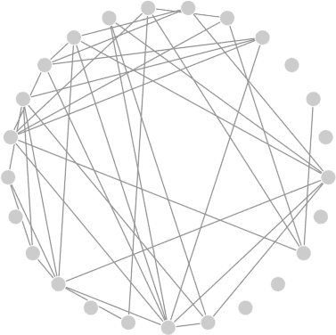图 7-6. D3.js 提供工具帮助绘制网络图的圆圈和线条。

### 步骤 7：为图形添加力导向

图形已经具备了所有基本组件，但其布局并不像我们希望的那样便于识别连接关系。在第四章中，Sigma 库可以通过仅仅几行 JavaScript 代码自动完成布局。为了实现这一自动化，Sigma 使用了一个力导向算法。力导向将节点视为物理对象，并模拟如重力和电磁力等力的作用。

使用 D3.js 时，我们不能依赖库来完全自动化布局。正如我们所看到的，D3.js 并不会绘制任何图形元素，因此它不能单独设置位置和尺寸。然而，D3.js 提供了许多工具，帮助我们创建自己的图形布局。其中一个工具就是*力导向布局工具*。正如你所料，力导向布局工具帮助我们绘制自己的力导向图。它处理了力方向背后的所有复杂计算，并给我们提供了可以直接在绘制图形的代码中使用的结果。

要开始布局，我们定义一个新的`force`对象。该对象接受许多配置参数，但只有五个对我们的可视化至关重要：

+   图形的尺寸

+   图中的节点

+   图中的边

+   我们希望看到的连接节点之间的距离

+   节点相互排斥的强度，这是 D3.js 所称的*电荷*参数

最后的参数可能需要一些反复试验，以优化特定的可视化效果。在我们的例子中，我们希望将其大幅提高，超过默认值（`-30`），因为我们有很多节点且空间很小。（负电荷值表示排斥力。）以下是设置所有这些值的代码：

```
**var** force = d3.layout.charge()
    .size([width, height])
    .nodes(nodes)
    .links(edges)
    .linkDistance(40)
    .charge(-500);
```

当我们告诉 D3.js 开始其力的方向计算时，它将在中间步骤和计算完成时生成事件。力的方向通常需要几秒钟才能完全执行，如果我们等到计算完成再绘制图形，用户可能会认为浏览器已经冻结。通常，最好在每次迭代时更新图形，让用户看到进度的某些提示。为此，我们可以添加一个函数来响应中间的力方向计算。这发生在 D3.js 的`tick`事件上。

```
force.on("tick", **function**() {
    *// Update graph with intermediate results*
});
```

每次 D3.js 调用我们的事件处理函数时，它都会更新`nodes`数组中的`x`和`y`属性。新值将反映力的方向如何推动节点在图形舞台上的位置。我们可以通过更改圆圈和线条的 SVG 属性来相应地更新我们的图形。然而，在此之前，我们可以利用 D3.js 提供的机会，在执行过程中调整力的方向算法。我们可能遇到的一个问题，尤其是当我们定义了较大的电荷力时，节点可能会相互排斥，导致某些节点完全漂移出舞台。我们可以通过确保节点的位置保持在图形的尺寸范围内来避免这种情况。

```
force.on("tick", **function**() {
    nodeSelection.each(**function**(node) {
        node.x = Math.max(node.x, 5);
        node.y = Math.max(node.y, 5);
        node.x = Math.min(node.x, width-5);
        node.y = Math.min(node.y, height-5);
    });
    *// Update graph with intermediate results*
});
```

我们在前面的代码片段中加上或减去了`5`，以考虑节点圆圈的半径。

一旦我们调整了节点的属性，以确保它们留在舞台上，我们就可以更新它们的位置。代码与我们最初定位它们时使用的代码完全相同。

```
nodeSelection
    .attr("cx", **function**(d) { **return** d.x; })
    .attr("cy", **function**(d) { **return** d.y; });
```

我们还需要调整边线的端点。然而，对于这些对象，有一个小的变化。当我们初始化 `edges` 数组时，我们将 `source` 和 `target` 属性设置为相应节点在 `nodes` 数组中的索引。当 D3.js 力导向布局工具开始执行时，它会将这些索引替换为对节点本身的直接引用。这使得我们更容易找到适当的坐标来绘制这些边线。

```
edgeSelection
    .attr("x1", **function**(d) { **return** d.source.x; })
    .attr("y1", **function**(d) { **return** d.source.y; })
    .attr("x2", **function**(d) { **return** d.target.x; })
    .attr("y2", **function**(d) { **return** d.target.y; });
```

当我们的函数准备好处理来自力导向计算的更新时，我们可以告诉 D3.js 开始工作。这是 `force` 对象的一个简单方法。

```
force.start();
```

通过这行代码，图形开始执行动画过渡到最终的力导向状态，如图 7-7 所示。

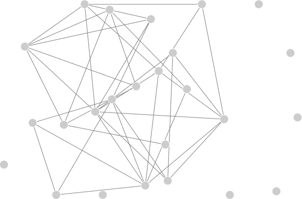图 7-7. D3.js 力导向布局工具提供了重新定位网络图元素的信息。

### 第 8 步：添加交互性

由于 D3.js 是一个 JavaScript 库，你可以期望它支持与用户的交互。它确实支持，为了演示这一点，我们可以向图形添加一个简单的交互功能。当用户点击图形中的一个节点时，我们可以突出显示该节点及其邻居。

D3.js 中的事件处理程序与其他 JavaScript 库（如 jQuery）中的事件处理程序非常相似。我们通过选择集的`on()`方法定义事件处理程序，如以下代码所示。

```
nodeSelection.on("click", **function**(d) {
    *// Handle the click event*
});
```

`on()`的第一个参数是事件类型，第二个参数是 D3.js 在事件发生时调用的函数。该函数的参数是与选择集元素对应的数据对象，通常命名为`d`。因为我们将事件添加到节点的选择集（`nodeSelection`），所以`d`将是图中的一个节点。

对于我们的可视化效果，我们通过为对应的 `<circle>` 元素添加一个 CSS 可访问类并增大圆的大小来强调被点击的节点。这个类使得我们可以对圆形进行独特的样式设置，但圆形的大小不能通过 CSS 规则来指定。因此，我们最终需要对圆形做两件事：添加 `selected` 类并使用 `r` 属性增加半径。当然，为了做到这两点，我们需要选择 `<circle>` 元素。当 D3.js 调用事件处理程序时，它会将 `this` 设置为事件的目标；我们可以通过 `d3.select(this)` 将该目标转换为选择集。因此，以下代码就是改变被点击节点的圆形所需要的全部代码。

```
d3.select(**this**)
   .classed("selected", **true**)
   .attr("r", 1.5*nodeRadius);
```

我们也可以通过向所有与点击节点连接的边添加一个 `selected` 类来做类似的事情。为了找到这些边，我们可以遍历整个边选择集。D3.js 提供了 `each()` 函数来完成这项工作。

```
   edgeSelection.each(**function**(edge) {
       **if** ((edge.source === d) || (edge.target === d)) {
➊         d3.select(**this**).classed("selected",**true**);
       }
   });
```

当我们查看每个边时，我们检查`source`和`target`属性，以查看它们是否与我们点击的节点匹配。当我们找到匹配项时，我们将`selected`类添加到该边。请注意，在➊处我们再次使用`d3.select(this)`。在这个例子中，代码位于`each()`函数内部，因此`this`将等于当前迭代的特定元素。在我们的例子中，就是边的`<line>`元素。

上述代码处理了设置`selected`类的问题，但我们仍然需要在适当的时候将其移除。我们可以通过操作节点选择来从所有其他圆圈中移除它（并确保它们的半径恢复到默认值）。

```
   nodeSelection
➊     .filter(**function**(node) { **return** node !== d; })
       .classed("selected", **false**)
       .attr("r", nodeRadius);
```

这段代码与我们之前见过的相同，唯一不同的是在➊处我们使用 D3.js 的`filter()`函数，将选择范围限制为除了被点击的节点之外的其他节点。

类似的过程会重置所有边的`selected`类。我们可以先从所有边中移除该类，再在前面的代码片段中添加到适当的边上。下面是移除它的代码；在 D3.js 中，只需要一行代码：

```
edgeSelection.classed("selected", **false**);
```

最后，如果用户点击的是已经选中的节点，我们可以像这样将其恢复到默认状态：

```
d3.select(**this**)
    .classed("selected", **true**)
    .attr("r", 1.5*nodeRadius);
```

当你将所有前面的代码片段组合在一起时，你将得到完整的事件处理程序，如下所示：

```
nodeSelection.on("click", **function**(d) {

    nodeSelection
        .filter(**function**(node) { **return** node !== d; })
        .classed("selected", **false**)
        .attr("r", nodeRadius);

    edgeSelection.classed("selected", **false**);

    **if** (d3.select(**this**).classed("selected")) {
        d3.select(**this**)
            .classed("selected", **false**)
            .attr("r", nodeRadius)

    } **else** {
        d3.select(**this**)
            .classed("selected", **true**)
            .attr("r", 1.5*nodeRadius);

        edgeSelection.each(**function**(edge) {
             **if** ((edge.source === d) || (edge.target === d)) {
                 d3.select(**this**).classed("selected",**true**);
             }
        });
    }
});
```

结合一些 CSS 样式，用于突出显示选中的圆圈和线条，这段代码生成了交互式可视化，如图 7-8 所示。

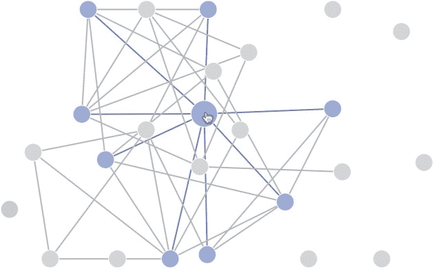图 7-8。D3.js 包含使可视化具有交互功能的函数。

### 第 9 步：尝试其他增强功能

我们的示例已经探索了 D3.js 提供的许多自定义可视化功能。然而，到目前为止，代码只触及了 D3 功能的表面。我们还没有为图形添加标签，或者使图形状态的过渡动画化。实际上，如果我们想为可视化添加任何功能，D3.js 几乎总能提供相关工具。尽管我们在这里没有时间或空间讨论其他增强功能，但本书的源代码包含一个功能更全面的实现，利用了其他 D3.js 的功能。

## 创建一个可缩放的地图

前两个示例介绍了 D3.js 的一些功能，但该库还包含许多其他功能。从第六章的示例中，我们知道一些最好的可视化依赖于地图，而 D3.js 作为一个通用可视化库，对地图有广泛的支持。为了说明这一点，我们将创建一个显示美国本土龙卷风观察的地图。

### 第 1 步：准备数据

美国国家海洋和大气管理局（* [`www.noaa.gov/`](http://www.noaa.gov/) *）在其气候数据在线网站（* [`www.ncdc.noaa.gov/cdo-web/`](http://www.ncdc.noaa.gov/cdo-web/) *）上发布了大量的天气和气候数据。该数据包括美国及其领土内所有报告的风暴事件。我们可以下载 2013 年年度的数据集，格式为逗号分隔值（CSV）文件。由于该文件非常大，并且包含许多不是龙卷风的事件，我们可以使用电子表格应用程序，如 Microsoft Excel 或 Mac 的 Numbers，编辑文件以删除多余的信息。对于这个可视化，我们只需要 `event_type` 为 `"Tornado"` 的记录，并且只需要包含龙卷风的纬度、经度和增强富吉塔等级（龙卷风强度的衡量标准）这几列数据。一旦我们适当地修剪了 CSV 文件，它将看起来像下面这样的数据。

```
f_scale,latitude,longitude
EF1,33.87,-88.23
EF1,33.73,-87.9
EF0,33.93,-87.5
EF1,34.06,-87.37
EF1,34.21,-87.18
EF1,34.23,-87.11
EF1,31.54,-88.16
EF1,31.59,-88.06
EF1,31.62,-87.85
--*snip*--
```

由于我们将使用 JavaScript 访问这些数据，你可能会想将文件从 CSV 格式转换为 JSON 格式。然而，最好还是将数据保留在 CSV 文件中。D3.js 完全支持 CSV 格式，因此将其转换为 JSON 并不会带来实际的好处。更重要的是，JSON 文件的大小将是 CSV 版本的四倍以上，这额外的大小会导致我们网页加载变慢。

### 步骤 2：设置页面

我们的骨架网页与其他 D3.js 示例没有什么不同。我们为地图留出了一个容器，并包含了 D3.js 库。

```
<!DOCTYPE html>
**<html** lang="en"**>**
  **<head>**
    **<meta** charset="utf-8"**>**
    **<title></title>**
  **</head>**
  **<body>**
    **<div** id="map"**></div>**
    **<script**
      src="//cdnjs.cloudflare.com/ajax/libs/d3/3.4.6/d3.min.js"**>**
    **</script>**
  **</body>**
**</html>**
```

### 步骤 3：创建地图投影

如果你有些记不起关于地图投影的地理课内容，不用担心；D3.js 可以处理所有繁重的工作。它不仅对常见的投影提供广泛的支持，而且还支持为可视化量身定制的自定义投影扩展。例如，有一种经过修改的 Albers 投影，经过优化后适用于美国的分层地图。它重新定位（并调整大小）了阿拉斯加和夏威夷，以提供一个方便的涵盖所有 50 个州的地图。在我们的例子中，由于 2013 年阿拉斯加和夏威夷没有龙卷风出现，因此我们可以使用标准的 Albers 投影。

我们在以下代码中设置了投影。

```
➊ **var** width = 640,
➋     height = 400;

➌ **var** projection = d3.geo.albers()
➍     .scale(888)
➎     .translate([width / 2, height / 2]);

➏ **var** path = d3.geo.path()
➐     .projection(projection);
```

首先，在 ➊ 和 ➋，我们定义了地图的像素大小。然后，在 ➌，我们创建了 Albers 投影。D3.js 支持许多调整方式来将投影适当定位到页面上，但在我们的情况下，默认值就足够了。我们只需要在 ➍ 缩放地图，并在 ➎ 居中它。

为了在页面上绘制地图，我们将使用 SVG `<path>` 元素，但我们的地图数据是以经纬度值的形式呈现的。D3.js 有一个 `path` 对象，可以根据特定的地图投影将地理坐标转换为 SVG 路径。在 ➏ 和 ➐，我们创建了我们的 `path` 对象。

### 步骤 4：初始化 SVG 容器

我们可以创建一个 SVG 容器来容纳地图，就像我们在之前的 D3.js 示例中做的那样。

```
   **var** svg = d3.select("#map").append("svg")
       .attr("width", width)
       .attr("height", height);

➊  **var** g = svg.append("g");
```

如我们将在后续步骤中看到的，拥有一个内嵌组将对放置地图非常有帮助。这个内嵌组（由 `<g>` 元素定义）就像 HTML 中的一个任意 `<div>` 元素。我们在 ➊ 创建这个内嵌组。

### 第 5 步：获取地图数据

对于我们的可视化，地图数据就是包含各州的美国地图。D3.js 使用 GeoJSON (*[`geojson.org/`](http://geojson.org/)*) 作为地图数据。与我们在第六章中使用的大多数图像切片不同，GeoJSON 数据是基于矢量的，因此可以在任何比例下使用。GeoJSON 数据也是 JSON 格式，这使得它与 JavaScript 特别兼容。

由于我们的数据是 JSON 格式，我们可以使用 `d3.json()` 函数来获取数据。这个函数几乎与 jQuery 的 `$.getJSON()` 函数相同。

```
d3.json("data/us-states.json", **function**(map) {
    *// Process the JSON map data*
});
```

### 第 6 步：绘制地图

一旦我们有了数据，就可以在页面上绘制地图。此步骤中的代码与前一个示例中的非常相似。每个州将是 `<g>` 容器内的一个 `<path>` 元素。

```
➊ g.selectAll("path")
➋     .data(map.features)
➌   .enter().append("path")
➍     .attr("d", path);
```

使用 D3.js 的约定，我们在 ➊ 创建 `<path>` 元素的选择，并在 ➋ 将这些元素绑定到我们的数据上。当没有元素时，我们在 ➌ 创建一个，并将其 `d` 属性设置为与数据相关的路径，根据我们的投影。注意，图 ➍ 中的 `path` 是我们在第 4 步创建的对象。它是一个函数，用于将纬度和经度信息转换为适当的 SVG 坐标。

如我们在图 7-9 中看到的，D3.js 为我们提供了创建漂亮 SVG 地图所需的路径。

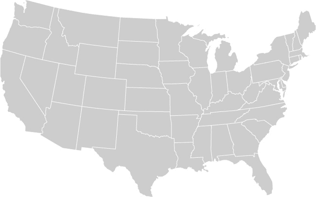图 7-9. D3.js 帮助从地理 JSON 数据创建矢量地图。

### 第 7 步：获取天气数据

现在我们的地图已准备好接受一些数据。我们可以使用另一个 D3.js 工具来获取 CSV 文件。不过，请注意，CSV 文件的所有属性都被视为文本字符串。我们将需要将这些字符串转换为数字。我们还想过滤掉那些没有包含纬度和经度信息的少数龙卷风目击数据。

```
   d3.csv("tornadoes.csv", **function**(data) {
➊     data = data.filter(**function**(d, i) {
➋         **if** (d.latitude && d.longitude) {
➌             d.latitude = +d.latitude;
➍             d.longitude = +d.longitude;
➎             d.f_scale = +d.f_scale[2];
➏             d.position = projection([
➐                 d.longitude, d.latitude
               ]);
➑             **return** **true**;
           }
       });
       *// Continue creating the visualization...*
   });
```

一旦浏览器从服务器检索到 CSV 文件，我们可以在 ➊ 开始处理它。在这里，我们使用数组的 `.filter()` 方法来遍历数据值。`.filter()` 方法会去除没有纬度和经度值的数据点。只有在 ➑ 两个值都存在时，它才返回 `true` ➋。当我们检查数据点的纬度和经度时，我们会在 ➌ 和 ➍ 将字符串值转换为数字，在 ➎ 提取增强富吉塔等级分类中的数字，并使用我们在第 3 步创建的投影函数，在 ➏ 和 ➐ 计算目击位置的 SVG 坐标。

### 第 8 步：绘制数据

数据获取、清洗和转换完成后，绘制地图上的点变得非常简单。我们再次将使用传统的 D3.js 方法。

```
   g.selectAll("circle")
       .data(data)
     .enter().append("circle")
       .attr("cx", **function**(d) { **return** d.position[0]; })
       .attr("cy", **function**(d) { **return** d.position[1]; })
➊     .attr("r", **function**(d) { **return** 4 + 2*d.f_scale; });
```

每个数据点是一个 SVG 的`<circle>`元素，因此我们选择这些元素，将数据绑定到选择集，并使用`.enter()`函数创建新的`<circle>`元素，以匹配数据。

如你所见，我们使用前一步中创建的`position`属性来设置圆圈的位置。此外，为了表示每个龙卷风的相对强度，我们使圆圈的大小与增强福吉塔等级（➊）的分类成正比。结果如图 7-10 所示，是 2013 年美国本土龙卷风目击情况的一个精美地图。

图 7-10. 使用 D3.js 投影将点添加到地图上很容易。

### 第 9 步：添加交互性

地图自然鼓励用户进行缩放和平移，D3.js 使得支持这些标准地图交互变得很容易。事实上，D3.js 赋予了我们完全的控制权，因此我们不受限于标准的地图交互惯例。让我们对地图做些不同的事情。我们可以使用户点击任何一个州来进行缩放。点击一个已经缩放的州则会将地图缩放回默认视图。如你所见，这种行为用 D3.js 实现起来非常简单。

我们将添加的第一段代码是一个变量，用于追踪地图当前缩放的特定州。最初，用户还没有缩放任何位置，所以该变量为空。

```
**var** active = d3.select(**null**)
```

接下来，我们为所有州的`<path>`元素添加一个事件处理器。在我们创建这些元素时（即在第 6 步中），我们已经完成了这一步。

```
   g.selectAll("path")
       .data(map.features)
     .enter().append("path")
       .attr("d", path)
➊     .on("click", clicked);
```

额外的语句位于➊。像 jQuery 一样，D3.js 为我们提供了一种简单的方式来为 HTML 和 SVG 元素添加事件处理器。现在，我们需要编写这个事件处理器。

事件处理器需要识别用户点击的州，计算该州的位置（以 SVG 坐标表示），并将地图过渡到这些坐标进行缩放。在详细查看实现之前，值得注意的是，D3.js 事件处理器经过优化，能很好地与数据可视化配合工作（这并不令人惊讶）。具体来说，传递给处理器的参数是与目标元素相关的数据项（通常命名为`d`）。JavaScript 上下文（`this`）被设置为接收到事件的特定元素。如果处理器需要访问 JavaScript 事件的其他属性，这些属性可以通过全局变量`d3.event`获得。以下是这些约定在实际事件处理器中的工作方式：

```
   **var** clicked = **function**(d) {
➊     active.attr("fill", "#cccccc");
       active = d3.select(**this**)
           .attr("fill", "#F77B15");

➋     **var** bounds = path.bounds(d),
           dx = bounds[1][0] - bounds[0][0],
           dy = bounds[1][1] - bounds[0][1],
           x = (bounds[0][0] + bounds[1][0]) / 2,
           y = (bounds[0][1] + bounds[1][1]) / 2,
➌         scale = .9 / Math.max(dx / width, dy / height),
➍         translate = [
               width / 2 - scale * x,
               height / 2 - scale * y];

➎     g.transition()
           .duration(750)
           .attr("transform", "translate(" +
               translate + ")scale(" +
               scale + ")");
   };
```

在第一个代码块中（从 ➊ 开始），我们操作了地图的颜色。之前缩放的州被重置为一种灰色，而被点击的州则被填充为鲜艳的橙色。请注意，这段代码还重置了 `active` 变量，以便准确跟踪缩放的州。接下来，从 ➋ 开始，我们计算了缩放州的边界。或者说，我们让 D3.js 来进行计算。所有的工作都发生在我们在 ➋ 处调用的 `bounds()` 函数中。其他的代码行主要是提取该计算的各个部分。在 ➌ 处，我们计算了如何缩放地图，以便让缩放的州占据地图的 90% 区域。然后，从 ➍ 开始，我们计算了如何移动地图以使该州居中。最后一块代码，从 ➎ 开始，通过缩放和平移 SVG 来调整地图。正如你所见，我们使用 D3.js 的过渡效果来动画化视图的变化。

到目前为止，我们看到的代码还需要一些小的修改来处理一些未完成的部分，但这些我将留给本书的源代码（* [`jsDataV.is/source/`](http://jsDataV.is/source/) *）。图 7-11 中的结果是一个漂亮的互动地图，展示了我们的数据。

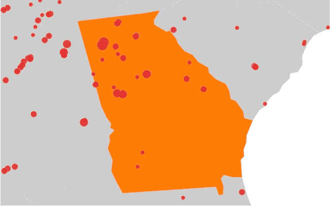图 7-11. D3.js 使得在地图上添加自定义交互变得容易。

## 创建独特的可视化

如果你已经跟随了本章的前三个例子，你可能开始意识到与传统 JavaScript 库相比，D3.js 提供了多少灵活性。它不是为你创建可视化，而是提供了许多工具和功能，供你按需使用。我们利用这种灵活性向图表中添加了非常规的误差条，调整了网络图的行为，并定制了用户与地图的互动。然而，使用 D3.js 时，我们并不局限于对现有可视化类型进行微调。相反，我们可以利用这个库创造出与传统库完全不同的独特可视化效果。

在这个例子中，我们将使用前面可视化中的相同数据——来自美国国家海洋和大气管理局气候数据在线网站的 2013 年龙卷风目击记录（* [`www.noaa.gov/cdo-web/`](http://www.noaa.gov/cdo-web/) *）。然而，我们不会将这些目击记录放在地图上，而是会创建一个互动式的层次化可视化，让用户通过区域、州，甚至是州内的县来理解目击次数。对于这个主题，圆形层次结构尤其有效，因此我们将创建一个带有旋转动画的旭日图可视化。接下来的代码基于 Mike Bostock（D3.js 的首席开发者）开发的一个示例（* [`bl.ocks.org/mbostock/4348373/`](http://bl.ocks.org/mbostock/4348373/) *）。

### 注意

**也可以使用一些图表库创建日晕（sunburst）可视化，通常通过定制饼图的变体来实现。然而，这些图表库更专注于现成的使用。而使用像 D3.js 这样的库来创建自定义可视化则通常更容易，它特别设计用于定制化。**

### 第 1 步：准备数据

如前所述，我们将清理并修剪 2013 年的龙卷风目击数据集。不过，这一次我们将保留州和县，而不使用经度、纬度和增强富士塔等级分类。我们还将添加一个区域名称，用于将各州分组。结果生成的 CSV 文件如下所示。

```
state,region,county
Connecticut,New England,Fairfield County
Connecticut,New England,Hartford County
Connecticut,New England,Hartford County
Connecticut,New England,Tolland County
Maine,New England,Somerset County
Maine,New England,Washington County
Maine,New England,Piscataquis County
--*snip*--
```

### 第 2 步：设置页面

我们的基础网页与其他 D3.js 示例没有什么不同。我们为可视化预留了一个容器，并包含了 D3.js 库。

```
<!DOCTYPE html>
**<html** lang="en"**>**
  **<head>**
    **<meta** charset="utf-8"**>**
    **<title></title>**
  **</head>**
  **<body>**
    **<div** id="chart"**></div>**
    **<script**
      src="//cdnjs.cloudflare.com/ajax/libs/d3/3.4.6/d3.min.js"**>**
    **</script>**
  **</body>**
**</html>**
```

### 第 3 步：为可视化创建舞台

与我们其他的 D3.js 示例一样，我们首先创建一个 `<svg>` 容器来存放可视化图形。在这个容器内，我们还将添加一个 `<g>` 元素。

```
   **var** width = 640,
       height = 400,
➊     maxRadius = Math.min(width, height) / 2;

   **var** svg = d3.select("#chart").append("svg")
       .attr("width", width)
       .attr("height", height);

   **var** g = svg.append("g");
➋     .attr("transform", "translate(" +
           (width / 2) + "," +
           (height / 2) + ")");
```

这段代码包含了一些新的细节。首先，在 ➊ 处，我们计算了可视化的最大半径。这个值——即高度或宽度的一半，取较小者——将在后续的代码中派上用场。更有趣的是，从 ➋ 开始，我们对内部的 `<g>` 容器进行平移，使其坐标系的原点（0,0）恰好位于可视化图形的中心。这个平移使得日晕的居中变得容易，同时也能计算出日晕的参数。

### 第 4 步：创建刻度

当完成时，我们的可视化将由对应于美国各个地区的面积构成；更大的面积将代表龙卷风更多的地区。因为我们处理的是面积数据，所以每个地区需要两个维度。但我们不会将这些面积绘制成简单的矩形；而是要使用弧形。这需要一些三角学知识，但幸运的是，D3.js 提供了大量的帮助。我们将首先定义一些 `scale` 对象。我们在《适配传统图表类型》的第 4 步中首次看到过刻度，我们用它们来将数据值转换为 SVG 坐标。以下代码中的刻度实现了类似功能，不同之处在于它们使用的是极坐标。

```
**var** theta = d3.scale.linear()
    .range([0, 2 * Math.PI]);
**var** radius= d3.scale.sqrt()
    .range([0, maxRadius]);
```

如你所见，角度刻度是一个从 0 到 2π（或 360°）的线性刻度。径向刻度的范围从 0 到最大半径，但它不是线性的。相反，这个刻度是一个平方根刻度；D3.js 在计算输出之前，会对输入值进行平方根处理。弧形的面积随着半径的平方变化，平方根刻度能够补偿这一效果。

### 注意

**在之前的示例中，我们为刻度设置了范围（输出）和域（输入）。然而，在本例中，我们不需要显式地设置域。[0,1] 的默认域正是我们对这两个刻度所需的。**

我们定义的刻度在接下来的代码中非常有用，我们将在其中定义一个函数来计算单个弧形的 SVG 路径。大多数工作发生在 D3.js 函数 `d3.svg.arc()` 中，该函数计算弧形路径。然而，该函数需要四个参数：起始角度、结束角度、起始半径和结束半径。这些参数的值来自我们的刻度。

当我们在代码中稍后使用 `arc()` 函数时，我们会使用 D3.js 的选择集来调用它。该选择集将与一个数据值相关联，并且数据值将包含四个属性：

+   **`.x`** 数据的起始 x 位置

+   **`.dx`** 数据在 x 轴上的长度（Δ*x*）

+   **`.y`** 数据的起始 y 位置

+   **`.dx`** 数据在 y 轴上的长度（Δ*y*）

根据这些属性，以下是生成弧形路径的代码。

```
**var** arc = d3.svg.arc()
    .startAngle(**function**(d) {
        **return** Math.max(0, Math.min(2 * Math.PI, theta(d.x)));
    })
    .endAngle(**function**(d) {
        **return** Math.max(0, Math.min(2 * Math.PI, theta(d.x + d.dx)));
    })
    .innerRadius(**function**(d) {
        **return** Math.max(0, radius(d.y));
    })
    .outerRadius(**function**(d) {
        **return** Math.max(0, radius(d.y + d.dy));
    });
```

代码本身相当直观，但一张图能更好地解释为什么我们要这样使用代码。假设与选择集相关联的数据具有 (*x*,*y*) 位置为 (12.5,10)，宽度为 25，高度为 30。数据属性将如下所示：

+   `.x = 12.5`

+   `.dx = 25`

+   `.y = 10`

+   `.dy = 30`

使用笛卡尔坐标系，我们可以像图 7-12 左侧那样绘制选择集。我们的刻度和弧形函数将把矩形转换为图中右侧所示的弧形。

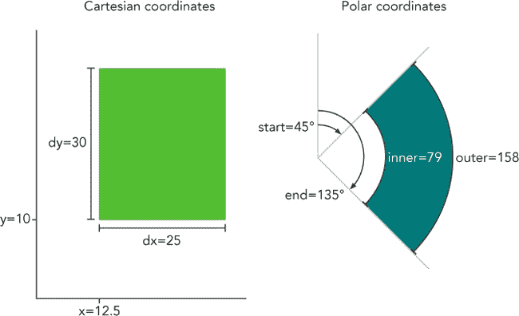图 7-12. D3.js 帮助将矩形区域转换为弧形。

我们尚未指定 x 轴和 y 轴的刻度范围，但暂时假设每个范围是从 0 到 100。因此，起始的 x 值 12.5，表示该范围的 12.5%。当我们将这个值转换为极坐标时，结果将是完整 360° 范围的 12.5%。也就是 45°，或 π/4。x 值再延伸 25%，所以最终的 x 值会再增加 90°，或 π/2，作为起始值。对于 y 值，我们的刻度会对其进行平方根转换，并将结果映射到 0 到 250（`maxRadius`）的范围。因此，初始值 10 会被除以 100（表示范围），并转换为 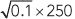，也就是 79。最终值 10 + 30 将产生一个半径值为 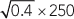，也就是 158。这就是为每个数据值创建 SVG 的过程。

### 第 5 步：获取数据

在初步准备工作完成后，我们现在可以开始处理数据。像之前的示例一样，我们将使用 `d3.csv()` 从服务器获取 CSV 文件。

```
d3.csv("tornadoes.csv", **function**(data) {
    *// Continue processing the data...*
});
```

当 D3.js 获取文件时，它会创建一个类似以下片段的数据结构。

```
 {
    "state":"Connecticut",
    "region":"New England",
    "county":"Fairfield County"
  },{
    "state":"Connecticut",
    "region":"New England",
    "county":"Hartford County"
  },{
    "state":"Connecticut",
    "region":"New England",
    "county":"Hartford County"
  },
*// Data set continues...*
```

该数据结构反映了数据本身，但它没有包含我们绘制弧形所需的 `.x`、`.dx`、`.y` 和 `.dy` 属性。计算这些值还需要进一步的工作。如果你回想一下本章的第二个示例，我们以前见过这种情况。我们有一组原始数据，但我们需要用额外的属性来增强这些数据以进行可视化。在之前的示例中，我们使用 D3.js 的力导向布局来计算这些额外的属性。在这种情况下，我们可以使用分区布局来实现。

然而，在使用分区布局之前，我们必须重新结构化数据。分区布局需要层次化的数据，而现在我们只有一个单维数组。我们必须将数据结构化，以反映区域、州和县的自然层级结构。不过，在这里 D3.js 仍然能够帮助我们。`d3.nest()` 操作符分析一个数据数组并从中提取层次结构。如果你熟悉数据库命令，它相当于 D3.js 中的 `GROUP BY` 操作。我们可以使用这个操作符来创建数据的新版本。

```
➊ **var** hierarchy = {
       key: "United States",
       values: d3.nest()
➋         .key(**function**(d) { **return** d.region; })
           .key(**function**(d) { **return** d.state; })
           .key(**function**(d) { **return** d.county; })
➌         .rollup(**function**(leaves) {
➍             **return** leaves.length;
           })
➎         .entries(data)
       };
```

首先，在 ➊ 处，我们定义了一个变量来保存我们重新结构化后的数据。它是一个具有两个属性的对象。`.key` 属性被设置为 `"United States"`，而 `.values` 属性则是 `d3.nest()` 操作的结果。从 ➋ 开始，我们告诉操作符按 `.region`、然后按 `.state`，最后按 `.county` 来对数据进行分组。然后，在 ➌ 和 ➍ 处，我们告诉操作符将最终值设置为每个分组中的条目计数。最后，在 ➎ 处，我们将原始数据集传递给操作符。当这个语句完成时，`hierarchy` 变量包含了一个结构化的数据版本，其开头类似于以下片段：

```
{
    "key": "United States",
    "values": [
        {
            "key": "New England",
            "values": [
                {
                    "key": "Connecticut",
                    "values": [
                        {
                            "key": "Fairfield County",
                            "values": 1
                        },{
                            "key": "Hartford County",
                            "values": 2
                        },{
*// Data set continues...*
```

这种结构与分区布局的需求相匹配，但我们还需要进行一步操作。`d3.nest()` 操作符将子数组和叶子数据放在 `.values` 属性中。然而，默认情况下，分区布局期望数据使用不同的属性名称来表示每种类型的属性。更具体来说，它期望子节点存储在 `.children` 属性中，而数据值存储在 `.value` 属性中。由于 `d3.nest()` 操作符并没有创建完全符合这种结构的结果，我们需要扩展默认的分区布局。下面是实现这一操作的代码：

```
   **var** partition = d3.layout.partition()
➊     .children(**function**(d) {
➋         **return** Array.isArray(d.values) ? d.values : **null**;
       })
➌     .value(**function**(d) {
➍         **return** d.values;
       });
```

在 ➊ 和 ➋ 处，我们提供了一个自定义函数来返回节点的子节点。如果节点的 `.values` 属性是一个数组，那么该属性就包含了子节点。否则，节点没有子节点，我们返回 `null`。然后，在 ➌ 和 ➍ 处，我们提供了一个自定义函数来返回节点的值。由于这个函数只在没有子节点时使用，因此 `.values` 属性必须包含节点的值。

### 第 6 步：绘制可视化效果

到目前为止已经花了一些功夫，但现在我们已经准备好绘制可视化效果了。这是我们为所有工作付出的代价的回报。只需几行代码就可以创建可视化效果。

```
➊  **var** path = g.selectAll("path")
       .data(partition.nodes(hierarchy))
➋     .enter().append("path")
➌       .attr("d", arc);
```

这段代码遵循了我们在所有 D3.js 示例中使用的相同结构。在➊处，我们创建了表示数据的 SVG 元素的选择集；在本例中，我们使用的是`<path>`元素。然后，我们使用自定义的分区布局将选择集与层次数据绑定。在➋处，我们识别出那些尚未（或还没有）关联 SVG 元素的数据值，而在➌处，我们为这些值创建新的元素。最后一步依赖于我们在步骤 4 中创建的`.arc()`函数。虽然我们还没有添加颜色或标签，但从[图 7-13 可以看出，我们已经走在了正确的道路上。

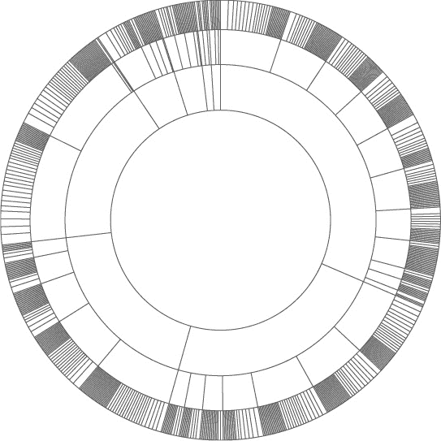图 7-13. D3.js 处理创建 Sunburst 图所需的数学运算。

### 第 7 步：给区域上色

现在我们可以将注意力转向为可视化上色。我们希望给每个区域一个独特的主色，并为该区域内的各州和县使用该颜色的不同色调。一个好的起点是使用 D3.js 的另一种比例尺——分类颜色比例尺。到目前为止，我们所看到的所有比例尺都是基数比例尺；它们将数值映射到可视化的属性上。分类比例尺处理的则是非数值型数据；这些值仅仅代表某一量的不同类别。在我们的例子中，区域代表的是分类数据。毕竟，"新英格兰"或"西南部"本身并没有什么数值含义。

正如名称所示，分类的*颜色*比例尺将不同的类别值映射到不同的颜色。D3.js 包含了几种预定义的颜色比例尺。由于我们的数据中区域少于 10 个，`d3.scale.category10()`比例尺非常适合这个例子。图 7-14 显示了该比例尺中的颜色。

图 7-14. D3.js 为分类数据提供颜色比例尺。

我们接下来的任务是将该比例尺的颜色分配到可视化中的弧形区域。为此，我们将定义我们自己的`color()`函数。该函数将接受分区布局中的数据节点作为输入。

```
➊ **var** color = **function**(d) {
       **var** colors;
       **if** (!d.parent) {
➋         colors = d3.scale.category10();
➌         d.color = "#fff";
       }

       *// More code needed...*
```

首先，在➊处，我们创建了一个局部变量，用于存储颜色。接着，我们检查输入节点是否为层次结构的根节点。如果是，我们就在➋处为该节点的子节点创建颜色比例尺，并在➌处为该节点分配自己的颜色。在我们的可视化中，代表整个美国的根节点将是白色的。该分配的颜色最终会由函数返回。

在为子节点创建颜色比例之后，我们需要将个别颜色分配给这些节点。然而，有一个小问题。`d.children`数组中的节点不一定按我们希望的顺时针顺序分布。为了确保我们颜色比例中的颜色按顺序分布，我们必须先对`d.children`数组进行排序。以下是这一步的完整代码。

```
   **if** (d.children) {
➊     d.children.map(**function**(child, i) {
           **return** {value: child.value, idx: i};
➋     }).sort(**function**(a,b) {
             **return** b.value - a.value
➌     }).forEach(**function**(child, i) {
           d.children[child.idx].color = colors(i);
       });
   }
```

在第一行，我们确保有一个子节点数组。如果有，我们会创建该子节点数组的副本，副本只包含节点值及其原始数组索引，见➊。然后，在➋，我们根据节点值对副本进行排序。最后，在➌，我们遍历排序后的数组，并为子节点分配颜色。

到目前为止，我们已经创建了一个分类颜色比例并将其颜色分配给了第一层子节点。这解决了区域的颜色问题，但还有州和县需要颜色。对于这些，我们可以基于父节点颜色创建一个不同的比例。让我们回到函数定义，并为非根节点添加一个`else`分支。在这个分支中，我们也为子节点创建一个颜色比例。然而，这些子节点不是区域；它们是州或县。对于一个区域的州和一个州的县，我们不希望使用像分类比例那样的独特颜色。相反，我们希望颜色与父节点的颜色相关。这就需要一个线性渐变。

```
   **var** color = **function**(d) {
       **var** colors;
       **if** (!d.parent) {
           *// Handle root node as above...*
       } **else** **if** (d.children) {

➊         **var** startColor = d3.hcl(d.color)
                               .darker(),
               endColor = d3.hcl(d.color)
                               .brighter();

➋         colors = d3.scale.linear()
➌                 .interpolate(d3.interpolateHcl)
➍                 .range([
                       startColor.toString(),
                       endColor.toString()
                   ])
➎                 .domain([0,d.children.length+1]);
       }

       *// Code continues...*
```

从➊开始，我们定义渐变的起始色和结束色。为了创建这些颜色，我们从父节点的颜色（`d.color`）开始，并将其加深或加亮。在这两种情况下，我们使用色调、饱和度和亮度（HCL）作为颜色操作的基础。HCL 颜色空间基于人类的视觉感知，不同于更常见的 RGB 颜色空间那样的纯数学基础。使用 HCL 通常能得到更具视觉吸引力的渐变效果。

从➋开始的代码块实际上创建了渐变。我们使用的是 D3.js 的线性比例和内置的 HCL 颜色插值算法 ➌。我们的渐变在起始和结束颜色之间变化 ➍，它的域是节点子节点的索引 ➎。

现在我们需要做的就是在创建每个数据值的`<path>`元素时分配适当的颜色。这只需要在创建路径的代码中添加一行`.attr("fill", color)`。

```
**var** path = g.selectAll("path")
    .data(partition.nodes(hierarchy))
  .enter().append("path")
    .attr("d", arc)
    .attr("fill", color);
```

如图 7-15 所示，我们的可视化现在包含了合适的颜色。

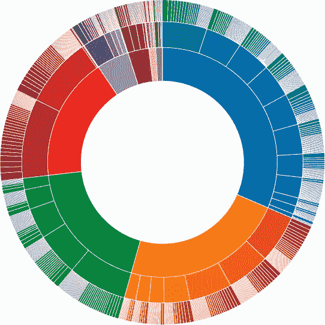图 7-15. D3.js 提供了工具，将吸引人的颜色添加到可视化中，比如我们的日冕图。

### 第 8 步：使可视化交互式

为了总结这个例子，我们将增加一些交互功能。当用户点击图表中的某个区域时，图表将缩放以显示该区域的更多细节。为了强调主题，我们将为这个缩放效果创建一个自定义的旋转动画效果。这个步骤中最简单的部分是添加处理点击事件的函数。我们可以在将 `<path>` 元素添加到页面时完成这一操作。

```
   **var** path = g.selectAll("path")
       .data(partition.nodes(hierarchy))
       .enter().append("path")
         .attr("d", arc)
         .attr("fill", color)
➊         .on("click", handleClick);
```

位于 ➊ 处的 `handleClick` 函数是我们需要编写的事件处理程序。从概念上讲，这个函数相当简单。当用户点击某个区域时，我们希望修改所有的路径，使该区域成为可视化的焦点。完整的函数在以下代码中展示。

```
**function** handleClick(datum) {
    path.transition().duration(750)
        .attrTween("d", arcTween(datum));
};
```

函数的唯一参数是与点击元素对应的数据值。通常情况下，D3.js 使用 `d` 作为该值；然而，在本例中，为了避免与 SVG 的 `"d"` 属性混淆，我们使用 `datum`。函数中的第一行引用了可视化中的所有路径，并为这些路径设置了动画过渡效果。接下来的这一行告诉 D3.js 我们要进行过渡的值。在这个例子中，我们正在更改 `<path>` 元素的一个属性（因此我们使用 `attrTween` 函数），而我们更改的具体属性是 `"d"` 属性（该函数的第一个参数）。第二个参数 `arcTween(datum)` 是一个返回函数的函数。

下面是 `arcTween()` 的完整实现。

```
**function** arcTween(datum) {
    **var** thetaDomain = d3.interpolate(theta.domain(),
                         [datum.x, datum.x + datum.dx]),
        radiusDomain = d3.interpolate(radius.domain(),
                         [datum.y, 1]),
        radiusRange = d3.interpolate(radius.range(),
                         [datum.y ? 20 : 0, maxRadius]);

    **return** **function** calculateNewPath(d, i) {
        **return** i ?
            **function** interpolatePathForRoot(t) {
                **return** arc(d);
            } :
            **function** interpolatePathForNonRoot(t) {
                theta.domain(thetaDomain(t));
                radius.domain(radiusDomain(t)).range(radiusRange(t));
                **return** arc(d);
            };
    };
};
```

你可以看到，这段代码定义了几个不同的函数。首先是 `arcTween()`，它返回另一个函数 `calculateNewPath()`，而 *这个* 函数返回的是 `interpolatePathForRoot()` 或 `interpolatePathForNonRoot()`。在查看实现的细节之前，先让我简单介绍一下这些函数之间的区别。

+   `arcTween()` 会在点击事件处理程序中被调用一次（针对单次点击）。它的输入参数是与点击元素对应的数据值。

+   接着，`calculateNewPath()` 会针对每个路径元素调用一次，每次点击总共调用 702 次。它的输入参数是路径元素的数据值和索引。

+   `interpolatePathForRoot()` 或 `interpolatePathForNonRoot()` 会针对每个路径元素多次调用。每次调用都会提供输入参数 `t`（表示时间），它代表当前动画过渡的进度。时间参数的范围从动画开始时的 0 到动画结束时的 1。例如，如果 D3.js 需要 100 个独立的动画步骤来完成过渡，那么这些函数将在每次点击时被调用 70,200 次。

现在我们知道了这些函数何时被调用，我们可以开始查看它们实际做了什么。一个具体的例子无疑会有所帮助，所以让我们来看看用户点击肯塔基州时会发生什么。如图 7-16 所示，它位于可视化图表的右上部分第二行。

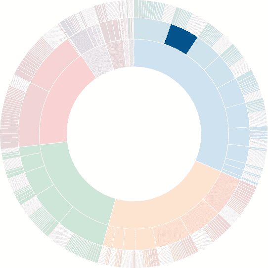图 7-16. 突出显示肯塔基州的龙卷风观测图

与此 SVG `<path>` 相关的数据值将由分区布局计算得出，具体包括：

+   一个`x`值为 0.051330798479087454

+   一个`y`值为 0.5

+   一个`dx`值为 0.04182509505703422

+   一个`dy`值为 0.25

在我们的可视化中，该区域从 18.479°的角度位置（`x`）开始，接着延续 15.057°（`dx`）。它的最内层半径从离中心 177 像素（`y`）的位置开始。当用户点击肯塔基州时，我们希望可视化聚焦于肯塔基州及其县。这正是图 7-17 突出显示的区域。角度从 18.479°开始，继续延伸 15.057°；半径从 177 像素开始，直到`maxRadius`值，总长度为 73 像素。

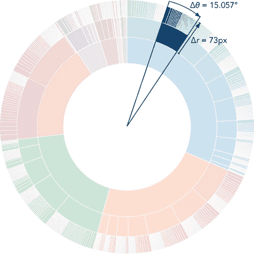图 7-17. 当用户点击肯塔基州时，我们希望可视化聚焦于那个小区域。

具体的例子有助于解释`arcTween()`的实现。该函数首先创建三个`d3.interpolate`对象。这些对象提供了一种方便的方式来处理插值的数学计算。第一个对象将起始`theta`域（最初为 0 到 1）插值到我们所需的子集（肯塔基州的范围是 0.051 到 0.093）。第二个对象对半径做相同的操作，将起始半径域（最初为 0 到 1）插值到我们所需的子集（肯塔基州及其县的范围是 0.5 到 1）。最后一个对象为半径提供了一个新的插值范围。如果点击的元素具有非零的`y`值，则新的范围将从 20 开始，而不是从 0 开始。如果点击的元素是表示整个美国的`<path>`，那么范围将恢复到初始的起始值 0。

`arcTween()`在创建`d3.interpolate`对象后返回`calculateNewPath`函数。D3.js 为每个`<path>`元素调用此函数一次。执行时，`calculateNewPath()`检查相关的`<path>`元素是否为根元素（代表整个美国）。如果是，`calculateNewPath()`返回`interpolatePathForRoot`函数。对于根元素，不需要插值，所需路径就是我们的`arc()`函数（来自第 4 步）创建的常规路径。然而，对于所有其他元素，我们使用`d3.interpolate`对象重新定义`theta`和`radius`比例尺。我们将这些比例尺设置为所需的焦点区域，而不是完整的 0 到 2π和 0 到`maxRadius`。此外，我们使用过渡中的进度量`t`来插值我们距离这些期望值有多近。重新定义比例尺后，调用`arc()`函数返回适合新比例尺的路径。随着过渡的进行，路径会重新塑造以适应期望的结果。您可以在图 7-18 中看到中间步骤。

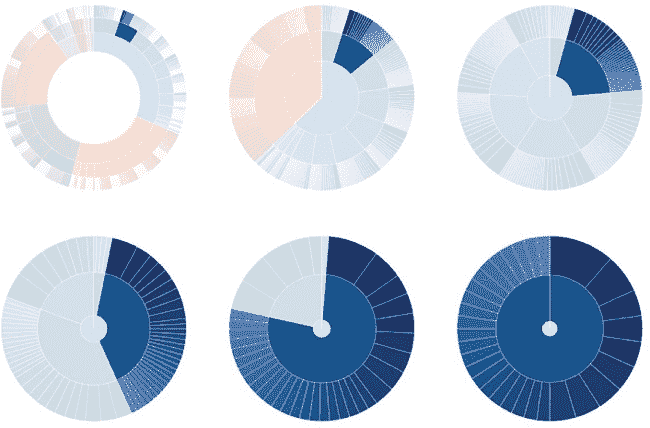图 7-18. 平滑过渡使可视化效果缩放到焦点区域。

通过这最后一部分代码，我们的可视化完成了。图 7-19 展示了结果。它包括一些额外的悬停效果，而不是真正的图例；您可以在本书的源代码中找到完整的实现（*[`jsDataV.is/source/`](http://jsDataV.is/source/)*）。

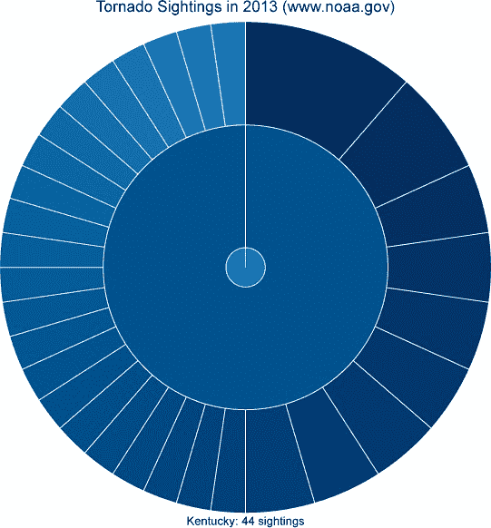图 7-19. D3.js 提供了构建像这样的复杂自定义交互式可视化所需的所有工具。

## 总结

正如我们在这些示例中看到的，D3.js 是一个非常强大的用于构建 JavaScript 可视化的库。要有效地使用它，需要比本书中看到的大多数其他库更深入地了解 JavaScript 技术。然而，如果您投入学习 D3.js，您将对结果拥有更多的控制和灵活性。
