## 第八章. 在浏览器中管理数据

到目前为止，在本书中，我们已经探讨了许多可视化工具和技术，但我们并未花太多时间考虑数据可视化中的数据部分。在许多情况下，侧重可视化是合适的。尤其是当数据是静态时，我们可以在其呈现在 JavaScript 中之前，花费大量时间进行清理和组织。但如果数据是动态的，我们别无选择，只能将原始数据源直接导入到我们的 JavaScript 应用程序中？对于来自第三方 REST API、Google Docs 表格或自动生成的 CSV 文件的数据，我们的控制能力要小得多。在这些类型的数据源中，我们常常需要在浏览器中验证、重新格式化、重新计算或以其他方式操作数据。

本章探讨了一个特别有助于在 Web 浏览器中管理大型数据集的 JavaScript 库：Underscore.js (*[`underscorejs.org/`](http://underscorejs.org/)*). 我们将覆盖 Underscore.js 的以下方面：

+   函数式编程，Underscore.js 推崇的编程风格

+   使用 Underscore.js 工具操作简单数组

+   增强 JavaScript 对象

+   操作对象集合

本章的格式与本书的其他章节有所不同。我们不会覆盖几个中等复杂度的示例，而是会看许多简单而简短的示例。每个部分将几个相关的示例放在一起，但每个短小的示例都是独立的。第一部分则更加不同，它是一个简短的函数式编程介绍，呈现为从更常见的命令式编程风格逐步迁移的过程。理解函数式编程非常有帮助，因为它的哲学基础贯穿于几乎所有 Underscore.js 的工具。

本章将带领我们深入了解 Underscore.js 库，特别关注数据管理。（作为本书整体专注于数据可视化的妥协，它还包括了一些插图。）在随后的章节中，我们将看到许多本章介绍的 Underscore.js 工具在一个更大的 Web 应用项目中的实际应用。

## 使用函数式编程

当我们处理作为可视化一部分的数据时，我们通常需要逐项遍历数据，进行转换、提取或其他方式的操作，以使其适应我们的应用程序。仅使用核心的 JavaScript 语言时，我们的代码可能会依赖以下的`for`循环：

```
**for** (**var** i=0, len=data.length; i<len; i++) {
    *// Code continues...*
}
```

尽管这种风格，称为 *命令式编程*，是 JavaScript 中常见的习惯用法，但在大型复杂应用程序中，它可能会带来一些问题。特别是，它可能导致调试、测试和维护起来比必要的更加困难。本节介绍了一种不同的编程风格——*函数式编程*，它消除了许多这些问题。正如你将看到的，函数式编程可以使代码更加简洁和可读，因此通常更不容易出错。

为了比较这两种编程风格，我们来考虑一个简单的编程问题：编写一个函数来计算斐波那契数列。前两个斐波那契数是 0 和 1，后续的数是前两个数的和。这个数列如下所示：

+   0，1，1，2，3，5，8，13，21，34，55，89，...

### 第 1 步：从命令式版本开始

首先，我们来考虑一个传统的命令式方法来解决这个问题。以下是第一次尝试：

```
**var** fib = **function**(n) {
    *// If 0th or 1st, just return n itself*
    **if** (n < 2) **return** n;

    *// Otherwise, initialize variable to compute result*
    **var** f0=0, f1=1, f=1;

    *// Iterate until we reach n*
    **for** (i=2; i<=n; i++) {

        *// At each iteration, slide the intermediate*
        *// values down a step*
        f0 = f1 = f;

        *// And calculate sum for the next pass*
        f = f0 + f1;
    }

    *// After all the iterations, return the result*
    **return** f;
}
```

这个 `fib()` 函数的输入是一个参数 *n*，输出是第 *n* 个斐波那契数。（按照惯例，第 0 个和第 1 个斐波那契数是 0 和 1。）

### 第 2 步：调试命令式代码

如果你没有仔细检查，可能会惊讶地发现，上面的简单例子中包含了三个错误。当然，这只是一个人为构造的例子，错误是故意设置的，但你能在不继续阅读的情况下找到所有错误吗？更重要的是，如果连一个简单的例子都能隐藏这么多错误，那么你能想象复杂的 Web 应用程序中可能潜伏着什么问题吗？

为了理解为什么命令式编程会引入这些错误，我们来逐个修复它们。

一个错误出现在 `for` 循环中：

```
**for** (i=2; i<=n; i++) {
```

决定循环终止条件的条件检查了一个小于或等于 (`<=`) 的值；但它应该检查一个小于 (`<`) 的值。

第二个错误出现在这一行：

```
f0 = f1 = f;
```

虽然我们从左到右思考和阅读（至少在英语中是这样），但 JavaScript 的赋值是从右到左执行的。这个语句并没有在我们的变量中移位，而是将 `f` 的值赋给了所有三个变量。我们需要将这个单一的语句分成两个：

```
f0 = f1;
f1 = f;
```

最终的错误是最微妙的，且也出现在 `for` 循环中。我们使用了局部变量 `i`，但并没有声明它。因此，JavaScript 会将其视为全局变量。这样虽然不会导致函数返回错误结果，但可能会在我们应用程序的其他部分引入冲突——并且这是一个难以发现的 bug。正确的代码应该将该变量声明为局部变量：

```
**for** (**var** i=2; i<n; i++) {
```

### 第 3 步：理解命令式编程可能引入的问题

这段简短而直接的代码中的错误旨在展示命令式编程中一些常见的有问题的特性。特别是，条件逻辑和状态变量，由于其固有特性，往往会引入某些错误。

考虑第一个错误。它的错误在于使用了不正确的条件测试（`<=` 而不是 `<`）来终止循环。精确的条件逻辑对于计算机程序至关重要，但这种精确度并非每个人，甚至包括程序员，都会自然掌握。条件逻辑必须是完美的，而有时做到这一点并不容易。

另外两个错误都与状态变量有关，第一种情况是`f0`和`f1`，第二种情况是`i`。这里再次体现了程序员的思维方式与程序实际操作之间的差异。当程序员编写代码以迭代数字时，他们可能集中精力处理当前特定的问题，可能会忽视对应用程序其他部分的潜在影响。从技术上讲，状态变量会在程序中引入副作用，副作用可能导致程序中的错误。

### 步骤 4: 使用函数式编程风格重写

函数式编程的支持者认为，通过消除条件语句和状态变量，函数式编程风格可以生成比命令式编程更加简洁、易于维护且更不容易出错的代码。

“函数式”在“函数式编程”中的含义并不是指编程语言中的函数，而是指像*y*=*f*(*x*)这样的数学函数。函数式编程试图在计算机编程的背景下模仿数学函数。它通常使用递归来代替通过`for`循环迭代值，在递归中，一个函数会多次调用自身来进行计算或操作值。

下面是我们如何用函数式编程实现斐波那契算法：

```
**var** fib = **function**(n) { **return** n < 2 ? n : fib(n-1) + fib(n-2); }
```

请注意，这个版本没有状态变量，除了处理 0 或 1 的边界情况外，也没有条件语句。它简洁得多，而且请注意代码几乎逐字镜像了原问题的陈述：“前两个斐波那契数是 0 和 1”对应于`n < 2 ? n`，而“后续的数字是前两个值的和”对应于`fib(n-1) + fib(n-2)`。

函数式编程的实现通常直接表达所需的结果。因此，它们可以最大限度地减少中间算法中误解或错误的可能性。

### 步骤 5: 评估性能

从我们目前所见，似乎我们应该始终采用函数式编程风格。毫无疑问，函数式编程有其优势，但它也可能有一些显著的缺点。斐波那契代码就是一个完美的例子。由于函数式编程避免使用循环的概念，我们的示例改用递归。

在我们的特定案例中，`fib()`函数在每一层都会调用自己两次，直到递归达到 0 或 1。由于每次中间调用都会导致更多的中间调用，`fib()`的调用次数呈指数增长。通过执行`fib(28)`来找出第 28 个斐波那契数时，将导致超过一百万次对`fib()`函数的调用。

正如你想象的那样，最终的性能是完全无法接受的。表 8-1`的执行时间")展示了`fib()`函数的函数式版本和命令式版本的执行时间。

表 8-1. `fib()`的执行时间

| 版本 | 参数 | 执行时间（毫秒） |
| --- | --- | --- |
| 命令式 | `28` | 0.231 |
| 函数式 | `28` | 296.9 |

正如你所看到的，函数式编程版本的执行速度比命令式版本慢了超过一千倍。在实际应用中，这样的性能通常是不可接受的。

### 步骤 6：解决性能问题

幸运的是，我们可以在不牺牲性能的情况下，享受函数式编程的好处。我们只需要借助小巧却强大的 Underscore.js 库。正如该库的网页所解释的，

> Underscore 是一个为 JavaScript 提供功能编程支持的工具库。

当然，我们需要在网页中包含这个库。如果你是单独引入库，Underscore.js 可以通过许多内容分发网络提供，例如 CloudFlare。

```
<!DOCTYPE html>
**<html** lang="en"**>**
  **<head>**
    **<meta** charset="utf-8"**>**
    **<title></title>**
  **</head>**
  **<body>**
    *<!-- Content goes here -->*
    **<script**
      src="//cdnjs.cloudflare.com/ajax/libs/underscore.js/1.4.4/"+
          "underscore-min.js"**>**
    **</script>**
  **</body>**
**</html>**
```

使用 Underscore.js 后，我们现在可以优化我们的 Fibonacci 实现的性能。

递归实现的问题在于它会导致很多不必要的 `fib()` 调用。例如，执行 `fib(28)` 会需要超过 100,000 次对 `fib(3)` 的调用。而每次调用 `fib(3)` 时，返回值都会从头开始重新计算。如果实现只在第一次调用时调用 `fib(3)`，然后每次需要知道 `fib(3)` 的值时都能重用之前的结果，而不是重新计算，这将会更好。实际上，我们希望在 `fib()` 函数前实现一个缓存。这个缓存可以消除重复计算。

这种方法被称为 *记忆化*，而 Underscore.js 库提供了一个简单的方法来自动透明地记忆化 JavaScript 函数。毫不奇怪，这个方法叫做 `memoize()`。为了使用它，我们首先将想要记忆化的函数包裹在 Underscore 对象内。就像 jQuery 使用美元符号（`$`）进行包装一样，Underscore.js 使用下划线字符（`_`）。在包装好函数后，我们只需调用 `memoize()` 方法。以下是完整代码：

```
**var** fib = _( **function**(n) {
        **return** n < 2 ? n : fib(n-1) + fib(n-2);
    } ).memoize()
```

正如你所看到的，我们实际上并没有失去函数式编程的可读性或简洁性。而且，在这个实现中引入一个 bug 依然会是一个挑战。唯一真正的变化是性能，它明显更好，如表 8-2 执行时间，续")所示。

表 8-2. fib() 执行时间，续

| 版本 | 参数 | 执行时间（毫秒） |
| --- | --- | --- |
| 命令式 `fib()` | `28` | 0.231 |
| 函数式 `fib()` | `28` | 296.9 |
| 记忆化 `fib()` | `28` | 0.352 |

只需包含 Underscore.js 库并使用它的其中一个方法，我们的函数式实现就几乎与命令式版本的性能相同。

在本章的剩余部分，我们将介绍 Underscore.js 提供的许多其他改进和实用工具。通过对函数式编程的支持，Underscore.js 使得在浏览器中处理数据变得更加容易。

## 处理数组

如果你的可视化依赖大量数据，那么这些数据很可能存储在数组中。不幸的是，当你处理数组时，很容易陷入命令式编程的陷阱。数组暗示着使用编程循环，而正如我们之前所看到的，编程循环是一种命令式构造，通常会导致错误。如果我们能避免使用循环，转而依赖函数式编程，我们就能提高 JavaScript 的质量。核心的 JavaScript 语言包含一些用于以函数式风格处理数组的工具和方法，但 Underscore.js 增加了许多其他工具。本节将介绍许多 Underscore.js 中最有助于数据可视化的数组工具。

### 按位置提取元素

如果你只需要数组中的一部分元素来进行可视化，Underscore.js 提供了许多工具，使得提取合适的元素变得简单。在接下来的例子中，我们将考虑一个简单的数组（如 图 8-1）所示。

```
**var** arr = [1,2,3,4,5,6,7,8,9];
```

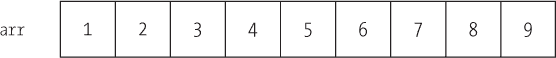图 8-1. Underscore.js 提供了许多实用工具，使得处理数组变得更加容易。

Underscore.js 的 `first()` 方法提供了一种简单的方法来提取数组中的第一个元素，或前 *n* 个元素（参见 图 8-2` 函数返回数组中的第一个元素或前 n 个元素。")）：

```
> _(arr).first()
  1
> _(arr).first(3)
  [1, 2, 3]
```

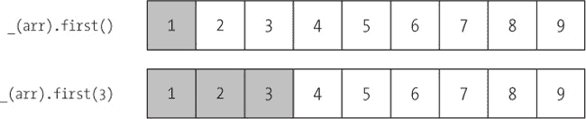图 8-2. `first()` 函数返回数组中的第一个元素或前 n 个元素。

请注意，`first()`（不传递任何参数）返回一个简单的元素，而 `first(n)` 返回一个元素数组。这意味着，例如，`first()` 和 `first(1)` 返回的值是不同的（在例子中分别是 `1` 和 `[1]`）。

正如你可能预期的那样，Underscore.js 也有一个 `last()` 方法，用于从数组的末尾提取元素（参见 图 8-3` 函数返回数组中的最后一个元素或最后 n 个元素。")）。

```
> _(arr).last()
  9
> _(arr).last(3)
  [7, 8, 9]
```

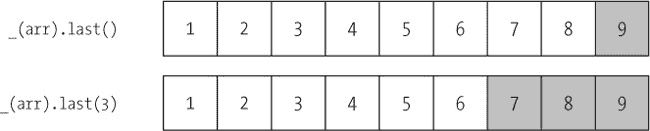图 8-3. `last()` 函数返回数组中的最后一个元素或最后 n 个元素。

如果不传递任何参数，`last()` 返回数组中的最后一个元素。传递参数 `n` 时，它返回一个包含原数组中最后 *n* 个元素的新数组。

这两个函数（`.first(3)`和`.last(3)`）的更通用版本在命令式编程风格中可能需要编写一些复杂（且容易出错）的代码。然而，在 Underscore.js 支持的函数式编程风格中，我们的代码简洁且清晰。

如果你想从数组的开头提取元素，但不是通过知道要包含多少个元素来决定，而是知道你想要跳过多少个元素呢？换句话说，你需要“除去最后 *n* 个”元素。`initial()`方法可以执行这个提取操作（见图 8-4`函数返回数组中除了最后一个元素或除了最后 n 个元素的所有元素。")）。与所有这些方法一样，如果你省略了可选参数，Underscore.js 会假定其值为`1`。

```
> _(arr).initial()
  [1, 2, 3, 4, 5, 6, 7, 8]
> _(arr).initial(3)
  [1, 2, 3, 4, 5, 6]
```

图 8-4. `initial()`函数返回数组中除了最后一个元素或除了最后 n 个元素的所有元素。

最后，你可能需要`initial()`的相反操作。`rest()`方法跳过数组开头的定义数量的元素，返回剩余的元素（见图 8-5`函数返回数组中除了第一个元素或除了前 n 个元素的所有元素。")）。

```
> _(arr).rest()
  [2, 3, 4, 5, 6, 7, 8, 9]
> _(arr).rest(3)
  [4, 5, 6, 7, 8, 9]
```

图 8-5. `rest()`函数返回数组中除了第一个元素或除了前 n 个元素的所有元素。

再次强调，使用传统的命令式编程实现这些功能会很棘手，但在 Underscore.js 中，这些操作非常简单。

### 合并数组

Underscore.js 包含了一组用于合并两个或更多数组的工具。这些工具包括模拟标准数学*集合*运算的函数，以及更复杂的合并方式。在接下来的几个例子中，我们将使用两个数组，一个包含前几个斐波那契数，另一个包含前五个偶数（见图 8-6））。

```
**var** fibs = [0, 1, 1, 2, 3, 5, 8];
**var** even = [0, 2, 4, 6, 8];
```

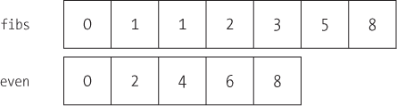图 8-6. Underscore.js 还拥有许多用于处理多个数组的工具。

`union()`方法是一个直接的多个数组合并方式。它返回一个包含所有输入元素的数组，并移除任何重复的元素（见图 8-7`函数创建多个数组的并集，移除任何重复项。")）。

```
> _(fibs).union(even)
  [0, 1, 2, 3, 5, 8, 4, 6]
```

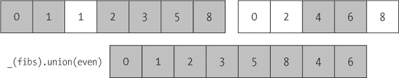图 8-7. `union()` 函数创建多个数组的并集，去除重复元素。

注意，`union()` 会去除重复元素，无论它们是出现在不同的输入中（如 `0`、`2` 和 `8`），还是出现在同一个数组中（如 `1`）。

### 注意

**尽管本章只讨论了两个数组的组合，但大多数 Underscore.js 方法都能接受无限数量的参数。例如，`_.union(a,b,c,d,e)` 返回五个不同数组的并集。你甚至可以使用 JavaScript 的 `apply()` 函数来查找数组的数组的并集，方法是像 `_.union.prototype.apply(this, arrOfArrs)` 这样。**

`intersection()` 方法的作用正如你所预期的，返回所有输入数组中都出现的元素（图 8-8 函数返回多个数组中共有的元素。")）。

```
> _(fibs).intersection(even)
  [0, 2, 8]
```

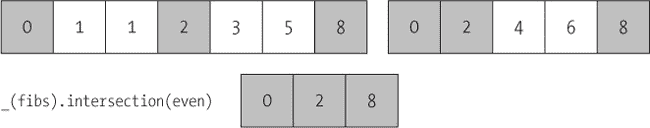图 8-8. `intersection()` 函数返回多个数组中共有的元素。

`difference()` 方法是 `intersection()` 的反操作。它返回那些仅存在于第一个输入数组中、而不在其他输入数组中的元素（图 8-9 函数返回仅存在于多个数组中的第一个数组的元素。")）。

```
> _(fibs).difference(even)
  [1, 1, 3, 5]
```

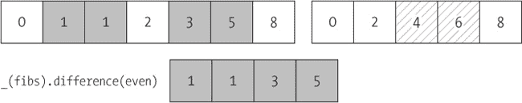图 8-9. `difference()` 函数返回仅存在于多个数组中的第一个数组的元素。

如果你需要消除重复元素，但只有一个数组—这使得 `union()` 不适用—那么你可以使用 `uniq()` 方法（图 8-10 函数从数组中去除重复元素。")）。

```
> _(fibs).uniq()
  [0, 1, 2, 3, 5, 8]
```

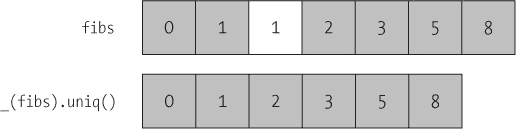图 8-10. `uniq()` 函数从数组中去除重复元素。

最后，Underscore.js 还有一个 `zip()` 方法。它的名字并非来源于流行的压缩算法，而是因为它的作用有点像拉链。它接受多个输入数组，并将它们按元素逐个组合成一个输出数组。该输出是一个数组的数组，其中内层数组是组合后的元素。

```
> **var** naturals = [1, 2, 3, 4, 5];
> **var** primes = [2, 3, 5, 7, 11];
> _.zip(naturals, primes)
  [ [1,2], [2,3], [3,5], [4,7], [5,11] ]
```

通过图示理解这一操作可能最为清晰；请参见图 8-11 函数将多个数组的元素配对，组合成一个单一的数组。")。

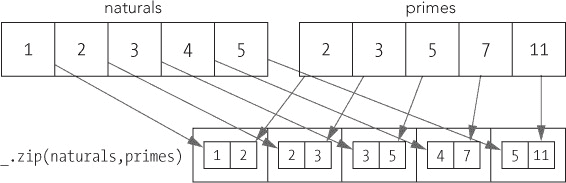图 8-11. *zip()* 函数将多个数组中的元素配对成一个单一的数组。

这个例子展示了 Underscore.js 的另一种风格。与之前将数组包装在`_`对象中不同，我们直接在`_`对象本身上调用`zip()`方法。在这种情况下，这种替代风格似乎更适合底层功能，但如果你更喜欢`_(naturals).zip(prime)`，你也会得到完全相同的结果。

### 移除无效数据值

可视化应用程序的一个大问题是无效数据值。虽然我们希望数据源能够确保所有提供的数据都是严格正确的，但遗憾的是，情况往往并非如此。更严重的是，如果 JavaScript 遇到无效值，最常见的结果是一个*未处理的异常*，这将停止页面上所有后续的 JavaScript 执行。

为了避免出现这种令人不愉快的错误，我们应该验证所有数据集，并在将数据传递给图表或图形库之前移除无效值。Underscore.js 提供了多个工具来帮助完成这项工作。

这些 Underscore.js 方法中最简单的是`compact()`。此函数会从输入数组中移除 JavaScript 视为`false`的任何数据值。被移除的值包括布尔值`false`、数字值`0`、空字符串以及特殊值`NaN`（非数字，例如`1/0`）、`undefined`和`null`。

```
> **var** raw = [0, 1, **false**, 2, "", 3, **NaN**, 4, , 5, **null**];
> _(raw).compact()
  [1, 2, 3, 4, 5]
```

值得强调的是，`compact()`会移除值为`0`的元素。如果你使用`compact()`来清理数据数组，请确保`0`在你的数据集中不是有效的数据值。

原始数据的另一个常见问题是过度嵌套的数组。如果你想从数据集中消除额外的嵌套层级，可以使用`flatten()`方法。

```
> **var** raw = [1, 2, 3, [[4]], 5];
> _(raw).flatten()
  [1, 2, 3, 4, 5]
```

默认情况下，`flatten()`会移除所有的嵌套层级，包括多级嵌套。如果你将`shallow`参数设置为`true`，它只会移除单一层级的嵌套。

```
> **var** raw = [1, 2, 3, [[4]], 5];
> _(raw).flatten(**true**)
  [1, 2, 3, [4], 5]
```

最后，如果你有特定的值想从数组中删除，可以使用`without()`方法。它的参数提供了一个值的列表，函数应该从输入数组中移除这些值。

```
> **var** raw = [1, 2, 3, 4];
> _(raw).without(2, 3)
  [1, 4]
```

### 在数组中查找元素

JavaScript 一直为字符串定义了`indexOf()`方法。它返回给定子字符串在更大字符串中的位置。JavaScript 的最新版本已将此方法添加到数组对象中，因此你可以轻松找到数组中给定值的第一次出现。不幸的是，旧版浏览器（特别是 IE8 及更早版本）不支持此方法。

Underscore.js 提供了自己的`indexOf()`方法，以填补旧浏览器造成的空白。如果 Underscore.js 发现自己运行在支持原生数组`indexOf`方法的环境中，那么它会调用原生方法，以避免性能上的损失。

```
> **var** primes = [2, 3, 5, 7, 11];
> _(primes).indexOf(5)
  2
```

如果你想从数组的中间某个位置开始搜索，可以将起始位置作为第二个参数传递给 `indexOf()`。

```
> **var** arr = [2, 3, 5, 7, 11, 7, 5, 3, 2];
> _(arr).indexOf(5, 4)
  6
```

你还可以使用 `lastIndexOf()` 方法从数组的末尾反向搜索。

```
> **var** arr = [2, 3, 5, 7, 11, 7, 5, 3, 2];
> _(arr).lastIndexOf(5)
  6
```

如果你不想从数组的末尾开始，可以将起始索引作为可选参数传入。

Underscore.js 提供了一些对排序数组有帮助的优化。`uniq()` 和 `indexOf()` 方法都接受一个可选的布尔参数。如果该参数为 `true`，那么这两个函数会假设数组是已排序的。这种假设带来的性能提升，对于大数据集来说尤其显著。

该库还包含了一个特殊的 `sortedIndex()` 函数。该函数同样假设输入的数组是已排序的。它会找到一个位置，在该位置插入特定值，以保持数组的排序顺序。

```
> **var** arr = [2, 3, 5, 7, 11];
> _(arr).sortedIndex(6)
  3
```

如果你有一个自定义的排序函数，也可以将其传递给 `sortedIndex()`。

### 生成数组

我将提到的最后一个数组工具是一个生成数组的便捷方法。`range()` 方法会告诉 Underscore.js 创建一个具有指定数量元素的数组。你还可以指定一个起始值（默认值为 `0`）和相邻值之间的增量（默认值为 `1`）。

```
> _.range(10)
  [0, 1, 2, 3, 4, 5, 6, 7, 8, 9]
> _.range(20,10)
  [20, 21, 22, 23, 24, 25, 26, 27, 28, 29]
> _.range(0, 10, 100)
  [0, 100, 200, 300, 400, 500, 600, 700, 800, 900]
```

`range()` 函数在你需要生成与 y 轴值数组匹配的 x 轴值时，非常有用。

```
> **var** yvalues = [0.1277, 1.2803, 1.7697, 3.1882]
> _.zip(_.range(yvalues.length),yvalues)
  [ [0, 0.1277], [1, 1.2803], [2, 1.7697], [3, 3.1882] ]
```

在这里，我们使用 `range()` 来生成匹配的 x 轴值，并使用 `zip()` 将它们与 y 值组合。

## 增强对象

尽管前面章节的示例展示了数字数组，但我们可视化的数据通常是 JavaScript 对象，而非简单的数字。如果我们通过 REST 接口获取数据，这种情况尤其常见，因为这些接口几乎总是以 JavaScript 对象表示法（JSON）形式传递数据。如果我们需要增强或转换对象，而不使用命令式的构造，Underscore.js 还提供了另一组工具可以帮助我们。以下示例中，我们可以使用一个简单的 `pizza` 对象（见 图 8-12）。

```
**var** pizza = {
    size: 10,
    crust: "thin",
    cheese: **true**,
    toppings: [ "pepperoni","sausage"]
};
```

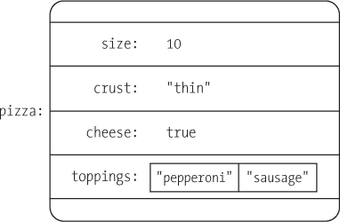图 8-12. Underscore.js 提供了许多用于处理任意 JavaScript 对象的工具。

### 操作键和值

Underscore.js 包含了多个方法用于操作构成对象的键和值。例如，`keys()` 函数会创建一个仅包含对象键的数组（见 图 8-13` 函数将对象的键作为数组返回。")）。

```
> _(pizza).keys()
  [ "size", "crust", "cheese", "toppings"]]
```

图 8-13. `keys()` 函数将对象的键作为数组返回。

类似地，`values()` 函数创建一个只包含对象值的数组（图 8-14` 函数返回对象的值作为数组")）。

```
> _(pizza).values()
  [10, "thin", **true**, [ "pepperoni","sausage"]]
```

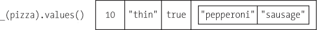图 8-14. `values()` 函数返回对象的值作为数组。

`pairs()` 函数创建一个二维数组。外层数组的每个元素本身就是一个数组，包含对象的键及其对应的值（图 8-15` 函数将对象转换为数组对")）。

```
> _(pizza).pairs()
 [
   [ "size",10],
   [ "crust","thin"],
   [ "cheese",**true**],
   [ "toppings",[ "pepperoni","sausage"]]
 ]
```

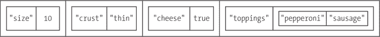图 8-15. `pairs()` 函数将对象转换为数组对。

要反转这个转换并将数组转换为对象，我们可以使用 `object()` 函数。

```
> **var** arr = [ [ "size",10], [ "crust","thin"], [ "cheese",**true**],
            [ "toppings",[ "pepperoni","sausage"]] ]
> _(arr).object()
  { size: 10, crust: "thin", cheese: **true**, toppings: [ "pepperoni","sausage"]}
```

最后，我们可以使用 `invert()` 函数交换对象中键和值的角色（图 8-16` 函数交换对象中的键和值")）。

```
> _(pizza).invert()
  {10: "size", thin: "crust", true: "cheese", "pepperoni,sausage":
"toppings"}
```

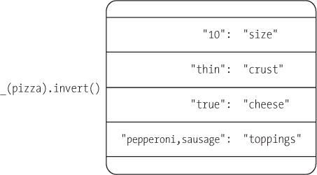图 8-16. `invert()` 函数交换对象中的键和值。

如前面的示例所示，Underscore.js 甚至可以反转一个对象，即使其值不是简单类型。在这种情况下，它将一个数组 `["pepperoni","sausage"]` 转换为值，通过用逗号连接各个数组元素，生成键 `"pepperoni,sausage"`。

还需注意，JavaScript 要求对象的所有键必须是唯一的，但这不一定适用于值。如果一个对象中有多个键具有相同的值，则 `invert()` 只会保留反转对象中最后一个键。例如，`_({key1: value, key2: value}).invert()` 返回 `{value: key2}`。

### 清理对象子集

当你想通过删除不必要的属性来清理对象时，可以使用 Underscore.js 的 `pick()` 函数。只需传递一个你想保留的属性列表（图 8-17` 函数从对象中选择特定的属性")）。

```
> _(pizza).pick( "size","crust")
  {size: 10, crust: "thin"}
```

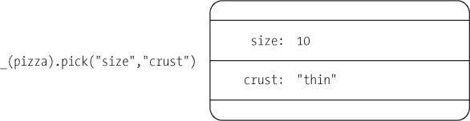图 8-17. `pick()` 函数从对象中选择特定属性。

我们还可以通过使用 `omit()` 来执行 `pick()` 的相反操作，并列出我们想删除的属性（图 8-18` 函数从对象中移除属性")）。Underscore.js 会保留对象中的其他所有属性。

```
> _(pizza).omit( "size","crust")
 {cheese: **true**, toppings: [ "pepperoni","sausage"]}
```

图 8-18. `omit()`函数从对象中移除属性。

### 更新属性

在更新对象时，一个常见的需求是确保一个对象包含某些属性，并且这些属性有合适的默认值。Underscore.js 为此目的提供了两个工具。

这两个工具，`extend()`和`defaults()`，都以一个对象开始，并根据其他对象的属性调整它的属性。如果次要对象包含原始对象缺少的属性，这些工具会将这些属性添加到原始对象中。这些工具的区别在于它们如何处理原始对象中已存在的属性。`extend()`函数会用新值覆盖原始属性（见图 8-19 函数更新并添加缺失的属性到对象中")）：

```
> **var** standard = { size: 12, crust: "regular", cheese: **true** }
> **var** order = { size: 10, crust: "thin",
  toppings: [ "pepperoni","sausage"] };
> _.extend(standard, order)
  { size: 10, crust: "thin", cheese: **true**,
  toppings: [ "pepperoni","sausage"] };
```

与此同时，`defaults()`保持原始属性不变（见图 8-20 函数将缺失的属性添加到对象中")）：

```
> **var** order = { size: 10, crust: "thin",
  toppings: [ "pepperoni","sausage"] };
> **var** standard = { size: 12, crust: "regular", cheese: **true** }
> _.defaults(order, standard)
  { size: 10, crust: "thin",
  toppings [ "pepperoni","sausage"], cheese: **true** };
```

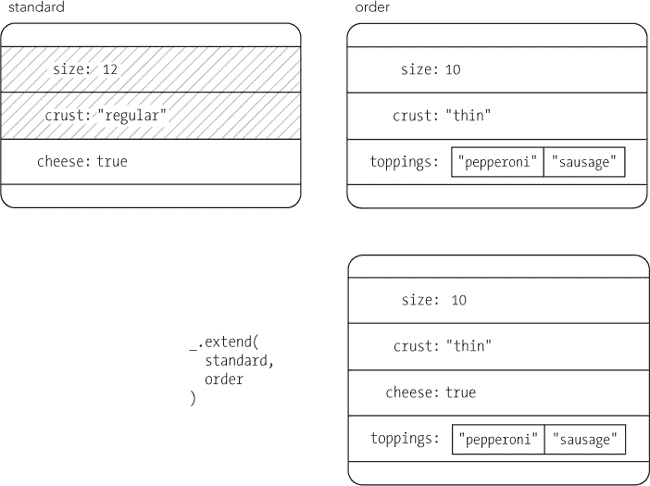图 8-19. `extend()`函数更新并添加缺失的属性到对象中。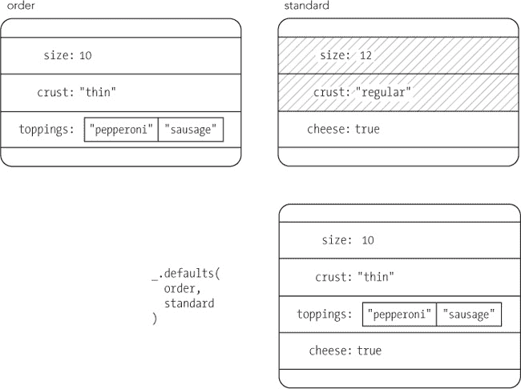图 8-20. `defaults()`函数将缺失的属性添加到对象中。

请注意，`extend()`和`defaults()`都会直接修改原始对象；它们不会创建该对象的副本并返回副本。考虑以下情况：

```
> **var** order = { size: 10, crust: "thin",
  toppings: [ "pepperoni","sausage"] };
> **var** standard = { size: 12, crust: "regular", cheese: **true** }
> **var** pizza = _.extend(standard, order)
  { size: 10, crust: "thin", cheese: **true**,
  toppings: [ "pepperoni","sausage"] };
```

这段代码按照预期设置了`pizza`变量，但它也将`standard`变量设置为相同的对象。更具体地说，代码通过`order`中的属性修改了`standard`，然后将一个新的变量`pizza`设置为`standard`。对`standard`的修改可能并非故意为之。如果你需要以不修改输入参数的方式使用`extend()`或`defaults()`，可以从一个空对象开始。

```
> **var** order = { size: 10, crust: "thin",
  toppings: [ "pepperoni","sausage"] };
> **var** standard = { size: 12, crust: "regular", cheese: **true** }
> **var** pizza = _.extend({}, standard, order)
  { size: 10, crust: "thin", cheese: **true**,
  toppings: [ "pepperoni","sausage"] };
```

这个版本可以获得我们期望的`pizza`对象，而不会修改`standard`。

## 操作集合

到目前为止，我们已经看过了各种专门适用于数组或对象的 Underscore.js 工具。接下来，我们将看到一些用于操作集合的工具。在 Underscore.js 中，数组和对象都是*集合*，因此本节中的工具可以应用于纯数组、纯对象或结合两者的数据结构。在本节中，我们将尝试在一个对象数组上使用这些工具，因为这是我们在数据可视化上下文中最常处理的数据结构。

这是一个小数据集，我们可以在接下来的示例中使用。它包含了 2012 年美国职棒大联盟赛季的一些统计数据。

```
**var** national_league = [
    { name: "Arizona Diamondbacks",  wins: 81, losses:  81,
      division: "west" },
    { name: "Atlanta Braves",        wins: 94, losses:  68,
      division: "east" },
    { name: "Chicago Cubs",          wins: 61, losses: 101,
      division: "central" },
    { name: "Cincinnati Reds",       wins: 97, losses:  65,
      division: "central" },
    { name: "Colorado Rockies",      wins: 64, losses:  98,
      division: "west" },
    { name: "Houston Astros",        wins: 55, losses: 107,
      division: "central" },
    { name: "Los Angeles Dodgers",   wins: 86, losses:  76,
      division: "west" },
    { name: "Miami Marlins",         wins: 69, losses:  93,
      division: "east" },
    { name: "Milwaukee Brewers",     wins: 83, losses:  79,
      division: "central" },
    { name: "New York Mets",         wins: 74, losses:  88,
      division: "east" },
    { name: "Philadelphia Phillies", wins: 81, losses:  81,
      division: "east" },
    { name: "Pittsburgh Pirates",    wins: 79, losses:  83,
      division: "central" },
    { name: "San Diego Padres",      wins: 76, losses:  86,
      division: "west" },
    { name: "San Francisco Giants",  wins: 94, losses:  68,
      division: "west" },
    { name: "St. Louis Cardinals",   wins: 88, losses:  74,
      division: "central" },
    { name: "Washington Nationals",  wins: 98, losses:  64,
      division: "east" }
];
```

### 使用迭代工具

在第一部分，我们看到了一些传统 JavaScript 迭代循环的陷阱以及函数式编程可以提供的改进。我们的斐波那契例子通过使用递归消除了迭代，但许多算法并不适合递归实现。在这些情况下，我们仍然可以通过利用 Underscore.js 中的迭代工具，采用函数式编程风格。

最基本的 Underscore 工具是`each()`。它在集合中的每个元素上执行一个任意的函数，并且通常作为传统的`for (i=0; i<len; i++)`循环的直接函数式替代。

```
> _(national_league).each(**function**(team) { console.log(team.name); })
  Arizona Diamondbacks
  Atlanta Braves
  *// Console output continues...*
  Washington Nationals
```

如果你熟悉 jQuery 库，你可能知道 jQuery 包括一个类似的`$.each()`工具。然而，Underscore.js 和 jQuery 版本之间有两个重要的区别。首先，传递给迭代函数的参数在两者之间有所不同。Underscore.js 为数组传递`(element, index, list)`，为简单对象传递`(value, key, list)`，而 jQuery 传递`(index, value)`。其次，至少在撰写本文时，Underscore.js 的实现可能比 jQuery 版本执行得更快，具体取决于浏览器。（jQuery 也包括一个类似于 Underscore.js 方法的`$.map()`函数。）

Underscore.js 的`map()`方法遍历集合，并通过一个任意的函数转换每个元素。它返回一个包含转换后元素的新集合。例如，以下是如何创建一个所有团队胜率的数组：

```
> _(national_league).map(**function**(team) {
      **return** Math.round(100*team.wins/(team.wins + team.losses);
  })
  [50, 58, 38, 60, 40, 34, 53, 43, 51, 46, 50, 49, 47, 58, 54, 60]
```

`reduce()`方法遍历集合并返回一个单一的值。一个参数初始化该值，另一个参数是一个任意的函数，用于更新集合中每个元素的值。例如，我们可以使用`reduce()`来计算有多少个团队的胜率超过 500。

```
   > _(national_league).reduce(
➊       **function**(count, team) {
➋           **return** count + (team.wins > team.losses);
         },
➌       0 *// Starting point for reduced value*
     )
     7
```

如➊处的注释所示，我们从 0 开始计数。该值作为第一个参数传递给➋处的函数，函数返回一个更新后的值，位于➌处。

### 注意

**如果你关注过“大数据”技术的开发，比如 Hadoop 或谷歌的搜索，你可能知道这些技术背后的基本算法是 MapReduce。尽管背景不同，但`map()`和`reduce()`工具在 Underscore.js 中的原理是相同的。**

### 在集合中查找元素

Underscore.js 有几个方法可以帮助我们在集合中查找元素或元素集合。例如，我们可以使用`find()`来获取一个超过 90 场胜利的团队。

```
> _(national_league).find( **function**(team) { **return** team.wins > 90; })
  { name: "Atlanta Braves", wins: 94, losses: 68, division: "east" }
```

`find()`函数返回数组中第一个符合标准的元素。要查找所有符合标准的元素，可以使用`filter()`函数。

```
> _(national_league).filter( **function**(team) { **return** team.wins > 90; })
  [ { name: "Atlanta Braves", wins: 94, losses: 68, division: "east" },
    { name: "Cincinnati Reds", wins: 97, losses: 65, division: "central" },
    { name: "San Francisco Giants", wins: 94, losses: 68, division: "west" },
    { name: "Washington Nationals", wins: 98, losses: 64, division: "east" }
  ]
```

`filter()`函数的反义函数是`reject()`。它返回一个不符合标准的元素数组。

```
> _(national_league).reject( **function**(team) { **return** team.wins > 90; })
  [ { name: "Arizona Diamondbacks", wins: 81, losses: 81, division: "west" },
    { name: "Chicago Cubs", wins: 61, losses: 101, division: "central" },
    *// Console output continues...*
    { name: "St. Louis Cardinals", wins: 88, losses: 74, division: "central" }
  ]
```

如果你的标准可以用属性值来描述，你可以使用`filter()`的简化版本：`where()`函数。`where()`的参数是一组必须匹配的属性，而不是一个用于检查匹配的任意函数。我们可以用它来提取所有属于东区的队伍。

```
> _(national_league).where({division: "east"})
  [ { name: "Atlanta Braves", wins: 94, losses: 68, division: "east" },
    { name: "Miami Marlins", wins: 69, losses: 93, division: "east" },
    { name: "New York Mets", wins: 74, losses: 88, division: "east" },
    { name: "Philadelphia Phillies", wins: 81, losses: 81, division: "east" },
    { name: "Washington Nationals", wins: 98, losses: 64, division: "east" }
  ]
```

`findWhere()`方法将`find()`的功能与`where()`的简洁性结合在一起。它返回集合中第一个具有匹配特定值的属性的元素。

```
> _(national_league).where({name: "Atlanta Braves"})
  {name: "Atlanta Braves", wins: 94, losses: 68, division: "east"}
```

另一个特别方便的 Underscore.js 工具是`pluck()`。这个函数通过从集合中提取指定的属性来创建一个数组。例如，我们可以用它来提取一个仅包含队名的数组。

```
> _(national_league).pluck( "team")
  [
    "Arizona Diamondbacks",
    "Atlanta Braves",
   */* Data continues... */*,
    "Washington Nationals"
  ]
```

### 测试集合

有时我们不一定需要转换一个集合；我们只是想检查它的某个方面。Underscore.js 提供了几种工具来帮助进行这些测试。

`every()`函数告诉我们集合中的所有元素是否通过了一个任意的测试。我们可以用它来检查数据集中每支队伍是否至少有 70 场胜利。

```
> _(national_league).every(**function**(team) { **return** team.wins >= 70; })
  **false**
```

也许我们想知道是否有*任何*队伍至少有 70 场胜利。在这种情况下，`any()`函数可以提供答案。

```
> _(national_league).any(**function**(team) { **return** team.wins >= 70; })
  **true**
```

Underscore.js 还允许我们使用任意函数来查找集合中的最大和最小元素。如果我们的标准是胜场数，我们可以使用`max()`来找到“最大”队伍。

```
> _(national_league).max(**function**(team) { **return** team.wins; })
  { name: "Washington Nationals", wins: 98, losses: 64, division: "east" }
```

不出所料，`min()`函数的工作方式与此相同。

```
> _(national_league).min(**function**(team) { **return** team.wins; })
  { name: "Houston Astros", wins: 55, losses: 107, division: "central" }
```

### 重排集合

要对集合进行排序，我们可以使用`sortBy()`方法，并提供一个任意函数来提供可排序的值。下面是如何按胜场数升序重新排列我们的集合。

```
> _(national_league).sortBy(**function**(team) { **return** team.wins; })
  [ { name: "Houston Astros", wins: 55, losses: 107, division: "central" }
    { name: "Chicago Cubs", wins: 61, losses: 101, division: "central" },
    *// Data continues...*
    { name: "Washington Nationals", wins: 98, losses: 64, division: "east" }
```

我们还可以通过根据某个属性对元素进行分组来重新组织我们的集合。Underscore.js 在这种情况下提供的函数是`groupBy()`。一种可能性是按分区重新组织队伍。

```
> _(national_league).groupBy( "division")
  {
    { west:
      { name: "Arizona Diamondbacks", wins: 81, losses: 81, division: "west" },
      { name: "Colorado Rockies", wins: 64, losses: 98, division: "west" },
      { name: "Los Angeles Dodgers", wins: 86, losses: 76, division: "west" },
      { name: "San Diego Padres", wins: 76, losses: 86, division: "west" },
      { name: "San Francisco Giants", wins: 94, losses: 68, division: "west" },
    },
    { east:
      { name: "Atlanta Braves", wins: 94, losses: 68, division: "east" },
      { name: "Miami Marlins", wins: 69, losses: 93, division: "east" },
      { name: "New York Mets", wins: 74, losses: 88, division: "east" },
      { name: "Philadelphia Phillies", wins: 81, losses: 81,
        division: "east" },
      { name: "Washington Nationals", wins: 98, losses: 64, division: "east" }
    },
    { central:
      { name: "Chicago Cubs", wins: 61, losses: 101, division: "central" },
      { name: "Cincinnati Reds", wins: 97, losses: 65, division: "central" },
      { name: "Houston Astros", wins: 55, losses: 107, division: "central" },
      { name: "Milwaukee Brewers", wins: 83, losses: 79, division: "central" },
      { name: "Pittsburgh Pirates", wins: 79, losses: 83,
        division: "central" },
      { name: "St. Louis Cardinals", wins: 88, losses: 74,
        division: "central" },
    }
  }
```

我们还可以使用`countBy()`函数来简单地计算每个组中元素的数量。

```
> _(national_league).countBy( "division")
  {west: 5, east: 5, central: 6}
```

### 注意

**虽然我们在`groupBy()`和`countBy()`中使用了一个属性值（`"division"`），但这两个方法也接受一个任意函数，如果分组的标准不是简单的属性。**

作为一个最终技巧，Underscore.js 允许我们使用`shuffle()`函数随机重新排列一个集合。

```
_(national_league).shuffle()
```

## 总结

尽管本章采用了与书中其余部分不同的方法，但其最终焦点仍然是数据可视化。正如我们在前几章中所见（并且你在自己的项目中肯定也会遇到），我们的可视化所用的原始数据并不总是完美的。我们有时需要通过移除无效值来清理数据，有时则需要重新排列或转换数据，以便它适用于我们的可视化库。

Underscore.js 库包含了丰富的工具和实用程序，帮助完成这些任务。它使我们能够轻松管理数组、修改对象和转换集合。此外，Underscore.js 支持基于函数式编程的底层哲学，因此我们使用 Underscore.js 编写的代码保持高度可读，并能有效抵御错误和缺陷。
