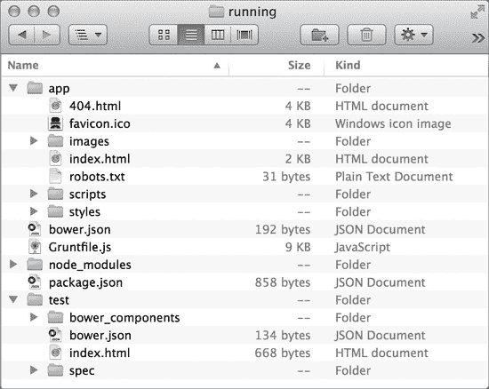
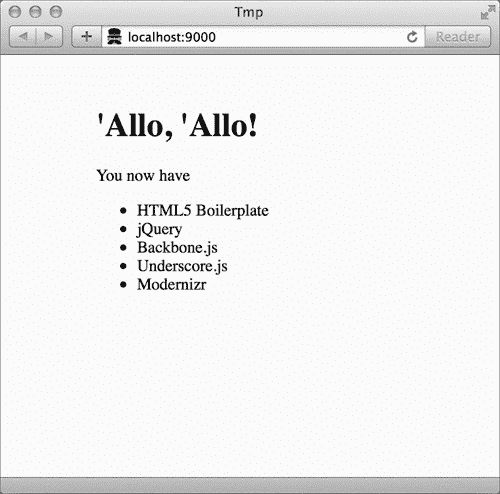
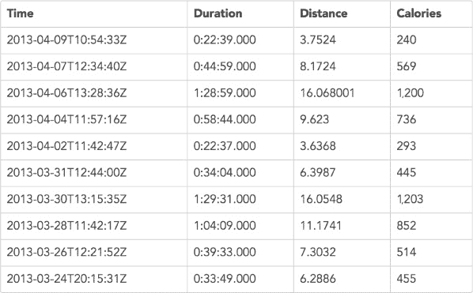
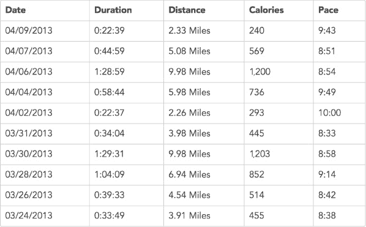
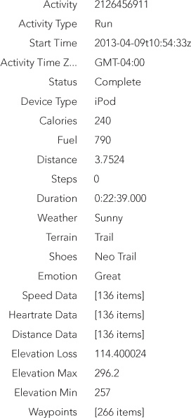
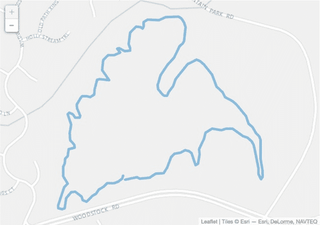
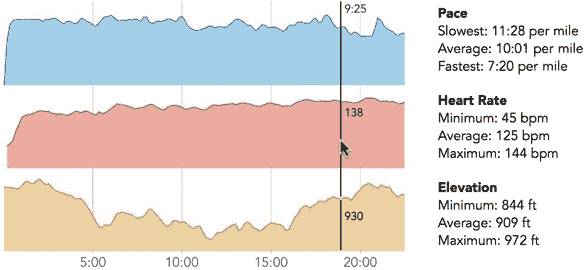

## 第九章：构建数据驱动的网页应用：第一部分

到目前为止，我们已经有机会了解了许多用于创建独立 JavaScript 可视化的工具和库，但我们仅在传统网页的上下文中考虑了它们。当然，今天的 Web 已经不再仅仅是传统网页，尤其在桌面计算机上，网站实际上是功能齐全的软件应用。（即便在移动设备上，许多“应用”实际上也是封装在一个薄外壳中的网站。）当一个网页应用围绕数据进行结构化时，它很可能可以从数据可视化中受益。正是我们将在这个最终项目中考虑的内容：如何将数据可视化集成到真正的网页应用中。

接下来的部分将逐步讲解如何开发一个由数据驱动的示例应用。数据的来源将是 Nike 的 Nike+（*[`nikeplus.com/`](http://nikeplus.com/)）* 跑步者服务。Nike 销售许多产品和应用，允许跑步者跟踪他们的活动，并保存结果以供分析和回顾。在本章及下一章中，我们将构建一个网页应用，从 Nike 获取数据并呈现给用户。当然，Nike 也有自己的网页应用来查看 Nike+数据，而那个应用远远优于我们这里的简单示例。我们并不是要与 Nike 竞争；我们只是利用 Nike+服务来构建我们的示例。

### 注意

**本示例项目基于本文撰写时的接口版本。此后接口可能已发生变化。**

与大多数其他章节不同，本章不会包括多个独立的示例。相反，本章将通过开发和测试单个数据驱动应用的主要阶段来进行讲解。我们将看到如何构建网页应用的基本结构和功能。这包括以下内容：

+   如何使用框架或库来构建一个网页应用

+   如何将一个应用程序组织为模型和视图

+   如何在视图中嵌入可视化内容

在第十章中，我们将专注于一些更细微的细节，处理 Nike+界面的一些特殊情况，并为单页面应用添加一些完善的细节。

### 注意

**要在实际产品中使用 Nike+数据，你必须向 Nike 注册你的应用并获取必要的凭证和安全密钥。这个过程还会让你访问该服务的完整文档，而这些文档并未公开。由于我们在这个示例中并未构建一个真实的应用，因此我们不会涉及这一步。然而，我们将基于 Nike+ API 来构建应用，该 API 在 Nike 的开发者网站上有公开文档（***[`developer.nike.com/index.html`](https://developer.nike.com/index.html)***）。由于示例中没有包括凭证和安全密钥，它将无法访问真实的 Nike+服务。然而，本书的源代码中确实包含了实际的 Nike+数据，可以用于模拟 Nike+服务进行测试和开发。**

## 框架与库

如果我们使用 JavaScript 为传统网页添加数据可视化，我们不需要太担心如何组织和结构化我们的 JavaScript。毕竟，它通常是一小段代码，尤其是与 HTML 标记和 CSS 样式相比，这些内容也是页面的一部分。然而，对于 Web 应用，代码可能会变得更加庞大和复杂。为了帮助保持代码的组织性和可管理性，我们将利用 JavaScript 应用库，也称为*框架*。

### 第 1 步：选择一个应用库

决定使用哪个应用库可能比决定使用哪一个更容易。在过去几年里，这些库的数量激增；现在有超过 30 个高质量的库可以选择。一个查看所有替代品的好地方是 TodoMVC (*[`todomvc.com/`](http://todomvc.com/)*)，它展示了如何在每个库中实现一个简单的待办事项应用。

有一个重要的问题需要问，这个问题可以帮助你缩小选择范围：一个应用库是*纯库*还是*应用框架*？这两个术语经常互换使用，但实际上有很大的区别。纯库的功能类似于 jQuery 或本书中我们使用过的其他库。它为我们的应用提供了一组工具，我们可以根据需要使用其中的任意多或任意少的工具。另一方面，应用框架则严格规定了应用的工作方式。我们编写的代码必须遵循框架的结构和约定。根本上，这种区别在于控制权。使用纯库时，我们的代码掌控一切，库只是我们的工具；而使用框架时，框架的代码掌控一切，我们仅仅是添加使应用独特的代码。

纯库的主要优势是灵活性。我们的代码控制着应用程序，我们有充分的自由来根据自己的需求结构化应用程序。然而，这并不总是好事。框架的约束可以保护我们避免做出不良的设计决策。世界上一些最顶尖的 JavaScript 开发人员负责着流行的框架，他们在设计一个好的网页应用程序方面做了大量的思考。框架还有一个好处：因为框架承担了更多的应用程序责任，通常我们需要编写的代码较少。

值得注意的是，框架与纯库之间的区别，但几乎任何网页应用程序都可以通过两者中的任何一种有效构建。两种方法都提供了构建高质量应用程序所需的组织和结构。对于我们的示例，我们将使用 Backbone.js (*[`backbonejs.org/`](http://backbonejs.org/)*) 库。它迄今为止是最受欢迎的纯（非框架）库，并且被数十个最大的网页站点使用。然而，我们将遵循的一般方法（包括工具如 Yeoman）适用于几乎所有流行的应用程序库。

### 步骤 2：安装开发工具

当你开始构建第一个真正的网页应用程序时，决定从哪里开始可能会有些让人畏惧。在这个阶段，一个很有帮助的工具是 Yeoman (*[`yeoman.io/`](http://yeoman.io/)*)，它自称为“现代网页应用的搭建工具”。这个描述相当准确。Yeoman 可以为大量不同的网页应用框架（包括 Backbone.js）定义并初始化项目结构。正如我们所见，它还设置并配置了在应用程序开发过程中需要的其他大部分工具。

在我们能使用 Yeoman 之前，必须先安装 Node.js (*[`nodejs.org/`](http://nodejs.org/)*)。Node.js 本身是一个强大的应用程序开发平台，但在这里我们不需要关心其细节。然而，它是许多现代网页开发工具（如 Yeoman）所要求的应用平台。要安装 Node.js，请按照其网站上的说明进行操作 (*[`nodejs.org/`](http://nodejs.org/)*).

安装了 Node.js 后，我们可以使用一个命令安装主要的 Yeoman 应用程序以及创建 Backbone.js 应用程序所需的一切 (*[`github.com/yeoman/generator-backbone/`](https://github.com/yeoman/generator-backbone/)*)

```
$ **npm** install -g generator-backbone
```

你可以在终端应用程序（在 Mac OS X 上）或 Windows 命令提示符下执行此命令。

### 步骤 3：定义新项目

我们刚刚安装的开发工具将使创建一个新的网页应用项目变得容易。首先，通过以下命令，我们为我们的应用创建一个新的文件夹（命名为*running*），然后使用`cd`（更改目录）进入该文件夹。

```
$ **mkdir** running
$ **cd** running
```

在该新文件夹中，执行命令`yo backbone`将初始化项目结构。

```
$ **yo** backbone
```

作为初始化的一部分，Yeoman 将请求许可，向 Yeoman 开发者发送诊断信息（主要是我们的应用程序使用了哪些框架和功能）。然后，它会给我们一个选择，是否将一些额外的工具添加到应用程序中。对于我们的示例，我们将跳过任何建议的选项。

```
**Out** of the box I include HTML5 Boilerplate, jQuery, Backbone.js and Modernizr.
[**?**] What more would you like? (Press **<**space**>** to select)
 > **Bootstrap** for Sass
   **Use** CoffeeScript
   **Use** RequireJs
```

然后，Yeoman 会进行魔法操作，创建几个子文件夹，安装额外的工具和应用程序，并设置合理的默认值。当你看到所有安装信息在窗口中滚动时，可以高兴地知道 Yeoman 正在为你做所有这些工作。当 Yeoman 完成时，你将拥有一个像图 9-1 中所示的项目结构。虽然它可能不会完全像这里的图示一样，因为自从这段文字写成以来，Web 应用程序可能已经发生了变化，但可以放心，它会遵循最佳实践和规范。

图 9-1. Yeoman 为 Web 应用程序创建一个默认的项目结构。

在接下来的章节中，我们将花更多时间处理这些文件和文件夹，但这里是 Yeoman 为我们设置的项目的快速概览。

+   **app/**。一个包含我们应用程序所有代码的文件夹

+   **bower.json**。一个用于跟踪我们的应用程序使用的所有第三方库的文件

+   **gruntfile.js**。一个控制如何测试和构建我们应用程序的文件

+   **node_modules/**。一个包含构建和测试我们应用程序所需工具的文件夹

+   **package.json**。一个标识用于构建和测试我们应用程序的工具的文件

+   **test/**。一个包含我们为测试应用程序而编写代码的文件夹

此时，Yeoman 已经设置了一个完整的 Web 应用程序（尽管它没有任何功能）。你可以从命令提示符执行`grunt serve`命令，在浏览器中查看它。

```
$ **grunt** serve
**Running** "serve" task

**Running** "clean:server" (clean) **task**

**Running** "createDefaultTemplate" task

**Running** "jst:compile" (jst) **task**
**>>** **Destination** not written because compiled files were empty.

**Running** "connect:livereload" (connect) **task**
**Started** connect web server on http://localhost:9000

**Running** "open:server" (open) **task**

**Running** "watch:livereload" (watch) **task**
**Waiting...**
```

`grunt`命令运行 Yeoman 包中的一个工具。传递`serve`选项时，它会清理应用程序文件夹，启动一个 Web 服务器来托管应用程序，打开一个 Web 浏览器并导航到骨架应用程序。你将在浏览器中看到类似于图 9-2 的内容。

图 9-2. 默认的 Yeoman Web 应用程序在浏览器中运行。

恭喜！我们的 Web 应用程序，虽然非常基础，但现在已经在运行了。

### 第 4 步：添加我们独特的依赖项

Yeoman 为新应用程序设置了合理的默认设置和工具，但我们的应用程序需要一些不在默认设置中的 JavaScript 库，例如用于地图的 Leaflet 和用于图表的 Flot。用于处理日期和时间的 Moment.js (*[`momentjs.com/`](http://momentjs.com/)*) 库也会派上用场，Underscore.string (*[`epeli.github.io/underscore.string/`](http://epeli.github.io/underscore.string/)*) 库也是如此。我们可以通过一些简单的命令将这些库添加到我们的项目中。`--save` 选项会告诉 bower 工具（它是 Yeoman 包的一部分）记住我们的项目依赖这些库。

```
$ **bower** install leaflet --save
$ **bower** install flot --save
$ **bower** install momentjs --save
$ **bower** install underscore.string --save
```

也许你已经开始体会到像 Yeoman 这样的工具如何简化开发。这里展示的简单命令让我们免去了在网上寻找库、下载相应的文件、将它们复制到项目中的正确位置等繁琐工作。

更重要的是，Yeoman（严格来说是 bower 工具）会自动处理这些库所依赖的任何其他库。例如，Flot 库依赖 jQuery。当 Yeoman 安装 Flot 时，它还会检查并确保 jQuery 已安装在项目中。在我们的例子中，它已经安装，因为 Backbone.js 依赖于它，但如果 jQuery 尚未安装，Yeoman 会自动找到并安装它。

对于大多数库，bower 可以完全安装所有必要的组件和文件。然而，对于 Leaflet，我们需要执行一些额外的步骤。将目录更改为 *leaflet* 文件夹，该文件夹位于 *app/bower_components* 中。从那里运行两个命令，安装 Leaflet 所需的独特工具：

```
$ **npm** install
$ **npm** install jake -g
```

执行命令 `jake` 将运行所有 Leaflet 的测试，如果通过测试，将为我们的应用程序创建一个 Leaflet.js 库。

```
$ **jake**
**Checking** for JS errors...
    **Check** passed.

**Checking** for specs JS errors...
    **Check** passed.

**Running** tests...

**...............................................................................**
**...............................................................................**
**...............................................................................**
**........................................**
**PhantomJS** 1.9.7 (Mac OS X)**:** Executed 280 of 280 SUCCESS (0.881 secs / 0.496 secs)
    **Tests** ran successfully.

**Concatenating** and compressing 75 files...
    **Uncompressed**: 217.22 KB (unchanged)
    **Compressed**: 122.27 KB (unchanged)
    **Gzipped**: 32.71 KB
```

剩下的就是将其他库添加到我们的 HTML 文件中。这很简单。我们应用程序的主页是 *index.html*，位于 *app* 文件夹中。已经有一块包含 jQuery、Underscore.js 和 Backbone.js 的代码：

```
*<!-- build:js scripts/vendor.js -->*
**<script** src="bower_components/jquery/dist/jquery.js"**></script>**
**<script** src="bower_components/underscore/underscore.js"**></script>**
**<script** src="bower_components/backbone/backbone.js"**></script>**
*<!-- endbuild -->*
```

我们可以在 Backbone.js 后添加我们的新库。

```
*<!-- build:js scripts/vendor.js -->*
**<script** src="bower_components/jquery/dist/jquery.js"**></script>**
**<script** src="bower_components/underscore/underscore.js"**></script>**
**<script** src="bower_components/backbone/backbone.js"**></script>**
**<script** src="bower_components/flot/jquery.flot.js"**></script>**
**<script** src="bower_components/leaflet/dist/leaflet-src.js"**></script>**
**<script** src="bower_components/momentjs/moment.js"**></script>**
**<script**
    src="bower_components/underscore.string/lib/underscore.string.js"**>**
**</script>**
*<!-- endbuild -->*
```

正如我们在 第六章 中看到的，Leaflet 还需要自己的样式表。我们将其添加到 *index.html* 文件的顶部，位于 *main.css* 之前。

```
*<!-- build:css(.tmp) styles/main.css -->*
**<link** rel="stylesheet" href="bower_components/leaflet/dist/leaflet.css"**>**
**<link** rel="stylesheet" href="styles/main.css"**>**
*<!-- endbuild -->*
```

现在我们已经设置了应用程序的结构并安装了必要的库，是时候开始开发了。

## 模型和视图

有许多适用于 Web 应用的应用程序库，每个库都有其独特之处，但大多数库在应用架构的关键原则上是达成共识的。也许最基本的原则是将*模型*与*视图*分开。用于跟踪应用核心数据（模型）的代码应该与展示这些数据给用户（视图）的代码分开。强制这种分离可以更容易地更新和修改它们。如果你想用表格而不是图表来展示数据，你可以在不改变模型的情况下做到这一点。如果你需要将数据源从本地文件更改为 REST API，也可以在不修改视图的情况下做到这一点。在本书中，我们一直以非正式的方式运用这一原则。在所有示例中，我们都将获取和格式化数据的步骤与可视化数据的步骤隔离开来。使用像 Backbone.js 这样的应用库为我们提供了更明确管理模型和视图的工具。

### 步骤 1：定义应用的模型

我们的运行应用被设计为与 Nike+ 配合使用，Nike+ 提供关于跑步的详细信息——训练跑、间歇训练、越野跑、比赛等。我们想要的数据集只包含跑步，因此我们应用的核心模型自然是跑步。

Yeoman 工具使得为我们的应用定义模型变得非常简单。一个简单的命令就可以定义一个新模型，并为该模型创建 JavaScript 文件和脚手架。

```
$ **yo** backbone:model run
   **create** app/scripts/models/run.js
   **invoke**   backbone-mocha:model
   **create**     test/models/run.spec.js
```

该命令会创建两个新文件：在 *app/scripts/models/* 文件夹中的 *run.js* 和在 *test/* 文件夹中的 *run.spec.js*。让我们来看看 Yeoman 为我们的模型创建的文件。它相当简短。

```
➊ */*Global Running, Backbone*/*

➋ Running.Models = Running.Models || {};

   (**function** () {
       "use strict";
       Running.Models.Run = Backbone.Model.extend({
           url: "",
           initialize: **function**() {
           },
           defaults: {
           },
           validate: **function**(attrs, options) {
           },
           parse: **function**(response, options) {
               **return** response;
           }
       });
   })();
```

在 ➊ 处是一个注释，列出了我们的模型所需的全局变量。在这种情况下，只有两个变量：`Running`（即我们的应用）和 `Backbone`。接下来，在 ➋ 处，如果 `Running` 对象尚未具有 `.Models` 属性，文件会创建该属性。

当浏览器遇到这一行时，它会检查 `Running.Models` 是否存在。如果存在，那么 `Running.Models` 就不会是 `false`，浏览器就不需要考虑逻辑*或*（`||`）的第二个条件。该语句只是将 `Running.Models` 赋值给它自己，因此没有实际效果。然而，如果 `Running.Models` 不存在，那么它会被评估为 `false`，浏览器会继续执行第二个条件，并将一个空对象（`{}`）赋值给 `Running.Models`。最终，这条语句确保了 `Running.Models` 对象的存在。

文件中的其余代码被封装在一个*立即执行的函数表达式*中。如果你之前没有见过这种模式，它可能看起来有点奇怪。

```
(**function** () {
    */* Code goes here */*
})();
```

然而，如果我们将这段代码重写成一行，它可能会更容易理解。

```
( **function** () { */* Code goes here */* } ) ();
```

该语句定义了一个 JavaScript 函数，使用函数表达式`function () { /* ... */ }`，然后通过结尾的`()`调用（技术上是*调用*）这个新创建的函数。因此，我们真正做的事情就是把代码放进一个函数里，并调用该函数。在专业的 JavaScript 中，你会经常看到这种模式，因为它可以保护一段代码不与应用程序中的其他代码块相互干扰。

当你在 JavaScript 中定义一个变量时，它是一个*全局*变量，代码中的任何地方都可以访问。因此，如果两段不同的代码尝试定义相同的全局变量，这些定义就会发生冲突。这种交互可能会导致很难发现的 BUG，因为一段代码无意中干扰了完全不同的另一段代码。为了防止这个问题，我们可以避免使用全局变量，而在 JavaScript 中避免使用全局变量的最简单方法就是将变量定义在函数内部。这就是立即调用函数表达式的目的。它确保我们代码中定义的任何变量都是*局部*的，而不是全局的，并且避免了不同代码块之间的相互干扰。

### 步骤 2：实现模型

我们的应用实际上只需要这一模型，它已经是完整的了！没错：Yeoman 为我们设置的脚手架是一个完整且功能齐全的运行模型。事实上，如果不是 Nike 的 REST API 存在一些特殊情况，我们根本不需要修改模型代码。我们将在第十章中讨论这些特殊情况。

然而，在继续下一步之前，让我们看一下我们新创建的模型可以做些什么。为此，我们将在模型代码中临时添加一些内容。我们在最终的应用中不会使用以下代码；它只是用来展示我们的模型已经可以做些什么。

首先，让我们添加一个 URL 来检索跑步的详细信息（Nike+使用更通用的术语*活动*）。从 Nike+文档中，我们发现这个 URL 是*[`api.nike.com/v1/me/sport/activities/<activityId>`](https://api.nike.com/v1/me/sport/activities/<activityId>)*。

```
   Running.Models.Run = Backbone.Model.extend({
➊     url: "https://api.nike.com/v1/me/sport/activities/",
       initialize: **function**() {
       },
       defaults: {
       },
       validate: **function**(attrs, options) {
       },
       parse: **function**(response, options) {
           **return** response;
       }
   });
```

URL 的最后部分取决于具体的活动，因此这里我们只将 URL 的一般部分添加到我们的模型中（➊）。

现在假设我们想从 Nike+服务中获取特定跑步的详细信息。该跑步的唯一标识符是`2126456911`。如果 Nike+ API 遵循典型的约定，我们可以使用以下假设的两个语句，创建一个代表该跑步的变量，并*获取它的所有数据*。（我们将在连接 Nike+服务的第 7 步中考虑实际 Nike+接口的特殊情况。）

```
**var** run = **new** Running.Models.Run({id: 2126456911});
run.fetch();
```

由于许多 API 确实遵循典型的约定，因此花些时间理解这些代码的工作方式是值得的。第一条语句创建一个新的 Run 模型实例，并指定其标识符。第二条语句告诉 Backbone 从服务器检索模型的数据。Backbone 将处理所有与 Nike+的通信，包括错误处理、超时、解析响应等。一旦获取完成，来自该跑步的详细信息将可以从模型中获取。如果我们提供一个回调函数，我们可以输出一些细节。这里是一个示例：

```
**var** run = **new** Running.Models.Run({id: 2126456911});
run.fetch({success: **function**() {
    console.log("Run started at ", run.get("startTime"));
    console.log("    Duration: ",  run.get("metricSummary").duration);
    console.log("    Distance: ",  run.get("metricSummary").distance);
    console.log("    Calories: ",  run.get("metricSummary").calories);
}});
```

浏览器控制台中的输出将是以下内容：

```
**Run** started at 2013-04-09T10:54:33Z
    **Duration**: 0:22:39.000
    **Distance**: 3.7524
    **Calories**: 240
```

这几行简单的代码还不错！不过，这一步中的代码其实只是绕道而行。我们的应用程序不会以这种方式使用单独的模型。相反，我们将使用一个更强大的 Backbone.js 功能：集合。

### 第 3 步：定义应用程序的集合

我们创建的模型是用来捕获单次跑步的数据。然而，我们的用户并不只对单次跑步感兴趣。他们希望看到所有的跑步记录——几十个、上百个，甚至可能成千上万。我们可以通过一个*集合*（或模型的组）来处理所有这些跑步记录。集合是 Backbone.js 的核心概念之一，它将大大有助于我们的应用程序。让我们定义一个集合来存储所有用户的跑步记录。

Yeoman 使得定义和设置集合的脚手架变得非常容易。我们只需在命令行执行单个命令`yo backbone:collection runs`。（是的，我们非常有创意地将我们的跑步集合命名为*runs*。）

```
$ **yo** backbone:collection runs
   **create** app/scripts/collections/runs.js
   **invoke**   backbone-mocha:collection
   **create**     test/collections/runs.spec.js
```

Yeoman 对集合的处理与它对模型的处理相同：它创建一个实现文件（*runs.js*，位于*app/scripts/collections/*文件夹中）和一个测试文件。现在，让我们看看*runs.js*。

```
*/*Global Running, Backbone*/*

Running.Collections = Running.Collections || {};

(**function** () {
    "use strict";
    Running.Collections.Runs = Backbone.Collection.extend({
        model: Running.Models.Runs
    });
})();
```

这个文件比我们的模型还简单；默认的集合只有一个属性，用来指示集合包含的模型类型。不幸的是，Yeoman 并不够智能，不能处理复数形式，因此它假设模型的名称与集合的名称相同。对于我们的应用程序来说，这并不成立，因为我们的模型是 Run（单数），而集合是 Runs（复数）。在我们去掉那个*s*的同时，我们还可以添加一个属性来指定集合的 REST API。这是 Nike+服务的一个 URL。

```
Running.Collections.Runs = Backbone.Collection.extend({
    url: "https://api.nike.com/v1/me/sport/activities/",
    model: Running.Models.Run
});
```

通过这两个小改动，我们已经准备好利用我们的新集合（除了处理一些 Nike+ API 的特殊情况；我们暂时忽略这个复杂性，稍后再处理）。我们需要做的就是创建一个新的 Runs 集合实例，然后获取其数据。

```
**var** runs = **new** Running.Collections.Runs();
runs.fetch();
```

构建一个包含用户跑步数据的集合只需要这么简单。Backbone.js 为每个跑步数据创建一个模型，并从服务器中检索该模型的数据。更好的是，这些跑步模型存储在一个真正的 Underscore.js 集合中，这使我们能够使用许多强大的方法来操作和搜索集合。比如，假设我们想要找出用户所有跑步的总距离，这正是 Underscore.js 的`reduce()`函数的应用场景。

```
**var** totalDistance = runs.reduce( **function**(sum, run) {
    **return** sum + run.get("metricSummary").distance;
}, 0);
```

例如，这段代码可以告诉我们，用户在 Nike+ 上总共跑了 3,358 公里。

### 注意

**正如你可能已经注意到的，我们在 Backbone.js 应用中利用了许多来自 Underscore.js 的工具。这并非巧合。Jeremy Ashkenas 是这两个项目的首席开发者。**

### 步骤 4：定义应用程序的主视图

现在我们已经有了用户的所有跑步数据，接下来是展示这些数据。我们将通过 Backbone.js 的 *views* 来完成这一操作。为了简化示例，我们只考虑两种展示跑步数据的方式。首先，我们将显示一个表格，列出每个跑步的总结信息。然后，如果用户点击表格中的某一行，我们将展示该跑步的详细信息，包括任何可视化内容。我们的应用程序的主视图将是总结表格，因此我们首先集中关注这个部分。

一个 Backbone.js 视图负责将数据呈现给用户，这些数据可能保存在集合或模型中。对于我们应用程序的主页面，我们希望展示所有用户跑步的总结信息。因此，这个视图是整个集合的视图。我们将称这个视图为 *Summary*。

对于这个总结视图，表格的主体将是一系列表格行，每行展示有关单个跑步的数据总结。这意味着我们可以简单地创建一个展示单个跑步模型的视图，作为表格行，并将我们的主总结视图设计为主要由多个 SummaryRow 视图组成。我们可以再次依赖 Yeoman 来设置这两种视图的脚手架。

```
$ **yo** backbone:view summary
   **create** app/scripts/templates/summary.ejs
   **create** app/scripts/views/summary.js
   **invoke**   backbone-mocha:view
   **create**     test/views/summary.spec.js
$ **yo** backbone:view summaryRow
   **create** app/scripts/templates/summaryRow.ejs
   **create** app/scripts/views/summaryRow.js
   **invoke**   backbone-mocha:view
   **create**     test/views/summaryRow.spec.js
```

Yeoman 设置的脚手架对每个视图几乎都是一样的；只有名称不同。以下是一个 Summary 视图的示例。

```
*/*Global Running, Backbone, JST*/*

Running.Views = Running.Views || {};

(**function** () {
    "use strict";
    Running.Views.Summary = Backbone.View.extend({
        template: JST["app/scripts/templates/summary.ejs"],
        tagName: "div",
        id: "",
        className: "",
        events: {},
        initialize: **function** () {
            **this**.listenTo(**this**.model, "change", **this**.render);
        },
        render: **function** () {
            **this**.$el.html(**this**.template(**this**.model.toJSON()));
        }
    });
})();
```

文件的整体结构与我们的模型和集合相同，但在视图本身，内容要复杂一些。让我们逐一查看视图的属性。第一个属性是`template`。这是我们定义视图的确切 HTML 标记的地方，接下来我们会更详细地看看这一部分。

`tagName` 属性定义了我们的视图将使用的 HTML 标签作为其父级。Yeoman 默认为 `<div>`，但我们知道在我们的案例中，它将是 `<table>`。我们稍后会进行更改。

`id` 和 `className` 属性指定要添加到主容器（在我们案例中是 `<table>`）的 HTML `id` 属性或 `class` 值。例如，我们可以根据这些值来设置一些 CSS 样式。对于我们的示例，暂时不考虑样式，所以我们可以将这两个属性留空或完全删除。

接下来是 `events` 属性。该属性用于标识与视图相关的用户事件（如鼠标点击）。对于 Summary 视图而言，没有任何事件，因此我们可以将该对象留空或直接删除。

最后两个属性，`initialize()` 和 `render()`，都是方法。在我们考虑这两个方法之前，让我们先看看在进行刚才提到的调整后，Summary 视图的效果。现在，我们已经去掉了不需要的属性，剩下的只有 `template` 和 `tagName` 属性，以及 `initialize()` 和 `render()` 方法：

```
Running.Views.Summary = Backbone.View.extend({
    template: JST["app/scripts/templates/summary.ejs"],
    tagName: "table",
    initialize: **function** () {
            **this**.listenTo(**this**.model, "change", **this**.render);
    },
    render: **function** () {
            **this**.$el.html(**this**.template(**this**.model.toJSON()));
    }
});
```

现在让我们来看一下最后两个方法，首先是 `initialize()`。这个方法只有一个语句（除了我们刚才添加的 `return` 语句）。通过调用 `listenTo()`，它告诉 Backbone.js 该视图希望监听事件。第一个参数 `this.collection` 指定了事件的目标，意思是该视图想要监听影响集合的事件。第二个参数指定了事件的类型。在这里，视图希望在集合发生变化时获知。最后一个参数是事件发生时 Backbone.js 应该调用的函数。每次 Runs 集合变化时，我们希望 Backbone.js 调用视图的 `render()` 方法。这是合理的，因为每当 Runs 集合发生变化时，页面上展示的内容就会过时。为了保持最新，视图应刷新其内容。

视图的大部分实际工作都发生在其 `render()` 方法中。毕竟，这段代码实际上是为网页创建 HTML 标记的。Yeoman 已经为我们提供了一个模板，但对于集合视图来说，这还不够。模板负责整个集合的 HTML，但它并没有处理集合中各个模型的 HTML。对于单个的运行，我们可以使用 Underscore.js 的 `each()` 函数来迭代集合并渲染每个运行。

从以下代码可以看出，我们还在每个方法中添加了 `return this;` 语句。稍后我们将利用这一点来*链式*调用多个方法，从而在一个简洁的语句中完成。

```
Running.Views.Summary = Backbone.View.extend({
    template: JST["app/scripts/templates/summary.ejs"],
    tagName: "table",
    initialize: **function** () {
        **this**.listenTo(**this**.collection, "change", **this**.render);
        **return** **this**;
    },
     render: **function** () {
        **this**.$el.html(**this**.template());
        **this**.collection.each(**this**.renderRun, **this**);
        **return** **this**;
    }
});
```

现在我们需要编写 `renderRun()` 方法来处理每个单独的运行。以下是我们希望该方法执行的内容：

1.  为该运行创建一个新的 SummaryRow 视图。

1.  渲染那个 SummaryRow 视图。

1.  将生成的 HTML 附加到 Summary 视图中的 `<tbody>` 元素。

实现这些步骤的代码是直接的，但逐步处理每个步骤会更有帮助。

1.  创建一个新的 SummaryRow 视图：`new SummaryRow({model: run})`

1.  渲染那个 SummaryRow 视图：`.render()`

1.  追加结果：`this.$("tbody").append();`

当我们将这些步骤组合在一起时，我们得到了`renderRun()`方法。

```
renderRun: **function** (run) {
    **this**.$("tbody").append(**new** Running.Views.SummaryRow({
        model: run
    }).render().el);
}
```

我们对 Summary 视图所做的大多数更改同样适用于 SummaryRow 视图，尽管我们不需要在`render()`方法中添加任何内容。以下是我们对 SummaryRow 的第一次实现。请注意，我们已将`tagName`属性设置为`"tr"`，因为我们希望每个运行模型作为表格行展示。

```
Running.Views.SummaryRow = Backbone.View.extend({
    template: JST["app/scripts/templates/summaryRow.ejs"],
    tagName: "tr",
    events: {},
    initialize: **function** () {
        **this**.listenTo(**this**.model, "change", **this**.render);
        **return** **this**;
    },
    render: **function** () {
        **this**.$el.html(**this**.template(**this**.model.toJSON()));
        **return** **this**;
    }
});
```

现在我们拥有了所有需要的 JavaScript 代码来显示我们应用程序的主要摘要视图。

### 第 5 步：定义主要视图模板

到目前为止，我们已经开发了 JavaScript 代码来操作我们的 Summary 和 SummaryRow 视图。但这些代码并没有生成实际的 HTML 标记。为了完成这个任务，我们依赖于*模板*。模板是带有占位符的骨架 HTML 标记，用于填充具体值。将 HTML 标记限制在模板中有助于保持我们的 JavaScript 代码清晰、结构良好且易于维护。

正如有许多流行的 JavaScript 应用程序库一样，也有许多模板语言。然而，我们的应用程序不需要任何复杂的模板功能，因此我们将继续使用 Yeoman 为我们设置的默认模板处理过程。该过程依赖于 JST 工具（*[`github.com/gruntjs/grunt-contrib-jst/`](https://github.com/gruntjs/grunt-contrib-jst/)）*来处理模板，且该工具使用 Underscore.js 模板语言（*[`underscorejs.org/#template/`](http://underscorejs.org/#template/)*）。通过一个示例，容易看出这个过程是如何工作的，因此让我们深入了解一下。

我们将处理的第一个模板是 SummaryRow 的模板。在我们的视图中，我们已经确定 SummaryRow 是一个`<tr>`元素，因此模板只需要提供该`<tr>`内的内容。我们将从关联的 Run 模型中获取这些内容，而该模型又来自 Nike+服务。以下是 Nike+可能返回的一个示例活动。

```
{
    "activityId": "2126456911",
    "activityType": "RUN",
    "startTime": "2013-04-09T10:54:33Z",
    "activityTimeZone": "GMT-04:00",
    "status": "COMPLETE",
    "deviceType": "IPOD",
    "metricSummary": {
        "calories": 240,
        "fuel": 790,
        "distance": 3.7524,
        "steps": 0,
        "duration": "0:22:39.000"
    },
    "tags": [*/* Data continues... */*],
    "metrics": [*/* Data continues... */*],
    "gps": {*/* Data continues... */*}
}
```

对于首次实现，我们展示运行的时间，以及其持续时间、距离和卡路里。因此，我们的表格行将有四个单元格，每个单元格包含一个这些值。我们可以在*app/scripts/templates*文件夹中找到模板*summaryRow.ejs*。默认情况下，Yeoman 将其设置为一个简单的段落。

```
**<p>**Your content here.**</p>**
```

让我们用四个表格单元格来替换它。

```
**<td></td>**
**<td></td>**
**<td></td>**
**<td></td>**
```

作为单元格内容的占位符，我们可以使用包含在特殊`<%=`和`%>`分隔符中的模型属性。完整的 SummaryRow 模板如下。

```
**<td>**<%= startTime %>**</td>**
**<td>**<%= metricSummary.duration %>**</td>**
**<td>**<%= metricSummary.distance %>**</td>**
**<td>**<%= metricSummary.calories %>**</td>**
```

另一个我们需要提供的模板是 Summary 模板。由于我们已经将视图的主要标签设置为`<table>`，因此这个模板应该指定该`<table>`中的内容：一个表头行加上一个空的`<tbody>`元素（其中的单独行将来自 Run 模型）。

```
**<thead>**
    **<tr>**
        **<th>**Time**</th>**
        **<th>**Duration**</th>**
        **<th>**Distance**</th>**
        **<th>**Calories**</th>**
    **</tr>**
**</thead>**
**<tbody></tbody>**
```

现在我们终于准备好为我们的运行构建主要视图了。步骤非常直接：

1.  创建一个新的 Runs 集合。

1.  从服务器获取该集合的数据。

1.  为该集合创建一个新的 Summary 视图。

1.  渲染视图。

以下是实现这四个步骤的 JavaScript 代码：

```
**var** runs = **new** Running.Collection.Runs();
runs.fetch();
**var** summaryView = **new** Running.Views.Summary({collection: runs});
summaryView.render();
```

我们可以通过视图的 `el`（*元素*）属性访问构建好的 `<table>`。它看起来大致如下：

```
**<table>**
  **<thead>**
    **<tr>**
        **<th>**Time**</th>**
        **<th>**Duration**</th>**
        **<th>**Distance**</th>**
        **<th>**Calories**</th>**
    **</tr>**
  **</thead>**
  **<tbody>**
    **<tr>**
        **<td>**2013-04-09T10:54:33Z**</td>**
        **<td>**0:22:39.000**</td>**
        **<td>**3.7524**</td>**
        **<td>**240**</td>**
    **</tr>**
    **<tr>**
        **<td>**2013-04-07T12:34:40Z**</td>**
        **<td>**0:44:59.000**</td>**
        **<td>**8.1724**</td>**
        **<td>**569**</td>**
    **</tr>**
    **<tr>**
        **<td>**2013-04-06T13:28:36Z**</td>**
        **<td>**1:28:59.000**</td>**
        **<td>**16.068001**</td>**
        **<td>**1200**</td>**
    **</tr>**
  **</tbody>**
**</table>**
```

当我们将这些标记插入页面时，用户可以看到一个简单的总结表格，列出他们的跑步记录，如 图 9-3 所示。

图 9-3. 一个包含跑步信息总结的简单表格

### 步骤 6：优化主视图

现在我们开始有了些进展，尽管表格内容仍然需要调整。毕竟，跑步距离 16.068001 公里中的最后一位数字真的重要吗？由于 Nike+ 决定了我们 Run 模型的属性，可能看起来我们无法控制传递给模板的值。幸运的是，事实并非如此。如果我们查看 SummaryView 的 `render()` 方法，我们可以看到模板是如何获得这些值的。

```
render: **function** () {
    **this**.$el.html(**this**.template(**this**.model.toJSON()));
    **return** **this**;
}
```

模板的值来自我们直接从模型创建的 JavaScript 对象。Backbone.js 提供了 `toJSON()` 方法，它返回一个对应于模型属性的 JavaScript 对象。实际上，我们可以将任何 JavaScript 对象传递给模板，甚至是我们在 `render()` 方法中自己创建的对象。让我们重新编写这个方法，以提供一个更友好的 Summary 视图。我们将逐个获取模型的属性。

第一个是跑步的日期。像 “2013-04-09T10:54:33Z” 这样的日期对于普通用户来说并不易读，而且可能并不是他们所在的时区。处理日期和时间实际上是很棘手的，但优秀的 Moment.js 库 (*[`momentjs.com/`](http://momentjs.com/)* ) 可以处理所有复杂的操作。因为我们在前面的章节中已经将该库添加到应用程序中，现在可以利用它了。

```
render: **function** () {
    **var** run = {};
    run.date = moment(**this**.model.get("startTime")).calendar();
```

### 注意

**为了简洁起见，我们在前面的代码中做了一些简化，它将 UTC 时间戳转换为浏览器的本地时区。实际上，将其转换为跑步记录的时区可能更为准确，而这个时区在 Nike+ 的数据中是提供的。**

接下来是跑步的持续时间。我们不太需要显示 Nike+ 所包含的秒数的分数部分，所以我们直接从属性中去掉它们。（当然，四舍五入会更精确，但假设我们的用户不是正在训练的奥运运动员，一秒钟的差异其实不重要。而且，Nike+ 好像总是把这些小于秒的时间段记录为 ".000"）

```
run.duration = **this**.model.get("metricSummary").duration.split(".")[0];
```

`distance` 属性也可以做些调整。除了将其四舍五入到合理的小数位数外，我们还可以为美国用户将其从公里转换为英里。一条语句就能同时解决这两个问题。

```
run.distance = Math.round(62. *
    **this**.model.get("metricSummary").distance)/100 +
    " Miles";
```

`calories` 属性保持原样，所以我们只需将其复制到临时对象中。

```
run.calories = **this**.model.get("metricSummary").calories;
```

最后，如果你是一个热衷的跑步者，可能已经注意到 Nike+ 属性中缺少一个重要的值：每英里分钟的平均配速。我们有数据来计算它，所以让我们也将其添加进去。

```
**var** secs = _(run.duration.split(":")).reduce(**function**(sum, num) {
    **return** sum*60+parseInt(num,10); }, 0);
**var** pace = moment.duration(1000*secs/parseFloat(run.distance));
run.pace = pace.minutes() + ":" + _(pace.seconds()).pad(2, "0");
```

现在我们有了一个新的对象，可以传递给模板。

```
**this**.$el.html(**this**.template(run));
```

我们还需要修改两个模板以匹配新的标记。以下是更新后的 SummaryRows 模板。

```
**<td>**<%= date %>**</td>**
**<td>**<%= duration %>**</td>**
**<td>**<%= distance %>**</td>**
**<td>**<%= calories %>**</td>**
**<td>**<%= pace %>**</td>**
```

这是包含 Pace 额外列的 Summary 模板。

```
**<thead>**
  **<tr>**
    **<th>**Date**</th>**
    **<th>**Duration**</th>**
    **<th>**Distance**</th>**
    **<th>**Calories**</th>**
    **<th>**Pace**</th>**
  **</tr>**
**</thead>**
**<tbody></tbody>**
```

现在我们为用户提供了一个大大改进的总结表格，见图 9-4。

图 9-4。改进后的总结表格，数据看起来更清晰

## 可视化视图

现在我们已经看到了如何使用 Backbone.js 视图将数据与其展示分离，我们可以考虑如何使用相同的方法来处理数据可视化。当展示是简单的 HTML 标记时——就像前一节中的表格——使用模板查看模型非常容易。但模板不足以处理数据可视化，所以我们需要修改方法来适应这种情况。

Nike+ 服务的数据为可视化提供了很多机会。例如，每次跑步可能包括记录用户的心率、即时配速和每 10 秒记录一次的累计距离。跑步数据还可能包括每秒捕捉的用户 GPS 坐标。这类数据非常适合做图表和地图，在这一节中，我们将同时将这两种可视化添加到我们的应用程序中。

### 步骤 1：定义额外视图

正如我们在前一节中所做的那样，我们将依赖 Yeoman 来创建额外视图的脚手架。其中一个视图，我们称之为*详情*，将作为单个运行详细信息的总体视图。在该视图内，我们将创建三个额外视图，每个视图展示运行的不同方面。我们可以将这些视图视为一个层次结构。

+   ****详情****。单次跑步的详细视图

+   ****属性****。与运行相关的完整属性集

+   ****图表****。展示运行期间表现的图表

+   ****地图****。跑步路线的地图

为了开始开发这些视图，我们返回命令行并执行四个 Yeoman 命令。

```
$ **yo** backbone:view details
$ **yo** backbone:view properties
$ **yo** backbone:view charts
$ **yo** backbone:view map
```

### 步骤 2：实现详情视图

详情视图实际上不过是其三个子视图的容器，因此它的实现非常简单。我们为每个子视图创建一个新的视图，渲染该视图，并将生成的标记添加到详情视图中。以下是该视图的完整代码：

```
Running.Views.Details = Backbone.View.extend({
    render: **function** () {
        **this**.$el.empty();
        **this**.$el.append(
            **new** Running.Views.Properties({model: **this**.model}).render().el
        );
        **this**.$el.append(
            **new** Running.Views.Charts({model: **this**.model}).render().el
        );
        **this**.$el.append(
            **new** Running.Views.Map({model: **this**.model}).render().el
        );
        **return** **this**;
    }
});
```

与我们之前创建的视图不同，这个视图没有 `initialize()` 方法。这是因为 Details 视图不需要监听模型的变化，因此在初始化时不需要做任何事情。换句话说，Details 视图本身实际上并不依赖于 Run 模型的任何属性。（另一方面，子视图在很大程度上依赖这些属性。）

`render()` 方法本身首先清除其元素中的任何现有内容。这一行确保可以安全地多次调用 `render()` 方法。接下来的三行语句创建了每个子视图。注意，所有子视图都使用相同的模型，这也是 Details 视图的模型。这就是模型/视图架构的强大之处；一个数据对象——在我们的例子中是一个跑步——可以以多种不同的方式呈现。当 `render()` 方法创建这些子视图时，它也会调用它们的 `render()` 方法，并将结果内容（即它们的 `el` 属性）附加到自己的 `el` 中。

### 步骤 3：实现属性视图

对于属性视图，我们希望展示所有与跑步相关的 Nike+ 属性。这些属性是由 Nike+ 服务返回的数据决定的；下面是一个示例：

```
{
    "activityId": "2126456911",
    "activityType": "RUN",
    "startTime": "2013-04-09T10:54:33Z",
    "activityTimeZone": "GMT-04:00",
    "status": "COMPLETE",
    "deviceType": "IPOD",
    "metricSummary": {
        "calories": 240,
        "fuel": 790,
        "distance": 3.7524,
        "steps": 0,
        "duration": "0:22:39.000"
    },
    "tags": [
        { "tagType": "WEATHER", "tagValue": "SUNNY"    },
        { "tagType": "NOTE"                            },
        { "tagType": "TERRAIN", "tagValue": "TRAIL"    },
        { "tagType": "SHOES", "tagValue": "Neo Trail"  },
        { "tagType": "EMOTION", "tagValue": "GREAT"    }
    ],
    "metrics": [
        { "intervalMetric": 10, "intervalUnit": "SEC",
          "metricType": "SPEED", "values": [*/* Data continues... */*] },
        { "intervalMetric": 10, "intervalUnit": "SEC",
          "metricType": "HEARTRATE", "values": [*/* Data continues... */*] },
        { "intervalMetric": 10, "intervalUnit": "SEC",
          "metricType": "DISTANCE", "values": [*/* Data continues... */*] },
    ],
    "gps": {
        "elevationLoss": 114.400024,
        "elevationGain": 109.00003,
        "elevationMax": 296.2,
        "elevationMin": 257,
        "intervalMetric": 10,
        "intervalUnit": "SEC",
        "waypoints": [*/* Data continues... */*]
    }
}
```

这些数据肯定可以通过一些清理工作变得更友好。为此，我们将利用之前添加到项目中的 Underscore.string 库。我们可以通过将该库“混合”进主 Underscore.js 库来确保该库的可用性。我们将在属性视图的 JavaScript 文件开头做这件事。

```
*/*Global Running, Backbone, JST, _*/*

_.mixin(_.str.exports());

Running.Views = Running.Views || {};

*// Code continues...*
```

注意，我们还将 Underscore.js 的全局变量（`_`）添加到了文件的初始注释中。

以 HTML 呈现这些信息的最直接方式是使用描述列表（`<dl>`）。每个属性可以作为列表中的一个项，其中描述项（`<dt>`）包含属性名称，描述数据（`<dd>`）则包含其值。为了实现这一点，我们将视图的 `tagName` 属性设置为 `"dl"`，并创建一个通用的列表项模板。下面是我们属性视图代码的开始部分：

```
Running.Views.Properties = Backbone.View.extend({
    template: JST["app/scripts/templates/properties.ejs"],
    tagName: "dl",
    initialize: **function** () {
        **this**.listenTo(**this**.model, "change", **this**.render);
        **return** **this**;
    },
    render: **function** () {
        *// More code goes here*
        **return** **this**;
    }
});
```

下面是视图将使用的简单模板。

```
**<dt>**<%= key %>**</dt>**
**<dd>**<%= value %>**</dd>**
```

快速查看 Nike+ 数据发现，它包含嵌套对象。主对象的 `metricSummary` 属性本身就是一个对象。我们需要一个函数来遍历输入对象中的所有属性，同时构建 HTML 标记。递归函数在这里特别有效，因为它可以在遇到另一个嵌套对象时调用自己。接下来，我们为视图添加一个 `obj2Html()` 方法。该方法的核心将使用 Underscore.js 的 `reduce()` 函数，这对于当前任务非常适合。

```
obj2Html: **function**(obj) {
    **return** (
        _(obj).reduce(**function**(html, value, key) {

            *// Create the markup for the current*
            *// key/value pair and add it to the html variable*

            **return** html;
        }, "", **this**)
    );
}
```

在处理每个属性时，我们可以做的第一件事是改进键名。例如，我们想将`startTime`替换为`Start Time`。这时，Underscore.string 就派上了用场。它的`humanize()`函数将驼峰命名法转化为分开的单词，而`titleize()`函数则确保每个单词的首字母是大写的。我们将使用链式调用来在一个语句中执行这两个操作。

```
key = _.chain(key).humanize().titleize().value();
```

现在我们可以考虑值。如果它是一个数组，我们将把它替换为显示数组长度的字符串。

```
**if** (_(value).isArray()) {
    value = "[" + value.length + " items]";
}
```

接下来我们检查值是否是一个对象。如果是，我们将递归调用`obj2Html()`方法。

```
**if** (_(value).isObject()) {
    html += **this**.obj2Html(value);
```

对于其他类型，我们将把值转换为字符串，使用 Underscore.string 稍微格式化一下，并使用我们的模板。

```
} **else** {
    value = _(value.toString().toLowerCase()).titleize();
    html += **this**.template({ key: key, value: value });
}
```

我们可以对展示做一些其他的小改进，具体内容可以在书籍的源代码中找到。视图的最后一部分是实现`render()`方法。在这个方法中，我们使用`toJSON()`获取与 Run 模型对应的对象，然后开始用该对象进行`obj2Html()`递归处理。

```
render: **function** () {
    **this**.$el.html(**this**.obj2Html(**this**.model.toJSON()));
    **return** **this**;
}
```

结果是一个关于运行属性的完整图景，如图 9-5 所示。

图 9-5. 完成的属性视图展示了与运行相关的所有数据。

### 步骤 4：实现地图视图

为了向用户展示他们运行的地图，我们依赖于第六章中的 Leaflet 库。使用该库需要对普通的 Backbone.js 视图实现做一些小的修改，但正如我们所看到的，这些修改对于其他视图也同样有用。Leaflet 会在页面中的一个容器元素内构建地图（通常是一个`<div>`），而这个容器元素必须有一个`id`属性，以便 Leaflet 能够找到它。如果我们在视图中包含一个`id`属性，Backbone.js 会负责添加这个`id`。这个操作很简单。

```
Running.Views.Map = Backbone.View.extend({
    id: "map",
```

在页面的标记中有`<div id="map"></div>`后，我们可以通过以下语句创建一个 Leaflet 地图：

```
**var** map = L.map(**this**.id);
```

我们可能会倾向于直接在视图的`render()`方法中做这件事，但这种方法有一个问题。往网页中添加（和删除）元素需要浏览器进行大量的计算。当 JavaScript 代码频繁执行这种操作时，页面的性能可能会显著下降。为了减少这个问题，Backbone.js 尽量减少添加（或删除）元素的次数，一种方法是一次性添加多个元素，而不是独立地添加每个元素。当它实现视图的`render()`方法时，就采用了这种方法。在将任何元素添加到页面之前，它会让视图完成整个标记的构建；只有完成后，它才会将这些标记添加到页面中。

这里的问题是，当`render()`第一次被调用时，页面中还没有`<div id="map"></div>`元素。如果我们调用 Leaflet，它将无法找到地图的容器，从而生成错误。我们需要做的是推迟`render()`中绘制地图的部分，直到 Backbone.js 将地图容器添加到页面之后。

幸运的是，Underscore.js 有一个名为`defer()`的工具函数，可以完成这一任务。我们将不再直接在`render()`方法中绘制地图，而是创建一个单独的方法。然后，在`render()`方法中，我们将推迟执行这个新方法。下面是实现这一点的代码：

```
render: **function** () {
    _.defer(_(**function**(){ **this**.drawMap(); }).bind(**this**));
},
drawMap: **function** () {
    **var** map = L.map(**this**.id);
    *// Code continues...*
}
```

如你所见，在我们的`render()`方法中，我们实际上使用了几个 Underscore.js 函数。除了`defer()`，我们还利用了`bind()`。后者确保在最终调用`drawMap()`时，`this`的值与视图内部的`this`值相同。

我们可以进一步改进此实现。有一个变化可以做：尽管`render()`第一次被调用时页面中没有`<div id="map"></div>`元素，但在后续调用`render()`时，该元素将会存在。在这些情况下，我们不需要推迟执行`drawMap()`。这就导致了以下我们`render()`方法的代码：

```
render: **function** () {
    **if** (document.getElementById(**this**.id)) {
        **this**.drawMap();
    } **else** {
        _.defer(_(**function**(){ **this**.drawMap(); }).bind(**this**));
    }
    **return** **this**;
},
```

既然我们已经在进行优化，不妨稍微修改一下`initialize()`方法。Yeoman 默认创建的方法是这样的：

```
initialize: **function** () {
    **this**.listenTo(**this**.model, "change", **this**.render);
},
```

然而，对于地图视图，我们实际上并不关心`Run`模型的任何属性变化。视图所需的唯一属性是`gps`，因此我们可以告诉 Backbone.js 仅在该特定属性发生变化时才通知我们。

```
initialize: **function** () {
    **this**.listenTo(**this**.model, "change:gps", **this**.render);
    **return** **this**;
},
```

你可能会想：“为什么`Run`模型的`gps`属性会发生变化呢？”我将在第十章讲解 Nike+ REST API 的细节时说明这一点。

解决了初步问题后，我们可以实现`drawMap()`函数，这实际上是一个非常简单的实现。步骤如下：

1.  确保模型有一个`gps`属性，并且与其关联了航点。

1.  如果旧的地图存在，则将其移除。

1.  从航点数组中提取 GPS 坐标。

1.  使用这些坐标创建路径。

1.  创建一个包含该路径的地图，并在地图上绘制该路径。

1.  添加地图瓦片。

生成的代码是这些步骤的直接实现。

```
drawMap: **function** () {
    **if** (**this**.model.get("gps") && **this**.model.get("gps").waypoints) {
        **if** (**this**.map) {
            **this**.map.remove();
        }
        **var** points = _(**this**.model.get("gps").waypoints).map(**function**(pt) {
            **return** [pt.latitude, pt.longitude];
        });
        **var** path = **new** L.Polyline(points, {color: "#1788cc"});
        **this**.map = L.map(**this**.id).fitBounds(path.getBounds())
            .addLayer(path);
        **var** tiles = L.tileLayer(
            "http://server.arcgisonline.com/ArcGIS/rest/services/Canvas/"+
            "World_Light_Gray_Base/MapServer/tile/{z}/{y}/{x}",
            {
                attribution: "Tiles &copy; Esri &mdash; "+
                             "Esri, DeLorme, NAVTEQ",
                maxZoom: 16
            }
        );
        **this**.map.addLayer(tiles);
    }
}
```

如你所见，在代码中，我们将 Leaflet 地图对象作为视图的一个属性进行存储。在视图内部，我们可以通过`this.map`访问该对象。

结果是一个显示跑步路线的漂亮地图，如图 9-6 所示。

图 9-6. 跑步路线的地图视图。

### 第 5 步：实现图表视图

我们需要实现的最后一个视图是图表视图，在这个视图中我们想要展示跑步过程中的步频、心率和海拔。这个视图是最复杂的，但几乎所有的代码都与数据追踪值中的示例相同，因此这里不需要重复。

你可以在图 9-7 中查看交互式结果。

图 9-7. 另一种视图展示跑步的图表。

本书的源代码包括完整的实现。如果你在详细查看该实现时，有几点需要注意：

+   就像 Leaflet 和地图容器一样，Flot 期望在网页中存在一个图表容器。我们可以使用相同的 `defer` 技巧来防止 Flot 错误。

+   Nike+ 至少返回四种类型的图表作为指标：距离、心率、速度和 GPS 信号强度。我们实际上只关心前两个。一开始，似乎从速度计算步频最简单，但速度并非所有活动都有。然而，距离是有的，我们可以从距离和时间推导出步频。

+   如果有 GPS 路径点数据，我们还可以绘制海拔图表，但这些数据存在于模型的一个单独属性中（而不是 `metrics` 属性）。

+   截至目前，Nike 的 GPS 数据响应存在一个小问题。它声称测量数据与其他指标（每 10 秒一次）在相同的时间尺度上，但实际上 GPS 测量数据是在不同的间隔上报告的。为了绕过这个问题，我们忽略报告的间隔并自行计算一个间隔。同时，我们希望将海拔图表标准化为与其他图表相同的时间尺度。这样做的额外好处是可以对 GPS 海拔数据进行平均；在这里平均值很有用，因为 GPS 海拔测量通常不太准确。

## 总结

在本章中，我们开始构建一个基于数据和数据可视化的完整 Web 应用程序。为了帮助组织和协调我们的应用程序，我们基于 Backbone.js 库，并依赖 Yeoman 工具来创建应用程序的框架和模板代码。Backbone.js 使我们能够将应用程序分离为模型和视图，以便管理数据的代码不需要担心数据如何呈现（反之亦然）。

在下一章，我们将使我们的应用程序能够与 Nike+ 接口进行通信，并添加一些细节来改善用户与页面的交互。
