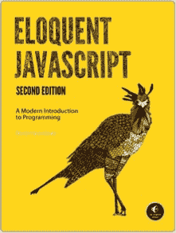
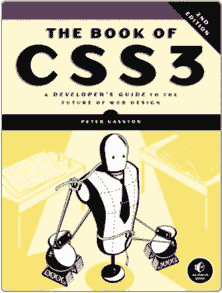
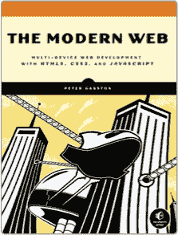
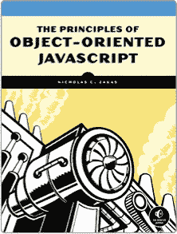
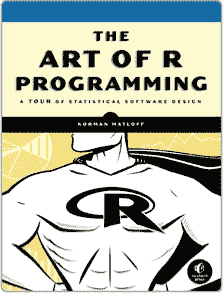

## 附录 A：更新

请访问 *[`nostarch.com/datavisualization/`](http://nostarch.com/datavisualization/)* 获取更新、勘误及其他信息。

更多实用的书籍来自  **NO STARCH PRESS**

**《雄辩的 JavaScript（第二版）》**

**现代编程入门**

*作者*：MARIJN HAVERBEKE

2014 年 12 月，472 页，$39.95

ISBN 978-1-59327-584-6

**《CSS3 精粹（第二版）》**

**面向未来的 Web 设计开发者指南**

*作者*：PETER GASSTON

2014 年 11 月，304 页，$34.95

ISBN 978-1-59327-580-8

**现代 Web**

**HTML5、CSS3 和 JavaScript 的多设备 Web 开发**

*作者*：PETER GASSTON

2013 年 4 月，264 页，$34.95

ISBN 978-1-59327-487-0

**统计学的错误**

**完整指南**

*作者*：ALEX REINHART

2015 年 3 月，176 页，$24.95

ISBN 978-1-59327-620-1

**面向对象 JavaScript 原理**

*作者*：NICHOLAS C. ZAKAS

2014 年 2 月，120 页，$24.95

ISBN 978-1-59327-540-2

**R 编程艺术**

**统计软件设计之旅**

*作者*：NORMAN MATLOFF

2011 年 10 月，400 页，$39.95

ISBN 978-1-59327-384-2

**电话：**

800.420.7240 或 415.863.9900

**电子邮件：**

SALES@NOSTARCH.COM

**网站：**

[WWW.NOSTARCH.COM](http://WWW.NOSTARCH.COM)
