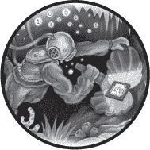
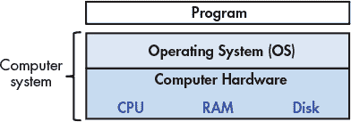
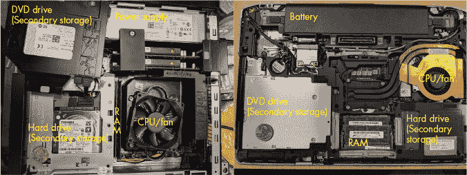
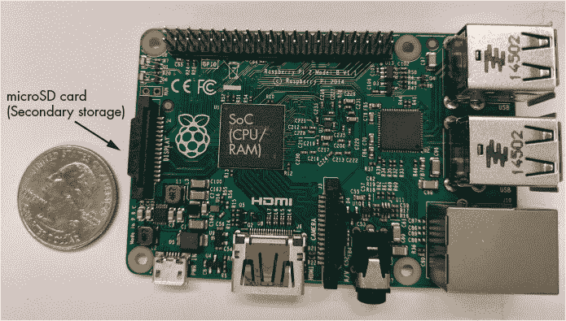

# 第一章：介绍



深入探索计算机系统的奇妙世界！理解计算机系统是什么以及它是如何运行程序的，可以帮助你设计高效的代码，并最大限度地利用底层系统的性能。在本书中，我们将带你深入计算机系统的世界。你将了解如何在计算机上执行你用高级编程语言（我们使用 C 语言）编写的程序。你将学习程序指令如何转化为二进制代码，以及电路如何执行其二进制编码。你将了解操作系统如何管理系统上运行的程序。你还将学习如何编写能够利用多核计算机的程序。在整个过程中，你将学习如何评估与程序代码相关的系统成本，并学习如何设计高效运行的程序。

### 什么是计算机系统？

*计算机系统*结合了计算机硬件和特殊的系统软件，这两者共同使计算机可供用户和程序使用。具体来说，计算机系统包含以下组件（参见图 0-1）：

*输入/输出（IO）端口* 使计算机能够从其环境中获取信息，并以某种有意义的方式将其显示给用户。

*中央处理单元（CPU）* 执行指令并计算数据和内存地址。

*随机存取存储器（RAM）* 存储正在运行程序的数据和指令。当计算机系统断电时，RAM 中的数据和指令通常会丢失。

*二级存储设备*（如硬盘）即使在没有提供电力的情况下，也能存储程序和数据。

*操作系统（OS）* 软件层位于计算机硬件和用户在计算机上运行的软件之间。操作系统实现了编程抽象和接口，使用户能够轻松地运行和与系统上的程序交互。它还管理底层硬件资源并控制程序执行的方式和时机。操作系统实现了抽象、策略和机制，确保多个程序可以在系统上高效、受保护且无缝地同时运行。

前四项定义了计算机系统的*计算机硬件*组件。最后一项（操作系统）代表了计算机系统的主要软件部分。操作系统之上可能会有其他软件层，提供其他接口给系统的用户（例如，库）。然而，操作系统是我们在本书中重点关注的核心系统软件。



*图 0-1：计算机系统的分层组件*

我们专注于*通用*计算机系统，这意味着它们的功能并未针对任何特定应用进行定制，并且它们是*可重新编程*的，即支持在不修改计算机硬件或系统软件的情况下运行不同的程序。

为此，许多可能以某种形式进行“计算”的设备并不属于计算机系统的范畴。例如，计算器通常有处理器、有限的内存和输入输出能力。然而，计算器通常没有操作系统（像 TI-89 这样的高级图形计算器是这一规则的显著例外），没有二级存储，也不是通用的。

另一个值得提到的例子是微控制器，这是一种集成电路，具备与计算机类似的许多功能。微控制器通常嵌入到其他设备中（如玩具、医疗设备、汽车和家电），用于控制特定的自动功能。尽管微控制器是通用的、可重新编程的，包含处理器、内存、二级存储，并且具有输入输出功能，但它没有操作系统。微控制器设计用来启动并运行单一的特定程序，直到断电。因此，微控制器不符合我们对计算机系统的定义。

### 现代计算机系统是什么样子的？

现在我们已经明确了什么是计算机系统（以及什么不是），让我们来讨论计算机系统通常是什么样子的。图 0-2 展示了两种类型的计算机硬件系统（不包括外设）：一台台式计算机（左）和一台笔记本电脑（右）。每个设备上放着一枚美国 25 美分硬币，给读者一个关于每个单位大小的直观感受。



*图 0-2：常见计算机系统：台式计算机（左）和笔记本电脑（右）*

请注意，两者包含相同的硬件组件，尽管某些组件可能具有更小的外形或更紧凑。台式计算机的 DVD 光驱移到了侧面，展示了其下方的硬盘——这两个单元堆叠在一起。专用电源帮助台式计算机提供电力。

相比之下，笔记本电脑更加扁平和紧凑（注意，图中的 25 美分硬币看起来稍微大一些）。笔记本配有电池，且其组件往往更小。无论是台式机还是笔记本，CPU 都会被一个重量级的 CPU 风扇所遮挡，风扇有助于保持 CPU 在合理的工作温度。如果组件过热，它们可能会被永久损坏。两个设备都有双列内存模块（DIMM）用于 RAM。请注意，笔记本内存模块显著小于台式机模块。

就重量和功耗而言，台式计算机通常消耗 100–400 瓦的电力，重量通常在 5 到 20 磅之间。笔记本电脑通常消耗 50–100 瓦的电力，并根据需要使用外部充电器来补充电池电量。

计算机硬件设计的趋势是向更小、更紧凑的设备发展。图 0-3 展示了一个 Raspberry Pi 单板计算机。单板计算机（SBC）是一种将整个计算机功能集成在单一电路板上的设备。



*图 0-3：Raspberry Pi 单板计算机*

Raspberry Pi SBC 配备了一个*系统级芯片*（SoC）处理器，集成了 RAM 和 CPU，涵盖了图 0-2 中所示的大部分笔记本和台式机硬件。与笔记本和台式机系统不同，Raspberry Pi 大约只有信用卡大小，重 1.5 盎司（大约一片面包的重量），功耗约为 5 瓦。Raspberry Pi 上的 SoC 技术在智能手机中也很常见。事实上，智能手机是另一种计算机系统的例子！

最后，所有前面提到的计算机系统（包括 Raspberry Pi 和智能手机）都具有*多核*处理器。换句话说，它们的 CPU 能够同时执行多个程序。我们将这种同时执行称为*并行执行*。基础的多核编程内容在本书的第十四章中讲解。

所有这些不同类型的计算机硬件系统都可以运行一个或多个通用操作系统，如 macOS、Windows 或 Unix。通用操作系统管理底层计算机硬件，并为用户提供接口，以便在计算机上运行任何程序。不同类型的计算机硬件运行不同的通用操作系统，共同构成了一个计算机系统。

### 本书内容概览

在本书结束时，您将了解以下内容：

**计算机如何运行程序。** 您将能够详细描述，如何通过计算机硬件的低级电路执行用高级编程语言表达的程序。具体来说，您将知道：

+   程序数据如何被编码成二进制，硬件如何在其上执行算术运算

+   编译器如何将 C 程序转换为汇编语言和二进制机器码（汇编是二进制机器码的可读形式）

+   CPU 如何在二进制程序数据上执行二进制指令，从基本的逻辑门到存储值、执行算术运算和控制程序执行的复杂电路

+   操作系统如何实现用户在系统上运行程序的接口，并且如何在管理系统资源的同时控制程序的执行。

**如何评估与程序性能相关的系统成本。** 程序运行缓慢有很多原因。可能是算法选择不当，或者仅仅是程序在使用系统资源时的决策不合理。你将理解内存层次结构（参见《内存层次结构》章节，见第 545 页）及其对程序性能的影响，以及操作系统在程序性能中的成本。你还将学习一些关于代码优化的宝贵技巧。最终，你将能够设计高效使用系统资源的程序，并能够评估与程序执行相关的系统成本。

**如何利用并行编程发挥并行计算机的强大功能。** 在今天的多核世界中，利用并行计算变得尤为重要。你将学习如何利用 CPU 的多个核心，使程序运行得更快。你将了解多核硬件的基础知识、操作系统的线程抽象，以及与多线程并行程序执行相关的问题。你将获得并行程序设计的经验，并使用 POSIX 线程库（Pthreads）编写多线程并行程序。你还将接触到其他类型的并行系统和并行编程模型。

在学习的过程中，你还将了解计算机系统的许多其他重要细节，包括它们是如何设计的、如何工作的。你将学习系统设计中的重要主题以及评估系统和程序性能的技术。你还将掌握一些重要技能，包括 C 语言编程、汇编语言编程和调试技巧。

### 开始阅读本书

关于语言、书籍符号和开始阅读本书的几点建议：

#### Linux、C 和 GNU 编译器

本书中的示例使用 C 编程语言。C 语言是一种高级编程语言，类似于 Java 和 Python，但与许多其他高级语言相比，它与底层计算机系统的抽象程度较低。因此，C 语言是希望更好控制程序如何在计算机系统上执行的程序员的首选语言。

本书中的代码和示例使用 GNU C 编译器（GCC）进行编译，并在 Linux 操作系统上运行。尽管 Linux 不是最常见的主流操作系统，但它是超级计算系统中占主导地位的操作系统，且可以说是计算机科学领域最常用的操作系统之一。

科学家们。

Linux 也是免费的开源软件，这使得它在这些环境中的使用非常普遍。对于计算机科学专业的学生来说，掌握 Linux 基本操作非常有帮助。同样，GCC 可以说是目前最常用的 C 语言编译器。因此，我们在示例中使用 Linux 和 GCC。然而，其他 Unix 系统和编译器也有类似的接口和功能。

本书鼓励你跟随书中的示例进行编写。Linux 命令通常以如下的代码块形式出现：

```
$
```

`$` 代表命令提示符。如果你看到一个看起来像这样的框

```
$ uname -a
```

这是提示你在命令行上键入 `uname -a`。请确保不要键入 `$` 符号！

命令的输出通常会直接显示在命令行列表中的命令后面。例如，尝试键入 `uname -a`。此命令的输出因系统不同而有所差异。这里显示的是一个 64 位系统的示例输出。

```
$ uname -a

Linux Fawkes 4.4.0-171-generic #200-Ubuntu SMP Tue Dec 3 11:04:55 UTC 2019

x86_64 x86_64 x86_64 GNU/Linux
```

`uname` 命令输出有关特定系统的信息。`-a` 标志会按以下顺序输出所有与系统相关的信息：

+   系统的内核名称（在此为 Linux）

+   机器的主机名（例如，Fawkes）

+   内核发布版本（例如，4.4.0-171-generic）

+   内核版本（例如，#200-Ubuntu SMP Tue Dec 3 11:04:55 UTC 2019）

+   机器硬件（例如，x86-64）

+   处理器类型（例如，x86-64）

+   硬件平台（例如，x86-64）

+   操作系统名称（例如，GNU/Linux）

你可以通过在命令前加上 `man` 来了解更多关于 `uname` 命令或任何其他 Linux 命令，如下所示：

```
$ man uname
```

该命令会显示与 `uname` 命令相关的手册页。要退出此界面，请按 `q` 键。

本书并未详细介绍 Linux，但有多个在线资源可以为读者提供良好的概览。一个推荐的资源是《The Linux Command Line》；^(1)，阅读第一部分“学习 Shell”就足以为你做好准备。

#### 其他类型的符号和注释

除了命令行和代码片段，我们还使用了几种其他类型的“注释”来呈现本书中的内容。

第一个是*旁注*。旁注用于提供额外的背景信息，通常是历史性的。以下是一个旁注的示例：

LINUX、GNU 和自由开源软件（FOSS）运动的起源

1969 年，AT&T 贝尔实验室为内部使用开发了 UNIX 操作系统。虽然最初是用汇编语言编写的，但它在 1973 年被重写为 C 语言。由于一起反垄断案件禁止 AT&T 贝尔实验室进入计算机行业，AT&T 贝尔实验室将 UNIX 操作系统自由授权给大学，从而推动了其广泛应用。然而，到了 1984 年，AT&T 从贝尔实验室中分离出来，并（摆脱了早期的限制）开始将 UNIX 作为商业产品销售，这引起了学术界若干人士的愤怒和失望。

作为直接回应，理查德·斯托曼（当时是麻省理工学院的学生）于 1984 年开发了 GNU（“GNU 不是 UNIX”）项目，目标是创建一个完全由自由软件组成的类似 UNIX 的系统。GNU 项目孕育了多个成功的自由软件产品，包括 GNU C 编译器（GCC）、GNU Emacs（一个流行的开发环境）以及 GNU 通用公共许可证（GPL，“版权反转”原则的起源）。

1992 年，Linus Torvalds，当时是赫尔辛基大学的学生，发布了一个类 UNIX 操作系统，他在 GPL 下编写了该系统。Linux 操作系统（发音为“Lin-nux”或“Lee-nux”，因为 Linus Torvalds 的名字发音为“Lee-nus”）是使用 GNU 工具开发的。今天，GNU 工具通常与 Linux 发行版一起打包。Linux 操作系统的吉祥物是 Tux，一只企鹅。据说 Torvalds 在参观动物园时被企鹅咬了一口，后来他对这些生物产生了喜爱，并把企鹅作为自己操作系统的吉祥物，他称之为患上了“企鹅症”。

本文中使用的第二种提示类型是*注释*。注释用于强调重要信息，如某些符号的使用或如何理解某些信息的建议。下面是一个示例注释：作为学生，完成课本阅读非常重要。请注意，我们说的是“做”阅读，而不仅仅是“读”阅读。阅读文本通常意味着被动地从页面上吸收文字。我们鼓励学生采取更积极的方式。如果你看到一个代码示例，试着输入它！即使你输入了错误的内容，或者遇到错误也没关系；那是最好的学习方式！在计算机中，错误并不是失败——它们只是经验。

**注意如何完成本书的阅读**

作为学生，完成课本阅读非常重要。请注意，我们说的是“做”阅读，而不仅仅是“读”阅读。阅读文本通常意味着被动地从页面上吸收文字。我们鼓励学生采取更积极的方式。如果你看到一个代码示例，试着输入它！即使你输入了错误的内容，或者遇到错误也没关系；那是最好的学习方式！在计算机中，错误并不是失败——它们只是经验。

学生应该特别注意的最后一种提示类型是*警告*。作者使用警告来强调一些常见的“陷阱”或是我们自己学生常遇到的困扰。虽然并非所有警告对所有学生都同样有价值，但我们建议你在可能的情况下复习警告，以避免常见的陷阱。下面是一个示例警告：

**警告 本书包含双关语**

作者（特别是第一作者）喜欢与计算机相关的双关语和音乐恶搞（而且不一定是好笑的）。对作者幽默感的负面反应可能包括（但不限于）翻白眼、无奈的叹气以及拍打额头。

如果你已经准备好开始，请继续阅读第一章，我们将一起深入探索 C 语言的奇妙世界。如果你已经了解一些 C 编程，可以从第四章的二进制表示开始，或继续学习更高级的 C 编程内容，在第二章中继续。

我们希望你在与我们一起的旅程中获得愉快的体验！

### 注释

1. William Shotts, “学习 Shell，” [LinuxCommand.org](http://LinuxCommand.org)， *[`linuxcommand.org/lc3_learning_the_shell.php`](http://linuxcommand.org/lc3_learning_the_shell.php)*
