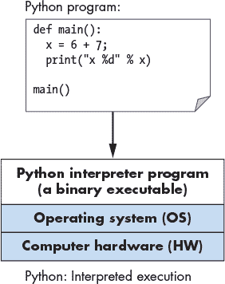
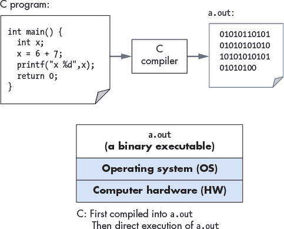
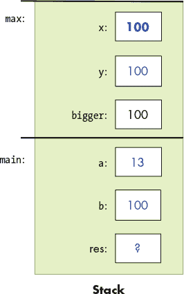
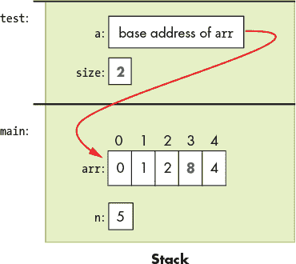
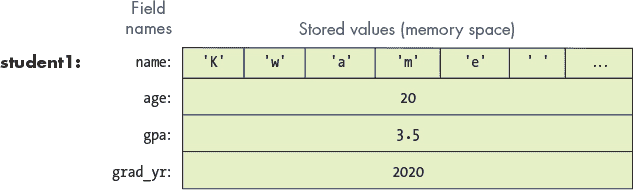
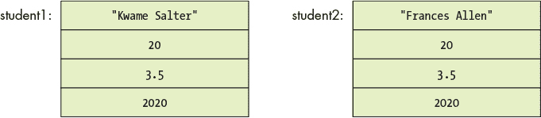
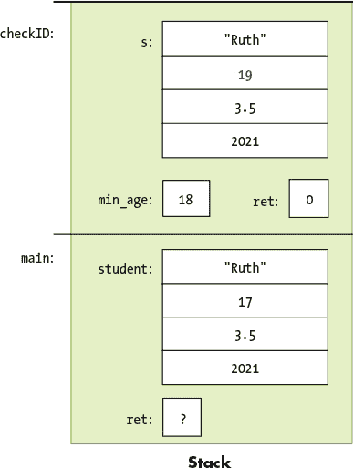

# 第二章：通过 C， 通过 C， 通过美丽的 C

“美丽的海边”

—Carroll 和 Atteridge, 1914


本章为有一定其他语言编程经验的学生提供了 C 编程的概述。它特别为 Python 程序员编写，并通过一些 Python 示例进行对比。然而，对于任何具有基本编程经验的人来说，它作为 C 编程的入门书籍都是有用的。

C 是一种高级编程语言，像你可能熟悉的其他语言一样，如 Python、Java、Ruby 或 C++。它是一种命令式和过程式编程语言，这意味着 C 程序以一系列语句（步骤）的形式表达，供计算机执行，并且 C 程序结构是由一组函数（过程）组成的。每个 C 程序必须至少包含一个函数，即 `main` 函数，其中包含程序开始时执行的一组语句。

与你可能熟悉的其他编程语言相比，C 编程语言相对于计算机的机器语言抽象程度较低。这意味着 C 不支持面向对象编程（像 Python、Java 和 C++），也没有丰富的高级编程抽象（例如 Python 中的字符串、列表和字典）。因此，如果你想在 C 程序中使用字典数据结构，你需要自己实现它，而不是像 Python 那样直接导入语言内置的字典。

C 缺乏高级抽象可能使其看起来不像其他语言那样具吸引力。然而，正因为 C 与底层机器的抽象较少，它使程序员更容易看到并理解程序代码与计算机执行之间的关系。C 程序员对程序在硬件上的执行方式有更多控制权，而且他们能够编写比使用其他编程语言的高级抽象所写的等效代码更高效的代码。特别是，他们对程序如何管理内存有更多控制，这对性能有显著影响。因此，C 仍然是计算机系统编程的*事实标准*语言，在低级控制和效率至关重要的领域尤为重要。

本书使用 C 是因为它在程序控制方面的表现力，以及它相对直接地翻译为计算机执行的汇编语言和机器代码。本章介绍了 C 编程，首先概述了其特性。第二章则更详细地描述了 C 的特性。

### 1.1 开始学习 C 编程

让我们从一个包含调用数学库函数的“hello world”程序开始。我们将 Python 版本的程序（首先）与 C 版本的程序（其次）进行比较。C 版本可能保存在名为 `hello.c` 的文件中（`.c` 是 C 源代码文件的后缀约定），而 Python 版本则可能保存在名为 `hello.py` 的文件中。

```
'''

    The Hello World Program in Python

'''

# Python math library

from math import *

# main function definition:

def main():

    # statements on their own line

    print("Hello World")

    print("sqrt(4) is %f" % (sqrt(4)))

 # call the main function:

main()
```

Python 版本

```
/*

    The Hello World Program in C

 */

/* C math and I/O libraries */

#include <math.h>

#include <stdio.h>

/* main function definition: */

int main() {

    // statements end in a semicolon (;)

    printf("Hello World\n");

    printf("sqrt(4) is %f\n", sqrt(4));

    return 0;  // main returns value 0

}
```

C 版本

**注意** C 版本^(1) 和 Python 版本^(2) 都可以下载。

请注意，这个程序的两个版本结构和语言构造类似，尽管语法不同。具体来说：

**注释：**

在 Python 中，多行注释以 `'''` 开始和结束，单行注释以 `#` 开始。

在 C 语言中，多行注释以 `/*` 开始和以 `*/` 结束，单行注释以 `//` 开始。

**导入库代码：**

在 Python 中，使用 `import` 导入库。

在 C 语言中，使用 `#include` 导入库。所有的 `#include` 语句都出现在程序的顶部，在函数体外。

**代码块：**

在 Python 中，缩进表示一个代码块。

在 C 语言中，代码块（例如，函数、循环和条件体）以 `{` 开始，以 `}` 结束。

**主函数：**

在 Python 中，`def main():` 定义了主函数。

在 C 语言中，`int main(){ }` 定义了主函数。`main` 函数返回一个 `int` 类型的值，`int` 是 C 语言中用于指定带符号整数类型的名称（带符号整数是像 -3、0、1234 这样的值）。`main` 函数返回 `int` 值 0，表示程序无错误地运行完成。

**语句：**

在 Python 中，每个语句都单独占一行。

在 C 语言中，每个语句以分号 `;` 结束。在 C 中，语句必须位于某个函数的主体内（在本示例中是 `main` 函数内）。

**输出：**

在 Python 中，`print` 函数打印格式化字符串。格式字符串中的占位符的值通过 `%` 符号和以逗号分隔的值列表传入（例如，`sqrt(4)` 的值将替换格式字符串中的 `%f` 占位符）。

在 C 语言中，`printf` 函数打印格式化字符串。格式字符串中的占位符的值作为额外的参数通过逗号分隔传入（例如，`sqrt(4)` 的值将替换格式字符串中的 `%f` 占位符）。

在 C 和 Python 版本的程序中有几个重要的区别：

**缩进：**

在 C 语言中，缩进没有特殊含义，但根据语句所在的嵌套级别进行缩进是良好的编程风格。

**输出：**

C 语言的 `printf` 函数不像 Python 的 `print` 函数那样自动在结尾打印换行符。因此，C 程序员需要在格式字符串中显式指定换行符（`\n`），以便输出时换行。

主 **函数：**

C 程序必须有一个名为`main`的函数，并且其返回类型必须是`int`。这意味着`main`函数返回一个有符号整数类型的值。Python 程序不需要将主函数命名为`main`，但通常按照惯例也会这样做。

C 的`main`函数有一个显式的`return`语句，用于返回一个`int`类型的值（按照惯例，如果`main`函数成功执行且没有错误，它应该返回`0`）。

Python 程序需要显式地调用其`main`函数来执行它，而 C 程序在执行时会自动调用其`main`函数。

#### 1.1.1 编译和运行 C 程序

Python 是一种解释型编程语言，这意味着另一个程序——Python 解释器——来运行 Python 程序：Python 解释器就像是一个虚拟机，Python 程序在其上运行。要运行一个 Python 程序，程序源代码（`hello.py`）作为输入提供给 Python 解释器程序，后者运行该程序。例如（`$`是 Linux 命令行提示符）：

```
$ python hello.py
```

Python 解释器是一个可以直接在底层系统上运行的程序（这种形式被称为*二进制可执行文件*），并以 Python 程序作为输入来运行它（见图 1-1）。



*图 1-1：Python 程序由 Python 解释器直接执行，Python 解释器是一个二进制可执行程序，在底层系统（操作系统和硬件）上运行。*

要运行 C 程序，必须先将其翻译成计算机系统可以直接执行的形式。C *编译器*是将 C 源代码翻译成计算机硬件可以直接执行的*二进制可执行*格式的程序。二进制可执行文件由一系列 0 和 1 组成，采用计算机能够运行的特定格式。

例如，要在 Unix 系统上运行 C 程序`hello.c`，必须首先通过 C 编译器（例如 GNU C 编译器 GCC ^(3))编译 C 代码，生成二进制可执行文件（默认命名为`a.out`）。然后，可以直接在系统上运行该二进制可执行版本的程序（见图 1-2）：

```
$ gcc hello.c 

$ ./a.out
```

（注意，一些 C 编译器可能需要显式地告诉它链接数学库：`-lm`）：

```
$ gcc hello.c -lm
```



*图 1-2：C 编译器（gcc）将 C 源代码构建为二进制可执行文件（a.out）。底层系统（操作系统和硬件）直接执行 a.out 文件以运行程序。*

##### 详细步骤

一般来说，以下步骤描述了在 Unix 系统上编辑、编译和运行 C 程序的必要步骤。

首先，使用文本编辑器（例如`vim`^(4))，编写并保存你的 C 源代码程序到一个文件中（例如`hello.c`）：

```
$ vim hello.c
```

接下来，将源代码编译成可执行形式，然后运行它。使用`gcc`进行编译的最基本语法是：

```
$ gcc <input_source_file>
```

如果编译没有产生错误，编译器会创建一个名为`a.out`的二进制可执行文件。编译器还允许你使用`-o`标志来指定生成的二进制可执行文件的名称：

```
$ gcc -o <output_executable_file> <input_source_file>
```

例如，这个命令指示`gcc`将`hello.c`编译成名为`hello`的可执行文件：

```
$ gcc -o hello hello.c
```

我们可以使用`./hello`来调用可执行程序：

```
$ ./hello
```

对 C 源代码（`hello.c`文件）所做的任何更改都必须使用`gcc`重新编译，以生成`hello`的新版本。如果编译器在编译过程中检测到任何错误，则不会创建/重新创建`./hello`文件（但要注意，来自之前成功编译的旧版本文件可能仍然存在）。

在使用`gcc`进行编译时，通常你需要包括几个命令行选项。例如，这些选项启用更多的编译器警告，并生成一个包含额外调试信息的二进制可执行文件：

```
$ gcc -Wall -g -o hello hello.c
```

因为`gcc`命令行可能很长，所以经常使用`make`工具来简化 C 程序的编译过程，并清理`gcc`创建的文件。使用`make`并编写`Makefile`是你在积累 C 编程经验时将会掌握的重要技能。^(5)

我们将在第二章的末尾更详细地讨论使用 C 库代码进行编译和链接。

#### 变量和 C 数值类型

像 Python 一样，C 语言使用变量作为命名的存储位置来存储数据。考虑程序变量的作用域和类型对于理解程序运行时程序的语义非常重要。一个变量的*作用域*定义了该变量在程序中的意义（即，在程序中何时何地可以使用该变量）和生命周期（即，它可能会在整个程序运行期间持续存在，或者只在函数激活期间存在）。一个变量的*类型*定义了它可以表示的值的范围，以及在对数据进行操作时如何解释这些值。

在 C 语言中，所有变量必须在使用之前声明。声明变量的语法如下：

```
type_name variable_name;
```

一个变量只能有一个类型。C 语言的基本类型包括`char`、`int`、`float`和`double`。按照约定，C 语言变量应该在其作用域的开始部分（即`{ }`块的顶部）声明，在该作用域中的任何 C 语句之前。

以下是一个示例 C 代码片段，展示了声明和使用几种不同类型变量的例子。我们将在示例之后更详细地讨论类型和运算符。

vars.c

```
{

    /* 1\. Define variables in this block's scope at the top of the block. */

    int x; // declares x to be an int type variable and allocates space for it

    int i, j, k;  // can define multiple variables of the same type like this

 char letter;  // a char stores a single-byte integer value

                  // it is often used to store a single ASCII character

                  // value (the ASCII numeric encoding of a character)

                  // a char in C is a different type than a string in C

    float winpct; // winpct is declared to be a float type

    double pi;    // the double type is more precise than float

    /* 2\. After defining all variables, you can use them in C statements. */

    x = 7;        // x stores 7 (initialize variables before using their value)

    k = x + 2;    // use x's value in an expression

    letter = 'A';        // a single quote is used for single character value

    letter = letter + 1; // letter stores 'B' (ASCII value one more than 'A')

    pi = 3.1415926;

    winpct = 11 / 2.0; // winpct gets 5.5, winpct is a float type

    j = 11 / 2;        // j gets 5: int division truncates after the decimal

    x = k % 2;         // % is C's mod operator, so x gets 9 mod 2 (1)

}
```

请注意，分号很多。回想一下，C 语句是由 `;` 来分隔的，而不是换行符——C 希望每个语句后都有一个分号。你会忘记加分号，而 `gcc` 几乎从不告诉你漏掉了分号，即使那可能是你程序中唯一的语法错误。实际上，当你忘记分号时，编译器通常会在缺少分号的行*之后*指出语法错误：原因是 `gcc` 将它解释为上一行语句的一部分。随着你继续用 C 编程，你会学会将 `gcc` 错误与它们描述的具体 C 语法错误相关联。

#### 1.1.2 C 类型

C 支持一小部分内建数据类型，并且提供了几种方法，程序员可以用来构造基本的类型集合（数组和结构体）。通过这些基本构建块，C 程序员可以构建复杂的数据结构。

C 定义了一组用于存储数值的基本类型。以下是不同 C 类型的数值字面量的一些示例：

```
8     // the int value 8

3.4   // the double value 3.4

'h'   // the char value 'h' (its value is 104, the ASCII value of h)
```

C 的 `char` 类型存储一个数值。然而，它通常被程序员用来存储一个 ASCII 字符的值。字符字面量值在 C 中是通过单引号括起来的单个字符来指定的。

C 不支持字符串类型，但程序员可以通过 `char` 类型以及 C 对构造值数组的支持来创建字符串，稍后的章节中我们将讨论这一点。C 确实支持在程序中表达字符串字面量值的方法：字符串字面量是任何位于双引号之间的字符序列。C 程序员通常将字符串字面量作为格式字符串传递给 `printf`：

```
printf("this is a C string\n");
```

Python 支持字符串，但没有 `char` 类型。在 C 中，字符串和 `char` 是两种非常不同的类型，它们的处理方式也不同。这种差异通过对比一个包含单个字符的 C 字符串字面量和一个 C `char` 字面量来说明。例如：

```
'h'  // this is a char literal value   (its value is 104, the ASCII value of h)

"h"  // this is a string literal value (its value is NOT 104, it is not a char)
```

我们在“字符串与字符串库”一节中更详细地讨论了 C 字符串和 `char` 变量，内容位于第 93 页。在这里，我们将主要关注 C 的数值类型。

##### C 数值类型

C 支持多种不同类型来存储数值。不同的类型在表示数值的格式上有所不同。例如，`float` 和 `double` 类型可以表示实数值，`int` 表示有符号整数值，而 `unsigned int` 表示无符号整数值。实数值是带有小数点的正数或负数，例如 -1.23 或 0.0056。带符号整数存储正数、负数或零的整数值，例如 -333、0 或 3456。无符号整数存储严格非负的整数值，例如 0 或 1234。

C 的数值类型在它们能够表示的值的范围和精度上也有所不同。一个值的范围或精度取决于与其类型相关联的字节数。字节数更多的类型可以表示更大的值范围（对于整数类型）或更高精度的值（对于实数类型），而字节数较少的类型则不能。

表 1-1 显示了多种常见 C 数值类型的存储字节数、存储的数值类型，以及如何声明变量（请注意，这些是典型大小——确切的字节数取决于硬件体系结构）。

**表 1-1：** C 数值类型

| **类型名称** | **常见大小** | **存储的值** | **如何声明** |
| --- | --- | --- | --- |
| `char` | 1 字节 | 整数 | `char x;` |
| `short` | 2 字节 | 有符号整数 | `short x;` |
| `int` | 4 字节 | 有符号整数 | `int x;` |
| `long` | 4 或 8 字节 | 有符号整数 | `long x;` |
| `long long` | 8 字节 | 有符号整数 | `long long x;` |
| `float` | 4 字节 | 有符号实数 | `float x;` |
| `double` | 8 字节 | 有符号实数 | `double x;` |

C 还提供了整数数值类型（`char`、`short`、`int`、`long` 和 `long long`）的*无符号*版本。要声明一个无符号变量，请在类型名称前添加关键字`unsigned`。例如：

```
int x;           // x is a signed int variable

unsigned int y;  // y is an unsigned int variable
```

C 标准并未指定 `char` 类型是有符号还是无符号。因此，一些实现可能将 `char` 实现为有符号整数值，另一些实现则为无符号。为了明确使用 `char` 的无符号版本，良好的编程实践是显式声明 `unsigned char`。

每种 C 类型的字节数可能因体系结构的不同而有所变化。表 1-1 中的大小是每种类型的最小（且常见）大小。你可以使用 C 的 `sizeof` 运算符在特定的机器上打印出每种类型的准确大小，`sizeof` 运算符接受类型名称作为参数，并计算出存储该类型所使用的字节数。例如：

```
printf("number of bytes in an int: %lu\n", sizeof(int));

printf("number of bytes in a short: %lu\n", sizeof(short));
```

`sizeof` 运算符的结果为无符号长整型值，因此在调用 `printf` 时，使用占位符 `%lu` 来打印其值。在大多数体系结构中，以下语句的输出将是：

```
number of bytes in an int: 4 

number of bytes in a short: 2
```

##### 算术运算符

算术运算符结合数值类型的值。运算结果的类型取决于操作数的类型。例如，如果两个 `int` 值用算术运算符结合，结果类型也将是整数。

C 在运算符组合两种不同类型的操作数时会进行自动类型转换。例如，如果一个 `int` 操作数与一个 `float` 操作数结合，整数操作数会首先转换为其浮点数等价物，然后应用运算符，操作结果的类型为 `float`。

以下算术运算符可以用于大多数数值类型操作数：

+   加法（`+`）和减法（`-`）

+   乘法（`*`）、除法（`/`）和取模（`%`）：

    求余运算符（`%`）只能接受整数类型的操作数（`int`、`unsigned int`、`short` 等）。

    如果两个操作数都是 `int` 类型，则除法运算符（`/`）执行整数除法（结果为 `int`，并截断除法操作后的小数部分）。例如，`8/3` 结果为 `2`。

    如果一个或两个操作数是 `float`（或 `double`），则 `/` 执行实数除法，结果为 `float`（或 `double`）。例如，`8/3.0` 结果约为 `2.666667`。

+   赋值（`=`）：

    ```
    variable = value of expression;   // e.g., x = 3 + 4;
    ```

+   带更新的赋值（`+=`、`-=`、`*=`、`/=` 和 `%=`）：

    ```
    variable op= expression;  // e.g., x += 3; is shorthand for x = x + 3;
    ```

+   增量（`++`）和减量（`--`）：

    ```
    variable++;   // e.g., x++; assigns to x the value of x + 1
    ```

**警告：前增量与后增量的区别**

运算符`++variable`和`variable++`都有效，但它们的计算顺序略有不同：

+   `++x`：先递增 `x`，然后使用它的值。

+   `x++`：先使用 `x` 的值，然后再递增它。

在许多情况下，使用哪种形式并不重要，因为增量或减量变量的值并没有在语句中被使用。例如，以下两条语句是等效的（尽管第一种是最常用的语法）：

x++;

++x;

在某些情况下，上下文会影响结果（当增量或减量变量的*值*在语句中被使用时）。例如：

x = 6;

y = ++x + 2;  // y 被赋值为 9：先递增 x，再计算 x + 2（9）

x = 6;

y = x++ + 2;  // y 被赋值为 8：先计算 x + 2（8），然后递增 x

像前面的例子那样，使用带有增量运算符的算术表达式通常很难阅读，而且容易出错。因此，最好避免编写这样的代码；相反，应编写单独的语句，确保按照所需的顺序执行。例如，如果你想先递增`x`，然后将`x + 1`赋值给`y`，就将其写成两个单独的语句。

不要写成这样

y = ++x + 1;

将其写为两个单独的语句：

x++;

y = x + 1;

### 1.2 输入/输出（printf 和 scanf）

C 的 `printf` 函数将值打印到终端，而 `scanf` 函数则读取用户输入的值。`printf` 和 `scanf` 函数属于 C 的标准输入输出库，必须在使用这些函数的 `.c` 文件顶部显式包含 `#include <stdio.h>`。在本节中，我们介绍了在 C 程序中使用 `printf` 和 `scanf` 的基本知识。有关 C 的输入输出函数的详细讨论，请参见 第 113 页中的“C 语言中的 I/O（标准和文件）”。

#### 1.2.1 printf

C 的`printf`函数与 Python 中的格式化打印非常相似，调用者指定一个格式字符串来打印。格式字符串通常包含格式化说明符，例如打印制表符（`\t`）或换行符（`\n`）的特殊字符，或输出值的占位符。占位符由`%`后跟一个类型说明符字母组成（例如，`%d`表示整数值的占位符）。对于格式字符串中的每个占位符，`printf`期望一个附加的参数。这里有一个 Python 和 C 的示例程序，展示了格式化输出：

```
# Python formatted print example

def main():
 print("Name: %s,  Info:" % "Vijay")

    print("\tAge: %d \t Ht: %g" %(20,5.9))

    print("\tYear: %d \t Dorm: %s" %(3, "Alice Paul"))

# call the main function:

main()
```

Python 版本

```
/* C printf example */

#include <stdio.h> // needed for printf

int main() {

    printf("Name: %s,  Info:\n", "Vijay");

    printf("\tAge: %d \t Ht: %g\n",20,5.9);

    printf("\tYear: %d \t Dorm: %s\n",3,"Alice Paul");

    return 0;

}
```

C 版本

运行时，这两个版本的程序会产生格式完全相同的输出：

```
Name: Vijay,  Info:

    Age: 20   Ht: 5.9

    Year: 3   Dorm: Alice Paul
```

C 的`printf`和 Python 的`print`函数之间的主要区别在于，Python 版本在输出字符串末尾会隐式打印一个换行符，而 C 版本则不会。因此，本例中的 C 格式字符串在末尾包含换行符（`\n`），以显式地打印换行符。C 的`printf`和 Python 的`print`函数在格式字符串中列出占位符参数值的语法也略有不同。

C 使用与 Python 相同的格式化占位符来指定不同类型的值。前面的示例演示了以下格式化占位符：

```
%g:  placeholder for a float (or double) value

%d:  placeholder for a decimal value (int, short, char)

%s:  placeholder for a string value
```

C 还支持`%c`占位符，用于打印字符值。当程序员想要打印与特定数字编码关联的 ASCII 字符时，这个占位符非常有用。以下是一个 C 代码片段，它打印一个`char`类型的数值（`%d`）和字符编码（`%c`）：

```
// Example printing a char value as its decimal representation (%d)

// and as the ASCII character that its value encodes (%c)

char ch;

ch = 'A';

printf("ch value is %d which is the ASCII value of  %c\n", ch, ch);

ch = 99;

printf("ch value is %d which is the ASCII value of  %c\n", ch, ch);
```

运行时，程序的输出如下所示：

```
ch value is 65 which is the ASCII value of  A

ch value is 99 which is the ASCII value of  c
```

#### 1.2.2 scanf

C 的`scanf`函数表示读取用户输入的一个方法（通过键盘输入），并将它们存储在程序变量中。`scanf`函数对于用户输入数据的准确格式要求较为严格，这意味着它对格式错误的用户输入不是很容错。在《C 语言中的输入输出（标准与文件）》一节中（参见第 113 页），我们讨论了更为健壮的读取用户输入值的方法。现在，记住如果你的程序因为用户输入格式错误而进入无限循环，你可以随时按 CTRL-C 终止程序。

在 Python 和 C 中，读取输入的方式不同：Python 使用`input`函数将输入值作为字符串读取，然后程序将字符串值转换为`int`类型，而 C 使用`scanf`读取`int`类型的值，并将其存储在`int`程序变量的内存位置（例如，`&num1`）。这段代码展示了在 Python 和 C 中读取用户输入值的示例程序：

```
# Python input example

def main():

    num1 = input("Enter a number:")

    num1 = int(num1)

    num2 = input("Enter another:")

    num2 = int(num2)
 print("%d + %d = %d" % (num1, num2, (num1+num2)))

# call the main function:

main()
```

Python 版本

```
/* C input (scanf) example */

#include <stdio.h>

int main() {

    int num1, num2;

    printf("Enter a number: ");

    scanf("%d", &num1);

    printf("Enter another: ");

    scanf("%d", &num2);

    printf("%d + %d = %d\n", num1, num2, (num1+num2));

    return 0;

}
```

C 版本

运行时，两个程序都读取两个值（这里是 30 和 67）：

```
Enter a number: 30 

Enter another: 67 

30 + 67 = 97
```

与 `printf` 类似，`scanf` 也接受一个格式字符串，用来指定要读取的值的数量和类型（例如，`"%d"` 指定一个 `int` 类型的值）。`scanf` 函数在读取数字值时会跳过前导和尾随的空格，因此其格式字符串只需要包含一系列格式占位符，通常这些占位符之间没有空格或其他格式字符。格式字符串中的占位符的参数指定了程序变量的*位置*，这些变量将存储读取到的值。将变量名前加上 `&` 操作符会得到该变量在程序内存中的位置——即该变量的内存地址。“C 的指针变量”在第 66 页中更详细地讨论了 `&` 操作符。现在，我们只在 `scanf` 函数的上下文中使用它。

这是另一个 `scanf` 示例，其中格式字符串包含两个值的占位符，第一个是 `int`，第二个是 `float`：

scanf_ex.c

```
int x;

float pi;

// read in an int value followed by a float value ("%d%g")

 // store the int value at the memory location of x (&x)

// store the float value at the memory location of pi (&pi)

scanf("%d%g", &x, &pi);
```

当通过 `scanf` 输入数据时，单独的数字输入值必须至少由一个空白字符分隔。然而，由于 `scanf` 会跳过额外的前导和尾随空白字符（例如空格、制表符和换行符），用户可以在每个输入值的前后输入任意数量的空白字符。例如，如果用户在前面的 `scanf` 示例中输入以下内容，`scanf` 将读取 8 并将其存储在 `x` 变量中，然后读取 3.14 并将其存储在 `pi` 变量中：

```
          8                   3.14
```

### 1.3 条件语句与循环

接下来的代码示例展示了 C 和 Python 中的 `if`–`else` 语句的语法和语义非常相似。主要的语法差异在于，Python 使用缩进来表示“主体”语句，而 C 使用大括号（但在 C 代码中仍应使用良好的缩进）。

```
# Python if-else example

def main():

    num1 = input("Enter the 1st number:")

    num1 = int(num1)

    num2 = input("Enter the 2nd number:")

    num2 = int(num2)

    if num1 > num2:

        print("%d is biggest" % num1)

        num2 = num1

    else:

        print("%d is biggest" % num2)

        num1 = num2

# call the main function:

main()
```

Python 版本

```
/* C if-else example */

#include <stdio.h>

int main() {

    int num1, num2;

    printf("Enter the 1st number: ");

    scanf("%d", &num1);

    printf("Enter the 2nd number: ");

    scanf("%d", &num2);

    if (num1 > num2) {

        printf("%d is biggest\n", num1);

        num2 = num1;

    } else {

        printf("%d is biggest\n", num2);

        num1 = num2;

    }

    return 0;

}
```

C 版本

Python 和 C 的 `if`–`else` 语句的语法几乎相同，仅有一些细微的差异。在两者中，`else` 部分是可选的。Python 和 C 也都通过链式使用 `if` 和 `else if` 语句来支持多路分支。以下描述了完整的 `if`–`else` C 语法：

```
    // a one-way branch:

    if ( <boolean expression> ) {

        <true body>

    }

    // a two-way branch:

    if ( <boolean expression> ) {

        <true body>

    }

    else {

        <false body>

    }

    // a multibranch (chaining if-else if-...-else)

    // (has one or more 'else if' following the first if):

    if ( <boolean expression 1> ) {

        <true body>

    }

    else if ( <boolean expression 2> ) {

        // first expression is false, second is true

        <true 2 body>

    }

    else if ( <boolean expression 3> ) {

        // first and second expressions are false, third is true

        <true 3 body>

    }

    // ... more else if's ...

    else if ( <boolean expression N> ) {

        // first N-1 expressions are false, Nth is true

        <true N body>

    }

    else { // the final else part is optional

        // if all previous expressions are false

        <false body>

    }
```

#### 1.3.1 C 语言中的布尔值

C 不提供带有真或假值的布尔类型。相反，整数值在条件语句中被评估为 *真* 或 *假*。在条件表达式中使用时，一个整数表达式：

*零*（0）被评估为 *假*；

*非零*（任何正值或负值）被评估为 *真*。

C 提供了一组关系和逻辑运算符用于布尔表达式。*关系运算符*接受相同类型的操作数，并计算出零（假）或非零（真）。关系运算符的集合包括：

相等（`==`）和不等（`!=`）；

比较运算符：小于（`<`）、小于或等于（`<=`）、大于（`>`）和大于或等于（`>=`）。

以下 C 语言代码片段显示了关系运算符的示例：

```
// assume x and y are ints, and have been assigned

// values before this point in the code

if (y < 0) {

    printf("y is negative\n");

} else if (y != 0) {

    printf("y is positive\n");

} else {

    printf("y is zero\n");

}

 // set x and y to the larger of the two values

if (x >= y) {

    y = x;

} else {

    x = y;

}
```

C 语言的*逻辑运算符*接受整数“布尔”操作数，并评估为零（假）或非零（真）。逻辑运算符包括：

逻辑非（`!`）；

逻辑与（`&&`）：在遇到第一个假表达式时停止评估（短路运算）；

逻辑或（`||`）：在遇到第一个真表达式时停止评估（短路运算）。

C 语言的*短路*逻辑运算符评估逻辑表达式时，如果结果已知，就停止评估。例如，如果逻辑与（`&&`）表达式的第一个操作数评估为假，则`&&`表达式的结果必须为假。因此，第二个操作数的值不需要再评估，也不会被评估。

以下是使用逻辑运算符的 C 语言条件语句示例（通常最好在复杂的布尔表达式周围使用括号，使其更易于阅读）：

```
if ( (x > 10) && (y >= x) ) {

    printf("y and x are both larger than 10\n");

    x = 13;

} else if ( ((-x) == 10) || (y > x) ) {

    printf("y might be bigger than x\n");

    x = y * x;

} else {

    printf("I have no idea what the relationship between x and y is\n");

}
```

#### 1.3.2 C 语言中的循环

和 Python 一样，C 语言支持`for`和`while`循环。此外，C 语言还提供了`do`–`while`循环。

##### `while`循环

C 语言和 Python 中的`while`循环语法几乎相同，行为也相同。在这里，你可以看到使用`while`循环的 C 语言和 Python 示例程序：

```
# Python while loop example

def main():

    num = input("Enter a value: ")

    num = int(num)

 # make sure num is not negative

    if num < 0:

        num = -num

    val = 1

    while val < num:

        print("%d" % (val))

        val = val * 2

# call the main function:

main()
```

Python 版本

```
/* C while loop example */

#include <stdio.h>

int main() {

    int num, val;

    printf("Enter a value: ");

    scanf("%d", &num);

    // make sure num is not negative

    if (num < 0) {

        num = -num;

    }

    val = 1;

    while (val < num) {

        printf("%d\n", val);

        val = val * 2;

    }

    return 0;

}
```

C 版本

C 语言中的`while`循环语法与 Python 非常相似，并且两者的评估方式相同：

```
while ( <boolean expression> ) {

    <true body>

}
```

`while`循环首先检查布尔表达式，如果为真，则执行循环体。在上面的示例程序中，`val`变量的值将在`while`循环中反复打印，直到其值大于`num`变量的值。如果用户输入`10`，C 语言和 Python 程序将打印：

```
1 

2 

4 

8
```

C 语言也有一个`do`–`while`循环，它与`while`循环类似，但它首先执行循环体，然后检查条件，并在条件为真时重复执行循环体。也就是说，`do`–`while`循环至少会执行一次循环体：

```
do {

    <body>

} while ( <boolean expression> );
```

有关更多`while`循环示例，请参阅`whileLoop1.c`^(6)和`whileLoop2.c`。^(7)

##### `for`循环

C 语言中的`for`循环与 Python 中的`for`循环有所不同。在 Python 中，`for`循环是对序列的迭代，而在 C 语言中，`for`循环是一种更通用的循环结构。以下是使用`for`循环打印 0 到用户提供的输入数之间所有值的示例程序：

```
# Python for loop example

def main():

    num = input("Enter a value: ")

    num = int(num)

    # make sure num is not negative

    if num < 0:

        num = -num

    for i in range(num):

        print("%d" % i)

# call the main function:

main()
```

Python 版本

```
/* C for loop example */

#include <stdio.h>

int main() {

    int num, i;

    printf("Enter a value: ");

    scanf("%d", &num);

    // make sure num is not negative

    if (num < 0) {

        num = -num;

    }

 for (i = 0; i < num; i++) {

        printf("%d\n", i);

    }

    return 0;

}
```

C 版本

在这个例子中，你可以看到 C 语言的`for`循环语法与 Python 的`for`循环语法有很大不同。它们的评估方式也不同。

C 语言的`for`循环语法是：

```
for ( <initialization>; <boolean expression>; <step> ) {

    <body>

}
```

`for`循环的评估规则是：

1\. 在第一次进入循环时评估<initialization>一次。

2\. 评估<boolean expression>。如果为 0（假），则退出`for`循环（换句话说，程序完成了对循环体语句的重复执行）。

3\. 评估循环体内的语句<body>。

4\. 评估<step>表达式。

5\. 从步骤（2）重复。

这是一个简单的`for`循环示例，用于打印 0、1 和 2 的值：

```
int i;

for (i = 0; i < 3; i++) {

    printf("%d\n", i);

}
```

对前面的循环执行`for`循环评估规则会得到以下操作顺序：

```
(1) eval init: i is set to 0  (i=0)

(2) eval bool expr: i < 3 is true

(3) execute loop body: print the value of i (0)

(4) eval step: i is set to 1  (i++)

(2) eval bool expr: i < 3 is true

(3) execute loop body: print the value of i (1)

(4) eval step: i is set to 2  (i++)

(2) eval bool expr: i < 3 is true

(3) execute loop body: print the value of i (2)
 (4) eval step: i is set to 3  (i++)

(2) eval bool expr: i < 3 is false, drop out of the for loop
```

以下程序展示了一个更复杂的`for`循环示例（也可以下载^(8)）。请注意，仅仅因为 C 支持具有语句列表作为其<初始化>和<步骤>部分的`for`循环，并不意味着必须复杂化。 （这个示例展示了一个更复杂的`for`循环语法，但如果通过将`j += 10`步骤语句移到循环体的末尾，并仅使用一个步骤语句`i += 1`，`for`循环会更易读和理解。）

```
/* An example of a more complex for loop which uses multiple variables.

 * (it is unusual to have for loops with multiple statements in the

 * init and step parts, but C supports it and there are times when it

 * is useful...don't go nuts with this just because you can)

 */

#include <stdio.h>

int main() {

    int i, j;

    for (i=0, j=0; i < 10; i+=1, j+=10) {

        printf("i+j = %d\n", i+j);

    }

    return 0;

}

// the rules for evaluating a for loop are the same no matter how

// simple or complex each part is:

// (1) evaluate the initialization statements once on the first

//     evaluation of the for loop:  i=0 and j=0

// (2) evaluate the boolean condition: i < 10

//     if false (when i is 10), drop out of the for loop

// (3) execute the statements inside the for loop body: printf

// (4) evaluate the step statements:  i += 1, j += 10

// (5) repeat, starting at step (2)
```

在 C 中，`for`循环和`while`循环是等价的，这意味着任何`while`循环都可以用`for`循环来表示，反之亦然。 Python 中情况不同，`for`循环是对一系列值的迭代。因此，它们不能表达一些更通用的 Python `while`循环能够表达的循环行为。像不确定循环就是一个只能用`while`循环在 Python 中实现的例子。

考虑以下 C 语言中的`while`循环：

```
int guess = 0;

while (guess != num) {

 printf("%d is not the right number\n", guess);

    printf("Enter another guess: ");

    scanf("%d", &guess);

}
```

这个循环可以翻译为一个等效的 C 语言`for`循环：

```
int guess;

for (guess = 0; guess != num; ) {

    printf("%d is not the right number\n", guess);

    printf("Enter another guess: ");

    scanf("%d", &guess);

}
```

然而，在 Python 中，这种类型的循环行为只能通过使用`while`循环来表达。

因为在 C 语言中，`for`和`while`循环具有相同的表达能力，所以语言中只需要一种循环结构。然而，`for`循环对于确定次数的循环（例如迭代一系列值）来说是更自然的语言结构，而`while`循环则是更自然的语言结构，用于不确定次数的循环（例如，重复执行直到用户输入一个偶数）。因此，C 提供了这两种循环结构供程序员使用。

### 1.4 函数

函数将代码分解成可管理的部分，并减少代码重复。函数可能接受零个或多个*参数*作为输入，并且*返回*一个特定类型的单一值。函数*声明*或*原型*指定函数的名称、返回类型和参数列表（所有参数的数量和类型）。函数*定义*包括函数调用时要执行的代码。所有的 C 函数在调用之前必须声明。这可以通过声明函数原型或在调用之前完全定义函数来实现：

```
// function definition format:

// ---------------------------

<return type> <function name> (<parameter list>)

{

    <function body>

}

// parameter list format:

// ---------------------

<type> <param1 name>, <type> <param2 name>, ...,  <type> <last param name>
```

这是一个函数定义的示例。请注意，注释描述了函数的功能、每个参数的详细信息（它的用途以及应该传递什么），以及函数返回的内容：

```
/* This program computes the larger of two

 * values entered by the user.

 */

#include <stdio.h>

/* max: computes the larger of two integer values

 *   x: one integer value

 *   y: the other integer value

 *   returns: the larger of x and y

 */

int max(int x, int y) {

    int bigger;

    bigger = x;

    if (y > x) {

        bigger = y;

    }

    printf("  in max, before return x: %d y: %d\n", x, y);

    return bigger;

}
```

不返回值的函数应该指定`void`返回类型。以下是一个`void`函数的示例：

```
/* prints out the squares from start to stop

 *   start: the beginning of the range

 *   stop: the end of the range

 */

void print_table(int start, int stop) {

    int i;

    for (i = start; i <= stop; i++) {

        printf("%d\t", i*i);

    }

    printf("\n");

}
```

如同任何支持函数或过程的编程语言一样，*函数调用*通过传递特定的参数值来调用函数。一个函数通过其名称被调用，并传入与函数参数一一对应的参数。在 C 中，调用函数的方式如下：

```
// function call format:

// ---------------------

function_name(<argument list>);

 // argument list format:

// ---------------------

<argument 1 expression>, <argument 2 expression>, ..., <last argument expression>
```

C 函数的参数是*按值传递*的：每个函数参数被赋予调用者在函数调用时传递给它的对应参数的*值*。按值传递的语义意味着，函数内对参数值的任何改变（即在函数内给参数赋新值）对调用者来说是*不可见的*。

下面是一些对前面提到的`max`和`print_table`函数的示例调用：

```
int val1, val2, result;

val1 = 6;

val2 = 10;

/* to call max, pass in two int values, and because max returns an

   int value, assign its return value to a local variable (result)

 */

result = max(val1, val2);     /* call max with argument values 6 and 10 */

printf("%d\n", result);       /* prints out 10 */

result = max(11, 3);          /* call max with argument values 11 and 3 */

printf("%d\n", result);       /* prints out 11 */

result = max(val1 * 2, val2); /* call max with argument values 12 and 10 */

printf("%d\n", result);       /* prints out 12 */

/* print_table does not return a value, but takes two arguments */

print_table(1, 20);           /* prints a table of values from 1 to 20 */

print_table(val1, val2);      /* prints a table of values from 6 to 10 */
```

这是另一个完整程序的示例，展示了对`max`函数一个稍有不同实现的调用，该实现增加了一条语句来改变它的参数值（`x = y`）：

```
/* max: computes the larger of two int values

 *   x: one value

 *   y: the other value

 *   returns: the larger of x and y

 */

int max(int x, int y) {

    int bigger;

    bigger = x;

    if (y > x) {

        bigger = y;

        // note: changing the parameter x's value here will not

 //       change the value of its corresponding argument

        x = y;

    }

    printf("  in max, before return x: %d y: %d\n", x, y);

    return bigger;

}

/* main: shows a call to max */

int main() {

    int a, b, res;

    printf("Enter two integer values: ");

    scanf("%d%d", &a, &b);

    res = max(a, b);

    printf("The larger value of %d and %d is %d\n", a, b, res);

    return 0;

}
```

以下输出展示了该程序两次运行的可能结果。注意在两次运行中，参数`x`的值（从`max`函数内部打印出来）有所不同。特别是，注意到在第二次运行中，改变参数`x`的值并*不会*影响在调用返回后传递给`max`的变量。

```
$ ./a.out

Enter two integer values: 11  7

  in max, before return x: 11 y: 7

The larger value of 11 and 7 is 11

$ ./a.out

Enter two integer values: 13  100

  in max, before return x: 100 y: 100

The larger value of 13 and 100 is 100
```

因为参数是*按值传递*给函数的，所以前述的`max`函数版本，它改变了一个参数的值，行为与原始版本的`max`函数相同，后者没有改变任何参数的值。

#### 1.4.1 栈

*执行栈*跟踪程序中活动函数的状态。每次函数调用都会创建一个新的*栈帧*（有时称为*激活帧*或*激活记录*），其中包含该函数的参数和局部变量的值。栈顶的帧是活动帧，它代表当前正在执行的函数激活，只有它的局部变量和参数在作用域内。当函数被调用时，会为其创建一个新的栈帧（*推入*栈顶），并在新帧中分配空间存储其局部变量和参数。当函数返回时，其栈帧会从栈中移除（*弹出*栈顶），留下调用者的栈帧作为栈顶。

对于前面的示例程序，在执行到`max`执行`return`语句之前，执行栈的状态如图 1-3 所示。回想一下，`main`传递给`max`的参数值是*按值传递*的，这意味着`max`的参数`x`和`y`被赋予了它们对应的参数`a`和`b`的值，这些值来自`main`中的调用。尽管`max`函数改变了`x`的值，但这个变化并不会影响`main`中`a`的值。



*图 1-3：从`max`函数返回前的执行栈内容*

以下完整程序包含两个函数，并展示了如何从 `main` 函数调用它们。在这个程序中，我们在 `main` 函数之前声明了 `max` 和 `print_table` 的函数原型，这样 `main` 即使先定义，也能访问它们。`main` 函数包含程序的高层步骤，先定义它反映了程序的自顶向下设计。此示例包括描述程序中重要部分（如函数和函数调用）的注释。你还可以下载并运行完整程序。^(9)

```
/* This file shows examples of defining and calling C functions.

 * It also demonstrates using scanf().

 */

#include <stdio.h>

/* This is an example of a FUNCTION PROTOTYPE.  It declares just the type
 * information for a function (the function's name, return type, and parameter

 * list). A prototype is used when code in main wants to call the function

 * before its full definition appears in the file.

 */

int max(int n1, int n2);

/* A prototype for another function.  void is the return type of a function

 * that does not return a value

 */

void print_table(int start, int stop);

/* All C programs must have a main function.  This function defines what the

 * program does when it begins executing, and it's typically used to organize

 * the big-picture behavior of the program.

 */

int main() {

    int x, y, larger;

    printf("This program will operate over two int values.\n");

    printf("Enter the first value: ");

    scanf("%d", &x);

    printf("Enter the second value: ");

    scanf("%d", &y);

    larger = max(x, y);

    printf("The larger of %d and %d is %d\n", x, y, larger);

    print_table(x, larger);

    return 0;

}

/* This is an example of a FUNCTION DEFINITION.  It specifies not only the

 * function name and type, but it also fully defines the code of its body.

 * (Notice, and emulate, the complete function comment!)

 */

/* Computes the max of two integer values.

 *   n1: the first value

 *   n2: the other value

 *   returns: the larger of n1 and n2

 */

int max(int n1, int n2)  {

    int result;

 result = n1;

    if (n2 > n1) {

        result = n2;

    }

    return result;

}

/* prints out the squares from start to stop

 *   start: the beginning of the range

 *   stop: the end of the range

 */

void print_table(int start, int stop) {

    int i;

    for (i = start; i <= stop; i++) {

        printf("%d\t", i*i);

    }

    printf("\n");

}
```

### 1.5 数组与字符串

*数组*是 C 中的一种结构，它创建了一个有序的数据元素集合，这些元素都是相同类型，并将该集合与一个程序变量关联。*有序*意味着每个元素在集合中的位置是特定的（即，位置 0、位置 1 等），而不是说这些值必须是排序的。数组是 C 中用于将多个数据值组合在一起并通过一个单一名称引用它们的主要机制之一。数组有多种形式，但基本形式是*一维数组*，它对于实现类似列表的数据结构和字符串在 C 中非常有用。

#### 1.5.1 数组简介

C 数组可以存储多个相同类型的数据值。本章我们讨论的是*静态声明*的数组，意味着数组的总容量（即可以存储的最大元素数量）是固定的，并且在数组变量声明时就已定义。在下一章中，我们将讨论其他数组类型，如“动态分配”数组，详见 第 153 页，以及“两维数组”，详见 第 84 页。

以下代码展示了 Python 和 C 版本的程序，程序初始化并打印一个整数值集合。Python 版本使用内置的列表类型存储这些值，而 C 版本则使用 `int` 类型的数组来存储这些值。

通常，Python 提供了一个高级的列表接口，隐藏了许多低级的实现细节。而 C 则向程序员暴露了低级的数组实现，并由程序员来实现更高级的功能。换句话说，数组允许低级数据存储，而没有高级的列表功能，例如 `len`、`append`、`insert` 等。

```
# An example Python program using a list.

def main():

    # create an empty list

    my_lst = []

    # add 10 integers to the list

    for i in range(10):

        my_lst.append(i)

    # set value at position 3 to 100

    my_lst[3] = 100

    # print the number of list items

    print("list %d items:" % len(my_lst))

    # print each element of the list

    for i in range(10):

        print("%d" % my_lst[i])

# call the main function:

main()
```

Python 版本

```
/* An example C program using an array. */

#include <stdio.h>

int main() {

    int i, size = 0;

    // declare array of 10 ints

    int my_arr[10];

    // set the value of each array element

    for (i = 0; i < 10; i++) {

        my_arr[i] = i;

        size++;

    }

    // set value at position 3 to 100

 my_arr[3] = 100;

    // print the number of array elements

    printf("array of %d items:\n", size);

    // print each element of the array

    for (i = 0; i < 10; i++) {

        printf("%d\n", my_arr[i]);

    }

    return 0;

}
```

*C 版本*

C 版本和 Python 版本的程序有许多相似之处，最明显的是可以通过*索引*访问各个元素，而且索引值从 `0` 开始。也就是说，两种语言都将集合中的第一个元素称为位置 `0` 的元素。

该程序的 C 版本和 Python 版本的主要区别在于列表或数组的容量以及它们的大小（元素个数）如何确定。对于 Python 列表：

```
my_lst[3] = 100   # Python syntax to set the element in position 3 to 100.

my_lst[0] = 5     # Python syntax to set the first element to 5.
```

对于 C 数组：

```
my_arr[3] = 100;  // C syntax to set the element in position 3 to 100.

my_arr[0] = 5;    // C syntax to set the first element to 5.
```

在 Python 版本中，程序员不需要事先指定列表的容量：Python 会根据程序需要自动增加列表的容量。例如，Python 的 `append` 函数会自动增加列表的大小，并将传入的值添加到列表的末尾。

相比之下，在 C 语言中声明数组变量时，程序员必须指定其类型（数组中每个值的类型）和总容量（最大存储位置数量）。例如：

```
int  arr[10];  // declare an array of 10 ints

char str[20];  // declare an array of 20 chars
```

上述声明创建了一个名为 `arr` 的变量，这是一个容量为 10 的 `int` 数组；另一个名为 `str` 的变量，是一个容量为 20 的 `char` 数组。

计算列表的大小（大小是指列表中的总值个数），Python 提供了一个 `len` 函数，它返回传入的任何列表的大小。在 C 语言中，程序员必须显式地跟踪数组中元素的数量（例如，在 第 47 页 C 示例中的 `size` 变量）。

从 Python 和 C 版本的程序来看，另一个可能不明显的差异是 Python 列表和 C 数组在内存中的存储方式。C 语言规定了数组在程序内存中的布局，而 Python 则隐藏了列表的实现方式。在 C 语言中，单个数组元素会在程序内存中连续分配位置。例如，第三个数组位置紧接着第二个数组位置，并紧接在第四个数组位置之前。

#### 1.5.2 数组访问方法

Python 提供了多种访问列表元素的方法，而 C 语言则仅支持索引，如前所述。有效的索引值范围从 0 到数组容量减去 1。以下是一些示例：

```
int i, num;

int arr[10];  // declare an array of ints, with a capacity of 10

num = 6;      // keep track of how many elements of arr are used

// initialize first 5 elements of arr (at indices 0-4)

for (i=0; i < 5; i++) {

    arr[i] = i * 2;

}

arr[5] = 100; // assign the element at index 5 the value 100
```

这个示例声明了一个容量为 10 的数组（它有 10 个元素），但只使用了前六个（我们当前的值集合大小是 6，而不是 10）。在使用静态声明数组时，通常会有一些数组的容量未被使用。因此，我们需要另一个程序变量来跟踪数组中的实际大小（元素数量）（在这个例子中是 `num`）。

当程序尝试访问无效索引时，Python 和 C 在错误处理方法上有所不同。如果使用无效的索引值访问列表中的元素（例如，索引超出列表元素数量），Python 会抛出 `IndexError` 异常。而在 C 语言中，程序员需要确保代码仅使用有效的索引值来访问数组。因此，对于像下面这样访问超出分配数组范围的数组元素的代码，程序的运行时行为是未定义的。

```
int array[10];   // an array of size 10 has valid indices 0 through 9

array[10] = 100;  // 10 is not a valid index into the array
```

C 语言编译器可以愉快地编译访问数组越界位置的代码；编译器或运行时都没有进行边界检查。因此，运行这段代码可能会导致程序行为异常（并且这种行为可能每次运行都不同）。它可能导致程序崩溃，可能更改其他变量的值，或者可能对程序行为没有任何影响。换句话说，这种情况会导致程序错误，这种错误可能会表现为意外的程序行为，也可能不会。作为 C 程序员，你需要确保你的数组访问指向有效的位置！

#### 1.5.3 数组与函数

在 C 语言中，传递数组给函数的语义类似于在 Python 中传递列表给函数：函数可以修改传递的数组或列表中的元素。以下是一个示例函数，接受两个参数，一个是`int`类型的数组参数（`arr`），另一个是`int`类型的参数（`size`）：

```
void print_array(int arr[], int size) {

    int i;

    for (i = 0; i < size; i++) {

        printf("%d\n", arr[i]);

    }

}
```

参数名后面的`[]`告诉编译器，参数`arr`的类型是*整数数组*，而不是像参数`size`那样的`整数`。在下一章，我们将展示指定数组参数的另一种语法。数组参数`arr`的容量没有指定：`arr[]`意味着这个函数可以接受任何容量的数组作为参数。因为无法仅通过数组变量获取数组的大小或容量，所以传递数组的函数几乎总是会有第二个参数来指定数组的大小（如前面示例中的`size`参数）。

要调用一个有数组参数的函数，请将*数组的名称*作为参数传递。以下是一个 C 语言代码片段，包含调用`print_array`函数的示例：

```
int some[5], more[10], i;

for (i = 0; i < 5; i++) {  // initialize the first 5 elements of both arrays

    some[i] = i * i;

    more[i] = some[i];

}

for (i = 5; i < 10; i++) { // initialize the last 5 elements of "more" array

 more[i] = more[i-1] + more[i-2];

}

print_array(some, 5);    // prints all 5 values of "some"

print_array(more, 10);   // prints all 10 values of "more"

print_array(more, 8);    // prints just the first 8 values of "more"
```

在 C 语言中，数组变量的名称等同于数组的*基地址*（即其第一个元素的内存位置）。由于 C 语言的*按值传递*函数调用语义，当你将数组传递给函数时，并不是将数组的每个元素单独传递给函数。换句话说，函数并没有接收到每个数组元素的副本。相反，数组参数接收到的是*数组基地址的值*。这种行为意味着，当一个函数修改了作为参数传递的数组的元素时，修改*会*在函数返回时保留。例如，考虑下面这个 C 语言程序片段：

```
void test(int a[], int size) {

    if (size > 3) {

        a[3] = 8;

    }

    size = 2; // changing parameter does NOT change argument

}

int main() {

    int arr[5], n = 5, i;

    for (i = 0; i < n; i++) {

        arr[i] = i;

    }

    printf("%d %d", arr[3], n);  // prints: 3 5

    test(arr, n);

    printf("%d %d", arr[3], n);  // prints: 8 5

    return 0;

}
```

在`main`中调用`test`函数时，传递了参数`arr`，其值是`arr`数组在内存中的基地址。`test`函数中的参数`a`获得了这个基地址值的副本。换句话说，参数`a`*指向与其参数*`arr`*相同的数组存储位置*。因此，当`test`函数更改存储在`a`数组中的值（`a[3] = 8`）时，它会影响参数数组中的相应位置（`arr[3]`现在为 8）。原因是`a`的值是`arr`的基地址，`arr`的值也是`arr`的基地址，因此`a`和`arr`指向相同的数组（即内存中的相同存储位置）！图 1-4 显示了在`test`函数返回之前执行时堆栈中的内容。



*图 1-4：带有数组参数的函数的堆栈内容*

参数`a`被传入数组参数`arr`的基地址值，这意味着它们都指向内存中相同的一组数组存储位置。我们通过从`a`指向`arr`的箭头来表示这一点。函数`test`修改的值被突出显示。修改参数`size`的值*不会*改变其对应参数`n`的值，但修改`a`所指向的某个元素的值（例如，`a[3] = 8`）会影响`arr`中对应位置的值。

#### 1.5.4 字符串及 C 字符串库简介

Python 实现了一种字符串类型并提供了丰富的接口来使用字符串，但 C 语言中没有对应的字符串类型。相反，字符串在 C 中实现为`char`类型的数组。并不是每个字符数组都作为 C 字符串使用，但每个 C 字符串都是字符数组。

回顾一下，C 语言中的数组可能被定义为比程序最终使用的大小更大的尺寸。例如，在“数组访问方法”一节中我们看到，可能声明一个大小为 10 的数组，但只使用前六个位置。这种行为对字符串有重要影响：我们不能假设字符串的长度等于存储它的数组的大小。因此，C 语言中的字符串必须以一个特殊字符值——*空字符*（`’\0’`）——来表示字符串的结束。

以空字符结尾的字符串称为*空终止*。尽管所有 C 语言中的字符串*应该*是空终止的，但未正确处理空字符是初学 C 语言的程序员常见的错误来源。在使用字符串时，必须记住字符数组必须声明足够的容量来存储字符串中的每个字符值以及空字符（`’\0’`）。例如，要存储字符串`"hi"`，你需要一个至少包含三个字符的数组（一个存储`'h'`，一个存储`'i'`，一个存储`'\0'`）。

由于字符串是常用的，C 提供了一个包含字符串操作函数的字符串库。使用这些字符串库函数的程序需要包含`string.h`头文件。

当使用`printf`打印字符串的值时，使用格式字符串中的`%s`占位符。`printf`函数会打印数组参数中的所有字符，直到遇到`’\0’`字符。同样，字符串库函数通常通过查找`’\0’`字符来定位字符串的结尾，或者向任何它们修改的字符串末尾添加`’\0’`字符。

这是一个使用字符串和字符串库函数的示例：

```
#include <stdio.h>

#include <string.h>   // include the C string library

int main() {

    char str1[10];

    char str2[10];

    int len;

    str1[0] = 'h';

    str1[1] = 'i';

    str1[2] = '\0';

    len = strlen(str1);

    printf("%s %d\n", str1, len);  // prints: hi 2

    strcpy(str2, str1);     // copies the contents of str1 to str2

    printf("%s\n", str2);   // prints:  hi

    strcpy(str2, "hello");  // copy the string "hello" to str2

    len = strlen(str2);

    printf("%s has %d chars\n", str2, len);   // prints: hello has 5 chars

}
```

C 字符串库中的`strlen`函数返回字符串参数中字符的数量。字符串的终止空字符不算作字符串长度的一部分，因此对`strlen(str1)`的调用返回 2（字符串`"hi"`的长度）。`strcpy`函数会从源字符串（第二个参数）一个字符一个字符地复制到目标字符串（第一个参数），直到遇到源字符串中的空字符为止。

请注意，大多数 C 字符串库函数期望传入一个字符数组，数组的容量足以让函数完成其任务。例如，你不希望调用`strcpy`时，目标字符串的容量不足以容纳源字符串；这样做会导致程序出现未定义行为！

C 字符串库函数还要求传入的字符串值是正确格式的，并且以`’\0’`字符作为终止符。作为 C 程序员，你有责任确保传递给 C 库函数的字符串是有效的。因此，在前面的示例中，如果源字符串（`str1`）没有初始化以包含终止的`’\0’`字符，`strcpy`会继续访问超出`str1`数组边界的内存，导致未定义行为，可能会导致程序崩溃。

**警告 STRCPY 可能是一个不安全的函数**

前面的示例安全地使用了`strcpy`函数。但一般来说，`strcpy`存在安全风险，因为它假设目标足够大，能够存储整个字符串，但这并不总是成立（例如，如果字符串来自用户输入）。

我们选择现在展示`strcpy`是为了简化对字符串的介绍，但我们在“字符串与字符串库”章节中展示了更安全的替代方法。

在下一章中，我们将更详细地讨论 C 字符串和字符串库。

### 1.6 结构体

数组和结构体是 C 语言支持创建数据元素集合的两种方式。数组用于创建相同类型的数据元素的有序集合，而*结构体*用于创建*不同类型*的数据元素集合。C 程序员可以通过多种方式将数组和结构体的构建模块组合在一起，创建更复杂的数据类型和结构体。本节介绍了结构体，下一章我们将更详细地描述结构体（“C 结构体”见第 103 页），并展示如何将它们与数组结合使用（“结构体数组”见第 198 页）。

C 语言不是面向对象的语言，因此不支持类。然而，它支持定义结构化类型，这些类型类似于类的数据部分。`struct`是用于表示异构数据集合的类型；它是一种将不同类型的数据作为一个统一整体处理的机制。C 结构体为单个数据值提供了一层抽象，将它们作为一个单一类型进行处理。例如，一个学生有姓名、年龄、平均成绩点（GPA）和毕业年份。程序员可以定义一个新的`struct`类型，将这四个数据元素组合成一个包含姓名（类型`char[]`，用于存储字符串）、年龄（类型`int`）、GPA（类型`float`）和毕业年份（类型`int`）的`struct student`变量。这个结构体类型的单个变量可以存储特定学生的这四个数据，例如（“Freya”，19，3.7，2021）。

在 C 程序中定义和使用`struct`类型有三个步骤：

1\. 定义一个新的`struct`类型来表示结构。

2\. 声明新`struct`类型的变量。

3\. 使用点（`.`）符号表示法访问变量的单个字段值。

#### 1.6.1 定义结构体类型

结构体类型的定义应该*位于任何函数外部*，通常放在程序`.c`文件的顶部。定义新结构体类型的语法如下（`struct`是一个保留关键字）：

```
struct <struct_name> {

    <field 1 type> <field 1 name>;

    <field 2 type> <field 2 name>;

    <field 3 type> <field 3 name>;

    ...

};
```

下面是定义一个新的`struct studentT`类型来存储学生数据的示例：

```
struct studentT {

    char name[64];

    int age;

    float gpa;

    int grad_yr;

};
```

这个结构体定义为 C 的类型系统添加了一个新类型，类型名称是`struct studentT`。该结构体定义了四个字段，每个字段的定义包括字段的类型和名称。注意，在这个示例中，`name`字段的类型是字符数组，用于存储字符串（见“字符串简介及 C 字符串库”在第 50 页）。

#### 1.6.2 声明结构体类型的变量

一旦类型被定义，你就可以声明新类型`struct studentT`的变量。注意，与我们之前遇到的其他仅由单个单词组成的类型（例如`int`、`char`和`float`）不同，我们新的结构体类型的名称由两个单词组成，即`struct studentT`。

```
struct studentT student1, student2; // student1, student2 are struct studentT
```

#### 1.6.3 访问字段值

要访问结构体变量中的字段值，请使用*点符号表示法*：

```
<variable name>.<field name>
```

在访问结构体及其字段时，需要仔细考虑你所使用变量的类型。C 语言初学者常常因未考虑结构体字段的类型而在程序中引入错误。表 1-2 展示了多个与我们`struct studentT`类型相关的表达式类型。

**表 1-2：** 与各种`struct studentT`表达式相关的类型

| **表达式** | **C 类型** |
| --- | --- |
| `student1` | `struct studentT` |
| `student1.age` | 整型（`int`） |
| `student1.name` | 字符数组（`char []`） |
| `student1.name[3]` | 字符（`char`），`name`数组中每个位置存储的类型 |

下面是一些赋值`struct studentT`变量字段的示例：

```
// The 'name' field is an array of characters, so we can use the 'strcpy'

// string library function to fill in the array with a string value.

strcpy(student1.name, "Kwame Salter");

// The 'age' field is an integer.

student1.age = 18 + 2;

// The 'gpa' field is a float.

student1.gpa = 3.5;

// The 'grad_yr' field is an int

student1.grad_yr = 2020;

student2.grad_yr = student1.grad_yr;
```

图 1-5 展示了在前面的例子中，给`student1`变量赋值后其在内存中的布局。只有结构体变量的字段（框中区域）会存储在内存中。图中标出了字段名以便于理解，但对于 C 编译器而言，字段仅仅是从结构体变量内存起始位置的存储位置或*偏移量*。例如，根据`struct studentT`的定义，编译器知道，要访问名为`gpa`的字段，必须跳过 64 个字符（`name`）的数组和一个整数（`age`）。请注意，图中，`name`字段只展示了 64 字符数组中的前六个字符。



*图 1-5：`student1`变量赋值后各字段在内存中的布局*

C 结构体类型是*左值*，意味着它们可以出现在赋值语句的左侧。因此，可以使用简单的赋值语句将一个结构体变量的值赋给另一个结构体变量。赋值语句右侧的结构体字段值会被*复制*到左侧结构体的字段值中。换句话说，一个结构体的内存内容会被复制到另一个结构体的内存中。以下是以这种方式赋值结构体的示例：

```
student2 = student1;  // student2 gets the value of student1

                      // (student1's field values are copied to

                      //  corresponding field values of student2)

strcpy(student2.name, "Frances Allen");  // change one field value
```

图 1-6 展示了执行赋值语句和调用`strcpy`之后两个学生变量的值。注意，图中展示的是`name`字段所包含的字符串值，而不是完整的 64 字符数组。



*图 1-6：执行结构体赋值和`strcpy`调用后的`student1`和`student2`结构体布局*

C 提供了一个`sizeof`运算符，它接受一个类型并返回该类型所占的字节数。`sizeof`运算符可以用于任何 C 类型，包括结构体类型，以查看该类型的变量需要多少内存空间。例如，我们可以打印`struct studentT`类型的大小：

```
// Note: the '%lu' format placeholder specifies an unsigned long value.

printf("number of bytes in student struct: %lu\n", sizeof(struct studentT));
```

运行时，这行应该输出至少*76 字节*的值，因为 `name` 数组中有 64 个字符（每个 `char` 占 1 字节），`int age` 字段占 4 字节，`float gpa` 字段占 4 字节，`int grad_yr` 字段占 4 字节。某些机器上的实际字节数可能会大于 76 字节。

这是一个完整的示例程序（可下载^(10))，定义并展示了如何使用我们的`struct studentT`类型：

```
#include <stdio.h>

#include <string.h>

// Define a new type: struct studentT

// Note that struct definitions should be outside function bodies.

struct studentT {

    char name[64];

    int age;

    float gpa;

    int grad_yr;

 };

int main() {

    struct studentT student1, student2;

    strcpy(student1.name, "Kwame Salter");  // name field is a char array

    student1.age = 18 + 2;                  // age field is an int

    student1.gpa = 3.5;                     // gpa field is a float

    student1.grad_yr = 2020;                // grad_yr field is an int

    /* Note: printf doesn't have a format placeholder for printing a

     * struct studentT (a type we defined).  Instead, we'll need to

     * individually pass each field to printf. */

    printf("name: %s age: %d gpa: %g, year: %d\n",

           student1.name, student1.age, student1.gpa, student1.grad_yr);

    /* Copy all the field values of student1 into student2\. */

    student2 = student1;

    /* Make a few changes to the student2 variable. */

    strcpy(student2.name, "Frances Allen");

    student2.grad_yr = student1.grad_yr + 1;

    /* Print the fields of student2\. */

    printf("name: %s age: %d gpa: %g, year: %d\n",

           student2.name, student2.age, student2.gpa, student2.grad_yr);

    /* Print the size of the struct studentT type. */

    printf("number of bytes in student struct: %lu\n", sizeof(struct studentT));

    return 0;

}
```

运行时，该程序将输出如下内容：

```
name: Kwame Salter age: 20 gpa: 3.5, year: 2020 

name: Frances Allen age: 20 gpa: 3.5, year: 2021 

number of bytes in student struct: 76
```

左值

*左值*是可以出现在赋值语句左侧的表达式。它是一个表示内存存储位置的表达式。当我们引入 C 指针类型并展示如何创建更复杂的结构体组合（如 C 数组、结构体和指针的结合）时，仔细思考类型非常重要，并且要记住哪些 C 表达式是有效的左值（即可以用于赋值语句的左侧）。

根据我们目前对 C 的了解，基本类型的单一变量、数组元素和结构体都是左值。静态声明的数组名称*不是*左值（你不能改变静态声明数组在内存中的基地址）。以下示例代码片段展示了基于不同类型左值状态的有效和无效 C 赋值语句：

```
struct studentT {

    char name[32];

    int  age;

    float gpa;

    int  grad_yr;

};

int main() {

    struct studentT  student1, student2;

    int x;

    char arr[10], ch;

    x = 10;                 // Valid C: x is an lvalue

    ch = 'm';               // Valid C: ch is an lvalue

    student1.age = 18;      // Valid C: age field is an lvalue

    student2 = student1;    // Valid C: student2 is an lvalue

    arr[3] = ch;            // Valid C: arr[3] is an lvalue

    x + 1 = 8;       // Invalid C: x+1 is not an lvalue

    arr = "hello";   // Invalid C: arr is not an lvalue

                     //  cannot change base addr of statically declared array

                     //  (use strcpy to copy the string value "hello" to arr)

    student1.name = student2.name;  // Invalid C: name field is not an lvalue

                                    // (the base address of a statically

                                    //  declared array cannot be changed)
```

#### 1.6.4 传递结构体到函数

在 C 中，所有类型的参数都是*按值传递*给函数的。因此，如果一个函数有一个结构体类型的参数，那么当该函数被传递一个结构体实参时，实参的*值*会传递给该参数，意味着参数将获得实参值的副本。结构体变量的值是其内存的内容，这就是为什么我们可以通过类似下面的赋值语句，将一个结构体的字段赋值给另一个结构体的原因：

```
student2 = student1;
```

因为结构体变量的值表示其内存的全部内容，所以将结构体作为参数传递给函数时，函数参数会获得该结构体所有字段值的*副本*。如果函数修改了结构体参数的字段值，这些字段值的修改对实参的相应字段值*没有影响*。也就是说，参数字段的修改只会改变参数内存位置中这些字段的值，而不会影响实参对应字段的内存位置。

这是一个完整的示例程序（可下载^(11))，使用了接受结构体参数的`checkID`函数：

```
#include <stdio.h>

#include <string.h>

/* struct type definition: */

struct studentT {

    char name[64];

    int  age;

    float gpa;

    int  grad_yr;

};

/* function prototype (prototype: a declaration of the

 *    checkID function so that main can call it, its full

 *    definition is listed after main function in the file):

 */

int checkID(struct studentT s1, int min_age);

int main() {

    int can_vote;

    struct studentT student;

    strcpy(student.name, "Ruth");

    student.age = 17;

    student.gpa = 3.5;

    student.grad_yr = 2021;

    can_vote = checkID(student, 18);

 if (can_vote) {

        printf("%s is %d years old and can vote.\n",

                student.name, student.age);

    } else {

        printf("%s is only %d years old and cannot vote.\n",

                student.name, student.age);

    }

    return 0;

}

/*  check if a student is at least the min age

 *    s: a student

 *    min_age: a minimum age value to test

 *    returns: 1 if the student is min_age or older, 0 otherwise

 */

int checkID(struct studentT s, int min_age) {

    int ret = 1;  // initialize the return value to 1 (true)

    if (s.age < min_age) {

        ret = 0;  // update the return value to 0 (false)

        // let's try changing the student's age

        s.age = min_age + 1;

    }

    printf("%s is %d years old\n", s.name, s.age);

    return ret;

}
```

当 `main` 调用 `checkID` 时，`student` 结构体的值（即所有字段的内存内容副本）会传递给 `s` 参数。当函数修改参数的 `age` 字段值时，这*不会*影响实参（`student`）的 `age` 字段。运行程序后可以看到这种行为，输出如下：

```
Ruth is 19 years old

Ruth is only 17 years old and cannot vote.
```

输出显示，当`checkID`打印`age`字段时，它反映了函数对参数`s`的`age`字段所做的更改。然而，在函数调用返回后，`main`打印的`student`的`age`字段值与`checkID`调用之前相同。图 1-7 展示了`checkID`函数返回前调用栈的内容。



*图 1-7：`checkID`函数返回前调用栈的内容*

理解结构体参数的值传递语义在结构体包含静态声明的数组字段时尤其重要（例如`struct studentT`中的`name`字段）。当这样的结构体传递给函数时，结构体参数的整个内存内容，包括数组字段中的每个数组元素，都会被复制到参数中。如果函数修改了参数结构体的数组内容，这些修改将在函数返回后*不会*持久化。考虑到我们对数组如何传递给函数的了解（见第 48 页中的“数组和函数”），这种行为可能看起来有些奇怪，但它与前面描述的结构体复制行为是一致的。

### 1.7 小结

在本章中，我们通过将 C 语言的许多部分与 Python 中的类似语言结构进行比较，介绍了 C 编程语言，Python 是许多读者可能熟悉的语言。C 语言与许多其他高级命令式和面向对象编程语言具有相似的语言特性，包括变量、循环、条件语句、函数和输入输出。一些我们讨论的 C 和 Python 特性之间的关键区别包括：C 要求在使用变量之前，必须声明所有变量的特定类型；而 C 的数组和字符串比 Python 的列表和字符串是更低层次的抽象。这些低层次的抽象让 C 程序员能更好地控制程序如何访问内存，从而更好地控制程序的效率。

在下一章中，我们将详细介绍 C 编程语言。我们将更加深入地回顾本章中介绍的许多语言特性，并引入一些新的 C 语言特性，最重要的是 C 语言的指针变量和动态内存分配的支持。

### 备注

1. *[`diveintosystems.org/antora/diveintosystems/1.0/C_intro/_attachments/hello.c`](https://diveintosystems.org/antora/diveintosystems/1.0/C_intro/_attachments/hello.c)*

2. *[`diveintosystems.org/antora/diveintosystems/1.0/C_intro/_attachments/hello.py`](https://diveintosystems.org/antora/diveintosystems/1.0/C_intro/_attachments/hello.py)*

3. *[`gcc.gnu.org`](https://gcc.gnu.org)*

4. 请参见 *[`www.cs.swarthmore.edu/help/editors.html`](https://www.cs.swarthmore.edu/help/editors.html)*

5. 请参阅“使用 make 和编写 Makefile”在 *[`www.cs.swarthmore.edu/~newhall/unixhelp/howto_makefiles.html`](https://www.cs.swarthmore.edu/~newhall/unixhelp/howto_makefiles.html)*

6. *book/modules/C_intro/assets/attachments/whileLoop1.c*

7. *book/modules/C_intro/assets/attachments/whileLoop2.c*

8. *book/modules/C_intro/assets/attachments/forLoop2.c*

9. *book/modules/C_intro/assets/attachments/function.c*

10. *book/modules/C_intro/assets/attachments/studentTstruct.c*

11. *book/modules/C_intro/assets/attachments/structfunc.c*
