# 第三章：深入探索 C 编程


在上一章涵盖了 C 编程的许多基础内容后，我们现在将更深入地探讨 C 的细节。在本章中，我们将重新审视上一章中的许多主题，如数组、字符串和结构体，并对它们进行更详细的讨论。我们还将介绍 C 的指针变量和动态内存分配。*指针*为访问程序状态提供了间接性，而*动态内存分配*则允许程序根据运行时的大小和空间需求进行调整，在需要时分配更多空间，并释放不再需要的空间。通过理解如何以及何时使用指针变量和动态内存分配，C 程序员可以设计出既强大又高效的程序。

我们首先讨论程序内存的各个部分，因为这将有助于理解后续介绍的许多主题。随着章节的进展，我们将涵盖 C 文件 I/O 以及一些高级 C 话题，包括库链接和编译成汇编代码。

### 2.1 程序内存的组成和作用域

以下 C 程序展示了函数、参数以及局部和全局变量的示例（为简化代码列表，省略了函数注释）：

```
/* An example C program with local and global variables */

#include <stdio.h>

int max(int n1, int n2); /* function prototypes */

int change(int amt);

int g_x;  /* global variable: declared outside function bodies */

int main() {

    int x, result;   /* local variables: declared inside function bodies */

    printf("Enter a value: ");

    scanf("%d", &x);

    g_x = 10;       /* global variables can be accessed in any function */

    result = max(g_x, x);

    printf("%d is the largest of %d and %d\n", result, g_x, x);

    result = change(10);

    printf("g_x's value was %d and now is %d\n", result, g_x);

    return 0;

}

int max(int n1, int n2) {  /* function with two parameters */

    int val;    /* local variable */

    val = n1;

    if ( n2 > n1 ) {

        val = n2;

    }

    return val;

}

int change(int amt) {

    int val;

    val = g_x;  /* global variables can be accessed in any function */

    g_x += amt;

 return val;

}
```

这个例子展示了具有不同作用域的程序变量。一个变量的*作用域*定义了其名称何时具有意义。换句话说，作用域定义了程序代码块的集合，在这些代码块中，变量与程序内存位置绑定并可以被程序代码使用。

在任何函数体外声明一个变量会创建一个*全局变量*。全局变量始终存在于作用域内，并且可以被程序中任何代码使用，因为它们始终绑定到一个特定的内存位置。每个全局变量必须有一个唯一的名称——它的名称在程序运行期间唯一地标识程序内存中的特定存储位置。

*局部变量和参数*仅在它们被定义的函数内有效。例如，`amt` 参数只在 `change` 函数内有效。这意味着只有 `change` 函数体内的语句能够访问 `amt` 参数，并且 `amt` 参数的实例仅在特定的函数执行期间绑定到一个特定的内存存储位置。当函数被调用时，存储参数值的空间会在栈上分配，并在函数返回时从栈中释放。每次函数激活时都会为其参数和局部变量分配独立的绑定。因此，对于递归函数调用，每次调用（或激活）都会获得一个包含其参数和局部变量空间的独立栈帧。

由于参数和局部变量仅在定义它们的函数内部有效，不同的函数可以使用相同的名字来命名局部变量和参数。例如，`change`函数和`max`函数都有一个名为`val`的局部变量。当`max`函数中的代码引用`val`时，它指的是该函数的局部变量`val`，而不是`change`函数的局部变量`val`（后者在`max`函数的作用域内不可用）。

虽然在 C 程序中有时需要使用全局变量，但我们强烈建议你*尽可能避免使用全局变量编程*。仅使用局部变量和参数可以让代码更加模块化、通用，且更容易调试。而且，由于函数的参数和局部变量仅在函数激活时才分配到程序内存中，它们可能导致程序更加节省空间。

启动新程序时，操作系统为新程序分配地址空间。程序的*地址空间*（或内存空间）代表了程序执行所需的所有存储位置，即用于存储指令和数据的存储区。程序的地址空间可以看作是一个可寻址字节的数组；程序地址空间中每个使用的地址存储了程序指令或数据值的全部或部分（或程序执行所需的其他状态）。

程序的内存空间被分为几个部分，每个部分用于存储进程地址空间中的不同类型的实体。图 2-1 展示了程序内存空间的各个部分。

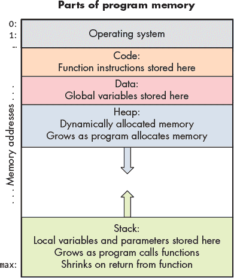

*图 2-1：程序地址空间的各个部分*

程序内存的顶部保留供操作系统使用，而其余部分则可供正在运行的程序使用。程序的指令存储在内存的*代码*部分。例如，前面提到的程序将`main`、`max`和`change`函数的指令存储在该内存区域。

局部变量和参数存储在*栈*的内存部分中。由于栈空间随着函数调用和返回而增大和缩小，栈的内存部分通常会分配在内存的底部（即最高的内存地址），以便为栈的变化留出空间。局部变量和参数的栈存储空间仅在函数活动时存在（即在函数激活的栈帧内）。

全局变量存储在*数据*部分。与栈不同，数据区域不会增长或缩小——全局变量的存储空间在程序运行的整个过程中都持续存在。

最后，内存的*堆*部分是程序地址空间中与动态内存分配相关的部分。堆通常位于远离栈内存的位置，随着程序动态分配更多空间，它会向更高的地址增长。

### 2.2 C 语言的指针变量

C 语言的指针变量为访问程序内存提供了间接性。通过理解如何使用指针变量，程序员可以编写既强大又高效的 C 程序。例如，通过指针变量，C 程序员可以：

+   实现能够修改调用者栈帧中值的函数

+   在程序运行时，根据需要动态分配（和释放）程序内存

+   高效地将大型数据结构传递给函数

+   创建链式动态数据结构

+   以不同方式解释程序内存的字节。

本节介绍 C 语言指针变量的语法和语义，并介绍如何在 C 程序中使用它们的常见示例。

#### 2.2.1 指针变量

*指针变量*存储一个内存位置的地址，特定类型的值可以存储在该地址中。例如，指针变量可以存储一个`int`地址，该地址中存储整数值 12。指针变量*指向*（引用）该值。指针为访问存储在内存中的值提供了*间接性*。图 2-2 展示了指针变量在内存中的示例：

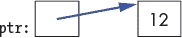

*图 2-2：指针变量存储内存中某个位置的地址。这里，指针存储一个整数变量的地址，该变量保存数字 12。*

通过指针变量`ptr`，可以间接访问它指向的内存位置中存储的值（例如`12`）。C 程序最常用指针变量的方式包括：

1. *“按指针传递”参数*，用于编写可以通过指针参数修改其参数值的函数

2. *动态内存分配*，用于编写能够在程序运行时分配（和释放）内存空间的程序。动态内存通常用于动态分配数组。它在程序员不知道数据结构大小的情况下特别有用（例如，数组的大小取决于运行时用户输入）。它还使数据结构能够在程序运行时调整大小。

##### 使用指针变量的规则

使用指针变量的规则与常规变量类似，唯一不同的是你需要考虑两种类型：指针变量的类型，以及指针变量指向的内存地址中存储的类型。

首先，*声明一个指针变量*，使用<类型名> `*`<变量名>：

```
int *ptr;   // stores the memory address of an int (ptr "points to" an int)

char *cptr; // stores the memory address of a char (cptr "points to" a char)
```

**注意 指针类型**

虽然`ptr`和`cptr`都是指针，但它们指向不同的类型：

+   `ptr`的类型是*指向整数的指针*（`int *`）。它可以指向存储`int`值的内存位置。

+   `cptr`的类型是*指向字符的指针*（`char *`）。它可以指向存储`char`值的内存位置。

接下来，*初始化指针变量*（使其指向某个地方）。指针变量*存储地址值*。指针应该初始化为存储与指针变量指向的类型匹配的内存位置的地址值。初始化指针的一种方式是使用*地址操作符*（`&`）与变量一起获取该变量的地址值：

```
int x;

char ch;

ptr = &x;    // ptr gets the address of x, pointer "points to" x

cptr = &ch;  // cptr gets the address of ch, pointer "points to" ch
```


*图 2-3：程序可以通过将指针赋值为现有变量的地址来初始化指针。*

下面是一个由于类型不匹配导致的无效指针初始化示例：

```
cptr = &x;   // ERROR: cptr can hold a char memory location

             // (&x is the address of an int)
```

即使 C 编译器可能允许这种类型的赋值（并给出关于不兼容类型的警告），通过`cptr`访问和修改`x`的行为可能不会像程序员预期的那样工作。相反，程序员应该使用`int *`类型的变量指向一个`int`存储位置。

所有指针变量也可以被赋予特殊值`NULL`，表示无效地址。虽然*空指针*（值为`NULL`的指针）不应被用于访问内存，但`NULL`值对于测试指针变量是否指向有效内存地址非常有用。也就是说，C 程序员通常会检查指针，确保它的值不是`NULL`，然后再尝试访问它所指向的内存位置。要将指针设置为`NULL`：

```
ptr = NULL;

cptr = NULL;
```

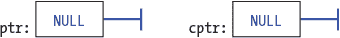

*图 2-4：任何指针都可以赋予特殊值`NULL`，表示它不指向任何特定地址。空指针不应被解引用。*

最后，*使用指针变量*。*解引用操作符*（`*`）跟随指针变量，指向它在内存中所指向的位置，并访问该位置的值：

```
/* Assuming an integer named x has already been declared, this code sets the

   value of x to 8\. */

ptr = &x;   /* initialize ptr to the address of x (ptr points to variable x) */

*ptr = 8;   /* the memory location ptr points to is assigned 8 */
```

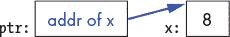

*图 2-5：解引用指针可以访问指针所指向的值。*

##### 指针示例

下面是一个使用两个指针变量的 C 语句示例：

```
int *ptr1, *ptr2, x, y;

x = 8;

ptr2 = &x;     // ptr2 is assigned the address of x

ptr1 = NULL;
```

 ```
*ptr2 = 10;     // the memory location ptr2 points to is assigned 10

y = *ptr2 + 3;  // y is assigned what ptr2 points to plus 3
```

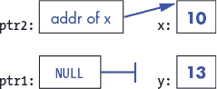

```
ptr1 = ptr2;   // ptr1 gets the address value stored in ptr2 (both point to x)
```

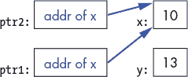

```
*ptr1 = 100;
```

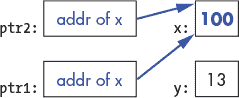

```
ptr1 = &y;     // change ptr1's value (change what it points to)

*ptr1 = 80;
```

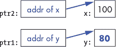

使用指针变量时，要仔细考虑相关变量的类型。绘制内存图像（如上所示）有助于理解指针代码的作用。一些常见的错误涉及错误使用解引用操作符（`*`）或地址操作符（`&`）。例如：

```
ptr = 20;       // ERROR?:  this assigns ptr to point to address 20

ptr = &x;

*ptr = 20;      // CORRECT: this assigns 20 to the memory pointed to by ptr
```

如果程序解引用一个不包含有效地址的指针变量，程序会崩溃：

```
ptr = NULL;

*ptr = 6;    // CRASH! program crashes with a segfault (a memory fault)

ptr = 20;

*ptr = 6;    // CRASH! segfault (20 is not a valid address)

ptr = x;

*ptr = 6;    // likely CRASH or may set some memory location with 6

             // (depends on the value of x which is used as an address value)

ptr = &x;    // This is probably what the programmer intended

*ptr = 6;
```

这些类型的错误展示了为什么需要将指针变量初始化为`NULL`；程序可以在解引用指针之前，先测试指针的值是否为`NULL`：

```
if (ptr != NULL) {

    *ptr = 6;

}
```

### 2.3 指针与函数

指针参数提供了一种机制，通过它函数可以修改参数值。常用的*按指针传递*模式使用一个指针函数参数，该指针函数参数*获取调用者传递给它的某个存储位置的地址值*。例如，调用者可以传递它的一个局部变量的地址。通过在函数内取消引用指针参数，函数可以修改指针所指向存储位置的值。

我们已经看到了类似的功能，使用数组参数时，数组函数参数会获取传入数组的基地址的值（该参数引用的数组元素集与其参数相同），并且函数可以修改数组中存储的值。通常，这个想法可以通过将指针参数传递给指向调用者作用域中内存位置的函数来应用。

**注意：按值传递**

所有 C 语言的参数都是按值传递的，并遵循按值传递的语义：参数获取其参数值的副本，修改参数的值不会改变其参数值。在传递基本类型值时，像`int`变量的值，函数参数获取的是其参数值的副本（具体的`int`值），并且改变参数中存储的值不会改变其参数中的值。

在按指针传递的模式中，参数仍然获取其参数的值，但它被传递的是*地址的值*。就像传递基本类型一样，改变指针参数的值不会改变其参数的值（即，赋值使参数指向不同的地址不会改变参数的地址值）。然而，通过取消引用指针参数，函数可以改变参数和其参数所引用的内存内容；通过指针参数，函数可以修改一个在函数返回后调用者仍然可见的变量。

下面是实现和调用带有按指针传递参数的函数的步骤，其中包含显示每个步骤的示例代码片段：

1\. 声明函数参数为指向变量类型的指针：

/* 输入：存储内存地址的 int 指针

*        可以存储 int 值的位置（指向一个 int）

*/

int change_value(int *input) {

2\. 调用函数时，将变量的地址作为参数传入：

int x;

change_value(&x);

在前面的示例中，由于参数类型是`int *`，因此传递的地址必须是一个`int`变量的地址。

3\. 在函数体内，取消引用指针参数来改变参数值：

*input = 100;  // input 指向的位置（x 的内存）

// 被赋值为 100

接下来，我们来看一个更大的示例程序：

passbypointer.c

```
#include <stdio.h>

int change_value(int *input);

int main() {

    int x;

    int y;

    x = 30;

    y = change_value(&x);

    printf("x: %d y: %d\n", x, y);  // prints x: 100 y: 30

    return 0;

}

/*

 * changes the value of the argument

 *     input: a pointer to the value to change

 *     returns: the original value of the argument

 */

int change_value(int *input) {

    int val;

    val = *input; /* val gets the value input points to */

    if (val < 100) {

        *input = 100;  /* the value input points to gets 100 */

    } else {

        *input =  val * 2;

    }

    return val;

}
```

执行时，输出结果是：

```
x: 100 y: 30
```

图 2-6 显示了 `change_value` 执行返回前的调用栈。

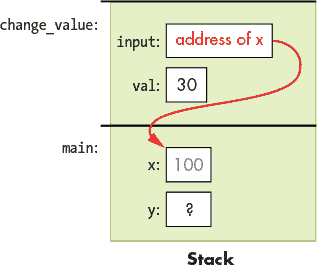

*图 2-6：在从`change_value`返回之前调用栈的快照*

输入参数获得其参数值的副本（即`x`的地址）。当函数调用时，`x`的值为 30。在`change_value`函数内部，通过解引用参数将 100 赋值给参数指向的内存位置（`*input = 100;`，意味着“`input`指向的位置将得到 100”）。由于参数存储的是`main`函数栈帧中局部变量的地址，因此通过解引用该参数，可以更改调用者局部变量中存储的值。当函数返回时，参数值反映了通过指针参数所做的更改（`main`中的`x`值通过`change_value`函数的`input`参数被更改为 100）。

### 2.4 动态内存分配

除了通过指针传递参数外，程序通常还使用指针变量来动态分配内存。这种*动态内存分配*允许 C 程序在运行时请求更多的内存，而指针变量存储着动态分配空间的地址。程序通常会动态分配内存，以便根据特定运行定制数组的大小。

动态内存分配为程序提供了灵活性，能够：

+   在运行时之前无法知道数组或其他数据结构的大小（例如，大小取决于用户输入）

+   需要允许多种输入大小（不仅仅是某个固定的容量）

+   想要为特定的执行精确分配所需的数据结构大小（不要浪费容量）

+   在程序运行时根据需要增长或缩小已分配的内存大小，当需要时重新分配更多空间，当不再需要时释放空间。

#### 2.4.1 堆内存

程序内存空间中的每个字节都有一个相关的地址。程序运行所需的所有内容都在其内存空间中，不同类型的实体驻留在程序内存空间的不同部分。例如，*代码*区域包含程序的指令，全局变量驻留在*数据*区域，局部变量和参数占据*栈*，而动态分配的内存来自*堆*。由于栈和堆在运行时增长（随着函数的调用和返回以及动态内存的分配和释放），它们通常在程序的地址空间中相距较远，以便为它们各自的增长预留大量空间。

动态分配的内存占据程序地址空间中的堆内存区域（参见第 66 页）。当程序在运行时动态请求内存时，堆会提供一块内存，其地址必须分配给一个指针变量。

图 2-7 通过一个示例展示了正在运行的程序内存的各个部分，其中堆栈上的指针变量（`ptr`）存储着动态分配的堆内存的地址（它指向堆内存）。

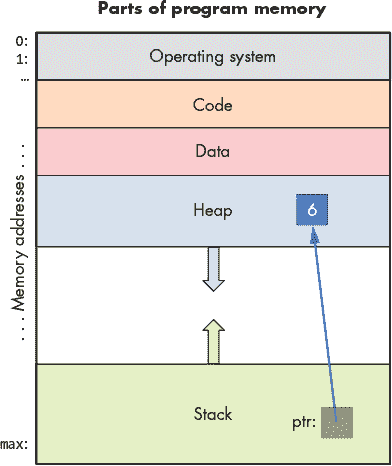

*图 2-7：堆栈上的指针指向从堆中分配的内存块。*

重要的是要记住，堆内存是匿名内存，其中“匿名”意味着堆中的地址没有绑定到变量名。声明一个具名程序变量会将其分配到堆栈或程序内存的数据部分。一个局部或全局指针变量可以存储指向匿名堆内存位置的地址（例如，堆栈上的局部指针变量可以指向堆内存），并且解引用这样的指针使得程序能够在堆中存储数据。

#### 2.4.2 malloc 和 free

*malloc* 和 *free* 是标准 C 库（`stdlib`）中的函数，程序可以调用它们在 *堆* 上分配和释放内存。堆内存必须由 C 程序显式分配（malloc）和释放（free）。

要分配堆内存，调用 `malloc`，并传入要分配的连续堆内存的总字节数。使用 `sizeof` *运算符* 来计算请求的字节数。例如，要在堆上分配存储单个整数的空间，程序可以调用：

```
// Determine the size of an integer and allocate that much heap space.

malloc(sizeof(int));
```

`malloc` 函数将分配的堆内存的基地址返回给调用者（如果发生错误，则返回 `NULL`）。以下是一个完整的示例程序，使用 `malloc` 来分配堆空间存储一个 `int` 值：

```
#include <stdio.h>

#include <stdlib.h>

int main() {

    int *p;

    p = malloc(sizeof(int));  // allocate heap memory for storing an int

    if (p != NULL) {

        *p = 6;   // the heap memory p points to gets the value 6

    }

}
```

`malloc` 函数返回一个 `void *` 类型，它表示一个指向未指定类型（或任何类型）的通用指针。当程序调用 `malloc` 并将结果赋值给指针变量时，程序将分配的内存与指针变量的类型关联起来。

有时你可能会看到 `malloc` 调用，显式地将其返回类型从 `void *` 转换为匹配指针变量的类型。例如：

```
p = (int *) malloc(sizeof(int));
```

在 `malloc` 前面的 `(int *)` 告诉编译器，`malloc` 返回的 `void *` 类型将在此调用中作为 `int *` 使用（它将 `malloc` 的返回类型重新转换为 `int *`）。我们将在本章稍后更详细地讨论类型重 cast 和 `void *` 类型，参见 第 126 页。

如果没有足够的空闲堆内存来满足请求分配的字节数，则 `malloc` 调用会失败。通常，`malloc` 失败表示程序中出现错误，例如传递给 `malloc` 一个非常大的请求，传递一个负数字节数，或者在无限循环中调用 `malloc` 并耗尽了堆内存。由于任何 `malloc` 调用都有可能失败，因此在解引用指针值之前，*始终检查其返回值是否为* NULL（表示 `malloc` 失败）。解引用空指针会导致程序崩溃！例如：

```
int *p;

p = malloc(sizeof(int));

if (p == NULL) {

    printf("Bad malloc error\n");

    exit(1);   // exit the program and indicate error

}

*p = 6;
```

当程序不再需要通过`malloc`动态分配的堆内存时，应该通过调用`free`函数显式地释放该内存。调用`free`后，将指针的值设置为`NULL`也是一个好主意，这样如果程序中的错误导致它在`free`调用后被意外解引用，程序将崩溃，而不是修改已被后续`malloc`调用重新分配的堆内存。这种无意的内存引用可能会导致未定义的程序行为，通常非常难以调试，而空指针解引用会立即失败，从而使其成为一个相对容易发现和修复的 bug。

```
free(p);

p = NULL;
```

#### 2.4.3 动态分配的数组和字符串

C 程序员经常动态分配内存以存储数组。成功调用`malloc`会分配一个请求大小的连续堆内存块，并将该内存块的起始地址返回给调用者，从而使返回的地址值适合用于堆内存中动态分配数组的基地址。

要为元素数组动态分配空间，传递给`malloc`的是所需数组的总字节数。也就是说，程序应向`malloc`请求每个数组元素的字节数乘以数组元素的数量。传递给`malloc`的参数应该是总字节数的表达式，形式为`sizeof(<type>) * <number of elements>`。例如：

```
int *arr;

char *c_arr;

// allocate an array of 20 ints on the heap:

arr = malloc(sizeof(int) * 20);

// allocate an array of 10 chars on the heap:

c_arr = malloc(sizeof(char) * 10);
```

在这个示例中，`malloc`调用后，`int`指针变量`arr`存储了堆内存中一个包含 20 个连续整数存储位置的数组的基地址，而`c_arr`字符指针变量存储了堆内存中一个包含 10 个连续字符存储位置的数组的基地址。图 2-8 展示了这可能是什么样子。


*图 2-8：在堆上分配的 20 元素整数数组和 10 元素字符数组*

请注意，尽管`malloc`返回的是指向堆内存中动态分配空间的指针，但 C 程序将指向堆位置的指针存储在栈上。指针变量只包含数组存储空间在堆中的*基地址*（起始地址）。就像静态声明的数组一样，动态分配的数组的内存位置也是连续的。虽然一次`malloc`调用会分配一个请求大小的内存块，但多次调用`malloc`*不会*导致堆地址连续（在大多数系统上）。在前面的示例中，`char`数组元素和`int`数组元素可能位于堆中相距很远的地址。

在动态分配堆内存空间后，程序可以通过指针变量访问数组。因为指针变量的值表示数组在堆中的基地址，我们可以使用与访问静态声明数组元素相同的语法来访问动态分配数组的元素（参见第 44 页）。以下是一个示例：

```
int i;

int s_array[20];

int *d_array;

d_array = malloc(sizeof(int) * 20);

if (d_array == NULL) {

    printf("Error: malloc failed\n");

    exit(1);

}

for (i=0; i < 20; i++) {

    s_array[i] = i;

    d_array[i] = i;

}

printf("%d %d \n", s_array[3], d_array[3]);  // prints 3 3
```

可能不太容易理解为什么可以使用相同的语法来访问动态分配数组中的元素，就像访问静态声明数组中的元素一样。然而，尽管它们的类型不同，`s_array`和`d_array`的值都求值为数组在内存中的基地址（参见表 2-1）。

**表 2-1：** 静态分配的`s_array`和动态分配的`d_array`比较

| **表达式** | **值** | **类型** |
| --- | --- | --- |
| `s_array` | 数组在内存中的基地址 | （静态）整型数组 |
| `d_array` | 数组在内存中的基地址 | 整型指针（`int *`） |

因为两个变量的名称都求值为数组在内存中的基地址（即第一个元素的地址），所以在变量名称后面的`[i]`语法对于两者的语义保持一致：`[i]` *解引用* int *存储位置，偏移量为* i *，从数组的基地址开始访问内存*——这就是在访问数组的第`i`个元素。

对于大多数情况，我们建议使用`[i]`语法来访问动态分配数组的元素。然而，程序也可以使用指针解引用语法（`*`操作符）来访问数组元素。例如，将`*`放在指向动态分配数组的指针前面，将解引用该指针来访问数组的第 0 个元素：

```
/* these two statements are identical: both put 8 in index 0 */

d_array[0] = 8; // put 8 in index 0 of the d_array

*d_array = 8;   // in the location pointed to by d_array store 8
```

第 81 页的“C 语言中的数组”一节更详细地描述了数组， 第 224 页的“指针运算”一节讨论了如何通过指针变量访问数组元素。

当程序完成使用动态分配的数组时，应调用`free`来释放堆内存。如前所述，我们建议在释放后将指针设置为`NULL`：

```
free(arr);

arr = NULL;

free(c_arr);

c_arr = NULL;

free(d_array);

d_array = NULL;
```

堆内存管理、MALLOC 和 FREE

C 标准库实现了`malloc`和`free`，它们是堆内存管理器的编程接口。当调用`malloc`时，它需要找到一个连续的、未分配的堆内存块，大小满足请求。堆内存管理器维护一个*空闲列表*，该列表记录了未分配的堆内存块，每个块指定了一个未分配的连续堆内存块的起始地址和大小。

初始时，所有的堆内存都是空的，这意味着空闲列表中有一个包含整个堆区域的单一区段。在程序进行了一些`malloc`和`free`调用后，堆内存可能会变得*碎片化*，即堆内存中有一些空闲区域夹杂在已分配的堆空间中。堆内存管理器通常会保持不同大小区段的堆空间列表，以便快速查找特定大小的空闲区段。此外，它还实现了一个或多个策略，用于在多个可用的空闲区段中选择一个来满足请求。

`free`函数可能看起来有些奇怪，因为它只期望接收要释放的堆空间的地址，而不需要知道释放该地址的堆空间的大小。这是因为`malloc`不仅分配了请求的内存字节，还在分配的块前面额外分配了几个字节来存储头结构。头结构存储有关已分配堆空间块的元数据，例如大小。因此，`free`的调用只需要传递要释放的堆内存的地址。`free`的实现可以通过地址前的头信息获取要释放的内存大小。

要了解更多关于堆内存管理的信息，请参考操作系统教材（例如，《*OS in Three Easy Pieces*》第十七章“空闲空间管理”详细介绍了这些内容）。^(1)

#### 2.4.4 指向堆内存的指针和函数

当将动态分配的数组传递给一个函数时，指针变量参数的*值*被传递给函数（即数组在堆中的基地址被传递给函数）。因此，无论是将静态声明的数组还是动态分配的数组传递给函数，参数得到的值都是完全相同的——数组在内存中的基地址。因此，同一个函数可以用于静态和动态分配的相同类型数组，并且可以在函数内部使用相同的语法访问数组元素。参数声明`int *arr`和`int arr[]`是等价的。然而，按照约定，指针语法通常用于可能使用动态分配数组的函数：

```
int main() {

    int *arr1;

    arr1 = malloc(sizeof(int) * 10);

    if (arr1 == NULL) {

        printf("malloc error\n");

        exit(1);

    }

    /* pass the value of arr1 (base address of array in heap) */

    init_array(arr1, 10);

    ...

}

void init_array(int *arr, int size) {

    int i;

    for (i = 0; i < size; i++) {

        arr[i] = i;

    }

}
```

在`init_array`函数即将返回时，内存的内容将如下图所示 图 2-9。请注意，`main`只将数组的基地址传递给`init_array`。数组的大块连续内存仍然位于堆上，但该函数可以通过解引用`arr`指针参数来访问它。

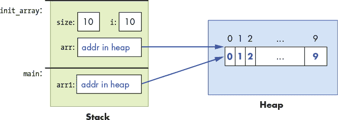

*图 2-9：`init_array`函数返回前的内存内容。`main`的`arr1`和`init_array`的`arr`变量指向同一块堆内存。*

### 2.5 C 语言中的数组

在《数组简介》一节中（第 44 页），我们介绍了静态声明的一维 C 数组，并讨论了将数组传递给函数的语义。在《动态内存分配》一节（第 136 页），我们介绍了动态分配的一维数组，并讨论了将其传递给函数的语义。

在本节中，我们将更深入地探讨 C 语言中的数组。我们将更详细地描述静态和动态分配的数组，并讨论二维数组。

#### 2.5.1 一维数组

##### 静态分配

在深入了解新内容之前，我们简要总结一下静态数组，并给出一个示例。有关静态声明的一维数组的更多细节，请参见第 44 页的《数组简介》。

静态声明的数组要么在栈上分配（用于局部变量），要么在内存的数据区分配（用于全局变量）。程序员可以通过指定数组的类型（每个索引处存储的类型）和总容量（元素数量）来声明一个数组变量。

当将数组传递给函数时，C 语言会将基地址的值复制到参数中。也就是说，参数和实参引用的是相同的内存位置——参数指针指向实参数组元素在内存中的位置。因此，通过数组参数修改数组中的值会修改实参数组中存储的值。

以下是一些静态数组声明和使用的示例：

```
// declare arrays specifying their type and total capacity

float averages[30];   // array of float, 30 elements

char  name[20];       // array of char, 20 elements

int i;

// access array elements

for (i = 0; i < 10; i++) {

    averages[i] = 0.0 + i;

    name[i] = 'a' + i;

}

name[10] = '\0';    // name is being used for storing a C-style string

// prints: 3 d abcdefghij

printf("%g %c %s\n", averages[3], name[3], name);

strcpy(name, "Hello");

printf("%s\n", name);  // prints: Hello
```

##### 动态分配

在《动态内存分配》一节（第 74 页），我们介绍了动态分配的一维数组，包括其访问语法，以及将动态分配的数组传递给函数的语法和语义。在这里，我们将用一个示例简要回顾这些信息。

调用`malloc`函数会在运行时动态地在堆上分配一个数组。分配的堆空间的地址可以赋给全局或局部指针变量，该指针变量指向数组的第一个元素。要动态分配空间，需要将要分配的总字节数传递给`malloc`（使用`sizeof`运算符来获取特定类型的大小）。一次`malloc`调用会在堆上分配一个请求大小的连续内存块。例如：

```
// declare a pointer variable to point to allocated heap space

int    *p_array;

double *d_array;

// call malloc to allocate the appropriate number of bytes for the array

p_array = malloc(sizeof(int) * 50);      // allocate 50 ints

d_array = malloc(sizeof(double) * 100);  // allocate 100 doubles

// always CHECK RETURN VALUE of functions and HANDLE ERROR return values

if ( (p_array == NULL) || (d_array == NULL) ) {

    printf("ERROR: malloc failed!\n");

    exit(1);

}

// use [] notation to access array elements

for (i = 0; i < 50; i++) {

    p_array[i] = 0;

    d_array[i] = 0.0;

}

// free heap space when done using it

free(p_array);

p_array = NULL;

free(d_array);

d_array = NULL;
```

##### 数组内存布局

无论是静态声明的数组，还是通过单次调用`malloc`动态分配的数组，数组元素都代表着连续的内存位置（地址）：

```
 array [0]:  base address

 array [1]:  next address

 array [2]:  next address

   ...            ...

 array [99]: last address
```

元素`i`的位置位于数组基地址的偏移量`i`处。第`i`个元素的确切地址取决于数组中存储的类型所占的字节数。例如，考虑以下数组声明：

```
int  iarray[6];  // an array of six ints, each of which is four bytes

char carray[4];  // an array of four chars, each of which is one byte
```

它们各个数组元素的地址可能如下所示：

```
 addr   element

 ----   -------

 1230:  iarray[0]

 1234:  iarray[1]

 1238:  iarray[2]

 1242:  iarray[3]

 1246:  iarray[4]

 1250:  iarray[5]

     ...

 1280:  carray[0]

 1281:  carray[1]

 1282:  carray[2]

 1283:  carray[3]
```

在这个例子中，`1230` 是 `iarray` 的基地址，`1280` 是 `carray` 的基地址。请注意，每个数组的单个元素分配到连续的内存地址：`iarray` 的每个元素存储一个四字节的 `int` 值，因此其元素地址相差四，而 `carray` 的每个元素存储一个一字节的 `char` 值，因此其地址相差一。需要注意的是，局部变量的集合并不保证在栈上分配到连续的内存位置（因此，在 `iarray` 末尾和 `carray` 开始之间可能会有一个地址间隔，如本例所示）。

#### 2.5.2 二维数组

C 支持多维数组，但我们将多维数组的讨论限制为二维数组（2D），因为 1D 和 2D 数组是 C 程序员最常用的。

##### 静态分配的二维数组

要静态声明一个多维数组变量，必须指定每个维度的大小。例如：

```
int   matrix[50][100];

short little[10][10];
```

在这里，`matrix` 是一个具有 50 行 100 列的 `int` 类型二维数组，`little` 是一个具有 10 行 10 列的 `short` 类型二维数组。

要访问单个元素，必须同时指定行和列索引：

```
int   val;

short num;

val = matrix[3][7];  // get int value in row 3, column 7 of matrix

num = little[8][4];  // get short value in row 8, column 4 of little
```

图 2-10 演示了将二维数组表示为整数值矩阵的情况，其中二维数组中的特定元素是通过行索引和列索引值来索引的。


*图 2-10：一个二维数组表示为矩阵。访问 `matrix[2][3]` 就像在第 2 行第 3 列索引网格一样。*

程序通常通过嵌套循环迭代来访问二维数组的元素。例如，下面的嵌套循环将 `matrix` 中的所有元素初始化为 0：

```
int i, j;

for (i = 0; i < 50; i++) {  // for each row i

    for (j = 0; j < 100; j++) { // iterate over each column element in row i

        matrix[i][j] = 0;

    }

}
```

##### 二维数组参数

将一维数组作为参数传递给函数的规则同样适用于将二维数组作为参数传递：参数获取二维数组的基地址的值（`&arr[0][0]`）。换句话说，参数指向传入数组的元素，因此该函数可以修改传入数组中存储的值。

对于多维数组参数，必须指明该参数是多维数组，但可以不指定第一个维度的大小（以便于良好的通用设计）。其他维度的大小必须完全指定，以便编译器能够生成正确的偏移量。下面是一个二维的例子：

```
// a C constant definition: COLS is defined to be the value 100

#define COLS  (100)

/*

 * init_matrix: initializes the passed matrix elements to the

 *              product of their index values

 *   m: a 2D array (the column dimension must be 100)

 *   rows: the number of rows in the matrix

 *   return: does not return a value

 */

void init_matrix(int m[][COLS], int rows) {

    int i, j;

    for (i = 0; i < rows; i++) {

        for (j = 0; j < COLS; j++) {

            m[i][j] = i*j;

        }

    }

}

int main() {

    int matrix[50][COLS];

    int bigger[90][COLS];

    init_matrix(matrix, 50);

    init_matrix(bigger, 90);

    ...
```

`matrix` 和 `bigger` 数组可以作为参数传递给 `init_matrix` 函数，因为它们的列维度与参数定义相同。

**注意**

必须在二维数组的参数定义中指定列维度，以便编译器能够计算从二维数组基地址到特定行元素起始位置的偏移量。偏移量的计算遵循二维数组在内存中的布局。

##### 二维数组内存布局

静态分配的二维数组在内存中的排列是 *行主序*，意味着首先存储第 0 行的所有元素，然后是第 1 行的所有元素，依此类推。例如，给定以下声明的整数类型二维数组：

```
int arr[3][4];  // int array with 3 rows and 4 columns
```

它在内存中的布局可能如下所示：图 2-11。

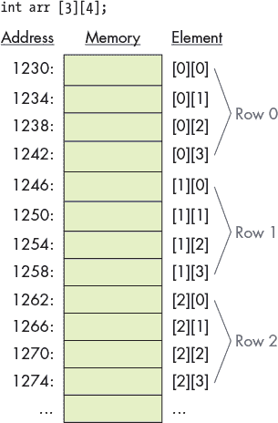

*图 2-11：二维数组的行主序内存布局*

请注意，所有数组元素都会被分配到连续的内存地址中。也就是说，二维数组的基地址是 `[0][0]` 元素的内存地址（`&arr[0][0]`），其后的元素按照行主序连续存储（例如，第 1 行的所有元素紧跟着第 2 行的所有元素，依此类推）。

##### 动态分配的二维数组

动态分配的二维数组可以通过两种方式进行分配。对于一个 *N* × *M* 的二维数组，可以选择以下两种方式：

1\. 通过一次调用 `malloc`，分配一个大块的堆空间来存储所有 *N* × *M* 数组元素。

2\. 多次调用 `malloc`，分配一个数组的数组。首先，分配一个包含 *N* 个指向元素类型的指针的 1D 数组，每一行在二维数组中对应一个指针数组。然后，为每一行分配 *N* 个大小为 *M* 的 1D 数组，以存储每一行的列值。将这 *N* 个数组的地址赋值给第一个指针数组的 *N* 个元素。

变量声明、内存分配代码和数组元素访问语法根据程序员选择的两种方法有所不同。

##### 方法 1：内存高效分配

在这种方法中，通过一次调用 `malloc` 分配所需的字节数来存储 *N* × *M* 的数组值。此方法的优点是更节省内存，因为所有 *N* × *M* 元素的整个空间会一次性分配，并存储在连续的内存地址中。

调用 `malloc` 会返回分配空间的起始地址（即数组的基地址），该地址应该像 1D 数组一样存储在指针变量中。实际上，使用这种方法分配 1D 或 2D 数组在语义上没有区别：`malloc` 返回的是一块连续分配的堆内存空间的起始地址，大小为请求的字节数。由于通过这种方法分配二维数组看起来就像是分配 1D 数组，程序员必须显式地将二维的行列索引映射到这块连续的堆内存空间上（编译器没有行或列的隐式概念，因此无法将双重索引语法解释为分配给这块内存的 `malloc` 空间）。

下面是一个使用方法 1 动态分配二维数组的 C 语言代码示例：

```
#define N 3

#define M 4

int main() {

    int *two_d_array;    // the type is a pointer to an int (the element type)

    // allocate in a single malloc of N x M int-sized elements:

    two_d_array = malloc(sizeof(int) * N * M);

    if (two_d_array == NULL) {

        printf("ERROR: malloc failed!\n");

        exit(1);

    }

    ...
```

图 2-12 展示了使用此方法分配二维数组的示例，并说明了 `malloc` 调用后的内存布局。

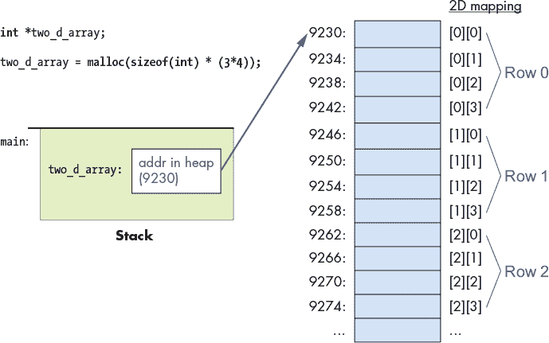

*图 2-12：通过一次调用 `malloc` 分配二维数组的结果*

与一维动态分配数组类似，二维数组的指针变量也是在栈上分配的。然后将返回的`malloc`值赋给该指针，该值表示堆内存中连续的*N* × *M* `int`存储位置的基地址。

由于此方法使用一个单一的`malloc`分配空间来存储二维数组，因此内存分配效率是最高的（整个二维数组只需要一次`malloc`调用）。由于所有元素都在连续的内存空间中，访问内存的效率更高，每次访问只需要通过指针变量进行一级间接访问。

然而，C 编译器并不区分使用此方法分配的二维数组和一维数组。因此，在使用此方法分配二维数组时，静态声明的二维数组的双重索引语法（`[i][j]`）*无法*使用。相反，程序员必须显式地使用行和列索引值来计算堆内存连续块中的偏移量（`[i*M + j]`，其中`M`是列数）。

以下是程序员初始化二维数组中所有元素的代码结构示例：

```
// access using [] notation:

//   cannot use [i][j] syntax because the compiler has no idea where the

//   next row starts within this chunk of heap space, so the programmer

//   must explicitly add a function of row and column index values

//   (i*M+j) to map their 2D view of the space into the 1D chunk of memory

 for (i = 0; i < N; i++) {

    for (j = 0; j < M; j++) {

        two_d_array[i*M + j] = 0;

    }

}
```

##### 方法 1（单次 malloc）与函数参数

通过单次`malloc`分配的`int`类型数组的基地址是指向`int`的指针，因此可以将其传递给一个`int *`类型的函数参数。此外，函数还必须传递行和列的维度，以便它能够正确计算二维数组中的偏移量。例如：

```
/*

 * initialize all elements in a 2D array to 0

 *  arr: the array

 *  rows: number of rows

 *  cols: number of columns

 */

void init2D(int *arr, int rows, int cols) {

    int i, j;

    for (i = 0; i < rows; i++) {

        for (j = 0; j < cols; j++) {

            arr[i*cols + j] = 0;

        }

    }

}

int main() {

    int *array;

    array = malloc(sizeof(int) * N * M);

    if (array != NULL) {

        init2D(array, N, M);

    }

    ...
```

##### 方法 2：更适合程序员的方式

第二种动态分配二维数组的方法是将数组存储为*N*个一维数组的数组（每行一个一维数组）。它需要*N* + 1 次调用`malloc`：一次`malloc`用于行数组的数组，另外*N*次`malloc`用于每一行的列数组。因此，*在一行内*的元素位置是连续的，但二维数组的各行之间的元素不连续。分配和访问元素的效率不如方法 1，且变量的类型定义可能稍微复杂。不过，使用这种方法，程序员可以使用双重索引语法来访问二维数组的各个元素（第一个索引是行数组的索引，第二个索引是该行内列元素的索引）。

这是一个使用方法 2 分配二维数组的示例（为了可读性，省略了错误检测和处理代码）：

```
// the 2D array variable is declared to be `int **` (a pointer to an int *)

// a dynamically allocated array of dynamically allocated int arrays

// (a pointer to pointers to ints)

int **two_d_array;

int i;

// allocate an array of N pointers to ints

// malloc returns the address of this array (a pointer to (int *)'s)

two_d_array = malloc(sizeof(int *) * N);

// for each row, malloc space for its column elements and add it to

// the array of arrays

for (i = 0; i < N; i++) {

// malloc space for row i's M column elements

    two_d_array[i] = malloc(sizeof(int) * M);

}
```

在这个例子中，注意变量的类型以及传递给`malloc`调用的大小。为了引用动态分配的二维数组，程序员声明一个`int **`类型的变量（`two_d_array`），它将存储动态分配的`int *`元素值数组的地址。`two_d_array`中的每个元素存储一个动态分配的`int`类型数组的地址（`two_d_array[i]`的类型是`int *`）。

图 2-13 显示了在前面的例子中调用 *N* + 1 次 `malloc` 后内存的可能样子。

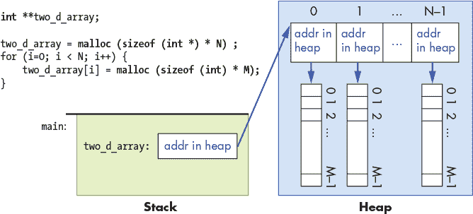

*图 2-13：通过 N + 1 次 `malloc` 调用分配二维数组后的内存布局*

请注意，在使用此方法时，只有作为单次 `malloc` 调用一部分分配的元素才在内存中是连续的。也就是说，每一行中的元素是连续的，但不同的行（甚至相邻的行）中的元素不是连续的。

一旦分配，二维数组的单个元素可以使用双重索引表示法进行访问。第一个索引指定外部 `int *` 指针数组中的一个元素（即行），第二个索引指定内部 `int` 数组中的一个元素（即该行内的列）。

```
int i, j;

for (i = 0; i < N; i++) {

    for (j = 0; j < M; j++) {

        two_d_array[i][j] = 0;

    }

}
```

为了理解双重索引是如何被求值的，请考虑以下表达式各部分的类型和值：

```
       two_d_array: an array of int pointers, it stores the base address of an

                 array of (int *) values. Its type is int** (a pointer to 

                 int *).

    two_d_array[i]: the ith index into the array of arrays, it stores an 

                 (int *) value that represents the base address of an array of 

                 (int) values.  Its type is int*.

 two_d_array[i][j]: the jth element pointed to by the ith element of the array

                of arrays, it stores an int value (the value in row i, column 

                j of the 2D array).  Its type is int.
```

##### 方法 2（数组的数组）与函数参数

数组参数的类型是 `int **`（指向 `int` 的指针的指针），并且函数参数与其参数的类型匹配。此外，行和列的大小应该传递给函数。因为这是与方法 1 不同的类型，所以这两种数组类型不能使用通用函数（它们不是相同的 C 类型）。

这里是一个示例函数，它以方法 2（数组的数组）二维数组作为参数：

```
/*

 * initialize a 2D array

 * arr: the array

 * rows: number of rows

 * cols: number of columns

 */

void init2D_Method2(int **arr, int rows, int cols) {

    int i,j;

    for (i = 0; i < rows; i++) {

        for (j = 0; j < cols; j++) {

            arr[i][j] = 0;

        }

    }

}

/*

 * main: example of calling init2D_Method2

 */

int main() {

    int **two_d_array;

    // some code to allocate the row array and multiple col arrays

    // ...

    init2D_Method2(two_d_array, N, M);

    ...
```

在这里，函数实现可以使用双重索引语法。与静态声明的二维数组不同，行和列的维度都需要作为参数传递：`rows` 参数指定最外层数组（行数组数组）的边界，`cols` 参数指定内部数组（每行的列值）的边界。

### 2.6 字符串与字符串库

在上一章中，我们介绍了“数组和字符串” (第 44 页)。在本章中，我们将讨论动态分配的 C 字符串及其与 C 字符串库的使用。我们首先简要概述静态声明的字符串。

#### 2.6.1 C 对静态分配字符串（字符数组）的支持

C 不支持单独的字符串类型，但可以使用由 `char` 值组成的数组来实现 C 程序中的字符串，该数组以特殊的空字符值 `'\0'` 结束。终止空字符标识了构成字符串的字符值序列的结束。并非每个字符数组都是 C 字符串，但每个 C 字符串都是 `char` 值的数组。

由于字符串在程序中经常出现，C 提供了带有字符串操作函数的库。使用 C 字符串库的程序需要包含 `string.h`。大多数字符串库函数要求程序员为这些函数操作的字符数组分配空间。在打印字符串的值时，使用 `%s` 占位符。

这里是一个使用字符串和一些字符串库函数的示例程序：

```
#include <stdio.h>

#include <string.h>   // include the C string library

int main() {

    char str1[10];

    char str2[10];

    str1[0] = 'h';

    str1[1] = 'i';

    str1[2] = '\0';   // explicitly add null terminating character to end

    // strcpy copies the bytes from the source parameter (str1) to the

    // destination parameter (str2) and null terminates the copy.

    strcpy(str2, str1);

    str2[1] = 'o';

    printf("%s %s\n", str1, str2);  // prints: hi ho

    return 0;

}
```

#### 2.6.2 动态分配字符串

字符数组可以动态分配（如在第 66 页的“C 的指针变量”及第 81 页的“C 中的数组”中所讨论）。在动态分配用于存储字符串的空间时，重要的是要记得为字符串末尾的终止 `'\0'` 字符分配数组空间。

以下示例程序演示了静态和动态分配的字符串（注意传递给 `malloc` 的值）：

```
#include <stdio.h>

#include <stdlib.h>

#include <string.h>
 int main() {

    int size;

    char str[64];         // statically allocated

    char *new_str = NULL; // for dynamically allocated

    strcpy(str, "Hello");

    size = strlen(str);   // returns 5

    new_str = malloc(sizeof(char) * (size+1)); // need space for '\0'

    if(new_str == NULL) {

        printf("Error: malloc failed!  exiting.\n");

        exit(1);

    }

    strcpy(new_str, str);

    printf("%s %s\n", str, new_str);    // prints "Hello Hello"

    strcat(str, " There");  // concatenate " There" to the end of str

    printf("%s\n", str);    // prints "Hello There"

    free(new_str);  // free malloc'ed space when done

    new_str = NULL;

    return 0;

}
```

**警告 C 字符串函数与目标内存**

许多 C 字符串函数（特别是 `strcpy` 和 `strcat`）通过跟随一个*目标*字符串指针（`char *`）参数并向其指向的位置写入结果来存储它们的结果。这些函数假设目标有足够的内存来存储结果。因此，作为程序员，你必须确保在调用这些函数之前，目标处有足够的内存可用。

未分配足够的内存会导致未定义的结果，范围从程序崩溃到严重的安全漏洞（请参见第 362 页的“实际案例：缓冲区溢出”）。例如，以下对 `strcpy` 和 `strcat` 的调用展示了初学 C 语言的程序员常犯的错误：

// 尝试将一个 12 字节的字符串写入一个 5 字符的数组。

char mystr[5];

strcpy(mystr, "hello world");

// 尝试向一个 NULL 目标的字符串写入数据。

char *mystr = NULL;

strcpy(mystr, "再试一次");

// 尝试修改一个只读的字符串常量。

char *mystr = "字符串常量值";

strcat(mystr, "字符串常量不可写");

#### 2.6.3 操作 C 字符串和字符的库

C 提供了几个操作字符串和字符的库。字符串库（`string.h`）在编写使用 C 字符串的程序时尤其有用。`stdlib.h` 和 `stdio.h` 库也包含用于字符串操作的函数，而 `ctype.h` 库则包含操作单个字符值的函数。

在使用 C 字符串库函数时，重要的是要记住，大多数函数不会为它们操作的字符串分配空间，也不会检查你传入的字符串是否有效；你的程序必须为 C 字符串库将使用的字符串分配空间。此外，如果库函数修改了传入的字符串，则调用者需要确保字符串格式正确（即，在字符串末尾有一个终止的 `'\0'` 字符）。如果传递给字符串库函数的数组参数无效，通常会导致程序崩溃。不同库函数的文档（例如手册页）会指定该函数是否分配空间，或者调用者是否需要将已分配的空间传递给库函数。

**注意 CHAR[] 和 CHAR * 参数及 CHAR * 返回类型**

静态声明的字符数组和动态分配的字符数组都可以传递给`char *`参数，因为这两种类型的变量的名称都会被求值为数组在内存中的基地址。将参数声明为类型`char []`也适用于静态和动态分配的参数值，但`char *`更常用于指定字符串（`char`数组）参数的类型。

如果一个函数返回一个字符串（其返回类型为`char *`），则它的返回值只能赋给类型为`char *`的变量；不能赋给静态分配的数组变量。这个限制存在是因为静态声明的数组变量的名称不是有效的*lvalue*（其在内存中的基地址不能更改；参见第 57 页的“访问字段值”），因此不能将`char *`返回值赋给它。

##### strlen, strcpy, strncpy

字符串库提供了用于复制字符串和查找字符串长度的函数：

```
// returns the number of characters in the string 

// (not including the null character)

int strlen(char *s);

// copies string src to string dst up until the first '\0' character in src

// (the caller needs to make sure src is initialized correctly and

// dst has enough space to store a copy of the src string)

// returns the address of the dst string

char *strcpy(char *dst, char *src);

// like strcpy but copies up to the first '\0' or size characters

// (this provides some safety to not copy beyond the bounds of the dst

// array if the src string is not well formed or is longer than the

// space available in the dst array); size_t is an unsigned integer type

char *strncpy(char *dst, char *src, size_t size);
```

当源字符串的长度可能大于目标字符串的总容量时，使用`strcpy`函数是非常不安全的。在这种情况下，应使用`strncpy`。`strncpy`的大小参数会限制从`src`字符串复制到`dst`字符串的字符数，不会超过`size`个字符。如果`src`字符串的长度大于或等于`size`，`strncpy`会将`src`的前`size`个字符复制到`dst`，并且不会在`dst`的末尾添加空字符。因此，程序员在调用`strncpy`后，应该显式地在`dst`的末尾添加空字符。

以下是这些函数在程序中的一些示例用法：

```
#include <stdio.h>

#include <stdlib.h>

#include <string.h>   // include the string library

int main() {

    // variable declarations that will be used in examples

    int len, i, ret;

    char str[32];

    char *d_str, *ptr;

    strcpy(str, "Hello There");

    len = strlen(str);  // len is 11

    d_str = malloc(sizeof(char) * (len+1));

    if (d_str == NULL) {

        printf("Error: malloc failed\n");

        exit(1);

    }

    strncpy(d_str, str, 5);

    d_str[5] = '\0';   // explicitly add null terminating character to end

    printf("%d:%s\n", strlen(str), str);      // prints 11:Hello There

    printf("%d:%s\n", strlen(d_str), d_str);  // prints 5:Hello

    return 0;

}
```

##### strcmp, strncmp

字符串库还提供了一个函数用于比较两个字符串。使用`==`运算符比较字符串变量*并不*比较字符串中的字符——它仅比较两个字符串的基地址。例如，表达式

```
if (d_str == str) { ...
```

比较`d_str`指向的堆中`char`数组的基地址与栈上分配的`str char`数组的基地址。

为了比较字符串的值，程序员需要手动编写代码来比较对应的元素值，或者使用字符串库中的`strcmp`或`strncmp`函数：

```
int strcmp(char *s1, char *s2);

// returns 0 if s1 and s2 are the same strings

// a value < 0 if s1 is less than s2

// a value > 0 if s1 is greater than s2

int strncmp(char *s1, char *s2, size_t n);

// compare s1 and s2 up to at most n characters
```

`strcmp`函数通过比较字符的*ASCII 表示*来逐字符比较字符串（参见第 189 页的“注释”）。换句话说，它比较两个参数数组中对应位置的`char`值，得出字符串比较的结果，这有时会产生一些不直观的结果。例如，`char`值`'a'`的 ASCII 编码*大于*`char`值`'Z'`的编码。因此，`strcmp("aaa", "Zoo")`返回一个正值，表示`"aaa"`大于`"Zoo"`，而`strcmp("aaa", "zoo")`返回一个负值，表示`"aaa"`小于`"zoo"`。

下面是一些字符串比较的示例：

```
strcpy(str, "alligator");

strcpy(d_str, "Zebra");

ret =  strcmp(str,d_str);

if (ret == 0) {

    printf("%s is equal to %s\n", str, d_str);

} else if (ret < 0) {

    printf("%s is less than %s\n", str, d_str);

} else {

    printf("%s is greater than %s\n", str, d_str);  // true for these strings

}

ret = strncmp(str, "all", 3);  // returns 0: they are equal up to first 3 chars
```

##### strcat, strstr, strchr

字符串库函数可以连接字符串（请注意，确保目标字符串有足够的空间存储结果是调用者的责任）：

```
// append chars from src to end of dst

// returns ptr to dst and adds '\0' to end

char *strcat(char *dst, char *src)

// append the first chars from src to end of dst, up to a maximum of size

// returns ptr to dst and adds '\0' to end

char *strncat(char *dst, char *src, size_t size);
```

它还提供了用于在字符串中查找子字符串或字符值的函数：

```
// locate a substring inside a string

// (const means that the function doesn't modify string)

// returns a pointer to the beginning of substr in string

// returns NULL if substr not in string

char *strstr(const char *string, char *substr);

// locate a character (c) in the passed string (s)

// (const means that the function doesn't modify s)

// returns a pointer to the first occurrence of the char c in string

// or NULL if c is not in the string

char *strchr(const char *s, int c);
```

下面是一些使用这些函数的示例（为了可读性，我们省略了一些错误处理）：

```
char str[32];

char *ptr;

strcpy(str, "Zebra fish");

strcat(str, " stripes");  // str gets "Zebra fish stripes"

printf("%s\n", str);     // prints: Zebra fish stripes

strncat(str, " are black.", 8);

printf("%s\n", str);     // prints: Zebra fish stripes are bla  (spaces count)

ptr = strstr(str, "trip");

if (ptr != NULL) {

    printf("%s\n", ptr);   // prints: tripes are bla

}

ptr = strchr(str, 'e');

if (ptr != NULL) {

    printf("%s\n", ptr);   // prints: ebra fish stripes are bla

}
```

调用`strchr`和`strstr`分别返回参数数组中第一个匹配字符值或匹配子字符串值的元素地址。这个元素地址是一个以`'\0'`字符终止的`char`类型值数组的起始地址。换句话说，`ptr`指向另一个字符串中的子字符串的开头。当使用`printf`将`ptr`作为字符串打印时，从`ptr`指向的索引位置开始的字符值将被打印，输出与前面示例中列出的结果相同。

##### strtok, strtok_r

字符串库还提供了将字符串划分为标记的函数。*标记*是指字符串中由程序员选择的分隔符字符分隔的字符子序列。

```
char *strtok(char *str, const char *delim);

// a reentrant version of strtok (reentrant is defined in later chapters):

char *strtok_r(char *str, const char *delim, char **saveptr);
```

`strtok`（或`strtok_r`）函数在较大的字符串中查找单个标记。例如，将`strtok`的分隔符设置为空白字符集合，就会得到一个原本包含英语句子的字符串中的单词。也就是说，句子中的每个单词都是字符串中的一个标记。

下面是一个使用`strtok`查找输入字符串中的单个单词作为标记的示例程序。^(2)

```
/*

 * Extract whitespace-delimited tokens from a line of input

 * and print them one per line.

 *

 * to compile:

 *   gcc -g -Wall strtokexample.c

 *

 * example run:

 *   Enter a line of text:        aaaaa             bbbbbbbbb          cccccc

 *

 *   The input line is:

 *         aaaaa             bbbbbbbbb          cccccc

 *   Next token is aaaaa

 *   Next token is bbbbbbbbb

 *   Next token is cccccc

 */

#include <stdlib.h>

#include <stdio.h>

#include <string.h>

int main() {

     /* whitespace stores the delim string passed to strtok.  The delim

 * string  is initialized to the set of characters that delimit tokens

      * We initialize the delim string to the following set of chars:

      *   ' ': space  '\t': tab  '\f': form feed  '\r': carriage return

      *   '\v': vertical tab  '\n': new line

      * (run "man ascii" to list all ASCII characters)

      *

      * This line shows one way to statically initialize a string variable

      * (using this method the string contents are constant, meaning that they

      *  cannot be modified, which is fine for the way we are using the

      *  whitespace string in this program).

      */

    char *whitespace = " \t\f\r\v\n";  /* Note the space char at beginning */

    char *token;  /* The next token in the line. */

    char *line;   /* The line of text read in that we will tokenize. */

    /* Allocate some space for the user's string on the heap. */

    line = malloc(200 * sizeof(char));

    if (line == NULL) {

        printf("Error: malloc failed\n");

        exit(1);

    }

    /* Read in a line entered by the user from "standard in". */

    printf("Enter a line of text:\n");

    line = fgets(line, 200 * sizeof(char), stdin);

    if (line == NULL) {

        printf("Error: reading input failed, exiting...\n");

        exit(1);

    }

    printf("The input line is:\n%s\n", line);

    /* Divide the string into tokens. */

    token = strtok(line, whitespace);       /* get the first token */

    while (token != NULL) {

        printf("Next token is %s\n", token);

        token = strtok(NULL, whitespace);     /* get the next token */

    }

    free(line);

    return 0;

}
```

##### sprintf

C 的`stdio`库还提供了操作 C 字符串的函数。也许最有用的函数是`sprintf`，它将内容“打印”到一个字符串中，而不是将输出打印到终端：

```
// like printf(), the format string allows for placeholders like %d, %f, etc.

// pass parameters after the format string to fill them in

int sprintf(char *s, const char *format, ...);
```

`sprintf`通过各种类型的值初始化字符串的内容。它的参数`format`类似于`printf`和`scanf`的参数。以下是一些示例：

```
char str[64];

float ave = 76.8;

int num = 2;

// initialize str to format string, filling in each placeholder with

// a char representation of its arguments' values

sprintf(str, "%s is %d years old and in grade %d", "Henry", 12, 7);

printf("%s\n", str);  // prints: Henry is 12 years old and in grade 7

sprintf(str, "The average grade on exam %d is %g", num, ave);

printf("%s\n", str);  // prints: The average grade on exam 2 is 76.8
```

##### 用于单个字符值的函数

标准 C 库（`stdlib.h`）包含一组操作和测试单个`char`值的函数，包括：

```
#include <stdlib.h>   // include stdlib and ctype to use these

#include <ctype.h>

int islower(ch);

int isupper(ch);       // these functions return a non-zero value if the

int isalpha(ch);       // test is TRUE, otherwise they return 0 (FALSE)

int isdigit(ch);

int isalnum(ch);

int ispunct(ch);

int isspace(ch);

char tolower(ch);     // returns ASCII value of lower-case of argument

char toupper(ch);
```

下面是它们使用的一些示例：

```
char str[64];

int len, i;

strcpy(str, "I see 20 ZEBRAS, GOATS, and COWS");

if ( islower(str[2]) ){

    printf("%c is lower case\n", str[2]);   // prints: s is lower case

}

len = strlen(str);

for (i = 0; i < len; i++) {

    if ( isupper(str[i]) ) {

        str[i] = tolower(str[i]);

    } else if( isdigit(str[i]) ) {

        str[i] = 'X';

    }

}

printf("%s\n", str);  // prints: i see XX zebras, goats, and cows
```

##### 将字符串转换为其他类型的函数

`stdlib.h`还包含将字符串与其他 C 类型之间转换的函数。例如：

```
#include <stdlib.h>

int atoi(const char *nptr);     // convert a string to an integer

double atof(const char *nptr);  // convert a string to a float
```

这是一个示例：

```
printf("%d %g\n", atoi("1234"), atof("4.56"));
```

要了解这些和其他 C 库函数的更多信息（包括它们的功能、参数格式、返回值以及需要包含哪些头文件才能使用它们），请参阅它们的*man 页面*。^(3) 例如，要查看`strcpy`的 man 页面，可以运行：

```
$ man strcpy
```

### 2.7 C 结构体

在上一章中，我们在“结构体”一节（第 52 页）介绍了 C 结构体。在本章中，我们将深入探讨 C 结构体，分析静态和动态分配的结构体，并结合结构体和指针创建更复杂的数据类型和数据结构。

我们首先快速概述静态声明的结构体。更多细节请参见上一章。

#### 2.7.1 C 结构体类型回顾

`struct`类型表示一组异构数据；它是一种将不同类型的数据作为单一统一体处理的机制。

在 C 程序中定义和使用`struct`类型有三个步骤：

1. 定义一个`struct`类型，该类型定义字段值及其类型。

2. 声明`struct`类型的变量。

3. 使用*点符号*来访问变量中的单个字段值。

在 C 语言中，结构体是左值（它们可以出现在赋值语句的左边；详见第 57 页的“访问字段值”）。`struct`变量的值是其内存内容（即构成其字段值的所有字节）。当调用带有`struct`参数的函数时，`struct`参数的值（即参数所有字段字节的副本）会被复制到函数的`struct`参数中。

在使用结构体编程，特别是当结构体与数组结合使用时，仔细考虑每个表达式的类型至关重要。`struct`中的每个字段代表一个特定的类型，访问字段值的语法和将单个字段值传递给函数的语义遵循其特定类型的规则。

以下完整的示例程序演示了如何定义`struct`类型，声明该类型的变量，访问字段值，并将结构体和单个字段值传递给函数（为了可读性，我们省略了一些错误处理和注释）：

struct_review.c

```
#include <stdio.h>

#include <string.h>

/* define a new struct type (outside function bodies) */

struct studentT {

    char  name[64];

    int   age;

    float gpa;

    int   grad_yr;

};

/* function prototypes */

int checkID(struct studentT s1, int min_age);

void changeName(char *old, char *new);

int main() {

    int can_vote;

    // declare variables of struct type:

    struct studentT student1, student2;

 // access field values using .

    strcpy(student1.name, "Ruth");

    student1.age = 17;

    student1.gpa = 3.5;

    student1.grad_yr = 2021;

    // structs are lvalues

    student2 = student1;

    strcpy(student2.name, "Frances");

    student2.age = student1.age + 4;

    // passing a struct

    can_vote = checkID(student1, 18);

    printf("%s %d\n", student1.name, can_vote);

    can_vote = checkID(student2, 18);

    printf("%s %d\n", student2.name, can_vote);

    // passing a struct field value

    changeName(student2.name, "Kwame");

    printf("student 2's name is now %s\n", student2.name);

    return 0;

}

int checkID(struct studentT s, int min_age) {

    int ret = 1;

    if (s.age < min_age) {

        ret = 0;

        // changes age field IN PARAMETER COPY ONLY

        s.age = min_age + 1;

    }

    return ret;

}

void changeName(char *old, char *new) {

    if ((old == NULL) || (new == NULL)) {

        return;

    }

    strcpy(old,new);

}
```

程序运行时，输出如下：

```
Ruth 0

Frances 1

student 2's name is now Kwame
```

在使用结构体时，特别需要考虑`struct`及其字段的类型。例如，在将`struct`传递给函数时，参数会得到`struct`值的副本（即所有字段字节的副本）。因此，对参数字段值的更改*不会*影响原始参数的值。这个行为在之前的程序中通过调用`checkID`得以体现，`checkID`修改了参数的年龄字段，但在`checkID`中的修改并未影响对应参数的年龄字段值。

当将`struct`的字段传递给函数时，其语义与字段的类型（函数参数的类型）相匹配。例如，在调用`changeName`时，`name`字段的值（即`student2`结构体中`name`数组的基地址）会被复制到参数`old`中，这意味着该参数引用了与其参数相同的一组内存中的数组元素。因此，在函数中更改数组元素时，也会改变参数中的数组元素值；传递`name`字段的语义与`name`字段的类型相匹配。

#### 2.7.2 指针与结构体

与其他 C 类型一样，程序员可以声明一个变量作为用户定义的 `struct` 类型的指针。使用 `struct` 指针变量的语义类似于其他指针类型，如 `int *`。

请考虑之前程序示例中引入的 `struct studentT` 类型：

```
struct studentT {

    char  name[64];

    int   age;

    float gpa;

    int   grad_yr;

};
```

程序员可以声明类型为 `struct studentT` 或 `struct` `studentT *`（指向 `struct studentT` 的指针）的变量：

```
struct studentT s;

struct studentT *sptr;

// think very carefully about the type of each field when

// accessing it (name is an array of char, age is an int ...)

strcpy(s.name, "Freya");

s.age = 18;

s.gpa = 4.0;

 s.grad_yr = 2020;

// malloc space for a struct studentT for sptr to point to:

sptr = malloc(sizeof(struct studentT));

if (sptr == NULL) {

    printf("Error: malloc failed\n");

    exit(1);

}
```

请注意，调用 `malloc` 会初始化 `sptr`，使其指向堆内存中动态分配的结构体。使用 `sizeof` 运算符计算 `malloc` 的大小请求（例如，`sizeof(struct studentT)`）可确保 `malloc` 为结构体中的*所有*字段值分配空间。

要访问指向 `struct` 的指针中的各个字段，首先需要*解引用*指针变量。根据指针解引用的规则（请参见第 66 页的“C 的指针变量”），你可能会试图像这样访问 `struct` 字段：

```
// the grad_yr field of what sptr points to gets 2021:

(*sptr).grad_yr = 2021;

// the age field of what sptr points to gets s.age plus 1:

(*sptr).age = s.age + 1;
```

然而，由于指向结构体的指针使用非常广泛，C 提供了一种特殊运算符（`->`），它同时解引用 `struct` 指针并访问其字段值。例如，`sptr->year` 相当于 `(*sptr).year`。以下是一些使用此表示法访问字段值的示例：

```
// the gpa field of what sptr points to gets 3.5:

sptr->gpa = 3.5;

// the name field of what sptr points to is a char *

// (can use strcpy to init its value):

strcpy(sptr->name, "Lars");
```

图 2-14 描述了在前面的代码执行后，变量 `s` 和 `sptr` 在内存中的可能布局。回想一下，`malloc` 从堆中分配内存，而局部变量则分配在栈上。

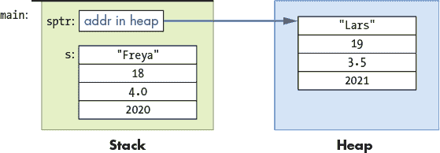

*图 2-14：静态分配的结构体（栈上的数据）和动态分配的结构体（堆上的数据）在内存布局上的差异*

#### 2.7.3 结构体中的指针字段

结构体也可以定义为具有指针类型的字段值。以下是一个示例：

```
struct personT {

    char *name;     // for a dynamically allocated string field

    int  age;

};

int main() {

    struct personT p1, *p2;

    // need to malloc space for the name field:

    p1.name = malloc(sizeof(char) * 8);

    strcpy(p1.name, "Zhichen");

    p1.age = 22;

    // first malloc space for the struct:

    p2 = malloc(sizeof(struct personT));

    // then malloc space for the name field:

    p2->name = malloc(sizeof(char) * 4);

    strcpy(p2->name, "Vic");

    p2->age = 19;

    ...

    // Note: for strings, we must allocate one extra byte to hold the

    // terminating null character that marks the end of the string.

}
```

在内存中，这些变量将类似于图 2-15（请注意哪些部分分配在栈上，哪些分配在堆上）。

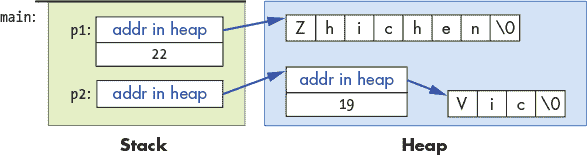

*图 2-15：具有指针字段的结构体在内存中的布局*

随着结构体及其字段类型的复杂性增加，请注意它们的语法。为了正确访问字段值，从最外层的变量类型开始，使用其类型语法来访问各个部分。例如，表 2-2 中显示的 `struct` 变量类型决定了程序员应如何访问它们的字段。

**表 2-2：** 结构体字段访问示例

| **表达式** | **类型** | **字段访问语法** |
| --- | --- | --- |
| `p1` | `struct personT` | `p1.age, p1.name` |
| `p2` | `struct personT *` | `p2->age, p2->name` |

此外，了解字段值的类型可以让程序使用正确的语法来访问它们，如表 2-3 中的示例所示。

**表 2-3：** 访问不同结构体字段类型

| **表达式** | **类型** | **示例访问语法** |
| --- | --- | --- |
| `p1.age` | `int` | `p1.age = 18;` |
| `p2->age` | `int *` | `p2->age = 18;` |
| `p1.name` | `char *` | `printf("%s", p1.name);` |
| `p2->name` | `char *` | `printf("%s", p2->name);` |
| `p2->name[2]` | `char` | `p2->name[2] = ’a’;` |

在检查最后一个示例时，首先考虑最外层变量的类型（`p2` 是指向 `struct personT` 的指针）。因此，要访问结构体中的字段值，程序员需要使用 `->` 语法（`p2->name`）。接下来，考虑 `name` 字段的类型，它是一个 `char *`，在本程序中用于指向一个 `char` 类型值的数组。要通过 `name` 字段访问特定的 `char` 存储位置，使用数组索引表示法：`p2->name[2] =` `’a’`。

#### 2.7.4 结构体数组

数组、指针和结构体可以结合在一起创建更复杂的数据结构。以下是声明不同类型结构体数组变量的一些示例：

```
struct studentT classroom1[40];   // an array of 40 struct studentT

struct studentT *classroom2;      // a pointer to a struct studentT

                                  // (for a dynamically allocated array)

struct studentT *classroom3[40];  // an array of 40 struct studentT *

                                  // (each element stores a (struct studentT *)
```

再次强调，仔细思考变量和字段的类型对于理解在程序中使用这些变量的语法和语义至关重要。以下是一些正确访问这些变量的语法示例：

```
// classroom1 is an array:

//    use indexing to access a particular element

//    each element in classroom1 stores a struct studentT:

//    use dot notation to access fields

classroom1[3].age = 21;

// classroom2 is a pointer to a struct studentT

//    call malloc to dynamically allocate an array

//    of 15 studentT structs for it to point to:

classroom2 = malloc(sizeof(struct studentT) * 15);

// each element in array pointed to by classroom2 is a studentT struct

//    use [] notation to access an element of the array, and dot notation

//    to access a particular field value of the struct at that index:

classroom2[3].year = 2013;

// classroom3 is an array of struct studentT *

//    use [] notation to access a particular element

//    call malloc to dynamically allocate a struct for it to point to

classroom3[5] = malloc(sizeof(struct studentT));

// access fields of the struct using -> notation

// set the age field pointed to in element 5 of the classroom3 array to 21

classroom3[5]->age = 21;   
```

一个接受类型为 `struct studentT *` 的数组作为参数的函数可能是这样的：

```
void updateAges(struct studentT *classroom, int size) {

    int i;

 for (i = 0; i < size; i++) {

        classroom[i].age += 1;

    }

}
```

一个程序可以将静态或动态分配的 `struct studentT` 数组传递给此函数：

```
updateAges(classroom1, 40);

updateAges(classroom2, 15);
```

将 `classroom1`（或 `classroom2`）传递给 `updateAges` 函数的语义与将静态声明（或动态分配）的数组传递给函数的语义相匹配：参数引用与实参相同的元素集，因此函数中对数组值的更改会影响实参的元素。

图 2-16 显示了第二次调用 `updateAges` 函数时栈的样子（显示传递的 `classroom2` 数组及每个元素中结构体字段的示例值）。

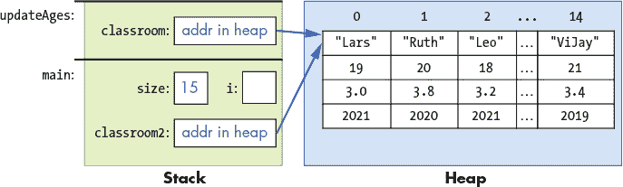

*图 2-16：传递给函数的 `struct studentT` 数组的内存布局*

如同往常一样，参数会获得其实参的值的副本（数组在堆内存中的地址）。因此，在函数中修改数组的元素会影响实参的值（参数和实参都指向内存中的同一个数组）。

`updateAges` 函数不能传递 `classroom3` 数组，因为它的类型与参数的类型不同：`classroom3` 是一个 `struct studentT *` 数组，而不是 `struct studentT` 数组。

#### 2.7.5 自引用结构体

可以定义一个结构体，其字段类型是指向同一 `struct` 类型的指针。这些自引用的 `struct` 类型可用于构建数据结构的链式实现，例如链表、树和图。

这些数据类型及其链式实现的细节超出了本书的范围。然而，我们简要展示了如何定义和使用自引用的`struct`类型来创建一个链表。有关链表的更多信息，请参阅数据结构和算法的教材。

*链表*是一种实现*列表抽象数据类型*的方法。列表表示按位置顺序排列的元素序列。在 C 语言中，列表数据结构可以通过数组或使用自引用的`struct`类型来实现，以存储链表中的各个节点。

为了构建后者，程序员需要定义一个`node`结构体来包含一个列表元素以及指向列表中下一个节点的链接。以下是一个示例，它可以存储一个包含整数值的链表：

```
struct node {

    int data;           // used to store a list element's data value

    struct node *next;  // used to point to the next node in the list

};
```

这种`struct`类型的实例可以通过`next`字段相互链接，形成一个链表。

这个示例代码片段创建了一个包含三个元素的链表（该链表本身通过`head`变量指向链表中的第一个节点）：

```
struct node *head, *temp;

int i;

head = NULL;  // an empty linked list

head = malloc(sizeof(struct node));  // allocate a node

if (head == NULL) {

    printf("Error malloc\n");

    exit(1);

}

head->data = 10;    // set the data field

head->next = NULL;  // set next to NULL (there is no next element)

// add 2 more nodes to the head of the list:

for (i = 0; i < 2; i++) {

    temp = malloc(sizeof(struct node));  // allocate a node

    if (temp == NULL) {

        printf("Error malloc\n");

        exit(1);

    }

    temp->data = i;     // set data field

    temp->next = head;  // set next to point to current first node

    head = temp;        // change head to point to newly added node

}
```

请注意，`temp`变量暂时指向一个通过`malloc`分配的`node`，该节点会被初始化并添加到链表的开头，方法是将其`next`字段指向当前由`head`指向的节点，然后将`head`更改为指向这个新节点。

执行此代码的结果将在内存中呈现如图 2-17 所示。

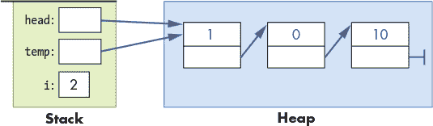

*图 2-17：三个示例链表节点在内存中的布局*

### 2.8 C 语言中的 I/O（标准和文件）

C 语言支持许多用于执行标准 I/O 以及文件 I/O 的函数。在本节中，我们将讨论一些 C 语言中最常用的 I/O 接口。

#### 2.8.1 标准输入/输出

每个运行中的程序都从三个默认的 I/O 流开始：标准输出(`stdout`)、标准输入(`stdin`)和标准错误(`stderr`)。程序可以将输出写入`stdout`和`stderr`，并且可以从`stdin`读取输入值。`stdin`通常定义为从键盘读取输入，而`stdout`和`stderr`则输出到终端。

C 语言的`stdio.h`库提供了用于打印输出到标准输出的`printf`函数，以及用于从标准输入读取值的`scanf`函数。C 语言还提供了按字符逐个读取和写入的函数（`getchar`和`putchar`），以及其他用于读写字符到标准 I/O 流的函数和库。C 程序必须显式地包含`stdio.h`以调用这些函数。

你可以更改正在运行的程序的`stdin`、`stdout`和/或`stderr`读取或写入的位置。一个方法是将其中一个或全部重定向到文件进行读取或写入。以下是一些示例 shell 命令，用于将程序的`stdin`、`stdout`或`stderr`重定向到文件（`$`是 shell 提示符）：

```
#  redirect a.out's stdin to read from file infile.txt:

$ ./a.out < infile.txt

#  redirect a.out's stdout to print to file outfile.txt:

$ ./a.out > outfile.txt

# redirect a.out's stdout and stderr to a file out.txt

$ ./a.out &> outfile.txt

# redirect all three to different files:

#   (< redirects stdin, 1> stdout, and 2> stderr):

$ ./a.out < infile.txt 1> outfile.txt 2> errorfile.txt
```

##### printf

C 语言的`printf`函数类似于 Python 中的格式化`print`调用，在其中调用者指定一个格式字符串进行输出。格式字符串通常包含特殊的格式说明符，包括可以打印制表符（`\t`）或换行符（`\n`）的特殊字符，或者指定输出值的占位符（`%`后跟类型说明符）。在传递给`printf`的格式字符串中添加占位符时，需将它们相应的值作为附加参数传递给格式字符串。以下是一些`printf`调用的示例：

printf.c

```
int x = 5, y = 10;

float pi = 3.14;

printf("x is %d and y is %d\n", x, y);

printf("%g \t %s \t %d\n", pi, "hello", y);
```

程序运行时，这些`printf`语句的输出为：

```
x is 5 and y is 10

3.14   hello   10
```

注意在第二次调用中，制表符字符（`\t`）的打印效果，以及不同类型值的不同格式占位符（`%g`、`%s`和`%d`）。

以下是用于常见 C 类型的格式占位符集合。请注意，`long`和`long long`类型的占位符包含`l`或`ll`前缀。

```
%f, %g: placeholders for a float or double value

%d:     placeholder for a decimal value (char, short, int)

%u:     placeholder for an unsigned decimal

%c:     placeholder for a single character

%s:     placeholder for a string value

%p:     placeholder to print an address value

%ld:    placeholder for a long value

%lu:    placeholder for an unsigned long value

%lld:   placeholder for a long long value

%llu:   placeholder for an unsigned long long value
```

以下是它们用法的一些示例：

```
float labs;

int midterm;

labs = 93.8;

midterm = 87;

 printf("Hello %s, here are your grades so far:\n", "Tanya");

printf("\t midterm: %d (out of %d)\n", midterm, 100);

printf("\t lab ave: %f\n", labs);

printf("\t final report: %c\n", 'A');
```

程序运行时，输出将如下所示：

```
Hello Tanya, here are your grades so far:

     midterm: 87 (out of 100)

     lab ave: 93.800003

     final report: A
```

C 语言还允许你通过格式占位符指定字段宽度。以下是一些示例：

```
%5.3f: print float value in space 5 chars wide, with 3 places beyond decimal

%20s:  print the string value in a field of 20 chars wide, right justified

%-20s: print the string value in a field of 20 chars wide, left justified

%8d:   print the int value in a field of 8 chars wide, right justified

%-8d:  print the int value in a field of 8 chars wide, left justified
```

以下是一个更大的示例，它在格式字符串中使用字段宽度说明符与占位符一起使用：

printf_format.c

```
#include <stdio.h> // library needed for printf

int main() {

    float x, y;

    char ch;

    x = 4.50001;

    y = 5.199999;

    ch = 'a';      // ch stores ASCII value of 'a' (the value 97)

    // .1: print x and y with single precision

    printf("%.1f %.1f\n", x, y);

    printf("%6.1f \t %6.1f \t %c\n", x, y, ch);

    // ch+1 is 98, the ASCII value of 'b'

    printf("%6.1f \t %6.1f \t %c\n", x+1, y+1, ch+1);

    printf("%6.1f \t %6.1f \t %c\n", x*20, y*20, ch+2);

    return 0;

}
```

程序运行时，输出将如下所示：

```
4.5 5.2

   4.5    5.2     a

   5.5    6.2     b

  90.0  104.0     c
```

注意最后三个`printf`语句中使用制表符和字段宽度的效果，它们会产生表格形式的输出。

最后，C 语言定义了用于以不同表示形式显示值的占位符：

```
%x:     print value in hexadecimal (base 16)

%o:     print value in octal (base 8)

%d:     print value in signed decimal  (base 10)

%u:     print value in unsigned decimal (unsigned base 10)

%e:     print float or double in scientific notation

(there is no formatting option to display a value in binary)
```

以下是一个使用占位符打印不同表示形式值的示例：

```
int x;

char ch;

x = 26;

ch = 'A';

printf("x is %d in decimal, %x in hexadecimal and %o in octal\n", x, x, x);

printf("ch value is %d which is the ASCII value of  %c\n", ch, ch);
```

程序运行时，输出将如下所示：

```
x is 26 in decimal, 1a in hexadecimal and 32 in octal

ch value is 65 which is the ASCII value of A
```

##### scanf

`scanf`函数提供了一种从`stdin`（通常是用户通过键盘输入）读取值并将其存储到程序变量中的方法。`scanf`函数对用户输入数据的确切格式比较挑剔，这可能导致它对格式不正确的用户输入很敏感。

`scanf`函数的参数类似于`printf`函数的参数：`scanf`接受一个格式字符串，该字符串指定要读取的输入值的数量和类型，后跟程序变量的*位置*，即存储这些值的变量地址。程序通常将*地址运算符*（`&`）与变量名结合使用，以产生变量在程序内存中的位置——即变量的内存地址。下面是一个调用`scanf`的示例，它读取两个值（一个`int`类型和一个`float`类型）：

scanf_ex.c

```
int x;

float pi;

// read in an int value followed by a float value ("%d%g")

// store the int value at the memory location of x (&x)

// store the float value at the memory location of pi (&pi)

scanf("%d%g", &x, &pi);
```

各个输入值必须至少由一个空白字符（如空格、制表符、换行符）分隔。然而，`scanf` 会跳过前导和尾随的空白字符，来确定每个数字字面值的开始和结束。因此，用户可以在输入值 8 和 3.14 之前或之后任意添加空白字符（并且至少需要在两个值之间有一个或多个空白字符），`scanf` 将始终读取 8 并将其赋值给 `x`，并读取 3.14 并将其赋值给 `pi`。例如，以下输入包含大量空格分隔的两个值，最终会将 8 读取并存储到 `x` 中，3.14 读取并存储到 `pi` 中：

```
           8                   3.14
```

程序员经常为 `scanf` 编写仅由占位符说明符组成的格式字符串，其中没有其他字符。在前面的示例中，读取两个数字的格式字符串可能如下所示：

```
// read in an int and a float separated by at least one white space character

scanf("%d%g",&x, &pi);
```

##### getchar 和 putchar

C 函数 `getchar` 和 `putchar` 分别从 `stdin` 读取或写入一个字符值到 `stdout`。`getchar` 在需要支持精确错误检测和处理格式不正确的用户输入的 C 程序中尤其有用（`scanf` 在这方面不够健壮）。

```
ch = getchar();  // read in the next char value from stdin

putchar(ch);     // write the value of ch to stdout
```

#### 2.8.2 文件输入/输出

C 标准 I/O 库（`stdio.h`）包含一个文件 I/O 的流接口。*文件* 存储持久数据：即超越创建它的程序执行生命周期的数据。文本文件表示一个字符流，每个打开的文件会跟踪其在字符流中的当前位置。打开文件时，当前位置从文件中的第一个字符开始，并且每次读取（或写入）字符时，当前位置都会发生变化。要读取文件中的第 10 个字符，首先需要读取前九个字符（或者可以通过 `fseek` 函数显式地将当前位置移动到第 10 个字符）。

C 的文件接口将文件视为输入或输出流，库函数从文件流的下一个位置读取或写入数据。`fprintf` 和 `fscanf` 函数是 `printf` 和 `scanf` 的文件 I/O 对应函数。它们使用格式字符串来指定要写入或读取的内容，并且包含提供值或存储空间的参数，这些值或存储空间用于存储写入或读取的数据。同样，库还提供了 `fputc`、`fgetc`、`fputs` 和 `fgets` 函数，用于从文件流中读取和写入单个字符或字符串。虽然有许多库支持 C 的文件 I/O，但我们仅详细介绍 `stdio.h` 库对文本文件的流接口。

文本文件可能包含特殊字符，如 `stdin` 和 `stdout` 流：换行符（`’\n’`）、制表符（`’\t’`）等。此外，当到达文件数据的末尾时，C 的 I/O 库会生成一个特殊的文件结束符字符（`EOF`），表示文件的结束。读取文件的函数可以通过测试 `EOF` 来确定何时到达文件流的末尾。

#### 2.8.3 在 C 中使用文本文件

要在 C 语言中读取或写入文件，按照以下步骤操作。

首先，*声明*一个 `FILE *` 变量：

```
FILE *infile;

FILE *outfile;
```

这些声明创建了指向库定义的 `FILE` 类型的指针变量。这些指针不能在应用程序中解引用。相反，当传递给 I/O 库函数时，它们指向特定的文件流。

其次，*打开*文件：通过调用 `fopen` 将变量与实际的文件流关联。当打开文件时，*模式*参数决定程序是以读取（`"r"`）、写入（`"w"`）还是追加（`"a"`）模式打开文件：

```
infile = fopen("input.txt", "r");  // relative path name of file, read mode

if (infile == NULL) {

    printf("Error: unable to open file %s\n", "input.txt");

    exit(1);

}

// fopen with absolute path name of file, write mode

outfile = fopen("/home/me/output.txt", "w");

if (outfile == NULL) {

    printf("Error: unable to open outfile\n");

    exit(1);

}
```

`fopen` 函数返回 `NULL` 来报告错误，如果提供了无效的文件名或用户没有权限打开指定的文件（例如，没有写入 `output.txt` 文件的权限），可能会发生此类错误。

第三，*使用* I/O 操作来读取、写入或移动文件中的当前位置：

```
int ch;  // EOF is not a char value, but is an int.

         // since all char values can be stored in int, use int for ch

ch = getc(infile);      // read next char from the infile stream

if (ch != EOF) {

    putc(ch, outfile);  // write char value to the outfile stream

}
```

最后，*关闭*文件：当程序不再需要文件时，使用 `fclose` 关闭文件：

```
fclose(infile);

fclose(outfile);
```

`stdio` 库还提供了更改文件中当前位置的函数：

```
// to reset current position to beginning of file

void rewind(FILE *f);

rewind(infile);

// to move to a specific location in the file:

fseek(FILE *f, long offset, int whence);

fseek(f, 0, SEEK_SET);    // seek to the beginning of the file

fseek(f, 3, SEEK_CUR);    // seek 3 chars forward from the current position

fseek(f, -3, SEEK_END);   // seek 3 chars back from the end of the file
```

#### 2.8.4 stdio.h 中的标准和文件 I/O 函数

C 语言的 `stdio.h` 库提供了许多用于读取和写入文件以及标准文件流（`stdin`、`stdout` 和 `stderr`）的函数。这些函数可以分为基于字符、基于字符串和格式化的 I/O 函数。以下是这些函数的一个子集的详细信息：

```
// ---------------

// Character Based

// ---------------

// returns the next character in the file stream (EOF is an int value)

int fgetc(FILE *f);

// writes the char value c to the file stream f

// returns the char value written

int fputc(int c, FILE *f);

 // pushes the character c back onto the file stream

// at most one char (and not EOF) can be pushed back

int ungetc(int c, FILE *f);

// like fgetc and fputc but for stdin and stdout

int getchar();

int putchar(int c);

// -------------

// String  Based

// -------------

// reads at most n-1 characters into the array s stopping if a newline is

// encountered, newline is included in the array which is '\0' terminated

char *fgets(char *s, int n, FILE *f);

// writes the string s (make sure '\0' terminated) to the file stream f

int fputs(char *s, FILE *f);

// ---------

// Formatted

// ---------

// writes the contents of the format string to file stream f

//   (with placeholders filled in with subsequent argument values)

// returns the number of characters printed

int fprintf(FILE *f, char *format, ...);

// like fprintf but to stdout

int printf(char *format, ...);

// use fprintf to print stderr:

fprintf(stderr, "Error return value: %d\n", ret);

// read values specified in the format string from file stream f

//   store the read-in values to program storage locations of types

//   matching the format string

// returns number of input items converted and assigned

//   or EOF on error or if EOF was reached

int fscanf(FILE *f, char *format, ...);

// like fscanf but reads from stdin

int scanf(char *format, ...);
```

一般来说，`scanf` 和 `fscanf` 对格式不正确的输入非常敏感。然而，对于文件 I/O，程序员通常可以假设输入文件格式良好，因此在这种情况下，`fscanf` 可能足够健壮。而 `scanf` 在处理格式不正确的用户输入时，通常会导致程序崩溃。逐字符读取并在转换为不同类型之前检查值的代码更为健壮，但它需要程序员实现更复杂的 I/O 功能。

`fscanf` 的格式字符串可以包含以下语法，指定不同类型的值以及从文件流中读取数据的方式：

```
%d integer

%f float

%lf double

%c character

%s string, up to first white space

%[...] string, up to first character not in brackets

%[0123456789] would read in digits

%[^...] string, up to first character in brackets

%[^\n] would read everything up to a newline
```

获取正确的 `fscanf` 格式字符串可能会很棘手，特别是在从文件中读取混合了数字、字符串或字符类型的数据时。

下面是一些调用 `fscanf`（以及一次调用 `fprintf`）的示例，使用了不同的格式字符串（假设之前示例中的 `fopen` 调用已成功执行）：

```
int x;

double d;

char c, array[MAX];

// write int & char values to file separated by colon with newline at the end

fprintf(outfile, "%d:%c\n", x, c);

// read an int & char from file where int and char are separated by a comma

fscanf(infile, "%d,%c", &x, &c);

// read a string from a file into array (stops reading at whitespace char)

fscanf(infile,"%s", array);

// read a double and a string up to 24 chars from infile

fscanf(infile, "%lf %24s", &d, array);

// read in a string consisting of only char values in the specified set (0-5)

// stops reading when...

//   20 chars have been read OR

//   a character not in the set is reached OR

//   the file stream reaches end-of-file (EOF)

fscanf(infile, "%20[012345]", array);

// read in a string; stop when reaching a punctuation mark from the set

 fscanf(infile, "%[^.,:!;]", array);

// read in two integer values: store first in long, second in int

// then read in a char value following the int value

fscanf(infile, "%ld %d%c", &x, &b, &c);
```

在前面的示例中，格式字符串明确地在数字后读取一个字符值，以确保文件流的当前位置被正确地推进，以便后续的 `fscanf` 调用能够正常进行。例如，这种模式常常用于显式地读取（并丢弃）一个空白字符（如 *\n*），以确保下一次调用 `fscanf` 从文件中的下一行开始。如果下一次调用 `fscanf` 尝试读取一个字符值，那么读取额外的字符是必要的。否则，如果没有消耗换行符，下一次调用 `fscanf` 将会读取换行符，而不是预期的字符。如果下一次调用读取的是一个数值类型，`fscanf` 会自动丢弃前导的空白字符，程序员无需显式地从文件流中读取 `\n` 字符。

### 2.9 一些高级 C 特性

C 编程语言的大部分内容已经在前面的章节中介绍过。在本节中，我们将讨论一些剩余的高级 C 语言特性以及一些高级 C 编程和编译话题：

+   C 中的 `switch` 语句（第 122 页）

+   命令行参数（第 125 页）

+   `void *` 类型和类型转换（第 126 页）

+   指针运算（第 128 页）

+   C 库：使用、编译和链接（第 133 页）

+   编写和使用你自己的 C 库（并将程序划分为多个模块（`.c` 和 `.h` 文件）；第 139 页）

+   将 C 源代码编译为汇编代码（第 145 页）。

#### 2.9.1 `switch` 语句

C 的 `switch` 语句可以用来替代部分（但不是所有）链式的 `if`–`else if` 代码序列。虽然 `switch` 并没有为 C 编程语言提供额外的表达能力，但它通常能够生成更简洁的代码分支序列。它也可能允许编译器生成比等效的链式 `if`–`else if` 代码更高效的分支代码。

C 语言中 `switch` 语句的语法如下：

```
switch (<expression>) {

   case <literal value 1>:

        <statements>;

        break;         // breaks out of switch statement body

   case <literal value 2>:

        <statements>;

        break;         // breaks out of switch statement body

   ...

   default:            // default label is optional

        <statements>;

}
```

`switch` 语句的执行过程如下：

1. <expression> 先进行求值。

2. 接下来，`switch` 会查找与表达式值匹配的 `case` 字面量值。

3. 找到匹配的 `case` 字面量后，开始执行紧随其后的 <statements>。

4. 如果没有找到匹配的 `case`，并且存在 `default` 标签，则开始执行 `default` 标签下的 <statements>。

5. 否则，`switch` 语句体中的语句将不会被执行。

关于 `switch` 语句的几个规则：

+   每个 `case` 关联的值必须是字面量值——它*不能*是一个表达式。原始的表达式只会与每个 `case` 关联的字面量值进行*相等*匹配。

+   到达`break`语句会停止执行`switch`语句体内所有剩余的语句。也就是说，`break`会跳出`switch`语句体，并继续执行`switch`块后的下一个语句。

+   带有匹配值的`case`语句标记了进入一系列 C 语句的起始点——执行会跳转到`switch`体内的某个位置，开始执行代码。因此，如果某个`case`语句末尾没有`break`语句，后续`case`语句下的语句将按顺序执行，直到执行了`break`语句或者到达`switch`语句体的末尾。

+   `default`标签是可选的。如果存在，它必须位于最后。

这是一个带有`switch`语句的示例程序：

```
#include <stdio.h>

int main() {

    int num, new_num = 0;

    printf("enter a number between 6 and 9: ");

    scanf("%d", &num);

    switch(num) {

        case 6:

            new_num = num + 1;

            break;

        case 7:

            new_num = num;

            break;

        case 8:

            new_num = num - 1;

            break;

        case 9:

            new_num = num + 2;

            break;

        default:

            printf("Hey, %d is not between 6 and 9\n", num);

    }

    printf("num %d  new_num %d\n", num, new_num);

    return 0;

}
```

以下是这段代码的一些示例运行：

```
./a.out

enter a number between 6 and 9: 9

num 9  new_num 11

./a.out

enter a number between 6 and 9: 6

num 6  new_num 7

./a.out

enter a number between 6 and 9: 12

Hey, 12 is not between 6 and 9

num 12  new_num 0
```

#### 2.9.2 命令行参数

通过读取命令行参数，可以使程序变得更具通用性。命令行参数作为用户输入的命令的一部分，用于运行一个二进制可执行程序。它们指定了输入值或选项，改变程序的运行时行为。换句话说，使用不同的命令行参数值运行程序，程序的行为会随每次运行而变化，而无需修改程序代码并重新编译。例如，如果一个程序需要命令行参数中的输入文件名，用户可以使用任何输入文件名来运行它，而不是程序代码中指定的特定输入文件名。

用户提供的任何命令行参数都会作为参数值传递给`main`函数。为了编写一个接受命令行参数的程序，`main`函数的定义必须包含两个参数，`argc`和`argv`：

```
int main(int argc, char *argv[]) { ...
```

请注意，第二个参数的类型也可以表示为`char` `**argv`。

第一个参数`argc`存储了参数个数。它的值表示传递给`main`函数的命令行参数的数量（包括程序名）。例如，如果用户输入

```
./a.out 10 11 200
```

那么`argc`将保存值 4（`a.out`算作第一个命令行参数，`10`、`11`和`200`是另外三个参数）。

第二个参数`argv`存储了参数向量。它包含了每个命令行参数的值。每个命令行参数作为字符串传递，因此`argv`的类型是一个字符串数组（或者是一个`char`数组的数组）。`argv`数组包含`argc + 1`个元素。前`argc`个元素存储命令行参数字符串，最后一个元素存储`NULL`，表示命令行参数列表的结束。例如，在前面示例中输入的命令行中，`argv`数组看起来像图 2-18。


*图 2-18：传递给`main`的`argv`参数是一个字符串数组。每个命令行参数作为数组中的单独字符串元素传递。最后一个元素的值为`NULL`，表示命令行参数列表的结尾。*

`argv` 数组中的字符串是*不可变*的，意味着它们存储在只读内存中。因此，如果程序想要修改其中一个命令行参数的值，它需要制作该命令行参数的本地副本并修改副本。

通常，程序希望将传递给`main`的命令行参数解释为除字符串以外的类型。在前面的示例中，程序可能希望从其第一个命令行参数的字符串值`"10"`中提取整数值`10`。C 标准库提供了将字符串转换为其他类型的函数。例如，`atoi`（“a to i”，即“ASCII 转整数”）函数将一串数字字符转换为相应的整数值：

```
int x;

x = atoi(argv[1]);  // x gets the int value 10
```

有关这些函数的更多信息，请参见第 103 页的“将字符串转换为其他类型的函数”，以及 C 命令行参数的另一个示例`commandlineargs.c`程序^(4)。

#### 2.9.3 `void *`类型和类型重构

C 类型`void *`表示通用指针——指向任何类型或未指定类型的指针。C 允许通用指针类型，因为系统上的内存地址始终以相同的字节数存储（例如，在 32 位系统上地址为四字节，在 64 位系统上为八字节）。因此，每个指针变量需要相同数量的存储字节，并且因为它们都是相同大小的，编译器可以分配`void *`变量的空间而不知道它指向的类型。以下是一个示例：

```
void *gen_ptr;

int x;

char ch;

gen_ptr = &x;  // gen_ptr can be assigned the address of an int

gen_ptr = &ch; // or the address of a char (or the address of any type)
```

通常，程序员不像前面的示例中那样声明`void *`类型的变量。相反，它通常用于指定函数的通用返回类型或函数的通用参数。`void *`类型经常被用作函数的返回类型，该函数返回新分配的内存，可用于存储任何类型（例如，`malloc`）。它也用作函数的函数参数，用于接受任何类型的值。在这种情况下，函数的各个调用将某种特定类型的指针传递给函数的`void *`参数，因为它可以存储任何类型的地址。

因为`void *`是一个通用指针类型，无法直接解引用——编译器不知道地址指向的内存大小。例如，该地址可能指向一个占用四个字节的`int`存储位置，或者可能指向一个占用一个字节的`char`存储位置。因此，程序员必须在解引用之前显式地将`void *`指针重新转换为特定类型的指针。重新转换告诉编译器指针变量的具体类型，从而允许编译器生成正确的内存访问代码来处理指针解引用。

下面是`void *`使用的两个例子。首先，`malloc`的调用将其返回的`void *`类型转换为用于存储返回堆内存地址的变量的特定指针类型：

```
int *array;

char *str;

array = (int *)malloc(sizeof(int) * 10); // recast void * return value

str = (char *)malloc(sizeof(char) * 20);

*array = 10;

str[0] = 'a';
```

其次，学生们在创建线程时经常遇到`void *`（请参见第 677 页的“你好，线程！编写你的第一个多线程程序”）。在线程函数中使用`void *`参数类型可以使线程接收任何类型的特定应用程序指针。`pthread_create`函数有一个用于线程主函数的参数，并且有一个`void *`类型的参数，用于传递给线程主函数的参数值，后者将由新创建的线程执行。使用`void *`参数使得`pthread_create`成为一个通用的线程创建函数；它可以用于指向任何类型的内存位置。对于调用`pthread_create`的特定程序，程序员知道传递给`void *`参数的参数类型，因此程序员必须在解引用之前将其重新转换为已知类型。在这个例子中，假设传递给`args`参数的地址包含一个整数变量的地址：

```
/*

 * an application-specific pthread main function

 * must have this function prototype: int func_name(void *args)

 *

 * any given implementation knows what type is really passed in

 *  args: pointer to an int value

 */

int my_thr_main(void *args) {

    int num;

    // first recast args to an int *, then dereference to get int value

    num = *((int *)args);  // num gets 6

    ...

}

int main() {

    int ret, x;

    pthread_t tid;

    x = 6;

    // pass the address of int variable (x) to pthread_create's void * param

    // (we recast &x as a (void *) to match the type of pthread_create's param)

    ret = pthread_create(&tid, NULL,

                         my_thr_main,    // a thread main function

                         (void *)(&x));  // &x will be passed to my_thr_main

    // ...
```

#### 2.9.4 指针运算

如果一个指针变量指向一个数组，程序可以对该指针进行运算，以访问数组中的任何元素。在大多数情况下，我们建议避免使用指针运算来访问数组元素：这样容易出错，调试时也更困难。然而，有时通过递增指针逐个访问数组元素可能会更加方便。

当指针递增时，它指向下一个存储位置*其指向的类型*。例如，递增一个整数指针（`int *`）会使它指向下一个`int`存储地址（比当前值大四个字节的地址），递增一个字符指针则会使它指向下一个`char`存储地址（比当前值大一个字节的地址）。

在以下示例程序中，我们演示了如何使用指针运算来操作一个数组。首先声明与数组元素类型匹配的指针变量：

pointerarith.c

```
#define N 10

#define M 20

int main() {

    // array declarations:

    char letters[N];

    int numbers[N], i, j;

    int matrix[N][M];

    // declare pointer variables that will access int or char array elements

    // using pointer arithmetic (the pointer type must match array element type)

    char *cptr = NULL;

    int *iptr = NULL;

    ...
```

接下来，将指针变量初始化为它们将要遍历的数组的基地址：

pointerarith.c

```
// make the pointer point to the first element in the array

cptr = &(letters[0]); //  &(letters[0])  is the address of element 0

iptr = numbers;       // the address of element 0 (numbers is &(numbers[0]))
```

然后，使用指针解引用，我们的程序可以访问数组的元素。在这里，我们通过解引用为数组元素赋值，然后将指针变量递增 1，以使其指向下一个元素：

pointerarith.c

```
// initialized letters and numbers arrays through pointer variables

for (i = 0; i < N; i++) {

    // dereference each pointer and update the element it currently points to

    *cptr = 'a' + i;

    *iptr = i * 3;

    // use pointer arithmetic to set each pointer to point to the next element

    cptr++;  // cptr points to the next char address (next element of letters)

    iptr++;  // iptr points to the next int address  (next element of numbers)

}
```

请注意，在这个例子中，指针的值是在循环内部递增的。因此，递增它们的值使得它们指向数组中的下一个元素。这种模式有效地遍历了数组中的每个元素，和在每次迭代中访问`cptr[i]`或`iptr[i]`的方式相同。

**注意指针算术的语义和底层算术功能**

指针算术的语义与类型无关：改变任何类型指针的值`N`（`ptr = ptr + N`）会使指针指向当前值之后`N`个存储位置（或使它指向当前元素之后`N`个元素）。因此，递增任何类型的指针都会使它指向它所指向类型的下一个内存位置。

然而，编译器为指针算术表达式生成的实际算术功能会根据指针变量的类型有所不同（取决于系统用于存储指针所指向类型的字节数）。例如，递增一个`char`指针会使其值增加 1，因为下一个有效的`char`地址距离当前位置 1 个字节。递增一个`int`指针会使其值增加 4，因为下一个有效的整数地址距离当前位置 4 个字节。

程序员可以简单地写`ptr++`，使指针指向下一个元素的值。编译器会生成代码，以添加与其指向的对应类型相关的字节数。这种加法有效地将其值设置为该类型在内存中的下一个有效地址。

你可以通过打印它们的值来查看先前的代码是如何修改数组元素的（我们首先使用数组索引访问，然后使用指针算术来访问每个数组元素的值）：

```
printf("\n array values using indexing to access: \n");

// see what the code above did:

for (i = 0; i < N; i++) {

    printf("letters[%d] = %c, numbers[%d] = %d\n",

           i, letters[i], i, numbers[i]);

}

// we could also use pointer arith to print these out:

printf("\n array values using pointer arith to access: \n");

// first: initialize pointers to base address of arrays:

cptr = letters;  // letters == &letters[0]

iptr = numbers;

for (i = 0; i < N; i++) {

    // dereference pointers to access array element values

    printf("letters[%d] = %c, numbers[%d] = %d\n",

            i, *cptr, i, *iptr);

    // increment pointers to point to the next element

    cptr++;

    iptr++;

}
```

以下是输出的样子：

```
 array values using indexing to access:

letters[0] = a, numbers[0] = 0

letters[1] = b, numbers[1] = 3

 letters[2] = c, numbers[2] = 6

letters[3] = d, numbers[3] = 9

letters[4] = e, numbers[4] = 12

letters[5] = f, numbers[5] = 15

letters[6] = g, numbers[6] = 18

letters[7] = h, numbers[7] = 21

letters[8] = i, numbers[8] = 24

letters[9] = j, numbers[9] = 27

 array values using pointer arith to access:

letters[0] = a, numbers[0] = 0

letters[1] = b, numbers[1] = 3

letters[2] = c, numbers[2] = 6

letters[3] = d, numbers[3] = 9

letters[4] = e, numbers[4] = 12

letters[5] = f, numbers[5] = 15

letters[6] = g, numbers[6] = 18

letters[7] = h, numbers[7] = 21

letters[8] = i, numbers[8] = 24

letters[9] = j, numbers[9] = 27
```

指针算术可以用来遍历任何连续的内存块。以下是一个使用指针算术初始化静态声明的二维数组的例子：

```
// sets matrix to:

// row 0:   0,   1,   2, ...,  99

// row 1: 100, 110, 120, ..., 199

//        ...

iptr = &(matrix[0][0]);

for (i = 0; i < N*M; i++) {

    *iptr = i;

    iptr++;

}

// see what the code above did:

printf("\n 2D array values inited using pointer arith: \n");

for (i = 0; i < N; i++) {

    for (j = 0; j < M; j++) {

        printf("%3d ", matrix[i][j]);

    }

    printf("\n");

}

return 0;

}
```

输出将如下所示：

```
 2D array values initialized using pointer arith:

  0   1   2   3   4   5   6   7   8   9  10  11  12  13  14  15  16  17  18  19

 20  21  22  23  24  25  26  27  28  29  30  31  32  33  34  35  36  37  38  39

 40  41  42  43  44  45  46  47  48  49  50  51  52  53  54  55  56  57  58  59

 60  61  62  63  64  65  66  67  68  69  70  71  72  73  74  75  76  77  78  79

 80  81  82  83  84  85  86  87  88  89  90  91  92  93  94  95  96  97  98  99

100 101 102 103 104 105 106 107 108 109 110 111 112 113 114 115 116 117 118 119

120 121 122 123 124 125 126 127 128 129 130 131 132 133 134 135 136 137 138 139

140 141 142 143 144 145 146 147 148 149 150 151 152 153 154 155 156 157 158 159

160 161 162 163 164 165 166 167 168 169 170 171 172 173 174 175 176 177 178 179

180 181 182 183 184 185 186 187 188 189 190 191 192 193 194 195 196 197 198 199
```

指针算术可以以任何模式访问连续的内存位置，从连续内存块中的任何位置开始和结束。例如，在初始化指向数组元素的指针后，可以通过增加指针值来改变它的值。示例如下：

```
iptr = &numbers[2];

*iptr = -13;

iptr += 4;

*iptr = 9999;
```

执行上述代码后，打印`numbers`数组的值会如下所示（请注意索引 2 和索引 6 的值已发生变化）：

```
numbers[0] = 0

numbers[1] = 3

numbers[2] = -13

numbers[3] = 9

numbers[4] = 12

numbers[5] = 15

numbers[6] = 9999

numbers[7] = 21

numbers[8] = 24

numbers[9] = 27
```

指针运算也适用于动态分配的数组。然而，程序员在处理动态分配的多维数组时必须小心。例如，如果一个程序使用多个 `malloc` 调用来动态分配 2D 数组的各个行（见第 90 页的“方法 2：对程序员友好的方式”），那么每一行的指针都必须重置为指向该行的起始元素的地址。重置指针是必要的，因为只有同一行的元素位于连续的内存地址中。另一方面，如果 2D 数组是通过一次 `malloc` 调用为总行数乘以列数的空间分配的（见第 88 页的“方法 1：内存高效分配”），那么所有行都在连续的内存中（就像前面示例中的静态声明的 2D 数组一样）。在后者的情况下，只需要将指针初始化为指向基地址，然后指针运算就可以正确访问 2D 数组中的任何元素。

#### 2.9.5 C 库：使用、编译和链接

*库*实现了一组可以被其他程序使用的函数和定义。C 库由两部分组成：

+   *应用程序编程接口*（API），它在一个或多个头文件（`.h` 文件）中定义，必须在计划使用该库的 C 源代码文件中包含这些头文件。头文件定义了库向其用户提供的内容。这些定义通常包括库函数原型，并且可能还包括类型、常量或全局变量的声明。

+   *实现*库功能的代码，通常以预编译的二进制格式提供给程序，这些代码会在 `gcc` 创建的二进制可执行文件中进行*链接*（添加）。预编译的库代码可能存储在一个包含多个 `.o` 文件的归档文件（`libsomelib.a`）中，这些文件可以在编译时静态链接到可执行文件中。或者，它可能是一个共享对象文件（`libsomelib.so`），可以在运行时动态链接到正在运行的程序中。

例如，C 字符串库实现了一组用于操作 C 字符串的函数。`string.h` 头文件定义了它的接口，因此任何想要使用字符串库函数的程序都必须 `#include <string.h>`。C 字符串库的实现是更大标准 C 库（`libc`）的一部分，`gcc` 编译器会自动将其链接到它创建的每个可执行文件中。

库的实现由一个或多个模块（`.c` 文件）组成，并可能包括库实现内部使用的头文件；这些内部头文件不是库的 API 的一部分，但它们是设计良好、模块化的库代码的一部分。通常，库的 C 源代码实现并不会对库的用户公开。相反，库以预编译的二进制形式提供。这些二进制格式不是可执行程序（它们不能单独运行），但它们提供了可执行的代码，可以通过 `gcc` 在编译时被*链接*到可执行文件中。

C 程序员可以使用许多可用的库。例如，POSIX 线程库（在第十章中讨论）使得多线程 C 程序成为可能。C 程序员还可以实现并使用自己的库（参见第 133 页上的“编写和使用你自己的 C 库”）。

标准 C 库通常不需要通过 `-l` 选项显式链接，但其他库则需要。库函数的文档通常会指定在编译时是否需要显式链接该库。例如，POSIX 线程库（`pthread`）和 `readline` 库在 `gcc` 命令行上需要显式链接：

```
$ gcc -o myprog myprog.c -lpthread -lreadline
```

请注意，库文件的完整名称不应包含在 `-l` 参数中；库文件的命名类似于 `libpthread.so` 或 `libreadline.a`，但文件名中的 `lib` 前缀和 `.so` 或 `.a` 后缀不应包括在内。实际的库文件名可能还包含版本号（例如 `libreadline.so.8.0`），这些版本号也不包含在 `-l` 命令行选项中（`-lreadline`）。通过不强制用户指定（甚至不知道）要链接的库文件的确切名称和位置，`gcc` 可以自由地在用户的库路径中找到最新版本的库。它还允许编译器在存在共享对象（`.so`）和静态库（`.a`）版本的库时选择动态链接。如果用户想要静态链接库，则可以在 `gcc` 命令行中显式指定静态链接。`--static` 选项提供了一种请求静态链接的方法：

```
$ gcc -o myprog myprog.c --static -lpthread -lreadline
```

##### 编译步骤

描述 C 程序的编译步骤有助于说明库代码如何被链接到可执行二进制文件中。我们首先介绍编译步骤，然后通过示例讨论在编译使用库的程序时可能出现的不同类型的错误。

C 编译器将 C 源文件（例如 `myprog.c`）转换为可执行的二进制文件（例如 `a.out`），这一过程分为四个独立的步骤（以及在运行时发生的第五个步骤）。

*预编译*步骤首先运行，并展开*预处理指令*：C 程序中出现的`#`指令，例如`#define`和`#include`。此步骤的编译错误包括预处理指令中的语法错误，或`gcc`未能找到与`#include`指令相关的头文件。要查看预编译步骤的中间结果，可以将`-E`标志传递给`gcc`（输出可以重定向到一个文件，文件可以通过文本编辑器查看）：

```
$ gcc -E  myprog.c

$ gcc -E  myprog.c  > out

$ vim out
```

*编译*步骤接下来运行，并完成大部分编译任务。它将 C 程序源代码（`myprog.c`）翻译为特定于机器的汇编代码（`myprog.s`）。汇编代码是计算机可以执行的二进制机器代码指令的可读形式。此步骤的编译错误包括 C 语言语法错误、未定义符号警告，以及缺失定义和函数原型的错误。要查看编译步骤的中间结果，可以将`-S`标志传递给`gcc`（该选项会生成一个名为`myprog.s`的文本文件，其中包含`myprog.c`的汇编翻译，可以通过文本编辑器查看）：

```
$ gcc -S  myprog.c

$ vim myprog.s
```

*汇编*步骤将汇编代码转换为可重定位的二进制目标代码（`myprog.o`）。生成的目标文件包含机器代码指令，但它不是一个可以独立运行的完整可执行程序。Unix 和 Linux 系统上的`gcc`编译器生成特定格式的二进制文件，称为 ELF（可执行与可链接格式）。^(5) 若要在此步骤后停止编译，可以将`-c`标志传递给`gcc`（这会生成名为`myprog.o`的文件）。可以使用`objdump`或类似工具查看二进制文件（例如，`a.out`和`.o`文件）：

```
$ gcc -c  myprog.c

# disassemble functions in myprog.o with objdump:

$ objdump -d myprog.o
```

*链接编辑*步骤最后运行，并从可重定位的二进制文件（`.o`）和库文件（`.a`或`.so`）创建一个单一的可执行文件（`a.out`）。在此步骤中，链接器会验证`.o`文件中对符号名称的引用是否存在于其他`.o`、`.a`或`.so`文件中。例如，链接器会在标准 C 库（`libc.so`）中找到`printf`函数。如果链接器找不到符号的定义，步骤将失败，并显示符号未定义的错误。运行不带标志的`gcc`进行部分编译时，会执行编译 C 源代码文件（`myprog.c`）到可执行二进制文件（`a.out`）的所有四个步骤，可以运行：

```
$ gcc myprog.c

$ ./a.out

# disassemble functions in a.out with objdump:

$ objdump -d a.out
```

如果二进制可执行文件（`a.out`）静态链接了库代码（来自`.a`库文件），则`gcc`会将库函数从`.a`文件复制到生成的`a.out`文件中。应用程序对库函数的所有调用都被*绑定*到`a.out`文件中复制库函数的地址位置。绑定将名称与程序内存中的位置关联起来。例如，绑定对名为`gofish`的库函数的调用意味着用该函数在内存中的地址替代函数名称（在后面的章节中我们将更详细地讨论内存地址——例如，参见“内存地址”在第 642 页）。

然而，如果`a.out`是通过动态链接库（来自共享库对象文件，`.so`文件）创建的，则`a.out`不包含这些库中的库函数代码副本。相反，它包含关于`a.out`文件运行时需要哪些动态链接库的信息。这类可执行文件在运行时需要额外的链接步骤。

如果`a.out`在链接编辑时与共享对象文件链接，那么就需要*运行时链接*步骤。在这种情况下，动态库代码（在`.so`文件中）必须在运行时加载，并与正在运行的程序进行链接。这个运行时加载和链接共享对象库的过程称为*动态链接*。当用户运行一个有共享对象依赖的`a.out`可执行文件时，系统会在程序开始执行`main`函数之前执行动态链接。

编译器在链接编辑编译步骤中将关于共享对象依赖的信息添加到`a.out`文件中。当程序开始执行时，动态链接器会检查共享对象依赖列表，找到并加载共享对象文件到运行中的程序中。然后，它会更新`a.out`文件中的重定位表条目，将程序对共享对象中符号（例如调用库函数）的使用绑定到运行时加载的`.so`文件中的位置。如果动态链接器无法找到可执行文件所需的共享对象（`.so`）文件，运行时链接会报告错误。

`ldd`工具列出可执行文件的共享对象依赖：

```
$ ldd a.out
```

*GNU 调试器（GDB）*可以检查正在运行的程序，并显示运行时加载和链接的共享对象代码。我们在第三章中介绍了 GDB。然而，检查用于运行时链接调用动态链接库函数的过程查找表（PLT）的细节超出了本教材的范围。

有关编译各阶段的更多细节以及检查不同阶段的工具，可以在网上找到。^(6)

##### 与编译和链接库相关的常见编译错误

由于程序员忘记包含库头文件或忘记显式链接库代码，可能会发生多个编译和链接错误。识别与这些错误相关的`gcc`编译器错误或警告，有助于调试与使用 C 库相关的错误。

考虑下一个 C 程序，它调用了来自`examplelib`库的`libraryfunc`函数（该库以共享对象文件`libmylib.so`的形式提供）：

```
#include <stdio.h>

#include <examplelib.h>

int main(int argc, char *argv[]) {

    int result;

    result = libraryfunc(6, MAX);

    printf("result is %d\n", result);

    return 0;

}
```

假设头文件`examplelib.h`包含如下示例中的定义：

```
#define MAX 10   // a constant exported by the library

// a function exported by the library

extern int libraryfunc(int x, int y);
```

`extern`前缀表示函数原型的定义来自另一个文件——它不在`examplelib.h`文件中，而是由库实现中的某个`.c`文件提供。

**忘记包含头文件。** 如果程序员忘记在程序中包含`examplelib.h`，那么编译器会产生关于程序使用的库函数和常量的警告和错误，编译器无法识别这些库函数和常量。例如，如果用户在没有`#include <examplelib.h>`的情况下编译程序，`gcc`会产生如下输出：

```
# '-g': add debug information, -c: compile to '.o'

$ gcc -g -c myprog.c

myprog.c: In function main:

myprog.c:8:12: warning: implicit declaration of function libraryfunc

   result = libraryfunc(6, MAX);

            ^~~~~~~~~~~

myprog.c:8:27: error: MAX undeclared (first use in this function)

   result = libraryfunc(6, MAX);

                           ^~~
```

第一个编译器警告（`implicit declaration of function` `libraryfunc`）告诉程序员，编译器找不到`libraryfunc`函数的原型。这只是一个编译器警告，因为`gcc`会猜测该函数的返回类型是整数，并继续编译程序。然而，程序员*不应*忽视这些警告！它们表明程序在使用`myprog.c`文件中的函数之前没有包含函数原型，这通常是由于没有包含包含该函数原型的头文件。

第二个编译器错误（`MAX undeclared (first use in this` `function)`）是由于缺少常量定义。编译器无法猜测缺失常量的值，因此这个缺失的定义会导致错误。此类“未声明”消息通常表明缺少或未正确包含定义常量或全局变量的头文件。

**忘记链接库。** 如果程序员包含了库的头文件（如前面的代码所示），但忘记在编译的链接编辑步骤中显式链接该库，那么`gcc`会通过“未定义的引用”错误来提示：

```
$ gcc -g myprog.c

In function main:

myprog.c:9: undefined reference to libraryfunc

collect2: error: ld returned 1 exit status
```

这个错误来自`ld`，编译器的链接器组件。它表明链接器无法找到在`myprog.c`文件第 9 行调用的库函数`libraryfunc`的实现。一个“未定义的引用”错误意味着需要显式地将一个库链接到可执行文件中。在这个例子中，在`gcc`命令行上指定`-lexamplelib`可以解决这个错误：

```
$ gcc -g myprog.c  -lexamplelib
```

**gcc 找不到头文件或库文件。** 如果库的头文件或实现文件不在`gcc`默认搜索的目录中，编译也会失败并显示错误。例如，如果`gcc`找不到`examplelib.h`文件，它将产生如下错误信息：

```
$ gcc -c myprog.c -lexamplelib

myprog.c:1:10: fatal error: examplelib.h: No such file or directory

 #include <examplelib.h>

          ^~~~~~~

compilation terminated.
```

如果链接器在编译的链接编辑步骤中找不到库的`.a`或`.so`版本来进行链接，`gcc`将会因以下类似错误退出：

```
$ gcc -c myprog.c -lexamplelib

/usr/bin/ld: cannot find -lexamplelib

collect2: error: ld returned 1 exit status
```

类似地，如果一个动态链接的可执行文件无法找到共享对象文件（例如，`libexamplelib.so`），它将在运行时因以下类似错误而无法执行：

```
$ ./a.out

./a.out: error while loading shared libraries:

   libexamplelib.so: cannot open shared object file: No such file or directory
```

为了解决这些类型的错误，程序员必须为`gcc`指定额外的选项，指明库文件的位置。程序员还可能需要修改`LD_LIBRARY_PATH`环境变量，以便运行时链接器能够找到库的`.so`文件。

##### 库和包含路径

编译器会自动在标准目录位置搜索头文件和库文件。例如，系统通常将标准头文件存储在`/usr/include`，库文件存储在`/usr/lib`，`gcc`会自动在这些目录中查找头文件和库文件；`gcc`也会自动在当前工作目录中查找头文件。

如果`gcc`无法找到头文件或库文件，则用户必须在命令行中显式提供路径，使用`-I`和`-L`选项。例如，假设有一个名为`libexamplelib.so`的库文件存在于`/home/me/lib`中，且它的头文件`examplelib.h`在`/home/me/include`目录下。由于`gcc`默认不知道这些路径，必须明确告知它在这些路径下包含文件，以成功编译使用该库的程序：

```
$ gcc  -I/home/me/include -o myprog myprog.c -L/home/me/lib -lexamplelib
```

要在启动动态链接的可执行文件时指定动态库（例如，`libexamplelib.so`）的位置，可以设置`LD_LIBRARY_PATH`环境变量，包含库文件的路径。以下是一个可以在终端提示符下运行的示例 bash 命令，或添加到`.bashrc`文件中的命令：

```
export LD_LIBRARY_PATH=/home/me/lib:$LD_LIBRARY_PATH
```

当`gcc`命令行变长，或者可执行文件需要许多源文件和头文件时，使用`make`和`Makefile`可以简化编译过程。^(7)

#### 2.9.6 编写和使用你自己的 C 库

程序员通常将大型 C 程序分成多个相关功能的*模块*（即多个`.c`文件）。多个模块共享的定义放在头文件（`.h`文件）中，模块会包含它们所需的头文件。同样，C 库代码也通常由一个或多个模块（`.c`文件）和一个或多个头文件（`.h`文件）实现。C 程序员常常实现自己常用功能的 C 库。通过编写库，程序员一次性实现了库中的功能，然后可以在任何后续的 C 程序中使用这些功能。

在“C 库：使用、编译和链接”章节的第 133 页中，我们描述了如何将 C 库代码用于 C 程序，编译并链接。在本节中，我们讨论了如何编写和使用你自己的 C 库。我们在这里展示的内容也适用于构建和编译由多个 C 源文件和头文件组成的较大型 C 程序。

创建一个 C 库的步骤：

1. 在头文件（`.h` 文件）中定义库的接口。任何希望使用该库的程序都必须包含此头文件。

2. 在一个或多个 `.c` 文件中创建库的实现。这些函数定义实现了库的功能。有些函数可能是库用户将要调用的接口函数，而其他函数可能是库内部的函数，无法被库的用户调用（内部函数是库实现的良好模块化设计的一部分）。

3. 编译一个可以链接到使用该库的程序中的库的二进制形式。

库的二进制形式可以直接从其源文件编译而来，作为编译使用该库的应用程序代码的一部分。这种方法将库文件编译成 `.o` 文件，并将它们静态链接到二进制可执行文件中。以这种方式包含库通常适用于为自己编写的库代码（因为你可以访问其 `.c` 源文件），这也是从多个 `.c` 模块构建可执行文件的方法。

另外，库也可以被编译成二进制归档文件（`.a`）或共享对象文件（`.so`），供需要使用该库的程序使用。在这些情况下，库的用户通常无法访问库的 C 源代码文件，因此无法直接将库代码与使用它的应用程序代码一起编译。当程序使用这样的预编译库（例如 `.a` 或 `.so` 文件）时，必须使用 `gcc` 的 `-l` 命令行选项显式地将库代码链接到可执行文件中。

我们详细讨论编写、编译和链接库代码的内容，重点是程序员可以访问单独的库模块（即 `.c` 或 `.o` 文件）的情况。这种重点同样适用于设计和编译被拆分为多个 `.c` 和 `.h` 文件的大型 C 程序。我们简要介绍了构建归档库和共享对象库形式的命令。有关构建这些类型的库文件的更多信息，可以参考 `gcc` 文档，包括 `gcc` 和 `ar` 的 man 页面。

接下来，我们展示了一些创建和使用自己库的例子。

**定义库接口** 头文件（`.h` 文件）是包含 C 函数原型和其他定义的文本文件——它们代表了库的接口。任何打算使用该库的应用程序必须包含头文件。例如，C 标准库的头文件通常存储在 `/usr/include/` 目录下，并可以用编辑器查看：

```
$ vi /usr/include/stdio.h
```

这是一个来自库的示例头文件^(8)，它包含一些供库用户使用的定义：

myfile.h

```
#ifndef _MYLIB_H_

#define _MYLIB_H_

// a constant definition exported by library:

#define MAX_FOO  20

// a type definition exported by library:

 struct foo_struct {

    int x;

    float y;

};

// a global variable exported by library

// "extern" means that this is not a variable declaration,

// but it defines that a variable named total_times of type

// int exists in the library implementation and is available

// for use by programs using the library.

// It is unusual for a library to export global variables

// to its users, but if it does, it is important that

// extern appears in the definition in the .h file

extern int total_times;

// a function prototype for a function exported by library:

// extern means that this function definition exists

// somewhere else.

/*

 * This function returns the larger of two float values

 *  y, z: the two values

 *  returns the value of the larger one

 */

extern float bigger(float y, float z);

#endif
```

头文件通常在其内容周围有特殊的“样板”代码。例如：

```
#ifndef <identifier>

// header file contents

#endif <identifier>
```

这段样板代码确保编译器的预处理器只会在任何包含它的 C 文件中包含`mylib.h`的内容一次。确保只包含 `.h` 文件的内容一次非常重要，以避免在编译时出现重复定义错误。类似地，如果你忘记在使用该库的 C 程序中包含 `.h` 文件，编译器会生成一个“未定义符号”的警告。

`.h` 文件中的注释是库接口的一部分，写给库的用户。这些注释应该是详尽的，解释定义并描述每个库函数的功能，接受的参数值以及返回值。有时，`.h` 文件还会包含一个描述如何使用该库的顶层注释。

在全局变量定义和函数原型前加上关键字`extern`，意味着这些名称在其他地方已经定义。特别是要在库导出的任何全局变量前加上`extern`，因为它将名称和类型定义（在 `.h` 文件中）与库实现中的变量声明区分开来。在前面的示例中，全局变量在库内部只声明一次，但通过在库的 `.h` 文件中的 `extern` 定义将其导出给库的用户。

**实现库功能。** 程序员在一个或多个 `.c` 文件中实现库（有时还包括内部 `.h` 文件）。实现包括 `.h` 文件中所有函数原型的定义以及库实现中的其他函数。这些内部函数通常使用关键字 `static` 定义，这将它们的可用范围限定为定义它们的模块（`.c` 文件）。库实现还应该包括 `.h` 文件中任何 `extern` 全局变量声明的变量定义。下面是一个库实现的示例：

mylib.c

```
#include <stdlib.h>

// Include the library header file if the implementation needs

// any of its definitions (types or constants, for example.)

// Use " " instead of < > if the mylib.h file is not in a

// default library path with other standard library header

// files (the usual case for library code you write and use.)

#include "mylib.h"

// declare the global variable exported by the library

int total_times = 0;

// include function definitions for each library function:

float bigger(float y, float z) {

    total_times++;

    if (y > z) {

        return y;

    }

    return z;

}
```

**创建库的二进制形式。** 要创建库的二进制形式（`.o` 文件），可以使用 `-c` 选项进行编译：

```
$ gcc -o mylib.o -c mylib.c
```

一个或多个 `.o` 文件可以构建库的归档（`.a`）或共享对象（`.so`）版本。要构建静态库，可以使用归档工具（`ar`）：

```
$ ar -rcs libmylib.a mylib.o
```

要构建一个动态链接库，库中的`mylib.o`目标文件必须使用*位置无关代码*（使用`-fPIC`）。可以通过在`gcc`中指定`-shared`标志从`mylib.o`创建`libmylib.so`共享目标文件：

```
$ gcc -fPIC -o mylib.o -c mylib.c

$ gcc -shared -o libmylib.so mylib.o
```

共享对象和存档库通常由多个`.o`文件构建，例如（请记住，动态链接库的`.o`需要使用`-fPIC`标志构建）：

```
$ gcc -shared -o libbiglib.so file1.o file2.o file3.o file4.o

$ ar -rcs libbiglib.a file1.o file2.o file3.o file4.o
```

**使用和链接库**。使用此库的其他`.c`文件应该`#include`其头文件，并且在编译时需要显式地链接其实现（`.o`文件）。

在包含库头文件后，您的代码可以调用库的函数：

myprog.c

```
#include <stdio.h>

#include "mylib.h"   // include library header file

int main() {

    float val1, val2, ret;

    printf("Enter two float values: ");

    scanf("%f%f", &val1, &val2);

    ret = bigger(val1, val2);   // use a library function

    printf("%f is the biggest\n", ret);

    return 0;

}
```

**注意 #INCLUDE 语法和预处理器**

`#include`语法包含`mylib.h`不同于包含`stdio.h`的语法。这是因为`mylib.h`不在标准库的头文件位置。预处理器有默认位置用于查找标准头文件。当使用`<file.h>`语法而不是`"file.h"`语法包含文件时，预处理器在这些标准位置中搜索头文件。

当`mylib.h`包含在双引号内时，预处理器首先在当前目录中查找`mylib.h`文件，然后需要显式告诉它查找其他位置，通过在`gcc`中指定包含路径(`-I`)。例如，如果头文件位于`/home/me/myincludes`目录中（而不是与`myprog.c`文件相同的目录中），则必须在`gcc`命令行中指定此目录路径以便预处理器找到`mylib.h`文件：

$ gcc -I/home/me/myincludes -c myprog.c

要编译一个使用库(`mylib.o`)的程序(`myprog.c`)成为一个可执行二进制文件：

```
$ gcc -o myprog myprog.c mylib.o
```

或者，如果在编译时库的实现文件可用，那么程序可以直接从程序和库的`.c`文件构建：

```
$ gcc -o myprog myprog.c mylib.c
```

或者，如果库作为存档文件或共享目标文件可用，则可以使用`-l`（`-lmylib`：注意库名称是`libmylib.[a,so]`，但`gcc`命令行中仅包含`mylib`部分）进行链接：

```
$ gcc -o myprog myprog.c -L. -lmylib
```

`-L.`选项指定路径到`libmylib.[so,a]`文件（`-L`后面的`.`表示应该搜索当前目录）。默认情况下，如果`gcc`找到`.so`版本，它将动态链接库。有关更多关于链接和链接路径的信息，请参阅第 133 页的“C 库：使用、编译和链接”。

然后程序可以运行：

```
$ ./myprog
```

如果运行动态链接版本的`myprog`，可能会遇到如下错误：

```
/usr/bin/ld: cannot find -lmylib

collect2: error: ld returned 1 exit status
```

这个错误意味着运行时链接器在运行时无法找到 `libmylib.so`。要解决这个问题，可以将 `LD_LIBRARY_PATH` 环境变量设置为包含 `libmylib.so` 文件的路径。之后，`myprog` 的运行会使用你添加到 `LD_LIBRARY_PATH` 中的路径来找到并加载 `libmylib.so` 文件。例如，如果 `libmylib.so` 位于 `/home/me/mylibs/` 子目录中，可以在 bash shell 提示符下运行以下命令（仅需运行一次）来设置 `LD_LIBRARY_PATH` 环境变量：

```
$ export LD_LIBRARY_PATH=/home/me/mylibs:$LD_LIBRARY_PATH
```

#### 2.9.7 将 C 代码编译为汇编代码，以及编译和链接汇编与 C 代码

编译器可以将 C 代码编译成汇编代码，也可以将汇编代码编译成二进制形式，并链接成一个二进制可执行程序。我们以 IA32 汇编语言和 `gcc` 编译器为例，但任何 C 编译器都支持此功能，而且大多数编译器都支持编译成多种不同的汇编语言。有关汇编代码和汇编编程的详细信息，请参见 第八章。

请考虑这个非常简单的 C 程序：

simpleops.c

```
int main() {

    int x, y;

    x = 1;

    x = x + 2;

    x = x - 14;

    y = x*100;

    x = x + y * 6;

    return 0;

}
```

`gcc` 编译器会使用 `-S` 命令行选项将其编译成 IA32 汇编文本文件（`.s`），并使用 `-m32` 命令行选项指定生成 IA32 汇编：

```
$ gcc -m32 -S simpleops.c   # runs the assembler to create a .s text file
```

该命令会创建一个名为 `simpleops.s` 的文件，包含编译器将 C 代码翻译为的 IA32 汇编代码。由于 `.s` 文件是文本文件，用户可以使用任何文本编辑器查看（和编辑）它。例如：

```
$ vim simpleops.s
```

传递额外的编译器标志可以为 `gcc` 提供指示，告诉它在将 C 代码翻译为 IA32 汇编代码时使用某些特性或优化。

一个汇编代码文件，无论是由 `gcc` 生成的，还是程序员手动编写的，都可以使用 `gcc` 的 `-c` 选项编译成二进制机器代码形式：

```
$ gcc -m32 -c simpleops.s   # compiles to a relocatable object binary file (.o)
```

生成的 `simpleops.o` 文件可以链接成一个二进制可执行文件（注意：这需要你的系统中安装了 32 位版本的系统库）：

```
$ gcc -m32 -o simpleops simpleops.o  # creates a 32-bit executable file
```

该命令会为 IA32（以及 x86-64）架构创建一个名为 `simpleops` 的二进制可执行文件。

构建可执行文件的 `gcc` 命令行可以包含 `.o` 和 `.c` 文件，这些文件将被编译并链接在一起，生成单个二进制可执行文件。

系统提供了一些工具，允许用户查看二进制文件。例如，`objdump` 显示 `.o` 文件中的机器代码和汇编代码映射：

```
$ objdump -d simpleops.o
```

这个输出可以与汇编文件进行比较：

```
$ cat simpleops.s
```

你应该能看到类似这样的内容（我们已注释部分汇编代码，并标注了它们对应的 C 程序代码）：

```
        .file   "simpleops.c"

        .text

        .globl main

        .type   main, @function

main:

        pushl   %ebp

        movl    %esp, %ebp

        subl    $16, %esp

        movl    $1, -8(%ebp)      # x = 1

        addl    $2, -8(%ebp)      # x = x + 2

        subl    $14, -8(%ebp)     # x = x - 14

        movl    -8(%ebp), %eax    # load x into R[%eax]

        imull   $100, %eax, %eax  # into R[%eax] store result of x*100

        movl    %eax, -4(%ebp)    # y = x*100

        movl    -4(%ebp), %edx

        movl    %edx, %eax

        addl    %eax, %eax

        addl    %edx, %eax

        addl    %eax, %eax

        addl    %eax, -8(%ebp)

        movl    $0, %eax

        leave

        ret

        .size   main, .-main

        .ident "GCC: (Ubuntu 7.4.0-1ubuntu1~18.04.1) 7.4.0"

        .section .note.GNU-stack,"",@progbits
```

##### 编写和编译汇编代码

程序员可以手动编写汇编代码，并使用`gcc`将其编译为二进制可执行程序。例如，要用汇编实现一个函数，可以将代码添加到`.s`文件中，然后使用`gcc`进行编译。以下示例展示了 IA32 汇编中函数的基本结构。这种代码会写在一个文件中（例如，`myfunc.s`），用于一个原型为`int myfunc(int param);`的函数。具有更多参数或需要更多空间存储局部变量的函数，其前导代码可能略有不同。

```
        .text                   # this file contains instruction code

.globl myfunc                   # myfunc is the name of a function

        .type   myfunc, @function

myfunc:                         # the start of the function

        pushl   %ebp            # function preamble:

        movl    %esp, %ebp      #  the 1st three instrs set up the stack

        subl    $16, %esp

        # A programmer adds specific IA32 instructions

        # here that allocate stack space for any local variables

        # and then implements code using parameters and locals to

        # perform the functionality of the myfunc function

        #

        # the return value should be stored in %eax before returning

        leave    # function return code

        ret
```

一个想调用此函数的 C 程序需要包含其函数原型：

```
#include <stdio.h>

int myfunc(int param);

int main() {

    int ret;

    ret = myfunc(32);

    printf("myfunc(32) is %d\n", ret);

    return 0;

}
```

以下`gcc`命令将从`myfunc.s`和`main.c`源文件构建一个可执行文件（`myprog`）：

```
$ gcc -m32 -c myfunc.s

$ gcc -m32 -o myprog myfunc.o main.c
```

手写汇编代码

与 C 语言不同，C 是可以在多种系统上编译和运行的高级语言，而汇编代码则是非常底层且特定于某一硬件架构的。程序员可能会手写汇编代码，用于低级功能或对软件性能至关重要的代码序列。程序员有时可以写出比编译器优化的 C 汇编翻译更快的汇编代码，有时 C 程序员也想在代码中访问底层架构的某些部分（例如特定寄存器）。由于这些原因，操作系统代码的小部分通常用汇编语言实现。然而，由于 C 语言是一种便携式语言，且比汇编语言高级得多，绝大多数操作系统代码都是用 C 编写的，并依赖于优秀的优化编译器生成性能良好的机器代码。

尽管大多数系统程序员很少编写汇编代码，但能够阅读和理解程序的汇编代码是获取更深刻理解程序功能和执行过程的重要技能。这也有助于理解程序的性能，并发现和理解程序中的安全漏洞。

### 2.10 总结

在本章中，我们深入讲解了 C 编程语言，并讨论了一些高级 C 编程主题。在下一章中，我们将介绍两种非常有用的 C 调试工具：用于通用 C 程序调试的 GNU GDB 调试器，以及用于查找 C 程序内存访问错误的 Valgrind 内存调试器。通过掌握这些编程工具和本章介绍的 C 语言核心知识，C 程序员可以设计出强大、高效且健壮的软件。

### 注释

1. *[`pages.cs.wisc.edu/~remzi/OSTEP/vm-freespace.pdf`](http://pages.cs.wisc.edu/~remzi/OSTEP/vm-freespace.pdf)*

2. *[`diveintosystems.org/book/C2-C_depth/_attachments/strtokexample.c`](https://diveintosystems.org/book/C2-C_depth/_attachments/strtokexample.c)*

3. *[`www.cs.swarthmore.edu/~newhall/unixhelp/man.html`](http://www.cs.swarthmore.edu/~newhall/unixhelp/man.html)*

4. *[`diveintosystems.org/book/C2-C_depth/_attachments/commandlineargs.c`](https://diveintosystems.org/book/C2-C_depth/_attachments/commandlineargs.c)*

5. *[`wikipedia.org/wiki/Executable_and_Linkable_Format`](https://wikipedia.org/wiki/Executable_and_Linkable_Format)*

6. *[`www.cs.swarthmore.edu/~newhall/unixhelp/compilecycle.html`](http://www.cs.swarthmore.edu/~newhall/unixhelp/compilecycle.html)*

7. *[`www.cs.swarthmore.edu/~newhall/unixhelp/howto_makefiles.html`](https://www.cs.swarthmore.edu/~newhall/unixhelp/howto_makefiles.html)*

8. *[`diveintosystems.org/book/C2-C_depth/_attachments/mylib.h`](https://diveintosystems.org/book/C2-C_depth/_attachments/mylib.h)*
