# 第五章：二进制与数据表示


从简单的石碑和洞穴壁画到书写文字和留声机的刻痕，人类一直在不断寻求记录和存储信息。在这一章中，我们将描述人类最新的大规模存储突破——数字计算——如何表示信息。我们还将说明如何从数字数据中解读含义。

现代计算机利用多种介质存储信息（例如，磁盘、光盘、闪存、磁带和简单的电路）。我们将在第 11.2 节中对存储设备进行详细描述；然而，对于本讨论来说，介质本身并不重要——无论是激光扫描 DVD 表面，还是磁头滑过磁性盘片，存储设备的输出最终都是一系列电信号。为了简化电路，每个信号都是*二进制*的，这意味着它只能处于两种状态之一：无电压（解释为零）或有电压（为一）。本章将探讨系统如何将信息编码为二进制，无论原始存储介质是什么。

在二进制中，每个信号对应一个*比特*（二进制位）信息：零或一。可能令人惊讶的是，所有的数据都可以仅用零和一来表示。当然，随着信息复杂性的增加，表示它所需的比特数也会增加。幸运的是，每增加一个比特，唯一值的数量就会翻倍，因此一个*N*比特的序列可以表示 2^(*N*) 个独特的值。

图 4-1 展示了随着比特序列长度的增加，可以表示的值的数量如何增长。一个比特可以表示*两个*值：0 和 1。两个比特可以表示*四个*值：前导 0 的两个单比特值（00 和 01），以及前导 1 的两个单比特值（10 和 11）。同样的模式适用于任何扩展现有比特序列的附加比特：新比特可以是 0 或 1，无论哪种情况，剩余的比特表示的值范围与添加新比特之前相同。因此，增加额外的比特会指数级增加新序列可以表示的值的数量。

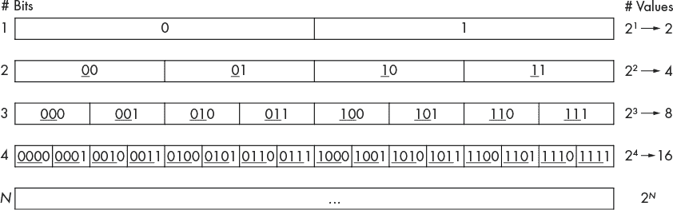

*图 4-1：一个到四个比特可以表示的值。下划线部分的比特对应于上一行的前缀。*

因为单个比特并不能代表很多信息，存储系统通常将比特组合成更长的序列，以存储更多有意义的值。最常见的组合是*字节*，它是由八个比特组成的集合。一个字节表示 2⁸ = 256 个独特的值（0–255），足以列举出英语中的字母和常见的标点符号。字节是计算机系统中最小的可寻址内存单位，这意味着程序不能要求少于八个比特来存储一个变量。

现代 CPU 通常将 *字（word）* 定义为 32 位或 64 位，具体取决于硬件的设计。字的大小决定了系统硬件在从一个组件传输数据到另一个组件时使用的“默认”大小（例如，内存和寄存器之间）。这些较大的数据序列对于存储数字是必要的，因为程序通常需要计算大于 256 的数值！如果你曾经使用过 C 语言编程，你就知道在使用变量之前必须先声明它（请参阅 第 21 页的“变量和 C 数值类型”）。这样的声明向 C 编译器传递了两个关于变量二进制表示的关键信息：为它分配的位数，以及程序打算如何解释这些位。概念上，位数是直接的，因为编译器只是查找与声明类型相关联的位数（例如，`char` 是一个字节——请参见 第 23 页的“C 数值类型”），并将相应的内存分配给变量。对一组位的解释则更加具有概念上的趣味性。计算机内存中的所有数据都是以位存储的，但位本身没有 *固有的* 意义。例如，即使只有一个位，你也可以将该位的两个值解释为许多不同的方式：上下、黑白、是与否、开与关等。

扩展位序列的长度会扩大其解释范围。例如，`char` 变量使用美国信息交换标准码（ASCII）编码标准，该标准定义了如何将八位二进制值映射到英文字母和标点符号。表 4-1 展示了 ASCII 标准的小部分（完整参考，请在命令行运行 `man ascii`）。字符 `’X’` 必须对应于 01011000 并没有什么特别的原因，所以不用记住表格。重要的是，每个存储字母的程序都达成了一致，确保它们对位序列的解释是一致的，这也是为什么 ASCII 是由标准委员会定义的原因。

**表 4-1：** 八位 ASCII 字符编码标准的一个小片段

| **二进制值** | **字符解释** | **二进制值** | **字符解释** |
| --- | --- | --- | --- |
| 01010111 | W | 00100000 | 空格 |
| 01011000 | X | 00100001 | ! |
| 01011001 | Y | 00100010 | " |
| 01011010 | Z | 00100011 | # |

任何信息都可以以二进制编码，包括图像和音频等丰富的数据。例如，假设一种图像编码方案定义 00、01、10 和 11 分别对应白色、橙色、蓝色和黑色。图 4-2 展示了我们如何使用这种简单的两位编码策略，仅用 12 字节就能画出一幅粗略的鱼的图像。在（a）部分，每个图像单元对应一个两位序列。部分（b）和（c）分别显示了对应的二进制编码，分别为两位和字节序列。尽管这个示例编码方案是为了学习目的而简化的，但其基本思路类似于实际图形系统所使用的方案，尽管实际应用中使用更多的位来表示更广泛的颜色范围。

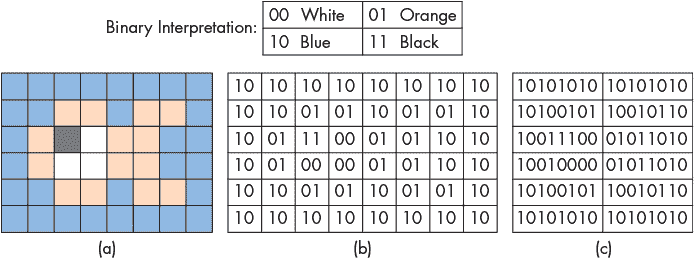

*图 4-2：简单鱼图像的（a）图像表示，（b）两位单元表示，以及（c）字节表示。*

在刚介绍了两种编码方案后，相同的比特序列 01011010 可能在文本编辑器中表示字符 `’Z’`，而在图形程序中则可能被解释为鱼的尾鳍的一部分。哪种解释正确取决于上下文。尽管底层比特相同，但人类往往会发现某些解释比其他解释更容易理解（例如，将鱼看作彩色单元格，而不是字节表）。

本章的其余部分主要处理二进制数字的表示和操作，但总体观点值得重申：所有信息都以 0 和 1 的形式存储在计算机内存中，程序或运行它们的人负责解释这些比特的含义。

### 4.1 数字进制与无符号整数

在看到二进制序列可以以各种非数字方式解释之后，接下来我们将关注数字。具体来说，我们从 *无符号* 数字开始，它们可以解释为零或正数，但永远不能是负数（它们没有 *符号*）。

#### 4.1.1 十进制数字

我们不从二进制开始，而是先来看看我们已经习惯使用的数字系统——*十进制系统*，它使用的 *进制* 是 10。*十进制* 表示十进制值的解释和表示有两个重要的属性。

首先，十进制数字中的每一位存储的是 10 个独特值中的一个（0–9）。要存储大于 9 的值，必须将值 *进位* 到左边的另一位。例如，如果某一位数字达到其最大值（9），然后我们加 1，结果需要两位数字（9 + 1 = 10）。无论数字在数字中的位置如何（例如，50**8**0 + **2**0 = 5**10**0），相同的规律都适用。

其次，数字中每个数字的位置决定了该数字对整体数值的重要性。将数字从*右到左*标记为*d*[0]、*d*[1]、*d*[2]，依此类推，每个后续的数字比下一个数字贡献更多的*十*倍。例如，取值 8425（图 4-3）。

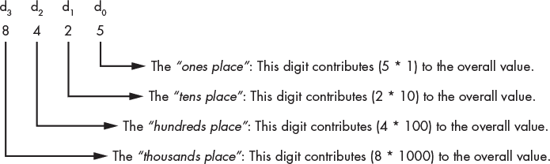

*图 4-3：在十进制数中，每个数字的重要性，使用你可能在小学时给每个数字命名的方式。*

对于示例值 8425，“个位”中的 5 贡献 5（5 × 10⁰）。“十位”中的 2 贡献 20（2 × 10¹）。“百位”中的 4 贡献 400（4 × 10²），最后，“千位”中的 8 贡献 8000（8 × 10³）。更正式地，8425 可以表示为

(8 × 10³) + (4 × 10²) + (2 × 10¹) + (5 × 10⁰)

这种对 10 为底数的指数递增模式正是它被称为*十进制*数字系统的原因。从右到左为数字位置编号，从*d*[0]开始，意味着每个数字*d*[*i*]对整体数值贡献 10^(*i*)。因此，任何*N*位的十进制数的整体值可以表示为

(*d*[*N*–1] × 10^(*N*–1)) + (*d*[*N*–2] × 10^(*N*–2)) + … + (*d*[2] × 10²) + (*d*[1] × 10¹) + (*d*[0] × 10⁰)

幸运的是，正如我们很快会看到的，类似的模式也适用于其他数字系统。

**注意区分数字进制**

现在我们即将介绍第二种数字系统，其中一个潜在问题是如何解释一个数字的不清晰性。例如，考虑值 1000。很难立刻判断你应该将这个数字解释为十进制值（一千）还是二进制值（八，稍后会解释）。为了帮助澄清，本章的其余部分将明确地为所有非十进制数字附加前缀。我们很快将介绍二进制，它的前缀是 0b，以及十六进制，它的前缀是 0x。

因此，如果你看到 1000，你应该假设它是十进制的“一千”，如果你看到 0b1000，你应该将其解释为二进制数，在这种情况下，值为“八”。

#### 4.1.2 无符号二进制数

尽管你可能从未考虑过描述十进制数作为 10 的幂的具体公式，但{*个位*、*十位*、*百位*等}的概念应该是熟悉的。幸运的是，类似的术语也适用于其他数字系统，比如二进制。当然，其他数字系统中的基数不同，所以每个数字位置对其数值的贡献也不同。

*二进制数字系统*使用 2 为底数，而不是十进制的 10。按我们刚才对十进制的分析方式来分析它，可以揭示几个相似之处（将 2 替换为 10）。

首先，二进制数字中的任何单个位存储的是两个独特值中的一个（0 或 1）。为了存储大于 1 的值，二进制编码必须*进位*到左边的一个额外位。例如，如果一个位达到最大值（1）并且我们加 1，结果就需要两个位（1 + 1 = 0b10）。对于任何位，无论其在数字中的位置如何（例如，0b100**1**00 + 0b**1**00 = 0b10**10**00），这一模式都适用。

其次，数字中每一位的位置决定了该位对数字值的重要性。从*右到左*标记每一位为*d*[0]、*d*[1]、*d*[2]，依此类推，每个连续的位比下一个位多贡献一个*二*的倍数。

第一点意味着，二进制计数遵循与十进制相同的模式：通过简单地枚举值并添加数字（位）。由于本节聚焦于*无符号*数字（仅零和正数），因此从零开始计数是自然的。表 4-2 展示了如何用二进制计数前几个自然数。正如表格所示，二进制计数会迅速增加数字的位数。直观地看，这种增长是有意义的，因为每一位二进制数字（有两种可能的值）所表示的信息少于每一位十进制数字（有十种可能的值）。

**表 4-2：** 二进制与十进制计数的比较

| **二进制值** | **十进制值** |
| --- | --- |
| 0 | 0 |
| 1 | 1 |
| 10 | 2 |
| 11 | 3 |
| 100 | 4 |
| 101 | 5 |
| ... | ... |

关于标记数字的第二点看起来非常熟悉！实际上，它与十进制几乎相同，这导致了一个几乎相同的公式来解释二进制数字。只需将每个指数的基数 10 替换为 2：

(*d*[*N*–1] × 2^(*N*–1)) + (*d*[*N*–2] × 2^(*N*–2)) + … + (*d*[2] × 2²) + (*d*[1] × 2¹) + (*d*[0] × 2⁰)

应用这个公式可以得出任何二进制数字的*无符号*解释。例如，考虑 0b1000：

(1 × 2³) + (0 × 2²) + (0 × 2¹) + (0 × 2⁰) = 8 + 0 + 0 + 0 = 8

这是一个更长的一字节示例，0b10110100：

(1 × 2⁷) + (0 × 2⁶) + (1 × 2⁵) + (1 × 2⁴) + (0 × 2³) + (1 × 2²) + (0 × 2¹) + (0 × 2⁰) = 128 + 0 + 32 + 16 + 0 + 4 + 0 + 0 = 180

#### 4.1.3 十六进制

到目前为止，我们已经考察了两种数字系统，十进制和二进制。十进制因其对人类的友好性而著名，而二进制则与硬件中数据存储的方式相匹配。需要注意的是，它们在表达能力上是等价的。也就是说，任何可以在一种系统中表示的数字，都可以在另一种系统中表示。鉴于它们的等价性，可能会让你感到惊讶的是，我们接下来要讨论的数字系统是：基于 16 的*十六进制*系统。

虽然有两种完全有效的数字系统，你可能会想为什么我们还需要第三种。答案主要是便利性。正如表 4-2 所示，二进制位序列会迅速增长为大量的数字。人类往往难以理解只包含 0 和 1 的长序列。虽然十进制更紧凑，但其基数 10 与二进制的基数 2 不匹配。

十进制无法轻松地捕捉到可以通过固定数量的位表示的范围。例如，假设一台旧电脑使用 16 位内存地址。有效地址的范围从 0b0000000000000000 到 0b1111111111111111。以十进制表示，地址的范围从 0 到 65535。显然，十进制表示比长二进制序列更紧凑，但除非你记住它们的转换，否则更难以推理这些十进制数字。现代设备使用 32 位或 64 位地址时，这两个问题会变得更加严重！

这些长二进制序列正是十六进制基数 16 的优势所在。大基数使得每个数字能够表示足够的信息，从而让十六进制数字更加紧凑。此外，由于基数本身就是 2 的幂（2⁴ = 16），所以十六进制和二进制之间的转换非常容易。为了完整性，我们将像分析十进制和二进制那样分析十六进制。

首先，十六进制数字中的每个单独数字存储的是 16 个唯一值之一。超过 10 个值会给十六进制带来新的挑战——传统的十进制数字最大值为 9。按照惯例，十六进制使用字母表示大于 9 的值，其中 A 代表 10，B 代表 11，一直到 F 代表 15。像其他系统一样，若要存储大于 15 的值，数字必须*进位*到左边的另一位。例如，如果一个数字达到最大值（F），并且我们加 1，结果将需要两个数字（0xF + 0x1 = 0x10；请注意，我们使用 0x 来表示十六进制数字）。

其次，数字中每个数字的位置决定了它对该数字数值的重要性。将数字从*右到左*标记为*d*[0]、*d*[1]、*d*[2]，依此类推，每个连续的数字对数字的贡献是前一个数字的 16 倍。

毫不意外，相同的解读数字的公式适用于十六进制，基数为 16：

(*d*[*N*–1] × 16^(*N*–1)) + (*d*[*N*–2] × 16^(*N*–2)) + … + (*d*[2] × 16²) + (*d*[1] × 16¹) + (*d*[0] × 16⁰)

例如，确定 0x23C8 的十进制值：

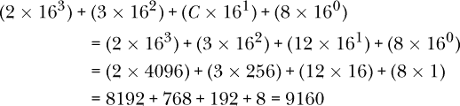

**警告 十六进制误解**

在你刚开始学习系统编程时，你可能不会频繁遇到十六进制数字。事实上，你最有可能遇到它们的唯一场景是在表示内存地址时。例如，如果你使用`printf`的`%p`（指针）格式代码打印一个变量的地址，你将得到十六进制输出。

许多学生常常开始将内存地址（例如 C 指针变量）与十六进制等同起来。虽然你可能习惯于看到地址以这种方式表示，但请记住，*它们仍然在硬件中以二进制形式存储*，就像所有其他数据一样！

#### 4.1.4 存储限制

从概念上讲，无符号整数是无限的。实际上，程序员必须在*存储之前*选择为一个变量分配多少位，原因有很多：

+   在存储一个值之前，程序必须为其分配存储空间。在 C 语言中，声明一个变量告诉编译器根据其类型需要多少内存（见第 24 页的“C 数值类型”）。

+   硬件存储设备具有有限的容量。虽然系统的主内存通常较大，不太可能成为限制因素，但 CPU 内部用于临时“工作空间”（即寄存器，见第 260 页的“CPU 寄存器”）的存储位置则更为受限。CPU 使用的寄存器大小受其字长限制（通常为 32 或 64 位，具体取决于 CPU 架构）。

+   程序经常将数据从一个存储设备移动到另一个存储设备（例如，从 CPU 寄存器到主内存）。随着数值的增大，存储设备需要更多的线路来在它们之间传递信号。因此，扩展存储会增加硬件的复杂性，并为其他组件腾出更少的物理空间。

用于存储整数的位数决定了其可表示值的范围。图 4-4 描述了我们如何将无限和有限无符号整数存储空间进行概念化。

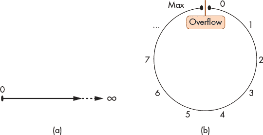

*图 4-4：无符号数字线（a）无限长与（b）有限长的示意图。后者在任一端点“回绕”（溢出）。*

尝试将一个超出变量大小限制的更大值存储到变量中，称为*整数溢出*。本章将整数溢出的详细内容推迟到后面的章节（见第 211 页的“整数溢出”）。现在，可以把它想象成汽车的里程表，如果超出最大值，它会“回绕”到零。同样，从零减去一将得到最大值。

在这个时候，关于无符号二进制的一个自然问题是：“*N* 位可以存储的最大正值是多少？”换句话说，给定一个全为 1 的 *N* 位序列，这个序列表示的值是多少？根据前一节的分析，*N* 位可以产生 2^(*N*) 个独特的位序列。由于其中一个序列必须表示数字 0，因此剩下的 2^(*N*) – 1 个正值范围从 1 到 2^(*N*) – 1。因此，*N* 位无符号二进制数的最大值必须是 2^(*N*) – 1。

例如，8 个二进制位提供 2⁸ = 256 个独特的序列。其中一个序列 0b00000000 被保留用于表示 0，剩下的 255 个序列用于存储正值。因此，一个 8 位变量表示从 1 到 255 的正值，其中最大的值是 255。

### 4.2 在进制之间转换

你很可能会在本章中遇到我们介绍的三种数字进制，并在不同的上下文中使用它们。在某些情况下，你可能需要从一个进制转换到另一个进制。本节首先展示了如何在二进制和十六进制之间进行转换，因为这两者之间的映射非常简单。之后，我们将探讨如何与十进制进行转换。

#### 4.2.1 二进制和十六进制之间的转换

由于二进制和十六进制的基数都是 2 的幂，所以它们之间的转换相对简单。具体而言，每个十六进制数字表示 16 个独特的值，而四个二进制位也表示 2⁴ = 16 个独特的值，使得它们的表达能力是等价的。表 4-3 列出了任何四个二进制位序列与单个十六进制数字之间的一一映射关系。

**表 4-3：** 所有四位二进制序列与一位十六进制数字的对应关系

| **二进制** | **十六进制** | **二进制** | **十六进制** |
| --- | --- | --- | --- |
| 0000 | 0 | 1000 | 8 |
| 0001 | 1 | 1001 | 9 |
| 0010 | 2 | 1010 | A |
| 0011 | 3 | 1011 | B |
| 0100 | 4 | 1100 | C |
| 0101 | 5 | 1101 | D |
| 0110 | 6 | 1110 | E |
| 0111 | 7 | 1111 | F |

请注意，表 4-3 中的内容等同于在这两种数字系统中从 0 到 15 的简单计数，因此无需记忆它。有了这个映射，你可以在任意方向上转换连续的位或十六进制数字。

要将 0xB491 转换为二进制，只需为每个十六进制数字替换相应的二进制值：

```
  B    4    9    1

1011 0100 1001 0001  ->  0b1011010010010001
```

要将 0b1111011001 转换为十六进制，首先将位分成四位一组，从*右到左*。如果最左边的组不足四位，可以用前导零进行填充。然后，替换成相应的十六进制值：

```
1111011001  ->  11 1101 1001  ->  0011 1101 1001

                                  ^ padding

0011 1101 1001

  3    D    9  ->  0x3D9
```

#### 4.2.2 转换为十进制

幸运的是，将值转换为十进制是我们在本章之前的各个部分中已经做过的事情。给定一个*任意*进制*B*的数字，将数字从*右到左*标记为*d*[0]、*d*[1]、*d*[2]，等等，可以得出一个通用的十进制转换公式：

(*d*[*N*–1] × B^(*N*–1)) + (*d*[*N*–2] × B^(*N*–2)) + … + (*d*[2] × *B*²) + (*d*[1] × *B*¹) + (*d*[0] × *B*⁰)

#### 4.2.3 从十进制转换

从十进制转换到其他进制需要做些额外的工作。非正式地说，目标是反转之前的公式：确定每一位的值，使得根据数字的位置，每个项的相加结果是原始的十进制数值。可以把目标进制系统中的每一位想象成我们描述十进制时所说的位置（例如“个位”，“十位”等）。例如，考虑从十进制转换到十六进制。十六进制数的每一位对应着 16 的一个逐渐增大的幂，表 4-4 列出了前几个幂。

**表 4-4：** 16 的幂

| **16**⁴ | **16**³ | **16**² | **16**¹ | **16**⁰ |
| --- | --- | --- | --- | --- |
| 65536 | 4096 | 256 | 16 | 1 |

例如，考虑将 9742 转换为十六进制：

+   65536 的倍数能装进 9742 多少次？（换句话说，“65536”的位置值是多少？）

    结果的十六进制值不需要任何 65536 的倍数，因为该值（9742）小于 65536，所以*d*[4]应设为 0。注意，通过同样的逻辑，所有更高编号的数字也将是 0，因为每个数字都会贡献更大的值，超过 65536。到目前为止，结果只有：

    | 0 |  |  |  |  |
    | --- | --- | --- | --- | --- |
    | *d*[4] | *d*[3] | *d*[2] | *d*[1] | *d*[0] |

+   4096 的倍数能装进 9742 多少次？（换句话说，“4096”的位置值是多少？）

    4096 可以装进 9742 两次（2 × 4096 = 8192），所以*d*[3]的值应为 2。因此，*d*[3]将为整体值贡献 8192，所以结果仍需考虑 9742 − 8192 = 1550。

    | 0 | 2 |  |  |  |
    | --- | --- | --- | --- | --- |
    | *d*[4] | *d*[3] | *d*[2] | *d*[1] | *d*[0] |

+   256 的倍数能装进 1550 多少次？（换句话说，“256”的位置值是多少？）

    256 可以装进 1550 六次（6 × 256 = 1536），所以*d*[2]的值应为 6，剩余 1550 − 1536 = 14。

    | 0 | 2 | 6 |  |  |
    | --- | --- | --- | --- | --- |
    | *d*[4] | *d*[3] | *d*[2] | *d*[1] | *d*[0] |

+   16 的倍数能装进 14 多少次？（换句话说，“十六”的位置值是多少？）

    没有，所以*d*[1]必须为 0。

    | 0 | 2 | 6 | 0 |  |
    | --- | --- | --- | --- | --- |
    | *d*[4] | *d*[3] | *d*[2] | *d*[1] | *d*[0] |

+   最后，1 的倍数能装进 14 多少次？（换句话说，“个位”的位置值是多少？）

    答案当然是 14，十六进制表示为数字 E。

    | 0 | 2 | 6 | 0 | E |
    | --- | --- | --- | --- | --- |
    | *d*[4] | *d*[3] | *d*[2] | *d*[1] | *d*[0] |

因此，十进制的 9742 对应于 0x260E。

##### 十进制到二进制：2 的幂

同样的程序适用于二进制（或任何其他数字系统），前提是你使用适当基数的幂。表 4-5 列出了前几个 2 的幂，这将有助于将示例十进制值 422 转换为二进制。

**表 4-5：** 2 的幂

| **2**⁸ | **2**⁷ | **2**⁶ | **2**⁵ | **2**⁴ | **2**³ | **2**² | **2**¹ | **2**⁰ |
| --- | --- | --- | --- | --- | --- | --- | --- | --- |
| 256 | 128 | 64 | 32 | 16 | 8 | 4 | 2 | 1 |

由于每个二进制位只允许存储 0 或 1，转换为二进制时，不再是“每个幂的倍数能适配多少值？”的问题。相反，应该问一个更简单的问题：“下一个二的幂适配吗？”例如，在转换 422 时：

+   256 可以整除 422，所以*d*[8]应该是 1。这剩下 422 − 256 = 166。

+   128 可以整除 166，所以*d*[7]应该是 1。这剩下 166 − 128 = 38。

+   64 不能整除 38，所以*d*[6]应该是 0。

+   32 可以整除 38，所以*d*[5]应该是 1。这剩下 38 − 32 = 6。

+   16 不能整除 6，所以*d*[4]应该是 0。

+   8 不能整除 6，所以*d*[3]应该是 0。

+   4 可以整除 6，所以*d*[2]应该是 1。这剩下 6 − 4 = 2。

+   2 可以整除 2，所以*d*[1]应该是 1。这剩下 2 − 2 = 0。

    （注意：当结果为 0 时，所有剩余位数将始终是 0。）

+   1 不能整除 0，所以*d*[0]应该是 0。

因此，十进制的 422 对应二进制的 0b110100110。

##### 十进制到二进制：重复除法

我们刚才描述的方法通常适用于熟悉相关二的幂的学生（例如，对于 422，转换器必须知道从*d*[8]开始，因为 2⁹ = 512 太大）。

一种替代方法不需要知道二的幂。相反，这种方法通过检查十进制数的奇偶性（偶数或奇数），并通过重复除以二（向下舍入）的方式来确定每一位的值，从而构建二进制结果。请注意，它是从*右到左*构建结果的位序列。如果十进制值是偶数，下一位应该是零；如果是奇数，下一位应该是 1。当除法结果为零时，转换完成。

例如，在转换 422 时：

+   422 是偶数，所以*d*[0]应该是 0。（这是最右边的位。）

+   422/2 = 211，这是奇数，所以*d*[1]应该是 1。

+   211/2 = 105，这是奇数，所以*d*[2]应该是 1。

+   105/2 = 52，这是偶数，所以*d*[3]应该是 0。

+   52/2 = 26，这是偶数，所以*d*[4]应该是 0。

+   26/2 = 13，这是奇数，所以*d*[5]应该是 1。

+   13/2 = 6，这是偶数，所以*d*[6]应该是 0。

+   6/2 = 3，这是奇数，所以*d*[7]应该是 1。

+   3/2 = 1，这是奇数，所以*d*[8]应该是 1。

+   1/2 = 0，所以任何编号为九或以上的数字将是 0，算法结束。

正如预期的那样，这种方法生成相同的二进制序列：0b110100110。

### 4.3 带符号的二进制整数

到目前为止，我们讨论的二进制数仅限于*无符号*（严格非负）整数。本节介绍了一种二进制的替代解释，涵盖了负数。鉴于变量具有有限的存储空间，带符号的二进制编码必须区分负值、零值和正值。操作带符号的数字还需要一个取反的过程。

有符号的二进制编码必须在负值和非负值之间划分比特序列。在实践中，系统设计师通常构建*通用*系统，因此 50% / 50%的划分是一个比较折中的选择。因此，本章介绍的有符号数字编码代表了相等数量的负值和非负值。

**注意 非负数与正数的区别**

请注意，*非负数*和*正数*之间有一个微妙但重要的区别。严格的正数集合排除了零，而非负数集合包括零。即使在负值和非负值之间将可用的比特序列划分为 50% / 50%，仍然必须为零保留一个非负值。因此，在固定比特数的情况下，数字系统可能会表示更多的负值而不是正值（例如，在二补码系统中）。

有符号数字编码使用一个比特来区分*负数*和*非负数*。按照约定，最左边的比特表示数字是负数（1）还是非负数（0）。这个最左边的比特被称为*高位比特*或*最重要的比特*。

本章介绍了两种可能的有符号二进制编码——*符号大小*和*二补码*。尽管在实践中只有其中一种编码（二补码）仍然在使用，但比较它们有助于说明它们的重要特性。

#### 4.3.1 符号大小

*符号大小*表示法将高位比特专门作为符号位。这意味着，无论高位比特是 0 还是 1，都不会影响数字的绝对值，它*仅仅*决定该值是正数（高位比特为 0）还是负数（高位比特为 1）。与二补码相比，符号大小使得十进制转换和取反过程相对直接：

+   要计算一个*N*位符号大小序列的十进制值，使用“无符号二进制数”中提到的熟悉方法计算*数字*d*[0]到*d*[*N–*2]的值（见第 193 页）。然后，检查最重要的比特*d*[*N–*1]：如果它是 1，值为负；否则为正。

+   要取反一个值，只需翻转最重要的比特位来改变其符号。

**警告 取反误解**

符号大小表示法纯粹是为了教学目的而介绍的。虽然过去一些计算机使用过符号大小表示法（例如，1960 年代的 IBM 7090），但现代系统中没有使用符号大小表示法来表示整数（尽管一个类似的机制*确实*是存储浮点数的标准的一部分）。

除非明确要求考虑符号大小，否则*不*应假设翻转二进制数字的第一个比特会使该数字在现代系统中变为其相反数。

图 4-5 展示了四位有符号数序列如何对应到十进制值。乍一看，由于其简单性，有符号数可能看起来很有吸引力。不幸的是，它有两个主要缺点，使得它不太受欢迎。第一个缺点是它存在*两个*零的表示。例如，在四位数中，有符号数同时表示*零*（0b0000）和*负零*（0b1000）。因此，这对硬件设计师来说是一个挑战，因为硬件需要处理两个在数值上相等但位值不同的二进制序列。硬件设计师只需要一种表示这样一个重要数字，工作会容易得多。

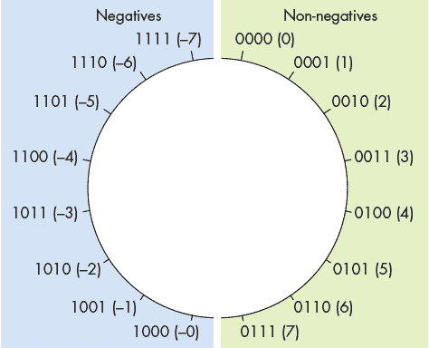

*图 4-5：四位二进制序列的有符号数值逻辑布局*

有符号数的另一个缺点是，它在负数和零之间存在不便的间断性。虽然我们将在“整数溢出”章节中详细讨论溢出问题（参见第 211 页），但将 1 加到四位序列 0b1111 会“回绕”到 0b0000。对于有符号数而言，这种效应意味着 0b1111（–7）+1 可能会被误认为是 0，而不是预期的–6。这个问题是可以解决的，但解决方案又使得硬件设计更加复杂，本质上将负整数和非负整数之间的任何过渡变成了一个需要特别小心的特殊情况。

由于这些原因，有符号数在实际应用中几乎已经消失，而二进制补码则占据了主导地位。

#### 4.3.2 二进制补码

*二进制补码*编码优雅地解决了有符号数表示法的问题。像有符号数一样，二进制补码的高位表示值是否应该被解释为负数。不过，与有符号数不同的是，高位也会影响数值。因此，它是如何同时做到这两点的呢？

计算一个*N*位二进制补码的十进制值与熟悉的无符号方法类似，区别在于高位的贡献被抵消了。也就是说，对于一个*N*位二进制补码序列，第一位的贡献不是*d*[*N–*1] × 2^(*N–*1)加到总和中，而是贡献*– d*[*N–*1] × 2^(*N–*1)（注意负号）。因此，如果最高位是 1，那么总值将是负数，因为该第一位对总和的贡献最大。否则，第一位对总和没有任何贡献，结果就是非负数。以下是完整的公式：

–(*d*[*N*–1] × 2^(*N*–1)) + (*d*[*N*–2] × 2^(*N*–2)) + … + (*d*[2] × 2²) + (*d*[1] × 2¹) + (*d*[0] × 2⁰)

（注意仅第一项的前导负号！）

图 4-6 展示了四位序列在二进制补码中的布局。该定义仅编码了零的一个表示——一个全为 0 的位序列。在只有单一 *零* 序列的情况下，二进制补码表示的负值比正值多一个。以四位序列为例，二进制补码表示的最小值为 0b1000（-8），但最大值仅为 0b0111（7）。幸运的是，这一怪异不会妨碍硬件设计，也很少给应用程序带来问题。

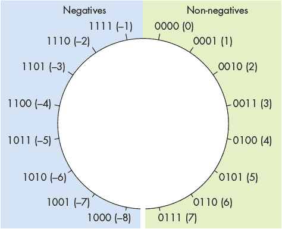

*图 4-6：四位长二进制补码值的逻辑布局*

与符号大小（signed magnitude）相比，二进制补码还简化了负数与零之间的转换。无论用于存储它的位数是多少，所有为 1 的二进制补码数值总是表示 -1。将 1 加到所有为 1 的位序列上会“溢出”到零，这使得二进制补码非常方便，因为 -1 + 1 *应该*产生零。

##### 取反

对二进制补码数值取反比对符号大小数值取反稍微复杂一些。要取反一个 *N* 位的数值，首先确定它相对于 2^(*N*) 的*补码*（这也是该编码名称的由来）。换句话说，要取反一个 *N* 位数值 *X*，找到一个位序列 *Y*（*X* 的补码），使得 *X* + *Y* = 2^(*N*)。

幸运的是，实际应用中有一个快速的二进制补码取反捷径：翻转所有的位并加 1。例如，要取反八位数值 13，首先确定 13 的二进制值（请参见“从十进制转换”第 199 页）。由于 13 是 8、4 和 1 的和，所以在第 3 位、第 2 位和第 0 位设置 1：

```
00001101  (decimal 13)
```

接下来，“翻转位”（将所有 0 改为 1，反之亦然）：

```
11110010
```

最后，加上 1 得到 0b11110011。果然，应用二进制补码位序列解释公式可以显示该数值是 -13：

–(1 × 2⁷) + (1 × 2⁶) + (1 × 2⁵) + (1 × 2⁴) + (0 × 2³) + (0 × 2²) + (1 × 2¹) + (1 × 2⁰) = –128 + 64 + 32 + 16 + 0 + 0 + 2 + 1 = –13

如果你对这个看似神奇的捷径为何有效感到好奇，可以更正式地考虑 13 的八位取反。为了找到 13 的补码，求解 0b00001101（13）+ *Y* = 0b100000000（2⁸，表示需要额外的位）。这个方程可以重排为 *Y* = 0b100000000 - 0b00001101。现在，这显然是一个减法问题：

```
 100000000  (256)

- 00001101   (13)
```

即使这种减法看起来令人望而生畏，我们也可以以一种更容易计算的方式表达它，即 (0b011111111 + 1) – 0b00001101。请注意，这种变化只是将 2⁸（256）表示为 (255 + 1)。做出此变化后，算式变成：

```
 011111111  (255)  + 00000001  (1)

- 00001101   (13)
```

事实证明，对于 *任何* 位值 *b*，1 *– b* 等同于“翻转”该位。因此，前面示例中的整个减法可以简化为只翻转较小数字的所有位。剩下的就是加上表示 256 为 255 + 1 的剩余 +1。将所有内容结合起来，我们可以简单地翻转一个值的位并加一来计算其补码！

**警告 C 程序设计中的带符号与不带符号整数**

除了分配空间，在 C 语言中声明变量还告诉编译器你希望如何解释该变量。当你声明一个 `int` 时，编译器将其解释为带符号的二进制补码整数。要分配一个无符号值，可以声明一个 `unsigned int`。

这种区别在 C 语言的其他地方也很重要，比如 `printf` 函数。正如本章一直强调的，位序列可以以不同的方式进行解释！在 `printf` 中，解释方式取决于你使用的格式占位符。例如：

#include <stdio.h>

int main() {

int example = -100;

/* 使用带符号和无符号占位符打印 example 整数。 */

printf("%d  %u\n", example, example);

return 0;

}

尽管这段代码将相同的变量（`example`）传递给 `printf` 两次，但它打印出的是 `-100 4294967196`。小心正确解释你的值！

##### 符号扩展

偶尔，你可能会遇到需要对两个使用不同位数存储的数字进行算术运算的情况。例如，在 C 语言中，你可能想将一个 32 位的 `int` 与一个 16 位的 `short` 相加。在这种情况下，较小的数字需要进行 *符号扩展*，这是一种 fancy 的说法，意思是将其最高有效位重复足够多次，以将位序列的长度扩展到目标长度。尽管编译器会为你处理位操作，但了解这个过程是如何运作的仍然很有帮助。

例如，要将四位序列 0b0110（6）扩展为八位序列，只需取高位（0），并将其前置四次，得到扩展值：0b00000110（仍然是 6）。同样，将 0b1011（–5）扩展为八位序列时，取高位（这次是 1），并将其前置四次，得到扩展值：0b11111011（仍然是 –5）。为了验证其正确性，考虑每次添加新位后值的变化：

```
    0b1011 =                      -8 + 0 + 2 + 1 = -5

   0b11011 =                 -16 + 8 + 0 + 2 + 1 = -5

  0b111011 =            -32 + 16 + 8 + 0 + 2 + 1 = -5

 0b1111011 =       -64 + 32 + 16 + 8 + 0 + 2 + 1 = -5

0b11111011 = -128 + 64 + 32 + 16 + 8 + 0 + 2 + 1 = -5
```

正如例子所示，非负数（高位为零）在前面添加零后仍然是非负的。同样，负数（高位为一）在前面添加一后仍然是负数。

**注意 无符号零扩展**

对于无符号值（例如，一个显式声明为`unsigned`的 C 语言变量），扩展它到更长的位序列需要使用*零扩展*，因为`unsigned`修饰符防止该值被解释为负数。零扩展只是将零添加到扩展位序列的高位部分。例如，0b1110（在无符号情况下是 14！）扩展为 0b00001110，尽管原始的高位是 1。

### 4.4 二进制整数算术

前面我们介绍了无符号（“无符号二进制数”在第 193 页）和有符号（“无符号二进制数”在第 193 页）整数的二进制表示；现在我们已经准备好在算术运算中使用它们。幸运的是，由于它们的编码方式，*无论我们选择将操作数或结果解释为有符号还是无符号*，对算术过程都没有影响。这一观察对于硬件设计师来说是一个好消息，因为它允许他们构建一套硬件组件，这些组件可以在无符号和有符号操作之间共享。第 246 页的“电路”部分更详细地描述了执行算术运算的电路。

幸运的是，你在小学时学习的用于执行十进制数算术运算的纸笔算法同样适用于二进制数。虽然硬件可能不会完全以相同的方式计算它们，但你至少能够理解这些计算。

#### 4.4.1 加法

记住，在二进制数中，每一位只能是 0 或 1。因此，当两个位都为 1 时，结果会*进位*到下一位（例如，1 + 1 = 0b10，需要两个位来表示）。实际上，程序会对多位变量进行加法，其中一位的*进位输出*会影响下一位的*进位输入*。

一般来说，当从两个二进制数（*A*和*B*）中加法时，*有八*种可能的结果，这取决于*位[A]*、*位[B]*和前一位的*进位输入*。 表 4-6 列出了从加一对位可能得到的八种结果。*进位输入*列指的是从前一位传入和的进位，*进位输出*列则指示加这对位是否会将进位输出到下一位。

**表 4-6：** 添加两个二进制数字（*A*和*B*）并可能从前一位获取进位时的八种可能结果

| **输入** | **输出** |
| --- | --- |
| **位**[**A**] | **位**[**B**] | **进位**[**输入**] | **结果（和）** | **进位**[**输出**] |
| 0 | 0 | 0 | 0 | 0 |
| 0 | 0 | 1 | 1 | 0 |
| 0 | 1 | 0 | 1 | 0 |
| 0 | 1 | 1 | 0 | 1 |
| 1 | 0 | 0 | 1 | 0 |
| 1 | 0 | 1 | 0 | 1 |
| 1 | 1 | 0 | 0 | 1 |
| 1 | 1 | 1 | 1 | 1 |

考虑两个四位二进制数的加法。首先，将数字对齐，使其对应的数字垂直匹配，然后按顺序对每个对应的数字求和，从低位数字（*d*[0]）到高位数字（*d*[3]）。例如，添加 0b0010 + 0b1011：

| **问题设置** | **实例操作** |
| --- | --- |
| 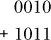 | 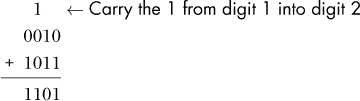 |

该示例显示从*d*[1]进入*d*[2]的 1。这种情况类似于添加两个十进制数字，它们的和大于 9。例如，当添加 5 + 8 = 13 时，结果的个位数为 3，并且 1 进位到十位数。

第一个操作数（0b0010）有一个前导 0，因此在二进制补码和无符号解释中均表示 2。第二个操作数（0b1011）如果作为有符号的二进制补码值解释，则表示-5。否则，如果作为无符号值解释，则表示 11。幸运的是，操作数的解释并不影响计算结果的步骤。也就是说，计算结果（0b1101）表示无论第二个操作数的解释如何，都是正确的，分别表示 13（无符号：2 + 11）或-3（有符号：2 + -5）。

更一般地说，四位序列在解释为*无符号*时表示范围[0, 15]的值。当解释为*有符号*时，它表示范围[-8, 7]。在前面的示例中，无论如何计算结果都在可表示的范围内，但我们可能并不总是那么幸运。例如，当添加 0b1100（无符号 12）+ 0b0111（7）时，答案应为 19，但四位无法表示 19：

| **问题设置** | **实例操作** |
| --- | --- |
| 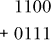 | 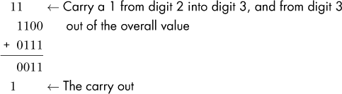 |

注意，在这个例子中的加法从最高有效位中带有 1，这种情况被称为整体算术运算的*Carry out*。在这个例子中，Carry out 表明算术输出需要额外的位来存储预期的结果。然而，在进行四位算术运算时，没有地方可以放置 Carry out 的额外位，因此硬件简单地丢弃或*截断*它，将 0b0011 作为结果。当然，如果目标是加法 12 + 7，结果 3 可能会让人感到意外。这种意外是*溢出*的后果。我们将在第 211 页的“整数溢出”中探讨如何检测溢出以及它产生的结果原因。

**注意**

多位加法器电路还支持一个*进位*，其行为类似于进位到最右边的数字（即它作为*d*[0]的*Carry[in]*输入）。在执行加法时，进位并不实际使用，因为它被隐式设置为 0，这就是为什么它不出现在前面的示例中的原因。然而，对于使用加法器电路的其他操作，进位就变得相关，尤其是减法。

#### 4.4.2 减法

减法结合了两种常见操作：取反和加法。换句话说，7 - 3 等同于将该操作表示为 7 + (–3)。这种减法的表现形式与硬件的行为非常一致——CPU 已经包含了用于取反和加法的电路，因此利用这些现有电路比构建全新的减法电路更为高效。回想一下，取反二进制数的简单方法是翻转位并加一（详见 第 205 页中的“取反”）。

考虑示例 0b0111（7）- 0b0011（3），首先将 3 发送到位翻转电路。为了得到“加一”，它利用了加法器电路的*进位输入*。即，减法不是从一位进位到另一位，而是将*进位输入*传递给加法器的*d*[0]。将进位输入设置为 1 会使得结果的“个位”值加一，这正是它需要的“加一”部分。将所有步骤组合在一起，示例结果如下：

| **问题设置** | **转化为加法** | **演示示例** |
| --- | --- | --- |
| 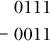 | 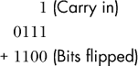 |  |

尽管加法的完整结果会扩展为额外的一位，但截断后的结果（0b0100）表示预期的结果（4）。与之前的加法示例不同，来自高位的进位并不一定意味着减法中的溢出问题。

当减去负值时，执行取反后加法的方式同样适用。例如，7 - (–3) 得到 10：

| **问题设置** | **转化为加法** | **演示示例** |
| --- | --- | --- |
| 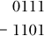 |  |  |

我们进一步探讨在“整数溢出”中执行（或不执行）进位操作的影响，详见 第 211 页。

#### 4.4.3 乘法与除法

本节简要介绍了带整数的二进制乘法和除法。特别是，它展示了手动计算结果的方法，并未反映现代硬件的行为。此描述并非详尽无遗，因为本章的其余部分主要集中在加法和减法。

##### 乘法

要进行二进制数的乘法，可以使用常见的笔算策略，一次考虑一个数字并加总结果。例如，0b0101（5）和 0b0011（3）的乘法等同于求和：

+   将 *d*[0] 与 0b101（5）相乘：0b0101（5）

+   将 *d*[1] 与 0b101（5）相乘，并将结果左移一位：0b1010（10）。

```
  0101       0101       0101

x 0011  =  x    1  +  x   10  =  101 + 1010  =  1111 (15)
```

##### （整数）除法

与前面描述的其他运算不同，除法可能产生非整数结果。进行整数除法时，最需要记住的是，在大多数编程语言中（例如 C、Python 2 和 Java），结果的小数部分会被截断。否则，二进制除法使用的是大多数学生在小学时学习的长除法方法。例如，下面是计算 11 / 3 如何得到整数结果 3 的过程：

```
    ____

11 |1011

    00__   11 (3) doesn't fit into 1 (1) or 10 (2),

11 |1011   so the first two digits of the result are 00.

    001_   11 (3) fits into 101 (5) once.

11 |1011

    101    101 (5) - 11 (3) leaves 10 (2).

  -  11

     10

    0011

11 |1011   11 (3) fits into 101 (5) once again.

     101
```

到此为止，算术已经得出了预期的整数结果 0011（3），硬件会截断任何小数部分。如果你有兴趣确定整数余数，可以使用取模运算符（%），例如，11 % 3 = 2。

### 4.5 整数溢出

尽管整数的数量在数学上是无限的，但在实际应用中，计算机内存中的数字类型占用固定数量的位（参见第 196 页的“存储限制”）。正如本章始终暗示的，使用固定数量的位意味着程序可能无法表示它们希望存储的值。例如，加法讨论中显示，两个合法值相加可能会产生无法表示的结果（参见第 208 页）。如果一个计算没有足够的存储空间来表示其结果，那么它就发生了*溢出*。

#### 4.5.1 里程表类比

为了描述溢出，我们可以从非计算领域举个例子：汽车的里程表。里程表记录了汽车行驶的里程数，不论是数字式还是模拟式，都只能显示有限的（十进制）数字。如果汽车行驶的里程数超过了里程表所能表示的范围，里程表会“回绕”回到零，因为实际的值无法表示。例如，对于一个标准的六位数里程表，它能表示的最大值是 999999。再多行驶一英里*本应*显示 1000000，但就像第 208 页中溢出的加法例子一样，1 会从六个可用数字中溢出，最终只留下 000000。

为了简化起见，我们继续分析一个仅限于一个十进制数字的里程表。也就是说，里程表表示的范围是[0, 9]，因此每行驶 10 英里，里程表就会重置回零。将里程表的范围通过视觉方式展示出来，它可能像图 4-7 这样。


*图 4-7：一个一位数里程表潜在值的视觉呈现*

因为一个一位数的里程表在达到 10 时就会回绕，绘制一个圆形强调了圆顶的断裂点（*仅仅是*在圆顶处）。具体来说，通过对除九以外的任何值加一，结果会得到预期的值。另一方面，对九加一则跳转到一个不自然的值（零）。更一般地，当执行*任何*跨越九与零之间断裂点的算术运算时，计算将会溢出。例如，考虑加法 8 + 4，如图 4-8 所示。

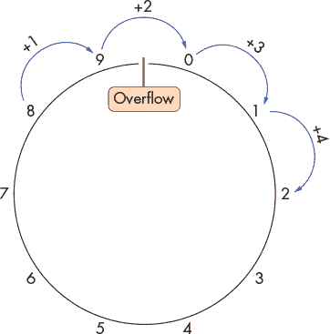

*图 4-8：仅有一个十进制位时，8 + 4 的结果。越过 0 和 9 之间的不连续性表示发生了溢出。*

在这里，和预期的 12 相比，结果是 2。请注意，许多其他加到 8 上的值（例如，8 + 14）也会得到 2，唯一的区别是这些计算会绕圈进行多次。因此，无论汽车行驶了 2 英里、12 英里还是 152 英里——最终，里程表都会显示 2。

任何像里程表一样工作的设备都执行 *模运算*。在这种情况下，所有算术运算都相对于 10 进行模运算，因为一个十进制数字仅表示 10 个值。因此，给定任何行驶的英里数，我们可以通过将距离除以 10 并取余数作为结果来计算里程表显示的数值。如果里程表有两个十进制数字而不是一个，模数将变为 100，因为它可以表示更大的值范围：[0, 99]。类似地，时钟执行模运算，小时数模数为 12。

#### 4.5.2 二进制整数溢出

看到一种熟悉的溢出形式后，让我们来看看二进制数字编码。回忆一下，*N* 位存储表示 2^(*N*) 个独特的比特序列，而这些序列可以以不同的方式解读（作为 *无符号* 或 *有符号*）。在某些解释下，某些运算可能会得到正确的结果，但在另一种解释下却会发生溢出，因此硬件需要根据每种情况不同地识别溢出。

例如，假设一台机器使用四位序列计算 0b0010 (2) - 0b0101 (5)。将此运算通过减法过程（参见 第 209 页 的“减法”）进行计算，得到的二进制结果是 0b1101。将此结果解释为 *有符号* 值会得到 -3（-8 + 4 + 1），这是 2 - 5 的预期结果，没有溢出。另一方面，将其解释为 *无符号* 值则得到 13（8 + 4 + 1），这是不正确的，明显表明发生了溢出。进一步审视这个例子，它直觉上是有道理的——结果应该是负数，而有符号解释允许负数，而无符号则不允许。

##### 无符号溢出

*无符号* 数字的行为与十进制里程表的示例相似，因为它们都仅表示非负值。*N* 位表示的无符号值范围是 [0, 2^(*N*) – 1]，使得所有的算术运算都相对于 2^(*N*) 进行模运算。图 4-9 展示了四位序列的无符号解释在模空间中的排列。

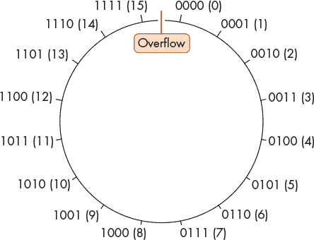

*图 4-9：四位无符号值在模空间中的排列。所有算术运算都相对于 2⁴ (16) 进行模运算。*

由于无符号解释不能表示负值，因此断点再次出现在最大值和零之间。因此，无符号溢出发生在任何操作跨越 2^(*N*) - 1 和 0 之间的界限时。简单来说，如果执行加法（应使结果*增大*）却得到较小的结果，则加法引起了无符号溢出。对称地，如果执行减法（应使结果*减小*）却得到较大的结果，则减法引起了无符号溢出。

作为检测加法和减法无符号溢出的捷径，回顾这些操作的进位（第 208 页）和进位输入（第 209 页）位。*进位*是指计算结果中从最高有效位向外进位的位。当设置时，*进位输入*通过将 1 进位到算术操作的最低有效位，来增加结果的值。*进位输入*只有在减法时才会设置为 1，作为取反过程的一部分。

无符号算术的捷径是：进位输出必须与进位输入匹配，否则该操作会导致溢出。直观地，这个捷径之所以有效，是因为：

+   对于加法（进位输入 = 0），结果应大于或等于第一个操作数。然而，如果和需要额外的存储位（进位 = 1），则从和中截断该额外的位会导致较小的结果（溢出）。例如，在无符号四位数空间中，0b1100（12）+ 0b1101（13）的和需要*五*个位来存储结果 0b11001（25）。当截断为四个位时，结果变为 0b1001（9），小于操作数（因此，发生溢出）。

+   对于减法（进位输入 = 1），结果应小于或等于第一个操作数。由于减法是加法和取反的组合，求解加法子问题时应得出较小的结果。加法只能通过截断其和（进位 = 1）来得到较小的值。如果不需要截断（进位 = 0），则减法将得到较大的结果（溢出）。

让我们来分析两个四位减法的例子，一个发生溢出，另一个没有。首先，考虑 0b0111（7）– 0b1001（9）。减法过程将此计算视为：

| **问题设置** | **转换为加法** | **示例** |
| --- | --- | --- |
| 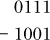 | 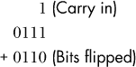 | 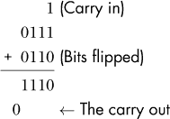 |

计算*没有*从*d*[3]中进位，因此没有发生截断，且进位输入（1）未与进位输出（0）匹配。结果 0b1110（14）大于任一操作数，因此对于 7 – 9（溢出）来说显然是错误的。

接下来，考虑 0b0111（7）– 0b0101（5）。减法过程将此计算视为：

| **问题设置** | **转换为加法** | **示例** |
| --- | --- | --- |
| 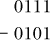 | 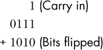 | 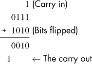 |

计算会向*d*[4]传递一个进位，导致进位输入（1）与进位输出（1）匹配。截断后的结果 0b0010（2）正确地表示了减法操作的预期结果（没有溢出）。

##### 有符号溢出

溢出的直觉也适用于*有符号*二进制解释：在模数空间中存在一个不连续性。然而，由于有符号解释允许负数，故此不连续性不会出现在 0 附近。回想一下，二的补码（参见第 204 页）从–1 (0b1111 . . . 111) “平滑地过渡”到 0 (0b0000 . . . 0em000)。因此，不连续性出现在数字空间的*另一端*，即最大正值和最小负值相遇的地方。

图 4-10 展示了四位序列的有符号解释在模数空间中的排列。请注意，一半的值是负数，另一半是非负数，且不连续性位于它们之间的最小/最大分隔处。

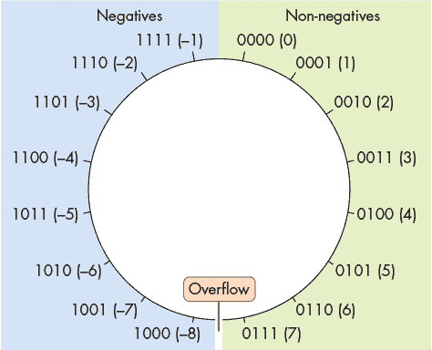

*图 4-10：四位有符号值在模数空间中的排列。由于有符号解释允许负值，不连续性不再位于零处。*

在进行有符号算术时，始终安全生成一个趋近零的结果。也就是说，任何减少结果绝对值的操作都不会发生溢出，因为溢出的不连续性位于可表示值的幅度最大的位置。

因此，系统通过将操作数的最高有效位与结果的最高有效位进行比较，来检测有符号加法和减法中的溢出。对于减法，首先将算式转换为加法形式（例如，将 5 – 2 改写为 5 + –2）。

如果加法的操作数具有*不同*的高位位值（即一个操作数是负数，另一个是正数），则不可能发生有符号溢出，因为结果的绝对值必定小于（或等于）任一操作数。结果是*向*零靠近的。

如果加法的操作数具有*相同*的高位位值（即，两者都是正数或两者都是负数），则正确的结果也必须具有相同的高位位值。因此，当加上两个符号相同的操作数时，如果结果的符号与操作数的符号不同，则会发生有符号溢出。

考虑以下四位有符号二进制示例：

*   5 – 4 等价于 5 + –4。第一个操作数（5）是正数，而第二个操作数（–4）是负数，因此结果必须趋近于零，*没有溢出*的可能。

+   4 + 2（都是正数）得出 6（也是正数），所以*没有溢出*发生。

+   –5 – 1 等价于 –5 + –1（都是负数），得出–6（也是负数），所以*没有溢出*发生。

+   4 + 5（都是正数）得到–7（负数）。由于操作数具有相同的符号，并且与结果的符号不匹配，此操作*溢出*。

+   –3 – 8 等同于–3 + –8（都是负数），结果为 5（正数）。由于操作数具有相同的符号，并且与结果的符号不匹配，此操作*溢出*。

#### 4.5.3 溢出总结

通常，整数溢出发生在算术操作在其结果可以表示的最小和最大值之间移动时。如果对有符号和无符号溢出的规则感到疑惑，考虑*N*位序列的最小值和最大值：

+   最小的*无符号*值是 0（因为无符号编码不能表示负数），最大的无符号值是 2^(*N*) – 1（因为一个比特序列用于零）。因此，不连续性出现在 2^(*N*) – 1 和 0 之间。

+   最小的*有符号*值是–2^(*N–*1)（因为一半的序列用于负值），最大值是 2^(*N–*1) – 1（因为另一半一个值用于零）。因此，不连续性出现在 2^(*N–*1) – 1 和–2^(*N–*1)之间。

#### 4.5.4 溢出后果

虽然你可能不经常遇到整数溢出，但溢出有可能以显著（甚至是破坏性的）方式破坏程序。

例如，2014 年，PSY 的流行曲“江南 Style”^(1)音乐视频威胁到 YouTube 用于跟踪视频点击数的 32 位计数器溢出。因此，YouTube 转而使用 64 位计数器。

另一个相对无害的例子出现在 1980 年的街机游戏《Pac-Man》中。游戏开发人员使用了一个无符号的八位值来跟踪玩家通过游戏级别的进度。因此，如果一个高手玩家超过了第 255 级（八位无符号整数的最大值），游戏板的一半会出现显著的故障，如图 4-11 所示。

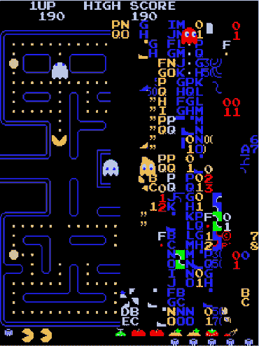

*图 4-11：当达到第 256 级时，《Pac-Man》游戏板“疯狂”了起来。*

一个更为悲剧性的溢出例子出现在 20 世纪 80 年代中期的治疗机器 Therac-25^(2)的历史中。Therac-25 存在几个设计问题，包括一个递增真值标志变量而不是将其设为常数。经过足够的使用后，标志溢出，导致它错误地回滚到零（假），绕过安全机制。Therac-25 最终严重伤害了（在某些情况下还杀死了）六名患者。

### 4.6 位运算符

除了前面描述的标准算术运算外，CPU 还支持一些在二进制之外较为罕见的运算。这些*按位运算符*直接应用逻辑门的行为（参见 第 243 页的“基本逻辑门”）于位序列，使它们能够高效地在硬件中实现。与加法和减法不同，后者通常用于程序员操作变量的数值解释，程序员通常使用按位运算符来修改变量中的特定位。例如，程序可能会在变量中编码某个位的位置以表示真/假值，而按位运算则允许程序操作变量的单独位，从而改变该特定位。

#### 4.6.1 按位与

按位与运算符（`&`）评估两个输入的位序列。对于输入的每个位，如果*两个*输入在该位置都是 1，则输出 1；否则，输出 0。表 4-7 展示了两个值 *A* 和 *B* 进行按位与运算的真值表。

**表 4-7：** 两个值（A 和 B）按位与运算的结果

| **A** | **B** | **A & B** |
| --- | --- | --- |
| 0 | 0 | 0 |
| 0 | 1 | 0 |
| 1 | 0 | 0 |
| 1 | 1 | 1 |

例如，要对 0b011010 和 0b110110 进行按位与（AND）操作，首先将这两个序列对齐。然后逐位检查每个数字，如果*两个*数字都是 1，则将该列的结果设置为 1；否则，将该列的结果设置为 0：

```
        011010

    AND 110110  Only digits 1 and 4 are 1's in BOTH inputs, so

Result: 010010  those are the only digits set to 1 in the output.
```

在 C 语言中执行按位与运算时，在两个操作数变量之间放置 C 的按位与运算符（`&`）。下面是再次在 C 语言中执行的示例：

```
int x = 26;

int y = 54;

printf("Result: %d\n", x & y);  // Prints 18
```

**警告 位运算与逻辑真值运算的区别**

注意不要将按位运算符与逻辑真值运算符混淆（参见 第 32 页的“C 语言中的布尔值”）。尽管它们有类似的名称（AND、OR、NOT 等），但这两者*并不相同*：

+   按位运算符独立地考虑其输入的每一位，并根据特定位是否被设置来生成输出的位序列。

+   逻辑运算符仅考虑操作数的*真值*解释。在 C 语言中，零值被视为*假*，而所有其他值都被认为是*真*。逻辑运算符通常在评估条件表达式（如 `if` 语句）时使用。

请注意，C 语言常常使用类似（但稍有不同）的运算符来区分这两者。例如，你可以使用单个 `&` 和 `|` 来表示按位与和按位或，分别对应逻辑与（AND）和逻辑或（OR）运算。逻辑与和逻辑或则使用双重 `&&` 和 `||` 表示。最后，按位非运算符是 `~`，而逻辑非则由 `!` 表示。

#### 4.6.2 位运算 OR

按位或运算符（`|`）的行为与按位与运算符类似，不同之处在于，如果*任意一个或两个*输入在相应位置是 1，则输出 1；否则，输出 0。表 4-8 展示了两个值 *A* 和 *B* 进行按位或运算的真值表。

**表 4-8：** 按位或运算两个值的结果（A 或 B）

| **A** | **B** | **A&#124;B** |
| --- | --- | --- |
| 0 | 0 | 0 |
| 0 | 1 | 1 |
| 1 | 0 | 1 |
| 1 | 1 | 1 |

例如，要对 0b011010 和 0b110110 进行按位或运算，首先将两个序列对齐。逐列检查每一位，如果*任意一个*数字为 1，则该列的结果为 1：

```
        011010

     OR 110110     Only digit 0 contains a 0 in both inputs, so it's

Result: 111110     the only digit not set to 1 in the result.
```

在 C 中执行按位或运算时，将 C 的按位或操作符（`|`）放在两个操作数之间。以下是相同的示例，在 C 中执行：

```
int x = 26;

int y = 54;

printf("Result: %d\n", x | y);  // Prints 62
```

#### 4.6.3 按位异或（排他或）

按位异或操作符（`^`）的行为类似于按位或操作符，只不过它仅在输入的两个数字中*恰好有一个*（而不是两个）在相应位置为 1 时，输出 1。否则，它将输出 0。表 4-9 显示了两个值 *A* 和 *B* 的按位异或的真值表。

**表 4-9：** 按位异或两个值的结果（A 异或 B）

| **A** | **B** | **A ^ B** |
| --- | --- | --- |
| 0 | 0 | 0 |
| 0 | 1 | 1 |
| 1 | 0 | 1 |
| 1 | 1 | 0 |

例如，要对 0b011010 和 0b110110 进行按位异或操作，首先将两个序列对齐。逐列检查每一位，如果*只有一个*数字为 1，则该列的结果为 1：

```
        011010

    XOR 110110     Digits 2, 3, and 6 contain a 1 in exactly one of

Result: 101100     the two inputs.
```

在 C 中执行按位异或时，将 C 的按位异或操作符（`^`）放在两个操作数之间。以下是相同的示例，在 C 中执行：

```
int x = 26;

int y = 54;

printf("Result: %d\n", x ^ y);  // Prints 44
```

#### 4.6.4 按位取反

按位取反操作符（`~`）仅作用于一个操作数。对于序列中的每一位，它简单地翻转该位，使零变为一，或反之。 表 4-10 显示了按位取反操作符的真值表。

**表 4-10：** 按位取反一个值的结果（A）

| **A** | **~A** |
| --- | --- |
| 0 | 1 |
| 1 | 0 |

例如，要对 0b011010 进行按位取反，翻转每一位的值：

```
    NOT 011010

Result: 100101
```

在 C 中执行按位取反时，将波浪号字符（`~`）放在操作数前面。以下是相同的示例，在 C 中执行：

```
int x = 26;

printf("Result: %d\n", ~x); // Prints -27
```

**警告 按位取反与否定的区别**

请注意，所有现代系统使用二进制补码表示整数，因此按位取反与否定并不完全相同。按位取反*仅*翻转位，不*加*一。

#### 4.6.5 位移

另一个重要的按位操作涉及将操作数的位移到左边（`<<`）或右边（`>>`）。左移和右移操作符都需要两个操作数：要移位的位序列和它应该移位的位数。

##### 向左移位

将一个序列向左移动 *N* 位，将其每一位向左移动 *N* 次，在序列的右侧附加新的零。例如，将 8 位序列 0b00101101 向左移动两位，结果是 0b10110100。右侧的两个零附加到序列的末尾，因为结果仍然需要是一个 8 位的序列。

在没有溢出的情况下，左移会*增加*结果值，因为位会移向那些贡献更大二次幂的数字位置。然而，对于固定数量的位，任何移到超出数字最大容量位置的位都会被截断。例如，将 8 位序列 0b11110101（无符号解读为 245）左移一位，结果为 0b11101010（无符号解读为 234）。这里，移出高位的位被截断，使得结果变小。

要在 C 语言中执行左位移，请将两个小于符号（`<<`）放在值与要移位的位数之间：

```
int x = 13;  // 13 is 0b00001101

printf("Result: %d\n", x << 3);  // Prints 104 (0b01101000)
```

##### 右移

右移类似于左移——任何超出变量容量（例如，右边移出的位）的位都会由于截断而消失。然而，右移引入了额外的考虑因素：新添加到结果左侧的位可能需要是零或一，这取决于移位变量的*类型*及其高位值。从概念上讲，选择填充零或一类似于符号扩展（请参阅第 206 页的“符号扩展”）。因此，右移有两种不同的变体：

+   *逻辑右移*始终将零填充到结果的高位。逻辑移位用于移位*无符号*变量，因为无符号值的最高有效位如果为 1 并不表示该值是负数。例如，使用逻辑右移将 0b10110011 右移两位，结果为 0b00101100。

+   *算术右移*将移位值的最高有效位复制到新位位置的每一位上。算术移位适用于*有符号*变量，对于这些变量，保留高位的符号性非常重要。例如，使用算术右移将 0b10110011 右移两位，结果为 0b11101100。

幸运的是，在 C 语言编程中，如果正确声明了变量，通常不需要担心这种区分。如果程序中包含右移操作符（`>>`），几乎所有 C 编译器都会根据移位变量的类型自动执行适当的移位操作。也就是说，如果移位变量声明为*无符号*类型，编译器将执行逻辑移位。否则，它将执行算术移位。

**注意：C 语言右移示例程序**

你可以通过一个小示例程序测试右移的行为，例如下面这个：

#include <stdio.h>

int main(int argc, char **argv) {

/* 无符号整数值：u_val */

unsigned int u_val = 0xFF000000;

/* 有符号整数值：s_val */

int s_val = 0xFF000000;

printf("%08X\n", u_val >> 12);  // 逻辑右移

printf("%08X\n", s_val >> 12);  // 算术右移

return 0;

}

该程序声明了两个 32 位整数：一个作为无符号整数（`u_val`），另一个作为有符号整数（`s_val`）。它将这两个整数初始化为相同的起始值：一个由 8 个 1 和 24 个 0 组成的序列（`0b1111111100000000000000000000000000`），然后将这两个值右移 12 位。执行时，它会打印：

$ ./a.out

000FF000

FFFFF000

由于无符号的`u_val`中的前导 1 并不表示“负数”，所以编译器使用指令仅用 0 填充它的前面。移位结果包含 12 个 0，8 个 1，和 12 个 0（`0b00000000000011111111000000000000`）。另一方面，`s_val`的前导 1 确实表示“负数”，所以编译器会在移位后的值前面填充 1，得到 20 个 1 和 12 个 0（`0b11111111111111111111000000000000`）。

### 4.7 整数字节顺序

到目前为止，本章已经描述了几种用位编码数字的方案，但还没有提到这些值是如何在内存中组织的。对于现代系统，内存的最小可寻址单元是字节（byte），它由八个位（bit）组成。因此，要在地址*X*开始存储一个字节值（例如，一个`char`类型的变量），你实际上没有什么选择——只需将字节存储在地址*X*处。

然而，对于多字节值（例如`short`或`int`类型的变量），硬件在将值的字节分配到内存地址时有更多的选择。例如，考虑一个两字节的`short`类型变量`s`，它的字节标记为 A（包含`s`的高位）和 B（包含`s`的低位）。当系统被要求将像`s`这样的`short`存储在地址*X*（即在地址*X*和*X* + 1 中）时，它必须定义该变量的哪个字节（A 或 B）应该占据哪个地址（*X*或*X* + 1）。图 4-12 展示了将`s`存储在内存中的两种选择。

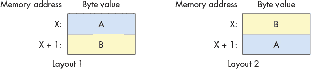

*图 4-12：从内存地址*X*开始的两种可能的两字节短整型内存布局*

系统的*字节顺序*（或*字节序*）定义了硬件如何将一个多字节变量的字节分配到连续的内存地址。尽管对于只在单个系统上运行的程序来说，字节顺序很少会成为问题，但如果你的某个程序试图逐字节打印，或者你使用调试器检查变量时，可能会感到惊讶。

例如，考虑以下程序：

```
#include <stdio.h>

int main(int argc, char **argv) {

    // Initialize a four-byte integer with easily distinguishable byte values

 int value = 0xAABBCCDD;

    // Initialize a character pointer to the address of the integer.

    char *p = (char *) &value;

    // For each byte in the integer, print its memory address and value.

    int i;

    for (i = 0; i < sizeof(value); i++) {

        printf("Address: %p, Value: %02hhX\n", p, *p);

        p += 1;

    }

    return 0;

}
```

该程序分配了一个四字节整数，并按照从高位到低位的顺序初始化字节，赋值为十六进制值`0xAA`、`0xBB`、`0xCC`和`0xDD`。然后，它从整数的基地址开始，一次打印每个字节。你可能会认为字节会按字母顺序打印。然而，常用的 CPU 架构（例如 x86 和大多数 ARM 硬件）在执行示例程序时，会反向打印这些字节：

```
$ ./a.out

Address: 0x7ffc0a234928, Value: DD

Address: 0x7ffc0a234929, Value: CC

Address: 0x7ffc0a23492a, Value: BB

Address: 0x7ffc0a23492b, Value: AA
```

x86 处理器以*小端*格式存储整数——从最低有效字节（“小端”）到最高有效字节，按连续地址存储。其他*大端*CPU 架构则按相反顺序存储多字节整数。图 4-13 展示了一个四字节整数在（a）大端和（b）小端布局中的内存布局。

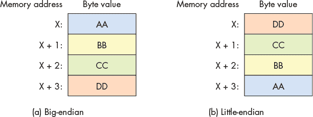

*图 4-13：四字节整数在（a）大端和（b）小端格式中的内存布局*

看似奇怪的“字节序”术语来源于乔纳森·斯威夫特的讽刺小说*《格列佛游记》*（1726 年）。^(3) 在故事中，格列佛发现自己身处两个六英寸高的小人帝国，他们为了争夺正确的破蛋方法而发生战争。布勒弗斯库的“大端”帝国从蛋的大端开始敲破，而利立浦特的“小端”帝国则从蛋的小端开始敲破。

在计算机领域，系统是*大端*还是*小端*通常只影响跨机器通信的程序（例如，通过网络）。在系统之间传输数据时，两个系统必须就字节顺序达成一致，接收方才能正确解读数值。1980 年，丹尼·科恩向互联网工程任务组（IETF）提交了一篇名为*《圣战与和平呼吁》*的备忘录。^(4) 在该备忘录中，科恩采用了斯威夫特的“字节序”术语，并建议 IETF 为网络传输采用标准的字节顺序。IETF 最终采纳了*大端*作为“网络字节顺序”标准。

C 语言提供了两个库，允许程序重新排列整数的字节顺序^(5)，以便进行通信。

### 4.8 二进制中的实数

虽然本章主要关注二进制整数表示，但程序员通常也需要存储实数。存储实数本质上是困难的，且没有任何二进制编码能够完美精确地表示实值。也就是说，对于任何实数的二进制编码，都存在无法*精确*表示的值。像*π*这样的无理数显然无法精确表示，因为它们的表示永远不会终止。在给定的固定位数下，二进制编码仍然无法在其范围内表示某些有理数值。

与可数的整数不同，实数集是不可数的。^(6)^(7) 换句话说，即使是一个狭窄范围内的实数值（例如，从零到一之间），该范围内的值集也如此庞大，以至于我们甚至无法开始列举它们。因此，实数编码通常只存储经过截断的、具有预定比特数的值的近似值。只要比特数足够，近似值通常足够精确，适用于大多数用途，但在编写不能容忍四舍五入的应用程序时，需特别小心。

本节的其余部分简要描述了两种在二进制中表示实数的方法：*定点*，它扩展了二进制整数格式，以及*浮点*，它以一定的复杂度代价表示大范围的值。

#### 4.8.1 定点表示

在*定点表示*中，值的*二进制点*位置是固定的，无法改变。就像十进制数中的*小数点*一样，二进制点表示数字的小数部分的起始位置。定点编码规则类似于无符号整数表示（参见第 193 页的“无符号二进制数字”），唯一的重大区别是：二进制点后的数字表示的是指数为*负*值的二的幂。例如，考虑八位序列 0b000101.10，其中前六个位表示整数部分，剩下的两个比特表示小数部分。图 4-14 标出了数字的位置及其各自的解释。

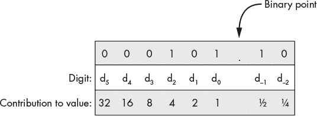

*图 4-14：带有两个小数位的八位数中每个数字的值*

应用将 0b000101.10 转换为十进制的公式得到：

(0 × 2⁵) + (0 × 2⁴) + (0 × 2³) + (1 × 2²) + (0 × 2¹) + (1 × 2⁰) + (1 × 2^(–1)) + (0 × 2^(–2)) = 0 + 0 + 0 + 4 + 0 + 1 + 0.5 + 0 = 5.5

更一般地说，当二进制点后有两个比特时，数字的小数部分包含以下四种序列之一：00（.00）、01（.25）、10（.50）或 11（.75）。因此，两个小数位允许定点数表示精确到 0.25（2^（–2））的分数值。添加第三个位将精度提高到 0.125（2^（–3）），模式类似地继续下去，具有*N*位的小数部分可以实现 2^（–N）精度。

因为二进制点后的位数是固定的，一些完全精确的操作数计算结果可能会产生需要截断（四舍五入）的结果。考虑前一个示例中的相同八位定点编码。它精确表示了 0.75（0b000000.11）和 2（0b000010.00）。然而，它不能精确表示 0.75 除以 2 的结果：计算*应该*得到 0.375，但存储它会需要在二进制点后多一个比特（0b000000.011）。截断最右边的 1 使得结果可以适应指定的格式，但这将得到一个四舍五入后的结果 0.75 / 2 = 0.25。在这个例子中，由于涉及的位数较少，四舍五入误差非常明显，但即使是更长的位序列也将需要在某个时刻进行截断。

更糟糕的是，四舍五入误差会在中间计算过程中累积，在某些情况下，计算序列的结果可能会根据执行顺序的不同而有所变化。例如，考虑两个在前面描述的相同八位定点编码下的算术序列：

1. `(0.75 / 2) * 3 = 0.75`

2. `(0.75 * 3) / 2 = 1.00`

请注意，这两者之间唯一的区别在于乘法和除法操作的顺序。如果不需要舍入，两个计算应该得到相同的结果（1.125）。然而，由于截断发生在算术运算中的不同位置，它们会产生不同的结果：

1\. 从左到右进行中间计算（`0.75 / 2`），得到舍入结果 0.25，最终通过乘以 3 得到 0.75。

2\. 从左到右进行中间计算（`0.75` `* 3`），得到精确的结果 2.25，且没有任何舍入。将 2.25 除以 2 后，舍入得到最终结果 1。

在这个例子中，仅仅为 2^(–3) 位添加一个额外的比特，就能使例子以全精度成功，但我们选择的定点位置仅允许在二进制点后保留两个比特。与此同时，操作数的高阶比特完全没有被使用（*d*[2] 到 *d*[5] 的数字从未被设为 1）。以额外的复杂度为代价，另一种表示方式（浮点表示）使得所有的比特都能无论整数部分与小数部分如何分割都能为数值做贡献。

#### 4.8.2 浮点表示

在 *浮点表示法* 中，数值的二进制点是 *不* 固定在预定义的位置。也就是说，二进制序列的解释必须编码如何表示数值的整数部分和小数部分之间的分割。虽然二进制点的位置可以用多种方式进行编码，但本节仅关注一种方法，即电气和电子工程师协会（IEEE）754 标准。^(8)几乎所有现代硬件都遵循 IEEE 754 标准来表示浮点数值。

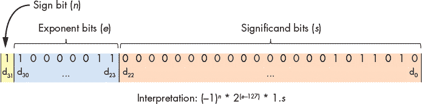

*图 4-15：32 位 IEEE 754 浮点标准*

图 4-15 说明了 IEEE 754 对 32 位浮点数（C 的 `float` 类型）的解释。该标准将比特划分为三个区域：

1\. 低阶的 23 个比特（*d*[22] 到 *d*[0]）表示 *尾数*（有时称为 *有效数*）。作为比特的最大区域，尾数作为数值的基础，最终通过乘以其他比特区域来改变。当解释尾数时，它的值隐式地跟随 1 和二进制点。小数部分的行为类似于前面部分描述的定点表示法。

例如，如果尾数的比特为 0b110000…0000，则第一个比特表示 0.5（1 × 2^(–1)），第二个比特表示 0.25（1 × 2^(–2)），其余比特为零，因此它们不影响数值。因此，尾数贡献的是 1.(0.5 + 0.25)，即 1.75。

2\. 接下来的八个位（数字 *d*[30] 到 *d*[23]）表示 *指数*，它将有效数字的值进行缩放，以提供广泛的可表示范围。有效数字会乘以 2^((指数–127))，其中 127 是一个 *偏置*，使得浮点数既能表示非常大的值，也能表示非常小的值。

3\. 最后一个高阶位（数字 *d*[31]）表示 *符号位*，它编码了值是正数（0）还是负数（1）。

举个例子，考虑解码位序列 0b110000011011 01000000000000000000。有效数字部分是 01101000000000000000000，它表示 2^(–2) + 2^(–3) + 2^(–5) = 0*.*40625，因此有效数字部分贡献了 1.40625。指数部分是 10000011，表示十进制值 131，因此指数部分贡献了一个 2^((131–127))（16）的因子。最后，符号位是 1，因此该序列表示一个负值。综合来看，这个位序列表示 1*.*40625 × 16 × –1 = –22*.*5。

尽管明显比前面描述的定点方案更复杂，但 IEEE 浮点标准提供了更多灵活性，可以表示广泛的值范围。尽管具有灵活性，固定数量的位数仍然无法精确表示每一个可能的值。也就是说，与定点一样，舍入问题同样会影响浮点编码。

#### 4.8.3 舍入后果

虽然舍入问题不太可能破坏你编写的大多数程序，但实数舍入错误偶尔会导致一些高调的系统故障。在 1991 年的海湾战争期间，一次舍入错误导致美国“爱国者”导弹电池未能拦截一枚伊拉克导弹。^(9) 这枚导弹导致 28 名士兵死亡，另有许多人受伤。1996 年，欧洲航天局首次发射的阿丽亚娜 5 号火箭在起飞 39 秒后爆炸。^(10) 这枚火箭借用了大量阿丽亚娜 4 号的代码，在尝试将浮点数值转换为整数值时触发了溢出。

### 4.9 小结

本章探讨了现代计算机如何使用位和字节表示信息。一个重要的结论是，计算机的内存将所有信息存储为二进制的 0 和 1——程序或运行它们的人负责解释这些位的含义。本章主要集中于整数表示，首先讨论了无符号（非负）整数，然后才考虑有符号整数。

计算机硬件支持对整数进行多种操作，包括常见的加法、减法、乘法和除法。系统还提供位操作，如按位与、按位或、按位非和移位。在执行 *任何* 操作时，要考虑用于表示操作数和结果的位数。如果分配给结果的存储空间不足，溢出可能会导致结果值的误表示。

最后，本章探讨了表示实数的常见方案，包括标准的 IEEE 754 标准。请注意，在表示浮动小数点值时，我们牺牲了精度，以换取更大的灵活性（即移动小数点的能力）。

### 注释

1. *[`zh.wikipedia.org/wiki/江南 style`](https://zh.wikipedia.org/wiki/江南 style)*

2. *[`zh.wikipedia.org/wiki/Therac-25`](https://zh.wikipedia.org/wiki/Therac-25)*

3. 乔纳森·斯威夫特, *格列佛游记*。 *[`www.gutenberg.org/ebooks/829`](http://www.gutenberg.org/ebooks/829)*

4. 丹尼·科恩, *关于圣战与和平的呼吁*。 *[`www.ietf.org/rfc/ien/ien137.txt`](https://www.ietf.org/rfc/ien/ien137.txt)*

5. *[`linux.die.net/man/3/byteorder`](https://linux.die.net/man/3/byteorder), [`linux.die.net/man/3/endian`](https://linux.die.net/man/3/endian)*

6. *[`zh.wikipedia.org/wiki/可数集`](https://zh.wikipedia.org/wiki/可数集)*

7. *[`zh.wikipedia.org/wiki/不可数集`](https://zh.wikipedia.org/wiki/不可数集)*

8. *[`zh.wikipedia.org/wiki/IEEE_754`](https://zh.wikipedia.org/wiki/IEEE_754)*

9. *[`www-users.math.umn.edu/~arnold/disasters/patriot.html`](http://www-users.math.umn.edu/~arnold/disasters/patriot.html)*

10. *[`medium.com/@bishr_tabbaa/crash-and-burn-a-short-story-of-ariane-5-flight-501-3a3c50e0e284`](https://medium.com/@bishr_tabbaa/crash-and-burn-a-short-story-of-ariane-5-flight-501-3a3c50e0e284)*
