# 第六章：冯·诺依曼所知：计算机架构


*计算机架构*这个术语可以指计算机的整个硬件层面。然而，它通常用来指代计算机硬件中数字处理器部分的设计与实现，我们在本章中重点讨论计算机处理器架构。

*中央处理单元*（CPU，或处理器）是计算机中执行程序指令和程序数据的部分。程序指令和数据存储在计算机的随机存取存储器（RAM）中。特定的数字处理器实现了一个特定的*指令集架构*（ISA），它定义了指令集及其二进制编码、CPU 寄存器集，以及执行指令对处理器状态的影响。存在许多不同的 ISA，包括 SPARC、IA32、MIPS、ARM、ARC、PowerPC 和 x86（后者包括 IA32 和 x86-64）。*微架构*定义了特定 ISA 实现的电路结构。同一 ISA 的微架构实现可以不同，只要它们实现了 ISA 定义。例如，英特尔和 AMD 分别生产不同的 IA32 ISA 微处理器实现。

一些 ISA 定义了*精简指令集计算机*（RISC），而其他则定义了*复杂指令集计算机*（CISC）。RISC ISA 具有一小组基本指令，每条指令执行迅速；每条指令大约在一个处理器时钟周期内执行，编译器将几条基本的 RISC 指令组合在一起实现更高级的功能。与此相对，CISC ISA 的指令提供比 RISC 指令更高级的功能。CISC 架构还定义了比 RISC 更多的指令集，支持更复杂的寻址模式（表示程序数据内存位置的方式），并支持可变长度的指令。单条 CISC 指令可能执行一个低级功能序列，并可能需要几个处理器时钟周期来执行。而在 RISC 架构中，这相同的功能可能需要多条指令来实现。

RISC 与 CISC 的历史

在 1980 年代初期，伯克利大学和斯坦福大学的研究人员通过伯克利 RISC 项目和斯坦福 MIPS 项目开发了 RISC 架构。伯克利的 David Paterson 和斯坦福的 John Hennessy 因其在 RISC 架构开发方面的贡献，荣获 2017 年图灵奖^(1)（计算机领域的最高奖项）。

在其开发初期，RISC 架构是对普遍认为指令集体系结构（ISA）需要变得越来越复杂以实现高性能的观点的彻底颠覆。“RISC 方法与当时流行的复杂指令集计算机（CISC）计算机的不同之处在于，它只需要一小组简单且通用的指令（计算机必须执行的功能），需要的晶体管比复杂指令集少，从而减少了计算机必须执行的工作量。”^(2)

CISC ISA 使用的指令比 RISC 少，通常导致程序可执行文件较小。在具有较小主内存的系统中，可执行文件的大小是程序性能的重要因素，因为较大的可执行文件会减少可用于运行程序其他部分内存空间的 RAM 空间。基于 CISC 的微架构通常专门设计以高效执行 CISC 变长和更高功能的指令。为执行更复杂指令而设计的专用电路可能导致某些更高级别功能的执行更加高效，但代价是需要为所有指令执行提供更多的复杂性。

在比较 RISC 与 CISC 时，RISC 程序包含更多的指令需要执行，但每条指令的执行效率远高于大多数 CISC 指令，且 RISC 允许比 CISC 更简单的微架构设计。CISC 程序包含更少的指令，而 CISC 微架构则设计用以高效执行更复杂的指令，但它们需要更复杂的微架构设计和更快的时钟频率。总体而言，RISC 处理器能实现更高效的设计和更好的性能。随着计算机内存容量的增加，程序可执行文件的大小对程序性能的重要性减小。然而，由于 CISC 得到了工业界的广泛支持，它仍然是主导的 ISA。

今天，CISC 依然是桌面计算机和许多服务器级计算机的主流 ISA。例如，Intel 的 x86 ISA 是基于 CISC 的。由于其低功耗需求，RISC ISA 更常见于高端服务器（例如，SPARC）和移动设备（例如，ARM）。某些 RISC 或 CISC ISA 的微架构实现可能在底层结合了 RISC 和 CISC 的设计。例如，大多数 CISC 处理器使用微码将某些 CISC 指令编码为更类似于 RISC 的指令集，由底层处理器执行，而一些现代的 RISC 指令集比最初的 MIPS 和 Berkeley RISC 指令集包含了更多复杂的指令或寻址模式。

所有现代处理器，无论其 ISA 如何，都遵循冯·诺依曼体系结构模型。冯·诺依曼体系结构的通用设计允许其执行任何类型的程序。它使用存储程序模型，意味着程序指令存储在计算机内存中，与程序数据一起成为处理器的输入。

本章介绍冯·诺依曼体系结构及支撑现代计算机体系结构的祖先和组成部分。我们基于冯·诺依曼体系结构模型构建了一个示例数字处理器（CPU），设计了一个由逻辑门构建的数字电路 CPU，并演示了 CPU 如何执行程序指令。

### 5.1 现代计算架构的起源

当追溯现代计算机体系结构的祖先时，很容易认为现代计算机是一条连续转变的线性链的一部分，每台机器仅仅是之前存在的机器的改进。虽然这种对计算机设计遗传改进的看法对某些类别的体系结构可能成立（考虑 iPhone X 从原始 iPhone 的迭代改进），但是体系结构树的根基却不那么明确。

从 18 世纪到 20 世纪初，数学家们作为首批*人类*计算机，进行与科学和工程应用相关的计算。^(3) “计算机”一词最初指的是“计算者”。女性数学家经常扮演计算机的角色。事实上，女性作为人类计算机的使用非常普遍，以至于计算复杂度用“千位女士”来衡量，即千位人类计算机在一个小时内完成的工作量。^(4) 普遍认为女性在进行数学计算方面比男性更擅长，因为她们倾向于更加系统化。女性被禁止担任工程师职位。因此，她们被贬为更为“低级”的工作，如计算复杂的计算。

第一台通用数字计算机——*分析机*，是由英国数学家 Charles Babbage 设计的，他被一些人称为计算机之父。分析机是他原始发明——差分机的扩展，差分机是一种能够计算多项式函数的机械计算器。或许应该被称为计算机之母的 Ada Lovelace，是第一个开发计算机程序的人，也是第一个发表能够使用 Charles Babbage 的分析机进行计算的算法的人。在她的笔记中，她指出了分析机的通用性：“[t]分析机完全没有任何自创的企图。它可以做任何我们知道如何指令它执行的事情。”^(5)然而，与现代计算机不同，分析机是一种机械设备，而且只建造了一部分。大多数后来成为现代计算机直接前身的设计者，在他们自己开发机器时并未意识到 Babbage 和 Lovelace 的工作。

因此，也许更准确的说法是，现代计算机架构是从 20 世纪 30 年代和 40 年代涌现出来的创意和创新的“原始汤”中发展起来的。例如，在 1937 年，MIT 的学生 Claude Shannon 撰写了可能是历史上最具影响力的硕士论文之一。Shannon 借鉴了 George Boole（发明了布尔代数的数学家）的工作，展示了布尔逻辑可以应用于电路，并用于开发电气开关。这将引导二进制计算系统的发展，并为未来的数字电路设计奠定基础。虽然早期许多电子计算机是由男性设计的，但女性（当时不被允许成为工程师）却成为了编程的先驱，主导了许多早期软件创新的设计和开发，例如编程语言、编译器、算法和操作系统。

本书中无法对计算机架构的兴起进行全面讨论（有关详细信息请参见其他地方^(6,7)）；然而，我们简要列举了 20 世纪 30 年代和 40 年代发生的几项重大创新，它们在现代计算机架构的兴起中起到了关键作用。

#### 5.1.1 图灵机

1937 年，英国数学家艾伦·图灵提出了“逻辑计算机”（Logical Computing Machine），即一种理论计算机。图灵通过这个机器证明了“决策问题”（德语称为*Entscheidungsproblem*）没有解决方案，该问题由数学家大卫·希尔伯特和威廉·阿克曼于 1928 年提出。决策问题是一个算法，它接受一个陈述作为输入，判断这个陈述是否是普遍有效的。图灵通过证明*停机问题*（机器*X*在输入*y*时是否会停止？）对于图灵的机器来说是不可判定的，从而证明了不存在这样的算法。作为这个证明的一部分，图灵描述了一个通用机器，它能够执行任何其他计算机的任务。图灵在普林斯顿大学的论文导师阿隆佐·丘奇是第一个将*逻辑计算机*称为*图灵机*的人，并且将其通用形式称为*通用图灵机*。

图灵后来回到英格兰，并在第二次世界大战期间作为布莱切利园密码破译小组的一员为祖国服务。他在设计和建造* Bombe*（一种机电设备，帮助破解恩尼格码机加密信息）方面发挥了重要作用，恩尼格码机是纳粹德国在第二次世界大战期间常用来保护敏感通信的工具。

战后，图灵设计了*自动计算引擎*（ACE）。ACE 是一台存储程序计算机，这意味着程序指令和数据都加载到计算机内存中，并由通用计算机运行。他在 1946 年发表的论文，也许是最详细地描述这种计算机的文献。^(9)

#### 5.1.2 早期电子计算机

第二次世界大战加速了早期计算机的发展。然而，由于第二次世界大战中军事行动的保密性质，许多由于战争期间的激烈活动而发生的创新细节直到多年后才被公开。例如，由英国工程师汤米·弗劳尔斯设计的 Colossus 机器，就是为了帮助破解 Lorenz 密码而建造的，这种密码曾被纳粹德国用于加密高级情报通信。艾伦·图灵的部分工作为其设计提供了帮助。Colossus 建于 1943 年，可以说是第一台可编程的数字全电子计算机。然而，它是一台专用计算机，专门用于密码破译。英国皇家海军女兵（WRNS，俗称“Wrens”）担任 Colossus 的操作员。尽管*《Tunny 总报告》*^(10)指出，几位 Wrens 展现了密码学方面的能力，但她们都未被任命为密码分析员，而是被分配到了更为琐碎的 Colossus 操作任务。^(11,12)

在大西洋的另一端，美国的科学家和工程师们也在努力设计自己的计算机。哈佛大学教授霍华德·艾肯（Howard Aiken）（他也是美国海军预备役的海军指挥官）设计了 Mark I，这是一台电子机械的通用可编程计算机。Mark I 于 1944 年建成，帮助设计了原子弹。艾肯在设计计算机时大多并未了解图灵的研究，并且他的动机是将查尔斯·巴贝奇的分析机付诸实践。Mark I 的一个关键特点是它是全自动的，能够在没有人工干预的情况下连续运行数天。这一特性为未来计算机设计奠定了基础。

与此同时，宾夕法尼亚大学的美国工程师约翰·莫赫利（John Mauchly）和普雷斯珀·艾克特（Presper Eckert）于 1945 年设计并建造了*电子数值积分和计算机*（ENIAC）。ENIAC 可以说是现代计算机的先驱。它是数字化的（虽然它使用十进制而非二进制）、完全电子化的、可编程的，并且是通用的。虽然 ENIAC 的原始版本没有存储程序功能，但在十年结束前这一功能已经被加入其中。ENIAC 是由美国陆军弹道研究实验室资助和建造的，主要用于计算弹道轨迹。后来，它还被用来帮助氢弹的设计。

在第二次世界大战期间，随着男性被征召入伍，女性被聘用为人类计算机，帮助战争努力。随着第一台电子计算机的问世，女性成为了第一批程序员，因为编程被认为是秘书工作。毫不奇怪，许多早期的编程创新，如第一个编译器、程序模块化的概念、调试和汇编语言，都是女性发明家的功劳。例如，**格蕾丝·霍普**（Grace Hopper）开发了第一个高级的、机器无关的编程语言（COBOL）及其编译器。霍普还是 Mark I 的程序员，并编写了描述其操作的书籍。

ENIAC 的程序员是六位女性：Jean Jennings Bartik、Betty Snyder Holberton、Kay McNulty Mauchly、Frances Bilas Spence、Marlyn Wescoff Meltzer 和 Ruth Lichterman Teitelbaum。与 Wrens 不同，ENIAC 的女性程序员在任务中拥有较大的自主权；她们仅获得了 ENIAC 的接线图，被告知要弄明白它是如何工作的，并且如何进行编程。除了她们在解决如何编程（和调试）世界上最早的电子通用计算机之一的问题上所做的创新外，ENIAC 的程序员们还提出了算法流程图的概念，并且开发了子程序和嵌套等重要的编程概念。像 Grace Hopper 一样，Jean Jennings Bartik 和 Betty Snyder Holberton 也继续在计算机领域有着长久的职业生涯，成为早期的计算机先驱。不幸的是，女性在早期计算机领域的贡献至今仍未完全为人所知。在二战后，由于无法得到更好的发展，许多女性离开了这个领域。我们鼓励读者更多了解早期女性程序员的故事。^(14,15,16)

英国人和美国人并不是唯一对计算机潜力感兴趣的国家。在德国，Konrad Zuse 开发了第一台电机机械式通用数字可编程计算机 Z3，该计算机于 1941 年完成。Zuse 的设计独立于图灵等人的工作。值得注意的是，Zuse 的设计使用了二进制（而不是十进制），它是第一台使用二进制系统的计算机。然而，Z3 在柏林遭到空袭时被摧毁，Zuse 无法继续他的工作，直到 1950 年才得以恢复。直到多年后，他的工作才逐渐得到认可。Zuse 被广泛认为是德国计算机学的奠基人。

#### 5.1.3 那么冯·诺依曼知道什么？

从我们对现代计算机架构起源的讨论中可以看出，在 1930 年代和 1940 年代，确实有若干创新促成了我们今天所知的计算机的崛起。1945 年，John von Neumann 发表了一篇论文《EDVAC 报告的初稿》^(17)，该论文描述了现代计算机所基于的一种架构。EDVAC 是 ENIAC 的继任者，与 ENIAC 不同，它是一台二进制计算机，而不是十进制计算机，并且它是一台存储程序计算机。如今，这种对 EDVAC 架构设计的描述被称为冯·诺依曼架构。

*冯·诺依曼架构* 描述了一种通用计算机，它旨在运行任何程序。它还采用了存储程序模型，这意味着程序指令和数据都被加载到计算机中以供运行。在冯·诺依曼模型中，指令和数据没有区别；它们都被加载到计算机的内部存储器中，程序指令从存储器中取出并由计算机的功能单元执行，这些功能单元在程序数据上执行程序指令。

约翰·冯·诺依曼的贡献贯穿了计算机发展史上的多个故事。他是匈牙利数学家，曾在高等研究院和普林斯顿大学担任教授，也是艾伦·图灵的早期导师。后来，冯·诺依曼成为曼哈顿计划的研究科学家，这使他与霍华德·艾肯和马克 I 产生了联系；他随后还担任了 ENIAC 项目的顾问，并与埃克特和毛奇定期通信。他著名的关于 EDVAC 的论文来源于他在电子离散变量自动计算机（EDVAC）上的研究，这个项目是由埃克特和毛奇提议给美国陆军，并在宾夕法尼亚大学建造。EDVAC 包括了几个架构设计创新，几乎所有现代计算机的基础都来源于这些创新：它是通用的，使用二进制数字系统，拥有内部存储器，并且完全电气化。很大程度上，因为冯·诺依曼是这篇论文的唯一作者，^(18) 论文中描述的架构设计主要归功于冯·诺依曼，这一设计也因此被称为冯·诺依曼架构。需要注意的是，图灵在 1946 年详细描述了类似机器的设计。然而，由于冯·诺依曼的论文在图灵之前发表，因此冯·诺依曼为这些创新获得了主要的荣誉。

无论谁“真正”发明了冯·诺依曼架构，冯·诺依曼本人的贡献都不应被忽视。他是位杰出的数学家和科学家。他在数学领域的贡献涵盖了集合论、量子力学和博弈论等多个方面。在计算机领域，他也被认为是*归并排序*算法的发明人。沃尔特·艾萨克森认为，冯·诺依曼的一个最大优点是他能够广泛合作，并直觉地看到新概念的重要性。^(19) 许多早期的计算机设计师都是孤立工作。艾萨克森认为，通过目睹马克 I 计算机的缓慢，冯·诺依曼能够直观地意识到真正电子计算机的价值，以及在内存中存储和修改程序的必要性。因此，可以说冯·诺依曼比埃克特和毛奇更早地理解并充分认识到完全电子存储程序计算机的强大功能。

### 5.2 冯·诺依曼架构

冯·诺依曼架构作为大多数现代计算机的基础。在本节中，我们简要描述架构的主要组件。

冯·诺依曼架构（如图 5-1 所示）由五个主要组件组成。

1\. *处理单元* 执行程序指令。

2\. *控制单元* 驱动处理单元执行程序指令。处理单元和控制单元一起构成了中央处理器（CPU）。

3\. *存储单元* 存储程序数据和指令。

4\. *输入单元* 将程序数据和指令加载到计算机中，并启动程序执行。

5\. *输出单元* 存储或接收程序结果。

总线连接各个单元，并且被各个单元用来互相发送控制和数据信息。*总线* 是一种通信通道，用于在通信端点之间传输二进制值（值的发送者和接收者）。例如，连接内存单元和 CPU 的数据总线可以通过 32 根并行线实现，这些线共同传输一个四字节的值，每根线传输一个比特。通常，架构会为发送数据、内存地址和控制信号在单元之间使用不同的总线。单元通过控制总线发送控制信号，向其他单元请求或通知某些操作，地址总线则用来将读写请求的内存地址发送给内存单元，数据总线则用于在单元之间传输数据。

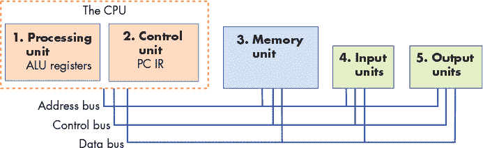

*图 5-1：冯·诺依曼架构由处理单元、控制单元、内存单元、输入单元和输出单元组成。控制单元和处理单元共同组成 CPU，CPU 包括 ALU、通用寄存器以及一些专用寄存器（IR 和 PC）。各单元通过总线连接，用于数据传输和单元之间的通信。*

#### 5.2.1 CPU

控制单元和处理单元共同组成了 CPU，这是计算机执行程序指令和程序数据的部分。

#### 5.2.2 处理单元

*冯·诺依曼机* 的*处理单元*由两个部分组成。第一部分是 *算术/逻辑单元*（ALU），它执行数学运算，例如加法、减法和逻辑或等。现代的 ALU 通常执行一大组算术运算。处理单元的第二部分是一组寄存器。*寄存器* 是一种小型、高速的存储单元，用于保存程序数据和正在被 ALU 执行的指令。至关重要的是，在冯·诺依曼架构中，指令和数据之间没有区别。实际上，指令*就是*数据。因此，每个寄存器都能够存储一个数据字。

#### 5.2.3 控制单元

*控制单元* 通过从内存中加载程序指令并将指令操作数和操作通过处理单元传递，驱动程序指令的执行。控制单元还包括一些存储器，用于跟踪执行状态并确定接下来的操作：*程序计数器*（PC）保存下一个要执行的指令的内存地址，*指令寄存器*（IR）存储从内存加载的、当前正在执行的指令。

#### 5.2.4 内存单元

内存是冯·诺依曼架构的一项关键创新。它提供了靠近处理单元的程序数据存储，显著减少了进行计算所需的时间。*存储单元*存储程序数据和程序指令——存储程序指令是冯·诺依曼架构存储程序模型的关键部分。

内存的大小因系统而异。然而，系统的指令集架构（ISA）限制了它能够表示的地址范围。在现代系统中，最小的可寻址内存单位是一个字节（8 位），因此每个地址对应一个独特的内存位置，用于存储一个字节的数据。因此，32 位架构通常支持最大地址空间大小为 2³²，即 4 吉字节（GiB）的可寻址内存。

*内存*一词有时指的是系统中整个存储层次结构。它可以包括处理单元中的寄存器，以及像硬盘驱动器（HDD）或固态硬盘（SSD）这样的二级存储设备。在第十一章中，我们会详细讨论内存层次结构。现在，我们使用“内存”一词与内部*随机存取内存*（RAM）交替使用——即中央处理单元可以访问的内存。RAM 存储是随机访问的，因为所有 RAM 存储位置（地址）都可以直接访问。可以将 RAM 视为一个线性地址数组，每个地址对应一字节的内存。

历史中的字长

*字长*是由 ISA 定义的，是处理器作为单一单位处理的标准数据大小的位数。标准字长在多年中有所波动。对于 EDVAC，字长被提议为 30 位。在 1950 年代，36 位字长较为常见。随着 1960 年代 IBM 360 的创新，字长变得大致标准化，并开始从 16 位扩展到 32 位，再到今天的 64 位。如果你仔细查看 Intel 架构，可能会注意到一些旧决策的遗留物，因为 32 位和 64 位架构是作为原始 16 位架构的扩展添加的。

#### 5.2.5 输入和输出（I/O）单元

虽然控制、处理和存储单元构成了计算机的基础，但输入和输出单元使其能够与外界互动。特别是，它们提供了将程序的指令和数据加载到内存、将数据存储在内存外部以及将结果展示给用户的机制。

*输入单元*由一组设备组成，使用户或程序能够将外部数据输入计算机。今天最常见的输入设备是键盘和鼠标。摄像头和麦克风是其他例子。

*输出单元*由一组设备组成，它们将计算结果从计算机传送回外部世界，或将结果存储到内部内存之外。例如，显示器是一个常见的输出设备。其他输出设备还包括扬声器和触觉反馈设备。

一些现代设备，如触摸屏，既作为输入设备也作为输出设备，使用户能够通过单一的统一设备输入和接收数据。

固态硬盘和硬盘驱动器是另一个既作为输入设备也作为输出设备的例子。这些存储设备在存储操作系统加载到计算机内存中的程序可执行文件时作为输入设备工作，在存储程序结果被写入的文件时作为输出设备工作。

#### 5.2.6 冯·诺依曼机的实际操作：执行程序

由五个单元组成的冯·诺依曼体系结构协同工作，以实现*获取–解码–执行–存储*的操作循环，执行程序指令。该循环从程序的第一条指令开始，并重复进行，直到程序退出：

1\. 控制单元*获取*下一条指令从内存中。控制单元有一个特殊的寄存器，程序计数器（PC），它包含下一条要获取的指令的地址。它将该地址放置在*地址总线*上，并在*控制总线*上向内存单元发送*读取*命令。内存单元随后读取指定地址处存储的字节，并通过*数据总线*将它们发送到控制单元。指令寄存器（IR）存储从内存单元接收到的指令字节。控制单元还会增加 PC 的值，以存储下一个要获取的指令的地址。

2\. 控制单元*解码*存储在 IR 中的指令。它解码指令位，指示要执行的操作以及操作数的位置。指令位是根据 ISA 定义的指令编码方式进行解码的。控制单元还从其位置（来自 CPU 寄存器、内存或编码在指令位中）获取数据操作数的值，作为处理单元的输入。

3\. 处理单元*执行*指令。ALU 对指令数据操作数执行指令操作。

4\. 控制单元*存储*结果到内存。处理单元执行指令后的结果被存储到内存。控制单元通过将结果值放在*数据总线*上，将存储位置的地址放在*地址总线*上，并将*写入*命令放在*控制总线*上，将结果写入内存。当内存单元接收到这些信息时，它会将值写入指定地址的内存中。

输入输出单元并不直接参与程序指令的执行。相反，它们通过加载程序的指令和数据以及存储或显示程序计算结果的方式，参与程序的执行。

图 5-2 和图 5-3 展示了冯·诺依曼架构执行一个加法指令的四个阶段，该指令的操作数存储在 CPU 寄存器中。在*取指*阶段，控制单元从存储在 PC（1234）中的内存地址读取指令。它通过地址总线发送地址，通过控制总线发送读取命令。内存单元接收到请求，读取地址 1234 处的值，并通过数据总线将其发送给控制单元。控制单元将指令字节放入 IR 寄存器，并用下一个指令的地址（本例中为 1238）更新 PC。在*解码*阶段，控制单元将指令中指定操作的位传递给处理单元的 ALU，并使用指令位指定哪个寄存器存储操作数，从处理单元的寄存器中读取操作数值到 ALU（本例中的操作数为 3 和 4）。在*执行*阶段，处理单元中的 ALU 对操作数执行运算，产生结果（3 + 4 等于 7）。最后，在*存储*阶段，控制单元将处理单元的结果（7）写入内存单元。内存地址（5678）通过地址总线发送，写入命令通过控制总线发送，存储的数据值（7）通过数据总线发送。内存单元接收到该请求，并将 7 存储在内存地址 5678 处。在这个例子中，我们假设用于存储结果的内存地址已经编码在指令位中。

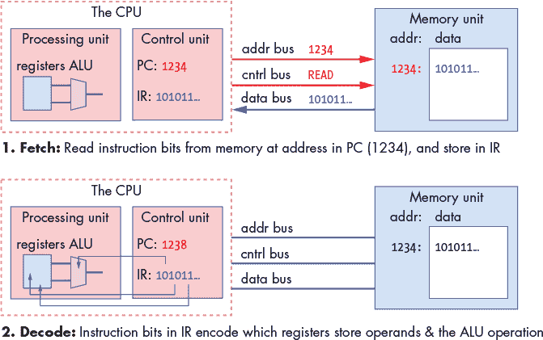

*图 5-2：冯·诺依曼架构执行过程中*取指*和*解码*阶段的示意图，展示了一个加法指令的执行。操作数、结果和内存地址以十进制值表示，内存内容以二进制值表示。*

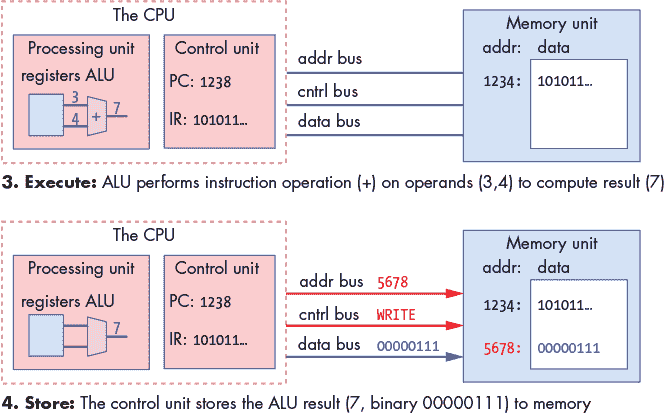

*图 5-3：冯·诺依曼架构执行过程中*执行*和*存储*阶段的示意图，展示了一个加法指令的执行。操作数、结果和内存地址以十进制值表示，内存内容以二进制值表示。*

### 5.3 逻辑门

*逻辑门*是数字电路的构建块，数字电路在数字计算机中实现算术、控制和存储功能。设计复杂的数字电路涉及高程度的抽象：设计师创建简单的电路，通过一小组基本逻辑门实现基本功能；这些简单电路从其实现中抽象出来，用作创建更复杂电路的构建块（简单电路结合在一起，创建具有更复杂功能的新电路）；这些更复杂的电路可以进一步抽象，作为创建更复杂功能的构建块；依此类推，构建处理、存储和控制处理器的完整组件。

晶体管

逻辑门是通过在半导体材料（例如硅芯片）中蚀刻晶体管来创建的。晶体管充当开关，控制电流通过芯片的流动。晶体管可以在开和关之间切换状态（在高电压或低电压输出之间切换）。其输出状态取决于当前状态加上输入状态（高电压或低电压）。二进制值通过这些高（1）和低（0）电压进行编码，逻辑门通过少数几个晶体管的排列来实现，这些晶体管执行切换操作以生成逻辑门的输出。集成电路（芯片）上能够容纳的晶体管数量是其功率的大致衡量标准；每个芯片上的晶体管越多，就有更多的构建块来实现更多的功能或存储。

#### 5.3.1 基本逻辑门

在最低层次，所有电路都是通过将逻辑门连接在一起来构建的。逻辑门对布尔操作数（0 或 1）执行布尔运算。*与*、*或*和*非*构成了一套完整的逻辑门，通过它可以构建任何电路。一个逻辑门有一个（非）或两个（与和或）二进制输入值，并产生一个二进制输出值，这是对其输入的逐位逻辑运算。例如，输入值 0 到非门的输出为 1（1 是非（0））。*真值表*列出了每种输入排列下逻辑运算的值。表 5-1 显示了与、或和非逻辑门的真值表。

**表 5-1：** 与、或、非的真值表

| **A** | **B** | **A 与 B** | **A 或 B** | **非 A** |
| --- | --- | --- | --- | --- |
| 0 | 0 | 0 | 0 | 1 |
| 0 | 1 | 0 | 1 | 1 |
| 1 | 0 | 0 | 1 | 0 |
| 1 | 1 | 1 | 1 | 0 |

图 5-4 展示了计算机架构师如何在电路图中表示这些门。

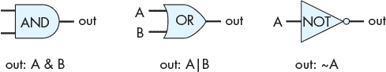

*图 5-4：与、或、非逻辑门对于单比特输入产生单比特输出*

逻辑门的多位版本（适用于 *M* 位输入和输出）是使用 *M* 个单位的逻辑门构建的简单电路。每个 *M* 位输入值的单个位都会输入到一个不同的单位逻辑门中，生成对应的 *M* 位输出结果。例如，图 5-5 显示了一个由四个 1 位与门构建的四位与门电路。

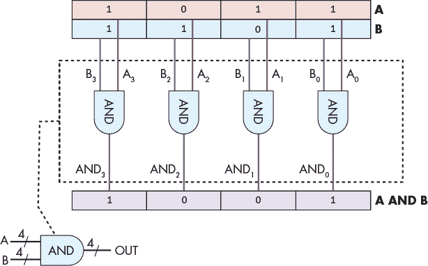

*图 5-5：由四个 1 位与门构建的四位与门电路*

这种非常简单的电路，主要是通过扩展逻辑门的输入和输出位宽，通常称为针对特定值*M*的 *M* 位门，其中 *M* 指定输入和输出的位宽（位数）。

#### 5.3.2 其他逻辑门

尽管由与（AND）、或（OR）和非（NOT）门组成的逻辑门集合足以实现任何电路，但仍有一些其他基础逻辑门常用于构建数字电路。这些附加的逻辑门包括 NAND（A 与 B 的非运算）、NOR（A 或 B 的非运算）和 XOR（异或）。它们的真值表见表 5-2。

**表 5-2：** NAND、NOR 和 XOR 的真值表

| **A** | **B** | **A NAND B** | **A NOR B** | **A XOR B** |
| --- | --- | --- | --- | --- |
| 0 | 0 | 1 | 1 | 0 |
| 0 | 1 | 1 | 0 | 1 |
| 1 | 0 | 1 | 0 | 1 |
| 1 | 1 | 0 | 0 | 0 |

NAND、NOR 和 XOR 门出现在电路图中，如图 5-6 所示。

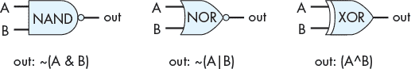

*图 5-6：NAND、NOR 和 XOR 逻辑门*

NAND 和 NOR 门末端的圆圈表示取反或非（NOT）操作。例如，NOR 门看起来像一个带圆圈的 OR 门，圆圈表示 NOR 是 OR 的取反。

最小逻辑门子集

NAND、NOR 和 XOR 并不是构建电路的必要条件，但它们是 {与（AND）、或（OR）、非（NOT）} 集合中的附加门，常用于电路设计。在更大的集合 {与（AND）、或（OR）、非（NOT）、NAND、NOR、XOR} 中，还存在其他最小的逻辑门子集，这些子集单独就足以构建任何电路（子集 {与（AND）、或（OR）、非（NOT）} 并不是唯一的，但它是最容易理解的集合）。由于 NAND、NOR 和 XOR 不是必需的，它们的功能可以通过将与、或和非门结合起来，构建实现 NAND、NOR 和 XOR 功能的电路。例如，NOR 可以通过将非门与或门结合来实现，`(A NOR B)` ≡ `NOT(A OR B)`，如图 5-7 所示。

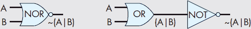

*图 5-7：NOR 门可以通过使用或门和非门来实现。输入 A 和 B 首先通过或门，或门的输出再输入到非门（NOR 是 OR 的取反）。*

今天的集成电路芯片是使用 CMOS 技术构建的，CMOS 技术将 NAND 作为芯片上电路的基本构建块。NAND 门本身构成了一个完整逻辑门的最小子集。

### 5.4 电路

数字电路实现了体系结构的核心功能。它们在硬件中实现了*指令集架构*（ISA），并且在整个系统中实现了存储和控制功能。数字电路的设计涉及多个抽象层次的应用：实现复杂功能的电路是由实现部分功能的小电路构建的，这些小电路又是由更简单的电路构成的，一直到所有数字电路的基本逻辑门构建块。图 5-8 展示了从实现中抽象出来的电路。该电路被表示为一个*黑盒子*，标有其功能或名称，并且只显示输入和输出，隐藏了其内部实现的细节。

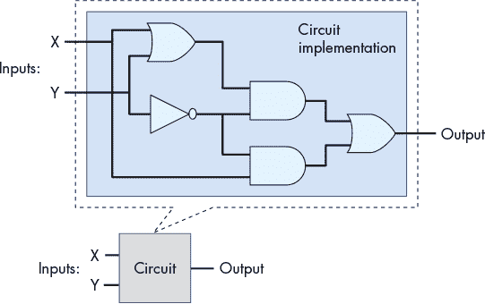

*图 5-8：电路是通过将子电路和逻辑门连接在一起实现的。其功能是从实现细节中抽象出来的，可以作为创建其他电路的构建块使用。*

电路构建模块主要分为三类：算术/逻辑电路、控制电路和存储电路。例如，一个处理器集成电路包含这三种子电路：其寄存器组使用存储电路；其实现算术和逻辑功能的核心功能使用算术和逻辑电路；控制电路贯穿处理器，用于驱动指令的执行，并控制在寄存器中加载和存储值。

本节中，我们将讨论这三种类型的电路，展示如何从逻辑门设计一个基本电路，然后如何通过基本电路和逻辑门构建更大的电路。

#### 5.4.1 算术和逻辑电路

算术和逻辑电路实现了一个 ISA 的算术和逻辑指令，这些指令共同构成了处理器的*算术逻辑单元*（ALU）。算术和逻辑电路还实现了 CPU 中其他功能的一部分。例如，算术电路用于在指令执行的第一步中递增程序计数器（PC），并且它们用于通过组合指令操作数位和寄存器值来计算内存地址。

电路设计通常从实现一个 1 位版本的简单电路开始，该电路是由逻辑门构建的。然后，使用这个 1 位电路作为构建块来实现*M*位版本的电路。设计 1 位电路的步骤如下：

1. 设计电路的真值表：确定输入和输出的数量，并为每种输入位的排列添加一个表项，指定输出位的值。

2. 使用真值表，写出每个电路输出为 1 时的表达式，表达式是通过输入值与 AND、OR、NOT 结合得出的。

3\. 将表达式转化为一系列逻辑门，每个门的输入要么来自电路的输入，要么来自前一个逻辑门的输出。

我们遵循以下步骤来实现一个单比特的*等于*电路：逐位比较（`A` `== B`）在 `A` 和 `B` 的值相同时输出 1，否则输出 0。

首先，设计电路的真值表：

**表 5-3：** 简单等式电路的真值表

| **A** | **B** | **A == B 输出** |
| --- | --- | --- |
| 0 | 0 | 1 |
| 0 | 1 | 0 |
| 1 | 0 | 0 |
| 1 | 1 | 1 |

接下来，写出表达式，表示何时 `A == B` 为 1，用 `A` 和 `B` 通过 AND、OR 和 NOT 结合。首先，单独考虑每一行输出为 1 的情况，从真值表的第一行开始：

| **A** | **B** | **A == B** |
| --- | --- | --- |
| 0 | 0 | 1 |

对于该行的输入值，构建一个*合取*表达式，使其输入值为 1。合取通过 AND 运算将评估为 0 或 1 的子表达式结合在一起，只有当两个子表达式都评估为 1 时，合取本身才为 1。首先，表达每个输入何时评估为 1：

```
NOT(A)    # is 1 when A is 0

NOT(B)    # is 1 when B is 0
```

然后，将它们合并（用 AND 运算符结合）得到一个表达式，表示当真值表的这一行评估为 1 时：

```
NOT(A) AND NOT(B)    # is 1 when A and B are both 0
```

我们对真值表的最后一行做相同的处理，其输出也是 1：

| **A** | **B** | **A == B** |
| --- | --- | --- |
| 1 | 1 | 1 |

```
A AND B   # is 1 when A and B are both 1
```

最后，创建一个*析取*（OR）将每个合取连接起来，对应于真值表中评估为 1 的行：

```
(NOT(A) AND NOT(B)) OR (A AND B)  # is 1 when A and B are both 0 or both 1
```

此时我们已经得到了 `A == B` 的表达式，可以将其转化为电路。在此步骤中，电路设计师采用技术简化表达式，创建一个最小等效表达式（即对应最少运算符和/或最短门路径的表达式）。设计师在最小化电路设计时必须非常小心，以确保翻译后的表达式等价。电路最小化有正式的方法，这超出了我们讨论的范围，但我们在开发电路时会采用一些启发式方法。

对于我们的例子，我们直接将前面的表达式转化为电路。我们可能会想将（NOT(A) AND NOT(B)）替换为（A NAND B），但请注意，这两个表达式*并不*等价：它们对 A 和 B 的所有排列结果评估并不相同。例如，当 A 为 1 且 B 为 0 时，(A == B) 为 0，而 (A NAND B) 为 1。

为了将表达式转化为电路，从最内层的表达式开始，逐步向外进行转换（最内层的将是第一个门，其输出将作为后续门的输入）。第一组门对应于输入值的否定（A 和 B 的 NOT 门）。接下来，对于每个合取，创建电路的部分，将输入值送入 AND 门。然后将 AND 门的输出送入表示析取的 OR 门。最终的电路如图 5-9 所示。

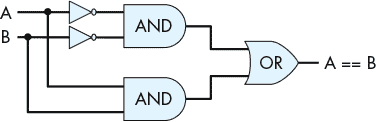

*图 5-9：由与门、或门和非门构建的一位相等电路（A == B）*

为了验证此电路的正确性，可以通过模拟 A 和 B 输入值的所有可能排列，检查电路输出是否与其在真值表中的对应行一致（即 A == B）。例如，如果 A 为 0 且 B 为 0，则两个 NOT 门会先对它们的值取反，之后输入到上方的与门，因此该与门的输入为（1，1），其输出为 1，这成为输入到或门的上方输入值。A 和 B（0，0）的值直接输入到下方的与门，结果是下方与门的输出为 0，成为或门的下方输入值。因此，或门接收到输入值（1，0），并输出值 1。因此，当 A 和 B 都为 0 时，电路正确地输出 1。此示例在图 5-10 中展示。

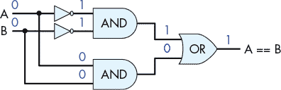

*图 5-10：一个示例，展示了一位相等电路如何计算（A == B）。从输入值 A 和 B 都为 0 开始，值通过电路中的门传递，最终计算出正确的输出值 1，表示 A == B。*

将一位相等电路的实现视为一个单元，使其可以从具体实现中抽象出来，从而更容易作为其他电路的构建模块。我们将这一位相等电路的抽象（见图 5-11）表示为一个框，框内有两个输入端口标记为 *A* 和 *B*，一个输出端口标记为 *A == B*。实现一位相等电路的内部门电路在这一抽象视图中被隐藏。

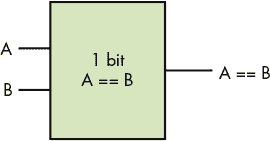

*图 5-11：一位相等电路的抽象。该电路可以作为其他电路的构建模块。*

NAND、NOR 和 XOR 电路的单比特版本可以类似地构造，使用仅有的与（AND）、或（OR）和非（NOT）门，从它们的真值表（见表 5-4）开始，并应用与一位相等电路相同的步骤。

**表 5-4：** NAND、NOR 和 XOR 电路的真值表

| **A** | **B** | **A NAND B** | **A NOR B** | **A XOR B** |
| --- | --- | --- | --- | --- |
| 0 | 0 | 1 | 1 | 0 |
| 0 | 1 | 1 | 0 | 1 |
| 1 | 0 | 1 | 0 | 1 |
| 1 | 1 | 0 | 0 | 0 |

这些电路的多比特版本是通过将多个单比特版本的电路组合而成，这与在《基本逻辑门》一章中，如何通过四个 1 位与门构造四位与门（参见第 243 页）的方式类似。

#### 算术电路

算术电路的构建方法与我们构建逻辑电路时使用的方法完全相同。例如，要构建一个 1 位加法器电路，首先从单个位加法的真值表开始，该真值表有两个输入值 A 和 B，以及两个输出值，一个用于 A 和 B 的 SUM，另一个用于溢出或 CARRY OUT。表 5-5 显示了 1 位加法的真值表。

**表 5-5：** 1 位加法器电路的真值表

| **A** | **B** | **SUM** | **CARRY OUT** |
| --- | --- | --- | --- |
| 0 | 0 | 0 | 0 |
| 0 | 1 | 1 | 0 |
| 1 | 0 | 1 | 0 |
| 1 | 1 | 0 | 1 |

在下一步中，对于每个输出，SUM 和 CARRY OUT，创建输出值为 1 时的逻辑表达式。这些表达式表示为输入值每行合取的析取：

```
SUM: (NOT(A) AND B) OR (A AND NOT(B))     # 1 when exactly one of A or B is 1

CARRY OUT:  A AND B                       # 1 when both A and B are 1
```

CARRY OUT 的表达式无法简化。然而，SUM 的表达式更复杂，但可以简化，从而导致更简洁的电路设计。首先需要注意的是，SUM 输出也可以表示为(A XOR B)。如果我们有一个 XOR 门或电路，将 SUM 表示为(A XOR B)会使加法器电路设计更简单。如果没有，则使用 AND、OR 和 NOT 的表达式，并通过 AND、OR 和 NOT 门实现。

假设我们有一个 XOR 门，可以用来实现 1 位加法器电路。所得到的电路如图 5-12 所示。

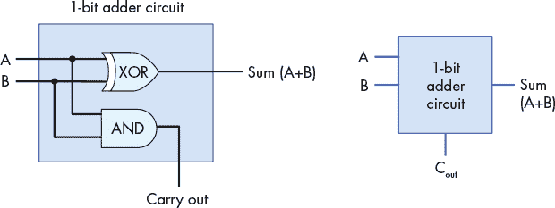

*图 5-12：1 位加法器电路有两个输入，A 和 B，以及两个输出，SUM 和 CARRY OUT。*

1 位加法器电路可以作为更复杂电路的构建模块。例如，我们可能希望创建*N*位加法器电路，以对不同大小的值进行加法运算（例如，一字节、两字节或四字节的加法器电路）。然而，从*N*个 1 位加法器电路构建*N*位加法器电路比从*N*个 1 位逻辑电路构建*N*位逻辑电路需要更多的注意。

在进行多位加法（或减法）时，单独的位从最低有效位到最高有效位依次相加。随着逐位加法的进行，如果第*i*位的和产生了一个进位值 1，那么在第(*i* + 1)位时，将额外加 1。换句话说，第*i*位加法器电路的进位输出是第(*i* + 1)位加法器电路的输入值。

因此，为了实现一个多位加法器电路，我们需要一个新的 1 位加法器电路，它有三个输入：A、B 和 CARRY IN。为此，按照之前描述的步骤创建一个 1 位加法器电路，具有三个输入（A、B、CARRY IN）和两个输出（SUM 和 CARRY OUT），从所有可能的输入排列的真值表开始。我们将电路设计留给读者作为练习，但我们在图 5-13 中展示了它作为 1 位加法器电路的抽象形式。

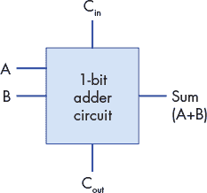

*图 5-13：具有三个输入（A、B 和 CARRY IN）和两个输出（SUM 和 CARRY OUT）的单一位加法器电路。*

使用这种一位加法器电路作为构建模块，我们可以通过将相应的操作数位输入到各个一位加法器电路中，构建一个*N*位加法器电路，并将第*i*个一位加法器电路的进位输出（CARRY OUT）值输入到第(*i* + 1)个一位加法器电路的进位输入（CARRY IN）值中。对于第 0 位的加法器电路，其进位输入（CARRY IN）值来自 CPU 电路的另一个部分，该部分解码 ADD 指令。

这种类型的*N*位加法器电路，是由*N*个一位加法器电路构建的，称为*波纹进位加法器*，如图 5-14 所示。和波纹一样，和（SUM）结果*波动*或传播从低位到高位。只有在计算出和（SUM）和进位输出（CARRY OUT）值的第 0 位之后，和（SUM）和进位输出（CARRY OUT）值的第 1 位才会被正确计算出来。这是因为第 1 位的进位输入（CARRY IN）来自第 0 位的进位输出（CARRY OUT），之后更高位的结果依此类推。

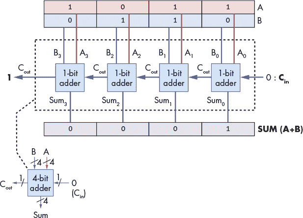

*图 5-14：由四个 1 位加法器电路构成的四位波纹进位加法器电路*

其他算术和逻辑功能的电路是通过组合电路和逻辑门以类似的方式构建的。例如，可以通过加法器和取反电路构建一个计算（A - B）的减法电路，方法是将减法表示为（A +（-B））。

#### 5.4.2 控制电路

控制电路在整个系统中都有应用。在处理器中，它们驱动程序指令对程序数据的执行。它们还控制将值加载和存储到不同级别的存储器（寄存器、缓存和 RAM 之间），并控制系统中的硬件设备。与算术和逻辑电路类似，实现复杂功能的控制电路是通过组合更简单的电路和逻辑门构建的。

*多路选择器*（MUX）是一个控制电路的例子，它从多个值中选择或挑选一个。CPU 可以使用多路选择器电路选择从哪个 CPU 寄存器读取指令操作数值。

一个*N*路多路选择器有一组*N*个输入值，并从其中一个输入中选择一个作为输出值。一个额外的输入值，*选择*（S），编码了从*N*个输入中选择哪个输入作为输出。

最基本的二路多路选择器在两个 1 位输入（A 和 B）之间进行选择。二路多路选择器的选择输入是一个单比特：如果 S 输入为 1，它将选择 A 作为输出；如果 S 输入为 0，它将选择 B 作为输出。下表展示了一个二路 1 位多路选择器的真值表。选择位（S）的值决定选择 A 或 B 作为 MUX 的输出值。

| **A** | **B** | **S** | **Out** |
| --- | --- | --- | --- |
| 0 | 0 | 0 | 0（B 的值） |
| 0 | 1 | 0 | 1（B 的值） |
| 1 | 0 | 0 | 0（B 的值） |
| 1 | 1 | 0 | 1（B 的值） |
| 0 | 0 | 1 | 0（A 的值） |
| 0 | 1 | 1 | 0（A 的值） |
| 1 | 0 | 1 | 1 (A 的值) |
| 1 | 1 | 1 | 1 (A 的值) |

图 5-15 展示了用于单比特输入的双向多路复用器电路。

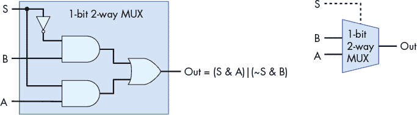

*图 5-15：双向 1 位多路复用器电路。信号输入（S）的值用于选择其两个输入（A 或 B）中的一个作为电路的输出值：当 S 为 1 时，选择 A；当 S 为 0 时，选择 B。*

图 5-16 展示了当 S 输入值为 1 时，如何选择 A 的输出。例如，假设 A 的输入值为 1，B 为 0，S 为 1。在传递到顶部与门之前，S 会被否定并与 B 一起输入（0 与 B），从顶部与门得到 0 的输出值。S 进入底部与门并与 A 一起输入，得到（1 与 A），计算结果为 A 的值从底部与门输出。A 的值（在我们的示例中为 1）和来自顶部与门的 0 作为输入传递到或门，结果为（0 或 A）输出。换句话说，当 S 为 1 时，MUX 选择 A 的值作为输出（在我们的示例中 A 的值为 1）。B 的值不会影响 MUX 的最终输出，因为当 S 为 1 时，顶部与门的输出始终为 0。

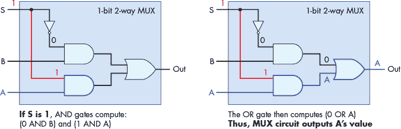

*图 5-16：当 S 为 1 时，双向 1 位多路复用器电路选择（输出）A。*

图 5-17 展示了当 S 输入值为 0 时选择 B 输出的多路复用器路径。如果我们考虑与之前示例相同的 A 和 B 输入，但将 S 更改为 0，则 0 的否定值输入到顶部与门，得到（1 与 B），即 B 的值，输出自顶部与门。底部与门的输入为（0 与 A），得到来自底部与门的 0。因此，输入到或门的值为（B 或 0），计算结果为 B 的值作为 MUX 的输出（在我们的示例中，B 的值为 0）。

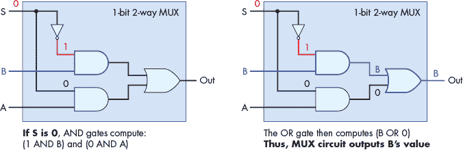

*图 5-17：当 S 为 0 时，双向 1 位多路复用器电路选择（输出）B。*

双向 1 位 MUX 电路是构建双向*N*位 MUX 电路的基本模块。例如，图 5-18 展示了由四个 1 位双向 MUX 电路构成的双向四位 MUX。

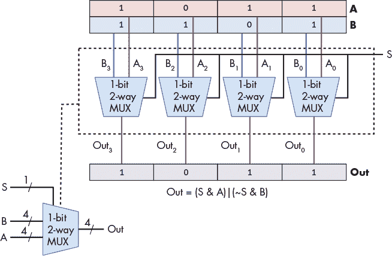

*图 5-18：由四个双向 1 位多路复用器电路构建的双向四位多路复用器电路。单个信号位 S 选择 A 或 B 作为输出。*

*N*路多路复用器选择*N*个输入中的一个作为输出。它需要一个与双路多路复用器稍微不同的 MUX 电路，并且需要 log2 位作为其选择输入。额外的选择位是必需的，因为使用 log2 位，可以编码*N*个不同的值，每个值用来选择一个*N*输入中的某个输入。log2 个选择位的每个不同排列，与*N*个输入值之一一起输入到与门中，最终选出一个 MUX 输入值作为 MUX 输出。图 5-19 展示了一个一位四路 MUX 电路的示例。

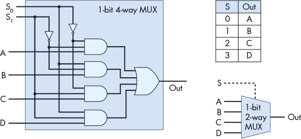

*图 5-19：一个四路多路复用器电路有四个输入和两个*（log2 AND z)。

为了了解四路 MUX 电路如何工作，考虑选择输入值为 2（在二进制中为 0b10），如图 5-20 所示。第一个与门的输入为（NOT(S⁰) AND NOT(S¹) AND A），即（1 AND 0 AND A），结果是第一个与门的输出为 0。第二个与门的输入为（0 AND 0 AND B），结果输出为 0。第三个与门的输入为（1 AND 1 AND C），结果输出 C 的值。最后一个与门的输入为（0 AND 1 AND D），结果输出为 0。或门的输入为（0 OR 0 OR C OR 0），最终 MUX 的输出为 C（S 值为 2 时选择 C）。

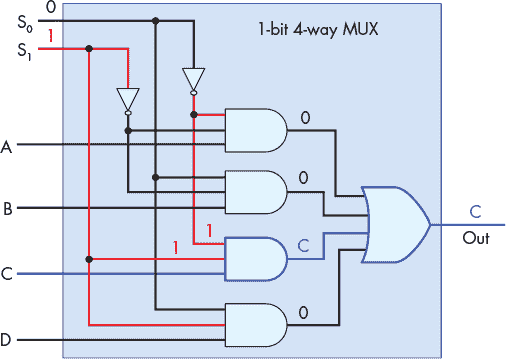

*图 5-20：当选择输入 S 为 2（0b10）时，四路多路复用器电路选择 C 作为输出。*

解复用器和解码器是另外两种控制电路的例子。*解复用器*（DMUX）是多路复用器的逆操作。多路复用器选择*N*个输入中的一个，而解复用器选择*N*个输出中的一个。DMUX 接受一个输入值和一个选择输入，并有*N*个输出。根据 S 的值，它将输入值发送到其*N*个输出中的一个（输入值会被路由到*N*个输出线中的一个）。DMUX 电路常用于选择*N*个电路中的一个来传递一个值。*解码器*电路接受一个编码输入，并根据输入值启用多个输出中的一个。例如，一个有*N*位输入值的解码器电路，使用该值来启用（设置为 1）其 2^(*N*)个输出线中的一个（该输出线对应于*N*位值的编码）。图 5-21 展示了一个两路一位 DMUX 电路的例子，其选择输入值（s）决定哪个输出接收输入值 A。它还展示了一个两位解码器电路的例子，输入位决定哪个四个输出被设置为 1。两个电路的真值表也被展示。

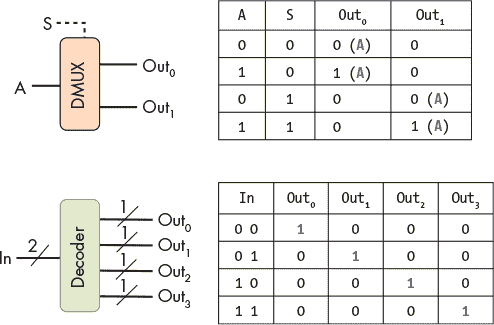

*图 5-21：一个两路一位解复用器和一个两位解码器及其真值表*

#### 5.4.3 存储电路

*存储电路*用于构建计算机内存，以存储二进制值。由存储电路构建的计算机内存类型称为*静态随机存取内存*（SRAM）。它用于构建 CPU 寄存器存储和片上缓存内存。系统通常使用*动态随机存取内存*（DRAM）作为主内存（RAM）存储。基于电容器的 DRAM 设计要求定期刷新其存储的值，因此被称为“动态”内存。SRAM 是一种基于电路的存储方式，无需刷新其存储的值，因此称为静态 RAM。基于电路的内存比基于电容的内存更快，但也更昂贵。因此，SRAM 通常用于内存层次结构顶部的存储（CPU 寄存器和片上缓存内存），而 DRAM 则用于主内存（RAM）存储。本章将重点介绍基于电路的内存，如 SRAM。

为了存储一个值，一个电路必须包含一个反馈回路，使得该值能被电路保留。换句话说，存储电路的值依赖于其输入值以及当前存储的值。当电路存储一个值时，它当前存储的值与输入值一起产生一个输出，该输出与当前存储的值相匹配（即电路继续存储相同的值）。当一个新值被写入存储电路时，电路的输入值会暂时改变，修改电路的行为，导致新值被写入并存储在电路中。一旦写入，电路将恢复到稳定状态，继续存储新写入的值，直到下一个写入操作发生。

##### RS 锁存器

锁存器是一个数字电路，用于存储（或记住）一个比特的值。一个例子是*复位–设定锁存器*（或 RS 锁存器）。RS 锁存器有两个输入值，R 和 S，以及一个输出值 Q，Q 也是存储在锁存器中的值。RS 锁存器还可以输出 NOT(Q)，即存储值的反值。图 5-22 展示了一个用于存储单个位的 RS 锁存器电路。

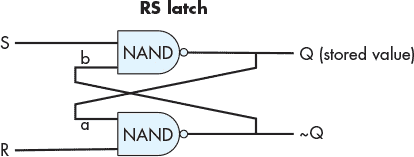

*图 5-22：一个 RS 锁存器电路，存储一个比特值。*

关于 RS 锁存器，首先需要注意的是它从输出到输入的反馈回路：顶部 NAND 门的输出（Q）作为输入（a）进入底部 NAND 门，而底部 NAND 门的输出（~Q）作为输入（b）进入顶部 NAND 门。当输入 S 和 R 都为 1 时，RS 锁存器存储值 Q。换句话说，当 S 和 R 都为 1 时，RS 锁存器的输出值 Q 是稳定的。为了看到这种行为，参考图 5-23；这展示了一个存储值 1（Q 为 1）的 RS 锁存器。当 R 和 S 都为 1 时，输入到底部 NAND 门的反馈值（a）是 Q 的值，即 1，因此底部 NAND 门的输出是 0（1 NAND 1 为 0）。输入到顶部 NAND 门的反馈值（b）是底部 NAND 门的输出值，即 0。顶部 NAND 门的另一个输入是 1，S 的值。顶部 NAND 门的输出是 1（1 NAND 0 为 1）。因此，当 S 和 R 都为 1 时，电路持续存储 Q 的值（在这个例子中是 1）。

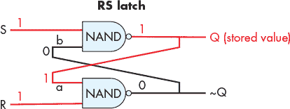

*图 5-23：一个存储一个比特值的 RS 锁存器。锁存器存储值时，R 和 S 都为 1。存储的值是输出 Q。*

要改变 RS 锁存器中存储的值，必须将 R 或 S 的其中一个值设为 0。当锁存器存储新值时，R 和 S 将被设置回 1。控制电路确保 R 和 S 不会同时为 0：最多只有一个为 0，而 R 或 S 中的 0 值意味着正在向 RS 锁存器写入一个新值。要在 RS 锁存器中存储值 0，输入 R 设置为 0（而 S 的值保持为 1）。要在 RS 锁存器中存储值 1，输入 S 设置为 0（而 R 的值保持为 1）。例如，假设 RS 锁存器当前存储的是 1。要将 0 写入锁存器，将 R 的值设置为 0。这意味着 0 和 1 的值输入到底部 NAND 门，计算（0 NAND 1）的结果，即为 1。这个 1 的输出值也输入到顶部 NAND 门（见图 5-24 B）。当顶部 NAND 门的输入值 b 为 1，S 输入值为 1 时，顶部 NAND 门计算出新的输出值 0 给 Q，这个值也作为输入 a 反馈到底部 NAND 门（见图 5-24 C）。当 a 的值为 0，b 的值为 1 时，锁存器现在存储 0。当 R 最终被设置回 1 时，RS 锁存器继续存储值 0（见图 5-24 D）。

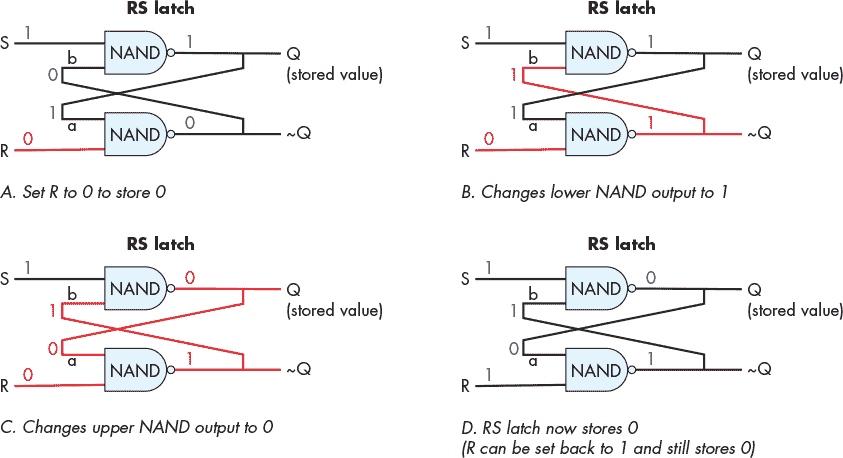

*图 5-24：要向 RS 锁存器写入 0，将 R 短暂设为 0。*

##### 门控 D 锁存器

*门控 D 锁存器*在 RS 锁存器上增加了电路，以确保它永远不会同时接收到 R 和 S 输入为 0 的信号。图 5-25 展示了门控 D 锁存器的结构。

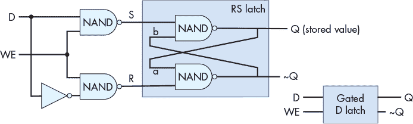

*图 5-25：门控 D 锁存器存储一位值。其第一组 NAND 门控制写入 RS 锁存器，并确保 R 和 S 的值从不同时为 0。*

门控 D 锁存器的数据输入（D）是要存储到电路中的值（0 或 1）。写使能（WE）输入控制将值写入 RS 锁存器。当 WE 为 0 时，两个 NAND 门的输出为 1，导致 RS 锁存器的 R 和 S 输入值均为 1（RS 锁存器存储一个值）。只有当 WE 为 1 时，门控 D 锁存器才会将 D 的值写入 RS 锁存器。因为数据输入（D）值在发送到下部 NAND 门之前会被反转，所以只有一个 NAND 门的输入为 1。这意味着当 WE 位为 1 时，R 或 S 中的一个必定为 0。例如，当 D 为 1 且 WE 为 1 时，上部 NAND 门计算（1 NAND 1），下部 NAND 门计算（0 NAND 1）。因此，来自上部 NAND 门的 S 输入为 0，来自下部 NAND 门的 R 输入为 1，导致将值 1 写入 RS 锁存器。当 WE 输入为 0 时，两个 NAND 门的输出均为 1，保持 R 和 S 为 1。换句话说，当 WE 为 0 时，D 的值对 RS 锁存器中存储的值没有影响；只有当 WE 为 1 时，D 的值才会写入锁存器。要将另一个值写入门控 D 锁存器，将 D 设置为要存储的值，并将 WE 设为 0。

##### CPU 寄存器

多位存储电路是通过将多个一位存储电路连接在一起构建的。例如，将 32 个一位 D 锁存器连接在一起，就能得到一个 32 位存储电路，可以用作 32 位 CPU 寄存器，如图 5-26 所示。该寄存器电路有两个输入值：一个 32 位数据值和一个一位的写使能信号。内部，每个一位 D 锁存器将寄存器的 32 位*数据输入*的其中一位作为其 D 输入，并且每个一位 D 锁存器将寄存器的 WE 输入作为其 WE 输入。寄存器的输出是存储在组成寄存器电路的 32 个一位 D 锁存器中的 32 位值。

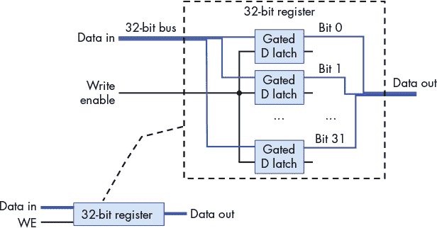

*图 5-26：CPU 寄存器由多个门控 D 锁存器构建（32 位寄存器由 32 个门控 D 锁存器构成）。当其 WE 输入为 1 时，数据输入被写入寄存器。其数据输出为存储在寄存器电路中的 32 位值。*

### 5.5 构建处理器：将所有内容整合在一起

*中央处理单元*（CPU）实现冯·诺依曼架构中的处理和控制单元，负责驱动程序指令在程序数据上的执行（见图 5-27）。

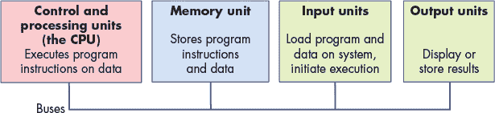

*图 5-27：CPU 实现冯·诺依曼架构中的处理与控制单元部分。*

CPU 由基本的算术/逻辑、存储和控制电路构建模块组成。其主要功能组件包括*算术逻辑单元*（ALU），用于执行算术和逻辑运算；一组通用*寄存器*用于存储程序数据；一些控制电路和专用寄存器用于实现指令执行；以及一个*时钟*，驱动 CPU 电路执行程序指令。

本节介绍 CPU 的主要部分，包括 ALU 和寄存器文件，并展示它们是如何结合起来实现 CPU 的。在下一节中，我们将讨论 CPU 如何执行程序指令，以及时钟如何驱动程序指令的执行。

#### 5.5.1 ALU

ALU 是一个复杂的电路，能够对有符号和无符号整数执行所有算术和逻辑操作。一个单独的浮点单元执行浮点数的算术操作。ALU 接收整数操作数值和一个指定操作类型的*操作码*值（例如，加法）。ALU 输出执行指定操作后的结果值，以及*条件码*值，后者编码了关于操作结果的信息。常见的条件码指定 ALU 结果是否为负数、零，或者操作是否产生进位。例如，给定 C 语句

```
x = 6 + 8;
```

CPU 开始通过将操作数值（6 和 8）和表示 ADD 操作的位输入到 ALU 电路来执行加法运算。ALU 计算结果并输出，同时输出条件码，指示结果为非负数、非零，并且没有进位。每个条件码都用一个位来编码。位值为 1 表示条件成立，位值为 0 表示条件不成立。在我们的例子中，位模式 000 指定了与执行 6 + 8 相关的三个条件：结果不是负数（0）、不是零（0），并且没有进位（0）。

条件码由 ALU 在执行操作时设置，有时被后续指令使用，后续指令会根据特定条件选择执行的操作。例如，ADD 指令可以计算以下`if`语句中的(x + 8)部分。

```
if( (x + 8) != 0 ) {

    x++;

}
```

ALU 执行 ADD 指令时，根据添加`(x + 8)`的结果设置条件码。在 ADD 指令之后执行的条件跳转指令测试由 ADD 指令设置的条件码位，并根据它们的值跳转（跳过执行`if`体中的指令）或不跳转。例如，如果 ADD 指令将零条件码设置为 0，则条件跳转指令不会跳过与`if`体关联的指令（零条件码表示 ADD 的结果不为零）。如果零条件码为 1，则它将跳过`if`体指令。为了实现跳过一组指令，CPU 将`if`体指令后的第一条指令的内存地址写入*程序计数器*（PC），该计数器包含要执行的下一条指令的地址。

一个 ALU 电路将几个算术和逻辑电路（用于执行其一组操作）与一个多路复用器电路结合起来，以选择 ALU 的输出。与试图选择仅与特定操作相关的算术电路不同，简单的 ALU 会将其操作数输入值发送到其所有内部算术和逻辑电路中。来自 ALU 所有内部算术和逻辑电路的输出被输入到其多路复用器电路中，该电路选择 ALU 的输出。输入到 ALU 的操作码用作多路复用器的信号输入，以选择 ALU 输出的算术/逻辑操作。条件码输出基于 MUX 输出与测试输出值的电路组合，以确定每个条件码位。

图 5-28 显示了一个示例 ALU 电路，它在两个 32 位操作数上执行四种不同的操作（ADD、OR、AND 和 EQUALS）。它还产生一个单一的条件码输出，指示操作结果是否为零。请注意，ALU 将操作码指向一个多路复用器，以选择 ALU 的四个算术结果中的哪一个输出。

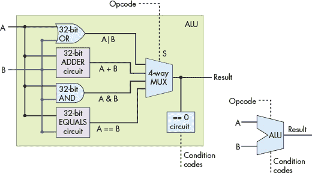

*图 5-28：一个四功能 ALU，在两个 32 位操作数上执行 ADD、OR、AND 和 EQUALS 操作。它有一个条件码输出位，指示结果是否为 0。*

ALU 的操作码输入来自 CPU 正在执行的指令中的位。例如，ADD 指令的二进制编码可能包括四个部分：

```
  OPCODE BITS | OPERAND A SOURCE | OPERAND B SOURCE | RESULT DESTINATION
```

根据 CPU 体系结构的不同，操作数源位可能编码为 CPU 寄存器、存储操作数值的内存地址或文字操作数值。例如，在执行 6 + 8 的指令中，文字值 6 和 8 可以直接编码到指令的操作数指示位中。

对于我们的 ALU，操作码需要两位，因为 ALU 支持四种操作，而两位可以编码四个不同的值（00、01、10、11），每个值对应一个操作。一般来说，执行 *N* 种不同操作的 ALU 需要 log2 位操作码来指定 ALU 输出哪种操作结果。

图 5-29 显示了 ADD 指令的操作码和操作数位如何作为输入传递到我们的 ALU 中的示例。

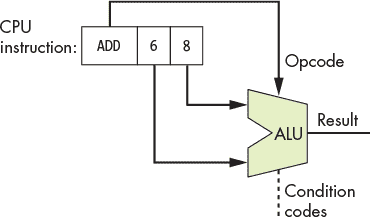

*图 5-29：指令中的操作码位被 ALU 用来选择输出的操作。在这个示例中，来自 ADD 指令的不同位被输入到 ALU 的操作数和操作码输入端，以执行 6 和 8 的加法运算。*

#### 5.5.2 寄存器文件

在内存层次结构的顶部，CPU 的通用寄存器集用于存储临时值。CPU 提供的寄存器数量非常少，通常为 8–32 个（例如，IA32 架构提供 8 个，MIPS 提供 16 个，ARM 提供 13 个）。指令通常从通用寄存器中获取其操作数值，或者将其结果存储到通用寄存器中。例如，一条 ADD 指令可能会被编码为“将寄存器 1 中的值加到寄存器 2 中的值上，并将结果存储在寄存器 3 中”。

CPU 的通用寄存器集被组织成一个 *寄存器文件* 电路。寄存器文件由一组寄存器电路（参见 第 260 页 的“CPU 寄存器”）组成，用于存储数据值，以及一些控制电路（参见 第 252 页 的“控制电路”）用于控制寄存器的读写操作。该电路通常有一个数据输入线，用于将值写入其中一个寄存器，并且有两条数据输出线，用于同时从寄存器中读取两个值。

图 5-30 显示了一个包含四个寄存器的寄存器文件电路示例。它的两个输出值（Data out[**0**] 和 Data out[**1**]）由两个多路复用电路控制。每个读取选择输入（Sr[**0**] 和 Sr[**1**]）被送入一个多路复用器（MUX），以选择相应输出的寄存器值。寄存器文件的数据输入（Data in 线）被发送到每个寄存器电路，其写使能（WE）输入首先通过解多路复用器（DMUX）电路，再送到每个寄存器电路。DMUX 电路接受一个输入值，并选择将该值发送到哪个*N*个输出中的一个，其余的*N –* 1 个输出送 0。寄存器文件的写选择输入（S[**w**]）被送入 DMUX 电路，以选择 WE 值的目标寄存器。当寄存器文件的 WE 输入值为 0 时，不会将任何值写入寄存器，因为每个寄存器的 WE 位也会为 0（因此，Data in 对寄存器中存储的值没有影响）。当 WE 位为 1 时，DMUX 会将 WE 位值为 1 仅输出到由写选择输入（S[**w**]）指定的寄存器，从而使 Data in 值只写入选定的寄存器。

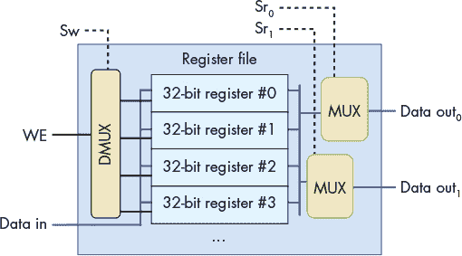

*图 5-30：寄存器文件：用于存储指令操作数和结果值的 CPU 通用寄存器集合*

##### 特殊用途寄存器

除了寄存器文件中的通用寄存器集，CPU 还包含用于存储指令地址和内容的特殊用途寄存器。*程序计数器*（PC）存储下一条要执行的指令的内存地址，*指令寄存器*（IR）存储当前正在被 CPU 执行的指令的二进制位。这些存储在 IR 中的指令位在指令执行过程中作为输入送入 CPU 的不同部分。我们将在《处理器执行程序指令》一节中更详细地讨论这些寄存器，见第 266 页。

#### 5.5.3 CPU

通过 ALU 和寄存器文件电路，我们可以构建 CPU 的主要部分，如图 5-31 所示。由于指令操作数通常来自存储在通用寄存器中的值，寄存器文件的输出将数据发送到 ALU 的输入。同样，指令结果通常存储在寄存器中，ALU 的结果输出作为输入送入寄存器文件。CPU 还具有额外的电路，用于在 ALU、寄存器文件和其他组件（例如主存）之间传输数据。

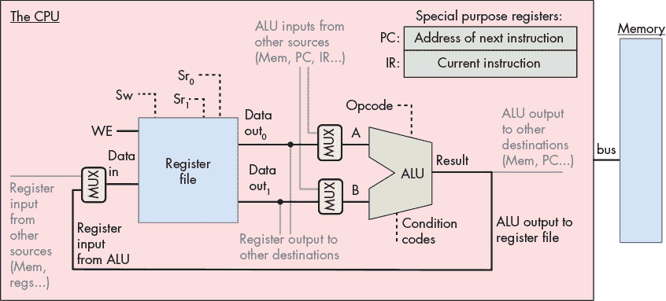

*图 5-31：ALU 和寄存器文件构成了 CPU 的主要部分。ALU 执行运算，寄存器文件存储操作数和结果值。额外的专用寄存器存储指令地址（PC）和内容（IR）。请注意，指令可能从寄存器文件中提取操作数或将结果存储到寄存器文件以外的位置（例如主内存）。*

这些 CPU 的主要部分构成了其*数据路径*。数据路径包括执行算术和逻辑运算的部分（ALU）、存储数据的寄存器以及连接这些部分的总线。CPU 还实现了一个*控制路径*，通过控制路径驱动 ALU 对寄存器文件中存储的操作数执行程序指令。此外，控制路径还向 I/O 设备发出命令，并根据指令的需要协调内存访问。例如，某些指令可能直接从内存位置获取操作数值（或将结果直接存储到内存），而不是使用通用寄存器。在下一部分，我们将重点讨论从寄存器文件获取操作数值并存储结果到寄存器文件的 CPU 指令执行。尽管 CPU 需要额外的控制电路来读取操作数值或将指令结果写入其他位置，但主要的指令执行步骤在不同的源和目标位置下保持相同。

### 5.6 处理器执行程序指令

指令执行分为多个阶段。不同架构实现的阶段数量不同，但大多数架构将指令执行分为取指（Fetch）、解码（Decode）、执行（Execute）和写回（WriteBack）四个或更多离散阶段。在讨论指令执行时，我们重点关注这四个执行阶段，并以 ADD 指令作为示例。我们的 ADD 指令示例的编码如图 5-32 所示。


*图 5-32：一个三寄存器操作的示例指令格式。该指令以二进制编码，指令的各个部分对应不同的位子集编码：操作码（opcode）、两个源寄存器（操作数）以及存储操作结果的目标寄存器。示例中展示了 ADD 指令在这种格式下的编码。*

为了执行一条指令，CPU 首先从内存中*取出*下一条指令，存入一个专用寄存器，即指令寄存器（IR）。要取出的指令的内存地址存储在另一个专用寄存器——程序计数器（PC）中。PC 跟踪下一条指令的内存地址，并在执行取指阶段时递增，从而存储下一条指令的内存地址。例如，如果所有指令都是 32 位长，PC 的值会递增四个单位（每个字节，八位，具有唯一地址），存储紧接着当前指令的下一条指令的内存地址。与 ALU 分开的算术电路会递增 PC 的值。PC 的值也可能在写回阶段发生变化。例如，一些指令会跳转到特定地址，如与循环、`if`–`else`块或函数调用相关的指令。图 5-33 展示了取指阶段的执行过程。

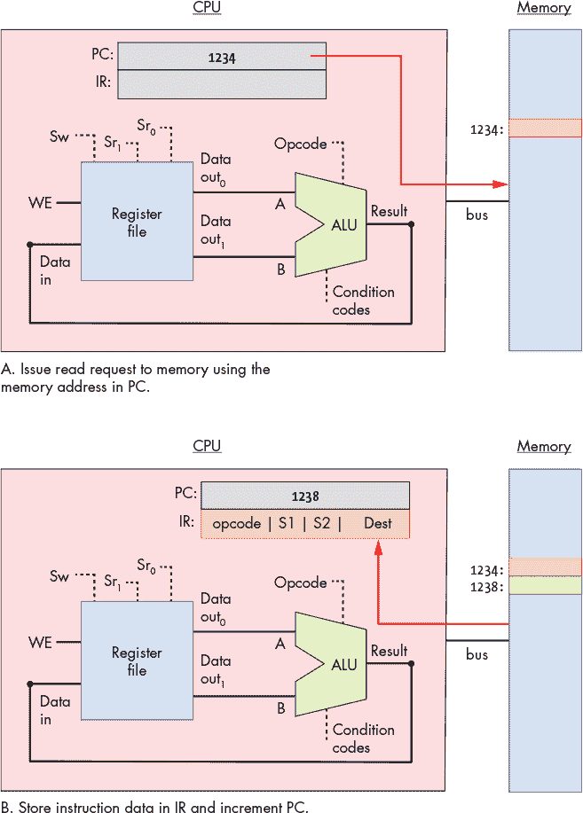

*图 5-33：指令执行的取指阶段：从存储在程序计数器（PC）寄存器中的内存地址值读取指令，并将其存入指令寄存器（IR）。在此阶段结束时，PC 的值也会递增（如果指令是四个字节，下一地址是 1238；实际的指令大小根据架构和指令类型有所不同）。*

取指令后，CPU 将存储在 IR 寄存器中的指令位进行*译码*，将其分为四个部分：指令的高位编码了操作码，用于指定要执行的操作（例如，ADD、SUB、OR 等），其余的位分为三个子集，指定两个操作数来源和结果目标。在我们的示例中，两个操作数和结果目标都使用寄存器。操作码通过线路发送给 ALU 的输入端，而操作数位则通过线路发送给寄存器文件的输入端。操作数位通过两个读取选择输入（Sr[0]和 Sr[1]）发送，指定从哪些寄存器文件中读取寄存器值。译码阶段如图 5-34 所示。

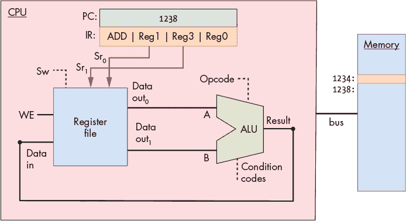

*图 5-34：指令执行的译码阶段：将 IR 中的指令位分解为多个部分，并将它们作为输入发送给算术逻辑单元（ALU）和寄存器文件。IR 中的操作码位被发送到 ALU 选择输入端，以选择执行的操作。IR 中的两个操作数位被发送到寄存器文件的选择输入端，以选择从哪些寄存器读取操作数值。IR 中的目标位在写回阶段发送到寄存器文件，指定将 ALU 结果写入的寄存器。*

在解码（Decode）阶段确定操作和操作数来源后，ALU 在下一个阶段，即*执行（Execution）*阶段执行操作。ALU 的数据输入来自寄存器文件的两个输出，其选择输入来自指令的操作码位。这些输入通过 ALU 传播，产生将操作数值与操作结合的结果。在我们的例子中，ALU 输出将 Reg1 中存储的值与 Reg3 中存储的值相加的结果，并输出与结果值相关的条件码值。执行阶段如图 5-35 所示。

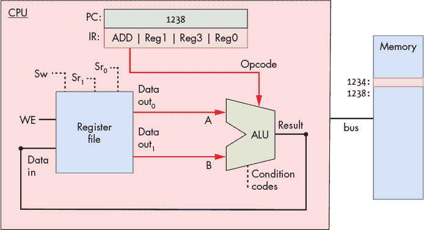

*图 5-35：指令执行的执行阶段：ALU 对其输入值（来自寄存器文件的输出）执行指令操作码位指定的操作。*

在*写回（WriteBack）*阶段，ALU 的结果被存储到目标寄存器中。寄存器文件通过其数据输入接收 ALU 的结果输出，通过其写选择（S[w]）输入接收目标寄存器（从指令寄存器 IR 中的指令位），并通过其 WE 输入接收 1。例如，如果目标寄存器是 Reg0，那么 IR 中编码 Reg0 的位将作为 S[w] 输入发送到寄存器文件，以选择目标寄存器。ALU 的输出被作为数据输入送入寄存器文件，并将 WE 位设置为 1，以便将 ALU 结果写入 Reg0。写回阶段如图 5-36 所示。

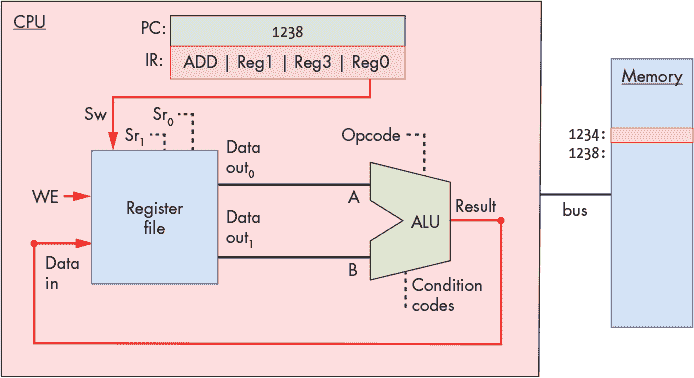

*图 5-36：指令执行的写回阶段：执行阶段的结果（来自 ALU 的输出）被写入寄存器文件中的目标寄存器。ALU 输出作为寄存器文件的 Data in 输入，指令的目标位通过寄存器文件的写选择输入（S[w]），并且 WE 输入被设置为 1，以启用将 Data in 值写入指定的目标寄存器。*

#### 5.6.1 时钟驱动的执行

时钟驱动 CPU 执行指令，触发每个阶段的开始。换句话说，时钟被 CPU 用来确定每个阶段相关电路的输入何时准备好可以被电路使用，并控制电路何时输出有效的结果，可以作为输入传递给执行下一个阶段的其他电路。

CPU 时钟测量的是离散时间，而非连续时间。换句话说，存在一个时间 0，接着是时间 1，再是时间 2，以此类推，直到每一个随后的时钟跳变。处理器的*时钟周期时间*衡量的是每次时钟跳变之间的时间。处理器的*时钟速度*（或*时钟频率*）是 `1/(时钟` `周期时间)`。通常以兆赫（MHz）或吉赫（GHz）为单位来测量。1 MHz 的时钟频率意味着每秒有一百万次时钟跳变，而 1 GHz 则表示每秒有十亿次时钟跳变。时钟频率是衡量 CPU 运行速度的标准，并且是 CPU 每秒执行指令的最大数量的估算值。例如，在像我们示例中的简单标量处理器上，一个 2 GHz 的处理器可能会达到每秒二十亿条指令的最大执行速率（或者每纳秒两条指令）。

虽然提高单台机器的时钟频率可以提升其性能，但仅仅依靠时钟频率并不是比较不同处理器性能的有效标准。例如，一些架构（如 RISC）在执行指令时需要的阶段比其他架构（如 CISC）少。在执行阶段更少的架构中，即使时钟频率较低，它每秒完成的指令数量也可能和另一种时钟频率更高但执行阶段更多的架构相同。然而，对于特定的微处理器来说，将时钟速度翻倍通常会大约使其指令执行速度翻倍。

时钟频率与处理器性能

历史上，提高时钟频率（同时设计更复杂且功能更强大的微架构以支撑更高频率的时钟）一直是计算机架构师提高处理器性能的非常有效的手段。例如，1974 年，英特尔 8080 CPU 的时钟频率为 2 MHz（每秒两百万次时钟周期）。1995 年推出的英特尔奔腾 Pro 处理器时钟频率为 150 MHz（每秒一亿五千万次时钟周期），而 2000 年推出的英特尔奔腾 4 处理器时钟频率为 1.3 GHz（每秒 13 亿次时钟周期）。时钟频率在 2000 年代中后期达到了顶峰，像 IBM z10 这样的处理器，其时钟频率为 4.4 GHz。

然而，今天，CPU 时钟频率已因应对更高频率时产生的散热问题而达到了极限。这个极限被称为*功率墙*。功率墙的出现促使了多核处理器的开发，始于 2000 年代中期。多核处理器在每颗芯片上配备了多个“简单”的 CPU 核心，每个核心都有一个时钟，且该时钟的频率并未超越上一代核心。多核处理器设计是一种在不增加 CPU 时钟频率的情况下提升 CPU 性能的方式。

##### 时钟电路

时钟电路使用振荡器电路生成非常精确且规则的脉冲模式。通常，晶体振荡器生成振荡器电路的基频，时钟电路使用振荡器的脉冲模式输出交替的高低电压模式，代表交替的 1 和 0 二进制值。图 5-37 显示了一个时钟电路生成 1 和 0 的规律输出模式的示例。


*图 5-37：时钟电路的规律输出模式，1 和 0 的每个序列构成一个时钟周期。*

*时钟周期*（或时钟跳跃）是来自时钟电路模式的 1 和 0 子序列。从 1 到 0 或从 0 到 1 的过渡称为*时钟边缘*。时钟边缘触发 CPU 电路的状态变化，推动指令执行。例如，时钟上升沿（从 0 到 1 的过渡，在新时钟周期开始时）表示输入值准备好进行指令执行的某个阶段。例如，上升沿过渡信号表示 ALU 电路的输入值已经准备好。当时钟值为 1 时，这些输入值通过电路传播，直到电路的输出准备好。这被称为*传播延迟*。例如，当时钟信号为 1 时，ALU 的输入值通过 ALU 操作电路传播，然后通过多路复用器产生正确的 ALU 输出，用于将输入值进行运算。在下降沿（从 1 到 0 的过渡），该阶段的输出稳定并准备好传播到下一个位置（如图 5-38 所示的“输出准备好”）。例如，在下降沿时，ALU 的输出已准备好。在时钟值为 0 的持续期间，ALU 的输出传播到寄存器文件的输入端。在下一个时钟周期，时钟上升沿表示寄存器文件输入值已准备好写入寄存器（如图 5-38 所示的“新输入”）。

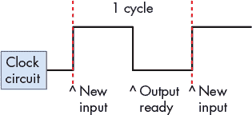

*图 5-38：新时钟周期的上升沿触发其控制电路输入的变化。下降沿触发其控制电路的输出有效时。*

时钟周期的长度（或时钟频率）由指令执行过程中任何阶段的最长传播延迟所限制。执行阶段和 ALU 的传播通常是最长的阶段。因此，时钟周期时间的一半必须不快于 ALU 输入值传播通过最慢操作电路到 ALU 输出所需的时间（即，输出反映了对输入的操作结果）。例如，在我们四操作 ALU（OR、ADD、AND 和 EQUALS）中，Ripple Carry 加法器电路具有最长的传播延迟，并决定时钟周期的最小长度。

因为每完成一个 CPU 指令执行阶段需要一个时钟周期，所以具有四个阶段指令执行序列（取指、解码、执行、回写；见图 5-39）的处理器每四个时钟周期最多完成一条指令。


*图 5-39：四阶段指令执行需要四个时钟周期完成。*

例如，如果时钟频率为 1 GHz，则一条指令需要四纳秒才能完成（四个阶段中的每个阶段各需一纳秒）。若时钟频率为 2 GHz，则一条指令只需要两纳秒完成。

虽然时钟频率是处理器性能的一个因素，但单独的时钟频率并不能作为性能的有意义指标。相反，通过程序完整执行过程中每条指令的*周期数*（CPI）的平均值，更能准确衡量 CPU 的性能。通常，处理器无法在整个程序执行过程中维持最大 CPI。低于最大值的 CPI 由多种因素导致，包括常见程序构造的执行，这些构造会改变控制流，如循环、`if`–`else` 分支和函数调用。通过运行一组标准基准程序得到的平均 CPI 常用于不同架构的比较。CPI 是衡量 CPU 性能的更精确指标，因为它衡量了处理程序的速度，而不是单个指令执行某一方面的度量。有关处理器性能和设计处理器以提高其性能的更多细节，请参见计算机架构教材^(20)。

#### 5.6.2 将所有内容整合：完整计算机中的 CPU

数据路径（ALU、寄存器文件以及连接它们的总线）和控制路径（指令执行电路）共同构成了 CPU。它们一起实现了冯·诺依曼架构中的处理和控制部分。如今的处理器被实现为蚀刻在硅芯片上的数字电路。处理器芯片还包括一些快速的片上缓存存储器（使用锁存存储电路实现），用于将最近使用的程序数据和指令存储在靠近处理器的位置。有关片上缓存存储器的更多信息，请参见第十一章。

图 5-40 显示了一个在完整现代计算机环境中的处理器示例，其组件共同实现了冯·诺依曼架构。

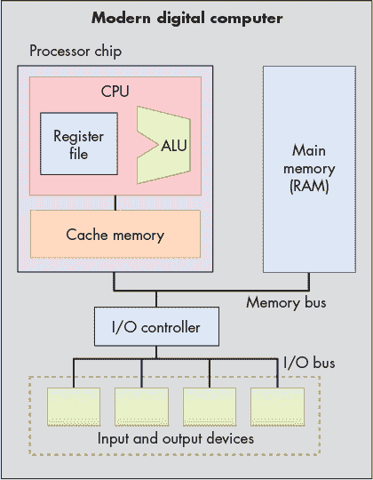

*图 5-40：现代计算机中的中央处理单元（CPU）。总线连接处理器芯片、主存储器以及输入输出设备。*

### 5.7 流水线：提高 CPU 速度

我们的四阶段 CPU 需要 4 个周期来执行一条指令：第一个周期用于从内存中取指令；第二个周期用于解码指令并从寄存器文件中读取操作数；第三个周期让 ALU 执行操作；第四个周期将 ALU 结果写回寄存器文件中的寄存器。要执行一系列 *N* 条指令，需耗时 4*N* 个时钟周期，因为每条指令按顺序依次执行。

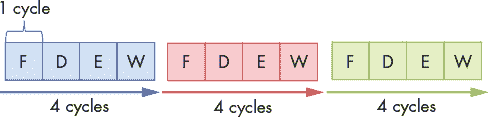

*图 5-41：执行三条指令需要总共 12 个周期。*

图 5-41 显示了执行三条指令总共需要 12 个周期，每条指令需要 4 个周期，导致 CPI 值为 4（CPI 是执行一条指令的平均周期数）。然而，CPU 的控制电路可以进行改进，从而实现更好的（更低的）CPI 值。

在考虑每条指令需要 4 个周期执行，接着下一条指令也需要 4 个周期，依此类推的执行模式时，CPU 负责实现每个阶段的电路只有在每 4 个周期中才会参与指令执行。例如，在取指阶段之后，CPU 中的取指电路在接下来的 3 个时钟周期内并未用于执行与执行下一条指令相关的任何有用操作。然而，如果取指电路能够继续在接下来的 3 个周期内积极执行后续指令的取指部分，CPU 将能够在每 4 个周期内完成多条指令的执行。

CPU *流水线*就是在当前指令完全执行完之前，开始执行下一条指令的这个理念。CPU 流水线按顺序执行指令，但它允许指令执行的过程重叠。例如，在第一个周期，第一条指令进入其取指阶段。第二个周期，第一条指令进入解码阶段，第二条指令同时进入其取指阶段。第三个周期，第一条指令进入执行阶段，第二条指令进入解码阶段，第三条指令从内存中取出。第四个周期，第一条指令进入回写阶段并完成，第二条指令进入执行阶段，第三条指令进入解码阶段，第四条指令进入取指阶段。此时，CPU 指令流水线已满——每个 CPU 阶段都在积极执行程序指令，其中每条后续指令的执行进度比前一条指令慢一个阶段。当流水线满时，CPU 每个时钟周期完成一条指令的执行！

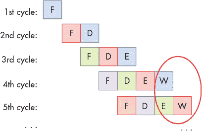

*图 5-42：流水线：重叠指令执行，以实现每个周期完成一条指令。圆圈表示 CPU 已达到每周期完成一条指令的稳定状态。*

图 5-42 展示了通过我们的 CPU 执行流水线指令的示例。从第四个时钟周期开始，流水线填充，意味着 CPU 每个周期完成一条指令的执行，达到了 1 的 CPI（如图 5-42 中的圆圈所示）。注意，执行单条指令所需的总周期数（即指令*延迟*）在流水线执行中并没有减少——每条指令的执行仍然需要四个周期。而是，流水线通过交错方式重叠执行连续的指令，从而提高了指令*吞吐量*，即 CPU 在给定时间内可以执行的指令数量。

自 1970 年代以来，计算机架构师一直使用流水线作为显著提高微处理器性能的一种方式。然而，流水线的使用也意味着比不支持流水线执行的 CPU 更复杂的设计。为了支持流水线，需要额外的存储和控制电路。例如，可能需要多个指令寄存器来存储当前流水线中的多条指令。这种增加的复杂性几乎总是值得的，因为流水线能够显著提高每个时钟周期指令执行数（CPI）。因此，大多数现代微处理器都实现了流水线执行。

流水线的思想也被应用于计算机科学中的其他上下文以加速执行，这一理念也适用于许多非计算机科学应用。例如，考虑使用单个洗衣机进行多次洗衣的任务。如果完成一次洗衣包括四个步骤（洗涤、干燥、折叠和收起衣物），那么在洗完第一批衣物后，第二批衣物可以放入洗衣机，同时第一批衣物在干衣机中，重叠洗涤每一批衣物，从而加速洗四批衣物所需的总时间。工厂的流水线是流水线应用的另一个例子。

在我们讨论 CPU 如何执行程序指令以及 CPU 流水线时，我们使用了一个简单的四阶段流水线和一个示例的 ADD 指令。为了执行在内存和寄存器之间加载和存储值的指令，使用了五阶段流水线。五阶段流水线包括一个内存阶段用于内存访问：取指–解码–执行–内存–写回。不同的处理器可能会有比典型的五阶段流水线更多或更少的流水线阶段。例如，最初的 ARM 架构有三个阶段（取指、解码和执行，其中执行阶段同时执行 ALU 操作和寄存器文件写回功能）。更新的 ARM 架构在其流水线中有超过五个阶段。最初的 Intel Pentium 架构有一个五阶段流水线，但后来的架构有显著更多的流水线阶段。例如，Intel Core i7 具有 14 阶段的流水线。

### 5.8 高级流水线指令考虑事项

记住，流水线通过重叠执行多条指令来提高处理器的性能。在我们之前关于流水线的讨论中，我们描述了一个简单的四阶段流水线，基本阶段为获取（F）、解码（D）、执行（E）和写回（W）。在接下来的讨论中，我们还考虑了第五个阶段——内存（M），它表示对数据内存的访问。因此，我们的五阶段流水线包括以下阶段：

+   获取（F）：从内存中读取指令（由程序计数器指向）。

+   解码（D）：读取源寄存器并设置控制逻辑。

+   执行（E）：执行指令。

+   内存（M）：从数据内存读取或写入数据。

+   写回（W）：将结果存储到目标寄存器中。

记住，编译器将代码行转换为一系列机器码指令供 CPU 执行。汇编代码是机器码的人类可读版本。下面的代码片段展示了一系列虚构的汇编指令：

```
MOV M[0x84], Reg1     # move value at memory address 0x84 to register Reg1

ADD 2, Reg1, Reg1     # add 2 to value in Reg1 and store result in Reg1

MOV 4, Reg2           # copy the value 4 to register Reg2

ADD Reg2, Reg2, Reg2  # compute Reg2 + Reg2, store result in Reg2

JMP L1<0x14>          # jump to executing code at L1 (code address 0x14)
```

如果你在解析代码片段时遇到困难，不用担心——我们会在第七章中更详细地讲解汇编。现在，重点是以下几个事实：

+   每个指令集架构（ISA）都定义了一组指令。

+   每条指令操作一个或多个操作数（即寄存器、内存或常数值）。

+   并非所有指令执行时需要相同数量的流水线阶段。

在之前的讨论中，假设每条指令执行所需的周期数相同；然而，通常并非如此。例如，第一条`MOV`指令需要全部五个阶段，因为它需要将数据从内存移动到寄存器。相比之下，接下来的三条指令只需要四个阶段（F、D、E、W）来执行，因为这些操作仅涉及寄存器，而不涉及内存。最后一条指令（`JMP`）是一种*分支*或*条件*指令。它的目的是将控制流转移到代码的另一部分。具体来说，内存中的代码区域地址引用可执行文件中的不同*指令*。由于`JMP`指令不更新通用寄存器，因此省略了写回阶段，只需要三个阶段（F、D、E）。我们会在“条件控制和循环”部分的第 310 页中更详细地讨论条件指令。

当任何指令被迫等待其他指令执行完毕才能继续执行时，就会发生*流水线停顿*。编译器和处理器会尽力避免流水线停顿，以最大化性能。

#### 5.8.1 流水线考虑：数据冒险

当两条指令试图在指令流水线中访问相同的数据时，会发生*数据冒险*。例如，考虑前面代码片段中的第一对指令：

```
MOV M[0x84], Reg1     # move value at memory address 0x84 to register Reg1

ADD 2, Reg1, Reg1     # add 2 to value in Reg1 and store result in Reg1
```

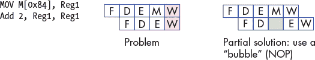

*图 5-43：由于两条指令同时到达同一流水线阶段而产生的流水线冒险示例*

请记住，这条`MOV`指令需要五个阶段（因为它涉及到内存访问），而`ADD`指令只需要四个阶段。在这种情况下，两条指令将同时尝试写入寄存器`Reg1`（参见图 5-43）。

处理器通过首先强制每条指令执行五个流水线阶段来防止上述情况发生。对于那些通常需要少于五个阶段的指令，CPU 会添加一条“无操作”（`NOP`）指令（也称为流水线“冒泡”）来替代该阶段。

然而，问题仍然没有完全解决。由于第二条指令的目标是将`2`加到寄存器`Reg1`中存储的值上，因此`MOV`指令需要在`ADD`指令正确执行之前完成对寄存器`Reg1`的*写入*。在接下来的两条指令中，也存在类似的问题：

```
MOV 4, Reg2           # copy the value 4 to register Reg2

ADD Reg2, Reg2, Reg2  # compute Reg2 + Reg2, store result in Reg2
```

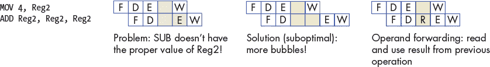

*图 5-44：处理器通过在指令之间转发操作数来减少流水线冒险造成的损害。*

这两条指令将值`4`加载到寄存器`Reg2`中，然后将其乘以 2（通过自加）。再次加入冒泡操作，以确保每条指令都执行五个流水线阶段。在这种情况下，不管是否有冒泡，第二条指令的执行阶段发生在第一条指令完成将所需值（`4`）写入寄存器`Reg2`之前。

增加更多冒泡是一种次优解，因为它会导致流水线停顿。相反，处理器采用一种称为*操作数转发*的技术，其中流水线从前一个操作中读取结果。参见图 5-44，当`MOV 4, Reg2`指令执行时，它将其结果转发给`ADD Reg2, Reg2, Reg2`指令。因此，当`MOV`指令正在写入寄存器`Reg2`时，`ADD`指令可以使用从`MOV`指令接收到的更新后的`Reg2`值。

#### 5.8.2 流水线冒险：控制冒险

流水线对于连续执行的指令进行了优化。程序中由条件语句（如`if`语句或循环）引起的控制变化会严重影响流水线性能。让我们看一个不同的代码示例，首先是 C 语言代码：

```
int result = *x; // x holds an int

int temp = *y;   // y holds another int

if (result <= temp) {

   result = result - temp;

}

else {

   result = result + temp;

}

return result;
```

这个代码片段简单地从两个不同的指针读取整数数据，比较它们的值，然后根据结果执行不同的算术操作。以下是前述代码片段如何转换为汇编指令：

```
  MOV M[0x84], Reg1     # move value at memory address 0x84 to register Reg1

  MOV M[0x88], Reg2     # move value at memory address 0x88 to register Reg2

  CMP Reg1, Reg2        # compare value in Reg1 to value in Reg2

  JLE L1<0x14>          # switch code execution to L1 if Reg1 less than Reg2

  ADD Reg1, Reg2, Reg1  # compute Reg1 + Reg2, store result in Reg1

  JMP L2<0x20>          # switch code execution to L2 (code address 0x20)

L1:

  SUB Reg1, Reg2, Reg1  # compute Reg1 - Reg2, store in Reg1

L2:

  RET                   # return from function
```

这段指令序列从内存中加载数据到两个独立的寄存器中，比较它们的值，然后根据第一个寄存器中的值是否小于第二个寄存器中的值来执行不同的算术操作。在这个示例中，`if`语句由两条指令表示：比较（`CMP`）指令和条件跳转小于（`JLE`）指令。我们在《条件控制与循环》一章中会更详细地讲解条件指令，详见第 310 页；目前，了解`CMP`指令*比较*两个寄存器，而`JLE`指令是一种特殊类型的分支指令，只有在条件（即小于或等于，在此情况下）为真时才会将代码执行切换到程序的另一个部分，足矣。

**警告：不要被细节压倒！**

第一次查看汇编代码可能会让人感到有些畏惧。如果你有这种感觉，不用担心！我们将在第七章中详细介绍汇编语言。关键要点是，包含条件语句的代码会转化为一系列汇编指令，就像任何其他代码片段一样。然而，不同于其他代码片段，条件语句*不*一定以某种特定方式执行。条件语句执行的不确定性对管道有很大的影响。

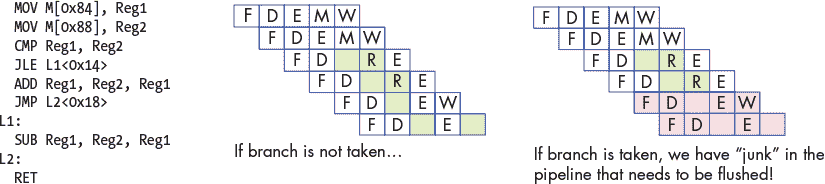

*图 5-45：由条件分支引起的控制危害示例*

*控制危害*发生在管道遇到分支（或条件）指令时。发生这种情况时，管道必须“猜测”是否会执行该分支。如果分支不被执行，流程将继续按顺序执行下一条指令。请参考图 5-45 中的示例。如果执行了分支，接下来执行的指令应是`SUB`指令。然而，在`JLE`指令执行完之前，不可能知道是否执行了分支。此时，`ADD`和`JMP`指令已经加载到管道中。如果分支*确实*被执行，这些管道中的“垃圾”指令需要被移除，或者说需要被*刷新*，然后管道才能重新加载新指令。刷新管道是昂贵的操作。

硬件工程师可以选择几种方案来帮助处理器应对控制危害：

+   **暂停管道**：作为一种简单的解决方案，每当遇到分支时，加入大量的`NOP`气泡并暂停管道，直到处理器确定分支是否会被执行。虽然暂停管道可以解决问题，但它也会导致性能下降（参见图 5-46）。

+   **分支预测**：最常见的解决方案是使用*分支预测器*，它会根据之前的执行情况预测分支的走向。现代的分支预测器非常优秀且准确。然而，这种方法最近引发了一些安全漏洞（例如，Spectre^(21))。图 5-46 展示了分支预测器如何处理上述讨论的控制冒险问题。

+   **急切执行**：在急切执行中，CPU 同时执行分支的两边，并执行条件数据传输，而不是控制传输（分别通过 x86 和 ARMv8-A 中的`cmov`和`csel`指令实现）。条件数据传输使得处理器可以继续执行而不打断流水线。然而，并不是所有代码都能利用急切执行，特别是在指针解引用和副作用的情况下，这可能是危险的。

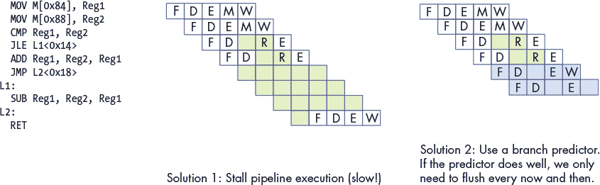

*图 5-46：处理控制冒险的潜在解决方案*

### 5.9 展望未来：当今的 CPU

CPU 流水线是*指令级并行*（ILP）的一种典型示例，其中 CPU 同时并行执行多个指令。在流水线执行中，CPU 通过重叠指令的执行来同时执行多个指令。一个简单的流水线 CPU 可以实现每时钟周期完成一条指令的 CPI 值为 1。现代微处理器通常采用流水线技术，并结合其他 ILP 技术，且包括多个 CPU 核心，从而实现小于 1 的处理器 CPI 值。对于这些微架构，通常使用每周期指令数（IPC）作为衡量其性能的指标。较大的 IPC 值表明处理器能够实现高度持续的指令并行执行。

晶体管是集成电路（芯片）上所有电路的构建基石。现代 CPU 的处理和控制单元由电路构成，这些电路是由子电路和基本逻辑门构建的，而这些逻辑门是通过晶体管实现的。晶体管还实现了用于 CPU 寄存器和快速片上缓存存储电路，缓存存储着最近访问过的数据和指令的副本（我们将在第十一章中详细讨论缓存）。

一个芯片上能容纳的晶体管数量是其性能的一个粗略衡量标准。*摩尔定律*是戈登·摩尔在 1975 年提出的观察结果，指出集成电路中每个芯片上的晶体管数量大约每两年翻一番。^(22) 每两年芯片上晶体管数量翻倍意味着计算机架构师可以设计出一个新的芯片，提供两倍的存储空间和计算电路，功率大约翻倍。从历史上看，计算机架构师利用额外的晶体管设计出更复杂的单一处理器，采用指令级并行（ILP）技术来提升整体性能。

#### 5.9.1 指令级并行性

指令级并行性（ILP）是指一组设计技术，用于支持单个程序的指令在单个处理器上的并行执行。ILP 技术对程序员是透明的，这意味着程序员编写的是一个顺序的 C 程序，但处理器可以在一个或多个执行单元上同时并行执行其中的多个指令。流水线就是 ILP 的一种示例，其中一系列程序指令同时执行，每个指令处于不同的流水线阶段。一个流水线处理器每个周期可以执行一条指令（可以达到每周期指令数 1 的 IPC）。其他类型的微处理器 ILP 设计可以在每个时钟周期执行多条指令，并且达到超过 1 的 IPC 值。

*向量处理器*是一种通过特殊的向量指令来实现 ILP 的架构，这些向量指令将一维数组（向量）作为操作数。向量处理器通过多个执行单元并行执行向量指令，每个单元对其向量操作数的单个元素执行算术操作。在过去，向量处理器通常用于大型并行计算机。1976 年的 Cray-1 是首个基于向量处理器的超级计算机，Cray 在 1990 年代继续设计其基于向量处理器的超级计算机。然而，最终这种设计无法与其他并行超级计算机设计竞争，今天向量处理器主要出现在加速器设备中，例如图形处理单元（GPU），这些设备特别优化了对存储在一维数组中的图像数据进行计算。

*超标量*是 ILP 处理器设计的另一个示例。超标量处理器是一个具有多个执行单元和多个执行管道的单一处理器。超标量处理器从顺序程序的指令流中获取一组指令，并将其拆分为多个独立的指令流，这些指令流由执行单元并行执行。超标量处理器是一种*乱序处理器*，即执行指令的顺序不按照它们在顺序指令流中出现的顺序执行。乱序执行需要识别没有依赖关系的指令序列，这些指令可以安全地并行执行。超标量处理器包含功能，能够动态创建多个独立的指令流，通过其多个执行单元进行处理。此功能必须执行依赖性分析，以确保任何执行依赖于前一条指令结果的指令能够正确排序。例如，具有五个流水线执行单元的超标量处理器可以在一个周期内执行顺序程序中的五条指令（可以实现每周期指令数 IPC 为 5）。然而，由于指令间的依赖关系，超标量处理器并不总能保持所有管道都处于满负荷状态。

*超长指令字*（VLIW）是另一种类似于超标量的 ILP 微架构设计。然而，在 VLIW 架构中，编译器负责构建由处理器并行执行的多个独立指令流。VLIW 架构的编译器分析程序指令，以静态方式构建一个 VLIW 指令，其中包含多个来自每个独立流的指令。与超标量架构相比，VLIW 带来更简化的处理器设计，因为 VLIW 处理器无需执行依赖性分析来构建多个独立的指令流，作为执行程序指令的一部分。相反，VLIW 处理器只需要增加电路来获取下一个 VLIW 指令，并将其拆分为多个指令，然后将这些指令送入每个执行管道。然而，通过将依赖性分析推给编译器，VLIW 架构需要专门的编译器来实现良好的性能。

超标量和 VLIW 的一个问题是，它们的并行性能往往受到它们所执行的顺序应用程序的显著限制。程序中指令之间的依赖关系限制了保持所有管道满负荷运行的能力。

#### 5.9.2 多核与硬件多线程

通过设计使用越来越复杂的 ILP 技术并提高 CPU 时钟速度以驱动这些越来越复杂的功能，计算机架构师设计了性能跟随摩尔定律的处理器，直到 2000 年代初。此后，CPU 时钟速度无法再增加，而不大幅提高处理器的功耗。^(23)这导致了当前多核和多线程微架构的时代，二者都要求程序员进行*显式并行编程*，以加速单个程序的执行。

*硬件多线程*是一种支持执行多个硬件线程的单处理器设计。*线程*是独立的执行流。例如，两个运行中的程序各自有一个独立的执行线程。这两个程序的执行线程可以由操作系统调度，在多线程处理器上“同时”运行。硬件多线程可能通过处理器在每个周期轮流执行来自各个线程指令流的指令来实现。在这种情况下，不是每个周期都同时执行不同硬件线程的所有指令，而是处理器被设计为快速切换执行来自不同线程的指令流。这通常会导致整体执行速度比在单线程处理器上的执行更快。

多线程可以在标量型或超标量型微处理器的硬件中实现。至少，硬件需要支持从多个独立的指令流中提取指令（每个执行线程一个），并为每个线程的执行流提供独立的寄存器集。这些架构是*显式多线程*^(24)的，因为与超标量架构不同，每个执行流都是由操作系统独立调度，以执行单独的程序指令逻辑序列。多个执行流可以来自多个顺序程序，也可以来自单个多线程并行程序中的多个软件线程（我们在第 14.1 节讨论多线程并行编程）。

基于超标量处理器的硬件多线程微架构具有多个流水线和多个执行单元，因此它们可以同时并行地执行来自多个硬件线程的指令，从而实现大于 1 的 IPC 值。基于简单标量处理器的多线程架构实现了*交错多线程*。这些微架构通常共享一个流水线，并始终共享处理器的单一 ALU（CPU 在不同线程之间切换执行）。这种类型的多线程无法实现大于 1 的 IPC 值。由超标量微架构支持的硬件线程通常被称为*同时多线程*（SMT）。^(25) 不幸的是，SMT 通常用来指代两种类型的硬件多线程，单凭这个术语无法确定一个多线程微架构是否实现了真正的同时多线程或交错多线程。

*多核处理器*包含多个完整的 CPU 核心。像多线程处理器一样，每个核心由操作系统独立调度。然而，多核处理器的每个核心都是一个完整的 CPU 核心，具有执行程序指令的完整和独立功能。多核处理器包含这些 CPU 核心的副本，并且提供一些额外的硬件支持，使得核心之间能够共享缓存数据。多核处理器的每个核心可以是标量、超标量或硬件多线程的。图 5-47 展示了一个多核计算机的例子。

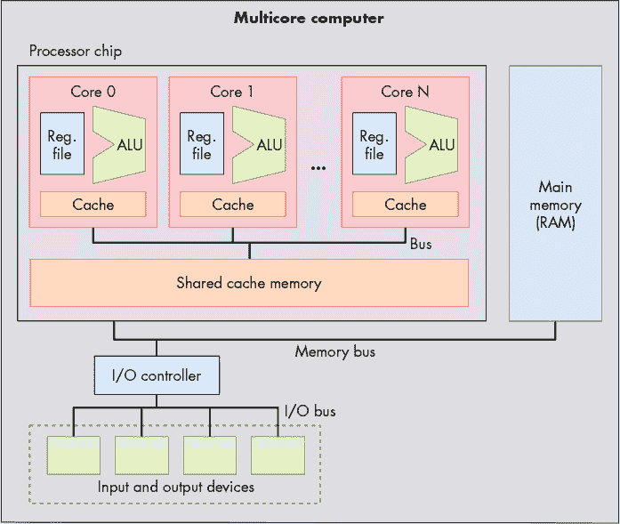

*图 5-47：一台具有多核处理器的计算机。该处理器包含多个完整的 CPU 核心，每个核心都有自己的私有缓存内存。核心之间通过片上总线进行通信，并共享一个更大的共享缓存内存。*

多核微处理器设计是处理器架构性能继续跟上摩尔定律的主要方式，而无需提高处理器时钟频率。多核计算机可以同时运行多个顺序程序，操作系统将每个核心调度到不同程序的指令流。它还可以加速单个程序的执行，如果该程序被写成显式的多线程（软件级线程）并行程序。例如，操作系统可以将单个程序的线程调度到多核处理器的各个核心上同时运行，从而加快程序的执行速度，相较于执行该程序的顺序版本。在第十四章中，我们将讨论多核及其他类型共享主内存的并行系统的显式多线程并行编程。

#### 5.9.3 一些示例处理器

目前，处理器的构建采用了 ILP、硬件多线程和多核技术的混合方式。事实上，几乎找不到不是多核的处理器。桌面级处理器通常有两个到八个核心，其中许多还支持每个核心的低级多线程。例如，AMD Zen 多核处理器^(26)和英特尔的超线程多核 Xeon 及 Core 处理器^(27)都支持每个核心两个硬件线程。英特尔的超线程核心实现了交错多线程。因此，每个核心只能达到 1 的 IPC，但通过每颗芯片上多个 CPU 核心，处理器可以实现更高的 IPC。

为高端系统设计的处理器，例如用于服务器和超级计算机的处理器，通常包含多个核心，每个核心具有较高程度的多线程。例如，Oracle 的 SPARC M7 处理器^(28)，用于高端服务器，拥有 32 个核心。每个核心有八个硬件线程，其中两个可以同时执行，导致处理器的最大 IPC 值为 64。世界上最快的两台超级计算机（截至 2019 年 6 月）^(29)使用的是 IBM 的 Power 9 处理器。^(30) Power 9 处理器每颗芯片最多有 24 个核心，每个核心支持最多八路同时多线程。Power 9 处理器的 24 核心版本可以实现 192 的 IPC 值。

### 5.10 小结

本章介绍了计算机的架构，重点讲解了处理器（CPU）的设计与实现，以帮助理解计算机如何运行程序。今天的现代处理器基于冯·诺依曼架构，该架构定义了存储程序的通用计算机。冯·诺依曼架构的通用设计使得它能够执行任何类型的程序。

为了理解 CPU 如何执行程序指令，我们构建了一个示例 CPU，从基本的逻辑门构建模块开始，创建电路以共同实现一个数字处理器。数字处理器的功能通过结合控制、存储和算术/逻辑电路构建，并通过时钟电路驱动其执行程序指令的取指（Fetch）、解码（Decode）、执行（Execute）和写回（WriteBack）阶段。

所有处理器架构都实现了指令集架构（ISA），该架构定义了 CPU 指令集、CPU 寄存器集以及执行指令对处理器状态的影响。存在许多不同的 ISA，并且通常会有针对特定 ISA 的不同微处理器实现。今天的微处理器还使用各种技术来提高处理器性能，包括流水线执行、指令级并行和多核设计。

要更全面深入地了解计算机架构，我们推荐阅读计算机架构教科书。^(31)

### 注释

1. “ACM 图灵奖得主，” *[`amturing.acm.org/`](https://amturing.acm.org/)*

2. “现代计算机架构的先驱获得 ACM 图灵奖，” ACM 媒体中心通知，2018 年 3 月，*[`www.acm.org/media-center/2018/march/turing-award-2017`](https://www.acm.org/media-center/2018/march/turing-award-2017)*

3. 大卫·艾伦·格里尔，*《当计算机是人类时》*，普林斯顿大学出版社，2005 年。

4. 梅根·加伯，“计算能力曾经是用*千女孩*来衡量的，” *《大西洋月刊》*，2013 年 10 月 16 日。*[`www.theatlantic.com/technology/archive/2013/10/computing-power-used-to-be-measured-in-kilo-girls/280633/`](https://www.theatlantic.com/technology/archive/2013/10/computing-power-used-to-be-measured-in-kilo-girls/280633/)*

5. 贝蒂·亚历山德拉·图尔，*《艾达，数字魔法师》*，草莓出版社，1998 年。

6. 乔治·戴森，*《图灵的教堂：数字宇宙的起源》*，潘提翁出版社，2012 年。

7. 沃尔特·艾萨克森，*《创新者：一群发明家、黑客、天才和极客如何创造数字革命》*，西蒙与舒斯特出版公司，2014 年。

8. 艾伦·M·图灵，“关于可计算数，及其在*决策问题*中的应用，” *《伦敦数学会会刊》* 2(1)，页 230–265，1937 年。

9. 布莱恩·卡朋特与罗伯特·多兰，“另一个图灵机，” *《计算机期刊》* 20(3)，页 269–279，1977 年。

10. 詹姆斯·A·里兹、惠特菲尔德·迪菲与 J·V·菲尔德（编辑），*《在布莱切利公园破译电传密码：关于 Tunny 的总体报告，重点介绍统计方法（1945 年）》*，威利出版社，2015 年。

11. 杰克·科普兰等，*《科洛苏斯：布莱切利公园破解密码计算机的秘密》*，牛津大学出版社，2010 年。

12. 贾内特·阿贝特，*《性别重编码》*，麻省理工学院出版社，2012 年。

13. 沃尔特·艾萨克森，*《创新者：一群发明家、黑客、天才和极客如何创造数字革命》*，西蒙与舒斯特出版公司，2014 年。

14. 贾内特·阿贝特，*《性别重编码》*，麻省理工学院出版社，2012 年。

15. 利安·埃里克森，*《绝密玫瑰：二战中的女性计算机》*，公共广播系统，2010 年。

16. 凯西·克莱曼，《计算机》，*[`eniacprogrammers.org/`](http://eniacprogrammers.org/)*

17. 约翰·冯·诺依曼，“EDVAC 报告的第一稿（1945 年）。” 重新刊载于*《IEEE 计算机历史年鉴》*第 4 期，页 27–75，1993 年。

18. 约翰·冯·诺依曼，“EDVAC 报告的第一稿（1945 年）。” 重新刊载于*《IEEE 计算机历史年鉴》*第 4 期，页 27–75，1993 年。

19. 沃尔特·艾萨克森，*《创新者：一群发明家、黑客、天才和极客如何创造数字革命》*，西蒙与舒斯特出版公司，2014 年。

20. 一个建议是 John Hennessy 和 David Patterson 的*《计算机架构：定量方法》*，摩根·考夫曼出版社，2011 年。

21. Peter Bright, “谷歌：软件永远无法修复 Spectre 类型的漏洞,” *Ars Technica*, 2019 年。

22. 摩尔在 1965 年首次观察到每年翻倍的趋势；他在 1975 年将这一趋势更新为每超过 2 年一次，这被称为摩尔定律。摩尔定律一直有效，直到 2012 年左右，晶体管密度的提升开始放缓。摩尔预测摩尔定律将在 2020 年代中期结束。

23. Adrian McMenamin, “Dennard 缩放的终结,” *[`cartesianproduct.wordpress.com/2013/04/15/the-end-of-dennard-scaling/`](https://cartesianproduct.wordpress.com/2013/04/15/the-end-of-dennard-scaling/)*

24. T. Ungerer, B. Robic, 和 J. Silc, “具有显式多线程的处理器调查,” *ACM 计算机调查* 35(1), 第 29–63 页, 2003 年。

25. T. Ungerer, B. Robic, 和 J. Silc, “具有显式多线程的处理器调查,” *ACM 计算机调查* 35(1), 第 29–63 页, 2003 年。

26. *[`www.amd.com/en/technologies/zen-core`](https://www.amd.com/en/technologies/zen-core)*

27. *[`www.intel.com/content/www/us/en/architecture-and-technology/hyper-threading-technology.html`](https://www.intel.com/content/www/us/en/architecture-and-technology/hyper-threading-technology.html)*

28. *[`web.archive.org/web/20190819165804/http://www.oracle.com/us/products/servers-storage/sparc-m7-processor-ds-2687041.pdf`](https://web.archive.org/web/20190819165804/http://www.oracle.com/us/products/servers-storage/sparc-m7-processor-ds-2687041.pdf)*

29. *[`www.top500.org/lists/top500/`](https://www.top500.org/lists/top500/)*

30. *[`www.ibm.com/it-infrastructure/power/power9`](https://www.ibm.com/it-infrastructure/power/power9)*

31. 一个建议是 David A. Patterson 和 John L. Hennessy 的*《计算机组织与设计：硬件与软件接口》*，摩根·考夫曼出版社，2010 年。
