# 第十二章：**存储与内存层次结构**


尽管设计和实现高效算法通常是编写高性能程序中*最*关键的方面，但还有一个常常被忽视的因素，可能对性能产生重大影响：内存。或许令人惊讶的是，两个具有相同渐近性能（最坏情况下的步骤数）的算法，在相同输入下，可能由于执行硬件的组织方式而表现出截然不同的性能。这种差异通常源于算法的内存访问，特别是它们存储数据的位置以及它们访问数据时所表现出的模式。这些模式被称为*内存局部性*，为了获得最佳性能，程序的访问模式需要与硬件的内存布局良好对接。

例如，考虑以下两种计算 *N* × *N* 矩阵平均值的函数变体。尽管这两种变体访问相同的内存位置次数相同（*N*²），但变体 1 在实际系统上执行的速度大约是变体 2 的五倍。这个差异源于它们访问这些内存位置的模式。本文末尾，我们将使用内存分析工具*Cachegrind*来分析这个例子。

变体 1

```
float averageMat_v1(int **mat, int n) {

    int i, j, total = 0;

    for (i = 0; i < n; i++) {

        for (j = 0; j < n; j++) {

            // Note indexing: [i][j]

            total += mat[i][j];

        }

    }

    return (float) total / (n * n);

}
```

变体 2

```
float averageMat_v2(int **mat, int n) {

    int i, j, total = 0;

    for (i = 0; i < n; i++) {

        for (j = 0; j < n; j++) {

            // Note indexing: [j][i]

            total += mat[j][i];

        }

    }

    return (float) total / (n * n);

}
```

存储位置，如寄存器、CPU 缓存、主内存和磁盘上的文件，都具有显著不同的访问时间、传输速率和存储容量。在编写高性能应用程序时，考虑数据的存储位置以及程序访问每个设备数据的频率是非常重要的。例如，程序启动时访问一次缓慢的磁盘通常不会成为主要问题。另一方面，频繁访问磁盘则会显著降低程序的运行速度。

本章描述了各种内存设备，并介绍了它们在现代 PC 中的组织方式。通过这个背景，我们将看到如何将不同的内存设备组合起来，利用典型程序中的内存访问模式的局部性。

### 11.1 内存层次结构

当我们探索现代计算机存储时，一个常见的模式浮现出来：具有更高容量的设备通常提供较低的性能。换句话说，系统使用既快速又能存储大量数据的设备，但没有单一设备能同时做到这两点。这种性能与容量之间的权衡被称为*内存层次结构*，图 11-1 以图示的方式呈现了这一层次结构。

存储设备同样在成本和存储密度之间进行权衡：速度更快的设备更贵，无论是在每美元字节数还是运营成本（例如，能耗）方面。考虑到虽然缓存提供了很好的性能，但要构建一个足够大的缓存以放弃主内存的 CPU，其成本（和制造挑战）使得这种设计不可行。实际系统必须利用多种设备的组合，以满足程序的性能和容量需求，今天的典型系统通常包括图 11-1 中描述的大部分设备，甚至是所有设备。

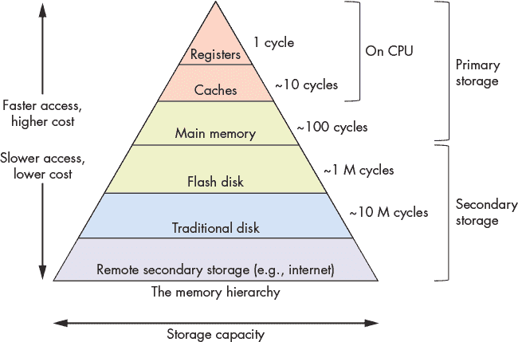

*图 11-1：内存层次结构*

内存层次的现实对程序员来说是不幸的，因为他们希望不必担心数据存储位置对性能的影响。例如，在大多数应用中声明一个整数时，程序员理想情况下不需要为数据是存储在缓存中还是主内存中而苦恼。要求程序员细致管理每个变量占据的内存类型会非常繁琐，尽管在某些小型、对性能要求严格的代码段中，这样做偶尔是值得的。

请注意，图 11-1 将 *缓存* 分类为单一实体，但大多数系统包含多个级别的缓存，这些缓存形成自己的较小层次结构。例如，CPU 通常会集成一个非常小且快速的 *一级*（L1）缓存，它相对靠近算术逻辑单元（ALU），以及一个更大且较慢的 *二级*（L2）缓存，位于更远的位置。许多多核 CPU 还会在更大的 *三级*（L3）缓存中共享核心之间的数据。尽管缓存级别之间的差异可能对性能敏感的应用程序很重要，本书为了简化，假设只考虑一个缓存级别。

虽然本章主要关注寄存器、CPU 缓存和主内存之间的数据传输，下一节将描述跨内存层次结构的常见存储设备。我们稍后将在“虚拟内存”一节中，讨论磁盘及其在内存管理中的作用，见第 639 页。

### 11.2 存储设备

系统设计者根据程序如何访问数据，将内存层次结构中的设备进行分类。*主存储*设备可以被程序直接访问。也就是说，CPU 的汇编指令编码了指令应该获取的数据的确切位置。主存储的例子包括 CPU 寄存器和主内存（RAM），汇编指令会直接引用它们（例如，在 IA32 汇编中分别是 `%reg` 和 `(%reg)`）。

相比之下，CPU 指令不能直接引用*二级存储*设备。为了访问二级存储设备的内容，程序必须先请求将设备中的数据复制到主存储器中（通常是内存）。最常见的二级存储设备是磁盘设备（例如硬盘驱动器和固态硬盘），它们持久存储文件数据。其他例子还包括软盘、磁带盒，甚至远程文件服务器。

即使你之前可能没有以这些术语区分主存储和二级存储，但你可能已经在程序中遇到它们的区别。例如，在声明和赋值普通变量（主存储）之后，程序可以立即在算术操作中使用它们。而在处理文件数据（二级存储）时，程序必须先将文件中的值读取到内存变量中，才能访问它们（请参见 第 117 页 的“文件输入/输出”）。

分类记忆设备的其他几个重要标准来源于它们的性能和容量特性。最有趣的三个衡量标准是：

**容量** 设备可以存储的数据量。容量通常以字节为单位进行测量。

**延迟** 设备在接到执行数据检索操作的指令后，响应并提供数据所需的时间。延迟通常以秒的分数（例如毫秒或纳秒）或 CPU 周期为单位进行测量。

**传输速率** 设备与主内存之间在某段时间内可以移动的数据量。传输速率也称为*吞吐量*，通常以每秒字节数为单位进行测量。

探索现代计算机中各种设备揭示了在这三项衡量标准上设备性能的巨大差异。性能差异主要来源于两个因素：*距离*和*用于实现这些设备的技术差异*。

距离的影响在于，最终，任何程序想要使用的数据必须能够提供给 CPU 的算术组件（例如 ALU）进行处理。CPU 设计师将寄存器放置在靠近 ALU 的位置，以最小化信号在两者之间传播所需的时间。因此，虽然寄存器只能存储少量字节且数量不多，但存储的值几乎可以立即提供给 ALU！相比之下，像磁盘这样的二级存储设备通过各种控制器设备将数据传输到内存，这些控制器设备通过较长的电线连接。额外的距离和中间处理大大减慢了二级存储的速度。

**格雷斯·霍普的“纳秒”**

在与观众交流时，计算机先驱、美国海军上将格蕾丝·霍普尔经常向观众分发 11.8 英寸的电线。这些电线代表了电信号在一纳秒内传播的最大距离，被称为“格蕾丝·霍普尔纳秒”。她用这些电线来描述卫星通信的延迟限制，并展示为什么计算设备需要小型化才能提高速度。格蕾丝·霍普尔讲解她的纳秒理论的录音可以在 YouTube 上找到。^(1)

底层技术也会显著影响设备的性能。寄存器和缓存由相对简单的电路构成，仅由少数逻辑门组成。它们的小尺寸和最小复杂性确保电信号能够快速传播，减少延迟。在对立的一端，传统的硬盘包含旋转的磁性盘片，能够存储数百 GB 的数据。尽管它们提供了密集的存储，但由于需要机械地调整和旋转部件以对准到正确的位置，因此其访问延迟相对较高。

本节的其余部分将详细探讨主存储和次存储设备，并分析它们的性能特征。

#### 11.2.1 主存储器

主存储设备由*随机存取内存*（RAM）组成，这意味着访问数据所需的时间不受数据在设备中的位置影响。也就是说，RAM 不需要担心像将部件移到正确位置或倒带磁带卷轴这样的事情。RAM 有两种广泛使用的类型，*静态 RAM*（SRAM）和*动态 RAM*（DRAM），它们在现代计算机中都扮演着重要角色。表 11-1 列出了常见主存储设备的性能衡量标准及其使用的 RAM 类型。

**表 11-1：** 典型 2022 工作站的主存储设备特性

| **设备** | **容量** | **大致延迟** | **RAM 类型** |
| --- | --- | --- | --- |
| 寄存器 | 4–8 字节 | < 1 纳秒 | SRAM |
| CPU 缓存 | 1–32 兆字节 | 5 纳秒 | SRAM |
| 主内存 | 4–64 吉字节 | 100 纳秒 | DRAM |

SRAM 将数据存储在小型电路中（例如，锁存器——参见“RS 锁存器”在第 257 页）。SRAM 通常是最快的内存类型，设计师将其直接集成到 CPU 中，以构建寄存器和缓存。SRAM 在制造成本、运营成本（如功耗）以及所占空间方面相对昂贵。总体而言，这些成本限制了 CPU 可以包含的 SRAM 存储量。

DRAM 使用名为*电容器*的电子元件存储数据，这些电容器能够储存电荷。它被称为“动态”是因为 DRAM 系统必须频繁刷新电容器的电荷才能保持存储的值。现代系统使用 DRAM 来实现主内存，这些内存模块通过一种称为*内存总线*的高速互连与 CPU 连接。

图 11-2 说明了相对于内存总线的主存储设备的位置。为了从内存中检索值，CPU 将要检索数据的地址放在内存总线上，并发出信号，要求内存模块执行读取操作。经过短暂延迟后，内存模块将存储在请求地址处的值通过总线发送到 CPU。

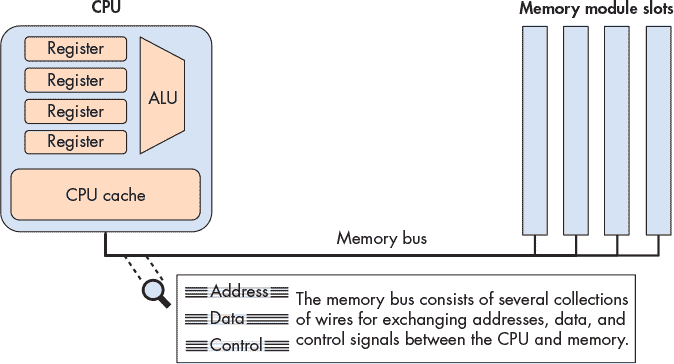

*图 11-2：主存储和内存总线架构*

尽管 CPU 和主存储器在物理上相距几英寸，但数据在 CPU 和主存储器之间移动时必须经过内存总线。它们之间的额外距离和电路增加了延迟，并减少了相对于 CPU 存储的主存储器传输速率。因此，内存总线有时被称为*冯·诺依曼瓶颈*。当然，尽管性能较低，主存储器仍然是一个必不可少的组件，因为它存储的数据量比 CPU 能容纳的多几个数量级。与其他存储形式一致，容量和速度之间存在明显的权衡。

*CPU 缓存*（发音为“缓存”）位于寄存器和主存储器之间的中间地带，无论从物理上还是性能和容量特性上都是如此。CPU 缓存通常直接存储几千字节到几兆字节的数据在 CPU 上，但物理上，缓存不像寄存器那样接近 ALU。因此，缓存访问速度比主存储器快，但相比寄存器，它们需要更多周期将数据提供给计算使用。

CPU 内部的控制电路自动将主存储器内容的一个子集存储到缓存中，而不是程序员显式地将值加载到缓存中。CPU 策略性地控制将主存储器的哪个子集存储在缓存中，以便尽可能多地通过（性能更高的）缓存服务内存请求。本章后续部分描述了影响缓存构建和管理存储数据算法的设计决策。

真实系统包含多个层次的缓存，它们表现得像自己的小型内存层次结构版本。也就是说，CPU 可能有一个非常小而快速的*L1 缓存*，它存储稍大而较慢的*L2 缓存*的子集，后者又存储了更大而更慢的*L3 缓存*的子集。本节其余部分描述了一个仅具有单个缓存的系统，但是实际系统中缓存之间的交互行为与稍后详细描述的单个缓存与主存储器之间的交互行为非常相似。

**注意**

如果你对系统中缓存和主存储器的大小感兴趣，可以使用`lscpu`命令打印有关 CPU（包括其缓存容量）的信息。运行`free -m`可以显示系统的主存储器容量（以兆字节为单位）。

#### 11.2.2 次级存储

从物理上讲，二级存储设备与主存相比距离 CPU 更远。与大多数其他计算机设备相比，二级存储设备多年来经历了显著的演变，并且它们的设计通常比其他组件更加多样化。标志性的打孔卡^(2)允许操作员通过在厚纸上打孔来存储数据，类似于索引卡。打孔卡的设计可追溯到 1890 年美国人口普查，在 1960 年代和 1970 年代，打孔卡一直忠实地存储用户数据（通常是程序）。

磁带驱动器^(3)将数据存储在磁带卷轴上。尽管它们通常以较低的成本提供良好的存储密度（在小尺寸中存储大量信息），但由于需要将卷轴绕到正确位置，磁带驱动器的访问速度较慢。尽管如今大多数计算机用户不再经常接触到它们，磁带驱动器仍然广泛用于大规模存储操作（如大规模数据备份），在这些操作中，读取数据的频率较低。现代磁带驱动器将磁带卷轴安排成小型卡带，便于使用。

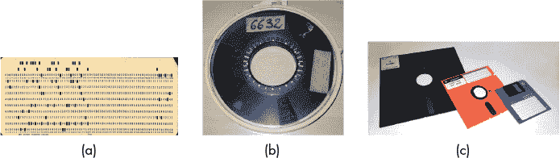

*图 11-3：打孔卡（a）、磁带卷轴（b）和各种软盘尺寸（c）的示例照片。图片来自 Wikipedia。*

可移动介质，如软盘^(4)和光盘^(5)是另一种流行的二级存储形式。软盘包含一个旋转的磁性记录介质轴，磁头在其上方读取和写入数据。图 11-3 展示了打孔卡、磁带驱动器和软盘的照片。光盘（如 CD、DVD 和 Blu-ray）通过在盘面上做小的凹痕来存储信息。驱动器通过向光盘照射激光来读取盘片，凹痕的存在与否会影响激光束的反射（或不反射），从而编码成零和一。

##### 11.2.2.1 现代二级存储

**表 11-2：** 典型 2022 年工作站的二级存储设备特性

| **设备** | **容量** | **延迟** | **传输速率** |
| --- | --- | --- | --- |
| 闪存 | 0.5–2 terabytes | 0.1–1 毫秒 | 200–3,000 兆字节/秒 |
| 传统硬盘 | 0.5–10 terabytes | 5–10 毫秒 | 100–200 兆字节/秒 |
| 远程网络服务器 | 可变 | 20–200 毫秒 | 可变 |

表 11-2 描述了今天工作站常见的二级存储设备。图 11-4 展示了从二级存储到主内存的路径通常如何通过几个中间设备控制器。例如，典型的硬盘连接到串行 ATA 控制器，再连接到系统 I/O 控制器，最后连接到内存总线。这些中间设备通过将磁盘通信的细节从操作系统和程序员中抽象出来，使磁盘更易于使用。然而，它们也引入了传输延迟，因为数据需要通过额外的设备流动。

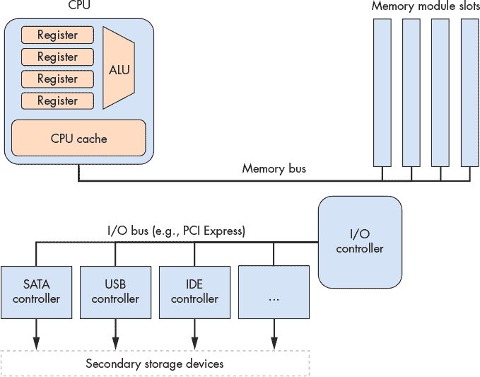

*图 11-4：二级存储和 I/O 总线架构*

今天最常见的两种二级存储设备是*硬盘驱动器*（HDD）和基于闪存的*固态硬盘*（SSD）。硬盘由几个平坦的圆盘组成，这些圆盘由可进行磁性记录的材料制成。盘片快速旋转，通常的转速在每分钟 5,000 到 15,000 转之间。当盘片旋转时，一只小型机械臂上带有一个磁头，磁头在盘片的同心轨道（位于相同直径的区域）上移动，以读取或写入数据。

图 11-5 展示了硬盘的主要组件。^(6) 在访问数据之前，磁盘必须将磁头与包含所需数据的轨道对齐。对齐需要通过伸缩机械臂，直到磁头正好位于轨道上方。移动磁盘臂被称为*寻道*，由于它需要机械运动，寻道过程会引入一个小的*寻道时间*延迟（几毫秒）。当臂到达正确的位置时，磁盘必须等待盘片旋转，直到磁头直接位于存储所需数据的位置上方。这又引入了另一个短暂的延迟（几毫秒），称为*旋转延迟*。因此，由于其机械特性，硬盘的访问延迟显著高于前面描述的主要存储设备。

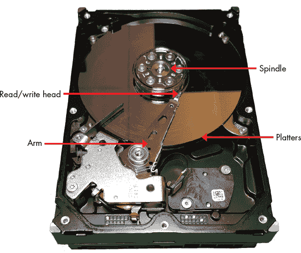

*图 11-5：硬盘驱动器的主要组件*

过去几年中，固态硬盘（SSD）由于没有活动部件（因此延迟较低），迅速崭露头角。它们被称为固态硬盘，因为它们不依赖机械运动。虽然存在多种固态技术，但闪存^(7) 在商业 SSD 设备中占据主导地位。闪存的技术细节超出了本书的范围，但可以简单地说，基于闪存的设备能够以比传统硬盘更快的速度读取、写入和擦除数据。尽管它们的存储密度尚不及机械硬盘，但在大多数消费类设备（如笔记本电脑）中，它们已经大体取代了旋转硬盘。

### 11.3 本地性

由于内存设备在性能特征和存储容量上差异很大，现代系统集成了多种存储形式。幸运的是，大多数程序展示了常见的内存访问模式，称为*局部性*，设计者构建硬件来利用良好的局部性，自动将数据移到适当的存储位置。具体来说，系统通过将程序正在积极使用的数据子集移到靠近 CPU 计算电路的存储中（例如，在寄存器或 CPU 缓存中）来提高性能。随着必要数据向 CPU 靠近，未使用的数据则移向更远、速度较慢的存储，直到程序需要它。

对于系统设计师来说，构建一个能够利用局部性的系统代表着一个抽象问题。系统提供了内存设备的抽象视图，使得程序员看起来他们拥有所有内存容量，并且具有快速片上存储的性能特征。当然，向用户提供这种美好的假象无法做到完美，但通过利用程序的局部性，现代系统能为大多数写得很好的程序提供良好的性能。

系统主要利用两种局部性：

**时间局部性** 程序往往会在一段时间内反复访问相同的数据。也就是说，如果程序最近使用过一个变量，那么很可能会很快再次使用该变量。

**空间局部性** 程序倾向于访问与其他之前访问过的数据相邻的数据。“相邻”指的是数据的内存地址。例如，如果程序访问了地址为*N*和*N* + 4 的数据，那么它很可能会很快访问*N* + 8 的数据。

#### 11.3.1 代码中的局部性示例

幸运的是，常见的编程模式经常表现出这两种局部性。例如，考虑以下函数：

```
/* Sum up the elements in an integer array of length len. */

int sum_array(int *array, int len) {

    int i;

    int sum = 0;

    for (i = 0; i < len; i++) {

        sum += array[i];

    }

    return sum;

}
```

在这段代码中，`for`循环的重复性特征为`i`、`len`、`sum`和`array`（数组的基地址）引入了时间局部性，因为程序在每次循环迭代中都会访问这些变量。利用这种时间局部性，系统可以仅将每个变量从主内存加载到 CPU 缓存中一次。之后的每次访问都可以从速度更快的缓存中服务。

对数组内容的访问同样受益于空间局部性。尽管程序每次只访问一次数组元素，现代系统通常会一次性从内存加载多个`int`到 CPU 缓存中。也就是说，访问第一个数组索引时，不仅会加载第一个整数，还会加载紧随其后的几个整数。具体加载多少个额外的整数进入缓存，取决于缓存的*块大小*——即每次向缓存转移的数据量。

例如，使用 16 字节的块大小，系统一次将四个整数从内存复制到缓存中。因此，访问第一个整数会产生相对较高的主内存访问成本，但接下来的三个整数会从缓存中提供，即使程序之前从未访问过它们。

在许多情况下，程序员可以通过故意编写展示良好局部性模式的代码来帮助系统。例如，考虑访问每个元素的嵌套循环，一个 *N* × *N* 矩阵（这个例子在本章的介绍中也有出现）：

版本 1

```
float averageMat_v1(int **mat, int n) {

    int i, j, total = 0;

    for (i = 0; i < n; i++) {

        for (j = 0; j < n; j++) {

            // Note indexing: [i][j]

            total += mat[i][j];

        }

    }

    return (float) total / (n * n);

}
```

版本 2

```
float averageMat_v2(int **mat, int n) {

    int i, j, total = 0;

    for (i = 0; i < n; i++) {

        for (j = 0; j < n; j++) {

            // Note indexing: [j][i]

            total += mat[j][i];

        }

    }

    return (float) total / (n * n);

}
```

在这两个版本中，循环变量（`i` 和 `j`）以及累加变量（`total`）展示了良好的时间局部性，因为这些变量在每次迭代中都会被反复使用。因此，当执行这段代码时，系统会将这些变量存储在快速的 CPU 存储位置，以提供良好的性能。

然而，由于矩阵在内存中的行主序组织（参见 第 86 页 的“二维数组内存布局”），第一版本的代码执行速度大约比第二版本快五倍。这个差异源自空间局部性的不同——第一版本按顺序在内存中访问矩阵的值（即，按照连续的内存地址顺序）。因此，它受益于系统从内存中加载大块数据到缓存中，因为每访问一块值时，它只需一次访问内存。

第二版本通过在非连续的内存地址之间反复跳跃来访问矩阵的值。它 *从未* 在随后的内存访问中读取同一个缓存块，因此看起来缓存不需要该块数据。因此，每次读取矩阵值时，它都需要去访问内存。

这个例子说明了程序员如何影响程序执行时的系统级成本。在编写高性能应用程序时，特别是那些以规则模式访问数组的程序，牢记这些原则。

#### 11.3.2 从局部性到缓存

为了帮助说明时间局部性和空间局部性如何支持缓存设计，我们将采用一个具有实际世界物品的例子场景：书籍。假设 Fiona 在她宿舍的桌子上做所有作业，而桌子空间有限，只能存放三本书。在她房间外面，她有一排书架，比桌子有更多的存储空间。最后，在校园的另一边，她所在的大学有一个图书馆，里面有大量种类繁多的书籍。在这个例子中，“书籍存储层次结构”可能看起来像是 图 11-6。基于这个场景，我们将探讨局部性如何帮助指导 Fiona 应该选择哪个存储位置来存放她的书籍。


*图 11-6：假设的书籍存储层次结构*

#### 11.3.3 时间局部性

时间局部性表明，如果有一本书是 Fiona 经常使用的，她应该将它尽可能靠近她的桌子。如果她偶尔需要将它移到书架上以腾出临时工作空间，这个成本不高，但如果她第二天就要再用这本书，把它拿回图书馆就显得很愚蠢。反过来也是如此：如果有一本书占据了她桌子或书架上的宝贵空间，而她已经很久没有使用它，那本书就像是一个适合归还图书馆的候选书籍。

那么，Fiona 应该将哪些书移到她宝贵的桌面空间呢？在这个例子中，真正的学生可能会查看他们即将进行的任务，并选择他们预计最有用的书籍。换句话说，为了做出最佳存储决策，他们理想情况下需要关于*未来使用*的信息。

不幸的是，硬件设计师尚未发现如何构建能够预测未来的电路。作为预测的替代方法，可以设想一个系统，要求程序员或用户提前告知系统程序如何使用数据，以便优化其放置。这种策略在专门的应用程序（例如，大型数据库）中可能效果很好，因为这些应用展示了*非常*规律的访问模式。然而，在像个人计算机这样的通用系统中，要求用户提前通知就显得负担过重——许多用户可能不愿意（或者无法）提供足够的细节来帮助系统做出正确的决策。

因此，系统并不是依赖未来的访问信息，而是看向过去，作为预测未来*可能*发生事情的依据。将这个想法应用到书籍的例子中，提出了一种相对简单（但仍然非常有效）的方法来管理书籍存储空间：

+   当 Fiona 需要使用一本书时，她从当前所在的位置取出这本书，并把它移到她的桌子上。

+   如果桌子已经满了，她会将最近*最不常用*的书（即那本在桌子上放得最久、没有被动过的书）移到书架上。

+   如果书架已满，她会将书架上最不常用的书归还到图书馆，以腾出空间。

即使这个方案可能并不完美，但它的简洁性使其具有吸引力。它所需要的只是能够在存储位置之间移动书籍的能力，以及少量关于书籍先前使用顺序的元信息。此外，这个方案很好地捕捉了最初的两个时间局部性目标：

+   经常使用的书很可能会一直留在桌子或书架上，避免了不必要的去图书馆的往返。

+   很少使用的书最终会成为最近最不常用的书，这时把它们归还到图书馆就显得有意义。

将这一策略应用于主存储设备，看起来与书本中的示例非常相似：当数据从主内存加载到 CPU 寄存器时，为其在 CPU 缓存中腾出空间。如果缓存已经满了，则通过*驱逐*最近最少使用的缓存数据到主内存来腾出空间。在接下来的缓存部分中，我们将探讨现代缓存系统是如何构建这些机制的细节。

#### 11.3.4 空间局部性

空间局部性表明，当去图书馆时，Fiona 应该取更多的书，以减少未来再次去图书馆的可能性。具体来说，她应该取一些“邻近”她所需要的书的书，因为那些邻近的书看起来是避免额外去图书馆的好候选。

假设她正在上一个关于莎士比亚历史剧的文学课程。如果在课程的第一周，她被分配阅读*亨利六世 第一部分*，当她在图书馆取书时，她很可能会在书架上找到第二部分和第三部分。即使她还不知道课程是否会分配那两部分，认为她*可能*需要它们也是合情合理的。也就是说，需要它们的可能性远高于图书馆里随机一本书，特别是因为它们就近于她确实需要的那本书。

在这种情况下，由于图书馆排列书籍的方式，可能性会增加，程序也类似地在内存中组织数据。例如，像数组或`struct`这样的编程结构将一组相关数据存储在内存中的连续区域。当遍历数组中的连续元素时，访问的内存地址显然具有空间模式。将这些空间局部性的经验应用于主存储设备，意味着在从主内存检索数据时，系统也应该检索周围的数据。

在下一部分中，我们将描述缓存的特性，并描述硬件如何自动识别和利用局部性的机制。

### 11.4 CPU 缓存

在描述了存储设备并认识到时间和空间局部性的关键模式之后，我们准备探讨 CPU 缓存的设计和实现。*缓存*是 CPU 上的一种小型快速存储设备，存储着主内存的有限子集。缓存面临几个重要的设计问题：*哪个*程序内存的子集应该被缓存？*何时*缓存应将程序数据的子集从主内存复制到缓存，或反之？*如何*系统能够判断程序的数据是否存在于缓存中？

在探讨这些具有挑战性的问题之前，我们需要介绍一些缓存行为和术语。回想一下，当访问内存中的数据时，程序首先计算数据的内存地址（请参见第 298 页的“指令结构”）。理想情况下，所需地址处的数据已经存在于缓存中，允许程序完全跳过对主内存的访问。为了最大化性能，硬件同时将所需地址发送到*缓存*和主内存。由于缓存比内存更快且离算术逻辑单元（ALU）更近，缓存的响应速度远快于内存。如果数据存在于缓存中（*缓存命中*），缓存硬件将取消挂起的内存访问，因为缓存能比内存更快地提供数据。

否则，如果数据不在缓存中（*缓存未命中*），CPU 别无选择，只能等待从内存中检索数据。然而，关键的是，当访问主内存的请求完成后，CPU 会将检索到的数据加载到缓存中，以便后续对同一地址的请求（由于时间局部性，这些请求可能会发生）能够从缓存中快速服务。即使未命中的内存访问是*写入*内存，CPU 仍然会在未命中时将值加载到缓存中，因为程序很可能会在未来再次访问相同的位置。

当在缓存未命中的情况下加载数据时，CPU 通常会发现缓存没有足够的空闲空间可用。在这种情况下，缓存必须首先*逐出*一些已驻留的数据，为正在加载的新数据腾出空间。由于缓存存储的是从主内存复制的数据子集，逐出已修改的缓存数据时，缓存必须在逐出数据之前更新主内存中的内容。

为了提供上述所有功能，缓存设计师采用了三种设计方案之一。本节首先讨论*直接映射缓存*，它比其他设计方案更简单。

#### 11.4.1 直接映射缓存

直接映射缓存将其存储空间划分为称为*缓存行*的单元。根据缓存的大小，它可能包含几十、几百甚至几千个缓存行。在直接映射缓存中，每个缓存行都是独立的，并包含两种重要类型的信息：*缓存数据块*和*元数据*。

*缓存数据块*（通常缩写为*缓存块*）存储来自主内存的程序数据子集。缓存块存储多字节的数据块，以利用空间局部性。缓存块的大小决定了缓存和主存之间的数据传输单位。也就是说，当从内存加载数据到缓存时，缓存始终接收一个与缓存块大小相等的数据块。缓存设计师在选择缓存块大小时需要权衡各种因素。给定固定的存储预算，缓存可以存储更多的小块，或者更少的大块。使用更大的块可以提高具有良好空间局部性的程序的性能，而更多的块则使缓存能够存储更为多样化的内存子集。最终，哪种策略提供最佳性能取决于应用程序的工作负载。由于通用 CPU 无法假设系统应用程序的特性，当前典型的 CPU 缓存使用的是介于 16 到 64 字节之间的中等大小块。

*元数据*存储有关缓存行数据块内容的信息。缓存行的元数据*不*包含程序数据。相反，它维护缓存行的账目信息（例如，帮助识别缓存行的数据块包含内存的哪个子集）。

当程序尝试访问一个内存地址时，缓存必须知道从哪里查找对应的数据，检查该缓存位置是否有所需的数据，如果有，就将缓存块的一部分数据返回给请求的应用程序。以下步骤详细介绍了在缓存中查找并检索数据的过程。

##### 定位缓存数据

缓存必须能够快速判断对应请求地址的内存子集是否当前存在于缓存中。为了解答这个问题，缓存必须首先确定检查哪些缓存行。在直接映射缓存中，内存中的每个地址都对应*恰好*一个缓存行。这一限制解释了*直接映射*这个名称——它将每个内存地址直接映射到一个缓存行。

图 11-7 展示了内存地址如何映射到一个小型直接映射缓存中的缓存行，缓存行有四行，缓存块大小为 32 字节。回想一下，缓存的块大小表示缓存和主存之间数据传输的最小单位。因此，每个内存地址都落在一个 32 字节的范围内，并且每个范围映射到一个缓存行。

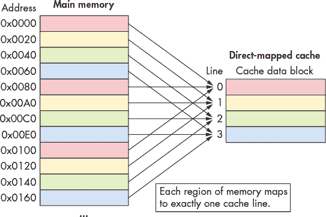

*图 11-7：在一个四行直接映射缓存中，内存地址到缓存行的映射示例，缓存块大小为 32 字节*

请注意，虽然每个内存区域只映射到一个缓存行，但许多内存范围会映射到*相同*的缓存行。所有映射到同一缓存行的内存区域（即图 11-7 中相同颜色的块）都在同一缓存行中争夺空间，因此每次只能有一个颜色的区域驻留在缓存中。

缓存使用内存地址中的一部分位将内存地址映射到缓存行。为了使数据更均匀地分布在缓存行中，缓存使用取自内存地址*中间*部分的位，这部分称为地址的*索引*部分，用于确定该地址映射到哪个缓存行。作为索引的位数（会有所变化）决定了缓存能容纳多少个缓存行。图 11-8 显示了内存地址的索引部分是如何指向缓存行的。

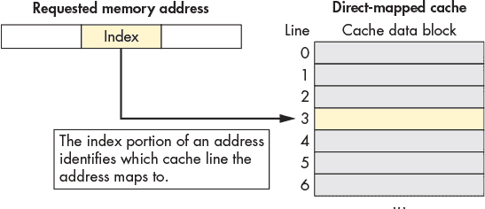

*图 11-8：内存地址的中间索引部分标识缓存行。*

使用地址的中间部分可以减少程序数据聚集时对同一缓存行的竞争，这通常发生在具有良好局部性的程序中。也就是说，程序倾向于将变量存储在彼此靠近的地方，通常是在几个位置之一（例如，栈或堆上）。这些聚集的变量共享相同的高位地址。因此，如果使用高位进行索引，则会导致这些聚集的变量全部映射到同一缓存行，从而使其余缓存行未被使用。通过使用地址中间部分的位，缓存能更均匀地分配数据到可用的缓存行。

##### 缓存内容识别

接下来，定位到适当的缓存行后，缓存必须确定该行是否包含请求的地址。由于多个内存范围映射到同一缓存行，缓存会检查该行的元数据，以回答两个重要问题：该缓存行是否持有有效的内存子集？如果是，它当前持有哪些映射到此缓存行的内存子集？

为了回答这些问题，每个缓存行的元数据包括一个有效位和一个标签。*有效位*是一个单个位，表示该行当前是否存储有效的内存子集（如果有效位为 1）。无效行（如果有效位为 0）永远不会产生缓存命中，因为没有数据被加载到其中。无效行实际上表示缓存中的空闲空间。

除了有效位，每个缓存行的元数据还存储一个*标签*，该标签唯一标识该缓存块所持有的内存子集。标签字段存储缓存行中地址范围的高位，并允许缓存行追踪其数据块来自内存的哪个位置。换句话说，由于许多内存子集映射到同一缓存行（那些具有相同索引位的子集），标签记录了当前存储在缓存行中的子集。

为了使缓存查找产生命中，存储在缓存行中的标签字段必须与程序请求的内存地址的标签部分（高位）完全匹配。标签不匹配表明缓存行的数据块不包含请求的内存，即使该行存储有效数据。图 11-9 说明了缓存如何将内存地址划分为标签和索引，使用索引位选择目标缓存行，验证行的有效位，并检查行的标签是否匹配。

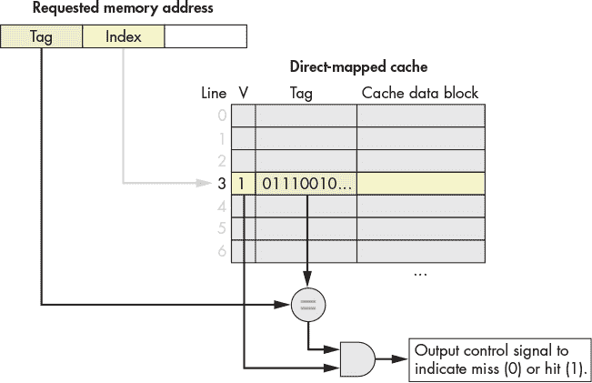

*图 11-9：在使用请求的内存地址的索引位定位正确的缓存行后，缓存同时验证该行的有效位并检查其标签与请求地址的标签是否匹配。如果该行有效且标签匹配，则查找成功，命中。*

##### 检索缓存数据

最后，在使用程序请求的内存地址找到合适的缓存行并验证该行包含有效的内存子集（其中包含该地址）之后，缓存将请求的数据发送到需要这些数据的 CPU 组件。由于缓存行的数据块大小（例如，64 字节）通常比程序请求的数据量（例如，4 字节）要大得多，缓存使用请求地址的低位作为*偏移量*，以进入缓存的数据块。图 11-10 展示了地址的偏移量部分是如何确定程序期望检索缓存块中的哪些字节的。

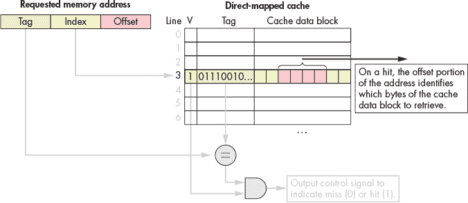

*图 11-10：给定一个缓存数据块，地址的偏移量部分确定程序想要检索的字节。*

##### 内存地址划分

缓存的*维度*决定了将多少位解释为内存地址中的偏移量、索引和标签部分。同样，地址中每个部分的位数也暗示了缓存的维度。为了确定哪个位属于地址的哪一部分，考虑从右到左（即从最低有效位到最高有效位）来看地址是有帮助的。

地址的最右部分是*偏移量*，其长度取决于缓存的数据块大小维度。地址的偏移量部分必须包含足够的位，以指向缓存数据块中的每个可能字节。例如，假设一个缓存存储 32 字节的数据块。因为程序可能会请求这些 32 字节中的任何一个，缓存需要足够的偏移量位来准确描述程序可能请求的 32 个位置中的哪个位置。在这种情况下，偏移量需要 5 个位，因为 5 个位足以表示 32 个唯一的值（log[2] 32 = 5）。反过来，如果一个缓存使用四个位作为偏移量，那么它必须存储 16 字节的数据块（2⁴ = 16）。

地址的*索引*部分从偏移的左侧立即开始。要确定索引位数，考虑缓存中的行数，因为索引需要足够的位数唯一标识每个缓存行。使用与偏移类似的逻辑，具有 1,024 行的缓存需要 10 位索引（log[2] 1,024 = 10）。同样，使用 12 位索引的缓存必须有 4,096 行（2¹² = 4,096）。

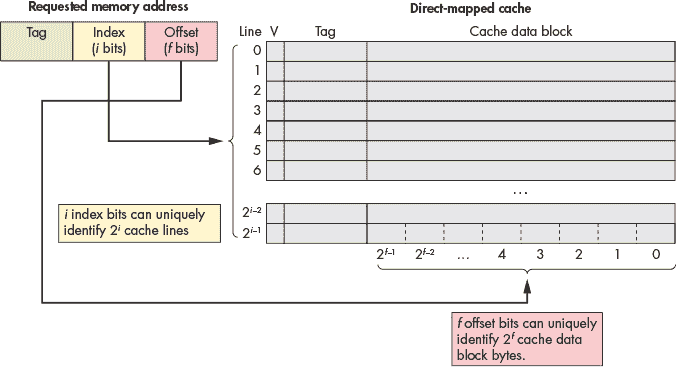

*图 11-11：地址的索引部分唯一标识一个缓存行，偏移部分唯一标识行数据块中的位置。*

剩余的地址位形成标记。因为标记必须唯一标识包含在缓存行中的内存子集，所以标记必须使用地址剩余未使用的所有位。例如，如果一台机器使用 32 位地址，具有 5 位偏移和 10 位索引的缓存使用剩余的 32 - 15 = 17 位地址表示标记。

##### 直接映射读取示例

考虑具有以下特性的 CPU：

+   16 位内存地址

+   具有 128 个缓存行的直接映射缓存

+   32 字节缓存数据块。

缓存从空开始（所有行都无效），如图 11-12 所示。

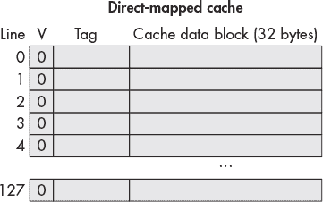

*图 11-12：一个空的直接映射示例缓存*

假设运行在此 CPU 上的程序访问以下内存位置（参见图 11-13 至 11-16）：

1\. 从地址 1010000001100100 读取。

2\. 从地址 1010000001100111 读取。

3\. 从地址 1001000000100000 读取。

4\. 从地址 1111000001100101 读取。

要将整个序列放在一起，在跟踪缓存行为时，请按以下步骤操作：

1\. 将请求的地址从右侧（低位）到左侧（高位）分成三部分：缓存数据块内的偏移量、适当缓存行的索引以及标记，以标识存储行的内存子集。

2\. 使用请求地址的中间部分索引到缓存，以找到地址映射到的缓存行。

3\. 检查缓存行的有效位。当无效时，程序无法使用缓存行的内容（缓存未命中），无论标记是什么。

4\. 检查缓存行的标记。如果地址的标记与缓存行的标记匹配并且该行有效，则缓存行的数据块包含程序正在查找的数据（缓存命中）。否则，缓存必须从主存加载数据到指定的索引（缓存未命中）。

5\. 命中时，使用地址的低位偏移位从存储的块中提取程序所需数据。（本例中未显示。）

##### 地址划分

首先确定如何将内存地址划分为其*偏移*、*索引*和*标记*部分。考虑地址部分从低位到高位（从右到左）：

*偏移量*：一个 32 字节的块大小意味着地址的最右边五位（log[2] 32 = 5）构成偏移量部分。通过五位，偏移量可以唯一标识块中的任何一个 32 字节。

*索引*：一个有 128 行的缓存意味着地址的接下来的七位（log[2] 128 = 7）构成索引部分。通过七位，索引可以唯一标识每个缓存行。

*标签*：标签由地址中不属于偏移量或索引的剩余位组成。在这里，地址中剩下四位构成标签（16 – (5 + 7) = 4）。

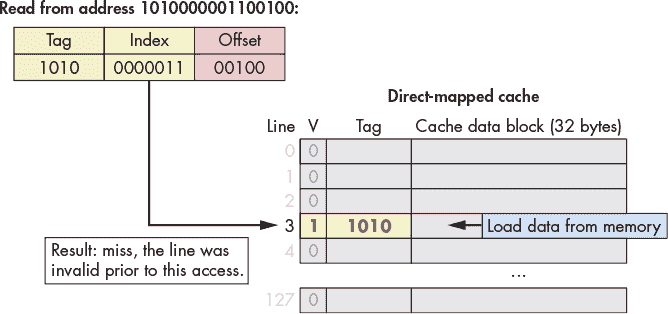

*图 11-13：从地址 1010000001100100 读取。索引 0000011（第 3 行）无效，因此请求未命中，缓存从主内存加载数据。*

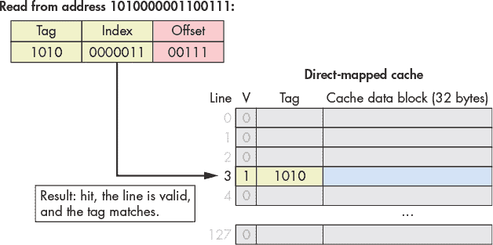

*图 11-14：从地址 1010000001100111 读取。索引 0000011（第 3 行）有效，并且标签（1010）匹配，因此请求命中。缓存返回数据块中从字节 7（偏移量 0b00111）开始的数据。*

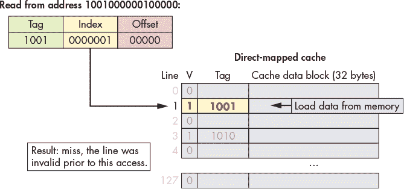

*图 11-15：从地址 1001000000100000 读取。索引 0000001（第 1 行）无效，因此请求未命中，缓存从主内存加载数据。*

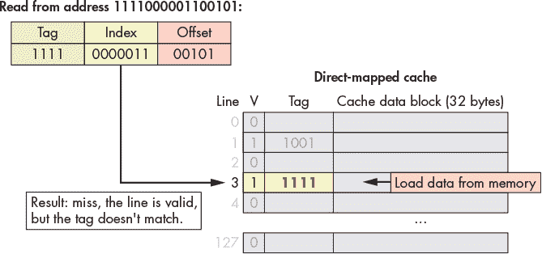

*图 11-16：从地址 1111000001100101 读取。索引 0000011（第 3 行）有效，但标签不匹配，因此请求未命中，缓存从主内存加载数据。*

##### 写入缓存数据

到目前为止，本节主要考虑了 CPU 在缓存中执行查找的内存读取操作。缓存还必须允许程序存储值，并支持两种策略之一的存储操作。

在 *写直达缓存* 中，内存写操作修改缓存中的值，并同时更新主内存的内容。也就是说，写操作 *总是* 立即同步缓存和主内存的内容。

在 *写回缓存* 中，内存写操作修改存储在缓存数据块中的值，但 *不* 更新主内存。因此，在更新缓存的数据后，写回缓存的内容与主内存中的相应数据不同。

为了识别那些其内容与主内存对应部分不同的缓存块，写回缓存中的每一行都会存储一个额外的元数据位，称为 *脏位*。当从脏缓存行中驱逐数据块时，必须先将缓存块的数据写回主内存，以同步其内容。图 11-17 显示了一个包含脏位的直接映射缓存，用于标记需要在驱逐时写入内存的行。

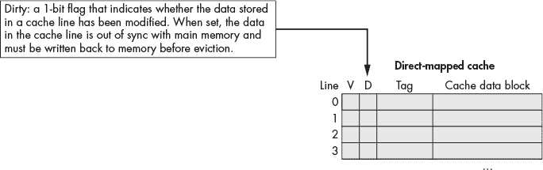

*图 11-17：缓存扩展了一个脏位*

如常所见，设计之间的差异揭示了一个权衡。写透缓存比写回缓存更简单，并且避免为每行存储额外的元数据，如脏位。另一方面，写回缓存通过减少对同一内存位置的重复写操作的开销来提高性能。

例如，假设一个程序频繁更新相同的变量，而该变量的内存从未被逐出缓存。写透缓存（write-through cache）在每次更新时都会写入主内存，即使每次更新只是覆盖了前一个值，而写回缓存（write-back cache）只有在最终逐出缓存块时才会写入内存。由于将内存访问的开销分摊到多次写操作中能显著提高性能，因此大多数现代缓存选择写回设计。

##### 直接映射写示例（写回）

写入缓存的行为类似于读取，但它们还会设置修改过的缓存行的脏位。在逐出脏缓存行时，缓存必须在丢弃它之前将修改过的数据块写回内存。

假设前述示例场景继续进行，并增加了两个额外的内存访问（见 图 11-18 和 图 11-19）：

5\. 写入地址：1111000001100000。

6\. 写入地址：1010000001100100。

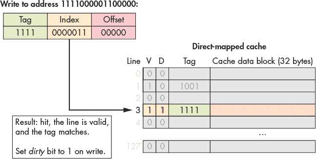

*图 11-18：写入地址 1111000001100000。索引 0000011（第 3 行）有效，且标签（1111）匹配，因此请求命中。由于这是写操作，缓存将该行的脏位设置为 1。*

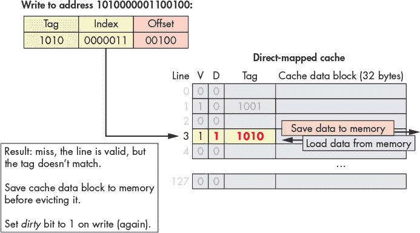

*图 11-19：写入地址 1010000001100100。索引 0000011（第 3 行）有效，但标签不匹配，因此请求未命中。由于目标行既有效又脏，缓存必须在加载新数据之前将现有数据块保存到主内存。这是一个写操作，因此缓存将新加载行的脏位设置为 1。*

在示例中的第四次和第六次内存访问中，缓存逐出了数据，因为两个内存区域竞争同一缓存行。接下来，我们将探讨一种旨在减少这种竞争的缓存设计。

#### 11.4.2 缓存缺失和关联设计

缓存设计者的目标是最大化缓存的命中率，以确保尽可能多的内存请求能够避免访问主内存。尽管局部性提供了实现良好命中率的希望，但由于各种原因，实际缓存无法期待每次访问都能命中：

**强制性** 或 **冷启动缺失**：如果一个程序从未访问过某个内存位置（或与该位置相邻的任何位置），它几乎无法在缓存中找到该位置的数据。因此，程序在第一次访问新的内存地址时，往往无法避免缓存缺失。

**容量未命中**：缓存存储的是主存储器的一个子集，理想情况下它存储的是程序正在积极使用的*确切*内存子集。然而，如果一个程序正在积极使用的内存超过了缓存的容量，那么它不可能在缓存中找到*所有*它需要的数据，从而导致*容量未命中*。

**冲突未命中**：为了减少查找数据的复杂性，一些缓存设计限制了数据在缓存中存储的位置，这些限制可能导致*冲突未命中*。例如，即使一个直接映射的缓存没有完全满，程序也可能会把两个常用变量的地址映射到同一个缓存位置。在这种情况下，每次访问其中一个变量都会将另一个从缓存中驱逐，因为它们竞争相同的缓存行。

每种未命中类型的相对频率取决于程序的内存访问模式。一般而言，在不增加缓存大小的情况下，缓存的设计主要影响其冲突未命中率。虽然直接映射缓存比其他设计更简单，但它们最容易受到冲突的影响。

直接映射缓存的替代方案是*关联*缓存。关联设计使缓存能够在多个位置之间选择来存储一个内存区域。从直观上讲，拥有更多存储位置选项可以减少冲突的可能性，但也由于每次访问时需要检查更多位置而增加了复杂性。

*全关联*缓存允许任何内存区域占据任何缓存位置。全关联缓存提供了最大的灵活性，但它们也具有最高的查找和驱逐复杂性，因为在任何操作期间，每个位置都需要同时考虑。尽管全关联缓存在一些小型专用应用中（例如，转换旁路缓存——见《加快页面访问》第 655 页）非常有价值，但它们的高复杂性使得它们通常不适合用于通用 CPU 缓存。

*集合关联*缓存占据了直接映射和全关联设计之间的中间地带，这使得它们非常适合用于通用 CPU。在集合关联缓存中，每个内存区域映射到一个*缓存集合*，但每个集合存储多个缓存行。集合中的行数是缓存的固定维度，集合关联缓存通常每个集合存储两到八行。

#### 11.4.3 集合关联缓存

集合关联设计在复杂性和冲突之间提供了一个良好的折中。集合中的行数限制了缓存查找时需要检查的位置数量，并且映射到同一集合的多个内存区域只有在整个集合填满时才会触发冲突未命中。

在集合关联缓存中，内存地址的*索引*部分将地址映射到一组缓存行。当执行地址查找时，缓存会同时检查集合中的每一行。图 11-20 展示了二路集合关联缓存中的标签和有效位检查。

如果一个集合的有效行包含与地址的标签部分匹配的标签，则匹配的行完成查找。当查找将搜索范围缩小到仅一个缓存行时，它就像直接映射缓存一样进行：缓存使用地址的*偏移量*将所需的字节从该行的缓存块传送到 CPU 的算术组件。

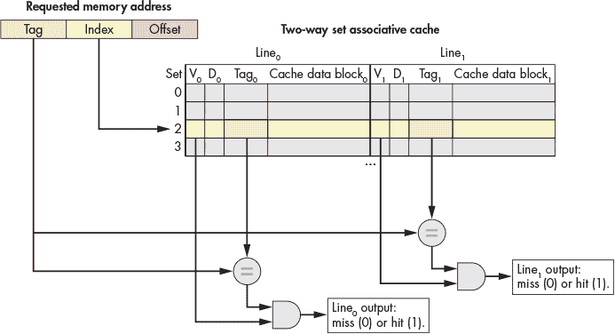

*图 11-20：二路集合关联缓存中的有效位验证和标签匹配*

在集合中多个缓存行的额外灵活性减少了冲突，但也引入了一个新问题：当将一个值加载到缓存中（以及当逐出已经驻留在缓存中的数据时），缓存必须决定*选择*哪个缓存行选项。

为了解决这个选择问题，缓存采用了局部性原则。具体来说，时间局部性表明，最近使用的数据很可能会再次使用。因此，缓存采用与前一节中管理我们示例书架相同的策略：在决定逐出集合中的哪一行时，选择最近最少使用（LRU）行。LRU 被称为*缓存替换策略*，因为它决定了缓存的逐出机制。

LRU 策略要求每个集合存储额外的元数据位来标识集合中最近最少使用的行。随着集合中行数的增加，编码集合 LRU 状态所需的位数也增加。与更简单的直接映射变体相比，这些额外的元数据位增加了集合关联设计的“更高复杂度”。

图 11-21 展示了一个二路集合关联缓存，意味着每个集合包含两行。只有两行时，每个集合需要一个 LRU 元数据位来跟踪最近最少使用的行。在图中，LRU 值为零表示最左边的行最近最少使用，值为一则表示最右边的行最近最少使用。


*图 11-21：一个二路集合关联缓存，其中每个集合存储一个 LRU 元数据位来决定逐出策略*

**警告：LRU 位解释**

图 11-21 中选择零表示“左”而一表示“右”是任意的。LRU 位的解释在不同缓存中有所不同。如果你被要求处理缓存任务，不要假设任务使用的是相同的 LRU 编码方案！

##### 集合关联缓存示例

考虑具有以下特点的 CPU：

+   16 位内存地址。

+   一个具有 64 个集合的二路组相联缓存。请注意，将缓存设置为二路组相联会使其存储容量翻倍（每个集合两行），因此这个示例减少了集合的数量，从而使它存储的行数与早期的直接映射示例相同。

+   32 字节缓存块。

+   一种 LRU 缓存替换策略，指示集合的最左边行是否为最近最少使用（LRU = 0），或者集合的最右边行是否为最近最少使用（LRU = 1）。

最初，缓存为空（所有行无效，LRU 位为 0），如 图 11-22 所示。

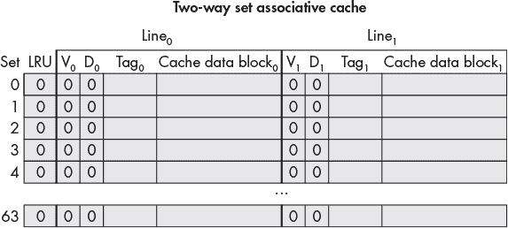

*图 11-22：一个空的二路组相联缓存示例*

假设在此 CPU 上运行的程序访问以下内存位置（与直接映射示例相同）（参见 图 11-23 至 11-28）：

1\. 从地址 1010000001100100 读取。

2\. 从地址 1010000001100111 读取。

3\. 从地址 1001000000100000 读取。

4\. 从地址 1111000001100101 读取。

5\. 向地址 1111000001100000 写入。

6\. 向地址 1010000001100100 写入。

首先确定如何将内存地址分为 *偏移量*、*索引* 和 *标签* 部分。从低位到高位依次考虑地址的各个部分（从右到左）：

*偏移量*：32 字节块大小意味着地址的最右边五位（log[2] 32 = 5）构成偏移量部分。五位可以唯一标识块中的任何字节。

*索引*：一个 64 集合的缓存意味着地址的下六位（log[2] 64 = 6）构成索引部分。六位可以唯一标识缓存中的每个集合。

*标签*：标签由地址中不属于偏移量或索引的剩余位组成。这里，地址剩下 5 位用于标签（16 - （5 + 6）= 5）。

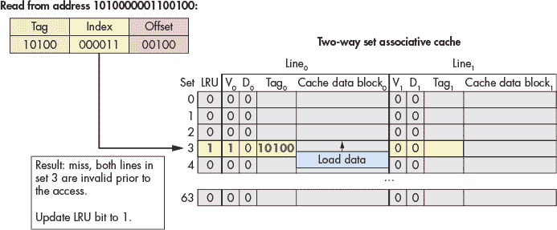

*图 11-23：从地址 1010000001100100 读取。索引 000011（集合 3）处的两行都无效，因此请求未命中，缓存从主存中加载数据。该集合的 LRU 位为 0，缓存将数据加载到左侧行，并更新 LRU 位为 1。*

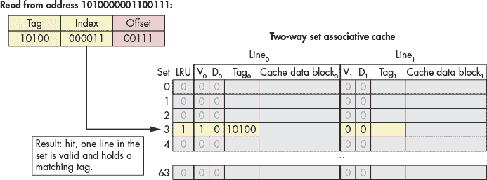

*图 11-24：从地址 1010000001100111 读取。索引 000011（集合 3）处的左侧行持有匹配的标签，因此请求命中。*

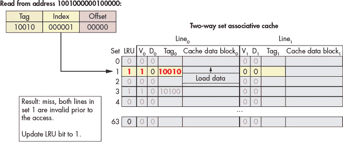

*图 11-25：从地址 1001000000100000 读取。索引 000001（集合 1）处的两行都无效，因此请求未命中，缓存从主存中加载数据。该集合的 LRU 位为 0，缓存将数据加载到左侧行，并更新 LRU 位为 1。*

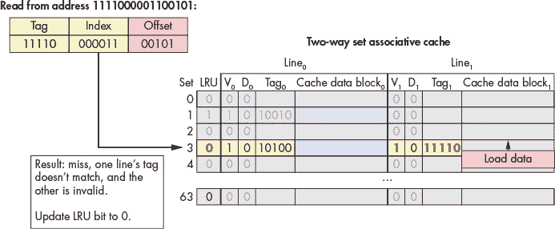

*图 11-26：从地址 1111000001100101 读取。在索引 000011（集合 3）处，一行的标签不匹配，另一行无效，因此请求未命中。该集合的 LRU 位为 1，缓存将数据加载到右侧行，并更新 LRU 位为 0。*

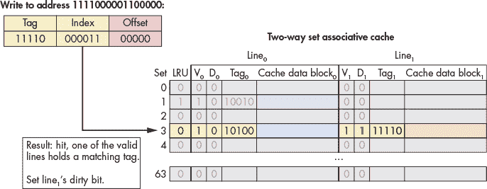

*图 11-27：写入地址 1111000001100000。索引 000011（集合 3）处的右行有效且具有匹配标签，因此请求命中。由于此访问是写入操作，缓存将该行的脏位设置为 1。LRU 位保持为 0，表示左行仍然是最近最少使用的。*

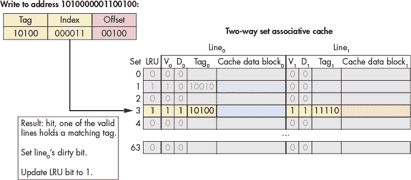

*图 11-28：写入地址 1010000001100100。索引 000011（集合 3）处的左行有效且具有匹配标签，因此请求命中。由于此访问是写入操作，缓存将该行的脏位设置为 1。访问左行后，缓存将该行的 LRU 位设置为 1。*

在这个例子中，相同的内存访问序列，在直接映射缓存中导致了两个冲突未命中，但在双路组相联缓存中则没有发生冲突。

### 11.5 缓存分析与 Valgrind

由于缓存对程序性能有显著影响，大多数系统提供了分析工具来测量程序对缓存的使用情况。一个这样的工具是 Valgrind 的`cachegrind`模式，本节将使用它来评估缓存性能。

考虑以下程序，它生成一个随机的 *N* × *N* 矩阵：

```
#include <stdio.h>

#include <stdlib.h>

#include <sys/time.h>

#include <time.h>

int **genRandomMatrix(int n, int max) {

    int i, j;

    int **mat = malloc(n * sizeof(int *));

    for (i = 0; i < n; i++) {

        mat[i] = malloc(n * sizeof(int));

        for (j = 0; j < n; j++) {

            mat[i][j] = 1 + rand() % max;

        }

    }

    return mat;

}

void free_all(int **mat, int n) {

    int i;

    for (i = 0; i < n; i++) {

        free(mat[i]);

    }

    free(mat);

}

int main(int argc, char **argv) {

    int i, n;

    int **matrix;

    if (argc != 2) {

        fprintf(stderr, "usage: %s <n>\n", argv[0]);

        fprintf(stderr, "where <n> is the dimension of the matrix\n");

        return 1;

    }

    n = strtol(argv[1], NULL, 10);

    srand(time(NULL));

    matrix = genRandomMatrix(n, 100);

    free_all(matrix, n);

    return 0;

}
```

本章前面的章节介绍了两种对矩阵中每个元素进行平均化的函数。它们的区别仅在于访问矩阵的索引方式：

版本 1

```
float averageMat_v1(int **mat, int n) {

    int i, j, total = 0;

    for (i = 0; i < n; i++) {

        for (j = 0; j < n; j++) {

            // Note indexing: [i][j]

            total += mat[i][j];

        }

    }

    return (float) total / (n * n);

}
```

版本 2

```
float averageMat_v2(int **mat, int n) {

    int i, j, total = 0;

    for (i = 0; i < n; i++) {

        for (j = 0; j < n; j++) {

            // Note indexing: [j][i]

            total += mat[j][i];

        }

    }

    return (float) total / (n * n);

}
```

本节使用缓存分析工具来量化它们之间的差异。

#### 11.5.1 初步分析：理论分析与基准测试

基于局部性和内存层级的理论分析表明，第一种版本由于 `mat` 矩阵在内存中是以行主序（row-major）顺序存储的，因此在空间局部性上表现得更好（参见第 86 页中的“二维数组内存布局”部分）。第二种解决方案由于每个元素都是按列主序（column-major）顺序访问，因此空间局部性较差。回忆一下，数据是按*块*加载到缓存中的。按列主序访问矩阵可能会导致更多的缓存未命中，从而导致性能较差。

让我们修改主函数，增加对 `gettimeofday` 函数的调用，以准确测量两个版本之间的性能差异：

```
int main(int argc, char** argv) {

   /* Validate command line parameters. */

   if (argc != 2) {

       fprintf(stderr, "usage: %s <n>\n", argv[0]);

 fprintf(stderr, "where <n> is the dimension of the matrix\n");

       return 1;

   }

   /* Declare and initialize variables. */

   int i;

   float res;

   double timer;

   int n = strtol(argv[1], NULL, 10);

   srand(time(NULL));

   struct timeval tstart, tend;

   int ** matrix = genRandomMatrix(n, 100);

   /* Time version 1\. */

   gettimeofday(&tstart, NULL);

   res = averageMat_v1(matrix, n);

   gettimeofday(&tend, NULL);

   timer = tend.tv_sec - tstart.tv_sec + (tend.tv_usec - tstart.tv_usec)/1.e6;

   printf("v1 average is: %.2f; time is %g\n", res, timer);

   /* Time version 2\. */

   gettimeofday(&tstart, NULL);

   res = averageMat_v2(matrix, n);

   gettimeofday(&tend, NULL);

   timer = tend.tv_sec - tstart.tv_sec + (tend.tv_usec - tstart.tv_usec)/1.e6;

   printf("v2 average is: %.2f; time is %g\n", res, timer);

   /* Clean up. */

   free_all(matrix, n);

   return 0;

}
```

编译代码并运行后，得到以下结果（请注意，时间会根据运行它的机器有所不同）：

```
$ gcc -o cachex cachex.c

$ ./cachex 5000

v1 average is: 50.49; time is 0.053641

v2 average is: 50.49; time is 0.247644
```

这是一个很大的差异！本质上，使用行主序（row-major）顺序的解决方案比第二种方式快 4.61 倍！

#### 11.5.2 真实世界中的缓存分析：Cachegrind

理论分析这两种解决方案并运行它们验证了第一版比第二版更快。然而，它并没有确认缓存分析的细节。幸运的是，Valgrind 工具套件可以提供帮助。在本书前面部分，我们讨论了 Valgrind 如何帮助查找程序中的内存泄漏（参见第 168 页的“使用 Valgrind 调试内存”）。本节介绍了 Cachegrind，Valgrind 的缓存模拟器。Cachegrind 使程序员能够研究程序或特定函数如何影响缓存。

Cachegrind 模拟程序与计算机缓存层次结构的交互。在许多情况下，Cachegrind 可以自动检测机器的缓存组织结构。如果无法检测，Cachegrind 仍会模拟第一级（L1）缓存和最后一级（LL）缓存。它假设第一级缓存有两个独立的组成部分：指令缓存和数据缓存。这样做的原因是最后一级缓存对运行时性能的影响最大。L1 缓存的关联度也最低，因此确保程序与其良好交互非常重要。这些假设与大多数现代计算机的结构相符。

Cachegrind 收集并输出以下信息：

+   指令缓存读取（`Ir`）

+   L1 指令缓存读取未命中（`I1mr`）和 LL 缓存指令读取未命中（`ILmr`）

+   数据缓存读取（`Dr`）

+   D1 缓存读取未命中（`D1mr`）和 LL 缓存数据未命中（`DLmr`）

+   数据缓存写入（`Dw`）

+   D1 缓存写入未命中（`D1mw`）和 LL 缓存数据写入未命中（`DLmw`）

请注意，D1 总访问量通过`D1` = `D1mr` + `D1mw`计算，LL 总访问量则由`ILmr` + `DLmr` + `DLmw`给出。

让我们看看版本 1 的代码在 Cachegrind 下的表现如何。要运行它，请使用以下命令执行已编译的代码，并在 Valgrind 上运行：

```
$ valgrind --tool=cachegrind ./cachex 1000
```

在这个调用中，Valgrind 的`cachegrind`工具作为`cachex`可执行文件的包装器。为 Cachegrind 选择更小的矩阵大小有助于提高执行速度。Cachegrind 输出有关整个程序缓存命中和未命中的信息：

```
==28657== Cachegrind, a cache and branch-prediction profiler

==28657== Copyright (C) 2002-2015, and GNU GPL'd by Nicholas Nethercote et al.

==28657== Using Valgrind-3.11.0 and LibVEX; rerun with -h for copyright info

==28657== Command: ./cachex 1000

==28657==

--28657-- warning: L3 cache found, using its data for the LL simulation.

average is: 50.49; time is 0.080304

average is: 50.49; time is 0.09733

==28657==

==28657== I   refs:      122,626,329

==28657== I1  misses:          1,070

==28657== LLi misses:          1,053

==28657== I1  miss rate:        0.00%

==28657== LLi miss rate:        0.00%

==28657==

==28657== D   refs:       75,292,076  (56,205,598 rd   + 19,086,478 wr)

==28657== D1  misses:      1,192,118  ( 1,129,099 rd   +     63,019 wr)

==28657== LLd misses:         64,399  (     1,543 rd   +     62,856 wr)

==28657== D1  miss rate:         1.6% (       2.0%     +        0.3%  )

==28657== LLd miss rate:         0.1% (       0.0%     +        0.3%  )

==28657==

==28657== LL refs:         1,193,188  ( 1,130,169 rd   +     63,019 wr)

==28657== LL misses:          65,452  (     2,596 rd   +     62,856 wr)

==28657== LL miss rate:          0.0% (       0.0%     +        0.3%  )
```

然而，这次分析特别关注这两个版本的平均函数的命中和未命中情况。要查看这些信息，可以使用 Cachegrind 工具`cg_annotate`。运行 Cachegrind 时应该会在当前工作目录下生成一个类似于`cachegrind.out.n`的文件，其中`n`是某个进程 ID 号。要运行`cg_annotate`，输入以下命令（将`cachegrind.out.28657`替换为输出文件的名称）：

```
$ cg_annotate cachegrind.out.28657

I1 cache:         32768 B, 64 B, 8-way associative

D1 cache:         32768 B, 64 B, 8-way associative

LL cache:         8388608 B, 64 B, 16-way associative

Command:          ./cachex 1000

Data file:        cachegrind.out.28657

Events recorded:  Ir I1mr ILmr Dr D1mr DLmr Dw D1mw DLmw

Events shown:     Ir I1mr ILmr Dr D1mr DLmr Dw D1mw DLmw

Event sort order: Ir I1mr ILmr Dr D1mr DLmr Dw D1mw DLmw

Thresholds:       0.1 100 100 100 100 100 100 100 100

Include dirs:

User annotated:

Auto-annotation:  off

 ----------------------------------------------------------------------------

         Ir  I1mr  ILmr         Dr      D1mr  DLmr         Dw   D1mw   DLmw

 ----------------------------------------------------------------------------

122,626,329 1,070 1,053 56,205,598 1,129,099 1,543 19,086,478 63,019 62,856  PROG TOTALS

 ----------------------------------------------------------------------------

        Ir I1mr ILmr         Dr      D1mr DLmr        Dw   D1mw   DLmw  file:function

 ----------------------------------------------------------------------------

14,009,017    3    3  9,005,008    62,688    0     1,004      0      0  averageMat_v1

14,009,017    0    0  9,005,008 1,062,996    0     1,004      0      0  averageMat_v2
```

我们稍微编辑了该命令的输出，专注于两个版本的平均函数。该输出显示，版本 2 产生了 1,062,996 次数据未命中，而版本 1 则只有`62688`次未命中。Cachegrind 提供了有力的证据，证明我们的分析是正确的！

### 11.6 展望未来：多核处理器上的缓存

到目前为止，我们对缓存的讨论集中在单核处理器上的单一级别的缓存内存。然而，现代处理器是多核的，且有多个级别的缓存内存。通常，每个核心在内存层次结构的最高级别维护自己的私有缓存内存，并在较低级别与所有核心共享一个单一的缓存。图 11-29 展示了一个四核处理器的内存层次结构示例，其中每个核心包含一个私有的一级（L1）缓存，而二级（L2）缓存由所有四个核心共享。

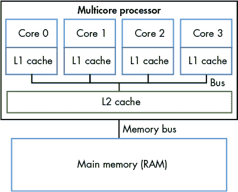

*图 11-29：一个多核处理器的内存层次结构示例。四个核心每个都有自己的私有 L1 缓存，所有四个核心通过共享总线访问单一的 L2 缓存。多核处理器通过内存总线连接到 RAM。*

请记住，内存层次结构的较高级别比较低级别的访问速度更快，但容量更小。因此，L1 缓存比 L2 缓存小且更快，L2 缓存又比 RAM 小且更快。还要记住，缓存内存存储的是来自内存层次结构较低级别的值的副本；存储在 L1 缓存中的值是存储在 L2 缓存中的同一个值的副本，而 L2 缓存中的值又是存储在 RAM 中的同一个值的副本。因此，内存层次结构的较高级别充当较低级别的缓存。因此，在图 11-29 中的例子中，L2 缓存是 RAM 内容的缓存，每个核心的 L1 缓存是 L2 缓存内容的缓存。

多核处理器中的每个核心同时执行独立的指令流，通常来自不同的程序。为每个核心提供一个私有的 L1 缓存，允许核心将其执行的指令流中的数据和指令存储在它的最快缓存内存中。换句话说，每个核心的 L1 缓存只存储来自其执行流的内存块副本，而不是在所有核心共享的单一 L1 缓存中竞争空间。这种设计使得每个核心的私有 L1 缓存（即其最快缓存内存）比所有核心共享单一 L1 缓存时的命中率更高。

现代处理器通常包含超过两个级别的缓存。桌面系统中常见的是三级缓存，最高级别（L1）通常被分为两个独立的 L1 缓存，一个用于程序指令，另一个用于程序数据。低级缓存通常是*统一缓存*，即它们同时存储程序数据和指令。每个核心通常维持一个私有的 L1 缓存，并与所有核心共享一个单一的 L3 缓存。L2 缓存层位于每个核心的私有 L1 缓存和共享的 L3 缓存之间，在现代 CPU 设计中差异很大。L2 可能是一个私有的 L2 缓存，可能是所有核心共享的，或者可能是一个混合结构，其中包含多个 L2 缓存，每个 L2 缓存由一部分核心共享。

LINUX 系统中的处理器和缓存信息

如果您对 CPU 的设计感兴趣，可以通过几种方式获取有关处理器及其缓存组织在系统上的信息。例如，`lscpu`命令显示有关处理器的信息，包括其核心数、缓存的级别和大小。

```
$ lscpu

...

CPU(s):                          12

Thread(s) per core:              2

Core(s) per socket:              6

Socket(s):                       1

...

L1d cache:                       192 KiB

L1i cache:                       384 KiB

L2 cache:                        3 MiB

L3 cache:                        16 MiB
```

此输出显示总共有六个核心（`Socket(s)`乘以`每个插槽的核心数`），每个核心都是双路超线程的（`每个核心的线程数`），使得这六个物理核心在操作系统中呈现为 12 个 CPU（有关硬件多线程，请参阅第五章中的”多核和硬件多线程“）。此外，输出显示有三级缓存（`L1`、`L2`和`L3`），并且有两个单独的 L1 缓存，一个用于缓存数据（`L1d`），另一个用于缓存指令（`L1i`）。

除了`lscpu`命令外，`/proc`和`/sys`文件系统中的文件还包含有关处理器的信息。例如，命令`cat /proc/cpuinfo`会输出有关处理器的信息，以下命令列出特定处理器核心缓存的信息（请注意，这些文件以核心的超线程 CPU 命名，例如在此示例中，`cpu0`和`cpu6`是核心 0 上的两个超线程 CPU）。

```
$ ls /sys/devices/system/cpu/cpu0/cache

index0/  index1/  index2/  index3/
```

此输出表明核心 0 具有四个缓存（`index0`到`index3`）。要查看每个缓存的详细信息，请查看索引目录的`type`、`level`和`shared` `_cpu_list`文件。

```
$ cat /sys/devices/system/cpu/cpu0/cache/index*/type

Data

Instruction

Unified

Unified

$ cat /sys/devices/system/cpu/cpu0/cache/index*/level

1

1

2

3

$ cat /sys/devices/system/cpu/cpu0/cache/index*/shared_cpu_list

0,6

0,6

0,6

0-11
```

`type`输出表明核心 0 具有独立的数据和指令缓存以及其他两个统一缓存。将`level`输出与`type`输出相关联可知，数据和指令缓存都是 L1 缓存，而统一缓存分别是 L2 和 L3 缓存。`shared_cpu_list`进一步显示，L1 和 L2 缓存是核心 0 专用的（仅由 CPU `0`和`6`共享，即核心 0 上的两个超线程 CPU），而 L3 缓存则由所有六个核心共享（所有 12 个超线程 CPU，`0-11`）。

#### 11.6.1 缓存一致性

由于程序通常表现出高度的局部性引用特性，因此每个核心拥有自己的 L1 缓存，用于存储从其执行的指令流中获取的数据和指令是有优势的。然而，多个 L1 缓存可能会导致*缓存一致性*问题。当一个核心的 L1 缓存中存储的内存块副本的值与另一个核心 L1 缓存中存储的同一块内存的副本值不同时，就会出现缓存一致性问题。这种情况发生在一个核心向其 L1 缓存中已缓存的块写入数据，而该块同时也被其他核心的 L1 缓存缓存时。由于缓存块包含内存内容的副本，因此系统需要在所有缓存的块副本中维护一致的内存内容值。为了确保多个核心可以缓存并访问内存，必须实现一个*缓存一致性协议*。缓存一致性协议确保任何访问某内存位置的核心看到的是该内存位置的最新修改值，而不是看到可能存储在其 L1 缓存中的过时（陈旧）副本。

#### 11.6.2 MSI 协议

有许多不同的缓存一致性协议。在这里，我们讨论一个示例的详细信息——MSI 协议。*MSI 协议*（修改、共享、无效）为每个缓存行添加了三个标志（或位）。一个标志的值可以是清除（0）或设置（1）。这三个标志的值编码了其数据块相对于与其他缓存副本的一致性状态，并且它们的值会触发对数据块的读取或写入访问时的缓存一致性操作。MSI 协议使用的三个标志是：

+   *M*标志，若设置，表示该块已被修改，即该核心已经写入了其缓存值的副本。

+   *S*标志，若设置，表示该块未修改且可以安全共享，即多个 L1 缓存可以安全地存储该块的副本并从其副本读取。

+   *I*标志，若设置，表示缓存块无效或包含陈旧数据（是数据块的旧副本，不反映内存块的当前值）。

MSI 协议在读取和写入访问缓存条目时触发。

对于读取访问：

+   如果缓存块处于 M 或 S 状态，则使用缓存的值来满足读取操作（其副本的值是内存块的最新值）。

+   如果缓存块处于 I 状态，则缓存的副本与块的新版本不同，必须将块的新值加载到缓存行中，才能满足读取操作。

    如果另一个核心的 L1 缓存存储了新值（它存储的值设置了 M 标志，表示它存储的是已修改的副本），该核心必须首先将其值写回到下一级缓存（例如，L2 缓存）。在执行写回后，它将清除 M 标志，并将缓存行（它的副本和下一级副本现在一致）设置为 S 位，表示该缓存行中的块处于可以被其他核心安全缓存的状态（L1 缓存块与 L2 缓存中的副本一致，并且核心从这个 L1 副本中读取块的当前值）。

    启动读取访问的核心可以加载块的最新值到其缓存行。如果缓存行的 I 标志已设置，它将清除 I 标志，表示该块现在有效，并存储块的新值，设置 S 标志，表示该块可以安全共享（它存储的是最新值，并且与其他缓存副本一致），并清除 M 标志，表示 L1 缓存块的值与 L2 缓存中存储的副本一致（读取不会修改 L1 缓存中的内存副本）。

在写访问时：

+   如果块处于 M 状态，则写入缓存副本的块。无需更改标志（该块保持在 M 状态）。

+   如果块处于 I 状态或 S 状态，则通知其他核心该块正在被写入（已修改）。其他 L1 缓存中存储该块的副本如果处于 S 状态，则需要清除 S 位并将 I 位设置为 1（它们的副本现在与正在由其他核心写入的副本不一致）。如果另一个 L1 缓存中的块处于 M 状态，它将把块写回到下一级缓存，并将该副本设置为 I。正在写入的核心将加载块的最新值到其 L1 缓存中，设置 M 标志（它的副本将被写入修改），并清除 I 标志（它的副本现在有效），然后写入缓存块。

图 11-30 到 图 11-32 展示了一个应用 MSI 协议的示例，该协议确保对缓存于两个核心私有 L1 缓存中的内存块的读写访问的一致性。在图 11-30 中，我们的示例从共享数据块开始，该数据块已被复制到两个核心的 L1 缓存中，并且 S 标志已设置，这意味着 L1 缓存中的副本与 L2 缓存中的块值相同（所有副本都存储块的当前值，6）。此时，核心 0 和核心 1 都可以安全地从它们各自 L1 缓存中的副本读取，而不会触发一致性操作（S 标志表示它们的共享副本是最新的）。

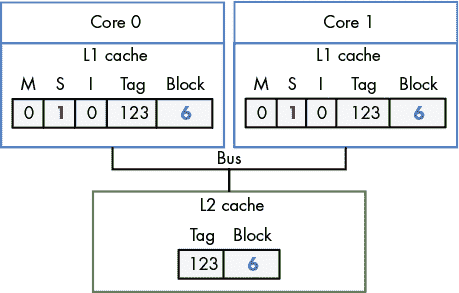

*图 11-30：一开始，两个核心在它们的私有 L1 缓存中都有一个块的副本，并且 S 标志已设置（共享模式）*

如果 Core 0 接下来写入存储在其 L1 缓存中的该块副本，其 L1 缓存控制器会通知其他 L1 缓存使其副本无效。随后，Core 1 的 L1 缓存控制器清除 S 标志，并设置 I 标志，表示其副本已过时。Core 0 向其 L1 缓存中的块副本写入数据（在我们的例子中将其值更改为 7），并设置 M 标志，清除 S 标志，表示其副本已被修改并存储了当前的块值。此时，L2 缓存中的副本和 Core 1 的 L1 缓存中的副本都已经过时。结果缓存状态如图 11-31 所示。

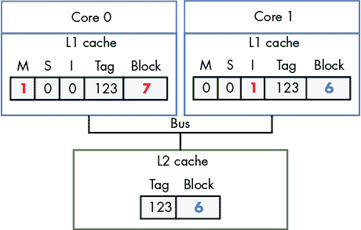

*图 11-31：Core 0 向其副本写入数据后的缓存状态*

此时，Core 0 可以安全地从其缓存的块副本中读取数据，因为其副本处于 M 状态，表示它存储了该块的最新写入值。

如果 Core 1 接下来读取该内存块，则其 L1 缓存副本上的 I 标志表示该副本已过时，不能用来满足读取。Core 1 的 L1 缓存控制器必须先将该块的新值加载到 L1 缓存中，才能满足读取。为此，Core 0 的 L1 缓存控制器必须首先将其修改后的块值写回到 L2 缓存中，这样 Core 1 的 L1 缓存才能读取该块的新值到其 L1 缓存中。这些操作的结果（如图 11-32 所示），是 Core 0 和 Core 1 的 L1 缓存副本都存储在 S 状态，表示每个核心的 L1 副本已经是最新的，可以安全地用于满足对该块的后续读取。


*图 11-32：Core 1 接下来读取该块后的缓存状态*

#### 11.6.3 实现缓存一致性协议

要实现缓存一致性协议，处理器需要一种机制来识别何时需要对其他核心的 L1 缓存内容进行一致性状态变更。一种实现该机制的方法是通过在所有 L1 缓存共享的总线上进行 *监听*。监听缓存控制器会在总线上监听（或称为嗅探）读取或写入它缓存的块。因为每个读取和写入请求都是基于内存地址的，所以监听的 L1 缓存控制器可以识别来自另一个 L1 缓存的对它所存储的块的任何读写操作，并可以根据一致性协议做出相应的反应。例如，当它嗅探到另一个 L1 缓存对相同地址的写操作时，可以在缓存行上设置 I 标志。这就是如何通过嗅探实现 *写失效协议* 的例子。

MSI 和其他类似的协议，如 MESI 和 MOESI，都是写失效协议；即，当写入数据时，协议会使缓存中的条目副本失效。侦听也可以被写更新缓存一致性协议使用，在这种协议中，数据的新值从总线上侦听并应用到更新存储在其他 L1 缓存中的所有副本。

替代侦听，基于目录的缓存一致性机制可以用于触发缓存一致性协议。由于多个核心共享单一总线的性能限制，这种方法比侦听具有更好的扩展性。然而，基于目录的机制需要更多的状态信息来检测内存块是否共享，并且比侦听更慢。

#### 11.6.4 更多关于多核缓存的内容

多核处理器每个核心在内存层次结构的最高层级上拥有独立缓存的性能优势是值得的，尽管这需要处理器实现缓存一致性协议来增加额外的复杂性。这些缓存仅存储该核心执行的程序数据和指令副本。

尽管缓存一致性解决了多核处理器中具有独立 L1 缓存的内存一致性问题，但由于多核处理器上的缓存一致性协议，还可能出现另一个问题。这个问题叫做*假共享*，它可能发生在单个多线程并行程序的多个线程同时在多个核心上运行，并且它们访问的内存位置靠近其他线程访问的内存位置。在第 14.5 节中，我们将讨论假共享问题及其一些解决方案。

有关多核处理器硬件缓存的更多信息和细节，包括不同的协议及其实现方式，请参考计算机架构教科书。^(8)

### 11.7 小结

本章探讨了计算机存储设备的特性及其在访问延迟、存储容量、传输延迟和成本等关键指标上的权衡。由于设备体现了许多不同的设计和性能权衡，它们自然形成了内存层次结构，按照容量和访问时间将它们排序。在层次结构的顶端，像 CPU 缓存和主内存这样的主要存储设备能快速将数据直接提供给 CPU，但它们的容量有限。在层次结构的下层，像固态硬盘和硬盘这样的二级存储设备则提供高密度的批量存储，但性能较差。

由于现代系统既需要高容量又需要良好的性能，系统设计师会构建具有多种存储形式的计算机。关键是，系统必须管理哪些存储设备保存特定的数据块。系统的目标是将正在积极使用的数据存储在更快的存储设备中，并将不常使用的数据转存到较慢的存储设备中。

为了确定哪些数据正在被使用，系统依赖于程序数据访问模式，这些模式被称为*局部性*。程序表现出两种重要的局部性类型：*时间局部性*，即程序倾向于反复访问相同的数据，以及*空间局部性*，即程序倾向于访问接近其他已访问数据的数据。

局部性是 CPU 缓存的基础，CPU 缓存将主存储器的一小部分存储在直接位于 CPU 芯片上的高速存储器中。当程序试图访问主存储器时，CPU 首先会检查缓存中是否存在数据；如果缓存中找到了数据，它可以避免访问更为耗时的主存储器。

当程序发出读取或写入内存的请求时，它会提供要访问的内存位置的地址。CPU 缓存使用内存地址中的三部分比特来识别缓存行存储的主存储器子集。地址中的中间*索引*位将地址映射到缓存中的存储位置，高位*标签*位唯一标识缓存位置存储的内存子集，低位*偏移*位则标识程序要访问的存储数据的字节。

最后，本章通过演示如何使用 Cachegrind 工具进行运行中程序的缓存性能分析作为结尾。Cachegrind 模拟程序与缓存层次结构的交互，并收集关于程序使用缓存的统计数据（例如，命中率和未命中率）。

### 注释

1. *[`www.youtube.com/watch?v=9eyFDBPk4Yw`](https://www.youtube.com/watch?v=9eyFDBPk4Yw)*

2. *[`en.wikipedia.org/wiki/Punched_card`](https://en.wikipedia.org/wiki/Punched_card)*

3. *[`en.wikipedia.org/wiki/Magnetic_tape_data_storage`](https://en.wikipedia.org/wiki/Magnetic_tape_data_storage)*

4. *[`en.wikipedia.org/wiki/Floppy_disk`](https://en.wikipedia.org/wiki/Floppy_disk)*

5. *[`en.wikipedia.org/wiki/Optical_disc`](https://en.wikipedia.org/wiki/Optical_disc)*

6. *[`en.wikipedia.org/wiki/Hard_disk_drive`](https://en.wikipedia.org/wiki/Hard_disk_drive)*

7. *[`en.wikipedia.org/wiki/Flash_memory`](https://en.wikipedia.org/wiki/Flash_memory)*

8. 有一个建议是《计算机组织与设计：硬件与软件接口》，作者是 David A. Patterson 和 John L. Hennessy。
