# 第十四章：操作系统


*操作系统*（OS）是一个特殊的系统软件层，位于计算机硬件和运行在计算机上的应用程序之间（见图 13-1）。操作系统软件在计算机上是持久存在的，从开机到关机。它的主要目的是*管理*底层硬件组件，以高效运行程序工作负载，并使计算机*易于使用*。

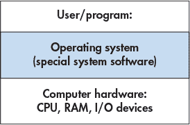

*图 13-1：操作系统是位于用户和硬件之间的特殊系统软件。它管理计算机硬件，并实现抽象以使硬件更易于使用。*

操作系统使计算机硬件易于使用的方式之一，是它对启动程序进行支持。当用户双击图标或在命令行提示符下输入程序可执行文件的名称（例如`./a.out`）来启动程序时，操作系统会处理所有这些操作的细节，例如从磁盘加载程序到内存，并初始化 CPU 开始执行程序指令；操作系统将这些必要的低级操作隐藏起来，用户不需要了解如何在计算机上运行程序。

操作系统通过实现*多程序设计*来有效利用系统资源，这意味着允许多于一个的程序同时在计算机上运行。多程序设计并不一定意味着所有程序都在计算机硬件上同时运行。事实上，系统中运行的程序集通常比 CPU 核心数要多。相反，它意味着操作系统在多个程序之间共享硬件资源，包括 CPU。例如，当一个程序需要从磁盘读取数据时，操作系统可以让另一个程序使用 CPU，同时第一个程序等待数据变得可用。如果没有多程序设计，当程序访问较慢的硬件设备时，CPU 会闲置。为了支持多程序设计，操作系统需要实现一个关于运行程序的抽象，称为*进程*。进程抽象使操作系统能够管理系统中任意时刻正在运行的多个程序。

一些示例操作系统包括微软的 Windows、苹果的 macOS 和 iOS、甲骨文的 Solaris，以及开源的 Unix 变种，如 OpenBSD 和 Linux。本书使用 Linux 作为示例。然而，所有这些通用操作系统都实现了类似的功能，尽管有时方式不同。

##### 内核

“操作系统”这一术语通常用于指代一组大型的系统级软件，这些软件执行某种形式的资源管理，并实现底层系统的“易于使用”的抽象。在本章中，我们将重点讨论操作系统的*内核*；因此，当我们单独提到操作系统（OS）时，我们指的是操作系统内核。

操系统内核实现了核心操作系统功能——任何使用系统所必需的功能。这些功能包括管理计算机硬件层以运行程序，实施并管理操作系统提供给用户的抽象（例如，文件是基于存储数据之上的操作系统抽象），以及实现与用户应用层和硬件设备层的接口。内核实现了*机制*，以便使硬件能够运行程序，并实现诸如进程等抽象。机制是操作系统功能中的“如何”部分。内核还实现了*策略*，用于高效管理计算机硬件以及管理其抽象。策略决定了操作系统功能中的“什么”、“何时”和“向谁”部分。例如，机制实现了初始化 CPU 以运行来自特定进程的指令，而策略决定了下一个哪个进程将在 CPU 上运行。

内核为系统用户提供编程接口：*系统调用接口*。用户和程序通过系统调用接口与操作系统进行交互。例如，如果一个程序想要获取当前时间，它可以通过调用 `gettimeofday` 系统调用从操作系统获取该信息。

内核还提供了与硬件设备交互的接口（*设备接口*）。通常，硬盘驱动器（HDD）、键盘和固态硬盘（SSD）等 I/O 设备通过此接口与内核交互。这些设备配有在操作系统中运行的特殊设备驱动程序软件，负责将数据传输到特定设备或从设备传输数据。设备驱动程序软件通过操作系统的设备接口与操作系统交互；通过加载符合操作系统设备接口要求的设备驱动程序代码，可以将新设备添加到计算机系统中。内核直接管理其他硬件设备，如 CPU 和 RAM。图 13-2 展示了操作系统内核层在用户应用和计算机硬件之间的位置，包括其面向用户的编程接口和硬件设备接口。

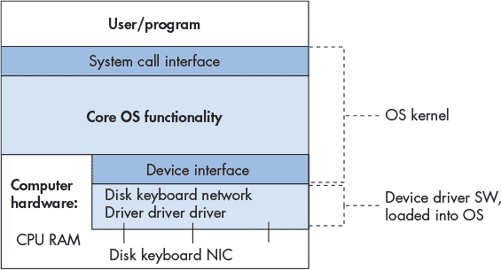

*图 13-2：操作系统内核：使用系统并促进 I/O 设备与系统用户之间协作所必需的核心操作系统功能*

在本章的其余部分，我们将探讨操作系统在运行程序和高效管理系统资源方面的作用。我们的讨论主要集中在操作系统功能的机制（“如何”）以及两个主要操作系统抽象的实现：*进程*（正在运行的程序）和*虚拟内存*（从底层物理存储器或二级存储器中抽象出来的进程内存空间视图）。

### 13.1 操作系统的工作原理及其运行方式

操作系统的部分工作是支持在系统上运行的程序。为了启动计算机上的程序，操作系统会为运行中的程序分配一部分 RAM，将程序的二进制可执行文件从磁盘加载到 RAM 中，创建并初始化与该运行程序相关的操作系统进程状态，并初始化 CPU 以开始执行进程的指令（例如，操作系统需要初始化 CPU 寄存器以获取并执行进程的指令）。图 13-3 展示了这些步骤。

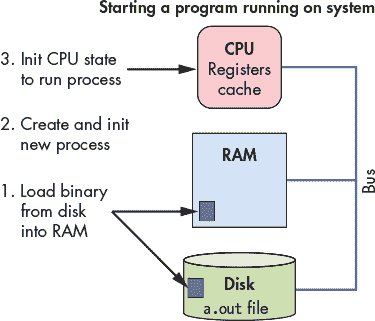

*图 13-3：操作系统启动新程序在底层硬件上运行的步骤*

与用户程序一样，操作系统也是在计算机硬件上运行的软件。然而，操作系统是特别的系统软件，负责管理所有系统资源，并实现计算机系统用户的接口；它是使用计算机系统所必需的。因为操作系统是软件，它的二进制可执行代码就像其他程序一样在硬件上运行：它的数据和指令存储在 RAM 中，并且其指令像用户程序的指令一样由 CPU 获取并执行。因此，为了让操作系统运行，其二进制可执行文件需要加载到 RAM 中，并且 CPU 需要初始化以开始运行操作系统代码。然而，由于操作系统负责在硬件上运行代码，它需要一些帮助才能开始运行。

#### 13.1.1 操作系统启动

操作系统在计算机上加载并初始化自身的过程被称为*引导*——操作系统“自力更生”或*自启动*。操作系统在最初加载到计算机并开始运行其引导代码时需要一点帮助。为了启动操作系统代码的运行，存储在计算机固件中的代码（硬件中的非易失性内存）会在计算机首次通电时运行；*BIOS*（基本输入/输出系统）和*UEFI*（统一可扩展固件接口）就是这种类型的固件的两个例子。在开机时，BIOS 或 UEFI 会运行并进行足够的硬件初始化，以便将操作系统的第一部分（引导块）从磁盘加载到 RAM 中，并开始在 CPU 上执行引导块指令。一旦操作系统开始运行，它会从磁盘加载其余部分，发现并初始化硬件资源，并初始化其数据结构和抽象，以便使系统准备好供用户使用。

#### 13.1.2 让操作系统做点什么：中断与陷阱

在操作系统完成引导并初始化系统以供使用后，它将等待任务的到来。大多数操作系统被实现为*中断驱动系统*，这意味着操作系统在某个实体需要它做某件事之前不会运行——操作系统在某个请求到来时会被唤醒（从睡眠中被中断）。

硬件层的设备可能需要操作系统为它们做某些事情。例如，*网络接口卡*（NIC）是计算机与网络之间的硬件接口。当 NIC 通过其网络连接接收到数据时，它会中断（或唤醒）操作系统来处理接收到的数据（见图 13-4）。例如，操作系统可能会判断 NIC 接收到的数据是网页的一部分，且该网页是由网页浏览器请求的；然后，它将数据从 NIC 传递给等待中的网页浏览器进程。

当用户应用程序需要访问受保护的资源时，也会向操作系统发出请求。例如，当一个应用程序想要写入文件时，它会向操作系统发出一个*系统调用*，操作系统会唤醒并代表应用程序执行写入操作（见图 13-4）。操作系统通过将数据写入磁盘上的文件来处理该系统调用。

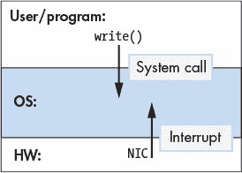

*图 13-4：在一个中断驱动系统中，用户级程序发出系统调用，硬件设备发出中断来启动操作系统的动作。*

来自硬件层的中断，例如网络接口卡（NIC）接收到网络数据，通常被称为硬件中断，或简称为*中断*。来自软件层的中断，通常是由于指令执行导致的，例如当应用程序发出系统调用时，通常被称为*陷阱*。也就是说，系统调用“陷阱进入操作系统”，操作系统代表用户级程序处理请求。来自任一层的异常也可能会中断操作系统。例如，如果硬盘驱动器因磁盘块损坏而读取失败，它可能会中断操作系统；如果应用程序执行除法指令并除以零，它也可能触发陷阱到操作系统。

系统调用是通过特殊的陷阱指令实现的，这些指令作为 CPU 指令集架构（ISA）的一部分被定义。操作系统将每个系统调用与一个独特的标识号关联。当应用程序想要调用一个系统调用时，它会将所需调用的编号放在一个已知位置（该位置根据 ISA 的不同而不同），并发出陷阱指令来中断操作系统。陷阱指令触发 CPU 停止执行应用程序中的指令，转而开始执行处理该陷阱的操作系统指令（运行操作系统的陷阱处理程序代码）。陷阱处理程序读取用户提供的系统调用编号并执行相应的系统调用实现。

下面是一个`write`系统调用在 IA32 Linux 系统中的示例：

```

/* C code */

ret = write(fd, buff, size);

# IA32 translation

write:

...            # set up state and parameters for OS to perform write

movl $4, %eax  # load 4 (unique ID for write) into register eax

int  $0x80     # trap instruction: interrupt the CPU and transition to the OS

addl $8, %ebx  # an example instruction after the trap instruction

```

第一条指令（`movl $4, %eax`）将 `write` 系统调用的编号（4）放入寄存器 `eax`。第二条指令（`int $0x80`）触发陷阱。当操作系统陷阱处理程序运行时，它使用寄存器 `eax` 中的值（4）来确定调用了哪个系统调用，并运行相应的陷阱处理代码（在这个例子中，运行的是 `write` 处理代码）。操作系统处理程序运行后，操作系统继续执行程序，恢复到陷阱指令后面的指令（在这个例子中是 `addl`）。

与系统调用不同，硬件中断是通过中断总线传递给 CPU 的。设备会将一个信号，通常是一个表示中断类型的数字，放置在 CPU 的中断总线上（见 图 13-5）。当 CPU 检测到中断总线上的信号时，它会停止执行当前进程的指令，并开始执行操作系统的中断处理程序。操作系统处理程序执行完毕后，操作系统继续执行该进程，在中断发生时正在执行的应用指令处恢复。

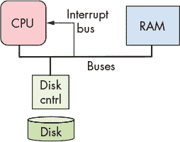

*图 13-5：硬件设备（磁盘）通过中断总线向 CPU 发送信号，代表其触发操作系统执行。*

如果用户程序在 CPU 上运行时发生中断（或陷阱），CPU 会运行操作系统的中断（或陷阱）处理程序。当操作系统处理完中断后，它会恢复并从中断发生时的地方继续执行被中断的用户程序。

由于操作系统是软件，并且它的代码像用户程序代码一样被加载到 RAM 中并在 CPU 上运行，因此操作系统必须保护其代码和状态，避免被系统中运行的常规进程所访问。CPU 通过定义两种执行模式来提供帮助。

1\. 在*用户模式*下，CPU 仅执行用户级指令，并且只能访问操作系统为其提供的内存位置。操作系统通常会阻止用户模式下的 CPU 访问操作系统的指令和数据。用户模式还限制了 CPU 可以直接访问的硬件组件。在*内核模式*下，CPU 可以执行任何指令并访问任何内存位置（包括存储操作系统指令和数据的内存位置）。它还可以直接访问硬件组件并执行特殊指令。

当操作系统代码在 CPU 上运行时，系统处于内核模式；而当用户级程序在 CPU 上运行时，系统则处于用户模式。如果 CPU 处于用户模式并接收到中断，CPU 会切换到内核模式，获取中断处理程序，并开始执行操作系统的处理代码。在内核模式下，操作系统可以访问用户模式下无法访问的硬件和内存位置。当操作系统处理完中断后，它会恢复 CPU 状态，以在程序被中断时的地方继续执行用户级代码，并将 CPU 重新切换回用户模式（见 图 13-6）。

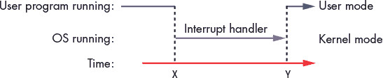

*图 13-6：CPU 和中断。CPU 上运行的用户代码被中断（在时间线的 X 时刻），然后操作系统中断处理程序代码运行。操作系统处理完中断后，用户代码执行继续（在时间线的 Y 时刻）。*

在一个中断驱动的系统中，中断可以在任何时候发生，这意味着操作系统可以在任何机器周期内从运行用户代码切换到中断处理程序代码。有效支持从用户模式到内核模式的执行上下文切换的一种方式是允许内核在系统中每个进程的执行上下文中运行。在启动时，操作系统将其代码加载到内存中的固定位置，并将其映射到每个进程地址空间的顶部（见图 13-7），并初始化一个 CPU 寄存器，指向操作系统处理程序函数的起始地址。发生中断时，CPU 切换到内核模式，执行操作系统中断处理程序代码，该代码可在每个进程地址空间顶部的地址中访问。因为每个进程将操作系统映射到地址空间顶部的相同位置，所以操作系统中断处理程序代码能够在任何进程的执行上下文中快速执行，当中断发生时，CPU 上运行的进程都可以迅速响应。此操作系统代码仅能在内核模式下访问，从而保护操作系统免受用户模式访问；在常规执行期间，进程在用户模式下运行，无法读取或写入映射到其地址空间顶部的操作系统地址。

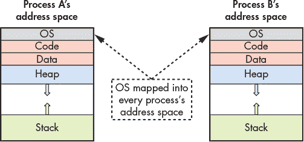

*图 13-7：进程地址空间：操作系统内核映射到每个进程地址空间的顶部。*

尽管将操作系统代码映射到每个进程的地址空间中会导致在中断时内核代码执行迅速，但许多现代处理器具有暴露内核保护漏洞的功能，当操作系统像这样被映射到每个进程时。自 2018 年 1 月宣布 Meltdown 硬件漏洞以来，^(1) 操作系统正在以保护免受此漏洞的方式将内核内存和用户级程序内存分开，但这也导致了切换到内核模式处理中断的效率降低。

### 13.2 进程

操作系统实现的主要抽象之一是*进程*。进程表示系统中运行的程序实例，其中包括程序的二进制可执行代码、数据和执行*上下文*。上下文通过维护程序的寄存器值、栈位置和当前正在执行的指令来跟踪程序的执行。

进程是*多道程序*系统中的必要抽象，它支持系统中多个进程同时存在。操作系统使用进程抽象来跟踪系统中运行的程序实例，并管理它们对系统资源的使用。

操作系统为每个进程提供一个“独占视图”的系统抽象。也就是说，操作系统将进程互相隔离，并给予每个进程控制整台机器的错觉。实际上，操作系统支持多个活跃进程，并管理它们之间的资源共享。操作系统隐藏了共享和访问系统资源的细节，并且保护进程不受其他进程在系统中运行时的影响。

例如，用户可以同时在计算机系统上运行两个 Unix shell 程序实例，以及一个网页浏览器。操作系统为这三个正在运行的程序创建了三个进程：每个独立的 Unix shell 程序实例对应一个进程，网页浏览器对应一个进程。操作系统负责在这三个进程之间切换，确保当某个进程在 CPU 上运行时，只有该进程的执行状态和分配给它的系统资源可以被访问。

#### 13.2.1 多道程序设计与上下文切换

多道程序设计使操作系统能够高效利用硬件资源。例如，当一个运行在 CPU 上的进程需要访问当前在磁盘上的数据时，操作系统可以让 CPU 执行另一个进程，而不是让 CPU 空闲等待数据被读取到内存中。同时，原进程的读取操作由磁盘处理。通过使用多道程序设计，操作系统可以通过在执行其他进程时保持 CPU 繁忙，减轻内存层次结构对程序负载的一些影响，而其他进程则在等待访问内存层次结构中较低层的数据。

通用操作系统通常实现*时间共享*，即多道程序设计，其中操作系统安排每个进程轮流在 CPU 上执行一段短时间（称为*时间片*或*量子*）。当一个进程完成它在 CPU 上的时间片后，操作系统将该进程移出 CPU，并让另一个进程运行。大多数系统将时间片定义为几毫秒（10^(-3)秒），对于 CPU 周期来说，这个时间相对较长，但对人类来说却几乎是不可察觉的。

时间共享系统进一步支持用户对计算机系统的“独占视图”；由于每个进程通常在 CPU 上执行短时间的突发任务，它们都共享 CPU 的事实通常对用户来说是无法察觉的。只有当系统负载非常重时，用户才可能注意到系统中其他进程的影响。Unix 命令 `ps -A` 列出了系统中所有正在运行的进程——你可能会对进程数量感到惊讶。`top` 命令也非常有用，它通过显示当前使用最多系统资源（如 CPU 时间和内存空间）的进程集合，帮助查看系统的运行状态。

在多道程序设计和时间共享系统中，进程是*并发*运行的，这意味着它们的执行在时间上重叠。例如，操作系统可能会首先在 CPU 上运行进程 A，然后切换到运行进程 B 一段时间，之后再切换回运行进程 A。 在这种情况下，进程 A 和 B 是并发运行的，因为它们在 CPU 上的执行是重叠的，这是由于操作系统在两者之间切换造成的。

##### 13.2.1.1 上下文切换

多道程序设计背后的*机制*决定了操作系统如何将一个在 CPU 上运行的进程与另一个进程交换。多道程序设计的*策略*方面则决定了 CPU 调度，即从一组候选进程中选择哪个进程下一步使用 CPU 以及使用多长时间。我们主要关注多道程序设计的实现机制。操作系统教材会更详细地讨论调度策略。

操作系统执行*上下文切换*，即在 CPU 上交换进程状态，这是多道程序设计（和时间共享）背后的主要机制。进行 CPU 上下文切换的过程有两个主要步骤：

1\. 操作系统会保存当前在 CPU 上运行的进程的上下文，包括它的所有寄存器值（程序计数器、栈指针、通用寄存器、条件码等）、内存状态以及一些其他状态（例如，它使用的系统资源的状态，如打开的文件）。

2\. 操作系统从 CPU 上另一个进程恢复已保存的上下文，并开始让 CPU 运行该进程，继续从它上次中断的指令处执行。

上下文切换的一个部分可能看起来难以实现，那就是实现上下文切换的操作系统代码必须在 CPU 上运行，同时保存（恢复）一个进程的执行上下文（从 CPU 上保存到 CPU 上恢复）；上下文切换代码的指令需要使用 CPU 硬件寄存器来执行，但是正在被上下文切换下线的进程的寄存器值需要被上下文切换代码保存。计算机硬件为实现这一点提供了一些帮助。

在启动时，操作系统初始化硬件，包括初始化 CPU 状态，这样当 CPU 因中断切换到内核模式时，操作系统的中断处理程序代码开始执行，而被中断进程的执行状态也得到保护，避免受此执行的影响。计算机硬件和操作系统共同执行一些初步的用户级执行上下文保存工作，足够使操作系统代码能够在 CPU 上运行而不会丢失被中断进程的执行状态。例如，需要保存被中断进程的寄存器值，以便当该进程再次在 CPU 上运行时，可以从中断时的状态继续执行，使用它的寄存器值。根据硬件支持，保存用户级进程的寄存器值可能完全由硬件完成，或者几乎完全由软件完成，作为内核中断处理代码的第一部分。至少需要保存进程的程序计数器（PC）值，以防当内核中断处理程序地址被加载到 PC 时，该值丢失。

操作系统开始运行后，执行其完整的进程上下文切换代码，保存正在 CPU 上运行的进程的完整执行状态，并将另一个进程的已保存执行状态恢复到 CPU 上。由于操作系统在内核模式下运行，它能够访问计算机内存的任何部分，并且可以执行特权指令，访问任何硬件寄存器。因此，它的上下文切换代码能够访问并保存任何进程的 CPU 执行状态到内存，并能从内存中恢复任何进程的执行状态到 CPU。操作系统的上下文切换代码通过设置 CPU 以执行恢复的进程执行状态，并将 CPU 切换到用户模式来完成。切换到用户模式后，CPU 执行指令，并使用操作系统上下文切换到 CPU 上的进程的执行状态。

#### 13.2.2 进程状态

在多任务系统中，操作系统必须跟踪和管理系统中在任何给定时刻存在的多个进程。操作系统维护关于每个进程的信息，包括：

+   一个*进程 ID*（PID），它是进程的唯一标识符。`ps`命令列出系统中进程的信息，包括它们的 PID 值。

+   进程的地址空间信息。

+   进程的执行状态（例如，CPU 寄存器值、堆栈位置）。

+   分配给进程的资源集（例如，打开的文件）。

+   当前的*进程状态*，这是一个决定进程是否有资格在 CPU 上执行的值。

在其生命周期中，进程会经历多个状态，这些状态对应着不同类别的进程执行资格。操作系统使用进程状态的一个方式是识别哪些进程是可以调度到 CPU 上的候选进程。

进程执行状态集：

+   *就绪（Ready）*：进程可以在 CPU 上运行，但当前并未被调度（它是候选进程，准备上下文切换到 CPU）。当操作系统创建并初始化一个新进程时，它进入就绪状态（准备开始执行其第一条指令）。在分时系统中，如果进程因为时间片耗尽而被从 CPU 上上下文切换，它也会进入*就绪*状态（准备执行下一条指令，但由于时间片已用完，需要等待再次调度到 CPU）。

+   *运行（Running）*：进程已被调度到 CPU 上，正在积极执行指令。

+   *阻塞（Blocked）*：进程在等待某个事件发生，才能继续执行。例如，进程正在等待从磁盘读取某些数据。阻塞状态的进程不能被调度到 CPU 上执行。当进程等待的事件发生后，进程会转移到*就绪（Ready）*状态（它准备好再次执行）。

+   *退出（Exited）*：进程已经退出，但仍需从系统中完全移除。进程退出的原因可以是完成了程序指令的执行，或因为遇到错误（例如，尝试进行除以零的运算），或者是接收到来自其他进程的终止请求。退出的进程将永远不会再次运行，但它会留在系统中，直到与其执行状态相关的最终清理工作完成。

图 13-8 展示了进程在系统中的生命周期，说明了它如何在不同状态之间转换。注意状态之间的转换（箭头）。例如，进程可以通过三种方式进入就绪状态：第一，如果它是操作系统新创建的；第二，如果它因等待某个事件而处于阻塞状态且该事件发生；第三，如果它正在 CPU 上运行，且时间片已用完，操作系统将其从 CPU 上上下文切换出去，以便给另一个就绪进程轮流使用 CPU。

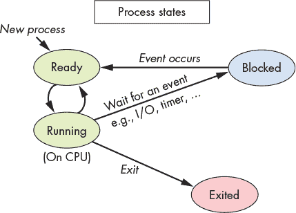

*图 13-8：进程生命周期中的状态*

进程运行时间（PROCESS RUNTIME）

程序员通常使用进程的完成时间作为衡量其性能的指标。对于非交互式程序，较快的运行时间通常意味着更好或更优化的实现。例如，在比较两个计算大数素因数的程序时，能够更快完成任务的程序更为优选。

有两种不同的度量方式来衡量一个进程的运行时间。第一种是总的*墙钟时间*（或墙时钟时间）。墙钟时间是进程开始和完成之间的持续时间；它是从进程开始到结束的经过时间，通常由挂在墙上的时钟测量。墙钟时间包括进程在运行状态下执行于 CPU 上的时间，也包括进程在阻塞状态下等待事件（如 I/O）的时间，以及进程在就绪状态下等待调度执行的时间。在多道程序和时间共享系统中，进程的墙钟时间可能由于其他进程同时运行并共享系统资源而变慢。

进程运行时间的第二种度量方式是总的*CPU 时间*（或进程时间）。CPU 时间仅衡量进程在运行状态下执行指令的时间。CPU 时间不包括进程在阻塞或就绪状态下的时间。因此，一个进程的总 CPU 时间不会受到系统中其他进程并发运行的影响。

#### 13.2.3 创建（和销毁）进程

当现有进程通过系统调用请求操作系统创建一个新进程时，操作系统会创建一个新进程。在 Unix 中，`fork`系统调用用于创建一个新进程。调用`fork`的进程是*父进程*，它创建的新进程是其*子进程*。例如，如果你在终端中运行`a.out`，shell 进程会调用`fork`系统调用，请求操作系统创建一个新的子进程来运行`a.out`程序。另一个例子是，网页浏览器进程调用`fork`来创建子进程，处理不同的浏览事件。当用户加载网页时，浏览器可能会创建一个子进程来与 web 服务器进行通信；它可能创建另一个进程来处理用户的鼠标输入，还可能创建其他进程来处理不同的浏览器窗口或标签。像这样的多进程浏览器能够通过一些子进程继续处理用户请求，同时其他一些子进程可能会被阻塞，等待远程 web 服务器的响应或用户的鼠标点击。

在系统中活动的进程之间存在一个*进程层级*的父子关系。例如，如果进程*A*调用两次`fork`，则会创建两个新的子进程，*B*和*C*。如果进程 C 再调用一次`fork`，则会创建另一个新进程，*D*。进程 C 是 A 的子进程，也是 D 的父进程。进程 B 和 C 是兄弟进程（它们共享一个父进程，进程 A）。进程 A 是 B、C 和 D 的祖先。这个示例如图 13-9 所示。

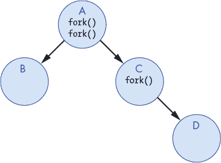

*图 13-9：一个由父进程（A）通过调用`fork`两次创建两个子进程（B 和 C）的示例进程层次结构。C 调用`fork`创建其子进程 D。在 Linux 系统上列出进程层次结构，运行`pstree`，或`ps -Aef --forest`。*

由于现有的进程触发进程的创建，因此系统至少需要一个进程来创建任何新的进程。在启动时，操作系统创建系统中的第一个用户级进程。这个特殊的进程，称为`init`，位于进程层次结构的最顶部，是系统中所有其他进程的祖先。

#### fork

`fork`系统调用用于创建进程。在`fork`时，子进程从父进程继承其执行状态。操作系统在父进程调用`fork`时创建调用（父）进程执行状态的*副本*。这个执行状态包括父进程的地址空间内容、CPU 寄存器值，以及它已分配的任何系统资源（例如，打开的文件）。操作系统还创建一个新的*进程控制结构*，这是一个用于管理子进程的操作系统数据结构，并为子进程分配一个唯一的 PID。操作系统创建并初始化新的进程后，子进程和父进程并发执行——它们都继续运行，并且随着操作系统在它们之间进行上下文切换，执行重叠。

当操作系统第一次调度子进程在 CPU 上运行时，它从父进程返回`fork`调用的位置开始执行。这是因为`fork`将父进程的执行状态的副本传递给子进程（子进程在开始执行时使用自己副本的状态）。从程序员的角度看，*对`fork`的调用返回两次*：一次是在运行父进程的上下文中，另一次是在运行子进程的上下文中。

为了区分程序中的子进程和父进程，`fork`调用会返回不同的值给父进程和子进程。子进程总是接收到 0 的返回值，而父进程接收到子进程的 PID 值（如果`fork`失败则返回-1）。

例如，以下代码片段显示了对`fork`系统调用的调用，该调用创建了调用进程的新子进程：

```
 pid_t pid;

pid = fork();   /* create a new child process */

print("pid = %d\n", pid);  /* both parent and child execute this */ 
```

在`fork`调用创建了一个新的子进程之后，父进程和子进程继续执行，各自处于独立的执行上下文中，在`fork`调用的返回点继续执行。两个进程将`fork`的返回值赋给各自的`pid`变量，并都调用`printf`。子进程的调用打印出 0，而父进程则打印出子进程的 PID 值。

图 13-10 显示了代码执行后进程层次结构的示例。子进程在分叉时获得父进程执行上下文的完整副本，但其变量`pid`的值与父进程不同，因为`fork`返回子进程的 PID 值（本例中为 14）给父进程，并返回 0 给子进程。

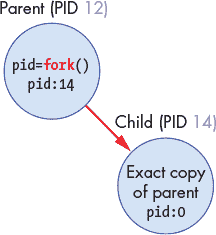

*图 13-10：一个进程（PID 12）调用`fork`来创建一个新的子进程。新的子进程获得父进程的地址和执行状态的精确副本，但获得它自己的进程标识符（PID 14）。`fork`返回 0 给子进程，并返回子进程的 PID 值（14）给父进程。*

通常，程序员希望在`fork`调用后，子进程和父进程执行不同的任务。程序员可以利用`fork`的不同返回值触发父子进程执行不同的代码分支。例如，以下代码片段创建了一个新的子进程，并利用`fork`的返回值让子进程和父进程在调用后执行不同的代码分支：

```

pid_t pid;

pid = fork();   /* create a new child process */

if (pid == 0) {

    /* only the child process executes this code */

    ...

} else if (pid != -1)  {

    /* only the parent process executes this code */

    ...

} 
```

需要记住的是，一旦它们被创建，子进程和父进程将在各自的执行上下文中并发运行，修改它们各自的程序变量副本，并可能执行代码中的不同分支。

请考虑以下程序^(2)，它包含对`fork`的调用，并根据`pid`的值进行分支，以触发父进程和子进程执行不同的代码（此示例还显示了对`getpid`的调用，该函数返回调用进程的 PID）：

```

#include <stdio.h>

#include <stdlib.h>

#include <unistd.h>

int main() {

    pid_t pid, mypid;

    printf("A\n");

    pid = fork();   /* create a new child process */

    if(pid == -1) {  /* check and handle error return value */

        printf("fork failed!\n");

        exit(pid);

    }

    if (pid == 0) { /* the child process */

        mypid = getpid();

        printf("Child: fork returned %d, my pid %d\n", pid, mypid);

    } else  {  /* the parent process */

        mypid = getpid();

        printf("Parent: fork returned %d, my pid %d\n", pid, mypid);

    }

    printf("B:%d\n", mypid);

    return 0;

}

```

当程序运行时，其输出可能如下所示（假设父进程的 PID 是 12，子进程的 PID 是 14）：

```
A

Parent: fork returned 14, my pid 12

B:12

Child: fork returned 0, my pid 14

B:14
```

实际上，程序的输出可能会呈现表 13-1 中所示的任何一种可能的选项（如果多次运行该程序，你通常会看到输出的顺序有多个可能性）。在表 13-1 中，父进程打印 B:12，子进程打印 B:14，但具体的 PID 值会因运行而异。

**表 13-1：** 示例程序输出的所有六种可能顺序

| **选项 1** | **选项 2** | **选项 3** | **选项 4** | **选项 5** | **选项 6** |
| --- | --- | --- | --- | --- | --- |
| A | A | A | A | A | A |
| 父进程... | 父进程... | 父进程... | 子进程... | 子进程... | 子进程... |
| 子进程... | 子进程... | B:12 | 父进程... | 父进程... | B:14 |
| B:12 | B:14 | 子进程... | B:12 | B:14 | 父进程... |
| B:14 | B:12 | B:14 | B:14 | B:12 | B:12 |

这六种不同的输出顺序是可能的，因为在`fork`系统调用返回后，父进程和子进程是并发的，并且可以按多种不同的顺序在 CPU 上调度执行，导致它们的指令序列出现任何可能的交织。考虑该程序的执行时间线，如图 13-11 所示。虚线表示两个进程的并发执行。根据每个进程在 CPU 上的调度时间，它们的`printf`语句可能先后执行，或者它们的两个`printf`语句可能交替执行，导致表 13-1 中显示的任何可能结果。由于在调用`fork`之前只有父进程存在，因此 A 总是由父进程打印，之后的输出才会由调用`fork`后的进程打印。

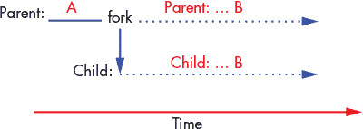

*图 13-11：程序的执行时间线。在调用`fork`之前只有父进程存在。`fork`返回后，两个进程并发执行（以虚线表示）。*

#### 13.2.4 exec

通常，会创建一个新进程来执行一个不同于其父进程的程序。这意味着`fork`通常用于创建一个进程，目的是从它的起点运行一个新程序（即从第一条指令开始执行）。例如，如果用户在 shell 中输入`./a.out`，shell 进程会创建一个新的子进程来运行`a.out`。作为两个独立的进程，shell 和`a.out`进程相互独立，无法干扰彼此的执行状态。

虽然`fork`创建了新的子进程，但它并不会导致子进程运行`a.out`。为了初始化子进程以运行一个新程序，子进程会调用一个*exec*系统调用。Unix 提供了一系列的 exec 系统调用，触发操作系统用二进制可执行文件中的新映像覆盖调用进程的映像。换句话说，exec 系统调用告诉操作系统将调用进程的地址空间内容覆盖为指定的`a.out`，并重新初始化其执行状态，从`a.out`程序的第一条指令开始执行。

一个 exec 系统调用的例子是`execvp`，其函数原型如下：

```
int execvp(char *filename, char *argv[]);
```

`filename`参数指定用于初始化进程映像的二进制可执行程序的名称，`argv`包含传递给程序的`main`函数的命令行参数，程序在启动执行时会使用这些参数。

下面是一个示例代码片段，当执行时，它会创建一个新的子进程来运行`a.out`：

```

pid_t pid;

int ret;

char *argv[2];

argv[0] = "a.out";  // initialize command line arguments for main

argv[1] = NULL;

pid = fork();

if (pid == 0) { /* child process */

    ret = execvp("a.out", argv);

    if (ret < 0) {

        printf("Error: execvp returned!!!\n");

        exit(ret);

    }

}

```

`argv`变量被初始化为传递给`a.out`的`main`函数的`argv`参数的值：

```
int main(int argc, char *argv) { ...
```

`execvp`将根据此`argv`值（在此例中为 1）确定传递给`argc`的值。

图 13-12 显示了执行此代码后进程层次结构的样子。

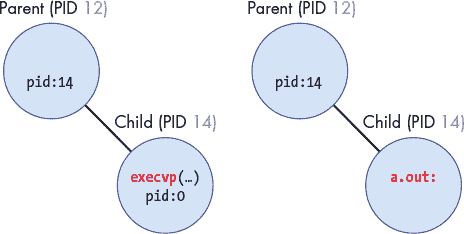

*图 13-12：当子进程调用 `execvp`（左侧）时，操作系统用 `a.out` 替换其映像（右侧），并初始化子进程以从头开始运行 `a.out` 程序。*

需要注意的是，在之前示例代码中，`execvp` 调用后的错误信息似乎很奇怪：为什么从 exec 系统调用返回会是一个错误？如果 exec 系统调用成功，那么它后面的错误检测和处理代码将永远不会执行，因为此时进程将执行 `a.out` 程序中的代码，而不是当前代码（进程的地址空间已被 exec 改变）。也就是说，当 exec 函数调用成功时，进程不会在 exec 调用返回后继续执行当前代码。由于这一行为，以下代码片段与之前的代码等价（但通常更容易理解）：

```

pid_t pid;

int ret;

pid = fork();

if (pid == 0) { /* child process */

    ret = execvp("a.out", argv);

    printf("Error: execvp returned!!!\n");  /* only executed if execvp fails */

    exit(ret);

}

```

#### 13.2.5 退出和等待

为了终止，进程调用 `exit` 系统调用，这会触发操作系统清理大部分进程状态。执行完退出代码后，进程会通知其父进程自己已退出。父进程负责清理已退出子进程的剩余状态。

进程可以通过几种方式触发退出。首先，进程可能完成所有应用代码，返回 `main` 函数时会调用 `exit` 系统调用从而退出。其次，进程可能执行无效操作，例如除以零或解引用空指针，这会导致它退出。最后，进程可以接收到来自操作系统或其他进程的 *信号*，指示它退出（实际上，除以零和空指针解引用会导致操作系统发送 `SIGFPE` 和 `SIGSEGV` 信号，指示进程退出）。

信号

*信号* 是操作系统发送给进程的软件中断。信号是一种相关进程之间进行通信的方式。操作系统提供了一个接口，让一个进程能够向另一个进程发送信号，从而进行通信（例如，当一个进程解引用空指针时，操作系统发送 `SIGSEGV` 信号告诉该进程退出）。

当一个进程接收到信号时，它会被中断并运行特定的信号处理程序代码。操作系统定义了一定数量的信号，用来传达不同的含义，每个信号由一个唯一的信号编号区分。操作系统为每种信号类型实现了默认的信号处理程序，但程序员可以注册自己的用户级信号处理程序代码，以覆盖大多数信号的默认行为，适应他们的应用需求。

《信号》部分位于 第 657 页，其中包含关于信号和信号处理的更多信息。

如果一个 shell 进程想要终止它正在运行 `a.out` 的子进程，它可以向子进程发送一个 `SIGKILL` 信号。当子进程接收到信号时，它会运行处理 `SIGKILL` 信号的代码，调用 `exit` 来终止子进程。如果用户在当前运行程序的 Unix shell 中按下 CTRL-C，子进程会接收到一个 `SIGINT` 信号。`SIGINT` 的默认信号处理程序也会调用 `exit`，导致子进程退出。

在执行 `exit` 系统调用后，操作系统会向父进程发送一个 `SIGCHLD` 信号，通知它子进程已经退出。子进程变成一个 *僵尸* 进程；它进入已退出状态，无法再在 CPU 上运行。僵尸进程的执行状态部分被清理，但操作系统仍然保留一些关于它的信息，包括它是如何终止的。

父进程通过调用 `wait` 系统调用来*回收*其僵尸子进程（清理系统中的剩余状态）。如果父进程在子进程退出之前调用了 `wait`，那么父进程会被阻塞，直到接收到来自子进程的 `SIGCHLD` 信号。`waitpid` 系统调用是 `wait` 的一种变体，它接受一个 PID 参数，允许父进程在等待特定子进程终止时阻塞。

图 13-13 显示了进程退出时发生的事件序列。

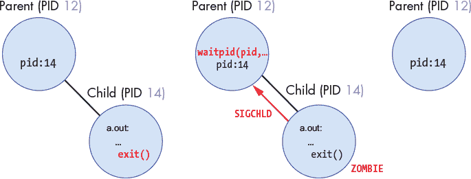

*图 13-13：进程退出。左图：子进程调用 `exit` 系统调用清理其大部分执行状态。中图：运行 `exit` 后，子进程变成僵尸进程（它处于已退出状态，不能再次运行），并且父进程会收到一个 `SIGCHLD` 信号，通知它子进程已退出。右图：父进程调用 `waitpid` 回收其僵尸子进程（从系统中清理子进程的剩余状态）。*

由于父子进程是并发执行的，父进程可能在子进程退出之前就调用 `wait`，或者子进程可能在父进程调用 `wait` 之前退出。如果子进程在父进程调用 `wait` 时仍在执行，那么父进程会被阻塞，直到子进程退出（父进程进入阻塞状态，等待 `SIGCHLD` 信号事件发生）。父进程的阻塞行为可以通过在 shell 中前台运行一个程序（`a.out`）来观察——在 `a.out` 终止之前，shell 程序不会打印出 shell 提示符，表示 shell 父进程在调用 `wait` 时被阻塞，直到接收到来自其运行 `a.out` 的子进程的 `SIGCHLD` 信号。

程序员还可以设计父进程代码，使其在等待子进程退出时永远不会阻塞。如果父进程实现了一个`SIGCHLD`信号处理程序，其中包含对`wait`的调用，那么父进程只有在有子进程退出时才会调用`wait`，从而避免在`wait`调用时发生阻塞。通过在 shell 中后台运行程序（`a.out &`）可以看到这种行为。Shell 程序将继续执行，打印提示符，并在子进程运行`a.out`时执行另一个命令。以下是一个例子，展示了父进程在`wait`上阻塞与在`SIGCHLD`信号处理程序中只调用`wait`的非阻塞父进程之间的区别（确保你运行的程序足够长时间以注意到差异）：

```

$  a.out        # shell process forks child and calls wait

$  a.out &      # shell process forks child but does not call wait

$  ps           # (the shell can run ps and a.out concurrently)

```

以下是一个包含`fork`、`exec`、`exit`和`wait`系统调用的示例代码片段（为便于阅读，已去除错误处理）。此示例旨在测试你对这些系统调用及其对进程执行影响的理解。在这个示例中，父进程创建一个子进程并等待其退出。然后，子进程再创建另一个子进程来运行`a.out`程序（第一个子进程是第二个子进程的父进程）。接着，它等待其子进程退出。

```

pid_t pid1, pid2, ret;

int status;

printf("A\n");

pid1 = fork();

if (pid1 == 0 ) {       /* child 1 */

    printf("B\n");

    pid2 = fork();

    if (pid2 == 0 ){    /* child 2 */

        printf("C\n");

        execvp("a.out", NULL);

    } else {            /* child 1 (parent of child 2) */

        ret = wait(&status);

        printf("D\n");

        exit(0);

    }

} else {                /* original parent */

    printf("E\n");

    ret = wait(&status);

    printf("F\n");

}

```

图 13-14 展示了执行前述示例时，进程创建/运行/阻塞/退出事件的执行时间线。虚线表示进程的执行与其子进程或后代进程重叠的时间：这些进程是并发的，可以以任何顺序在 CPU 上调度。实线表示进程执行的依赖关系。例如，子进程 1 在回收子进程 2 退出之前无法调用`exit`。当进程调用`wait`时，它会阻塞直到子进程退出。当进程调用`exit`时，它将不再运行。程序的输出在每个进程的执行时间线上标注，表示在执行过程中对应的`printf`语句可能出现的位置。

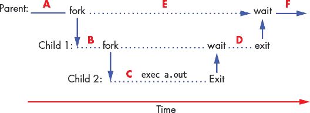

*图 13-14：示例程序的执行时间线，显示了三进程间可能的`fork`、`exec`、`wait`和`exit`调用顺序。实线表示进程间执行顺序的依赖关系，虚线表示并发执行点。Parent 是子进程 1 的父进程，子进程 1 是子进程 2 的父进程。*

在本程序中，调用`fork`后，父进程和第一个子进程并发执行，因此父进程中的`wait`调用可能与子进程的任何指令交替执行。例如，父进程可能在子进程调用`fork`创建子进程之前就调用`wait`并阻塞。表 13-2 列出了运行示例程序时所有可能的输出结果。

**表 13-2：** 程序的所有可能输出顺序

| **选项 1** | **选项 2** | **选项 3** | **选项 4** |
| --- | --- | --- | --- |
| A | A | A | A |
| B | B | B | E |
| C | C | E | B |
| D | E | C | C |
| E | D | D | D |
| F | F | F | F |

程序在表 13-2 中的输出都是可能的，因为父进程与其子孙进程并发执行，直到调用`wait`为止。因此，父进程调用`printf("E\n")`可以在任何时刻与子孙进程的开始和退出交替执行。

### 13.3 虚拟内存

操作系统的进程抽象为每个进程提供了一个虚拟内存空间。*虚拟内存*是一种抽象，它为每个进程提供了一个独立的、逻辑上的地址空间，用于存储其指令和数据。每个进程的虚拟地址空间可以被看作是从地址 0 到某个最大地址的一个可寻址字节的数组。例如，在 32 位系统中，最大地址为 2³² - 1。进程不能访问彼此的地址空间中的内容。进程的虚拟地址空间的某些部分来自于它正在运行的二进制可执行文件（例如，*text*部分包含来自`a.out`文件的程序指令）。进程虚拟地址空间的其他部分则是在运行时创建的（例如，*stack*部分）。

操作系统将虚拟内存实现为进程的*单一视图*抽象的一部分。也就是说，每个进程仅通过自己的虚拟地址空间与内存交互，而不是基于多个进程同时共享计算机物理内存（RAM）的现实。操作系统还使用其虚拟内存实现来保护进程，防止它们访问彼此的内存空间。举个例子，考虑以下简单的 C 程序：

```

/* a simple program */

#include <stdio.h>

int main(int argc, char* argv[]) {

    int x, y;

    printf("enter a value: ");

    scanf("%d", &y);

    if (y > 10) {

        x = y;

    } else {

        x = 6;

    }

    printf("x is %d\n", x);

    return 0;

}

```

如果两个进程同时执行这个程序，它们每个都会获得自己的一份栈内存，作为各自独立虚拟地址空间的一部分。因此，如果一个进程执行`x = 6`，它不会影响另一个进程中`x`的值——每个进程都有自己的一份`x`，存储在它的私有虚拟地址空间中，正如在图 13-15 中所示。

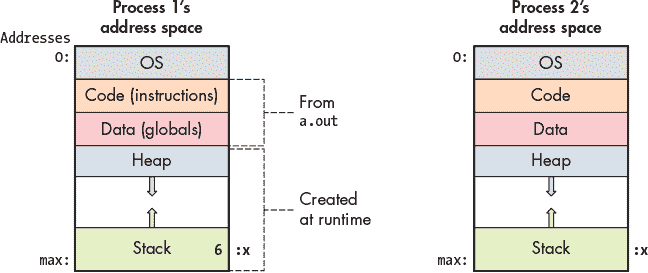

*图 13-15：`a.out`的两次执行结果是两个进程，每个进程都在隔离的实例中运行`a.out`程序。每个进程都有自己的私有虚拟地址空间，包含程序指令、全局变量，以及栈和堆内存空间的副本。例如，每个进程可能在虚拟地址空间的栈部分都有一个局部变量`x`。*

进程的虚拟地址空间被划分为几个部分，每一部分存储进程内存的不同部分。最上面的一部分（最低的地址）保留给操作系统，并且只能在内核模式下访问。进程虚拟地址空间中的文本和数据部分是从程序可执行文件（`a.out`）中初始化的。文本段包含程序指令，数据段包含全局变量（数据部分实际上分为两部分，一部分是初始化的全局变量，另一部分是未初始化的全局变量）。

进程虚拟地址空间中的堆和栈部分的大小随着进程的运行而变化。栈空间会随着进程进行函数调用而增长，在从函数返回时缩小。堆空间则会在进程动态分配内存空间（通过调用`malloc`）时增长，在进程释放动态分配的内存空间（通过调用`free`）时缩小。进程内存中的堆和栈部分通常位于虚拟地址空间的远离位置，以最大化两者可用的空间。通常情况下，栈位于进程地址空间的底部（靠近最大地址），并随着函数调用的发生而向下扩展，栈帧被添加到栈顶。

堆和栈内存

堆和栈内存空间的实际总容量通常不会在每次调用`malloc`和`free`时发生变化，也不会在每次函数调用和返回时发生变化。相反，这些操作通常只是改变当前分配的虚拟内存空间中的堆和栈部分的实际使用量。然而，有时这些操作确实会导致堆或栈空间总容量的变化。

操作系统负责管理进程的虚拟地址空间，包括改变堆和栈空间的总容量。系统调用`brk`、`sbrk`或`mmap`可以用来请求操作系统改变堆内存的总容量。C 程序员通常不会直接调用这些系统调用，而是通过调用标准 C 库函数`malloc`（和`free`）来分配（和释放）堆内存空间。在内部，标准 C 库的用户级堆管理器可能会调用其中一个系统调用，请求操作系统改变堆内存空间的大小，以满足`malloc`请求。

#### 13.3.1 内存地址

由于进程在各自的虚拟地址空间中运行，操作系统必须区分两种类型的内存地址。*虚拟地址*指的是进程虚拟地址空间中的存储位置，*物理地址*指的是物理内存（RAM）中的存储位置。

##### 物理内存（RAM）和物理内存地址

从 第十一章 我们知道，物理内存（RAM）可以视为一个可寻址字节的数组，其中地址范围从 0 到基于 RAM 总大小的最大地址值。例如，在一个具有 2 GB RAM 的系统中，物理内存地址的范围是从 0 到 2³¹ – 1（1 GB 为 2³⁰ 字节，所以 2 GB 为 2³¹ 字节）。

为了让 CPU 运行一个程序，操作系统必须将程序的指令和数据加载到 RAM 中；CPU 不能直接访问其他存储设备（例如磁盘）。操作系统管理 RAM 并决定应该将哪些位置存储到进程的虚拟地址空间内容。例如，如果两个进程 P1 和 P2 运行之前的示例程序，那么 P1 和 P2 会有各自独立的 `x` 变量副本，每个副本都存储在 RAM 中不同的位置。也就是说，P1 的 `x` 和 P2 的 `x` 有不同的物理地址。如果操作系统将相同的物理地址分配给 P1 和 P2 的 `x` 变量，那么 P1 将 `x` 设置为 6 时，也会修改 P2 的 `x` 值，这将违反每个进程独立的虚拟地址空间。

在任何时刻，操作系统都会将多个进程的地址空间内容以及可能映射到每个进程虚拟地址空间中的操作系统代码存储在 RAM 中（操作系统代码通常从 RAM 的地址 0x0 开始加载）。图 13-16 显示了操作系统和三个进程（P1、P2 和 P3）加载到 RAM 中的示例。每个进程都会为其地址空间内容分配独立的物理存储位置（例如，即使 P1 和 P2 运行相同的程序，它们也会为变量 `x` 分配独立的物理存储位置）。

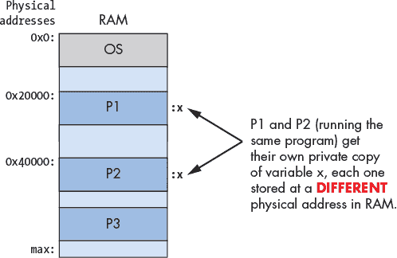

*图 13-16：示例 RAM 内容，显示操作系统加载在地址 0x0，进程加载在 RAM 中不同物理内存地址。如果 P1 和 P2 运行相同的 `a.out`，则 P1 的 `x` 的物理地址与 P2 的 `x` 的物理地址不同。*

##### 虚拟内存和虚拟地址

虚拟内存是每个进程对其内存空间的视图，*虚拟地址*是进程视图中内存的地址。如果两个进程运行相同的二进制可执行文件，那么它们在地址空间中对于函数代码和全局变量的虚拟地址是完全相同的（由于两次独立执行过程中的运行时差异，堆内存中动态分配空间和栈上局部变量的虚拟地址可能会有所不同）。换句话说，两个进程对于它们的 `main` 函数的位置具有相同的虚拟地址，且在它们的地址空间中，对于全局变量 `x` 的位置也有相同的虚拟地址，如 图 13-17 所示。

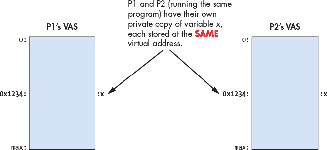

*图 13-17：示例虚拟内存内容，显示两个进程运行相同的 `a.out` 文件。P1 和 P2 对全局变量 `x` 有相同的虚拟地址。*

#### 13.3.2 虚拟地址到物理地址的转换

程序的汇编和机器代码指令引用虚拟地址。因此，如果两个进程执行相同的`a.out`程序，CPU 将执行带有相同虚拟地址的指令，以访问它们各自的虚拟地址空间中的相应部分。例如，假设`x`位于虚拟地址 0x24100，那么设置`x`为 6 的汇编指令可能如下所示：

```

movl $0x24100, %eax    # load 0x24100 into register eax

movl $6, (%eax)        # store 6 at memory address 0x24100

```

在运行时，操作系统将每个进程的`x`变量加载到不同的物理内存地址（RAM 中的不同位置）。这意味着每当 CPU 执行指向内存的加载或存储指令时，这些指令指定了虚拟地址，CPU 中的虚拟地址必须先转换为 RAM 中对应的物理地址，然后才能从 RAM 中读取或写入字节。

由于虚拟内存是操作系统实现的一个重要且核心的抽象，处理器通常提供某种硬件支持虚拟内存。操作系统可以利用这种硬件级的虚拟内存支持来快速执行虚拟地址到物理地址的转换，从而避免每次地址转换都需要切换到操作系统来处理。特定的操作系统可以选择在其虚拟内存实现中使用多少硬件支持分页。在选择硬件实现功能与软件实现功能时，通常会在速度和灵活性之间进行权衡。

*内存管理单元*（MMU）是计算机硬件的一部分，用于实现地址转换。MMU 硬件和操作系统共同完成虚拟地址到物理地址的转换，当应用程序访问内存时。具体的硬件/软件分工取决于硬件和操作系统的具体组合。在最完整的情况下，MMU 硬件执行完整的转换：它从 CPU 获取虚拟地址，并将其转换为物理地址，用于寻址 RAM（如图 13-18 所示）。无论虚拟内存的硬件支持程度如何，总有一些虚拟到物理的转换需要操作系统来处理。在我们讨论虚拟内存时，假设使用的是更完整的方式。

MMU 最小化了操作系统在地址转换中所需的干预。


*图 13-18：内存管理单元（MMU）将虚拟地址映射到物理地址。虚拟地址用于 CPU 执行的指令中。当 CPU 需要从物理内存中获取数据时，虚拟地址首先由 MMU 转换为物理地址，用于寻址 RAM。*

操作系统为每个进程维护虚拟内存映射，以确保能够正确地将虚拟地址转换为物理地址，供任何在 CPU 上运行的进程使用。在上下文切换期间，操作系统会更新 MMU 硬件，指向被交换进来的进程的虚拟到物理内存映射。操作系统通过在上下文切换时交换每个进程的地址映射状态来保护进程不互相访问彼此的内存空间——在上下文切换时交换映射，确保一个进程的虚拟地址不会映射到存储另一个进程虚拟地址空间的物理地址上。

#### 13.3.3 分页

尽管多年来已经提出了许多虚拟内存系统，但分页现在是最广泛使用的虚拟内存实现。在*分页虚拟内存*系统中，操作系统将每个进程的虚拟地址空间划分为固定大小的块，称为*页*。操作系统定义了系统的页大小。如今，一些通用操作系统通常使用几千字节的页大小——4 KB（4,096 字节）是许多系统的默认页大小。

物理内存也被操作系统划分为与页面大小相同的块，称为*帧*。由于页面和帧被定义为相同的大小，因此进程的任何虚拟内存页面都可以存储在物理 RAM 的任何帧中。

在分页系统中，页面和帧的大小相同，因此虚拟内存的任何页面都可以加载（存储）到物理 RAM 的任何帧中；进程的页面不需要存储在连续的 RAM 帧中（即在 RAM 中紧邻的一系列地址）；并且并非每个虚拟地址空间的页面都需要加载到 RAM 中，才能让进程运行。

图 13-19 展示了一个示例，说明进程的虚拟地址空间中的页面如何映射到物理 RAM 的帧。

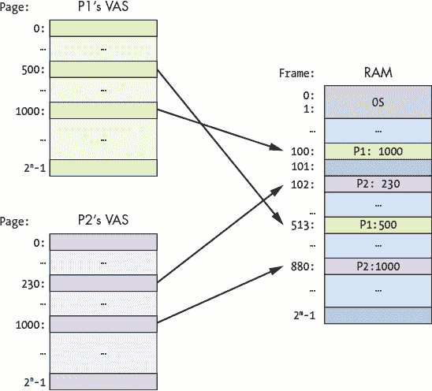

*图 13-19：分页虚拟内存。进程虚拟地址空间的单个页面存储在 RAM 帧中。虚拟地址空间的任何页面都可以加载到（存储在）任何物理内存帧中。在此示例中，P1 的虚拟页 1000 存储在物理帧 100 中，而其页 500 存储在帧 513 中。P2 的虚拟页 1000 存储在物理帧 880 中，而其页 230 存储在帧 102 中。*

##### 分页系统中的虚拟地址和物理地址

分页虚拟内存系统将虚拟地址的位划分为两部分：高位指定虚拟地址存储的*页号*，低位对应于页面内的*字节偏移*（即页面顶部的哪个字节对应该地址）。

同样，分页系统将物理地址分为两部分：高位指定物理内存的*帧号*，低位指定帧内的*字节偏移量*。由于帧和页面的大小相同，虚拟地址中的字节偏移位与其转换后的物理地址中的字节偏移位相同。虚拟地址与其转换后的物理地址的不同之处在于其高位，这些高位指定虚拟页面号和物理帧号。

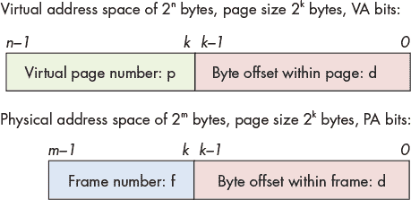

*图 13-20：虚拟地址和物理地址中的地址位*

例如，考虑一个（非常小的）系统，具有 16 位虚拟地址、14 位物理地址和 8 字节的页面。由于页面大小为 8 字节，物理地址和虚拟地址的低三位定义了页面或帧内的字节偏移量——三位可以编码 8 个不同的字节偏移值，0–7（2³等于 8）。这使得虚拟地址的高 13 位用于指定页面号，物理地址的高 11 位用于指定帧号，如图 13-21 中的示例所示。

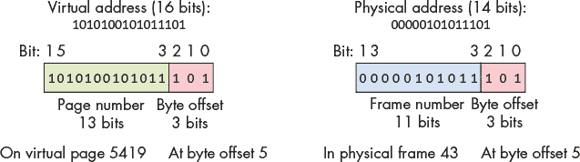

*图 13-21：在一个具有 16 位虚拟地址、14 位物理地址和 8 字节页面大小的示例系统中，虚拟地址和物理地址的位划分。*

在图 13-21 中的示例中，虚拟地址 43357（十进制）具有字节偏移量 5（0b101，二进制），这是地址的低三位，以及页面号 5419（0b1010100101011），这是地址的高 13 位。这意味着虚拟地址位于页面 5419 的第 5 个字节。

如果这个虚拟内存页面被加载到物理内存的帧 43（0b00000101011）中，那么它的物理地址是 349（0b00000101011101），其中低三位（0b101）指定字节偏移量，高 11 位（0b00000101011）指定帧号。这意味着物理地址位于 RAM 帧 43 的第 5 个字节。

##### 虚拟到物理页面映射的页表

由于每个进程的虚拟内存空间的每个页面可以映射到不同的 RAM 帧，操作系统必须为进程地址空间中的每个虚拟页面保持映射。操作系统维护一个每个进程的*页表*，它用于存储进程的虚拟页面号到物理帧号的映射。页表是由操作系统实现的数据结构，存储在 RAM 中。图 13-22 展示了操作系统如何在 RAM 中存储两个进程的页表的示例。每个进程的页表存储其虚拟页面到物理帧的映射，从而使任何虚拟内存的页面都可以存储在 RAM 的任何物理帧中。

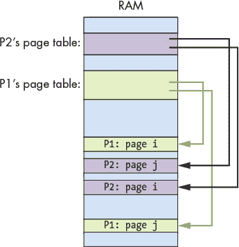

*图 13-22：每个进程都有一个页面表，包含其虚拟页面到物理帧的映射。页面表存储在 RAM 中，系统使用它来将进程的虚拟地址翻译为用于寻址 RAM 中位置的物理地址。此示例显示了存储在 RAM 中的 P1 和 P2 进程的单独页面表，每个页面表都有自己的虚拟页面到物理帧的映射。*

对于每个虚拟内存页面，页面表存储一个 *页面表项*（PTE），其中包含存储虚拟页面的物理内存（RAM）的帧号。一个 PTE 还可能包含关于虚拟页面的其他信息，包括一个 *有效位*，用于指示 PTE 是否存储了有效的映射。如果某个页面的有效位为零，则该进程虚拟地址空间中的页面当前没有加载到物理内存中。

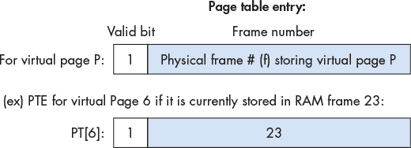

*图 13-23：页面表项（PTE）存储虚拟页面加载到的 RAM 页框的帧号（23）。我们以十进制列出帧号（23），尽管它实际上在 PTE 项中是以二进制编码的（0…010111）。有效位为 1 表示此项存储了有效的映射。*

##### 使用页面表将虚拟地址映射到物理地址

虚拟地址到物理地址的翻译有四个步骤（如图 13-24 所示）。具体的操作系统/硬件组合决定了由操作系统还是硬件执行这些步骤的全部或部分。在描述这些步骤时，我们假设一个全功能的 MMU，它尽可能在硬件中执行尽可能多的地址翻译，但在某些系统中，操作系统可能会执行这些步骤中的某些部分。

1\. 首先，MMU 将虚拟地址的位分为两部分：对于 2^(*k*) 字节的页面大小，低位的 *k* 位（VA 位 *k –* 1 到 0）编码页面内的字节偏移量 (*d*)，而高位的 *n – k* 位（VA 位 *n –* 1 到 *k*）编码虚拟页面号 (*p*)。

2\. 接下来，页面号值 (*p*) 被 MMU 用作页面表的索引，以访问页面 *p* 的 PTE。大多数架构都有一个 *页面表基址寄存器*（PTBR），它存储运行中进程页面表的 RAM 地址。PTBR 中的值与页面号值 (*p*) 结合起来，计算出页面 *p* 的 PTE 地址。

3\. 如果 PTE 中的有效位被设置为 1，则 PTE 中的帧号表示有效的 VA 到 PA 映射。如果有效位为 0，则会发生页面错误，触发操作系统处理此地址转换（稍后我们会讨论操作系统的页面错误处理）。

4\. MMU 使用来自 PTE 项的帧号 (*f*) 位作为高位，并使用来自 VA 的页面偏移量 (*d*) 位作为物理地址的低位，来构造物理地址。

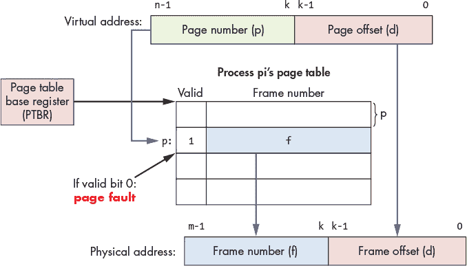

*图 13-24：一个进程的页表用于执行虚拟地址到物理地址的转换。PTBR 存储当前运行进程的页表基地址。*

##### 示例：通过页表映射 VA 到 PA

考虑一个示例（小型）分页系统，其中页大小为 4 字节，虚拟地址为 6 位（高 4 位为页号，低 2 位为字节偏移），物理地址为 7 位。

假设系统中进程 P1 的页表如下所示 表 13-3（值以十进制和二进制列出）。

**表 13-3：** 进程 P1 的页表

| **条目** | **有效** | **帧号** |
| --- | --- | --- |
| 0 (0b0000) | 1 | 23 (0b10111) |
| 1 (0b0001) | 0 | 17 (0b10001) |
| 2 (0b0010) | 1 | 11 (0b01011) |
| 3 (0b0011) | 1 | 16 (0b10000) |
| 4 (0b0100) | 0 | 8 (0b01000) |
| 5 (0b0101) | 1 | 14 (0b01110) |
| ⋮ | ⋮ | ⋮ |
| 15 (0b1111) | 1 | 30 (0b11110) |

使用本示例提供的信息可以揭示关于地址大小、地址的各部分和地址转换的几个重要方面。

首先，页表的大小（条目的数量）由虚拟地址的位数和系统中的页大小决定。每个 6 位虚拟地址的高 4 位指定页号，因此虚拟内存总共有 16（2⁴）页。由于页表为每个虚拟页有一个条目，因此每个进程的页表中总共有 16 个页表条目。

其次，每个页表条目（PTE）的大小取决于物理地址中的位数和系统中的页大小。每个 PTE 存储一个有效位和一个物理帧号。有效位需要 1 位。帧号需要 5 位，因为物理地址为 7 位，而页偏移是低 2 位（用于寻址每页上的 4 字节），剩下的 5 位用于帧号。因此，每个 PTE 条目需要 6 位：1 位用于有效位，5 位用于帧号。

第三，虚拟内存和物理内存的最大大小由地址的位数决定。由于虚拟地址为 6 位，因此可以寻址 2⁶ 字节的内存，因此每个进程的虚拟地址空间为 2⁶（或 64）字节。同样，物理内存的最大大小为 2⁷（或 128）字节。

最后，页大小、虚拟和物理地址中的位数，以及页表决定了虚拟地址到物理地址的映射。例如，如果进程 P1 执行一条指令，从其虚拟地址 0b001110 加载一个值，则其页表将虚拟地址转换为物理地址 0b1000010，然后用于访问 RAM 中的值。

虚拟地址（VA）到物理地址（PA）的转换步骤如下：

1\. 将虚拟地址（VA）位分为页面号 (*p*) 和字节偏移 (*d*) 位：高 4 位是页面号 (0b0011 或 页面 3)，低 2 位是页面内的字节偏移 (0b10 或字节 2)。

2\. 使用页面号 (3) 作为页表索引来读取虚拟页面 3 的 PTE (PT[3]: 有效:1 帧号#:16)。

3\. 检查有效位，判断 PTE 映射是否有效。在此情况下，有效位为 1，因此 PTE 包含有效的映射，意味着虚拟内存页面 3 存储在物理内存帧 16 中。

4\. 使用 PTE 中的 5 位帧号作为高位地址位 (0b10000)，并将虚拟地址中的低 2 位偏移 (0b10) 作为低位 2 位来构造物理地址：物理地址为 0b1000010（在 RAM 帧 16，字节偏移为 2）。

##### 分页实现

大多数计算机硬件提供某种支持分页虚拟内存的功能，操作系统和硬件共同在给定系统上实现分页。至少，大多数架构提供一个页表基址寄存器 (PTBR)，该寄存器存储当前运行进程的页表基地址。为了执行虚拟到物理地址的转换，虚拟地址的虚拟页面号部分与存储在 PTBR 中的值结合使用，找到虚拟页面的 PTE 条目。换句话说，虚拟页面号是进程页表的索引，它的值与 PTBR 值结合，得到页面 *p* 的 PTE 在 RAM 中的地址（例如，PTBR + *p* × （PTE 大小）是页面 *p* 的 PTE 在 RAM 中的地址）。一些架构可能支持通过硬件操作 PTE 位来进行完整的页表查找。如果不支持，操作系统则需要中断来处理一些页表查找和访问 PTE 位的工作，以将虚拟地址转换为物理地址。

在上下文切换时，操作系统*保存并恢复*进程的 PTBR 值，确保当进程在 CPU 上运行时，它能够访问自己的虚拟到物理地址映射，这些映射存储在自己的 RAM 页表中。这是操作系统保护进程虚拟地址空间不被相互访问的一种机制；上下文切换时更改 PTBR 值，确保进程无法访问其他进程的 VA-PA 映射，因此它不能读取或写入存储其他进程虚拟地址空间内容的物理地址。

##### 示例：两个进程的虚拟到物理地址映射

作为一个例子，考虑一个示例系统（表 13-4），该系统具有 8 字节页面、7 位虚拟地址和 6 位物理地址。

**表 13-4：** 示例进程页表

| **P1 的页表** | **P2 的页表** |
| --- | --- |
| **条目** | **有效** | **帧号 #** | **条目** | **有效** | **帧号 #** |
| 0 | 1 | 3 | 0 | 1 | 1 |
| 1 | 1 | 2 | 1 | 1 | 4 |
| 2 | 1 | 6 | 2 | 1 | 5 |
|  | ⋮ |  |  | ⋮ |  |
| 11 | 1 | 7 | 11 | 0 | 3 |
|  | ⋮ |  |  | ⋮ |  |

根据表 13-4 中显示的两个进程（P1 和 P2）的（部分显示的）页面表的当前状态，我们来计算由 CPU 生成的以下一系列虚拟内存地址的物理地址（每个地址前面都有运行在 CPU 上的进程标识）：

```

P1: 0000100

P1: 0000000

P1: 0010000

              <---- context switch

P2: 0010000

P2: 0001010

P2: 1011001

              <---- context switch

P1: 1011001

```

首先，确定虚拟地址和物理地址中的位划分。由于页面大小为 8 字节，每个地址的低三位编码页偏移 (*d*)。虚拟地址为七位。因此，三个位用于页偏移，剩下的四个位用于指定页号 (*p*)。由于物理地址为六位，低三位用于页偏移，高三位用于指定框架号。

接下来，对于每个虚拟地址，使用其页号位 (*p*) 在进程的页面表中查找对应的 PTE。如果 PTE 中的有效位 (*v*) 被设置，则使用框架号 (*f*) 作为物理地址的高位。物理地址的低位来自虚拟地址的字节偏移位 (*d*)。

结果如表 13-5 所示（注意每个地址的翻译使用了哪个页面表）。

**表 13-5：** 进程 P1 和 P2 的内存访问示例序列的地址映射

| **进程** | **虚拟地址** | *p* | *d* | **PTE** | *f* | *d* | **物理地址** |
| --- | --- | --- | --- | --- | --- | --- | --- |
| P1 | 0000100 | 0000 | 100 | `PT[0]: 1(*v*), 3(*f*)` | 011 | 100 | 011100 |
| P1 | 0000000 | 0000 | 000 | `PT[0]: 1(*v*), 3(*f*)` | 011 | 000 | 011000 |
| P1 | 0010000 | 0010 | 000 | `PT[2]: 1(*v*), 6(*f*)` | 110 | 000 | 110000 |
| **上下文切换 P1 到 P2** |
| P2 | 0010000 | 0010 | 000 | `PT[2]: 1(*v*), 5(*f*)` | 101 | 000 | 101000 |
| P2 | 0001010 | 0001 | 010 | `PT[1]: 1(*v*), 4(*f*)` | 100 | 010 | 100010 |
| P2 | 1011001 | 1011 | 001 | `PT[11]: 0(*v*), 3(*f*)` | 页面错误 (有效位 0) |
| **上下文切换 P2 到 P1** |
| P1 | 1011001 | 1011 | 001 | `PT[11]: 1(*v*), 7(*f*)` | 111 | 001 | 111001 |

作为一个例子，考虑进程 P1 访问的第一个地址。当 P1 访问其虚拟地址 8 (0b0000100) 时，地址被分为其页号 0 (0b0000) 和字节偏移 4 (0b100)。页号 0 用于查找 PTE 条目 0，其有效位为 1，表示有效的页面映射条目，且其框架号为 3 (0b011)。物理地址 (0b011100) 是使用框架号 (0b011) 作为高位，页偏移 (0b100) 作为低位构造的。

当进程 P2 在 CPU 上发生上下文切换时，会使用其页面表映射（注意 P1 和 P2 访问相同虚拟地址 0b0010000 时的物理地址不同）。当 P2 访问有效位为 0 的 PTE 条目时，它会触发页面错误，交由操作系统处理。

#### 13.3.4 内存效率

操作系统的主要目标之一是高效地管理硬件资源。系统性能特别依赖于操作系统如何管理内存层次结构。例如，如果一个进程访问存储在 RAM 中的数据，那么该进程的运行速度将比访问存储在磁盘中的数据要快得多。

操作系统力求提高系统中的多道程序运行度，以便在一些进程被阻塞等待事件（如磁盘 I/O）时，让 CPU 持续进行实际的工作。然而，由于 RAM 是固定大小的存储，操作系统必须决定在任何时刻将哪个进程加载到 RAM 中，这可能会限制系统中的多道程序运行度。即使是具有大量 RAM（数十 GB 或数百 GB）的系统，也通常无法同时存储系统中每个进程的完整地址空间。因此，操作系统通过仅加载部分虚拟地址空间到 RAM 中来更有效地利用系统资源运行进程。

##### 使用 RAM、磁盘和页面替换实现虚拟内存

从第 552 页的“局部性”中我们了解到，内存引用通常表现出非常高的局部性。在分页的情况下，这意味着进程倾向于访问其内存空间中的页面，并且具有高度的时间局部性或空间局部性。这也意味着在执行的任何时刻，进程通常不会访问其地址空间的广泛部分。实际上，进程通常永远不会访问其完整地址空间的大范围部分。例如，进程通常不会使用其堆栈或堆内存空间的全部范围。

操作系统有效利用 RAM 和 CPU 的一种方式是将 RAM 作为磁盘的缓存。这样，操作系统允许进程仅加载部分虚拟内存页面到物理 RAM 帧中，从而在系统中运行。其他的虚拟内存页面仍然保留在二级存储设备（如磁盘）上，只有当进程访问这些页面中的地址时，操作系统才会将它们加载到 RAM 中。这是操作系统*虚拟内存*抽象的另一部分——操作系统实现了一种视图，将单一的大型物理“内存”表示为结合 RAM 存储与磁盘或其他二级存储设备的形式。程序员无需显式管理程序的内存，也无需处理在 RAM 中来回移动的部分。

通过将 RAM 视为磁盘的缓存，操作系统只将来自进程虚拟地址空间的那些正在访问或最近访问过的页面保留在 RAM 中。因此，进程通常会将它们正在访问的页面存储在快速的 RAM 中，而将它们不常访问（或根本不访问）的页面存储在较慢的磁盘上。这导致了 RAM 的更高效使用，因为操作系统利用 RAM 存储实际被运行进程使用的页面，而不会浪费 RAM 空间去存储那些很长时间或永远不会被访问的页面。它还通过允许更多进程同时共享 RAM 空间来存储它们的活动页面，从而提高了 CPU 的效率，这可能会增加系统中就绪进程的数量，减少 CPU 因所有进程都在等待诸如磁盘 I/O 之类的事件而空闲的时间。

然而，在虚拟内存系统中，进程有时会尝试访问当前不存储在 RAM 中的页面（导致*页面错误*）。当发生页面错误时，操作系统需要从磁盘读取页面到 RAM 中，然后进程才能继续执行。MMU 读取 PTE 的有效位以确定是否需要触发页面错误异常。当它遇到有效位为零的 PTE 时，它会转入操作系统，操作系统执行以下步骤：

1\. 操作系统找到一个空闲的帧（例如，帧* j *）来加载发生故障的页面。

2\. 接下来，它发出读取磁盘的请求，将页面从磁盘加载到 RAM 的* j *帧中。

3\. 当从磁盘的读取完成时，操作系统更新 PTE 条目，将帧号设置为* j *，并将有效位设置为 1（该页面的 PTE 现在有一个有效的映射到帧* j *）。

4\. 最后，操作系统从导致页面错误的指令处重新启动进程。现在页面表为发生故障的页面持有有效的映射，进程可以访问映射到物理帧* j *偏移量的虚拟内存地址。

为了处理页面错误，操作系统需要跟踪哪些 RAM 帧是空闲的，以便找到一个空闲的 RAM 帧来存储从磁盘读取的页面。操作系统通常会保留一个空闲帧的列表，用于在页面错误时分配。如果没有可用的空闲 RAM 帧，操作系统就会选择一个帧，并用故障页面替换其中存储的页面。被替换页面的 PTE 会被更新，将其有效位设置为 0（此页面的 PTE 映射不再有效）。如果替换页面的内存内容与其磁盘上的版本不同，则该页面会被写回磁盘；如果拥有该页面的进程在页面加载到 RAM 时对其进行了写操作，则需要在替换页面之前将 RAM 中的页面写回磁盘，以免虚拟内存页面的修改丢失。PTE 通常包含一个*脏位*，用于指示页面的内存副本是否已被修改（写入）。在页面置换过程中，如果被替换页面的脏位被设置，则在替换为故障页面之前需要将页面写回磁盘。如果脏位为 0，则被替换页面的磁盘副本与内存副本一致，在替换时不需要将页面写回磁盘。

我们对虚拟内存的讨论主要集中在实现分页虚拟内存的*机制*部分。然而，在操作系统的实现中，分页还有一个重要的*策略*部分。当系统中的空闲 RAM 耗尽时，操作系统需要运行一个*页面置换策略*。页面置换策略选择当前正在使用的一个 RAM 帧，并用故障页面的内容替换它；当前页面会从 RAM 中*逐出*，为存储故障页面腾出空间。操作系统需要实现一个好的页面置换策略，以决定将 RAM 中的哪个帧写回磁盘，从而为故障页面腾出空间。例如，操作系统可能实现*最近最少使用*（LRU）策略，该策略替换 RAM 中最久未访问的页面。LRU 策略在内存访问具有高局部性的情况下表现良好。操作系统还可能选择实现许多其他策略。有关页面置换策略的更多信息，请参阅操作系统教科书。

##### 加速页面访问

尽管分页有许多好处，但它也会导致每次内存访问显著变慢。在分页虚拟内存系统中，每次加载和存储虚拟内存地址都需要*两次*RAM 访问：第一次读取页表项，以获取虚拟地址到物理地址的帧号，第二次读取或写入物理 RAM 地址上的字节。因此，在分页虚拟内存系统中，每次内存访问的速度是支持直接物理 RAM 寻址系统的两倍慢。

减少分页额外开销的一种方法是缓存虚拟页号到物理帧号的页表映射。在转换虚拟地址时，MMU 首先检查缓存中是否有该页号。如果找到，则可以从缓存条目中获取该页的帧号映射，从而避免读取 PTE 时进行一次 RAM 访问。

*翻译查找缓冲区*（TLB）是一个硬件缓存，用于存储（页码，帧号）映射。它是一个小型的完全关联缓存，经过优化以实现硬件中快速查找。当 MMU 在 TLB 中找到映射（TLB 命中）时，就不需要进行页表查找，只需要进行一次 RAM 访问来执行对虚拟内存地址的加载或存储操作。当在 TLB 中未找到映射（TLB 未命中）时，需要额外访问 RAM 中的页表项（PTE），以首先构造加载或存储到 RAM 的物理地址。与 TLB 未命中相关的映射将被添加到 TLB 中。由于内存引用具有良好的局部性，TLB 的命中率非常高，从而导致分页虚拟内存中快速的内存访问——大多数虚拟内存访问仅需要一次 RAM 访问。图 13-25 显示了 TLB 在虚拟到物理地址映射中的应用。

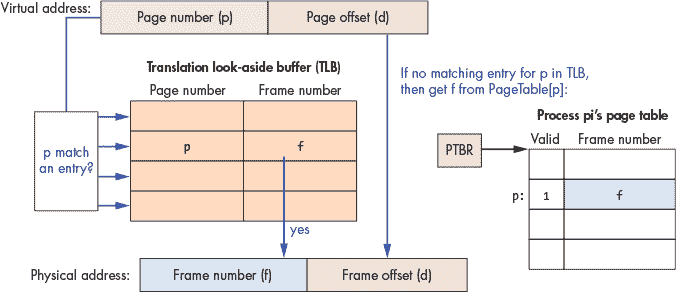

*图 13-25：翻译查找缓冲区（TLB）是一个小型硬件缓存，用于存储虚拟页到物理帧的映射。首先搜索 TLB 中是否有页* p *的条目。如果找到，则无需进行页表查找即可将虚拟地址转换为物理地址。*

### 13.4 进程间通信

进程是操作系统实现的主要抽象之一。私有虚拟地址空间在多道程序设计系统中是一个重要的抽象，并且是操作系统防止进程相互干扰执行状态的一种方式。然而，有时用户或程序员可能希望他们的应用程序进程在运行时能够相互通信（或共享某些执行状态）。

操作系统通常实现对几种类型的进程间通信的支持，即进程间如何通信或共享执行状态的方式。*信号*是一种非常受限的进程间通信形式，允许一个进程向另一个进程发送信号，以通知其某个事件。进程还可以使用*消息传递*进行通信，在这种方式中，操作系统实现了一种消息通信通道的抽象，进程通过该通道与另一个进程交换消息。最后，操作系统还可能通过*共享内存*支持进程间通信，允许进程与其他进程共享其虚拟地址空间的全部或部分内容。具有共享内存的进程可以读写共享空间中的地址，以便与其他进程进行通信。

#### 13.4.1 信号

*信号*是一种由一个进程通过操作系统发送到另一个进程的软件中断。当一个进程接收到信号时，操作系统会中断其当前执行点，以运行信号处理程序代码。如果信号处理程序返回，进程将继续从中断点恢复执行，继续处理信号。有时，信号处理程序会导致进程退出，因此进程不会从中断点继续执行。

信号与硬件中断和陷阱类似，但又不同于这两者。陷阱是一种同步的软件中断，发生在进程显式调用系统调用时，而信号是异步的——进程在执行的任何时候可能会被接收到的信号中断。信号与异步硬件中断的不同之处在于，信号是由软件触发的，而不是由硬件设备触发的。

进程可以通过执行`kill`系统调用向另一个进程发送信号，该系统调用请求操作系统将信号发送给目标进程。操作系统负责将信号传递给目标进程，并设置其执行状态，以运行与该信号关联的信号处理程序代码。

**注意**

`kill`系统调用的名称可能会令人误解，并且不幸的是，它带有暴力意味。尽管它可以（且经常）用于发送终止信号，但它也用于向进程发送任何其他类型的信号。

操作系统本身也使用信号来通知进程某些事件。例如，操作系统会在某个子进程退出时，向进程发送`SIGCHLD`信号。

系统定义了固定数量的信号（例如，Linux 定义了 32 个不同的信号）。因此，信号提供了一种有限的方式供进程之间进行通信，与其他进程间通信方法（如消息传递或共享内存）不同。

表 13-6 列出了部分定义的信号。有关更多示例，请参见手册页（`man 7 signal`）。

**表 13-6：** 用于进程间通信的示例信号

| **信号** | **描述** |
| --- | --- |
| `SIGSEGV` | 段错误（例如，解引用空指针） |
| `SIGINT` | 中断进程（例如，在终端窗口中按 CTRL-C 来终止进程） |
| `SIGCHLD` | 子进程已退出（例如，子进程在执行`exit`后变成僵尸进程） |
| `SIGALRM` | 当定时器超时时通知进程（例如，每 2 秒调用一次`alarm(2)`） |
| `SIGKILL` | 终止一个进程（例如，`pkill -9 a.out`） |
| `SIGBUS` | 总线错误（例如，访问一个未对齐的内存地址以访问`int`值） |
| `SIGSTOP` | 挂起一个进程，进入阻塞状态（例如，CTRL-Z） |
| `SIGCONT` | 继续一个被阻塞的进程（将其移至就绪状态；例如，使用`bg`或`fg`） |

当一个进程接收到信号时，可以发生以下几种默认操作：进程可以终止，信号可以被忽略，进程可以被阻塞，或者进程可以被解除阻塞。

操作系统为每个信号编号定义了默认的行为，并提供了默认的信号处理代码。然而，应用程序开发者可以更改大多数信号的默认行为，并编写自己的信号处理函数。如果应用程序未为某个信号注册自定义的信号处理函数，那么当进程接收到该信号时，操作系统的默认处理程序将执行。对于某些信号，操作系统定义的默认行为无法被应用程序的信号处理程序覆盖。例如，如果一个进程接收到`SIGKILL`信号，操作系统将强制终止该进程，而接收到`SIGSTOP`信号时，进程将一直阻塞，直到接收到继续信号（`SIGCONT`）或终止信号（`SIGKILL`）。

Linux 支持两种不同的系统调用，可以用来更改信号的默认行为或为特定信号注册信号处理函数：`sigaction`和`signal`。由于`sigaction`符合 POSIX 标准并且功能更丰富，因此应在生产软件中使用。然而，我们在示例代码中使用`signal`，因为它更易于理解。

以下是一个示例程序^(3)，通过`signal`系统调用注册了`SIGALRM`、`SIGINT`和`SIGCONT`信号的信号处理函数（为了提高可读性，错误处理部分被省略）：

```

/*

 * Example of signal handlers for SIGALRM, SIGINT, and SIGCONT

 *

 * A signal handler function prototype must match:

 *   void handler_function_name(int signum);

 *

 * Compile and run this program, then send this process signals by executing:

 *  kill -INT  pid  (or Ctrl-C) will send a SIGINT

 *  kill -CONT pid  (or Ctrl-Z fg) will send a SIGCONT

 */

#include <stdio.h>

#include <stdlib.h>

#include <unistd.h>

#include <signal.h>

/* signal handler for SIGALRM */

void sigalarm_handler(int sig) {

    printf("BEEP, signal number %d\n.", sig);

    fflush(stdout);

    alarm(5);  /* sends another SIGALRM in 5 seconds */

}

/* signal handler for SIGCONT */

void sigcont_handler(int sig) {

    printf("in sigcont handler function, signal number %d\n.", sig);

    fflush(stdout);

}

/* signal handler for SIGINT */

void sigint_handler(int sig) {

    printf("in sigint handler function, signal number %d...exiting\n.", sig);

    fflush(stdout);

    exit(0);

}

/* main: register signal handlers and repeatedly block until receive signal */

int main() {

    /* Register signal handlers. */

    if (signal(SIGCONT, sigcont_handler) == SIG_ERR) {

        printf("Error call to signal, SIGCONT\n");

        exit(1);

    }

    if (signal(SIGINT, sigint_handler) == SIG_ERR) {

        printf("Error call to signal, SIGINT\n");

        exit(1);

    }

    if (signal(SIGALRM, sigalarm_handler) == SIG_ERR) {

        printf("Error call to signal, SIGALRM\n");

        exit(1);

    }

    printf("kill -CONT %d to send SIGCONT\n", getpid());

    alarm(5);  /* sends a SIGALRM in 5 seconds */

    while(1) {

        pause(); /* wait for a signal to happen */

    }

} 
```

在运行时，进程每隔 5 秒钟接收到一个`SIGALRM`信号（由于`main`函数中的`alarm`和`sigalarm_handler`）。`SIGINT`和`SIGCONT`信号可以通过在另一个 Shell 中运行`kill`或`pkill`命令来触发。例如，如果进程的 PID 是 1234 且可执行文件是`a.out`，那么以下 Shell 命令会发送`SIGINT`和`SIGCONT`信号给该进程，从而触发其信号处理函数运行：

```

$ pkill -INT a.out

$ kill  -INT 1234

$ pkill -CONT a.out

$ kill  -CONT 1234

```

##### 编写 SIGCHLD 处理函数

记住，当一个进程终止时，操作系统会向其父进程发送一个`SIGCHLD`信号。在创建子进程的程序中，父进程并不总是希望在调用`wait`时阻塞，直到其子进程退出。例如，当一个 Shell 程序在后台运行命令时，它会与子进程并发运行，同时在前台处理其他 Shell 命令，而子进程则在后台运行。然而，父进程仍然需要调用`wait`来回收已退出的僵尸子进程。如果不这样做，僵尸进程将永远不会死亡，并且会继续占用一些系统资源。在这种情况下，父进程可以注册一个`SIGCHLD`信号处理函数。当父进程接收到已退出的子进程发来的`SIGCHLD`时，其处理程序代码将执行，并调用`wait`回收僵尸子进程。

以下是一个代码片段，展示了如何实现一个处理`SIGCHLD`信号的信号处理函数。该片段还展示了`main`函数的一部分，注册了处理`SIGCHLD`信号的信号处理函数（请注意，这应该在任何调用`fork`之前完成）：

```

/*

 * signal handler for SIGCHLD: reaps zombie children

 *  signum: the number of the signal (will be 20 for SIGCHLD)

 */

void sigchld_handler(int signum) {

    int status;

    pid_t pid;

    /*

     * reap any and all exited child processes

     * (loop because there could be more than one)

     */

    while( (pid = waitpid(-1, &status, WNOHANG)) > 0) {

        /* uncomment debug print stmt to see what is being handled

        printf("signal %d me:%d child: %d\n", signum, getpid(), pid);

         */

    }

}

int main() {

    /* register SIGCHLD handler: */

    if ( signal(SIGCHLD, sigchild_handler) == SIG_ERR) {

        printf("ERROR signal failed\n");

    exit(1);

    }

    ...

    /* create a child process */

    pid = fork();

    if(pid == 0) {

        /* child code...maybe call execvp */

        ...

    }

    /* the parent continues executing concurrently with child */

    ...

```

这个示例将–1 作为 PID 传递给`waitpid`，这意味着“回收任何僵尸子进程”。它还传递了`WNOHANG`标志，这意味着如果没有僵尸子进程可回收，`waitpid`调用不会阻塞。还要注意，`waitpid`是在`while`循环中调用的，只要它返回有效的 PID 值（只要它回收了一个僵尸子进程），循环就会继续。信号处理程序函数在循环中调用`waitpid`非常重要，因为在信号处理程序运行时，进程可能会接收到来自其他已退出子进程的额外`SIGCHLD`信号。操作系统不会跟踪进程接收到的`SIGCHLD`信号的数量，它只会记录进程收到了`SIGCHLD`信号并中断执行以运行处理程序代码。因此，如果没有循环，信号处理程序可能会错过回收一些僵尸子进程。

信号处理程序会在父进程接收到`SIGCHLD`信号时执行，无论父进程是否在调用`wait`或`waitpid`时被阻塞。如果父进程在接收到`SIGCHLD`信号时被阻塞在`wait`调用上，它会被唤醒并执行信号处理程序代码，以回收一个或多个僵尸子进程。然后，它会在程序中继续执行，跳到`wait`调用后的代码位置（因为它刚刚回收了一个已退出的子进程）。然而，如果父进程在调用`waitpid`等待特定子进程时被阻塞，那么在信号处理程序代码执行完毕回收了已退出的子进程后，父进程可能会继续阻塞，也可能会不再阻塞。如果信号处理程序代码回收了父进程正在等待的子进程，则父进程会在`waitpid`调用后继续执行。否则，父进程会继续在`waitpid`调用上阻塞，等待指定子进程退出。如果`waitpid`调用中传入的子进程 PID 不存在（可能是之前在信号处理程序循环中已回收的子进程），则不会阻塞调用者。

#### 13.4.2 消息传递

进程在拥有私有虚拟地址空间的情况下进行通信的一种方式是通过*消息传递*——通过相互发送和接收消息。消息传递使程序能够交换任意数据，而不仅仅是像信号所支持的那样的一小部分预定义消息。而且操作系统通常会实现几种不同类型的消息传递抽象，供进程用于通信。

消息传递进程间通信模型由三部分组成：

1\. 进程从操作系统分配某种类型的消息通道。示例消息通道类型包括用于单向通信的*管道*，以及用于双向通信的*套接字*。进程可能需要执行额外的连接设置步骤，以配置消息通道。

2\. 进程使用消息通道相互发送和接收消息。

3\. 进程在完成使用消息通道后关闭该通道的一端。

*管道*是一个单向通信通道，用于在同一台机器上运行的两个进程之间。单向意味着管道的一端仅用于发送消息（或写入），而另一端仅用于接收消息（或读取）。管道通常在 shell 命令中用于将一个进程的输出传递给另一个进程的输入。

例如，考虑以下在 bash shell 提示符下输入的命令，它在两个进程之间创建了一个管道（`cat` 进程输出文件 `foo.c` 的内容，而管道（`|`）将该输出重定向到 `grep` 命令的输入，后者在其输入中搜索字符串“factorial”）：

```
$ cat foo.c | grep factorial
```

执行此命令时，bash shell 进程调用 `pipe` 系统调用，请求操作系统创建一个管道通信。该管道将被 shell 的两个子进程（`cat` 和 `grep`）使用。shell 程序将 `cat` 进程的 `stdout` 设置为写入管道的写入端，并将 `grep` 进程的 `stdin` 设置为从管道的读取端读取，以便当子进程被创建并运行时，`cat` 进程的输出将作为输入传递给 `grep` 进程（见 图 13-26）。

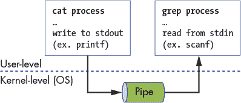

*图 13-26：管道是用于同一系统上进程之间的单向通信通道。在此示例中，`cat` 进程通过写入管道的写端将信息发送给 `grep` 进程。`grep` 进程通过从管道的读端读取该信息来接收数据。*

虽然管道仅以单向方式传输数据，但其他消息传递抽象允许进程在两个方向上进行通信。*套接字*是一个双向通信通道，这意味着套接字的每一端都可以用于发送和接收消息。套接字可以被同一计算机上或通过网络连接的不同计算机上的通信进程使用（见 图 13-27）。这些计算机可能通过*局域网*（LAN）连接，局域网连接小范围内的计算机，例如大学计算机科学系的网络。通信进程也可以位于不同的局域网上，并通过互联网连接。只要两台机器之间存在某种网络连接路径，进程就可以使用套接字进行通信。

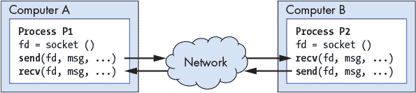

*图 13-27：套接字是双向通信通道，通信过程可以在不同机器上的进程之间通过网络连接使用。*

因为每台个人计算机都是自己的系统（硬件和操作系统），并且因为一个系统上的操作系统不知道或管理另一个系统上的资源，所以消息传递是不同计算机上的进程可以进行通信的唯一方式。为了支持这种类型的通信，操作系统需要实现一种通用的消息传递协议，用于通过网络发送和接收消息。TCP/IP 是可用于通过互联网发送消息的消息传递协议的一个例子。当一个进程想要向另一个进程发送消息时，它会进行`send`系统调用，向操作系统传递它想要传输的套接字、消息缓冲区以及可能有关消息或其预期接收者的其他信息。操作系统负责将消息打包到消息缓冲区并将其发送到网络上的其他机器。当操作系统从网络接收到消息时，它会解包消息并将其传递给系统上请求接收消息的进程。此进程可能处于阻塞状态，等待消息到达。在这种情况下，收到消息会使进程准备好再次运行。

在消息传递的顶层上构建了许多系统软件抽象，隐藏了程序员的消息传递细节。然而，任何在不同计算机上运行的进程之间的通信都必须在最低层次上使用消息传递（通过共享内存或信号进行通信对在不同系统上运行的进程不是一个选择）。在第十五章中，我们将更详细地讨论消息传递及其上面构建的抽象。

#### 13.4.3 共享内存

使用套接字进行消息传递对于在同一台机器上运行的进程之间和在不同机器上运行的进程之间的双向通信非常有用。然而，当两个进程在同一台机器上运行时，它们可以利用共享系统资源来比使用消息传递更高效地进行通信。

例如，操作系统可以通过允许进程共享它们的虚拟地址空间的全部或部分来支持进程间通信。一个进程可以读取和写入共享部分的地址空间，以与共享同一内存区域的其他进程通信。

操作系统可以通过设置两个或更多进程的页表条目来实现部分地址空间共享，将它们映射到相同的物理帧。图 13-28 展示了一个映射的例子。为了通信，一个进程向共享页上的地址写入一个值，另一个进程随后读取该值。

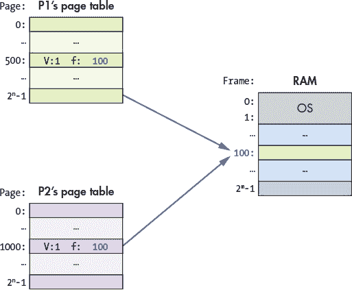

*图 13-28：操作系统可以通过将共享进程的页表中的条目设置为相同的物理帧号（例如，帧 100），来支持共享虚拟地址空间的页面。请注意，进程不需要使用相同的虚拟地址来引用共享的物理内存页面。*

如果操作系统支持部分共享内存，那么它会实现一个接口，供程序员创建并附加到共享内存页（或共享区域/段）。在 Unix 系统中，系统调用`shmget`用于创建或附加到共享内存段。每个共享内存段对应一组连续的虚拟地址，这些虚拟地址的物理映射与其他附加到相同共享内存段的进程共享。

操作系统通常还支持共享单一的完整虚拟地址空间。*线程*是操作系统对执行控制流的抽象。一个进程在单一虚拟地址空间中有一个执行控制流的线程。一个多线程进程在单一的共享虚拟地址空间中有多个并发的执行控制流的线程——所有线程共享其所属进程的完整虚拟地址空间。

线程可以通过读取和写入它们的公共地址空间中的共享位置来轻松共享执行状态。例如，如果一个线程更改了全局变量的值，所有其他线程都会看到该变化的结果。

在多处理器系统（SMP 或多核）中，多线程进程的各个线程可以被调度在多个核心上同时运行，*并行*。在第十四章中，我们将更详细地讨论线程和并行多线程编程。

### 13.5 小结与其他操作系统功能

在本章中，我们研究了操作系统是什么、它是如何工作的，以及它在计算机上运行应用程序时所扮演的角色。作为计算机硬件和应用程序之间的系统软件层，操作系统高效地管理计算机硬件，并实现了使计算机更易于使用的抽象。操作系统实现了两个抽象：进程和虚拟内存，以支持多任务处理（允许计算机系统上同时运行多个程序）。操作系统跟踪系统中的所有进程及其状态，并实现了在 CPU 核心上运行进程的上下文切换。操作系统还为进程提供了一种方式，可以创建新进程、退出进程以及进程之间相互通信。通过虚拟内存，操作系统实现了每个进程的私有虚拟内存空间抽象。虚拟内存抽象保护进程不受其他进程共享计算机物理内存空间影响。分页是虚拟内存的一种实现方式，它将每个进程的虚拟地址空间中的单独页面映射到物理 RAM 空间的帧上。虚拟内存也是操作系统更高效利用 RAM 的一种方式；通过将 RAM 视为磁盘的缓存，它允许虚拟内存空间的页面存储在 RAM 或磁盘上。

本章中我们关注的是操作系统在运行程序中的角色，包括操作系统为了高效运行程序而实现的抽象和机制，但这只是一个片面的介绍。关于进程和进程管理、虚拟内存和内存管理，实际上还有很多其他的实现选项、细节以及政策问题。此外，操作系统还实现了许多其他重要的抽象、功能和政策，用于管理和使用计算机。例如，操作系统实现了文件系统抽象以访问存储数据，保护机制和安全策略用于保护用户和系统，调度策略用于不同操作系统和硬件资源的管理。

现代操作系统还实现了对进程间通信、网络和并行分布式计算的支持。此外，大多数操作系统还包括*虚拟机监控程序*支持，该支持将系统硬件虚拟化，并允许主机操作系统运行多个虚拟的来宾操作系统。虚拟化支持主机操作系统管理计算机硬件的启动，并在其上运行多个其他操作系统，每个操作系统都拥有自己独立的虚拟化视图，能够访问底层硬件。主机操作系统的虚拟机监控程序支持管理虚拟化，包括保护和共享底层物理资源，供来宾操作系统使用。

最后，大多数操作系统提供一定程度的可扩展性，用户（通常是系统管理员）可以对操作系统进行调优。例如，大多数类 Unix 系统允许用户（通常需要 root 或超级用户权限）更改操作系统缓冲区、缓存、交换分区的大小，并从操作系统子系统和硬件设备中选择不同的调度策略。通过这些修改，用户可以根据其运行的应用程序负载类型来调整系统。这些类型的操作系统通常支持*可加载内核模块*，这是一种可以加载到内核中并在内核模式下运行的可执行代码。可加载内核模块常用于向内核添加额外的抽象或功能，以及加载设备驱动程序代码到内核中，以处理管理特定硬件设备。有关操作系统的更广泛和深入的内容，我们推荐阅读操作系统教材，如 *操作系统：三大基础*。^(4)

### 注释

1. Meltdown 和 Spectre. *[`meltdownattack.com/`](https://meltdownattack.com/)*

2. 可在 *[`diveintosystems.org/book/C13-OS/_attachments/fork.c`](https://diveintosystems.org/book/C13-OS/_attachments/fork.c)* 上获取。

3. 可在 *[`diveintosystems.org/book/C13-OS/_attachments/signals.c`](https://diveintosystems.org/book/C13-OS/_attachments/signals.c)* 上获取。

4. Remzi H. Arpaci-Dusseau 和 Andrea C. Arpaci-Dusseau，*操作系统：三大基础*，Arpaci-Dusseau Books，2018 年。
