# 第十五章：在多核时代利用共享内存

*世界改变了。*

*我在硅中感受到它。*

*我在晶体管中感受到了它。*

*我在核心中看到了它。*

*——向加拉德丽尔致歉*

《指环王：护戒使者》


到目前为止，我们讨论的架构集中在纯单 CPU 世界中。但世界已经发生了变化。今天的 CPU 拥有多个*核心*或计算单元。在本章中，我们将讨论多核架构，并介绍如何利用它们加速程序的执行。

**注意：CPU、处理器与核心**

本章中的许多实例中，*处理器*和*中央处理器（CPU）*这两个术语是可以互换使用的。从根本上讲，*处理器*是执行外部数据计算的任何电路。根据这个定义，*中央处理单元（CPU）*是一个处理器的例子。具有多个计算核心的处理器或 CPU 被称为*多核处理器*或*多核 CPU*。*核心*是一个计算单元，包含构成经典 CPU 的许多组件：算术逻辑单元（ALU）、寄存器和一些缓存。虽然*核心*与处理器不同，但在文献中看到这些术语互换使用并不罕见（尤其是在文献出现在多核处理器还被认为是新兴技术的时期）。

1965 年，英特尔创始人戈登·摩尔估计，集成电路中的晶体管数量每年会翻一番。他的预测，现在被称为*摩尔定律*，后来被修正为晶体管数量每*两年*翻一番。尽管电子开关从巴尔登的晶体管演变为现代计算机中使用的微型芯片晶体管，摩尔定律在过去 50 年里依然有效。然而，千年之交，处理器设计遇到了几个关键的性能瓶颈：

*内存墙*：内存技术的进步没有跟上时钟速度的提升，导致内存成为性能的瓶颈。因此，持续加速 CPU 的执行不再能改善其整体系统性能。

*功率墙*：增加处理器上的晶体管数量必然会提高该处理器的温度和功耗，从而增加为系统提供电力和散热的成本。随着多核系统的普及，电力已成为计算机系统设计中的主要问题。

电力和内存瓶颈促使计算机架构师改变了设计处理器的方式。与其增加更多晶体管来提高 CPU 执行单一指令流的速度，架构师开始在 CPU 中增加多个*计算核心*。计算核心是简化的处理单元，包含比传统 CPU 更少的晶体管，且通常更容易制造。在一个 CPU 上组合多个核心可以让 CPU 同时执行*多个*独立的指令流。

**警告：更多核心 != 更好**

可能会让人产生误解，认为所有核心都是相同的，并且计算机核心越多，性能就越好。但事实并非如此！例如，*图形处理单元*（GPU）核心比 CPU 核心的晶体管还要少，并且专门用于涉及向量的特定任务。一个典型的 GPU 可能有 5000 个或更多 GPU 核心。然而，GPU 核心在它们能够执行的操作类型上是有限制的，并且并不总是适合像 CPU 核心那样的通用计算。使用 GPU 进行计算被称为*多核*计算。在本章中，我们集中讨论*多核*计算。有关多核计算的讨论，请参见第十五章。

##### 更深入的探讨：多少个核心？

几乎所有现代计算机系统都有多个核心，包括像树莓派这样的微型设备。^(1) 确定系统上的核心数量对于准确衡量多核程序的性能至关重要。在 Linux 和 macOS 计算机上，`lscpu` 命令提供了系统架构的摘要。在以下示例中，我们展示了在一台样本机器上运行 `lscpu` 命令时的输出（部分输出被省略，以强调关键特性）：

```

$ lscpu

Architecture:          x86_64

CPU op-mode(s):        32-bit, 64-bit

Byte Order:            Little Endian

CPU(s):                8

On-line CPU(s) list:   0-7

Thread(s) per core:    2

Core(s) per socket:    4

Socket(s):             1

Model name:            Intel(R) Core(TM) i7-3770 CPU @ 3.40GHz

CPU MHz:               1607.562

CPU max MHz:           3900.0000

CPU min MHz:           1600.0000

L1d cache:             32K

L1i cache:             32K

L2 cache:              256K

L3 cache:              8192K

...
```

`lscpu` 命令提供了很多有用的信息，包括处理器类型、核心速度和核心数量。要计算系统中的*物理*（或实际）核心数，需将插槽数量与每个插槽的核心数相乘。前面示例中显示的 `lscpu` 输出表明，该系统有一个插槽，每个插槽有四个核心，总共有四个物理核心。

超线程

刚开始看，可能会觉得前面的示例系统总共有八个核心。毕竟，“CPU(s)”字段似乎暗示了这一点。然而，这个字段实际上表示的是*超线程*（逻辑）核心的数量，而不是物理核心的数量。超线程技术，或称为同时多线程（SMT），使得在单个核心上可以高效地处理多个线程。虽然超线程可以减少程序的总体运行时间，但超线程核心的性能提升并不像物理核心那样按相同比例增长。然而，如果某个任务处于空闲状态（例如，由于控制冒险，参见第 279 页的“流水线冒险：控制冒险”部分），另一个任务仍然可以使用该核心。简而言之，超线程的引入是为了提高*进程吞吐量*（即在给定时间内完成的进程数量），而不是*进程加速*（即衡量单个进程的运行时间改善）。在接下来的章节中，我们将重点讨论加速。

### 14.1 编程多核系统

今天大多数程序员所熟知的常见编程语言是在多核时代之前创建的。因此，许多语言无法*隐式*（或自动）利用多核处理器来加速程序的执行。相反，程序员必须专门编写软件，以利用系统中的多个核心。

#### 14.1.1 多核系统对进程执行的影响

回想一下，进程可以被视为正在运行的程序的抽象（参见第 624 页的“进程”部分）。每个进程在其自己的虚拟地址空间中执行。操作系统（OS）将进程安排在 CPU 上执行；当 CPU 切换到执行其他进程时，就会发生*上下文切换*。

图 14-1 展示了五个示例进程如何在单核 CPU 上执行。

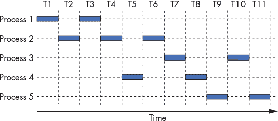

*图 14-1：五个进程在共享单个 CPU 核心时的执行时间序列*

水平轴表示时间，每个时间片占用一个单位时间。一个框表示进程正在使用单核 CPU 的时段。假设每个进程在发生上下文切换之前会执行完整的时间片。因此，进程 1 在时间步骤 T1 和 T3 期间使用 CPU。

在这个例子中，进程执行的顺序是 P1、P2、P1、P2、P4、P2、P3、P4、P5、P3、P5。我们在这里花点时间区分两种时间度量。*CPU 时间*衡量一个进程在 CPU 上执行的时间。相比之下，*实时时间*衡量一个人感知到的进程完成所需的时间。由于上下文切换的存在，实时时间通常比 CPU 时间长得多。例如，进程 1 的 CPU 时间需要两个时间单位，而其实时时间需要三个时间单位。

当一个进程的总执行时间与另一个进程重叠时，进程是*并发*执行的。操作系统在单核时代使用并发性，给人一种计算机可以同时执行许多任务的假象（例如，你可以同时打开计算器程序、网页浏览器和文字处理文档）。实际上，每个进程是串行执行的，操作系统决定了进程执行和完成的顺序（通常在后续运行中有所不同）；参见第 625 页的“多任务处理与上下文切换”。

回到这个例子，观察到进程 1 和进程 2 是并发执行的，因为它们的执行在 T2 到 T4 时间点重叠。同样，进程 2 与进程 4 并发执行，因为它们的执行在 T4 到 T6 时间点重叠。相反，进程 2 与进程 3*不*并发执行，因为它们的执行没有重叠；进程 3 仅在 T7 时开始执行，而进程 2 在 T6 时完成。

多核 CPU 使操作系统能够将不同的进程调度到每个可用的核心，从而允许进程*同时*执行。多个核心上运行的进程指令同时执行被称为*并行执行*。图 14-2 展示了我们示例中的进程如何在双核系统上执行。

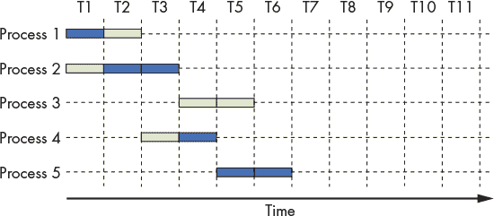

*图 14-2：五个进程的执行时间序列，扩展为包括两个 CPU 核心（一个为深灰色，另一个为浅灰色）*

在这个例子中，两个 CPU 核心的颜色不同。假设进程执行顺序再次为 P1、P2、P1、P2、P4、P2、P3、P4、P5、P3、P5。多个核心的存在使得某些进程能够*更早*执行。例如，在时间单位 T1 时，第一个核心执行进程 1，而第二个核心执行进程 2。到时间 T2，第一个核心执行进程 2，而第二个核心执行进程 1。因此，进程 1 在 T2 时间后完成执行，而进程 2 在 T3 时间完成执行。

请注意，多个进程的并行执行仅增加了在任意时刻执行的进程数量。在图 14-2 中，所有进程都在时间单位 T7 前完成执行。然而，每个进程仍然需要相同的 CPU 时间来完成，如图 14-1 所示。例如，进程 2 无论是在单核系统还是多核系统上执行，都需要三个时间单位（即其*CPU 时间*保持不变）。多核处理器增加了进程执行的*吞吐量*，即在给定时间内可以完成的进程数量。因此，即使单个进程的 CPU 时间保持不变，其墙钟时间可能会减少。

#### 14.1.2 使用线程加速进程执行

加速单个进程执行的一种方法是将其分解为轻量级、独立的执行流，称为*线程*。图 14-3 展示了当一个进程被两个线程多线程化时，其虚拟地址空间如何变化。尽管每个线程都有自己的私有调用栈内存分配，但所有线程都*共享*多线程进程的程序数据、指令和堆内存。

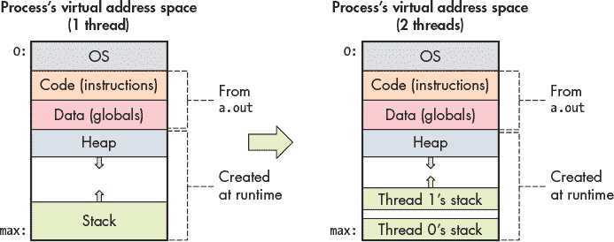

*图 14-3：比较单线程进程和有两个线程的多线程进程的虚拟地址空间*

操作系统调度线程的方式与调度进程的方式相同。在多核处理器上，操作系统通过将不同的线程调度到不同的核心上来加速多线程程序的执行。可以并行执行的最大线程数等于系统中物理核心的数量。如果线程数超过物理核心数，剩余的线程必须等待轮到它们执行（类似于进程在单核上执行的方式）。

##### 示例：标量乘法

作为如何使用多线程加速应用程序的初步示例，考虑对数组`array`和某个整数`s`进行标量乘法的问题。在标量乘法中，数组中的每个元素都通过与`s`相乘来进行缩放。

一个标量乘法函数的串行实现如下：

```

void scalar_multiply(int * array, long length, int s) {

    for (i = 0; i < length; i++) {

      array[i] = array[i] * s;

    }

}
```

假设`array`有*N*个元素。要创建一个具有*t*个线程的多线程版本应用程序，必须：

1\. 创建*t*个线程。

2\. 给每个线程分配输入数组的一个子集（即*N*/*t*个元素）。

3\. 指示每个线程将其数组子集中的元素与`s`相乘。

假设`scalar_multiply`的串行实现需要 60 秒来乘以一个包含 1 亿个元素的输入数组。为了构建一个使用*t* = 4 个线程执行的版本，我们将总输入数组的四分之一（2500 万个元素）分配给每个线程。

图 14-4 显示了在单核上运行四个线程时的情况。如前所述，执行顺序由操作系统决定。在这个场景下，假设线程的执行顺序为线程 1、线程 3、线程 2、线程 4。在单核处理器（由方块表示）上，每个线程按顺序执行。因此，运行在一个核心上的多线程过程仍然需要 60 秒才能运行（考虑到创建线程的开销，可能稍微长一些）。

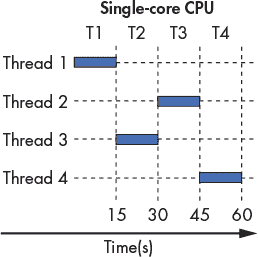

*图 14-4：在单核 CPU 上运行四个线程*

现在假设我们在双核系统上运行我们的多线程进程。图 14-5 显示了结果。再次假设 *t* = 4 个线程，线程执行顺序为 线程 1、线程 3、线程 2、线程 4。我们的两个核心由阴影方块表示。由于系统是双核，线程 1 和线程 3 在时间步 T1 内并行执行。然后，线程 2 和线程 4 在时间步 T2 内并行执行。因此，原本需要 60 秒运行的多线程进程现在只需 30 秒。

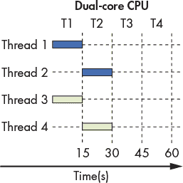

*图 14-5：在双核 CPU 上运行四个线程*

最后，假设多线程进程（*t* = 4）在四核 CPU 上运行。图 14-6 显示了这样的执行序列。图 14-6 中的四个核心分别用不同的阴影表示。在四核系统中，每个线程在时间片 T1 内并行执行。因此，在四核 CPU 上，原本需要 60 秒的多线程进程现在只需 15 秒。

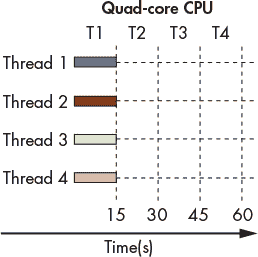

*图 14-6：在四核 CPU 上运行四个线程*

一般来说，如果线程数与核心数（*c*）匹配，并且操作系统将每个线程调度到不同的核心并行执行，那么多线程进程的运行时间大约是 1/*c*。这种线性加速是理想的，但在实践中并不常见。例如，如果有很多其他进程（或多线程进程）在等待使用 CPU，它们会争夺有限的核心数量，从而导致进程之间的*资源争用*。如果指定的线程数超过了 CPU 核心数，每个线程就必须等待轮到它执行。我们将在“页面 709”的“测量并行程序性能”一节中探讨其他经常阻碍线性加速的因素。

### 14.2 你好，线程！编写你的第一个多线程程序

本节我们将讨论无处不在的 POSIX 线程库 *Pthreads*。POSIX 是可移植操作系统接口的缩写，它是一个 IEEE 标准，规定了 UNIX 系统的外观、行为和感觉。POSIX 线程 API 几乎可以在所有类 UNIX 操作系统上使用，每个系统都完全或在很大程度上遵循该标准。因此，如果你在 Linux 机器上使用 POSIX 线程编写并行代码，它肯定可以在其他 Linux 机器上运行，并且很可能也能在运行 macOS 或其他 UNIX 变种的机器上运行。

让我们从分析一个“Hello World”Pthreads 程序开始。^(2) 为了简洁，我们在列表中省略了错误处理，尽管可下载版本包含了示例错误处理。

```

#include <stdio.h>

#include <stdlib.h>

#include <pthread.h>

/* The "thread function" passed to pthread_create.  Each thread executes this

 * function and terminates when it returns from this function. */

void *HelloWorld(void *id) {

/* We know the argument is a pointer to a long, so we cast it from a

     * generic (void *) to a (long *). */

    long *myid = (long *) id;

    printf("Hello world! I am thread %ld\n", *myid);

    return NULL; // We don't need our threads to return anything.

}

int main(int argc, char **argv) {

    int i;

    int nthreads; //number of threads

    pthread_t *thread_array; //pointer to future thread array

    long *thread_ids;

    // Read the number of threads to create from the command line.

    if (argc !=2) {

        fprintf(stderr, "usage: %s <n>\n", argv[0]);

        fprintf(stderr, "where <n> is the number of threads\n");

        return 1;

    }

    nthreads = strtol(argv[1], NULL, 10);

    // Allocate space for thread structs and identifiers.

    thread_array = malloc(nthreads * sizeof(pthread_t));

    thread_ids = malloc(nthreads * sizeof(long));

    // Assign each thread an ID and create all the threads.

    for (i = 0; i < nthreads; i++) {

        thread_ids[i] = i;

        pthread_create(&thread_array[i], NULL, HelloWorld, &thread_ids[i]);

    }

    /* Join all the threads. Main will pause in this loop until all threads

     * have returned from the thread function. */

    for (i = 0; i < nthreads; i++) {

        pthread_join(thread_array[i], NULL);

    }

    free(thread_array);

    free(thread_ids);

    return 0;

} 
```

让我们将这个程序分解成更小的组件。注意包括了`pthread.h`头文件，它声明了`pthread`类型和函数。接下来，`HelloWorld`函数定义了*线程函数*，我们稍后将其传递给`pthread_create`。线程函数类似于工作线程（创建线程）的`main`函数——线程从线程函数的开始处开始执行，直到到达末尾时终止。每个线程使用其私有的执行状态（即它自己的堆栈内存和寄存器值）执行线程函数。还需注意，线程函数的类型为`void *`。在此上下文中指定*匿名指针*，允许程序员编写可以处理不同类型参数和返回值的线程函数（参见第 222 页的《void *类型和类型重 casting》）。最后，在`main`函数中，主线程初始化程序状态后，创建并连接工作线程。

#### 14.2.1 创建和连接线程

该程序首先作为单线程进程启动。在执行`main`函数时，它读取要创建的线程数，并为两个数组分配内存：`thread_array`和`thread_ids`。`thread_array`数组包含为每个创建的线程分配的地址集合。`thread_ids`数组存储传递给每个线程的参数集合。在此示例中，每个线程都会传递它的等级（或 ID，表示为`thread_ids[i]`）的地址。

在所有初始变量分配和初始化之后，`main`线程执行多线程的两个主要步骤：

+   *创建*步骤，其中主线程生成一个或多个工作线程。每个工作线程在生成后，在其自己的执行上下文中并发运行，与系统中的其他线程和进程共同执行。

+   *连接*步骤，其中主线程等待所有工作线程完成，然后继续作为单线程进程。连接一个已终止的线程会释放该线程的执行上下文和资源。尝试连接一个*未*终止的线程会阻塞调用者，直到该线程终止，类似于进程的`wait`函数的语义（参见第 635 页的《exit 和 wait》）。

Pthreads 库提供了`pthread_create`函数用于创建线程，`pthread_join`函数用于连接线程。`pthread_create`函数的签名如下：

```

pthread_create(pthread_t *thread, const pthread_attr_t *attr,

               void *thread_function, void *thread_args)

```

该函数接受一个指向线程结构体（类型为`pthread_t`）的指针，一个指向属性结构体的指针（通常设置为`NULL`），线程应执行的函数名称，以及启动时传递给线程函数的参数数组。

Hello World 程序在`main`函数中使用`pthread_create`调用：

```
pthread_create(&thread_array[i], NULL, HelloWorld, &thread_ids[i]);
```

这里：

+   `&thread_array[i]` 包含线程 *i* 的地址。`pthread_create` 函数分配一个 `pthread_t` 线程对象，并将其地址存储在此位置，使程序员能够稍后引用该线程（例如，在合并时）。

+   `NULL` 表示线程应该使用默认属性创建。在大多数程序中，将这个第二个参数留空为 `NULL` 是安全的。

+   `HelloWorld` 是创建的线程应该执行的线程函数的名称。这个函数就像线程的“主”函数。对于一个任意线程函数（例如，`function`），它的原型必须匹配 `void * function(void *)` 这种形式。

+   `&thread_ids[i]` 指定要传递给线程 *i* 的参数的地址。在这种情况下，`thread_ids[i]` 包含一个表示线程 ID 的单个 `long` 类型的值。由于 `pthread_create` 的最后一个参数必须是一个指针，因此我们传递线程 ID 的 *地址*。

为了生成多个执行 `HelloWorld` 线程函数的线程，程序为每个线程分配一个唯一的 ID，并在 `for` 循环中创建每个线程：

```

for (i = 0; i < nthreads; i++) {

    thread_ids[i] = i;

    pthread_create(&thread_array[i], NULL, HelloWorld, &thread_ids[i]);

}

```

操作系统调度每个创建的线程的执行；用户无法对线程执行的顺序做出任何假设。

`pthread_join` 函数会挂起调用者的执行，直到它引用的线程终止。其函数签名为：

```
pthread_join(pthread_t thread, void **return_val)
```

`pthread_join` 以 `pthread_t` 结构体为输入，指示要等待的线程，并且有一个可选的指针参数，指定线程的返回值应存储的位置。

`Hello World` 程序在 `main` 中使用以下代码调用 `pthread_join`：

```
pthread_join(thread_array[t], NULL);
```

这一行表示主线程必须等待线程 `t` 的终止。将 `NULL` 作为第二个参数传递表示程序不使用线程的返回值。

在之前的程序中，`main` 在循环中调用 `pthread_join`，因为 *所有* 工作线程需要在 `main` 函数继续清理内存并终止进程之前终止：

```
 for (i = 0; i < nthreads; i++) {

    pthread_join(thread_array[i], NULL);

} 
```

#### 14.2.2 线程函数

在之前的程序中，每个生成的线程都会打印 `Hello world! I am thread n`，其中 `n` 是线程的唯一标识符。在线程打印出消息后，它会终止。让我们更仔细地看看 `HelloWorld` 函数：

```

void *HelloWorld(void *id) {

    long *myid = (long*)id;

    printf("Hello world! I am thread %ld\n", *myid);

    return NULL;

}

```

回顾一下，`pthread_create`通过`thread_args`参数将参数传递给线程函数。在`main`中的`pthread_create`函数中，Hello World 程序指定该参数实际上是线程的 ID。注意，`HelloWorld`的参数必须声明为通用或匿名指针（`void *`）（参见第 126 页的《void *类型与类型重 casting》）。Pthreads 库使用`void *`使得`pthread_create`更加通用，不对参数类型进行限制。作为程序员，使用`void *`有些不方便，因为在使用之前必须进行类型转换。在这里，我们*知道*该参数是`long *`类型，因为我们在`main`中传递给`pthread_create`的就是这个类型。因此，我们可以安全地将其转换为`long *`并解引用指针以访问`long`值。许多并行程序遵循这种结构。

与线程函数的参数类似，Pthreads 库通过指定另一个`void *`来避免规定线程函数的返回类型：程序员可以自由地从线程函数中返回任何指针。如果程序需要访问线程的返回值，它可以通过`pthread_join`的第二个参数来获取。在我们的示例中，线程不需要返回值，因此它只是返回一个`NULL`指针。

#### 14.2.3 运行代码

接下来的命令展示了如何使用 GCC 编译程序。构建一个 Pthreads 应用程序需要将`-lpthread`链接器标志传递给 GCC，以确保 Pthreads 函数和类型是可访问的：

```
$ gcc -o hellothreads hellothreads.c -lpthread
```

在没有命令行参数的情况下运行程序会显示用法信息：

```
$ ./hellothreads

usage: ./hellothreads <n>

where <n> is the number of threads
```

使用四个线程运行程序会产生以下输出：

```
$ ./hellothreads 4

Hello world! I am thread 1

Hello world! I am thread 2

Hello world! I am thread 3

Hello world! I am thread 0
```

请注意，每个线程都会打印其唯一的 ID 号码。在此次运行中，线程 1 的输出最先显示，其次是线程 2、3 和 0。如果我们再次运行程序，可能会看到输出的顺序发生变化：

```
$ ./hellothreads 4

Hello world! I am thread 0

Hello world! I am thread 1

Hello world! I am thread 2

Hello world! I am thread 3
```

回顾一下，操作系统的调度器决定了线程的执行顺序。从用户的角度来看，由于受到许多用户无法控制的因素（例如可用系统资源、系统接收输入或操作系统调度等）的影响，顺序是*实际上是随机的*。由于所有线程都是并发执行的，并且每个线程都会调用`printf`（它会打印到`stdout`），因此，第一个打印到`stdout`的线程的输出将首先显示。后续的执行可能（或可能不会）导致不同的输出。

**警告 线程执行顺序**

你*永远*不要对线程执行的顺序做出任何假设。如果程序的正确性要求线程按特定顺序执行，你必须为程序添加同步机制（参见第 686 页的《线程同步》），以防止线程在不该运行的时候执行。

#### 14.2.4 再次探讨标量乘法

让我们探索如何从“示例：标量乘法”中创建一个多线程实现程序，见第 675 页。回顾我们并行化`scalar_multiply`的一般策略是创建多个线程，分配每个线程一个输入数组的子集，并指示每个线程将其数组子集中的元素与`s`相乘。

以下是一个线程函数，它完成了这个任务。注意，我们已将`array`、`length`和`s`移到程序的全局范围。

```

long *array; //allocated in main

long length; //set in main (1 billion)

long nthreads; //number of threads

long s; //scalar

void *scalar_multiply(void *id) {

    long *myid = (long *) id;

    int i;

    //assign each thread its own chunk of elements to process

    long chunk = length / nthreads;

    long start = *myid * chunk;

    long end  = start + chunk;

    if (*myid == nthreads - 1) {

        end = length;

    }

    //perform scalar multiplication on assigned chunk

    for (i = start; i < end; i++) {

        array[i] *= s;

    }

    return NULL;

}

```

我们将这部分内容分解成几个步骤。回想一下，第一步是为每个线程分配数组的一个部分。以下几行代码实现了这一任务：

```
long chunk = length / nthreads;

long start = *myid * chunk;

long end  = start + chunk;
```

变量`chunk`存储每个线程分配的元素数量。为了确保每个线程的工作量大致相同，我们首先将块大小设置为元素数量除以线程数量，即`length / nthreads`。

接下来，我们为每个线程分配一个不同的元素范围进行处理。每个线程使用`chunk`大小和其唯一的线程 ID 来计算其范围的`start`和`end`索引。

例如，使用四个线程（ID 为 0 到 3）操作一个包含 1 亿个元素的数组，每个线程负责处理一个 2500 万个元素的`chunk`。通过引入线程 ID，将为每个线程分配输入数据的唯一子集。

接下来的两行代码考虑了`length`不能被线程数量整除的情况：

```

if (*myid == nthreads - 1) {

    end = length;

}

```

假设我们指定了三个线程而不是四个线程。名义上的块大小将是 33,333,333 个元素，剩下一个元素没有被分配。前面的示例代码会将剩余的元素分配给最后一个线程。

**注意 创建平衡的输入**

上面展示的分块代码并不完美。在线程数量无法整除输入数据的情况下，余数将分配给最后一个线程。考虑一个样例运行，其中数组有 100 个元素，指定了 12 个线程。名义上的块大小是 8，余数是 4。使用示例代码时，前 11 个线程每个线程将分配 8 个元素，而最后一个线程将分配 12 个元素。因此，最后一个线程的工作量是其他线程的 50%。一种可能更好的分块方法是让前 4 个线程处理 9 个元素，而最后 8 个线程处理 8 个元素。这将有助于更好的*负载均衡*，使得各线程处理的输入量更加均衡。

在计算出合适的本地`start`和`end`索引后，每个线程现在准备在其数组部分上执行标量乘法操作。`scalar_multiply`函数的最后一部分完成了这一任务：

```

for (i = start; i < end; i++) {

    array[i] *= s;

}

```

#### 14.2.5 改进标量乘法：多个参数

前一个实现的一个关键弱点是广泛使用了全局变量。在我们在《程序内存的部分和作用域》中讨论过的内容中，虽然全局变量有用，但一般应该避免在 C 语言中使用全局变量。为了减少程序中的全局变量数量，一种解决方案是在全局作用域中声明一个`t_arg`结构体，如下所示：

```

struct t_arg {

    int *array; // pointer to shared array

    long length; // num elements in array

    long s; //scaling factor

    long numthreads; // total number of threads

    long id; //  logical thread id

};

```

我们的主函数除了分配`array`并设置局部变量`length`、`nthreads`和`s`（缩放因子）外，还会分配一个`t_arg`记录的数组：

```

long nthreads = strtol(argv[1], NULL, 10); //get number of threads

long length = strtol(argv[2], NULL, 10); //get length of array

long s = strtol( argv[3], NULL, 10 ); //get scaling factor

int *array = malloc(length*sizeof(int));

//allocate space for thread structs and identifiers

pthread_t *thread_array = malloc(nthreads * sizeof(pthread_t));

struct t_arg *thread_args = malloc(nthreads * sizeof(struct t_arg));

//Populate thread arguments for all the threads

for (i = 0; i < nthreads; i++){

    thread_args[i].array = array;

    thread_args[i].length = length;

    thread_args[i].s = s;

    thread_args[i].numthreads = nthreads;

    thread_args[i].id = i;

}

```

稍后在`main`中，当调用`pthread_create`时，线程相关的`t_args`结构体作为参数传递：

```

for (i = 0; i < nthreads; i++){

    pthread_create(&thread_array[i], NULL, scalar_multiply, &thread_args[i]);

}

```

最后，我们的`scalar_multiply`函数将如下所示：

```

void * scalar_multiply(void* args) {

    //cast to a struct t_arg from void*

    struct t_arg * myargs = (struct t_arg *) args;

    //extract all variables from struct

    long myid =  myargs->id;

    long length = myargs->length;

    long s = myargs->s;

    long nthreads = myargs->numthreads;

    int * ap = myargs->array; //pointer to array in main

    //code as before

    long chunk = length/nthreads;

    long start = myid * chunk;

    long end  = start + chunk;

    if (myid == nthreads-1) {

        end = length;

    }

    int i;

    for (i = start; i < end; i++) {

        ap[i] *= s;

    }

    return NULL;

} 
```

完整实现此程序是留给读者的练习。请注意，出于简洁考虑，错误处理被省略了。

### 14.3 线程同步

在我们到目前为止所看到的示例中，每个线程执行时并不与其他线程共享数据。例如，在标量乘法程序中，数组的每个元素完全独立于其他元素，因此线程之间不需要共享数据。

然而，线程能够轻松与其他线程共享数据是其主要特性之一。回想一下，多线程进程中的所有线程共享进程的堆。在本节中，我们将详细研究线程的数据共享和保护机制。

*线程同步*指的是强制线程按照特定顺序执行。尽管同步线程可能会增加程序的运行时间，但它通常是确保程序正确性所必需的。本节我们主要讨论一个同步构造（*互斥锁*）如何帮助确保线程程序的正确性。我们将以*信号量*、*屏障*和*条件变量*等其他常见同步构造作为结尾进行讨论。

##### CountSort

让我们研究一个稍微复杂的例子，叫做 CountSort。CountSort 算法是一个简单的线性（O(*N*)）排序算法，用于排序已知的小范围*R*值，其中*R*远小于*N*。为了说明 CountSort 是如何工作的，考虑一个包含 15 个元素的数组`A`，其中所有元素的值在 0 到 9 之间（10 个可能的值）：

```
A = [9, 0, 2, 7, 9, 0, 1, 4, 2, 2, 4, 5, 0, 9, 1]
```

对于一个特定的数组，CountSort 的工作原理如下：

1\. 它统计数组中每个值的频率。

2\. 它通过按频率枚举每个值，覆盖原始数组。

在第 1 步之后，每个值的频率被放入一个长度为 10 的`counts`数组中，其中`counts[i]`的值是数组`A`中值*i*的频率。例如，由于数组`A`中有三个值为 2 的元素，`counts[2]`为 3。

对于前一个示例，相应的`counts`数组如下所示：

```
counts = [3, 2, 3, 0, 2, 1, 0, 1, 0, 3]
```

请注意，`counts`数组中所有元素的总和等于`A`的长度，即 15。

步骤 2 使用`counts`数组来覆盖`A`，利用频率计数来确定`A`中存储每个连续值的索引集合。因此，由于`counts`数组表明数组`A`中有三个值为 0 的元素和两个值为 1 的元素，最终数组的前三个元素将是 0，接下来的两个元素将是 1。

执行步骤 2 后，最终数组如下所示：

```
A = [0, 0, 0, 1, 1, 2, 2, 2, 4, 4, 5, 7, 9, 9, 9]
```

以下是 CountSort 算法的串行实现，其中`count`（步骤 1）和`overwrite`（步骤 2）函数清晰地划分。为了简洁起见，我们在此未展示完整程序，您可以下载源代码。^(3)

```

#define MAX 10 //the maximum value of an element. (10 means 0-9)

/*step 1:

 * compute the frequency of all the elements in the input array and store

 * the associated counts of each element in array counts. The elements in the

 * counts array are initialized to zero prior to the call to this function.

*/

void countElems(int *counts, int *array_A, long length) {

    int val, i;

    for (i = 0; i < length; i++) {

      val = array_A[i]; //read the value at index i

      counts[val] = counts[val] + 1; //update corresponding location in counts

    }

}

/* step 2:

 * overwrite the input array (array_A) using the frequencies stored in the

 *  array counts

*/

void writeArray(int *counts, int *array_A) {

    int i, j = 0, amt;

    for (i = 0; i < MAX; i++) { //iterate over the counts array

        amt = counts[i]; //capture frequency of element i

        while (amt > 0) { //while all values aren't written

            array_A[j] = i; //replace value at index j of array_A with i

            j++; //go to next position in array_A

            amt--; //decrease the amount written by 1

        }

    }

}

/* main function:

 * gets array length from command line args, allocates a random array of that

 * size, allocates the counts array, the executes step 1 of the CountSort

 * algorithm (countsElem) followed by step 2 (writeArray).

*/

int main( int argc, char **argv ) {

    //code ommitted for brevity -- download source to view full file

    srand(10); //use of static seed ensures the output is the same every run

    long length = strtol( argv[1], NULL, 10 );

    int verbose = atoi(argv[2]);

    //generate random array of elements of specified length

    int *array = malloc(length * sizeof(int));

    genRandomArray(array, length);

    //print unsorted array (commented out)

    //printArray(array, length);

    //allocate counts array and initializes all elements to zero.

    int counts[MAX] = {0};

    countElems(counts, array, length); //calls step 1

    writeArray(counts, array); //calls step2

    //print sorted array (commented out)

    //printArray(array, length);

    free(array); //free memory

    return 0;

}
```

在大小为 15 的数组上运行此程序会产生以下输出：

```

$ ./countSort 15 1

array before sort:

5 8 8 5 8 7 5 1 7 7 3 3 8 3 4

result after sort:

1 3 3 3 4 5 5 5 7 7 7 8 8 8 8

```

该程序的第二个参数是一个*verbose*标志，指示程序是否打印输出。这对于较大的数组非常有用，我们可能希望运行程序，但不一定需要打印输出结果。

##### 并行化 countElems：初步尝试

CountSort 包含两个主要步骤，每个步骤都能通过并行化提高效率。在本章的其余部分，我们主要集中在步骤 1 的并行化，或`countElems`函数的并行化。至于并行化`writeArray`函数，留给读者作为练习。

接下来的代码块展示了创建线程化`countElems`函数的首次尝试。为了简洁起见，部分代码（如参数解析、错误处理）在这个示例中被省略，但完整源代码可以下载。^(4) 在接下来的代码中，每个线程尝试计算其分配的全局数组组件中元素的频率，并用发现的计数更新全局计数数组：

```

/*parallel version of step 1 (first cut) of CountSort algorithm:

 * extracts arguments from args value

 * calculates the portion of the array that thread is responsible for counting

 * computes the frequency of all the elements in assigned component and stores

 * the associated counts of each element in counts array

*/

void *countElems( void *args ) {

    struct t_arg * myargs = (struct t_arg *)args;

    //extract arguments (omitted for brevity)

    int *array = myargs->ap;

    long *counts = myargs->countp;

    //... (get nthreads, length, myid)

    //assign work to the thread

    long chunk = length / nthreads; //nominal chunk size

    long start = myid * chunk;

    long end = (myid + 1) * chunk;

    long val;

    if (myid == nthreads-1) {

        end = length;

    }

    long i;

    //heart of the program

    for (i = start; i < end; i++) {

        val = array[i];

        counts[val] = counts[val] + 1;

    }

    return NULL;

}

```

`main`函数看起来几乎与我们早期的示例程序相同：

```

int main(int argc, char **argv) {

    if (argc != 4) {

        //print out usage info (ommitted for brevity)

        return 1;

    }

    srand(10); //static seed to assist in correctness check

    //parse command line arguments

    long t;

    long length = strtol(argv[1], NULL, 10);

    int verbose = atoi(argv[2]);

    long nthreads = strtol(argv[3], NULL, 10);

    //generate random array of elements of specified length

    int *array = malloc(length * sizeof(int));

    genRandomArray(array, length);

    //specify counts array and initialize all elements to zero

    long counts[MAX] = {0};

    //allocate threads and args array

    pthread_t *thread_array; //pointer to future thread array

    thread_array = malloc(nthreads * sizeof(pthread_t)); //allocate the array

    struct t_arg *thread_args = malloc( nthreads * sizeof(struct t_arg) );

    //fill thread array with parameters

    for (t = 0; t < nthreads; t++) {

        //ommitted for brevity...

    }

    for (t = 0; t < nthreads; t++) {

        pthread_create(&thread_array[t], NULL, countElems, &thread_args[t]);

    }

    for (t = 0; t < nthreads; t++) {

        pthread_join(thread_array[t], NULL);

    }

    free(thread_array);

    free(array);

if (verbose) {

        printf("Counts array:\n");

        printCounts(counts);

    }

    return 0;

} 
```

为了可重复性，随机数生成器使用静态值（10）进行种子初始化，以确保`array`（因此也包括`counts`）总是包含相同的数字集合。另一个函数（`printCounts`）会打印出全局`counts`数组的内容。预期无论使用多少线程，`counts`数组的内容应该始终相同。为了简洁起见，错误处理已从代码中移除。

编译程序并分别使用一个、两个和四个线程处理 1000 万个元素时，产生了以下结果：

```

$ gcc -o countElems_p countElems_p.c -lpthread

$ ./countElems_p 10000000 1 1

Counts array:

999170 1001044 999908 1000431 999998 1001479 999709 997250 1000804 1000207

$ ./countElems_p 10000000 1 2

Counts array:

661756 661977 657828 658479 657913 659308 658561 656879 658070 657276

$ ./countElems_p 10000000 1 4

Counts array:

579846 580814 580122 579772 582509 582713 582518 580917 581963 581094

```

请注意，打印的结果在每次运行时有显著变化。特别是，当我们改变线程数时，结果似乎发生了变化！这不应该发生，因为我们使用静态种子确保每次运行都产生相同的数字集合。这些结果违背了多线程程序的一个基本规则：程序的输出应该是正确且一致的，无论使用多少线程。

由于我们第一次尝试并行化 `countElems` 似乎不起作用，让我们深入了解这个程序在做什么，并检查如何修复它。

##### 数据竞争

为了理解发生了什么，让我们考虑一个在多核系统中两个线程在两个不同核心上运行的示例。请记住，任何线程的执行都可能随时被操作系统抢占，这意味着每个线程可能在任何时刻执行特定函数的不同指令（或可能是相同的指令）。表 14-1 展示了 `countElems` 函数执行的一个可能路径。为了更好地说明发生了什么，我们将 `counts[val] = counts[val] + 1` 这一行翻译成以下等效指令的顺序：

1\. *读取* `counts[val]` 并放入寄存器。

2\. *修改* 寄存器，通过将其加 1。

3\. *写入* 寄存器的内容到 `counts[val]`。

这被称为 *读取-修改-写入* 模式。在表 14-1 中所示的例子中，每个线程在不同的核心上执行（线程 0 在核心 0 上，线程 1 在核心 1 上）。我们从时间步 *i* 开始检查进程的执行，在该时刻，两个线程的 `val` 都是 1。

**表 14-1：** 两个线程运行 `countElems` 的可能执行顺序

| **时间** | **线程 0** | **线程 1** |
| --- | --- | --- |
| *i* | 读取 `counts[1]` 并放入 Core 0 的寄存器 | … |
| *i* + 1 | 将寄存器值加 1 | 读取 `counts[1]` 并放入 Core 1 的寄存器 |
| *i* + 2 | 使用寄存器内容覆盖 `counts[1]` | 将寄存器值加 1 |
| *i* + 3 | … | 使用寄存器内容覆盖 `counts[1]` |

假设在表 14-1 中展示的执行顺序之前，`counts[1]` 包含值 60。在时间步 *i* 时，线程 0 读取 `counts[1]` 并将值 60 放入 Core 0 的寄存器。在时间步 *i* + 1 时，当线程 0 将 Core 0 的寄存器加 1 时，`counts[1]` 中的 *当前* 值（60）被线程 1 读取并放入 Core 1 的寄存器。在时间步 *i* + 2 时，线程 0 用值 61 更新 `counts[1]`，而线程 1 将存储在其本地寄存器中的值（60）加 1。最终结果是，在时间步 *i* + 3 时，`counts[1]` 的值被线程 1 用值 61 覆盖，而不是我们预期的 62！这导致 `counts[1]` 实际上“丢失”了一个增量！

我们将两个线程试图写入内存同一位置的情形称为*数据竞争*条件。更一般地，*竞争条件*是指任何两个操作的同时执行导致错误结果的情形。请注意，`counts[1]` 位置的同时读取本身并不构成竞争条件，因为通常可以无问题地独立从内存读取值。正是这一步与对 `counts[1]` 的写操作的结合，导致了错误的结果。读取–修改–写入模式是大多数多线程程序中引发特定类型竞争条件（即*数据竞争*）的常见来源。在我们讨论竞争条件及其解决方法时，重点关注数据竞争。

**注意 原子操作**

如果一个操作被定义为*原子操作*，那么线程会认为它是没有中断地执行的（换句话说，它是一个“全有或全无”的动作）。在某些库中，使用关键字或类型来指定某个计算块应该被视为原子操作。在前面的例子中，`counts[val] = counts[val] + 1`（即使写作 `counts[val]++`）*不是*原子操作，因为这一行实际上对应机器级别的多个指令。需要像互斥这样的同步构造来确保不会发生数据竞争。通常，除非明确强制互斥，否则所有操作都应假设为非原子操作。

请记住，并非所有两个线程的执行顺序都会导致数据竞争问题。考虑 表 14-2 中线程 0 和线程 1 的示例执行顺序。

**表 14-2：** 两个线程运行 `countElems` 的另一种可能执行顺序

| **时间** | **线程 0** | **线程 1** |
| --- | --- | --- |
| *i* | 读取 `counts[1]` 并放入核心 0 的寄存器 | … |
| *i* + 1 | 将寄存器加 1 | … |
| *i* + 2 | 用寄存器内容覆盖 `counts[1]` | … |
| *i* + 3 | … | 读取 `counts[1]` 并放入核心 1 的寄存器 |
| *i* + 4 | … | 将寄存器加 1 |
| *i* + 5 | … | 用寄存器内容覆盖 `counts[1]` |

在这个执行顺序中，线程 1 直到线程 0 用其新值（61）更新 `counts[1]` 后，才会读取 `counts[1]`。最终结果是，线程 1 在时间步长 *i* + 3 读取 `counts[1]` 的值 61，并将其放入核心 1 的寄存器中，在时间步长 *i* + 5 将值 62 写入 `counts[1]`。

为了解决数据竞争问题，我们必须首先隔离出*临界区*，即必须*原子性*执行的代码子集（单独执行），以确保正确的行为。在多线程程序中，更新共享资源的代码块通常被标识为临界区。

在 `countElems` 函数中，应该将对 `counts` 数组的更新放入临界区，以确保由于多个线程更新内存中的相同位置而不会丢失值：

```

long i;

for (i = start; i < end; i++) {

    val = array[i];

    counts[val] = counts[val] + 1; //this line needs to be protected

}

```

由于`countElems`中的根本问题是多个线程同时访问`counts`，因此需要一种机制来确保在任何时候只有一个线程能够在临界区内执行。使用同步构造（例如互斥锁，下一节将介绍）将强制线程按顺序进入临界区。

#### 14.3.1 互斥

*什么是互斥锁？答案在外面，它正在寻找你，*

*如果你希望它找到你，它就会找到你。*

—特里尼蒂，向尼奥解释互斥锁（向《黑客帝国》致歉）

为了修复数据竞争，我们使用一种称为互斥锁的同步构造，或*互斥锁*。互斥锁是一种同步原语，确保在任何给定时间，只有一个线程能够进入并执行临界区内的代码。

在使用互斥锁之前，程序必须首先在线程共享的内存中声明互斥锁（通常作为全局变量），然后在线程需要使用它之前初始化互斥锁（通常在`main`函数中）。

Pthreads 库定义了一个`pthread_mutex_t`类型用于互斥锁。要声明一个互斥锁变量，请添加以下代码：

```
pthread_mutex_t mutex;
```

要初始化互斥锁，使用`pthread_mutex_init`函数，该函数接收互斥锁的地址和一个属性结构，通常设置为`NULL`：

```
pthread_mutex_init(&mutex, NULL);
```

当互斥锁不再需要时（通常是在`main`函数的末尾，在`pthread_join`之后），程序应通过调用`pthread_mutex_destroy`函数释放互斥锁结构：

```
pthread_mutex_destroy(&mutex);
```

##### 互斥锁：锁定并加载

互斥锁的初始状态是解锁的，意味着它可以立即被任何线程使用。要进入临界区，线程必须首先获得锁。这是通过调用`pthread_mutex_lock`函数实现的。在一个线程获得锁后，其他线程无法进入临界区，直到持锁的线程释放锁。如果另一个线程调用`pthread_mutex_lock`而互斥锁已被锁定，该线程将*阻塞*（或等待），直到互斥锁变为可用。请记住，阻塞意味着线程在等待的条件（即互斥锁可用）变为真之前不会被调度使用 CPU（请参阅第 627 页的“进程状态”）。

当线程退出临界区时，它必须调用`pthread_mutex_unlock`函数释放互斥锁，使其可供其他线程使用。因此，最多只有一个线程可以获取锁并进入临界区，这防止了多个线程*竞态*读取和更新共享变量。

在声明并初始化互斥锁后，下一个问题是应该将锁定和解锁函数放置在哪里，以最好地执行临界区。以下是一个初步的尝试，旨在使用互斥锁增强`countElems`函数：^(5)

```

pthread_mutex_t mutex; //global declaration of mutex, initialized in main()

/*parallel version of step 1 of CountSort algorithm (attempt 1 with mutexes):

 * extracts arguments from args value

 * calculates component of the array that thread is responsible for counting

 * computes the frequency of all the elements in assigned component and stores

 * the associated counts of each element in counts array

*/

void *countElems( void *args ) {

    //extract arguments

    //ommitted for brevity

    int *array = myargs->ap;

    long *counts = myargs->countp;

    //assign work to the thread

    long chunk = length / nthreads; //nominal chunk size

    long start = myid * chunk;

    long end = (myid + 1) * chunk;

    long val;

    if (myid == nthreads - 1) {

        end = length;

    }

    long i;

    //heart of the program

    pthread_mutex_lock(&mutex); //acquire the mutex lock

    for (i = start; i < end; i++) {

        val = array[i];

        counts[val] = counts[val] + 1;

    }

    pthread_mutex_unlock(&mutex); //release the mutex lock

    return NULL;

}

```

互斥锁的初始化和销毁函数被放置在`main`中，围绕线程创建和加入函数：

```

//code snippet from main():

pthread_mutex_init(&mutex, NULL); //initialize the mutex

for (t = 0; t < nthreads; t++) {

    pthread_create( &thread_array[t], NULL, countElems, &thread_args[t] );

}

for (t = 0; t < nthreads; t++) {

    pthread_join(thread_array[t], NULL);

}

pthread_mutex_destroy(&mutex); //destroy (free) the mutex 
```

让我们重新编译并运行这个新程序，同时改变线程数：

```

$ ./countElems_p_v2 10000000 1 1

Counts array:

999170 1001044 999908 1000431 999998 1001479 999709 997250 1000804 1000207

$ ./countElems_p_v2 10000000 1 2

Counts array:

999170 1001044 999908 1000431 999998 1001479 999709 997250 1000804 1000207

$ ./countElems_p_v2 10000000 1 4

Counts array:

999170 1001044 999908 1000431 999998 1001479 999709 997250 1000804 1000207

```

太棒了，不管使用多少线程，输出终于是一致的！

记住，线程化的另一个主要目标是随着线程数的增加，减少程序的运行时间（即*加速*程序执行）。让我们基准测试一下`countElems`函数的性能。尽管可能会想使用类似`time -p`的命令行工具，然而请记住，调用`time -p`测量的是*整个*程序的挂钟时间（包括随机元素的生成），而*不是*仅仅是`countElems`函数的运行时间。在这种情况下，最好使用像`gettimeofday`这样的系统调用，它允许用户准确地测量某一代码段的挂钟时间。在 100 百万元素上基准测试`countElems`时，得到了以下的运行时间：

```

$ ./countElems_p_v2 100000000 0 1

Time for Step 1 is 0.368126 s

$ ./countElems_p_v2 100000000 0 2

Time for Step 1 is 0.438357 s

$ ./countElems_p_v2 100000000 0 4

Time for Step 1 is 0.519913 s
```

添加更多线程会导致程序变得*更慢*！这与使用线程让程序变得*更快*的目标相悖。

为了理解发生了什么，考虑一下在`countsElems`函数中锁的位置：

```
 //code snippet from the countElems function from earlier

//the heart of the program

pthread_mutex_lock(&mutex); //acquire the mutex lock

for (i = start; i < end; i++){

    val = array[i];

    counts[val] = counts[val] + 1;

}

pthread_mutex_unlock(&mutex); //release the mutex lock 
```

在这个例子中，我们将锁放置在`for`循环的*整个*范围内。尽管这种放置解决了正确性问题，但从性能角度来看，这是一个非常糟糕的决定——现在，临界区涵盖了整个循环体。以这种方式放置锁，保证了每次只有一个线程能执行循环，实际上将程序串行化了！

##### 互斥锁：重载版

让我们尝试另一种方法，将互斥锁的锁定和解锁函数放入循环的每次迭代中：

```

/*modified code snippet of countElems function:

 *locks are now placed INSIDE the for loop!

*/

//the heart of the program

for (i = start; i < end; i++) {

    val = array[i];

    pthread_mutex_lock(&m); //acquire the mutex lock

    counts[val] = counts[val] + 1;

    pthread_mutex_unlock(&m); //release the mutex lock

}

```

乍一看，这可能看起来是一个更好的解决方案，因为每个线程可以并行进入循环，只有在遇到锁时才会串行化。临界区非常小，只包括那行代码`counts[val] = counts[val] + 1`。

让我们首先对这个版本的程序进行正确性检查：

```

$ ./countElems_p_v3 10000000 1 1

Counts array:

999170 1001044 999908 1000431 999998 1001479 999709 997250 1000804 1000207

$ ./countElems_p_v3 10000000 1 2

Counts array:

999170 1001044 999908 1000431 999998 1001479 999709 997250 1000804 1000207

$ ./countElems_p_v3 10000000 1 4

Counts array:

999170 1001044 999908 1000431 999998 1001479 999709 997250 1000804 1000207 
```

到目前为止，程序也能根据使用的线程数产生一致的输出。

现在，让我们来看一下性能：

```

$ ./countElems_p_v3 100000000 0 1

Time for Step 1 is 1.92225 s

$ ./countElems_p_v3 100000000 0 2

Time for Step 1 is 10.9704 s

$ ./countElems_p_v3 100000000 0 4

Time for Step 1 is 9.13662 s

```

运行这个版本的代码（令人惊讶的是）结果是*明显更慢*的运行时间！

事实证明，锁定和解锁互斥锁是昂贵的操作。回想一下在函数调用优化讨论中讲到的内容（参见第 604 页的“函数内联”）：在循环中反复（且不必要地）调用函数可能是程序变慢的主要原因之一。在我们之前使用互斥锁的情况中，每个线程只锁定和解锁互斥锁一次。而在当前的解决方案中，每个线程锁定和解锁互斥锁的次数是*n*/*t*，其中*n*是数组的大小，*t*是线程数，*n*/*t*是分配给每个线程的数组部分的大小。因此，额外的互斥锁操作的成本大大减缓了循环的执行速度。

##### 互斥锁：再探

除了保护临界区以确保行为正确外，理想的解决方案应该尽量减少使用锁定和解锁功能，并将临界区的大小缩小到最小。

原始实现满足了第一个要求，而第二个实现则尝试完成第二个要求。乍一看，似乎这两个要求是相互冲突的。是否有办法同时完成这两个目标（顺便说一下，加速我们程序的执行）？

对于下一个尝试，每个线程在其栈上维护一个私有的、*本地的*计数数组。因为该数组是每个线程的局部数组，线程可以在不加锁的情况下访问它——对于未在线程间共享的数据，不存在竞争条件。每个线程处理其分配的共享数组子集并填充其本地计数数组。在对其子集内的所有值进行计数后，每个线程：

1\. 锁定共享互斥锁（进入临界区）。

2\. 将本地计数数组中的值添加到共享计数数组中。

3\. 解锁共享互斥锁（退出临界区）。

限制每个线程仅更新一次共享计数数组，显著减少了对共享变量的争用，并最小化了昂贵的互斥锁操作。

以下是我们修改后的`countElems`函数：^(6)

```

/*parallel version of step 1 of CountSort algorithm (final attempt w/mutexes):

 * extracts arguments from args value

 * calculates component of the array that thread is responsible for counting

 * computes the frequency of all the elements in assigned component and stores

 * the associated counts of each element in counts array

*/

void *countElems( void *args ) {

    //extract arguments

    //ommitted for brevity

    int *array = myargs->ap;

    long *counts = myargs->countp;

    //local declaration of counts array, initializes every element to zero.

    long local_counts[MAX] = {0};

    //assign work to the thread

    long chunk = length / nthreads; //nominal chunk size

    long start = myid * chunk;

    long end = (myid + 1) * chunk;

    long val;

    if (myid == nthreads-1)

        end = length;

    long i;

    //heart of the program

    for (i = start; i < end; i++) {

        val = array[i];

        //updates local counts array

        local_counts[val] = local_counts[val] + 1;

    }

    //update to global counts array

    pthread_mutex_lock(&mutex); //acquire the mutex lock

    for (i = 0; i < MAX; i++) {

        counts[i] += local_counts[i];

    }

    pthread_mutex_unlock(&mutex); //release the mutex lock

return NULL;

} 
```

这个版本有一些额外的功能：

+   `local_counts`的存在，这是一个属于每个线程作用域的私有数组（即在线程的栈上分配）。与`counts`类似，`local_counts`包含`MAX`个元素，因为`MAX`是输入数组中任何元素可能持有的最大值。

+   每个线程根据自己的节奏更新`local_counts`，无需争用共享变量。

+   单次调用`pthread_mutex_lock`保护每个线程对全局`counts`数组的更新，这只发生在每个线程执行的末尾一次。

通过这种方式，我们将每个线程在临界区内花费的时间减少到仅仅更新共享计数数组。尽管每次只有一个线程可以进入临界区，但每个线程在其中花费的时间与`MAX`成正比，而不是与*n*（全局数组的长度）成正比。由于`MAX`远小于*n*，我们应该会看到性能的提升。

现在让我们对这版本的代码进行基准测试：

```

$ ./countElems_p_v3 100000000 0 1

Time for Step 1 is 0.334574 s

$ ./countElems_p_v3 100000000 0 2

Time for Step 1 is 0.209347 s

$ ./countElems_p_v3 100000000 0 4

Time for Step 1 is 0.130745 s

```

哇，真是个天壤之别！我们的程序不仅计算出正确的答案，而且随着线程数的增加，执行速度也更快。

这里要记住的教训是：为了高效地最小化临界区，使用局部变量来收集中间值。在需要并行化的繁重工作完成后，使用互斥锁安全地更新任何共享变量。

##### 死锁

在一些程序中，等待的线程之间存在依赖关系。当多个同步构造（如互斥锁）被错误使用时，可能会出现死锁的情况。死锁线程被另一个线程阻塞，该线程*本身*也被一个被阻塞的线程阻塞。死锁的常见现实例子是交通拥堵（所有方向的车辆因其他车辆的阻塞而无法前进），这通常发生在繁忙的城市交叉口。

为了说明代码中的死锁场景，假设使用多线程来实现一个银行应用程序。每个用户的账户由余额和其对应的互斥锁定义（确保在更新余额时不会发生竞争条件）：

```

struct account {

    pthread_mutex_t lock;

    int balance;

};

```

考虑以下一个简单的 `Transfer` 函数实现，该函数将钱从一个银行账户转移到另一个账户：

```

void *Transfer(void *args){

    //argument passing removed to increase readability

    //...

    pthread_mutex_lock(&fromAcct->lock);

    pthread_mutex_lock(&toAcct->lock);

    fromAcct->balance -= amt;

    toAcct->balance += amt;

    pthread_mutex_unlock(&fromAcct->lock);

    pthread_mutex_unlock(&toAcct->lock);

    return NULL;

}

```

假设线程 0 和线程 1 正在并发执行，并分别代表用户 A 和 B。现在考虑 A 和 B 互相转账的情况：A 想要向 B 转账 20 美元，而 B 想要向 A 转账 40 美元。

在图 14-7 所标出的执行路径中，两个线程同时执行`Transfer`函数。线程 0 获取了 `acctA` 的锁，而线程 1 获取了 `acctB` 的锁。现在考虑发生了什么。为了继续执行，线程 0 需要获取 `acctB` 的锁，而该锁由线程 1 持有。同样，线程 1 需要获取 `acctA` 的锁才能继续执行，而该锁由线程 0 持有。由于两个线程相互阻塞，它们处于死锁状态。

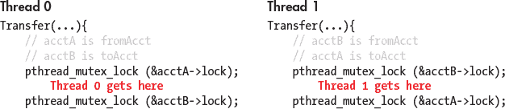

*图 14-7：死锁的示例*

虽然操作系统提供了一些防止死锁的保护措施，但程序员在编写代码时应注意避免增加死锁的可能性。例如，前面的场景可以通过重新安排锁的顺序来避免，这样每一对锁/解锁操作只会围绕与其相关的余额更新语句：

```

void *Transfer(void *args){

    //argument passing removed to increase readability

    //...

    pthread_mutex_lock(&fromAcct->lock);

    fromAcct->balance -= amt;

    pthread_mutex_unlock(&fromAcct->lock);

    pthread_mutex_lock(&toAcct->lock);

    toAcct->balance += amt;

    pthread_mutex_unlock(&toAcct->lock);

    return NULL;

}

```

死锁不仅仅是线程特有的情况。进程（尤其是相互通信的进程）也可能发生死锁。程序员应该注意他们使用的同步原语，以及错误使用这些原语的后果。

#### 14.3.2 信号量

信号量通常用于操作系统和并发程序中，其目的是管理对资源池的并发访问。在使用信号量时，目标不是*谁*拥有什么资源，而是*还有多少*资源可用。信号量与互斥锁在多个方面有所不同：

+   信号量不必处于二进制（锁定或解锁）状态。一个特殊类型的信号量叫做*计数信号量*，它的值可以从 0 到某个*r*（其中*r*是可能的资源数量）。每当生产出一个资源时，信号量会递增。每当资源被使用时，信号量会递减。当计数信号量的值为 0 时，表示没有资源可用，任何尝试获取资源的线程都必须等待（例如，阻塞）。

+   信号量默认可以被锁定。

虽然互斥锁和条件变量可以模拟信号量的功能，但在某些情况下，使用信号量可能会更简单、更高效。信号量的优势还在于，*任何*线程都可以解锁信号量（与互斥锁不同，互斥锁要求调用线程必须解锁它）。

信号量不是 Pthreads 库的一部分，但这并不意味着不能使用它们。在 Linux 和 macOS 系统上，信号量原语可以通过`semaphore.h`访问，通常位于`/usr/include`。由于没有标准，不同系统上的函数调用可能会有所不同。不过，信号量库的声明与互斥锁的声明类似：

+   声明一个信号量（类型为`sem_t`，例如`sem_t semaphore`）。

+   使用`sem_init`初始化信号量（通常在`main`中）。`sem_init`函数有三个参数：第一个是信号量的地址，第二个是其初始状态（锁定或解锁），第三个参数表示信号量是否应该在一个进程的线程间共享（例如，值为 0）或在不同进程间共享（例如，值为 1）。这很有用，因为信号量通常用于进程同步。例如，调用`sem_init(&semaphore, 1, 0)`表示我们的信号量最初是锁定的（第二个参数为 1），并且将在同一进程的线程之间共享（第三个参数为 0）。相比之下，互斥锁总是从解锁状态开始。需要注意的是，在 macOS 中，等效的函数是`sem_open`。

+   使用`sem_destroy`销毁信号量（通常在`main`中）。该函数只接受一个指向信号量的指针（`sem_destroy(&semaphore)`）。请注意，在 macOS 中，等效的函数可能是`sem_unlink`或`sem_close`。

+   `sem_wait`函数表示资源正在被使用，并会递减信号量。如果信号量的值大于 0（表示仍有资源可用），该函数将立即返回，并允许线程继续执行。如果信号量的值已经为 0，线程将被阻塞，直到有资源可用（即信号量的值为正）。对`sem_wait`的调用通常像这样：`sem_wait(&semaphore)`。

+   `sem_post`函数表示一个资源被释放，并且会递增信号量。该函数会立即返回。如果有线程在等待该信号量（即信号量的值之前为 0），那么其他线程将获得释放的资源。`sem_post`函数的调用形式为`sem_post(&semaphore)`。

#### 14.3.3 其他同步构造

互斥锁和信号量并不是在多线程程序中使用的唯一同步构造。在这一小节中，我们将简要讨论屏障和条件变量同步构造，它们都是 Pthreads 库的一部分。

##### 屏障

*屏障*是一种同步结构，强制*所有*线程在执行中达到一个共同点，然后才释放这些线程继续并发执行。Pthreads 提供了屏障同步原语。使用 Pthreads 屏障时，需要执行以下步骤：

+   声明一个屏障全局变量（例如，`pthread_barrier_t barrier`）

+   在`main`中初始化屏障（`pthread_barrier_init(&barrier)`）

+   在`main`中使用完屏障后销毁（`pthread_barrier_destroy(&barrier)`）

+   使用`pthread_barrier_wait`函数创建一个同步点。

以下程序展示了在`threadEx`函数中使用屏障的示例：

```

void *threadEx(void *args){

    //parse args

    //...

    long myid = myargs->id;

    int nthreads = myargs->numthreads;

    int *array = myargs->array

    printf("Thread %ld starting thread work!\n", myid);

    pthread_barrier_wait(&barrier); //forced synchronization point

    printf("All threads have reached the barrier!\n");

    for (i = start; i < end; i++) {

        array[i] = array[i] * 2;

    }

    printf("Thread %ld done with work!\n", myid);

    return NULL;

}

```

在这个例子中，*每个*线程都无法开始处理其分配的数组部分，直到*所有*线程都打印出它们开始工作的消息。如果没有屏障，可能会有一个线程在其他线程打印开始工作消息之前就已经完成工作！注意，即使如此，仍然可能有一个线程在另一个线程完成之前打印出它已经完成工作的消息。

##### 条件变量

条件变量强制线程在特定条件达到之前进行阻塞。这种结构对于在条件满足之前线程需要做某些工作的场景非常有用。如果没有条件变量，线程就需要反复检查条件是否满足，这样会持续占用 CPU。条件变量通常与互斥锁一起使用。在这种同步结构中，互斥锁强制互斥，而条件变量确保在线程获取互斥锁之前，特定的条件已被满足。

POSIX 条件变量的类型为`pthread_cond_t`。与互斥锁和屏障结构一样，条件变量在使用前必须初始化，并在使用后销毁。

要初始化条件变量，使用`pthread_cond_init`函数。要销毁条件变量，使用`pthread_cond_destroy`函数。

使用条件变量时常用的两个函数是`pthread_cond_wait`和`pthread_cond_signal`。这两个函数除了需要条件变量的地址外，还需要互斥锁的地址。

+   `pthread_cond_wait(&cond, &mutex)` 函数接受条件变量 `cond` 和互斥锁 `mutex` 的地址作为参数。它使调用线程在条件变量 `cond` 上阻塞，直到另一个线程发出信号（或“唤醒”它）。

+   `pthread_cond_signal(&cond)` 函数使调用线程解除阻塞（或向）另一个正在等待条件变量 `cond` 的线程发出信号（根据调度优先级）。如果当前没有线程在条件变量上阻塞，则该函数没有效果。与 `pthread_cond_wait` 不同，`pthread_cond_signal` 函数可以由任何线程调用，无论该线程是否拥有 `pthread_cond_wait` 所调用的互斥锁。

##### 条件变量示例

传统上，条件变量在某些线程集合需要等待另一些线程完成某个动作时最为有用。在以下示例中，我们使用多个线程来模拟一组农夫从一组鸡那里收集鸡蛋。“鸡”和“农夫”代表两种不同的线程类型。此程序的完整源代码可以下载；^(7) 注意，这个列表省略了许多注释和错误处理以简化。

`main` 函数创建了一个共享变量 `num_eggs`（表示任何时刻可用的鸡蛋总数），一个共享的 `mutex`（每当线程访问 `num_eggs` 时使用该互斥锁），以及一个共享的条件变量 `eggs`。然后它创建了两个鸡线程和两个农夫线程：

```

int main(int argc, char **argv){

    //... declarations omitted for brevity

    // these will be shared by all threads via pointer fields in t_args

    int num_eggs;           // number of eggs ready to collect

    pthread_mutex_t mutex;  // mutex associated with cond variable

    pthread_cond_t  eggs;   // used to block/wake-up farmer waiting for eggs

    //... args parsing removed for brevity

    num_eggs = 0; // number of eggs ready to collect

    ret = pthread_mutex_init(&mutex, NULL); //initialize the mutex

    pthread_cond_init(&eggs, NULL); //initialize the condition variable

    //... thread_array and thread_args creation/filling omitted for brevity

    // create some chicken and farmer threads

    for (i = 0; i < (2 * nthreads); i++) {

        if ( (i % 2) == 0 ) {

            ret = pthread_create(&thread_array[i], NULL,

chicken, &thread_args[i]);

        }

        else {

            ret = pthread_create(&thread_array[i], NULL,

                                 farmer, &thread_args[i] );

        }

    }

    // wait for chicken and farmer threads to exit

    for (i = 0; i < (2 * nthreads); i++)  {

        ret = pthread_join(thread_array[i], NULL);

    }

    // clean-up program state

    pthread_mutex_destroy(&mutex); //destroy the mutex

    pthread_cond_destroy(&eggs);   //destroy the cond var

    return 0;

} 
```

每个鸡线程负责下一个数量的鸡蛋：

```

void *chicken(void *args ) {

    struct t_arg *myargs = (struct t_arg *)args;

    int *num_eggs, i, num;

    num_eggs = myargs->num_eggs;

    i = 0;

    // lay some eggs

    for (i = 0; i < myargs->total_eggs; i++) {

        usleep(EGGTIME); //chicken sleeps

        pthread_mutex_lock(myargs->mutex);

        *num_eggs = *num_eggs + 1;  // update number of eggs

        num = *num_eggs;

        pthread_cond_signal(myargs->eggs); // wake a sleeping farmer (squawk)

        pthread_mutex_unlock(myargs->mutex);

        printf("chicken %d created egg %d available %d\n",myargs->id,i,num);

    }

    return NULL;

}

```

为了下蛋，鸡线程会先睡一会，获得互斥锁，并将可用鸡蛋的总数增加一。在释放互斥锁之前，鸡线程会“唤醒”一个正在休眠的农夫（假设是通过叫声）。鸡线程重复这个周期，直到它下完所有预定的鸡蛋（`total_eggs`）。

每个农夫线程负责从一组鸡中收集 `total_eggs` 个鸡蛋（假设是为了早餐）：

```

void *farmer(void *args ) {

    struct t_arg * myargs = (struct t_arg *)args;

    int *num_eggs, i, num;

    num_eggs = myargs->num_eggs;

    i = 0;

    for (i = 0; i < myargs->total_eggs; i++) {

        pthread_mutex_lock(myargs->mutex);

        while (*num_eggs == 0 ) { // no eggs to collect

            // wait for a chicken to lay an egg

            pthread_cond_wait(myargs->eggs, myargs->mutex);

        }

        // we hold mutex lock here and num_eggs > 0

        num = *num_eggs;

        *num_eggs = *num_eggs - 1;

        pthread_mutex_unlock(myargs->mutex);

        printf("farmer %d gathered egg %d available %d\n",myargs->id,i,num);

    }

    return NULL;

}

```

每个农夫线程在检查共享的 `num_eggs` 变量之前，先获得互斥锁，以查看是否有可用的鸡蛋（`*num_eggs == 0`）。当没有鸡蛋可用时，农夫线程会阻塞（即小睡一会）。

当农夫线程因鸡线程的信号“醒来”后，它会检查是否仍有鸡蛋可用（另一个农夫线程可能先拿走了一个），如果有，农夫线程会“收集”一个鸡蛋（将 `num_eggs` 减少 1），然后释放互斥锁。

通过这种方式，鸡线程和农夫线程协作下蛋和收集鸡蛋。条件变量确保在鸡线程下蛋之前，农夫线程不能收集鸡蛋。

##### 广播

另一个与条件变量一起使用的函数是`pthread_cond_broadcast`，当多个线程被阻塞在特定条件下时，它非常有用。调用`pthread_cond_broadcast(&cond)`会唤醒*所有*在条件`cond`上被阻塞的线程。在下一个示例中，我们展示了如何通过条件变量实现前面讨论的屏障构造：

```
 // mutex (initialized in main)

pthread_mutex_t mutex;

// condition variable signifying the barrier (initialized in main)

pthread_cond_t barrier;

void *threadEx_v2(void *args){

    // parse args

    // ...

    long myid = myargs->id;

    int nthreads = myargs->numthreads;

    int *array = myargs->array

    // counter denoting the number of threads that reached the barrier

    int *n_reached = myargs->n_reached;

    // start barrier code

    pthread_mutex_lock(&mutex);

    *n_reached++;

    printf("Thread %ld starting work!\n", myid)

    // if some threads have not reached the barrier

    while (*n_reached < nthreads) {

        pthread_cond_wait(&barrier, &mutex);

    }

    // all threads have reached the barrier

    printf("all threads have reached the barrier!\n");

    pthread_cond_broadcast(&barrier);

    pthread_mutex_unlock(&mutex);

    // end barrier code

    // normal thread work

    for (i = start; i < end; i++) {

        array[i] = array[i] * 2;

    }

    printf("Thread %ld done with work!\n", myid);

    return NULL;

} 
```

函数`threadEx_v2`与`threadEx`具有相同的功能。在此示例中，条件变量名为`barrier`。每个线程在获取锁后，都会递增`n_reached`，即到达该点的线程数量。当到达屏障的线程数少于总线程数时，线程会在条件变量`barrier`和互斥锁`mutex`上等待。

然而，当最后一个线程到达屏障时，它会调用`pthread_cond_broadcast(&barrier)`，这会释放*所有*等待条件变量`barrier`的其他线程，允许它们继续执行。

这个示例对于说明`pthread_cond_broadcast`函数非常有用；然而，在程序中需要屏障时，最好使用 Pthreads 屏障原语。

学生们常问的一个问题是，`farmer`和`threadEx_v2`代码中对`pthread_cond_wait`调用的`while`循环是否可以被`if`语句替换。事实上，这个`while`循环是绝对必要的，主要有两个原因。首先，条件可能在唤醒线程到达继续执行之前发生变化。`while`循环强制最后一次检查条件。其次，`pthread_cond_wait`函数容易发生*虚假唤醒*，即线程即使条件未满足，也会被错误地唤醒。`while`循环实际上是一个*谓词循环*的例子，它在释放互斥锁之前强制对条件变量进行最终检查。因此，在使用条件变量时，使用谓词循环是正确的做法。

### 14.4 衡量并行程序的性能

到目前为止，我们已经使用`gettimeofday`函数来衡量程序执行所需的时间。在本节中，我们讨论如何衡量并行程序相对于串行程序的表现，以及与衡量并行程序性能相关的其他主题。

#### 14.4.1 并行性能基础

##### 加速比

假设一个程序在*c*个核心上执行需要 *T*[c] 时间。因此，程序的串行版本将在 *T*[1] 时间内完成。程序在 *c* 个核心上的加速比通过以下公式表示：

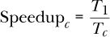

如果一个串行程序需要 60 秒执行，而其并行版本在 2 个核心上只需要 30 秒，那么对应的加速比为 2。同样，如果该程序在 4 个核心上只需 15 秒，那么加速比为 4。在理想情况下，运行在*n*个核心上的程序，使用*n*个总线程时，理想加速比为*n*。

如果一个程序的加速比大于 1，说明并行化带来了某些改进。如果加速比小于 1，则表示并行解决方案实际上比串行解决方案还要慢。一个程序的加速比可能大于 *n*（例如，额外的缓存减少了对内存的访问）。这种情况被称为*超线性加速*。

##### 效率

加速比不考虑核心的数量——它仅仅是串行时间与并行时间的比率。例如，如果一个串行程序需要 60 秒，但一个并行程序在四个核心上只需要 30 秒，那么它的加速比是 2。然而，这个指标并没有反映出它是在哪四个核心上运行的。

为了衡量每个核心的加速比，使用效率：

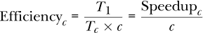

效率通常在 0 到 1 之间变化。效率为 1 表示核心被完美利用。如果效率接近 0，那么并行性几乎没有任何好处，因为额外的核心并没有提高性能。如果效率大于 1，则表示超线性加速。

让我们回顾之前的例子，一个串行程序需要 60 秒。如果并行版本在两个核心上运行需要 30 秒，那么它的效率是 1（或 100%）。如果程序在四个核心上运行需要 30 秒，那么效率降至 0.5（或 50%）。

##### 现实世界中的并行性能

在理想情况下，加速比是线性的。对于每个额外的计算单元，并行程序应该实现相应的加速。然而，在现实世界中，这种情况很少发生。大多数程序包含一个必须是串行的部分，因为代码中存在固有的依赖关系。程序中依赖关系最长的部分被称为它的*临界路径*。减少程序临界路径的长度是并行化的一个重要第一步。线程同步点以及（对于在多个计算节点上运行的程序）进程之间的通信开销是其他可能限制程序并行性能的代码组件。

**警告：并非所有程序都适合并行化！**

临界路径的长度可能使得某些程序完全*难以*并行化。以生成第*n*个斐波那契数为例。由于每个斐波那契数依赖于前两个数，因此高效地并行化这个程序是非常困难的！

考虑本章前面提到的 CountSort 算法中的 `countElems` 函数的并行化。在理想情况下，我们期望程序的加速比与核心数量成线性关系。然而，来看看它的运行时间（在这种情况下，运行在一个四核系统上，拥有八个逻辑线程）：

```
 $ ./countElems_p_v3 100000000 0 1

Time for Step 1 is 0.331831 s

$ ./countElems_p_v3 100000000 0 2

Time for Step 1 is 0.197245 s

$ ./countElems_p_v3 100000000 0 4

Time for Step 1 is 0.140642 s

$ ./countElems_p_v3 100000000 0 8

Time for Step 1 is 0.107649 s 
```

表 14-3 显示了这些多线程执行的加速比和效率。

**表 14-3：** 性能基准

| 线程数 | 2 | 4 | 8 |
| --- | --- | --- | --- |
| 加速比 | 1.68 | 2.36 | 3.08 |
| 效率 | 0.84 | 0.59 | 0.39 |

我们在使用两个核心时有 84%的效率，但在使用八个核心时，核心效率降至 39%。注意，八个核心的理想加速比并未实现。造成这种情况的一个原因是，随着线程数增加，分配工作给线程以及对`counts`数组的串行更新的开销开始主导性能。其次，八个线程的资源竞争（记住这是一个四核处理器）降低了核心效率。

##### 阿姆达尔定律

1967 年，IBM 的著名计算机架构师吉恩·阿姆达尔（Gene Amdahl）预测，一个计算机程序能够实现的最大加速比是由其必然是串行部分的大小所限制的（现称为阿姆达尔定律）。更一般地，阿姆达尔定律指出，对于每个程序，都有一个可以加速的部分（即，可以优化或并行化的程序部分，*P*），还有一个*不能*加速的部分（即，程序中固有的串行部分，或*S*）。即使优化或并行化的部分*P*的执行时间减少到零，串行部分*S*仍然存在，最终将主导程序的性能。由于*S*和*P*是分数，注意*S* + *P* = 1。

考虑一个程序，它在一个核心上执行，所需时间为*T*[1]。那么，程序执行中必定是串行的部分需要*T*[1]的*S*时间，而可以并行化的部分（*P* = 1 *– S*）需要*T*[1]的*P*时间来执行。

当程序在*c*个核心上执行时，串行部分的代码仍然需要*S* × *T*[1]时间来运行（在其他条件相同的情况下），但可以并行化的部分可以被划分到*c*个核心中。因此，平行处理器在*c*个核心上执行相同任务的最大改进是：

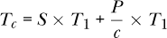

随着*c*的增加，平行处理器的执行时间开始受到程序串行部分的主导。

为了理解阿姆达尔定律的影响，考虑一个程序，该程序可以并行化 90%，并且在 1 个核心上执行需要 10 秒。在我们的方程中，可并行化部分（*P*）为 0.9，而串行部分（*S*）为 0.1。表 14-4 显示了根据阿姆达尔定律，在*c*个核心上执行的总时间（*T*[*c*]）以及相关的加速比。

**表 14-4：** 阿姆达尔定律对一个可以并行化 90%的 10 秒程序的影响

| **核心数量** | **串行时间（秒）** | **并行时间（秒）** | **总时间（*T*[*c*] 秒）** | **加速比（相对于单核）** |
| --- | --- | --- | --- | --- |
| 1 | 1 | 9 | 10 | 1 |
| 10 | 1 | 0.9 |   1.9 | 5.26 |
| 100 | 1 | 0.09 |   1.09 | 9.17 |
| 1000 | 1 | 0.009 |   1.009 | 9.91 |

观察到，随着时间的推移，程序的串行部分开始主导，而增加更多核心的效果似乎变得微乎其微。

以更正式的方式来看待这个问题，需要将阿姆达尔对于*T*[c]的计算纳入加速比方程中：

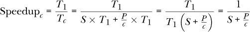

通过对这个方程取极限可以看出，当核心数（*c*）趋近于无穷大时，加速比趋近于 1/*S*。在表 14-4 中显示的例子中，加速比趋近于 1/0.1，或者 10。

作为另一个例子，考虑一个程序，其中*P* = 0.99。换句话说，99%的程序是可并行化的。随着*c*趋近于无穷大，串行时间开始主导性能（在这个例子中，*S* = 0.01）。因此，加速比趋近于 1/0.01，或者 100。换句话说，即使有一百万个核心，这个程序的最大加速比也只有 100。

一切并未失去：阿姆达尔定律的局限性

在学习阿姆达尔定律时，考虑其创始人基恩·阿姆达尔（Gene Amdahl）的*意图*非常重要。用他自己的话说，这一定律是为了展示“单处理器方法的持续有效性，以及多处理器方法在应用于实际问题及其伴随的不规则性时的弱点。”^(8) 在他 1967 年的论文中，阿姆达尔进一步阐述了这一概念，写道：“十多年来，许多预言家声称，单一计算机的组织已经达到了极限，只有通过以某种方式将多台计算机互联，才能实现真正重大的进步，从而允许合作解决问题。” 随后的研究挑战了阿姆达尔提出的一些关键假设。在接下来的子章节中，阅读关于古斯塔夫森–巴尔西斯定律的内容，讨论阿姆达尔定律的局限性，并提出一种不同的观点来思考并行性带来的好处。

#### 14.4.2 高级话题

##### 古斯塔夫森–巴尔西斯定律

1988 年，计算机科学家及桑迪亚国家实验室的研究员约翰·L·古斯塔夫森（John L. Gustafson）撰写了一篇名为《重新评估阿姆达尔定律》的论文。^(9) 在这篇论文中，古斯塔夫森揭示了一个关于并行程序执行的关键假设，这个假设并不总是成立。

具体来说，阿姆达尔定律假设计算核心的数量*c*与程序中可并行化部分*P*是彼此独立的。古斯塔夫森指出，这“几乎从来都不是这样”。虽然通过在固定数据集上变化核心数量来基准测试程序的性能是一个有用的学术练习，但在现实世界中，随着问题规模的增大，更多的核心（或处理器，正如我们在分布式内存讨论中所探讨的）被添加进来。古斯塔夫森写道：“最现实的假设是，假设运行时间，而非问题规模，是恒定的。”

因此，根据古斯塔夫森的观点，最准确的表述是：“并行处理的工作量与处理器数量呈线性关系。”

考虑一个*并行*程序，它在具有*c*核心的系统上运行时需要时间*T*[c]。设*S*表示程序执行中必须串行执行的部分，占用*S* × *T*[c]的时间。因此，程序中可并行化的部分，即*P* = 1 *– S*，在*c*核心上运行时需要*P* × *T*[c]的时间。

当同一个程序在单个核心上运行时，代码的串行部分仍然需要*S* × *T*[c]（假设其他条件相同）。然而，原本分配给*c*个核心的并行部分，现在必须由单个核心执行串行操作，并且需要*P* × *T*[c] × *c*的时间。换句话说，在单核系统上，并行部分的执行时间将是*c*倍。因此，缩放加速比将是：

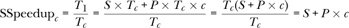

这表明，缩放加速随着计算单元数量的增加而线性增加。

考虑我们之前的例子，其中 99%的程序是可并行化的（即，*P* = 0.99）。应用缩放加速方程，使用 100 个处理器时的理论加速比为 99.01，使用 1,000 个处理器时为 990.01。请注意，效率保持在*P*不变。

正如 Gustafson 所总结的，“加速比应通过将问题规模扩展到处理器数量来衡量，而不是通过固定问题规模。”Gustafson 的结果值得注意，因为它表明通过更新处理器数量是可以实现加速的增加的。作为一名在国家超级计算设施工作的研究员，Gustafson 更关注在恒定时间内做*更多的工作*。在多个科学领域中，分析更多数据通常会提高结果的准确性或可信度。Gustafson 的工作表明，在大量处理器上获得大规模加速是可能的，并重新激发了人们对并行处理的兴趣。^(10)

##### 可扩展性

我们称一个程序为*可扩展*，如果随着资源（核心、处理器）或问题规模的增加，我们看到性能在提升（或保持不变）。两个相关的概念是*强扩展*和*弱扩展*。需要注意的是，"弱"和"强"在这里并不表示程序可扩展性的*质量*，而只是衡量可扩展性的不同方式。

我们说一个程序是*强可扩展*的，如果在*固定*问题规模下增加核心/处理单元的数量会提高性能。如果在*n*个核心上运行时加速比也是*n*，则该程序表现为强线性可扩展性。当然，阿姆达尔定律保证，在某个时刻，添加更多核心几乎没有意义。

如果在增加数据大小的速度与核心数相同的情况下（即每个核心/处理器有固定的数据大小）能够保持性能不变或有所提升，我们就说一个程序是*弱可扩展*的。如果当每个核心的工作量按因子*n*增加时，程序表现出弱线性可扩展性，我们就说这个程序表现出了弱线性可扩展性。

##### 关于性能测量的一般建议

我们在性能讨论的最后，附上一些关于基准测试和超线程核心性能的说明。

**在进行基准测试时多次运行程序。** 在本书前面的许多示例中，我们仅运行一次程序来感知其运行时间。然而，这对正式的基准测试来说是不够的。只运行一次程序*从来*无法准确测量程序的真实运行时间！上下文切换和其他运行中的进程可能会导致运行时间发生剧烈波动。因此，最好的做法是多次运行程序，并报告平均运行时间，同时尽可能提供更多的细节，包括运行次数、测量的波动性（例如误差条、最小值、最大值、中位数、标准差）以及测量时的条件。

**小心你测量时间的位置。** `gettimeofday`函数在帮助准确测量程序运行时间方面很有用，但也可能被滥用。尽管将`gettimeofday`调用仅放在`main`函数中的线程创建和加入部分可能很诱人，但你必须考虑你到底要测量什么。例如，如果一个程序在执行过程中需要读取外部数据文件，那么文件读取的时间应该包含在程序的计时中。

**注意超线程核心的影响。** 如在第 671 页的《仔细观察：多少个核心？》和第 283 页的《多核与硬件多线程》中讨论的那样，超线程（逻辑）核心能够在单个核心上执行多个线程。在一个具有每个核心两个逻辑线程的四核系统中，我们可以说系统有八个超线程核心。在八个逻辑核心上并行运行程序，通常比在四个核心上运行程序更能节省墙面时间。然而，由于超线程核心通常会发生资源竞争，你可能会看到核心效率下降以及非线性加速现象。

**警惕资源竞争。** 在进行基准测试时，始终要考虑系统上正在运行的*其他*进程和线程应用程序。如果你的性能结果看起来有些异常，快速运行`top`命令检查是否有其他用户在同一系统上运行资源密集型任务是非常值得的。如果是这样，尝试使用不同的系统进行基准测试（或者等到系统不那么繁忙时再进行）。

### 14.5 缓存一致性与虚假共享

多核缓存可能对多线程程序的性能产生深远的影响。然而，在此之前，让我们快速回顾一些与缓存设计相关的基本概念（更多细节见第 1299 页的“CPU 缓存”）：

+   数据/指令不会*单独*传输到缓存中。相反，数据是以*块*的形式传输的，并且块的大小通常在内存层次结构的较低级别变得更大。

+   每个缓存被组织成一系列的集合，每个集合有若干行。每行存储一个数据块。

+   内存地址的各个比特用于确定缓存的集合、标签和块偏移量，以将数据块写入缓存。

+   *缓存命中*发生在所需数据块存在于缓存中时。否则，发生*缓存未命中*，并且会在内存层次结构的下一级（可能是缓存或主内存）进行查找。

+   *有效位*表示缓存中特定行的块是否可以安全使用。如果有效位设置为 0，则该行的数据显示块不能使用（例如，该块可能包含来自已退出进程的数据）。

+   信息是根据两种主要策略写入缓存/内存的。在*直写*策略中，数据同时写入缓存和主内存。在*回写*策略中，数据只写入缓存，并在缓存块被逐出后写入更低级别的内存。

#### 14.5.1 多核系统中的缓存

回想一下，在共享内存架构中，每个核心可以有自己的缓存（参见第 581 页的“展望：多核处理器中的缓存”），并且多个核心可以共享一个公共缓存。图 14-8 展示了一个示例的双核 CPU。尽管每个核心都有自己的本地 L1 缓存，但核心之间共享一个公共的 L2 缓存。

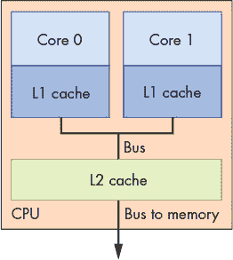

*图 14-8：一个示例的双核 CPU，具有独立的 L1 缓存和共享的 L2 缓存*

单个可执行文件中的多个线程可能执行不同的函数。如果没有*缓存一致性*策略（参见第 583 页的“缓存一致性”），确保每个缓存都能保持共享内存的一致视图，那么共享变量可能会被不一致地更新。例如，考虑图 14-8 中的双核处理器，其中每个核心并行执行不同的线程。分配给核心 0 的线程有一个本地变量`x`，而在核心 1 上执行的线程有一个本地变量`y`，并且两个线程都可以共享访问一个全局变量`g`。表 14-5 展示了一个可能的执行路径。

**表 14-5：由于缓存引起的问题数据共享**

| **时间** | **核心 0** | **核心 1** |
| --- | --- | --- |
| 0 | `g = 5` | (其他工作) |
| 1 | (其他工作) | `y = g*4` |
| 2 | `x += g` | `y += g*2` |

假设`g`的初始值为 10，`x`和`y`的初始值都为 0。那么，在这段操作序列结束时，`y`的最终值是多少？如果没有缓存一致性，这是一个非常难以回答的问题，因为至少有三个`g`的存储值：一个在 Core 0 的 L1 缓存中，一个在 Core 1 的 L1 缓存中，另一个是存储在共享的 L2 缓存中的`g`副本。

图 14-9 显示了在表 14-5 操作序列完成后可能出现的一个错误结果。假设 L1 缓存实现了写回策略。当在 Core 0 上执行的线程将值 5 写入`g`时，它仅更新 Core 0 L1 缓存中的`g`值。Core 1 的 L1 缓存中的`g`值仍然是 10，且共享 L2 缓存中的副本也不变。即使实现了写穿透策略，也不能保证存储在 Core 1 L1 缓存中的`g`副本会被更新！在这种情况下，`y`的最终值将是 60。

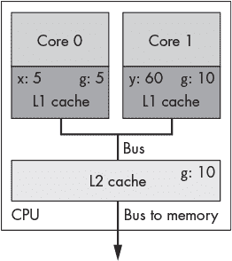

*图 14-9：一个没有采用缓存一致性策略的缓存更新问题*

一种缓存一致性策略是在一个缓存中对共享数据值进行写入时，使其他缓存中的该共享值的缓存副本无效或更新。*修改的共享无效*（MSI）协议（在《MSI 协议》一节中详细讨论，参见第 584 页）就是一种无效化缓存一致性协议的例子。

实现 MSI 的一种常见技术是嗅探。这样的*嗅探缓存*在内存总线上“嗅探”可能的写入信号。如果嗅探缓存检测到对共享缓存块的写入，它会使包含该缓存块的行无效。最终结果是，块的唯一有效版本存在于写入的缓存中，而*所有其他*缓存中的该块副本都会被标记为无效。

使用嗅探的 MSI 协议将会导致前述例子中变量`y`最终赋值为`30`。

#### 14.5.2 错误共享

缓存一致性保证了正确性，但它可能会影响性能。回想一下，当线程在 Core 0 上更新`g`时，嗅探缓存不仅使`g`无效，还使包含`g`的*整个缓存行*无效。

考虑我们最初尝试并行化 CountSort 算法中的`countElems`函数。⁴ 为了方便，这里重新列出该函数：

```

/*parallel version of step 1 (first cut) of CountSort algorithm:

 * extracts arguments from args value

 * calculates portion of the array this thread is responsible for counting

 * computes the frequency of all the elements in assigned component and stores

 * the associated counts of each element in counts array

*/

void *countElems(void *args){

    //extract arguments

    //ommitted for brevity

    int *array = myargs->ap;

    long *counts = myargs->countp;

    //assign work to the thread

    //compute chunk, start, and end

    //ommited for brevity

    long i;

    //heart of the program

    for (i = start; i < end; i++){

        val = array[i];

        counts[val] = counts[val] + 1;

    }

    return NULL;

}

```

在我们之前讨论这个函数时（参见《数据竞争》一节，见第 691 页），我们指出了数据竞争如何导致`counts`数组没有正确填充。让我们看看如果我们尝试*计时*这个函数会发生什么。我们使用`getimeofday`在`main`中添加计时代码，像以前一样。⁶ 在 1 亿个元素上对`countElems`的初始版本进行基准测试，得到了以下时间：

```

$ ./countElems_p 100000000 0 1

Time for Step 1 is 0.336239 s

$ ./countElems_p 100000000 0 2

Time for Step 1 is 0.799464 s

$ ./countElems_p 100000000 0 4

Time for Step 1 is 0.767003 s

```

即使没有任何同步构造，随着线程数的增加，这个版本的程序*仍然会变慢*！

为了理解发生了什么，让我们重新审视 `counts` 数组。这个数组存储了输入数组中每个数字的出现频率。最大值由变量 `MAX` 决定。在我们的示例程序中，`MAX` 被设置为 10。换句话说，`counts` 数组占用了 40 字节的空间。

请回忆，在 Linux 系统上的缓存详情（参见《展望未来：多核处理器上的缓存》章节，第 581 页）位于 `/sys/devices/system/cpu/` 目录中。每个逻辑核心都有自己的 `cpu` 子目录，名为 `cpuk`，其中 `k` 表示第 *k* 个逻辑核心。每个 `cpu` 子目录又有单独的 `index` 目录，指示该核心可用的缓存。

`index` 目录包含关于每个逻辑核心缓存的众多详细信息。一个示例 `index0` 目录的内容如下所示（`index0` 通常对应于 Linux 系统的 L1 缓存）：

```

$ ls /sys/devices/system/cpu/cpu0/cache/index0

coherency_line_size      power            type

level                    shared_cpu_list  uevent

number_of_sets           shared_cpu_map   ways_of_associativity

physical_line_partition  size

```

要发现 L1 缓存的缓存行大小，可以使用以下命令：

```
$ cat /sys/devices/system/cpu/cpu0/cache/coherency_line_size

64
```

输出显示机器的 L1 缓存行大小为 64 字节。换句话说，40 字节的 `counts` 数组完全可以*放在一个缓存行内*。

请回忆，在像 MSI 这样的失效缓存一致性协议中，每当程序更新一个共享变量时，*存储该变量的其他缓存中整个缓存行都会被使无效*。让我们考虑当两个线程执行上述函数时会发生什么。可能的执行路径如 表 14-6 所示（假设每个线程被分配到一个单独的核心，并且变量 `x` 对每个线程都是局部的）。

**表 14-6：** 两个线程执行 `countElems` 的可能执行序列

| **时间** | **线程 0** | **线程 1** |
| --- | --- | --- |
| *i* | 读取 `array[x]` | … |
|  | (1) |  |
| *i* + 1 | 增加 `counts[1]` (**使无效** | 读取 `array[x]` (4) |
|  | **缓存行**) |  |
| *i* + 2 | 读取 `array[x]` (6) | 增加 `counts[4]` (**使无效** |
|  |  | **缓存行**) |
| *i* + 3 | 增加 `counts[6]` (**使无效** | 读取 `array[x]` (2) |
|  | **缓存行**) |  |
| *i* + 4 | 读取 `array[x]` (3) | 增加 `counts[2]` (**使无效** |
|  |  | **缓存行**) |
| *i* + 5 | 增加 `counts[3]` (**使无效** | … |
|  | **缓存行**) |  |

在时间步 *i* 中，线程 0 读取它自己部分的 `array[x]` 的值，在这个示例中是 1。在时间步 *i* + 1 到 *i* + 5 之间，每个线程都会读取一个 `array[x]` 的值。请注意，每个线程查看的是数组的不同部分。不仅如此，我们的示例执行中，每次读取 `array` 都得到唯一的值（因此在这个示例执行序列中没有竞争条件！）。在读取 `array[x]` 的值后，每个线程都会增加 `counts` 中相应的值。

记住，`counts` 数组*适配到一个单独的缓存行*，存储在我们的 L1 缓存中。因此，每次对 `counts` 的写操作都会使*每个其他 L1 缓存中的整行*失效。最终结果是，尽管更新了 `counts` 中的*不同*内存位置，但任何包含 `counts` 的缓存行都会在对 `counts`的*每次更新*时被*失效*！

缓存行的失效会迫使所有 L1 缓存更新该行，并从 L2 获取一个“有效”的版本。L1 缓存的反复失效和重写行是*抖动*的一个例子，其中缓存中的重复冲突导致一系列的未命中。

增加更多核心会使问题更加严重，因为现在更多的 L1 缓存会使缓存行失效。因此，尽管每个线程访问的是 `counts` 数组中不同的元素，但增加额外线程会使运行速度变慢！这是一个*伪共享*的例子，或者说是多个核心共享单个元素的错觉。在前一个例子中，所有核心似乎都在访问 `counts` 中的相同元素，尽管事实并非如此。

#### 14.5.3 修复伪共享

修复伪共享问题的一种方法是用额外的元素填充数组（在我们这个例子中是 `counts`），使其不再适配单个缓存行。然而，填充可能浪费内存，并且可能无法解决所有架构中的问题（考虑到两台不同机器的 L1 缓存大小不同）。在大多数情况下，编写支持不同缓存大小的代码通常不值得为了性能提升而付出代价。

更好的解决方案是尽可能让线程写入*本地存储*。在这个上下文中，本地存储是指*仅限线程使用*的内存。以下解决方案通过选择对名为 `local_counts` 的本地声明版本进行更新，从而减少伪共享。

让我们回顾一下 `countElems` 函数的最终版本：⁶

```

/*parallel version of CountSort algorithm step 1 (final attempt with mutexes):

 * extracts arguments from args value

 * calculates the portion of the array this thread is responsible for counting

 * computes the frequency of all the elements in assigned component and stores

 * the associated counts of each element in counts array

*/

void *countElems( void *args ){

    //extract arguments

    //omitted for brevity

    int *array = myargs->ap;

    long *counts = myargs->countp;

    long local_counts[MAX] = {0}; //local declaration of counts array

    //assign work to the thread

    //compute chunk, start, and end values (omitted for brevity)

    long i;

    //heart of the program

    for (i = start; i < end; i++){

        val = array[i];

        local_counts[val] = local_counts[val] + 1; //update local counts array

    }

    //update to global counts array

    pthread_mutex_lock(&mutex); //acquire the mutex lock

    for (i = 0; i < MAX; i++){

        counts[i] += local_counts[i];

    }

    pthread_mutex_unlock(&mutex); //release the mutex lock

    return NULL;

} 
```

使用 `local_counts` 来累积频率，代替 `counts` 是本例中减少伪共享的主要原因：

```

for (i = start; i < end; i++){

    val = array[i];

    local_counts[val] = local_counts[val] + 1; //updates local counts array

}

```

由于缓存一致性旨在保持共享内存的一致视图，只有对内存中的*共享值*进行*写操作*时，失效才会触发。由于 `local_counts` 在不同线程之间没有共享，因此对它的写操作不会使其关联的缓存行失效。

在代码的最后一个部分，互斥锁通过确保一次只有一个线程更新共享的 `counts` 数组来保证正确性：

```

//update to global counts array

pthread_mutex_lock(&mutex); //acquire the mutex lock

for (i = 0; i < MAX; i++){

    counts[i] += local_counts[i];

}

pthread_mutex_unlock(&mutex); //release the mutex lock

```

由于 `counts` 位于单个缓存行中，每次写操作仍然会使其失效。不同之处在于，这里的惩罚最多是 `MAX` × *t* 次写操作，而不是 *n* 次写操作，其中 *n* 是输入数组的长度，*t* 是使用的线程数。

### 14.6 线程安全

到目前为止，我们已经讨论了程序员可以使用的同步构造，以确保他们的多线程程序无论线程数量如何，都是一致且正确的。然而，在任何多线程应用程序的上下文中，并不总是安全地假设可以“直接”使用标准 C 库函数。并非所有 C 库中的函数都是*线程安全*的，或者说并不是所有函数都能在多个线程中运行时，保证正确的结果且不会产生意外的副作用。为了确保我们编写的程序是线程安全的，使用同步原语（如互斥锁和屏障）强制执行多线程程序的一致性和正确性是非常重要的，无论线程数量如何变化。

与线程安全密切相关的另一个概念是可重入性。所有线程安全的代码都是可重入的；然而，并非所有可重入的代码都是线程安全的。如果一个函数能够被另一个函数重新执行或部分执行而不会引发问题，则该函数是*可重入*的。按定义，可重入的代码确保对程序全局状态的访问始终保持全局状态的一致性。虽然可重入性常常（错误地）作为线程安全的同义词使用，但实际上有一些特殊情况，导致可重入的代码并非线程安全。

在编写多线程代码时，需要验证所使用的 C 库函数是否确实是线程安全的。幸运的是，线程不安全的 C 库函数列表相对较小。Open Group 友好地维护了一份线程不安全函数的列表。^(11)

#### 14.6.1 解决线程安全问题

同步原语是解决线程安全问题最常见的方法。然而，未知地使用线程不安全的 C 库函数可能会导致一些微妙的问题。让我们看一下稍微修改过的`countsElem`函数版本，称为`countElemsStr`，该版本尝试计算给定字符串中数字的频率，数字之间用空格分隔。以下程序已编辑为简洁版；该程序的完整源代码可以在线获得。^(12)

```

/* computes the frequency of all the elements in the input string and stores

 * the associated counts of each element in the array called counts. */

void countElemsStr(int *counts, char *input_str) {

    int val, i;

    char *token;

    token = strtok(input_str, " ");

    while (token != NULL) {

        val = atoi(token);

        counts[val] = counts[val] + 1;

        token = strtok(NULL, " ");

}

}

/* main function:

 * calls countElemsStr on a static string and counts up all the digits in

 * that string. */

int main( int argc, char **argv ) {

    //lines omitted for brevity, but gets user defined length of string

    //fill string with n digits

    char *inputString = calloc(length * 2, sizeof(char));

    fillString(inputString, length * 2);

    countElemsStr(counts, inputString);

    return 0;

} 
```

`countElemsStr`函数使用`strtok`函数（如我们在“strtok, strtok_r”部分讨论中所述，见第 100 页）来解析字符串中的每个数字（存储在`token`中），然后将其转换为整数，并在`counts`数组中进行相关更新。

在 100,000 个元素上编译并运行该程序时，输出如下：

```

$ gcc -o countElemsStr countElemsStr.c

$ ./countElemsStr 100000 1

contents of counts array:

9963 9975 9953 10121 10058 10017 10053 9905 9915 10040

```

现在，让我们来看一下`countElemsStr`的多线程版本：^(13)

```

/* parallel version of countElemsStr (First cut):

 * computes the frequency of all the elements in the input string and stores

 * the associated counts of each element in the array called counts

*/

void *countElemsStr(void *args) {

    //parse args

    struct t_arg *myargs = (struct t_arg *)args;

    //omitted for brevity

    //local variables

    int val, i;

    char *token;

    int local_counts[MAX] = {0};

    //compute local start and end values and chunk size:

    //omitted for brevity

//tokenize values

    token = strtok(input_str + start, " ");

    while (token != NULL) {

        val = atoi(token); //convert to an int

        local_counts[val] = local_counts[val] + 1; //update associated counts

        token = strtok(NULL, " ");

    }

    pthread_mutex_lock(&mutex);

    for (i = 0; i < MAX; i++) {

        counts[i] += local_counts[i];

    }

    pthread_mutex_unlock(&mutex);

    return NULL;

} 
```

在这个版本的程序中，每个线程处理由`input_str`引用的字符串的不同部分。`local_counts`数组确保大部分写操作发生在本地存储中。使用互斥锁来确保没有两个线程同时写入共享变量`counts`。

然而，编译并运行该程序会产生以下结果：

```

$ gcc -o countElemsStr_p countElemsStr_p.c -lpthread

$ ./countElemsStr_p 100000 1 1

contents of counts array:

9963 9975 9953 10121 10058 10017 10053 9905 9915 10040

$ ./countElemsStr_p 100000 1 2

contents of counts array:

498 459 456 450 456 471 446 462 450 463

$ ./countElemsStr_p 100000 1 4

contents of counts array:

5038 4988 4985 5042 5056 5013 5025 5035 4968 5065

```

尽管在访问 `counts` 数组时使用了互斥锁，但不同运行的结果仍然截然不同。这个问题的根源在于 `countsElemsStr` 函数不是线程安全的，因为字符串库函数 `strtok` 是*不线程安全的*！访问 OpenGroup 网站¹¹可以确认 `strtok` 在不安全线程函数的列表中。

为了修复这个问题，只需将 `strtok` 替换为其线程安全的替代函数 `strtok_r`。在后者函数中，使用一个指针作为最后一个参数，帮助线程跟踪当前正在解析的字符串位置。以下是使用 `strtok_r` 的修复后的函数：^(14)

```
 /* parallel version of countElemsStr (First cut):

 * computes the frequency of all the elements in the input string and stores

 * the associated counts of each element in the array called counts */

void* countElemsStr(void* args) {

    //parse arguments

    //omitted for brevity

    //local variables

    int val, i;

    char * token;

    int local_counts[MAX] = {0};

    char * saveptr; //for saving state of strtok_r

    //compute local start and end values and chunk size:

    //omitted for brevity

    //tokenize values

    token = strtok_r(input_str+start, " ", &saveptr);

    while (token != NULL) {

        val = atoi(token); //convert to an int

        local_counts[val] = local_counts[val]+1; //update associated counts

        token = strtok_r(NULL, " ", &saveptr);

    }

    pthread_mutex_lock(&mutex);

    for (i = 0; i < MAX; i++) {

        counts[i]+=local_counts[i];

    }

    pthread_mutex_unlock(&mutex);

    return NULL;

} 
```

这个版本的代码唯一的变化是声明了字符指针 `saveptr`，并将所有 `strtok` 的实例替换为 `strtok_r`。在这些更改下重新运行代码，输出如下：

```

$ gcc -o countElemsStr_p_v2 countElemsStr_p_v2.c -lpthread

$ ./countElemsStr_p_v2 100000 1 1

contents of counts array:

9963 9975 9953 10121 10058 10017 10053 9905 9915 10040

$ ./countElemsStr_p_v2 100000 1 2

contents of counts array:

9963 9975 9953 10121 10058 10017 10053 9905 9915 10040

$ ./countElemsStr_p_v2 100000 1 4

contents of counts array:

9963 9975 9953 10121 10058 10017 10053 9905 9915 10040 
```

现在，程序每次运行都产生相同的结果。使用 `saveptr` 与 `strtok_r` 一起确保了每个线程都能独立跟踪它们在解析字符串时的位置。

本节的要点是，在编写多线程应用程序时，应该始终检查 C 语言中的线程不安全函数列表¹¹。这样做可以帮助程序员避免在编写和调试多线程应用时遇到许多痛苦和挫折。

### 14.7 使用 OpenMP 的隐式线程化

到目前为止，我们已经介绍了使用 POSIX 线程进行共享内存编程。尽管 Pthreads 非常适合简单应用，但随着程序本身变得越来越复杂，它们的使用变得越来越困难。POSIX 线程是*显式并行编程*的一个例子，需要程序员明确指定每个线程要做什么，以及每个线程何时开始和停止。

使用 Pthreads 时，将并行性*渐进式*地添加到现有的顺序程序中也是一个挑战。也就是说，通常需要彻底重写程序以使用线程，而在尝试并行化一个庞大的现有代码库时，这往往是不太理想的做法。

Open Multiprocessing（OpenMP）库实现了一个*隐式*的 Pthreads 替代方案。OpenMP 内置于 GCC 和其他流行的编译器（如 LLVM 和 Clang）中，并可以与 C、C++ 和 Fortran 编程语言一起使用。OpenMP 的一个关键优势是，它使程序员能够通过向现有的顺序 C 代码中添加*指令*（特殊的编译器指令）来实现并行化。专门用于 OpenMP 的指令以 `#pragma omp` 开头。

本书并未详细介绍 OpenMP，但我们涵盖了一些常见的指令，并展示了如何在一些示例应用的上下文中使用它们。

#### 14.7.1 常用的指令

以下是 OpenMP 程序中最常用的一些指令：

#pragma omp parallel  此指令创建一个线程组，并让每个线程在其作用域内（通常是一个函数调用）执行代码。调用该指令通常等同于在《创建和加入线程》的第 679 页中讨论的 `pthread_create` 和 `pthread_join` 函数组合。该指令可以有多个子句，包括以下内容：

num_threads  指定要创建的线程数。

private  一个变量列表，指定这些变量应该是每个线程私有的（或局部的）。那些应该是线程私有的变量也可以在指令的作用域内声明（参见下文示例）。每个线程都获得每个变量的一个副本。

shared  一个变量列表，指定这些变量应该在所有线程之间共享。该变量有一个副本，所有线程共享。

default  指示是否让编译器决定哪些变量应当共享。在大多数情况下，我们希望使用 `default(none)` 并明确指定哪些变量应该共享，哪些应该是私有的。

#pragma omp for  指定每个线程执行 `for` 循环的一个子集。虽然循环的调度由系统决定，默认方法通常是“块化”方法，这在《重新审视标量乘法》的第 682 页中首次讨论。这是一种*静态*调度形式：每个线程得到一个指定的块，然后处理该块中的迭代。然而，OpenMP 也使得*动态*调度变得容易。在动态调度中，每个线程得到一定数量的迭代，并在处理完自己的迭代后请求一个新的迭代集。调度策略可以使用以下子句设置：

schedule(dynamic)  指定应使用*动态*调度方式。虽然在某些情况下这样做有优势，但静态（默认）调度方式通常更快。

#pragma omp parallel for  此指令是 `omp parallel` 和 `omp for` 指令的组合。与 `omp for` 指令不同，`omp parallel for` 指令在分配每个线程一组循环迭代之前，还会生成一个线程组。

#pragma omp critical  此指令用于指定其作用域内的代码应该作为*临界区*处理——即，只有一个线程可以在任何时刻执行该段代码，以确保正确的行为。

还有一些*函数*，线程可以访问它们，这些函数在执行时通常非常有用。例如：

omp_get_num_threads  返回当前线程组中正在执行的线程数。

omp_set_num_threads  设置一个线程组应该拥有的线程数。

omp_get_thread_num  返回调用线程的标识符。

**警告：OMP PARALLEL FOR 指令仅适用于 FOR 循环！**

请记住，`omp parallel for` 指令*仅*对 `for` 循环有效。其他类型的循环，如 `while` 循环和 `do`–`while` 循环不受支持。

#### 14.7.2 Hello 线程：OpenMP 风格

让我们重新审视我们的“Hello World”程序²，现在使用 OpenMP 代替 Pthreads：

```

#include <stdio.h>

#include <stdlib.h>

#include <omp.h>

void HelloWorld( void ) {

    long myid = omp_get_thread_num();

    printf( "Hello world! I am thread %ld\n", myid );

}

int main( int argc, char** argv ) {

    long nthreads;

    if (argc !=2) {

        fprintf(stderr, "usage: %s <n>\n", argv[0]);

        fprintf(stderr, "where <n> is the number of threads\n");

        return 1;

    }

    nthreads = strtol( argv[1], NULL, 10 );

    #pragma omp parallel num_threads(nthreads)

        HelloWorld();

    return 0;

}

```

请注意，OpenMP 程序比 Pthreads 版本*短得多*。为了访问 OpenMP 库函数，我们包含了头文件 `omp.h`。`main` 中的 `omp parallel num_threads(nthreads)` 指令创建了一组线程，每个线程都会调用 `HelloWorld` 函数。`num_threads(nthreads)` 子句指定应该生成总共 `nthreads` 个线程。该指令还将每个创建的线程重新合并回单线程进程。换句话说，所有的低级线程创建和合并工作都被*抽象*化，程序员只需包含一个指令即可完成。因此，OpenMP 被认为是一个*隐式线程*库。

OpenMP 还抽象化了显式管理线程 ID 的需求。在 `HelloWorld` 的上下文中，`omp_get_thread_num` 函数提取与正在运行该线程相关的唯一 ID。

##### 编译代码

让我们通过将 `-fopenmp` 标志传递给编译器来编译并运行此程序，这会告诉编译器我们正在使用 OpenMP 进行编译：

```
 $ gcc -o hello_mp hello_mp.c -fopenmp

$ ./hello_mp 4

Hello world! I am thread 2

Hello world! I am thread 3

Hello world! I am thread 0

Hello world! I am thread 1 
```

由于线程的执行顺序可能会随着后续运行而改变，重新运行该程序会产生不同的消息顺序：

```

$ ./hello_mp 4

Hello world! I am thread 3

Hello world! I am thread 2

Hello world! I am thread 1

Hello world! I am thread 0

```

这种行为与我们在 Pthreads 中的示例一致（见“Hello 线程！编写你的第一个多线程程序”在 第 677 页）。

#### 14.7.3 一个更复杂的例子：在 OpenMP 中的 CountSort

OpenMP 的一个强大优势是它使程序员能够逐步将代码并行化。为了看到这一点，让我们并行化本章前面讨论的更复杂的 CountSort 算法。回想一下，该算法对包含小范围值的数组进行排序。串行程序的主函数³如下所示：

```

int main( int argc, char **argv ) {

    //parse args (omitted for brevity)

    srand(10); //use of static seed ensures the output is the same every run

    //generate random array of elements of specified length

    //(omitted for brevity)

    //allocate counts array and initializes all elements to zero.

    int counts[MAX] = {0};

    countElems(counts, array, length); //calls step 1

    writeArray(counts, array); //calls step2

    free(array); //free memory

    return 0;

}

```

`main` 函数在进行一些命令行解析和生成随机数组后，调用 `countElems` 函数，然后是 `writeArray` 函数。

##### 使用 OpenMP 并行化 CountElems

有几种方法可以并行化上述程序。一种方法（如下例所示）是在 `countElems` 和 `writeArray` 函数的上下文中使用 `omp parallel` 指令。因此，无需对 `main` 函数进行更改。^(15)

首先，让我们来看看如何使用 OpenMP 对 `countElems` 函数进行并行化：

```

void countElems(int *counts, int *array, long length) {

    #pragma omp parallel default(none) shared(counts, array, length)

    {

        int val, i, local[MAX] = {0};

        #pragma omp for

        for (i = 0; i < length; i++) {

            val = array[i];

            local[val]++;

        }

       #pragma omp critical

       {

           for (i = 0; i < MAX; i++) {

               counts[i] += local[i];

           }

       }

   }

}

```

在这版本的代码中，使用了三个指令。`#pragma omp parallel` 指令表示应创建一个线程组。`main` 中的 `omp_set_num_threads(nthreads)` 语句设置线程组的默认大小为 `nthreads`。如果没有使用 `omp_set_num_threads` 函数，则分配的线程数将等于系统中的核心数。提醒一下，`omp parallel` 指令在块的开始时隐式创建线程，在块结束时合并线程。大括号 (`{}`) 用于指定作用域。`shared` 子句声明 `counts`、`array` 和 `length` 变量在所有线程之间是共享的（全局的）。因此，变量 `val`、`i` 和 `local[MAX]` 在每个线程中被声明为*局部*变量。

下一个指令是 `#pragma omp for`，它将并行化 `for` 循环，将迭代次数分配到各个线程之间。OpenMP 会计算如何最好地拆分循环的迭代次数。如前所述，默认策略通常是分块方法，即每个线程计算大致相同数量的迭代次数。因此，每个线程读取共享数组 `array` 的一个组件，并将其计数累加到本地数组 `local` 中。

`#pragma omp critical` 指令表示在临界区范围内的代码应该由每次只有一个线程执行。这相当于在这个程序的 Pthreads 版本中使用的互斥锁。在这里，每个线程一次只递增共享的 `counts` 数组。

让我们通过使用 1 亿个元素来测试这个函数的性能：

```

$ ./countElems_mp 100000000 1

Run Time for Phase 1 is 0.249893

$ ./countElems_mp 100000000 2

Run Time for Phase 1 is 0.124462

$ ./countElems_mp 100000000 4

Run Time for Phase 1 is 0.068749

```

这是一个优秀的性能表现，我们的函数在两个线程上加速了 2 倍，在四个线程上加速了 3.63 倍。我们甚至获得了比 Pthreads 实现更好的性能！

##### OpenMP 中的 writeArray 函数

将 `writeArray` 函数并行化要*困难*得多。下面的代码展示了一个可能的解决方案：

```

void writeArray(int *counts, int *array) {

    int i;

    //assumed the number of threads is no more than MAX

    #pragma omp parallel for schedule(dynamic)

    for (i = 0; i < MAX; i++) {

        int j = 0, amt, start = 0;

        for (j = 0; j < i; j++) {  //calculate the "true" start position

            start += counts[j];

        }

        amt = counts[i]; //the number of array positions to fill

        //overwrite amt elements with value i, starting at position start

        for (j = start; j < start + amt; j++) {

            array[j] = i;

        }

    }

}

```

在并行化之前，我们对这个函数进行了修改，因为旧版本的 `writeArray` 使得 `j` 对循环的前几次迭代产生了依赖关系。在这个版本中，每个线程根据 `counts` 中所有前面元素的总和来计算其独特的 `start` 值。

当移除这个依赖关系后，并行化就变得非常直接。`#pragma omp parallel for` 指令创建了一个线程组，并通过为每个线程分配循环迭代的子集来并行化 `for` 循环。提醒一下，这个指令是 `omp parallel` 和 `omp for` 指令的结合（它们曾被用于 `countElems` 的并行化）。

一种用于调度线程的分块方法（如前面的`countElems`函数所示）在这里并不合适，因为`counts`中的每个元素可能具有完全不同的频率。因此，线程之间的工作量不均等，导致一些线程被分配的工作量比其他线程更多。因此，采用了`schedule(dynamic)`子句，以便每个线程在向线程管理器请求新的迭代之前，先完成其分配的迭代任务。

由于每个线程都写入不同的数组位置，因此该函数不需要互斥。

请注意，OpenMP 代码比 POSIX 线程实现要简洁得多。代码非常易读，并且只需要很少的修改。这就是*抽象*的力量，在抽象中，程序员不需要关注实现细节。

然而，抽象的必要权衡是控制。程序员假设编译器足够“智能”以处理并行化的细节，从而使得并行化应用变得更加轻松。然而，程序员不再对并行化的具体细节做出详细决策。如果不了解 OpenMP 指令在幕后是如何执行的，调试 OpenMP 应用或确定何时使用最合适的指令可能会变得困难。

#### 14.7.4 进一步了解 OpenMP

本书的范围之外是对 OpenMP 的深入讨论，但有一些有用的免费资源可以帮助学习^(16)和使用^(17) OpenMP。

### 14.8 总结

本章概述了多核处理器及其编程方法。具体来说，我们介绍了 POSIX 线程（或 Pthreads）库，以及如何使用它来创建正确的多线程程序，从而加速单线程程序的性能。像 POSIX 和 OpenMP 这样的库利用了*共享内存*通信模型，因为线程在一个公共内存空间中共享数据。

#### 关键要点

**线程是并发程序的基本单元。** 为了将串行程序并行化，程序员利用一种被称为*线程*的轻量级构造。对于特定的多线程进程，每个线程都有自己的堆栈内存分配，但共享该进程的程序数据、堆和指令。与进程一样，线程在 CPU 上*非确定性地*运行（即，执行顺序在每次运行时都会变化，且哪个线程被分配到哪个核心由操作系统决定）。

**同步构造确保程序正确运行。** 共享内存的一个后果是线程可能会不小心覆盖共享内存中的数据。每当两个操作错误地更新一个共享值时，就可能发生*竞态条件*。当这个共享值是数据时，一种特殊类型的竞态条件——*数据竞争*——就会出现。同步构造（互斥锁、信号量等）通过确保线程在更新共享变量时逐个执行，从而帮助保证程序的正确性。

**使用同步构造时要小心。** 同步本质上会在一个本应并行的程序中引入串行计算的点。因此，了解如何使用同步概念非常重要。必须原子性执行的一组操作称为*临界区*。如果临界区过大，线程将串行执行，无法提高运行时性能。若不小心使用同步构造，可能会无意中导致像*死锁*这样的情况发生。一个好的策略是尽可能让线程使用局部变量，仅在必要时更新共享变量。

**并非所有程序的组件都可以并行化。** 一些程序必然包含大量的串行部分，这会影响多核环境下多线程程序的性能（例如，*阿姆达尔定律*）。即使一个程序的大部分是可以并行化的，加速也很少是线性的。读者还被鼓励在评估程序性能时，参考其他指标，如效率和可扩展性。

#### 进一步阅读

本章旨在提供并发话题的概览，使用线程作为示例；内容并不详尽。要深入了解使用 POSIX 线程和 OpenMP 的编程，建议查阅 Blaise Barney 在劳伦斯·利弗莫尔国家实验室提供的关于 Pthreads^(18)和 OpenMP^(19)的优秀教程。对于并行程序调试的自动化工具，读者可以查阅 Helgrind^(20)和 DRD^(21) Valgrind 工具。

在本书的最后一章，我们将提供其他常见并行架构的高层次概述，以及如何编程实现这些架构。

### 注意事项

1. *[`www.raspberrypi.org/`](https://www.raspberrypi.org/)*

2. 可在 *[`diveintosystems.org/book/C14-SharedMemory/_attachments/hellothreads.c`](https://diveintosystems.org/book/C14-SharedMemory/_attachments/hellothreads.c)* 上获得。

3. 可在 *[`diveintosystems.org/book/C14-SharedMemory/_attachments/countSort.c`](https://diveintosystems.org/book/C14-SharedMemory/_attachments/countSort.c)* 上获得。

4. 可在 *[`diveintosystems.org/book/C14-SharedMemory/_attachments/countElems_p.c`](https://diveintosystems.org/book/C14-SharedMemory/_attachments/countElems_p.c)* 上获得。

5. 完整源代码可从 *[`diveintosystems.org/book/C14-SharedMemory/_attachments/countElems_p_v2.c`](https://diveintosystems.org/book/C14-SharedMemory/_attachments/countElems_p_v2.c)* 下载。

6. 此最终程序的完整源代码可以在 *[`diveintosystems.org/book/C14-SharedMemory/_attachments/countElems_p_v3.c`](https://diveintosystems.org/book/C14-SharedMemory/_attachments/countElems_p_v3.c)* 获取。

7. 可在 *[`diveintosystems.org/book/C14-SharedMemory/_attachments/layeggs.c`](https://diveintosystems.org/book/C14-SharedMemory/_attachments/layeggs.c)* 获取。

8. Gene Amdahl. “单处理器方法在实现大规模计算能力中的有效性，” *《1967 年 4 月 18-20 日春季联合计算机会议论文集》*，第 483–485 页，ACM，1967 年。

9. John Gustafson, “重新评估阿姆达尔定律，” *《ACM 通讯》* 31(5)，第 532–533 页，1988 年。

10. Caroline Connor, “HPC 领域的推动者与变革者：John Gustafson，” *HPC Wire*，*[`www.hpcwire.com/hpcwire/2010-10-20/movers_and_shakers_in_hpc_john_gustafson.html`](http://www.hpcwire.com/hpcwire/2010-10-20/movers_and_shakers_in_hpc_john_gustafson.html)*。

11. *[`pubs.opengroup.org/onlinepubs/009695399/functions/xsh_chap02_09.html`](http://pubs.opengroup.org/onlinepubs/009695399/functions/xsh_chap02_09.html)*

12. [`diveintosystems.org/book/C14-SharedMemory/_attachments/countElemsStr.c`](https://diveintosystems.org/book/C14-SharedMemory/_attachments/countElemsStr.c)

13. 可在 *[`diveintosystems.org/book/C14-SharedMemory/_attachmentscountElemsStr_p.c`](https://diveintosystems.org/book/C14-SharedMemory/_attachmentscountElemsStr_p.c)* 获取。

14. 完整源代码可以在 [`diveintosystems.org/book/C14-SharedMemory/_attachments/countElemsStr_p_v2.c`](https://diveintosystems.org/book/C14-SharedMemory/_attachments/countElemsStr_p_v2.c) 获取。

15. 程序的完整版本可以在 *[`diveintosystems.org/book/C14-SharedMemory/_attachments/countSort_mp.c`](https://diveintosystems.org/book/C14-SharedMemory/_attachments/countSort_mp.c)* 获取。

16. Blaise Barney, “OpenMP,” [`hpc.llnl.gov/tuts/openMP/`](https://hpc.llnl.gov/tuts/openMP/)

17. Richard Brown 和 Libby Shoop, “使用 OpenMP 进行多核编程，” *《CSinParallel: 计算机科学课程中的并行计算》*，[`selkie.macalester.edu/csinparallel/modules/MulticoreProgramming/build/html/index.html`](http://selkie.macalester.edu/csinparallel/modules/MulticoreProgramming/build/html/index.html)

18. *[`hpc-tutorials.llnl.gov/posix/`](https://hpc-tutorials.llnl.gov/posix/)*

19. *[`hpc.llnl.gov/tuts/openMP/`](https://hpc.llnl.gov/tuts/openMP/)*

20. *[`valgrind.org/docs/manual/hg-manual.html`](https://valgrind.org/docs/manual/hg-manual.html)*

21. *[`valgrind.org/docs/manual/drd-manual.html`](https://valgrind.org/docs/manual/drd-manual.html)*
