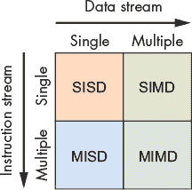
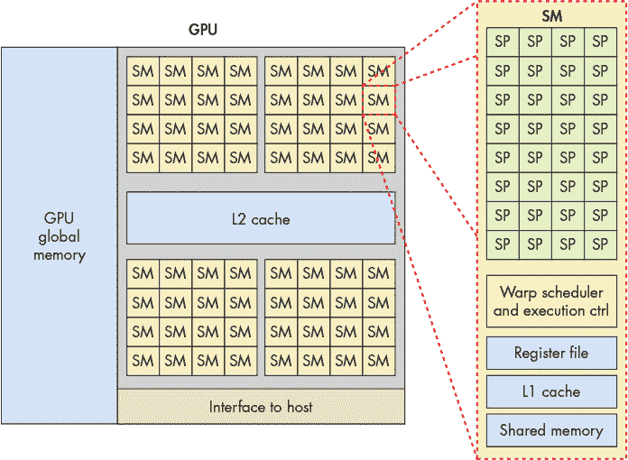
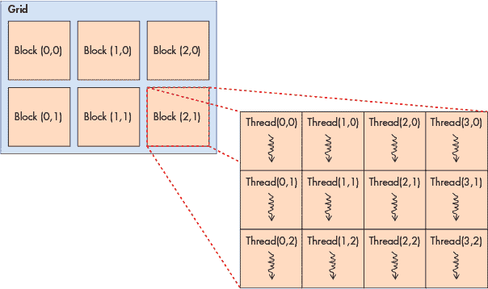
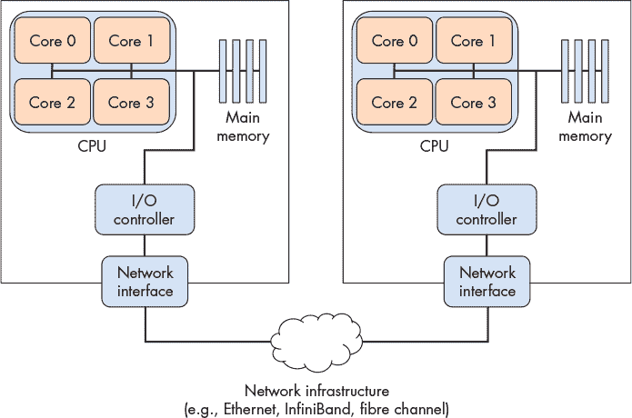
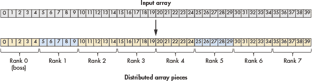
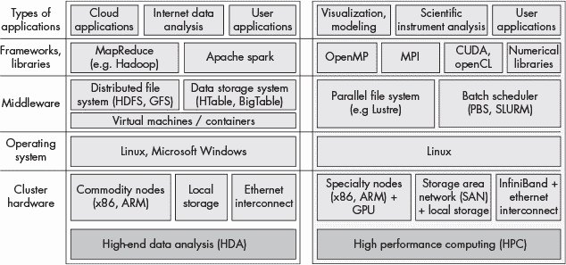
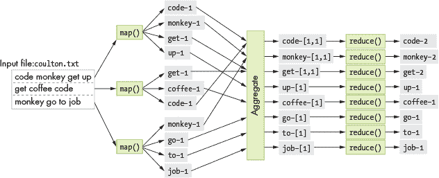

# 第十六章：**展望未来：其他并行系统和并行编程模型**


在上一章中，我们讨论了共享内存并行性和多线程编程。在本章中，我们介绍了适用于不同架构类别的其他并行编程模型和语言。具体而言，我们介绍了面向硬件加速器的并行性，重点讨论图形处理单元（GPU）和基于 GPU 的通用计算（GPGPU 计算），以 CUDA 为例；分布式内存系统和消息传递，以 MPI 为例；以及云计算，举例说明 MapReduce 和 Apache Spark。

#### 全新世界：弗林架构分类法

*弗林分类法*通常用于描述现代计算架构的生态系统（图 15-1）。



*图 15-1：弗林分类法对处理器如何应用指令进行了分类。*

水平轴表示数据流，而垂直轴表示指令流。在这个上下文中，*流*指的是数据或指令的流动。*单流*每个时间单位发出一个元素，类似于队列。相反，*多流*通常每个时间单位发出多个元素（可以想象成多个队列）。因此，单一指令流（SI）每个时间单位发出一个指令，而多重指令流（MI）每个时间单位发出多个指令。同样，单一数据流（SD）每个时间单位发出一个数据元素，而多重数据流（MD）每个时间单位发出多个数据元素。

处理器可以根据它使用的流的类型被分类为四种类型之一。

**SISD** 单指令/单数据系统具有一个控制单元，处理一个指令流，只能一次执行一个指令。同样，处理器只能处理一个数据流或每次处理一个数据单元。2000 年代中期之前，大多数商业化的处理器都是 SISD 机器。

**MISD** 多指令/单数据系统具有多个指令单元，在一个数据流上执行。MISD 系统通常是为在关键任务系统中集成容错功能而设计的，例如 NASA 航天飞机的飞行控制程序。尽管如此，MISD 机器如今在实践中已经很少使用。

**SIMD** 单指令/多数据系统同时并行地对多个数据执行*相同*的指令，并且以同步方式执行。在“同步”执行过程中，所有指令都会被放入队列中，而数据则在不同的计算单元之间分配。在执行过程中，每个计算单元首先同时执行队列中的第一条指令，然后同时执行队列中的下一条指令，再接着是下一条，以此类推。SIMD 架构最著名的例子是图形处理单元（GPU）。早期的超级计算机也采用了 SIMD 架构。我们将在下一节中进一步讨论 GPU。

**MIMD** 多指令/多数据系统代表了最广泛使用的架构类别。它们非常灵活，能够同时处理多条指令或多个数据流。由于几乎所有现代计算机都使用多核 CPU，因此大多数计算机都被归类为 MIMD 机器。在“分布式内存系统、消息传递和 MPI”一节中，我们将讨论另一类 MIMD 系统——分布式内存系统，具体内容见第 746 页。

### 15.1 异构计算：硬件加速器、GPGPU 计算和 CUDA

*异构计算* 是使用计算机中的多个不同处理单元进行计算。这些处理单元通常有不同的指令集架构（ISA），有些由操作系统管理，而有些则不由操作系统管理。通常，异构计算意味着支持使用计算机的 CPU 核心和一个或多个加速单元（如*图形处理单元*（GPU）或*现场可编程门阵列*（FPGA））进行并行计算。1

开发者越来越多地实现异构计算解决方案，以应对大型数据密集型和计算密集型问题。这类问题在科学计算中非常普遍，同时也广泛应用于大数据处理、分析和信息提取等领域。通过利用计算机上 CPU 和加速单元的处理能力，程序员可以提高应用程序的并行执行程度，从而提高性能和可扩展性。

在本节中，我们介绍了使用硬件加速器的异构计算，以支持通用并行计算。我们将重点讨论 GPU 和 CUDA 编程语言。

#### 15.1.1 硬件加速器

除了 CPU，计算机还配备了其他处理单元，旨在执行特定任务。这些单元并不是像 CPU 那样的通用处理单元，而是为实现特定设备功能或执行系统中的特定类型处理而优化的专用硬件。FPGA、Cell 处理器和 GPU 就是这类处理单元的三个例子。

##### FPGA

FPGA 是一种集成电路，由门、电池和互联组件组成。它们是可重新编程的，意味着可以重新配置以实现硬件中的特定功能，通常用于原型设计应用特定集成电路（ASIC）。与完整的 CPU 相比，FPGA 通常消耗更少的功耗，从而实现更高效的能源使用。FPGA 集成到计算机系统中的一些常见方式包括作为设备控制器、传感器数据处理、加密和测试新硬件设计（由于其可重新编程的特性，可以在 FPGA 上实现、调试和测试设计）。FPGA 可以设计为包含大量简单处理单元的电路。FPGA 也是低延迟设备，可以直接连接到系统总线。因此，它们被用于实现非常快速的并行计算，执行由若干数据输入通道上的独立并行处理所构成的规则模式。然而，重新编程 FPGA 需要较长时间，它们的使用被局限于支持并行工作负载的特定部分的快速执行或运行固定程序工作负载。^(2)

##### GPU 与 Cell 处理器

Cell 处理器是一种多核处理器，包含一个通用处理器和多个专门加速特定类型计算（如多媒体处理）的协处理器。索尼 PlayStation 3 游戏系统是第一个采用 Cell 架构的设备，使用 Cell 协处理器来加速图形处理。

GPU 执行计算机图形计算——它们操作图像数据以实现高速图形渲染和图像处理。GPU 将结果写入帧缓冲区，将数据传输到计算机显示器。受计算机游戏应用的推动，如今先进的 GPU 已成为台式机和笔记本系统的标准配置。

在 2000 年代中期，平行计算研究人员认识到，将加速器与计算机的 CPU 核心结合使用以支持通用并行计算的潜力。

#### 15.1.2 GPU 架构概述

GPU 硬件是为计算机图形和图像处理设计的。GPU 的发展历程主要受到视频游戏行业的推动。为了支持更细致的图形和更快的帧渲染，GPU 设备由成千上万的专用处理器组成，专门设计用来高效地并行处理图像数据，比如二维图像中的单个像素值。

GPU 实现的硬件执行模型是*单指令*/*多线程*（SIMT），是 SIMD 的变种。SIMT 类似于多线程的 SIMD，其中单个指令由在处理单元上运行的多个线程同步执行。在 SIMT 中，线程的总数可以大于处理单元的总数，因此需要在处理器上调度多个线程组，以执行相同的指令序列。

以 NVIDIA 的 GPU 为例，它们由多个流式多处理器（SM）组成，每个 SM 都有自己的执行控制单元和内存空间（寄存器、L1 缓存和共享内存）。每个 SM 由多个标量处理器（SP）核心组成。SM 包括一个 warp 调度器，调度*warp*，即一组应用程序线程，在其 SP 核心上同步执行。在同步执行中，warp 中的每个线程每个周期执行相同的指令，但操作不同的数据。例如，如果一个应用程序正在将彩色图像转换为灰度图像，那么 warp 中的每个线程将同时执行相同的指令序列，将像素的 RGB 值设置为其灰度值。warp 中的每个线程在不同的像素数据值上执行这些指令，从而使图像的多个像素并行更新。由于线程是同步执行的，处理器设计可以简化，使得多个核心共享相同的指令控制单元。每个单元包含缓存内存和多个寄存器，用于在并行处理核心的同步操作中存储数据。

图 15-2 展示了一个简化的 GPU 架构，包含其某个 SM 单元的详细视图。每个 SM 由多个 SP 核心、一个 warp 调度器、一个执行控制单元、一个 L1 缓存和共享内存空间组成。



*图 15-2：一个简化的 GPU 架构示例，包含 2,048 个核心。该图展示了 GPU 被划分为 64 个 SM 单元，以及其中一个 SM 的详细信息，包含 32 个 SP 核心。SM 的 warp 调度器在其 SP 核心上调度线程 warp。线程 warp 在 SP 核心上同步执行。*

#### 15.1.3 GPGPU 计算

*通用 GPU*（GPGPU）计算将专用 GPU 处理器应用于通用并行计算任务。GPGPU 计算结合了主机 CPU 核心上的计算和 GPU 处理器上的 SIMT 计算。GPGPU 计算在能够作为网格多维数据流处理计算构建的并行应用程序（或应用程序的一部分）上表现最佳。

主机操作系统不管理 GPU 的处理器或内存。因此，程序数据需要在 GPU 上分配空间，并由程序员在主机内存和 GPU 内存之间复制数据。GPGPU 编程语言和库通常提供 GPU 内存的编程接口，隐藏了程序员在显式管理 GPU 内存时的一些或全部困难。例如，在 CUDA 中，程序员可以调用 CUDA 库函数，显式地在 GPU 上分配 CUDA 内存，并在 GPU 上的 CUDA 内存和主机内存之间复制数据。CUDA 程序员还可以使用 CUDA 统一内存，这是 CUDA 对主机和 GPU 内存之上的单一内存空间的抽象。CUDA 统一内存隐藏了独立的 GPU 和主机内存，以及它们之间的内存复制，免去了 CUDA 程序员的处理。

GPU 还提供了有限的线程同步支持，这意味着 GPGPU 并行计算对于那些典型的并行应用表现尤为出色，尤其是那些轻松并行或具有大范围独立并行流计算且几乎没有同步点的应用。GPU 是大规模并行处理器，任何在数据上执行长时间序列独立相同（或大部分相同）计算步骤的程序，都可能作为 GPGPU 并行应用表现良好。GPGPU 计算在主机与设备内存之间进行较少内存复制时也表现良好。如果 GPU-CPU 数据传输占据了执行时间，或应用程序需要精细的同步，GPGPU 计算可能无法提供良好的性能，甚至无法超越多线程的 CPU 版本。

#### 15.1.4 CUDA

CUDA（计算统一设备架构）^(3)是 NVIDIA 为其图形设备上的 GPGPU 计算提供的编程接口。CUDA 旨在支持异构计算，其中一些程序功能在主机 CPU 上运行，其他则在 GPU 设备上运行。程序员通常用 C 或 C++编写 CUDA 程序，并添加注释来指定 CUDA 内核函数，然后调用 CUDA 库函数来管理 GPU 设备内存。CUDA *内核函数*是执行在 GPU 上的函数，CUDA *线程*是 CUDA 程序中基本的执行单元。CUDA 线程在 GPU 的 SM 单元中以 warp 的形式调度执行，并在其数据部分（存储在 GPU 内存中）上执行 CUDA 内核代码。内核函数使用`__global__`进行注释，以将其与主机函数区分开。CUDA 的`__device__`函数是可以从 CUDA 内核函数中调用的辅助函数。

CUDA 程序的内存空间分为主机内存和 GPU 内存。程序必须显式地分配和释放 GPU 内存空间，以存储 CUDA 内核操作的数据。CUDA 程序员必须显式地将数据从主机和 GPU 内存之间复制，或者使用 CUDA 统一内存，该内存呈现一个直接由 GPU 和主机共享的内存空间视图。以下是 CUDA 基本内存分配、内存释放和显式内存复制函数的示例：

```

/* "returns" through pass-by-pointer param dev_ptr GPU memory of size bytes

 * returns cudaSuccess or a cudaError value on error

 */

cudaMalloc(void **dev_ptr, size_t size);

/* free GPU memory

 * returns cudaSuccess or cudaErrorInvalidValue on error

 */

cudaFree(void *data);

/* copies data from src to dst, direction is based on value of kind

 *   kind: cudaMemcpyHosttoDevice is copy from cpu to gpu memory

 *   kind: cudaMemcpyDevicetoHost is copy from gpu to cpu memory

 * returns cudaSuccess or a cudaError value on error

 */

cudaMemcpy(void *dst, const void *src, size_t count, cudaMemcpyKind kind);
```

CUDA 线程被组织成*块*，而块又被组织成*网格*。网格可以组织成一维、二维或三维的块分组。同样，块可以组织成一维、二维或三维的线程分组。每个线程通过其在包含块中的(*x*,*y*,*z*)位置以及其在网格中的(*x*,*y*,*z*)位置被唯一标识。例如，程序员可以将二维块和网格维度定义如下：

```

dim3 blockDim(16,16);  // 256 threads per block, in a 16x16 2D arrangement

dim3 gridDim(20,20);   // 400 blocks per grid, in a 20x20 2D arrangement
```

当调用一个内核时，它的块/网格和线程/块布局在调用中被指定。例如，这里是调用一个名为`do_something`的内核函数，使用上述定义的`gridDim`和`blockDim`来指定网格和块的布局（并传递参数`dev_array`和 100）：

```
ret = do_something<<<gridDim,blockDim>>>(dev_array, 100);
```

图 15-3 展示了一个线程块二维排列的示例。在此示例中，网格是一个 3 × 2 的块数组，每个块是一个 4 × 3 的线程数组。



*图 15-3：CUDA 线程模型。一个由线程块组成的网格。块和线程可以组织成一维、二维或三维布局。此示例显示了一个二维块的网格，每个网格有 3 × 2 个块，每个块有 4 × 3 个线程。*

线程在此布局中的位置由其所在块的(*x*,*y*)坐标（`threadId.x`，`threadId.y`）和其在网格中的块的(*x*,*y*)坐标（`blockIdx.x`，`blockIdx.y`）给出。请注意，块和线程的坐标是基于(*x*,*y*)的，其中*x*轴是水平的，*y*轴是垂直的。元素(0,0)位于左上角。CUDA 内核还有一些变量，用于定义块的维度（`blockDim.x`和`blockDim.y`）。因此，对于执行内核的任何线程，其在二维线程数组中的（行，列）位置可以逻辑上表示为如下：

```
int row = blockIdx.y * blockDim.y + threadIdx.y;

int col = blockIdx.x * blockDim.x + threadIdx.x;
```

尽管并非严格必要，CUDA 程序员通常会将块和线程组织成与程序数据的逻辑结构相匹配。例如，如果程序正在处理二维矩阵，通常会将线程和块组织成二维的排列方式。这样，线程的块(*x*,*y*)及其块内的线程(*x*,*y*)可以用来将线程在二维线程块中的位置与二维数组中的一个或多个数据值关联起来。

##### 示例 CUDA 程序：标量乘法

作为示例，考虑一个执行向量标量乘法的 CUDA 程序：

```
x = a * x    // where x is a vector and a is a scalar value
```

由于程序数据包含一维数组，使用一维的块/网格布局和线程/块的方式效果良好。这不是必须的，但它使线程与数据的映射更加容易。

程序运行时，主函数将执行以下操作：

1\. 为向量`x`分配主机端内存并初始化。

2\. 为向量`x`分配设备端内存，并将其从主机内存复制到 GPU 内存。

3\. 调用一个 CUDA 内核函数，执行向量标量乘法并行计算，传入向量`x`的设备地址和标量值`a`作为参数。

4\. 将结果从 GPU 内存复制到主机内存中的向量`x`。

在下面的示例中，我们展示了一个执行这些步骤以实现标量向量乘法的 CUDA 程序。我们已从代码清单中删除了一些错误处理和细节，但完整的解决方案可以在网上找到。^(4)

CUDA 程序的主函数执行上述步骤：

```

#include <cuda.h>

#define BLOCK_SIZE       64     /* threads per block */

#define N              10240    /* vector size */

// some host-side init function

void init_array(int *vector, int size, int step);

// host-side function: main

int main(int argc, char **argv) {

  int *vector, *dev_vector, scalar;

  scalar = 3;     // init scalar to some default value

  if(argc == 2) { // get scalar's value from a command line argument

    scalar = atoi(argv[1]);

  }

  // 1\. allocate host memory space for the vector (missing error handling)

  vector = (int *)malloc(sizeof(int)*N);

  // initialize vector in host memory

  // (a user-defined initialization function not listed here)

  init_array(vector, N, 7);

  // 2\. allocate GPU device memory for vector (missing error handling)

  cudaMalloc(&dev_vector, sizeof(int)*N);

  // 2\. copy host vector to device memory (missing error handling)

  cudaMemcpy(dev_vector, vector, sizeof(int)*N, cudaMemcpyHostToDevice;)

  // 3\. call the CUDA scalar_multiply kernel

  // specify the 1D layout for blocks/grid (N/BLOCK_SIZE)

  //    and the 1D layout for threads/block (BLOCK_SIZE)

  scalar_multiply<<<(N/BLOCK_SIZE), BLOCK_SIZE===(dev_vector, scalar);

  // 4\. copy device vector to host memory (missing error handling)

  cudaMemcpy(vector, dev_vector, sizeof(int)*N, cudaMemcpyDeviceToHost);

  // ...(do something on the host with the result copied into vector)

  // free allocated memory space on host and GPU

  cudaFree(dev_vector);

  free(vector);

  return 0;

}
```

每个 CUDA 线程执行 CUDA 内核函数`scalar_multiply`。CUDA 内核函数是从单个线程的角度编写的。它通常包括两个主要步骤：（1）调用线程根据其在线程块中的位置和块在网格中的位置，确定它负责处理的数据部分；（2）调用线程对其负责的数据部分执行应用程序特定的计算。在这个示例中，每个线程负责计算数组中的一个元素的标量乘法。内核函数的代码首先根据调用线程的块和线程标识符计算出一个唯一的索引值。然后，它使用该值作为数组数据的索引，执行标量乘法操作（`array[index] =` `array[index] * scalar`）。运行在 GPU 的 SM 单元上的 CUDA 线程每个计算一个不同的索引值，以并行更新数组元素。

```

/*

 * CUDA kernel function that performs scalar multiply

 * of a vector on the GPU device

 *

 * This assumes that there are enough threads to associate

 * each array[i] element with a signal thread

 * (in general, each thread would be responsible for a set of data elements)

 */

__global__ void scalar_multiply(int *array, int scalar) {

  int index;

  // compute the calling thread's index value based on

  // its position in the enclosing block and grid

  index = blockIdx.x * blockDim.x + threadIdx.x;

  // the thread's uses its index value is to

  // perform scalar multiply on its array element

  array[index] = array[index] * scalar;

}
```

##### CUDA 线程调度与同步

每个 CUDA 线程块由 GPU SM 单元运行。一个 SM 调度来自同一个线程块的线程波在其处理器核心上运行。一个波中的所有线程在锁步执行相同的指令，通常处理不同的数据。线程共享指令管道，但为本地变量和参数提供各自的寄存器和堆栈空间。

由于线程块在单独的 SM 上调度，增加每个线程块的线程数会提高并行执行的程度。因为 SM 在其处理单元上调度线程波（warp）执行，如果每个线程块的线程数是波大小的倍数，那么在计算中就不会浪费 SM 处理器核心。实际上，使用每个线程块的线程数为 SM 处理核心数的小倍数通常效果良好。

CUDA 保证所有来自单个内核调用的线程在任何后续内核调用的线程调度之前完成。因此，在不同的内核调用之间存在一个隐式的同步点。然而，在单个内核调用内，线程块会以任意顺序在 GPU SM 上调度运行内核代码。因此，程序员不应假设不同线程块之间的线程执行顺序。CUDA 为同步线程提供了一些支持，但仅限于同一个线程块中的线程。

#### 15.1.5 用于 GPGPU 编程的其他语言

还有其他用于 GPGPU 计算的编程语言。OpenCL、OpenACC 和 OpenHMPP 是三个可以用来编程任何图形设备的语言示例（它们不是专门为 NVIDIA 设备设计的）。OpenCL（开放计算语言）的编程模型与 CUDA 相似；两者都在目标架构上实现了低级编程模型（或者实现了更薄的编程抽象）。OpenCL 旨在支持广泛的异构计算平台，包括主机 CPU 结合其他计算单元（可能包括 CPU 或加速器，如 GPU 和 FPGA）。OpenACC（开放加速器）是比 CUDA 或 OpenCL 更高层次的抽象编程模型，旨在提高可移植性和程序员的易用性。程序员为代码中的并行执行部分添加注解，编译器会生成可以在 GPU 上运行的并行代码。OpenHMPP（开放混合多核编程）是另一种提供更高级编程抽象的语言，适用于异构编程。

### 15.2 分布式内存系统、消息传递与 MPI

第十四章描述了像 Pthreads（见“你好线程！编写你的第一个多线程程序”第 677 页）和 OpenMP（见“使用 OpenMP 的隐式线程”第 729 页）等机制，程序使用这些机制来利用*共享内存系统*中的多个 CPU 核心。在这种系统中，每个核心共享相同的物理内存硬件，允许它们通过读取和写入共享内存地址来交换数据和同步行为。尽管共享内存系统使得通信相对容易，但其可扩展性受到系统中 CPU 核心数量的限制。

截至 2019 年，高端商业服务器 CPU 通常提供最多 64 个核心。然而，对于某些任务，即使有几百个 CPU 核心也远远不够。例如，想象一下尝试模拟地球海洋的流体动力学，或索引整个万维网的内容以构建搜索应用程序。这些庞大的任务需要比任何单一计算机能提供的更多的物理内存和处理器。因此，要求大量 CPU 核心的应用程序运行在摒弃共享内存的系统上。相反，它们在由多台计算机构成的系统上运行，每台计算机都有自己的 CPU 和内存，通过网络通信来协调它们的行为。

一组计算机共同工作被称为*分布式内存系统*（或通常称为*分布式系统*）。

**警告 关于时间顺序的说明**

尽管本书中按顺序介绍了它们，但系统设计师在线程或 OpenMP 等机制出现之前就已经构建了分布式系统。

一些分布式内存系统比其他系统更紧密地集成硬件。例如，*超级计算机*是一种高性能系统，其中许多*计算节点*被紧密耦合（紧密集成）到一个快速互连网络中。每个计算节点包含自己的 CPU、GPU 和内存，但多个节点可能共享辅助资源，如二级存储和电源供应。硬件共享的具体程度在不同的超级计算机之间有所不同。

另一方面，分布式应用程序可能运行在一组松散耦合（集成度较低）的完全自主计算机（*节点*）上，这些计算机通过像以太网这样的传统局域网（LAN）技术连接。这样的节点集合被称为*商用现成*（COTS）集群。COTS 集群通常采用*无共享架构*，其中每个节点包含自己的计算硬件（即 CPU、GPU、内存和存储）。图 15-4 展示了一个由两个共享内存计算机组成的无共享分布式系统。



*图 15-4：由两个计算节点构建的无共享分布式内存架构的主要组件*

#### 15.2.1 并行与分布式处理模型

应用程序设计师通常使用经过验证的设计来组织分布式应用程序。采用这样的应用模型有助于开发人员推理应用程序，因为其行为将符合公认的规范。每种模型都有其独特的优缺点——没有一种通用的解决方案。我们将在以下小节中简要介绍一些常见的模型，但请注意，这并不是一个详尽的列表。

##### 客户端/服务器

*客户端/服务器模型*是一个非常常见的应用模型，它将应用程序的职责分配给两个角色：客户端进程和服务器进程。服务器进程向请求某些操作的客户端提供服务。服务器进程通常在已知的地址等待，接收来自客户端的连接请求。一旦建立连接，客户端向服务器进程发送请求，服务器进程要么满足请求（例如，通过提取请求的文件），要么报告错误（例如，文件不存在或客户端无法正确认证）。

虽然你可能没有意识到，访问网页实际上就是通过客户端/服务器模型进行的！你的网页浏览器（客户端）连接到网站（服务器），该网站位于一个公共地址（例如，[diveintosystems.org](http://diveintosystems.org)），以检索网页内容。

##### 管道

*管道模型*将应用程序划分为一系列独立的步骤，每个步骤都可以独立地处理数据。这个模型适用于工作流涉及大数据输入的线性、重复任务的应用程序。例如，考虑计算机动画电影的制作。电影的每一帧都必须通过一系列步骤进行处理，这些步骤会改变帧的内容（例如，添加纹理或应用光照）。由于每个步骤在序列中是独立进行的，动画师可以通过在大规模计算机集群中并行处理帧来加速渲染过程。

##### 主管/工人

在*主管/工人模型*中，一个进程充当中央协调器，并将工作分配给其他节点上的进程。这个模型适用于需要处理大型可分输入的问题。主管将输入分成较小的块，并将一个或多个块分配给每个工人。在某些应用中，主管可能静态地将每个工人分配一个输入块。在其他情况下，工人可能会反复完成一个输入块，然后返回主管处动态获取下一个输入块。稍后在本节中，我们将展示一个示例程序，其中主管将一个数组分配给多个工人，以执行数组的标量乘法。

请注意，这个模型有时也被称为其他名称，如“主/工人”或其他变体，但其核心思想是相同的。

##### 对等网络

与老板/工人模型不同，*对等应用程序*避免依赖集中控制进程。相反，对等进程自我组织应用程序，将其构造成一个结构，在这个结构中，它们各自承担大致相同的职责。例如，在 BitTorrent 文件共享协议中，每个对等体不断与其他对等体交换文件的部分，直到它们都接收到完整的文件。

由于缺乏集中组件，对等应用程序通常对节点故障具有较强的鲁棒性。另一方面，对等应用程序通常需要复杂的协调算法，这使得它们难以构建和严格测试。

#### 15.2.2 通信协议

无论它们是超计算机的一部分还是 COTS 集群，分布式内存系统中的进程通过*消息传递*进行通信，其中一个进程显式地将消息发送给一个或多个其他节点上的进程，而这些进程接收它。系统上运行的应用程序决定如何利用网络——一些应用程序需要频繁通信，以紧密协调跨多个节点的进程行为，而其他应用程序则通过通信将大型输入分配给进程，然后大多独立工作。

一个分布式应用程序通过定义通信*协议*来形式化其通信期望，协议描述了一组规则，规范了它如何使用网络，包括：

+   进程何时应该发送消息

+   应该将消息发送给哪个进程

+   如何格式化消息

如果没有协议，应用程序可能无法正确解释消息，甚至可能发生死锁（请参见第 700 页的“死锁”）。例如，如果一个应用程序由两个进程组成，每个进程都等待对方发送消息，那么这两个进程都永远不会取得进展。协议为通信添加了结构，从而减少了这种故障的可能性。

要实现通信协议，应用程序需要执行一些基本功能，如发送和接收消息、命名进程（寻址）和同步进程执行。许多应用程序依赖消息传递接口来实现这些功能。

#### 15.2.3 消息传递接口

*消息传递接口*（MPI）定义了一个标准化的接口（但并不自己实现），应用程序可以通过它在分布式内存系统中进行通信。通过采用 MPI 通信标准，应用程序变得*可移植*，意味着它们可以在许多不同的系统上编译和执行。换句话说，只要安装了 MPI 实现，一个可移植的应用程序就可以从一个系统移动到另一个系统，并期望能够正确执行，即使这些系统具有不同的底层特性。

MPI 允许程序员将应用程序划分为多个进程。它为每个应用程序的进程分配一个唯一标识符，称为 *rank*，该标识符的范围从 0 到 *N –* 1，适用于包含 *N* 个进程的应用程序。一个进程可以通过调用 `MPI_Comm_rank` 函数来获取它的 rank，并且可以通过调用 `MPI_Comm_size` 来得知应用程序中有多少个进程在执行。要发送消息，进程调用 `MPI_Send` 并指定目标接收者的 rank。类似地，进程通过调用 `MPI_Recv` 来接收消息，并指定是等待来自特定节点的消息，还是接收来自任意发送者的消息（使用常量 `MPI_ANY_SOURCE` 作为 rank）。

除了基本的发送和接收函数外，MPI 还定义了多种函数，使一个进程可以更方便地将数据传送给多个接收者。例如，`MPI_Bcast` 允许一个进程通过一次函数调用将消息发送给应用程序中的每个进程。它还定义了一对函数，`MPI_Scatter` 和 `MPI_Gather`，使得一个进程能够将一个数组拆分并将其片段分发到各个进程（scatter），对数据进行操作，然后再通过 `MPI_Gather` 函数收集所有数据，以合并结果（gather）。

因为 MPI *规定* 只提供了一组函数及其行为方式，所以每个系统设计者可以根据其系统的特性来实现 MPI 的功能。例如，具有支持广播的互连网络的系统（即同时将一条消息发送给多个接收者）可能比没有此类支持的系统更高效地实现 MPI 的 `MPI_Bcast` 函数。

#### 15.2.4 MPI Hello World

作为 MPI 编程的入门，考虑这里提供的“Hello World”程序^(5)：

```

#include <stdio.h>

#include <unistd.h>

#include "mpi.h"

int main(int argc, char **argv) {

    int rank, process_count;

    char hostname[1024];

    /* Initialize MPI. */

    MPI_Init(&argc, &argv);

    /* Determine how many processes there are and which one this is. */

    MPI_Comm_size(MPI_COMM_WORLD, &process_count);

    MPI_Comm_rank(MPI_COMM_WORLD, &rank);

    /* Determine the name of the machine this process is running on. */

    gethostname(hostname, 1024);

    /* Print a message, identifying the process and machine it comes from. */

    printf("Hello from %s process %d of %d\n", hostname, rank, process_count);

    /* Clean up. */

    MPI_Finalize();

    return 0;

}
```

启动此程序时，MPI 会同时在一台或多台计算机上执行多个独立的进程副本。每个进程都会调用 MPI 来确定正在执行的总进程数（通过 `MPI_Comm_size`）以及它在这些进程中的 rank（通过 `MPI_Comm_rank`）。获取这些信息后，每个进程都会打印一条简短的消息，包含它的 rank 和运行所在计算机的名称（`hostname`），然后终止。

**注意 运行 MPI 代码**

要运行这些 MPI 示例，您需要在系统上安装支持 MPI 的实现，例如 OpenMPI^(6) 或 MPICH^(7)。

要编译这个示例，请调用 `mpicc` 编译器程序，该程序执行一个支持 MPI 的 GCC 版本，用于构建程序并将其与 MPI 库链接：

```
$ mpicc -o hello_world_mpi hello_world_mpi.c
```

要执行该程序，使用`mpirun`工具启动多个并行进程。`mpirun`命令需要指定在哪些计算机上运行进程（`--hostfile`）以及每台机器上运行多少个进程（`-np`）。在这里，我们提供了一个名为`hosts.txt`的文件，告诉`mpirun`在两台计算机上创建四个进程，一台名为`lemon`，另一台名为`orange`：

```

$ mpirun -np 8 --hostfile hosts.txt ./hello_world_mpi

Hello from lemon process 4 of 8

Hello from lemon process 5 of 8

Hello from orange process 2 of 8

Hello from lemon process 6 of 8

Hello from orange process 0 of 8

Hello from lemon process 7 of 8

Hello from orange process 3 of 8

Hello from orange process 1 of 8
```

**警告：MPI 执行顺序**

你*永远不要*假设 MPI 进程的执行顺序。进程在多个机器上启动，每台机器都有自己的操作系统和进程调度器。如果程序的正确性要求进程按照特定顺序执行，你必须确保发生正确的顺序——例如，通过强制某些进程暂停，直到接收到消息。

#### 15.2.5 MPI 标量乘法

对于一个更具实质性的 MPI 示例，考虑对数组进行标量乘法。这个示例采用了主管/工人模型——一个进程将数组分成更小的块并将它们分发给工人进程。请注意，在这个标量乘法的实现中，主管进程也充当了一个工人的角色，在将数组片段分配给其他工人后，它还会乘以数组的一部分。

为了利用并行工作的优势，每个进程仅将其本地数组部分的值乘以标量值，然后所有工人将结果发送回主管进程，以形成最终结果。在程序的多个位置，代码会检查进程的 rank 是否为 0。

```

if (rank == 0) {

    /* This code only executes at the boss. */

}
```

这个检查确保只有一个进程（即 rank 为 0 的进程）充当主管角色。根据惯例，MPI 应用通常选择 rank 为 0 的进程来执行一次性任务，因为无论进程数多少，总会有一个进程被分配 rank 为 0（即使只有一个进程在执行）。

##### MPI 通信

主管进程首先确定标量值和初始输入数组。在实际的科学计算应用中，主管可能会从输入文件中读取这些值。为了简化这个示例，主管使用一个常数标量值（10），并生成一个简单的 40 元素数组（包含 0 到 39 的序列）以供说明。

该程序需要在 MPI 进程之间进行通信，以完成三个重要任务：

1\. 主管将标量值和数组大小发送给*所有*工人。

2\. 主管将初始数组分成若干块，并将每一块分配给一个工人。

3\. 每个工人将自己负责的数组部分的值乘以标量，然后将更新后的值发送回主管。

##### 广播重要值

为了将标量值发送给工人，示例程序使用`MPI_Bcast`函数，该函数允许一个 MPI 进程通过一次函数调用将相同的值发送给所有其他 MPI 进程：

```

/* Boss sends the scalar value to every process with a broadcast. */

MPI_Bcast(&scalar, 1, MPI_INT, 0, MPI_COMM_WORLD);
```

此调用将从排名为 0 的进程开始，向每个其他进程发送一个整数（`MPI_INT`），其数据来源于`scalar`变量的地址（`MPI_COMM_WORLD`）。所有工作进程（即排名非零的进程）都将接收到广播并将数据存入各自的`scalar`变量的本地副本中，因此，当此调用完成时，每个进程都知道要使用的标量值。

**注意 MPI_BCAST 行为**

每个进程都会执行`MPI_Bcast`，但根据调用进程的排名，行为会有所不同。如果排名与第四个参数匹配，那么调用者将充当发送者的角色。所有其他调用`MPI_Bcast`的进程则作为接收者。

类似地，主节点将数组的总大小广播到每个其他进程。在获知数组的总大小后，每个进程通过将总数组大小除以 MPI 进程的数量来设置`local_size`变量。`local_size`变量表示每个工作进程负责的数组元素数量。例如，如果输入数组包含 40 个元素，而应用程序由八个进程组成，那么每个进程将负责一个五个元素的数组片段（40 / 8 = 5）。为了简化示例，假设进程的数量能够均匀地整除数组的大小：

```

/* Each process determines how many processes there are. */

MPI_Comm_size(MPI_COMM_WORLD, &process_count);

/* Boss sends the total array size to every process with a broadcast. */

MPI_Bcast(&array_size, 1, MPI_INT, 0, MPI_COMM_WORLD);

/* Determine how many array elements each process will get.

 * Assumes the array is evenly divisible by the number of processes. */

local_size = array_size / process_count;
```

##### 数组分配

现在每个进程都知道了标量值以及它需要负责的元素数量，主节点必须将数组划分成多个部分并将它们分发给工作进程。注意，在这个实现中，主节点（排名 0）也作为一个工作进程参与。例如，对于一个包含 40 个元素的数组和八个进程（排名 0–7），主节点应该保留数组元素 0–4（排名 0），将元素 5–9 发送给排名 1，将元素 10–14 发送给排名 2，依此类推。图 15-5 展示了主节点如何将数组片段分配给每个 MPI 进程。



*图 15-5：一个 40 元素数组在八个 MPI 进程（排名 0–7）之间的分配情况*

一种分发数组片段给每个工作进程的选项是将主节点的`{MPI_Send}`调用与每个工作进程的`{MPI_Recv}`调用结合使用：

```

if (rank == 0) {

    int i;

    /* For each worker process, send a unique chunk of the array. */

    for (i = 1; i < process_count; i++) {

        /* Send local_size ints starting at array index (i * local_size) */

        MPI_Send(array + (i * local_size), local_size, MPI_INT, i, 0,

                 MPI_COMM_WORLD);

    }

} else {

    MPI_Recv(local_array, local_size, MPI_INT, 0, 0, MPI_COMM_WORLD,

             MPI_STATUS_IGNORE);

}
```

在这段代码中，主节点执行一个循环，该循环为每个工作进程执行一次，在其中它将数组的一部分发送给工作进程。它从`array`的地址开始，偏移量为`(i * local_size)`，以确保每个工作进程接收到数组的独特片段。也就是说，排名为 1 的工作进程将获得从索引 5 开始的数组片段，排名为 2 的工作进程将获得从索引 10 开始的数组片段，依此类推，如图 15-5 所示。

每次调用`MPI_Send`都会向排名为 i 的进程发送`local_size`（5）个整数的数据（20 字节）。最后的`0`参数表示消息标签，这是一个高级功能，程序不需要使用该功能——将其设置为`0`表示所有消息是平等的。

所有工作线程都调用`MPI_Recv`来获取它们的数组片段，并将其存储在`local_array`所指向的内存地址中。它们从进程号为 0 的节点接收`local_size`（5 个）整数的数据（20 字节）。请注意，`MPI_Recv`是一个*阻塞*调用，这意味着调用它的进程会暂停，直到接收到数据。由于`MPI_Recv`调用是阻塞的，因此没有任何工作线程会继续执行，直到老板发送它的数组片段。

##### 并行执行

当一个工作线程获得它的数组片段后，它可以开始将每个数组值与标量相乘。由于每个工作线程获得的是数组的唯一子集，因此它们可以独立执行，进行并行计算，无需进行通信。

##### 聚合结果

最后，在工作线程完成乘法运算后，它们将更新后的数组值发送回老板，老板负责聚合结果。使用`MPI_Send`和`MPI_Recv`，这个过程与我们之前看到的数组分发代码类似，不同的是发送者和接收者的角色交换了：

```

if (rank == 0) {

    int i;

    for (i = 1; i < process_count; i++) {

        MPI_Recv(array + (i * local_size), local_size, MPI_INT, i, 0,

                 MPI_COMM_WORLD, MPI_STATUS_IGNORE);

    }

} else {

    MPI_Send(local_array, local_size, MPI_INT, 0, 0, MPI_COMM_WORLD);

}
```

回想一下，`MPI_Recv`会*阻塞*或暂停执行，因此`for`循环中的每次调用会导致老板等待，直到它从工作线程*i*那里接收到数组的一个片段。

##### 分发/聚集

尽管前面示例中的`for`循环通过`MPI_Send`和`MPI_Recv`正确地分发了数据，但它们没有简洁地表达出其背后的*意图*。也就是说，它们在 MPI 看来只是一个发送和接收调用的系列，而没有明确表达出跨 MPI 进程分发数组的目标。由于并行应用程序经常需要像这个示例数组一样分发和收集数据，MPI 提供了专门为此目的设计的函数：`MPI_Scatter`和`MPI_Gather`。

这些函数提供了两个主要好处：它们允许将前面示例中的整个代码块用单个 MPI 函数调用来表达，从而简化代码；并且它们向底层 MPI 实现表达了操作的*意图*，MPI 可能会更好地优化它们的性能。

为了替换前面示例中的第一个循环，每个进程可以调用`MPI_Scatter`：

```

/* Boss scatters chunks of the array evenly among all the processes. */

MPI_Scatter(array, local_size, MPI_INT, local_array, local_size, MPI_INT,

            0, MPI_COMM_WORLD);
```

这个函数会自动将从`array`开始的内存内容分成包含`local_size`个整数的块，分发到`local_array`目标变量中。`0`参数指定了进程号为 0 的进程（即老板）是发送者，因此它读取并分发`array`源数据给其他进程（包括将一块数据发送给它自己）。其他每个进程作为接收者，接收数据到它们的`local_array`目标变量中。

在这一单一调用之后，工作线程可以并行地进行数组的乘法运算。当它们完成后，每个进程都会调用`MPI_Gather`来将结果聚集回老板的`array`变量中：

```

/* Boss gathers the chunks from all the processes and coalesces the

 * results into a final array. */

MPI_Gather(local_array, local_size, MPI_INT, array, local_size, MPI_INT,

           0, MPI_COMM_WORLD);
```

这个调用的行为类似于`MPI_Scatter`的反向操作：这次，`0`参数指定进程 0（即老板）为接收者，因此它更新`array`变量，而工作进程则分别从它们的`local_array`变量中发送`local_size`个整数。

##### MPI 标量乘法的完整代码

下面是使用`MPI_Scatter`和`MPI_Gather`的完整 MPI 标量乘法代码示例：^(8)

```

#include <stdio.h>

#include <stdlib.h>

#include "mpi.h"

#define ARRAY_SIZE (40)

#define SCALAR (10)

/* In a real application, the boss process would likely read its input from a

 * data file.  This example program produces a simple array and informs the

 * caller of the size of the array through the array_size pointer parameter.*/

int *build_array(int *array_size) {

    int i;

    int *result = malloc(ARRAY_SIZE * sizeof(int));

    if (result == NULL) {

        exit(1);

    }

    for (i = 0; i < ARRAY_SIZE; i++) {

        result[i] = i;

    }

    *array_size = ARRAY_SIZE;

    return result;

}

/* Print the elements of an array, given the array and its size. */

void print_array(int *array, int array_size) {

    int i;

    for (i = 0; i < array_size; i++) {

        printf("%3d ", array[i]);

    }

    printf("\n\n");

}

/* Multiply each element of an array by a scalar value. */

void scalar_multiply(int *array, int array_size, int scalar) {

    int i;

    for (i = 0; i < array_size; i++) {

        array[i] = array[i] * scalar;

    }

}

int main(int argc, char **argv) {

    int rank, process_count;

    int array_size, local_size;

    int scalar;

    int *array, *local_array;

    /* Initialize MPI */

    MPI_Init(&argc, &argv);

    /* Determine how many processes there are and which one this is. */

    MPI_Comm_size(MPI_COMM_WORLD, &process_count);

    MPI_Comm_rank(MPI_COMM_WORLD, &rank);

    /* Designate rank 0 to be the boss.  It sets up the problem by generating

     * the initial input array and choosing the scalar to multiply it by. */

    if (rank == 0) {

        array = build_array(&array_size);

        scalar = SCALAR;

        printf("Initial array:\n");

        print_array(array, array_size);

    }

    /* Boss sends the scalar value to every process with a broadcast.

     * Worker processes receive the scalar value by making this MPI_Bcast

     * call. */

    MPI_Bcast(&scalar, 1, MPI_INT, 0, MPI_COMM_WORLD);

    /* Boss sends the total array size to every process with a broadcast.

     * Worker processes receive the size value by making this MPI_Bcast

     * call. */

    MPI_Bcast(&array_size, 1, MPI_INT, 0, MPI_COMM_WORLD);

    /* Determine how many array elements each process will get.

     * Assumes the array is evenly divisible by the number of processes. */

    local_size = array_size / process_count;

    /* Each process allocates space to store its portion of the array. */

    local_array = malloc(local_size * sizeof(int));

    if (local_array == NULL) {

        exit(1);

    }

    /* Boss scatters chunks of the array evenly among all the processes. */

    MPI_Scatter(array, local_size, MPI_INT, local_array, local_size, MPI_INT,

                0, MPI_COMM_WORLD);

    /* Every process (including boss) performs scalar multiplication over its

     * chunk of the array in parallel. */

    scalar_multiply(local_array, local_size, scalar);

    /* Boss gathers the chunks from all the processes and coalesces the

     * results into a final array. */

    MPI_Gather(local_array, local_size, MPI_INT, array, local_size, MPI_INT,

               0, MPI_COMM_WORLD);

    /* Boss prints the final answer. */

    if (rank == 0) {

        printf("Final array:\n");

        print_array(array, array_size);

    }

    /* Clean up. */

    if (rank == 0) {

        free(array);

    }

    free(local_array);

    MPI_Finalize();

    return 0;

}
```

在`main`函数中，老板设置了问题并创建了一个数组。如果这是在解决一个实际问题（例如科学计算应用程序），老板可能会从输入文件中读取初始数据。在初始化数组后，老板需要将数组的大小和乘法使用的标量信息发送给所有其他工作进程，因此它将这些变量广播到每个进程。

现在，每个进程都知道数组的大小和进程的数量，它们可以各自进行划分，以确定它们负责乘法运算的数组元素数量。为了简单起见，代码假设数组能够被进程数量均匀地划分。

然后，老板使用`MPI_Scatter`函数将数组的相等部分发送给每个工作进程（包括它自己）。现在，工作进程已经拥有了所需的全部信息，因此它们各自并行地对自己负责的数组部分进行乘法计算。最后，当工作进程完成乘法操作后，老板使用`MPI_Gather`函数收集每个工作进程的数组部分，以报告最终结果。

编译和执行这个程序的过程如下：

```

$ mpicc -o scalar_multiply_mpi scalar_multiply_mpi.c

$ mpirun -np 8 --hostfile hosts.txt ./scalar_multiply_mpi

Initial array:

  0   1   2   3   4   5   6   7   8   9  10  11  12  13  14  15  16  17  18 19

 20  21  22  23  24  25  26  27  28  29  30  31  32  33  34  35  36  37  38 39

Final array:

  0  10  20  30  40  50  60  70  80  90 100 110 120 130 140 150 160 170 180 190

200 210 220 230 240 250 260 270 280 290 300 310 320 330 340 350 360 370 380 390
```

#### 15.2.6 分布式系统的挑战

通常，在分布式系统中协调多个进程的行为非常困难。如果硬件组件（例如 CPU 或电源）在共享内存系统中发生故障，整个系统将无法操作。然而，在分布式系统中，自治节点可以独立地发生故障。例如，如果一个节点消失而其他节点仍在运行，应用程序必须决定如何继续操作。类似地，互联网络可能发生故障，导致每个进程都认为其他所有进程都已失败。

分布式系统由于缺乏共享硬件，尤其是时钟，也面临着挑战。由于网络传输中的延迟不可预测，自治节点无法轻易确定消息发送的顺序。解决这些挑战（以及其他许多问题）超出了本书的范围。幸运的是，分布式软件设计师们构建了多个框架，简化了分布式应用程序的开发。我们将在下一节中介绍这些框架中的一些。

#### MPI 资源

MPI 非常庞大且复杂，本节内容几乎只是略微涉及。有关 MPI 的更多信息，我们建议：

+   洛伦斯·利弗莫尔国家实验室的 MPI 教程，作者：Blaise Barney。^(9)

+   CSinParallel 的 MPI 模式。^(10)

### 15.3 向 Exascale 迈进：云计算、大数据与计算的未来

技术的进步使人类能够以前所未有的速度生成数据。科学仪器，如望远镜、生物测序仪和传感器，以低成本产生高保真度的科学数据。随着科学家们努力分析这一“数据洪流”，他们越来越依赖复杂的多节点超级计算机，而这些计算机构成了*高性能计算*（HPC）的基础。

HPC 应用程序通常使用 C、C++或 Fortran 等语言编写，并通过 POSIX 线程、OpenMP 和 MPI 等库启用多线程和消息传递。到目前为止，本书的大部分内容都描述了在 HPC 系统上常用的架构特征、语言和库。那些有兴趣推动科学发展的公司、国家实验室和其他组织通常使用 HPC 系统，并构成了计算科学生态系统的核心。

与此同时，互联网设备的普及和社交媒体的无处不在使人类轻松地生成大量的在线多媒体内容，如网页、图片、视频、推文和社交媒体帖子。据估计，90%的所有在线数据是在过去两年内产生的，社会每秒生成 30TB 的用户数据（即每天 2.5 EB）。这股*用户数据*的洪流为公司和组织提供了大量关于用户习惯、兴趣和行为的信息，并促进了数据丰富的客户画像的构建，从而更好地定制商业产品和服务。为了分析用户数据，公司通常依赖多节点数据中心，这些数据中心共享许多典型超级计算机的硬件架构组件。然而，这些数据中心依赖于专为互联网数据设计的不同软件栈。用于存储和分析大规模互联网数据的计算机系统有时被称为*高端数据分析*（HDA）系统。像亚马逊、谷歌、微软和 Facebook 这样的公司在互联网数据分析中有着重要利益，它们构成了数据分析生态系统的核心。HDA 和数据分析革命大约始于 2010 年，现在已成为云计算研究的主流领域。

图 15-6 突出显示了 HDA 和 HPC 社区在软件使用方面的关键差异。请注意，这两个社区都使用类似的集群硬件，遵循分布式内存模型，其中每个计算节点通常有一个或多个多核处理器，并且通常配备 GPU。集群硬件通常包括*分布式文件系统*，允许用户和应用程序共同访问存储在集群多个节点本地的文件。



*图 15-6：HDA 与 HPC 框架的比较。基于 Jack Dongarra 和 Daniel Reed 的图表。^(11)*

与通常为 HPC 使用而建造和优化的超级计算机不同，HDA 社区依赖于*数据中心*，这些数据中心由大量的通用计算节点组成，通常通过以太网相互连接。在软件层面，数据中心通常采用虚拟机、大型分布式数据库以及支持对互联网数据进行高通量分析的框架。*云*一词指的是 HDA 数据中心中的数据存储和计算能力组件。

本节将简要介绍云计算、一些常用的云计算软件（特别是 MapReduce）以及未来面临的一些挑战。请注意，本节并不打算深入探讨这些概念；我们鼓励感兴趣的读者深入阅读参考资料，以获取更多细节。

#### 15.3.1 云计算

*云计算*是使用或租赁云端进行各种服务的方式。云计算使计算基础设施可以作为一种“公用设施”运行：少数几个中央提供商通过互联网为用户和组织提供（看似无限的）计算能力，用户和组织可以选择使用所需的计算资源，并根据使用量付费。云计算有三个主要支柱：软件即服务（SaaS）、基础设施即服务（IaaS）和平台即服务（PaaS）。^(12)

##### 软件即服务

*软件即服务*（SaaS）是指通过云端直接提供给用户的软件。大多数人甚至在未意识到的情况下就使用了云计算的这一支柱。许多人每天使用的应用程序（例如，网页邮件、社交媒体和视频流）依赖于云基础设施。以经典的网页邮件应用为例，用户能够在任何设备上登录并访问网页邮件，收发邮件，并且似乎永远不会耗尽存储空间。感兴趣的组织也可以“租用”云端邮件服务，为自己的客户和员工提供邮件服务，而无需承担自行运行服务所需的硬件和维护成本。SaaS 支柱中的服务完全由云提供商管理；组织和用户不需要管理任何应用程序、数据、软件或硬件基础设施（除非配置一些设置）。如果他们试图在自己的硬件上设置该服务，就必须管理所有这些。云计算出现之前，想要为用户提供网页邮件服务的组织，需要自己拥有基础设施和专门的 IT 支持人员来维护这些服务。SaaS 提供商的流行例子包括谷歌的 G Suite 和微软的 Office 365。

##### 基础设施即服务

*基础设施即服务*（IaaS）允许个人和组织“租用”计算资源以满足其需求，通常以访问虚拟机的形式，这些虚拟机可以是通用的，也可以是为特定应用预先配置的。一个经典的例子是亚马逊的弹性计算云（EC2）服务，来自亚马逊网络服务（AWS）。EC2 使用户能够创建完全可定制的虚拟机。EC2 中的*弹性*一词指的是用户根据需要增长或缩减计算资源请求的能力，按需付费。例如，一个组织可能会使用 IaaS 提供商来托管其网站，或将自己定制的应用程序系列部署给用户。一些研究实验室和教室使用 IaaS 服务替代实验室机器，在云端运行实验或为学生提供虚拟平台进行学习。在所有这些情况下，目标是消除维护和资本支出，这些支出通常用于维持个人集群或服务器以实现类似的目的。与 SaaS 领域的使用案例不同，IaaS 领域的使用案例要求客户端配置应用程序、数据，并且在某些情况下需要配置虚拟机的操作系统。然而，主机操作系统和硬件基础设施由云提供商设置和管理。流行的 IaaS 提供商包括亚马逊 AWS、谷歌云服务和微软 Azure。

##### 平台即服务

*平台即服务*（PaaS）允许个人和组织开发并部署他们自己的云端网页应用程序，消除了本地配置或维护的需求。大多数 PaaS 提供商使开发者能够使用多种语言编写应用程序，并提供多种 API 供使用。例如，微软 Azure 的服务允许用户在 Visual Studio IDE 中编写网页应用程序，并将应用程序部署到 Azure 进行测试。谷歌 App Engine 使开发者能够在云端使用多种语言构建和测试自定义的移动应用程序。Heroku 和 CloudBees 是另外两个知名的例子。请注意，开发者仅对他们的应用程序和数据拥有控制权；云提供商控制着其余的软件基础设施以及所有底层硬件基础设施。

#### 15.3.2 MapReduce

也许最著名的编程范式是 MapReduce。^(13) 虽然 MapReduce 的起源在于函数式编程中的 Map 和 Reduce 操作，但谷歌是第一个将该概念应用于分析大量网页数据的公司。MapReduce 使谷歌能够比其竞争对手更快地执行网页查询，并使谷歌成为今天的网络服务巨头和互联网巨头。

##### 理解 Map 和 Reduce 操作

MapReduce 模型中的 `map` 和 `reduce` 函数是基于函数式编程中的 Map 和 Reduce 数学运算的。在本节中，我们通过回顾书中早些时候介绍的一些示例，简要讨论这些数学运算是如何工作的。

Map 操作通常将相同的函数应用于集合中的所有元素。熟悉 Python 的读者可能会通过 Python 的列表推导功能最直观地识别这一功能。例如，以下两个代码片段在 Python 中执行标量乘法：

常规标量乘法

```
'''

    The typical way to perform

    scalar multiplication

'''

# array is an array of numbers

# s is an integer

def scalarMultiply(array, s):

    for i in range(len(array)):

        array[i] = array[i] * s

    return array

# call the scalarMultiply function:

myArray = [1, 3, 5, 7, 9]

result = scalarMultiply(myArray, 2)

# prints [2, 6, 10, 14, 18]

print(result)
```

使用列表推导进行标量乘法

```
'''

    Equivalent program that

    performs scalar multiplication

    with list comprehension

'''

# multiplies two numbers together

def multiply(num1, num2):

    return num1 * num2

# array is an array of numbers

# s is an integer

def scalarMultiply(array, s):

    # using list comprehension

    return [multiply(x, s) for x in array]

# call the scalarMultiply function:

myArray = [1, 3, 5, 7, 9]

result = scalarMultiply(myArray, 2)

# prints [2, 6, 10, 14, 18]

print(result)
```

列表推导将相同的函数（在这种情况下，将数组元素与标量值 `s` 相乘）应用于 `array` 中的每个元素 `x`。

单个 Reduce 操作会将一组元素合并为一个单一的值，使用某种公共函数。例如，Python 函数`sum`类似于 Reduce 操作，因为它接受一个集合（通常是 Python 列表），并通过加法将所有元素合并在一起。因此，例如，将加法应用于 `scalarMultiply` 函数返回的 `result` 数组中的所有元素，会得到一个合并的和 50。

##### MapReduce 编程模型

MapReduce 的一个关键特点是其简化的编程模型。开发者只需要实现两种类型的函数：`map` 和 `reduce`；底层的 MapReduce 框架会自动完成其余的工作。

程序员编写的 `map` 函数接受一个输入（*key*,*value*）对，并输出一系列中间的（*key*,*value*）对，这些对被写入共享的分布式文件系统，供所有节点使用。通常由 MapReduce 框架定义的合并器随后根据键合并（*key*,*value*）对，以生成（*key*,list(*value*)）对，这些对被传递给程序员定义的 `reduce` 函数。`reduce` 函数接收（*key*,list(*value*)）对作为输入，并通过某个程序员定义的操作将所有值合并在一起，形成最终的（*key*,*value*），其中输出中的 *value* 对应于归约操作的结果。`reduce` 函数的输出被写入分布式文件系统，并通常输出给用户。

为了说明如何使用 MapReduce 模型来并行化一个程序，我们讨论了单词频率程序。单词频率的目标是确定大型文本语料库中每个单词的频率。

一位 C 程序员可能会为单词频率程序实现以下 `map` 函数：¹³

```

void map(char *key, char *value){

    // key is document name

    // value is string containing some words (separated by spaces)

    int i;

    int numWords = 0; // number of words found: populated by parseWords()

    // returns an array of numWords words

    char *words[] = parseWords(value, &numWords);

    for (i = 0; i < numWords; i++) {

        // output (word, 1) key-value intermediate to file system

        emit(words[i], "1");

    }

}
```

这个`map`函数接收一个字符串（`key`）作为输入，该字符串对应文件的名称，以及一个单独的字符串（`value`），该字符串包含文件数据的一个部分。然后，函数从输入的`value`中解析单词，并分别发出每个单词（`words[i]`）与字符串值`"1"`。`emit`函数由 MapReduce 框架提供，用于将中间的（*key*,*value*）对写入分布式文件系统。

为了完成单词频率程序，程序员可以实现以下`reduce`函数：

```

void reduce(char *key, struct Iterator values) {

    // key is individual word

    // value is of type Iterator (a struct that consists of

    // a items array (type char **), and its associated length (type int))

    int numWords = values.length();  // get length

    char *counts[] = values.items(); // get counts

    int i, total = 0;

    for (i = 0; i < numWords; i++) {

        total += atoi(counts[i]); // sum up all counts

    }

    char *stringTotal = itoa(total); // convert total to a string

    emit(key, stringTotal); // output (word, total) pair to file system

}
```

这个`reduce`函数接收一个字符串（`key`）作为输入，该字符串对应一个特定的单词，以及一个`Iterator`结构体（同样由 MapReduce 框架提供），该结构体包含一个与该关键字（`key`）相关联的项数组（`items`）以及该数组的长度（`length`）。在单词频率应用中，`items`对应的是一个计数列表。该函数随后从`Iterator`结构体的`length`字段中提取单词数，并从`items`字段中提取计数数组。接着，它循环遍历所有计数，将值聚合到变量`total`中。由于`emit`函数需要`char *`类型的参数，函数会在调用`emit`之前将`total`转换为字符串。

在实现`map`和`reduce`之后，程序员的工作就完成了。MapReduce 框架自动化了其余的工作，包括分割输入、生成并管理运行`map`函数的进程（map 任务）、聚合和排序中间的（*key*,*value*）对、生成并管理运行`reduce`函数的独立进程（reduce 任务），以及生成最终的输出文件。

为了简化，图 15-7 中我们展示了 MapReduce 如何并行化流行歌曲 Jonathan Coulton 的《Code Monkey》开头几行的处理：*code monkey get up get coffee, code monkey go to job*。



*图 15-7：使用 MapReduce 框架并行化《Code Monkey》歌曲开头的几行*

图 15-7 概述了这一过程。在执行之前，主节点首先将输入分割成*M*个部分，其中*M*对应于 map 任务的数量。在图 15-7 中，*M* = 3，输入文件（`coulton.txt`）被分割成三部分。在 map 阶段，主节点将 map 任务分配给一个或多个工作节点，每个 map 任务独立并行地执行。例如，第一个 map 任务将片段*code monkey get up*解析为单独的单词，并发出以下四个（*key*,*value*）对：(`code`,`1`)，(`monkey`,`1`)，(`get`,`1`)，(`up`,`1`)。每个 map 任务然后将其中间值发出到分布式文件系统，这些数据会占用每个节点的一定存储空间。

在 reduce 阶段开始之前，框架将中间的 (*key*,*value*) 对聚合并合并为 (*key*,list(*value*)) 对。例如，在图 15-7 中，(*key*,*value*) 对 (`get`,`1`) 由两个不同的 map 任务生成。MapReduce 框架将这两个独立的 (*key*,*value*) 对聚合为单一的 (*key*,list(*value*)) 对 (`get`,`[1,1]`)。这些聚合的中间对被写入到分布式文件系统的磁盘上。

接下来，MapReduce 框架指示主节点生成 *R* 个 reduce 任务。在图 15-7 中，*R* = 8。框架随后将任务分配给工作节点。每个 reduce 任务再次独立且并行执行。在本示例的 reduce 阶段，(*key*,list(*value*)) 对 (`get`,`[1,1]`) 被简化为 (*key*,*value*) 对 (`get`,`2`)。每个工作节点将其一组 reduce 任务的输出附加到最终文件中，任务完成后，用户可以访问该文件。

##### 容错性

数据中心通常包含成千上万个节点。因此，故障率较高；例如，如果一个数据中心中的单个节点发生硬件故障的概率是 2%，那么在一个 1000 节点的数据中心中，至少有 99.99% 的概率会有某个节点发生故障。因此，专为数据中心编写的软件必须具备 *容错性*，即它必须能够在硬件故障的情况下继续运行（否则就会优雅地失败）。

MapReduce 在设计时就考虑了容错性。对于每次 MapReduce 执行，系统会有一个主节点和可能成千上万的工作节点。因此，工作节点发生故障的几率较高。为了解决这个问题，主节点会定期 ping 各个工作节点。如果主节点没有收到某个工作节点的响应，它会将该工作节点分配的工作负载重新分配给其他节点并重新执行任务。¹³如果主节点发生故障（由于它只有一个节点，因此发生故障的几率较低），MapReduce 作业将会中止，并且必须在另一个节点上重新运行。请注意，有时工作节点可能因为任务负载过重而无法响应主节点的 ping，这时 MapReduce 会使用相同的 ping 和工作负载重新分配策略，以限制慢节点（或滞后节点）对系统的影响。

##### Hadoop 和 Apache Spark

MapReduce 的发展引起了计算界的轰动。然而，Google 对 MapReduce 的实现是闭源的。因此，Yahoo! 的工程师们开发了 Hadoop,^(14) 这是一个开源的 MapReduce 实现，后来被 Apache 基金会采纳。Hadoop 项目由一组 Apache Hadoop 工具组成，包括 Hadoop 分布式文件系统（HDFS，一个开源的 Google 文件系统替代品）和 HBase（模仿 Google 的 BigTable）。

Hadoop 有几个关键的限制。首先，将多个 MapReduce 任务链接成一个更大的工作流是困难的。其次，向 HDFS 写入中间数据会成为瓶颈，特别是对于小型任务（小于一吉字节）。Apache Spark^(15) 的设计旨在解决这些问题，等等。由于其优化和能够在内存中大幅处理中间数据的能力，Apache Spark 在一些应用上比 Hadoop 快多达 100 倍^(16)。

#### 15.3.3 展望未来：机会与挑战

尽管互联网数据分析领域有所创新，人类产生的数据量仍在持续增长。大多数新数据是在所谓的*边缘环境*中产生的，或者说是靠近传感器和其他数据生成仪器，而这些设备的定义是位于与商业云服务提供商和高性能计算（HPC）系统相对端的网络另一端。传统上，科学家和从业者会收集数据并使用本地集群进行分析，或者将其移到超级计算机或数据中心进行分析。随着传感器技术的进步，数据洪流日益加剧，这种“集中式”计算模式不再是一种可行的策略。

这种爆炸性增长的一个原因是互联网连接的小型设备的激增，这些设备包含各种传感器。这些*物联网*（IoT）设备导致了在边缘环境中生成大量多样的数据集。将大数据集从边缘传输到云端是困难的，因为更大的数据集需要更多的时间和能量进行传输。为了减轻所谓“大数据”的物流问题，研究界已开始创建技术，在每个边缘与云之间的传输点积极地对数据进行汇总^(17)。计算研究界对于创建能够在边缘环境中处理、存储和汇总数据的统一平台基础设施非常感兴趣；这一领域被称为*边缘*（或*雾计算*）计算。边缘计算颠覆了大数据的传统分析模型；分析不再发生在超级计算机或数据中心（“最后一公里”），而是在数据生产源头（“第一公里”）进行。

除了数据传输物流，分析大数据的另一个横向问题是电力管理。像超级计算机和数据中心这样的大型集中式资源需要大量的能源；现代超级计算机需要几兆瓦（百万瓦特）来供电和冷却。在超级计算机界有一句老话：“一兆瓦等于一百万美元”；换句话说，维持一兆瓦的电力需求每年大约需要花费 100 万美元。^(18) 在边缘环境中进行本地数据处理有助于缓解大数据集传输的物流问题，但此类环境中的计算基础设施同样必须尽可能地节省能源。同时，提高大型超级计算机和数据中心的能效至关重要。

另外，还有兴趣研究如何融合高性能计算（HPC）和云计算生态系统，以创建一套通用的框架、基础设施和工具，用于大规模数据分析。近年来，许多科学家已经使用云计算领域研究人员开发的技术和工具来分析传统的 HPC 数据集，反之亦然。融合这两个软件生态系统将促进跨领域的研究交流，并促使开发一个统一的系统，让这两个社区能够应对即将到来的数据洪流，并可能共享资源。大数据千万亿次计算（BDEC）工作组^(19)认为，与其将 HPC 和云计算视为两个截然不同的范式，不如将云计算视为科学计算的“数字赋能”阶段，其中数据源越来越多地通过互联网生成。¹⁷ 此外，要完全整合 HPC 和云计算的软件及研究社区，文化、培训和工具的融合是必要的。BDEC 还建议了一种模型，其中超级计算机和数据中心是一个庞大的计算资源网络中的“节点”，所有节点协同工作，共同应对来自多个来源的数据洪流。每个节点都积极地总结流向它的数据，只有在必要时，才将数据释放到更大的计算资源节点。

随着云计算和高性能计算（HPC）生态系统寻求统一，并为应对日益增长的数据挑战做好准备，计算机系统的未来充满了激动人心的可能性。像人工智能和量子计算这样的新兴领域正在催生出新的*特定领域架构*（DSA）和*应用专用集成电路*（ASIC），这些新架构将比以往更加高效地处理定制工作流（例如，参见 TPU^(20)）。此外，长期以来被社区忽视的这些架构的安全性，在它们分析的数据变得越来越重要的情况下，也将变得至关重要。新架构还将催生出新的编程语言，甚至可能需要新的操作系统来管理其各种接口。为了更好地了解计算机架构的未来，我们鼓励读者阅读 2017 年 ACM 图灵奖得主和计算机架构巨头 John Hennessy 和 David Patterson 撰写的文章。^(21)

### 注释

1. Sparsh Mittal, “面向架构和管理非对称多核处理器的技术调查”，*ACM 计算机调查* 48(3)，2016 年 2 月。

2. “FPGA 和可重编程 HPC 的道路”，发表于《HPC》杂志，2019 年 7 月，*[`insidehpc.com/2019/07/fpgas-and-the-road-to-reprogrammable-hpc/`](https://insidehpc.com/2019/07/fpgas-and-the-road-to-reprogrammable-hpc/)*

3. “GPU 编程”，来自 CSinParallel: *[`csinparallel.org/csinparallel/modules/gpu_programming.html`](https://csinparallel.org/csinparallel/modules/gpu_programming.html)*；CSinParallel 还有其他 GPU 编程模块： *[`csinparallel.org`](https://csinparallel.org)*

4. *[`diveintosystems.org/book/C15-Parallel/_attachments/scalar_multiply_cuda.cu`](https://diveintosystems.org/book/C15-Parallel/_attachments/scalar_multiply_cuda.cu)*

5. *[`diveintosystems.org/book/C15-Parallel/_attachments/hello_world_mpi.c`](https://diveintosystems.org/book/C15-Parallel/_attachments/hello_world_mpi.c)*

6. *[`www.open-mpi.org/`](https://www.open-mpi.org/)*

7. *[`www.mpich.org/`](https://www.mpich.org/)*

8. 可通过 *[`diveintosystems.org/book/C15-Parallel/_attachments/scalar_multiply_mpi.c`](https://diveintosystems.org/book/C15-Parallel/_attachments/scalar_multiply_mpi.c)* 获得

9. *[`hpc-tutorials.llnl.gov/mpi/`](https://hpc-tutorials.llnl.gov/mpi/)*

10. *[`selkie.macalester.edu/csinparallel/modules/Patternlets/build/html/MessagePassing/MPI_Patternlets.html`](http://selkie.macalester.edu/csinparallel/modules/Patternlets/build/html/MessagePassing/MPI_Patternlets.html)*

11. D. A. Reed 和 J. Dongarra，“超大规模计算与大数据，”*《ACM 通讯》* 58(7), 56–68, 2015 年。

12. M. Armbrust 等人，“云计算展望，”*《ACM 通讯》* 53(4), 50–58, 2010 年。

13. Jeffrey Dean 和 Sanjay Ghemawat，“MapReduce：大规模集群上的简化数据处理，”*《第六届操作系统设计与实现会议论文集》*，第 6 卷，USENIX，2004 年。

14. *[`hadoop.apache.org/`](https://hadoop.apache.org/)*

15. *[`spark.apache.org/`](https://spark.apache.org/)*

16. DataBricks，“Apache Spark，”*[`databricks.com/spark/about`](https://databricks.com/spark/about)*

17. M. Asch 等人，“大数据与极大规模计算：融合路径——面向科学研究未来软件与数据生态系统的构建战略，”*《国际高性能计算应用期刊》* 32(4), 435–479, 2018 年。

18. M. Halper，“超级计算的超级能源需求及其应对措施，”CACM 新闻，*[`cacm.acm.org/news/192296-supercomputings-super-energy-needs-and-what-to-do-about-them/fulltext`](https://cacm.acm.org/news/192296-supercomputings-super-energy-needs-and-what-to-do-about-them/fulltext)*

19. *[`www.exascale.org/bdec/`](https://www.exascale.org/bdec/)*

20. N. P. Jouppi 等人，“数据中心内张量处理单元的性能分析，”*《第 44 届国际计算机架构年会论文集》*，ACM，2017 年。

21. J. Hennessy 和 D. Patterson，“计算机架构的新黄金时代，”*《ACM 通讯》* 62(2), 48–60, 2019 年。
