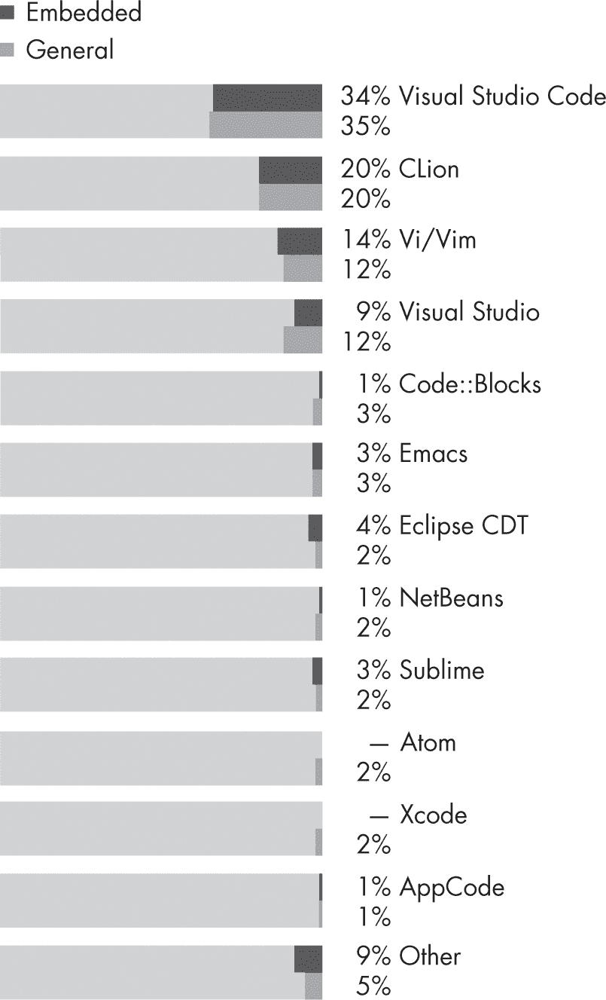
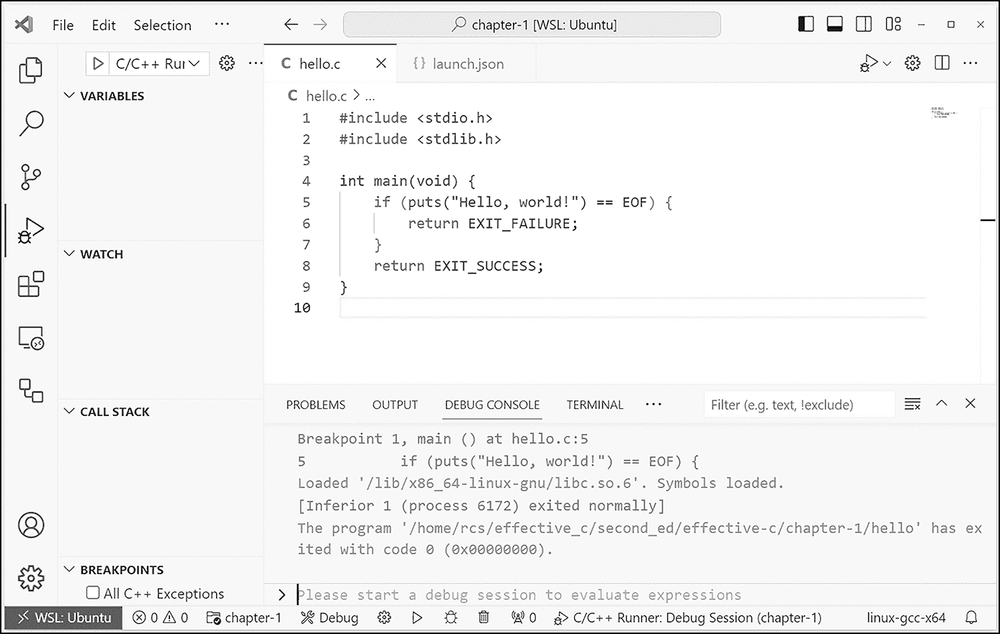

# 1 开始使用 C


在本章中，你将开发你的第一个 C 程序：传统的 “Hello, world!” 程序。我们将分析这个简单 C 程序的各个方面，编译并运行它。然后我会回顾一些编辑器和编译器选项，并列出你在编写 C 代码时会很快遇到的常见可移植性问题。

## 开发你的第一个 C 程序

学习 C 编程的最有效方法是开始编写 C 程序，传统的起步程序就是 “Hello, world!” 打开你最喜欢的文本编辑器，并输入 列表 1-1 中的程序。

hello.c

```
#include <stdio.h>
#include <stdlib.h>

int main() {
  puts("Hello, world!");
  return EXIT_SUCCESS;
}
```

列表 1-1： “Hello, world!” 程序

前两行使用了 #include 预处理指令，其行为就像你将其替换为指定文件的内容，并放在相同位置一样。在这个程序中，<stdio.h> 和 <stdlib.h> 都是头文件。*头文件* 是一种源文件，按照约定，它包含了对应源文件的定义、函数声明和常量定义。正如文件名所示，<stdio.h> 定义了 C 标准输入/输出 (I/O) 函数的接口，而 <stdlib.h> 声明了多个通用的实用类型和函数，并定义了多个宏。你需要包含你在程序中使用的任何库函数的声明。（你将会在 第九章 学到更多关于头文件的适当使用。）

在这里，我们包含 <stdio.h> 以访问 puts 函数的声明，该函数由 main 函数调用。我们包含 <stdlib.h> 以访问 EXIT_SUCCESS 宏的定义，该宏在 return 语句中使用。

这一行定义了程序启动时调用的 main 函数：

```
int main() {
```

main 函数定义了程序的入口点，当程序从命令行或另一个程序调用时，会在托管环境中执行。C 语言定义了两种可能的执行环境：独立环境和托管环境。*独立*环境可能不提供操作系统，通常用于嵌入式编程。这些实现提供了一组最小的库函数，程序启动时调用的函数的名称和类型由实现定义。本书中的大多数示例都假设 main 函数是唯一的入口点。

像其他过程式语言一样，C 程序包含可以接受参数并返回值的*函数*。每个函数都是一个可重用的工作单元，你可以根据需要在程序中多次调用。puts 函数从 main 函数中调用，用来打印出一行 Hello, world!：

```
 puts("Hello, world!");
```

puts 函数是一个 C 标准库函数，用于将一个字符串参数写入 stdout 流，并在输出中附加一个换行符。stdout 流通常代表控制台或终端窗口。"Hello, world!" 是一个字符串字面量，它表现得像一个只读字符串。此函数调用将 Hello, world! 输出到终端。

一旦程序执行完毕，你会希望它退出。return 语句会退出 main 函数，并将一个整数值返回给宿主环境或调用脚本：

```
 return EXIT_SUCCESS;
```

EXIT_SUCCESS 是一个类对象宏，可能定义如下：

```
#define EXIT_SUCCESS 0
```

每次出现 EXIT_SUCCESS 时都会被替换为 0，然后从对 main 的调用中返回给宿主环境。调用该程序的脚本可以检查其状态，以确定调用是否成功。从初始调用返回的 main 函数相当于调用 C 标准库的 exit 函数，并将 main 函数返回的值作为其参数。

该程序的最后一行包含一个闭合大括号（}），它关闭了我们用声明 main 函数打开的代码块：

```
int main() {
  // `--snip--`
}
```

你可以将开括号放在与声明同一行，也可以将其放在单独的一行，如下所示：

```
int main()
{
  // `--snip--`
}
```

这个决定完全是一个风格问题，因为空白字符（包括换行符）通常在语法上没有意义。在本书中，我通常将开括号放在函数声明所在的行，因为这样风格上更简洁。

现在，将这个文件保存为 *hello.c*。文件扩展名 *.c* 表示该文件包含 C 语言源代码。

> 注意

*如果你购买了电子书，可以将程序剪切并粘贴到编辑器中。使用剪切和粘贴可以减少转录错误。*

## 编译和运行程序

接下来，你需要编译并运行程序，这包括两个步骤。编译程序的命令取决于你使用的编译器。在 Linux 和其他类 Unix 操作系统中，在命令行中输入 cc，然后跟上你要编译的文件名：

```
$ **cc hello.c**
```

如果你正确输入了程序，编译命令将在与你的源代码相同的目录下创建一个名为 *a.out* 的新文件。

> 注意

*在其他操作系统，如 Windows 或 macOS 上，编译器的调用方式有所不同。请参考你的特定编译器的文档。*

使用以下命令检查你的目录：

```
$ **ls**
a.out  hello.c
```

输出中的 *a.out* 文件就是可执行程序，你现在可以在命令行中运行它：

```
$ **./a.out**
Hello, world!
```

如果一切顺利，程序应该会将 Hello, world! 打印到终端窗口。如果没有，比较一下来自 清单 1-1 的程序文本和你的程序，确保它们是一样的。

cc 命令接受许多编译器选项。例如，-o file 编译器选项允许你为可执行文件指定一个易记的名称，而不是 *a.out*。以下编译命令将可执行文件命名为 *hello*：

```
$ **cc -o hello hello.c**
$ **./hello**
Hello, world!
```

在本书中，我们将介绍其他编译器和链接器选项（也称为标志），并将在 第十一章中专门讨论它们。

### 函数返回值

函数通常会返回一个值，该值是计算结果，或者表示函数是否成功完成了任务。例如，我们在“Hello, world!”程序中使用的 puts 函数接收一个字符串并打印，返回一个 int 类型的值。如果发生写入错误，puts 函数将返回宏 EOF 的值（一个负整数）；否则，返回一个非负整数值。

尽管在我们的简单程序中，puts 函数发生失败并返回 EOF 的可能性很小，但它是可能发生的。由于调用 puts 函数可能会失败并返回 EOF，这意味着你的第一个 C 程序存在 bug，或者至少可以按以下方式进行改进：

```
#include <stdio.h>
#include <stdlib.h>
int main() {
  if (puts("Hello, world!") == EOF) {
    return EXIT_FAILURE;
    // code here never executes
  }
 return EXIT_SUCCESS;
  // code here never executes
}
```

这个修改版的“Hello, world!”程序检查 puts 调用是否返回 EOF，表示写入错误。如果函数返回 EOF，程序返回 EXIT_FAILURE 宏的值（该值为非零值）。否则，函数执行成功，程序返回 EXIT_SUCCESS。调用程序的脚本可以检查其状态以确定是否成功。紧随返回语句之后的代码是 *死代码*，永远不会执行。程序中的这一点通过单行注释表示，注释符号 // 后面的内容会被编译器忽略。

### 格式化输出

puts 函数是一个简单的方式将字符串写入 stdout，但是要打印除字符串以外的参数，你需要使用 printf 函数。printf 函数接受一个格式化字符串，定义输出的格式，然后跟随一个可变数量的参数，这些参数是你希望打印的实际值。例如，如果你想使用 printf 函数打印 Hello, world!，你可以这样写：

```
printf("%s\n", "Hello, world!");
```

第一个参数是格式化字符串 "%s\n"。%s 是一个转换说明符，它指示 printf 函数读取第二个参数（一个字符串字面量）并将其打印到 stdout。\n 是一个字母转义序列，用于表示非图形字符，并告诉函数在字符串后面插入一个新行。如果没有换行序列，接下来的字符（可能是命令提示符）将显示在同一行。这个函数调用输出如下：

```
Hello, world!
```

请小心不要将用户提供的数据作为第一个参数传递给 printf 函数，因为这样做可能会导致格式化输出的安全漏洞（Seacord 2013）。

输出字符串的最简单方法是使用 puts 函数，如前所示。然而，如果你在修改版的“Hello, world!”程序中使用 printf 而不是 puts，你会发现它不再起作用，因为 printf 函数返回的状态与 puts 函数不同。printf 函数成功时返回打印的字符数，如果发生输出或编码错误，则返回负值。作为练习，尝试修改“Hello, world!”程序以使用 printf 函数。

## 编辑器和集成开发环境

你可以使用多种编辑器和集成开发环境（IDE）来开发你的 C 程序。图 1-1 显示了根据 2023 年 JetBrains 调查（*[`<wbr>www<wbr>.jetbrains<wbr>.com<wbr>/lp<wbr>/devecosystem<wbr>-2023<wbr>/c<wbr>/`](https://www.jetbrains.com/lp/devecosystem-2023/c/)*）使用最广泛的编辑器。



图 1-1：流行的 IDE 和编辑器

可用的工具具体取决于你使用的系统。

对于 Microsoft Windows，微软的 Visual Studio IDE (*[`<wbr>visualstudio<wbr>.microsoft<wbr>.com`](https://visualstudio.microsoft.com)*) 是一个显而易见的选择。Visual Studio 有三个版本：Community、Professional 和 Enterprise。Community 版本的优势在于免费，而其他版本则需要付费以获得额外功能。本书中，你只需要使用 Community 版本。

对于 Linux，选择不那么明显，因为有多种选项。一种流行的选择是 Visual Studio Code（VS Code）。VS Code 是一个精简的代码编辑器，支持调试、任务运行和版本控制等开发操作（在第十一章中涵盖）。它提供了开发者进行快速代码构建调试周期所需的工具。VS Code 可以在 macOS、Linux 和 Windows 上运行，并且可以免费用于私人或商业用途。对于 Linux 和其他平台，安装说明可用（*[`<wbr>code<wbr>.visualstudio<wbr>.com`](https://code.visualstudio.com)*）。

图 1-2 显示了在 Ubuntu 上使用 VS Code 开发 “Hello, world!” 程序。调试控制台显示程序按预期以状态码 0 退出。



图 1-2：在 Ubuntu 上运行的 Visual Studio Code

Vim 是许多开发者和高级用户的首选编辑器。它是一个基于 Bill Joy 在 1970 年代为 Unix 版本编写的 vi 编辑器的文本编辑器。它继承了 vi 的快捷键绑定，但还增加了原始 vi 所没有的功能和扩展性。你可以选择安装 Vim 插件，如 YouCompleteMe (*[`<wbr>github<wbr>.com<wbr>/ycm<wbr>-core<wbr>/YouCompleteMe`](https://github.com/ycm-core/YouCompleteMe)*) 或 deoplete (*[`<wbr>github<wbr>.com<wbr>/Shougo<wbr>/deoplete<wbr>.nvim`](https://github.com/Shougo/deoplete.nvim)*)，它们为 C 编程提供原生语义代码补全。

GNU Emacs 是一个可扩展、可定制的免费文本编辑器。从本质上讲，它是 Emacs Lisp 的解释器，Emacs Lisp 是一种支持文本编辑的 Lisp 编程语言方言—尽管我从未发现这成为问题。完全公开：我开发的几乎所有生产级 C 代码都是在 Emacs 中编辑的。

## 编译器

有许多 C 编译器可供选择，因此我不会在这里讨论所有的编译器。不同的编译器实现了不同版本的 C 标准。许多嵌入式系统的编译器仅支持 C89/C90。流行的 Linux 和 Windows 编译器更努力地支持现代版本的 C 标准，直到包括对 C23 的支持。

### GNU 编译器集合

GNU 编译器集合（GCC）包括 C、C++ 和 Objective-C 的前端，以及其他语言（*[`<wbr>gcc<wbr>.gnu<wbr>.org`](https://gcc.gnu.org)*）。GCC 在 GCC 指导委员会的指导下，遵循一个明确定义的开发计划。

GCC 已被采纳为 Linux 系统的标准编译器，虽然也有适用于 Microsoft Windows、macOS 和其他平台的版本。在 Linux 上安装 GCC 很容易。例如，以下命令应该会在 Ubuntu 上安装 GCC：

```
$ **sudo apt-get install gcc**
```

你可以使用以下命令测试你正在使用的 GCC 版本：

```
$ **gcc --version**
```

输出将显示已安装的 GCC 版本的版本和版权信息。

### Clang

另一个流行的编译器是 Clang (*[`<wbr>clang<wbr>.llvm<wbr>.org`](https://clang.llvm.org)*)。在 Linux 上安装 Clang 也很简单。你可以使用以下命令在 Ubuntu 上安装 Clang：

```
$ **sudo apt-get install clang**
```

你可以使用以下命令来测试你使用的 Clang 版本：

```
$ **clang --version**
```

这将显示已安装的 Clang 版本。

### Microsoft Visual Studio

如前所述，Windows 最流行的开发环境是 Microsoft Visual Studio，它包括 IDE 和编译器。Visual Studio (*[`<wbr>visualstudio<wbr>.microsoft<wbr>.com<wbr>/downloads<wbr>/`](https://visualstudio.microsoft.com/downloads/)*) 附带了 Visual C++ 2022，其中包括 C 和 C++ 编译器。

你可以在项目属性页面中为 Visual Studio 设置选项。在 C/C++ 的“高级”选项卡下，确保使用编译为 C 代码（/TC）选项，而不是编译为 C++ 代码（/TP）选项。默认情况下，当你命名一个文件为 *.c* 扩展名时，它会使用 /TC 进行编译。如果文件命名为 *.cpp*、*.cxx* 或其他几个扩展名，它将使用 /TP 进行编译。

## 可移植性

每个 C 编译器的实现都有一些不同。编译器在不断发展—例如，像 GCC 这样的编译器可能已经完全支持 C17，但正在向支持 C23 过渡，在这种情况下，它可能实现了一些 C23 特性，但没有实现其他特性。因此，编译器支持一整套 C 标准版本（包括中间版本）。C 实现的整体演进是缓慢的，许多编译器显著滞后于 C 标准。

为 C 编写的程序可以被认为是*严格符合*标准的，如果它们仅使用语言和库中标准所规定的特性。这些程序旨在实现最大程度的可移植性。然而，由于实现行为的差异，实际上没有任何真实世界中的 C 程序是严格符合标准的，也不可能是（而且可能不应该是）。相反，C 标准允许你编写*符合标准*的程序，这些程序可能依赖于不可移植的语言和库特性。

编写代码时，通常是为单一的参考实现编写代码，或者根据你计划部署代码的平台编写几个不同的实现。C 标准确保这些实现之间的差异不会太大，并允许你一次性面向多个平台，而无需每次都学习一种新的语言。

C 标准文档的附录 J 列出了五种可移植性问题：

+   实现定义行为

+   未指定行为

+   未定义行为

+   特定区域行为

+   常见扩展

在学习 C 语言时，您将遇到所有五种行为的例子，因此准确理解它们是什么非常重要。

### 实现定义行为

*实现定义行为*是指 C 标准未指定的程序行为，它可能在不同的实现之间产生不同的结果，但在同一实现中有一致的、已记录的行为。实现定义行为的一个例子是字节中的位数。

实现定义的行为大多数是无害的，但在移植到不同的实现时可能会引起缺陷。尽可能避免编写依赖于实现定义行为的代码，这些行为在不同的 C 实现之间可能有所不同。实现定义行为的完整列表列在 C 标准的附录 J.3 中。您可以通过使用static_assert声明来记录您对这些实现定义行为的依赖，正如在第十一章中讨论的那样。

### 未指定行为

*未指定行为*是指程序行为，标准提供了两个或更多的选项，但并未强制规定在任何情况下选择哪个选项。每次执行给定表达式时，可能会产生不同的结果，或与前一次执行同一表达式时产生的值不同。未指定行为的一个例子是函数参数存储布局，这在同一个程序中的多个函数调用之间可能会有所不同。未指定行为列在 C 标准的附录 J.1 中。

### 未定义行为

*未定义行为*是指 C 标准未定义的行为，或者更准确地说，“行为，在使用不可移植或错误的程序结构或错误数据时，标准没有强制要求”（ISO/IEC 9899:2024）。未定义行为的例子包括有符号整数溢出和解引用无效指针值。具有未定义行为的代码通常是错误的，但并非总是如此。未定义行为在标准中标识如下：

+   当“应当”或“不得”要求被违反，并且该要求出现在约束之外时，行为是未定义的。

+   当行为明确由“未定义行为”这一术语指定时。

+   通过省略任何明确的行为定义。

前两种未定义行为通常被称为*显式未定义行为*，而第三种则称为*隐式未定义行为*。这三者在强调上没有区别，它们都描述了未定义的行为。《C 标准》附录 J.2“未定义行为”列出了 C 语言中的显式未定义行为。

开发人员常常将未定义行为误解为 C 标准中的错误或遗漏，但将行为归类为未定义是*故意的*并且是*经过深思熟虑的*。C 标准委员会将行为归类为未定义的原因如下：

+   授予实现者不捕捉难以诊断的程序错误的许可

+   避免定义模糊的边界情况，这些情况可能会偏向某种实现策略

+   确定可能符合的语言扩展领域，在这些领域中，实施者可以通过提供未定义行为的定义来扩展语言

这三种原因虽然截然不同，但都被视为可移植性问题。在本书的过程中，我们会逐一讨论这三种情况的示例。当遇到未定义行为时，编译器可以执行以下操作：

+   完全忽视未定义行为，导致不可预测的结果

+   以环境特征的已记录方式进行行为（可以不发出诊断信息）

+   终止翻译或执行（并发出诊断信息）

这些选项都不好（尤其是第一个），因此最好避免未定义行为，除非编译器明确指定这些行为是已定义的，以便你调用语言扩展。编译器有时会有*迂腐*模式，帮助通知程序员这些可移植性问题。

### 区域特定行为和常见扩展

*区域特定行为*依赖于每个实现文档中规定的国家、文化和语言的本地习惯。*常见扩展*在许多系统中被广泛使用，但并不具有所有实现的可移植性。

## 摘要

在本章中，你学会了如何编写一个简单的 C 语言程序、编译它并运行。我们还看了几种编辑器和集成开发环境，以及一些你可以用来在 Windows、Linux 和 macOS 系统上开发 C 程序的编译器。你应该使用更新版本的编译器和其他工具，因为它们通常支持 C 语言的新特性，并提供更好的诊断和优化。然而，如果更新的编译器破坏了你现有的代码，或者如果你准备部署代码以避免在已经测试的应用中引入不必要的变化，可能不想使用更新版本的编译器。我们在本章的结尾讨论了 C 语言程序的可移植性。

随后的章节将探讨 C 语言及其库的具体特性，从下一章的对象、函数和类型开始。
