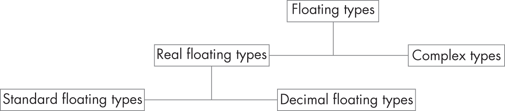

# 第二章：2 对象、函数和类型


在本章中，你将学习对象、函数和类型。我们将探讨如何声明变量（具有命名标识符的对象）和函数，获取对象的地址，并解引用这些对象指针。每个对象或函数实例都有一个类型。你已经看到了一些 C 程序员可以使用的类型。本章中你将学到的第一件事，恰恰是我最后学到的：C 中的每个类型都是对象类型或函数类型。

## 实体

*对象*是用于表示值的存储空间。准确来说，C 标准（ISO/IEC 9899:2024）将对象定义为“执行环境中的一个数据存储区域，其内容可以表示值”，并补充说明，“当引用时，对象可以被解释为具有特定类型。”变量就是一个对象的例子。

*变量*有一个声明的*类型*，它告诉你变量值所代表的对象类型。例如，类型为int的对象包含一个整数值。类型很重要，因为代表某种类型对象的比特集合，如果被解释为另一种类型的对象，可能会得到不同的值。例如，数字 1 在 IEEE 浮点运算标准中由比特模式0x3f800000表示（IEEE 754-2019）。但如果你将这个比特模式解释为一个整数，你会得到值 1,065,353,216，而不是 1。

*函数*不是对象，但它们有类型。函数类型由其返回类型以及参数的数量和类型来描述。

C 语言中也有*指针*，它可以被看作是一个*地址*——内存中存储对象或函数的位置。

就像对象和函数一样，对象指针和函数指针是不同的东西，不能互换。在接下来的部分中，你将编写一个简单的程序，尝试交换两个变量的值，帮助你更好地理解对象、函数、指针和类型。

## 声明变量

当你声明一个变量时，你为它分配一个类型，并提供一个名称或*标识符*，通过该标识符引用该变量。你也可以选择性地*初始化*该变量。

清单 2-1 声明了两个具有初始值的整数对象。这个简单的程序还声明了一个`swap`函数来交换这些值，但没有定义它。

```
#include <stdio.h>
#include <stdlib.h>

❶ void swap(int, int); // defined in Listing 2-2

int main() {
  int a = 21;
  int b = 17;
❷ swap(a, b);
  printf("main: a = %d, b = %d\n", a, b);
  return EXIT_SUCCESS;
}
```

清单 2-1：一个用于交换两个整数的程序

这个示例程序展示了一个包含单个*复合语句*的 main 函数，该复合语句包括 {} 字符以及其中的所有语句（也称为*块*）。我们在 main 函数内定义了两个变量，a 和 b。我们将这两个变量声明为类型 int，并分别初始化为 21 和 17。每个变量必须有一个声明。然后，main 函数调用 swap 函数 ❷ 尝试交换这两个整数的值。swap 函数在本程序中声明了 ❶，但没有定义。我们将在本节后面探讨该函数的一些可能实现。

### 交换值，第一次尝试

每个对象都有一个存储持续时间，决定了它的*生命周期*，即在程序执行过程中，对象存在、占用存储、拥有固定地址并保持最后存储的值的时间。对象不得在其生命周期外被引用。

本地变量，如来自 列表 2-1 的 a 和 b，具有*自动存储持续时间*，意味着它们存在直到程序执行离开声明它们的块为止。我们将尝试交换这两个变量中存储的值。列表 2-2 展示了我们第一次尝试实现 swap 函数的代码。

```
void swap(int a, int b) {
  int t = a;
  a = b;
 b = t;
  printf("swap: a = %d, b = %d\n", a, b);
}
```

列表 2-2：第一次尝试实现 swap 函数

swap 函数声明了两个参数，a 和 b，我们用它们来向这个函数传递参数。C 区分 *参数* 和 *实参*，其中参数是作为函数声明的一部分声明的对象，在进入函数时会获取一个值，而实参是我们在函数调用表达式中传入的以逗号分隔的表达式。我们还在 swap 函数中声明了一个临时变量 t，其类型为 int，并将其初始化为 a 的值。此变量用于临时保存 a 中存储的值，以免在交换过程中丢失。

现在我们可以运行生成的可执行文件来测试程序：

```
% **./a.out**
swap: a = 17, b = 21
main: a = 21, b = 17
```

这个结果可能让人感到惊讶。变量 a 和 b 分别被初始化为 21 和 17。第一次在 swap 函数中的 printf 调用显示这两个值已被交换，但在 main 中的第二次 printf 调用则显示原始值未变。让我们看看发生了什么。

C 是一种 *按值传递*（也称为 *传值*）语言，这意味着当你向函数提供一个实参时，该实参的值会被复制到一个独立的变量中供函数使用。swap 函数将你作为实参传递的对象的值赋给它们各自的参数。当函数中的参数值发生变化时，调用者中的实参值不会受到影响，因为它们是独立的对象。因此，在第二次调用 printf 时，变量 a 和 b 保持其在 main 中的原始值。程序的目标是交换这两个对象的值。通过测试程序，我们发现它存在一个 bug 或缺陷。

### 交换值，第二次尝试

为了修复这个 bug，我们可以使用指针重写 swap 函数。我们使用间接操作符 (*) 来声明指针并对其解引用，如 Listing 2-3 所示。

```
void swap(int *pa, int *pb) {
  int t = *pa;
  *pa = *pb;
  *pb = t;
}
```

Listing 2-3: 修改后的 swap 函数使用指针

当在函数声明或定义中使用时，* 作为指针声明符的一部分，表示该参数是指向某种类型的对象或函数的指针。在重写的 swap 函数中，我们声明了两个参数，pa 和 pb，它们的类型都是指向 int 的指针。

一元操作符 * 表示间接引用。如果其操作数是指向 T 的指针类型，则操作结果的类型为 T。例如，考虑以下赋值：

```
pa = pb;
```

这将指针 pa 的值替换为指针 pb 的值。现在考虑 swap 函数中的赋值操作：

```
*pa = *pb;
```

*pb 操作读取 pb 引用的值，而 *pa 操作读取 pa 引用的位置。然后将 pb 引用的值写入 pa 引用的位置。

当你在 main 中调用 swap 函数时，你还必须在每个变量名前加上一个 &（&）字符：

```
swap(&a, &b);
```

一元操作符 &（*取地址*）操作符生成其操作数的指针。这个变化是必要的，因为 swap 函数现在接受指向 int 类型的指针作为参数，而不是 int 类型。

清单 2-4 显示了整个 swap 程序，注释描述了在执行此代码期间创建的对象及其值。

```
#include <stdio.h>
#include <stdlib.h>

void swap(int *pa, int *pb) {   // pa → a: 21    pb → b: 17
  int t = *pa;                  // t: 21
  *pa = *pb;                    // pa → a: 17    pb → b: 17
  *pb = t;                      // pa → a: 17    pb → b: 21
}

int main() {
  int a = 21;                   // a: 21
  int b = 17;                   // b: 17
  swap(&a, &b);
  printf("a = %d, b = %d\n", a, b);    // a: 17    b: 21
  return EXIT_SUCCESS;
}
```

清单 2-4：模拟的引用调用

进入 main 函数块后，变量 a 和 b 分别被初始化为 21 和 17。然后，代码获取这些对象的地址，并将它们作为参数传递给 swap 函数。

在 swap 函数内，参数 pa 和 pb 现在都声明为指向 int 类型的指针，并包含传递给 swap 的调用函数（在本例中为 main）的参数副本。这些地址副本仍然指向完全相同的对象，因此当它们所引用对象的值在 swap 函数中交换时，main 中声明的原始对象的内容也会被交换。这种方法通过生成对象地址、按值传递这些地址，然后解引用复制的地址来访问原始对象，从而模拟了 *按引用调用*（也称为 *按引用传递*）。

## 对象类型

本节介绍了 C 中的对象类型。具体来说，我们将涵盖布尔类型、字符类型和算术类型（包括整数类型和浮点类型）。

### 布尔

布尔数据类型有两个可能的值（true 或 false），表示逻辑和布尔代数中的两个真值。声明为 bool 的对象只能存储 true 和 false 这两个值。

以下示例声明了一个名为 arm_detonator 的函数，该函数接受一个 int 类型的参数，并返回一个 bool 类型的值：

```
bool arm_detonator(int);

void arm_missile(void) {
  bool armed = arm_detonator(3);
  if (armed) puts("missile armed");
  else puts("missile disarmed");
}
```

arm_missile 函数调用 arm_detonator 函数，并将返回值赋给布尔变量 armed。然后，可以测试该值以确定导弹是否已准备就绪。

历史上，布尔值是通过整数表示的，并且仍然表现得像整数一样。它们可以存储在整数变量中，并可以在任何整数有效的地方使用，包括索引、算术运算、解析和格式化。C 语言保证任何两个 `true` 值会相等比较（这是在引入 bool 类型之前无法实现的）。你应该使用 bool 类型来表示布尔值。

### 字符

C 语言定义了以下字符类型：char、signed char 和 unsigned char。每个编译器实现都将 char 定义为与 signed char 或 unsigned char 具有相同的对齐方式、大小、范围、表示和行为。无论选择哪一种，char 都是一个独立的类型，与其他两个类型不兼容。

char 类型通常用于表示 C 语言程序中的字符数据。char 类型的对象可以表示 *基本执行字符集* —— 执行环境中所需的最小字符集，包括大小写字母、10 个十进制数字、空格字符、标点符号和控制字符。char 类型不适用于整数数据；使用 signed char 来表示小的有符号整数值，使用 unsigned char 来表示小的无符号整数值。

char 类型的对象大小始终为 1 字节，宽度为 CHAR_BIT 位。CHAR_BIT 宏来自 <limits.h>，用于定义一个字节中的位数。CHAR_BIT 宏的值不能小于 8，并且在大多数现代平台上，其值为 8。

基本的执行字符集适用于许多常规数据处理应用，但其缺乏非英语字母是国际用户接受的障碍。为了解决这一需求，C 标准委员会规定了一种新的宽字符类型，以允许更大的字符集。你可以使用 wchar_t 类型将大字符集的字符表示为 *宽字符*，它通常占用比基本字符更多的空间。通常，实施会选择 16 位或 32 位来表示一个宽字符。C 标准库提供了支持窄字符和宽字符类型的函数。wchar_t 类型并未设计用来支持 Unicode，因此在大多数实现中已逐渐被弃用，微软 Visual Studio 是一个显著的例外。

### 算术

C 提供了几种 *算术类型*，可用于表示整数、枚举值和浮点值。第三章详细介绍了其中的一些，但这里简要介绍一下。

#### 整数

*带符号整数类型* 可以用于表示负数、正数和零。标准的带符号整数类型包括 signed char、short int、int、long int 和 long long int。

对于每种带符号整数类型，都有一个相应的 *无符号整数类型*，它使用相同的存储空间：unsigned char、unsigned short int、unsigned int、unsigned long int 和 unsigned long long int。无符号类型可以表示正数和零。这些无符号整数类型以及类型 bool 组成了标准的无符号整数类型。

除了 int 本身外，关键字 int 在这些类型的声明中可以省略，因此你可以通过使用 long long 来声明类型，而不是 long long int。

有符号和无符号整数类型用于表示各种宽度的整数。每个平台确定每种类型的宽度，给定一些约束。每种类型都有一个最小可表示范围。这些类型按宽度排序，确保更宽的类型至少与更窄的类型一样大。这意味着long long int类型的对象可以表示long int类型的对象可以表示的所有值，long int类型的对象可以表示的所有值都可以由int类型的对象表示，依此类推。整数类型的实现定义的最小和最大可表示值在<limits.h>头文件中指定。

*扩展整数类型*可能会在标准整数类型之外提供。它们是实现定义的，这意味着它们的宽度、精度和行为取决于编译器。扩展整数类型通常比标准整数类型大（例如，__int128）。

除了标准和扩展整数类型外，C23 还增加了*比特精确整数类型*。这些类型接受一个操作数来指定整数的宽度，因此_BitInt(32)是一个带符号的 32 位整数，而unsigned _BitInt(32)则是一个无符号的 32 位整数。比特精确整数类型不要求它们的宽度是 2 的幂；支持的最大宽度由BITINT_MAXWIDTH指定（其宽度至少与unsigned long long的宽度相同）。

int类型通常根据执行环境的架构被赋予自然的宽度（例如，在 16 位架构上是 16 位，在 32 位或 64 位架构上是 32 位）。您可以通过使用<stdint.h>或<inttypes.h>头文件中的类型定义（如uint32_t）来指定实际宽度整数。这些头文件还为最大宽度整数类型提供类型定义：uintmax_t和intmax_t。例如，intmax_t类型可以表示任何带符号整数类型的值，可能例外的是带符号比特精确整数类型和带符号扩展整数类型。

第三章详细讲解了整数类型。  #### enum

一个*枚举*，或称enum，允许你定义一个类型，在有枚举常量集合的情况下为整数值指定名称（*枚举量*）。以下是枚举的示例：

```
enum day {sun, mon, tue, wed, thu, fri, sat};
enum cardinal_points {north = 0, east = 90, south = 180, west = 270};
enum months {jan = 1, feb, mar, apr, may, jun, jul, aug, sep, oct, nov, dec};
```

如果你没有使用=操作符为第一个枚举量指定值，则其枚举常量的值为 0，之后每个没有=的枚举量将基于前一个枚举常量的值加 1。因此，sun在<	samp class="SANS_TheSansMonoCd_W5Regular_11">day枚举中的值为 0，mon的值为 1，以此类推。

你也可以为每个枚举量指定特定的值，如cardinal_points枚举所示。使用=与枚举量可能会导致枚举常量具有重复的值，如果你错误地假设所有值都是唯一的，这可能会成为问题。months枚举将第一个枚举量的值设为 1，之后每个未特定赋值的枚举量将递增 1。

从 C23 开始，你可以指定枚举的底层类型。为了移植性和其他原因（Meneide 和 Pygott 2022），最好始终指定枚举类型。在以下示例中，枚举常量a0可以被赋值为0xFFFFFFFFFFFFFFFFULL，因为类型被指定为unsigned long long：

```
enum a : unsigned long long {
  a0 = 0xFFFFFFFFFFFFFFFFULL
};
```

如果省略类型，则由实现定义。Visual C++使用signed int作为类型，而 GCC 则使用unsigned int。

#### Floating

浮点运算与实数运算相似，并且常常作为实数运算的模型。C 语言支持多种浮点表示，包括大多数系统上采用的 IEEE 浮点运算标准（IEEE 754-2019）。ISO/IEC 60559:2011 与 IEEE 754-2019 内容相同，但由于它是由同一标准组织发布的，因此 C 标准引用了它。浮点表示的选择由实现决定。第三章详细讲解了浮点类型。

C 语言支持三种标准浮动类型：float、double 和 long double。类型 float 的值集是类型 double 的值集的子集；类型 double 的值集是类型 long double 的值集的子集。

C23 添加了三种*十进制浮动类型*（ISO/IEC TS 18661-2:2015），分别为 _Decimal32、_Decimal64 和 _Decimal128。这些类型分别对应于十进制 32、十进制 64 和十进制 128 IEC 60559 格式。

标准浮动类型和十进制浮动类型统称为*实数浮动类型*。

还有三种*复杂类型*，分别为 float complex、double complex 和 long double complex。

实数浮动类型和复杂类型统称为*浮动类型*。图 2-1 展示了浮动类型的层次结构。



图 2-1：浮动类型的层次结构

本书没有详细介绍复杂类型和十进制浮动类型。

### void

void 类型是一个相当特殊的类型。关键字 void（单独使用时）表示“不能持有任何值”。例如，你可以使用它来表示一个函数不返回任何值，或者作为函数的唯一参数，表示该函数不接受任何参数。另一方面，*派生类型* void * 表示该指针可以引用*任何*对象。

## 派生类型

*派生类型*是由其他类型构造而来的。它们包括函数类型、指针类型、数组类型、类型定义、结构类型和联合类型——所有这些都会在此涵盖。

### 函数

*函数类型*由返回类型和参数的数量及类型派生而来。一个函数可以返回任何完整的对象类型，但不能返回数组类型。

当你声明一个函数时，使用 *函数声明符* 来指定函数的名称和返回类型。如果声明符包括参数类型列表和定义，则每个参数的声明必须包含一个标识符，除非参数列表只有一个类型为 void 的参数，这种情况不需要标识符。

这里是一些函数类型声明：

```
int f(void);
int fprime();
int *fip();
void g(int i, int j);
void h(int, int);
```

首先，我们声明两个函数，f 和 fprime，它们没有参数，返回一个 int。接下来，我们声明一个函数 fip，没有参数，返回一个指向 int 的指针。最后，我们声明两个函数，g 和 h，每个函数都返回 void 并接受两个 int 类型的参数。

指定带有标识符的参数（如这里的 g）可能会有问题，尤其是当标识符是宏时。然而，为参数提供名称是自文档化代码的好习惯，因此通常不建议省略标识符（就像在 h 中所做的那样）。

在函数声明中，指定参数是可选的。然而，如果不指定，可能会引发问题。在 C23 之前，fip 声明了一个接受任意数量的任意类型参数并返回一个 int * 的函数。相同的 fip 函数声明在 C++ 中声明了一个接受无参数并返回 int * 的函数。从 C23 开始，具有空参数列表的函数声明符声明了一个不接受任何参数的函数原型（就像在 C++ 中一样）。

函数类型也被称为 *函数原型*。函数原型向编译器告知函数接受的参数数量和类型。编译器使用这些信息来验证函数定义和任何对函数的调用中使用了正确数量和类型的参数。

*函数定义* 提供了函数的实际实现。考虑以下函数定义：

```
int max(int a, int b)
{return a > b ? a : b;}
```

返回类型说明符是 int；函数声明是 max(int a, int b)；函数体是 {return a > b ? a : b;}。函数类型的规范不应包含任何类型限定符（见“类型限定符”部分，参见 第 31 页）。函数体本身使用了条件运算符（? :），这一运算符在 第四章 中有解释。该表达式表示，如果 a 大于 b，则返回 a；否则，返回 b。

### 指针

*指针类型* 是由称为 *引用类型* 的函数或对象类型派生而来。由引用类型 T 派生的指针类型称为指向 T 的指针。指针提供对引用类型实体的引用。

以下三条声明声明了指向 int、指向 char 和指向 void 的指针：

```
int *ip = 0; // compliant
char *cp = NULL; // good
void *vp = nullptr; // better
```

每个指针都初始化为一个空指针常量。空指针常量可以指定为值为 0 的整数常量表达式、(void *)0，或者预定义常量 nullptr。NULL 宏在 <stddef.h> 中定义。如果空指针常量被转换为指针类型，则生成的空指针保证与指向任何对象或函数的指针进行比较时不相等。

nullptr 常量是在 C23 中引入的，相较于使用 NULL，它具有优势（Gustedt 2022）。表 2-1 显示了 NULL 的常见值及其关联类型。

表 2-1： NULL 的常见值及其关联类型

| 值 | 类型 |
| --- | --- |
| 0 | int |
| 0L | long |
| (void *)0 | void * |

这些不同类型在调用具有NULL参数的类型通用宏时可能会产生意想不到的结果。条件表达式(true ? 0 : NULL)始终是定义的，无论NULL的类型是什么。然而，如果NULL的类型是void *，则条件表达式(true ? 1 : NULL)将违反约束。

将NULL参数作为哨兵值传递给可变参数函数（例如便携式操作系统接口（POSIX）execl函数，它期望一个指针）可能会产生意外的结果。在大多数现代架构上，int和void *类型的大小是不同的。如果在这样的架构上将NULL定义为 0，那么会将大小不正确的参数传递给可变参数函数。

在本章前面，我介绍了取地址运算符（&）和间接寻址运算符（*）。你使用&运算符来获取对象或函数的地址。例如，获取一个int对象的地址会得到一个指向int的指针地址：

```
int i = 17;
int *ip = &i;
```

第二个声明声明了变量ip为指向int的指针，并将其初始化为<i>i</i>的地址。你还可以对*运算符的结果使用&运算符：

```
ip = &*ip;
```

使用*运算符解引用ip将解析为实际对象i。使用&运算符取*ip的地址将检索到指针，因此这两个操作相互抵消。

一元 * 运算符将指针类型 T 转换为类型 T 的值。它表示 *间接寻址*，并且仅适用于指针。如果操作数指向一个函数，使用 * 运算符的结果是函数指示符；如果操作数指向一个对象，结果是该对象的值。例如，如果操作数是指向 int 类型的指针，则间接寻址运算符的结果是 int 类型。如果指针未指向有效的对象或函数，则行为是未定义的。

### 数组

*数组* 是一系列按顺序分配的对象，这些对象都具有相同的元素类型。数组类型的特征由其元素类型和数组中元素的数量决定。这里我们声明了一个包含 11 个元素的 int 类型数组，标识为 ia，以及一个包含 17 个元素的指向 float 的指针类型数组，标识为 afp：

```
int ia[11];
float *afp[17];
```

你可以使用方括号（[]）来标识数组的一个元素。例如，下面的示例代码演示了如何给数组的元素赋值，以创建字符串 "0123456789"：

```
char str[11];
for (unsigned int i = 0; i < 10; ++i) {
  str[i] = '0' + i;
}
str[10] = '\0';
```

第一行声明了一个大小为 11 的 char 数组。这为创建一个包含 10 个字符加一个空字符的字符串分配了足够的存储空间。for 循环迭代 10 次，i 的值从 0 到 9。每次迭代将表达式 '0' + i 的结果赋值给 str[i]。循环结束后，空字符被复制到数组的最后一个元素 str[10]，此时 str 包含字符串 "0123456789"。

在表达式 str[i] 中，str 会自动转换为指向数组第一个成员的指针（指向 char 的指针），而 i 则是无符号整数类型。下标（[]）和加法（+）运算符被定义为使得 str[i] 与 *(str + i) 等价。当 str 是一个数组对象（如本例所示）时，表达式 str[i] 表示数组的第 i 个元素（从 0 开始计数）。因为数组的下标是从 0 开始的，所以数组 char str[11] 的下标范围是从 0 到 10，其中 10 为最后一个元素，如本例最后一行所示。

如果一元运算符 & 的操作数是 [] 运算符的结果，那么结果就好像是移除了 & 运算符并将 [] 运算符换成了 + 运算符。例如，&str[10] 和 str + 10 是等效的：

```
&str[10] → &*(str + 10) → str + 10
```

你还可以声明多维数组。列表 2-5 在函数 main 中声明了一个二维 3×5 的 arr 数组，类型为 int，也叫做 *矩阵*。

```
#include <stdlib.h>
void func(int arr[5]);
int main() {
  unsigned int i = 0;
  unsigned int j = 0;
  int arr[3][5];
❶ func(arr[i]);
❷ int x = arr[i][j];
  return EXIT_SUCCESS;
}
```

列表 2-5：矩阵运算

更准确地说，arr 是一个包含三个元素的数组，每个元素又是一个包含五个 int 类型元素的数组。当你使用表达式 arr[i] ❶（等同于 *(arr+i)）时，发生的情况如下：

1.  arr 被转换为指向包含五个 int 类型元素的初始数组的指针，从 arr[i] 开始。

2.  i 通过将 i 乘以一个包含五个 int 元素的数组的大小，将其缩放到 arr 的类型。

3.  步骤 1 和步骤 2 的结果被相加。

4.  间接访问应用于总和，生成一个包含五个 int 类型元素的数组。

当在表达式 arr[i][j] ❷ 中使用时，该数组会被转换为指向第一个 int 类型元素的指针，因此 arr[i][j] 会生成一个 int 类型的对象。

### 结构体

*结构类型*（也称为 struct）包含按顺序分配的成员。每个成员都有自己的名称，并且可以有不同的类型——与数组元素不同，数组元素必须都是相同类型。结构体类似于其他编程语言中的记录类型。

结构体用于声明一组相关对象的集合，可以用来表示日期、客户或人员记录等。它们尤其在将经常一起作为参数传递给函数的对象进行分组时非常有用，这样你就不需要重复传递单独的对象。

列表 2-6 声明了一个名为 sigline 的 struct，其类型为 struct sigrecord，并且有一个指向 struct sigrecord 的指针，名为 sigline_p。

```
struct sigrecord {
  int signum;
  char signame[20];
  char sigdesc[100];
} sigline, *sigline_p;
```

列表 2-6: A struct sigrecord

该结构体有三个成员对象：signum 是一个 int 类型的对象，signame 是一个包含 20 个元素的 char 类型数组，sigdesc 是一个包含 100 个元素的 char 类型数组。

一旦定义了一个结构体，你可能会想要引用其成员。你可以使用结构体成员（.）运算符来引用结构体类型对象的成员。如果你有一个结构体的指针，可以使用结构体指针（->）运算符来引用其成员。列表 2-7 展示了这两个运算符的使用。

```
sigline.signum = 5;
strcpy(sigline.signame, "SIGINT");
strcpy(sigline.sigdesc, "Interrupt from keyboard");

❶ sigline_p = &sigline;

sigline_p->signum = 5;
strcpy(sigline_p->signame, "SIGINT");
strcpy(sigline_p->sigdesc, "Interrupt from keyboard");
```

列表 2-7：引用结构体成员

列表 2-7 的前三行通过使用点号（.）运算符直接访问 sigline 对象的成员。我们将 sigline 对象的地址赋值给 sigline_p 指针 ❶。在程序的最后三行，我们通过 sigline_p 指针使用 -> 运算符间接访问 sigline 对象的成员。

### 联合体

*联合类型*类似于结构体，不同之处在于成员对象使用的内存是重叠的。联合体提供了多种不同的方式来查看相同的内存。

列表 2-8 显示了一个联合体，其中包含一个类型为 float 的单一成员 f，以及一个包含三个类型为 uint32_t 的位域的 struct：significand、exponent 和 sign。

```
static_assert(
  (__STDC_IEC_60559_BFP__ >= 202311L || __STDC_IEC_559__ == 1)
  && __STDC_ENDIAN_LITTLE__
);

union {
  float f;
  struct {
    uint32_t significand : 23;
    uint32_t exponent : 8;
    uint32_t sign : 1;
  };
} float_encoding;
```

列表 2-8：使用 union 分解一个 float

这使得（低级）C 程序员可以使用整个浮点值并检查（以及可能修改）其组成部分。这个联合体不可移植，因为不同的实现可能使用不同的浮点表示方式或字节序。static_assert 用于测试以确保该联合体与实现匹配。

示例 2-9 显示了一个包含成员 type 和联合体 u 的 struct n，其中联合体包含四个成员：inode、fnode、dnode 和 ldnode。

```
enum node_type {
  integer_type,
  float_type,
  double_float_type,
 long_double_type
};

struct node {
  enum node_type type;
  union {
    int inode;
    float fnode;
    double dnode;
    long double ldnode;
  } u;
} n;

n.type = double_type;
n.u.dnode = 3.14;
```

示例 2-9：通过联合体节省内存

这个结构体可能用于树、图或其他包含不同类型节点的数据结构。type 成员可能包含一个介于 0 到 3 之间的值，表示存储在结构体中的值的类型。由于它对所有节点都是通用的，它直接在 struct n 中声明。

与结构体一样，你可以通过 . 运算符访问联合体成员。使用指向联合体的指针时，你可以通过 -> 运算符访问其成员。在 示例 2-9 中，dnode 成员被引用为 n.u.dnode。使用该联合体的代码通常会通过检查 n.type 中存储的值来判断节点的类型，然后根据 n.type 中存储的值访问 n.u.inode、n.u.fnode、n.u.dnode 或 n.u.ldnode。如果没有联合体，每个节点将为所有四种数据类型分别分配存储空间。使用联合体可以让所有联合体成员共享同一存储空间。在 x86-64 GCC 版本 13.2 编译器上，使用联合体每个节点节省了 16 字节。

联合体通常用于描述网络或设备协议，特别是在你事先不知道将使用哪个协议的情况下。

## 标签

*标签* 是一种特殊的命名机制，用于结构体、联合体和枚举体。例如，以下结构体中的标识符 s 就是一个标签：

```
struct s {
  // `--snip--`
};
```

单独使用时，标签不是类型名称，不能用来声明变量（Saks 2002）。相反，你必须像以下示例一样声明该类型的变量：

```
struct s v;   // instance of struct s
struct s *p;  // pointer to struct s
```

联合体和枚举体的名称也是标签，而不是类型，这意味着它们不能单独用于声明变量。例如：

```
enum day {sun, mon, tue, wed, thu, fri, sat};
day today;  // error
enum day tomorrow;  // OK
```

结构体、联合体和枚举的标签在一个与普通标识符分开的*命名空间*中定义。这使得 C 程序可以在同一个作用域内同时拥有标签和其他拼写相同的标识符：

```
enum status {ok, fail};    // enumeration
enum status status(void);  // function
```

你甚至可以声明一个类型为struct s的对象s：

```
struct s s;
```

这可能不是一个好的实践，但它是有效的 C 语言。你可以将struct标签看作类型名称，并通过使用typedef为标签定义一个别名。以下是一个示例：

```
typedef struct s {int x;} t;
```

这现在允许你声明类型为t的变量，而不是struct s。struct、union和enum中的标签名称是可选的，因此你可以完全不使用它：

```
typedef struct {int x;} t;
```

这种方法在包含指向自身的指针的自引用结构体中不起作用：

```
struct tnode {
  int count;
  struct tnode *left;
  struct tnode *right;
};
```

C 语言要求使用标签类型（struct、union或enum）来包含标签名称。如果你在声明left和right指针时没有使用struct tnode，编译器会发出诊断信息。因此，你必须为结构体声明一个标签。

你可以使用typedef为结构体创建一个别名：

```
typedef struct tnode {
  int count;
  struct tnode *left;
  struct tnode *right;
} tnode;
```

left和right指针的声明仍然必须使用标签名，因为typedef名称直到struct声明完成后才会引入。你可以为标签和typedef使用相同的名称，但常见的惯用法是将标签命名为一些丑陋的名字，如tnode_，以鼓励程序员使用类型名称：

```
typedef struct tnode_ {
  int count;
  struct tnode_ *left;
  struct tnode_ *right;
} tnode;
```

你还可以在结构体之前定义此类型，以便使用它声明指向其他类型为tnode对象的left和right成员：

```
typedef struct tnode tnode;
struct tnode {
  int count;
  tnode *left;
  tnode *right;
};
```

类型定义不仅能改善结构体的可读性，还能在代码中其它地方提高可读性。例如，给定以下类型定义：

```
typedef void fv(int), (*pfv)(int);
```

这些对 signal 函数的声明都指定了相同的类型：

```
void (*signal(int, void (*)(int)))(int);
fv *signal(int, fv *);
pfv signal(int, pfv);
```

最后两种声明显然更容易阅读。

## 类型限定符

迄今为止，所有检查过的类型都是未限定类型。你可以通过使用以下一个或多个限定符来限定类型：const、volatile 和 restrict。每个限定符在访问限定类型的对象时会改变行为。

类型的限定版本和未限定版本可以互换使用，作为函数的参数、函数的返回值以及结构体和联合体的成员。

> 注意

*_Atomic 类型限定符，自 C11 起可用，支持并发程序。*

### const

使用 const 限定符声明的对象（const 限定类型）不可赋值，但可以具有常量初始化值。这意味着编译器可以将具有 const 限定类型的对象放入只读内存中，任何尝试写入它们的操作都会导致运行时错误：

```
const int i = 1; // const-qualified int
i = 2; // error: i is const-qualified
```

你可能会不小心让编译器改变一个 const 限定对象。在下面的例子中，我们获取了一个 const 限定对象 i 的地址，并告诉编译器它实际上是一个指向 int 的指针：

```
const int i = 1;  // object of const-qualified type
int *ip = (int *)&i;
*ip = 2;  // undefined behavior
```

C 语言不允许你强制转换掉原本声明为 const 的对象。如果代码看起来能正常工作，它可能是有缺陷的，并且可能在后续运行时失败。例如，编译器可能会将 const 限定的对象放入只读内存中，在运行时尝试向该对象存储值时会导致内存错误。

C 语言允许你通过强制转换去除 const 限定符，来修改一个通过 const 限定指针引用的对象，只要原始对象未声明为 const：

```
int i = 12;
const int j = 12;
const int *ip = &i;
const int *jp = &j;
*(int *)ip = 42; // OK
*(int *)jp = 42; // undefined behavior
```

小心不要将一个 const 限定的指针传递给会修改该对象的函数。

### volatile

对象被赋予 `volatile` 修饰符类型，以允许编译器外部的*外在*进程操作。这些对象中存储的值可能会在编译器不知道的情况下发生变化，或者写操作可能会进行外部同步。例如，每次读取实时钟表的值时，它可能会发生变化，即使该值没有被 C 程序写入。使用 `volatile` 修饰符类型让编译器知道该值可能在不知情的情况下发生变化，并确保每次访问实时钟表时都会发生。否则，对实时钟表的访问可能会被优化掉，或者被之前读取并缓存的值替代。

`volatile` 修饰符类型可用于访问内存映射寄存器，这些寄存器通过地址像其他内存一样被访问。输入/输出 (I/O) 设备通常有内存映射寄存器，你可以通过特定地址进行读写以设置或获取信息或数据。每次读写操作必须发生，即使编译器认为没有必要。将对象声明为 `volatile` 可确保该对象在运行时的每次读写操作发生次数与源代码中所指示的次数相同，并且顺序一致。例如，如果 `port` 被定义为 `volatile` 修饰的 `int`，编译器必须生成指令从 `port` 读取值，并将该值写回到 `port`：

```
port = port;
```

如果没有 `volatile` 修饰符，编译器会将此视为无操作（一个什么也不做的编程语句），并可能会删除读取和写入操作。对 volatile 内存的读写操作会恰好执行一次。volatile 操作不能被消除或与后续操作合并，即使编译器认为它是无用的。volatile 操作不能被猜测，即使编译器能够撤销或以其他方式使该猜测无害。

带有 volatile 限定符的对象用于编译器无法感知外部交互的情况。例如，带有 volatile 限定符的类型可用于与不受信任代码共享的内存，以避免时检查与时使用（ToCToU）漏洞。这些类型用于从信号处理程序访问对象，并与 setjmp/longjmp 一起使用（有关信号处理程序和 setjmp/longjmp 的信息，请参阅 C 标准）。与 Java 和其他编程语言不同，volatile 限定符的类型不应在 C 中用于线程之间的同步。

内存映射 I/O 端口通过 static volatile 限定符的对象模型表示。内存映射输入端口，如实时钟，通过 static const volatile 限定符的对象表示。一个 const volatile 限定符的对象表示一个可能会被单独线程修改的变量。static 存储类说明符的含义将在本章后面解释。

### restrict

一个带有 restrict 限定符的指针用于促进优化。通过指针间接访问的对象通常无法完全优化，因为可能会出现别名问题，当多个指针指向同一对象时，就会发生别名问题。例如，当另一个看似无关的对象被修改时，编译器无法确定对象是否会更改值，这种情况会抑制优化。

以下函数将从由 q 引用的存储区复制 n 字节到由 p 引用的存储区。函数参数 p 和 q 都是 restrict 限定符的指针：

```
void f(unsigned int n, int * restrict p, int * restrict q) {
  while (n-- > 0) {
    *p++ = *q++;
  }
}
```

由于 p 和 q 都是 restrict 限定符的指针，编译器可以假设通过其中一个指针参数访问的对象不会通过另一个指针参数访问。编译器可以仅通过参数声明来做出这个假设，而无需分析函数体。

尽管使用 restrict 限定指针可以提高代码的效率，但你必须确保指针不引用重叠的内存，以避免未定义的行为。

## 作用域

对象、函数、宏以及其他 C 语言标识符具有 *作用域*，作用域限定了它们可以访问的连续区域。C 语言有四种作用域：文件作用域、块作用域、函数原型作用域和函数作用域。

对象或函数标识符的作用域由其声明位置决定。如果声明位于任何块或参数列表之外，则该标识符具有 *文件作用域*，意味着它的作用域是它所在的整个文本文件以及任何包含的文件。

如果声明出现在块内部或参数列表内，则该标识符具有 *块作用域*，意味着该标识符仅能在块内部访问。来自 清单 2-4 中的 a 和 b 的标识符具有块作用域，并且只能在它们定义所在的 main 函数中的代码块内引用。

如果声明出现在函数原型的参数声明列表中（而不是函数定义的一部分），则该标识符具有 *函数原型作用域*，作用域在函数声明符的末尾结束。*函数作用域* 是函数定义的起始 { 和结束处之间的区域。标签名是唯一具有函数作用域的标识符。*标签* 是后跟冒号的标识符，用于标识同一函数中的一个语句，控制可以转移到该语句。（第五章 讲解了标签和控制转移。）

作用域也可以是 *嵌套* 的，具有 *内层* 和 *外层* 作用域。例如，你可以在一个块作用域内部定义另一个块作用域，每个块作用域都定义在文件作用域内。内层作用域可以访问外层作用域，但反之则不行。顾名思义，任何内层作用域必须完全包含在它所包含的外层作用域内。

如果你在内层作用域和外层作用域中声明了相同的标识符，则外层作用域中声明的标识符会被内层作用域中声明的标识符 *隐藏*（也叫 *遮蔽*）。从内层作用域引用该标识符将引用内层作用域中的对象；外层作用域中的对象被隐藏，无法通过其名称引用。防止这个问题的最简单方法是使用不同的名称。清单 2-10 演示了不同的作用域以及内层作用域中声明的标识符如何隐藏外层作用域中声明的标识符。

```
int **j**;  // file scope of **j** begins

void f(int **i**) {         // block scope of **i** begins
  int **j** = 1;            // block scope of **j** begins; hides file-scope **j**
  i++;                  // **i** refers to the function parameter
  for (int **i** = 0; **i** < 2; i++) {  // block scope of loop-local **i** begins
    int **j** = 2;          // block scope of the inner **j** begins; hides outer **j**
    printf("%d\n", **j**);  // inner **j** is in scope, prints 2
  }                     // block scope of the inner **i** and **j** ends
  printf("%d\n", j);    // the outer **j** is in scope, prints 1
}  // the block scope of **i** and **j** ends

void g(int **j**);          // **j** has function prototype scope; hides file-scope **j**
```

清单 2-10：在内层作用域中声明的标识符隐藏外层作用域中声明的标识符

只要注释准确描述了你的意图，这段代码并没有问题。然而，最好为不同的标识符使用不同的名称，以避免混淆，进而导致 bug。像i和j这样简短的名称适用于小范围作用域的标识符。而大范围作用域的标识符应该具有较长的、描述性的名称，这样就不太可能在嵌套作用域中被隐藏。有些编译器会警告标识符被隐藏。

## 存储持续时间

对象具有一个存储持续时间，它决定了对象的生命周期。存储持续时间有四种类型：自动、静态、线程和动态分配。你已经看到，声明在块内或作为函数参数的对象具有自动存储持续时间。这些对象的生命周期从它们所在块的执行开始，到块的执行完成时结束。如果块是递归进入的，那么每次进入时都会创建一个新的对象，每个对象都有自己的存储空间。

> 注意

*作用域和生命周期是完全不同的概念。作用域适用于标识符，而生命周期适用于对象。标识符的作用域是指可以通过标识符名称访问该对象的代码区域。对象的生命周期是指该对象存在的时间段。*

在文件作用域内声明的对象具有*静态*存储持续时间。这些对象的生命周期是程序执行的整个过程，它们的存储值在程序启动之前就已经初始化。

*线程*存储持续时间用于并发编程，本书不涉及这一内容。*动态分配*存储持续时间涉及动态分配的内存，相关内容将在第六章中讨论。最后，如下节所述，存储类别说明符可以确定或影响存储持续时间。

## 存储类别

你可以使用存储类说明符来指定对象或函数的存储类。对于 C23，存储类说明符包括 `auto`，`constexpr`，`extern`，`register`，`static`，`thread_local` 和 `typedef`。`constexpr` 存储类说明符是 C23 中的新特性，而 `auto` 存储类说明符发生了显著变化。

存储类说明符指定标识符和声明特性的各种属性：

+   存储持续时间：块作用域中的 `static`，`thread_local`，`auto` 和 `register`

+   链接属性：文件作用域中的 `extern`，`static` 和 `constexpr`，以及 `typedef`

+   值：`constexpr`

+   类型：`typedef`

除少数例外情况外，每个声明只能使用一个存储类说明符。例如，`auto` 可以与其他所有说明符一起使用，除了 `typedef`。

### `static`

`static` 存储类说明符用于指定存储持续时间和链接属性。

作为 `static` 或 `constexpr` 指定的文件作用域标识符，或指定为静态的函数，具有 `internal` 链接属性。

你还可以使用存储类说明符 `static` 来声明具有块作用域的变量，从而使其具有静态存储持续时间，正如在 Listing 2-11 中的计数示例所示。这些对象在函数退出后仍然存在。

```
#include <stdio.h>
#include <stdlib.h>

void increment(void) {
  static unsigned int counter = 0;
  counter++;
  printf("%d ", counter);
}

int main() {
  for (int i = 0; i < 5; i++) {
    increment();
  }
  return EXIT_SUCCESS;
}
```

`Listing 2-11: 计数示例`

该程序输出 1 2 3 4 5。静态变量 counter 在程序启动时初始化为 0，并且每次调用 increment 函数时递增。counter 的生命周期为程序的整个执行过程，它会在生命周期内保持其最后存储的值。通过使用文件作用域声明 counter 也可以实现相同的行为。但是，作为好的软件工程实践，尽可能限制对象的作用域是有益的。

### extern

extern 说明符指定静态存储持续时间和外部链接。它可以与文件范围和块范围内的函数和对象声明一起使用（但不能用于函数参数列表）。如果 extern 被用于重新声明已经用内部链接声明的标识符，则链接仍为内部链接。否则（如果先前的声明是外部声明、没有链接，或不在作用域内），链接为外部链接。

### thread_local

使用 thread_local 存储类说明符声明的对象具有 *线程存储持续时间*。它的初始化器在程序执行之前进行评估，其生命周期为创建该线程的整个执行过程，并且当线程启动时，它的存储值会用先前确定的值进行初始化。每个线程都有一个独立的对象，并且在表达式中使用声明的名称会引用与评估该表达式的线程关联的对象。（线程的相关内容超出了本书的范围。）

### constexpr

使用 constexpr 存储类说明符声明的标量对象是一个常量，其值在翻译时固定。constexpr 存储类说明符可以与 auto、register 或 static 一起使用。如果原本没有，const 限定符会隐式地添加到对象的类型中。结果对象在运行时无法以任何方式修改。编译器可以在其他常量表达式中使用该值。

此外，用于常量初始化器的常量表达式将在编译时进行检查。在 C23 引入 constexpr 之前，可能会像下面这样声明一个非常大的对象常量：

```
static size_t const BFO = 0x100000000;
```

初始化器可能适合也可能不适合 size_t；不需要诊断。在 C23 中，使用 constexpr 可以像下面这样声明相同的对象：

```
constexpr size_t BFO = 0x100000000;
```

现在，对于 size_t 宽度为 32 或更小的实现，要求进行诊断。

静态对象必须使用常量值进行初始化，而不是变量：

```
int *func(int i) {
  const int j = i; // ok
  static int k = j; // error
  return &k;
}
```

算术常量表达式可以用于初始化器。常量值包括字面常量（例如，1，'a'，或 0xFF）、enum 成员、使用 constexpr 存储类说明符声明的标量对象，以及操作符（如 alignof 或 sizeof）的结果（前提是操作数没有变长数组类型）。不幸的是，const 限定的对象不是常量值。从 C23 开始，实现可能会接受其他形式的常量表达式；是否是整数常量表达式由实现定义。

### register

register 存储类说明符建议尽可能快速地访问对象。此类建议的有效性取决于实现。通常，编译器可以做出更好的寄存器分配决策，并忽略这些程序员的建议。register 存储类只能用于从未被取地址的对象。编译器可以将任何寄存器声明简单地视为 auto 声明。然而，无论是否使用可寻址存储，使用存储类说明符 register 声明的对象的任何部分的地址都不能被计算出来，无论是通过使用单目运算符 & 显式计算，还是通过将数组名称转换为指针隐式计算。

### typedef

typedef 存储类说明符定义了一个标识符作为 typedef 名称，用来表示为标识符指定的类型。typedef 存储类说明符在“类型定义”框中已有讨论。

### auto

在 C23 之前，auto 说明符仅允许用于在块作用域内声明的对象（函数参数列表除外）。它表示自动存储持续时间和无链接性，这些是此类声明的默认设置。

C23 通过扩展现有的 auto 存储类说明符的定义，将类型推断引入了 C 语言。在 C23 之前，声明一个变量时需要指定类型。然而，当声明中包含初始化器时，类型可以直接从用于初始化变量的表达式类型中推导出来。自 2011 年以来，这一特性已经是 C++ 的一部分。

auto 存储持续时间类说明符的行为类似于 C++，它允许从赋值的类型推断出类型。以下是文件作用域定义的示例：

```
static auto a = 3;
auto p = &a;
```

由于整数常量 3 隐式类型为 int，因此这些声明的解释方式就像它们被写成如下所示：

```
static int a = 3;
int * p = &a;
```

实际上，a 是一个 int 类型，而 p 是一个 int * 类型。在实现或调用类型通用宏时，类型推断非常有用，正如我们将在第九章中看到的那样。

## typeof 运算符

C23 引入了 typeof 运算符 typeof 和 typeof_unqual。typeof 运算符可以作用于表达式或类型名称，并返回其操作数的类型。如果操作数的类型是一个可变修改的类型，则会评估操作数；否则，操作数不会被评估。

typeof 运算符和 auto 存储持续时间类说明符都执行自动类型推断。它们都可以用来确定表达式的类型。

`auto` 存储持续时间类说明符常用于声明初始化变量，在这种情况下，类型可以从初始值推断出来。然而，要形成衍生类型，你必须使用 `typeof` 操作符：

```
_Atomic(typeof(x)*) apx = &x;
```

`auto` 存储持续时间类说明符不能与 `_Generic`（在第九章中描述）和 `typedef`（本章稍后描述）一起使用。

`typeof_unqual` 操作符的结果是类型的非原子、未限定版本，该类型是通过 `typeof` 操作符得到的。`typeof` 操作符保留所有限定符。

`typeof` 操作符类似于 `sizeof` 操作符，它在未求值的上下文中执行表达式，以了解最终的类型。你可以在任何可以使用类型名称的地方使用 `typeof` 操作符。以下示例演示了两个 `typeof` 操作符的使用：

```
#include <stdlib.h>
const _Atomic int asi = 0;
const int si = 1;
const char* const beatles[] = {
    "John",
    "Paul",
    "George",
    "Ringo"
};

❶ typeof_unqual(si) main() {
  ❷ typeof_unqual(asi) plain_si;
  ❸ typeof(_Atomic ❹ typeof(si)) atomic_si;
  ❺ typeof(beatles) beatles_array;
  ❻ typeof_unqual(beatles) beatles2_array;
    return EXIT_SUCCESS;
}
```

在第一次使用 typeof_unqual 操作符 ❶ 时，操作数是 si，其类型是 const int。typeof_unqual 操作符会去掉 const 限定符，结果仅为普通的 int。这种使用 typeof_unqual 操作符的方式是示范性的，并不适用于生产代码。typeof_unqual 操作符再次作用于操作数 asi ❷，其类型是 const _Atomic int。所有限定符再次被去除，结果是普通的 int。在 ❸ 处，typeof 说明符的操作数包含另一个 typeof 说明符。如果 typeof 操作数本身就是一个 typeof 说明符，则会先评估该操作数，再评估当前的 typeof 操作符。这种评估是递归进行的，直到操作数不再是 typeof 说明符为止。在这种情况下，❸ 处的 typeof 说明符不做任何操作，可以省略。❹ 处的 typeof 操作符会在 ❸ 处的 typeof 操作符之前评估，返回 const int。然后，❸ 处的 typeof 操作符被评估，返回 const _Atomic int。❺ 处的 typeof 操作符返回一个 const 数组，包含四个 const char 指针。❻ 处的 typeof_unqual 操作符去掉限定符，返回一个包含四个 const char 指针的数组。在这种情况下，限定符仅从数组本身去除，而不去除数组元素类型中的限定符。

以下的 main 函数是等效的，但没有使用 typeof 操作符：

```
int main() {
  int plain_si;
  const _Atomic int atomic_si;
  const char* const beatles_array[4];
  const char* beatles2_array[4];
  return EXIT_SUCCESS;
}
```

你可以使用 typeof 操作符引用宏参数，以在不显式指定类型名称作为宏参数的情况下构造具有所需类型的对象。

## 对齐

对象类型有对齐要求，这些要求限制了该类型对象可以分配的地址。*对齐* 表示在连续地址之间分配给定对象的字节数。中央处理单元（CPU）在访问对齐数据（例如，当数据地址是数据大小的倍数时）与未对齐数据时，可能会有不同的行为。

一些机器指令可以在非字边界上执行多字节访问，但会带来性能惩罚。*字* 是指令集或处理器硬件处理的自然、固定大小的数据单位。一些平台无法访问未对齐的内存。对齐要求可能取决于 CPU 的字大小（通常为 16、32 或 64 位）。

通常，C 程序员无需担心对齐要求，因为编译器会为各种类型选择合适的对齐方式。然而，在少数情况下，你可能需要覆盖编译器的默认选择——例如，为了将数据对齐到必须以二的幂地址边界开始的内存缓存行边界，或者满足其他系统特定的要求。传统上，这些要求通过链接器命令或类似的操作来满足，这些操作涉及其他非标准设施。

C11 引入了一种简单且向前兼容的机制，用于指定对齐方式。对齐方式表示为类型size_t的值。每个有效的对齐值都是非负整数的二的幂。一个对象类型对该类型的每个对象施加默认的对齐要求：可以使用对齐说明符（alignas）请求更严格的对齐（更大的二的幂）。你可以在声明中包含对齐说明符。列表 2-12 使用对齐说明符以确保 good_buff 被正确对齐（bad_buff 可能由于成员访问表达式导致对齐不正确）。

```
struct S {
  double d; int i; char c;
};

int main() {
  unsigned char bad_buff[sizeof(struct S)];
  alignas(struct S) unsigned char good_buff[sizeof(struct S)];
  struct S *bad_s_ptr = (struct S *)bad_buff;
  struct S *good_s_ptr = (struct S *)good_buff; // correct alignment
  good_s_ptr->i = 12;
  return good_s_ptr->i;
}
```

列表 2-12：使用 alignas 关键字

尽管good_buff具有适当的对齐方式，可以通过类型为struct S的左值访问，但该程序仍然存在未定义行为。这种未定义行为源于底层对象good_buff被声明为unsigned char类型的对象数组，并通过不同类型的左值进行访问。像任何指针类型转换一样，转换为(struct S *)并不会改变分配给每个数组的存储的有效类型。由于使用字符类型区域进行低级存储管理是一个既定的做法，我与他人合著了一篇论文，旨在使这样的代码在未来版本的 C 标准中符合规范（Seacord 等，2024 年）。

对齐方式从较弱到较强（也称为*严格*对齐）排列。严格对齐的对齐值更大。满足对齐要求的地址也会满足任何有效的、更弱的对齐要求。

动态分配内存的对齐方式在第六章中进行了详细讨论。

## 可变修改类型

可变修改类型（VMT）定义了一个基本类型和一个由运行时决定的范围（元素数量）。VMT 是 C23 的强制性特性。

VMT 可以作为函数参数使用。记住，在本章前面提到的，当在表达式中使用时，数组会被转换为指向数组第一个元素的指针。这意味着我们必须添加一个显式参数来指定数组的大小——例如，memset签名中的n参数：

```
void *memset(void *s, int c, size_t n);
```

当你调用这样的函数时，n应该准确地表示由s引用的数组的大小。如果这个大小超过数组的实际大小，将会导致未定义行为。

当声明一个函数以接受一个指定大小的数组作为参数时，我们必须在引用数组大小之前先声明数组的大小。例如，我们可以修改memset函数的签名，使其接受元素数量n和一个至少包含n个元素的数组：

```
void *memset_vmt(size_t n, char s[n], int c);
```

对于字符类型的数组，元素的数量等于大小。在这个函数签名中，s[n]是一个可变修改类型，因为s[n]依赖于n的运行时值。

我们已经改变了参数的顺序，使得在数组声明之前声明了大小参数n。数组参数s仍然会调整为指针，并且由于这个声明（除了指针本身）不会分配存储。当调用这个函数时，你必须为s所引用的数组声明实际的存储，并确保n是一个有效的大小。就像非 VMT 参数一样，实际的数组存储可能是一个固定大小的数组、可变长度的数组（在第六章中讨论）或动态分配的存储。

VMT 可以使你的函数更加通用，提高它们的实用性。例如，matrix_sum函数对二维数组中的所有值进行求和。以下版本的这个函数接受一个具有固定列数的矩阵：

```
int matrix_sum(size_t rows, int m[][4]);
```

当将一个多维数组传递给函数时，数组的初始维度（行数）的元素个数会丢失，必须作为参数传递。在这个例子中，rows参数提供了这一信息。你可以调用这个函数来求和任何列数恰好为四的矩阵，如示例 2-13 所示。

```
int main(void) {
  int m1[5][4];
  int m2[100][4];
  int m3[2][4];
  printf("%d.\n", matrix_sum(5, m1));
  printf("%d.\n", matrix_sum(100, m2));
  printf("%d.\n", matrix_sum(2, m3));
}
```

示例 2-13: 对具有四列的矩阵求和

这在你需要对一个列数不是四的矩阵求和时就会出问题。例如，如果将m3改为具有五列，可能会出现如下警告：

```
warning: incompatible pointer types passing 'int [2][5]' to parameter of type 'int (*)[4]'
```

要接受这个参数，你必须编写一个新的函数，其签名必须与多维数组的新维度相匹配。这个方法的问题在于，它无法做到足够的通用化。

我们可以将matrix_sum函数重写为使用 VMT，如示例 2-14 所示。这个修改使我们能够使用任何维度的矩阵来调用matrix_sum函数。

```
int matrix_sum(size_t rows, size_t cols, int m[rows][cols]) {
  int total = 0;

  for (size_t r = 0; r < rows; r++)
    for (size_t c = 0; c < cols; c++)
      total += ❶ m[r][c];
  return total;
}
```

示例 2-14: 使用 VMT 作为函数参数

编译器执行矩阵索引操作❶。如果没有 VMT，这将需要手动索引或双重间接引用，而这两者都容易出错。

同样，函数声明和函数定义都不会分配存储空间。与非 VMT 参数类似，你需要单独为矩阵分配存储空间，并且其维度必须与传递给函数的rows和cols参数相匹配。如果不这样做，可能会导致未定义的行为。

## 属性

从 C23 开始，你可以使用*属性*将附加信息与声明、语句或类型关联。这些信息可以被实现用来改善诊断、提升性能或以其他方式修改程序行为。属性的逗号分隔列表可以在一对双重方括号内指定，例如[[foo]]或[[foo, bar]]。

声明属性有两种指定方式。如果属性说明符位于声明的开头，则该属性将应用于声明组中的所有声明。否则，属性将应用于紧接着属性说明符左侧的声明。例如，在以下声明组中，foo属性应用于x、y和z：

```
[[foo]] int x, y, *z;
```

在第二个声明组中，foo和bar属性仅应用于b：

```
int a, b [[foo, bar]], *c;
```

C23 定义了多个适用于声明的属性，例如nodiscard和deprecated。nodiscard属性与函数声明一起使用，表示函数返回的值预期将在表达式或初始化器中使用。deprecated属性用于声明函数或类型，表示该函数或类型的使用应被诊断为不推荐使用。

除了标准属性外，编译器实现可能提供非可移植的属性。这些属性也在双重方括号内指定，但它们包括供应商前缀，用于区分不同供应商的属性。例如，[[clang::overloadable]] 属性用于函数声明，表示它可以在 C 语言中使用 C++ 风格的函数重载，[[gnu::packed]] 属性用于结构声明，表示结构成员声明应该尽量避免成员之间使用填充，以便获得更高效的空间布局。供应商通常使用自己的前缀，并且可以使用他们选择的任何前缀。例如，Clang 实现了许多带有 gnu 前缀的属性，以提高与 GCC 的兼容性。你的编译器应该忽略未知的属性，尽管它们仍然可能被诊断出来，帮助你了解该属性没有效果。有关支持的属性的完整列表，请参考你的编译器文档。

## 总结

在本章中，你了解了对象和函数，以及它们的区别。你学会了如何声明对象和函数，获取对象的地址，并解引用这些对象指针。你还了解了 C 程序员可用的大多数对象类型以及派生类型。

我们将在后续章节中返回这些类型，进一步探索如何最好地使用它们来实现你的设计。在下一章中，我将提供关于两种算术类型的详细信息：整数和浮点数。
