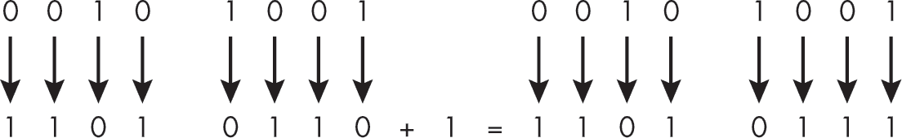
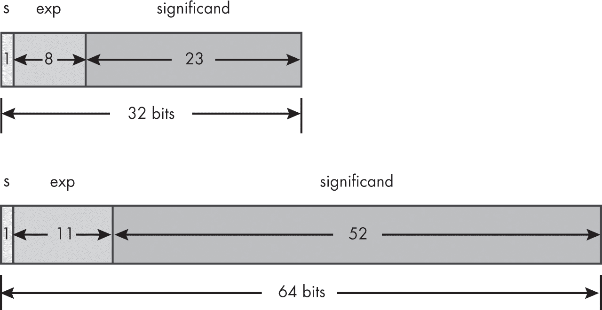
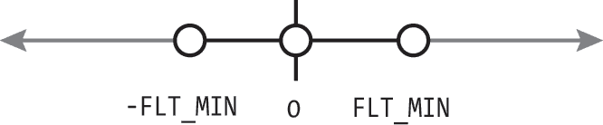

# 3 算术类型


在本章中，你将了解两种*算术类型*：整数类型和浮动类型。C 语言中的大多数运算符都作用于算术类型。由于 C 是一种系统级语言，正确执行算术运算可能会很困难，导致频繁出现缺陷。这部分是因为在具有有限范围和精度的数字系统中，算术操作的结果往往与普通数学中的结果不同。正确地进行基本算术运算是成为专业 C 程序员的基础。

我们将深入探讨 C 语言中的算术运算，帮助你牢牢掌握这些基本概念。我们还将学习如何将一种算术类型转换为另一种类型，这是进行混合类型操作所必需的。

## 整数

正如在第二章中提到的，每种整数类型表示一有限范围的整数。带符号整数类型表示可以为负数、零或正数的值；无符号整数表示仅能为零或正数的值。每种整数类型能够表示的值的范围取决于具体的实现。

整数对象的*值*是存储在对象中的普通数学值。整数对象值的*表示*是该值在对象分配存储空间中的具体编码。我们稍后将详细讨论该表示方法。

### 填充、宽度和精度

除了 char、signed char 和 unsigned char 外，所有整数类型可能包含未使用的位，这些位被称为*填充*，它们允许实现适应硬件的特殊情况（例如跳过多字表示中的符号位）或与目标架构进行最优对齐。表示给定类型值所使用的位数（不包括填充位，但包括符号位）称为*宽度*，通常表示为*N*。*精度*是表示值所使用的位数，排除符号位和填充位。

### 整数范围

*可表示的值*是可以在特定类型的对象所能使用的位数内表示的值。无法表示的值将被编译器诊断为错误，或转换为一个可表示但不同（不正确）的值。<limits.h>头文件定义了类似对象的宏，这些宏展开为标准整数类型的各种限制和参数。为了编写可移植的代码，您应该使用这些宏，而不是像+2147483647（32 位整数所能表示的最大值）这样的整数字面量，因为这些字面量表示特定的限制，并且在移植到不同的实现时可能会发生变化。

C 标准仅对整数的大小施加了三项约束。首先，*每个*数据类型的存储空间占据若干个相邻的unsigned char对象（可能包括填充）。其次，每种整数类型必须支持最小的值范围，这使得您可以依赖跨任何实现的可移植值范围。第三，小类型的宽度不能大于大类型的宽度。因此，例如，short不能比int宽，但两者的宽度可以相同。

### 整数声明

除非声明为unsigned，否则整数类型默认为带符号类型（char除外，char的实现可以定义为带符号或无符号整数类型）。以下是无符号整数的有效声明：

```
unsigned int ui; // unsigned is required
unsigned u; // int can be omitted
unsigned long long ull2; // int can be omitted
unsigned char uc; // unsigned is required
```

在声明带符号整数类型时，您可以省略 signed 关键字——除了signed char，需要该关键字来区分signed char和普通的char。

在声明类型为short、long或long long的变量时，您也可以省略int。例如：

```
int i; // signed can be omitted
long long int sll; // signed can be omitted
long long sll2; // signed and int can be omitted
signed char sc; // signed is required
```

这些都是有效的带符号整数声明。

### 无符号整数

*无符号整数*的范围从 0 开始，它们的上限大于相应带符号整数类型的上限。无符号整数通常用于计数可能具有大且非负值的项目。

#### 表示

无符号整数类型比有符号整数类型更容易理解和使用。它们使用纯二进制系统表示值，没有偏移：最低有效位的权重是 2⁰，次低有效位的权重是 2¹，以此类推。二进制数的值是所有设置位的权重之和。表 3-1 显示了使用未填充的 8 位表示法的无符号值的一些示例。

表 3-1： 8 位无符号值

| 十进制 | 二进制 | 十六进制 |
| --- | --- | --- |
| 0 | 0b00000000 | 0x00 |
| 1 | 0b00000001 | 0x01 |
| 42 | 0b00101010 | 0x2A |
| 255 | 0b11111111 | 0xFF |

无符号整数类型没有符号位，因此它比对应的有符号整数类型能够提供更高的精度（多出 1 位）。无符号整数的值范围从 0 到一个最大值，这个最大值依赖于类型的宽度。该最大值为 2^*N* – 1，其中 *N* 是宽度。例如，大多数 x86 架构使用 32 位整数且没有填充位，因此一个类型为 unsigned int 的对象的值范围是 0 到 2³² – 1（4,294,967,295）。来自 <limits.h> 的常量表达式 UINT_MAX 指定了该类型的实现定义的最大值范围。表 3-2 显示了来自 <limits.h> 的每个无符号类型的常量表达式及标准要求的最小量级。

表 3-2： 无符号整数最小量级

| 常量表达式 | 最小量级 | 该类型对象的最大值 |
| --- | --- | --- |
| UCHAR_MAX | 255 // 28 – 1 | 无符号字符型 |
| USHRT_MAX | 65,535 // 216 – 1 | 无符号短整型 |
| UINT_MAX | 65,535 // 216 – 1 | 无符号整型 |
| ULONG_MAX | 4,294,967,295 // 232 – 1 | 无符号长整型 |
| ULLONG_MAX | 18,446,744,073,709,551,615 // 264 – 1 | 无符号长长整型 |

你的编译器会将这些值替换为实现定义的数值。

#### 回绕

C23 定义了*回绕*为“将一个值按 2*^N* 取模，其中 *N* 是结果类型的宽度。”当你执行的算术运算导致值太小（小于 0）或太大（大于 2*^N* – 1），无法表示为特定的无符号整数类型时，就会发生回绕。在这种情况下，值会按能够表示的最大值加一的数进行取模。回绕是 C 语言中明确定义的行为。它是否是代码中的缺陷取决于上下文。如果你在计数某个东西并且值发生回绕，很可能是个错误。然而，在某些算法中故意使用回绕是合理的。

列表 3-1 中的代码通过将无符号整数值 ui 初始化为其最大值并对其进行递增，演示了回绕。

```
unsigned int ui = UINT_MAX;  // 4,294,967,295 on x86
ui++;
printf("ui = %u\n", ui); // ui is 0
ui--;
printf("ui = %u\n", ui); // ui is 4,294,967,295
```

列表 3-1：无符号整数回绕

结果值不能表示为无符号整数，因此会回绕到 0。如果结果值被递减，它会再次超出范围并回绕回UINT_MAX。

由于回绕，无符号整数表达式永远不会小于 0。很容易忽略这一点，实施始终为真或始终为假的比较。例如，以下for循环中的i永远不会取负值，因此该循环将永远不会终止：

```
for (unsigned int i = n; i >= 0; --i)
```

这种行为导致了一些著名的实际世界中的错误。例如，波音 787 的所有六个发电系统都由相应的发电机控制单元管理。波音的实验室测试发现，发电机控制单元中的一个内部软件计数器在连续运行 248 天后会发生回绕（参见* [`<wbr>www<wbr>.federalregister<wbr>.gov<wbr>/documents<wbr>/2015<wbr>/05<wbr>/01<wbr>/2015<wbr>-10066<wbr>/airworthiness<wbr>-directives<wbr>-the<wbr>-boeing<wbr>-company<wbr>-airplanes`](https://www.federalregister.gov/documents/2015/05/01/2015-10066/airworthiness-directives-the-boeing-company-airplanes) *）。这个缺陷导致所有六个发动机上安装的发电机控制单元同时进入安全模式。

为了避免计划外的行为（例如让你的飞机从天空中掉下来），重要的是通过使用来自<limits.h>的限制来检查回绕。实现这些检查时要小心，因为很容易出错。例如，以下代码存在缺陷，因为sum + ui永远不会大于UINT_MAX：

```
extern unsigned int ui, sum;
// assign values to ui and sum
if (sum + ui > UINT_MAX)
  too_big();
else
  sum = sum + ui;
```

如果将sum和ui相加的结果大于UINT_MAX，则该结果将通过模运算减少到UINT_MAX + 1。因此，这个测试是没有意义的，生成的代码将无条件执行求和。高质量的编译器可能会发出警告指出这一点，但并非所有编译器都会这么做。为了解决这个问题，你可以将sum从不等式的两边减去，从而形成以下有效的测试：

```
extern unsigned int ui, sum;
// assign values to ui and sum
**if (ui > UINT_MAX - sum)**
  too_big();
else
  sum = sum + ui;
```

UINT_MAX宏是可以表示的最大unsigned int值，而sum是一个介于 0 和UINT_MAX之间的值。如果sum等于UINT_MAX，则减法结果为 0；如果sum等于 0，减法结果为UINT_MAX。因为这个操作的结果总是落在 0 到UINT_MAX的可允许范围内，所以它永远不会发生溢出。

当检查算术运算结果是否为 0 时，同样的问题会出现，这是最小的无符号值：

```
extern unsigned int i, j;
// assign values to i and j
if (**i - j < 0**)  // cannot happen
  negative();
else
  i = i - j;
```

由于无符号整数值永远不可能为负，因此减法操作将无条件执行。优质的编译器可能也会对此错误发出警告。与其进行这种无意义的测试，不如通过测试j是否大于i来检查是否发生溢出：

```
if (**j > i**)  // correct
  negative();
else
  i = i - j;
```

如果j > i，则差值会发生溢出，从而防止溢出的发生。通过从测试中去除减法操作，溢出的可能性也随之消除。

> 警告

*请记住，溢出时使用的位宽取决于实现，这意味着你在不同平台上可能获得不同的结果。如果你没有考虑到这一点，你的代码将不具备可移植性。*

### 有符号整数

每种无符号整数类型（排除bool）都有一个对应的有符号整数类型，且占用相同的存储空间。使用有符号整数表示负数、零和正数，这些值的范围取决于分配给类型的位数和表示方式。

#### 表示

表示有符号整数类型比表示无符号整数类型更复杂。从历史上看，C 语言支持三种不同的负数表示方案：符号和大小表示、反码表示和补码表示。

从 C23 开始，仅支持二进制补码表示。在二进制补码表示中，符号位的权重为−(2*^N* ^(− 1))，其他值位的权重与无符号表示相同。本书其余部分假定使用二进制补码表示。

带符号的二进制补码整数类型，宽度为*N*，可以表示从 –2*^N* ^(– 1) 到 2*^N* ^(– 1) – 1 之间的任何整数值。这意味着，例如，8 位类型 signed char 的范围是 –128 到 127。与其他带符号整数表示方法相比，二进制补码可以表示一个额外的*最小负值*。8 位 signed char 的最小负值是 –128，而其绝对值 |–128| 无法表示为此类型。这导致了一些有趣的边界情况，我们将很快详细讨论。

表 3-3 显示了 <limits.h> 中每种带符号类型的常量表达式及标准要求的最小幅度。你的编译器将用实现定义的幅度替换这些值。

表 3-3： 带符号整数最小幅度

| 常量表达式 | 最小幅度 | 类型 |
| --- | --- | --- |
| SCHAR_MIN | –128 // –27 | signed char |
| SCHAR_MAX | +127 // 27 – 1 | signed char |
| SHRT_MIN | –32,768 // –215 | short int |
| SHRT_MAX | +32,767 // 215 – 1 | short int |
| INT_MIN | –32,768 // –215 | int |
| INT_MAX | +32,767 // 215 – 1 | int |
| LONG_MIN | –2,147,483,648 // –231 | long int |
| LONG_MAX | +2,147,483,647 // 231 – 1 | long int |
| LLONG_MIN | –9,223,372,036,854,775,808 // –263 | long long int |
| LLONG_MAX | +9,223,372,036,854,775,807 // 263 – 1 | long long int |

要在二进制补码表示中取反一个值，只需切换每个非填充位，然后加 1（根据需要进位），如图 3-1 所示。



图 3-1：在二进制补码表示中取反一个 8 位值

表 3-4 显示了一个没有填充的 8 位二进制补码带符号整数类型的二进制和十进制表示（即，*N* = 8）。

表 3-4： 8 位二进制补码值

| 二进制 | 十进制 | 权重 | 常数 |
| --- | --- | --- | --- |
| 00000000 | 0 | 0 |  |
| 00000001 | 1 | 20 |  |
| 01111110 | 126 | 26 + 25 + 24 + 23 + 22 + 21 |  |
| 01111111 | 127 | 28 − 1 – 1 | SCHAR_MAX |
| 10000000 | −128 | −(28 − 1) + 0 | SCHAR_MIN |
| 10000001 | −127 | −(28 − 1) + 1 |  |
| 11111110 | −2 | −(28 − 1) + 126 |  |
| 11111111 | −1 | −(28 − 1) + 127 |  |

不一定需要知道数字的二进制表示，但作为一个 C 程序员，你可能会觉得这很有用。

#### 整数溢出

*整数溢出*发生在有符号整数操作的结果值无法在结果类型中表示时。有符号整数溢出和无符号整数回绕常常被混淆。主要的区别是，有符号整数溢出是未定义行为，而无符号整数回绕是定义良好的行为。无符号整数不会发生溢出。

考虑以下类似函数的宏，它返回一个算术操作数的绝对值：

```
// undefined or wrong for the most-negative value
#define ABS(i) ((i) < 0 ? –(i) : (i))
```

我们将在第九章中详细讨论宏。现在，暂时将类似函数的宏视为对通用类型操作的函数。从表面上看，这个宏似乎通过返回 i 的非负值来正确地实现绝对值函数，而不考虑它的符号。我们使用条件运算符（? :）来测试 i 的值是否为负。如果是，i 被取反为 -(i)；否则，返回未修改的值 (i)。

因为我们将 ABS 实现为类似函数的宏，它可以接受任何类型的参数。这个宏在传入有符号整数类型 int 或更大有符号整数类型时可能会发生溢出。当然，使用无符号整数调用这个宏是没有意义的，因为无符号整数永远不会是负数，因此宏的输出将直接复现该参数。让我们来探讨一下当传入有符号整数参数时 ABS 宏的行为：

```
signed int si = -25;
signed int abs_si = **ABS(si)**;
printf("%d\n", abs_si);  // prints 25
```

在这个例子中，我们传入一个类型为 signed int 且值为 -25 的对象作为参数给 ABS 宏。这个调用展开为：

```
signed int si = -25;
signed int abs_si = **((si) < 0 ? –(si) : (si))**;
printf("%d\n", abs_si);  // prints 25
```

宏正确地返回了 25 的绝对值。到目前为止，一切正常。问题在于，对于给定类型，二进制补码表示的最小负值的负值不能在该类型中表示，因此这种用法会导致有符号整数溢出。因此，这种实现方式的 ABS 宏是有缺陷的，可能会出现任何情况，包括意外返回负值：

```
signed int si = **INT_MIN**;
signed int abs_si = ABS(si);  // undefined behavior
printf("%d\n", abs_si);
```

ABS(INT_MIN) 应该返回什么以修正此行为？在 C 中，带符号整数溢出是未定义行为，允许实现悄无声息地环绕（最常见的行为）、陷阱或两者兼有（例如，某些操作环绕，而其他操作则触发陷阱）。*陷阱*会中断程序的执行，防止进一步的操作。像 x86 这样的常见架构会同时执行这两种行为。由于该行为未定义，因此没有普遍正确的解决方案，但我们至少可以在发生未定义行为之前测试其可能性并采取适当的措施。

为了使绝对值宏对各种类型都能有效，我们将向其添加一个类型相关的 标志 参数。该标志代表 *_MIN 宏，匹配第一个参数的类型。在以下有问题的情况下，这个值会被返回：

```
#define ABSM(i, flag) ((i) >= 0 ? (i) : ((i)==(flag) ? (flag) : -(i)))
signed int si = -25;  // try INT_MIN to trigger the undefined behavior
signed int abs_si = ABSM(si, INT_MIN);
if (abs_si == INT_MIN)
  overflow();  // handle special case
else
  printf("%d\n", abs_si);  // prints 25
```

ABSM 宏用于检测最小负值，并在发现时直接返回该值，而不是通过取反触发未定义行为。

在某些系统上，C 标准库实现了以下 仅适用于整数 的绝对值函数，以避免当函数传入 INT_MIN 作为参数时发生溢出：

```
int abs(int i) {
  return (i >= 0) ? i : -(unsigned)i;  // avoids overflow
}
```

在这种情况下，i 被转换为 无符号整数并取反。（我将在本章稍后讨论转换的更多细节。）

令人惊讶的是，一元减号（-）运算符对于无符号整数类型是有定义的。结果的无符号整数值会对大于结果类型能表示的最大值的数取模。最后，i 会根据 return 语句的要求隐式地转换回 带符号整数。由于 -INT_MIN 无法表示为 带符号整数，因此结果是实现定义的，这也是为什么该实现仅在*某些*系统上使用，即使在这些系统上，abs 函数也会返回错误的值。

`ABS` 和 `ABSM` 类似函数的宏会多次评估它们的参数，这可能会在参数改变程序状态时引发意外。这些被称为*副作用*（详见第四章）。另一方面，函数调用每次只评估一次每个参数。

无符号整数具有明确的环绕行为。应始终认为有符号整数溢出或可能发生溢出是一个缺陷。

### 位精确整数类型

如第二章所述，位精确的整数类型接受一个操作数来指定整数的宽度，因此 `_BitInt(32)` 是一个有符号 32 位整数，`unsigned _BitInt(32)` 是一个无符号 32 位整数。位精确的整数类型可以有*任何*宽度，最大为 `BITINT_MAXWIDTH`。位精确的整数类型在应用领域中非常有用，例如在加密对称密码（如高级加密标准（AES））中使用 256 位整数值，计算安全哈希算法（SHA）-256 哈希，表示 24 位色彩空间，或描述网络或串行协议的布局。

位精确整数类型在编程现场可编程门阵列（FPGAs）时也非常有用。*FPGAs* 是一种集成电路，通常现货出售，能够在制造过程后让客户重新配置硬件以满足特定的使用案例要求。在 FPGA 硬件的情况下，对于小值范围内未完全使用位宽的情况，使用普通的整数类型是极其浪费的，并会产生严重的性能和空间问题。在另一极端，FPGA 可以支持宽整数，基本上提供任意精度，并且现有的 FPGA 应用程序使用了大整数——例如，最多达到 2,031 位。在 C23 之前，程序员必须选择下一个更大尺寸的整数数据类型，并手动执行掩码和位移操作。然而，这种做法容易出错，因为整数宽度是由实现定义的。

一种位精确的有符号整数类型被指定为 `_BitInt(*N*)`，其中 *N* 是一个整数常量表达式，指定类型的宽度。由于位精确的整数类型是包括符号位的，因此一个有符号的 `_BitInt(1)` 是无效的，因为它只有一个符号位而没有值位。无符号位精确的整数类型不包括符号位，因此指定一个 1 位整数的正确方式是 `unsigned _BitInt(1)`。

_BitInt 类型遵循通常的 C 语言标准整数转换规则，详情请参见第 65 页的“整数转换规则”章节。通常的算术转换也同样适用，小范围的整数会被转换为大范围的整数。然而，_BitInt 类型不参与整数提升。

溢出发生在值超过给定数据类型允许的范围时。例如，(_BitInt(3))7 + (_BitInt(3))2 会发生溢出，结果是未定义的，和其他带符号整数类型一样。为了避免溢出，可以通过将其中一个操作数强制转换为 _BitInt(4)，将操作类型扩展到 4 位。无符号 _BitInt 的回绕是明确定义的，值会以二进制补码语义进行回绕。

为了避免溢出，你可以将其中一个操作数强制转换为足够宽度的类型，以表示所有可能的值。例如，以下函数将其中一个操作数强制转换为 32 位：

```
_BitInt(32) multiply(_BitInt(8) a8, _BitInt(24) a24) {
  _BitInt(32) a32 = a8 * (_BitInt(32))a24;
  return a32;
}
```

这样可以保证结果的乘积能够正确表示。

### 整数常量

*整数常量*（或*整数字面量*）将整数值引入程序中。例如，你可以在声明中使用它们，将计数器初始化为 0。C 语言有四种整数常量，使用不同的进制：十进制常量、二进制常量、八进制常量和十六进制常量。

*十进制常量*总是以非零数字开头。例如，下面的代码使用了两个十进制常量：

```
unsigned int ui = 71;
int si;
si = -12;
```

在这个示例代码中，我们将 ui 初始化为十进制常量 71，并将 si 赋值为十进制常量值 -12。（严格来说，-12 是取反操作符 [-] 后跟一个整数常量 [12]。然而，表达式 -12 可以作为整数常量表达式使用，因此与值为–12 的整数常量本质上是不可区分的。）在代码中引入常规整数值时，使用十进制常量。

如果常量以 0 开头，并可选地跟随 0 到 7 之间的数字，它就是一个*八进制常量*。以下是一个示例：

```
int agent = 007;
int permissions = 0777;
```

在这个示例中，007八进制等于7十进制，八进制常量0777等于十进制值 511。八进制常量在处理像 POSIX 文件权限这样的 3 位字段时非常方便。

你还可以通过在一系列十进制数字和字母 a（或 A）到 f（或 F）前添加0x或0X来创建一个*十六进制常量*。例如：

```
int burger = 0xDEADBEEF;
```

当你引入的常量旨在表示比特模式而不是特定值时，使用十六进制常量——例如，在表示地址时。习惯上，大多数十六进制常量写作0xDEADBEEF，因为它类似于典型的十六进制转储。你最好将所有的十六进制常量都写成这样。

从 C23 开始，你还可以通过将一系列 1 和 0 十进制数字附加到0b后面来指定二进制常量。例如：

```
int mask = 0b110011;
```

二进制常量比八进制或十六进制常量更具可读性，特别是在该值作为位掩码使用时。

你还可以给常量添加后缀来指定其类型。如果没有后缀，十进制常量会被赋予<int>类型，前提是它可以在该类型中表示。如果不能表示为<int>类型，它将被表示为<long int>或<long long int>类型。<L>后缀指定<long>类型，而<LL>指定<long long>类型。你可以将这些后缀与<U>结合使用，表示<signed>类型。例如，<ULL>后缀指定<unsigned long long>类型。以下是一些示例：

```
unsigned int ui = 71U;
signed long int sli = 9223372036854775807L;
unsigned long long int ui = 18446744073709551615ULL;
```

这些后缀可以是大写或小写。通常建议使用大写字母以提高可读性，因为小写字母 l 可能会与数字 1 混淆。

*精确位常量*在 C23 中被添加，用来指定_BitInt字面量。后缀wb和uwb分别表示类型为_BitInt(N)和无符号的_BitInt(N)常量。宽度N是大于 1 的最小值，能够容纳值和符号位（如果存在）。

wb后缀会导致一个包含符号位的_BitInt，即使常数值为正或已使用二进制、八进制或十六进制表示：

-3wb 产生一个_BitInt(3)，然后对其取反；两个值位，一个符号位

-0x3wb 产生一个_BitInt(3)，然后对其取反；两个值位，一个符号位

3wb 产生一个_BitInt(3)；两个值位，一个符号位

3ub 产生一个无符号的_BitInt(2)

-3uwb 产生一个无符号的_BitInt(2)，然后对其取反，导致环绕现象

如果我们不使用后缀，且整数常量不是所需类型，它可能会被隐式转换。（我们将在“算术转换”部分讨论隐式转换，详见第 64 页。）这可能导致意外的转换或编译器诊断，因此最好指定一个合适类型的整数常量。C 标准第 6.4.4.1 节提供了更多关于整数常量的信息（ISO/IEC 2024）。

## 浮点数表示

*浮动点表示法* 是表示实数的最常见的数字表示方式。浮动点表示法是一种使用科学记数法来表示数值的技术，其中包含一个尾数和一个指数，基于给定的进制。例如，十进制数 123.456 可以表示为 1.23456 × 10²，而二进制数 0b10100.11 可以表示为 1.010011 × 2⁴。

C 标准定义了一个浮动点数的通用模型。然而，它并不要求所有实现都使用相同的表示方案或格式，并且允许实现提供不符合 C 模型的值。为了简化，我们假设符合附录 F。附录 F 包含 IEC 60559 标准中指定的最常见的浮动点格式。你可以通过测试 __STDC_IEC_559__ 宏，或者在较新的编译器中测试 __STDC_IEC_60559_BFP__ 宏，来确定实现是否符合附录 F。

本节解释了浮动类型、算术运算、值和常量，帮助你了解如何以及何时使用它们来模拟实数运算，以及何时避免使用它们。

### 浮动类型和编码

C 语言有三种标准的浮动类型：float、double 和 long double。

float 类型可以用于浮动点数据和结果，这些数据和结果可以通过该类型的精度和指数范围来充分表示。使用 float 算术运算从 float 数据计算 float 结果尤其容易产生舍入误差。常见的 IEC 60559 float 类型通过使用 1 位符号位、8 位指数位和 23 位尾数位来编码值。该值有一个 24 位的尾数，编码为 23 位（借助指数字段来确定隐式的领先位）。

`double`类型提供了更高的精度和指数范围，但需要额外的存储空间。使用`double`类型进行算术运算显著提高了从`float`数据中计算`float`结果的可靠性。IEC 60559 标准中的`double`类型使用 1 个符号位、11 个指数位和 52 个尾数位对值进行编码。该值的尾数有 53 位，其中 52 位由指数域帮助确定隐含的前导 1 位进行编码。

这些对于`float`和`double`的编码在图 3-2 中有所说明。



图 3-2：`float`和`double`类型

让我们通过一个例子来说明如何在`float`类型中进行编码：

| `1` | `1000 0001` | `011 0000 0000 0000 0000 0000` |
| --- | --- | --- |

符号位是`1`，指数域是`1000 0001`，尾数域是`011 0000 0000 0000 0000 0000`。符号位编码了数字的符号，其中 0 表示正号，1 表示负号。因此，在此示例中表示的数字是负数。

由于指数域既不是全 0 也不是全 1，尾数域中的位被解释为二进制点右侧的位，其中隐含的 1 位位于二进制点的左侧。在此示例中，编码的数字的尾数为`1.011 0000 0000 0000 0000 0000` = 1 + 2^(–2) + 2^(–3) = 1.375。

将这些内容结合起来得出以下实数：–2²(1 + 2^(–2) + 2^(–3)) = –5。

### C 浮点模型

以下公式表示使用 C 模型的`float`类型的一个数字：


*s* 是符号位，可以是 1 或 -1。*e* 是指数，*f*[1] 到 *f*[24] 是有效数字位。注意，在 C 模型表示中，指数比我们从编码中得到的指数大 1，因为 C 模型将（显式）前导位放在二进制小数点的右侧，而编码则将（隐式）前导位放在二进制小数点的左侧。

以下公式表示 double 类型的一个数字：


通常，C 模型通过参数 *b*、*p*、*e*[min] 和 *e*[max] 来定义每种浮动类型中的浮动点数。参数 *b* 是基数（用于指数和有效数字的基数）。所有标准浮动类型的基数 *b* 由在 <float.h> 中定义的 FLT_RADIX 宏表示。在附录 F 中，FLT_RADIX 的值为 2。参数 *p* 是浮动点有效数字中基数 *b* 的位数。*e*[min] 参数是最小负整数，使得 b 的该指数减一后得到的值是标准化的浮动点数。最后，*e*[max] 参数是最大整数，使得 b 的该指数减一后得到的值是可表示的有限浮动点数，前提是该可表示的有限浮动点数是标准化的（对于所有 IEC 60559 类型，都会是标准化的）。表 3-5 显示了实际的宏名称。

表 3-5： 标准类型表征宏在 <float.h>

| 参数 | float | double | long double |
| --- | --- | --- | --- |
| p | FLT_MANT_DIG | DBL_MANT_DIG | LDBL_MANT_DIG |
| emin | FLT_MIN_EXP | DBL_MIN_EXP | LDBL_MIN_EXP |
| emax | FLT_MAX_EXP | DBL_MAX_EXP | LDBL_MAX_EXP |

每个实现为 long double 类型分配以下格式之一：

+   IEC 60559 四倍精度（或 binary128）格式（IEC 60559 在 2011 年的修订中将 binary128 加入了其基本格式）

+   IEC 60559 binary64 扩展格式

+   非 IEC 60559 扩展格式

+   IEC 60559 双精度（或 binary64）格式

编译器实现者的推荐做法是将 long double 类型与 IEC 60559 的 binary128 格式或 IEC 60559 的 binary64 扩展格式匹配。IEC 60559 的 binary64 扩展格式包括常见的 80 位 IEC 60559 格式。

使用 long double 类型进行算术运算应该考虑用于那些可靠性可能受益于实现所提供的标准浮动类型的最大范围和精度的计算。然而，long double 类型（与 double 相比）的额外范围和精度在不同实现之间差异很大，long double 算术运算的性能（速度）也有很大差异。因此，long double 类型不适合用于数据交换或可重现的结果（跨实现），也不适合便携式高性能计算。

较大的类型具有更高的精度，但需要更多的存储空间。任何可以表示为 float 的值也可以表示为 double，任何可以表示为 double 的值也可以表示为 long double。头文件 <float.h> 定义了几个宏，用于定义浮动类型的特性。

C23 附录 H 指定了 IEC 60559 中指定的具有算术交换和扩展浮动点格式的其他浮动类型。包括一系列具有无限精度和范围的类型以及一个 16 位类型。未来版本的 C 可能会包括其他浮动类型。

### 浮动点算术

浮点运算类似于并用于模拟实数的算术。然而，需要考虑一些差异。与实数算术不同，浮点数在大小上是有限的，并且具有有限精度。加法和乘法运算是*非*结合的；分配律*不成立*，并且许多其他实数的性质也不成立。

浮点类型不能精确表示所有实数，即使它们能在少量小数位中表示。例如，常见的十进制常数如 0.1 不能精确表示为二进制浮点数。浮点类型可能缺乏足够的精度来满足各种应用需求，例如循环计数器或财务计算。有关更多信息，请参见 CERT C 规则 FLP30-C（不要将浮点变量用作循环计数器）。

### 浮点数值

有效位为 0（即所有 *f*[k] = 0）的浮点表示代表浮点零。零根据符号（*s*）进行签名，且有两个浮点零值：+0 和 –0。它们相等，但在一些操作中表现不同。一个显著的例子是 1.0/0.0 产生正无穷大，而 1.0/(-0.0) 产生负无穷大。

标准化浮点数的有效位中没有前导零（*f*[1] = 1）；前导零通过调整指数来去除。这些是*标准*数，它们使用有效位的全部精度。因此，float具有 24 位有效精度，double具有 53 位有效精度，long double具有 113 位有效精度（假设使用 IEC 60559 binary128 格式）。

*非标准*数是非常小的正数和负数（但不是 0），它们的标准化表示会导致指数小于该类型的最小指数。它们的表示具有指数 *e* = *e*[min]，并且前导有效位 *f*[1] = 0。 图 3-3 显示的是围绕 0 的非标准值范围的数轴。非标准数的精度低于标准化数。



图 3-3：非标准数的范围

浮点类型还可以表示不是浮点数的值，例如正负无穷大和非数（NaN）值。*NaN* 是不代表任何数值的特殊值。

将无限大作为特定值提供，使得操作可以继续进行，即使在溢出和除零的情况下，也能产生有用的结果，而无需特殊处理。将任何非零数除以（正或负）零会得到无限大。IEEE 浮点标准中对无限大值的操作是明确定义的。

一个*安静的 NaN*会在几乎所有算术操作中传播，而不会引发浮点异常，通常会在一系列操作后进行测试。具有*信号 NaN*操作数的算术操作通常会立即引发浮点异常。浮点异常是一个高级话题，在这里没有涉及。有关更多信息，请参阅 C 标准的附录 F。

在 C23 中，NAN和INFINITY宏位于<float.h>中，而nan函数位于<math.h>中，提供了 IEC 60559 安静 NaN 和无限大的标识。FLT_SNAN、DBL_SNAN 和 LDBL_SNAN 宏位于<float.h>中，提供了 IEC 60559 信号 NaN 的标识。C 附录 F 不要求完全支持信号 NaN。

你可以使用fpclassify类似宏来识别浮点值的类别，该宏将其参数值分类为 NaN、无限、正常、次正规或零：

```
#include <math.h>
int fpclassify(real-floating x);
```

在示例 3-2 中，我们在show_classification函数中使用fpclassify宏来确定一个类型为double的浮点值是正常值、次正规值、零、无限大还是 NaN。

```
const char *show_classification(double x) {
  switch(fpclassify(x)) {
    case FP_INFINITE:  return "Inf";
    case FP_NAN:       return "NaN";
    case FP_NORMAL:    return "normal";
    case FP_SUBNORMAL: return "subnormal";
    case FP_ZERO:      return "zero";
    default:           return "unknown";
  }
```

示例 3-2: The fpclassify 宏

函数参数x（在此示例中为double）被传递给fpclassify宏，该宏根据返回值进行切换。show_classification函数返回与存储在x中的值类别对应的字符串。

还有各种其他分类宏，包括isinf、isnan、isnormal、issubnormal、iszero等等，它们在许多应用中可能比fpclassify宏更有用。

### 浮动常量

*浮动常量*是表示实数的十进制或十六进制数字。你应该使用浮动点常量来表示不能改变的浮动点值。以下是一些浮动点常量的示例：

```
15.75
1.575E1   /* 15.75 */
1575e-2   /* 15.75 */
25E-4     /* 0.0025 */
```

以下展示了两种方式定义的常量：一种是十进制浮动常量，另一种是十六进制浮动常量。十六进制常量的值可以精确表示其（二进制）类型。十进制常量需要转换为二进制，并可能会受到舍入方向模式和求值方法的轻微影响。（舍入模式和求值方法本书中没有涉及。）如果你需要特定的值（到最后一位），则应使用十六进制常量。

```
DBL_EPSILON 2.2204460492503131E-16 // decimal constant
DBL_EPSILON 0X1P-52                // hex constant
DBL_MIN 2.2250738585072014E-308    // decimal constant
DBL_MIN 0X1P-1022                  // hex constant
DBL_MAX 1.7976931348623157E+308    // decimal constant
DBL_MAX 0X1.fffffffffffffP1023     // hex constant
```

所有浮动点常量都有一个类型。如果没有后缀，则类型为double；如果后缀为字母f或F，则类型为float；如果后缀为字母l或L，则类型为long double，如下所示：

```
10.0F  /* type float */
10.0   /* type double */
10.0L  /* type long double */
```

在这些示例中，小数点是必须的，但末尾的零不是。

## 算术转换

通常，一个类型的值（例如float）必须以不同的类型表示（例如int）。当你有一个float类型的对象，并且需要将其作为参数传递给接受int类型对象的函数时，就会发生这种情况。当需要进行此类转换时，你应该始终确保该值可以在新类型中充分表示。我将在《安全转换》章节中进一步讨论这个问题，见第 70 页。

值可以隐式或显式地从一种算术类型转换为另一种类型。你可以使用*强制转换*运算符进行*显式*转换。列表 3-3 展示了两个强制转换的例子。

```
int si = 5;
short ss = 8;
long sl = (long)si;
unsigned short us = (unsigned short)(ss + sl);
```

列表 3-3：类型转换操作符

要执行类型转换，在表达式前放置一个括号中的类型名称。这个类型转换将表达式转换为括号中类型名称的无限定版本。在这里，我们将si的值转换为类型long。因为si是类型int，这个类型转换是安全的，因为该值总是可以在具有相同符号位的较大整数类型中表示。

本例中的第二个类型转换将表达式(ss + sl)的结果转换为类型unsigned short。由于值被转换为一个精度较低的无符号类型（unsigned short），转换的结果可能与原值不相等。（一些编译器可能会对此发出警告，其他则不会。）在这个例子中，表达式（13）的结果可以在结果类型中正确表示。

*隐式转换*，也称为*强制类型转换*，在表达式中根据需要自动发生。值会在操作数类型混合时进行强制转换。例如，在列表 3-3 中，隐式转换用于将ss转换为sl的类型，以便可以在一个公共类型上执行加法操作ss + sl。有关哪些值会被隐式转换为哪些类型的规则有些复杂，涉及三个概念：整数转换等级、整数提升和常规算术转换。

### 整数转换等级

*整数转换等级*是一个整数类型的标准等级排序，用于确定计算时的公共类型。每种整数类型都有一个整数转换等级，用来决定何时以及如何隐式地执行转换。

C 标准，第 6.3.1.1 节，第 1 段（ISO/IEC 9899:2024），规定每种整数类型都有一个整数转换等级，以下内容适用：

+   没有两个带符号的整数类型具有相同的等级，即使它们具有相同的表示方式。

+   带符号整数类型的等级大于任何精度较低的带符号整数类型的等级。

+   `long long int`的等级大于`long int`的等级，而`long int`的等级大于`int`的等级，`int`的等级大于`short int`的等级，`short int`的等级大于`signed char`的等级。

+   位精确的有符号整数类型的等级大于任何具有较小宽度的标准整数类型或具有较小宽度的位精确整数类型的等级。

+   任何无符号整数类型的等级等于相应有符号整数类型的等级（如果有的话）。

+   任何标准整数类型的等级都大于任何具有相同宽度的扩展整数类型或具有相同宽度的位精确整数类型的等级。

+   相对于具有相同宽度的扩展整数类型，任何位精确整数类型的等级是由实现定义的。

+   `char`的等级等于`signed char`和`unsigned char`的等级。

+   `bool`的等级小于所有其他标准整数类型的等级。

+   任何枚举类型的等级等于兼容整数类型的等级。每个枚举类型都与`char`、有符号整数类型或无符号整数类型兼容。

相对于具有相同精度的另一个扩展有符号整数类型，任何扩展有符号整数类型的等级是由实现定义的，但仍然受到其他确定整数转换等级规则的约束。

### 整数提升

*小类型*是一个具有低于`int`或`unsigned int`转换等级的整数。*整数提升*是将小类型的值转换为`int`或`unsigned int`的过程。整数提升允许你在任何可以使用`int`或`unsigned int`的表达式中使用小类型的表达式。例如，你可以在赋值的右侧或作为函数的参数使用一个较低等级的整数类型——通常是`char`或`short`。

整数提升有两个主要目的。首先，它们鼓励在体系结构的自然大小（int）上执行操作，从而提高性能。其次，它们帮助避免由于中间值溢出而导致的算术错误，例如：

```
signed char cresult, c1, c2, c3;
c1 = 100; c2 = 3; c3 = 4;
cresult = c1 * c2 / c3;
```

在没有整数提升的情况下，c1 * c2 会导致在某些平台上 signed char 类型溢出，其中 signed char 被表示为 8 位补码值。这是因为 300 超出了该类型可以表示的值范围（–128 到 127）。然而，由于整数提升，c1、c2 和 c3 会隐式转换为 signed int 类型的对象，乘法和除法操作也会在这个大小上进行。这些操作在执行时不会发生溢出，因为结果值可以被这个更宽的类型表示。在这个特定的例子中，整个表达式的结果是 75，它在 signed char 类型的范围内，因此该值在存储到 cresult 时会被保留。

在第一个 C 标准之前，编译器使用两种方法之一进行整数提升：无符号保留方法或值保留方法。在*无符号保留方法*中，编译器将小的无符号类型提升为unsigned int。在*值保留方法*中，如果原类型的所有值都可以表示为int，则将原小类型的值转换为int。否则，它会被转换为unsigned int。在制定原始标准版本（C89）时，C 标准委员会决定采用值保留规则，因为它们比无符号保留方法更少出现不正确的结果。如果需要，你可以通过使用显式类型转换来覆盖这种行为，如 Listing 3-3 所示。

推广小型无符号类型的结果取决于整数类型的精度，这由实现决定。例如，x86-32 和 x86-64 架构具有 8 位的 char 类型、16 位的 short 类型和 32 位的 int 类型。对于面向这些架构的实现，unsigned char 和 unsigned short 类型的值都会被提升为 signed int，因为所有可以在这些较小类型中表示的值都可以作为 signed int 来表示。然而，16 位架构（如 Intel 8086/8088 和 IBM Series/1）具有 8 位的 char 类型、16 位的 short 类型和 16 位的 int 类型。对于面向这些架构的实现，unsigned char 类型的值会被提升为 signed int，而 unsigned short 类型的值会被提升为 unsigned int。这是因为所有可以表示为 8 位 unsigned char 类型的值都可以表示为 16 位的 signed int，但某些可以表示为 16 位的 unsigned short 的值无法表示为 16 位的 signed int。

_BitInt 类型不受整数提升的影响。整数提升可能会增加某些平台所需硬件的大小，因此 _BitInt 类型不受整数提升规则的约束。例如，在涉及 _BitInt(12) 和 unsigned _BitInt(3) 的二元表达式中，常规算术转换不会在确定通用类型之前将任何操作数提升为 int。因为一个类型是有符号的，另一个是无符号的，而且由于类型的位宽不同，有符号类型的等级高于无符号类型，因此无符号的 _BitInt(3) 会被转换为 _BitInt(12) 作为通用类型。

### 常规算术转换

*常规算术转换*是用于产生*通用实数类型*的规则，适用于算术运算的操作数和结果。忽略复数或虚数类型后，每个操作数都将转换为通用实数类型。许多接受整数操作数的运算符（包括 *、/、%、+、-、<、>、<=、>=、==、!=、&、^、| 和 ? :) 会根据常规算术转换规则进行转换。常规算术转换应用于已提升的操作数。

常规算术转换首先检查平衡转换中的一个操作数是否为浮动类型。如果是，它将应用以下规则：

1.  如果任一操作数的类型是 long double，则另一个操作数会被转换为 long double。

2.  否则，如果任一操作数的类型是 double，则另一个操作数会被转换为 double。

3.  否则，如果任一操作数的类型是 float，则另一个操作数会被转换为 float 类型。

4.  否则，会对两个操作数执行整数提升。

如果一个操作数是 double 类型，另一个操作数是 int 类型，例如，类型为 int 的操作数会被转换为 double 类型的对象。如果一个操作数是 float 类型，另一个操作数是 double 类型，则类型为 float 的操作数会被转换为 double 类型的对象。特别需要注意的是 int 和 float 的情况，这时会将 int 操作数转换为 float 类型，尽管 int 的精度通常大于 float。

如果两个操作数都不是浮点类型，则应用以下常规算术转换规则来转换提升后的整数操作数：

1.  如果两个操作数类型相同，则不需要进一步的转换。

2.  否则，如果两个操作数都是有符号整数类型或都是无符号整数类型，则类型具有较小整数转换等级的操作数会被转换为具有较大等级的操作数的类型。例如，如果一个操作数是 int 类型，另一个操作数是 long 类型，则类型为 int 的操作数会被转换为 long 类型的对象。

3.  否则，如果具有无符号整数类型的操作数的等级大于或等于另一个操作数类型的等级，则具有有符号整数类型的操作数会被转换为无符号整数类型的操作数类型。例如，如果一个操作数是 signed int 类型，另一个操作数是 unsigned int 类型，则类型为 signed int 的操作数会被转换为 unsigned int 类型的对象。

4.  否则，如果带符号整数类型的操作数能够表示所有无符号整数类型操作数的值，那么无符号整数类型的操作数将被转换为带符号整数类型的操作数。例如，如果一个操作数的类型是unsigned int，另一个操作数的类型是signed long long，并且signed long long类型能够表示所有unsigned int类型的值，那么unsigned int类型的操作数将被转换为signed long long类型的对象。这对于具有 32 位int类型和 64 位long long类型的实现来说是这样的，例如 x86-32 和 x86-64。

5.  否则，两个操作数都被转换为与带符号整数类型的操作数对应的无符号整数类型。

_BitInt不受整数提升规则的影响，其中一个后果是二元运算符的_BitInt操作数并不总是像常规算术转换那样提升为int或unsigned int。相反，较低等级的操作数会被转换为较高等级的操作数类型，运算结果为较高等级的类型。例如，给定以下声明

```
_BitInt(2) a2 = 1;
_BitInt(3) a3 = 2;
_BitInt(33) a33 = 1;
signed char c = 3;
```

以下表达式中的a2操作数在乘法操作中被转换为_BitInt(3)，并且结果类型为_BitInt(3)：

```
a2 * a3;
```

在以下的乘法操作中，c被提升为int，a2被转换为int，并且结果类型为int：

```
a2 * c;
```

最后，在以下的乘法操作中，c被提升为int。然后，假设int的宽度不大于 32，它会被转换为_BitInt(33)，并且结果类型为_BitInt(33)：

```
a33 * c;
```

这些转换规则是随着新类型的添加而发展的，需要一些时间来适应。这些不规则的模式源自不同的架构特性（特别是 PDP-11 对 char 自动提升为 int）以及避免改变现有程序行为的需求，且在这些限制条件下追求一致性的目标。遇到疑问时，可以使用类型转换来明确强制你想要的转换。尽管如此，尽量不要过度使用显式转换，因为类型转换可能会禁用重要的诊断信息。

### 隐式转换的示例

以下示例说明了整数转换等级、整数提升和常规算术转换的使用。此代码将 signed char 类型的值 c 与 unsigned int 类型的值 ui 进行相等比较。我们假设这段代码是为 x86 架构编译的：

```
unsigned int ui = UINT_MAX;
signed char c = -1;
if (c == ui) {
  printf("%d equals %u\n", c, ui);
}
```

变量 c 是 signed char 类型。由于 signed char 的整数转换等级低于 int 或 unsigned int，因此在比较时，存储在 c 中的值会提升为 signed int 类型的对象。这是通过符号扩展原始值 0xFF 为 0xFFFFFFFF 来实现的。*符号扩展* 用于将有符号值转换为更大宽度的对象。符号位会被复制到扩展对象的每个比特位置。此操作在将较小的有符号整数类型转换为较大的有符号整数类型时，保留了符号和大小。

接下来，应用常规的算术转换。因为相等（==）运算符的操作数具有不同的符号性和相等的等级，所以符号整数类型的操作数将被转换为无符号整数类型的操作数类型。然后，比较作为 32 位无符号操作执行。因为 UINT_MAX 与 c 的提升和转换后的值相同，所以比较结果为 1，代码片段会输出以下内容：

```
-1 equals 4294967295
```

这个结果应该不再令人惊讶。

### 安全转换

隐式和显式转换（类型转换操作的结果）都可能产生无法在结果类型中表示的值。最好在同一类型的对象上执行操作，以避免转换。然而，当一个函数返回或接受不同类型的对象时，转换是不可避免的。在这些情况下，我们必须确保转换正确执行。

#### 整数转换

*整数转换*发生在将整数类型的值转换为另一种整数类型时。转换到相同符号性的较大类型始终是安全的，无需检查。其他大多数转换可能会产生意外结果，如果结果值无法在目标类型中表示。为了正确执行这些转换，必须测试原始整数类型中存储的值是否在目标整数类型能表示的范围内。例如，列表 3-4 中显示的<sup class="SANS_TheSansMonoCd_W5Regular_11">do_stuff</sup>函数接受一个<sup class="SANS_TheSansMonoCd_W5Regular_11">signed long</sup>参数<sup class="SANS_TheSansMonoCd_W5Regular_11">value</sup>，该参数需要在仅适用<sup class="SANS_TheSansMonoCd_W5Regular_11">signed char</sup>的上下文中使用。

```
#include <errno.h>
#include <limits.h>

errno_t do_stuff(signed long value) {
  if (**(value < SCHAR_MIN) || (value > SCHAR_MAX)**) {
    return ERANGE;
  }
 signed char sc = (signed char)value; // cast quiets warning
  // `--snip--`
}
```

列表 3-4：安全转换

为了安全地执行此转换，函数会检查<sup class="SANS_TheSansMonoCd_W5Regular_11">value</sup>是否能表示为在[<sup class="SANS_TheSansMonoCd_W5Regular_11">SCHAR_MIN</sup>, <sup class="SANS_TheSansMonoCd_W5Regular_11">SCHAR_MAX</sup>]范围内的<sup class="SANS_TheSansMonoCd_W5Regular_11">signed char</sup>，如果不能，则返回错误。

具体的范围测试根据转换的不同而有所不同。有关更多信息，请参阅 CERT C 规则 INT31-C（“确保整数转换不会导致数据丢失或误解释”）。

#### 整数类型到浮动类型的转换

符合附录 F 的浮动类型支持正负无穷大，因此所有整数值都在范围内。适用常规的 IEC 60559 转换规则。有关更多信息，请参阅 CERT C 规则 FLP36-C（“在将整数值转换为浮动类型时保持精度”）。

#### 浮动类型到整数类型的转换

当浮动类型的有限值被转换为整数类型（除了bool）时，小数部分会被丢弃。如果整数部分的值无法被整数类型表示，附录 F 规定会引发“无效”浮动点异常，结果是未指定的。

#### 浮动类型降级

将浮动值转换为更大浮动类型总是安全的。将浮动值降级（即转换为更小的浮动类型）就像将整数值转换为浮动类型一样。符合附录 F 的浮动类型支持正负无穷大。对于这些实现，降级浮动类型的值总是会成功，因为任何超出范围的值都会被转换为无穷大。有关浮动点转换的更多信息，请参见 CERT C 规则 FLP34-C（“确保浮动点转换在新类型的范围内”）。

在本章中，你学习了整数和浮动类型。你还学习了隐式和显式转换、整数转换等级、整数提升以及常见的算术转换。

这些基本类型的使用，尤其是整数类型，在 C 编程中是不可避免且普遍存在的。即便是“Hello, world!”程序也会返回一个int并打印一个字符串——一个类型为char的数组——这当然是一个整数类型。因为整数类型的使用如此频繁，你不能每次使用它们时都重新阅读这一章。你必须理解它们的行为，以便能够有效地编程。

在下一章中，你将学习运算符以及如何编写简单的表达式来对这些算术类型以及其他对象类型执行操作。
