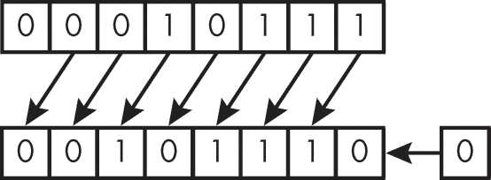
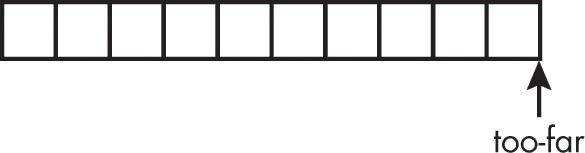

<hgroup>

# <samp class="SANS_Futura_Std_Bold_Condensed_B_11">4</samp> <samp class="SANS_Dogma_OT_Bold_B_11">表达式与运算符</samp>

</hgroup>


在本章中，你将学习运算符以及如何编写简单的表达式来对各种对象类型进行操作。*运算符*是用于执行操作的关键字或一个或多个标点符号。当运算符应用于一个或多个操作数时，它会成为一个计算值的表达式，并且可能具有副作用。*表达式*是由运算符和操作数组成的序列，用来计算一个值或完成其他目的。操作数可以是标识符、常量、字符串字面量或其他表达式。

在本章中，我们在深入探讨表达式的机制（包括运算符与操作数、值计算、副作用、优先级以及求值顺序）之前，先讨论简单赋值。接着，我们会讨论具体的运算符，包括 <samp class="SANS_TheSansMonoCd_W5Regular_11">sizeof</samp>、算术运算符、按位运算符、强制类型转换运算符、条件运算符、对齐运算符、关系运算符、复合赋值运算符以及逗号运算符。我们在前几章中已经介绍了这些运算符和表达式；在这一章，我们详细讲解它们的行为及最佳使用方式。最后，我们将以指针运算的讨论结束本章内容。

## <samp class="SANS_Futura_Std_Bold_B_11">简单赋值</samp>

*简单赋值*将左操作数指定的对象中的值替换为右操作数的值。右操作数的值会被转换为赋值表达式的类型。简单赋值有三个组成部分：左操作数、赋值（<samp class="SANS_TheSansMonoCd_W5Regular_11">=</samp>）运算符和右操作数，如下例所示：

```
int i = 21; // declaration with initializer
int j = 7;  // declaration with initializer
i = j;      // simple assignment
```

前两行是*声明*，它们将变量 <samp class="SANS_TheSansMonoCd_W5Regular_11">i</samp> 初始化为 21，将 <samp class="SANS_TheSansMonoCd_W5Regular_11">j</samp> 初始化为 7。初始化不同于简单赋值，尽管它们具有相似的语法。*初始化器*是声明中的可选部分；如果存在，它会为对象提供初始值。如果没有初始化器，具有自动存储周期的对象将未初始化。

第三行包含一个简单赋值。为了使代码能够编译，你必须定义或声明所有在表达式中出现的标识符（例如在简单赋值中）。

在简单赋值中，左操作数总是一个表达式（其对象类型不为 <samp class="SANS_TheSansMonoCd_W5Regular_11">void</samp>），称为 *左值*。左值中的 *l* 原本来源于它是 *左* 操作数，但更准确地说，可以理解为 *定位值*（locator value），因为它必须指向一个对象。右操作数也是一个表达式，但它可以仅仅是一个值，并不需要指向一个对象。我们将这个值称为 *右值*（*右* 操作数）或 *表达式值*。在这个例子中，两个对象的标识符 <samp class="SANS_TheSansMonoCd_W5Regular_11">i</samp> 和 <samp class="SANS_TheSansMonoCd_W5Regular_11">j</samp> 都是左值。左值也可以是一个表达式，例如 <samp class="SANS_TheSansMonoCd_W5Regular_11">*(p + 4)</samp>，只要它引用了内存中的一个对象。

在简单的赋值中，右值（rvalue）会被转换为左值（lvalue）的类型，然后存储到由左值指定的对象中。在赋值 <samp class="SANS_TheSansMonoCd_W5Regular_11">i</samp> <samp class="SANS_TheSansMonoCd_W5Regular_11">=</samp> <samp class="SANS_TheSansMonoCd_W5Regular_11">j</samp> 中，值从 <samp class="SANS_TheSansMonoCd_W5Regular_11">j</samp> 中读取并写入到 <samp class="SANS_TheSansMonoCd_W5Regular_11">i</samp> 中。由于 <samp class="SANS_TheSansMonoCd_W5Regular_11">i</samp> 和 <samp class="SANS_TheSansMonoCd_W5Regular_11">j</samp> 是相同类型（<samp class="SANS_TheSansMonoCd_W5Regular_11">int</samp>），因此不需要转换。赋值表达式的结果值是赋值的结果，类型为左值的类型。

右值不需要指向一个对象，如以下语句所示，它使用了前面示例中的类型和值：

```
j = i + 12; // j now has the value 19
```

表达式 <samp class="SANS_TheSansMonoCd_W5Regular_11">i</samp> <samp class="SANS_TheSansMonoCd_W5Regular_11">+</samp> <samp class="SANS_TheSansMonoCd_W5Regular_11">12</samp> 不是左值，因为没有底层对象存储结果。相反，单独的 <samp class="SANS_TheSansMonoCd_W5Regular_11">i</samp> 是一个左值，会自动转换为右值，作为加法操作的操作数。加法操作的结果（没有与之关联的内存位置）也是一个右值。C 语言规定了左值和右值出现的位置。以下语句展示了左值和右值的正确与错误使用：

```
int i;
i = 5;     // i is an lvalue, 5 is an rvalue
int j = i; // lvalues can appear on the right side of an assignment
7 = i;     // error: rvalues can't appear on the left side of an assignment
```

赋值 <samp class="SANS_TheSansMonoCd_W5Regular_11">7</samp> <samp class="SANS_TheSansMonoCd_W5Regular_11">=</samp> <samp class="SANS_TheSansMonoCd_W5Regular_11">i</samp> 无法编译，因为右值必须始终出现在操作符的右侧。

在以下示例中，右操作数的类型与赋值表达式不同，因此<samp class="SANS_TheSansMonoCd_W5Regular_11">i</samp>的值首先被转换为<samp class="SANS_TheSansMonoCd_W5Regular_11">signed char</samp>类型。括号内的表达式值随后被转换为<samp class="SANS_TheSansMonoCd_W5Regular_11">long int</samp>类型，并赋值给<samp class="SANS_TheSansMonoCd_W5Regular_11">k</samp>：

```
signed char c;
int i = INT_MAX;
long k;
k = (c = i);
```

赋值必须处理现实世界的约束。具体来说，简单的赋值如果将值转换为较窄的类型，可能会导致截断。正如在第三章中提到的，每个对象都需要固定数量的字节存储。<samp class="SANS_TheSansMonoCd_W5Regular_11">i</samp>的值始终可以由<samp class="SANS_TheSansMonoCd_W5Regular_11">k</samp>（相同符号的较大类型）表示。然而，在这个例子中，<samp class="SANS_TheSansMonoCd_W5Regular_11">i</samp>的值被转换为<samp class="SANS_TheSansMonoCd_W5Regular_11">signed char</samp>（赋值表达式<samp class="SANS_TheSansMonoCd_W5Regular_11">c</samp> <samp class="SANS_TheSansMonoCd_W5Regular_11">=</samp> <samp class="SANS_TheSansMonoCd_W5Regular_11">i</samp>的类型）。括号内的表达式值接着被转换为外层赋值表达式的类型——即<samp class="SANS_TheSansMonoCd_W5Regular_11">long int</samp>类型。如果你的实现中<samp class="SANS_TheSansMonoCd_W5Regular_11">signed char</samp>类型的宽度不足以完全表示存储在<samp class="SANS_TheSansMonoCd_W5Regular_11">i</samp>中的值，则大于<samp class="SANS_TheSansMonoCd_W5Regular_11">SCHAR_MAX</samp>的值会被截断，而存储在<samp class="SANS_TheSansMonoCd_W5Regular_11">k</samp>中的值（−1）也会被截断。为了防止值被截断，确保选择足够宽的类型来表示可能出现的任何值。

## <samp class="SANS_Futura_Std_Bold_B_11">评估</samp>

现在我们已经看过了简单赋值，让我们暂时回顾一下表达式是如何评估的。*评估*主要是指将表达式简化为单一的值。表达式的评估可以包括值计算和副作用的引发。

*值计算*是指通过表达式的评估计算出的结果值。计算最终值可能包括确定对象的身份或读取先前赋值给对象的值。例如，以下表达式包含多个值计算，用于确定<samp class="SANS_TheSansMonoCd_W5Regular_11">i</samp>、<samp class="SANS_TheSansMonoCd_W5Regular_11">a</samp>和<samp class="SANS_TheSansMonoCd_W5Regular_11">a[i]</samp>的身份：

```
a[i] + f() + 9
```

因为 <samp class="SANS_TheSansMonoCd_W5Regular_11">f</samp> 是一个函数而不是一个对象，所以表达式 <samp class="SANS_TheSansMonoCd_W5Regular_11">f()</samp> 不涉及确定 <samp class="SANS_TheSansMonoCd_W5Regular_11">f</samp> 的身份。操作数的值计算必须在操作符结果的值计算之前发生。在这个示例中，单独的值计算读取了 <samp class="SANS_TheSansMonoCd_W5Regular_11">a[i]</samp> 的值，并确定了调用 <samp class="SANS_TheSansMonoCd_W5Regular_11">f</samp> 函数返回的值。然后，第三次计算将这些值相加，得到整体表达式返回的值。如果 <samp class="SANS_TheSansMonoCd_W5Regular_11">a[i]</samp> 是一个 <samp class="SANS_TheSansMonoCd_W5Regular_11">int</samp> 类型的数组，而 <samp class="SANS_TheSansMonoCd_W5Regular_11">f()</samp> 返回一个 <samp class="SANS_TheSansMonoCd_W5Regular_11">int</samp> 类型的值，则该表达式的结果将是 <samp class="SANS_TheSansMonoCd_W5Regular_11">int</samp> 类型。

*副作用* 是对执行环境状态的改变。副作用包括写入一个对象、访问（读取或写入）一个 <samp class="SANS_TheSansMonoCd_W5Regular_11">volatile</samp> 修饰的对象、输入/输出（I/O）、赋值或调用任何执行这些操作的函数。我们可以稍微修改前面的示例，添加一个赋值。更新 <samp class="SANS_TheSansMonoCd_W5Regular_11">j</samp> 的存储值是赋值的副作用：

```
int j;
j = a[i] + f() + 9;
```

对 <samp class="SANS_TheSansMonoCd_W5Regular_11">j</samp> 的赋值是一个副作用，它改变了执行环境的状态。根据 <samp class="SANS_TheSansMonoCd_W5Regular_11">f</samp> 函数的定义，调用 <samp class="SANS_TheSansMonoCd_W5Regular_11">f</samp> 也可能会有副作用。

## <samp class="SANS_Futura_Std_Bold_B_11">函数调用</samp>

*函数设计符* 是具有函数类型的表达式，用于调用函数。在以下函数调用中，<samp class="SANS_TheSansMonoCd_W5Regular_11">max</samp> 是函数设计符：

```
int x = 11;
int y = 21;
int max_of_x_and_y = max(x, y);
```

<samp class="SANS_TheSansMonoCd_W5Regular_11">max</samp> 函数返回两个参数中较大的一个。在表达式中，函数设计符在编译时会被转换为 *返回类型的函数指针*。每个参数的值必须是可以赋值给与其对应的参数类型（无限定符版本）相匹配的对象的类型。每个参数的数量和类型必须与函数接受的参数数量和类型一致。这里指的是两个整数参数。C 语言还支持 *变参函数*，例如 <samp class="SANS_TheSansMonoCd_W5Regular_11">printf</samp>，它可以接受可变数量的参数。

我们还可以将一个函数传递给另一个函数，如 示例 4-1 所示。

```
int f() {
  // `--snip--`
 return 0;
}
void g(int (*func)()) {
  // `--snip--`
  if (func() != 0)
    printf("g failed\n");
  // `--snip--`
}
// `--snip--`
g(f); // call g with function-pointer argument
// `--snip--`
```

<samp class="SANS_Futura_Std_Book_Oblique_I_11">示例 4-1：将一个函数传递给另一个函数</samp>

这段代码将由<samp class="SANS_TheSansMonoCd_W5Regular_11">f</samp>指定的函数的地址传递给另一个函数<samp class="SANS_TheSansMonoCd_W5Regular_11">g</samp>。函数<samp class="SANS_TheSansMonoCd_W5Regular_11">g</samp>接受一个指向无参数并返回<samp class="SANS_TheSansMonoCd_W5Regular_11">int</samp>类型的函数的指针。作为参数传递的函数会隐式转换为函数指针。函数<samp class="SANS_TheSansMonoCd_W5Regular_11">g</samp>的定义使这一点变得显式；等价的声明为<samp class="SANS_TheSansMonoCd_W5Regular_11">void g(int func(void))</samp>。

## <samp class="SANS_Futura_Std_Bold_B_11">增量和减量运算符</samp>

*增量*（<samp class="SANS_TheSansMonoCd_W5Regular_11">++</samp>）和*减量*（<samp class="SANS_TheSansMonoCd_W5Regular_11">--</samp>）运算符分别对可修改的左值进行增减操作。它们都是*一元运算符*，因为它们只接受一个操作数。

这些运算符可以作为*前缀运算符*使用，出现在操作数之前，也可以作为*后缀运算符*使用，出现在操作数之后。前缀和后缀运算符的行为不同，这意味着它们通常作为测验和面试中的难题。前缀增量运算符在返回值之前执行增量操作，而后缀增量运算符则在返回值之后执行增量操作。示例 4-2 通过执行前缀或后缀增量或减量操作，并将结果赋值给<samp class="SANS_TheSansMonoCd_W5Regular_11">e</samp>，展示了这些行为。

```
int i = 5;
int e;    // expression result
e = i++;  // postfix increment: e ← 5, i ← 6
e = i--;  // postfix decrement: e ← 6, i ← 5
e = ++i;  // prefix increment: e ← 6, i ← 6
e = --i;  // prefix decrement: e ← 5, i ← 5
```

<samp class="SANS_Futura_Std_Book_Oblique_I_11">示例 4-2：前缀和后缀增量和减量运算符</samp>

本例中的<samp class="SANS_TheSansMonoCd_W5Regular_11">i++</samp>操作返回未更改的值<samp class="SANS_TheSansMonoCd_W5Regular_11">5</samp>，然后将其赋值给<samp class="SANS_TheSansMonoCd_W5Regular_11">e</samp>。然后，<samp class="SANS_TheSansMonoCd_W5Regular_11">i</samp>的值作为该操作的副作用被增量化。

*前缀*递增运算符增加操作数的值，并且该表达式返回递增后的操作数的新值。因此，表达式<samp class="SANS_TheSansMonoCd_W5Regular_11">++i</samp>等同于<samp class="SANS_TheSansMonoCd_W5Regular_11">i</samp> <samp class="SANS_TheSansMonoCd_W5Regular_11">=</samp> <samp class="SANS_TheSansMonoCd_W5Regular_11">i</samp> <samp class="SANS_TheSansMonoCd_W5Regular_11">+</samp> <samp class="SANS_TheSansMonoCd_W5Regular_11">1</samp>，唯一的区别是<samp class="SANS_TheSansMonoCd_W5Regular_11">i</samp>只会被评估一次。此示例中的<samp class="SANS_TheSansMonoCd_W5Regular_11">++i</samp>操作返回递增后的值<samp class="SANS_TheSansMonoCd_W5Regular_11">6</samp>，然后将其赋值给<samp class="SANS_TheSansMonoCd_W5Regular_11">e</samp>。  ## <samp class="SANS_Futura_Std_Bold_B_11">运算符优先级与结合性</samp>

在数学和计算机编程中，*运算顺序*（或*运算符优先级*）是一组规则，规定了在求值表达式时，操作执行的顺序。例如，乘法的优先级高于加法。因此，表达式 2 + 3 × 4 的值为 2 + (3 × 4) = 14，而不是(2 + 3) × 4 = 20。

*结合性*决定了在没有使用括号时，相同优先级的运算符如何进行分组。C 的结合性与数学中的结合性不同。例如，虽然浮点加法和乘法都是交换律成立的（*a* + *b* = *b* + *a* 和 *a* × *b* = *b* × *a*），但它们不一定是结合律成立的。如果相邻的运算符具有相同的优先级，决定首先执行哪个操作的依据是结合性。*左结合*的运算符会使操作从左向右分组，而*右结合*的运算符则会使操作从右向左分组。你可以把分组理解为隐式地引入了括号。例如，加法（<samp class="SANS_TheSansMonoCd_W5Regular_11">+</samp>）运算符是左结合的，因此表达式 <samp class="SANS_TheSansMonoCd_W5Regular_11">a</samp> <samp class="SANS_TheSansMonoCd_W5Regular_11">+</samp> <samp class="SANS_TheSansMonoCd_W5Regular_11">b</samp> <samp class="SANS_TheSansMonoCd_W5Regular_11">+</samp> <samp class="SANS_TheSansMonoCd_W5Regular_11">c</samp> 会被解释为 <samp class="SANS_TheSansMonoCd_W5Regular_11">((a</samp> <samp class="SANS_TheSansMonoCd_W5Regular_11">+</samp> <samp class="SANS_TheSansMonoCd_W5Regular_11">b)</samp> <samp class="SANS_TheSansMonoCd_W5Regular_11">+</samp> <samp class="SANS_TheSansMonoCd_W5Regular_11">c)</samp>。赋值运算符是右结合的，因此表达式 <samp class="SANS_TheSansMonoCd_W5Regular_11">a</samp> <samp class="SANS_TheSansMonoCd_W5Regular_11">=</samp> <samp class="SANS_TheSansMonoCd_W5Regular_11">b</samp> <samp class="SANS_TheSansMonoCd_W5Regular_11">=</samp> <samp class="SANS_TheSansMonoCd_W5Regular_11">c</samp> 会被解释为 <samp class="SANS_TheSansMonoCd_W5Regular_11">(a</samp> <samp class="SANS_TheSansMonoCd_W5Regular_11">=</samp> <samp class="SANS_TheSansMonoCd_W5Regular_11">(b</samp> <samp class="SANS_TheSansMonoCd_W5Regular_11">=</samp> <samp class="SANS_TheSansMonoCd_W5Regular_11">c))</samp>。

表 4-1，来源于 C++ References 网站上的 C 运算符优先级表 (*[`<wbr>en<wbr>.cppreference<wbr>.com<wbr>/w<wbr>/c<wbr>/language<wbr>/operator<wbr>_precedence`](https://en.cppreference.com/w/c/language/operator_precedence)*)，列出了 C 运算符的优先级和结合性，按照语言语法进行规定。运算符按照优先级递减的顺序列出（也就是说，越靠上的行优先级越高）。

<samp class="SANS_Futura_Std_Heavy_B_11">表 4-1：</samp> <samp class="SANS_Futura_Std_Book_11">运算符优先级和结合性</samp>

| <samp class="SANS_Futura_Std_Heavy_B_11">优先级</samp> | <samp class="SANS_Futura_Std_Heavy_B_11">运算符</samp> | <samp class="SANS_Futura_Std_Heavy_B_11">描述</samp> | <samp class="SANS_Futura_Std_Heavy_B_11">结合性</samp> |
| --- | --- | --- | --- |
| <samp class="SANS_Futura_Std_Book_11">0</samp> | <samp class="SANS_TheSansMonoCd_W5Regular_11">(...)</samp> | <samp class="SANS_Futura_Std_Book_11">强制分组</samp> | <samp class="SANS_Futura_Std_Book_11">左侧</samp> |
| <samp class="SANS_Futura_Std_Book_11">1</samp> | <samp class="SANS_TheSansMonoCd_W5Regular_11">++</samp> <samp class="SANS_TheSansMonoCd_W5Regular_11">--</samp> | <samp class="SANS_Futura_Std_Book_11">后缀递增与递减</samp> | <samp class="SANS_Futura_Std_Book_11">左侧</samp> |
|  | <samp class="SANS_TheSansMonoCd_W5Regular_11">()</samp> | <samp class="SANS_Futura_Std_Book_11">函数调用</samp> |  |
|  | <samp class="SANS_TheSansMonoCd_W5Regular_11">[]</samp> | <samp class="SANS_Futura_Std_Book_11">数组下标</samp> |  |
|  | <samp class="SANS_TheSansMonoCd_W5Regular_11">.</samp> | <samp class="SANS_Futura_Std_Book_11">结构体与联合体成员访问</samp> |  |
|  | <samp class="SANS_TheSansMonoCd_W5Regular_11">-></samp> | <samp class="SANS_Futura_Std_Book_11">通过指针访问结构体与联合体成员</samp> |  |
|  | <samp class="SANS_TheSansMonoCd_W5Regular_11">(</samp><samp class="SANS_TheSansMonoCd_W5Regular_Italic_I_11">type</samp><samp class="SANS_TheSansMonoCd_W5Regular_11">){</samp><samp class="SANS_TheSansMonoCd_W5Regular_Italic_I_11">list</samp><samp class="SANS_TheSansMonoCd_W5Regular_11">}</samp> | <samp class="SANS_Futura_Std_Book_11">复合字面量</samp> |  |
| <samp class="SANS_Futura_Std_Book_11">2</samp> | <samp class="SANS_TheSansMonoCd_W5Regular_11">++</samp> <samp class="SANS_TheSansMonoCd_W5Regular_11">--</samp> | <samp class="SANS_Futura_Std_Book_11">前缀递增与递减</samp> | <samp class="SANS_Futura_Std_Book_11">右侧</samp> |
|  | <samp class="SANS_TheSansMonoCd_W5Regular_11">+</samp> <samp class="SANS_TheSansMonoCd_W5Regular_11">-</samp> | <samp class="SANS_Futura_Std_Book_11">一元加与减</samp> |  |
|  | <samp class="SANS_TheSansMonoCd_W5Regular_11">! ~</samp> | <samp class="SANS_Futura_Std_Book_11">逻辑非与按位非</samp> |  |
|  | <samp class="SANS_TheSansMonoCd_W5Regular_11">(</samp><samp class="SANS_TheSansMonoCd_W5Regular_Italic_I_11">type</samp><samp class="SANS_TheSansMonoCd_W5Regular_11">)</samp> | <samp class="SANS_Futura_Std_Book_11">类型转换</samp> |  |
|  | <samp class="SANS_TheSansMonoCd_W5Regular_11">*</samp> | <samp class="SANS_Futura_Std_Book_11">间接寻址（解引用）</samp> |  |
|  | <samp class="SANS_TheSansMonoCd_W5Regular_11">&</samp> | <samp class="SANS_Futura_Std_Book_11">取地址</samp> |  |
|  | <samp class="SANS_TheSansMonoCd_W5Regular_11">sizeof</samp> | <samp class="SANS_Futura_Std_Book_11">大小</samp> |  |
|  | <samp class="SANS_TheSansMonoCd_W5Regular_11">_Alignof</samp> | <samp class="SANS_Futura_Std_Book_11">对齐要求</samp> |  |
| <samp class="SANS_Futura_Std_Book_11">3</samp> | <samp class="SANS_TheSansMonoCd_W5Regular_11">* / %</samp> | <samp class="SANS_Futura_Std_Book_11">乘法、除法和余数</samp> | <samp class="SANS_Futura_Std_Book_11">左</samp> |
| <samp class="SANS_Futura_Std_Book_11">4</samp> | <samp class="SANS_TheSansMonoCd_W5Regular_11">+</samp> <samp class="SANS_TheSansMonoCd_W5Regular_11">-</samp> | <samp class="SANS_Futura_Std_Book_11">加法和减法</samp> |  |
| <samp class="SANS_Futura_Std_Book_11">5</samp> | <samp class="SANS_TheSansMonoCd_W5Regular_11"><< >></samp> | <samp class="SANS_Futura_Std_Book_11">按位左移和右移</samp> |  |
| <samp class="SANS_Futura_Std_Book_11">6</samp> | <samp class="SANS_TheSansMonoCd_W5Regular_11">< <=</samp> | <samp class="SANS_Futura_Std_Book_11">关系运算符 < 和 ≤</samp> |  |
|  | <samp class="SANS_TheSansMonoCd_W5Regular_11">> >=</samp> | <samp class="SANS_Futura_Std_Book_11">关系运算符 > 和 ≥</samp> |  |
| <samp class="SANS_Futura_Std_Book_11">7</samp> | <samp class="SANS_TheSansMonoCd_W5Regular_11">==</samp> <samp class="SANS_TheSansMonoCd_W5Regular_11">!=</samp> | <samp class="SANS_Futura_Std_Book_11">等于和不等于</samp> |  |
| <samp class="SANS_Futura_Std_Book_11">8</samp> | <samp class="SANS_TheSansMonoCd_W5Regular_11">&</samp> | <samp class="SANS_Futura_Std_Book_11">按位与</samp> |  |
| <samp class="SANS_Futura_Std_Book_11">9</samp> | <samp class="SANS_TheSansMonoCd_W5Regular_11">^</samp> | <samp class="SANS_Futura_Std_Book_11">按位异或（独占或）</samp> |  |
| <samp class="SANS_Futura_Std_Book_11">10</samp> | <samp class="SANS_TheSansMonoCd_W5Regular_11">&#124;</samp> | <samp class="SANS_Futura_Std_Book_11">按位或（包括或）</samp> |  |
| <samp class="SANS_Futura_Std_Book_11">11</samp> | <samp class="SANS_TheSansMonoCd_W5Regular_11">&&</samp> | <samp class="SANS_Futura_Std_Book_11">逻辑与</samp> |  |
| <samp class="SANS_Futura_Std_Book_11">12</samp> | <samp class="SANS_TheSansMonoCd_W5Regular_11">&#124;&#124;</samp> | <samp class="SANS_Futura_Std_Book_11">逻辑或</samp> |  |
| <samp class="SANS_Futura_Std_Book_11">13</samp> | <samp class="SANS_TheSansMonoCd_W5Regular_11">? :</samp> | <samp class="SANS_Futura_Std_Book_11">条件运算符</samp> | <samp class="SANS_Futura_Std_Book_11">右</samp> |
| <samp class="SANS_Futura_Std_Book_11">14</samp> | <samp class="SANS_TheSansMonoCd_W5Regular_11">=</samp> | <samp class="SANS_Futura_Std_Book_11">简单赋值</samp> |  |
|  | <samp class="SANS_TheSansMonoCd_W5Regular_11">+=</samp> <samp class="SANS_TheSansMonoCd_W5Regular_11">-=</samp> | <samp class="SANS_Futura_Std_Book_11">加减赋值</samp> |  |
|  | <samp class="SANS_TheSansMonoCd_W5Regular_11">*=</samp> <samp class="SANS_TheSansMonoCd_W5Regular_11">/=</samp> <samp class="SANS_TheSansMonoCd_W5Regular_11">%=</samp> | <samp class="SANS_Futura_Std_Book_11">按乘积、商和余数赋值</samp> |  |
|  | <samp class="SANS_TheSansMonoCd_W5Regular_11"><<=</samp> <samp class="SANS_TheSansMonoCd_W5Regular_11">>>=</samp> | <samp class="SANS_Futura_Std_Book_11">按位左移和右移赋值</samp> |  |
|  | <samp class="SANS_TheSansMonoCd_W5Regular_11">&= ^=</samp> <samp class="SANS_TheSansMonoCd_W5Regular_11">&#124;=</samp> | <samp class="SANS_Futura_Std_Book_11">按位与、异或和或赋值</samp> |  |
| <samp class="SANS_Futura_Std_Book_11">15</samp> | <samp class="SANS_TheSansMonoCd_W5Regular_11">,</samp> | <samp class="SANS_Futura_Std_Book_11">表达式顺序</samp> | <samp class="SANS_Futura_Std_Book_11">左</samp> |

有时，运算符的优先级是直观的，但有时也可能会误导。例如，后缀运算符 <samp class="SANS_TheSansMonoCd_W5Regular_11">++</samp> 和 <samp class="SANS_TheSansMonoCd_W5Regular_11">--</samp> 的优先级高于前缀运算符 <samp class="SANS_TheSansMonoCd_W5Regular_11">++</samp> 和 <samp class="SANS_TheSansMonoCd_W5Regular_11">--</samp>，而前缀运算符和一元运算符 <samp class="SANS_TheSansMonoCd_W5Regular_11">*</samp> 的优先级相同。例如，如果 <samp class="SANS_TheSansMonoCd_W5Regular_11">p</samp> 是一个指针，那么 <samp class="SANS_TheSansMonoCd_W5Regular_11">*p++</samp> 等同于 <samp class="SANS_TheSansMonoCd_W5Regular_11">*(p++)</samp>，而 <samp class="SANS_TheSansMonoCd_W5Regular_11">++*p</samp> 等同于 <samp class="SANS_TheSansMonoCd_W5Regular_11">++(*p)</samp>，因为前缀运算符 <samp class="SANS_TheSansMonoCd_W5Regular_11">++</samp> 和一元运算符 <samp class="SANS_TheSansMonoCd_W5Regular_11">*</samp> 都是右结合的。如果两个运算符具有相同的优先级和结合性，它们将按从左到右的顺序进行求值。示例 4-3 展示了这些运算符之间的优先级规则。

```
char cba[] = "cba";
char *p = cba;
printf("%c", ++*p);

char xyz[] = "xyz";
char *q = xyz;
printf("%c", *q++);
```

<samp class="SANS_Futura_Std_Book_Oblique_I_11">示例 4-3: 运算符优先级规则</samp>

表达式 <samp class="SANS_TheSansMonoCd_W5Regular_11">++*p</samp> 中的指针首先被解引用，产生 <samp class="SANS_TheSansMonoCd_W5Regular_11">c</samp> 字符。然后该值被递增，结果为字符 <samp class="SANS_TheSansMonoCd_W5Regular_11">d</samp>。在这种情况下，前缀 <samp class="SANS_TheSansMonoCd_W5Regular_11">++</samp> 运算符作用于指针 <samp class="SANS_TheSansMonoCd_W5Regular_11">p</samp> 所指向的 <samp class="SANS_TheSansMonoCd_W5Regular_11">char</samp> 类型的对象，而不是指针本身。另一方面，表达式 <samp class="SANS_TheSansMonoCd_W5Regular_11">*q++</samp> 中的指针先被递增，因此它指向 <samp class="SANS_TheSansMonoCd_W5Regular_11">y</samp> 字符。然而，后缀递增运算符的结果是操作数的值，因此原始的指针值被解引用，产生了 <samp class="SANS_TheSansMonoCd_W5Regular_11">x</samp> 字符。因此，这段代码打印出字符 <samp class="SANS_TheSansMonoCd_W5Regular_11">dx</samp>。你可以使用括号来改变或明确操作顺序。

## <samp class="SANS_Futura_Std_Bold_B_11">求值顺序</samp>

任何 C 运算符的操作数的*求值顺序*，包括任何子表达式的求值顺序，通常是未指定的。编译器会以任意顺序对它们进行求值，并且在相同表达式再次求值时，可能会选择不同的顺序。这种灵活性允许编译器通过选择最有效的顺序来生成更快的代码。求值顺序受运算符优先级和结合性的约束。

列表 4-4 演示了函数参数的求值顺序。

```
int glob;  // static storage initialized to 0

int f(void) {
  return glob + 10;
}
int g(void) {
  glob = 42;
  return glob;
}
int main(void) {
  int max_value = max(f(), g());
  // `--snip--`
}
```

<samp class="SANS_Futura_Std_Book_Oblique_I_11">列表 4-4：函数参数的求值顺序</samp>

函数 <samp class="SANS_TheSansMonoCd_W5Regular_11">f</samp> 和 <samp class="SANS_TheSansMonoCd_W5Regular_11">g</samp> 都访问全局变量 <samp class="SANS_TheSansMonoCd_W5Regular_11">glob</samp>，意味着它们依赖于共享状态。由于函数 <samp class="SANS_TheSansMonoCd_W5Regular_11">f</samp> 和 <samp class="SANS_TheSansMonoCd_W5Regular_11">g</samp> 的评估顺序未指定，因此传递给 <samp class="SANS_TheSansMonoCd_W5Regular_11">max</samp> 的参数在不同编译之间可能会有所不同。如果 <samp class="SANS_TheSansMonoCd_W5Regular_11">f</samp> 首先被调用，它会返回 10，但如果最后调用，它会返回 52。函数 <samp class="SANS_TheSansMonoCd_W5Regular_11">g</samp> 始终返回 42，无论评估顺序如何。因此，<samp class="SANS_TheSansMonoCd_W5Regular_11">max</samp> 函数（返回两个值中的较大者）可能会根据评估参数的顺序返回 42 或 52。此代码提供的唯一*顺序保证*是，<samp class="SANS_TheSansMonoCd_W5Regular_11">f</samp> 和 <samp class="SANS_TheSansMonoCd_W5Regular_11">g</samp> 都会在 <samp class="SANS_TheSansMonoCd_W5Regular_11">max</samp> 之前被调用，并且 <samp class="SANS_TheSansMonoCd_W5Regular_11">f</samp> 和 <samp class="SANS_TheSansMonoCd_W5Regular_11">g</samp> 的执行不会交叉进行。

我们可以将这段代码重写如下，以确保它总是以可预测、可移植的方式执行：

```
int f_val = f();
int g_val = g();
int max_value = max(f_val, g_val);
```

在这个修改后的程序中，<samp class="SANS_TheSansMonoCd_W5Regular_11">f</samp> 被调用来初始化 <samp class="SANS_TheSansMonoCd_W5Regular_11">f_val</samp> 变量。保证在执行 <samp class="SANS_TheSansMonoCd_W5Regular_11">g</samp> 之前，<samp class="SANS_TheSansMonoCd_W5Regular_11">f</samp> 会先被执行，<samp class="SANS_TheSansMonoCd_W5Regular_11">g</samp> 会在后续声明中被调用来初始化 <samp class="SANS_TheSansMonoCd_W5Regular_11">g_val</samp> 变量。如果一个评估是*先于*另一个评估执行的，第一个评估必须在第二个评估开始之前完成。你可以使用顺序点（在接下来的小节中讨论）来保证一个对象在被读取之前会被写入。<samp class="SANS_TheSansMonoCd_W5Regular_11">f</samp> 的执行被保证在 <samp class="SANS_TheSansMonoCd_W5Regular_11">g</samp> 的执行之前，因为在一个完整表达式的评估和下一个完整表达式的评估之间存在顺序点。

### <samp class="SANS_Futura_Std_Bold_Condensed_Oblique_BI_11">无序和不确定顺序的评估</samp>

无序评估的执行可以*交错*，意味着指令可以按任何顺序执行，只要按照程序指定的顺序执行读取和写入。一个按照程序指定顺序执行读取和写入的程序是*顺序一致*的（Lamport 1979）。

一些评估是*不确定顺序的*，这意味着它们不能交织在一起，但仍然可以以任何顺序执行。例如，以下语句包含几个值计算和副作用：

```
printf("%d\n", ++i + ++j * --k);
```

<samp class="SANS_TheSansMonoCd_W5Regular_11">i</samp>、<samp class="SANS_TheSansMonoCd_W5Regular_11">j</samp>和<samp class="SANS_TheSansMonoCd_W5Regular_11">k</samp>的值必须在它们的值被递增或递减之前读取。这意味着，读取<samp class="SANS_TheSansMonoCd_W5Regular_11">i</samp>必须在递增副作用之前按顺序进行。例如，乘法操作数的所有副作用必须在乘法发生之前完成。由于运算符优先级规则，乘法必须在加法之前完成。最后，加法操作数的所有副作用必须在加法发生之前完成。这些约束在这些操作之间产生了部分排序，因为它们并不要求在递增<samp class="SANS_TheSansMonoCd_W5Regular_11">j</samp>之前必须递减<samp class="SANS_TheSansMonoCd_W5Regular_11">k</samp>。这个表达式中的无顺序求值可以按任意顺序执行，这使得编译器可以重新排序操作并将值缓存到寄存器中，从而提高整体执行速度。另一方面，函数执行的顺序是不可确定的，它们不会交织在一起。

### <samp class="SANS_Futura_Std_Bold_Condensed_Oblique_BI_11">顺序点</samp>

*顺序点*是所有副作用完成的交点。这些由语言隐式定义，但你可以通过编码方式控制它们发生的时机。

顺序点在 C 标准的附录 C 中进行了枚举。顺序点发生在一个*完整表达式*（不是另一个表达式或声明符的一部分）和下一个待评估的完整表达式之间。顺序点还发生在进入或退出被调用函数时。

如果某个副作用相对于同一标量对象的另一个副作用或使用该标量对象值的计算没有顺序关系，则代码会有未定义行为。*标量类型*可以是算术类型或指针类型。表达式<samp class="SANS_TheSansMonoCd_W5Regular_11">i++</samp> <samp class="SANS_TheSansMonoCd_W5Regular_11">* i++</samp>对<i>进行两个无顺序操作，如以下代码片段所示：

```
int i = 5;
printf("Result = %d\n", i++ * i++);
```

你可能认为这段代码会产生值 30，但由于它具有未定义行为，结果并不保证。

保守地说，我们可以通过将每个副作用操作放入其自己的完整表达式中，确保副作用在读取值之前已完成。我们可以将代码重写如下，以消除未定义行为：

```
int i = 5;
int j = i++;
int k = i++;
printf("Result = %d\n", j * k);
```

这个示例现在包含了每个副作用操作之间的顺序点。然而，我们无法判断这段重写的代码是否代表了程序员的原始意图，因为原始代码没有定义的意义。如果你选择省略顺序点，必须确保你完全理解副作用的顺序。我们也可以按如下方式编写相同的代码，而不改变其行为：

```
int i = 5;
int j = i++;
printf("Result = %d\n", j * i++);
```

现在我们已经描述了表达式的机制，我们将回到讨论具体的运算符。

## <samp class="SANS_Futura_Std_Bold_B_11">sizeof 运算符</samp>

我们可以使用 <samp class="SANS_TheSansMonoCd_W5Regular_11">sizeof</samp> 运算符来查找其操作数的字节大小；具体来说，它返回一个无符号整数，类型为 <samp class="SANS_TheSansMonoCd_W5Regular_11">size_t</samp>，表示该大小。了解操作数的正确大小对于大多数内存操作是必要的，包括分配和复制存储。<samp class="SANS_TheSansMonoCd_W5Regular_11">size_t</samp> 类型在 <samp class="SANS_TheSansMonoCd_W5Regular_11"><stddef.h></samp> 中定义，也在其他头文件中定义。我们需要包含这些头文件之一，才能编译引用 <samp class="SANS_TheSansMonoCd_W5Regular_11">size_t</samp> 类型的代码。

我们可以将 <samp class="SANS_TheSansMonoCd_W5Regular_11">sizeof</samp> 运算符传递一个未求值的完整对象类型表达式，或者是该类型的括号化名称：

```
int i;
size_t i_size = sizeof i;      // the size of the object i
size_t int_size = sizeof(int); // the size of the type int
```

对 <samp class="SANS_TheSansMonoCd_W5Regular_11">sizeof</samp> 的操作数加上括号始终是安全的，因为括号表达式不会改变操作数大小的计算方式。调用 <samp class="SANS_TheSansMonoCd_W5Regular_11">sizeof</samp> 运算符的结果是常量表达式，除非操作数是一个可变长度数组。<samp class="SANS_TheSansMonoCd_W5Regular_11">sizeof</samp> 运算符的操作数不会被求值。

如果你需要确定可用存储的位数，可以将对象的大小乘以 <samp class="SANS_TheSansMonoCd_W5Regular_11">CHAR_BIT</samp>，它表示一个字节中包含的位数。例如，表达式 <samp class="SANS_TheSansMonoCd_W5Regular_11">CHAR_BIT * sizeof(int)</samp> 将产生一个 <samp class="SANS_TheSansMonoCd_W5Regular_11">int</samp> 类型对象的位数。

## <samp class="SANS_Futura_Std_Bold_B_11">算术运算符</samp>

对于在算术类型上执行算术操作的运算符，以下章节进行了详细介绍。我们还可以将这些运算符中的一些与非算术操作数一起使用。

### <samp class="SANS_Futura_Std_Bold_Condensed_Oblique_BI_11">一元 + 和 –</samp>

*一元* <samp class="SANS_TheSansMonoCd_W5Regular_11">+</samp> 和 <samp class="SANS_TheSansMonoCd_W5Regular_11">–</samp> *运算符* 作用于单一的算术类型操作数。<samp class="SANS_TheSansMonoCd_W5Regular_11">–</samp> 操作符返回其操作数的负值（即，它的行为就像操作数被乘以 -1）。一元 <samp class="SANS_TheSansMonoCd_W5Regular_11">+</samp> 操作符仅返回值本身。这些运算符主要存在于表达正数和负数。

如果操作数是一个小整数类型，它会被提升（见 第三章），并且操作的结果会是提升后的类型的结果。顺便提一句，C 语言没有负整数字面量。像 <samp class="SANS_TheSansMonoCd_W5Regular_11">–25</samp> 这样的值实际上是一个类型为 <samp class="SANS_TheSansMonoCd_W5Regular_11">int</samp> 的右值，其值为 <samp class="SANS_TheSansMonoCd_W5Regular_11">25</samp>，前面带有一元操作符 <samp class="SANS_TheSansMonoCd_W5Regular_11">–</samp>。然而，表达式 <samp class="SANS_TheSansMonoCd_W5Regular_11">-25</samp> 保证是一个常量整数表达式。

### <samp class="SANS_Futura_Std_Bold_Condensed_Oblique_BI_11">逻辑非</samp>

一元逻辑非操作符 (<samp class="SANS_TheSansMonoCd_W5Regular_11">!</samp>) 的结果如下：

+   <samp class="SANS_TheSansMonoCd_W5Regular_11">0</samp> 如果其操作数的求值结果不是 <samp class="SANS_TheSansMonoCd_W5Regular_11">0</samp>

+   <samp class="SANS_TheSansMonoCd_W5Regular_11">1</samp> 如果其操作数的求值结果是 <samp class="SANS_TheSansMonoCd_W5Regular_11">0</samp>

操作数是标量类型。结果的类型为 <samp class="SANS_TheSansMonoCd_W5Regular_11">int</samp>，出于历史原因。表达式 <samp class="SANS_TheSansMonoCd_W5Regular_11">!</samp><samp class="SANS_TheSansMonoCd_W5Regular_Italic_I_11">E</samp> 等价于 <samp class="SANS_TheSansMonoCd_W5Regular_11">(0</samp> <samp class="SANS_TheSansMonoCd_W5Regular_11">==</samp> <samp class="SANS_TheSansMonoCd_W5Regular_Italic_I_11">E</samp><samp class="SANS_TheSansMonoCd_W5Regular_11">)</samp>。逻辑非操作符经常用于检查空指针；例如，<samp class="SANS_TheSansMonoCd_W5Regular_11">!p</samp> 等价于 <samp class="SANS_TheSansMonoCd_W5Regular_11">(nullptr</samp> <samp class="SANS_TheSansMonoCd_W5Regular_11">==</samp> <samp class="SANS_TheSansMonoCd_W5Regular_11">p)</samp>。空指针可能不持有零值，但保证评估为假。

### <samp class="SANS_Futura_Std_Bold_Condensed_Oblique_BI_11">加法运算</samp>

二元加法运算符包括加法 (<samp class="SANS_TheSansMonoCd_W5Regular_11">+</samp>) 和减法 (<samp class="SANS_TheSansMonoCd_W5Regular_11">−</samp>)。我们可以对两种算术类型的操作数应用加法和减法，也可以使用它们进行缩放的指针运算。我将在本章末尾讨论指针运算。

二元运算符 <samp class="SANS_TheSansMonoCd_W5Regular_11">+</samp> 将两个操作数相加。二元运算符 <samp class="SANS_TheSansMonoCd_W5Regular_11">-</samp> 将右操作数从左操作数中减去。对于这两种操作，都会对算术类型的操作数执行常规的算术转换。

### <samp class="SANS_Futura_Std_Bold_Condensed_Oblique_BI_11">乘法</samp>

二元乘法运算符包括乘法 (<samp class="SANS_TheSansMonoCd_W5Regular_11">*</samp>)、除法 (<samp class="SANS_TheSansMonoCd_W5Regular_11">/</samp>) 和余数 (<samp class="SANS_TheSansMonoCd_W5Regular_11">%</samp>)。为了找出共同类型，通常会隐式地对乘法操作数进行算术转换。你可以对浮点数和整数操作数进行乘法和除法运算，但余数操作仅适用于整数操作数。

各种编程语言实现了不同类型的整数除法操作，包括欧几里得除法、向下取整除法和截断除法。在*欧几里得除法*中，余数总是非负的（Boute 1992）。在*向下取整除法*中，商会向负无穷大取整（Knuth 1997）。在*截断除法*中，商的小数部分会被舍弃，这通常被称为*截断到零*。

C 编程语言实现了截断除法，这意味着余数总是与被除数具有相同的符号，如表 4-2 所示。

<samp class="SANS_Futura_Std_Heavy_B_11">表 4-2：</samp> <samp class="SANS_Futura_Std_Book_11">截断除法</samp>

| <samp class="SANS_Futura_Std_Heavy_B_11">/</samp> | <samp class="SANS_Futura_Std_Heavy_B_11">商</samp> | <samp class="SANS_Futura_Std_Heavy_B_11">%</samp> | <samp class="SANS_Futura_Std_Heavy_B_11">余数</samp> |
| --- | --- | --- | --- |
| <samp class="SANS_Futura_Std_Book_11">  10 / 3</samp> | <samp class="SANS_Futura_Std_Book_11">  3</samp> | <samp class="SANS_Futura_Std_Book_11">  10 % 3</samp> | <samp class="SANS_Futura_Std_Book_11">  1</samp> |
| <samp class="SANS_Futura_Std_Book_11">  10 / –3</samp> | <samp class="SANS_Futura_Std_Book_11">–3</samp> | <samp class="SANS_Futura_Std_Book_11">  10 % –3</samp> | <samp class="SANS_Futura_Std_Book_11">  1</samp> |
| <samp class="SANS_Futura_Std_Book_11">–10 / 3</samp> | <samp class="SANS_Futura_Std_Book_11">–3</samp> | <samp class="SANS_Futura_Std_Book_11">–10 % 3</samp> | <samp class="SANS_Futura_Std_Book_11">–1</samp> |
| <samp class="SANS_Futura_Std_Book_11">–10 / –3</samp> | <samp class="SANS_Futura_Std_Book_11">  3</samp> | <samp class="SANS_Futura_Std_Book_11">–10 % –3</samp> | <samp class="SANS_Futura_Std_Book_11">  1</samp> |

一般来说，如果商 <samp class="SANS_TheSansMonoCd_W5Regular_11">a / b</samp> 可表示，那么表达式 <samp class="SANS_TheSansMonoCd_W5Regular_11">(a / b) * b</samp> <samp class="SANS_TheSansMonoCd_W5Regular_11">+</samp> <samp class="SANS_TheSansMonoCd_W5Regular_11">a % b</samp> 等于 <samp class="SANS_TheSansMonoCd_W5Regular_11">a</samp>。否则，如果除数为 0 或者 <samp class="SANS_TheSansMonoCd_W5Regular_11">a / b</samp> 溢出，则 <samp class="SANS_TheSansMonoCd_W5Regular_11">a / b</samp> 和 <samp class="SANS_TheSansMonoCd_W5Regular_11">a % b</samp> 都会导致未定义行为。

花时间理解 <samp class="SANS_TheSansMonoCd_W5Regular_11">%</samp> 运算符的行为是值得的，这样可以避免出现意外情况。例如，下面的代码定义了一个名为 <samp class="SANS_TheSansMonoCd_W5Regular_11">is_odd</samp> 的有缺陷函数，试图判断一个整数是否为奇数：

```
bool is_odd(int n) {
  return n % 2 == 1;
}
```

由于余数操作的结果始终具有被除数 <samp class="SANS_TheSansMonoCd_W5Regular_11">n</samp> 的符号，当 <samp class="SANS_TheSansMonoCd_W5Regular_11">n</samp> 为负且为奇数时，<samp class="SANS_TheSansMonoCd_W5Regular_11">n % 2</samp> 返回 <samp class="SANS_TheSansMonoCd_W5Regular_11">−1</samp>，而函数返回 <samp class="SANS_TheSansMonoCd_W5Regular_11">false</samp>。

一个正确的替代解决方案是检查余数是否不为 <samp class="SANS_TheSansMonoCd_W5Regular_11">0</samp>（因为无论被除数的符号如何，余数为 <samp class="SANS_TheSansMonoCd_W5Regular_11">0</samp> 的情况是一样的）：

```
bool is_odd(int n) {
  return n % 2 != 0;
}
```

许多中央处理单元（CPU）将余数操作作为除法运算符的一部分实现，当被除数等于带符号整数类型的最小负值，并且除数等于 <samp class="SANS_TheSansMonoCd_W5Regular_11">−1</samp> 时，可能会发生溢出。即使这种余数操作的数学结果是 <samp class="SANS_TheSansMonoCd_W5Regular_11">0</samp>，也会出现这种情况。

C 标准库提供了浮点余数、截断和舍入函数，包括 <samp class="SANS_TheSansMonoCd_W5Regular_11">fmod</samp> 等。

## <samp class="SANS_Futura_Std_Bold_B_11">按位运算符</samp>

我们使用*按位运算符*来操作对象或任何整数表达式的位。按位运算符（<samp class="SANS_TheSansMonoCd_W5Regular_11">|</samp>, <samp class="SANS_TheSansMonoCd_W5Regular_11">&</samp>, <samp class="SANS_TheSansMonoCd_W5Regular_11">^</samp>, <samp class="SANS_TheSansMonoCd_W5Regular_11">~</samp>）将位当作纯二进制模型处理，而不关心这些位所表示的值。通常，它们用于表示*掩码*或*位图*的对象，在这些对象中，每一位表示某些事物是“开启”还是“关闭”，“启用”还是“禁用”，或者是其他二元配对。通过使用掩码，可以在一次按位操作中设置、取消设置或翻转多个位。掩码和位图最好使用无符号整数类型来表示，因为符号位可以更好地作为值使用，而无符号操作不易导致未定义行为。

### <samp class="SANS_Futura_Std_Bold_Condensed_Oblique_BI_11">补码</samp>

*一元补码运算符*（<samp class="SANS_TheSansMonoCd_W5Regular_11">~</samp>）作用于一个整数类型的单一操作数，并返回其操作数的*按位补码*，也就是说，返回一个值，其中原始值的每一位都被翻转。补码运算符用于应用 POSIX 的 <samp class="SANS_TheSansMonoCd_W5Regular_11">umask</samp>，例如，<samp class="SANS_TheSansMonoCd_W5Regular_11">umask</samp> 用来掩盖或减去权限。例如，<samp class="SANS_TheSansMonoCd_W5Regular_11">umask</samp> 为 <samp class="SANS_TheSansMonoCd_W5Regular_11">077</samp> 时，会关闭组用户和其他用户的读、写和执行权限。文件的权限模式是掩码的补码与进程请求的权限模式设置之间进行逻辑与运算的结果。

对补码运算符的操作数进行整数提升，结果会得到提升后的类型。例如，以下代码片段将 <samp class="SANS_TheSansMonoCd_W5Regular_11">~</samp> 运算符应用于一个 <samp class="SANS_TheSansMonoCd_W5Regular_11">unsigned char</samp> 类型的值：

```
unsigned char uc = UCHAR_MAX; // 0xFF
int i = ~uc;
```

在一个具有 8 位<samp class="SANS_TheSansMonoCd_W5Regular_11">char</samp>类型和 32 位<samp class="SANS_TheSansMonoCd_W5Regular_11">int</samp>类型的架构上，<samp class="SANS_TheSansMonoCd_W5Regular_11">uc</samp>被赋值为<samp class="SANS_TheSansMonoCd_W5Regular_11">0xFF</samp>。当<samp class="SANS_TheSansMonoCd_W5Regular_11">uc</samp>作为操作数传递给<samp class="SANS_TheSansMonoCd_W5Regular_11">~</samp>操作符时，<samp class="SANS_TheSansMonoCd_W5Regular_11">uc</samp>通过零扩展被提升为 32 位的<samp class="SANS_TheSansMonoCd_W5Regular_11">signed int</samp>，即<samp class="SANS_TheSansMonoCd_W5Regular_11">0x000000FF</samp>。该值的补码为<samp class="SANS_TheSansMonoCd_W5Regular_11">0xFFFFFF00</samp>。因此，在该平台上，对一个<samp class="SANS_TheSansMonoCd_W5Regular_11">unsigned char</samp>类型进行取补操作总是会得到一个负值，该值类型为<samp class="SANS_TheSansMonoCd_W5Regular_11">signed int</samp>。为了避免这种意外，一般来说，位运算应仅对足够宽的无符号整数类型的值进行操作。

### <samp class="SANS_Futura_Std_Bold_Condensed_Oblique_BI_11">移位</samp>

*移位操作*将整数类型操作数的每一位按照指定的位数进行移位。移位操作在系统编程中常见，其中位掩码被广泛使用。移位操作也常用于管理网络协议或文件格式的代码中，用于打包或解包数据。它们包括以下形式的左移操作：

```
`shift expression << additive expression`
```

以及以下形式的右移操作：

```
`shift expression >> additive expression`
```

*移位表达式*是需要移位的值，*加法表达式*是移位的位数。图 4-1 展示了 1 位的逻辑左移。



<samp class="SANS_Futura_Std_Book_Oblique_I_11">图 4-1：1 位的逻辑左移</samp>

加法表达式决定了需要移动值的位数。例如，<samp class="SANS_TheSansMonoCd_W5Regular_11">E1 << E2</samp>的结果是将<samp class="SANS_TheSansMonoCd_W5Regular_11">E1</samp>左移<samp class="SANS_TheSansMonoCd_W5Regular_11">E2</samp>位；移出的位将用零填充。如果<samp class="SANS_TheSansMonoCd_W5Regular_11">E1</samp>是无符号类型，结果值为<samp class="SANS_TheSansMonoCd_W5Regular_11">E1</samp> <samp class="SANS_TheSansMonoCd_W5Regular_11">×</samp> <samp class="SANS_TheSansMonoCd_W5Regular_11">2</samp><samp class="SANS_TheSansMonoCd_W5Regular_SUP_11">E2</samp>。如果结果类型无法表示某些值，它们会发生溢出。如果<samp class="SANS_TheSansMonoCd_W5Regular_11">E1</samp>是有符号类型并且值为非负数，且<samp class="SANS_TheSansMonoCd_W5Regular_11">E1</samp> <samp class="SANS_TheSansMonoCd_W5Regular_11">×</samp> <samp class="SANS_TheSansMonoCd_W5Regular_11">2</samp><samp class="SANS_TheSansMonoCd_W5Regular_SUP_11">E2</samp>能在结果类型中表示，则结果值为该值；否则，行为未定义。类似地，<samp class="SANS_TheSansMonoCd_W5Regular_11">E1 >> E2</samp>的结果是将<samp class="SANS_TheSansMonoCd_W5Regular_11">E1</samp>右移<samp class="SANS_TheSansMonoCd_W5Regular_11">E2</samp>位。如果<samp class="SANS_TheSansMonoCd_W5Regular_11">E1</samp>是无符号类型，或者如果<samp class="SANS_TheSansMonoCd_W5Regular_11">E1</samp>是有符号类型并且值为非负数，则结果值为<samp class="SANS_TheSansMonoCd_W5Regular_11">E1/2</samp><samp class="SANS_TheSansMonoCd_W5Regular_SUP_11">E2</samp>的整数部分。如果<samp class="SANS_TheSansMonoCd_W5Regular_11">E1</samp>是有符号类型并且值为负数，则结果值由实现定义，可能是算术（符号扩展）右移或逻辑（无符号）右移，如图 4-2 所示。


<samp class="SANS_Futura_Std_Book_Oblique_I_11">图 4-2：1 位的算术（有符号）右移和逻辑（无符号）右移</samp>

在这两种移位操作中，会对操作数进行整数提升，每个操作数都有整数类型。结果的类型与提升后的左操作数类型相同。通常的算术转换*不会*执行。

列表 4-5 展示了如何对有符号和无符号整数进行右移操作，且没有引发未定义行为。

```
extern int si1, si2, sresult;
extern unsigned int ui1, ui2, uresult;
// `--snip--`
❶ if ((si2 < 0) || (si2 >= sizeof(si1)*CHAR_BIT)) {
  /* error */
}
else {
  sresult = si1 >> si2;
}
❷ if (ui2 >= sizeof(unsigned int)*CHAR_BIT) {
  /* error */
}
else {
  uresult = ui1 >> ui2;
}
```

<samp class="SANS_Futura_Std_Book_Oblique_I_11">列表 4-5：正确的右移操作</samp>

对于有符号整数 ❶，必须确保移位的位数不为负数，且不大于或等于提升后的左操作数的宽度。对于无符号整数 ❷，可以省略负值检查，因为无符号整数永远不会是负数。你也可以通过类似的方式进行安全的左移操作。

### <samp class="SANS_Futura_Std_Bold_Condensed_Oblique_BI_11">按位与</samp>

二进制 *按位与运算符*（<samp class="SANS_TheSansMonoCd_W5Regular_11">&</samp>）返回两个整数操作数的按位与。对两个操作数执行常规的算术转换。如果转换后的操作数中的每个位都为 1，则结果中对应的位也为 1，具体如下所示：表 4-3。

<samp class="SANS_Futura_Std_Heavy_B_11">表 4-3：</samp> <samp class="SANS_Futura_Std_Book_11">按位与真值表</samp>

| <samp class="SANS_Futura_Std_Heavy_B_11">x</samp> | <samp class="SANS_Futura_Std_Heavy_B_11">y</samp> | <samp class="SANS_Futura_Std_Heavy_B_11">x</samp> <samp class="SANS_TheSansMonoCd_W7Bold_B_11">&</samp> <samp class="SANS_Futura_Std_Heavy_B_11">y</samp> |
| --- | --- | --- |
| <samp class="SANS_Futura_Std_Book_11">0</samp> | <samp class="SANS_Futura_Std_Book_11">0</samp> | <samp class="SANS_Futura_Std_Book_11">0</samp> |
| <samp class="SANS_Futura_Std_Book_11">0</samp> | <samp class="SANS_Futura_Std_Book_11">1</samp> | <samp class="SANS_Futura_Std_Book_11">0</samp> |
| <samp class="SANS_Futura_Std_Book_11">1</samp> | <samp class="SANS_Futura_Std_Book_11">0</samp> | <samp class="SANS_Futura_Std_Book_11">0</samp> |
| <samp class="SANS_Futura_Std_Book_11">1</samp> | <samp class="SANS_Futura_Std_Book_11">1</samp> | <samp class="SANS_Futura_Std_Book_11">1</samp> |

### <samp class="SANS_Futura_Std_Bold_Condensed_Oblique_BI_11">按位异或</samp>

*按位异或运算符*（<samp class="SANS_TheSansMonoCd_W5Regular_11">^</samp>）返回两个整数操作数的按位异或。操作数必须为整数，并且对两个操作数执行常规的算术转换。如果转换后的操作数中的每个位正好有一个为 1，则结果中对应的位为 1，具体如下所示：表 4-4。你也可以将此操作理解为“要么是一个，要么是另一个，但不能同时是两个。”

<samp class="SANS_Futura_Std_Heavy_B_11">表 4-4：</samp> <samp class="SANS_Futura_Std_Book_11">按位异或真值表</samp>

| <samp class="SANS_Futura_Std_Heavy_B_11">x</samp> | <samp class="SANS_Futura_Std_Heavy_B_11">y</samp> | <samp class="SANS_Futura_Std_Heavy_B_11">x</samp> <samp class="SANS_TheSansMonoCd_W7Bold_B_11">^</samp> <samp class="SANS_Futura_Std_Heavy_B_11">y</samp> |
| --- | --- | --- |
| <samp class="SANS_Futura_Std_Book_11">0</samp> | <samp class="SANS_Futura_Std_Book_11">0</samp> | <samp class="SANS_Futura_Std_Book_11">0</samp> |
| <samp class="SANS_Futura_Std_Book_11">0</samp> | <samp class="SANS_Futura_Std_Book_11">1</samp> | <samp class="SANS_Futura_Std_Book_11">1</samp> |
| <samp class="SANS_Futura_Std_Book_11">1</samp> | <samp class="SANS_Futura_Std_Book_11">0</samp> | <samp class="SANS_Futura_Std_Book_11">1</samp> |
| <samp class="SANS_Futura_Std_Book_11">1</samp> | <samp class="SANS_Futura_Std_Book_11">1</samp> | <samp class="SANS_Futura_Std_Book_11">0</samp> |

按位异或相当于对整数进行模 2 加法操作——即因为溢出，1 + 1 mod 2 = 0（Lewin 2012）。

初学者常常将按位异或运算符误认为是指数运算符，错误地认为表达式 <samp class="SANS_TheSansMonoCd_W5Regular_11">2</samp> <samp class="SANS_TheSansMonoCd_W5Regular_11">^</samp> <samp class="SANS_TheSansMonoCd_W5Regular_11">7</samp> 会计算 2 的 7 次方。在 C 语言中，正确的计算方法是使用在 <samp class="SANS_TheSansMonoCd_W5Regular_11"><math.h></samp> 中定义的 <samp class="SANS_TheSansMonoCd_W5Regular_11">pow</samp> 函数，如 示例 4-6 所示。<samp class="SANS_TheSansMonoCd_W5Regular_11">pow</samp> 函数操作的是浮点数参数，并返回浮点结果，因此需要注意，这些函数可能由于截断或其他错误而未能产生预期的结果。

```
#include <math.h>
#include <stdio.h>

int main(void) {
  int i = 128;
  if (i == pow(2, 7)) {
    puts("equal");
  }
}
```

<samp class="SANS_Futura_Std_Book_Oblique_I_11">示例 4-6: 使用</samp> <samp class="I">pow</samp> <samp class="SANS_Futura_Std_Book_Oblique_I_11">函数</samp>

这段代码调用了 <samp class="SANS_TheSansMonoCd_W5Regular_11">pow</samp> 函数来计算 2 的 7 次方。由于 2⁷ 等于 128，因此该程序将输出 <samp class="SANS_TheSansMonoCd_W5Regular_11">equal</samp>。

### <samp class="SANS_Futura_Std_Bold_Condensed_Oblique_BI_11">按位或</samp>

*按位或* (<samp class="SANS_TheSansMonoCd_W5Regular_11">|</samp>) *运算符* 返回两个操作数的按位或。只有当转换后的操作数中的至少一个相应位为 1 时，结果中的对应位才为 1，具体见 表 4-5。

<samp class="SANS_Futura_Std_Heavy_B_11">表 4-5:</samp> <samp class="SANS_Futura_Std_Book_11">按位或真值表</samp>

| <samp class="SANS_Futura_Std_Heavy_B_11">x</samp> | <samp class="SANS_Futura_Std_Heavy_B_11">y</samp> | <samp class="SANS_Futura_Std_Heavy_B_11">x</samp> <samp class="SANS_TheSansMonoCd_W7Bold_B_11">&#124;</samp> <samp class="SANS_Futura_Std_Heavy_B_11">y</samp> |
| --- | --- | --- |
| <samp class="SANS_Futura_Std_Book_11">0</samp> | <samp class="SANS_Futura_Std_Book_11">0</samp> | <samp class="SANS_Futura_Std_Book_11">0</samp> |
| <samp class="SANS_Futura_Std_Book_11">0</samp> | <samp class="SANS_Futura_Std_Book_11">1</samp> | <samp class="SANS_Futura_Std_Book_11">1</samp> |
| <samp class="SANS_Futura_Std_Book_11">1</samp> | <samp class="SANS_Futura_Std_Book_11">0</samp> | <samp class="SANS_Futura_Std_Book_11">1</samp> |
| <samp class="SANS_Futura_Std_Book_11">1</samp> | <samp class="SANS_Futura_Std_Book_11">1</samp> | <samp class="SANS_Futura_Std_Book_11">1</samp> |

操作数必须是整数，并且会对两者执行通常的算术转换。

## <samp class="SANS_Futura_Std_Bold_B_11">逻辑运算符</samp>

*逻辑与* (<samp class="SANS_TheSansMonoCd_W5Regular_11">&&</samp>) 和 *逻辑或* (<samp class="SANS_TheSansMonoCd_W5Regular_11">||</samp>) *运算符* 主要用于逻辑连接两个或更多标量类型的表达式。它们通常用于条件测试中，将多个比较结合在一起，例如条件运算符的第一个操作数、<samp class="SANS_TheSansMonoCd_W5Regular_11">if</samp> 语句的控制表达式，或 <samp class="SANS_TheSansMonoCd_W5Regular_11">for</samp> 循环的控制表达式。你不应当使用逻辑运算符与位图操作数一起使用，因为它们主要用于布尔逻辑。

<samp class="SANS_TheSansMonoCd_W5Regular_11">&&</samp> 运算符如果两个操作数都不等于 0，则返回 1，否则返回 0。从逻辑上讲，这意味着 <samp class="SANS_TheSansMonoCd_W5Regular_11">a && b</samp> 只有在 <samp class="SANS_TheSansMonoCd_W5Regular_11">a</samp> 和 <samp class="SANS_TheSansMonoCd_W5Regular_11">b</samp> 都为真时才为真。

<samp class="SANS_TheSansMonoCd_W5Regular_11">||</samp> 运算符如果其操作数之一不等于 0，则返回 1，否则返回 0。从逻辑上讲，这意味着 <samp class="SANS_TheSansMonoCd_W5Regular_11">a || b</samp> 为真，如果 <samp class="SANS_TheSansMonoCd_W5Regular_11">a</samp> 为真，<samp class="SANS_TheSansMonoCd_W5Regular_11">b</samp> 为真，或 <samp class="SANS_TheSansMonoCd_W5Regular_11">a</samp> 和 <samp class="SANS_TheSansMonoCd_W5Regular_11">b</samp> 都为真。

C 标准将这两种运算定义为“非零”的概念，因为操作数可以有 0 和 1 以外的值。这两种运算符都接受标量类型（整数、浮点数和指针）的操作数，运算结果的类型为 <samp class="SANS_TheSansMonoCd_W5Regular_11">int</samp>。

与对应的按位二进制操作符不同，逻辑与操作符和逻辑或操作符保证从左到右的求值顺序。这两个操作符 *短路*：如果结果仅通过评估第一个操作数就能推断出来，第二个操作数就不会被评估。如果第二个操作数被评估，则第一个和第二个操作数之间有一个序列点。例如，表达式 <samp class="SANS_TheSansMonoCd_W5Regular_11">0 && unevaluated</samp> 无论 <samp class="SANS_TheSansMonoCd_W5Regular_11">unevaluated</samp> 的值如何都返回 0，因为没有任何可能的 <samp class="SANS_TheSansMonoCd_W5Regular_11">unevaluated</samp> 值会产生不同的结果。由于这个原因，<samp class="SANS_TheSansMonoCd_W5Regular_11">unevaluated</samp> 不会被评估来确定其值。对于 <samp class="SANS_TheSansMonoCd_W5Regular_11">1 || unevaluated</samp> 也是如此，因为这个表达式始终返回 1。

短路操作通常用于指针操作：

```
bool isN(int* ptr, int n) {
  return ptr && *ptr == n; // avoid a null pointer dereference
}
```

这段代码测试 <samp class="SANS_TheSansMonoCd_W5Regular_11">ptr</samp> 的值。如果 <samp class="SANS_TheSansMonoCd_W5Regular_11">ptr</samp> 为 null，第二个 <samp class="SANS_TheSansMonoCd_W5Regular_11">&&</samp> 操作数将不会被求值，从而避免了空指针解引用。

短路操作也可以用于避免不必要的计算。在以下表达式中，<samp class="SANS_TheSansMonoCd_W5Regular_11">is_file_ready</samp> 谓词函数在文件准备好时返回 <samp class="SANS_TheSansMonoCd_W5Regular_11">true</samp>：

```
is_file_ready() || prepare_file()
```

当 <samp class="SANS_TheSansMonoCd_W5Regular_11">is_file_ready</samp> 函数返回 <samp class="SANS_TheSansMonoCd_W5Regular_11">true</samp> 时，第二个 <samp class="SANS_TheSansMonoCd_W5Regular_11">||</samp> 操作数不会被求值，因为文件无需准备。这避免了潜在的错误，或者当 <samp class="SANS_TheSansMonoCd_W5Regular_11">prepare_file</samp> 是幂等时，避免了不必要的计算，假设判断文件是否准备好的成本小于准备文件的成本。

如果第二个操作数包含副作用，程序员应当小心，因为可能不容易察觉这些副作用是否发生。例如，在以下代码中，只有当 <samp class="SANS_TheSansMonoCd_W5Regular_11">i >=</samp> <samp class="SANS_TheSansMonoCd_W5Regular_11">0</samp> 时，<samp class="SANS_TheSansMonoCd_W5Regular_11">i</samp> 的值才会递增：

```
enum {max = 15};
int i = 17;

if ((i >= 0) && ((i++) <= max)) {
  // `--snip--`
}
```

这段代码可能是正确的，但很可能是程序员的错误。

## <samp class="SANS_Futura_Std_Bold_B_11">类型转换操作符</samp>

*类型转换*（也称为*类型转换*）明确地将一个类型的值转换为另一个类型的值。要执行类型转换，我们在表达式前加上带括号的类型名称，这会将表达式的值转换为该类型的无符号版本。以下代码演示了将 <samp class="SANS_TheSansMonoCd_W5Regular_11">x</samp> 从 <samp class="SANS_TheSansMonoCd_W5Regular_11">double</samp> 类型显式转换为 <samp class="SANS_TheSansMonoCd_W5Regular_11">int</samp> 类型：

```
double x = 1.2;
int sum = (int)x + 1;  // explicit conversion from double to int
```

除非类型名称指定了 <samp class="SANS_TheSansMonoCd_W5Regular_11">void</samp> 类型，否则类型名称必须是有符号或无符号的标量类型。操作数也必须是标量类型；指针类型不能转换为任何浮点类型，反之亦然。

类型转换非常强大，必须小心使用。一方面，类型转换可能会将现有的位重新解释为指定类型的值，而不更改这些位：

```
intptr_t i = (intptr_t)a_pointer; // reinterpret bits as an integer
```

类型转换也可能将这些位转换为所需的位，以表示结果类型中的原始值：

```
int i = (int)a_float; // change bits to an integer representation
```

类型转换还可以禁用诊断。例如：

```
char c;
// `--snip--`
while ((c = fgetc(in)) != EOF) {
  // `--snip--`
}
```

当使用 Visual C++ 2022 编译，并且警告级别为 <samp class="SANS_TheSansMonoCd_W5Regular_11">/W4</samp> 时，这将生成以下诊断：

```
Severity  Code   Description
Warning   C4244  '=': conversion from 'int' to 'char', possible loss of data
```

将类型转换添加到 <samp class="SANS_TheSansMonoCd_W5Regular_11">char</samp> 可以禁用诊断，但并没有解决问题：

```
char c;
while ((c = **(char)**fgetc(in)) != EOF) {
  // `--snip--`
}
```

为了减少这些风险，C++ 定义了自己的类型转换，它们的功能较弱。

## <samp class="SANS_Futura_Std_Bold_B_11">条件运算符</samp>

*条件运算符* (<samp class="SANS_TheSansMonoCd_W5Regular_11">? :</samp>) 是唯一一个需要三个操作数的 C 运算符。它根据条件返回一个结果。你可以像这样使用条件运算符：

```
result = condition ? valueReturnedIfTrue : valueReturnedIfFalse;
```

条件运算符评估第一个操作数，称为*条件*。如果条件为真，则评估第二个操作数（<samp class="SANS_TheSansMonoCd_W5Regular_11">valueReturnedIfTrue</samp>）；如果条件为假，则评估第三个操作数（<samp class="SANS_TheSansMonoCd_W5Regular_11">valueReturnedIfFalse</samp>）。结果是第二个或第三个操作数的值（取决于哪个操作数被评估）。

这个结果会根据第二个和第三个操作数转换为一个通用类型。在第一个操作数和第二个或第三个操作数（无论哪一个先计算）之间有一个序列点，确保在评估第二个或第三个操作数之前，评估条件时产生的所有副作用已经完成。

条件运算符类似于一个<samp class="SANS_TheSansMonoCd_W5Regular_11">if...else</samp>控制流块，但它返回一个值，像函数一样。与<samp class="SANS_TheSansMonoCd_W5Regular_11">if...else</samp>控制流块不同，你可以使用条件运算符来初始化一个<samp class="SANS_TheSansMonoCd_W5Regular_11">const</samp>限定的对象：

```
const int x = (a < b) ? b : a;
```

条件运算符的第一个操作数必须具有标量类型。第二个和第三个操作数必须具有兼容的类型（粗略地说）。有关此运算符的约束以及确定返回类型的具体细节，请参阅 C 标准（ISO/IEC 9899:2024）第 6.5.15 节。

## <samp class="SANS_Futura_Std_Bold_B_11">alignof 运算符</samp>

<samp class="SANS_TheSansMonoCd_W5Regular_11">alignof</samp>运算符返回一个整数常量，表示其操作数声明的完整对象类型的对齐要求。它不会对操作数进行求值。当应用于<samp class="SANS_TheSansMonoCd_W5Regular_11">array</samp>类型时，它返回元素类型的对齐要求。此运算符还有一个可选的拼写形式<samp class="SANS_TheSansMonoCd_W5Regular_11">_Alignof</samp>。在 C23 之前，<samp class="SANS_TheSansMonoCd_W5Regular_11">alignof</samp>的拼写是通过头文件<samp class="SANS_TheSansMonoCd_W5Regular_11"><stdalign.h></samp>提供的便捷宏来实现的。<samp class="SANS_TheSansMonoCd_W5Regular_11">alignof</samp>运算符在静态断言中非常有用，静态断言用于验证程序中的假设（在第十一章中有进一步讨论）。这些断言的目的是诊断假设无效的情况。清单 4-7 展示了如何使用<code class="SANS_TheSansMonoCd_W5Regular_11">alignof</code>运算符。

```
#include <stdio.h>
#include <stddef.h>
#include <stdalign.h>
#include <assert.h>

int main(void) {
  int arr[4];
  static_assert(alignof(arr) == 4, "unexpected alignment");
  static_assert(alignof(max_align_t) == 16, "unexpected alignment");
  printf("Alignment of arr = %zu\n", alignof(arr));
  printf("Alignment of max_align_t = %zu\n", alignof(max_align_t));
}
```

<samp class="SANS_Futura_Std_Book_Oblique_I_11">清单 4-7: The</samp> <samp class="I">alignof</samp> <samp class="SANS_Futura_Std_Book_Oblique_I_11">运算符</samp>

这个简单的程序并没有完成任何特别有用的事情。它声明了一个包含四个整数的数组<samp class="SANS_TheSansMonoCd_W5Regular_11">arr</samp>，随后进行了一个关于数组对齐的静态断言，以及一个关于<samp class="SANS_TheSansMonoCd_W5Regular_11">max_align_t</samp>（一种对齐要求最大的基础对齐对象类型）的运行时断言。然后，它打印出这些值。如果其中任何静态断言为假，则该程序将无法编译，或者它将输出以下内容：

```
Alignment of arr = 4
Alignment of max_align_t = 16
```

这些对齐要求是 x86-64 架构的特征。  ## <samp class="SANS_Futura_Std_Bold_B_11">关系运算符</samp>

*关系运算符*包括等于（<samp class="SANS_TheSansMonoCd_W5Regular_11">==</samp>）、不等于（<samp class="SANS_TheSansMonoCd_W5Regular_11">!=</samp>）、小于（<samp class="SANS_TheSansMonoCd_W5Regular_11"><</samp>）、大于（<samp class="SANS_TheSansMonoCd_W5Regular_11">></samp>）、小于或等于（<samp class="SANS_TheSansMonoCd_W5Regular_11"><=</samp>）和大于或等于（<samp class="SANS_TheSansMonoCd_W5Regular_11">>=</samp>）。每个运算符如果指定的关系为真，则返回 1，如果为假，则返回 0。结果的类型为<samp class="SANS_TheSansMonoCd_W5Regular_11">int</samp>，这也是由于历史原因。

注意，C 语言并不将表达式<samp class="SANS_TheSansMonoCd_W5Regular_11">a < b < c</samp> 解释为 <samp class="SANS_TheSansMonoCd_W5Regular_11">b</samp> 大于 <samp class="SANS_TheSansMonoCd_W5Regular_11">a</samp> 并且小于 <samp class="SANS_TheSansMonoCd_W5Regular_11">c</samp>，如同普通数学那样。相反，表达式被解释为 <samp class="SANS_TheSansMonoCd_W5Regular_11">(a < b) < c</samp>。用英文来说，如果 <samp class="SANS_TheSansMonoCd_W5Regular_11">a</samp> 小于 <samp class="SANS_TheSansMonoCd_W5Regular_11">b</samp>，编译器将比较 <samp class="SANS_TheSansMonoCd_W5Regular_11">1</samp> 与 <samp class="SANS_TheSansMonoCd_W5Regular_11">c</samp>；否则，比较 <samp class="SANS_TheSansMonoCd_W5Regular_11">0</samp> 与 <samp class="SANS_TheSansMonoCd_W5Regular_11">c</samp>。如果这是你想要的结果，记得加上括号，以便让任何潜在的代码审查者清楚。像 GCC 和 Clang 这样的编译器提供了 <samp class="SANS_TheSansMonoCd_W5Regular_11">-Wparentheses</samp> 标志来诊断这些问题。要判断 <samp class="SANS_TheSansMonoCd_W5Regular_11">b</samp> 是否大于 <samp class="SANS_TheSansMonoCd_W5Regular_11">a</samp> 且小于 <samp class="SANS_TheSansMonoCd_W5Regular_11">c</samp>，你可以写如下测试：<samp class="SANS_TheSansMonoCd_W5Regular_11">(a < b) && (b < c)</samp>。

等于和不等于运算符的优先级低于关系运算符——假设它们优先级更高是一个常见的错误。这意味着表达式<samp class="SANS_TheSansMonoCd_W5Regular_11">a < b</samp> <samp class="SANS_TheSansMonoCd_W5Regular_11">==</samp> <samp class="SANS_TheSansMonoCd_W5Regular_11">c < d</samp> 的计算方式与<samp class="SANS_TheSansMonoCd_W5Regular_11">(a < b)</samp> <samp class="SANS_TheSansMonoCd_W5Regular_11">==</samp> <samp class="SANS_TheSansMonoCd_W5Regular_11">(c < d)</samp> 相同。在这两种情况下，首先会计算<samp class="SANS_TheSansMonoCd_W5Regular_11">a < b</samp> 和 <samp class="SANS_TheSansMonoCd_W5Regular_11">c < d</samp>，然后将得到的值（0 或 1）进行相等性比较。

我们可以使用这些运算符来比较算术类型或指针。当我们比较两个指针时，结果取决于它们指向的对象在地址空间中的相对位置。如果两个指针指向相同的对象，则它们相等。

等式和不等式运算符与其他关系运算符不同。例如，你不能在两个指向不相关对象的指针上使用其他关系运算符，因为这样做没有意义，且会导致未定义行为：

```
int i, j;
bool b1 = &i < &j;  // undefined behavior
bool b2 = &i == &j; // OK, but tautologically false
```

你可能会比较指针，例如，判断是否已到达数组的末尾。

## <samp class="SANS_Futura_Std_Bold_B_11">复合赋值运算符</samp>

*复合赋值运算符*，如表 4-6 所示，通过对对象执行某种操作来修改对象的当前值。

<samp class="SANS_Futura_Std_Heavy_B_11">表 4-6：</samp> <samp class="SANS_Futura_Std_Book_11">复合赋值运算符</samp>

| <samp class="SANS_Futura_Std_Heavy_B_11">运算符</samp> | <samp class="SANS_Futura_Std_Heavy_B_11">赋值方式</samp> |
| --- | --- |
| <samp class="SANS_TheSansMonoCd_W5Regular_11">+=</samp> <samp class="SANS_TheSansMonoCd_W5Regular_11">-=</samp> | <samp class="SANS_Futura_Std_Book_11">和与差</samp> |
| <samp class="SANS_TheSansMonoCd_W5Regular_11">*=</samp> <samp class="SANS_TheSansMonoCd_W5Regular_11">/=</samp> <samp class="SANS_TheSansMonoCd_W5Regular_11">%=</samp> | <samp class="SANS_Futura_Std_Book_11">乘积、商和余数</samp> |
| <samp class="SANS_TheSansMonoCd_W5Regular_11"><<=</samp> <samp class="SANS_TheSansMonoCd_W5Regular_11">>>=</samp> | <samp class="SANS_Futura_Std_Book_11">按位左移和右移</samp> |
| <samp class="SANS_TheSansMonoCd_W5Regular_11">&= ^=</samp> <samp class="SANS_TheSansMonoCd_W5Regular_11">&#124;=</samp> | <samp class="SANS_Futura_Std_Book_11">按位与、异或和或</samp> |

形式为 <samp class="SANS_TheSansMonoCd_W5Regular_11">E1</samp> <samp class="SANS_TheSansMonoCd_W5Regular_Italic_I_11">op</samp> *=* <samp class="SANS_TheSansMonoCd_W5Regular_11">E2</samp> 的复合赋值与简单赋值表达式 <samp class="SANS_TheSansMonoCd_W5Regular_11">E1</samp> <samp class="SANS_TheSansMonoCd_W5Regular_11">=</samp> <samp class="SANS_TheSansMonoCd_W5Regular_11">E1</samp> <samp class="SANS_TheSansMonoCd_W5Regular_Italic_I_11">op</samp> <samp class="SANS_TheSansMonoCd_W5Regular_11">(E2)</samp> 等效，区别在于 <samp class="SANS_TheSansMonoCd_W5Regular_11">E1</samp> 仅被计算一次。复合赋值主要作为简写符号使用。逻辑运算符没有复合赋值运算符。

## <samp class="SANS_Futura_Std_Bold_B_11">逗号运算符</samp>

在 C 中，我们以两种不同的方式使用逗号：作为运算符和用于分隔列表项（如函数的参数或声明的列表）。*逗号* (<samp class="SANS_TheSansMonoCd_W5Regular_11">,</samp>) *运算符* 是一种在执行一个表达式之前先执行另一个表达式的方式。首先，逗号运算符的左操作数被当作 <samp class="SANS_TheSansMonoCd_W5Regular_11">void</samp> 表达式来计算。左操作数和右操作数的计算之间有一个顺序点。然后，左操作数计算后，右操作数会被计算。逗号运算的结果具有右操作数的类型和值——这主要是因为它是最后一个被计算的表达式。

在需要使用逗号分隔列表项的上下文中，不能使用逗号运算符。相反，你可以在括号表达式内或条件运算符的第二个表达式中包含逗号。例如，假设在以下调用中，<samp class="SANS_TheSansMonoCd_W5Regular_11">a</samp>、<samp class="SANS_TheSansMonoCd_W5Regular_11">t</samp> 和 <samp class="SANS_TheSansMonoCd_W5Regular_11">c</samp> 每个都有类型 <samp class="SANS_TheSansMonoCd_W5Regular_11">int</samp>，调用 <samp class="SANS_TheSansMonoCd_W5Regular_11">f</samp>：

```
f(a, (t=3, t+2), c)
```

第一个逗号分隔函数的第一个和第二个参数。第二个逗号是逗号运算符。赋值操作先被计算，再执行加法操作。由于顺序点，赋值操作在加法操作之前保证完成。逗号运算的结果具有类型 <samp class="SANS_TheSansMonoCd_W5Regular_11">int</samp> 和值 <samp class="SANS_TheSansMonoCd_W5Regular_11">5</samp>。第三个逗号分隔函数的第二个和第三个参数。

## <samp class="SANS_Futura_Std_Bold_B_11">指针运算</samp>

在本章早些时候，我们提到过加法运算符（加法和减法）可以与算术操作数或对象指针一起使用。在本节中，我们讨论了将指针与整数相加、两个指针相减以及从指针中减去整数。

将具有整数类型的表达式加到指针上，或从指针中减去整数，返回一个与指针操作数类型相同的值。如果指针操作数指向数组中的一个元素，则结果指向相对于原始元素偏移的元素。如果结果指针超出了数组的边界，将会发生未定义行为。结果数组元素与原始数组元素的下标之差等于该整数表达式的值：

```
int arr[100];
int *arrp1 = &arr[40];
int *arrp2 = arrp1 + 20; // arrp2 points to arr[60]
printf("%td\n", arrp2 - arrp1); // prints 20
```

指针运算会自动根据数组元素的大小进行*缩放*，而不是按单个字节进行缩放。C 语言允许形成指向数组中每个元素的指针，包括指向数组对象最后一个元素之后的指针（也称为*越界*指针）。虽然这看起来不寻常或不必要，但许多早期的 C 程序会增加指针，直到它等于越界指针，C 标准委员会不希望破坏所有这些代码，这也是 C++迭代器中的常见用法。图 4-3 展示了如何形成*越界*指针。



<samp class="SANS_Futura_Std_Book_Oblique_I_11">图 4-3：数组对象最后一个元素之后的指针</samp>

如果指针操作数和结果指向的是同一个数组对象的元素或“越界”指针，则计算没有发生溢出；否则，行为是未定义的。为了满足越界要求，实现只需在对象的末尾提供一个额外的字节（该字节可以与程序中的其他对象重叠）。

C 语言还允许将对象视为只包含一个元素的数组，使你能够从标量值中获得一个越界指针。

越界特殊情况允许我们将指针递增，直到它等于越界指针，如以下函数所示：

```
int m[2] = {1, 2};

int sum_m_elems(void) {
  int *pi; int j = 0;
  for (pi = &m[0]; pi < &m[2]; ++pi) j += *pi;
  return j;
}
```

这里，<samp class="SANS_TheSansMonoCd_W5Regular_11">for</samp>语句（将在下一章中详细解释）在<samp class="SANS_TheSansMonoCd_W5Regular_11">sum_m_elems</samp>函数中循环执行，直到<samp class="SANS_TheSansMonoCd_W5Regular_11">pi</samp>小于数组<samp class="SANS_TheSansMonoCd_W5Regular_11">m</samp>的越界指针地址为止。在每次循环结束时，指针<samp class="SANS_TheSansMonoCd_W5Regular_11">pi</samp>会递增，直到形成越界指针，这会导致循环条件在测试时计算为 0。

当我们从一个指针中减去另一个指针时，两个指针必须指向同一个数组对象的元素或越界元素。此操作返回两个数组元素下标的差值。结果的类型是<samp class="SANS_TheSansMonoCd_W5Regular_11">ptrdiff_t</samp>（有符号整数类型）。在进行指针减法时要小心，因为<samp class="SANS_TheSansMonoCd_W5Regular_11">ptrdiff_t</samp>的范围可能不足以表示指向非常大的字符数组元素之间的指针差异。

## <samp class="SANS_Futura_Std_Bold_B_11">总结</samp>

在本章中，你学习了如何使用运算符编写简单的表达式，对各种对象类型执行操作。在此过程中，你还了解了一些核心的 C 语言概念，如左值、右值、值计算和副作用，这些概念决定了表达式的求值方式。你还学习了运算符优先级、结合性、求值顺序、序列化和交错执行等概念，它们会影响程序执行的整体顺序。在下一章中，你将学习更多如何通过使用选择、迭代和跳转语句来控制程序的执行。
