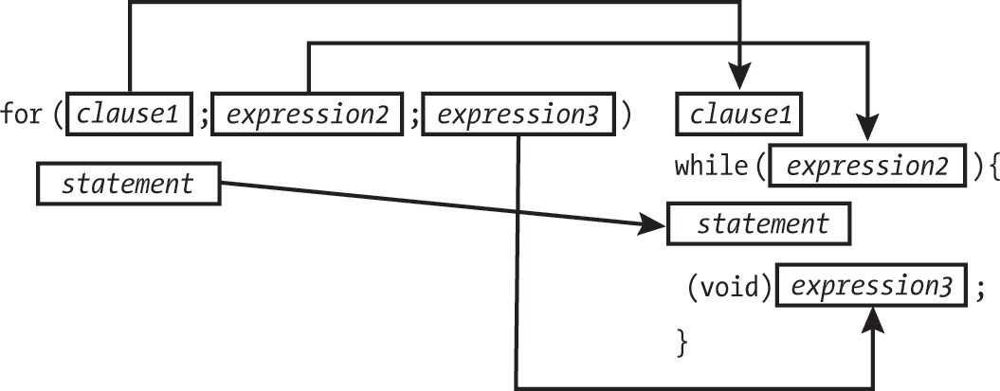

<hgroup>

# <samp class="SANS_Futura_Std_Bold_Condensed_B_11">5</samp> <samp class="SANS_Dogma_OT_Bold_B_11">控制流</samp>

</hgroup>


在本章中，你将学习如何控制各个语句求值的顺序。我们将从表达式语句和复合语句开始，它们定义了要执行的工作。然后，我们将讨论三种语句，它们决定了哪些代码块被执行以及执行的顺序：选择语句、迭代语句和跳转语句。

## <samp class="SANS_Futura_Std_Bold_B_11">表达式语句</samp>

一个*表达式语句*是一个可选的表达式，以分号结束。它是最常见的语句之一，也是基本的工作单元。以下示例展示了不同的表达式语句。

将一个值赋给<samp class="SANS_TheSansMonoCd_W5Regular_11">a</samp>：

```
a = 6;
```

将<samp class="SANS_TheSansMonoCd_W5Regular_11">a</samp>和<samp class="SANS_TheSansMonoCd_W5Regular_11">b</samp>的和赋值给<samp class="SANS_TheSansMonoCd_W5Regular_11">c</samp>：

```
c = a + b;
```

空语句：

```
; // null statement, does nothing
```

当语言的语法要求一个语句但不需要求值表达式时，可以使用空语句。空语句通常用作迭代语句中的占位符。

以下表达式语句将递增<samp class="SANS_TheSansMonoCd_W5Regular_11">count</samp>的值：

```
<samp class="SANS_TheSansMonoCd_W5Regular_11">++count;</samp>
```

在每个完整的表达式被求值之后，它的值（如果有的话）会被丢弃（包括赋值表达式，其中赋值本身是操作的副作用），以便任何有用的结果作为副作用的结果发生（如第四章所讨论）。在这个例子中，四个表达式语句中的三个都有副作用（空语句不执行任何操作）。一旦所有副作用完成，执行将继续进行到分号后的语句。

## <samp class="SANS_Futura_Std_Bold_B_11">复合语句</samp>

一个*复合语句*，或称为*代码块*，是由零个或多个语句组成的列表，括在大括号内。代码块中的语句可以是本章中描述的任何类型的语句。其中一些语句可能是声明。（在早期的 C 语言版本中，块内的声明必须出现在所有非声明之前，但这个限制现在不再适用。）除非被控制语句修改，否则代码块中的每个语句都会按顺序执行。在最后一个语句执行完后，执行将继续进行到闭括号之后：

```
{
  static int count = 0;
  c += a;
  ++count;
}
```

这个例子声明了一个名为 <samp class="SANS_TheSansMonoCd_W5Regular_11">count</samp> 的静态变量，类型为 <samp class="SANS_TheSansMonoCd_W5Regular_11">int</samp>。第二行通过 <samp class="SANS_TheSansMonoCd_W5Regular_11">a</samp> 中存储的值增加了在外部作用域中声明的变量 <samp class="SANS_TheSansMonoCd_W5Regular_11">c</samp>。最后，<samp class="SANS_TheSansMonoCd_W5Regular_11">count</samp> 被递增，用来追踪此代码块被执行的次数。

复合语句可以嵌套，以便一个复合语句完全包含另一个。你还可以有没有任何语句的代码块（只是空的大括号）。

## <samp class="SANS_Futura_Std_Bold_B_11">选择语句</samp>

*选择语句* 允许你根据控制表达式的值有条件地执行子语句。*控制表达式* 决定了根据条件执行哪些语句。选择语句包括 <samp class="SANS_TheSansMonoCd_W5Regular_11">if</samp> 语句和 <samp class="SANS_TheSansMonoCd_W5Regular_11">switch</samp> 语句。

### <samp class="SANS_Futura_Std_Bold_Condensed_Oblique_BI_11">if</samp>

<samp class="SANS_TheSansMonoCd_W5Regular_11">if</samp> 语句允许程序员根据标量类型的控制表达式的值来执行子语句。

有两种类型的 <samp class="SANS_TheSansMonoCd_W5Regular_11">if</samp> 语句。第一种根据条件有条件地决定是否执行子语句：

```
if (`expression`)
  `substatement`
```

在这种情况下，如果 <samp class="SANS_TheSansMonoCd_W5Regular_Italic_I_11">表达式</samp> 不等于 0，<samp class="SANS_TheSansMonoCd_W5Regular_Italic_I_11">子语句</samp> 就会被执行。只有 <samp class="SANS_TheSansMonoCd_W5Regular_11">if</samp> 语句的单个 <samp class="SANS_TheSansMonoCd_W5Regular_Italic_I_11">子语句</samp> 会根据条件执行，尽管它也可以是一个复合语句。

示例 5-1 显示了一个使用 <samp class="SANS_TheSansMonoCd_W5Regular_11">if</samp> 语句的除法函数。它将指定的被除数除以指定的除数，并将结果返回到 <samp class="SANS_TheSansMonoCd_W5Regular_11">quotient</samp> 所引用的对象中。该函数测试了除以零和有符号整数溢出，并在这两种情况下返回 <samp class="SANS_TheSansMonoCd_W5Regular_11">false</samp>。

```
bool safediv(int dividend, int divisor, int *quotient) {
❶ if (!quotient) return false;
❷ if ((divisor == 0) || ((dividend == INT_MIN) && (divisor == -1)))
  ❸ return false;
❹ *quotient = dividend / divisor;
  return true;
}
```

<samp class="SANS_Futura_Std_Book_Oblique_I_11">示例 5-1：一个安全的除法函数</samp>

该函数的第一行 ❶ 测试 <samp class="SANS_TheSansMonoCd_W5Regular_11">quotient</samp> 以确保它不为 null。如果为 null，函数返回 <samp class="SANS_TheSansMonoCd_W5Regular_11">false</samp>，表示无法返回值。（我们将在本章后面介绍 <samp class="SANS_TheSansMonoCd_W5Regular_11">return</samp> 语句。）

函数的第二行❷包含一个更复杂的 <samp class="SANS_TheSansMonoCd_W5Regular_11">if</samp> 语句。其控制表达式测试除数是否为 0，或者如果不检查除法是否会导致符号整数溢出。如果该表达式的结果不等于 0，函数返回 <samp class="SANS_TheSansMonoCd_W5Regular_11">false</samp> ❸，表示无法得到商。如果 <samp class="SANS_TheSansMonoCd_W5Regular_11">if</samp> 语句的控制表达式计算结果为 0，函数不返回，并且执行剩余语句❹来计算商并返回 <samp class="SANS_TheSansMonoCd_W5Regular_11">true</samp>。

第二种 <samp class="SANS_TheSansMonoCd_W5Regular_11">if</samp> 语句包含一个 <samp class="SANS_TheSansMonoCd_W5Regular_11">else</samp> 子句，当初始子语句未被选择时，选择一个替代子语句执行：

```
if (`expression`)
  `substatement1`
else
  `substatement2`
```

在这种形式下，如果 <samp class="SANS_TheSansMonoCd_W5Regular_Italic_I_11">expression</samp> 不等于 0，则执行 <samp class="SANS_TheSansMonoCd_W5Regular_Italic_I_11">substatement1</samp>，如果 <samp class="SANS_TheSansMonoCd_W5Regular_Italic_I_11">expression</samp> 等于 0，则执行 <samp class="SANS_TheSansMonoCd_W5Regular_Italic_I_11">substatement2</samp>。这些子语句中会执行一个，但永远不会同时执行。

对于任何形式的 <samp class="SANS_TheSansMonoCd_W5Regular_11">if</samp> 语句，条件执行的子语句也可以是 <samp class="SANS_TheSansMonoCd_W5Regular_11">if</samp> 语句。这种常见用法就是 <samp class="SANS_TheSansMonoCd_W5Regular_11">if...else</samp> 阶梯，如列表 5-2 所示。

```
if (`expr1`)
  `substatement1`
else if (`expr2`)
  `substatement2`
else if (`expr3`)
  `substatement3`
else
  `substatement4`
```

<samp class="SANS_Futura_Std_Book_Oblique_I_11">列表 5-2：The</samp> <samp class="I">if...else</samp> <samp class="SANS_Futura_Std_Book_Oblique_I_11">阶梯语法</samp>

在一个 <samp class="SANS_TheSansMonoCd_W5Regular_11">if...else</samp> 阶梯中，四个语句中（且仅有一个）会执行：

+   <samp class="SANS_TheSansMonoCd_W5Regular_Italic_I_11">substatement1</samp> 在 <samp class="SANS_TheSansMonoCd_W5Regular_Italic_I_11">expr1</samp> 不等于 0 时执行。

+   <samp class="SANS_TheSansMonoCd_W5Regular_Italic_I_11">substatement2</samp> 在 <samp class="SANS_TheSansMonoCd_W5Regular_Italic_I_11">expr1</samp> 等于 0 且 <samp class="SANS_TheSansMonoCd_W5Regular_Italic_I_11">expr2</samp> 不等于 0 时执行。

+   <samp class="SANS_TheSansMonoCd_W5Regular_Italic_I_11">substatement3</samp> 在 <samp class="SANS_TheSansMonoCd_W5Regular_Italic_I_11">expr1</samp> 和 <samp class="SANS_TheSansMonoCd_W5Regular_Italic_I_11">expr2</samp> 都等于 0 且 <samp class="SANS_TheSansMonoCd_W5Regular_Italic_I_11">expr3</samp> 不等于 0 时执行。

+   <samp class="SANS_TheSansMonoCd_W5Regular_Italic_I_11">substatement4</samp> 仅在前面的所有条件都为 0 时执行。

示例 5-3 中的例子使用了一个 <samp class="SANS_TheSansMonoCd_W5Regular_11">if...else</samp> 结构来打印成绩。

```
void printgrade(unsigned int marks) {
  if (marks >= 90) {
    puts("YOUR GRADE : A");
  } else if (marks >= 80) {
    puts("YOUR GRADE : B");
  } else if (marks >= 70) {
    puts("YOUR GRADE : C");
  } else {
    puts("YOUR GRADE : Failed");
  }
}
```

<samp class="SANS_Futura_Std_Book_Oblique_I_11">示例 5-3：使用</samp> <samp class="I">if...else</samp> <samp class="SANS_Futura_Std_Book_Oblique_I_11">结构打印成绩</samp>

在这个 <samp class="SANS_TheSansMonoCd_W5Regular_11">if...else</samp> 结构中，<samp class="SANS_TheSansMonoCd_W5Regular_11">printgrade</samp> 函数测试 <samp class="SANS_TheSansMonoCd_W5Regular_11">unsigned int</samp> 参数 <samp class="SANS_TheSansMonoCd_W5Regular_11">marks</samp> 的值，判断它是否大于或等于 <samp class="SANS_TheSansMonoCd_W5Regular_11">90</samp>。如果是，函数打印 <samp class="SANS_TheSansMonoCd_W5Regular_11">YOUR GRADE : A</samp>。否则，函数会测试 <samp class="SANS_TheSansMonoCd_W5Regular_11">marks</samp> 是否大于或等于 80，依此类推，直到 <samp class="SANS_TheSansMonoCd_W5Regular_11">if...else</samp> 结构的末尾。如果 <samp class="SANS_TheSansMonoCd_W5Regular_11">marks</samp> 不大于或等于 <samp class="SANS_TheSansMonoCd_W5Regular_11">70</samp>，则函数打印 <samp class="SANS_TheSansMonoCd_W5Regular_11">YOUR GRADE : Failed</samp>。这个例子使用了一种编码风格，其中闭合括号与 <samp class="SANS_TheSansMonoCd_W5Regular_11">else</samp> 子句写在同一行。

只有紧跟在 <samp class="SANS_TheSansMonoCd_W5Regular_11">if</samp> 语句后的单个语句会被执行。例如，在下面的代码片段中，只有当 <samp class="SANS_TheSansMonoCd_W5Regular_11">condition</samp> 不等于 0 时，<samp class="SANS_TheSansMonoCd_W5Regular_11">conditionally_executed</samp> 才会执行，而 <samp class="SANS_TheSansMonoCd_W5Regular_11">unconditionally_executed</samp> 总是会执行：

```
if (condition)
  conditionally_executed();
unconditionally_executed(); // always executed
```

尝试添加另一个条件执行的函数是一个常见的错误来源：

```
if (condition)
  conditionally_executed();
  also_conditionally_executed(); // ????
unconditionally_executed(); // always executed
```

在这个代码片段中，<samp class="SANS_TheSansMonoCd_W5Regular_11">also_conditionally_executed</samp> 是 *无条件* 执行的。变量名和缩进格式是误导性的，因为空格（一般而言）和缩进（特别是）对语法没有意义。通过添加大括号来限定一个复合语句或代码块，可以修复这段代码。然后，这个代码块作为单一的条件执行语句执行：

```
if (condition) {
  conditionally_executed();
  also_conditionally_executed(); // fixed it
}
unconditionally_executed(); // always executed
```

虽然原始代码片段并不错误，但许多编码规范建议始终包括大括号，以避免这种错误：

```
if (condition) {
  conditionally_executed();
}
unconditionally_executed(); // always executed
```

我的个人风格是，仅当我能将条件执行语句与 <samp class="SANS_TheSansMonoCd_W5Regular_11">if</samp> 语句写在同一行时，才省略大括号：

```
if (!quotient) return false;
```

当你让集成开发环境（IDE）为你格式化代码时，这个问题就不那么严重了，因为它不会被代码缩进迷惑。GCC 和 Clang 编译器提供了 <samp class="SANS_TheSansMonoCd_W5Regular_11">-Wmisleading-indentation</samp> 编译器标志，检查代码缩进并在其与控制流不符时发出警告。

### <samp class="SANS_Futura_Std_Bold_Condensed_Oblique_BI_11">switch</samp>

<samp class="SANS_TheSansMonoCd_W5Regular_11">switch</samp> 语句的工作方式类似于 <samp class="SANS_TheSansMonoCd_W5Regular_11">if...else</samp> 语句梯，唯一不同的是控制表达式必须是整数类型。例如，Listing 5-4 中的 <samp class="SANS_TheSansMonoCd_W5Regular_11">switch</samp> 语句与 Listing 5-3 中的 <samp class="SANS_TheSansMonoCd_W5Regular_11">if...else</samp> 语句执行相同的功能，前提是 <samp class="SANS_TheSansMonoCd_W5Regular_11">marks</samp> 是一个 0 到 109 之间的整数。如果 <samp class="SANS_TheSansMonoCd_W5Regular_11">marks</samp> 大于 109，将导致成绩不及格，因为结果商会大于 10，最终会被默认的 case 捕获。

```
switch (marks/10) {
  case 10:
  case 9:
    puts("YOUR GRADE : A");
    break;
  case 8:
    puts("YOUR GRADE : B");
    break;
  case 7:
    puts("YOUR GRADE : C");
    break;
  default:
    puts("YOUR GRADE : Failed");
}
```

<samp class="SANS_Futura_Std_Book_Oblique_I_11">Listing 5-4: 使用</samp> <samp class="I">switch</samp> <samp class="SANS_Futura_Std_Book_Oblique_I_11">语句输出成绩</samp>

<samp class="SANS_TheSansMonoCd_W5Regular_11">switch</samp> 语句根据控制表达式的值和每个 <samp class="SANS_TheSansMonoCd_W5Regular_11">case</samp> 标签中的常量表达式，控制跳转到三个子语句之一。跳转后，代码按顺序执行，直到遇到下一个控制流语句。在我们的例子中，跳转到 <samp class="SANS_TheSansMonoCd_W5Regular_11">case 10</samp>（该语句为空）后，会继续执行 <samp class="SANS_TheSansMonoCd_W5Regular_11">case 9</samp> 中的后续语句。这是逻辑所必需的，以确保完美的 100 分会导致 A，而不是 F。

你可以通过插入一个<samp class="SANS_TheSansMonoCd_W5Regular_11">break</samp>语句来终止<samp class="SANS_TheSansMonoCd_W5Regular_11">switch</samp>语句的执行，控制将跳转到紧跟在整体<samp class="SANS_TheSansMonoCd_W5Regular_11">switch</samp>语句之后的语句。（我们将在本章稍后详细讨论<samp class="SANS_TheSansMonoCd_W5Regular_11">break</samp>语句。）确保在下一个<samp class="SANS_TheSansMonoCd_W5Regular_11">case</samp>标签之前包含一个<samp class="SANS_TheSansMonoCd_W5Regular_11">break</samp>语句。如果漏掉了，控制流将直接跳到下一个<samp class="SANS_TheSansMonoCd_W5Regular_11">case</samp>，这是常见的错误来源。由于<samp class="SANS_TheSansMonoCd_W5Regular_11">break</samp>语句并不是必须的，漏掉它通常不会产生编译器诊断。如果使用<samp class="SANS_TheSansMonoCd_W5Regular_11">-Wimplicit-fallthrough</samp>标志，GCC 会对 fall-through 情况发出警告。C23 标准引入了<samp class="SANS_TheSansMonoCd_W5Regular_11">[[fallthrough]]</samp>属性，允许程序员指定 fall-through 行为是期望的，前提是认为默默的 fall-through 是<samp class="SANS_TheSansMonoCd_W5Regular_11">break</samp>语句的意外遗漏。

整型提升发生在控制表达式上。每个<samp class="SANS_TheSansMonoCd_W5Regular_11">case</samp>标签中的常量表达式会被转换为控制表达式的提升类型。如果转换后的值与提升后的控制表达式匹配，控制将跳转到匹配的<samp class="SANS_TheSansMonoCd_W5Regular_11">case</samp>标签后面的语句。否则，如果没有匹配的结果但有一个<samp class="SANS_TheSansMonoCd_W5Regular_11">default</samp>标签，控制将跳转到该标签指向的语句。如果没有任何转换后的<samp class="SANS_TheSansMonoCd_W5Regular_11">case</samp>常量表达式匹配，并且没有<samp class="SANS_TheSansMonoCd_W5Regular_11">default</samp>标签，则不会执行<samp class="SANS_TheSansMonoCd_W5Regular_11">switch</samp>体中的任何部分。当<samp class="SANS_TheSansMonoCd_W5Regular_11">switch</samp>语句嵌套时，<samp class="SANS_TheSansMonoCd_W5Regular_11">case</samp>或<samp class="SANS_TheSansMonoCd_W5Regular_11">default</samp>标签仅在最靠近的外层<samp class="SANS_TheSansMonoCd_W5Regular_11">switch</samp>语句中可访问。

关于使用 <samp class="SANS_TheSansMonoCd_W5Regular_11">switch</samp> 语句有一些最佳实践。列表 5-5 显示了一个不太理想的 <samp class="SANS_TheSansMonoCd_W5Regular_11">switch</samp> 语句实现，它根据账户类型为账户分配利率。<samp class="SANS_TheSansMonoCd_W5Regular_11">AccountType</samp> 枚举表示银行提供的固定数量的账户类型。

```
typedef enum {Savings, Checking, MoneyMarket} AccountType;
void assignInterestRate(AccountType account) {
  double interest_rate;
  switch (account) {
    case Savings:
      interest_rate = 3.0;
      break;
    case Checking:
      interest_rate = 1.0;
      break;
    case MoneyMarket:
      interest_rate = 4.5;
      break;
  }
  printf("Interest rate = %g.\n", interest_rate);
}
```

<samp class="SANS_Futura_Std_Book_Oblique_I_11">列表 5-5：一个没有</samp> <samp class="I">default</samp> <samp class="SANS_Futura_Std_Book_Oblique_I_11">标签的</samp> <samp class="I">switch</samp> <samp class="SANS_Futura_Std_Book_Oblique_I_11">语句</samp>

<samp class="SANS_TheSansMonoCd_W5Regular_11">assignInterestRate</samp> 函数定义了一个枚举类型参数 <samp class="SANS_TheSansMonoCd_W5Regular_11">AccountType</samp>，并基于它进行切换，分配与每个账户类型相关的适当利率。

代码本身没有问题，但如果程序员想要进行更改，就需要在至少两个不同的地方更新代码。假设银行引入了一种新的账户类型：定期存款证书。程序员更新了 <samp class="SANS_TheSansMonoCd_W5Regular_11">AccountType</samp> 枚举，如下所示：

```
typedef enum {Savings, Checking, MoneyMarket, CD} AccountType;
```

然而，如果程序员未能修改 <samp class="SANS_TheSansMonoCd_W5Regular_11">assignInterestRate</samp> 函数中的 <samp class="SANS_TheSansMonoCd_W5Regular_11">switch</samp> 语句，<samp class="SANS_TheSansMonoCd_W5Regular_11">interest_rate</samp> 将不会被赋值，导致在函数尝试打印该值时出现未初始化读取的错误。这个问题很常见，因为枚举可能被声明在离 <samp class="SANS_TheSansMonoCd_W5Regular_11">switch</samp> 语句很远的地方，而程序中可能包含许多类似的 <samp class="SANS_TheSansMonoCd_W5Regular_11">switch</samp> 语句，它们都在控制表达式中引用了一个 <samp class="SANS_TheSansMonoCd_W5Regular_11">AccountType</samp> 类型的对象。

无论是 Clang 还是 GCC，当你使用 <samp class="SANS_TheSansMonoCd_W5Regular_11">-Wswitch-enum</samp> 标志时，它们都能在编译时帮助诊断这些问题。或者，你可以通过在 <samp class="SANS_TheSansMonoCd_W5Regular_11">switch</samp> 语句中添加 <samp class="SANS_TheSansMonoCd_W5Regular_11">default</samp> 情况来防止此类错误，并提高此代码的可测试性，如 列表 5-6 所示。

```
typedef enum {Savings, Checking, MoneyMarket, CD} AccountType;
void assignInterestRate(AccountType account) {
  double interest_rate;
  switch (account) {
    case Savings:
      interest_rate = 3.0;
      break;
    case Checking:
      interest_rate = 1.0;
      break;
    case MoneyMarket:
      interest_rate = 4.5;
      break;
    case CD:
      interest_rate = 7.5;
      break;
 **default: abort();**
  }
  printf("Interest rate = %g.\n", interest_rate);
  return;
}
```

<samp class="SANS_Futura_Std_Book_Oblique_I_11">列表 5-6：一个有</samp> <samp class="I">default</samp> <samp class="SANS_Futura_Std_Book_Oblique_I_11">标签的</samp> <samp class="I">switch</samp> <samp class="SANS_Futura_Std_Book_Oblique_I_11">语句</samp>

<samp class="SANS_TheSansMonoCd_W5Regular_11">switch</samp> 语句现在包含了一个针对 <samp class="SANS_TheSansMonoCd_W5Regular_11">CD</samp> 的案例，而 <samp class="SANS_TheSansMonoCd_W5Regular_11">default</samp> 子句没有被使用。然而，保留 <samp class="SANS_TheSansMonoCd_W5Regular_11">default</samp> 子句是一个好习惯，以防将来添加了其他账户类型。

包括 <samp class="SANS_TheSansMonoCd_W5Regular_11">default</samp> 子句的缺点是抑制了编译器警告，且在运行时才会诊断出问题。因此，编译器警告（如果编译器支持的话）通常是更好的方法。## <samp class="SANS_Futura_Std_Bold_B_11">迭代语句</samp>

*迭代语句* 使子语句（或复合语句）在满足终止条件的情况下执行零次或多次。英文单词 *iteration* 的意思是“一个过程的重复”。迭代语句更常见的非正式称呼是循环。*循环* 是“一个过程，其结尾与开头相连。”

### <samp class="SANS_Futura_Std_Bold_Condensed_Oblique_BI_11">while</samp>

<samp class="SANS_TheSansMonoCd_W5Regular_11">while</samp> 语句导致循环体反复执行，直到控制表达式的值等于 0。在每次执行循环体之前，会先评估控制表达式。考虑以下示例：

```
void f(unsigned int x) {
  while (x > 0) {
    printf("%d\n," x);
    --x;
  }
  return;
}
```

如果 <samp class="SANS_TheSansMonoCd_W5Regular_11">x</samp> 初始值不大于 0，<samp class="SANS_TheSansMonoCd_W5Regular_11">while</samp> 循环会在不执行循环体的情况下退出。如果 <samp class="SANS_TheSansMonoCd_W5Regular_11">x</samp> 大于 0，则输出其值，然后将其递减。一旦到达循环末尾，将再次测试控制表达式。这个模式会一直重复，直到表达式的值为 0。总体来说，这个循环会从 <samp class="SANS_TheSansMonoCd_W5Regular_11">x</samp> 递减到 1。

<samp class="SANS_TheSansMonoCd_W5Regular_11">while</samp> 循环是一个入口控制的循环，直到其控制表达式的值为 0 时才会终止。列表 5-7 展示了 C 标准库 <samp class="SANS_TheSansMonoCd_W5Regular_11">memset</samp> 函数的实现。该函数将 <samp class="SANS_TheSansMonoCd_W5Regular_11">val</samp>（转换为 <samp class="SANS_TheSansMonoCd_W5Regular_11">unsigned char</samp> 类型）的值复制到由 <samp class="SANS_TheSansMonoCd_W5Regular_11">dest</samp> 指向的对象的前 <samp class="SANS_TheSansMonoCd_W5Regular_11">n</samp> 个字符中。

```
void *memset(void *dest, int val, size_t n) {
  unsigned char *ptr = (unsigned char*)dest;
  while (n-- > 0)
    *ptr++ = (unsigned char)val;
  return dest;
}
```

<samp class="SANS_Futura_Std_Book_Oblique_I_11">列表 5-7：C 标准库</samp> <samp class="I">memset</samp> <samp class="SANS_Futura_Std_Book_Oblique_I_11">函数</samp>

<samp class="SANS_TheSansMonoCd_W5Regular_11">memset</samp> 函数的第一行将 <samp class="SANS_TheSansMonoCd_W5Regular_11">dest</samp> 转换为指向 <samp class="SANS_TheSansMonoCd_W5Regular_11">unsigned char</samp> 的指针，并将结果赋值给 <samp class="SANS_TheSansMonoCd_W5Regular_11">unsigned char</samp> 指针 <samp class="SANS_TheSansMonoCd_W5Regular_11">ptr</samp>。这使得我们能够保留 <samp class="SANS_TheSansMonoCd_W5Regular_11">dest</samp> 的值，以便在函数的最后一行返回。该函数的其余两行组成一个 <samp class="SANS_TheSansMonoCd_W5Regular_11">while</samp> 循环，将值 <samp class="SANS_TheSansMonoCd_W5Regular_11">val</samp>（转换为 <samp class="SANS_TheSansMonoCd_W5Regular_11">unsigned char</samp>）复制到 <samp class="SANS_TheSansMonoCd_W5Regular_11">dest</samp> 所指向的对象的前 <samp class="SANS_TheSansMonoCd_W5Regular_11">n</samp> 个字符中。<samp class="SANS_TheSansMonoCd_W5Regular_11">while</samp> 循环的控制表达式测试 <samp class="SANS_TheSansMonoCd_W5Regular_11">n-- > 0</samp>。

<samp class="SANS_TheSansMonoCd_W5Regular_11">n</samp> 参数是一个循环计数器，在每次迭代时作为控制表达式的副作用递减。在这种情况下，循环计数器单调递减，直到达到最小值（0）。该循环执行 <samp class="SANS_TheSansMonoCd_W5Regular_11">n</samp> 次重复，其中 <samp class="SANS_TheSansMonoCd_W5Regular_11">n</samp> 小于或等于 <samp class="SANS_TheSansMonoCd_W5Regular_11">ptr</samp> 引用的内存边界。

<​samp class="SANS_TheSansMonoCd_W5Regular_11">ptr</samp>指针表示一系列<​samp class="SANS_TheSansMonoCd_W5Regular_11">unsigned char</samp>类型的对象，从<​samp class="SANS_TheSansMonoCd_W5Regular_11">ptr</samp>到<​samp class="SANS_TheSansMonoCd_W5Regular_11">ptr</samp> <​samp class="SANS_TheSansMonoCd_W5Regular_11">+</samp> <​samp class="SANS_TheSansMonoCd_W5Regular_11">n - 1</samp>。<​samp class="SANS_TheSansMonoCd_W5Regular_11">val</samp>的值被转换为<​samp class="SANS_TheSansMonoCd_W5Regular_11">unsigned char</samp>并依次写入每个对象。如果<​samp class="SANS_TheSansMonoCd_W5Regular_11">n</samp>大于<​samp class="SANS_TheSansMonoCd_W5Regular_11">ptr</samp>引用的对象的边界，<​samp class="SANS_TheSansMonoCd_W5Regular_11">while</samp>循环会写入该对象的边界之外的内存。这是未定义的行为，通常称为*缓冲区溢出*或*溢出*。如果<​samp class="SANS_TheSansMonoCd_W5Regular_11">ptr</samp>引用的对象至少有<​samp class="SANS_TheSansMonoCd_W5Regular_11">n</samp>个字节，<​samp class="SANS_TheSansMonoCd_W5Regular_11">while</samp>循环将不会发生未定义的行为而终止。在循环的最后一次迭代中，控制表达式<​samp class="SANS_TheSansMonoCd_W5Regular_11">n-- > 0</samp>的值为 0，导致循环终止。

你可以编写一个*无限循环*——一个永远不会终止的循环。为了避免编写一个无意中永远运行的<​samp class="SANS_TheSansMonoCd_W5Regular_11">while</samp>循环，请确保在<​samp class="SANS_TheSansMonoCd_W5Regular_11">while</samp>循环开始之前初始化由控制表达式引用的任何对象。同时，确保在<​samp class="SANS_TheSansMonoCd_W5Regular_11">while</samp>循环执行过程中，控制表达式以一种方式发生变化，导致循环在适当的迭代次数后终止。

### <​samp class="SANS_Futura_Std_Bold_Condensed_Oblique_BI_11">do...while</samp>

<​samp class="SANS_TheSansMonoCd_W5Regular_11">do...while</samp>语句与<​samp class="SANS_TheSansMonoCd_W5Regular_11">while</samp>语句相似，不同之处在于，控制表达式的评估发生在每次执行循环体之后，而不是之前。因此，保证循环体在测试条件之前至少执行一次。<​samp class="SANS_TheSansMonoCd_W5Regular_11">do...while</samp>迭代语句具有以下语法：

```
do
  `statement`
while (`expression`);
```

在<samp class="SANS_TheSansMonoCd_W5Regular_11">do...while</samp>迭代中，<samp class="SANS_TheSansMonoCd_W5Regular_Italic_I_11">statement</samp>会无条件执行一次，然后对<samp class="SANS_TheSansMonoCd_W5Regular_Italic_I_11">expression</samp>进行求值。如果<samp class="SANS_TheSansMonoCd_W5Regular_Italic_I_11">expression</samp>不等于 0，则控制返回到循环的顶部，重新执行<samp class="SANS_TheSansMonoCd_W5Regular_Italic_I_11">statement</samp>。否则，执行跳转到循环后的语句。

<samp class="SANS_TheSansMonoCd_W5Regular_11">do...while</samp>迭代语句通常用于输入/输出（I/O）中，在这种情况下，在测试流状态之前从流中读取数据是有意义的，如清单 5-8 所示。

```
#include <stdio.h>
// `--snip--`
int count;
float quant;
char units[21], item[21];
do {
  count = fscanf(stdin, "%f%20s of %20s", &quant, units, item);
  fscanf(stdin,"%*[^\n]");
} while (!feof(stdin) && !ferror(stdin));
// `--snip--`
```

<samp class="SANS_Futura_Std_Book_Oblique_I_11">清单 5-8: 一个输入循环</samp>

这段代码从标准输入流<samp class="SANS_TheSansMonoCd_W5Regular_11">stdin</samp>输入一个浮点数、一个度量单位（作为字符串）和一个物品名称（同样作为字符串），直到文件末尾指示符被设置或发生读取错误为止。我们将在第八章详细讨论输入/输出。

### <samp class="SANS_Futura_Std_Bold_Condensed_Oblique_BI_11">for</samp>

<samp class="SANS_TheSansMonoCd_W5Regular_11">for</samp>语句可能是 C 语言中最“C 风格”的部分。<samp class="SANS_TheSansMonoCd_W5Regular_11">for</samp>语句重复执行一个语句，通常用于当循环的迭代次数在进入循环之前就已知的情况。它具有以下语法：

```
for (`clause1`; `expression2`; `expression3`)
  `statement`
```

控制表达式（<samp class="SANS_TheSansMonoCd_W5Regular_Italic_I_11">expression2</samp>）在每次执行循环体之前进行求值，而<sup class="SANS_TheSansMonoCd_W5Regular_Italic_I_11">expression3</samp>则在每次执行循环体之后进行求值。如果<samp class="SANS_TheSansMonoCd_W5Regular_Italic_I_11">clause1</samp>是一个声明，它声明的任何标识符的作用域将是声明的剩余部分以及整个循环，包括其他两个表达式。

当我们将<samp class="SANS_TheSansMonoCd_W5Regular_11">for</samp>语句转换为等效的<samp class="SANS_TheSansMonoCd_W5Regular_11">while</samp>循环时，<samp class="SANS_TheSansMonoCd_W5Regular_Italic_I_11">clause1</samp>、<samp class="SANS_TheSansMonoCd_W5Regular_Italic_I_11">expression2</samp>和<samp class="SANS_TheSansMonoCd_W5Regular_Italic_I_11">expression3</samp>的作用变得显而易见，如图 5-1 所示。



<samp class="SANS_Futura_Std_Book_Oblique_I_11">图 5-1: 将 <samp class="I">for</samp> 循环转化为 <samp class="I">while</samp> 循环</samp>

清单 5-9 显示了清单 5-7 中 <samp class="SANS_TheSansMonoCd_W5Regular_11">memset</samp> 实现的修改版本；我们已将 <samp class="SANS_TheSansMonoCd_W5Regular_11">while</samp> 循环替换为 <samp class="SANS_TheSansMonoCd_W5Regular_11">for</samp> 循环。

```
void *memset(void *dest, int val, size_t n) {
  unsigned char *ptr = (unsigned char *)dest;
  for (❶ size_t i = 0; ❷ i < n; ❸ ++i) {
 *(ptr + i) = (unsigned char)val;
  }
  return dest;
}
```

<samp class="SANS_Futura_Std_Book_Oblique_I_11">清单 5-9：使用</samp> <samp class="I">for</samp> <samp class="SANS_Futura_Std_Book_Oblique_I_11">循环填充字符数组</samp>

<samp class="SANS_TheSansMonoCd_W5Regular_11">for</samp> 循环在 C 程序员中很受欢迎，因为它为声明和/或初始化循环计数器❶、指定控制循环的表达式❷以及递增循环计数器❸提供了一个方便的位置，所有这些都可以在同一行内完成。 <samp class="SANS_TheSansMonoCd_W5Regular_11">*(ptr</samp> <samp class="SANS_TheSansMonoCd_W5Regular_11">+</samp> <samp class="SANS_TheSansMonoCd_W5Regular_11">i)</samp> 左值表达式也可以等效地使用索引运算符写为 <samp class="SANS_TheSansMonoCd_W5Regular_11">ptr[i]</samp>。

<samp class="SANS_TheSansMonoCd_W5Regular_11">for</samp> 循环也可能有些误导。我们来看一个 C 语言中单向链表的例子，它声明了一个 <samp class="SANS_TheSansMonoCd_W5Regular_11">node</samp> 结构体，其中包含一个 <samp class="SANS_TheSansMonoCd_W5Regular_11">data</samp> 元素和指向链表中下一个节点的指针 <samp class="SANS_TheSansMonoCd_W5Regular_11">next</samp>。我们还定义了一个指针 <samp class="SANS_TheSansMonoCd_W5Regular_11">p</samp> 指向 <samp class="SANS_TheSansMonoCd_W5Regular_11">node</samp> 结构：

```
struct node {
  int data;
  struct node *next;
};
struct node *p;
```

使用 <samp class="SANS_TheSansMonoCd_W5Regular_11">p</samp> 的定义，下面的例子（用于释放链表的存储）错误地在释放后读取了 <samp class="SANS_TheSansMonoCd_W5Regular_11">p</samp> 的值：

```
for (p = head; p != nullptr; p = p->next) {
  free(p);
}
```

在释放后读取 <samp class="SANS_TheSansMonoCd_W5Regular_11">p</samp> 是未定义行为。

如果这个循环改写成一个 <samp class="SANS_TheSansMonoCd_W5Regular_11">while</samp> 循环，那么代码会变得明显，它会在释放后读取 <samp class="SANS_TheSansMonoCd_W5Regular_11">p</samp>：

```
p = head;
while (p != nullptr) {
  free(p);
  p = p->next;
}
```

<samp class="SANS_TheSansMonoCd_W5Regular_11">for</samp> 循环可能会令人困惑，因为它在循环主体之后评估 <samp class="SANS_TheSansMonoCd_W5Regular_Italic_I_11">expression3</samp>，即使在语法上它看起来出现在循环体之前。

执行这个操作的正确方式是在释放指针之前保存所需的指针，像这样：

```
for (p = head; p != nullptr; p = q) {
  q = p->next;
  free(p);
}
```

你可以在第六章中阅读更多关于动态内存管理的内容。  ## <samp class="SANS_Futura_Std_Bold_B_11">跳转语句</samp>

*跳转语句*在遇到时会无条件地将控制转移到同一函数的另一个部分。这些是最低级别的控制流语句，通常与底层汇编语言代码密切对应。

### <samp class="SANS_Futura_Std_Bold_Condensed_Oblique_BI_11">goto</samp>

任何语句前面都可以加一个*标签*，标签是一个标识符，后面跟着一个冒号。C23 还允许你将标签放在声明前面以及复合语句的末尾，这是以前的 C 版本不允许的。<samp class="SANS_TheSansMonoCd_W5Regular_11">goto</samp>语句会导致控制跳转到在封闭函数中由命名标签前缀标识的语句。这个跳转是无条件的，这意味着每次执行<samp class="SANS_TheSansMonoCd_W5Regular_11">goto</samp>语句时都会发生。以下是一个<samp class="SANS_TheSansMonoCd_W5Regular_11">goto</samp>语句的示例：

```
 /* executed statements */
  goto location;
  /* skipped statements */
location:
  /* executed statements */
```

执行会持续进行，直到遇到<samp class="SANS_TheSansMonoCd_W5Regular_11">goto</samp>语句，此时控制跳转到紧随<samp class="SANS_TheSansMonoCd_W5Regular_11">location</samp>标签后的语句，执行继续。<samp class="SANS_TheSansMonoCd_W5Regular_11">goto</samp>语句与标签之间的语句会被跳过。

自从 Edsger Dijkstra 在 1968 年写了题为“Go To Statement Considered Harmful”的论文后，<samp class="SANS_TheSansMonoCd_W5Regular_11">goto</samp>语句一直有着不好的声誉。他的批评是，如果使用不当，<samp class="SANS_TheSansMonoCd_W5Regular_11">goto</samp>语句可能导致*意大利面条式代码*（代码的控制结构复杂且纠缠，程序流程概念上像一碗意大利面条一样错综复杂）。然而，<samp class="SANS_TheSansMonoCd_W5Regular_11">goto</samp>语句如果以清晰、一致的方式使用，也可以使代码更易于阅读。

使用<samp class="SANS_TheSansMonoCd_W5Regular_11">goto</samp>语句的一种有用方法是将它们串联起来，在发生错误并且必须退出函数时释放已分配的资源（如动态分配的内存或打开的文件）。这种情况通常发生在程序分配多个资源时，每个分配可能会失败，必须释放资源以防止泄漏。如果第一个资源分配失败，不需要清理，因为没有资源被分配。但是，如果第二个资源无法分配，则需要释放第一个资源。同样，如果第三个资源无法分配，则需要释放第二个和第一个资源，以此类推。这个模式导致重复的清理代码，而且由于重复和额外的复杂性，容易出错。

一种解决方案是使用嵌套的 <samp class="SANS_TheSansMonoCd_W5Regular_11">if</samp> 语句，但如果嵌套过深，也会变得难以阅读。相反，我们可以使用如 示例 5-10 中所示的 <samp class="SANS_TheSansMonoCd_W5Regular_11">goto</samp> 链来释放资源。

```
int do_something(void) {
  FILE *file1, *file2;
  object_t *obj;
  int ret_val = 0; // initially assume a successful return value

  file1 = fopen("a_file", "w");
  if (file1 == nullptr) {
    return -1;
  }

  file2 = fopen("another_file", "w");
  if (file2 == nullptr) {
    ret_val = -1;
 **goto FAIL_FILE2;**
  }

  obj = malloc(sizeof(*obj));
  if (obj == nullptr) {
    ret_val = -1;
 **goto FAIL_OBJ;**
  }

  // operate on allocated resources

  // clean up everything
  free(obj);
**FAIL_OBJ:**  // otherwise, close only the resources we opened
  fclose(file2);
**FAIL_FILE2:**
  fclose(file1);
  return ret_val;
}
```

<samp class="SANS_Futura_Std_Book_Oblique_I_11">示例 5-10：使用</samp> <samp class="I">goto</samp> <samp class="SANS_Futura_Std_Book_Oblique_I_11">链释放资源</samp>

代码遵循一个简单的模式：资源按照一定顺序分配、操作，然后按相反的顺序（后进先出）释放。如果在分配资源时发生错误，代码使用 <samp class="SANS_TheSansMonoCd_W5Regular_11">goto</samp> 跳转到清理代码中的适当位置，并且只释放那些已经分配的资源。

这样使用时，<samp class="SANS_TheSansMonoCd_W5Regular_11">goto</samp> 语句可以使代码更易读。一个实际的例子是 Linux 内核 v6.7 中的 <samp class="SANS_TheSansMonoCd_W5Regular_11">kernel/fork.c</samp> 文件中的 <samp class="SANS_TheSansMonoCd_W5Regular_11">copy_process</samp> 函数（*<samp class="SANS_TheSansMonoCd_W5Regular_11">[`<wbr>elixir<wbr>.bootlin<wbr>.com<wbr>/linux<wbr>/v6<wbr>.7<wbr>/source<wbr>/kernel<wbr>/fork<wbr>.c#L2245`](https://elixir.bootlin.com/linux/v6.7/source/kernel/fork.c#L2245)*），该函数使用了 20 个 <samp class="SANS_TheSansMonoCd_W5Regular_11">goto</samp> 标签，在内部函数失败时执行清理代码。 ### <samp class="SANS_Futura_Std_Bold_Condensed_Oblique_BI_11">continue</samp>

你可以在循环内部使用 <samp class="SANS_TheSansMonoCd_W5Regular_11">continue</samp> 语句，跳转到循环体的末尾，跳过当前迭代中剩余语句的执行。例如，<samp class="SANS_TheSansMonoCd_W5Regular_11">continue</samp> 语句等价于在 示例 5-11 中每个循环中使用 <samp class="SANS_TheSansMonoCd_W5Regular_11">goto END_LOOP_BODY;</samp>。

```
while (/* _ */) {
  // `--snip--`
  continue;
  // `--snip--`
END_LOOP_BODY: ;
}
```

```
do {
  // `--snip--`
  continue;
  // `--snip--`
END_LOOP_BODY: ;
} while (/* _ */);
```

```
for (/* _ */) {
  // `--snip--`
  continue;
  // `--snip--`
END_LOOP_BODY: ;
}
```

<samp class="SANS_Futura_Std_Book_Oblique_I_11">示例 5-11：使用</samp> <samp class="I">continue</samp> <samp class="SANS_Futura_Std_Book_Oblique_I_11">语句</samp>

<samp class="SANS_TheSansMonoCd_W5Regular_11">continue</samp> 语句与条件语句配合使用，以便在当前循环迭代的目标完成后，继续处理后续的循环迭代。

### <samp class="SANS_Futura_Std_Bold_Condensed_Oblique_BI_11">break</samp>

<samp class="SANS_TheSansMonoCd_W5Regular_11">break</samp> 语句终止 <samp class="SANS_TheSansMonoCd_W5Regular_11">switch</samp> 或迭代语句的执行。在列表 5-4 中的 <samp class="SANS_TheSansMonoCd_W5Regular_11">switch</samp> 语句里，我们使用了 <samp class="SANS_TheSansMonoCd_W5Regular_11">break</samp>。在循环中，<samp class="SANS_TheSansMonoCd_W5Regular_11">break</samp> 语句会导致循环终止，程序的执行将在循环后的语句处继续。例如，以下示例中的 <samp class="SANS_TheSansMonoCd_W5Regular_11">for</samp> 循环只有在按下大写或小写 Q 键时才会退出：

```
#include <stdio.h>
int main(void) {
  char c;
  for(;;) {
    puts("Press any key, Q to quit: ");
    c = toupper(getchar());
    if (c == 'Q') **break**;
    // `--snip--`
  }
} // loop exits when either q or Q is pressed
```

我们通常使用 <samp class="SANS_TheSansMonoCd_W5Regular_11">break</samp> 语句在完成循环任务后中止循环的执行。例如，列表 5-12 中的 <samp class="SANS_TheSansMonoCd_W5Regular_11">break</samp> 语句会在找到数组中的指定键后退出循环。假设 <samp class="SANS_TheSansMonoCd_W5Regular_11">key</samp> 在 <samp class="SANS_TheSansMonoCd_W5Regular_11">arr</samp> 中是唯一的，<samp class="SANS_TheSansMonoCd_W5Regular_11">find_element</samp> 函数没有 <samp class="SANS_TheSansMonoCd_W5Regular_11">break</samp> 语句时也会表现相同，但根据数组的长度以及 <samp class="SANS_TheSansMonoCd_W5Regular_11">key</samp> 被发现的位置，可能会运行得更慢。

```
size_t find_element(size_t len, int arr[len], int key) {
  size_t pos = (size_t)-1;
  // traverse arr and search for key
  for (size_t i = 0; i < len; ++i) {
 if (arr[i] == key) {
      pos = i;
 **break**;// terminate loop
    }
  }
  return pos;
}
```

<samp class="SANS_Futura_Std_Book_Oblique_I_11">列表 5-12：跳出循环</samp>

由于 <samp class="SANS_TheSansMonoCd_W5Regular_11">continue</samp> 和 <samp class="SANS_TheSansMonoCd_W5Regular_11">break</samp> 会跳过循环体的部分内容，因此使用这些语句时需要小心：这些语句后的代码将不会被执行。

### <samp class="SANS_Futura_Std_Bold_Condensed_Oblique_BI_11">return</samp>

<samp class="SANS_TheSansMonoCd_W5Regular_11">return</samp> 语句终止当前函数的执行并将控制权返回给调用者。你已经在本书中看到过很多 <samp class="SANS_TheSansMonoCd_W5Regular_11">return</samp> 语句。一个函数可以有零个或多个 <samp class="SANS_TheSansMonoCd_W5Regular_11">return</samp> 语句。

<samp class="SANS_TheSansMonoCd_W5Regular_11">return</samp> 语句可以简单地返回，或者返回一个表达式。在 <samp class="SANS_TheSansMonoCd_W5Regular_11">void</samp> 函数（一个不返回值的函数）中，<samp class="SANS_TheSansMonoCd_W5Regular_11">return</samp> 语句应该简单地返回。当一个函数返回一个值时，<samp class="SANS_TheSansMonoCd_W5Regular_11">return</samp> 语句应该返回一个产生返回类型值的表达式。如果执行了带表达式的 <samp class="SANS_TheSansMonoCd_W5Regular_11">return</samp> 语句，那么表达式的值将作为函数调用表达式的返回值返回给调用者：

```
int sum(int x, int y, int z) {
  return x + y + z;
}
```

这个简单的函数对它的参数求和并返回总和。返回表达式 <samp class="SANS_TheSansMonoCd_W5Regular_11">x</samp> <samp class="SANS_TheSansMonoCd_W5Regular_11">+</samp> <samp class="SANS_TheSansMonoCd_W5Regular_11">y</samp> <samp class="SANS_TheSansMonoCd_W5Regular_11">+</samp> <samp class="SANS_TheSansMonoCd_W5Regular_11">z</samp> 产生一个类型为 <samp class="SANS_TheSansMonoCd_W5Regular_11">int</samp> 的值，这与函数的返回类型相匹配。如果这个表达式产生了不同的类型，它会隐式转换为具有函数返回类型的对象。返回表达式也可以像返回 0 或 1 一样简单。然后可以在表达式中使用该函数结果，或者将其赋值给一个变量。

请注意，如果控制流在没有评估 <samp class="SANS_TheSansMonoCd_W5Regular_11">return</samp> 语句且没有表达式的情况下到达一个非 <samp class="SANS_TheSansMonoCd_W5Regular_11">void</samp> 函数（一个声明为返回值的函数）的闭括号，则使用该函数调用的返回值会导致未定义的行为。例如，当 <samp class="SANS_TheSansMonoCd_W5Regular_11">a</samp> 为非负数时，以下函数未能返回一个值，因为条件 <samp class="SANS_TheSansMonoCd_W5Regular_11">a < 0</samp> 为假：

```
int absolute_value(int a) {
  if (a < 0) {
    return -a;
  }
}
```

我们可以通过在 <samp class="SANS_TheSansMonoCd_W5Regular_11">a</samp> 为非负数时提供一个返回值来轻松修复这个缺陷，正如 列表 5-13 中所示。

```
int absolute_value(int a) {
  if (a < 0) {
    return -a;
  }
 **return a;**
}
```

<samp class="SANS_Futura_Std_Book_Oblique_I_11">列表 5-13：该</samp> <samp class="I">absolute_value</samp> <samp class="SANS_Futura_Std_Book_Oblique_I_11">函数沿所有路径返回一个值。</samp>

然而，这段代码仍然有一个 bug（请参见 第三章）。发现这个 bug 留给你自己练习。

## <samp class="SANS_Futura_Std_Bold_B_11">总结</samp>

在本章中，你学习了控制流语句。控制流语句允许你创建灵活的程序，这些程序可以重复任务并根据程序输入更改执行方式：

+   选择语句，如 <samp class="SANS_TheSansMonoCd_W5Regular_11">if</samp> 和 <samp class="SANS_TheSansMonoCd_W5Regular_11">switch</samp>，允许你根据控制表达式的值从一组语句中进行选择。

+   迭代语句重复执行循环体，直到控制表达式等于 0。

+   跳转语句无条件地将控制转移到一个新位置。

在下一章，你将学习动态分配的内存。与控制流语句类似，你可以使用动态内存来创建灵活的程序，依据程序输入来分配内存。
