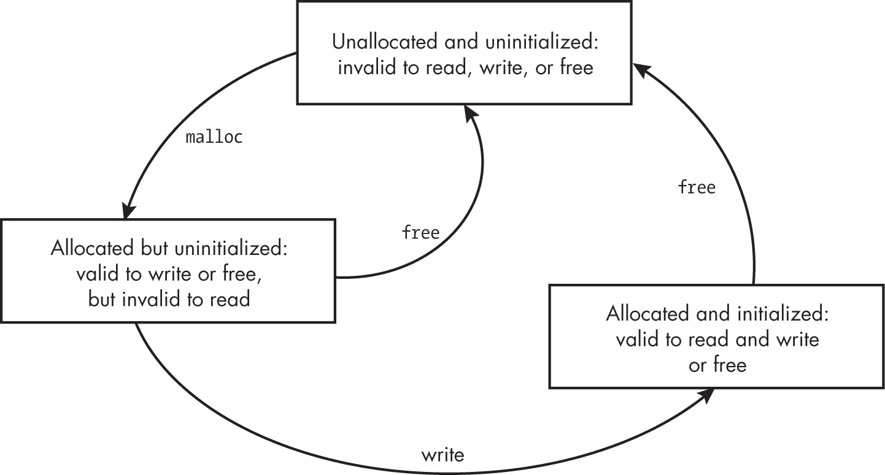

# 第六章：6 动态分配内存


在第二章中，你学到了每个对象都有一个存储持续时间，决定了它的生命周期，C 语言定义了四种存储持续时间：静态、线程、自动和分配。在本章中，你将学习*动态分配内存*，它是在运行时从堆中分配的。动态分配内存在程序运行前无法确定精确的存储需求时非常有用。

我们将首先描述分配存储、静态存储和自动存储持续时间之间的区别。我们将跳过线程存储分配，因为它涉及并行执行，而我们在此不涉及。然后我们将探讨你可以使用的函数来分配和释放动态内存、常见的内存分配错误以及避免这些错误的策略。在本章中，*内存*和*存储*这两个术语可以互换使用，类似于它们在实际应用中的用法。

## 存储持续时间

对象占用*存储空间*，存储空间可能是可读写内存、只读内存或中央处理单元（CPU）寄存器。分配持续时间的存储与自动或静态存储持续时间的存储具有显著不同的特性。首先，我们将回顾自动和静态存储持续时间。

*自动存储持续时间*的对象在一个代码块内声明，或作为函数参数声明。这些对象的生命周期从包含它们的代码块开始执行时开始，到代码块执行结束时结束。如果该代码块递归进入，每次都会创建一个新的对象，每个对象都有自己的存储空间。

在文件作用域内声明的对象具有*静态存储持续时间*。这些对象的生命周期是程序执行的整个过程，它们的存储值在程序启动前就已经初始化。你还可以通过使用static存储类说明符，在一个代码块内声明一个变量，使其具有静态存储持续时间。

### 堆和内存管理器

动态分配的内存具有*分配存储持续时间*。分配对象的生命周期从分配开始，一直到释放为止。动态分配内存是从*堆*中分配的，堆只是一个或多个由内存管理器管理的大型、可细分的内存块。

*内存管理器*是通过提供本章所描述的标准内存管理函数实现的库，负责为你管理堆。内存管理器作为客户端进程的一部分运行。当客户端进程调用内存分配函数时，内存管理器会向操作系统（OS）请求一个或多个内存块，并将这些内存分配给客户端进程。分配请求不会直接发送到操作系统，因为操作系统较慢，并且只能处理大块内存，而分配器则将这些大块内存分割成小块，从而提高速度。

内存管理器仅管理未分配和已释放的内存。一旦内存被分配，调用者将管理该内存，直到它被归还。确保内存被释放是调用者的责任，尽管大多数实现会在程序终止时回收动态分配的内存。

### 何时使用动态分配的内存

如前所述，当程序的确切存储需求在运行时之前无法确定时，会使用动态分配的内存。动态分配的内存比静态分配的内存效率低，因为内存管理器需要在运行时堆中找到合适大小的内存块，而且调用者必须在不再需要时显式释放这些内存块，所有这些都需要额外的处理。动态分配的内存还需要额外的处理用于日常维护操作，例如*碎片整理*（合并相邻的空闲块），并且内存管理器通常会使用额外的存储来存放控制结构，以便支持这些操作。

*内存泄漏*发生在动态分配的内存不再需要时没有归还给内存管理器。如果内存泄漏严重，内存管理器最终将无法满足新的存储请求。

默认情况下，对于那些在编译时已知大小的对象，应声明为具有自动或静态存储持续时间的对象。当存储大小或对象数量在运行时才能确定时，应动态分配内存。例如，你可能会使用动态分配的内存在运行时从文件中读取表格，尤其是在编译时不知道表格的行数时。类似地，你可能会使用动态分配的内存来创建链表、哈希表、二叉树或其他数据结构，这些结构中每个容器所包含的数据元素的数量在编译时是无法知道的。

## 内存管理

C 标准库定义了内存管理函数，用于分配（例如，malloc、calloc 和 realloc）和释放（free）动态内存。OpenBSD 的 reallocarray 函数不是 C 标准库的一部分，但在内存分配中可能会有所帮助。C23 增加了两个额外的内存释放函数：free_sized 和 free_aligned_sized。

动态分配的内存需要根据请求的大小进行适当对齐，包括数组和结构体。C11 引入了 aligned_alloc 函数，以支持具有更严格内存对齐要求的硬件。

### malloc

malloc 函数为指定大小的对象分配空间。返回的存储表示是未确定的。在 Listing 6-1 中，我们调用 malloc 函数为一个大小为 struct widget 的对象动态分配存储空间。

```
#include <stdlib.h>

typedef struct {
  double d;
  int i;
  char c[10];
} widget;

❶ widget *p = malloc(sizeof *p);
❷ if (p == nullptr) {
  // handle allocation error
}
// continue processing
```

Listing 6-1: 使用 malloc 函数为一个 widget 分配存储空间

所有内存分配函数都接受一个类型为 size_t 的参数，指定要分配的内存字节数 ❶。为了移植性，我们在计算对象的大小时使用 sizeof 运算符，因为不同类型的对象（如 int 和 long）的大小在不同实现中可能不同。

malloc 函数返回一个空指针表示错误，或者返回指向分配空间的指针。因此，我们检查 malloc 是否返回空指针 ❷，并适当地处理错误。

在函数成功返回分配的存储后，我们可以通过 p 指针引用 widget 结构体的成员。例如，p->i 访问 widget 的 int 成员，而 p->d 访问 double 成员。

#### 在不声明类型的情况下分配内存

你可以将 malloc 的返回值存储为 void 指针，以避免为引用的对象声明类型：

```
void *p = malloc(size);
```

另外，你可以使用一个 char 指针，这是在引入 void 类型之前的惯例：

```
char *p = malloc(size);
```

无论哪种情况，p 指向的对象在将对象复制到此存储中之前是没有类型的。一旦发生这种情况，该对象将具有最后一个复制到此存储中的对象的*有效类型*，这会将类型印在分配的对象上。

在以下示例中，p 所引用的存储具有有效的类型为 widget：

```
widget w = {3.2, 9, "abc",};
memcpy(p, &w, sizeof(w));
```

在调用 memcpy 之后，有效类型的变化会影响优化，但不会产生其他影响。

由于分配的内存可以存储任何足够小的对象类型，因此分配函数返回的指针，包括 malloc，必须具有足够的对齐。例如，如果实现中有对齐为 1 字节、2 字节、4 字节、8 字节和 16 字节的对象，并且分配了 16 字节或更多字节的存储，则返回指针的对齐方式是 16 的倍数。

#### 读取未初始化的内存

从 malloc 返回的内存内容是*未初始化的*，这意味着它具有不确定的表示。读取未初始化的内存从来都不是一个好主意；可以将其视为未定义行为。如果你想了解更多，我写了一篇关于未初始化读取的深入文章（Seacord 2017）。malloc 函数不会初始化返回的内存，因为你预计最终会覆盖这块内存。

即便如此，初学者常常犯一个错误，认为通过malloc返回的内存已包含零值。程序中示例 6-2 就犯了这个错误。

```
#include <stdio.h>
#include <stdlib.h>
#include <string.h>

int main() {
  char *str = (char *)malloc(16);
  if (str) {
    strncpy(str, "123456789abcdef", 15);
    printf("str = %s.\n", str);
    free(str);
    return EXIT_SUCCESS;
  }
  return EXIT_FAILURE;
}
```

示例 6-2：初始化错误

该程序调用malloc分配 16 字节内存，然后使用strncpy将字符串的前 15 个字节复制到分配的内存中。程序员试图通过复制比分配的内存大小少一个字节来创建一个正确的空终止字符串。这样，程序员假设分配的存储区域已经包含零值，作为空字符。然而，存储区域很可能包含非零值，这样字符串就无法正确地以空字符终止，而调用printf将导致未定义行为。

一个常见的解决方案是将空字符写入分配的存储区域的最后一个字节，如下所示：

```
strncpy(str, "123456789abcdef", 15);
❶ str[15] = '\0';
```

如果源字符串（本例中的字符串字面量"123456789abcdef"）的字节数少于 15 字节，则会复制空终止字符，此时不需要执行赋值操作❶。如果源字符串的字节数为 15 字节或更多，添加此赋值操作可以确保字符串正确地以空字符终止。

### aligned_alloc

aligned_alloc函数与malloc函数类似，不同之处在于它要求你提供对齐方式以及分配对象的大小。该函数具有以下签名，其中size指定对象的大小，alignment指定其对齐方式：

```
void *aligned_alloc(size_t alignment, size_t size);
```

尽管 C 语言要求通过malloc分配的动态内存对所有标准类型（包括数组和结构体）进行适当对齐，但有时你可能需要覆盖编译器的默认选择。你可以使用aligned_alloc函数来请求比默认值更严格的对齐（换句话说，使用更大的 2 的幂次）。如果alignment的值不是实现所支持的有效对齐，函数会返回一个空指针来表示失败。有关对齐的更多信息，请参见第二章。

### calloc

calloc函数为一个包含nmemb个对象的数组分配存储，每个对象的大小为size字节。它具有以下签名：

```
void *calloc(size_t nmemb, size_t size);
```

该函数将存储初始化为全零字节。这些零值可能不同于用来表示浮点零或空指针常量的值。你还可以使用calloc函数为单个对象分配存储，可以将其视为一个包含一个元素的数组。

在内部，calloc函数通过将nmemb乘以size来确定所需的字节数。历史上，一些calloc实现没有验证这些值在相乘时是否会发生溢出。C23 要求进行此测试，现代的calloc实现如果无法分配空间，或者如果乘积nmemb * size会发生溢出，则返回空指针。

### realloc

realloc函数增加或减少先前分配的存储空间的大小。它接受一个指向由先前调用aligned _alloc、malloc、calloc或realloc（或者一个空指针）分配的内存的指针，以及一个大小，并具有以下签名：

```
void *realloc(void *ptr, size_t size);
```

你可以使用realloc函数来增加或（较少见的情况）减少数组的大小。

#### 避免内存泄漏

为了避免在使用 realloc 时引入 bug，你应该理解该函数的具体规格。如果新分配的存储空间大于原有内容，realloc 会将额外的存储空间置为未初始化状态。如果 realloc 成功分配了新的对象，它会调用 free 来释放旧对象的存储空间。指向新对象的指针可能与指向旧对象的指针值相同。如果分配失败，realloc 函数会保留旧对象的数据并返回空指针。realloc 调用可能会失败，例如，当没有足够的内存来分配所请求的字节数时。以下使用 realloc 的方式可能是错误的：

```
size += 50;
if ((p = realloc(p, size)) == nullptr) return nullptr;
```

在这个示例中，size 在调用 realloc 增加 p 所引用的存储空间的大小之前，增加了 50。如果 realloc 调用失败，p 会被赋值为空指针，但 realloc 不会释放 p 所引用的存储空间，导致内存泄漏。

清单 6-3 演示了正确使用 realloc 函数的示例。

```
void *p = malloc(100);
void *p2;

// `--snip--`
if ((nsize == 0) || (p2 = realloc(p, nsize)) == nullptr) {
  free(p);
  return nullptr;
}
p = p2;
```

清单 6-3：正确使用 realloc 函数的示例

示例 6-3 声明了两个变量，p和p2。变量p引用动态分配的内存，这是malloc返回的内存，p2初始时未初始化。最终，这块内存会被调整大小，我们通过调用realloc函数，并传入p指针和新的nsize大小来完成。realloc的返回值会被赋给p2，以避免覆盖存储在p中的指针。如果realloc返回一个空指针，那么p引用的内存将会被释放，并且函数将返回空指针。如果realloc成功并返回指向大小为nsize的分配的指针，则p将被赋值为指向新分配内存的指针，程序继续执行。

这段代码还包括了对零字节分配的测试。避免将值为 0 的大小参数传递给realloc函数，因为这会导致未定义行为（如 C23 中所阐明）。

如果以下对realloc函数的调用没有返回空指针，那么存储在p中的地址就是无效的，不能再进行读取：

```
newp = realloc(p, ...);
```

特别是，以下测试是不允许的：

```
if (newp != p) {
  // update pointers to reallocated memory
}
```

任何引用p之前所指向内存的指针，都必须更新为引用调用realloc之后指向的新内存newp，无论realloc是否保留了相同的内存地址。

解决这个问题的一种方法是通过额外的间接方式，有时称为*句柄*。如果重新分配的指针的所有使用都是间接的，当该指针重新赋值时，它们都会被更新。

#### 调用 realloc 时传递空指针

用空指针调用 realloc 等同于调用 malloc。只要 newsize 不等于 0，我们就可以用以下代码替代：

```
if (p == nullptr)
  newp = malloc(newsize);
else
  newp = realloc(p, newsize);
```

使用如下代码：

```
newp = realloc(p, newsize);
```

这个较长版本的代码首先调用 malloc 进行初始分配，然后根据需要调用 realloc 来调整大小。因为用空指针调用 realloc 等价于调用 malloc，所以第二个版本简洁地完成了相同的操作。

### reallocarray

正如我们在前几章中看到的，带符号整数溢出和无符号整数回绕是严重的问题，可能导致缓冲区溢出和其他安全漏洞。例如，在下面的代码片段中，表达式 num * size 可能会在作为大小参数传递给 realloc 时发生回绕：

```
if ((newp = realloc(p, num * size)) == nullptr) {
  // `--snip--`
```

OpenBSD 中的 reallocarray 函数可以重新分配数组的存储空间，但像 calloc 一样，它在数组大小计算过程中会检查回绕，从而省去了你自己执行这些检查的需要。reallocarray 函数的函数签名如下：

```
void *reallocarray(void *ptr, size_t nmemb, size_t size);
```

reallocarray 函数为 nmemb 个大小为 size 的成员分配存储，并检查 nmemb * size 计算是否发生回绕。包括 GNU C 库 (libc) 在内的其他平台已经采用了此函数，并且该函数已被提议纳入下一个 POSIX 标准版本中。reallocarray 函数不会将分配的存储空间清零。

reallocarray 函数在需要通过两个值相乘来确定分配大小时非常有用：

```
if ((newp = reallocarray(p, num, size)) == nullptr) {
  // `--snip--`
```

如果 num * size 会发生回绕，则调用 reallocarray 函数将失败，并返回空指针。

### free

当不再需要时，可以使用free函数释放内存。释放内存允许该内存被重用，减少了内存耗尽的机会，并且通常提供了更高效的堆使用。

我们可以通过将指向该内存的指针传递给free函数来释放内存，该函数具有以下签名：

```
void free(void *ptr);
```

ptr值必须是之前调用malloc、aligned_alloc、calloc或realloc返回的值。CERT C 规则 MEM34-C，“仅释放动态分配的内存”，讨论了当值没有被返回时会发生什么。内存是有限资源，因此必须回收。

如果我们使用空指针参数调用free，什么也不会发生，free函数只是返回：

```
 char *ptr = nullptr;
  free(ptr);
```

另一方面，重复释放同一指针是一个严重的错误。

### free_sized

C23 引入了两个新的内存释放函数。free_sized函数具有以下签名：

```
void free_sized(void *ptr, size_t size);
```

如果ptr是空指针，或者是通过调用malloc、realloc或calloc获得的结果，其中size等于请求的分配大小，则此函数的行为与free(ptr)相同。不能将aligned_alloc的结果传递给此函数；必须使用free_aligned_sized函数（将在下一节中描述）。通过*提醒*分配器该分配的大小，您可以减少释放成本，并允许额外的安全性强化功能。但是，如果指定的大小不正确，则行为是未定义的。

使用free_sized函数，我们可以提高以下代码的性能和安全性。

```
void *buf = malloc(size);
use(buf, size);
free(buf);
```

通过将其重写为：

```
void *buf = malloc(size);
use(buf, size);
free_sized(buf, size);
```

当保留分配的大小或能够廉价地重新创建时，这是可行且实用的。

### free_aligned_sized

C23 引入的两个新的内存释放函数中的第二个是 free_aligned_sized 函数。free_aligned_sized 函数具有以下签名：

```
void free_aligned_sized(void *ptr, size_t alignment, size_t size);
```

如果 ptr 是一个空指针，或者是通过调用 aligned_alloc 得到的结果，其中 alignment 等于请求的分配对齐，且 size 等于请求的分配大小，那么此函数等同于 free(ptr)。否则，行为是未定义的。换句话说，只有在释放显式对齐的内存时，才能使用此函数。

使用 free_aligned_sized 函数，我们可以通过以下方式提高以下代码的性能和安全性：

```
void *aligned_buf = aligned_alloc(alignment, size);
use_aligned(buf, size, alignment);
free(buf);
```

通过将其重写为：

```
void *aligned_buf = aligned_alloc(size, alignment);
use_aligned(buf, size, alignment);
free_aligned_sized(buf, alignment, size);
```

当分配的对齐和大小得以保留或可以低成本重新创建时，这种做法是可行且实用的。

#### 处理悬空指针

如果你对同一个指针调用了多次 free 函数，会导致未定义的行为。这些缺陷可能会导致一个被称为 *双重释放漏洞* 的安全漏洞。一个后果是，它们可能被利用来以易受攻击进程的权限执行任意代码。双重释放漏洞的完整影响超出了本书的范围，但我在《C 和 C++中的安全编码》（Seacord 2013）中详细讨论了它们。双重释放漏洞在错误处理代码中尤其常见，因为程序员在尝试释放已分配资源时可能会遇到这些问题。

另一个常见的错误是访问已释放的内存。这种类型的错误通常不易察觉，因为代码可能看起来正常，但在实际错误发生时，它可能以一种意外的方式失败。在列表 6-4 中，取自一个实际应用，传递给 close 的参数无效，因为第二次调用 free 已经回收了之前由 dirp 指向的存储。

```
#include <dirent.h>
#include <stdlib.h>
#include <unistd.h>

int closedir(DIR *dirp) {
  free(dirp->d_buf);
  free(dirp);
  return close(dirp->d_fd);  // dirp has already been freed
}
```

列表 6-4：访问已释放的内存

我们称指向已释放内存的指针为 *悬空指针*。悬空指针是潜在的错误来源（就像地板上的香蕉皮）。每次使用悬空指针（不仅仅是解引用）都是未定义行为。当悬空指针用于访问已释放的内存时，可能会导致“释放后使用”漏洞（CWE 416）。当悬空指针传递给 free 函数时，可能会导致“双重释放”漏洞（CWE 415）。有关这些主题的更多信息，请参见 CERT C 规则 MEM30-C，“不要访问已释放的内存”。

#### 将指针设置为 Null

为了减少悬空指针带来的缺陷风险，在完成对 free 函数的调用后，将指针设置为 nullptr：

```
char *ptr = malloc(16);
// `--snip--`
free(ptr);
ptr = nullptr;
```

任何后续尝试解引用指针通常会导致崩溃，从而增加在实施和测试过程中检测到错误的可能性。如果指针被设置为 nullptr，内存可以多次释放而不会产生后果。不幸的是，free 函数无法将指针设置为 nullptr，因为它接收到的是指针的副本，而不是实际的指针。

## 内存状态

动态分配的内存可以处于以下三种状态之一，如图 6-1 所示：内存管理器中未分配且未初始化、已分配但未初始化、已分配且已初始化。对 malloc 和 free 函数的调用，以及写入内存，会导致内存在这些状态之间转换。



图 6-1：内存状态

根据内存的状态，不同的操作是有效的。避免对未显示为有效或明确列为无效的内存执行任何操作。在此代码片段中执行 memset 函数后，

```
char *p = malloc(100);
memset(p, 0, 50);
```

前 50 个字节被分配并初始化，而最后 50 个字节被分配但未初始化。已初始化的字节可以读取，但未初始化的字节不得读取。

## 灵活数组成员

在 C 语言中，为包含数组的结构分配存储一直是一个有些棘手的问题。如果数组的元素数量是固定的，那么问题不大，因为结构的大小可以很容易地确定。然而，开发人员经常需要声明一个数组，其大小在运行时才会确定，而 C 最初并没有提供一种直接的方式来实现这一点。

灵活数组成员让你能够声明并为具有任意数量固定成员的结构分配存储空间，其中最后一个成员是一个大小未知的数组。从 C99 开始，具有多个成员的 struct 的最后一个成员可以是 *不完整的数组类型*，这意味着数组的大小未知，可以在运行时指定。灵活数组成员允许你访问一个可变长度的对象。

例如，清单 6-5 展示了在 widget 中使用灵活数组成员 data。我们通过调用 malloc 函数动态分配该对象的存储空间。

```
#include <stdlib.h>

constexpr size_t max_elem = 100;

typedef struct {
  size_t num;
❶ int data[];
} widget;

widget *alloc_widget(size_t num_elem) {
  if (num_elem > max_elem) return nullptr;
❷ widget *p = (widget *)malloc(sizeof(widget) + sizeof(int) * num_elem);
  if (p == nullptr) return nullptr;

  p->num = num_elem;
  for (size_t i = 0; i < p->num; ++i) {
  ❸ p->data[i] = 17;
  }
  return p;
}
```

清单 6-5: 灵活数组成员

我们首先声明一个 struct，其最后一个成员，即 data 数组 ❶，是一个不完整类型（没有指定大小）。然后，我们为整个 struct ❷ 分配存储空间。当使用 sizeof 运算符计算包含灵活数组成员的 struct 的大小时，灵活数组成员会被忽略。因此，在分配存储时，我们必须明确地为灵活数组成员指定适当的大小。为此，我们通过将数组元素的数量（num_elem）乘以每个元素的大小（sizeof(int)）来为数组分配额外的字节。该程序假定 num_elem 的值是合适的，以至于当与 sizeof(int) 相乘时，不会发生溢出。

我们可以使用 . 或 -> 运算符 ❸ 访问这个存储空间，就像存储空间已经分配为 data[num_elem] 一样。有关分配和复制包含灵活数组成员的结构的更多信息，请参见 CERT C 规则 MEM33-C，“动态分配并复制包含灵活数组成员的结构”。

在 C99 之前，多个编译器支持一种类似的“`struct hack”方法，采用不同的语法。CERT C 规则 DCL38-C，“声明灵活数组成员时使用正确的语法”，提醒开发者使用 C99 及更高版本 C 标准中指定的语法。

## 其他动态分配的存储

C 语言除了支持动态分配存储的内存管理函数之外，还具有语言和库特性。这些存储通常在调用者的栈帧中分配（C 标准并未定义栈，但栈是常见的实现特性）。*栈* 是一种后进先出（LIFO）的数据结构，支持在运行时的函数嵌套调用。每次函数调用都会创建一个*栈帧*，其中存储了局部变量（自动存储持续时间）和与该函数调用相关的其他数据。

### alloca

出于性能原因，`alloca`（一个由某些实现支持的非标准函数）允许在运行时从栈中动态分配内存，而不是从堆中分配。这块内存会在调用 `alloca` 的函数返回时自动释放。`alloca` 函数是一个*内建*（或*内置*）函数，专门由编译器处理。这使得编译器能够用一系列自动生成的指令替代原始的函数调用。例如，在 x86 架构下，编译器用一条指令来调整栈指针，以容纳额外的存储空间，从而替代对 `alloca` 的调用。

`alloca` 函数起源于贝尔实验室的早期 Unix 操作系统版本，但并未由 C 标准库或 POSIX 定义。清单 6-6 显示了一个名为 `printerr` 的示例函数，该函数使用 `alloca` 函数在打印错误信息到 `stderr` 之前分配存储空间。

```
void printerr(errno_t errnum) {
❶ rsize_t size = strerrorlen_s(errnum) + 1;
❷ **char *msg = (char *)alloca(size);**
  if (❸ strerror_s(msg, size, errnum) != 0) {
   ❹ fputs(msg, stderr);
  }
  else {
   ❺ fputs("unknown error", stderr);
  }
}
```

清单 6-6： printerr 函数

`printerr` 函数接受一个参数，`errnum`，类型为 `errno_t`。我们调用 `strerrorlen_s` 函数❶来确定与该错误号关联的错误字符串的长度。一旦我们知道了需要分配的数组大小来存储错误字符串，我们可以调用 `alloca` 函数❷来高效地为该数组分配存储空间。然后，我们通过调用 `strerror_s` 函数❸来检索错误字符串，并将结果存储在新分配的存储空间 `msg` 引用中。假设 `strerror_s` 函数成功执行，我们输出错误信息❹；否则，我们输出 `unknown error`❺。这个 `printerr` 函数是为了演示 `alloca` 的使用，写得比实际需要的要复杂。

`alloca` 函数的使用可能比较棘手。首先，调用 `alloca` 可能会导致分配超过堆栈的边界。然而，`alloca` 函数不会返回空指针值，因此无法检查错误。由于这个原因，避免使用 `alloca` 进行大规模或不定界的内存分配至关重要。本文中的 `strerrorlen_s` 调用应该返回一个合理的分配大小。

`alloca` 函数的另一个问题是，程序员可能会因需要释放由 `malloc` 分配的内存而非由 `alloca` 分配的内存而感到困惑。在一个没有通过 `aligned_alloc`、`calloc`、`realloc` 或 `malloc` 调用获得的指针上调用 `free` 是一个严重的错误。由于这些问题，建议避免使用 `alloca`。

GCC 和 Clang 都提供了一个 -Walloca 编译器标志，用于诊断所有对 alloca 函数的调用。GCC 还提供了一个 -Walloca-larger-than=size 编译器标志，用于诊断任何对 alloca 函数的调用，当请求的内存大于 size 时。

### 可变长度数组（VLA）

可变长度数组（VLA）是在 C99 中引入的。VLA 是一种变体类型的对象（见第二章）。VLA 的存储空间在运行时分配，其大小等于变体类型的基本类型的大小乘以运行时的大小。

数组的大小在创建后不能修改。所有 VLA 声明必须在 *块作用域* 内。

以下示例声明了一个大小为 size 的 VLA vla，作为函数 func 中的自动变量：

```
void func(size_t size) {
  int vla[size];
  // `--snip--`
}
```

当你在运行时才知道数组中元素的数量时，VLA 非常有用。与 alloca 函数不同，VLA 会在对应的代码块结束时自动释放，就像其他任何自动变量一样。列表 6-7 将 列表 6-6 中 printerr 函数对 alloca 的调用替换为 VLA。此更改仅修改了一行代码（如粗体所示）。

```
void print_error(int errnum) {
  size_t size = strerrorlen_s(errnum) + 1;
 **char msg[size];**
  if (strerror_s(msg, size, errnum) != 0) {
    fputs(msg, stderr);
  }
  else {
    fputs("unknown error", stderr);
  }
}
```

列表 6-7：重新编写的 print_error 函数，使用了 VLA

使用 VLA 代替 alloca 函数的主要优势在于语法与程序员对具有自动存储持续时间的数组工作的理解模型相匹配。VLA 的工作方式与自动变量相同（因为它们就是自动变量）。另一个优势是，迭代时内存不会积累（而使用 alloca 时，内存可能会在函数结束时释放，但也可能发生意外积累）。

VLAs 共享与 alloca 函数相似的问题，因为它们可能会尝试进行超出栈空间的分配。不幸的是，目前没有一种可移植的方式来确定剩余的栈空间以检测此类错误。此外，当你提供的大小乘以每个元素的大小时，数组大小的计算可能会发生溢出。因此，在声明数组之前验证其大小非常重要，以避免分配过大或大小错误。特别是在处理不可信输入或递归调用的函数时，这一点尤为重要，因为每次递归都会为函数（包括这些数组）创建一组全新的自动变量。在进行任何分配之前，必须验证不可信的输入，包括堆上的分配。

你应该在最坏情况下（最大分配和深度递归）判断是否有足够的栈空间。在某些实现中，还可以传递负值作为 VLA 的大小，因此请确保你的大小表示为 `size_t` 或其他无符号类型。有关更多信息，请参阅 CERT C 规则 ARR32-C，"确保变量长度数组的大小参数在有效范围内"。与使用最坏情况的固定大小数组相比，VLAs 减少了栈的使用。

以下文件作用域的声明展示了 VLAs 另一个令人困惑的方面：

```
static const unsigned int num_elem = 12;
double array[num_elem];
```

这段代码有效吗？如果 `array` 是一个 VLA，那么代码无效，因为声明是在文件作用域中。如果 `array` 是一个常量大小的数组，则代码有效。目前，GCC 会拒绝此示例，因为 `array` 是一个 VLA。然而，C23 允许实现扩展整数常量表达式的定义，而 Clang 通过将 `array` 变为常量大小的数组来实现这一点。

我们可以使用 `constexpr` 重写这些声明，使其在所有符合 C23 标准的实现中可移植：

```
constexpr unsigned int num_elem = 12;
double array[num_elem];
```

最后，当对 VLA 调用 `sizeof` 时，会发生另一个有趣且出乎意料的行为。编译器通常在编译时执行 `sizeof` 操作。然而，如果表达式改变了数组的大小，它将在运行时进行评估，包括任何副作用。`typedef` 也是如此，正如 清单 6-8 中的程序所示。

```
#include <stdio.h>
#include <stdlib.h>

int main() {
  size_t size = 12;
  (void)(sizeof(size++));
  printf("%zu\n", size); // prints 12
  (void)sizeof(int[size++]);
  printf("%zu\n", size); // prints 13
  typedef int foo[size++];
  printf("%zu\n", size); // prints 14
  typeof(int[size++]) f;
  printf("%zu\n", size); // prints 15
  return EXIT_SUCCESS;
}
```

清单 6-8：意外的副作用

在这个简单的测试程序中，我们声明了一个类型为 size_t 的变量 size 并将其初始化为 12。在 sizeof(size++) 中，操作数不会被求值，因为操作数的类型不是 VLA。因此，size 的值不会发生变化。接着，我们使用 sizeof 操作符，并将 int[size++] 作为参数传递。因为这个表达式改变了数组的大小，size 被递增，现在等于 13。typedef 同样将 size 的值递增至 14。最后，我们声明 f 为 typeof(int[size++]) 类型，这进一步递增了 size。由于这些行为并不十分明确，因此避免在使用 typeof 操作符、sizeof 操作符和 typedef 时使用带有副作用的表达式，以提高可理解性。

## 调试分配的存储问题

正如本章前面提到的，不当的内存管理可能导致错误，如内存泄漏、读取或写入已释放的内存、以及重复释放内存。避免这些问题的一种方法是在调用 free 后将指针设置为 null 指针值，正如我们之前讨论的那样。另一种策略是尽量简化动态内存管理。例如，你应该在同一个模块内、在相同的抽象层次上分配和释放内存，而不是在子程序中释放内存，这会导致关于何时、何地以及是否释放内存的困惑。

第三种选择是使用 *动态分析工具*，如 AddressSanitizer、Valgrind 或 dmalloc 来检测和报告内存错误。AddressSanitizer 以及调试、测试和分析的一般方法在 第十一章 中讨论，而 dmalloc 则在本节中介绍。如果你的环境支持，AddressSanitizer 或 Valgrind 是有效的工具，也是更好的选择。

### dmalloc

*调试内存分配*（dmalloc）库是 Gray Watson 创建的，它替代了 malloc、realloc、calloc、free 以及其他内存管理功能，使用提供调试功能的例程，你可以在运行时配置这些功能。该库已在多种平台上测试。

按照 *[`<wbr>dmalloc<wbr>.com`](https://dmalloc.com)* 提供的安装说明配置、构建并安装库。清单 6-9 包含一个简短的程序，打印出使用信息并退出（它通常是更长程序的一部分）。该程序包含几个故意的错误和漏洞。

```
#include <stdio.h>
#include <stdlib.h>
#include <string.h>

**#ifdef DMALLOC**
**#include "dmalloc.h"**
**#endif**

void usage(char *msg) {
  fprintf(stderr, "%s", msg);
  free(msg);
  return;
}

int main(int argc, char *argv[]) {
 if (argc != 3 && argc != 4) {
    // the error message is less than 80 chars
    char *errmsg = (char *)malloc(80);
    sprintf(
      errmsg,
      "Sorry %s,\nUsage: caesar secret_file keys_file [output_file]\n",
      getenv("USER")
    );
    usage(errmsg);
    free(errmsg);
    return EXIT_FAILURE;
  }
  // `--snip--`

  return EXIT_SUCCESS;
}
```

清单 6-9：使用 dmalloc 捕获内存错误

glibc 的最新版本将检测到此程序中的至少一个漏洞：

```
Sorry (null),
Usage: caesar secret_file keys_file [output_file]
free(): double free detected in tcache 2
Program terminated with signal: SIGSEGV
```

修复此错误后，加入加粗字体所示的行，以便 dmalloc 报告导致问题的文件和行号。

我稍后会展示输出结果，但我们首先需要讨论一些事情。dmalloc 分发包还包含一个命令行工具。你可以运行以下命令，获取有关如何使用该工具的更多信息：

```
% **dmalloc --usage**
```

在使用 dmalloc 调试程序之前，请在命令行中输入以下内容：

```
% **dmalloc -l logfile -i 100 low**
```

此命令将日志文件名设置为 *logfile*，并指示库在 100 次调用后进行检查，正如 -i 参数所指定的那样。如果你指定更大的数字作为 -i 参数，dmalloc 将减少堆检查的频率，你的代码将运行得更快；较低的数字更有可能捕获内存问题。第三个参数启用了 低 数量的调试功能。其他选项包括 runtime 用于最小检查，或 medium 或 high 用于更广泛的堆验证。

执行此命令后，我们可以使用 GCC 按如下方式编译程序：

```
% **gcc -DDMALLOC caesar.c -ocaesar -ldmalloc**
```

当你运行程序时，应该会看到以下错误：

```
% **./caesar**
Sorry student,
Usage: caesar secret_file keys_file [output_file]
debug-malloc library: dumping program, fatal error
  Error: tried to free previously freed pointer (err 61)
Aborted (core dumped)
```

如果你检查日志文件，你会找到以下信息：

```
% **more logfile**
1571549757: 3: Dmalloc version '5.5.2' from 'https://dmalloc.com/'
1571549757: 3: flags = 0x4e48503, logfile 'logfile'
1571549757: 3: interval = 100, addr = 0, seen # = 0, limit = 0
1571549757: 3: starting time = 1571549757
1571549757: 3: process pid = 29531
1571549757: 3:   error details: finding address in heap
1571549757: 3:   pointer '0x7ff010812f88' from 'caesar.c:29' prev access 'unknown'
1571549757: 3: ERROR: free: tried to free previously freed pointer (err 61)
```

这些消息表明，我们试图两次释放由 errmsg 引用的存储，第一次在 usage 函数中，第二次在 main 函数中，这构成了双重释放漏洞。当然，这只是 dmalloc 可以检测到的错误类型之一，简单程序中还有其他缺陷。

### 安全关键系统

安全要求高的系统通常禁止使用动态内存，因为内存管理器可能具有不可预测的行为，显著影响性能。强制所有应用程序都在固定的、预分配的内存区域内运行，可以消除这些问题，并使得内存使用的验证变得更容易。在没有递归、alloca 和变长数组（VLA，安全关键系统中也禁止使用）情况下，栈内存的使用上限可以静态推导，从而证明在所有可能的输入下都能提供足够的存储来执行应用程序功能。

GCC 和 Clang 都有一个 -Wvla 标志，当使用变长数组（VLA）时会发出警告。GCC 还有一个 -Wvla-larger-than=字节大小 标志，警告声明那些大小不受限制或通过允许数组大小超过 字节大小 字节的参数限定的 VLA。

## 总结

在这一章中，你了解了如何处理具有分配存储期的内存，以及这与自动存储期或静态存储期的对象有何不同。我们描述了堆和内存管理器以及每个标准内存管理函数。我们识别了使用动态内存时常见的一些错误原因，例如内存泄漏和双重释放漏洞，并介绍了一些缓解措施，帮助避免这些问题。

我们还涵盖了一些更专业的内存分配主题，例如灵活数组成员、alloca 函数和变长数组（VLA）。我们在本章末尾讨论了通过使用 dmalloc 库来调试分配存储问题。

在下一章，你将学习字符和字符串。
