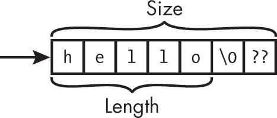
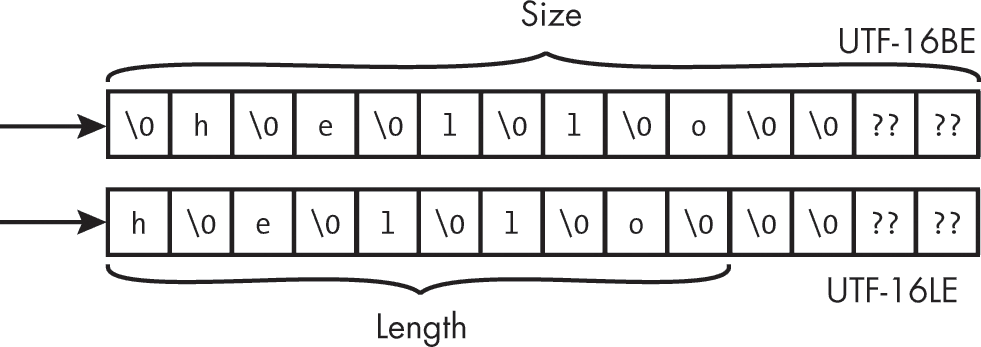

<hgroup>

# <samp class="SANS_Futura_Std_Bold_Condensed_B_11">7</samp> <samp class="SANS_Dogma_OT_Bold_B_11">字符与字符串</samp>

</hgroup>


字符串是一个非常重要且有用的数据类型，几乎所有的编程语言都会以某种形式实现它。字符串通常用来表示文本，是用户与程序之间交换数据的大多数内容，包括文本输入字段、命令行参数、环境变量和控制台输入。

在 C 语言中，字符串数据类型是基于正式字符串的概念建模的（Hopcroft 和 Ullman 1979）：

设 Σ 为一个非空有限字符集，称为字母表。 Σ 上的字符串是 Σ 中任何有限字符序列。例如，如果 Σ = {0, 1}，那么 01011 就是 Σ 上的一个字符串。

在本章中，我们将讨论可以用来组成字符串的各种字符集，包括 ASCII 和 Unicode（来自正式定义的*字母表*）。我们将介绍如何使用 C 标准库中的传统函数、边界检查接口以及 POSIX 和 Windows 应用程序编程接口（API）来表示和操作字符串。

## <samp class="SANS_Futura_Std_Bold_B_11">字符</samp>

人们用来沟通的字符并不是数字系统本能理解的，因为数字系统是基于位操作的。为了处理字符，数字系统使用*字符编码*，将唯一的整数值（称为*码点*）分配给特定的字符。如你所见，有多种方法可以在程序中对相同的字符进行编码。C 语言实现中常用的字符编码标准包括 Unicode、ASCII、扩展 ASCII、ISO 8859-1（拉丁文-1）、Shift-JIS 和 EBCDIC。

> <samp class="SANS_Dogma_OT_Bold_B_15">注意</samp>

*C 标准明确引用了 Unicode 和 ASCII。*

### <samp class="SANS_Futura_Std_Bold_Condensed_Oblique_BI_11">ASCII</samp>

*7 位美国信息交换标准代码*，更为人熟知的*7 位 ASCII*，指定了一组 128 个字符及其编码表示（ANSI X3.4-1986）。从 <samp class="SANS_TheSansMonoCd_W5Regular_11">0x00</samp> 到 <samp class="SANS_TheSansMonoCd_W5Regular_11">0x1f</samp> 的字符和字符 <samp class="SANS_TheSansMonoCd_W5Regular_11">0x7f</samp> 是控制字符，例如空字符、退格符、水平制表符和删除符。 从 <samp class="SANS_TheSansMonoCd_W5Regular_11">0x20</samp> 到 <samp class="SANS_TheSansMonoCd_W5Regular_11">0x7e</samp> 的字符是所有可打印字符，如字母、数字和符号。

我们通常使用更新后的名称*US-ASCII*来指代这一标准，以明确该系统是在美国开发的，并且专注于该国主要使用的印刷符号。大多数现代字符编码方案都基于 US-ASCII，尽管它们支持许多附加字符。

<samp class="SANS_TheSansMonoCd_W5Regular_11">0x80</samp> 到 <samp class="SANS_TheSansMonoCd_W5Regular_11">0xFF</samp> 范围内的字符不是 US-ASCII 定义的字符，而是属于被称为 *扩展 ASCII* 的 8 位字符编码。这些范围有多个编码方式，实际的映射取决于代码页。*代码页* 是一种字符编码，它将一组可打印字符和控制字符映射到唯一的数字。

### <samp class="SANS_Futura_Std_Bold_Condensed_Oblique_BI_11">Unicode</samp>

*Unicode* 已成为计算机处理文本的通用字符编码标准。它支持的字符范围远大于 ASCII；当前的 Unicode 标准（Unicode 2023）对字符进行了编码，范围从 <samp class="SANS_TheSansMonoCd_W5Regular_11">U+0000</samp> 到 <samp class="SANS_TheSansMonoCd_W5Regular_11">U+10FFFF</samp>，这相当于一个 21 位的编码空间。单个 Unicode 值以 <samp class="SANS_TheSansMonoCd_W5Regular_11">U+</samp> 开头，后跟四个或更多十六进制数字，表示为印刷文本。Unicode 字符 <samp class="SANS_TheSansMonoCd_W5Regular_11">U+0000</samp> 到 <samp class="SANS_TheSansMonoCd_W5Regular_11">U+007F</samp> 与 US-ASCII 中的字符完全相同，而 <samp class="SANS_TheSansMonoCd_W5Regular_11">U+0000</samp> 到 <samp class="SANS_TheSansMonoCd_W5Regular_11">U+00FF</samp> 的范围与 ISO 8859-1 相同，包含了拉丁字母字符，这些字符在美洲、西欧、大洋洲以及非洲的大部分地区被使用。

Unicode 将代码点组织成 *平面*，即连续的 65,536 个代码点的组。共有 17 个平面，编号从 0 到 16。最常用的字符，包括那些出现在主要旧编码标准中的字符，都被放置在第一个平面（<samp class="SANS_TheSansMonoCd_W5Regular_11">0x0000</samp> 到 <samp class="SANS_TheSansMonoCd_W5Regular_11">0xFFFF</samp>）中，这个平面被称为 *基本多语言平面（BMP）* 或平面 0。

Unicode 还指定了几种 *Unicode 转换格式（UTFs）*，这些是将每个 Unicode 标量值分配给唯一代码单元序列的字符编码格式。*Unicode 标量值* 是指除高代理项和低代理项外的任何 Unicode 代码点。（代理对将在本节稍后解释。）*代码单元* 是表示用于处理或交换的编码文本的最小位组合。Unicode 标准定义了三种 UTF，以允许不同大小的代码单元：

**UTF-8** 将每个字符表示为一个到四个 8 位代码单元的序列

**UTF-16** 将每个字符表示为一个或两个 16 位代码单元的序列

**UTF-32** 将每个字符表示为一个单一的 32 位代码单元

UTF-8 编码是 POSIX 操作系统中的主流编码。它具有以下优点：

+   它将 US-ASCII 字符（<samp class="SANS_TheSansMonoCd_W5Regular_11">U+0000</samp> 到 <samp class="SANS_TheSansMonoCd_W5Regular_11">U+007F</samp>）编码为范围从 <samp class="SANS_TheSansMonoCd_W5Regular_11">0x00</samp> 到 <samp class="SANS_TheSansMonoCd_W5Regular_11">0x7F</samp> 的单字节。这意味着只包含 7 位 ASCII 字符的文件和字符串在 ASCII 和 UTF-8 下具有相同的编码方式。

+   使用空字节终止字符串（我们稍后会讨论这个话题）与 ASCII 字符串的处理方式相同。

+   当前定义的所有 Unicode 码点可以使用 1 到 4 个字节进行编码。

+   Unicode 通过扫描明确的比特模式，在任意方向上轻松识别字符边界。

在 Windows 上，你可以使用 Visual C++ 的 <samp class="SANS_TheSansMonoCd_W5Regular_11">/utf8</samp> 标志编译并链接程序，以将源字符集和执行字符集设置为 UTF-8。你还需要配置 Windows 以使用 Unicode UTF-8 来支持全球语言。

UTF-16 目前是 Windows 操作系统中主流的编码方式。与 UTF-8 类似，UTF-16 是一种可变宽度编码。正如前面提到的，基本多文种平面（BMP）包含从 <samp class="SANS_TheSansMonoCd_W5Regular_11">U+0000</samp> 到 <samp class="SANS_TheSansMonoCd_W5Regular_11">U+FFFF</samp> 的字符。码点大于 <samp class="SANS_TheSansMonoCd_W5Regular_11">U+FFFF</samp> 的字符被称为 *补充字符*。补充字符由一对称为 *替代符* 的编码单元定义。第一个编码单元位于高替代符范围（<samp class="SANS_TheSansMonoCd_W5Regular_11">U+D800</samp> 到 <samp class="SANS_TheSansMonoCd_W5Regular_11">U+DBFF</samp>），第二个编码单元位于低替代符范围（<samp class="SANS_TheSansMonoCd_W5Regular_11">U+DC00</samp> 到 <samp class="SANS_TheSansMonoCd_W5Regular_11">U+DFFF</samp>）。

与其他可变长度 UTF 编码不同，UTF-32 是一种固定长度的编码方式。UTF-32 的主要优点是 Unicode 码点可以直接索引，这意味着你可以在常数时间内找到序列中第 *n* 个码点。相比之下，可变长度编码需要访问每个码点，才能找到序列中的第 *n* 个码点。

### <samp class="SANS_Futura_Std_Bold_Condensed_Oblique_BI_11">源字符集和执行字符集</samp>

在 C 语言最初标准化时，并没有一种被普遍接受的字符编码方式，因此它被设计成能够与多种字符表示方式兼容。与 Java 不同，C 的每个实现都定义了 *源字符集*（即源文件编写时使用的字符集）和 *执行字符集*（即编译时使用的字符和字符串字面值的字符集）。

源字符集和执行字符集必须包含拉丁字母的大写和小写字母的编码；10 个十进制数字；29 个图形字符；以及空格、水平制表符、垂直制表符、换页符和换行符。执行字符集还包括警告、退格、回车和空字符。

字符转换和分类函数（例如 <samp class="SANS_TheSansMonoCd_W5Regular_11">isdigit</samp>）会在运行时进行评估，基于调用时生效的本地化编码。程序的 *区域设置* 定义了它的代码集、日期和时间格式约定、货币约定、十进制格式约定和排序顺序。

### <samp class="SANS_Futura_Std_Bold_Condensed_Oblique_BI_11">数据类型</samp>

C 定义了几种数据类型来表示字符数据，其中一些我们已经见过。C 提供了不带修饰的 <samp class="SANS_TheSansMonoCd_W5Regular_11">char</samp> 类型来表示 *窄字符*（那些可以用最多 8 位表示的字符），以及 <samp class="SANS_TheSansMonoCd_W5Regular_11">wchar_t</samp> 类型来表示 *宽字符*（那些可能需要超过 8 位表示的字符）。

#### <samp class="SANS_Futura_Std_Bold_Condensed_B_11">char</samp>

正如我之前提到的，<samp class="SANS_TheSansMonoCd_W5Regular_11">char</samp> 是一种整数类型，但每种实现会定义它是有符号还是无符号的。在可移植的代码中，你可以假设它既不是有符号也不是无符号的。

使用 <samp class="SANS_TheSansMonoCd_W5Regular_11">char</samp> 类型表示字符数据（在这种情况下符号性无关紧要），而不是用于表示整数数据（在这种情况下符号性很重要）。你可以安全地使用 <samp class="SANS_TheSansMonoCd_W5Regular_11">char</samp> 类型表示 7 位字符编码，例如 US-ASCII。对于这些编码，高位总是 0，因此当将 <samp class="SANS_TheSansMonoCd_W5Regular_11">char</samp> 类型的值转换为 <samp class="SANS_TheSansMonoCd_W5Regular_11">int</samp> 时，你无需担心符号扩展问题，因为实现将其定义为有符号类型。

你还可以使用 <samp class="SANS_TheSansMonoCd_W5Regular_11">char</samp> 类型来表示 8 位字符编码，例如扩展 ASCII、ISO/IEC 8859、EBCDIC 和 UTF-8。这些 8 位字符编码在将 <samp class="SANS_TheSansMonoCd_W5Regular_11">char</samp> 定义为 8 位有符号类型的实现上可能会出现问题。例如，下面的代码在检测到 <samp class="SANS_TheSansMonoCd_W5Regular_11">EOF</samp> 时会打印字符串 <samp class="SANS_TheSansMonoCd_W5Regular_11">end of file</samp>：

```
char c = 'ÿ';  // extended character
if (c == EOF) puts("end of file");
```

假设实现定义的执行字符集为 ISO/IEC 8859-1，带有分音符的拉丁小写字母 y（ÿ）被定义为表示 <samp class="SANS_TheSansMonoCd_W5Regular_11">255 (0xFF)</samp>。对于将 <samp class="SANS_TheSansMonoCd_W5Regular_11">char</samp> 定义为有符号类型的实现，<samp class="SANS_TheSansMonoCd_W5Regular_11">c</samp> 将被符号扩展为 <samp class="SANS_TheSansMonoCd_W5Regular_11">signed int</samp> 的宽度，这使得ÿ字符与 <samp class="SANS_TheSansMonoCd_W5Regular_11">EOF</samp> 无法区分，因为它们具有相同的表示。

当使用在 <samp class="SANS_TheSansMonoCd_W5Regular_11"><ctype.h></samp> 中定义的字符分类函数时，会发生类似的问题。这些库函数将字符参数作为 <samp class="SANS_TheSansMonoCd_W5Regular_11">int</samp> 或宏 <samp class="SANS_TheSansMonoCd_W5Regular_11">EOF</samp> 的值来接受。如果字符属于该函数描述定义的字符集合，则返回非零值；如果字符不属于该集合，则返回零。例如，<samp class="SANS_TheSansMonoCd_W5Regular_11">isdigit</samp> 函数测试字符是否为当前区域设置中的十进制数字字符。任何不是有效字符或 <samp class="SANS_TheSansMonoCd_W5Regular_11">EOF</samp> 的参数值都会导致未定义行为。

为了避免在调用这些函数时发生未定义行为，应在整数提升之前将 <samp class="SANS_TheSansMonoCd_W5Regular_11">c</samp> 强制转换为 <samp class="SANS_TheSansMonoCd_W5Regular_11">unsigned char</samp>，如下所示：

```
char c = 'ÿ';
if (isdigit((unsigned char)c)) {
  puts("c is a digit");
}
```

存储在 <samp class="SANS_TheSansMonoCd_W5Regular_11">c</samp> 中的值会被零扩展到 <samp class="SANS_TheSansMonoCd_W5Regular_11">signed int</samp> 的宽度，通过确保结果值能够作为 <samp class="SANS_TheSansMonoCd_W5Regular_11">unsigned char</samp> 表示，从而消除未定义行为。请注意，将 <samp class="SANS_TheSansMonoCd_W5Regular_11">c</samp> 初始化为 <samp class="SANS_TheSansMonoCd_W5Regular_11">'ÿ'</samp> 可能会导致警告或错误。

#### <samp class="SANS_Futura_Std_Bold_Condensed_B_11">int</samp>

对于可能是 <samp class="SANS_TheSansMonoCd_W5Regular_11">EOF</samp>（一个负值）或作为 <samp class="SANS_TheSansMonoCd_W5Regular_11">unsigned char</samp> 解释后再转换为 <samp class="SANS_TheSansMonoCd_W5Regular_11">int</samp> 的字符数据，应使用 <samp class="SANS_TheSansMonoCd_W5Regular_11">int</samp> 类型。从流中读取字符数据的函数，如 <samp class="SANS_TheSansMonoCd_W5Regular_11">fgetc</samp>、<samp class="SANS_TheSansMonoCd_W5Regular_11">getc</samp> 和 <samp class="SANS_TheSansMonoCd_W5Regular_11">getchar</samp>，返回 <samp class="SANS_TheSansMonoCd_W5Regular_11">int</samp> 类型。正如我们所见，来自 <samp class="SANS_TheSansMonoCd_W5Regular_11"><ctype.h></samp> 的字符处理函数也接受这种类型，因为它们可能会接收到 <samp class="SANS_TheSansMonoCd_W5Regular_11">fgetc</samp> 或相关函数的结果。

#### <samp class="SANS_Futura_Std_Bold_Condensed_B_11">wchar_t</samp>

<samp class="SANS_TheSansMonoCd_W5Regular_11">wchar_t</samp> 类型是 C 语言中为了处理大字符集的字符而新增的整数类型。它可以是有符号或无符号整数类型，具体取决于实现，并且具有实现定义的包含范围，从 <samp class="SANS_TheSansMonoCd_W5Regular_11">WCHAR_MIN</samp> 到 <samp class="SANS_TheSansMonoCd_W5Regular_11">WCHAR_MAX</samp>。大多数实现将 <samp class="SANS_TheSansMonoCd_W5Regular_11">wchar_t</samp> 定义为 16 位或 32 位无符号整数类型，但不支持本地化的实现可能将 <samp class="SANS_TheSansMonoCd_W5Regular_11">wchar_t</samp> 定义为与 <samp class="SANS_TheSansMonoCd_W5Regular_11">char</samp> 相同的宽度。C 语言不允许使用可变长度编码来表示宽字符串（尽管在 Windows 上实际使用 UTF-16 是这种方式）。实现可以有条件地将宏 <samp class="SANS_TheSansMonoCd_W5Regular_11">__STDC_ISO_10646__</samp> 定义为整数常量，形式为 <samp class="SANS_TheSansMonoCd_W5Regular_Italic_I_11">yyyymmL</samp>（例如，<samp class="SANS_TheSansMonoCd_W5Regular_11">199712L</samp>），表示 <samp class="SANS_TheSansMonoCd_W5Regular_11">wchar_t</samp> 类型用于表示对应于指定版本标准的 Unicode 字符。选择 16 位类型的实现无法满足定义 <samp class="SANS_TheSansMonoCd_W5Regular_11">__STDC_ISO_10646__</samp> 的要求，特别是对于比 Unicode 3.1 更高版本的 ISO/IEC 10646。结果，定义 <samp class="SANS_TheSansMonoCd_W5Regular_11">__STDC_ISO_10646__</samp> 的要求是要么使用大于 20 位的 <samp class="SANS_TheSansMonoCd_W5Regular_11">wchar_t</samp> 类型，要么使用 16 位 <samp class="SANS_TheSansMonoCd_W5Regular_11">wchar_t</samp> 类型和一个 <samp class="SANS_TheSansMonoCd_W5Regular_11">__STDC_ISO_10646__</samp> 的值，且该值早于 <samp class="SANS_TheSansMonoCd_W5Regular_11">200103L</samp>。<samp class="SANS_TheSansMonoCd_W5Regular_11">wchar_t</samp> 类型还可以用于表示 Unicode 以外的编码，例如宽 EBCDIC。

使用 <samp class="SANS_TheSansMonoCd_W5Regular_11">wchar_t</samp> 编写可移植代码可能会很困难，因为实现定义的行为范围很广。例如，Windows 使用 16 位无符号整数类型，而 Linux 通常使用 32 位无符号整数类型。计算宽字符字符串的长度和大小的代码容易出错，必须小心执行。

#### <samp class="SANS_Futura_Std_Bold_Condensed_B_11">char16_t 和 char32_t</samp>

其他语言（包括 Ada95、Java、TCL、Perl、Python 和 C#）都具有用于表示 Unicode 字符的数据类型。C11 引入了 16 位和 32 位字符数据类型 <samp class="SANS_TheSansMonoCd_W5Regular_11">char16_t</samp> 和 <samp class="SANS_TheSansMonoCd_W5Regular_11">char32_t</samp>，这些类型在 <samp class="SANS_TheSansMonoCd_W5Regular_11"><uchar.h></samp> 中声明，用于分别表示 UTF-16 和 UTF-32 编码。C 不为这些新数据类型提供标准库函数，除了少数字符转换函数。没有库函数的支持，这些类型的用途非常有限。

C 定义了两个环境宏，用于指示这些类型中表示的字符是如何编码的。如果环境宏 <samp class="SANS_TheSansMonoCd_W5Regular_11">__STDC_UTF_16__</samp> 的值为 <samp class="SANS_TheSansMonoCd_W5Regular_11">1</samp>，则 <samp class="SANS_TheSansMonoCd_W5Regular_11">char16_t</samp> 类型的值采用 UTF-16 编码。如果环境宏 <samp class="SANS_TheSansMonoCd_W5Regular_11">__STDC_UTF_32__</samp> 的值为 <samp class="SANS_TheSansMonoCd_W5Regular_11">1</samp>，则 <samp class="SANS_TheSansMonoCd_W5Regular_11">char32_t</samp> 类型的值采用 UTF-32 编码。如果宏未定义，则使用另一个实现定义的编码方式。Visual C++ 不定义这些宏，表明在 Windows 上不能使用 <samp class="SANS_TheSansMonoCd_W5Regular_11">char16_t</samp> 类型表示 UTF-16。

### <samp class="SANS_Futura_Std_Bold_Condensed_Oblique_BI_11">字符常量</samp>

C 允许你指定*字符常量*，也叫做*字符字面量*，它们是由一个或多个字符组成，并用单引号括起来，例如 <samp class="SANS_TheSansMonoCd_W5Regular_11">'ÿ'</samp>。字符常量允许你在程序的源代码中指定字符值。表 7-1 展示了可以在 C 中指定的字符常量类型。

<samp class="SANS_Futura_Std_Heavy_B_11">表 7-1：</samp> <samp class="SANS_Futura_Std_Book_11">字符常量类型</samp>

| <samp class="SANS_Futura_Std_Heavy_B_11">前缀</samp> | <samp class="SANS_Futura_Std_Heavy_B_11">类型</samp> |
| --- | --- |
| <samp class="SANS_Futura_Std_Book_11">无</samp> | <samp class="SANS_TheSansMonoCd_W5Regular_11">unsigned char</samp> |
| <samp class="SANS_TheSansMonoCd_W5Regular_11">u8'a'</samp> | <samp class="SANS_TheSansMonoCd_W5Regular_11">char8_t</samp> |
| <samp class="SANS_TheSansMonoCd_W5Regular_11">L'a'</samp> | <samp class="SANS_Futura_Std_Book_11">对应的无符号类型</samp> <samp class="SANS_TheSansMonoCd_W5Regular_11">wchar_t</samp> |
| <samp class="SANS_TheSansMonoCd_W5Regular_11">u'a'</samp> | <samp class="SANS_TheSansMonoCd_W5Regular_11">char16_t</samp> |
| <samp class="SANS_TheSansMonoCd_W5Regular_11">U'a'</samp> | <samp class="SANS_TheSansMonoCd_W5Regular_11">char32_t</samp> |

包含多个字符的字符常量（例如，<samp class="SANS_TheSansMonoCd_W5Regular_11">'ab'</samp>）的值是由实现定义的。不能用单一代码单元表示的源字符的值也是如此。早前提到的例子 <samp class="SANS_TheSansMonoCd_W5Regular_11">'ÿ</samp><samp class="SANS_TheSansMonoCd_W5Regular_11">'</samp> 就是一个这样的情况。如果执行字符集是 UTF-8，则该值可能是 <samp class="SANS_TheSansMonoCd_W5Regular_11">0xC3BF</samp>，以反映表示 <samp class="SANS_TheSansMonoCd_W5Regular_11">U+00FF</samp> 代码点值所需的两个代码单元的 UTF-8 编码。C23 为字符字面量添加了 <samp class="SANS_TheSansMonoCd_W5Regular_11">u8</samp> 前缀，以表示 UTF-8 编码。UTF-8、UTF-16 或 UTF-32 字符常量不能包含多个字符。该值必须能够使用单一的 UTF-8、UTF-16 或 UTF-32 代码单元表示。因为 UTF-8 将 US-ASCII 字符（<samp class="SANS_TheSansMonoCd_W5Regular_11">U+0000</samp> 到 <samp class="SANS_TheSansMonoCd_W5Regular_11">U+007F</samp>）作为范围在 <samp class="SANS_TheSansMonoCd_W5Regular_11">0x00</samp> 到 <samp class="SANS_TheSansMonoCd_W5Regular_11">0x7F</samp> 之间的单字节表示，所以即使在字符编码依赖于本地环境的实现中（例如 EBCDIC 编码），也可以使用 <samp class="SANS_TheSansMonoCd_W5Regular_11">u8</samp> 前缀来创建 ASCII 字符。

### <samp class="SANS_Futura_Std_Bold_Condensed_Oblique_BI_11">转义序列</samp>

单引号（<samp class="SANS_TheSansMonoCd_W5Regular_11">'</samp>）和反斜杠（<samp class="SANS_TheSansMonoCd_W5Regular_11">\</samp>）具有特殊含义，因此不能直接表示为字符。相反，为了表示单引号，我们使用转义序列 <samp class="SANS_TheSansMonoCd_W5Regular_11">\'</samp>，为了表示反斜杠，我们使用 <samp class="SANS_TheSansMonoCd_W5Regular_11">\\</samp>。我们还可以使用转义序列表示其他字符，例如问号（<samp class="SANS_TheSansMonoCd_W5Regular_11">?</samp>）以及任意整数值，具体请参见表 7-2。

<samp class="SANS_Futura_Std_Heavy_B_11">表 7-2:</samp> <samp class="SANS_Futura_Std_Book_11">转义序列</samp>

| <samp class="SANS_Futura_Std_Heavy_B_11">字符</samp> | <samp class="SANS_Futura_Std_Heavy_B_11">转义序列</samp> |
| --- | --- |
| <samp class="SANS_Futura_Std_Book_11">单引号</samp> | <samp class="SANS_TheSansMonoCd_W5Regular_11">\'</samp> |
| <samp class="SANS_Futura_Std_Book_11">双引号</samp> | <samp class="SANS_TheSansMonoCd_W5Regular_11">\"</samp> |
| <samp class="SANS_Futura_Std_Book_11">问号</samp> | <samp class="SANS_TheSansMonoCd_W5Regular_11">\?</samp> |
| <samp class="SANS_Futura_Std_Book_11">反斜杠</samp> | <samp class="SANS_TheSansMonoCd_W5Regular_11">\\</samp> |
| <samp class="SANS_Futura_Std_Book_11">警告</samp> | <samp class="SANS_TheSansMonoCd_W5Regular_11">\a</samp> |
| <samp class="SANS_Futura_Std_Book_11">退格符</samp> | <samp class="SANS_TheSansMonoCd_W5Regular_11">\b</samp> |
| <samp class="SANS_Futura_Std_Book_11">换页符</samp> | <samp class="SANS_TheSansMonoCd_W5Regular_11">\f</samp> |
| <samp class="SANS_Futura_Std_Book_11">换行符</samp> | <samp class="SANS_TheSansMonoCd_W5Regular_11">\n</samp> |
| <samp class="SANS_Futura_Std_Book_11">回车符</samp> | <samp class="SANS_TheSansMonoCd_W5Regular_11">\r</samp> |
| <samp class="SANS_Futura_Std_Book_11">水平制表符</samp> | <samp class="SANS_TheSansMonoCd_W5Regular_11">\t</samp> |
| <samp class="SANS_Futura_Std_Book_11">垂直制表符</samp> | <samp class="SANS_TheSansMonoCd_W5Regular_11">\v</samp> |
| <samp class="SANS_Futura_Std_Book_11">八进制字符</samp> | <samp class="SANS_TheSansMonoCd_W5Regular_11">\<</samp><samp class="SANS_TheSansMonoCd_W5Regular_Italic_I_11">最多三位八进制数字</samp><samp class="SANS_TheSansMonoCd_W5Regular_11">></samp> |
| <samp class="SANS_Futura_Std_Book_11">十六进制字符</samp> | <samp class="SANS_TheSansMonoCd_W5Regular_11">\<</samp><samp class="SANS_TheSansMonoCd_W5Regular_Italic_I_11">十六进制数字</samp><samp class="SANS_TheSansMonoCd_W5Regular_11">></samp> |

以下是通过转义序列表示的非图形字符，这些转义序列由反斜杠后跟小写字母组成：<samp class="SANS_TheSansMonoCd_W5Regular_11">\a</samp>（警告），<samp class="SANS_TheSansMonoCd_W5Regular_11">\b</samp>（退格符），<samp class="SANS_TheSansMonoCd_W5Regular_11">\f</samp>（换页符），<samp class="SANS_TheSansMonoCd_W5Regular_11">\n</samp>（换行符），<samp class="SANS_TheSansMonoCd_W5Regular_11">\r</samp>（回车符），<samp class="SANS_TheSansMonoCd_W5Regular_11">\t</samp>（水平制表符）和<samp class="SANS_TheSansMonoCd_W5Regular_11">\v</samp>（垂直制表符）。

八进制数字可以被嵌入到八进制转义序列中，用于构建一个字符常量或一个宽字符常量。八进制整数的数值指定所需字符或宽字符的值。*反斜杠后跟数字总是被解释为八进制值。* 例如，你可以将退格符（十进制为 8）表示为八进制值<samp class="SANS_TheSansMonoCd_W5Regular_11">\10</samp>，或者等效地表示为<samp class="SANS_TheSansMonoCd_W5Regular_11">\010</samp>。

你还可以结合 <samp class="SANS_TheSansMonoCd_W5Regular_11">\x</samp> 后的十六进制数字来构造字符常量或宽字符常量。十六进制整数的数值形成所需字符或宽字符的值。例如，你可以将退格符表示为十六进制值 <samp class="SANS_TheSansMonoCd_W5Regular_11">\x8</samp> 或等效的 <samp class="SANS_TheSansMonoCd_W5Regular_11">\x08</samp>。

### <samp class="SANS_Futura_Std_Bold_Condensed_Oblique_BI_11">Linux</samp>

字符编码在不同操作系统上的演变有所不同。在 UTF-8 出现之前，Linux 通常依赖于各种语言特定的 ASCII 扩展。最流行的包括欧洲的 ISO 8859-1 和 ISO 8859-2，希腊的 ISO 8859-7，俄罗斯的 KOI-8/ISO 8859-5/CP1251，日本的 EUC 和 Shift-JIS，以及台湾的 BIG5。Linux 发行版和应用程序开发者正在逐步淘汰这些旧的遗留编码，转而使用 UTF-8 来表示本地化的文本字符串（Kuhn 1999）。

GCC 有几个标志可以让你配置字符集。以下是一些你可能会觉得有用的标志：

```
-fexec-charset=`charset`
```

<samp class="SANS_TheSansMonoCd_W5Regular_11">-fexec-charset</samp> 标志设置用于解释字符串和字符常量的执行字符集。默认值是 UTF-8。<samp class="SANS_TheSansMonoCd_W5Regular_Italic_I_11">charset</samp> 可以是系统的 <samp class="SANS_TheSansMonoCd_W5Regular_11">iconv</samp> 库例程所支持的任何编码，稍后在本章中会介绍。例如，设置 <samp class="SANS_TheSansMonoCd_W5Regular_11">-fexec-charset=IBM1047</samp> 会指示 GCC 按照 EBCDIC 编码页 1047 来解释源代码中硬编码的字符串常量，例如 <samp class="SANS_TheSansMonoCd_W5Regular_11">printf</samp> 格式字符串。

要选择用于宽字符串和字符常量的宽执行字符集，可以使用 <samp class="SANS_TheSansMonoCd_W5Regular_11">-fwide-exec-charset</samp> 标志：

```
-fwide-exec-charset=`charset`
```

默认值是 UTF-32 或 UTF-16，对应于 <samp class="SANS_TheSansMonoCd_W5Regular_11">wchar_t</samp> 的宽度。

输入字符集默认与系统区域设置相同（如果系统区域设置未配置，则为 UTF-8）。要覆盖用于将输入文件的字符集转换为 GCC 使用的源字符集的输入字符集，可以使用 <samp class="SANS_TheSansMonoCd_W5Regular_11">-finput-charset</samp> 标志：

```
-finput-charset=`charset`
```

Clang 有 <samp class="SANS_TheSansMonoCd_W5Regular_11">-fexec-charset</samp> 和 <samp class="SANS_TheSansMonoCd_W5Regular_11">-finput-charset</samp>，但没有 <samp class="SANS_TheSansMonoCd_W5Regular_11">-fwide-exec-charset</samp>。Clang 只允许将 <samp class="SANS_TheSansMonoCd_W5Regular_Italic_I_11">charset</samp> 设置为 UTF-8，并拒绝任何将其设置为其他值的尝试。

### <samp class="SANS_Futura_Std_Bold_Condensed_Oblique_BI_11">Windows</samp>

Windows 中对字符编码的支持经历了不规则的发展。为 Windows 开发的程序可以使用 Unicode 接口或依赖于区域设置的字符编码接口来处理字符编码。对于大多数现代应用程序，默认应选择 Unicode 接口，以确保在处理文本时应用程序的行为符合预期。通常，这段代码的性能会更好，因为传递给 Windows 库函数的窄字符字符串通常会被转换为 Unicode 字符串。

#### <samp class="SANS_Futura_Std_Bold_Condensed_B_11">main 和 wmain 入口点</samp>

Visual C++ 支持两种程序入口点：<samp class="SANS_TheSansMonoCd_W5Regular_11">main</samp>，它允许你传递窄字符参数，以及 <samp class="SANS_TheSansMonoCd_W5Regular_11">wmain</samp>，它允许你传递宽字符参数。你可以使用与 <samp class="SANS_TheSansMonoCd_W5Regular_11">main</samp> 相似的格式声明 <samp class="SANS_TheSansMonoCd_W5Regular_11">wmain</samp> 的正式参数，如表 7-3 所示。

<samp class="SANS_Futura_Std_Heavy_B_11">表 7-3：</samp> <samp class="SANS_Futura_Std_Book_11">Windows 程序入口点声明</samp>

| <samp class="SANS_Futura_Std_Heavy_B_11">窄字符参数</samp> | <samp class="SANS_Futura_Std_Heavy_B_11">宽字符参数</samp> |
| --- | --- |
| <samp class="SANS_TheSansMonoCd_W5Regular_11">int main();</samp> | <samp class="SANS_TheSansMonoCd_W5Regular_11">int wmain();</samp> |
| <samp class="SANS_TheSansMonoCd_W5Regular_11">int main(int argc, char *argv[]);</samp> | <samp class="SANS_TheSansMonoCd_W5Regular_11">int wmain(int argc, wchar_t *argv[]);</samp> |
| <samp class="SANS_TheSansMonoCd_W5Regular_11">int main(int argc, char *argv[],</samp><samp class="SANS_Futura_Std_Book_11"></samp><samp class="SANS_TheSansMonoCd_W5Regular_11">char *envp[]);</samp> | <samp class="SANS_TheSansMonoCd_W5Regular_11">int wmain(int argc, wchar_t *argv[],</samp><samp class="SANS_Futura_Std_Book_11"></samp><samp class="SANS_TheSansMonoCd_W5Regular_11">wchar_t *envp[]);</samp> |

对于任意入口点，字符编码最终取决于调用进程。然而，根据惯例，<samp class="SANS_TheSansMonoCd_W5Regular_11">main</samp> 函数接收其可选参数和环境作为指向当前 Windows（也称为 ANSI）代码页编码文本的指针，而 <samp class="SANS_TheSansMonoCd_W5Regular_11">wmain</samp> 函数接收 UTF-16 编码的文本。

当你从命令提示符等 shell 运行程序时，shell 的命令解释器会将参数转换为该入口点所需的正确编码。Windows 进程以 UTF-16 编码的命令行开始。编译器/链接器发出的启动代码调用 <samp class="SANS_TheSansMonoCd_W5Regular_11">CommandLineToArgvW</samp> 函数，将命令行转换为调用 <samp class="SANS_TheSansMonoCd_W5Regular_11">main</samp> 所需的 <samp class="SANS_TheSansMonoCd_W5Regular_11">argv</samp> 形式，或者直接将命令行参数传递给调用 <samp class="SANS_TheSansMonoCd_W5Regular_11">wmain</samp> 所需的 <samp class="SANS_TheSansMonoCd_W5Regular_11">argv</samp> 形式。在对 <samp class="SANS_TheSansMonoCd_W5Regular_11">main</samp> 的调用中，结果会被重新编码为当前的 Windows 代码页，而该代码页可能因系统而异。对于当前 Windows 代码页中无法表示的字符，ASCII 字符 <samp class="SANS_TheSansMonoCd_W5Regular_11">?</samp> 会被替代。

Windows 控制台在向控制台写入数据时使用原始设备制造商（OEM）代码页。实际使用的编码因系统而异，但通常与 Windows 代码页不同。例如，在美国英语版 Windows 上，Windows 代码页可能是 Windows Latin 1，而 OEM 代码页可能是 DOS Latin US。一般而言，向 <samp class="SANS_TheSansMonoCd_W5Regular_11">stdout</samp> 或 <samp class="SANS_TheSansMonoCd_W5Regular_11">stderr</samp> 写入文本数据需要先将文本转换为 OEM 代码页，或者需要将控制台的输出代码页设置为与写入文本的编码相匹配。如果未这样做，可能会导致控制台输出意外的内容。然而，即使你仔细匹配了程序和控制台之间的字符编码，控制台仍然可能无法按预期显示字符，原因可能是其他因素，比如当前为控制台选择的字体没有适当的字形来表示这些字符。此外，历史上，Windows 控制台无法显示 Unicode 基本多文种平面（BMP）之外的字符，因为它仅为每个单元格的字符数据存储一个 16 位值。

#### <samp class="SANS_Futura_Std_Bold_Condensed_B_11">窄字符与宽字符</samp>

Win32 软件开发工具包（SDK）中的所有系统 API 都有两个版本：一个是带有 <samp class="SANS_TheSansMonoCd_W5Regular_11">A</samp> 后缀的窄字符 Windows（ANSI）版本，另一个是带有 <samp class="SANS_TheSansMonoCd_W5Regular_11">W</samp> 后缀的宽字符版本：

```
int SomeFuncA(LPSTR SomeString);
int SomeFuncW(LPWSTR SomeString);
```

确定你的应用程序是否使用宽字符（UTF-16）或窄字符，并据此编写代码。最佳实践是显式调用每个函数的窄字符或宽字符版本，并传递适当类型的字符串：

```
SomeFuncW(L"String");
SomeFuncA("String");
```

来自 Win32 SDK 的实际函数示例包括<samp class="SANS_TheSansMonoCd_W5Regular_11">MessageBoxA</samp>/<samp class="SANS_TheSansMonoCd_W5Regular_11">MessageBoxW</samp>和<samp class="SANS_TheSansMonoCd_W5Regular_11">CreateWindowExA</samp>/<samp class="SANS_TheSansMonoCd_W5Regular_11">CreateWindowExW</samp>函数。

### <samp class="SANS_Futura_Std_Bold_Condensed_Oblique_BI_11">字符转换</samp>

尽管国际文本越来越多地采用 Unicode 编码，但它仍然采用语言或国家依赖的字符编码，因此需要在这些编码之间进行转换。Windows 仍然在具有传统、有限字符编码的区域设置中运行，例如 IBM EBCDIC 和 ISO 8859-1。程序在进行输入/输出（I/O）时，通常需要在 Unicode 和传统编码方案之间进行转换。

不能将所有字符串转换为每种语言或国家依赖的字符编码。当编码为 US-ASCII 时，这一点尤其明显，因为 US-ASCII 无法表示需要超过 7 位存储的字符。Latin-1 永远无法正确编码字符<samp class="SANS_Source_Han_Serif_SC_Regular_11">愛</samp>，而许多非日语的字母和词语也无法在不丢失信息的情况下转换为 Shift-JIS。

#### <samp class="SANS_Futura_Std_Bold_Condensed_B_11">C 标准库</samp>

C 标准库提供了一些函数，用于在窄字符单元（<samp class="SANS_TheSansMonoCd_W5Regular_11">char</samp>）和宽字符单元（<samp class="SANS_TheSansMonoCd_W5Regular_11">wchar_t</samp>）之间进行转换。<samp class="SANS_TheSansMonoCd_W5Regular_11">mbtowc</samp>（多字节到宽字符）、<samp class="SANS_TheSansMonoCd_W5Regular_11">wctomb</samp>（宽字符到多字节）、<samp class="SANS_TheSansMonoCd_W5Regular_11">mbrtowc</samp>（可重启多字节到宽字符）和<samp class="SANS_TheSansMonoCd_W5Regular_11">wcrtomb</samp>（可重启宽字符到多字节）函数一次转换一个字符单元，并将结果写入输出对象或缓冲区。<samp class="SANS_TheSansMonoCd_W5Regular_11">mbstowcs</samp>（多字节字符串到宽字符字符串）、<samp class="SANS_TheSansMonoCd_W5Regular_11">wcstombs</samp>（宽字符字符串到多字节字符串）、<samp class="SANS_TheSansMonoCd_W5Regular_11">mbsrtowcs</samp>（可重启多字节字符串到宽字符字符串）和<samp class="SANS_TheSansMonoCd_W5Regular_11">wcsrtombs</samp>（可重启宽字符字符串到多字节字符串）函数一次转换一系列字符单元，并将结果写入输出缓冲区。

转换函数需要存储数据，以便在函数调用之间正确处理转换序列。*不可重启*的形式将状态存储在内部，因此不适合多线程处理。*可重启*的版本具有一个额外的参数，它是指向类型为 <samp class="SANS_TheSansMonoCd_W5Regular_11">mbstate_t</samp> 的对象的指针，该对象描述了相关多字节字符序列的当前转换状态。此对象保存状态数据，使得在另一次调用该函数执行不相关的转换后，可以从中断的地方重新启动转换。*字符串*版本用于一次执行多个字符单元的批量转换。

这些函数有一些限制。如前所述，Windows 使用 16 位字符单元表示 <samp class="SANS_TheSansMonoCd_W5Regular_11">wchar_t</samp>。这可能会成为问题，因为 C 标准要求 <samp class="SANS_TheSansMonoCd_W5Regular_11">wchar_t</samp> 类型的对象能够表示当前区域设置中的所有字符，而 16 位字符单元可能太小，无法做到这一点。技术上讲，C 语言不允许你使用多个 <samp class="SANS_TheSansMonoCd_W5Regular_11">wchar_t</samp> 类型的对象来表示单个字符。因此，标准转换函数可能会导致数据丢失。另一方面，大多数 POSIX 实现使用 32 位字符单元表示 <samp class="SANS_TheSansMonoCd_W5Regular_11">wchar_t</samp>，允许使用 UTF-32。由于单个 UTF-32 字符单元可以表示一个完整的代码点，因此使用标准函数的转换不会丢失或截断数据。

C 标准委员会在 C11 中新增了以下函数，以解决使用标准转换函数时可能发生的数据丢失问题：

<samp class="SANS_TheSansMonoCd_W7Bold_B_11">mbrtoc16, c16rtomb </samp>在窄字符单元和一个或多个 <samp class="SANS_TheSansMonoCd_W5Regular_11">char16_t</samp> 字符单元之间进行转换

<samp class="SANS_TheSansMonoCd_W7Bold_B_11">mbrtoc32, c32rtomb </samp>将窄字符单元的序列转换为一个或多个 <samp class="SANS_TheSansMonoCd_W5Regular_11">char32_t</samp> 字符单元

前两个函数在区域设置相关的字符编码（以 <samp class="SANS_TheSansMonoCd_W5Regular_11">char</samp> 数组表示）和 UTF-16 数据（存储在 <samp class="SANS_TheSansMonoCd_W5Regular_11">char16_t</samp> 数组中）之间进行转换（假设 <samp class="SANS_TheSansMonoCd_W5Regular_11">__STDC_UTF_16__</samp> 的值为 <samp class="SANS_TheSansMonoCd_W5Regular_11">1</samp>）。后两个函数在区域设置相关的编码和存储在 <samp class="SANS_TheSansMonoCd_W5Regular_11">char32_t</samp> 数组中的 UTF-32 数据之间进行转换（假设 <samp class="SANS_TheSansMonoCd_W5Regular_11">__STDC_UTF_32__</samp> 的值为 <samp class="SANS_TheSansMonoCd_W5Regular_11">1</samp>）。清单 7-1 中的程序使用 <samp class="SANS_TheSansMonoCd_W5Regular_11">mbrtoc16</samp> 函数将 UTF-8 输入字符串转换为 UTF-16 编码字符串。

```
#include <locale.h>
<samp class="SANS_TheSansMonoCd_W5Regular_11">#include <uchar.h></samp>
<samp class="SANS_TheSansMonoCd_W5Regular_11">#include <stdio.h></samp>
#include <wchar.h>

static_assert(__STDC_UTF_16__ == 1, "UTF-16 is not supported"); ❶

size_t utf8_to_utf16(size_t utf8_size, const char utf8[utf8_size], char16_t *utf16) {
  size_t code, utf8_idx = 0, utf16_idx = 0;
  mbstate_t state = {0};
  while ((code = ❷ mbrtoc16(&utf16[utf16_idx],
    &utf8[utf8_idx], utf8_size - utf8_idx, &state))) {
    switch(code) {
    case (size_t)-1: // invalid code unit sequence detected
    case (size_t)-2: // code unit sequence missing elements
      return 0;
    case (size_t)-3: // high surrogate from a surrogate pair
      utf16_idx++;
      break;
    default:         // one value written
      utf16_idx++;
      utf8_idx += code;
    }
  }
  return utf16_idx + 1;
}

int main() {
  setlocale(LC_ALL, "es_MX.utf8"); ❸
  char utf8[] = u8"I <samp class="SANS_DejaVu_Sans_Book_11">♥</samp> 🌮 s!";
  char16_t utf16[sizeof(utf8)]; // UTF-16 requires less code units than UTF-8
  size_t output_size = utf8_to_utf16(sizeof(utf8), utf8, utf16);
  printf("%s\nConverted to %zu UTF-16 code units: [", utf8, output_size);
  for (size_t x = 0; x < output_size; ++x) {
    printf("%#x ", utf16[x]);
  }
  puts("]");
}
```

<samp class="SANS_Futura_Std_Book_Oblique_I_11">清单 7-1：将 UTF-8 字符串转换为</samp> <samp class="I">char16_t</samp> <samp class="SANS_Futura_Std_Book_Oblique_I_11">字符串，使用</samp> <samp class="I">mbrtoc16</samp> <samp class="SANS_Futura_Std_Book_Oblique_I_11">函数</samp>

我们调用 <samp class="SANS_TheSansMonoCd_W5Regular_11">setlocale</samp> 函数 ❸，通过传递一个实现定义的字符串来将多字节字符编码设置为 UTF-8。静态断言 ❶ 确保宏 <samp class="SANS_TheSansMonoCd_W5Regular_11">__STDC_UTF_16__</samp> 的值为 <samp class="SANS_TheSansMonoCd_W5Regular_11">1</samp>。（有关静态断言的更多信息，请参阅 第十一章）。结果是，每次调用 <samp class="SANS_TheSansMonoCd_W5Regular_11">mbrtoc16</samp> 函数时，都会将 UTF-8 表示的单个代码点转换为 UTF-16 表示。如果结果的 UTF-16 代码单元是高代理（来自代理对），则 <samp class="SANS_TheSansMonoCd_W5Regular_11">state</samp> 对象会更新，指示下一次调用 <samp class="SANS_TheSansMonoCd_W5Regular_11">mbrtoc16</samp> 将写出低代理，而无需考虑输入字符串。

<samp class="SANS_TheSansMonoCd_W5Regular_11">mbrtoc16</samp> 函数没有字符串版本，因此我们会通过一个 UTF-8 输入字符串进行迭代，调用 <samp class="SANS_TheSansMonoCd_W5Regular_11">mbrtoc16</samp> 函数 ❷ 将其转换为 UTF-16 字符串。如果发生编码错误，<samp class="SANS_TheSansMonoCd_W5Regular_11">mbrtoc16</samp> 函数将返回 <samp class="SANS_TheSansMonoCd_W5Regular_11">(size_t)-1</samp>，如果代码单元序列缺少元素，则返回 <samp class="SANS_TheSansMonoCd_W5Regular_11">(size_t)-2</samp>。如果发生任何一种情况，循环将终止，转换结束。

返回值为 <samp class="SANS_TheSansMonoCd_W5Regular_11">(size_t)-3</samp> 表示该函数已经输出了代理对的高代理字符，并将一个指示符存储在状态参数中。该指示符将在下次调用 <samp class="SANS_TheSansMonoCd_W5Regular_11">mbrtoc16</samp> 函数时使用，以便输出代理对的低代理字符，从而形成一个完整的 <samp class="SANS_TheSansMonoCd_W5Regular_11">char16_t</samp> 序列，代表一个单一的代码点。所有 C 标准中的可重启编码转换函数在使用状态参数时行为类似。

如果该函数返回的值不是 <samp class="SANS_TheSansMonoCd_W5Regular_11">(size_t)-1</samp>、<samp class="SANS_TheSansMonoCd_W5Regular_11">(size_t)-2</samp> 或 <samp class="SANS_TheSansMonoCd_W5Regular_11">(size_t)-3</samp>，则 <samp class="SANS_TheSansMonoCd_W5Regular_11">utf16_idx</samp> 索引将增加，<samp class="SANS_TheSansMonoCd_W5Regular_11">utf8_idx</samp> 索引将根据函数读取的代码单元数量进行增加，字符串的转换将继续进行。

#### <samp class="SANS_Futura_Std_Bold_Condensed_B_11">libiconv</samp>

GNU <samp class="SANS_TheSansMonoCd_W5Regular_11">libiconv</samp> 是一个常用的跨平台开源库，用于执行字符串编码转换。它包含了 <samp class="SANS_TheSansMonoCd_W5Regular_11">iconv_open</samp> 函数，该函数分配了一个转换描述符，您可以使用它将字节序列从一种字符编码转换到另一种。该函数的文档（*[`<wbr>www<wbr>.gnu<wbr>.org<wbr>/software<wbr>/libiconv<wbr>/`](https://www.gnu.org/software/libiconv/)*) 定义了可以用来标识特定 <samp class="SANS_TheSansMonoCd_W5Regular_Italic_I_11">charset</samp> 的字符串，例如 <samp class="SANS_TheSansMonoCd_W5Regular_11">ASCII</samp>、<samp class="SANS_TheSansMonoCd_W5Regular_11">ISO−8859−1</samp>、<samp class="SANS_TheSansMonoCd_W5Regular_11">SHIFT_JIS</samp> 或 <samp class="SANS_TheSansMonoCd_W5Regular_11">UTF−8</samp>，用来表示与区域相关的字符编码。

#### <samp class="SANS_Futura_Std_Bold_Condensed_B_11">Win32 转换 API</samp>

Win32 SDK 提供了两个用于在宽字符和窄字符字符串之间转换的函数：<samp class="SANS_TheSansMonoCd_W5Regular_11">MultiByteToWideChar</samp> 和 <samp class="SANS_TheSansMonoCd_W5Regular_11">WideCharToMultiByte</samp>。

<samp class="SANS_TheSansMonoCd_W5Regular_11">MultiByteToWideChar</samp> 函数将用任意字符代码页编码的字符串数据映射到 UTF-16 字符串。同样，<samp class="SANS_TheSansMonoCd_W5Regular_11">WideCharToMultiByte</samp> 函数将 UTF-16 编码的字符串数据映射到任意字符代码页。由于并非所有代码页都能表示 UTF-16 数据，因此该函数可以指定一个默认字符，用于替代任何无法转换的 UTF-16 字符。

## <samp class="SANS_Futura_Std_Bold_B_11">字符串</samp>

C 不支持原始的字符串类型，可能永远也不会支持。相反，它通过字符数组实现字符串。C 有两种类型的字符串：窄字符串和宽字符串。

*窄字符串* 的类型是 <samp class="SANS_TheSansMonoCd_W5Regular_11">char</samp> 数组。它由一系列连续的字符组成，包括终止的空字符。指向字符串的指针引用其初始字符。字符串的大小是分配给后备数组存储的字节数。字符串的长度是位于第一个空字符之前的代码单元（字节）数。在图 7-1 中，字符串的大小为 7，字符串的长度为 5。后备数组中超出最后一个元素的部分不得访问。未初始化的数组元素不得读取。



<samp class="SANS_Futura_Std_Book_Oblique_I_11">图 7-1：示例窄字符串</samp>

*宽字符串* 的类型是 <samp class="SANS_TheSansMonoCd_W5Regular_11">wchar_t</samp> 数组。它由一系列连续的宽字符组成，包括终止的空宽字符。指向宽字符串的*指针*引用其初始宽字符。*宽字符串的长度*是位于第一个空宽字符之前的代码单元数。图 7-2 展示了 *hello* 的 UTF-16BE（大端）和 UTF-16LE（小端）表示形式。数组的大小由实现定义。此数组大小为 14 字节，假设实现使用 8 位字节和 16 位 <samp class="SANS_TheSansMonoCd_W5Regular_11">wchar_t</samp> 类型。该字符串的长度为 5，因为字符数量没有变化。



<samp class="SANS_Futura_Std_Book_Oblique_I_11">图 7-2：示例 UTF-16BE 和 UTF-16LE 宽字符字符串</samp>

后备数组中超出最后一个元素的部分不得访问。未初始化的数组元素不得读取。

## <samp class="SANS_Futura_Std_Bold_B_11">字符串字面量</samp>

*字符字符串字面量* 是由零个或多个多字节字符组成的字符串常量，字符用双引号括起来——例如 <samp class="SANS_TheSansMonoCd_W5Regular_11">"ABC"</samp>。你可以使用各种前缀来声明不同字符类型的字符串字面量：

+   <samp class="SANS_TheSansMonoCd_W5Regular_11">char</samp> 字符串字面量类型，例如 <samp class="SANS_TheSansMonoCd_W5Regular_11">"ABC"</samp>

+   <samp class="SANS_TheSansMonoCd_W5Regular_11">wchar_t</samp> 字符串字面量类型，带有 <samp class="SANS_TheSansMonoCd_W5Regular_11">L</samp> 前缀，例如 <samp class="SANS_TheSansMonoCd_W5Regular_11">L"ABC"</samp>

+   带有 <samp class="SANS_TheSansMonoCd_W5Regular_11">u8</samp> 前缀的 UTF-8 字符串字面量类型，例如 <samp class="SANS_TheSansMonoCd_W5Regular_11">u8"ABC"</samp>

+   <samp class="SANS_TheSansMonoCd_W5Regular_11">char16_t</samp>字符串文字类型，带有<samp class="SANS_TheSansMonoCd_W5Regular_11">u</samp>前缀，例如<samp class="SANS_TheSansMonoCd_W5Regular_11">u"ABC"</samp>

+   <samp class="SANS_TheSansMonoCd_W5Regular_11">char32_t</samp>字符串文字类型，带有<samp class="SANS_TheSansMonoCd_W5Regular_11">U</samp>前缀，例如<samp class="SANS_TheSansMonoCd_W5Regular_11">U"ABC"</samp>

C 标准并没有强制实现使用 ASCII 编码的字符串文字。然而，你可以使用<samp class="SANS_TheSansMonoCd_W5Regular_11">u8</samp>前缀强制字符串文字使用 UTF-8 编码。如果字符串中的所有字符都是 ASCII 字符，编译器会生成 ASCII 字符串文字，即使实现通常会用其他编码（例如 EBCDIC）来编码字符串文字。

字符串文字具有非<samp class="SANS_TheSansMonoCd_W5Regular_11">const</samp>数组类型。修改字符串文字是未定义的行为，并且被 CERT C 规则 STR30-C 所禁止，规则内容为：“不要尝试修改字符串文字。”这是因为这些字符串文字可能存储在只读内存中，或者多个字符串文字可能共享相同的内存，从而导致在修改一个字符串时，多个字符串也会被改变。

字符串文字常常用来初始化数组变量，你可以通过显式声明一个数组的大小，确保其与字符串文字中的字符数匹配。考虑以下声明：

```
#define S_INIT "abc"
// `--snip--`
const char s[4] = S_INIT;
```

数组<samp class="SANS_TheSansMonoCd_W5Regular_11">s</samp>的大小是四，这正是初始化数组为字符串文字所需的精确大小，包括末尾的空字符空间。

如果你向初始化数组的字符串文字中添加另一个字符，代码的意义会发生显著变化：

```
#define S_INIT "abc**d**"
// `--snip--`
const char s[4] = S_INIT;
```

数组<samp class="SANS_TheSansMonoCd_W5Regular_11">s</samp>的大小仍然是四，尽管字符串文字的大小现在是五。因此，数组<samp class="SANS_TheSansMonoCd_W5Regular_11">s</samp>被初始化为字符数组<samp class="SANS_TheSansMonoCd_W5Regular_11">"abcd"</samp>，并且末尾的空字符被省略了。根据设计，这种语法允许你初始化一个字符数组，而不是字符串。因此，编译器不太可能将此声明诊断为错误。

如果在维护过程中字符串文字发生变化，可能会存在风险，字符串可能无意间变为没有终止空字符的字符数组，特别是当字符串文字与声明分开定义时，就像这个例子中那样。如果你的目的是始终将<samp class="SANS_TheSansMonoCd_W5Regular_11">s</samp>初始化为字符串，你应该省略数组的大小。如果不指定数组的大小，编译器将为整个字符串文字分配足够的空间，包括终止空字符：

```
const char s[] = S_INIT;
```

这种方法简化了维护，因为即使字符串字面量的大小发生变化，数组的大小也始终可以确定。

使用这种语法声明的数组大小可以通过使用 <samp class="SANS_TheSansMonoCd_W5Regular_11">sizeof</samp> 操作符在编译时确定：

```
size_t size = sizeof(s);
```

如果我们改为如下声明这个字符串

```
const char *foo = S_INIT;
```

我们需要调用 <samp class="SANS_TheSansMonoCd_W5Regular_11">strlen</samp> 函数来获取长度。

```
size_t length = strlen(foo) + 1U;
```

这可能会导致运行时开销，并且与大小不同。

## <samp class="SANS_Futura_Std_Bold_B_11">字符串处理函数</samp>

管理 C 中字符串的几种方法，其中最常用的是 C 标准库函数。窄字符字符串处理函数在 <samp class="SANS_TheSansMonoCd_W5Regular_11"><string.h></samp> 头文件中定义，宽字符字符串处理函数在 <samp class="SANS_TheSansMonoCd_W5Regular_11"><wchar.h></samp> 中定义。这些遗留的字符串处理函数近年来已与各种安全漏洞相关联。这是因为它们没有检查数组的大小（通常缺少执行此类检查所需的信息），并且依赖于你提供足够大的字符数组来存储输出。虽然使用这些函数可以编写安全、健壮且无错误的代码，但它们促进了一种编程风格，这种风格如果结果过大以致无法容纳在提供的数组中，就可能导致缓冲区溢出。这些函数本身并不不安全，但容易被误用，需要小心使用（或者根本不使用）。

因此，C11 引入了规范性的（但可选的）附录 K 边界检查接口。该附录提供了替代库函数，旨在通过要求提供输出缓冲区的长度（例如），并验证这些缓冲区是否足够大以容纳来自这些函数的输出，从而促进更安全、更可靠的编程。例如，附录 K 定义了 <samp class="SANS_TheSansMonoCd_W5Regular_11">strcpy_s</samp>、<samp class="SANS_TheSansMonoCd_W5Regular_11">strcat_s</samp>、<samp class="SANS_TheSansMonoCd_W5Regular_11">strncpy_s</samp> 和 <samp class="SANS_TheSansMonoCd_W5Regular_11">strncat_s</samp> 函数，作为 C 标准库中 <samp class="SANS_TheSansMonoCd_W5Regular_11">strcpy</samp>、<samp class="SANS_TheSansMonoCd_W5Regular_11">strcat</samp>、<samp class="SANS_TheSansMonoCd_W5Regular_11">strncpy</samp> 和 <samp class="SANS_TheSansMonoCd_W5Regular_11">strncat</samp> 函数的替代品。

### <samp class="SANS_Futura_Std_Bold_Condensed_Oblique_BI_11"><string.h> 和 <wchar.h></samp>

C 标准库包括一些众所周知的函数，例如 <samp class="SANS_TheSansMonoCd_W5Regular_11">strcpy</samp>、<samp class="SANS_TheSansMonoCd_W5Regular_11">strncpy</samp>、<samp class="SANS_TheSansMonoCd_W5Regular_11">strcat</samp>、<samp class="SANS_TheSansMonoCd_W5Regular_11">strncat</samp>、<samp class="SANS_TheSansMonoCd_W5Regular_11">strlen</samp> 等，以及 <samp class="SANS_TheSansMonoCd_W5Regular_11">memcpy</samp> 和 <samp class="SANS_TheSansMonoCd_W5Regular_11">memmove</samp> 函数，用于分别复制和移动字符串。C 标准还提供了一个宽字符接口，操作的是 <samp class="SANS_TheSansMonoCd_W5Regular_11">wchar_t</samp> 类型的对象，而不是 <samp class="SANS_TheSansMonoCd_W5Regular_11">char</samp> 类型的对象。（这些函数名称与窄字符串函数名称类似，唯一的区别是 <samp class="SANS_TheSansMonoCd_W5Regular_11">str</samp> 被替换为 <samp class="SANS_TheSansMonoCd_W5Regular_11">wcs</samp>，并且内存函数名称前加了一个 <samp class="SANS_TheSansMonoCd_W5Regular_11">w</samp>。）表 7-4 给出了一些窄字符和宽字符字符串函数的示例。有关如何使用这些函数的更多信息，请参考 C 标准（ISO/IEC 9899:2024）或手册页。

<samp class="SANS_Futura_Std_Heavy_B_11">表 7-4：</samp> <samp class="SANS_Futura_Std_Book_11">窄字符和宽字符字符串函数</samp>

| <samp class="SANS_Futura_Std_Heavy_B_11">窄字符（</samp><samp class="SANS_TheSansMonoCd_W7Bold_B_11">char</samp><samp class="SANS_Futura_Std_Heavy_B_11">）</samp> | <samp class="SANS_Futura_Std_Heavy_B_11">宽字符（</samp><samp class="SANS_TheSansMonoCd_W7Bold_B_11">wchar_t</samp><samp class="SANS_Futura_Std_Heavy_B_11">）</samp> | <samp class="SANS_Futura_Std_Heavy_B_11">描述</samp> |
| --- | --- | --- |
| <samp class="SANS_TheSansMonoCd_W5Regular_11">strcpy</samp> | <samp class="SANS_TheSansMonoCd_W5Regular_11">wcscpy</samp> | <samp class="SANS_Futura_Std_Book_11">字符串复制</samp> |
| <samp class="SANS_TheSansMonoCd_W5Regular_11">strncpy</samp> | <samp class="SANS_TheSansMonoCd_W5Regular_11">wcsncpy</samp> | <samp class="SANS_Futura_Std_Book_11">截断的、零填充的复制</samp> |
| <samp class="SANS_TheSansMonoCd_W5Regular_11">memcpy</samp> | <samp class="SANS_TheSansMonoCd_W5Regular_11">wmemcpy</samp> | <samp class="SANS_Futura_Std_Book_11">复制指定数量的不重叠代码单元</samp> |
| <samp class="SANS_TheSansMonoCd_W5Regular_11">memmove</samp> | <samp class="SANS_TheSansMonoCd_W5Regular_11">wmemmove</samp> | <samp class="SANS_Futura_Std_Book_11">复制指定数量的（可能重叠的）代码单元</samp> |
| <samp class="SANS_TheSansMonoCd_W5Regular_11">strcat</samp> | <samp class="SANS_TheSansMonoCd_W5Regular_11">wcscat</samp> | <samp class="SANS_Futura_Std_Book_11">连接字符串</samp> |
| <samp class="SANS_TheSansMonoCd_W5Regular_11">strncat</samp> | <samp class="SANS_TheSansMonoCd_W5Regular_11">wcsncat</samp> | <samp class="SANS_Futura_Std_Book_11">连接字符串并进行截断</samp> |
| <samp class="SANS_TheSansMonoCd_W5Regular_11">strcmp</samp> | <samp class="SANS_TheSansMonoCd_W5Regular_11">wcscmp</samp> | <samp class="SANS_Futura_Std_Book_11">比较字符串</samp> |
| <samp class="SANS_TheSansMonoCd_W5Regular_11">strncmp</samp> | <samp class="SANS_TheSansMonoCd_W5Regular_11">wcsncmp</samp> | <samp class="SANS_Futura_Std_Book_11">比较截断后的字符串</samp> |
| <samp class="SANS_TheSansMonoCd_W5Regular_11">strchr</samp> | <samp class="SANS_TheSansMonoCd_W5Regular_11">wcschr</samp> | <samp class="SANS_Futura_Std_Book_11">在字符串中定位字符</samp> |
| <samp class="SANS_TheSansMonoCd_W5Regular_11">strcspn</samp> | <samp class="SANS_TheSansMonoCd_W5Regular_11">wcscspn</samp> | <samp class="SANS_Futura_Std_Book_11">计算互补字符串段的长度</samp> |
| <samp class="SANS_TheSansMonoCd_W5Regular_11">strdup</samp> | <samp class="SANS_TheSansMonoCd_W5Regular_11">wcsdup</samp> | <samp class="SANS_Futura_Std_Book_11">将字符串复制到分配的存储空间中</samp> |
| <samp class="SANS_TheSansMonoCd_W5Regular_11">strndup</samp> | <samp class="SANS_Futura_Std_Book_11">无</samp> | <samp class="SANS_Futura_Std_Book_11">截断副本到分配的存储空间</samp> |
| <samp class="SANS_TheSansMonoCd_W5Regular_11">strpbrk</samp> | <samp class="SANS_TheSansMonoCd_W5Regular_11">wcspbrk</samp> | <samp class="SANS_Futura_Std_Book_11">查找字符串中字符集的第一次出现</samp> |
| <samp class="SANS_TheSansMonoCd_W5Regular_11">strrchr</samp> | <samp class="SANS_TheSansMonoCd_W5Regular_11">wcsrchr</samp> | <samp class="SANS_Futura_Std_Book_11">查找字符串中字符的第一次出现</samp> |
| <samp class="SANS_TheSansMonoCd_W5Regular_11">strspn</samp> | <samp class="SANS_TheSansMonoCd_W5Regular_11">wcsspn</samp> | <samp class="SANS_Futura_Std_Book_11">计算字符串段的长度</samp> |
| <samp class="SANS_TheSansMonoCd_W5Regular_11">strstr</samp> | <samp class="SANS_TheSansMonoCd_W5Regular_11">wcsstr</samp> | <samp class="SANS_Futura_Std_Book_11">查找子字符串</samp> |
| <samp class="SANS_TheSansMonoCd_W5Regular_11">strtok</samp> | <samp class="SANS_TheSansMonoCd_W5Regular_11">wcstok</samp> | <samp class="SANS_Futura_Std_Book_11">字符串标记器（修改被标记的字符串）</samp> |
| <samp class="SANS_TheSansMonoCd_W5Regular_11">memchr</samp> | <samp class="SANS_TheSansMonoCd_W5Regular_11">wmemchr</samp> | <samp class="SANS_Futura_Std_Book_11">在内存中查找代码单元</samp> |
| <samp class="SANS_TheSansMonoCd_W5Regular_11">strlen</samp> | <samp class="SANS_TheSansMonoCd_W5Regular_11">wcslen</samp> | <samp class="SANS_Futura_Std_Book_11">计算字符串长度</samp> |
| <samp class="SANS_TheSansMonoCd_W5Regular_11">memset</samp> | <samp class="SANS_TheSansMonoCd_W5Regular_11">wmemset</samp> | <samp class="SANS_Futura_Std_Book_11">用指定的编码单元填充内存</samp> |
| <samp class="SANS_TheSansMonoCd_W5Regular_11">memset_explicit</samp> | <samp class="SANS_Futura_Std_Book_11">N/A</samp> | <samp class="SANS_Futura_Std_Book_11">类似于</samp> <samp class="SANS_TheSansMonoCd_W5Regular_11">memset</samp> <samp class="SANS_Futura_Std_Book_11">但始终执行</samp> |

这些字符串处理函数被认为是高效的，因为它们将内存管理交给调用者，并且可以与静态和动态分配的存储一起使用。在接下来的几节中，我将更详细地介绍一些常用的函数。

> <samp class="SANS_Dogma_OT_Bold_B_15">注意</samp>

*表 7-4 中列出的 wcsdup 函数不是 C 标准库函数，而是由 POSIX 定义的。*

#### <samp class="SANS_Futura_Std_Bold_Condensed_B_11">大小和长度</samp>

如本章前面所提到的，字符串有大小（即分配给后台数组存储的字节数）和长度。你可以通过使用 <samp class="SANS_TheSansMonoCd_W5Regular_11">sizeof</samp> 运算符在编译时确定静态分配的后台数组的大小：

```
char str[100] = "Here comes the sun";
size_t str_size = sizeof(str); // str_size is 100
```

你可以使用 <samp class="SANS_TheSansMonoCd_W5Regular_11">strlen</samp> 函数计算字符串的长度：

```
char str[100] = "Here comes the sun";
size_t str_len = strlen(str); // str_len is 18
```

<samp class="SANS_TheSansMonoCd_W5Regular_11">wcslen</samp> 函数计算宽字符字符串的长度，以终止空宽字符之前的编码单元数为度量标准：

```
wchar_t str[100] = L"Here comes the sun";
size_t str_len = wcslen(str); // str_len is 18
```

长度是某个事物的计数，但究竟计数的是什么可能并不清晰。以下是一些在计算字符串长度时*可能*被计数的内容：

**字节** 在分配存储时很有用。

**编码单元** 表示字符串所使用的单独编码单元的数量。这个长度取决于编码，也可以用于分配内存。

**代码点** 代码点（字符）可能占用多个编码单元。这个值在分配存储时没有用处。

**扩展字符簇** 由一个或多个 Unicode 标量值组成，近似于一个用户感知的字符。许多单独的字符，如 é、<samp class="SANS_Source_Han_Serif_TC_Regular_11">김</samp> 和 <samp class="SANS_Source_Han_Serif_SC_Regular_11"></samp>，可能由多个 Unicode 标量值构成。Unicode 的边界算法将这些代码点组合成扩展字符簇。

<samp class="SANS_TheSansMonoCd_W5Regular_11">strlen</samp> 和 <samp class="SANS_TheSansMonoCd_W5Regular_11">wcslen</samp> 函数计算代码单元。对于 <samp class="SANS_TheSansMonoCd_W5Regular_11">strlen</samp> 函数，这对应于字节数。使用 <samp class="SANS_TheSansMonoCd_W5Regular_11">wcslen</samp> 函数确定所需存储空间更为复杂，因为 <samp class="SANS_TheSansMonoCd_W5Regular_11">wchar_t</samp> 类型的大小是由实现定义的。清单 7-2 包含了动态分配窄字符串和宽字符串存储空间的示例。

```
// narrow strings
char *str1 = "Here comes the sun";
char *str2 = malloc(strlen(str1) + 1);

// wide strings
wchar_t *wstr1 = L"Here comes the sun";
wchar_t *wstr2 = malloc((wcslen(wstr1) + 1) * sizeof(*wstr1));
```

<samp class="SANS_Futura_Std_Book_Oblique_I_11">清单 7-2：动态分配窄字符串和宽字符串函数的存储空间</samp>

对于窄字符串，我们可以通过将 <samp class="SANS_TheSansMonoCd_W5Regular_11">1</samp> 加到 <samp class="SANS_TheSansMonoCd_W5Regular_11">strlen</samp> 函数的返回值上，以考虑终止空字符的大小。对于宽字符串，我们可以通过将 <samp class="SANS_TheSansMonoCd_W5Regular_11">1</samp> 加到 <samp class="SANS_TheSansMonoCd_W5Regular_11">wcslen</samp> 函数的返回值上，以考虑终止宽空字符的大小，然后将总和乘以 <samp class="SANS_TheSansMonoCd_W5Regular_11">wchar_t</samp> 类型的大小。因为 <samp class="SANS_TheSansMonoCd_W5Regular_11">str1</samp> 和 <samp class="SANS_TheSansMonoCd_W5Regular_11">wstr1</samp> 被声明为指针（而不是数组），所以不能使用 <samp class="SANS_TheSansMonoCd_W5Regular_11">sizeof</samp> 运算符来获取它们的大小。

代码点或扩展字形集计数不能用于存储分配，因为它们包含不可预测数量的代码单元。（有关字符串长度的有趣论述，请参阅“它并不错误，`"</samp><samp class="SANS_AppleColorEmoji_black_Regular_11"></samp><samp class="SANS_TheSansMonoCd_W5Regular_11">".length</samp> <samp class="SANS_TheSansMonoCd_W5Regular_11">==</samp> <samp class="SANS_TheSansMonoCd_W5Regular_11">7</samp>” *[`<wbr>hsivonen<wbr>.fi<wbr>/string<wbr>-length<wbr>/`](https://hsivonen.fi/string-length/)*.) 扩展字形集用于确定何时截断字符串，例如由于存储不足。通过在扩展字形集边界处截断，可以避免切割用户感知的字符。

调用 <samp class="SANS_TheSansMonoCd_W5Regular_11">strlen</samp> 函数可能是一个昂贵的操作，因为它需要遍历数组的长度以查找空字符。以下是 <samp class="SANS_TheSansMonoCd_W5Regular_11">strlen</samp> 函数的直接实现：

```
size_t strlen(const char * str) {
  const char *s;
  for (s = str; *s; ++s) {}
  return s - str;
}
```

<samp class="SANS_TheSansMonoCd_W5Regular_11">strlen</samp>函数无法知道<samp class="SANS_TheSansMonoCd_W5Regular_11">str</samp>所引用的对象的大小。如果你使用一个缺少空字符的无效字符串调用<samp class="SANS_TheSansMonoCd_W5Regular_11">strlen</samp>，函数将访问数组的边界之外，导致未定义行为。将空指针传递给<samp class="SANS_TheSansMonoCd_W5Regular_11">strlen</samp>也会导致未定义行为（空指针解引用）。此版本的<samp class="SANS_TheSansMonoCd_W5Regular_11">strlen</samp>函数对于大于<samp class="SANS_TheSansMonoCd_W5Regular_11">PTRDIFF_MAX</samp>的字符串也会导致未定义行为。你应该避免创建这样的对象（在这种情况下，此实现是可行的）。

#### <samp class="SANS_Futura_Std_Bold_Condensed_B_11">strcpy</samp>

计算动态分配内存的大小并不总是容易的。一种方法是在分配时存储大小，并稍后重新使用该值。清单 7-3 中的代码片段使用<samp class="SANS_TheSansMonoCd_W5Regular_11">strcpy</samp>函数通过确定长度并加上<samp class="SANS_TheSansMonoCd_W5Regular_11">1</samp>来适应终止空字符，从而复制了<samp class="SANS_TheSansMonoCd_W5Regular_11">str</samp>。

```
char str[100] = "Here comes the sun";
size_t str_size = strlen(str) + 1;
char *dest = (char *)malloc(str_size);
if (dest) {
  strcpy(dest, str);
}
else {
  /* handle error */
}
```

<samp class="SANS_Futura_Std_Book_Oblique_I_11">清单 7-3：复制字符串</samp>

然后，我们可以使用存储在<samp class="SANS_TheSansMonoCd_W5Regular_11">str_size</samp>中的值来动态分配用于复制的存储空间。<samp class="SANS_TheSansMonoCd_W5Regular_11">strcpy</samp>函数将字符串从源字符串（<samp class="SANS_TheSansMonoCd_W5Regular_11">str</samp>）复制到目标字符串（<samp class="SANS_TheSansMonoCd_W5Regular_11">dest</samp>），包括终止空字符。<samp class="SANS_TheSansMonoCd_W5Regular_11">strcpy</samp>函数返回目标字符串开始的地址，在此示例中被忽略。

以下是一个简单实现的<samp class="SANS_TheSansMonoCd_W5Regular_11">strcpy</samp>函数：

```
char *strcpy(char *dest, const char *src) {
  char *save = dest;
  while ((*dest++ = *src++));
  return save;
}
```

这段代码在复制源数组到目标数组之前，将指向目标字符串的指针保存在<samp class="SANS_TheSansMonoCd_W5Regular_11">save</samp>中（作为返回值使用）。<samp class="SANS_TheSansMonoCd_W5Regular_11">while</samp> 循环在复制第一个空字节时终止。由于<samp class="SANS_TheSansMonoCd_W5Regular_11">strcpy</samp>不知道源字符串的长度或目标数组的大小，它假设所有函数的参数都已由调用者验证，从而使得实现能够简单地将每个字节从源字符串复制到目标数组，而无需执行任何检查。

#### <samp class="SANS_Futura_Std_Bold_Condensed_B_11">参数检查</samp>

参数检查可以由调用函数或被调用函数执行。调用方和被调用方都进行冗余的参数测试是一种已经被广泛摒弃的防御性编程风格。通常的做法是只在每个接口的一方进行验证。

最节省时间的方法是由调用方进行检查，因为调用方应该对程序的状态有更好的理解。在示例 7-3 中，我们可以看到对 <samp class="SANS_TheSansMonoCd_W5Regular_11">strcpy</samp> 的参数进行的检查是有效的，并且没有引入额外的冗余测试：变量 <samp class="SANS_TheSansMonoCd_W5Regular_11">str</samp> 引用的是在声明中已正确初始化的静态分配数组，而 <samp class="SANS_TheSansMonoCd_W5Regular_11">dest</samp> 参数是一个有效的非空指针，引用的是足够大的动态分配存储，可以容纳 <samp class="SANS_TheSansMonoCd_W5Regular_11">str</samp> 的副本，包括空字符。因此，调用 <samp class="SANS_TheSansMonoCd_W5Regular_11">strcpy</samp> 是安全的，并且可以以高效的方式执行复制。此种参数检查方法通常被 C 标准库函数使用，因为它符合“C 的精神”，即最优化效率并信任程序员（传递有效的参数）。

更安全、更可靠的方法是由被调用方检查参数。这种方法出错的可能性较小，因为库函数的实现者会验证参数，因此我们不再需要信任程序员传递有效的参数。函数的实现者通常更能理解需要验证哪些参数。如果输入验证代码存在缺陷，修复只需要在一个地方进行。所有验证参数的代码都集中在一个地方，因此这种方法可以更高效地利用空间。然而，由于这些测试即使在不必要时也会运行，它们的时间效率可能较低。通常，调用这些函数的程序员会在可疑的调用之前进行检查，可能会对已经执行过类似检查的代码进行重复检查。这种方法还会给那些目前没有返回错误指示的被调用方带来额外的错误处理负担，但如果它们进行参数验证，可能就需要返回错误指示了。对于字符串，被调用函数并不总是能够确定参数是否是有效的空终止字符串，或者是否有足够的空间进行复制。

这里的教训是，不要假设 C 标准库函数会验证参数，除非标准明确要求它们进行验证。

#### <samp class="SANS_Futura_Std_Bold_Condensed_B_11">memcpy</samp>

<samp class="SANS_TheSansMonoCd_W5Regular_11">memcpy</samp> 函数将 <samp class="SANS_TheSansMonoCd_W5Regular_11">size</samp> 个字符从 <samp class="SANS_TheSansMonoCd_W5Regular_11">src</samp> 所引用的对象复制到 <samp class="SANS_TheSansMonoCd_W5Regular_11">dest</samp> 所引用的对象中：

```
void *memcpy(void * restrict dest, const void * restrict src, size_t size);
```

当目标数组的大小大于或等于传递给 <samp class="SANS_TheSansMonoCd_W5Regular_11">memcpy</samp> 的 <samp class="SANS_TheSansMonoCd_W5Regular_11">size</samp> 参数时，可以使用 <samp class="SANS_TheSansMonoCd_W5Regular_11">memcpy</samp> 函数代替 <samp class="SANS_TheSansMonoCd_W5Regular_11">strcpy</samp> 复制字符串，前提是源数组在边界之前包含一个空字符，并且字符串长度小于 <samp class="SANS_TheSansMonoCd_W5Regular_11">size - 1</samp>（以确保生成的字符串正确地以空字符结束）。最好的建议是，当复制字符串时使用 <samp class="SANS_TheSansMonoCd_W5Regular_11">strcpy</samp>，而仅在复制原始未类型化的内存时使用 <samp class="SANS_TheSansMonoCd_W5Regular_11">memcpy</samp>。同时记住，赋值（<samp class="SANS_TheSansMonoCd_W5Regular_11">=</samp>）运算符在许多情况下可以高效地复制对象。

#### <samp class="SANS_Futura_Std_Bold_Condensed_B_11">memccpy</samp>

大多数 C 标准库的字符串处理函数返回指向传递作为参数的字符串开头的指针，因此你可以将字符串函数的调用嵌套起来。例如，以下的嵌套函数调用序列通过复制并连接组成部分，使用西方的命名顺序构造一个全名：

```
strcat(strcat(strcat(strcat(strcpy(name, first), " "), middle), " "), last);
```

然而，将数组 <samp class="SANS_TheSansMonoCd_W5Regular_11">name</samp> 从其组成子字符串拼接起来需要多次扫描 <samp class="SANS_TheSansMonoCd_W5Regular_11">name</samp>，这是不必要的；如果字符串处理函数返回指向修改后字符串*末尾*的指针，能够避免这种需要重新扫描的情况。C23 引入了具有更好接口设计的 <samp class="SANS_TheSansMonoCd_W5Regular_11">memccpy</samp> 函数。POSIX 环境应该已经提供了这个函数，但你可能需要启用它的声明，方法如下：

```
#define _XOPEN_SOURCE 700
#include <string.h>
```

<samp class="SANS_TheSansMonoCd_W5Regular_11">memccpy</samp> 函数具有以下签名：

```
void *memccpy(void * restrict s1, const void * restrict s2, int c, size_t n);
```

类似于 <samp class="SANS_TheSansMonoCd_W5Regular_11">memchr</samp> 函数，<samp class="SANS_TheSansMonoCd_W5Regular_11">memccpy</samp> 函数扫描源序列，查找其参数之一指定的第一个字符。该字符可以具有任何值，包括零。它从源复制（最多）指定数量的字符到目标中，不会写入目标缓冲区的末尾之外。最后，如果指定的字符存在，它会返回指向该字符副本后一个位置的指针。

列表 7-4 使用 <samp class="SANS_TheSansMonoCd_W5Regular_11">memccpy</samp> 函数重新实现了前面的嵌套字符串处理函数调用序列。这个实现更高效且更安全。

```
#include <stdarg.h>
#include <string.h>
#include <stdio.h>
#include <stdint.h>

constexpr size_t name_size = 18U;

char *vstrcat(char *buff, size_t buff_length, ...) {
  char *ret = buff;
  va_list list;
  va_start(list, buff_length);
  const char *part = nullptr;
  size_t offset = 0;
  while ((part = va_arg(list, const char *))) {
  ❶ buff = (char *)memccpy(buff, part, '\0', buff_length - offset);
    if (buff == nullptr) {
      ret[0] = '\0';
      break;
    }
  ❷ offset = --buff - ret;
  }
  va_end(list);
  return ret;
}

int main() {
  char name[name_size] = "";
  char first[] = "Robert";
  char middle[] = "C.";
  char last[] = "Seacord";

  puts(vstrcat(
    name, sizeof(name), first, " ",
    middle, " ", last, nullptr
  ));
}
```

<samp class="SANS_Futura_Std_Book_Oblique_I_11">列表 7-4：使用</samp> <samp class="I">memccpy</samp> 进行字符串连接

列表 7-4 定义了一个变参函数 <samp class="SANS_TheSansMonoCd_W5Regular_11">vstrcat</samp>，该函数接受一个缓冲区（<samp class="SANS_TheSansMonoCd_W5Regular_11">buff</samp>）和缓冲区长度（<samp class="SANS_TheSansMonoCd_W5Regular_11">buff_length</samp>）作为固定参数，以及一个可变数量的字符串参数。空指针作为哨兵值，用于指示可变长度参数列表的结束。<samp class="SANS_TheSansMonoCd_W5Regular_11">memccpy</samp> 函数被调用 ❶ 来将每个字符串连接到缓冲区。正如前面所提到的，<samp class="SANS_TheSansMonoCd_W5Regular_11">memccpy</samp> 返回一个指针，指向指定字符复制后的下一个位置，在本例中是空终止字符 <samp class="SANS_TheSansMonoCd_W5Regular_11">'\0'</samp>。

我们不再嵌套调用，而是为传递给 <samp class="SANS_TheSansMonoCd_W5Regular_11">vstrcat</samp> 的每个字符串参数调用 <samp class="SANS_TheSansMonoCd_W5Regular_11">memccpy</samp> 并将返回值存储在 <samp class="SANS_TheSansMonoCd_W5Regular_11">buff</samp> 中。这样可以直接在字符串的末尾进行连接，而无需每次都找到空终止字符，从而使这个方案更加高效。

如果 <samp class="SANS_TheSansMonoCd_W5Regular_11">buff</samp> 是一个空指针，我们无法复制整个字符串。在这种情况下，我们不会返回部分名称，而是返回一个空字符串。这个空字符串可以被打印出来或视为错误条件。

因为 <samp class="SANS_TheSansMonoCd_W5Regular_11">memccpy</samp> 函数返回一个指向复制的空字节后*一个*字符的指针，所以我们使用前缀递减操作符来递减 <samp class="SANS_TheSansMonoCd_W5Regular_11">buff</samp>，然后减去 <samp class="SANS_TheSansMonoCd_W5Regular_11">ret</samp> 中存储的值，以获得新的 <samp class="SANS_TheSansMonoCd_W5Regular_11">offset</samp> ❷。传递给 <samp class="SANS_TheSansMonoCd_W5Regular_11">memccpy</samp> 函数的大小参数（该函数用来防止缓冲区溢出）是通过将 <samp class="SANS_TheSansMonoCd_W5Regular_11">offset</samp> 从 <samp class="SANS_TheSansMonoCd_W5Regular_11">buff_length</samp> 中减去来计算的。这种方法比嵌套函数调用更安全，因为嵌套函数调用总是有问题，因为无法检查是否发生了错误。

#### <samp class="SANS_Futura_Std_Bold_Condensed_B_11">memset, memset_s 和 memset_explicit</samp>

<samp class="SANS_TheSansMonoCd_W5Regular_11">memset</samp> 函数将 <samp class="SANS_TheSansMonoCd_W5Regular_11">(unsigned char)c</samp> 的值复制到由 <samp class="SANS_TheSansMonoCd_W5Regular_11">s</samp> 指向的对象的前 <samp class="SANS_TheSansMonoCd_W5Regular_11">n</samp> 个字符中：

```
void *memset(void *s, int c, size_t n);
```

<samp class="SANS_TheSansMonoCd_W5Regular_11">memset</samp> 函数常用于清除内存——例如，将通过 <samp class="SANS_TheSansMonoCd_W5Regular_11">malloc</samp> 分配的内存初始化为零。然而，在下面的示例中，它被错误地使用了：

```
void check_password() {
  char pwd[64];
  if (get_password(pwd, sizeof(pwd))) {
    /* check password */
  }
  memset(pwd, 0, sizeof(pwd));
}
```

<samp class="SANS_TheSansMonoCd_W5Regular_11">get_password</samp> 函数的一个问题是，它使用 <samp class="SANS_TheSansMonoCd_W5Regular_11">memset</samp> 函数在最后一次读取后清除一个自动变量。这样做是出于安全原因，确保存储在此处的敏感信息无法访问。然而，编译器并不知道这一点，并且可能执行“死存储”优化。这是当编译器发现一个写操作后没有随之而来的读操作时，它会删除该写操作，就像本书一样，如果没有人会读取它，就没有理由写它。因此，<samp class="SANS_TheSansMonoCd_W5Regular_11">get_password</samp> 函数中的 <samp class="SANS_TheSansMonoCd_W5Regular_11">memset</samp> 调用可能会被编译器移除。

这个问题本应在 C11 中通过附录 K 的 <samp class="SANS_TheSansMonoCd_W5Regular_11">memset_s</samp> 函数来解决（将在下一节中讨论）。不幸的是，本书中提到的任何编译器都没有实现这个函数。

为了解决这个问题，C23 引入了 <samp class="SANS_TheSansMonoCd_W5Regular_11">memset_explicit</samp> 函数，用于使敏感信息无法访问。与 <samp class="SANS_TheSansMonoCd_W5Regular_11">memset</samp> 函数不同，<samp class="SANS_TheSansMonoCd_W5Regular_11">memset_explicit</samp> 的目的是始终执行内存存储（即从不省略），无论优化如何。

#### <samp class="SANS_Futura_Std_Bold_Condensed_B_11">gets</samp>

<samp class="SANS_TheSansMonoCd_W5Regular_11">gets</samp> 函数是一个有缺陷的输入函数，它接受输入，但没有提供任何方式来指定目标数组的大小。因此，它无法防止缓冲区溢出。因此，<samp class="SANS_TheSansMonoCd_W5Regular_11">gets</samp> 函数在 C99 中被弃用，并在 C11 中被删除。然而，它已经存在了多年，大多数库仍然为向后兼容提供实现，因此你可能会在实际代码中看到它。你*绝不*应该使用这个函数，而且你应该替换你在维护的任何代码中找到的 <samp class="SANS_TheSansMonoCd_W5Regular_11">gets</samp> 函数的使用。

由于<samp class="SANS_TheSansMonoCd_W5Regular_11">gets</samp>函数非常糟糕，我们将花一些时间来分析它为何如此糟糕。清单 7-5 中的函数提示用户输入<samp class="SANS_TheSansMonoCd_W5Regular_11">y</samp>或<samp class="SANS_TheSansMonoCd_W5Regular_11">n</samp>来表示他们是否希望继续。

```
#include <stdio.h>
#include <stdlib.h>
#include <ctypes.h>

void get_y_or_n(void) {
  char response[8];
  puts("Continue? [y] n: ");
  gets(response);
  if (tolower(response[0]) == 'n') exit(EXIT_SUCCESS);
  return;
}
```

<samp class="SANS_Futura_Std_Book_Oblique_I_11">清单 7-5：错误使用了过时的</samp> <samp class="I">gets</samp> <samp class="SANS_Futura_Std_Book_Oblique_I_11">函数</samp>

如果在提示时输入超过八个字符，该函数将表现出未定义行为。此未定义行为发生是因为<samp class="SANS_TheSansMonoCd_W5Regular_11">gets</samp>函数无法知道目标数组的大小，并且会写入数组对象的末尾以外的内存区域。

清单 7-6 展示了一个简化版的<samp class="SANS_TheSansMonoCd_W5Regular_11">gets</samp>函数实现。如你所见，调用此函数的用户无法限制读取的字符数量。

```
char *gets(char *dest) {
  int c;
  char *p = dest;
  while ((c = getchar()) != EOF && c != '\n') {
    *p++ = c;
  }
  *p = '\0';
  return dest;
}
```

<samp class="SANS_Futura_Std_Book_Oblique_I_11">清单 7-6：一个</samp> <samp class="I">gets</samp> <samp class="SANS_Futura_Std_Book_Oblique_I_11">函数实现</samp>

<samp class="SANS_TheSansMonoCd_W5Regular_11">gets</samp>函数通过一次读取一个字符的方式进行迭代。如果读取到<samp class="SANS_TheSansMonoCd_W5Regular_11">EOF</samp>或换行符<samp class="SANS_TheSansMonoCd_W5Regular_11">'\n'</samp>字符，循环终止。否则，函数将继续向<samp class="SANS_TheSansMonoCd_W5Regular_11">dest</samp>数组写入数据，而不考虑对象的边界。

清单 7-7 展示了来自清单 7-5 的<samp class="SANS_TheSansMonoCd_W5Regular_11">get_y_or_n</samp>函数，并将<samp class="SANS_TheSansMonoCd_W5Regular_11">gets</samp>函数内联。

```
#include <stdio.h>
#include <stdlib.h>
void get_y_or_n(void) {
  char response[8];
  puts("Continue? [y] n: ");
  int c;
  char *p = response;
❶ while ((c = getchar()) != EOF && c != '\n') {
    *p++ = c;
  }
  *p = '\0';
  if (response[0] == 'n')
    exit(0);
}
```

<samp class="SANS_Futura_Std_Book_Oblique_I_11">清单 7-7：一个写得很糟糕的</samp> <samp class="I">while</samp> <samp class="SANS_Futura_Std_Book_Oblique_I_11">循环</samp>

目标数组的大小现在是已知的，但<samp class="SANS_TheSansMonoCd_W5Regular_11">while</samp>循环❶没有使用这个信息。你应该确保在像这样的循环中读取或写入数组时，将达到数组边界作为循环终止的条件。

### <samp class="SANS_Futura_Std_Bold_Condensed_Oblique_BI_11">附录 K 边界检查接口</samp>

C11 引入了附录 K 边界检查接口，提供了验证输出缓冲区是否足够大以容纳预期结果的替代函数，如果缓冲区不够大，则返回失败指示符。这些函数旨在防止数据写入数组末尾之外，并确保所有字符串结果都以 null 结尾。这些字符串处理函数将内存管理留给调用者，内存可以在调用这些函数之前静态或动态分配。

微软创建了 C11 附录 K 函数，帮助其改进旧代码库，以应对 1990 年代许多广为人知的安全事件。随后，这些函数被提议提交给 C 标准委员会进行标准化，并作为 ISO/IEC TR 24731-1（ISO/IEC TR 24731-1:2007）发布，之后又被纳入 C11 作为可选附录。尽管这些函数提供了更好的可用性和安全性，但在写作时，它们尚未广泛实现。

#### <samp class="SANS_Futura_Std_Bold_Condensed_B_11">gets_s</samp>

附录 K 边界检查接口提供了一个可以用来消除调用 Listing 7-5 中<sup><samp class="SANS_TheSansMonoCd_W5Regular_11">gets</samp></sup>函数所引起的未定义行为的<sup><samp class="SANS_TheSansMonoCd_W5Regular_11">gets_s</samp></sup>函数，具体如 Listing 7-8 所示。

```
#define __STDC_WANT_LIB_EXT1__ 1
#include <stdio.h>
#include <stdlib.h>
#include <ctype.h>

void get_y_or_n(void) {
  char response[8];
  puts("Continue? [y] n: ");
  gets_s(response, sizeof(response));
  if (tolower(response[0]) == 'n') {
    exit(EXIT_SUCCESS);
  }
}
```

<samp class="SANS_Futura_Std_Book_Oblique_I_11">Listing 7-8: 使用</samp> <samp class="I">gets_s</samp> <samp class="SANS_Futura_Std_Book_Oblique_I_11">函数</samp>

这两个函数类似，区别在于<sup><samp class="SANS_TheSansMonoCd_W5Regular_11">gets_s</samp></sup>函数会检查数组的边界。当输入的字符数超过最大值时，默认行为是由实现定义的，但通常会调用<sup><samp class="SANS_TheSansMonoCd_W5Regular_11">abort</samp></sup>函数。你可以通过<sup><samp class="SANS_TheSansMonoCd_W5Regular_11">set_constraint_handler_s</samp></sup>函数来改变这一行为，稍后我会在“运行时约束”一节中进一步解释，在第 163 页中可以找到。

你需要将<sup><samp class="SANS_TheSansMonoCd_W5Regular_11">__STDC_WANT_LIB_EXT1__</samp></sup>定义为一个宏，并使其扩展为整数常量<sup><samp class="SANS_TheSansMonoCd_W5Regular_11">1</samp></sup>，然后在包含定义边界检查接口的头文件之前使用该宏，以便在程序中使用这些接口。与<sup><samp class="SANS_TheSansMonoCd_W5Regular_11">gets</samp></sup>函数不同，<sup><samp class="SANS_TheSansMonoCd_W5Regular_11">gets_s</samp></sup>函数需要一个大小参数。因此，修改后的函数通过使用<sup><samp class="SANS_TheSansMonoCd_W5Regular_11">sizeof</samp></sup>运算符计算目标数组的大小，并将该值作为参数传递给<sup><samp class="SANS_TheSansMonoCd_W5Regular_11">gets_s</samp></sup>函数。实现定义的行为是由于运行时约束违规导致的。

#### <samp class="SANS_Futura_Std_Bold_Condensed_B_11">strcpy_s</samp>

<samp class="SANS_TheSansMonoCd_W5Regular_11">strcpy_s</samp>函数是对定义在<samp class="SANS_TheSansMonoCd_W5Regular_11"><string.h></samp>中的<code>strcpy</code>函数的一个近似替代。<samp class="SANS_TheSansMonoCd_W5Regular_11">strcpy_s</samp>函数将字符从源字符串复制到目标字符数组中，直到并包括终止的空字符。以下是<samp class="SANS_TheSansMonoCd_W5Regular_11">strcpy_s</samp>函数的签名：

```
errno_t strcpy_s(
  char * restrict s1, rsize_t s1max, const char * restrict s2
);
```

<samp class="SANS_TheSansMonoCd_W5Regular_11">strcpy_s</samp>函数有一个额外的类型为<samp class="SANS_TheSansMonoCd_W5Regular_11">rsize_t</samp>的参数，用来指定目标缓冲区的最大长度。<samp class="SANS_TheSansMonoCd_W5Regular_11">rsize_t</samp>类型与<samp class="SANS_TheSansMonoCd_W5Regular_11">size_t</samp>类型类似，除了接受此类型参数的函数会测试以确保该值不大于<samp class="SANS_TheSansMonoCd_W5Regular_11">RSIZE_MAX</samp>。只有在能够完整地将源字符串复制到目标位置且不导致目标缓冲区溢出时，<samp class="SANS_TheSansMonoCd_W5Regular_11">strcpy_s</samp>函数才会成功。<samp class="SANS_TheSansMonoCd_W5Regular_11">strcpy_s</samp>函数会验证以下运行时约束是否未被违反：

+   <samp class="SANS_TheSansMonoCd_W5Regular_11">s1</samp>和<samp class="SANS_TheSansMonoCd_W5Regular_11">s2</samp>都不能是空指针。

+   <samp class="SANS_TheSansMonoCd_W5Regular_11">s1max</samp>不大于<samp class="SANS_TheSansMonoCd_W5Regular_11">RSIZE_MAX</samp>。

+   <samp class="SANS_TheSansMonoCd_W5Regular_11">s1max</samp>不等于零。

+   <samp class="SANS_TheSansMonoCd_W5Regular_11">s1max</samp>大于<samp class="SANS_TheSansMonoCd_W5Regular_11">strnlen_s(s2, s1max)</samp>。

+   复制不应发生在重叠的对象之间。

为了在一次传递中执行字符串复制，<samp class="SANS_TheSansMonoCd_W5Regular_11">strcpy_s</samp>函数的实现会从源字符串中获取一个字符（或多个字符），并将其复制到目标数组中，直到复制完整个字符串或目标数组已满。如果无法复制整个字符串，并且<samp class="SANS_TheSansMonoCd_W5Regular_11">s1max</samp>不为零，<samp class="SANS_TheSansMonoCd_W5Regular_11">strcpy_s</samp>函数会将目标数组的第一个字节设置为空字符，从而创建一个空字符串。

#### <samp class="SANS_Futura_Std_Bold_Condensed_B_11">运行时约束</samp>

*运行时约束*是违反函数运行时要求的情况，函数会通过调用处理程序来检测和诊断这些情况。如果处理程序返回，函数将向调用者返回失败指示符。

边界检查接口通过调用运行时约束处理程序来强制执行运行时约束，处理程序可以简单地返回。或者，运行时约束处理程序可能会向 <samp class="SANS_TheSansMonoCd_W5Regular_11">stderr</samp> 打印消息和/或中止程序。你可以通过 <samp class="SANS_TheSansMonoCd_W5Regular_11">set_constraint_handler_s</samp> 函数控制调用哪个处理程序函数，并使处理程序按如下方式简单地返回：

```
int main(void) {
  constraint_handler_t oconstraint =
    set_constraint_handler_s(ignore_handler_s);
  get_y_or_n();
}
```

如果处理程序返回，识别运行时约束违反并调用该处理程序的函数将通过返回值向其调用者指示失败。

边界检查接口函数通常会在进入时立即检查条件，或者在执行任务并收集足够的信息来确定是否违反了运行时约束时进行检查。边界检查接口的运行时约束是指那些在 C 标准库函数中会导致未定义行为的条件。

实现中有一个默认的约束处理程序，如果没有调用 <samp class="SANS_TheSansMonoCd_W5Regular_11">set_constraint_handler_s</samp> 函数，它将被调用。默认处理程序的行为可能导致程序退出或中止，但建议实现提供合理的默认行为。例如，通常用于实现安全关键系统的编译器可以默认不进行中止。你必须检查可以返回的函数的返回值，而不是简单地假设其结果有效。在调用任何边界检查接口或使用任何调用运行时约束处理程序的机制之前，必须通过调用 <samp class="SANS_TheSansMonoCd_W5Regular_11">set_constraint_handler_s</samp> 函数来消除实现定义的行为。

附录 K 提供了 <samp class="SANS_TheSansMonoCd_W5Regular_11">abort_handler_s</samp> 和 <samp class="SANS_TheSansMonoCd_W5Regular_11">ignore_handler_s</samp> 函数，它们代表两种常见的错误处理策略。C 实现的默认处理程序不一定是这两者之一。

### <samp class="SANS_Futura_Std_Bold_Condensed_Oblique_BI_11">POSIX</samp>

POSIX 还定义了几个字符串处理函数，如 <samp class="SANS_TheSansMonoCd_W5Regular_11">strdup</samp> 和 <samp class="SANS_TheSansMonoCd_W5Regular_11">strndup</samp>（IEEE Std 1003.1:2018），为如 GNU/Linux 和 Unix 等符合 POSIX 标准的平台提供了另一组与字符串相关的 API（IEEE Std 1003.1:2018）。这两个函数已被 C23 版本的 C 标准库采用。

这些替代函数使用动态分配的内存，以确保不会发生缓冲区溢出，并且它们实现了*被调用者分配，调用者释放*的模型。每个函数都确保有足够的内存可用（除非调用 <samp class="SANS_TheSansMonoCd_W5Regular_11">malloc</samp> 失败）。例如，<samp class="SANS_TheSansMonoCd_W5Regular_11">strdup</samp> 函数返回指向一个新字符串的指针，该字符串包含参数的副本。返回的指针应传递给 C 标准库的 <samp class="SANS_TheSansMonoCd_W5Regular_11">free</samp> 函数，以便在不再需要时回收存储空间。

示例 7-9 包含一个代码片段，使用 <samp class="SANS_TheSansMonoCd_W5Regular_11">strdup</samp> 函数复制由 <samp class="SANS_TheSansMonoCd_W5Regular_11">getenv</samp> 函数返回的字符串。

```
const char *temp = getenv("TMP");
if (temp != nullptr) {
  char *tmpvar = strdup(temp);
  if (tmpvar != nullptr) {
    printf("TMP = %s.\n", tmpvar);
    free(tmpvar);
  }
}
```

<samp class="SANS_Futura_Std_Book_Oblique_I_11">示例 7-9：使用</samp> <samp class="I">strdup</samp> <samp class="SANS_Futura_Std_Book_Oblique_I_11">函数复制字符串</samp>

C 标准库的 <samp class="SANS_TheSansMonoCd_W5Regular_11">getenv</samp> 函数在由主机环境提供的环境列表中搜索与指定名称（例如此处的 <samp class="SANS_TheSansMonoCd_W5Regular_11">TMP</samp>）所引用的字符串匹配的字符串。环境列表中的字符串被称为*环境变量*，它们为向进程传递字符串提供了额外的机制。这些字符串没有明确的编码，但通常与用于命令行参数、<samp class="SANS_TheSansMonoCd_W5Regular_11">stdin</samp> 和 <samp class="SANS_TheSansMonoCd_W5Regular_11">stdout</samp> 的系统编码匹配。

返回的字符串（变量的值）可能会被随后的 <samp class="SANS_TheSansMonoCd_W5Regular_11">getenv</samp> 函数调用覆盖，因此在创建任何线程之前，最好先检索所需的任何环境变量，以消除竞态条件的可能性。如果预期以后还会使用该字符串，应该先复制该字符串，这样可以在需要时安全地引用副本，如 示例 7-9 中的典型示例所示。

<samp class="SANS_TheSansMonoCd_W5Regular_11">strndup</samp> 函数与 <samp class="SANS_TheSansMonoCd_W5Regular_11">strdup</samp> 等效，不同之处在于 <samp class="SANS_TheSansMonoCd_W5Regular_11">strndup</samp> 最多将 <samp class="SANS_TheSansMonoCd_W5Regular_11">n</samp> <samp class="SANS_TheSansMonoCd_W5Regular_11">+</samp> <samp class="SANS_TheSansMonoCd_W5Regular_11">1</samp> 字节复制到新分配的内存中（而 <samp class="SANS_TheSansMonoCd_W5Regular_11">strdup</samp> 复制整个字符串），并确保新创建的字符串总是正确终止。

这些 POSIX 函数通过自动分配存储空间来防止缓冲区溢出，但这要求在不再需要这些存储时引入额外的 <samp class="SANS_TheSansMonoCd_W5Regular_11">free</samp> 调用。这意味着需要为每次调用 <samp class="SANS_TheSansMonoCd_W5Regular_11">strdup</samp> 或 <samp class="SANS_TheSansMonoCd_W5Regular_11">strndup</samp> 等函数匹配一个 <samp class="SANS_TheSansMonoCd_W5Regular_11">free</samp> 调用，这对于更熟悉由 <samp class="SANS_TheSansMonoCd_W5Regular_11"><string.h></samp> 定义的字符串函数行为的程序员来说可能会很混乱。

### <samp class="SANS_Futura_Std_Bold_Condensed_Oblique_BI_11">微软</samp>

Visual C++ 提供了 C 标准库中定义的所有字符串处理函数，直到 C99，但并未实现完整的 POSIX 规范。然而，有时微软对这些 API 的实现与给定标准的要求不同，或者函数名与另一个标准中的标识符预留冲突。在这种情况下，微软通常会在函数名之前加上一个下划线。例如，POSIX 函数 <samp class="SANS_TheSansMonoCd_W5Regular_11">strdup</samp> 在 Windows 上不可用，但 <samp class="SANS_TheSansMonoCd_W5Regular_11">_strdup</samp> 函数是可用的，并且行为相同。

> <samp class="SANS_Dogma_OT_Bold_B_15">注意</samp>

*有关微软 POSIX 支持的更多信息，请参见* [`<wbr>docs<wbr>.microsoft<wbr>.com<wbr>/en<wbr>-us<wbr>/cpp<wbr>/c<wbr>-runtime<wbr>-library<wbr>/compatibility`](https://docs.microsoft.com/en-us/cpp/c-runtime-library/compatibility)*.*

Visual C++ 也支持 Annex K 中的许多安全字符串处理函数，并会诊断使用不安全变体的情况，除非在包含声明该函数的头文件之前定义了 <samp class="SANS_TheSansMonoCd_W5Regular_11">_CRT_SECURE_NO_WARNINGS</samp>。不幸的是，Visual C++ 并不符合 C 标准的 Annex K，因为微软选择不更新其实现，以适应标准化过程中对 API 的修改。例如，Visual C++ 不提供 <samp class="SANS_TheSansMonoCd_W5Regular_11">set_constraint_handler_s</samp> 函数，而是保留了一个行为相似但签名不兼容的旧版本函数：

```
_invalid_parameter_handler _set_invalid_parameter_handler(_invalid_parameter_handler)
```

微软也没有定义 <samp class="SANS_TheSansMonoCd_W5Regular_11">abort_handler_s</samp> 和 <samp class="SANS_TheSansMonoCd_W5Regular_11">ignore_handler_s</samp> 函数，<samp class="SANS_TheSansMonoCd_W5Regular_11">memset_s</samp> 函数（该函数未被 ISO/IEC TR 24731-1 定义），或 <samp class="SANS_TheSansMonoCd_W5Regular_11">RSIZE_MAX</samp> 宏。Visual C++ 也不会将重叠的源和目标序列视为运行时约束违规，而是对这种情况有未定义的行为。关于边界检查接口的更多信息，请参见《Bounds-Checking Interfaces: Field Experience and Future Directions》（Seacord 2019）。

## <samp class="SANS_Futura_Std_Bold_B_11">总结</samp>

在本章中，你学习了字符编码，如 ASCII 和 Unicode。你还学习了用于表示 C 语言程序中字符的各种数据类型，如 <samp class="SANS_TheSansMonoCd_W5Regular_11">char</samp>、<samp class="SANS_TheSansMonoCd_W5Regular_11">int</samp>、<samp class="SANS_TheSansMonoCd_W5Regular_11">wchar_t</samp> 等。然后我们介绍了字符转换库，包括 C 标准库函数、<samp class="SANS_TheSansMonoCd_W5Regular_11">libiconv</samp> 和 Windows API。

除了字符，你还学习了字符串以及 C 标准库中用于处理字符串的传统函数和边界检查接口，以及一些 POSIX 和微软特定的函数。

操作字符和字符串数据是 C 语言中常见的编程任务，也是错误的常见来源。我们概述了处理这些数据类型的各种方法；你应该根据你的应用程序需求选择最适合的方式，并始终如一地应用这种方法。

在下一章，你将学习 I/O，它可以用来读取和写入字符和字符串。
