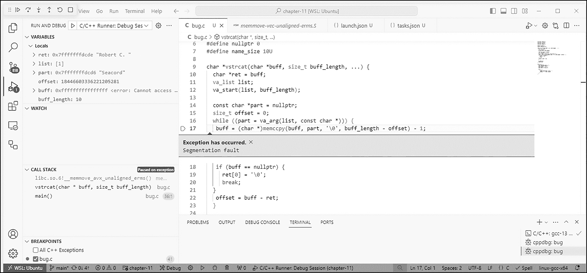
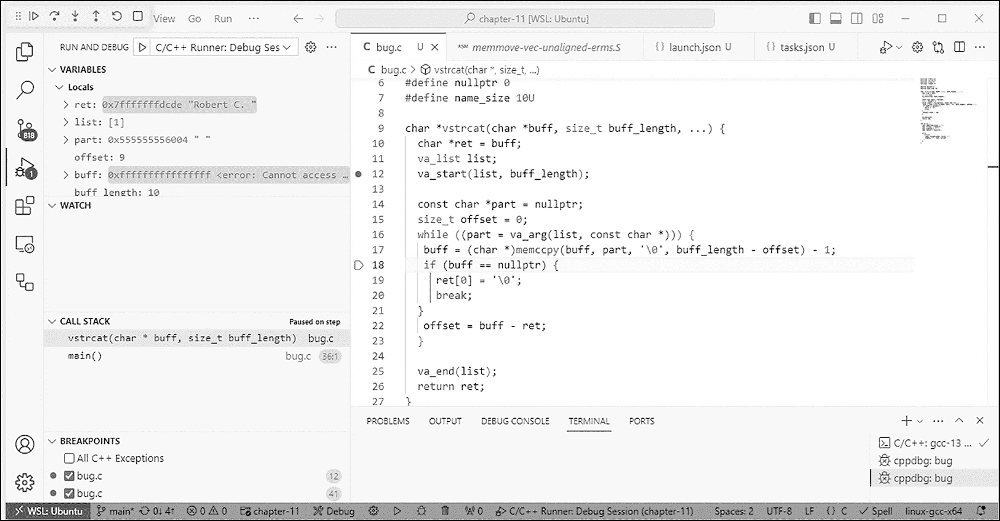
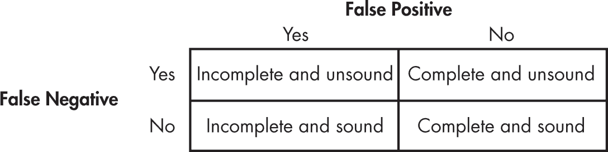

# 11 调试、测试和分析


本章描述了用于生成正确、有效、安全、可靠和强健程序的工具和技术，包括静态（编译时）和运行时断言、调试、测试、静态分析和动态分析。章节还讨论了在软件开发过程中不同阶段推荐使用的编译器标志。

本章标志着从学习 C 语言编程到专业 C 语言编程的过渡。用 C 语言编程相对容易，但精通 C 语言编程是一个终生的事业。现代 C 语言编程要求采用有纪律的方法来开发和部署安全、可靠且高效的系统。

## 断言

*断言*是一个具有布尔值的函数，称为*谓词*，它表达了关于程序的逻辑命题。你使用断言来验证在实现程序时所做的特定假设是否保持有效。C 语言支持静态断言，可以在编译时使用static_assert进行检查，也支持运行时断言，这些断言在程序执行过程中通过assert进行检查。assert宏定义在<assert.h>头文件中。在 C23 中，static_assert成为了一个关键字。在 C11 中，static_assert作为一个宏定义在<assert.h>头文件中。在此之前，C 语言没有静态断言。

### 静态断言

*静态断言*可以使用static_assert关键字表示，如下所示：

```
static_assert(`integer-constant-expression`, `string-literal`);
```

自 C23 以来，static_assert还接受单一参数形式：

```
static_assert(`integer-constant-expression`);
```

如果整数常量表达式的值不等于 0，则static_assert声明没有效果。如果整数常量表达式等于 0，则编译器将生成一条诊断信息，并显示字符串文字的文本（如果存在的话）。

你可以使用静态断言在编译时验证假设，例如特定的实现定义行为。任何实现定义行为的变化将在编译时被诊断出来。

让我们来看三个使用静态断言的例子。首先，在示例 11-1 中，我们使用static_assert来验证struct packed没有填充字节。

```
struct packed {
  int i;
  char *p;
};

static_assert(
  sizeof(struct packed) == sizeof(int) + sizeof(char *),
  "struct packed must not have any padding"
);
```

示例 11-1：断言无填充字节

本例中的静态断言谓词测试了打包结构的大小是否与其int和char *成员的组合大小相同。例如，在 x86-32 架构上，int和char *都是 4 字节，结构体没有填充；而在 x86-64 架构上，int是 4 字节，char *是 8 字节，编译器会在这两个字段之间添加 4 字节的填充。

静态断言的一个好用例是记录所有与实现相关的假设行为。这将防止代码在移植到其他实现时编译失败，特别是当这些假设在新环境中无效时。

由于静态断言是一个声明，它可以出现在文件作用域中，紧跟其后的是它所验证的struct的定义。

对于第二个例子，clear_stdin函数，如示例 11-2 所示，调用getchar函数从stdin读取字符，直到文件末尾。

```
#include <stdio.h>
#include <limits.h>

void clear_stdin() {
  int c;

  do {
    c = getchar();
    static_assert(
      sizeof(unsigned char) < sizeof(int),
      "FIO34-C violation"
    );
  } while (c != EOF);
}
```

示例 11-2：使用 static_assert 验证整数大小

每个字符作为一个 unsigned char 被转换为 int 获取。通常做法是将 getchar 函数返回的字符与 EOF 进行比较，通常是在一个 do...while 循环中，用于判断是否已读取所有可用字符。为了使该函数循环正常工作，终止条件必须能够区分字符和 EOF。然而，C 标准允许 unsigned char 和 int 拥有相同的范围，这意味着在某些实现中，这个 EOF 测试可能会返回假阳性，在这种情况下，do...while 循环可能会过早终止。由于这是一个不常见的情况，你可以使用 static_assert 来验证 do...while 循环是否能正确区分有效字符和 EOF。

在这个示例中，静态断言验证了 `sizeof(unsigned char) < sizeof(int)`。静态断言被放置在依赖于该假设为真的代码附近，这样可以方便地定位如果假设被违反时需要修复的代码。由于静态断言在编译时进行评估，因此将其放入可执行代码中对程序的运行时效率没有影响。有关此主题的更多信息，请参见 CERT C 规则 FIO34-C，“区分从文件读取的字符与 EOF 或 WEOF”。

最后，在 清单 11-3 中，我们使用 static_assert 执行编译时边界检查。

```
static const char prefix[] = "Error No: ";
constexpr int size = 14;
char str[size];

// ensure that str has sufficient space to store at
// least one additional character for an error code
static_assert(
  sizeof(str) > sizeof(prefix),
  "str must be larger than prefix"
);
strcpy(str, prefix);
```

清单 11-3：使用 static_assert 执行边界检查

该代码片段使用 `strcpy` 将常量字符串 `prefix` 复制到静态分配的数组 `str`。静态断言确保 `str` 有足够的空间至少存储一个额外字符，以便在调用 `strcpy` 后存储错误代码。

如果开发人员在维护过程中减小了 `size` 或将前缀字符串改为 `"Error Number: "`，该假设可能会变得无效。添加了静态断言后，维护人员将收到有关该问题的警告。

请记住，字符串文字是为开发人员或维护人员提供的消息，而不是系统的最终用户。它旨在提供有助于调试的信息。

### 运行时断言

`assert` 宏将运行时诊断测试注入到程序中。它在 `<assert.h>` 头文件中定义，并接受一个标量表达式作为唯一参数：

```
#define assert(scalar-expression) /* implementation-defined */
```

`assert` 宏是由实现定义的。如果标量表达式等于 0，宏展开通常会将失败调用的信息（包括参数文本、源文件名 `__FILE__`、源行号 `__LINE__`，以及封闭函数的名称 `__func__`）写入标准错误流 `stderr`。写入该信息后，`assert` 宏会调用 `abort` 函数。

在 列表 11-4 中显示的 `dup_string` 函数使用运行时断言来检查 `size` 参数是否小于或等于 `LIMIT`，并且 `str` 不是空指针。

```
void *dup_string(size_t size, char *str) {
  assert(size <= LIMIT);
  assert(str != nullptr);
  // `--snip--`
}
```

列表 11-4：使用 assert 来验证程序条件

这些断言的消息可能会呈现以下形式：

```
Assertion failed: size <= LIMIT, function dup_string, file foo.c, line 122.
Assertion failed: str != nullptr, function dup_string, file foo.c, line 123.
```

隐式假设是调用者在调用 dup_string 之前验证参数，以确保函数永远不会以无效参数被调用。然后，在开发和测试阶段使用运行时断言来验证这个假设。

断言的谓词表达式通常会在断言失败时的错误消息中报告，这使得你可以在断言失败时，使用 && 将字符串字面量与断言谓词结合，生成额外的调试信息。这样做总是安全的，因为 C 中的字符串字面量永远不会有空指针值。例如，我们可以将 清单 11-4 中的断言重写为具有相同功能，但在断言失败时提供额外的上下文，如 清单 11-5 所示。

```
void *dup_string(size_t size, char *str) {
  assert(size <= LIMIT && "size is larger than the expected limit");
  assert(str != nullptr && "the caller must ensure str is not null");
  // `--snip--`
}
```

清单 11-5：使用 assert 并附加额外的上下文信息

在代码部署之前，应该通过定义 NDEBUG 宏来禁用断言（通常作为传递给编译器的标志）。如果在源文件中 <assert.h> 包含的地方定义了 NDEBUG 宏名称，则 assert 宏被定义如下：

```
#define assert(ignore) ((void)0)
```

宏之所以不会扩展为空，是因为如果它这样做，像这样的代码就会编译失败：

```
assert(thing1) // missing semicolon
assert(thing2);
```

这段代码在发布模式下会编译，但在调试模式下不会编译。它扩展为 ((void) 0) 而不是 0，目的是防止出现没有效果的语句警告。assert 宏会根据每次包含 <assert.h> 时的 NDEBUG 当前状态进行重新定义。

使用静态断言来检查在编译时可以检查的假设，使用运行时断言来检测在测试期间无效的假设。因为运行时断言通常在部署之前被禁用，所以避免使用它们来检查正常操作中可能出现的条件，例如以下情况：

+   无效输入

+   打开、读取或写入流时出错

+   动态分配函数中的内存不足情况

+   系统调用错误

+   无效权限

你应该改为将这些检查实现为正常的错误检查代码，这些代码始终包含在可执行文件中。断言应该仅用于验证代码中设计的前置条件、后置条件和不变式（编程错误）。

## 编译器设置和标志

编译器通常默认不启用优化或安全加固。相反，你可以通过构建标志启用优化、错误检测和安全加固（Weimer 2018）。在下一节中，我将推荐 GCC、Clang 和 Visual C++的特定标志，首先介绍如何以及为什么你可能需要使用它们。

根据你想要实现的目标选择你的构建标志。软件开发的不同阶段需要不同的编译器和链接器配置。某些标志，例如警告，适用于所有阶段。其他标志，例如调试或优化级别，则特定于每个阶段。

**构建** 构建阶段的目标是充分利用编译器分析，在调试之前消除缺陷。在此阶段处理众多诊断信息可能会让人觉得烦琐，但比起通过调试和测试来发现这些问题，或等到代码发布后才发现问题，要好得多。在构建阶段，你应该使用能最大化诊断信息的编译器选项，以帮助你尽可能多地消除缺陷。

**调试** 在调试过程中，你通常是想确定代码为什么不工作。为了最好地完成这一任务，请使用一组包含调试信息、允许断言发挥作用并能快速进行编译-调试循环的编译器标志。

**测试** 在测试过程中，你可能希望保留调试信息并保持断言启用，以帮助识别发现的任何问题的根本原因。可以注入运行时插装来帮助检测错误。

**配置引导优化** 此配置定义了控制编译器如何向其正常生成的代码添加运行时插装的编译器和链接器标志。插装的一个目的是收集性能分析统计数据，这些数据可以用来找到程序的热点，从而进行配置引导优化。

**发布** 最后阶段是将代码构建到部署到操作环境的版本。在部署系统之前，确保彻底测试你的发布配置，因为使用不同的编译标志集可能会引发新的缺陷，例如由优化引起的潜在未定义行为或时序效应。

接下来，我将介绍一些你可能希望在编译器和软件开发阶段使用的特定编译器和链接器标志。

### GCC 和 Clang 标志

表 11-1 列出了 GCC 和 Clang 的推荐编译器和链接器选项（即*标志*）。你可以在 GCC 手册中找到编译器和链接器选项的文档（*[`<wbr>gcc<wbr>.gnu<wbr>.org<wbr>/onlinedocs<wbr>/gcc<wbr>/Invoking<wbr>-GCC<wbr>.html`](https://gcc.gnu.org/onlinedocs/gcc/Invoking-GCC.html)*) 和 Clang 编译器用户手册中（*[`<wbr>clang<wbr>.llvm<wbr>.org<wbr>/docs<wbr>/UsersManual<wbr>.html#command<wbr>-line<wbr>-options`](https://clang.llvm.org/docs/UsersManual.html#command-line-options)*）。

表 11-1： GCC 和 Clang 的推荐编译器和链接器标志

| 标志 | 用途 |
| --- | --- |
| -D_FORTIFY_SOURCE=2 | 检测缓冲区溢出 |
| -fpie -Wl,-pie | 地址空间布局随机化所需 |
| -fpic -shared | 禁用共享库的文本重定位 |
| -g3 | 生成大量调试信息 |
| -O2 | 优化代码以提高速度/空间效率 |
| -Wall | 启用推荐的编译器警告 |
| -Wextra | 启用更多推荐的编译器警告 |
| -Werror | 将警告转换为错误 |
| -std=c23 | 指定语言标准 |
| -pedantic | 发出严格遵守标准所要求的警告 |
| -Wconversion | 警告可能改变值的隐式转换 |
| -Wl,-z,noexecstack | 标记栈段为不可执行 |
| -fstack-protector-strong | 为函数添加栈保护 |

#### -O

大写字母 -O 标志控制 *编译器优化*。在优化级别 0（-O0）下，大多数优化都被完全禁用。这是当没有通过命令行选项设置优化级别时的默认值。同样，-Og 标志会抑制那些可能妨碍调试体验的优化过程。

许多诊断仅在更高的优化级别下由 GCC 发出，例如 -02 或 -Os。为了确保在开发期间能够识别问题，请在编译和分析阶段使用与计划在生产中采用的相同（更高的）优化级别。另一方面，Clang 不需要优化器发出诊断。因此，Clang 可以在编译/分析和调试阶段禁用优化来运行。

-Os 编译器选项优化程序大小，启用所有 -O2 优化，除了那些通常会增加代码大小的优化。-Oz 编译器选项则更加激进地优化程序大小，而不是速度，这可能会增加执行的指令数，尤其是当这些指令需要更少的字节来编码时。-Oz 选项的行为类似于 -Os，并且可以在 Clang 中使用，但仅与 -mno-outline 一起使用。-Oz 编译器选项可以在 GCC 12.1 或更高版本中使用。

#### -glevel

-glevel 标志生成操作系统本地格式的调试信息。你可以通过设置调试 level 来指定生成多少信息。默认级别是 -g2。级别 3（-g3）包括额外的信息，例如程序中所有宏定义。级别 3 还允许你在支持此功能的调试器中展开宏。

对于调试，应该使用不同的设置。优化级别应保持较低或禁用，以便机器指令能够与源代码紧密对应。还应包含符号来帮助调试。-O0 -g3 编译器标志是一个不错的默认值，尽管其他选项也可以接受。

考虑以下程序：

```
#include <stdio.h>
#include <stdlib.h>

#define HELLO "hello world!"

int main()
{
  puts(HELLO);

  return EXIT_SUCCESS;
}
```

-Og编译器选项仅影响优化级别，而不启用调试符号：

```
$ **gcc -Og hello.c -o hello**
$ **gdb hello**
(...)
(No debugging symbols found in hello)
(gdb)
```

使用-Og -g编译会提供一些符号：

```
$ **gcc -Og -g hello.c -o hello**
$ **gdb hello**
(...)
Reading symbols from hello...
(gdb) break main
Breakpoint 1 at 0x1149: file hello.c, line 6.
(gdb) start
Temporary breakpoint 2 at 0x1149: file hello.c, line 6.
Starting program: /home/test/Documents/test/hello

Breakpoint 1, main () at hello.c:6
6      int main()
(gdb) print HELLO
No symbol "HELLO" in current context.
(gdb)
```

使用-Og -g3编译会添加更多符号：

```
$ **gcc -Og -g3 hello.c -o hello**
$ **gdb hello**
(...)
Reading symbols from hello...
(gdb) break main
Breakpoint 1 at 0x1149: file hello.c, line 6.
(gdb) start
Temporary breakpoint 2 at 0x1149: file hello.c, line 6.
Starting program: /home/test/Documents/test/hello

Breakpoint 1, main () at hello.c:6
6      int main()
(gdb) print HELLO
$1 = "hello world!"
(gdb)
```

-g3选项会生成操作系统本地格式的调试信息，而-ggdb3选项则指示 GCC 使用 GNU 项目调试器（GDB）可用的最具表达力的格式。因此，如果你仅使用 GDB 进行调试，-Og -ggdb3也是一个不错的选择。

-O0 -g3选项推荐用于标准的编辑-编译-调试周期。

#### -Wall 和 -Wextra

编译器通常默认只启用最保守的正确诊断信息。可以启用额外的诊断信息，以便更积极地检查源代码中的问题。使用以下标志，可以在用 GCC 和 Clang 编译代码时启用额外的诊断信息：-Wall和-Wextra。

-Wall和-Wextra编译器标志启用预定义的编译时警告集。-Wall集中的警告通常可以通过修改代码来轻松避免或消除。而-Wextra集中的警告要么是情境性的，要么是指示更难避免的问题构造，在某些情况下可能是必要的。

尽管名称如此，-Wall和-Wextra选项并不会启用所有可能的警告诊断；它们只启用预定义的子集。要查看由-Wall和-Wextra编译器标志启用的完整特定警告列表，请在 GCC 中运行：

```
$ **gcc -Wall -Wextra -Q --help=warning**
```

或者，你可以查阅 GCC 警告选项和 Clang 诊断标志的文档。

#### -Wconversion

数据类型转换可能以意想不到的方式改变数据值。从指针中加减这些值可能会导致内存安全问题。-Wconversion编译器选项会发出警告：

+   可能会改变值的隐式转换，包括浮点数与整数值之间的转换

+   有符号和无符号整数之间的转换，例如：

```
unsigned ui = -1;
```

+   转换为较小的类型

关于有符号和无符号整数之间转换的警告可以通过使用 -Wno-sign-conversion 来禁用，但这些警告通常有助于发现某些类型的缺陷和安全漏洞。-Wconversion 命令行选项应保持启用状态。

#### -Werror

-Werror 标志将所有警告转化为错误，要求您在开始调试之前解决它们。此标志简单地鼓励良好的编程规范。

#### -std=

-std= 标志可用于指定语言标准为 c89、c90、c99、c11、c17 或 c23（如果使用较旧的编译器，可能需要指定 -std=c2x）。如果没有指定 C 语言方言选项，GCC 13 的默认值为 -std=gnu17，它为 C 语言提供了一些扩展，这些扩展在极少数情况下可能与 C 标准发生冲突。为了提高可移植性，请指定您使用的标准。为了访问新语言功能，请指定最近的标准。如果您正在阅读 *Effective C* 的第二版，一个不错的选择是 -std=c23。

#### -pedantic

-pedantic 标志会在代码偏离严格符合标准时发出警告。此标志通常与 -std= 标志一起使用，以提高代码的可移植性。

#### -D_FORTIFY_SOURCE=2

_FORTIFY_SOURCE 宏为检测对内存和字符串进行操作的函数中的缓冲区溢出提供了轻量级支持。该宏无法检测所有类型的缓冲区溢出，但通过使用 -D_FORTIFY_SOURCE=2 编译源代码，可以为那些复制内存并可能导致缓冲区溢出的函数（例如 memcpy、memset、strcpy、strcat 和 sprintf）提供额外的验证。一些检查可以在编译时执行并生成诊断信息；其他检查则在运行时执行，并可能导致运行时错误。

_FORTIFY_SOURCE 宏要求启用优化。因此，它必须在未优化的调试构建中禁用。

要覆盖预定义的 _FORTIFY_SOURCE 值，首先使用 -U_FORTIFY_SOURCE 关闭它，然后用 -D_FORTIFY_SOURCE=2 再次启用。这将消除宏被重新定义的警告。

自 GCC 12 版本和 GNU C 库（glibc）2.34 版本起，_FORTIFY_SOURCE=3 宏提供了改进的编译器检查，用于检测缓冲区溢出。glibc 的 -D_FORTIFY_SOURCE={1,2,3} 宏在很大程度上依赖于 GCC 特定的实现细节。Clang 实现了自己风格的强化函数调用。

对于使用 Clang 和 GCC 版本低于 12.0 的分析、测试和生产构建，请指定 -D_FORTIFY_SOURCE=2（推荐）或 -D_FORTIFY_SOURCE=1，对于 GCC 12.0 及更高版本，请使用 _FORTIFY_SOURCE=3。

#### -fpie -Wl, -pie, 和 -fpic -shared

*地址空间布局随机化（ASLR）* 是一种安全机制，通过随机化进程的内存空间来防止攻击者预测他们试图执行的代码的位置。你可以在 *《C 和 C++ 安全编码》*（Seacord 2013）中了解更多关于 ASLR 和其他安全缓解措施的信息。

必须指定 -fpie -Wl, 和 -pie 标志来创建位置无关的可执行程序，并使得能够为主程序（可执行文件）启用 ASLR。然而，尽管这些选项生成的主程序代码是位置无关的，但它使用了一些在共享库（动态共享对象）中不能使用的重定位。对于这些，使用 -fpic 并使用 -shared 进行链接，以避免在支持位置相关共享库的架构上进行文本重定位。动态共享对象始终是位置无关的，因此支持 ASLR。

#### -Wl,-z,noexecstack

包括 OpenBSD、Windows、Linux 和 macOS 在内的多个操作系统，在内核中强制执行减少权限，以防止进程地址空间的任何部分同时具有可写和可执行权限。这一政策称为 W^X。

-Wl,-z,noexecstack 链接器选项告诉链接器将栈段标记为不可执行，这使得操作系统（OS）在加载程序可执行文件到内存时能够配置内存访问权限。

#### -fstack-protector-strong

-fstack-protector-strong 选项通过添加栈金丝雀，保护应用程序免受最常见的栈缓冲区溢出攻击。-fstack-protector 选项通常被认为不足，而 -fstack-protector-all 选项则被认为过度。-fstack-protector-strong 选项作为这两者之间的折衷方案被引入。

### Visual C++ 选项

Visual C++ 提供了种类繁多的编译器选项，其中许多选项与 GCC 和 Clang 的选项类似。一个显著的区别是，Visual C++ 通常使用斜杠（/）字符而不是连字符（-）来表示标志。表 11-2 列出了 Visual C++ 的推荐编译器和链接器标志。（有关 Visual C++ 选项的更多信息，请参阅 *[`<wbr>docs<wbr>.microsoft<wbr>.com<wbr>/en<wbr>-us<wbr>/cpp<wbr>/build<wbr>/reference<wbr>/compiler<wbr>-options<wbr>-listed<wbr>-by<wbr>-category`](https://docs.microsoft.com/en-us/cpp/build/reference/compiler-options-listed-by-category)*.)

表 11-2： Visual C++ 推荐的编译器标志

| 标志 | 目的 |
| --- | --- |
| /guard:cf | 添加控制流保护安全检查 |
| /analyze | 启用静态分析 |
| /sdl | 启用安全功能 |
| /permissive- | 指定编译器的标准符合模式 |
| /O2 | 将优化级别设置为 2 |
| /W4 | 将编译器警告设置为级别 4 |
| /WX | 将警告视为错误 |
| /std:clatest | 选择最新/最强的语言版本 |

这些选项中的几个类似于 GCC 和 Clang 编译器提供的选项。/O2优化级别适用于部署代码，而/Od禁用优化，以加速编译并简化调试。/W4警告级别适用于新代码，因为它大致相当于 GCC 和 Clang 中的-Wall。Visual C++ 中的/Wall选项不推荐使用，因为它会产生大量假阳性。/WX选项将警告转换为错误，相当于 GCC 和 Clang 中的-Werror标志。我将在接下来的部分中详细介绍其余的标志。

#### /guard:cf

当你指定*控制流保护（CFG）*选项时，编译器和链接器会插入额外的运行时安全检查，以检测是否存在危害代码的尝试。/guard:cf选项必须同时传递给编译器和链接器。

#### /analyze

/analyze 标志启用静态分析，它提供有关代码中可能存在缺陷的信息。我在《静态分析》一节中详细讨论了静态分析，见 第 251 页。

#### /sdl

/sdl 标志启用额外的安全特性，包括将额外的安全相关警告视为错误，并启用其他安全代码生成特性。它还启用了来自 Microsoft *安全开发生命周期 (SDL)* 的其他安全功能。在所有涉及安全的生产构建中，都应该使用 /sdl 标志。

#### /permissive-

你可以使用 /permissive- 来帮助识别并修复代码中的合规性问题，从而提高代码的正确性和可移植性。这个选项禁用了宽松行为，并设置了 /Zc 编译器选项以严格遵守规范。在集成开发环境（IDE）中，这个选项还会下划线标出不符合规范的代码。

#### /std:clatest

/std:clatest 选项启用了所有当前实施的、为 C23 提出的编译器和标准库特性。在写作时，尚未提供 /std:c23，但一旦可用，你就可以使用它来构建 C23 代码。

## 调试

我从事专业编程工作已经 42 年了。在这段时间里，也许只有一两次，我写的程序在第一次尝试时就成功编译并运行了。对于所有其他情况，都会涉及调试。

让我们调试一个有问题的程序。示例中展示的程序是 vstrcat 函数的早期版本。我们在第七章中回顾了这个程序的最终版本，但这个版本尚未准备好部署。

```
#include <stdarg.h>
#include <string.h>
#include <stdio.h>
#include <stddef.h>

#define name_size 20U

char *vstrcat(char *buff, size_t buff_length, ...) {
  char *ret = buff;
 va_list list;
  va_start(list, buff_length);

  const char *part = nullptr;
  size_t offset = 0;
  while ((part = va_arg(list, const char *))) {
   buff = (char *)memccpy(buff, part, '\0', buff_length - offset) - 1;
   if (buff == nullptr) {
     ret[0] = '\0';
     break;
   }
   offset = buff - ret;
  }

  va_end(list);
  return ret;
}

int main() {
  char name[name_size] = "";
  char first[] = "Robert";
  char middle[] = "C.";
  char last[] = "Seacord";

  puts(
    vstrcat(
      name, sizeof(name), first, " ",
      middle, " ", last, nullptr
    )
  );
}
```

列表 11-6：打印错误

当我们按照示例运行这个程序时，它会按预期输出我的名字：

```
Robert C. Seacord
```

然而，我们还希望确保这个程序能够正确处理使用固定大小数组来存储 name 的情况，特别是当完整的名字超过 name 数组的大小时。为了测试这一点，我们可以将数组的大小更改为一个过小的值：

```
#define name_size 10U
```

现在，当我们运行程序时，我们得知程序有问题，但没有更多信息：

```
$ **./bug**
Segmentation fault
```

我们不会通过添加打印语句来调试，而是决定在 Linux 上使用 Visual Studio Code 调试这个程序。只需在调试器中运行程序，如 图 11-1 所示，就能获得一些我们之前没有的信息。



图 11-1：在 Visual Studio Code 中调试程序

从调用栈面板中我们可以看到，程序在 libc 中的 __memmove_avx_unaligned_erms 函数崩溃。

```
libc.so.6!__memmove_avx_unaligned_erms()
(\x86_64\multiarch\memmove-vec-unaligned-erms.S:314)
vstrcat(char * buff, size_t buff_length) (\home\rcs\bug.c:17)
main() (\home\rcs\bug.c:32)
```

我们还可以看到，段错误发生在调用 memccpy 的那一行。由于这一行没有其他复杂的操作，所以可以合理推测这是一个 memccpy 辅助函数。通常情况下，库函数的实现并不是 bug 的根源，所以我们暂时假设是传递了一组无效的参数。

在查看参数之前，让我们回顾一下 C23 标准中关于 memccpy 函数的描述：

#include <string.h>

void *memccpy(void * restrict s1, const void * restrict s2, int c, size_t n);

memccpy 函数将从 s2 指向的对象中复制字符到 s1 指向的对象中，复制过程在遇到第一个字符 c（转为 unsigned char）时停止，或者在复制了 n 个字符后停止，以先到者为准。如果复制发生在重叠的对象之间，行为是未定义的。

从调试器中的变量面板来看，我们可以看到我们添加的 part 看起来是正确的：

```
**part:** 0x7fffffffdcd6 "Seacord"
```

ret 作为 ret 的别名也有一个预期的值：

```
**ret:** 0x7fffffffdcde "Robert C. "
```

然而，存储在 buff 中的值似乎有些奇怪，因为它的值与 EOF（–1）相同：

```
buff: 0xffffffffffffffff <error: Cannot access memory at address 0xffffffffffffffff>
```

buff 参数是一个字符指针，它被分配了来自 memccpy 的返回值。所以我们再一次查阅标准，看看这个函数返回了什么：

memccpy函数返回一个指向s1中复制的字符后一个字符的指针，或者如果在s2的前n个字符中未找到c，则返回空指针。

根据 C 标准，该函数只能返回空指针或指向s1中的某个字符的指针（在本程序中为buff）。buff的存储空间从0x7fffffffdcde开始，且仅延伸 10 个字节，因此这些都无法解释0xffffffffffffffff的值，谜团加深了。

现在是时候更仔细地检查vstrcat函数的行为了。我们将在函数开始处的第 12 行设置一个断点，并开始调试。标题栏左侧的按钮允许你继续、跳过、逐步进入、逐步退出、重新启动和停止调试。从第 12 行开始，我们可以通过点击“跳过”按钮逐步执行程序。vstrcat函数会循环执行多次，因此你需要逐步执行几次循环，观察 VARIABLES 窗格中的值。如果你小心操作，最终会看到在调用memccpy函数后，第 18 行的buff被设置为0xffffffffffffffff，如图 11-2 所示。这不会被空指针测试检测到，且在下一次迭代时发生了段错误。

就在这里，我有了灵感时刻。memccpy函数返回一个空指针，表示在buff_length - offset个字符内没有找到<сamp class="SANS_TheSansMonoCd_W5Regular_11">'\0'。然而，我们从<сamp class="SANS_TheSansMonoCd_W5Regular_11">memccpy返回的值中减去 1，这样<сamp class="SANS_TheSansMonoCd_W5Regular_11">buff就指向<сamp class="SANS_TheSansMonoCd_W5Regular_11">'\0'第一次出现的位置，而不是它之后的位置。当字符被找到时，这种方式是可行的，但如果没有找到字符，我们就从空指针减去 1，这在 C 语言中是技术上未定义的行为。在这个实现中，空指针由值 0 表示。将 1 从 0 中减去会导致值环绕并产生<сamp class="SANS_TheSansMonoCd_W5Regular_11">0xffffffffffffffff，然后才会对<сamp class="SANS_TheSansMonoCd_W5Regular_11">buff进行测试。因此，错误条件未被检测到，随后的<сamp class="SANS_TheSansMonoCd_W5Regular_11">memccpy调用导致了段错误。



图 11-2：一个有趣的程序状态

现在我们已经发现了根本原因，修复 bug 的方法是将减去 1 的操作移动到空指针检查之后，这样就得到了在第七章中展示的程序的最终版本。

## 单元测试

测试可以增强你对代码无缺陷的信心。*单元测试*是执行你代码的小程序。*单元测试*是一个验证软件每个单元按设计执行的过程。*单元*是任何软件中最小的可测试部分；在 C 语言中，通常是一个独立的函数或数据抽象。

你可以编写简单的测试，类似于普通应用程序代码（例如，参见列表 11-7），但使用*单元测试框架*可能更有益。有几种单元测试框架可供选择，包括 Google Test、CUnit、CppUnit、Unity 等。我们将根据 JetBrains 最近对 C 开发生态系统的调查（* [`www.jetbrains.com/lp/devecosystem-2023/c/`](https://www.jetbrains.com/lp/devecosystem-2023/c/)*）来研究其中最受欢迎的框架：Google Test。

Google Test 适用于 Linux、Windows 和 macOS。测试是用 C++编写的，因此你可以学习另一种（相关的）编程语言来进行测试。如果你希望将测试限制在纯 C 语言中，CUnit 和 Unity 是不错的替代选择。

在 Google Test 中，你编写断言以验证被测试代码的行为。Google Test 的断言是类似函数的宏，它们是测试的实际语言。如果一个测试崩溃或断言失败，它就失败；否则，它就成功。断言的结果可以是成功、非致命失败或致命失败。如果发生致命失败，当前函数将被中止；否则，程序将继续正常运行。

我们将在 Ubuntu Linux 上使用 Google Test。要安装它，请按照 Google Test GitHub 页面上的说明进行操作，地址是 *[`<wbr>github<wbr>.com<wbr>/google<wbr>/googletest<wbr>/tree<wbr>/main<wbr>/googletest`](https://github.com/google/googletest/tree/main/googletest)*。

一旦安装了 Google Test，我们将为 列表 11-7 中展示的 get_error 函数设置单元测试。该函数返回与传递的错误编号相对应的错误消息字符串。你需要包含声明 errno_t 类型以及 strerrorlen_s 和 strerror_s 函数的头文件。将其保存为名为 *error.c* 的文件，以便后面本节中描述的构建说明能够正常工作。

error.c

```
char *get_error(errno_t errnum) {
  rsize_t size = strerrorlen_s(errnum) + 1;
  char* msg = malloc(size);
  if (msg != nullptr) {
    errno_t status = strerror_s(msg, size, errnum);
    if (status != 0) {
      strncpy_s(msg, size, "unknown error", size - 1);
    }
  }
  return msg;
}
```

列表 11-7：The get_error 函数

该函数调用了在规范但可选的附录 K 中定义的 strerrorlen_s 和 strerror_s 函数，附录 K 介绍了“边界检查接口”（在 第七章 中描述）。

不幸的是，GCC 和 Clang 都没有实现附录 K，因此我们将使用 Reini Urban 开发的 Safeclib 实现，该实现可以从 GitHub 上获取 (*[`<wbr>github<wbr>.com<wbr>/rurban<wbr>/safeclib`](https://github.com/rurban/safeclib)*)。

你可以使用以下命令在 Ubuntu 上安装 libsafec-dev：

```
% **sudo apt install libsafec-dev**
```

示例 11-8 包含了一个名为 GetErrorTest 的 get_error 函数的单元测试套件。*测试套件* 是一组将在特定测试周期中执行的测试用例。GetErrorTest 套件包含两个测试用例：KnownError 和 UnknownError。*测试用例* 是一组预置条件、输入、操作（如适用）、预期结果和后置条件，这些都是根据测试条件（* [`<wbr>glossary<wbr>.istqb<wbr>.org`](https://glossary.istqb.org) *）开发的。将此代码保存在名为 *tests.cc* 的文件中。

tests.cc

```
#include <gtest/gtest.h>
#include <errno.h>
#define errno_t int

// implemented in a C source file
❶ extern "C" char* get_error(errno_t errnum);

namespace {
❷ TEST(GetErrorTest, KnownError) {
    EXPECT_STREQ(get_error(ENOMEM), "Cannot allocate memory");
 EXPECT_STREQ(get_error(ENOTSOCK), "Socket operation on non-socket");
    EXPECT_STREQ(get_error(EPIPE), "Broken pipe");
  }

  TEST(GetErrorTest, UnknownError) {
    EXPECT_STREQ(get_error(-1), "Unknown error -1");
  }
} // namespace

int main(int argc, char** argv) {
  ::testing::InitGoogleTest(&argc, argv);
  return RUN_ALL_TESTS();
}
```

示例 11-8：get_error 函数 的单元测试

大部分 C++ 代码是模板代码，可以直接复制而无需修改，例如 main 函数，它调用类似宏的 RUN_ALL_TESTS 来执行测试。唯一不属于模板代码的部分是 extern "C" 声明 ❶ 和测试 ❷。extern "C" 声明改变了链接要求，避免 C++ 编译器链接器对函数名进行“修饰”，因为它通常会这样做。您需要为每个正在测试的函数添加类似声明，或者您可以像下面这样在 extern "C" 块内简单地包含 C 头文件：

```
extern "C" {
  #include "api_to_test.h"
}
```

只有在使用 C 编译并链接 C++ 时，才需要声明 extern "C"。

两个测试用例是使用 TEST 宏指定的，该宏接受两个参数。第一个参数是测试套件的名称，第二个参数是测试用例的名称。

在函数体内插入 Google Test 断言，以及您希望包含的任何其他 C++ 语句。在 示例 11-8 中，我们使用了 EXPECT _STREQ 断言，它验证两个字符串的内容是否相同。strerror_s 函数返回一个特定于区域设置的消息字符串，这在不同实现之间可能有所不同。

我们使用了对多个错误号的断言来验证函数是否为每个错误号返回正确的字符串。EXPECT_STREQ断言是一个非致命断言，因为即使该特定断言失败，测试仍然可以继续。这通常比致命断言更可取，因为它允许您在单次运行-编辑-编译周期中检测并修复多个错误。如果在初始失败后无法继续测试（例如，后续操作依赖于之前的结果），可以使用致命的ASSERT_STREQ断言。

清单 11-9 展示了一个简单的*CMakeLists.txt*文件，可以用于构建测试。这个文件假设我们正在测试的 C 函数可以在*error.c*文件中找到，并且附录 K 函数的实现由safec库提供。

```
cmake_minimum_required(VERSION 3.21)
cmake_policy(SET CMP0135 NEW)
project(chapter-11)

# GoogleTest requires at least C++14
set(CMAKE_CXX_STANDARD 14)
set(CMAKE_CXX_STANDARD_REQUIRED ON)
set(CMAKE_C_STANDARD 23)

include(FetchContent)
FetchContent_Declare(
  googletest
  URL https://github.com/google/googletest/archive/03597a01ee50ed33e9dfd640b249b4be3799d395.zip
)

FetchContent_MakeAvailable(googletest)

include(ExternalProject)
ExternalProject_Add(
  libsafec
  BUILD_IN_SOURCE 1
  URL https://github.com/rurban/safeclib/releases/download/v3.7.1/safeclib-3.7.1.tar.gz
  CONFIGURE_COMMAND autoreconf --install
  COMMAND ./configure --prefix=${CMAKE_BINARY_DIR}/libsafec
)
ExternalProject_Get_Property(libsafec install_dir)
include_directories(${install_dir}/src/libsafec/include)
link_directories(${install_dir}/src/libsafec/src/.libs/)

enable_testing()

add_library(error error.c)
add_dependencies(error libsafec)
add_executable(tests tests.cc)

target_link_libraries(
  tests
  error
  safec
  GTest::gtest_main
)

include(GoogleTest)
gtest_discover_tests(tests)
```

清单 11-9：The CMakeLists.txt 文件

如果您更喜欢通过<code class="SANS_TheSansMonoCd_W5Regular_11">apt install</code>命令安装libsafec-dev，请删除特定于安装libsafec的行。

使用以下命令序列来构建和运行测试：

```
$ **cmake -S . -B build**
$ **cmake --build build**
$ **./build/tests**
```

测试用例测试了来自<errno.h>的多个错误号。需要测试多少个错误号取决于你想要达成的目标。理想情况下，测试应该是全面的，这意味着需要为<errno.h>中的每个错误号添加断言。然而，这样做可能会很繁琐；一旦你确定代码工作正常，实际上你只是在测试你使用的底层 C 标准库函数是否正确实现。不过，我们也可以测试我们可能会检索到的错误号，但这样做同样会变得繁琐，因为我们需要识别程序中调用的所有函数及其可能返回的错误码。我们选择实现一些针对从列表中不同位置随机选取的错误号的抽查。

清单 11-10 展示了运行此测试的结果。

```
$ **./build/tests**
[==========] Running 2 tests from 1 test suite.
[----------] Global test environment set-up.
[----------] 2 tests from GetErrorTest
[RUN       ] GetErrorTest.KnownError
[        OK] GetErrorTest.KnownError (0 ms)
[RUN       ] GetErrorTest.UnknownError
/home/rcs/tests.cc:19: Failure
Expected equality of these values:
  get_error(-1)
    Which is: "Unknown error -1"
  "unknown error"
**[  FAILED  ] GetErrorTest.UnknownError (0 ms)**
[----------] 2 tests from GetErrorTest (0 ms total)

[----------] Global test environment tear-down
[==========] 2 tests from 1 test suite ran. (0 ms total)
[  PASSED  ] 1 test.
**[  FAILED  ] 1 test, listed below:**
**[  FAILED  ] GetErrorTest.UnknownError**

1 FAILED TEST
```

清单 11-10：一次不成功的测试运行

从测试输出可以看出，来自同一测试套件的两个测试已执行。KnownError 测试用例通过，而 UnknownError 测试用例失败。UnknownError 测试失败的原因是以下断言返回了假：

```
EXPECT_STREQ(get_error(-1), "unknown error");
```

测试假设在 get_error 函数中的错误路径会执行并返回字符串 "unknown error")。然而，strerror_s 函数返回了字符串 "Unknown error -1"。通过检查 strerror_s 函数的源代码（位于 *[`<wbr>github<wbr>.com<wbr>/rurban<wbr>/safeclib<wbr>/blob<wbr>/master<wbr>/src<wbr>/str<wbr>/strerror<wbr>_s<wbr>.c`](https://github.com/rurban/safeclib/blob/master/src/str/strerror_s.c)*），我们可以看到该函数确实会返回错误代码。因此，很明显，该函数并没有将未知的错误号视为错误。检查 C 标准后，我们发现“strerror_s 应该将任何类型为 int 的值映射为一条消息，”因此，strerror_s 函数的实现是正确的，但我们对其行为的假设是错误的。

get_error 函数的实现存在缺陷，因为当 strerror_s 函数失败时，它会指示“unknown error”，但根据标准：

strerror_s 函数会在期望字符串的长度小于 maxsize 且没有运行时约束违例的情况下返回零。否则，strerror_s 函数将返回非零值。

因此，如果 strerror_s 函数返回非零值，表示发生了严重错误，足以需要重新考虑该函数的设计。它不应该在错误条件下返回字符串，而应该返回空指针或以其他方式处理错误，以便与系统的整体错误处理策略一致。列表 11-11 更新了该函数，使其返回空指针值。

```
char *get_error(errno_t errnum) {
  rsize_t size = strerrorlen_s(errnum) + 1;
  char* msg = malloc(size);
  if (msg != nullptr) {
    errno_t status = strerror_s(msg, size, errnum);
    if (status != 0) return nullptr;
  }
  return msg;
}
```

列表 11-11：The get_error 函数

我们需要修复测试，检查get_error(-1)返回的正确字符串：

```
EXPECT_STREQ(get_error(-1), “Unknown error -1”);
```

在做出此更改后，重新构建并重新运行测试，我们可以看到，如清单 11-12 所示，两个测试用例均成功。

```
$ **./build/tests**
[==========] Running 2 tests from 1 test suite.
[----------] Global test environment set-up.
[----------] 2 tests from GetErrorTest
[RUN       ] GetErrorTest.KnownError
[        OK] GetErrorTest.KnownError (0 ms)
[RUN       ] GetErrorTest.UnknownError
[        OK] GetErrorTest.UnknownError (0 ms)
[----------] 2 tests from GetErrorTest (0 ms total)

[----------] Global test environment tear-down
[==========] 2 tests from 1 test suite ran. (0 ms total)
[  PASSED  ] 2 tests.
```

清单 11-12: 成功的测试运行

除了发现设计错误，我们还发现我们的测试不完整，因为我们未能测试错误情况。我们应该添加更多的测试，以确保错误情况能够正确处理。添加这些测试留给读者作为练习。

## 静态分析

*静态分析*包括任何无需执行代码的评估过程（ISO/IEC TS 17961:2013），用于提供关于可能的软件缺陷的信息。

静态分析有实际的局限性，因为软件的正确性在计算上是不可判定的。例如，计算机科学中的停机定理指出，存在一些程序，其精确的控制流无法静态确定。因此，任何依赖于控制流的属性——比如停机——对某些程序可能是不可判定的。因此，静态分析可能无法报告缺陷，或者可能会报告不存在的缺陷。

未能报告代码中的实际缺陷称为*假阴性*。假阴性是严重的分析错误，因为它们可能让你产生一种虚假的安全感。大多数工具倾向于谨慎行事，因此会生成假阳性。*假阳性*是指测试结果错误地表明存在缺陷。工具可能会报告一些高风险缺陷，同时忽略其他缺陷，这是为了避免用假阳性信息淹没用户。假阳性也可能出现在代码过于复杂，无法完全分析的情况下。函数指针和库的使用会使假阳性更容易发生。

理想情况下，工具的分析既要完备又要可靠。如果分析工具无法给出假阴性结果，则被认为是*可靠*的。如果分析工具无法发出假阳性结果，则被认为是*完备*的。给定规则的可能性在图 11-3 中进行了概述。



图 11-3: 完备性与可靠性

编译器执行有限的分析，提供关于代码中不需要过多推理的高度局部化问题的诊断信息。例如，当将一个有符号值与一个无符号值进行比较时，编译器可能会发出关于类型不匹配的诊断，因为它不需要额外的信息来识别错误。如本章前面所提到的，有许多编译器标志，例如 Visual C++ 的 /W4 和 GCC 及 Clang 的 -Wall，它们用于控制编译器的诊断信息。

编译器通常提供高质量的诊断信息，您不应该忽视它们。始终尽量理解警告的原因，并重新编写代码以消除错误，而不是通过添加类型转换或随意修改代码直到警告消失来简单地抑制警告。有关此主题的更多信息，请参见 CERT C 规则 MSC00-C，“在高警告级别下干净编译”。

一旦解决了代码中的编译器警告，您可以使用单独的静态分析器来识别其他缺陷。静态分析器通过评估程序中的表达式、执行深入的控制流和数据流分析，以及推理可能的值范围和控制流路径，从而诊断出更复杂的缺陷。

使用工具定位并识别程序中的特定错误，比进行数小时的测试和调试要容易得多，成本也远低于部署有缺陷的代码。有许多免费的和商业的静态分析工具可供选择。例如，Visual C++ 集成了一个静态分析器，您可以通过 /analyze 标志调用。Visual C++ 分析允许您指定要运行的规则集（例如推荐、安全或国际化规则集），或者是否运行所有规则集。有关 Visual C++ 静态代码分析的更多信息，请访问 Microsoft 的网站 *[`<wbr>learn<wbr>.microsoft<wbr>.com<wbr>/en<wbr>-us<wbr>/visualstudio<wbr>/code<wbr>-quality`](https://learn.microsoft.com/en-us/visualstudio/code-quality)*。类似地，Clang 集成了一个静态分析器，可以作为独立工具或在 Xcode 中运行 (*[`<wbr>clang<wbr>-analyzer<wbr>.llvm<wbr>.org`](https://clang-analyzer.llvm.org)*)。从版本 10 开始，GCC 引入了通过 -fanalyzer 选项启用的静态分析功能。也有商业工具，如 GitHub 的 CodeQL、TrustInSoft Analyzer、SonarSource 的 SonarQube、Synopsys 的 Coverity、LDRA Testbed、Perforce 的 Helix QAC 等。

许多静态分析工具具有互不重叠的功能，因此使用多个工具可能是有意义的。

## 动态分析

*动态分析*是评估系统或组件在执行过程中表现的过程。它也被称为*运行时分析*，以及其他类似的名称。

动态分析的常见方法是*插桩*代码——例如，通过启用编译时标志，将额外的指令注入到可执行文件中——然后运行插桩后的可执行文件。第六章中描述的调试内存分配库 dmalloc 采用了类似的方法。dmalloc 库提供了替代内存管理例程，并带有运行时可配置的调试功能。你可以通过使用命令行工具（也称为 dmalloc）来控制这些例程的行为，检测内存泄漏，并发现和报告缺陷，例如越界写入或在释放内存后继续使用指针。

动态分析的优点是它具有较低的误报率，因此如果这些工具标记了问题，就应该修复它！

动态分析的一个缺点是，它需要足够的代码覆盖率。如果在测试过程中没有执行到有缺陷的代码路径，那么缺陷就不会被发现。另一个缺点是，插桩可能会以不希望的方式改变程序的其他方面，例如增加性能开销或增加二进制文件的大小。与其他动态分析工具不同，本章前面提到的 FORTIFY_SOURCE 宏提供了轻量级的缓冲区溢出检测支持，因此可以在生产构建中启用，而不会对性能产生明显影响。

## AddressSanitizer

AddressSanitizer (ASan, *[`<wbr>github<wbr>.com<wbr>/google<wbr>/sanitizers<wbr>/wiki<wbr>/AddressSanitizer`](https://github.com/google/sanitizers/wiki/AddressSanitizer)*) 是一个有效的动态分析工具的示例，可供多个编译器（免费）使用。还有几个相关的清理工具，包括 ThreadSanitizer、MemorySanitizer、硬件加速的 AddressSanitizer 和 UndefinedBehaviorSanitizer。还有许多其他动态分析工具，包括商业工具和免费工具。如需更多关于清理工具的信息，请参见 *[`<wbr>github<wbr>.com<wbr>/google<wbr>/sanitizers`](https://github.com/google/sanitizers)*。我将通过详细讨论 AddressSanitizer 来展示这些工具的价值。

ASan 是一个用于 C 和 C++ 程序的动态内存错误检测器。它被集成进 LLVM 版本 3.1 和 GCC 版本 4.8，以及这些编译器的后续版本中。从 Visual Studio 2019 开始，ASan 也可以使用。

这个动态分析工具可以发现各种内存错误，包括以下几种：

+   释放后使用（悬空指针解引用）

+   堆、栈和全局缓冲区溢出

+   返回后使用

+   超出作用域使用

+   初始化顺序错误

+   内存泄漏

为了展示 ASan 的有效性，我们将通过将 列表 11-7 中的 get_error 函数替换为 列表 11-13 中显示的 print_error 函数来开始。

error.c

```
errno_t print_error(errno_t errnum) {
  rsize_t size = strerrorlen_s(errnum) + 1;
  char* msg = malloc(size);
  if (msg == nullptr) return ENOMEM;
  errno_t status = strerror_s(msg, size, errnum);
  if (status != 0) return EINVAL;
  fputs(msg, stderr);
  return EOK;
}
```

列表 11-13：The print_error 函数

我们还将用 列表 11-14 中显示的 print_error 函数的单元测试套件，替换 get_error 函数的单元测试套件。

tests.cc

```
TEST(PrintTests, ZeroReturn) {
  EXPECT_EQ(print_error(ENOMEM), 0);
  EXPECT_EQ(print_error(ENOTSOCK), 0);
  EXPECT_EQ(print_error(EPIPE), 0);
}
```

列表 11-14：The PrintTests 测试套件

这段 Google Test 代码定义了一个包含单个测试用例 ZeroReturn 的 PrintTests 测试套件。该测试用例使用非致命的 EXPECT_EQ 断言，测试通过多次调用 print_error 函数来打印一些随机选择的错误编号，返回值应为 0。接下来，我们需要在 Ubuntu Linux 上构建并运行此代码。

### 运行测试

从 列表 11-14 运行修改后的测试，得到的正面结果如 列表 11-15 所示。

```
$ **./build/tests**
[==========] Running 1 test from 1 test suite.
[----------] Global test environment set-up.
[----------] 1 test from PrintTests
[RUN       ] PrintTests.ZeroReturn
[        OK] PrintTests.ZeroReturn (0 ms)
[----------] 1 test from PrintTests (0 ms total)

[----------] Global test environment tear-down
[==========] 1 test from 1 test suite ran. (0 ms total)
**[  PASSED  ]** 1 test.
```

列表 11-15：The PrintTests 测试套件的测试运行

一个经验不足的测试人员可能会看这些结果，并错误地认为，“嘿，这段代码工作正常！”然而，你应该采取额外步骤来提高对代码没有缺陷的信心。现在我们已经有了一个工作的测试框架，是时候对代码进行插桩了。

### 代码插桩

你可以通过使用 ASan 将代码插桩，使用 -fsanitize=address 标志编译和链接程序。表 11-3 显示了一些常用的 ASan 编译器标志。

表 11-3： 与 AddressSanitizer 常用的编译器和链接器标志

| 标志 | 目的 |
| --- | --- |
| -fsanitize=address | 启用 AddressSanitizer（必须传递给编译器和链接器） |
| -g3 | 获取符号调试信息 |
| -fno-omit-frame-pointer | 保留帧指针，以便在错误信息中获取更有信息量的堆栈跟踪 |
| -fsanitize-blacklist=path | 传递一个黑名单文件 |
| -fno-common | 不将全局变量视为公共变量（允许 ASan 对它们进行插桩） |

从表 11-3 中选择你想使用的编译器和链接器标志，并通过add_compile_options和add_link_options命令将它们添加到你的*CMakeLists.txt*文件中：

```
add_compile_options(-g3 -fno-omit-frame-pointer -fno-common -fsanitize=address)
add_link_options(-fsanitize=address)
```

不要在构建阶段启用 sanitization，因为插入的运行时插桩可能会导致假阳性。

如前所述，AddressSanitizer 可与 Clang、GCC 和 Visual C++ 一起使用。（有关 ASan 支持的更多信息，请参见 *[`<wbr>devblogs<wbr>.microsoft<wbr>.com<wbr>/cppblog<wbr>/addresssanitizer<wbr>-asan<wbr>-for<wbr>-windows<wbr>-with<wbr>-msvc`](https://devblogs.microsoft.com/cppblog/addresssanitizer-asan-for-windows-with-msvc)*。）

根据你使用的编译器版本，你可能还需要定义以下环境变量：

```
ASAN_OPTIONS=symbolize=1
ASAN_SYMBOLIZER_PATH=/path/to/llvm_build/bin/llvm-symbolizer
```

尝试在设置了这些环境变量的情况下重新构建并重新运行你的测试。

### 运行插桩测试

你使用 Google Test 编写的单元测试套件应继续通过测试，但也将执行你的代码，从而允许 AddressSanitizer 检测到额外的问题。你现在应该能在清单 11-16 中看到来自运行./build/tests的额外输出。

```
==22489==ERROR: LeakSanitizer: detected memory leaks

Direct leak of 31 byte(s) in 1 object(s) allocated from:
    #0 0x7f2bcf9f58ff in __interceptor_malloc
  ../../../../src/libsanitizer/asan/asan_malloc_linux.cpp:69
    #1 0x557d3105f6da in print_error /home/rcs/test/error.c:21
    #2 0x557d3105d314 in TestBody /home/rcs/test/tests.cc:28

// `--snip--`
```

清单 11-16：一个插桩测试运行结果，来自 PrintTests

清单 11-16 仅显示了多个结果中的第一个。大部分堆栈跟踪被编辑掉，因为它来自测试基础设施本身，并且没有帮助定位缺陷，因此不感兴趣。

AddressSanitizer 的 LeakSanitizer 组件“检测到内存泄漏”，并告诉我们这是一个直接从一个对象中泄漏的 31 字节。堆栈跟踪标识了与诊断相关的文件名和行号：

```
#1 0x557d3105f6da in print_error /home/rcs/test/**error.c:21**
```

这行代码包含了对 malloc 的调用，它出现在 print_error 函数中：

```
errno_t print_error(errno_t errnum) {
  rsize_t size = strerrorlen_s(errnum) + 1;
 **char* msg = malloc(size);**
  // `--snip--`
}
```

这是一个明显的错误；malloc 的返回值被赋值给了一个在 print_error 函数作用域内定义的自动变量，并且没有被释放。我们失去了在函数返回后释放这块已分配内存的机会，而持有指向已分配内存的指针的对象的生命周期也结束了。要解决这个问题，应该在不再需要已分配的存储但在函数返回之前，添加对 free(msg) 的调用。重新运行测试并修复任何额外的缺陷，直到你对程序的质量感到满意。 ## 总结

在本章中，你了解了静态和运行时断言，并介绍了一些更重要且推荐的 GCC、Clang 和 Visual C++ 编译器标志。你还学习了如何通过静态和动态分析调试、测试和分析你的代码。

这些是本书中的重要最后一课，因为你会发现，作为一个专业的 C 程序员，你会花费相当多的时间调试和分析你的代码。我之前在社交媒体上发布过以下内容，它总结了我（以及其他 C 程序员）与 C 编程语言的关系：

+   我不喜欢的语言：C

+   我勉强尊重的语言：C

+   我认为被高估的语言：C

+   我认为被低估的语言：C

+   我喜欢的语言：C

## 未来方向

随着 C23 的完成，委员会可以将注意力转向 C 编程语言的下一个修订版 C2Y。预计将在 2029 年发布。虽然这看起来时间很长，但实际上是之前 C 标准版本所需时间的大约一半。

C 委员会已经批准了一份新的章程，用以记录我们的原则（Seacord 等，2024）。虽然委员会致力于保持 C 语言的传统精神，但将会更加关注安全性和可靠性。对于 C2Y，我们可能会改进自动类型推断，扩展constexpr的支持，并有可能采纳来自 C++的 lambda 表达式和其他特性。我们还在开发一种新的defer特性，用于错误处理和资源管理。C 浮点数小组将继续更新 IEEE 754:2019 标准的相关工作。有关 C 语言的一个面向溯源的内存对象模型的技术规范（ISO/IEC CD TS 6010:2024）应该很快发布，并希望能被纳入 C2Y 版本。
