## 第一章：什么是电力？

按下音乐播放器上的一个按钮，歌曲突然从扬声器中响起。按下电视遥控器上的按钮，你最喜欢的节目立刻播放。这些奇迹之所以发生，都要归功于*电力*，一种为你家中的所有技术提供动力的能量。等你完成本书后，你将成为一个电子学高手，然后你可以尝试利用你的能力来制造任何你能想象的发明！

本书的主题是理解电力并使用它来制造令人惊叹的事物。在本章中，我们将探索电力是如何工作的，接着你将制作一个完整的电子项目：一个防盗警报器，当有入侵者进入房间时，会发出警告。一旦你掌握了使用电力，你就可以制作各种有趣的装置，比如一个乐器或者一个与朋友们一起玩的灯光游戏。事实上，你将在本书中制作这些。

### 项目 #1：打开一个灯！

当你在房间里按下灯光开关时，灯泡会立刻变亮。让我们从一个小实验开始，看看电力是如何让灯泡发光的。

#### 购物清单

对于这个项目，你将需要以下零件：

 **一个标准的 9V 电池**来为电路提供电源。

 **一个小型的白炽灯泡**，额定电压为 9 到 12V（DigiKey #CM394-ND，Bitsbox #OP037，或类似的灯泡来自五金商店）。

#### 第 1 步：检查灯泡

仔细观察你的灯泡；你应该能看到玻璃内部有一根细金属丝灯丝。这根灯丝的一端连接到底座的金属侧面，另一端连接到底部的金属触点。

#### 第 2 步：将灯泡连接到电池

将你的 9V 电池竖直放在桌子上。拿起灯泡，轻轻放置，使底部接触到一个电池端子，金属侧面接触到另一个电池端子。当底部和侧面都接触到电池时，灯泡应该会亮起来。

恭喜你：你刚刚用电力生成了光！灯泡发光是因为当你将它接触到电池触点时，电流通过灯泡内的金属丝灯丝。灯丝随后加热并开始发光，产生光亮。

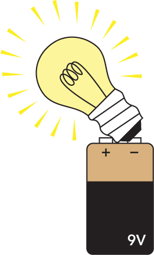

### 电力是如何点亮灯泡的？

但是*电力*是如何让电线加热的，为什么灯光会立刻点亮呢？有四个概念结合起来使得这一切发生：

 电子

 电流

 电压

 电阻

这些电力的基本概念彼此依赖，我们将在本节中进行探讨。

#### 什么是电子？

你周围看到的一切都是由*原子*构成的，原子是非常小的粒子，必须使用特殊的显微镜才能看到它们。但原子是由更小的粒子构成的，分别叫做*质子*、*中子*和*电子*。

质子和中子形成了原子的*核*（即其中心），电子围绕原子核旋转，就像行星围绕太阳旋转一样。质子和电子都有*电荷*：质子带有正电荷，电子带有负电荷。这就是电子为何会与原子结合在一起的原因。正负电荷像磁铁的两极，彼此吸引。

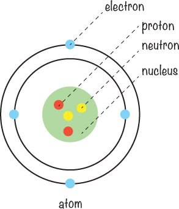

某些材料是*导电的*，这意味着如果你对它们施加能量（比如电池存储的能量），电子就会开始从一个原子移动到下一个原子！

你的灯泡内部的灯丝是由导电金属制成的，这意味着它充满了电子，只等着一个推动力来让它们移动。

#### 电压推动电子

当你将电池连接到灯泡时，你实际上是在灯丝上施加了*电压*。电压推动电子通过导线，电压的单位是*伏特 (V)*。电压越高，电子就会通过导线流动得越多。

想象一根导线像是充满了弹珠的管子：当你从一边放进一个弹珠时，另一边会同时弹出一个弹珠，毫不延迟。

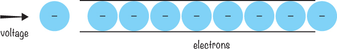

你越往一侧推弹珠，另一侧弹出的就越多。电子在导线中也像这样行为，当电压施加到它们上面时。

#### 电流流动

*电流*是通过导线流动的电子数量，它的单位是*安培 (A)*，我们通常简写为*安*。你可能也听说过*电流*这个词用来形容河流，比如“这条河流有强烈的水流。”这意味着有大量水流经河流。

电流也类似：强电流意味着有大量电子通过导线流动。当你增加电路中的电压时，电流也会增加。

就像水由于重力流向低处一样，电流从电池的正极流向负极。实际上，电子本身是朝相反方向流动的，从电池的负极流向正极*。但当我们讨论电流时，我们说它从正极 (+) 流向负极 (–)。

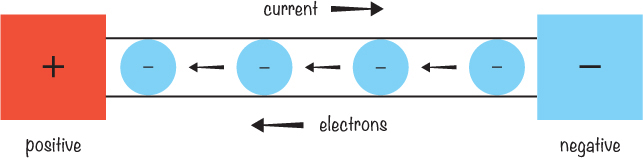

#### 电阻减少电流

电压推动电子形成电流，而*电阻*限制电流。就像玩花园水管一样：如果你捏紧水管，你增加了水流的阻力，使得水流量减少。但如果你更大开水龙头（就像增加电压一样），压力增加，尽管你仍然以相同的方式捏住水管，更多的水也会流出。电流中的电阻就像这样工作，它的单位是*欧姆*（Ω）。

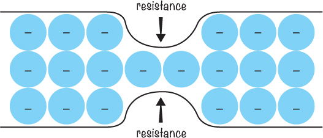

现在你了解了电子、电流、电压和电阻，我将解释它们是如何一起工作以点亮你的灯泡的。

#### 点亮灯泡

你灯泡内的金属丝的两端连接到灯泡外部：一端连接到灯座的金属侧，另一端连接到底部的金属接触点。当你将电池连接到灯泡时，你创建了一个所谓的*电路*。电路就是一个闭合路径，它允许电流从电压源的正极流到负极。

电池上的电压推动电子通过电路，包括灯泡内部的灯丝。灯丝有电阻，并限制电路中的电流。当电子努力通过灯丝的电阻时，灯丝变得非常热，开始发光并产生光。为了使电池能够推动电子，电路必须是一个*闭合回路*，从电池的正极到负极。

电力总是需要一个*闭合电路*才能工作。如果你断开了电路的任何一侧，灯泡就会立即熄灭！让我们更详细地看看电路。

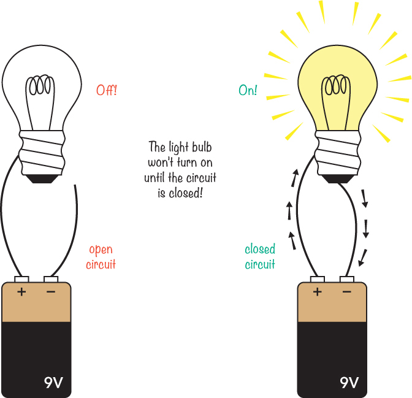

### 电路为什么像管道系统一样？

让我们继续通过将电力与水进行比较来思考。想象一个带有水泵的管道系统，管道始终被水完全充满。在某个地方，管道变窄了。

水泵就像为电路提供能量的电池。管道的窄部分减少了水流量。这段狭窄的管道就是电阻。通过管道的水量就是电流。

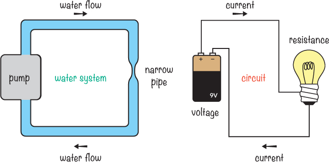

现在想象你能在管道系统中某个地方插入一个测量装置，告诉你每秒钟流过管道的水量。请注意，我这里只是说水流过管道中某个随机选择点的量，而不是管道中水的总量。这就是我们在电路中讨论电流的方式：它是每秒通过某个点的电子数量。

### 认识开关

当你环顾四周时，可能会发现家里到处都是开关。你经常用它们来开关灯！当房间的灯亮着时，它一定是闭合电路的一部分，因为灯泡中有电流通过。那么，当你把开关关掉时会发生什么呢？关掉开关就相当于断开了电路中的一根线：它阻止了电流的流动，关掉了灯，就像我们之前看到的断开电路一样。

你还可以在周围找到哪些开关？你可能会找到一个开关来开关电脑，一个用于按门铃的开关，一个用于判断冰箱门是否打开的开关等等。

开关控制电流，它们是非常简单的设备。它们通过连接两根电线来闭合电路，或通过断开两根电线来打开电路。开关内部其实只是一些连接或断开的金属片。

当开关打开时，灯是关闭的；当开关关闭时，灯就亮了！这个原理非常简单，但非常实用。仅凭这些知识，你就可以创建一些巧妙的电路，这正是我们接下来要做的事情。

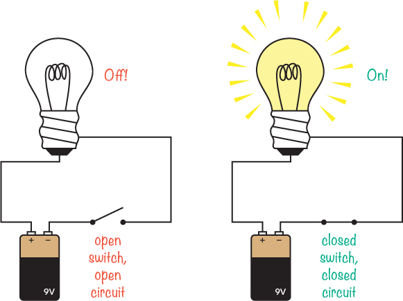

### 项目 #2：入侵者报警

在本章中，我们了解了电流需要一个闭合电路才能让电路发挥作用，并且我们已经研究了开关是如何工作的。现在，让我们用开关来构建一个电路吧！

你可以用许多不同的东西来制作一个开关——甚至是门。在这个项目中，你将把门变成一个巨大的开关，并利用它来制作一个入侵者报警系统，告诉你什么时候有人尝试进入房间。

为了制作报警系统，我们会把一些电线和铝箔连接到门上，这样当门关闭时，电路是断开的，什么都不会发生。但当门打开时，电路闭合，蜂鸣器响起，发出红色警报。

我们将从门上方挂下一根裸露的电线，将一条铝箔带放在门上，并将这些部件连接到电路的不同端。然后，当门打开时，裸露的电线会接触到铝箔并闭合电路，从而使蜂鸣器响起。

#### 购物清单

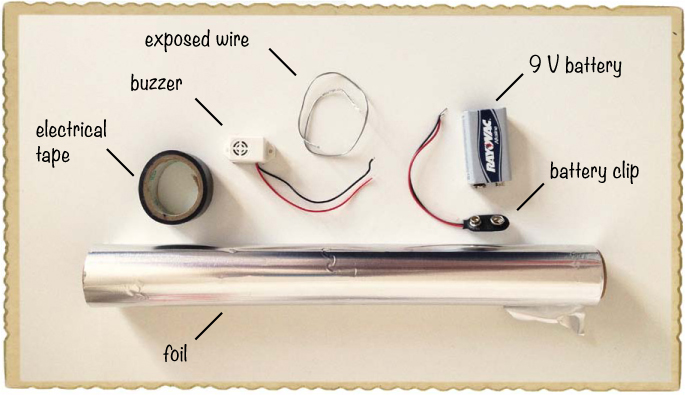

 **蜂鸣器**（Jameco #2173870，Bitsbox #ST016），它会发出哔哔声。蜂鸣器有被动和主动两种版本。被动蜂鸣器需要音频频率输入，而主动蜂鸣器只需要电压。对于这个项目，你需要一个适用于 9V 电池的主动蜂鸣器。

 **标准 9V 电池**，为电路提供电力。

 **9V 电池夹**（Jameco #11280，Bitsbox #BAT033），用于将电池连接到电路。

 **铝箔**

 **裸露电线**（Jameco #2098478，Rapidonline.com #05-0320），可以使用一些软电线、旧的钢吉他弦或类似的物品。

 **胶带**用于固定所有物品。你可以使用遮蔽胶带、电工胶带或任何你手头有的胶带。

#### 工具

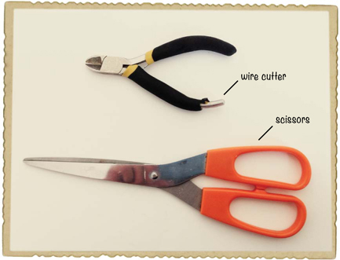

 **一把线钳**（Jameco #35482，Bitsbox #TL008）用来剪切或去除电线的绝缘层。

 **一把剪刀**（可选）对于精确地剪裁铝箔非常有用。

**提示**

*如果你想让剥线变得更加简单，可以购买一把真正的剥线钳，比如 Jameco #78992，它们有槽口，这样你就不会不小心把电线切断了。*

#### 第 1 步：蜂鸣器是否发出声音？

首先，测试蜂鸣器看看它是否发出声音。将蜂鸣器的红线连接到电池的正极（标有*+*），黑线连接到电池的负极（标有-）。

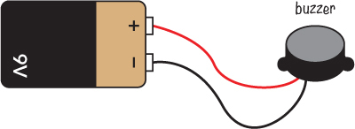

蜂鸣器现在应该会发出响亮、清晰的嗡嗡声或滴滴声。如果你从电池上断开一根电线，蜂鸣器应该会停止发声，因为电路不再是闭合回路。

**注意**

*如果你的蜂鸣器只是发出了咔哒声或根本没有发出声音，可能你使用的是无源蜂鸣器。无源蜂鸣器本身无法发出声音，因此你需要使用有源蜂鸣器来完成这个项目。这个项目推荐的蜂鸣器应该可以解决这个问题，具体参考购物清单中的内容（第 12 页）。*

#### 第 2 步：准备铝箔

使用剪刀剪下一条大而闪亮的铝箔条，放在门的顶部。剪成一条直的铝箔片，宽约 1 英寸，长度与铝箔卷的宽度相同。

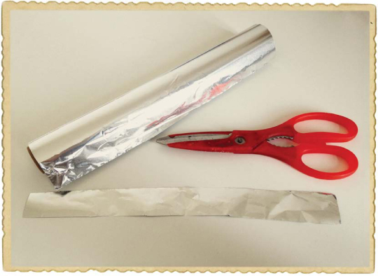

#### 第 3 步：给门加上铝箔

使用胶带将铝箔条固定在门的顶部，胶带要分别粘在铝箔条的两侧。铝箔将作为电池和蜂鸣器电线的接触点。

#### 第 4 步：准备触发线

拿一根大约 10 英寸长的裸露软电线。*裸露电线*是指没有塑料外壳的电线，而*绝缘电线*是金属被塑料包裹的电线。只需找一根已经裸露的电线，例如吉他上的钢弦，或者用你的线钳从购物清单中的线轴上剪下一段（第 12 页）。这将是你的触发线。

**注意**

*你也可以使用线钳去除或剥去绝缘电线上的塑料。如果你打算这么做，请找大人帮忙！*

#### 第 5 步：连接蜂鸣器和触发线

使用胶带将裸露的触发线的一端连接到电池夹黑线的裸露金属端。连接两根电线很简单，方法如下：拿起你想连接的两根电线，将它们的两端缠绕在一起，确保金属部分接触！然后用胶带将它们包裹在一起。

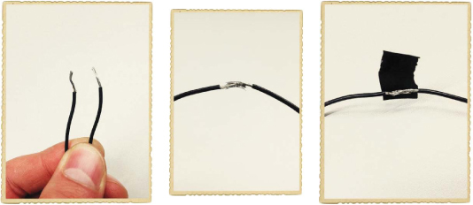

按照相同的步骤，将电池夹的红线连接到蜂鸣器的红线。

#### 第 6 步：安装蜂鸣器和触发线

现在，让我们把触发线和蜂鸣器放在门的上方。首先，把触发线用胶带固定在门框上方，这样当门关闭时，触发线会挂在门前；当门打开时，触发线会躺在门顶和铝箔条上面。

接着，将蜂鸣器用胶带固定在门框上，确保黑色电线能触碰到门顶的铝箔。将黑色电线固定在铝箔上，使电线的裸露部分能触碰到铝箔。

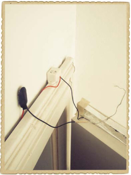

#### 第 7 步：添加电源

将电池放置在门框的顶部，靠近电池夹。如果需要，可以用胶带固定它。然后将电池夹连接到电池上。

一旦电池连接好，你制作的入侵警报器应该像这样：

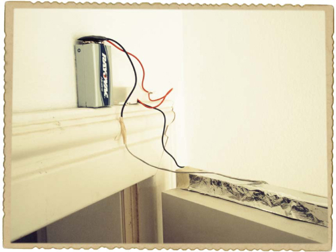

#### 第 8 步：设置入侵警报！

通过开关门来测试报警器。当门打开时，暴露的电线应该触碰到铝箔，导致蜂鸣器发出响亮的警报。为了更逼真的测试，可以邀请别人来打开门！

#### 第 9 步：如果入侵警报不起作用怎么办？

如果蜂鸣器没有响，你可能需要稍微调整触发线的位置，确保当门打开时，电线能触碰到铝箔条。如果触发线已经正确接触铝箔，试换个电池。如果还是不行，可能需要重新用胶带固定电池引线。

**接下来是什么？**

现在你已经掌握了电学基础——电子流通过电线，产生作用，比如点亮灯泡或发出警报。而且你也知道，要让电子流通过电路，你需要一个电压源，比如电池，以及一个闭合的电路。这就是你开始动手电子制作的全部所需！

你还能想出用所学的知识制作什么吗？还有很多其他东西可以制作成开关。例如，试着为你的衣柜制作一个报警器，以防止好奇的兄弟姐妹或朋友接触你的个人物品。或者怎么样，试试做一个静音报警器？只需将蜂鸣器替换成灯泡！

在接下来的两章中，我们将探讨电力是如何产生的，以及如何利用电力让物体运动。
