## 第二章：使用电和磁铁使物体移动

大磁铁吸引小的金属物品；小磁铁则会粘附在大的金属物体上。例如，冰箱门通常是大的金属块，所以很容易用小巧的装饰性磁铁覆盖它们。你可能在卡通片中也看过磁铁：角色们喜欢使用巨大的马蹄形磁铁来制造麻烦。你可以在自然界中找到磁铁，或者用电制造它们。用电制造的磁铁叫做*电磁铁*。

你可以使用电磁铁来移动物体，而且你甚至不需要是超级英雄才能做到！事实上，你每天看到的很多东西——比如电动机、扬声器和商店的自动门——之所以能工作，是因为电磁铁使它们内部的某些部件移动。

电磁铁很容易制作，在本章中，你将制作一个可以通过开关开关的电磁铁。然后，你将使用电磁铁制作你自己的电动机！

### 磁铁是如何工作的

磁铁有两个极，*北极 (N)* 和 *南极 (S)*，并且它们被一个磁场所包围。

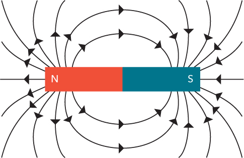

如果你把两个磁铁并排放在一起，一个磁铁的北极会吸引另一个磁铁的南极，并排斥那个磁铁的北极。试试把两个磁铁推到一起。如果你不加力，它们应该会在各自的相反极性处自然吸附。现在，试着把两个相同极性的磁铁推到一起。会更难一些吧？相反的极性会相互吸引，而相同的极性会相互排斥。

**注意**

*薄而柔韧的冰箱磁铁没有两个明显的极性。相反，它们有许多极性相反的极点靠在一起，所以更难感受到磁铁的吸引和排斥。*

但是磁铁并不是吸引所有材料。例如，塑料对磁铁没有影响。试着测试一下你周围的一些金属物品吧！

**试试看：找一些有磁性的物体！**

拿一个磁铁，把它放在不同材料制成的物体上，例如：

 铝箔

 一把不锈钢勺子

 一罐汽水

 一根铁钉

 一块金属首饰

 几个不同的硬币

磁铁吸引或粘附哪些物体呢？你应该会发现磁铁会吸引某些金属，但并不是所有金属都会被吸引。铝箔会发生什么呢？

事实证明，如果你给某些金属通上电，它们就能变成磁铁。这就是电磁铁的作用所在。

### 认识电磁铁

当电流通过电线时，会发生一件奇怪的事情：电流在电线周围产生一个磁场。

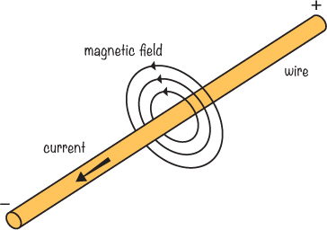

然而，一根导线产生的磁场非常弱。为了增强磁场，你需要让电流流过许多相互接近的导线。但你依然只需要一根导线：你只需将导线绕成多个圈，形成一个线圈，然后通过它通电。每个线圈的磁场会重叠并合并，产生更强的磁场。如果你把导线绕在一块铁上——比如钉子、螺栓或螺丝——你会得到更强的磁场。

创建电磁铁的全部步骤就是将电池连接到绕成圈的导线的两端，形成一个闭合电路。当电流通过导线时，它包围的铁块开始像磁铁一样工作，一个端点为南极，另一个端点为北极。哪个极是哪一个，取决于电流的方向以及线圈的缠绕方向。当你断开电池时，电流停止，磁场消失。

制作电磁铁将帮助你开始理解如何在现实世界中利用电流制作像扬声器这样的东西，所以让我们来做一个吧！只要有足够的电流、足够的导线和正确的电路，你甚至可以制作出像你最喜欢的卡通中那样的超强磁铁，但现在我们从一个小的开始。

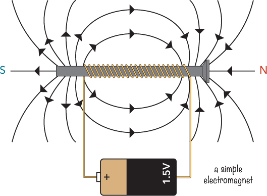

### 项目 #3：制作你自己的电磁铁

你了解如何制作电磁铁背后的原理。但是，阅读理论与在现实生活中实际制作东西是不同的，所以现在是时候来点有趣的事情了！

你将用导线和螺栓制作你自己的电磁铁。你需要做的就是将导线绕在螺栓上几圈，然后将电池连接到导线上。为了方便开关电磁铁，你还需要在电路中加入一个开关，这样你就能控制电流是否流过导线。

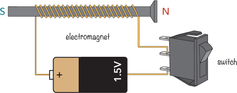

#### 购物清单

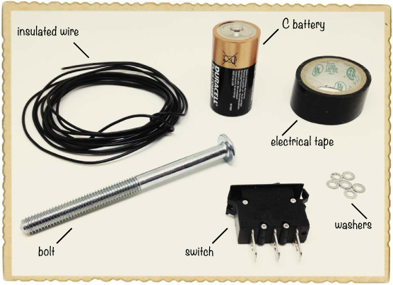

 **一个 1.5 伏的碱性电池（C 型）**（Jameco #2112428，Bitsbox #BAT040），像旧款手电筒使用的那种大圆形电池。不要使用可充电电池或插电电源。

 **绝缘实心电线**（Jameco #36792，Bitsbox #W106BK），大约 7 英尺长。标准连接线也可以使用。

 **胶带**，用于固定所有物品。你可以使用美纹纸、电工胶带，或者任何你手头有的胶带。

 **垫圈或回形针**，或其他小的金属物品，你的电磁铁可以吸起它们。

 **一个螺栓**，用来绕导线。选择一个较大的螺栓，这样可以为导线绕多圈腾出空间。我使用的螺栓是 0.3 英寸厚，4 英寸长。

 **一个开关**（Jameco #581685，Bitsbox #SW018），用来开关电磁铁。

#### 工具

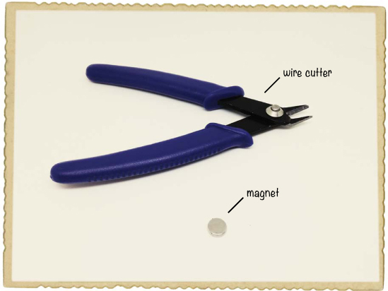

 **一把线切割器**（Jameco #35482，Bitsbox #TL008）用于剪切或去除电线的绝缘层。

 **一个标准磁铁**

#### 步骤 1：检查你的螺栓

你的螺栓将作为电磁铁的核心，使其更强大。但并非所有材料都适合作为电磁铁的核心！大多数金属螺栓应该可以使用，但如果你运气不好，找到一个由非磁性材料制成的螺栓，那么你的电磁铁将效果不佳。

要检查螺栓是否适用于这个项目，只需将其靠近任何标准磁铁。如果磁铁吸引了螺栓，那么这个螺栓就适合使用。

#### 步骤 2：去除线圈电线一端的绝缘层

为了将线圈电线连接到电池和开关，你需要露出电线两端的金属部分。你将使用线切割器剥去大约 0.5 英寸的电线绝缘层。绕完线圈后，你需要对电线的另一端做同样的操作。如果你从未做过剥线操作，这可能有点困难，所以可以请父母或老师帮忙，帮助你入门。

首先，用切割器轻轻夹住电线的末端。

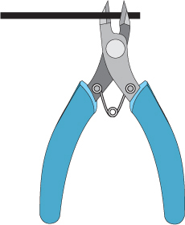

用线切割器施加足够的压力，只切割电线周围的塑料层，而不是电线本身。当你切开绝缘层后，你的电线应该像这样：

然后，将线切割器放入你切割的地方。用力挤压线切割器，确保刀片能抓住松散的塑料。用线切割器轻轻地将塑料拉掉，避免切到金属线。

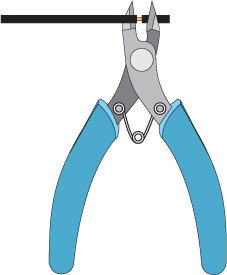

现在，你应该有一根末端裸露金属的电线，像这样：

如果剥线一开始觉得困难，不要担心：随着练习，你会发现它变得容易得多。

#### 步骤 3：绕制电线

拿起电线，将其绕在螺栓上 50 到 100 圈。每端留出约 3 英寸的电线松散悬挂。确保不要用完所有电线；你需要留下一段约 4 英寸长的电线用于后续步骤。

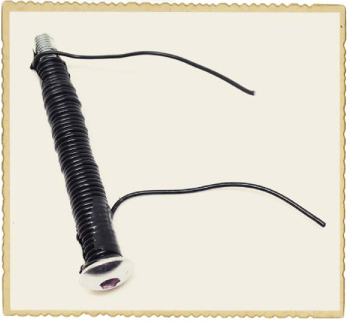

将电线缠得尽可能紧，并用胶带固定端头，确保线圈保持原位。我们称这种绕制的电线为电磁铁的*线圈*。

重复步骤 2，去掉线圈另一端的绝缘层。

#### 步骤 4：将负极电池端连接到线圈

将线圈的一端——哪一端都可以——连接到电池的负极端。用胶带将其固定在电池上。

**警告**

*请确保你使用的是推荐的 1.5V 电池！更高电压的电池可能会向线圈输送过多的电流，从而使电池和线圈变得足够热，可能会烫伤你。*

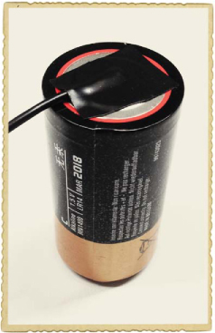

#### 步骤 5：连接开关

在第一章中，我曾展示过如何制作自己的开关，并描述了如何使用开关来控制设备的开关。现在，你将把一个预先制作好的开关连接到电磁铁上，以控制它的开关。一个开关通常有三个*引脚*，你可以连接这些引脚。

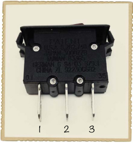

在本项目购物清单中的开关（第 24 页），引脚 2 是*公共引脚*，它连接到引脚 1 或引脚 3，具体取决于按钮的位置。如果按钮按向引脚 1，则引脚 2 和引脚 1 连接；如果按钮按向引脚 3，则引脚 2 和引脚 3 连接。

一些开关只有两个引脚。在这种情况下，按钮处于一个位置时这两个引脚连接，处于另一个位置时则不连接——就像你在第 2 个项目：入侵警报中制作的开关（第 11 页）一样。

将线圈的另一端固定到开关的引脚 1，并确保开关的按钮被按向引脚 3。然后，从你的线轴上剪下一段大约 4 英寸长的新电线，并剥去两端的绝缘层，露出金属部分。将新电线的一端连接到电池的正极，一端连接到开关的中间引脚。使用胶带确保电线正确连接并保持稳定。

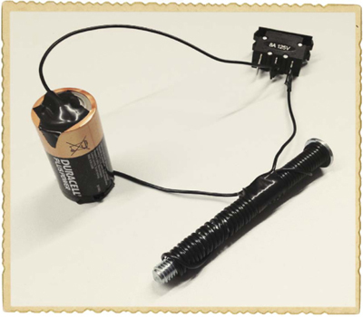

#### 第 6 步：测试你的超级电磁铁

就是这样，电路搭建完成！现在，来测试一下。如果你一切连接正确，电磁铁应该此时是关闭的。

首先，找一块合适的金属来吸引你的电磁铁。一个小的金属回形针应该可以，但我用了几片小钢垫圈。磁铁并不会吸引所有金属——例如，铝箔就不是磁性的——因此，先用普通磁铁靠近你想吸引的金属，确认它是否具有磁性。

然后，翻转开关，并将电磁铁放置在回形针或其他金属物体附近。如果你找到了*开启*的位置，螺栓应该会把金属物体吸引过来。

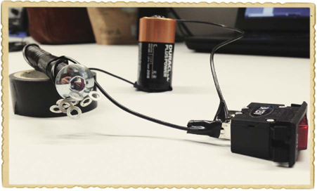

如果没有任何反应，请将开关按到另一个位置；此时螺栓应该开始吸引金属物体。

电磁铁消耗大量电力，所以如果你长时间保持开关开启，电池会迅速耗尽。你可能还会注意到电池和线圈变热。尽量将电磁铁开启的时间限制在几秒钟内，并且在离开电路之前，务必断开电池。

#### 第 7 步：如果电磁铁不起作用怎么办？

确保你使用了绝缘线来绕过螺栓。线材必须有一种绝缘层包裹在金属外面；否则，它无法正常工作。原因是如果没有绝缘层，电流不会沿着线圈绕过螺栓，而是会通过螺栓（如果螺栓是导电的）或通过相邻的线圈（如果线圈之间有接触）。在这两种情况下，电流将像你只用了一个粗线一样运作。

另一个可能的问题是电池没电。尝试换一个你确认有电的电池。

如果你确认使用了绝缘线，并且电池有电，请检查开关和电池的连接，正如我在步骤 4 和 5 中所描述的。如果不确定，重新连接可能是个好主意。

### 认识电动机

正如我在《认识电磁铁》一章中所描述的那样，第 22 页指出，带电流的导线会产生磁场。当供电时，项目 #3 中的线圈将拥有南北极，就像其他任何磁铁一样。相同的磁极会相互排斥，而相反的磁极会相互吸引。因此，如果你将一个带磁的线圈放在一个普通的磁铁上，并让相同的磁极靠近，线圈会尝试自己旋转。

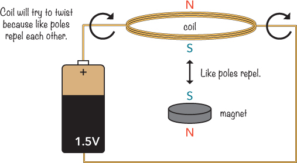

如果你把线圈放在某种支架上，使它能在磁铁上自由旋转，它会来回摆动，但不会完成一整圈。这是因为当线圈转过半圈时，极性相反的磁极会面对面并相互吸引，从而迫使线圈朝相反方向转动。

如何让线圈继续朝一个方向旋转？你只需要找到一种方法，在线圈转到原始位置时，暂时断开电池连接，并在回到起始位置时重新接通电池。接下来会发生什么呢？线圈在通电时开始运动，并推动线圈转过一半。由于你在一半过程中断开了电池，现有的运动会保持线圈继续向前转。当它回到原始位置时，电池重新连接，给线圈再加一推，它就会继续按同样的方式旋转。

电动机基于磁极相互吸引和排斥的基本原理。

### 项目 #4：制作电动机

在本章中，你已经制作了自己的电磁铁，并学习了电动机的工作原理。现在，是时候将这两个概念结合起来了。在这个项目中，你将从零开始制作自己的电动机！

你将使用一个磁铁和一卷电线。线圈会旋转，这个旋转的线圈被称为电动机的*转子*。你将构建电动机，使得转子线圈只有在旋转的前半段通过电流。磁铁应该推动电磁铁在旋转的前半段，而转子线圈应利用它从第一次推动中获得的能量继续旋转第二半段。

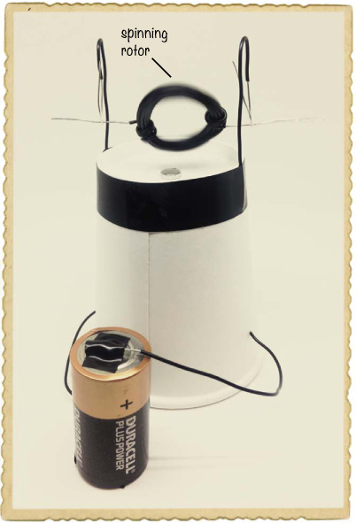

#### 购物清单

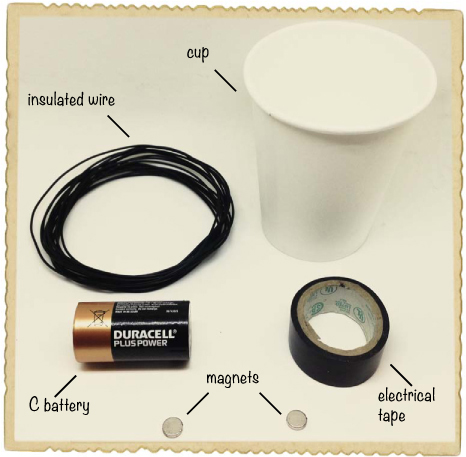

 **一颗 1.5 伏的碱性电池（C 型）**（Jameco #2112428，Bitsbox #BAT040），就像老式手电筒中使用的那种大圆形电池。

 **绝缘实心电线**（Jameco #36792，Bitsbox #W106BK），约 13 英尺。刚性的绝缘电线将用于绕线圈并支撑线圈。

 **胶带**用于固定所有物品。你可以使用遮蔽胶带、电工胶带或任何你有的胶带。

 **一个纸杯或塑料杯**用来固定所有物品。

 **两个圆盘磁铁**（Jameco #2181319，Bitsbox #HW145），越强越好。

**警告**

*始终将像这样的超强小磁铁远离婴儿和幼儿。这些磁铁如果被吞咽，非常危险。*

#### 工具

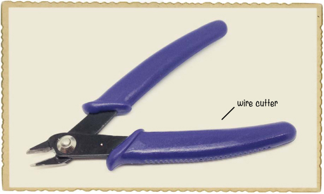

 **一把电线剪**（Jameco #35482，Bitsbox #TL008），用于切割或去除电线的绝缘层。

#### 步骤 1：制作转子

首先，我们将制作一个新的电线线圈；这个线圈将是你电动机的转子或旋转部分。要制作转子，首先取出你的电线卷，将大约 1.5 英寸的自由端剥去绝缘层。然后，将电线绕在电池上。

如果你购买了我在本项目购物清单中推荐的电线（第 34 页），尝试绕大约 30 圈；如果你使用的是较细的电线，可以多绕一些。关键是使线圈尽可能具有磁性，同时又不至于太重。更多的绕圈可以让转子更具磁性，但也会让它变重。

小心地将缠绕的电线从电池上滑下来。将绕线收拢成一个圈，并将电线的两端分别绕在圈的两边几圈，以便保持线圈的完整。然后，从电线卷中剪下这个圈，留下约 1.5 英寸长的另一端。接着，也去除这端的绝缘层，让里面的金属部分暴露出来。如果你使用的是有塑料绝缘层的电线，可以按照项目#3 的第 2 步（第 26 页）中描述的方式使用电线剪。

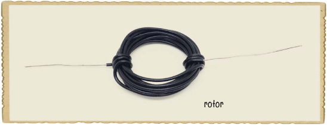

#### 步骤 2：构建电动机的结构

先将线圈放一边，拿出纸杯。在杯子的一侧距顶部约 0.4 英寸的位置打一个孔，再在距底部约 0.4 英寸的位置打一个孔。通过这两个孔拉入一根约 8 英寸长的硬电线。然后在杯子的另一侧做同样的操作。将杯子倒置，去掉两根电线的端部绝缘层，并将电线粘贴到杯子上，确保它们保持原位。

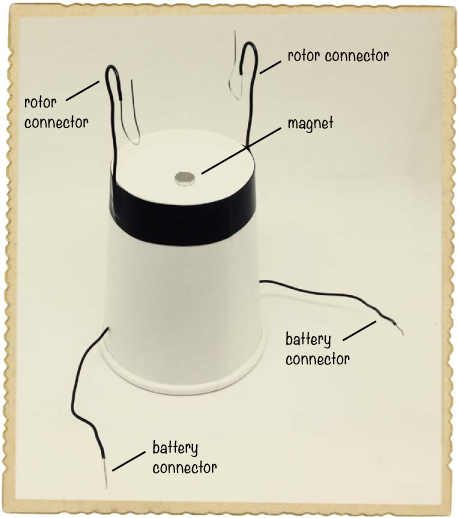

现在位于底部的电线端将连接到电池，而顶部的电线端将与转子连接并支撑它。将两根电线的顶部弯成两个 U 形，确保每个 U 形的底部有裸露的金属，以便它能接触到转子上裸露的电线。这种 U 形结构将是电池与转子之间的连接。

#### 步骤 3：放置磁铁

将一个磁铁放在杯子顶部。然后将另一个磁铁放入杯子内部，使两个磁铁通过杯子相互吸引。将转子放入 U 形结构中，并调整磁铁的位置，确保它们位于中心，正好在线圈下方。

#### 步骤 4：重新绝缘部分线圈

如果你此时连接电池，电动机将无法工作。连接了线圈转子后，你会看到有运动，但转子只是来回摆动，因为它总是与电池连接。你需要一种方法，在电池中途与线圈断开连接，这样它就能先被推开远离磁铁，然后释放，直到它转动一圈。然后它可以重新与磁铁连接并再次被推开，依此类推。你可以通过用永久性标记笔在转子的一个臂上进行绝缘来实现这一点。

将线圈平放在桌面上，并使用永久性标记笔沿着一侧的电线画线，使其不具导电性。画线时确保转子在环形电线平放在磁铁上方时与电池断开连接。

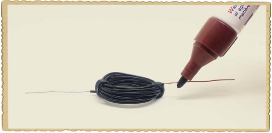

#### 步骤 5：加速你的电动机

让我们启动电动机！通过将两根电线粘到电池的正负极端子上来连接电池。

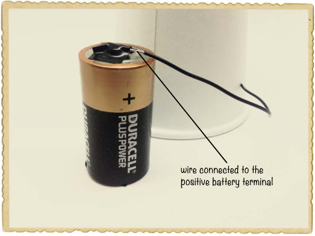

现在，将转子放入 U 形结构中。电动机应该开始转动。你可能需要稍微推动一下它。虽然它不能驱动汽车，但如果它能工作，那么你肯定已经用电让某物运动了。恭喜！

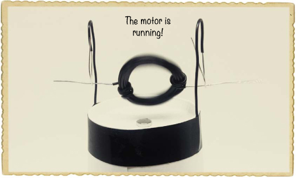

#### 步骤 6：如果电动机不起作用怎么办？

你能看到任何运动吗？如果你运气很好，它会立即工作，但你很可能需要做一些调整。以下是一些可以开始的地方：

1.  确保线圈放置的位置是：从裸露的电线开始，也就是不是你用标记笔覆盖的部分，与 U 形结构的裸露电线接触。这样，当你连接电池时，线圈就会变得具有磁性。

1.  找出电池应该如何连接。你可能会发现转子在一个方向上的转速比另一个方向更好，所以试着将电池反过来连接，看看哪个方向对你的电动机更有利。

1.  如果你的线圈有点重，磁力可能不足以将线圈推到环路的另一端。试着解开几圈，使线圈变轻。

1.  你可能需要调整转子下方磁铁的位置。它们应该尽可能地居中。

如果你的电动机仍然不能运转，可能是转子需要一点推动才能启动。试着轻轻地用手指敲打它，看看这是否能激发出一股速度狂热。

**接下来是什么？**

在这一章中，你已经学会了如何通过绕线圈在螺栓上并连接到电池来制造磁铁，你还通过自己制作电磁铁进行了实验。最后，你了解了电动机是如何工作的，并且亲手制作了一个。你真的让一切开始运转了！

现在，利用这些知识进一步探索电力。尝试在电动机的转子下方放置更多的磁铁。接着，绕一个比原来大两倍或更大的转子线圈。你可以为电动机创造一个更大的结构。你能让电动机转得更快吗？

到目前为止，你只使用了电力，但你实际上也可以生成电力。在下一章中，你将学习几种不同的发电方式，并且你将进一步玩转磁铁。
