## 第三章：如何发电

第一章描述了为什么需要闭合回路才能让电流通过电路，第二章展示了如何制作自己的电磁铁和电动机。那些章节中的项目使用了电池中的电能，但在本章中，你将自己制作电源！

具体来说，你将学会如何制作自己的发电机，它通过运动产生电能，以及自己的电池，它通过化学反应产生电能。这两种方式是获取电力的最常见方法。

### 使用磁铁发电

当你让电流通过电线时，它会在电线周围产生磁场，但电流与磁性之间还有另一个关系。你也可以利用电线和磁铁来产生电能！

#### 变化的磁场产生电力

如果你将一个磁铁来回移动在连接成闭合回路的电线附近，你将在线路中产生电流。移动磁铁会改变电线周围的磁场，而变化的磁场推动电子通过电线。

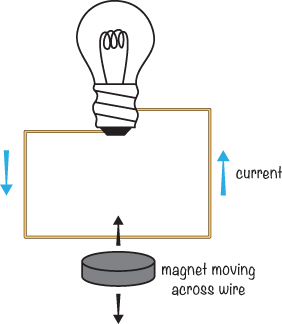

如果你停止移动磁铁，电流也会停止——即使电线仍然处于磁场中——因为磁场不再发生变化。

如果你将电线的两端连接到灯泡，并形成闭合回路，那么电流就能流动。不幸的是，然而，通过让磁铁在单根电线附近移动产生的电流并不足以快速地点亮灯泡。要点亮灯泡，或者为其他任何设备供电，你需要找到一种方法来产生更多的*功率*，即在一定时间内产生的能量。

#### 发电机是如何工作的？

*发电机*是一种将运动——例如磁铁在电线上的移动——转化为电能的装置。为了通过电线和磁铁产生更多的能量，你可以将电线绕成线圈。线圈状的电线就像是一组电线，当磁场通过它时，电流通过每个线圈流动，产生比直线电线更多的能量。

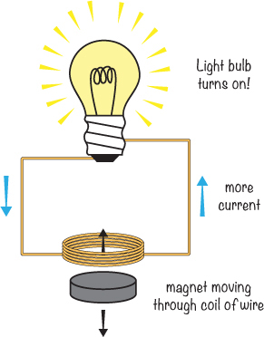

**从水或风中产生电力**

如果你将一个线圈放置在磁场中，并用手柄旋转线圈，你就将自己的运动转化为电能。如果你用水车代替手柄，并将其放入水流中，水流会推动水车转动，使线圈在磁场中旋转并产生电流。这就是一些电厂如何发电的方式！电厂通过让水流过与发电机连接的水轮，然后通过电力线路将电力传输到人们家中的插座。

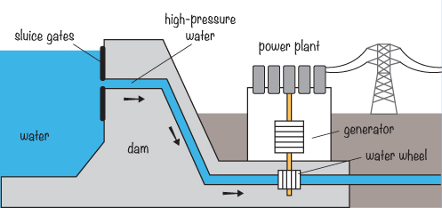

你可以通过类似的方式将其他自然力量转化为电力。例如，要从风中产生电力，你可以将线圈连接到风车上，这样当风吹动时，风车就会转动线圈。

### 认识万用表

你可以用一个基本的*万用表*精确测量一个简单发电机所产生的能量。万用表在构建任何电路时都非常方便，因为它们可以测量很多不同的值，包括电阻、电流和电压。

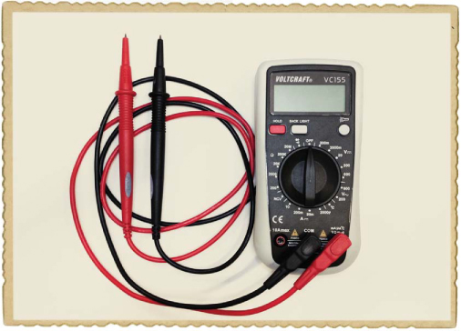

红色测试线是正极测试线，黑色测试线是负极测试线，中间的大拨盘让你告诉万用表测量什么。如果你在电路中遇到问题，测量电路中关键点的电压是一个实际的解决办法。

#### 如何测量电压

要用万用表测量电压，首先将拨盘调到其中一个 V 选项。（在本书中，我会告诉你选择哪个设置，但在你自己的项目中，选择一个电压值大于你在电路中预计看到的最高电压的设置。）然后，在万用表的底部，将黑色测试线连接到 COM 插孔，将红色测试线连接到 V 插孔。最后，将一根测试线放在你想要测量电压的部件的两端。

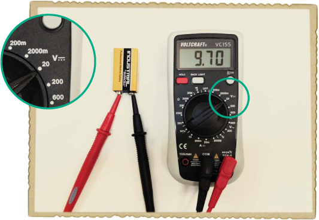

在这个例子中，万用表正在测量 9V 电池的正负极之间的电压。注意我的拨盘设置为 20V，显示的是带直线符号的 V 范围。但万用表上还有另一个 V 符号，旁边有一个波浪线。让我们来看看这些符号的含义。

#### 什么是交流电和直流电？

你如何设置万用表取决于你是要测量电池还是发电机的电压。电池有正负极，而发电机没有！发电机有两根电线，它们在正负之间交替。这是因为当磁铁的一面经过线圈时，线圈中的电流朝一个方向流动，而当磁铁的另一面经过线圈时，电流朝另一个方向流动。

当电流方向像那样切换时，我们称之为*交流电（AC）*；当电流方向始终保持不变时，我们称之为*直流电（DC）*。通常，你会在万用表上看到这些符号，用以表示交流电和直流电的测量范围：

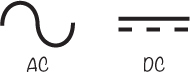

你需要将万用表设置为测量交流电或直流电，以获得正确的读数。例如，电池的电压是直流电。

### 项目#5：制作摇动发电机

拿起你的万用表——这个项目将教你如何制作发电机并测量其电压。制作简单发电机的一个快速方法是手动在一个线圈内来回移动磁铁。在这个项目中，你将把磁铁放在管子里，并在管子周围缠绕一个线圈。当你摇动管子时，磁铁应该在管子内来回移动，并产生电压。

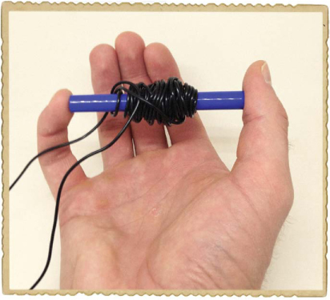

#### 购物清单

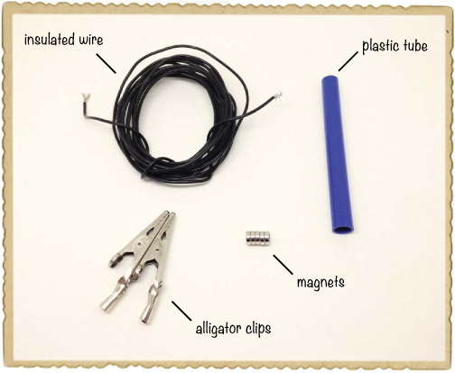

 **绝缘实心线**（Jameco #36792，Bitsbox #W106BK），大约 9 英尺。标准的接线线缆也可以使用。

 **一个小塑料管**，比如一个旧笔壳。

 **五个圆盘磁铁**（Jameco #2181319，Bitsbox #HW145）堆叠形成一个磁棒。

 **两个鳄鱼夹**（Jameco #256525，Bitsbox #CN262）用于将万用表连接到线圈。

#### 工具

 **万用表**用于测量发电机的电压。万用表应能测量非常低的交流电压，最低可至 0.01 伏或更低。适用的万用表有 Jameco #2206061、Bitsbox #TL057，或 Rapid Electronics #55-6662。这些万用表比最便宜的那些稍贵，但它们会为你提供多年的服务。

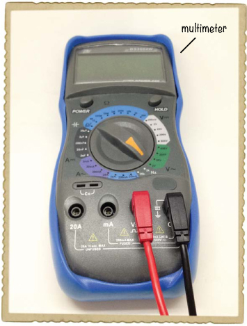

#### 第 1 步：准备管子

找一个足够大的管子，让磁铁可以轻松地来回滑动。如果你用的是笔，拆开笔壳，确保磁铁能放入管内。

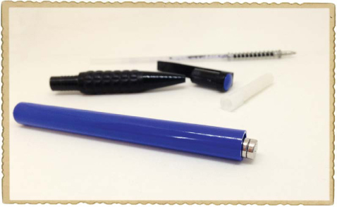

#### 第 2 步：绕制线圈

将大约 50 圈的线绕在管子的中间。绕好后，用两端的线打一个简单的结，以固定线圈。然后，像示意图所示，将两端的绝缘层剥去。

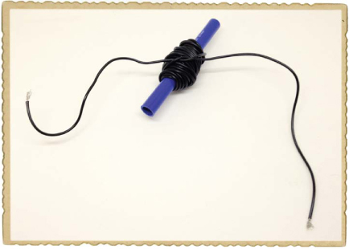

#### 第 3 步：连接万用表

用鳄鱼夹将万用表连接到线圈的两端，并将万用表设置为测量交流电。选择可用的最低交流电压档位。

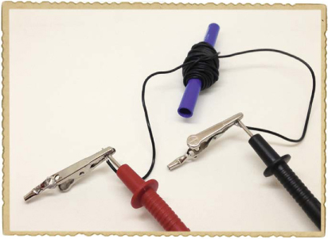

#### 第 4 步：摇动它！

接下来，将磁铁放入管内。它们应该能很好的放进去而不会散开。

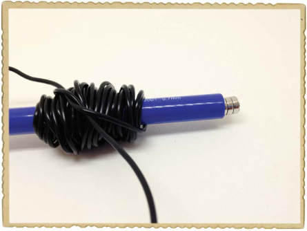

手持管子和万用表引线，将一根手指放在管子的两侧，以防磁铁掉出来。然后，像有目标一样摇动它！

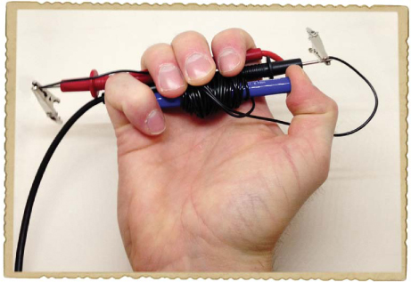

观察万用表上的电压值。你得到了多少电压？我从我的发电机上仅得到 0.02 伏，因此它的功率不是很大。

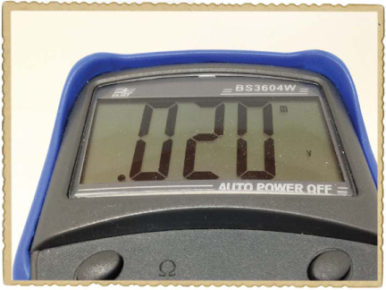

#### 第 5 步：如果没有电压怎么办？

如果你从发电机上测量不到任何电压，首先检查万用表的引线是否与暴露的线圈导线连接良好。如果仍然没有看到高于 0 伏的电压，确保你的万用表设置为测量非常低的电压；我的旋钮设定为 2 伏交流电。你无法从这个简单的发电机中得到高电压，所以如果万用表没有设置在最低的电压档位，它将始终显示 0 伏。请注意，并非所有的万用表都能够测量如此低的电压。

这个发电机现在功率不大。如何提高它的功率呢？试着加快摇动速度，给线圈绕更多的线圈，或者使用更强的磁铁。

**注意**

*标准的接线线比较笨重；即使有 50 圈也占用很多空间！如果你想要更多的圈数，可以考虑使用* 磁线 *。它是一种非常细的导线，带有薄薄的绝缘涂层。*

**试一试：使用电动机作为发电机**

电动机已经有一个磁铁和一个可以在磁场中旋转的线圈。如果你用手旋转转子，就可以在电动机的导线上产生电压。

你可以通过反转你在第二章中制造的电动机来创建一个发电机，但你从中获得的电力量太小，无法测量。相反，试着找一台旧的计算机风扇或遥控玩具车上的电动机，你不再想玩了。然后，将万用表调至低压直流范围，如 2V 直流。将万用表探针连接到电动机的导线上，就像你用摇摆发电机一样，用手转动转子。一些电动机有内部电路来控制电动机，这些电路可以阻止电动机内部产生的电流流出导线。但如果你幸运地找到一个没有这种电路的电动机，你应该能在万用表上看到读数。如果在直流下看不到任何东西，请尝试在万用表上切换到低压交流范围。

### 电池是如何工作的？

我已经向你展示了如何手动产生电力，但这并不能解释你到目前为止在本书中如何给电路供电。你一直在使用电池，在本节中，我们将看看是什么让这些电池产生电力。

#### 电池内部有什么？

要制造电池，你需要三样东西：

 正极

 负极

 电解质

*电极* 是用来与非金属物质接触的导线，比如电池内部。*电解质* 是一种可以释放或吸收电子的物质。

这里是这三个部件如何放置在典型电池内的：

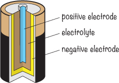

你可以通过使用一个简单的钉子作为一个电极，一根铜丝作为另一个电极来制造自己的电池。把它们插入柠檬中，柠檬汁就是你的电解质。

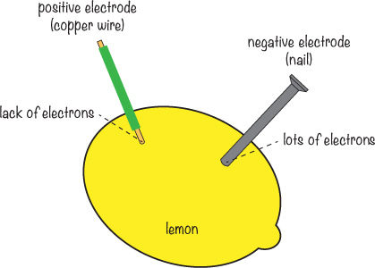

铜丝成为电池的正极，而钉子成为负极。

#### 电池背后的化学原理

当你将柠檬、铜线和钉子结合在一起时，会发生两种化学反应：一种是柠檬汁和钉子之间的反应，另一种是柠檬汁和铜线之间的反应。在第一种反应中，电子聚集在钉子上；在第二种反应中，电子离开铜线。钉子上的电子太拥挤了，而铜线上的电子太少了。电子不喜欢待在拥挤的地方，所以钉子上的电子想要过去和铜线上的电子平衡。但柠檬汁的化学反应却把电子推向相反的方向。

现在，如果你把灯泡连接在钉子和铜线之间，你认为会发生什么？钉子上的电子非常想进入铜线，因此它们会选择它们能找到的最容易的路径，当你建立这个闭环电路时，电子就会从钉子流向铜线并通过灯泡。回想一下，电流只是电子在导线中的流动；如果灯泡中的电流足够大，它就会亮起来！

一段时间后，电池中的化学反应停止。当发生这种情况时，电池就没电了。有些电池在没电后可以重新充电，而其他电池则必须丢弃。电池的电极和电解质材料决定了电池是否可以重新充电。

你在商店购买的电池当然不是由柠檬制成的！现代电池由不同的材料制成，科学家们一直在寻找新的方法来制造具有更多能量、同时又小巧轻便的电池。

#### 什么决定了电池的电压？

电池的电极和电解质决定了你从电池中得到的电压，但电极的大小和电解质的量对于电压没有影响。

要创建更高的电池电压，几个电池单元需要*串联*连接。将两个电池单元串联意味着你将一个电池的正极连接到另一个电池的负极。两个未连接的端子成为更大电池的新正负端子，最终的电压是两个电池电压的总和。例如，在一个标准的 9 伏电池中，你有六个 1.5 伏电池单元，如图所示。注意，外部的连接器仅连接到两个端子。

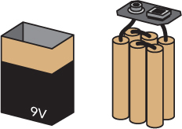

### 项目 #6：用柠檬能量点亮灯泡

你可以用许多不同的物品制作电池；例如，在《电池内部是什么？》的第 55 页，我展示了柠檬电池是如何工作的。在这个项目中，你将学会如何制作自己的柠檬电池并用它来为灯泡供电。

**警告**

*当你完成这个项目时，把柠檬扔掉。钉子和铜线之间发生的化学反应会让柠檬变得不适合食用。*

#### 认识 LED

柠檬电池不能产生大量电力，因此你需要将电池连接到需要非常少功率的设备上才能看到效果。大多数灯泡需要的功率比你在这个项目中能产生的还要多，所以让我来介绍一个叫做*发光二极管*，或*LED*的组件。

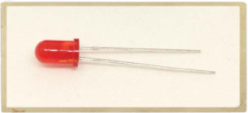

这种小型电子元件在你施加少量电力时会发光，或*发射*光。LED 有多种颜色：红色、绿色、黄色、蓝色等等。你将在第四章中学习更多关于这个元件的知识，并且在本书中你会经常使用 LED。现在，你只需要用 LED 来查看柠檬电池产生的电力。

#### 购物清单

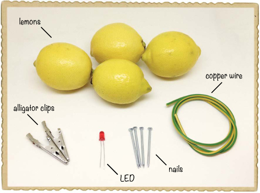

 **四个柠檬**或一个柠檬切成四块。

 **24 英寸的铜线**（任何铜线都可以，但重要的是线必须是铜制的）。

 **四个镀锌钉**（大多数户外项目常用的钉子是镀锌的）。

 **两个鳄鱼夹**（Jameco #256525，Bitsbox #CN262）用于连接 LED。

 **一个标准 LED**（Jameco #333973，Bitsbox #OP002 仅此一个，或 Jameco #18041，Bitsbox #K033 为多样装）。你将在本书的项目中需要多个 LED，因此至少订购 10 个或一个多样装。

#### 工具

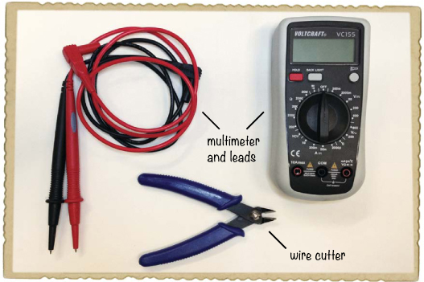

 **一把电线剪**（Jameco #35482，Bitsbox #TL008）用于准备铜线。

 **一个万用表**（Jameco #2206061，Bitsbox #TL057，Rapid Electronics #55-6662）用于检查电池是否正常工作。

#### 步骤 1：准备好电线

首先，将铜线剪成四段，每段 6 英寸。去掉每根线两端大约 1 英寸的绝缘层。这些将成为电极。

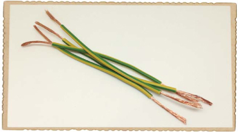

#### 步骤 2：将电极插入柠檬

将柠檬滚动并挤压，以便打破其中的小汁包，但不要破坏柠檬皮。然后，用钉子在一端打一个孔，将铜线插入该孔，并将钉子插入另一端，如图所示。这就是第一个柠檬电池！

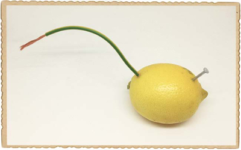

获取你的万用表，将其设置为直流电压测量，并现在测试你的柠檬电池。将正测试探头放在铜线上，负测试探头放在钉子上。如果一切正常，你应该能在万用表上看到大约 1 伏的电压。

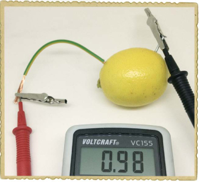

#### 步骤 3：制作四个柠檬电池

即使你的柠檬电池能输出 1 伏特，这也不足以点亮 LED。让我们制作多个柠檬电池，这样就能获取更多电力！

只需重复步骤 2 中描述的过程，将其他柠檬也处理成电池。（如果你没有四个柠檬，可以将一个柠檬切成四块。）现在你应该已经有四个柠檬电池了。

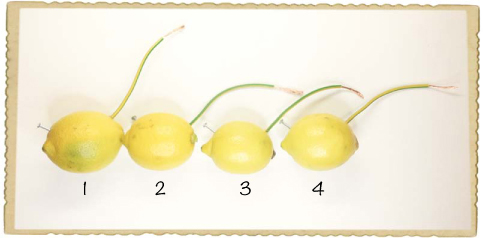

#### 步骤 4：将柠檬串联起来

要通过柠檬电池获得更高的电压，你需要将它们串联起来。要将两个柠檬串联，只需将一个柠檬的正极连接到另一个柠檬的负极。记住，铜线是正极，钉子是负极。

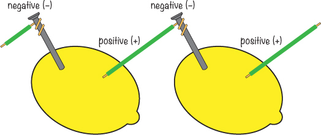

要将四个柠檬串联，只需再重复这一过程几次。将柠檬排成一行，铜线朝右，按照从左到右的顺序为柠檬编号 1 到 4。将柠檬 1 的铜线连接到柠檬 2 的钉子上。将电线拧到钉子上，确保金属连接在一起且不松脱。

将柠檬 2 的铜线连接到柠檬 3 的钉子上，再将柠檬 3 的铜线连接到柠檬 4 的钉子上。这样你应该会得到四个柠檬排成一行，柠檬 1 上有一个未连接的钉子，柠檬 4 上有一个未连接的铜线。这些分别是你大柠檬电池的正负极。

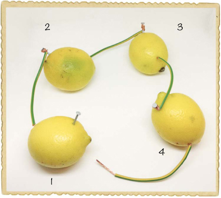

当你将电池串联时，可以将它们的电压相加，得到总电压。四个 1V 的柠檬电池应该可以提供 4V。如果你有万用表，测量两端之间的电压，检查是否一切连接正常。你应该会得到大约 3.5 到 4V 的电压。

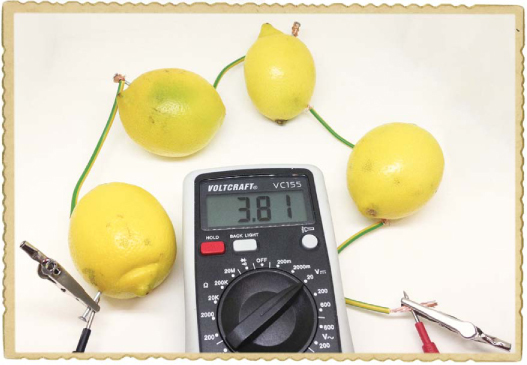

#### 第五步：测试你的柠檬电池

让我们把 LED 连接到柠檬上吧！将 LED 的长腿连接到铜线，短腿连接到钉子上，如图所示。现在 LED 应该会亮起来。

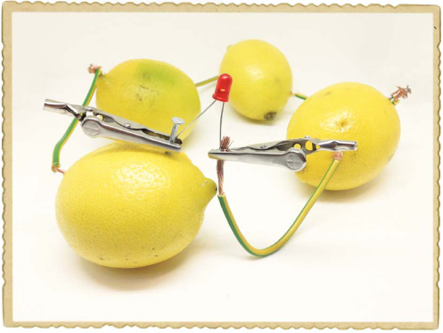

柠檬不是超级强大的电池（比如你永远不会看到有人用柠檬连接电脑），所以你的 LED 可能会非常暗。完成柠檬电池电路后，关掉房间的灯，你应该能看到 LED 发光。

记住，当你完成柠檬电池后，要把柠檬丢掉——不要吃它们！

**尝试一下：更多食物电池！**

当你完成柠檬电池后，可以测试一下是否能用其他水果或蔬菜制作电池。例如，土豆电池怎么样？你能得到更高的电压，还是和柠檬电池的电压一样？

#### 第六步：如果你的柠檬灯不亮怎么办？

如果你的 LED 灯没有亮，即使在黑暗的房间里，也要检查你的 LED 是否连接正确。长腿应该连接到电池的正极，也就是铜线。

确保柠檬只通过电线和钉子连接在一起。例如，如果你的柠檬泡在柠檬汁的水坑里，它们可能会通过柠檬汁相连。只需擦干它们并把它们移到其他地方。接下来，检查铜线是否正确连接到钉子上，并确保钉子和铜线实际接触到柠檬内部的汁液。另外，检查钉子和铜线是否在任何柠檬内部接触到对方。

如果电路仍然无法工作，先断开所有柠檬电池的连接。然后，使用万用表检查每个柠檬电池是否有电压。将两个柠檬串联起来，检查是否得到更高的电压。再连接第三个柠檬，检查电压是否再次增加。然后连接第四个柠檬，检查电压是否更高。

如果你能看到电压但 LED 灯仍然不亮，可能是你需要更多的电力。再拿一个或两个柠檬，制作更多的电池，并将它们与其余部分串联起来。

**接下来是什么？**

在本章中，你学习了如何利用磁力和化学反应产生电能。你制作了自己的摇动发电机，还用柠檬电池为 LED 灯供电。

如果你想进一步探索发电机，我建议尝试从旧自行车上找一个*发电机*。与本章中你所建造的发电机不同，发电机能够提供直流电压，就像电池一样，发电机通常用于为自行车的车头灯供电。用硬纸板或塑料剪下几片风车叶片，将它们连接到发电机上，看看你是否能从风中收集能量。

你现在已经接触到一些电子元件，包括开关、LED 灯和电动机。在接下来的章节中，你将学习更多的元件，并开始搭建一些真正的电子电路，比如闪烁的灯光、触摸敏感开关，甚至是你自己的电子乐器！
