## 第四章：使用 LEDs 制造光

灯光，尤其是 LED，广泛应用于电子产品中。有时，它们只是简单的指示灯，用来显示设备是否开启，但它们也可以是更复杂设备的一部分，比如计算机显示器。事实上，一些显示器实际上是由成千上万的微小 LED 组成的。

在这一章中，你将了解电子学中最常见的两种基本元件是如何工作的：电阻器和 LED。我会告诉你如何让 LED 损坏，但不用担心：你也会学到如何使用电阻器来保护 LED 不受损坏。在本章的项目中，你还将开始使用一种新工具，叫做*面包板*，来连接电路。本书中的许多项目都使用面包板，你也可以使用它们自己构建很多有趣的项目。

### 认识电阻

记住，电阻会限制电流在电路中的自由流动。*电阻*是一个在电路中增加电阻的元件。电路中的电阻越大，通过的电流就越少。

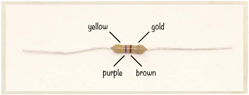

#### 电阻颜色编码

当你看一个电阻时，你会注意到它有几条颜色带。这些颜色告诉你电阻的值。电阻的单位是*欧姆*，但我们在写作时会用*Ω*符号来表示。更多的欧姆值意味着更多的电阻。

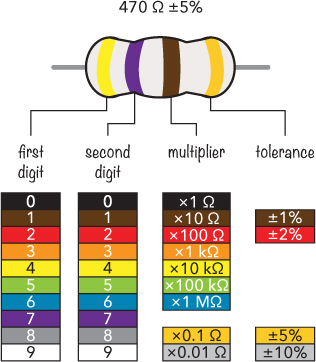

大多数电阻有四条颜色带。从左边开始，第一条带子表示电阻值的第一个数字。在这个例子中，第一条带子是黄色，因此第一个数字是 4。第二个数字由第二条带子给出，这条带子是紫色的，表示 7。加在一起，这给出了基础值 47。接下来，我们将 47 乘以第三条带子的值——*乘数*。在这个例子中，棕色带子表示 10 Ω，因此我们将 47 乘以 10：

47 × 10 Ω = 470 Ω

**注意**

*如果一个电阻有五条带子而不是四条，那么前面三条是数字，第四条是乘数。*

但电阻的实际电阻值通常不会与其标注值完全匹配！听起来有点疯狂，对吧？制造商很难生产出具有非常精确电阻值的电阻，因此他们会确保电阻值接近标注值，并告知你实际电阻值可能的误差范围。

这就是*容差*的作用。我们的示例电阻标注为 470 Ω，容差为 5%。这意味着电阻的实际电阻值可能比 470 Ω高或低 5%。因为 5%的 470 大约是 24，所以实际电阻值可能在 446 Ω到 494 Ω之间。

通常，表示电阻值的三个带状区域会靠在一起，而表示容差的带状区域则会稍微分开。但有时这些带状区域靠得非常近，难以分辨哪三个带表示电阻值。幸运的是，第四个带通常是金色或银色的，因此如果看到金色或银色的带状区域，可以推测这就是容差带。

**如何书写大数值**

我们的电阻颜色图表展示了在Ω符号前加了*k*和*M*的电阻值。这是一个简写方式，让写出非常大的数值变得更简单。如果你有一个电阻值为 300,000 Ω的电阻器，通常会将其简写为 300 kΩ，其中*k*代表千（kilo），即一千。*M*代表百万（mega），即一百万。因此，代替写 3,000,000 Ω，你可以写成 3 MΩ。

#### 电阻器是由什么材料制成的？

要制作电阻器，你可以仅仅使用一段非常长的标准电线。电线本身有一定的电阻，电线越长，电阻越大。但使用数英里的电线来减少电流并不是很高效。更好的方法是使用电阻更大的材料，比如碳。你在商店里购买的电阻器通常是由碳材料包裹在绝缘材料内制成的。

#### 电阻器控制电流和电压

一开始，你可能会觉得电阻器有点无聊。如果你把它接到电池上，可能什么都不会发生；电阻器可能只是变暖，你会想这有什么大不了的。另一方面，如果你使用一个非常低电阻值的电阻器，比如 10 Ω，它可能会变得*非常*热——热到足以烧伤你——而且电池可能很快就会耗尽。

**警告**

*将一个低值电阻器直接连接在电池的正负极之间，在某些类型的电池上可能是危险的。某些电池的电流足以让你的电阻器燃烧起来。要小心！*

但电阻器的一个酷点是你可以利用它们来改变电路中的电压和电流！这意味着你可以掌控你的电路，决定它应该如何工作。

### 引入欧姆定律

控制电路中的电流和电压的关键是一个叫做*欧姆定律*的公式。欧姆定律将电阻、电压和电流关系如下：

*V* = *I* × *R*

这些字母的含义如下：

***V***   电压，单位为伏特（V）

***I***   电流，单位为安培（A）

***R***   电阻，单位为欧姆（Ω）

根据这些定义，欧姆定律用英文表达为：“电压等于电流乘以电阻。”你也可以用以下两种形式来书写欧姆定律公式：

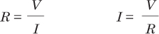

让我们把欧姆定律付诸实践。假设你有一个电阻器和一块 9 伏电池，并且你希望电阻器中流过 0.05 安培的电流。你需要多大的电阻才能让电流通过？使用欧姆定律来计算：

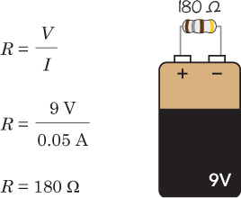

将电压除以电流，你会发现，为了让电流在电阻器中流动 0.05 A，你需要一个 180 Ω 的电阻器。

### 项目 #7: 让我们摧毁一个 LED！

几乎所有的电子产品都有一些 LED，我在 第三章 中介绍了它们。在有 LED 的地方，也总会有电阻器。环顾四周，你很有可能会看到一些。例如，看看电脑、洗衣机、电视机或 Wi-Fi 路由器。当你按下按钮时，是否看到一些闪烁的灯光？那些很可能是和电阻器串联的 LED。

在 “项目 #6: 使用柠檬电池点亮灯” 中，第 58 页 你仅仅将 LED 连接到自制的柠檬电池上，仅此而已。然而，在大多数电路中，你需要更加小心，以确保不会损坏 LED。如果电流通过 LED 过大，LED 会变得非常热并烧坏。柠檬电池的电流太弱，无法足以损坏 LED。

当然，我可以一直给你讲这些内容，但在现实中尝试是最好的学习方式！我自己也曾摧毁过几个 LED，才接受了没有电阻器无法将它们直接连接到电池上这一事实。我希望你也能体验一下这种情况。这就是为什么在这个项目中，你将要摧毁一个 LED！

#### 购物清单

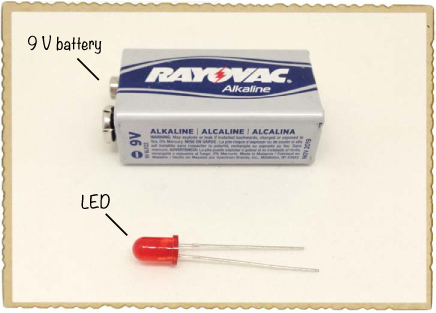

 **标准 LED**（Jameco #333973，Bitsbox #OP002）。

 **标准 9 V 电池** 用于为电路供电。

#### 第一步：识别每根 LED 引脚的功能

仔细观察你的 LED，你应该会发现一根引脚比另一根长。LED 是 *有极性的*，这意味着电流只有在你按照特定方式将它们连接到电路时才会流过它们。较长的引脚叫做 *阳极*；它是你连接到电池正极的一根。较短的引脚叫做 *阴极*，你将它连接到电池的负极。

在某些 LED 上，引脚的长度相同。在这种情况下，找出 LED 底部的平面部分。平面一侧的引脚是阴极。

#### 第二步：摧毁那个 LED！

为了避免烫伤手指，请抓住 LED 的一根引脚。然后，将 9 V 电池放在桌子上，并将 LED 的引脚直接接触到电池的端子上。

LED 应该会在短暂的一瞬间亮起，然后变热，最后熄灭。它的某些部分可能会变黑。恭喜你：你刚刚摧毁了你的第一个 LED！

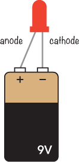

**注意**

*有些 LED 在直接连接到电池后会在一秒钟内停止工作。其他 LED 可能会亮上一些时间。*

#### 第三步：如果 LED 没反应怎么办？

如果没有反应，可能有三种原因：

 你把 LED 连接反了。

 你的 LED 已经坏了。

 你的电池没电了。

首先，试着将 LED 反向连接到电池。如果你确信它是正确连接的，那么可能是 LED 已经坏了，或者电池没电了。首先尝试更换电池；如果没用，再更换 LED。现在，你应该能烧坏你的 LED。

### 如何正确使用 LED

尽管破坏 LED 挺有趣的，但最好知道如何*避免*烧毁 LED。你的 LED 烧毁是因为电流过大，但你可以通过你信任的伙伴——电阻来防止这种情况。电阻会抵抗电流的流动，如果你选择了正确的电阻值，它们会适当地抵抗电流，从而为你的 LED 提供恰到好处的电流。

**如何写小数值**

在电子项目中，你经常需要处理非常小的数值，尤其是在测量或计算电流时。例如，本书中的大多数电路的电流值都小于 0.1 A，很多电流值接近 0.02 A。为了简化这些数值的书写，我通常使用前缀*milli*，它写作小写的*m*，表示千分之一。所以 1 mA 就是 0.001 A。因为 1,000 mA 等于 1 A，所以 0.02 A 就变成了 20 mA，而 0.1 A 则变成了 100 mA。

#### 用电阻保护你的 LED

在电路中，LED 应该始终与电阻串联。当然，电阻有很多不同的阻值，要找出适合你电路的电阻，你需要做一些数学计算。

大多数标准 LED 需要约 2 V 的电压和约 20 mA 或 0.02 A 的电流才能点亮。这两个数值，加上你的电池电压，就是你需要的全部信息来计算正确的电阻。只需将这两个数值代入以下公式：

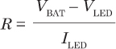

如果这个公式看起来很熟悉，那是因为它其实是欧姆定律的另一个版本。两个*V*和*I*仍然代表电压和电流，但*V*[BAT]是电池电压，*V*[LED]是 LED 点亮所需的电压（通常是 2 V），而*I*[LED]是 LED 所需的电流（通常是 20 mA）。你可以这样理解这个公式：“要计算电阻，就将 LED 电压从电池电压中减去，然后将结果除以 LED 电流。”

#### 计算所需的电阻

想象你有一个 9 V 电池，一个电阻和一个标准 LED。电阻的阻值应该是多少？根据上一节的公式，你应该得到：

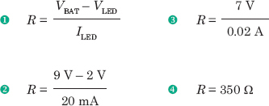

这意味着你需要一个 350 Ω的电阻，以确保电路中流动的电流恰到好处。

### 项目 #8：为 LED 供电

现在让我们用保护电阻为标准 LED 供电，以免 LED 烧毁。我们刚刚计算出，要用 9 V 电池给 LED 供电，你需要一个 350 Ω的电阻。

正如我在“电阻色码”中第 70 页所解释的那样，标准电阻值并不总是你所需的精确电阻。如果你购买一个 350 Ω的电阻，它不一定就是 350 Ω，可能是 370 Ω。而且并不是所有的电阻值都有现货。对于 LED 电路中的电阻，精确值并不重要。幸运的是，你在标准电阻包中找不到 350 Ω的电阻。相反，你可以使用 330 Ω的电阻，这个值是一个标准值，容易找到。

#### 购物清单

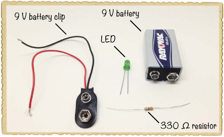

 **一个标准的 9 V 电池**用于为电路供电。

 **一个 9 V 电池夹**（Jameco #11280，Bitsbox #BAT033）用于将电池连接到电路。

 **一个标准的 LED**（Jameco #333973，Bitsbox #OP002）

 **一个 330 Ω的电阻**（Jameco #661386，Bitsbox #CR25330R 为这个特定值，或 Jameco #2217511，Bitsbox #K017 为一套多种电阻）用于限制 LED 的电流。

#### 步骤 1：扭接电阻和 LED

首先，将 LED 的短脚（或阴极）连接到电阻的一端。连接电阻的哪一端无关紧要；只需要将电阻的脚绕过 LED 的脚即可。

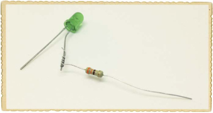

#### 步骤 2：连接电池夹

将电池夹的红线连接到 LED 的长脚上。然后将黑线连接到电阻的未连接一侧。

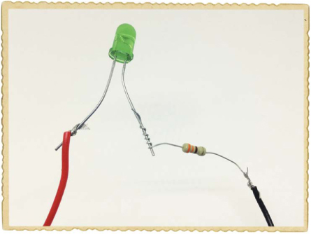

#### 步骤 3：让光亮起来！

现在，将电池插入电池夹，你的 LED 应该会亮起来！

#### 步骤 4：如果 LED 不亮怎么办？

如果你的 LED 没有亮，首先断开电池连接，确保你按照步骤 1 到步骤 3 的描述精确地连接了元件。让其他人检查你的连接也可能很有帮助；可以请父母、兄弟姐妹或朋友帮忙看一看。

如果你的连接看起来正常，但 LED 仍然不亮，那么请再检查一下 LED 的方向；几乎每个做过电子项目的人都至少曾将 LED 接反过一次。长脚是阳极，在这个项目中，它应该连接到电池的正极。

### 在面包板上搭建电路

到目前为止，你已经通过胶带或将元件脚扭在一起连接了电路，但当电路中有多个元件时，这种方式并不太实际。幸运的是，*面包板*可以使连接元件变得更容易。面包板上有孔，你可以将元件引脚插入这些孔中以创建电路。完成后，你可以拔出所有元件，并将它们在不同的项目中重复使用！

#### 如何连接元件和电线

在面包板内部，金属板按照特定的模式连接外部看到的孔。让我们来看一个有四个连接区域的面包板——两个供电区域和两个元件区域。

在两侧的电源区域，*每一列*中的所有孔都是相连的。通常，你会将电路的正极——例如你目前使用的电池——插入红色列，而将电源的负极插入蓝色列。在本书中，我会将带红线标记的电源列称为*正电源列*，而将带蓝线标记的电源列称为*负电源列*。

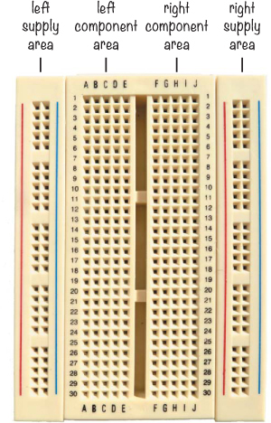

在元件区域，*每一行*中的所有孔是相连的，列与列之间没有连接。左侧和右侧的元件区域是分开的，因此它们之间没有连接。例如，第 1 行的孔 A、B、C、D 和 E 是相连的，而第 1 行的孔 F、G、H、I 和 J 是相连的，但第 1 行的孔 E 和 F 并不相连。

要将元件插入面包板，只需将它推入你希望连接的孔中。例如，如果你想将电阻的一端连接到 LED 的正极，你只需将电阻的引脚和 LED 的引脚插入同一行的两个孔中，位置可以是在左侧或右侧的元件区域。如果你有两个不应该连接的元件引脚或导线，只需确保它们位于元件区域的不同排或元件区域的两侧。

#### 面包板使用的导线

最终，你会想要将面包板上的一行与另一行连接。你可以使用导线来建立连接，但并非所有的导线都适合面包板。导线需要足够坚硬，以便你能将其推入孔中而不弯曲，而且导线必须足够粗，以便完全插入面包板的孔中而不掉出来。*单股*导线是最适合在面包板上搭建电路的导线，因为它们内部有一个实心的核心，而不是许多细小的导线缠绕在一起。你需要的导线粗细取决于你的面包板，但直径为 0.016 到 0.028 英寸的导线应该适用。导线的粗细通常用*美国线规（AWG）*表示，我建议使用 21 到 26 AWG 的导线。你可以购买已经裁剪和去皮的导线，方便在面包板上使用，或者你可以用切线钳裁剪和去皮自己的导线。

另一种选择是使用面包板*跳线*。这些跳线有坚固的端部，非常容易连接到面包板。如果你计划在面包板上连接很多电路（你应该这样做！），可以准备一些面包板跳线，方便你的操作。

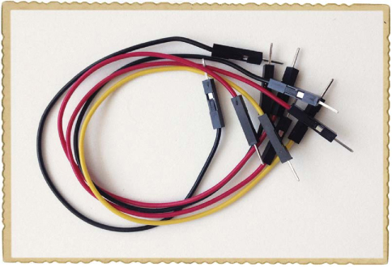

### 项目#9：你的第一个面包板电路

让我们在面包板上连接一个简单的电路！就像在“项目 #8: 为 LED 提供电源”中介绍的那样，这个电路点亮一个 LED，但这次我们将在面包板上构建电路。在这个项目中，我们不会使用侧面的供电轨，因为电路非常简单，直接将其连接到组件区域会更合适。

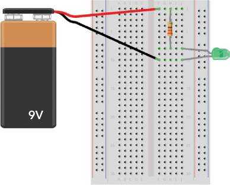

#### 购物清单

 **一个面包板**（Jameco #20601，Bitsbox #CN329），至少有 30 行。

 **一个标准的 9V 电池**，用于为电路提供电源。

 **一个 9V 电池夹**（Jameco #11280，Bitsbox #BAT033），用于将电池连接到电路。

 **标准 LED**（Jameco #34761，Bitsbox #OP003）。

 **330 Ω 电阻**（Jameco #661386，Bitsbox #CR25330R 对于这个值，或者 Jameco #2217511，Bitsbox #K017 用于多种包装），用于限制 LED 的电流。

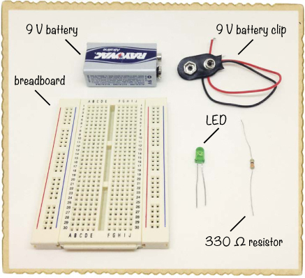

#### 第 1 步：放置电阻

首先，将电阻的一端放置在第 1 行，另一端放置在第 8 行。

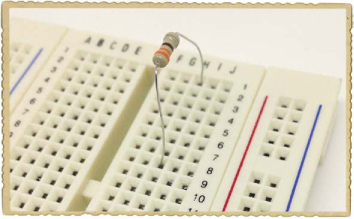

#### 第 2 步：放置 LED

记住，LED 是有极性的，必须按照正确的方式连接才能工作。将 LED 的长腿连接到第 8 行，那里是电阻的引脚连接的位置。因为电阻和 LED 的引脚在同一行，它们现在已经连接好了。将 LED 的另一端连接到第 10 行。

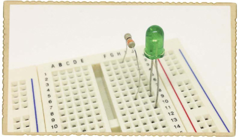

#### 第 3 步：放置电池夹

现在，连接电池到 LED 和电阻。将电池夹的红色电线连接到第 1 行，黑色电线连接到第 10 行。将电池插入夹子，你的 LED 应该会亮起！

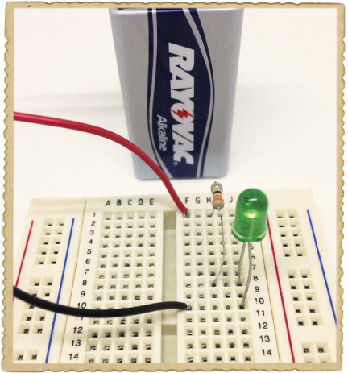

#### 第 4 步：如果 LED 不工作怎么办？

如果你的 LED 不亮，首先断开电池连接。在对电路进行更改时，你应该始终断开电池。然后，检查 LED 的短腿是否连接到电池的负极。

如果你的 LED 在正确方向上仍然无法正常工作，请检查你的组件是否按步骤 1 到 3 中的描述正确连接。LED 的长腿和一个电阻的引脚是否在第 8 行？电池的正极引线是否与另一个电阻引脚在同一行？电池的负极引线是否与 LED 的短腿在第 10 行？也可以让其他人看看你的电路，也许他们能帮你找到问题所在。

**接下来做什么？**

在本章中，你学到了两个非常常见的组件：电阻和 LED。你还学习了如何使用欧姆定律来计算电阻、电流和电压值。这些知识将为你在本书中探索电子学的许多方面奠定基础。

你还学会了使用面包板，这是一个非常实用的技能。为了练习如何在面包板上放置电路，试着在没有胶带的情况下重新构建本书前面做过的某个项目！你将如何在面包板上重现“项目#2：入侵者报警器”，位于第 11 页的内容？

在下一章，你将学习另外两个组件：电容器和继电器。然后，我会向你展示如何构建我最喜欢的电路之一——一个会闪烁灯光的电路！
