## 第五章：第一次让灯光闪烁

当我还是个孩子的时候，我的第一个电子项目之一就是制作一个闪烁的灯光。看到电路第一次工作时真是太神奇了，现在我想和你分享这一经验。在这一章里，你将学到电容器和继电器的工作原理。这是两个常见且非常有趣的电子元件，我将向你展示如何与它们玩得开心。最后，你将自己制作一个闪烁的灯光！

### 认识电容器

*电容器*就像一个可充电电池；你可以为电容器充电，并利用它的能量为某些东西供电。但电池能够存储的能量比电容器要多得多。电池可以为 LED 供电好几天而不需要充电，而大多数电容器最多只能为 LED 供电几秒钟。

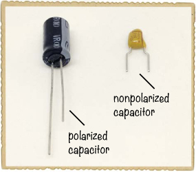

电容器常用于电路中引入时间延迟。例如，由于电容器能够储存能量，它可以在断电后继续保持 LED 亮起一段时间。这一小技巧也可以与其他元件配合使用，以创造有趣的效果。

#### 电容器的工作原理

从内部结构来看，电容器是非常简单的设备。它们由两块金属板组成，这些板非常接近，中间夹着类似纸张的材料。为了节省空间，金属板和中间的材料会被折叠或卷成一个紧凑的包裹。

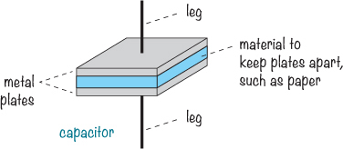

当你将电池连接到电容器的两端时，电池会试图推动电子通过电容器，从而使电流流动。但电子不能跨越板之间的空隙流动，因此，电子会积聚在一片板上，而离开另一片板。最终，当一片板上的电子无法再容纳更多时，电流就会停止流动；此时，我们称电容器已*充满电*。

就像电池中的电子一样，电容器中的电子也不喜欢挤在同一片板上。它们想要流向电子较少的一侧。这意味着你的电容器中储存了潜在的能量。如果你断开电池连接，并将一个电阻连接到电容器两端，那么电容器上一片板上的储存电子就会开始流向另一片板，通过电阻流动，以达到电子较少的那一面。

#### 极性电容器与非极性电容器

电容器可以是*极性*电容器，也可以是*非极性*电容器。像 LED 一样，极性电容器有正负引脚，且正引脚必须始终连接到电池的正极。照片中显示的黑色电容器是极性电容器，其负引脚上有条纹和负号标记。黄色电容器是非极性电容器，因此引脚的连接不受影响。

**警告**

*在使用极性电容器进行本书中的项目和你自己的项目时，请小心。你必须以正确的方式连接它们，以防止损坏电容器。*

在所有需要电容器的电路中，只要你能找到一个具有正确*电容量*的非极性电容器，你就可以使用它。电容量以法拉（F）为单位，电容越大，电容器能够储存的能量越多。由于大电容量的非极性电容器需要非常大，因此不会生产。极性电容器能够在较小的空间内储存更多能量，但它们有一个缺点，即必须按照正确的方式连接。

在构建具有大电容量的电路时，你将使用极性电容器。始终确保任何极性电容器的正极端子连接到电池的正极。

#### 电容器电容量

本书中使用的电容器将具有μF（微法拉）、nF（纳法）或 pF（皮法）范围的电容量。电容量通常非常小，通常使用*微*、*纳*和*皮*这些前缀，定义如下：

 μ（微法）表示*百万分之一*，所以 1,000,000 μF = 1F

 n（纳法）表示*十亿分之一*，所以 1,000,000,000 nF = 1F

 p（皮法）表示*万亿分之一*，所以 1,000,000,000,000 pF = 1F

极性电容器足够大，可以在上面标明它们的电容量。而非极性电容器则稍微复杂一些。它们通常非常小，所以往往有像*104*或*202*这样难以理解的代码。我总是忘记这些代码的含义，所以当我需要弄清楚某个代码是什么意思时，我通常会查表。你可以在第 283 页的“电容代码”表格中找到常见代码。

但像大多数事物一样，电容器玩起来比读它们有趣。完成下一个项目，你会亲自看到电容器是如何工作的。

### 项目 #10: 测试一个电容器

这个项目展示了电容器如何储存能量。它几乎与你在项目 #9: 你的第一个面包板电路中构建的电路相同，只不过这次你将添加一个电容器。当你从电路中移除电池时，如这里所示，你会看到 LED 仍然亮着一两秒钟。那是因为电容器正在使用其储存的能量为 LED 供电。

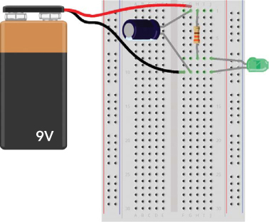

#### 购物清单

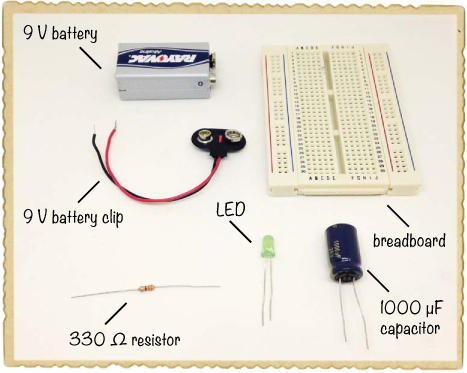

 **一个面包板**（Jameco #20601, Bitsbox #CN329），至少有 30 排。

 **一个标准的 9 V 电池**，用于为电路供电。

 **一个 9 V 电池夹**（Jameco #11280, Bitsbox #BAT033），用于将电池连接到电路中。

 **一个标准的 LED**（Jameco #34761, Bitsbox #OP003）

 **一个 330 Ω的电阻**（Jameco #661386, Bitsbox #CR25330R），用于限制 LED 的电流。

 **一个极性为 1000 µF 的电容器**（Jameco #158298, Bitsbox #EC1KU25）

#### 第一步：从 LED 电路开始

按照 “项目 #9：你的第一个面包板电路” 中的说明，确保你完成的电路能够成功点亮 LED 灯。然后，断开电池，继续进行下一步。

#### 第二步：添加电容器

将电容器连接到电池。由于电容器是有极性的，所以将标有负号或零的引脚放在与电池负极脚相同的面包板行中。将另一个引脚连接到与电池正极脚相同的行中，如图所示。

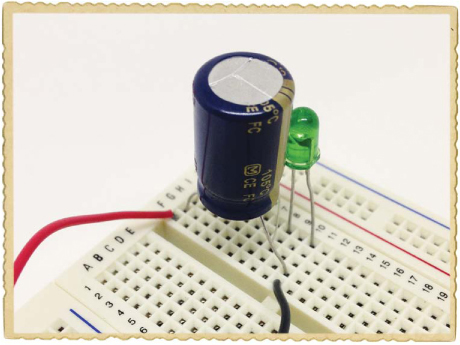

#### 第三步：给电容器充电

将电池连接到夹子上，LED 应该亮起。与此同时，电池应该会很快充电给电容器。

#### 第四步：使用电容器点亮 LED

在拔掉电池时观察 LED。LED 不应该立即熄灭，而是应该保持亮起一秒钟左右，然后慢慢地褪色，直到电容器没有剩余的能量。

#### 第五步：如果电路不工作怎么办？

首先，检查电路在没有电容器的情况下是否能工作。如果不能，返回第一步，在继续之前先确保 LED 电路正常工作。

如果电池连接时 LED 亮起，但一旦移除电池，LED 就熄灭了，那么电路中的电容器部分可能有问题。检查电容器的正极脚是否连接到电池的正极脚（照片中的第 1 行），另一个脚是否连接到电池的负极脚（照片中的第 10 行）。

如果电路看起来正确，确认电容器的容量至少为 1000 µF；电容器上应该写有其容量值。如果小于 1000 µF，尝试使用更大的电容器。

### 使用符号描述电路

到目前为止，你已经使用了几个组件构建电路。要构建更有趣的电子项目，通常需要更多的组件。但是，将每个组件在一个大电路中按实际样子一一绘制出来会显得杂乱无章且耗时。这时，*电路图*，也叫*原理图*，就能派上用场了。

在电路图中，每个组件都有一个简单的符号，这使得你可以快速绘制整个电路。就像单词和书籍一样，直到你了解不同符号的含义，否则电路图可能看起来有些复杂。让我们直接开始，学习一些符号吧！这是一个包含 LED、电阻和电池的电路，以及它的电路图：

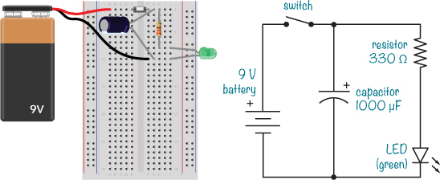

电池符号上有一个+号，表示正极脚的位置。有时你会看到没有加号的电池符号；在这种情况下，正极是长线那一侧。

**注意**

*电池符号可能会画成两条线、四条线，有时甚至更多条线。不管有多少条线，只需查看指定的电压，并使用相同电压的电池即可。*

开关符号非常简单，无论你怎么画它都无所谓。在 LED 符号中，三角形尖端的线表示 LED 的负极，或者是阴极。对比“真实版”，你会发现 LED 的正极脚在两种电路图中都确实与电阻相连。另一方面，电阻是没有极性的，所以它的符号没有方向标记。有极性和无极性的电容符号都有，但我们的示例显示的是有极性的版本，它的正极上标有 + 符号。再看一遍电路和电路图——你同意它们是一样的吗？

一旦你学会了仅通过查看电路图来构建某个东西，一个全新的世界将向你展开。现在你几乎可以在互联网上找到任何东西的电路图，比如收音机、MP3 播放器、对讲机，或者你想要构建的任何东西！在本书中，我会教你更多的电路符号，随着我们使用更多的组件。

### 认识继电器

我小时候非常好奇，总是想知道事物是如何运作的。对我来说，电子设备，比如收音机或电视，简直就像是魔法。我完全不知道它们是怎么工作的，而且我不相信自己会理解如何制造它们。

但有一天，我问爸爸，如何才能让灯光自动闪烁。我想，如果我能理解这一点，我就能理解更多。幸运的是，我爸爸是个工程师，而且他善于用实际的方式解释问题。当我问他如何闪烁灯光时，他向我介绍了一个 *继电器*，就像这里展示的那样。

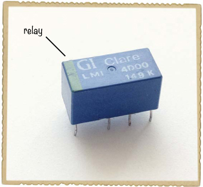

第一章介绍了如何使用开关来开关电器。第二章向你展示了如何使用电磁铁来移动物体。试想一下，将电磁铁与开关结合起来：你不再需要按按钮来改变开关的位置，而是加入一个电磁铁，它可以自动改变开关的位置。这就是继电器的工作原理，这幅插图展示了它是如何工作的：

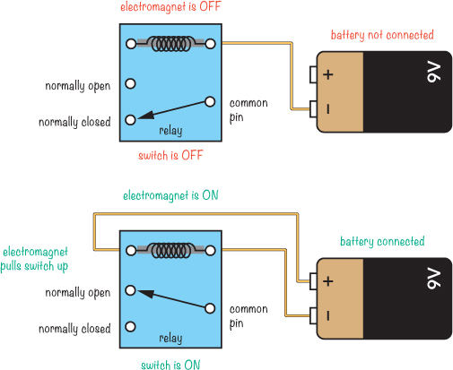

白点代表继电器的引脚。注意，连接处标注了 *公共引脚*、*常闭* 和 *常开*。这些标签的定义如下：

**公共引脚 (COM)** 连接到 NC 或 NO

**常闭 (NC)** 在线圈断电时连接到 COM

**常开 (NO)** 在线圈通电时连接到 COM

当电池没有连接到继电器线圈时，电磁铁不会吸引，开关的 COM 端连接到 NC 端。但当你将电池连接到继电器线圈时，电磁铁通电，开关被拉动，从而使 COM 端连接到 NO 端。你可以通过连接或断开电池来改变开关的位置！

#### 使用继电器闪烁灯光

如果你将继电器连接到电池，使电磁铁通过继电器的 COM 和 NC 开关接点与电池连接，那么电磁铁将不断开关。这里有一个连接到灯泡的继电器电路示例：

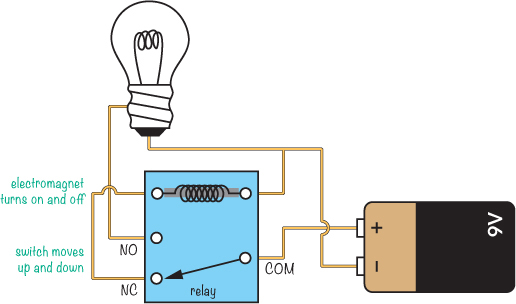

在你将电池连接到电路之前，电磁铁是关闭的，COM 和 NC 的开关接点是连接的。当电池连接到电路时，电磁铁将通过开关从电池获取电力。这意味着它会拉动开关，将 COM 和 NO 连接起来，从而为灯泡提供电力。

但是当开关处于这个位置时，电池将不再连接到线圈，电磁铁将失去电力。当电磁铁没有电力时，开关会回到原来的位置，切断电池与灯泡的连接。电池会再次为电磁铁提供电力，之前描述的过程会重复。

在这个例子中，看起来你会得到一个闪烁的灯光，对吗？理论上是的。但继电器开关的开关速度太快，你看不到灯光正常开关！相反，你会听到一个非常快的滴答声，因为继电器在不停切换，但灯光似乎一直处于黑暗状态。

#### 放慢闪烁速度

要构建一个让你真正看到灯光闪烁的电路，你需要放慢继电器的闪烁速度。电容器可以帮助实现这一点。在“项目#10：测试电容器”中的第 92 页，将电容器添加到 LED 电路中使 LED 在断开电池后短时间保持亮灯。如果你将电容器接到我们闪烁速度过快的电路中的电磁铁上，电磁铁也会保持亮一会儿。

但是电磁铁不会长时间保持关闭，因此在这种情况下，灯光似乎会一直亮着。为了让它保持更长时间关闭，你需要放慢电容器的充电速度，以便它在放电后不会立刻恢复到完全充电的状态。为此，你可以减少流入电容器的电流量。那么，如何减少电流量呢？用电阻器！为了用继电器闪烁 LED 灯，你需要使用一个像这样的电路，接下来我们将一起构建：

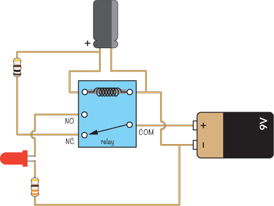

### 项目#11：闪烁灯光！

现在是时候通过闪烁 LED 来构建你的第一个闪烁灯光了。这是完整的电路图——你认得出这些组件吗？

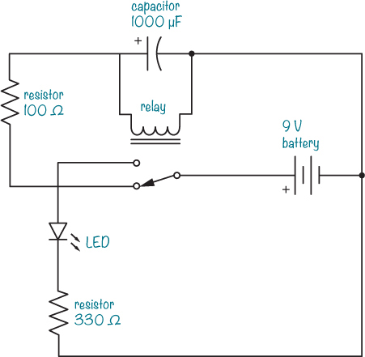

在连接电路时，最好以电路图的方式连接。这样，如果电路之后无法正常工作，找出问题就会更加容易——而且你会发现，电路通常不会在第一次尝试时就成功。排查错误并找出解决方法是这个过程的一部分！

#### 购物清单

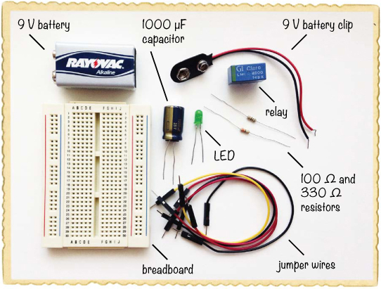

 **一个面包板**（Jameco #20601，Bitsbox #CN329），至少有 30 行。

 **面包板跳线**（Jameco #2237044，Bitsbox #CN236），用于方便地连接电路。（标准的连接线也可以使用。）

 **一个标准的 9V 电池**，用于为电路供电。

 **一个 9V 电池夹**（Jameco #11280，Bitsbox #BAT033），用于将电池连接到电路。

 **一个 DPDT 或 SPDT 继电器**（Jameco #842996，Bitsbox #SW073），带有 5V、6V 或 9V 的线圈。

 **一个标准 LED**（Jameco #34761，Bitsbox #OP003）

 **一个极化的 1000 µF 电容**（Jameco #158298，Bitsbox #EC1KU25）

 **一个 100 Ω电阻**（Jameco #690620，Bitsbox #CR25100R），用于限制流向电容的电流。

 **一个 330 Ω电阻**（Jameco #661386，Bitsbox #CR25330R），用于限制流向 LED 的电流。

#### 步骤 1：识别继电器引脚

不知道继电器哪个引脚是哪个，是构建这个电路时最大的错误来源。所以现在我们来看看这些引脚。要了解每个引脚的功能，请查阅继电器的*数据表*。数据表是告诉你电气元件如何工作的文档。对于继电器，它应该会说明你需要什么电压来驱动电磁铁线圈，能通过接触点流多少电流，等等。你应该能在你购买继电器的产品页面找到数据表的链接。

对于我推荐的继电器，引脚按如下方式排列：

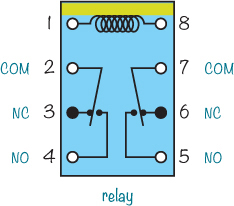

这种类型的图叫做*引脚图*，它展示了每个引脚的功能。视图是从上方看的，引脚隐藏在继电器塑料外壳下方。我建议你在纸上画出引脚图，并在连接电路时放在桌子上，这样你可以反复检查，确保连接正确。

在这个继电器中，引脚 1 和 8 是电磁铁线圈的引脚——你可以通过上面的线条来识别这些引脚。当你看到带有线条的继电器时，检查引脚的位置，应该和引脚图中的位置一致。

引脚图还显示有两个开关。引脚 2 到 4 构成一个开关，5 到 7 构成另一个开关。不过，不用担心记住继电器的引脚。你可以随时参考引脚图，如果卡住了，我鼓励你在需要时这样做。另外，不同类型的继电器可能会有不同的引脚图。

#### 第 2 步：让继电器切换更快

首先，让我们连接继电器，使其能够自动开关。将继电器放置在面包板的中间，居中于缺口处，一侧放在每个组件区域内。这样，任何引脚都不应该与其他引脚连接。

将电池夹的正极插入左侧的正电源列，将负极插入同一侧的负电源列。将一根跳线从负电源列连接到与右侧线圈引脚（8 号引脚）相同的行，如图所示第 9 行：

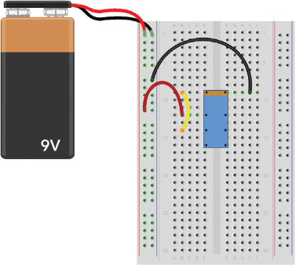

接下来，将一根导线从左侧的正极列连接到继电器的公共开关引脚（2 号引脚）。在这个图中，公共引脚位于第 12 行 B 列。然后，将一根导线从继电器的 3 号引脚（常开引脚，NC 引脚）连接到线圈引脚（1 号引脚）；这就是图中从第 14 行到第 9 行 B 列的黄色导线。连接 9V 电池，你应该能听到非常快速的滴答声。这是继电器的开关操作。现在暂时断开电池。

#### 第 3 步：让继电器保持开启更长时间

下一步是通过将电容器并联连接到电磁铁线圈上来减慢继电器的反应速度。按照如下所示的方式连接电容器：

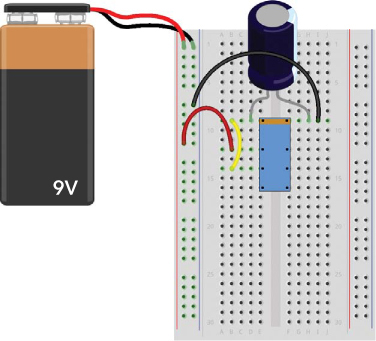

在图中，我已将电容器的负极腿连接到继电器的 8 号引脚，通过将其插入第 9 行 H 列并将正极腿连接到继电器 1 号引脚，位置在第 9 行 D 列。无论你使用哪些孔位，都要确保将电容器的负极腿连接到与负电源连接的相同继电器引脚。电容器的负极腿通常用条纹、零或减号标记。

连接电池以测试电路。你会知道它是否工作，如果你听到明显的滴答声。现在滴答声应该明显变慢，这意味着继电器保持开启的时间更长。但是在继电器关闭的瞬间，电容器应该再次充电，使继电器只在一瞬间关闭。你将在下一步中修正这一问题，所以现在再断开电池连接。

#### 第 4 步：让继电器保持关闭更长时间

让我们在电容器前加一个电阻器，以减少流过的电流，并迫使电容器花更多时间充电。为此，只需将继电器 1 号和 3 号引脚之间的导线（我图中的黄色导线，连接到第 9 行和第 14 行）替换为大约 100 Ω的电阻器，如下所示：

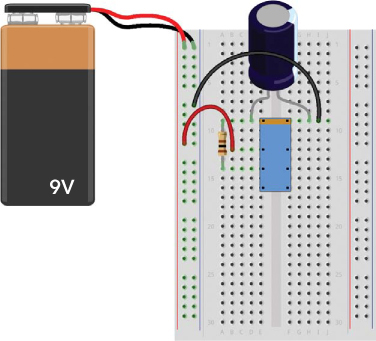

连接电池以进行测试。现在继电器应该保持关闭稍长时间，你可以通过继电器发出的“滴答—滴答”声来辨认。

#### 第 5 步：添加 LED 和电阻器

断开电池，向电路中添加 LED 和 330Ω电阻。将 LED 的长脚连接到继电器的 NO 引脚（第 4 引脚）。我的 LED 长脚连接到第 16 排，因为 NO 引脚插入了该排。将另一脚连接到下方的一个未连接的排，比如第 19 排。从同一排连接电阻到电源侧的负极列。

你的面包板应该像这样：

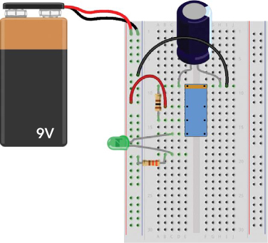

将此与项目开始时的电路图进行比较，看看符号是如何匹配的。现在，连接电池并观察灯光闪烁！

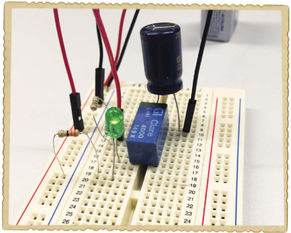

#### 第 6 步：如果 LED 不闪烁怎么办？

如果 LED 无法闪烁，请回到第 1 步，并检查从第 1 步到第 4 步的工作。这应该会让你得到一个自动开关的继电器。如果成功了，那么你应该能够连接 LED 和电阻，形成一个正常工作的电路。

如果 LED 仍然不闪烁，请确认你已经按照图示连接了电路。还是不行？将 LED 和电阻从电路中移除，然后只将这两者连接到电池，直到 LED 亮起。（请按照“项目 #9: 你的第一个面包板电路”中的说明，在第 84 页查看。）如果你仍然无法让 LED 亮起，那么你的 LED 可能坏了，或者电阻的阻值可能不对。

**试试看：让你的入侵者警报更有效**

尝试将继电器连接到你在第 2 项目中构建的入侵者警报系统上，这样当有人尝试进入房间时，他们无法通过关上门来关闭警报。当继电器被开关触发时，它应该保持开启。此图显示了如何将继电器（蓝色部分）连接到电路的其他部分（黑色部分）。当警报被触发时，蜂鸣声将持续响起，直到你断开电池。

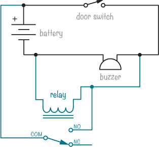

**接下来做什么？**

你在本章已经走了很长一段路！到目前为止，你已经学会了电子学中四个常见组件的工作原理（电阻、LED、电容和继电器），你已经在面包板上连接了几个电路，甚至还做了一个能闪烁灯光的项目。希望你也能理解为什么灯会闪烁。

你已经在面包板上连接了一些电路，这是一个很有用的技能，当你需要测试电路或构建简单原型时。但当你希望电路的组件永久连接在一起时，你需要进行焊接，下章我将向你展示如何操作。
