## 第六章：让我们开始焊接吧！

在第五章中，你使用了面包板来构建新的电路。面包板让你能够快速测试新想法并实验不同的元件以查看结果，但它并不是永久解决方案。元件可能很容易掉出来，面包板上可能到处都是松动的线路。当你需要长时间不改变电路时，最好将电路焊接到*电路板*上。焊接有点像粘胶：你将一种叫做*焊锡*的材料熔化到元件引脚上，这样元件就能粘到电路板上。电路板上有像面包板一样的孔，当你将元件焊接到上面时，它们通过铜板连接在一起。

本章将教你如何焊接，从一个简单的 LED 电路开始。这将为你后续焊接自己的电路打下基础。在本章练习了基础技巧之后，你将在第七章继续焊接，构建一个触摸启用的开关和一个当太阳升起时能叫醒你的电路。

### 如何焊接

焊接一个电路，你需要一些工具：

 焊锡

 焊接铁

 焊接铁支架

 一块湿海绵

 安全护目镜

焊锡是由几种金属混合而成，在高温下容易融化。最常用的焊锡在华氏 360 到 370 度左右会融化。

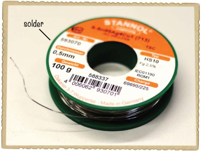

*焊接铁* 是一种笔状工具，能够加热到足以融化焊锡的温度。如果你将焊锡放在焊接铁的尖端，焊锡会融化。

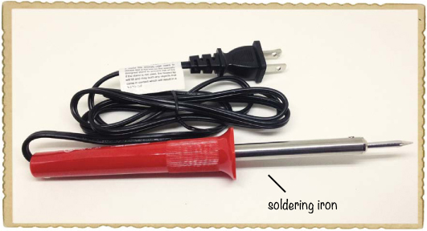

一旦掌握了基础，焊接其实非常简单，而一个重要的基础步骤就是采取一些安全预防措施。

#### 焊接安全提示

焊接铁的温度非常高，如果你在焊接铁插电时触碰到它的金属部分，可能会烫伤自己。使用时，始终将焊接铁放回支架上，不要直接放在表面上。在焊接后，也避免在几秒钟内触摸*接点*（焊接连接）和元件，它们可能会热到足以烫伤。

以下是在焊接时需要牢记的一些其他重要安全提示：

 将焊接铁的热部件远离电源线。

 如果你在桌子上进行焊接，使用一块木板或厚纸板保护桌面。

 每次处理完焊锡后，务必洗手。

 如果不小心被烫伤，别慌张。对于轻微的烫伤，立刻用流动的冷水冷却伤口，保持烫伤部位至少在水下五分钟。用冰块冷敷也是有效的，但务必先用水进行冷却。

请一个成年人监督你第一次焊接时的操作，记住：焊接很有趣，但使用电烙铁时必须格外小心。牢记这些技巧，接下来请阅读本节内容，了解基本焊接的逐步指南。

#### 加热电烙铁

焊接的第一步是插上电烙铁并将其放在支架上。别忘了戴上安全护目镜！

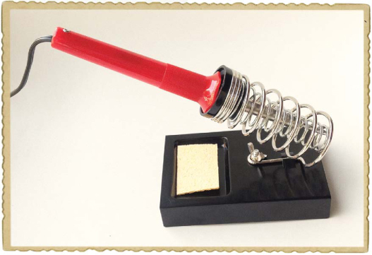

一两分钟后，通过触碰一些焊锡到电烙铁的焊接头，检查电烙铁是否足够热。如果焊锡熔化，说明电烙铁已经准备好使用。

#### 清洁电烙铁头

用湿海绵擦拭电烙铁的焊接头进行清洁。清洁的焊接头比脏的焊接头传热效果更好，所以要经常清洁焊接头。

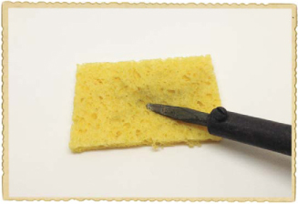

#### 给电烙铁头涂锡

这里有个小窍门：为了更快地加热焊点，在开始焊接前，往电烙铁头上加一点焊锡。这个过程叫做*涂锡*。必须在焊接前一两秒进行涂锡才能有效。

#### 同时加热引脚和铜条

将电烙铁的焊接头放在元件引脚和铜条上。加热铜条和引脚几秒钟后，再进行下一步操作。

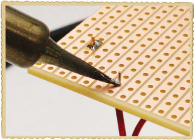

#### 加入焊锡

在将电烙铁焊接头保持在焊点的同时，触碰一些焊锡到引脚和铜条上。当焊锡熔化时，慢慢加入更多的焊锡，直到足够覆盖焊接的引脚和铜条。当焊锡量足够时，移开焊锡丝，但仍然保持电烙铁焊接头在焊点上。

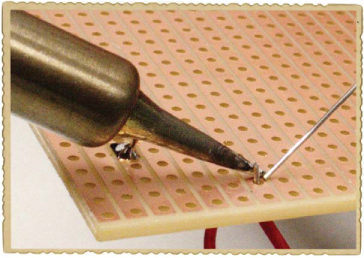

#### 拔掉电烙铁

最后，从焊点上移开电烙铁头并将烙铁放回支架。始终把这一步放在最后。如果在焊锡丝还触碰焊点时就移开电烙铁，焊锡丝可能会在焊点硬化时粘在电路板上。

你的焊点应该呈现出锥形。

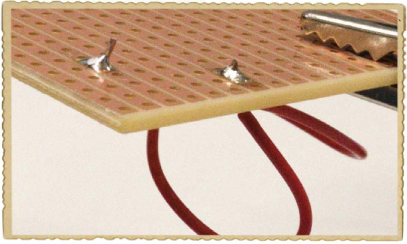

如果你完成了焊接，拔掉电烙铁的插头，让它冷却。

#### 小心不良的焊点！

在加焊锡之前，先用电烙铁加热元件引脚和铜条是非常重要的。如果只加热元件引脚而不加热铜条，焊锡会粘在引脚上，但焊锡和铜条之间没有连接。如果只加热铜条，焊锡会粘在铜条上，但不会粘到引脚上。从远处看可能会觉得是一个良好的焊点，但焊锡很可能并没有和引脚连接。

你还必须确保焊锡不会漂移到旁边的其他铜条上。这样会在两条铜条之间产生不必要的连接。

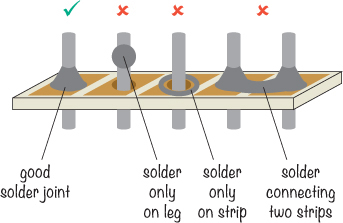

如果你的焊点看起来不太对，别担心。只需重新加热焊点、组件引脚和铜条，并加一些焊锡，以形成一个良好的焊点圆锥形状。然后，你就可以继续了。

### 项目 #12：焊接你的第一个 LED 电路

现在，让我们开始焊接吧！在这个项目中，你将把“项目#8：为 LED 供电”中的电阻器和 LED 电路焊接到电路板上，位于第 78 页。电池应该让电流在电路中流动，电阻器应该确保电流不会过大，而 LED 应该亮起。

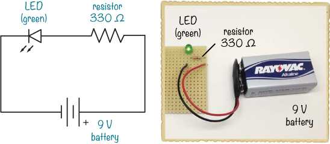

#### 购物清单

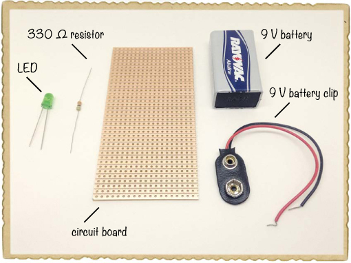

 **一个标准 9 V 电池**，用于为电路提供电力。

 **一个 9 V 电池夹**（Jameco #11280，Bitsbox #BAT033），用于将电池连接到电路。

 **一块电路板**（Jameco #2191488，Bitsbox #HW005），带有铜条。

 **一个标准 LED**（Jameco #34761，Bitsbox #OP003）

 **一个 330 Ω的电阻器**（Jameco #661386，Bitsbox #CR25330R），用于限制 LED 的电流。

#### 工具

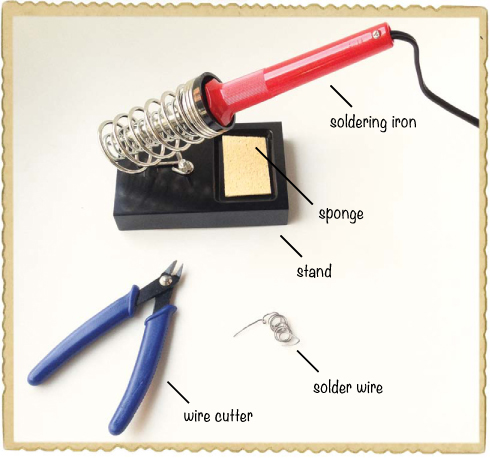

 **一个焊接铁**（例如，Jameco #116572，Bitsbox #TL031）

 **一个支架**（例如，Jameco #36329，Bitsbox #TL032），用于固定焊接铁。

 **一卷标准焊锡线**（例如，Jameco #94570，Bitsbox #HW022）

 **一个湿海绵**，用于清洁焊接铁的尖端。

 **一把电线剪**（Jameco #35482，Bitsbox #TL008），用于剪掉组件的多余引脚。

#### 步骤 1：放置组件

查看你的电路板，并熟悉其上的连接模式。我推荐使用的电路板叫做*原型板*，它上面覆盖着小段直铜条，每条铜条上有很多孔。任何你焊接进孔里的组件引脚，只要它们与铜条共享一条线路，就会形成电连接。

将电阻器和 LED 的引脚穿过电路板。电阻器的引脚应该与 LED 的正极引脚共享同一条铜条。请注意，图中所示的铜条位于电路板的底面，这就是为什么它们在图中不是铜色的原因。任何涉及焊接到电路板的项目，我都会显示铜条的阴影，帮助你查看连接的位置。

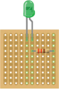

#### 步骤 2：弯曲组件引脚

小心地将电路板翻转过来，以便看到铜面；如果需要，用手指按住 LED 和电阻，防止它们掉落。然后，稍微弯曲每个元件的引脚，使 LED 和电阻即使铜面朝上也能保持原位。现在保持电路板铜面朝上。

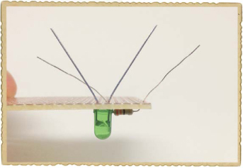

**如何阅读电路板插图**

在本书中，你将看到我使用名为 Fritzing 的程序创建的电路板插图。这些插图展示了电路板的顶部，这样你就可以看到元件的外观，同时也展示了底部——比顶部颜色稍微暗一些——这样你可以看到铜条的样子。

在按照我的说明操作时，始终将电路板以插图中所示的铜条朝下放置，确保其方向一致。如果你在阅读电路板插图中的连接时感到困惑，只需回到这个示例参考即可。

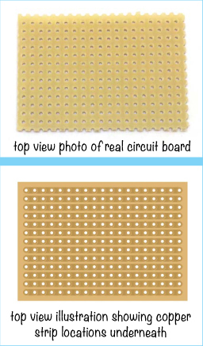

如果你想用 Fritzing 创建自己的电路插图，可以从*[`www.fritzing.org/`](http://www.fritzing.org/)*下载这款免费的开源软件。

#### 第 3 步：加热并清洁焊接铁

你的元件应该已经到位并准备好焊接，现在可以插上电烙铁并加热了。这可能需要几分钟时间。像往常一样，通过将焊锡触碰到焊接铁的尖端，看是否融化来检查是否加热足够。

在开始焊接之前，也请清洁焊接铁的尖端。稍微湿润海绵并挤掉多余的水分。然后，用海绵擦拭焊接铁的尖端，去除旧的焊锡。

#### 第 4 步：焊接电阻和 LED

将电路板的铜面朝上，按照第 112 页中《如何焊接》的描述，将每个元件的引脚焊接到电路板上。你的电路板应该看起来像这样：

#### 第 5 步：修剪引脚

目前，你的 LED 和电阻的引脚非常长。你不希望它们突出，因为杂散金属可能在元件之间产生无意的电流路径。最好的情况是，这可能会导致电路无法正常工作，直到你将引脚移离不应接触的元件；最坏的情况是，无意的连接可能会损坏元件。为了防止意外连接，将每个引脚在焊接点上方剪掉。引脚在剪切时可能会飞出，所以在剪切时把电路板转向远离眼睛的方向，或者戴上安全护目镜保护自己。

**小贴士**

*在剪掉引脚时，将电路板悬空放置在一个空盒子上，以防止废料丢失并使清理工作更加容易。你也可以把电路板放在桌子上，一只手按住引脚，另一只手用剪刀剪掉引脚。*

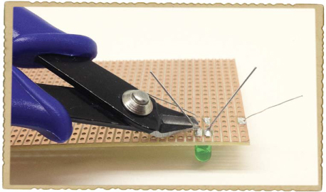

#### 第 6 步：焊接电池夹

这个电路还需要一个方式将电池连接到元件，因此现在将电池夹焊接到电路板上。

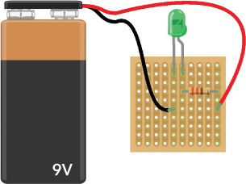

电池夹的红线是正极线；将其连接到只与电阻器相连的铜条上，而不是 LED。黑线是负极线，因此将其连接到 LED 的负极一侧。你的电路板现在应该看起来像这样：

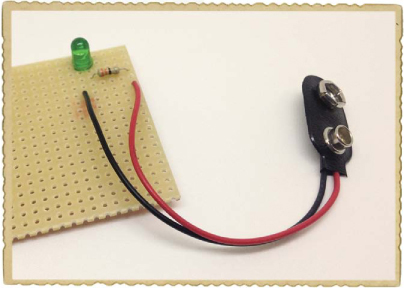

#### 第 7 步：让光亮起来！

现在，让我们测试一下电路。插入电池，你的 LED 应该亮起来！

#### 第 8 步：如果焊接的 LED 电路不工作怎么办？

如果你的 LED 没有亮，检查是否有任何不小心的连接。是否有焊锡连接了不应该连接的两个焊点？是否有过长的元件引脚接触到了其他地方？

接下来，仔细检查你的焊点。是否有任何焊点看起来像在第 117 页中“注意不良焊点！”中描述的坏连接的例子？如果是这样，你可能需要再流一些焊锡：重新加热你的烙铁，并确保焊点看起来像小金字塔。

也检查一下 LED 的放置是否正确。你是否正确连接了它？由于你已经剪掉了多余的引脚，你无法再看到哪只引脚较长，但如果你仔细观察 LED，你应该能看到塑料外壳底部的一侧是平的。这一侧是负极，应连接到电池夹的黑线。如果你将它放反了，这里有一个快速的修复方法：使用剪线钳剪断电池夹的引线，移除夹子。现在，将正极电池引线焊接到原本负极引线的位置，将负极电池引线焊接到原本正极引线的位置。这样做是可行的，因为不管电阻器在 LED 的哪一侧都无关紧要。

### 哎呀！我该如何移除焊接的元件？

有时候，你在焊接时会犯错。例如，假如你焊接电池夹的方向错了，或者用了 33,000 Ω的电阻器而不是 330 Ω的电阻器呢？不用担心：即使是最有经验的工程师有时也会在焊接时出错，发生这种情况时，修复电路是有办法的。在这些情况下，你需要*拆焊*，也就是从焊点上移除焊锡。

*焊锡吸取带*是一个非常有用的拆焊工具，我建议每次焊接时都把一些放在身边。焊锡吸取带由铜线编织而成，因此它也被称为*拆焊编带*。

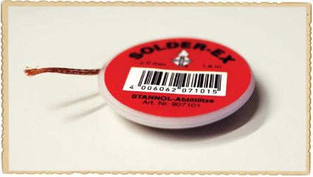

当你将一条焊锡吸取带放在焊点上并加热它们时，焊锡应该像往常一样熔化，焊锡吸取带应该像干布吸水一样吸收液态焊锡。当你移开焊锡吸取带时，焊锡应该留在吸取带上，而不是电路板上！

### 项目 #13：拆除电池夹的焊接

学会如何拆焊非常有用，不仅仅是为了修复焊接错误。例如，拆焊可以让你更换电路中损坏的组件，或者你可以拆焊一个组件以便在另一个电路中重复使用。在这个项目中，我将向你展示如何将你在之前项目中的电池夹拆焊下来。

#### 购物清单

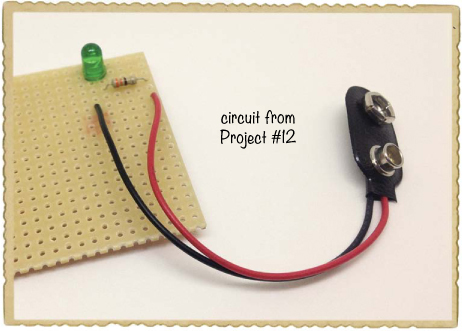

 **来自 “项目 #12：焊接你的第一个 LED 电路” 的电路，第 118 页**

#### 工具

 **烙铁**（例如，Jameco #116572，Bitsbox #TL031）

 **支架**（例如，Jameco #36329，Bitsbox #TL032）用于固定烙铁。

 **线切割器**（Jameco #35482，Bitsbox #TL008）用于剪切焊锡丝。

 **焊锡丝**（Jameco #153462，Bitsbox #HW082）用于拆焊。

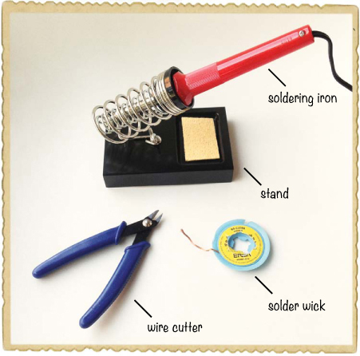

#### 步骤 1：加热烙铁

插上你的烙铁，等待它加热。测试温度时，将一些焊锡线触碰到烙铁的尖端；当烙铁足够热时，焊锡会融化。

#### 步骤 2：将焊锡丝放置在焊点上

将焊锡丝的末端放在一个电池夹焊点的顶部。

**警告**

*焊锡丝在加热时会变得非常烫，因此不要用手指触碰金属部分。*

#### 步骤 3：加热焊点和焊锡丝

将加热过的烙铁尖端放在焊锡丝上，直接覆盖你想要拆除的焊点。

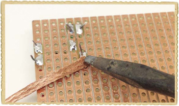

几秒钟后，焊锡应该会融化并流入焊锡丝中。将焊锡丝和烙铁一起从电路板上提起。

#### 步骤 4：修剪使用过的焊锡丝

从焊点上取下焊锡丝，观察一下。焊锡丝上应该有焊锡。

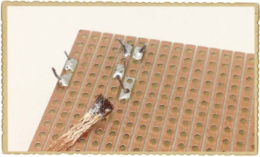

就像一块脏布一样，这段焊锡丝已经脏到不能再用了。使用线切割器将含有焊锡的部分剪掉。

现在，检查你的焊点。如果没有剩余的焊锡连接组件脚和电路板，那么你应该能够将线从孔中取出。如果不能，重复步骤 2 和 3，使用新的焊锡丝，并继续重复步骤 3，直到你能够取出线。

#### 步骤 5：移除另一个电池夹焊线

对另一个电池夹焊点重复步骤 2 到 4，你应该能够完全将电池夹从电路板上取下。此时，你的电路板铜面应该看起来像这样：

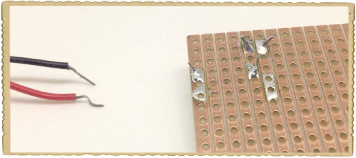

**尝试一下：焊接更多东西！**

想要多练习一下焊接吗？一个有趣的练习方式是购买并组装电子*套件*，这些套件包括元件和一个你可以焊接的电路板。你也可以在线找到电路图，购买所需的元件，然后将它们焊接到原型板上，就像你在这一章中做的那样。

以下是一些同时销售套件和元件的在线商店：

 **Jameco:** *[www.jameco.com](http://www.jameco.com)*

 **Adafruit:** *[www.adafruit.com](http://www.adafruit.com)*

 **SparkFun:** *[www.sparkfun.com](http://www.sparkfun.com)*

**接下来做什么？**

在这一章中，你学到了一个非常实用的技能：焊接。这意味着你可以为你的项目制作永久性的电路，而不必担心它们会散架。而且通过一些拆焊练习，你还可以故意拆解项目。

在第七章中，我将向你介绍晶体管、光敏电阻和电位器。这些是一些非常令人兴奋的元件，你可以利用它们让电路活起来，并响应周围的环境。例如，我将教你如何创建一个电路，告诉你早晨太阳升起的时刻！
