## 第七章：用电控制事物

电子元件可以让你制造智能设备，比如在变暗时自动打开的灯，或者在你靠近时自动打开的门。在这一章中，你将了解一种帮助你构建这种智能物品的新元件：晶体管。

前一章向你展示了如何焊接，而这一章的项目——触摸传感器和在太阳升起时叫醒你的闹钟——将给你更多练习焊接技能的机会。每个项目所需的只是晶体管和一些附加元件。

### 认识晶体管

*晶体管*是电子学中最重要的元件，如果你曾经听到有经验的硬件爱好者谈论它，你可能会注意到他们往往使用很多难懂的术语。但其实晶体管并不难理解；事实上，你已经使用过类似的东西！你还记得在第五章中学到的继电器吗？晶体管在很多方面都类似于继电器：它就像是一个可以通过电来打开和关闭的开关。

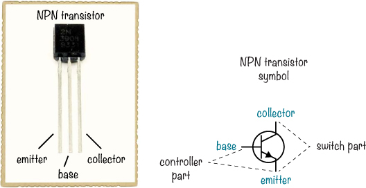

一个晶体管有三条引脚。在标准的*NPN 晶体管*中，三条引脚分别称为*发射极*、*基极*和*集电极*。你常常会在电路图中看到这些引脚被标记为*e*、*b*和*c*。你通过基极和发射极来开关晶体管——也就是说，控制开关的开与关，并且你将想要控制的电路连接在集电极和发射极之间。

当你面对我们的示例晶体管，平面朝向你时，最左边的引脚是发射极，中间的引脚是基极，最右边的引脚是集电极。但并非所有的晶体管都如此，因此在使用晶体管时一定要查看其数据手册，确认每个引脚的功能。

#### 为什么要使用晶体管？

如果晶体管像开关一样工作，那么你可能会想知道为什么要在一开始就使用晶体管而不是开关。好吧，想想一个风扇：如果你的房间很热，想打开风扇，你需要手动按下开关。但是，如果这个风扇是连接在一个合适的电路中，电路里有晶体管和其他一些组件，当房间温度超过 75 华氏度时，你可以让风扇自动打开。为了实现这一点，你需要一个可以感应温度的电路，另一个电路则可以开启风扇。

现在，想象一下一个温度感应电路，当温度高于 75 度时，它会输出电压，而低于 75 度时则没有电压。如果你将风扇的一根电线连接到 NPN 晶体管的集电极，将风扇的另一根电线连接到电池的正极，并将晶体管的发射极连接到电池的负极，那么晶体管就会控制风扇何时开关。

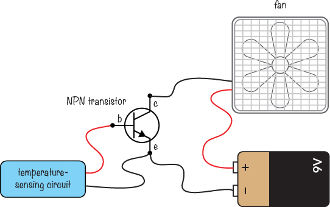

然后，你可以将温度传感电路的输出连接到晶体管的控制部分——即基极和发射极。在这样的电路中，当温度超过 75 度时，风扇会打开；当温度低于 75 度时，风扇会关闭。我们来看一下晶体管的“开关”是如何闭合的。

#### 晶体管的工作原理

当有少量电流从晶体管的基极流向发射极时，晶体管“闭合开关”，使电流也能够从集电极流向发射极。

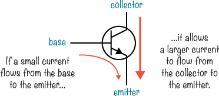

在第一章中，我解释了电压如何推动电流通过电路。为了让电流从基极流向发射极，必须有一个电压来推动电流。当电流从基极流向发射极时，这为电流在集电极和发射极之间的流动打开了通道。你还可以通过改变从基极到发射极的电流来控制流经集电极和发射极之间的电流大小。

我们所讨论的具体类型的晶体管是*NPN 型双极结型晶体管*。这个长名称描述了晶体管内部的材料。它的工作原理背后有一些高级的化学和物理学原理，但你不需要了解所有这些知识就能使用晶体管构建酷炫的电路——你只需要知道晶体管的作用。

现在要记住的重要一点是，不同类型的晶体管存在。对于本书中的每个晶体管项目，只需使用我在购物清单部分描述的类型，你的电路就会正常工作。当然，当你在本书外构建电路时，一定要使用电路图中指定的晶体管类型。

#### 用晶体管控制 LED

本书中的其他项目已经使用了这个简单的 LED 电路，配有电阻和电池：

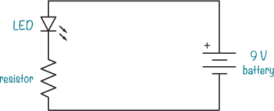

根据你到目前为止学到的知识，你认为如果你将晶体管放置在电阻和电池负极之间，会发生什么情况？

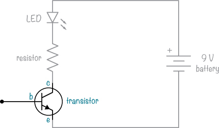

如果晶体管的基极上没有电压，或者控制引脚没有电压，就不会有电流从基极流向发射极。这意味着集电极和发射极之间也无法流动电流，LED 会熄灭。

但是如果你给基极施加一个小电压——例如，连接一个小电池到基极——晶体管就会让电流从集电极流向发射极，LED 就会亮起。一个允许电流通过的晶体管被认为是*开启*的；一个不允许电流通过的晶体管被认为是*关闭*的。让 NPN 晶体管开启所需的电压大约是 0.7 V，所以像这样的电路会让电流正常流动，从而点亮 LED：

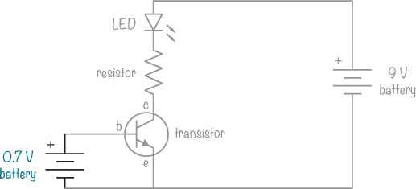

通常，你不会将电池直接连接到基极。相反，你会连接另一个电路，控制晶体管的工作，例如一个光敏电路，当它检测到光时会给出一个小电压。像这样的电路会根据光的变化打开或关闭晶体管。

你可以构建一个这样的电路来控制 LED 和其他元件。在下一个项目中，我会向你展示如何利用晶体管用手指触碰来打开 LED。

### 项目 #14：构建一个能感知触摸的电路

你知道吗，你的手指可以充当电阻器？你的手指的电阻大约是几兆欧（MΩ），这可是很高的！不过，这个电阻是会变化的。例如，如果你的手指出汗了，电阻就会下降。

在这个项目中，你将用你的手指作为电阻器，完成一个电路，使 LED 点亮，从而创建一个触摸传感器。*传感器*是能够测量你周围世界中某些事物的元件，例如光或温度。在许多情况下，传感器是一个电阻器，其值会根据光线、温度或你想了解的其他物理量的变化而变化。

如果你在电池的正极和电路中晶体管的基极之间连接一个几兆欧的电阻，那么就会有小电流流过晶体管的基极到发射极。这股电流应该足够大，能够打开晶体管，并让少量电流从集电极流向发射极。

这个电路有一个晶体管、电阻器、LED 和电池，就像上一节中的电路一样。这一次，你不会使用单独的电池，而是通过一种触摸垫将 9 V 电池连接到晶体管的基极。触摸垫只是两根裸露的电线，它们被放置得足够近，你可以用手指同时触摸两根电线。

请注意，与之前你使用的 330 Ω 电阻器连接 LED 不同，这个电路使用了 100 Ω 电阻器。通常情况下，你手指的电阻很高，晶体管无法完全打开。使用更小的电阻器，即使手指的电阻有点高，LED 仍然会亮得很明亮。

#### 购物清单

 **一个标准的 9 V 电池**，为电路提供电源。

 **一个 9 V 电池夹**（Jameco #11280，Bitsbox #BAT033），用于将电池连接到电路。

 **一个电路板**（Jameco #2191488，Bitsbox #HW005），上面有铜条。

 **一个标准的 LED**（Jameco #34761，Bitsbox #OP003）

 **两根裸露的电线**，每根大约 1 英寸长。你也可以使用从其他项目中剪下的两个元件脚。

 **一个晶体管 2N3904**（Jameco #38359，Bitsbox #QD018）

 **一个 100 Ω 电阻**（Jameco #690620，Bitsbox #CR25100R），用于限制流向 LED 的电流。

#### 工具

 **一个焊接铁**（例如，Jameco #116572，Bitsbox #TL031）

 **一个支架**（例如，Jameco #36329，Bitsbox #TL032），用于固定焊接铁。

 **焊锡线**（例如，Jameco #94570，Bitsbox #HW022）

 **一台万用表**（Jameco #2206061，Bitsbox #TL057，Rapid Electronics #55-6662），如果电路不工作，可以用来测量电压。

 **一把剪线钳**（Jameco #35482，Bitsbox #TL008），用于剪掉多余的引脚。

#### 第 1 步：将元件放置在原型板上

按照图示将 LED、电阻和晶体管放入原型板中。确保一个铜条将电阻与（1）LED 的阴极引脚和（2）晶体管的集电极引脚连接起来。将电路板铜面上的引脚弯曲，以固定元件的位置。

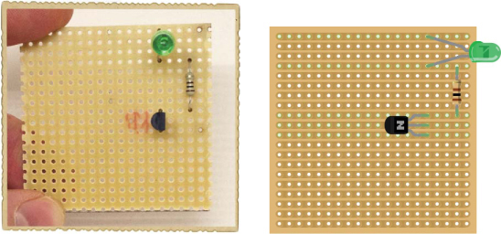

#### 第 2 步：检查元件的位置

在焊接之前，查看电路板的铜面，仔细检查元件是否按照第 1 步中的指示放置。特别检查 LED 和晶体管的方向，因为这些必须正确焊接，电路才会正常工作。

#### 第 3 步：焊接元件并剪掉多余引脚

将元件焊接到电路板上，就像你在《焊接教程》中的 第 112 页 学到的那样，然后用剪线钳剪掉多余的引脚。戴好安全眼镜，并小心将电路板转向自己的一侧，以防在剪线时飞溅的金属片伤到自己。

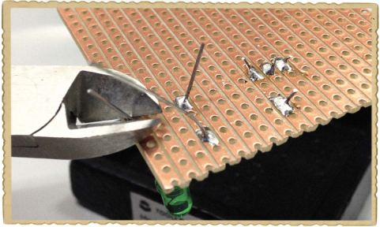

#### 第 4 步：焊接触摸板

接下来，焊接两根裸露的电线。将一根电线连接到 LED 的阳极引脚，另一端连接到一个空的铜条。将另一根电线连接到晶体管的基极，另一端同样连接到一个空的铜条。确保焊接的位置方便你用手指触摸到这两根电线。

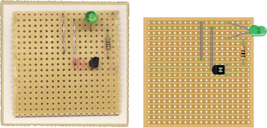

#### 第 5 步：通电！

现在你需要电源了！为了完成这项工作，首先将电池夹焊接到电路板上，将红线和黑线按照 ➊ 所示的位置放置。焊接好电池夹后，将电池插入其中，位置如 ➋ 所示。

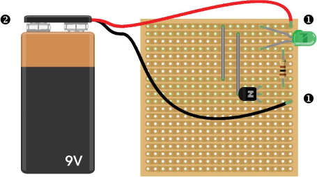

这个触摸传感器电路已准备好测试！

#### 第 6 步：测试传感器

同时用手指触摸两根裸露的电线。你的 LED 应该会亮起来。如果你看不见 LED 发光，试着关掉房间的灯；LED 可能只是亮度较低。如果还是看不见 LED 发光，可以尝试将手指蘸湿再试，因为湿润手指可以减少电阻。

**警告**

*仅用手指触摸裸露的电线。如果使用非常低电阻的物品，如一根导线，可能会损坏晶体管。*

#### 第 7 步：如果触摸传感器无法工作怎么办？

如果你触摸电线时没有反应，首先检查你的 LED 和晶体管的方向。混淆这些组件的引脚是很常见的，所以返回第一步，确保它们按照图像连接在原型板的铜条上。

如果 LED 和晶体管连接正确，你可以使用万用表测量控制端晶体管的基极和发射极之间的电压，而无需触摸触摸垫。将万用表设置为直流电压范围——例如 20V DC，然后将一根万用表线连接到基极引脚，另一根连接到发射极引脚，如图所示。万用表应显示约 0V 的值。现在，放上手指再测量一次；万用表应显示约 0.7V。

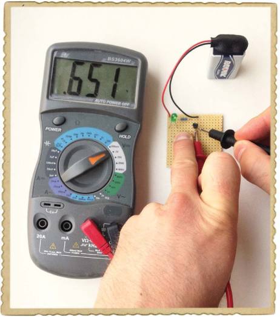

如果晶体管的控制端没有问题，检查开关端。从 LED 的一只引脚到另一只引脚测量电压，确保不触摸触摸垫。你应该在万用表上看到 0V。将手指放在触摸垫上再测量一次；现在电压应该在 1.7 到 2V 之间。

如果任何一个万用表测量结果不正确，那么请再次检查你的连接，尤其是暴露出来的两根电线，注意它们与电路图的匹配。最后，检查你的焊点，看看是否有多余的电线或焊料桥接了铜条之间的间隙，修复任何发现的接触不良。

**试试看：触摸传感器能检测到不同的触摸吗？**

尝试轻轻触摸两根暴露的电线，并注意 LED 的亮度。现在，试着用力按压。你能看到任何变化吗？让朋友重复这个实验。当你的朋友触摸电线时，LED 的亮度和你触摸时有区别吗？如果有，那就意味着你朋友的手指电阻不同！

当你用力按压时，电线和你手指之间的连接会变得更好，从而降低电阻，使电流更容易流动。

这是另一个可以和朋友一起尝试的有趣实验：自己触摸其中一根电线，让朋友触摸另一根。然后，用你的空闲手握住朋友的空闲手。你能看到 LED 灯亮起吗？现在，电流从电池通过你们俩的身体流入晶体管。但不用担心——电流非常微弱，不会有危险，你也不会感到任何东西。

### 可变电阻器

到目前为止，你只使用了具有固定电阻的电阻器，但你也可以找到具有*可变*电阻值的电阻器，这意味着电阻值可以变化。例如，某些电阻器在旋转旋钮时会改变其值，而其他电阻器则根据温度或光照强度改变其值。本节介绍了两种可变电阻器：电位器和光电阻。

#### 认识电位器

在第四章中，你学到了标准电阻，它是一个具有特定不可变电阻的元件。*可变电阻*也是一种电阻，但它的电阻是可调的，通常用于控制诸如扬声器音量等功能。（你知道收音机上的音量控制吗？那通常就是一个可变电阻。）可变电阻通常有三个引脚，并且有一个轴，可以通过旋转该轴来改变电阻值。

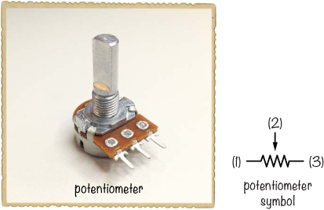

可变电阻符号表示了可变电阻的工作原理以及三个引脚的功能。引脚 1 和引脚 3 之间的电阻是一个固定的数值电阻，这个数值等于你购买该可变电阻时标示的电阻值。例如，如果你有一个 10 kΩ的可变电阻，那么引脚 1 和引脚 3 之间的电阻值就是 10 kΩ。

引脚 2 叫做*滑动臂*。它连接到引脚 1 和引脚 3 之间的某个位置。你可以通过旋转可变电阻的轴来改变滑动臂的位置。如果你旋转轴使滑动臂靠近引脚 1，那么引脚 1 和滑动臂之间的电阻会变小，而引脚 3 和滑动臂之间的电阻会变大。

#### 认识光敏电阻

*光敏电阻*是另一种可变电阻。*光*表示*光线*，这个元件的电阻值会随着照射在其表面的光线强度的变化而变化。有时这个元件也被称为*光依赖电阻（LDR）*，因为它的电阻值依赖于光线。

光敏电阻由一种具有特殊性质的材料制成。在黑暗中，这种材料的电阻较高，但当光线照射到它上面时，光线激发了那些本应被束缚在材料中的电子。那些被激发的电子可以自由流动，从而降低电阻。照射到光敏电阻上的光线越多，它的电阻值就越小。

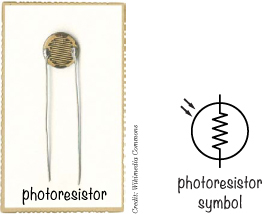

### 使用电阻分压

当电路中光敏电阻或可变电阻的电阻值发生变化时，根据欧姆定律，电压和/或电流也会发生变化。（如果你想再次复习数学内容，可以查看“介绍欧姆定律”第 73 页。第 73 页）如果你将可变电阻作为一个电路中的*电压分压器*的一部分，你将获得一个随电阻变化的电压输出。你可以利用这个变化的电压来控制电路中的其他元件。了解如何识别电压分压器，还能帮助你理解其他电路是如何工作的。

#### 电压分压器长什么样？

如果你将两个电阻值相同的电阻连接在一起，并且分别接到电池的正负极，那么电阻相交处的电压将是电池电压的一半——例如，如果你使用的是 9V 电池，那么电压就是 4.5V。这个电路叫做*电压分压器*。

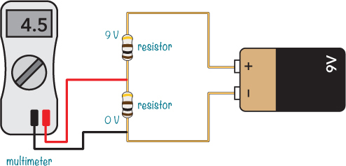

如果你使用不相等的电阻而不是相同的电阻，你可以通过电压分压器获得从 0V 到电池电压之间的电压。你只需要做一点点数学运算。

#### 从电压分压器计算电压

假设你有以下电路。这个电路的输出电压（*V*[out]）是多少？

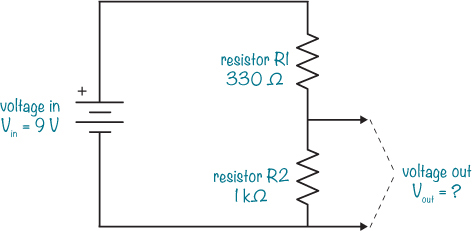

要找到 *V*[out]，将电路中的数值代入以下公式：

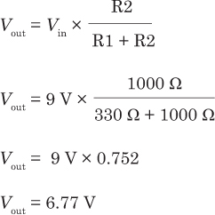

在这个例子中，输出电压是 6.77 V——大约是 9V 电池输入电压的三分之二。

#### 电压分压器如何帮助测量光线

在本节开始时，我提到过电压分压器可以帮助你测量光线，但该怎么做呢？只需将电压分压器中的一个电阻替换为光敏电阻，你就能得到一个根据光照强度输出电压的电路。通过调整电压分压器中的另一个电阻，你可以设置电路在某个特定光照水平下输出特定电压。将此电路的输出连接到控制蜂鸣器的晶体管，你就得到了一个光控报警器！

### 项目 #15：构建一个日出闹钟

现在是时候将你在本章中学到的所有概念结合成一个有趣的项目了：一个日出闹钟！

该电路在检测到光线时启动报警。完成后，你可以在睡觉时将它放置在窗户上（窗帘和玻璃之间）。当太阳升起时，电路应该能检测到光线并启动报警，迫使你起床并关闭它。

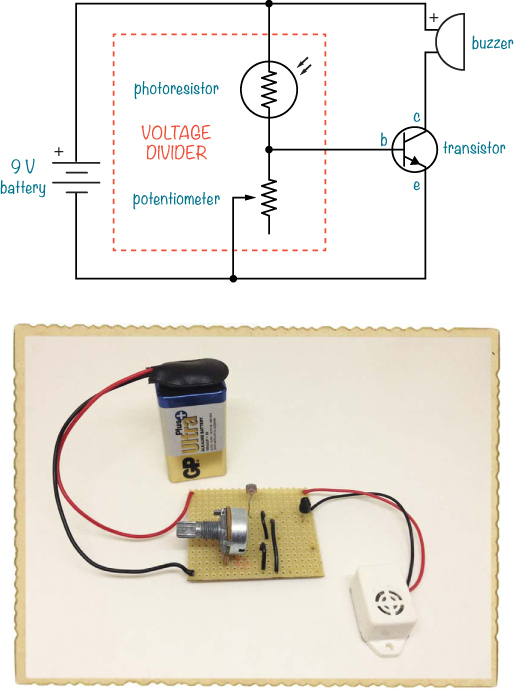

这个项目使用了一个晶体管、一个光敏电阻、一个可调电阻和一个蜂鸣器。光敏电阻和可调电阻组成了电压分压器，电压分压器的输出连接到晶体管的基极。光敏电阻检测到的光量将决定晶体管是否开启。如果晶体管开启，电流应该通过蜂鸣器，蜂鸣器就会发出声音。可调电阻用来设定电路在触发报警前需要多少光照。

#### 购物清单

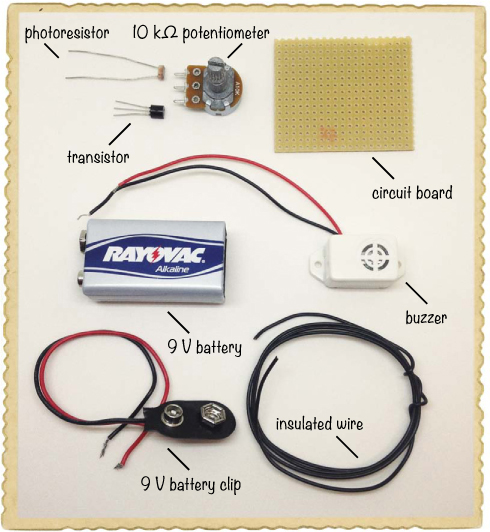

 **一个标准的 9V 电池** 用于为电路供电。

 **一个 9V 电池夹**（Jameco #11280，Bitsbox #BAT033），用于将电池连接到电路。

 **一个电路板**（Jameco #2191488，Bitsbox #HW005），带有铜条。

 **绝缘电线**（Jameco #36792，Bitsbox #W106BK），长度约 10 英寸。标准连接线也能正常工作。

 **一个 2N3904 晶体管**（Jameco #38359，Bitsbox #QD018）

 **一个 10 kΩ可调电阻**（Jameco #2118791，Bitsbox #VR004）

 **一个光敏电阻**（Jameco #202454，Bitsbox #ST004），用于检测光线。

 **一只蜂鸣器**（Jameco #2173870，Bitsbox #ST016），会发出蜂鸣声。蜂鸣器有主动和被动两种版本。在本项目中，你需要一只与 9V 电池兼容的主动蜂鸣器，就像你在“项目 #2：入侵者报警器”中使用的那种，见第 11 页。

#### 工具

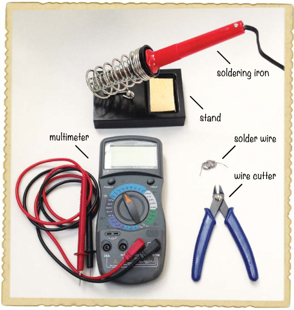

 **一把焊接铁**（例如，Jameco #116572，Bitsbox #TL031）

 **焊接架**（例如，Jameco #36329，Bitsbox #TL032）用于支撑焊接铁。

 **焊锡线**（例如，Jameco #94570，Bitsbox #HW022）

 **一只万用表**（Jameco #2206061，Bitsbox #TL057，Rapid Electronics #55-6662），如果电路无法正常工作，可以用来测量电压。

 **一把线切割器**（Jameco #35482，Bitsbox #TL008）用于剪去多余的引脚。

#### 步骤 1：将组件放置在原型板上

从将晶体管、光敏电阻和电位器放置到电路板上开始，如图所示。将光敏电阻和晶体管的引脚弯曲到另一侧，以便它们保持固定。顶层铜条将是电池的正极连接，底层铜条将是负极连接。

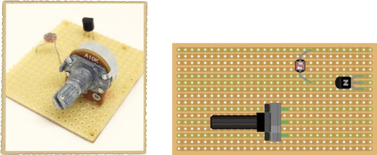

电路图展示了组件和下方的铜轨，而照片则展示了你实际操作时电路板应该的样子。

#### 步骤 2：焊接组件并修剪引脚

仔细检查组件的放置位置，确保与项目开始时的电路图和步骤 1 中的插图一致。确保晶体管连接正确，并且光敏电阻的一根引脚与晶体管的中心引脚位于同一铜排中。其他每个引脚，包括电位器的每个引脚，都应位于自己的铜排上。

当你确认组件放置正确后，开始将引脚焊接到电路板上。

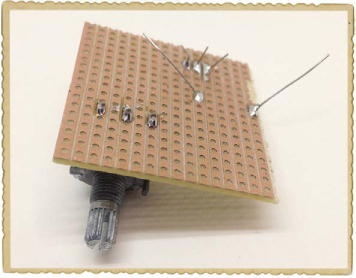

完成焊接后，剪去多余的引脚。

#### 步骤 3：将蜂鸣器添加到电路板上

接下来，将蜂鸣器焊接到电路板上。将蜂鸣器的正极（红色）引脚穿过顶层铜排的孔，与光敏电阻一起放置。然后，将其负极（黑色）引脚放在与晶体管集电极引脚相同的铜排中。现在焊接这两个引脚。

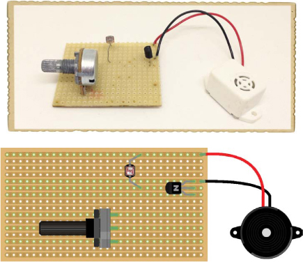

#### 步骤 4：用电线完成剩余的连接

如果将你的电路与电路图对比，你会发现你仍然缺少一些连接来完成电路。电路板缺少电池夹，但为了使电路在供电时正常工作，还需要以下连接：

 晶体管的基极需要连接到电位器的上层引脚。

 中间的电位器引脚需要连接到电池的负极端子。

 晶体管的发射极需要连接到电池的负极端。

要完成剩余的连接，您可以像这样将三根小导线焊接到电路板上，作为跳线：

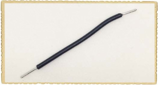

剪下一段大约 2 英寸长的导线，并从两端剥离大约 0.3 英寸的绝缘层。较短的导线剥皮可能比较难操作，如果您在这一步遇到困难，可以使用更长的导线。找到您最容易剥皮的导线长度后，再准备两根导线。然后，将三根导线焊接起来，完成剩余的连接。

从晶体管的基极引出一根导线，连接到可调电阻的上端针脚。接着，将可调电阻中间的针脚与电路板底部的一排空位连接。最后，从您刚才连接的空位引出一根导线，连接到与晶体管发射极相连的那一排。检查导线是否与插图相匹配，然后将它们焊接到电路板上。

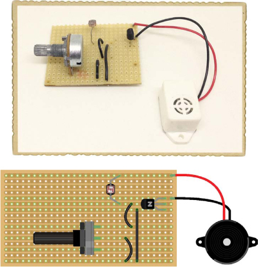

#### 第 5 步：将电池夹焊接到电路板

剩下的就是电池夹了。将电池夹的红线焊接到电路板顶部的铜排上。顶部排还应包含光敏电阻的引脚和蜂鸣器的红线。将电池夹的黑线焊接到底部的铜排。

#### 第 6 步：设置闹钟

插入电池，并将电路放置在您希望激活闹钟的光照强度的区域。转动可调电阻的轴，直到找到一个位置，在这个位置上，稍微来回拨动轴时，声音会开关。现在，将轴转动到刚好能让声音完全开启的位置。将手放在光敏电阻上，遮挡住光线，声音应该停止。移开手，声音应该再次响起。

从电路中取出电池，直到您准备上床睡觉时再进行下一步。关掉灯后，将电路放置在窗户上，连接电池，然后去睡觉。当太阳升起，外面的光线与您用来设置可调电阻的光线一样亮时，您会被自己制作的日出闹钟唤醒！

#### 第 7 步：如果没有声音怎么办？

按照电路图逐个检查电路组件，最好有朋友一起检查。确保您的原型板上有电路图中显示的每个连接。还要检查是否没有*短路*。短路是电路中无意间连接到一起的部分。例如，确保相邻的焊点没有实际接触。

如果一切看起来正常，使用万用表测量晶体管的基极和发射极之间的电压。首先，将电位器的旋钮转到一侧，测量电压并记录下来。然后，将电位器旋转到另一侧，再次测量电压。你的万用表应该显示一侧为 0 V，另一侧大约为 0.7 V。如果没有，检查一下你的连接。

如果你仍然不确定问题出在哪里，可以将电位器旋转到一端，然后测量红色和黑色蜂鸣器线之间的电压。接着，将电位器旋转到另一端，再次测量。你应该在一端得到 0 V，在另一端得到大约 8 到 9 V 的电压。

如果一切都失败了，检查一下焊接点，重新焊接那些看起来连接不完全的地方。如果你已经完美地构建了电路，那么可能是某些元件损坏了。尝试使用新的元件重新在面包板上搭建电路，如果有效，就焊接这些元件。

**试试看：温控风扇**

你可以将第 15 号项目中构建的电路用于其他用途。例如，如果你将光敏电阻换成*热敏电阻*，即一种根据温度变化电阻值的电阻器，那么电路将响应温度，而不是光线。

你还可以更改控制的对象。试着将 LED 和电阻器换成风扇。现在，你就拥有了一个温控风扇！电路图如下所示：

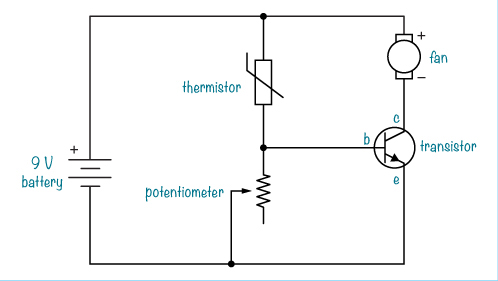

你将需要以下元件：

 **一个标准的 9 V 电池**，用于为电路提供电力。

 **一个 9 V 电池夹**（Jameco #11280，Bitsbox #BAT033），用于将电池连接到电路。

 **一块电路板**（Jameco #2191488，Bitsbox #HW005），带有铜条。

 **绝缘电线**（Jameco #36792，Bitsbox #W106BK），长度约 10 英寸。标准的连接线就可以。

 **一个 10 kΩ的热敏电阻**（Jameco #207037，Bitsbox #ST021）

 **一个 10 kΩ的电位器**（Jameco #2118791，Bitsbox #VR004）

 **一个 PN2222A 晶体管**（Jameco #178511，Bitsbox #QD101）

 **一个 12 V 直流风扇**（Jameco #1708465，Bitsbox #AF002）

对于这个电路，我指定了一个不同的晶体管。不同的晶体管可以处理不同的电流。风扇通常比 LED 消耗更多电流，因此我列出了一个能够处理更多电流的晶体管，而不是你之前使用的那个。

测试电路时，首先用冰块将热敏电阻冷却，然后用手指加热它，看看风扇是否启动。

**接下来是什么？**

在这一章中，你学习了电子学中最重要的元件——**晶体管**是如何工作的。你还了解了电位器和光敏电阻，并将它们结合起来制作了一个日出闹钟。

现在你已经了解了几乎所有电子学中最常见的元件！并且你也已经进行了焊接的练习。在接下来的章节中，你将再次在面包板上搭建电路，因为这样修正错误和重复使用元件都更为容易。如果你想制作任何电路的永久版本，只需参考第六章中的焊接方法。

在第八章中，你将学习关于*集成电路*的知识。这些是包含了已经缩小到适应微小芯片上的电路的元件。这些芯片可以用来创造出各种令人惊叹的电路类型。当你在第八章中亲手制作你的电子仪器时，你会明白我的意思！
