## 第八章：制作一个音乐乐器

本章将向你展示如何利用电子元件制作声音！与之前你制作的其他项目不同，本章的项目使用了*集成电路（IC）*，这是一种被缩小并封装在小盒子里的完整电路。各种各样的电路都可以作为 IC 来制造，而且大多数家用设备中都包含 IC。只要往电脑或电子玩具里一看，你肯定能发现一些 IC。

首先，我将更详细地解释 IC 是什么，并描述如何弄清楚特定 IC 的作用。接下来，你将通过构建一个简单的电路来练习使用 IC，这个电路会发出一些奇怪的声音。在本章的最后，我将向你展示如何制作你自己的电子乐器，并可以用它来演奏音乐！

### 认识集成电路

IC 是非常小的电路，方便地被封装成小塑料盒，通常是黑色的。每个 IC 都有金属的*引脚*从它上面突出，方便你将其他元件连接到电路中。

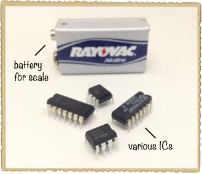

在内部，一个 IC 可能包含一个音乐播放器电路、一个无线电电路、一个遥控电路，或是完全不同的其他东西。因为一个小小的 IC 就可以包含一个非常复杂的电路，所以你可以使用 IC 来制作具有多种功能的电路，而无需从零开始构建。

### IC 和数据手册

有些集成电路（IC）只有 8 个引脚，但其他的 IC 可能有超过 100 个！要弄清楚特定 IC 每个引脚的作用，你需要查看该 IC 的数据手册，就像你在“项目 #11：闪烁一个灯！”中做的那样，位于第 101 页。数据手册会告诉你每个引脚的功能，而且数据手册通常还会展示如何在电路中使用 IC 的示例。要找到某个元件的数据手册，可以尝试在线搜索该元件的名称加上“datasheet”一词，或者检查你购买该元件的官网。

数据手册通常包含很多数字和技术术语的表格，所以第一次看到 IC 的数据手册时，可能会觉得非常复杂。但你通常不需要阅读整个数据手册。相反，你可以只查找你需要的信息，然后回到构建电路的工作中。

### 如何用电流制作声音

*声音*是当空气来回快速振动时你所听到的声音。许多产生声音的设备，比如汽车中的音响系统，都是通过*扬声器*来实现的，扬声器是一个可以快速振动空气从而产生声音的元件。

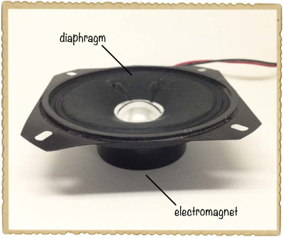

扬声器内部有一个电磁铁，电磁铁推动一个 *振膜*，振膜是一个推动空气的表面。当电路每秒开启和关闭扬声器的电磁铁 1,000 次时，振膜就会每秒推动空气 1,000 次。这就是声音的 *频率*，频率是用赫兹（Hz）来测量的。每秒 1,000 次，或者 1,000 Hz 的频率会产生一个持续的哔声。

### 人耳能听到的声音

人类只能听到大约 20 Hz 到 20,000 Hz 之间的声音。在第 11 项目：闪烁灯光！（见 第 101 页）中，你构建了一个每秒闪烁一次的电路。如果你将电路的输出连接到扬声器，扬声器发出的声音频率将是 1 Hz，这样的频率太低，人耳是无法听到的。你会听到扬声器开关切换时发出的“咔嚓”声。

这意味着，要产生你能听到的声音，你需要创建一个可以每秒开启和关闭扬声器电压数百或数千次的电路！幸运的是，有一个 IC 可以帮助你实现这一点。

### 认识 555 定时器

一个经典的集成电路（IC）是 *555 定时器*，你可以用它快速地切换开关。例如，你可以使用 555 定时器让灯光每秒闪烁一次，或者将它连接到扬声器上发出声音。除了 555 定时器外，你还需要添加一些额外的电阻和电容，通过精心选择这些元件的值，你可以控制灯光闪烁的速度或声音的频率。555 定时器在爱好者中非常流行，因为它便宜，而且一旦掌握了基本知识，使用起来相当简单。你将在本章的项目中使用像这里显示的 555 定时器 IC。

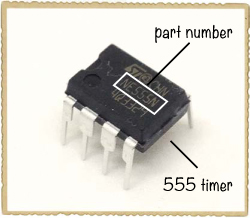

#### 给 IC 供电

555 定时器的数据手册会告诉你每个引脚的功能。现在可以尝试在线搜索“555 定时器 数据手册”。当你找到并打开数据手册时，你应该会看到一个 *引脚图*，像这样：

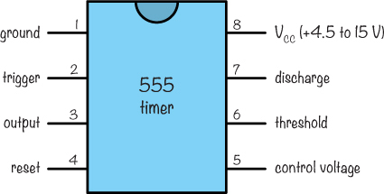

555 定时器有八个引脚。IC 的引脚是按逆时针方向编号的，从左上角开始。（顶部通常有一个小缺口或圆圈标记；有些 IC 上可能两者都有。）数据手册会告诉你每个引脚的功能，但以下两个引脚是现在最需要注意的：

**引脚 1，地** 这个引脚必须连接到电池的负极。在使用 IC 的电路图中，通常会将电池的负极标记为“地”或简写为 GND。

**引脚 8，V**[CC] 这个引脚必须连接到电池的正极，电压必须在 4.5 到 15 V 之间。这意味着 9 V 电池就可以正常工作。在某些 IC 上，这个引脚被称为 V[DD]。

在所有 IC 上，你都可以找到 V[CC]和地引脚。它们是你从任何数据表中首先要了解的引脚，因为你将使用它们为 IC 内部电路供电。

数据表还展示了如何将 555 定时器连接到电路中，我认为最有趣的电路是将 555 定时器连接到*非稳态模式*。*非稳态*意味着某事物在持续变化（不稳定），在非稳态模式下，555 定时器的输出会不断开关。这非常适合使灯光闪烁或发出声音！下面是指示 555 定时器开关其输出的电路：

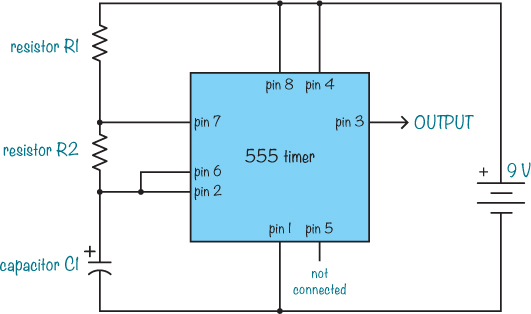

**注意**

*555 引脚的位置已经根据图示进行了安排；它们与 IC 上的顺序不同。*

#### 如何设置 555 定时器的输出速度

电路图中 R1、R2 和 C1 的值决定了输出引脚保持*高电平*的时间——意味着它输出接近电池电压的电压——以及保持*低电平*的时间——意味着它输出接近 0V 的电压。输出变化的速度，或频率，是输出从高到低的次数，每秒一次。当 555 定时器连接到非稳态模式时，如电路图所示，输出的频率由电阻 R1 和 R2 以及电容 C1 通过以下公式控制：

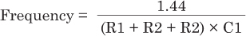

这里，电阻值以欧姆为单位，电容值以法拉为单位。要找到频率，首先将 R1、R2 和 C1 的值代入公式，然后把等号右边的内容输入计算器。

让我们尝试一个例子。假设有一个电路，组件值如下：

 R1 = 100 kΩ

 R2 = 10 kΩ

 C1 = 10 nF

输出的频率是多少？将这些值代入公式：

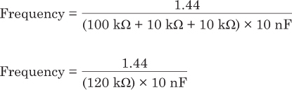

现在转换单位，使得这些值更容易相乘（120 kΩ = 120,000 Ω 和 10 nF = 0.00000001 F）：

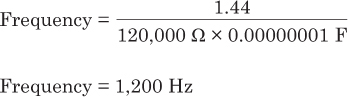

根据此计算，使用这些值时，输出应该每秒开关 1,200 次。

### 项目 #16：使用 555 定时器制作你自己的声音

这个项目将向你展示如何通过扬声器播放大约 1,200 Hz 的声音。非常酷！但是，1,200 Hz 的声音并不太适合听，尤其是如果你有宠物，它们可能比你更不喜欢这个声音。事实上，当我在父母家打开这个电路时，他们的狗跑来跑去，表情非常困惑，有点害怕。我迅速关掉了它，并把实验移到了没有宠物的地方。我建议你也不要在有宠物的地方做这个项目。

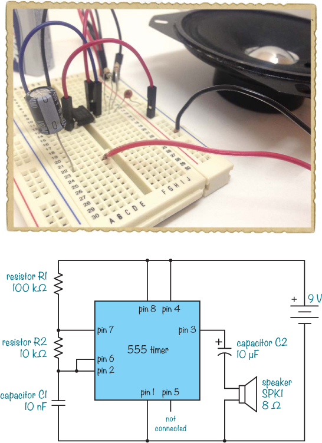

#### 购物清单

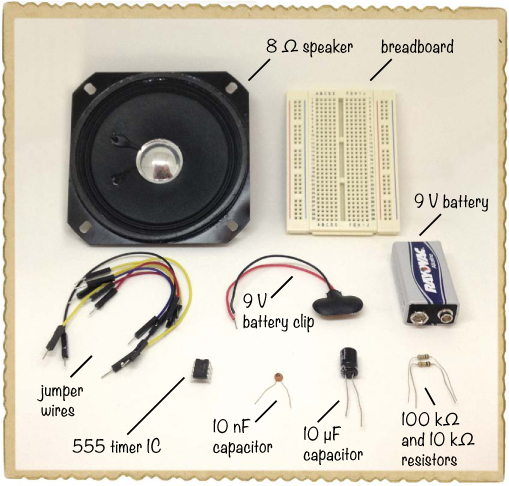

 **标准的 9V 电池**为电路供电。

 **一条 9 V 电池夹**（Jameco #11280, Bitsbox #BAT033），用于将电池连接到电路。

 **一块面包板**（Jameco #20601, Bitsbox #CN329），至少有 30 行。

 **面包板跳线**（Jameco #2237044, Bitsbox #CN236），用于实现简便的连接。（标准接线线也可以使用。）

 **一颗 555 定时器集成电路**（Jameco #904085, Bitsbox #QU001），用于创建定时功能。

 **一只 8 Ω 扬声器**（Jameco #1954818, Bitsbox #ST063），用于播放声音。

 **一颗 10 µF 电容**（Jameco #29891, Bitsbox #EC10U25），用于连接到扬声器。

 **一颗 10 nF 电容**（Jameco #15229, Bitsbox #CC10N），用于设置声音的频率。

 **一颗 100 kΩ 电阻**（Jameco #691340, Bitsbox #CR25100K），用于设置声音的频率。

 **一颗 10 kΩ 电阻**（Jameco #691104, Bitsbox #CR2510K），用于设置声音的频率。

#### 步骤 1：将 555 定时器放置在面包板上

这个电路是围绕 555 定时器集成电路构建的，所以首先将该集成电路放置在面包板的中间，方便将其他所有组件连接到它周围。

**注意**

*当将集成电路连接到面包板时，始终将其放置在中间的凹槽上，一侧的引脚在左边，另一侧的引脚在右边。否则，面包板上同一行的引脚将会互相连接。*

将集成电路的凹槽标记朝上放置，使得引脚 1 位于左上角，引脚 8 位于右上角，如图所示。仔细检查确保你按照我描述的方向放置芯片，否则项目中的其他指令将无法工作。

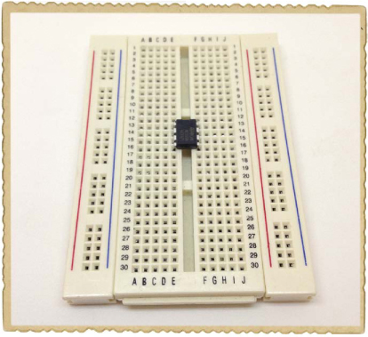

#### 步骤 2：设置频率

接下来，连接设置频率的电阻和电容：R1、R2 和 C1。C1 电容是非极性的，因此连接方向无关紧要。使用右侧的两个垂直列作为正负电源：红色列为正，另一个为负。

将 R1（100 kΩ 电阻）从 555 定时器的引脚 7 连接到正极列。将 R2（10 kΩ 电阻）从引脚 6 连接到引脚 7。然后，将 C1（10 nF 电容）从引脚 6 连接到负极列。接着，用跳线将引脚 2 和引脚 6 连接，以完成设置频率所需的其余连接。

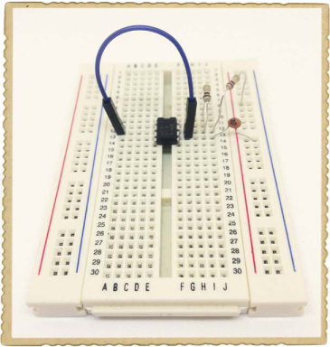

#### 步骤 3：连接扬声器和耦合电容

现在，所有让 555 定时器的输出引脚 3 每秒开关大约 1,000 次的组件应该都已放置在你的面包板上。如果你直接将扬声器连接到输出端，电流会大得通过扬声器，可能会损坏扬声器和 555 集成电路。你可以通过电阻器连接扬声器来减少电流，但使用电容器更好。当电容器连接到交流电压时，电容器有点像电阻器，但如果连接到恒定的直流电压，电流会被阻止。这意味着，除非有实际的频率要播放，否则不会有电流流过扬声器。当电容器像这样使用时，称为*耦合电容器*。

本项目的耦合电容器是一个 10 μF 的极性电容器，因此首先需要确定哪个引脚是负极。将电容器的正极连接到 555 定时器的输出引脚 3。然后将电容器的负极连接到面包板上的空白行。

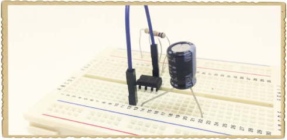

接下来，如果你的扬声器没有线，请在扬声器背面的两个接触点上分别焊接大约 6 英寸长的导线（忽略扬声器接触点旁的+或-标记）。然后，将其中一根扬声器导线连接到与负电容器引脚相同的行，另一根导线连接到负电源列。

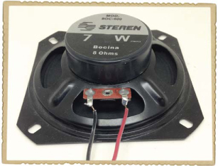

#### 步骤 4：连接电源和重置引脚

将你的面包板与项目开始时的电路图进行对比，你会发现有几个连接缺失。一旦你将所有组件放置在面包板上，就可以通过跳线完成这些最后的连接。为以下每个连接添加一根跳线：

 从 555 定时器的引脚 1 连接到负电源列

 从 555 定时器的引脚 8 连接到正电源列

 从 555 定时器的引脚 4 连接到正电源列

注意，在这个电路中，555 定时器的引脚 5 没有连接。

#### 步骤 5：发出声音！

将电池夹连接到面包板右侧的电源列。红线连接到正电源列，黑线连接到负电源列。

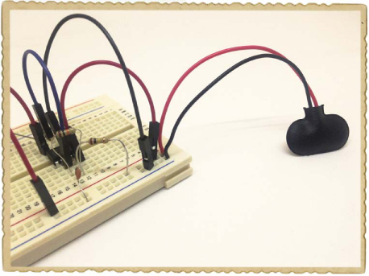

当你准备好后，连接电池，你应该能听到一个响亮的蜂鸣声。恭喜：你刚刚制作了你的第一个电子声音！

#### 步骤 6：如果没有声音怎么办？

这个电路有很多连接，因此如果电路在第一次尝试时没有工作，不必担心：每个玩电子的人都会遇到这种情况。首先，断开电池，然后检查电阻和电容的引脚。这些引脚很长，容易不小心接触到彼此，导致短路。（例如，如果你不小心将电池的正极直接连接到负极，就会造成短路。）

接下来，检查与 555 定时器的组件连接。555 定时器的引脚必须按照电路图与其他部分连接，否则 IC 将无法工作。当连接较多时，容易将电线插错面包板的行。

**团队协作检查连接**

找到电路问题被称为*调试*，有些帮助会让这变得更容易。当你卡住时，要求别人帮助检查电路图，并且一边检查实际连接，一边大声说出连接的顺序。例如，如果你的朋友正在读电路图，而你在查看面包板，你们可能会进行如下对话：

朋友：“电池的正极连接到 R1 的一端。”

你：“明白了！”

朋友：“电池的正极也连接到 IC 的第 4 和第 8 引脚。”

你：“明白了！”

朋友：“R1 的另一端连接到芯片的第 7 引脚和电阻 R2 的一端。”

你：“哦，等一下！我没有连接到第 7 引脚！”

就这样，你会发现问题所在。

如果所有组件的方向都正确，并且没有看到短路，那么检查所有面包板的连接，确保应该连接的组件共享一行。从电路图中电池正极的连接开始，检查它在面包板上的连接是否与电路图所示一致？如果一致，继续检查下一个连接；按这种方式逐个检查，直到检查完所有连接。

### 将烦人的蜂鸣声转化为音乐

你在上一个项目中创建的声音并不太愉快。那么，如何将其变成音乐呢？音乐音符只是以特定频率振动的声波，这意味着你可以使用 555 定时器制作一个电子乐器。如果你改变输入到扬声器的信号频率，那么声音的音调也会发生变化。你只需要找到一种方法，可以随意改变 555 定时器的输出频率，而无需每次重建电路。

第七章介绍了两种可以改变电阻值的元件：可变电阻器和光电阻。如果你使用这些元件之一来控制 555 定时器的输出信号的频率，那么当这些元件的电阻发生变化时，声音也会随之改变。这就是你将在下一个项目中制作的仪器的原理。

### 项目 #17：一个会发出“嘀嘀”和“哔哔”声的仪器

这个项目向你展示了如何将迄今为止所学的内容结合起来，构建你自己的电子乐器。具体来说，你将构建一个带有按钮来播放声音、并用电位器调节音调的乐器。

这个仪器像一个非常简单的*合成器*，利用电流产生声音。自电子音乐诞生以来，合成器被用来为歌曲添加各种嘟嘟声、哔哔声和故障音。这个合成器虽然很基础，但依然能发出不少有趣的声音。实际上，这个项目的电路看起来与"项目#16：使用 555 定时器制作自己的声音"（见第 167 页）的电路非常相似，但它有一些变化。

该电路用一个电位器（和一个保护用的 1 kΩ电阻）替代了项目#16 中的独立 R1 和 R2。电位器像两个电阻一样工作，意味着你可以随时更改 R1 和 R2 的值，从而改变你听到的音调。

注意，这个电路还有一个连接到正电池端子的开关。这个开关是一个按钮，电源和电路之间有一个开关，这样仪器只有在按下按钮时才会发出声音。

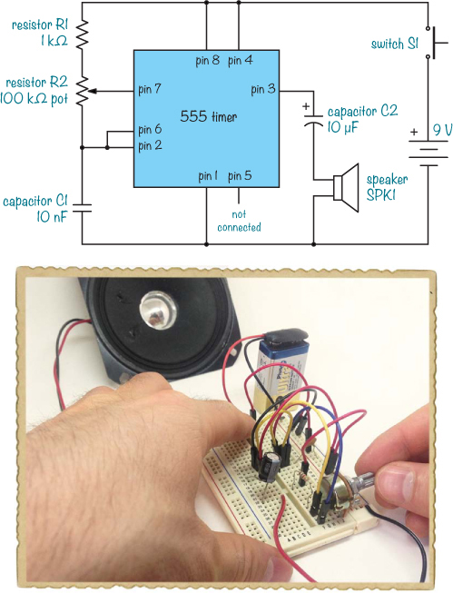

#### 购物清单

 **标准 9 V 电池**，为电路提供电源。

 **9 V 电池夹**（Jameco #11280，Bitsbox #BAT033），用来将电池连接到电路中。

 **面包板**（Jameco #20601，Bitsbox #CN329），至少有 30 行。

 **面包板跳线**（Jameco #2237044，Bitsbox #CN236），用于轻松连接。（标准连接线也可以使用。）

 **555 定时器集成电路**（Jameco #904085，Bitsbox #QU001），用来产生定时信号。

 **8 Ω扬声器**（Jameco #1954818，Bitsbox #ST063），用来播放声音。

 **10 µF 电容器**（Jameco #29891，Bitsbox #EC10U25），连接到扬声器上。

 **10 nF 电容器**（Jameco #15229，Bitsbox #CC10N），用来帮助设定声音的频率。

 **100 kΩ电位器**（Jameco #2161406，Bitsbox #VR006），用来控制音调。

 **1 kΩ电阻**（Jameco #690865，Bitsbox #CR251K），保护第 7 脚避免直接连接到 V[CC]。

 **一个按钮**（Jameco #119011，Bitsbox #SW087），用来播放音调。

#### 步骤 1：连接 555 定时器和电容器

从将 555 定时器连接到面包板的中间开始。然后，连接两个电容器。将 C1，10 nF 电容器，从引脚 6 连接到负电源列。然后将 C2，10µF 电容器的正极连接到芯片的引脚 3，负极连接到远离此处的一个空行。完成后，你的面包板应如下所示：

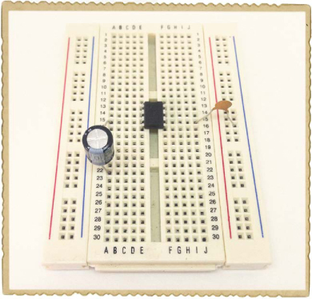

#### 第 2 步：连接跳线

使用跳线创建以下连接：

 将引脚 8 连接到面包板的正电源列

 将引脚 4 连接到面包板的正电源列

 将引脚 1 连接到面包板的负电源列

 将引脚 2 连接到引脚 6

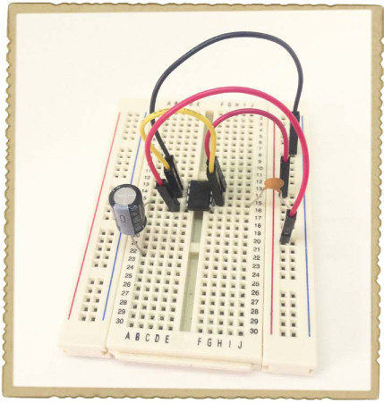

#### 第 3 步：连接音符控制器和电阻

接下来是电位器，它控制播放的音符。由于它占据更多空间，将其插入面包板的底部，如图所示，确保每个引脚都位于自己的行中。

将 1 kΩ 电阻从电位器的最上面一腿连接到离 555 IC 更远的未使用行，并用跳线将此行连接到正电源。然后，将跳线连接到剩下的两个电位器引脚中的每一个。将中间电位器引脚上的线连接到 555 定时器的引脚 7，将下部电位器引脚上的线连接到 555 定时器的引脚 6。

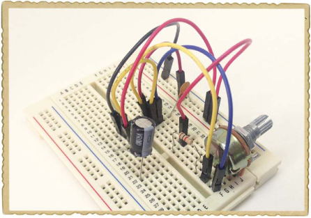

#### 第 4 步：添加“开”按钮

你快完成了！你不会将电池夹直接接到面包板的正电源列，而是通过一个按钮连接，这个按钮将充当你乐器的“开”按钮。这样，只有当按下按钮时，电路才会从电池获得电源，从而只有按下按钮时才会发出声音。

购物清单中的按钮（第 177 页）有四个引脚，但前面的两个腿连接在一起，后面的两个引脚连接在一起。这意味着这个按钮的工作方式与双引脚开关完全相同。当你按下按钮时，前面一对引脚与后面一对引脚连接，电路获得电源，你会听到声音。松开按钮后，电路失去电源，声音会停止。

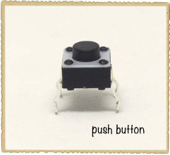

将按钮插入面包板的中间缺口处。然后，使用跳线将按钮的一侧连接到面包板的正电源列。接下来，将电池夹的正极线连接到按钮的另一侧。最后，将电池夹的负极线连接到负电源列。

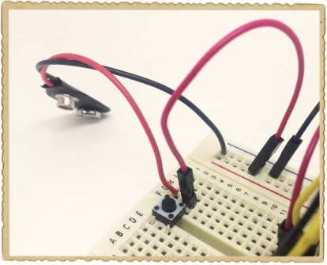

#### 第 5 步：添加扬声器

将一个扬声器线连接到与负电容器腿相同的行，另一根线连接到负电源列。

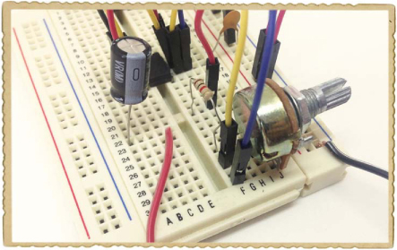

#### 第 6 步：播放一些音乐！

将电池连接到电池夹上，然后按下按钮。你听到声音了吗？试着来回转动电位器的旋钮，直到你听到声音。

你可以通过按下按钮并以任何节奏进行操作来制作节拍，并且可以通过转动电位器的旋钮来控制音调。滴、吧、嘭！

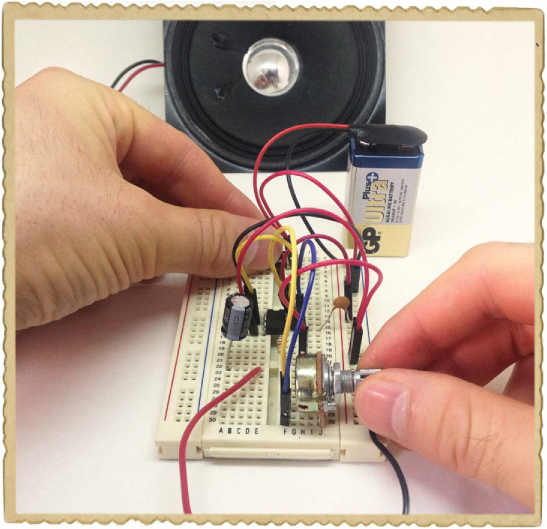

#### 第 7 步：如果乐器无法工作怎么办？

一些电位器不完全适合面包板，因此首先检查你的电位器是否正确连接到面包板上。接下来，检查两个电容器和按键是否按照项目开头的电路图连接。

这个板子上有很多电线，所以很容易搞错连接。如果你仍然没有听到任何声音，那就检查一下板子上的所有连接，确保它们正确。我建议使用我在“团队检查连接”中描述的过程，参考第 174 页。

**尝试一下：制作一个运动控制的乐器**

不要用一个电位器替代 R1 和 R2，而是试试使用一个 1 kΩ的电阻作为 R1，一个光敏电阻作为 R2，如电路图所示。当你将手移动到光敏电阻上时，照射到它的光线量应该会变化，乐器应该会演奏出不同的音符！

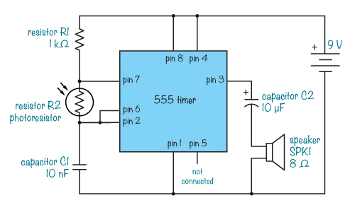

**接下来做什么？**

世界上有数百万个集成电路，它们做着各种各样了不起的事情。记住，每当你想在项目中使用集成电路时，你可以查阅它的数据表，了解它的功能以及你需要制作什么样的电路来让它工作。

在这一章中，你学习了如何使用 555 定时器集成电路制作音乐。这些电路有很多连接，所以如果你第一次没有接对，那么你并不孤单。大多数人在第一次连接电路时会搞混线路，而修复连接是很好的练习！说到练习，现在是时候再做一些焊接了。不如将你的乐器焊接到原型板上——甚至可以把它放进一个盒子里？

集成电路在*数字电路*中非常常见。数字电路通过开关正确的部分来完成许多任务，通常非常迅速，就像你在这一章中制作的音乐乐器一样。像你的计算机这样的现代小工具使用数字电路，而你将在本书的最后几章学习更多关于数字电子的内容。
