## 第九章：**电路如何理解一和零**

手机、电脑、电视、视频游戏主机以及你周围几乎所有的其他科技产品都采用了数字电子技术。如果你曾经打开过电脑，你可能会觉得电路非常复杂，但当你将硬件分解成小块时，其实它非常简单：计算机的每个操作都基于某些电路是否看到高电压或低电压。

你已经使用晶体管来制作控制电路，在这一章中，你将学习如何使用数字电子技术来制作更智能的电路。你将学习一种新的数字系统，什么是位（bit）和字节（byte），以及如何利用位和字节用电来创建信息。

### 一和零作为电压

当我在学校时，老师告诉我计算机通过一和零进行通信，但他没有进一步解释。我想知道更多，于是我决定去问我爸爸。因为计算机是复杂的机器，我以为它们使用一和零的方式也会很复杂，但我爸爸告诉我：“在计算机中，1 只是一个带电压的电线，0 是一个没有电压的电线。”（我爸爸所说的“没有电压”是指电压为零。）

在《如何设置 555 定时器的输出速度》的第 166 页中，我简要提到过 555 定时器的引脚可以是高电平或低电平。计算机中集成电路的引脚工作原理也一样：高电平是 1，低电平是 0。数字电路通过在不同的导线上切换高低电压来工作。

### 认识二进制数字系统

通常，当你谈论数字时，你使用的是*十进制数字*，它属于*基数为 10*的数字系统。在十进制中，一个数字可以有 10 个可能的值，从 0 到 9。但数字电路只能处理两种电压（高电压和低电压），因此它们只能理解*二进制数字*。二进制也叫做*基数为 2*的数字系统，二进制数字的位只有两个可能的值：0 和 1。

这是你如何用十进制和二进制分别计数到 10：

| **十进制数字** | **二进制数字** |
| --- | --- |
| 0 | 0 |
| 1 | 1 |
| 2 | 10 |
| 3 | 11 |
| 4 | 100 |
| 5 | 101 |
| 6 | 110 |
| 7 | 111 |
| 8 | 1000 |
| 9 | 1001 |
| 10 | 1010 |

这里发生了什么？十进制的数字 2 在二进制中是 10，十进制的数字 4 在二进制中是 100！

你可以通过数字及其位置来推算任何系统中数字的值。最右边的数字始终乘以 1。从右往左，每个位置的值等于基数乘以前一位置的值。在十进制中，基数是 10，因此第二位的值是 10，或者 10 × 1；第三位的值是 100，或者 10 × 10；第四位的值是 1000，或者 10 × 100；依此类推。这里有一个例子：

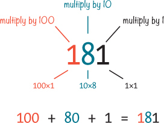

在数字 181 中，第一位是 1，第二位是 8，第三位是 1。将这些数字与它们的位置值相乘，然后将得到的结果相加，即可得出 181。尽管如此，你不需要使用这种方法来算出十进制数字，毕竟 181 显然等于 181！但这种方法对找出二进制数的值非常有用。二进制遵循相同的规则，只是它使用的是 2 为基数。

### 项目#18：从二进制转换到十进制

在这个项目中，你将*转换*一个二进制数字为十进制形式。将数字转换为不同的进制意味着计算该数字的值并用新进制的数字表示它。

#### 工具

 **一支钢笔或铅笔**用来写字。

 **纸张**用来写字。

 **一台计算器**用来加数字。如果你擅长心算，可以尝试不使用计算器进行此项目。

#### 第 1 步：写在纸上

首先，在纸上写下一个八位二进制数字，在数字上方和下方留出空格。我将转换二进制数字 1011 0101，并像这样写出来：

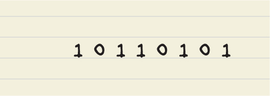

#### 第 2 步：写下位置值

接下来，在每一位数字上方写出每个位置的值。二进制与十进制的工作方式相同，只是基数是 2。这意味着最右边位置的值为 1，要找到左边的位置，只需将前一个位置的值乘以 2。例如，第二位的值是 2 × 1 = 2；第三位的值是 2 × 2 = 4；第四位的值是 4 × 2 = 8；以此类推。如果你不想在脑中计算这些，可以使用计算器。当你写下这些值时，你应该得到类似这样的结果：

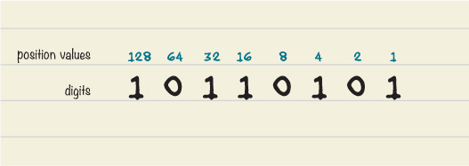

#### 第 3 步：找出每个数字的值

查看你写下的二进制数字的每一位。如果某位是 0，就在它下方写 0。如果该位是 1，就在它下方写出该位置的值。这些值将会相加，得出最终的十进制数字。

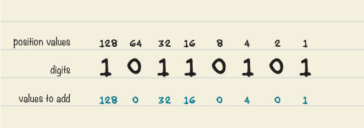

#### 第 4 步：添加数字

现在你应该已经有了三行数字。将底部行中的数字相加（你可以在每对数字之间写一个加号，以便于加法），得到和，即为二进制数字的十进制值。

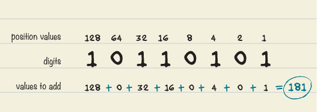

二进制数字 1011 0101 转换为十进制是 181。如果你跟着这个数字做，并且结果不同，请重新检查步骤，并将你的结果与我的答案进行对比，以找出错误所在。

**动手试试：转换更多二进制数字**

为了更好地练习零和一，我们将一些二进制数字带入十进制世界。这里有几个可以尝试的数字： *

1010

0011 1111

1000 0000

0011 1011 0101

* 在十进制中，这些二进制数字分别是 10、63、128 和 949。

### 位和字节

二进制数中的每一位数字叫做*比特*（*binary digit*的缩写），计算机以八个比特为一组处理数字，这组比特叫做*字节*。二进制数 1011 0101 有八个比特，因此它是一个字节。你可以通过多种方式与计算机互动，但所有的鼠标点击、按键、摄像头视频等都需要被转换成比特和字节，计算机才能理解。

事实上，在使用计算机和其他数字设备时，你通常会看到比 1 字节大得多的数字。计算机上的所有文件都是字节的集合，但如果你单纯用字节来描述它们的大小，这些数字会非常庞大！因此，文件通常用更大的单位来描述，比如千字节*（kB）、兆字节（MB）、千兆字节（GB）、太字节（TB）等。以下是这些单位的含义：

| 1 kB | = 1,000 字节 |
| --- | --- |
| 1 MB | = 1,000 kB = 1,000,000 字节 |
| 1 GB | = 1,000 MB = 1,000,000 kB = 1,000,000,000 字节 |
| 1 TB | = 1,000 GB = 1,000,000 MB = 1,000,000,000 kB = 1,000,000,000,000 字节 |

如果计算机的硬盘可以容纳 1 TB 的数据，那么它就可以容纳一万亿字节，也就是八万亿个一和零！

### 数字可以代表任何事物

现在你可能会想，“为什么我需要计算机里有八万亿个一和零？”事实上，无论你是用计算机写故事、画画、和朋友聊天、玩游戏还是做其他任何事，你都在使用那些一和零。

举个例子，计算机是如何在屏幕上显示图像的？计算机屏幕由许多小点组成，叫做*像素*，每个像素可以设置为一种红色、绿色和蓝色光混合的颜色。如果你希望一个像素呈现最亮的黄色，你会用数字告诉计算机将该像素的红色和绿色设置为全强度，蓝色设置为零（因为混合红色和绿色光看起来像黄色）。通过这种方式，你可以将数字转化为屏幕上的图像。

### 项目 #19：颜色猜测游戏

在本项目中，你将使用二进制值来构建一个像素颜色猜测游戏。它是一个两人游戏，你和朋友轮流扮演“计算机”和“用户”的角色。

计算机的“人类”通过按下三个按钮的组合来设置像素的颜色。当计算机准备好后，用户必须猜测像素的颜色是什么。当用户准备好猜测时，他们应该大声说出所选颜色，然后按下颜色显示按钮来展示实际颜色。如果用户猜对了，他们得一分并且可以继续猜。如果猜错了，就交换角色。第一个得三分的人赢得这一回合。

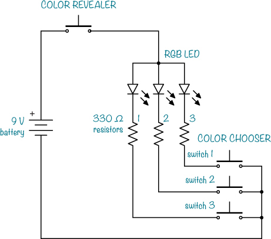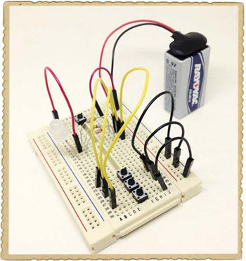

#### 认识 RGB LED

要为此项目创建像素，您将使用*红绿蓝（RGB）LED*，它将红色 LED、绿色 LED 和蓝色 LED 组合为一个组件。通过打开和关闭这些 LED 中的每一个，您可以创建不同的颜色。例如，仅打开红色和绿色 LED 会产生黄色。

有两种类型的 RGB LED：*共阳极*和*共阴极*。这就是一个共阳极 RGB LED 的外观及其符号：

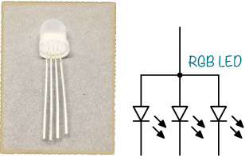

RGB LED 有四个引脚。您将使用三个引脚来设置颜色，第四个引脚是*共用*引脚。在共阳极 RGB LED 中，三个 LED 的正极（阳极）合并为一个引脚；共阴极 RGB LED 将三个 LED 的负极（阴极）合并为一个引脚。

在这个项目中，您将构建以下电路，使用一个共阳极 RGB LED 和一些按钮。

#### 购物清单

 **一个标准的 9 V 电池**为电路供电。

 **一个 9 V 电池夹**（Jameco #11280, Bitsbox #BAT033）用于将电池连接到电路。

 **一个面包板**（Jameco #20601, Bitsbox #CN329），至少包含 30 行。

 **面包板跳线**（Jameco #2237044, Bitsbox #CN236）用于方便地连接部件。（标准连接线也可以使用。）

 **三只 330 Ω电阻**（Jameco #661386, Bitsbox #CR25330R）用于限制 LED 的电流。

 **共阳极 RGB LED**（Jameco #2219567, Bitsbox #OP100）用于创建颜色。

 **四个按钮**（Jameco #119011, Bitsbox #SW087）用于设置和显示颜色。

#### 第 1 步：放置颜色选择按钮

将面包板放置，使中间的缺口从顶部到底部延伸。然后，将三个按钮放在面包板的底部；每个按钮的一对引脚应该位于缺口的左侧，另一对引脚位于右侧。这样，您将有足够的空间在按钮的两侧连接其他组件，并且能够更容易地将计算机的按钮与用户的按钮区分开来。按钮放置好后，从每个按钮的右下方引脚连接三根跳线到负电源列。

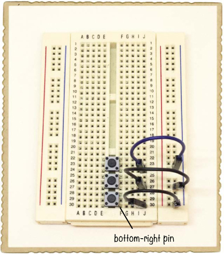

#### 第 2 步：连接 RGB LED

在板子左侧的中间位置，连接您的 RGB LED。RGB LED 的最长引脚是共阳极引脚，暂时不连接它。从 RGB LED 剩余的每个引脚连接一只 330 Ω电阻到面包板右侧的空白行。然后，从这三行中的每一行，连接一根跳线到每个按钮的左上方引脚。

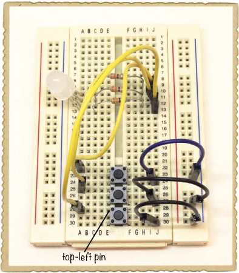

#### 第 3 步：连接颜色显示按钮

接下来，添加一个按钮，让用户能够看到计算机选择的颜色。将第四个按钮放在面包板的最顶部，横跨中间的凹槽。将一根跳线从 RGB LED 的共阳极引脚连接到第四个按钮的左上角引脚。然后，再将一根跳线从这个按钮的右下角引脚连接到右侧的正电源列。

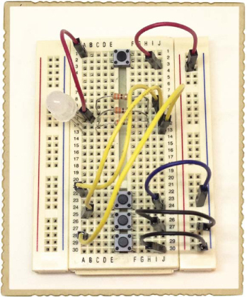

#### 步骤 4：测试颜色

将电池夹连接到右侧的电源列，连接电池并试试看！按下底部的一些按钮，然后按下颜色揭示按钮查看颜色。在这张照片中，我将我的 RGB LED 设置为绿色。

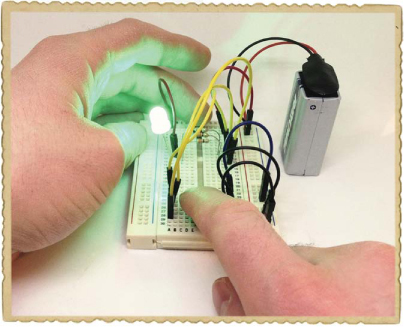

你应该能看到以下七种颜色，具体取决于你按下了哪些按钮：

| **颜色** | **上按钮** | **中按钮** | **下按钮** |
| --- | --- | --- | --- |
| 红色 | 按下 (1) | 未按下 (0) | 未按下 (0) |
| 绿色 | 未按下 (0) | 按下 (1) | 未按下 (0) |
| 蓝色 | 未按下 (0) | 未按下 (0) | 按下 (1) |
| 黄色 | 按下 (1) | 按下 (1) | 未按下 (0) |
| 青色 | 未按下 (0) | 按下 (1) | 按下 (1) |
| 品红 | 按下 (1) | 未按下 (0) | 按下 (1) |
| 白色 | 按下 (1) | 按下 (1) | 按下 (1) |

如果你的按钮颜色不匹配，请交换三只电阻器与按钮之间的连接，直到它们匹配为止。

#### 步骤 5：如果游戏不工作怎么办？

如果你完全看不见颜色，请检查你的连接是否与电路图匹配。如果连接正确，但按下颜色揭示按钮后仍然看不见任何颜色，可能是你使用了共阴极 LED 而不是共阳极。检查这一点的方法很简单，只需交换电池的正负连接。

当你确认所有颜色都能正常工作时，邀请朋友一起来玩吧！

**尝试一下：焊接颜色猜谜游戏**

这是一个完美的电路，可以用来练习你的焊接技能。拿一块原型板，将电路焊接到板上，这样你就有了一个永久的颜色猜谜游戏，可以带着它去长途旅行。

### 如何用二进制数字创建单词

图像并不是唯一能用二进制数字存储的东西；字母也可以用数字表示。实现这一点的一种方法是使用*ASCII 码*，它是计算机能够理解的标准字节集，用于表示大写字母、小写字母、数字、标点符号等。此表中的数字代表英文字母的小写字母。

| **十进制 ASCII 代码** | **二进制值** | **小写字母** |
| --- | --- | --- |
| 97 | 0110 0001 | a |
| 98 | 0110 0010 | b |
| 99 | 0110 0011 | c |
| 100 | 0110 0100 | d |
| 101 | 0110 0101 | e |
| 102 | 0110 0110 | f |
| 103 | 0110 0111 | g |
| 104 | 0110 1000 | h |
| 105 | 0110 1001 | i |
| 106 | 0110 1010 | j |
| 107 | 0110 1011 | k |
| 108 | 0110 1100 | l |
| 109 | 0110 1101 | m |
| 110 | 0110 1110 | n |
| 111 | 0110 1111 | o |
| 112 | 0111 0000 | p |
| 113 | 0111 0001 | q |
| 114 | 0111 0010 | r |
| 115 | 0111 0011 | s |
| 116 | 0111 0100 | t |
| 117 | 0111 0101 | u |
| 118 | 0111 0110 | v |
| 119 | 0111 0111 | w |
| 120 | 0111 1000 | x |
| 121 | 0111 1001 | y |
| 122 | 0111 1010 | z |

例如，字母 *a* 可以用十进制数字 97 表示，即二进制数字 0110 0001。你可以使用这个表格来编码和解码由零和一组成的秘密消息。

### 项目#20：秘密消息机

这个项目是一个电路，通过 LED 显示八位二进制数字。点亮的 LED 代表 1，熄灭的 LED 代表 0。你将使用开关来设置二进制数字，并用一个按键将二进制数字显示在 LED 上。

八位二进制足以表示一个 ASCII 字符，因此你可以使用这个项目生成只有懂二进制的人才能解码的秘密消息！这个完成的秘密消息机展示了字母 *w*，即 0111 0111。

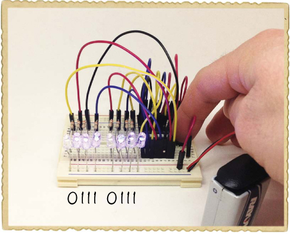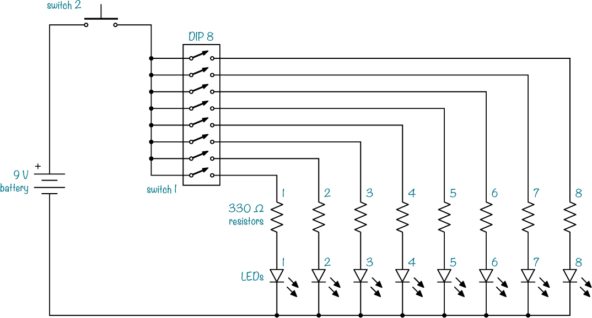

#### 认识 DIP 开关

这个电路使用八个开关来设置二进制值，但把这么多独立的按钮插到面包板上会很麻烦。幸运的是，你可以使用一个 *DIP 开关*，它是一个带有一排或多排微型开关的元件。

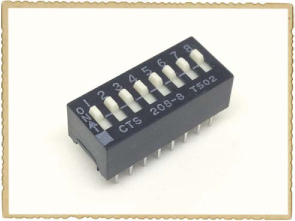

**注意**

*DIP 代表*双列直插封装，*指的是引脚的排列方式。名称中带有“DIP”的元件有两排引脚，你可以将其插入面包板中。这个项目中的 DIP 开关有八个独立的开关，非常适合为一排 LED 创建二进制输入。*

#### 购物清单

 **一块标准的 9 V 电池**为电路提供电力。

 **一个 9 V 电池夹**（Jameco #11280, Bitsbox #BAT033），用来将电池与电路连接。

 **一个面包板**（Jameco #20601, Bitsbox #CN329），至少有 30 行。

 **面包板跳线**（Jameco #2237044, Bitsbox #CN236），用于方便地连接部件。（标准连接线也可以使用。）

 **八个 330 Ω电阻**（Jameco #661386, Bitsbox #CR25330R），用于限制流向 LED 的电流。270 Ω到 470 Ω之间的任何值都能很好工作。

 **八个蓝色 LED**（Jameco #2193889, Bitsbox #OP033），用来显示二进制数字。

 **一个 8 位 DIP 开关**（Jameco #696984, Bitsbox #SW098），用来设置二进制数字。

 **一个按钮**（Jameco #119011, Bitsbox #SW087），用来打开 LED。

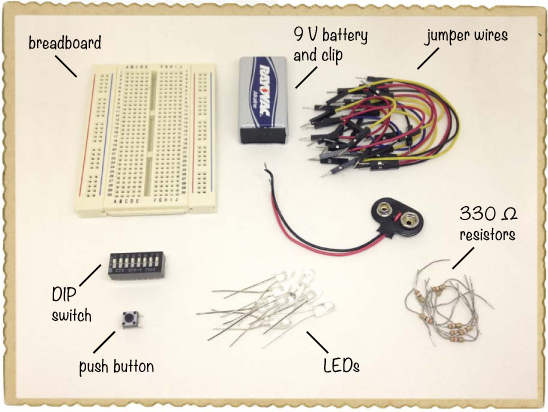

#### 第一步：连接按钮

将按钮插入面包板的顶部。这个项目将在面包板上占用大量空间，因此从现在开始，尽量将各个组件放置得尽可能紧凑。

从面包板右上角的行连接一根跳线，这一行应该连接到按键的上引脚，再连接一根跳线从按键下引脚到左侧的正电源列。

你的面包板应该看起来像这样：

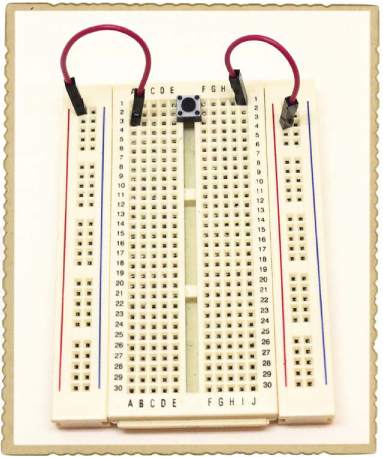

这个按键控制着电池正极与电路其余部分的连接。当按键未被按下时，电流无法形成闭合回路，电路没有电源。

#### 步骤 2：连接 DIP 开关

接下来，将 DIP 开关连接到面包板上，位置在按键下方，且中间缺口右侧有数字。将每一排的跳线连接到左侧的正电源列，总共需要八条线。为了能方便地设置开关的开和关，请将线连接到尽可能远离开关的位置，以便为你的手指留出空间。

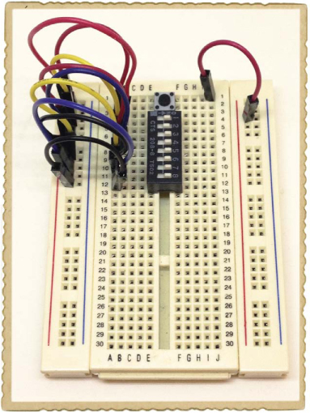

#### 步骤 3：连接 LED

现在，将一个 LED 的短脚连接到右侧的负电源列，将长脚连接到面包板底部的最后一排。按照相同的方式，向上插入其余的 LED，每个 LED 占一排，LED 之间留一个空排。（如果你想让 LED 更易读，可以将 LED 分为两组，每组四个，在第四个 LED 之后多留几排。）然后，从每排有 LED 的行连接一根电阻线到面包板缺口中间左侧的相应行。

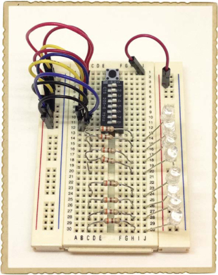

最好将 LED 和开关连接，以便你和你的朋友可以坐在面包板的两侧，按照相同的顺序查看各个位置，所以在连接时要特别小心。将电阻放好后，从面包板缺口左侧的每一排电阻连接一根跳线，连接到右侧缺口的 DIP 开关引脚。将最接近面包板底部的电阻连接到开关 1，接下来的 LED 连接到开关 2，以此类推；最后，将最上方的电阻连接到开关 8。

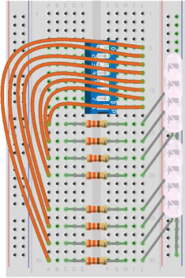

#### 步骤 4：发送秘密信息！

将电池夹的负极连接到负电源列，然后将正极连接到正电源列，如图所示。

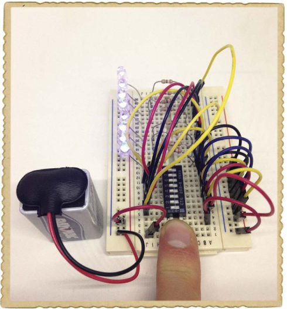

然后，将所有开关推到“开”的位置，按住按钮，观察所有的灯是否都亮起来，并逐个关闭每个 LED 灯。

如果所有的 LED 灯都工作正常，那就可以开始玩了！邀请一个朋友过来，利用这个电路与他们“对话”而不出声。坐在桌子的两边，在纸上写下一个单词作为参考并保密。查看 ASCII 代码表，并将开关设置为单词第一个字母的二进制值。例如，下图中的开关设置为显示小写字母*a*。

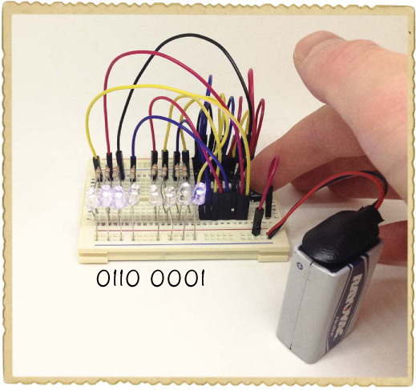

当你的开关组准备好显示一个字母时，按下按钮让 LED 灯亮起。按住按钮的同时，让你的朋友记录下二进制值。然后，松开按钮并设置下一个字符的二进制值。一直这样做，直到你显示完单词中的所有字符。完成后，给你的朋友展示 ASCII 代码表，让他们试着猜出你的单词。

#### 第五步：如果秘密信息机没有工作怎么办？

如果你从头到尾跟着本书进行操作，你已经连接了许多 LED 电路，但这个电路包含了很多组件。在某些地方接错连接很容易，所以如果你的电路没有立即工作，请仔细对照项目的电路图检查每个连接。

如果灯光都不亮，首先检查电池的正负极是否正确连接。接下来，检查 LED 灯的方向是否正确，电阻器的数值是否合适。如果有些灯亮了而有些灯不亮，可能是某些 LED 灯或电阻器的引脚不小心接触了不该接触的地方。仔细检查它们，找出错误。

**为什么计算机使用 1 和 0**

计算机使用 1 和 0 而不是 0 到 9 的十进制数字，因为当只有两个值时，构建电子电路进行计算和存储这些值会容易得多。

例如，由于每个数字只有两种可能的值，1 或 0，所以使用开关创建一个简单的存储二进制数字的内存块非常容易，就像你在第 20 个项目中使用 DIP 开关时一样。

有许多不同的方式可以存储 1 和 0，从而创造出*记忆*。在计算机发展的早期，常常将 1 和 0 以有孔的物理卡片形式保存。如今，许多硬盘通过磁盘存储 1 和 0，甚至通过集成电路内存储的电子来保存。

**接下来做什么？**

在这一章中，你学习了二进制数字的工作原理。你已经看到了如何利用 1 和 0 在计算机屏幕上显示图像，以及如何将一串看似随机的 1 和 0 解码成可读的文本。为了更深入地了解二进制数字，尝试为字母表中的字母创建自己的二进制代码。从 *a* 到 *z* 一共有 26 个字母。你需要多少位来表示所有 26 个字母？要解决这个问题，你可以从假设二进制数 1 代表 *a* 开始。下一个二进制数 10 代表 *b*，再接着是 11 代表 *c*。把这些写下来，继续增加，直到到达 *z*。然后，数一数表示 *z* 需要多少位。这就是你所需要的最小位数。

这里还有一个可以尝试的练习。通常情况下，如果你用手指计数，你可以数到 10，对吧？如果你不使用大拇指，你最多只能数到 8。但是如果你改用二进制计数呢？伸直的手指代表 1，弯曲的手指代表 0。现在，利用八根手指，你能数到多高呢？

数字值还有一个非常重要的用途：它们可以让你创建*逻辑电路*，这些电路根据某些电线是否承受高电压或低电压来做出决策。高电压通常被认为是“真”，低电压通常被认为是“假”。如果这些电线与简单的真或假问题相关，并且电压就是这些问题的答案，那么你可以将逻辑电路的输出看作是经过一系列提问后得出的结论。

利用逻辑，你可以制作执行数学运算的电路，比如加法运算，或者制作只有在特定条件下才会执行的电路，比如只有在输入正确的数字组合时才会打开的门锁。在第十章中，我将向你展示一些数字逻辑的基本构建块，以及如何利用它们制作智能电路。
