## 第十章：做出选择的电路

第九章讲述了零和一，且你在一些项目中玩弄了比特和字节。现在，在这一章中，你将制作实际使用零和一做出决定的电路。*逻辑门*是检查代表这些零和一的电压并相应输出电压的组件。我将向你展示几种类型的逻辑门，以及如何使用它们创建一个秘密代码探测器。

### 这完全符合逻辑

*逻辑*是一种基于已知为真或假的信息得出结论的方法。例如，假设你知道以下陈述无疑是真的：

声明 1：如果冰箱里有橙子并且你有一个橙汁榨汁器，那么你能够制作橙汁。

如果你相信前述声明，那么在你能够制作橙汁之前有两个条件需要检查：

条件 1：冰箱里有橙子。

条件 2：你有一个橙汁榨汁器。

如果你检查厨房并发现这些条件为真，那么你可以逻辑地得出结论：你可以制作橙汁。

计算机使用*布尔逻辑*，这是一种仅使用*真*和*假*的值来将零和一转换为动作的逻辑系统。为了让计算机知道你是否能够制作橙汁，它必须通过布尔逻辑得出结论。让我们试着像计算机一样思考吧！

首先，查找在声明 1 中影响你是否能制作橙汁的条件。在这个例子中，条件是“if”和“then”之间由“and”连接的两个短语。将它们分别用字母表示，如下所示：

冰箱里有橙子。 = A

你有一个橙汁榨汁器。 = B

结论是“then”之后的陈述。也给它一个字母：

你能够制作橙汁。 = Q

使用这些字母，你可以将声明 1 重写为“如果 A 和 B，那么 Q”。在布尔逻辑的简写中，表示为：

A 且 B = Q

这是一个*逻辑方程*，其中*AND*是类似加法或减法的运算符。当 AND 两边的语句都为真时，结论 Q 为真。

给定条件 1 和条件 2，A 和 B 都为真。将它们代入方程式得到：

真且真 = Q

Q = 真

由于 A 和 B 都为真，那么 Q 也必须为真。现在可以制作橙汁了！

计算机如何判断何时可以制作橙汁

| **条件 A（冰箱里有橙子。）** | **条件 B（你有一个橙汁榨汁器。）** | **结果 Q（你能够制作橙汁。）** |
| --- | --- | --- |
| 假 | 假 | 假 |
| 假 | 真 | 假 |
| 真 | 假 | 假 |
| 真 | 真 | **真！** |

### 认识逻辑门

你计算机中的许多电路是逻辑方程的物理版本，里面包含了更小的电路叫做*逻辑门*，它们是物理逻辑运算符。逻辑门接受 1 和 0—分别代表真和假—作为输入，然后根据方程的结果输出 1 或 0。

你也可以自己使用逻辑门制作非常棒的项目！

我记得第一次我爸爸跟我讲逻辑门的时候：我直接回到房间，花了几个小时在纸上尝试不同的方式组合它们来加二进制数字。我希望你能像我一样享受这个过程！现在，让我们看看一些不同的逻辑门是如何工作的。

#### 与门检查两个输入是否为真

*与门* 是你用来判断是否能做橙汁的与运算符的物理形式。一个与门有两个或更多输入—例如 A 和 B—以及一个输出—例如 Q。它检查 A 和 B 是否都为 1，如果是，那么 Q 为 1；否则，输出为 0。只有当 A *和* B 都为 1 时，Q 才为 1；如果一个或两个输入为 0，输出就是 0。

我发现通过在*真值表*中写出不同输入组合对应的 Q 值很有帮助。这个真值表展示了与门的所有可能输入组合，以及每种组合的输出结果。在真值表中，0 代表*假*，1 代表*真*。

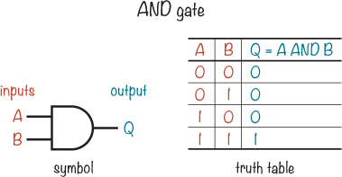

#### 或门检查是否有一个输入为真

*或门* 检查输入 A *或* 输入 B 是否为 1。如果其中任何一个为 1，或者两个都是 1，那么输出 Q 也是 1。如果两个输入都是 0，那么输出为 0。

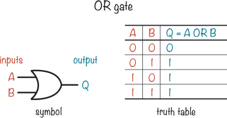

#### 非门翻转输入

*非门*，也叫*反向器*，只有一个输入和一个输出，它的功能非常简单：输出是输入的反面。如果输入是 1，那么输出是 0。如果输入是 0，输出是 1。

#### 更大的与门

与门和或门可以有多个输入。例如，这里是一个 4 输入与门的符号：

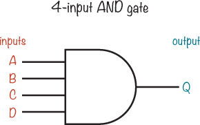

因为这是一个与门，只有当四个输入都为 1 时，结果才会是 1；否则，它将是 0。也就是说，输出 Q 为真（1），当且仅当四个输入—A、B、C 和 D—都为真（1）时：

Q = A AND B AND C AND D

我们还可以通过三个 2 输入与门来构建一个 4 输入与门，像这样：

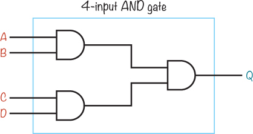

### 如何绘制逻辑电路图

你可以使用逻辑门构建一个电路，检查条件并根据这些条件决定该做什么。例如，假设你能通过输入一个秘密代码来关闭你的报警系统。第一章中提到的那样。然后，你可以在离开时保持报警系统开启，如果有人打开了门，他们必须知道正确的代码才能关闭报警系统。使用逻辑门，电路可以轻松检查是否输入了正确的代码。

#### 用逻辑方程制作一个秘密代码

假设秘密代码是 1001，当检测到秘密代码时，LED 应该亮起以指示成功。在构建逻辑电路时，提前写出电路的逻辑方程是有帮助的，因此我们来练习一下。

首先，思考秘密代码中的每个 1 和 0 在逻辑门中的含义。在这种情况下，只有当四个条件都为真时，LED 才会亮起，你可以通过 AND 运算符将这些条件连接起来，如下所示。

让我们用字母*W*、*X*、*Y*和*Z*表示秘密代码中的四个位。然后，你可以检查每个位的值，验证 W = 1，X = 0，Y = 0，Z = 1 是否成立。

你需要将四个秘密代码位通过一个 4 输入的 AND 门进行与运算。但是，简单地将 W、X、Y 和 Z 直接连接到 AND 门会得到这样的逻辑方程：

Q = W AND X AND Y AND Z

这将测试所有位是否为 1，因为只有当 W、X、Y 和 Z 都为 1 时，Q = 1。相反，你需要测试秘密代码，其中 W 和 Z 为 1，但 X 和 Y 为 0。

幸运的是，在布尔逻辑中，你只有两个选项：1 或 0（真或假）。如果某个值是 0，那它就不是 1；用语言表达就是，如果某个值为假，那么它就不是真的。这意味着，如果 X = 0（假），那么 NOT X = 1（真）。知道这一点后，你可以将方程重写如下：

Q = W AND (NOT X) AND (NOT Y) AND Z

这个方程对 X 和 Y 位使用了 NOT 操作，这样它们应该是 0 才能得到秘密代码。NOT 操作会反转它们的值，将 0 变为 1，1 变为 0。

#### 将逻辑方程转化为电路图

现在我们将把秘密代码方程画成电路。最终的输出将是一个 1 或 0。你需要一个 4 输入的 AND 门来一次性测试所有四个位，并且你将使用之前解释的三个 2 输入的 AND 门来实现这一点。因为你需要测试 X 和 Y 位是否为 0，所以你需要为每个位使用一个 NOT 门，将 0 反转为 1。

这是最终的电路：

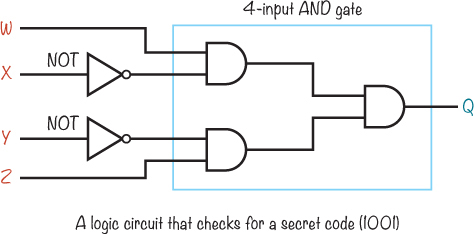

第一个位（W）应该是 1，第二个位（X）应该是 0，因此第二个位需要一个 NOT 门。第三个位（Y）也需要一个 NOT 门，并且它将与第四个位（Z）一起输入到 AND 门中。

第一个 AND 门应该在 W = 1 和 X = 0 时输出 1，第二个 AND 门应该在 Y = 0 和 Z = 1 时输出 1。如果这两个 AND 门都输出 1，那么第三个 AND 门也会输出 1，最终确认输入的是 1001。

**试一试：将更多逻辑语句绘制为电路**

现在你已经了解了基本知识，尝试将一些逻辑语句转化为电路图。举个例子，你如何为“我能做橙汁吗？”决策器绘制计划？根据第 214 页上“它只是逻辑”部分的语句来创建一个。

### 在现实生活中使用逻辑门

当我学习逻辑门时，我以为它们会是小型的两脚或三脚组件。但逻辑门通常被封装在集成电路（IC）中。每个 IC 包含几个逻辑门，因此即使你只需要一个，也必须使用集成电路。

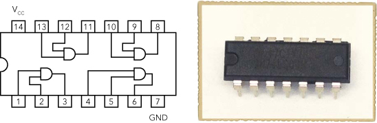

还需要知道的是，逻辑门输出的电流非常有限。即使逻辑门输出 5 V，也并不意味着你可以将一个 5 V 的电动机连接到它上面。逻辑门根本无法提供足够的电流来让电动机运行。

回想一下第七章，晶体管只需要一点电流流入其基极就能打开，从而让更多电流从集电极流向发射极。当你想用逻辑门来打开一个需要更多电流的电路或组件时，你可以将逻辑门连接到晶体管。你还记得在第七章的“项目#14：构建一个触摸感应电路”中那个电路吗？你可以修改这个电路，让逻辑门点亮一个 LED，像这样：

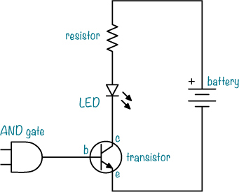

我将在下一节中展示如何将这一点融入到一个项目中。

**更多关于电流、组件和晶体管的内容**

你可以轻松地将 LED 和电阻替换为你想控制的其他设备，如电动机、风扇或继电器。但在做这些替换时，请留意电流。你的电动机需要多少电流，而晶体管能处理多少电流？

这两个值可以在组件的数据手册中找到。对于晶体管，你需要查找的值叫做 *I*[C]，即 *集电极电流*。根据 BC547 晶体管的数据手册，它的最大集电极电流是 100 mA。这足够为 LED 供电，而 LED 通常最多只需要 15 到 20 mA。

但如果你想连接一个电动机怎么办？首先，你需要找出电动机需要多少电流，这个信息可以在电动机的数据手册中找到。如果电动机需要 500 mA，那么你需要将它连接到一个可以处理超过 500 mA 电流的晶体管。例如，PN2222 晶体管可以处理最高 600 mA 电流，所以它应该能够控制电动机的开关。

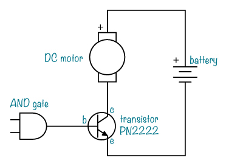

### 项目 #21：秘密代码检查器

在这个项目中，你将构建一个逻辑电路，用来检查一组四个输入位是否与秘密代码匹配。你将使用四个开关，在一个 DIP 开关内部设置代码。如果输入的位与代码匹配，逻辑电路就应该输出一个电压，表示 1；否则，它应该输出零电压，表示 0。这一最终输出将接到一个晶体管上，这样你就可以用它来控制某些东西——比如一个报警器！

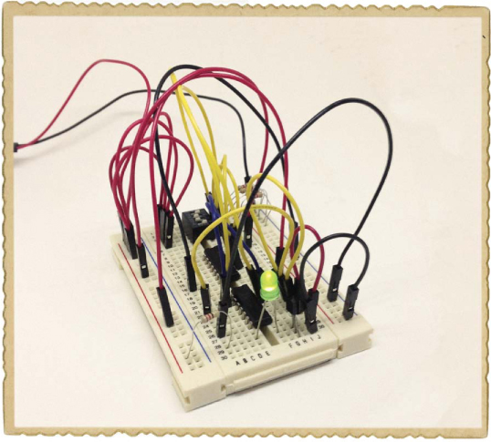

基本的秘密代码检查器电路会在你输入正确的代码时点亮一个 LED。在项目的最后，我会向你展示如何利用秘密代码检查器从第一章中解除你的入侵者报警。

这是本项目的完整电路图：

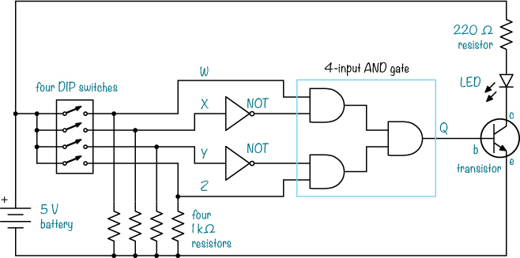

#### 购物清单

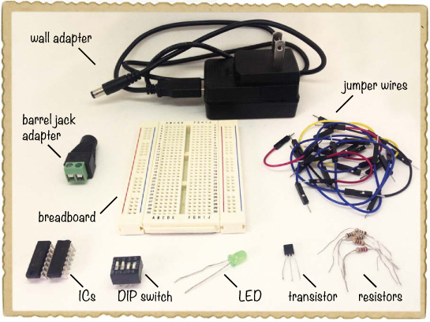

 **一款至少有 30 行的面包板**（Jameco #20601, Bitsbox #CN329）。

 **面包板跳线**（Jameco #2237044, Bitsbox #CN236）——你需要大约 20 根跳线用于这个项目。

 **一款四个独立开关的 DIP 开关**（Jameco #38820, Bitsbox #SW042）。

 **一款带有六个 NOT 门的 74LS04 反相器集成电路**（Jameco #46316, Bitsbox #QU108）

 **一款带有四个与门的 74LS08 集成电路**（Jameco #46375, Bitsbox #QU109）

 **一款通用 NPN 晶体管**（Jameco #254801, Bitsbox #QD011），如 BC547。

 **一款标准 LED**（Jameco #34761, Bitsbox #OP003）

 **一款 220Ω电阻**（Jameco #690700, Bitsbox #CR25220R），用于限制 LED 的电流。

 **四个 1kΩ电阻**（Jameco #690865, Bitsbox #CR251K），用作下拉电阻。

 **一款 5V 直流墙壁适配器**（Jameco #2126125, Bitsbox #TF010）为电路供电。

 **一款 DC 桶形插座适配器**（Jameco #2227209, Bitsbox #CN424）用于将墙壁适配器连接到面包板。

#### 工具

 **一把适配桶形插座适配器螺丝端子的螺丝刀**。

#### 如何在面包板上使用其他电压

到目前为止，你为本书中的每个电路使用了 9 伏电池，但大多数数字电路需要使用较低电压。例如，许多内部包含逻辑门的集成电路使用的是 5 伏电压。然而，5 伏并不是标准的电池电压；虽然有 4.5 伏和 6 伏电池，但没有 5 伏电池。

当你的电路需要 5 伏电压时，你该怎么办？向*墙壁适配器*和*桶形插座适配器*问好吧。

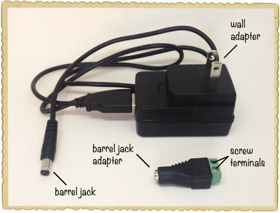

许多电子设备使用墙壁适配器来为电池充电或保持电力。墙壁适配器的一端插入墙壁插座，另一端插入你想要供电的设备。墙壁适配器有许多不同的电压，本项目使用的是 5V 直流稳压适配器。

为电路供电时，本项目中的墙壁适配器需要插入一个桶形插座适配器。本项目购物清单中列出的桶形插座适配器（第 224 页）有两个*螺丝端子*，你可以将跳线插入这些端子并连接到面包板。你可以将任何带有标准圆形插头的墙壁适配器插入这个桶形插座适配器。

**使电路更可靠**

如果电路需要一个输入电压，但你没有连接任何东西到这个输入端，那么这个输入就是*悬空的*。悬空输入是不可靠的，因为电路可能会把它当作 1 或 0，而你无法控制是哪一个。

DIP 开关上的每个开关要么是断开的，要么是闭合的。当开关断开时，如果没有连接到其他任何东西，控制的输入将会处于浮动状态。为了解决这个问题，你可以在每个逻辑门输入端接一个 *下拉电阻*，如下所示：

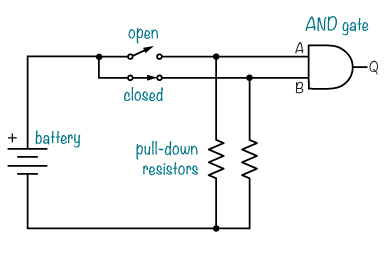

本电路图中的每个下拉电阻一端连接到开关和门输入，另一端连接到负电池端。当开关断开时，电阻将“拉”门输入至 0V（即 0）。当开关闭合时，门输入连接到正电源端，得到正电源电压（即 1）。

在本项目的电路图中（见 第 224 页），有四个开关，每个开关都配有 1 kΩ 的下拉电阻。它们都显示为断开状态，在这种状态下，所有的与门输入都为 0。

#### 步骤 1：放置开关和电阻

将 DIP 开关插入面包板的顶部，使开关的一侧位于中间缺口的两侧。使用跳线将每个 DIP 开关的左侧连接到左侧的正电源轨，将一个 1 kΩ 电阻从每个 DIP 开关的右侧连接到右侧的负电源轨。

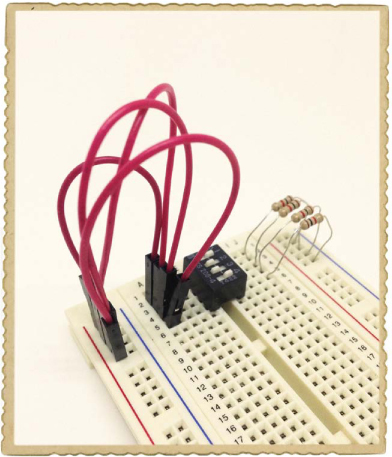

#### 步骤 2：放置集成电路

将带有非门的 IC（标记为 *74LS04*）放置在面包板的中央，将带有与门的 IC（标记为 *74LS08*）放置在更远的位置。对于这两个 IC，将圆形缺口朝向 DIP 开关。底部至少留出三行空白，用于放置晶体管。

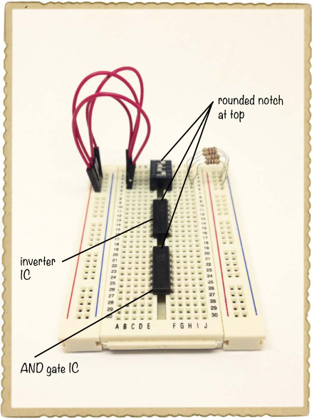

#### 步骤 3：放置晶体管和 LED

将你的晶体管插入面包板底部的三行。如果你使用的是本项目购物单中列出的 BC547 晶体管（见 第 224 页），则将平面朝左放置，使集电极为上引脚，基极为中引脚，发射极为下引脚。如果你使用的是其他 NPN 晶体管，请查看其数据手册，确认各引脚的功能。

将 LED 的短腿（阴极）连接到与晶体管集电极相同的一行。将 LED 的长腿（阳极）连接到面包板左侧的空行。最后，将 220 Ω 的电阻从 LED 的阳极连接到正电源轨。

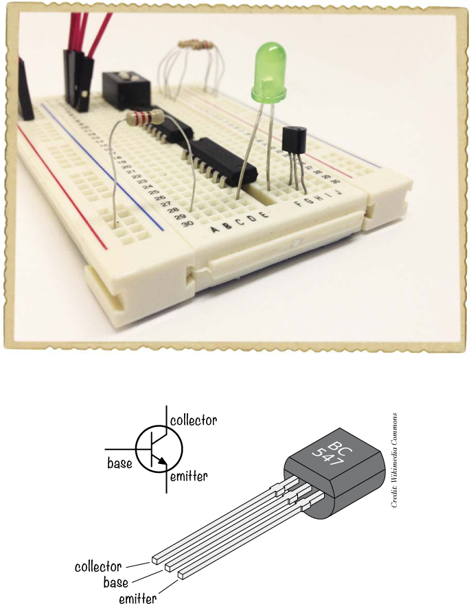

#### 步骤 4：构建逻辑电路

首先，查看下面的电路图，了解与门和非门在你的集成电路 (IC) 中的位置，并查看你需要进行的连接。

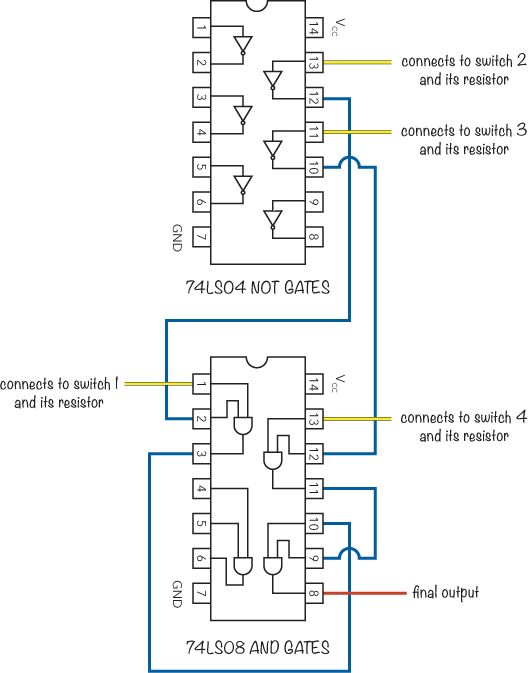

取四根跳线，将它们分别从开关输出连接到逻辑门的输入，如下所示：

 开关 1（最上面的开关）的输出接到下面 IC（74LS08）第 1 引脚的与门输入。

 开关 2 的输出接到上面 IC（74LS04）第 13 引脚的非门输入。

 开关 3 的输出接到上面 IC 的第 11 引脚的非门输入。

 开关 4 的输出连接到下方集成电路第 13 脚的与门输入。

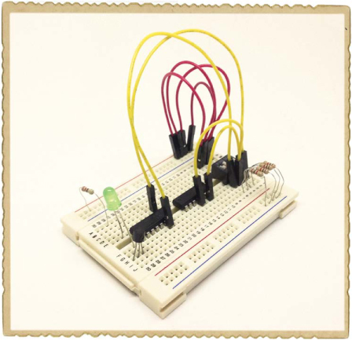

接下来，拿两根跳线，将 NOT 门的输出连接到与门的输入，如下所示：

 一根跳线从上方集成电路的第 12 脚连接到下方集成电路的第 2 脚。

 另一根跳线从上方集成电路的第 10 脚连接到下方集成电路的第 12 脚。

现在，每个与门的输出都需要进入第三个与门，连接如下：

 将一根跳线从第 3 脚连接到下方集成电路的第 10 脚。

 将另一根跳线从第 11 脚连接到下方集成电路的第 9 脚。

 最后，将一根跳线从与门的最终输出连接，另一端暂时悬空。

你的集成电路连接应如下所示：

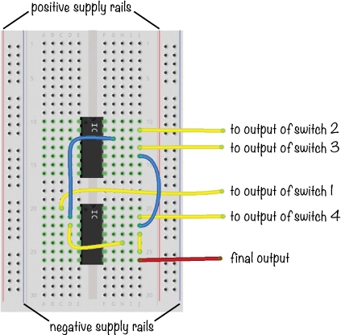

#### 第 5 步：完成晶体管的接线

现在，将最后一个与门的输出——下方集成电路的第 8 脚——连接到晶体管的基极。这个输出将控制晶体管是否允许电流通过到 LED。将一根跳线从晶体管的发射极连接到负电源轨。

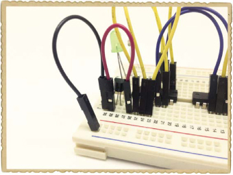

**保护你的元件**

这个电路依赖于门电路只向晶体管基极提供少量电流的事实。当你使用你的秘密代码检查器时，晶体管会完全正常工作，但为了保护晶体管基极免受其他电路中较大电流的损害，你应该在晶体管基极和电流源之间（在这个情况下是与门的输出）放置一个 1 到 10 kΩ的电阻。

晶体管通常也应该在电动机电路中受到保护，就像“更多关于电流、元件和晶体管”中的电路，位于第 222 页。该电路应该可以正常工作，但为了更安全，最好在电动机两端并联一个二极管，阴极接在正极端。这样可以保护晶体管免受电动机关闭时可能发生的高压脉冲的损害。

#### 第 6 步：为秘密代码检查器供电并测试

将跳线从两个集成电路的第 14 脚连接到正电源轨，从两个芯片的第 7 脚连接到负电源轨。然后，关闭 DIP 开关上的所有开关，连接你的 5V 电源，正极连接到左侧的正电源，负极连接到右侧的负电源。

使用你的圆形插孔适配器和几根跳线来完成这个连接。圆形插孔适配器应该有+和-的标记，告诉你哪一个是正极，哪一个是负极。只需松开适配器上的螺丝，将一根线插入每个端口，然后再拧紧螺丝。按照常规的颜色编码，使用红色线连接正极，黑色线连接负极，这样你就能确保它们正确地连接到你的面包板上。

当开关关闭时，LED 应该保持暗淡，但当你通过打开顶部和底部开关将代码设置为 1001 时，它应该会亮起。

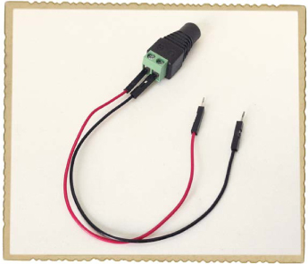

#### 步骤 7：如果 LED 没有亮起怎么办？

首先，检查两个集成电路（IC）是否有电。两个 IC 的 14 号引脚是否连接到正极电源柱，7 号引脚是否连接到负极电源柱？如果你发现集成电路变得过热，无法触碰，请立即断开 5V 电源并等待集成电路冷却下来。然后，确保你正确连接了电源，再次尝试。插入圆形插孔适配器正极（+）端子的线应该连接到面包板上的正极电源柱，而插入圆形插孔适配器负极（-）端子的线应该连接到负极电源柱。

如果 IC 已经通电，但电路仍然无法工作，那么检查开关的输入值。使用万用表测量从负极电源轨到与开关连接的与门（AND）和非门（NOT）引脚的电压。你应该在与门的 1 号和 13 号引脚上测得 5V，在非门的 11 号和 13 号引脚上测得 0V。检查你使用的每个与门的输出是否为 5V；你应该在与门的 3 号、8 号和 11 号引脚上看到 5V。如果任何与门的输出不是 5V，那么它的某个输入就是 0V。找出为什么是 0V，你应该能找到问题所在。

**尝试一下：解除入侵警报**

你可以用一个继电器替代 LED 和电阻，将其连接到秘密代码检查器，并将这个项目与第一章中构建的入侵警报结合起来。通过继电器将 9V 电池连接到入侵警报，这样当你输入正确的代码时，警报的电源被切断，噪音停止。请参考“认识继电器”第 97 页，了解如何连接继电器。

注意，秘密代码检查器使用 5V 电源来控制完全独立的 9V 电源的入侵警报电路。以这种方式连接两个具有独立电源的电路是可以的，因为这两个电路之间没有电气连接。当你需要控制一个不同电源类型的电路时，继电器非常有用！

这是电路：

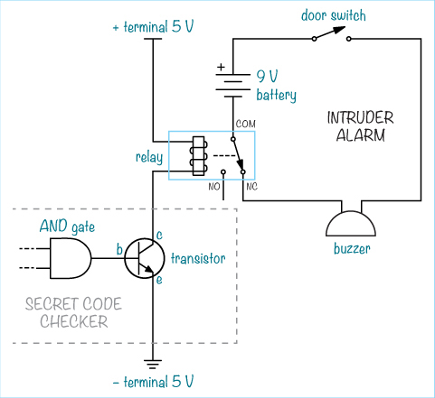

以下是你所需的组件：

 **来自“项目 #2: 入侵警报”的电路，见第 11 页**

 **“项目 #21：秘密代码检查器”中的电路，见 第 223 页**

 **一个 5 V 继电器**（Jameco #842996，Bitsbox #SW073）

### 负逻辑门

AND、OR 和 NOT 是基本的逻辑门，你可以通过组合它们来创建新的逻辑门。让我们来看看通过这种方式创建的另外两个逻辑门。

#### NAND 寻找一个错误的输入

*NAND 门*的工作原理类似于一个带有输出反相器的 AND 门。输出上的小圆圈表示 NOT。这意味着当 A 和 B 都为 1 时，NAND 门的输出为 0。

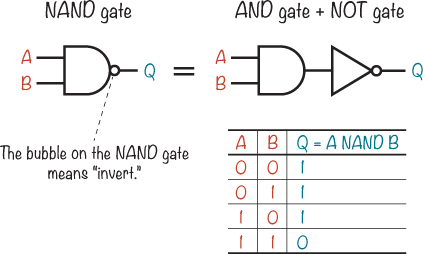

#### NOR 寻找两个错误的输入

*NOR 门*的工作原理类似于一个带有输出反相器的 OR 门。当 A 和 B 都为 0 时，输出为 1。

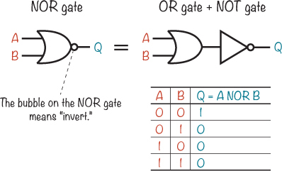

**接下来是什么？**

在这一章中，你学会了如何使用逻辑门来构建“决策”电路，比如判断一个代码是否正确。最后，你还了解了一些负逻辑门。理解负逻辑门的工作原理非常有帮助，因为它们常常用于实际电路中。实际上，你将在第十一章中使用它们。

如果你想进一步探索逻辑门，我建议你尝试在纸上结合你学过的一些逻辑门来创建一个 *XOR 门*。XOR 门只有在输入不同的时候才会输出 1。

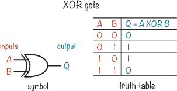

通过以不同的方式组合逻辑门，你几乎可以创造出任何你能想象的东西。不过现在可能有些难以理解，因此在下一章，我将向你展示一些你可以用逻辑门创建的更多构建模块。你将学会如何构建自己的存储电路，然后你还将构建一个电子硬币投掷器！
