## 第十一章：记忆信息的电路

在第九章中，你学习了如何使用开关来存储位。只要开关不改变，位就保持不变。但你必须手动设置开关，这并不是很高效。在第十章中，你学习了逻辑门以及如何利用它们来处理 1 和 0。现在，我将向你展示如何使用逻辑门制作电子存储器，保存位，即使在改变输入后也能保持存储。在本章结束时，你将自己制作一个电子硬币投掷器！

### 一次保存一位

一个简单的存储电路是*SR 锁存器*。你可以通过两个 NOR 门来创建一个 SR 锁存器，并且一个锁存器可以存储一位数据。

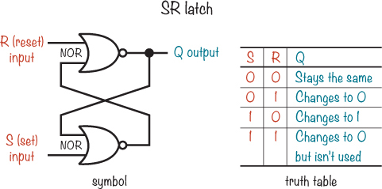

Q 从 0 开始，直到你使用 R 或 S 告诉它更新，电路才会更新其输出，这种方式称为*锁存*位。S 和 R 分别代表*设定*和*重置*：当你设定锁存器时，Q 会变为 1。当你重置它时，Q 会变为 0。如 SR 锁存器真值表所示，你可以通过将 1 置于 S 输入端，0 置于 R 输入端来设定锁存器。要重置它，你需要将 1 放到 R 输入端，0 放到 S 输入端。让我们来看一下如何将 Q 设为 1 的过程。

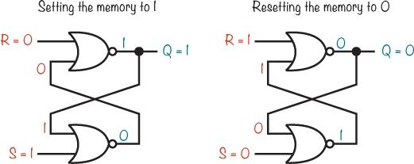

当所有输入为 0 时，NOR 门的输出为 1。当 S（设定）为 1 时，低级 NOR 门的输出为 0，无论该门的其他输入是什么。该输出与另一个 NOR 门的输入相连，同时与 R（重置）一起使用。由于 R 为 0，进入上级 NOR 门的两个输入均为 0，这使得 Q 输出 1。

### 更好的存储电路

如果你在 SR 锁存器中添加几个额外的门，你可以创建一个*D 锁存器*，它会在 C 输入为 1 时，将输出 Q 设置为 D 输入的值。

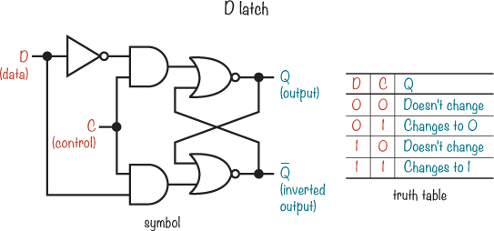

D 锁存器相对于 SR 锁存器有所改进，因为你可以随意更改 D（*数据输入*），而 Q 不会改变，除非你将 C（*控制输入*）设置为 1。下级 NOR 门的输出将始终是输出 Q 的相反值，且该输出标记为  以显示这一点。

### 只有在特定时间改变的记忆

D 锁存器有一个缺点：当 C 为 1 时，改变 D 也会改变输出 Q。如果你不希望输出立即改变，该怎么办？

计算机使用*时钟信号*来告诉电路何时发生某些操作，比如何时存储来自电缆的新数据。时钟信号仅仅是一个连续开关的电压信号——也就是说，它不断在 1 和 0 之间切换。这个信号类似于你在“项目 #16：使用 555 定时器制作你自己的声音”中发送到扬声器的信号，详见第 167 页。

为了减少错误的发生，诸如计算或存储数据等操作只有在时钟信号从关闭切换到开启，或从开启切换到关闭时才会发生。这叫做*边缘触发*。如果电路在时钟信号从关闭到开启时执行某个操作，那么该操作发生在上升沿，电路就是*正边缘触发*的。如果电路在时钟信号从开启到关闭时触发某个操作，那么该电路是*负边缘触发*的。

*触发器*是一个在时钟信号的边缘触发下更新其输出的锁存器，你可以通过将两个 D 触发器和一个 NOT 门组合来创建一个。这叫做*D 触发器*。

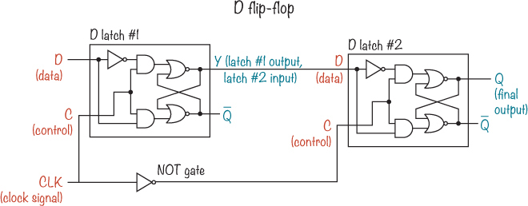

输出电压 Q 只有在 CLK 电压从高变低，从 1 变为 0 时才会改变。下面是如何工作的。

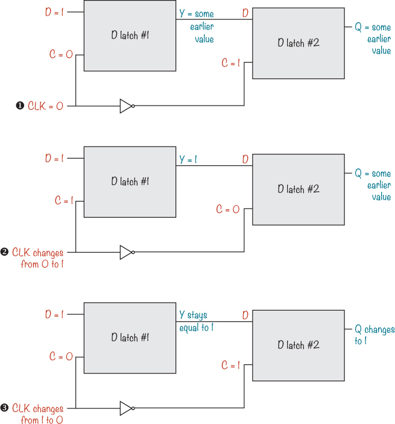

当 CLK 为 0 时，Y 和 Q 不发生变化➊。当 CLK 变为 1 时➋，Y 会改变以匹配 D 触发器#1 的 D 输入。但 NOT 门反转了 1，使得 D 触发器#2 上的 C 为 0，从而 Q 不会变化。当 CLK 回到 0 时➌，D 触发器#2 上的 C 变为 1，Y 的值被保存到触发器#2 中，Q 改变以匹配 Y。

**注意**

*Q 在时钟信号从高电压变为低电压时更新，所以这个触发器是负边缘触发的。*

这是正边缘触发的 D 触发器的电路符号：

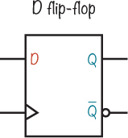

与其写 CLK 作为时钟输入，D 触发器符号上有一个>标记。注意在输出上的气泡。就像 NOT 门符号一样，气泡意味着是 Q 的反向版本。

### 一个切换的输出

通过简单的连接线，你可以将 D 触发器转变为一个切换其他电路开关的电路。例如，假设你想开关一个灯。D 触发器在时钟从低电压到高电压（如果是正边缘触发）时，会存储输入端 D 上的值。如果你将 D 触发器的反向输出连接到 D，那么触发器的输入将始终是 Q 的反向。每当时钟输入触发时，输出将改变为相反的值，灯会切换。

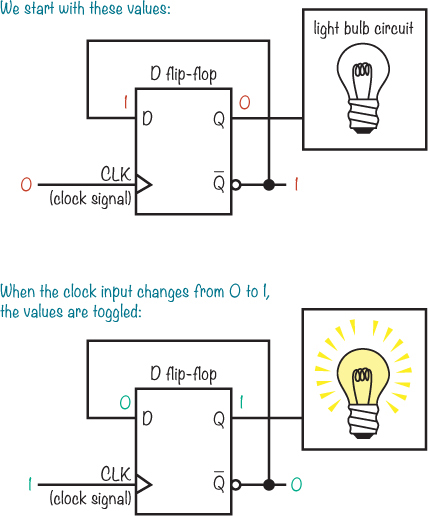

让我们看看这个概念的实际应用！

### 项目#22：电子投币器

对于这个项目，你将构建一个电子投币器，使用 555 定时器、D 触发器、一个按键和两个 LED。

在第八章中，你构建了几个 555 定时器电路，它们会不断地开关电压。一个持续开关电压的电路叫做*振荡器*，在这个项目中，你将使用一个振荡器电路作为输入，来驱动翻转的 D 触发器。你能在这个图中识别出振荡器电路吗？

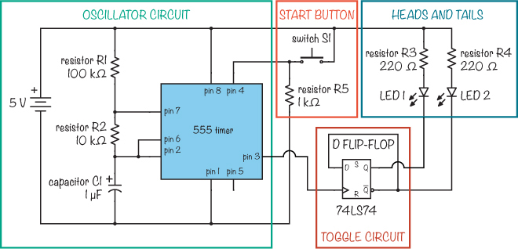

555 定时器振荡电路创建一个时钟信号，该信号传输到 D 触发器，导致输出不断地开关，或*切换*，只要按下按钮，输出就会持续变化。来自 D 触发器的变化输出会控制 LED 的开关。

当你松开按钮时，555 定时器的时钟信号会停止。触发器输出将停止交替，只有两个 LED 中的一个会亮：一个表示正面，另一个表示反面。

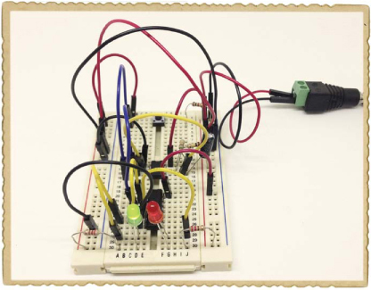

#### 购物清单

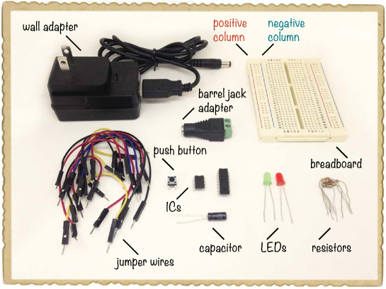

 **一个面包板**（Jameco #20601, Bitsbox #CN329），至少有 30 行。

 **面包板跳线**（Jameco #2237044, Bitsbox #CN236）—你将需要大约 20 根用于这个项目。

 **一个 555 定时器集成电路**（Jameco #904085, Bitsbox #QU001）用于生成输入信号进行计数。

 **一个带有两个 D 触发器的集成电路**（Jameco #48004, Bitsbox #QU193）

 **一个标准绿色 LED**（Jameco #34761, Bitsbox #OP003）

 **一个标准红色 LED**（Jameco #333973, Bitsbox #OP002）

 **两个 220 Ω电阻**（Jameco #690700, Bitsbox #CR25220R）用于限制 LED 的电流。

 **一个 100 kΩ的电阻**（Jameco #691340, Bitsbox #CR25100K）用于帮助设置声音的频率。

 **一个 10 kΩ电阻**（Jameco #691104, Bitsbox #CR2510K）用于帮助设置声音的频率。

 **一个 1 kΩ电阻**（Jameco #690865, Bitsbox #CR251K）用于作为启动按钮的下拉电阻。

 **一个 1 µF 电容**（Jameco #29831, Bitsbox #EC1U063）用于帮助设置声音的频率。

 **一个按钮开关**（Jameco #119011, Bitsbox #SW087）用于“投掷硬币”。

 **一个 5V DC 墙壁适配器**（Jameco #2126125, Bitsbox #TF010）为电路提供电源。

 **一个 DC 圆柱形插座适配器**（Jameco #2227209, Bitsbox #CN424）用于将墙壁适配器连接到面包板。

该电路使用面包板两侧的正负电源列。当我说将组件连接到“左侧”的负或正电源列时，意味着你应该使用面包板左侧的电源列。在两侧，正电源列左侧标有红线，负电源列右侧标有蓝线。

#### 第一步：构建振荡器电路

首先，让我们接线 555 定时器：

1.  将 555 定时器插入面包板中部附近。

1.  将 R1，100 kΩ电阻，从 555 定时器的第 7 引脚连接到右侧的正电源列。

1.  将 R2，10 kΩ电阻，从第 6 引脚连接到第 7 引脚。

1.  将 C1（1 µF 电容）从引脚 6 连接到右侧的负电源列。如果你使用的是带极性标记的电容（如购物清单中建议的电容），请确保将负极连接到负电源列。负极应在电容上标有负号或零。

1.  将一根跳线从引脚 2 连接到 555 定时器的引脚 6。

    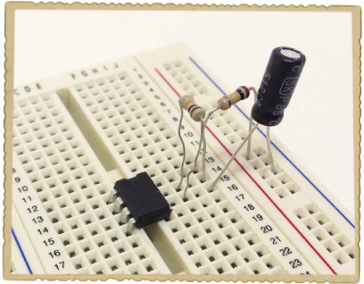

#### 步骤 2：添加启动按钮

现在，将按钮连接在 555 定时器的引脚 4 和正电源列之间，如下所示：

1.  将按钮放置在面包板的最上方，横跨中间的缺口。这样连接后，按钮的一侧应位于最上行，另一侧位于第 3 行。

1.  将一根导线从 555 定时器的引脚 4 连接到按钮的下端引脚（第 3 行）。将一根导线从按钮的上端引脚（第 1 行）连接到左侧的正电源列。

1.  将 R5（1 kΩ 下拉电阻）连接到按钮的下端引脚和右侧的负电源列。

    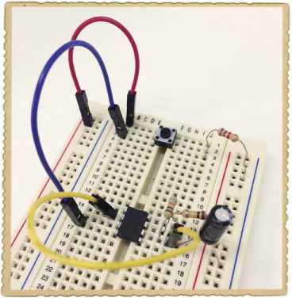

555 定时器也需要供电。将一根跳线从引脚 1 连接到左侧的负电源列。再用另一根跳线将引脚 8 连接到右侧的正电源列。

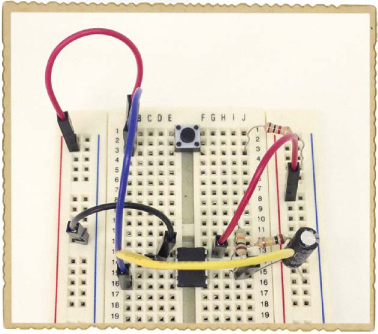

#### 步骤 3：构建切换电路

将标有 *74LS74* 的 D 触发器 IC 放置在 555 定时器的下方，使其横跨面包板的缺口，缺口指向面包板的顶部。此 IC 包含两个 D 触发器，但你只会使用引脚 1 到 6 的 D 触发器。

从 74LS74 D 触发器的引脚 6 上的反向输出  连接一根跳线到引脚 2 的 D 输入。将来自 555 定时器引脚 3 的输出连接到 D 触发器的引脚 3，这里是时钟输入。

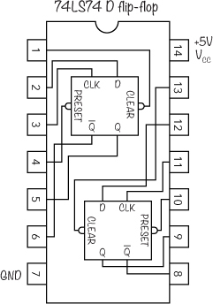

D 触发器也需要供电。将引脚 14 连接到右侧的正电源列，并将引脚 7 连接到左侧的负电源列。

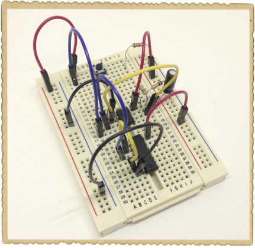

#### 步骤 4：添加正反 LED

在上一个项目中，你使用了一个晶体管从逻辑门输出为 LED 提供电流，因为逻辑门无法提供足够的电流。这个电路面临相同的问题，因为 D 触发器实际上是 IC 中的几个逻辑门，但你可以使用一些技巧绕过这个限制。

74LS74 D 触发器的数据表指出，当输出电压为高时，这个集成电路只能允许约 0.5 mA 的电流流过，而当输出电压为低时，它可以允许 8 mA 的电流流过。（如果你有兴趣自己查看数据表，可以在网上搜索*74LS74 datasheet*。）如果你将 LED 和电阻连接到一侧的正电源列和触发器输出的另一侧，当输出为低时，LED 将获得 8 mA 的电流，点亮它们。将 LED 这样连接可能看起来有些奇怪，而不是连接到负电源列，但这样做可以使 LED 在门的输出为 0 而不是 1 时点亮。

无论 Q 的值是多少，总是与之相反。如果你将 LED 连接到每个输出，一个会亮起，另一个不会。按照如下方式添加正反面 LED：

1.  将两个 LED 插入面包板的底部，将红色 LED 放在中间缺口的右侧，绿色 LED 放在左侧。将较长的引脚（阳极）放在底行，较短的引脚（阴极）放在几行之上。

1.  将一根跳线连接从 D 触发器的第 5 脚到红色 LED 的短脚。然后，再将另一根跳线连接从 D 触发器的第 6 脚到绿色 LED 的短脚。

1.  将一个电阻从每一行的底部连接到两侧的正电源列（电路图中的 R3 和 R4）。

    

#### 第 5 步：抛掷那个“硬币”！

使用跳线将左侧的负电源列连接到右侧的负电源列，同样连接两个正电源列。然后，将两根跳线连接到圆形插孔适配器——将正极连接到一个正电源列，将负极连接到一个负电源列。

最后，首先将墙壁适配器插入圆形插孔适配器，然后再插入墙壁插座。一个 LED 灯应立即亮起。当你按下按钮时，LED 灯应快速交替开关。松开按钮后，只有一个 LED 灯会亮起。

现在，你可以使用这个电路来做决定。例如，假设你问自己：“这个周末我应该出去踢足球，还是应该打棒球？”绿色表示出去踢足球；红色表示打棒球。或者，如果你和朋友在争论谁能吃最后一块饼干，就让硬币抛掷器来决定吧！

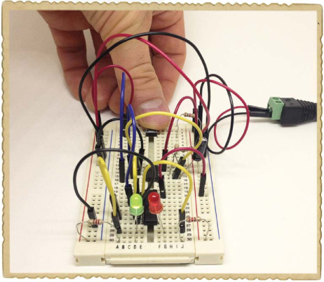

#### 第 6 步：如果硬币抛掷器不起作用怎么办？

首先，检查是否使用的是 5V 墙壁适配器。其他电压可能无法正常工作。

然后，如果一个 LED 亮了，但按下按钮时什么也没有发生，检查 D 触发器是否正确连接。如果没有 LED 亮起，那肯定是 D 触发器和 LED 部分的电路出了问题。仔细对照项目开始时的电路图，检查连接是否正确。如果在确保 LED 和触发器电路正确连接后电路依然无法工作，那么检查一下 555 定时器的连接。

为了帮助你避免相同的错误，我将分享我第一次构建时遇到的问题：

 我将 LED 连接到了 D 触发器的引脚 4 和引脚 5，而不是引脚 5 和引脚 6。

 我将电容连接到了 555 定时器的引脚 5，而不是引脚 6。

 我忘记将左侧的正电源列连接到右侧的正电源列。

**接下来做什么？**

你在本书中已经构建了许多不同的电路！到目前为止，你在电子学方面，无论是理论还是实践经验，都已经打下了坚实的基础。接下来，下一步是专注于你认为有趣的内容。找一个你真正想要构建的项目——然后开始动手做吧！

继续学习的最佳方式是构建大量电路并阅读你感兴趣的任何内容。在线跟随教程，寻找更多关于电子学不同主题的书籍。

在第十二章，即最后一章，我将展示如何构建最后一个项目：一个非常酷的游戏，你需要通过“捕捉”光来测试你的反应速度。之后，我希望你继续探索、玩耍并享受电子学的乐趣。你可以构建的东西还有很多！
