## 第十二章：一起做个游戏吧！

在本书中，你已经构建了各种小电路，每个电路的设计都旨在帮助你学习一个特定的概念。在这一章中，你将结合所有新学到的技能，构建一个反应游戏。游戏包含一排五个 LED，它们依次亮起，从而让光点看起来在来回跑动。

游戏的目标是当光点停在五个 LED 灯的中间时按下停止按钮。这样你能得到 10 分。如果你停在中间旁边的 LED 灯上，你得到 5 分。但如果停在两端的 LED 灯上，你将失去所有分数，并从 0 分重新开始。尽量争取达到 50 分！

你可以独自一人玩这个游戏来练习你的反应时间，或者和尽可能多的朋友一起玩。如果你和朋友们竞争，我建议每个玩家只有一次机会在轮到下一个玩家之前停止光点。

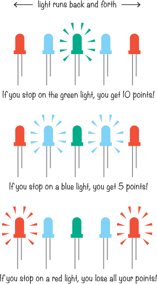

### 认识反应游戏电路

反应游戏将由三个电路组成：

 一个 555 定时器电路，用来决定游戏的速度

 一个控制哪个 LED 灯亮起的计数器

 一个 SR 锁存器，用于添加复位按钮和动作按钮

本节解释了每个电路，但为了帮助你理解它们的电路图，我们先来认识两个新的电路符号。

#### 认识 V[CC]和 GND 符号

电路图并不总是使用像本书中所使用的电池符号。有时，它们会使用*V[CC]*（或*V[DD]*）和*GND*符号代替。

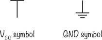

如果电路图或其描述没有特别说明，你可以假设 V[CC]表示电池的正极，而 GND 表示负极或地面。符号有时看起来略有不同，但 V[CC]符号通常显示一根从符号下方连接到电路的导线，而 GND 符号则显示一根从符号上方连接到电路的导线。

在更大的电路图中，比如本章将要构建的电路图，使用这些符号使得电路图更容易绘制和理解。

**为什么叫 V[CC]？**

正电压符号被称为 V[CC]，这是由于旧的命名习惯。V[CC]是指在常见的晶体管电路中，提供给晶体管集电极侧的电压，通常是通过电阻或其他元件提供的。集电极是“CC”名称的来源。

在本书中你一直使用的是双极型晶体管，但还有另一种叫做*场效应晶体管（FET）*的晶体管。这种晶体管中，相当于集电极的引脚被称为*漏极*，因此供应给 FET 漏极的电压叫做 V[DD]。

#### 用 555 定时器设置光点速度

设置反应游戏速度的电路将围绕 555 定时器构建，它与你在第八章中构建的电路类似。这个电路图中的组件将游戏设置为“中等”速度：它既不太快，也不太慢。

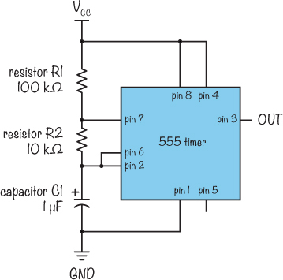

每次 555 定时器的输出从低电平变为高电平时，灯光会向一侧移动一步。555 定时器输出的高电平频率是输出的频率。正如我在第八章中所示，计算 555 定时器输出频率的公式是：

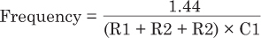

以下来自 555 定时器电路图的数值与该公式相对应：

R1 = 100 kΩ

R2 = 10 kΩ

C1 = 1 µF

将这些值代入公式时，请记住 1 µF = 0.000001 F 和 120 kΩ = 120,000 Ω，你将得到以下结果：

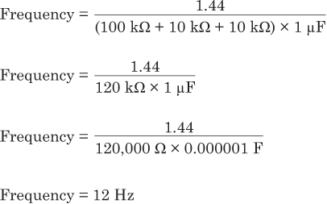

这意味着输出每秒会高电平 12 次，灯光每秒会变化 12 次位置。你可以稍后通过调整 R1、R2 和 C1 的值来加速或减慢游戏。

#### 用于打开 LED 的计数器

为了控制 LED，你将使用一个*十进制计数器*，它是一个计算输入脉冲的集成电路。每次第 14 脚的时钟输入从低电平变为高电平时，计数器会增加 1。它从 0 计数到 9，并且有 10 个输出，标记为 0 到 9。

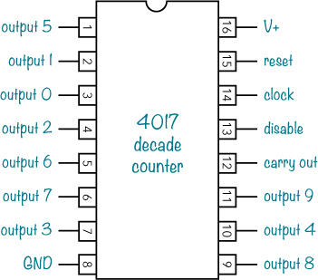

例如，当计数器计数到三个输入脉冲时，输出 3（即第 7 脚）为高电平，其他脚为低电平。如果你将 LED 连接到输出 3，那么当计数器为 3 时，LED 将点亮。

如果你将 LED 连接到几个输出引脚，那么随着计数器的增加，LED 会按顺序打开，依次对应它们的输出引脚。当计数器为 9 并接收到第 10 个输入脉冲时，它会返回 0，并再次按顺序打开输出引脚。

但是，计数器只有在第 13 脚为低电平时才会计数脉冲。这意味着你可以使用第 13 脚来告诉游戏何时开始移动灯光穿过 LED，何时停止灯光。

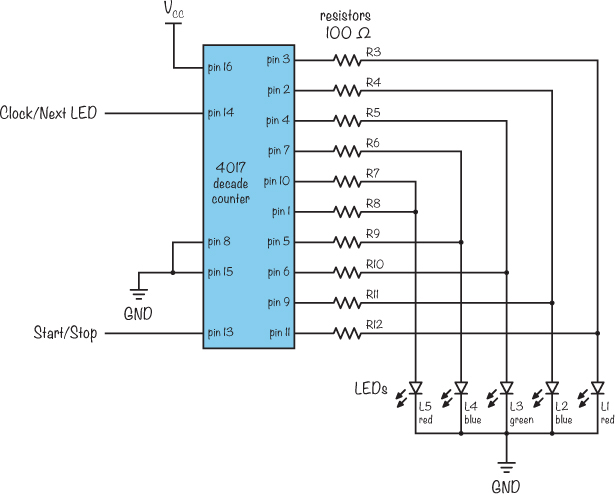

每个输出端口都有一个电阻来减少通过 LED 的电流，确保 LED 不会被损坏。因为两个输出引脚连接到每个 LED，所以电阻器保持每个 LED 的电压较高，即使一个输出为低电平，另一个为高电平。电阻还确保两个输出不会直接连接在一起，这样当一个输出为高电平，另一个为低电平时，不会损坏集成电路。

#### 用于启动和停止灯光的锁存器

你还记得在《每次保存一个比特》中提到的 SR 锁存器吗？它出现在第 240 页上。这个游戏的开始/停止电路是一个类似的 SR 锁存器，但它是由两个 NAND 门构建的。（在第十一章中使用的 SR 锁存器是由 NOR 门构建的。）

SR 锁存器是一个可以记住单个比特的电路。它的输出要么是 0，要么是 1，并且它会保持该数字，直到通过新输入被设置或重置。

你可以通过两个按钮来创建一个电路，告诉锁存器输出什么：一个按钮设置输出为 1，一个按钮设置输出为 0。使用 NAND 门而不是 NOR 门意味着按钮必须将输入拉低，才能输出 1。

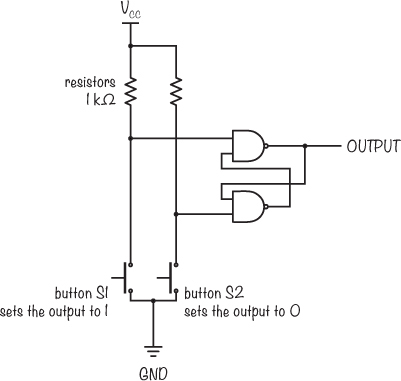

在这个电路中，无论你点击按钮的速度快还是慢都没关系。1 按钮总是将输出设置为 1，0 按钮总是将输出设置为 0。

这非常适合反应游戏！将输出连接到十年计数器的启动/停止引脚，或 13 号引脚，可以为你提供一个启动和停止 LED 的按钮。

### 项目#23：LED 反应游戏

现在是时候将我给你展示的所有部分组装在一起，构建反应游戏了。这个电路有很多连接，但我相信你可以做得到。只要不要着急，慢慢来，在每个步骤后测试电路的每一部分。

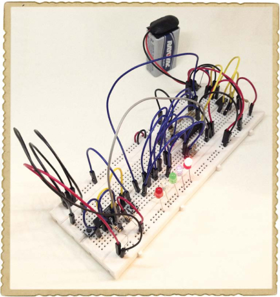

我还建议使用比你在之前的项目中使用的更大的面包板，因为这个电路非常大！

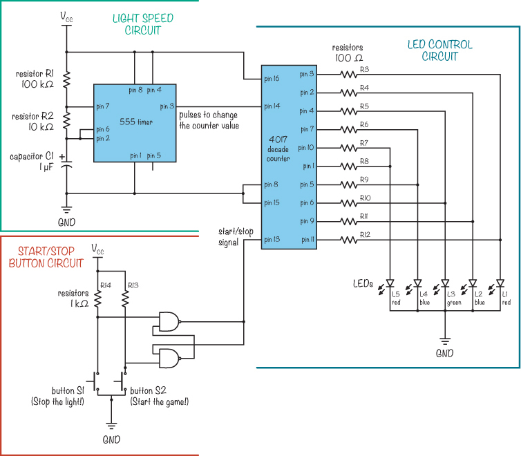

#### 购物清单

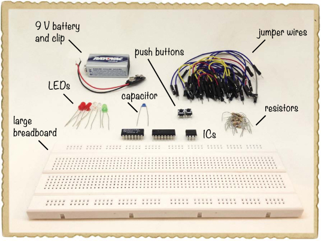

 **一个面包板**（Jameco #2212218，Bitsbox #CN204），至少有 60 排。

 **面包板跳线**（Jameco #2237044，Bitsbox #CN236）——你需要大约 35 根用于这个项目。标准的连接线也可以使用。

 **一个标准的 9V 电池**，为电路供电。

 **一个 9V 电池夹**（Jameco #11280，Bitsbox #BAT033）用于连接电池。

 **一个 555 定时器集成电路（IC）**（Jameco #904085，Bitsbox #QU001）用于产生定时信号。

 **一个 10 kΩ电阻**（Jameco #691104，Bitsbox #CR2510K）用于设置游戏速度。

 **一个 100 kΩ电阻**（Jameco #691340，Bitsbox #CR25100K）用于设置游戏速度。

 **一个 1 µF 电容**（Jameco #768183，Bitsbox #CC006）用于设置游戏速度。

 **一个 4017 十年计数器集成电路（IC）**（Jameco #12749，Bitsbox #QU020），用于控制 LED。

 **两个标准的蓝色 LED**（Jameco #2193889，Bitsbox #OP033）

 **两个标准的红色 LED**（Jameco #333973，Bitsbox #OP002）

 **一个标准的绿色 LED**（Jameco #34761，Bitsbox #OP003）

 **十个 100 Ω电阻**（Jameco #690620，Bitsbox #CR25100R），用于限制 LED 的电流。

 **一个 4011 NAND 门集成电路（IC）**（Jameco #12634，Bitsbox #QU018），用于创建 SR 锁存器以启动和停止游戏。

 **两个 1 kΩ电阻**（Jameco #690865，Bitsbox #CR251K）作为启动/停止电路的上拉电阻。

 **两个按钮开关**（Jameco #119011，Bitsbox #SW087），一个用于重置游戏，另一个用于开始游戏。

#### 工具

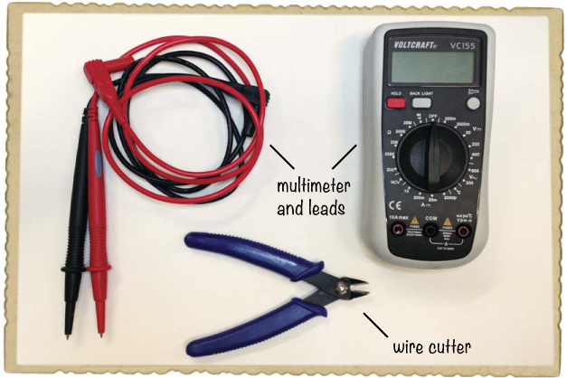

 **一把剪线钳**（Jameco #35482，Bitsbox #TL008）用于剪断小段电线。

 **万用表**（Jameco #2206061，Bitsbox #TL057，Rapid Electronics #55-6662）用于调试电路，如果电路没有正常工作。

#### 步骤 1：搭建 555 定时器电路

将 555 定时器插入面包板的最上端，这样你就可以为电路的其他部分留出空间。然后，根据本项目的电路图将电容和电阻连接到集成电路。项目购物清单中推荐的电容器是非极性电容，因此连接方向无关紧要。如果使用极性电容器，请按照电路图中的正极标记进行连接。

按照我的面包板示意图，使用导线进行必要的连接。

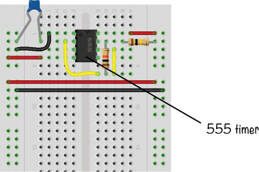

在这个项目中，最好使用两侧的电源列对，以便简化连接并保持电路整洁。我在本项目的购物清单中推荐的面包板没有蓝色和红色标记，但正负电源列与带条纹的面包板相同。面包板的左右两侧各有一对电源列。正电源列是每对中的左列，负电源列是每对中的右列。使用红色导线将一侧的正电源列与另一侧的正电源列连接，使用黑色导线将负电源列连接到另一侧的负电源列。

按照我的指示，将 555 定时器电路中应连接到 V[CC]的部分连接到正电源列，将应连接到 GND 的部分连接到负电源列。

**注意**

*该电路将 555 定时器连接为稳定模式，类似于第八章中的 555 定时器电路。请阅读“了解 555 定时器”（第 164 页）以了解该 IC 的具体工作原理。你还可以构建第八章中的项目来练习使用 555 定时器。*

在继续下一步之前，通过如下连接 LED 和电阻到 555 定时器的输出端，检查电路是否正常工作：

1.  将 LED 的负极（短脚）连接到 555 定时器的输出端（引脚 3）。

1.  将 LED 的正极（长脚）连接到 100 Ω电阻，再将该电阻的另一端连接到正电源列。

1.  按照惯例，将电池夹连接到某一对电源列中。然后插入电池，检查电路是否工作。

如果你的 LED 闪烁得非常快，那么你可以继续下一步。如果没有，重新检查你的连接，找出错误所在。

当你确认 555 定时器电路正常工作时，拔掉 LED、100 Ω电阻和电池夹。

#### 第 2 步：构建 LED 控制电路

现在，你将连接 4017 十进制计数器、电阻和 LED。连接很多，确保耐心，一步步完成。

将 4017 十进制计数器插入面包板，使十进制计数器的中部大约位于第 20 行，芯片标记朝上，指向第 1 行。然后，取出五个 LED 和十个 100 Ω电阻。

将每个 LED 的负极（短脚）连接到右侧的负电源列，将每个正极（长脚）连接到右侧组件区的空行中。将绿色 LED 放在中间，两个蓝色 LED 放在绿色 LED 的两侧，红色 LED 分别放在两端。

接下来，连接十个 100 Ω电阻。在电路图中，注意到 4017 十进制计数器的第 1 到第 7 脚以及第 9 到第 11 脚每个都连接到一个电阻的一端。每个电阻的另一端需要单独位于一个行上。小心确保电阻的引脚不会意外接触在一起。请查看以下面包板电路，看看我如何连接它们：

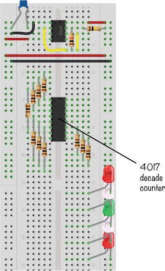

现在，将 LED 连接到 4017 十进制计数器上的电阻，并根据电路图将十进制计数器电路连接到 555 定时器电路。跳线是完成这些连接的最佳方法。

从每个电阻引出一根跳线，连接到对应的 LED。查看电路图，注意到例如，连接到 4017 十进制计数器第 4 脚的电阻的另一端应该连接到绿色 LED 中间的正极。查看电路图中的引脚，找出每个电阻应该连接到哪个 LED。

将 4017 十进制计数器的第 8 脚和第 15 脚连接到负电源列，并将第 16 脚连接到正电源列。使用一根导线将 555 定时器（第 3 脚）的输出连接到 4017 十进制计数器（第 14 脚）的时钟输入。

确保你的电源列中有正负电源连接。建议使用的面包板在本项目的购物清单中（第 267 页）将电源列分为两部分，一部分在上方，一部分在下方。只需将左侧的上半部分和下半部分用导线连接起来，如图所示。右侧也做同样的操作。或者，使用两根跳线将左侧的列连接到右侧的列。

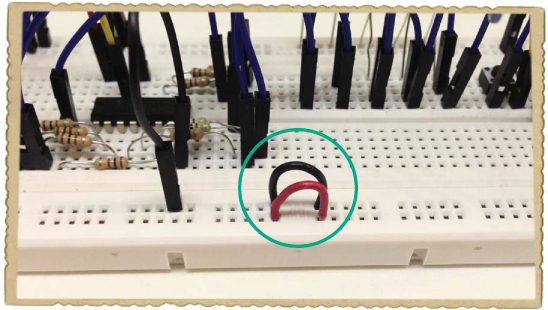

你可以使用跳线，也可以像我在这张照片中做的那样，剪下一小段导线。然后，使用两根长跳线将左下角的电源列与右下角的两个电源列连接起来。当你完成连接两个电路和所有电源列后，面包板应该像这样：

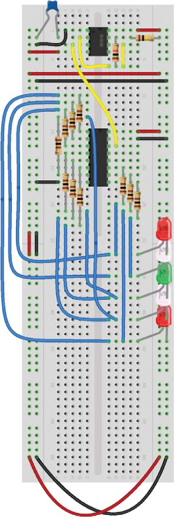

在构建电路的下一部分之前，检查你的 LED 控制电路是否正常工作。测试时，只需将 4017 十进制计数器的 13 号引脚——即“禁用”引脚——通过跳线连接到负电源列，然后像往常一样将电池夹和电池插入面包板。你应该能看到一盏灯在 LED 阵列中来回“跑动”。

如果没有 LED 亮起，首先检查 4017 十进制计数器是否正确连接，凹槽应朝上。连接芯片时弄错方向是个常见错误，我也犯过好多次！

接下来，检查 4017 十进制计数器的 16 号引脚是否连接到正电源列，8 号和 15 号引脚是否连接到负电源列。同时，确认你已将 LED 的短脚连接到负电源列。

如果有些 LED 正常工作而有些不亮，或者灯光来回不平稳，检查所有电阻器和跳线的连接，找出故障所在。

在验证你的电路正常工作后，移除连接 4017 十进制计数器 13 号引脚到负电源列的导线，并断开电池与面包板的连接。

#### 第 3 步：构建启动和停止电路

这个项目的最后一部分是启动和停止 LED 的按钮电路。现在进行这些连接：

1.  在面包板底部的凹槽处连接一个按钮。将 4011 NAND 门 IC 插入面包板，距离按钮几行的位置。确保 IC 的标记朝向面包板的第 1 行。

1.  将第二个按钮放在 IC 的右侧组件面上方，确保用手指可以轻松触及。

1.  按照电路图连接两个电阻器，R13 和 R14。然后，使用跳线完成 SR 锁存电路中剩余的连接，连接正负电源列到 NAND 门 IC（分别为 14 号和 7 号引脚），并将 NAND 门 IC 的 11 号引脚通过导线连接到 4017 十进制计数器的 13 号引脚。

将你的连接与以下图片进行比较。

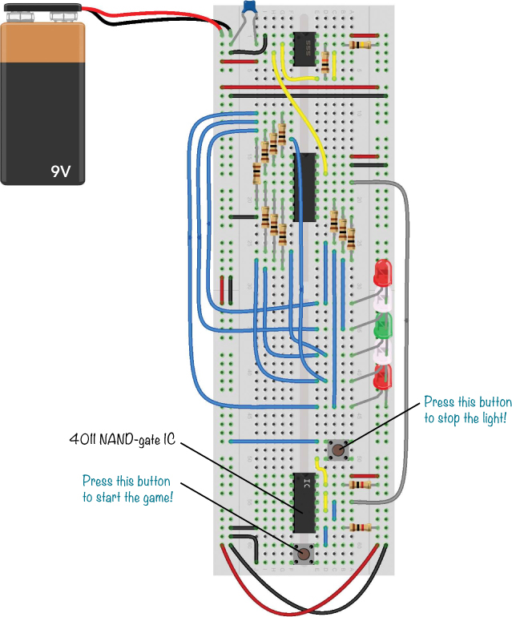

#### 第 4 步：练习你的反应时间！

剩下的就是将电池连接到电源列。面包板底部的按钮是重置按钮，用它来开始游戏并在每个玩家尝试停止灯光后重新启动游戏。

位于 LED 旁的按钮应该在游戏运行时停止灯光。看看你需要多少回合才能达到 50 分！

#### 第 5 步：如果游戏无法正常运行怎么办？

如果你按照我的指示操作，步骤 1 和步骤 2 中的电路应该已经工作。如果你的电路没有工作，那么剩下的错误来源就是你刚刚建立的起停电路和这个电路到 4017 十进制计数器的连接。

##### A. 检查连续性

首先，检查正负电源列之间是否有短路。为此，使用万用表的*连续性*功能。连续性测试用于检查电路中两点之间是否存在直接连接。连续性测试仪的符号通常如图所示。

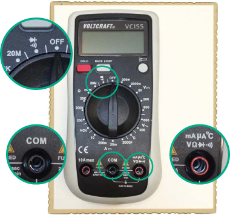

你不希望正负电源列之间有直接连接，因为这会导致电池短路并停止游戏运行。使用连续性测试仪检查是否有短路。

将万用表的调节盘旋转到连续性符号的位置。将黑色测量表笔插入万用表的 COM 插孔，红色测量表笔插入万用表的 V 插孔。将黑色和红色测量表笔尖端相互接触，应该会听到蜂鸣声，表示存在直接连接。

**注意**

*许多电子爱好者也称连续性模式为*蜂鸣模式。

##### B. 检查坏的和正常的蜂鸣声

现在，将电池夹正常插入面包板，但不放入电池。将一根测量表笔的尖端接触正极连接器，另一根接触负极连接器。如果听到蜂鸣声，则表示存在短路，需要修复！检查所有连接到正负电源列的连接。

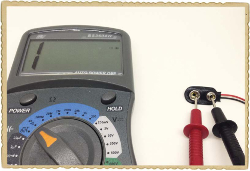

接下来，检查 4011 NAND 门 IC 的第 11 脚与 4017 十进制计数器的第 13 脚之间的连接，确保它们正确连接。使用连续性测试仪通过小心地触摸 IC 引脚上的表笔尖端来检查连接是否存在。IC 引脚之间的间隙很小，因此要小心确保每个表笔尖端仅接触正确的引脚。这次，听到蜂鸣声是一个好兆头。

##### C. 检查电源

如果与 NAND 门 IC 的连接正确，使用万用表测量起停电路的输出电压，检查它是否正常工作。将万用表设置为测量电压。确保黑色测量表笔连接到万用表的 COM 插孔，红色测量表笔连接到 V 插孔。

将万用表的黑色表笔尖端接触电池的负极，将红色表笔接触 4011 NAND 门 IC 的第 11 脚。按下停止按钮后，你应该看到一个高信号——大约 9V——按下启动按钮后，应该看到一个低信号——大约 0V。如果没有，请检查 SR 锁存器电路的连接以找出错误。

**尝试一下：改变灯光的速度**

要改变游戏的速度和难度，可以尝试调整 555 定时器周围 R1、R2 和 C1 的不同值。较小的值会使游戏加速，较大的值则会让游戏变慢。可以翻到 “如何设置 555 定时器的输出速度” 章节，查看 第 166 页 上的计算方法，以根据你想要的频率来确定具体的电阻和电容值。请注意，R1 不应小于 1 kΩ，因为较小的值可能会损坏 555 定时器。

如果你想在游戏进行时调整难度怎么办？只需将电阻 R2 替换为一个可调电位器。然后你可以通过旋转电位器的轴来改变电阻值，从而调整速度！

### 给你的游戏添加蜂鸣器

恭喜你：你已经完成了书中的最后一个项目！现在，决定接下来做什么就交给你自己了。如果你不知道从哪里开始，为什么不在你的反应游戏中加入更多电路呢？

中间的 LED 是你希望灯光停留的位置，我建议添加一个声音电路，让击中目标时更有趣。你可以使用像 “项目 #2：入侵者报警器” 中所示的那种主动蜂鸣器，正如这个部分电路图所示。

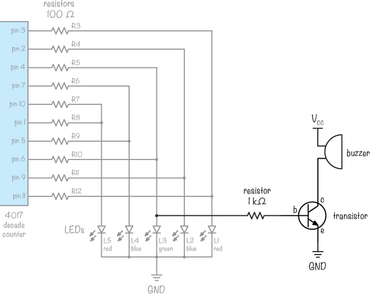

这个电路图中较暗的部分显示了你需要的新组件，以便在反应游戏项目中添加蜂鸣器。较浅的部分则是原始电路图的一部分。

将中间 LED 的正极通过 1 kΩ 电阻连接到 NPN 晶体管的基极。然后将蜂鸣器连接到晶体管的集电极。将电池的正极连接到蜂鸣器的另一端，电池的负极连接到晶体管的发射极。

你应该制作一个电路，每次灯光经过中间的 LED 时会发出一个小蜂鸣声。如果你能让灯光停在中间的 LED 上，蜂鸣器应该连续发出声音，表示你已击中主要目标。

当你根据自己的喜好定制了游戏后，可以将它焊接到一个原型板上。也许你还想将它放进一个漂亮的盒子里，隐藏住电子元件，只展示按钮和 LED 灯。

**接下来做什么？去做一些酷东西吧！**

我真高兴你把这本书读完了！希望你喜欢这些项目，并且继续用电子技术做一些酷东西。一个很好的练习方法是，找一个有趣的电路图，购买组件，自己动手做这个电路。你几乎可以在网上找到任何电路图。

我还想邀请你继续在我的网站上学习，* [`www.ohmify.com/`](http://www.ohmify.com/)*。你可以观看视频课程，阅读各种项目教程，还可以访问讨论论坛，在那里你可以提问并与来自世界各地、同样喜欢做电子的朋友们互动。

只需确保获得父母的许可才能加入该网站，因为它是基于订阅的。如果他们同意，请使用以下链接以获取仅限本书持有者的特别优惠：*[`ohmify.com/e4k/`](http://ohmify.com/e4k/)*。

另外，务必查看第 286 页上的“在线资源”——你会在这些网站上找到大量教程和更多可以搭建的电路。玩得开心！
