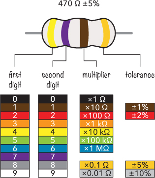
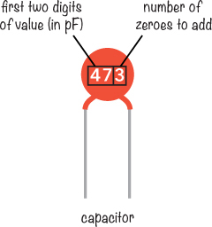
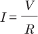
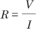
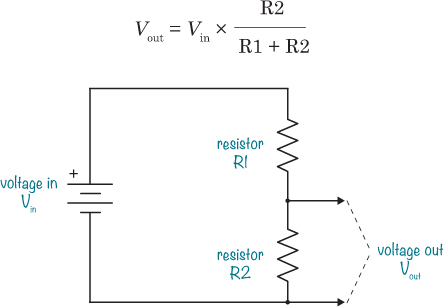

## 第十三章：实用资源

这是一些在构建电子项目时会用到的资源。比如当你需要查找某个电阻器的颜色带所代表的含义时，可以作为参考。我还列出了一些网站，供你继续学习并发现更多项目可供构建。

### 组件和单位值备忘单

本书中将使用大量组件，解读这些组件的方式与组件类型一样多。这里有一些实用的备忘单，可以帮助你解读电阻器和电容器，并帮助你记住像电压和电流的单位前缀是什么意思。

#### 电阻器颜色代码

本书中的大多数电阻器都有四个颜色带。要确定电阻器的值，只需查找其颜色并按照下表中的方式进行相乘。例如，要得到 470Ω，你需要将黄色和紫色带表示的数字 47 乘以棕色带表示的 10。有关电阻器的更多细节，请参阅 “认识电阻器” 章节中的 第 70 页。

#### 电容器代码

在下面的表格中，我列出了最常见的电容器代码。使用陶瓷或钽电容器时请参考此表，因为与本书中使用的电解电容器不同，这些电容器不会直接标出其电容值。

| **代码** | **皮法（pF）** | **纳法（nF）** | **微法（µF）** |
| --- | --- | --- | --- |
| 101 | 100 | 0.1 | 0.0001 |
| 102 | 1,000 | 1 | 0.001 |
| 103 | 10,000 | 10 | 0.01 |
| 104 | 100,000 | 100 | 0.1 |
| 105 | 1,000,000 | 1,000 | 1 |

如果你有一个电容器，其代码与这里列出的不同，你可以通过取前两位数字并加上第三位数字的零的数量来找到其皮法值。

在这个例子中，电容器的代码是 473。取前两位数字 47，并加上第三位数字 3 指定的零的数量。这样得到 47,000 pF，也就是 47 nF，或 0.047 µF。

#### 标准前缀

在构建电子项目时，和许多科学领域一样，我们有时需要处理非常小或非常大的数字。幸运的是，国际单位制（SI）有一套标准前缀，使得这些数字更容易书写。前缀是乘数，如表所示。

| **前缀** | **名称** | **乘数值** | **示例用法** |
| --- | --- | --- | --- |
| p | 皮法 | × 0.000 000 000 001 | 电容值（例如：47 pF 电容） |
| n | 纳 | × 0.000 000 001 | 电容值（例如：100 nF 电容） |
| µ | 微法 | × 0.000 001 | 电容值（例如：10 µF 电容） |
| m | 毫 | × 0.001 | 电路中的电流（例如：20 mA 电流） |
| - | - | × 1 | 电压通常没有前缀（例如：9 V 电池） |
| k | 千 | × 1,000 | 1,000 以上的电阻值（例如：10 kΩ 电阻） |
| M | 兆 | × 1,000,000 | 文件大小（例如：2MB 照片） |
| G | 吉 | × 100,000,000 | 文件大小（例如：1GB 视频） |
| T | 太 | × 1,000,000,000,000 | 硬盘大小（例如：2TB 硬盘） |

### 欧姆定律快速回顾

欧姆定律是计算电路中值的一个非常重要的部分，你在构建更多项目时会不断使用它。每当你需要回顾如何计算电路中的电压、电流或电阻时，只需翻到这一节。

| *V* = *I* × *R* | 电压（以伏特计）等于电流（以安培计）乘以电阻（以欧姆计） |
| --- | --- |
|  | 电流（以安培计）等于电压（以伏特计）除以电阻（以欧姆计） |
|  | 电阻（以欧姆计）等于电压（以伏特计）除以电流（以安培计） |

在欧姆定律公式中，必须使用伏特（V）、安培（A）和欧姆（Ω），因此记得在必要时转换单位：1 mA = 0.001 A 和 1 kΩ = 1,000 Ω。

### 一个基本的电压分压电路

电压分压器是一个非常有用的电路，例如，当你有一个基于电阻的传感器时，比如温度传感器热敏电阻，或者光敏电阻，感应光线时，可以使用这个电路。查看 “项目 #15：构建一个日出唤醒警报” 第 148 页 中的项目，了解如何使用这种电压分压器。你还可以利用电压分压器的知识，计算电路中的电压，从而了解电路中的运行情况。

当你有两个电阻串联时，它们会形成一个电压分压器。输入电压会在这两个电阻之间分配，输出电压（跨越 R2）由以下公式给出：

### 在线电子商店

在本书中，我推荐了一些可以购买零件的商店，但这些并不是世界上唯一优秀的电子商店！你也可以尝试以下这些商店：

 Adafruit (美国) *[www.adafruit.com](http://www.adafruit.com)*

 DigiKey (美国) *[www.digikey.com](http://www.digikey.com)*

 Jameco (美国) *[www.jameco.com](http://www.jameco.com)*

 SparkFun (美国) *[www.sparkfun.com](http://www.sparkfun.com)*

 Bitsbox (英国) *[www.bitsbox.co.uk](http://www.bitsbox.co.uk)*

 Quasar Electronics (英国) *[www.quasarelectronics.co.uk](http://www.quasarelectronics.co.uk)*

 Rapid Electronics (英国) *[www.rapidonline.com](http://www.rapidonline.com)*

 Spiratronics (英国) *[www.spiratronics.com](http://www.spiratronics.com)*

 Farnell (全球) *[www.farnell.com](http://www.farnell.com)*

 Protostack（澳大利亚） *[www.protostack.com](http://www.protostack.com)*

 Seeed Studio（中国） *[www.seeedstudio.com](http://www.seeedstudio.com)*

 Tayda Electronics（泰国，美国） *[www.taydaelectronics.com](http://www.taydaelectronics.com)*

### 在线资源

当你读完本书后，你可以继续在网上学习电子学。（先问问你的父母！）你会在以下网站找到大量有趣的教程和其他项目：

**Adafruit (*****[`learn.adafruit.com/`](https://learn.adafruit.com/)*****)**   提供许多基于他们销售的组件的指南。

**Build Electronic Circuits (*****[`www.build-electronic-circuits.com/`](http://www.build-electronic-circuits.com/)*****)**   我的个人博客，发布关于电子学的教程、视频、文章等。我还提供一个免费的通讯，里面有很多有用的项目小窍门和技巧。

**电子俱乐部 (*****[`www.electronicsclub.info/`](http://www.electronicsclub.info/)*****)**   这是一个供任何希望学习电子学或制作简单项目的人使用的网站，由本书的技术审阅者 John Hewes 创建和维护。

**Ohmify (*****[`www.ohmify.com/`](http://www.ohmify.com/)*****)**   我的在线学习平台，提供课程、项目教程、讨论论坛等。你可以获得很酷的逐步项目教程，提问、结交朋友并学习。拥有本书的读者可以通过访问 *[`www.ohmify.com/e4k/`](http://www.ohmify.com/e4k/)* 获得特别优惠。

**SparkFun (*****[`learn.sparkfun.com/`](https://learn.sparkfun.com/)*****)**   提供许多基于他们销售的组件的指南。

你也可以访问本书的官方网站 ***[`www.nostarch.com/electronicsforkids/`](https://www.nostarch.com/electronicsforkids/)***，获取更多资源、更新等。
